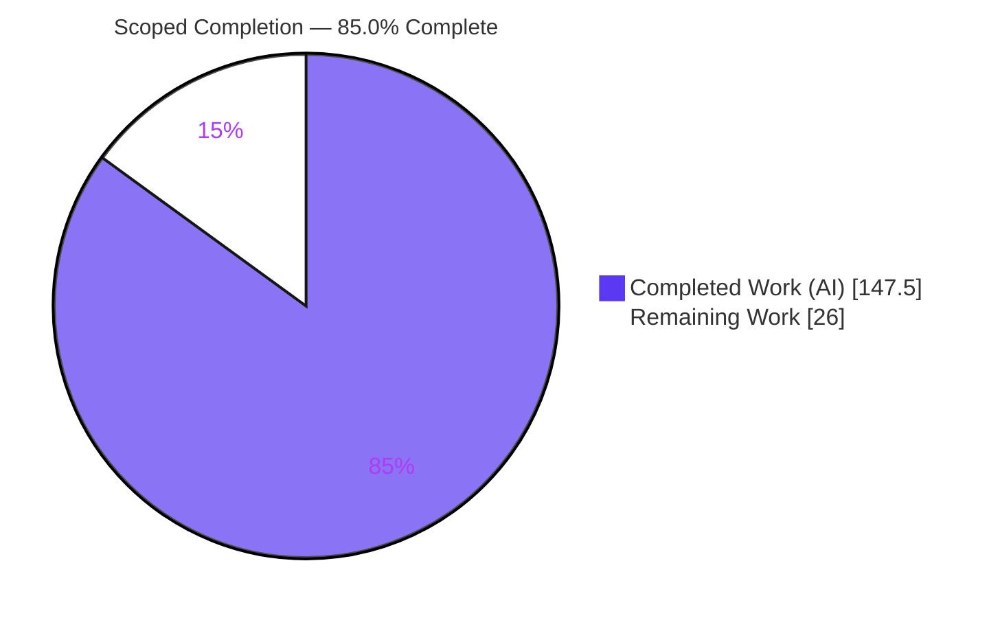
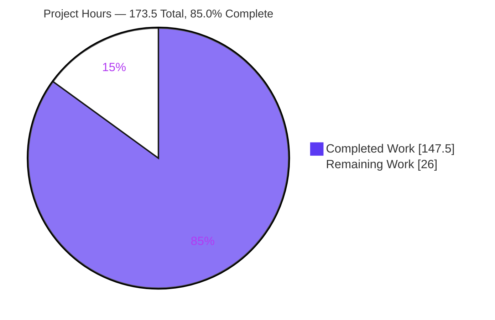
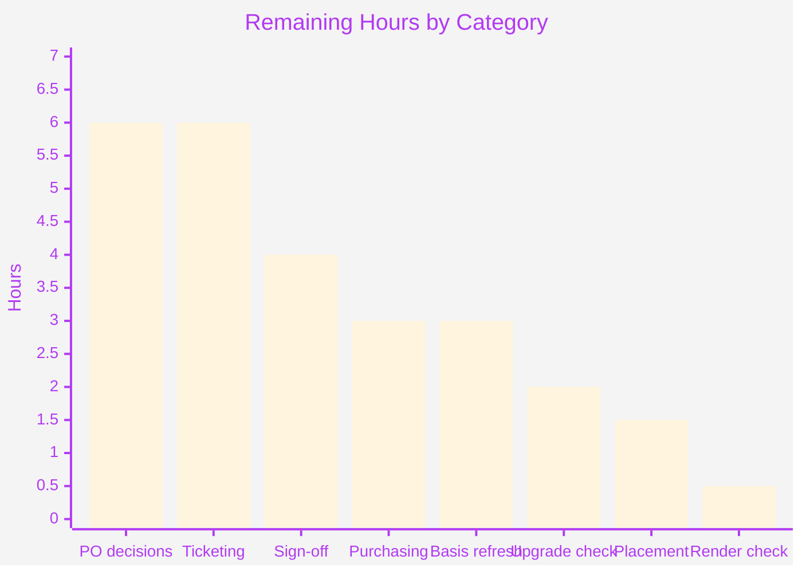

# 1. Executive Summary

## 1.1 Project Overview

This project delivers a discovery-and-scoping Product Requirements Document for buyer reorder and replenishment on your Vendure commerce platform at version 3.7.0. It exists so a Product Owner can decide what to build without first learning the platform: it proposes twenty-two identifier-stable requirements across seven capability areas, and reports, with resolvable evidence, what building them would disturb. The deliverable is one Markdown file, `product/PRD-001-reorder-and-replenishment.md`. No source code, configuration, dependency or existing document was changed — the surrounding repository is byte-for-byte as it was.

## 1.2 Completion Status



| Metric | Value |
|--------|-------|
| **Total Hours** | **173.5** |
| Completed Hours (AI + Manual) | 147.5 (147.5 AI + 0 manual) |
| Remaining Hours | 26.0 |
| **Percent Complete** | **85.0%** |

Calculated as 147.5 ÷ (147.5 + 26.0) × 100 = 85.0%. Scope is the agreed deliverable plus the path to production for a decision-support document; implementing the twenty-two proposals is a separate future project and is excluded.

## 1.3 Key Accomplishments

- ✅ The deliverable is complete and passes every acceptance gate: 43 checks run, 43 passed.
- ✅ Twenty-two proposals, REQ-001 to REQ-022, each with a served persona, one origin and identifier-only dependencies — no gaps, duplicates or dangling references.
- ✅ Seven impact headings, each answered with evidence rather than a hedge.
- ✅ 91 cited repository paths and 420 line locators, all resolving in this checkout.
- ✅ Five buyer journeys including the failure and partial-success path.
- ✅ Six decidable questions, each with options, buyer impact, a recommendation and a blank answer line.
- ✅ A 2,970-word body in product language — no identifier, path, diagram or invented figure in it.
- ✅ The document validates itself: its protocol is on the page for the next editor to re-run.

## 1.4 Critical Unresolved Issues

| Issue | Impact | Owner | ETA |
|-------|--------|-------|-----|
| Six open questions block 21 of the 22 proposals | No requirement except REQ-004 can be built until these are answered | Product Owner | 6h decision session |
| Implementation must start on a later release than the one analysed | Two published advisories land on order-line write authorisation and channel scoping — the two mechanisms this capability leans on most (see 5.2, DV-8) | Engineering lead | 2h verification |
| Two of the three deferrals rest on a purchasing decision | Account-level list sharing and quote/approval flows sit in a commercial layer above the open platform, not in core | Product Owner | 3h |
| Findings are pinned to one commit, already behind the published line | Platform-dependent findings drift as upstream moves; nothing signals it automatically | Engineering lead | 3h refresh |
| Four contradictions in existing documentation are reported, not corrected | Reported inside the deliverable because the scope permits one file; the underlying files still disagree | Documentation owner | 1.5h |
| The body has 30 words of headroom against a hard ceiling | Any future edit must be word-neutral or pay for itself out of the three compressible sections | Documentation owner | Ongoing |

## 1.5 Access Issues

| System/Resource | Type of Access | Issue Description | Resolution Status | Owner |
|-----------------|----------------|-------------------|-------------------|-------|
| Repository build toolchain | Local tooling | The pinned package manager and installed dependencies are absent, so no build, lint or test script of the repository can run | Not required — this deliverable has no build step, and installing would rewrite the lockfile | Engineering lead |
| Automated validation of the deliverable's path | CI configuration | No continuous-integration job matches `product/**`, so every check runs on demand rather than automatically | Open — covered by the placement decision in 2.2 | Documentation owner |
| Nine cited published sources | External network | Reachable and substantiating at the recorded retrieval date; no repository command can re-verify a third-party page | Accepted — each carries a date so drift is detectable | Engineering lead |
| Destination wiki or content system | Not available here | Paste fidelity was confirmed on a local render, not on the destination surface | Open — 0.5h in 2.2 | Documentation owner |

No repository permission, credential or third-party API access issue exists.

## 1.6 Recommended Next Steps

1. **[High]** Answer the six open questions in place, filling the blank answer lines — this unblocks 21 of the 22 proposals.
2. **[High]** Review and sign off the register: origins, personas, sizes, and the three permanent rulings and three deferrals.
3. **[High]** Confirm the platform is on the minimum release the document states before implementation begins, and re-check the two named failure modes.
4. **[Medium]** Take the commercial-layer purchasing decision governing two of the three deferrals.
5. **[Medium]** Convert the signed-off register into build-ready tickets, one capability group at a time in the sequenced order.

# 2. Project Hours Breakdown

## 2.1 Completed Work Detail

Every component below traces to a requirement of the project's scope. The discovery half dominates because the document's *content* is a gap analysis of the platform: each finding had to be read out of the checkout, cited to a path and a line, and re-checked before it could be written down.

| Component | Hours | Description |
|-----------|-------|-------------|
| Commerce-domain repository analysis | 18.0 | Order, cart, customer, stock, money, permission, event, scheduler and error-result surfaces read across 91 paths and both committed schema snapshots |
| Appendices A, B and C | 21.0 | Findings and impact evidence, six architectural decisions with what each blocks, and repository/release conventions |
| Requirement register, journeys and origin traceability | 15.0 | Twenty-two rows with five populated columns, closed-set origins, an acyclic dependency graph, five journeys and six open questions |
| Problem, personas, measures, sequencing, unknowns and provenance | 11.0 | Body sections 1–6 and 14–17, including nine declared unknowns and the self-reported provenance |
| Additive-change constraint analysis | 10.0 | Five distinct ways a visible custom field disturbs an existing call, the escape hatch and its two asymmetries, the exhaustiveness bound, and the change to stored shape each one forces |
| Impact assessment, effort signals, constraints and scope rulings | 10.0 | Seven mandated impact headings each answered with evidence, relative sizing per capability area, seven platform constraints as product consequences, six scope rulings |
| Existing-mechanism inventory and verified negatives | 9.0 | Six shipped mechanisms with the requirement that consumes each, plus the searches proving nothing implements reorder, replenishment, recurrence reporting or reminders |
| Published-source research and declared-target search | 9.0 | Nine dated external sources kept in their own evidence class, and a repository-wide search establishing that no numeric target is declared anywhere |
| Verification-burden, volume and baseline evidence | 8.0 | Four-engine test matrix, the reproducible 27-of-100 affected-specification rule, seed-data reset, and the benchmark inventory with its absent baseline |
| Citation integrity and evidence-class separation | 8.0 | Path-plus-locator on every claim, 91 paths and 420 locators verified, repository and published evidence visibly separated |
| Acceptance-gate execution, hardening and containment verification | 13.0 | The gate suite executed and its result reported on the page, narrower check forms replaced with ones that reject a corrupted copy, and single-file containment proven |
| Precedent survey and delivery-shape assessment | 5.0 | Closeness rating per capability area with explicit negatives where nothing was found |
| Body budget and product-vocabulary discipline | 5.0 | A 2,970-word body held under a hard ceiling with a consistent product vocabulary substituted for every technical term |
| Platform and documentation-estate discovery | 4.0 | Version basis, the 836-file documentation estate and its generator boundary, and the absence of any requirements precedent |
| Rendered-appearance verification | 1.5 | Tables, lists, heading order and absence of visual content confirmed on a local render |
| **Total** | **147.5** | Matches Completed Hours in Section 1.2 |

## 2.2 Remaining Work Detail

| Category | Hours | Priority |
|----------|-------|----------|
| Product Owner decisions on the six open questions | 6.0 | High |
| Convert the signed-off register into build-ready tickets with absolute estimates | 6.0 | Medium |
| Requirement-register review and sign-off (origins, personas, sizes, rulings, deferrals) | 4.0 | High |
| Commercial-layer purchasing decision governing two deferrals | 3.0 | Medium |
| Analysis-basis refresh against the current release line | 3.0 | Medium |
| Upgrade verification to the minimum release before implementation | 2.0 | High |
| Placement and discoverability decision, including how the four reported documentation contradictions are handled | 1.5 | Medium |
| Rendered-appearance check on the destination wiki or content system | 0.5 | Low |
| **Total** | **26.0** | High 12.0 · Medium 13.5 · Low 0.5 |

Implementing the twenty-two proposals is deliberately absent from this table. The document proposes capability and builds none of it, so that work belongs to a separate project whose size cannot be stated until the six questions are answered — which is precisely why the register carries relative sizes rather than hours.

## 2.3 Basis of Estimate

Completed hours were derived per component from the volume and density of evidence actually present in the deliverable — 91 cited paths, 420 verified line locators, both schema snapshots parsed, nine dated external sources — rather than from its length. Verification and citation work accounts for 21 of the 147.5 hours, in the 30–40% band that testing normally takes against the authoring it guards.

Confidence is **high** on the completed side: the artifact is on disk, every claim in it is citable, and every gate is re-runnable. Confidence is **medium** on the remaining side, because six of the eight categories are human decision cycles whose duration depends on the Product Owner's availability rather than on any technical unknown. The two categories that are technical — the basis refresh and the upgrade verification — are bounded by commands the document itself records.

# 3. Test Results

Every figure below was observed by running the checks against the delivered file, from the repository root, three times with identical results. There is no application to exercise here: the deliverable is a structured document, so its test suite is the acceptance protocol recorded inside it — 43 assertions over structure, language, traceability, evidence and containment. All of them are read-only; the working tree and the file's hash were unchanged afterwards.

| Area / Category | Framework | Tests | Passed | Failed | Coverage | What This Proves |
|-----------------|-----------|-------|--------|--------|----------|------------------|
| Mandated coverage | Shell + Python assertion suite | 10 | 10 | 0 | Sections 5, 7, 9, 10, 12, 13, 16 sliced individually | Every element the reader was promised is present where it belongs: seven impact headings, six personas, five journeys, six questions with blank answer lines, seven sizes, six scope rulings, nine declared unknowns |
| Structure & boundary | Shell + Python assertion suite | 7 | 7 | 0 | Whole file, 444 lines | The seventeen sections run in order, one boundary marker separates proposal from evidence, three appendices follow it, and no placeholder survives anywhere |
| Body voice discipline | Shell + Python assertion suite | 7 | 7 | 0 | Extracted body (225 lines) plus whole file | A non-technical reader meets no code identifier, file path, link, diagram, code block or invented figure — all of it is quarantined beyond the marker |
| Register & traceability | Shell + Python assertion suite | 6 | 6 | 0 | All 22 register rows, cell by cell | Requirements are individually addressable and safe to hand-edit: consecutive identifiers, five populated columns, one origin from the closed set, and every dependency resolving to a declared row |
| Repository containment | Shell + Python assertion suite | 5 | 5 | 0 | Working tree, change set from the analysis basis, `product/` | Nothing outside the one intended file changed — the surrounding platform is untouched |
| Budget & self-report parity | Shell + Python assertion suite | 4 | 4 | 0 | Extracted body, provenance statements | The body is 2,970 words inside its 2,200–3,000 budget, the figure it states about itself equals the figure measured, and the quoted objective is byte-identical at 302 characters |
| Evidence resolution | Shell + Python assertion suite | 4 | 4 | 0 | 91 cited paths, 420 line locators | Every claim about the platform can be opened and checked: no path missing, no locator past the end of its file, and the document's own reproducible count command returns the figure it prints |
| **Total** | — | **43** | **43** | **0** | — | Deterministic across three runs |

**Not Covered**

- **Whether the twenty-two requirements are the right requirements.** No check can judge that, and none pretends to. The document states its own status as a proposal; six questions block twenty-one of the twenty-two. A human must read and decide.
- **Prose quality and argumentative soundness.** Whether a non-technical Product Owner can act on the document was assessed only by reading it. Before circulating it, have its intended reader read section 13 end to end and confirm each question is answerable as written.
- **Rendered appearance on the destination surface.** Layout was confirmed on a local render — three well-formed tables, no empty cells, headings in order, no overflow. It has not been confirmed on the wiki or content system it will live in; paste it there once and check the tables and answer lines survive.
- **Continued availability of the nine cited published sources.** Each was reachable and substantiating at its recorded retrieval date. No repository command can re-verify a third-party page, so treat those nine claims as dated rather than permanent.
- **Automatic re-validation.** No continuous-integration job matches this path — the build workflow gates on `packages/**`, `package.json`, `bun.lock` and `bunfig.toml`; the documentation workflow gates on `docs/**` and `lerna.json`. Nor is there any Markdown or prose linter in the repository: all four staged-lint patterns cover TypeScript and HTML only. Every check above must therefore be run deliberately, which is why the full protocol is recorded inside the document itself.

# 4. Runtime Validation & UI Verification

This project changes no runtime behaviour. It adds one document and touches no source file, so there is no service to start, no endpoint to call, no database to migrate and no screen to sign in to. What follows is what was actually driven, and what was not.

- ✅ **Document loads and parses** — 444 lines, valid UTF-8 with no byte-order mark, line-feed endings only, terminating newline, no control characters.
- ✅ **Boundary determination is deterministic** — the body extracts to exactly 225 lines at the marker on line 226, byte-identical whichever of the two documented extraction methods is used.
- ✅ **Rendered layout verified in a browser** — three well-formed tables (22×5 register, 7×2 effort signals, 6×3 scope rulings) with no empty cell among them, 22 non-empty lists, 20 headings in the prescribed order, no horizontal overflow, and no image, frame, canvas or code block anywhere. No console error originated from the document.
- ✅ **The document's own reproducible command executes** — the affected-specification count runs read-only from the repository root and returns 27 against a 100-file top-level total, exactly the figures printed on the page.
- ✅ **The recorded acceptance protocol re-runs clean** — all 43 assertions pass, identical across three runs.
- ✅ **Repository state after every check is unchanged** — working tree clean including untracked files, artifact hash identical before and after, change set from the analysis basis exactly one added path.
- ✅ **The analysis basis is real and reachable** — the recorded commit exists in this history, equals the default branch head, and is an ancestor of the current head; the platform version at it is the version the document states.
- ⚠ **Nine cited published sources** — reachable and substantiating at the recorded retrieval date, kept in their own evidence class. Not re-verifiable from the working copy, so they are dated rather than guaranteed.
- ❌ **No application, service, API, database or user-interface flow was exercised, because none is in scope** — start-up, authentication and buyer journeys belong to the capability this document proposes, not to the document.
- ❌ **The twenty-two proposed requirements have never been exercised at runtime** — unimplemented by design, and twenty-one of them are blocked on the six open questions. Nothing here claims running behaviour for any of them.

# 5. Compliance & Quality Review

## 5.1 Compliance Matrix

Each row is the verified state of a deliverable as it stands now, checked against the quality benchmark that governs it.

| # | Deliverable | Benchmark | Status | Progress | Verified By |
|---|-------------|-----------|--------|----------|-------------|
| 1 | Single-file scope | Exactly one path added; nothing else in the repository altered | ✅ PASS | 100% | Change set from the analysis basis is one added path; working tree clean including untracked files |
| 2 | Body structure and boundary | Seventeen numbered sections in fixed order, one boundary marker, three appendices after it | ✅ PASS | 100% | Section numbers parse as 1–17 ascending; one marker; three peer appendices |
| 3 | Body word budget with self-report parity | 2,200–3,000 words, and the figure the document states about itself equals the measured figure | ✅ PASS | 100% | 2,970 measured, 2,970 stated |
| 4 | Body voice discipline | No code identifier, file path, link, diagram, code block or numeric business target in the body | ✅ PASS | 100% | Six independent scans over the extracted body and the whole file, all clean |
| 5 | Requirement register and dependency integrity | Twenty-two identifier-stable proposals, five populated columns, one origin from a closed set of four, dependencies as identifier references | ✅ PASS | 100% | REQ-001–REQ-022 consecutive and unique; 5/5 cells on every row; origin distribution 5/4/7/6; nine dependency targets, none dangling |
| 6 | Capability taxonomy | One fixed set of seven areas used identically by the register, impact, effort and sequencing sections | ✅ PASS | 100% | All seven names present in each of the four sections, checked per section rather than file-wide |
| 7 | Journey and persona coverage | Five journeys including a failure path; six personas named and served; every requirement journeyed or flagged | ✅ PASS | 100% | J1–J5 with J3 the failure path; six personas in the introducing section and six served by the register; twenty journeyed plus two flagged |
| 8 | Impact analysis as a first-class deliverable | Seven mandated headings, each answered with citation-backed evidence rather than a hedge | ✅ PASS | 100% | Seven headings inside the impact section in prescribed order, each paired to an evidence entry |
| 9 | Relative effort only; no invented measure | One relative size per area, no absolute figure or fabricated metric anywhere | ✅ PASS | 100% | Seven sizes, no extra-large rating, the escalation trigger stated; the absence of any declared target evidenced by a documented search |
| 10 | Scope rulings, questions, measures and unknowns | Permanent decisions separated from deferrals with re-entry conditions; six decidable questions; nine declared unknowns | ✅ PASS | 100% | Three permanent and three deferred rulings each with a condition; six questions with six blank answer lines; nine unknown categories |
| 11 | Evidence integrity and class separation | Path plus locator on every claim about the platform; published evidence dated and kept separate | ✅ PASS | 100% | 91 paths resolve, 420 locators in bounds, nine dated sources confined to the research subsection with none in the body |
| 12 | Human-editability devices | Stable identifiers, dependency semantics stated, no cross-reference by section number, evidence quarantined, editing rules on the page | ✅ PASS | 100% | Five editing rules present; deleting a register row leaves a detectable break, demonstrated against a modified copy |

## 5.2 AAP & Rule Divergences and Gaps

No user-specified rules document exists for this project, so the governing directives are the agreed plan's own: impact analysis as a deliverable, human-editability, grounding every claim in this checkout, inventing no numbers, and seven platform constraints. Each was honoured. Eight divergences from the plan itself were established, and all eight are recorded here.

| # | What the AAP/Rule Required | What Was Delivered Instead | Why It Diverged | Impact | Remediation |
|---|---------------------------|---------------------------|-----------------|--------|-------------|
| DV-1 | Appendix A enumerated with six items and Appendix C with seven | Appendix A carries seven subsections and Appendix C eight | Two obligations elsewhere in the plan had no home among the enumerated items | None — additive; appendices are explicitly unbounded | None required |
| DV-2 | Change awareness "leans almost entirely on shipped mechanisms" | Comparison against a past purchase is new work; the area is sized medium, not small, and the sequencing says so | The shipped field records price drift within an active cart, not the price paid on a past order | The requirement most directly traceable to the objective is no longer nearly free | Accept the resize during register sign-off (2.2) |
| DV-3 | Additive only; any side effect on an existing operation is a violation to report | Reported as a violation, in five distinct forms, with the escape hatch and a recommendation | Declaring a visible custom field is genuinely not additive at the interface | Determines where new state lives | Take the recorded decision at sign-off and ticketing (2.2) |
| DV-4 | The recurrence question is "unanswerable from existing operations" | Answerable inefficiently; what is absent is a server-side item-level filter, sort or aggregate | Existing history reads resolve lines and their variants today | Risk, volume and effort re-derived on correct grounds | None required |
| DV-5 | Five out-of-scope topics ruled on | Six rulings — three permanent, three deferred | The administrative-surface question needed its own ruling | Exceeds the minimum | None required |
| DV-6 | Git write operations out of scope | The deliverable is committed across nine commits on the working branch | Delivery of a file requires committing it | None on content; no push, no branch created, no existing file touched | None required |
| DV-7 | Validation expects the default branch and the analysis commit as the current head | Work sits on a feature branch at a descendant commit; the recorded basis is unchanged | Work is performed on a branch that stacks commits on the basis | None — the basis is verifiably the default branch head and an ancestor of the current head | None required |
| DV-8 | The published line is one patch release ahead; no upstream defect affects sequencing | Two patch releases ahead, and two advisories do affect it | The vendor published a later release carrying fixes on these exact paths | Upgrading is now a stated precondition of implementation | Verify the minimum release first — also in Sections 1.4 and 2.2 |

**DV-1 — Appendix subsections beyond the enumerated lists.** The plan lists Appendix A's contents as six items and Appendix C's as seven; the delivered appendices carry seven and eight. Both additions discharge obligations stated elsewhere: the rule against invented numbers requires the *absence* of a declared target to be reported with evidence, so the search behind that negative — its terms, its scope, and every non-target match it returned — needed a home; and because no automated job validates this path, the plan requires the document to carry its own validation evidence, so the executed acceptance protocol is recorded with what each assertion observed. Appendices are explicitly unbounded and nothing prescribed was displaced. No decision is needed.

**DV-2 — Change awareness is larger than the plan assumed.** The plan treated the price a buyer previously paid as already exposed, which made this area nearly free. It is not: the shipped order-line field records movement since a line entered the *current* cart — zero when the line is added, non-zero only if the catalogue price moves while it sits there — and its own guarding suite asserts exactly that. Comparing against a *past* order means reading the historical line's recorded price and setting it against the variant's current price for the request's channel and currency. The area is therefore sized medium, and the sequencing no longer claims it leans on shipped behaviour. Accept the larger size when planning.

**DV-3 — The additive-only constraint cannot be met at the interface.** The plan requires additive change only, and requires any side effect on an existing operation to be reported as a violation. Declaring a *visible* custom field produces five: an existing response member's type flips; the entity's existing sort and filter inputs grow with no opt-in; two storefront cart mutations gain an argument; an administration order input gains a member; and the storefront account-registration input gains one. Each also changes stored shape, making it a deployment step as well as a contract change. The document reports all five with locators and two independent proofs, names the one declaration form that closes them, and recommends extension-owned tables instead.

**DV-4 — "Unanswerable" was too strong.** The plan states that no existing operation can answer which items a buyer purchases regularly. The precise position is narrower: a buyer's own paginated order list resolves each order's lines and each line's variant, so a storefront can page the history and aggregate today. What genuinely does not exist is a first-class server-side filter, sort or aggregate at item level — the order filter carries eighteen members and the sort thirteen, and neither includes a line-level or variant-level field. The correction matters because three judgements rested on the absolute: where risk concentrates, what is volume-sensitive, and how large the recurrence area is. All three are now argued from the real limitation.

**DV-5 — Six scope rulings rather than five.** The plan names five topics that must receive an explicit out-of-scope ruling and permits an additional deferral. The document delivers six: three permanent decisions — automatic cyclical ordering, cross-storefront repeats, and replaying a past order's discounts — and three deferrals, each carrying a re-entry condition the Product Owner can act on. The sixth is which administrative surface carries the seller-facing figures, deferred because two surfaces exist and one supersedes the other, and that is an estate-wide decision rather than one this capability should settle alone. Exceeding the minimum costs the reader nothing and closes a question that would otherwise surface during implementation.

**DV-6 — The deliverable is committed.** The plan lists git write operations as out of scope. Delivering a file means committing it, so the document arrives as nine commits on the working branch, each touching that one path and nothing else, each authored conventionally as a documentation change with no package scope — the repository's own convention for a change belonging to no package. No branch was created, nothing was pushed, and no existing file was modified, so the substantive constraint the exclusion protects — that the surrounding repository is left as it was — holds exactly. Merge through your normal route.

**DV-7 — The analysis basis and the delivery branch are different things.** The plan's validation expects the default branch and the analysis commit to be the current head. On a branch that stacks commits on that basis they cannot be, and the literal check shows a mismatch. What matters is that the recorded basis is real: that commit exists in this history, equals the default branch head, is an ancestor of the current head, and carries the platform version the document states. Every finding remains true of the basis it names. The document additionally reports the related collision — a new feature would be cut against a different branch than the one analysed.

**DV-8 — The release line moved, and it matters.** The plan recorded the checkout as one patch release behind, with no upstream defect affecting sequencing. Two releases have since been published, and the later one carries advisories that land squarely on this capability: a broken-access-control fix on the administration mutation that adjusts a draft order line, reachable by unauthenticated callers who could alter quantities and custom fields on orders they did not own, and a cross-channel write fix closed by channel-scope guards. Those are the two mechanisms a reorder capability leans on most. The earlier negative is withdrawn; the intermediate release does not satisfy the stated minimum.

# 6. Risk Assessment

These are forward-looking: what could still go wrong between here and a shipped capability. None of them is a defect in the delivered document — each is either a decision that has not been taken yet or an obligation implementation must honour.

| # | Risk | Category | Severity | Probability | Mitigation | Status |
|---|------|----------|----------|-------------|------------|--------|
| R1 | Building starts before the six questions are answered, so the two heaviest areas proceed without the regularity rule they both depend on | Technical | High | Medium | Every question carries options, per-option buyer impact, a recommendation and the identifiers it blocks, so one decision session unblocks twenty-one of twenty-two proposals | Open — Product Owner |
| R2 | Implementation begins on the release that was analysed, inheriting two published access-control defects on order-line write authorisation and channel scoping | Security | High | Medium | The minimum release is stated on the page, with the reason and the two failure modes to re-check; the intermediate release does not satisfy it | Open — verify before implementation (2.2) |
| R3 | A visible custom field is declared during implementation, changing what existing storefront and administration calls return or accept and forcing a change to stored shape | Integration | High | Medium | Keep new state in extension-owned tables, as the recorded decision recommends; only a wholly internal declaration closes all five effects, and none of them avoids the stored-shape change | Open — decision recorded |
| R4 | A new read or write omits its own scope check and exposes another storefront's, seller's or buyer's data | Security | High | Medium | Scope is supplied per request but never imposed, so four requirements carry the obligation on their face and every new read and write needs a test that refuses data outside its scope | Open — obligation stated |
| R5 | Buyer purchase-behaviour records accumulate with nothing to inherit that erases, encrypts or expires them | Security | Medium | Medium | A closed account is marked rather than erased and the platform's one retention precedent sweeps configuration, not buyer data; retention and deletion are put to the Product Owner, and two requirements already minimise what is kept | Open — Product Owner |
| R6 | A buyer receives the same reminder twice | Operational | Medium | Medium | The scheduler serialises lock acquisition rather than guaranteeing one execution, so one requirement demands a keyed in-platform record and another must be safe to repeat | Open — obligation stated |
| R7 | The recurrence computation grows with a buyer's purchase history and cannot be sized in advance | Operational | Medium | Medium | Computing on a schedule rather than per request moves the cost off the request path; establish a baseline before the recurrence work starts, since none exists for these paths today | Open |
| R8 | The document goes stale or unread — findings pinned to one commit already behind the published line, with no inbound link and no automatic re-validation | Operational | Medium | High | The basis is stated on the page so staleness is detectable rather than invisible, and the full acceptance protocol is recorded so any editor can re-run it; a placement decision is in the remaining work | Open — basis refresh and placement decision (2.2) |

# 7. Visual Project Status



Completed work is shown in dark blue (#5B39F3); remaining work in white (#FFFFFF), with a violet-black accent (#B23AF2) on the labels.



| Priority | Remaining Hours | Share |
|----------|-----------------|-------|
| High | 12.0 | 46.2% |
| Medium | 13.5 | 51.9% |
| Low | 0.5 | 1.9% |
| **Total** | **26.0** | **100%** |

Nearly half the remaining effort is a single decision cycle. The document was built so that cycle is short: each question is closed, each carries a recommendation, and each names exactly what it unblocks.

# 8. Summary & Recommendations

**What was delivered.** One file, `product/PRD-001-reorder-and-replenishment.md`, and nothing else in the repository moved. It carries a 2,970-word body in product language that a non-technical reader can read end to end, followed by three appendices holding every technical identifier, every citation and every dated external source. Twenty-two proposals span seven capability areas; five journeys narrate what a buyer would experience, including the one where half the order cannot be supplied; seven impact headings state what building this would disturb; six questions ask the Product Owner for the decisions only they can make. At 147.5 of 173.5 hours the project is **85.0% complete**, and the 26 hours outstanding are almost entirely decisions rather than construction.

**What was verified.** 43 acceptance checks were executed against the delivered file and all 43 passed, deterministically across three runs: structure and boundary, body language discipline, word budget with self-report parity, register and dependency integrity, mandated coverage across seven sections, evidence resolution over 91 cited paths and 420 line locators, and single-file containment. Every claim the document makes about your platform is citable, and a sample spanning both schema snapshots and the strategy, entity, generator, workflow and convention files it leans on was re-derived independently and matched exactly. The document also validates itself: its full protocol is recorded on the page, so the next editor can re-run every check without reconstructing it.

**What remains, and the critical path.** One decision session is the whole critical path. Six questions block twenty-one of the twenty-two proposals — where new state lives, what makes an item count as regularly purchased, whether recurrence is computed on demand or prepared, who owns a saved list, how reminders behave and how long their records live, and which administrative surface carries the seller-facing figures. Each is closed, each carries a recommendation, each names what it unblocks. Two decisions must be paired with it: verify the platform is on the minimum release the document states, because two published advisories land on order-line write authorisation and channel scoping, the two mechanisms this capability leans on hardest; and settle the commercial-layer purchasing question, because it governs two of the three deferrals. After that, converting the signed-off register into tickets is mechanical.

**Production readiness.** As a decision-support artifact the document is ready to circulate today: complete, internally consistent, evidence-backed and safe to hand-edit. Three caveats travel with it. Its findings are pinned to one commit and the published line has already moved twice, so re-run the protocol and re-read the platform-sensitive premises before implementation begins. Its body has thirty words of headroom against a hard ceiling, so edits must be word-neutral or pay for themselves out of the three sections it names compressible. And nothing validates it automatically — no job matches its path and the repository has no Markdown linter — so the checks are deliberate rather than continuous. Success looks like this: the six answer lines filled in, the register signed off, the minimum release confirmed, and a ticket backlog in the sequenced order with the recurrence rule settled before anything downstream of it starts.

# 9. Development Guide

Every command below was executed from the repository root and the output shown is what it actually returned. All of them are read-only: after running the whole guide the working tree was still clean and the file's hash unchanged. Scratch files are created outside the repository with `mktemp`, deliberately, so that validating the document cannot itself add a file to it.

## 9.1 System Prerequisites

| Tool | Version observed | Why it is needed |
|------|------------------|------------------|
| git | 2.51.0 | Confirming the analysis basis and proving nothing else changed |
| awk | mawk 1.3.4 | Extracting the body at the boundary marker |
| grep | GNU grep 3.11 | Every containment and presence check |
| sed | GNU sed 4.9 | The line-number-based body extraction variant |
| wc | coreutils | The word count that defines the body budget |
| python3 | 3.13.7 | Cross-checking the word count and parsing the register |

Deliberately **not** required: the repository's package manager, installed dependencies, a documentation generator, a formatter, a linter or a build step. This deliverable is plain Markdown outside the documentation site; it has no build. Do not run an install to "set up" for it — the root scripts (`lerna run build`, `lerna run test`, `eslint`, `prettier`) all need one, and installing rewrites the lockfile, which would break the single-file guarantee this project depends on.

## 9.2 Obtaining the Document and Confirming Its Basis

```bash
# From the repository root
ls -l product/PRD-001-reorder-and-replenishment.md
# -> one file, ~108 KB

git log --oneline -1
# -> 298554ff1 docs: Correct the requirement-origin split in the reorder and replenishment document

python3 -c "import json;print(json.load(open('packages/core/package.json'))['version'])"
# -> 3.7.0   (the version the document records as its analysis basis)

# The recorded basis must exist and be an ancestor of what you have
git cat-file -t e7f8fe0029ceba9b450f60554226cec2cf628309   # -> commit
git merge-base --is-ancestor e7f8fe0029ceba9b450f60554226cec2cf628309 HEAD && echo "basis is an ancestor"
```

## 9.3 Reading It

The file is in two halves, separated by a single HTML comment on line 226.

```bash
# The body: product language only, meant to be read straight through
sed -n '1,225p' product/PRD-001-reorder-and-replenishment.md | less

# The evidence: every identifier, citation, decision and external source
sed -n '227,444p' product/PRD-001-reorder-and-replenishment.md | less
```

Read the body first. The appendices exist so the body never has to name a file, a type or an operation; if a body claim seems unsupported, the appendix entry behind it carries a path and a line range you can open.

## 9.4 Validating It

Run this block whenever the file is edited. Expected output is shown inline.

```bash
F=product/PRD-001-reorder-and-replenishment.md
BODY=$(mktemp)   # outside the repository, on purpose

# 1. Boundary first — every body measurement depends on it
grep -c '^<!--.*-->$' "$F"                      # -> 1
mk=$(grep -n '^<!--.*-->$' "$F" | head -1 | cut -d: -f1); echo "marker line: $mk"   # -> 226
awk '/END OF BODY/{exit} {print}' "$F" > "$BODY"
wc -l < "$BODY"                                 # -> 225   (must equal mk-1)
[ -s "$BODY" ] && echo "body present"           # -> body present

# 2. Word budget, and the figure the document states about itself
wc -w < "$BODY"                                 # -> 2970   (budget 2200-3000)
grep -o 'Measured body word count: [0-9]*' "$F" # -> Measured body word count: 2970

# 3. Body language discipline, with exit-code triage
if grep -nE '\b[a-z]+[A-Z][A-Za-z]*\b|\b[A-Za-z_/.-]+\.(ts|tsx|graphql|json|yml)\b|packages/[A-Za-z-]+|\bsrc/' "$BODY"
then echo "DEFECT: identifier-shaped token in body"
elif [ $? -eq 1 ]; then echo "CLEAN: zero identifier-shaped tokens"
else echo "ERROR: the scan could not run"; fi   # -> CLEAN: zero identifier-shaped tokens

grep -cE '^[[:space:]]*(graph |flowchart |sequenceDiagram|erDiagram|classDiagram|stateDiagram)' "$F"   # -> 0
grep -cP '^\x60{3}' "$F"                        # -> 0   (no fenced block anywhere in the file)

# 4. The register
grep -cE '^\|REQ-[0-9]{3}\|' "$F"               # -> 22
grep -oE '^\|REQ-[0-9]{3}' "$F" | sort | uniq -d | wc -l   # -> 0   (no duplicate row)
DECL=$(mktemp); DEPS=$(mktemp)
awk -F'|' '/^\|REQ-[0-9]{3}\|/{print $2}' "$F" | sort -u > "$DECL"
awk -F'|' '/^\|REQ-[0-9]{3}\|/{print $6}' "$F" | grep -oE 'REQ-[0-9]{3}' | sort -u > "$DEPS"
comm -23 "$DEPS" "$DECL" | wc -l                # -> 0   (no dangling dependency)

# 5. Mandated presence, asserted where it belongs rather than file-wide
awk '/^## 9\./{f=1} /^## 10\./{f=0} f' "$F" | grep -c '^### '   # -> 7   (impact headings)
grep -cE '^[[:space:]]*Answer:[[:space:]]*$' "$F"               # -> 6   (blank answer lines)

# 6. Every cited path resolves
n=0; miss=0
for p in $(grep -ohE '\[[A-Za-z0-9_./-]+(:[^]]*)?\]' "$F" | tr -d '[]' | cut -d: -f1 | grep -E '/|\.' | sort -u); do
  n=$((n+1)); [ -e "$p" ] || { echo "MISSING $p"; miss=$((miss+1)); }
done; echo "paths tested: $n  missing: $miss"    # -> paths tested: 91  missing: 0

# 7. Nothing else changed, then clean up outside the repository
rm -f "$BODY" "$DECL" "$DEPS"
git status --porcelain=v1 --untracked-files=all | wc -l       # -> 0
git diff --name-status "$(git rev-parse master)" HEAD         # -> A  product/PRD-001-reorder-and-replenishment.md
```

## 9.5 Editing It as a Product Owner

The document is built to be hand-edited. Five rules on its own page govern that, and they are worth restating:

- Identifiers are stable and a retired one is never reused, so REQ-007 always means the same proposal.
- A dependency names what a row needs first. Delete a row and the references to it become visible breaks — the closure check in 9.4 finds them.
- Nothing refers to a section number, so insert, delete or reorder sections freely.
- Every technical identifier and all evidence live in the appendices; rewrite the body without touching them.
- Leave the answer lines blank until you answer them. Filling one in is the intended action, but it changes the count the check expects.

To answer a question, type your decision on its `Answer:` line and note that the expected answer-line count drops by one. To change a requirement, edit its row and re-run the register checks. To add one, take the next unused identifier — never a retired one.

## 9.6 Troubleshooting

| Symptom | Cause | Resolution |
|---------|-------|------------|
| Body word count reads 14,332 instead of 2,970 | The boundary marker was removed or altered, so extraction ran to the end of the file | Restore the marker exactly; it must be the only HTML comment line in the file |
| Marker count returns 2 | A section was copied and brought the marker with it | Delete the duplicate. A second marker silently truncates the validated body, and the language checks then never see the text beyond it |
| Answer-line count returns 5 instead of 6 | Someone typed on an answer line | Expected once decisions are recorded. Confirm it was deliberate and adjust the expected count, or move the answer elsewhere and leave the line bare |
| Word count exceeds 3,000 after an edit | The body has only 30 words of headroom | Pay for the addition out of the three compressible sections the document names — the problem statement, the persona lines and the existing-capability summary. Never trim a requirement or an impact finding |
| A word count of 3,294 instead of 2,970 | Column separators were counted as words | The budget is measured by the plain word count of the extracted body and nothing else |
| A check prints a pass for a file that does not exist | A scan that reports success whenever it matches nothing also reports success when it could not run | Use the exit-code triage in 9.4: matched means a defect, exit 1 means clean, anything else means the run failed |
| A cited path reports missing | Something it cites was moved or renamed | Either restore the path or correct the citation. Do not delete the claim without its evidence |
| `git status` shows more than nothing | An editor left a backup or scratch file inside the repository | Remove it, and keep scratch files outside the tree as 9.4 does. The whole point of this delivery is that one path changed and no other |

## 9.7 What Is Deliberately Absent

- **No continuous-integration job** validates this path. The build workflow gates on `packages/**`, `package.json`, `bun.lock` and `bunfig.toml`; the documentation workflow gates on `docs/**` and `lerna.json`. Adding a job would mean editing an existing file, which the scope forbids — so the checks in 9.4 are the proof, and the document reports its own results.
- **No Markdown or prose linter** exists in the repository. All four staged-lint patterns cover TypeScript and HTML, and the formatter declares no Markdown override, so a Markdown file passes the pre-commit hook untouched.
- **No navigation entry and no inbound link.** The document sits outside the documentation site by design and is discoverable by path, which is why its name carries both a sequence number and its topic. Deciding where it lives for your team is in the remaining work.
- **No front matter and no table of contents.** The seventeen numbered sections are their own contents listing, and the file pastes into a wiki page without reformatting.

# 10. Appendices

## A. Command Reference

All commands run from the repository root and are read-only. `$BODY` is a scratch file created with `mktemp` outside the repository, as in 9.4.

| Purpose | Command | Expected result |
|---------|---------|-----------------|
| Confirm the deliverable is present | `ls -l product/PRD-001-reorder-and-replenishment.md` | One file, ~108 KB, 444 lines |
| Confirm the platform version basis | `python3 -c "import json;print(json.load(open('packages/core/package.json'))['version'])"` | `3.7.0` |
| Extract the body | `awk '/END OF BODY/{exit} {print}' product/PRD-001-reorder-and-replenishment.md > "$BODY"` | 225 lines written |
| Measure the body | `wc -w < "$BODY"` | `2970` |
| Verify the boundary is unique | `grep -c '^<!--.*-->$' product/PRD-001-reorder-and-replenishment.md` | `1` |
| Count register rows | `grep -cE '^\|REQ-[0-9]{3}\|' product/PRD-001-reorder-and-replenishment.md` | `22` |
| Count blank answer lines | `grep -cE '^[[:space:]]*Answer:[[:space:]]*$' product/PRD-001-reorder-and-replenishment.md` | `6` |
| Count impact headings in their own section | `awk '/^## 9\./{f=1} /^## 10\./{f=0} f' product/PRD-001-reorder-and-replenishment.md \| grep -c '^### '` | `7` |
| Reproduce the affected-specification figure | `find packages/core/e2e -maxdepth 1 -type f -name '*spec.ts' -print0 \| grep -zicE '(order\|cart\|customer\|stock\|price\|storefront)'` | `27` |
| Prove nothing else changed | `git diff --name-status "$(git rev-parse master)" HEAD` | `A product/PRD-001-reorder-and-replenishment.md` |

## B. Port Reference

Not applicable. This project starts no service and binds no port. For context only, the platform's own test matrix runs its database and cache services on their default ports inside continuous integration; nothing here uses them.

## C. Key File Locations

| Path | Role |
|------|------|
| `product/PRD-001-reorder-and-replenishment.md` | The deliverable — the only file this project adds |
| `packages/core/package.json` | The platform version the document pins as its analysis basis |
| `schema-shop.json`, `schema-admin.json` | Committed interface snapshots; the authority for every claim about what an existing call returns or accepts |
| `packages/core/src/config/order/` | Cart and order strategies, including the price-drift handling the document distinguishes from prior-purchase comparison |
| `packages/core/src/config/catalog/default-stock-display-strategy.ts` | The three-state availability default the document reports as configuration rather than guarantee |
| `packages/core/src/api/config/graphql-custom-fields.ts` | The generator behind the five additive side effects |
| `packages/core/e2e/` | 100 top-level specifications, 27 of which touch the affected paths |
| `.github/workflows/build_and_test.yml` | The four-engine test matrix, and the path filter that does not match the deliverable |
| `CONTRIBUTING.md`, `AGENTS.md` | Branch, versioning, commit and seed-data conventions the document records |

## D. Technology Versions

| Component | Version | Source |
|-----------|---------|--------|
| Platform (core package) | 3.7.0 | `packages/core/package.json` |
| Node (declared support) | `^20.19.0 \|\| >=22.12.0` | `package.json` engines |
| Node (observed locally) | 22.23.2 | `node --version` |
| git | 2.51.0 | `git --version` |
| GNU grep / sed | 3.11 / 4.9 | `--version` |
| awk | mawk 1.3.4 | `awk --version` |
| python3 | 3.13.7 | `python3 --version` |
| Deliverable | 444 lines, 2,970-word body | Measured |

## E. Environment Variable Reference

No environment variable is required to read, validate or edit this deliverable, and the project introduces none. The document itself contains no secret, credential, connection string, token or personal datum — no value of any kind that would need configuring.

## F. Developer Tools Guide

- **Reading the document.** Any Markdown viewer. The file is deliberately plain — no front matter, no diagram, no embedded asset — so it renders identically in a wiki, a code host and an editor preview.
- **Validating it.** Only the standard shell tools in 9.1. Copy the block in 9.4 and run it from the repository root; it is read-only and keeps its scratch files outside the tree.
- **Editing it.** Any text editor. Keep the boundary marker intact, keep the answer lines bare until they are answered, and re-run 9.4 afterwards — the word budget has 30 words of headroom.
- **Auditing an evidence claim.** Take the path and line range from the appendix entry and open it directly. Every one of the 91 cited paths resolves in this checkout and every one of the 420 line locators falls inside its file.

## G. Glossary

| Term | Meaning in this project |
|------|-------------------------|
| Capability area | One of the seven groupings the document uses identically in its register, impact, effort and sequencing sections, so they can be read across |
| Requirement identifier | `REQ-001` to `REQ-022`. Stable, never reused after retirement, and the only way the document cross-references a proposal |
| Origin | Where a requirement came from: a verbatim clause of the stated objective, or an inference from the business targets, the primary users, or a finding in the code. Exactly one per requirement, distributed 5/4/7/6 |
| Depends on | What a row needs to exist first. Written only as identifiers, so deleting a row leaves a detectable break |
| Boundary marker | The single HTML comment separating the product-language body from the evidence appendices. Both the word budget and the language bans are measured to it |
| Journey | One of five prose narratives of what a buyer would experience, annotated with the requirements it exercises. The third is the failure and partial-success path |
| Relative size | Small, medium or large per capability area. No absolute estimate appears anywhere; those arrive at the ticket stage |
| Open question | One of six decisions only the Product Owner can take, each with options, per-option buyer impact, a recommendation, the requirements it blocks and a blank answer line |
| Analysis basis | The single commit and platform version every platform finding is true of, stated on the page so staleness is detectable |
| Acceptance protocol | The set of checks recorded inside the document that prove its gates were met, re-runnable by anyone who edits it |
