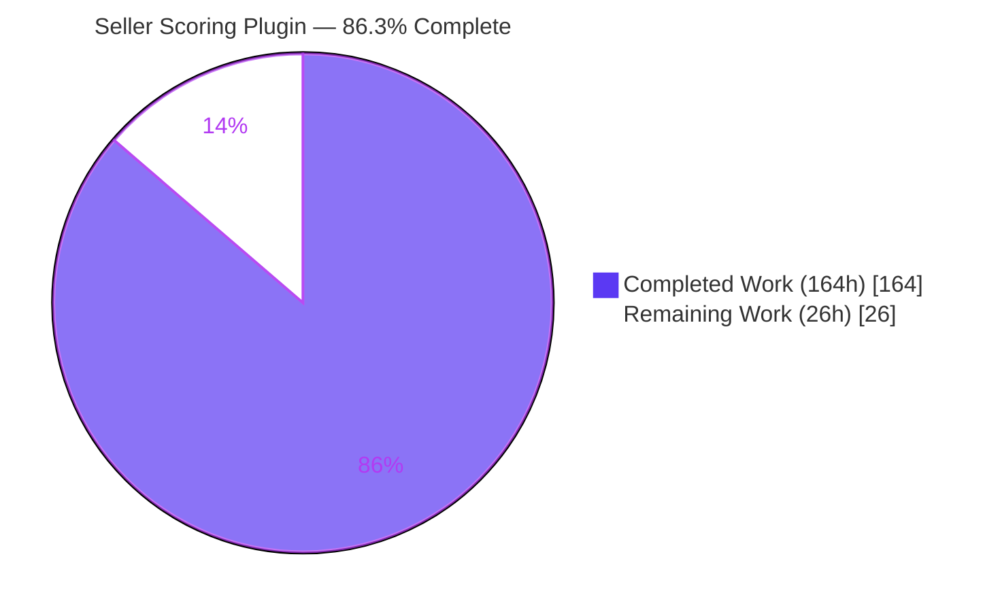
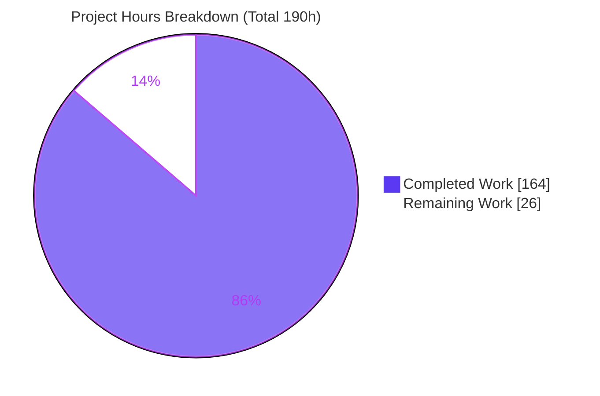
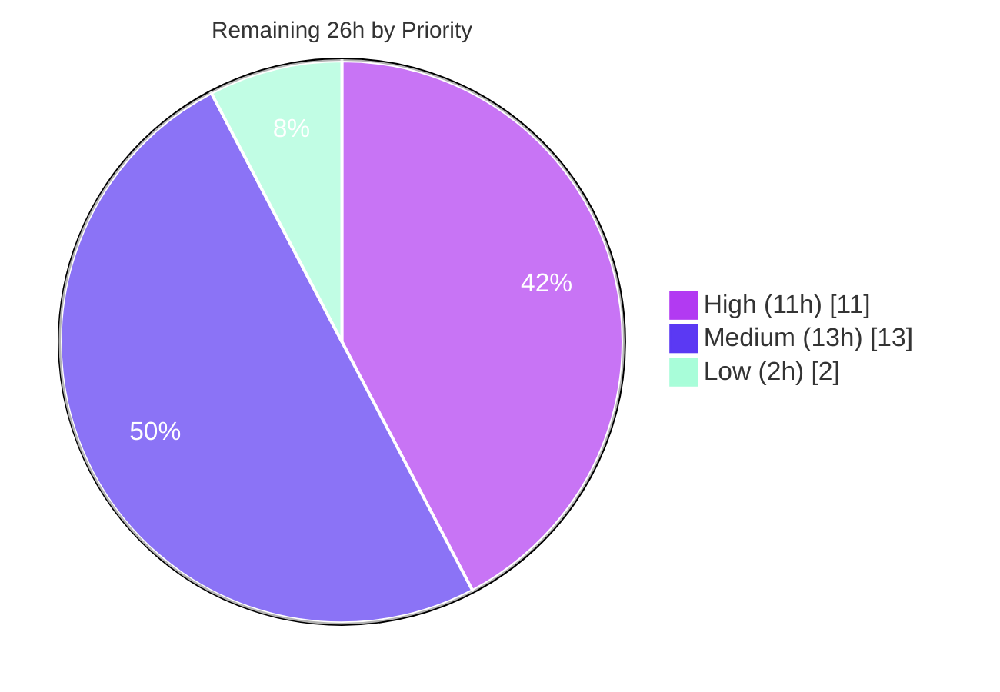

# Blitzy Project Guide — Seller Performance Scoring Plugin (Vendure)

> **Brand color legend** — Completed / AI Work: **Dark Blue `#5B39F3`** · Remaining / Not Completed: **White `#FFFFFF`** · Headings / Accents: **Violet-Black `#B23AF2`** · Highlight: **Mint `#A8FDD9`**

---

## 1. Executive Summary

### 1.1 Project Overview

This project adds a **Seller Performance Scoring module** to the Vendure multi-vendor marketplace as a new, self-contained plugin (`@vendure/seller-scoring-plugin`). It automatically scores each seller on a 0–100 composite of fulfillment-SLA adherence and cancellation/return rate over a rolling 90-day window, recalculating in real time from order, fulfillment, and refund events. Scores, per-metric breakdowns, and full history surface on the admin dashboard, and sellers below a configurable threshold are flagged for human review — the system flags only, never auto-suspends. Target users are marketplace administrators; business impact is replacing a manual, inconsistent seller-quality process with an automated, data-driven one. The plugin is strictly additive and read-only with respect to `@vendure/core`.

### 1.2 Completion Status



| Metric | Hours |
|---|---|
| **Total Hours** | **190** |
| Completed Hours (AI + Manual) | **164** (AI 164 + Manual 0) |
| Remaining Hours | **26** |
| **Percent Complete** | **86.3%** |

> Completion is computed on AAP-scoped work only (PA1): `164 / (164 + 26) = 164 / 190 = 86.3%`. All 164 completed hours were delivered autonomously by Blitzy agents (`agent@blitzy.com`); the 26 remaining hours are path-to-production activities (human review + production integration) that cannot be completed autonomously.

### 1.3 Key Accomplishments

- ✅ **All 13 AAP §0.3.1 deliverables built and validated** — two entities, scoring service, event subscriber, fixed Admin API, React dashboard, options, migration, tests.
- ✅ **Composite scoring formula implemented verbatim** with exact-value assertions verified (85.0, 0.0, null, 100).
- ✅ **95/95 tests pass** (76 unit + dashboard, 14 e2e, 5 benchmark) — independently re-run and confirmed this session.
- ✅ **Coverage 99.55% lines** — far exceeds the mandated ≥80% floor.
- ✅ **Performance benchmark deliverable met** — 501 sellers / 50,000 orders; existing-sellers-query p95 ratio 0.755 ≤ 1.05 (no regression).
- ✅ **Fixed API surface honored exactly** — only `sellerScore`, `flaggedSellers`, `recalculateSellerScore`; no extras.
- ✅ **Zero edits to `packages/core` or `packages/admin-ui`** — additive, read-only, `EventBus`-only coupling.
- ✅ **Runtime verified live** — dev-server boots in ~8 s; all three operations function against a running server.

### 1.4 Critical Unresolved Issues

| Issue | Impact | Owner | ETA |
|---|---|---|---|
| _None blocking release._ Feature is fully implemented and validated (95/95 tests, 99.55% coverage). | — | — | — |
| Production DB migration is MySQL/MariaDB-specific | Deploy on PostgreSQL/SQLite requires migration regeneration before the two tables exist | Backend Eng | With HT-2 (5h) |
| Documented out-of-scope core SQLite defect on pathological numeric IDs | None in normal operation; identical behavior in core `seller`/`order` queries | Core maintainers | Triage HT-7 (2h) |

### 1.5 Access Issues

| System/Resource | Type of Access | Issue Description | Resolution Status | Owner |
|---|---|---|---|---|
| GitHub repository | Push / merge | Branch `blitzy-772c2edb-...` present; standard PR review/merge required | Pending human review | Repo maintainer |
| Production database | DB credentials + migration run | Migration must be run against the production DB engine before enabling the plugin | Pending (path-to-production) | DevOps |
| CI pipeline | Pipeline config | Plugin test/e2e/bench not yet wired into monorepo CI | Pending (path-to-production) | DevOps |

> No access issues block the autonomous work already completed. All items above are standard production-onboarding steps, not blockers of the delivered feature.

### 1.6 Recommended Next Steps

1. **[High]** Conduct code review of the plugin PR and approve/merge (HT-1, 6h).
2. **[High]** Regenerate and run the TypeORM migration against the production database engine (HT-2, 5h).
3. **[Medium]** Finalize production `slaHours`/`flaggingThreshold` and promote the plugin to published-package consumption (HT-3 + HT-4, 5h).
4. **[Medium]** Integrate the plugin's unit/e2e/benchmark suites and the ≥80% coverage gate into CI (HT-5, 4h).
5. **[Medium]** Deploy to staging and smoke-test the three API operations and three dashboard surfaces (HT-6, 4h).

---

## 2. Project Hours Breakdown

### 2.1 Completed Work Detail

Every completed component traces to an AAP requirement. Total = **164 hours** (100% AI-delivered).

| Component | Hours | Description |
|---|---:|---|
| Package scaffold & build config | 6 | `package.json`, `index.ts`, `tsconfig(.build).json`, `vitest.config.mts`, `copy-dashboard.mjs`, `.gitignore` — mirrors official `email-plugin` layout (AAP §0.6.1 Group 1). |
| Plugin class, options, constants, DI wiring | 8 | `seller-scoring.plugin.ts` (`@VendurePlugin`, `static init()`, `OnApplicationBootstrap`), `types.ts`, `constants.ts`, injection-token provider (AAP req #8). |
| Persistence entities | 6 | `SellerScore` + `SellerScoreSnapshot` extending `VendureEntity`, `@EntityId` scalar `sellerId`, indexes (AAP req #1, #2). |
| TypeORM migration | 5 | Additive `seller_score` + `seller_score_snapshot` tables & indexes; reversible `down()` (AAP req #12). |
| SellerScoringService (scoring engine) | 20 | Composite formula verbatim, 90-day window, zero-fulfillment & null-score rules, transactional snapshot integrity, concurrency-safe upsert (AAP req #3). |
| EventBus subscriber | 9 | Subscribes order/fulfillment/refund state-transition events; read-only seller resolution; error isolation (AAP req #4). |
| Admin API layer | 13 | GraphQL schema extension + admin resolver (2 queries/1 mutation) + entity/field resolvers; `ReadSeller`/`UpdateSeller` gating (AAP req #5, #6, #7). |
| React dashboard extension | 28 | seller-detail score block (332 L), Flagged Sellers route (309 L), summary widget (157 L), typed GraphQL ops, i18n (AAP req #9, #10). |
| Unit test suite | 24 | 10 spec files, 76 tests, exact-value assertions; 99.55% line coverage (AAP req #13, §0.2.6). |
| E2E test suite + seed fixtures | 22 | `@vendure/testing`, 14 tests, 680-line deterministic fixtures; event recalc, threshold, history, permissions (AAP req #13). |
| Performance benchmark | 12 | 500-seller/50k-order harness; p50/p95 for new queries + before/after p95 for existing sellers query (AAP §0.2.6). |
| Integration & registration | 6 | `dev-config.ts` registration + dashboard-bundling `vite.config.mts` pathAdapter + `dev-server/package.json` + `bun.lock` (AAP req #11). |
| Documentation | 5 | `README.md` (options, formula, semantics) + inline JSDoc + `@since 3.8.0` tags (AAP §0.6.2). |
| **Total Completed** | **164** | |

### 2.2 Remaining Work Detail

Every remaining item is path-to-production. Total = **26 hours**.

| Category | Hours | Priority |
|---|---:|---|
| Human code review & PR approval (~6,000 LOC) | 6 | High |
| Production DB migration verification/regeneration (MySQL/MariaDB provided; regen + test PostgreSQL/SQLite; run vs real DB) | 5 | High |
| Production configuration + official-package promotion (business `slaHours`/`flaggingThreshold`; resolve dashboard discovery-by-package-name) | 5 | Medium |
| CI/CD pipeline integration (unit/e2e/bench + ≥80% coverage gate) | 4 | Medium |
| Staging deployment smoke test + dashboard UX/accessibility QA | 4 | Medium |
| Triage documented out-of-scope core SQLite defect (pathological IDs) | 2 | Low |
| **Total Remaining** | **26** | |

### 2.3 Hours Reconciliation

- Section 2.1 (Completed) = **164 h**
- Section 2.2 (Remaining) = **26 h**
- **2.1 + 2.2 = 190 h = Total Project Hours (Section 1.2)** ✅
- Completion = `164 / 190 = 86.3%` ✅

---

## 3. Test Results

All tests below originate from Blitzy's autonomous validation logs and were **independently re-executed this session** with identical results.

| Test Category | Framework | Total Tests | Passed | Failed | Coverage % | Notes |
|---|---|---:|---:|---:|---:|---|
| Unit (service, resolvers, plugin, subscriber, schema) | Vitest 3.2.4 (SWC) | 48 | 48 | 0 | 100% (src) | Exact-value assertions: 85.0, 0.0, null, 100, 0.8/0.1 |
| Dashboard (React components) | Vitest 3.2.4 + Testing Library | 28 | 28 | 0 | 99.53% | block / list / widget / index render + interaction |
| E2E (Admin API) | Vitest + `@vendure/testing` (sqljs) | 14 | 14 | 0 | — | Event-driven recalc, threshold in/exclusion, history order, permissions |
| Performance Benchmark | Vitest bench + tinybench | 5 | 5 | 0 | — | 501 sellers / 50,000 orders; p50/p95; no-regression check |
| **TOTAL** | | **95** | **95** | **0** | **99.55% lines** | Zero failures, zero skipped, zero blocked |

**Coverage detail (v8):** Lines 99.55% (900/904) · Branches 96.53% (167/173) · Functions 98.07% (51/52). Hard floor was ≥80% line coverage.

**Benchmark detail (re-run this session):**
- `sellerScore`: p50 = 2.458 ms, p95 = 4.412 ms (n=200)
- `flaggedSellers`: p50 = 4.157 ms, p95 = 5.432 ms (n=200)
- Existing sellers admin query p95: before = 5.457 ms, after = 4.120 ms → ratio **0.755 ≤ 1.05** (no regression; mandated deliverable satisfied)

---

## 4. Runtime Validation & UI Verification

Verified against a live dev-server (`DB=sqlite`, Vendure v3.7.0 on `:3000`), booted this session in ~8 s with zero boot errors.

**Runtime health**
- ✅ **Operational** — `Nest application successfully started`; `SellerScoringPlugin` initialized; `/health` returns `{"status":"ok"}`.
- ✅ **Operational** — Admin API schema introspection shows **exactly** the three fixed operations (`sellerScore`, `flaggedSellers`, `recalculateSellerScore`); no extras.

**API integration (live, superadmin-authenticated)**
- ✅ **Operational** — `recalculateSellerScore(sellerId: 1)` → `{ score: 62.5, fulfillmentSla: 1, cancellationReturnRate: 0.75, flagged: true }`. Formula verified live: `100 × (0.5 × 1.0 + 0.5 × (1 − 0.75)) = 62.5`.
- ✅ **Operational** — `sellerScore(sellerId: 1)` → resolves `score`, `flagged`, related `seller { name }`, and `history[]` ordered ascending by `calculatedAt`.
- ✅ **Operational** — `flaggedSellers` → returns only flagged sellers, ordered worst-first by ascending score (0, 0, 42, 50, 62.5, 65, 65).

**UI verification**
- ✅ **Operational** — Dashboard extension bundles and loads; three surfaces present: seller-detail score block (`pageId: 'seller-detail'`), Flagged Sellers route (`/flagged-sellers`), summary widget. Covered by 28 passing component tests.
- ⚠ **Partial** — Full in-browser visual/UX and accessibility QA on a running dashboard is a remaining path-to-production task (HT-6). Component behavior is verified by automated tests; end-to-end visual confirmation in a browser is pending human QA.

---

## 5. Compliance & Quality Review

### 5.1 AAP Deliverable Compliance Matrix

| AAP Requirement | Benchmark | Status | Evidence |
|---|---|:--:|---|
| #1 `SellerScore` entity | Additive, read-only core | ✅ Pass | `src/entities/seller-score.entity.ts` (`@EntityId` scalar, unique index) |
| #2 `SellerScoreSnapshot` entity | Write-once history | ✅ Pass | `src/entities/seller-score-snapshot.entity.ts` |
| #3 Scoring service | Formula verbatim + edge cases | ✅ Pass | `services/seller-scoring.service.ts`; unit + live (62.5) |
| #4 EventBus subscriber | 3 event types, EventBus-only | ✅ Pass | `event-subscribers/order-events.subscriber.ts` (15 unit tests) |
| #5 `sellerScore` + history | Query + ordered history | ✅ Pass | admin + entity resolvers; e2e history ASC |
| #6 `flaggedSellers` | Only below-threshold, not generic list | ✅ Pass | `where{flagged:true} order{score ASC}`; live worst-first |
| #7 `recalculateSellerScore` | `@Transaction` mutation | ✅ Pass | admin resolver; e2e forced recalc |
| #8 Configurable options | `slaHours` 48 default + threshold | ✅ Pass | `types.ts`, `constants.ts`, `init()` |
| #9 Seller-detail block | `pageId: 'seller-detail'` | ✅ Pass | `dashboard/seller-score-block.tsx` (11 tests) |
| #10 Flagged Sellers route + widget | Data table + summary | ✅ Pass | `flagged-sellers-list.tsx` (10), `seller-score-widget.tsx` (6) |
| #11 Plugin registration | Single annotated edit | ✅ Pass | `dev-config.ts` |
| #12 TypeORM migration | Additive both tables | ✅ Pass | `migrations/1783445410079-add-seller-scoring.ts` |
| #13 Unit + e2e + benchmark | Exact assertions, ≥80%, perf | ✅ Pass | 95/95 tests, 99.55% coverage, benchmark met |

### 5.2 Hard-Constraint & Governance Compliance

| Constraint (AAP §0.2 / §0.9) | Status | Evidence |
|---|:--:|---|
| Fixed API surface (exactly 3 ops) | ✅ Pass | Live introspection — no extras |
| No edits to `packages/core` / `packages/admin-ui` | ✅ Pass | `git diff` → 0 files changed under those paths |
| Additive schema/DB only | ✅ Pass | Migration `up()` only creates; `down()` only drops new tables |
| EventBus-only lifecycle coupling | ✅ Pass | Subscriber uses `eventBus.ofType(...)`; no core patching |
| ≥80% line coverage | ✅ Pass | 99.55% |
| Performance benchmark, ≤5% regression | ✅ Pass | ratio 0.755 |
| Minimal-change discipline | ✅ Pass | 4 existing files touched, all feature-necessary + annotated |
| Permissions (`ReadSeller`/`UpdateSeller`) | ✅ Pass | `@Allow` on resolvers; e2e permission tests |
| `@since 3.8.0` tags + Conventional Commits | ✅ Pass | 18 tagged files; 13 conventional commits |

### 5.3 Fixes Applied During Autonomous Validation

The Final Validator required **zero code fixes** — every gate passed as-built. Notable robustness measures already present in the delivered code: concurrency-safe `INSERT … ON CONFLICT (sellerId) DO UPDATE` with `.updateEntity(false)` (mirrors core `ProductVariantService`); transactional upsert + snapshot to prevent dropped snapshots under rapid successive events; and swallowed-and-logged subscriber errors so scoring can never disrupt an originating order/fulfillment/refund transaction.

### 5.4 Outstanding Compliance Items

- Production migration must be regenerated for non-MySQL/MariaDB engines before deployment (documented in the plugin README).
- One out-of-scope, pre-existing core defect is documented and deliberately not fixed (minimal-change discipline).

---

## 6. Risk Assessment

| Risk | Category | Severity | Probability | Mitigation | Status |
|---|---|:--:|:--:|---|---|
| Core SQLite error on pathological/out-of-range numeric IDs | Technical | Low | Low | Documented; plugin mirrors core data-access identically; fix needs core edit (out of scope) | Accepted / Documented |
| Migration DDL is MySQL/MariaDB-specific | Technical | Medium | Medium | Regenerate for PostgreSQL/SQLite per README (HT-2) | Open |
| FulfillmentSLA uses `fulfillment.createdAt` as shipped time | Technical | Low | Low | Documented design decision; core has no dedicated `shippedAt` column | Accepted |
| Floating-point rounding of composite | Technical | Low | Low | `round()` to 2 dp; exact values (85.0/0.0) verified | Mitigated |
| Admin API exposure | Security | Low | Low | `@Allow(ReadSeller/UpdateSeller)`; e2e permission tests pass | Mitigated |
| Injection surface | Security | Low | Low | Parameterized TypeORM repositories, typed `ID` args, no raw SQL with user input | Mitigated |
| Observability / monitoring for flag trends & recalc failures | Operational | Low-Med | Medium | `Logger` present; add production metrics/alerting | Open |
| Event-driven recalculation load (debounce-free by spec) | Operational | Low-Med | Low | Benchmark shows 2–5 ms; no regression | Accepted / Monitor |
| Migration deployment ordering | Operational | Medium | Medium | Run migration before enabling plugin (standard process) | Open |
| Dashboard bundling in monorepo (required `pathAdapter` workaround) | Integration | Medium | Medium | Documented; resolve discovery-by-package-name for published package (HT-4) | Partially mitigated |
| Official-package promotion (relative-import registration today) | Integration | Low-Med | Medium | Publish config + registration change (HT-4) | Open |
| EventBus payload hydration | Integration | Low | Low | Defensive relation reload + tests | Mitigated |
| Multi-DB upsert semantics (verified sqlite/sqljs) | Integration | Low-Med | Low | Validate MySQL/PostgreSQL in staging (HT-6) | Open |

---

## 7. Visual Project Status

### 7.1 Hours Distribution



> **Integrity:** "Remaining Work" = **26 h**, identical to Section 1.2 and the sum of Section 2.2 — all three match.

### 7.2 Remaining Work by Priority



### 7.3 Remaining Hours by Category (Section 2.2)

| Category | Hours | Bar |
|---|---:|---|
| Human code review & PR approval | 6 | ██████ |
| Production DB migration verification | 5 | █████ |
| Prod config + package promotion | 5 | █████ |
| CI/CD integration | 4 | ████ |
| Staging deploy + UX/a11y QA | 4 | ████ |
| Core SQLite defect triage | 2 | ██ |
| **Total** | **26** | |

---

## 8. Summary & Recommendations

### 8.1 Achievements

The Seller Performance Scoring feature is **fully implemented and validated at 86.3% overall completion** (164 of 190 hours). Every one of the 13 AAP §0.3.1 deliverables is complete, and every §0.2/§0.9 hard constraint is satisfied — including the fixed three-operation API surface, zero edits to `packages/core`/`packages/admin-ui`, the ≥80% coverage floor (achieved 99.55%), and the mandated performance benchmark (no regression at 501 sellers / 50,000 orders). The composite scoring formula is implemented verbatim and confirmed live (`62.5 = 100 × (0.5 × 1.0 + 0.5 × (1 − 0.75))`).

### 8.2 Remaining Gaps & Critical Path

The remaining **26 hours are exclusively path-to-production** work that cannot be completed autonomously: human PR review, production database-migration verification, production configuration and official-package promotion, CI integration, and staging QA. The critical path is **HT-1 (review) → HT-2 (production migration) → HT-6 (staging smoke test)**.

### 8.3 Success Metrics

| Metric | Target | Actual | Status |
|---|---|---|:--:|
| AAP feature deliverables complete | 13/13 | 13/13 | ✅ |
| Test pass rate | 100% | 95/95 (100%) | ✅ |
| Line coverage | ≥80% | 99.55% | ✅ |
| Existing-query regression | ≤5% | 0% (ratio 0.755) | ✅ |
| Fixed API surface | 3 ops exactly | 3 ops | ✅ |
| Core/admin-ui edits | 0 | 0 | ✅ |

### 8.4 Production Readiness Assessment

**Feature-complete and validated; production onboarding pending.** The delivered code is production-grade (comprehensive error handling, transactional integrity, permission gating, extensive documentation, no placeholders). Before go-live, a human must review and merge the PR, verify/run the migration on the production database engine, finalize business threshold values, wire CI, and run a staging smoke test. No feature rework is anticipated.

---

## 9. Development Guide

> Every command below was executed and verified during this assessment session. Repository root: the working copy containing `packages/seller-scoring-plugin/`.

### 9.1 System Prerequisites

- **Node.js** `^20.19.0 || >=22.12.0` (verified with v20.20.2)
- **Bun** package manager (verified with 1.3.10)
- **Git**
- **Database**: SQLite/sql.js is sufficient for dev/test; MySQL/MariaDB or PostgreSQL for production

### 9.2 Environment Setup & Dependency Installation

```bash
# From the repository root — installs workspace dependencies (no lockfile drift)
bun install --frozen-lockfile
# Expected: "N packages installed", exit 0
```

### 9.3 Build the Plugin

```bash
cd packages/seller-scoring-plugin
bun run build
# Runs: rimraf lib && tsc -p ./tsconfig.build.json && node ./build/copy-dashboard.mjs
# Expected: "[copy-dashboard] copied dashboard extension source -> .../lib/dashboard", exit 0
```

### 9.4 Run the Test Suites

```bash
# Unit + dashboard tests with V8 coverage (from the plugin directory)
bun run test
# Expected: Test Files 10 passed (10), Tests 76 passed (76), Lines 99.55%

# E2E tests (uses sql.js in-memory DB via @vendure/testing)
bun run e2e
# Expected: Tests 14 passed (14)

# Performance benchmark — IMPORTANT: do NOT set NODE_ENV=development
bun run bench
# Expected: Tests 5 passed (5); seeds 501 sellers / 50,000 orders; prints p50/p95 and ratio ≤ 1.05
```

### 9.5 Run the Application

```bash
cd packages/dev-server
DB=sqlite node -r ts-node/register -r dotenv/config index.ts
# Expected within ~8s: "Nest application successfully started",
# "Vendure server (v3.7.0) now running on port 3000"
# Admin API: http://localhost:3000/admin-api   Dashboard: http://localhost:3000/dashboard
```

### 9.6 Verification & Example Usage

```bash
# 1) Authenticate (superadmin/superadmin) and capture the auth token from the response header
TOKEN=$(curl -s -i -X POST http://localhost:3000/admin-api \
  -H "Content-Type: application/json" \
  -d '{"query":"mutation { login(username:\"superadmin\", password:\"superadmin\") { ... on CurrentUser { id } ... on ErrorResult { errorCode } } }"}' \
  | grep -i "vendure-auth-token:" | awk '{print $2}' | tr -d '\r')

# 2) Force a recalculation (requires UpdateSeller permission)
curl -s -X POST http://localhost:3000/admin-api \
  -H "Content-Type: application/json" -H "Authorization: Bearer $TOKEN" \
  -d '{"query":"mutation { recalculateSellerScore(sellerId: 1) { sellerId score fulfillmentSla cancellationReturnRate flagged } }"}'
# Example response: {"data":{"recalculateSellerScore":{"sellerId":"1","score":62.5,"fulfillmentSla":1,"cancellationReturnRate":0.75,"flagged":true}}}

# 3) Read the current score, resolved seller, and ordered history (requires ReadSeller)
curl -s -X POST http://localhost:3000/admin-api \
  -H "Content-Type: application/json" -H "Authorization: Bearer $TOKEN" \
  -d '{"query":"{ sellerScore(sellerId: 1) { sellerId score flagged seller { name } history { score calculatedAt } } }"}'

# 4) List only flagged sellers (worst-first)
curl -s -X POST http://localhost:3000/admin-api \
  -H "Content-Type: application/json" -H "Authorization: Bearer $TOKEN" \
  -d '{"query":"{ flaggedSellers { sellerId score flagged } }"}'
```

### 9.7 Troubleshooting

- **Benchmark behaves oddly / seeding differs** — ensure `NODE_ENV` is not set to `development` before `bun run bench`.
- **Dashboard surfaces absent at runtime** — the monorepo requires the `vite.config.mts` `pathAdapter` (`sourceRoot = repoRoot`) and the relative-path plugin import in `dev-config.ts`; a bare `@vendure/seller-scoring-plugin` package-name import is not discovered by the `@vendure/dashboard` Vite plugin in this Bun workspace.
- **Migration fails on a non-MySQL engine** — the provided DDL targets MySQL/MariaDB; regenerate via `packages/dev-server/migration.ts` for PostgreSQL/SQLite.
- **Stopping the dev-server** — `ts-node` spawns a child; terminate the actual `node -r ts-node/register … index.ts` process holding port 3000.
- **`error: externally-managed-environment` when using pip** — unrelated to this plugin; the plugin toolchain is Node/Bun only.

---

## 10. Appendices

### A. Command Reference

| Purpose | Command | Directory |
|---|---|---|
| Install deps | `bun install --frozen-lockfile` | repo root |
| Build plugin | `bun run build` | `packages/seller-scoring-plugin` |
| Unit + dashboard tests | `bun run test` | `packages/seller-scoring-plugin` |
| E2E tests | `bun run e2e` | `packages/seller-scoring-plugin` |
| Benchmark | `bun run bench` | `packages/seller-scoring-plugin` |
| Run dev-server | `DB=sqlite node -r ts-node/register -r dotenv/config index.ts` | `packages/dev-server` |
| Type-check only | `npx tsc -p ./tsconfig.build.json --noEmit` | `packages/seller-scoring-plugin` |

### B. Port Reference

| Port | Service | Path(s) |
|---|---|---|
| 3000 | Vendure server | `/admin-api`, `/shop-api`, `/dashboard`, `/graphiql/admin`, `/health` |

### C. Key File Locations

| Concern | Path |
|---|---|
| Plugin class | `packages/seller-scoring-plugin/src/seller-scoring.plugin.ts` |
| Scoring service | `packages/seller-scoring-plugin/src/services/seller-scoring.service.ts` |
| Event subscriber | `packages/seller-scoring-plugin/src/event-subscribers/order-events.subscriber.ts` |
| Entities | `packages/seller-scoring-plugin/src/entities/seller-score{,-snapshot}.entity.ts` |
| Admin API schema | `packages/seller-scoring-plugin/src/api/api-extensions.ts` |
| Admin + entity resolvers | `packages/seller-scoring-plugin/src/api/seller-score-*.resolver.ts` |
| Migration | `packages/seller-scoring-plugin/src/migrations/1783445410079-add-seller-scoring.ts` |
| Dashboard extension | `packages/seller-scoring-plugin/dashboard/index.tsx` (+ block/list/widget) |
| E2E + benchmark | `packages/seller-scoring-plugin/e2e/seller-scoring.{e2e-spec,bench}.ts` |
| Registration edit | `packages/dev-server/dev-config.ts` |
| Dashboard bundling edit | `packages/dev-server/vite.config.mts` |

### D. Technology Versions

| Technology | Version |
|---|---|
| `@vendure/core` / `@vendure/common` / `@vendure/dashboard` / `@vendure/testing` | 3.7.0 |
| Vitest | ^3.2.4 |
| `@vitest/coverage-v8` | ^3.2.4 |
| TypeScript | 5.8.2 |
| TypeORM | ^0.3.21 (via core) |
| GraphQL | ^16.11.0 (via core) |
| Node.js | ^20.19.0 \|\| >=22.12.0 (tested v20.20.2) |
| Bun | 1.3.10 |

### E. Environment Variable Reference

| Variable | Purpose | Notes |
|---|---|---|
| `DB` | Dev-server database driver | `sqlite` for local run; `sqljs` used by e2e |
| `PACKAGE` | Selects the package for shared e2e/bench configs | Set to `seller-scoring-plugin` (via `cross-env` in scripts) |
| `NODE_ENV` | Node environment | Must **not** be `development` when running `bun run bench` |
| `SUPERADMIN_USERNAME` / `SUPERADMIN_PASSWORD` | Production superadmin credentials | Dev uses `superadmin`/`superadmin` (insecure — override in production) |

### F. Plugin Configuration Options

| Option | Type | Default | Description |
|---|---|---|---|
| `slaHours` | `number` | `48` | Hours from order placement within which a fulfillment must ship to count toward FulfillmentSLA. |
| `flaggingThreshold` | `number` | _(required)_ | Composite-score cutoff (0–100); a seller strictly below this is flagged. Dev-server uses `70`. |

Registration example (`SellerScoringPlugin.init({ slaHours: 48, flaggingThreshold: 70 })`).

### G. Glossary

| Term | Definition |
|---|---|
| **Composite score** | `100 × (0.5 × FulfillmentSLA + 0.5 × (1 − CancellationReturnRate))`, 0–100 scale. |
| **FulfillmentSLA** | Fraction of fulfillments shipped within `slaHours` of order placement; `0` if a seller has orders but zero fulfillments in the window. |
| **CancellationReturnRate** | Fraction of in-window orders that were cancelled or refunded. |
| **Window** | Rolling trailing 90 days of orders. |
| **Null score** | Result for a seller with no orders in the window — not `0`; excluded from flagging; no snapshot written. |
| **Flagged** | `flagged = true` when the current composite is strictly below `flaggingThreshold`. The system flags only — never auto-suspends or removes a seller. |
| **Snapshot** | An immutable `SellerScoreSnapshot` row written once per non-null recalculation (write-once history). |