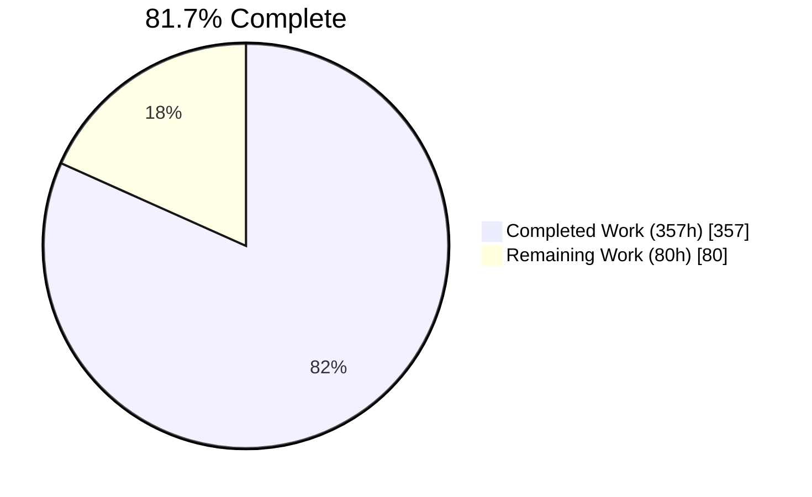
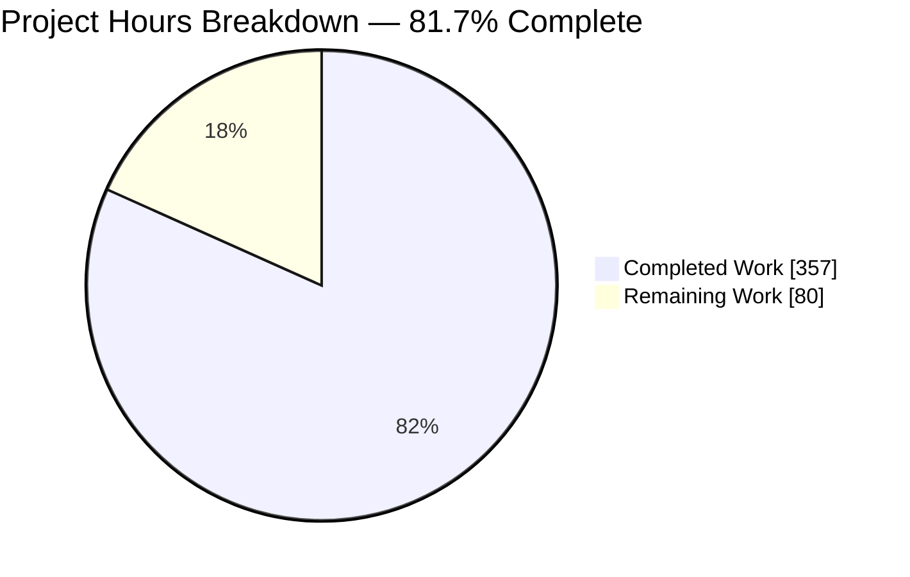
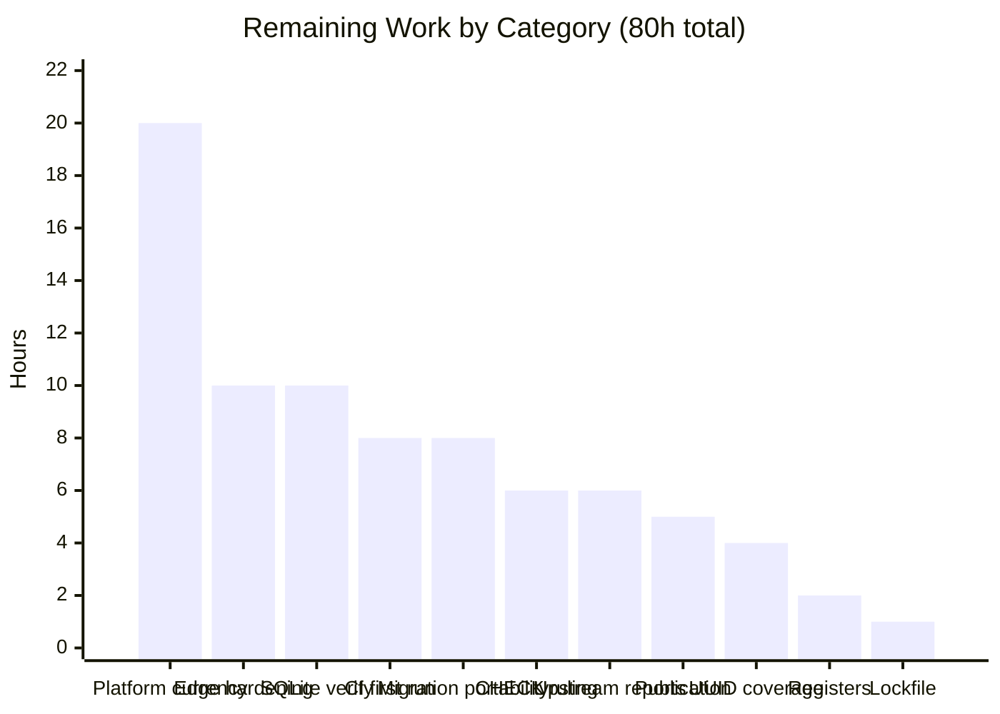
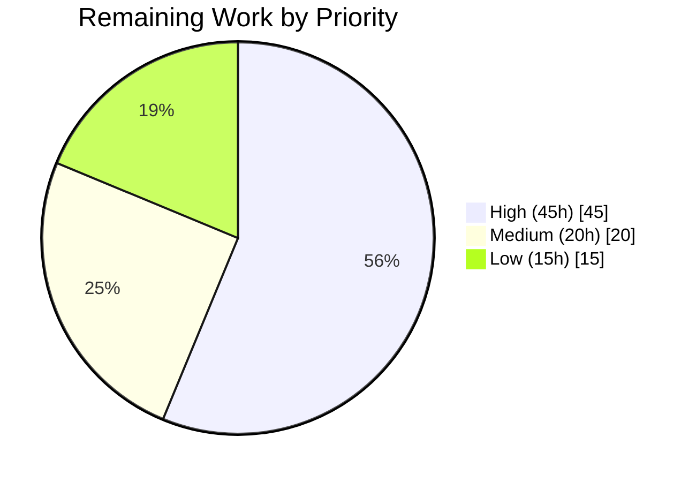
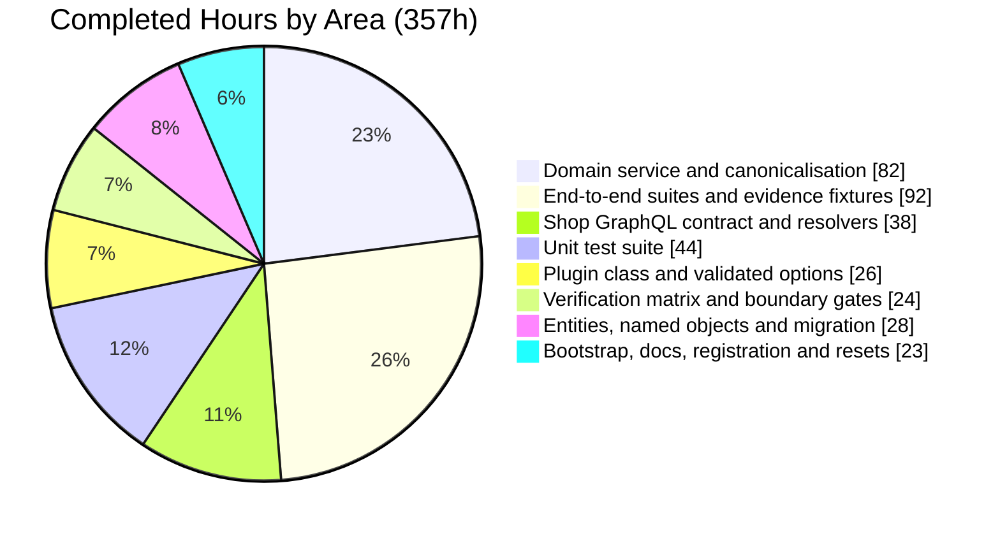

# 1. Executive Summary

## 1.1 Project Overview

This project adds named, multiple reorder lists with per-line quantities to the Vendure Shop API as a new self-contained publishable package, `packages/reorder-plugin`. Business buyers create, rename and delete named lists scoped to one customer in one channel, and add, adjust and remove lines carrying a positive integer quantity, deduplicated per variant. The package owns two relational tables, publishes eight Shop GraphQL operations and four error results, and enforces access in its service layer rather than through a decorator. Additive by construction: no core table altered, no published contract changed, one file touched outside it.

## 1.2 Completion Status



Chart colours — Completed: Dark Blue `#5B39F3` · Remaining: White `#FFFFFF`

| Metric | Value |
|---|---|
| Total Hours | **437** |
| Completed Hours (AI + Manual) | **357** (357 AI-delivered, 0 manual) |
| Remaining Hours | **80** |
| Percent Complete | **81.7%** (357 ÷ 437 × 100) |

## 1.3 Key Accomplishments

- ✅ Eight Shop operations live — two reads, six mutations — each ownership- and channel-scoped
- ✅ Two plugin-owned tables from one additive migration; no core table altered
- ✅ Four plugin-owned error results published, error-code growth proven by the compiler
- ✅ Names display byte-faithfully yet compare case-insensitively and accent-preservingly, unique by constraint
- ✅ Per-variant deduplication, atomic accumulation and both bounds hold under forced concurrency
- ✅ 632 unit and 374 end-to-end cases green on four engines, zero failures
- ✅ Boundary held: core, admin UI and dashboard byte-identical; no dependency changed
- ✅ 36 new files, 48,746 net lines, no placeholder or deferred-work marker

## 1.4 Critical Unresolved Issues

All 39 planned change actions are delivered — 36 creations, one registration edit, two operational resets. **13 items remain open, none of them missing code**: each is a decision, an authorization or a verification gap.

| Issue | Impact | Owner | ETA |
|---|---|---|---|
| **Platform version currency** (1 item) — the integrated platform is Vendure 3.7.0, carrying four advisories fixed in 3.7.2: one critical, one high, two moderate. The feature contributes nothing to the advisory classes, but the running platform is affected and cannot be upgraded from inside the change boundary. **Release-blocking.** | Blocks production sign-off | Platform maintainer | 20h |
| **Named CHECK constraints on the MySQL family** (1 item) — `CHK_reorder_list_line_quantity_positive` and `CHK_reorder_list_line_count_non_negative` do not materialise on MySQL or MariaDB. Every published API path is guarded in process on all four engines; the gap is defence-in-depth against a writer outside this service. | Needs a ruling before release | Platform maintainer | 6h |
| **Dependency-invariance clause** (1 item) — the lockfile carries a ten-line workspace-membership record, without which a frozen install cannot proceed. No third-party package is added, removed or re-resolved. | Wording of the release claim | Release owner | 1h |
| **Engine and strategy verification gaps** (3 items) — native SQLite is unverified, the committed migration artefact is the PostgreSQL emission, and the non-incrementing identifier-strategy branch is unit-covered but not exercised at runtime. | Narrows the supported matrix | Feature owner | 22h |
| **Register entries owed** (2 items) — the two page-size option keys, and the target-branch record against the contribution convention. | Documentation only | Feature owner | 2h |
| **Platform and deployment hardening** (5 items) — cross-origin exposure of the auth token with CSRF prevention disabled, raw driver text on out-of-range identifier filters, three absent response headers, the framework banner, and a 500 with stack frames on a malformed multipart request. All pre-existing and byte-identical to baseline. | Must close before a cross-domain deployment | Platform / DevOps | 16h |

## 1.5 Access Issues

| System/Resource | Type of Access | Issue Description | Resolution Status | Owner |
|---|---|---|---|---|
| npm registry (`@vendure/reorder-plugin`) | Publish | The package is not on the registry, so its documented install command cannot be executed against it. Expected for an unreleased package; verified instead against a locally packed tarball. | Open — needs release credentials | Release owner |
| Node 20.x and 24.x runtimes | Toolchain | Only Node 22.23.2 is available on the validation host, so those two supported lines are unexercised. The platform's ES2022 class-field hazard is specifically a Node 24 concern. | Open — needs a CI run | DevOps |
| `packages/core` version bump | Repository write authorization | Closing the platform advisories requires editing a path the change boundary holds byte-identical, which needs an explicit boundary expansion. | Open — needs maintainer authorization | Platform maintainer |

The feature itself requires no secret, token or environment variable; engine selection is by `DB`.

## 1.6 Recommended Next Steps

1. **[High]** Move the workspace coherently to Vendure ≥ 3.7.2, re-baseline pinned platform surfaces, then re-run all gates and four engine jobs. Sole release blocker.
2. **[High]** Rule on the named CHECK constraints: record the accepted engine-scoped gap, or sanction compensating engine-conditional DDL with catalogue evidence.
3. **[High]** Run the continuous-integration matrix once — build, three Node lines, codegen, static analysis, four engine end-to-end jobs.
4. **[High]** Close API-edge hardening before any cross-domain deployment: explicit CORS allowlist, no cross-origin auth-token exposure, CSRF prevention re-enabled.
5. **[Medium]** Ratify the lockfile workspace record, register the two page-size keys, and decide whether one migration file must carry four engines.

# 2. Project Hours Breakdown

## 2.1 Completed Work Detail

| Component | Hours | Description |
|---|---|---|
| Package bootstrap, manifest and consumer documentation | 14 | `package.json` declaring every script the workspace aggregates invoke — including `ci`, without which the package would be skipped silently — both TypeScript projects, the SWC unit-test configuration, the four-symbol root barrel, and an 885-line README carrying a measured per-engine matrix |
| Plugin class, five validated options and message registration | 26 | `src/reorder.plugin.ts` (1,254 lines): plugin metadata, `compatibility: '>=3.3.0'`, `static init()`, validation of all five options at initialisation and again at bootstrap plus a Shop list-limit check, frozen module-private option state behind a read-only accessor, and catalogue registration that resolves in both the source and packed layouts |
| Two plugin-owned entities and the five named database objects | 16 | `reorder_list` and `reorder_list_line` (604 lines): `VendureEntity` subclasses, `@EntityId()` on every foreign key, `varchar(191)` on both indexed strings, explicit cascade on every relation, an engine-resolved binary collation on `nameKey`, and all five named objects declared under their exact names |
| The one additive schema migration and its lifecycle | 12 | `src/migrations/1786838400000-add-reorder-lists.ts`: parent table first, every index, constraint, check and the counter column, generated through the platform lifecycle and reversible with core data intact |
| Reorder-list domain service and name canonicalisation | 82 | `reorder-list.service.ts` (4,877 lines) and `reorder-list-name.ts` (635 lines): all eight operations, the ownership-and-channel predicate as statement conjuncts, the atomic line and list bounds, narrow constraint translation, the sanitising error boundary, windowed per-page nested reads, the compare-and-set counter repair, identifier addressability, and the pure four-step canonicalisation pipeline |
| Shop GraphQL contract and the three resolver classes | 38 | `api-extensions.ts` transcribing the published contract exactly, the eight gated transactional operations, the entity field resolvers for `lines` / `viewerAccess` / `productVariant` with per-page batching and identity-keyed repair licensing, and six `__resolveType` resolvers |
| English message catalogue | 3 | `i18n/en.json` with the four `error.*` keys, published in the packaged artefact so an installed copy resolves them |
| Unit test suite — 3 specs, 632 cases | 44 | The canonicalisation table including the 190/191/192 boundary and hostile Unicode, the service branch matrix, and option validation across every rejection class |
| End-to-end suites, evidence fixtures and compiler projects | 92 | Six suites (28,222 lines with their support tree) mapping every acceptance criterion, the query-capture instrument, the two-connection concurrency barrier, shared operation documents, and the two compiler-project fixtures that evidence error-code growth |
| Dev-server registration and migration wiring | 4 | The single sanctioned external edit: the import, `ReorderPlugin.init({…})` with the five supplied values, and one appended migration pattern, with the custom-field and custom-permission values held byte-identical |
| Workspace registration and operational resets | 2 | The lockfile workspace-membership record that lets a frozen install proceed, and the two required cache and build-output resets |
| Four-engine verification matrix, boundary gates and coverage | 24 | The full matrix on sql.js, PostgreSQL, MariaDB and MySQL; both halves of the protected-path gate; dependency invariance; runtime introspection against the untouched schema snapshot; and the coverage gate |
| **Total** | **357** | |

## 2.2 Remaining Work Detail

| Category | Hours | Priority |
|---|---|---|
| Platform version currency and release sign-off — move the fixed-version workspace coherently to Vendure ≥ 3.7.2, re-baseline every pinned platform surface, and re-run all gates, the four engine jobs and core authorization regression | 20 | High |
| Deployment hardening at the API edge — explicit CORS allowlist, no cross-origin exposure of the auth token, CSRF prevention re-enabled, the three absent response headers added, framework banner disabled, debug mode confirmed off | 10 | High |
| First full continuous-integration run on this branch — build, the Node 20.x/22.x/24.x unit lines, codegen, static analysis and all four engine end-to-end jobs | 8 | High |
| Ruling on the two named CHECK constraints, then recording the accepted gap or implementing the compensating engine-conditional DDL with catalogue and violating-write evidence | 6 | High |
| Ratifying the lockfile workspace record and restating the dependency claim in the release notes | 1 | High |
| Native SQLite verification — add a native-driver initializer to the shared harness, stop `DB=sqlite` resolving silently to sql.js, and run the matrix against it | 10 | Medium |
| Engine-portable migration artefacts — decide whether one committed file must carry all four engines, produce and verify the remaining emissions, and assert the process exit code in the deployment step | 8 | Medium |
| Register entries — the two page-size option keys, closing the open per-surface page-size decision, and recording the target branch | 2 | Medium |
| Upstream platform defect reports — raw driver text on out-of-range identifier filters, a 500 with stack frames on a malformed multipart request, the migration CLI type error, and end-to-end port derivation without an environment override | 6 | Low |
| Package publication and documentation generation — publish the package and register its source directory with the TypeScript docs generator | 5 | Low |
| Identifier-strategy coverage — exercise the non-incrementing branch of the addressability guard against a UUID-strategy harness | 4 | Low |
| **Total** | **80** | |

## 2.3 Basis of Estimate

The completed figure is derived from measured output rather than assumed velocity: 48,746 net lines across 36 new files and 32 commits, comprising 10,517 lines of production source, 8,965 lines of unit specification, 28,222 lines of end-to-end suites and evidence fixtures, and 982 lines of configuration and documentation. Every line carries JSDoc on its public surface and is verified against four database engines, so the rate applied is deliberately conservative for reviewed, documented, multi-engine-verified code. Confidence is **high** on all twelve completed rows, which rest on first-hand build, test and gate results, and **high** on the ruling, ratification, register and continuous-integration items in Section 2.2. Confidence is **medium** on the platform upgrade, the migration-portability decision, native SQLite verification and the edge hardening, because each depends on how far a coherent version bump or a shared-harness change reaches. Confidence is **low** only on the identifier-strategy coverage item, which may require authoring a harness that does not yet exist.

The open-item estimates in Section 1.4 account for 67 of the 80 remaining hours. The balance is the first continuous-integration run (8h) and package publication with documentation generation (5h) — scheduled path-to-production work rather than open issues, which is why they appear in Section 2.2 but not in that table.

# 3. Test Results

Every figure below was observed in a run executed against this codebase. The end-to-end suite was executed four times, once per automated engine; the table reports the sql.js run and the per-engine variance is given beneath it.

| Area / Category | Framework | Tests | Passed | Failed | Coverage | What This Proves |
|---|---|---|---|---|---|---|
| Name canonicalisation (unit) | Vitest 3.2.4 | 45 | 45 | 0 | 100% lines / 100% branches | A submitted name round-trips byte-for-byte for display while comparing case-insensitively and accent-preservingly, and an unstorable name is refused before any row is written |
| Domain service branches (unit) | Vitest 3.2.4 | 406 | 406 | 0 | 99.44% lines / 96.47% branches | Every ownership, bound, affected-row, constraint-translation and counter-repair branch behaves as published, including the refusal paths |
| Plugin configuration (unit) | Vitest 3.2.4 | 181 | 181 | 0 | 96.85% lines | A malformed option value cannot reach a running server: startup fails naming the offending key, and a valid set is frozen against later mutation |
| List creation, rename and deletion (e2e) | Vitest + `@vendure/testing` | 42 | 37 | 0 | — | A buyer's list is created under their own customer and channel with the counter at zero, a duplicate name is refused with the colliding key, and a rename or delete applies only to a row they own |
| Line add, dedupe and accumulate (e2e) | Vitest + `@vendure/testing` | 128 | 123 | 0 | — | A second add of the same variant accumulates onto one line instead of duplicating it, quantity and line bounds hold under forced concurrent interleaving, and an unresolvable variant is refused |
| Line adjust, remove and authorization (e2e) | Vitest + `@vendure/testing` | 53 | 51 | 0 | — | An absolute quantity set is idempotent, a removal decrements the counter in the same transaction, and a cross-customer or cross-channel attempt writes nothing and is indistinguishable from absence |
| Paginated reads (e2e) | Vitest + `@vendure/testing` | 83 | 83 | 0 | — | Page boundaries are stable under equal timestamps, a caller's sort is honoured with the tie-break appended, configured page sizes apply when none is given, nested lines resolve once per page rather than per entry, and another customer's list is never returned |
| Schema migration and plugin contract (e2e) | Vitest + `@vendure/testing` | 68 | 61 | 0 | — | The migration applies, reverts with every seeded core row intact and re-applies to an identical schema; each named database object is proven twice; the withdrawn objects are proven absent; and a declared-but-unsatisfiable compatibility range stops the server |
| **Totals** | | **1,006** | **987** | **0** | 92.90% lines over `src/**` | |

Per-engine end-to-end results, all six suites, **374 cases collected on every engine and zero failures**: sql.js 355 passed / 19 skipped · PostgreSQL 16 356 / 18 · MariaDB 11.5 348 / 26 · MySQL 8 348 / 26. Skips are named engine-conditional classes rather than gaps in intent: exact statement-count assertions execute on sql.js alone, because that is the one engine where statement text and count are deterministic, and barrier-released concurrency assertions are excluded from sql.js, which serves a single connection. The paginated-read suite skips nothing on any engine. Across the matrix that is 1,496 case executions collected, 1,407 passed, none failed.

### Not Covered

These capabilities are delivered but are not exercised by any automated test. Each should be covered or consciously accepted before release.

- **The two named CHECK constraints on MySQL and MariaDB.** They do not exist on those engines, so no test can exercise them; the suites instead assert their absence positively and prove the equivalent invariants through the service. A human should confirm that nothing outside this service writes to the two tables on a MySQL-family deployment.
- **Native SQLite (better-sqlite3), every capability.** The shared harness publishes no initializer for it and no continuous-integration job exercises it. Worse for a reader, `DB=sqlite` is not refused — it silently runs the sql.js configuration, so a green run there proves nothing about the native driver. Test the native driver directly before supporting it.
- **The committed migration artefact on MariaDB, MySQL and sql.js.** The checked-in file is the PostgreSQL emission; the suites exercise the other engines through their own lifecycle-generated emission. A human should apply and revert the committed artefact, or its per-engine equivalent, on each engine they intend to deploy to.
- **The non-incrementing identifier-strategy branch.** Under a UUID primary-key strategy the addressability guard admits the identifier unchanged. This is unit-covered and documented at its code site, but no runtime harness for that strategy exists. Test it if a UUID deployment matters.
- **Continuous-integration lines Node 20.x and 24.x.** Everything reported here ran on Node 22.23.2. The platform's ES2022 class-field hazard is specifically a Node 24 concern, making 24.x the least-evidenced supported line.
- **The dev-server configuration file as executed code.** Its registration expression and both directory layouts are asserted statically and its migration pattern is exercised against a real connection, but no test boots the compiled dev server.
- **Exact statement counts on PostgreSQL, MariaDB and MySQL.** The behaviour each count evidences is asserted on all four engines, but a driver-specific change to statement *count* on a server engine would not be caught.
- **README prose and JSDoc.** No test reads them, so a future edit could introduce an inaccurate claim without any suite failing.

# 4. Runtime Validation & UI Verification

This feature has no user-interface deliverable. The eight Shop GraphQL operations are its entire user-facing surface, so runtime verification means driving those operations against a booted server. The results below come from a development server seeded and started against PostgreSQL with the plugin registered, health returning `{"status":"ok"}` on `/health`.

- ✅ **Server start-up with the plugin registered** — the plugin and its dynamic Shop module both initialise, and the English message catalogue is loaded from the package-relative path. One expected line appears at boot: the migration reports that `reorder_list` already exists, because the development configuration's effective setting provisions the schema through the schema builder before the migration runs. Bootstrap continues and the failure is reported through the process exit code.
- ✅ **Authentication and the ownership gate** — a seeded customer authenticates and receives a session token; every one of the eight operations admits that session and derives ownership from it, with no argument able to nominate a different owner.
- ✅ **List creation with name canonicalisation** — `createReorderList` with `"  Weekly   Restock  "` returns `name: "Weekly Restock"`, `lineCount: 0`, and `viewerAccess { access: OWNED, grantedCapabilities: [] }`.
- ✅ **Case-insensitive uniqueness** — a second create using a different case of the same name returns `REORDER_LIST_NAME_CONFLICT_ERROR` carrying `conflictingNameKey: "weekly restock"`.
- ✅ **Malformed input refused before any write** — a whitespace-only name returns `data: null` and exactly one top-level `errors` entry with `extensions.code = USER_INPUT_ERROR`, its message resolved to English from the catalogue rather than surfacing as a raw key.
- ✅ **Per-variant deduplication and accumulation** — two adds of the same variant at quantities 3 and 4 leave one line at quantity 7 with `lineCount: 1` and `lines.totalItems: 1`, and the related variant resolves with its translated name.
- ✅ **Quantity ceiling and identifier handling** — an absolute set above the configured maximum returns a single `USER_INPUT_ERROR`; a single-list read addressed by an identifier outside the column's range returns the bare `null` its contract publishes, with no error entry and no error log line.
- ✅ **Paginated reads and cross-customer isolation** — the collection read returns a page under the configured defaults; a second seeded customer reading the same list identifier receives `null`, and their own collection read reports `totalItems: 0`.
- ✅ **Unauthenticated write refused** — an anonymous `createReorderList` returns one `errors` entry with `extensions.code = FORBIDDEN`, refused by the service's own ownership logic rather than by the permission decorator.
- ✅ **Published schema delta against a live server** — introspection confirms exactly two new root queries and six new root mutations, `ErrorCode` at 36 members with exactly the four new reorder-list codes, 35 types implementing the platform's error interface, and no change to the permission enumeration.

**Not exercised at runtime.** The native SQLite driver was never started, so no runtime claim is made for it. The committed migration artefact was applied and reverted against PostgreSQL only; on the other three engines the lifecycle-generated equivalent was exercised instead. The compiled development server was never booted from build output, so only the source layout has runtime evidence. No browser or storefront was driven, because none is in scope. Everything above was observed on Node 22.23.2; the 20.x and 24.x lines have no runtime evidence.

# 5. Compliance & Quality Review

## 5.1 Compliance Matrix

Each row records where the deliverable stands now, verified against this codebase.

| Deliverable / Benchmark | Status | Verified State |
|---|---|---|
| Eight Shop operations published and executable | ✅ PASS | Two queries and six mutations, all gated and all mutations transactional; live introspection confirms exactly `+2` root queries and `+6` root mutations |
| Four plugin-owned error results, platform deletion payload reused | ✅ PASS | `ErrorCode` at 36 members with the four new codes; 35 types implement the platform error interface; error-code growth proven by a compiler project that must fail and a control that must not |
| Two plugin-owned tables, one additive migration, no core table altered | ✅ PASS | Parent created first; data-bearing apply, revert and re-apply with every seeded core row surviving field-for-field |
| Five named database objects under their exact names | ⚠️ PARTIAL | Five on PostgreSQL and the SQLite family; the two unique objects and the index on MySQL and MariaDB, where the two check objects cannot be produced by the installed ORM (see 5.2) |
| Service-layer ownership-and-channel predicate on every operation | ✅ PASS | Present as conjuncts of the same statement on all eight paths and on the counter repair, including a correlated existence clause on both line writes; cross-customer and cross-channel isolation asserted on all four engines |
| Five validated plugin options, malformed value failing start-up by name | ✅ PASS | Validated at initialisation and again at bootstrap, plus a Shop list-limit check; rejected values are never echoed back |
| Name canonicalisation and its uniqueness contract | ✅ PASS | Display value trimmed and collapsed only; canonical key trimmed, collapsed, normalised then lower-cased; uniqueness decided by the named constraint, with the violation translated narrowly and no driver text reaching a caller |
| Deterministic total-order pagination with the tie-break appended | ✅ PASS | Stable page boundaries under equal timestamps; a caller's sort is honoured rather than replaced; configured defaults apply on omission and the platform over-limit refusal stands |
| Per-page resolution of nested lines, counter and viewer access | ✅ PASS | Equal whole-request statement counts across a page of three and a page of six; viewer access derived at zero statement cost; no counter field resolver exists |
| Protected-path and dependency boundary | ✅ PASS | `packages/core`, `packages/admin-ui` and `packages/dashboard` byte-identical to baseline on both halves of the gate; the dashboard build config, root manifest and both schema snapshots unchanged; exactly two files differ outside the new package |
| Coverage gate on new service logic (≥ 80% lines) | ✅ PASS | 99.47% over the service directory — 100% on canonicalisation, 99.44% on the service — against a target of 80% |
| Four-engine evidence matrix, with anything unverified named | ⚠️ PARTIAL | All six suites green on sql.js, PostgreSQL, MariaDB and MySQL; native SQLite named unverified with its reason, and the committed migration artefact carries the PostgreSQL emission |

## 5.2 AAP & Rule Divergences and Gaps

No user-specified rules were provided for this project, so every divergence below is a departure from the plan of record. Eight are recorded.

| What the AAP/Rule Required | What Was Delivered Instead | Why It Diverged | Impact | Remediation |
|---|---|---|---|---|
| `bun.lock` untouched and byte-identical | Ten purely additive lines registering the new workspace member | The same clause also requires a frozen install to succeed, and the two cannot both hold once a seventeenth package exists | None substantive — no third-party package added, removed or re-resolved | Ratify the record and restate the dependency claim (1h) |
| Both named CHECK constraints present on all four engines | Present on PostgreSQL and the SQLite family; absent on MySQL and MariaDB | The installed ORM skips check constraints for the MySQL family, and the adopted resolution forbids the compensating DDL | Defence-in-depth gap against writers outside this service on two of four engines | Maintainer ruling, then record or implement (6h) |
| One migration file exercising a data-bearing cycle on four engines | One file carrying the generator's PostgreSQL emission, with other engines covered by their own emission inside the suite | The plan requires both generator provenance with engine-specific output and a four-engine cycle from one file; these are mutually exclusive | Operators on the other three engines must generate their own file | Decide, then produce and verify the remaining emissions (8h) |
| Exactly the option keys in the closed configuration ledger | Two additional page-size keys, defaulting to 25 and 50 | **Sanctioned** — the plan's own decisions block supplies both values and forbids substituting them | None; both are stricter than the platform's own substitution | Add them to the ledger as entries 27 and 28 (2h) |
| An options provider reading a mutable static, and a writable static option field | A per-initialisation value provider over frozen module-private state, behind a read-only accessor | The prescribed form let a later initialisation retroactively change what an earlier registration served | Strictly stronger isolation; the published option contract is unchanged | None required |
| A published file list of build output only, and a five-parameter service constructor | The message catalogue is published beside the build output, and the service takes a sixth parameter | The catalogue must resolve in an installed copy, and identifier addressability must read the configured strategy's key type | Both positive; the packaged artefact gains one directory | None required |
| A failed read guard returning an empty collection or null, and default transaction mode on every mutation | Only a permission refusal is normalised that way, and one mutation uses manual transaction mode | Reporting "you have no lists" for an unreachable database is a wrong answer that looks right; under the default mode each retry inherits the failed attempt's locks | Both positive; a genuine failure now surfaces as an internal error rather than as empty data | None required |
| Native SQLite verified, features branched to `minor`, and disposal behaviour absent | Native SQLite named unverified; this work targets the branch carrying the ticket set; a soft-deleted customer's list rows persist | The harness publishes no native-SQLite initializer; the branch target was directed; disposal is deferred to a later batch by an explicit ruling | Narrows the supported matrix; the last two are sanctioned | Verify natively (10h); record the branch (included above) |

**The lockfile clause.** The plan requires no dependency change, proved by a frozen install exiting zero with the lockfile byte-identical. But the package manager records workspace *membership* in `bun.lock`, and the root workspace glob is unqualified, so a seventeenth directory under `packages/` changes that file by construction. Every in-boundary alternative was measured and fails: dependency-free, name-and-version-only and private manifests each still make a frozen install exit 1, and no installer flag avoids it. The delivered lockfile carries ten additions and no deletions, and adds, removes or re-resolves no third-party package; the root manifest is untouched. Without it every continuous-integration job fails at its first step. Ratify the ten lines as workspace-discovery metadata and restate the invariant as "no dependency changed".

**The named CHECK constraints.** Both are declared on the entities and in the migration, and materialise on PostgreSQL and the SQLite family. On MySQL and MariaDB they do not: the installed ORM skips checks for that family and its query runner throws from every check method, leaving only hand-written dialect DDL, which the resolution forbids. Nothing behavioural depends on them — the quantity invariant is guaranteed by a request-level refusal on every write path, the counter invariant by a bound-guarded conditional update plus a floored compare-and-set repair, both exercised on all four engines. What remains: direct SQL or another application sharing the schema could persist a bad value there. The material a ruling needs is recorded in the migration header.

**Migration provenance against four-engine execution.** The plan requires the migration to come from the platform lifecycle, acknowledges that generated SQL is engine-specific, and separately requires a data-bearing apply-revert-apply cycle on four engines from one committed file. Those cannot all hold. Provenance won, so `src/migrations/1786838400000-add-reorder-lists.ts` is the generator's PostgreSQL emission and the migration suite exercises the other three engines through emissions it generates itself — 57 cases green on every engine. The consequence is operational and disclosed in the package README: a MariaDB, MySQL or SQLite deployment must regenerate the file, and because migration failures surface through the process exit code rather than as an exception, a pipeline catching only exceptions reads an unapplied migration as success.

**The two additional option keys.** The configuration ledger declares itself the single authority, carries three keys for this feature, and records the per-surface default page size as an open decision. The plan's decisions block supplies both values and instructs that they not be substituted, so `defaultReorderListsPageSize` (25) and `defaultReorderListLinesPageSize` (50) are declared and validated like the other three (`src/types.ts`). This is sanctioned rather than a defect: both defaults are stricter than the platform's own substitution of 100, so the criterion that an omitted page size returns at most the configured limit still holds, and `ignoreQueryLimits` stays false on every query. The ledger owner should add them as entries 27 and 28 and close the open decision.

**Option provider and static shape.** The plan prescribed a factory provider reading `ReorderPlugin.options` and a writable static field. Delivered instead is a value provider bound at each `init()` to a frozen resolved set, with `static get options()` a read-only accessor over module-private state (`src/reorder.plugin.ts`). The prescribed form was reproducibly defective: because the factory read a mutable module global, a later `init()` retroactively changed what an earlier registration served, and a bare class registration served whatever the last call had set. The published option interface, the five defaults and their validation are unchanged, and the provider expression is the only thing a consumer could notice. No action is needed; a delayed-bootstrap unit case now catches the leakage the literal form reintroduces.

**Packaged catalogue and the service constructor.** Two shape changes were forced by behaviour the plan mandates elsewhere. The manifest publishes `i18n/**/*` beside `lib/**/*`, because the plan fixes the build script's text and also requires the catalogue to be loaded by file path — publishing the directory is the only route keeping both, as a shipped sibling plugin does. The service constructor takes a sixth parameter, the platform configuration service, because deciding whether an identifier is addressable before issuing a statement needs the configured strategy's key type, resolvable only there. Neither is optional: without the first, every message in an installed copy degrades to a raw key; without the second, an out-of-range identifier reaches the driver.

**Read failure handling and transaction mode.** The plan says a failed read guard returns an empty collection or null. Delivered: only a permission refusal is normalised that way, and any other failure during owner scoping is re-raised as a sanitised internal error — because the precedent's "failed guard" is the authentication and ownership guard, and answering "you have no lists" for an unreachable database is a wrong answer that looks like a right one. Separately, `addItemToReorderList` carries manual transaction mode where the plan says default: under the default, each retry of the bounded add would be a savepoint inheriting the failed attempt's locks. Only the mode differs, on one of six mutations, and the reasoning sits at the decorator.

**Engine coverage, branch target and data lifecycle.** Three smaller departures, each disclosed rather than latent. Native SQLite is named unverified because the shared test harness publishes no initializer for it and no job exercises it — and `DB=sqlite` is not refused but silently runs the sql.js configuration. The contribution guide routes feature work to a `minor` branch and schema changes to a `major` branch, whereas this work targets the branch carrying the ticket set as directed, which the plan itself records as sanctioned. And a soft-deleted customer's list rows persist, because an explicit ruling defers all disposal behaviour — retention, anonymisation and purge — to a later batch; the cascade on the owning customer is the only lifecycle behaviour present.

# 6. Risk Assessment

These are forward-looking: what could still go wrong once this codebase runs in production.

| Risk | Category | Severity | Probability | Mitigation | Status |
|---|---|---|---|---|---|
| The integrated platform is Vendure 3.7.0, which carries four published advisories fixed in 3.7.2 — one critical, one high, two moderate. The affected routes are live in any deployment built from this checkout. | Security | **Critical** | High | Move the fixed-version workspace coherently to ≥ 3.7.2, re-baseline every pinned platform surface, then re-run all gates, the four engine jobs and core authorization regression. The feature itself contributes nothing to the advisory classes: no Admin API extension, no permission definition, no custom field, and all eight operations behind the service predicate. | Open — release-blocking |
| The Shop API reflects any request origin back with credentials allowed and the auth token exposed to cross-origin readers, while framework CSRF prevention is disabled. Today only the session cookie's same-site default stands between that and a credentialed cross-site read that also returns the bearer token — and the platform's own documented cross-domain storefront pattern removes exactly that control. | Security | High | Medium | Replace the reflecting origin with an explicit allowlist, stop exposing the auth token cross-origin or gate it behind that allowlist, and re-enable CSRF prevention or require a preflight-forcing header on state-changing requests. Close before any cross-domain deployment. | Open — pre-existing, outside the changed code |
| Migration failures are reported through the process exit code rather than thrown, and the committed migration artefact is engine-specific. A deployment pipeline that only catches exceptions would treat a completely unapplied migration as success; on the SQLite family the schema is then left empty and the server still starts. | Operational | High | Medium | Regenerate the migration per engine through the documented lifecycle recipe, and assert the process exit code in the deployment step rather than relying on an exception. | Open — documented |
| Neither named check constraint exists on MySQL or MariaDB, so a repair script, a second application sharing the schema, or direct SQL could persist a non-positive line quantity or a negative stored counter on those engines. | Technical | Medium | Medium | Every published API path already guards both invariants in process on all four engines. Restrict direct write access to the two tables on a MySQL-family deployment, or take the compensating engine-conditional DDL option. | Open — awaiting ruling |
| The continuous-integration matrix has never run on this branch, and two of its three supported Node lines are unexercised. The platform's ES2022 class-field hazard — which can silently overwrite entity fields with undefined after the constructor — is specifically a Node 24 concern. | Integration | Medium | Medium | Run the full matrix once: build, all three Node unit lines, codegen, static analysis and the four engine end-to-end jobs. The production build target sits below the threshold at which the hazard applies, so the exposure is confined to the test path. | Open |
| A storefront selecting `message` inside both inline fragments of the deletion result receives a GraphQL validation failure, because the platform's deletion payload declares it nullable while the error interface does not. | Integration | Low | High | Alias one of the two selections. Inherent to reusing the platform's deletion payload rather than inventing a plugin-owned one, and carried in the package's consumer documentation. | Accepted — documented |
| Adding a line is at-least-once: the operation carries no idempotency key, so a retried request accumulates onto the existing line rather than being recognised as a repeat. | Technical | Low | Medium | Stated plainly in the published contract, with the absolute-set adjustment operation as the deterministic remedy a client can use to converge. | Accepted by design |
| Two characteristics are accepted rather than engineered away: the stored counter self-heals only on a single-list read, so a drifted value can display stale in a listing until then; and the default sort has no covering index, so raising the list bound or importing rows outside the API would turn each page read into a full sort of that customer's set. | Technical | Low | Low | Both are bounded today — every write path guards the counter, and the 25-list limit keeps the sort trivial. Revisit them together if the list bound is ever raised, adding any index to the frozen five-object contract so entity, migration and tests move as one. | Accepted by design |

# 7. Visual Project Status

### Overall progress



Brand colours — **Completed Work: Dark Blue `#5B39F3`** · **Remaining Work: White `#FFFFFF`** · Headings and accents: Violet-Black `#B23AF2` · Highlight: Mint `#A8FDD9`

| Series | Hours | Share |
|---|---|---|
| Completed Work (`#5B39F3`) | 357 | 81.7% |
| Remaining Work (`#FFFFFF`) | 80 | 18.3% |
| **Total** | **437** | **100%** |

### Remaining hours by category



### Remaining work by priority



### Delivered scope by area



# 8. Summary & Recommendations

**What was delivered.** `packages/reorder-plugin` is a complete, self-contained workspace package: 36 new files and 48,746 net lines across 32 commits, publishing eight Shop GraphQL operations, four plugin-owned error results, two relational tables created by one additive migration, and five validated configuration options. Every planned change action landed — 36 creations, one external registration edit, two operational resets — and the boundary the plan set was held absolutely: `packages/core`, `packages/admin-ui` and `packages/dashboard` are byte-identical to baseline on both halves of the protected-path gate, the dashboard build configuration and both schema snapshots are untouched, no third-party dependency changed, and exactly two files differ outside the new package. There is no placeholder, stub or deferred-work marker anywhere in the source.

**What was verified.** 632 unit tests and 374 end-to-end cases pass with zero failures, and the end-to-end matrix was run four times — once each on sql.js, PostgreSQL 16, MariaDB 11.5 and MySQL 8 — for 1,407 passing case executions in total. Coverage over the new service logic is 99.47% against a required 80%. Beyond the suites, the operations were driven against a live server: a name canonicalises for display while comparing case-insensitively and accent-preservingly, a duplicate returns the colliding key, a whitespace-only name writes nothing and returns a single input error, two adds of one variant accumulate onto one line, an out-of-range identifier answers the bare null its contract publishes, another customer's list is never returned, and an anonymous write is refused. Introspection against that server confirmed the delta the plan predicted: two new root queries, six new mutations, four new error codes, and no change to the permission enumeration.

**What remains.** The project stands at **81.7% complete** — 357 of 437 hours — and the 80 remaining hours contain no missing feature code. They are 13 open items: one release-blocking platform-security decision, two of the plan's own documented conflicts awaiting a maintainer ruling, three engine and strategy verification gaps, two register entries owed, and five pre-existing platform and deployment hardening items. The single hard blocker is platform currency: this checkout runs Vendure 3.7.0, which carries four published advisories fixed in 3.7.2, and closing them means editing a path the change boundary deliberately holds byte-identical. That is a maintainer authorization, not an engineering task, and no production sign-off is possible until it is taken.

**The critical path to production.** Four steps, in order. First, move the fixed-version workspace coherently to Vendure ≥ 3.7.2 and re-baseline every pinned platform surface, then re-run all gates and the four engine jobs (20h). Second, rule on the named check constraints — accept the engine-scoped gap on the MySQL family and record the authority, or sanction the compensating dialect DDL with catalogue and violating-write evidence (6h). Third, run the continuous-integration matrix once on this branch, including the two Node lines that have never been exercised (8h). Fourth, close the API-edge hardening before any cross-domain deployment: an explicit origin allowlist, no cross-origin exposure of the auth token, and CSRF prevention re-enabled (10h). Those four are 44 of the 45 High-priority hours; ratifying the lockfile workspace record is the fifth and takes an hour.

**Production readiness.** The feature itself is production-ready on its own terms: correct, bounded, race-safe on three server engines under forced interleaving, disclosure-safe, and verified on every automated engine the harness supports. Success metrics for the release are already measurable — zero failures across the four-engine matrix, coverage above the gate on the new service logic, both halves of the protected-path gate clean, and a schema delta that matches the plan exactly with a zero change to the permission surface. The recommendation is therefore conditional approval: merge and deploy to a non-production environment now, and gate production on the platform version bump and the check-constraint ruling. Two things a deploying team must internalise regardless: the committed migration artefact is the PostgreSQL emission, so other engines must regenerate it through the documented recipe; and migration failures surface through the process exit code rather than as an exception, so the deployment step must assert that code or it will read an unapplied migration as success.

# 9. Development Guide

Every command below was executed against this checkout and produced the stated result. Run them from the repository root unless a step says otherwise.

## 9.1 System Prerequisites

| Requirement | Verified value | Notes |
|---|---|---|
| Node.js | 22.23.2 | Root manifest declares `^20.19.0 \|\| >=22.12.0`; CI exercises 20.x, 22.x and 24.x |
| npm | 11.18.0 | Used for the scoped package scripts |
| Bun | 1.3.10 | Pinned by the repository's composite setup action — do not float it |
| Docker Engine | 29.7.0 | Needed only to host the database engines |
| C/C++ toolchain | `build-essential`, `pkg-config`, `python3-dev`, `unzip` | Mandatory: the native SQLite driver runs a `node-gyp` build as an install script, and the install fails with `not found: make` without it |
| Hardware | 4 vCPU / ~4 GB is sufficient | Keep build concurrency at 2 or below on that shape |

Database and cache clients used for verification: `psql`, `mysql`, `redis-cli`.

## 9.2 Environment Setup

No secrets, tokens or `.env` file are required by this feature. Engine selection is by a single variable.

```bash
# Engines and cache the suites expect. Start them once and leave them running.
docker run -d --name vendure-postgres -p 127.0.0.1:5432:5432 \
  -e POSTGRES_USER=vendure -e POSTGRES_PASSWORD=password -e POSTGRES_DB=vendure-dev \
  postgres:16 -c max_connections=300

docker run -d --name vendure-mariadb -p 127.0.0.1:3306:3306 \
  -e MARIADB_ROOT_PASSWORD=password -e MARIADB_DATABASE=vendure-dev \
  -e MARIADB_USER=vendure -e MARIADB_PASSWORD=password mariadb:11.5

# 3307, because MariaDB already holds 3306.
docker run -d --name vendure-mysql -p 127.0.0.1:3307:3306 \
  -e MYSQL_ROOT_PASSWORD=password -e MYSQL_DATABASE=vendure-dev \
  vendure/mysql-8-native-auth:latest

docker run -d --name vendure-redis -p 127.0.0.1:6379:6379 redis:7.4.1
```

MariaDB is pinned to `11.5` deliberately: a later default change to snapshot isolation breaks the suite. Do not bring these up through the repository's own compose file if other work is running on the host — its services bind the same ports.

## 9.3 Dependency Installation and Build

```bash
# 1. Install. Leaves bun.lock and the root manifest untouched.
bun install --frozen-lockfile
#    → exit 0

# 2. Build the six packages that declare a `ci` script, including this one.
#    REQUIRED before any unit or e2e run, because @vendure/core resolves to packages/core/dist.
bunx lerna run ci
#    → "Successfully ran target ci for 6 projects", and @vendure/reorder-plugin is named

# Scoped alternative when only this package changed:
bunx lerna run ci --scope @vendure/reorder-plugin

# 3. Only if you need the dev-server runtime as well (host has 4 CPU — do not raise concurrency):
bunx lerna run build --concurrency 2
```

## 9.4 Static Verification

```bash
# Build project — the gate. Zero diagnostics.
node node_modules/typescript/bin/tsc -p packages/reorder-plugin/tsconfig.build.json --noEmit

# Lint and format. Check tracked files only: the untracked lib/ output is emitted, not authored.
CI=true npx eslint --no-fix packages/reorder-plugin
git ls-files packages/reorder-plugin packages/dev-server/dev-config.ts \
  | grep -vE '\.gitignore$' | xargs npx prettier --check
#    → "All matched files use Prettier code style!"

npx ts-node scripts/check-imports.ts
#    → "Imports check ok!"
```

The whole-package project (`-p packages/reorder-plugin/tsconfig.json`) intentionally reports **exactly four** diagnostics. Do not "fix" them: one is a pre-existing missing declaration in the shared end-to-end harness, two are for a module that only exists inside the end-to-end generation window, and the fourth is the deliberate exhaustiveness failure that evidences error-code growth.

## 9.5 Running the Tests

```bash
# Unit — safe to run concurrently with other work.
cd packages/reorder-plugin && CI=true bun run test
#    → 3 files, 632 passed, 0 failed, ~3s

# Coverage over production source only.
cd packages/reorder-plugin && CI=true npx vitest --config vitest.config.mts --run \
  --coverage --coverage.provider=v8 --coverage.include='src/**' \
  --coverage.exclude='**/*.spec.ts' --coverage.reporter=text
#    → all files 92.90% lines; src/service 99.47%

# The two compiler-project fixtures. The first MUST fail; the second MUST pass.
cd packages/reorder-plugin && npm run typecheck:error-code-exhaustive   # exit 2, TS2322
cd packages/reorder-plugin && npm run typecheck:error-code-defaulted    # exit 0
```

End-to-end runs **must be serialized per host**. The HTTP port is derived from the spec file's index in its directory and the primary database name from the file name, with no environment override, so two concurrent runs collide. Serialize them by taking a lock on the end-to-end directory itself — no lock file to place, and the path stays inside the checkout.

```bash
# sql.js — delete the seed cache first after ANY schema change.
rm -rf packages/reorder-plugin/e2e/__data__
flock packages/reorder-plugin/e2e -c 'cd packages/reorder-plugin && CI=true DB=sqljs bun run e2e'
#    → 6 files, 374 collected, 355 passed, 19 skipped, 0 failed

flock packages/reorder-plugin/e2e -c 'cd packages/reorder-plugin && CI=true DB=postgres bun run e2e'
#    → 374 collected, 356 passed, 18 skipped, 0 failed

flock packages/reorder-plugin/e2e -c 'cd packages/reorder-plugin && CI=true DB=mariadb bun run e2e'
#    → 374 collected, 348 passed, 26 skipped, 0 failed

# MySQL needs the port; the harness reads E2E_*_PORT only when CI is set.
flock packages/reorder-plugin/e2e -c 'cd packages/reorder-plugin && CI=true DB=mysql E2E_MYSQL_PORT=3307 bun run e2e'
#    → 374 collected, 348 passed, 26 skipped, 0 failed
```

Skips are named engine-conditional classes, not gaps: exact statement-count assertions run on sql.js alone, and barrier-released concurrency assertions are excluded from sql.js because it serves a single connection.

## 9.6 Running the Application

```bash
# 1. Create and seed a database.
PGPASSWORD=password createdb -h 127.0.0.1 -U vendure vendure_dev
cd packages/dev-server && DB=postgres DB_HOST=127.0.0.1 DB_PORT=5432 \
  DB_USERNAME=vendure DB_PASSWORD=password DB_NAME=vendure_dev bun run populate

# 2. Boot.
cd packages/dev-server && DB=postgres DB_HOST=127.0.0.1 DB_PORT=5432 \
  DB_USERNAME=vendure DB_PASSWORD=password DB_NAME=vendure_dev API_PORT=4000 \
  node -r ts-node/register -r dotenv/config -r tsconfig-paths/register index.ts

# 3. Verify.
curl -s http://localhost:4000/health          # → {"status":"ok"}
```

Endpoints: Shop API `/shop-api`, Admin API `/admin-api`, dashboard `/dashboard`, GraphiQL `/graphiql/shop` and `/graphiql/admin`. Administrator credentials are `superadmin` / `superadmin`; every seeded customer uses the password `test`.

The boot log should contain `[InstanceLoader] ReorderPlugin dependencies initialized` and a line confirming the message catalogue was registered. Stop the server by the process id you started, not by process name.

## 9.7 Example Usage

```bash
API=http://localhost:4000/shop-api

# Authenticate a seeded customer and capture the session token from the response header.
TOKEN=$(curl -si "$API" -H 'content-type: application/json' \
  -d '{"query":"mutation{login(username:\"hayden.zieme12@hotmail.com\",password:\"test\"){...on CurrentUser{id}}}"}' \
  | grep -i '^vendure-auth-token:' | tr -d '\r' | awk '{print $2}')

# Create a list. Note the whitespace canonicalisation in the response.
curl -s "$API" -H 'content-type: application/json' -H "Authorization: Bearer $TOKEN" \
  -d '{"query":"mutation{createReorderList(input:{name:\"  Weekly   Restock  \"}){...on ReorderList{id name lineCount viewerAccess{access grantedCapabilities}} ...on ErrorResult{errorCode message}}}"}'
# → {"data":{"createReorderList":{"id":"1","name":"Weekly Restock","lineCount":0,
#            "viewerAccess":{"access":"OWNED","grantedCapabilities":[]}}}}

# Add the same variant twice. The second add accumulates onto the existing line.
for Q in 3 4; do
  curl -s "$API" -H 'content-type: application/json' -H "Authorization: Bearer $TOKEN" \
    -d "{\"query\":\"mutation{addItemToReorderList(input:{reorderListId:\\\"1\\\",productVariantId:\\\"1\\\",quantity:$Q}){...on ReorderList{id lineCount lines{totalItems items{id quantity productVariant{name}}}} ...on ErrorResult{errorCode message}}}\"}"
done
# → after both: lineCount 1, one line at quantity 7

# Read the collection under the configured default page size.
curl -s "$API" -H 'content-type: application/json' -H "Authorization: Bearer $TOKEN" \
  -d '{"query":"query{activeCustomerReorderLists(includeShared:false){totalItems items{id name lineCount}}}"}'

# A duplicate name — case-insensitive, accent-preserving — returns the colliding key.
curl -s "$API" -H 'content-type: application/json' -H "Authorization: Bearer $TOKEN" \
  -d '{"query":"mutation{createReorderList(input:{name:\"weekly restock\"}){...on ReorderList{id} ...on ReorderListNameConflictError{errorCode conflictingNameKey}}}"}'
# → {"errorCode":"REORDER_LIST_NAME_CONFLICT_ERROR","conflictingNameKey":"weekly restock"}
```

When selecting from the deletion result, alias `message` in one of the two inline fragments — the platform's deletion payload declares it nullable while the error interface does not, and an unaliased selection of both fails GraphQL validation:

```graphql
mutation {
  deleteReorderList(id: "1") {
    ... on DeletionResponse { result deletionMessage: message }
    ... on ReorderListNotFoundError { errorCode message }
  }
}
```

## 9.8 Regenerating the Migration for Another Engine

The committed artefact is the PostgreSQL emission. To target another engine, generate through the platform lifecycle **before** booting a server: the development configuration's effective setting provisions the schema itself, and a booted server leaves the generator nothing to emit.

```bash
# Generate against the engine you intend to deploy to, into the plugin's own directory.
cd packages/dev-server
DB=mariadb node -r ts-node/register -r tsconfig-paths/register -e "
  const { generateMigration } = require('@vendure/core');
  const { devConfig } = require('./dev-config');
  generateMigration(devConfig, { name: 'AddReorderLists', outputDir: '../reorder-plugin/src/migrations' });
"
```

Apply and reverse it with the platform's own `runMigrations` and `revertLastMigration` from `@vendure/core`, which is what the package's own suites call. **Assert the process exit code**: a migration failure is reported through it rather than thrown, so a pipeline that only catches exceptions will read a completely unapplied migration as success.

## 9.9 Troubleshooting

| Symptom | Cause and resolution |
|---|---|
| At boot: `Migration "AddReorderLists…" failed, error: relation "reorder_list" already exists` | Expected and harmless on any engine whose branch enables schema synchronisation — the tables already exist and bootstrap continues. On sql.js the schema is left **empty** instead and the failure surfaces as a missing table on first use. |
| An end-to-end suite fails on a missing table or missing seed data | A stale sql.js seed snapshot was restored with synchronisation disabled. `rm -rf packages/reorder-plugin/e2e/__data__` and re-run. Required after any schema change, not housekeeping. |
| `EADDRINUSE` during an end-to-end run | Two runs overlapped. Ports and database names derive from spec filenames with no override — serialize every run under one host lock. |
| Whole-package typecheck reports four errors | Expected; see §9.4. The build project is the gate and reports zero. |
| `bunx lerna run build` fails `dev-server:build` with `ERR_MODULE_NOT_FOUND` for a dashboard Vite entry | A pre-existing missing task-graph edge. Re-run scoped: `bunx lerna run build --scope dev-server`, then `git checkout -- packages/dev-server/graphql/graphql-env.d.ts` to discard the regenerated artefact. |
| `packages/dev-server/migration.ts run` or `revert` does not compile | Pre-existing type error in that wrapper: its action returns a value the CLI library does not accept. Call `runMigrations` / `revertLastMigration` from `@vendure/core` directly, or run the subcommand with `TS_NODE_TRANSPILE_ONLY=true` — which additionally requires the dashboard package to have been built. |
| `bun install` fails with `not found: make` | No C/C++ toolchain. Install `build-essential` and `unzip`; the native SQLite driver builds during install. |
| A green `DB=sqlite` run | It is not the native driver. `DB=sqlite` silently resolves to the sql.js configuration, so such a run proves nothing about native SQLite. |
| Every message from the plugin appears as a raw key | The message catalogue was not resolved. In an installed copy it must be present in the packaged artefact — the manifest publishes `i18n/**/*` for exactly this reason. |
| A tracked file changed unexpectedly after running codegen | Do not commit a codegen run from this branch: it rewrites ten tracked generated files, two of them under protected paths, with no feature content, and would break the protected-path gate. |

# 10. Appendices

## A. Command Reference

| Purpose | Command | Verified outcome |
|---|---|---|
| Install dependencies | `bun install --frozen-lockfile` | exit 0; lockfile and root manifest unchanged |
| Build the packages that participate in CI | `bunx lerna run ci` | exit 0 for 6 projects, `@vendure/reorder-plugin` named |
| Build this package only | `bunx lerna run ci --scope @vendure/reorder-plugin` | exit 0 |
| Build project typecheck (the gate) | `node node_modules/typescript/bin/tsc -p packages/reorder-plugin/tsconfig.build.json --noEmit` | 0 diagnostics |
| Lint | `CI=true npx eslint --no-fix packages/reorder-plugin` | 0 problems |
| Format check | `git ls-files packages/reorder-plugin \| grep -vE '\.gitignore$' \| xargs npx prettier --check` | all files conform |
| Import-boundary check | `npx ts-node scripts/check-imports.ts` | `Imports check ok!` (3,722 files) |
| Unit tests | `cd packages/reorder-plugin && CI=true bun run test` | 3 files, 632 passed, 0 failed |
| Unit coverage | `CI=true npx vitest --config vitest.config.mts --run --coverage --coverage.provider=v8 --coverage.include='src/**' --coverage.exclude='**/*.spec.ts'` | 92.90% lines overall; 99.47% in `src/service` |
| End-to-end, one engine | `flock packages/reorder-plugin/e2e -c 'cd packages/reorder-plugin && CI=true DB=<engine> bun run e2e'` | 374 collected, 0 failed on each of four engines |
| End-to-end on MySQL | add `E2E_MYSQL_PORT=3307` to the above | 374 collected, 348 passed, 26 skipped |
| Exhaustiveness fixture (must fail) | `cd packages/reorder-plugin && npm run typecheck:error-code-exhaustive` | exit 2 with TS2322 |
| Defaulted fixture (must pass) | `cd packages/reorder-plugin && npm run typecheck:error-code-defaulted` | exit 0 |
| Seed a database | `cd packages/dev-server && DB=postgres … bun run populate` | exit 0 |
| Boot the server | `cd packages/dev-server && DB=postgres … node -r ts-node/register -r dotenv/config -r tsconfig-paths/register index.ts` | `/health` returns `{"status":"ok"}` |
| Protected-path gate | `git diff --quiet 68829952a60c393da900a2111eb8003acbe4bea8 -- packages/core packages/admin-ui packages/dashboard` then `git status --porcelain=v1 --untracked-files=all -- packages/core packages/admin-ui packages/dashboard` | exit 0, then no output |
| Reset the sql.js seed cache | `rm -rf packages/reorder-plugin/e2e/__data__` | required after any schema change |

## B. Port Reference

| Port | Service | Notes |
|---|---|---|
| 3000 | Development server HTTP API (default) | Override with `API_PORT`; Shop API at `/shop-api`, Admin API at `/admin-api` |
| 3250+ | End-to-end HTTP server for this package | Base offset per package plus the spec file's index within its directory; no environment override, so runs must be serialized |
| 5432 | PostgreSQL 16 | User `vendure`, password `password`, database `vendure-dev`; run with a raised connection limit for the suites |
| 3306 | MariaDB 11.5 | Root password `password`; pinned version |
| 3307 | MySQL 8 (native auth) | Mapped off 3306 because MariaDB holds it; pass `E2E_MYSQL_PORT=3307` |
| 6379 | Redis 7.4.1 | Used by the job queue and scheduler in the development configuration |
| 5001 | Development mail-sink UI | Declared by the development configuration's email transport |

## C. Key File Locations

| Path | Contents |
|---|---|
| `packages/reorder-plugin/index.ts` | Root barrel; exports `ReorderPlugin`, `ReorderPluginOptions`, `ReorderList`, `ReorderListLine` |
| `packages/reorder-plugin/src/reorder.plugin.ts` | Plugin metadata, `init()`, option validation, compatibility range `>=3.3.0`, message-catalogue registration |
| `packages/reorder-plugin/src/types.ts` | `ReorderPluginOptions` — the five configurable keys and their defaults |
| `packages/reorder-plugin/src/constants.ts` | Options injection token, the fixed 191-character name bound, logger context |
| `packages/reorder-plugin/src/entities/reorder-list.entity.ts` | `reorder_list`; the composite unique key, the lookup index, the non-negative counter check |
| `packages/reorder-plugin/src/entities/reorder-list-line.entity.ts` | `reorder_list_line`; the per-list-per-variant unique key, the positive-quantity check |
| `packages/reorder-plugin/src/migrations/1786838400000-add-reorder-lists.ts` | The single additive migration (PostgreSQL emission) |
| `packages/reorder-plugin/src/service/reorder-list.service.ts` | All eight operations, the ownership-and-channel predicate, atomic bound enforcement, counter reconciliation |
| `packages/reorder-plugin/src/service/reorder-list-name.ts` | Name canonicalisation — display value and comparison key |
| `packages/reorder-plugin/src/api/api-extensions.ts` | The published Shop SDL: 2 queries, 6 mutations, 4 error results, 6 unions |
| `packages/reorder-plugin/src/api/reorder-list-shop.resolver.ts` | The eight operation resolvers |
| `packages/reorder-plugin/src/api/reorder-list-entity.resolver.ts` | `lines`, `viewerAccess`, `productVariant` field resolvers |
| `packages/reorder-plugin/src/api/reorder-list-result.resolver.ts` | Union type discrimination |
| `packages/reorder-plugin/i18n/en.json` | The four error message keys |
| `packages/reorder-plugin/e2e/` | Six end-to-end suites, shared documents, the query-capture and concurrency-barrier fixtures, the two compiler-project fixtures |
| `packages/reorder-plugin/README.md` | Package usage, the options table, the engine-scoped limitation |
| `packages/dev-server/dev-config.ts` | The single file edited outside the package: plugin registration and the migration glob |

## D. Technology Versions

| Component | Version | Source |
|---|---|---|
| Workspace / package | 3.7.0 | Fixed versioning across the monorepo |
| Node.js | 22.23.2 (range `^20.19.0 \|\| >=22.12.0`) | Root manifest |
| Bun | 1.3.10 | Pinned by the repository setup action |
| npm | 11.18.0 | Toolchain |
| TypeScript | 5.8.2 (exact pin) | Root manifest |
| TypeORM | 0.3.28 installed (`^0.3.21` declared) | Resolved dependency; the version whose MySQL-family behaviour scopes the check-constraint limitation |
| GraphQL | 16.x, single copy enforced by a root override | Root manifest |
| Vitest | 3.2.4 | Root manifest |
| NestJS | 11.x core/common, 13.1.x GraphQL | Platform dependency |
| PostgreSQL | 16 | Verified engine |
| MariaDB | 11.5 (pinned) | Verified engine |
| MySQL | 8 (native auth image) | Verified engine |
| sql.js | Bundled via the test harness | Verified engine |
| Redis | 7.4.1 | Development configuration |
| Docker Engine | 29.7.0 | Host |

## E. Environment Variable Reference

The feature itself requires no environment variable and reads no secret. Everything below belongs to the surrounding harness.

| Variable | Values | Effect |
|---|---|---|
| `DB` | `sqljs` (default), `postgres`, `mariadb`, `mysql`, `sqlite` | Selects the engine for both the development server and the end-to-end suites. `sqlite` resolves to the sql.js configuration, so it does not exercise the native driver. |
| `DB_HOST`, `DB_PORT`, `DB_USERNAME`, `DB_PASSWORD`, `DB_NAME` | Connection details | Honoured by the PostgreSQL branch of the development configuration; the MariaDB branch carries fixed values. |
| `API_PORT` | Port number | Development server HTTP port; defaults to 3000. |
| `CI` | `true` | Non-interactive runs, and the precondition for the harness reading the `E2E_*_PORT` overrides. |
| `E2E_POSTGRES_PORT`, `E2E_MARIADB_PORT`, `E2E_MYSQL_PORT` | Port numbers | Engine ports for the end-to-end harness; read only when `CI` is set. Use `E2E_MYSQL_PORT=3307`. |
| `E2E_DEBUG` | truthy | Raises the setup and per-test timeouts to 1,800 s for interactive debugging. |
| `PACKAGE` | `reorder-plugin` | Resolves the end-to-end directory; already set by the package's own `e2e` script. |
| `CLONE_INDEX` | string | Suffixes the auxiliary databases the migration-lifecycle fixture creates, so parallel checkouts do not collide. |
| `TS_NODE_TRANSPILE_ONLY` | `true` | Workaround for the pre-existing type error in the development server's migration wrapper. |

## F. Developer Tools Guide

- **GraphiQL** — `/graphiql/shop` and `/graphiql/admin` on the running server. The Shop endpoint is where the eight operations are explored interactively; the schema shown there is the stitched runtime schema, which is the only place the plugin's operations appear. The checked-in introspection snapshots are produced from a separate minimal configuration and deliberately do not contain them.
- **Dashboard** — `/dashboard`, administrator credentials `superadmin` / `superadmin`. The feature contributes no dashboard surface; use it only to inspect seeded catalogue data such as variant identifiers.
- **Query capture** — `packages/reorder-plugin/e2e/fixtures/query-capture.ts` installs a database logger object on the connection options and filters by table name. This is how statement-count assertions are made: it counts statements the plugin issues against its own two tables, resets per test, and never measures whole-request activity.
- **Concurrency barrier** — `packages/reorder-plugin/e2e/fixtures/concurrency-barrier.ts` holds two connections at a rendezvous point and releases them together, which is what makes a race assertion evidence rather than coincidence. It is excluded on sql.js, which serves a single connection.
- **Compiler-project fixtures** — the two `e2e/tsconfig.error-code-*.json` projects compile a single file each with the pinned compiler. One must exit non-zero and one must exit zero; together they evidence that the published error-code enumeration grew by exactly the four new members.
- **Coverage** — the V8 provider over `src/**` excluding specs. Coverage is highest where the logic is deterministic (canonicalisation and service behaviour) and lower on resolver plumbing that the end-to-end suites drive instead, so read the two together rather than either alone.
- **Debugging a single suite** — `cd packages/reorder-plugin && CI=true DB=postgres npx vitest --config ../../e2e-common/vitest.config.mts --run e2e/reorder-list-read.e2e-spec.ts`, with `PACKAGE=reorder-plugin` exported or supplied inline. Add `E2E_DEBUG=1` to lift the timeouts while stepping.

## G. Glossary

| Term | Meaning in this project |
|---|---|
| **Reorder list** | A named, customer-owned and channel-scoped collection of product variants with a per-line quantity. Stored in `reorder_list`. |
| **Line** | One variant plus a positive integer quantity within a list, unique per list-and-variant pair. Stored in `reorder_list_line`. |
| **Display name / comparison key** | Two stored forms of the same user input. The display name preserves what the buyer typed after whitespace canonicalisation only; the comparison key adds Unicode composition and case folding, making uniqueness case-insensitive but accent-preserving. |
| **Ownership-and-channel predicate** | The three-way condition — active session, owning customer, active channel — carried in the `WHERE` clause of every read and write. It is the actual access control. |
| **Owner permission** | A platform marker that no session can hold; the decorator using it flags the request rather than granting access, which is why the predicate above is load-bearing. |
| **Affected-row authority** | The pattern of treating a conditional statement's affected-row count as the decision: one means applied, zero means not found or bound reached. Used in place of read-then-write throughout. |
| **Counter reconciliation** | A compare-and-set correction of a list's stored line count, applied on the single-list read only and pinned so it does not disturb the modification timestamp. |
| **Named database object** | A uniqueness constraint, index or check constraint created under an exact name. Names are load-bearing because the name is what the conflict mapping matches on. |
| **Check-constraint gap** | The two check constraints do not exist on MySQL or MariaDB, because the installed object-relational mapper skips them for that engine family. Both invariants are held in the service layer, portably. |
| **Additive migration** | The single schema change, creating two new tables and altering none, reversible without collateral data loss. |
| **Sharing-shaped surface** | Published fields (`includeShared`, `viewerAccess`) that a later capability will populate. Today every list reports sole ownership and both argument values return the same page. |
| **At-least-once add** | The add operation carries no idempotency key, so a retried request accumulates. The absolute-set adjust operation is the deterministic remedy. |
| **Protected-path gate** | The two-part check proving the platform core, administration interface and dashboard packages are byte-identical to the starting commit, including untracked files. |
| **Engine-conditional skip** | A test deliberately not run on an engine that cannot express its precondition — statement-count assertions off sql.js, concurrency barriers on sql.js. Not a coverage gap. |
