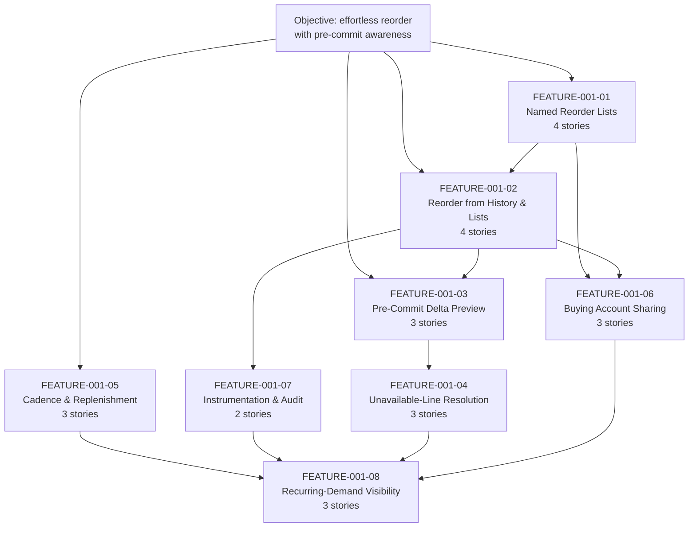

# EPIC-001: Build reorder and replenishment capabilities for returning buyers, so that repeat purchasing requires materially less effort than rebuilding an order from scratch and price and availability changes are surfaced before commit

## 1. Epic Title

**Build reorder and replenishment capabilities for returning buyers, so that repeat purchasing requires materially less effort than rebuilding an order from scratch and price and availability changes are surfaced before commit.**

Delivery is a single self-contained plugin package under `packages/`, added to this Vendure monorepo without editing `packages/core` or `packages/admin-ui`.

---

## 2. Epic Summary

### 2.1 Objective

The objective statement this epic decomposes, quoted verbatim and treated as the source of every quoted traceability label in the story tier:

> "Make it effortless for returning buyers to reorder the items they purchase regularly, so that repeat purchasing on the marketplace requires materially less effort than rebuilding an order from scratch, and so that buyers are made aware of price and availability changes before they commit to a reorder."

Restated as three sentences of build intent: returning buyers gain named, multiple reorder lists carrying a per-line quantity, plus one-step paths from a past order or a saved list into the active cart, so that a repeat purchase stops being a manual rebuild. Before a buyer commits, the same paths report what has changed since the last purchase — a price delta as an integer amount with its currency code, and an availability delta expressed only as the publicly observable stock string — together with an explicit resolution choice for any line that can no longer be added at the requested quantity. Around that core, purchase-cadence detection produces an advisory replenishment due signal, multi-seat buying accounts can share a list under an enforced authorisation check, and every reorder attempt leaves an auditable record and a typed event for the administrative personas who need to see recurring demand.

### 2.2 Business Value, Stated Without Invented Numbers

The value is a reduction in buyer effort and a reduction in post-commit surprise. Effort falls because a reorder resolves an entire past order or a curated list into cart lines through one named operation instead of a per-variant search-and-add loop. Surprise falls because the delta read happens *before* the write, so a buyer sees a changed price or a lost availability while they can still act on it rather than discovering it at checkout.

**This epic states no numeric business target, because this repository declares none.** A search of the tree found no declared service-level commitment, no latency figure, no repeat-purchase-rate claim and no monetary business estimate to measure reorder work against. That absence is reported here as a finding rather than filled with a plausible figure, and it is the reason every acceptance criterion in the story tier replaces a vague adjective with a *verifiable state assertion* — an exact item count with its ordering, an integer money value with its currency code, an exact error type name, one of the three exact stock strings, or a named observable completion signal — rather than with an invented service level.

### 2.3 Confirmed Platform Version

The version was read, not assumed. `@vendure/core` is at **3.7.0** [packages/core/package.json:L2-L3]. This is a Lerna fixed-version monorepo whose `packages/*` glob and single `version` field mean every package in the workspace shares that number [lerna.json:version], so there is no per-package version to reconcile and the plugin this epic describes pins to 3.7.0 across the board.

**Upstream currency — a dated external finding, stated separately from the repository citations and not to be read as one.** The checkout is pinned to 3.7.0, and **3.7.0 is not the newest line published upstream.** As checked on **13 August 2026** against the project's public release list, the newest published release is **v3.7.2, released on 3 August 2026**, with v3.7.1 released on 14 July 2026 and v3.7.0 released on 1 July 2026 — the last of which the local changelog corroborates by date [CHANGELOG.md:L1]. v3.7.2 is a patch on the same minor line, described upstream as carrying fixes for four reported vulnerabilities — one critical, one high and two medium — together with channel-scoping fixes on entity update and delete paths. Three consequences follow, and each is stated rather than implied:

- **The version lock in section 7.1 stays at 3.7.0**, because that is what this checkout declares [packages/core/package.json:L2-L3] and a ticket set may not silently plan against a line the repository does not contain.
- **No ticket in this set may claim that the checkout is on the newest published line.** Two patch releases exist above it. **What a maintainer decides is the upgrade's timing and its target above v3.7.2, not whether the upgrade happens**: because the newest of those two patches is described as carrying security fixes, taking a patched line before production is a hard gate this epic states rather than a preference it leaves open, and section 7.1 carries it as gate G-VER with its four parts.
- **The upgrade is a blocking pre-production gate rather than an optional currency improvement, because the intervening patch line is a security line.** v3.7.2 is described upstream as carrying fixes for four reported vulnerabilities — one critical, one high and two medium — together with channel-scoping fixes on entity update and delete paths, and this epic's own surfaces sit directly in that blast radius: every read and write it adds is channel-scoped by ruling R16, its administrative reads project another party's order-derived data under a permission gate, and its dashboard surfaces render buyer-supplied list names. **So no work in this epic may be validated for production or deployed on 3.7.0.** Two routes are admissible and a third is not. The checkout is rebased onto **at least 3.7.2** before production validation or deployment, every citation in this set being re-resolved against the new tree first as the bullet below requires; **or** a named owner records a dated risk acceptance with an explicit expiry, scoped to non-production work only, on the basis that a development checkout is not internet-facing. **What is not admissible is production sign-off on 3.7.0 with the gate unrecorded**, and section 12's final item and architectural decision 6 in section 8.2 both hold that boundary. This bullet states a security obligation and no numeric target: it names no window, no severity score and no remediation interval, because none is declared anywhere this epic may cite.
- **This finding carries a check date because it decays.** Any reader consulting this section after 13 August 2026 should re-check the release list rather than trust the sentence above; the fact is external, dated and unverifiable from inside the checkout, which is exactly why it is not written in the `[path:locator]` citation form used everywhere else in this file. One further obligation follows from the pin and is stated here rather than left implicit: every line-number locator in this set was resolved against 3.7.0, and a patch release moves lines, so adopting 3.7.1 or 3.7.2 carries the duty to re-resolve every citation in this set against the new tree before relying on it.

**The 3.7.0 breaking changes are a repository citation, not research.** They are recorded in this checkout's own changelog under its `BREAKING CHANGE` heading [CHANGELOG.md:L30-L36], and five shipped with the release: coupon codes on promotions are now compared case-insensitively [CHANGELOG.md:L32]; a production environment still using the default superadmin password will no longer start [CHANGELOG.md:L33]; external authentication links a login to a pre-existing account only when the external email is verified, which additionally requires a custom `AuthenticationStrategy` to set a verified flag on returned provider-verified user data or the account link is refused [CHANGELOG.md:L34]; the email plugin's template and mail-transport dependencies took major upgrades [CHANGELOG.md:L35]; and a health-check dependency is no longer transitively present [CHANGELOG.md:L36]. The third is material to the multi-seat sharing feature, where a seat may arrive through an external identity provider — FEATURE-001-06 inherits it as a precondition rather than as a reorder concern of its own.

**Release cadence, derived from this checkout rather than asserted.** The changelog's own minor-release dates are 3.7.0 on 1 July 2026 [CHANGELOG.md:L1], 3.6.0 on 31 March 2026 [CHANGELOG.md:L182], 3.5.0 on 22 October 2025 [CHANGELOG.md:L470] and 3.4.0 on 1 August 2025 [CHANGELOG.md:L702]. That spacing is what makes `minor` the conventional upstream target for feature-bearing work, and it is derivable from the repository, so no external cadence claim is needed and none is made.

### 2.4 Scope Boundaries — Explicit In-Or-Out Rulings

Five adjacent domains are ruled **OUT**, each with its one-line justification. Nothing below is deferred, and nothing below is left ambiguous.

- **Payment scheduling — OUT.** A reorder places items into an active cart and stops there; the checkout and payment write paths are untouched by the additive-only constraint that governs this epic.
- **Recurring billing — OUT.** It requires a payment-schedule and dunning model that no entity in this repository provides, and building one would exceed an additive plugin boundary.
- **Subscription contracts — OUT.** A contract implies committed future obligations and cancellation terms that the order model does not represent; replenishment signals in this epic are advisory prompts, not commitments.
- **Seller-side inventory forecasting — OUT.** Visibility over *recorded* reorder activity is in scope; predicting future stock requirements has no basis in this repository and no declared numeric target to validate a forecast against.
- **Email template design — OUT.** The replenishment feature deliberately delivers a due-signal *read* rather than a message; any notification transport would sit behind an interface, and template authoring belongs to the email plugin's own surface. **No such interface ships in this epic**: one was proposed for FEATURE-001-05, had no owning story among that feature's three, and was removed for that reason and because this set allocates exactly one configurable strategy in total [tickets/EPIC-001/FEATURE-001-05-purchase-cadence-and-replenishment.md:§2.4 Named Services And Platform Mechanisms]. Nothing in the replenishment feature leaves the process, which discharges the no-external-service constraint more completely than an inert adapter would.

**What must remain unchanged, stated as a countable surface.** The additive-only constraint is only enforceable if the protected surface is enumerable, so it is. The Shop API root `Query` type declares **nineteen** root queries [packages/core/src/api/schema/shop-api/shop.api.graphql:L1-L52], alongside the order, cart and customer-account mutation sets in the same file. Every one of those signatures must be byte-identical after this epic ships. Nineteen is the verified count in this checkout and is stated rather than estimated, because "do not change the existing API" is not a testable boundary until a reviewer can count what existed before. Section 12 makes that count part of the definition of done, and collision C1 in section 6 records the one mechanism that would breach it as a side effect.

**How that count is asserted, which is a rule every feature and story obeys because the obvious phrasing is wrong.** Nineteen is a **baseline**, not a running total, and the distinction is what makes the assertion composable. A feature or story therefore asserts two things and never a third: first, that **each of the nineteen baseline root queries is still present and byte-identical** in name, argument list, argument types, return type and nullability; second, **how many root queries it adds itself, by name**. It does **not** assert an absolute post-plugin total, because such a total is true only until the next feature merges — "the schema still declares nineteen root queries" and "the schema declares twenty root queries" are both false once two query-adding features have shipped, and a set of files each asserting its own total cannot all be right at once. Stating the baseline plus the owned additions is right at every point in the sequence: the baseline never moves, and the additions sum. This epic publishes four Shop root queries in total across FEATURE-001-01, FEATURE-001-03 and FEATURE-001-05, so the fully-merged surface is twenty-three root queries — a figure this epic states **once, here**, and which no feature or story restates as its own assertion.

### 2.5 The Returning-Buyer Journey This Epic Builds

Each step is labelled with the feature that owns it. This is one of exactly two diagrams in this file; story files carry none and reference their parent feature's diagram instead.

```mermaid
flowchart LR
    A["Buyer signs in<br/>existing Shop API"] --> B["Curate a named list<br/>with per-line quantity<br/>FEATURE-001-01"]
    A --> C["Open a past order<br/>via Customer.orders<br/>FEATURE-001-02"]
    B --> D["Request a reorder preview<br/>FEATURE-001-03"]
    C --> D
    D --> E["Read price delta and<br/>availability delta<br/>FEATURE-001-03"]
    E --> F{"Every line addable<br/>at requested quantity?"}
    F -- "Yes" --> H["Apply reorder<br/>to active order<br/>FEATURE-001-02"]
    F -- "No" --> G["Choose skip, reduce,<br/>substitute or abort<br/>FEATURE-001-04"]
    G --> H
    H --> I["Per-line outcome report<br/>FEATURE-001-02"]
    I --> J["Attempt recorded and<br/>event published<br/>FEATURE-001-07"]
    SCH["Scheduled recompute over<br/>placed-order history<br/>FEATURE-001-05"] --> K["Cadence recomputed,<br/>due signal raised<br/>FEATURE-001-05"]
    K --> L["Buyer prompted, or snoozes<br/>FEATURE-001-05"]
    L --> B
    J --> M["Recurring demand visible<br/>to sellers, category managers<br/>and support<br/>FEATURE-001-08"]
    B --> N["Share list with<br/>account seats<br/>FEATURE-001-06"]
    N --> H
    %% Checkout, payment and fulfilment are deliberately absent: the journey ends at a populated cart.
    %% The delta read at E is point-in-time and is not a stock reservation.
    %% NO edge runs from J to K, and that is deliberate. The cadence recompute is not triggered
    %% by a reorder attempt and does not consume the events published at J: it is a scheduled
    %% task deriving intervals from placed-order history, so its entry point is SCH. Section 5
    %% records the reason a transient in-process announcement cannot feed a computation whose
    %% correctness requires a complete history.
    %% The L-to-B edge closes the loop through the BUYER, not through code: a due signal prompts
    %% a buyer, who starts the journey again. No feature reads another's output across it.
```



---

## 3. How To Read This Epic

Four files, chosen after the decomposition was final, answer the four questions a reader arrives with. They are rendered as paths rather than links so that the link count in this file stays equal to the number of features.

- `tickets/EPIC-001-reorder-and-replenishment.md` — answers "what is being built, what already exists, what collides, and what must be decided first".
- `tickets/EPIC-001/FEATURE-001-02-reorder-from-order-history.md` — answers "how does a reorder actually reach the cart, and which existing service does the work".
- `tickets/EPIC-001/FEATURE-001-02/STORY-001-02-01-reorder-complete-past-order.md` — answers "what does one finished, demonstrable unit of this work look like".
- `tickets/EPIC-001/FEATURE-001-03-price-and-availability-delta-preview.md` — answers "how are buyers warned before they commit, and why is that not already solved".

**Total files in this ticket set: 34.** One epic, eight features, twenty-five stories, across ten directories. There is deliberately no index, table of contents, README or glossary: navigation lives in this epic's features index and in each feature's stories index, and an extra file would break the reconciliation that checks this stated total against the on-disk count.

---

## 4. Features Index

Eight features, each carrying two to five stories, totalling twenty-five. Every one of the eight deviates from its originally suggested area, and the deviation is stated with its rationale rather than presented as a straight adoption — only the mechanism-fixing deviations leave the suggested scope intact.

- [FEATURE-001-01 — Named Reorder Lists with Line Quantities](./EPIC-001/FEATURE-001-01-named-reorder-lists.md) — plugin-owned list and list-line tables with per-line quantity, gated with `Permission.Owner` and enforced by a service-layer ownership predicate. **4 stories.**
  - *Deviation: narrowed.* A single unnamed saved list is already shipped and is this platform's canonical teaching example [packages/dev-server/example-plugins/wishlist-plugin/api/api-extensions.ts:L13]. Only *named, multiple* lists carrying a per-line *quantity* are novel.
- [FEATURE-001-02 — Reorder from Order History and Saved Lists](./EPIC-001/FEATURE-001-02-reorder-from-order-history.md) — resolves a past order or a list into cart lines with a per-line outcome report. **4 stories.**
  - *Deviation: expanded.* Absorbs list-to-cart materialisation, because both paths converge on `OrderService.addItemsToOrder` [packages/core/src/service/services/order.service.ts:L654-L676] and splitting them would duplicate the per-line partial-failure contract across two features.
- [FEATURE-001-03 — Pre-Commit Price and Availability Delta Preview](./EPIC-001/FEATURE-001-03-price-and-availability-delta-preview.md) — a point-in-time read of what changed since the last purchase, before any write. **3 stories.**
  - *Deviation: narrowed to pre-commit.* In-cart, post-add price change is already handled by `unitPriceChangeSinceAdded` and `unitPriceWithTaxChangeSinceAdded` [packages/core/src/entity/order-line/order-line.entity.ts:L163-L187] together with `ChangedPriceHandlingStrategy` [packages/core/src/config/order/changed-price-handling-strategy.ts:L7-L38], which section 5 forbids duplicating. Only the *before-commit* read is new.
- [FEATURE-001-04 — Unavailable-Line Resolution and Substitution Candidates](./EPIC-001/FEATURE-001-04-unavailable-line-resolution.md) — skip, reduce, substitute or abort, with candidates behind a configurable strategy. **3 stories.**
  - *Deviation: kept, mechanism fixed.* Substitution sits behind a `SubstitutionCandidateStrategy` interface with a database-backed default, following the `StockDisplayStrategy` precedent [packages/core/src/config/catalog/stock-display-strategy.ts:L6-L32]. Fixing the mechanism this way is what discharges the no-external-service constraint.
- [FEATURE-001-05 — Purchase Cadence Detection and Replenishment Due Signals](./EPIC-001/FEATURE-001-05-purchase-cadence-and-replenishment.md) — a scheduled recompute plus an advisory due-signal read with a snooze. **3 stories.**
  - *Deviation: renamed.* "Reminders" presumes a delivery channel, and message transport is environment-specific and would have to sit behind an interface regardless. The buildable core is a due-signal read plus a `ScheduledTask` recompute, and **no notification adapter is shipped** — one was proposed and removed for having no owning story, as section 2.4 records.
- [FEATURE-001-06 — Multi-Seat Buying Account List Sharing and Permissions](./EPIC-001/FEATURE-001-06-buying-account-list-sharing.md) — share and revoke rows, with authorisation enforced inside the resolver. **3 stories.**
  - *Deviation: kept, mechanism fixed — and the mechanism was fixed twice.* Authorisation is `Permission.Owner` [packages/dev-server/example-plugins/wishlist-plugin/api/wishlist.resolver.ts:L12] plus an explicit service-layer predicate that re-checks live customer-group membership on every use, not a new authentication strategy and **not** a `CrudPermissionDefinition` — collision C7 records why the latter cannot work for a buyer.
- [FEATURE-001-07 — Reorder Event Instrumentation and Audit Trail](./EPIC-001/FEATURE-001-07-reorder-instrumentation.md) — an auditable attempt record and three typed events with documented payload schemas. **2 stories.**
  - *Deviation: partially dropped.* "Experiment readiness" is dropped on two independently citable grounds: this repository declares no numeric business target to experiment against, and an experimentation platform would be an external-service dependency the constraints forbid. Instrumentation is retained in full.
- [FEATURE-001-08 — Recurring-Demand Visibility for Sellers, Category Managers and Support](./EPIC-001/FEATURE-001-08-recurring-demand-visibility.md) — three server-scoped Admin API reads over rows owned elsewhere, surfaced in the dashboard. **3 stories.**
  - *Deviation: expanded.* Absorbs the Customer Support Agent read path. **The reason is shared plumbing rather than a shared aggregate, and it is worth stating precisely because the looser version is not true:** the support lookup calls different operations over a partly different table set from the two demand views, so what a separate support feature would duplicate is the plugin service class, the permission registration, the generated list-options consumption, the dashboard extension with its bundling and catalogue wiring, and the server-side scoping contract — five pieces of wiring, plus a read of the same `ReorderAttempt` and `ReorderAttemptLine` rows. That is enough to make one feature the right unit; claiming one aggregate would not survive contact with the operation list [tickets/EPIC-001/FEATURE-001-08-recurring-demand-visibility.md:§2.2 Contribution To The Epic, And The Expanded Rationale].

### 4.1 Feature Dependency Graph With Batch Sequencing



**Every gate named in section 9.4.1 is drawn as an edge above, and the `F6 → F8` edge is present for exactly one consumer.** The edge exists because story 08-03's support lookup reads the `ReorderListShare` rows story 06-01 creates, so it is a genuine producer-to-consumer dependency and not a scheduling preference. It is narrower than the `F7 → F8` edge beside it: `F7 → F8` governs all three FEATURE-001-08 stories because every recurring-demand read aggregates the attempt rows, whereas `F6 → F8` governs story 08-03 alone — 08-01 and 08-02 read no share row and are not gated by it. Section 9.4.1 states that consequence at story granularity; the edge is what makes the feature-level figure agree with it rather than contradict it.

---

## 5. Existing Mechanisms That Must Not Be Duplicated

Fourteen rows. Thirteen are capabilities already present in this checkout that the reorder work must **consume**, not reinvent; the fourteenth is a capability that exists and is deliberately **excluded**, because naming what must not be consumed is as load-bearing as naming what must. Every row was read in this repository and carries a resolvable locator. A story that rebuilds a consumable row, or that leans on the excluded row, is rejected at review, and the prohibition column states precisely what that would mean so the rejection is not a judgement call.

| Mechanism / identifier | Citation | What it already does | Consuming feature | The prohibition |
|---|---|---|---|---|
| `unitPriceChangeSinceAdded` and `unitPriceWithTaxChangeSinceAdded` | [packages/core/src/entity/order-line/order-line.entity.ts:L163-L187] | Calculated getters that report a non-zero delta when a line's unit price changed since it was added, derived from the `initialListPrice`, `listPrice` and `listPriceIncludesTax` columns declared at [packages/core/src/entity/order-line/order-line.entity.ts:L113], [packages/core/src/entity/order-line/order-line.entity.ts:L121] and [packages/core/src/entity/order-line/order-line.entity.ts:L128] | FEATURE-001-03 | Do not add a plugin-owned column, field or getter that recomputes an in-cart price delta. The pre-commit preview reads variant price directly and is a *separate* concern from these getters, which govern lines already in an order. |
| `ChangedPriceHandlingStrategy.handlePriceChange` | [packages/core/src/config/order/changed-price-handling-strategy.ts:L7-L38] | Governs the outcome when a variant price changed while an item is already in an order; its own JSDoc ties that outcome to the two getters above [packages/core/src/config/order/changed-price-handling-strategy.ts:L13] | FEATURE-001-03 | Do not implement plugin logic that decides which price wins after an add. That decision is already configurable and deployment-owned; the reorder preview only *reports* before the add. |
| `OrderService.addItemsToOrder`, and the already-published Shop API mutation `addItemsToOrder` | [packages/core/src/service/services/order.service.ts:L654-L676] and [packages/core/src/api/schema/shop-api/shop.api.graphql:L74] | Bulk add that resolves an existing line per variant, validates quantity, and returns `{ order, errorResults }`. **Its accumulation behaviour is partial, and section 6.1 collision C0 states the three limits exactly** — the `errorResults` collection carries no per-item key [packages/core/src/service/services/order.service.ts:L665], a successful item pushes nothing onto it, and an unresolvable variant *throws* rather than accumulating [packages/core/src/service/services/order.service.ts:L684] and [packages/core/src/service/services/order.service.ts:L693]. The mutation `addItemsToOrder(inputs: [AddItemInput!]!): UpdateMultipleOrderItemsResult!` exposes the same contract publicly with the same three limits [packages/core/src/api/schema/shop-api/shop.api.graphql:L73] | FEATURE-001-02 and FEATURE-001-04 | Do not write a per-variant add loop, and do not invent a second partial-success mechanism inside the platform's write path. **Do not, however, treat `errorResults` as a per-line outcome report:** it cannot be correlated back to a requested line, so the plugin owns the correlation, as collision C0 requires. The plugin calls this service exactly once per reorder and derives each line's applied quantity from the target order's own per-variant line quantities. Partial-success semantics exist at *both* layers, so a story must state which layer it consumes. |
| `Customer.orders(options: OrderListOptions): OrderList!` | [packages/core/src/api/schema/common/customer.type.graphql:L11] | The order-history read path, already reachable through `activeCustomer` and already paginated, sortable and filterable | FEATURE-001-02 | Do not add a reorder-specific order-history query. FEATURE-001-02 reads history through this field and adds only the reorder write path. |
| `StockLevelService.getAvailableStock` | [packages/core/src/service/services/stock-level.service.ts:L72-L79] | Resolves available stock for a variant through the configured stock-location strategy, so multi-location deployments are handled without plugin awareness | FEATURE-001-03 and FEATURE-001-04 | Do not query `StockLevel` rows directly and do not sum `stockOnHand` in plugin code. Call the service so the configured location strategy stays authoritative. |
| `StockDisplayStrategy` and `DefaultStockDisplayStrategy` | [packages/core/src/config/catalog/default-stock-display-strategy.ts:L14-L23] | Converts a saleable stock level into exactly one of `OUT_OF_STOCK`, `LOW_STOCK` or `IN_STOCK`, deliberately avoiding a raw-number leak over a public API [packages/core/src/config/catalog/stock-display-strategy.ts:L6-L32] | FEATURE-001-03 | Do not expose a numeric stock figure on any Shop API field. `StockLevel` is not a Shop API type at all, so availability is publicly observable only as one of those three strings. |
| The permission-definition family: `PermissionDefinition`, `CrudPermissionDefinition` and `RwPermissionDefinition` | [packages/core/src/common/permission-definition.ts:L86-L107], [packages/core/src/common/permission-definition.ts:L146-L199] and [packages/core/src/common/permission-definition.ts:L245-L281] | Three definition shapes yielding one, four and two permissions respectively from a single name, each registered through `authOptions.customPermissions` and enforced with the `@Allow` decorator; the Crud form's own JSDoc example is a wishlist resolver [packages/core/src/common/permission-definition.ts:L132] | FEATURE-001-04 and FEATURE-001-08 — **administrative operations only** | Do not hand-declare permission strings, and do not build a bespoke authorisation layer. Choose the **narrowest** shape for the surface: a read-only Admin query takes a single-member `PermissionDefinition`, not a four-member Crud definition whose other three members nothing checks. **Do not gate a buyer-facing operation with any of the three** — collision C7 shows a customer session can never hold one; buyer operations take `Permission.Owner` plus the service-layer predicate collision C3 makes the actual control. |
| `EventBus.publish` and `EventBus.ofType` | [packages/core/src/event-bus/event-bus.ts:L116] and [packages/core/src/event-bus/event-bus.ts:L130] | Typed publish and typed subscribe over the existing event catalogue, with transaction-aware delivery | FEATURE-001-07 | Do not add a webhook dispatcher, a polling table or a second message bus. Reorder events are published on this bus and consumed with `ofType`. |
| `JobQueueService.createQueue` | [packages/core/src/job-queue/job-queue.service.ts:L51-L82] | The queue factory on the injectable job-queue service, so background work inherits the deployment's configured job-queue strategy | FEATURE-001-05 | Do not spawn a timer, an interval or a worker thread in plugin code. Background recompute work is enqueued here. |
| `ScheduledTask` configuration shape, and the shipped `cleanSessionsTask` | [packages/core/src/scheduler/scheduled-task.ts:L42-L96] and [packages/core/src/scheduler/tasks/clean-sessions-task.ts:L37] | A cron-scheduled task definition carrying `id`, `description`, `params`, plus `schedule` [packages/core/src/scheduler/scheduled-task.ts:L75], `timeout` [packages/core/src/scheduler/scheduled-task.ts:L83] and `execute` [packages/core/src/scheduler/scheduled-task.ts:L95], configured through `schedulerOptions.tasks` and overridable per deployment; `cleanSessionsTask` is the shipped worked example | FEATURE-001-05 | Do not write a cron implementation and do not hard-code a schedule in plugin source. The schedule is deployment-configurable, and the task follows the shipped example's shape. |
| `generateListOptions`, and `ListQueryBuilder` which applies what it generates | [packages/core/src/api/config/generate-list-options.ts:L31-L60] and [packages/core/src/service/helpers/list-query-builder/list-query-builder.ts:L209] | The generator auto-generates a `${TargetType}ListOptions` input with sort and filter parameters for any query returning a paginated list type; the builder is what then **applies** those options, clamps the page to the configured maximum and rejects an over-limit request [packages/core/src/service/helpers/list-query-builder/list-query-builder.ts:L638] | FEATURE-001-01, FEATURE-001-04, FEATURE-001-05, FEATURE-001-06 and FEATURE-001-08 — every feature that returns a collection, per section 7.7 | Do not hand-write a filter, sort, skip, take or filter-combination input anywhere. Return a `PaginatedList` type and let the generator produce the options input. **And do not stop at the generator:** it produces *arguments* only, so a resolver that accepts them without passing them to the builder is unpaginated in every respect that matters. The builder applies them and enforces the limit; skipping it is the failure this row exists to prevent. |
| Migration lifecycle: `runMigrations`, `revertLastMigration`, `generateMigration` | [packages/core/src/migrate.ts:L40], [packages/core/src/migrate.ts:L89] and [packages/core/src/migrate.ts:L118] | The full migration lifecycle, already wired to a command-line interface and documented as `vendure migrate` [skills/vendure-cli/commands/migrate.md:L1] | Every story with a migration sub-task | Do not write raw DDL scripts, a bespoke migration runner or a schema-sync toggle. Generate an additive migration through the existing lifecycle. |
| Benchmark harness — the **vitest-plus-tinybench** path, which is the only executable one | [e2e-common/vitest.config.bench.ts:L7] collects every `*.bench.ts` file; [packages/core/package.json:L30] is the script form that runs it; [package.json:L62] supplies the timing library; [packages/core/e2e/default-search-plugin.bench.ts:L5] and [packages/core/e2e/default-search-plugin.bench.ts:L18] are the shipped exemplar, which boots a server through `@vendure/testing` on the sql.js initializer and so needs no external database service | Runs a benchmark specification against a booted Vendure server with no external binary and no service dependency, and normalises for machine speed by deriving a margin factor and a CPU factor from a calibration task before comparing [packages/core/e2e/default-search-plugin.bench.ts:L78-L79] | The epic definition of done, section 12 | Do not build new performance tooling, do not add a benchmark runner, and do not invent a target figure. Section 7.6 names the four scenarios and the exact command form; the comparison is before-versus-after in one run on one machine. **Note the exemplar also asserts against a hard-coded constant [packages/core/e2e/default-search-plugin.bench.ts:L110] — copy the normalisation, never the constant, because no reorder target is declared anywhere in this repository.** |
| The two k6 harnesses — named here as **excluded**, with the reason | [packages/dev-server/load-testing/benchmarks.ts:L84] spawns the `k6` binary; [packages/dev-server/README.md:L48] states that k6 must be installed and available on the path; [packages/dev-server/package.json:L23-L25] are the load-test scripts and [packages/dev-server/README.md:L56] describes what they do | `benchmarks.ts` populates a dataset and then runs a k6 script; the `load-test:*` scripts run a **different** harness that parameterises a product count and runs its own k6 scripts | Nothing in this epic | Do not cite either as this epic's benchmark authority. Three independent reasons, each checkable: **no script invokes `benchmarks.ts` at all** — it appears in no `scripts` block in this workspace; both paths require an external binary this repository neither vendors nor installs in its setup action; and `benchmarks.ts`'s own documented dataset is **not the dataset it builds**, as section 7.6 records. A story that names either as its evidence has named a command that will not run. |

---

## 6. Feasibility Collisions Surfaced

Ten collisions between the epic's constraints and the mechanics this platform actually enforces. **Ranking criterion: descending consequence, where consequence is measured first by whether the mechanism makes a proposed design unbuildable or unusable, second by whether it breaches the additive-only constraint at all, and third by how many of the twenty-five stories must change their design if the collision is not resolved before build.** The two groups below are physically separated because they were established by different means, and a reader must be able to tell a repository fact from a documentation claim.

**Identifier stability note, because the ranking and the labels are not the same thing.** C1 through C6 keep the identifiers they were first published with, and every sibling file's reference to them stays valid. C7 through C10 were added after a review of this epic against the platform's source found four further collisions, and they are appended rather than interleaved so that no existing reference is silently re-pointed. **The ranked order by consequence is therefore C7, C8, C1, C9, C10, C3, C2, C4, C5, C6** — an identifier is a label, not a rank. C7 ranks first because it makes every buyer-facing operation in this epic unreachable rather than merely mis-shaped; C8 ranks second because the outcome report the epic's central promise depends on cannot be produced the way it was first described; C1 ranks third because it is the entry that would silently alter two already-published mutations.

Four of the ten — C1, C2, C3 and C5 — are the mechanisms that widen an existing signature or a published enum as a side effect of an otherwise additive change. The architectural constraints require that such a widening be **reported here rather than silently accepted**, and all four are. C1 is reported as a violation and is refused outright; C2, C3 and C5 are reported as declared side effects whose obligations are carried into the stories.

A third group follows the two collision groups and is deliberately **not** a collision group: it carries the discrepancies found in existing repository documentation, which are noted rather than propagated.

### 6.1 Repository-Discovered Collisions

**C1 — Custom-fields argument and type-shape widening. Verdict: a reportable violation of the additive-only constraint, not a manageable side effect.**

Defining a custom field on `OrderLine` forces an extra `customFields` argument onto the existing `addItemToOrder` and `adjustOrderLine` mutations and onto the related fields of `ModifyOrderInput`. This is not an inference — the generator's own JSDoc states it [packages/core/src/api/config/graphql-custom-fields.ts:L455-L469], and the Shop API schema says the same thing in its own docstrings above `addItemToOrder` [packages/core/src/api/schema/shop-api/shop.api.graphql:L71] and above `adjustOrderLine` [packages/core/src/api/schema/shop-api/shop.api.graphql:L79]. The widening is not opt-in at request time either: the custom-fields generators run inside `buildSchemaFromVendureConfig` on every boot, after plugin API extensions have already been merged [packages/core/src/api/config/get-final-vendure-schema.ts:L87-L118]. There is a guard that skips extension with a warning when a type already declares a `customFields` field [packages/core/src/api/config/graphql-custom-fields.ts:L54-L58], but it protects the generator from collision, not the published signature from widening.

*Consequence.* Any story that reaches for a custom field on `OrderLine` changes the signature of two operations this epic promised not to touch. The constraint's instruction is explicit that a side-effect widening is to be reported here rather than silently accepted, which is why this entry exists.

*Resolution — settled, not offered as a choice.* **This epic declares zero custom fields on any core entity, and no story in this set may declare one.** Every piece of reorder state — list membership, per-line quantity, share grants, cadence, attempt outcomes — lives on a plugin-owned table keyed by entity id, and the ownership link is a `customerId` column on that table rather than a relation field on `Customer`. The alternative of accepting the widening **is withdrawn**: the architectural constraints classify a side-effect widening of an existing operation as a reportable violation rather than a manageable cost, so it is not a decision a maintainer is being asked to take. Section 8.2 records the ruling instead of an open decision, and section 12 makes the empty custom-fields object part of the definition of done.

Two mitigations were considered and **both are rejected as insufficient**, recorded here so that neither is later mistaken for a route back in. The wishlist plugin's `internal: true` flag keeps a custom field out of the API entirely and is the pattern this repository already uses [packages/dev-server/example-plugins/wishlist-plugin/wishlist.plugin.ts:L18-L24], and the generator honours it by filtering internal fields out before widening anything [packages/core/src/api/config/graphql-custom-fields.ts:L467] — but it is a per-field opt-out that a later contributor can omit without failing any check, so it protects nothing structurally, and collision C6 shows that a struct custom field cannot use it at all. Note also that `Customer.customFields` currently resolves to the JSON scalar in the checked-in Shop API snapshot [schema-shop.json:customFields], so a reader cannot infer the current shape from a typed field.

**C2 — Automatic `ErrorCode` enum growth. Verdict: a declared, manageable side effect, additive for clients that carry a default branch.**

Every type implementing the `ErrorResult` interface is appended to the published `ErrorCode` enum automatically, by name-derived upper-snake conversion [packages/core/src/api/config/generate-error-code-enum.ts:L5-L33], keyed off the interface-name constant in the same file [packages/core/src/api/config/generate-error-code-enum.ts:L3]. The enum ships with a single literal member in source [packages/core/src/api/schema/common/common-enums.graphql:L28-L30] and is populated at build time.

*Consequence, with the two APIs counted separately because the generator runs once per API and the figures differ.* **The Shop API** snapshot currently carries **thirty-two** `ErrorCode` members and **thirty-one** types implementing `ErrorResult` [schema-shop.json:ErrorCode] — thirty-one implementors plus the literal unknown-error member. **The Admin API** carries **forty-seven** members and **forty-six** implementors [schema-admin.json:ErrorCode]. Wherever this epic or a sibling file quotes thirty-one or thirty-two, the figure is **Shop-only and is labelled as such**; a story that names an error vocabulary for an Admin operation states the Admin figures instead. All six new error results are declared through `shopApiExtensions` **as field-complete object types implementing `ErrorResult`, one declaration each, in the three feature sections section 6.4 names** — which is the precondition for any growth at all, since the generator derives members from the implementing types it finds rather than from union membership [packages/core/src/api/config/generate-error-code-enum.ts:L11-L19] — and none is reachable from an Admin operation, so **the Shop enum grows from thirty-two to thirty-eight and the Admin enum stays at forty-seven** — the Admin surface this epic adds reports invalid input by throwing rather than by declaring an error result, as FEATURE-001-04 and FEATURE-001-08 state. No existing member is removed or renamed in either API, so this is additive; but it *is* a change to a published enum, and a client that switches exhaustively on `ErrorCode` without a default branch will break.

*Recommended resolution.* Accept the growth, declare it in the story that introduces each error result, and require a default branch in every consuming example. The generator runs after plugin extensions are merged [packages/core/src/api/config/get-final-vendure-schema.ts:L107], so a plugin-declared error result reaches the enum with no extra wiring — which is exactly why the growth cannot be avoided by ordering.

**C3 — Automatic `Permission` enum growth, `Permission.Owner` is not an access control, and a custom permission cannot reach a customer at all. Verdict: the enum growth is a declared side effect; the other two halves are correctness traps, and the third would make every buyer-facing operation unreachable if it were not carried into the design.**

The `Permission` enum is declared with no members in source and annotated as populated at run time [packages/core/src/api/schema/common/common-enums.graphql:L20-L21], filled by `generatePermissionEnum` from the default and custom permission definitions [packages/core/src/api/config/generate-permissions.ts:L39-L68], and that generator also runs after plugin extensions are merged [packages/core/src/api/config/get-final-vendure-schema.ts:L116]. Registering the three new permission definitions this epic settles on in section 6.4 therefore grows a published enum by **four members**, on the same additive-but-published footing as C2 — four rather than three because one of the three is a read-write definition that yields two members [packages/core/src/common/permission-definition.ts:L255-L262]. **Stated with before-and-after figures rather than only as a delta, so the growth is as concrete here as C2's is:** both checked-in snapshots currently publish **ninety-seven** `Permission` members [schema-admin.json:Permission] and [schema-shop.json:Permission], so **each enum goes from ninety-seven to one hundred and one**. **The entitlement to the seller-unscoped form of FEATURE-001-08's aggregate read is deliberately not a fourth definition**, and that is the one place this count could have grown and does not. The separation of scope from read is retained rather than abandoned: deriving "no seller to filter by" and "authorised to see every seller" on a single branch is fail-open, so the wide form does need an entitlement of its own. It does not need a *new* one — the platform already publishes a member that says exactly that, `Permission.ReadSeller`, generated from the shipped `new CrudPermissionDefinition('Seller')` [packages/core/src/common/constants.ts:L71] — so the wide form is admitted by requiring `ReadSeller` *together with* the narrow read permission in code, rather than by registering a second name for the same idea [tickets/EPIC-001/FEATURE-001-08-recurring-demand-visibility.md:§2.7 The Seller-Scoping Rule, Stated As A Hard Contract]. Requiring an already-published member costs this row nothing. Least privilege is preserved — a seller-scoped role holds the read permission and not `ReadSeller` — and the published enum does not grow for a scope. The figure is identical in the two APIs because the generator draws from one registry rather than per-API sets [packages/core/src/api/config/generate-permissions.ts:L46] — which is worth stating plainly, because **all four new members gate Admin operations only and yet all four appear in the published Shop enum as well.** That is not a leak: an enum member is a name, and the operations it gates are absent from the Shop schema. It does mean a Shop-side client switching exhaustively on `Permission` without a default branch will break, exactly as ruling R9 requires every consuming example to guard against.

The second half is the ownership caveat, stated in the platform's own source: any resolver using `Permission.Owner` **must** include logic enforcing that only the owner of the resource has access, and if it does not, the effect is equivalent to `Permission.Public` [packages/core/src/api/config/generate-permissions.ts:L32-L34].

**The third half is the one that decides the design, and it was read rather than assumed: a custom permission definition can never be granted to a customer.** Three citations establish it and none of them is an inference:
- **The Customer Role ships holding exactly one permission.** It is created with `permissions: [Permission.Authenticated]` [packages/core/src/service/services/role.service.ts:L443] and it is the special role every customer user is given [packages/core/src/service/services/user.service.ts:L106-L107].
- **That role cannot be amended.** `RoleService.update` throws `error.cannot-modify-role` when the target is the Customer Role [packages/core/src/service/services/role.service.ts:L290-L291], so there is no Admin API call, no seeding step and no configuration that adds a permission to it. It is assigned to each newly created channel [packages/core/src/api/resolvers/admin/channel.resolver.ts:L65-L67], so the constraint holds on every channel rather than only on the default one.
- **`Permission.Owner` is not assignable either, and that is deliberate.** It is declared `assignable: false` and `internal: true` [packages/core/src/common/constants.ts:L28-L31]. What makes it usable on a customer-facing resolver is the guard's own arithmetic: `authorizedAsOwnerOnly` is set when the session lacks the required permission and `Permission.Owner` was requested [packages/core/src/service/helpers/request-context/request-context.service.ts:L109], and the access-control strategy admits the request on that basis [packages/core/src/config/auth/default-entity-access-control-strategy.ts:L56]. That is exactly why the platform warns it is equivalent to `Permission.Public` without in-resolver logic — the gate lets everyone through by construction.
*Consequence, and it is a design consequence rather than a note.* A buyer-facing operation gated on a `CrudPermissionDefinition` permission is **refused for every customer in every channel**, because no customer can ever hold that permission. A story that gates one that way ships an operation nobody can call. Symmetrically, a buyer-facing operation gated on `Permission.Owner` alone is **open to everyone**, including an unauthenticated session. Neither gate is a control; the control is always the in-resolver ownership check.
*Recommended resolution, in two halves that must not be mixed up.*
- **Buyer-facing Shop API operations gate on `Permission.Owner` and enforce ownership in the resolver or the service it delegates to.** This is the shipped pattern rather than a proposal: the wishlist example plugin's three customer-facing operations are each declared `@Allow(Permission.Owner)` [packages/dev-server/example-plugins/wishlist-plugin/api/wishlist.resolver.ts:L11-L12] and its service resolves the acting customer from the session's active user id [packages/dev-server/example-plugins/wishlist-plugin/service/wishlist.service.ts:L74-L76]. Every reorder story therefore carries "a request authenticated as a different customer is refused" and "an unauthenticated request is refused" as mandatory acceptance criteria, because the resolver logic is the only thing enforcing either.
- **Admin API operations gate on a registered `CrudPermissionDefinition` or `RwPermissionDefinition` permission**, which an administrator role genuinely can be granted through `RoleService.create` and `update` for any role other than the two special ones [packages/core/src/service/services/role.service.ts:L290-L291]. That is where the enum growth in this entry actually comes from, and it is the only place a custom permission is load-bearing.
Ownership enforcement is consequently load-bearing across FEATURE-001-01, FEATURE-001-02, FEATURE-001-03, FEATURE-001-05 and FEATURE-001-06, and permission-definition registration is load-bearing only in FEATURE-001-04's and FEATURE-001-08's administrative surfaces.
*One consequence for the enum count, so the arithmetic in this epic stays honest.* The enum growth reported at the head of this entry is **three definitions producing four published members, all of them administrative** — the count section 6.4's published-symbol inventory fixes and the only count any file in this set may state. **An earlier revision stated four definitions producing five members**, which was the arithmetic before FEATURE-001-08 separated the seller-unscoped entitlement from the aggregate read and satisfied it with the platform's existing `Permission.ReadSeller` rather than with a definition of its own; that count is withdrawn here rather than left to be reconciled by a reader who found two different figures in one section. The four members break down as follows. The epic proposes **three** permission definitions, all three administrative and none buyer-facing: one read-write definition gating FEATURE-001-04's curation surface, which alone yields two members; and two single-member definitions in FEATURE-001-08 — one for the recurring-demand aggregate read, and a second, narrower one for the customer-support lookup, kept apart so that a seller or category role cannot reach a buyer's lists and attempt history. **The seller-unscoped form of the aggregate read is still entitled explicitly rather than derived, and it costs this epic no definition and no enum member, because the entitlement it uses already ships**: it is the platform's own `Permission.ReadSeller`, generated by the core definition for the `Seller` entity [packages/core/src/common/constants.ts:L71] whose read member is the entity name prefixed with `Read` [packages/core/src/common/permission-definition.ts:L181-L182]. **An earlier revision of this paragraph proposed a fourth definition for that scope**, which separated the entitlement from the read — the right separation, reached by declaring a new member where an existing one already carries exactly the meaning "may see across sellers". The separation is preserved and the definition is withdrawn; deriving "no seller to filter by" and "authorised to see every seller" on one branch still fails open and is still refused. No definition is registered for a buyer-facing operation, because a definition registered for one would gate nothing and refuse everyone. **And no fourth definition is registered for the seller-unscoped form of the aggregate**: that scope is authorised by requiring the narrow read permission together with the platform's own `Permission.ReadSeller` [packages/core/src/common/constants.ts:L71] through `ctx.userHasAllPermissions` [packages/core/src/api/common/request-context.ts:L295-L305], which is ruling R3's AND mechanism rather than a new name.

**C4 — This repository's own breaking-change classification collides with "additive migrations only". Verdict: an unresolved process collision that this epic surfaces rather than settles.**

The contribution guide classifies *any* change to the database schema as a breaking change requiring a `BREAKING CHANGE` commit section [CONTRIBUTING.md:§Breaking Changes], and instructs that the pull request be made against the `major` branch rather than `master`. Its worked example is not an analogy — it is literally a migration adding a new field to the `Customer` table. Meanwhile the guide sends new features to the `minor` branch [CONTRIBUTING.md:§New features].

*Consequence.* This epic adds seven plugin-owned tables. Read literally, the guide routes that work to `major` even though every migration is additive, no existing column changes type, and no destructive statement is issued. That directly contradicts the epic's own framing of the migrations as additive.

*Recommended resolution.* None is imposed here, because a branch strategy is not this epic's to choose. The collision is recorded as an open decision in section 8, with the observation that the classification's own wording turns on "breaking", and that seven *new* tables break no existing consumer. A research note bearing on the decision appears in section 6.2.

**C7 — A customer session cannot hold a custom permission, so a `CrudPermissionDefinition` gate on a buyer operation publishes the operation and then makes it unreachable. Verdict: the highest-consequence collision in this epic, and the one that invalidates the largest amount of its first design.**

The chain is short and every link is in this checkout. A customer's `User` is created with exactly one role, the special customer role [packages/core/src/service/services/user.service.ts:L99-L107], and that role is created with exactly one permission, `Permission.Authenticated` [packages/core/src/service/services/role.service.ts:L433-L444]. The role cannot be edited to add one, because the update path refuses any modification of it by code [packages/core/src/service/services/role.service.ts:L290]. The guard then resolves the session and asks the configured access-control strategy whether the request's permission list is satisfied [packages/core/src/api/middleware/auth-guard.ts:L79-L86], treating `Permission.Owner` as the one member that changes how the session itself is obtained [packages/core/src/api/middleware/auth-guard.ts:L57]. A storefront request therefore arrives holding `Permission.Authenticated` and nothing else — never `CreateReorderList`.

*Four things are distinct here, and conflating any two of them produces either an unreachable operation or a public one. This epic states them separately once, and every feature and story file uses these four terms rather than restating the mechanism.* **(1) The session permission** is `Permission.Authenticated`, the single member the Customer Role is created with [packages/core/src/service/services/role.service.ts:L443]; a session never holds `Permission.Owner`, and no configuration can give it one. **(2) The resolver requirement** is what `@Allow(Permission.Owner)` declares — a permission the resolver asks for, not one the caller presents. **(3) Owner-only admission** is how that requirement is satisfied without the caller holding it: the guard mints an anonymous session when none is presented [packages/core/src/api/middleware/auth-guard.ts:L140], the request context records `authorizedAsOwnerOnly` precisely when the caller does *not* hold the required permission [packages/core/src/service/helpers/request-context/request-context.service.ts:L109], and the configured access-control strategy admits on that flag alone [packages/core/src/config/auth/default-entity-access-control-strategy.ts:L49-L57] — so the gate admits every request that reaches it, authenticated or anonymous. **(4) The service ownership predicate** is therefore the whole of the control, exactly as the platform's own source insists [packages/core/src/api/config/generate-permissions.ts:L32-L34]. A ticket that says a customer session "holds Owner" has described a state that cannot exist and, worse, has implied that the gate is doing work it does not do.

*Consequence.* Every buyer-facing operation this epic proposes — the eight in FEATURE-001-01, the reorder mutation in FEATURE-001-02, the preview in FEATURE-001-03, the two in FEATURE-001-05 and the two in FEATURE-001-06 — would return a forbidden error to every customer, for every request, with no configuration a deployment could apply to fix it. Fourteen of the fourteen Shop API operations are affected. This is not a hardening gap; it is an unusable API.

*Resolution — settled.* **Buyer-facing Shop API operations are gated with `@Allow(Permission.Owner)` and nothing else, paired with the mandatory in-service ownership and channel predicate that C3 requires.** That is exactly what the shipped saved-list precedent does on all three of its operations [packages/dev-server/example-plugins/wishlist-plugin/api/wishlist.resolver.ts:L12], and the core Shop resolvers do the same. **Custom permission definitions are reserved for Admin API operations**, where an administrator's role is editable and a permission is therefore grantable. Section 6.4 fixes the resulting inventory and is the **only** place in this set that states it: **three definitions yielding four published members, all administrative, zero buyer-facing custom permissions** — `RwPermissionDefinition('ReorderSubstitution')` owned by FEATURE-001-04 and contributing two members, and the two single-member definitions `ReadReorderDemand` and `ReadReorderCustomerActivity` owned by FEATURE-001-08. **A feature or story cites that row rather than restating a count**, and an earlier revision of this sentence declared a fourth definition for the seller-unscoped scope entitlement, which is now carried by the platform's existing `Permission.ReadSeller` [packages/core/src/common/constants.ts:L71] and therefore adds no member. The one thing this resolution does *not* do is reduce the obligation in C3 — with `Permission.Owner` the in-service predicate is not merely mandatory, it is the entire control [packages/core/src/api/config/generate-permissions.ts:L32-L34].

**C8 — `addItemsToOrder` cannot report which requested line an error belongs to, and one class of stale line throws instead of accumulating. Verdict: the epic's per-line outcome promise is unbuildable as first described and the plugin must own the correlation.**

Three limits, read from the method body rather than from its docstring. First, the accumulator is a flat array of error results with no index and no variant key [packages/core/src/service/services/order.service.ts:L665], so two lines failing with the same error type are indistinguishable in the return value. Second, a successful item pushes nothing, so the array's length carries no positional relationship to the requested items. Third — and this is the sharpest — a variant that no longer satisfies `enabled: true` with a null `deletedAt` is loaded with a throwing accessor [packages/core/src/service/services/order.service.ts:L684] and a variant whose parent product has been disabled raises an explicit throw [packages/core/src/service/services/order.service.ts:L693]; there is no `try` and no `catch` in the method, so either case abandons the loop. Under the `@Transaction()` decorator the surrounding transaction is then rolled back [packages/core/src/connection/transaction-wrapper.ts:L67-L70], so **every line already written is discarded**.

*Consequence.* "One outcome per requested line" cannot be satisfied by mapping `errorResults`, and a single item disabled since the last purchase would abort a whole reorder — which is precisely the scenario a reorder feature exists to handle.

*Resolution — settled, and it revises the one-call constraint rather than abandoning it.* The plugin owns the correlation, in four fixed steps. **(1) Index and deduplicate:** each requested line is assigned a zero-based `requestIndex`, and requested items are collapsed to one entry per `productVariantId` with quantities summed, so a variant maps to at most one core item and a per-variant reading is unambiguous. **(2) Prevalidate:** before the core call the plugin loads each variant under the same predicate the core method uses and reads its saleable quantity through the same service the core path uses, classifying every line that would throw or clamp to zero as a per-line outcome of its own — so no unresolvable line is ever passed to the core call and the throw is never reached. **(3) Call once:** `OrderService.addItemsToOrder` is called exactly once, with only the lines prevalidation admitted; no per-variant add loop is written. **(4) Reconcile by delta:** each key's applied quantity is the difference between the target order's line quantity for that variant after the call and before it, which is authoritative and needs no key. Any error result the plugin cannot attribute to exactly one variant is surfaced at request level as an error code, **never attributed to a line on a guess**.

*The grain the four steps produce, stated here so no reader infers it from the refuted phrase above.* The quoted expectation "one outcome per requested line" is named at the top of this entry as the thing the core accumulator cannot deliver, **and it is not what this epic publishes either.** Ruling R4 fixes the published grain as **one entry per projected variant key, each carrying its `requestIndex` and the full `contributors` collection** naming every source line that fed it with that line's own requested quantity. That grain is single-valued across this epic on purpose: the reconciliation in step 4 measures a quantity per **variant**, because the core resolves one order line per variant [packages/core/src/service/services/order.service.ts:L669-L674] and sums same-variant quantities across items [packages/core/src/service/services/order.service.ts:L695-L702], so a per-source-line applied quantity exists in no order state and any split of one key's applied quantity between two contributors would be a fabricated number wearing the shape of a measured one. **The audit grain is deliberately different and that difference is not a contradiction:** FEATURE-001-07 writes one attempt-line row per requested source line to preserve lineage, and correlates each row to its published entry by `requestIndex`. FEATURE-001-02 publishes the resulting contract, FEATURE-001-03 publishes the preview at the same grain so a preview entry and a commit entry are joinable, and FEATURE-001-07 records from it.

**C9 — An audit row written in the reorder transaction cannot survive that transaction's failure, and an event published inside it is not delivered if it rolls back. Verdict: three guarantees that cannot all hold; one must be chosen and the other two withdrawn.**

The wrapper commits on success and rolls back on any thrown error [packages/core/src/connection/transaction-wrapper.ts:L64] and [packages/core/src/connection/transaction-wrapper.ts:L67-L70], which disposes of the idea that a row written inside the transaction can record a failure that aborted it. Delivery is the same story from the other side: `ofType` defers each event until its context's transaction settles [packages/core/src/event-bus/event-bus.ts:L130], and the deferral helper returns nothing when the commit it waited for turned into a rollback [packages/core/src/event-bus/event-bus.ts:L338-L343], which the stream then filters away [packages/core/src/event-bus/event-bus.ts:L135]. The one exception is a blocking handler, which runs inline during `publish` [packages/core/src/event-bus/event-bus.ts:L116-L118] and therefore *inside* the transaction — so it observes uncommitted state and can itself fail the request, which is the opposite of observational neutrality.

*Consequence.* "The audit row is written in the same transaction", "the audit is unaffected by the reorder's failure" and "subscribers are notified even when the reorder fails" are mutually exclusive on this platform.

*Resolution — settled, one guarantee.* **The audit row is written inside the reorder's transaction, and the events are delivered if and only if that transaction commits.** A request-level failure therefore leaves no attempt row and publishes nothing; the failure is observable in the returned error result and in the server log, not in the audit trail. A *per-line* rejection is not a request-level failure — the transaction commits, so the attempt row, its rejected line rows and all three events are present, which is the case the instrumentation actually exists to serve. No outbox, no second table and no retry queue is introduced, because each would be new infrastructure the constraints exclude, and the two withdrawn guarantees are recorded as withdrawn rather than left standing. FEATURE-001-07 carries the ruling and the observable evidence for it.

**C10 — The frozen Channel-level stock requirement and the shipped saleable-stock read path disagree: the requirement names the Channel pair, the code reads `GlobalSettings`. Verdict: a reported divergence between a requirement and an implementation, mitigated by a mirroring precondition rule. The requirement stands; this epic does not rewrite it.**

*The framing matters as much as the evidence, and an earlier version of this entry got it wrong.* That version treated the divergence as licence to replace the requirement — it declared the Channel-level rule "aspirational" and made `GlobalSettings` the normative surface. **That is not a collision report; it is a requirement change, and this epic has no authority to make one.** The requirement this ticket set is written against is the Channel-level pair, `Channel.trackInventory` [packages/core/src/entity/channel/channel.entity.ts:L100] and `Channel.outOfStockThreshold` [packages/core/src/entity/channel/channel.entity.ts:L108] — the same two fields the `GlobalSettings` deprecation annotations name as their replacement [packages/core/src/entity/global-settings/global-settings.entity.ts:L32-L45]. What follows is the divergence, reported at full strength, followed by the mitigation that lets a story assert an availability outcome on this checkout **without** demoting the requirement.

`ProductVariantService.getSaleableStockLevel` reads `trackInventory` and `outOfStockThreshold` from the global settings service [packages/core/src/service/services/product-variant.service.ts:L323-L324], inherits the global value when the variant's own flag is set to inherit [packages/core/src/service/services/product-variant.service.ts:L326-L328], and uses the global threshold whenever `useGlobalOutOfStockThreshold` is true [packages/core/src/service/services/product-variant.service.ts:L336-L340]. The order write path reaches exactly that method when it clamps a requested quantity [packages/core/src/service/helpers/order-modifier/order-modifier.ts:L125], and the stock-movement service reads the same global value when it allocates and sells [packages/core/src/service/services/stock-movement.service.ts:L158] and [packages/core/src/service/services/stock-movement.service.ts:L207]. The Channel columns exist [packages/core/src/entity/channel/channel.entity.ts:L100] and [packages/core/src/entity/channel/channel.entity.ts:L108], and the global columns are annotated as deprecated in their favour [packages/core/src/entity/global-settings/global-settings.entity.ts:L32-L35] and [packages/core/src/entity/global-settings/global-settings.entity.ts:L42-L45] — **but no core read path in this checkout reads the Channel columns for stock.** The deprecation is an annotation; the code has not moved.

*Consequence.* The specification this epic is built to states that the Channel pair carries the live values and that the `ProductVariant` JSDoc pointing at the global pair is stale. The code in this checkout says the opposite about which values are *read*. Both statements cannot govern an acceptance criterion, and **an earlier revision of this epic resolved that by making the deprecated global pair the authority — which is this epic rewriting its own specification through a ticket ruling, and is not a resolution this artifact is entitled to make.** Discrepancy (iii) in section 6.3 records the same divergence from the documentation side; what is recorded here is its behavioural half.
*Consequence.* A story that seeds **only** `Channel.trackInventory` and `Channel.outOfStockThreshold` and then expects the platform to clamp a quantity has seeded settings this checkout's read path does not consult, and its acceptance criterion would pass or fail for the wrong reason. The `ProductVariant` JSDoc pointing at the global settings entity [packages/core/src/entity/product-variant/product-variant.entity.ts:L146-L152] is **stale against the requirement** — the deprecation annotations name the Channel pair as the successor — while remaining **descriptive of the current read path**; discrepancy (iii) in section 6.3 reports both halves and follows neither of them into a ticket. That is what "noted, not propagated" means here: the divergence is disclosed, and the requirement is not edited to match the code.

*Resolution — the specification governs the text, and the divergence is a blocker rather than a ruling.* Three parts, in this order:

- **The stated authority is the Channel pair**, exactly as the specification requires: every availability precondition in this set names `Channel.trackInventory` [packages/core/src/entity/channel/channel.entity.ts:L100] and `Channel.outOfStockThreshold` [packages/core/src/entity/channel/channel.entity.ts:L108] together with the three per-variant columns — the variant's own three-valued `trackInventory` flag [packages/core/src/entity/product-variant/product-variant.entity.ts:L155], its `useGlobalOutOfStockThreshold` flag [packages/core/src/entity/product-variant/product-variant.entity.ts:L152] and its own `outOfStockThreshold` [packages/core/src/entity/product-variant/product-variant.entity.ts:L144]. No story states the deprecated pair as *the authority*, and **no story describes two surfaces as authoritative**, which is the failure this entry exists to prevent.
- **Because the read path diverges, every such precondition additionally requires the deployment's single global settings row to be seeded consistently with the channel values it governs.** This is a determinism requirement on the fixture and is labelled as one wherever it appears: it exists so a criterion cannot pass while the value it names is unread, and it is not a second authority. The divergence it compensates for is the one below, and each affected story cites it rather than re-arguing it.
- **The divergence itself is a blocking decision, recorded as decision 5 in section 8.2 and owned by a maintainer.** It has exactly two admissible outcomes and this epic picks neither: the platform's effective-settings resolution is reconciled with the Channel columns upstream, or the specification is amended by whoever owns it. **Until one of the two is taken, no story's definition of done may be signed off on the strength of an availability criterion alone**, and that gate is stated in section 12 rather than left implicit. What this epic does *not* do is invent a third option: the plugin never reimplements the saleable calculation — both the pre-commit preview and the pre-call prevalidation call `getSaleableStockLevel` [packages/core/src/service/services/product-variant.service.ts:L323], which is what makes a preview and its commit agree by construction rather than by coincidence, and a plugin-side reimplementation reading the Channel columns would make them disagree by construction instead.

- **The criterion is written against the requirement.** A reader sees the Channel-level intent first, so no ticket in this set teaches the wrong settings surface, and no ticket claims the global pair is where a deployment ought to configure stock.
- **The criterion executes on this checkout.** Because the mirror sets the row the code reads, the assertion exercises a real clamp rather than a settings value nothing consults. **Neither half is optional**: dropping the Channel half demotes the requirement, and dropping the mirror makes the test vacuous.
- **The mitigation has a stated end.** When a release moves the read path onto the Channel columns, the mirror is deleted and nothing else changes — which is the closure condition for this collision and the reason it is a collision entry rather than a permanent design rule. Aligning the platform's two settings surfaces is upstream work this epic does not do, and this epic does not pretend the alignment has already happened.

The plugin never reimplements the calculation either way: both the pre-commit preview and the pre-call prevalidation call `getSaleableStockLevel`, which is what makes a preview and its commit agree by construction rather than by coincidence, and which is why the plugin is indifferent to which settings row wins. The plugin introduces no Channel-versus-global divergence of its own.

### 6.2 Research-Discovered Collisions

These two were established from the platform's published **developer guide** rather than from reading the implementation, and they are kept in their own group so that the distinction stays visible. The distinction is *documented behaviour* versus *behaviour read off the code* — it is not *external* versus *local*, because that guide ships inside this checkout under the documentation tree, which is why every claim below now carries a resolvable locator into it instead of an unattributed appeal to research. Two rules follow for this group: a claim with a locator is checkable and is written as such, and a claim that could only be corroborated off-repository is dated at the point it is made, in the manner of the upstream-currency finding in section 2.3.

**C5 — Plugin field-addition to an existing core type. Verdict: a declared side effect that must be stated, not a violation, provided nothing existing changes shape.**

The documented extension pattern lets a plugin add a field to an existing core type [docs/docs/guides/developer-guide/extend-graphql-api/index.mdx:L254], through an entity resolver scoped by passing the type name to the resolver decorator, which the guide spells out [docs/docs/guides/developer-guide/extend-graphql-api/index.mdx:L278] and then demonstrates against `ProductVariant` [docs/docs/guides/developer-guide/extend-graphql-api/index.mdx:L285]. Adding a field is backward-compatible for existing clients — unlike changing a field's type or adding a required argument — but it does alter the published schema of a type the plugin does not own.

*Recommended resolution.* Prefer root-level operations that return plugin-owned types, so no core type changes shape at all. Where a field on a core type genuinely improves the storefront contract, the story that adds it must declare the addition explicitly and assert that no existing field's type or nullability changed. Doing it silently is the failure mode this entry exists to prevent.

**C6 — Struct custom fields cannot be hidden, which rules them out under a zero-widening constraint. Verdict: a constraint the platform forces, not an ambiguity in the objective.**

The documented custom-field flags `public`, `readonly`, `internal`, `defaultValue`, `nullable`, `unique` and `requiresPermission` are **not supported on struct custom fields**, and the guide states that exclusion as a list rather than leaving it to be inferred [docs/docs/guides/developer-guide/custom-fields/index.mdx:L940]. The `internal` flag is the whole reason exposure is avoidable — exposure is the default, and `internal` is what keeps a field out of the GraphQL APIs while leaving it usable from plugin TypeScript [docs/docs/guides/developer-guide/custom-fields/index.mdx:L420]; `readonly` likewise restricts writes to TypeScript [docs/docs/guides/developer-guide/custom-fields/index.mdx:L398]; and for Shop API access control specifically the documented approach is to set `public: false` [docs/docs/guides/developer-guide/custom-fields/index.mdx:L377] and supply a custom field resolver, because the permission-based flag governs the Admin API alone [docs/docs/guides/developer-guide/custom-fields/index.mdx:L613-L615].

*Consequence.* A struct custom field cannot be hidden. Wherever the zero-widening constraint applies, struct fields are therefore unusable — which reinforces C1's resolution rather than offering an alternative to it.

*Also recorded here, because it is a mechanic this set depends on and it was established from the guide rather than by reading a resolver:* declaring a custom union result requires a dedicated resolver class carrying a single `__resolveType` field resolver [docs/docs/guides/developer-guide/extend-graphql-api/index.mdx:L389], because the server has to be told which member of the union a value belongs to [docs/docs/guides/developer-guide/extend-graphql-api/index.mdx:L383-L385], registered in the plugin's resolvers array under the union's own type name [docs/docs/guides/developer-guide/extend-graphql-api/index.mdx:L395], with both the resolver and the service typed against the error-result union [docs/docs/guides/developer-guide/extend-graphql-api/index.mdx:L362]. Each of the six proposed error results needs that wiring.

*One further documented note, bearing directly on C4:* the platform's versioning policy states that minor releases may occasionally introduce non-destructive changes to the database schema — for instance a new column requiring a migration — while ruling out schema changes that could lose data [docs/docs/guides/developer-guide/updating/index.mdx:L31-L38]. That is in tension with the contribution guide's blanket routing of any schema change to `major`, and it is the single strongest argument that the C4 decision is genuinely open rather than already settled. It is recorded with its locator so a maintainer can read the policy directly, and it does not license anyone to pick a branch without the decision in section 8 being taken.

### 6.3 Repository Documentation Discrepancies — Noted, Not Propagated

Five claims in existing repository documentation do not match the repository's behaviour. **None is corrected in place.** Editing them would take this run outside its stated output location, so each is reported here instead, which keeps the run strictly additive and leaves every correction as separately assignable follow-up work. No ticket in this set may repeat any of the five claims.

- **(i) SQLite is named as officially supported, but no SQLite continuous-integration job exists.** The contribution guide states that Vendure officially supports MySQL, MariaDB, PostgreSQL and SQLite [CONTRIBUTING.md:§4. Populate test data], yet the four engine jobs are `e2e-sqljs`, `e2e-mariadb`, `e2e-mysql` and `e2e-postgres` [.github/workflows/build_and_test.yml:jobs] — the fourth is sql.js, the WebAssembly driver, not the native SQLite driver. The test harness corroborates this: it exports initializers for MySQL, PostgreSQL and sql.js only, and none for native SQLite [packages/testing/src/index.ts:L10-L12]. *Consequence carried into the definition of done:* an additive migration can be evidenced on MariaDB, MySQL, PostgreSQL and sql.js, and **native SQLite must be named as an unverified engine** rather than claimed.
- **(ii) A Docusaurus documentation workflow is described that no longer exists.** The guide states the documentation uses Docusaurus and is previewed by changing into the docs directory and running a `start` script [CONTRIBUTING.md:§Contributing to the documentation], but that package declares no `start` script and no Docusaurus dependency — its only runtime dependency is a documentation provider package, and its scripts are limited to MDX compilation and a type check [docs/package.json:scripts]. The package has moved to a manifest-driven provider model. *Consequence:* no ticket may instruct a reader to preview anything with that command.
- **(iii) The inventory settings are documented three ways and the three do not agree.** The `ProductVariant` JSDoc directs a reader to the global settings entity for the out-of-stock threshold [packages/core/src/entity/product-variant/product-variant.entity.ts:L146-L152]. The global settings entity annotates both of those fields `@deprecated` and names the Channel-level pair as the replacement [packages/core/src/entity/global-settings/global-settings.entity.ts:L32-L45]. And the code reads the global pair regardless [packages/core/src/service/services/product-variant.service.ts:L323-L324]. So the JSDoc happens to point at the values the platform actually uses, while the deprecation annotation points at values nothing reads — meaning the JSDoc is stale relative to the annotation and the annotation is ahead of the implementation at the same time. **This is recorded as a discrepancy in three documentation surfaces and not resolved by editing any of them**, because this run is additive.

  This entry is longer than the others because its behavioural half is load-bearing rather than cosmetic. The behavioural half is ranked as collision C10 in section 6.1, and this entry is where its evidence and its ruling are set out in full; what sits here rather than there is the disagreement between three documentation surfaces, which breaches no constraint and widens no signature. What the pair of them do together is fix a single source of truth that every stock precondition in this set is written against, and the four reads below are the evidence, each taken from this checkout:

  - `ProductVariantService.getSaleableStockLevel` destructures `outOfStockThreshold` and `trackInventory` from the **global settings service** [packages/core/src/service/services/product-variant.service.ts:L323-L324], and its private threshold helper does the same [packages/core/src/service/services/product-variant.service.ts:L343-L344].
  - The multi-channel stock-location strategy — the one component whose name promises channel awareness — resolves a variant's effective settings the same way: it reads the global pair and then combines it with the variant's own three-valued inherit flag and its use-global flag [packages/core/src/config/catalog/multi-channel-stock-location-strategy.ts:L181-L195].
  - `GlobalSettingsService.getSettings` reads **one** row, ordered by creation date, cached per request, with **no channel predicate of any kind** [packages/core/src/service/services/global-settings.service.ts:L63-L75]. There is one such row for the deployment, so there is nothing per-channel about the value it returns.
  - Stock movements agree. Allocation reads the same global flag [packages/core/src/service/services/stock-movement.service.ts:L158] and combines it with the variant's own three-valued flag [packages/core/src/service/services/stock-movement.service.ts:L363-L366].

  Meanwhile `Channel.trackInventory` [packages/core/src/entity/channel/channel.entity.ts:L100] and `Channel.outOfStockThreshold` [packages/core/src/entity/channel/channel.entity.ts:L108] are declared as columns with their own descriptions [packages/core/src/entity/channel/channel.entity.ts:L93-L98] and [packages/core/src/entity/channel/channel.entity.ts:L102-L106]. **A search of the core sources for a run-time read of either Channel column returns nothing.** The columns exist and the deprecation states an intent; in 3.7.0 the intent is not yet the behaviour. **The asymmetry is worth naming: the two Channel columns carry no deprecation annotation while the global pair does, so a reader following the annotations alone would seed exactly the values no read path consults.**

  *Consequence.* This is not a documentation nicety. A ticket that sets only the Channel columns and then asserts an availability outcome describes a test that does not exercise the value the platform reads, so it can pass while asserting nothing, or fail for a reason unconnected to the story. The blast radius is every stock precondition in this set — FEATURE-001-03, FEATURE-001-04, and every acceptance criterion in any feature that states a threshold or an inventory-tracking state.

  *The ruling — the specification names the authority, the fixture compensates for the divergence, and a maintainer resolves it.* Every stock precondition in this ticket set names **the Channel pair plus the variant-level fields** as the authority, because that is what the agreed specification requires: `Channel.trackInventory` [packages/core/src/entity/channel/channel.entity.ts:L100], `Channel.outOfStockThreshold` [packages/core/src/entity/channel/channel.entity.ts:L108], the variant's `trackInventory` three-valued flag [packages/core/src/entity/product-variant/product-variant.entity.ts:L155], its `useGlobalOutOfStockThreshold` flag [packages/core/src/entity/product-variant/product-variant.entity.ts:L152] and its own `outOfStockThreshold` [packages/core/src/entity/product-variant/product-variant.entity.ts:L144]. **And because the shipped strategy resolves the effective pair from the global row instead** [packages/core/src/config/catalog/multi-channel-stock-location-strategy.ts:L181-L195], each such precondition also requires the single global row to be seeded consistently with those channel values — a **fixture determinism requirement**, labelled as one, so that a criterion cannot pass while the value it names is unread. **Describing both sources as authoritative is forbidden, because it is what produced this defect**, and so is the opposite failure of quietly promoting the deprecated pair to authority: the divergence is decision 5 in section 8.2 and it belongs to a maintainer. Two further rules follow and are carried into the affected features:

  - **A plugin never reads either source itself.** Availability is obtained through `StockLevelService.getAvailableStock` [packages/core/src/service/services/stock-level.service.ts:L72-L79] and reported through the configured display strategy [packages/core/src/config/catalog/stock-display-strategy.ts:L6-L32], so the configured location and display strategies stay authoritative and the plugin never needs to know which settings row won.
  - **Channel-differentiated availability is a plugin computation, not an inherited platform behaviour.** Where a story genuinely needs behaviour to vary by channel, it resolves the channel from the request context and applies its own rule on top of the platform's answer, and it says so. It may not assume that writing a Channel column produces the variation, because in 3.7.0 it does not.

  *And the annotation is reported rather than resolved.* The `@deprecated` markers are recorded here as **ahead of the implementation in 3.7.0**: they name where the platform intends to go and where the specification already stands, while the read path has not moved. This epic reports that gap and blocks on it; it does not close it by following either surface alone, because following the annotation alone seeds values nothing reads and following the code alone contradicts the specification. Correcting any of the three documentation surfaces, and reconciling the read path with them, is separately assignable follow-up work carrying decision 5 in section 8.2, exactly as (i) and (ii) are separately assignable.

- **(iv) A JSDoc `@default` on the scheduler's overlap protection is never applied.** `ScheduledTaskConfig.preventOverlap` is annotated `@default true` [packages/core/src/scheduler/scheduled-task.ts:L84-L90], but the task class stores the configuration object exactly as supplied [packages/core/src/scheduler/scheduled-task.ts:L121] and exposes it unmodified [packages/core/src/scheduler/scheduled-task.ts:L127-L129], and the scheduler then applies protection through a plain truthiness test on that member [packages/core/src/scheduler/scheduler.service.ts:L172]. **A task that omits the member passes `undefined`, which is falsy, so it runs with no overlap protection while its own documentation says otherwise.** *Consequence:* every task this ticket set introduces declares `preventOverlap: true` as a literal member, no ticket cites the default as though it took effect, and overlap safety additionally rests on domain-level idempotency rather than on the cron wrapper alone [tickets/EPIC-001/FEATURE-001-05-purchase-cadence-and-replenishment.md:§2.6a Two Platform Hazards]. This is the discrepancy with the largest behavioural consequence of the five, because the other four mislead a reader while this one silently changes what the server does.

- **(v) The environment setup instructions invoke a binary that is no longer part of Docker.** The contribution guide's third setup step tells a contributor to bring the database up with `docker-compose up -d mariadb` [CONTRIBUTING.md:L129-L131] and repeats the hyphenated form for Elasticsearch [CONTRIBUTING.md:L137-L139]. That form is Docker Compose v1, a standalone Python binary that is end-of-life and absent from a current Docker installation; the supported invocation is the Compose v2 subcommand `docker compose`, and the root compose file itself is v2-shaped, declaring a top-level `name` key [docker-compose.yml:L4] that v1 never supported. *Consequence, and it is the reason this entry exists rather than being a pedantic note:* **every demonstration path in this ticket set uses `docker compose` and no ticket reproduces the hyphenated form**, because a demonstration whose first command is not on the reader's path is not a demonstration. The service name `mariadb` is unchanged and is the one the compose file declares [docker-compose.yml:L6]. The guide is not edited; the correction lives here and in section 7.9.1, and repairing `CONTRIBUTING.md` is separately assignable follow-up work exactly as with discrepancies (i) and (ii).

### 6.4 The Settled Rulings, And The Complete Published-Symbol Inventory

The collisions above settle **twenty-two** rulings. They are gathered here so a story author reads them as a list rather than reconstructing them from prose, and so a reviewer can check a story against a fixed set. **Every one of the twenty-two is binding on all twenty-five stories, and every identifier below is unique — which an earlier revision of this table could not claim.** That revision numbered two different rulings `R20`, with `R21` between them, so a story citing "R20" cited an ambiguity: the cart-ownership ruling and the package-export ruling answered to one name. **The export ruling is now `R22`, the cart-ownership ruling keeps `R20`, and the count moves from twenty-one to twenty-two** — the row was always there and only its label was missing, so nothing is added and nothing is dropped. R1 to R9 were settled by the collisions in sections 6.1 and 6.2; R10 to R19 were settled by reviews of this set that found the same defect class recurring across sibling files; **R20, R21 and R22 were settled by a second review, which found one published mutation writing to a cart whose owner the set still called an open decision, two administrative reads whose subject scope a caller could compose its way out of, and a set of public strategy, option and event symbols with no declared export site.** Each ruling names the single contract that replaces the thing it settles — a contract stated here once so that no two features can state it differently, and appended rather than interleaved so that no existing reference to a numbered ruling is silently re-pointed.


| # | Ruling | From | The obligation it puts on a story |
|---|---|---|---|
| R1 | Zero custom fields on any core entity. Reorder state lives on plugin-owned tables keyed by entity id. | C1, C6 | The dev-server custom-fields object stays empty [packages/dev-server/dev-config.ts:L116], and `addItemToOrder` and `adjustOrderLine` gain no third argument. |
| R2 | Buyer-facing Shop operations are gated `@Allow(Permission.Owner)`; custom permission definitions are Admin-only. **`Permission.Owner` is never held by anyone**: it is declared `assignable: false` and `internal: true` [packages/core/src/common/constants.ts:L27-L31], and what the gate actually does is make the guard set `authorizedAsOwnerOnly` on the request context when the session holds none of the required permissions [packages/core/src/service/helpers/request-context/request-context.service.ts:L104-L110]. | C7 | No acceptance criterion asserts that a customer session holds a named custom permission, **and none asserts that a session "holds `Permission.Owner`"**. The mandated precondition wording is: an authenticated customer session, the resolver gated `@Allow(Permission.Owner)`, therefore `ctx.authorizedAsOwnerOnly` true and the service's ownership-and-channel predicate the control. |
| R3 | An ownership and channel predicate in the service layer is the control, not the gate. **Where an administrative operation genuinely requires two permissions together, the gate cannot express it**: `@Allow` is OR by construction — "the user needs only **one** of them" [packages/core/src/api/decorators/allow.decorator.ts:L11-L12] — so the AND is enforced in code with `ctx.userHasAllPermissions([…])` [packages/core/src/api/common/request-context.ts:L295-L305], never by listing two arguments in the decorator. | C3, C7 | "A request authenticated as a different customer is refused" is a mandatory criterion on every buyer-owned operation. An Admin operation requiring two permissions asserts that a session holding exactly one of them is refused **before any row is read**. |
| R4 | The plugin owns per-line outcome correlation: index, deduplicate by variant, prevalidate, one core call, reconcile by quantity delta. **One published entry per projected variant key, each carrying `requestIndex` and the full `contributors` collection** naming every source line that fed it, so collapsing duplicates never destroys source identity. **The grain is the same wherever the outcome travels** — the published response, the internal mapped-outcome DTO and the audit row are one grain and not three, because a recorded outcome that cannot be lined up with the response the buyer saw is not an audit of it. **`requestIndex` on a projected entry is the lowest index among its contributors**, which is single-valued and injective — each source index belongs to exactly one projected key — so the index identifies the entry as well as ordering it. **And the resolution vocabulary is one four-member enum everywhere:** `ReorderLineResolutionAction` publishes exactly `SKIP`, `REDUCE`, `SUBSTITUTE` and `ABORT_IF_UNAVAILABLE`, and "the buyer supplied no choice" is the **absence** of a value — a null column and an omitted input field — never a fifth member. | C8 | No story maps `errorResults` positionally, no story passes an unresolvable variant to the core call, no story reports a set of source lines through a singular source-line field, no story states a per-requested-line grain for a published, mapped or recorded outcome, and no story declares, stores or projects a fifth resolution-action member. |
| R5 | Audit rows are written inside the reorder transaction; events are delivered if and only if it commits. | C9 | No story claims a durable record of a rolled-back request, and no story registers a blocking event handler. |
| R6 | Availability preconditions state the intended values on the normative Channel-level pair **and** mirror them onto the deprecated global row for as long as the shipped read path consults it; the plugin never reimplements the saleable calculation. | C10 | Every stock criterion names `Channel.trackInventory` and `Channel.outOfStockThreshold` as the intended settings, names the mirrored `GlobalSettings.trackInventory` and `GlobalSettings.outOfStockThreshold` values the current read path consumes, and names the variant columns alongside both. A criterion carrying only one of the two halves fails this ruling. |
| R7 | Public availability is qualitative; the only numeric availability a buyer sees is bounded by the quantity they themselves requested. | C10, and FEATURE-001-03 | No Shop API field returns `stockOnHand`, `stockAllocated` or an unbounded saleable figure. |
| R8 | Every plugin-declared union carries a `__resolveType` resolver, and no core union is extended. **Every plugin-declared error result is additionally declared as a field-complete object type implementing `ErrorResult`** — `errorCode: ErrorCode!` and `message: String!` at minimum, exactly as every shipped one is [packages/core/src/api/schema/common/common-error-results.graphql:L2-L5] — exactly once, in the SDL of the feature that owns it. | C5, and the research note in 6.2 | A story declaring a result union names the resolver obligation in its sub-tasks, and a story that *uses* an error result names the feature section where its type definition lives. A union member that is only named is a schema build failure, not a documentation gap. |
| R9 | Enum growth in `ErrorCode` and `Permission` is declared by the story that causes it, and every consuming example carries a default branch. | C2, C3 | The growth is stated with a number, not with the word "additive". |
| R10 | **One published shape per collection.** Every collection is a `PaginatedList` implementor named exactly `<Row>List`, and the plugin SDL never hand-writes the `<Row>ListOptions` input's fields, because the generator owns them. **Two declaration routes are permitted and a third is a build failure.** A document may declare nothing and let the generator add the `options` argument itself — the route FEATURE-001-01 and FEATURE-001-06 take, and the only route open to them, because the input does not exist at the moment their document is merged; or it may declare the input bare in the same document and name it as the field's argument, which is the shipped exemplar's route [packages/dev-server/test-plugins/reviews/api/api-extensions.ts:L39-L45] and the route FEATURE-001-04, FEATURE-001-05 and FEATURE-001-08 take. **What no document may do is name a `<Row>ListOptions` it does not itself declare**, which is an unknown-type failure at merge time. | A review finding that one collection was simultaneously a bare list, a paginated collection and a bounded non-paginated collection | A story never publishes two shapes for one collection. It cites the generator's behaviour rather than restating it: the generator scans every object type's fields, not only root queries [packages/core/src/api/config/generate-list-options.ts:L41-L48], strips the trailing `List` to find the row type [packages/core/src/api/config/generate-list-options.ts:L52-L53], merges any plugin-declared `<Row>ListOptions` fields into the generated input [packages/core/src/api/config/generate-list-options.ts:L83] and adds the `options` argument only when the field does not already declare one of that type [packages/core/src/api/config/generate-list-options.ts:L87-L99]. **A derived value that is not a column is never left as a bare scalar on a row type**, because every scalar and enum field on a row type is placed in the generated sort and filter inputs [packages/core/src/api/config/generate-list-options.ts:L130-L142] and [packages/core/src/api/config/generate-list-options.ts:L176-L193] and would then be handed to the builder with no column to resolve; it is either nested under an object-typed field, which the generator skips, or backed by a real column path declared through `customPropertyMap` [packages/core/src/service/helpers/list-query-builder/list-query-builder.ts:L71-L122]. |
| R11 | **One shared selection contract**, declared once by FEATURE-001-02 and imported — never mirrored — by every feature that projects source lines. | A review finding that selector uniqueness, array size, quantity ceiling, overflow and unknown-id behaviour were each undefined in at least one file | A story asserts the contract rather than restating it, and every violation it tests is refused deterministically: exactly one addressing field set on the source input; exactly one line-id field set per selection entry; ids unique across the array; the array no longer than the configured maximum; a supplied quantity at least one and no greater than the configured per-line maximum; an id that does not belong to the resolved source refused. **An omitted selection means every line of the source; an explicitly empty selection is `NoReorderableLinesError`** — the two are never conflated. |
| R12 | **Two currencies, one basis, one availability formula.** Every monetary entry carries the currency of its historical operand *and* the currency of the request; a delta exists only when the two are equal. The historical operand is `OrderLine.proratedUnitPrice` / `proratedUnitPriceWithTax`, the platform's own "true economic value of a single unit" [packages/core/src/entity/order-line/order-line.entity.ts:L213-L229] — never `unitPrice`, which its own documentation says excludes discounts [packages/core/src/entity/order-line/order-line.entity.ts:L146-L152]. Net is subtracted from net and gross from gross. | A review finding that one response currency was used for two operands, and that the wrong historical operand was described as "actual paid" | A story states both currency codes, asserts an absent delta rather than a zero delta where no comparison exists, and asserts an absent delta with a stated reason where the two currencies differ. No story converts between currencies and no story mixes a net operand with a gross one. |
| R13 | **A deterministic input-contract violation is refused by throwing the platform's own `UserInputError`** [packages/core/src/common/error/errors.ts:L26-L30] with a plugin-owned message key, which is the pattern this set already adopted for its Admin write [tickets/EPIC-001/FEATURE-001-04-unavailable-line-resolution.md:§2.7 Named API Surfaces]; **an existing error result is used only for the condition its own description names.** `NegativeQuantityError` describes "attempting to set a negative OrderLine quantity" [packages/core/src/api/schema/common/common-error-results.graphql:L43-L47] and the platform returns it for `quantity < 0` only [packages/core/src/service/services/order.service.ts:L2267-L2271], so no story returns it for zero. | A review finding that existing error types were being returned for conditions they do not describe, and that several failure paths named no error contract at all | Every failure path names an exact contract: a result-union member by name, or a thrown class together with the `extensions.code` a client observes — `USER_INPUT_ERROR` [packages/core/src/common/error/errors.ts:L26-L30], `FORBIDDEN` [packages/core/src/common/error/errors.ts:L67-L71] or `ENTITY_NOT_FOUND` [packages/core/src/common/error/errors.ts:L117-L121] — and the message key it carries. A plugin registers its own keys through the platform's translation-file mechanism [packages/core/src/i18n/i18n.service.ts:L137-L144]; an unregistered key surfaces as the key itself, which is stable enough to assert and is stated as such rather than glossed. |
| R14 | **A read follows the shipped read convention; a write follows the shipped write convention.** An unauthenticated or non-owning *read* returns an empty collection, a null single result or a normalised empty payload — which is what the shipped saved-list read does, catching the forbidden error its own helper throws and returning an empty array [packages/dev-server/example-plugins/wishlist-plugin/service/wishlist.service.ts:L22-L29] and [packages/dev-server/example-plugins/wishlist-plugin/service/wishlist.service.ts:L74-L76], and what core's own active-customer read does by returning nothing [packages/core/src/api/resolvers/shop/shop-customer.resolver.ts:L28-L33]. An unauthenticated *write* lets `ForbiddenError` propagate, as the same shipped service does on its two mutations. | A review finding that a read was specified to raise a forbidden error while the very precedent cited for it returns an empty collection | A story's unauthenticated-read criterion asserts the empty or null shape, not an error; its unauthenticated-write criterion asserts the propagated error with its code. Where a story deviates it must cite a contrary rule in this repository, and no such rule exists today. **The corollary settles a second question once:** a single-entity *read* addressed by id returns `null` for an id that does not exist **and** for one the requester does not own — one shape for both, which is what makes the read non-enumerable — so `ReorderListNotFoundError` is never a member of a read's result and lives only in the unions of the *mutations* that address a list by id. A read and a mutation therefore answer differently about the same id, deliberately, and each story says which of the two it is. |
| R15 | **A schema claim states the untouched baseline and the claimant’s own delta; cumulative widths live in one ledger.** The baseline is fixed and citable: nineteen root Shop queries [packages/core/src/api/schema/shop-api/shop.api.graphql:L1-L52], thirty-two Shop mutations, thirty-two Shop `ErrorCode` members and ninety-seven `Permission` members [schema-shop.json:__schema]. | A review finding that three files each claimed a post-plugin count that ignored the additions their own predecessors had already made | A story states "the nineteen existing root queries are unchanged in name, arguments, argument types, return type and nullability" **and** its own delta on each root type — zero where it adds none — and takes any cumulative width it needs from section 6.5’s ledger rather than recomputing one. What no file may do is assert a fixed post-plugin total as though its own addition were the only one, which is the defect this ruling closes. |
| R16 | Every Shop API read and write in this epic is scoped to the one channel the request names, and no Shop surface aggregates across channels. A cross-channel view is an Admin API aggregate behind its own permission, and is outside this epic. | C3, and the channel-scoping constraint | A story touching cadence, a due signal, a snooze or a list read asserts the active-channel row set and asserts that a row under a second token is absent from it. No story leaves channel identity as an open option. |
| R17 | Every negative branch names the exact top-level error, its stable code and its error location. "A request-level error", "no payload" and "the request is refused" are not assertions. | C7, and the observability finding in 6.1 | A criterion asserting a refusal names `ForbiddenError` [packages/core/src/common/error/errors.ts:L67] or `UserInputError` [packages/core/src/common/error/errors.ts:L27], names the `extensions.code` value that error carries — `FORBIDDEN` [packages/core/src/common/error/errors.ts:L69] or `USER_INPUT_ERROR` [packages/core/src/common/error/errors.ts:L29] — and names the response location the assertion reads. The mechanism is the platform's: both extend `I18nError`, which extends `GraphQLError` and places the code in `extensions.code` [packages/core/src/i18n/i18n-error.ts:L18] and [packages/core/src/i18n/i18n-error.ts:L25-L27], so a test reads `errors[0].extensions.code` and the field the operation would have returned is null. **The reason this is a ruling rather than a style note: an assertion of the form "no payload was returned" is satisfied by an internal server error, a resolver crash, a schema-validation failure and a genuine refusal alike**, so it cannot distinguish the behaviour under test from a defect. A criterion that names only the absence of data has not tested the refusal. |
| R18 | Cadence recompute is a `ScheduledTask` that **enqueues one idempotent job per channel and derives nothing inside `execute`**. The `Job` record is the observable completion signal. | The platform's own scheduler mechanics, and FEATURE-001-05 | No story writes a conditional completion criterion, and no story states an alternative execution model as still open. Section 8.2's first entry records the closure. |
| R19 | **This epic registers exactly one `ScheduledTask`, and it is FEATURE-001-05's cadence recompute. The customer-data-lifecycle pass is one job, not a task; it has one mechanism, one owner and exactly two triggers, and this row is its single authority.** **The mechanism** is a single bounded, idempotent, resumable job on the plugin's own queue [packages/core/src/job-queue/job-queue.service.ts:L51-L82], carrying one handler with two job kinds and nothing else — no second `ScheduledTask`, no purge outside this job, no deletion inside a request. **The owner** is FEATURE-001-07, and the owning story is STORY-001-07-01. **The two triggers are named here because a mechanism with no trigger cannot enforce anything.** **Trigger one — erasure:** the platform's own shipped customer event reporting a delete [packages/core/src/event-bus/events/customer-event.ts:L22-L30], observed through the typed subscribe [packages/core/src/event-bus/event-bus.ts:L130], enqueues the job **carrying no subject identifier at all — the job kind and the channel id and nothing else** — and the job then finds its own work by a bounded scan for rows whose customer is soft-deleted, `Customer` being soft-deletable so that neither a soft nor a hard delete removes these rows by itself [packages/core/src/entity/customer/customer.entity.ts:L23]. **The payload is non-personal by construction and that is a requirement rather than a preference**, because `Job.data` is persisted and published as a JSON field on the Admin API [packages/core/src/api/schema/admin-api/job.api.graphql:L51], so a customer identifier placed in it would be a customer identifier published to every holder of the job-reading permission and retained for as long as the job row is. The job applies FEATURE-001-07's erasure map — every customer-identifying and re-identifying column nulled on the audit tables while every aggregate column is retained, the saved-list and cadence rows for that customer deleted outright. **Trigger two — expiry:** the recording path, which is the only writer to those tables, runs one bounded indexed probe after its own transaction commits and enqueues the same job scoped to that channel when a row past the configured keep period exists. **The batching model** is identical for both kinds: bounded pages ordered by the inherited creation timestamp [packages/core/src/entity/base/base.entity.ts:L31] with the row identifier as the final tie-breaker, proved across more than one batch against a configured batch size. **The policy gate** is a required finite retention period: the plugin refuses to start with recording enabled and no finite value, so unbounded accumulation is not reachable by leaving product decision 3 unmade. **Because the job is idempotent and bounded, a duplicate enqueue is harmless, so no claim row, no lock table and no exclusive scheduler is introduced.** The owner is **STORY-001-07-01**, which is the only story in this set that builds it, prices it or tests it; and the observable completion signal is the job's terminal state with its removed-and-anonymised row per-table counts, read through the existing `job` query [packages/core/src/api/schema/admin-api/job.api.graphql:L28-L35]. **The pass covers every plugin-owned table that names a customer, counted independently so a table cannot be silently omitted: six.** `ReorderList` and `ReorderListLine` are deleted outright, the line rows following their parent through the declared cascade; `ReorderListShare` is deleted outright; `PurchaseCadence` is deleted outright; `ReorderAttempt` and `ReorderAttemptLine` are anonymised by nulling **every customer-identifying and re-identifying column, not one of them**, while every aggregate column is retained — because a demand aggregate keeps its meaning without an owner and a saved list does not. The column-level shape is FEATURE-001-07's map: eleven columns nulled across the two tables, two re-digested, one set, and everything else retained [tickets/EPIC-001/FEATURE-001-07-reorder-instrumentation.md:§5. Definition of Done (Feature-Level)]. **"Their customer identifier" is the wrong name for what is cleared and an earlier version of this sentence used it: neither audit table carries a column of that name, and both carry two customer roles plus references that reach a person through one join.** **The job reports one count per table, so a table that had nothing to erase is distinguishable from a table the pass never reached** — a single total would report both as the same number — and the six counts are read off the job's terminal record through the existing `job` query [packages/core/src/api/schema/admin-api/job.api.graphql:L27-L34]. **There is no periodic sweep, and the consequence is stated rather than hidden**: expiry advances in a channel while that channel records reorders, and a channel that records none neither accrues new rows nor runs a pass. **Worker topology is part of the contract because the platform will otherwise publish these jobs into a queue nothing processes.** `jobQueueOptions.activeQueues` [packages/core/src/config/vendure-config.ts:L1054] filters *processing* and never *publishing*, and the name it is compared against is the **prefixed** one, since `createQueue` prepends `jobQueueOptions.prefix` [packages/core/src/config/vendure-config.ts:L1065] to the declared name [packages/core/src/job-queue/job-queue.service.ts:L85-L87] before the start decision reads it [packages/core/src/job-queue/job-queue.service.ts:L206-L211]. So a deployment that restricts its worker must list `${prefix}reorder-customer-data-lifecycle` — and `${prefix}recompute-purchase-cadence` for R18's queue — or erasure and cadence both stall with every job sitting `PENDING` and no error anywhere. | The one-task architecture inventory in this section, the batch order of section 9.4, and a review finding that four different lifecycle mechanisms were described across five files | A story may not register a second `ScheduledTask`, may not fold the pass into R18's task — FEATURE-001-07 is B5 and that task is B4, so it would be a backwards batch dependency — may not describe its row work as running **inside** that task's `execute` or its counts as reported in the task's own returned object, both of which belong to the job, may not describe a periodic purge, a cron sweep or a second task under any name. A story that needs the pass **references STORY-001-07-01's contract rather than restating a mechanism of its own**, and names the queue, **both** triggers, the payload, the page bound, the terminal job state and the absent periodic sweep. The owning story additionally asserts the restricted-worker case: with `activeQueues` set to a list omitting the prefixed lifecycle queue name, the job is created and stays `PENDING`, and with the name present it settles — which is the assertion that turns the topology note into a test. |
| R20 | **A reorder always writes the acting session's own active order, and never another customer's.** Where the source is a list shared with the caller, the lines are added to the cart belonging to the authenticated caller who made the request; the sharer's cart is not a candidate. This is not a preference between two workable designs: the ownership predicate that R3 makes the whole of the control is derived from the acting session [packages/dev-server/example-plugins/wishlist-plugin/service/wishlist.service.ts:L74-L76], so writing a cart resolved from a *different* customer is a cross-customer write with no predicate that could authorise it, and the active-order strategy set is called with the request's own context and empty input [packages/core/src/service/helpers/active-order/active-order.service.ts:L114-L120] — it has no argument for "somebody else's cart". | A review finding that the target cart was left as an open product decision while a published mutation already wrote to one | A story touching a shared source asserts that the resulting order's `customer` is the acting caller, asserts it in **both** directions — the owner acting on their own list and a grantee acting on the owner's list — and never states the target principal as open. Product decision 6 in section 8.1 records the closure. |
| R21 | **A subject or tenant scope is a required argument applied server-side, and a presence check on a generated filter is never a scope.** The generated filter input is caller-controlled and its operators include the negations and set forms that make a "the caller must filter by X" rule vacuous — `notEq`, `in`, `notIn` and `isNull` on an id field [packages/core/src/api/schema/common/common-types.graphql:L92-L99], `regex` and the string forms beside them [packages/core/src/api/schema/common/common-types.graphql:L80-L90] — and `filterOperator: OR` [packages/core/src/api/schema/common/common-enums.graphql:L32-L35] turns any one satisfied term into the whole predicate. The scope therefore arrives as its own **non-null argument** and is applied through the builder's own server-side surface: `ExtendedListQueryOptions.where` [packages/core/src/service/helpers/list-query-builder/list-query-builder.ts:L51], which is set on the query before the caller's filter is added [packages/core/src/service/helpers/list-query-builder/list-query-builder.ts:L292] while that filter is confined to a bracketed `andWhere` group [packages/core/src/service/helpers/list-query-builder/list-query-builder.ts:L330-L341] — so no caller filter, however composed, can widen it. | A review finding that two administrative reads relied on the caller supplying an equality filter, so a negated or OR-composed filter returned rows outside the caller's subject | A story publishing a subject-scoped or tenant-scoped read declares the scope as a required argument, asserts that a request omitting it fails schema validation rather than returning everything, and asserts that a **negated or OR-composed** filter naming another subject returns zero rows rather than that subject's rows. "The caller must pass a filter" is not an assertion this ruling accepts. |
| R22 | **Every symbol a deployment configures, implements or subscribes to is exported from the plugin package root, and the export is proved by a static import rather than assumed.** The package's `index.ts` barrel re-exports the plugin class, `ReorderPluginOptions`, the `SubstitutionCandidateStrategy` interface with its shipped default, and all three event classes — the form the shipped plugin packages use [packages/harden-plugin/index.ts:L1-L3] against a build whose only entry file is that barrel [packages/harden-plugin/tsconfig.build.json:L1-L9]. **A plugin's own event classes are never imported from the core event-bus barrel**, because that barrel exports core's events and not a plugin's [packages/core/src/event-bus/index.ts:L1-L4]: a subscriber reaches `EventBus.ofType` [packages/core/src/event-bus/event-bus.ts:L130] with a class imported from this package root. | A review finding that public strategy, option and event symbols had no declared export site, so a deployment could not name the type it was told to configure | A story publishing a configurable strategy, an option or an event names the barrel line it adds and carries a test that imports that symbol **from the package root** — not from a deep source path — and asserts it is defined; the scaffold story owns the barrel itself [tickets/EPIC-001-reorder-and-replenishment.md:§7.9 Project Bootstrap]. |

**The complete published-symbol inventory.** The architectural constraints require a collision-checked inventory, and an inventory of counts is not checkable — so every symbol this epic proposes to publish is named. The check was run against both checked-in introspection snapshots, `schema-shop.json` and `schema-admin.json`, over the type map and over the `Query`, `Mutation` and `Permission` members: **none of the names below exists in either snapshot**, so every one is free. The full field-by-field SDL for each group lives in the feature file that owns it, named in the last column; this table is the index and the collision record, not a second copy of the contract. **That last sentence is load-bearing and is now enforced:** step V18 of the validator suite parses every fenced `graphql` block in all thirty-four files and requires each name below to be **declared exactly once** across the set — twice only for the five enums this inventory deliberately publishes on both the Shop and the Admin document, those being two separate schema documents [packages/core/src/api/config/get-final-vendure-schema.ts:L87-L118] — with a block that reproduces a sibling's declaration for a reader's convenience marked as a reproduction rather than counted as a second declaration [tickets/EPIC-001-reorder-and-replenishment.md:§11.10 The Local Validator Suite — The Only Enforcement This Artifact Has]. A name declared twice with two field sets is the defect that step exists to catch, and it is the defect that motivated the deduplication of this table.

| Group | Symbols | Owning feature |
|---|---|---|
| Plugin and options | `ReorderPlugin`, `ReorderPluginOptions` — **whose twenty-six keys are enumerated once, in section 7.10, and nowhere else** | Epic-level; registered in the dev-server plugin array [packages/dev-server/dev-config.ts:L121-L155] |
| Shop queries (4) | `activeCustomerReorderLists`, `activeCustomerReorderList`, `reorderPreview`, `activeCustomerReplenishmentDue` | FEATURE-001-01, FEATURE-001-03, FEATURE-001-05 |
| Shop mutations (10) | `createReorderList`, `updateReorderList`, `deleteReorderList`, `addItemToReorderList`, `adjustReorderListLine`, `removeReorderListLine`, `applyReorderToActiveOrder`, `shareReorderList`, `revokeReorderListShare`, `snoozeReplenishmentSignal` | FEATURE-001-01, FEATURE-001-02, FEATURE-001-05, FEATURE-001-06 |
| Admin queries (4) | `recurringDemand`, `customerReorderLists`, `reorderAttempts`, `substitutionCandidates` | FEATURE-001-04, FEATURE-001-08 |
| Admin mutations (1) | `setSubstitutionCandidates` | FEATURE-001-04 |
| Object types | `ReorderList`, `ReorderListLine`, `ReorderListViewerAccess`, `ReorderListGrant`, `ReorderListSharePayload`, `ReorderPreview`, `ReorderPreviewLine`, `ReorderPreviewSource`, `ReorderPreviewContributor`, `ReorderSubstitutionCandidateOffer`, `ReorderSourceLineRef`, `ReorderResult`, `ReorderLineOutcome`, `ReplenishmentSignal`, `AdminReorderListAccessInfo`, `SubstitutionCandidate`, `SubstitutionCandidateDisplay`, `SubstitutionCandidateState`, `SubstitutionCandidateValidationDetail`, `SubstitutionCandidateSet`, `RecurringDemand`, `RecurringDemandDisplay`, `RecurringDemandVariantState`, `AdminReorderListSummary`, `ReorderAttemptSummary`, `ReorderAttemptLineSummary`, `ReorderAttemptVariantState` | The feature owning each operation. **Two names were listed TWICE in an earlier revision of this row and each is now listed once**: `ReorderSubstitutionCandidateOffer`, a transcription duplicate, and `SubstitutionCandidateState`, which mirrored a genuine defect in FEATURE-001-04's own SDL — that feature declared the type twice with two different field vocabularies, the first of them carrying a `candidateState` field of its own type and therefore recursive and unbuildable. **FEATURE-001-04 now publishes one non-recursive four-boolean state object and this row names it once** [tickets/EPIC-001/FEATURE-001-04-unavailable-line-resolution.md:§2.7 Named API Surfaces — Zero New Buyer-Facing Operations, Two New Admin Operations]. **Three names are additions rather than corrections**, and all three replace a published `ProductVariant` relation or an unstructured error message with a minimal plugin-owned projection: `SubstitutionCandidateDisplay` and `RecurringDemandDisplay` are the two-field display projections that keep raw inventory, price rows and cross-channel assignments out of an administrative reorder read, and `SubstitutionCandidateValidationDetail` is the structured rejection payload FEATURE-001-04's write returns in its error extensions. **`SubstitutionCandidateState` joined this row when a review found that story 04-03 asserted a `deletedAt` value the Admin `ProductVariant` type does not declare** [schema-admin.json:data.__schema.types]: the withdrawal state a curator needs is therefore a nested, computed projection this plugin owns rather than a core field it borrows, nested for the same reason `ReorderListViewerAccess` is [tickets/EPIC-001/FEATURE-001-04-unavailable-line-resolution.md:§2.7 Named API Surfaces — Zero New Buyer-Facing Operations, Two New Admin Operations]. The last **thirteen** are Admin-schema types — `AdminReorderListAccessInfo` through `ReorderAttemptVariantState`, and the figure is stated as thirteen rather than the eleven a later revision claimed or the five an earlier one did, each having been stale against this row's own contents: the eleven predates the two nested variant-state objects that closed the raw-`ProductVariant` exposure on `RecurringDemand` and on `ReorderAttemptLineSummary`, and the five predates the additions before those; because a plugin's `adminApiExtensions` and `shopApiExtensions` are two separate schema documents [packages/dev-server/test-plugins/reviews/reviews-plugin.ts:L14-L21], an Admin row type is never the Shop type of a similar name, and the Admin projections deliberately carry less. **`ReorderSubstitutionCandidateOffer` is declared by FEATURE-001-03 and populated by FEATURE-001-04**, on the same first-version-completeness reasoning that puts `ReorderPermissionDeniedError`'s declaration in FEATURE-001-02 rather than in the feature that returns it: the feature publishing a type is its **SDL authority** and declares every field of it in that type's first version, while the feature supplying a field's behaviour is its **behaviour authority** and may not add the field later — a type that grows a field in a later batch has been redefined for the clients already reading it [tickets/EPIC-001/FEATURE-001-03-price-and-availability-delta-preview.md:§2.6 Named API Surfaces] and [tickets/EPIC-001/FEATURE-001-04-unavailable-line-resolution.md:§2.7 Named API Surfaces — Zero New Buyer-Facing Operations, Two New Admin Operations]. **`ReorderSourceLineRef` and `ReorderPreviewContributor` are the two types that carry source-line identity** — a projected result row names the source lines that contributed to it rather than collapsing them, which is what makes a keyed outcome traceable back to the order or list line it came from [tickets/EPIC-001/FEATURE-001-02-reorder-from-order-history.md:§2.6a The Keyed Line-Result Contract — How Identity Is Constructed, Not Assumed] |
| Paginated list types | `ReorderListList`, `ReorderListLineList`, `ReorderListGrantList`, `ReplenishmentSignalList`, `SubstitutionCandidateList`, `RecurringDemandList`, `AdminReorderListSummaryList`, `ReorderAttemptSummaryList` | Each is a `PaginatedList` implementor whose `…ListOptions` input is **generated, never hand-written** [packages/core/src/api/config/generate-list-options.ts:L31-L60]. **Every name here is exactly its row type plus the suffix `List`, and that is a build requirement rather than a convention:** the generator strips a trailing `List` and looks the remainder up in the schema [packages/core/src/api/config/generate-list-options.ts:L52-L53], generating nothing when the lookup fails [packages/core/src/api/config/generate-list-options.ts:L54]. **`ReorderListLineList` joined this row when FEATURE-001-01 settled `ReorderList.lines` as a paginated field rather than a plain list, which is what bounds a list's own lines** [tickets/EPIC-001/FEATURE-001-01-named-reorder-lists.md:§2.6 Named API Surfaces], and §7.7.2 carries the matching bound. An earlier revision of this row named the third Admin list type `ReorderAttemptList` against a row type of `ReorderAttemptSummary`; that pair strips to a name no schema declares, so the options input would have shipped empty — no `skip`, no `take`, no `sort`, no `filter` — in a schema that still builds. Corrected to `ReorderAttemptSummaryList` [tickets/EPIC-001/FEATURE-001-08-recurring-demand-visibility.md:§2.5 Named API Surfaces]. **The five `…ListOptions` inputs each feature declares as an empty stub are deliberately absent from the input-types row below**, and the absence is a statement rather than an omission: their fields are produced by the generator rather than by this epic, so inventorying them as authored symbols would claim authorship of `skip`, `take`, `sort` and `filter`. They are named in the owning feature files, which is where the stub is declared |
| Input types | `ReorderSourceInput`, `ApplyReorderInput`, `ReorderLineSelectionInput`, `ReorderLineResolutionInput`, `ReorderPreviewInput`, `CreateReorderListInput`, `UpdateReorderListInput`, `AddItemToReorderListInput`, `AdjustReorderListLineInput`, `RemoveReorderListLineInput`, `ShareReorderListInput`, `RevokeReorderListShareInput`, `SnoozeReplenishmentSignalInput`, `SetSubstitutionCandidatesInput`, `SubstitutionCandidateInput`, `ReorderAttemptSubjectInput` | The feature owning each operation |
| Result unions | `CreateReorderListResult`, `UpdateReorderListResult`, `DeleteReorderListResult`, `AddItemToReorderListResult`, `AdjustReorderListLineResult`, `RemoveReorderListLineResult`, `ApplyReorderResult`, `ShareReorderListResult`, `RevokeReorderListShareResult` | **Nine** unions, each with its own `__resolveType` resolver per R8. **An earlier revision of this row listed a tenth, `ReorderPreviewResult`, and that union is withdrawn rather than renamed:** the preview read returns `ReorderPreview!` directly, because a union whose error members named a missing or inaccessible source would have been an enumeration oracle over another customer's order codes, and the same information is carried inside the payload as a per-source state instead [tickets/EPIC-001/FEATURE-001-03-price-and-availability-delta-preview.md:§2.6 Named API Surfaces]. A union listed here that no feature SDL declares is a symbol nothing publishes, which is why the withdrawal is recorded in this row rather than left to be inferred from its absence downstream |
| Enums | `ReorderLineOutcomeCode`, `ReorderRequestOutcome`, `ReorderLineAvailability`, `ReorderLineResolutionAction`, `ReorderListAccess`, `ReorderListCapability`, `ReorderListShareState`, `ReplenishmentSignalState`, `ReorderPreviewSourceState`, `ReorderSourceType`, `ReorderAttemptOutcome`, `SubstitutionCandidateRejectionReason` | The feature owning each. **`ReorderPreviewSourceState` is the enum that replaced the withdrawn preview result union**, reporting a missing or inaccessible source as a state on the payload rather than as an error member. **Five are declared in both schemas, which is a consequence of the two-document split and not a redeclaration inside one schema:** `ReorderLineOutcomeCode`, `ReorderListAccess` and `ReorderListCapability` are FEATURE-001-02's and FEATURE-001-01's on the Shop side and are declared again in `adminApiExtensions` by FEATURE-001-08, which is also the SDL authority for `ReorderSourceType` and `ReorderAttemptOutcome` — FEATURE-001-07 uses those two as TypeScript column types and publishes no API. **One of the five is deliberately WIDER on the Admin side by exactly one member, and that is the only asymmetry in this table:** the audit column adds `NOT_EVALUATED` to `ReorderLineOutcomeCode` for the lines of an aborted or refused-after-projection attempt, so the Shop union publishes ten members and the Admin projection eleven [tickets/EPIC-001/FEATURE-001-07-reorder-instrumentation.md:§2.4a Three Closed Outcome Enums, And The Counting Rule That Makes Them Add Up]. A GraphQL enum cannot return an undeclared value, so the Admin declaration must carry the stored set rather than the published Shop set — an earlier revision of FEATURE-001-08 declared nine members and three attempt outcomes against a stored ten and ten [tickets/EPIC-001/FEATURE-001-08-recurring-demand-visibility.md:§2.5 Named API Surfaces] |
| Non-union payload types | `ReplenishmentSnoozeResult` — a normalized non-disclosing payload rather than a union, for the reason FEATURE-001-05 gives; and `ReorderListSharePayload` — the success member of both share unions, carrying the affected list plus the owner-only grant collection, so that FEATURE-001-06 publishes that collection without adding a field to the `ReorderList` type FEATURE-001-01 owns | FEATURE-001-05 and FEATURE-001-06 |
| New error results (6) | `ReorderListNotFoundError`, `ReorderListNameConflictError`, `ReorderListLimitError`, `ReorderListLineNotFoundError` — declared field-by-field in [tickets/EPIC-001/FEATURE-001-01-named-reorder-lists.md:§2.10 The Error Vocabulary This Feature Introduces]; `NoReorderableLinesError` in [tickets/EPIC-001/FEATURE-001-02-reorder-from-order-history.md:§2.11 The Error Vocabulary This Feature Introduces]; `ReorderPermissionDeniedError` also in [tickets/EPIC-001/FEATURE-001-02-reorder-from-order-history.md:§2.11 The Error Vocabulary This Feature Introduces], declared there rather than in the feature that returns it because F2's result union names it from its first published version and a union member's type must exist for the schema to build; FEATURE-001-06 consumes that declaration in its own two unions [tickets/EPIC-001/FEATURE-001-06-buying-account-list-sharing.md:§2.12 The Error Vocabulary This Feature Introduces]. **Each is an object type implementing `ErrorResult` with `errorCode: ErrorCode!` and `message: String!` at minimum**, matching the shape every shipped one has [packages/core/src/api/schema/common/common-error-results.graphql:L2-L5], because the enum growth below is *derived from those declarations* — the generator collects the types that implement the interface and upper-snake-cases their names [packages/core/src/api/config/generate-error-code-enum.ts:L11-L28], so a name that appears only in a union contributes no enum member and fails the schema build instead. Ruling R8 carries the obligation. | FEATURE-001-01 declares four, FEATURE-001-02 declares two |
| Permission definitions (3) | **This row is the ledger, and it is the only statement of this arithmetic in the whole set — a feature or story cites it and never restates a total.** `RwPermissionDefinition('ReorderSubstitution')` → members `ReadReorderSubstitution` and `WriteReorderSubstitution` (**1 definition → 2 members**); `PermissionDefinition` `ReadReorderDemand`; `PermissionDefinition` `ReadReorderCustomerActivity` (**2 definitions → 2 members**) | **Per feature, exhaustively: FEATURE-001-04 registers one definition yielding two members; FEATURE-001-08 registers two definitions yielding two members; FEATURE-001-01, FEATURE-001-02, FEATURE-001-03, FEATURE-001-05, FEATURE-001-06 and FEATURE-001-07 each register ZERO** — not as an omission but because a customer session can hold no custom permission, so a definition registered for a buyer-facing operation would gate nothing and refuse everyone (R2, R3). The six zeros are enumerated rather than left to be inferred from the two non-zero rows: FEATURE-001-04 registers the first definition and FEATURE-001-08 the other two. **The seller-unscoped form of the aggregate gates a SCOPE rather than an operation, and it consumes an EXISTING permission rather than adding a fourth definition** — the wide form is admitted only where the caller holds `ReadReorderDemand` **and** the platform's own `Permission.ReadSeller` [packages/core/src/common/constants.ts:L71], checked with `userHasAllPermissions` [packages/core/src/api/common/request-context.ts:L296] before a seller-unscoped aggregate is answered, because a multi-argument `@Allow` is an OR [packages/core/src/api/decorators/allow.decorator.ts:L11-L12] and would have made the second an alternative to the first rather than an addition to it. **An earlier revision of this row registered a fourth definition, `ReadReorderDemandAllSellers`, for exactly that scope; it is withdrawn rather than renamed** — it published a second name for an entitlement the platform already publishes, and it took the definition count past the three this epic's architecture admits [tickets/EPIC-001/FEATURE-001-08-recurring-demand-visibility.md:§2.8 Permission Gating, And The Enum Growth Referenced Rather Than Re-Argued] |
| Configurable strategy (1) | `SubstitutionCandidateStrategy`, with `DefaultSubstitutionCandidateStrategy` as its database-backed default, selected by the `substitutionCandidateStrategy` option. **Its single method, `getCandidates`, is batched and keyed by origin** — it takes the whole set of origin variants a resolution round is asking about and returns a map from each origin's id to its candidate array, with exactly one entry per origin asked about and an empty array where there is nothing to offer, so "asked and answered none" is distinguishable from "not asked". Its parameter and return types are existing platform entity types and a built-in map, so they are deliberately not listed as new names in this table. **An earlier revision declared a one-origin form**, which could only answer a resolution round by being called once per unavailable line — the uncounted per-line query shape section 7.7 forbids — so the batch form is a correction the owning feature records rather than a preference. Its result is bounded by the second option, `ReorderPluginOptions.maxSubstitutionCandidatesPerVariant` [tickets/EPIC-001/FEATURE-001-04-unavailable-line-resolution.md:§2.6 Named Services And Configurable Strategies] | FEATURE-001-04 |
| Scheduled tasks (1) | **One, and it is named with its owner, its configuration and the story that builds it.** `recompute-purchase-cadence` — owned by FEATURE-001-05, registered through `schedulerOptions.tasks`, its schedule and batch size plugin options, built by STORY-001-05-02. **An earlier revision of this row counted two and admitted a second task, `purge-reorder-attempts`, for FEATURE-001-07's audit-table disposition. That second task is withdrawn rather than renamed, and this row is the authority for why.** The ground that closes it is the inventory itself: this epic's architecture admits exactly one scheduled task, so a second one is a change to the inventory rather than a detail inside it. **What replaces it is not a step inside this task either, and that is a second correction this row now carries.** An intermediate revision kept the retention work and moved it into this task's `execute`, so that batch B5 would add a retention enqueue beside the cadence enqueue — and that reading is withdrawn as well, because it contradicts ruling R19 in the same file: **the customer-data-lifecycle pass is a job with exactly two triggers and no periodic form at all**, so a scheduled task enqueuing it periodically would be the third mechanism a review already found described four times. **This task therefore has exactly one job kind for the whole life of the epic — the cadence job — and FEATURE-001-05's `execute` gains nothing in B5.** The retention side is reached from R19's two triggers instead, both owned by STORY-001-07-01, so there is no B4 surface depending on a B5 feature and no forward-only edit to arrange: B4 ships the task complete and B5 ships the job. Ruling R19 below is the single authority for the whole lifecycle mechanism, its owner, its two triggers, its batching, its policy gate and its completion signal | FEATURE-001-05 |
| Events (3) | `ReorderAttemptEvent`, `ReorderAppliedEvent`, `ReorderLineRejectedEvent` | FEATURE-001-07, which is their authority |
| Tables (7) | `ReorderList`, `ReorderListLine`, `ReorderListShare`, `PurchaseCadence`, `ReorderAttempt`, `ReorderAttemptLine`, `SubstitutionCandidate` | Section 7.8 carries the persistence contract |

**The inventory reconciles, and the two counts that used to disagree are stated here rather than inferred.** Fourteen Shop operations, five Admin operations, seven tables, six new error results, **three permission definitions yielding four published `Permission` members, all administrative**, three events, **exactly one scheduled task** and **one configurable strategy**. **The Shop API root types move by addition only, and the figures are stated here so no story computes them in isolation:** the pre-plugin Shop API publishes **nineteen** root `Query` fields and **thirty-two** root `Mutation` fields [schema-shop.json:data.__schema.types], and the complete plugin adds **four** root queries — FEATURE-001-01's two, FEATURE-001-03's one and FEATURE-001-05's one — and **ten** root mutations — FEATURE-001-01's six, FEATURE-001-02's one, FEATURE-001-05's one and FEATURE-001-06's two — for a **cumulative twenty-three root queries and forty-two root mutations** once every feature has shipped. **A count taken part-way through the programme is therefore the nineteen and thirty-two pre-existing fields plus whichever features are registered at that moment, never a fixed total**, and the invariant a story asserts is that the pre-existing fields are byte-identical in name, arguments, argument types, return type and nullability — not that the root total is unchanged. **The task count is one and is treated as a ceiling, and the ceiling is held by removing work from the task rather than by adding steps to it:** FEATURE-001-07's row lifecycle is not periodic work at all under ruling R19 — it is an event-triggered and write-triggered job on the plugin's own queue — so nothing in this epic needs a second task and nothing needs a second step inside the one that exists. The strategy count is one because the notification strategy FEATURE-001-05 once proposed is withdrawn — a due-signal read needs no transport interface, and adding one would have made the count two while delivering nothing this epic ships. **The permission count is three definitions yielding four published members, and an earlier revision of this paragraph closed on four definitions and five members; that count is withdrawn rather than reconciled, because the fourth definition it registered entitled a caller to the seller-unscoped form of the aggregate read that the platform already publishes.** The three are one read-write administrative definition for substitution curation and two single-member read definitions for the two distinct administrative data scopes FEATURE-001-08 separates; the entitlement to the seller-unscoped form of the aggregate read is the platform's own `Permission.ReadSeller` [packages/core/src/common/constants.ts:L71] required alongside the narrow one, so an unresolvable seller scope refuses rather than widening and no fourth definition is registered to say so.

### 6.5 The Cumulative Published-Surface Ledger — One Authority, Not Eight Snapshots

**This sub-section exists because a review found the same arithmetic error in nine files, and the error had one cause rather than nine.** Every feature and story that asserts "no existing operation changed" reached for the checked-in introspection snapshot and used its counts as though they described the schema *that feature would ship into*. They do not. The snapshot records the **core** schema of a deployment with no reorder plugin registered [schema-shop.json:data.__schema.types]; a feature landing in batch B3 ships into a schema that batches B1 and B2 have already widened. Comparing a B3 total against a pristine count makes an otherwise-correct integration fail its own acceptance test, and it made five feature files and nine story files disagree with each other about the same number.

**So the two quantities are named separately here and are never conflated again.** The **core subset** is the set of fields and members the platform publishes with no plugin registered; it is byte-identical after every batch, and that invariance is what the additive-only constraint actually asserts. The **integrated total** is what a regenerated schema declares at a given batch; it grows, and every growth is declared by the story that causes it under ruling R9.

| Surface | Core subset, invariant | After B1 (F1) | After B2 (F2) | After B3 (F3) | After B4 (F4, F5) | After B5 (F6, F7, F8) |
|---|---|---|---|---|---|---|
| Shop root `Query` fields | **19** [packages/core/src/api/schema/shop-api/shop.api.graphql:L1-L52] | 21 | 21 | 22 | 23 | 23 |
| Shop root `Mutation` fields | **32** [packages/core/src/api/schema/shop-api/shop.api.graphql:L70] | 38 | 39 | 39 | 40 | 42 |
| Shop `ErrorCode` members | **32** [schema-shop.json:ErrorCode] | 36 | 38 | 38 | 38 | 38 |
| `Permission` members | **97** [schema-shop.json:Permission] | 97 | 97 | 97 | 99 | 101 |

**Where each increment comes from, so no reader has to reconstruct it.** The two Shop queries added in B1 are `activeCustomerReorderLists` and `activeCustomerReorderList`; B3 adds `reorderPreview`; B4 adds `activeCustomerReplenishmentDue`. F2, F4, F6, F7 and F8 add **no** Shop query at all, so their delta on that row is zero and their assertion is 21-to-21, 23-to-23 or 23-to-23 rather than a comparison against 19. The `ErrorCode` increments are F1's four list errors in B1 and **two in B2** — F2's own `NoReorderableLinesError` plus `ReorderPermissionDeniedError`, which F2 declares because its frozen result union names it from that union's first version and a union member's type must exist for the schema to build [tickets/EPIC-001/FEATURE-001-02-reorder-from-order-history.md:§2.5 Named API Surfaces]. That totals the six this epic declares; **F3, F4, F5, F6, F7 and F8 declare none** — F6 *returns* the permission error it does not declare — so F3's assertion is 38-to-38 and F6's is 38-to-38. **The declaration moved to F2 rather than the total changing**: six remains six, and no batch after B2 grows the enum at all. The `Permission` increments are F4's two-member read-write definition and F8's two single-member definitions; **F1 and F6 register none** under rulings R2 and R3, so F6's assertion is 99-to-99. **F8's increment is two rather than three because the seller-unscoped scope reuses the platform's own `Permission.ReadSeller`** [packages/core/src/common/constants.ts:L71] instead of registering a definition of its own, which is why this row ends at one hundred and one. The `Mutation` row moves with F1's six list mutations, F2's `applyReorderToActiveOrder`, F5's `snoozeReplenishmentSignal` and F6's two share mutations — ten in total, which with the four queries above is the fourteen new Shop operations section 6.4 inventories. **F4's `setSubstitutionCandidates` is deliberately absent from that row**: a plugin's `adminApiExtensions` and `shopApiExtensions` are two separate schema documents, so an Admin mutation never appears on a Shop count, and a reader tallying five Admin operations against these rows and finding none has found the right answer rather than an omission.

**Three rules follow, and they are the ones every sibling file is held to.**

- **Where a file states a width at all, it states the transition rather than a single number.** A feature or ledger row asserts the integrated total it inherits and the integrated total it produces — `22 to 23`, or `23 to 23` where its delta is zero — and states the core subset separately as the thing proved byte-identical. A story asserts the core subset and its own delta and names this ledger for the width, which is the same rule seen from the tier that has no authority over the total.
- **Never cite the snapshot as the integrated state.** The snapshot is authority for the core subset and for name-collision freedom, and for nothing else. A file that needs the integrated state names this ledger.
- **A zero delta is asserted, not omitted.** "This feature adds no query" is evidence only when the accompanying count says so, because a file that simply stops mentioning the row reads as though it did not check it.

---

## 7. Dependencies

### 7.1 Version Lock

The work targets **3.7.0** [packages/core/package.json:L2-L3]. Because this is a Lerna fixed-version workspace over a `packages/*` glob with one shared `version` field [lerna.json:version], every `@vendure/*` dependency the plugin declares takes the same number, and there is no mixed-version combination to test. **The lock is to what this checkout contains, not to the newest published line:** as of the dated check in section 2.3, two patch releases exist above 3.7.0 on the same minor line. That is recorded so the lock is understood as a deliberate pin rather than as a claim of currency.

**The pin is a citation baseline and is NOT a permitted production target, and that distinction is the whole of this sub-section's remaining content.** An earlier revision of this paragraph said that taking either patch "would change nothing structural in this epic, since a patch on the same minor line alters no mechanism any ticket here consumes", and treated the upgrade as an optional maintainer preference. **Both halves are withdrawn.** The first is a non-sequitur: "no mechanism this epic consumes changes" and "nothing that matters changes" are different claims, and the second does not follow from the first. The second is worse than wrong — it makes shipping a knowingly unpatched deployment a defensible reading of this epic. The two roles the version number plays are therefore separated and named, and no ticket in this set may conflate them again.

- **3.7.0 is the citation baseline, and it stays.** Every `[path:locator]` in these thirty-four files was resolved against the tree this checkout contains [packages/core/package.json:L2-L3], so 3.7.0 is what makes the citations checkable and what the local validator suite verifies against [tickets/EPIC-001-reorder-and-replenishment.md:§11.10 The Local Validator Suite — The Only Enforcement This Artifact Has]. Nothing in this set may be re-cited against a tree it was not read from.
- **3.7.0 is NOT a permitted production target, and the gate below is hard rather than advisory.** The dated external finding above records that v3.7.2 carries fixes for four reported vulnerabilities — one critical, one high and two medium — together with channel-scoping fixes on entity update and delete paths. This epic's own surface is squarely in the blast radius of that description: it registers administrative permissions, it reads and writes channel-scoped rows on every operation, and its availability reads consult the platform's stock path. A deployment of this work on 3.7.0 would therefore retain fixed defects in exactly the three areas the work depends on.

**Gate G-VER, stated as a checkable pre-production obligation rather than as a recommendation.** No feature of this epic reaches a production environment until all four parts hold, and section 12 carries the same obligation as a definition-of-done item so it cannot be discharged by silence.

- **Every fixed-version `@vendure/*` package moves together, to at least v3.7.2 or to the then-current patched stable release, whichever is later at the moment of the upgrade.** Moving one package alone is not an option this repository offers: Lerna fixed versioning over a `packages/*` glob with one shared `version` field means the workspace publishes a single number [lerna.json:L2-L3], so a mixed-version combination is neither tested nor expressible here.
- **Every citation in this set is re-resolved against the upgraded tree before the set is relied upon**, because a patch release moves lines and a locator that no longer resolves is a claim with no evidence behind it. The suite that performs the re-resolution already exists and is the one gate that reads every citation in the artifact [tickets/EPIC-001-reorder-and-replenishment.md:§11.10 The Local Validator Suite — The Only Enforcement This Artifact Has].
- **The permission, channel-scoping and stock assertions are re-run rather than assumed to carry forward**, and each is named so the re-run is bounded: the published `Permission` member comparison of ruling R9, the active-channel row-set assertions ruling R16 requires of every read and write, and the saleable-level assertions ruling R6 requires of every availability precondition [tickets/EPIC-001-reorder-and-replenishment.md:§6.4 The Settled Rulings]. A patch release that changes channel scoping on an update or delete path is precisely the change those assertions exist to detect.
- **The plugin's declared compatibility range is re-checked against the upgraded platform version**, because that range is enforced at bootstrap rather than at review time: a range the running version does not satisfy throws and the server does not start [packages/core/src/bootstrap.ts:L340-L349], which is a fail-loud outcome and is the intended one [tickets/EPIC-001-reorder-and-replenishment.md:§7.9.2 The Plugin Package Bootstrap Contract].

**What this gate does not do, so it is not read as more than it is.** It fixes no upgrade date, because this epic cannot know when the work ships and a date would decay exactly as the dated finding above does. It names no version above v3.7.2 as a target, because none is verifiable from inside this checkout. And it does not authorise editing any dependency manifest as part of authoring these tickets: the upgrade is implementation work performed against a real tree, and this run writes Markdown only [tickets/EPIC-001-reorder-and-replenishment.md:§11.7 The Two Permitted Configuration Exceptions].

### 7.2 Per-Engine Implications

Four engine jobs already exist and every migration this epic describes must be evidenced on each of them. No new continuous-integration infrastructure is required or permitted.

| Engine job | Image or driver | Locator | What it evidences for this epic |
|---|---|---|---|
| `e2e-sqljs` | sql.js, the WebAssembly driver | [.github/workflows/build_and_test.yml:L174] | The default fast path used by the end-to-end suite; the seed cache is written as a file per test file |
| `e2e-mariadb` | `mariadb:11.5`, pinned | [.github/workflows/build_and_test.yml:L213] | Additive DDL on MariaDB. The pin is deliberate: an in-file comment records that a later default change to `innodb_snapshot_isolation` breaks the suite [.github/workflows/build_and_test.yml:L211]. This is a known upstream defect whose workaround is the pin itself, so a story must not "fix" it by unpinning |
| `e2e-mysql` | `vendure/mysql-8-native-auth:latest` — a floating tag, quoted in full | [.github/workflows/build_and_test.yml:L249] | Additive DDL on MySQL with native authentication. See the reproducibility note below |
| `e2e-postgres` | `postgres:16` | [.github/workflows/build_and_test.yml:L285] | Additive DDL on PostgreSQL |

**One of those four images floats, and the tag is quoted rather than trimmed so that the risk is visible.** The MySQL job resolves `vendure/mysql-8-native-auth:latest` [.github/workflows/build_and_test.yml:L249], where `:latest` is a moving reference rather than an immutable one. Two consequences follow for this epic. First, the MySQL engine a migration was evidenced against on one day is not necessarily the engine it is evidenced against on the next, so a MySQL-only migration failure that appears with no change to the migration is a candidate for an upstream image change rather than for a defect in the ticket — and a story investigating one should check the image before the DDL. Second, the contrast with its three siblings is deliberate and is the point: `mariadb:11.5` and `postgres:16` are pinned, and the MariaDB pin even carries an in-file comment explaining what breaks without it [.github/workflows/build_and_test.yml:L211], so the floating tag is the outlier. **Pinning it to an immutable tag or digest would be a change to continuous-integration configuration, which section 11.7 places outside this epic's scope**; it is recorded here as a reproducibility risk a maintainer may choose to close, not as work any story in this set performs. The E2 evidence command in section 11.10 prints every engine image and raises this note executably, so the fact cannot quietly go stale.

**The Redis service is not the job-queue backend, and the distinction matters to any story that enqueues work.** Each engine job does run a Redis service alongside its database [.github/workflows/build_and_test.yml:L183], but presence is not configuration. The core default is an in-memory queue strategy [packages/core/src/config/default-config.ts:L210], and queue persistence in the development server comes from the default job-queue plugin registered in its own configuration [packages/dev-server/dev-config.ts:L138], whose strategy is database-backed rather than Redis-backed — the Redis-backed alternative sits beside it in the same array and is commented out [packages/dev-server/dev-config.ts:L137]. What the workflow's Redis service actually serves is the Redis cache specification [packages/core/e2e/cache-service-redis.e2e-spec.ts:L46] and the BullMQ job-queue plugin's own specification [packages/job-queue-plugin/e2e/bullmq-job-queue-plugin.e2e-spec.ts:L12], which are the only two consumers of the port the workflow exports. *Consequence for FEATURE-001-05:* a story that enqueues background work inherits whatever queue strategy the deployment configures and must name that strategy, and it may not cite the presence of a Redis container as evidence that a queue backend is configured.

**Native SQLite is an unverified engine.** It is claimed as officially supported [CONTRIBUTING.md:§4. Populate test data] but has no job here and no initializer in the test harness [packages/testing/src/index.ts:L10-L12]. Discrepancy (i) in section 6.3 records this. No ticket in this set may claim native SQLite verification; where engine coverage is asserted, it is asserted for MariaDB, MySQL, PostgreSQL and sql.js, with native SQLite named as unverified.

### 7.3 Runtime Dependencies

- **Node.** The declared range is `^20.19.0 || >=22.12.0` [package.json:engines.node]. Because the upper bound is open, the declaration alone does not identify a highest supported line, so the matrix decides it: the unit-test job exercises 20.x, 22.x and 24.x [.github/workflows/build_and_test.yml:L96-L97], making **24.x the highest explicitly documented line**. The engine jobs narrow to a single line on a pull request, so a story's local reproduction should not assume the full matrix.
- **Bun.** Pinned to **1.3.10**, with an in-file note that it is to be bumped only when explicitly re-validated against a newer release [.github/actions/setup/action.yml:bun-version]. The setup action installs with a frozen lockfile, so a story must not introduce a dependency without updating the lockfile in the same change. There is no `.nvmrc`.
- **Toolchain currency, recorded as a revalidation item rather than as a vulnerability.** A review of this set checked both pinned runtimes against their publishers. The Node line this epic cites remains a current maintenance line, so nothing there needs revisiting. **The pinned Bun version is older than the publisher's current release**, and its publisher lists no advisory affecting it — so this is a *revalidation* item and not a known exposure, and it is recorded here at that weight rather than escalated. The consequence for this epic is narrow and is stated so that no story quietly changes it: **no story in this set bumps the pin**, because the pin is set by the composite setup action [.github/actions/setup/action.yml:bun-version] which is neither a plugin file nor one of the two permitted configuration exceptions [tickets/EPIC-001-reorder-and-replenishment.md:§11.7 The Two Permitted Configuration Exceptions — Named, Not Touched]. A bump is a separately assignable maintenance change owned by whoever maintains that action, and every command this set quotes is quoted against the pinned version so that a story remains reproducible either way.
- **Test harness.** `@vendure/testing` supplies the client, the test server, the test configuration, the environment factory, the table-clearing helper, the customer-population helper and the error-result guard. Its whole published surface is fourteen re-exports from a single index, so the citation for the surface as a whole is that file in its entirety [packages/testing/src/index.ts:L1-L14]; the narrower range cited for the database initializers elsewhere in this epic [packages/testing/src/index.ts:L10-L12] covers only the three initializer exports and must not be used to support a claim about the harness as a whole. Every story's end-to-end sub-task is written against this harness and adds no alternative.

### 7.4 Existing Entities And Services The Work Depends On

Named so that no story invents an entity that already exists, and so that a reviewer can check the dependency is real.

- **Entities.** `Order` [packages/core/src/entity/order/order.entity.ts:L44], `OrderLine` [packages/core/src/entity/order-line/order-line.entity.ts:L97], `Customer` and `CustomerGroup` for the multi-seat model, `ProductVariant` [packages/core/src/entity/product-variant/product-variant.entity.ts:L53], `StockLevel` [packages/core/src/entity/stock-level/stock-level.entity.ts:L20-L45], `Channel` [packages/core/src/entity/channel/channel.entity.ts:L62] and `Seller` for the seller-scoped aggregate.
- **Services.** `OrderService` [packages/core/src/service/services/order.service.ts:L654-L676], `StockLevelService` [packages/core/src/service/services/stock-level.service.ts:L72-L79], `ProductVariantService` for variant resolution, `TransactionalConnection` for all plugin-owned persistence, `EventBus` [packages/core/src/event-bus/event-bus.ts:L116] and `JobQueueService` [packages/core/src/job-queue/job-queue.service.ts:L51-L82].

### 7.5 Request Prerequisites

Every operation in this epic is channel-scoped and language-scoped, so three preconditions hold for every story without being restated in each one:

- **A channel token.** The active channel is identified by a unique token [packages/core/src/entity/channel/channel.entity.ts:L62] carried under the configured `vendure-token` key, **which the platform resolves from the query string first and from the request header second** [packages/core/src/service/helpers/request-context/request-context.service.ts:L124-L134] — both forms are part of the contract and section 7.5.1 fixes what a story asserts about each. And channel-level `defaultLanguageCode` [packages/core/src/entity/channel/channel.entity.ts:L74], `defaultCurrencyCode` [packages/core/src/entity/channel/channel.entity.ts:L88] and `pricesIncludeTax` [packages/core/src/entity/channel/channel.entity.ts:L113] govern how a reorder's prices and translations resolve. **Stock settings are declared at channel level and are the normative surface, while the shipped read path has not moved onto them yet — the divergence is stated here rather than assumed away.** The channel declares a `trackInventory` column [packages/core/src/entity/channel/channel.entity.ts:L100] and an `outOfStockThreshold` column [packages/core/src/entity/channel/channel.entity.ts:L108], and those are the fields a ticket names as its intended settings; **in this version nothing in the core sources reads either at run time**, the values the platform resolves against being the single global settings row combined with the variant's own flags [packages/core/src/service/services/product-variant.service.ts:L323-L324] and [packages/core/src/config/catalog/multi-channel-stock-location-strategy.ts:L181-L195]. Collision C10 ranks this and discrepancy (iii) in section 6.3 sets out the evidence; ruling R6 fixes the consequence for a fixture, which is that an availability precondition states the Channel-level values **and** mirrors them onto the global row for as long as that row is what the code reads. A story that needs availability to differ by channel computes that difference itself from the resolved channel and says so; it does not inherit it from a Channel column.
- **An authenticated session.** Every buyer-facing operation reads or writes data owned by one customer, so an authenticated session is required. Its identity is the basis of the ownership predicate that collisions C3 and C7 make the entire control. **The session carries `Permission.Authenticated` and nothing else** [packages/core/src/service/services/role.service.ts:L443] — it does not carry `Permission.Owner`, which is a requirement the resolver declares rather than a permission a caller holds, and which is satisfied through `authorizedAsOwnerOnly` [packages/core/src/service/helpers/request-context/request-context.service.ts:L109] and [packages/core/src/config/auth/default-entity-access-control-strategy.ts:L49-L57]. **The gate therefore admits an unauthenticated request too** [packages/core/src/api/middleware/auth-guard.ts:L140], which is why an authenticated session is a precondition the *service* enforces and not one the gate establishes — the four-way distinction C7 sets out.
- **At least one placed order for that customer — a prerequisite of the history-derived paths only, and not of the set.** It is required by the reorder-from-history path, the cadence recompute and the replenishment read, all of which derive their source data from placed orders [packages/core/src/api/schema/common/customer.type.graphql:L11]. **It is explicitly not a prerequisite of the list-curation stories**: creating a named list, adding a line to it, editing it and reading it back all work for a customer who has never placed an order, which is why STORY-001-01-01 correctly declares no data prerequisite and is the harness-proving nomination in section 9.5. A customer with no placed order is a required edge case for the history-derived paths, not an untested state — and for the curation paths it is the ordinary case.

#### 7.5.1 The Transport And Credential Contract — Three Prerequisites A Review Found Missing Everywhere

**This sub-section exists because the three preconditions above described *what* a request must carry and said nothing about *how* it arrives, and a review found the gap in every one of the thirty-four files at once.** Three properties of this platform's request handling are load-bearing for authorization, and each of them contradicts something the set previously assumed. They are settled here once; a feature or story states the criteria this sub-section mandates and never re-argues the mechanism.

**One — cross-site request forgery and cross-site search are not covered by this baseline, so every plugin operation carries its own transport requirement.** The evidence is two configuration facts read together. Cookie authentication is enabled — it is the platform's own default token method [packages/core/src/config/default-config.ts:L104] and the dev server enables cookies alongside bearer tokens and API keys [packages/dev-server/dev-config.ts:L89] — while the GraphQL layer sets `csrfPrevention: false` [packages/core/src/api/config/configure-graphql-module.ts:L111]. With that combination a browser will attach the session cookie to a cross-site request, and the server will not reject a browser-simple one. **So the plugin supplies the control itself, because raising it in core is outside this epic's boundary** [tickets/EPIC-001-reorder-and-replenishment.md:§11.7 The Two Permitted Configuration Exceptions — Named, Not Touched]. Four obligations follow, and each is an acceptance criterion rather than a note:

- **Every operation this epic publishes is reachable only by `POST` carrying `content-type: application/json`.** That content type is not one of the three a browser may send without a preflight, so a cross-site request for one of these operations must first pass a CORS preflight the browser will not send for a simple form or image load. The refusal is performed by the plugin's own middleware, registered from the plugin's configuration function rather than by editing core, and it runs **before** any resolver logic and therefore before any row is read.
- **A `GET` request naming one of these operations is refused with the platform's own input error** [packages/core/src/common/error/errors.ts:L27] and its `USER_INPUT_ERROR` code [packages/core/src/common/error/errors.ts:L29], whatever credential it carries. This matters beyond forgery: a `GET` operation is cacheable, loggable in a proxy and expressible as an image or link, which is what makes cross-site search possible against a read.
- **A plugin query performs no write.** The two administrative support reads are the single declared exception in this set and they declare it explicitly rather than claiming to be read-only [tickets/EPIC-001/FEATURE-001-08-recurring-demand-visibility.md:§2.5.2 The One Write These Reads Perform, And The Governance That Makes It Addable]; every other query in this epic writes nothing, and the story that publishes it asserts the absence rather than describing it.
- **The test is a real cross-origin call, not an assertion about configuration.** Each feature's matrix carries one case that issues a cookie-authenticated request with a foreign `Origin` header and a browser-simple content type and asserts the refusal, and one case that issues the same operation correctly and asserts the success — because a refusal that also refuses the legitimate call is a broken gate rather than a strict one.

**Two — the cookie outranks the bearer token and the API key, so an authorization test can silently run as the wrong principal.** The platform tries the cookie first, then the `Authorization` header, then the API-key header, and its own documentation says so [packages/core/src/api/common/extract-session-token.ts:L14-L19]; the cookie branch returns before either header is examined [packages/core/src/api/common/extract-session-token.ts:L27-L29], and that result is what the auth guard resolves the session from [packages/core/src/api/middleware/auth-guard.ts:L116]. **The consequence for this set is specific: a test that signs in as a superadmin, keeps the cookie jar, then sets a restricted administrator's bearer token and asserts a refusal is asserting nothing** — the request ran as the superadmin, and a *successful* response would have been reported as a policy failure while a refusal would have been reported as a pass for the wrong reason. Three obligations follow:

- **Every credential lives in its own isolated client.** A test or demonstration that exercises two principals uses two clients with two cookie jars, and never reuses one client after changing its token.
- **The principal is asserted immediately before the call under test**, by reading the existing `me` query [packages/core/src/api/schema/admin-api/auth.api.graphql:L2] and checking the identifier and the active-channel permissions it reports, so the assertion under test is anchored to a proved principal rather than an intended one.
- **One credential-precedence case is carried per feature that has an authorization matrix**: a client holding a valid cookie for principal A sends a bearer token for principal B, and the test asserts the request was executed as **A**, which is the platform's documented behaviour and is therefore the thing to encode rather than to be surprised by.

**Three — the channel token is resolved from the query string BEFORE the header, so "the `vendure-token` header" is an incomplete statement of the contract.** The platform reads the configured key from `req.query` first and only then from `req.headers` [packages/core/src/service/helpers/request-context/request-context.service.ts:L124-L134], and the option's own documentation states that the property may be carried "either in the request header or as a query string" [packages/core/src/config/vendure-config.ts:L178-L180]. **Every statement in this set that names the header names both forms and states the precedence**, because a caller can select the channel through a URL a browser will follow, and a scope that is part of every plugin-owned row's identity may not be described as arriving one way when it arrives another. Two obligations follow:

- **Two criteria per feature.** One issues the operation with the token **only** in the query string and asserts the active-channel row set is the one that token selects; one issues it with **two different** tokens — one in the query string, one in the header — and asserts the query-string value won, which is the platform's resolution order rather than a preference this epic holds.
- **No ticket describes the header as the only carrier**, and no criterion asserts a refusal for the query form. Refusing it would be a plugin overriding a platform behaviour for its own operations while every core operation still honours it, which is a divergence a storefront would meet as an inconsistency; the settled contract is that the resolved channel is whatever the platform resolves, stated exactly, and tested in both forms.


### 7.6 Data-Volume Assumptions And The Benchmark Workflow

No volume is invented, and **one repository claim about volume is corrected here rather than repeated.**

#### 7.6.1 The Correction — The Documented Dataset Is Not The Dataset The Code Builds

The load-testing file's own comment block describes a dataset of one thousand products each carrying ten variants, and ten thousand orders **each carrying ten lines at quantity five** [packages/dev-server/load-testing/benchmarks.ts:L26-L30], and it declares a constant for that line count [packages/dev-server/load-testing/benchmarks.ts:L43]. **The code does not build that dataset.** Its order-creation routine [packages/dev-server/load-testing/benchmarks.ts:L167] creates one order and then makes exactly one single-item add per order [packages/dev-server/load-testing/benchmarks.ts:L182], so the dataset it actually produces is ten thousand orders of **one** line at quantity five, and the declared line-count constant is never read. The gap is a factor of ten on the one dimension a reorder benchmark depends on most, because a reorder's cost scales with lines per order.

Three consequences, and they are stated as consequences rather than as complaints:

- **No ticket in this set may cite ten lines per order as an available fixture.** Where a multi-line source order is needed, the benchmark specification builds it, and the count it builds is stated in that specification.
- **The corrected anchor for design is one thousand products at ten variants each, ten thousand placed orders, and a line count the benchmark declares for itself.** That is what the code produces plus what a new specification must add.
- **The discrepancy is reported and not repaired.** Editing that file is outside this run's output location, exactly as with the five documentation discrepancies in section 6.3, and it is separately assignable follow-up work.

#### 7.6.2 The Benchmark Workflow — One Executable Command Form, Named Prerequisites

Section 5 records which harness is the authority and which is excluded. This sub-section is the operational half: what is run, what must be present first, and what is compared.

- **The command form.** The plugin package declares its own `bench` script in the shape the core package already uses — a vitest run against the shared benchmark configuration, with the package name passed in the environment because the shared test configuration reads it to derive its port and data directory [e2e-common/test-config.ts:L56]. The core form is `cross-env PACKAGE=core vitest --config ../../e2e-common/vitest.config.bench.ts --run` [packages/core/package.json:L30]; the plugin's differs only in the package name. The configuration collects every `*.bench.ts` file [e2e-common/vitest.config.bench.ts:L7], so the specifications live beside the end-to-end tests in the plugin package's own `e2e/` directory. **Adding that script is a change inside the plugin's own package and therefore not one of the two permitted exceptions in section 11.7.** **It is also not the only script that package owns, and an earlier revision of this bullet was the only place in this epic that named one at all** — which left `bench` looking like the plugin's entire script surface. It is not: `bench` is invoked by nothing in this workspace, so a package declaring only `bench` is skipped by every aggregate the repository actually runs. Section 7.9.2 carries the full manifest and script contract, and this bullet fixes one row of it.
- **The prerequisites, named so a run is reproducible.** Node within the declared engines range [package.json:engines.node]; a dependency install performed with the pinned package manager [.github/actions/setup/action.yml:bun-version]; the timing library, already a root development dependency and therefore not a new one [package.json:L62]; and **no external database service**, because the exemplar registers the sql.js initializer [packages/core/e2e/default-search-plugin.bench.ts:L18] and `@vendure/testing` ships it [packages/testing/src/index.ts:L12]. A run against MySQL or PostgreSQL swaps the initializer for one of the other two the same package exports and needs that engine reachable. **`k6` is not a prerequisite of anything in this epic**, which is the whole point of section 5's exclusion row.
- **The seed.** Each specification seeds through the harness's own server initialisation rather than through a dev-server script, as the exemplar does with an initial-data set, a products file and a customer count [packages/core/e2e/default-search-plugin.bench.ts:L42-L47]. The fixture a scenario needs is therefore built by that scenario and stated in it.

#### 7.6.3 The Four Scenarios, Each Tied To A Proposed Operation

A generic "run the benchmark" item can pass without measuring anything this epic builds, so the scenarios are named here and each one names the operation it measures. All four are before-versus-after comparisons: the same specification is run against the plugin registered and unregistered, or against instrumentation enabled and disabled, in one run on one machine.

- **Commit path — `applyReorderToActiveOrder` at the maximum source size** the bound in section 7.7 permits, reported against the existing single-item add over the same line count, so the comparison answers whether one bulk call beats the loop it replaces. Owned by FEATURE-001-02.
- **Preview path — `reorderPreview` at the same maximum source size**, with the query count observed as well as the time, because section 7.7 requires the per-line reads to be counted rather than described. Owned by FEATURE-001-03.
- **Cadence recompute — the scheduled task over the corrected dataset**, reported per batch so that a multi-batch run is visible as such. Owned by FEATURE-001-05.
- **Instrumentation overhead and the aggregate — the reorder commit with recording enabled against the same commit with recording disabled** through the option FEATURE-001-07 declares for exactly this purpose, and **`recurringDemand` over the recorded history** with its query plan captured. Owned by FEATURE-001-07 and FEATURE-001-08.

**No threshold is asserted in any of the four.** The exemplar in core normalises for machine speed and then compares against a constant [packages/core/e2e/default-search-plugin.bench.ts:L78-L79] and [packages/core/e2e/default-search-plugin.bench.ts:L110]; these scenarios adopt the normalisation and reject the constant, because this repository declares no reorder target and section 2.2 reports that absence rather than filling it. What is reported is two measurements and their difference.

### 7.7 Bounded Collections — The Rule Every List, Read And Aggregate In This Epic Obeys

This rule is stated once, here, and inherited by all eight features and all twenty-five stories. It exists because "no invented metric" and "no unbounded workload" pull in opposite directions if the rule is left unwritten: a feature that may not invent a number is tempted to leave a collection unbounded instead, which is the worse of the two failures. **The resolution is that the bound is never invented — it is either the platform's own configured limit, enforced through the platform's own mechanism, or a bound a maintainer decides in section 8 and a story then asserts against.**

#### 7.7.1 The Rule

- **Every operation in this epic that returns a collection returns a `PaginatedList`** [packages/core/src/api/schema/common/common-types.graphql:L9], with its items and total items resolved through `ListQueryBuilder` [packages/core/src/service/helpers/list-query-builder/list-query-builder.ts:L209] rather than through an unbounded repository read.
- **The configured limit is enforced, not merely declared.** That builder clamps the requested page and rejects an over-limit request outright with a named input error [packages/core/src/service/helpers/list-query-builder/list-query-builder.ts:L638], and when no page size is supplied it substitutes the limit rather than returning everything. The limits are `apiOptions.shopListQueryLimit`, which defaults to one hundred [packages/core/src/config/vendure-config.ts:L151], and `apiOptions.adminListQueryLimit`, which defaults to one thousand [packages/core/src/config/vendure-config.ts:L159]. **Those two defaults are the platform's, cited rather than chosen, so quoting them is not an invented metric.**
- **`ignoreQueryLimits` is never set true by any operation in this epic.** The option exists, and the platform's own documentation of it states that exposing an unlimited list query publicly can become a denial-of-service vector [packages/core/src/service/helpers/list-query-builder/list-query-builder.ts:L125-L131]. That sentence is the reason this rule exists at all.
- **A nested collection is bounded too.** A paginated outer list whose entries each carry an unbounded inner collection — a list with its lines, an attempt with its per-line outcomes, a list with its share grants — is not bounded. Each such inner collection is either itself paginated or capped by a decided bound, and the story that publishes it states which of the two it chose.
- **Where the collection is not an API read but a *workload* — a derivation over history, an aggregate, a per-line loop — the bound applies to the input, not only to the output.** Output pagination does not bound a full-history scan. The workload declares its input bound, and the story asserts the behaviour at that bound.
- **Where a bound cannot be taken from the platform, it is a decision in section 8 and not a figure a ticket supplies.** Section 8 now carries the four that this epic's own features surfaced. Until one is taken, the story states the bound as configured-and-asserted-against rather than naming a value — exactly as the list-maximum criterion already does.
- **A per-line or per-row query is permitted only where it is counted.** Where a design genuinely performs one read per line, the story asserts the exact query count at a stated input size and the benchmark scenario in section 7.6.3 measures it. What is forbidden is an uncounted loop described in prose.

#### 7.7.1a Three Observation Boundaries, Because "One Query" Is Three Different Claims

**A review of this set found the same mistake in four files: a call into a platform service counted as one SQL statement.** It is not one, and a criterion that says it is cannot pass. `ProductVariantService.findByIds` is the clearest case and is the one every affected file cites: one call to it loads six relation paths — options, facet values, those values' facets, tax category, assets and featured asset [packages/core/src/service/services/product-variant.service.ts:L152-L161] — and then applies channel pricing and translation to every variant it loaded [packages/core/src/service/services/product-variant.service.ts:L162]. How many statements that is, is the platform's business and varies by engine and by TypeORM's relation-loading strategy. **A ticket that fixes a number for it is asserting something it does not control, so the test either fails on a version bump or is quietly loosened until it proves nothing.**

**So this epic uses three named boundaries, and every count assertion in every file states which one it means.**

- **Plugin-statement count.** Statements issued against the plugin's own tables — the seven of section 7.8 — measured by instrumenting the connection for the request. **This is the only boundary at which this epic asserts an exact number**, because it is the only one the plugin fully controls. "One grouped count per page", "exactly two writes per attempt" and "zero statements against `reorder_list_share`" are claims at this boundary.
- **Service-call count.** The number of times the plugin calls a named platform service method. **Exact numbers are asserted here too, and they are asserted as calls rather than as statements**: "exactly one call to `ProductVariantService.findByIds` per request, and no per-line call" is a claim at this boundary, and it is the claim the affected files should have been making. It is checked by spying the method, not by counting SQL.
- **Whole-request statement count.** Every statement the request issues, the plugin's and the platform's together. **No file in this set asserts an exact number at this boundary.** What it asserts instead is **non-growth**: the same request shape run at two input sizes issues the same count, or a count that grows only in the term the design admits to. Non-growth is the property that actually matters — it is what distinguishes a bulk load from a per-line loop — and unlike a fixed total it stays true across a platform upgrade.

**The rule, applied to the per-line-query permission above:** where a design genuinely performs one read per line, the count it asserts is at the plugin-statement or service-call boundary, at a stated input size, with the growth term named. Where a design claims to be bulk, the evidence is a non-growth comparison at two input sizes plus a service-call count of one. **A whole-request total is never the evidence for either.**


#### 7.7.2 Which Operations This Binds, Enumerated So None Is Missed

Every collection-returning or aggregating surface this epic proposes, with its owning feature. A surface absent from this list is a surface someone forgot.

| Surface | Feature | Bound that applies |
|---|---|---|
| `activeCustomerReorderLists` | FEATURE-001-01 | Shop limit, paginated |
| `activeCustomerReorderList` — its `lines` collection | FEATURE-001-01 | **Paginated, and only paginated.** `ReorderList.lines` is `ReorderListLineList!`, a `PaginatedList` implementor, declared with no `options` argument so the generator supplies one [packages/core/src/api/config/generate-list-options.ts:L87-L99]; the decided lines-per-list maximum bounds what may be *written*, not what a page may *return*. The two were previously offered as alternatives, which left the field with three readings at once; ruling R10 forbids that |
| `applyReorderToActiveOrder` — its source projection and its outcome collection | FEATURE-001-02 | The decided source-size maximum, asserted at the bound |
| `reorderPreview` — its entries and its per-line reads | FEATURE-001-03 | The same source-size maximum, with the query count asserted |
| `substitutionCandidates`, and the candidate set a strategy returns, and `setSubstitutionCandidates` input, and the candidates offered against one unavailable line | FEATURE-001-04 | Admin limit, paginated; and **one option bounds the other three at once** — `ReorderPluginOptions.maxSubstitutionCandidatesPerVariant` caps the mutation input, the value a configured strategy may return and the offer made against a single unavailable line, with an over-bound input or an over-bound strategy answer **refused rather than truncated**, because a truncating replace would delete curation the caller believed it had saved. **An earlier revision of the owning feature stated that no candidate ceiling exists**, on the correct ground that inventing a number is forbidden and the incorrect inference that therefore no bound was needed; the mechanism and the option name are settled there and only the value is open, as decision 10 in section 8.1 [tickets/EPIC-001/FEATURE-001-04-unavailable-line-resolution.md:§2.7 Named API Surfaces — Zero New Buyer-Facing Operations, Two New Admin Operations] |
| `activeCustomerReplenishmentDue` | FEATURE-001-05 | Shop limit, paginated, with deterministic ordering |
| The cadence derivation over placed-order history | FEATURE-001-05 | Batched input with a declared batch size, not an unbounded scan |
| `ReorderListSharePayload.grants`, returned by `shareReorderList` and `revokeReorderListShare` | FEATURE-001-06 | **Paginated, and only paginated.** `ReorderListGrant` is reachable exactly one way: `grants`, typed `ReorderListGrantList!`, on the **success payload of the two owner-only mutations** — so the collection is owner-only by construction rather than by a field resolver that has to remember to return an empty page. **An earlier revision of this row put the field on `ReorderList` itself**, which would have made FEATURE-001-06 widen a type FEATURE-001-01 publishes and would have placed an owner-only value on a type a grantee also reads; the feature file records the reversal and this row now agrees with it [tickets/EPIC-001/FEATURE-001-06-buying-account-list-sharing.md:§2.5 Named API Surfaces — Two New Mutations, Zero Existing Signatures Changed]. The payload is what gives a grant a stable, owner-visible identity, which is what `revokeReorderListShare` is keyed on; and the writes are bounded by the decided seats-per-list maximum, enforced as a conditional counter update rather than a count-then-insert [tickets/EPIC-001/FEATURE-001-06-buying-account-list-sharing.md:§2.3.1 The Seats-Per-List Bound Is Enforced By A Conditional Counter Update, Not By A Count-Then-Insert] |
| `ReorderAttemptLine` writes and rejected-line event publication | FEATURE-001-07 | The source-size maximum, with the write count and the event count asserted |
| `recurringDemand`, `customerReorderLists`, `reorderAttempts` and the nested outcome collection on an attempt | FEATURE-001-08 | Admin limit, paginated, with the aggregation window bounding the **input** and not merely the response — and the window published on the two window-bounded list types as `windowStart` and `windowEnd`, so completeness is read rather than inferred [tickets/EPIC-001/FEATURE-001-08-recurring-demand-visibility.md:§2.5 Named API Surfaces — Three New Admin API Operations, Zero Shop API Change]. The only nested collection is an attempt's lines, bounded by the decided source-size maximum that bounded the write; the list summary publishes a line **count** and no nested line collection, so there is no second nested bound to keep |

### 7.8 The Seven Plugin-Owned Tables — Persistence Contract

A table name is not a schema. This sub-section carries the obligations that are **common to all seven** so that a deterministic, additive migration can be authored; the per-column detail for each table lives in the feature file that owns it, and the two are required to agree.

**What every plugin-owned entity inherits, and therefore does not declare.** Each of the seven extends `VendureEntity` [packages/core/src/entity/base/base.entity.ts:L13], which supplies three columns: `id`, whose column type is decided at run time by the configured id strategy rather than being fixed in source [packages/core/src/entity/base/base.entity.ts:L27-L28], `createdAt` [packages/core/src/entity/base/base.entity.ts:L31] and **`updatedAt`** [packages/core/src/entity/base/base.entity.ts:L33]. All three are inherited, none is re-declared, and **`updatedAt` is part of every one of the seven contracts** — a feature file that describes only `createdAt` has described the entity incompletely. The default id strategy is auto-increment [packages/core/src/config/default-config.ts:L101], which is why the non-disclosure rule in ruling R3 matters: a sequential id is guessable, so an ownership predicate is the control and an unguessable identifier is not part of the design.

**Every foreign-key id column is declared with `@EntityId()`, never with `@Column()`.** The decorator exists precisely because the id column's data type is unknown until the configured strategy is read at run time [packages/core/src/entity/entity-id.decorator.ts:L41-L51], so a hand-typed column would break under a non-default strategy. The shipped precedent is exact and is followed literally: a relation declared with `@ManyToOne` paired with an `@EntityId()` id column for each end, and `@Money()` for a monetary column [packages/dev-server/example-plugins/product-bundles/entities/product-bundle-item.entity.ts:L12-L24]. The minimal single-relation form is the wishlist entity [packages/dev-server/example-plugins/wishlist-plugin/entities/wishlist-item.entity.ts:L4-L15].

**The obligations, stated as rules a migration can be checked against:**

- **Table naming is derived, not chosen.** Each entity carries a bare `@Entity()` and TypeORM derives the snake-cased table name from the class name, so `ReorderList` becomes `reorder_list` and `ReorderAttemptLine` becomes `reorder_attempt_line`. The evidence that this is the repository's live convention is a shipped migration utility operating on `product_option_group` and on the generated join table `product_option_groups_product_option_group` [packages/core/src/migration-utils/v3_6_shared_option_groups.ts:L42] and [packages/core/src/migration-utils/v3_6_shared_option_groups.ts:L55]. **No plugin-owned entity overrides the naming strategy**, because doing so would make the generated migration diverge from every other table in the schema.
- **Channel scoping is a column, not an assumption.** Every table whose rows are reachable from a channel-scoped request carries a `channelId` declared with `@EntityId()` and a `@ManyToOne` relation to `Channel`, and every query filters on it. A row without a channel is unreachable by design rather than global by default.
- **Customer ownership is a column on the plugin table.** Ruling R1 forbids the relation-custom-field route, so ownership is a `customerId` `@EntityId()` column with a `@ManyToOne` relation to `Customer`. `Customer` is soft-deletable [packages/core/src/entity/customer/customer.entity.ts:L23] with a nullable `deletedAt` [packages/core/src/entity/customer/customer.entity.ts:L29], which is why the data-lifecycle rule below is required rather than optional: a soft-deleted customer's rows are not removed by any cascade.
- **On-delete behaviour is declared per relation and never left to the default.** A relation to a row the plugin owns — a list line to its list, an attempt line to its attempt — is declared `onDelete: 'CASCADE'`, so deleting the parent removes the children in one statement. A relation to a core row the plugin does not own — `Customer`, `Channel`, `ProductVariant`, `CustomerGroup`, `Order` — is declared `onDelete: 'CASCADE'` only where the plugin row is meaningless without it and has no audit purpose, and otherwise the id is retained and the relation is nullable so that a hard delete upstream cannot destroy an audit record. Each feature file states which of the two applies to each of its relations, and the choice is part of the migration review rather than of the code review.
- **Every uniqueness rule is a database constraint with a stated name, not a service-layer check.** A service-layer check loses a race; a named unique index does not, and a named index is what makes the constraint-specific error mapping in FEATURE-001-01 possible rather than a string match on a driver message.
- **A closed value set and a cross-field invariant are database check constraints with stated names, and a `varchar` on its own is neither.** Where a column holds one of a fixed set of values, the set is enforced by a named check constraint rather than by a database enum type — a database enum is not portable across the four engine jobs [.github/workflows/build_and_test.yml:jobs] — and rather than by the published GraphQL enum, which constrains only what arrives through the API and not what a migration, a fixture or a later service method writes. **The same rule covers an invariant that spans two columns of one row**, such as a nullable companion column that must be populated exactly when a state column holds one particular value: it is a named check constraint, because an invariant a service enforces is an invariant a second writer can break. Both classes of constraint are asserted the same way — by attempting the write each forbids and observing the database refuse it — rather than by reading the migration and agreeing that it looks right.
- **A race is evidenced by a deterministic barrier and a named engine, never by "issue two requests concurrently".** This rule is stated at epic level because a review of this set found the same unreliable instruction in four stories, and because the failure mode is silent: two requests fired from one test process are ordinarily *serialised* by the client, the connection pool or the transaction, so the test passes without either request having reached its write while the other was still open — it proves sequencing, not concurrency. **Three obligations follow, and every story that claims a race discharges all three.**
  - **The barrier is explicit.** Both requests are held past the point the race is about — after each has performed its read or precheck and before either commits — and released together, so the interleaving under test is the interleaving that actually occurs. The mechanism is the test's, not the platform's: two transactions opened on two connections, each advanced to the pre-write point, then both instructed to write. **A test whose only coordination is `Promise.all` over two calls has no barrier and does not satisfy this.**
  - **The engine is named, and `sql.js` is excluded from concurrency evidence.** A barrier requires two genuinely concurrent transactions, which the three server engines with existing jobs provide — `e2e-mariadb` [.github/workflows/build_and_test.yml:L202], `e2e-mysql` [.github/workflows/build_and_test.yml:L240] and `e2e-postgres` [.github/workflows/build_and_test.yml:L276]. **`e2e-sqljs` [.github/workflows/build_and_test.yml:L174] is not concurrency evidence**: it is the WebAssembly build of SQLite that `@vendure/testing` ships as an in-process initializer [packages/testing/src/index.ts:L12], so two "concurrent" transactions in that job execute in one process against one in-memory database and cannot interleave. A story that lists all four engines against a race assertion is overstating what one of the four observed, and states the exclusion rather than implying the coverage.
  - **A constraint-shape assertion carries the remaining engines, and it is a different assertion.** On all four engines — sql.js included — the story asserts what the barrier cannot: that the named unique index exists in the generated migration, and that a *sequential* duplicate write is refused by the database rather than by a service pre-check, evidenced by writing the duplicate through the repository directly so no service code can intercept it. That is the property the constraint provides; the barrier tests the interleaving the constraint exists to survive. **Both are required, and neither is a substitute for the other.**
- **String column lengths are declared, and the ceiling is 191 characters** for any column that participates in an index, which is the length that keeps a UTF-8 index inside the key-size limit on the MySQL and MariaDB engines the four existing engine jobs exercise [.github/workflows/build_and_test.yml:jobs]. A column that does not participate in an index may be longer, and states its length.
- **Money is an integer column declared with `@Money()`** [packages/dev-server/example-plugins/product-bundles/entities/product-bundle-item.entity.ts:L24], stored in the smallest unit of the currency, and is always accompanied by the `currencyCode` it belongs to. No decimal column and no floating-point column appears in any of the seven.
- **A data-lifecycle rule applies to every customer-linked table** — `ReorderList`, `ReorderListLine`, `ReorderListShare`, `PurchaseCadence`, `ReorderAttempt` and its lines. When a `Customer` is deleted, the plugin **either deletes the row or de-links it, and which of the two applies is fixed per table rather than left to a reader**: **the data-lifecycle pass of ruling R19 — one bounded job on the plugin's own queue with the two triggers that ruling names, and deliberately not a second scheduled task** — deletes the other four and cadence rows outright, because a saved list and a per-customer cadence have no purpose without their owner, and anonymises the two audit tables, because a demand aggregate does. **"The `customerId`" is the wrong name for what is cleared on the audit tables and an earlier version of this bullet used it: `ReorderAttempt` carries no such column.** It deliberately separates the acting customer from the owner of the list the attempt read from, so the pass clears `actingCustomerId` and `sourceListOwnerCustomerId` **independently, each only where it names the customer being erased**, and **overwrites the keyed replay digest that is derived from the acting customer's own request with a digest over the row's own `correlationId` rather than nulling it, because that column is `NOT NULL` and carries a unique index** — **and those three are not the whole of it, which an earlier version of this bullet said they were**. That version called it "three columns on one table, with the line table untouched", which contradicted the rule this same bullet then states two sentences later and is withdrawn: the pass also clears every column that reaches a person through one join, on the line table as well as the attempt table. The exact field-level dispositions, their group counts and their costs are owned by that feature [tickets/EPIC-001/FEATURE-001-07-reorder-instrumentation.md:§2.4c The Row Lifecycle — Append-Only In Its Business Facts, With Exactly Two Lifecycle Writes]. Naming a single column would have erased the wrong person's link on every attempt made against a shared list. **Anonymising means every column that names or re-identifies a person is nulled, not merely one of them**, and the reason this is spelled out at epic level is that an earlier revision of this bullet named a single `customerId` column which those tables do not have: they carry **two** customer roles, and a row also carries references that resolve back to a person. FEATURE-001-07 publishes the column-by-column map and is its authority [tickets/EPIC-001/FEATURE-001-07-reorder-instrumentation.md:§2.13 Privacy And How Long An Audit Row Is Kept — No Policy Is Declared Anywhere]; what this bullet fixes is the rule the map has to satisfy — **after the pass, no column on a retained row resolves to a customer, directly or through another row** — and the retained set is therefore the channel, the language code, **both source discriminators**, the outcome codes **including the closed error-code collection**, the counts, the variant identifiers, **the catalogue name and SKU snapshots, which name a catalogue item and no person**, the quantities, the money values **including the two channel currency codes**, the correlation id, **the opaque label recording which HMAC key produced a digest, which is key identity and never key material**, and **the structural columns — each row's own identifier, the child's parent reference and denormalised channel, the projected key index, and the two inherited timestamps, without which an aggregate over a time range is not computable**. **An earlier version of this sentence listed nine categories and closed with "and nothing else", which left several declared columns in no category at all and made the map's own exhaustiveness claim unsatisfiable**; the list above is the corrected one and the map that satisfies it is that feature's. **The handler and both job kinds are owned by FEATURE-001-07 and built by STORY-001-07-01 in batch B5, and each earlier feature's table-specific disposal step is contributed *into that handler* when B5 lands rather than shipped as a pass of its own** — which keeps the dependency direction forward-only across the batches of section 9.4 and keeps the mechanism count at one. **The consequence is stated rather than left to be discovered: before B5 lands, no disposal of any kind runs**, so batches B1 to B4 ship the tables, the minimised column sets and the present-state behaviour their stories assert, and nothing else. That is why ruling R19 makes a finite period a *required* configuration in the same feature that ships the handler — the guard and the mechanism arrive together — and why every story in B1 to B4 states that it implements no deletion, anonymisation or purge behaviour itself. **The keep period itself is an open product decision recorded in section 8.1 and no duration is invented here; the *mechanism* and its two triggers are settled by R19 and are not deferred with it.**
- **Migration ordering follows the dependency direction, and one later migration adds a column to an earlier table.** `ReorderList` precedes `ReorderListLine` and `ReorderListShare`; **FEATURE-001-06's migration additionally adds the unpublished counter column `activeGrantCount NOT NULL DEFAULT 0` to `reorder_list`**, which is additive, reversible, on a plugin-owned table rather than a core one, and declared in that feature's own migration rather than by editing FEATURE-001-01's [tickets/EPIC-001/FEATURE-001-06-buying-account-list-sharing.md:§2.3.1 The Seats-Per-List Bound Is Enforced By A Conditional Counter Update, Not By A Count-Then-Insert]; `ReorderAttempt` precedes `ReorderAttemptLine`. Where a table holds a nullable reference to a sibling feature's table — the saved-list reference on an attempt — the reference is declared nullable and **without** a foreign key, so the two features' migrations can be applied in either order; FEATURE-001-07 states that choice and its consequence explicitly.
- **Every migration is generated through the existing lifecycle** [packages/core/src/migrate.ts:L118] and applied through [packages/core/src/migrate.ts:L40], never hand-written as raw DDL, and is evidenced on MariaDB, MySQL, PostgreSQL and sql.js with native SQLite named unverified per discrepancy (i).

### 7.9 Project Bootstrap — Owned By STORY-001-01-01, And Priced There

A buildable, registered, startable package must exist before *any* operation in this epic is reachable. **An earlier revision of this section declared that work a project-level prerequisite owned by no story, priced by no row and claimed by nobody, and a review of this set found the obvious consequence: work that no work item owns is work nobody is accountable for delivering, and a tracker cannot accept a plan whose first compile step has no owner.** So the ownership is assigned here, once and explicitly: **STORY-001-01-01 owns the whole of it**, its section 9.2 row prices it, and its acceptance criteria and definition of done carry it [tickets/EPIC-001/FEATURE-001-01/STORY-001-01-01-create-named-reorder-list.md:§5. Acceptance Criteria]. No other story may present this wiring as its own first step.

**The six deliverables of the scaffold, each named against the shipped package that models it**, so that "scaffold the package" is a checkable list rather than an instruction:

- **The package directory and its manifest:** `packages/reorder-plugin/package.json`, taking its shape from a shipped plugin package — `main` and `types` pointing into the build output [packages/harden-plugin/package.json:L5-L6], the `watch`, `build` and `lint` scripts [packages/harden-plugin/package.json:L14-L18], and `@vendure/core` and `@vendure/common` pinned to the workspace version as development dependencies [packages/harden-plugin/package.json:L30-L33]. It additionally declares a `ci` script delegating to `build`, exactly as the one shipped plugin that declares one does [packages/job-queue-plugin/package.json:L20], because the four engine jobs build the workspace with `bunx lerna run ci` [.github/workflows/build_and_test.yml:L104] and a package without that script is silently skipped rather than failing loudly.
- **The two build configurations:** `tsconfig.json` extending the workspace root and emitting declarations [packages/harden-plugin/tsconfig.json:L1-L9], and `tsconfig.build.json` naming the output directory and the single entry file [packages/harden-plugin/tsconfig.build.json:L1-L9].
- **The package entrypoint:** an `index.ts` barrel at the package root re-exporting the plugin and its public types, in the form the shipped plugin uses [packages/harden-plugin/index.ts:L1-L3]. Ruling **R22** in section 6.4 — the package-root export ruling — fixes what that barrel must contain, R20 being the cart-ownership ruling and not this one.
- **The plugin class:** `ReorderPlugin` with its `entities`, `providers`, `shopApiExtensions` and `adminApiExtensions` members — the shape the shipped wishlist example demonstrates [packages/dev-server/example-plugins/wishlist-plugin/wishlist.plugin.ts:L9-L16] — populated by this story with its own entities and operations rather than left empty. **A class in a directory is not the whole of it, and an earlier revision of this bullet stopped there:** the package must also declare the manifest fields, dependency split, scripts and compatibility range that make it participate in the workspace's own build, lint, test, end-to-end and continuous-integration aggregates rather than being skipped by them in silence. Section 7.9.2 is that contract, and it is part of this same prerequisite rather than a separate concern.
- **Its registration in the dev-server plugin array** [packages/dev-server/dev-config.ts:L121-L155], which is one of exactly two files a future implementation may touch outside its own package [tickets/EPIC-001-reorder-and-replenishment.md:§11.7 The Two Permitted Configuration Exceptions]. The permission registration point it populates is currently an empty array [packages/dev-server/dev-config.ts:L91], and the custom-fields object beside it is likewise empty and stays empty under R1 [packages/dev-server/dev-config.ts:L116] — both are the state a reviewer should expect before the first story runs.
- **A boot-and-schema proof**, because the five deliverables above are all satisfiable by code that never runs: the server starts with the plugin registered, and the regenerated Shop schema declares this story's operation while the nineteen pre-existing root queries and thirty-two root mutations are byte-identical [tickets/EPIC-001-reorder-and-replenishment.md:§6.5 The Cumulative Published-Surface Ledger].

Four consequences, each stated so it is not re-derived differently in a story file:

- **It does not become a twenty-sixth story.** Inventing one would break the file-count and story-identifier reconciliations in section 12, and there is no need: STORY-001-01-01 already ships a buyer-observable mutation, so the scaffold rides inside a work item that passes the "delivers value on its own" test rather than needing to pass it alone.
- **Its estimate is in row 01-01 and nowhere else.** That row was repriced when this ownership was assigned — from 3 points and 240 production lines to 5 points and 320 production lines, with test lines, generation hours and review hours moved with it — and section 9.3's batch and feature rollups were recomputed from the rows. No other row includes any part of the scaffold.
- **Both nominations remain literally true, and for a stronger reason than before.** Section 9.5's third piece of evidence and section 9.6's fourth condition both say their story has no *story* prerequisite. STORY-001-01-01 owning the scaffold is what makes that exactly true rather than true-by-exclusion: the harness-proving run now proves the harness it also builds, and the demonstration slice needs one already-shipped story plus one row of data.
- **It is performed by the implementation run, not by the run that authored these tickets.** Naming the files above is a documentation act. This epic edits none of them, and section 11.7 states the same boundary from the other side. **The same applies to the package manifest section 7.9.2 specifies**: naming its fields and scripts here is documentation, and no manifest is authored by this run.

#### 7.9.1 The Verified Demonstration Prerequisite — One Sequence, Referenced By Every Story

Every story in this set carries a demonstration path, and each of those paths begins in the middle of its own subject matter: seed a database, start a server, execute an operation. **A clean checkout can do none of those things.** Bun is not present, `node_modules` is not present, and the command every dev-server session actually shells out to — `node ../cli/dist/cli.js` [packages/dev-server/package.json:L13] — is a build artefact of a sibling package that does not exist until the workspace is built. A demonstration whose first command cannot run is not a demonstration, so **the sequence below is stated once, here, and each story's demonstration section references it by name rather than restating or assuming it.**

Two properties make this a prerequisite rather than a step, and they are **not** the properties the plugin scaffold above has — that scaffold is a deliverable this epic assigns to STORY-001-01-01, whereas the sequence below is an environment. It is identical for all twenty-five stories, so restating it twenty-five times would guarantee twenty-five drifting variants. And it produces no artefact this epic owns: it installs, builds and seeds what the repository already declares, so there is nothing for a section 9.2 row to price and nothing a reviewer could accept as delivered.

**Step 0 is a test, not a printout, and that is a correction.** An earlier form of this block printed `node --version` and `bun --version` beside comments naming the required values, which asserts nothing: a checkout on an unsupported Node line produced two lines of output that looked like a passing check and then failed later, inside a build, for a reason step 0 already had the information to state. The same form quoted the Compose command without ever invoking Compose. Step 0 below is a shell function that compares each version against the declared value, invokes the Compose plugin, aggregates every problem, and returns a status the `&&` chain then honours — so the install does not start on a toolchain that cannot finish it.

```bash
# --- The verified demonstration prerequisite. Run once per checkout, from the repository root. ---
# 0. Toolchain, TESTED rather than printed. Returns non-zero and starts nothing on any mismatch.
reorder_toolchain() {
    local problems=0 expected_bun='1.3.10' range='^20.19.0 || >=22.12.0'
    grep -qF "$range" package.json 2>/dev/null || {
        echo "STALE: package.json no longer declares engines.node as '$range'."
        problems=$((problems + 1)); }
    if command -v node >/dev/null 2>&1; then
        local v major minor
        v=$(node --version | tr -d 'v[:space:]'); major=${v%%.*}; minor=${v#*.}; minor=${minor%%.*}
        if ! { [ "$major" -eq 20 ] && [ "$minor" -ge 19 ]; } &&
           ! { [ "$major" -eq 22 ] && [ "$minor" -ge 12 ]; } && ! [ "$major" -ge 23 ]; then
            echo "VERSION: node is $v, outside the declared range $range."
            problems=$((problems + 1))
        fi
    else
        echo 'MISSING: node is not on PATH.'; problems=$((problems + 1))
    fi
    if command -v bun >/dev/null 2>&1; then
        local b; b=$(bun --version | tr -d '[:space:]')
        [ "$b" = "$expected_bun" ] || {
            echo "VERSION: bun is $b, but continuous integration pins $expected_bun."
            problems=$((problems + 1)); }
    else
        echo 'MISSING: bun is not on PATH.'; problems=$((problems + 1))
    fi
    # The Compose plugin is invoked, not assumed: the hyphenated docker-compose binary is
    # end-of-life and is not the form any command in this set quotes.
    command -v docker >/dev/null 2>&1 && docker compose version >/dev/null 2>&1 || {
        echo 'MISSING: docker with the compose plugin (the v2 subcommand form).'
        problems=$((problems + 1)); }
    [ "$problems" -eq 0 ] || { echo "TOOLCHAIN FAILED: $problems problem(s)."; return 1; }
    echo 'TOOLCHAIN OK'
}
# 1. Dependencies from the committed lockfile, 2. every package built, 3. a disposable database
# pinned to the line continuous integration validates, 4. the read-only preflight of section 11.11.1.
# EVERY step is chained with &&, so a failed step stops the sequence instead of the next one starting
# on its wreckage. An earlier revision chained only as far as the pull and then left the tag and the
# service start as separate statements, so a failed pull was followed by a tag of an image that had
# not arrived and a service started on whatever mariadb:latest already happened to be locally -- the
# exact unpinned line the pin exists to avoid, reached by the failure path rather than by the command.
reorder_toolchain &&
    bun install --frozen-lockfile &&
    bun run build &&
    docker pull mariadb:11.5 &&
    docker tag mariadb:11.5 mariadb:latest &&
    docker compose up -d mariadb &&
    reorder_preflight
# reorder_preflight is the function section 11.11.1 declares. It is read-only and fail-closed, and it
# additionally checks the build artefacts steps 1 and 2 are supposed to have produced -- so a green
# exit here is the prerequisite having taken effect rather than the commands having been typed.
```

Each line is the repository's own, cited rather than composed:

- **Step 0 — the toolchain.** The Node range is declared as `engines.node` [package.json:L6] and the continuous-integration matrix exercises 20.x, 22.x and 24.x [.github/workflows/build_and_test.yml:jobs]. Bun is pinned to 1.3.10 by the composite setup action [.github/actions/setup/action.yml:L12], whose own in-file comment records that the pin is deliberate and is bumped only on explicit re-validation [.github/actions/setup/action.yml:L11]. **A story quoting a different package manager or an unpinned version is quoting something continuous integration does not run.**
- **Step 1 — the install.** `bun install` is step 1 of the guide's environment setup [CONTRIBUTING.md:L106-L108], and the guide is emphatic that `npm install` produces a `node_modules` that drifts from the lockfile and breaks parity with continuous integration [CONTRIBUTING.md:L103-L104]. The `--frozen-lockfile` flag is the one every workflow uses [.github/actions/setup/action.yml:L24], so the demonstration resolves the same dependency graph the pipeline does.
- **Step 2 — the build.** `bun run build` is step 2 of the guide [CONTRIBUTING.md:L116-L118], and the guide records that it takes some minutes [CONTRIBUTING.md:L122]. **This is the step whose omission a review of this ticket set caught.** The dev-server `dev` script runs the built command-line interface from the sibling package [packages/dev-server/package.json:L13], and its `populate` script runs through a `ts-node` require hook against the workspace's installed dependencies [packages/dev-server/package.json:L8]; neither resolves before a build. Building the whole workspace is the root script [package.json:scripts]; where only the server-side packages are needed, the narrower `build:core-common` the codegen workflow uses is sufficient [.github/workflows/codegen.yml:L26].
- **Step 3 — the database.** The compose file at the repository root declares the `mariadb` service [docker-compose.yml:L6], and MariaDB or MySQL is what the dev-server configuration selects when the `DB` environment variable is unset [packages/dev-server/dev-config.ts:L210]. **The invocation is the Compose v2 subcommand `docker compose`, not the hyphenated `docker-compose` the guide still prints** [CONTRIBUTING.md:L129-L131] — discrepancy (v) in section 6.3 records why, and no ticket in this set reproduces the hyphenated form.

  **The image pin is the load-bearing half of this step, and an earlier revision of it did not exist.** That revision ran `docker compose up -d mariadb` and called the sequence reproducible. It is not, and the reason is in the repository rather than in the command: the compose service declares the **floating** tag `mariadb:latest` [docker-compose.yml:L7] and interpolates no variable, while the engine job that actually validates this suite pins `mariadb:11.5` [.github/workflows/build_and_test.yml:L213] — and the pin is deliberate, its own in-file comment recording that a later default change to `innodb_snapshot_isolation` breaks the suite [.github/workflows/build_and_test.yml:L211]. **So an unpinned demonstration can be run on a MariaDB line whose known defect continuous integration exists to avoid**, and a story failing there would be failing for a reason no ticket in this set names. Two consequences, both stated:

  - **The validated line is resolved locally under the name the compose file requests**, which is why step 3 pulls `mariadb:11.5` and tags it before starting the service. That keeps every `docker compose` invocation elsewhere in this set working unchanged — including the service-scoped client call a story uses to seed a fixture [tickets/EPIC-001/FEATURE-001-05/STORY-001-05-03-snooze-replenishment-signal.md:§4. User Story] — because the service name and the container name are the compose file's and are untouched.
  - **The pin is verified rather than assumed**, by reading the running server's own version. A pin that silently did not take effect is worse than no pin, because it converts a reproducibility claim into a false one. **Editing `docker-compose.yml` to pin the tag at source would be the better fix and is deliberately not proposed here**: that file is neither of the two permitted configuration exceptions [tickets/EPIC-001-reorder-and-replenishment.md:§11.7 The Two Permitted Configuration Exceptions], so the correction is recorded as separately assignable follow-up work in the same way this epic records the three documentation discrepancies it declines to edit in place [tickets/EPIC-001-reorder-and-replenishment.md:§6.3 Repository Documentation Discrepancies — Noted, Not Propagated].

- **Step 4 — the preflight.** `reorder_preflight` is the read-only, fail-closed function section 11.11.1 declares [tickets/EPIC-001-reorder-and-replenishment.md:§11.11 The Canonical Local Demonstration Preflight, Destructive-Setup Warning And Administrative Sign-In]. It is the last link of the chain rather than a separate instruction because the three steps above are all satisfiable by commands that ran and produced nothing usable: it re-tests the toolchain, and it additionally checks the build artefact the dev scripts shell out to at `packages/cli/dist/cli.js` [packages/dev-server/package.json:L13], which is the one thing steps 1 and 2 exist to produce and the one thing their exit status does not prove.

**What the prerequisite deliberately excludes, so that no story outsources its own subject matter to it.** It seeds no data, starts no server, authenticates nobody and executes no operation. Seeding [CONTRIBUTING.md:L147-L150] and starting a session [CONTRIBUTING.md:L178-L181] are the first steps *of a story's own demonstration*, because a story's demonstration is where the destructive nature of the seed script and the choice of session are stated. **A story needing a fixture beyond the seeded data — a placed order, a repriced variant, a stock adjustment, a cadence row — names every operation, every variable, the authentication and channel context each call runs under, and the intermediate state it expects to observe**, rather than instructing a reader to "place an order". That obligation is part of every story-level definition of done in this set, and a story that states a fixture as a summary rather than as an executable sequence has not met it.

**Two executable checks on the prerequisite itself**, so that a reader knows before proceeding whether it took effect: `docker compose version` prints a version rather than reporting an unknown command, and the built command-line interface the dev scripts invoke exists on disk at `packages/cli/dist/cli.js`. If either check fails, the demonstration has not started and nothing downstream of it is evidence of anything.

#### 7.9.2 The Plugin Package Bootstrap Contract — What `packages/reorder-plugin/` Must Declare To Participate At All

**This sub-section exists because a review found that the bootstrap above named a class and a registration edit and nothing else.** A directory containing a `ReorderPlugin` class satisfies every word of §7.9 and still fails to take part in the workspace: `lerna run <script>` executes the script only in packages that declare it, so a package with no `build`, no `test`, no `e2e`, no `lint` and no `ci` script is **silently skipped** by the root aggregates [package.json:L25], [package.json:L26], [package.json:L27] and by the command every engine job runs before its suite, `bunx lerna run ci` [.github/workflows/build_and_test.yml:L104]. **A green root run would then mean nothing about this plugin**, and the failure mode is the worst kind: it reports success rather than absence. The single `bench` script §7.6.2 owns does not close it, because nothing in the workspace invokes `bench`.

**The contract below is therefore part of the same named, owned prerequisite as the skeleton and the registration edit** — performed by the implementation run, owned by STORY-001-01-01 and priced inside that story's own section 9.2 row [tickets/EPIC-001-reorder-and-replenishment.md:§7.9 Project Bootstrap — Owned By STORY-001-01-01, And Priced There]. **An earlier revision of this sentence said it was priced by no row at all**, which contradicted section 7.9 four paragraphs above it and left the manifest, the scripts and the compatibility range as work no tracker could accept; it is withdrawn. What remains true is that none of it is separately observable to a buyer, which is why it is not a twenty-sixth story rather than why it is unowned. Every field and script is cited to a shipped first-party plugin rather than invented, so the plugin looks like the packages beside it instead of like a new convention.

- **Manifest identity, copied in shape from the smallest shipped first-party plugin** [packages/harden-plugin/package.json:L1-L33]: `name` `@vendure/reorder-plugin` [packages/harden-plugin/package.json:L2]; `version` equal to the workspace version, because Lerna fixed versioning over a `packages/*` glob publishes one number for every package [lerna.json:L2-L3] and the sibling declares that number literally [packages/harden-plugin/package.json:L3]; `license` matching its siblings [packages/harden-plugin/package.json:L4]; `repository` [packages/harden-plugin/package.json:L10-L13]; and `publishConfig` [packages/harden-plugin/package.json:L21-L23].
- **Consumable entry points, without which a registration import resolves to nothing after a build**: `main` and `types` pointing at the compiled output [packages/harden-plugin/package.json:L5-L6], and a `files` allow-list so the published artifact carries the compiled tree and not the sources [packages/harden-plugin/package.json:L7-L9]. An `index.ts` re-exporting the plugin, its options type, its entities, its strategy interface and its default implementation is what those two fields resolve to; a package whose public surface is reachable only by deep import is not the shape this workspace publishes.
- **Dependency declaration, split the way the workspace splits it.** `@vendure/core` and `@vendure/common` are **development** dependencies at the pinned workspace version rather than runtime ones, which is what the shipped sibling declares [packages/harden-plugin/package.json:L30-L33] — the plugin is loaded *into* a Vendure server, so the platform is present at run time by construction. Anything the plugin genuinely needs at run time is a `dependencies` entry [packages/harden-plugin/package.json:L24-L26]. **The four dashboard-surface stories additionally put their localisation tooling in this manifest rather than borrowing a sibling's**, and the reason is that nothing they need is reachable from where they would otherwise expect it: the localisation configuration in the dev-server package is scoped by path to one unrelated test plugin's catalogue directory [packages/dev-server/lingui.config.js:L6-L9], the extraction and check scripts live in the dashboard package [packages/dashboard/package.json:L28] and [packages/dashboard/package.json:L30] alongside the tooling entries they need [packages/dashboard/package.json:L75-L79], and the dev-server package declares no localisation dependency in either of its two dependency blocks [packages/dev-server/package.json:L27-L34] and [packages/dev-server/package.json:L35-L48]. The plugin therefore declares its own, and the full contract is stated once [tickets/EPIC-001-reorder-and-replenishment.md:§11.13 The Plugin-Local Localisation Contract — Because The Two Existing Configurations Reach Somebody Else's Files].
- **Scripts, and the list is exactly the set the workspace invokes rather than a generous one.** `build` and `lint` in the shape every sibling uses [packages/harden-plugin/package.json:L16-L17]; `test` for the co-located unit specifications [packages/core/package.json:L27]; `e2e` in the cross-package form that names the package to the shared configuration [packages/core/package.json:L28]; `bench` as §7.6.2 fixes it [packages/core/package.json:L30]; and `ci`, which is the one the engine jobs actually call [packages/core/package.json:L31]. **The assertion is behavioural rather than a file read**: `bunx lerna run ci` and `bun run test` and `bun run e2e` from the repository root each report this package by name in their output, and a run that does not mention it has skipped it.
- **A compatibility range, declared and tested, because omitting it is a silent degradation rather than a neutral choice.** `VendurePluginMetadata.compatibility` is optional [packages/core/src/plugin/vendure-plugin.ts:L70] and the platform's own reaction to its absence is a single informational log line saying the plugin "is not guaranteed to be compatible" [packages/core/src/bootstrap.ts:L335-L338] — which nothing fails on and nobody reads. Declared, it is enforced: a range the running version does not satisfy throws and the server does not start [packages/core/src/bootstrap.ts:L340-L349]. **The range is declared in the form the first-party plugins use** — `'^3.0.0'` is what five shipped plugins declare [packages/harden-plugin/src/harden.plugin.ts:L167], [packages/email-plugin/src/plugin.ts:L307], [packages/asset-server-plugin/src/plugin.ts:L195], [packages/graphiql-plugin/src/plugin.ts:L80] and [packages/admin-ui-plugin/src/plugin.ts:L154], and a plugin depending on a mechanism introduced later states the floor instead, as the telemetry plugin does [packages/telemetry-plugin/src/telemetry.plugin.ts:L121]. **This plugin's floor is the scheduler and its `configure` surface, both introduced in the 3.3 line** [packages/core/src/scheduler/scheduled-task.ts:L38] and [packages/core/src/scheduler/scheduled-task.ts:L115], so the range states that floor rather than copying `^3.0.0` unexamined. **Two tests, because a declaration nobody exercises is a declaration that regresses:** a server bootstrapped with the declared range starts, and one bootstrapped with a deliberately unsatisfiable range fails with the platform's own message rather than starting anyway.
- **A build configuration that the `build` script resolves.** The sibling's `build` compiles a dedicated `tsconfig.build.json` [packages/harden-plugin/package.json:L16], so the package owns that file; a `build` script pointing at a configuration the package does not contain fails on first invocation, which is a first-run defect rather than a design question.

**Where this contract is enforced.** Section 12 carries it as a definition-of-done item phrased as an observation of workspace output rather than as a file inspection, because "the manifest declares a `ci` script" and "the root `ci` aggregate ran this package" are different claims and only the second one is the property that matters. **What this contract deliberately does not do** is add a `tickets/**` path filter, a root script or a workflow job: every command above already exists and already aggregates, so the plugin has to join them rather than be joined by new infrastructure [tickets/EPIC-001-reorder-and-replenishment.md:§11.7 The Two Permitted Configuration Exceptions].

### 7.10 The Plugin Option Ledger — One Authority For Every Configured Key

**This sub-section exists because a review found that the option surface was named nowhere and described everywhere.** `ReorderPluginOptions` is listed as an epic-level published symbol in section 6.4, and the features then referred to "a plugin option carrying the aggregate's recurrence threshold, its lookback window and its default page size" and to "the plugin option in section 2.11.3" without naming a key, a type, a unit, a default or an owner. **Six consequences follow from that and every one of them is a real defect rather than an untidiness**: two features spelled the same key two different ways; a bound was declared over three surfaces with no rule for what values it may take; "no cap" was offered as a product outcome that the enforcing SQL predicate cannot express; a required option's absence had no stated startup behaviour; two stories each said they added "one plugin option" while describing three settings between them; and no key had exactly one owning story, so two stories could each believe the other declared it.

**This ledger is the single authority. A feature or story references a row of it and states what it does with the value; it does not redeclare a key, a type, a bound or a default.** Every row carries the same six things, and none of them is optional.

- **Name** — the exact property on `ReorderPluginOptions`, spelled once here and copied nowhere.
- **Type and unit** — the TypeScript type, and the unit where a bare number would be ambiguous.
- **Required or defaulted** — and where it is required, the option has **no value anywhere in this ticket set**, because a value this repository does not declare is a value this epic may not invent.
- **Startup validation** — what the plugin does at initialisation with a value it cannot use. The answer is the same in every row and is stated as a rule rather than repeated as prose: **the plugin fails to start, with a named configuration error identifying the offending key.** A bound that silently degrades to "admit everything" or "admit nothing" is worse than no bound, because nothing fails while the guarantee is gone.
- **Where it is enforced** — the operation, statement or read that consumes it, so a reviewer can find the one place the value bites.
- **Owning story** — exactly one, which is the story whose sub-tasks declare the key and whose definition of done gates its validation. A second story consuming the value references this ledger and adds no declaration of its own.

| Option key | Type and unit | Required or default | Enforced at | Owning story |
|---|---|---|---|---|
| `maxListsPerCustomer` | `number` — integer, finite, at least 1 | **Required**, no value in this set | `createReorderList`, under a pessimistic row lock on the owning customer | STORY-001-01-01 |
| `maxLinesPerList` | `number` — integer, finite, at least 1 | **Required**, no value in this set | `addItemToReorderList`, as the conditional counter update's `:max` parameter, and **not** `adjustReorderListLine`, which cannot breach a line-count bound | STORY-001-01-01 |
| `maxQuantityPerLine` | `number` — integer units, finite, at least 1, and no greater than a signed 32-bit integer | **Required**, no value in this set | `addItemToReorderList` and `adjustReorderListLine`, applied to the **resulting** quantity rather than to the increment, and consumed as the range of FEATURE-001-02's optional quantity override | STORY-001-01-01 |
| `maxProjectedSourceLines` | `number` — integer, finite, at least 1 | **Required**, no value in this set | `applyReorderToActiveOrder` and `reorderPreview`, checked after the source projects and **before any variant load or availability read** | STORY-001-02-01 |
| `substitutionCandidateStrategy` | `SubstitutionCandidateStrategy` | **Defaulted** to `DefaultSubstitutionCandidateStrategy`, the database-backed implementation | Resolution rounds, called once per round in its batch form | STORY-001-04-02 |
| `substitutionCandidateTimeoutMs` | `number` — integer milliseconds, finite, at least 1 | **Required**, no value in this set | The deadline the wrapper bounds every `getCandidates` call with; on expiry the round fails closed to the empty candidate map and the late answer is discarded [tickets/EPIC-001/FEATURE-001-04-unavailable-line-resolution.md:§2.6.2 What Crosses The Strategy Boundary, And What The Wrapper Around It Guarantees] | STORY-001-04-02 |
| `maxSubstitutionCandidatesPerVariant` | `number` — integer, finite, at least 1 | **Required**, no value in this set | `setSubstitutionCandidates` input, the value a configured strategy may return, and the offer made against one unavailable line — all three refused rather than truncated | STORY-001-04-02 |
| `cadenceHistoryWindowDays` | `number` — integer whole days, finite, at least 1 | **Required**, no value in this set | The inclusive lower bound on `Order.orderPlacedAt` [packages/core/src/entity/order/order.entity.ts:L90] carried by every cadence derivation statement, which is what bounds a tick's **input** rather than only its pages | STORY-001-05-02 |
| `cadenceRecomputeSchedule` | `string \| ((cronTime: typeof CronTime) => string)` — a cron expression or the generator form [packages/core/src/scheduler/scheduled-task.ts:L75] | **Required**, no value in this set | The `schedule` member of the one `ScheduledTask` | STORY-001-05-02 |
| `cadenceRecomputeTimeout` | `number \| string` — milliseconds, or a duration string [packages/core/src/scheduler/scheduled-task.ts:L83] | **Required**, no value in this set | The `timeout` member of the same task | STORY-001-05-02 |
| `cadenceBatchSize` | `number` — integer rows, finite, at least 1 | **Required**, no value in this set | The task's `params.batchSize`, and re-checked at the top of `execute` because `configure` replaces `params` wholesale [packages/core/src/scheduler/scheduled-task.ts:L166-L177] | STORY-001-05-02 |
| `cadenceJobRetries` | `number` — integer, finite, at least 0 | **Required**, no value in this set. Zero is valid and is the platform's own behaviour when the option is omitted from `add` [packages/core/src/job-queue/job-queue.ts:L90-L95] | The `retries` option each enqueued cadence job is added with | STORY-001-05-02 |
| `cadenceChannelPageSize` | `number` — integer channels, finite, at least 1 | **Required**, no value in this set | The `take` of the keyset-ordered channel page the enqueue walk reads | STORY-001-05-02 |
| `snoozeDays` | `number` — integer whole days, finite, at least 1 | **Required**, no value in this set | `snoozeReplenishmentSignal`, as the expiry it stores in `snoozedUntil` | STORY-001-05-03 |
| `maxSeatsPerReorderList` | `number \| null` — integer, finite, at least 1; **`null` means no cap** | **Required**, no value in this set. `null` is an explicit choice rather than an omission | `shareReorderList`, as the conditional counter update's bound — see the finite-versus-unlimited rule below | STORY-001-06-01 |
| `recordReorderAttempts` | `boolean` | **Defaulted** to `true` | The recording service, which writes nothing on either audit table when it is false | STORY-001-07-01 |
| `attemptRetentionPeriod` | `number` — integer whole days, finite, at least 1 | **Required whenever `recordReorderAttempts` is true**, no value in this set | The customer-data-lifecycle job's age predicate over the two audit tables | STORY-001-07-01 |
| `customerDataLifecycleBatchSize` | `number` — integer rows, finite, at least 1 | **Required**, no value in this set | The batch size of the customer-data-lifecycle job's pass over all six tables | STORY-001-07-01 |
| `replayClaimHmacKey` | `string` — the raw key material, supplied by the deployment from its own environment and **never a literal in configuration, in a fixture or in this ticket set** | **Required whenever `recordReorderAttempts` is true**, no value in this set | The keyed digest that produces `replayClaimDigest` and `requestFingerprint`, per the one digest contract [tickets/EPIC-001/FEATURE-001-07-reorder-instrumentation.md:§2.4 Named Entities Touched]. A key shorter than the digest's own block requirement fails startup rather than being padded | STORY-001-07-01 |
| `replayClaimKeyId` | `string` — a short stable label, at most 32 characters, naming which key produced a digest | **Required whenever `replayClaimHmacKey` is set**, no value in this set | Stored on every attempt row beside its digests, and compared as a conjunct of the replay claim, so a rotated key yields a new claim rather than a silent mismatch against digests it cannot reproduce | STORY-001-07-01 |
| `recordAdminReorderReadAccess` | `boolean` | **Defaulted** to `true` | The two administrative support reads, each of which records one customer-history entry through the platform's own history service when it is true and records nothing when it is false — the one declared write a query in this epic performs [tickets/EPIC-001/FEATURE-001-08-recurring-demand-visibility.md:§2.5.2 The One Write These Reads Perform, And The Governance That Makes It Addable] | STORY-001-08-03 |
| `recurringDemandMinimumPurchases` | `number` — integer placements, finite, at least 2 | **Required**, no value in this set. **At least two, not at least one**, because a single placement is not a recurrence by any reading and a bound admitting one would make the aggregate a purchase log | The `HAVING` clause of the `recurringDemand` aggregate | STORY-001-08-01 |
| `demandWindowDays` | `number` — integer whole days, finite, at least 1 | **Required**, no value in this set | The inclusive lower time bound in the `WHERE` clause of `recurringDemand` and of `reorderAttempts`, published on each list type as `windowStart` | STORY-001-08-01 |
| `adminReadDefaultPageSize` | `number` — integer rows, finite, at least 1, and no greater than the platform's own configured list limit | **Required**, no value in this set | The `take` applied to every Admin read in FEATURE-001-08 when a caller supplies none | STORY-001-08-01 |
| `maxAdminFilterArrayLength` | `number` — integer array elements, finite, at least 1 | **Required**, no value in this set | Each of the three Admin reads, validating the length of every generated `in` and `notIn` array before a statement is issued and refusing an over-bound array with the platform's input error naming the field and the maximum — the platform's own identifier operators declaring no length limit of their own [packages/core/src/api/schema/common/common-types.graphql:L93-L99] | STORY-001-08-01 |
| `maxSupportResponseLineObjects` | `number` — integer nested objects, finite, at least 1 | **Required**, no value in this set | `reorderAttempts`, refusing a request whose `take` multiplied by the source-lines maximum exceeds it, with the input error naming both operands and the ceiling so a caller learns which to reduce | STORY-001-08-03 |

**Twenty-six keys, and the count is stated so a key added during implementation is visible as an addition rather than absorbed.** Three are defaulted and twenty-three are required; **three of the twenty-three are conditionally required** — the audit retention period whenever recording is enabled, and the two replay-claim credentials whenever recording is enabled — and one admits an explicit `null`. **The count was nineteen until two reviews found seven keys that features and stories required while this table did not carry them, and all seven are named here rather than folded in silently**, because a ledger that grows without saying why invites the assumption that it was always complete: the substitution deadline; the cadence history window; the two replay-claim credentials, `replayClaimHmacKey` and `replayClaimKeyId`, without which the audit row's keyed digest had no key material and no rotation label anywhere; `maxAdminFilterArrayLength`, the cardinality every Admin read validates a generated `in` or `notIn` array against; `maxSupportResponseLineObjects`, the ceiling on the product of the attempt read's page size and its nested line collection — both of those bounds having existed in prose with no key anywhere in the set, which is a bound no implementation can be held to and no deployment can set [tickets/EPIC-001/FEATURE-001-08-recurring-demand-visibility.md:§2.5 Named API Surfaces — Three New Admin API Operations, Zero Shop API Change]; and `recordAdminReorderReadAccess`, the switch over the access-audit write on the two support reads, which had been specified only inside STORY-001-08-03 with no declaration in the owning feature and no row here — so a durable, customer-linked write performed by a read had no ledgered switch. That behaviour is now declared by the feature that owns those operations [tickets/EPIC-001/FEATURE-001-08-recurring-demand-visibility.md:§2.8a The Access-Audit Write On The Two Support Reads, And The Two Error-Extension Keys — Declared HERE Because A Story May Not Introduce Either] and its key is ledgered here. **Two of those seven arrived twice under two names — the filter cardinality and the read-access switch — and each is carried once, under the name that matches the ledger's own conventions**, so the count is twenty-six rather than twenty-eight. **A required key with no value in this set is an open decision and not an omission** — the rule the table's third column states — and **a key that appears in a feature or story but not in this table is a defect in that file rather than a licence to introduce a twenty-seventh setting**. **Three keys belong to one story that no reading of the table makes obvious, so it is stated:** FEATURE-001-01's three bounds — the lists-per-customer maximum, the lines-per-list maximum and the quantity-per-line maximum — are all **declared** by STORY-001-01-01, which is the story that brings the plugin and its options object into existence, and are **read** by 01-02 and 01-03. An earlier revision of this table gave the lines-per-list maximum to 01-02 on the reasoning that the reading story should own the key, which put two stories in the business of declaring the same option object and omitted the quantity bound from the ledger altogether.

**One bound is deliberately *not* an option, and it is recorded here so that its absence from the table is read as a ruling rather than as the gap a review reported.** The **list-name length is fixed at 191 characters** and is not configurable. The reasoning is that it is not a product choice at all: the name and its normalised key both participate in a composite unique index, and 191 is the length at which a four-byte UTF-8 index stays inside the key-size limit on the MySQL and MariaDB engines the existing engine jobs exercise [tickets/EPIC-001/FEATURE-001-01-named-reorder-lists.md:§2.4 Named Entities Touched]. An option would therefore have exactly one legal value — the column's own length, since a larger bound is a database error rather than a validated rejection and a smaller one is a restriction no engine asks for — and **an option with one legal value is a way for a deployment to break itself**. So the rule replaces the key: the input validation bound, the `varchar` length in the additive migration and the number a story asserts against are **one constant, 191**, changed only by changing the column, and a story asserts the boundary at 190, 191 and 192 characters rather than against a configured value. What remains open about the name is everything except its length — normalisation before the uniqueness comparison, whitespace trimming and the treatment of control characters — and section 8's fifth decision carries those three [tickets/EPIC-001/FEATURE-001-01-named-reorder-lists.md:§2.11 Names, Bounds And Concurrency — The Rules That Make The Contract Deterministic].

**Precedence, because a plugin option and a task parameter are not the same thing and a review found them treated as if they were.** Three of the keys above supply members of the scheduled task's declaration — the schedule, the timeout and the batch size — and the platform lets a deployment override those members directly through `ScheduledTask.configure`, which accepts only `schedule`, `timeout` and `params` and **replaces `params` wholesale** rather than merging it [packages/core/src/scheduler/scheduled-task.ts:L166-L177]. **So a deployment that overrides one task parameter has removed every parameter it did not restate.** The precedence rule is therefore: the plugin option supplies the value at registration, a `configure` call overrides it, and the effective value is re-validated at the top of `execute` — which is the only point at which what the run will actually use is known. Startup validation alone would pass a deployment whose `configure` call dropped a parameter.

**Finite versus unlimited, which is the rule the seat cap needed and did not have.** An explicit "no cap" is a legitimate product outcome, and an earlier revision of this epic offered it while the enforcing statement was written as `activeGrantCount < :max` — a comparison with no value that expresses "unbounded", since every candidate value is itself a cap. **`null` is therefore part of the option's type rather than a sentinel smuggled into a number**, and it selects a different statement rather than a different parameter: with a finite value the write is the conditional counter update and a zero affected-row count is the refusal, and with `null` the counter column is still incremented but the `AND` comparison is absent, so the write cannot be refused for exceeding a bound that does not exist. Two consequences are stated rather than left to an implementer. **The counter is maintained either way**, so a deployment that later sets a finite value has a correct count to compare against instead of a column it must backfill. And **`undefined` is not `null`**: an absent key fails startup, because "the operator has not decided" and "the operator has decided there is no cap" are different states and only the second is a configuration.

**What this ledger does not contain, so its absences are not read as oversights.** It carries no value for any required key, because every one of the twenty-three is an open product or operational decision — most of them ranked in section 8, and the three scheduled-task members recorded there under the architectural entry that closed the execution model — and this epic invents no figures. It carries no key for a behaviour no story builds — in particular no notification-transport option, the strategy that once proposed one having been withdrawn. And it carries no key that only a test needs: every row is a deployment-facing configuration, and a story needing a value for a fixture configures one of these rather than introducing a test-only switch.


---

## 8. Decisions Required Before Build

Twenty entries in two groups — thirteen product and seven architectural. **Sixteen of the twenty are open. Four are recorded as closed in place rather than deleted — product entries 2 and 6, and architectural entries 1 and 7**, each because a closed decision and its reasoning are worth more to a reader than a gap, and because every reference to a numbered entry elsewhere in this set — architectural decision 5 in particular, which four files cite as a sign-off gate — continues to resolve when the numbering does not move.

**Entry numbers are labels, not ranks, and this section says so for the same reason section 6 does.** Entries were appended as successive reviews found them rather than interleaved into rank order, because thirteen files cite a numbered entry of this section and renumbering would silently re-point every one of them. **The twelfth product entry was added by a review that found FEATURE-001-05's derivation bounding its pages and not its input**, and **the thirteenth by a review that found an administrative route carrying a customer-linked identifier with no decision recorded against it** — the two gaps in this section a reader could not have inferred from the entries around them. **An earlier revision of this preamble claimed each group was itself ordered by stories blocked, descending, which its own contents contradicted**: product entry 12 blocks three stories and sits below entries blocking two and one. The claim is withdrawn and replaced by an explicit ranked order, so a maintainer triaging by consequence reads the order rather than the numbering.

- **Ranked order of the product group, by stories blocked descending: 1, 3, 4, 5, 12, 7, 8, 10, 11, 13.** Three entries carry no rank because none of them blocks a story: entries 2 and 6 are the two counted closed above, and **entry 9 is closed as to its mechanism with one number outstanding**, which is why it is counted among the sixteen open rather than among the four closed while still blocking no story's design.
- **Ranked order of the architectural group: 2, 3, 4, 5, 6.** Entries 1 and 7 are closed and block nothing.
- **The tie-break is stated because two entries can block the same number of stories:** where they do, the one whose earliest blocked story sits in the earlier batch comes first. That is what places 5 before 12 before 7 before 8 among the four entries that each block three.

Every entry is labelled either an *objective ambiguity* or a *decision the codebase forces*, and several were surfaced by a feature file rather than by the objective, each of which says so where it appears.

**No entry below supplies the value it asks for.** Several of these decisions are the kind a reader expects a number against — a cap, a window, a keep-period, a page size — and this epic states none of them, because this repository declares none and the constraints forbid inventing one. **The one number this epic does state is the list-name length**, and it is stated precisely because it is not a product value: it is forced by an index key-size limit on two of the four engines already under test, so declining to state it would have been declining to state a repository fact [section 7.10 above]. What each entry does instead is name the exact thing to be decided, the acceptance criterion that cannot be written until it is, and the platform mechanism that already exists in the neighbourhood so that a maintainer decides against evidence rather than in a vacuum.

### 8.1 Product Decisions

1. **Maximum number of named lists per customer, and maximum lines per list. Blocks 8 stories** (01-01, 01-02, 01-03, 01-04, 02-03, 06-01, 06-03, 08-03). *Objective ambiguity.* The objective asks for effortless reorder and says nothing about limits, yet the proposed `ReorderListLimitError` exists precisely to enforce one, and without a number that error has no trigger condition and cannot be given a testable acceptance criterion. Note that the platform already carries order-level limits with their own error type [packages/core/src/api/schema/common/common-error-results.graphql:L37], so a limit is idiomatic here; only its value is undecided.
2. **CLOSED — the replenishment due list is channel-scoped, and this entry is retained in place rather than removed.** *Not a decision, and no longer blocking any story.* It was published here as an objective ambiguity blocking five stories (05-01, 05-02, 05-03, 08-01, 08-02) on the reasoning that a buyer purchasing one variant in two channels has one real-world cadence but two channel-scoped histories. **That reasoning was wrong about which of the two options was available, not about which was preferable.** Channel scoping is not the platform default that a deviation could argue against — it is a hard constraint on this epic, so a cross-channel Shop aggregate was never a candidate and offering it as one made a settled boundary look negotiable. Ruling R16 states the closure and every affected story asserts it: cadence identity, the scheduled recompute, the due-signal read and the snooze are each bound to the one channel the request names through its `vendure-token` header [packages/core/src/entity/channel/channel.entity.ts:L62], a row written under one token is absent from the read under another, and the buyer-visible consequence — that two channels give two cadences for one variant — is a stated behaviour rather than an open question. **A cross-channel view remains buildable and is not being ruled undesirable: it is an Admin API aggregate behind its own permission, outside this epic's Shop surface and outside its scope.** The entry keeps position 2 so that no later ordinal moves and no sibling file's reference to a numbered decision is invalidated by the closure.
3. **The erasure window for customer-linked reorder rows, and whether an anonymised audit row is kept without expiry. Blocks 5 stories** (01-01, 05-02, 06-01, 07-01, 08-03). *Decision the codebase forces, with a product component.* `Customer` is soft-deletable [packages/core/src/entity/customer/customer.entity.ts:L23], so a soft delete leaves every plugin-owned row in place and no cascade reclaims it. Section 7.8 fixes the *mechanism* over all **six** customer-linked tables — anonymise the two audit tables by nulling **every** customer-identifying and re-identifying column on them, both customer roles included, and delete the saved-list and cadence rows — `ReorderList`, `ReorderListLine`, `ReorderListShare` and `PurchaseCadence` — outright, all of it driven by the single `reorder-customer-data-lifecycle` job of ruling R19 with its two named triggers rather than in a scheduled task, and owned by STORY-001-07-01 — and that mechanism is not in question. **What is undecided is the window**: how long after a soft delete the anonymisation runs, and whether the anonymised aggregate is kept without expiry. No duration is invented here, because this repository declares none anywhere; the five stories can be built against a configured value, but none of their definitions of done can be signed off until a maintainer sets it. This is the decision the review of this epic identified as blocking, and it is recorded as blocking rather than resolved unilaterally. **This entry also carries the attempt-row half of the same question**, because the audit tables are where the exposure is sharpest: a plugin-owned attempt table keyed by customer id inherits none of the platform's soft-delete behaviour for free — its rows survive the delete and carry what the buyer tried to buy and when, whereas the platform's own membership read filters soft-deleted rows out [packages/core/src/service/services/customer-group.service.ts:L75-L88]. **The exposure is therefore the period between the soft delete and the erasure pass rather than the state after it**: until the pass runs those rows remain readable through the support lookup, and once it has run neither of that lookup's keys reaches them. **So this entry covers the attempt row's period as well as the saved-list tables', and it covers nothing else — which is narrower than an earlier version of this entry, and the narrowing is recorded rather than applied silently.** That version closed by listing six questions the decision had to answer: the purpose each retained row serves, how long it is kept, what a customer deletion does to it, whether anonymisation or purge is the mechanism, what performs that mechanism, and whether a support lookup may still return the row afterwards. **Five of those six are settled by ruling R19 and by section 7.8, and listing them as open contradicted the same entry's own opening sentence.** Settled: the purpose is that a demand aggregate reads these rows while a saved list has no purpose without its owner; a customer deletion anonymises the audit tables by nulling **every** customer-identifying and re-identifying column on them — both customer roles, both order identifiers, **both order-code snapshots**, the source-list identifier, the share identifier and its capability, with the two `NOT NULL` digests re-digested over the row's own retained correlation identifier and the line table's source-line identifiers cleared — and deletes the saved-list and cadence tables outright; the mechanism is anonymisation for the first group and deletion for the second; what performs it is the single bounded, idempotent job of the plugin's own queue that ruling R19 fixes, reached through that ruling's two triggers and no third — the shipped customer soft-delete event for the erasure pass, and the recording path's own post-commit bounded indexed probe for the expiry pass, with no periodic sweep and no retention work inside the one declared `ScheduledTask`; and **the anonymised attempt row survives as an aggregate contribution and is NOT individually reachable through the support lookup afterwards** — still counted in the attempt and line counts, excluded from the distinct-customer count, and addressable by **neither** of that lookup's two keys, the erased customer identifier being cleared and the source order code being cleared with it.

   **That last clause is a correction, and it is recorded here because an earlier version of this entry stated the opposite and the two could not both hold.** That version said the support lookup "may still return an anonymised attempt row — resolvable through the permission-gated read and through the recorded source order code". **Ruling R19 is the authority and it governs**: it requires every *re-identifying* column nulled, and an order code resolves in one lookup to an `Order` carrying its own `customerId` [packages/core/src/entity/order/order.entity.ts:L99], so the code is re-identifying by that ruling's own definition and is cleared. Keeping it addressable would have made the erasure a rename rather than an erasure: an operator who knew the order code of an erased buyer's order could still pull that buyer's reorder history. **So the individual-row support read after erasure is withdrawn rather than qualified**, the erasure map is field-complete and enumerated in exactly one place [tickets/EPIC-001/FEATURE-001-07-reorder-instrumentation.md:§2.4c The Row Lifecycle — Append-Only In Its Business Facts, With Exactly Two Lifecycle Writes], and the consequence a consumer must build against is that a support lookup naming an erased buyer — or naming the code of an order that buyer placed — returns an empty page indistinguishable from a lookup naming a buyer who never existed. **What the row is still good for is the aggregate**, which reads it by channel, variant and outcome and publishes no customer, no order identifier and no order code at all. **What is open is the sixth question and only the sixth: the duration, plus whether the anonymised remainder expires at all.**

*What the tickets do while this is open, so no story is blocked on design.* Every affected feature **minimises rather than guesses**: identifiers, integer quantities, closed enum members and platform-returned values only, with no free-text buyer input, no contact detail, no payment data and no request context on any plugin-owned row. **Each affected story additionally carries one assertion of the *observable* behaviour for a soft-deleted customer** — whichever behaviour the decision selects — so that the choice lands in one place per story rather than reshaping the story. It sits in the story's acceptance criteria where that story has a criterion to spare, and in its edge-case section where the story already publishes the maximum of eight criteria, since both carry the identical Given/When/Then form and are exercised by the same end-to-end specification; **story 01-01 is the second case and states so explicitly** [tickets/EPIC-001/FEATURE-001-01/STORY-001-01-01-create-named-reorder-list.md:§5. Acceptance Criteria]. **What no story may do is ship a *chosen keep period* before the decision is taken**, because an implemented duration is far harder to change than an absent one. **What is no longer on that list is the customer-deletion behaviour**: an earlier version of this paragraph forbade a story from shipping "one of the two customer-deletion behaviours", which was correct while two were on offer and is wrong now that ruling R19 has taken one — every affected story ships the settled behaviour and asserts both sides of the erasure boundary [tickets/EPIC-001-reorder-and-replenishment.md:§6.4 The Settled Rulings]. **The lifecycle *mechanism* is a different thing again and is not deferred with the period**, which is the distinction an earlier version of this paragraph blurred: STORY-001-07-01 ships the batched lifecycle job of ruling R19, its two triggers and its page bound, and makes a finite keep period a **required** configuration, so that a deployment cannot accumulate customer-linked rows indefinitely simply by never taking this decision [tickets/EPIC-001/FEATURE-001-07-reorder-instrumentation.md:§5. Definition of Done (Feature-Level)]. That invents no duration: it makes the value mandatory without supplying it, and what this decision still owes is the shipped default or the explicit ruling that every deployment must set one. **Two further corrections to that earlier version, because each of them made the obligation escapable.** It called the mechanism a *task*, which R19 forbids and which the batch order makes unbuildable in that direction. And it offered "or disables recording explicitly" as the alternative to configuring a period — which is not an alternative at all: the recording switch governs whether new attempt rows are written and reaches neither the four non-audit tables nor rows already on disk, so a deployment taking that branch would still hold customer-linked data with no declared lifecycle over it. **The only supported routes are to configure a finite period or to not run the plugin.**

4. **The maximum number of source lines a single `applyReorderToActiveOrder` call accepts, and what happens to a source that exceeds it. Blocks 4 stories** (02-01, 02-02, 02-03, 06-03). *Decision the codebase forces.* The *resulting order* is already bounded by the platform: the bulk add runs `assertNotOverOrderItemsLimit` and `assertNotOverOrderLineItemsLimit` against every item [packages/core/src/service/services/order.service.ts:L678-L679], and each returns `OrderLimitError` carrying the configured maximum as `maxItems` [packages/core/src/service/services/order.service.ts:L2286-L2290] and [packages/core/src/service/services/order.service.ts:L2298-L2302]. The *request* is not bounded at all: before any limit is reached, the plugin will have performed one existing-line lookup, one variant load and one saleable-stock computation for every projected source line, so a single public mutation call can be made to do work in proportion to the size of the largest order or list its caller can point at. **Two halves of this decision are now taken by FEATURE-001-02 and one half remains genuinely open, and the split is what unblocks the four stories.** Taken: the plugin declares its own maximum on projected source lines, and an over-bound source is **refused at request level** with the platform's own `UserInputError` [packages/core/src/common/error/errors.ts:L27] before any variant is loaded and before any availability read — not truncated, and not reported as unprocessed entries [tickets/EPIC-001/FEATURE-001-02-reorder-from-order-history.md:§2.5 Named API Surfaces — One New Mutation, Zero Existing Signatures Changed]. **Also taken, and named here rather than left as "its own maximum": the key, its type and its fail-fast behaviour.** The option is `ReorderPluginOptions.maxProjectedSourceLines`, typed `number` and constrained to a finite integer of at least 1, **required with no value supplied by this set**, validated at plugin initialisation so that an absent, zero, negative, fractional or non-finite value fails startup with the option named [section 7.10 below]. That is not a detail: a bound whose value is read at request time from an unvalidated option is not a bound, because the one configuration that disables it — the key silently absent — is also the one a deployment reaches by omission, and the refusal this entry relies on would then never fire. An earlier version of this entry required "its own maximum" without naming a key or a validation point, which left every consuming story free to name a different one. **Still open, and it is what this entry now blocks on: the production value of that maximum**, which no ticket in this set may invent. **The open value no longer blocks a story's acceptance criteria**, because each story configures the option to a stated value for its own test deployment and asserts one line under it, exactly at it and one line over it — which is how 02-01 asserts the order path and 02-03 the list path. An earlier version of this entry said a story "cannot assert a plugin-level bound, because no value exists to assert against"; that reasoning was wrong, and its cost was that the only public mutation in this epic capable of unbounded work had no test of its own bound.
5. **The list-name input contract: normalisation before the uniqueness comparison, whitespace trimming, and treatment of control characters — its length bound is now closed at 191. Blocks 3 stories** (01-01, 01-03, 01-04). *Decision the codebase forces.* The name is the one piece of free text a buyer writes into a plugin-owned table, and four sub-decisions hung on it. **The first is now closed, and it is closed by an engine constraint rather than by a product choice — which is also why it is not an option.** The maximum length in characters is **fixed at 191**, matching the additive migration's `varchar` length exactly, because the name and its normalised key both sit in a composite unique index and 191 is the length at which a four-byte UTF-8 index stays inside the key-size limit on the MySQL and MariaDB engines the existing engine jobs exercise; a larger bound is a database error rather than a validated rejection and a smaller one restricts what no engine restricts, so the option a review asked for would have exactly one legal value and would exist only to let a deployment break itself [section 7.10 above]. An earlier version of this entry left the length open and named no key and no column length, which meant three stories asserted a name bound that no number and no schema rule supported. **The remaining three sub-decisions are open**, and none of them is a length. Second, whether the uniqueness comparison that gives `ReorderListNameConflictError` its trigger is exact, whitespace-trimmed, case-insensitive or Unicode-normalised — the platform's own precedent is to choose deliberately and say so, having moved coupon-code comparison to case-insensitive in this very release [CHANGELOG.md:L32]. Third, whether leading and trailing whitespace is trimmed before storage, which decides whether two visually identical names can coexist. Fourth, whether C0 and C1 control characters and zero-width characters are rejected or stripped. One rule is **not** open and is stated here rather than left to the decision: the stored name is returned as data and rendered as text by every consumer, never interpolated into markup — the platform has already had to fix a cross-site scripting defect in its own administrative surface [CHANGELOG.md:L43], and a buyer-supplied string displayed to a support agent or an account administrator is exactly that class of input.
6. **CLOSED — a shared list materialises into the *acting* caller's own active order, and this entry is retained in place rather than removed. Now ruling R20, blocking 0 stories.** *Not a decision the codebase leaves open, and no longer blocking any story.* It was published here as an objective ambiguity blocking three stories (06-01, 06-02, 06-03) on the reasoning that both destinations are defensible for a multi-seat buying account. **That reasoning treated a security boundary as a product preference.** The sharer's cart is not an available option on this platform: the ownership predicate that ruling R3 makes the whole of the control is derived from the acting session [packages/dev-server/example-plugins/wishlist-plugin/service/wishlist.service.ts:L74-L76], the active-order strategy set is invoked with the request's own context and an empty input [packages/core/src/service/helpers/active-order/active-order.service.ts:L114-L120] and has no argument for another customer's cart, and a write to a cart the requester does not own is precisely the cross-customer write every buyer-facing criterion in this set asserts is refused. Leaving the entry open therefore invited a maintainer to choose a design that cannot be authorised, while a published mutation was already writing to *a* cart — which is why this is a closure rather than a recommendation. **The buyer-visible consequence is stated rather than hidden:** a grantee reordering from a colleague's list fills their own cart and checks out as themselves, so a shared list is a shared *specification* and never a shared basket. The entry keeps position 6 so that no later ordinal moves and no sibling file's reference to a numbered decision is invalidated by the closure.
7. **The maximum number of seats a single reorder list may be shared with, or an explicit ruling that there is no cap. Blocks 3 stories** (06-01, 06-02, 06-03). *Objective ambiguity.* A buying account can hold an unbounded number of seats, because a customer group has no member limit [packages/core/src/entity/customer-group/customer-group.entity.ts:L12-L13], so sharing is an unbounded fan-out unless a cap is chosen. The decision had three parts: the cap or an explicit no-cap ruling; if a cap exists, which of the six error results reports a share that would exceed it, or whether a seventh is needed; and whether an existing share row survives a later reduction of the cap. **The second part is now taken by FEATURE-001-06, together with the whole of the bound's behaviour, and the split is what unblocks the three stories' acceptance criteria.** Taken: the option is `ReorderPluginOptions.maxSeatsPerReorderList`; the comparison counts only the `ACTIVE` share rows of that list in its own channel, so a revocation frees a seat; it is evaluated after the ownership and grantee checks and before the insert, so it is never an oracle for how full somebody else's list is; a repeat grant of an already-active pair is admitted at the bound while a re-grant of a revoked pair is refused at it; and an over-bound share is **refused rather than truncated**, reporting `ReorderListLimitError` carrying the breached maximum — a type FEATURE-001-01 already declares, so **no seventh error result is admitted** [tickets/EPIC-001/FEATURE-001-06-buying-account-list-sharing.md:§2.5 Named API Surfaces — Two New Mutations, Zero Existing Signatures Changed]. **Still open, and neither may be invented by a ticket: the shipped value of that option, or the explicit ruling that there is no cap; and whether an existing grant survives a later reduction of the value**, which decides whether a reduction is retroactive and, if it is, whether a lapsed grant is expressed as story 06-02's revoked state or as a separate condition. **An explicit "no cap" is a valid outcome and is the reason this entry is phrased as a ruling rather than as a number** — what is not valid is leaving it unstated, because a share operation with no stated bound has no boundary criterion to test. **How a no-cap ruling is represented and enforced is also now taken, and this is a third part of the decision closing rather than a restatement of the second:** the option is typed `number | null` with `null` meaning no cap, and the two states select two statements rather than two parameter values — the conditional counter update under a finite value, whose zero affected-row count is the refusal, and the unconditional form of the same update under `null`, which maintains the counter and admits every share [section 7.10 below]. An absent key fails plugin initialisation, so "no decision taken" cannot be mistaken for "decided there is no cap", and both configured states are built and tested by story 06-01 whichever one ships. **The open value no longer blocks a story's acceptance criteria**, because story 06-01 configures the option to a stated value for its own test deployment and asserts one grant below the bound, the grant landing exactly on it and the one past it, which is the same three-size discipline entry 4 above records for the source-size bound. An earlier version of this entry left every part open, and its cost was that the only unbounded write in FEATURE-001-06 had no test of its own limit.
8. **The recurring-demand read parameters: the recurrence threshold that qualifies a variant, the lookback window the aggregate covers, and the default page size of the Admin API read, the last of which is taken once for every paginated surface in section 8.2 rather than separately here. Blocks 3 stories** (08-01, 08-02, 08-03). *Objective ambiguity.* "Recurring" is a judgement the objective does not quantify: two purchases of the same variant may or may not qualify, and the answer changes every number the three administrative reads return. The window matters for the same reason — an aggregate over all history and an aggregate over a recent window rank sellers and categories differently — and the page size matters because the read is paginated through the generated list options [packages/core/src/api/config/generate-list-options.ts:L31-L60], which supply the mechanism but not the default. None of the three may be invented here; each is a value a maintainer sets, and until they are set the three stories can assert ordering, scoping and permission behaviour but not a qualifying count. **This decision was surfaced by FEATURE-001-08 rather than by the objective**, and it is recorded here because that feature reported the gap rather than filling it — a feature file may not invent either number [tickets/EPIC-001/FEATURE-001-08-recurring-demand-visibility.md:§4.5 Open Decisions This Feature Waits On]. The parts interact: a threshold of two purchases over a twelve-month window and a threshold of three over ninety days select different variants and would populate the same view differently, so they are taken together.
9. **CLOSED as to the mechanism, and what remains is one number: the snooze length. Blocks 0 stories' design and 0 stories' criteria.** *Objective ambiguity, resolved on cited grounds rather than left open.* The question was whether a snoozed replenishment signal expires after a **fixed interval** or on the **next purchase** of that variant. **The fixed interval is taken**, and the entry is retained in place with its ordinal so that every reference to the epic's ninth product decision still resolves to this subject. Two grounds close it, and neither is a preference. **First, the next-purchase option publishes an unreachable column and an unreachable field:** `PurchaseCadence.snoozedUntil` and the published `ReplenishmentSignal.snoozedUntil` are written by the fixed-interval model and never by the other, so taking the second would have shipped a declared column and a published nullable field that nothing in the feature ever sets. **Second, the option that leaves it open costs a story its testability:** an open transition gave STORY-001-05-03 two mutually exclusive criteria — `SNOOZED` to `DUE` under one option and `SNOOZED` to `DISMISSED` under the other — and a criterion that describes two different tests can neither be accepted nor refused, which is the same defect ruling R18 closed for the cadence execution model. **So the transition is settled: `SNOOZED` returns to `DUE` once `snoozedUntil` has passed, and no snooze expiry transitions a signal to `DISMISSED`** [tickets/EPIC-001/FEATURE-001-05-purchase-cadence-and-replenishment.md:§2.8 Figure F5-STATE — The Replenishment Signal Lifecycle]. **What is still open is the interval's length alone**, carried as the plugin option `snoozeDays` with **no value supplied anywhere in this set**, because a snooze length is a deployment decision and this epic invents no figure. A story configures a value for its own fixture and asserts the boundary against that configured value, exactly as entries 4 and 7 do for their bounds. **The reversal delta is recorded here rather than kept alive as a branch in the feature file**, so that a maintainer preferring the next-purchase model has one list to work through: the `SNOOZED` to `DUE` edge in Figure F5-STATE becomes `SNOOZED` to `DISMISSED`, `snoozedUntil` becomes write-only-by-nothing and is a candidate for removal, and STORY-001-05-03's expiry criterion changes its expected terminal state. Nothing else in the set moves.

   *What the tickets do while this is open, so no story is blocked on design — and why they do not simply wait.* **The ticket set specifies the fixed-interval reading and builds it**, for a reason that is a defect argument rather than a preference: under the next-purchase reading nothing ever writes `PurchaseCadence.snoozedUntil` and nothing ever populates `ReplenishmentSignal.snoozedUntil`, so a declared column and a declared published field would exist that no row and no response can ever carry — the same unreachable-surface defect this epic refuses elsewhere. The fixed-interval reading is also the only one under which a buyer who says "not now" is reminded again **without having to purchase**, which is the behaviour the objective's first clause asks for. **The delta if a maintainer takes the next-purchase reading is bounded and named here rather than discovered later, and it is stated in the same terms the owning feature states it in so the two cannot drift:** the snooze stops writing an expiry, so `PurchaseCadence.snoozedUntil` is null on every row; `CHK_purchase_cadence_snooze_expiry_paired` relaxes to permit a null expiry on a snoozed row; transition two of the recompute's transition contract is deleted, which is the same thing as dropping the `snoozed` to `due` edge from Figure F5-STATE; and STORY-001-05-03's AC-8 is replaced by a `snoozed` to `dismissed` criterion. **The column and the published field are not dropped, and an earlier version of this entry said they would be** — the owning feature declares both unconditionally under the forward-compatibility rule this epic applies everywhere else, precisely so that no storefront sees a field appear or disappear with a product decision [tickets/EPIC-001/FEATURE-001-05-purchase-cadence-and-replenishment.md:§2.8 Figure F5-STATE — The Replenishment Signal Lifecycle]. **Two counts in that earlier version were also wrong and are corrected here:** 05-03 carries one re-emergence criterion rather than two, and 05-01 carries none at all — its eight criteria concern paging, ownership, channel scoping, the empty cases and two unchanged existing read paths. Nothing else in this set changes, and no other story's criteria move.

10. **The maximum number of curated substitution candidates per original variant. Blocks 2 stories** (04-02, 04-03). *Decision the codebase forces.* Section 7.7 requires a bound on the candidate set in three places at once — the curation mutation's input, the value a configured strategy may return, and the offer made against an unavailable line — and no number for it exists anywhere in this repository. The alternative to deciding it is not "no ceiling": it is an unbounded write input and an unbounded strategy result, which is the failure the bounding rule exists to prevent. **What is open is the value alone, and that is narrower than this entry once implied.** The mechanism and the name are settled in the owning feature: one option, `ReorderPluginOptions.maxSubstitutionCandidatesPerVariant`, bounds all three places, and an input or a strategy answer above it is refused rather than truncated [tickets/EPIC-001/FEATURE-001-04-unavailable-line-resolution.md:§2.7 Named API Surfaces — Zero New Buyer-Facing Operations, Two New Admin Operations]. Until the value is taken, FEATURE-001-04's stories assert the boundary behaviour against whatever value their fixture configures and name no figure.
11. **Whether a category manager curates substitution candidates one origin variant at a time or by a bulk action across a collection. Blocks 1 story** (04-03). *Objective ambiguity.* Per-collection authoring is far less work for a category manager and reuses an existing catalogue concept; per-variant authoring is more precise. **This entry has been narrowed, and the narrowing is recorded rather than performed silently.** It once read "curated per variant or per collection" and was counted as blocking two stories on the grounds that the `SubstitutionCandidate` table's key differed between the options. That part is settled and was settled by the platform, not chosen: `SubstitutionCandidateStrategy` answers about one variant and returns variants, so the row it reads must be keyed on a variant, and collection membership is a many-to-many association carrying no curator ordering [packages/core/src/entity/product-variant/product-variant.entity.ts:L174] — a collection-keyed row could not serve that signature deterministically. FEATURE-001-04 therefore carries the table's complete mapping, and story 04-02 is no longer blocked [tickets/EPIC-001/FEATURE-001-04-unavailable-line-resolution.md:§2.5 Named Entities Touched]. What survives is a workflow question about the authoring surface, which expands to identical rows either way and changes no column, no index and no operation signature — so it blocks story 04-03's acceptance criteria alone.

12. **The history window the cadence derivation reads, `ReorderPluginOptions.cadenceHistoryWindowDays`. Blocks 3 stories** (05-01, 05-02, 05-03). *Decision the codebase forces.* Section 7.7 requires a workload to bound its **input**, and an earlier revision of FEATURE-001-05 bounded only its pages: every tick re-walked the whole placed-order history in keyset batches, which is unbounded total work however small each batch is. The window closes that, and its **mechanism** is fixed by that feature — a lower bound on `Order.orderPlacedAt` [packages/core/src/entity/order/order.entity.ts:L90] carried in every derivation statement and served by the two composite indexes the plugin's own migration creates [tickets/EPIC-001/FEATURE-001-05-purchase-cadence-and-replenishment.md:§2.6.1b The Input Is Bounded By A Window And Served By Named Indexes — Because Bounded Pages Over Unbounded History Is Still Unbounded]. **Its value cannot be invented here, and the reason it is a product decision rather than a tuning knob is a behavioural consequence rather than a performance one:** a pair whose two purchases straddle the lower bound loses the older one, so it falls below the two-observation minimum and produces no signal at all. **The window must therefore exceed the longest repurchase interval the signal is meant to detect** — which is a statement about what the business wants detected, not about how fast a query runs. It is taken alongside decision 8, whose aggregate window is the same kind of value for a different read, and until both are taken every affected story configures its own value and asserts behaviour against that value: a fixture whose interval exceeds the configured window is asserted **absent** from the due list, which is the behaviour rather than a number.
13. **Whether an administrative route may carry a customer-linked identifier, or whether a support subject must be addressed by a short-lived non-linkable handle. Blocks 1 story** (08-03). *Decision with a product and a privacy component; the codebase forces the question but not the answer.* The support surface is deep-linkable to one buyer, which is a capability an agent needs — a reload keeps the subject, and a colleague can be handed a link to the exact record under discussion. **What that costs is stated rather than disclaimed:** the identifier is written into browser history, is carried in the `Referer` header of any request the page originates to another origin, and is captured verbatim by any deployment-level telemetry that records URLs, **and all three outlive the moment the subject is cleared** [tickets/EPIC-001/FEATURE-001-08/STORY-001-08-03-support-agent-reorder-lookup.md:§4.3.3 The Subject Binding Is A Safety Contract, Not A Convenience]. The story carries four controls that narrow it — the route value is an opaque identifier and never a contact detail, a subject change replaces the current history entry instead of appending one, clearing the subject removes the identifier from the route, and the page originates no cross-origin request and embeds no third-party script, image, font or beacon. **Controls are not a permission, and this entry exists because an earlier revision of the set had the controls and no ruling** — which left the story granting itself one. **The two answers and what each costs:** *accept the route identifier* and the surface ships as designed with the four controls as its contract, at the cost that an operator's URL telemetry now holds administrative-lookup identifiers it must govern; *require a short-lived non-linkable handle* minted per session and resolved server-side, and history and telemetry hold a value that expires, at the cost that a link handed to a colleague stops working and a reload after expiry returns the page to its no-subject state. **No answer is invented here**, because the trade turns on a deployment's own privacy posture and on whether cross-shift link sharing is a workflow an operator wants. The story is buildable against either — the addressing surface is the route parameter in both cases and the four controls are unchanged — so what the ruling gates is sign-off rather than design, exactly as decision 3's retention window gates story 07-01's.

### 8.2 Architectural Decisions
**Two decisions that stood here have been closed, and they are recorded as closed rather than deleted.** An earlier draft of this epic listed "declare zero custom fields, or accept the C1 widening" as blocking eleven stories, and "which ownership enforcement mechanism" as blocking nine. Neither was a genuine choice. The first is refused by the architectural constraints themselves, which classify a side-effect widening as a reportable violation rather than a costed option, so it is now ruling R1 in section 6.4. The second was worse than open — it was **wrong**, because the option it favoured cannot work: collision C7 shows that a customer session can never hold a custom permission, so "a dedicated `CrudPermissionDefinition` per entity" would have produced fourteen unreachable Shop operations. It is now rulings R2 and R3. Presenting either as an open decision would invite a maintainer to choose an unbuildable design, which is why they are settled here instead. **Six genuine architectural decisions remain, and entries 5 and 7 were each added by a review of this set** — entry 5 because this epic had settled a platform-versus-specification divergence by ruling against the specification, a resolution an artifact of this kind is not entitled to make and therefore a decision rather than a ruling; entry 7 because a comment specified a keyed digest over a secret that no authority in this set declares.


1. **CLOSED — the cadence-recompute execution model. Now ruling R18, blocking 0 stories.** The entry keeps its position and its ordinal so that every existing reference to "the epic's first architectural decision" still resolves to this subject rather than to a renumbered neighbour. *Decision the codebase forces, and now taken.* Both mechanisms exist and are separately configurable [packages/core/src/scheduler/scheduled-task.ts:L42-L96] and [packages/core/src/job-queue/job-queue.service.ts:L51-L82], and three models were available: a task deriving inline, a queued job, or a task that enqueues a job. **The third is settled as ruling R18** on two pieces of cited evidence rather than on preference. First, it is the shipped shape: `cleanSessionsTask` is a scheduled task whose `execute` triggers work and returns a named result [packages/core/src/scheduler/tasks/clean-sessions-task.ts:L37]. Second, the inline model runs a long derivation inside a race against the task timeout [packages/core/src/plugin/default-scheduler-plugin/default-scheduler-strategy.ts:L113], and a timeout that fires mid-derivation leaves partially recomputed cadence with no record of how far it got — which is a correctness hazard rather than a performance one. **Why this had to close rather than stay open with a recommendation:** an earlier revision left all three models available and asked FEATURE-001-05 to write its completion criteria conditionally, while STORY-001-05-02 was already written against the enqueue model as settled. A story cannot be acceptance-tested against a model its parent feature calls undecided, and conditional completion criteria are the one form of criterion a test cannot be written from. **What a maintainer may still decide is the schedule and the batch size**, both plugin options; the model is no longer among them.
2. **The branch target, given collision C4. Blocks 0 stories directly, gates the merge of all 25.** *Decision the codebase forces.* Convention sends new features to `minor` [CONTRIBUTING.md:§New features] while the breaking-change classification sends any database-schema change to `major` [CONTRIBUTING.md:§Breaking Changes]. This run was performed on neither. The decision blocks no story's *design*, which is why its count is zero, but no story can merge until it is taken — and it must be taken by a maintainer, not inferred from this epic.
3. **Whether native SQLite is claimed as a supported engine for this plugin. Blocks 0 stories, changes the definition of done for all 25.** *Decision the codebase forces.* Discrepancy (i) means the honest answer today is "unverified". Claiming support would require adding an engine job, which is out of scope for this epic; the alternative is to state the limitation. This epic's definition of done takes the second option, and the decision exists so that choice is visible rather than silent.
4. **The default page size for each new paginated surface. Blocks 0 stories, changes the acceptance criteria of 9** (01-04, 02-01, 02-03, 03-01, 04-03, 05-01, 08-01, 08-02, 08-03). *Decision the codebase forces.* Section 7.7 makes every collection paginated, and the platform supplies a hard maximum for both APIs [packages/core/src/config/vendure-config.ts:L151] and [packages/core/src/config/vendure-config.ts:L159]. What the platform does **not** supply is a per-operation default below that maximum: absent one, an omitted page size resolves to the maximum. Whether each surface accepts that or declares a smaller default is a deployment-shaped decision, and the count above is the number of stories whose "exactly N entries in this order" criterion has to name it.

5. **Which surface is the authority for inventory tracking and the out-of-stock threshold — the Channel columns the specification names, or the global settings row the code reads. Blocks 0 stories' design, gates the sign-off of every availability criterion in FEATURE-001-03, FEATURE-001-04 and every feature that states a threshold or a tracking state.** *Decision the codebase forces, and the one decision in this section that this epic is not entitled to take.* The specification this set is built to names `Channel.trackInventory` [packages/core/src/entity/channel/channel.entity.ts:L100] and `Channel.outOfStockThreshold` [packages/core/src/entity/channel/channel.entity.ts:L108] as the live values and the `ProductVariant` JSDoc as stale. The code disagrees about which values are *read*: the saleable computation destructures both from the global settings service [packages/core/src/service/services/product-variant.service.ts:L323-L324], that service reads a single row with no channel predicate [packages/core/src/service/services/global-settings.service.ts:L63-L75], the shipped multi-channel location strategy resolves the effective pair the same way [packages/core/src/config/catalog/multi-channel-stock-location-strategy.ts:L181-L195], and stock movements agree [packages/core/src/service/services/stock-movement.service.ts:L158]. **Two admissible outcomes, and this epic picks neither:** the platform's effective-settings resolution is reconciled with the Channel columns upstream — which is a core change and therefore outside this epic's boundary — or the specification is amended by whoever owns it. **What is not admissible is a ticket ruling that promotes the deprecated pair to authority**, which is what an earlier revision of collision C10 did and what this entry replaces. *What the tickets do while it is open:* every availability precondition names the Channel pair as the authority and additionally seeds the single global row consistently with it as a stated fixture-determinism requirement, per ruling R6, so that no criterion passes for the wrong reason and no criterion silently endorses the divergence. *What no story may do:* sign off a definition of done on the strength of an availability criterion while this is open, which section 12 states as a merge gate.

6. **Whether the checkout is rebased onto at least 3.7.2 before production validation, or a dated non-production-only risk acceptance is recorded instead. Blocks 0 stories' design, gates the production sign-off of all 25.** *Decision the codebase forces.* **This entry is appended in sixth position rather than ranked first**, even though it gates more sign-offs than any other entry here, so that every existing reference to a numbered architectural decision in this set still resolves to the entry it always did — the same device entry 1 uses. The finding is section 2.3's: this checkout declares 3.7.0 [packages/core/package.json:L2-L3] and the newest published line is v3.7.2, described upstream as a security patch line above it. *Two admissible outcomes, and this epic picks neither because neither is its to pick:* a maintainer rebases the workspace onto at least 3.7.2 and re-resolves every citation in this set against the new tree, or a named owner records a dated risk acceptance with an explicit expiry that confines this work to non-production environments until the rebase lands. *What the tickets do while it is open:* every locator in this set stays resolved against 3.7.0, and no ticket claims currency. *What no story may do:* record a production sign-off while this entry is neither taken nor accepted, which is what section 12's final item asserts.

7. **CLOSED — what keys the replay-claim digest on the audit row. Blocks 0 stories, and no longer gates a sign-off.** The entry keeps its position and its ordinal so that every existing reference to a numbered architectural decision in this set still resolves to its own subject rather than to a renumbered neighbour. *Decision the codebase forces, and now taken.* FEATURE-001-07 stores the replay claim as a keyed digest rather than as the caller's key, so that a client-chosen string which may encode an address or an internal reference is never persisted in a customer-linked table a support surface reads [tickets/EPIC-001/FEATURE-001-07-reorder-instrumentation.md:§2.4 Named Entities Touched]. A keyed construction needs a key, and none could be borrowed from the platform: its only comparable secret is optional and defaults to a per-process random value [packages/core/src/config/default-config.ts:L106], documented as a random character string that applies only to the cookie token method [packages/core/src/config/vendure-config.ts:L273-L282] — so a digest keyed on it would change when a process restarts and would differ between instances of one deployment, which is the one property a replay claim cannot survive. **Of the two admissible outcomes this entry recorded, the first is the one taken: a dedicated ledger key is declared rather than a platform secret being reused.** The option ledger now carries `replayClaimHmacKey`, required whenever `recordReorderAttempts` is true, holding a confidential high-entropy value the deployment supplies from its own environment and never a literal in configuration, in a fixture or in this ticket set, with startup refused when it is absent or too short; and `replayClaimKeyId` beside it, so that a rotation writes new rows under a new label while old rows stay comparable under the old one rather than turning every stored digest into an unmatchable value [tickets/EPIC-001-reorder-and-replenishment.md:§7.10 The Plugin Option Ledger — One Authority For Every Configured Key]. **The ledger is the single authority for both, and no ticket restates their values.** *What no story may do, and this survives the entry being closed:* claim that the digest cannot be reversed. The property a keyed digest carries is resistance to offline guessing of its preimage for as long as the key stays confidential, and that is the form every ticket in this set states it in.

**What is deliberately not on either list.** The `ActiveOrderStrategy` question — what the reorder mutation does when the deployment's configured strategy cannot resolve a cart — is *not* an open decision, because leaving it open would leave a published operation without a defined failure result. It is settled in FEATURE-001-02: the strategy set is called with an empty input, and the throw that a non-default configuration produces [packages/core/src/service/helpers/active-order/active-order.service.ts:L114-L120] is caught and mapped to the existing `NoActiveOrderError` [packages/core/src/api/schema/common/common-error-results.graphql:L95]. Nor is the transaction guarantee for audit and events open; collision C9 settles it as ruling R5.

---

## 9. Delivery Split

**This table is the single source of truth for every estimate in this ticket set.** Each of the twenty-five story files transcribes its own four estimate values — points, lines of code, generation hours and review hours — from its row here rather than recomputing them. A story whose estimate block disagrees with its row is a defect in the story, not in this table.

Two notes on what the numbers are and are not. The hour figures are **artifact-accounting estimates of generation and review effort**, not business or performance figures; nothing in this table describes how the shipped software behaves. And the point scale is the Fibonacci set restricted to 1, 2, 3, 5 and 8: **thirteen is deliberately absent**, because a story that prices at thirteen fails its own `Sized Appropriately` criterion and is split instead of estimated.

### 9.1 The Estimation Rubric, So The Numbers Are Reproducible

- **2 points** — one resolver plus one service method over an existing plugin-owned table, with no new table.
- **3 points** — a new plugin-owned table plus its additive migration plus one or two operations; **or**, with no new table, three or four thin write operations over existing plugin-owned tables, each with its own not-found, ownership and channel assertions. The second form was added when the operation-ownership audit in FEATURE-001-01 assigned the list rename and list delete mutations to story 01-03, taking that story from two operations to four; the row moved from two points to three rather than the operations being absorbed silently at the old size.
- **5 points** — a multi-entity write path, or consumption of a core service with per-item outcome accumulation, or a new strategy interface together with its default implementation.
- **8 points** — scheduled or queued asynchronous work, or a dashboard extension with internationalisation, or a permission model spanning multiple entities.

**The bands price one unit of work, so a story bundling more than one same-shaped operation prices at the next value up.** The rule is stated because one row in the table below depends on it and would otherwise be unreproducible: `STORY-001-01-03` carries four mutations rather than one — two over list lines and two over the list row itself — and every one of them is the same shape, resolving an existing row in an existing plugin-owned table, enforcing ownership, writing, and returning the affected list or a named error result. Four of those is not a two-point story, and it is not a three-point story by the second band either, because it adds no table and no migration. It is priced at **three** by this aggregation rule, and the rule is applied nowhere else in the table because no other row bundles four operations that way. The rule moves the point value only; the row's lines of code and hours then sit on the three-point anchor below with no further adjustment.

Lines of code are anchored to the nearest shipped analogue in the example-plugin tree rather than to intuition: the wishlist plugin is seven files end to end, and the reviews plugin — two entities, dual-API resolvers, a dashboard extension and its translation catalogues — is fifty-seven. The baseline anchors are `120 / 90` at two points, `200 / 150` at three, `340 / 260` at five and `560 / 420` at eight, and exactly **five** rows sit above their anchor, each for a stated reason: 01-01 ships two plugin-owned entities in one additive migration and is the first row to carry an end-to-end specification against the harness; 01-04 carries the unchanged-operation regression assertions, which are test lines and nothing else; 02-04 introduces new payload types; and 04-02 and 07-01 each add a second structural element beyond their base shape. **Row 01-01 is the one row whose adjustment includes the project bootstrap, and that is stated here because an earlier revision of this paragraph denied it.** That revision listed the scaffold among the things deliberately *not* priced, on the ground that no story owned it — which section 7.9 has since reversed: STORY-001-01-01 owns all six scaffold deliverables and its row prices them, which is exactly why that row moved from 3 points and 240 production lines to 5 and 320 [tickets/EPIC-001-reorder-and-replenishment.md:§7.9 Project Bootstrap — Owned By STORY-001-01-01, And Priced There]. **One thing is still deliberately not among the reasons any row sits above its anchor:** no permission definition is, because ruling R2 leaves every buyer-facing story registering none. **Story 01-03 sits exactly on the three-point anchor and carries no adjustment**, which is worth stating because it moved: it was priced at two points while it was scoped to the two line-level mutations, and it moved to three when the two list-level mutations were assigned to it under the story-ownership rule below — the point value moving while the lines and hours settled onto the anchor below it.

**Row 01-01 prices the plugin scaffold and its dev-server registration, and no other row prices any part of them** [tickets/EPIC-001-reorder-and-replenishment.md:§7.9 Project Bootstrap — Owned By STORY-001-01-01, And Priced There]. An earlier revision of this sentence said no row priced them at all, which contradicted section 7.9 in the same document; the ownership is single and so is the pricing, and row 01-01 sits above its anchor partly for that reason and partly for the two given above.

### 9.2 Story Table

| Story ID | Story Title | Feature | Owner | Points | LOC (prod / test) | Gen hrs | Review hrs | Batch |
|---|---|---|---|---|---|---|---|---|
| STORY-001-01-01 | Create a named reorder list | FEATURE-001-01 | Automated run | 5 | 320 / 230 | 4.0 | 1.6 | B1 |
| STORY-001-01-02 | Add a variant with a quantity to a list | FEATURE-001-01 | Automated run | 3 | 200 / 150 | 2.5 | 1.2 | B1 |
| STORY-001-01-03 | Change a line quantity, remove a line, and rename or delete a list | FEATURE-001-01 | Automated run | 3 | 200 / 150 | 2.5 | 1.2 | B1 |
| STORY-001-01-04 | Read reorder lists via the Shop API | FEATURE-001-01 | Automated run | 2 | 120 / 110 | 1.6 | 0.8 | B1 |
| STORY-001-02-01 | Reorder a complete past order | FEATURE-001-02 | Automated run | 5 | 340 / 260 | 4.0 | 2.0 | B2 |
| STORY-001-02-02 | Reorder selected lines from a past order | FEATURE-001-02 | Automated run | 3 | 200 / 150 | 2.5 | 1.2 | B2 |
| STORY-001-02-03 | Add a reorder list to the active cart | FEATURE-001-02 | Automated run | 5 | 340 / 260 | 4.0 | 2.0 | B2 |
| STORY-001-02-04 | Report per-line reorder outcomes | FEATURE-001-02 | Automated run | 3 | 220 / 170 | 2.8 | 1.2 | B2 |
| STORY-001-03-01 | Preview price changes before commit | FEATURE-001-03 | Automated run | 3 | 200 / 150 | 2.5 | 1.2 | B3 |
| STORY-001-03-02 | Preview availability changes before commit | FEATURE-001-03 | Automated run | 3 | 200 / 150 | 2.5 | 1.2 | B3 |
| STORY-001-03-03 | Serve a stable delta preview payload | FEATURE-001-03 | Automated run | 2 | 120 / 90 | 1.5 | 0.8 | B3 |
| STORY-001-04-01 | Resolve unavailable lines before commit | FEATURE-001-04 | Automated run | 5 | 340 / 260 | 4.0 | 2.0 | B3 |
| STORY-001-04-02 | Add a substitution candidate strategy | FEATURE-001-04 | Automated run | 5 | 360 / 280 | 4.3 | 2.0 | B4 |
| STORY-001-04-03 | Curate substitution candidates for a category | FEATURE-001-04 | Developer, parallel | 8 | 560 / 420 | 6.5 | 4.2 | B4 |
| STORY-001-05-01 | Read the replenishment due list | FEATURE-001-05 | Automated run | 3 | 200 / 150 | 2.5 | 1.2 | B4 |
| STORY-001-05-02 | Recompute purchase cadence on a schedule | FEATURE-001-05 | Automated run | 8 | 560 / 420 | 6.5 | 3.2 | B4 |
| STORY-001-05-03 | Snooze a replenishment signal | FEATURE-001-05 | Automated run | 2 | 120 / 90 | 1.5 | 0.8 | B4 |
| STORY-001-06-01 | Share a reorder list with account seats | FEATURE-001-06 | Automated run | 3 | 200 / 150 | 2.5 | 1.2 | B5 |
| STORY-001-06-02 | Grant and revoke seat reorder permission | FEATURE-001-06 | Automated run | 8 | 560 / 420 | 6.5 | 3.2 | B5 |
| STORY-001-06-03 | Reorder from a shared list | FEATURE-001-06 | Automated run | 5 | 340 / 260 | 4.0 | 2.0 | B5 |
| STORY-001-07-01 | Record a reorder attempt audit trail | FEATURE-001-07 | Automated run | 5 | 360 / 280 | 4.3 | 2.0 | B5 |
| STORY-001-07-02 | Publish reorder events | FEATURE-001-07 | Automated run | 3 | 200 / 150 | 2.5 | 1.2 | B5 |
| STORY-001-08-01 | Review category recurring demand | FEATURE-001-08 | Developer, parallel | 8 | 560 / 420 | 6.5 | 4.2 | B5 |
| STORY-001-08-02 | Review seller recurring demand | FEATURE-001-08 | Developer, parallel | 8 | 560 / 420 | 6.5 | 4.2 | B5 |
| STORY-001-08-03 | Look up a buyer's lists and last attempt | FEATURE-001-08 | Developer, parallel | 5 | 340 / 260 | 4.0 | 3.0 | B5 |

### 9.2.1 Every Published Operation Has Exactly One Owning Story

An operation named in the section 6.4 inventory that no story delivers is a hole in the plan, not a detail, so the mapping is written out and checked in both directions: **nineteen operations, nineteen owners, no operation owned twice.** Two of the fourteen Shop mutations were unowned in an earlier draft of this epic — `updateReorderList` and `deleteReorderList` were published by FEATURE-001-01's surface with no story delivering them — and they are assigned here rather than quietly dropped from the surface.

| Story | Operations it delivers |
|---|---|
| STORY-001-01-01 | `createReorderList` |
| STORY-001-01-02 | `addItemToReorderList` |
| STORY-001-01-03 | `adjustReorderListLine`, `removeReorderListLine`, **`updateReorderList`**, **`deleteReorderList`** |
| STORY-001-01-04 | `activeCustomerReorderLists`, `activeCustomerReorderList` |
| STORY-001-02-01 | `applyReorderToActiveOrder` (source: one placed order) |
| STORY-001-02-02 | extends `applyReorderToActiveOrder` with line selection; adds no operation |
| STORY-001-02-03 | extends `applyReorderToActiveOrder` with the saved-list source; adds no operation |
| STORY-001-02-04 | closes the outcome contract on `applyReorderToActiveOrder`; adds no operation |
| STORY-001-03-01, 03-02, 03-03 | `reorderPreview` — 03-01 delivers it, 03-02 and 03-03 extend its payload |
| STORY-001-04-01, 04-02 | extend `applyReorderToActiveOrder` resolution behaviour; add no operation |
| STORY-001-04-03 | `substitutionCandidates`, `setSubstitutionCandidates` |
| STORY-001-05-01 | `activeCustomerReplenishmentDue` |
| STORY-001-05-02 | the scheduled cadence recompute task; adds no operation |
| STORY-001-05-03 | `snoozeReplenishmentSignal` |
| STORY-001-06-01 | `shareReorderList` |
| STORY-001-06-02 | `revokeReorderListShare` |
| STORY-001-06-03 | consumes `applyReorderToActiveOrder` from a shared list; adds no operation |
| STORY-001-07-01, 07-02 | the two audit tables and the three events; add no operation |
| STORY-001-08-01, 08-02 | `recurringDemand` — 08-01 delivers it, 08-02 adds the seller scope |
| STORY-001-08-03 | `customerReorderLists`, `reorderAttempts` |

**Why 01-03 rather than a new story.** The list-level rename and delete are two thin mutations over a table that story 01-01 already created, guarded by the same ownership predicate and returning the same not-found result as the line-level pair 01-03 already owns; splitting them into a twenty-sixth story would produce a one-point unit and would change this epic's feature-count and story-count arithmetic for no gain. Its filename is unchanged so that it stays stable, its row title above names all four mutations, and its scope note in FEATURE-001-01's stories index states them explicitly as well, so a reader is not misled by the short title alone. Its estimate moved with its scope, from two points to three, and section 9.3 carries the recomputed rollup.

**Owner footnote.** Twenty-one stories are owned by the automated run. Exactly four — 04-03, 08-01, 08-02 and 08-03 — are assigned to a developer working in parallel, under one consistent rationale that applies identically to all four: each ships a React dashboard extension whose acceptance requires **visual verification in the running dashboard** and **an internationalisation catalogue that stays in step with its own source**. No automated documentation or generation run can discharge a visual check, and that alone is sufficient reason for the assignment. Those four rows carry an added increment of review hours for the same reason, and no other row does.

**What gates each of those two concerns is not what the workflow's job names suggest, and the finding is severe enough that it is stated once as a contract rather than repeated here: neither existing dashboard job can discharge either concern for this epic.** The four-shard end-to-end suite cannot load `ReorderPlugin` at all, and the catalogue-synchronisation job checks one directory that is not a plugin's. The full contract — why both are closed to this epic, the two options a story may take for its visual gate, and the single role the existing suite retains — is stated in section 11.4.1 [tickets/EPIC-001-reorder-and-replenishment.md:§11.4.1 The Dashboard End-To-End Suite Cannot Load This Epic's Plugin, So The Gate Is Named Explicitly], and the localisation half of it in section 11.12 [tickets/EPIC-001-reorder-and-replenishment.md:§11.13 The Plugin-Local Localisation Contract — Because The Two Existing Configurations Reach Somebody Else's Files]. Both are the authority; this footnote does not restate them.

*Consequence, carried into FEATURE-001-04 and FEATURE-001-08 and into each of the four stories.* Each of the four owns a **plugin-local extraction-and-diff command** as an acceptance obligation: re-extract the plugin's own catalogues against **the plugin's own** Lingui configuration — which the plugin package must itself ship, because neither existing configuration reaches its files and the full four-part contract is stated in section 11.12 [tickets/EPIC-001-reorder-and-replenishment.md:§11.13 The Plugin-Local Localisation Contract — Because The Two Existing Configurations Reach Somebody Else's Files] — then require the catalogue directory to be unchanged, failing non-zero when it is not. The shipped dashboard script is the model to copy and is cited as such rather than reused: it extracts and then requires a clean diff of its own scoped directory [packages/dashboard/scripts/check-i18n-sync.sh:L11] and [packages/dashboard/scripts/check-i18n-sync.sh:L13], ignores only the source-reference and obsolete-marker comment lines when deciding whether a difference is meaningful [packages/dashboard/scripts/check-i18n-sync.sh:L20], and exits non-zero when it is [packages/dashboard/scripts/check-i18n-sync.sh:L33]. The command is run by the story's owner; **no existing continuous-integration job supplies it**, and that absence is stated rather than papered over. Extraction is per-package by configuration as well — the locale list and source locale live in each package's own tooling configuration [packages/dashboard/lingui.config.js:L3-L4], which is why the plugin declares its own rather than inheriting a scope, and why **this epic fixes that the list is declared in one place and that every locale it declares has a catalogue file, rather than fixing the list itself** [tickets/EPIC-001-reorder-and-replenishment.md:§11.13 The Plugin-Local Localisation Contract — Because The Two Existing Configurations Reach Somebody Else's Files] — and the change-detection flag both dashboard jobs depend on is set only when a changed path is under the dashboard package [.github/workflows/build_and_test.yml:L66-L70], so a change confined to the plugin package starts neither job in the first place.

### 9.3 Rollup

Column-wise sums per batch, then overall. Both decompositions of the same twenty-five rows — by batch and by feature — are given because they must agree, and their agreement is the arithmetic check that this table is internally consistent.

**By batch:**

| Batch | Stories | Points | LOC prod | LOC test | Gen hrs | Review hrs |
|---|---|---|---|---|---|---|
| B1 | 4 | 13 | 840 | 640 | 10.6 | 4.8 |
| B2 | 4 | 16 | 1100 | 840 | 13.3 | 6.4 |
| B3 | 4 | 13 | 860 | 650 | 10.5 | 5.2 |
| B4 | 5 | 26 | 1800 | 1360 | 21.3 | 11.4 |
| B5 | 8 | 45 | 3120 | 2360 | 36.8 | 21.0 |
| **Overall** | **25** | **113** | **7720** | **5850** | **92.5** | **48.8** |

**By feature, as the cross-check:**

| Feature | Stories | Points | LOC prod | LOC test | Gen hrs | Review hrs |
|---|---|---|---|---|---|---|
| FEATURE-001-01 | 4 | 13 | 840 | 640 | 10.6 | 4.8 |
| FEATURE-001-02 | 4 | 16 | 1100 | 840 | 13.3 | 6.4 |
| FEATURE-001-03 | 3 | 8 | 520 | 390 | 6.5 | 3.2 |
| FEATURE-001-04 | 3 | 18 | 1260 | 960 | 14.8 | 8.2 |
| FEATURE-001-05 | 3 | 13 | 880 | 660 | 10.5 | 5.2 |
| FEATURE-001-06 | 3 | 16 | 1100 | 830 | 13.0 | 6.4 |
| FEATURE-001-07 | 2 | 8 | 560 | 430 | 6.8 | 3.2 |
| FEATURE-001-08 | 3 | 21 | 1460 | 1100 | 17.0 | 11.4 |
| **Overall** | **25** | **113** | **7720** | **5850** | **92.5** | **48.8** |

The two overall rows are identical on all five numeric columns, which is the required condition. The batch decomposition and the feature decomposition differ per row only because batch B3 borrows story 04-01 from feature FEATURE-001-04 and batch B4 carries the remainder of that feature — that single reassignment is the whole of the difference between the two tables.

### 9.4 Run Batches

Five batches, sequenced so that no batch depends on an unmerged later batch. Verified by enumeration to partition all twenty-five stories exactly once, with no story appearing twice and none omitted.

**B5 carries eight stories and is ordered inside itself rather than split into two batches, and stating that ordering is a correction rather than a refinement.** An earlier version of this table listed all eight as simultaneously startable — including FEATURE-001-08's three, which read `ReorderAttempt` and `ReorderAttemptLine`, and story 08-03, which additionally reads `ReorderListShare`. **Those tables are created by 07-01 and 06-01, which sit in the same batch**, and 08-01, 08-02 and 08-03 are the three stories assigned to a developer working in parallel. A consumer cannot compile against a table its producer has not merged, so the parallel assignment was unbuildable as scheduled: the developer would have been blocked on the automated run's output with no ordering to depend on. **Sub-section 9.4.1 names the three gates that fix it**, which keeps the batch count at five while making the ordering explicit instead of implicit — a batch remains a unit of scheduling, and the gates are what a scheduler honours inside it.

| Batch | Name | Stories | Count | Depends on |
|---|---|---|---|---|
| B1 | Foundation | 01-01, 01-02, 01-03, 01-04 | 4 | Nothing |
| B2 | Reorder execution | 02-01, 02-02, 02-03, 02-04 | 4 | B1, for the list-to-cart path only |
| B3 | Pre-commit awareness | 03-01, 03-02, 03-03, 04-01 | 4 | B2 |
| B4 | Extensibility and cadence | 04-02, 04-03, 05-01, 05-02, 05-03 | 5 | B3, for the resolution hook |
| B5 | Accounts, instrumentation, administration | 06-01, 06-02, 06-03, 07-01, 07-02, 08-01, 08-02, 08-03 | 8 | B2 and B4, plus the internal ordering in section 9.4.1 |

Story 04-01 sits in B3 rather than with the rest of its feature because the pre-commit resolution choice is only meaningful once the delta preview exists, and B4's strategy work then hooks into a resolution path that is already merged. **The counts reconcile over the five rows of the table above and over nothing else: `4 + 4 + 4 + 5 + 8 = 25`, one term per batch.** An earlier version of this line wrote the same total as six terms by splitting B5 into `4 + 4`, which made the expression disagree with the table it was reconciling — five rows cannot sum as six terms, and the total being right is not the same as the reconciliation being right. B5's internal `4 + 4` division is a real property of that batch and it is stated where it belongs, in sub-section 9.4.1: five producer-and-buyer stories owned by the automated run — 06-01, 06-02, 06-03, 07-01 and 07-02 — and three dashboard-surface stories assigned to a developer working in parallel, 08-01, 08-02 and 08-03. That is a `5 + 3` split of the eight by owner, and a `4 + 4` split by gate position, which is precisely why it cannot stand in for a term in a per-batch sum.

**Which stories inside B5 produce and which consume, because that is what the two cross-feature gates in sub-section 9.4.1 encode — the third gate there being internal to one feature and therefore not a producer-and-consumer relation at all.** The producers create every plugin-owned row and every event the consumers read: 06-01 creates `ReorderListShare`, 06-02 defines the grant capabilities on it, 07-01 creates `ReorderAttempt` and `ReorderAttemptLine`, and 07-02 publishes the three events. The consumers read them: 06-03 reorders from a share 06-01 created, and 08-01, 08-02 and 08-03 aggregate and look up the attempt rows, with 08-03 additionally reading the share rows. **The owner assignment lines up with that ordering rather than cutting across it:** every producer story is owned by the automated run, and the three consumer stories assigned to a developer working in parallel are exactly the ones the gates protect, so that developer begins against tables and events that are already merged. **Story 06-03 stays with the automated run** even though it consumes, because it is a buyer-facing reorder path rather than a dashboard surface. **No estimate changed to record this.** B5's single rollup row in section 9.3 is the column-wise sum of its eight story rows — 45 points, 3120 production lines, 2360 test lines, 36.8 generation hours and 21.0 review hours — and the overall totals are unchanged, which is the arithmetic check that the ordering is a scheduling statement rather than a re-estimate.

#### 9.4.1 Batch B5 Is Sequenced Internally, And The Gates Are Named

A batch is a unit of *scheduling*, not a licence to open every story in it at once. B5 is the only batch where that distinction bites, because it carries three features and two of them feed the third. **Its eight stories are not simultaneously startable, and the three gates below are part of the plan rather than something a builder discovers on the day.**

- **Gate 1 — STORY-001-07-01 precedes all three FEATURE-001-08 stories.** Every recurring-demand read aggregates over the attempt rows that 07-01 creates. Until that table exists and is being written, the three administrative reads have nothing to aggregate and their acceptance criteria have no fixture to assert against. 07-02, which publishes the events, is not a gate on FEATURE-001-08 at all: the aggregate reads rows, not events.
- **Gate 2 — the FEATURE-001-06 share stories precede STORY-001-08-03.** The support lookup surfaces a buyer's lists, and a buying account's lists include the ones shared with the buyer's seat, so the share rows from 06-01 and the grant-and-revoke behaviour from 06-02 must exist before 08-03 can assert what a support agent sees.
- **Gate 3 — STORY-001-08-01 precedes STORY-001-08-02, and this one is internal to FEATURE-001-08 rather than a cross-feature edge.** 08-01 publishes the `recurringDemand` operation, its two published types, its options mapping and **the one permission definition that gates it**, `ReadReorderDemand` — the feature's second definition belongs to story 08-03 and the seller-unscoped entitlement is the platform's own existing `Permission.ReadSeller` [packages/core/src/common/constants.ts:L71], so no story registers more than one; 08-02 publishes no operation of its own and composes the seller predicate and the entitlement branch into that operation, so there is nothing for it to constrain until 08-01 has merged. **This gate was absent from an earlier version of this list, which said the two stories proceeded together** — a claim story 08-02 already contradicted from its own side, and the owning feature now carries the edge and the page-ownership consequence that follows from it [tickets/EPIC-001/FEATURE-001-08-recurring-demand-visibility.md:§4.3 Intra-Feature Story Order — One Edge, And It Is Declared Rather Than Denied].
- **What is genuinely parallel inside B5, stated at the granularity each claim holds at:** the independence is between the two **feature groups**, not among the stories inside them. **No story of FEATURE-001-06 is a prerequisite of any story of FEATURE-001-07, and none in the other direction**, so the two groups may be worked alongside each other; **the order INSIDE each group is that feature's own section 4.3 to state, and both groups are sequential rather than open** — 06-01 → 06-02 → 06-03 [tickets/EPIC-001/FEATURE-001-06-buying-account-list-sharing.md:§4.3 Intra-Feature Story Order] and 07-01 → 07-02 [tickets/EPIC-001/FEATURE-001-07-reorder-instrumentation.md:§4.3 Intra-Feature Story Order]. Five stories sharing a batch is therefore not five stories startable at once, and this bullet is not a licence to open any of those five ahead of its own predecessor. The three FEATURE-001-08 stories open where their gates put them and nowhere earlier: **08-01** after gate 1, alongside whatever is still open in either group; **08-02** after gate 3 and therefore after 08-01, never alongside it; and **08-03** after gate 2 as well, which places it after 06-01 and 06-02 and leaves it parallel with 08-01 and 08-02 rather than with the FEATURE-001-06 chain — the same three placements the owning feature states from its own side [tickets/EPIC-001/FEATURE-001-08-recurring-demand-visibility.md:§4.3 Intra-Feature Story Order — One Edge, And It Is Declared Rather Than Denied]. **An earlier version of this bullet said FEATURE-001-06's three stories and FEATURE-001-07's two stories had no dependency on each other and then enumerated all five as available alongside 08-01, which is true of the two groups and false of the five stories** — three prerequisite edges run inside them — **so read at story granularity it licensed exactly the mis-scheduling the rest of this sub-section exists to prevent, and it also left 08-03 looking parallel with the share stories that gate 2 places ahead of it. The granularity is now named rather than left to the reader, and the internal orders are stated here rather than only in the three feature files that a scheduler reading this sub-section alone would not open.**

The dependency graph in section 4.1 carries one edge per **cross-feature** gate, and both were checked against this list rather than assumed to be there. **Gate 1 is the `F7 → F8` edge; gate 2 is the `F6 → F8` edge. Gate 3 has no edge in that figure and needs none**, because it runs between two stories of one feature and the figure's nodes are features — an intra-feature ordering is expressible only at story granularity, which is what this sub-section and the owning feature's section 4.3 are for. The second was missing from an earlier version of that figure while this sub-section already asserted that both gates appeared in it — a claim that was false about the figure rather than about the ordering, and the figure was corrected rather than the claim softened. `F1 → F6` and `F2 → F6` sit upstream of gate 2 and are prerequisites of the sharing model rather than gates on FEATURE-001-08. What this sub-section adds beyond the figure is story granularity: an edge says FEATURE-001-06 precedes FEATURE-001-08, while gate 2 says which single story that binds, and a batch table alone can express neither.

#### 9.4.2 FEATURE-001-05 Sits In B4 Because It Consumes No Reorder Event

One reading of the batch order would look circular and is not: FEATURE-001-05 is scheduled in B4, ahead of FEATURE-001-07 in B5, so it cannot consume anything FEATURE-001-07 publishes. **That is by design, not by accident of ordering, and the design is stated here so no downstream file re-derives it differently.** Cadence is computed on a schedule from *placed-order history* — the same `Customer.orders` read path the rest of the epic uses [packages/core/src/api/schema/common/customer.type.graphql:L11] — and a reorder event is neither its trigger nor its input. Two consequences follow: FEATURE-001-05 requires no event-bus subscriber, and a story in FEATURE-001-07 may not list FEATURE-001-05 as a consumer of its events. The forward edge `F5 → F8` in section 4.1 is the only edge FEATURE-001-05 has beyond its own feature, and it is outbound.

### 9.5 Nomination §9a — Harness Proving Run: STORY-001-01-01

The first story to build, chosen to prove the toolchain rather than the domain. Four pieces of evidence, each independent of the others:

1. **It is the first story in dependency order that requires a new plugin-owned table**, and therefore the first additive migration in the set. Nothing upstream of it needs to exist.
2. **It exercises the entire toolchain in a single pass** — a new entity, an additive migration through the existing lifecycle [packages/core/src/migrate.ts:L118], an `extend type Mutation` schema extension of the shape the wishlist plugin already demonstrates [packages/dev-server/example-plugins/wishlist-plugin/api/api-extensions.ts:L16], a resolver gated with `Permission.Owner` and backed by the service-layer ownership predicate rulings R2 and R3 require, and an end-to-end specification driven by the existing harness [packages/testing/src/index.ts:L10-L12]. If any link in that chain is misconfigured, this story fails. **It also proves the authorization model itself**, which is worth naming separately: a green result here is the first evidence that a storefront request whose session holds only `Permission.Authenticated` can reach a plugin operation at all — reaching it through the `@Allow(Permission.Owner)` gate, which no session ever satisfies by holding that permission because it is declared `assignable: false` and `internal: true` [packages/core/src/common/constants.ts:L27-L31], and which therefore admits the request with `ctx.authorizedAsOwnerOnly` set [packages/core/src/service/helpers/request-context/request-context.service.ts:L104-L110] and leaves the service's ownership-and-channel predicate as the control, exactly as rulings R2 and R3 require. That is exactly what collision C7 says a custom-permission gate would have prevented. **An earlier revision of this sentence said the request holds "`Permission.Authenticated` and `Permission.Owner`"**, which describes a state no session can be in: `Permission.Owner` is declared `assignable: false` and `internal: true` [packages/core/src/common/constants.ts:L27-L31], so it is the resolver's declared requirement and never a session's possession, and a harness that tried to arrange the stated precondition would have had nothing to arrange.
3. **It has no prerequisite story**, so a failure isolates cleanly to the environment rather than to the domain. That property is what makes it a *proving* run: a red result means the toolchain is wrong, not that the reorder design is wrong. What it does need it now also builds: the project bootstrap is its own work rather than an unowned precondition [tickets/EPIC-001-reorder-and-replenishment.md:§7.9 Project Bootstrap] — and needing that is the point: an empty registered plugin is precisely the state a proving run should start from, because everything that then fails is this story's own chain rather than someone else's.
4. **It runs on the four per-engine jobs that already exist** [.github/workflows/build_and_test.yml:jobs] with no new infrastructure, so the first additive migration is evidenced across MariaDB, MySQL, PostgreSQL and sql.js on its first merge — with native SQLite recorded as unverified, per discrepancy (i).

### 9.6 Nomination §9b — Demonstration Slice: STORY-001-02-01

A different story from §9a, chosen to be the one slice a non-coder can be shown. Four conditions, each evidenced:

1. **Its traceability label is a quoted objective clause, not `Inferred`.** It derives from clause C2, "so that repeat purchasing on the marketplace requires materially less effort than rebuilding an order from scratch" — the clause that states the epic's central promise.
2. **It has no near-identical precedent in this repository.** The searched set was the whole of `packages/dev-server/example-plugins/`, the whole of `packages/dev-server/test-plugins/` and `packages/dashboard/test-plans/`. The closest shipped analogue is the wishlist plugin, and it is not close: its entire Shop API surface is three operations — `activeCustomerWishlist` [packages/dev-server/example-plugins/wishlist-plugin/api/api-extensions.ts:L13], `addToWishlist` [packages/dev-server/example-plugins/wishlist-plugin/api/api-extensions.ts:L17] and `removeFromWishlist` [packages/dev-server/example-plugins/wishlist-plugin/api/api-extensions.ts:L18] — and it has no order-history-to-cart path of any kind. **This is precisely why the demonstration slice is not a saved-list story:** a bare saved list is the single most heavily precedented thing this epic could build — referenced or illustrated by six separate documentation pages, two of which build worked code examples on it, with the exact strength of each of the six enumerated by FEATURE-001-01 [tickets/EPIC-001/FEATURE-001-01-named-reorder-lists.md:§2.3 What Already Exists, And What Is New] — and nominating one would demonstrate a shape the platform already ships.
3. **It is observable to a non-coder as one named operation with its inputs and its expected response.** The server is started from `packages/dev-server` with `bun run dev` [packages/dev-server/package.json:L13] and seeded with `bun run populate` [packages/dev-server/package.json:L8]; the contribution guide shows both commands with that working directory [CONTRIBUTING.md:§5. Run the dev server]. The demonstration is a single mutation call with a past order's identifier, and a response listing the cart lines that were added.
4. **Its minimum prerequisite set is non-empty but contains no other story.** It needs exactly one *shared code path* — the project bootstrap, being the plugin module itself and its registration in the dev-server `plugins` array [packages/dev-server/dev-config.ts:L121-L155], which section 7.9 assigns to STORY-001-01-01 as one of that story's six scaffold deliverables [tickets/EPIC-001-reorder-and-replenishment.md:§7.9 Project Bootstrap — Owned By STORY-001-01-01, And Priced There] — and exactly one *data dependency*, a single placed order for the authenticated customer, obtainable entirely through the existing Shop API. **Why the first is still a shared code path rather than a story prerequisite, now that a story delivers it, is stated rather than assumed, because the distinction is exactly what this condition turns on.** What this story needs is the registered module: a `ReorderPlugin` present in the dev-server plugin array with a `shopApiExtensions` document that merges. It needs **none** of STORY-001-01-01's behaviour — not its two tables, not `createReorderList`, not its name contract, not its migration — and a fixture proves it: this story's demonstration runs against a plugin registered with this story's own operation and no reorder list in existence. **What changed with the ownership transfer is who writes the shared code path, not whether this story depends on another story's behaviour**, and the honest form of the claim is the one stated here rather than the older "belongs to no story", which was true only because nobody had been made accountable for it.

**Runner-up, recorded for transparency:** STORY-001-03-01. It demonstrates the differentiating awareness clause and would arguably be the more persuasive demonstration, but it depends on FEATURE-001-02 being complete before there is anything to preview, so it cannot be the first demonstrable slice.

---

## 10. Traceability Summary

### 10.1 The Headline Number, Reported At Its True Value

**Thirteen of twenty-five stories trace to a quoted clause of the objective statement. Twelve of twenty-five are labelled `Inferred`.**

That is a little under half the decomposition arriving from something other than the objective sentence, and it is reported at its true value rather than flattered upward. The honest reading is this: the objective sentence describes buyer-facing reorder and pre-commit awareness, and those two ideas genuinely account for thirteen stories. The other twelve exist because the surrounding requirements blocks — the architectural constraints, the primary-user list, the business-target list, a definition-of-done item — and one finding in this codebase implied work the objective sentence never mentions. Understating that count would misrepresent how much of this plan is interpretation, so the count stands as measured. Every inferred story names the block it came from, so no inference is untraceable; an inference with no named origin would be a defect.

### 10.2 Objective-Clause Map

The four clauses of the objective statement, and the stories deriving from each. Every clause is used at least once.

| Clause | Text | Stories | Count |
|---|---|---|---|
| C1 | "Make it effortless for returning buyers to reorder the items they purchase regularly" | 01-01, 01-02, 02-03, 05-01, 05-03 | 5 |
| C2 | "so that repeat purchasing on the marketplace requires materially less effort than rebuilding an order from scratch" | 01-03, 02-01, 02-02, 06-03 | 4 |
| C3 | "and so that buyers are made aware of price and availability changes" | 02-04, 03-01 | 2 |
| C4 | "before they commit to a reorder" | 03-02, 04-01 | 2 |
| | **Total quoted** | | **13** |

### 10.3 Inferred Breakdown, Grouped By Originating Block

| Originating requirements block | Stories | Count |
|---|---|---|
| Architectural Constraints | 01-04, 04-02 | 2 |
| Primary Users | 03-03, 06-01, 06-02, 07-01, 08-03 | 5 |
| Business Targets | 04-03, 08-01, 08-02 | 3 |
| A Definition of Done item | 07-02 | 1 |
| A named codebase finding | 05-02 | 1 |
| | **Total inferred** | **12** |

The two ends of that table are worth naming explicitly. Story 01-04 and story 04-02 exist *because of* the constraints rather than despite them: 01-04 carries the assertion that no existing operation changed, and 04-02 exists because "no external-service dependency" forces substitution behind an interface with a database-backed default. And story 05-02 is inferred from a codebase finding rather than from any requirement at all — the scheduler and its shipped worked example [packages/core/src/scheduler/tasks/clean-sessions-task.ts:L37] make a scheduled recompute the idiomatic mechanism here, and that is the sole reason the story exists as a separate unit.

**Reconciliation:** 13 quoted + 12 inferred = 25. The two sets are disjoint — no story carries both a quoted clause and an `Inferred` label — and their union is the complete set of twenty-five. This was verified by enumeration, not asserted.

### 10.4 Persona Map

All six named personas are the WHO of at least one story. An unserved persona would be a decomposition gap to fix, never a persona to drop, so this table is a completeness check rather than a description.

| Persona | Stories where this persona is the WHO | Count |
|---|---|---|
| Returning Buyer | 01-01, 01-02, 01-03, 02-01, 02-02, 02-03, 02-04, 03-01, 03-02, 04-01, 04-02, 05-01, 05-02, 05-03, 06-03 | 15 |
| Storefront Developer (Shop API consumer) | 01-04, 03-03 | 2 |
| Marketplace Category Manager | 04-03, 08-01 | 2 |
| Buying Account Administrator | 06-01, 06-02 | 2 |
| Customer Support Agent | 07-01, 08-03 | 2 |
| Seller Operations Manager | 07-02, 08-02 | 2 |
| | **Total** | **25** |

Counts sum to 15 + 2 + 2 + 2 + 2 + 2 = 25, matching the story total exactly, and every story appears once. The distribution is deliberately lopsided: the Returning Buyer owns fifteen stories because the objective is a buyer-effort objective, and the five administrative and developer personas own two each because their needs are read paths over the buyer's data rather than parallel feature sets.

---

## 11. Path To Production And Repository Conventions

### 11.1 The Branch Target Is A Three-Way Conflict, Not A Choice Already Made

Three positions, all documented in this repository, and they do not agree:

- **This epic was authored against `master`**, which the contribution guide names as the default branch and the destination for bug fixes [CONTRIBUTING.md:§Branches].
- **The reorder work is feature-bearing**, and the guide instructs that new feature pull requests go to the `minor` branch [CONTRIBUTING.md:§New features]. `AGENTS.md` restates the same three-way split compactly [AGENTS.md:§Commits & Branches].
- **Yet the guide classifies any change to the database schema as a breaking change**, requiring a `BREAKING CHANGE` commit section and a pull request against `major` rather than `master` [CONTRIBUTING.md:§Breaking Changes] — and its worked example is literally a migration adding a new field to the `Customer` table.

This epic adds seven plugin-owned tables. Read literally, position three routes the work to `major`, position two routes it to `minor`, and the run happened on neither. **This is stated as an unresolved conflict and is not resolved here**, because a branch strategy belongs to the project's maintainers. It appears as an architectural decision in section 8.2 with the research note from section 6.2 attached, which is the input a maintainer needs to settle it.

### 11.2 Version Tagging

New public API doc blocks carry a `@since` tag naming what will be the next minor version [CONTRIBUTING.md:§New features]. For a 3.7.0 checkout that **derives** to `@since 3.8.0`. This is a derivation and is flagged as one: the guide's literal example names a different version entirely, so `3.8.0` appears nowhere in the repository and must not be presented as a quotation from it. If the branch decision in section 8.2 routes this work to `major`, the derived tag changes accordingly, which is one more reason that decision gates the merge.

### 11.3 Operational Reset Steps After A Schema Change

Both are prerequisites for a clean run and both are routinely overlooked, which is why they are named rather than assumed:

- **Delete the cached end-to-end seed data.** Seed data is cached per package under an `e2e/__data__/` directory and must be deleted to reset after a schema change [AGENTS.md:§Testing]. Every story in this set that adds a table changes the schema, so every one of them triggers this step.
- **Remove stale dashboard build artefacts.** Vite build output accumulates under the dev-server `dist` directory across branch switches and old hashed chunks can interfere with a fresh build, so that directory is removed before rebuilding [AGENTS.md:§Gotchas]. This applies to the four dashboard-bearing stories in particular.

### 11.4 Continuous Integration: What Runs, And What Does Not

The four per-engine end-to-end jobs already exist and require no new infrastructure: `e2e-sqljs` [.github/workflows/build_and_test.yml:L174], `e2e-mariadb` [.github/workflows/build_and_test.yml:L202], `e2e-mysql` [.github/workflows/build_and_test.yml:L240] and `e2e-postgres` [.github/workflows/build_and_test.yml:L276], alongside a code-generation job, a build, the unit-test matrix and the two dashboard jobs.

**A `tickets/`-only change triggers no substantive work, and the mechanism matters.** It is not simply that no path filter matches. On a push, the workflow's own path filter does exclude such a change, since it lists only the packages tree and three root manifests [.github/workflows/build_and_test.yml:L9-L13]. But on a pull request the trigger carries branch filters and **no** path filter at all [.github/workflows/build_and_test.yml:L14-L18], so the workflow *does* start. What stops it doing anything is a dedicated gate job that diffs the changed paths against the same pattern [.github/workflows/build_and_test.yml:L60] and publishes a false flag when nothing matches [.github/workflows/build_and_test.yml:L63]; every substantive job is then conditioned on that flag [.github/workflows/build_and_test.yml:L73]. The documentation workflow is filtered to the docs tree and so does not fire either [.github/workflows/docs_ci.yml:on], and the reference-generation workflow is filtered to TypeScript sources under the packages tree [.github/workflows/generate_docs.yml:on].

Two consequences follow, and both are load-bearing. **This artifact cannot regress the build.** And **this artifact is validated by nothing in the pipeline** — not its links, not its citations, not its arithmetic — so the local validator set is the only enforcement that exists. That set is not described elsewhere and referred to here; it is written out in full in section 11.10 as twenty-two validators and three evidence commands — twenty-five steps, every one of them runnable from the repository root under the execution contract of section 11.10, and none of them extracted from this file and executed by anything the artifact itself publishes. A step is never relaxed to accommodate content.

#### 11.4.1 The Dashboard End-To-End Suite Cannot Load This Epic's Plugin, So The Gate Is Named Explicitly

The two dashboard jobs named above are the two an epic that ships a dashboard surface would reach for, and neither of them reaches this epic's. That is not a scheduling detail, it is a gap in the evidence chain for four stories, so it is set out here in full and every consuming feature and story cites this sub-section rather than restating it.

**What gates each of those two concerns is stated precisely, because the obvious reading of the workflow is wrong.** The four-shard dashboard end-to-end suite exists [.github/workflows/build_and_test.yml:L120], though a change confined to a plugin package does not trip the flag it depends on [.github/workflows/build_and_test.yml:L66-L70], so it is run by manual dispatch [.github/workflows/build_and_test.yml:L47-L50] or locally as the handbook documents [AGENTS.md:§Dashboard E2E Tests].

**And running it is not enough, which is the harder finding and the one an earlier revision of this section missed: that suite cannot load `ReorderPlugin` at all, so a green result on it is not evidence for any dashboard surface in this epic.** Its two configurations are closed sets and both were read. The Vite side boots the server named by `VENDURE_CONFIG_PATH` [packages/dashboard/e2e/playwright.config.ts:L52], whose plugin array is exactly `[FormInputsTestPlugin, AlertTestPlugin]` [packages/dashboard/e2e/fixtures/e2e-vendure-config.ts:L33]. The backend side is booted by the suite's own global setup [packages/dashboard/e2e/playwright.config.ts:L23], whose plugin array is exactly `[CustomHistoryEntryPlugin]` [packages/dashboard/e2e/global-setup.ts:L107]. **Neither array contains, imports or admits a plugin from outside `packages/dashboard/e2e/`**, and the suite's tests live in one directory alongside them [packages/dashboard/e2e/playwright.config.ts:L17]. So a dashboard route this epic's plugin contributes is absent from the built bundle, the Admin API operations it reads are absent from the schema, and a test navigating to that route would fail on a missing route rather than pass — while a suite that simply never navigates there passes green and proves nothing.

**So the gate for a dashboard surface in this epic is one of exactly two things, and a story names which one it takes.** Either **(a)** the plugin package ships its **own** Playwright configuration, its own test directory and its own script, booting a server whose plugin array contains `ReorderPlugin` and building a bundle that contains its routes — the same three parts the dashboard's own configuration has, owned by the package whose surface is under test and invoked by the package's own script so that the root aggregate reaches it [tickets/EPIC-001-reorder-and-replenishment.md:§7.9.2 The Plugin Package Bootstrap Contract]; or **(b)** `ReorderPlugin` is registered in **both** of the two arrays above, which is an edit to `packages/dashboard` and therefore **outside this epic's zero-edit boundary** — so a story choosing it must say so explicitly and record the boundary exception rather than assume the registration already exists. **Option (a) is the one this epic expects**, because it needs no edit to a protected package and because a plugin's dashboard surface tested by the plugin's own suite stays testable when the dashboard package's fixtures change.

**The existing four-shard suite keeps exactly one role and it is named so no story over-credits it: regression evidence.** A green run of it proves that this epic's plugin has not broken the dashboard surfaces that already exist — which is worth asserting and is asserted — and proves nothing about the surfaces this epic adds. **The catalogue-synchronisation job, however, does not check a plugin's catalogue at all, and this epic does not credit it with doing so.** That job [.github/workflows/build_and_test.yml:L107] runs a script whose scope is one directory, the dashboard package's own locales directory [packages/dashboard/scripts/check-i18n-sync.sh:L9], which is the path the dashboard's own Lingui configuration declares [packages/dashboard/lingui.config.js:L37-L38]. A plugin's catalogues are produced by a different configuration over a different path, and **no existing configuration produces this epic's**: the only plugin-scoped one present is a literal include glob naming one unrelated example plugin [packages/dev-server/lingui.config.js:L6-L9], so the plugin ships its own [tickets/EPIC-001-reorder-and-replenishment.md:§11.13 The Plugin-Local Localisation Contract — Because The Two Existing Configurations Reach Somebody Else's Files]. Running the core job — by dispatch or otherwise — therefore proves nothing about a plugin catalogue, and a green result on it is **not** evidence for these four stories.

### 11.5 Public API Documentation Is Generated, Not Hand-Written

The plugin's reference pages are not authored. Reference documentation is generated from JSDoc in the TypeScript sources by the repository's documentation scripts [package.json:scripts], driven by a documentation-generator development dependency [package.json:devDependencies], and the guide states plainly that files in the reference directory are auto-generated and that the way to change them is to edit the JSDoc and run the build [CONTRIBUTING.md:§Contributing to the documentation]. A workflow regenerates and commits documentation on a pull request touching TypeScript or TSX under the packages tree, **but only when that pull request does not come from a fork** [.github/workflows/generate_docs.yml:on] — the job carries a fork exclusion whose own comment gives the reason, which is that it cannot push a commit back to a fork's branch [.github/workflows/generate_docs.yml:jobs]. The condition is stated because omitting it would set a false expectation: a contributor working from a fork gets no regenerated reference pages on the pull request and must expect them to appear only once the change is on a branch in this repository.

The consequence for this epic is precise: **no story in this set produces a hand-written reference page.** Each story's documentation sub-task means writing JSDoc on the new public API, with the derived `@since` tag, so the generated pages follow after implementation. Hand-authoring a page under the docs tree would be both out of scope and immediately overwritten.

### 11.6 Testing Conventions

Unit tests are co-located with the code under test and carry a `.spec.ts` suffix [CONTRIBUTING.md:§Server Unit Tests]. End-to-end tests live under each package's `e2e/` directory and are written against `@vendure/testing` [CONTRIBUTING.md:§End-to-end Tests]. Existing specifications already cover the neighbourhood this epic builds in — order placement through the Shop API, changed-price handling, order interception, order-line custom fields, stock control and shop-customer behaviour — and section 12 requires the first two of those be re-run as the evidence that no existing operation changed behaviour.

Three test mechanisms are stated once here rather than per story, because every story in this set depends on them and an earlier revision of this epic left all three to be invented twenty-five times over. Each sub-section below is the single authority for its mechanism; a story cites it and adds only the table names, the request boundary or the engine list that is its own.

#### 11.6.1 The Canonical Test Lifecycle And Isolation Contract — Every Story Obeys It

**Every absolute count this ticket set asserts — an exact row count, an exact `totalItems`, an exact event length, an exact statement count — is false unless the state each test starts from is known.** An earlier revision of this set specified those counts in all twenty-five stories and specified the isolation in none of them, which means every one of them would have passed or failed on the order the runner happened to choose. This sub-section closes that, and it is a contract rather than advice: a specification that does not implement it fails the story-level definition of done that names it.

**Server lifecycle, once per specification file.** One `TestServer` is created through the harness's environment factory [packages/testing/src/create-test-environment.ts:L60-L61] and initialised inside `beforeAll` with the harness's own initial data and product source [packages/testing/src/test-server.ts:L30], under the long setup timeout the repository already declares for that hook [e2e-common/test-config.ts:L28], exactly as the shipped stock-control specification does at its own `beforeAll` [packages/core/e2e/stock-control.e2e-spec.ts:L132-L133]. **`afterAll` calls `await server.destroy()` unconditionally** [packages/testing/src/test-server.ts:L61], as that same specification does [packages/core/e2e/stock-control.e2e-spec.ts:L159-L160]. A specification with no `afterAll`, or one that destroys the server only on the success path, leaks a listening port into the next file and is the defect this paragraph exists to prevent.

**Per-test isolation, once per test.** Isolation is per test and not per file, because a file's tests share one database:

- **`beforeEach` seeds the fixture this test needs and nothing else**, addressing rows it creates itself rather than rows another test left behind. Fixture identifiers are captured into the test's own scope, never into a file-level variable a sibling test also writes.
- **`afterEach` deletes every plugin-owned row this test created, addressing each plugin table by name through the entity manager the harness's server exposes**, in child-before-parent order so a foreign key is never the thing that fails the cleanup. The plugin tables are the seven this epic declares [tickets/EPIC-001-reorder-and-replenishment.md:§7.8 The Seven Plugin-Owned Tables — Persistence Contract], and each story names the subset it writes to.
- **A test that mutated a core row it did not create restores it in the same `afterEach`** — a variant's `enabled` flag, a stock level, a channel's inventory columns — because the fixture the harness populated is shared by every test in the file.
- **The wholesale table clear the harness exports is not the per-test mechanism** [packages/testing/src/data-population/clear-all-tables.ts:L10]: it synchronises the schema and drops the populated catalogue with it, so calling it between tests destroys the fixture every later test depends on. It belongs to the initialisation of a disposable database and nowhere else.

**No test consumes the state of a sibling acceptance criterion.** Each criterion's test builds its own precondition, even where a sibling has just built something identical. This is stated as a prohibition because the opposite reads as economy: a criterion asserting "the cart now also holds …" against a cart a previous criterion filled cannot be run alone, cannot be reordered, and reports the previous criterion's defect as its own. Where two criteria genuinely need one expensive fixture, the fixture is built by a shared helper that both call from their own `beforeEach` — a function, never a leftover.

**Determinism at the boundaries.** A time-dependent assertion fixes its instant explicitly rather than reading the clock twice; an ordering assertion names the tie-break column its query declares; and a paginated assertion names the page arguments it sent. **Nothing in this set asserts an ordering that its own query does not make total.**

#### 11.6.2 The Canonical Query-Capture Harness — What A Statement Count Is Actually Counted With

**Several claims in this set are counts of SQL statements: that a page of lists costs one grouped read rather than one read per entry, that a refused request touched no catalogue table at all, that a prevalidation pass reads once per distinct variant, that a predicate reached the database carrying the acting customer as a conjunct.** None of those is provable from a response body, which is exactly why they are stated as counts. **An earlier revision of this set named two mechanisms for them and neither works**, and both are withdrawn here rather than left as an implementer's choice:

- **Turning on the boolean logging flag is not an instrument.** `dbConnectionOptions` is TypeORM's own options object [packages/core/src/config/vendure-config.ts:L1296], and the platform states plainly that SQL logging is controlled there rather than by the Vendure logger [packages/core/src/config/vendure-config.ts:L1360]. Set to `true` it *prints*; it returns nothing a test can assert on, and a specification cannot count what it cannot capture.
- **A spy on a repository accessor is not an instrument either.** `TransactionalConnection.getRepository` hands back a repository handle [packages/core/src/connection/transactional-connection.ts:L136] — and that overload is deprecated in favour of the raw connection's own accessor [packages/core/src/connection/transactional-connection.ts:L97]. Counting calls to it counts *handles taken*, not statements issued: one handle serves many statements, a query builder issues statements without taking a second handle, and a relation loaded eagerly issues a statement no plugin code asked for. A green count there is consistent with any number of real statements.

**The mechanism this set uses is TypeORM's own logger object, supplied on the harness configuration and captured in the test process.** The harness configuration is an ordinary `VendureConfig`, so a specification merges into `dbConnectionOptions` a `logger` implementing TypeORM's logger interface whose statement hook appends each statement and its parameters to an array the test owns. TypeORM's logging contract is what makes this exact rather than approximate: the hook receives every statement the data source executes, including those a query builder and a lazy relation issue, which is the whole population these claims are about. The captured array is the instrument, and four rules make it an assertion rather than an anecdote:

- **Reset per test.** The array is emptied in the `beforeEach` of section 11.6.1, so a count is scoped to one test and never to a file.
- **Bounded by the request, not by the test.** Capture is enabled immediately before the operation under test is issued and disabled immediately after it returns, so fixture writes, authentication and cleanup are outside every count. A count taken over the whole test is a count of the fixture.
- **Filtered by table, and the filter is named in the assertion.** Each claim states the tables it counts against — the plugin table by its own name, or `product_variant` and `stock_level` where the claim is that a refusal read no catalogue — so an unrelated statement against a session or a channel table can neither inflate nor mask the number.
- **Asserted as equality, and the predicate's shape asserted with it where the claim is about scope.** "Exactly one statement against `reorder_list`, its `WHERE` text containing the acting customer's identifier and the active channel's identifier as conjuncts, and zero rows returned" is three assertions over one captured statement. **Never "at least one", and never "no more than".**

**Two consequences are stated so they are not rediscovered as surprises.** First, **a statement count is asserted on one engine and the behaviour it evidences is asserted on all four.** Statement text and even statement count differ legitimately between drivers, so the counted form of a claim runs on the sql.js job, where it is deterministic and cheap [.github/workflows/build_and_test.yml:jobs], while the behavioural form of the same claim — the response, the persisted rows, the refusal — runs on all four. Second, **a claim of zero statements against a table is only ever made about a path that was refused before it reached that table.** No claim in this set says a read discovered a row's absence without asking; section 11.6.1's isolation is what makes the counted number stable enough to assert at all.

#### 11.6.3 Which Engines Evidence A Race, And Which Do Not

**Section 7.8 already excludes sql.js from the evidence for a unique-index race and requires an explicit barrier for one** [tickets/EPIC-001-reorder-and-replenishment.md:§7.8 The Seven Plugin-Owned Tables — Persistence Contract]. This sub-section does not restate that rule as a second authority; it **extends its engine exclusion to every other concurrency claim in the set** — a lost-update probe on an accumulating column, a mid-transaction failure injection, a scheduler run overlapping another — because a review of this set found sql.js named as the evidence for those too, where section 7.8's wording covered only the unique-index case.

**The reason sql.js cannot carry any of them is in the platform's own source rather than in a preference:** the shipped scheduler strategy takes a pessimistic row lock only on PostgreSQL, MySQL and MariaDB [packages/core/src/plugin/default-scheduler-plugin/default-scheduler-strategy.ts:L279] and falls back to a non-locking path on SQLite and sql.js [packages/core/src/plugin/default-scheduler-plugin/default-scheduler-strategy.ts:L318], whose own comment records that the fallback is raceable [packages/core/src/plugin/default-scheduler-plugin/default-scheduler-strategy.ts:L317-L336]. A forced interleaving asserted on the sql.js job therefore proves nothing about a deployment, and can pass while the concurrent path is broken.

The ruling every story in this set follows:

- **A forced-barrier or concurrent-transaction assertion runs on `e2e-mariadb`, `e2e-mysql` and `e2e-postgres` only** [.github/workflows/build_and_test.yml:jobs]. Two requests held at a barrier, a lost-update probe, a unique-index race with one winner and one constraint violation, and a mid-transaction failure injection all belong to this class.
- **`e2e-sqljs` carries the sequential and shape-level form of the same behaviour**: the same two requests issued one after the other, the same constraint violated by a single forbidden write, the same rollback observed after a single injected failure. That is a real assertion about the same contract, and it is what keeps the sql.js job meaningful rather than skipped.
- **The three-engine list is the default for every barrier and forced-interleaving claim in this set, whether or not the sentence making the claim repeats it, and the four-job list is the default for every sequential, constraint-shape, migration and response-level claim.** A sentence that does name an engine list must name the one its form takes; **a claim naming all four engines for a forced interleaving is a defect in the ticket rather than a stricter test**, and a claim naming only the three for a migration or a constraint violation is a gap. Where a story asserts both forms of one contract, it says which sentence carries which.
- **Nothing here weakens the migration and constraint obligations, which stay on all four jobs**, because applying, reverting and violating a constraint are not concurrency behaviours.

#### 11.6.4 The Plugin-Local Dashboard Harness — Why The Shipped Four-Shard Suite Is An Exemplar And Not The Evidence

**Four stories in this set ship a React dashboard surface, and an earlier revision of all four cited the repository's existing four-shard end-to-end suite as the check that renders them.** That citation does not hold, and the reason is structural rather than a matter of configuration. The shipped suite decides which plugins exist by compiling one fixture configuration file that lives inside the dashboard package — its `plugins` array names two test plugins [packages/dashboard/e2e/fixtures/e2e-vendure-config.ts:L33], and the file's own comment states that the dashboard's Vite plugin compiles it precisely to discover plugin decorators carrying a dashboard entry point [packages/dashboard/e2e/fixtures/e2e-vendure-config.ts:L9-L11]. **Registering `ReorderPlugin` there means editing `packages/dashboard`, which is not one of the two permitted configuration exceptions** [tickets/EPIC-001-reorder-and-replenishment.md:§11.7 The Two Permitted Configuration Exceptions — Named, Not Touched]. And even were it permitted, the job would not run: it is gated on a change flag that is set only when a changed path begins with the dashboard package's own prefix [.github/workflows/build_and_test.yml:L66-L70] and is consumed as the job's condition [.github/workflows/build_and_test.yml:L123], so a change confined to a plugin package never triggers it.

**So the shipped suite is cited as the exemplar to copy, and the evidence is a Playwright project the plugin package owns.** Every part of it exists in this checkout as working shipped code, which is what makes the harness a build instruction rather than a proposal:

- **A configuration file in the plugin package, modelled on the shipped one** [packages/dashboard/e2e/playwright.config.ts:L10-L55]: its own `testDir` [packages/dashboard/e2e/playwright.config.ts:L17], its own global setup [packages/dashboard/e2e/playwright.config.ts:L23], an authentication project the browser project depends on [packages/dashboard/e2e/playwright.config.ts:L30-L42] following the shipped one [packages/dashboard/e2e/tests/auth/auth.setup.ts:L8], and a `webServer` that builds and previews the dashboard with the Vendure configuration path pointed at the plugin's **own** fixture config [packages/dashboard/e2e/playwright.config.ts:L44-L53]. The monorepo symlink exclusion that shipped configuration carries is copied with it rather than rediscovered [packages/dashboard/e2e/playwright.config.ts:L11-L16].
- **A fixture Vendure configuration in the plugin package whose `plugins` array names `ReorderPlugin`**, in the same shape and with the same restriction the shipped fixture states — no custom fields declared there [packages/dashboard/e2e/fixtures/e2e-vendure-config.ts:L14-L18], which agrees with this epic's zero-custom-fields ruling anyway. The shipped `AlertTestPlugin` is the minimal precedent for a plugin whose whole contribution is a dashboard entry [packages/dashboard/e2e/fixtures/alert-test-plugin.ts:L11-L14].
- **A global setup that boots a real server through the published test harness**, exactly as the shipped one does with `createTestEnvironment` and the sql.js initializer [packages/dashboard/e2e/global-setup.ts:L3-L8] and [packages/dashboard/e2e/global-setup.ts:L20], seeding the fixture rows the dashboard pages read.
- **Page objects extending the shipped base classes** [packages/dashboard/e2e/page-objects/list-page.base.ts:L21] and [packages/dashboard/e2e/page-objects/detail-page.base.ts:L35], so a page assertion is written the way the repository already writes them.
- **Component-level tests for the states a browser test is a poor instrument for**, run through the dashboard package's own unit-test runner as declared in its scripts [packages/dashboard/package.json:scripts] and co-located with the extension's components carrying the `.spec.ts` suffix [CONTRIBUTING.md:§Server Unit Tests].

**What each dashboard-bearing story asserts through it, stated here so no story invents its own list.** Four page states, each as its own test rather than as a step inside a happy path: **loading**, with the request held open and the loading affordance asserted present; **error**, with the request failed and an error affordance asserted present and no stale rows shown; **populated**, with the exact row count and the exact declared ordering; and **empty**, with the empty-state affordance and zero rows. Then two access assertions: **a direct navigation to the extension's own route as a signed-in user holding none of the permissions the operation is gated on is refused with no row of data rendered**, and **the same navigation unauthenticated reaches the sign-in surface rather than the page**. Then the rendering assertion this epic's hostile-input rule delegates here: **a value containing markup-significant characters and an event-handler attribute renders as literal text, creates no element** — asserted by querying the rendered tree for the tag name the value names and expecting nothing — **and executes no handler**, asserted by a spy the value's handler attribute would have called being observed at zero calls.

**Two honesty notes.** First, **a plugin-local Playwright project is not run by any existing job**, because no path filter matches a plugin package for the dashboard flag [.github/workflows/build_and_test.yml:L66-L70]; it is run locally, and by manual dispatch, which sets both flags unconditionally [.github/workflows/build_and_test.yml:L47-L50]. That is why the four dashboard-bearing stories are owned by a developer working in parallel rather than by the automated run. Second, **the shipped suite's four-way sharding is a property of that job's matrix** [.github/workflows/build_and_test.yml:L130] and its shard argument [.github/workflows/build_and_test.yml:L157], and **no story in this set may claim its own surface is covered by those shards** — a plugin-local project shards or does not shard on its own terms, and citing someone else's shard count as coverage is the specific defect this sub-section exists to remove.

### 11.7 The Two Permitted Configuration Exceptions — Named, Not Touched

The constraints permit a future implementation to modify exactly two files outside its own package, and they are named here precisely so nobody has to guess:

- The dev-server plugin registration array [packages/dev-server/dev-config.ts:L121-L155], where `ReorderPlugin` would be added. Note that the same configuration currently declares an empty custom-fields object [packages/dev-server/dev-config.ts:L116], which is consistent with the zero-custom-fields resolution recommended for collision C1 and is the state a reviewer should expect to remain unchanged.
- The dashboard bundling configuration [packages/dev-server/vite.config.mts:L1] — **a conditional exception, and the default expectation is that no story changes it.** The permission is recorded because the constraints grant it, not because the work needs it. The evidence for that is the file's own shape and the build's behaviour: it is a single call to the dashboard Vite plugin taking the whole Vendure configuration [packages/dev-server/vite.config.mts:L12-L19], not a list of per-plugin entries, and the dashboard build discovers extensions by scanning the configured plugins and generating an import for each one that declares a dashboard entry [packages/dashboard/vite/vite-plugin-dashboard-metadata.ts:L1-L20]. The shipped precedent bears this out: the reviews test plugin ships a full dashboard extension while declaring nothing here — its entry point is one line of its own plugin metadata [packages/dev-server/test-plugins/reviews/reviews-plugin.ts:L34] and its only other requirement is presence in the registration array above [packages/dev-server/dev-config.ts:L127]. **So a dashboard-bearing story's expected footprint outside its own package is the registration array and nothing else.** A diff in this file is permitted only where a nonstandard bundling need has been stated and recorded — and the E1 gate in section 11.10 enforces exactly that, failing on any change here unless it is acknowledged deliberately, so the exception cannot be taken by accident.

**Naming these two files is a documentation act. This epic does not edit them, and neither does the run that produced it.** The permission to modify them belongs to the implementation run, not to the authoring of tickets. A reader who takes the naming as licence to start editing TypeScript has misread it. Everything else under `packages/core` and `packages/admin-ui` is a hard zero-edit boundary, evidenced in section 12.

### 11.8 Tooling Findings, Including The Absences

Each absence below is reported with the search that established it, because a genuinely empty finding is a deliverable and an unstated one is indistinguishable from an oversight.

- **No documentation-generator configuration exists to extend, and none is created.** A search of the tree excluding installed dependencies found no MkDocs configuration, no Docusaurus configuration in either JavaScript or TypeScript form, no Sphinx configuration and no TypeDoc configuration.
- **No Markdown linter and no link checker exist.** There is no markdownlint configuration and no remark configuration anywhere. The only Markdown-adjacent validation in the repository is MDX compilation for the documentation site [docs/package.json:scripts], scoped to that tree and not to this one.
- **Markdown is neither linted nor formatted on commit.** Markdown appears in neither the staged-file configuration, whose four glob keys cover TypeScript, HTML and dashboard sources only [.lintstagedrc.json:L1-L9], nor the formatter ignore list [.prettierignore:L1-L7], and although a formatter is present as a development dependency [package.json:devDependencies] it is never applied to Markdown. This epic therefore introduces no formatting expectation that nothing enforces. Conventions are deliberately loose by configuration: Markdown line length is unconstrained and trailing whitespace is preserved [.editorconfig:max_line_length].
- **Mermaid is supported but barely used, and no diagram command exists.** A search for fenced Mermaid blocks across every Markdown and MDX file outside installed dependencies matched **exactly one directory**, under the how-to guides. There is no Mermaid command-line tool, no PlantUML and no diagram build step, so **no diagram-generation command can be named in this epic, because none exists.** Fenced Mermaid is nonetheless the right medium: precedent exists, it renders without tooling, and it cannot drift from a generator that is not there.
- **The reorder domain has no prior documentation at all.** Across the documentation site's Markdown and MDX files, every file matching "reorder" concerns user-interface column or navigation reordering rather than buyer reorder, and searches for "re-order", "replenish", "saved list", "cadence" and "buy again" each returned nothing. The nearest existing neighbourhood is the order-administration user guide, which contains no reorder surface.
- **No prior ticket artifact of any kind exists in this repository.** There was no epic, feature or story file anywhere before this set, and no `tickets` directory. There is therefore no in-repo template to conform to; the closest structural precedents are advisory only — a shipped manual test plan for its flat, table-free, paste-able style [packages/dashboard/test-plans/option-groups-feature.md:L1] and an end-to-end checklist for its task-list style [packages/core/e2e/checklist-of-todos.md:L1].

### 11.9 User-Specified Rules

**No user-specified rules were provided for this project.** The rules document was read and returned exactly that. There is consequently no rule to summarise, no rule-versus-rule conflict to resolve, and no file forced into scope by a rule — all thirty-four files derive from the mandated ticket structure and from repository discovery. No rule has been invented, and the absence of a rules document has not been treated as licence to lower the bar: every binding constraint in this epic traces to the stated architectural constraints or to a cited repository convention, and is attributed accordingly rather than relabelled as a rule.

### 11.10 The Local Validator Suite — The Only Enforcement This Artifact Has

Section 11.4 establishes that nothing in the pipeline inspects this artifact. This subsection is the enforcement that closes that gap, and it is placed here rather than in a file of its own because this ticket set may add no file outside `tickets/` without breaking the count reconciliation in section 12. **Twenty-two validators and three evidence commands follow — twenty-five steps.** Run all twenty-five from the repository root before any file in this set is emitted or changed. **The gate is that all twenty-five exit zero; a step is never relaxed to accommodate content.** **The count was ten validators until a review found two defects this suite could not see** — a citation naming a section that does not exist inside a sibling ticket, and a required diagram that did not render — so V6 was made heading-aware for intra-ticket targets and V15 and V16 were added. **It moved from sixteen to twenty when a second review found four defect classes that all nineteen then-existing steps passed clean over**: an ambiguous identifier, a GraphQL name declared twice, a stated definition-of-done count that disagreed with its own list, and one settled contract stated two ways in two files. V17 through V20 are those four, and the sub-section that closes this one states what a green suite does and does not establish rather than leaving the reader to assume. Every correction is recorded in its own block rather than folded in silently, because a suite that grows without saying why invites the assumption that it was always sufficient.

**Every one of the eighteen numbered validation rules now has a step that enforces it, and twelve of the twenty-five exist because a review found something nothing checked:** four rules with no enforcement at all, one required diagram that did not render, one story-template invariant that nothing parsed, and — in a second review — four whole defect classes that lay outside every rule as written, namely identifier ambiguity, duplicate schema declaration, definition-of-done count drift at the feature tier, and one settled contract stated two ways; and — in a third review — two further classes that lay outside all twenty of those steps, namely a stated count anywhere other than a definition-of-done block, and prose severed mid-sentence, which are V21 and V22. An earlier revision of this subsection carried ten validators and asserted eighteen rules, which meant the persona invariant (rule 3), the demonstration requirement (rule 9), the nomination conditions (rule 11) and dependency referential integrity (rule 13) were claimed as gated while nothing checked them. V11 through V14 are those four. A rule asserted without a step is worse than an acknowledged gap, because the acknowledged gap gets worked on.

Eight invariants hold across every block below, and each exists because its absence is a way for a check to pass on a defect:

- **Fail closed.** Every block sets its own verdict and exits non-zero on any failure. No block's result is inferred from the exit status of a `grep` whose polarity is the reverse of the thing being asserted, and no block treats a read error, a parse error or an unreadable file as an absence.
- **Aggregate, never short-circuit.** A block prints every failure it finds and only then exits non-zero, so one defect never hides the next.
- **Exact counts, never "at least".** Where the set has a declared size, the assertion is equality against that size. A check that tolerates a smaller number cannot detect an omission — which is why **every** step that reads the corpus asserts that it inspected thirty-four files or twenty-five story files, rather than only the four that used to.
- **Set equality in both directions, plus duplicate detection.** A one-way membership test passes on a duplicated row and on a file with no table row.
- **Path containment.** Every resolved target is required to lie inside the repository root, or inside `tickets/` where that is the narrower truth. An absolute target, a `..` segment and a symlink are each refused rather than followed, so no check can be induced to read outside the tree.
- **Structure is parsed, never pattern-matched at a distance.** A section is located by its own heading, a table row by the table it belongs to, a markdown table by its delimiter row, a JSON key path by walking the document, and a script declaration by reading the manifest — because a pattern that merely appears somewhere in a file proves nothing about where it appears. Every heading parse in this suite skips fenced blocks, since the demonstration blocks in this set carry shell comments at column zero that a naive parser reads as headings.
- **Token-scoped exemptions.** Where a term must be permitted, the exemption applies to the matched token at its matched position — never to the whole line and never to the whole file. A line-wide exemption silently pardons every other occurrence on that line.
- **Actionable diagnostics.** Every failure names the file, the line and the offending text, so a failing gate is a work list rather than a verdict.

Five scoping facts are stated here rather than left to be discovered:

- **V1, V3, V4 and V11 are story-file-scoped**: each inspects the twenty-five story files and reports per-file failures, so each is meaningful against a partial set.
- **Every step that reads the corpus is satisfied only when all thirty-four files exist.** Run against a partial set they report the shortfall — a link whose target is not yet written, a table row with no file, a count below the declared total, a story file that contributed no acceptance criterion to scan. That output is the intended signal and not a false positive, and it is why the suite is a pre-emission gate for the complete set rather than a per-file check. **V10 is named here deliberately:** an earlier revision of it skipped a table row whose story file was absent and could therefore print success having cross-checked only part of the table, which is the opposite of a gate. It now requires exactly one file per row and asserts that the number of rows cross-checked equals the declared twenty-five.
- **V15 is satisfied only when all nine diagram-bearing files exist**, for the same reason: it asserts exactly two blocks in this file, at least one in each of the eight feature files and at least ten in total, so a partial set reports the shortfall rather than passing quietly.
- **V9's exemption is a set of line spans, not a set of fence languages.** It exempts the fenced source blocks of this suite itself, located by the heading-and-fence scan V9 performs over this sub-section's own line range, and nothing else. **That is a scan the step performs as a reader of text; it is not an extraction that is then executed, and no step in this suite executes anything read out of this file** [tickets/EPIC-001-reorder-and-replenishment.md:§11.10 The Local Validator Suite — The Only Enforcement This Artifact Has]. **The exemption is a correction to an earlier revision which skipped every block tagged `bash`, `sh`, `python` or `python3` anywhere in the set** — an exclusion wide enough that a service-level figure written into any shell block in any of the thirty-four files was invisible to the one step that exists to find it. Every other fenced block — Mermaid, GraphQL, SQL, plain text — and all prose is scanned.
- **V1 scans acceptance criteria, and V9 scans everything.** The forbidden-term rule is a rule about criteria, so V1 parses criterion boundaries and reports only what lies inside one; the invented-metric rule is a rule about the whole artifact, so V9 reads prose and criteria alike. An earlier revision of V1 scanned whole story files, which reported a narrative sentence as a criterion defect while an empty corpus passed it.

#### Running The Suite

**Nothing in this document is executable, and no step below may be run by extracting it from this file. That is the security property this sub-section exists to state, and it replaces two earlier forms that both got it wrong in the same direction.** The first told an operator to copy the steps into a scratch directory under thirteen fixed basenames and then checked only that each basename existed, was a regular file and was non-empty — satisfied by thirteen unrelated no-op scripts. The second removed the scratch directory by having a runner block **extract the fenced blocks of this epic and execute them**, printing a digest table immediately before execution and comparing those digests against nothing. **That second form is withdrawn as a vulnerability rather than tidied, and the reason is exactly why it looked safe.** The text it executed was "this document's own text by construction" — and this document is contributor-supplied content on a branch under review, so the property it guaranteed was that a contributor's Bash and Python would run, unreviewed, in whatever context a reviewer or a pipeline invoked it from, with the reviewer's credentials, network and filesystem. A digest printed by the same run that executes the bytes is a receipt, not a control; a comparison exists only where the expected value was fixed **before** the reviewed text was read, and by somebody other than its author.

**So the steps below are a specification, and the specification is the deliverable. Execution is a separate act with its own two conditions, and a reviewer performs exactly one of the two.**

- **Condition A — a reviewer-audited step source held outside the contribution, pinned by digest.** A maintainer reads each step in this file, transcribes it into a validator location that is **not part of this branch and not writable by a contribution** — a maintainer-held checkout, an internal tooling repository or a release artefact — and records the SHA-256 of each step's exact bytes in a manifest held in that same location. Running the suite means running the maintainer's copy, and the manifest is compared **before** anything executes: a step whose digest differs from its pinned value is a step that changed since it was audited, and the run aborts on the mismatch rather than reporting it. Re-auditing is the only way a changed step becomes runnable. **The manifest lives with the runner and never with the reviewed text**, because a digest a contribution can edit is a digest a contribution controls.
- **Condition B — a credentialless, network-restricted, read-only sandbox that aborts on source mismatch.** Where no audited copy exists yet, a step may be executed only inside an isolated container that (i) carries **no** credential of any kind — no git remote token, no registry token, no cloud identity, no ambient SSH agent; (ii) has **egress disabled**, so a step cannot reach a network even if it tries; (iii) mounts the repository **read-only**, so a step cannot alter the tree it is inspecting; (iv) runs as an unprivileged user with no access to the host filesystem, the Docker socket or the reviewer's home directory; and (v) recomputes each step's digest against the digest recorded by the person who requested the run and **aborts before executing anything on any mismatch**. The gate's verdict is then trustworthy about the *artifact*, which is all it was ever meant to be about.
- **Neither condition is discharged by reading the steps and finding them harmless.** A reviewer who has read this file has audited **this** revision; the control has to hold for the next one, which is what the digest is for. And neither condition permits a pipeline to run the suite automatically on a contributed branch: an automated gate that executes contributed text is the same defect with a machine holding the credentials instead of a person.

**What follows, therefore, is twenty-five specified steps — twenty-two validators and three evidence commands — each with its exact source, its exemptions and its verdict rule.** Read them as the contract the artifact is held to. The one command in this sub-section is the digest computation a maintainer uses when populating or re-auditing the manifest of Condition A — it reads bytes and writes nothing, and it executes no step.

**These twenty-five steps supersede the shorter command set the requirements sketch, and the supersession is declared once here so no reader mistakes the sketch for the enforcement.** Every rule that set states is enforced below, but not one of its command forms is the form used, and two of them fail outright against this artifact rather than merely differing from it: the invented-metric grep reports a substantial number of lines, every one a row-lifecycle mention rather than a figure, which the step that replaces it states in full; and the estimate skeleton raises on this file's own table shape and prints nothing, which the step that replaces it also states in full. The other eight are each blind to at least one class its replacement detects. **A reviewer who runs the sketch instead of these steps gets a weaker gate that reports both false alarms and clean results on real defects**, so where the two disagree the step below is the contract and the sketch is history. This paragraph is the record that the difference was measured rather than assumed.

```bash
# Run from the MAINTAINER's validator location, never from a contributed branch. This block
# computes the digest of each audited step file so the value can be pinned in the manifest that
# Condition A compares against before a run. It executes no step and needs no repository.
#   usage: sha256sum <audited-step-file> ... > steps.sha256
#   check: sha256sum --check --status steps.sha256 || { echo 'ABORT: audited step changed'; exit 1; }
# The check is the control: it must pass BEFORE any step runs, and its expected values must have
# been recorded by the auditing maintainer rather than derived from the text under review.
```

#### V1 — Forbidden Terms Inside Acceptance Criteria, Matched On Word Boundaries

Rule 1 is a rule about acceptance criteria, so this step parses criterion boundaries and reports only what lies inside one. **An earlier revision scanned whole story files**, which had two consequences and both were wrong in the same direction: a softening adjective in ordinary narrative — a sentence explaining *why* a criterion is written as it is — was reported as a criterion defect, and a corpus containing no criteria at all passed, because a file with nothing to scan produced no finding. A criterion block now runs from its `AC-N:` line to the next `AC-N:` line or the next heading, whichever comes first, so a term placed after a blank line inside one criterion is still inside it; the step asserts that twenty-five story files were read and that between one hundred and two hundred criterion blocks were actually parsed, so an empty or criterion-free corpus fails rather than passes.

The stem-plus-adverbial alternation is load-bearing: a bare word boundary after `appropriate` fails against the following `l` and would silently miss `appropriately`. The two exemptions are scoped to the matched span — the mandated INVEST term, and the real identifiers `InsufficientStockError` and its siblings — so an occurrence elsewhere on the same line is still reported.

**The identifier exemption requires identifier context, and that correction matters.** An earlier revision exempted any token merely *containing* the stem, which also pardoned the bare prose word `Sufficient` at the start of a sentence while still catching the lowercase `sufficient` two words later — an exemption that turned on capitalisation rather than on whether an identifier was being named. The pattern now requires at least one further identifier character adjoining the stem, so `InsufficientStockError` is exempt and `Sufficient` standing alone is reported.

```python
import glob, re, sys

EXPECTED_STORIES = 25
FORBIDDEN = (r'(approximately|several|various|adequate(?:ly)?|appropriate(?:ly)?|proper(?:ly)?'
             r'|correct(?:ly)?|efficient(?:ly)?|quick(?:ly)?|eas(?:y|ily)|user-friendly'
             r'|reasonabl(?:e|y)|sufficient(?:ly)?)')
PAT = re.compile(r'\b' + FORBIDDEN + r'\b', re.IGNORECASE)
ALLOWED_PHRASES = ('Sized Appropriately',)
IDENTIFIER = re.compile(r'\b(?:[A-Za-z0-9_]+(?:Insufficient|Sufficient)[A-Za-z0-9_]*'
                        r'|(?:Insufficient|Sufficient)[A-Za-z0-9_]+)\b')
FENCE = re.compile(r'^' + chr(96) * 3)
AC = re.compile(r'^AC-(\d+):')
HEADING = re.compile(r'^#{1,6} ')


def criterion_blocks(lines):
    """Every acceptance-criterion block, fence-aware. A block runs from its AC-N line to the next
    AC-N line or the next heading, whichever comes first, so a term in surrounding narrative is not
    reported and a term anywhere inside a criterion is."""
    blocks, inside_fence, current = [], False, None
    for index, line in enumerate(lines):
        if FENCE.match(line):
            inside_fence = not inside_fence
            if current is not None:
                current['lines'].append((index + 1, line))
            continue
        if inside_fence:
            if current is not None:
                current['lines'].append((index + 1, line))
            continue
        match = AC.match(line)
        if match:
            current = dict(number=int(match.group(1)), at=index + 1, lines=[(index + 1, line)])
            blocks.append(current)
            continue
        if HEADING.match(line):
            current = None
            continue
        if current is not None:
            current['lines'].append((index + 1, line))
    return blocks


failures, inspected, criteria = [], 0, 0
for path in sorted(glob.glob('tickets/**/STORY-*.md', recursive=True)):
    inspected += 1
    blocks = criterion_blocks(open(path, encoding='utf-8').read().split('\n'))
    if not blocks:
        failures.append(f'{path}: no acceptance-criterion block was parsed, so this file was '
                        f'not actually scanned')
        continue
    criteria += len(blocks)
    for block in blocks:
        for line_number, line in block['lines']:
            exempt = [m.span() for phrase in ALLOWED_PHRASES
                      for m in re.finditer(re.escape(phrase), line)]
            exempt += [m.span() for m in IDENTIFIER.finditer(line)]
            for m in PAT.finditer(line):
                start, end = m.span()
                if any(a <= start and end <= b for a, b in exempt):
                    continue
                failures.append(f'{path}:{line_number}:{start + 1}: forbidden term '
                                f'"{m.group(0)}" inside the criterion beginning at line '
                                f'{block["at"]}')

print(f'V1: story files inspected: {inspected} (expected exactly {EXPECTED_STORIES}); '
      f'acceptance-criterion blocks scanned: {criteria}; forbidden-term occurrences: '
      f'{len(failures)}')
for f in failures:
    print('  FAIL ' + f)
fail = 1 if failures else 0
if inspected != EXPECTED_STORIES:
    print(f'  FAIL story files inspected: {inspected}, expected exactly {EXPECTED_STORIES}; '
          f'an incomplete corpus cannot satisfy this rule')
    fail = 1
if not 4 * EXPECTED_STORIES <= criteria <= 8 * EXPECTED_STORIES:
    print(f'  FAIL acceptance-criterion blocks scanned: {criteria}, expected between '
          f'{4 * EXPECTED_STORIES} and {8 * EXPECTED_STORIES}')
    fail = 1
sys.exit(fail)
```

#### V2 — Decimal Monetary Values Anywhere In The Set

Money is an integer in the smallest currency unit stated with its code, so any decimal amount that is an amount of money is a defect.

**Four notations are recognised where an earlier revision recognised one, and each of the three it missed is a form a price is ordinarily written in.** That revision required the currency code to *follow* the amount and required the fractional part to be exactly two digits. So an amount with the symbol **trailing** it, an amount with a one-digit fraction, and an amount with a three-digit fraction all passed it. A code or a symbol on **either** side of an amount is now a match, and the fractional part is any length.

**The fifth and sixth patterns are the ones that catch a bare decimal, which no notation rule can.** A price written as prose carries no code and no symbol at all, so it is judged by its vocabulary instead: a decimal within a short span of money vocabulary — a price, an amount, a total, a subtotal, a cost, a charge, a fee, or one of the named money columns — is reported. **That rule needs an exclusion to be usable rather than noisy, and the exclusion is stated rather than tuned into silence:** a decimal that is a cross-reference — a numbered section, a figure, a numbered ruling, a table — is skipped by matched position, so a section number sitting beside the word `price` is not read as an amount while a decimal elsewhere on the same line is still examined. A decimal that is part of a longer dotted sequence is excluded by construction, so a three-part version number and a pinned tool version are never candidates.

**The currency codes are read structurally, and every read failure is a failure of this step rather than a traceback.** The set of codes is not a hand-picked trio: it is walked out of the checked-in Shop API snapshot's own `CurrencyCode` enum [schema-shop.json:CurrencyCode], which is what lets the check distinguish an amount beside a real currency code from an unrelated three-letter word. A missing snapshot, unreadable JSON, a document that is not an introspection result and an enum with no members are each reported as a named failure — an earlier revision raised a Python traceback on malformed JSON, which is a crash rather than a verdict and tells the operator nothing about the artifact. The step also asserts that thirty-four files were inspected, so an empty corpus fails.

**One consequence of this step is worth naming, because it applied to this very subsection.** A first draft of the paragraphs above illustrated each notation with a literal amount, and V2 reported all three. The response was to reword the explanation rather than to exempt it, which is the same rule V9 states for itself: an illustrative figure in prose is reported as readily as an asserted one, and widening an exemption to accommodate an explanation is how a check stops checking.

```python
import glob, json, os, re, sys

EXPECTED_FILES = 34
# A decimal amount is any run of digits, a point, and any number of digits, provided it is not part
# of a longer dotted sequence — which is what keeps a version number such as 3.7.0 and a section
# number such as 9.2.1 out. The fractional part is any length, so a one-digit and a three-digit
# fraction are both caught.
AMOUNT = r'(?<![0-9.])[0-9]+\.[0-9]+(?![0-9]*\.[0-9])'
SYMBOLS = r'[$\u00a3\u20ac\u00a5\u20b9\u20a9]'
# Money vocabulary, used only for the bare-decimal rule below. A decimal written beside one of these
# words is a monetary amount whatever notation surrounds it.
NOUN = (r'(?:price[sd]?|amount|amounts|total|totals|subtotal|cost|costs|charge|charged|fee|fees'
        r'|unitPrice|unitPriceWithTax|listPrice|initialListPrice|proratedUnitPrice|money'
        r'|currency|currencyCode)')


def published_currency_codes(snapshot='schema-shop.json'):
    """The three-letter codes this platform publishes, read structurally from the checked-in
    snapshot rather than guessed, so that a section number followed by an unrelated three-letter
    word is not mistaken for money. Every read and parse error is reported as a failure of this
    validator rather than raised as a traceback."""
    if not os.path.isfile(snapshot):
        return None, f'{snapshot} is missing, so the published currency codes cannot be read'
    try:
        document = json.load(open(snapshot, encoding='utf-8'))
    except (OSError, ValueError, UnicodeDecodeError) as exc:
        return None, f'{snapshot} is not readable JSON ({exc})'
    try:
        introspection = document.get('__schema') or document['data']['__schema']
        entries = introspection['types']
    except (AttributeError, KeyError, TypeError) as exc:
        return None, f'{snapshot} is not a readable introspection document ({exc})'
    for entry in entries:
        if isinstance(entry, dict) and entry.get('name') == 'CurrencyCode':
            codes = {v['name'] for v in (entry.get('enumValues') or []) if isinstance(v, dict)}
            if codes:
                return codes, None
    return None, f'{snapshot} declares no CurrencyCode enum members'


CODES, problem = published_currency_codes()
if problem:
    print(f'V2: FAIL {problem}')
    sys.exit(1)
CODE = r'(?:' + '|'.join(sorted(CODES)) + r')'
AMOUNT_RE = re.compile(AMOUNT)
# A decimal that is a cross-reference is not an amount. These spans are skipped by position, so a
# section number, a figure number or a numbered ruling is never mistaken for money, while a decimal
# elsewhere on the same line is still examined.
REFERENCE = re.compile(r'(?:\u00a7|\b(?:section|sub-section|subsection|figure|table|rule|ruling'
                       r'|item|step|decision|note|collision|discrepancy|paragraph|clause|criterion'
                       r'|nomination)s?\b[^\n]{0,14}?)[0-9]+\.[0-9]+', re.IGNORECASE)
CONTEXTS = (
    (re.compile(r'^[ \t]*' + CODE + r'\b'), 'a currency code follows the amount'),
    (re.compile(r'^[ \t]*' + SYMBOLS), 'a currency symbol follows the amount'),
    (re.compile(r'^[ \t]{0,3}' + NOUN + r'\b', re.IGNORECASE), 'money vocabulary follows the amount'),
)
BEFORE = (
    (re.compile(CODE + r'[ \t]*$'), 'a currency code precedes the amount'),
    (re.compile(SYMBOLS + r'[ \t]*$'), 'a currency symbol precedes the amount'),
    (re.compile(NOUN + r'[^.\n]{0,24}?$', re.IGNORECASE), 'money vocabulary precedes the amount'),
)

failures, inspected = [], 0
for path in sorted(glob.glob('tickets/**/*.md', recursive=True)):
    inspected += 1
    try:
        body = open(path, encoding='utf-8').read()
    except (OSError, UnicodeDecodeError) as exc:
        failures.append(f'{path}: unreadable ({exc})')
        continue
    for ln, line in enumerate(body.split('\n'), 1):
        references = [m.span() for m in REFERENCE.finditer(line)]
        for m in AMOUNT_RE.finditer(line):
            start, end = m.span()
            if any(a <= start and end <= b for a, b in references):
                continue
            reason = None
            for pattern, label in CONTEXTS:
                if pattern.match(line[end:]):
                    reason = label
                    break
            if reason is None:
                for pattern, label in BEFORE:
                    if pattern.search(line[:start]):
                        reason = label
                        break
            if reason is not None:
                failures.append(f'{path}:{ln}:{start + 1}: decimal monetary value '
                                f'"{m.group(0)}" — {reason}')

print(f'V2: files inspected: {inspected} (expected exactly {EXPECTED_FILES}); currency codes '
      f'recognised: {len(CODES)}; decimal monetary values: {len(failures)}')
for f in failures:
    print('  FAIL ' + f)
fail = 1 if failures else 0
if inspected != EXPECTED_FILES:
    print(f'  FAIL files inspected: {inspected}, expected exactly {EXPECTED_FILES}; an empty or '
          f'partial corpus cannot satisfy this rule')
    fail = 1
sys.exit(fail)
```

#### V3 — Mandated Sections, Markers And Counts In Every Story File

This step asserts the quantities the requirements fix **and the section each marker has to live in**, which is the difference between a gate and a formality. An earlier revision searched whole files for four markers, so a story satisfied it by mentioning a size term anywhere, carrying the word "precedent" in any sentence and declaring two headings — while its criteria could be numbered `1, 2, 3, 3, 5`, its scenarios could sit inside the sub-task section, and a duplicated estimation line could contradict the one beside it.

Every assertion below is now bounded by the section that owns it. The ten numbered sections must be present exactly once each and in ascending order; the traceability label must be **in section 2** and must be a label — a quoted objective clause opening a blockquote, or `Inferred` written as a code span or in bold — so an ordinary sentence that merely mentions the word, including one denying that the story is inferred, does not satisfy it. The precedent disclosure must be in section 3 and must name one of the three permitted values. The six INVEST criteria must each appear **exactly once in sub-section 4.1**, so a criterion stated twice and a criterion demoted to prose are both reported. Sub-section 4.2 must exist, and V12 judges what is in it. The acceptance criteria must be **in section 5**, four to eight of them, numbered as a contiguous run from one with no duplicate and no gap, and **no `AC-N:` line may lie outside section 5**. The nine sub-task lines must follow the `Sub-tasks:` marker in section 6. The three to five edge-case scenarios must be in section 7, with none outside it. All seven estimation lines must appear exactly once each in section 9.

**The heading parse skips fenced blocks, and that is not a detail.** The demonstration blocks in this set carry shell comments at column zero — `# Terminal 1, from the repository root.` — and a parser that reads those as headings truncates section 4 at its first command block, after which every later section boundary is wrong and the counts it reports are measurements of the wrong text.

**The precedent disclosure is a label line, and requiring the label rather than the vocabulary is a correction a review earned by deleting one.** A later revision of the check asked only whether some line in section 3 carried the word "precedent" together with one of the three permitted values, and that predicate is satisfied by ordinary narrative: a sentence explaining that a story's operation raises the platform's forbidden-access error when there is **none** contains both, so deleting the mandated `**PRECEDENT:**` line from a story left this step reporting success, and renaming the label to anything else did the same. The disclosure rule is a rule about a labelled field a reader can find in a pasted story, not about a word appearing somewhere in a paragraph. The step now requires **exactly one** line matching `**PRECEDENT:** <near-identical|partial|none>` inside section 3 and none outside it, keeps the section-title assertion, and keeps the vocabulary assertion beside the label one so a label carrying a value the prose contradicts is still reported. The value is bounded by a space rather than by the end of the line, because several stories in this set continue the sentence after the value and an end-anchored form would have reported every one of them.

```python
import glob, re, sys

EXPECTED_STORIES = 25
SECTIONS = 10
INVEST = ('Independent', 'Negotiable', 'Valuable', 'Estimable', 'Sized Appropriately', 'Testable')
ESTIMATES = ('Effort', 'Complexity', 'Uncertainty', 'Suggested Story Points',
             'Estimated Lines of Code to Generate', 'Estimated Autonomous Generation Time',
             'Estimated Human Review Time')
FENCE = re.compile(r'^' + chr(96) * 3)
HEADING = re.compile(r'^(#{1,6}) (.*?)\s*$')
AC = re.compile(r'^AC-(\d+):')
SCENARIO = re.compile(r'^\s*\* Scenario:')
SUBTASK_MARKER = re.compile(r'^Sub-tasks:\s*$')
QUOTED_CLAUSE = re.compile(r'^> "')
INFERRED_LABEL = re.compile(r'(?:\*\*|`)Inferred[.`*]')
NEGATED = re.compile(r'\bnot\b[^.]{0,40}$')
PRECEDENT_VALUE = re.compile(r'\b(near-identical|partial|none)\b', re.IGNORECASE)
# The mandated disclosure is a LABEL LINE, not a sentence that happens to carry the word. The value
# may be followed by prose on the same line, which several stories in this set do, so the value is
# bounded by a space or by the end of the line rather than anchored to the end of it.
PRECEDENT_LABEL = re.compile(r'^\*\*PRECEDENT:\*\* (near-identical|partial|none)(?:\s|$)')


def headings(lines):
    """Every ATX heading with its level, fenced blocks skipped. Skipping them is load-bearing: the
    demonstration blocks in this set carry shell comments at column zero, and a parser that reads
    those as headings truncates the very section it is trying to measure."""
    found, inside_fence = [], False
    for index, line in enumerate(lines):
        if FENCE.match(line):
            inside_fence = not inside_fence
            continue
        if inside_fence:
            continue
        match = HEADING.match(line)
        if match:
            found.append((index, len(match.group(1)), match.group(2)))
    return found


def sections(lines):
    """The ten numbered story sections, each as (number, title, body-line-list). A section runs to
    the next heading of the same or a higher level, so its sub-sections stay inside it."""
    found = headings(lines)
    numbered = []
    for position, (index, level, text) in enumerate(found):
        match = re.match(r'^(\d+)\.\s+(.*)$', text)
        if level == 2 and match:
            end = len(lines)
            for later_index, later_level, _ in found[position + 1:]:
                if later_level <= 2:
                    end = later_index
                    break
            numbered.append((int(match.group(1)), match.group(2), index, end))
    return numbered


def subsection(lines, start, end, number):
    """One numbered sub-section inside an already-bounded section."""
    for index, level, text in headings(lines):
        if start < index < end and level == 3 and text.startswith(number + ' '):
            stop = end
            for later_index, later_level, _ in headings(lines):
                if later_index > index and later_level <= 3:
                    stop = min(end, later_index)
                    break
            return index, stop
    return None


failures, inspected = [], 0


def require(condition, message):
    if not condition:
        failures.append(message)


for path in sorted(glob.glob('tickets/**/STORY-*.md', recursive=True)):
    inspected += 1
    lines = open(path, encoding='utf-8').read().split('\n')
    numbered = sections(lines)
    numbers = [n for n, _, _, _ in numbered]
    require(numbers == list(range(1, SECTIONS + 1)),
            f'{path}: numbered sections are {numbers}, expected exactly 1 through {SECTIONS} once '
            f'each and in order')
    bounds = {n: (start, end) for n, _, start, end in numbered}

    def body(number):
        if number not in bounds:
            return []
        start, end = bounds[number]
        return [(i + 1, lines[i]) for i in range(start, end)]

    # Section 2 — the traceability label, which must be a label rather than a passing mention.
    labels = []
    for line_number, line in body(2):
        if QUOTED_CLAUSE.match(line):
            labels.append(line_number)
            continue
        found_label = INFERRED_LABEL.search(line)
        if found_label and not NEGATED.search(line[:found_label.start()]):
            labels.append(line_number)
    require(labels, f'{path}: section 2 carries no traceability label — expected a quoted objective '
                    f'clause opening "> \\"" or an emphasised Inferred label')

    # Section 3 — the precedent disclosure, inside its own section.
    title_three = next((t for n, t, _, _ in numbered if n == 3), '')
    require(re.match(r'^precedent in this repository', title_three, re.IGNORECASE),
            f'{path}: section 3 is titled "{title_three}", expected "Precedent In This Repository"')
    require(any(PRECEDENT_VALUE.search(line) for _, line in body(3) if 'precedent' in line.lower()),
            f'{path}: section 3 discloses none of near-identical, partial or none')
    labelled = [n for n, line in body(3) if PRECEDENT_LABEL.match(line)]
    labelled_anywhere = [n for n, line in enumerate(lines, 1) if PRECEDENT_LABEL.match(line)]
    require(len(labelled) == 1,
            f'{path}: section 3 carries {len(labelled)} "**PRECEDENT:** '
            f'<near-identical|partial|none>" label line(s), expected exactly 1 — the disclosure is a '
            f'label and a sentence mentioning precedent does not stand in for one')
    require(len(labelled_anywhere) == len(labelled),
            f'{path}: {len(labelled_anywhere) - len(labelled)} precedent label line(s) lie outside '
            f'section 3')

    # Section 4.1 — the six INVEST criteria, each stated exactly once, inside the INVEST sub-section.
    invest_bounds = subsection(lines, *bounds.get(4, (0, 0)), number='4.1') if 4 in bounds else None
    if invest_bounds is None:
        failures.append(f'{path}: sub-section 4.1 (INVEST criteria) is absent')
    else:
        start, end = invest_bounds
        block = lines[start:end]
        for criterion in INVEST:
            stated = [l for l in block if re.match(r'^- \*\*' + re.escape(criterion) + r'\b', l)]
            require(len(stated) == 1,
                    f'{path}: INVEST criterion "{criterion}" is stated {len(stated)} times in '
                    f'sub-section 4.1, expected exactly once')

    # Section 4.2 — the demonstration sub-section must exist; V12 judges its content.
    require(4 in bounds and subsection(lines, *bounds[4], number='4.2') is not None,
            f'{path}: sub-section 4.2 (the demonstration) is absent')

    # Section 5 — the acceptance criteria, numbered contiguously from one and nowhere else.
    inside_five = [(n, int(AC.match(l).group(1))) for n, l in body(5) if AC.match(l)]
    everywhere = [n for n, l in enumerate(lines, 1) if AC.match(l)]
    require(len(inside_five) == len(everywhere),
            f'{path}: {len(everywhere) - len(inside_five)} acceptance-criterion line(s) lie outside '
            f'section 5')
    ac_numbers = [number for _, number in inside_five]
    require(4 <= len(ac_numbers) <= 8,
            f'{path}: acceptance criteria in section 5: {len(ac_numbers)}, expected 4 to 8')
    require(ac_numbers == list(range(1, len(ac_numbers) + 1)),
            f'{path}: acceptance criteria are numbered {ac_numbers}, expected a contiguous run from '
            f'1 with no duplicate and no gap')

    # Section 6 — exactly nine sub-task lines under the marker, inside section 6.
    subtasks, marker_seen = 0, False
    section_six = body(6)
    for position, (_, line) in enumerate(section_six):
        if SUBTASK_MARKER.match(line):
            marker_seen = True
            cursor = position + 1
            while cursor < len(section_six) and section_six[cursor][1].strip() != '':
                if section_six[cursor][1].startswith('* '):
                    subtasks += 1
                cursor += 1
            break
    require(marker_seen, f'{path}: section 6 carries no "Sub-tasks:" marker')
    require(subtasks == 9,
            f'{path}: sub-task lines under "Sub-tasks:" in section 6: {subtasks}, expected exactly 9')

    # Section 7 — three to five edge-case scenarios, and none outside section 7.
    scenarios = [n for n, l in body(7) if SCENARIO.match(l)]
    all_scenarios = [n for n, l in enumerate(lines, 1) if SCENARIO.match(l)]
    require(len(scenarios) == len(all_scenarios),
            f'{path}: {len(all_scenarios) - len(scenarios)} scenario block(s) lie outside section 7')
    require(3 <= len(scenarios) <= 5,
            f'{path}: edge-case scenarios in section 7: {len(scenarios)}, expected 3 to 5')

    # Section 9 — all seven estimation lines, each exactly once, inside section 9.
    for label in ESTIMATES:
        stated = [n for n, l in body(9) if re.match(r'^\* ' + re.escape(label) + r':', l)]
        require(len(stated) == 1,
                f'{path}: estimation line "{label}" appears {len(stated)} times in section 9, '
                f'expected exactly once')

print(f'V3: story files inspected: {inspected} (expected exactly {EXPECTED_STORIES}); '
      f'completeness failures: {len(failures)}')
for f in failures:
    print('  FAIL ' + f)
fail = 1 if failures else 0
if inspected != EXPECTED_STORIES:
    print(f'  FAIL story files inspected: {inspected}, expected exactly {EXPECTED_STORIES}')
    fail = 1
sys.exit(fail)
```

#### V4 — Story-File Format: No Frontmatter, No Diagram, No Table Inside A Criterion

Three prohibitions, each judged by markdown structure rather than by the presence of a character.

**A table is a header row followed by a delimiter row, and detecting the delimiter is what removes a false positive that mattered.** An earlier revision reported *any* pipe inside a criterion, which makes an enumerated value written as `ADDED | REJECTED` a format violation — so the step that exists to keep tables out of criteria was also a reason to reword prose that was never a table. A delimiter row is required before a *table* is reported, and the report names the line that proves it is one.

**Requiring the delimiter row was then narrowed too far, and the correction is a second, less specific diagnostic beside the first rather than a return to the earlier revision.** Requiring it meant a pipe-delimited **row** carrying no delimiter line was invisible — and that row is precisely the shape the rule exists to prevent, because it is what breaks a paste into an external tracker whose renderer is not this repository's. A criterion line is now reported when it carries **two or more unescaped pipes outside a code span**, which is a row; a delimiter row is reported under its own more specific message; and the carve-out the paragraph above earned is kept intact, because a single separator in prose is left alone and a pipe inside a code span or written as `\|` is masked before counting rather than counted. So `ADDED | REJECTED` in prose still passes, the same value written as a two-cell row does not, and the report states how many pipes it counted so a reader can see which of the two it is.

**A diagram is any diagram, not only a Mermaid one.** That revision matched the single fence tag `mermaid`, so a PlantUML, Graphviz, D2 or WaveDrom block satisfied it, as did an embedded image or inline vector markup — none of which is less of a diagram for being written in another notation. A closed set of diagram fence languages is refused, and so is a markdown image, an `` and an `<svg>`. An unterminated fence is itself a failure, because a file whose fences do not close cannot be parsed and must not be reported as clean.

**A criterion block runs from its `AC-N:` line to the next `AC-N:` line or the next heading**, which keeps the block within one criterion while covering all of it — a correction to a revision that ended the block at the first blank line, a bound that made a table placed after a blank line inside the same criterion invisible to the very check that exists to find it. The step asserts that twenty-five story files were inspected.

```python
import glob, re, sys

EXPECTED_STORIES = 25
FENCE = re.compile(r'^\s*(' + chr(96) * 3 + r'+|~~~+)\s*(\S*)')
AC = re.compile(r'^AC-\d+:')
HEADING = re.compile(r'^#{1,6} ')
# A GitHub-flavoured table is a row of cells followed by a delimiter row. Detecting the delimiter is
# what makes this markdown-aware: a lone pipe inside a criterion is prose and is left alone, while a
# real table is reported with the line that proves it is one.
DELIMITER = re.compile(r'^\s*\|?\s*:?-{2,}:?\s*(?:\|\s*:?-{2,}:?\s*)*\|?\s*$')
# A pipe inside a code span is a literal — that is how this set writes an enumerated value — and a
# backslash-escaped pipe is a character. Neither separates a cell, so both are masked before counting.
CODE_SPAN = re.compile(chr(96) + r'[^' + chr(96) + r']*' + chr(96))
ESCAPED_PIPE = re.compile(r'\\\|')
DIAGRAM_LANGUAGES = {
    'mermaid', 'plantuml', 'puml', 'uml', 'dot', 'graphviz', 'mscgen', 'msc', 'nomnoml',
    'wavedrom', 'vega', 'vega-lite', 'blockdiag', 'seqdiag', 'actdiag', 'nwdiag', 'ditaa',
    'flow', 'flowchart', 'sequence', 'sequencediagram', 'railroad', 'bytefield', 'pikchr',
    'd2', 'structurizr', 'erd', 'gnuplot', 'plantuml-svg',
}
EMBED = re.compile(r'<svg\b|= 2:
                        failures.append(f'{path}:{cursor + 1}: pipe-delimited row carrying {pipes} '
                                        f'unescaped table pipes inside the acceptance-criterion '
                                        f'block beginning at line {head}')
                cursor += 1
            index = cursor
        else:
            index += 1

print(f'V4: story files inspected: {inspected} (expected exactly {EXPECTED_STORIES}); '
      f'format violations: {len(failures)}')
for f in failures:
    print('  FAIL ' + f)
fail = 1 if failures else 0
if inspected != EXPECTED_STORIES:
    print(f'  FAIL story files inspected: {inspected}, expected exactly {EXPECTED_STORIES}')
    fail = 1
sys.exit(fail)
```

#### V5 — Relative-Link Resolution, Containment, An Exact Count And The Index Graph

Every link in this set is a relative navigation link within `tickets/`, so a target that resolves outside that directory is refused rather than tested for existence.

**Three corrections to an earlier revision, and each was a way for a defect to pass unseen.** That revision matched only links beginning `./`, which made a `../` target — the single form a containment check exists to refuse — invisible to it; every relative markdown link form is now parsed, and an absolute target, a `..` segment, a target resolving outside `tickets/` and a symlink are each refused with the file and line named. Its count was of link *occurrences*, so thirty-three duplicate links to one target would have satisfied it while thirty-two indexes went unlinked; the assertion is now on the **distinct** target set — thirty-three targets, of which exactly eight are feature files and exactly twenty-five are story files — with any target linked more than once reported by name. And it folded a suffix into the filename, so a target carrying a `#fragment` or a `?query` resolved to the file underneath it and passed; a suffix is now parsed and refused, because a fragment naming a heading that does not exist is a broken link that resolves.

**The index graph is enforced, not merely the resolvability of each link.** This is the substance of the step rather than a refinement of it: thirty-three links that all resolve satisfy a resolver even when every one of them sits in a single file, which is not a navigation tree. So each target has exactly one file allowed to link it and exactly one section of that file allowed to carry the link — a feature file is linked from the epic's Features Index and nowhere else, and a story file is linked from its own parent feature's User Stories Index and nowhere else, with the parent derived from the story identifier rather than assumed. A link in the wrong file, a link in the right file but outside its index section, and an index missing one of its own children are three separate failures with three separate messages.

The scan skips fenced blocks, because the source blocks in this subsection contain regular-expression fragments that a link pattern would otherwise read as links.

```python
import glob, os, re, sys

EXPECTED_FILES = 34
EXPECTED_TARGETS = 33
EXPECTED_FEATURE_TARGETS = 8
EXPECTED_STORY_TARGETS = 25
EPIC = 'tickets/EPIC-001-reorder-and-replenishment.md'
TICKETS = os.path.realpath('tickets')
FENCE = re.compile(r'^' + chr(96) * 3)
HEADING = re.compile(r'^(#{1,6}) (.*?)\s*$')
# Every relative markdown link form is parsed, not only the ./ form: a ../ target is the one a
# containment check exists to refuse, so a pattern that cannot see it enforces nothing. The target is
# captured whole, suffix included, so a fragment or a query is visible rather than silently accepted.
LINK = re.compile(r'\]\(\s*(?!https?:|mailto:|ftp:)([^)\s]+)(?:\s+"[^"]*")?\s*\)')


def prose_lines(path):
    """(line number, text, current section title) for every line outside a fenced block."""
    inside_fence, section = False, None
    for number, line in enumerate(open(path, encoding='utf-8'), 1):
        line = line.rstrip('\n')
        if FENCE.match(line):
            inside_fence = not inside_fence
            continue
        if inside_fence:
            continue
        head = HEADING.match(line)
        if head and len(head.group(1)) == 2:
            section = head.group(2)
        yield number, line, section


def contained(path, root):
    resolved = os.path.realpath(path)
    return resolved == root or resolved.startswith(root + os.sep)


failures, occurrences, targets, index_graph = [], 0, {}, {}
inspected = 0
for path in sorted(glob.glob('tickets/**/*.md', recursive=True)):
    inspected += 1
    for number, line, section in prose_lines(path):
        for m in LINK.finditer(line):
            occurrences += 1
            raw = m.group(1)
            where = f'{path}:{number}'
            if raw.startswith('#'):
                failures.append(f'{where}: bare fragment link "{raw}"; this set links files, not '
                                f'anchors')
                continue
            # A suffix is parsed rather than folded into the filename, so "target.md#anchor" and
            # "target.md?plain=1" are refused by name instead of resolving to a file that exists.
            suffix = re.search(r'[#?]', raw)
            if suffix:
                failures.append(f'{where}: link target carries a '
                                f'{"fragment" if raw[suffix.start()] == "#" else "query"} suffix: '
                                f'"{raw}"')
                continue
            if not raw.endswith('.md'):
                failures.append(f'{where}: link target is not a markdown file: "{raw}"')
                continue
            if os.path.isabs(raw):
                failures.append(f'{where}: absolute link target "{raw}"')
                continue
            if '..' in raw.split('/'):
                failures.append(f'{where}: link target escapes its directory: "{raw}"')
                continue
            joined = os.path.join(os.path.dirname(path), raw)
            if not contained(joined, TICKETS):
                failures.append(f'{where}: link target resolves outside tickets/: "{raw}"')
                continue
            if os.path.islink(joined):
                failures.append(f'{where}: link target is a symlink: "{raw}"')
                continue
            key = os.path.normpath(joined)
            targets.setdefault(key, []).append(where)
            index_graph.setdefault(path, []).append((key, section, where))
            if not os.path.isfile(joined):
                failures.append(f'{where}: link target does not exist: "{raw}"')

duplicated = {k: v for k, v in targets.items() if len(v) > 1}
features = sorted(k for k in targets if os.path.basename(k).startswith('FEATURE-'))
stories = sorted(k for k in targets if os.path.basename(k).startswith('STORY-'))

print(f'V5: files inspected: {inspected} (expected exactly {EXPECTED_FILES}); link occurrences: '
      f'{occurrences}; distinct targets: {len(targets)} (expected exactly {EXPECTED_TARGETS}); '
      f'broken or unsafe: {len(failures)}')

fail = 1 if failures else 0
for f in failures:
    print('  FAIL ' + f)
for key, places in sorted(duplicated.items()):
    print(f'  FAIL {key} is linked {len(places)} times: {places}')
    fail = 1
for label, actual, expected in (('files inspected', inspected, EXPECTED_FILES),
                                ('distinct link targets', len(targets), EXPECTED_TARGETS),
                                ('feature link targets', len(features), EXPECTED_FEATURE_TARGETS),
                                ('story link targets', len(stories), EXPECTED_STORY_TARGETS)):
    if actual != expected:
        print(f'  FAIL {label} number {actual}, expected exactly {expected}')
        fail = 1

# The index graph: every link is owned by the file whose index is meant to carry it, and by that
# file's index section. Thirty-three links that all resolved would otherwise satisfy a resolver even
# if every one of them sat in a single file, which is the shape a navigation tree must not have.
expected_owner = {}
for key in features:
    expected_owner[key] = (EPIC, 'Features Index')
for key in stories:
    feature_id = re.match(r'STORY-(\d{3})-(\d{2})', os.path.basename(key))
    parent = sorted(glob.glob(f'tickets/EPIC-{feature_id.group(1)}/'
                              f'FEATURE-{feature_id.group(1)}-{feature_id.group(2)}-*.md'))
    if len(parent) != 1:
        print(f'  FAIL {key} has {len(parent)} candidate parent feature files, expected exactly 1')
        fail = 1
        continue
    expected_owner[key] = (parent[0], 'User Stories Index')

for path, entries in sorted(index_graph.items()):
    for key, section, where in entries:
        owner, index_section = expected_owner.get(key, (None, None))
        if owner is None:
            continue
        if path != owner:
            print(f'  FAIL {where}: only {owner} may link {os.path.basename(key)}')
            fail = 1
        elif section is None or not section.endswith(index_section):
            print(f'  FAIL {where}: link to {os.path.basename(key)} sits under section '
                  f'"{section}", expected the "{index_section}" section')
            fail = 1
for key, (owner, index_section) in sorted(expected_owner.items()):
    owned = [e for e in index_graph.get(owner, []) if e[0] == key]
    if not owned:
        print(f'  FAIL {owner} does not link {os.path.basename(key)} from its {index_section}')
        fail = 1
sys.exit(fail)
```

#### V6 — Citation Resolution, Locator-Less Citations, And The Snapshot Claims

A citation can be wrong in five different ways, and this step is built so that none of them is expressible as silence.

**The section form is resolved against headings for an intra-ticket target, which is the second correction this block carries and the one a review caught in production rather than in a fixture.** An earlier revision tested every section locator the same way — as a substring of the target file's whole text — which is right for a repository file, whose sections this set cites by their rendered heading text, and wrong for a ticket file. Three citations naming `§2.5 Named API Surfaces` in FEATURE-001-01 passed that test while that file's §2.5 is `Named Services`, because the *body* of FEATURE-001-01 contains the string: it cites a sibling feature's section of the same name. A substring test therefore certified a locator that resolves to nothing, and a reader following it lands in the wrong section. An intra-ticket locator is now matched against the target's ATX headings, equal or prefix, with dash, quote and whitespace variants folded first — prefix because this set legitimately cites a long heading by its numbered stem, and folded because an em dash in a heading and a hyphen in a citation are the same section. **The check is scoped to `tickets/` targets on purpose**: a repository source file has no heading convention this set may impose, so the substring rule remains the right one there.

**First, the grammar is closed rather than optimistic, and that is the correction that mattered most.** An earlier revision matched a path only when it ended in one of a fixed list of extensions, so anything outside that list was not *reported* — it was **not scanned at all**. Three citations in this set are extension-less repository dotfiles, and all three were in that blind spot; an absolute path was in it too, and so was any invented path written in a shape the pattern did not anticipate. A path is now recognised when it carries a directory separator, when it is a dotfile, or when it ends in one of the extensions this repository uses — and **every** recognised path must then resolve, so an unsupported form fails loudly instead of passing quietly.

**Second, the scan reads prose and only prose.** Fenced blocks and inline code spans are removed before any token is classified, with code spans replaced by blanks of the same width so every reported column stays true. That is what keeps a permission argument list, a GraphQL list type and a regular-expression character class out of the citation grammar without exempting anything by name, and it is why no allow-list of non-citation tokens is needed. Markdown links are left to V5, and task-list checkboxes and alert markers are recognised for what they are.

**Third, a citation with no locator fails.** It is the one way a citation escapes verification entirely, because a path with no locator is checkable only for existence and asserts nothing about the identifier the sentence claims is there.

**Fourth, each of the three locator forms is resolved by its own meaning.** A line locator must lie inside the file's range **and must name something**: a range consisting only of blank lines, a lone brace or a bare comment opener is reported, because such a citation resolves while proving nothing — six citations in this set were in exactly that state when this rule was added, and all six were corrected rather than exempted. A section locator must match an actual heading: some ATX heading in the cited file must begin with the locator text, with the cited file's headings parsed fence-aware. **An earlier revision tested the whole body for the substring**, so a phrase occurring in ordinary prose satisfied a citation naming a section that did not exist — which is how five citations to a renumbered section survived. A key locator is walked structurally where the cited file is JSON — a dictionary by key, a list by integer index or by the `name` of one of its elements, which is how an introspection document is addressed — and the first segment that does not resolve is named; a single-token locator is checked against the document's own index of every key and every declared name rather than against its raw text; and where the cited file is not JSON, every segment must appear in it rather than only the last.

**Fifth, the two absence claims this set makes about the checked-in snapshots are asserted directly**, because an absence is not expressible as a locator and would otherwise be the one class of claim no resolver can check. The step also asserts that thirty-four files were inspected.

```python
import glob, json, os, re, sys, unicodedata

EXPECTED_FILES = 34
REPO = os.path.realpath('.')
FENCE = re.compile(r'^' + chr(96) * 3)
CODE_SPAN = re.compile(chr(96) + r'+')
CHECKBOX = re.compile(r'^(\s*[-*]\s)\[[ xX]\]')
ALERT = re.compile(r'^\s*>?\s*\[!(?:NOTE|TIP|IMPORTANT|WARNING|CAUTION)\]\s*$')
TOKEN = re.compile(r'\[([^\]\[]*)\]')
PATH = re.compile(r'^/?(?:[A-Za-z0-9_.@\-]+/)*[A-Za-z0-9_.@\-]+$')
HEADING = re.compile(r'^(#{1,6})\s+(.*?)\s*$')
LINE_LOCATOR = re.compile(r'^L(\d+)(?:-L(\d+))?$')
SUBSTANTIVE = re.compile(r'[A-Za-z0-9]{2}')
# A path is recognised as a repository path when it carries a directory separator, when it is a
# dotfile, or when it ends in one of the extensions this repository actually uses. The dotfile and
# separator branches are what bring the three extension-less citations in this set — an editor
# configuration, a formatter ignore list and a package ignore list — inside the check at all.
KNOWN_EXTENSIONS = {'.ts', '.tsx', '.graphql', '.json', '.md', '.mdx', '.yml', '.yaml', '.mts',
                    '.mjs', '.cjs', '.js', '.jsx', '.csv', '.sh', '.sql', '.txt', '.lock',
                    '.toml', '.env', '.po'}


def looks_like_path(candidate):
    if not PATH.match(candidate) or candidate.endswith('.') or candidate.endswith('/'):
        return False
    if '/' in candidate:
        return True
    if candidate.startswith('.') and len(candidate) > 1:
        return True
    return os.path.splitext(candidate)[1] in KNOWN_EXTENSIONS


def without_code_spans(line):
    """Inline code spans replaced by blanks of the same width, so a bracketed token inside one is
    not read as a citation while every column position on the line stays true. This is what keeps a
    permission argument list, a GraphQL list type and a regular-expression character class out of
    the citation grammar without exempting anything by name."""
    out, index = list(line), 0
    while index < len(out):
        opener = CODE_SPAN.match(''.join(out[index:index + 8]) or '')
        if opener and out[index] == chr(96):
            marker = opener.group(0)
            closing = ''.join(out).find(marker, index + len(marker))
            if closing == -1:
                break
            for position in range(index, closing + len(marker)):
                out[position] = ' '
            index = closing + len(marker)
            continue
        index += 1
    return ''.join(out)


_headings = {}


def normalised(text):
    """Fold the dash and quote variants this set uses, collapse whitespace, and lower-case, so a
    citation and the heading it names compare equal across an em dash and a hyphen."""
    text = unicodedata.normalize('NFKC', text)
    for variant, plain in (('\u2014', '-'), ('\u2013', '-'), ('\u2019', "'"),
                           ('\u201c', '"'), ('\u201d', '"')):
        text = text.replace(variant, plain)
    return re.sub(r'\s+', ' ', text).strip().lower()


def headings_of(path):
    """Every ATX heading of a markdown file, normalised, with fenced blocks skipped so that a
    comment line inside a code fence can never satisfy a citation naming a section."""
    if path in _headings:
        return _headings[path]
    found, inside_fence = [], False
    for line in open(path, encoding='utf-8', errors='replace'):
        line = line.rstrip('\n')
        if FENCE.match(line):
            inside_fence = not inside_fence
            continue
        if inside_fence:
            continue
        match = HEADING.match(line)
        if match:
            found.append(normalised(match.group(2)))
    _headings[path] = found
    return found


def heading_resolves(path, cited):
    """A cited section resolves when it equals a heading in the target or is a prefix of one, the
    prefix form being how this set cites a heading by its numbered stem."""
    want = normalised(cited)
    return any(h == want or h.startswith(want) for h in headings_of(path))


_json = {}


def as_json(path):
    if path not in _json:
        try:
            _json[path] = json.load(open(path, encoding='utf-8'))
        except (OSError, ValueError, UnicodeDecodeError):
            _json[path] = None
    return _json[path]


_index = {}


def json_index(path, document):
    """Every key, and every value of a `name` key, anywhere in the document."""
    if path in _index:
        return _index[path]
    keys, names = set(), set()

    def walk(node):
        if isinstance(node, dict):
            for key, value in node.items():
                keys.add(key)
                if key == 'name' and isinstance(value, str):
                    names.add(value)
                walk(value)
        elif isinstance(node, list):
            for value in node:
                walk(value)

    walk(document)
    _index[path] = (keys, names)
    return _index[path]


def resolve_json_path(document, segments):
    node = document
    for segment in segments:
        if isinstance(node, dict):
            if segment not in node:
                return False, segment
            node = node[segment]
        elif isinstance(node, list):
            if re.fullmatch(r'\d+', segment):
                position = int(segment)
                if position >= len(node):
                    return False, segment
                node = node[position]
                continue
            match = next((e for e in node
                          if isinstance(e, dict) and e.get('name') == segment), None)
            if match is None:
                return False, segment
            node = match
        else:
            return False, segment
    return True, None


failures, resolved_count, inspected = [], 0, 0
for path in sorted(glob.glob('tickets/**/*.md', recursive=True)):
    inspected += 1
    inside_fence = False
    for number, raw in enumerate(open(path, encoding='utf-8'), 1):
        raw = raw.rstrip('\n')
        if FENCE.match(raw):
            inside_fence = not inside_fence
            continue
        if inside_fence or ALERT.match(raw):
            continue
        line = CHECKBOX.sub(r'\1   ', raw)
        line = without_code_spans(line)
        for m in TOKEN.finditer(line):
            if line[m.end():m.end() + 1] == '(':
                continue
            token = m.group(1)
            cited, _, locator = token.partition(':')
            locator = locator.strip()
            if not looks_like_path(cited):
                continue
            where = f'{path}:{number}'
            if not locator:
                failures.append(f'{where}: citation "[{cited}]" carries no locator and cannot be '
                                f'verified')
                continue
            if os.path.isabs(cited) or '..' in cited.split('/'):
                failures.append(f'{where}: unsafe cited path "{cited}"')
                continue
            target = os.path.join(REPO, cited)
            if os.path.realpath(target) != REPO and not os.path.realpath(target).startswith(
                    REPO + os.sep):
                failures.append(f'{where}: cited path resolves outside the repository: "{cited}"')
                continue
            if os.path.islink(target):
                failures.append(f'{where}: cited path is a symlink: "{cited}"')
                continue
            if not os.path.isfile(target):
                failures.append(f'{where}: cited path does not exist: "{cited}"')
                continue
            span = LINE_LOCATOR.match(locator)
            if span:
                body = open(target, encoding='utf-8', errors='replace').read().split('\n')
                total = len(body) - (1 if body and body[-1] == '' else 0)
                first = int(span.group(1))
                last = int(span.group(2) or span.group(1))
                if first < 1 or last < first or last > total:
                    failures.append(f'{where}: line locator out of range: "{cited}:{locator}" '
                                    f'(that file has {total} lines)')
                    continue
                # A line locator has to name something. A blank line, a lone brace and a bare
                # comment opener each resolve as a line number while proving nothing about the
                # identifier the surrounding sentence claims is there.
                if not any(SUBSTANTIVE.search(text) for text in body[first - 1:last]):
                    failures.append(f'{where}: line locator "{cited}:{locator}" names no '
                                    f'identifier, only blank or punctuation lines')
                    continue
            elif locator.startswith('\u00a7'):
                wanted = locator[1:].strip()
                if os.path.splitext(cited)[1] not in ('.md', '.mdx'):
                    failures.append(f'{where}: section locator used against a non-markdown file: '
                                    f'"{cited}:{locator}"')
                    continue
                if not wanted:
                    failures.append(f'{where}: empty section locator on "{cited}"')
                    continue
                # The locator must match a heading, not merely appear in the body: a whole-file
                # substring test is satisfied by a phrase occurring in ordinary prose, which
                # would admit a citation naming a section that does not exist.
                if not heading_resolves(target, wanted):
                    failures.append(f'{where}: no heading in "{cited}" begins with '
                                    f'"{wanted}"')
                    continue
            else:
                segments = [s for s in re.split(r'[.\[\]]', locator) if s.strip()]
                if not segments:
                    failures.append(f'{where}: empty key locator: "{cited}:{locator}"')
                    continue
                document = as_json(target)
                if document is not None:
                    if len(segments) > 1:
                        ok, missing = resolve_json_path(document, segments)
                        if not ok:
                            failures.append(f'{where}: key path does not resolve in the document: '
                                            f'"{cited}:{locator}" — "{missing}" is absent')
                            continue
                    else:
                        keys, names = json_index(target, document)
                        if segments[0] not in keys and segments[0] not in names:
                            failures.append(f'{where}: key locator is neither a key nor a declared '
                                            f'name in the document: "{cited}:{locator}"')
                            continue
                else:
                    body = open(target, encoding='utf-8', errors='replace').read()
                    absent = [s for s in segments if s not in body]
                    if absent:
                        failures.append(f'{where}: key locator not found: "{cited}:{locator}" — '
                                        f'{absent} absent from that file')
                        continue
            resolved_count += 1


def introspection(path):
    document = json.load(open(path, encoding='utf-8'))
    return document.get('__schema') or document['data']['__schema']


SNAPSHOT_CLAIMS = {
    'schema-shop.json': {
        'types_present': ('ProductVariant', 'ErrorCode'),
        'types_absent': ('StockLevel',),
        'query_fields_absent': (),
        'root_query_field_count': 19,
    },
    'schema-admin.json': {
        'types_present': ('Seller', 'SellerFilterParameter', 'SellerSortParameter'),
        'types_absent': ('RecurringDemand',),
        'query_fields_absent': ('recurringDemand', 'customerReorderLists', 'reorderAttempts'),
        'root_query_field_count': None,
    },
}
for snapshot, claims in SNAPSHOT_CLAIMS.items():
    if not os.path.isfile(snapshot):
        failures.append(f'{snapshot}: snapshot is missing, so the claims made against it cannot '
                        f'be checked')
        continue
    try:
        schema = introspection(snapshot)
        type_names = {t['name'] for t in schema['types']}
        root = next((t for t in schema['types'] if t['name'] == schema['queryType']['name']), None)
    except (OSError, ValueError, KeyError, TypeError) as exc:
        failures.append(f'{snapshot}: snapshot is not a readable introspection document ({exc})')
        continue
    root_fields = {f['name'] for f in (root.get('fields') or [])} if root else set()
    for name in claims['types_present']:
        if name not in type_names:
            failures.append(f'{snapshot}: type "{name}" is cited as present but is absent')
    for name in claims['types_absent']:
        if name in type_names:
            failures.append(f'{snapshot}: type "{name}" is claimed absent but is now present; '
                            f'every ticket asserting that absence is stale')
    for name in claims['query_fields_absent']:
        if name in root_fields:
            failures.append(f'{snapshot}: root query field "{name}" is claimed free but is now '
                            f'published')
    expected = claims['root_query_field_count']
    if expected is not None and len(root_fields) != expected:
        failures.append(f'{snapshot}: root query declares {len(root_fields)} core fields, but this '
                        f'set states {expected} as the core count throughout')

print(f'V6: files inspected: {inspected} (expected exactly {EXPECTED_FILES}); citations resolved: '
      f'{resolved_count}; failures: {len(failures)}')
for f in failures:
    print('  FAIL ' + f)
fail = 1 if failures else 0
if inspected != EXPECTED_FILES:
    print(f'  FAIL files inspected: {inspected}, expected exactly {EXPECTED_FILES}')
    fail = 1
sys.exit(fail)
```

#### V7 — Story-Identifier Set Equality, Read From The Delivery-Split Section Itself

The row set is read from the delivery-split table's **own section**, located by its heading. **An earlier revision recognised a row by its shape alone**, so a correct twenty-five-row table satisfied it wherever that table happened to live — and section 9.2.1 carries a second table keyed by the same identifier, which a shape-only rule has no way to tell apart from the authority. Binding the parse to the `9.2 Story Table` heading makes the authority the thing being read, and a renamed heading or a table moved elsewhere now fails rather than passing on a lookalike.

A malformed story filename is reported as a work item naming the offending path, rather than raised as an interpreter error. **That is a correction:** an earlier revision called the match result's accessor without testing it, so a file named in a way the convention does not permit produced a stack trace instead of the actionable diagnostic the invariants promise — and a stack trace is the one failure mode a reader cannot act on directly. A row inside the section that is not a well-formed nine-cell story row is likewise reported by line and content rather than skipped.

```python
import glob, os, re, sys

EXPECTED = 25
IDENTIFIER = re.compile(r'^STORY-\d{3}-\d{2}-\d{2}$')
FILENAME = re.compile(r'^(STORY-\d{3}-\d{2}-\d{2})-[a-z0-9]+(?:-[a-z0-9]+)*\.md$')
FENCE = re.compile(r'^' + chr(96) * 3)
HEADING = re.compile(r'^(#{1,6})\s+(.*?)\s*$')
SECTION = '9.2 Story Table'

epics = sorted(glob.glob('tickets/EPIC-*.md'))
if len(epics) != 1:
    print(f'V7: FAIL expected exactly one epic file, found {len(epics)}')
    sys.exit(1)

lines = open(epics[0], encoding='utf-8').read().split('\n')
headings, inside_fence = [], False
for index, line in enumerate(lines):
    if FENCE.match(line):
        inside_fence = not inside_fence
        continue
    if inside_fence:
        continue
    match = HEADING.match(line)
    if match:
        headings.append((index, len(match.group(1)), match.group(2)))

# The row set is read from the delivery-split table's own section, located by its heading, rather than
# by row shape: a shape-only rule is satisfied by a correct twenty-five-row table wherever that table
# happens to live, and section 9.2.1 carries a second table keyed by the same identifier that such a
# rule has no way to tell apart from the authority.
start = next((i for i, level, text in headings if level == 3 and text.startswith(SECTION)), None)
if start is None:
    print(f'V7: FAIL {epics[0]} has no "### {SECTION} ..." heading, so the delivery-split '
          f'table cannot be located')
    sys.exit(1)
end = next((i for i, level, _ in headings if i > start and level <= 3), len(lines))
print(f'V7: delivery-split table read from {epics[0]}:L{start + 1}-L{end}')

fail, rows = 0, []
for offset in range(start, end):
    stripped = lines[offset].strip()
    if not stripped.startswith('|') or 'STORY-' not in stripped:
        continue
    cells = [c.strip() for c in stripped.strip('|').split('|')]
    if len(cells) != 9 or not IDENTIFIER.match(cells[0]):
        print(f'  FAIL {epics[0]}:{offset + 1}: row inside section {SECTION.strip()} is not a '
              f'well-formed nine-cell story row: "{stripped[:80]}"')
        fail += 1
        continue
    rows.append(cells[0])

on_disk = []
for path in sorted(glob.glob('tickets/**/STORY-*.md', recursive=True)):
    match = FILENAME.match(os.path.basename(path))
    if match is None:
        print(f'  FAIL story filename does not carry a well-formed identifier and slug: {path}')
        fail += 1
        continue
    on_disk.append(match.group(1))

print(f'V7: story rows in section {SECTION.strip()}: {len(rows)} (expected exactly {EXPECTED}); '
      f'story files on disk: {len(on_disk)}')
duplicate_rows = sorted({i for i in rows if rows.count(i) > 1})
duplicate_files = sorted({i for i in on_disk if on_disk.count(i) > 1})
if duplicate_rows:
    print(f'  FAIL duplicate identifiers in the delivery table: {duplicate_rows}')
    fail += 1
if duplicate_files:
    print(f'  FAIL duplicate story identifiers on disk: {duplicate_files}')
    fail += 1
if len(rows) != EXPECTED:
    print(f'  FAIL the delivery table carries {len(rows)} story rows, expected exactly {EXPECTED}')
    fail += 1
if len(on_disk) != EXPECTED:
    print(f'  FAIL {len(on_disk)} story files exist, expected exactly {EXPECTED}')
    fail += 1
missing_files = sorted(set(rows) - set(on_disk))
missing_rows = sorted(set(on_disk) - set(rows))
if missing_files:
    print(f'  FAIL in the delivery table but not on disk ({len(missing_files)}): {missing_files}')
    fail += 1
if missing_rows:
    print(f'  FAIL on disk but not in the delivery table ({len(missing_rows)}): {missing_rows}')
    fail += 1
if fail == 0:
    print('V7: PASS (sets identical in both directions, no duplicate on either side)')
sys.exit(1 if fail else 0)
```

#### V8 — Hierarchy, Counts And Naming, Compared As An Exact Set

The hierarchy is compared as an exact set of paths resolved by identifier, not as a set of counts and a naming pattern that a substituted hierarchy would also satisfy.

**That is the correction, and the fixture that motivated it is worth stating.** An earlier revision asserted the file count, the directory count and a filename pattern. A tree renamed wholesale — the epic to one identifier, every feature to a second and every story to a third — passed it with every count intact and every filename matching the pattern, because the pattern described the *shape* of an identifier and nothing checked *which* identifiers were present. This step now resolves each expected member individually: one epic file, eight feature files each in the epic directory, eight story directories each named by its feature identifier, and the twenty-five story files each in the directory its own identifier names. Anything on disk that is not an expected member is listed by name, so an extra file cannot hide behind a correct total and a renamed file cannot hide behind a correct pattern.

Two further properties are asserted because a count of markdown files would not notice either: no non-markdown file and no symlink anywhere under `tickets/`. The slug is matched as segments rather than as a character class — one or more lowercase alphanumeric segments joined by single hyphens — so a slug ending in a hyphen and a slug containing a doubled hyphen are both refused rather than tolerated, two filenames that differ from the convention in a way a reader skims past.

**Enumeration is NUL-delimited throughout**, so a path containing a space or a newline is counted and compared correctly rather than split into pieces by word splitting.

```bash
set -uo pipefail

# The expected hierarchy is compared as an exact set of paths, not as a set of counts and a naming
# pattern that a substituted hierarchy also satisfies: a tree renamed wholesale to EPIC-999,
# FEATURE-777 and STORY-123 keeps every count intact and matches the shape, so only the identifiers
# themselves distinguish it from the declared tree.
EPIC='EPIC-001'
FEATURES='01 02 03 04 05 06 07 08'
declare -A STORIES=(
    [01]='01 02 03 04' [02]='01 02 03 04' [03]='01 02 03'
    [04]='01 02 03'    [05]='01 02 03'    [06]='01 02 03'
    [07]='01 02'       [08]='01 02 03'
)
EXPECTED_FILES=34
EXPECTED_DIRS=9
SLUG='[a-z0-9]+(-[a-z0-9]+)*'

fail=0
note() { echo "  FAIL $1"; fail=$((fail + 1)); }
expect() {
    if [ "$2" -ne "$3" ]; then
        note "$1 is $2, expected exactly $3"
    else
        echo "  ok   $1 = $2"
    fi
}

# Enumeration is NUL-delimited throughout, so a path containing a space or a newline is counted and
# compared correctly rather than split into pieces.
actual_files=$(find tickets -type f -name '*.md' -print0 | tr '\0' '\n' | LC_ALL=C sort)
actual_dirs=$(find tickets -mindepth 1 -type d -print0 | tr '\0' '\n' | LC_ALL=C sort)
file_total=$(find tickets -type f -name '*.md' -print0 | tr -dc '\0' | wc -c)
dir_total=$(find tickets -mindepth 1 -type d -print0 | tr -dc '\0' | wc -c)
non_md=$(find tickets -type f ! -name '*.md' -print0 | tr -dc '\0' | wc -c)
symlinks=$(find tickets -type l -print0 | tr -dc '\0' | wc -c)

echo 'V8: hierarchy, count and naming assertions'
expect 'markdown files under tickets/' "$file_total" "$EXPECTED_FILES"
expect 'directories below tickets/'    "$dir_total"  "$EXPECTED_DIRS"
expect 'non-markdown files under tickets/' "$non_md"   0
expect 'symlinks under tickets/'           "$symlinks" 0

# Every expected member is resolved individually, by identifier, with its slug validated and its
# parent directory required to be the one its identifier names.
resolved=''
epic_file=$(printf '%s\n' "$actual_files" | grep -E "^tickets/${EPIC}-${SLUG}\.md$" || true)
if [ "$(printf '%s\n' "$epic_file" | grep -c .)" -ne 1 ]; then
    note "expected exactly one epic file matching tickets/${EPIC}-<slug>.md, found: ${epic_file:-none}"
else
    echo "  ok   epic $epic_file"
    resolved="$epic_file"
fi
if [ ! -d "tickets/$EPIC" ]; then
    note "the epic directory tickets/$EPIC is absent"
fi
for feature in $FEATURES; do
    id="FEATURE-${EPIC#EPIC-}-${feature}"
    hit=$(printf '%s\n' "$actual_files" | grep -E "^tickets/${EPIC}/${id}-${SLUG}\.md$" || true)
    if [ "$(printf '%s\n' "$hit" | grep -c .)" -ne 1 ]; then
        note "expected exactly one file matching tickets/${EPIC}/${id}-<slug>.md, found: ${hit:-none}"
        continue
    fi
    resolved="$resolved
$hit"
    if [ ! -d "tickets/${EPIC}/${id}" ]; then
        note "the story directory tickets/${EPIC}/${id} is absent"
    fi
    for story in ${STORIES[$feature]}; do
        sid="STORY-${EPIC#EPIC-}-${feature}-${story}"
        shit=$(printf '%s\n' "$actual_files" | grep -E "^tickets/${EPIC}/${id}/${sid}-${SLUG}\.md$" || true)
        if [ "$(printf '%s\n' "$shit" | grep -c .)" -ne 1 ]; then
            note "expected exactly one file matching tickets/${EPIC}/${id}/${sid}-<slug>.md, found: ${shit:-none}"
            continue
        fi
        resolved="$resolved
$shit"
    done
done

# Anything on disk that is not one of the expected members is named, so an extra file cannot hide
# behind a correct total and a substituted identifier cannot hide behind a correct pattern.
unexpected=$(printf '%s\n' "$actual_files" | grep -v '^$' |
    LC_ALL=C sort | comm -23 - <(printf '%s\n' "$resolved" | grep -v '^$' | LC_ALL=C sort))
if [ -n "$unexpected" ]; then
    echo '  FAIL these files are not members of the expected hierarchy:'
    printf '%s\n' "$unexpected" | sed 's/^/      /'
    fail=$((fail + 1))
else
    echo "  ok   every file on disk is an expected member of the $EPIC hierarchy"
fi

resolved_total=$(printf '%s\n' "$resolved" | grep -c . || true)
expect 'expected hierarchy members resolved by identifier' "$resolved_total" "$EXPECTED_FILES"

expected_dirs=$(printf 'tickets/%s\n' "$EPIC"
    for feature in $FEATURES; do printf 'tickets/%s/FEATURE-%s-%s\n' "$EPIC" "${EPIC#EPIC-}" "$feature"; done)
dir_diff=$(diff <(printf '%s\n' "$actual_dirs" | grep -v '^$' | LC_ALL=C sort) \
                <(printf '%s\n' "$expected_dirs" | LC_ALL=C sort) || true)
if [ -n "$dir_diff" ]; then
    echo '  FAIL the directory set differs from the expected one:'
    printf '%s\n' "$dir_diff" | sed 's/^/      /'
    fail=$((fail + 1))
else
    echo "  ok   the directory set is exactly the expected $EXPECTED_DIRS directories"
fi

if [ "$fail" -ne 0 ]; then
    echo "V8: FAIL ($fail assertion(s) failed)"
    exit 1
fi
echo 'V8: PASS'
```

#### V9 — Invented-Metric Scan

**The exemption is a set of line spans, not a set of fence languages, and that is the whole of this step's correction.** An earlier revision skipped every fenced block tagged `bash`, `sh`, `python` or `python3` in any of the thirty-four files. That exclusion is wide enough to be a hole rather than a scope: a figure written into any shell block in any file was invisible to the one step that exists to find it. This step now locates this suite's own source blocks exactly as the runner locates them — by step heading, fence-aware — and exempts those spans and nothing else. If it can locate none, it fails rather than proceeding with an empty exemption.

**The unit set is wider than that revision's, and the gap it closed was real.** That revision recognised a percentage, milliseconds, seconds and two rate abbreviations, and therefore saw nothing wrong with a duration written in minutes, hours, days or weeks, or a rate written per minute or spelled out. All of those are now recognised. The word boundary sits inside the unit alternation rather than after it, because a boundary placed after the percent sign never matches when a space follows — neither character is a word character — which is precisely how a bare percentage figure slips through.

**A claim is made in prose or in a comment; a command argument is not a claim.** So the numeric rule reads prose and comment lines, **including comments inside a fenced block** — which is where a performance promise is most naturally written next to the command it describes — while a fenced command line is exempt from it, because a demonstration that backdates a row by a stated interval has to name that interval to run at all. The named-term rules read every line either way, since no command needs to name a service level.

**A figure written in words is still a figure, and a revision that recognised only digits was blind to the single most likely route for an invented figure to enter this set.** Two probes established it: a response-time promise written out in words, and a retention period written out in words. Both passed a revision that read `\d`, and the second matters more than the first — the audit-row retention period is one of this epic's own open decisions, stated repeatedly as undeclared, so the spelled form is exactly how a number nobody decided would arrive looking like prose.

**The correction binds the word form to claim vocabulary rather than to unit adjacency, and that choice was measured rather than reasoned.** The obvious repair is to let a word-figure stand wherever a digit may stand, immediately before a unit. Measured against this set that repair reports **twenty-six occurrences, every one of them legitimate**, in five kinds: an ordinal or an adjective the pattern misreads as a unit — a second *language*, the twenty-second *item*, the two *hour figures* of an estimate row; an interval the cadence algorithm has to define to be implementable at all; a relative offset a demonstration fixture needs so it carries no literal date; an illustration of an open decision, written precisely to show that the decision is unquantified; and one value read out of this repository and cited. A step that reports twenty-six correct sentences is the noise class V21's own narrative rejects, and rewording twenty-six correct sentences to satisfy a pattern is the tail wagging the dog. **So the four routes require the vocabulary of a claim next to the figure:** a promise about how fast a running system answers; a retention period, which rule 16 names outright; a cadence or a bound on a duration, which is a service level written as a schedule; and a percentage written in words, which the percent sign in the unit set cannot see. Each route matches **nothing** in this set as it stands, and each catches its class in the spelled form and the digit form alike — so the exemptions did not have to widen and no correct sentence had to move. **What the routes do not claim to be is exhaustive:** a figure with no claim vocabulary anywhere near it and no unit remains a reading obligation, which is the boundary the closing sub-section of this section states for the suite as a whole.

**The named terms are in two classes, because one rule cannot serve both.** Class A terms cannot appear except as a claim about a running system, so they are reported wherever they appear. Class B names a concept the requirements *oblige* this set to declare the absence of — a ticket has to be able to state that no such objective is declared anywhere in this repository — so a class B term is reported only when a quantity sits beside it, which is what turns naming a concept into asserting a figure. Two words are deliberately in neither class: in this set they mean how long a row is kept and how much code moved, so banning them would report the audit-row lifecycle rather than a business claim; their business forms are in class A.

**Two exemptions exist, both scoped to the matched span, and both supplied rather than invented.** The first is the line-coverage figure the requirements themselves supply. The second is the pair of estimation lines carrying generation and review hours, which section 9 declares are artifact-accounting effort figures rather than business or performance figures — without that exemption the widened unit set would report every story's own estimate block, which is the one place in this set where an hour figure is legitimate and is not a claim about the running system. Nothing else is exempt, and the correct response to a report is to reword the explanation, never to widen the exemption.

**This step diverges from the shorter form the requirements state, and the divergence is declared here rather than left for a reader to discover.** That shorter command bans the two bare words the class definition above deliberately places in neither class, and it recognises a narrower unit set. Run literally against this set it therefore prints a substantial number of lines, and **every one of them is a row-lifecycle mention** — how long an audit row is kept, which plugin option sets that period, which definition-of-done item gates it — or a count of executions, or this step's own statement of the rule that reads that vocabulary, in the blocks above and in the source below. Not one is an invented metric, and that was verified three ways: by reading each reported line, by the two-class rule above, and by the three independent greps section 11.8 records. So the requirements' rule is honoured in substance and superseded in form. This step is **wider** than that command on units, on rate spellings and on named service-level terms, and **narrower** on exactly those two words, whose meaning in this set is a row lifecycle rather than a business outcome — while the business forms built on them stay in class A and are reported wherever they appear. **The obligation this creates is stated so it is not lost: a reader who runs the requirements' command verbatim must expect output and must confirm each reported line is a row-lifecycle mention, and it is this step, not that one, whose empty output is the gate.** No count of those lines is quoted here, deliberately: a total stated outside its own authority is the drift this epic has already had to correct once, and a total stated in the sentence that describes it would change the number it reports. **The companion divergence in V1 was closed in the other direction rather than declared** — the four narrative sentences that made the requirements' forbidden-term command print anything have been reworded, so that command and this suite's V1 now both report nothing.

```python
import glob, re, sys

EXPECTED_FILES = 34
EPIC = 'tickets/EPIC-001-reorder-and-replenishment.md'
FENCE_MARKER = chr(96) * 3
FENCE = re.compile(r'^' + FENCE_MARKER)
STEP_HEADING = re.compile(r'^#### (?:[VE][0-9]+ \u2014 |Running The Suite)')
COMMENT = re.compile(r'^\s*(?:#|--|//|/\*|\*[^*])')
# The word boundary sits inside the unit alternation rather than after it. A boundary placed after
# the percent sign never matches when a space follows, because neither character is a word character
# — a defect that lets a bare percentage figure through unseen.
UNITS = (r'%|\b(?:ms|milliseconds?|seconds?|secs?|minutes?|mins?|hours?|hrs?|days?|weeks?|months?'
         r'|rps|qps|rpm|tps|requests?[ ]per[ ](?:second|minute|hour))\b')
NUMERIC = re.compile(r'\b\d+(?:[.,]\d+)?\s*(?:' + UNITS + r')', re.IGNORECASE)
# A FIGURE MAY BE WRITTEN IN WORDS, and a figure written in words is still a figure. The vocabulary
# below is the one QUANTITY already carries; what is new is that it may stand where a digit stands.
# It is deliberately NOT wired into NUMERIC, and the reason was measured rather than assumed: a bare
# word-figure standing before a unit occurs twenty-six times in this set and every occurrence is
# legitimate — an ordinal or adjective the pattern misreads as a unit, an interval the cadence
# algorithm defines, a relative offset a demonstration fixture needs, an illustration of an open
# decision this set states is unquantified, or a value read out of this repository with its citation.
# Reporting those is the noise class V21's narrative rejects. So the word form is bound to CLAIM
# VOCABULARY instead, in four routes, each of which matches nothing in this set as it stands and each
# of which catches its class in the spelled form and the digit form alike.
WORD_UNIT = r'(?:ms|milliseconds?|seconds?|secs?|minutes?|mins?|hours?|hrs?|days?|weeks?|months?)'
WORD_ONES = (r'one|two|three|four|five|six|seven|eight|nine|ten|eleven|twelve|thirteen|fourteen'
             r'|fifteen|sixteen|seventeen|eighteen|nineteen')
WORD_TENS = r'twenty|thirty|forty|fifty|sixty|seventy|eighty|ninety|hundred|thousand'
WORD_FIGURE = (r'(?:' + WORD_ONES + r'|' + WORD_TENS + r')'
               r'(?:[ -](?:and[ ])?(?:' + WORD_ONES + r'|' + WORD_TENS + r'))*')
FIGURE = r'(?:\d+(?:[.,]\d+)?|' + WORD_FIGURE + r')'
DURATION = FIGURE + r'[ -]' + WORD_UNIT + r'\b'
SPELLED = (
    # A promise about how fast a running system answers.
    (re.compile(r'\b(?:respond|reply|answer|complete|return|resolve|render|finish|load|serve'
                r'|process)(?:s|es|ed|ing)?\s+(?:with)?in\s+(?:less than\s+|under\s+|at most\s+'
                r'|no more than\s+)?' + DURATION, re.IGNORECASE),
     'a response-time claim stated as a figure and a unit'),
    # A retention period, which rule 16 names explicitly and which this set declares is undecided.
    (re.compile(r'\b(?:kept|retained|held|stored|preserved|purged|deleted|removed|expires?|expired'
                r'|retention(?:\s+(?:period|window))?(?:\s+of)?)\s+'
                r'(?:for|of|after|following|beyond)?\s*' + DURATION, re.IGNORECASE),
     'a retention period stated as a figure and a unit'),
    # A cadence or a bound on a duration, which is a service level written as a schedule.
    (re.compile(r'\b(?:every|once every|at most|no more than|no longer than|up to|within'
                r'|older than|newer than|faster than|slower than)\s+' + DURATION, re.IGNORECASE),
     'a bounded or scheduled duration stated as a figure and a unit'),
    # A percentage written in words, which the percent sign in UNITS cannot see.
    (re.compile(r'\b' + FIGURE + r'[ -]per[ ]?cent\b', re.IGNORECASE),
     'a percentage stated in words'),
)
# Named service-level and business-outcome terms, in two classes, because one rule cannot serve
# both. Class A cannot appear except as a claim about a running system, so it is reported wherever it
# appears. Class B names a concept the requirements oblige this set to declare the ABSENCE of — a
# ticket has to be able to say that no such objective is declared anywhere — so it is reported only
# when a quantity sits beside it, which is what turns naming a concept into asserting a figure.
# Neither class carries the bare words retention or churn: in this set they mean how long a row
# is kept and how much code moved, so banning them would report the audit-row lifecycle rather
# than a business claim. The business forms retention rate and conversion rate are in class A.
TERMS_ALWAYS = re.compile(r'\b(?:p9[59](?:\.\d+)?|error budget|conversion (?:lift|rate)'
                          r'|retention rate|ARR|MRR|NPS|CSAT|MTTR|MTBF)\b', re.IGNORECASE)
TERMS_WITH_FIGURE = re.compile(r'\b(?:SLA|SLO|SLI|uptime|revenue|latency target'
                               r'|throughput target|service[ -]level (?:agreement|objective'
                               r'|indicator))\b', re.IGNORECASE)
QUANTITY = re.compile(r'\d|\b(?:one|two|three|four|five|six|seven|eight|nine|ten|eleven|twelve'
                      r'|twenty|thirty|forty|fifty|sixty|seventy|eighty|ninety|hundred|thousand'
                      r'|percent)\b', re.IGNORECASE)
FIGURE_WINDOW = 40
# Two exemptions, both scoped to the matched span, and both supplied by the requirements rather than
# invented here: the line-coverage figure, and the two artifact-accounting estimate lines that
# section 9 declares are effort figures rather than business or performance figures.
ALLOWED = (
    re.compile(r'minimum 80% line coverage', re.IGNORECASE),
    re.compile(r'Estimated (?:Autonomous Generation|Human Review) Time:\s*\d+(?:\.\d+)?\s*hours?',
               re.IGNORECASE),
)


def suite_source_spans(path):
    """Inclusive one-based line spans of this suite's own fenced source blocks, located by reading
    this sub-section as text. The spans are used to SKIP those lines while scanning; nothing located
    here is ever executed. This is the whole of V9's exemption: an earlier revision skipped every
    block tagged bash, sh, python or python3 in any of the thirty-four files, which is wide enough
    that a service-level figure written into any shell block anywhere was invisible to the one step
    that exists to find it."""
    try:
        lines = open(path, encoding='utf-8').read().split('\n')
    except (OSError, UnicodeDecodeError) as exc:
        print(f'V9: FAIL cannot read {path} to locate this suite\'s own source ({exc})')
        sys.exit(1)
    heads, inside_fence = [], False
    for index, line in enumerate(lines):
        if line.startswith(FENCE_MARKER):
            inside_fence = not inside_fence
            continue
        if inside_fence:
            continue
        if STEP_HEADING.match(line):
            heads.append(index)
    spans = []
    for at in heads:
        cursor = at + 1
        while cursor < len(lines) and not lines[cursor].startswith('#### '):
            if lines[cursor].startswith(FENCE_MARKER):
                end = cursor + 1
                while end < len(lines) and not lines[end].startswith(FENCE_MARKER):
                    end += 1
                spans.append((cursor + 1, end + 1))
                break
            cursor += 1
    if not spans:
        print(f'V9: FAIL no step source block was located in {path}; the exemption would then be '
              f'empty and every step in this suite would report itself')
        sys.exit(1)
    return spans


EXEMPT_SPANS = suite_source_spans(EPIC)

failures, inspected = [], 0
for path in sorted(glob.glob('tickets/**/*.md', recursive=True)):
    inspected += 1
    spans = EXEMPT_SPANS if path == EPIC else []
    inside_fence = False
    for ln, line in enumerate(open(path, encoding='utf-8'), 1):
        line = line.rstrip('\n')
        if line.startswith(FENCE_MARKER):
            inside_fence = not inside_fence
            continue
        if any(first <= ln <= last for first, last in spans):
            continue
        exempt = [m.span() for pattern in ALLOWED for m in pattern.finditer(line)]
        # A claim is made in prose or in a comment; a command argument is not a claim. So the
        # numeric rule reads prose and comment lines, including comments inside a fenced block,
        # while a fenced command line is exempt from it — and the named-term rules read every line
        # either way, because no command needs to name a service level.
        patterns = [(TERMS_ALWAYS, 'business or service-level term', False),
                    (TERMS_WITH_FIGURE, 'service-level term stated with a quantity', True)]
        # The four claim-bound routes read every line, for the same reason the named-term rules do:
        # no command needs to promise a response time, a retention period or a cadence, so a figure
        # standing beside that vocabulary is a claim wherever it is written.
        patterns.extend((pattern, label, False) for pattern, label in SPELLED)
        if not inside_fence or COMMENT.match(line):
            patterns.insert(0, (NUMERIC, 'numeric figure with a unit', False))
        for pattern, label, needs_figure in patterns:
            for m in pattern.finditer(line):
                start, end = m.span()
                if any(a <= start and end <= b for a, b in exempt):
                    continue
                if needs_figure:
                    window = line[max(0, start - FIGURE_WINDOW):min(len(line), end + FIGURE_WINDOW)]
                    if not QUANTITY.search(window.replace(m.group(0), ' ' * len(m.group(0)))):
                        continue
                if inside_fence:
                    where = ('a comment inside a fenced block' if COMMENT.match(line)
                             else 'a fenced block')
                else:
                    where = 'prose'
                failures.append(f'{path}:{ln}:{start + 1}: invented-metric candidate ({label}) in '
                                f'{where}: "{m.group(0).strip()}"')

print(f'V9: files inspected: {inspected} (expected exactly {EXPECTED_FILES}); exempt source spans: '
      f'{len(EXEMPT_SPANS)}; invented-metric candidates: {len(failures)}')
for f in failures:
    print('  FAIL ' + f)
fail = 1 if failures else 0
if inspected != EXPECTED_FILES:
    print(f'  FAIL files inspected: {inspected}, expected exactly {EXPECTED_FILES}')
    fail = 1
sys.exit(fail)
```

#### V10 — Estimate And Rollup Reconciliation

Section 9.2 is the single source of truth and section 9.3 is its arithmetic, so this step reads each from its own heading and then holds everything else to them: each story file's four values against its own row, each batch and each feature rollup against the column sums of the rows it covers, and both overall rows against the grand total and against each other. Arithmetic is exact decimal rather than floating point, so a one-tenth-of-an-hour disagreement is reported rather than rounded away.

**Four corrections to an earlier revision, each of them a way for a wrong number to pass.**

First, **the sections are bound by heading.** That revision matched a row by its cell count anywhere in the file, so a rollup row placed in any other section counted as a rollup, and a second table stating different totals — the shape a reader most easily mistakes for the authority — was indistinguishable from the real one. Rollup-shaped rows outside section 9.3 are now reported by line and content.

Second, **an extra or duplicated rollup group fails.** A rollup row for a batch or feature that no story row belongs to is an invented group: it inflates the decomposition without changing a single story, and nothing looked for one. A second rollup row for a group already stated is likewise reported rather than silently overwriting the first.

Third, **every numeric cell is parsed defensively.** A malformed figure used to abort the run with an interpreter error, which reported nothing about the remaining rows; it is now a named failure against the row and the column it appeared in, and the run continues.

Fourth, **every table row must match exactly one story file, and the number of rows cross-checked is itself asserted.** That revision skipped a row whose story file did not exist and moved on in silence, so it could report success having compared only part of the table — the failure mode of a gate that reports on what it happened to find rather than on what was declared.

**This step supersedes the shorter skeleton the requirements state, and the reason is stated here rather than left for a reader to discover the hard way.** That skeleton selects a table row by shape — a line beginning with a pipe and containing a story identifier anywhere in it — and then takes the first cell that *starts* with the identifier. This file carries rows that satisfy the first condition and not the second: a settled-ruling row and an inventory row each name a story inside a sentence in a cell, with no cell beginning with it. Run against this set the skeleton therefore raises rather than reports, exits non-zero with **nothing printed at all** — not even the row count its own comment promises — and a reader who took that exit status as a verdict about the artifact would be reading a defect in the selector as a defect in the tickets. It also compares nothing: it parses rows, looks for a file per row, and performs none of the arithmetic rules 6 and 7 require. So the requirements' rule is honoured in substance and superseded in form, exactly as it is in the invented-metric step: this step binds the table by its own section heading, requires one file per row, asserts the number of rows it cross-checked, and does the decimal arithmetic. **The obligation this creates is stated so it is not lost: the requirements' §0.9.2 command set is a draft that this suite replaces step for step, and it is these steps, not those, whose exit status is the gate.**

```python
import glob, os, re, sys
from decimal import Decimal, InvalidOperation

EXPECTED_ROWS = 25
TABLE_SECTION = '9.2 Story Table'
ROLLUP_SECTION = '9.3 Rollup'
FENCE = re.compile(r'^' + chr(96) * 3)
HEADING = re.compile(r'^(#{1,6})\s+(.*?)\s*$')
STORY_ID = re.compile(r'^STORY-\d{3}-\d{2}-\d{2}$')
BATCH = re.compile(r'^B\d+$')
FEATURE = re.compile(r'^FEATURE-\d{3}-\d{2}$')
LOC_CELL = re.compile(r'^(\d+)\s*/\s*(\d+)$')
LOC_LINE = re.compile(r'Estimated Lines of Code to Generate:\s*(?:(\d+)\s*,\s*split as\s*)?'
                      r'(\d+)\s*production\s*/\s*(\d+)\s*test')

epics = sorted(glob.glob('tickets/EPIC-*.md'))
if len(epics) != 1:
    print(f'V10: FAIL expected exactly one epic file, found {len(epics)}')
    sys.exit(1)
epic_path = epics[0]
lines = open(epic_path, encoding='utf-8').read().split('\n')

headings, inside_fence = [], False
for index, line in enumerate(lines):
    if FENCE.match(line):
        inside_fence = not inside_fence
        continue
    if inside_fence:
        continue
    match = HEADING.match(line)
    if match:
        headings.append((index, len(match.group(1)), match.group(2)))


def bounds(prefix):
    for position, (index, level, text) in enumerate(headings):
        if level == 3 and text.startswith(prefix):
            end = len(lines)
            for later_index, later_level, _ in headings[position + 1:]:
                if later_level <= 3:
                    end = later_index
                    break
            return index, end
    return None


fail = 0


def note(message):
    global fail
    print('  FAIL ' + message)
    fail += 1


table = bounds(TABLE_SECTION)
rollup = bounds(ROLLUP_SECTION)
if table is None:
    print(f'V10: FAIL {epic_path} has no "### {TABLE_SECTION} ..." heading')
    sys.exit(1)
if rollup is None:
    print(f'V10: FAIL {epic_path} has no "### {ROLLUP_SECTION} ..." heading')
    sys.exit(1)
print(f'V10: story table read from {epic_path}:L{table[0] + 1}-L{table[1]}; rollups from '
      f'L{rollup[0] + 1}-L{rollup[1]}')


def numeric(text, where, column):
    """Every numeric cell is parsed defensively: a malformed figure is a failure of this validator's
    subject, not of the validator. An earlier revision let a Decimal conversion raise, which aborted
    the run and reported nothing about the remaining rows."""
    try:
        return Decimal(text.replace('*', '').replace(',', '').strip())
    except (InvalidOperation, ValueError, AttributeError):
        note(f'{where}: cell "{column}" is not a number: "{text}"')
        return None


def cells_of(line):
    return [c.strip() for c in line.strip().strip('|').split('|')]


stories, order = {}, []
for offset in range(*table):
    stripped = lines[offset].strip()
    if not stripped.startswith('|') or 'STORY-' not in stripped:
        continue
    cells = cells_of(stripped)
    where = f'{epic_path}:{offset + 1}'
    if len(cells) != 9 or not STORY_ID.match(cells[0]):
        note(f'{where}: row is not a well-formed nine-cell story row: "{stripped[:70]}"')
        continue
    loc = LOC_CELL.match(cells[5].replace('*', '').strip())
    if not loc:
        note(f'{where}: unparsable lines-of-code cell "{cells[5]}" for {cells[0]}')
        continue
    values = [numeric(cells[4], where, 'Points'), numeric(cells[6], where, 'Gen hrs'),
              numeric(cells[7], where, 'Review hrs')]
    if None in values:
        continue
    stories[cells[0]] = dict(feature=cells[2], points=values[0], prod=Decimal(loc.group(1)),
                             test=Decimal(loc.group(2)), gen=values[1], review=values[2],
                             batch=cells[8])
    order.append(cells[0])

batch_rollup, feature_rollup, overall_rows, seen = {}, {}, [], {}
for offset in range(*rollup):
    stripped = lines[offset].strip()
    if not stripped.startswith('|'):
        continue
    cells = cells_of(stripped)
    if len(cells) != 7:
        continue
    label = cells[0].replace('*', '').strip()
    where = f'{epic_path}:{offset + 1}'
    if BATCH.match(label) or FEATURE.match(label) or label.lower() == 'overall':
        values = [numeric(c, where, label) for c in cells[1:]]
        if None in values:
            continue
        if label.lower() == 'overall':
            overall_rows.append((where, values))
            continue
        target = batch_rollup if BATCH.match(label) else feature_rollup
        if label in target:
            note(f'{where}: a second rollup row for {label}; one group has one rollup row')
            continue
        target[label] = values
        seen[label] = where

# A rollup-shaped row outside section 9.3 is reported, because a second table stating different
# totals is exactly the shape a reader mistakes for the authority.
for offset, line in enumerate(lines):
    if rollup[0] <= offset < rollup[1] or table[0] <= offset < table[1]:
        continue
    stripped = line.strip()
    if not stripped.startswith('|'):
        continue
    cells = cells_of(stripped)
    if len(cells) == 7 and (BATCH.match(cells[0].replace('*', '').strip())
                            or FEATURE.match(cells[0].replace('*', '').strip())
                            or cells[0].replace('*', '').strip().lower() == 'overall'):
        note(f'{epic_path}:{offset + 1}: a rollup-shaped row lies outside section '
             f'{ROLLUP_SECTION}: "{stripped[:70]}"')

print(f'V10: story rows parsed: {len(order)} (expected exactly {EXPECTED_ROWS}); batch rollups: '
      f'{len(batch_rollup)}; feature rollups: {len(feature_rollup)}; overall rows: '
      f'{len(overall_rows)}')
if len(order) != EXPECTED_ROWS:
    note(f'the delivery table carries {len(order)} story rows, expected {EXPECTED_ROWS}')
if len(set(order)) != len(order):
    note(f'duplicate story rows: {sorted({i for i in order if order.count(i) > 1})}')


def column_sums(keys):
    totals = [Decimal(len(keys))] + [Decimal(0)] * 5
    for key in keys:
        row = stories[key]
        totals[1] += row['points']
        totals[2] += row['prod']
        totals[3] += row['test']
        totals[4] += row['gen']
        totals[5] += row['review']
    return totals


for kind, rollup_table, field in (('batch', batch_rollup, 'batch'),
                                  ('feature', feature_rollup, 'feature')):
    groups = sorted({row[field] for row in stories.values()})
    for name in groups:
        keys = [k for k in order if stories[k][field] == name]
        computed = column_sums(keys)
        stated = rollup_table.get(name)
        if stated is None:
            note(f'{kind} {name} has story rows but no rollup row')
        elif computed != stated:
            note(f'{kind} {name} rollup mismatch: rows sum to {computed}, rollup states {stated}')
    # A rollup row for a group no story belongs to is an invented group, and it inflates the
    # decomposition without changing any story.
    for name in sorted(rollup_table):
        if name not in groups:
            note(f'{seen.get(name, epic_path)}: rollup row for {kind} {name}, which no story row '
                 f'belongs to')

grand_total = column_sums(order)
if len(overall_rows) != 2:
    note(f'expected two overall rollup rows, one per decomposition, found {len(overall_rows)}')
for index, (where, values) in enumerate(overall_rows, 1):
    if values != grand_total:
        note(f'{where}: overall row {index} states {values}, the story rows sum to {grand_total}')
if len(overall_rows) == 2 and overall_rows[0][1] != overall_rows[1][1]:
    note('the two overall rows disagree with each other')

checked = 0
for identifier in order:
    matches = [p for p in glob.glob('tickets/**/*.md', recursive=True)
               if os.path.basename(p).startswith(identifier + '-')]
    # Exactly one file per row, asserted rather than passed over: a row with no file skipped in
    # silence lets this validator report success having cross-checked only part of the table.
    if len(matches) != 1:
        note(f'{identifier} matches {len(matches)} story files, expected exactly 1'
             + (f': {matches}' if matches else ''))
        continue
    story_path = matches[0]
    body = open(story_path, encoding='utf-8').read()
    row = stories[identifier]
    checked += 1
    points = re.search(r'Suggested Story Points:\s*(\d+)', body)
    gen = re.search(r'Estimated Autonomous Generation Time:\s*([0-9.]+)', body)
    review = re.search(r'Estimated Human Review Time:\s*([0-9.]+)', body)
    loc = LOC_LINE.search(body)
    for found, name in ((points, 'Suggested Story Points'),
                        (gen, 'Estimated Autonomous Generation Time'),
                        (review, 'Estimated Human Review Time'),
                        (loc, 'Estimated Lines of Code to Generate')):
        if found is None:
            note(f'{story_path}: estimation line "{name}" not found')
    if None in (points, gen, review, loc):
        continue
    stated_total, prod, test = loc.group(1), Decimal(loc.group(2)), Decimal(loc.group(3))
    disagreements = []
    for actual, expected, label in ((numeric(points.group(1), story_path, 'points'), row['points'],
                                     'points'),
                                    (prod, row['prod'], 'production lines'),
                                    (test, row['test'], 'test lines'),
                                    (numeric(gen.group(1), story_path, 'gen hrs'), row['gen'],
                                     'generation hours'),
                                    (numeric(review.group(1), story_path, 'review hrs'),
                                     row['review'], 'review hours')):
        if actual is not None and actual != expected:
            disagreements.append(f'{label} {actual} against table {expected}')
    if stated_total is not None:
        total = numeric(stated_total, story_path, 'lines of code total')
        if total is not None and total != prod + test:
            disagreements.append(f'stated total {total} is not {prod} plus {test}')
    if disagreements:
        note(f'{story_path}: ' + '; '.join(disagreements))

print(f'V10: story files cross-checked against their own table row: {checked} (expected exactly '
      f'{EXPECTED_ROWS})')
if checked != EXPECTED_ROWS:
    note(f'only {checked} of {EXPECTED_ROWS} table rows were cross-checked against a story file, so '
         f'this validator has not seen the whole table')
if fail:
    print(f'V10: FAIL ({fail} reconciliation failure(s))')
    sys.exit(1)
print('V10: PASS')
```

#### V11 — Persona Coverage, Read From The Persona Map And From Every Story

Rule 3 says every persona named in Primary Users is the WHO of at least one story, and **nothing enforced it until this step existed.** The consequence of that gap is worth naming: the persona map in section 10.4 is a table a reader trusts, and a table nobody checks is a claim rather than a check. An unserved persona is a decomposition gap to fix, never a persona to drop, so the assertion has to run in both directions.

Each story's WHO is read from **its own section 4**, where the mandated three-line block lives, and the block is fenced in this set — so the section is located fence-aware while its body is read including fenced lines. Exactly one `As a ...` line must appear there, which is what distinguishes the WHO from the phrase "As a cross-check only" that opens an estimation note in section 9 of six of these files.

Five things are then asserted together: every persona the map declares is the WHO of at least one story; every story on disk appears in exactly one row of the map; the persona a row lists a story under is the persona that story actually names; each row's stated count equals the number of stories it lists; and the map's own total equals twenty-five, which is also asserted to be the number of story files read.

```python
import glob, os, re, sys

EXPECTED_STORIES = 25
FENCE = re.compile(r'^' + chr(96) * 3)
HEADING = re.compile(r'^(#{1,6})\s+(.*?)\s*$')
WHO = re.compile(r'^As a (.+?),\s*$')
SUFFIX = re.compile(r'\b(\d{2}-\d{2})\b')


def headings(lines):
    found, inside_fence = [], False
    for index, line in enumerate(lines):
        if FENCE.match(line):
            inside_fence = not inside_fence
            continue
        if inside_fence:
            continue
        match = HEADING.match(line)
        if match:
            found.append((index, len(match.group(1)), match.group(2)))
    return found


def section(lines, prefix, level):
    found = headings(lines)
    for position, (index, found_level, text) in enumerate(found):
        if found_level == level and text.startswith(prefix):
            end = len(lines)
            for later_index, later_level, _ in found[position + 1:]:
                if later_level <= level:
                    end = later_index
                    break
            return index, end
    return None


epics = sorted(glob.glob('tickets/EPIC-*.md'))
if len(epics) != 1:
    print(f'V11: FAIL expected exactly one epic file, found {len(epics)}')
    sys.exit(1)
epic_lines = open(epics[0], encoding='utf-8').read().split('\n')
bounds = section(epic_lines, '10.4 Persona Map', 3)
if bounds is None:
    print(f'V11: FAIL {epics[0]} has no "### 10.4 Persona Map" heading, so the persona invariant '
          f'cannot be checked')
    sys.exit(1)

fail = 0
declared, stated_total = {}, None
for offset in range(*bounds):
    stripped = epic_lines[offset].strip()
    if not stripped.startswith('|'):
        continue
    cells = [c.strip() for c in stripped.strip('|').split('|')]
    if len(cells) != 3:
        continue
    persona, listed, count = cells
    if persona.lower() in ('persona', '') or set(persona) <= set('-: '):
        if 'total' in listed.lower():
            digits = re.findall(r'\d+', count)
            stated_total = int(digits[0]) if digits else None
        continue
    if set(listed) <= set('-: ') or not SUFFIX.search(listed):
        continue
    suffixes = SUFFIX.findall(listed)
    digits = re.findall(r'\d+', count)
    if not digits:
        print(f'  FAIL {epics[0]}:{offset + 1}: persona "{persona}" states no count')
        fail += 1
        continue
    if int(digits[0]) != len(suffixes):
        print(f'  FAIL {epics[0]}:{offset + 1}: persona "{persona}" lists {len(suffixes)} stories '
              f'but states a count of {digits[0]}')
        fail += 1
    declared[persona] = suffixes

on_disk, inspected = {}, 0
for path in sorted(glob.glob('tickets/**/STORY-*.md', recursive=True)):
    inspected += 1
    lines = open(path, encoding='utf-8').read().split('\n')
    story_bounds = section(lines, '4. ', 2)
    if story_bounds is None:
        print(f'  FAIL {path}: section 4 (User Story) is absent, so its WHO cannot be read')
        fail += 1
        continue
    who = [WHO.match(l).group(1) for l in lines[story_bounds[0]:story_bounds[1]] if WHO.match(l)]
    if len(who) != 1:
        print(f'  FAIL {path}: section 4 states {len(who)} "As a ..." lines, expected exactly one')
        fail += 1
        continue
    suffix = re.match(r'STORY-\d{3}-(\d{2}-\d{2})', os.path.basename(path)).group(1)
    on_disk[suffix] = (who[0], path)

listed_suffixes = [s for suffixes in declared.values() for s in suffixes]
duplicated = sorted({s for s in listed_suffixes if listed_suffixes.count(s) > 1})
if duplicated:
    print(f'  FAIL the persona map lists these stories more than once: {duplicated}')
    fail += 1
for persona, suffixes in sorted(declared.items()):
    if not suffixes:
        print(f'  FAIL persona "{persona}" is the WHO of no story; an unserved persona is a '
              f'decomposition gap to fix, never a persona to drop')
        fail += 1
    for suffix in suffixes:
        if suffix not in on_disk:
            print(f'  FAIL the persona map lists story {suffix} under "{persona}", but no story '
                  f'file carries that identifier')
            fail += 1
            continue
        actual, path = on_disk[suffix]
        if actual != persona:
            print(f'  FAIL {path}: its WHO is "{actual}", but the persona map lists it under '
                  f'"{persona}"')
            fail += 1
for suffix, (actual, path) in sorted(on_disk.items()):
    if suffix not in listed_suffixes:
        print(f'  FAIL {path}: story {suffix} appears in no row of the persona map')
        fail += 1
    if actual not in declared:
        print(f'  FAIL {path}: its WHO "{actual}" is not one of the personas the map declares')
        fail += 1

print(f'V11: personas declared: {len(declared)}; story files inspected: {inspected} (expected '
      f'exactly {EXPECTED_STORIES}); stories mapped: {len(listed_suffixes)}')
if inspected != EXPECTED_STORIES:
    print(f'  FAIL story files inspected: {inspected}, expected exactly {EXPECTED_STORIES}')
    fail += 1
if len(listed_suffixes) != EXPECTED_STORIES:
    print(f'  FAIL the persona map maps {len(listed_suffixes)} stories, expected exactly '
          f'{EXPECTED_STORIES}')
    fail += 1
if stated_total is None:
    print(f'  FAIL the persona map states no total row')
    fail += 1
elif stated_total != EXPECTED_STORIES:
    print(f'  FAIL the persona map states a total of {stated_total}, expected {EXPECTED_STORIES}')
    fail += 1
if fail == 0:
    print('V11: PASS (every declared persona is the WHO of at least one story, every story is '
          'mapped once, and every WHO agrees with the map)')
sys.exit(1 if fail else 0)
```

#### V12 — Demonstration Concreteness In Every Story

Rule 9 says every story states a concrete demonstration and that "via the API" is insufficient, and **nothing enforced it until this step existed** — which is how eight of these stories came to carry a demonstration that was a cross-reference to a sibling file, and how two came to carry a seed command and a start command that a reader could run in either order.

Concreteness cannot be judged by prose sentiment, so it is judged by artefacts. Each story's sub-section 4.2 must exist, must be more than a pointer, must say that it is the demonstration, must name at least one **executable artefact** — a fenced command, operation or fixture block; a declared command invocation such as a package script, a Compose subcommand or an interpreter; a resolvable local endpoint; or a named operation written with its argument list — and must state at least one **expected observable**, because a demonstration with no expected result gives a reader nothing to compare against. A fenced block is not required, since a story may legitimately name its operation and its expected response inline; naming nothing at all is what fails.

The step asserts twenty-five story files were read, so an absent story cannot reduce the number of demonstrations checked.

```python
import glob, re, sys

EXPECTED_STORIES = 25
MINIMUM_LINES = 8
FENCE = re.compile(r'^' + chr(96) * 3)
HEADING = re.compile(r'^(#{1,6})\s+(.*?)\s*$')
# Concreteness is judged by naming an executable artefact, not by mentioning the API. Any one of
# these is a step a reader can run or send: a fenced command or operation block, a declared script
# invocation, a resolvable endpoint, or a named operation with its argument list.
ARTEFACTS = (
    (re.compile(r'^' + chr(96) * 3 + r'\s*(bash|sh|graphql|json|sql)\b', re.IGNORECASE),
     'a fenced command, operation or fixture block'),
    (re.compile(r'`[^`]*\b(?:bun run|docker compose|npx|node|python3)\b[^`]*`'),
     'a declared command invocation'),
    (re.compile(r'https?://localhost(?::\d+)?/[A-Za-z0-9_./-]+'), 'a resolvable local endpoint'),
    (re.compile(r'`[A-Za-z][A-Za-z0-9]*\([^`]*\)`'), 'a named operation with its arguments'),
)
OBSERVABLE = re.compile(r'\bexpect(?:ed|s)?\b', re.IGNORECASE)


def headings(lines):
    found, inside_fence = [], False
    for index, line in enumerate(lines):
        if FENCE.match(line):
            inside_fence = not inside_fence
            continue
        if inside_fence:
            continue
        match = HEADING.match(line)
        if match:
            found.append((index, len(match.group(1)), match.group(2)))
    return found


def section(lines, prefix, level):
    found = headings(lines)
    for position, (index, found_level, text) in enumerate(found):
        if found_level == level and text.startswith(prefix):
            end = len(lines)
            for later_index, later_level, _ in found[position + 1:]:
                if later_level <= level:
                    end = later_index
                    break
            return index, end
    return None


failures, inspected = [], 0
for path in sorted(glob.glob('tickets/**/STORY-*.md', recursive=True)):
    inspected += 1
    lines = open(path, encoding='utf-8').read().split('\n')
    bounds = section(lines, '4.2 ', 3)
    if bounds is None:
        failures.append(f'{path}: sub-section 4.2 is absent, so this story states no demonstration')
        continue
    start, end = bounds
    body = lines[start:end]
    text = '\n'.join(body)
    if end - start < MINIMUM_LINES:
        failures.append(f'{path}:{start + 1}: sub-section 4.2 is {end - start} lines long; a '
                        f'demonstration that is only a cross-reference is not a demonstration')
    if 'emonstrat' not in text:
        failures.append(f'{path}:{start + 1}: sub-section 4.2 never states that it is the '
                        f'demonstration')
    named = [label for pattern, label in ARTEFACTS if pattern.search(text)]
    if not named:
        failures.append(f'{path}:{start + 1}: sub-section 4.2 names no executable artefact — no '
                        f'command block, no declared command, no endpoint and no named operation. '
                        f'"Via the API" is not a demonstration')
    if not OBSERVABLE.search(text):
        failures.append(f'{path}:{start + 1}: sub-section 4.2 states no expected observable, so '
                        f'there is nothing for a reader to compare the result against')

print(f'V12: story files inspected: {inspected} (expected exactly {EXPECTED_STORIES}); '
      f'demonstration failures: {len(failures)}')
for f in failures:
    print('  FAIL ' + f)
fail = 1 if failures else 0
if inspected != EXPECTED_STORIES:
    print(f'  FAIL story files inspected: {inspected}, expected exactly {EXPECTED_STORIES}')
    fail = 1
sys.exit(fail)
```

#### V13 — Nomination Distinctness And Evidence

Rule 11 says the harness-proving nomination and the demonstration-slice nomination are distinct and each evidenced, and **nothing enforced it until this step existed.** The failure mode it guards against is not hypothetical: the two nominations exist to answer two different questions, and a single story nominated twice answers neither.

Four things are asserted. The epic must carry both nomination sections, each heading naming exactly one story identifier. Each identifier must be a story in this set, so a nomination cannot name something that was renamed or never written. Each section must state exactly four numbered evidence items, numbered from one, because the four conditions are the whole content of a nomination. And **each nominated story must itself record the nomination it was given**, naming the right one of the two — the harness-proving run or the demonstration slice — so the epic and the story cannot disagree about which is which. Finally the two identifiers must differ.

```python
import glob, os, re, sys

FENCE = re.compile(r'^' + chr(96) * 3)
HEADING = re.compile(r'^(#{1,6})\s+(.*?)\s*$')
IDENTIFIER = re.compile(r'STORY-\d{3}-\d{2}-\d{2}')
EVIDENCE = re.compile(r'^(\d+)\.\s+\S')
NOMINATIONS = (('9.5 Nomination', 'harness'), ('9.6 Nomination', 'demonstration slice'))
EXPECTED_EVIDENCE = 4


def headings(lines):
    found, inside_fence = [], False
    for index, line in enumerate(lines):
        if FENCE.match(line):
            inside_fence = not inside_fence
            continue
        if inside_fence:
            continue
        match = HEADING.match(line)
        if match:
            found.append((index, len(match.group(1)), match.group(2)))
    return found


def section(lines, prefix, level):
    found = headings(lines)
    for position, (index, found_level, text) in enumerate(found):
        if found_level == level and text.startswith(prefix):
            end = len(lines)
            for later_index, later_level, _ in found[position + 1:]:
                if later_level <= level:
                    end = later_index
                    break
            return index, end, text
    return None


epics = sorted(glob.glob('tickets/EPIC-*.md'))
if len(epics) != 1:
    print(f'V13: FAIL expected exactly one epic file, found {len(epics)}')
    sys.exit(1)
lines = open(epics[0], encoding='utf-8').read().split('\n')
on_disk = {re.match(r'STORY-\d{3}-\d{2}-\d{2}', os.path.basename(p)).group(0): p
           for p in glob.glob('tickets/**/STORY-*.md', recursive=True)
           if re.match(r'STORY-\d{3}-\d{2}-\d{2}', os.path.basename(p))}

fail, nominated = 0, {}
for prefix, keyword in NOMINATIONS:
    bounds = section(lines, prefix, 3)
    if bounds is None:
        print(f'  FAIL {epics[0]} has no "### {prefix} ..." heading, so that nomination is not made')
        fail += 1
        continue
    start, end, title = bounds
    named = IDENTIFIER.findall(title)
    if len(named) != 1:
        print(f'  FAIL {epics[0]}:{start + 1}: the "{prefix}" heading names {len(named)} story '
              f'identifiers, expected exactly one')
        fail += 1
        continue
    identifier = named[0]
    nominated[prefix] = identifier
    if identifier not in on_disk:
        print(f'  FAIL {epics[0]}:{start + 1}: nominates {identifier}, which is not a story in '
              f'this set')
        fail += 1
        continue
    items = [int(EVIDENCE.match(l).group(1)) for l in lines[start:end] if EVIDENCE.match(l)]
    if items != list(range(1, EXPECTED_EVIDENCE + 1)):
        print(f'  FAIL {epics[0]}:{start + 1}: the "{prefix}" section states evidence items '
              f'{items}, expected exactly {EXPECTED_EVIDENCE} numbered from 1')
        fail += 1
    story = open(on_disk[identifier], encoding='utf-8').read()
    claim = [l for l in story.split('\n') if 'omination' in l]
    if not claim:
        print(f'  FAIL {on_disk[identifier]}: the epic nominates this story under {prefix} but the '
              f'story itself records no nomination')
        fail += 1
    elif not any(keyword.lower() in l.lower() for l in claim):
        print(f'  FAIL {on_disk[identifier]}: its nomination line does not name the '
              f'"{keyword}" nomination the epic assigns it')
        fail += 1

values = sorted(set(nominated.values()))
if len(nominated) == len(NOMINATIONS) and len(values) != len(NOMINATIONS):
    print(f'  FAIL the two nominations name the same story ({values}); they must be distinct')
    fail += 1

print(f'V13: nominations declared: {len(nominated)} of {len(NOMINATIONS)} '
      f'({", ".join(f"{k.split()[0]}={v}" for k, v in sorted(nominated.items()))})')
if len(nominated) != len(NOMINATIONS):
    fail += 1
if fail == 0:
    print('V13: PASS (two distinct nominations, each naming a story in this set, each with its four '
          'evidence items, each claimed by the story it names)')
sys.exit(1 if fail else 0)
```

#### V14 — Dependency Referential Integrity

Rule 13 says every dependency a story declares names a real entity, a real service or a story identifier inside this set, and **nothing enforced the third of those until this step existed.** A dependency naming a story that was renamed, merged away or never written is the quietest possible defect: it reads as a plan and resolves to nothing.

The check is scoped to the section where a prerequisite is actually declared — section 8 of each story and section 4 of each feature — because that is where a reference carries the weight of a dependency rather than of an aside. Every epic, feature and story identifier appearing in those sections must exist on disk. The step asserts that all thirty-three dependency sections were found, and that at least one reference was checked, so a run that silently matched nothing cannot report success.

The two non-story dependency classes rule 13 also names — a real entity and a real service — are enforced elsewhere and deliberately not duplicated here: an entity or a service is named in this set with an inline citation, and V6 resolves every one of those to a file and a locator. Restating that check in this step would give two places to change one rule.

```python
import glob, os, re, sys

EXPECTED_STORIES = 25
EXPECTED_FEATURES = 8
FENCE = re.compile(r'^' + chr(96) * 3)
HEADING = re.compile(r'^(#{1,6})\s+(.*?)\s*$')
STORY_REFERENCE = re.compile(r'STORY-\d{3}-\d{2}-\d{2}')
FEATURE_REFERENCE = re.compile(r'FEATURE-\d{3}-\d{2}')
EPIC_REFERENCE = re.compile(r'EPIC-\d{3}')


def headings(lines):
    found, inside_fence = [], False
    for index, line in enumerate(lines):
        if FENCE.match(line):
            inside_fence = not inside_fence
            continue
        if inside_fence:
            continue
        match = HEADING.match(line)
        if match:
            found.append((index, len(match.group(1)), match.group(2)))
    return found


def section(lines, prefix, level):
    found = headings(lines)
    for position, (index, found_level, text) in enumerate(found):
        if found_level == level and text.startswith(prefix):
            end = len(lines)
            for later_index, later_level, _ in found[position + 1:]:
                if later_level <= level:
                    end = later_index
                    break
            return index, end
    return None


stories = {}
for path in glob.glob('tickets/**/STORY-*.md', recursive=True):
    match = STORY_REFERENCE.match(os.path.basename(path))
    if match:
        stories[match.group(0)] = path
features = {}
for path in glob.glob('tickets/EPIC-*/FEATURE-*.md'):
    match = FEATURE_REFERENCE.match(os.path.basename(path))
    if match:
        features[match.group(0)] = path
epics = {}
for path in glob.glob('tickets/EPIC-*.md'):
    match = EPIC_REFERENCE.match(os.path.basename(path))
    if match:
        epics[match.group(0)] = path

failures, checked, inspected = [], 0, 0
# A dependency section is where a prerequisite is declared, so that is where referential integrity is
# enforced: every story, feature and epic identifier a dependency section names must exist in this
# set.
for path, prefix in ([(p, '8. ') for p in sorted(stories.values())]
                     + [(p, '4. ') for p in sorted(features.values())]):
    inspected += 1
    lines = open(path, encoding='utf-8').read().split('\n')
    bounds = section(lines, prefix, 2)
    if bounds is None:
        failures.append(f'{path}: the dependency section (heading "{prefix.strip()} ...") is absent')
        continue
    own_identifier = STORY_REFERENCE.match(os.path.basename(path))
    own_identifier = own_identifier.group(0) if own_identifier else None
    for offset in range(*bounds):
        line = lines[offset]
        for reference in STORY_REFERENCE.findall(line):
            checked += 1
            if reference not in stories:
                failures.append(f'{path}:{offset + 1}: names {reference} as a dependency, but no '
                                f'story file carries that identifier')
        for reference in FEATURE_REFERENCE.findall(line):
            checked += 1
            if reference not in features:
                failures.append(f'{path}:{offset + 1}: names {reference} as a dependency, but no '
                                f'feature file carries that identifier')
        for reference in EPIC_REFERENCE.findall(line):
            checked += 1
            if reference not in epics:
                failures.append(f'{path}:{offset + 1}: names {reference}, but no epic file carries '
                                f'that identifier')

print(f'V14: dependency sections inspected: {inspected} (expected exactly '
      f'{EXPECTED_STORIES + EXPECTED_FEATURES}); identifier references checked: {checked}; '
      f'unresolved: {len(failures)}')
for f in failures:
    print('  FAIL ' + f)
fail = 1 if failures else 0
if inspected != EXPECTED_STORIES + EXPECTED_FEATURES:
    print(f'  FAIL dependency sections inspected: {inspected}, expected exactly '
          f'{EXPECTED_STORIES + EXPECTED_FEATURES}')
    fail = 1
if checked == 0:
    print('  FAIL no dependency reference was checked at all, so this validator has verified '
          'nothing')
    fail = 1
sys.exit(fail)
```

#### E1 — The Protected-Path Boundary Gate

**This is the single gate that every definition of done in this ticket set references, and it is defined once here so that the thirty-three other files cannot drift into thirty-three different tests of the same boundary.** They had begun to: a review found the boundary item written in six different forms across the story files, eight of which named a summary diff as the evidence and nothing else, so the item was normalised to one wording that invokes this gate with `BASELINE` pinned and states in the same breath why a summary diff is not the evidence. It replaces the summary-diff form, which is not a gate: `git diff --stat -- packages/core packages/admin-ui` has no baseline, so it cannot see a change already committed on the branch; it exits zero whether or not it printed anything, so its exit status carries no verdict; and it never reports an untracked file, so a whole new file added under a protected package passes it silently.

**Four further defects were found in an earlier revision of the gate itself, and each one is a way for a boundary violation to be waved through.**

First, **the baseline is now required to be a strict ancestor of HEAD.** That revision accepted any commit that existed, so `BASELINE=HEAD` satisfied it — and a baseline equal to HEAD makes every commit on the branch invisible, which is the single thing a baseline exists to prevent. A commit on an unrelated branch was accepted too, against which a diff is meaningless rather than empty. Both are now refused by name.

Second, **every git invocation's exit status is checked.** That revision captured `git status` into a variable and tested only whether the variable was empty, so a status call that *failed* — a corrupt index, an unreadable path, a pathspec matching nothing because the package had moved — produced an empty string and read as "no changes found". A failure is now reported with the command's own message.

Third, **the registration exception is bounded semantically, and against the baseline.** The contract permits a future implementation to add `ReorderPlugin` to the dev-server plugin array [packages/dev-server/dev-config.ts:L121-L155] and nothing else in that file. That revision located the array's bounds in the **working copy**, so a change that widened the array to span the whole file also widened the bounds the change was then checked against — the exception validated itself. The bounds are now read from the baseline revision, and inside them the only permitted change is a line adding this plugin: a removed line, and an added line naming anything else, are both refused, so the exception cannot be used to reorder, delete or configure somebody else's plugin.

Fourth, **an untracked replacement of the bundling configuration is refused rather than logged.** That revision printed the whole file's content into the output when `PERMIT_VITE=1` was set and the file was untracked, on the reasoning that an untracked file carries no diff — which puts whatever a configuration file happens to contain into build output that is read, forwarded and archived widely. The step now records the file's digest, which identifies the exact bytes without disclosing them, and then **fails**, because `PERMIT_VITE` audits a change and an untracked replacement is not auditable. Committing it or reverting it are the two supported routes.

The gate also states which of the two outcomes it reached: **when the permit is used it reports passing with a recorded exception** and never that the bundling configuration is unchanged, which is what an earlier revision printed while permitting a change to it. Dashboard extensions are discovered from plugin metadata by the dashboard build itself, so a diff in that file is not a normal consequence of shipping a dashboard surface; it is permitted only when a nonstandard bundling need has been stated, which `PERMIT_VITE=1` records deliberately rather than by omission.

```bash
set -uo pipefail

PROTECTED='packages/core packages/admin-ui'
BUNDLING='packages/dev-server/vite.config.mts'
REGISTRATION='packages/dev-server/dev-config.ts'
PLUGIN='ReorderPlugin'

fail=0
note() { echo "E1: FAIL $1"; fail=$((fail + 1)); }

# Every git read whose VALUE this gate decides on goes through the helper below, and the caller tests
# its status: an emptiness test alone cannot tell "no changes found" from "the status call failed",
# because a corrupt index, an unreadable path or a pathspec matching nothing because the package moved
# all yield an empty string. Two properties make the helper's own contract work, and neither is
# optional. Its diagnostics go to STANDARD ERROR, because its standard output is the value the caller
# captures — a message printed there is swallowed into the caller's variable instead of being seen.
# And the caller, not the helper, increments `fail`: the helper always runs inside a command
# substitution, which is a subshell, so a counter it incremented would be discarded on return. The
# reads that only PRINT a diagnostic once a verdict is already recorded are the exception, and each is
# marked where it appears. This block sets `set -uo pipefail` rather than `-e`, so no failure is
# assumed to abort it; every one is either tested here or reached through this helper.
git_read() { # description, then the git arguments
    local description="$1"; shift
    local output status
    output=$(git "$@" 2>&1); status=$?
    if [ "$status" -ne 0 ]; then
        printf 'E1: FAIL %s failed (git exited %s): %s\n' "$description" "$status" "$output" >&2
        return 1
    fi
    printf '%s' "$output"
    return 0
}

if [ -z "${BASELINE:-}" ]; then
    # The one read whose failure and whose empty answer mean the same thing to this gate — no
    # baseline — so its status is captured and folded into the emptiness test below rather than
    # discarded by a redirect.
    BASELINE=$(git merge-base HEAD "${UPSTREAM:-origin/master}" 2>/dev/null) || BASELINE=''
fi
if [ -z "${BASELINE:-}" ]; then
    echo 'E1: FAIL no baseline resolved. Export BASELINE=<commit>, or UPSTREAM=<ref> so that'
    echo '     "git merge-base HEAD $UPSTREAM" resolves. A boundary check without a baseline'
    echo '     cannot see a change that is already committed on this branch.'
    exit 1
fi
if ! git rev-parse --verify --quiet "${BASELINE}^{commit}" >/dev/null; then
    echo "E1: FAIL BASELINE '$BASELINE' does not name a commit in this repository."
    exit 1
fi
BASELINE_SHA=$(git_read "resolving BASELINE '$BASELINE' to a commit" \
    rev-parse --verify "${BASELINE}^{commit}") || exit 1
HEAD_SHA=$(git_read 'resolving HEAD to a commit' rev-parse --verify 'HEAD^{commit}') || exit 1
# The baseline must be a STRICT ancestor of HEAD, and the two refusals below are separate because a
# baseline equal to HEAD makes every commit on the branch invisible, which is the one thing the
# baseline exists to prevent, while a baseline on an unrelated branch yields a diff that is
# meaningless rather than empty. The ancestry test's own failure is a third outcome: status 1 is
# "not an ancestor" and any other non-zero status is the test itself failing, which is refused
# rather than read as a pass.
if [ "$BASELINE_SHA" = "$HEAD_SHA" ]; then
    echo "E1: FAIL BASELINE resolves to HEAD ($HEAD_SHA). Every commit on this branch would then be"
    echo '     invisible to this gate. Use the commit this branch diverged from.'
    exit 1
fi
git merge-base --is-ancestor "$BASELINE_SHA" "$HEAD_SHA"; ancestry=$?
if [ "$ancestry" -eq 1 ]; then
    echo "E1: FAIL BASELINE $BASELINE_SHA is not an ancestor of HEAD $HEAD_SHA, so a diff between"
    echo '     them does not describe this branch. Use the commit this branch diverged from.'
    exit 1
elif [ "$ancestry" -ne 0 ]; then
    echo "E1: FAIL the ancestry test between $BASELINE_SHA and $HEAD_SHA failed (git exited"
    echo "     $ancestry), so the baseline could not be shown to describe this branch."
    exit 1
fi
echo "E1: baseline $BASELINE_SHA (strict ancestor of HEAD $HEAD_SHA)"

# `git diff --quiet` carries three outcomes and each is acted on separately: 0 is no difference, 1 is
# a difference, and anything else is the diff itself failing — which is a boundary violation of
# unknown extent and is refused rather than read as either of the first two.
git diff --quiet "$BASELINE_SHA" -- $PROTECTED; protected_diff=$?
if [ "$protected_diff" -eq 1 ]; then
    echo 'E1: FAIL tracked changes exist under the protected packages:'
    fail=$((fail + 1))
    # Detail only: the verdict above is already recorded, so this read reports its own failure and
    # changes nothing.
    if detail=$(git_read 'the protected-package diff listing' \
            diff --name-status "$BASELINE_SHA" -- $PROTECTED); then
        printf '%s\n' "$detail" | sed 's/^/    /'
    fi
elif [ "$protected_diff" -ne 0 ]; then
    note "the protected-package diff failed (git exited $protected_diff), so the packages cannot be shown to be untouched."
fi
if untracked=$(git_read 'the protected-package status pass' \
        status --porcelain=v1 --untracked-files=all -- $PROTECTED); then
    if [ -n "$untracked" ]; then
        echo 'E1: FAIL uncommitted, staged or untracked paths exist under the protected packages:'
        printf '%s\n' "$untracked" | sed 's/^/    /'
        fail=$((fail + 1))
    fi
else
    fail=$((fail + 1))
fi

bundling_changed=0
bundling_status=''
if bundling_status=$(git_read "the status pass over $BUNDLING" \
        status --porcelain=v1 --untracked-files=all -- "$BUNDLING"); then
    git diff --quiet "$BASELINE_SHA" -- "$BUNDLING"; bundling_diff=$?
    if [ "$bundling_diff" -ne 0 ] || [ -n "$bundling_status" ]; then
        # A failed diff lands here too, deliberately: an unreadable comparison is treated as a change
        # so that the permit is required rather than bypassed.
        bundling_changed=1
    fi
else
    fail=$((fail + 1))
    bundling_changed=1
fi
if [ "$bundling_changed" -eq 1 ]; then
    if [ "${PERMIT_VITE:-0}" = '1' ]; then
        echo "E1: note $BUNDLING CHANGED and PERMIT_VITE=1 was set deliberately. Permit audit:"
        # The audit is evidence rather than a verdict, so each read reports its own failure and the
        # audit is incomplete rather than silently empty when one fails.
        if audit=$(git_read "the permit audit listing for $BUNDLING" \
                diff --name-status "$BASELINE_SHA" -- "$BUNDLING"); then
            printf '%s\n' "$audit" | sed 's/^/    /'
        else
            fail=$((fail + 1))
        fi
        if audit=$(git_read "the permit audit summary for $BUNDLING" \
                diff --stat "$BASELINE_SHA" -- "$BUNDLING"); then
            printf '%s\n' "$audit" | sed 's/^/    /'
        else
            fail=$((fail + 1))
        fi
        printf '%s\n' "$bundling_status" | sed 's/^/    /'
        # An untracked replacement carries no diff at all, so it is recorded by identity rather than
        # by content: a digest identifies the exact bytes without putting whatever a configuration
        # file happens to contain into build output that is read, forwarded and archived widely. The
        # untracked case is then refused outright, which is what keeps the permit an audited
        # exception rather than a blind one.
        if printf '%s\n' "$bundling_status" | grep -q '^??'; then
            if command -v sha256sum >/dev/null 2>&1; then
                echo "    untracked replacement digest: $(sha256sum "$BUNDLING" | cut -d' ' -f1)"
            fi
            note "$BUNDLING is untracked, so no reviewable diff exists. Commit it, or revert it;"
            echo '     PERMIT_VITE audits a change, and an untracked replacement is not auditable.'
        fi
    else
        echo "E1: FAIL $BUNDLING changed. A dashboard extension declared in plugin metadata is"
        echo '     discovered by the dashboard build without an entry here, so a diff in this file'
        echo '     needs a stated nonstandard bundling need and PERMIT_VITE=1.'
        fail=$((fail + 1))
    fi
fi

# The registration exception is confined to adding this plugin to the plugins array, so the change is
# judged semantically rather than by line range alone.
registration_status=''
registration_changed=0
if registration_status=$(git_read "the status pass over $REGISTRATION" \
        status --porcelain=v1 --untracked-files=all -- "$REGISTRATION"); then
    git diff --quiet "$BASELINE_SHA" -- "$REGISTRATION"; registration_diff=$?
    if [ "$registration_diff" -ne 0 ] || [ -n "$registration_status" ]; then
        # As with the bundling file, a failed diff is treated as a change so the exception has to be
        # bounded explicitly rather than skipped.
        registration_changed=1
    fi
else
    fail=$((fail + 1))
    registration_changed=1
fi
if [ "$registration_changed" -eq 0 ]; then
    echo "E1: ok   $REGISTRATION unchanged"
elif printf '%s\n' "$registration_status" | grep -q '^??'; then
    note "$REGISTRATION is untracked, so the permitted exception cannot be bounded against a baseline."
else
    # The array's bounds are read from the BASELINE revision of the file, not from the working copy,
    # because a change that widened the array to span the whole file would otherwise widen the bounds
    # it is then checked against — the exception would validate itself. Reading the baseline keeps
    # the permitted window fixed by what was agreed. The read goes through the checked helper, so an
    # unreadable baseline revision is a refusal rather than an empty bounds string.
    bounds=''
    if baseline_registration=$(git_read "reading $REGISTRATION at the baseline" \
            show "$BASELINE_SHA:$REGISTRATION"); then
        bounds=$(printf '%s\n' "$baseline_registration" | awk '
            /plugins:[[:space:]]*\[/ && !started { started = 1; first = NR }
            started {
                n = gsub(/\[/, "[") - gsub(/\]/, "]")
                depth += n
                if (depth <= 0) { print first, NR; exit }
            }')
    fi
    if [ -z "$bounds" ]; then
        note "could not locate the plugins array in $BASELINE_SHA:$REGISTRATION, so a change to that file cannot be shown to be confined to it."
    else
        set -- $bounds
        first=$1; last=$2
        echo "E1: plugins array spans ${REGISTRATION}:L${first}-L${last} at the baseline"
        # The hunk listing is read ONCE, through the checked helper, and both judgements below are
        # made from that one value: a second invocation could disagree with the first, and an
        # unreadable listing must refuse the change rather than yield an empty offending set.
        if ! hunks=$(git_read "the hunk listing for $REGISTRATION" \
                diff -U0 --no-color "$BASELINE_SHA" -- "$REGISTRATION"); then
            note "the change to $REGISTRATION could not be read, so it cannot be shown to be confined to the plugins array."
            hunks=''
            hunks_readable=0
        else
            hunks_readable=1
        fi
        outside=$(printf '%s\n' "$hunks" |
            awk -v lo="$first" -v hi="$last" '
                /^@@/ {
                    match($0, /-[0-9]+(,[0-9]+)?/)
                    spec = substr($0, RSTART + 1, RLENGTH - 1)
                    split(spec, a, ",")
                    start = a[1] + 0
                    count = (2 in a) ? a[2] + 0 : 1
                    end = (count == 0) ? start : start + count - 1
                    if (count > 0 && (start < lo || end > hi)) print "    baseline lines L" start "-L" end " lie outside the plugins array"
                    if (count == 0 && (start < lo - 1 || start > hi)) print "    an insertion after baseline line L" start " lies outside the plugins array"
                }')
        if [ -n "$outside" ]; then
            echo "E1: FAIL $REGISTRATION changed outside the plugins array:"
            printf '%s\n' "$outside"
            fail=$((fail + 1))
            # Detail only, as above: the verdict is recorded whether or not this summary reads.
            if summary=$(git_read "the change summary for $REGISTRATION" \
                    diff --stat "$BASELINE_SHA" -- "$REGISTRATION"); then
                printf '%s\n' "$summary" | sed 's/^/    /'
            fi
        elif [ "$hunks_readable" -eq 1 ]; then
            echo "E1: ok   every changed hunk in $REGISTRATION lies inside the plugins array"
        fi
        # Inside the array, the only permitted change is registering this plugin. A removed line and
        # an added line naming anything else are both refused, so the exception cannot be used to
        # reorder, delete or configure somebody else's plugin. The listing is the one already read
        # above; where it could not be read, the refusal is already recorded and no line here is
        # judged, because an empty listing would otherwise read as "nothing offending".
        offending=$(printf '%s\n' "$hunks" |
            grep -E '^[+-]' | grep -vE '^(\+\+\+|---)' |
            grep -vE "^\+[[:space:]]*${PLUGIN}\b" || true)
        if [ "$hunks_readable" -eq 0 ]; then
            :
        elif [ -n "$offending" ]; then
            echo "E1: FAIL the only permitted change to $REGISTRATION is adding ${PLUGIN} to the plugins array; these lines are not that:"
            printf '%s\n' "$offending" | sed 's/^/    /'
            fail=$((fail + 1))
        elif changed_paths=$(git_read "the changed-path listing for $REGISTRATION" \
                diff --name-only "$BASELINE_SHA" -- "$REGISTRATION"); then
            if [ -n "$changed_paths" ]; then
                echo "E1: ok   the only change to $REGISTRATION is the addition of ${PLUGIN}"
            fi
        else
            fail=$((fail + 1))
        fi
    fi
fi

if [ "$fail" -ne 0 ]; then
    echo "E1: FAIL ($fail boundary violation(s))"
    exit 1
fi
if [ "$bundling_changed" -eq 1 ]; then
    echo 'E1: PASS with a recorded exception (protected packages untouched; bundling configuration'
    echo '     CHANGED under an explicit PERMIT_VITE=1 permit, audited above)'
else
    echo 'E1: PASS (protected packages untouched, bundling configuration untouched)'
fi
```

#### E2 — Per-Engine Job Evidence

**Absence is a failure here, never evidence, and the structure is parsed rather than searched.**

An earlier revision searched the testing harness for a native SQLite initializer and, finding none, reported native SQLite as confirmed unverified — a conclusion it would have reached identically had the harness been missing, deleted or renamed, because a file that cannot be read exports nothing. It also drew that conclusion from a `grep` whose exit status it did not distinguish: status 1 means no match and status 2 means the search itself failed, and treating the two alike converts an error into evidence. Both sources are now asserted present and readable before anything is concluded, the harness's re-exports are **parsed** so a renamed initializer is caught from both directions — the expected export is missing *and* a SQLite-shaped export is present — and no `grep` exit status is interpreted anywhere.

**Each engine job must resolve its own service image, which an earlier revision never checked.** That revision searched the whole workflow for image lines matching each engine name and printed what it found, so an image belonging to a *different* job satisfied the check for the job being asserted, and an engine job that had lost its database service entirely would still have passed on a sibling's image. The workflow is now walked as a document: for each of the four engine jobs, that job's own `services` mapping is read and each service's image resolved. The in-process job is expected to declare **no** database service, and that expectation is asserted rather than assumed — "no image found" and "no image needed" are different facts, and only one of them is evidence. An untagged image is a failure; a floating `latest` tag is reported as a note naming the job and the service, because one really is present in this workflow and the fact belongs in the open.

**The workflow reader is deliberately dependency-free.** The gate has to run wherever `python3` runs, so it cannot rest on a YAML library being installed. It models exactly the constructs this workflow uses — nested mappings, sequences whose bodies it steps over without descending, and block scalars whose bodies it skips — and it reports a construct it cannot place rather than guessing at it, so a workflow it does not understand fails the step instead of producing a confident wrong answer.

```python
import os, re, sys

WORKFLOW = '.github/workflows/build_and_test.yml'
HARNESS = 'packages/testing/src/index.ts'
ENGINE_JOBS = ('e2e-sqljs', 'e2e-mariadb', 'e2e-mysql', 'e2e-postgres')
# Each engine job must carry its own service for the engine it claims to exercise. sql.js runs
# in-process, so it is expected to declare no database service at all — an expectation that is
# asserted rather than assumed, because "no image found" and "no image needed" are different facts.
EXPECTED_ENGINE = {
    'e2e-mariadb': re.compile(r'(^|/)mariadb'),
    'e2e-mysql': re.compile(r'(^|/)[a-z0-9._-]*mysql'),
    'e2e-postgres': re.compile(r'(^|/)postgres'),
    'e2e-sqljs': None,
}
SHARED_SERVICE = re.compile(r'(^|/)redis')
EXPECTED_INITIALIZERS = ('initializers/mysql-initializer', 'initializers/postgres-initializer',
                         'initializers/sqljs-initializer')
NATIVE_SQLITE = re.compile(r'sqlite(?!-?js)|better-sqlite3', re.IGNORECASE)

failures, notes = [], []


def read(path):
    """A read failure is a failure, never evidence. An earlier revision concluded that native SQLite
    was unverified from a search that found nothing — a conclusion it would have reached identically
    had the file been missing, renamed or unreadable, because a file that cannot be read exports
    nothing."""
    if not os.path.isfile(path):
        failures.append(f'{path} is missing, so the claims made against it cannot be checked')
        return None
    try:
        return open(path, encoding='utf-8').read()
    except (OSError, UnicodeDecodeError) as exc:
        failures.append(f'{path} cannot be read ({exc})')
        return None


def yaml_paths(lines, source):
    """Every scalar in the document as (path, value, line number), plus the set of mapping paths.

    This is deliberately a dependency-free reader rather than a call into a YAML library: the gate
    has to run wherever python3 runs and must not rest on a library being installed. It models
    exactly the constructs this workflow uses — nested mappings, sequences whose bodies it steps over
    without descending, and block scalars whose bodies it skips — and it reports a construct it
    cannot place rather than guessing at it.
    """
    scalars, mappings, stack, index = {}, set(), [], 0
    while index < len(lines):
        raw = lines[index].rstrip('\n')
        if not raw.strip() or raw.lstrip().startswith('#'):
            index += 1
            continue
        indent = len(raw) - len(raw.lstrip(' '))
        stripped = raw.strip()
        while stack and stack[-1][0] >= indent:
            stack.pop()
        if stripped.startswith('- '):
            # A sequence body is stepped over rather than descended into: nothing this step asserts
            # lives inside one, and a synthetic segment keeps any nested key from colliding with a
            # mapping path.
            stack.append((indent, '[]'))
            index += 1
            continue
        match = re.match(r'^([^:#]+?):\s*(.*)$', stripped)
        if not match:
            index += 1
            continue
        key, value = match.group(1).strip(), match.group(2).strip()
        path = tuple(segment for _, segment in stack) + (key,)
        if value in ('|', '>', '|-', '>-', '|+', '>+'):
            index += 1
            while index < len(lines):
                following = lines[index]
                if following.strip() and (len(following) - len(following.lstrip(' '))) <= indent:
                    break
                index += 1
            continue
        if value:
            scalars[path] = (value.strip('"\''), index + 1)
        else:
            mappings.add(path)
            stack.append((indent, key))
        index += 1
    if not mappings:
        failures.append(f'{source}: no mapping was parsed, so this reader has not understood the '
                        f'document and nothing may be concluded from it')
    return scalars, mappings


workflow_body = read(WORKFLOW)
harness_body = read(HARNESS)
if failures:
    for problem in failures:
        print('E2: FAIL ' + problem)
    sys.exit(1)
print(f'E2: ok   {WORKFLOW} present')
print(f'E2: ok   {HARNESS} present')

lines = workflow_body.split('\n')
scalars, mappings = yaml_paths(lines, WORKFLOW)
if failures:
    for problem in failures:
        print('E2: FAIL ' + problem)
    sys.exit(1)
declared_jobs = sorted({path[1] for path in mappings if len(path) == 2 and path[0] == 'jobs'})
if not declared_jobs:
    print(f'E2: FAIL {WORKFLOW} declares no jobs mapping')
    sys.exit(1)
print(f'E2: ok   {WORKFLOW} declares {len(declared_jobs)} jobs')

for job in ENGINE_JOBS:
    if job not in declared_jobs:
        failures.append(f'engine job "{job}" is not declared in {WORKFLOW}')
        continue
    services = sorted({path[3] for path in mappings
                       if len(path) == 4 and path[:3] == ('jobs', job, 'services')})
    if not services:
        failures.append(f'engine job "{job}" declares no services, so the engine it exercises '
                        f'cannot be resolved')
        continue
    resolved, missing_image = {}, []
    for name in services:
        entry = scalars.get(('jobs', job, 'services', name, 'image'))
        if entry is None:
            missing_image.append(name)
        else:
            resolved[name] = entry[0]
    if missing_image:
        failures.append(f'engine job "{job}" declares service(s) {missing_image} with no image')
    print(f'E2: ok   {job} services: '
          + ', '.join(f'{n} -> {i}' for n, i in sorted(resolved.items())))
    if not any(SHARED_SERVICE.search(image) for image in resolved.values()):
        failures.append(f'engine job "{job}" declares no queue service, which every engine job in '
                        f'this workflow carries')
    pattern = EXPECTED_ENGINE[job]
    if pattern is None:
        database = {name: image for name, image in resolved.items()
                    if not SHARED_SERVICE.search(image)}
        if database:
            failures.append(f'engine job "{job}" declares database service(s) {database}; this job '
                            f'exercises the in-process driver and is expected to declare none, so '
                            f'the engine statement in this ticket set is stale')
        else:
            print(f'E2: ok   {job} declares no database service, as the in-process driver requires')
        continue
    matching = {name: image for name, image in resolved.items() if pattern.search(image)}
    if not matching:
        failures.append(f'engine job "{job}" declares no service image for the engine its name '
                        f'claims; its images are {resolved}')
        continue
    for name, image in sorted(matching.items()):
        tag = image.rsplit(':', 1)[1] if ':' in image else ''
        if not tag:
            failures.append(f'engine job "{job}" service "{name}" image "{image}" carries no tag, '
                            f'so the engine version it exercises is whatever the registry serves')
        elif tag == 'latest':
            notes.append(f'{job} service "{name}" resolves through a floating "latest" tag '
                         f'("{image}"), so the engine version it exercises is not fixed across '
                         f'runs. Named here, not silently inherited.')

exported = [module[2:] if module.startswith('./') else module
            for module in re.findall(r"^export \* from '([^']+)';", harness_body, re.MULTILINE)]
if not exported:
    failures.append(f'{HARNESS} declares no re-exports, so its initializer surface cannot be read')
else:
    print(f'E2: ok   {HARNESS} re-exports {len(exported)} modules')
    for module in EXPECTED_INITIALIZERS:
        if module not in exported:
            failures.append(f'{HARNESS} no longer exports "{module}"; the engine set this ticket '
                            f'set names is stale')
    renamed = [module for module in exported if NATIVE_SQLITE.search(module)]
    if renamed:
        failures.append(f'{HARNESS} now exports {renamed}, which reads as a native SQLite '
                        f'initializer, so the unverified-engine statement in this epic and in every '
                        f'story is stale and must be revisited')
    else:
        print(f'E2: ok   native SQLite remains unverified: {HARNESS} exports the three expected '
              f'initializers and nothing SQLite-shaped')

for problem in notes:
    print('E2: note ' + problem)
for problem in failures:
    print('E2: FAIL ' + problem)
if failures:
    print(f'E2: FAIL ({len(failures)})')
    sys.exit(1)
print('E2: PASS (four engine jobs present, every named engine resolves its own service image, no '
      'new infrastructure required)')
```

#### E3 — Benchmark Tooling Evidence

**This step checks the harness this epic actually selected, and it checks it by content rather than by name.**

An earlier revision asserted the presence of the excluded dataset builder and of the three k6 load-test scripts, so the one artifact whose absence would have mattered — the shared benchmark configuration and the script shape that invokes it — went unchecked while three commands this epic forbids citing were treated as the evidence. Worse, its checks were satisfiable without the thing being checked: it grepped a manifest for a quoted script name, which a name declared anywhere else in that file satisfies, and it tested a benchmark file for existence, which a file containing nothing but an echo of its own path satisfies.

Everything is now read structurally. Script declarations are parsed out of the `scripts` mapping of each manifest, so a name appearing elsewhere in the file is not a declared script. The `bench` script is validated as an invocation rather than as a string: it must invoke the runner, pass `--config` pointing at the shared benchmark configuration, and pass `--run` so it completes rather than watches. The shared configuration must declare an include pattern that selects benchmark files and must export a runner configuration. The exemplar must import the timing library and both register and run at least one measurement. The timing library must be a declared root development dependency. Every read is guarded, so an unreadable or malformed manifest is a named failure rather than an interpreter error.

The three load-test scripts are checked as a **tooling inventory only** — they are k6-driven and section 5 names both k6 harnesses as excluded, so nothing in this epic runs them — and each is required to invoke the entry point it claims. The k6 exclusion's own premise is asserted rather than assumed: no declared script in this workspace invokes the dataset builder that spawns the external binary, and if one ever does, the exclusion recorded in section 5 is stale and this step says so.

```python
import glob, json, os, re, sys

BENCH_CONFIG = 'e2e-common/vitest.config.bench.ts'
BENCH_EXEMPLAR = 'packages/core/e2e/default-search-plugin.bench.ts'
LOAD_TEST_SCRIPTS = ('load-test:1k', 'load-test:10k', 'load-test:100k')
LOAD_TEST_ENTRY = 'load-testing/run-load-test.ts'
EXCLUDED_HARNESS = 'benchmarks.ts'

problems = []


def read_text(path):
    """Every read is guarded. An earlier revision let an unreadable file raise, which ends the step
    with an interpreter error rather than a verdict about the artifact."""
    if not os.path.isfile(path):
        problems.append(f'{path} is missing')
        return None
    try:
        return open(path, encoding='utf-8').read()
    except (OSError, UnicodeDecodeError) as exc:
        problems.append(f'{path} cannot be read ({exc})')
        return None


def read_manifest(path):
    body = read_text(path)
    if body is None:
        return None
    try:
        return json.loads(body)
    except ValueError as exc:
        problems.append(f'{path} is not readable JSON ({exc})')
        return None


def scripts_of(path):
    manifest = read_manifest(path)
    if manifest is None:
        return {}
    declared = manifest.get('scripts')
    if declared is None:
        problems.append(f'{path} declares no scripts mapping')
        return {}
    if not isinstance(declared, dict):
        problems.append(f'{path} declares a scripts entry that is not a mapping')
        return {}
    return declared


# The selected benchmark authority is the shared configuration and the runner that consumes it, so
# both are asserted by CONTENT rather than by name: a path-exists check is also satisfied by a
# file that merely contains an echo of that path.
config_body = read_text(BENCH_CONFIG)
if config_body is not None:
    if not re.search(r'include\s*:\s*\[[^\]]*\.bench\.ts', config_body):
        problems.append(f'{BENCH_CONFIG} declares no include pattern selecting benchmark files, so '
                        f'it is not the configuration this epic names')
    elif 'defineConfig' not in config_body:
        problems.append(f'{BENCH_CONFIG} is not a runner configuration; it declares no config export')
    else:
        print(f'E3: ok   {BENCH_CONFIG} selects benchmark files through its own include pattern')

exemplar_body = read_text(BENCH_EXEMPLAR)
if exemplar_body is not None:
    # The exemplar is identified by what it does, not by its name: it must import the timing library
    # and register and run at least one measurement through it.
    imports_timing = re.search(r"from\s+'tinybench'", exemplar_body)
    measurements = len(re.findall(r'\.add\s*\(', exemplar_body))
    runs = len(re.findall(r'\.run\s*\(', exemplar_body))
    if not imports_timing:
        problems.append(f'{BENCH_EXEMPLAR} does not import the timing library, so it cannot be the '
                        f'exemplar this epic names')
    elif measurements == 0 or runs == 0:
        problems.append(f'{BENCH_EXEMPLAR} registers {measurements} measurement(s) and runs '
                        f'{runs} suite(s); the exemplar must do both')
    else:
        print(f'E3: ok   {BENCH_EXEMPLAR} imports the timing library and registers {measurements} '
              f'measurement(s) across {runs} run(s)')

core_scripts = scripts_of('packages/core/package.json')
bench = core_scripts.get('bench')
if bench is None:
    problems.append('packages/core/package.json declares no "bench" script to copy the shape of')
else:
    # The script is validated as an invocation: the runner, the configuration it is pointed at and
    # the single-run flag. A name appearing inside an unrelated string cannot stand in for any of the
    # three, because each is matched in the parsed script body rather than anywhere in the file.
    checks = (
        (r'\bvitest\b', 'does not invoke vitest'),
        (r'--config\s+\S*' + re.escape(os.path.basename(BENCH_CONFIG)),
         f'does not pass --config pointing at {os.path.basename(BENCH_CONFIG)}'),
        (r'--run\b', 'does not pass --run, so it would watch rather than complete'),
    )
    faults = [message for pattern, message in checks if not re.search(pattern, bench)]
    if faults:
        for message in faults:
            problems.append(f'the "bench" script in packages/core/package.json {message}: {bench!r}')
    else:
        print(f'E3: ok   packages/core/package.json declares bench -> {bench}')

root = read_manifest('package.json')
if root is not None:
    timing = (root.get('devDependencies') or {}).get('tinybench')
    if timing is None:
        problems.append('tinybench is not a root development dependency, so the timing library the '
                        'selected harness relies on is absent')
    else:
        print(f'E3: ok   root package.json declares devDependencies.tinybench -> {timing}')

# The three load-test scripts are a tooling inventory only: they are k6-driven and section 5 names
# both k6 harnesses as excluded, so nothing in this epic runs them. They are read from the parsed
# scripts mapping and each body is required to invoke the entry point it claims, so a name declared
# anywhere else in the manifest is not mistaken for a declared script.
dev_server_scripts = scripts_of('packages/dev-server/package.json')
for name in LOAD_TEST_SCRIPTS:
    body = dev_server_scripts.get(name)
    if body is None:
        problems.append(f'script "{name}" is not declared in packages/dev-server/package.json')
    elif LOAD_TEST_ENTRY not in body:
        problems.append(f'script "{name}" no longer invokes {LOAD_TEST_ENTRY}: {body!r}')
    else:
        print(f'E3: ok   script {name} is declared and invokes {LOAD_TEST_ENTRY}')

# The k6 exclusion's own premise is asserted rather than assumed: no declared script in this
# workspace invokes the dataset builder that spawns the external binary. If one ever does, the
# exclusion recorded in section 5 is stale and this step says so.
invoking = []
for manifest_path in ['package.json'] + sorted(glob.glob('packages/*/package.json')):
    for name, body in (scripts_of(manifest_path) or {}).items():
        if EXCLUDED_HARNESS in body:
            invoking.append((manifest_path, name))
if invoking:
    problems.append(f'the excluded k6 dataset builder is now invoked by a declared script, so the '
                    f'exclusion recorded in section 5 is stale: {invoking}')
else:
    print(f'E3: ok   no declared script invokes {EXCLUDED_HARNESS}, so the k6 exclusion premise '
          f'still holds')

for problem in problems:
    print('E3: FAIL ' + problem)
if problems:
    print(f'E3: FAIL ({len(problems)})')
    sys.exit(1)
print('E3: PASS (the selected before-versus-after comparison needs no new performance tooling)')
```

#### V15 — Diagram Structure, And The Per-Tier Diagram Accounting

**This block exists because a review found a required diagram that did not render, and nothing in this suite noticed.** The diagram in FEATURE-001-03 carried a semicolon inside an unquoted sequence message, which terminates the statement and leaves its remainder to be parsed as a new one, so the only figure in that feature failed to draw while every other check passed. Two further diagram defects were found in the same review — a node declared twice with conflicting labels and an edge drawn twice in FEATURE-001-07, and a comment sharing its line with a statement in FEATURE-001-02 — and each is a defect a reader meets as a wrong picture or no picture rather than as an error message. A fifth was found by this block itself once it existed: a duplicated caller message left behind by the repair of the first defect.

**What this block checks, and the one thing it deliberately does not.** It parses each fenced block structurally: the diagram type is one of a closed set; a `%%` comment opens its own line; double quotes are balanced; no statement carries a semicolon outside a quoted label or a bracketed one, because this set writes one statement per line and terminates none, so a bare semicolon is always either message text that will break a parse or a stray; no node identifier is declared with two different labels, since Mermaid keeps the first and silently discards the second; and no edge is drawn twice, compared after node labels are removed and with edge labels kept, so two differently labelled edges between the same pair remain distinct. It then asserts the per-tier accounting this epic states: exactly two blocks in this file, at least one in each of the eight feature files, zero in any story file — which V4 also asserts from the story side, deliberately, because the count here is an accounting and there it is a format rule — and at least ten blocks in total.

**It is a structural check and not a render, and the reason is the same one that put this suite in a ticket file rather than in a workflow.** A true render needs a Node command-line tool and a headless browser, neither of which this repository declares [package.json:devDependencies], and this suite may add no dependency to run [tickets/EPIC-001-reorder-and-replenishment.md:§11.4 Continuous Integration: What Runs, And What Does Not]. Each of the defect classes above was reproduced as a deliberate fixture and confirmed to fail this block, and the semicolon fixture was additionally confirmed to fail a real render, so the proxy is evidenced rather than assumed. Where a maintainer does have the renderer installed, `mmdc -i <file> -o /tmp/out.svg` over each feature file and this one is the stronger check and is named here rather than left to be rediscovered; it is not part of the gate.

```python
import glob, os, re, sys

STORY = re.compile(r'STORY-\d{3}-\d{2}-\d{2}-')
TYPES = ('graph', 'flowchart', 'sequenceDiagram', 'erDiagram', 'stateDiagram-v2',
         'classDiagram', 'journey', 'gantt', 'pie')
NODE_LABEL = re.compile(r'([A-Za-z][A-Za-z0-9_]*)\s*(\[\(.*?\)\]|\(\(.*?\)\)|\[.*?\]|\{.*?\}|\(.*?\))')
ARROW = re.compile(r'-{1,3}[->ox|]|={2,}>|\.\.>|<\|--|\|>|--')

failures, blocks = [], []
for path in sorted(glob.glob('tickets/**/*.md', recursive=True)):
    inside, body, start = False, [], 0
    for ln, line in enumerate(open(path, encoding='utf-8').read().split('\n'), 1):
        stripped = line.strip()
        if not inside and stripped == '```mermaid':
            inside, body, start = True, [], ln
            continue
        if inside and stripped == '```':
            blocks.append((path, start, body))
            inside = False
            continue
        if inside:
            body.append((ln, line))
    if inside:
        failures.append(f'{path}:{start}: fenced mermaid block is never closed')

for path, start, body in blocks:
    if STORY.search(os.path.basename(path)):
        failures.append(f'{path}:{start}: a story file carries a mermaid block; story files carry none')
    statements = [(ln, l) for ln, l in body if l.strip() and not l.strip().startswith('%%')]
    if not statements:
        failures.append(f'{path}:{start}: mermaid block declares no statement')
        continue
    first = statements[0][1].strip().split()[0]
    if first not in TYPES:
        failures.append(f'{path}:{statements[0][0]}: mermaid block opens with "{first}", '
                        f'which is not one of the declared diagram types')
    labels, edges = {}, {}
    for ln, line in body:
        if line.count('"') % 2:
            failures.append(f'{path}:{ln}: odd number of double quotes in a mermaid line')
        if '%%' in line and not line.strip().startswith('%%'):
            failures.append(f'{path}:{ln}: a mermaid comment shares its line with a statement; '
                            f'"%%" must open the line')
    for ln, line in statements:
        bare = re.sub(r'"[^"]*"', '""', line)
        bare = NODE_LABEL.sub(r'\1', bare)
        bare = re.sub(r'\|[^|]*\|', '||', bare)
        if ';' in bare:
            failures.append(f'{path}:{ln}: semicolon outside a label in a mermaid statement; '
                            f'this set writes one statement per line and terminates none')
        for ident, label in NODE_LABEL.findall(line):
            labels.setdefault(ident, {}).setdefault(label.strip(), ln)
        if ARROW.search(NODE_LABEL.sub(r'\1', line)):
            key = re.sub(r'\s+', '', NODE_LABEL.sub(r'\1', line))
            if key in edges:
                failures.append(f'{path}:{ln}: edge duplicates the identical edge at line '
                                f'{edges[key]} of the same diagram')
            else:
                edges[key] = ln
    for ident, seen in labels.items():
        if len(seen) > 1:
            where = ', '.join(f'line {n}' for n in sorted(seen.values()))
            failures.append(f'{path}:{start}: node "{ident}" is declared with '
                            f'{len(seen)} different labels ({where}); mermaid keeps the first '
                            f'and a reader sees a label the diagram does not use')

per_file = {}
for path, _s, _b in blocks:
    per_file[path] = per_file.get(path, 0) + 1
epic = [p for p in glob.glob('tickets/EPIC-*.md')]
features = sorted(glob.glob('tickets/EPIC-001/FEATURE-*.md'))
if len(epic) == 1 and per_file.get(epic[0], 0) != 2:
    failures.append(f'{epic[0]}: carries {per_file.get(epic[0], 0)} mermaid blocks; '
                    f'this set states exactly two')
for feature in features:
    if per_file.get(feature, 0) < 1:
        failures.append(f'{feature}: carries no mermaid block; every feature file carries at least one')
if len(blocks) < 10:
    failures.append(f'mermaid blocks total {len(blocks)}; this set states at least ten across nine files')

print(f'V15: mermaid blocks: {len(blocks)} across {len(per_file)} files; '
      f'blocks in story files: {sum(1 for p, _s, _b in blocks if STORY.search(os.path.basename(p)))}; '
      f'failures: {len(failures)}')
for f in failures:
    print('  FAIL ' + f)
sys.exit(1 if failures else 0)
```

#### V16 — Story Template Structure: Section Order, The Story Sentence, One Demonstration, One Triplet Per Criterion, Classified Dependencies And Ten Definition-Of-Done Items

**This validator exists because a review of this set found six template defects that every other step in this suite reported nothing about, and a suite that misses a defect a reviewer finds by hand is a formality rather than a gate.** V3 asserts that the mandated markers and quantities are present; nothing asserted that the ten sections appear once each **in order**, that the story sentence is present, that there is exactly **one** demonstration, that each criterion carries exactly **one** Given/When/Then triplet, that each dependency is **classified**, or that the definition of done holds exactly **ten** items. Run against the state that review examined, the block below reports nineteen failures: thirteen definition-of-done blocks between eleven and eighteen items long, five criteria carrying two triplets each behind an `And …` lead-in, and one story whose demonstration sub-section had been retitled after its execution model. Every one of those is a defect the requirements name explicitly, and none of them changes a citation, a link, a count in a table or a forbidden term — which is exactly why the other ten validators pass on them.

**This step also failed open, and it was the only one that did.** A review ran every step against a corpus of nothing — an empty `tickets/`, a `tickets/` holding a single story, and a tree with no `tickets/` directory at all — and twenty-one of the twenty-two validators reported the shortfall and exited non-zero, as the exact-counts invariant above requires. This one printed no expectation, found no failures because it had read no file, and exited zero. That is the failure mode the invariant exists to prevent, and it is worse here than a missed defect would be: an operator generating files incrementally reads a green result as template conformance when nothing was inspected. The step now carries the declared story count, states it in its verdict line, and fails on any shortfall while naming how many story files it never read.

Three scoping decisions are stated rather than left implicit. **The demonstration check accepts either published title** — `Demonstration Path` or `Demonstration Requirement`, both of which occur in this set — and requires exactly one of them inside section 4, so a story that keeps a second demonstration after a rewrite, or retitles the sub-section after something else, fails. **The story sentence is counted inside section 4 only**, because the estimation section legitimately opens a sentence with `As a cross-check` and a whole-file count would report that as a second story sentence. **The dependency-form check is case-insensitive and accepts the phrase with or without its article**, because this set writes the classification both as a bolded `Classification: a shared code path` and as a bare `Shared code path` label, and a pattern tied to one form would report the other as missing.

```python
import glob, re, sys

EXPECTED_STORIES = 25
SECTIONS = ('Story Title', 'Source Traceability', 'Precedent In This Repository', 'User Story',
            'Acceptance Criteria', 'Sub-tasks', 'Edge Cases', 'Dependencies',
            'Story Estimation Guidance', 'Definition of Done (Story-Level)')
H2 = re.compile(r'^## (\d+)\.\s+(.*?)\s*$')
DEMO = re.compile(r'^#{3,4} \d+\.\d+ Demonstration (?:Path|Requirement)\b')
AC = re.compile(r'^AC-\d+:')
GIVEN = re.compile(r'^\* Given\b')
WHEN = re.compile(r'^\* When\b')
THEN = re.compile(r'^\* Then\b')
DOD = re.compile(r'^- \[ \] ')
FORM = re.compile(r'\b(?:data dependency|shared code path)\b', re.IGNORECASE)
WHO = re.compile(r'^As a\b')
WHAT = re.compile(r'^I want\b')
WHY = re.compile(r'^So that\b')

def section_span(lines, number):
    """Half-open line span of section `number`, from its own heading to the next H2."""
    start = next((i for i, l in enumerate(lines) if l.startswith(f'## {number}.')), None)
    if start is None:
        return None
    end = next((j for j in range(start + 1, len(lines)) if H2.match(lines[j])), len(lines))
    return start, end

failures, inspected = [], 0

for path in sorted(glob.glob('tickets/**/STORY-*.md', recursive=True)):
    inspected += 1
    lines = open(path, encoding='utf-8').read().split('\n')

    # (1) The ten required sections, once each, in the mandated order.
    heads = [(int(m.group(1)), m.group(2)) for m in (H2.match(l) for l in lines) if m]
    if [n for n, _ in heads] != list(range(1, 11)):
        failures.append(f'{path}: section numbering {[n for n, _ in heads]} is not 1 through 10, '
                        f'once each, in order')
    for position, (number, title) in enumerate(heads):
        if position < len(SECTIONS) and not title.startswith(SECTIONS[position]):
            failures.append(f'{path}: section {number} reads "{title}", expected it to begin '
                            f'"{SECTIONS[position]}"')

    span4 = section_span(lines, 4)
    if span4 is None:
        failures.append(f'{path}: section 4 is absent, so the story sentence cannot be checked')
    else:
        block = lines[span4[0]:span4[1]]
        # (2) The WHO / WHAT / WHY sentence, exactly once, inside section 4.
        for pattern, name in ((WHO, 'As a'), (WHAT, 'I want'), (WHY, 'So that')):
            count = sum(1 for l in block if pattern.match(l))
            if count != 1:
                failures.append(f'{path}: section 4 carries {count} lines opening "{name}", '
                                f'expected exactly 1')
        # (3) Exactly one demonstration sub-section.
        demos = sum(1 for l in block if DEMO.match(l))
        if demos != 1:
            failures.append(f'{path}: demonstration sub-sections inside section 4: {demos}, '
                            f'expected exactly 1')

    # (4) Exactly one Given/When/Then triplet per acceptance criterion.
    starts = [i for i, l in enumerate(lines) if AC.match(l)]
    for index, start in enumerate(starts):
        end = (starts[index + 1] if index + 1 < len(starts)
               else next((j for j in range(start + 1, len(lines)) if H2.match(lines[j])), len(lines)))
        block = lines[start:end]
        given, when, then = (sum(1 for l in block if p.match(l)) for p in (GIVEN, WHEN, THEN))
        if (given, when, then) != (1, 1, 1):
            failures.append(f'{path}: {lines[start].split(":")[0]} carries Given={given} '
                            f'When={when} Then={then}, expected exactly one triplet')

    # (5) Every dependency section classifies at least one entry in the mandated vocabulary.
    span8 = section_span(lines, 8)
    if span8 is None or not any(FORM.search(l) for l in lines[span8[0]:span8[1]]):
        failures.append(f'{path}: section 8 classifies nothing as a data dependency or a shared '
                        f'code path')

    # (6) Exactly ten definition-of-done items.
    span10 = section_span(lines, 10)
    if span10 is None:
        failures.append(f'{path}: section 10 is absent, so its item count cannot be checked')
    else:
        items = sum(1 for l in lines[span10[0]:span10[1]] if DOD.match(l))
        if items != 10:
            failures.append(f'{path}: definition-of-done items: {items}, expected exactly 10')

print(f'V16: story files inspected: {inspected} (expected exactly {EXPECTED_STORIES}); '
      f'template failures: {len(failures)}')
for f in failures:
    print('  FAIL ' + f)
fail = 1 if failures else 0
# A step that reports success having read nothing is not a gate. Every sibling step that reads the
# corpus asserts the size it read, and this one asserts it too rather than trusting the glob.
if inspected != EXPECTED_STORIES:
    print(f'  FAIL story files inspected: {inspected}, expected exactly {EXPECTED_STORIES}; no '
          f'template conformance is established for the {EXPECTED_STORIES - inspected} story '
          f'file(s) this run never read')
    fail = 1
sys.exit(fail)
```

#### V17 — Heading Uniqueness And Ruling-Identifier Uniqueness, In Both Directions

**This step exists because a suite of sixteen validators reported success on a set carrying two sections numbered `11.12` and two rulings numbered `R20`.** Neither defect is visible to any structural check: both files existed, every link resolved, every citation named a path that existed and a heading that was present. What was broken is that a citation could no longer identify **which** heading or **which** ruling it meant. Six sibling files cited `R20` for an obligation the epic states twice under one number, and every title-qualified citation of `11.12` resolved to whichever of the two the reader reached first. An ambiguous identifier is worse than a dangling one, because a dangling reference is reported by V6 while an ambiguous one reads as correct.

**Two classes of identifier are asserted unique, and a third relation is asserted total.** A markdown heading, because a citation of the form `[<path>:§<title>]` resolves against it — and additionally unique on its *number* alone, because a reader navigating a four-thousand-line document finds a section by number before reading its title. A ruling identifier in the settled-rulings table, because sibling files cite rulings by number with no title at all. And every ruling cited by number anywhere in the set must exist in that table, which catches a citation of a ruling that was renumbered out from under it. The stated ruling count is reconciled against the parsed rows in words, so the preamble cannot claim twenty-one over a table of twenty-two.

**What it does not establish.** That two headings with distinct titles describe distinct things, or that a ruling says what a file citing it believes it says. Both are semantic and belong to the review this subsection ends by requiring.

```python
# V17 asserts that no identifier this set uses as a target of a citation is ambiguous. Two classes of
# identifier qualify and both produced a real defect: a MARKDOWN HEADING, which a citation of the form
# [<path>:{SECTION} <title>] resolves against, and a RULING IDENTIFIER in the epic's settled-rulings
# table, which sibling files cite by number alone. An earlier suite of sixteen steps reported success
# on a set carrying two headings numbered 11.12 and two rulings numbered R20, so six citations of R20
# could not be resolved to the obligation they meant and every title-qualified citation of 11.12
# resolved to whichever of the two the reader happened to read first. Uniqueness is asserted rather
# than the absence of a duplicate being hoped for, and both directions are reported: the duplicated
# value and every line that carries it.
import glob
import os
import re
import sys

FENCE = chr(96) * 3
SECTION = chr(0xA7)
TICKETS = 'tickets'
EPIC = os.path.join(TICKETS, 'EPIC-001-reorder-and-replenishment.md')
RULING_ROW = re.compile(r'^\|\s*(R\d+)\s*\|')
HEADING = re.compile(r'^(#{1,6})\s+(.*\S)\s*$')

failures = []


def read(path):
    try:
        return open(path, encoding='utf-8').read().split('\n')
    except (OSError, UnicodeDecodeError) as exc:
        failures.append(f'{path}: cannot read ({exc})')
        return None


# Structure is parsed rather than pattern-matched: a heading inside a fenced block is shell or python
# comment text, and this set's demonstration blocks carry such comments at column zero.
def headings(lines):
    found, inside = [], False
    for index, line in enumerate(lines, 1):
        if line.startswith(FENCE):
            inside = not inside
            continue
        if inside:
            continue
        match = HEADING.match(line)
        if match:
            found.append((index, match.group(2)))
    return found


paths = sorted(glob.glob(os.path.join(TICKETS, '**', '*.md'), recursive=True))
if len(paths) != 34:
    failures.append(f'expected 34 markdown files under {TICKETS}/, found {len(paths)}')

inspected = 0
for path in paths:
    if os.path.islink(path):
        failures.append(f'{path}: is a symlink; refused rather than followed')
        continue
    lines = read(path)
    if lines is None:
        continue
    inspected += 1
    seen = {}
    for line_number, title in headings(lines):
        seen.setdefault(title, []).append(line_number)
    for title, at in sorted(seen.items()):
        if len(at) > 1:
            failures.append(f'{path}: heading {title!r} declared {len(at)} times, at lines '
                            + ', '.join(str(n) for n in at))
    # A numbered heading is additionally required to be unique on its NUMBER alone, because a
    # title-qualified citation is resolved by a reader who navigates by number first.
    numbered = {}
    for line_number, title in headings(lines):
        match = re.match(r'^(\d+(?:\.\d+)*[a-z]?)\s', title)
        if match:
            numbered.setdefault(match.group(1), []).append((line_number, title))
    for number, entries in sorted(numbered.items()):
        if len(entries) > 1:
            failures.append(f'{path}: section number {number} used by {len(entries)} headings: '
                            + '; '.join(f'line {n} {t!r}' for n, t in entries))

if inspected != 34:
    failures.append(f'inspected {inspected} of 34 files; a partial read cannot establish uniqueness')

epic = read(EPIC)
if epic is not None:
    rulings, inside = {}, False
    for index, line in enumerate(epic, 1):
        if line.startswith(FENCE):
            inside = not inside
            continue
        if inside:
            continue
        match = RULING_ROW.match(line)
        if match:
            rulings.setdefault(match.group(1), []).append(index)
    if not rulings:
        failures.append(f'{EPIC}: no ruling rows were parsed at all, so nothing was checked')
    for ruling, at in sorted(rulings.items(), key=lambda pair: int(pair[0][1:])):
        if len(at) > 1:
            failures.append(f'{EPIC}: ruling {ruling} declared {len(at)} times, at lines '
                            + ', '.join(str(n) for n in at))
    # The stated count is reconciled against the rows, in words, because the preamble states it in words.
    words = {21: 'twenty-one', 22: 'twenty-two', 23: 'twenty-three', 24: 'twenty-four',
             25: 'twenty-five', 26: 'twenty-six'}
    expected = words.get(len(rulings))
    preamble = next((l for l in epic if 'rulings. They are gathered here' in l), '')
    if expected is None:
        failures.append(f'{EPIC}: {len(rulings)} ruling rows is outside the range this step spells')
    elif expected not in preamble.lower():
        failures.append(f'{EPIC}: {len(rulings)} ruling rows but the preamble does not state '
                        f'{expected!r}')
    # Every ruling cited by number anywhere in the set must exist in the table.
    known = set(rulings)
    for path in paths:
        lines = read(path)
        if lines is None:
            continue
        for index, line in enumerate(lines, 1):
            for cited in re.findall(r'ruling(?:s)?\s+\*{0,2}(R\d+)\*{0,2}', line):
                if cited not in known:
                    failures.append(f'{path}:{index}: cites ruling {cited}, which the epic table '
                                    f'does not declare')

print(f'V17: files inspected: {inspected}; ruling identifiers: '
      f'{len(rulings) if epic is not None else 0}; uniqueness failures: {len(failures)}')
for failure in failures:
    print('  FAIL ' + failure)
sys.exit(1 if failures else 0)
```

#### V18 — Duplicate GraphQL Declaration Detection Across The Whole Set

**This is the step that catches a proposal that could not build.** `FEATURE-001-04` declared `type SubstitutionCandidateState` **twice in one fenced block** with incompatible field sets, and the first of the two carried a required field of its own type — a shape no value can satisfy. Sixteen structural validators reported success on it, because a duplicate declaration breaks nothing a link checker, a citation resolver or a count reconciler looks at. The failure would have been discovered by a schema build during implementation, which is exactly the wrong place for it: by then two features would have been written against two different contracts.

**Three facts make the parse sound rather than approximate, and each is a reason a naive version of this step would report a defect where none exists.** A plugin's `shopApiExtensions` and `adminApiExtensions` are **two separate schema documents** [packages/core/src/api/config/get-final-vendure-schema.ts:L87-L118], so one name declared once on each side is lawful; the exemption is a named allow-list of exactly the five enums section 6.4's inventory declares on both, and a sixth name appearing twice is reported. This set quotes core's own SDL to state what must **not** change, so a declaration counts only inside a block tagged `graphql`, which is how this set writes its own proposals, and names quoted from the platform are listed and excluded. And several blocks **reproduce** a declaration a sibling owns so a reader need not hold two files open — a reproduction is not a declaration, and it is marked machine-checkably with the token `NOT A DECLARATION` in a comment before its first declaration rather than left to the surrounding prose. A reproduction is still checked on the one property that matters about it: the name it reproduces must be authoritatively declared somewhere in this set, so no file can introduce a type by reproducing one that does not exist.

**The step now reads FIELDS as well as types, and that extension exists because a review found a contradiction the type-level parse could not see by construction.** `AddItemToReorderListInput` was declared exactly **once**, so every duplicate rule above reported success — while that single declaration published an optional `idempotencyKey` field and two other files asserted, as their definition-of-done evidence, that the generated schema declares that input with **no** such field. One declaration, two mutually exclusive contracts, and a check that counts declarations cannot see it. So the step additionally parses each declared type's own field set and reconciles it against every **absence assertion** the set makes about that type: a statement naming a declared type which, inside a bounded window, negates a backticked field of it. Where the named field is in fact present in that declaration, the contradiction is reported with both sites, because the two cannot both be built.

**The absence-assertion form is matched structurally rather than by keyword, which is what keeps it quiet on this corpus.** A withdrawal narration — "an earlier revision declared `idempotencyKey`" — carries no negation adjacent to the field and is not matched. An absence assertion about a field the type genuinely does not have is satisfied and reports nothing, which is the overwhelmingly common case and is precisely what this set writes deliberately and often. Only the contradiction is reported, so the rule costs a reader nothing until it fires.

**What it does not establish.** That a declared type is *correct*, that its fields are the right fields, or that two files describing one type describe it the same way in prose. It establishes that the set proposes each name exactly once, and that no file asserts the absence of a field that declaration publishes — which together are the precondition for any of those questions being answerable at all.

```python
# V18 asserts that every GraphQL type, input, enum, union and interface this set proposes to publish is
# DECLARED exactly once across the whole set. This is the step that would have caught the defect no
# other step could see: FEATURE-001-04 declared "type SubstitutionCandidateState" twice, in one fenced
# block, with incompatible field sets, and the first of the two carried a field of its own type -- so
# the merged schema could not build, while sixteen structural validators reported success. A duplicate
# declaration is reported wherever it occurs, with every declaring file and line, because the fix is a
# choice between two texts and a reader needs both.
#
# Three facts make this parse sound rather than approximate. FIRST, a plugin's shopApiExtensions and
# adminApiExtensions are two SEPARATE schema documents, so one name declared once on each side is
# lawful and is NOT a duplicate -- the epic's own inventory names five enums that are deliberately
# declared in both. The exemption is therefore a named allow-list of those five, applied to the matched
# name at its matched position, and a sixth name appearing twice is reported. SECOND, this set quotes
# core's own SDL to state what must not change; a declaration is counted only where it appears inside a
# fenced block tagged graphql, which is how this set writes its own proposals. THIRD, several blocks
# REPRODUCE a declaration a sibling owns so that a reader need not hold two files open, and a
# reproduction is not a declaration -- those blocks carry the token NOT A DECLARATION in a comment
# before their first declaration, which is what makes the distinction machine-checkable rather than a
# matter of reading the surrounding prose. A reproduction is still checked, on the one property that
# matters about it: the name it reproduces must be authoritatively declared somewhere in this set, so a
# story cannot introduce a type by reproducing one that does not exist.
import glob
import os
import re
import sys

FENCE = chr(96) * 3
TICKETS = 'tickets'
# extend type Query / extend type Mutation add fields to a type somebody else declared and are not
# declarations of it. A leading "extend" is therefore excluded rather than matched and filtered later.
DECLARATION = re.compile(r'^(type|input|enum|union|interface|scalar)\s+([A-Za-z][A-Za-z0-9_]*)')
EXTEND = re.compile(r'^extend\s')
# The five names the epic's published-symbol inventory declares on BOTH the Shop and Admin documents,
# which the two-document split makes lawful. Any other name is expected exactly once.
DUAL_DOCUMENT = {
    'ReorderLineOutcomeCode',
    'ReorderListAccess',
    'ReorderListCapability',
    'ReorderSourceType',
    'ReorderAttemptOutcome',
}
# Names this set quotes FROM the platform rather than declaring. A quoted core type is evidence about
# the baseline, so it is not counted as this set's declaration of it.
CORE_QUOTED = {
    'ErrorResult', 'Node', 'PaginatedList', 'DeletionResponse', 'DeletionResult', 'Success',
    'ProductVariant', 'Order', 'OrderLine', 'Customer', 'CustomerGroup', 'Collection', 'Seller',
    'Channel', 'ErrorCode', 'Permission', 'LanguageCode', 'CurrencyCode', 'DateTime', 'JSON',
    'Money', 'InsufficientStockError', 'NegativeQuantityError', 'OrderLimitError',
    'OrderModificationError', 'NoActiveOrderError', 'OrderInterceptorError', 'Job', 'JobState',
}

MARKER = 'NOT A DECLARATION'

failures = []
declarations = {}
reproductions = {}
files_with_graphql = 0
paths = sorted(glob.glob(os.path.join(TICKETS, '**', '*.md'), recursive=True))
if len(paths) != 34:
    failures.append(f'expected 34 markdown files under {TICKETS}/, found {len(paths)}')

for path in paths:
    if os.path.islink(path):
        failures.append(f'{path}: is a symlink; refused rather than followed')
        continue
    try:
        lines = open(path, encoding='utf-8').read().split('\n')
    except (OSError, UnicodeDecodeError) as exc:
        failures.append(f'{path}: cannot read ({exc})')
        continue
    inside, tagged, saw, reproduction = False, False, False, False
    for index, line in enumerate(lines, 1):
        if line.startswith(FENCE):
            if inside:
                inside, tagged, reproduction = False, False, False
            else:
                inside = True
                tagged = line[len(FENCE):].strip().lower() == 'graphql'
            continue
        if not (inside and tagged):
            continue
        saw = True
        stripped = line.strip()
        if stripped.startswith('#') and MARKER in stripped:
            reproduction = True
            continue
        if EXTEND.match(stripped):
            continue
        match = DECLARATION.match(stripped)
        if not match:
            continue
        kind, name = match.group(1), match.group(2)
        if name in CORE_QUOTED:
            continue
        if reproduction:
            reproductions.setdefault(name, []).append((path, index, kind))
        else:
            declarations.setdefault(name, []).append((path, index, kind))
    if saw:
        files_with_graphql += 1

if not declarations:
    failures.append('no graphql declaration was parsed at all, so nothing was checked')

for name, sites in sorted(declarations.items()):
    limit = 2 if name in DUAL_DOCUMENT else 1
    if len(sites) > limit:
        where = '; '.join(f'{p}:{n} as {k}' for p, n, k in sites)
        failures.append(f'{name}: declared {len(sites)} times, expected at most {limit} -- {where}')
        continue
    # Two lawful declarations of one dual-document name must still agree on their KIND.
    kinds = {k for _, _, k in sites}
    if len(kinds) > 1:
        where = '; '.join(f'{p}:{n} as {k}' for p, n, k in sites)
        failures.append(f'{name}: declared with more than one kind {sorted(kinds)} -- {where}')

for name, sites in sorted(reproductions.items()):
    if name not in declarations:
        where = '; '.join(f'{p}:{n}' for p, n, _ in sites)
        failures.append(f'{name}: reproduced as {MARKER} at {where}, but no block in this set '
                        f'authoritatively declares it')

# ---------------------------------------------------------------------------
# FIELD LEVEL. A type declared exactly once still carries a contract, and this set can contradict that
# contract in prose while every rule above reports success -- which is exactly what happened:
# AddItemToReorderListInput was declared ONCE, publishing an optional idempotencyKey, while two other
# files asserted as definition-of-done evidence that the generated schema declares it with NO such
# field. So each declared type's own field set is parsed, and every ABSENCE ASSERTION the set makes
# about that type is reconciled against it. An absence assertion is a statement naming a declared type
# which, within a bounded window, negates a backticked field: the negation must sit immediately before
# the field, which is what keeps a withdrawal narration ("an earlier revision declared `x`") out of the
# match while catching "declares `T` with **no** `x` field". An assertion about a field the type does
# not have is satisfied and reports nothing -- the common, deliberate case -- so only the contradiction
# is reported, and it is reported with BOTH sites because the fix is a choice between two texts.
FIELD = re.compile(r'^([a-zA-Z][a-zA-Z0-9_]*)(?:\([^)]*\))?\s*:\s*(.+)$')
# Negation immediately before a backticked field name. Markdown emphasis around the negation is
# tolerated because this set bolds it; nothing else may sit between the negation and the field.
ABSENCE = re.compile(r'(?:\bno\b|\bnot\b|\bwithout\b|\bzero\b)\*{0,2}\s*'
                     r'(?:\*{0,2}\s*)?`([a-zA-Z][a-zA-Z0-9_]*)`', re.IGNORECASE)
ABSENCE_WINDOW = 240
# TWO DISCRIMINATORS separate a SCHEMA assertion from a RUNTIME one, and both were added because the
# first draft of this rule reported a true statement as a defect. FEATURE-001-02 says of a refused
# request: "no `ReorderResult` is returned, no `lineOutcomes` array exists" -- a statement about what
# comes back on an error path, not a claim that the type lacks the field. FIRST, a mention of the type
# that is ITSELF negated is a statement about the payload rather than about the declaration, so the
# window is skipped. SECOND, the negated field must be labelled as a schema element -- field, argument,
# column or member -- or sit in a window that says the type declares or publishes something. A runtime
# sentence says "array exists" and satisfies neither, so it is not matched.
TYPE_NEGATED = re.compile(r'(?:\bno\b|\bnot\b|\bwithout\b|\bzero\b)\*{0,2}\s*(?:\*{0,2}\s*)?$',
                          re.IGNORECASE)
SCHEMA_LABEL = re.compile(r'^\s*\*{0,2}(?:field|argument|column|member)\b', re.IGNORECASE)
DECLARATIVE = re.compile(r'\b(?:declar|publish|expos)', re.IGNORECASE)

fields_of = {}
for path in paths:
    if os.path.islink(path):
        continue
    try:
        lines = open(path, encoding='utf-8').read().split('\n')
    except (OSError, UnicodeDecodeError):
        continue
    inside, tagged, current, reproduction = False, False, None, False
    for index, line in enumerate(lines, 1):
        if line.startswith(FENCE):
            if inside:
                inside, tagged, current, reproduction = False, False, None, False
            else:
                inside = True
                tagged = line[len(FENCE):].strip().lower() == 'graphql'
            continue
        if not (inside and tagged):
            continue
        stripped = line.strip()
        if stripped.startswith('#') and MARKER in stripped:
            reproduction = True
            continue
        if reproduction:
            continue
        opening = DECLARATION.match(stripped)
        if opening and not EXTEND.match(stripped) and opening.group(1) in ('type', 'input'):
            current = opening.group(2) if opening.group(2) not in CORE_QUOTED else None
            continue
        if stripped.startswith('}'):
            current = None
            continue
        if current and line.startswith('  ') and not stripped.startswith(('#', '"', '-')):
            field = FIELD.match(stripped)
            if field:
                fields_of.setdefault(current, {})[field.group(1)] = (path, index)

if not fields_of:
    failures.append('no graphql field was parsed at all, so the field-level rules checked nothing')

declared_names = set(declarations) | set(fields_of)
for path in paths:
    if os.path.islink(path):
        continue
    try:
        lines = open(path, encoding='utf-8').read().split('\n')
    except (OSError, UnicodeDecodeError):
        continue
    # Every fenced block is skipped, which is what already excludes this suite's own source from the
    # scan: a step's source is fenced. Only prose is read, because only prose makes an assertion.
    inside = False
    for index, line in enumerate(lines, 1):
        if line.startswith(FENCE):
            inside = not inside
            continue
        if inside:
            continue
        for tname in declared_names:
            if tname not in fields_of:
                continue
            for hit in re.finditer(r'`' + tname + r'`', line):
                if TYPE_NEGATED.search(line[max(0, hit.start() - 24):hit.start()]):
                    continue
                window = line[hit.end():hit.end() + ABSENCE_WINDOW]
                for absent in ABSENCE.finditer(window):
                    fname = absent.group(1)
                    if fname not in fields_of[tname]:
                        continue
                    trailing = window[absent.end():absent.end() + 20]
                    leading = window[:absent.start()]
                    if not (SCHEMA_LABEL.match(trailing) or DECLARATIVE.search(leading)):
                        continue
                    where = '%s:%d' % fields_of[tname][fname]
                    failures.append(
                        f'{path}:{index}: asserts {tname} has no field {fname!r}, but the '
                        f'declaration at {where} publishes it -- one declaration, two mutually '
                        f'exclusive contracts')

# A self-referential declaration -- a type carrying a non-list field of its own type -- is the specific
# shape the withdrawn duplicate had, and it is reported because a required field of a type's own type
# can never be satisfied.
for path in paths:
    if os.path.islink(path):
        continue
    try:
        lines = open(path, encoding='utf-8').read().split('\n')
    except (OSError, UnicodeDecodeError):
        continue
    inside, tagged, current, opened_at = False, False, None, 0
    for index, line in enumerate(lines, 1):
        if line.startswith(FENCE):
            if inside:
                inside, tagged, current = False, False, None
            else:
                inside = True
                tagged = line[len(FENCE):].strip().lower() == 'graphql'
            continue
        if not (inside and tagged):
            continue
        stripped = line.strip()
        match = DECLARATION.match(stripped)
        if match and match.group(1) == 'type' and stripped.endswith('{'):
            current, opened_at = match.group(2), index
            continue
        if stripped == '}':
            current = None
            continue
        if current and re.search(r':\s*' + re.escape(current) + r'!?\s*$', stripped):
            failures.append(f'{path}:{index}: type {current} (opened at line {opened_at}) declares a '
                            f'non-list field of its own type, which no value can satisfy: '
                            f'{stripped!r}')

print(f'V18: files carrying graphql blocks: {files_with_graphql}; authoritative declarations: '
      f'{len(declarations)}; reproductions: {len(reproductions)}; failures: {len(failures)}')
for failure in failures:
    print('  FAIL ' + failure)
sys.exit(1 if failures else 0)
```

#### V19 — Definition-Of-Done Count Reconciliation At The Feature Tier And The Story Tier

**V16 already asserts that every story file carries exactly ten definition-of-done items, and that is why the feature tier went unchecked for so long.** A review found **five of the eight feature files** stating a count that disagreed with the items present — by one, one, four, three and seven — while every structural step reported success. A stated count that overstates the list is a reader instructed to look for obligations that are not there; one that understates it is a list whose tail nobody is accountable for. Both are silent, because nothing in a markdown document objects.

**The number is parsed from the preamble's own words rather than supplied by this step**, so the file remains the authority and the assertion is only that it agrees with itself. The section is located by its own heading and its span ends at the next heading of the same or shallower depth, never by proximity to a pattern; fenced blocks inside it are skipped, so a checkbox in an illustrative block is not counted as an obligation. The story tier is re-asserted here as well as in V16, because a story preamble that says "ten items" above nine is the same defect at a tier V16 counts but does not read. The step requires exactly thirty-three files to have been reconciled, so a partial run reports the shortfall rather than passing on a subset.

**What it does not establish.** That the items are the *right* items, that none duplicates another in different words, or that a merged item still carries both obligations it merged. Item-level duplication is the semantic reading this subsection requires — this step only guarantees the arithmetic is honest.

```python
# V19 reconciles every stated definition-of-done count against the items actually present. V16 already
# asserts the story tier at exactly ten, so this step's new ground is the FEATURE tier, where a review
# found five of the eight files wrong -- by one, one, four, three and seven items -- while every
# structural step reported success. It also re-asserts the story tier's stated count in words, because a
# story preamble that says "ten items" above nine is the same defect at the tier V16 counts but does not
# read. The number is parsed from the preamble's own words rather than supplied here, so the file
# remains the authority and this step only requires it to agree with itself.
import glob
import os
import re
import sys

FENCE = chr(96) * 3
TICKETS = 'tickets'
ITEM = re.compile(r'^- \[[ x]\] ')
WORDS = {
    'one': 1, 'two': 2, 'three': 3, 'four': 4, 'five': 5, 'six': 6, 'seven': 7, 'eight': 8,
    'nine': 9, 'ten': 10, 'eleven': 11, 'twelve': 12, 'thirteen': 13, 'fourteen': 14,
    'fifteen': 15, 'sixteen': 16, 'seventeen': 17, 'eighteen': 18, 'nineteen': 19, 'twenty': 20,
    'twenty-one': 21, 'twenty-two': 22, 'twenty-three': 23, 'twenty-four': 24, 'twenty-five': 25,
    'twenty-six': 26, 'twenty-seven': 27, 'twenty-eight': 28, 'twenty-nine': 29, 'thirty': 30,
    'thirty-one': 31, 'thirty-two': 32, 'thirty-three': 33, 'thirty-four': 34, 'thirty-five': 35,
    'thirty-six': 36, 'thirty-seven': 37, 'thirty-eight': 38, 'thirty-nine': 39, 'forty': 40,
}
# Longest first, so "twenty-one" is never read as "twenty".
STATED = re.compile(r'^\*{0,2}(' + '|'.join(sorted(WORDS, key=len, reverse=True))
                    + r')\*{0,2}\s+(?:top-level\s+)?items\b', re.IGNORECASE)

failures = []
checked = 0


def dod_section(lines, path):
    # The section is located by its own heading, never by proximity to a pattern.
    for index, line in enumerate(lines):
        if line.startswith('#') and 'Definition of Done' in line:
            end = len(lines)
            depth = len(line) - len(line.lstrip('#'))
            for cursor in range(index + 1, len(lines)):
                candidate = lines[cursor]
                if candidate.startswith('#'):
                    if len(candidate) - len(candidate.lstrip('#')) <= depth:
                        end = cursor
                        break
            return index, end
    failures.append(f'{path}: no "Definition of Done" heading was found')
    return None


for path in sorted(glob.glob(os.path.join(TICKETS, '**', '*.md'), recursive=True)):
    name = os.path.basename(path)
    # THE EPIC IS IN SCOPE, and an earlier revision of this step excluded it. That exclusion was a hole
    # rather than a scope: this file carries a definition-of-done block of its own, section 12, whose
    # stated count is exactly as capable of drifting as any feature file's -- and being the file every
    # other file defers to, a wrong count here is the one a reader is least likely to recount.
    if not (name.startswith('FEATURE-') or name.startswith('STORY-')
            or name.startswith('EPIC-')):
        continue
    if os.path.islink(path):
        failures.append(f'{path}: is a symlink; refused rather than followed')
        continue
    try:
        lines = open(path, encoding='utf-8').read().split('\n')
    except (OSError, UnicodeDecodeError) as exc:
        failures.append(f'{path}: cannot read ({exc})')
        continue
    span = dod_section(lines, path)
    if span is None:
        continue
    start, end = span
    checked += 1
    actual, inside = 0, False
    for line in lines[start + 1:end]:
        if line.startswith(FENCE):
            inside = not inside
            continue
        if inside:
            continue
        if ITEM.match(line):
            actual += 1
    stated, stated_at = None, None
    for offset, line in enumerate(lines[start + 1:end], start + 2):
        match = STATED.match(line.strip())
        if match:
            stated, stated_at = WORDS[match.group(1).lower()], offset
            break
    if stated is None:
        failures.append(f'{path}: the definition-of-done preamble states no item count in words, so '
                        f'the {actual} items present are reconciled against nothing')
        continue
    if stated != actual:
        failures.append(f'{path}:{stated_at}: preamble states {stated} definition-of-done items, '
                        f'{actual} top-level items are present')
    if name.startswith('STORY-') and actual != 10:
        failures.append(f'{path}: story definition-of-done items: {actual}, expected exactly 10')

if checked != 34:
    failures.append(f'reconciled {checked} of 34 files; a partial read cannot establish the tier '
                    f'counts, and the epic is one of the 34 rather than an exception to them')

print(f'V19: files reconciled at all three tiers: {checked}; count failures: {len(failures)}')
for failure in failures:
    print('  FAIL ' + failure)
sys.exit(1 if failures else 0)
```

#### V20 — Cross-File Single Authority And Ledger Uniqueness For Every Settled Contract

**Every rule in this step exists because a review found the same contract stated two ways in two files, and in each of those pairs one form is now withdrawn while an implementer following either paragraph would have built something different.** An error result with two declaring authorities. A permission ledger with two arithmetics, three definitions yielding four members in one place and four yielding five in another. A replay index that was plain in one file and partial in another. A projected-key index that the ruling makes sparse by construction and three consumers described as a dense `0..k-1` sequence. A required argument that was optional four paragraphs later. A project scaffold that was owned and priced in section 7.9 and owned by nobody in eight other places. **None of these is a broken reference, so nothing before this step could see any of them.**

**Each rule is one of two shapes.** A **withdrawn form** must appear nowhere — a superseded column name, index name, constraint name, enum member, encoding or arithmetic. A **settled form** must appear in exactly one declaring place, named by path, which is how a single SDL authority is enforced rather than agreed. Each rule carries the ruling or ledger row that settles it, so a failure is a work list rather than a verdict.

**Two exemptions, both structural, both narrow.** A line that records a form **as withdrawn** is discussing it rather than requiring it — that is how this set documents a correction — so a withdrawal marker on the same line exempts the match at its matched position. And this step's own source states every withdrawn form it looks for, as a literal pattern, so the line spans of this suite's own fenced source blocks are exempt exactly as V9 exempts them, located by step heading and fence-aware. **Nothing else is exempt, and in particular no other fenced block anywhere in the set is skipped** — which matters, because several of the forms this step catches are column names, index names and constraint names that live inside fenced entity and SQL blocks rather than in prose. A report is answered by correcting the text, never by widening a pattern.

**The withdrawn-form rules are now STRUCTURAL as well as enumerated, and that change is the one this step most needed.** The list of literal patterns below is hand-curated, which means it can only ever catch a withdrawal somebody remembered to add a rule for — and a review proved the cost of that: three withdrawn identifiers (`lastAddIdempotencyKey`, `lastAddRequestFingerprint` and a check constraint pairing them) were still being *required* by five passages in the feature that had withdrawn them, and no rule existed for any of the three, so this step reported success on a contradiction that made one story unbuildable. So a second mechanism now runs beside the list and needs no curation. **This set names its own withdrawals in a recognisable form** — a sentence that says an identifier is withdrawn, and names it in backticks — so the step harvests every identifier the set calls withdrawn, and then asserts that none of them appears in a **declarative fence** (a fenced entity, SQL or SDL block, where an identifier is being defined rather than discussed) or in a **requiring statement** in prose (a sentence that declares, publishes or stores it without also recording the withdrawal). A withdrawal the set announces and then contradicts is reported with both sites.

**The harvest is deliberately narrow, because a wide one would be useless here.** This corpus narrates its own revision history constantly, so an identifier merely appearing near the word "withdrawn" proves nothing; the harvest therefore requires the withdrawal verb and the backticked identifier in the same clause, and the assertion side requires either a fence — where discussion is impossible — or a declarative verb with no withdrawal marker on the line. Both sides are token-scoped at their matched positions rather than line-wide. The enumerated list is retained rather than replaced: it carries the *reason* each form was withdrawn and what replaces it, which a structural rule cannot know and which is what makes a failure a work list rather than a verdict.

**What it does not establish.** That the settled form is the *right* form, or that a contract nobody stated twice is stated correctly once. It establishes that where this epic has settled a contract, the set no longer says two things — and, through the structural rule, that a withdrawal the set announces anywhere is honoured everywhere, including for identifiers no rule was ever written for.

```python
# V20 asserts that the cross-file contracts section 6.4 settles are single-valued in the text as well as
# in intent. Every invariant below exists because a review found the SAME contract stated two ways in
# two files, and a downstream implementer following either paragraph would have built something
# different: an error result with two declaring authorities, a permission ledger with two arithmetics,
# a replay index that was plain in one file and partial in another, a projected-key index that was both
# sparse and dense, a required argument that was optional four paragraphs later, and a project scaffold
# that was owned and priced in one section and owned by nobody in three others.
#
# Each invariant is a WITHDRAWN FORM that must appear nowhere, or a SETTLED FORM that must appear in
# exactly one declaring place, and each carries the ruling or ledger that settles it so a failure is a
# work list rather than a verdict. A withdrawn form may still be NAMED as withdrawn -- that is how this
# set records a correction -- so a line is exempt at the matched position when it also carries one of
# the withdrawal markers, which keeps the exemption token-scoped rather than line-wide or file-wide.
#
# One further exemption is structural rather than editorial, and it is the same one V9 needs for the
# same reason: this step's own source states every withdrawn form it looks for, as a literal pattern,
# so a step that scanned its own text would report itself on every rule it enforces. The exempt region
# is therefore the set of line spans occupied by this suite's own fenced source blocks inside the epic,
# located BY STEP HEADING and fence-aware -- exactly as the audited step source locates them and as V9
# exempts them -- and nothing else. Every other fenced block in every file is still scanned, which
# matters because several of the withdrawn forms this step exists to catch are column names, index
# names and constraint names that live inside fenced entity and SQL blocks rather than in prose.
import glob
import os
import re
import sys

TICKETS = 'tickets'
FENCE = chr(96) * 3
EPIC = os.path.join(TICKETS, 'EPIC-001-reorder-and-replenishment.md')
STEP_HEADING = re.compile(r'^#### (?:[VE][0-9]+ \u2014 |Running The Suite)')
# A line that records a form as withdrawn is discussing it, not requiring it.
WITHDRAWAL = re.compile(r'earlier (?:revision|version|draft|arrangement|form|position|decision)'
                        r'|withdraw|WITHDRAWN|is not deployable|not deployable'
                        r'|rather than left to be reconciled|NOT A DECLARATION'
                        r'|the defect this|this correction closes|is a correction',
                        re.IGNORECASE)

# name, pattern, why it is withdrawn and what replaces it
WITHDRAWN = [
    # A NEGATED mention is compliance rather than a violation: "needs no partial index" states the
    # settled contract. The negation is matched immediately before the term so the exemption stays
    # token-scoped, and a bare or required mention is still reported.
    ('replay index: partial form',
     re.compile(r'(?<!no )(?<!needs no )(?<!without a )(?<!not a )'
                r'partial\s+(?:unique\s+)?index|partial\s+on\s+a?\s*non-null', re.IGNORECASE),
     'the replay claim is a PLAIN unique index over one NOT NULL digest column '
     '(UQ_reorder_attempt_replay_claim); a row-predicate index exists on one engine of the four'),
    ('replay index: withdrawn name',
     re.compile(r'UQ_reorder_attempt_idempotency'),
     'the index is named UQ_reorder_attempt_replay_claim'),
    ('audit lineage column: withdrawn name',
     re.compile(r'contributingSourceLineIds'),
     'the attempt-line lineage column is named contributors (ruling R4)'),
    ('replay digest column: withdrawn name',
     re.compile(r'idempotencyKeyDigest'),
     'the replay identity column is named replayClaimDigest'),
    ('permission ledger: withdrawn arithmetic',
     re.compile(r'four\s+(?:administrative\s+)?definitions?[^.]{0,80}?five\s+(?:published\s+)?'
                r'(?:`Permission`\s+)?members|five\s+published\s+members', re.IGNORECASE),
     'the ledger is three definitions yielding four published Permission members'),
    ('permission ledger: withdrawn stage total',
     re.compile(r'one hundred and two', re.IGNORECASE),
     'the Permission stages are 97 bare-core, 99 after B4 and 101 after B5'),
    ('bootstrap ownership: withdrawn denial',
     re.compile(r'no story (?:prices|owns|carries) (?:it|that|the (?:plugin )?scaffold)'
                r'|priced by (?:none|no story)|estimated by none'
                r'|belonging to no story', re.IGNORECASE),
     'STORY-001-01-01 owns the project bootstrap and its section 9.2 row prices it (section 7.9)'),
    ('projected-key index: dense form',
     re.compile(r'dense\s+`?0\.\.k-1`?|`0\.\.k-1`\s+projected|contiguous\s+0\.\.k-1',
                re.IGNORECASE),
     'requestIndex is the LOWEST source index among a projected key\'s contributors and is '
     'sparse by construction (ruling R4)'),
    ('collection scope: optional form',
     re.compile(r'optional\s+`?collectionId`?|`?collectionId`?\s+is\s+optional'
                r'|declares an?\s+\*{0,2}optional\*{0,2}\s+`collectionId`', re.IGNORECASE),
     'recurringDemand declares collectionId: ID! and has no whole-channel form'),
    ('snooze constraint: withdrawn name',
     re.compile(r'CHK_purchase_cadence_snooze_expiry_scoped'),
     'the constraint is CHK_purchase_cadence_snooze_expiry_paired and pairs SNOOZED with a '
     'non-null expiry in both directions'),
    ('cadence outcome vocabulary: withdrawn member',
     re.compile(r'`DERIVED`'),
     'a completing cadence job carries NO outcome code; the job set is exactly '
     'SKIPPED_NO_CANDIDATES, DERIVATION_FAILED and CANCELLED_BY_OPERATOR'),
    ('grantee reference: withdrawn encoding',
     re.compile(r'Twenty-two characters|22 chars|URL-safe alphabet', re.IGNORECASE),
     'granteeRef is thirty-two hex characters from sixteen CSPRNG bytes in a varchar(32) column'),
]

# name, pattern for a DECLARING statement, the exactly-one file that may carry it
SINGLE_AUTHORITY = [
    ('ReorderPermissionDeniedError declaration',
     re.compile(r'^type ReorderPermissionDeniedError implements ErrorResult'),
     'tickets/EPIC-001/FEATURE-001-02-reorder-from-order-history.md'),
    ('SubstitutionCandidateState declaration',
     re.compile(r'^type SubstitutionCandidateState\b'),
     'tickets/EPIC-001/FEATURE-001-04-unavailable-line-resolution.md'),
]


def suite_source_spans(path):
    """Inclusive one-based line spans of this suite's own fenced source blocks, located exactly as the
    runner locates them. This step's own source names every withdrawn form as a literal pattern, so
    without this exemption it would report itself on every rule it enforces."""
    try:
        lines = open(path, encoding='utf-8').read().split('\n')
    except (OSError, UnicodeDecodeError) as exc:
        print(f'V20: FAIL cannot read {path} to locate this suite\'s own source ({exc})')
        sys.exit(1)
    heads, inside = [], False
    for index, line in enumerate(lines):
        if line.startswith(FENCE):
            inside = not inside
            continue
        if inside:
            continue
        if STEP_HEADING.match(line):
            heads.append(index)
    spans = []
    for at in heads:
        cursor = at + 1
        while cursor < len(lines) and not lines[cursor].startswith('#### '):
            if lines[cursor].startswith(FENCE):
                end = cursor + 1
                while end < len(lines) and not lines[end].startswith(FENCE):
                    end += 1
                spans.append((cursor + 1, end + 1))
                break
            cursor += 1
    if not spans:
        print(f'V20: FAIL no step source block was located in {path}; the exemption would then be '
              f'empty and this step would report itself on every rule it enforces')
        sys.exit(1)
    return spans


EXEMPT_SPANS = suite_source_spans(EPIC)

failures = []
paths = sorted(glob.glob(os.path.join(TICKETS, '**', '*.md'), recursive=True))
if len(paths) != 34:
    failures.append(f'expected 34 markdown files under {TICKETS}/, found {len(paths)}')

authority_sites = {name: [] for name, _, _ in SINGLE_AUTHORITY}
inspected = 0
for path in paths:
    if os.path.islink(path):
        failures.append(f'{path}: is a symlink; refused rather than followed')
        continue
    try:
        lines = open(path, encoding='utf-8').read().split('\n')
    except (OSError, UnicodeDecodeError) as exc:
        failures.append(f'{path}: cannot read ({exc})')
        continue
    inspected += 1
    spans = EXEMPT_SPANS if path == EPIC else []
    for index, line in enumerate(lines, 1):
        if any(first <= index <= last for first, last in spans):
            continue
        exempt = bool(WITHDRAWAL.search(line))
        for name, pattern, remedy in WITHDRAWN:
            match = pattern.search(line)
            if not match:
                continue
            if exempt:
                continue
            failures.append(f'{path}:{index}: {name} -- found {match.group(0)!r}; {remedy}')
        stripped = line.strip()
        for name, pattern, owner in SINGLE_AUTHORITY:
            if pattern.search(stripped):
                authority_sites[name].append((path, index))

if inspected != 34:
    failures.append(f'inspected {inspected} of 34 files; a partial read cannot establish single '
                    f'authority')

for name, pattern, owner in SINGLE_AUTHORITY:
    sites = authority_sites[name]
    if len(sites) != 1:
        where = '; '.join(f'{p}:{n}' for p, n in sites) or 'nowhere'
        failures.append(f'{name}: declared at {len(sites)} sites, expected exactly 1 in {owner} '
                        f'-- {where}')
    elif sites[0][0] != owner:
        failures.append(f'{name}: declared in {sites[0][0]}:{sites[0][1]}, expected {owner}')

# ---------------------------------------------------------------------------
# THE STRUCTURAL RULE, which needs no curation and exists because the curated list above could not.
# Three withdrawn identifiers -- two claim columns and the check constraint pairing them -- were still
# being REQUIRED by the very feature that had withdrawn them, and no rule existed for any of the three,
# so this step reported success on a contradiction that made one story unbuildable. This rule harvests
# every identifier the set itself calls withdrawn, then asserts none of them is DEFINED in a declarative
# fence or REQUIRED in prose. The harvest needs the withdrawal verb and the backticked identifier in one
# clause, because a corpus that narrates its own revision history puts "withdrawn" near everything.
# THE HARVEST IS THE ADJECTIVAL FORM ONLY, and that narrowness was measured rather than assumed. A
# first draft harvested any identifier appearing near a withdrawal verb and reported 955 failures on a
# reconciled corpus -- every one of them noise, because this set narrates its own revision history in
# almost every paragraph, so "withdrawn" sits near live symbols constantly. The adjectival form
# "withdrawn `X`" is what this set actually uses when the IDENTIFIER rather than a claim about it is
# what went, and it occurs a handful of times across the whole corpus. A coordinated continuation --
# "withdrawn `A` and `B`" -- is harvested with it, because a withdrawn pair is named as a pair.
ADJECTIVAL = re.compile(r'withdrawn\s+`([A-Za-z_][A-Za-z0-9_]*)`'
                        r'(?:\s*(?:,|and)\s*`([A-Za-z_][A-Za-z0-9_]*)`)*')
BACKTICKED = re.compile(r'`([A-Za-z_][A-Za-z0-9_]*)`')
# A fence tagged as one of these DEFINES; a prose fence (bash, python, text) discusses. An identifier
# defined in a declarative fence anywhere in the set is a LIVE symbol, so a withdrawal phrase naming it
# is about a withdrawn claim rather than a withdrawn identifier. That single cross-check is what
# separates signal from noise: it correctly retains the two claim columns and the two withdrawn type
# names, and correctly drops a live column that a withdrawn COMPARISON happened to mention.
DECLARATIVE_FENCE = ('graphql', 'sql', 'ts', 'typescript')
# A requiring statement declares, publishes, stores or sets the identifier. A line carrying a
# withdrawal marker is recording the correction and is exempt at that position, as above.
REQUIRING = re.compile(r'\b(?:declares?|declaring|publish(?:es|ed|ing)?|stores?|storing|carries|'
                       r'carrying|sets?|setting|creates?|creating)\b', re.IGNORECASE)

named_withdrawn = {}
live_symbols = set()
for path in paths:
    if os.path.islink(path):
        continue
    try:
        lines = open(path, encoding='utf-8').read().split('\n')
    except (OSError, UnicodeDecodeError):
        continue
    spans = EXEMPT_SPANS if path == EPIC else []
    inside, defining = False, False
    for index, line in enumerate(lines, 1):
        if line.startswith(FENCE):
            if inside:
                inside, defining = False, False
            else:
                inside = True
                defining = line[len(FENCE):].strip().lower() in DECLARATIVE_FENCE
            continue
        if inside:
            if defining:
                live_symbols.update(re.findall(r'\b([A-Za-z_][A-Za-z0-9_]{3,})\b', line))
            continue
        if any(first <= index <= last for first, last in spans):
            continue
        for found in ADJECTIVAL.finditer(line):
            for name in BACKTICKED.findall(found.group(0)):
                named_withdrawn.setdefault(name, (path, index))

gone = {n: v for n, v in named_withdrawn.items() if n not in live_symbols}
if not named_withdrawn:
    failures.append('no adjectival withdrawal was harvested at all, so the structural rule checked '
                    'nothing; this set states its withdrawals and the harvest cannot be empty')

for path in paths:
    if os.path.islink(path):
        continue
    try:
        lines = open(path, encoding='utf-8').read().split('\n')
    except (OSError, UnicodeDecodeError):
        continue
    spans = EXEMPT_SPANS if path == EPIC else []
    inside, defining = False, False
    for index, line in enumerate(lines, 1):
        if line.startswith(FENCE):
            if inside:
                inside, defining = False, False
            else:
                inside = True
                defining = line[len(FENCE):].strip().lower() in DECLARATIVE_FENCE
            continue
        if any(first <= index <= last for first, last in spans):
            continue
        if WITHDRAWAL.search(line):
            continue
        for name, (where, at) in gone.items():
            if name not in line:
                continue
            if inside and defining:
                failures.append(f'{path}:{index}: {name} is DEFINED in a declarative fence, but '
                                f'{where}:{at} names it withdrawn')
            elif not inside and REQUIRING.search(line):
                failures.append(f'{path}:{index}: {name} is REQUIRED in prose, but {where}:{at} '
                                f'names it withdrawn')

print(f'V20: files inspected: {inspected}; withdrawn-form rules: {len(WITHDRAWN)}; '
      f'identifiers named withdrawn: {len(named_withdrawn)}; still withdrawn after the '
      f'live-symbol cross-check: {len(gone)}; '
      f'single-authority rules: {len(SINGLE_AUTHORITY)}; exempt suite spans: '
      f'{len(EXEMPT_SPANS)}; failures: {len(failures)}')
for failure in failures:
    print('  FAIL ' + failure)
sys.exit(1 if failures else 0)
```

#### V21 — Stated-Count Reconciliation Outside Definition-Of-Done Blocks, And Cross-Section Pointer Counts

**This step exists because five stated counts were wrong at once and nothing could see any of them.** Four feature files each introduced an exhaustive list with a number above a list of a different length — twelve above thirteen, fifteen above eighteen, seven above eight, and twenty-two above twenty-six labelled readings — and this file pointed at its own option ledger as the single authority for *twenty-one* keys while that ledger carried twenty-six rows. A sixth defect of the same family sat in section 8, whose preamble published nineteen entries in two groups of twelve and seven above thirteen and seven. V19 reads definition-of-done blocks and nothing else, so every one of these lay outside the only step that counted anything. **A stated count that disagrees with its own list is not cosmetic here: this set's whole method is to state a number so that a later addition is visible as an addition rather than absorbed, and a wrong number silently disarms that method.**

**The scope is this set's own exhaustive-enumeration idioms, not every number word, and that narrowness was measured rather than assumed.** A draft of this step reconciled every number-word-introduced line followed by a bullet list: one hundred enumerations and thirteen mismatches, of which **twelve were correct prose the check had misread** — "One open decision bears on this story and two have been closed" above three bullets is right, and a step that reports it is noise a reader learns to ignore, which is worse than no step at all. So three idioms are anchored instead, each measured to zero false positives across the corpus: the phrase this set uses when it means an exhaustive list (**a count, a noun, then "are load-bearing"**), the phrase it uses to designate a single authority (**a count "enumerated once, in section N.N"**, reconciled against that section's ledger rows), and the phrase section 8 uses to state its own size (**a count "in two groups"**, reconciled against both subsections' ordered entries and their sum).

**A fourth idiom was added because the count this suite states about itself was the one count nothing reconciled.** The operating instruction that opens section 11.10 told a reviewer to run all of a number of steps and made the gate that all of that number exit zero — and the number was a superseded total that had survived a revision which added steps, sitting in the same sentence as the current one. Three idioms and twenty-one sibling steps were blind to it, and the consequence is operator-facing rather than cosmetic: a maintainer following the instruction is told the gate is one size while another size is specified, which leaves the difference ambiguous as to whether those steps belong to the gate at all. The idiom is now anchored — a count standing before "from the repository root" or before "exit zero" — and reconciled against the number of step headings section 11.10 actually carries, counted fence-aware from the headings themselves so that adding a step without updating the instruction fails, and so does the reverse. **The step also fails when it can locate no step heading**, for the same reason its exemption fails when it can locate no source block: a reconciliation against zero is not a reconciliation.

**Two subtleties are handled because the corpus contains both.** A **self-numbering** list states its own reading numbers, and then the count is the *highest label* rather than the bullet total — FEATURE-001-08 carries twenty-six labels across thirty bullets, because unlabelled continuation bullets and trailing notes share the run without being readings; where two or more labels are present the step counts by label and additionally asserts the labels are contiguous with no gap and no repeat, which is the property that makes counting by label sound. And **sibling-list boundary detection** ends a run at the first line that is neither a bullet, nor blank, nor an indented continuation, so a following paragraph, heading or nested list never inflates a count. A line that states a count and is followed by no list at all is enumerating in prose and is skipped rather than reported.

**What it does not establish.** That the list contains the *right* items, that two lists which should agree do, or that a number nobody stated is correct. It establishes that every number this set states about one of its own enumerations agrees with that enumeration.

```python
# V21 reconciles every STATED COUNT that lies outside a definition-of-done block, which is the whole
# class V19 cannot reach. A review found four feature files each stating a number above a list of a
# different length -- twelve above thirteen, fifteen above eighteen, seven above eight and twenty-two
# above twenty-six -- and one epic pointer citing twenty-one keys at a ledger holding twenty-six, while
# twenty validators reported success. None of those five is visible to any other step: V19 reads only
# definition-of-done blocks and excluded the epic, and nothing else counted anything a file said about
# itself.
#
# THE SCOPE IS THE SET'S OWN ENUMERATION IDIOMS, NOT EVERY NUMBER WORD, and that narrowness was measured
# rather than assumed. A draft of this step reconciled every number-word-introduced line followed by a
# bullet list: one hundred enumerations, thirteen mismatches, and on inspection twelve of the thirteen
# were correct prose that the check had misread -- "One open decision bears on this story and two have
# been closed" above three bullets is right, and a scanner that reports it is noise a reader learns to
# ignore. So this step anchors on the three forms this set uses when it means an EXHAUSTIVE count, each
# of which reconciles to zero mismatches on a corpus already known to be consistent.
import glob
import os
import re
import sys

FENCE = chr(96) * 3
TICKETS = 'tickets'
EPIC = os.path.join(TICKETS, 'EPIC-001-reorder-and-replenishment.md')
STEP_HEADING = re.compile(r'^#### (?:[VE][0-9]+ \u2014 |Running The Suite)')
WORDS = {
    'one': 1, 'two': 2, 'three': 3, 'four': 4, 'five': 5, 'six': 6, 'seven': 7, 'eight': 8,
    'nine': 9, 'ten': 10, 'eleven': 11, 'twelve': 12, 'thirteen': 13, 'fourteen': 14,
    'fifteen': 15, 'sixteen': 16, 'seventeen': 17, 'eighteen': 18, 'nineteen': 19, 'twenty': 20,
    'twenty-one': 21, 'twenty-two': 22, 'twenty-three': 23, 'twenty-four': 24, 'twenty-five': 25,
    'twenty-six': 26, 'twenty-seven': 27, 'twenty-eight': 28, 'twenty-nine': 29, 'thirty': 30,
    'thirty-one': 31, 'thirty-two': 32, 'thirty-three': 33, 'thirty-four': 34, 'thirty-five': 35,
    'thirty-six': 36, 'thirty-seven': 37, 'thirty-eight': 38, 'thirty-nine': 39, 'forty': 40,
}
# Longest first, so "twenty-six" is never read as "twenty".
NUM = '|'.join(sorted(WORDS, key=len, reverse=True))
# RULE 1. The exhaustive-bullet idiom: a count, a noun, then "are load-bearing".
EXHAUSTIVE = re.compile(r'^\*{0,2}(' + NUM + r')\*{0,2}\s+([a-z][a-z-]+)\b[^.]{0,80}?are load-bearing',
                        re.IGNORECASE)
# A self-numbering list states its own reading numbers, and then the COUNT IS THE HIGHEST LABEL rather
# than the bullet total: unlabelled continuation bullets and trailing notes sit in the same run without
# being readings. FEATURE-001-08 is exactly this shape -- twenty-six labels across thirty bullets.
LABEL = re.compile(r'^- \*{0,2}([A-Z][a-z]+)\s+(\d+)\b')
# RULE 2. The cross-section pointer idiom: a count enumerated once in a named section, which is how this
# set designates a single authority. The pointer must agree with the table that authority carries.
POINTER = re.compile(r'(' + NUM + r')\s+([a-z][a-z-]+)\s+are enumerated once, in section\s+([0-9.]+)',
                     re.IGNORECASE)
TABLE_ROW = re.compile(r'^\|(?!\s*-{2,})')
# RULE 3. The two-group ordered-entry idiom, which is how section 8 states its own size.
GROUPS = re.compile(r'^(' + NUM + r')\s+entries in two groups\s+\u2014\s+(' + NUM + r')\s+([a-z]+)'
                    r'\s+and\s+(' + NUM + r')\s+([a-z]+)', re.IGNORECASE)
ORDERED = re.compile(r'^\d+\. ')
# RULE 4. The suite's own step-count idiom, which is the operating instruction a reviewer follows. It
# is reconciled against the step headings section 11.10 actually carries, because a gate whose stated
# size disagrees with its own contents leaves the difference ambiguous as to whether it is in the gate
# — and this is the class that produced the defect: two references to a superseded total survived a
# revision that added steps, in the same sentence that stated the current one.
SUITE_COUNT = re.compile(r'\b(?:[Rr]un all|all)\s+(' + NUM + r')\s+'
                         r'(?:from the repository root|exit(?:s|ing)?\s+zero)', re.IGNORECASE)
STEP_TITLE = re.compile(r'^#### [VE][0-9]+\s+\u2014\s')

failures = []
reconciled = 0


def read(path):
    try:
        return open(path, encoding='utf-8').read().split('\n')
    except (OSError, UnicodeDecodeError) as exc:
        failures.append(f'{path}: cannot read ({exc})')
        return None


def suite_source_spans(path):
    """Inclusive one-based spans of this suite's own fenced source blocks, located by step heading and
    fence-aware, exactly as V9 and V20 locate them. This step's own source states every idiom it looks
    for, so without the exemption it would report itself."""
    lines = read(path)
    if lines is None:
        sys.exit(1)
    heads, inside = [], False
    for index, line in enumerate(lines):
        if line.startswith(FENCE):
            inside = not inside
            continue
        if inside:
            continue
        if STEP_HEADING.match(line):
            heads.append(index)
    spans = []
    for at in heads:
        cursor = at + 1
        while cursor < len(lines) and not lines[cursor].startswith('#### '):
            if lines[cursor].startswith(FENCE):
                end = cursor + 1
                while end < len(lines) and not lines[end].startswith(FENCE):
                    end += 1
                spans.append((cursor + 1, end + 1))
                break
            cursor += 1
    if not spans:
        print(f'V21: FAIL no step source block was located in {path}; the exemption would then be '
              f'empty and this step would report itself on every idiom it enforces')
        sys.exit(1)
    return spans


def bullet_run(lines, start):
    """Top-level bullets from the first bullet at or after `start`, with SIBLING-LIST BOUNDARY
    DETECTION: the run ends at the first line that is neither a bullet, nor blank, nor an indented
    continuation. Nested bullets are indented and are therefore not counted, and a fenced block inside
    the run is skipped rather than read."""
    cursor = start
    while cursor < len(lines) and lines[cursor].strip() == '':
        cursor += 1
    if cursor >= len(lines) or not lines[cursor].startswith('- '):
        return None
    total, labels, inside = 0, [], False
    while cursor < len(lines):
        line = lines[cursor]
        if line.startswith(FENCE):
            inside = not inside
            cursor += 1
            continue
        if inside:
            cursor += 1
            continue
        if line.startswith('- '):
            total += 1
            found = LABEL.match(line)
            if found:
                labels.append(int(found.group(2)))
        elif line.strip() == '' or line.startswith((' ', '\t')):
            pass
        else:
            break
        cursor += 1
    return total, labels


def suite_step_count(lines):
    """The number of steps this suite carries, counted from its own step headings with fenced blocks
    skipped, so the number the operating instruction states is reconciled against the number present
    rather than against another number in the same sentence."""
    total, inside = 0, False
    for line in lines:
        if line.startswith(FENCE):
            inside = not inside
            continue
        if inside:
            continue
        if STEP_TITLE.match(line):
            total += 1
    return total


def section_span(lines, number):
    """The inclusive body span of a numbered section, located by its own heading."""
    opening = re.compile(r'^#{2,4}\s+' + re.escape(number) + r'(\s|$)')
    for index, line in enumerate(lines):
        if opening.match(line):
            depth = len(line) - len(line.lstrip('#'))
            for cursor in range(index + 1, len(lines)):
                candidate = lines[cursor]
                if candidate.startswith('#') and \
                        len(candidate) - len(candidate.lstrip('#')) <= depth:
                    return index, cursor
            return index, len(lines)
    return None


paths = sorted(glob.glob(os.path.join(TICKETS, '**', '*.md'), recursive=True))
if len(paths) != 34:
    failures.append(f'expected 34 markdown files under {TICKETS}/, found {len(paths)}')
EXEMPT_SPANS = suite_source_spans(EPIC)
EPIC_LINES = read(EPIC)
SUITE_STEPS = suite_step_count(EPIC_LINES) if EPIC_LINES is not None else 0
if SUITE_STEPS == 0:
    failures.append(f'{EPIC}: no step heading was located, so no stated step count can be '
                    f'reconciled against the suite')
inspected = 0

for path in paths:
    if os.path.islink(path):
        failures.append(f'{path}: is a symlink; refused rather than followed')
        continue
    lines = read(path)
    if lines is None:
        continue
    inspected += 1
    spans = EXEMPT_SPANS if path == EPIC else []
    inside = False
    for index, line in enumerate(lines):
        if line.startswith(FENCE):
            inside = not inside
            continue
        if inside:
            continue
        if any(first <= index + 1 <= last for first, last in spans):
            continue
        stripped = line.strip()

        found = EXHAUSTIVE.match(stripped)
        if found:
            run = bullet_run(lines, index + 1)
            # No bullet list means the sentence enumerates in prose rather than in a list, so there is
            # no enumeration to reconcile and nothing to report. Treating it as a defect was wrong:
            # "Two consequences follow, and both are load-bearing" above two paragraphs is correct.
            if run is not None:
                total, labels = run
                # A self-numbering list is counted by its highest label; two labels are enough to
                # establish the idiom and rule out a coincidence.
                basis, how = (max(labels), 'highest reading label') if len(labels) >= 2 \
                    else (total, 'top-level bullets')
                stated = WORDS[found.group(1).lower()]
                reconciled += 1
                if stated != basis:
                    failures.append(f'{path}:{index + 1}: states {stated} {found.group(2)} '
                                    f'"are load-bearing", {basis} present by {how} '
                                    f'({total} bullets in the run)')
                if labels:
                    expected = list(range(min(labels), max(labels) + 1))
                    if sorted(labels) != expected:
                        missing = sorted(set(expected) - set(labels))
                        repeated = sorted(n for n in set(labels) if labels.count(n) > 1)
                        failures.append(f'{path}:{index + 1}: the self-numbering labels are not '
                                        f'contiguous from {min(labels)} to {max(labels)} -- '
                                        f'missing {missing or "none"}, repeated '
                                        f'{repeated or "none"}')

        for point in POINTER.finditer(line):
            stated = WORDS[point.group(1).lower()]
            target = section_span(lines, point.group(3))
            if target is None:
                failures.append(f'{path}:{index + 1}: points at section {point.group(3)} as the '
                                f'single authority for {point.group(2)}, but no such section '
                                f'heading exists in this file')
                continue
            first, last = target
            rows, table = 0, False
            for candidate in lines[first:last]:
                if candidate.startswith(FENCE):
                    table = False
                    continue
                if re.match(r'^\|\s*-{2,}', candidate):
                    table = True
                    continue
                if table and TABLE_ROW.match(candidate):
                    rows += 1
                elif not candidate.startswith('|'):
                    table = False
            reconciled += 1
            if stated != rows:
                failures.append(f'{path}:{index + 1}: states {stated} {point.group(2)} enumerated '
                                f'once in section {point.group(3)}, but that section\'s ledger '
                                f'carries {rows} rows')

        for stated_steps in SUITE_COUNT.finditer(line):
            reconciled += 1
            claimed = WORDS[stated_steps.group(1).lower()]
            if claimed != SUITE_STEPS:
                failures.append(f'{path}:{index + 1}: the operating instruction states {claimed} '
                                f'steps ("{stated_steps.group(0).strip()}"), but section 11.10 '
                                f'carries {SUITE_STEPS} step headings — so {abs(SUITE_STEPS - claimed)} '
                                f'step(s) are ambiguous as to whether they belong to the gate')

        group = GROUPS.match(stripped)
        if group:
            heading = None
            for cursor in range(index, -1, -1):
                match = re.match(r'^##\s+(\d+)\.', lines[cursor])
                if match:
                    heading = match.group(1)
                    break
            if heading is None:
                failures.append(f'{path}:{index + 1}: states a two-group entry count but sits under '
                                f'no numbered section heading')
                continue
            counts = []
            for suffix in (1, 2):
                target = section_span(lines, f'{heading}.{suffix}')
                if target is None:
                    counts.append(None)
                    continue
                first, last = target
                counts.append(sum(1 for c in lines[first:last] if ORDERED.match(c)))
            if None in counts:
                failures.append(f'{path}:{index + 1}: states two groups, but section {heading} does '
                                f'not carry both subsections {heading}.1 and {heading}.2')
                continue
            reconciled += 1
            stated_total = WORDS[group.group(1).lower()]
            stated_first = WORDS[group.group(2).lower()]
            stated_second = WORDS[group.group(4).lower()]
            if stated_first != counts[0]:
                failures.append(f'{path}:{index + 1}: states {stated_first} {group.group(3)} '
                                f'entries, section {heading}.1 carries {counts[0]}')
            if stated_second != counts[1]:
                failures.append(f'{path}:{index + 1}: states {stated_second} {group.group(5)} '
                                f'entries, section {heading}.2 carries {counts[1]}')
            if stated_total != counts[0] + counts[1]:
                failures.append(f'{path}:{index + 1}: states {stated_total} entries in total, the '
                                f'two groups carry {counts[0]} + {counts[1]} = '
                                f'{counts[0] + counts[1]}')

if inspected != 34:
    failures.append(f'inspected {inspected} of 34 files; a partial read cannot establish that every '
                    f'stated count outside a definition-of-done block agrees with its list')
if reconciled == 0:
    failures.append('no stated count was reconciled at all, so this step checked nothing')

print(f'V21: files inspected: {inspected} (expected exactly 34); stated counts reconciled: '
      f'{reconciled}; count failures: {len(failures)}')
for failure in failures:
    print('  FAIL ' + failure)
sys.exit(1 if failures else 0)
```

#### V22 — Prose Well-Formedness: Orphaned Sentence Tails, Displaced Enumerations And Collision Block Order

**This is the step for the one defect class in this set that matches no placeholder token, which is why the corpus-wide TODO, FIXME, TBD and stub scan was clean while two instances were present.** The first was a half-applied edit that left a feature file with a closing citation bracket, a period, and then — with no separating space — the two-letter tail of a deleted word followed by the remainder of a sentence about fingerprints and replays: the truncated end of a sentence whose beginning had been removed, ungrammatical and dangling. It was the physical seam of the contradiction that made one story unbuildable, so it was not merely untidy: it was the visible evidence of the review's most serious finding, sitting in plain text that every structural step read and none inspected. The second was a collision entry that promised "Three citations establish it and none of them is an inference:" and then placed a resolution paragraph between that colon and its three citation bullets, ran its blocks in the reverse of the order its siblings use, and carried two competing resolutions for one collision. Every link resolved, every citation resolved and every count agreed.

**Each rule is anchored on a structure this set actually uses, so a violation is a defect rather than a style preference — and each was measured against the corpus before being written down.** Rule one reports a closing citation bracket running straight into a lowercase run, which nothing in this set does legitimately. Rule two does **not** require a colon to be followed by a bullet, because this set discharges that promise several lawful ways — a bullet list, an ordered list, a table, a fence, a blockquote, a run of bold-lead labelled steps, or an inline list wrapped onto the next line; it reports the one thing that is never a discharge, an **italic-lead structural block label** standing between the colon and its list, which is unambiguous because a single-asterisk lead marks a block label in this set while a double-asterisk lead marks emphasised prose. Rule three requires at most one resolution per collision, and requires the Consequence to precede the Resolution **only where an entry states both** — C5 carries its consequence inline and C6 states no resolution, and both are lawful variants the rule leaves alone. Measured: 290 colon-introduced enumerations and all ten collision entries accepted, zero reported.

**What it does not establish.** That a sentence says something true, that a block is in the most useful place, or that prose is clear. It establishes that no sentence is a severed fragment, no promised enumeration is displaced by a structural block, and no collision entry contradicts the order and cardinality its siblings establish.

```python
# V22 reads PROSE WELL-FORMEDNESS, which is the one defect class in this set that matches no placeholder
# token and therefore survived every scan built to find one. A review found two instances and neither is
# reachable by any other step. FIRST, a half-applied edit left a feature file carrying a closing
# citation bracket, a period, and then -- with no separating space -- the two-letter tail of a deleted
# word followed by the remainder of a sentence about fingerprints and replays: the truncated end of a
# sentence whose beginning had been removed. The literal bytes are not reproduced in this
# comment, because this step reports that shape and a step must not report itself. The
# corpus-wide TODO, FIXME, TBD and stub scan was clean, because prose corruption is not a placeholder.
# SECOND, a collision entry promised "Three citations establish it and none of them is an inference:" and
# then put a resolution paragraph between that colon and its three citation bullets, while running its
# blocks in the reverse of the order its nine siblings use and carrying two competing resolutions for one
# collision. Every link resolved, every citation resolved, every count agreed -- and the entry was
# unreadable in the one place a reader needs it to be exact.
#
# Each rule is anchored on a structure this set actually uses, so a violation is a defect rather than a
# stylistic preference, and each was measured against the corpus before being written down: rule 2 sees
# 156 colon-terminated prose lines and accepts every one of them, and rule 3 sees the ten collision
# entries and accepts every one.
import glob
import os
import re
import sys

FENCE = chr(96) * 3
TICKETS = 'tickets'
EPIC = os.path.join(TICKETS, 'EPIC-001-reorder-and-replenishment.md')
STEP_HEADING = re.compile(r'^#### (?:[VE][0-9]+ \u2014 |Running The Suite)')
# RULE 1. A closing citation bracket followed immediately by a lowercase run and a space is the signature
# of a deleted sentence's surviving tail. A legitimate sentence puts a space, a comma or a period after
# the bracket; nothing in this set legitimately continues "]." straight into a lowercase word.
ORPHAN = re.compile(r'\]\.[a-z]{1,8}\s')
# RULE 2. A colon-terminated prose line promises an enumeration, and this set discharges that promise
# several legitimate ways -- a bullet list, an ordered list, a table, a fence, a blockquote, a run of
# bold-lead labelled paragraphs, or an inline list wrapped onto the next line. So the rule does NOT
# require a bullet; it reports the one thing that is never a discharge: an ITALIC-LEAD STRUCTURAL BLOCK
# LABEL sitting between the colon and its list. That is exactly what displaced C3's three citations, and
# it is unambiguous because a single-asterisk lead marks a block label in this set while a
# double-asterisk lead marks emphasised prose. Measured against the corpus: 156 colon-terminated prose
# lines, zero reported.
BLOCK_LABEL = re.compile(r'^\*(?!\*)[A-Z][A-Za-z-]*[ ,.]')
ORDERED = re.compile(r'^\d+[.)] ')
# RULE 3. Collision entries carry at most ONE resolution, and where an entry states both a Consequence
# and a Resolution the Consequence comes first. The labels are italic-lead paragraphs, which is how this
# set marks a structural block inside an entry. An entry may legitimately state one and not the other --
# C5 carries its consequence inline and C6 states no resolution -- so the ordering rule fires only when
# both blocks are present, which is what keeps it off the two lawful variants.
ENTRY = re.compile(r'^\*\*C\d+\s+\u2014')
CONSEQUENCE = re.compile(r'^\*Consequence\b')
RESOLUTION = re.compile(r'^\*(?:Recommended resolution|Resolution)\b')

failures = []


def read(path):
    try:
        return open(path, encoding='utf-8').read().split('\n')
    except (OSError, UnicodeDecodeError) as exc:
        failures.append(f'{path}: cannot read ({exc})')
        return None


def suite_source_spans(path):
    """Inclusive one-based spans of this suite's own fenced source blocks, located by step heading and
    fence-aware, exactly as V9, V20 and V21 locate them. This step's own source quotes the corrupted
    string it looks for, so without the exemption it would report itself."""
    lines = read(path)
    if lines is None:
        sys.exit(1)
    heads, inside = [], False
    for index, line in enumerate(lines):
        if line.startswith(FENCE):
            inside = not inside
            continue
        if inside:
            continue
        if STEP_HEADING.match(line):
            heads.append(index)
    spans = []
    for at in heads:
        cursor = at + 1
        while cursor < len(lines) and not lines[cursor].startswith('#### '):
            if lines[cursor].startswith(FENCE):
                end = cursor + 1
                while end < len(lines) and not lines[end].startswith(FENCE):
                    end += 1
                spans.append((cursor + 1, end + 1))
                break
            cursor += 1
    if not spans:
        print(f'V22: FAIL no step source block was located in {path}; the exemption would then be '
              f'empty and this step would report itself')
        sys.exit(1)
    return spans


paths = sorted(glob.glob(os.path.join(TICKETS, '**', '*.md'), recursive=True))
if len(paths) != 34:
    failures.append(f'expected 34 markdown files under {TICKETS}/, found {len(paths)}')
EXEMPT_SPANS = suite_source_spans(EPIC)
inspected = colons = entries = 0

for path in paths:
    if os.path.islink(path):
        failures.append(f'{path}: is a symlink; refused rather than followed')
        continue
    lines = read(path)
    if lines is None:
        continue
    inspected += 1
    spans = EXEMPT_SPANS if path == EPIC else []
    inside = False
    entry_at, entry_label, consequences, resolutions = None, None, [], []
    for index, line in enumerate(lines):
        number = index + 1
        if line.startswith(FENCE):
            inside = not inside
            continue
        if inside:
            continue
        exempt = any(first <= number <= last for first, last in spans)

        # RULE 1 -- orphaned sentence tail. Reported even inside an exempt span would be wrong, since
        # this suite's own prose quotes the shape; the span check keeps the exemption token-scoped.
        if not exempt:
            for orphan in ORPHAN.finditer(line):
                failures.append(f'{path}:{number}: a closing citation bracket runs straight into '
                                f'{orphan.group(0)!r} with no sentence boundary -- the surviving tail '
                                f'of a deleted sentence')

        # RULE 2 -- a colon-terminated prose line must be followed by the enumeration it promises.
        stripped = line.rstrip()
        if (not exempt and stripped.endswith(':') and stripped
                and not stripped.startswith(('#', '|', '>', ' ', '\t'))
                and not ORDERED.match(stripped)):
            cursor = index + 1
            while cursor < len(lines) and lines[cursor].strip() == '':
                cursor += 1
            if cursor < len(lines):
                colons += 1
                if BLOCK_LABEL.match(lines[cursor]):
                    failures.append(f'{path}:{number}: a colon promises an enumeration, but the next '
                                    f'line opens the structural block '
                                    f'{lines[cursor].split(chr(42))[1][:40]!r} -- the promised list is '
                                    f'displaced below a block that does not discharge it')

        # RULE 3 -- collision entries: Consequence before Resolution, exactly one resolution.
        if ENTRY.match(line):
            if entry_at is not None:
                entries += 1
                if len(resolutions) > 1:
                    where = ', '.join(str(n) for n in resolutions)
                    failures.append(f'{path}:{entry_at}: collision {entry_label} carries '
                                    f'{len(resolutions)} resolution paragraphs at lines {where}; '
                                    f'one collision has one resolution')
                if resolutions and consequences and consequences[0] > resolutions[0]:
                    failures.append(f'{path}:{entry_at}: collision {entry_label} states its '
                                    f'resolution at line {resolutions[0]} before its Consequence at '
                                    f'line {consequences[0]}, inverting the order its siblings use')
            entry_at, entry_label = number, line.split('\u2014')[0].strip('* ')
            consequences, resolutions = [], []
            continue
        if entry_at is not None:
            if CONSEQUENCE.match(line):
                consequences.append(number)
            elif RESOLUTION.match(line):
                resolutions.append(number)
    if entry_at is not None:
        entries += 1
        if len(resolutions) > 1:
            where = ', '.join(str(n) for n in resolutions)
            failures.append(f'{path}:{entry_at}: collision {entry_label} carries {len(resolutions)} '
                            f'resolution paragraphs at lines {where}; one collision has one '
                            f'resolution')
        if resolutions and consequences and consequences[0] > resolutions[0]:
            failures.append(f'{path}:{entry_at}: collision {entry_label} states its resolution at '
                            f'line {resolutions[0]} before its Consequence at line {consequences[0]}, '
                            f'inverting the order its siblings use')

if inspected != 34:
    failures.append(f'inspected {inspected} of 34 files; a partial read cannot establish that the '
                    f'prose is well formed')
if colons == 0 or entries == 0:
    failures.append(f'rule coverage collapsed: {colons} colon-introduced enumerations and {entries} '
                    f'collision entries were seen, so at least one rule checked nothing')

print(f'V22: files inspected: {inspected} (expected exactly 34); colon-introduced enumerations '
      f'checked: {colons}; collision entries checked: {entries}; well-formedness failures: '
      f'{len(failures)}')
for failure in failures:
    print('  FAIL ' + failure)
sys.exit(1 if failures else 0)
```

#### What A Green Suite Establishes, And What It Does Not — With The Semantic Review That Is Not Optional

**An earlier revision of this subsection claimed that a green suite meant the artifact reconciled. That claim was false, and it was falsified in the plainest possible way:** every one of the nineteen steps that preceded V17 exited zero on a set that carried two rulings numbered `R20`, a GraphQL type declared twice with incompatible fields and a self-referential field no value could satisfy, an error result with two declaring authorities, five feature files whose stated definition-of-done counts disagreed with their own lists, and a required argument published as optional in the story that consumes it. The suite was not wrong about what it checked. The claim made on its behalf was wrong.

**So the boundary is stated instead of implied. A green suite of twenty-two validators and three evidence commands establishes exactly this:** the set is thirty-four files named to the convention in nine directories; every relative link resolves and there are thirty-three of them; every citation resolves to a path that exists and a locator that is present in it; no forbidden term appears inside an acceptance criterion; no monetary value is written as a decimal; no invented metric appears anywhere outside the one supplied coverage figure; every story carries its mandated sections, markers, criterion count, scenario count, triplet structure, classified dependencies and exactly ten definition-of-done items; the story-identifier set in section 9 equals the filenames on disk in both directions; every story's four estimate values equal its row and the rollup equals the column sums; every persona is the WHO of a story and every objective clause reaches one; every story names one concrete demonstration; the two nominations are distinct and evidenced; every declared dependency resolves; the diagram accounting holds per tier; no identifier is ambiguous; no GraphQL name is declared twice and no file asserts the absence of a field a declaration publishes; every stated definition-of-done count matches its list at all three tiers including this file's own; every count this set states about one of its own enumerations agrees with that enumeration, and every pointer designating a single authority agrees with the ledger it points at; no sentence is a severed fragment, no promised enumeration is displaced by a structural block, and no collision entry contradicts its siblings' order or cardinality; and no settled contract is stated two ways — neither one this suite carries a hand-written rule for, nor one the set merely declares withdrawn in passing. **The three evidence commands additionally establish that the protected packages are untouched against a pinned baseline, that the four engine jobs exist, and that the benchmark tooling the epic relies on is present.**

**What no step here can establish, and what therefore remains a reading obligation on a human or an agent before emission:** that a contract stated once is stated *correctly*; that two paragraphs which pass every pattern nonetheless agree in meaning; that an acceptance criterion asserts the behaviour its title claims; that a definition-of-done item is not a second item in different words; that a citation resolving to a real heading supports the sentence it is attached to; that an estimate is plausible rather than merely consistent; and that a story a reader can build is a story worth building. **A semantic review covering those seven questions is a condition of emission alongside the gate, not an alternative to it**, and this paragraph is the record that the gate does not discharge it.

**One consequence is recorded so that the growth of this suite is read correctly.** The count has moved from ten validators to sixteen to twenty to twenty-two, each time because a review found a defect class no step could see, and each addition is written out in its own block with the defect that motivated it. **The last two arrived together with an extension of three existing steps, after a review found eight substantive defects on a tree the whole suite had passed — the sharpest evidence yet for the paragraph above, because that suite was not a weak one: it was fail-closed, aggregating, exact-count and fixture-proven, and it was still blind to a stated count outside a definition-of-done block, to a field-level contract contradiction inside a singly-declared input, to a withdrawal it had no hand-written rule for, and to prose that had been severed mid-sentence.** That history is not evidence that the suite is now sufficient. It is evidence that a suite's sufficiency is only ever established by the next review, which is the reason the semantic obligation above is stated as permanent rather than as a stopgap until the next validator lands.

### 11.11 The Canonical Local Demonstration Preflight, Destructive-Setup Warning And Administrative Sign-In

**Every story in this set carries a demonstration path, and a review found that those paths had been written ten times rather than once.** Two of them had a thorough prerequisite block; eight had none, so a reader following them met an obscure failure instead of a clear one. Of the two that had one, both printed the pinned tool version without checking it, both terminated the reader's interactive shell on a failed check, and both invoked a Compose command that is not present on a current installation. This sub-section is the single canonical form. **A second review then found that the canonical form itself still named two prerequisites it never tested** — the Node line was quoted in a comment and the Compose plugin was quoted as a command — so a machine on an unsupported Node line, or without the plugin, produced a passing preflight and then failed inside the demonstration. Both are now executable checks, and the two stories that restate this block are kept byte-identical to it. **A story references this sub-section rather than restating it**, and where a story needs a step this block does not cover — a repricing, a fixture insert, a second channel — it adds that step and nothing else.

**Two stories are excepted, and the exception is narrow, named and reasoned rather than a licence to duplicate.** `STORY-001-01-01` and `STORY-001-02-01` are the two nominations of section 9.5 — the harness-proving run and the demonstration slice — and both are nominated on the condition that they stand alone: the first has to isolate a failure to the environment rather than to the domain, and the second has to be observable to a non-coder from the story alone, including when the story is pasted into an external tracker where no sibling file and no epic exists. A cross-file reference cannot travel with a pasted story, so those two restate the blocks below **verbatim from this sub-section** rather than pointing at it. Every other story references. The rule that keeps the duplication safe is that this sub-section remains the source: a change here is applied to those two stories in the same edit, and a story whose block has drifted from this one is defective rather than a variant.

#### 11.11.1 Step 0 — Preflight, Read-Only, Fail-Closed, And Safe To Paste Into A Live Shell

Nine things every demonstration in this set depends on are either absent from a bare checkout or wrong on a machine that looks ready, and each of them fails obscurely rather than plainly. The block below is a **function**: it aggregates every failure rather than stopping at the first, returns a non-zero status, and **never calls `exit`**, so pasting it into an interactive terminal cannot close that terminal. An earlier form used bare `exit 1` statements inside a block the surrounding prose told the reader to paste into their shell — which ends the session on the first missing prerequisite, taking any exported variable and any running job with it.

**Two of the nine were added by a review, and both were cases where this block reported success on a machine that could not run the demonstration.** The Node line was named in a comment and never tested, so a checkout on 18.x produced a clean preflight and then failed inside a build; the range is now parsed and compared, and the range itself is checked against the manifest so a declared change makes the check stale rather than silently wrong. And Compose was quoted as a command but never invoked, so a machine without the plugin — or with only the end-of-life hyphenated binary — met a command-not-found in the middle of a demonstration; the plugin is now invoked, and the service the seed points at is required to be declared.

```bash
# Run from the repository root. Read-only: nothing below installs, builds or writes.
reorder_preflight() {
    local problems=0
    local expected_bun='1.3.10'
    local expected_node_range='^20.19.0 || >=22.12.0'

    if ! command -v bun >/dev/null 2>&1; then
        echo 'MISSING: bun is not on PATH. See the contribution guide prerequisites.'
        problems=$((problems + 1))
    else
        local actual_bun
        actual_bun=$(bun --version 2>/dev/null | tr -d '[:space:]')
        # Compared, not merely printed: a version echoed to the terminal asserts nothing, and the
        # reader who is going to notice a mismatch is exactly the reader who did not need the check.
        if [ "$actual_bun" != "$expected_bun" ]; then
            echo "VERSION: bun is $actual_bun, but continuous integration pins $expected_bun."
            problems=$((problems + 1))
        fi
    fi

    # The declared Node range is TESTED, not printed: printing `node --version` beside a comment
    # naming the range asserts nothing, because any version at all satisfies it — a checkout on an
    # unsupported line produces a clean preflight and then fails later, inside a build, for a reason
    # this check has the information to state up front.
    if ! grep -qF "$expected_node_range" package.json 2>/dev/null; then
        echo "STALE: package.json no longer declares engines.node as '$expected_node_range', so this"
        echo '       preflight is checking a range the repository has moved off.'
        problems=$((problems + 1))
    fi
    if ! command -v node >/dev/null 2>&1; then
        echo 'MISSING: node is not on PATH.'
        problems=$((problems + 1))
    else
        local actual_node major minor patch
        actual_node=$(node --version 2>/dev/null | tr -d 'v[:space:]')
        major=${actual_node%%.*}
        minor=${actual_node#*.}; minor=${minor%%.*}
        patch=${actual_node##*.}
        case "$major$minor$patch" in
            *[!0-9]*|'') echo "VERSION: node reported an unparsable version '$actual_node'."
                         problems=$((problems + 1)) ;;
            *) if ! { [ "$major" -eq 20 ] && [ "$minor" -ge 19 ]; } &&
                 ! { [ "$major" -eq 22 ] && [ "$minor" -ge 12 ]; } &&
                 ! [ "$major" -ge 23 ]; then
                   echo "VERSION: node is $actual_node, outside the declared range $expected_node_range."
                   problems=$((problems + 1))
               fi ;;
        esac
    fi

    # Compose is INVOKED rather than assumed: quoting `docker compose up -d mariadb` as step 1 and
    # checking nothing leaves a reader without the Compose plugin — or with only the end-of-life
    # hyphenated binary — meeting a command-not-found in the middle of a demonstration.
    if ! command -v docker >/dev/null 2>&1; then
        echo 'MISSING: docker is not on PATH, so the disposable database cannot be started.'
        problems=$((problems + 1))
    elif ! docker compose version >/dev/null 2>&1; then
        echo 'MISSING: the docker compose plugin. Every Compose command in this set is the v2'
        echo '       subcommand form; the hyphenated docker-compose binary is end-of-life and is'
        echo '       not what these tickets quote.'
        problems=$((problems + 1))
    fi
    if [ ! -f docker-compose.yml ]; then
        echo 'MISSING: docker-compose.yml, which declares the disposable database service.'
        problems=$((problems + 1))
    elif ! grep -qE '^[[:space:]]+mariadb:' docker-compose.yml; then
        echo 'MISSING: a mariadb service in docker-compose.yml, which every demonstration in this'
        echo '       set points its seed at by default.'
        problems=$((problems + 1))
    fi

    [ -d node_modules ] || {
        echo 'MISSING: root node_modules. Run the documented install step first.'
        problems=$((problems + 1)); }
    [ -x node_modules/.bin/ts-node ] || {
        echo 'MISSING: node_modules/.bin/ts-node, which the populate script loads as a require hook.'
        problems=$((problems + 1)); }
    [ -f packages/cli/dist/cli.js ] || {
        echo 'MISSING: packages/cli/dist/cli.js, which the dev script executes. Run the build step.'
        problems=$((problems + 1)); }
    [ -f packages/create/assets/products.csv ] || {
        echo 'MISSING: packages/create/assets/products.csv, which the seed imports its catalogue from.'
        problems=$((problems + 1)); }

    if [ "$problems" -ne 0 ]; then
        echo "PREFLIGHT FAILED: $problems prerequisite problem(s). Nothing was started."
        return 1
    fi
    echo 'PREFLIGHT OK'
    return 0
}
reorder_preflight
```

Each check corresponds to something the scripts below actually require: the declared Node range is the one the manifest states [package.json:L6] and the continuous-integration matrix exercises [.github/workflows/build_and_test.yml:jobs]; the Compose plugin is what starts the disposable database service the compose file declares [docker-compose.yml:L6]; the populate script runs through a `ts-node` require hook [packages/dev-server/package.json:L8], and the dev script executes the built command-line interface from the sibling package [packages/dev-server/package.json:L13] — which is also how a migration command is reached from this workspace, since the project-local interface is that built artefact rather than a globally installed binary. Bun is the repository's canonical package manager and a stated prerequisite [CONTRIBUTING.md:L96-L99], pinned to one version by the composite setup action [.github/actions/setup/action.yml:L11-L12]. **The fifth check is the one a reader is most likely to skip, and it is checked because the path is a build artefact rather than a checked-in file.** The seed imports its catalogue from `packages/create/assets/products.csv` [packages/dev-server/populate-dev-server.ts:L41]; that file is produced by the sibling package's asset-copy step, which copies the source-of-truth catalogue out of the mock-data directory [packages/create/build.ts:L17], and the destination directory is deliberately untracked [packages/create/.gitignore:L2]. **So a checkout that has not been built does not contain it, and the seed fails partway through rather than at the start** — which is why every story in this set inherits the check rather than one story carrying it.

**Installing and building are documented setup prerequisites and are not part of any demonstration in this set.** The contribution guide makes them steps 1 and 2 of setting up the environment — `bun install` [CONTRIBUTING.md:L106-L108] and `bun run build` [CONTRIBUTING.md:L116-L118], with its own notes that packages must be built before use [CONTRIBUTING.md:L120] and that the build takes time [CONTRIBUTING.md:L122]. The preflight only *detects* their absence; the run that authored this ticket set performs neither, and section 11.10's execution constraints prohibit both.

#### 11.11.2 Step 1 — A Disposable Database, And What The Seed Does To It

> [!WARNING]
> **`bun run populate` destroys the contents of whichever database the dev-server configuration selects.** It calls `clearAllTables` with logging enabled [packages/dev-server/populate-dev-server.ts:L32], and that helper drops and recreates every table by synchronising the schema with the drop flag set [packages/testing/src/data-population/clear-all-tables.ts:L18], against the database named by the connection options it is handed [packages/testing/src/data-population/clear-all-tables.ts:L8]. **There is no prompt and no dry run.** Point it at a disposable development database and nothing else.

Which database that is comes from one environment variable and is worth reading before running anything: the configuration selects on `DB`, defaulting to MySQL or MariaDB when it is unset [packages/dev-server/dev-config.ts:L210], and the default branch resolves to MariaDB on the local host, port 3306, database `vendure-dev`, user `vendure` [packages/dev-server/dev-config.ts:L239-L251]. The contribution guide states the same default [CONTRIBUTING.md:L133]. The configuration announces the branch it took on start-up, so the target is observable rather than assumed [packages/dev-server/dev-config.ts:L242]. A matching disposable instance is already defined in this repository — the `mariadb` service declares database `vendure-dev` and user `vendure` on that port [docker-compose.yml:L6-L17]. To use PostgreSQL instead, the guide's route is a `.env` file in the dev-server package declaring `DB=postgres` [CONTRIBUTING.md:L162-L166] or the same variable inline [CONTRIBUTING.md:L173]; the agent handbook records the same switch [AGENTS.md:L15].

```bash
# Terminal 1, from the repository root. The validated image line is resolved first,
# because the compose service declares a floating tag: section 7.9.1, step 3.
docker pull mariadb:11.5 && docker tag mariadb:11.5 mariadb:latest
docker compose up -d mariadb
docker compose exec -T mariadb mariadbd --version   # must report 11.5
```

**The Compose invocation is the plugin form, and the repository's own instruction for it is stale.** The contribution guide still shows the legacy standalone script [CONTRIBUTING.md:L130], which a current Docker installation does not provide — the supported form is the `compose` subcommand of `docker` itself. This is discrepancy (v) in section 6.3, and like the other four it is **noted rather than corrected in place**, because this run's output location is `tickets/` and editing the guide would take it outside that boundary. Any story quoting a Compose command quotes the plugin form.

#### 11.11.3 Step 2 — Seed, Then Start, Chained So A Failed Seed Stops The Run

A seed and a server start are two commands, and running them unchained starts a server against a database the seed failed to populate — which presents to a reader as a demonstration that returns nothing, with no indication that the cause was three steps earlier. They are chained, and the working directory is carried by the subshell rather than by a `cd` that a second block would then resolve against.

```bash
# Terminal 1. Seeds the disposable database and, only if that succeeds, starts server and worker.
# The subshell carries its own working directory, so a later block is unaffected by this one.
( cd packages/dev-server && bun run populate && bun run dev )
```

`populate` is the seed script that package declares [packages/dev-server/package.json:L8] and `dev` is its combined server-and-worker script [packages/dev-server/package.json:L13], matching the two numbered steps the contribution guide documents [CONTRIBUTING.md:L147-L150] and [CONTRIBUTING.md:L178-L181]. **The combined script matters wherever scheduled or queued work is involved:** scheduled tasks run in the worker process by default [packages/core/src/config/vendure-config.ts:L1100] and the jobs they enqueue are processed there, so a session started with the server-only script beside it [packages/dev-server/package.json:L9] would enqueue work nothing ever processes. This command occupies its terminal until interrupted, so every later step is issued from a second terminal. The Shop API is then at `http://localhost:3000/shop-api` and the Admin API at `http://localhost:3000/admin-api`, from the shared port and path constants [packages/common/src/shared-constants.ts:L5], [packages/common/src/shared-constants.ts:L6] and [packages/common/src/shared-constants.ts:L7].

#### 11.11.4 Step 3 — Administrative Sign-In, Stated As An Operation And A Header

**A story that says "in an administrative session" has not given a reproducible step.** Where a demonstration needs the Admin API — to read a seeded customer's address, to reprice a variant, to trigger a scheduled task, to read a job — it signs in with the operation below and carries the resulting credential on every subsequent request.

```graphql
mutation {
  login(username: "<the superadmin identifier>", password: "<the superadmin password>") {
    __typename
    ... on CurrentUser { id identifier }
    ... on ErrorResult { errorCode message }
  }
}
```

- **The operation is the published Admin API `login`**, declared as `login(username: String!, password: String!, rememberMe: Boolean): NativeAuthenticationResult!` [packages/core/src/api/schema/admin-api/auth.api.graphql:L12]. It is sent to the Admin API path, not the Shop path.
- **The credentials are the seeded development superadmin identifier and password, declared as constants** [packages/common/src/shared-constants.ts:L11] and [packages/common/src/shared-constants.ts:L12], and printed by the contribution guide immediately after its dev-server start step [CONTRIBUTING.md:L189-L192]. Every ticket file that quotes either value quotes it **as a development default and cites the constant that declares it**, rather than presenting it as a secret or as a value this ticket set chose; and **no non-default, deployment-specific or production credential appears anywhere in this set**. **The platform guard that 3.7.0 introduced [CHANGELOG.md:L33] is conditional, and this set states it exactly rather than treating it as blanket cover.** It compares only the superadmin *password* against the shipped default and returns at once when it differs [packages/core/src/service/helpers/utils/check-superadmin-credentials.ts:L26-L29]; the default identifier is deliberately permitted [packages/core/src/service/helpers/utils/check-superadmin-credentials.ts:L16-L17]; it **throws only when `NODE_ENV` is `production`** [packages/core/src/service/helpers/utils/check-superadmin-credentials.ts:L36-L38], returns in silence when it is `test` [packages/core/src/service/helpers/utils/check-superadmin-credentials.ts:L40-L42], and otherwise only warns [packages/core/src/service/helpers/utils/check-superadmin-credentials.ts:L44-L45]. So a deployment must set `NODE_ENV=production` **and** wire `authOptions.superadminCredentials` from environment variables, as the guard's own remediation hint directs [packages/core/src/service/helpers/utils/check-superadmin-credentials.ts:L6-L8]; and the seeded customer password is outside the guard altogether. These remain development credentials and are named as such, contained by the throwaway database rather than by the guard.
- **How the credential is carried is a configuration fact, not a choice.** The dev-server enables bearer tokens, cookies and API keys together [packages/dev-server/dev-config.ts:L89]. With the bearer method, the response carries the token in the `vendure-auth-token` header [packages/common/src/shared-constants.ts:L16] and every later request sends it back in that same header; with the cookie method the session cookie is named `session` [packages/common/src/shared-constants.ts:L18] and a client that stores cookies needs nothing further. **A story states which of the two it uses** rather than leaving a reader to discover that neither was configured.
- **The active channel travels in its own header**, `vendure-token` [packages/common/src/shared-constants.ts:L19], resolving to the default channel when omitted while only that channel exists, and **required** once a second channel exists because the channel is part of every plugin-owned row's identity.
- **A buyer-facing demonstration uses the Shop API `login` instead** [packages/core/src/api/schema/shop-api/shop.api.graphql:L116], against a seeded customer created by `populateCustomers` [packages/dev-server/populate-dev-server.ts:L46] whose password the seed fixes [packages/testing/src/data-population/populate-customers.ts:L19]; the address is read through the Admin `customers` query [packages/core/src/api/schema/admin-api/customer.api.graphql:L2] rather than guessed, which is why a buyer demonstration may still need this administrative step.

---

### 11.12 The Plugin-Local Catalogue-Synchronisation Command, Named Because No Job Supplies It

**Four stories in this set ship a React dashboard surface — 04-03, 08-01, 08-02 and 08-03 — and each one's definition of done requires that its translation catalogues stay in step with their own source.** Two features state that obligation and state why no existing continuous-integration job discharges it [tickets/EPIC-001/FEATURE-001-04-unavailable-line-resolution.md:§4.7 Owner Assignment — Story 04-03 Is Owned By A Developer Working In Parallel] and [tickets/EPIC-001/FEATURE-001-08-recurring-demand-visibility.md:§2.12 Dashboard Ownership, And The Continuous-Integration Gates Stated Precisely]. **A review then found that the obligation named no command, no configuration and no path**, so four definition-of-done items required evidence that nothing in the repository or in the ticket set could produce. This sub-section is the single canonical form, and the four stories reference it rather than restating it — the same rule the preflight follows in section 11.11.

**Everything named below is prospective. None of it exists in this checkout, and no reader may treat a path here as a citation.** The shapes are taken from shipped work, and only the shipped work is cited.

- **`packages/reorder-plugin/lingui.config.js`** — the plugin's own extraction configuration. It declares a source locale and one second language, and exactly one catalogue entry whose output path and include pattern both name the plugin's own dashboard directory: output at `<rootDir>/src/dashboard/i18n/{locale}` and include `<rootDir>/src/dashboard/**`. That is the shape of the shipped configuration for the reviews test plugin, entry for entry — its locale pair [packages/dev-server/lingui.config.js:L4-L5] and its single plugin-scoped catalogue entry [packages/dev-server/lingui.config.js:L8-L9]. **The plugin needs its own configuration precisely because a catalogue entry is scoped to one directory**, so the dashboard package's configuration cannot reach a plugin's strings [packages/dashboard/lingui.config.js:L37-L38].
- **`packages/reorder-plugin/src/dashboard/i18n/`** — the catalogue directory that configuration writes, and the only directory the command below reads. A change anywhere else in the workspace is outside its scope by construction.
- **`packages/reorder-plugin/package.json` script `i18n:extract`** — `lingui extract`, in the shape the dashboard package already declares for its own catalogues [packages/dashboard/package.json:L28], resolved from the plugin's own `@lingui/cli` development dependency rather than fetched, so the extractor is the pinned one.
- **`packages/reorder-plugin/package.json` script `check-i18n-sync`** — running the block below, which the plugin carries at `packages/reorder-plugin/scripts/check-i18n-sync.sh`, in the shape of the shipped script this one is modelled on [packages/dashboard/scripts/check-i18n-sync.sh:L1].

**The command, and it is one command with one asserted status.** A reviewer runs it as `( cd packages/reorder-plugin && bun run check-i18n-sync )`, the subshell convention section 11.11.3 uses. It is a **function returning a status rather than a script calling `exit`**, so pasting it into a live terminal cannot close that terminal.

```bash
# packages/reorder-plugin/scripts/check-i18n-sync.sh, invoked from the plugin package by its
# own script: ( cd packages/reorder-plugin && bun run check-i18n-sync ). Every step that could
# go wrong is reported as a failure rather than read as agreement.
reorder_check_i18n_sync() {
    catalogues=src/dashboard/i18n
    if [ ! -d "$catalogues" ]; then
        echo "I18N CHECK FAILED: $catalogues is not a directory, so nothing can be compared."
        return 1
    fi
    if ! bun run i18n:extract; then
        echo 'I18N CHECK FAILED: extraction did not complete, so the catalogues are unproven.'
        return 1
    fi
    listing=$(git status --porcelain=v1 --untracked-files=all -- "$catalogues") || {
        echo 'I18N CHECK FAILED: git status could not be read, so nothing is proven.'
        return 1
    }
    untracked=$(printf '%s\n' "$listing" | grep '^??' || true)
    if [ -n "$untracked" ]; then
        echo 'I18N CHECK FAILED: extraction produced a catalogue file that is not committed:'
        printf '%s\n' "$untracked"
        return 1
    fi
    git diff --quiet -- "$catalogues"
    status=$?
    if [ "$status" -eq 0 ]; then
        echo 'I18N CHECK OK: a fresh extraction leaves the catalogues unchanged.'
        return 0
    fi
    if [ "$status" -gt 1 ]; then
        echo "I18N CHECK FAILED: git diff exited $status; the comparison did not run."
        return 1
    fi
    meaningful=$(git diff -- "$catalogues" \
        | grep '^[+-]' | grep -v '^[+-][+-][+-]' \
        | grep -v '^[+-]#:' | grep -v '^[+-]#~' \
        || true)
    if [ -n "$meaningful" ]; then
        echo 'I18N CHECK FAILED: the catalogues are out of step with their own source.'
        git diff --stat -- "$catalogues"
        return 1
    fi
    echo 'I18N CHECK OK: only source-reference comment lines moved; commit the refreshed files.'
    return 0
}

reorder_check_i18n_sync
```

**Expected:** exactly one closing line. `I18N CHECK OK` with a zero status is the acceptance evidence; any `I18N CHECK FAILED` line with a non-zero status is a story that is not done. **A story quotes this command by reference and asserts its status; it does not paraphrase it into "catalogues are in sync".**

Five properties of that block are deliberate, and three of them are corrections rather than choices.

- **Only the plugin's own catalogue directory is read**, so a green result says something about this plugin and nothing about anyone else's strings — which is the whole reason the core job cannot serve as evidence here [packages/dashboard/scripts/check-i18n-sync.sh:L9].
- **The meaningful-versus-cosmetic distinction is the shipped script's**, filtering the source-reference and obsolete-marker comment lines out of the diff before judging it [packages/dashboard/scripts/check-i18n-sync.sh:L20] and failing on anything that survives [packages/dashboard/scripts/check-i18n-sync.sh:L33]. A line-number shift in a `#:` comment is not a translation change and does not fail a story.
- **A failed extraction fails the check.** The shipped script achieves that through a shell option and a discarded error stream [packages/dashboard/scripts/check-i18n-sync.sh:L7] and [packages/dashboard/scripts/check-i18n-sync.sh:L11]; this form tests the extractor's own status instead, because a function that a reader pastes cannot rely on the caller's shell options being set.
- **An untracked catalogue file fails the check, and a summary diff would have missed it.** `git diff` reports changes to tracked files only, so an extraction that produces a **new** locale file leaves it invisible to the diff and the check would report agreement. The status read is therefore made first, restricted to entries git marks as untracked so that a modified tracked file still reaches the meaningful-versus-cosmetic test. This is the same blind spot the protected-boundary gate E1 closes in section 11.10, and it is closed here for the same reason.
- **`git diff --quiet` is read for its exact status.** It exits one when there are differences and greater than one when it could not run, and an `if` collapses those two into the same branch. They are separated, so a comparison that failed to run is a failure rather than a difference.


---

### 11.13 The Plugin-Local Localisation Contract — Because The Two Existing Configurations Reach Somebody Else's Files

**Four stories in this set ship a React dashboard extension, and each of them carries a localisation obligation that nothing in this repository can currently discharge for a plugin package.** Section 7.9.2 promises this contract; this is it. It exists because a review found that the acceptance those four stories describe — extracted catalogues, a synchronisation check — is not executable against either of the two Lingui configurations that exist, and an obligation nothing can execute is a gap rather than a requirement.

**What exists, read rather than assumed.** Two Lingui configurations are present and neither can be borrowed.

- The dashboard package's own configuration extracts from `<rootDir>/src` into `<rootDir>/src/i18n/locales/{locale}` across twenty-six locales [packages/dashboard/lingui.config.js:L35-L41] and [packages/dashboard/lingui.config.js:L5-L33]. Its scripts `i18n:extract`, `i18n:apply` and `i18n:check` belong to that package [packages/dashboard/package.json:L28-L30], and its synchronisation script is hard-coded to one directory — `LOCALES_DIR="src/i18n/locales"` [packages/dashboard/scripts/check-i18n-sync.sh:L9] — so running it from anywhere else checks the dashboard's catalogues and not a plugin's.
- The dev-server package's configuration extracts from `<rootDir>/test-plugins/reviews/dashboard/**` into `<rootDir>/test-plugins/reviews/dashboard/i18n/{locale}` for two locales only [packages/dev-server/lingui.config.js:L6-L10]. **That include glob is a literal path to one example plugin**, so it reaches `reviews` and nothing else, and the catalogues it produces are that example's two files. Worse for borrowing: the dev-server package declares **no** Lingui dependency in either of its dependency blocks [packages/dev-server/package.json:L27-L34] and [packages/dev-server/package.json:L35-L48] and declares no localisation script, so the configuration is present without a runnable command behind it.
- The `@lingui/*` packages are declared by the dashboard package [packages/dashboard/package.json:L75-L79] and by no other package a plugin could resolve them through.

**So the contract is four parts, all owned by `packages/reorder-plugin` and none of them an edit to another package.**

1. **Its own `lingui.config.js`**, extracting from the plugin's own dashboard sources into the plugin's own catalogue directory, with the source locale and the locale list stated in the file rather than inherited. **The locale list is a decision this epic does not take**: the two existing configurations disagree — twenty-six locales against two — so a ticket copying either would be inventing a scope. What the contract fixes is that the list is declared in one place and that a locale present in it has a catalogue file.
2. **Direct `@lingui/*` development dependencies** at the versions the dashboard package already resolves [packages/dashboard/package.json:L75-L79], declared by the plugin rather than reached transitively — a package that runs `lingui extract` and does not declare `@lingui/cli` works only for as long as somebody else's hoisting keeps working.
3. **Its own extraction and check scripts**, named so the root aggregate reaches them and behaving so a failure is visible: an extraction script, and a **check** script that fails when the catalogues are out of step with the sources. The dashboard's own script is the shape to follow rather than the script to call — it extracts, diffs its own locales directory, and deliberately ignores cosmetic source-reference churn while failing on a meaningful change [packages/dashboard/scripts/check-i18n-sync.sh:L20]. **A plugin-local copy of that logic pointed at the plugin's own directory is what a story asserts against; the dashboard's `i18n:check` is not.**
4. **Lockfile ownership, stated because it is the part most easily left implicit.** Adding dependencies changes the workspace lockfile [bun.lock:workspaces], which is a root file rather than a package file. The story that adds them owns that change and names it, so a reviewer sees one lockfile change attributable to one story rather than an unexplained diff.

**What no story may claim, stated as sharply as the requirement.** The catalogue-synchronisation continuous-integration job does not check a plugin's catalogues: it runs the dashboard package's own script over the dashboard package's own directory [.github/workflows/build_and_test.yml:L107], and it is gated on a flag a plugin-only change does not set [.github/workflows/build_and_test.yml:L66-L70]. **A green result on it is not evidence for any of the four stories**, and a story citing it as evidence is citing a job that never looked at its files.


## 12. Definition of Done (Epic-Level)

Twenty-three items. Each is verifiable by a named command, a named specification or a named count — none is a matter of opinion. **The twenty-second and twenty-third were added by a security review of this set, and each closes a gap that every earlier item together left open: one covers how a request reaches these operations at all, and one covers how this suite is permitted to run.** They are stated first below because both are preconditions for trusting anything the other twenty-one report.

- [ ] **The transport and credential contract of section 7.5.1 is evidenced on every published operation rather than inferred from configuration.** Three gates, each a real request. **Transport:** every one of the nineteen operations refuses a `GET` and refuses a `POST` carrying a browser-simple content type, with the refusal made before any row is read, **and** accepts the same operation sent as `POST` with `content-type: application/json` — the acceptance half is required, because a control that also refuses the legitimate call is a broken gate rather than a strict one. **Credential precedence:** one case per feature holds a valid cookie for one principal while sending a bearer token for another and asserts the request executed as the **cookie's** principal, which is the platform's documented order [packages/core/src/api/common/extract-session-token.ts:L14-L19]; and every authorization negative in this set is issued from an isolated client whose principal was asserted through the existing `me` query [packages/core/src/api/schema/admin-api/auth.api.graphql:L2] immediately beforehand. **Channel token:** one case per feature sends the token only in the query string, and one sends conflicting query and header values and asserts the query value won [packages/core/src/service/helpers/request-context/request-context.service.ts:L124-L134]. **A configuration assertion discharges none of the three**, because the defect each closes is reachable through a request the configuration permits. **One operation pair carries a fourth assertion, because it is the only pair in this epic where a query writes:** the two administrative support reads each record one access-audit entry [tickets/EPIC-001/FEATURE-001-08-recurring-demand-visibility.md:§2.5.2 The One Write These Reads Perform, And The Governance That Makes It Addable], so their refused cross-origin case additionally asserts that **zero entries were written** — a refusal that still wrote would have left the side effect reachable from a cross-site request while the response looked safely refused.
- [ ] **No step of the validator suite was executed by extracting it from a ticket file, and the execution condition of section 11.10 is recorded as met.** The suite ran either from a reviewer-audited copy held outside this contribution whose per-step digests were compared against a maintainer-held manifest **before** anything ran, or inside a credentialless, egress-disabled, read-only sandbox that recomputed those digests and aborted on mismatch. The record names which condition was used, who audited the steps, and against which revision of this file — because a gate whose verdict is trusted has to be a gate whose execution path was, and a branch that supplies the code which checks it supplies no independent evidence at all. **The count has grown as reviews of this set closed gaps a green suite would have reported nothing about, and the growth is recorded rather than smoothed over.** The first ten cover the epic's construction constraints. The next three cover the cross-cutting obligations no single feature owns — the bounded-collection contract, the requirement-to-test matrices, and the customer-data lifecycle over every plugin-owned table that names a customer. The fourteenth and fifteenth carry the platform-line security gate of architectural decision 6 and the three decisions that gate sign-off rather than design, so neither can be passed over by a green suite. The sixteenth, seventeenth and eighteenth came from a review of this set's **test** contracts, which found that every absolute count in it was specified without the isolation, the instrument or the engine ruling that would make it assertable. The last three came from a later review still, and share one property worth naming: each closes a gap a completely green suite would have reported nothing about — a knowingly unpatched platform baseline, a plugin package the workspace aggregates silently skip, and a demonstration run against an unvalidated database line.
- [ ] **All twenty-five stories are accepted against their own story-level definitions of done**, with none waived, deferred or partially accepted, and **every acceptance criterion in every story exercised by an automated test** — a unit test co-located with the code under test [CONTRIBUTING.md:§Server Unit Tests] and an end-to-end specification written against `@vendure/testing` [CONTRIBUTING.md:§End-to-end Tests] — together with every edge-case scenario each story declares. A criterion or scenario that no test names is an unmet criterion, whatever the surrounding prose says.
- [ ] **The protected-path boundary gate E1 exits zero** (section 11.10). Concretely: with `BASELINE` set to the commit this branch diverged from, `git diff --quiet "$BASELINE" -- packages/core packages/admin-ui` exits zero and `git status --porcelain=v1 --untracked-files=all -- packages/core packages/admin-ui` prints nothing. **A summary diff is deliberately not the evidence here**: with no baseline it cannot see a change already committed on the branch, its exit status is zero whether or not it printed anything, and it never reports an untracked file — so a whole new file added under a protected package would pass it. The gate is the pair of commands above, and every feature-level and story-level definition of done in this set references this same gate rather than restating its own variant of it.
- [ ] **No existing Shop API or Admin API operation signature changed**, evidenced by re-running the existing shop-order and stock-control end-to-end specifications unmodified and by confirming that no `customFields` argument appeared on `addItemToOrder` or `adjustOrderLine` [packages/core/src/api/schema/shop-api/shop.api.graphql:L72] and [packages/core/src/api/schema/shop-api/shop.api.graphql:L80]. **Ruling R1 makes that verifiable rather than hopeful: the dev-server custom-fields object is empty before the plugin is registered [packages/dev-server/dev-config.ts:L116] and is byte-identical afterwards**, and a grep of the plugin package for a custom-field declaration on a core entity returns nothing. Any widening discovered late is reported as a collision under section 6, never accepted silently.
- [ ] **The four behavioural continuity invariants are evidenced, not just the four signatures.** A byte-identical signature is not a byte-identical behaviour, and each of the four below is a way an unchanged signature could still hide a regression. **(a) The thrown-variant path:** `addItemsToOrder` still throws for a variant that fails the enabled-and-not-deleted predicate [packages/core/src/service/services/order.service.ts:L684] and for a disabled parent product [packages/core/src/service/services/order.service.ts:L693], and the plugin's prevalidation is what keeps a reorder off that path — evidenced by a test in which a disabled variant produces a per-line outcome while every sibling line is still added. **(b) The active-order strategy path:** a deployment whose configured strategies cannot resolve or create a cart from an empty input still throws [packages/core/src/service/helpers/active-order/active-order.service.ts:L114-L120], and the plugin maps that to `NoActiveOrderError` rather than letting it surface as an unhandled error. **(c) Transaction semantics:** a request-level failure inside the reorder mutation rolls back every plugin-owned write made in that request [packages/core/src/connection/transaction-wrapper.ts:L67-L70] and publishes no event [packages/core/src/event-bus/event-bus.ts:L338-L343], and a per-line rejection does neither. **(d) Source selection:** the history read path filters on placed state rather than relying on `Customer.orders`, whose own predicate excludes only draft orders [packages/core/src/service/services/order.service.ts:L348] and therefore still returns active carts — evidenced by a test in which an in-progress cart is not offered as a reorder source.
- [ ] **Every migration is additive and is evidenced on MariaDB, MySQL, PostgreSQL and sql.js** using the four engine jobs that already exist [.github/workflows/build_and_test.yml:jobs], with **native SQLite recorded as an unverified engine** per discrepancy (i) and not claimed. No destructive statement and no column type change on an existing table appears in any migration.
- [ ] **Buyer authorization is evidenced against rulings R2 and R3, not asserted.** Every one of the fourteen Shop API operations is gated with `@Allow(Permission.Owner)` and **no buyer-facing operation names a custom permission**, because a customer's role holds only `Permission.Authenticated` and cannot be edited to hold more [packages/core/src/service/services/role.service.ts:L433-L444] and [packages/core/src/service/services/role.service.ts:L290]. The three permission definitions registered through `authOptions.customPermissions` are the administrative ones named in section 6.4, producing four published members, with the seller-unscoped scope authorised by the platform's own `Permission.ReadSeller` [packages/core/src/common/constants.ts:L71] rather than by a fourth definition. Every buyer operation additionally enforces an ownership and channel predicate in its service layer, because the gate alone is not the control [packages/core/src/api/config/generate-permissions.ts:L32-L34]; the evidence is a test in which a request authenticated as a *different* customer is refused on every buyer-owned operation, and a test in which a request holding no custom permission **succeeds**. **Two further pieces of evidence are required because the decorator cannot supply them.** First, no criterion anywhere in the set asserts that a session *holds* `Permission.Owner`, which is unassignable by declaration [packages/core/src/common/constants.ts:L27-L31] — what is asserted instead is `authorizedAsOwnerOnly` on the request context plus the service predicate, per ruling R2. Second, **every administrative read that requires two permissions together is evidenced as an AND in code**: `@Allow` grants access on any one of its arguments [packages/core/src/api/decorators/allow.decorator.ts:L11-L12], so the test that matters is one in which a session holding exactly one of the two required permissions is refused *before any row is read*, with `ctx.userHasAllPermissions` [packages/core/src/api/common/request-context.ts:L295-L305] as the mechanism, per ruling R3.
- [ ] **Every new operation is channel-scoped and language-scoped**, naming the channel token it resolves against [packages/core/src/entity/channel/channel.entity.ts:L62] and the language code that governs its translated output, with monetary values expressed as integers in the smallest currency unit alongside their currency code.
- [ ] **Instrumentation is documented as event names with their payload schemas**, published on the existing event bus [packages/core/src/event-bus/event-bus.ts:L116] and consumable with the existing typed subscribe [packages/core/src/event-bus/event-bus.ts:L130], with no webhook dispatcher, polling table or second message bus introduced.
- [ ] **A benchmark comparison is run with the tooling that already exists, through the one command form that is executable**, and it covers all four scenarios named in section 7.6.3 — the commit path, the preview path, the cadence recompute, and instrumentation overhead together with the aggregate. The runner is the shared benchmark configuration [e2e-common/vitest.config.bench.ts:L7] invoked by a `bench` script the plugin package declares in the shape core already uses [packages/core/package.json:L30], with the timing library that is already a root development dependency [package.json:L62] and the exemplar's own machine-speed normalisation [packages/core/e2e/default-search-plugin.bench.ts:L78-L79]. **Each scenario reports two measurements and their difference, and asserts no threshold**, because this repository declares no reorder target — the exemplar's hard-coded constant [packages/core/e2e/default-search-plugin.bench.ts:L110] is deliberately not copied. **Neither k6 harness is used or cited**, per the exclusion row in section 5, and no ticket repeats the ten-lines-per-order fixture claim that section 7.6.1 corrects. **It is scoped to what the existing harness can actually observe rather than to what a reader might hope for.** **The strategy is singular by decision rather than by omission:** an earlier version of this item had a second, contradictory benchmark checklist item concatenated onto the end of this one, which required the two k6 harnesses that section 5's exclusion row names as excluded and that this item's own sentence forbids. That second item is removed rather than reconciled, because the two cannot both hold: one k6 path is invoked by no script in this workspace and the other requires an external binary this repository neither vendors nor installs [packages/dev-server/README.md:L48], so a definition-of-done item resting on either is not executable. **What the removed item contributed and this one keeps is its honest scoping**: the comparison covers the four scenarios in section 7.6.3 and nothing else, a run that measures only the pre-existing paths is reported as covering only those, and no target figure is invented in either half because this repository declares none.
- [ ] **The artifact's structural reconciliation is the validator suite's verdict rather than a reader's impression** — structural being the operative word, since section 11.10 states in full which properties the gate settles and which remain a reading obligation: thirty-four files on disk matching the naming convention, thirty-three relative links all resolving, the story-identifier set in section 9 exactly equal to the story filenames on disk in both directions, and every story's four estimate values equal to its row in section 9. **Concretely, all twenty-five steps of the suite in section 11.10 exit zero when run from the repository root** — **twenty-two validators and three evidence commands**, the audited step source asserting the step set by digest before any of them is executed, per the two execution conditions section 11.10 states. **An earlier revision of this item said fourteen steps and eleven validators**, which was neither the suite that section 11.10 wrote out nor any suite that ever existed, so the item could be reported satisfied against a count nothing could be run against; the figure here is the extracted suite's own and section 11.10 is its single authority. **Two of the twenty-two are named here because they are the steps this item used to be missing.** V16 reads the story template — section order, the story sentence, the number of demonstrations, the number of Given/When/Then triplets per criterion, the classification of a dependency and the number of definition-of-done items — none of which the ten validators before it reported on, so a set failing six of those invariants across nineteen story-level defects passed the whole suite. And V20 reads the settled contracts across files, without which a contract stated one way in the feature and another way in the story it governs passed every structural step. **A green suite is not a semantic verdict, and this item does not treat it as one:** section 11.10 states in full what the gate establishes and what remains a reading obligation, and the semantic review it names is a condition of emission alongside the gate rather than an alternative to it.
- [ ] **Every collection-returning operation and every collection-scale workload in this epic is bounded as section 7.7 requires, and the bound is enforced rather than declared. The requirement splits in two, because the two kinds of read are served by different machinery and an earlier version of this item demanded the entity-oriented helper for both.** **Entity-backed reads** — nine of the ten surfaces enumerated in section 7.7.2 — return a `PaginatedList` [packages/core/src/api/schema/common/common-types.graphql:L9] whose options come from the generator [packages/core/src/api/config/generate-list-options.ts:L31-L60] and are **applied** through `ListQueryBuilder` [packages/core/src/service/helpers/list-query-builder/list-query-builder.ts:L209]; an over-limit page request is rejected with the platform's own input error and a test proves it [packages/core/src/service/helpers/list-query-builder/list-query-builder.ts:L638]; and `ignoreQueryLimits` is false everywhere [packages/core/src/service/helpers/list-query-builder/list-query-builder.ts:L125-L131]. **The grouped aggregate — `recurringDemand`, the tenth surface — cannot use that helper and is not required to, and the reason is a type constraint rather than a preference:** `build` is declared over a type extending the platform's base entity class [packages/core/src/service/helpers/list-query-builder/list-query-builder.ts:L261] and a grouped projection is a row of no table. **What it is required to do instead is stated as five obligations, each testable:** it maps the generated options onto its own explicit SQL as parameterised predicates and never as interpolated column names; it applies an indexed window predicate to bound its **input** rather than only its output; it orders on an allow-list of its own output columns with a final tie-break that is unique within the grouped result, so the order is total; it computes `totalItems` as a separate count over the same predicate rather than as the length of the page; and its query plan is captured once per engine job showing that window predicate resolved through an index range scan rather than a full table scan. **Both kinds are additionally subject to the same three rules:** every nested collection is itself paginated or capped by a decided bound that is tested at the bound; every derivation bounds its input; and every design that performs one query per line asserts the exact query count at a stated input size. A schema that declares pagination arguments without applying them satisfies neither kind.
- [ ] **Every feature carries a requirement-to-test matrix, and every promised surface appears in it.** Each of the eight feature files enumerates, row by row, every operation, every plugin-owned table, every permission definition, every event, every scheduled task and every configurable strategy it publishes, naming for each one the owning story, the required unit cases, the required end-to-end cases written against `@vendure/testing` [packages/testing/src/index.ts:L1-L14], the authorisation negatives — unauthenticated, wrong owner or missing permission, and foreign channel — and the named existing specification re-run as its regression. **A feature whose matrix has an unowned row fails this item**, which is how the two list-lifecycle mutations that no story owned were found; and a feature DoD may not discharge this by pointing at child stories, because the gap being closed is precisely a surface no child story claimed. Where database behaviour differs by engine — an aggregate, an upsert, a transaction failure, a concurrency race — the matrix names the engines the case runs on, drawn from the four that already have jobs [.github/workflows/build_and_test.yml:jobs], with native SQLite excluded as unverified.
- [ ] **Every plugin-owned table that keys data to a named customer has a declared lifecycle, the count of such tables is stated rather than left to a reader to derive, and the declaration is tested rather than asserted.** **Six tables, named:** `ReorderList`, `ReorderListLine`, `ReorderListShare`, `PurchaseCadence`, `ReorderAttempt` and `ReorderAttemptLine`. **An earlier version of this item claimed to cover "every" such table and then listed three of the six**, omitting the two saved-list tables and the share table — the three that hold the buyer's own curated data and the record of who may buy on their behalf, which is to say the most obviously personal three of the six. The omission is recorded rather than quietly repaired, because a definition-of-done item that under-lists its own scope is satisfied by a partial implementation and reports success. **One job covers all six, and its shape is ruling R19's rather than this item's to restate**: the `reorder-customer-data-lifecycle` queue, triggered by `CustomerEvent` with `type` `'deleted'` [packages/core/src/event-bus/events/customer-event.ts:L25] through the typed subscribe [packages/core/src/event-bus/event-bus.ts:L130], owned by STORY-001-07-01, **batched and proved across more than one batch against a configured batch size** because a single-batch fixture cannot distinguish a batched pass from one statement over the whole table, and reporting one count per table so that a zero is distinguishable from a table the pass never reached. **It is not a `ScheduledTask`, and an earlier version of this item called it one** [tickets/EPIC-001-reorder-and-replenishment.md:§6.4 The Settled Rulings]; the published task list therefore carries exactly one entry attributable to this plugin, and that entry is the cadence recompute. The lifecycle's **value** is whatever product decision 3 in section 8.1 settles — the keep period, the customer-deletion behaviour and the aggregate's treatment of purged rows — and until it is settled the tables record identifiers, integer quantities, outcome codes and error type names and nothing else. **The lifecycle's *mechanism* is not deferred with the value, and it is not conditional on any other option.** A finite keep period is a **required** configuration and the plugin refuses to start without one [tickets/EPIC-001/FEATURE-001-07-reorder-instrumentation.md:§2.13 Privacy And How Long An Audit Row Is Kept — No Policy Is Declared Anywhere]. **The audit-recording switch is explicitly NOT an escape from it**, which is the second correction to the earlier version of this item: that switch suppresses new attempt rows and reaches neither the four non-audit tables nor any row already written, so "disable recording instead" would leave customer-linked data on disk with no lifecycle over it. The pass itself is the single plugin-owned lifecycle **job** of ruling R19 and **not a second scheduled task**, and it is evidenced through both of the triggers that ruling names: a customer deletion event enqueues the erasure scope, and a recording whose own bounded probe finds a row past the configured keep period enqueues the expiry scope. It is **batched, and proved across more than one batch against a configured batch size**, because a single-batch fixture cannot distinguish a batched pass from one statement over the whole table, and its terminal `JobState` with its counts is the completion signal that is asserted [packages/core/src/api/schema/admin-api/job.api.graphql:L27-L34]. **An earlier version of this item required the purge to be a plugin-owned scheduled task of its own, which contradicted the task count of one that section 6.4’s inventory fixes; that requirement is withdrawn and this sentence is the correction.** **There is no periodic sweep, and this item asserts its absence rather than assuming it**: no `ScheduledTask` other than FEATURE-001-05's `recompute-purchase-cadence` is registered by any feature, so a row whose customer is never soft-deleted is retained until the keep period is set and the pass is run against it. **A deleted customer is a required test case rather than an untested state**, because `Customer` is soft-deletable [packages/core/src/entity/customer/customer.entity.ts:L23] and its rows therefore survive a deletion by default; the erasure assertion is that **no** column on a retained row still resolves to that customer, which is stronger than asserting one nulled column and is the form ruling R19 requires, and it is asserted on both sides of the boundary — the window between the deletion and the erasure job’s terminal state is a state in which the row is unchanged and still resolvable, and the state after it one in which the row is still resolvable by the permission-gated support read, still counted in the attempt and line counts, and excluded from the distinct-customer count. **And the worker topology is asserted rather than assumed**, because `jobQueueOptions.activeQueues` filters processing and not publishing [packages/core/src/config/vendure-config.ts:L1054] and is compared against the prefixed queue name [packages/core/src/job-queue/job-queue.service.ts:L206-L211]: a run with the prefixed lifecycle queue omitted from a restricted worker's list leaves the job `PENDING` with no error, and a run with it present settles. No period is invented anywhere; the absence of a declared one is reported, as product decision 3 in section 8.1 does, and a configured test value is never presented as a product default.

- [ ] **The platform line this work is signed off on is at least 3.7.2, or a dated non-production-only risk acceptance is on record with a named owner and an explicit expiry.** This checkout declares 3.7.0 [packages/core/package.json:L2-L3]; section 2.3 records that the newest published line is a security patch line above it, and architectural decision 6 carries the two admissible outcomes. **A green suite on 3.7.0 does not satisfy this item**, because the suite tests this epic's behaviour and not the platform advisories underneath it. Where the rebase is taken, this item additionally requires that every citation in this set was re-resolved against the new tree, since a patch release moves lines — the validator suite in section 11.10 is what re-resolves them, and gate V6 exiting zero against the upgraded tree is the evidence.
- [ ] **The three decisions that gate sign-off rather than design are recorded as taken, with the taker named.** Architectural decision 5 in section 8.2 — whether the Channel columns the specification names or the global settings row the code reads is the authority for inventory tracking and the out-of-stock threshold — **is taken by a maintainer before any availability criterion in FEATURE-001-03, FEATURE-001-04 or any feature that states a threshold is signed off**, because until it is taken those criteria are written against the specification's Channel authority [packages/core/src/entity/channel/channel.entity.ts:L100] and [packages/core/src/entity/channel/channel.entity.ts:L108] while the platform reads a different row [packages/core/src/service/services/product-variant.service.ts:L323-L324], and a green test proves only that the fixture seeded both consistently as ruling R6 requires. Architectural decision 2 — the branch target — is taken before merge for the reason section 11.1 gives. Architectural decision 6 — the platform-line rebase or its recorded, expiring, non-production-only risk acceptance — is taken before production sign-off, per the item above. **None of the three is closed by this epic, and a green suite is not evidence that any was taken.**
- [ ] **Every specification in this set implements the canonical test lifecycle and isolation contract, and no absolute count is asserted without it.** Section 11.6.1 is the authority. Each specification creates one server in `beforeAll` and destroys it unconditionally in `afterAll` [packages/testing/src/test-server.ts:L61]; each test seeds its own fixture in `beforeEach` and deletes every plugin-owned row it created in `afterEach`, child table before parent, addressing each of the seven tables by name [tickets/EPIC-001-reorder-and-replenishment.md:§7.8 The Seven Plugin-Owned Tables — Persistence Contract]; each test that mutated a core row it did not create restores it in the same hook; and the harness's wholesale table clear is used only to initialise a disposable database, never between tests [packages/testing/src/data-population/clear-all-tables.ts:L10]. **No test consumes the state a sibling acceptance criterion left behind**, evidenced by running each story's specification with its cases in reverse order and getting the same result, and by running any single case alone and getting the same result. A story whose specification omits either hook fails this item, and every exact row count, `totalItems`, event length and statement count in this set depends on it.
- [ ] **Every statement-count claim in this set is asserted through the canonical query-capture harness, and the two withdrawn mechanisms appear nowhere.** Section 11.6.2 is the authority. Counting is done with a TypeORM logger object supplied on `dbConnectionOptions` [packages/core/src/config/vendure-config.ts:L1296] and captured in the test process, reset in the `beforeEach` of section 11.6.1, enabled immediately before the operation under test and disabled immediately after it returns, filtered to the tables the claim names, and asserted as an equality together with the predicate's shape where the claim is about scope. **A specification that sets the boolean logging flag as its instrument, or that spies on the deprecated repository accessor [packages/core/src/connection/transactional-connection.ts:L97], fails this item** — the first captures nothing a test can read and the second counts repository handles rather than statements. The counted form of each claim runs on the sql.js job and the behavioural form of the same claim runs on all four [.github/workflows/build_and_test.yml:jobs].
- [ ] **No forced interleaving is asserted on an engine that cannot support one, and every concurrency claim states which form it takes.** Section 11.6.3 is the authority. A forced-barrier assertion, a lost-update probe, a unique-index race and a mid-transaction failure injection run on `e2e-mariadb`, `e2e-mysql` and `e2e-postgres`; `e2e-sqljs` carries the sequential and constraint-shape form of the same contract [.github/workflows/build_and_test.yml:jobs]. The reason is the platform's own: its shipped strategy locks pessimistically on those three engines [packages/core/src/plugin/default-scheduler-plugin/default-scheduler-strategy.ts:L279] and falls back to a path its own comment records as raceable on the other two [packages/core/src/plugin/default-scheduler-plugin/default-scheduler-strategy.ts:L317-L336]. **A story naming all four engines for a forced interleaving fails this item**, and the migration and constraint obligations stay on all four regardless, because applying, reverting and violating a constraint are not concurrency behaviours.
- [ ] **Gate G-VER holds: no feature of this epic reaches a production environment on the 3.7.0 baseline these tickets were cited against** (section 7.1). Concretely, four things are recorded rather than assumed. Every fixed-version `@vendure/*` package has moved together to at least v3.7.2 or to the then-current patched stable, whichever is later at the moment of the upgrade — together, because Lerna fixed versioning over a `packages/*` glob publishes one number for the whole workspace [lerna.json:L2-L3] and no mixed combination is expressible here. Every citation in this set has been re-resolved against the upgraded tree by the suite that reads them all [tickets/EPIC-001-reorder-and-replenishment.md:§11.10 The Local Validator Suite — The Only Enforcement This Artifact Has], because a patch release moves lines. The permission-member comparison of R9, the active-channel row-set assertions of R16 and the saleable-level assertions of R6 have each been re-run rather than assumed to carry forward [tickets/EPIC-001-reorder-and-replenishment.md:§6.4 The Settled Rulings], since a patch that changes channel scoping on an update or delete path is exactly what those assertions exist to catch. And the plugin's declared compatibility range still admits the upgraded version, which the platform enforces by refusing to start when it does not [packages/core/src/bootstrap.ts:L340-L349]. **3.7.0 remains the citation baseline and is never the deployment target**, and the two roles are not interchangeable.
- [ ] **The plugin package participates in the workspace aggregates rather than being skipped by them, and the evidence is the aggregates' own output** (section 7.9.2). `bunx lerna run ci` [.github/workflows/build_and_test.yml:L104], `bun run build` [package.json:L27], `bun run test` [package.json:L25] and `bun run e2e` [package.json:L26] each name `@vendure/reorder-plugin` in their output, which is the assertion that its `build`, `ci`, `test` and `e2e` scripts exist — because `lerna run` skips a package that does not declare the script and reports success for the run regardless, so a green root run over a script-less package proves nothing about it. The manifest additionally declares the identity, entry-point, `files` and dependency-split fields its shipped siblings declare [packages/harden-plugin/package.json:L1-L33], with `@vendure/core` and `@vendure/common` as development dependencies at the workspace version [packages/harden-plugin/package.json:L30-L33]. **And the plugin metadata declares a `compatibility` semver range that two tests exercise** — a server bootstrapped with the declared range starts, and one bootstrapped with a deliberately unsatisfiable range fails with the platform's own message [packages/core/src/bootstrap.ts:L340-L349] — because an omitted range degrades to one informational log line nothing fails on [packages/core/src/bootstrap.ts:L335-L338].
- [ ] **Every demonstration in this set runs against the MariaDB line continuous integration validates, and the pin is verified rather than declared** (section 7.9.1, step 3). The compose service at the repository root declares the floating tag `mariadb:latest` [docker-compose.yml:L7] and interpolates no variable, while the engine job pins `mariadb:11.5` [.github/workflows/build_and_test.yml:L213] because a later default change to `innodb_snapshot_isolation` breaks the suite [.github/workflows/build_and_test.yml:L211]. So the validated line is resolved locally under the name the compose file requests before the service starts, and the running server's own reported version is read to prove the pin took effect. **A story that fails on an unpinned line is failing for a reason no ticket in this set names**, which is precisely the outcome this item exists to prevent. Editing the compose file to pin the tag at source is the better fix, is outside the two permitted configuration exceptions [tickets/EPIC-001-reorder-and-replenishment.md:§11.7 The Two Permitted Configuration Exceptions], and is therefore recorded as separately assignable follow-up rather than performed.
