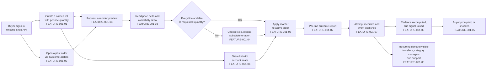
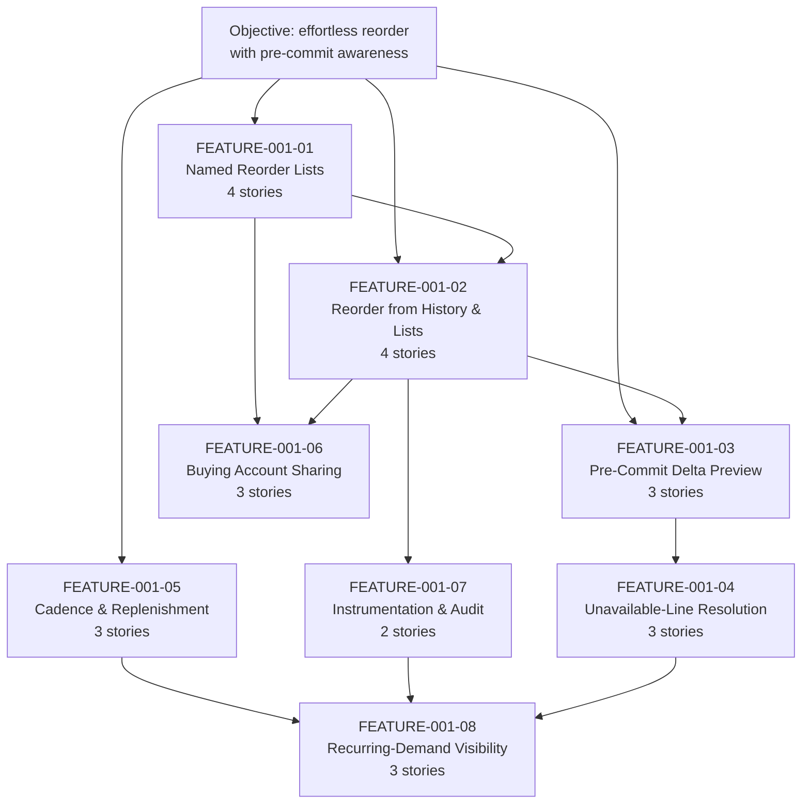

# EPIC-001: Build reorder and replenishment capabilities for returning buyers, so that repeat purchasing requires materially less effort than rebuilding an order from scratch and price and availability changes are surfaced before commit

## 1. Epic Title

**Build reorder and replenishment capabilities for returning buyers, so that repeat purchasing requires materially less effort than rebuilding an order from scratch and price and availability changes are surfaced before commit.**

Delivery is a single self-contained plugin package under `packages/`, added to this Vendure monorepo without editing `packages/core` or `packages/admin-ui`.

---

## 2. Epic Summary

### 2.1 Objective

The objective statement this epic decomposes, quoted verbatim and treated as the source of every quoted traceability label in the story tier:

> "Make it effortless for returning buyers to reorder the items they purchase regularly, so that repeat purchasing on the marketplace requires materially less effort than rebuilding an order from scratch, and so that buyers are made aware of price and availability changes before they commit to a reorder."

Restated as three sentences of build intent: returning buyers gain named, multiple reorder lists carrying a per-line quantity, plus one-step paths from a past order or a saved list into the active cart, so that a repeat purchase stops being a manual rebuild. Before a buyer commits, the same paths report what has changed since the last purchase — a price delta as an integer amount with its currency code, and an availability delta expressed only as the publicly observable stock string — together with an explicit resolution choice for any line that can no longer be added at the requested quantity. Around that core, purchase-cadence detection produces an advisory replenishment due signal, multi-seat buying accounts can share a list under an enforced authorisation check, and every reorder attempt leaves an auditable record and a typed event for the administrative personas who need to see recurring demand.

### 2.2 Business Value, Stated Without Invented Numbers

The value is a reduction in buyer effort and a reduction in post-commit surprise. Effort falls because a reorder resolves an entire past order or a curated list into cart lines through one named operation instead of a per-variant search-and-add loop. Surprise falls because the delta read happens *before* the write, so a buyer sees a changed price or a lost availability while they can still act on it rather than discovering it at checkout.

**This epic states no numeric business target, because this repository declares none.** A search of the tree found no declared service-level commitment, no latency figure, no repeat-purchase-rate claim and no monetary business estimate to measure reorder work against. That absence is reported here as a finding rather than filled with a plausible figure, and it is the reason every acceptance criterion in the story tier replaces a vague adjective with a *verifiable state assertion* — an exact item count with its ordering, an integer money value with its currency code, an exact error type name, one of the three exact stock strings, or a named observable completion signal — rather than with an invented service level.

### 2.3 Confirmed Platform Version

The version was read, not assumed. `@vendure/core` is at **3.7.0** [packages/core/package.json:L2-L3]. This is a Lerna fixed-version monorepo whose `packages/*` glob and single `version` field mean every package in the workspace shares that number [lerna.json:version], so there is no per-package version to reconcile and the plugin this epic describes pins to 3.7.0 across the board.

**Upstream currency — research finding, not a repository citation.** An independent check of the npm registry confirms 3.7.0 is also the latest published release of the core package, so **no later patch line exists upstream** and this checkout is current. The published release cadence is quarterly minor releases, which is what makes `minor` the conventional upstream target for feature-bearing work. Three conditional breaking changes shipped in 3.7.0 and are preconditions for any ticket in this set rather than reorder concerns in their own right: coupon codes are now compared case-insensitively; the default superadmin password is refused in production, so a server still configured with it will not start; and external authentication links to a pre-existing account only when the external email is verified, which additionally requires a custom authentication strategy to mark provider-verified emails as verified. The third is material to the multi-seat sharing feature, where a seat may arrive through an external identity provider.

### 2.4 Scope Boundaries — Explicit In-Or-Out Rulings

Five adjacent domains are ruled **OUT**, each with its one-line justification. Nothing below is deferred, and nothing below is left ambiguous.

- **Payment scheduling — OUT.** A reorder places items into an active cart and stops there; the checkout and payment write paths are untouched by the additive-only constraint that governs this epic.
- **Recurring billing — OUT.** It requires a payment-schedule and dunning model that no entity in this repository provides, and building one would exceed an additive plugin boundary.
- **Subscription contracts — OUT.** A contract implies committed future obligations and cancellation terms that the order model does not represent; replenishment signals in this epic are advisory prompts, not commitments.
- **Seller-side inventory forecasting — OUT.** Visibility over *recorded* reorder activity is in scope; predicting future stock requirements has no basis in this repository and no declared numeric target to validate a forecast against.
- **Email template design — OUT.** The replenishment feature deliberately delivers a due-signal *read* rather than a message; notification transport sits behind an interface, and template authoring belongs to the email plugin's own surface.

**What must remain unchanged, stated as a countable surface.** The additive-only constraint is only enforceable if the protected surface is enumerable, so it is. The Shop API root `Query` type declares **nineteen** root queries [packages/core/src/api/schema/shop-api/shop.api.graphql:L1-L52], alongside the order, cart and customer-account mutation sets in the same file. Every one of those signatures must be byte-identical after this epic ships. Nineteen is the verified count in this checkout and is stated rather than estimated, because "do not change the existing API" is not a testable boundary until a reviewer can count what existed before. Section 12 makes that count part of the definition of done, and collision C1 in section 6 records the one mechanism that would breach it as a side effect.

### 2.5 The Returning-Buyer Journey This Epic Builds

Each step is labelled with the feature that owns it. This is one of exactly two diagrams in this file; story files carry none and reference their parent feature's diagram instead.

---

## 3. How To Read This Epic

Four files, chosen after the decomposition was final, answer the four questions a reader arrives with. They are rendered as paths rather than links so that the link count in this file stays equal to the number of features.

- `tickets/EPIC-001-reorder-and-replenishment.md` — answers "what is being built, what already exists, what collides, and what must be decided first".
- `tickets/EPIC-001/FEATURE-001-02-reorder-from-order-history.md` — answers "how does a reorder actually reach the cart, and which existing service does the work".
- `tickets/EPIC-001/FEATURE-001-02/STORY-001-02-01-reorder-complete-past-order.md` — answers "what does one finished, demonstrable unit of this work look like".
- `tickets/EPIC-001/FEATURE-001-03-price-and-availability-delta-preview.md` — answers "how are buyers warned before they commit, and why is that not already solved".

**Total files in this ticket set: 34.** One epic, eight features, twenty-five stories, across ten directories. There is deliberately no index, table of contents, README or glossary: navigation lives in this epic's features index and in each feature's stories index, and an extra file would break the reconciliation that checks this stated total against the on-disk count.

---

## 4. Features Index

Eight features, each carrying two to five stories, totalling twenty-five. Every one of the eight deviates from its originally suggested area, and the deviation is stated with its rationale rather than presented as a straight adoption — only the mechanism-fixing deviations leave the suggested scope intact.

- [FEATURE-001-01 — Named Reorder Lists with Line Quantities](./EPIC-001/FEATURE-001-01-named-reorder-lists.md) — plugin-owned list and list-line tables with per-line quantity, permission-gated and ownership-enforced. **4 stories.**
  - *Deviation: narrowed.* A single unnamed saved list is already shipped and is this platform's canonical teaching example [packages/dev-server/example-plugins/wishlist-plugin/api/api-extensions.ts:L13]. Only *named, multiple* lists carrying a per-line *quantity* are novel.
- [FEATURE-001-02 — Reorder from Order History and Saved Lists](./EPIC-001/FEATURE-001-02-reorder-from-order-history.md) — resolves a past order or a list into cart lines with a per-line outcome report. **4 stories.**
  - *Deviation: expanded.* Absorbs list-to-cart materialisation, because both paths converge on `OrderService.addItemsToOrder` [packages/core/src/service/services/order.service.ts:L654-L676] and splitting them would duplicate the per-line partial-failure contract across two features.
- [FEATURE-001-03 — Pre-Commit Price and Availability Delta Preview](./EPIC-001/FEATURE-001-03-price-and-availability-delta-preview.md) — a point-in-time read of what changed since the last purchase, before any write. **3 stories.**
  - *Deviation: narrowed to pre-commit.* In-cart, post-add price change is already handled by `unitPriceChangeSinceAdded` and `unitPriceWithTaxChangeSinceAdded` [packages/core/src/entity/order-line/order-line.entity.ts:L163-L187] together with `ChangedPriceHandlingStrategy` [packages/core/src/config/order/changed-price-handling-strategy.ts:L7-L38], which section 5 forbids duplicating. Only the *before-commit* read is new.
- [FEATURE-001-04 — Unavailable-Line Resolution and Substitution Candidates](./EPIC-001/FEATURE-001-04-unavailable-line-resolution.md) — skip, reduce, substitute or abort, with candidates behind a configurable strategy. **3 stories.**
  - *Deviation: kept, mechanism fixed.* Substitution sits behind a `SubstitutionCandidateStrategy` interface with a database-backed default, following the `StockDisplayStrategy` precedent [packages/core/src/config/catalog/stock-display-strategy.ts:L6-L32]. Fixing the mechanism this way is what discharges the no-external-service constraint.
- [FEATURE-001-05 — Purchase Cadence Detection and Replenishment Due Signals](./EPIC-001/FEATURE-001-05-purchase-cadence-and-replenishment.md) — a scheduled recompute plus an advisory due-signal read with a snooze. **3 stories.**
  - *Deviation: renamed.* "Reminders" presumes a delivery channel, and message transport is environment-specific and would have to sit behind an interface regardless. The buildable core is a due-signal read plus a `ScheduledTask` recompute, with any notification adapter optional.
- [FEATURE-001-06 — Multi-Seat Buying Account List Sharing and Permissions](./EPIC-001/FEATURE-001-06-buying-account-list-sharing.md) — share and revoke rows, with authorisation enforced inside the resolver. **3 stories.**
  - *Deviation: kept, mechanism fixed.* Authorisation uses `CrudPermissionDefinition` [packages/core/src/common/permission-definition.ts:L146-L199] plus explicit in-resolver ownership enforcement, not a new authentication strategy.
- [FEATURE-001-07 — Reorder Event Instrumentation and Audit Trail](./EPIC-001/FEATURE-001-07-reorder-instrumentation.md) — an auditable attempt record and three typed events with documented payload schemas. **2 stories.**
  - *Deviation: partially dropped.* "Experiment readiness" is dropped on two independently citable grounds: this repository declares no numeric business target to experiment against, and an experimentation platform would be an external-service dependency the constraints forbid. Instrumentation is retained in full.
- [FEATURE-001-08 — Recurring-Demand Visibility for Sellers, Category Managers and Support](./EPIC-001/FEATURE-001-08-recurring-demand-visibility.md) — one Admin API aggregate read, seller-scoped, surfaced in the dashboard. **3 stories.**
  - *Deviation: expanded.* Absorbs the Customer Support Agent read path, because all three administrative personas read the same aggregate over the same plugin-owned tables and a separate support feature would duplicate the resolver and permission wiring.

### 4.1 Feature Dependency Graph With Batch Sequencing

---

## 5. Existing Mechanisms That Must Not Be Duplicated

Thirteen capabilities already present in this checkout that the reorder work must **consume**, not reinvent. Every row was read in this repository and carries a resolvable locator. A story that rebuilds any row below is rejected at review, and the prohibition column states precisely what rebuilding would mean so the rejection is not a judgement call.

| Mechanism / identifier | Citation | What it already does | Consuming feature | The prohibition |
|---|---|---|---|---|
| `unitPriceChangeSinceAdded` and `unitPriceWithTaxChangeSinceAdded` | [packages/core/src/entity/order-line/order-line.entity.ts:L163-L187] | Calculated getters that report a non-zero delta when a line's unit price changed since it was added, derived from the `initialListPrice`, `listPrice` and `listPriceIncludesTax` columns declared at [packages/core/src/entity/order-line/order-line.entity.ts:L113], [packages/core/src/entity/order-line/order-line.entity.ts:L121] and [packages/core/src/entity/order-line/order-line.entity.ts:L128] | FEATURE-001-03 | Do not add a plugin-owned column, field or getter that recomputes an in-cart price delta. The pre-commit preview reads variant price directly and is a *separate* concern from these getters, which govern lines already in an order. |
| `ChangedPriceHandlingStrategy.handlePriceChange` | [packages/core/src/config/order/changed-price-handling-strategy.ts:L7-L38] | Governs the outcome when a variant price changed while an item is already in an order; its own JSDoc ties that outcome to the two getters above [packages/core/src/config/order/changed-price-handling-strategy.ts:L13] | FEATURE-001-03 | Do not implement plugin logic that decides which price wins after an add. That decision is already configurable and deployment-owned; the reorder preview only *reports* before the add. |
| `OrderService.addItemsToOrder`, and the already-published Shop API mutation `addItemsToOrder` | [packages/core/src/service/services/order.service.ts:L654-L676] and [packages/core/src/api/schema/shop-api/shop.api.graphql:L74] | Bulk add that resolves an existing line per variant, validates quantity, and **accumulates per-item error results instead of aborting**, returning `{ order, errorResults }`. The mutation `addItemsToOrder(inputs: [AddItemInput!]!): UpdateMultipleOrderItemsResult!` already exposes that contract publicly, and its own docstring states it returns an error per failed item while still adding the successful ones [packages/core/src/api/schema/shop-api/shop.api.graphql:L73] | FEATURE-001-02 and FEATURE-001-04 | Do not write a per-variant add loop, and do not invent a partial-success payload shape. The plugin calls the service and maps its `errorResults` into the reorder outcome report. Note that partial-success semantics exist at *both* layers, so a story must state which layer it consumes. |
| `Customer.orders(options: OrderListOptions): OrderList!` | [packages/core/src/api/schema/common/customer.type.graphql:L11] | The order-history read path, already reachable through `activeCustomer` and already paginated, sortable and filterable | FEATURE-001-02 | Do not add a reorder-specific order-history query. FEATURE-001-02 reads history through this field and adds only the reorder write path. |
| `StockLevelService.getAvailableStock` | [packages/core/src/service/services/stock-level.service.ts:L72-L79] | Resolves available stock for a variant through the configured stock-location strategy, so multi-location deployments are handled without plugin awareness | FEATURE-001-03 and FEATURE-001-04 | Do not query `StockLevel` rows directly and do not sum `stockOnHand` in plugin code. Call the service so the configured location strategy stays authoritative. |
| `StockDisplayStrategy` and `DefaultStockDisplayStrategy` | [packages/core/src/config/catalog/default-stock-display-strategy.ts:L14-L23] | Converts a saleable stock level into exactly one of `OUT_OF_STOCK`, `LOW_STOCK` or `IN_STOCK`, deliberately avoiding a raw-number leak over a public API [packages/core/src/config/catalog/stock-display-strategy.ts:L6-L32] | FEATURE-001-03 | Do not expose a numeric stock figure on any Shop API field. `StockLevel` is not a Shop API type at all, so availability is publicly observable only as one of those three strings. |
| `CrudPermissionDefinition` | [packages/core/src/common/permission-definition.ts:L146-L199] | Generates four permissions from one name, registered through `authOptions.customPermissions` and enforced with the `@Allow` decorator; its own JSDoc example is a wishlist resolver [packages/core/src/common/permission-definition.ts:L132] | FEATURE-001-01, FEATURE-001-06, FEATURE-001-08 | Do not hand-declare four separate permission strings, and do not build a bespoke authorisation layer. See collision C3: a permission gate alone is not an ownership control. |
| `EventBus.publish` and `EventBus.ofType` | [packages/core/src/event-bus/event-bus.ts:L116] and [packages/core/src/event-bus/event-bus.ts:L130] | Typed publish and typed subscribe over the existing event catalogue, with transaction-aware delivery | FEATURE-001-07 | Do not add a webhook dispatcher, a polling table or a second message bus. Reorder events are published on this bus and consumed with `ofType`. |
| `JobQueueService.createQueue` | [packages/core/src/job-queue/job-queue.service.ts:L51-L82] | The queue factory on the injectable job-queue service, so background work inherits the deployment's configured job-queue strategy | FEATURE-001-05 | Do not spawn a timer, an interval or a worker thread in plugin code. Background recompute work is enqueued here. |
| `ScheduledTask` configuration shape, and the shipped `cleanSessionsTask` | [packages/core/src/scheduler/scheduled-task.ts:L42-L96] and [packages/core/src/scheduler/tasks/clean-sessions-task.ts:L37] | A cron-scheduled task definition carrying `id`, `description`, `params`, plus `schedule` [packages/core/src/scheduler/scheduled-task.ts:L75], `timeout` [packages/core/src/scheduler/scheduled-task.ts:L83] and `execute` [packages/core/src/scheduler/scheduled-task.ts:L95], configured through `schedulerOptions.tasks` and overridable per deployment; `cleanSessionsTask` is the shipped worked example | FEATURE-001-05 | Do not write a cron implementation and do not hard-code a schedule in plugin source. The schedule is deployment-configurable, and the task follows the shipped example's shape. |
| `generateListOptions` | [packages/core/src/api/config/generate-list-options.ts:L31-L60] | Auto-generates a `${TargetType}ListOptions` input with sort and filter parameters for any query returning a paginated list type | FEATURE-001-08 | Do not hand-write filter or sort input types for the recurring-demand aggregate. Return a `PaginatedList` type and let the generator produce the options input. |
| Migration lifecycle: `runMigrations`, `revertLastMigration`, `generateMigration` | [packages/core/src/migrate.ts:L40], [packages/core/src/migrate.ts:L89] and [packages/core/src/migrate.ts:L118] | The full migration lifecycle, already wired to a command-line interface and documented as `vendure migrate` [skills/vendure-cli/commands/migrate.md:L1] | Every story with a migration sub-task | Do not write raw DDL scripts, a bespoke migration runner or a schema-sync toggle. Generate an additive migration through the existing lifecycle. |
| Benchmark harness | [e2e-common/vitest.config.bench.ts:L1], [packages/core/e2e/default-search-plugin.bench.ts:L1] and [packages/dev-server/load-testing/benchmarks.ts:L21-L30] | An existing benchmark harness with a documented dataset shape and the `load-test:1k`, `load-test:10k` and `load-test:100k` scripts [packages/dev-server/package.json:L23-L25] | The epic definition of done | Do not build new performance tooling and do not invent a target figure to compare against. The definition of done requires a comparison run with this harness; the harness defines the dataset, and the comparison is before-versus-after, not against an invented threshold. |

---

## 6. Feasibility Collisions Surfaced

Six collisions between the epic's constraints and the mechanics this platform actually enforces. **Ranking criterion: descending consequence, where consequence is measured first by whether the mechanism breaches the additive-only constraint at all, and second by how many of the twenty-five stories must change their design if the collision is not resolved before build.** C1 ranks highest because it is the only entry that both breaches the constraint and would silently alter two already-published mutations. The two groups below are physically separated because they were established by different means, and a reader must be able to tell a repository fact from a documentation claim.

### 6.1 Repository-Discovered Collisions

**C1 — Custom-fields argument and type-shape widening. Verdict: a reportable violation of the additive-only constraint, not a manageable side effect.**

Defining a custom field on `OrderLine` forces an extra `customFields` argument onto the existing `addItemToOrder` and `adjustOrderLine` mutations and onto the related fields of `ModifyOrderInput`. This is not an inference — the generator's own JSDoc states it [packages/core/src/api/config/graphql-custom-fields.ts:L455-L469], and the Shop API schema says the same thing in its own docstrings above `addItemToOrder` [packages/core/src/api/schema/shop-api/shop.api.graphql:L71] and above `adjustOrderLine` [packages/core/src/api/schema/shop-api/shop.api.graphql:L79]. The widening is not opt-in at request time either: the custom-fields generators run inside `buildSchemaFromVendureConfig` on every boot, after plugin API extensions have already been merged [packages/core/src/api/config/get-final-vendure-schema.ts:L87-L118]. There is a guard that skips extension with a warning when a type already declares a `customFields` field [packages/core/src/api/config/graphql-custom-fields.ts:L54-L58], but it protects the generator from collision, not the published signature from widening.

*Consequence.* Any story that reaches for a custom field on `OrderLine` changes the signature of two operations this epic promised not to touch. The constraint's instruction is explicit that a side-effect widening is to be reported here rather than silently accepted, which is why this entry exists.

*Recommended resolution.* Declare **zero** custom fields and store every piece of reorder state — list membership, per-line quantity, share grants, cadence, attempt outcomes — on plugin-owned tables keyed by entity id. Two mitigations are worth recording, and neither settles the matter on its own: the wishlist plugin's `internal: true` flag keeps a custom field out of the API entirely and is the pattern this repository already uses [packages/dev-server/example-plugins/wishlist-plugin/wishlist.plugin.ts:L18-L24], and the generator honours it by filtering internal fields out before widening anything [packages/core/src/api/config/graphql-custom-fields.ts:L467]. Note also that `Customer.customFields` currently resolves to the JSON scalar in the checked-in Shop API snapshot [schema-shop.json:customFields], so a reader cannot infer the current shape from a typed field.

**C2 — Automatic `ErrorCode` enum growth. Verdict: a declared, manageable side effect, additive for clients that carry a default branch.**

Every type implementing the `ErrorResult` interface is appended to the published `ErrorCode` enum automatically, by name-derived upper-snake conversion [packages/core/src/api/config/generate-error-code-enum.ts:L5-L33], keyed off the interface-name constant in the same file [packages/core/src/api/config/generate-error-code-enum.ts:L3]. The enum ships with a single literal member in source [packages/core/src/api/schema/common/common-enums.graphql:L28-L30] and is populated at build time.

*Consequence.* The Shop API snapshot currently carries thirty-two `ErrorCode` members and thirty-one types implementing `ErrorResult` [schema-shop.json:ErrorCode] — thirty-one implementors plus the literal unknown-error member. Declaring the six new error results this set proposes therefore grows the enum to thirty-eight. No existing member is removed or renamed, so this is additive; but it *is* a change to a published enum, and a client that switches exhaustively on `ErrorCode` without a default branch will break.

*Recommended resolution.* Accept the growth, declare it in the story that introduces each error result, and require a default branch in every consuming example. The generator runs after plugin extensions are merged [packages/core/src/api/config/get-final-vendure-schema.ts:L107], so a plugin-declared error result reaches the enum with no extra wiring — which is exactly why the growth cannot be avoided by ordering.

**C3 — Automatic `Permission` enum growth, and `Permission.Owner` is not an access control. Verdict: the enum growth is a declared side effect; the ownership caveat is a correctness trap that must be carried into acceptance criteria.**

The `Permission` enum is declared with no members in source and annotated as populated at run time [packages/core/src/api/schema/common/common-enums.graphql:L20-L21], filled by `generatePermissionEnum` from the default and custom permission definitions [packages/core/src/api/config/generate-permissions.ts:L39-L68], and that generator also runs after plugin extensions are merged [packages/core/src/api/config/get-final-vendure-schema.ts:L116]. Registering three new permission definitions therefore grows a published enum, on the same additive-but-published footing as C2.

The sharper half of this entry is the ownership caveat, stated in the platform's own source: any resolver using `Permission.Owner` **must** include logic enforcing that only the owner of the resource has access, and if it does not, the effect is equivalent to `Permission.Public` [packages/core/src/api/config/generate-permissions.ts:L32-L34].

*Consequence.* A story that gates a reorder-list operation with a permission alone has built no control at all. Every list, preview, share and snooze operation reads or writes data belonging to one customer, so ownership enforcement is load-bearing across FEATURE-001-01, FEATURE-001-02, FEATURE-001-03, FEATURE-001-05 and FEATURE-001-06.

*Recommended resolution.* Pair `CrudPermissionDefinition` registration with an explicit in-resolver ownership check derived from the authenticated session, and make "a request authenticated as a different customer is refused" a mandatory acceptance criterion rather than an edge case. The wishlist service shows the minimal form of the session guard this must build on [packages/dev-server/example-plugins/wishlist-plugin/service/wishlist.service.ts:L74-L76].

**C4 — This repository's own breaking-change classification collides with "additive migrations only". Verdict: an unresolved process collision that this epic surfaces rather than settles.**

The contribution guide classifies *any* change to the database schema as a breaking change requiring a `BREAKING CHANGE` commit section [CONTRIBUTING.md:§Breaking Changes], and instructs that the pull request be made against the `major` branch rather than `master`. Its worked example is not an analogy — it is literally a migration adding a new field to the `Customer` table. Meanwhile the guide sends new features to the `minor` branch [CONTRIBUTING.md:§New features].

*Consequence.* This epic adds seven plugin-owned tables. Read literally, the guide routes that work to `major` even though every migration is additive, no existing column changes type, and no destructive statement is issued. That directly contradicts the epic's own framing of the migrations as additive.

*Recommended resolution.* None is imposed here, because a branch strategy is not this epic's to choose. The collision is recorded as an open decision in section 8, with the observation that the classification's own wording turns on "breaking", and that seven *new* tables break no existing consumer. A research note bearing on the decision appears in section 6.2.

### 6.2 Research-Discovered Collisions

These two were established from the platform's published developer documentation, not from files in this checkout, and are labelled as such so no reader mistakes them for repository citations.

**C5 — Plugin field-addition to an existing core type. Verdict: a declared side effect that must be stated, not a violation, provided nothing existing changes shape.**

The documented extension pattern lets a plugin add a field to an existing core type through an entity resolver scoped by passing the type name to the resolver decorator. Adding a field is backward-compatible for existing clients — unlike changing a field's type or adding a required argument — but it does alter the published schema of a type the plugin does not own.

*Recommended resolution.* Prefer root-level operations that return plugin-owned types, so no core type changes shape at all. Where a field on a core type genuinely improves the storefront contract, the story that adds it must declare the addition explicitly and assert that no existing field's type or nullability changed. Doing it silently is the failure mode this entry exists to prevent.

**C6 — Struct custom fields cannot be hidden, which rules them out under a zero-widening constraint. Verdict: a constraint the platform forces, not an ambiguity in the objective.**

The documented custom-field flags `internal`, `readonly`, `public`, `defaultValue`, `nullable`, `unique` and `requiresPermission` are **not supported on struct custom fields**. The `internal` flag is the whole reason exposure is avoidable — exposure is the default, and `internal` is what keeps a field out of the GraphQL APIs while leaving it usable from plugin TypeScript; `readonly` likewise restricts writes to TypeScript, and for Shop API access control specifically the documented approach is to set `public: false` and supply a custom field resolver. A `deprecated` flag exists for backward-compatible API evolution.

*Consequence.* A struct custom field cannot be hidden. Wherever the zero-widening constraint applies, struct fields are therefore unusable — which reinforces C1's resolution rather than offering an alternative to it.

*Also recorded here, because it is a mechanic this set depends on and it was confirmed by research rather than by reading a resolver:* declaring a custom union result requires a dedicated resolver class carrying a single `__resolveType` field resolver, registered in the plugin's resolvers array, with both the resolver and the service typed against the error-result union. Each of the six proposed error results needs that wiring.

*One further research note, bearing directly on C4:* the platform's published versioning policy states that minor releases may occasionally introduce non-destructive changes to the database schema. That is in tension with the repository guide's blanket routing of any schema change to `major`, and it is the single strongest argument that the C4 decision is genuinely open rather than already settled by the guide. It is recorded as research, and it does not license anyone to pick a branch without the decision in section 8 being taken.

### 6.3 Repository Documentation Discrepancies — Noted, Not Propagated

Three claims in existing repository documentation do not match the repository's behaviour. **None is corrected in place.** Editing them would take this run outside its stated output location, so each is reported here instead, which keeps the run strictly additive and leaves every correction as separately assignable follow-up work. No ticket in this set may repeat any of the three claims.

- **(i) SQLite is named as officially supported, but no SQLite continuous-integration job exists.** The contribution guide states that Vendure officially supports MySQL, MariaDB, PostgreSQL and SQLite [CONTRIBUTING.md:§4. Populate test data], yet the four engine jobs are `e2e-sqljs`, `e2e-mariadb`, `e2e-mysql` and `e2e-postgres` [.github/workflows/build_and_test.yml:jobs] — the fourth is sql.js, the WebAssembly driver, not the native SQLite driver. The test harness corroborates this: it exports initializers for MySQL, PostgreSQL and sql.js only, and none for native SQLite [packages/testing/src/index.ts:L10-L12]. *Consequence carried into the definition of done:* an additive migration can be evidenced on MariaDB, MySQL, PostgreSQL and sql.js, and **native SQLite must be named as an unverified engine** rather than claimed.
- **(ii) A Docusaurus documentation workflow is described that no longer exists.** The guide states the documentation uses Docusaurus and is previewed by changing into the docs directory and running a `start` script [CONTRIBUTING.md:§Contributing to the documentation], but that package declares no `start` script and no Docusaurus dependency — its only runtime dependency is a documentation provider package, and its scripts are limited to MDX compilation and a type check [docs/package.json:scripts]. The package has moved to a manifest-driven provider model. *Consequence:* no ticket may instruct a reader to preview anything with that command.
- **(iii) The `ProductVariant` JSDoc points at deprecated settings.** It directs the reader to the global settings entity for the out-of-stock threshold [packages/core/src/entity/product-variant/product-variant.entity.ts:L146-L152], but both `GlobalSettings.trackInventory` and `GlobalSettings.outOfStockThreshold` are annotated deprecated [packages/core/src/entity/global-settings/global-settings.entity.ts:L32-L45] in favour of the Channel-level equivalents, which are the live values [packages/core/src/entity/channel/channel.entity.ts:L100] and [packages/core/src/entity/channel/channel.entity.ts:L108]. *Consequence:* every stock precondition in this set references the Channel fields, and the stale JSDoc is noted wherever a reader might follow it.

---

## 7. Dependencies

### 7.1 Version Lock

The work targets **3.7.0** [packages/core/package.json:L2-L3]. Because this is a Lerna fixed-version workspace over a `packages/*` glob with one shared `version` field [lerna.json:version], every `@vendure/*` dependency the plugin declares takes the same number, and there is no mixed-version combination to test. Research finding, recorded separately from the repository citations above: 3.7.0 is also the latest published release, so the lock is to a current line and not to a stale one.

### 7.2 Per-Engine Implications

Four engine jobs already exist and every migration this epic describes must be evidenced on each of them. No new continuous-integration infrastructure is required or permitted.

| Engine job | Image or driver | Locator | What it evidences for this epic |
|---|---|---|---|
| `e2e-sqljs` | sql.js, the WebAssembly driver | [.github/workflows/build_and_test.yml:L174] | The default fast path used by the end-to-end suite; the seed cache is written as a file per test file |
| `e2e-mariadb` | `mariadb:11.5`, pinned | [.github/workflows/build_and_test.yml:L213] | Additive DDL on MariaDB. The pin is deliberate: an in-file comment records that a later default change to `innodb_snapshot_isolation` breaks the suite [.github/workflows/build_and_test.yml:L211]. This is a known upstream defect whose workaround is the pin itself, so a story must not "fix" it by unpinning |
| `e2e-mysql` | `vendure/mysql-8-native-auth` | [.github/workflows/build_and_test.yml:L249] | Additive DDL on MySQL with native authentication |
| `e2e-postgres` | `postgres:16` | [.github/workflows/build_and_test.yml:L285] | Additive DDL on PostgreSQL |

All four jobs run a Redis service alongside the database [.github/workflows/build_and_test.yml:L183], so a story that enqueues background work has a queue backend available without adding one.

**Native SQLite is an unverified engine.** It is claimed as officially supported [CONTRIBUTING.md:§4. Populate test data] but has no job here and no initializer in the test harness [packages/testing/src/index.ts:L10-L12]. Discrepancy (i) in section 6.3 records this. No ticket in this set may claim native SQLite verification; where engine coverage is asserted, it is asserted for MariaDB, MySQL, PostgreSQL and sql.js, with native SQLite named as unverified.

### 7.3 Runtime Dependencies

- **Node.** The declared range is `^20.19.0 || >=22.12.0` [package.json:engines.node]. Because the upper bound is open, the declaration alone does not identify a highest supported line, so the matrix decides it: the unit-test job exercises 20.x, 22.x and 24.x [.github/workflows/build_and_test.yml:L96-L97], making **24.x the highest explicitly documented line**. The engine jobs narrow to a single line on a pull request, so a story's local reproduction should not assume the full matrix.
- **Bun.** Pinned to **1.3.10**, with an in-file note that it is to be bumped only when explicitly re-validated against a newer release [.github/actions/setup/action.yml:bun-version]. The setup action installs with a frozen lockfile, so a story must not introduce a dependency without updating the lockfile in the same change. There is no `.nvmrc`.
- **Test harness.** `@vendure/testing` supplies the client, the test server, the test configuration, the environment factory, the table-clearing helper, the customer-population helper and the error-result guard [packages/testing/src/index.ts:L10-L12]. Every story's end-to-end sub-task is written against this harness and adds no alternative.

### 7.4 Existing Entities And Services The Work Depends On

Named so that no story invents an entity that already exists, and so that a reviewer can check the dependency is real.

- **Entities.** `Order` [packages/core/src/entity/order/order.entity.ts:L44], `OrderLine` [packages/core/src/entity/order-line/order-line.entity.ts:L97], `Customer` and `CustomerGroup` for the multi-seat model, `ProductVariant` [packages/core/src/entity/product-variant/product-variant.entity.ts:L53], `StockLevel` [packages/core/src/entity/stock-level/stock-level.entity.ts:L20-L45], `Channel` [packages/core/src/entity/channel/channel.entity.ts:L62] and `Seller` for the seller-scoped aggregate.
- **Services.** `OrderService` [packages/core/src/service/services/order.service.ts:L654-L676], `StockLevelService` [packages/core/src/service/services/stock-level.service.ts:L72-L79], `ProductVariantService` for variant resolution, `TransactionalConnection` for all plugin-owned persistence, `EventBus` [packages/core/src/event-bus/event-bus.ts:L116] and `JobQueueService` [packages/core/src/job-queue/job-queue.service.ts:L51-L82].

### 7.5 Request Prerequisites

Every operation in this epic is channel-scoped and language-scoped, so three preconditions hold for every story without being restated in each one:

- **A channel token.** The active channel is identified by a unique token read from the `vendure-token` request header [packages/core/src/entity/channel/channel.entity.ts:L62], and channel-level `defaultLanguageCode` [packages/core/src/entity/channel/channel.entity.ts:L74], `defaultCurrencyCode` [packages/core/src/entity/channel/channel.entity.ts:L88] and `pricesIncludeTax` [packages/core/src/entity/channel/channel.entity.ts:L113] govern how a reorder's prices and translations resolve. Stock behaviour is likewise channel-level, through `Channel.trackInventory` [packages/core/src/entity/channel/channel.entity.ts:L100] and `Channel.outOfStockThreshold` [packages/core/src/entity/channel/channel.entity.ts:L108] — never the deprecated global equivalents.
- **An authenticated session.** Every buyer-facing operation reads or writes data owned by one customer, so an authenticated session is required and its identity is the basis of the ownership check that collision C3 makes mandatory.
- **At least one placed order for that customer.** The reorder and cadence paths derive their source data from order history read through `Customer.orders` [packages/core/src/api/schema/common/customer.type.graphql:L11]. A customer with no placed order is a required edge case, not an untested state.

### 7.6 Data-Volume Assumptions, Anchored To The Existing Harness

No volume is invented. The benchmark harness documents its own dataset shape: one thousand products each carrying ten variants, and ten thousand orders each carrying ten lines at quantity five [packages/dev-server/load-testing/benchmarks.ts:L21-L30]. The three load-test scripts parameterise the product count [packages/dev-server/package.json:L23-L25]. Two consequences follow for design, both derived rather than assumed: a cadence recompute that walks order history must be written against an order count of that order of magnitude rather than a handful of rows, and the recurring-demand aggregate must be expressed as a database aggregate rather than an in-process reduction over every line. Where a story needs a volume figure, it cites this shape; it does not supply a different one.

---

## 8. Decisions Required Before Build

Two groups, each ordered by the number of stories blocked, descending. Every entry is labelled either an **objective ambiguity** — something the objective statement genuinely does not settle — or a **decision the codebase forces** — something this platform's mechanics require a choice about regardless of what the objective says. The blocked count is the number of the twenty-five stories whose acceptance criteria cannot be finalised until the decision is taken.

### 8.1 Product Decisions

1. **Maximum number of named lists per customer, and maximum lines per list. Blocks 8 stories** (01-01, 01-02, 01-03, 01-04, 02-03, 06-01, 06-03, 08-03). *Objective ambiguity.* The objective asks for effortless reorder and says nothing about limits, yet the proposed `ReorderListLimitError` exists precisely to enforce one, and without a number that error has no trigger condition and cannot be given a testable acceptance criterion. Note that the platform already carries order-level limits with their own error type [packages/core/src/api/schema/common/common-error-results.graphql:L37], so a limit is idiomatic here; only its value is undecided.
2. **Whether the replenishment due list is channel-scoped only or aggregated across channels. Blocks 5 stories** (05-01, 05-02, 05-03, 08-01, 08-02). *Objective ambiguity.* A buyer who purchases the same variant in two channels has one real-world cadence but two channel-scoped histories. Channel scoping is the platform default for every read, so aggregating across channels is the deviation that would need justifying — but the objective's "items they purchase regularly" is channel-agnostic on its face.
3. **Whether a shared list materialises into the sharer's or the recipient's active order. Blocks 3 stories** (06-01, 06-02, 06-03). *Objective ambiguity.* Both are defensible for a multi-seat buying account, and the two produce different ownership assertions on the resulting cart, so the acceptance criterion for "the cart belongs to X" cannot be written until this is settled.
4. **Whether a snoozed replenishment signal expires after a fixed interval or on the next purchase of that variant. Blocks 2 stories** (05-03, 05-01). *Objective ambiguity.* The signal lifecycle has a due, snoozed, dismissed and due-again shape either way, but the transition out of snoozed differs, and only one of the two options requires storing an expiry at all.
5. **Whether substitution candidates are curated per variant or per collection. Blocks 2 stories** (04-03, 04-02). *Objective ambiguity.* Per-collection curation is far less work for a category manager and reuses an existing catalogue concept; per-variant curation is more precise. The strategy interface absorbs either, but the curation surface and the `SubstitutionCandidate` table shape differ.

### 8.2 Architectural Decisions

1. **Declare zero custom fields, or accept the C1 widening. Blocks 11 stories** (every story that persists reorder state: 01-01, 01-02, 01-03, 02-03, 02-04, 04-02, 05-01, 05-02, 05-03, 06-01, 07-01). *Decision the codebase forces.* Section 6.1 recommends zero custom fields, because the alternative changes the published signature of `addItemToOrder` and `adjustOrderLine` [packages/core/src/api/config/graphql-custom-fields.ts:L455-L469]. The recommendation is strong but it is still a decision, because taking it means every ownership link lives on a plugin-owned table rather than on a convenient relation field.
2. **Ownership enforcement mechanism: `Permission.Owner` plus in-resolver logic, or a dedicated `CrudPermissionDefinition` per entity, or both. Blocks 9 stories** (01-01, 01-02, 01-03, 01-04, 02-03, 06-01, 06-02, 06-03, 08-03). *Decision the codebase forces.* The platform states that `Permission.Owner` without in-resolver logic is equivalent to public access [packages/core/src/api/config/generate-permissions.ts:L32-L34], so in-resolver logic is not optional under any option. What is undecided is how many permission definitions are registered and therefore how many members the published `Permission` enum gains.
3. **The branch target, given collision C4. Blocks 0 stories directly, gates the merge of all 25.** *Decision the codebase forces.* Convention sends new features to `minor` [CONTRIBUTING.md:§New features] while the breaking-change classification sends any database-schema change to `major` [CONTRIBUTING.md:§Breaking Changes]. This run was performed on neither. The decision blocks no story's *design*, which is why its count is zero, but no story can merge until it is taken — and it must be taken by a maintainer, not inferred from this epic.
4. **Whether cadence recompute is a `ScheduledTask`, a queued job, or a task that enqueues a job. Blocks 2 stories** (05-02, 05-01). *Decision the codebase forces.* Both mechanisms exist and are separately configurable [packages/core/src/scheduler/scheduled-task.ts:L42-L96] and [packages/core/src/job-queue/job-queue.service.ts:L51-L82]. The third option is the most operationally robust and the most work; the choice determines what the story's observable completion signal actually is, which is a mandatory element of its acceptance criteria.
5. **Whether native SQLite is claimed as a supported engine for this plugin. Blocks 0 stories, changes the definition of done for all 25.** *Decision the codebase forces.* Discrepancy (i) means the honest answer today is "unverified". Claiming support would require adding an engine job, which is out of scope for this epic; the alternative is to state the limitation. This epic's definition of done takes the second option, and the decision exists so that choice is visible rather than silent.

---

## 9. Delivery Split

**This table is the single source of truth for every estimate in this ticket set.** Each of the twenty-five story files transcribes its own four estimate values — points, lines of code, generation hours and review hours — from its row here rather than recomputing them. A story whose estimate block disagrees with its row is a defect in the story, not in this table.

Two notes on what the numbers are and are not. The hour figures are **artifact-accounting estimates of generation and review effort**, not business or performance figures; nothing in this table describes how the shipped software behaves. And the point scale is the Fibonacci set restricted to 1, 2, 3, 5 and 8: **thirteen is deliberately absent**, because a story that prices at thirteen fails its own `Sized Appropriately` criterion and is split instead of estimated.

### 9.1 The Estimation Rubric, So The Numbers Are Reproducible

- **2 points** — one resolver plus one service method over an existing plugin-owned table, with no new table.
- **3 points** — a new plugin-owned table plus its additive migration plus one or two operations.
- **5 points** — a multi-entity write path, or consumption of a core service with per-item outcome accumulation, or a new strategy interface together with its default implementation.
- **8 points** — scheduled or queued asynchronous work, or a dashboard extension with internationalisation, or a permission model spanning multiple entities.

Lines of code are anchored to the nearest shipped analogue in the example-plugin tree rather than to intuition: the wishlist plugin is seven files end to end, and the reviews plugin — two entities, dual-API resolvers, a dashboard extension and its translation catalogues — is fifty-seven. The baseline anchors are `120 / 90` at two points, `200 / 150` at three, `340 / 260` at five and `560 / 420` at eight, adjusted upward in six rows for a stated reason: 01-01 carries the plugin scaffold and the harness bootstrap, 01-03 ships two operations rather than one, 01-04 carries the unchanged-operation regression assertions, 02-04 introduces new payload types, and 04-02 and 07-01 each add a second structural element beyond their base shape.

### 9.2 Story Table

| Story ID | Story Title | Feature | Owner | Points | LOC (prod / test) | Gen hrs | Review hrs | Batch |
|---|---|---|---|---|---|---|---|---|
| STORY-001-01-01 | Create a named reorder list | FEATURE-001-01 | Automated run | 3 | 240 / 180 | 3.0 | 1.2 | B1 |
| STORY-001-01-02 | Add a variant with a quantity to a list | FEATURE-001-01 | Automated run | 3 | 200 / 150 | 2.5 | 1.2 | B1 |
| STORY-001-01-03 | Change a line quantity and remove a line | FEATURE-001-01 | Automated run | 2 | 140 / 110 | 1.8 | 0.8 | B1 |
| STORY-001-01-04 | Read reorder lists via the Shop API | FEATURE-001-01 | Automated run | 2 | 120 / 110 | 1.6 | 0.8 | B1 |
| STORY-001-02-01 | Reorder a complete past order | FEATURE-001-02 | Automated run | 5 | 340 / 260 | 4.0 | 2.0 | B2 |
| STORY-001-02-02 | Reorder selected lines from a past order | FEATURE-001-02 | Automated run | 3 | 200 / 150 | 2.5 | 1.2 | B2 |
| STORY-001-02-03 | Add a reorder list to the active cart | FEATURE-001-02 | Automated run | 5 | 340 / 260 | 4.0 | 2.0 | B2 |
| STORY-001-02-04 | Report per-line reorder outcomes | FEATURE-001-02 | Automated run | 3 | 220 / 170 | 2.8 | 1.2 | B2 |
| STORY-001-03-01 | Preview price changes before commit | FEATURE-001-03 | Automated run | 3 | 200 / 150 | 2.5 | 1.2 | B3 |
| STORY-001-03-02 | Preview availability changes before commit | FEATURE-001-03 | Automated run | 3 | 200 / 150 | 2.5 | 1.2 | B3 |
| STORY-001-03-03 | Serve a stable delta preview payload | FEATURE-001-03 | Automated run | 2 | 120 / 90 | 1.5 | 0.8 | B3 |
| STORY-001-04-01 | Resolve unavailable lines before commit | FEATURE-001-04 | Automated run | 5 | 340 / 260 | 4.0 | 2.0 | B3 |
| STORY-001-04-02 | Add a substitution candidate strategy | FEATURE-001-04 | Automated run | 5 | 360 / 280 | 4.3 | 2.0 | B4 |
| STORY-001-04-03 | Curate substitution candidates for a category | FEATURE-001-04 | Developer, parallel | 8 | 560 / 420 | 6.5 | 4.2 | B4 |
| STORY-001-05-01 | Read the replenishment due list | FEATURE-001-05 | Automated run | 3 | 200 / 150 | 2.5 | 1.2 | B4 |
| STORY-001-05-02 | Recompute purchase cadence on a schedule | FEATURE-001-05 | Automated run | 8 | 560 / 420 | 6.5 | 3.2 | B4 |
| STORY-001-05-03 | Snooze a replenishment signal | FEATURE-001-05 | Automated run | 2 | 120 / 90 | 1.5 | 0.8 | B4 |
| STORY-001-06-01 | Share a reorder list with account seats | FEATURE-001-06 | Automated run | 3 | 200 / 150 | 2.5 | 1.2 | B5 |
| STORY-001-06-02 | Grant and revoke seat reorder permission | FEATURE-001-06 | Automated run | 8 | 560 / 420 | 6.5 | 3.2 | B5 |
| STORY-001-06-03 | Reorder from a shared list | FEATURE-001-06 | Automated run | 5 | 340 / 260 | 4.0 | 2.0 | B5 |
| STORY-001-07-01 | Record a reorder attempt audit trail | FEATURE-001-07 | Automated run | 5 | 360 / 280 | 4.3 | 2.0 | B5 |
| STORY-001-07-02 | Publish reorder events | FEATURE-001-07 | Automated run | 3 | 200 / 150 | 2.5 | 1.2 | B5 |
| STORY-001-08-01 | Review category recurring demand | FEATURE-001-08 | Developer, parallel | 8 | 560 / 420 | 6.5 | 4.2 | B5 |
| STORY-001-08-02 | Review seller recurring demand | FEATURE-001-08 | Developer, parallel | 8 | 560 / 420 | 6.5 | 4.2 | B5 |
| STORY-001-08-03 | Look up a buyer's lists and last attempt | FEATURE-001-08 | Developer, parallel | 5 | 340 / 260 | 4.0 | 3.0 | B5 |

**Owner footnote.** Twenty-one stories are owned by the automated run. Exactly four — 04-03, 08-01, 08-02 and 08-03 — are assigned to a developer working in parallel, under one consistent rationale that applies identically to all four: each ships a React dashboard extension whose acceptance requires visual verification in the running dashboard and synchronisation of the internationalisation catalogues, and both of those are gated by jobs that already exist — the catalogue-synchronisation check [.github/workflows/build_and_test.yml:L107] and the four-shard dashboard end-to-end suite [.github/workflows/build_and_test.yml:L120]. No automated documentation or generation run can discharge a visual check, which is the whole of the reason. Those four rows carry an added increment of review hours for the same reason, and no other row does.

### 9.3 Rollup

Column-wise sums per batch, then overall. Both decompositions of the same twenty-five rows — by batch and by feature — are given because they must agree, and their agreement is the arithmetic check that this table is internally consistent.

**By batch:**

| Batch | Stories | Points | LOC prod | LOC test | Gen hrs | Review hrs |
|---|---|---|---|---|---|---|
| B1 | 4 | 10 | 700 | 550 | 8.9 | 4.0 |
| B2 | 4 | 16 | 1100 | 840 | 13.3 | 6.4 |
| B3 | 4 | 13 | 860 | 650 | 10.5 | 5.2 |
| B4 | 5 | 26 | 1800 | 1360 | 21.3 | 11.4 |
| B5 | 8 | 45 | 3120 | 2360 | 36.8 | 21.0 |
| **Overall** | **25** | **110** | **7580** | **5760** | **90.8** | **48.0** |

**By feature, as the cross-check:**

| Feature | Stories | Points | LOC prod | LOC test | Gen hrs | Review hrs |
|---|---|---|---|---|---|---|
| FEATURE-001-01 | 4 | 10 | 700 | 550 | 8.9 | 4.0 |
| FEATURE-001-02 | 4 | 16 | 1100 | 840 | 13.3 | 6.4 |
| FEATURE-001-03 | 3 | 8 | 520 | 390 | 6.5 | 3.2 |
| FEATURE-001-04 | 3 | 18 | 1260 | 960 | 14.8 | 8.2 |
| FEATURE-001-05 | 3 | 13 | 880 | 660 | 10.5 | 5.2 |
| FEATURE-001-06 | 3 | 16 | 1100 | 830 | 13.0 | 6.4 |
| FEATURE-001-07 | 2 | 8 | 560 | 430 | 6.8 | 3.2 |
| FEATURE-001-08 | 3 | 21 | 1460 | 1100 | 17.0 | 11.4 |
| **Overall** | **25** | **110** | **7580** | **5760** | **90.8** | **48.0** |

The two overall rows are identical on all five numeric columns, which is the required condition. The batch decomposition and the feature decomposition differ per row only because batch B3 borrows story 04-01 from feature FEATURE-001-04 and batch B4 carries the remainder of that feature — that single reassignment is the whole of the difference between the two tables.

### 9.4 Run Batches

Five batches, sequenced so that no batch depends on an unmerged later batch. Verified by enumeration to partition all twenty-five stories exactly once, with no story appearing twice and none omitted.

| Batch | Name | Stories | Count | Depends on |
|---|---|---|---|---|
| B1 | Foundation | 01-01, 01-02, 01-03, 01-04 | 4 | Nothing |
| B2 | Reorder execution | 02-01, 02-02, 02-03, 02-04 | 4 | B1, for the list-to-cart path only |
| B3 | Pre-commit awareness | 03-01, 03-02, 03-03, 04-01 | 4 | B2 |
| B4 | Extensibility and cadence | 04-02, 04-03, 05-01, 05-02, 05-03 | 5 | B3, for the resolution hook |
| B5 | Accounts, instrumentation, administration | 06-01, 06-02, 06-03, 07-01, 07-02, 08-01, 08-02, 08-03 | 8 | B2 and B4 |

Story 04-01 sits in B3 rather than with the rest of its feature because the pre-commit resolution choice is only meaningful once the delta preview exists, and B4's strategy work then hooks into a resolution path that is already merged. Counts sum to 4 + 4 + 4 + 5 + 8 = 25.

### 9.5 Nomination §9a — Harness Proving Run: STORY-001-01-01

The first story to build, chosen to prove the toolchain rather than the domain. Four pieces of evidence, each independent of the others:

1. **It is the first story in dependency order that requires a new plugin-owned table**, and therefore the first additive migration in the set. Nothing upstream of it needs to exist.
2. **It exercises the entire toolchain in a single pass** — a new entity, an additive migration through the existing lifecycle [packages/core/src/migrate.ts:L118], an `extend type Mutation` schema extension of the shape the wishlist plugin already demonstrates [packages/dev-server/example-plugins/wishlist-plugin/api/api-extensions.ts:L16], a permission-gated resolver, and an end-to-end specification driven by the existing harness [packages/testing/src/index.ts:L10-L12]. If any link in that chain is misconfigured, this story fails.
3. **It has no prerequisite story**, so a failure isolates cleanly to the environment rather than to the domain. That property is what makes it a *proving* run: a red result means the toolchain is wrong, not that the reorder design is wrong.
4. **It runs on the four per-engine jobs that already exist** [.github/workflows/build_and_test.yml:jobs] with no new infrastructure, so the first additive migration is evidenced across MariaDB, MySQL, PostgreSQL and sql.js on its first merge — with native SQLite recorded as unverified, per discrepancy (i).

### 9.6 Nomination §9b — Demonstration Slice: STORY-001-02-01

A different story from §9a, chosen to be the one slice a non-coder can be shown. Four conditions, each evidenced:

1. **Its traceability label is a quoted objective clause, not `Inferred`.** It derives from clause C2, "so that repeat purchasing on the marketplace requires materially less effort than rebuilding an order from scratch" — the clause that states the epic's central promise.
2. **It has no near-identical precedent in this repository.** The searched set was the whole of `packages/dev-server/example-plugins/`, the whole of `packages/dev-server/test-plugins/` and `packages/dashboard/test-plans/`. The closest shipped analogue is the wishlist plugin, and it is not close: its entire Shop API surface is three operations — `activeCustomerWishlist` [packages/dev-server/example-plugins/wishlist-plugin/api/api-extensions.ts:L13], `addToWishlist` [packages/dev-server/example-plugins/wishlist-plugin/api/api-extensions.ts:L17] and `removeFromWishlist` [packages/dev-server/example-plugins/wishlist-plugin/api/api-extensions.ts:L18] — and it has no order-history-to-cart path of any kind. **This is precisely why the demonstration slice is not a saved-list story:** a bare saved list is the single most heavily precedented thing this epic could build, taught by six separate documentation pages, and nominating one would demonstrate a feature the platform already ships.
3. **It is observable to a non-coder as one named operation with its inputs and its expected response.** The server is started from `packages/dev-server` with `bun run dev` [packages/dev-server/package.json:L13] and seeded with `bun run populate` [packages/dev-server/package.json:L8]; the contribution guide shows both commands with that working directory [CONTRIBUTING.md:§5. Run the dev server]. The demonstration is a single mutation call with a past order's identifier, and a response listing the cart lines that were added.
4. **Its minimum prerequisite set is non-empty but contains no other story.** It needs exactly one *shared code path* — the plugin module itself and its registration in the dev-server `plugins` array [packages/dev-server/dev-config.ts:L121-L155] — and exactly one *data dependency*, a single placed order for the authenticated customer, which is obtainable entirely through the existing Shop API. Neither is a story in this set.

**Runner-up, recorded for transparency:** STORY-001-03-01. It demonstrates the differentiating awareness clause and would arguably be the more persuasive demonstration, but it depends on FEATURE-001-02 being complete before there is anything to preview, so it cannot be the first demonstrable slice.

---

## 10. Traceability Summary

### 10.1 The Headline Number, Reported At Its True Value

**Thirteen of twenty-five stories trace to a quoted clause of the objective statement. Twelve of twenty-five are labelled `Inferred`.**

That is a little under half the decomposition arriving from something other than the objective sentence, and it is reported at its true value rather than flattered upward. The honest reading is this: the objective sentence describes buyer-facing reorder and pre-commit awareness, and those two ideas genuinely account for thirteen stories. The other twelve exist because the surrounding requirements blocks — the architectural constraints, the primary-user list, the business-target list, a definition-of-done item — and one finding in this codebase implied work the objective sentence never mentions. Understating that count would misrepresent how much of this plan is interpretation, so the count stands as measured. Every inferred story names the block it came from, so no inference is untraceable; an inference with no named origin would be a defect.

### 10.2 Objective-Clause Map

The four clauses of the objective statement, and the stories deriving from each. Every clause is used at least once.

| Clause | Text | Stories | Count |
|---|---|---|---|
| C1 | "Make it effortless for returning buyers to reorder the items they purchase regularly" | 01-01, 01-02, 02-03, 05-01, 05-03 | 5 |
| C2 | "so that repeat purchasing on the marketplace requires materially less effort than rebuilding an order from scratch" | 01-03, 02-01, 02-02, 06-03 | 4 |
| C3 | "and so that buyers are made aware of price and availability changes" | 02-04, 03-01 | 2 |
| C4 | "before they commit to a reorder" | 03-02, 04-01 | 2 |
| | **Total quoted** | | **13** |

### 10.3 Inferred Breakdown, Grouped By Originating Block

| Originating requirements block | Stories | Count |
|---|---|---|
| Architectural Constraints | 01-04, 04-02 | 2 |
| Primary Users | 03-03, 06-01, 06-02, 07-01, 08-03 | 5 |
| Business Targets | 04-03, 08-01, 08-02 | 3 |
| A Definition of Done item | 07-02 | 1 |
| A named codebase finding | 05-02 | 1 |
| | **Total inferred** | **12** |

The two ends of that table are worth naming explicitly. Story 01-04 and story 04-02 exist *because of* the constraints rather than despite them: 01-04 carries the assertion that no existing operation changed, and 04-02 exists because "no external-service dependency" forces substitution behind an interface with a database-backed default. And story 05-02 is inferred from a codebase finding rather than from any requirement at all — the scheduler and its shipped worked example [packages/core/src/scheduler/tasks/clean-sessions-task.ts:L37] make a scheduled recompute the idiomatic mechanism here, and that is the sole reason the story exists as a separate unit.

**Reconciliation:** 13 quoted + 12 inferred = 25. The two sets are disjoint — no story carries both a quoted clause and an `Inferred` label — and their union is the complete set of twenty-five. This was verified by enumeration, not asserted.

### 10.4 Persona Map

All six named personas are the WHO of at least one story. An unserved persona would be a decomposition gap to fix, never a persona to drop, so this table is a completeness check rather than a description.

| Persona | Stories where this persona is the WHO | Count |
|---|---|---|
| Returning Buyer | 01-01, 01-02, 01-03, 02-01, 02-02, 02-03, 02-04, 03-01, 03-02, 04-01, 04-02, 05-01, 05-02, 05-03, 06-03 | 15 |
| Storefront Developer (Shop API consumer) | 01-04, 03-03 | 2 |
| Marketplace Category Manager | 04-03, 08-01 | 2 |
| Buying Account Administrator | 06-01, 06-02 | 2 |
| Customer Support Agent | 07-01, 08-03 | 2 |
| Seller Operations Manager | 07-02, 08-02 | 2 |
| | **Total** | **25** |

Counts sum to 15 + 2 + 2 + 2 + 2 + 2 = 25, matching the story total exactly, and every story appears once. The distribution is deliberately lopsided: the Returning Buyer owns fifteen stories because the objective is a buyer-effort objective, and the five administrative and developer personas own two each because their needs are read paths over the buyer's data rather than parallel feature sets.

---

## 11. Path To Production And Repository Conventions

### 11.1 The Branch Target Is A Three-Way Conflict, Not A Choice Already Made

Three positions, all documented in this repository, and they do not agree:

- **This epic was authored against `master`**, which the contribution guide names as the default branch and the destination for bug fixes [CONTRIBUTING.md:§Branches].
- **The reorder work is feature-bearing**, and the guide instructs that new feature pull requests go to the `minor` branch [CONTRIBUTING.md:§New features]. `AGENTS.md` restates the same three-way split compactly [AGENTS.md:§Commits & Branches].
- **Yet the guide classifies any change to the database schema as a breaking change**, requiring a `BREAKING CHANGE` commit section and a pull request against `major` rather than `master` [CONTRIBUTING.md:§Breaking Changes] — and its worked example is literally a migration adding a new field to the `Customer` table.

This epic adds seven plugin-owned tables. Read literally, position three routes the work to `major`, position two routes it to `minor`, and the run happened on neither. **This is stated as an unresolved conflict and is not resolved here**, because a branch strategy belongs to the project's maintainers. It appears as an architectural decision in section 8.2 with the research note from section 6.2 attached, which is the input a maintainer needs to settle it.

### 11.2 Version Tagging

New public API doc blocks carry a `@since` tag naming what will be the next minor version [CONTRIBUTING.md:§New features]. For a 3.7.0 checkout that **derives** to `@since 3.8.0`. This is a derivation and is flagged as one: the guide's literal example names a different version entirely, so `3.8.0` appears nowhere in the repository and must not be presented as a quotation from it. If the branch decision in section 8.2 routes this work to `major`, the derived tag changes accordingly, which is one more reason that decision gates the merge.

### 11.3 Operational Reset Steps After A Schema Change

Both are prerequisites for a clean run and both are routinely overlooked, which is why they are named rather than assumed:

- **Delete the cached end-to-end seed data.** Seed data is cached per package under an `e2e/__data__/` directory and must be deleted to reset after a schema change [AGENTS.md:§Testing]. Every story in this set that adds a table changes the schema, so every one of them triggers this step.
- **Remove stale dashboard build artefacts.** Vite build output accumulates under the dev-server `dist` directory across branch switches and old hashed chunks can interfere with a fresh build, so that directory is removed before rebuilding [AGENTS.md:§Gotchas]. This applies to the four dashboard-bearing stories in particular.

### 11.4 Continuous Integration: What Runs, And What Does Not

The four per-engine end-to-end jobs already exist and require no new infrastructure: `e2e-sqljs` [.github/workflows/build_and_test.yml:L174], `e2e-mariadb` [.github/workflows/build_and_test.yml:L202], `e2e-mysql` [.github/workflows/build_and_test.yml:L240] and `e2e-postgres` [.github/workflows/build_and_test.yml:L276], alongside a code-generation job, a build, the unit-test matrix and the two dashboard jobs.

**A `tickets/`-only change triggers no substantive work, and the mechanism matters.** It is not simply that no path filter matches. On a push, the workflow's own path filter does exclude such a change, since it lists only the packages tree and three root manifests [.github/workflows/build_and_test.yml:L9-L13]. But on a pull request the trigger carries branch filters and **no** path filter at all [.github/workflows/build_and_test.yml:L14-L18], so the workflow *does* start. What stops it doing anything is a dedicated gate job that diffs the changed paths against the same pattern [.github/workflows/build_and_test.yml:L60] and publishes a false flag when nothing matches [.github/workflows/build_and_test.yml:L63]; every substantive job is then conditioned on that flag [.github/workflows/build_and_test.yml:L73]. The documentation workflow is filtered to the docs tree and so does not fire either [.github/workflows/docs_ci.yml:on], and the reference-generation workflow is filtered to TypeScript sources under the packages tree [.github/workflows/generate_docs.yml:on].

Two consequences follow, and both are load-bearing. **This artifact cannot regress the build.** And **this artifact is validated by nothing in the pipeline** — not its links, not its citations, not its arithmetic — so the local validator set that accompanies this epic is the only enforcement that exists. A validator is never relaxed to accommodate content.

### 11.5 Public API Documentation Is Generated, Not Hand-Written

The plugin's reference pages are not authored. Reference documentation is generated from JSDoc in the TypeScript sources by the repository's documentation scripts [package.json:scripts], driven by a documentation-generator development dependency [package.json:devDependencies], and the guide states plainly that files in the reference directory are auto-generated and that the way to change them is to edit the JSDoc and run the build [CONTRIBUTING.md:§Contributing to the documentation]. A workflow regenerates and commits documentation on any pull request touching TypeScript or TSX under the packages tree [.github/workflows/generate_docs.yml:on].

The consequence for this epic is precise: **no story in this set produces a hand-written reference page.** Each story's documentation sub-task means writing JSDoc on the new public API, with the derived `@since` tag, so the generated pages follow after implementation. Hand-authoring a page under the docs tree would be both out of scope and immediately overwritten.

### 11.6 Testing Conventions

Unit tests are co-located with the code under test and carry a `.spec.ts` suffix [CONTRIBUTING.md:§Server Unit Tests]. End-to-end tests live under each package's `e2e/` directory and are written against `@vendure/testing` [CONTRIBUTING.md:§End-to-end Tests]. Existing specifications already cover the neighbourhood this epic builds in — order placement through the Shop API, changed-price handling, order interception, order-line custom fields, stock control and shop-customer behaviour — and section 12 requires the first two of those be re-run as the evidence that no existing operation changed behaviour.

### 11.7 The Two Permitted Configuration Exceptions — Named, Not Touched

The constraints permit a future implementation to modify exactly two files outside its own package, and they are named here precisely so nobody has to guess:

- The dev-server plugin registration array [packages/dev-server/dev-config.ts:L121-L155], where `ReorderPlugin` would be added. Note that the same configuration currently declares an empty custom-fields object [packages/dev-server/dev-config.ts:L116], which is consistent with the zero-custom-fields resolution recommended for collision C1 and is the state a reviewer should expect to remain unchanged.
- The dashboard bundling configuration [packages/dev-server/vite.config.mts:L1], which the four dashboard-bearing stories depend on.

**Naming these two files is a documentation act. This epic does not edit them, and neither does the run that produced it.** The permission to modify them belongs to the implementation run, not to the authoring of tickets. A reader who takes the naming as licence to start editing TypeScript has misread it. Everything else under `packages/core` and `packages/admin-ui` is a hard zero-edit boundary, evidenced in section 12.

### 11.8 Tooling Findings, Including The Absences

Each absence below is reported with the search that established it, because a genuinely empty finding is a deliverable and an unstated one is indistinguishable from an oversight.

- **No documentation-generator configuration exists to extend, and none is created.** A search of the tree excluding installed dependencies found no MkDocs configuration, no Docusaurus configuration in either JavaScript or TypeScript form, no Sphinx configuration and no TypeDoc configuration.
- **No Markdown linter and no link checker exist.** There is no markdownlint configuration and no remark configuration anywhere. The only Markdown-adjacent validation in the repository is MDX compilation for the documentation site [docs/package.json:scripts], scoped to that tree and not to this one.
- **Markdown is neither linted nor formatted on commit.** Markdown appears in neither the staged-file configuration [.lintstagedrc.json:admin-ui] nor the formatter ignore list, and although a formatter is present as a development dependency [package.json:devDependencies] it is never applied to Markdown. This epic therefore introduces no formatting expectation that nothing enforces. Conventions are deliberately loose by configuration: Markdown line length is unconstrained and trailing whitespace is preserved [.editorconfig:max_line_length].
- **Mermaid is supported but barely used, and no diagram command exists.** A search for fenced Mermaid blocks across every Markdown and MDX file outside installed dependencies matched **exactly one directory**, under the how-to guides. There is no Mermaid command-line tool, no PlantUML and no diagram build step, so **no diagram-generation command can be named in this epic, because none exists.** Fenced Mermaid is nonetheless the right medium: precedent exists, it renders without tooling, and it cannot drift from a generator that is not there.
- **The reorder domain has no prior documentation at all.** Across the documentation site's Markdown and MDX files, every file matching "reorder" concerns user-interface column or navigation reordering rather than buyer reorder, and searches for "re-order", "replenish", "saved list", "cadence" and "buy again" each returned nothing. The nearest existing neighbourhood is the order-administration user guide, which contains no reorder surface.
- **No prior ticket artifact of any kind exists in this repository.** There was no epic, feature or story file anywhere before this set, and no `tickets` directory. There is therefore no in-repo template to conform to; the closest structural precedents are advisory only — a shipped manual test plan for its flat, table-free, paste-able style [packages/dashboard/test-plans/option-groups-feature.md:L1] and an end-to-end checklist for its task-list style [packages/core/e2e/checklist-of-todos.md:L1].

### 11.9 User-Specified Rules

**No user-specified rules were provided for this project.** The rules document was read and returned exactly that. There is consequently no rule to summarise, no rule-versus-rule conflict to resolve, and no file forced into scope by a rule — all thirty-four files derive from the mandated ticket structure and from repository discovery. No rule has been invented, and the absence of a rules document has not been treated as licence to lower the bar: every binding constraint in this epic traces to the stated architectural constraints or to a cited repository convention, and is attributed accordingly rather than relabelled as a rule.

---

## 12. Definition of Done (Epic-Level)

Nine items. Each is verifiable by a named command, a named specification or a named count — none is a matter of opinion.

- [ ] **All twenty-five stories are accepted against their own story-level definitions of done**, with none waived, deferred or partially accepted.
- [ ] **`git diff --stat -- packages/core packages/admin-ui` prints nothing.** This is the zero-edit boundary for the two protected packages, and an empty diff is the whole of the evidence.
- [ ] **No existing Shop API or Admin API operation signature changed**, evidenced by re-running the existing shop-order and stock-control end-to-end specifications unmodified and by confirming that no `customFields` argument appeared on `addItemToOrder` or `adjustOrderLine` [packages/core/src/api/schema/shop-api/shop.api.graphql:L72] and [packages/core/src/api/schema/shop-api/shop.api.graphql:L80]. Any widening discovered late is reported as a collision under section 6, never accepted silently.
- [ ] **Every migration is additive and is evidenced on MariaDB, MySQL, PostgreSQL and sql.js** using the four engine jobs that already exist [.github/workflows/build_and_test.yml:jobs], with **native SQLite recorded as an unverified engine** per discrepancy (i) and not claimed. No destructive statement and no column type change on an existing table appears in any migration.
- [ ] **Every new permission is registered through `authOptions.customPermissions` and is additionally enforced in resolver logic**, because a permission alone is not an ownership control [packages/core/src/api/config/generate-permissions.ts:L32-L34]. A request authenticated as a different customer is refused on every buyer-owned operation.
- [ ] **Every new operation is channel-scoped and language-scoped**, naming the channel token it resolves against [packages/core/src/entity/channel/channel.entity.ts:L62] and the language code that governs its translated output, with monetary values expressed as integers in the smallest currency unit alongside their currency code.
- [ ] **Instrumentation is documented as event names with their payload schemas**, published on the existing event bus [packages/core/src/event-bus/event-bus.ts:L116] and consumable with the existing typed subscribe [packages/core/src/event-bus/event-bus.ts:L130], with no webhook dispatcher, polling table or second message bus introduced.
- [ ] **A benchmark comparison is run using the tooling that already exists** [packages/dev-server/load-testing/benchmarks.ts:L21-L30], reported as a before-versus-after comparison on the harness's own documented dataset. No target figure is invented, because this repository declares none.
- [ ] **The artifact itself reconciles**: thirty-four files on disk matching the naming convention, thirty-three relative links all resolving, the story-identifier set in section 9 exactly equal to the story filenames on disk in both directions, and every story's four estimate values equal to its row in section 9.

