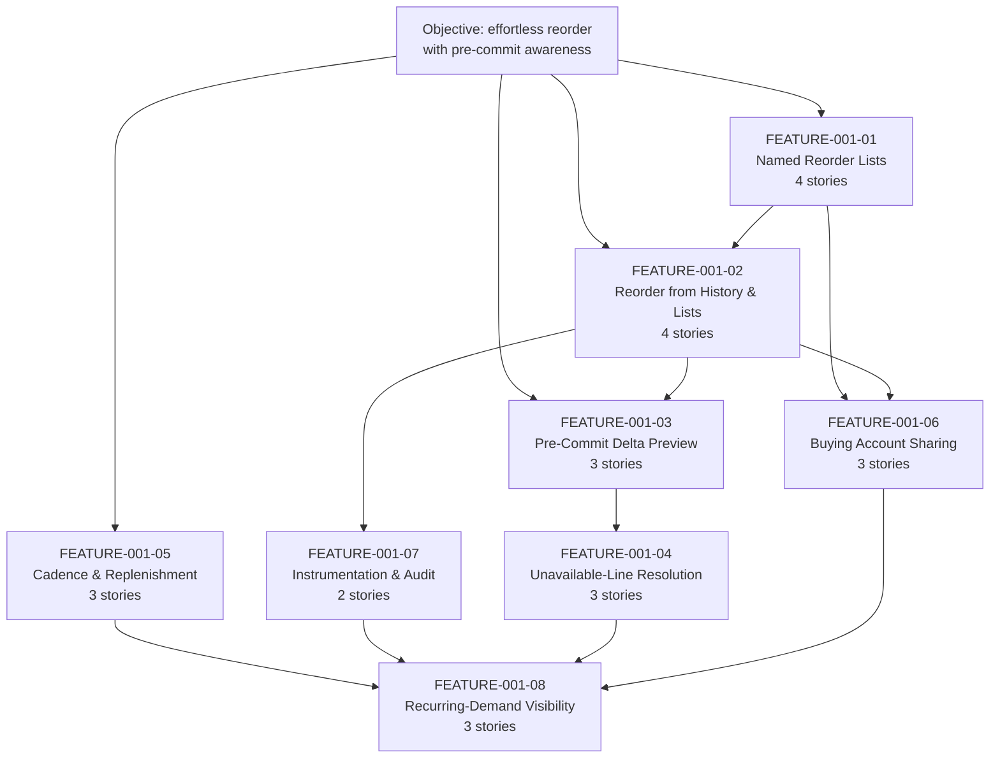

# EPIC-001: Build reorder and replenishment capabilities for returning buyers, so that repeat purchasing requires materially less effort than rebuilding an order from scratch and price and availability changes are surfaced before commit

## 1. Epic Title

**Build reorder and replenishment capabilities for returning buyers, so that repeat purchasing requires materially less effort than rebuilding an order from scratch and price and availability changes are surfaced before commit.**

Delivery is a single self-contained plugin package under `packages/`, added to this Vendure monorepo without editing `packages/core` or `packages/admin-ui`.

---

## 2. Epic Summary

### 2.1 Objective

The objective statement this epic decomposes, quoted verbatim and treated as the source of every quoted traceability label in the story tier:

> "Make it effortless for returning buyers to reorder the items they purchase regularly, so that repeat purchasing on the marketplace requires materially less effort than rebuilding an order from scratch, and so that buyers are made aware of price and availability changes before they commit to a reorder."

Restated as three sentences of build intent: returning buyers gain named, multiple reorder lists carrying a per-line quantity, plus one-step paths from a past order or a saved list into the active cart, so that a repeat purchase stops being a manual rebuild. Before a buyer commits, the same paths report what has changed since the last purchase — a price delta as an integer amount with its currency code, and an availability delta expressed only as the publicly observable stock string — together with an explicit resolution choice for any line that can no longer be added at the requested quantity. Around that core, purchase-cadence detection produces an advisory replenishment due signal, multi-seat buying accounts can share a list under an enforced authorisation check, and every reorder attempt leaves an auditable record and a typed event for the administrative personas who need to see recurring demand.

### 2.2 Business Value, Stated Without Invented Numbers

The value is a reduction in buyer effort and a reduction in post-commit surprise. Effort falls because a reorder resolves an entire past order or a curated list into cart lines through one named operation instead of a per-variant search-and-add loop. Surprise falls because the delta read happens *before* the write, so a buyer sees a changed price or a lost availability while they can still act on it rather than discovering it at checkout.

**This epic states no numeric business target, because this repository declares none.** A search of the tree found no declared service-level commitment, no latency figure, no repeat-purchase-rate claim and no monetary business estimate to measure reorder work against. That absence is reported here as a finding rather than filled with a plausible figure, and it is the reason every acceptance criterion in the story tier replaces a vague adjective with a *verifiable state assertion* — an exact item count with its ordering, an integer money value with its currency code, an exact error type name, one of the three exact stock strings, or a named observable completion signal — rather than with an invented service level.

### 2.3 Confirmed Platform Version

The version was read, not assumed. `@vendure/core` is at **3.7.0** [packages/core/package.json:L2-L3]. This is a Lerna fixed-version monorepo whose `packages/*` glob and single `version` field mean every package in the workspace shares that number [lerna.json:version], so there is no per-package version to reconcile and the plugin this epic describes pins to 3.7.0 across the board.

**Upstream currency — a dated external finding, stated separately from the repository citations and not to be read as one.** The checkout is pinned to 3.7.0, and **3.7.0 is not the newest line published upstream.** As checked on **13 August 2026** against the project's public release list, the newest published release is **v3.7.2, released on 3 August 2026**, with v3.7.1 released on 14 July 2026 and v3.7.0 released on 1 July 2026 — the last of which the local changelog corroborates by date [CHANGELOG.md:L1]. v3.7.2 is a patch on the same minor line, described upstream as carrying fixes for four reported vulnerabilities — one critical, one high and two medium — together with channel-scoping fixes on entity update and delete paths. Three consequences follow, and each is stated rather than implied:

- **The version lock in section 7.1 stays at 3.7.0**, because that is what this checkout declares [packages/core/package.json:L2-L3] and a ticket set may not silently plan against a line the repository does not contain.
- **No ticket in this set may claim that the checkout is on the newest published line.** Two patch releases exist above it, and the upgrade decision belongs to a maintainer rather than to this epic.
- **This finding carries a check date because it decays.** Any reader consulting this section after 13 August 2026 should re-check the release list rather than trust the sentence above; the fact is external, dated and unverifiable from inside the checkout, which is exactly why it is not written in the `[path:locator]` citation form used everywhere else in this file. One further obligation follows from the pin and is stated here rather than left implicit: every line-number locator in this set was resolved against 3.7.0, and a patch release moves lines, so adopting 3.7.1 or 3.7.2 carries the duty to re-resolve every citation in this set against the new tree before relying on it.

**The 3.7.0 breaking changes are a repository citation, not research.** They are recorded in this checkout's own changelog under its `BREAKING CHANGE` heading [CHANGELOG.md:L30-L36], and five shipped with the release: coupon codes on promotions are now compared case-insensitively [CHANGELOG.md:L32]; a production environment still using the default superadmin password will no longer start [CHANGELOG.md:L33]; external authentication links a login to a pre-existing account only when the external email is verified, which additionally requires a custom `AuthenticationStrategy` to set a verified flag on returned provider-verified user data or the account link is refused [CHANGELOG.md:L34]; the email plugin's template and mail-transport dependencies took major upgrades [CHANGELOG.md:L35]; and a health-check dependency is no longer transitively present [CHANGELOG.md:L36]. The third is material to the multi-seat sharing feature, where a seat may arrive through an external identity provider — FEATURE-001-06 inherits it as a precondition rather than as a reorder concern of its own.

**Release cadence, derived from this checkout rather than asserted.** The changelog's own minor-release dates are 3.7.0 on 1 July 2026 [CHANGELOG.md:L1], 3.6.0 on 31 March 2026 [CHANGELOG.md:L182], 3.5.0 on 22 October 2025 [CHANGELOG.md:L470] and 3.4.0 on 1 August 2025 [CHANGELOG.md:L702]. That spacing is what makes `minor` the conventional upstream target for feature-bearing work, and it is derivable from the repository, so no external cadence claim is needed and none is made.

### 2.4 Scope Boundaries — Explicit In-Or-Out Rulings

Five adjacent domains are ruled **OUT**, each with its one-line justification. Nothing below is deferred, and nothing below is left ambiguous.

- **Payment scheduling — OUT.** A reorder places items into an active cart and stops there; the checkout and payment write paths are untouched by the additive-only constraint that governs this epic.
- **Recurring billing — OUT.** It requires a payment-schedule and dunning model that no entity in this repository provides, and building one would exceed an additive plugin boundary.
- **Subscription contracts — OUT.** A contract implies committed future obligations and cancellation terms that the order model does not represent; replenishment signals in this epic are advisory prompts, not commitments.
- **Seller-side inventory forecasting — OUT.** Visibility over *recorded* reorder activity is in scope; predicting future stock requirements has no basis in this repository and no declared numeric target to validate a forecast against.
- **Email template design — OUT.** The replenishment feature deliberately delivers a due-signal *read* rather than a message; any notification transport would sit behind an interface, and template authoring belongs to the email plugin's own surface. **No such interface ships in this epic**: one was proposed for FEATURE-001-05, had no owning story among that feature's three, and was removed for that reason and because this set allocates exactly one configurable strategy in total [tickets/EPIC-001/FEATURE-001-05-purchase-cadence-and-replenishment.md:§2.4 Named Services And Platform Mechanisms]. Nothing in the replenishment feature leaves the process, which discharges the no-external-service constraint more completely than an inert adapter would.

**What must remain unchanged, stated as a countable surface.** The additive-only constraint is only enforceable if the protected surface is enumerable, so it is. The Shop API root `Query` type declares **nineteen** root queries [packages/core/src/api/schema/shop-api/shop.api.graphql:L1-L52], alongside the order, cart and customer-account mutation sets in the same file. Every one of those signatures must be byte-identical after this epic ships. Nineteen is the verified count in this checkout and is stated rather than estimated, because "do not change the existing API" is not a testable boundary until a reviewer can count what existed before. Section 12 makes that count part of the definition of done, and collision C1 in section 6 records the one mechanism that would breach it as a side effect.

**How that count is asserted, which is a rule every feature and story obeys because the obvious phrasing is wrong.** Nineteen is a **baseline**, not a running total, and the distinction is what makes the assertion composable. A feature or story therefore asserts two things and never a third: first, that **each of the nineteen baseline root queries is still present and byte-identical** in name, argument list, argument types, return type and nullability; second, **how many root queries it adds itself, by name**. It does **not** assert an absolute post-plugin total, because such a total is true only until the next feature merges — "the schema still declares nineteen root queries" and "the schema declares twenty root queries" are both false once two query-adding features have shipped, and a set of files each asserting its own total cannot all be right at once. Stating the baseline plus the owned additions is right at every point in the sequence: the baseline never moves, and the additions sum. This epic publishes four Shop root queries in total across FEATURE-001-01, FEATURE-001-03 and FEATURE-001-05, so the fully-merged surface is twenty-three root queries — a figure this epic states **once, here**, and which no feature or story restates as its own assertion.

### 2.5 The Returning-Buyer Journey This Epic Builds

Each step is labelled with the feature that owns it. This is one of exactly two diagrams in this file; story files carry none and reference their parent feature's diagram instead.

```mermaid
flowchart LR
    A["Buyer signs in<br/>existing Shop API"] --> B["Curate a named list<br/>with per-line quantity<br/>FEATURE-001-01"]
    A --> C["Open a past order<br/>via Customer.orders<br/>FEATURE-001-02"]
    B --> D["Request a reorder preview<br/>FEATURE-001-03"]
    C --> D
    D --> E["Read price delta and<br/>availability delta<br/>FEATURE-001-03"]
    E --> F{"Every line addable<br/>at requested quantity?"}
    F -- "Yes" --> H["Apply reorder<br/>to active order<br/>FEATURE-001-02"]
    F -- "No" --> G["Choose skip, reduce,<br/>substitute or abort<br/>FEATURE-001-04"]
    G --> H
    H --> I["Per-line outcome report<br/>FEATURE-001-02"]
    I --> J["Attempt recorded and<br/>event published<br/>FEATURE-001-07"]
    SCH["Scheduled recompute over<br/>placed-order history<br/>FEATURE-001-05"] --> K["Cadence recomputed,<br/>due signal raised<br/>FEATURE-001-05"]
    K --> L["Buyer prompted, or snoozes<br/>FEATURE-001-05"]
    L --> B
    J --> M["Recurring demand visible<br/>to sellers, category managers<br/>and support<br/>FEATURE-001-08"]
    B --> N["Share list with<br/>account seats<br/>FEATURE-001-06"]
    N --> H
    %% Checkout, payment and fulfilment are deliberately absent: the journey ends at a populated cart.
    %% The delta read at E is point-in-time and is not a stock reservation.
    %% NO edge runs from J to K, and that is deliberate. The cadence recompute is not triggered
    %% by a reorder attempt and does not consume the events published at J: it is a scheduled
    %% task deriving intervals from placed-order history, so its entry point is SCH. Section 5
    %% records the reason a transient in-process announcement cannot feed a computation whose
    %% correctness requires a complete history.
    %% The L-to-B edge closes the loop through the BUYER, not through code: a due signal prompts
    %% a buyer, who starts the journey again. No feature reads another's output across it.
```



---

## 3. How To Read This Epic

Four files, chosen after the decomposition was final, answer the four questions a reader arrives with. They are rendered as paths rather than links so that the link count in this file stays equal to the number of features.

- `tickets/EPIC-001-reorder-and-replenishment.md` — answers "what is being built, what already exists, what collides, and what must be decided first".
- `tickets/EPIC-001/FEATURE-001-02-reorder-from-order-history.md` — answers "how does a reorder actually reach the cart, and which existing service does the work".
- `tickets/EPIC-001/FEATURE-001-02/STORY-001-02-01-reorder-complete-past-order.md` — answers "what does one finished, demonstrable unit of this work look like".
- `tickets/EPIC-001/FEATURE-001-03-price-and-availability-delta-preview.md` — answers "how are buyers warned before they commit, and why is that not already solved".

**Total files in this ticket set: 34.** One epic, eight features, twenty-five stories, across ten directories. There is deliberately no index, table of contents, README or glossary: navigation lives in this epic's features index and in each feature's stories index, and an extra file would break the reconciliation that checks this stated total against the on-disk count.

---

## 4. Features Index

Eight features, each carrying two to five stories, totalling twenty-five. Every one of the eight deviates from its originally suggested area, and the deviation is stated with its rationale rather than presented as a straight adoption — only the mechanism-fixing deviations leave the suggested scope intact.

- [FEATURE-001-01 — Named Reorder Lists with Line Quantities](./EPIC-001/FEATURE-001-01-named-reorder-lists.md) — plugin-owned list and list-line tables with per-line quantity, gated with `Permission.Owner` and enforced by a service-layer ownership predicate. **4 stories.**
  - *Deviation: narrowed.* A single unnamed saved list is already shipped and is this platform's canonical teaching example [packages/dev-server/example-plugins/wishlist-plugin/api/api-extensions.ts:L13]. Only *named, multiple* lists carrying a per-line *quantity* are novel.
- [FEATURE-001-02 — Reorder from Order History and Saved Lists](./EPIC-001/FEATURE-001-02-reorder-from-order-history.md) — resolves a past order or a list into cart lines with a per-line outcome report. **4 stories.**
  - *Deviation: expanded.* Absorbs list-to-cart materialisation, because both paths converge on `OrderService.addItemsToOrder` [packages/core/src/service/services/order.service.ts:L654-L676] and splitting them would duplicate the per-line partial-failure contract across two features.
- [FEATURE-001-03 — Pre-Commit Price and Availability Delta Preview](./EPIC-001/FEATURE-001-03-price-and-availability-delta-preview.md) — a point-in-time read of what changed since the last purchase, before any write. **3 stories.**
  - *Deviation: narrowed to pre-commit.* In-cart, post-add price change is already handled by `unitPriceChangeSinceAdded` and `unitPriceWithTaxChangeSinceAdded` [packages/core/src/entity/order-line/order-line.entity.ts:L163-L187] together with `ChangedPriceHandlingStrategy` [packages/core/src/config/order/changed-price-handling-strategy.ts:L7-L38], which section 5 forbids duplicating. Only the *before-commit* read is new.
- [FEATURE-001-04 — Unavailable-Line Resolution and Substitution Candidates](./EPIC-001/FEATURE-001-04-unavailable-line-resolution.md) — skip, reduce, substitute or abort, with candidates behind a configurable strategy. **3 stories.**
  - *Deviation: kept, mechanism fixed.* Substitution sits behind a `SubstitutionCandidateStrategy` interface with a database-backed default, following the `StockDisplayStrategy` precedent [packages/core/src/config/catalog/stock-display-strategy.ts:L6-L32]. Fixing the mechanism this way is what discharges the no-external-service constraint.
- [FEATURE-001-05 — Purchase Cadence Detection and Replenishment Due Signals](./EPIC-001/FEATURE-001-05-purchase-cadence-and-replenishment.md) — a scheduled recompute plus an advisory due-signal read with a snooze. **3 stories.**
  - *Deviation: renamed.* "Reminders" presumes a delivery channel, and message transport is environment-specific and would have to sit behind an interface regardless. The buildable core is a due-signal read plus a `ScheduledTask` recompute, and **no notification adapter is shipped** — one was proposed and removed for having no owning story, as section 2.4 records.
- [FEATURE-001-06 — Multi-Seat Buying Account List Sharing and Permissions](./EPIC-001/FEATURE-001-06-buying-account-list-sharing.md) — share and revoke rows, with authorisation enforced inside the resolver. **3 stories.**
  - *Deviation: kept, mechanism fixed — and the mechanism was fixed twice.* Authorisation is `Permission.Owner` [packages/dev-server/example-plugins/wishlist-plugin/api/wishlist.resolver.ts:L12] plus an explicit service-layer predicate that re-checks live customer-group membership on every use, not a new authentication strategy and **not** a `CrudPermissionDefinition` — collision C7 records why the latter cannot work for a buyer.
- [FEATURE-001-07 — Reorder Event Instrumentation and Audit Trail](./EPIC-001/FEATURE-001-07-reorder-instrumentation.md) — an auditable attempt record and three typed events with documented payload schemas. **2 stories.**
  - *Deviation: partially dropped.* "Experiment readiness" is dropped on two independently citable grounds: this repository declares no numeric business target to experiment against, and an experimentation platform would be an external-service dependency the constraints forbid. Instrumentation is retained in full.
- [FEATURE-001-08 — Recurring-Demand Visibility for Sellers, Category Managers and Support](./EPIC-001/FEATURE-001-08-recurring-demand-visibility.md) — three server-scoped Admin API reads over rows owned elsewhere, surfaced in the dashboard. **3 stories.**
  - *Deviation: expanded.* Absorbs the Customer Support Agent read path. **The reason is shared plumbing rather than a shared aggregate, and it is worth stating precisely because the looser version is not true:** the support lookup calls different operations over a partly different table set from the two demand views, so what a separate support feature would duplicate is the plugin service class, the permission registration, the generated list-options consumption, the dashboard extension with its bundling and catalogue wiring, and the server-side scoping contract — five pieces of wiring, plus a read of the same `ReorderAttempt` and `ReorderAttemptLine` rows. That is enough to make one feature the right unit; claiming one aggregate would not survive contact with the operation list [tickets/EPIC-001/FEATURE-001-08-recurring-demand-visibility.md:§2.2 Contribution To The Epic, And The Expanded Rationale].

### 4.1 Feature Dependency Graph With Batch Sequencing



**Every gate named in section 9.4.1 is drawn as an edge above, and the `F6 → F8` edge is present for exactly one consumer.** The edge exists because story 08-03's support lookup reads the `ReorderListShare` rows story 06-01 creates, so it is a genuine producer-to-consumer dependency and not a scheduling preference. It is narrower than the `F7 → F8` edge beside it: `F7 → F8` governs all three FEATURE-001-08 stories because every recurring-demand read aggregates the attempt rows, whereas `F6 → F8` governs story 08-03 alone — 08-01 and 08-02 read no share row and are not gated by it. Section 9.4.1 states that consequence at story granularity; the edge is what makes the feature-level figure agree with it rather than contradict it.

---

## 5. Existing Mechanisms That Must Not Be Duplicated

Fourteen rows. Thirteen are capabilities already present in this checkout that the reorder work must **consume**, not reinvent; the fourteenth is a capability that exists and is deliberately **excluded**, because naming what must not be consumed is as load-bearing as naming what must. Every row was read in this repository and carries a resolvable locator. A story that rebuilds a consumable row, or that leans on the excluded row, is rejected at review, and the prohibition column states precisely what that would mean so the rejection is not a judgement call.

| Mechanism / identifier | Citation | What it already does | Consuming feature | The prohibition |
|---|---|---|---|---|
| `unitPriceChangeSinceAdded` and `unitPriceWithTaxChangeSinceAdded` | [packages/core/src/entity/order-line/order-line.entity.ts:L163-L187] | Calculated getters that report a non-zero delta when a line's unit price changed since it was added, derived from the `initialListPrice`, `listPrice` and `listPriceIncludesTax` columns declared at [packages/core/src/entity/order-line/order-line.entity.ts:L113], [packages/core/src/entity/order-line/order-line.entity.ts:L121] and [packages/core/src/entity/order-line/order-line.entity.ts:L128] | FEATURE-001-03 | Do not add a plugin-owned column, field or getter that recomputes an in-cart price delta. The pre-commit preview reads variant price directly and is a *separate* concern from these getters, which govern lines already in an order. |
| `ChangedPriceHandlingStrategy.handlePriceChange` | [packages/core/src/config/order/changed-price-handling-strategy.ts:L7-L38] | Governs the outcome when a variant price changed while an item is already in an order; its own JSDoc ties that outcome to the two getters above [packages/core/src/config/order/changed-price-handling-strategy.ts:L13] | FEATURE-001-03 | Do not implement plugin logic that decides which price wins after an add. That decision is already configurable and deployment-owned; the reorder preview only *reports* before the add. |
| `OrderService.addItemsToOrder`, and the already-published Shop API mutation `addItemsToOrder` | [packages/core/src/service/services/order.service.ts:L654-L676] and [packages/core/src/api/schema/shop-api/shop.api.graphql:L74] | Bulk add that resolves an existing line per variant, validates quantity, and returns `{ order, errorResults }`. **Its accumulation behaviour is partial, and section 6.1 collision C0 states the three limits exactly** — the `errorResults` collection carries no per-item key [packages/core/src/service/services/order.service.ts:L665], a successful item pushes nothing onto it, and an unresolvable variant *throws* rather than accumulating [packages/core/src/service/services/order.service.ts:L684] and [packages/core/src/service/services/order.service.ts:L693]. The mutation `addItemsToOrder(inputs: [AddItemInput!]!): UpdateMultipleOrderItemsResult!` exposes the same contract publicly with the same three limits [packages/core/src/api/schema/shop-api/shop.api.graphql:L73] | FEATURE-001-02 and FEATURE-001-04 | Do not write a per-variant add loop, and do not invent a second partial-success mechanism inside the platform's write path. **Do not, however, treat `errorResults` as a per-line outcome report:** it cannot be correlated back to a requested line, so the plugin owns the correlation, as collision C0 requires. The plugin calls this service exactly once per reorder and derives each line's applied quantity from the target order's own per-variant line quantities. Partial-success semantics exist at *both* layers, so a story must state which layer it consumes. |
| `Customer.orders(options: OrderListOptions): OrderList!` | [packages/core/src/api/schema/common/customer.type.graphql:L11] | The order-history read path, already reachable through `activeCustomer` and already paginated, sortable and filterable | FEATURE-001-02 | Do not add a reorder-specific order-history query. FEATURE-001-02 reads history through this field and adds only the reorder write path. |
| `StockLevelService.getAvailableStock` | [packages/core/src/service/services/stock-level.service.ts:L72-L79] | Resolves available stock for a variant through the configured stock-location strategy, so multi-location deployments are handled without plugin awareness | FEATURE-001-03 and FEATURE-001-04 | Do not query `StockLevel` rows directly and do not sum `stockOnHand` in plugin code. Call the service so the configured location strategy stays authoritative. |
| `StockDisplayStrategy` and `DefaultStockDisplayStrategy` | [packages/core/src/config/catalog/default-stock-display-strategy.ts:L14-L23] | Converts a saleable stock level into exactly one of `OUT_OF_STOCK`, `LOW_STOCK` or `IN_STOCK`, deliberately avoiding a raw-number leak over a public API [packages/core/src/config/catalog/stock-display-strategy.ts:L6-L32] | FEATURE-001-03 | Do not expose a numeric stock figure on any Shop API field. `StockLevel` is not a Shop API type at all, so availability is publicly observable only as one of those three strings. |
| The permission-definition family: `PermissionDefinition`, `CrudPermissionDefinition` and `RwPermissionDefinition` | [packages/core/src/common/permission-definition.ts:L86-L107], [packages/core/src/common/permission-definition.ts:L146-L199] and [packages/core/src/common/permission-definition.ts:L245-L281] | Three definition shapes yielding one, four and two permissions respectively from a single name, each registered through `authOptions.customPermissions` and enforced with the `@Allow` decorator; the Crud form's own JSDoc example is a wishlist resolver [packages/core/src/common/permission-definition.ts:L132] | FEATURE-001-04 and FEATURE-001-08 — **administrative operations only** | Do not hand-declare permission strings, and do not build a bespoke authorisation layer. Choose the **narrowest** shape for the surface: a read-only Admin query takes a single-member `PermissionDefinition`, not a four-member Crud definition whose other three members nothing checks. **Do not gate a buyer-facing operation with any of the three** — collision C7 shows a customer session can never hold one; buyer operations take `Permission.Owner` plus the service-layer predicate collision C3 makes the actual control. |
| `EventBus.publish` and `EventBus.ofType` | [packages/core/src/event-bus/event-bus.ts:L116] and [packages/core/src/event-bus/event-bus.ts:L130] | Typed publish and typed subscribe over the existing event catalogue, with transaction-aware delivery | FEATURE-001-07 | Do not add a webhook dispatcher, a polling table or a second message bus. Reorder events are published on this bus and consumed with `ofType`. |
| `JobQueueService.createQueue` | [packages/core/src/job-queue/job-queue.service.ts:L51-L82] | The queue factory on the injectable job-queue service, so background work inherits the deployment's configured job-queue strategy | FEATURE-001-05 | Do not spawn a timer, an interval or a worker thread in plugin code. Background recompute work is enqueued here. |
| `ScheduledTask` configuration shape, and the shipped `cleanSessionsTask` | [packages/core/src/scheduler/scheduled-task.ts:L42-L96] and [packages/core/src/scheduler/tasks/clean-sessions-task.ts:L37] | A cron-scheduled task definition carrying `id`, `description`, `params`, plus `schedule` [packages/core/src/scheduler/scheduled-task.ts:L75], `timeout` [packages/core/src/scheduler/scheduled-task.ts:L83] and `execute` [packages/core/src/scheduler/scheduled-task.ts:L95], configured through `schedulerOptions.tasks` and overridable per deployment; `cleanSessionsTask` is the shipped worked example | FEATURE-001-05 | Do not write a cron implementation and do not hard-code a schedule in plugin source. The schedule is deployment-configurable, and the task follows the shipped example's shape. |
| `generateListOptions`, and `ListQueryBuilder` which applies what it generates | [packages/core/src/api/config/generate-list-options.ts:L31-L60] and [packages/core/src/service/helpers/list-query-builder/list-query-builder.ts:L209] | The generator auto-generates a `${TargetType}ListOptions` input with sort and filter parameters for any query returning a paginated list type; the builder is what then **applies** those options, clamps the page to the configured maximum and rejects an over-limit request [packages/core/src/service/helpers/list-query-builder/list-query-builder.ts:L638] | FEATURE-001-01, FEATURE-001-04, FEATURE-001-05, FEATURE-001-06 and FEATURE-001-08 — every feature that returns a collection, per section 7.7 | Do not hand-write a filter, sort, skip, take or filter-combination input anywhere. Return a `PaginatedList` type and let the generator produce the options input. **And do not stop at the generator:** it produces *arguments* only, so a resolver that accepts them without passing them to the builder is unpaginated in every respect that matters. The builder applies them and enforces the limit; skipping it is the failure this row exists to prevent. |
| Migration lifecycle: `runMigrations`, `revertLastMigration`, `generateMigration` | [packages/core/src/migrate.ts:L40], [packages/core/src/migrate.ts:L89] and [packages/core/src/migrate.ts:L118] | The full migration lifecycle, already wired to a command-line interface and documented as `vendure migrate` [skills/vendure-cli/commands/migrate.md:L1] | Every story with a migration sub-task | Do not write raw DDL scripts, a bespoke migration runner or a schema-sync toggle. Generate an additive migration through the existing lifecycle. |
| Benchmark harness — the **vitest-plus-tinybench** path, which is the only executable one | [e2e-common/vitest.config.bench.ts:L7] collects every `*.bench.ts` file; [packages/core/package.json:L30] is the script form that runs it; [package.json:L62] supplies the timing library; [packages/core/e2e/default-search-plugin.bench.ts:L5] and [packages/core/e2e/default-search-plugin.bench.ts:L18] are the shipped exemplar, which boots a server through `@vendure/testing` on the sql.js initializer and so needs no external database service | Runs a benchmark specification against a booted Vendure server with no external binary and no service dependency, and normalises for machine speed by deriving a margin factor and a CPU factor from a calibration task before comparing [packages/core/e2e/default-search-plugin.bench.ts:L78-L79] | The epic definition of done, section 12 | Do not build new performance tooling, do not add a benchmark runner, and do not invent a target figure. Section 7.6 names the four scenarios and the exact command form; the comparison is before-versus-after in one run on one machine. **Note the exemplar also asserts against a hard-coded constant [packages/core/e2e/default-search-plugin.bench.ts:L110] — copy the normalisation, never the constant, because no reorder target is declared anywhere in this repository.** |
| The two k6 harnesses — named here as **excluded**, with the reason | [packages/dev-server/load-testing/benchmarks.ts:L84] spawns the `k6` binary; [packages/dev-server/README.md:L48] states that k6 must be installed and available on the path; [packages/dev-server/package.json:L23-L25] are the load-test scripts and [packages/dev-server/README.md:L56] describes what they do | `benchmarks.ts` populates a dataset and then runs a k6 script; the `load-test:*` scripts run a **different** harness that parameterises a product count and runs its own k6 scripts | Nothing in this epic | Do not cite either as this epic's benchmark authority. Three independent reasons, each checkable: **no script invokes `benchmarks.ts` at all** — it appears in no `scripts` block in this workspace; both paths require an external binary this repository neither vendors nor installs in its setup action; and `benchmarks.ts`'s own documented dataset is **not the dataset it builds**, as section 7.6 records. A story that names either as its evidence has named a command that will not run. |

---

## 6. Feasibility Collisions Surfaced

Ten collisions between the epic's constraints and the mechanics this platform actually enforces. **Ranking criterion: descending consequence, where consequence is measured first by whether the mechanism makes a proposed design unbuildable or unusable, second by whether it breaches the additive-only constraint at all, and third by how many of the twenty-five stories must change their design if the collision is not resolved before build.** The two groups below are physically separated because they were established by different means, and a reader must be able to tell a repository fact from a documentation claim.

**Identifier stability note, because the ranking and the labels are not the same thing.** C1 through C6 keep the identifiers they were first published with, and every sibling file's reference to them stays valid. C7 through C10 were added after a review of this epic against the platform's source found four further collisions, and they are appended rather than interleaved so that no existing reference is silently re-pointed. **The ranked order by consequence is therefore C7, C8, C1, C9, C10, C3, C2, C4, C5, C6** — an identifier is a label, not a rank. C7 ranks first because it makes every buyer-facing operation in this epic unreachable rather than merely mis-shaped; C8 ranks second because the outcome report the epic's central promise depends on cannot be produced the way it was first described; C1 ranks third because it is the entry that would silently alter two already-published mutations.

Four of the ten — C1, C2, C3 and C5 — are the mechanisms that widen an existing signature or a published enum as a side effect of an otherwise additive change. The architectural constraints require that such a widening be **reported here rather than silently accepted**, and all four are. C1 is reported as a violation and is refused outright; C2, C3 and C5 are reported as declared side effects whose obligations are carried into the stories.

A third group follows the two collision groups and is deliberately **not** a collision group: it carries the discrepancies found in existing repository documentation, which are noted rather than propagated.

### 6.1 Repository-Discovered Collisions

**C1 — Custom-fields argument and type-shape widening. Verdict: a reportable violation of the additive-only constraint, not a manageable side effect.**

Defining a custom field on `OrderLine` forces an extra `customFields` argument onto the existing `addItemToOrder` and `adjustOrderLine` mutations and onto the related fields of `ModifyOrderInput`. This is not an inference — the generator's own JSDoc states it [packages/core/src/api/config/graphql-custom-fields.ts:L455-L469], and the Shop API schema says the same thing in its own docstrings above `addItemToOrder` [packages/core/src/api/schema/shop-api/shop.api.graphql:L71] and above `adjustOrderLine` [packages/core/src/api/schema/shop-api/shop.api.graphql:L79]. The widening is not opt-in at request time either: the custom-fields generators run inside `buildSchemaFromVendureConfig` on every boot, after plugin API extensions have already been merged [packages/core/src/api/config/get-final-vendure-schema.ts:L87-L118]. There is a guard that skips extension with a warning when a type already declares a `customFields` field [packages/core/src/api/config/graphql-custom-fields.ts:L54-L58], but it protects the generator from collision, not the published signature from widening.

*Consequence.* Any story that reaches for a custom field on `OrderLine` changes the signature of two operations this epic promised not to touch. The constraint's instruction is explicit that a side-effect widening is to be reported here rather than silently accepted, which is why this entry exists.

*Resolution — settled, not offered as a choice.* **This epic declares zero custom fields on any core entity, and no story in this set may declare one.** Every piece of reorder state — list membership, per-line quantity, share grants, cadence, attempt outcomes — lives on a plugin-owned table keyed by entity id, and the ownership link is a `customerId` column on that table rather than a relation field on `Customer`. The alternative of accepting the widening **is withdrawn**: the architectural constraints classify a side-effect widening of an existing operation as a reportable violation rather than a manageable cost, so it is not a decision a maintainer is being asked to take. Section 8.2 records the ruling instead of an open decision, and section 12 makes the empty custom-fields object part of the definition of done.

Two mitigations were considered and **both are rejected as insufficient**, recorded here so that neither is later mistaken for a route back in. The wishlist plugin's `internal: true` flag keeps a custom field out of the API entirely and is the pattern this repository already uses [packages/dev-server/example-plugins/wishlist-plugin/wishlist.plugin.ts:L18-L24], and the generator honours it by filtering internal fields out before widening anything [packages/core/src/api/config/graphql-custom-fields.ts:L467] — but it is a per-field opt-out that a later contributor can omit without failing any check, so it protects nothing structurally, and collision C6 shows that a struct custom field cannot use it at all. Note also that `Customer.customFields` currently resolves to the JSON scalar in the checked-in Shop API snapshot [schema-shop.json:customFields], so a reader cannot infer the current shape from a typed field.

**C2 — Automatic `ErrorCode` enum growth. Verdict: a declared, manageable side effect, additive for clients that carry a default branch.**

Every type implementing the `ErrorResult` interface is appended to the published `ErrorCode` enum automatically, by name-derived upper-snake conversion [packages/core/src/api/config/generate-error-code-enum.ts:L5-L33], keyed off the interface-name constant in the same file [packages/core/src/api/config/generate-error-code-enum.ts:L3]. The enum ships with a single literal member in source [packages/core/src/api/schema/common/common-enums.graphql:L28-L30] and is populated at build time.

*Consequence, with the two APIs counted separately because the generator runs once per API and the figures differ.* **The Shop API** snapshot currently carries **thirty-two** `ErrorCode` members and **thirty-one** types implementing `ErrorResult` [schema-shop.json:ErrorCode] — thirty-one implementors plus the literal unknown-error member. **The Admin API** carries **forty-seven** members and **forty-six** implementors [schema-admin.json:ErrorCode]. Wherever this epic or a sibling file quotes thirty-one or thirty-two, the figure is **Shop-only and is labelled as such**; a story that names an error vocabulary for an Admin operation states the Admin figures instead. All six new error results are declared through `shopApiExtensions` **as field-complete object types implementing `ErrorResult`, one declaration each, in the three feature sections section 6.4 names** — which is the precondition for any growth at all, since the generator derives members from the implementing types it finds rather than from union membership [packages/core/src/api/config/generate-error-code-enum.ts:L11-L19] — and none is reachable from an Admin operation, so **the Shop enum grows from thirty-two to thirty-eight and the Admin enum stays at forty-seven** — the Admin surface this epic adds reports invalid input by throwing rather than by declaring an error result, as FEATURE-001-04 and FEATURE-001-08 state. No existing member is removed or renamed in either API, so this is additive; but it *is* a change to a published enum, and a client that switches exhaustively on `ErrorCode` without a default branch will break.

*Recommended resolution.* Accept the growth, declare it in the story that introduces each error result, and require a default branch in every consuming example. The generator runs after plugin extensions are merged [packages/core/src/api/config/get-final-vendure-schema.ts:L107], so a plugin-declared error result reaches the enum with no extra wiring — which is exactly why the growth cannot be avoided by ordering.

**C3 — Automatic `Permission` enum growth, `Permission.Owner` is not an access control, and a custom permission cannot reach a customer at all. Verdict: the enum growth is a declared side effect; the other two halves are correctness traps, and the third would make every buyer-facing operation unreachable if it were not carried into the design.**

The `Permission` enum is declared with no members in source and annotated as populated at run time [packages/core/src/api/schema/common/common-enums.graphql:L20-L21], filled by `generatePermissionEnum` from the default and custom permission definitions [packages/core/src/api/config/generate-permissions.ts:L39-L68], and that generator also runs after plugin extensions are merged [packages/core/src/api/config/get-final-vendure-schema.ts:L116]. Registering the four new permission definitions this epic settles on in section 6.4 therefore grows a published enum by **five members**, on the same additive-but-published footing as C2 — five rather than four because one of them is a read-write definition that yields two members [packages/core/src/common/permission-definition.ts:L255-L262]. **Stated with before-and-after figures rather than only as a delta, so the growth is as concrete here as C2's is:** both checked-in snapshots currently publish **ninety-seven** `Permission` members [schema-admin.json:Permission] and [schema-shop.json:Permission], so **each enum goes from ninety-seven to one hundred and two**. **An earlier revision of this entry stated three definitions and four members**, which was the count before FEATURE-001-08 separated the seller-scoped aggregate read from the entitlement to its seller-unscoped form — a separation made because deriving "no seller to filter by" and "authorised to see every seller" on one branch was fail-open [tickets/EPIC-001/FEATURE-001-08-recurring-demand-visibility.md:§2.7 The Seller-Scoping Rule, Stated As A Hard Contract]. The figure is identical in the two APIs because the generator draws from one registry rather than per-API sets [packages/core/src/api/config/generate-permissions.ts:L46] — which is worth stating plainly, because **all five new members gate Admin operations only and yet all five appear in the published Shop enum as well.** That is not a leak: an enum member is a name, and the operations it gates are absent from the Shop schema. It does mean a Shop-side client switching exhaustively on `Permission` without a default branch will break, exactly as ruling R9 requires every consuming example to guard against.

The second half is the ownership caveat, stated in the platform's own source: any resolver using `Permission.Owner` **must** include logic enforcing that only the owner of the resource has access, and if it does not, the effect is equivalent to `Permission.Public` [packages/core/src/api/config/generate-permissions.ts:L32-L34].

**The third half is the one that decides the design, and it was read rather than assumed: a custom permission definition can never be granted to a customer.** Three citations establish it and none of them is an inference:

*Resolution.* Pair the gate with an explicit in-service ownership predicate derived from the authenticated session, and make "a request authenticated as a different customer is refused" a mandatory acceptance criterion rather than an edge case. The wishlist service shows the minimal form of the session guard this must build on [packages/dev-server/example-plugins/wishlist-plugin/service/wishlist.service.ts:L74-L76]. **Which gate is paired with it is settled by C7, not here:** buyer-facing operations use `Permission.Owner`, and the three custom permission definitions this epic registers are Admin-only. The enum growth reported above is therefore three definitions producing four members, all of them administrative.
- **The Customer Role ships holding exactly one permission.** It is created with `permissions: [Permission.Authenticated]` [packages/core/src/service/services/role.service.ts:L443] and it is the special role every customer user is given [packages/core/src/service/services/user.service.ts:L106-L107].
- **That role cannot be amended.** `RoleService.update` throws `error.cannot-modify-role` when the target is the Customer Role [packages/core/src/service/services/role.service.ts:L290-L291], so there is no Admin API call, no seeding step and no configuration that adds a permission to it. It is assigned to each newly created channel [packages/core/src/api/resolvers/admin/channel.resolver.ts:L65-L67], so the constraint holds on every channel rather than only on the default one.
- **`Permission.Owner` is not assignable either, and that is deliberate.** It is declared `assignable: false` and `internal: true` [packages/core/src/common/constants.ts:L28-L31]. What makes it usable on a customer-facing resolver is the guard's own arithmetic: `authorizedAsOwnerOnly` is set when the session lacks the required permission and `Permission.Owner` was requested [packages/core/src/service/helpers/request-context/request-context.service.ts:L109], and the access-control strategy admits the request on that basis [packages/core/src/config/auth/default-entity-access-control-strategy.ts:L56]. That is exactly why the platform warns it is equivalent to `Permission.Public` without in-resolver logic — the gate lets everyone through by construction.
*Consequence, and it is a design consequence rather than a note.* A buyer-facing operation gated on a `CrudPermissionDefinition` permission is **refused for every customer in every channel**, because no customer can ever hold that permission. A story that gates one that way ships an operation nobody can call. Symmetrically, a buyer-facing operation gated on `Permission.Owner` alone is **open to everyone**, including an unauthenticated session. Neither gate is a control; the control is always the in-resolver ownership check.
*Recommended resolution, in two halves that must not be mixed up.*
- **Buyer-facing Shop API operations gate on `Permission.Owner` and enforce ownership in the resolver or the service it delegates to.** This is the shipped pattern rather than a proposal: the wishlist example plugin's three customer-facing operations are each declared `@Allow(Permission.Owner)` [packages/dev-server/example-plugins/wishlist-plugin/api/wishlist.resolver.ts:L11-L12] and its service resolves the acting customer from the session's active user id [packages/dev-server/example-plugins/wishlist-plugin/service/wishlist.service.ts:L74-L76]. Every reorder story therefore carries "a request authenticated as a different customer is refused" and "an unauthenticated request is refused" as mandatory acceptance criteria, because the resolver logic is the only thing enforcing either.
- **Admin API operations gate on a registered `CrudPermissionDefinition` or `RwPermissionDefinition` permission**, which an administrator role genuinely can be granted through `RoleService.create` and `update` for any role other than the two special ones [packages/core/src/service/services/role.service.ts:L290-L291]. That is where the enum growth in this entry actually comes from, and it is the only place a custom permission is load-bearing.
Ownership enforcement is consequently load-bearing across FEATURE-001-01, FEATURE-001-02, FEATURE-001-03, FEATURE-001-05 and FEATURE-001-06, and permission-definition registration is load-bearing only in FEATURE-001-04's and FEATURE-001-08's administrative surfaces.
*One consequence for the enum count, so the arithmetic in this epic stays honest.* The epic still proposes **three** permission definitions, but all three are now administrative and none is buyer-facing: one gating FEATURE-001-04's curation surface, and two in FEATURE-001-08 — one for the recurring-demand reads and a separate, narrower one for the customer-support lookup, kept apart so that a seller or category role cannot reach a buyer's lists and attempt history. No definition is registered for a buyer-facing operation, because a definition registered for one would gate nothing and refuse everyone.

**C4 — This repository's own breaking-change classification collides with "additive migrations only". Verdict: an unresolved process collision that this epic surfaces rather than settles.**

The contribution guide classifies *any* change to the database schema as a breaking change requiring a `BREAKING CHANGE` commit section [CONTRIBUTING.md:§Breaking Changes], and instructs that the pull request be made against the `major` branch rather than `master`. Its worked example is not an analogy — it is literally a migration adding a new field to the `Customer` table. Meanwhile the guide sends new features to the `minor` branch [CONTRIBUTING.md:§New features].

*Consequence.* This epic adds seven plugin-owned tables. Read literally, the guide routes that work to `major` even though every migration is additive, no existing column changes type, and no destructive statement is issued. That directly contradicts the epic's own framing of the migrations as additive.

*Recommended resolution.* None is imposed here, because a branch strategy is not this epic's to choose. The collision is recorded as an open decision in section 8, with the observation that the classification's own wording turns on "breaking", and that seven *new* tables break no existing consumer. A research note bearing on the decision appears in section 6.2.

**C7 — A customer session cannot hold a custom permission, so a `CrudPermissionDefinition` gate on a buyer operation publishes the operation and then makes it unreachable. Verdict: the highest-consequence collision in this epic, and the one that invalidates the largest amount of its first design.**

The chain is short and every link is in this checkout. A customer's `User` is created with exactly one role, the special customer role [packages/core/src/service/services/user.service.ts:L99-L107], and that role is created with exactly one permission, `Permission.Authenticated` [packages/core/src/service/services/role.service.ts:L433-L444]. The role cannot be edited to add one, because the update path refuses any modification of it by code [packages/core/src/service/services/role.service.ts:L290]. The guard then resolves the session and asks the configured access-control strategy whether the request's permission list is satisfied [packages/core/src/api/middleware/auth-guard.ts:L79-L86], treating `Permission.Owner` as the one member that changes how the session itself is obtained [packages/core/src/api/middleware/auth-guard.ts:L57]. A storefront request therefore arrives holding `Permission.Authenticated` and nothing else — never `CreateReorderList`.

*Four things are distinct here, and conflating any two of them produces either an unreachable operation or a public one. This epic states them separately once, and every feature and story file uses these four terms rather than restating the mechanism.* **(1) The session permission** is `Permission.Authenticated`, the single member the Customer Role is created with [packages/core/src/service/services/role.service.ts:L443]; a session never holds `Permission.Owner`, and no configuration can give it one. **(2) The resolver requirement** is what `@Allow(Permission.Owner)` declares — a permission the resolver asks for, not one the caller presents. **(3) Owner-only admission** is how that requirement is satisfied without the caller holding it: the guard mints an anonymous session when none is presented [packages/core/src/api/middleware/auth-guard.ts:L140], the request context records `authorizedAsOwnerOnly` precisely when the caller does *not* hold the required permission [packages/core/src/service/helpers/request-context/request-context.service.ts:L109], and the configured access-control strategy admits on that flag alone [packages/core/src/config/auth/default-entity-access-control-strategy.ts:L49-L57] — so the gate admits every request that reaches it, authenticated or anonymous. **(4) The service ownership predicate** is therefore the whole of the control, exactly as the platform's own source insists [packages/core/src/api/config/generate-permissions.ts:L32-L34]. A ticket that says a customer session "holds Owner" has described a state that cannot exist and, worse, has implied that the gate is doing work it does not do.

*Consequence.* Every buyer-facing operation this epic proposes — the eight in FEATURE-001-01, the reorder mutation in FEATURE-001-02, the preview in FEATURE-001-03, the two in FEATURE-001-05 and the two in FEATURE-001-06 — would return a forbidden error to every customer, for every request, with no configuration a deployment could apply to fix it. Fourteen of the fourteen Shop API operations are affected. This is not a hardening gap; it is an unusable API.

*Resolution — settled.* **Buyer-facing Shop API operations are gated with `@Allow(Permission.Owner)` and nothing else, paired with the mandatory in-service ownership and channel predicate that C3 requires.** That is exactly what the shipped saved-list precedent does on all three of its operations [packages/dev-server/example-plugins/wishlist-plugin/api/wishlist.resolver.ts:L12], and the core Shop resolvers do the same. **Custom permission definitions are reserved for Admin API operations**, where an administrator's role is editable and a permission is therefore grantable. Section 6.4 fixes the resulting inventory: three definitions, all administrative, zero buyer-facing custom permissions. The one thing this resolution does *not* do is reduce the obligation in C3 — with `Permission.Owner` the in-service predicate is not merely mandatory, it is the entire control [packages/core/src/api/config/generate-permissions.ts:L32-L34].

**C8 — `addItemsToOrder` cannot report which requested line an error belongs to, and one class of stale line throws instead of accumulating. Verdict: the epic's per-line outcome promise is unbuildable as first described and the plugin must own the correlation.**

Three limits, read from the method body rather than from its docstring. First, the accumulator is a flat array of error results with no index and no variant key [packages/core/src/service/services/order.service.ts:L665], so two lines failing with the same error type are indistinguishable in the return value. Second, a successful item pushes nothing, so the array's length carries no positional relationship to the requested items. Third — and this is the sharpest — a variant that no longer satisfies `enabled: true` with a null `deletedAt` is loaded with a throwing accessor [packages/core/src/service/services/order.service.ts:L684] and a variant whose parent product has been disabled raises an explicit throw [packages/core/src/service/services/order.service.ts:L693]; there is no `try` and no `catch` in the method, so either case abandons the loop. Under the `@Transaction()` decorator the surrounding transaction is then rolled back [packages/core/src/connection/transaction-wrapper.ts:L67-L70], so **every line already written is discarded**.

*Consequence.* "One outcome per requested line" cannot be satisfied by mapping `errorResults`, and a single item disabled since the last purchase would abort a whole reorder — which is precisely the scenario a reorder feature exists to handle.

*Resolution — settled, and it revises the one-call constraint rather than abandoning it.* The plugin owns the correlation, in four fixed steps. **(1) Index and deduplicate:** each requested line is assigned a zero-based `requestIndex`, and requested items are collapsed to one entry per `productVariantId` with quantities summed, so a variant maps to at most one core item and a per-variant reading is unambiguous. **(2) Prevalidate:** before the core call the plugin loads each variant under the same predicate the core method uses and reads its saleable quantity through the same service the core path uses, classifying every line that would throw or clamp to zero as a per-line outcome of its own — so no unresolvable line is ever passed to the core call and the throw is never reached. **(3) Call once:** `OrderService.addItemsToOrder` is called exactly once, with only the lines prevalidation admitted; no per-variant add loop is written. **(4) Reconcile by delta:** each line's applied quantity is the difference between the target order's line quantity for that variant after the call and before it, which is authoritative and needs no key. Any error result the plugin cannot attribute to exactly one variant is surfaced at request level as an error code, **never attributed to a line on a guess**. FEATURE-001-02 publishes the resulting contract and FEATURE-001-07 records from it.

**C9 — An audit row written in the reorder transaction cannot survive that transaction's failure, and an event published inside it is not delivered if it rolls back. Verdict: three guarantees that cannot all hold; one must be chosen and the other two withdrawn.**

The wrapper commits on success and rolls back on any thrown error [packages/core/src/connection/transaction-wrapper.ts:L64] and [packages/core/src/connection/transaction-wrapper.ts:L67-L70], which disposes of the idea that a row written inside the transaction can record a failure that aborted it. Delivery is the same story from the other side: `ofType` defers each event until its context's transaction settles [packages/core/src/event-bus/event-bus.ts:L130], and the deferral helper returns nothing when the commit it waited for turned into a rollback [packages/core/src/event-bus/event-bus.ts:L338-L343], which the stream then filters away [packages/core/src/event-bus/event-bus.ts:L135]. The one exception is a blocking handler, which runs inline during `publish` [packages/core/src/event-bus/event-bus.ts:L116-L118] and therefore *inside* the transaction — so it observes uncommitted state and can itself fail the request, which is the opposite of observational neutrality.

*Consequence.* "The audit row is written in the same transaction", "the audit is unaffected by the reorder's failure" and "subscribers are notified even when the reorder fails" are mutually exclusive on this platform.

*Resolution — settled, one guarantee.* **The audit row is written inside the reorder's transaction, and the events are delivered if and only if that transaction commits.** A request-level failure therefore leaves no attempt row and publishes nothing; the failure is observable in the returned error result and in the server log, not in the audit trail. A *per-line* rejection is not a request-level failure — the transaction commits, so the attempt row, its rejected line rows and all three events are present, which is the case the instrumentation actually exists to serve. No outbox, no second table and no retry queue is introduced, because each would be new infrastructure the constraints exclude, and the two withdrawn guarantees are recorded as withdrawn rather than left standing. FEATURE-001-07 carries the ruling and the observable evidence for it.

**C10 — The frozen Channel-level stock requirement and the shipped saleable-stock read path disagree: the requirement names the Channel pair, the code reads `GlobalSettings`. Verdict: a reported divergence between a requirement and an implementation, mitigated by a mirroring precondition rule. The requirement stands; this epic does not rewrite it.**

*The framing matters as much as the evidence, and an earlier version of this entry got it wrong.* That version treated the divergence as licence to replace the requirement — it declared the Channel-level rule "aspirational" and made `GlobalSettings` the normative surface. **That is not a collision report; it is a requirement change, and this epic has no authority to make one.** The requirement this ticket set is written against is the Channel-level pair, `Channel.trackInventory` [packages/core/src/entity/channel/channel.entity.ts:L100] and `Channel.outOfStockThreshold` [packages/core/src/entity/channel/channel.entity.ts:L108] — the same two fields the `GlobalSettings` deprecation annotations name as their replacement [packages/core/src/entity/global-settings/global-settings.entity.ts:L32-L45]. What follows is the divergence, reported at full strength, followed by the mitigation that lets a story assert an availability outcome on this checkout **without** demoting the requirement.

`ProductVariantService.getSaleableStockLevel` reads `trackInventory` and `outOfStockThreshold` from the global settings service [packages/core/src/service/services/product-variant.service.ts:L323-L324], inherits the global value when the variant's own flag is set to inherit [packages/core/src/service/services/product-variant.service.ts:L326-L328], and uses the global threshold whenever `useGlobalOutOfStockThreshold` is true [packages/core/src/service/services/product-variant.service.ts:L336-L340]. The order write path reaches exactly that method when it clamps a requested quantity [packages/core/src/service/helpers/order-modifier/order-modifier.ts:L125], and the stock-movement service reads the same global value when it allocates and sells [packages/core/src/service/services/stock-movement.service.ts:L158] and [packages/core/src/service/services/stock-movement.service.ts:L207]. The Channel columns exist [packages/core/src/entity/channel/channel.entity.ts:L100] and [packages/core/src/entity/channel/channel.entity.ts:L108], and the global columns are annotated as deprecated in their favour [packages/core/src/entity/global-settings/global-settings.entity.ts:L32-L35] and [packages/core/src/entity/global-settings/global-settings.entity.ts:L42-L45] — **but no core read path in this checkout reads the Channel columns for stock.** The deprecation is an annotation; the code has not moved.

*Consequence.* The specification this epic is built to states that the Channel pair carries the live values and that the `ProductVariant` JSDoc pointing at the global pair is stale. The code in this checkout says the opposite about which values are *read*. Both statements cannot govern an acceptance criterion, and **an earlier revision of this epic resolved that by making the deprecated global pair the authority — which is this epic rewriting its own specification through a ticket ruling, and is not a resolution this artifact is entitled to make.** Discrepancy (iii) in section 6.3 records the same divergence from the documentation side; what is recorded here is its behavioural half.
*Consequence.* A story that seeds **only** `Channel.trackInventory` and `Channel.outOfStockThreshold` and then expects the platform to clamp a quantity has seeded settings this checkout's read path does not consult, and its acceptance criterion would pass or fail for the wrong reason. The `ProductVariant` JSDoc pointing at the global settings entity [packages/core/src/entity/product-variant/product-variant.entity.ts:L146-L152] is **stale against the requirement** — the deprecation annotations name the Channel pair as the successor — while remaining **descriptive of the current read path**; discrepancy (iii) in section 6.3 reports both halves and follows neither of them into a ticket. That is what "noted, not propagated" means here: the divergence is disclosed, and the requirement is not edited to match the code.

*Resolution — the specification governs the text, and the divergence is a blocker rather than a ruling.* Three parts, in this order:

- **The stated authority is the Channel pair**, exactly as the specification requires: every availability precondition in this set names `Channel.trackInventory` [packages/core/src/entity/channel/channel.entity.ts:L100] and `Channel.outOfStockThreshold` [packages/core/src/entity/channel/channel.entity.ts:L108] together with the three per-variant columns — the variant's own three-valued `trackInventory` flag [packages/core/src/entity/product-variant/product-variant.entity.ts:L155], its `useGlobalOutOfStockThreshold` flag [packages/core/src/entity/product-variant/product-variant.entity.ts:L152] and its own `outOfStockThreshold` [packages/core/src/entity/product-variant/product-variant.entity.ts:L144]. No story states the deprecated pair as *the authority*, and **no story describes two surfaces as authoritative**, which is the failure this entry exists to prevent.
- **Because the read path diverges, every such precondition additionally requires the deployment's single global settings row to be seeded consistently with the channel values it governs.** This is a determinism requirement on the fixture and is labelled as one wherever it appears: it exists so a criterion cannot pass while the value it names is unread, and it is not a second authority. The divergence it compensates for is the one below, and each affected story cites it rather than re-arguing it.
- **The divergence itself is a blocking decision, recorded as decision 5 in section 8.2 and owned by a maintainer.** It has exactly two admissible outcomes and this epic picks neither: the platform's effective-settings resolution is reconciled with the Channel columns upstream, or the specification is amended by whoever owns it. **Until one of the two is taken, no story's definition of done may be signed off on the strength of an availability criterion alone**, and that gate is stated in section 12 rather than left implicit. What this epic does *not* do is invent a third option: the plugin never reimplements the saleable calculation — both the pre-commit preview and the pre-call prevalidation call `getSaleableStockLevel` [packages/core/src/service/services/product-variant.service.ts:L323], which is what makes a preview and its commit agree by construction rather than by coincidence, and a plugin-side reimplementation reading the Channel columns would make them disagree by construction instead.

- **The criterion is written against the requirement.** A reader sees the Channel-level intent first, so no ticket in this set teaches the wrong settings surface, and no ticket claims the global pair is where a deployment ought to configure stock.
- **The criterion executes on this checkout.** Because the mirror sets the row the code reads, the assertion exercises a real clamp rather than a settings value nothing consults. **Neither half is optional**: dropping the Channel half demotes the requirement, and dropping the mirror makes the test vacuous.
- **The mitigation has a stated end.** When a release moves the read path onto the Channel columns, the mirror is deleted and nothing else changes — which is the closure condition for this collision and the reason it is a collision entry rather than a permanent design rule. Aligning the platform's two settings surfaces is upstream work this epic does not do, and this epic does not pretend the alignment has already happened.

The plugin never reimplements the calculation either way: both the pre-commit preview and the pre-call prevalidation call `getSaleableStockLevel`, which is what makes a preview and its commit agree by construction rather than by coincidence, and which is why the plugin is indifferent to which settings row wins. The plugin introduces no Channel-versus-global divergence of its own.

### 6.2 Research-Discovered Collisions

These two were established from the platform's published **developer guide** rather than from reading the implementation, and they are kept in their own group so that the distinction stays visible. The distinction is *documented behaviour* versus *behaviour read off the code* — it is not *external* versus *local*, because that guide ships inside this checkout under the documentation tree, which is why every claim below now carries a resolvable locator into it instead of an unattributed appeal to research. Two rules follow for this group: a claim with a locator is checkable and is written as such, and a claim that could only be corroborated off-repository is dated at the point it is made, in the manner of the upstream-currency finding in section 2.3.

**C5 — Plugin field-addition to an existing core type. Verdict: a declared side effect that must be stated, not a violation, provided nothing existing changes shape.**

The documented extension pattern lets a plugin add a field to an existing core type [docs/docs/guides/developer-guide/extend-graphql-api/index.mdx:L254], through an entity resolver scoped by passing the type name to the resolver decorator, which the guide spells out [docs/docs/guides/developer-guide/extend-graphql-api/index.mdx:L278] and then demonstrates against `ProductVariant` [docs/docs/guides/developer-guide/extend-graphql-api/index.mdx:L285]. Adding a field is backward-compatible for existing clients — unlike changing a field's type or adding a required argument — but it does alter the published schema of a type the plugin does not own.

*Recommended resolution.* Prefer root-level operations that return plugin-owned types, so no core type changes shape at all. Where a field on a core type genuinely improves the storefront contract, the story that adds it must declare the addition explicitly and assert that no existing field's type or nullability changed. Doing it silently is the failure mode this entry exists to prevent.

**C6 — Struct custom fields cannot be hidden, which rules them out under a zero-widening constraint. Verdict: a constraint the platform forces, not an ambiguity in the objective.**

The documented custom-field flags `public`, `readonly`, `internal`, `defaultValue`, `nullable`, `unique` and `requiresPermission` are **not supported on struct custom fields**, and the guide states that exclusion as a list rather than leaving it to be inferred [docs/docs/guides/developer-guide/custom-fields/index.mdx:L940]. The `internal` flag is the whole reason exposure is avoidable — exposure is the default, and `internal` is what keeps a field out of the GraphQL APIs while leaving it usable from plugin TypeScript [docs/docs/guides/developer-guide/custom-fields/index.mdx:L420]; `readonly` likewise restricts writes to TypeScript [docs/docs/guides/developer-guide/custom-fields/index.mdx:L398]; and for Shop API access control specifically the documented approach is to set `public: false` [docs/docs/guides/developer-guide/custom-fields/index.mdx:L377] and supply a custom field resolver, because the permission-based flag governs the Admin API alone [docs/docs/guides/developer-guide/custom-fields/index.mdx:L613-L615].

*Consequence.* A struct custom field cannot be hidden. Wherever the zero-widening constraint applies, struct fields are therefore unusable — which reinforces C1's resolution rather than offering an alternative to it.

*Also recorded here, because it is a mechanic this set depends on and it was established from the guide rather than by reading a resolver:* declaring a custom union result requires a dedicated resolver class carrying a single `__resolveType` field resolver [docs/docs/guides/developer-guide/extend-graphql-api/index.mdx:L389], because the server has to be told which member of the union a value belongs to [docs/docs/guides/developer-guide/extend-graphql-api/index.mdx:L383-L385], registered in the plugin's resolvers array under the union's own type name [docs/docs/guides/developer-guide/extend-graphql-api/index.mdx:L395], with both the resolver and the service typed against the error-result union [docs/docs/guides/developer-guide/extend-graphql-api/index.mdx:L362]. Each of the six proposed error results needs that wiring.

*One further documented note, bearing directly on C4:* the platform's versioning policy states that minor releases may occasionally introduce non-destructive changes to the database schema — for instance a new column requiring a migration — while ruling out schema changes that could lose data [docs/docs/guides/developer-guide/updating/index.mdx:L31-L38]. That is in tension with the contribution guide's blanket routing of any schema change to `major`, and it is the single strongest argument that the C4 decision is genuinely open rather than already settled. It is recorded with its locator so a maintainer can read the policy directly, and it does not license anyone to pick a branch without the decision in section 8 being taken.

### 6.3 Repository Documentation Discrepancies — Noted, Not Propagated

Five claims in existing repository documentation do not match the repository's behaviour. **None is corrected in place.** Editing them would take this run outside its stated output location, so each is reported here instead, which keeps the run strictly additive and leaves every correction as separately assignable follow-up work. No ticket in this set may repeat any of the five claims.

- **(i) SQLite is named as officially supported, but no SQLite continuous-integration job exists.** The contribution guide states that Vendure officially supports MySQL, MariaDB, PostgreSQL and SQLite [CONTRIBUTING.md:§4. Populate test data], yet the four engine jobs are `e2e-sqljs`, `e2e-mariadb`, `e2e-mysql` and `e2e-postgres` [.github/workflows/build_and_test.yml:jobs] — the fourth is sql.js, the WebAssembly driver, not the native SQLite driver. The test harness corroborates this: it exports initializers for MySQL, PostgreSQL and sql.js only, and none for native SQLite [packages/testing/src/index.ts:L10-L12]. *Consequence carried into the definition of done:* an additive migration can be evidenced on MariaDB, MySQL, PostgreSQL and sql.js, and **native SQLite must be named as an unverified engine** rather than claimed.
- **(ii) A Docusaurus documentation workflow is described that no longer exists.** The guide states the documentation uses Docusaurus and is previewed by changing into the docs directory and running a `start` script [CONTRIBUTING.md:§Contributing to the documentation], but that package declares no `start` script and no Docusaurus dependency — its only runtime dependency is a documentation provider package, and its scripts are limited to MDX compilation and a type check [docs/package.json:scripts]. The package has moved to a manifest-driven provider model. *Consequence:* no ticket may instruct a reader to preview anything with that command.
- **(iii) The inventory settings are documented three ways and the three do not agree.** The `ProductVariant` JSDoc directs a reader to the global settings entity for the out-of-stock threshold [packages/core/src/entity/product-variant/product-variant.entity.ts:L146-L152]. The global settings entity annotates both of those fields `@deprecated` and names the Channel-level pair as the replacement [packages/core/src/entity/global-settings/global-settings.entity.ts:L32-L45]. And the code reads the global pair regardless [packages/core/src/service/services/product-variant.service.ts:L323-L324]. So the JSDoc happens to point at the values the platform actually uses, while the deprecation annotation points at values nothing reads — meaning the JSDoc is stale relative to the annotation and the annotation is ahead of the implementation at the same time. **This is recorded as a discrepancy in three documentation surfaces and not resolved by editing any of them**, because this run is additive.

  This entry is longer than the others because its behavioural half is load-bearing rather than cosmetic. The behavioural half is ranked as collision C10 in section 6.1, and this entry is where its evidence and its ruling are set out in full; what sits here rather than there is the disagreement between three documentation surfaces, which breaches no constraint and widens no signature. What the pair of them do together is fix a single source of truth that every stock precondition in this set is written against, and the four reads below are the evidence, each taken from this checkout:

  - `ProductVariantService.getSaleableStockLevel` destructures `outOfStockThreshold` and `trackInventory` from the **global settings service** [packages/core/src/service/services/product-variant.service.ts:L323-L324], and its private threshold helper does the same [packages/core/src/service/services/product-variant.service.ts:L343-L344].
  - The multi-channel stock-location strategy — the one component whose name promises channel awareness — resolves a variant's effective settings the same way: it reads the global pair and then combines it with the variant's own three-valued inherit flag and its use-global flag [packages/core/src/config/catalog/multi-channel-stock-location-strategy.ts:L181-L195].
  - `GlobalSettingsService.getSettings` reads **one** row, ordered by creation date, cached per request, with **no channel predicate of any kind** [packages/core/src/service/services/global-settings.service.ts:L63-L75]. There is one such row for the deployment, so there is nothing per-channel about the value it returns.
  - Stock movements agree. Allocation reads the same global flag [packages/core/src/service/services/stock-movement.service.ts:L158] and combines it with the variant's own three-valued flag [packages/core/src/service/services/stock-movement.service.ts:L363-L366].

  Meanwhile `Channel.trackInventory` [packages/core/src/entity/channel/channel.entity.ts:L100] and `Channel.outOfStockThreshold` [packages/core/src/entity/channel/channel.entity.ts:L108] are declared as columns with their own descriptions [packages/core/src/entity/channel/channel.entity.ts:L93-L98] and [packages/core/src/entity/channel/channel.entity.ts:L102-L106]. **A search of the core sources for a run-time read of either Channel column returns nothing.** The columns exist and the deprecation states an intent; in 3.7.0 the intent is not yet the behaviour. **The asymmetry is worth naming: the two Channel columns carry no deprecation annotation while the global pair does, so a reader following the annotations alone would seed exactly the values no read path consults.**

  *Consequence.* This is not a documentation nicety. A ticket that sets only the Channel columns and then asserts an availability outcome describes a test that does not exercise the value the platform reads, so it can pass while asserting nothing, or fail for a reason unconnected to the story. The blast radius is every stock precondition in this set — FEATURE-001-03, FEATURE-001-04, and every acceptance criterion in any feature that states a threshold or an inventory-tracking state.

  *The ruling — the specification names the authority, the fixture compensates for the divergence, and a maintainer resolves it.* Every stock precondition in this ticket set names **the Channel pair plus the variant-level fields** as the authority, because that is what the agreed specification requires: `Channel.trackInventory` [packages/core/src/entity/channel/channel.entity.ts:L100], `Channel.outOfStockThreshold` [packages/core/src/entity/channel/channel.entity.ts:L108], the variant's `trackInventory` three-valued flag [packages/core/src/entity/product-variant/product-variant.entity.ts:L155], its `useGlobalOutOfStockThreshold` flag [packages/core/src/entity/product-variant/product-variant.entity.ts:L152] and its own `outOfStockThreshold` [packages/core/src/entity/product-variant/product-variant.entity.ts:L144]. **And because the shipped strategy resolves the effective pair from the global row instead** [packages/core/src/config/catalog/multi-channel-stock-location-strategy.ts:L181-L195], each such precondition also requires the single global row to be seeded consistently with those channel values — a **fixture determinism requirement**, labelled as one, so that a criterion cannot pass while the value it names is unread. **Describing both sources as authoritative is forbidden, because it is what produced this defect**, and so is the opposite failure of quietly promoting the deprecated pair to authority: the divergence is decision 5 in section 8.2 and it belongs to a maintainer. Two further rules follow and are carried into the affected features:

  - **A plugin never reads either source itself.** Availability is obtained through `StockLevelService.getAvailableStock` [packages/core/src/service/services/stock-level.service.ts:L72-L79] and reported through the configured display strategy [packages/core/src/config/catalog/stock-display-strategy.ts:L6-L32], so the configured location and display strategies stay authoritative and the plugin never needs to know which settings row won.
  - **Channel-differentiated availability is a plugin computation, not an inherited platform behaviour.** Where a story genuinely needs behaviour to vary by channel, it resolves the channel from the request context and applies its own rule on top of the platform's answer, and it says so. It may not assume that writing a Channel column produces the variation, because in 3.7.0 it does not.

  *And the annotation is reported rather than resolved.* The `@deprecated` markers are recorded here as **ahead of the implementation in 3.7.0**: they name where the platform intends to go and where the specification already stands, while the read path has not moved. This epic reports that gap and blocks on it; it does not close it by following either surface alone, because following the annotation alone seeds values nothing reads and following the code alone contradicts the specification. Correcting any of the three documentation surfaces, and reconciling the read path with them, is separately assignable follow-up work carrying decision 5 in section 8.2, exactly as (i) and (ii) are separately assignable.

- **(iv) A JSDoc `@default` on the scheduler's overlap protection is never applied.** `ScheduledTaskConfig.preventOverlap` is annotated `@default true` [packages/core/src/scheduler/scheduled-task.ts:L84-L90], but the task class stores the configuration object exactly as supplied [packages/core/src/scheduler/scheduled-task.ts:L121] and exposes it unmodified [packages/core/src/scheduler/scheduled-task.ts:L127-L129], and the scheduler then applies protection through a plain truthiness test on that member [packages/core/src/scheduler/scheduler.service.ts:L172]. **A task that omits the member passes `undefined`, which is falsy, so it runs with no overlap protection while its own documentation says otherwise.** *Consequence:* every task this ticket set introduces declares `preventOverlap: true` as a literal member, no ticket cites the default as though it took effect, and overlap safety additionally rests on domain-level idempotency rather than on the cron wrapper alone [tickets/EPIC-001/FEATURE-001-05-purchase-cadence-and-replenishment.md:§2.6a Two Platform Hazards]. This is the discrepancy with the largest behavioural consequence of the five, because the other four mislead a reader while this one silently changes what the server does.

- **(v) The environment setup instructions invoke a binary that is no longer part of Docker.** The contribution guide's third setup step tells a contributor to bring the database up with `docker-compose up -d mariadb` [CONTRIBUTING.md:L129-L131] and repeats the hyphenated form for Elasticsearch [CONTRIBUTING.md:L137-L139]. That form is Docker Compose v1, a standalone Python binary that is end-of-life and absent from a current Docker installation; the supported invocation is the Compose v2 subcommand `docker compose`, and the root compose file itself is v2-shaped, declaring a top-level `name` key [docker-compose.yml:L4] that v1 never supported. *Consequence, and it is the reason this entry exists rather than being a pedantic note:* **every demonstration path in this ticket set uses `docker compose` and no ticket reproduces the hyphenated form**, because a demonstration whose first command is not on the reader's path is not a demonstration. The service name `mariadb` is unchanged and is the one the compose file declares [docker-compose.yml:L6]. The guide is not edited; the correction lives here and in section 7.9.1, and repairing `CONTRIBUTING.md` is separately assignable follow-up work exactly as with discrepancies (i) and (ii).

### 6.4 The Settled Rulings, And The Complete Published-Symbol Inventory

The collisions above settle **nineteen** rulings. They are gathered here so a story author reads them as a list rather than reconstructing them from prose, and so a reviewer can check a story against a fixed set. **Every one of the nineteen is binding on all twenty-five stories.** R1 to R9 were settled by the collisions in sections 6.1 and 6.2; R10 to R19 were settled by a review of this set that found the same defect class recurring across sibling files, and each of the ten names the single contract that replaces it — a contract stated here once so that no two features can state it differently.


| # | Ruling | From | The obligation it puts on a story |
|---|---|---|---|
| R1 | Zero custom fields on any core entity. Reorder state lives on plugin-owned tables keyed by entity id. | C1, C6 | The dev-server custom-fields object stays empty [packages/dev-server/dev-config.ts:L116], and `addItemToOrder` and `adjustOrderLine` gain no third argument. |
| R2 | Buyer-facing Shop operations are gated `@Allow(Permission.Owner)`; custom permission definitions are Admin-only. **`Permission.Owner` is never held by anyone**: it is declared `assignable: false` and `internal: true` [packages/core/src/common/constants.ts:L27-L31], and what the gate actually does is make the guard set `authorizedAsOwnerOnly` on the request context when the session holds none of the required permissions [packages/core/src/service/helpers/request-context/request-context.service.ts:L104-L110]. | C7 | No acceptance criterion asserts that a customer session holds a named custom permission, **and none asserts that a session "holds `Permission.Owner`"**. The mandated precondition wording is: an authenticated customer session, the resolver gated `@Allow(Permission.Owner)`, therefore `ctx.authorizedAsOwnerOnly` true and the service's ownership-and-channel predicate the control. |
| R3 | An ownership and channel predicate in the service layer is the control, not the gate. **Where an administrative operation genuinely requires two permissions together, the gate cannot express it**: `@Allow` is OR by construction — "the user needs only **one** of them" [packages/core/src/api/decorators/allow.decorator.ts:L11-L12] — so the AND is enforced in code with `ctx.userHasAllPermissions([…])` [packages/core/src/api/common/request-context.ts:L295-L305], never by listing two arguments in the decorator. | C3, C7 | "A request authenticated as a different customer is refused" is a mandatory criterion on every buyer-owned operation. An Admin operation requiring two permissions asserts that a session holding exactly one of them is refused **before any row is read**. |
| R4 | The plugin owns per-line outcome correlation: index, deduplicate by variant, prevalidate, one core call, reconcile by quantity delta. **One published entry per projected variant key, each carrying `requestIndex` and the full `contributors` collection** naming every source line that fed it, so collapsing duplicates never destroys source identity. | C8 | No story maps `errorResults` positionally, no story passes an unresolvable variant to the core call, and no story reports a set of source lines through a singular source-line field. |
| R5 | Audit rows are written inside the reorder transaction; events are delivered if and only if it commits. | C9 | No story claims a durable record of a rolled-back request, and no story registers a blocking event handler. |
| R6 | Availability preconditions state the intended values on the normative Channel-level pair **and** mirror them onto the deprecated global row for as long as the shipped read path consults it; the plugin never reimplements the saleable calculation. | C10 | Every stock criterion names `Channel.trackInventory` and `Channel.outOfStockThreshold` as the intended settings, names the mirrored `GlobalSettings.trackInventory` and `GlobalSettings.outOfStockThreshold` values the current read path consumes, and names the variant columns alongside both. A criterion carrying only one of the two halves fails this ruling. |
| R7 | Public availability is qualitative; the only numeric availability a buyer sees is bounded by the quantity they themselves requested. | C10, and FEATURE-001-03 | No Shop API field returns `stockOnHand`, `stockAllocated` or an unbounded saleable figure. |
| R8 | Every plugin-declared union carries a `__resolveType` resolver, and no core union is extended. **Every plugin-declared error result is additionally declared as a field-complete object type implementing `ErrorResult`** — `errorCode: ErrorCode!` and `message: String!` at minimum, exactly as every shipped one is [packages/core/src/api/schema/common/common-error-results.graphql:L2-L5] — exactly once, in the SDL of the feature that owns it. | C5, and the research note in 6.2 | A story declaring a result union names the resolver obligation in its sub-tasks, and a story that *uses* an error result names the feature section where its type definition lives. A union member that is only named is a schema build failure, not a documentation gap. |
| R9 | Enum growth in `ErrorCode` and `Permission` is declared by the story that causes it, and every consuming example carries a default branch. | C2, C3 | The growth is stated with a number, not with the word "additive". |
| R10 | **One published shape per collection.** Every collection is a `PaginatedList` implementor named exactly `<Row>List`, and the plugin SDL never hand-writes the `<Row>ListOptions` input's fields, because the generator owns them. **Two declaration routes are permitted and a third is a build failure.** A document may declare nothing and let the generator add the `options` argument itself — the route FEATURE-001-01 and FEATURE-001-06 take, and the only route open to them, because the input does not exist at the moment their document is merged; or it may declare the input bare in the same document and name it as the field's argument, which is the shipped exemplar's route [packages/dev-server/test-plugins/reviews/api/api-extensions.ts:L39-L45] and the route FEATURE-001-04, FEATURE-001-05 and FEATURE-001-08 take. **What no document may do is name a `<Row>ListOptions` it does not itself declare**, which is an unknown-type failure at merge time. | A review finding that one collection was simultaneously a bare list, a paginated collection and a bounded non-paginated collection | A story never publishes two shapes for one collection. It cites the generator's behaviour rather than restating it: the generator scans every object type's fields, not only root queries [packages/core/src/api/config/generate-list-options.ts:L41-L48], strips the trailing `List` to find the row type [packages/core/src/api/config/generate-list-options.ts:L52-L53], merges any plugin-declared `<Row>ListOptions` fields into the generated input [packages/core/src/api/config/generate-list-options.ts:L83] and adds the `options` argument only when the field does not already declare one of that type [packages/core/src/api/config/generate-list-options.ts:L87-L99]. **A derived value that is not a column is never left as a bare scalar on a row type**, because every scalar and enum field on a row type is placed in the generated sort and filter inputs [packages/core/src/api/config/generate-list-options.ts:L129] and [packages/core/src/api/config/generate-list-options.ts:L176-L193] and would then be handed to the builder with no column to resolve; it is either nested under an object-typed field, which the generator skips, or backed by a real column path declared through `customPropertyMap` [packages/core/src/service/helpers/list-query-builder/list-query-builder.ts:L71-L122]. |
| R11 | **One shared selection contract**, declared once by FEATURE-001-02 and imported — never mirrored — by every feature that projects source lines. | A review finding that selector uniqueness, array size, quantity ceiling, overflow and unknown-id behaviour were each undefined in at least one file | A story asserts the contract rather than restating it, and every violation it tests is refused deterministically: exactly one addressing field set on the source input; exactly one line-id field set per selection entry; ids unique across the array; the array no longer than the configured maximum; a supplied quantity at least one and no greater than the configured per-line maximum; an id that does not belong to the resolved source refused. **An omitted selection means every line of the source; an explicitly empty selection is `NoReorderableLinesError`** — the two are never conflated. |
| R12 | **Two currencies, one basis, one availability formula.** Every monetary entry carries the currency of its historical operand *and* the currency of the request; a delta exists only when the two are equal. The historical operand is `OrderLine.proratedUnitPrice` / `proratedUnitPriceWithTax`, the platform's own "true economic value of a single unit" [packages/core/src/entity/order-line/order-line.entity.ts:L213-L229] — never `unitPrice`, which its own documentation says excludes discounts [packages/core/src/entity/order-line/order-line.entity.ts:L146-L152]. Net is subtracted from net and gross from gross. | A review finding that one response currency was used for two operands, and that the wrong historical operand was described as "actual paid" | A story states both currency codes, asserts an absent delta rather than a zero delta where no comparison exists, and asserts an absent delta with a stated reason where the two currencies differ. No story converts between currencies and no story mixes a net operand with a gross one. |
| R13 | **A deterministic input-contract violation is refused by throwing the platform's own `UserInputError`** [packages/core/src/common/error/errors.ts:L26-L30] with a plugin-owned message key, which is the pattern this set already adopted for its Admin write [tickets/EPIC-001/FEATURE-001-04-unavailable-line-resolution.md:§2.7 Named API Surfaces]; **an existing error result is used only for the condition its own description names.** `NegativeQuantityError` describes "attempting to set a negative OrderLine quantity" [packages/core/src/api/schema/common/common-error-results.graphql:L43-L47] and the platform returns it for `quantity < 0` only [packages/core/src/service/services/order.service.ts:L2267-L2271], so no story returns it for zero. | A review finding that existing error types were being returned for conditions they do not describe, and that several failure paths named no error contract at all | Every failure path names an exact contract: a result-union member by name, or a thrown class together with the `extensions.code` a client observes — `USER_INPUT_ERROR` [packages/core/src/common/error/errors.ts:L26-L30], `FORBIDDEN` [packages/core/src/common/error/errors.ts:L67-L71] or `ENTITY_NOT_FOUND` [packages/core/src/common/error/errors.ts:L117-L121] — and the message key it carries. A plugin registers its own keys through the platform's translation-file mechanism [packages/core/src/i18n/i18n.service.ts:L137-L144]; an unregistered key surfaces as the key itself, which is stable enough to assert and is stated as such rather than glossed. |
| R14 | **A read follows the shipped read convention; a write follows the shipped write convention.** An unauthenticated or non-owning *read* returns an empty collection, a null single result or a normalised empty payload — which is what the shipped saved-list read does, catching the forbidden error its own helper throws and returning an empty array [packages/dev-server/example-plugins/wishlist-plugin/service/wishlist.service.ts:L22-L29] and [packages/dev-server/example-plugins/wishlist-plugin/service/wishlist.service.ts:L74-L76], and what core's own active-customer read does by returning nothing [packages/core/src/api/resolvers/shop/shop-customer.resolver.ts:L28-L33]. An unauthenticated *write* lets `ForbiddenError` propagate, as the same shipped service does on its two mutations. | A review finding that a read was specified to raise a forbidden error while the very precedent cited for it returns an empty collection | A story's unauthenticated-read criterion asserts the empty or null shape, not an error; its unauthenticated-write criterion asserts the propagated error with its code. Where a story deviates it must cite a contrary rule in this repository, and no such rule exists today. **The corollary settles a second question once:** a single-entity *read* addressed by id returns `null` for an id that does not exist **and** for one the requester does not own — one shape for both, which is what makes the read non-enumerable — so `ReorderListNotFoundError` is never a member of a read's result and lives only in the unions of the *mutations* that address a list by id. A read and a mutation therefore answer differently about the same id, deliberately, and each story says which of the two it is. |
| R15 | **A schema claim states the untouched baseline and the claimant’s own delta; cumulative widths live in one ledger.** The baseline is fixed and citable: nineteen root Shop queries [packages/core/src/api/schema/shop-api/shop.api.graphql:L1-L52], thirty-two Shop mutations, thirty-two Shop `ErrorCode` members and ninety-seven `Permission` members [schema-shop.json:__schema]. | A review finding that three files each claimed a post-plugin count that ignored the additions their own predecessors had already made | A story states "the nineteen existing root queries are unchanged in name, arguments, argument types, return type and nullability" **and** its own delta on each root type — zero where it adds none — and takes any cumulative width it needs from section 6.5’s ledger rather than recomputing one. What no file may do is assert a fixed post-plugin total as though its own addition were the only one, which is the defect this ruling closes. |
| R16 | Every Shop API read and write in this epic is scoped to the one channel the request names, and no Shop surface aggregates across channels. A cross-channel view is an Admin API aggregate behind its own permission, and is outside this epic. | C3, and the channel-scoping constraint | A story touching cadence, a due signal, a snooze or a list read asserts the active-channel row set and asserts that a row under a second token is absent from it. No story leaves channel identity as an open option. |
| R17 | Every negative branch names the exact top-level error, its stable code and its error location. "A request-level error", "no payload" and "the request is refused" are not assertions. | C7, and the observability finding in 6.1 | A criterion asserting a refusal names `ForbiddenError` [packages/core/src/common/error/errors.ts:L67] or `UserInputError` [packages/core/src/common/error/errors.ts:L27], names the `extensions.code` value that error carries — `FORBIDDEN` [packages/core/src/common/error/errors.ts:L69] or `USER_INPUT_ERROR` [packages/core/src/common/error/errors.ts:L29] — and names the response location the assertion reads. The mechanism is the platform's: both extend `I18nError`, which extends `GraphQLError` and places the code in `extensions.code` [packages/core/src/i18n/i18n-error.ts:L18] and [packages/core/src/i18n/i18n-error.ts:L25-L27], so a test reads `errors[0].extensions.code` and the field the operation would have returned is null. **The reason this is a ruling rather than a style note: an assertion of the form "no payload was returned" is satisfied by an internal server error, a resolver crash, a schema-validation failure and a genuine refusal alike**, so it cannot distinguish the behaviour under test from a defect. A criterion that names only the absence of data has not tested the refusal. |
| R18 | Cadence recompute is a `ScheduledTask` that **enqueues one idempotent job per channel and derives nothing inside `execute`**. The `Job` record is the observable completion signal. | The platform's own scheduler mechanics, and FEATURE-001-05 | No story writes a conditional completion criterion, and no story states an alternative execution model as still open. Section 8.2's first entry records the closure. |
| R19 | **This epic registers exactly one `ScheduledTask`, and it is FEATURE-001-05's cadence recompute.** The customer-data-lifecycle pass is not a task: it is one bounded, idempotent, resumable job on the plugin's own queue [packages/core/src/job-queue/job-queue.service.ts:L51-L82], enqueued when the platform's shipped customer event reports a soft delete, observed through the typed subscribe [packages/core/src/event-bus/event-bus.ts:L130]. The job anonymises the audit tables by nulling `customerId` while retaining their aggregate columns, deletes the saved-list tables for that customer outright, and removes rows past the configured keep period; the enqueue is the trigger and the job's terminal state with its counts is the observable completion signal [packages/core/src/api/schema/admin-api/job.api.graphql:L28-L35]. **There is no periodic sweep, and the consequence is stated rather than hidden**: a row whose customer is never soft-deleted is retained until the keep period of product decision 3 is set and the pass is run against it. | The one-task architecture inventory in this section, and the batch order of section 9.4 | A story may not register a second `ScheduledTask`, may not fold the pass into R18's task — FEATURE-001-07 is B5 and that task is B4, so it would be a backwards batch dependency — and may not describe a periodic purge. A story that needs the pass names the event, the queue, the bound and the terminal job state, and states the absent periodic sweep rather than implying one. |

**The complete published-symbol inventory.** The architectural constraints require a collision-checked inventory, and an inventory of counts is not checkable — so every symbol this epic proposes to publish is named. The check was run against both checked-in introspection snapshots, `schema-shop.json` and `schema-admin.json`, over the type map and over the `Query`, `Mutation` and `Permission` members: **none of the names below exists in either snapshot**, so every one is free. The full field-by-field SDL for each group lives in the feature file that owns it, named in the last column; this table is the index and the collision record, not a second copy of the contract.

| Group | Symbols | Owning feature |
|---|---|---|
| Plugin and options | `ReorderPlugin`, `ReorderPluginOptions` | Epic-level; registered in the dev-server plugin array [packages/dev-server/dev-config.ts:L121-L155] |
| Shop queries (4) | `activeCustomerReorderLists`, `activeCustomerReorderList`, `reorderPreview`, `activeCustomerReplenishmentDue` | FEATURE-001-01, FEATURE-001-03, FEATURE-001-05 |
| Shop mutations (10) | `createReorderList`, `updateReorderList`, `deleteReorderList`, `addItemToReorderList`, `adjustReorderListLine`, `removeReorderListLine`, `applyReorderToActiveOrder`, `shareReorderList`, `revokeReorderListShare`, `snoozeReplenishmentSignal` | FEATURE-001-01, FEATURE-001-02, FEATURE-001-05, FEATURE-001-06 |
| Admin queries (4) | `recurringDemand`, `customerReorderLists`, `reorderAttempts`, `substitutionCandidates` | FEATURE-001-04, FEATURE-001-08 |
| Admin mutations (1) | `setSubstitutionCandidates` | FEATURE-001-04 |
| Object types | `ReorderList`, `ReorderListLine`, `ReorderListViewerAccess`, `ReorderListGrant`, `ReorderListSharePayload`, `ReorderPreview`, `ReorderPreviewLine`, `ReorderPreviewSource`, `ReorderPreviewContributor`, `ReorderSourceLineRef`, `ReorderResult`, `ReorderLineOutcome`, `ReplenishmentSignal`, `AdminReorderListAccessInfo`, `SubstitutionCandidate`, `SubstitutionCandidateSet`, `RecurringDemand`, `AdminReorderListSummary`, `ReorderAttemptSummary`, `ReorderAttemptLineSummary` | The feature owning each operation. The last four are Admin-schema types; because a plugin's `adminApiExtensions` and `shopApiExtensions` are two separate schema documents [packages/dev-server/test-plugins/reviews/reviews-plugin.ts:L14-L21], an Admin row type is never the Shop type of a similar name, and the Admin projections deliberately carry less. **`ReorderSourceLineRef` and `ReorderPreviewContributor` are the two types that carry source-line identity** — a projected result row names the source lines that contributed to it rather than collapsing them, which is what makes a keyed outcome traceable back to the order or list line it came from [tickets/EPIC-001/FEATURE-001-02-reorder-from-order-history.md:§2.6a The Keyed Line-Result Contract — How Identity Is Constructed, Not Assumed] |
| Paginated list types | `ReorderListList`, `ReorderListLineList`, `ReorderListGrantList`, `ReplenishmentSignalList`, `SubstitutionCandidateList`, `RecurringDemandList`, `AdminReorderListSummaryList`, `ReorderAttemptSummaryList` | Each is a `PaginatedList` implementor whose `…ListOptions` input is **generated, never hand-written** [packages/core/src/api/config/generate-list-options.ts:L31-L60]. **Every name here is exactly its row type plus the suffix `List`, and that is a build requirement rather than a convention:** the generator strips a trailing `List` and looks the remainder up in the schema [packages/core/src/api/config/generate-list-options.ts:L52-L53], generating nothing when the lookup fails [packages/core/src/api/config/generate-list-options.ts:L54]. **`ReorderListLineList` joined this row when FEATURE-001-01 settled `ReorderList.lines` as a paginated field rather than a plain list, which is what bounds a list's own lines** [tickets/EPIC-001/FEATURE-001-01-named-reorder-lists.md:§2.6 Named API Surfaces], and §7.7.2 carries the matching bound. An earlier revision of this row named the third Admin list type `ReorderAttemptList` against a row type of `ReorderAttemptSummary`; that pair strips to a name no schema declares, so the options input would have shipped empty — no `skip`, no `take`, no `sort`, no `filter` — in a schema that still builds. Corrected to `ReorderAttemptSummaryList` [tickets/EPIC-001/FEATURE-001-08-recurring-demand-visibility.md:§2.5 Named API Surfaces]. **The five `…ListOptions` inputs each feature declares as an empty stub are deliberately absent from the input-types row below**, and the absence is a statement rather than an omission: their fields are produced by the generator rather than by this epic, so inventorying them as authored symbols would claim authorship of `skip`, `take`, `sort` and `filter`. They are named in the owning feature files, which is where the stub is declared |
| Input types | `ReorderSourceInput`, `ApplyReorderInput`, `ReorderLineSelectionInput`, `ReorderLineResolutionInput`, `ReorderPreviewInput`, `CreateReorderListInput`, `UpdateReorderListInput`, `AddItemToReorderListInput`, `AdjustReorderListLineInput`, `RemoveReorderListLineInput`, `ShareReorderListInput`, `RevokeReorderListShareInput`, `SnoozeReplenishmentSignalInput`, `SetSubstitutionCandidatesInput`, `SubstitutionCandidateInput` | The feature owning each operation |
| Result unions | `CreateReorderListResult`, `UpdateReorderListResult`, `DeleteReorderListResult`, `AddItemToReorderListResult`, `AdjustReorderListLineResult`, `RemoveReorderListLineResult`, `ApplyReorderResult`, `ShareReorderListResult`, `RevokeReorderListShareResult` | **Nine** unions, each with its own `__resolveType` resolver per R8. **An earlier revision of this row listed a tenth, `ReorderPreviewResult`, and that union is withdrawn rather than renamed:** the preview read returns `ReorderPreview!` directly, because a union whose error members named a missing or inaccessible source would have been an enumeration oracle over another customer's order codes, and the same information is carried inside the payload as a per-source state instead [tickets/EPIC-001/FEATURE-001-03-price-and-availability-delta-preview.md:§2.6 Named API Surfaces]. A union listed here that no feature SDL declares is a symbol nothing publishes, which is why the withdrawal is recorded in this row rather than left to be inferred from its absence downstream |
| Enums | `ReorderLineOutcomeCode`, `ReorderRequestOutcome`, `ReorderLineAvailability`, `ReorderLineResolutionAction`, `ReorderListAccess`, `ReorderListCapability`, `ReorderListShareState`, `ReplenishmentSignalState`, `ReorderPreviewSourceState`, `ReorderSourceType`, `ReorderAttemptOutcome` | The feature owning each. **`ReorderPreviewSourceState` is the enum that replaced the withdrawn preview result union**, reporting a missing or inaccessible source as a state on the payload rather than as an error member. **Five are declared in both schemas, which is a consequence of the two-document split and not a redeclaration inside one schema:** `ReorderLineOutcomeCode`, `ReorderListAccess` and `ReorderListCapability` are FEATURE-001-02's and FEATURE-001-01's on the Shop side and are declared again in `adminApiExtensions` by FEATURE-001-08, which is also the SDL authority for `ReorderSourceType` and `ReorderAttemptOutcome` — FEATURE-001-07 uses those two as TypeScript column types and publishes no API. **One of the five is deliberately WIDER on the Admin side by exactly one member, and that is the only asymmetry in this table:** the audit column adds `NOT_EVALUATED` to `ReorderLineOutcomeCode` for the lines of an aborted or refused-after-projection attempt, so the Shop union publishes ten members and the Admin projection eleven [tickets/EPIC-001/FEATURE-001-07-reorder-instrumentation.md:§2.4a Three Closed Outcome Enums, And The Counting Rule That Makes Them Add Up]. A GraphQL enum cannot return an undeclared value, so the Admin declaration must carry the stored set rather than the published Shop set — an earlier revision of FEATURE-001-08 declared nine members and three attempt outcomes against a stored ten and ten [tickets/EPIC-001/FEATURE-001-08-recurring-demand-visibility.md:§2.5 Named API Surfaces] |
| Non-union payload types | `ReplenishmentSnoozeResult` — a normalized non-disclosing payload rather than a union, for the reason FEATURE-001-05 gives; and `ReorderListSharePayload` — the success member of both share unions, carrying the affected list plus the owner-only grant collection, so that FEATURE-001-06 publishes that collection without adding a field to the `ReorderList` type FEATURE-001-01 owns | FEATURE-001-05 and FEATURE-001-06 |
| New error results (6) | `ReorderListNotFoundError`, `ReorderListNameConflictError`, `ReorderListLimitError`, `ReorderListLineNotFoundError` — declared field-by-field in [tickets/EPIC-001/FEATURE-001-01-named-reorder-lists.md:§2.10 The Error Vocabulary This Feature Introduces]; `NoReorderableLinesError` in [tickets/EPIC-001/FEATURE-001-02-reorder-from-order-history.md:§2.11 The Error Vocabulary This Feature Introduces]; `ReorderPermissionDeniedError` in [tickets/EPIC-001/FEATURE-001-06-buying-account-list-sharing.md:§2.12 The Error Vocabulary This Feature Introduces]. **Each is an object type implementing `ErrorResult` with `errorCode: ErrorCode!` and `message: String!` at minimum**, matching the shape every shipped one has [packages/core/src/api/schema/common/common-error-results.graphql:L2-L5], because the enum growth below is *derived from those declarations* — the generator collects the types that implement the interface and upper-snake-cases their names [packages/core/src/api/config/generate-error-code-enum.ts:L11-L28], so a name that appears only in a union contributes no enum member and fails the schema build instead. Ruling R8 carries the obligation. | FEATURE-001-01, FEATURE-001-02, FEATURE-001-06 |
| Permission definitions (4) | `RwPermissionDefinition('ReorderSubstitution')` → members `ReadReorderSubstitution` and `WriteReorderSubstitution`; `PermissionDefinition` `ReadReorderDemand`; `PermissionDefinition` `ReadReorderDemandAllSellers`; `PermissionDefinition` `ReadReorderCustomerActivity` | FEATURE-001-04 owns the first, FEATURE-001-08 the other three. **`ReadReorderDemandAllSellers` gates a SCOPE rather than an operation** — it appears in no `@Allow` and is checked with `userHasAllPermissions` [packages/core/src/api/common/request-context.ts:L296] before a seller-unscoped aggregate is answered, because a multi-argument `@Allow` is an OR [packages/core/src/api/decorators/allow.decorator.ts:L11-L12] and would have made it an alternative to `ReadReorderDemand` rather than an addition to it [tickets/EPIC-001/FEATURE-001-08-recurring-demand-visibility.md:§2.8 Permission Gating, And The Enum Growth Referenced Rather Than Re-Argued] |
| Configurable strategy (1) | `SubstitutionCandidateStrategy`, with `DefaultSubstitutionCandidateStrategy` as its database-backed default, selected by the `substitutionCandidateStrategy` option. **Its single method, `getCandidates`, is batched and keyed by origin** — it takes the whole set of origin variants a resolution round is asking about and returns a map from each origin's id to its candidate array, with exactly one entry per origin asked about and an empty array where there is nothing to offer, so "asked and answered none" is distinguishable from "not asked". Its parameter and return types are existing platform entity types and a built-in map, so they are deliberately not listed as new names in this table. **An earlier revision declared a one-origin form**, which could only answer a resolution round by being called once per unavailable line — the uncounted per-line query shape section 7.7 forbids — so the batch form is a correction the owning feature records rather than a preference. Its result is bounded by the second option, `ReorderPluginOptions.maxSubstitutionCandidatesPerVariant` [tickets/EPIC-001/FEATURE-001-04-unavailable-line-resolution.md:§2.6 Named Services And Configurable Strategies] | FEATURE-001-04 |
| Scheduled tasks (1) | **One, and it is named with its owner, its configuration and the story that builds it.** `recompute-purchase-cadence` — owned by FEATURE-001-05, registered through `schedulerOptions.tasks`, its schedule and batch size plugin options, built by STORY-001-05-02. **An earlier revision of this row counted two and admitted a second task, `purge-reorder-attempts`, for FEATURE-001-07's audit-table disposition. That second task is withdrawn rather than renamed, and this row is the authority for why.** Two independent grounds close it. First, this epic's architecture inventory admits exactly one scheduled task, so a second one is a change to the inventory rather than a detail inside it. Second, the batch order makes the alternative unbuildable in the other direction: FEATURE-001-05 lands in B4 and FEATURE-001-07 in B5 [tickets/EPIC-001-reorder-and-replenishment.md:§9.4 Run Batches], so folding the audit tables' pass into the one existing task would make a B4 surface depend on a B5 feature — which that feature's own file refuses in the reverse direction for the same reason [tickets/EPIC-001/FEATURE-001-07-reorder-instrumentation.md:§4.2 Downstream — Two Consumers, All One-Way, And One Feature That Is Not A Consumer]. **What replaces it is a non-task mechanism owned wholly by FEATURE-001-07 and described in ruling R19 below** | FEATURE-001-05 |
| Events (3) | `ReorderAttemptEvent`, `ReorderAppliedEvent`, `ReorderLineRejectedEvent` | FEATURE-001-07, which is their authority |
| Tables (7) | `ReorderList`, `ReorderListLine`, `ReorderListShare`, `PurchaseCadence`, `ReorderAttempt`, `ReorderAttemptLine`, `SubstitutionCandidate` | Section 7.8 carries the persistence contract |

**The inventory reconciles, and the two counts that used to disagree are stated here rather than inferred.** Fourteen Shop operations, five Admin operations, seven tables, six new error results, **four permission definitions yielding five published `Permission` members, all administrative**, three events, **exactly one scheduled task** and **one configurable strategy**. **The Shop API root types move by addition only, and the figures are stated here so no story computes them in isolation:** the pre-plugin Shop API publishes **nineteen** root `Query` fields and **thirty-two** root `Mutation` fields [schema-shop.json:data.__schema.types], and the complete plugin adds **four** root queries — FEATURE-001-01's two, FEATURE-001-03's one and FEATURE-001-05's one — and **ten** root mutations — FEATURE-001-01's six, FEATURE-001-02's one, FEATURE-001-05's one and FEATURE-001-06's two — for a **cumulative twenty-three root queries and forty-two root mutations** once every feature has shipped. **A count taken part-way through the programme is therefore the nineteen and thirty-two pre-existing fields plus whichever features are registered at that moment, never a fixed total**, and the invariant a story asserts is that the pre-existing fields are byte-identical in name, arguments, argument types, return type and nullability — not that the root total is unchanged. **The task count is one and is treated as a ceiling:** a feature needing periodic work contributes a step to the declared task rather than registering a second, which is what keeps this row reconciled with FEATURE-001-07's row-lifecycle obligation. The strategy count is one because the notification strategy FEATURE-001-05 once proposed is withdrawn — a due-signal read needs no transport interface, and adding one would have made the count two while delivering nothing this epic ships. The permission count is three because the buyer-facing definitions are withdrawn under R2 and replaced by one read-write administrative definition for substitution curation and two single-member read definitions for the two distinct administrative data scopes FEATURE-001-08 separates.
The permission count is four because the buyer-facing definitions are withdrawn under R2 and replaced by one read-write administrative definition for substitution curation and three single-member read definitions: one for each of the two distinct administrative data scopes FEATURE-001-08 separates, plus the explicit entitlement to the seller-unscoped form of the aggregate read, without which an unresolvable seller scope would widen to every seller rather than refuse.

### 6.5 The Cumulative Published-Surface Ledger — One Authority, Not Eight Snapshots

**This sub-section exists because a review found the same arithmetic error in nine files, and the error had one cause rather than nine.** Every feature and story that asserts "no existing operation changed" reached for the checked-in introspection snapshot and used its counts as though they described the schema *that feature would ship into*. They do not. The snapshot records the **core** schema of a deployment with no reorder plugin registered [schema-shop.json:data.__schema.types]; a feature landing in batch B3 ships into a schema that batches B1 and B2 have already widened. Comparing a B3 total against a pristine count makes an otherwise-correct integration fail its own acceptance test, and it made five feature files and nine story files disagree with each other about the same number.

**So the two quantities are named separately here and are never conflated again.** The **core subset** is the set of fields and members the platform publishes with no plugin registered; it is byte-identical after every batch, and that invariance is what the additive-only constraint actually asserts. The **integrated total** is what a regenerated schema declares at a given batch; it grows, and every growth is declared by the story that causes it under ruling R9.

| Surface | Core subset, invariant | After B1 (F1) | After B2 (F2) | After B3 (F3) | After B4 (F4, F5) | After B5 (F6, F7, F8) |
|---|---|---|---|---|---|---|
| Shop root `Query` fields | **19** [packages/core/src/api/schema/shop-api/shop.api.graphql:L1-L52] | 21 | 21 | 22 | 23 | 23 |
| Shop root `Mutation` fields | **32** [packages/core/src/api/schema/shop-api/shop.api.graphql:L70] | 38 | 39 | 39 | 40 | 42 |
| Shop `ErrorCode` members | **32** [schema-shop.json:ErrorCode] | 36 | 37 | 37 | 37 | 38 |
| `Permission` members | **97** [schema-shop.json:Permission] | 97 | 97 | 97 | 99 | 102 |

**Where each increment comes from, so no reader has to reconstruct it.** The two Shop queries added in B1 are `activeCustomerReorderLists` and `activeCustomerReorderList`; B3 adds `reorderPreview`; B4 adds `activeCustomerReplenishmentDue`. F2, F4, F6, F7 and F8 add **no** Shop query at all, so their delta on that row is zero and their assertion is 21-to-21, 23-to-23 or 23-to-23 rather than a comparison against 19. The `ErrorCode` increments are F1's four list errors, F2's `NoReorderableLinesError` and F6's `ReorderPermissionDeniedError`, totalling the six this epic declares; **F3, F4, F5, F7 and F8 declare none**, so F3's assertion is 37-to-37. The `Permission` increments are F4's two-member read-write definition and F8's three single-member definitions; **F1 and F6 register none** under rulings R2 and R3, so F6's assertion is 99-to-99. The `Mutation` row moves with F1's six list mutations, F2's `applyReorderToActiveOrder`, F5's `snoozeReplenishmentSignal` and F6's two share mutations — ten in total, which with the four queries above is the fourteen new Shop operations section 6.4 inventories. **F4's `setSubstitutionCandidates` is deliberately absent from that row**: a plugin's `adminApiExtensions` and `shopApiExtensions` are two separate schema documents, so an Admin mutation never appears on a Shop count, and a reader tallying five Admin operations against these rows and finding none has found the right answer rather than an omission.

**Three rules follow, and they are the ones every sibling file is held to.**

- **Where a file states a width at all, it states the transition rather than a single number.** A feature or ledger row asserts the integrated total it inherits and the integrated total it produces — `22 to 23`, or `23 to 23` where its delta is zero — and states the core subset separately as the thing proved byte-identical. A story asserts the core subset and its own delta and names this ledger for the width, which is the same rule seen from the tier that has no authority over the total.
- **Never cite the snapshot as the integrated state.** The snapshot is authority for the core subset and for name-collision freedom, and for nothing else. A file that needs the integrated state names this ledger.
- **A zero delta is asserted, not omitted.** "This feature adds no query" is evidence only when the accompanying count says so, because a file that simply stops mentioning the row reads as though it did not check it.

---


---


## 7. Dependencies

### 7.1 Version Lock

The work targets **3.7.0** [packages/core/package.json:L2-L3]. Because this is a Lerna fixed-version workspace over a `packages/*` glob with one shared `version` field [lerna.json:version], every `@vendure/*` dependency the plugin declares takes the same number, and there is no mixed-version combination to test. **The lock is to what this checkout contains, not to the newest published line:** as of the dated check in section 2.3, two patch releases exist above 3.7.0 on the same minor line. That is recorded so the lock is understood as a deliberate pin rather than as a claim of currency, and taking either patch is a maintainer's decision that would change nothing structural in this epic, since a patch on the same minor line alters no mechanism any ticket here consumes. Adopting a later patch nonetheless carries an obligation: re-resolve every citation in this set against the new tree first, because a patch release moves lines.

### 7.2 Per-Engine Implications

Four engine jobs already exist and every migration this epic describes must be evidenced on each of them. No new continuous-integration infrastructure is required or permitted.

| Engine job | Image or driver | Locator | What it evidences for this epic |
|---|---|---|---|
| `e2e-sqljs` | sql.js, the WebAssembly driver | [.github/workflows/build_and_test.yml:L174] | The default fast path used by the end-to-end suite; the seed cache is written as a file per test file |
| `e2e-mariadb` | `mariadb:11.5`, pinned | [.github/workflows/build_and_test.yml:L213] | Additive DDL on MariaDB. The pin is deliberate: an in-file comment records that a later default change to `innodb_snapshot_isolation` breaks the suite [.github/workflows/build_and_test.yml:L211]. This is a known upstream defect whose workaround is the pin itself, so a story must not "fix" it by unpinning |
| `e2e-mysql` | `vendure/mysql-8-native-auth:latest` — a floating tag, quoted in full | [.github/workflows/build_and_test.yml:L249] | Additive DDL on MySQL with native authentication. See the reproducibility note below |
| `e2e-postgres` | `postgres:16` | [.github/workflows/build_and_test.yml:L285] | Additive DDL on PostgreSQL |

**One of those four images floats, and the tag is quoted rather than trimmed so that the risk is visible.** The MySQL job resolves `vendure/mysql-8-native-auth:latest` [.github/workflows/build_and_test.yml:L249], where `:latest` is a moving reference rather than an immutable one. Two consequences follow for this epic. First, the MySQL engine a migration was evidenced against on one day is not necessarily the engine it is evidenced against on the next, so a MySQL-only migration failure that appears with no change to the migration is a candidate for an upstream image change rather than for a defect in the ticket — and a story investigating one should check the image before the DDL. Second, the contrast with its three siblings is deliberate and is the point: `mariadb:11.5` and `postgres:16` are pinned, and the MariaDB pin even carries an in-file comment explaining what breaks without it [.github/workflows/build_and_test.yml:L211], so the floating tag is the outlier. **Pinning it to an immutable tag or digest would be a change to continuous-integration configuration, which section 11.7 places outside this epic's scope**; it is recorded here as a reproducibility risk a maintainer may choose to close, not as work any story in this set performs. The E2 evidence command in section 11.10 prints every engine image and raises this note executably, so the fact cannot quietly go stale.

**The Redis service is not the job-queue backend, and the distinction matters to any story that enqueues work.** Each engine job does run a Redis service alongside its database [.github/workflows/build_and_test.yml:L183], but presence is not configuration. The core default is an in-memory queue strategy [packages/core/src/config/default-config.ts:L210], and queue persistence in the development server comes from the default job-queue plugin registered in its own configuration [packages/dev-server/dev-config.ts:L138], whose strategy is database-backed rather than Redis-backed — the Redis-backed alternative sits beside it in the same array and is commented out [packages/dev-server/dev-config.ts:L137]. What the workflow's Redis service actually serves is the Redis cache specification [packages/core/e2e/cache-service-redis.e2e-spec.ts:L46] and the BullMQ job-queue plugin's own specification [packages/job-queue-plugin/e2e/bullmq-job-queue-plugin.e2e-spec.ts:L12], which are the only two consumers of the port the workflow exports. *Consequence for FEATURE-001-05:* a story that enqueues background work inherits whatever queue strategy the deployment configures and must name that strategy, and it may not cite the presence of a Redis container as evidence that a queue backend is configured.

**Native SQLite is an unverified engine.** It is claimed as officially supported [CONTRIBUTING.md:§4. Populate test data] but has no job here and no initializer in the test harness [packages/testing/src/index.ts:L10-L12]. Discrepancy (i) in section 6.3 records this. No ticket in this set may claim native SQLite verification; where engine coverage is asserted, it is asserted for MariaDB, MySQL, PostgreSQL and sql.js, with native SQLite named as unverified.

### 7.3 Runtime Dependencies

- **Node.** The declared range is `^20.19.0 || >=22.12.0` [package.json:engines.node]. Because the upper bound is open, the declaration alone does not identify a highest supported line, so the matrix decides it: the unit-test job exercises 20.x, 22.x and 24.x [.github/workflows/build_and_test.yml:L96-L97], making **24.x the highest explicitly documented line**. The engine jobs narrow to a single line on a pull request, so a story's local reproduction should not assume the full matrix.
- **Bun.** Pinned to **1.3.10**, with an in-file note that it is to be bumped only when explicitly re-validated against a newer release [.github/actions/setup/action.yml:bun-version]. The setup action installs with a frozen lockfile, so a story must not introduce a dependency without updating the lockfile in the same change. There is no `.nvmrc`.
- **Test harness.** `@vendure/testing` supplies the client, the test server, the test configuration, the environment factory, the table-clearing helper, the customer-population helper and the error-result guard. Its whole published surface is fourteen re-exports from a single index, so the citation for the surface as a whole is that file in its entirety [packages/testing/src/index.ts:L1-L14]; the narrower range cited for the database initializers elsewhere in this epic [packages/testing/src/index.ts:L10-L12] covers only the three initializer exports and must not be used to support a claim about the harness as a whole. Every story's end-to-end sub-task is written against this harness and adds no alternative.

### 7.4 Existing Entities And Services The Work Depends On

Named so that no story invents an entity that already exists, and so that a reviewer can check the dependency is real.

- **Entities.** `Order` [packages/core/src/entity/order/order.entity.ts:L44], `OrderLine` [packages/core/src/entity/order-line/order-line.entity.ts:L97], `Customer` and `CustomerGroup` for the multi-seat model, `ProductVariant` [packages/core/src/entity/product-variant/product-variant.entity.ts:L53], `StockLevel` [packages/core/src/entity/stock-level/stock-level.entity.ts:L20-L45], `Channel` [packages/core/src/entity/channel/channel.entity.ts:L62] and `Seller` for the seller-scoped aggregate.
- **Services.** `OrderService` [packages/core/src/service/services/order.service.ts:L654-L676], `StockLevelService` [packages/core/src/service/services/stock-level.service.ts:L72-L79], `ProductVariantService` for variant resolution, `TransactionalConnection` for all plugin-owned persistence, `EventBus` [packages/core/src/event-bus/event-bus.ts:L116] and `JobQueueService` [packages/core/src/job-queue/job-queue.service.ts:L51-L82].

### 7.5 Request Prerequisites

Every operation in this epic is channel-scoped and language-scoped, so three preconditions hold for every story without being restated in each one:

- **A channel token.** The active channel is identified by a unique token read from the `vendure-token` request header [packages/core/src/entity/channel/channel.entity.ts:L62], and channel-level `defaultLanguageCode` [packages/core/src/entity/channel/channel.entity.ts:L74], `defaultCurrencyCode` [packages/core/src/entity/channel/channel.entity.ts:L88] and `pricesIncludeTax` [packages/core/src/entity/channel/channel.entity.ts:L113] govern how a reorder's prices and translations resolve. **Stock settings are declared at channel level and are the normative surface, while the shipped read path has not moved onto them yet — the divergence is stated here rather than assumed away.** The channel declares a `trackInventory` column [packages/core/src/entity/channel/channel.entity.ts:L100] and an `outOfStockThreshold` column [packages/core/src/entity/channel/channel.entity.ts:L108], and those are the fields a ticket names as its intended settings; **in this version nothing in the core sources reads either at run time**, the values the platform resolves against being the single global settings row combined with the variant's own flags [packages/core/src/service/services/product-variant.service.ts:L323-L324] and [packages/core/src/config/catalog/multi-channel-stock-location-strategy.ts:L181-L195]. Collision C10 ranks this and discrepancy (iii) in section 6.3 sets out the evidence; ruling R6 fixes the consequence for a fixture, which is that an availability precondition states the Channel-level values **and** mirrors them onto the global row for as long as that row is what the code reads. A story that needs availability to differ by channel computes that difference itself from the resolved channel and says so; it does not inherit it from a Channel column.
- **An authenticated session.** Every buyer-facing operation reads or writes data owned by one customer, so an authenticated session is required. Its identity is the basis of the ownership predicate that collisions C3 and C7 make the entire control. **The session carries `Permission.Authenticated` and nothing else** [packages/core/src/service/services/role.service.ts:L443] — it does not carry `Permission.Owner`, which is a requirement the resolver declares rather than a permission a caller holds, and which is satisfied through `authorizedAsOwnerOnly` [packages/core/src/service/helpers/request-context/request-context.service.ts:L109] and [packages/core/src/config/auth/default-entity-access-control-strategy.ts:L49-L57]. **The gate therefore admits an unauthenticated request too** [packages/core/src/api/middleware/auth-guard.ts:L140], which is why an authenticated session is a precondition the *service* enforces and not one the gate establishes — the four-way distinction C7 sets out.
- **At least one placed order for that customer — a prerequisite of the history-derived paths only, and not of the set.** It is required by the reorder-from-history path, the cadence recompute and the replenishment read, all of which derive their source data from placed orders [packages/core/src/api/schema/common/customer.type.graphql:L11]. **It is explicitly not a prerequisite of the list-curation stories**: creating a named list, adding a line to it, editing it and reading it back all work for a customer who has never placed an order, which is why STORY-001-01-01 correctly declares no data prerequisite and is the harness-proving nomination in section 9.5. A customer with no placed order is a required edge case for the history-derived paths, not an untested state — and for the curation paths it is the ordinary case.

### 7.6 Data-Volume Assumptions And The Benchmark Workflow

No volume is invented, and **one repository claim about volume is corrected here rather than repeated.**

#### 7.6.1 The Correction — The Documented Dataset Is Not The Dataset The Code Builds

The load-testing file's own comment block describes a dataset of one thousand products each carrying ten variants, and ten thousand orders **each carrying ten lines at quantity five** [packages/dev-server/load-testing/benchmarks.ts:L26-L30], and it declares a constant for that line count [packages/dev-server/load-testing/benchmarks.ts:L43]. **The code does not build that dataset.** Its order-creation routine [packages/dev-server/load-testing/benchmarks.ts:L167] creates one order and then makes exactly one single-item add per order [packages/dev-server/load-testing/benchmarks.ts:L182], so the dataset it actually produces is ten thousand orders of **one** line at quantity five, and the declared line-count constant is never read. The gap is a factor of ten on the one dimension a reorder benchmark depends on most, because a reorder's cost scales with lines per order.

Three consequences, and they are stated as consequences rather than as complaints:

- **No ticket in this set may cite ten lines per order as an available fixture.** Where a multi-line source order is needed, the benchmark specification builds it, and the count it builds is stated in that specification.
- **The corrected anchor for design is one thousand products at ten variants each, ten thousand placed orders, and a line count the benchmark declares for itself.** That is what the code produces plus what a new specification must add.
- **The discrepancy is reported and not repaired.** Editing that file is outside this run's output location, exactly as with the five documentation discrepancies in section 6.3, and it is separately assignable follow-up work.

#### 7.6.2 The Benchmark Workflow — One Executable Command Form, Named Prerequisites

Section 5 records which harness is the authority and which is excluded. This sub-section is the operational half: what is run, what must be present first, and what is compared.

- **The command form.** The plugin package declares its own `bench` script in the shape the core package already uses — a vitest run against the shared benchmark configuration, with the package name passed in the environment because the shared test configuration reads it to derive its port and data directory [e2e-common/test-config.ts:L56]. The core form is `cross-env PACKAGE=core vitest --config ../../e2e-common/vitest.config.bench.ts --run` [packages/core/package.json:L30]; the plugin's differs only in the package name. The configuration collects every `*.bench.ts` file [e2e-common/vitest.config.bench.ts:L7], so the specifications live beside the end-to-end tests in the plugin package's own `e2e/` directory. **Adding that script is a change inside the plugin's own package and therefore not one of the two permitted exceptions in section 11.7.**
- **The prerequisites, named so a run is reproducible.** Node within the declared engines range [package.json:engines.node]; a dependency install performed with the pinned package manager [.github/actions/setup/action.yml:bun-version]; the timing library, already a root development dependency and therefore not a new one [package.json:L62]; and **no external database service**, because the exemplar registers the sql.js initializer [packages/core/e2e/default-search-plugin.bench.ts:L18] and `@vendure/testing` ships it [packages/testing/src/index.ts:L12]. A run against MySQL or PostgreSQL swaps the initializer for one of the other two the same package exports and needs that engine reachable. **`k6` is not a prerequisite of anything in this epic**, which is the whole point of section 5's exclusion row.
- **The seed.** Each specification seeds through the harness's own server initialisation rather than through a dev-server script, as the exemplar does with an initial-data set, a products file and a customer count [packages/core/e2e/default-search-plugin.bench.ts:L42-L47]. The fixture a scenario needs is therefore built by that scenario and stated in it.

#### 7.6.3 The Four Scenarios, Each Tied To A Proposed Operation

A generic "run the benchmark" item can pass without measuring anything this epic builds, so the scenarios are named here and each one names the operation it measures. All four are before-versus-after comparisons: the same specification is run against the plugin registered and unregistered, or against instrumentation enabled and disabled, in one run on one machine.

- **Commit path — `applyReorderToActiveOrder` at the maximum source size** the bound in section 7.7 permits, reported against the existing single-item add over the same line count, so the comparison answers whether one bulk call beats the loop it replaces. Owned by FEATURE-001-02.
- **Preview path — `reorderPreview` at the same maximum source size**, with the query count observed as well as the time, because section 7.7 requires the per-line reads to be counted rather than described. Owned by FEATURE-001-03.
- **Cadence recompute — the scheduled task over the corrected dataset**, reported per batch so that a multi-batch run is visible as such. Owned by FEATURE-001-05.
- **Instrumentation overhead and the aggregate — the reorder commit with recording enabled against the same commit with recording disabled** through the option FEATURE-001-07 declares for exactly this purpose, and **`recurringDemand` over the recorded history** with its query plan captured. Owned by FEATURE-001-07 and FEATURE-001-08.

**No threshold is asserted in any of the four.** The exemplar in core normalises for machine speed and then compares against a constant [packages/core/e2e/default-search-plugin.bench.ts:L78-L79] and [packages/core/e2e/default-search-plugin.bench.ts:L110]; these scenarios adopt the normalisation and reject the constant, because this repository declares no reorder target and section 2.2 reports that absence rather than filling it. What is reported is two measurements and their difference.

### 7.7 Bounded Collections — The Rule Every List, Read And Aggregate In This Epic Obeys

This rule is stated once, here, and inherited by all eight features and all twenty-five stories. It exists because "no invented metric" and "no unbounded workload" pull in opposite directions if the rule is left unwritten: a feature that may not invent a number is tempted to leave a collection unbounded instead, which is the worse of the two failures. **The resolution is that the bound is never invented — it is either the platform's own configured limit, enforced through the platform's own mechanism, or a bound a maintainer decides in section 8 and a story then asserts against.**

#### 7.7.1 The Rule

- **Every operation in this epic that returns a collection returns a `PaginatedList`** [packages/core/src/api/schema/common/common-types.graphql:L9], with its items and total items resolved through `ListQueryBuilder` [packages/core/src/service/helpers/list-query-builder/list-query-builder.ts:L209] rather than through an unbounded repository read.
- **The configured limit is enforced, not merely declared.** That builder clamps the requested page and rejects an over-limit request outright with a named input error [packages/core/src/service/helpers/list-query-builder/list-query-builder.ts:L638], and when no page size is supplied it substitutes the limit rather than returning everything. The limits are `apiOptions.shopListQueryLimit`, which defaults to one hundred [packages/core/src/config/vendure-config.ts:L151], and `apiOptions.adminListQueryLimit`, which defaults to one thousand [packages/core/src/config/vendure-config.ts:L159]. **Those two defaults are the platform's, cited rather than chosen, so quoting them is not an invented metric.**
- **`ignoreQueryLimits` is never set true by any operation in this epic.** The option exists, and the platform's own documentation of it states that exposing an unlimited list query publicly can become a denial-of-service vector [packages/core/src/service/helpers/list-query-builder/list-query-builder.ts:L125-L131]. That sentence is the reason this rule exists at all.
- **A nested collection is bounded too.** A paginated outer list whose entries each carry an unbounded inner collection — a list with its lines, an attempt with its per-line outcomes, a list with its share grants — is not bounded. Each such inner collection is either itself paginated or capped by a decided bound, and the story that publishes it states which of the two it chose.
- **Where the collection is not an API read but a *workload* — a derivation over history, an aggregate, a per-line loop — the bound applies to the input, not only to the output.** Output pagination does not bound a full-history scan. The workload declares its input bound, and the story asserts the behaviour at that bound.
- **Where a bound cannot be taken from the platform, it is a decision in section 8 and not a figure a ticket supplies.** Section 8 now carries the four that this epic's own features surfaced. Until one is taken, the story states the bound as configured-and-asserted-against rather than naming a value — exactly as the list-maximum criterion already does.
- **A per-line or per-row query is permitted only where it is counted.** Where a design genuinely performs one read per line, the story asserts the exact query count at a stated input size and the benchmark scenario in section 7.6.3 measures it. What is forbidden is an uncounted loop described in prose.

#### 7.7.2 Which Operations This Binds, Enumerated So None Is Missed

Every collection-returning or aggregating surface this epic proposes, with its owning feature. A surface absent from this list is a surface someone forgot.

| Surface | Feature | Bound that applies |
|---|---|---|
| `activeCustomerReorderLists` | FEATURE-001-01 | Shop limit, paginated |
| `activeCustomerReorderList` — its `lines` collection | FEATURE-001-01 | **Paginated, and only paginated.** `ReorderList.lines` is `ReorderListLineList!`, a `PaginatedList` implementor, declared with no `options` argument so the generator supplies one [packages/core/src/api/config/generate-list-options.ts:L87-L99]; the decided lines-per-list maximum bounds what may be *written*, not what a page may *return*. The two were previously offered as alternatives, which left the field with three readings at once; ruling R10 forbids that |
| `applyReorderToActiveOrder` — its source projection and its outcome collection | FEATURE-001-02 | The decided source-size maximum, asserted at the bound |
| `reorderPreview` — its entries and its per-line reads | FEATURE-001-03 | The same source-size maximum, with the query count asserted |
| `substitutionCandidates`, and the candidate set a strategy returns, and `setSubstitutionCandidates` input, and the candidates offered against one unavailable line | FEATURE-001-04 | Admin limit, paginated; and **one option bounds the other three at once** — `ReorderPluginOptions.maxSubstitutionCandidatesPerVariant` caps the mutation input, the value a configured strategy may return and the offer made against a single unavailable line, with an over-bound input or an over-bound strategy answer **refused rather than truncated**, because a truncating replace would delete curation the caller believed it had saved. **An earlier revision of the owning feature stated that no candidate ceiling exists**, on the correct ground that inventing a number is forbidden and the incorrect inference that therefore no bound was needed; the mechanism and the option name are settled there and only the value is open, as decision 10 in section 8.1 [tickets/EPIC-001/FEATURE-001-04-unavailable-line-resolution.md:§2.7 Named API Surfaces — Zero New Buyer-Facing Operations, Two New Admin Operations] |
| `activeCustomerReplenishmentDue` | FEATURE-001-05 | Shop limit, paginated, with deterministic ordering |
| The cadence derivation over placed-order history | FEATURE-001-05 | Batched input with a declared batch size, not an unbounded scan |
| `ReorderListSharePayload.grants`, returned by `shareReorderList` and `revokeReorderListShare` | FEATURE-001-06 | **Paginated, and only paginated.** `ReorderListGrant` is reachable exactly one way: `grants`, typed `ReorderListGrantList!`, on the **success payload of the two owner-only mutations** — so the collection is owner-only by construction rather than by a field resolver that has to remember to return an empty page. **An earlier revision of this row put the field on `ReorderList` itself**, which would have made FEATURE-001-06 widen a type FEATURE-001-01 publishes and would have placed an owner-only value on a type a grantee also reads; the feature file records the reversal and this row now agrees with it [tickets/EPIC-001/FEATURE-001-06-buying-account-list-sharing.md:§2.5 Named API Surfaces — Two New Mutations, Zero Existing Signatures Changed]. The payload is what gives a grant a stable, owner-visible identity, which is what `revokeReorderListShare` is keyed on; and the writes are bounded by the decided seats-per-list maximum, enforced as a conditional counter update rather than a count-then-insert [tickets/EPIC-001/FEATURE-001-06-buying-account-list-sharing.md:§2.3.1 The Seats-Per-List Bound Is Enforced By A Conditional Counter Update, Not By A Count-Then-Insert] |
| `ReorderAttemptLine` writes and rejected-line event publication | FEATURE-001-07 | The source-size maximum, with the write count and the event count asserted |
| `recurringDemand`, `customerReorderLists`, `reorderAttempts` and the nested outcome collection on an attempt | FEATURE-001-08 | Admin limit, paginated, with the aggregation window bounding the **input** and not merely the response — and the window published on the two window-bounded list types as `windowStart` and `windowEnd`, so completeness is read rather than inferred [tickets/EPIC-001/FEATURE-001-08-recurring-demand-visibility.md:§2.5 Named API Surfaces — Three New Admin API Operations, Zero Shop API Change]. The only nested collection is an attempt's lines, bounded by the decided source-size maximum that bounded the write; the list summary publishes a line **count** and no nested line collection, so there is no second nested bound to keep |

### 7.8 The Seven Plugin-Owned Tables — Persistence Contract

A table name is not a schema. This sub-section carries the obligations that are **common to all seven** so that a deterministic, additive migration can be authored; the per-column detail for each table lives in the feature file that owns it, and the two are required to agree.

**What every plugin-owned entity inherits, and therefore does not declare.** Each of the seven extends `VendureEntity` [packages/core/src/entity/base/base.entity.ts:L13], which supplies three columns: `id`, whose column type is decided at run time by the configured id strategy rather than being fixed in source [packages/core/src/entity/base/base.entity.ts:L27-L28], `createdAt` [packages/core/src/entity/base/base.entity.ts:L31] and **`updatedAt`** [packages/core/src/entity/base/base.entity.ts:L33]. All three are inherited, none is re-declared, and **`updatedAt` is part of every one of the seven contracts** — a feature file that describes only `createdAt` has described the entity incompletely. The default id strategy is auto-increment [packages/core/src/config/default-config.ts:L101], which is why the non-disclosure rule in ruling R3 matters: a sequential id is guessable, so an ownership predicate is the control and an unguessable identifier is not part of the design.

**Every foreign-key id column is declared with `@EntityId()`, never with `@Column()`.** The decorator exists precisely because the id column's data type is unknown until the configured strategy is read at run time [packages/core/src/entity/entity-id.decorator.ts:L41-L51], so a hand-typed column would break under a non-default strategy. The shipped precedent is exact and is followed literally: a relation declared with `@ManyToOne` paired with an `@EntityId()` id column for each end, and `@Money()` for a monetary column [packages/dev-server/example-plugins/product-bundles/entities/product-bundle-item.entity.ts:L12-L24]. The minimal single-relation form is the wishlist entity [packages/dev-server/example-plugins/wishlist-plugin/entities/wishlist-item.entity.ts:L4-L15].

**The obligations, stated as rules a migration can be checked against:**

- **Table naming is derived, not chosen.** Each entity carries a bare `@Entity()` and TypeORM derives the snake-cased table name from the class name, so `ReorderList` becomes `reorder_list` and `ReorderAttemptLine` becomes `reorder_attempt_line`. The evidence that this is the repository's live convention is a shipped migration utility operating on `product_option_group` and on the generated join table `product_option_groups_product_option_group` [packages/core/src/migration-utils/v3_6_shared_option_groups.ts:L42] and [packages/core/src/migration-utils/v3_6_shared_option_groups.ts:L55]. **No plugin-owned entity overrides the naming strategy**, because doing so would make the generated migration diverge from every other table in the schema.
- **Channel scoping is a column, not an assumption.** Every table whose rows are reachable from a channel-scoped request carries a `channelId` declared with `@EntityId()` and a `@ManyToOne` relation to `Channel`, and every query filters on it. A row without a channel is unreachable by design rather than global by default.
- **Customer ownership is a column on the plugin table.** Ruling R1 forbids the relation-custom-field route, so ownership is a `customerId` `@EntityId()` column with a `@ManyToOne` relation to `Customer`. `Customer` is soft-deletable [packages/core/src/entity/customer/customer.entity.ts:L23] with a nullable `deletedAt` [packages/core/src/entity/customer/customer.entity.ts:L29], which is why the data-lifecycle rule below is required rather than optional: a soft-deleted customer's rows are not removed by any cascade.
- **On-delete behaviour is declared per relation and never left to the default.** A relation to a row the plugin owns — a list line to its list, an attempt line to its attempt — is declared `onDelete: 'CASCADE'`, so deleting the parent removes the children in one statement. A relation to a core row the plugin does not own — `Customer`, `Channel`, `ProductVariant`, `CustomerGroup`, `Order` — is declared `onDelete: 'CASCADE'` only where the plugin row is meaningless without it and has no audit purpose, and otherwise the id is retained and the relation is nullable so that a hard delete upstream cannot destroy an audit record. Each feature file states which of the two applies to each of its relations, and the choice is part of the migration review rather than of the code review.
- **Every uniqueness rule is a database constraint with a stated name, not a service-layer check.** A service-layer check loses a race; a named unique index does not, and a named index is what makes the constraint-specific error mapping in FEATURE-001-01 possible rather than a string match on a driver message.
- **A closed value set and a cross-field invariant are database check constraints with stated names, and a `varchar` on its own is neither.** Where a column holds one of a fixed set of values, the set is enforced by a named check constraint rather than by a database enum type — a database enum is not portable across the four engine jobs [.github/workflows/build_and_test.yml:jobs] — and rather than by the published GraphQL enum, which constrains only what arrives through the API and not what a migration, a fixture or a later service method writes. **The same rule covers an invariant that spans two columns of one row**, such as a nullable companion column that must be populated exactly when a state column holds one particular value: it is a named check constraint, because an invariant a service enforces is an invariant a second writer can break. Both classes of constraint are asserted the same way — by attempting the write each forbids and observing the database refuse it — rather than by reading the migration and agreeing that it looks right.
- **A race is evidenced by a deterministic barrier and a named engine, never by "issue two requests concurrently".** This rule is stated at epic level because a review of this set found the same unreliable instruction in four stories, and because the failure mode is silent: two requests fired from one test process are ordinarily *serialised* by the client, the connection pool or the transaction, so the test passes without either request having reached its write while the other was still open — it proves sequencing, not concurrency. **Three obligations follow, and every story that claims a race discharges all three.**
  - **The barrier is explicit.** Both requests are held past the point the race is about — after each has performed its read or precheck and before either commits — and released together, so the interleaving under test is the interleaving that actually occurs. The mechanism is the test's, not the platform's: two transactions opened on two connections, each advanced to the pre-write point, then both instructed to write. **A test whose only coordination is `Promise.all` over two calls has no barrier and does not satisfy this.**
  - **The engine is named, and `sql.js` is excluded from concurrency evidence.** A barrier requires two genuinely concurrent transactions, which the three server engines with existing jobs provide — `e2e-mariadb` [.github/workflows/build_and_test.yml:L202], `e2e-mysql` [.github/workflows/build_and_test.yml:L240] and `e2e-postgres` [.github/workflows/build_and_test.yml:L276]. **`e2e-sqljs` [.github/workflows/build_and_test.yml:L174] is not concurrency evidence**: it is the WebAssembly build of SQLite that `@vendure/testing` ships as an in-process initializer [packages/testing/src/index.ts:L12], so two "concurrent" transactions in that job execute in one process against one in-memory database and cannot interleave. A story that lists all four engines against a race assertion is overstating what one of the four observed, and states the exclusion rather than implying the coverage.
  - **A constraint-shape assertion carries the remaining engines, and it is a different assertion.** On all four engines — sql.js included — the story asserts what the barrier cannot: that the named unique index exists in the generated migration, and that a *sequential* duplicate write is refused by the database rather than by a service pre-check, evidenced by writing the duplicate through the repository directly so no service code can intercept it. That is the property the constraint provides; the barrier tests the interleaving the constraint exists to survive. **Both are required, and neither is a substitute for the other.**
- **String column lengths are declared, and the ceiling is 191 characters** for any column that participates in an index, which is the length that keeps a UTF-8 index inside the key-size limit on the MySQL and MariaDB engines the four existing engine jobs exercise [.github/workflows/build_and_test.yml:jobs]. A column that does not participate in an index may be longer, and states its length.
- **Money is an integer column declared with `@Money()`** [packages/dev-server/example-plugins/product-bundles/entities/product-bundle-item.entity.ts:L24], stored in the smallest unit of the currency, and is always accompanied by the `currencyCode` it belongs to. No decimal column and no floating-point column appears in any of the seven.
- **A data-lifecycle rule applies to every customer-linked table** — `ReorderList`, `ReorderListLine`, `ReorderListShare`, `PurchaseCadence`, `ReorderAttempt` and its lines. When a `Customer` is soft-deleted, the plugin anonymises rather than orphans: **the data-lifecycle pass of ruling R19 — a bounded job on the plugin's own queue triggered by the platform's shipped customer event, and deliberately not a second scheduled task** — nulls the `customerId` on the audit tables while retaining the aggregate columns, and deletes the saved-list tables outright, because a saved list has no purpose without its owner while a demand aggregate does. Each feature contributes the pass over its own tables as that feature lands, which keeps the dependency direction forward-only across the batches of section 9.4. **The erasure window itself is an open product decision recorded in section 8.1 and no duration is invented here.**
- **Migration ordering follows the dependency direction, and one later migration adds a column to an earlier table.** `ReorderList` precedes `ReorderListLine` and `ReorderListShare`; **FEATURE-001-06's migration additionally adds the unpublished counter column `activeGrantCount NOT NULL DEFAULT 0` to `reorder_list`**, which is additive, reversible, on a plugin-owned table rather than a core one, and declared in that feature's own migration rather than by editing FEATURE-001-01's [tickets/EPIC-001/FEATURE-001-06-buying-account-list-sharing.md:§2.3.1 The Seats-Per-List Bound Is Enforced By A Conditional Counter Update, Not By A Count-Then-Insert]; `ReorderAttempt` precedes `ReorderAttemptLine`. Where a table holds a nullable reference to a sibling feature's table — the saved-list reference on an attempt — the reference is declared nullable and **without** a foreign key, so the two features' migrations can be applied in either order; FEATURE-001-07 states that choice and its consequence explicitly.
- **Every migration is generated through the existing lifecycle** [packages/core/src/migrate.ts:L118] and applied through [packages/core/src/migrate.ts:L40], never hand-written as raw DDL, and is evidenced on MariaDB, MySQL, PostgreSQL and sql.js with native SQLite named unverified per discrepancy (i).

### 7.9 Project Bootstrap — A Prerequisite Of The Whole Epic, Owned By No Story

Two things must exist before *any* operation in this epic is reachable, and they are neither buyer-facing behaviour nor a unit of value a tracker can accept. **They are therefore declared here, once, as a project-level prerequisite, and no story in this set owns them, prices them or claims them.** This paragraph is the single place that statement is made, so that two stories cannot each present the same wiring as their own first step.

- **The plugin package skeleton:** `packages/reorder-plugin/`, exporting a `ReorderPlugin` class with empty `entities`, `providers` and `shopApiExtensions` members — the shape the shipped wishlist example demonstrates [packages/dev-server/example-plugins/wishlist-plugin/wishlist.plugin.ts:L9-L16].
- **Its registration in the dev-server plugin array** [packages/dev-server/dev-config.ts:L121-L155], which is one of exactly two files a future implementation may touch outside its own package [tickets/EPIC-001-reorder-and-replenishment.md:§11.7 The Two Permitted Configuration Exceptions]. The permission registration point it will later populate is currently an empty array [packages/dev-server/dev-config.ts:L91], and the custom-fields object beside it is likewise empty [packages/dev-server/dev-config.ts:L116] — both are the state a reviewer should expect before the first story runs.

Four consequences, each stated so it is not re-derived differently in a story file:

- **It is not a story.** A registered but empty plugin changes nothing a buyer, seller or administrator can observe, so it fails the "delivers value on its own" test that every story in this set has to meet. Inventing a twenty-sixth story for it would also break the file-count and story-identifier reconciliations in section 12.
- **No estimate covers it.** No row in section 9.2 includes the skeleton or the registration edit, and the upward line-of-code adjustment on row 01-01 is justified by that story's own content — two plugin-owned entities, one additive migration and the permission-definition registration — rather than by the scaffold.
- **Both nominations remain literally true.** Section 9.5's third piece of evidence and section 9.6's fourth condition both say their story has no *story* prerequisite. With the bootstrap declared here as project setup, that claim holds without qualification: what each story needs is this prerequisite plus, for the demonstration slice, one row of data.
- **It is performed by the implementation run, not by the run that authored these tickets.** Naming the two files above is a documentation act. This epic edits neither, and section 11.7 states the samee boundary from the other side.

#### 7.9.1 The Verified Demonstration Prerequisite — One Sequence, Referenced By Every Story

Every story in this set carries a demonstration path, and each of those paths begins in the middle of its own subject matter: seed a database, start a server, execute an operation. **A clean checkout can do none of those things.** Bun is not present, `node_modules` is not present, and the command every dev-server session actually shells out to — `node ../cli/dist/cli.js` [packages/dev-server/package.json:L13] — is a build artefact of a sibling package that does not exist until the workspace is built. A demonstration whose first command cannot run is not a demonstration, so **the sequence below is stated once, here, and each story's demonstration section references it by name rather than restating or assuming it.**

Two properties make this a prerequisite rather than a step. It is identical for all twenty-five stories, so restating it twenty-five times would guarantee twenty-five drifting variants. And it is owned by no story, exactly as the plugin skeleton above is: it delivers nothing a buyer, seller or administrator can observe, and no row in section 9.2 prices it.

```bash
# --- The verified demonstration prerequisite. Run once per checkout, from the repository root. ---
# 0. Toolchain. Node within the declared engines range, and the pinned package manager.
node --version                      # must satisfy ^20.19.0 || >=22.12.0
bun --version                       # must print 1.3.10
# 1. Dependencies, resolved from the committed lockfile rather than re-solved.
bun install --frozen-lockfile
# 2. Build every package. Required, not optional: the dev-server scripts execute the built CLI.
bun run build
# 3. A disposable database. Compose v2 subcommand, NOT the removed hyphenated binary.
docker compose up -d mariadb
```

Each line is the repository's own, cited rather than composed:

- **Step 0 — the toolchain.** The Node range is declared as `engines.node` [package.json:L6] and the continuous-integration matrix exercises 20.x, 22.x and 24.x [.github/workflows/build_and_test.yml:jobs]. Bun is pinned to 1.3.10 by the composite setup action [.github/actions/setup/action.yml:L12], whose own in-file comment records that the pin is deliberate and is bumped only on explicit re-validation [.github/actions/setup/action.yml:L11]. **A story quoting a different package manager or an unpinned version is quoting something continuous integration does not run.**
- **Step 1 — the install.** `bun install` is step 1 of the guide's environment setup [CONTRIBUTING.md:L106-L108], and the guide is emphatic that `npm install` produces a `node_modules` that drifts from the lockfile and breaks parity with continuous integration [CONTRIBUTING.md:L103-L104]. The `--frozen-lockfile` flag is the one every workflow uses [.github/actions/setup/action.yml:L24], so the demonstration resolves the same dependency graph the pipeline does.
- **Step 2 — the build.** `bun run build` is step 2 of the guide [CONTRIBUTING.md:L116-L118], and the guide records that it takes some minutes [CONTRIBUTING.md:L122]. **This is the step whose omission a review of this ticket set caught.** The dev-server `dev` script runs the built command-line interface from the sibling package [packages/dev-server/package.json:L13], and its `populate` script runs through a `ts-node` require hook against the workspace's installed dependencies [packages/dev-server/package.json:L8]; neither resolves before a build. Building the whole workspace is the root script [package.json:scripts]; where only the server-side packages are needed, the narrower `build:core-common` the codegen workflow uses is sufficient [.github/workflows/codegen.yml:L26].
- **Step 3 — the database.** The compose file at the repository root declares the `mariadb` service [docker-compose.yml:L6], and MariaDB or MySQL is what the dev-server configuration selects when the `DB` environment variable is unset [packages/dev-server/dev-config.ts:L210]. **The invocation is the Compose v2 subcommand `docker compose`, not the hyphenated `docker-compose` the guide still prints** [CONTRIBUTING.md:L129-L131] — discrepancy (v) in section 6.3 records why, and no ticket in this set reproduces the hyphenated form.

**What the prerequisite deliberately excludes, so that no story outsources its own subject matter to it.** It seeds no data, starts no server, authenticates nobody and executes no operation. Seeding [CONTRIBUTING.md:L147-L150] and starting a session [CONTRIBUTING.md:L178-L181] are the first steps *of a story's own demonstration*, because a story's demonstration is where the destructive nature of the seed script and the choice of session are stated. **A story needing a fixture beyond the seeded data — a placed order, a repriced variant, a stock adjustment, a cadence row — names every operation, every variable, the authentication and channel context each call runs under, and the intermediate state it expects to observe**, rather than instructing a reader to "place an order". That obligation is part of every story-level definition of done in this set, and a story that states a fixture as a summary rather than as an executable sequence has not met it.

**Two executable checks on the prerequisite itself**, so that a reader knows before proceeding whether it took effect: `docker compose version` prints a version rather than reporting an unknown command, and the built command-line interface the dev scripts invoke exists on disk at `packages/cli/dist/cli.js`. If either check fails, the demonstration has not started and nothing downstream of it is evidence of anything.

---

## 8. Decisions Required Before Build

Sixteen entries in two groups — eleven product and five architectural — each group ordered by the number of stories blocked, descending. **Fourteen of the sixteen are open. Two are recorded as closed in place rather than deleted — product entry 2 and architectural entry 1**, both because a closed decision and its reasoning are worth more to a reader than a gap, and because every reference to a numbered entry elsewhere in this set — architectural decision 5 in particular, which four files cite as a sign-off gate — continues to resolve when the numbering does not move; 
where two entries block the same number, the one whose earliest blocked story sits in the earlier batch comes first. The closed entry keeps its rank position and blocks nothing. Every entry is labelled either an *objective ambiguity* or a *decision the codebase forces*, and several were surfaced by a feature file rather than by the objective, each of which says so where it appears.

**No entry below supplies the value it asks for.** Several of these decisions are the kind a reader expects a number against — a length bound, a cap, a window, a keep-period — and this epic states none of them, because this repository declares none and the constraints forbid inventing one. What each entry does instead is name the exact thing to be decided, the acceptance criterion that cannot be written until it is, and the platform mechanism that already exists in the neighbourhood so that a maintainer decides against evidence rather than in a vacuum.

### 8.1 Product Decisions

1. **Maximum number of named lists per customer, and maximum lines per list. Blocks 8 stories** (01-01, 01-02, 01-03, 01-04, 02-03, 06-01, 06-03, 08-03). *Objective ambiguity.* The objective asks for effortless reorder and says nothing about limits, yet the proposed `ReorderListLimitError` exists precisely to enforce one, and without a number that error has no trigger condition and cannot be given a testable acceptance criterion. Note that the platform already carries order-level limits with their own error type [packages/core/src/api/schema/common/common-error-results.graphql:L37], so a limit is idiomatic here; only its value is undecided.
2. **CLOSED — the replenishment due list is channel-scoped, and this entry is retained in place rather than removed.** *Not a decision, and no longer blocking any story.* It was published here as an objective ambiguity blocking five stories (05-01, 05-02, 05-03, 08-01, 08-02) on the reasoning that a buyer purchasing one variant in two channels has one real-world cadence but two channel-scoped histories. **That reasoning was wrong about which of the two options was available, not about which was preferable.** Channel scoping is not the platform default that a deviation could argue against — it is a hard constraint on this epic, so a cross-channel Shop aggregate was never a candidate and offering it as one made a settled boundary look negotiable. Ruling R16 states the closure and every affected story asserts it: cadence identity, the scheduled recompute, the due-signal read and the snooze are each bound to the one channel the request names through its `vendure-token` header [packages/core/src/entity/channel/channel.entity.ts:L62], a row written under one token is absent from the read under another, and the buyer-visible consequence — that two channels give two cadences for one variant — is a stated behaviour rather than an open question. **A cross-channel view remains buildable and is not being ruled undesirable: it is an Admin API aggregate behind its own permission, outside this epic's Shop surface and outside its scope.** The entry keeps position 2 so that no later ordinal moves and no sibling file's reference to a numbered decision is invalidated by the closure.
3. **The erasure window for customer-linked reorder rows, and whether an anonymised audit row is kept without expiry. Blocks 5 stories** (01-01, 05-02, 06-01, 07-01, 08-03). *Decision the codebase forces, with a product component.* `Customer` is soft-deletable [packages/core/src/entity/customer/customer.entity.ts:L23], so a soft delete leaves every plugin-owned row in place and no cascade reclaims it. Section 7.8 fixes the *mechanism* — anonymise the audit tables by nulling `customerId`, delete the saved-list tables outright, both driven by the event-triggered data-lifecycle job of ruling R19 rather than by a scheduled task — and that mechanism is not in question. **What is undecided is the window**: how long after a soft delete the anonymisation runs, and whether the anonymised aggregate is kept without expiry. No duration is invented here, because this repository declares none anywhere; the five stories can be built against a configured value, but none of their definitions of done can be signed off until a maintainer sets it. This is the decision the review of this epic identified as blocking, and it is recorded as blocking rather than resolved unilaterally. **This entry also carries the attempt-row half of the same question**, because the audit tables are where the exposure is sharpest: a plugin-owned attempt table keyed by customer id inherits none of the platform's soft-delete behaviour for free — its rows survive the delete, carry what the buyer tried to buy and when, and stay readable through the support lookup, whereas the platform's own membership read filters soft-deleted rows out [packages/core/src/service/services/customer-group.service.ts:L75-L88]. So the window decision covers three things together: how long an attempt row is kept, what a soft delete does to it, and whether the support lookup may still return it afterwards. Stated as the six questions it has to answer: the purpose each retained row serves, how long it is kept, what a customer deletion does to it, whether anonymisation or purge is the mechanism, what performs that mechanism, and whether a support lookup may still return the row afterwards.

   *What the tickets do while this is open, so no story is blocked on design.* Every affected feature **minimises rather than guesses**: identifiers, integer quantities, closed enum members and platform-returned values only, with no free-text buyer input, no contact detail, no payment data and no request context on any plugin-owned row. **Each affected story additionally carries one assertion of the *observable* behaviour for a soft-deleted customer** — whichever behaviour the decision selects — so that the choice lands in one place per story rather than reshaping the story. It sits in the story's acceptance criteria where that story has a criterion to spare, and in its edge-case section where the story already publishes the maximum of eight criteria, since both carry the identical Given/When/Then form and are exercised by the same end-to-end specification; **story 01-01 is the second case and states so explicitly** [tickets/EPIC-001/FEATURE-001-01/STORY-001-01-01-create-named-reorder-list.md:§5. Acceptance Criteria]. **What no story may do is ship a *chosen policy* — a keep period, or one of the two customer-deletion behaviours — before the decision is taken**, because an implemented policy is far harder to change than an absent one. **The purge *mechanism* is a different thing and is not deferred with it**, which is the distinction an earlier version of this paragraph blurred: FEATURE-001-07 ships the batched purge task and makes a finite keep period a **required** configuration, so that a deployment cannot accumulate customer-linked rows indefinitely simply by never taking this decision — it either configures a period of its own choosing or disables recording explicitly [tickets/EPIC-001/FEATURE-001-07-reorder-instrumentation.md:§5. Definition of Done (Feature-Level)]. That invents no duration: it makes the value mandatory without supplying it, and what this decision still owes is the shipped default or the explicit ruling that every deployment must set one.

4. **The maximum number of source lines a single `applyReorderToActiveOrder` call accepts, and what happens to a source that exceeds it. Blocks 4 stories** (02-01, 02-02, 02-03, 06-03). *Decision the codebase forces.* The *resulting order* is already bounded by the platform: the bulk add runs `assertNotOverOrderItemsLimit` and `assertNotOverOrderLineItemsLimit` against every item [packages/core/src/service/services/order.service.ts:L678-L679], and each returns `OrderLimitError` carrying the configured maximum as `maxItems` [packages/core/src/service/services/order.service.ts:L2286-L2290] and [packages/core/src/service/services/order.service.ts:L2298-L2302]. The *request* is not bounded at all: before any limit is reached, the plugin will have performed one existing-line lookup, one variant load and one saleable-stock computation for every projected source line, so a single public mutation call can be made to do work in proportion to the size of the largest order or list its caller can point at. **Two halves of this decision are now taken by FEATURE-001-02 and one half remains genuinely open, and the split is what unblocks the four stories.** Taken: the plugin declares its own maximum on projected source lines, and an over-bound source is **refused at request level** with the platform's own `UserInputError` [packages/core/src/common/error/errors.ts:L27] before any variant is loaded and before any availability read — not truncated, and not reported as unprocessed entries [tickets/EPIC-001/FEATURE-001-02-reorder-from-order-history.md:§2.5 Named API Surfaces — One New Mutation, Zero Existing Signatures Changed]. **Still open, and it is what this entry now blocks on: the production value of that maximum**, which no ticket in this set may invent. **The open value no longer blocks a story's acceptance criteria**, because each story configures the option to a stated value for its own test deployment and asserts one line under it, exactly at it and one line over it — which is how 02-01 asserts the order path and 02-03 the list path. An earlier version of this entry said a story "cannot assert a plugin-level bound, because no value exists to assert against"; that reasoning was wrong, and its cost was that the only public mutation in this epic capable of unbounded work had no test of its own bound.
5. **The list-name input contract: length bound, normalisation before the uniqueness comparison, and treatment of control characters. Blocks 3 stories** (01-01, 01-03, 01-04). *Decision the codebase forces.* The name is the one piece of free text a buyer writes into a plugin-owned table, and four sub-decisions hang on it, none of which the platform makes on a plugin's behalf. First, the maximum length in characters, which the additive migration's column definition has to match, because a name longer than the column is a database error rather than a validated rejection. Second, whether the uniqueness comparison that gives `ReorderListNameConflictError` its trigger is exact, whitespace-trimmed, case-insensitive or Unicode-normalised — the platform's own precedent is to choose deliberately and say so, having moved coupon-code comparison to case-insensitive in this very release [CHANGELOG.md:L32]. Third, whether leading and trailing whitespace is trimmed before storage, which decides whether two visually identical names can coexist. Fourth, whether C0 and C1 control characters and zero-width characters are rejected or stripped. One rule is **not** open and is stated here rather than left to the decision: the stored name is returned as data and rendered as text by every consumer, never interpolated into markup — the platform has already had to fix a cross-site scripting defect in its own administrative surface [CHANGELOG.md:L43], and a buyer-supplied string displayed to a support agent or an account administrator is exactly that class of input.
6. **Whether a shared list materialises into the sharer's or the recipient's active order. Blocks 3 stories** (06-01, 06-02, 06-03). *Objective ambiguity.* Both are defensible for a multi-seat buying account, and the two produce different ownership assertions on the resulting cart, so the acceptance criterion for "the cart belongs to X" cannot be written until this is settled.
7. **The maximum number of seats a single reorder list may be shared with, or an explicit ruling that there is no cap. Blocks 3 stories** (06-01, 06-02, 06-03). *Objective ambiguity.* A buying account can hold an unbounded number of seats, because a customer group has no member limit [packages/core/src/entity/customer-group/customer-group.entity.ts:L12-L13], so sharing is an unbounded fan-out unless a cap is chosen. The decision had three parts: the cap or an explicit no-cap ruling; if a cap exists, which of the six error results reports a share that would exceed it, or whether a seventh is needed; and whether an existing share row survives a later reduction of the cap. **The second part is now taken by FEATURE-001-06, together with the whole of the bound's behaviour, and the split is what unblocks the three stories' acceptance criteria.** Taken: the option is `ReorderPluginOptions.maxSeatsPerReorderList`; the comparison counts only the `ACTIVE` share rows of that list in its own channel, so a revocation frees a seat; it is evaluated after the ownership and grantee checks and before the insert, so it is never an oracle for how full somebody else's list is; a repeat grant of an already-active pair is admitted at the bound while a re-grant of a revoked pair is refused at it; and an over-bound share is **refused rather than truncated**, reporting `ReorderListLimitError` carrying the breached maximum — a type FEATURE-001-01 already declares, so **no seventh error result is admitted** [tickets/EPIC-001/FEATURE-001-06-buying-account-list-sharing.md:§2.5 Named API Surfaces — Two New Mutations, Zero Existing Signatures Changed]. **Still open, and neither may be invented by a ticket: the shipped value of that option, or the explicit ruling that there is no cap; and whether an existing grant survives a later reduction of the value**, which decides whether a reduction is retroactive and, if it is, whether a lapsed grant is expressed as story 06-02's revoked state or as a separate condition. **An explicit "no cap" is a valid outcome and is the reason this entry is phrased as a ruling rather than as a number** — what is not valid is leaving it unstated, because a share operation with no stated bound has no boundary criterion to test. **The open value no longer blocks a story's acceptance criteria**, because story 06-01 configures the option to a stated value for its own test deployment and asserts one grant below the bound, the grant landing exactly on it and the one past it, which is the same three-size discipline entry 4 above records for the source-size bound. An earlier version of this entry left every part open, and its cost was that the only unbounded write in FEATURE-001-06 had no test of its own limit.
8. **The recurring-demand read parameters: the recurrence threshold that qualifies a variant, the lookback window the aggregate covers, and the default page size of the Admin API read, the last of which is taken once for every paginated surface in section 8.2 rather than separately here. Blocks 3 stories** (08-01, 08-02, 08-03). *Objective ambiguity.* "Recurring" is a judgement the objective does not quantify: two purchases of the same variant may or may not qualify, and the answer changes every number the three administrative reads return. The window matters for the same reason — an aggregate over all history and an aggregate over a recent window rank sellers and categories differently — and the page size matters because the read is paginated through the generated list options [packages/core/src/api/config/generate-list-options.ts:L31-L60], which supply the mechanism but not the default. None of the three may be invented here; each is a value a maintainer sets, and until they are set the three stories can assert ordering, scoping and permission behaviour but not a qualifying count. **This decision was surfaced by FEATURE-001-08 rather than by the objective**, and it is recorded here because that feature reported the gap rather than filling it — a feature file may not invent either number [tickets/EPIC-001/FEATURE-001-08-recurring-demand-visibility.md:§4.5 Open Decisions This Feature Waits On]. The parts interact: a threshold of two purchases over a twelve-month window and a threshold of three over ninety days select different variants and would populate the same view differently, so they are taken together.
9. **Whether a snoozed replenishment signal expires after a fixed interval or on the next purchase of that variant. Blocks 0 stories' design, and changes two acceptance criteria in 05-03 and one in 05-01 if the second option is taken.** *Objective ambiguity.* The signal lifecycle has a due, snoozed, dismissed and due-again shape either way, but the transition out of snoozed differs, and only one of the two options requires storing an expiry at all.

   *What the tickets do while this is open, so no story is blocked on design — and why they do not simply wait.* **The ticket set specifies the fixed-interval reading and builds it**, for a reason that is a defect argument rather than a preference: under the next-purchase reading nothing ever writes `PurchaseCadence.snoozedUntil` and nothing ever populates `ReplenishmentSignal.snoozedUntil`, so a declared column and a declared published field would exist that no row and no response can ever carry — the same unreachable-surface defect this epic refuses elsewhere. The fixed-interval reading is also the only one under which a buyer who says "not now" is reminded again **without having to purchase**, which is the behaviour the objective's first clause asks for. **The delta if a maintainer takes the next-purchase reading is bounded and named here rather than discovered later:** drop the `snoozedUntil` column and its check constraint from the single additive migration, drop `snoozedUntil` from the published `ReplenishmentSignal` type, drop the `snoozed` to `due` edge from Figure F5-STATE, and delete the two criteria in 05-03 that assert re-emergence after an expiry together with the one in 05-01 that asserts a snoozed entry's absence and later return. Nothing else in this set changes, and no other story's criteria move.

10. **The maximum number of curated substitution candidates per original variant. Blocks 2 stories** (04-02, 04-03). *Decision the codebase forces.* Section 7.7 requires a bound on the candidate set in three places at once — the curation mutation's input, the value a configured strategy may return, and the offer made against an unavailable line — and no number for it exists anywhere in this repository. The alternative to deciding it is not "no ceiling": it is an unbounded write input and an unbounded strategy result, which is the failure the bounding rule exists to prevent. **What is open is the value alone, and that is narrower than this entry once implied.** The mechanism and the name are settled in the owning feature: one option, `ReorderPluginOptions.maxSubstitutionCandidatesPerVariant`, bounds all three places, and an input or a strategy answer above it is refused rather than truncated [tickets/EPIC-001/FEATURE-001-04-unavailable-line-resolution.md:§2.7 Named API Surfaces — Zero New Buyer-Facing Operations, Two New Admin Operations]. Until the value is taken, FEATURE-001-04's stories assert the boundary behaviour against whatever value their fixture configures and name no figure.
11. **Whether a category manager curates substitution candidates one origin variant at a time or by a bulk action across a collection. Blocks 1 story** (04-03). *Objective ambiguity.* Per-collection authoring is far less work for a category manager and reuses an existing catalogue concept; per-variant authoring is more precise. **This entry has been narrowed, and the narrowing is recorded rather than performed silently.** It once read "curated per variant or per collection" and was counted as blocking two stories on the grounds that the `SubstitutionCandidate` table's key differed between the options. That part is settled and was settled by the platform, not chosen: `SubstitutionCandidateStrategy` answers about one variant and returns variants, so the row it reads must be keyed on a variant, and collection membership is a many-to-many association carrying no curator ordering [packages/core/src/entity/product-variant/product-variant.entity.ts:L174] — a collection-keyed row could not serve that signature deterministically. FEATURE-001-04 therefore carries the table's complete mapping, and story 04-02 is no longer blocked [tickets/EPIC-001/FEATURE-001-04-unavailable-line-resolution.md:§2.5 Named Entities Touched]. What survives is a workflow question about the authoring surface, which expands to identical rows either way and changes no column, no index and no operation signature — so it blocks story 04-03's acceptance criteria alone.

### 8.2 Architectural Decisions
**Two decisions that stood here have been closed, and they are recorded as closed rather than deleted.** An earlier draft of this epic listed "declare zero custom fields, or accept the C1 widening" as blocking eleven stories, and "which ownership enforcement mechanism" as blocking nine. Neither was a genuine choice. The first is refused by the architectural constraints themselves, which classify a side-effect widening as a reportable violation rather than a costed option, so it is now ruling R1 in section 6.4. The second was worse than open — it was **wrong**, because the option it favoured cannot work: collision C7 shows that a customer session can never hold a custom permission, so "a dedicated `CrudPermissionDefinition` per entity" would have produced fourteen unreachable Shop operations. It is now rulings R2 and R3. Presenting either as an open decision would invite a maintainer to choose an unbuildable design, which is why they are settled here instead. **Five genuine architectural decisions remain, and the fifth was added by a review of this set** which found that this epic had settled a platform-versus-specification divergence by ruling against the specification — a resolution an artifact of this kind is not entitled to make, and therefore a decision rather than a ruling.


1. **CLOSED — the cadence-recompute execution model. Now ruling R18, blocking 0 stories.** The entry keeps its position and its ordinal so that every existing reference to "the epic's first architectural decision" still resolves to this subject rather than to a renumbered neighbour. *Decision the codebase forces, and now taken.* Both mechanisms exist and are separately configurable [packages/core/src/scheduler/scheduled-task.ts:L42-L96] and [packages/core/src/job-queue/job-queue.service.ts:L51-L82], and three models were available: a task deriving inline, a queued job, or a task that enqueues a job. **The third is settled as ruling R18** on two pieces of cited evidence rather than on preference. First, it is the shipped shape: `cleanSessionsTask` is a scheduled task whose `execute` triggers work and returns a named result [packages/core/src/scheduler/tasks/clean-sessions-task.ts:L37]. Second, the inline model runs a long derivation inside a race against the task timeout [packages/core/src/plugin/default-scheduler-plugin/default-scheduler-strategy.ts:L113], and a timeout that fires mid-derivation leaves partially recomputed cadence with no record of how far it got — which is a correctness hazard rather than a performance one. **Why this had to close rather than stay open with a recommendation:** an earlier revision left all three models available and asked FEATURE-001-05 to write its completion criteria conditionally, while STORY-001-05-02 was already written against the enqueue model as settled. A story cannot be acceptance-tested against a model its parent feature calls undecided, and conditional completion criteria are the one form of criterion a test cannot be written from. **What a maintainer may still decide is the schedule and the batch size**, both plugin options; the model is no longer among them.
2. **The branch target, given collision C4. Blocks 0 stories directly, gates the merge of all 25.** *Decision the codebase forces.* Convention sends new features to `minor` [CONTRIBUTING.md:§New features] while the breaking-change classification sends any database-schema change to `major` [CONTRIBUTING.md:§Breaking Changes]. This run was performed on neither. The decision blocks no story's *design*, which is why its count is zero, but no story can merge until it is taken — and it must be taken by a maintainer, not inferred from this epic.
3. **Whether native SQLite is claimed as a supported engine for this plugin. Blocks 0 stories, changes the definition of done for all 25.** *Decision the codebase forces.* Discrepancy (i) means the honest answer today is "unverified". Claiming support would require adding an engine job, which is out of scope for this epic; the alternative is to state the limitation. This epic's definition of done takes the second option, and the decision exists so that choice is visible rather than silent.
4. **The default page size for each new paginated surface. Blocks 0 stories, changes the acceptance criteria of 9** (01-04, 02-01, 02-03, 03-01, 04-03, 05-01, 08-01, 08-02, 08-03). *Decision the codebase forces.* Section 7.7 makes every collection paginated, and the platform supplies a hard maximum for both APIs [packages/core/src/config/vendure-config.ts:L151] and [packages/core/src/config/vendure-config.ts:L159]. What the platform does **not** supply is a per-operation default below that maximum: absent one, an omitted page size resolves to the maximum. Whether each surface accepts that or declares a smaller default is a deployment-shaped decision, and the count above is the number of stories whose "exactly N entries in this order" criterion has to name it.

5. **Which surface is the authority for inventory tracking and the out-of-stock threshold — the Channel columns the specification names, or the global settings row the code reads. Blocks 0 stories' design, gates the sign-off of every availability criterion in FEATURE-001-03, FEATURE-001-04 and every feature that states a threshold or a tracking state.** *Decision the codebase forces, and the one decision in this section that this epic is not entitled to take.* The specification this set is built to names `Channel.trackInventory` [packages/core/src/entity/channel/channel.entity.ts:L100] and `Channel.outOfStockThreshold` [packages/core/src/entity/channel/channel.entity.ts:L108] as the live values and the `ProductVariant` JSDoc as stale. The code disagrees about which values are *read*: the saleable computation destructures both from the global settings service [packages/core/src/service/services/product-variant.service.ts:L323-L324], that service reads a single row with no channel predicate [packages/core/src/service/services/global-settings.service.ts:L63-L75], the shipped multi-channel location strategy resolves the effective pair the same way [packages/core/src/config/catalog/multi-channel-stock-location-strategy.ts:L181-L195], and stock movements agree [packages/core/src/service/services/stock-movement.service.ts:L158]. **Two admissible outcomes, and this epic picks neither:** the platform's effective-settings resolution is reconciled with the Channel columns upstream — which is a core change and therefore outside this epic's boundary — or the specification is amended by whoever owns it. **What is not admissible is a ticket ruling that promotes the deprecated pair to authority**, which is what an earlier revision of collision C10 did and what this entry replaces. *What the tickets do while it is open:* every availability precondition names the Channel pair as the authority and additionally seeds the single global row consistently with it as a stated fixture-determinism requirement, per ruling R6, so that no criterion passes for the wrong reason and no criterion silently endorses the divergence. *What no story may do:* sign off a definition of done on the strength of an availability criterion while this is open, which section 12 states as a merge gate.

**What is deliberately not on either list.** The `ActiveOrderStrategy` question — what the reorder mutation does when the deployment's configured strategy cannot resolve a cart — is *not* an open decision, because leaving it open would leave a published operation without a defined failure result. It is settled in FEATURE-001-02: the strategy set is called with an empty input, and the throw that a non-default configuration produces [packages/core/src/service/helpers/active-order/active-order.service.ts:L114-L120] is caught and mapped to the existing `NoActiveOrderError` [packages/core/src/api/schema/common/common-error-results.graphql:L95]. Nor is the transaction guarantee for audit and events open; collision C9 settles it as ruling R5.

---


## 9. Delivery Split

**This table is the single source of truth for every estimate in this ticket set.** Each of the twenty-five story files transcribes its own four estimate values — points, lines of code, generation hours and review hours — from its row here rather than recomputing them. A story whose estimate block disagrees with its row is a defect in the story, not in this table.

Two notes on what the numbers are and are not. The hour figures are **artifact-accounting estimates of generation and review effort**, not business or performance figures; nothing in this table describes how the shipped software behaves. And the point scale is the Fibonacci set restricted to 1, 2, 3, 5 and 8: **thirteen is deliberately absent**, because a story that prices at thirteen fails its own `Sized Appropriately` criterion and is split instead of estimated.

### 9.1 The Estimation Rubric, So The Numbers Are Reproducible

- **2 points** — one resolver plus one service method over an existing plugin-owned table, with no new table.
- **3 points** — a new plugin-owned table plus its additive migration plus one or two operations; **or**, with no new table, three or four thin write operations over existing plugin-owned tables, each with its own not-found, ownership and channel assertions. The second form was added when the operation-ownership audit in FEATURE-001-01 assigned the list rename and list delete mutations to story 01-03, taking that story from two operations to four; the row moved from two points to three rather than the operations being absorbed silently at the old size.
- **5 points** — a multi-entity write path, or consumption of a core service with per-item outcome accumulation, or a new strategy interface together with its default implementation.
- **8 points** — scheduled or queued asynchronous work, or a dashboard extension with internationalisation, or a permission model spanning multiple entities.

**The bands price one unit of work, so a story bundling more than one same-shaped operation prices at the next value up.** The rule is stated because one row in the table below depends on it and would otherwise be unreproducible: `STORY-001-01-03` carries four mutations rather than one — two over list lines and two over the list row itself — and every one of them is the same shape, resolving an existing row in an existing plugin-owned table, enforcing ownership, writing, and returning the affected list or a named error result. Four of those is not a two-point story, and it is not a three-point story by the second band either, because it adds no table and no migration. It is priced at **three** by this aggregation rule, and the rule is applied nowhere else in the table because no other row bundles four operations that way. The rule moves the point value only; the row's lines of code and hours then sit on the three-point anchor below with no further adjustment.

Lines of code are anchored to the nearest shipped analogue in the example-plugin tree rather than to intuition: the wishlist plugin is seven files end to end, and the reviews plugin — two entities, dual-API resolvers, a dashboard extension and its translation catalogues — is fifty-seven. The baseline anchors are `120 / 90` at two points, `200 / 150` at three, `340 / 260` at five and `560 / 420` at eight, and exactly **five** rows sit above their anchor, each for a stated reason: 01-01 ships two plugin-owned entities in one additive migration and is the first row to carry an end-to-end specification against the harness; 01-04 carries the unchanged-operation regression assertions, which are test lines and nothing else; 02-04 introduces new payload types; and 04-02 and 07-01 each add a second structural element beyond their base shape. **Two things are deliberately not among those reasons.** The plugin scaffold is not, because no story prices it — it is the epic's own prerequisite [tickets/EPIC-001-reorder-and-replenishment.md:§7.9 Project Bootstrap]; and no permission definition is, because ruling R2 leaves every buyer-facing story registering none. **Story 01-03 sits exactly on the three-point anchor and carries no adjustment**, which is worth stating because it moved: it was priced at two points while it was scoped to the two line-level mutations, and it moved to three when the two list-level mutations were assigned to it under the story-ownership rule below — the point value moving while the lines and hours settled onto the anchor below it.

**No row prices the plugin scaffold or its dev-server registration**, because those are a project-level prerequisite belonging to no story and estimated by none [tickets/EPIC-001-reorder-and-replenishment.md:§7.9 Project Bootstrap]. Row 01-01 sits above its anchor for the two reasons just given and not for that one.

### 9.2 Story Table

| Story ID | Story Title | Feature | Owner | Points | LOC (prod / test) | Gen hrs | Review hrs | Batch |
|---|---|---|---|---|---|---|---|---|
| STORY-001-01-01 | Create a named reorder list | FEATURE-001-01 | Automated run | 3 | 240 / 180 | 3.0 | 1.2 | B1 |
| STORY-001-01-02 | Add a variant with a quantity to a list | FEATURE-001-01 | Automated run | 3 | 200 / 150 | 2.5 | 1.2 | B1 |
| STORY-001-01-03 | Change a line quantity, remove a line, and rename or delete a list | FEATURE-001-01 | Automated run | 3 | 200 / 150 | 2.5 | 1.2 | B1 |
| STORY-001-01-04 | Read reorder lists via the Shop API | FEATURE-001-01 | Automated run | 2 | 120 / 110 | 1.6 | 0.8 | B1 |
| STORY-001-02-01 | Reorder a complete past order | FEATURE-001-02 | Automated run | 5 | 340 / 260 | 4.0 | 2.0 | B2 |
| STORY-001-02-02 | Reorder selected lines from a past order | FEATURE-001-02 | Automated run | 3 | 200 / 150 | 2.5 | 1.2 | B2 |
| STORY-001-02-03 | Add a reorder list to the active cart | FEATURE-001-02 | Automated run | 5 | 340 / 260 | 4.0 | 2.0 | B2 |
| STORY-001-02-04 | Report per-line reorder outcomes | FEATURE-001-02 | Automated run | 3 | 220 / 170 | 2.8 | 1.2 | B2 |
| STORY-001-03-01 | Preview price changes before commit | FEATURE-001-03 | Automated run | 3 | 200 / 150 | 2.5 | 1.2 | B3 |
| STORY-001-03-02 | Preview availability changes before commit | FEATURE-001-03 | Automated run | 3 | 200 / 150 | 2.5 | 1.2 | B3 |
| STORY-001-03-03 | Serve a stable delta preview payload | FEATURE-001-03 | Automated run | 2 | 120 / 90 | 1.5 | 0.8 | B3 |
| STORY-001-04-01 | Resolve unavailable lines before commit | FEATURE-001-04 | Automated run | 5 | 340 / 260 | 4.0 | 2.0 | B3 |
| STORY-001-04-02 | Add a substitution candidate strategy | FEATURE-001-04 | Automated run | 5 | 360 / 280 | 4.3 | 2.0 | B4 |
| STORY-001-04-03 | Curate substitution candidates for a category | FEATURE-001-04 | Developer, parallel | 8 | 560 / 420 | 6.5 | 4.2 | B4 |
| STORY-001-05-01 | Read the replenishment due list | FEATURE-001-05 | Automated run | 3 | 200 / 150 | 2.5 | 1.2 | B4 |
| STORY-001-05-02 | Recompute purchase cadence on a schedule | FEATURE-001-05 | Automated run | 8 | 560 / 420 | 6.5 | 3.2 | B4 |
| STORY-001-05-03 | Snooze a replenishment signal | FEATURE-001-05 | Automated run | 2 | 120 / 90 | 1.5 | 0.8 | B4 |
| STORY-001-06-01 | Share a reorder list with account seats | FEATURE-001-06 | Automated run | 3 | 200 / 150 | 2.5 | 1.2 | B5 |
| STORY-001-06-02 | Grant and revoke seat reorder permission | FEATURE-001-06 | Automated run | 8 | 560 / 420 | 6.5 | 3.2 | B5 |
| STORY-001-06-03 | Reorder from a shared list | FEATURE-001-06 | Automated run | 5 | 340 / 260 | 4.0 | 2.0 | B5 |
| STORY-001-07-01 | Record a reorder attempt audit trail | FEATURE-001-07 | Automated run | 5 | 360 / 280 | 4.3 | 2.0 | B5 |
| STORY-001-07-02 | Publish reorder events | FEATURE-001-07 | Automated run | 3 | 200 / 150 | 2.5 | 1.2 | B5 |
| STORY-001-08-01 | Review category recurring demand | FEATURE-001-08 | Developer, parallel | 8 | 560 / 420 | 6.5 | 4.2 | B5 |
| STORY-001-08-02 | Review seller recurring demand | FEATURE-001-08 | Developer, parallel | 8 | 560 / 420 | 6.5 | 4.2 | B5 |
| STORY-001-08-03 | Look up a buyer's lists and last attempt | FEATURE-001-08 | Developer, parallel | 5 | 340 / 260 | 4.0 | 3.0 | B5 |

### 9.2.1 Every Published Operation Has Exactly One Owning Story

An operation named in the section 6.4 inventory that no story delivers is a hole in the plan, not a detail, so the mapping is written out and checked in both directions: **nineteen operations, nineteen owners, no operation owned twice.** Two of the fourteen Shop mutations were unowned in an earlier draft of this epic — `updateReorderList` and `deleteReorderList` were published by FEATURE-001-01's surface with no story delivering them — and they are assigned here rather than quietly dropped from the surface.

| Story | Operations it delivers |
|---|---|
| STORY-001-01-01 | `createReorderList` |
| STORY-001-01-02 | `addItemToReorderList` |
| STORY-001-01-03 | `adjustReorderListLine`, `removeReorderListLine`, **`updateReorderList`**, **`deleteReorderList`** |
| STORY-001-01-04 | `activeCustomerReorderLists`, `activeCustomerReorderList` |
| STORY-001-02-01 | `applyReorderToActiveOrder` (source: one placed order) |
| STORY-001-02-02 | extends `applyReorderToActiveOrder` with line selection; adds no operation |
| STORY-001-02-03 | extends `applyReorderToActiveOrder` with the saved-list source; adds no operation |
| STORY-001-02-04 | closes the outcome contract on `applyReorderToActiveOrder`; adds no operation |
| STORY-001-03-01, 03-02, 03-03 | `reorderPreview` — 03-01 delivers it, 03-02 and 03-03 extend its payload |
| STORY-001-04-01, 04-02 | extend `applyReorderToActiveOrder` resolution behaviour; add no operation |
| STORY-001-04-03 | `substitutionCandidates`, `setSubstitutionCandidates` |
| STORY-001-05-01 | `activeCustomerReplenishmentDue` |
| STORY-001-05-02 | the scheduled cadence recompute task; adds no operation |
| STORY-001-05-03 | `snoozeReplenishmentSignal` |
| STORY-001-06-01 | `shareReorderList` |
| STORY-001-06-02 | `revokeReorderListShare` |
| STORY-001-06-03 | consumes `applyReorderToActiveOrder` from a shared list; adds no operation |
| STORY-001-07-01, 07-02 | the two audit tables and the three events; add no operation |
| STORY-001-08-01, 08-02 | `recurringDemand` — 08-01 delivers it, 08-02 adds the seller scope |
| STORY-001-08-03 | `customerReorderLists`, `reorderAttempts` |

**Why 01-03 rather than a new story.** The list-level rename and delete are two thin mutations over a table that story 01-01 already created, guarded by the same ownership predicate and returning the same not-found result as the line-level pair 01-03 already owns; splitting them into a twenty-sixth story would produce a one-point unit and would change this epic's feature-count and story-count arithmetic for no gain. Its filename is unchanged so that it stays stable, its row title above names all four mutations, and its scope note in FEATURE-001-01's stories index states them explicitly as well, so a reader is not misled by the short title alone. Its estimate moved with its scope, from two points to three, and section 9.3 carries the recomputed rollup.

**Owner footnote.** Twenty-one stories are owned by the automated run. Exactly four — 04-03, 08-01, 08-02 and 08-03 — are assigned to a developer working in parallel, under one consistent rationale that applies identically to all four: each ships a React dashboard extension whose acceptance requires **visual verification in the running dashboard** and **an internationalisation catalogue that stays in step with its own source**. No automated documentation or generation run can discharge a visual check, and that alone is sufficient reason for the assignment. Those four rows carry an added increment of review hours for the same reason, and no other row does.

**What gates each of those two concerns is stated precisely, because the obvious reading of the workflow is wrong.** The four-shard dashboard end-to-end suite exists and is the vehicle for the visual check [.github/workflows/build_and_test.yml:L120], though a change confined to a plugin package does not trip the flag it depends on [.github/workflows/build_and_test.yml:L66-L70], so it is run by manual dispatch [.github/workflows/build_and_test.yml:L47-L50] or locally as the handbook documents [AGENTS.md:§Dashboard E2E Tests]. **The catalogue-synchronisation job, however, does not check a plugin's catalogue at all, and this epic does not credit it with doing so.** That job [.github/workflows/build_and_test.yml:L107] runs a script whose scope is one directory, the dashboard package's own locales directory [packages/dashboard/scripts/check-i18n-sync.sh:L9], which is the path the dashboard's own Lingui configuration declares [packages/dashboard/lingui.config.js:L37-L38]. A plugin's catalogues come from a different configuration and a different path [packages/dev-server/lingui.config.js:L8-L9]. Running the core job — by dispatch or otherwise — therefore proves nothing about a plugin catalogue, and a green result on it is **not** evidence for these four stories.

*Consequence, carried into FEATURE-001-04 and FEATURE-001-08 and into each of the four stories.* Each of the four owns a **plugin-local extraction-and-diff command** as an acceptance obligation: re-extract the plugin's own catalogues against the configuration that names them [packages/dev-server/lingui.config.js:L8-L9], then require the catalogue directory to be unchanged, failing non-zero when it is not. The shipped dashboard script is the model to copy and is cited as such rather than reused: it extracts and then requires a clean diff of its own scoped directory [packages/dashboard/scripts/check-i18n-sync.sh:L11] and [packages/dashboard/scripts/check-i18n-sync.sh:L13], ignores only the source-reference and obsolete-marker comment lines when deciding whether a difference is meaningful [packages/dashboard/scripts/check-i18n-sync.sh:L20], and exits non-zero when it is [packages/dashboard/scripts/check-i18n-sync.sh:L33]. The command is run by the story's owner; **no existing continuous-integration job supplies it**, and that absence is stated rather than papered over. Extraction is per-package by configuration as well — the locale list and source locale live in each package's own tooling configuration [packages/dashboard/lingui.config.js:L3-L4] — and the change-detection flag both dashboard jobs depend on is set only when a changed path is under the dashboard package [.github/workflows/build_and_test.yml:L69-L73], so a change confined to the plugin package starts neither job in the first place.

### 9.3 Rollup

Column-wise sums per batch, then overall. Both decompositions of the same twenty-five rows — by batch and by feature — are given because they must agree, and their agreement is the arithmetic check that this table is internally consistent.

**By batch:**

| Batch | Stories | Points | LOC prod | LOC test | Gen hrs | Review hrs |
|---|---|---|---|---|---|---|
| B1 | 4 | 11 | 760 | 590 | 9.6 | 4.4 |
| B2 | 4 | 16 | 1100 | 840 | 13.3 | 6.4 |
| B3 | 4 | 13 | 860 | 650 | 10.5 | 5.2 |
| B4 | 5 | 26 | 1800 | 1360 | 21.3 | 11.4 |
| B5 | 8 | 45 | 3120 | 2360 | 36.8 | 21.0 |
| **Overall** | **25** | **111** | **7640** | **5800** | **91.5** | **48.4** |

**By feature, as the cross-check:**

| Feature | Stories | Points | LOC prod | LOC test | Gen hrs | Review hrs |
|---|---|---|---|---|---|---|
| FEATURE-001-01 | 4 | 11 | 760 | 590 | 9.6 | 4.4 |
| FEATURE-001-02 | 4 | 16 | 1100 | 840 | 13.3 | 6.4 |
| FEATURE-001-03 | 3 | 8 | 520 | 390 | 6.5 | 3.2 |
| FEATURE-001-04 | 3 | 18 | 1260 | 960 | 14.8 | 8.2 |
| FEATURE-001-05 | 3 | 13 | 880 | 660 | 10.5 | 5.2 |
| FEATURE-001-06 | 3 | 16 | 1100 | 830 | 13.0 | 6.4 |
| FEATURE-001-07 | 2 | 8 | 560 | 430 | 6.8 | 3.2 |
| FEATURE-001-08 | 3 | 21 | 1460 | 1100 | 17.0 | 11.4 |
| **Overall** | **25** | **111** | **7640** | **5800** | **91.5** | **48.4** |

The two overall rows are identical on all five numeric columns, which is the required condition. The batch decomposition and the feature decomposition differ per row only because batch B3 borrows story 04-01 from feature FEATURE-001-04 and batch B4 carries the remainder of that feature — that single reassignment is the whole of the difference between the two tables.

### 9.4 Run Batches

Five batches, sequenced so that no batch depends on an unmerged later batch. Verified by enumeration to partition all twenty-five stories exactly once, with no story appearing twice and none omitted.

**B5 carries eight stories and is ordered inside itself rather than split into two batches, and stating that ordering is a correction rather than a refinement.** An earlier version of this table listed all eight as simultaneously startable — including FEATURE-001-08's three, which read `ReorderAttempt` and `ReorderAttemptLine`, and story 08-03, which additionally reads `ReorderListShare`. **Those tables are created by 07-01 and 06-01, which sit in the same batch**, and 08-01, 08-02 and 08-03 are the three stories assigned to a developer working in parallel. A consumer cannot compile against a table its producer has not merged, so the parallel assignment was unbuildable as scheduled: the developer would have been blocked on the automated run's output with no ordering to depend on. **Sub-section 9.4.1 names the two gates that fix it**, which keeps the batch count at five while making the ordering explicit instead of implicit — a batch remains a unit of scheduling, and the gates are what a scheduler honours inside it.

| Batch | Name | Stories | Count | Depends on |
|---|---|---|---|---|
| B1 | Foundation | 01-01, 01-02, 01-03, 01-04 | 4 | Nothing |
| B2 | Reorder execution | 02-01, 02-02, 02-03, 02-04 | 4 | B1, for the list-to-cart path only |
| B3 | Pre-commit awareness | 03-01, 03-02, 03-03, 04-01 | 4 | B2 |
| B4 | Extensibility and cadence | 04-02, 04-03, 05-01, 05-02, 05-03 | 5 | B3, for the resolution hook |
| B5 | Accounts, instrumentation, administration | 06-01, 06-02, 06-03, 07-01, 07-02, 08-01, 08-02, 08-03 | 8 | B2 and B4, plus the internal ordering in section 9.4.1 |

Story 04-01 sits in B3 rather than with the rest of its feature because the pre-commit resolution choice is only meaningful once the delta preview exists, and B4's strategy work then hooks into a resolution path that is already merged. **The counts reconcile over the five rows of the table above and over nothing else: `4 + 4 + 4 + 5 + 8 = 25`, one term per batch.** An earlier version of this line wrote the same total as six terms by splitting B5 into `4 + 4`, which made the expression disagree with the table it was reconciling — five rows cannot sum as six terms, and the total being right is not the same as the reconciliation being right. B5's internal `4 + 4` division is a real property of that batch and it is stated where it belongs, in sub-section 9.4.1: five producer-and-buyer stories owned by the automated run — 06-01, 06-02, 06-03, 07-01 and 07-02 — and three dashboard-surface stories assigned to a developer working in parallel, 08-01, 08-02 and 08-03. That is a `5 + 3` split of the eight by owner, and a `4 + 4` split by gate position, which is precisely why it cannot stand in for a term in a per-batch sum.

**Which stories inside B5 produce and which consume, because that is what the two gates in sub-section 9.4.1 encode.** The producers create every plugin-owned row and every event the consumers read: 06-01 creates `ReorderListShare`, 06-02 defines the grant capabilities on it, 07-01 creates `ReorderAttempt` and `ReorderAttemptLine`, and 07-02 publishes the three events. The consumers read them: 06-03 reorders from a share 06-01 created, and 08-01, 08-02 and 08-03 aggregate and look up the attempt rows, with 08-03 additionally reading the share rows. **The owner assignment lines up with that ordering rather than cutting across it:** every producer story is owned by the automated run, and the three consumer stories assigned to a developer working in parallel are exactly the ones the gates protect, so that developer begins against tables and events that are already merged. **Story 06-03 stays with the automated run** even though it consumes, because it is a buyer-facing reorder path rather than a dashboard surface. **No estimate changed to record this.** B5's single rollup row in section 9.3 is the column-wise sum of its eight story rows — 45 points, 3120 production lines, 2360 test lines, 36.8 generation hours and 21.0 review hours — and the overall totals are unchanged, which is the arithmetic check that the ordering is a scheduling statement rather than a re-estimate.

#### 9.4.1 Batch B5 Is Sequenced Internally, And The Gates Are Named

A batch is a unit of *scheduling*, not a licence to open every story in it at once. B5 is the only batch where that distinction bites, because it carries three features and two of them feed the third. **Its eight stories are not simultaneously startable, and the two gates below are part of the plan rather than something a builder discovers on the day.**

- **Gate 1 — STORY-001-07-01 precedes all three FEATURE-001-08 stories.** Every recurring-demand read aggregates over the attempt rows that 07-01 creates. Until that table exists and is being written, the three administrative reads have nothing to aggregate and their acceptance criteria have no fixture to assert against. 07-02, which publishes the events, is not a gate on FEATURE-001-08 at all: the aggregate reads rows, not events.
- **Gate 2 — the FEATURE-001-06 share stories precede STORY-001-08-03.** The support lookup surfaces a buyer's lists, and a buying account's lists include the ones shared with the buyer's seat, so the share rows from 06-01 and the grant-and-revoke behaviour from 06-02 must exist before 08-03 can assert what a support agent sees.
- **What is genuinely parallel inside B5:** FEATURE-001-06's three stories and FEATURE-001-07's two stories have no dependency on each other and may proceed together; 08-01 and 08-02 may proceed together once gate 1 clears.

The dependency graph in section 4.1 carries one edge per gate, and both were checked against this list rather than assumed to be there. **Gate 1 is the `F7 → F8` edge; gate 2 is the `F6 → F8` edge.** The second was missing from an earlier version of that figure while this sub-section already asserted that both gates appeared in it — a claim that was false about the figure rather than about the ordering, and the figure was corrected rather than the claim softened. `F1 → F6` and `F2 → F6` sit upstream of gate 2 and are prerequisites of the sharing model rather than gates on FEATURE-001-08. What this sub-section adds beyond the figure is story granularity: an edge says FEATURE-001-06 precedes FEATURE-001-08, while gate 2 says which single story that binds, and a batch table alone can express neither.

#### 9.4.2 FEATURE-001-05 Sits In B4 Because It Consumes No Reorder Event

One reading of the batch order would look circular and is not: FEATURE-001-05 is scheduled in B4, ahead of FEATURE-001-07 in B5, so it cannot consume anything FEATURE-001-07 publishes. **That is by design, not by accident of ordering, and the design is stated here so no downstream file re-derives it differently.** Cadence is computed on a schedule from *placed-order history* — the same `Customer.orders` read path the rest of the epic uses [packages/core/src/api/schema/common/customer.type.graphql:L11] — and a reorder event is neither its trigger nor its input. Two consequences follow: FEATURE-001-05 requires no event-bus subscriber, and a story in FEATURE-001-07 may not list FEATURE-001-05 as a consumer of its events. The forward edge `F5 → F8` in section 4.1 is the only edge FEATURE-001-05 has beyond its own feature, and it is outbound.

### 9.5 Nomination §9a — Harness Proving Run: STORY-001-01-01

The first story to build, chosen to prove the toolchain rather than the domain. Four pieces of evidence, each independent of the others:

1. **It is the first story in dependency order that requires a new plugin-owned table**, and therefore the first additive migration in the set. Nothing upstream of it needs to exist.
2. **It exercises the entire toolchain in a single pass** — a new entity, an additive migration through the existing lifecycle [packages/core/src/migrate.ts:L118], an `extend type Mutation` schema extension of the shape the wishlist plugin already demonstrates [packages/dev-server/example-plugins/wishlist-plugin/api/api-extensions.ts:L16], a resolver gated with `Permission.Owner` and backed by the service-layer ownership predicate rulings R2 and R3 require, and an end-to-end specification driven by the existing harness [packages/testing/src/index.ts:L10-L12]. If any link in that chain is misconfigured, this story fails. **It also proves the authorization model itself**, which is worth naming separately: a green result here is the first evidence that a storefront request holding only `Permission.Authenticated` and `Permission.Owner` can reach a plugin operation at all, which is exactly what collision C7 says a custom-permission gate would have prevented.
3. **It has no prerequisite story**, so a failure isolates cleanly to the environment rather than to the domain. That property is what makes it a *proving* run: a red result means the toolchain is wrong, not that the reorder design is wrong. What it does need is the project bootstrap that belongs to no story [tickets/EPIC-001-reorder-and-replenishment.md:§7.9 Project Bootstrap] — and needing that is the point: an empty registered plugin is precisely the state a proving run should start from, because everything that then fails is this story's own chain rather than someone else's.
4. **It runs on the four per-engine jobs that already exist** [.github/workflows/build_and_test.yml:jobs] with no new infrastructure, so the first additive migration is evidenced across MariaDB, MySQL, PostgreSQL and sql.js on its first merge — with native SQLite recorded as unverified, per discrepancy (i).

### 9.6 Nomination §9b — Demonstration Slice: STORY-001-02-01

A different story from §9a, chosen to be the one slice a non-coder can be shown. Four conditions, each evidenced:

1. **Its traceability label is a quoted objective clause, not `Inferred`.** It derives from clause C2, "so that repeat purchasing on the marketplace requires materially less effort than rebuilding an order from scratch" — the clause that states the epic's central promise.
2. **It has no near-identical precedent in this repository.** The searched set was the whole of `packages/dev-server/example-plugins/`, the whole of `packages/dev-server/test-plugins/` and `packages/dashboard/test-plans/`. The closest shipped analogue is the wishlist plugin, and it is not close: its entire Shop API surface is three operations — `activeCustomerWishlist` [packages/dev-server/example-plugins/wishlist-plugin/api/api-extensions.ts:L13], `addToWishlist` [packages/dev-server/example-plugins/wishlist-plugin/api/api-extensions.ts:L17] and `removeFromWishlist` [packages/dev-server/example-plugins/wishlist-plugin/api/api-extensions.ts:L18] — and it has no order-history-to-cart path of any kind. **This is precisely why the demonstration slice is not a saved-list story:** a bare saved list is the single most heavily precedented thing this epic could build — referenced or illustrated by six separate documentation pages, two of which build worked code examples on it, with the exact strength of each of the six enumerated by FEATURE-001-01 [tickets/EPIC-001/FEATURE-001-01-named-reorder-lists.md:§2.3 What Already Exists, And What Is New] — and nominating one would demonstrate a shape the platform already ships.
3. **It is observable to a non-coder as one named operation with its inputs and its expected response.** The server is started from `packages/dev-server` with `bun run dev` [packages/dev-server/package.json:L13] and seeded with `bun run populate` [packages/dev-server/package.json:L8]; the contribution guide shows both commands with that working directory [CONTRIBUTING.md:§5. Run the dev server]. The demonstration is a single mutation call with a past order's identifier, and a response listing the cart lines that were added.
4. **Its minimum prerequisite set is non-empty but contains no other story.** It needs exactly one *shared code path* — the project bootstrap, being the plugin module itself and its registration in the dev-server `plugins` array [packages/dev-server/dev-config.ts:L121-L155], which section 7.9 declares as a prerequisite of the whole epic owned and priced by no story [tickets/EPIC-001-reorder-and-replenishment.md:§7.9 Project Bootstrap] — and exactly one *data dependency*, a single placed order for the authenticated customer, which is obtainable entirely through the existing Shop API. Neither is a story in this set, and the first is the same prerequisite the harness-proving run in section 9.5 needs, counted once at epic level rather than claimed twice at story level.

**Runner-up, recorded for transparency:** STORY-001-03-01. It demonstrates the differentiating awareness clause and would arguably be the more persuasive demonstration, but it depends on FEATURE-001-02 being complete before there is anything to preview, so it cannot be the first demonstrable slice.

---


## 10. Traceability Summary

### 10.1 The Headline Number, Reported At Its True Value

**Thirteen of twenty-five stories trace to a quoted clause of the objective statement. Twelve of twenty-five are labelled `Inferred`.**

That is a little under half the decomposition arriving from something other than the objective sentence, and it is reported at its true value rather than flattered upward. The honest reading is this: the objective sentence describes buyer-facing reorder and pre-commit awareness, and those two ideas genuinely account for thirteen stories. The other twelve exist because the surrounding requirements blocks — the architectural constraints, the primary-user list, the business-target list, a definition-of-done item — and one finding in this codebase implied work the objective sentence never mentions. Understating that count would misrepresent how much of this plan is interpretation, so the count stands as measured. Every inferred story names the block it came from, so no inference is untraceable; an inference with no named origin would be a defect.

### 10.2 Objective-Clause Map

The four clauses of the objective statement, and the stories deriving from each. Every clause is used at least once.

| Clause | Text | Stories | Count |
|---|---|---|---|
| C1 | "Make it effortless for returning buyers to reorder the items they purchase regularly" | 01-01, 01-02, 02-03, 05-01, 05-03 | 5 |
| C2 | "so that repeat purchasing on the marketplace requires materially less effort than rebuilding an order from scratch" | 01-03, 02-01, 02-02, 06-03 | 4 |
| C3 | "and so that buyers are made aware of price and availability changes" | 02-04, 03-01 | 2 |
| C4 | "before they commit to a reorder" | 03-02, 04-01 | 2 |
| | **Total quoted** | | **13** |

### 10.3 Inferred Breakdown, Grouped By Originating Block

| Originating requirements block | Stories | Count |
|---|---|---|
| Architectural Constraints | 01-04, 04-02 | 2 |
| Primary Users | 03-03, 06-01, 06-02, 07-01, 08-03 | 5 |
| Business Targets | 04-03, 08-01, 08-02 | 3 |
| A Definition of Done item | 07-02 | 1 |
| A named codebase finding | 05-02 | 1 |
| | **Total inferred** | **12** |

The two ends of that table are worth naming explicitly. Story 01-04 and story 04-02 exist *because of* the constraints rather than despite them: 01-04 carries the assertion that no existing operation changed, and 04-02 exists because "no external-service dependency" forces substitution behind an interface with a database-backed default. And story 05-02 is inferred from a codebase finding rather than from any requirement at all — the scheduler and its shipped worked example [packages/core/src/scheduler/tasks/clean-sessions-task.ts:L37] make a scheduled recompute the idiomatic mechanism here, and that is the sole reason the story exists as a separate unit.

**Reconciliation:** 13 quoted + 12 inferred = 25. The two sets are disjoint — no story carries both a quoted clause and an `Inferred` label — and their union is the complete set of twenty-five. This was verified by enumeration, not asserted.

### 10.4 Persona Map

All six named personas are the WHO of at least one story. An unserved persona would be a decomposition gap to fix, never a persona to drop, so this table is a completeness check rather than a description.

| Persona | Stories where this persona is the WHO | Count |
|---|---|---|
| Returning Buyer | 01-01, 01-02, 01-03, 02-01, 02-02, 02-03, 02-04, 03-01, 03-02, 04-01, 04-02, 05-01, 05-02, 05-03, 06-03 | 15 |
| Storefront Developer (Shop API consumer) | 01-04, 03-03 | 2 |
| Marketplace Category Manager | 04-03, 08-01 | 2 |
| Buying Account Administrator | 06-01, 06-02 | 2 |
| Customer Support Agent | 07-01, 08-03 | 2 |
| Seller Operations Manager | 07-02, 08-02 | 2 |
| | **Total** | **25** |

Counts sum to 15 + 2 + 2 + 2 + 2 + 2 = 25, matching the story total exactly, and every story appears once. The distribution is deliberately lopsided: the Returning Buyer owns fifteen stories because the objective is a buyer-effort objective, and the five administrative and developer personas own two each because their needs are read paths over the buyer's data rather than parallel feature sets.

---

## 11. Path To Production And Repository Conventions

### 11.1 The Branch Target Is A Three-Way Conflict, Not A Choice Already Made

Three positions, all documented in this repository, and they do not agree:

- **This epic was authored against `master`**, which the contribution guide names as the default branch and the destination for bug fixes [CONTRIBUTING.md:§Branches].
- **The reorder work is feature-bearing**, and the guide instructs that new feature pull requests go to the `minor` branch [CONTRIBUTING.md:§New features]. `AGENTS.md` restates the same three-way split compactly [AGENTS.md:§Commits & Branches].
- **Yet the guide classifies any change to the database schema as a breaking change**, requiring a `BREAKING CHANGE` commit section and a pull request against `major` rather than `master` [CONTRIBUTING.md:§Breaking Changes] — and its worked example is literally a migration adding a new field to the `Customer` table.

This epic adds seven plugin-owned tables. Read literally, position three routes the work to `major`, position two routes it to `minor`, and the run happened on neither. **This is stated as an unresolved conflict and is not resolved here**, because a branch strategy belongs to the project's maintainers. It appears as an architectural decision in section 8.2 with the research note from section 6.2 attached, which is the input a maintainer needs to settle it.

### 11.2 Version Tagging

New public API doc blocks carry a `@since` tag naming what will be the next minor version [CONTRIBUTING.md:§New features]. For a 3.7.0 checkout that **derives** to `@since 3.8.0`. This is a derivation and is flagged as one: the guide's literal example names a different version entirely, so `3.8.0` appears nowhere in the repository and must not be presented as a quotation from it. If the branch decision in section 8.2 routes this work to `major`, the derived tag changes accordingly, which is one more reason that decision gates the merge.

### 11.3 Operational Reset Steps After A Schema Change

Both are prerequisites for a clean run and both are routinely overlooked, which is why they are named rather than assumed:

- **Delete the cached end-to-end seed data.** Seed data is cached per package under an `e2e/__data__/` directory and must be deleted to reset after a schema change [AGENTS.md:§Testing]. Every story in this set that adds a table changes the schema, so every one of them triggers this step.
- **Remove stale dashboard build artefacts.** Vite build output accumulates under the dev-server `dist` directory across branch switches and old hashed chunks can interfere with a fresh build, so that directory is removed before rebuilding [AGENTS.md:§Gotchas]. This applies to the four dashboard-bearing stories in particular.

### 11.4 Continuous Integration: What Runs, And What Does Not

The four per-engine end-to-end jobs already exist and require no new infrastructure: `e2e-sqljs` [.github/workflows/build_and_test.yml:L174], `e2e-mariadb` [.github/workflows/build_and_test.yml:L202], `e2e-mysql` [.github/workflows/build_and_test.yml:L240] and `e2e-postgres` [.github/workflows/build_and_test.yml:L276], alongside a code-generation job, a build, the unit-test matrix and the two dashboard jobs.

**A `tickets/`-only change triggers no substantive work, and the mechanism matters.** It is not simply that no path filter matches. On a push, the workflow's own path filter does exclude such a change, since it lists only the packages tree and three root manifests [.github/workflows/build_and_test.yml:L9-L13]. But on a pull request the trigger carries branch filters and **no** path filter at all [.github/workflows/build_and_test.yml:L14-L18], so the workflow *does* start. What stops it doing anything is a dedicated gate job that diffs the changed paths against the same pattern [.github/workflows/build_and_test.yml:L60] and publishes a false flag when nothing matches [.github/workflows/build_and_test.yml:L63]; every substantive job is then conditioned on that flag [.github/workflows/build_and_test.yml:L73]. The documentation workflow is filtered to the docs tree and so does not fire either [.github/workflows/docs_ci.yml:on], and the reference-generation workflow is filtered to TypeScript sources under the packages tree [.github/workflows/generate_docs.yml:on].

Two consequences follow, and both are load-bearing. **This artifact cannot regress the build.** And **this artifact is validated by nothing in the pipeline** — not its links, not its citations, not its arithmetic — so the local validator set is the only enforcement that exists. That set is not described elsewhere and referred to here; it is written out in full in section 11.10 as ten validators and three evidence commands, every one of them runnable from the repository root. A validator is never relaxed to accommodate content.

### 11.5 Public API Documentation Is Generated, Not Hand-Written

The plugin's reference pages are not authored. Reference documentation is generated from JSDoc in the TypeScript sources by the repository's documentation scripts [package.json:scripts], driven by a documentation-generator development dependency [package.json:devDependencies], and the guide states plainly that files in the reference directory are auto-generated and that the way to change them is to edit the JSDoc and run the build [CONTRIBUTING.md:§Contributing to the documentation]. A workflow regenerates and commits documentation on a pull request touching TypeScript or TSX under the packages tree, **but only when that pull request does not come from a fork** [.github/workflows/generate_docs.yml:on] — the job carries a fork exclusion whose own comment gives the reason, which is that it cannot push a commit back to a fork's branch [.github/workflows/generate_docs.yml:jobs]. The condition is stated because omitting it would set a false expectation: a contributor working from a fork gets no regenerated reference pages on the pull request and must expect them to appear only once the change is on a branch in this repository.

The consequence for this epic is precise: **no story in this set produces a hand-written reference page.** Each story's documentation sub-task means writing JSDoc on the new public API, with the derived `@since` tag, so the generated pages follow after implementation. Hand-authoring a page under the docs tree would be both out of scope and immediately overwritten.

### 11.6 Testing Conventions

Unit tests are co-located with the code under test and carry a `.spec.ts` suffix [CONTRIBUTING.md:§Server Unit Tests]. End-to-end tests live under each package's `e2e/` directory and are written against `@vendure/testing` [CONTRIBUTING.md:§End-to-end Tests]. Existing specifications already cover the neighbourhood this epic builds in — order placement through the Shop API, changed-price handling, order interception, order-line custom fields, stock control and shop-customer behaviour — and section 12 requires the first two of those be re-run as the evidence that no existing operation changed behaviour.

### 11.7 The Two Permitted Configuration Exceptions — Named, Not Touched

The constraints permit a future implementation to modify exactly two files outside its own package, and they are named here precisely so nobody has to guess:

- The dev-server plugin registration array [packages/dev-server/dev-config.ts:L121-L155], where `ReorderPlugin` would be added. Note that the same configuration currently declares an empty custom-fields object [packages/dev-server/dev-config.ts:L116], which is consistent with the zero-custom-fields resolution recommended for collision C1 and is the state a reviewer should expect to remain unchanged.
- The dashboard bundling configuration [packages/dev-server/vite.config.mts:L1] — **a conditional exception, and the default expectation is that no story changes it.** The permission is recorded because the constraints grant it, not because the work needs it. The evidence for that is the file's own shape and the build's behaviour: it is a single call to the dashboard Vite plugin taking the whole Vendure configuration [packages/dev-server/vite.config.mts:L11-L18], not a list of per-plugin entries, and the dashboard build discovers extensions by scanning the configured plugins and generating an import for each one that declares a dashboard entry [packages/dashboard/vite/vite-plugin-dashboard-metadata.ts:L1-L20]. The shipped precedent bears this out: the reviews test plugin ships a full dashboard extension while declaring nothing here — its entry point is one line of its own plugin metadata [packages/dev-server/test-plugins/reviews/reviews-plugin.ts:L34] and its only other requirement is presence in the registration array above [packages/dev-server/dev-config.ts:L127]. **So a dashboard-bearing story's expected footprint outside its own package is the registration array and nothing else.** A diff in this file is permitted only where a nonstandard bundling need has been stated and recorded — and the E1 gate in section 11.10 enforces exactly that, failing on any change here unless it is acknowledged deliberately, so the exception cannot be taken by accident.

**Naming these two files is a documentation act. This epic does not edit them, and neither does the run that produced it.** The permission to modify them belongs to the implementation run, not to the authoring of tickets. A reader who takes the naming as licence to start editing TypeScript has misread it. Everything else under `packages/core` and `packages/admin-ui` is a hard zero-edit boundary, evidenced in section 12.

### 11.8 Tooling Findings, Including The Absences

Each absence below is reported with the search that established it, because a genuinely empty finding is a deliverable and an unstated one is indistinguishable from an oversight.

- **No documentation-generator configuration exists to extend, and none is created.** A search of the tree excluding installed dependencies found no MkDocs configuration, no Docusaurus configuration in either JavaScript or TypeScript form, no Sphinx configuration and no TypeDoc configuration.
- **No Markdown linter and no link checker exist.** There is no markdownlint configuration and no remark configuration anywhere. The only Markdown-adjacent validation in the repository is MDX compilation for the documentation site [docs/package.json:scripts], scoped to that tree and not to this one.
- **Markdown is neither linted nor formatted on commit.** Markdown appears in neither the staged-file configuration, whose four glob keys cover TypeScript, HTML and dashboard sources only [.lintstagedrc.json:L1-L9], nor the formatter ignore list [.prettierignore:L1-L7], and although a formatter is present as a development dependency [package.json:devDependencies] it is never applied to Markdown. This epic therefore introduces no formatting expectation that nothing enforces. Conventions are deliberately loose by configuration: Markdown line length is unconstrained and trailing whitespace is preserved [.editorconfig:max_line_length].
- **Mermaid is supported but barely used, and no diagram command exists.** A search for fenced Mermaid blocks across every Markdown and MDX file outside installed dependencies matched **exactly one directory**, under the how-to guides. There is no Mermaid command-line tool, no PlantUML and no diagram build step, so **no diagram-generation command can be named in this epic, because none exists.** Fenced Mermaid is nonetheless the right medium: precedent exists, it renders without tooling, and it cannot drift from a generator that is not there.
- **The reorder domain has no prior documentation at all.** Across the documentation site's Markdown and MDX files, every file matching "reorder" concerns user-interface column or navigation reordering rather than buyer reorder, and searches for "re-order", "replenish", "saved list", "cadence" and "buy again" each returned nothing. The nearest existing neighbourhood is the order-administration user guide, which contains no reorder surface.
- **No prior ticket artifact of any kind exists in this repository.** There was no epic, feature or story file anywhere before this set, and no `tickets` directory. There is therefore no in-repo template to conform to; the closest structural precedents are advisory only — a shipped manual test plan for its flat, table-free, paste-able style [packages/dashboard/test-plans/option-groups-feature.md:L1] and an end-to-end checklist for its task-list style [packages/core/e2e/checklist-of-todos.md:L1].

### 11.9 User-Specified Rules

**No user-specified rules were provided for this project.** The rules document was read and returned exactly that. There is consequently no rule to summarise, no rule-versus-rule conflict to resolve, and no file forced into scope by a rule — all thirty-four files derive from the mandated ticket structure and from repository discovery. No rule has been invented, and the absence of a rules document has not been treated as licence to lower the bar: every binding constraint in this epic traces to the stated architectural constraints or to a cited repository convention, and is attributed accordingly rather than relabelled as a rule.

### 11.10 The Local Validator Suite — The Only Enforcement This Artifact Has

Section 11.4 establishes that nothing in the pipeline inspects this artifact. This subsection is the enforcement that closes that gap, and it is placed here rather than in a file of its own because this ticket set may add no file outside `tickets/` without breaking the count reconciliation in section 12. Ten validators and three evidence commands follow. Run all thirteen from the repository root before any file in this set is emitted or changed. **The gate is that all thirteen exit zero; a validator is never relaxed to accommodate content.**

Seven invariants hold across every block below, and each exists because its absence is a way for a check to pass on a defect:

- **Fail closed.** Every block sets its own verdict and exits non-zero on any failure. No block's result is inferred from the exit status of a `grep` whose polarity is the reverse of the thing being asserted.
- **Aggregate, never short-circuit.** A block prints every failure it finds and only then exits non-zero, so one defect never hides the next.
- **Exact counts, never "at least".** Where the set has a declared size, the assertion is equality against that size. A check that tolerates a smaller number cannot detect an omission.
- **Set equality in both directions, plus duplicate detection.** A one-way membership test passes on a duplicated row and on a file with no table row.
- **Path containment.** Every resolved target is required to lie inside the repository root, or inside `tickets/` where that is the narrower truth. An absolute target, a `..` segment and a symlink are each refused rather than followed, so no check can be induced to read outside the tree.
- **Token-scoped exemptions.** Where a term must be permitted, the exemption applies to the matched token at its matched position — never to the whole line and never to the whole file. A line-wide exemption silently pardons every other occurrence on that line.
- **Actionable diagnostics.** Every failure names the file, the line and the offending text, so a failing gate is a work list rather than a verdict.

Two scoping facts are stated here rather than left to be discovered:

- **V5, V7, V8 and V10 are satisfied only when all thirty-four files exist.** Run against a partial set they report the shortfall — a link whose target is not yet written, a table row with no file, a count below the declared total, a delivery-table row whose four estimate values could not be cross-checked because the file carrying them does not exist yet. That output is the intended signal and not a false positive, and it is why the suite is a pre-emission gate for the complete set rather than a per-file check. **V10 is named here deliberately:** an earlier revision of it skipped a table row whose story file was absent and could therefore print success having cross-checked only part of the table, which is the opposite of a gate. It now requires exactly one file per row and asserts that the number of rows cross-checked equals the declared twenty-five.
- **V9 skips fenced blocks tagged `bash`, `sh`, `python` or `python3`, and only those.** Those blocks are this suite's own source, whose job is to name the tokens being banned, so scanning them would make the suite report itself. Every other fenced block — Mermaid, GraphQL, plain text — and all prose is scanned. This is the only exclusion in the suite, and no block excludes a whole line or a whole file.

#### Running The Suite

```bash
# Run from the repository root. Save each of the thirteen blocks that follow into a scratch
# directory outside this repository, under exactly these thirteen basenames:
#   01-v1.py 02-v2.py 03-v3.py 04-v4.py 05-v5.py 06-v6.py 07-v7.py 08-v8.sh 09-v9.py
#   10-v10.py 11-e1.sh 12-e2.sh 13-e3.sh
set -uo pipefail

EXPECTED=(01-v1.py 02-v2.py 03-v3.py 04-v4.py 05-v5.py 06-v6.py 07-v7.py 08-v8.sh
          09-v9.py 10-v10.py 11-e1.sh 12-e2.sh 13-e3.sh)

SCRATCH="${SCRATCH:?export SCRATCH to a directory outside this repository holding the thirteen steps}"
if [ ! -d "$SCRATCH" ]; then
    echo "GATE FAILED: SCRATCH '$SCRATCH' is not a directory."
    exit 1
fi
REPO_ROOT=$(git rev-parse --show-toplevel 2>/dev/null) || {
    echo 'GATE FAILED: not inside a git repository; run this from the repository root.'
    exit 1
}
REPO_REAL=$(cd "$REPO_ROOT" && pwd -P)
SCRATCH_REAL=$(cd "$SCRATCH" && pwd -P)
case "$SCRATCH_REAL" in
    "$REPO_REAL"|"$REPO_REAL"/*)
        echo "GATE FAILED: SCRATCH resolves to '$SCRATCH_REAL', which is inside the repository."
        echo '     The steps must live outside the tree they inspect, so that no step can be'
        echo '     mistaken for an artifact file and no artifact file can be executed as a step.'
        exit 1 ;;
esac
echo "GATE: scratch $SCRATCH_REAL"

fail=0
# The set is asserted by identity, not by count: thirteen unrelated no-op scripts must not pass.
for name in "${EXPECTED[@]}"; do
    step="$SCRATCH_REAL/$name"
    if [ -L "$step" ]; then
        echo "GATE FAILED: step '$name' is a symlink; a step must be a regular file."
        fail=$((fail + 1))
    elif [ ! -f "$step" ]; then
        echo "GATE FAILED: step '$name' is missing or is not a regular file."
        fail=$((fail + 1))
    elif [ ! -s "$step" ]; then
        echo "GATE FAILED: step '$name' is empty."
        fail=$((fail + 1))
    fi
done
while IFS= read -r -d '' present; do
    base=$(basename "$present")
    case " ${EXPECTED[*]} " in
        *" $base "*) ;;
        *) echo "GATE FAILED: unexpected entry in the scratch directory: '$base'."
           fail=$((fail + 1)) ;;
    esac
done < <(find "$SCRATCH_REAL" -mindepth 1 -maxdepth 1 -print0)
if [ "$fail" -ne 0 ]; then
    echo "GATE FAILED: the step set is not the thirteen expected steps ($fail problem(s))."
    exit 1
fi
# Record what is about to be executed, so a reviewer can compare digests against the epic.
echo 'GATE: step digests'
( cd "$SCRATCH_REAL" && sha256sum "${EXPECTED[@]}" ) | sed 's/^/    /'

for name in "${EXPECTED[@]}"; do
    step="$SCRATCH_REAL/$name"
    printf '\n===== %s =====\n' "$name"
    rc=0
    case "$name" in
        *.py) python3 "$step" || rc=$? ;;
        *.sh) bash "$step" || rc=$? ;;
    esac
    if [ "$rc" -ne 0 ]; then
        echo "STEP FAILED: $name exited $rc"
        fail=$((fail + 1))
    fi
done

printf '\n'
if [ "$fail" -ne 0 ]; then
    echo "GATE FAILED: $fail of 13 steps reported a failure. Emission is blocked until every one passes."
    exit 1
fi
echo 'GATE PASSED: all 13 steps reported success.'
```

#### V1 — Forbidden Terms In Story Files, Matched On Word Boundaries

The stem-plus-adverbial alternation is load-bearing: a bare word boundary after `appropriate` fails against the following `l` and would silently miss `appropriately`. The two exemptions are scoped to the matched span — the mandated INVEST term, and the real identifiers `InsufficientStockError` and its siblings — so an occurrence elsewhere on the same line is still reported.

**The identifier exemption requires identifier context, and that correction matters.** An earlier revision exempted any token merely *containing* the stem, which also pardoned the bare prose word `Sufficient` at the start of a sentence while still catching the lowercase `sufficient` two words later — an exemption that turned on capitalisation rather than on whether an identifier was being named. The pattern now requires at least one further identifier character adjoining the stem, so `InsufficientStockError` is exempt and `Sufficient` standing alone is reported.

```python
import glob, re, sys

FORBIDDEN = (r'(approximately|several|various|adequate(?:ly)?|appropriate(?:ly)?|proper(?:ly)?'
             r'|correct(?:ly)?|efficient(?:ly)?|quick(?:ly)?|eas(?:y|ily)|user-friendly'
             r'|reasonabl(?:e|y)|sufficient(?:ly)?)')
PAT = re.compile(r'\b' + FORBIDDEN + r'\b', re.IGNORECASE)
ALLOWED_PHRASES = ('Sized Appropriately',)
# Identifier context is required, not merely the presence of the stem: a compound token such as
# InsufficientStockError is exempt, while the bare prose words Sufficient and sufficient are not.
IDENTIFIER = re.compile(r'\b(?:[A-Za-z0-9_]+(?:Insufficient|Sufficient)[A-Za-z0-9_]*'
                        r'|(?:Insufficient|Sufficient)[A-Za-z0-9_]+)\b')

failures, inspected = [], 0
for path in sorted(glob.glob('tickets/**/STORY-*.md', recursive=True)):
    inspected += 1
    for ln, line in enumerate(open(path, encoding='utf-8'), 1):
        exempt = [m.span() for phrase in ALLOWED_PHRASES
                  for m in re.finditer(re.escape(phrase), line)]
        exempt += [m.span() for m in IDENTIFIER.finditer(line)]
        for m in PAT.finditer(line):
            s, e = m.span()
            if any(a <= s and e <= b for a, b in exempt):
                continue
            failures.append(f'{path}:{ln}:{s + 1}: forbidden term "{m.group(0)}"')

print(f'V1: story files inspected: {inspected}; forbidden-term occurrences: {len(failures)}')
for f in failures:
    print('  FAIL ' + f)
sys.exit(1 if failures else 0)
```

#### V2 — Decimal Monetary Values Anywhere In The Set

Money is an integer in the smallest currency unit stated with its code, so any decimal amount is a defect.

**Three widenings over the earlier revision, each closing a form that slipped past it.** The fractional part is any length rather than exactly two digits, so a one-digit and a three-digit fraction are both caught. The currency code is matched on **either** side of the amount, and currency symbols are matched as well. And the set of codes is not a hand-picked trio — it is read structurally out of the checked-in Shop API snapshot's own `CurrencyCode` enum [schema-shop.json:CurrencyCode], which is what lets the check distinguish an amount beside a real currency code from a section number followed by an unrelated three-letter word. A decimal that is part of a longer dotted sequence is excluded by construction, so a version number is not mistaken for money.

```python
import glob, json, os, re, sys

# A decimal amount is any run of digits, a point, and any number of digits, provided it is not
# part of a longer dotted sequence — which is what keeps a version number such as 3.7.0 out.
AMOUNT = r'(?<![0-9.])[0-9]+\.[0-9]+(?![0-9]*\.[0-9])'
SYMBOLS = r'[$\u00a3\u20ac\u00a5]'

def published_currency_codes(snapshot='schema-shop.json'):
    """The three-letter codes this platform actually publishes, read structurally from the
    checked-in snapshot rather than guessed, so that a section number followed by an unrelated
    three-letter word is not mistaken for money."""
    if not os.path.isfile(snapshot):
        print(f'V2: FAIL {snapshot} is missing, so the published currency codes cannot be read')
        sys.exit(1)
    document = json.load(open(snapshot, encoding='utf-8'))
    introspection = document.get('__schema') or document['data']['__schema']
    for entry in introspection['types']:
        if entry['name'] == 'CurrencyCode':
            codes = {v['name'] for v in (entry.get('enumValues') or [])}
            if codes:
                return codes
    print(f'V2: FAIL {snapshot} declares no CurrencyCode enum members')
    sys.exit(1)

CODES = published_currency_codes()
CODE = r'(?:' + '|'.join(sorted(CODES)) + r')'
PATTERNS = (
    (re.compile(AMOUNT + r'[ \t]*' + CODE + r'\b'), 'decimal amount followed by a currency code'),
    (re.compile(r'\b' + CODE + r'[ \t]*' + AMOUNT), 'currency code followed by a decimal amount'),
    (re.compile(SYMBOLS + r'[ \t]*' + AMOUNT), 'currency symbol followed by a decimal amount'),
)

failures, inspected = [], 0
for path in sorted(glob.glob('tickets/**/*.md', recursive=True)):
    inspected += 1
    for ln, line in enumerate(open(path, encoding='utf-8'), 1):
        for pattern, label in PATTERNS:
            for m in pattern.finditer(line):
                failures.append(f'{path}:{ln}:{m.start() + 1}: {label}: "{m.group(0).strip()}"')

print(f'V2: files inspected: {inspected}; currency codes recognised: {len(CODES)}; '
      f'decimal monetary values: {len(failures)}')
for f in failures:
    print('  FAIL ' + f)
sys.exit(1 if failures else 0)
```

#### V3 — Mandated Markers Present In Every Story File

The precedent value is matched on any line that also mentions precedent, because the disclosure is written in more than one form across this set — a bolded label and a bolded sentence — and a pattern tied to one form would report the other as missing.

**This validator asserts counts, not the mere presence of headings, and that is the difference between a gate and a formality.** An earlier revision checked four markers and nothing else, which meant a story carrying one size bullet, a precedent word and two headings satisfied it while containing no criteria, no scenarios, no sub-tasks and no estimates. It now asserts every quantity the requirements fix: all six INVEST criteria present and **none stated twice**, between four and eight acceptance criteria, between three and five edge-case scenarios, exactly nine sub-task lines under the `Sub-tasks:` marker, and all seven estimation lines. The traceability check likewise requires a **label** — a quoted objective clause opening a blockquote, or `Inferred` written as a code span or in bold — so an ordinary sentence that merely mentions the word, including one denying that the story is inferred, no longer satisfies it.

```python
import glob, re, sys

INVEST = ('Independent', 'Negotiable', 'Valuable', 'Estimable', 'Sized Appropriately', 'Testable')
ESTIMATES = ('Effort', 'Complexity', 'Uncertainty', 'Suggested Story Points',
             'Estimated Lines of Code to Generate', 'Estimated Autonomous Generation Time',
             'Estimated Human Review Time')
PRECEDENT_HEADING = re.compile(r'^#{1,4} [0-9]+\. precedent in this repository\s*$', re.IGNORECASE)
ESTIMATION_HEADING = re.compile(r'^#{1,4} [0-9]+\. (?:story )?estimation', re.IGNORECASE)
PRECEDENT_VALUE = re.compile(r'\b(near-identical|partial|none)\b', re.IGNORECASE)
QUOTED_CLAUSE = re.compile(r'^> "')
# A traceability label is emphasised or code-spanned, so an ordinary sentence that merely mentions
# the word — "this story is not Inferred" — cannot satisfy the check.
INFERRED_LABEL = re.compile(r'(?:\*\*|`)Inferred[.`*]')
NEGATED = re.compile(r'\bnot\b[^.]{0,40}$')
AC = re.compile(r'^AC-\d+:')
SCENARIO = re.compile(r'^\s*\* Scenario:')
SUBTASK_MARKER = re.compile(r'^Sub-tasks:\s*$')

failures, inspected = [], 0

def require(condition, message):
    if not condition:
        failures.append(message)

for path in sorted(glob.glob('tickets/**/STORY-*.md', recursive=True)):
    inspected += 1
    lines = open(path, encoding='utf-8').read().split('\n')

    require(any('Sized Appropriately' in l for l in lines),
            f"{path}: missing the mandated INVEST size term 'Sized Appropriately'")
    require(any(PRECEDENT_HEADING.match(l) for l in lines),
            f"{path}: missing the section heading 'N. Precedent In This Repository'")
    require(any(ESTIMATION_HEADING.match(l) for l in lines),
            f'{path}: missing the estimation section heading')
    require(any(PRECEDENT_VALUE.search(l) for l in lines if 'precedent' in l.lower()),
            f'{path}: no precedent line discloses one of near-identical, partial or none')

    labels = [l for l in lines
              if QUOTED_CLAUSE.match(l)
              or (INFERRED_LABEL.search(l) and not NEGATED.search(l[:INFERRED_LABEL.search(l).start()]))]
    require(labels, f'{path}: no traceability label — expected a quoted objective clause opening '
                    f'"> \\"" or an emphasised Inferred label')

    invest = [c for c in INVEST
              if [l for l in lines if re.match(r'^- \*\*' + re.escape(c) + r'\b', l)]]
    duplicated = [c for c in INVEST
                  if len([l for l in lines if re.match(r'^- \*\*' + re.escape(c) + r'\b', l)]) > 1]
    require(len(invest) == 6,
            f'{path}: INVEST criteria present: {len(invest)} of 6; missing '
            f'{sorted(set(INVEST) - set(invest))}')
    require(not duplicated, f'{path}: INVEST criteria stated more than once: {duplicated}')

    ac_count = sum(1 for l in lines if AC.match(l))
    require(4 <= ac_count <= 8, f'{path}: acceptance criteria: {ac_count}, expected 4 to 8')

    scenarios = sum(1 for l in lines if SCENARIO.match(l))
    require(3 <= scenarios <= 5, f'{path}: edge-case scenarios: {scenarios}, expected 3 to 5')

    subtasks = 0
    for index, line in enumerate(lines):
        if SUBTASK_MARKER.match(line):
            cursor = index + 1
            while cursor < len(lines) and lines[cursor].strip() != '':
                if lines[cursor].startswith('* '):
                    subtasks += 1
                cursor += 1
            break
    require(subtasks == 9, f'{path}: sub-task lines under "Sub-tasks:": {subtasks}, expected exactly 9')

    for label in ESTIMATES:
        require(any(re.match(r'^\* ' + re.escape(label) + r':', l) for l in lines),
                f'{path}: estimation line "{label}" is absent')

print(f'V3: story files inspected: {inspected}; completeness failures: {len(failures)}')
for f in failures:
    print('  FAIL ' + f)
sys.exit(1 if failures else 0)
```

#### V4 — Story-File Format: No Frontmatter, No Diagram, No Table Pipe Inside A Criterion

An acceptance-criterion block runs from its `AC-N:` line to the next `AC-N:` line or the next heading, whichever comes first. **That is a correction to an earlier revision which ended the block at the first blank line** — a bound that made a pipe placed after a blank line inside the same criterion invisible to the very check that exists to find it. Ending on the next criterion or the next heading keeps the block within one criterion while covering all of it.

```python
import glob, re, sys

AC = re.compile(r'^AC-\d+:')
HEADING = re.compile(r'^#{1,6} ')
FENCE = re.compile(r'^\s*```')

failures, inspected = [], 0
for path in sorted(glob.glob('tickets/**/STORY-*.md', recursive=True)):
    inspected += 1
    lines = open(path, encoding='utf-8').read().split('\n')
    if lines and lines[0].strip() == '---':
        failures.append(f'{path}:1: story file opens with YAML frontmatter')
    for i, line in enumerate(lines, 1):
        if re.match(r'^\s*```\s*mermaid\b', line, re.IGNORECASE):
            failures.append(f'{path}:{i}: story file embeds a diagram; '
                            f'reference the parent feature figure instead')
    # A criterion block runs from its AC-N line to the next AC-N line or the next heading,
    # so a pipe placed after a blank line inside the same criterion is still reported.
    i = 0
    while i < len(lines):
        if AC.match(lines[i]):
            head = i + 1
            j = i + 1
            while j < len(lines) and not AC.match(lines[j]) and not HEADING.match(lines[j]):
                if '|' in lines[j]:
                    failures.append(f'{path}:{j + 1}: table pipe inside the acceptance-criterion '
                                    f'block beginning at line {head}')
                j += 1
            if '|' in lines[i]:
                failures.append(f'{path}:{head}: table pipe on the acceptance-criterion title line')
            i = j
        else:
            i += 1

print(f'V4: story files inspected: {inspected}; format violations: {len(failures)}')
for f in failures:
    print('  FAIL ' + f)
sys.exit(1 if failures else 0)
```

#### V5 — Relative-Link Resolution, With Containment And An Exact Count

Every link in this set is a relative navigation link within `tickets/`, so a target that resolves outside that directory is refused rather than tested for existence. The count assertion is equality against thirty-three, because a link silently dropped from an index is invisible to a resolver that only checks the links it finds.

**Two corrections to an earlier revision, and both were ways for a defect to pass unseen.** That revision matched only links beginning `./`, which made a `../` target — the single form a containment check exists to refuse — invisible to it; every relative Markdown link form is now parsed, and an absolute target, a `..` segment, a target resolving outside `tickets/` and a symlink are each refused with the file and line named. And its count was of link *occurrences*, so thirty-three duplicate links to one target would have satisfied it while thirty-two indexes went unlinked; the assertion is now on the **distinct** target set — thirty-three targets, of which exactly eight are feature files and exactly twenty-five are story files — with any target linked more than once reported by name.

```python
import glob, os, re, sys

EXPECTED_TARGETS = 33
EXPECTED_FEATURE_TARGETS = 8
EXPECTED_STORY_TARGETS = 25
TICKETS = os.path.realpath('tickets')
# Every relative Markdown link form is parsed, not only the ./ form: a ../ target is the one a
# containment check exists to refuse, so a pattern that cannot see it enforces nothing.
LINK = re.compile(r'\]\(\s*(?!https?:|mailto:|#)([^)\s]+\.md)(?:\s+"[^"]*")?\s*\)')

def contained(path, root):
    resolved = os.path.realpath(path)
    return resolved == root or resolved.startswith(root + os.sep)

failures, occurrences, targets = [], 0, {}
for path in sorted(glob.glob('tickets/**/*.md', recursive=True)):
    for ln, line in enumerate(open(path, encoding='utf-8'), 1):
        for m in LINK.finditer(line):
            occurrences += 1
            target = m.group(1)
            where = f'{path}:{ln}'
            if os.path.isabs(target) or target.startswith('/'):
                failures.append(f'{where}: absolute link target "{target}"')
                continue
            if '..' in target.split('/'):
                failures.append(f'{where}: link target escapes its directory: "{target}"')
                continue
            joined = os.path.join(os.path.dirname(path), target)
            if not contained(joined, TICKETS):
                failures.append(f'{where}: link target resolves outside tickets/: "{target}"')
                continue
            if os.path.islink(joined):
                failures.append(f'{where}: link target is a symlink: "{target}"')
                continue
            key = os.path.normpath(joined)
            targets.setdefault(key, []).append(where)
            if not os.path.isfile(joined):
                failures.append(f'{where}: link target does not exist: "{target}"')

duplicated = {k: v for k, v in targets.items() if len(v) > 1}
features = [k for k in targets if os.path.basename(k).startswith('FEATURE-')]
stories = [k for k in targets if os.path.basename(k).startswith('STORY-')]

print(f'V5: link occurrences: {occurrences}; distinct targets: {len(targets)} '
      f'(expected exactly {EXPECTED_TARGETS}); broken or unsafe: {len(failures)}')
for f in failures:
    print('  FAIL ' + f)
fail = 1 if failures else 0
for key, places in sorted(duplicated.items()):
    print(f'  FAIL {key} is linked {len(places)} times: {places}')
    fail = 1
if len(targets) != EXPECTED_TARGETS:
    print(f'  FAIL distinct link targets number {len(targets)}, expected exactly {EXPECTED_TARGETS}')
    fail = 1
if len(features) != EXPECTED_FEATURE_TARGETS:
    print(f'  FAIL feature link targets number {len(features)}, '
          f'expected exactly {EXPECTED_FEATURE_TARGETS}')
    fail = 1
if len(stories) != EXPECTED_STORY_TARGETS:
    print(f'  FAIL story link targets number {len(stories)}, '
          f'expected exactly {EXPECTED_STORY_TARGETS}')
    fail = 1
sys.exit(fail)
```

#### V6 — Citation Resolution, Locator-Less Citations, And The Snapshot Claims

Three stages, because a citation can be wrong in three different ways. Stage one resolves every `[<path>:<locator>]` across the three locator forms this set uses — a line range, a section heading marked with a section sign, and a key path — and refuses an absolute path, a `..` segment, a target outside the repository root and a symlink.

**The key-path form is resolved structurally, which is a correction to an earlier revision that searched only for the final leaf token as a substring.** Under that revision an invented path resolved as long as its last segment happened to appear anywhere in the file, so a citation naming a key that does not exist could sit in this artifact indefinitely. Where the cited file parses as JSON, a dotted locator is now walked segment by segment from the document root — a dictionary by key, a list by integer index or by the `name` of one of its elements, which is how an introspection document is addressed — and the first segment that does not resolve is named in the failure. A single-token locator is checked against the document's own index of every key and every `name` value rather than against its raw text. Where the cited file is not JSON, **every** segment must appear in it rather than only the last. Stage two reports a bracketed file reference carrying **no** locator, which stage one cannot see at all and which is therefore the one way a citation escapes verification entirely. Stage three asserts the presence and the absence claims this set makes about the two checked-in introspection snapshots, because an absence is not expressible as a locator and would otherwise be the one class of claim no resolver can check.

```python
import glob, json, os, re, sys

REPO = os.path.realpath('.')

def contained(path, root):
    resolved = os.path.realpath(path)
    return resolved == root or resolved.startswith(root + os.sep)

EXT = r'(?:ts|tsx|graphql|json|md|mdx|yml|yaml|mts|mjs|cjs|js|jsx|csv|sh|sql)'
CITED = re.compile(r'\[((?:[A-Za-z0-9_.@-]+/)*[A-Za-z0-9_.@-]+\.' + EXT + r'):([^\]]+)\]')
BARE = re.compile(r'\[((?:[A-Za-z0-9_.@-]+/)*[A-Za-z0-9_.@-]+\.' + EXT + r')\](?!\()')

_json_cache = {}

def as_json(path):
    if path not in _json_cache:
        try:
            _json_cache[path] = json.load(open(path, encoding='utf-8'))
        except (ValueError, UnicodeDecodeError):
            _json_cache[path] = None
    return _json_cache[path]

_index_cache = {}

def json_index(path, document):
    """Every key, and every value of a `name` key, anywhere in the document. A single-token
    locator is checked against this index rather than against the raw text, so a token that
    merely happens to appear inside an unrelated string no longer satisfies it."""
    if path in _index_cache:
        return _index_cache[path]
    keys, names = set(), set()

    def walk(node):
        if isinstance(node, dict):
            for key, value in node.items():
                keys.add(key)
                if key == 'name' and isinstance(value, str):
                    names.add(value)
                walk(value)
        elif isinstance(node, list):
            for value in node:
                walk(value)

    walk(document)
    _index_cache[path] = (keys, names)
    return _index_cache[path]

def resolve_json_path(document, segments):
    """Walk the complete key path. A list is traversable by an integer index or by the `name` of
    one of its elements, which is how an introspection document is addressed."""
    node = document
    for segment in segments:
        if isinstance(node, dict):
            if segment not in node:
                return False, segment
            node = node[segment]
        elif isinstance(node, list):
            if re.fullmatch(r'\d+', segment):
                index = int(segment)
                if index >= len(node):
                    return False, segment
                node = node[index]
                continue
            match = next((e for e in node
                          if isinstance(e, dict) and e.get('name') == segment), None)
            if match is None:
                return False, segment
            node = match
        else:
            return False, segment
    return True, None

failures, resolved_count, bare_count = [], 0, 0
for path in sorted(glob.glob('tickets/**/*.md', recursive=True)):
    for ln, line in enumerate(open(path, encoding='utf-8'), 1):
        for m in BARE.finditer(line):
            bare_count += 1
            failures.append(f'{path}:{ln}: citation "[{m.group(1)}]" carries no locator '
                            f'and cannot be verified')
        for m in CITED.finditer(line):
            cited, locator = m.group(1), m.group(2).strip()
            if os.path.isabs(cited) or '..' in cited.split('/'):
                failures.append(f'{path}:{ln}: unsafe cited path "{cited}"')
                continue
            target = os.path.join(REPO, cited)
            if not contained(target, REPO):
                failures.append(f'{path}:{ln}: cited path resolves outside the repository: "{cited}"')
                continue
            if os.path.islink(target):
                failures.append(f'{path}:{ln}: cited path is a symlink: "{cited}"')
                continue
            if not os.path.isfile(target):
                failures.append(f'{path}:{ln}: cited path does not exist: "{cited}"')
                continue
            body = open(target, encoding='utf-8', errors='replace').read()
            line_total = body.count('\n') + (0 if body.endswith('\n') else 1)
            span = re.fullmatch(r'L(\d+)(?:-L(\d+))?', locator)
            if span:
                first = int(span.group(1))
                last = int(span.group(2) or span.group(1))
                if first < 1 or last < first or last > line_total:
                    failures.append(f'{path}:{ln}: line locator out of range: "{cited}:{locator}" '
                                    f'(that file has {line_total} lines)')
                    continue
            elif locator.startswith('\u00a7'):
                heading = locator[1:].strip()
                if not heading or heading not in body:
                    failures.append(f'{path}:{ln}: section locator not found: "{cited}:{locator}"')
                    continue
            else:
                segments = [s for s in re.split(r'[.\[\]]', locator) if s.strip()]
                if not segments:
                    failures.append(f'{path}:{ln}: empty key locator: "{cited}:{locator}"')
                    continue
                document = as_json(target)
                if document is not None:
                    if len(segments) > 1:
                        ok, missing = resolve_json_path(document, segments)
                        if not ok:
                            failures.append(f'{path}:{ln}: key path does not resolve in the '
                                            f'document: "{cited}:{locator}" — "{missing}" is absent')
                            continue
                    else:
                        keys, names = json_index(target, document)
                        if segments[0] not in keys and segments[0] not in names:
                            failures.append(f'{path}:{ln}: key locator is neither a key nor a '
                                            f'declared name in the document: "{cited}:{locator}"')
                            continue
                else:
                    absent = [s for s in segments if s not in body]
                    if absent:
                        failures.append(f'{path}:{ln}: key locator not found: "{cited}:{locator}" '
                                        f'— {absent} absent from that file')
                        continue
            resolved_count += 1

def schema(path):
    document = json.load(open(path, encoding='utf-8'))
    return document.get('__schema') or document['data']['__schema']

SNAPSHOT_CLAIMS = {
    'schema-shop.json': {
        'types_present': ('ProductVariant', 'ErrorCode'),
        'types_absent': ('StockLevel',),
        'query_fields_absent': (),
        'root_query_field_count': 19,
    },
    'schema-admin.json': {
        'types_present': ('Seller', 'SellerFilterParameter', 'SellerSortParameter'),
        'types_absent': ('RecurringDemand',),
        'query_fields_absent': ('recurringDemand', 'customerReorderLists', 'reorderAttempts'),
        'root_query_field_count': None,
    },
}
for snapshot, claims in SNAPSHOT_CLAIMS.items():
    if not os.path.isfile(snapshot):
        failures.append(f'{snapshot}: snapshot is missing, so the claims made against it '
                        f'cannot be checked')
        continue
    try:
        introspection = schema(snapshot)
    except (ValueError, KeyError) as exc:
        failures.append(f'{snapshot}: snapshot is not a readable introspection document ({exc})')
        continue
    type_names = {t['name'] for t in introspection['types']}
    root = next((t for t in introspection['types']
                 if t['name'] == introspection['queryType']['name']), None)
    root_fields = {f['name'] for f in (root.get('fields') or [])} if root else set()
    for name in claims['types_present']:
        if name not in type_names:
            failures.append(f'{snapshot}: type "{name}" is cited as present but is absent')
    for name in claims['types_absent']:
        if name in type_names:
            failures.append(f'{snapshot}: type "{name}" is claimed absent but is now present; '
                            f'every ticket asserting that absence is stale')
    for name in claims['query_fields_absent']:
        if name in root_fields:
            failures.append(f'{snapshot}: root query field "{name}" is claimed free '
                            f'but is now published')
    expected = claims['root_query_field_count']
    if expected is not None and len(root_fields) != expected:
        failures.append(f'{snapshot}: root query declares {len(root_fields)} core fields, '
                        f'but this set states {expected} as the core count throughout')

print(f'V6: citations resolved: {resolved_count}; locator-less citations: {bare_count}; '
      f'failures: {len(failures)}')
for f in failures:
    print('  FAIL ' + f)
sys.exit(1 if failures else 0)
```

#### V7 — Story-Identifier Set Equality, In Both Directions, With Duplicate Detection

A malformed story filename is reported as a work item naming the offending path, rather than raised as an interpreter error. **That is a correction:** an earlier revision called the match result's accessor without testing it, so a file named in a way the convention does not permit produced a stack trace instead of the actionable diagnostic the invariants above promise — and a stack trace is the one failure mode a reader cannot act on directly.

```python
import glob, os, re, sys

EXPECTED = 25
IDENTIFIER = re.compile(r'STORY-\d{3}-\d{2}-\d{2}')

epics = sorted(glob.glob('tickets/EPIC-*.md'))
if len(epics) != 1:
    print(f'V7: FAIL expected exactly one epic file, found {len(epics)}')
    sys.exit(1)

fail = 0
rows = []
for line in open(epics[0], encoding='utf-8'):
    stripped = line.strip()
    if not stripped.startswith('|') or 'STORY-' not in stripped:
        continue
    cells = [c.strip() for c in stripped.strip('|').split('|')]
    # Scoped to the delivery-split table by shape: nine cells with the identifier first.
    # Section 9.2.1's operation-ownership map is also keyed by story identifier, and it is
    # a second legitimate table rather than a duplicate row set, so it is excluded here.
    if len(cells) != 9 or not re.fullmatch(IDENTIFIER, cells[0]):
        continue
    rows.append(cells[0])

on_disk = []
for path in sorted(glob.glob('tickets/**/STORY-*.md', recursive=True)):
    match = IDENTIFIER.match(os.path.basename(path))
    if match is None:
        # Reported with the offending path rather than raised as an AttributeError, so a
        # malformed filename produces a work item instead of a stack trace.
        print(f'  FAIL story filename does not carry a well-formed identifier: {path}')
        fail += 1
        continue
    on_disk.append(match.group(1) if match.groups() else match.group(0))

print(f'V7: delivery-table story rows: {len(rows)} (expected exactly {EXPECTED}); '
      f'story files on disk: {len(on_disk)}')
duplicate_rows = sorted({i for i in rows if rows.count(i) > 1})
duplicate_files = sorted({i for i in on_disk if on_disk.count(i) > 1})
if duplicate_rows:
    print(f'  FAIL duplicate identifiers in the delivery table: {duplicate_rows}')
    fail += 1
if duplicate_files:
    print(f'  FAIL duplicate story identifiers on disk: {duplicate_files}')
    fail += 1
if len(rows) != EXPECTED:
    print(f'  FAIL the delivery table carries {len(rows)} story rows, expected exactly {EXPECTED}')
    fail += 1
missing_files = sorted(set(rows) - set(on_disk))
missing_rows = sorted(set(on_disk) - set(rows))
if missing_files:
    print(f'  FAIL in the delivery table but not on disk ({len(missing_files)}): {missing_files}')
    fail += 1
if missing_rows:
    print(f'  FAIL on disk but not in the delivery table ({len(missing_rows)}): {missing_rows}')
    fail += 1
if fail == 0:
    print('V7: PASS (sets identical in both directions, no duplicate on either side)')
sys.exit(1 if fail else 0)
```

#### V8 — File Count, Directory Count And Naming Convention

Equality assertions throughout, and two negative assertions — no non-Markdown file and no symlink under `tickets/` — because the count of Markdown files alone would not notice either.

**The slug is matched as segments rather than as a character class, and the difference is not cosmetic.** An earlier revision accepted any run of lowercase letters, digits and hyphens, which passed a slug ending in a hyphen and a slug containing a doubled hyphen — two filenames that differ from the convention in a way a reader skims past. A slug is now one or more lowercase alphanumeric segments joined by single hyphens, and every non-conforming file is listed by name rather than only counted, because a count says that some file is wrong without saying which.

```bash
set -uo pipefail

fail=0
expect() { # description actual expected
    if [ "$2" -ne "$3" ]; then
        echo "  FAIL $1 is $2, expected exactly $3"
        fail=$((fail + 1))
    else
        echo "  ok   $1 = $2"
    fi
}

# A slug is one or more lowercase alphanumeric segments joined by single hyphens, so a trailing
# hyphen and a doubled hyphen are both refused rather than tolerated.
SLUG='[a-z0-9]+(-[a-z0-9]+)*'
CONVENTION="/(EPIC-[0-9]{3}|FEATURE-[0-9]{3}-[0-9]{2}|STORY-[0-9]{3}-[0-9]{2}-[0-9]{2})-${SLUG}\.md$"

md_total=$(find tickets -type f -name '*.md' | wc -l)
epic_n=$(find tickets -maxdepth 1 -type f -name 'EPIC-[0-9][0-9][0-9]-*.md' | wc -l)
feature_n=$(find tickets -mindepth 2 -maxdepth 2 -type f -name 'FEATURE-[0-9][0-9][0-9]-[0-9][0-9]-*.md' | wc -l)
story_n=$(find tickets -mindepth 3 -maxdepth 3 -type f -name 'STORY-[0-9][0-9][0-9]-[0-9][0-9]-[0-9][0-9]-*.md' | wc -l)
dir_n=$(find tickets -mindepth 1 -type d | wc -l)
conforming=$(find tickets -type f -name '*.md' -print0 | tr '\0' '\n' | grep -cE "$CONVENTION")
non_md=$(find tickets -type f ! -name '*.md' | wc -l)
symlinks=$(find tickets -type l | wc -l)

echo 'V8: count and naming assertions'
expect 'markdown files under tickets/'        "$md_total"   34
expect 'epic files at depth 1'                "$epic_n"      1
expect 'feature files at depth 2'             "$feature_n"   8
expect 'story files at depth 3'               "$story_n"    25
expect 'directories below tickets/'           "$dir_n"       9
expect 'files matching the naming convention' "$conforming" 34
expect 'non-markdown files under tickets/'    "$non_md"      0
expect 'symlinks under tickets/'              "$symlinks"    0

# Named individually, because a count alone says only that some file is wrong and not which.
nonconforming=$(find tickets -type f -name '*.md' -print0 | tr '\0' '\n' | grep -vE "$CONVENTION" || true)
if [ -n "$nonconforming" ]; then
    echo '  FAIL these files do not match the naming convention:'
    printf '%s\n' "$nonconforming" | sed 's/^/      /'
    fail=$((fail + 1))
fi

if [ "$fail" -ne 0 ]; then
    echo "V8: FAIL ($fail assertion(s) failed)"
    exit 1
fi
echo 'V8: PASS'
```

#### V9 — Invented-Metric Scan

The word boundary sits inside the unit alternation rather than after it. A boundary placed after the percent sign never matches when a space follows, because neither character is a word character — a defect that lets a bare percentage figure through unseen, which is exactly the class of claim this validator exists to catch.

**The unit set is wider than an earlier revision's, and the gap it closes was a real one.** That revision recognised a percentage, milliseconds, seconds and two rate abbreviations, and therefore saw nothing wrong with a duration written in minutes, hours, days or weeks, or a rate written per minute or spelled out as requests per second — which are the units a service-level claim is most naturally written in. All of those are now recognised.

**Two exemptions exist, both scoped to the matched span, and both supplied rather than invented.** The first is the line-coverage figure the requirements themselves supply. The second is the pair of estimation lines carrying generation and review hours, which section 9 declares are artifact-accounting effort figures rather than business or performance figures — without that exemption the widened unit set would report every story's own estimate block, which is the one place in this set where an hour figure is legitimate and is not a claim about the running system. Nothing else is exempt: this scan reads prose as well as criteria, so an illustrative figure written into an explanation is reported as readily as an asserted one, and the correct response to such a report is to reword the explanation, never to widen the exemption.

```python
import glob, re, sys

UNITS = (r'%|\b(?:ms|milliseconds?|seconds?|secs?|minutes?|mins?|hours?|hrs?|days?|weeks?'
         r'|rps|qps|rpm|requests?[ ]per[ ](?:second|minute|hour))\b')
NUMERIC = re.compile(r'\b\d+(?:[.,]\d+)?\s*(?:' + UNITS + r')', re.IGNORECASE)
TERMS = re.compile(r'\b(?:SLA|SLO|p95|p99|uptime|conversion (?:lift|rate)|retention rate'
                   r'|ARR|MRR|revenue target)\b', re.IGNORECASE)
# Two exemptions, both scoped to the matched span, and both supplied by the requirements rather
# than invented here: the line-coverage figure, and the two artifact-accounting estimate lines
# that section 9 declares are effort figures rather than business or performance figures.
ALLOWED = (
    re.compile(r'minimum 80% line coverage', re.IGNORECASE),
    re.compile(r'Estimated (?:Autonomous Generation|Human Review) Time:\s*\d+(?:\.\d+)?\s*hours?',
               re.IGNORECASE),
)
SOURCE_FENCE = re.compile(r'^\s*```\s*(bash|sh|python|python3)\b', re.IGNORECASE)
ANY_FENCE = re.compile(r'^\s*```')

failures = []
for path in sorted(glob.glob('tickets/**/*.md', recursive=True)):
    in_source_block = False
    for ln, line in enumerate(open(path, encoding='utf-8'), 1):
        if in_source_block:
            if ANY_FENCE.match(line):
                in_source_block = False
            continue
        if SOURCE_FENCE.match(line):
            in_source_block = True
            continue
        exempt = [m.span() for pattern in ALLOWED for m in pattern.finditer(line)]
        for pattern, label in ((NUMERIC, 'numeric figure with a unit'),
                               (TERMS, 'business or service-level term')):
            for m in pattern.finditer(line):
                s, e = m.span()
                if any(a <= s and e <= b for a, b in exempt):
                    continue
                failures.append(f'{path}:{ln}:{s + 1}: invented-metric candidate '
                                f'({label}): "{m.group(0).strip()}"')

print(f'V9: invented-metric candidates: {len(failures)}')
for f in failures:
    print('  FAIL ' + f)
sys.exit(1 if failures else 0)
```

#### V10 — Estimate And Rollup Reconciliation

Section 9.2 is the single source of truth, so this validator reads it first and then holds everything else to it: each story file's four values against its own row, each batch and each feature rollup against the column sums of the rows it covers, and both overall rows against the grand total and against each other. Arithmetic is exact decimal rather than floating point, so a one-tenth-of-an-hour disagreement is reported rather than rounded away.

**Every table row must match exactly one story file, and the number of rows cross-checked is itself asserted.** An earlier revision skipped a row whose story file did not exist and moved on in silence, so it could report success having compared only part of the table — the failure mode of a gate that reports on what it happened to find rather than on what was declared. A row with no file and a row with more than one candidate file are now both reported, and the run fails unless the count of rows cross-checked equals the declared twenty-five.

```python
import glob, os, re, sys
from decimal import Decimal

EXPECTED_ROWS = 25

epics = sorted(glob.glob('tickets/EPIC-*.md'))
if len(epics) != 1:
    print(f'V10: FAIL expected exactly one epic file, found {len(epics)}')
    sys.exit(1)
epic_path = epics[0]

def numeric(text):
    return Decimal(text.replace('*', '').strip())

stories, order, batch_rollup, feature_rollup, overall_rows = {}, [], {}, {}, []
fail = 0
for ln, line in enumerate(open(epic_path, encoding='utf-8'), 1):
    stripped = line.strip()
    if not stripped.startswith('|'):
        continue
    cells = [c.strip() for c in stripped.strip('|').split('|')]
    label = cells[0].replace('*', '').strip()
    if len(cells) == 9 and re.fullmatch(r'STORY-\d{3}-\d{2}-\d{2}', cells[0]):
        loc = re.fullmatch(r'(\d+)\s*/\s*(\d+)', cells[5])
        if not loc:
            print(f'  FAIL {epic_path}:{ln}: unparsable lines-of-code cell "{cells[5]}" for {cells[0]}')
            fail += 1
            continue
        stories[cells[0]] = dict(feature=cells[2], points=numeric(cells[4]),
                                 prod=Decimal(loc.group(1)), test=Decimal(loc.group(2)),
                                 gen=numeric(cells[6]), review=numeric(cells[7]), batch=cells[8])
        order.append(cells[0])
    elif len(cells) == 7 and re.fullmatch(r'B\d+', label):
        batch_rollup[label] = [numeric(c) for c in cells[1:]]
    elif len(cells) == 7 and re.fullmatch(r'FEATURE-\d{3}-\d{2}', label):
        feature_rollup[label] = [numeric(c) for c in cells[1:]]
    elif len(cells) == 7 and label.lower() == 'overall':
        overall_rows.append([numeric(c) for c in cells[1:]])

print(f'V10: story rows parsed: {len(order)} (expected exactly {EXPECTED_ROWS})')
if len(order) != EXPECTED_ROWS:
    print(f'  FAIL the delivery table carries {len(order)} story rows, expected {EXPECTED_ROWS}')
    fail += 1
if len(set(order)) != len(order):
    print(f'  FAIL duplicate story rows: {sorted({i for i in order if order.count(i) > 1})}')
    fail += 1

def column_sums(keys):
    totals = [Decimal(len(keys))] + [Decimal(0)] * 5
    for key in keys:
        row = stories[key]
        totals[1] += row['points']
        totals[2] += row['prod']
        totals[3] += row['test']
        totals[4] += row['gen']
        totals[5] += row['review']
    return totals

for group, rollup, kind in ((sorted({r['batch'] for r in stories.values()}), batch_rollup, 'batch'),
                            (sorted({r['feature'] for r in stories.values()}), feature_rollup, 'feature')):
    for name in group:
        keys = [k for k in order if stories[k]['batch' if kind == 'batch' else 'feature'] == name]
        computed = column_sums(keys)
        stated = rollup.get(name)
        if stated is None:
            print(f'  FAIL {kind} {name} has story rows but no rollup row')
            fail += 1
        elif computed != stated:
            print(f'  FAIL {kind} {name} rollup mismatch: rows sum to {computed}, rollup states {stated}')
            fail += 1

grand_total = column_sums(order)
if len(overall_rows) != 2:
    print(f'  FAIL expected two overall rollup rows, one per decomposition, found {len(overall_rows)}')
    fail += 1
for index, row in enumerate(overall_rows, 1):
    if row != grand_total:
        print(f'  FAIL overall row {index} states {row}, the story rows sum to {grand_total}')
        fail += 1
if len(overall_rows) == 2 and overall_rows[0] != overall_rows[1]:
    print('  FAIL the two overall rows disagree with each other')
    fail += 1

LOC_LINE = re.compile(r'Estimated Lines of Code to Generate:\s*(?:(\d+)\s*,\s*split as\s*)?'
                      r'(\d+)\s*production\s*/\s*(\d+)\s*test')
checked = 0
for identifier in order:
    matches = [p for p in glob.glob('tickets/**/*.md', recursive=True)
               if os.path.basename(p).startswith(identifier + '-')]
    # Exactly one file per row. A row with no file was previously skipped in silence, which is
    # how this validator could report success having cross-checked only part of the table.
    if len(matches) != 1:
        print(f'  FAIL {identifier} matches {len(matches)} story files, expected exactly 1'
              + (f': {matches}' if matches else ''))
        fail += 1
        continue
    story_path = matches[0]
    body = open(story_path, encoding='utf-8').read()
    row = stories[identifier]
    checked += 1
    points = re.search(r'Suggested Story Points:\s*(\d+)', body)
    gen = re.search(r'Estimated Autonomous Generation Time:\s*([0-9.]+)', body)
    review = re.search(r'Estimated Human Review Time:\s*([0-9.]+)', body)
    loc = LOC_LINE.search(body)
    for found, name in ((points, 'Suggested Story Points'), (gen, 'Estimated Autonomous Generation Time'),
                        (review, 'Estimated Human Review Time'), (loc, 'Estimated Lines of Code to Generate')):
        if found is None:
            print(f'  FAIL {story_path}: estimation line "{name}" not found')
            fail += 1
    if None in (points, gen, review, loc):
        continue
    stated_total, prod, test = loc.group(1), Decimal(loc.group(2)), Decimal(loc.group(3))
    disagreements = []
    if Decimal(points.group(1)) != row['points']:
        disagreements.append(f'points {points.group(1)} against table {row["points"]}')
    if prod != row['prod']:
        disagreements.append(f'production lines {prod} against table {row["prod"]}')
    if test != row['test']:
        disagreements.append(f'test lines {test} against table {row["test"]}')
    if Decimal(gen.group(1)) != row['gen']:
        disagreements.append(f'generation hours {gen.group(1)} against table {row["gen"]}')
    if Decimal(review.group(1)) != row['review']:
        disagreements.append(f'review hours {review.group(1)} against table {row["review"]}')
    if stated_total is not None and Decimal(stated_total) != prod + test:
        disagreements.append(f'stated total {stated_total} is not {prod} plus {test}')
    if disagreements:
        print(f'  FAIL {story_path}: ' + '; '.join(disagreements))
        fail += 1

print(f'V10: story files cross-checked against their own table row: {checked} '
      f'(expected exactly {EXPECTED_ROWS})')
if checked != EXPECTED_ROWS:
    print(f'  FAIL only {checked} of {EXPECTED_ROWS} table rows were cross-checked against a '
          f'story file, so this validator has not seen the whole table')
    fail += 1
if fail:
    print(f'V10: FAIL ({fail} reconciliation failure(s))')
    sys.exit(1)
print('V10: PASS')
```

#### E1 — The Protected-Path Boundary Gate

**This is the single gate that every definition of done in this ticket set references, and it is defined once here so that eleven files cannot drift into eleven different tests of the same boundary.** It replaces the summary-diff form, which is not a gate: `git diff --stat -- packages/core packages/admin-ui` has no baseline, so it cannot see a change already committed on the branch; it exits zero whether or not it printed anything, so its exit status carries no verdict; and it never reports an untracked file, so a whole new file added under a protected package passes it silently. The form below fixes all three — an explicit baseline, `--quiet` so the exit status *is* the verdict, and a separate porcelain pass that includes untracked paths.

It also gates the dashboard bundling configuration. Dashboard extensions are discovered from plugin metadata by the dashboard build itself, so a diff in that file is not a normal consequence of shipping a dashboard surface; it is permitted only when a nonstandard bundling need has been stated, which `PERMIT_VITE=1` records deliberately rather than by omission. **When that permit is used the gate says so in its verdict** — it reports passing *with a recorded exception* and never that the bundling configuration is unchanged, which is what an earlier revision printed while permitting a change to it. The permit audit prints the name-status, the full diff **and** the porcelain listing, and where the file is untracked it prints the file's content, because an untracked replacement carries no diff at all and an audit that showed only a diff would record nothing about the very change it was permitting.

**The registration exception is bounded to the plugins array rather than to the file.** The contract permits a future implementation to add `ReorderPlugin` to the dev-server plugin array [packages/dev-server/dev-config.ts:L121-L155] and nothing else in that file; an earlier revision printed a summary diff of the whole file for a reviewer to eyeball, which permitted any change anywhere in it. The gate now locates the array's own bounds in the working file and requires every changed line to fall inside them, so a port change, a custom-fields declaration or an authentication-option change in the same file fails the gate with the offending line range named.

```bash
set -uo pipefail

PROTECTED='packages/core packages/admin-ui'
BUNDLING='packages/dev-server/vite.config.mts'
REGISTRATION='packages/dev-server/dev-config.ts'

BASELINE="${BASELINE:-$(git merge-base HEAD "${UPSTREAM:-origin/master}" 2>/dev/null)}"
if [ -z "${BASELINE:-}" ]; then
    echo 'E1: FAIL no baseline resolved. Export BASELINE=<commit>, or UPSTREAM=<ref> so that'
    echo '     "git merge-base HEAD $UPSTREAM" resolves. A boundary check without a baseline'
    echo '     cannot see a change that is already committed on this branch.'
    exit 1
fi
if ! git rev-parse --verify --quiet "${BASELINE}^{commit}" >/dev/null; then
    echo "E1: FAIL BASELINE '$BASELINE' does not name a commit in this repository."
    exit 1
fi
echo "E1: baseline $BASELINE"

fail=0
if ! git diff --quiet "$BASELINE" -- $PROTECTED; then
    echo 'E1: FAIL tracked changes exist under the protected packages:'
    git diff --name-status "$BASELINE" -- $PROTECTED | sed 's/^/    /'
    fail=$((fail + 1))
fi
untracked=$(git status --porcelain=v1 --untracked-files=all -- $PROTECTED)
if [ -n "$untracked" ]; then
    echo 'E1: FAIL uncommitted, staged or untracked paths exist under the protected packages:'
    printf '%s\n' "$untracked" | sed 's/^/    /'
    fail=$((fail + 1))
fi

bundling_changed=0
if ! git diff --quiet "$BASELINE" -- "$BUNDLING" ||
   [ -n "$(git status --porcelain=v1 --untracked-files=all -- "$BUNDLING")" ]; then
    bundling_changed=1
fi
if [ "$bundling_changed" -eq 1 ]; then
    if [ "${PERMIT_VITE:-0}" = '1' ]; then
        echo "E1: note $BUNDLING CHANGED and PERMIT_VITE=1 was set deliberately. Permit audit:"
        git diff --name-status "$BASELINE" -- "$BUNDLING" | sed 's/^/    /'
        git diff "$BASELINE" -- "$BUNDLING" | sed 's/^/    /'
        git status --porcelain=v1 --untracked-files=all -- "$BUNDLING" | sed 's/^/    /'
        # An untracked replacement carries no diff at all, so its content is printed here or the
        # audit records nothing about the very change it is permitting.
        if git status --porcelain=v1 --untracked-files=all -- "$BUNDLING" | grep -q '^??'; then
            echo "    untracked content of $BUNDLING:"
            sed 's/^/        /' "$BUNDLING"
        fi
    else
        echo "E1: FAIL $BUNDLING changed. A dashboard extension declared in plugin metadata is"
        echo '     discovered by the dashboard build without an entry here, so a diff in this file'
        echo '     needs a stated nonstandard bundling need and PERMIT_VITE=1.'
        fail=$((fail + 1))
    fi
fi

# The registration exception is confined to the plugins array, so the changed lines are checked
# against that array's own bounds rather than the whole file being waved through.
if ! git diff --quiet "$BASELINE" -- "$REGISTRATION" ||
   [ -n "$(git status --porcelain=v1 --untracked-files=all -- "$REGISTRATION")" ]; then
    if [ ! -f "$REGISTRATION" ]; then
        echo "E1: FAIL $REGISTRATION is absent, so the permitted exception cannot be bounded."
        fail=$((fail + 1))
    else
        bounds=$(awk '
            /plugins:[[:space:]]*\[/ && !started { started = 1; first = NR }
            started {
                n = gsub(/\[/, "[") - gsub(/\]/, "]")
                depth += n
                if (depth <= 0) { print first, NR; exit }
            }' "$REGISTRATION")
        if [ -z "$bounds" ]; then
            echo "E1: FAIL could not locate the plugins array in $REGISTRATION,"
            echo '     so a change to that file cannot be shown to be confined to it.'
            fail=$((fail + 1))
        else
            set -- $bounds
            first=$1; last=$2
            echo "E1: plugins array spans ${REGISTRATION}:L${first}-L${last}"
            outside=$(git diff -U0 --no-color "$BASELINE" -- "$REGISTRATION" |
                awk -v lo="$first" -v hi="$last" '
                    /^@@/ {
                        match($0, /\+[0-9]+(,[0-9]+)?/)
                        spec = substr($0, RSTART + 1, RLENGTH - 1)
                        split(spec, a, ",")
                        start = a[1] + 0
                        count = (2 in a) ? a[2] + 0 : 1
                        if (count == 0) { end = start } else { end = start + count - 1 }
                        if (start < lo || end > hi) print "    changed lines L" start "-L" end \
                            " lie outside the plugins array"
                    }')
            if [ -n "$outside" ]; then
                echo "E1: FAIL $REGISTRATION changed outside the plugins array:"
                printf '%s\n' "$outside"
                git diff --stat "$BASELINE" -- "$REGISTRATION" | sed 's/^/    /'
                fail=$((fail + 1))
            else
                echo "E1: ok   every changed line in $REGISTRATION lies inside the plugins array"
            fi
        fi
    fi
else
    echo "E1: ok   $REGISTRATION unchanged"
fi

if [ "$fail" -ne 0 ]; then
    echo "E1: FAIL ($fail boundary violation(s))"
    exit 1
fi
if [ "$bundling_changed" -eq 1 ]; then
    echo 'E1: PASS with a recorded exception (protected packages untouched; bundling configuration'
    echo '     CHANGED under an explicit PERMIT_VITE=1 permit, audited above)'
else
    echo 'E1: PASS (protected packages untouched, bundling configuration untouched)'
fi
```

#### E2 — Per-Engine Job Evidence

**Absence is a failure here, never evidence, and that is a correction to an earlier revision.** That revision searched the testing harness for a native SQLite initializer and, finding none, reported native SQLite as confirmed unverified — a conclusion it would have reached identically had the harness file been missing, deleted or renamed, because a file that cannot be read exports nothing. It also printed the engine image lines for a reader to inspect and drew no conclusion from an empty result, so a workflow that had lost its database services would have produced a clean-looking run. Both sources are now asserted present before anything is concluded from them, and every named engine is required to resolve a container image.

```bash
set -uo pipefail

WORKFLOW='.github/workflows/build_and_test.yml'
HARNESS='packages/testing/src/index.ts'
fail=0

for source in "$WORKFLOW" "$HARNESS"; do
    if [ -f "$source" ]; then
        echo "E2: ok   $source present"
    else
        # Absence is a failure, never evidence. A missing harness cannot prove what it exports.
        echo "E2: FAIL $source is missing, so the engine claims in this ticket set cannot be checked"
        fail=$((fail + 1))
    fi
done
if [ "$fail" -ne 0 ]; then
    echo "E2: FAIL ($fail)"
    exit 1
fi

for job in e2e-sqljs e2e-mariadb e2e-mysql e2e-postgres; do
    hit=$(grep -nE "^[[:space:]]{4}${job}:" "$WORKFLOW" | head -1)
    if [ -n "$hit" ]; then
        echo "E2: ok   $job declared at ${WORKFLOW}:${hit%%:*}"
    else
        echo "E2: FAIL engine job '$job' is not declared in $WORKFLOW"
        fail=$((fail + 1))
    fi
done

# Every named engine needs a resolvable image, and an empty result is a failure rather than a
# silent pass: zero image lines would otherwise read as "no floating tag found".
for image in mariadb mysql postgres; do
    hits=$(grep -nE "^[[:space:]]+image:[[:space:]]*([^[:space:]/]+/)?[^[:space:]:]*${image}[^[:space:]:]*:" "$WORKFLOW")
    if [ -n "$hits" ]; then
        printf 'E2: ok   %s image pinned by:\n' "$image"
        printf '%s\n' "$hits" | sed 's/^/         /'
    else
        echo "E2: FAIL no container image line resolves the $image engine in $WORKFLOW"
        fail=$((fail + 1))
    fi
done
if grep -qE '^[[:space:]]+image:[[:space:]]*[^[:space:]]+:latest[[:space:]]*$' "$WORKFLOW"; then
    echo 'E2: note at least one engine image resolves through a floating latest tag, so the engine'
    echo '     version it exercises is not fixed across runs. Named here, not silently inherited.'
fi

if grep -qE "better-sqlite3|createSqliteInitializer|SqliteInitializer" "$HARNESS"; then
    echo "E2: FAIL $HARNESS now appears to export a native SQLite initializer, so the"
    echo '     unverified-engine statement in this epic and in every story is stale and must be revisited.'
    fail=$((fail + 1))
else
    echo "E2: ok   native SQLite remains unverified: no native SQLite initializer is exported from $HARNESS"
fi

if [ "$fail" -ne 0 ]; then
    echo "E2: FAIL ($fail)"
    exit 1
fi
echo 'E2: PASS (four engine jobs present, every named engine image resolves, no new infrastructure required)'
```

#### E3 — Benchmark Tooling Evidence

**This step now checks the harness this epic actually selected, which an earlier revision did not.** Section 5 names the vitest-plus-tinybench path as the only executable one and names both k6 harnesses as *excluded*, with the reasons; that revision nonetheless asserted the presence of the excluded dataset builder and of the three k6 load-test scripts, so the one artifact whose absence would have mattered — the shared benchmark configuration and the script shape that invokes it — went unchecked while three commands this epic forbids citing were treated as the evidence. The selected artefacts are now the subject, script declarations are read by **parsing** `package.json` rather than by grepping for a quoted name, and the k6 exclusion's own premise is asserted rather than assumed: no declared script in this workspace invokes the dataset builder, and if one ever does, the exclusion recorded in section 5 is stale and this step says so.

```bash
set -uo pipefail

fail=0

# The selected benchmark authority is the vitest-plus-tinybench path, so that is what is checked.
for artefact in e2e-common/vitest.config.bench.ts \
                packages/core/e2e/default-search-plugin.bench.ts; do
    if [ -f "$artefact" ]; then
        echo "E3: ok   $artefact"
    else
        echo "E3: FAIL benchmark harness file is missing: $artefact"
        fail=$((fail + 1))
    fi
done
# The three load-test scripts below are checked for EXISTENCE only, as a tooling inventory.
# They are k6-driven and section 5 names both k6 harnesses as EXCLUDED, so nothing in this
# epic runs them; the benchmark contract is section 7.6.3's vitest runner and nothing else.
for script in load-test:1k load-test:10k load-test:100k; do
    if grep -q "\"$script\"" packages/dev-server/package.json; then
        echo "E3: ok   script $script is declared in packages/dev-server/package.json"
    else
        echo "E3: FAIL script $script is not declared in packages/dev-server/package.json"
        fail=$((fail + 1))
    fi
done

# Script declarations are parsed as JSON rather than grepped, so a name appearing inside an
# unrelated string cannot stand in for a declared script.
python3 - <<'PY' || fail=$((fail + 1))
import json, os, sys

problems = []

def scripts(path):
    if not os.path.isfile(path):
        problems.append(f'{path} is missing')
        return {}
    try:
        return json.load(open(path, encoding='utf-8')).get('scripts') or {}
    except ValueError as exc:
        problems.append(f'{path} is not readable JSON ({exc})')
        return {}

core = scripts('packages/core/package.json')
bench = core.get('bench')
if bench is None:
    problems.append('packages/core/package.json declares no "bench" script to copy the shape of')
elif 'vitest.config.bench.ts' not in bench:
    problems.append('the "bench" script in packages/core/package.json no longer invokes the shared '
                    f'benchmark configuration: {bench!r}')
else:
    print(f'E3: ok   packages/core/package.json declares bench -> {bench}')

try:
    root = json.load(open('package.json', encoding='utf-8'))
except (OSError, ValueError) as exc:
    problems.append(f'package.json is not readable ({exc})')
    root = {}
timing = (root.get('devDependencies') or {}).get('tinybench')
if timing is None:
    problems.append('tinybench is not a root development dependency, so the timing library the '
                    'selected harness relies on is absent')
else:
    print(f'E3: ok   root package.json declares devDependencies.tinybench -> {timing}')

# The two k6 harnesses are excluded by this epic, and the exclusion premise is asserted rather
# than assumed: no script in this workspace invokes the dataset builder that spawns the binary.
import glob
invoking = [(path, name) for path in ['package.json'] + sorted(glob.glob('packages/*/package.json'))
            for name, body in (scripts(path) or {}).items() if 'benchmarks.ts' in body]
if invoking:
    problems.append('the excluded k6 dataset builder is now invoked by a declared script, so the '
                    f'exclusion recorded in section 5 is stale: {invoking}')
else:
    print('E3: ok   no declared script invokes packages/dev-server/load-testing/benchmarks.ts, '
          'so the k6 exclusion premise still holds')

for problem in problems:
    print('E3: FAIL ' + problem)
sys.exit(1 if problems else 0)
PY

if [ "$fail" -ne 0 ]; then
    echo "E3: FAIL ($fail)"
    exit 1
fi
echo 'E3: PASS (the selected before-versus-after comparison needs no new performance tooling)'
```

### 11.11 The Canonical Local Demonstration Preflight, Destructive-Setup Warning And Administrative Sign-In

**Every story in this set carries a demonstration path, and a review found that those paths had been written ten times rather than once.** Two of them had a thorough prerequisite block; eight had none, so a reader following them met an obscure failure instead of a clear one. Of the two that had one, both printed the pinned tool version without checking it, both terminated the reader's interactive shell on a failed check, and both invoked a Compose command that is not present on a current installation. This sub-section is the single canonical form. **A story references this sub-section rather than restating it**, and where a story needs a step this block does not cover — a repricing, a fixture insert, a second channel — it adds that step and nothing else.

**Two stories are excepted, and the exception is narrow, named and reasoned rather than a licence to duplicate.** `STORY-001-01-01` and `STORY-001-02-01` are the two nominations of section 9.5 — the harness-proving run and the demonstration slice — and both are nominated on the condition that they stand alone: the first has to isolate a failure to the environment rather than to the domain, and the second has to be observable to a non-coder from the story alone, including when the story is pasted into an external tracker where no sibling file and no epic exists. A cross-file reference cannot travel with a pasted story, so those two restate the blocks below **verbatim from this sub-section** rather than pointing at it. Every other story references. The rule that keeps the duplication safe is that this sub-section remains the source: a change here is applied to those two stories in the same edit, and a story whose block has drifted from this one is defective rather than a variant.

#### 11.11.1 Step 0 — Preflight, Read-Only, Fail-Closed, And Safe To Paste Into A Live Shell

Five things every demonstration in this set invokes are absent from a bare checkout, and each fails obscurely rather than plainly. The block below is a **function**: it aggregates every failure rather than stopping at the first, returns a non-zero status, and **never calls `exit`**, so pasting it into an interactive terminal cannot close that terminal. An earlier form used bare `exit 1` statements inside a block the surrounding prose told the reader to paste into their shell — which ends the session on the first missing prerequisite, taking any exported variable and any running job with it.

```bash
# Run from the repository root. Read-only: nothing below installs, builds or writes.
reorder_preflight() {
    local problems=0
    local expected_bun='1.3.10'

    if ! command -v bun >/dev/null 2>&1; then
        echo 'MISSING: bun is not on PATH. See the contribution guide prerequisites.'
        problems=$((problems + 1))
    else
        local actual_bun
        actual_bun=$(bun --version 2>/dev/null | tr -d '[:space:]')
        # Compared, not merely printed: a version echoed to the terminal asserts nothing, and the
        # reader who is going to notice a mismatch is exactly the reader who did not need the check.
        if [ "$actual_bun" != "$expected_bun" ]; then
            echo "VERSION: bun is $actual_bun, but continuous integration pins $expected_bun."
            problems=$((problems + 1))
        fi
    fi

    [ -d node_modules ] || {
        echo 'MISSING: root node_modules. Run the documented install step first.'
        problems=$((problems + 1)); }
    [ -x node_modules/.bin/ts-node ] || {
        echo 'MISSING: node_modules/.bin/ts-node, which the populate script loads as a require hook.'
        problems=$((problems + 1)); }
    [ -f packages/cli/dist/cli.js ] || {
        echo 'MISSING: packages/cli/dist/cli.js, which the dev script executes. Run the build step.'
        problems=$((problems + 1)); }
    [ -f packages/create/assets/products.csv ] || {
        echo 'MISSING: packages/create/assets/products.csv, which the seed imports its catalogue from.'
        problems=$((problems + 1)); }

    if [ "$problems" -ne 0 ]; then
        echo "PREFLIGHT FAILED: $problems prerequisite problem(s). Nothing was started."
        return 1
    fi
    echo 'PREFLIGHT OK'
    return 0
}
reorder_preflight
```

Each check corresponds to something the scripts below actually require: the populate script runs through a `ts-node` require hook [packages/dev-server/package.json:L8], and the dev script executes the built command-line interface from the sibling package [packages/dev-server/package.json:L13] — which is also how a migration command is reached from this workspace, since the project-local interface is that built artefact rather than a globally installed binary. Bun is the repository's canonical package manager and a stated prerequisite [CONTRIBUTING.md:L96-L99], pinned to one version by the composite setup action [.github/actions/setup/action.yml:L11-L12]. **The fifth check is the one a reader is most likely to skip, and it is checked because the path is a build artefact rather than a checked-in file.** The seed imports its catalogue from `packages/create/assets/products.csv` [packages/dev-server/populate-dev-server.ts:L41]; that file is produced by the sibling package's asset-copy step, which copies the source-of-truth catalogue out of the mock-data directory [packages/create/build.ts:L17], and the destination directory is deliberately untracked [packages/create/.gitignore:L2]. **So a checkout that has not been built does not contain it, and the seed fails partway through rather than at the start** — which is why every story in this set inherits the check rather than one story carrying it.

**Installing and building are documented setup prerequisites and are not part of any demonstration in this set.** The contribution guide makes them steps 1 and 2 of setting up the environment — `bun install` [CONTRIBUTING.md:L106-L108] and `bun run build` [CONTRIBUTING.md:L116-L118], with its own notes that packages must be built before use [CONTRIBUTING.md:L120] and that the build takes time [CONTRIBUTING.md:L122]. The preflight only *detects* their absence; the run that authored this ticket set performs neither, and section 11.10's execution constraints prohibit both.

#### 11.11.2 Step 1 — A Disposable Database, And What The Seed Does To It

> [!WARNING]
> **`bun run populate` destroys the contents of whichever database the dev-server configuration selects.** It calls `clearAllTables` with logging enabled [packages/dev-server/populate-dev-server.ts:L32], and that helper drops and recreates every table by synchronising the schema with the drop flag set [packages/testing/src/data-population/clear-all-tables.ts:L18], against the database named by the connection options it is handed [packages/testing/src/data-population/clear-all-tables.ts:L8]. **There is no prompt and no dry run.** Point it at a disposable development database and nothing else.

Which database that is comes from one environment variable and is worth reading before running anything: the configuration selects on `DB`, defaulting to MySQL or MariaDB when it is unset [packages/dev-server/dev-config.ts:L210], and the default branch resolves to MariaDB on the local host, port 3306, database `vendure-dev`, user `vendure` [packages/dev-server/dev-config.ts:L239-L251]. The contribution guide states the same default [CONTRIBUTING.md:L133]. The configuration announces the branch it took on start-up, so the target is observable rather than assumed [packages/dev-server/dev-config.ts:L242]. A matching disposable instance is already defined in this repository — the `mariadb` service declares database `vendure-dev` and user `vendure` on that port [docker-compose.yml:L6-L17]. To use PostgreSQL instead, the guide's route is a `.env` file in the dev-server package declaring `DB=postgres` [CONTRIBUTING.md:L162-L166] or the same variable inline [CONTRIBUTING.md:L173]; the agent handbook records the same switch [AGENTS.md:L15].

```bash
# Terminal 1, from the repository root.
docker compose up -d mariadb
```

**The Compose invocation is the plugin form, and the repository's own instruction for it is stale.** The contribution guide still shows the legacy standalone script [CONTRIBUTING.md:L130], which a current Docker installation does not provide — the supported form is the `compose` subcommand of `docker` itself. This is discrepancy (v) in section 6.3, and like the other four it is **noted rather than corrected in place**, because this run's output location is `tickets/` and editing the guide would take it outside that boundary. Any story quoting a Compose command quotes the plugin form.

#### 11.11.3 Step 2 — Seed, Then Start, Chained So A Failed Seed Stops The Run

A seed and a server start are two commands, and running them unchained starts a server against a database the seed failed to populate — which presents to a reader as a demonstration that returns nothing, with no indication that the cause was three steps earlier. They are chained, and the working directory is carried by the subshell rather than by a `cd` that a second block would then resolve against.

```bash
# Terminal 1. Seeds the disposable database and, only if that succeeds, starts server and worker.
# The subshell carries its own working directory, so a later block is unaffected by this one.
( cd packages/dev-server && bun run populate && bun run dev )
```

`populate` is the seed script that package declares [packages/dev-server/package.json:L8] and `dev` is its combined server-and-worker script [packages/dev-server/package.json:L13], matching the two numbered steps the contribution guide documents [CONTRIBUTING.md:L147-L150] and [CONTRIBUTING.md:L178-L181]. **The combined script matters wherever scheduled or queued work is involved:** scheduled tasks run in the worker process by default [packages/core/src/config/vendure-config.ts:L1100] and the jobs they enqueue are processed there, so a session started with the server-only script beside it [packages/dev-server/package.json:L9] would enqueue work nothing ever processes. This command occupies its terminal until interrupted, so every later step is issued from a second terminal. The Shop API is then at `http://localhost:3000/shop-api` and the Admin API at `http://localhost:3000/admin-api`, from the shared port and path constants [packages/common/src/shared-constants.ts:L5], [packages/common/src/shared-constants.ts:L6] and [packages/common/src/shared-constants.ts:L7].

#### 11.11.4 Step 3 — Administrative Sign-In, Stated As An Operation And A Header

**A story that says "in an administrative session" has not given a reproducible step.** Where a demonstration needs the Admin API — to read a seeded customer's address, to reprice a variant, to trigger a scheduled task, to read a job — it signs in with the operation below and carries the resulting credential on every subsequent request.

```graphql
mutation {
  login(username: "<the superadmin identifier>", password: "<the superadmin password>") {
    __typename
    ... on CurrentUser { id identifier }
    ... on ErrorResult { errorCode message }
  }
}
```

- **The operation is the published Admin API `login`**, declared as `login(username: String!, password: String!, rememberMe: Boolean): NativeAuthenticationResult!` [packages/core/src/api/schema/admin-api/auth.api.graphql:L12]. It is sent to the Admin API path, not the Shop path.
- **The credentials are the seeded development superadmin identifier and password, declared as constants** [packages/common/src/shared-constants.ts:L11] and [packages/common/src/shared-constants.ts:L12], and printed by the contribution guide immediately after its dev-server start step [CONTRIBUTING.md:L189-L192]. Every ticket file that quotes either value quotes it **as a development default and cites the constant that declares it**, rather than presenting it as a secret or as a value this ticket set chose; and **no non-default, deployment-specific or production credential appears anywhere in this set**. Note that release 3.7.0 refuses to start a production server still using the default superadmin password [CHANGELOG.md:L33], so these are development credentials and are named as such.
- **How the credential is carried is a configuration fact, not a choice.** The dev-server enables bearer tokens, cookies and API keys together [packages/dev-server/dev-config.ts:L89]. With the bearer method, the response carries the token in the `vendure-auth-token` header [packages/common/src/shared-constants.ts:L16] and every later request sends it back in that same header; with the cookie method the session cookie is named `session` [packages/common/src/shared-constants.ts:L18] and a client that stores cookies needs nothing further. **A story states which of the two it uses** rather than leaving a reader to discover that neither was configured.
- **The active channel travels in its own header**, `vendure-token` [packages/common/src/shared-constants.ts:L19], resolving to the default channel when omitted while only that channel exists, and **required** once a second channel exists because the channel is part of every plugin-owned row's identity.
- **A buyer-facing demonstration uses the Shop API `login` instead** [packages/core/src/api/schema/shop-api/shop.api.graphql:L116], against a seeded customer created by `populateCustomers` [packages/dev-server/populate-dev-server.ts:L46] whose password the seed fixes [packages/testing/src/data-population/populate-customers.ts:L19]; the address is read through the Admin `customers` query [packages/core/src/api/schema/admin-api/customer.api.graphql:L2] rather than guessed, which is why a buyer demonstration may still need this administrative step.

---


---

## 12. Definition of Done (Epic-Level)

Fourteen items. Each is verifiable by a named command, a named specification or a named count — none is a matter of opinion. The first ten cover the epic's construction constraints; the next three cover the cross-cutting obligations no single feature owns; the fourteenth was added by a review of this set and covers the two decisions that gate sign-off rather than design, so that neither can be passed over by a green suite.
- [ ] **All twenty-five stories are accepted against their own story-level definitions of done**, with none waived, deferred or partially accepted, and **every acceptance criterion in every story exercised by an automated test** — a unit test co-located with the code under test [CONTRIBUTING.md:§Server Unit Tests] and an end-to-end specification written against `@vendure/testing` [CONTRIBUTING.md:§End-to-end Tests] — together with every edge-case scenario each story declares. A criterion or scenario that no test names is an unmet criterion, whatever the surrounding prose says.
- [ ] **The protected-path boundary gate E1 exits zero** (section 11.10). Concretely: with `BASELINE` set to the commit this branch diverged from, `git diff --quiet "$BASELINE" -- packages/core packages/admin-ui` exits zero and `git status --porcelain=v1 --untracked-files=all -- packages/core packages/admin-ui` prints nothing. **A summary diff is deliberately not the evidence here**: with no baseline it cannot see a change already committed on the branch, its exit status is zero whether or not it printed anything, and it never reports an untracked file — so a whole new file added under a protected package would pass it. The gate is the pair of commands above, and every feature-level and story-level definition of done in this set references this same gate rather than restating its own variant of it.
- [ ] **No existing Shop API or Admin API operation signature changed**, evidenced by re-running the existing shop-order and stock-control end-to-end specifications unmodified and by confirming that no `customFields` argument appeared on `addItemToOrder` or `adjustOrderLine` [packages/core/src/api/schema/shop-api/shop.api.graphql:L72] and [packages/core/src/api/schema/shop-api/shop.api.graphql:L80]. **Ruling R1 makes that verifiable rather than hopeful: the dev-server custom-fields object is empty before the plugin is registered [packages/dev-server/dev-config.ts:L116] and is byte-identical afterwards**, and a grep of the plugin package for a custom-field declaration on a core entity returns nothing. Any widening discovered late is reported as a collision under section 6, never accepted silently.
- [ ] **The four behavioural continuity invariants are evidenced, not just the four signatures.** A byte-identical signature is not a byte-identical behaviour, and each of the four below is a way an unchanged signature could still hide a regression. **(a) The thrown-variant path:** `addItemsToOrder` still throws for a variant that fails the enabled-and-not-deleted predicate [packages/core/src/service/services/order.service.ts:L684] and for a disabled parent product [packages/core/src/service/services/order.service.ts:L693], and the plugin's prevalidation is what keeps a reorder off that path — evidenced by a test in which a disabled variant produces a per-line outcome while every sibling line is still added. **(b) The active-order strategy path:** a deployment whose configured strategies cannot resolve or create a cart from an empty input still throws [packages/core/src/service/helpers/active-order/active-order.service.ts:L114-L120], and the plugin maps that to `NoActiveOrderError` rather than letting it surface as an unhandled error. **(c) Transaction semantics:** a request-level failure inside the reorder mutation rolls back every plugin-owned write made in that request [packages/core/src/connection/transaction-wrapper.ts:L67-L70] and publishes no event [packages/core/src/event-bus/event-bus.ts:L338-L343], and a per-line rejection does neither. **(d) Source selection:** the history read path filters on placed state rather than relying on `Customer.orders`, whose own predicate excludes only draft orders [packages/core/src/service/services/order.service.ts:L348] and therefore still returns active carts — evidenced by a test in which an in-progress cart is not offered as a reorder source.
- [ ] **Every migration is additive and is evidenced on MariaDB, MySQL, PostgreSQL and sql.js** using the four engine jobs that already exist [.github/workflows/build_and_test.yml:jobs], with **native SQLite recorded as an unverified engine** per discrepancy (i) and not claimed. No destructive statement and no column type change on an existing table appears in any migration.
- [ ] **Buyer authorization is evidenced against rulings R2 and R3, not asserted.** Every one of the fourteen Shop API operations is gated with `@Allow(Permission.Owner)` and **no buyer-facing operation names a custom permission**, because a customer's role holds only `Permission.Authenticated` and cannot be edited to hold more [packages/core/src/service/services/role.service.ts:L433-L444] and [packages/core/src/service/services/role.service.ts:L290]. The four permission definitions registered through `authOptions.customPermissions` are the administrative ones named in section 6.4, producing five published members. Every buyer operation additionally enforces an ownership and channel predicate in its service layer, because the gate alone is not the control [packages/core/src/api/config/generate-permissions.ts:L32-L34]; the evidence is a test in which a request authenticated as a *different* customer is refused on every buyer-owned operation, and a test in which a request holding no custom permission **succeeds**. **Two further pieces of evidence are required because the decorator cannot supply them.** First, no criterion anywhere in the set asserts that a session *holds* `Permission.Owner`, which is unassignable by declaration [packages/core/src/common/constants.ts:L27-L31] — what is asserted instead is `authorizedAsOwnerOnly` on the request context plus the service predicate, per ruling R2. Second, **every administrative read that requires two permissions together is evidenced as an AND in code**: `@Allow` grants access on any one of its arguments [packages/core/src/api/decorators/allow.decorator.ts:L11-L12], so the test that matters is one in which a session holding exactly one of the two required permissions is refused *before any row is read*, with `ctx.userHasAllPermissions` [packages/core/src/api/common/request-context.ts:L295-L305] as the mechanism, per ruling R3.
- [ ] **Every new operation is channel-scoped and language-scoped**, naming the channel token it resolves against [packages/core/src/entity/channel/channel.entity.ts:L62] and the language code that governs its translated output, with monetary values expressed as integers in the smallest currency unit alongside their currency code.
- [ ] **Instrumentation is documented as event names with their payload schemas**, published on the existing event bus [packages/core/src/event-bus/event-bus.ts:L116] and consumable with the existing typed subscribe [packages/core/src/event-bus/event-bus.ts:L130], with no webhook dispatcher, polling table or second message bus introduced.
- [ ] **A benchmark comparison is run with the tooling that already exists, through the one command form that is executable**, and it covers all four scenarios named in section 7.6.3 — the commit path, the preview path, the cadence recompute, and instrumentation overhead together with the aggregate. The runner is the shared benchmark configuration [e2e-common/vitest.config.bench.ts:L7] invoked by a `bench` script the plugin package declares in the shape core already uses [packages/core/package.json:L30], with the timing library that is already a root development dependency [package.json:L62] and the exemplar's own machine-speed normalisation [packages/core/e2e/default-search-plugin.bench.ts:L78-L79]. **Each scenario reports two measurements and their difference, and asserts no threshold**, because this repository declares no reorder target — the exemplar's hard-coded constant [packages/core/e2e/default-search-plugin.bench.ts:L110] is deliberately not copied. **Neither k6 harness is used or cited**, per the exclusion row in section 5, and no ticket repeats the ten-lines-per-order fixture claim that section 7.6.1 corrects. **It is scoped to what the existing harness can actually observe rather than to what a reader might hope for.** **The strategy is singular by decision rather than by omission:** an earlier version of this item had a second, contradictory benchmark checklist item concatenated onto the end of this one, which required the two k6 harnesses that section 5's exclusion row names as excluded and that this item's own sentence forbids. That second item is removed rather than reconciled, because the two cannot both hold: one k6 path is invoked by no script in this workspace and the other requires an external binary this repository neither vendors nor installs [packages/dev-server/README.md:L48], so a definition-of-done item resting on either is not executable. **What the removed item contributed and this one keeps is its honest scoping**: the comparison covers the four scenarios in section 7.6.3 and nothing else, a run that measures only the pre-existing paths is reported as covering only those, and no target figure is invented in either half because this repository declares none.
- [ ] **The artifact itself reconciles**: thirty-four files on disk matching the naming convention, thirty-three relative links all resolving, the story-identifier set in section 9 exactly equal to the story filenames on disk in both directions, and every story's four estimate values equal to its row in section 9.
- [ ] **Every collection-returning operation and every collection-scale workload in this epic is bounded as section 7.7 requires, and the bound is enforced rather than declared.** Each of the ten surfaces enumerated in section 7.7.2 returns a `PaginatedList` [packages/core/src/api/schema/common/common-types.graphql:L9] resolved through `ListQueryBuilder` [packages/core/src/service/helpers/list-query-builder/list-query-builder.ts:L209]; an over-limit page request is rejected with the platform's own input error and a test proves it [packages/core/src/service/helpers/list-query-builder/list-query-builder.ts:L638]; `ignoreQueryLimits` is false everywhere [packages/core/src/service/helpers/list-query-builder/list-query-builder.ts:L125-L131]; every nested collection is itself paginated or capped by a decided bound; every derivation and aggregate bounds its **input** and not merely its output; and every design that performs one query per line asserts the exact query count at a stated input size. A schema that declares pagination arguments without applying them does not satisfy this item.
- [ ] **Every feature carries a requirement-to-test matrix, and every promised surface appears in it.** Each of the eight feature files enumerates, row by row, every operation, every plugin-owned table, every permission definition, every event, every scheduled task and every configurable strategy it publishes, naming for each one the owning story, the required unit cases, the required end-to-end cases written against `@vendure/testing` [packages/testing/src/index.ts:L1-L14], the authorisation negatives — unauthenticated, wrong owner or missing permission, and foreign channel — and the named existing specification re-run as its regression. **A feature whose matrix has an unowned row fails this item**, which is how the two list-lifecycle mutations that no story owned were found; and a feature DoD may not discharge this by pointing at child stories, because the gap being closed is precisely a surface no child story claimed. Where database behaviour differs by engine — an aggregate, an upsert, a transaction failure, a concurrency race — the matrix names the engines the case runs on, drawn from the four that already have jobs [.github/workflows/build_and_test.yml:jobs], with native SQLite excluded as unverified.
- [ ] **Every plugin-owned table that keys data to a named customer has a declared lifecycle, and the declaration is tested rather than asserted.** That is the attempt and attempt-line tables and the cadence table. The lifecycle's **value** is whatever product decision 3 in section 8.1 settles — the keep period, the customer-deletion behaviour and the aggregate's treatment of purged rows — and until it is settled the tables record identifiers, integer quantities, outcome codes and error type names and nothing else. **The lifecycle's *mechanism* is not deferred with it, and that is a change from an earlier version of this item.** A finite keep period is a **required** configuration: the plugin refuses to start with recording enabled and no finite period, so unbounded accumulation of customer-linked rows is not reachable by leaving the decision unmade, and a deployment that does not want retention management disables recording explicitly instead [tickets/EPIC-001/FEATURE-001-07-reorder-instrumentation.md:§2.13 Privacy And How Long An Audit Row Is Kept — No Policy Is Declared Anywhere]. The purge itself is a plugin-owned scheduled task, **batched, and proved across more than one batch against a configured batch size**, because a single-batch fixture cannot distinguish a batched purge from one statement over the whole table. **A soft-deleted customer is a required test case rather than an untested state**, because `Customer` is soft-deletable [packages/core/src/entity/customer/customer.entity.ts:L23] and its rows therefore survive a deletion by default. No period is invented anywhere; the absence of a declared one is reported, as section 8.2 does, and a configured test value is never presented as a product default.

- [ ] **The two decisions that gate sign-off rather than design are recorded as taken, with the taker named.** Architectural decision 5 in section 8.2 — whether the Channel columns the specification names or the global settings row the code reads is the authority for inventory tracking and the out-of-stock threshold — **is taken by a maintainer before any availability criterion in FEATURE-001-03, FEATURE-001-04 or any feature that states a threshold is signed off**, because until it is taken those criteria are written against the specification's Channel authority [packages/core/src/entity/channel/channel.entity.ts:L100] and [packages/core/src/entity/channel/channel.entity.ts:L108] while the platform reads a different row [packages/core/src/service/services/product-variant.service.ts:L323-L324], and a green test proves only that the fixture seeded both consistently as ruling R6 requires. Architectural decision 2 — the branch target — is taken before merge for the reason section 11.1 gives. **Neither is closed by this epic, and a green suite is not evidence that either was taken.**
