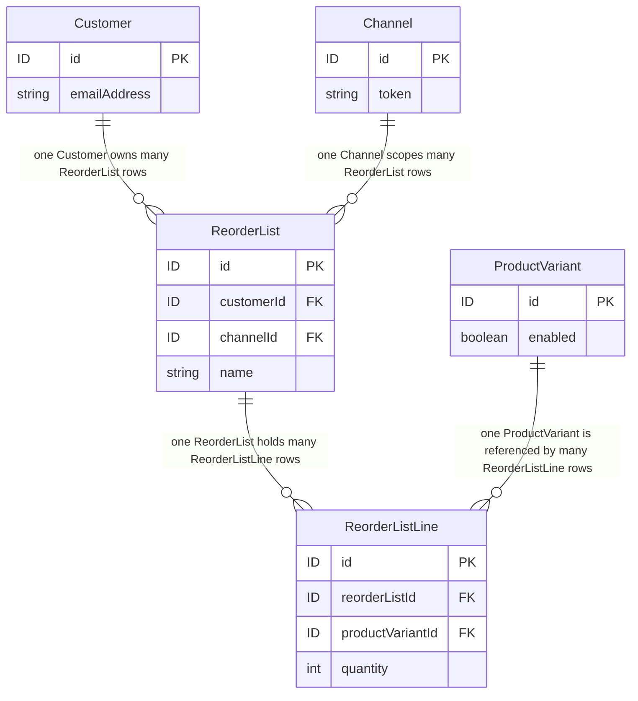

# FEATURE-001-01: Add named, multiple reorder lists carrying a per-line quantity, so that a returning buyer curates a reusable purchase list instead of rebuilding one from search results

Parent epic: `tickets/EPIC-001-reorder-and-replenishment.md`. The parent epic and the sibling features are written as paths rather than as links, following the epic's own convention of keeping the link count in a file equal to the number of children that file indexes [tickets/EPIC-001-reorder-and-replenishment.md:§3. How To Read This Epic]. The only links in this file are the four story links in section 3.

---

## 1. Feature Title

**Add named, multiple reorder lists carrying a per-line quantity, so that a returning buyer curates a reusable purchase list instead of rebuilding one from search results.**

Short name, used verbatim wherever this feature is referred to in one phrase, and identical to the label the epic's features index gives it: **Named Reorder Lists with Line Quantities** [tickets/EPIC-001-reorder-and-replenishment.md:§4. Features Index]. The long form above is the action-object-outcome title this tier requires; the short form is the name to cite. The epic classifies this feature's deviation from its originally suggested area as **narrowed**, and section 2.3 gives the evidence for that classification rather than asserting it.

Delivery is part of the single self-contained plugin package the epic describes — `packages/reorder-plugin/`, exporting `ReorderPlugin` — named consistently with the plugin packages this workspace already publishes under its `packages/*` workspace glob [package.json:L87-L89]. No file under `packages/core` or `packages/admin-ui` is edited to deliver it.

---

## 2. Feature Summary

### 2.1 The Capability

A returning buyer creates any number of named reorder lists, and each line of a list holds a reference to one `ProductVariant` together with an integer quantity. This feature ships the two plugin-owned tables that hold them, the permission set that gates them, the in-resolver ownership check that makes that gate a control, and the eight Shop API operations that read and write them.

### 2.2 Contribution To The Epic

This is the epic's foundation batch B1, and it depends on nothing [tickets/EPIC-001-reorder-and-replenishment.md:§9.4 Run Batches]. It owns the "Curate a named list with per-line quantity" step of the returning-buyer journey [tickets/EPIC-001-reorder-and-replenishment.md:L51], and it produces the list-shaped source data that FEATURE-001-02 materialises into an active order and that FEATURE-001-06 shares across the seats of a buying account. The epic also nominates this feature's first story as the harness-proving run, on the grounds that it is the first story in dependency order needing a new plugin-owned table and therefore the first additive migration in the set [tickets/EPIC-001-reorder-and-replenishment.md:§9.5 Nomination].

Read the contribution narrowly. This feature adds no path from a list into a cart: the materialisation step, the per-line outcome report and the bulk-add contract all belong to FEATURE-001-02, which consumes `OrderService.addItemsToOrder` and the already-published `addItemsToOrder` mutation [packages/core/src/api/schema/shop-api/shop.api.graphql:L74]. This feature stops at a durable, owned, channel-scoped list.

### 2.3 What Already Exists, And What Is New — The Precedent Stated Plainly

**A complete saved-list plugin already ships in this repository.** `packages/dev-server/example-plugins/wishlist-plugin/` is not a sketch or a fragment; its own README states that it is the complete plugin described in the platform's "Writing your first plugin" tutorial [packages/dev-server/example-plugins/wishlist-plugin/README.md:L3]. Its anatomy is, line for line, the anatomy this feature would otherwise be credited with inventing:

- One entity extending `VendureEntity`, carrying a `@ManyToOne` relation to `ProductVariant` and a `productVariantId` column [packages/dev-server/example-plugins/wishlist-plugin/entities/wishlist-item.entity.ts:L4-L15].
- Plugin metadata declaring `entities`, `providers` and `shopApiExtensions` [packages/dev-server/example-plugins/wishlist-plugin/wishlist.plugin.ts:L9-L16].
- Shop API schema additions made through `extend type Query` and `extend type Mutation` [packages/dev-server/example-plugins/wishlist-plugin/api/api-extensions.ts:L12-L19].
- A service that deduplicates by variant, raises `UserInputError` when the variant does not resolve, and persists through `TransactionalConnection` [packages/dev-server/example-plugins/wishlist-plugin/service/wishlist.service.ts:L34-L51].
- A session guard that refuses a request carrying no active user [packages/dev-server/example-plugins/wishlist-plugin/service/wishlist.service.ts:L74-L76].
- The module-augmentation idiom for typing a custom field [packages/dev-server/example-plugins/wishlist-plugin/types.ts:L5-L9].

Its entire public surface is three operations: `activeCustomerWishlist` [packages/dev-server/example-plugins/wishlist-plugin/api/api-extensions.ts:L13], `addToWishlist(productVariantId: ID!)` [packages/dev-server/example-plugins/wishlist-plugin/api/api-extensions.ts:L17] and `removeFromWishlist(itemId: ID!)` [packages/dev-server/example-plugins/wishlist-plugin/api/api-extensions.ts:L18].

**The precedent is heavier than "an example exists", and the count is exact.** Searching every Markdown and MDX file under the documentation tree for the plugin's name returns six files, and all six teach it: the cart core-concepts guide [docs/docs/guides/core-concepts/cart/index.mdx:L16], the database-entity guide [docs/docs/guides/developer-guide/database-entity/index.mdx:L4], the plugins guide [docs/docs/guides/developer-guide/plugins/index.mdx:L25], the API-layer guide [docs/docs/guides/developer-guide/the-api-layer/index.mdx:L260], the customer-accounts storefront guide [docs/docs/guides/storefront/customer-accounts/index.mdx:L12] and the generated permission-definition reference page [docs/docs/reference/typescript-api/auth/permission-definition.mdx:L65]. The cart guide goes past a passing mention: it names "named wishlists or saved carts" as a scenario the existing active-order strategy can already be customised for [docs/docs/guides/core-concepts/cart/index.mdx:L16] — so even the *named* part of this feature's title is a scenario the published documentation has already contemplated. The permission helper this feature depends on carries a wishlist definition as its own worked example [packages/core/src/common/permission-definition.ts:L119].

**This feature is therefore narrowed, and the narrowing is stated rather than glossed.** Exactly two things are new:

- **Lists are named, and a buyer may hold more than one.** The shipped precedent exposes one unnamed collection per customer and offers no way to distinguish a weekly grocery list from a quarterly consumables list.
- **Each line carries an integer quantity.** The shipped precedent stores a variant reference and nothing else, so it cannot express "six of this and one of that", which is the whole of what makes a list reusable as a reorder source.

Everything else in this feature — the entity shape, the schema-extension mechanism, the deduplication rule, the session guard, the persistence idiom — is a re-application of shipped work, and a reviewer should price it that way. The epic reaches the same conclusion from the other direction when it declines to nominate a saved-list story as the demonstration slice, on the explicit ground that a bare saved list is the most heavily precedented thing the epic could build [tickets/EPIC-001-reorder-and-replenishment.md:§9.6 Nomination]. Novelty in this epic lives in FEATURE-001-02 and FEATURE-001-03; it does not live here.

### 2.4 Named Entities Touched

Two entities are new and plugin-owned; two already exist and are read, never altered.

- **`ReorderList` — new, plugin-owned.** One row per named list. Holds the owning customer id, the id of the channel the list was created under, and the buyer-supplied name. The name is unique per owning customer and channel, which is what gives `ReorderListNameConflictError` a trigger.
- **`ReorderListLine` — new, plugin-owned.** One row per line. Holds the parent list id, a `ProductVariant` id and an integer quantity, and is unique per list-and-variant, which is what makes the deduplication rule enforceable in the database rather than only in the service.
- **`Customer` — existing, read only.** Declared as implementing `ChannelAware`, `HasCustomFields` and `SoftDeletable` [packages/core/src/entity/customer/customer.entity.ts:L23]. This feature reads its identity through the authenticated session and stores that identity as a foreign key on `ReorderList`. It adds no column and no custom field to it; `emailAddress` [packages/core/src/entity/customer/customer.entity.ts:L42], `groups` [packages/core/src/entity/customer/customer.entity.ts:L46] and `user` [packages/core/src/entity/customer/customer.entity.ts:L56] are read as they stand. That `Customer` is soft-deletable matters to the list tables: a soft-deleted customer's rows are still present, so an ownership check resolves against the session rather than against row existence.
- **`ProductVariant` — existing, read only.** A list line references it. Its `enabled` flag [packages/core/src/entity/product-variant/product-variant.entity.ts:L53] is the one variant state this feature reads, because a line may point at a variant that has since been disabled. Note that this feature does not *act* on that flag beyond reporting it; deciding what a disabled variant does to a reorder is FEATURE-001-04's work.

### 2.5 Named Services

- **`ReorderListService` — new, plugin-owned.** Holds every read and write for the two tables, including the name-uniqueness check, the per-list-and-variant deduplication, the quantity validation and the ownership resolution. Each of the eight resolvers delegates to it, so the ownership rule has exactly one implementation to review.
- **`TransactionalConnection` — existing.** Every plugin-owned write goes through it, which is the idiom the shipped precedent already uses to obtain a repository bound to the request's transaction [packages/dev-server/example-plugins/wishlist-plugin/service/wishlist.service.ts:L46-L50]. The epic names it as the persistence dependency for all plugin-owned state [tickets/EPIC-001-reorder-and-replenishment.md:§7.4 Existing Entities And Services The Work Depends On].
- **`ProductVariantService` — existing.** Resolves a variant id to a variant so that a line cannot be created against an id that does not exist in the active channel. The precedent shows the same call and the `UserInputError` it raises on a miss [packages/dev-server/example-plugins/wishlist-plugin/service/wishlist.service.ts:L36-L39].

### 2.6 Named API Surfaces — Eight Shop API Operations, Zero Existing Signatures Changed

All eight arrive through the plugin's `shopApiExtensions`, using `extend type Query` and `extend type Mutation` — the mechanism the shipped precedent already demonstrates [packages/dev-server/example-plugins/wishlist-plugin/api/api-extensions.ts:L12-L19]. Because every operation is an addition to an existing root type rather than a change to an existing field, **no existing operation's arguments or return type changes.**

Two queries:

- `activeCustomerReorderLists` — every list owned by the authenticated customer in the active channel.
- `activeCustomerReorderList` — one list, addressed by id, with its lines.

Six mutations:

- `createReorderList` — creates an empty named list.
- `updateReorderList` — renames an existing list.
- `deleteReorderList` — removes a list together with its lines.
- `addItemToReorderList` — adds a variant at an integer quantity, or resolves to the existing line for that variant.
- `adjustReorderListLine` — sets the integer quantity on an existing line.
- `removeReorderListLine` — removes one line.

Each mutation returns either the affected list or one of the four error results named in section 2.10. No Admin API operation is added by this feature; the administrative read path over reorder data belongs to FEATURE-001-08.

The additive-only constraint is stated here as a countable surface rather than as an intention. The Shop API root `Query` type declares nineteen root queries [packages/core/src/api/schema/shop-api/shop.api.graphql:L1-L52], and the order, cart and customer-account mutation sets live in the same file. Every one of those signatures is byte-identical after this feature ships. Where a platform mechanism would widen an existing signature as a side effect of an otherwise additive change, that is a reportable violation recorded in the epic's collision section and referenced here rather than re-argued [tickets/EPIC-001-reorder-and-replenishment.md:§6.1 Repository-Discovered Collisions]. It is never accepted silently.

### 2.7 The Existing Mechanism This Feature Consumes Rather Than Rebuilds

The epic's do-not-duplicate inventory assigns this feature one mechanism, with a prohibition attached: `CrudPermissionDefinition` [packages/core/src/common/permission-definition.ts:L146], and no hand-declaring of four permission strings and no bespoke authorisation layer [tickets/EPIC-001-reorder-and-replenishment.md:§5. Existing Mechanisms That Must Not Be Duplicated].

One definition constructed with the name `ReorderList` yields exactly four permissions. The derivation is the class's own: a name of 'Wishlist' produces `CreateWishlist`, `ReadWishlist`, `UpdateWishlist` and `DeleteWishlist` [packages/core/src/common/permission-definition.ts:L114-L115], built by mapping the four operations over the configured name [packages/core/src/common/permission-definition.ts:L156] and surfaced as the `Create` [packages/core/src/common/permission-definition.ts:L172], `Read` [packages/core/src/common/permission-definition.ts:L181], `Update` [packages/core/src/common/permission-definition.ts:L190] and `Delete` [packages/core/src/common/permission-definition.ts:L199] getters over the `PermissionDefinition` base [packages/core/src/common/permission-definition.ts:L86]. Registration is through `authOptions.customPermissions` [packages/core/src/common/permission-definition.ts:L123-L128], and each resolver is gated with the `@Allow` decorator [packages/core/src/common/permission-definition.ts:L134].

How many permission definitions the epic registers in total is not settled by this feature. It is an open architectural decision recorded in the epic [tickets/EPIC-001-reorder-and-replenishment.md:§8.2 Architectural Decisions], so the single `ReorderList` definition named above is this feature's proposal and is labelled as such, not as a decided fact.

**A permission gate on its own is not a control, and this is the load-bearing half of the mechanism.** The platform states it in its own source: a resolver using `Permission.Owner` **must** include logic enforcing that only the owner of the resource has access, and without that logic the effect is the same as public access [packages/core/src/api/config/generate-permissions.ts:L32-L34]. All eight operations read or write rows belonging to one customer, so each resolver derives the owning customer from the authenticated session and refuses a request authenticated as a different customer. The shipped precedent shows the minimal form of the session guard this builds on [packages/dev-server/example-plugins/wishlist-plugin/service/wishlist.service.ts:L74-L76]; comparing that session-derived identity against the row's stored customer id is the step this feature adds on top of it. "A request authenticated as a different customer is refused" is a mandatory acceptance criterion in each of the four stories, not an edge case in one of them.

### 2.8 Figure F1-ER — Reorder List Tables And Their Foreign-Key Direction

This is the only diagram in this feature. Story files in this feature carry none and reference this figure by the name **Figure F1-ER** instead.

Three readings of the figure are load-bearing and are stated so they are not inferred:

- **Ownership is a column on the plugin side.** `ReorderList.customerId` is what makes the ownership check possible without touching `Customer`, and it is the alternative to the custom-field route discussed in section 2.11.
- **Channel scoping is a column, not a convention.** `ReorderList.channelId` is why a list created under one channel token is not readable under another.
- **The line-level uniqueness lives on `ReorderListLine`.** One row per list-and-variant pair is what turns the deduplication rule into a database constraint rather than a service-only rule that a second code path could bypass.

### 2.9 Channel Scoping, Language Scoping And Monetary Values

Every one of the eight operations is channel-scoped and language-scoped. This is a property of the request rather than an argument a caller may omit, so it holds for all eight without being restated per operation.

- **Channel.** The active channel is identified by a unique token read from the `vendure-token` request header [packages/core/src/entity/channel/channel.entity.ts:L58-L59], carried as a unique column on `Channel` [packages/core/src/entity/channel/channel.entity.ts:L62]. `ReorderList` stores the id of the channel it was created under and every read filters on the active channel, so **a list created under one channel token is not readable under another** and an `activeCustomerReorderList` call carrying a foreign channel token resolves to `ReorderListNotFoundError` rather than to a cross-channel read. The epic states the same request prerequisite once for the whole set [tickets/EPIC-001-reorder-and-replenishment.md:§7.5 Request Prerequisites].
- **Language.** Translated output resolves against the request's `languageCode`, which defaults to the channel's `defaultLanguageCode` [packages/core/src/entity/channel/channel.entity.ts:L74]. This feature stores exactly one string of its own — the buyer-supplied list name — and that string is not translated: it is returned as the buyer entered it, in every language code. Every variant-derived field a list line exposes is translated by the existing catalogue read path, whose `ProductVariant` type already carries `languageCode` [packages/core/src/api/schema/common/product.type.graphql:L48]. A story that expects a translated list name has misread this paragraph.
- **Money.** This feature's own payloads carry no monetary column: a line stores a variant reference and an integer quantity, and price is read through the existing catalogue fields, where `price: Money!` is already paired with `currencyCode: CurrencyCode!` on `ProductVariant` [packages/core/src/api/schema/common/product.type.graphql:L53-L54]. Wherever a monetary value does appear in this epic's payloads it is an integer in the smallest currency unit, stated alongside a currency code that defaults to `Channel.defaultCurrencyCode` [packages/core/src/entity/channel/channel.entity.ts:L88]. A decimal monetary value is a defect, not a formatting preference. Storing no price on a list line is deliberate: a copied price would be stale the moment the catalogue changed, and reporting that change before commit is FEATURE-001-03's work, not a column here.
- **Availability is outside this feature.** `StockLevel` is not a Shop API type at all, and availability is publicly observable only as `stockLevel: String!` on `ProductVariant` [packages/core/src/api/schema/common/product.type.graphql:L56]. A reorder list therefore records no stock state and asserts none: the pre-commit availability read belongs to FEATURE-001-03 and the resolution of a line that can no longer be added belongs to FEATURE-001-04.

### 2.10 The Error Vocabulary This Feature Introduces

Four of the six error results the whole ticket set declares belong to this feature: `ReorderListNotFoundError`, `ReorderListNameConflictError`, `ReorderListLimitError` and `ReorderListLineNotFoundError`. The remaining two, `ReorderPermissionDeniedError` and `NoReorderableLinesError`, belong to FEATURE-001-06 and FEATURE-001-02.

No text in this feature or in its four stories names an error outside those six and the thirty-one types that already implement the `ErrorResult` interface in this checkout — fifteen declared between [packages/core/src/api/schema/common/common-error-results.graphql:L2] and [packages/core/src/api/schema/common/common-error-results.graphql:L103], alongside `union UpdateOrderItemErrorResult` [packages/core/src/api/schema/common/common-error-results.graphql:L112-L117], and sixteen more declared between [packages/core/src/api/schema/shop-api/shop-error-results.graphql:L2] and [packages/core/src/api/schema/shop-api/shop-error-results.graphql:L130].

**Declaring any of the four grows the published `ErrorCode` enum, and the growth is automatic rather than opt-in.** The enum's members are derived from every type implementing the `ErrorResult` interface [packages/core/src/api/config/generate-error-code-enum.ts:L9], matched against the interface-name constant declared in the same file [packages/core/src/api/config/generate-error-code-enum.ts:L3] by the filter over each type's declared interfaces [packages/core/src/api/config/generate-error-code-enum.ts:L17]. That is the epic's second collision and is referenced here rather than re-derived [tickets/EPIC-001-reorder-and-replenishment.md:§6.1 Repository-Discovered Collisions]. One design rule follows into this feature's stories: any consuming example that switches on `ErrorCode` carries a default branch.

**`ReorderListLimitError` has no trigger condition yet, and that is reported rather than papered over.** The maximum number of lists per customer and the maximum number of lines per list is an open product decision that the epic records as blocking all four of this feature's stories [tickets/EPIC-001-reorder-and-replenishment.md:§8.1 Product Decisions]. Until a maintainer takes it, the error type is declarable but its acceptance criterion is not writable, because no number exists in this repository to assert against and this feature may not invent one. A limit is idiomatic here — the platform already ships an order-level limit error [packages/core/src/api/schema/common/common-error-results.graphql:L37] — so what is missing is the value, not the pattern.

### 2.11 Constraints This Feature Is Built Under

These are boundaries on the work this feature describes, not preamble. Each one is carried into the definition of done in section 5.

- **Zero custom fields on a core entity — and this is where the feature departs from its own precedent.** The shipped wishlist plugin pushes a `relation` custom field onto `Customer` and hides it with `internal: true` [packages/dev-server/example-plugins/wishlist-plugin/wishlist.plugin.ts:L18-L24]. **This feature does not follow it.** Ownership is a `customerId` column on the plugin-owned `ReorderList` table instead, for two reasons both already established in the epic and referenced rather than re-argued: a custom field is exposed through the GraphQL APIs by default and the generators that widen the schema run on every boot, which is the epic's first collision; and a struct custom field cannot be hidden at all, which is its sixth [tickets/EPIC-001-reorder-and-replenishment.md:§6.1 Repository-Discovered Collisions]. The dev-server configuration currently declares an empty custom-fields object [packages/dev-server/dev-config.ts:L116], and a reviewer should expect it to still be empty once this feature ships.
- **Zero edits to `packages/core` and `packages/admin-ui`.** Delivery is self-contained in the plugin package. The only two files a future implementation may touch outside its own package are the dev-server plugin registration array [packages/dev-server/dev-config.ts:L121-L155], where `ReorderPlugin` would be added, and the dashboard bundling configuration [packages/dev-server/vite.config.mts:L1]. This feature needs the first of the two and not the second, because it ships no dashboard surface. Naming those files is a documentation act and does not license a documentation run to edit them [tickets/EPIC-001-reorder-and-replenishment.md:§11.7 The Two Permitted Configuration Exceptions].
- **Additive TypeORM migrations only.** Two new tables, no destructive statement, and no column type change on any existing table. The migration is produced by `generateMigration` [packages/core/src/migrate.ts:L118], applied by `runMigrations` [packages/core/src/migrate.ts:L40] and rolled back by `revertLastMigration` [packages/core/src/migrate.ts:L89], the lifecycle already exposed as a command-line surface [skills/vendure-cli/commands/migrate.md:L1]. Engine evidence is MariaDB, MySQL, PostgreSQL and sql.js; **native SQLite is named as an unverified engine and is not claimed**, per the epic's first documentation discrepancy [tickets/EPIC-001-reorder-and-replenishment.md:§6.3 Repository Documentation Discrepancies].
- **No external-service dependency.** Nothing in this feature calls out of process. Both tables, the permission set and all eight operations are satisfied by the database and the plugin's own service.
- **No invented metric.** This feature states no service-level commitment, no timing figure and no business figure, because this repository declares none and the epic reports that absence as a finding [tickets/EPIC-001-reorder-and-replenishment.md:§2.2 Business Value]. Where a story here needs precision it asserts a verifiable state instead — an exact item count with its ordering, an exact error type name, an integer quantity, or an exact permission name.
- **Version tagging.** Doc blocks on the new public API carry `@since 3.8.0`. That value is *derived* from the next-minor rule in the contribution guide [CONTRIBUTING.md:L340] applied to a 3.7.0 checkout [packages/core/package.json:L2-L3], and the epic flags the same derivation [tickets/EPIC-001-reorder-and-replenishment.md:§11.2 Version Tagging]. It is never presented as a quotation, because the guide's literal example names a different version.
- **No hand-written reference page.** The plugin's reference documentation is generated from JSDoc in the TypeScript sources, so this feature's documentation sub-tasks mean writing JSDoc, not authoring a page under the documentation tree [tickets/EPIC-001-reorder-and-replenishment.md:§11.5 Public API Documentation Is Generated, Not Hand-Written].

---

## 3. User Stories Index

Four stories, sized and ordered so that each one is buildable on its own. Titles are transcribed from the epic's story table and are not restated with different wording [tickets/EPIC-001-reorder-and-replenishment.md:§9.2 Story Table].

- [STORY-001-01-01 — Create a named reorder list](./FEATURE-001-01/STORY-001-01-01-create-named-reorder-list.md) — the new tables, the first additive migration, `createReorderList`, the permission gate and the ownership check. This is the epic's harness-proving run.
- [STORY-001-01-02 — Add a variant with a quantity to a list](./FEATURE-001-01/STORY-001-01-02-add-variant-with-quantity-to-list.md) — `addItemToReorderList`, the per-list-and-variant deduplication rule and the rejection of a non-positive quantity.
- [STORY-001-01-03 — Change a line quantity and remove a line](./FEATURE-001-01/STORY-001-01-03-change-line-quantity-and-remove-line.md) — `adjustReorderListLine` and `removeReorderListLine`, with `ReorderListLineNotFoundError` on a line the owner does not hold.
- [STORY-001-01-04 — Read reorder lists via the Shop API](./FEATURE-001-01/STORY-001-01-04-read-reorder-lists-via-shop-api.md) — `activeCustomerReorderLists` and `activeCustomerReorderList`, plus the assertion that no existing operation changed and the note that the `ErrorCode` enum grew.

Estimates are deliberately absent from this file. Points, lines of code, generation hours and review hours live only in the epic's delivery-split table, which is the single source of truth for them, and each story transcribes its own four values from its row there [tickets/EPIC-001-reorder-and-replenishment.md:§9.2 Story Table].

---

## 4. Dependencies

Direction is stated for every entry, because a dependency without a direction cannot be sequenced.

### 4.1 Upstream — Nothing

**This feature has no upstream feature dependency.** It is the epic's batch B1, whose "depends on" column reads "Nothing" [tickets/EPIC-001-reorder-and-replenishment.md:§9.4 Run Batches]. Every prerequisite it has is an existing part of the platform, listed in section 4.4, or an open decision, listed in section 4.5. No story in this feature waits on a story in another feature.

### 4.2 Downstream — Two Features Depend On This One

Direction: the arrow points *into* this feature from both. Neither creates a reciprocal obligation here.

- **FEATURE-001-02 depends on this feature, for the list-to-cart path only.** Its other path reads a past order through the existing `Customer.orders` field and needs nothing from here. The epic's batch table records the same qualification — B2 depends on B1 "for the list-to-cart path only" [tickets/EPIC-001-reorder-and-replenishment.md:§9.4 Run Batches] — so the two features can be built in parallel up to the point where `applyReorderToActiveOrder` accepts a list identifier.
- **FEATURE-001-06 depends on this feature, for the shared-list surface.** Sharing grants a second customer access to a `ReorderList` row, so the table, its ownership column and its permission set must exist before a share row has anything to point at.

### 4.3 Intra-Feature Story Order

- `STORY-001-01-01` → `STORY-001-01-02`: a line cannot be added until a list exists. Direction: 01-02 depends on 01-01. Classification: a shared code path — the entity, the migration and the service — plus a data dependency on one created list.
- `STORY-001-01-02` → `STORY-001-01-03`: a quantity cannot be adjusted and a line cannot be removed until a line exists. Direction: 01-03 depends on 01-02. Classification: a data dependency on one list line.
- `STORY-001-01-01` and `STORY-001-01-02` → `STORY-001-01-04`: the read operations have nothing to return until both a list and a line exist. Direction: 01-04 depends on both. Classification: a data dependency only; 01-04 shares no write path with either.

Every edge above is a prerequisite, not a co-requisite: each of the four stories still delivers value on its own terms once the story before it is merged, which is the condition a split story has to meet to stay independently valuable. Where true independence is impossible — 01-03 genuinely cannot be demonstrated without a line to adjust — the prerequisite is named and classified here rather than left implicit in the story.

### 4.4 Existing Entities, Services And Configuration Required

Stated in the epic's dependency form — the required thing, then why it is required and where it belongs.

- **Entity `Customer`:** supplies the ownership identity stored on `ReorderList`; read through the authenticated session in all four stories [packages/core/src/entity/customer/customer.entity.ts:L23].
- **Entity `ProductVariant`:** the target of every list line, and the source of the `enabled` flag a line may find false [packages/core/src/entity/product-variant/product-variant.entity.ts:L53]; required by 01-02, 01-03 and 01-04.
- **Entity `Channel`:** supplies the token that scopes every operation [packages/core/src/entity/channel/channel.entity.ts:L62] together with the default language code [packages/core/src/entity/channel/channel.entity.ts:L74] and default currency code [packages/core/src/entity/channel/channel.entity.ts:L88] that any payload resolves against; required by all four stories.
- **Service `TransactionalConnection`:** the persistence path for both plugin-owned tables; required by 01-01, 01-02 and 01-03 [tickets/EPIC-001-reorder-and-replenishment.md:§7.4 Existing Entities And Services The Work Depends On].
- **Service `ProductVariantService`:** resolves a variant id before a line is written, so an unresolvable id fails at the service rather than at the database; required by 01-02.
- **Configuration `authOptions.customPermissions`:** the registration point for the `ReorderList` permission definition; required by all four stories [packages/core/src/common/permission-definition.ts:L123-L128].
- **Configuration — the dev-server plugin registration array:** where `ReorderPlugin` is registered so that any of the eight operations is reachable at all; required by all four stories and named as one of the two permitted configuration exceptions [packages/dev-server/dev-config.ts:L121-L155].
- **Test harness `@vendure/testing`:** the end-to-end sub-task of each story is written against it, and no alternative harness is introduced [tickets/EPIC-001-reorder-and-replenishment.md:§7.3 Runtime Dependencies].

### 4.5 Open Decisions This Feature Waits On

These are dependencies on a decision rather than on code, and they are listed because a story cannot finalise its acceptance criteria without them. None is resolved here; each belongs to a maintainer.

- **The maximum number of lists per customer and lines per list.** Blocks the acceptance criterion for `ReorderListLimitError` in all four stories [tickets/EPIC-001-reorder-and-replenishment.md:§8.1 Product Decisions].
- **Zero custom fields, or accept the widening.** This feature's sections 2.4 and 2.11 assume the zero-custom-fields resolution the epic recommends; if the decision goes the other way, the ownership column in Figure F1-ER moves and all four stories change shape [tickets/EPIC-001-reorder-and-replenishment.md:§8.2 Architectural Decisions].
- **The ownership-enforcement mechanism, and therefore how many permission definitions are registered.** Section 2.7 proposes one definition named `ReorderList`; the count is the epic's decision to take, and it determines how many members the published `Permission` enum gains [tickets/EPIC-001-reorder-and-replenishment.md:§8.2 Architectural Decisions].
- **The branch target.** It blocks no story's design and gates every story's merge, and it is a three-way conflict in this repository's own documentation rather than an oversight [tickets/EPIC-001-reorder-and-replenishment.md:§11.1 The Branch Target Is A Three-Way Conflict, Not A Choice Already Made].

### 4.6 Cycle Check

**No dependency cycle exists here, and the check is stated rather than assumed.** Reading the epic's feature graph, the edges touching this feature are `F1 → F2`, `F1 → F6` and `F2 → F6`, all outbound; no edge terminates on `F1` [tickets/EPIC-001-reorder-and-replenishment.md:§4. Features Index]. A node with in-degree zero cannot sit on a cycle, so the feature-level graph is acyclic at this node by construction. Inside the feature, section 4.3 gives a strict order over four stories with no back edge. The one relationship that could be mistaken for a cycle is FEATURE-001-06 sharing a list that this feature owns while this feature knows nothing about sharing: that is a single outbound edge, resolved by keeping every share row and every share check in FEATURE-001-06's own tables and resolvers, so no column, operation or error result here has to know that sharing exists.

---

## 5. Definition of Done (Feature-Level)

Six items, each verifiable by a named command, a named specification or a named count. Numeric coverage targets are deliberately absent from this block: the story-level definition of done owns the coverage figure, and this tier states none.

- [ ] **All four stories in section 3 are accepted against their own story-level definitions of done**, with none waived, deferred or partially accepted, and each story's estimate block matching its row in the epic's delivery-split table [tickets/EPIC-001-reorder-and-replenishment.md:§9.2 Story Table].
- [ ] **The additive migration creating `ReorderList` and `ReorderListLine` applies and reverts cleanly**, generated with `generateMigration` [packages/core/src/migrate.ts:L118], applied with `runMigrations` [packages/core/src/migrate.ts:L40] and rolled back with `revertLastMigration` [packages/core/src/migrate.ts:L89] on MariaDB, MySQL, PostgreSQL and sql.js, with native SQLite recorded as an unverified engine and not claimed. The migration contains no destructive statement and no column type change on an existing table, and the cached end-to-end seed data is deleted before the run [tickets/EPIC-001-reorder-and-replenishment.md:§11.3 Operational Reset Steps After A Schema Change].
- [ ] **Each of the eight operations is permission-gated and additionally ownership-enforced inside its resolver.** The gate is the `ReorderList` permission definition registered through `authOptions.customPermissions` [packages/core/src/common/permission-definition.ts:L123-L128] and applied with `@Allow` [packages/core/src/common/permission-definition.ts:L134]; the enforcement is in-resolver logic, because a permission alone is equivalent to public access [packages/core/src/api/config/generate-permissions.ts:L32-L34]. A request authenticated as a different customer is refused on all eight, and a request carrying a foreign channel token reads nothing.
- [ ] **`git diff --stat -- packages/core packages/admin-ui` prints nothing**, the dev-server custom-fields object is still empty [packages/dev-server/dev-config.ts:L116], and the only file changed outside the plugin package is the dev-server plugin registration array [packages/dev-server/dev-config.ts:L121-L155].
- [ ] **All eight operations are documented with their payload shapes**, as JSDoc on the new public API carrying the derived `@since 3.8.0` tag [CONTRIBUTING.md:L340], naming for each mutation which of `ReorderListNotFoundError`, `ReorderListNameConflictError`, `ReorderListLimitError` and `ReorderListLineNotFoundError` it can return, and recording that the published `ErrorCode` enum grew by the error results declared here.
- [ ] **The nineteen existing root Shop API queries [packages/core/src/api/schema/shop-api/shop.api.graphql:L1-L52] and the existing order and cart mutations are unchanged**, evidenced by re-running the existing shop-order end-to-end specification unmodified and by confirming that no `customFields` argument appeared on `addItemToOrder` [packages/core/src/api/schema/shop-api/shop.api.graphql:L72] or on `adjustOrderLine` [packages/core/src/api/schema/shop-api/shop.api.graphql:L80].

