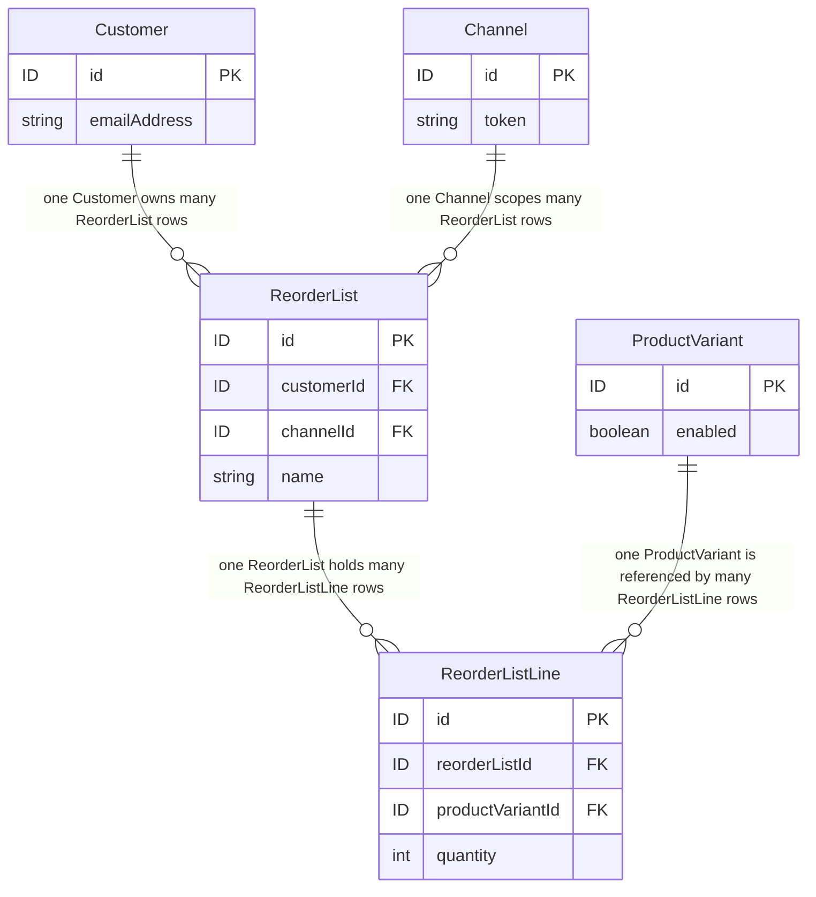

# FEATURE-001-01: Add named, multiple reorder lists carrying a per-line quantity, so that a returning buyer curates a reusable purchase list instead of rebuilding one from search results

Parent epic: `tickets/EPIC-001-reorder-and-replenishment.md`. The parent epic and the sibling features are written as paths rather than as links, following the epic's own convention of keeping the link count in a file equal to the number of children that file indexes [tickets/EPIC-001-reorder-and-replenishment.md:§3. How To Read This Epic]. The only links in this file are the four story links in section 3.

---

## 1. Feature Title

**Add named, multiple reorder lists carrying a per-line quantity, so that a returning buyer curates a reusable purchase list instead of rebuilding one from search results.**

Short name, used verbatim wherever this feature is referred to in one phrase, and identical to the label the epic's features index gives it: **Named Reorder Lists with Line Quantities** [tickets/EPIC-001-reorder-and-replenishment.md:§4. Features Index]. The long form above is the action-object-outcome title this tier requires; the short form is the name to cite. The epic classifies this feature's deviation from its originally suggested area as **narrowed**, and section 2.3 gives the evidence for that classification rather than asserting it.

Delivery is part of the single self-contained plugin package the epic describes — `packages/reorder-plugin/`, exporting `ReorderPlugin` — named consistently with the plugin packages this workspace already publishes under its `packages/*` workspace glob [package.json:L87-L89]. No file under `packages/core` or `packages/admin-ui` is edited to deliver it.

---

## 2. Feature Summary

### 2.1 The Capability

A returning buyer creates multiple named reorder lists, up to a configured maximum, and each line of a list holds a reference to one `ProductVariant` together with a positive integer quantity. This feature ships the two plugin-owned tables that hold them, the `Permission.Owner` gate that admits an authenticated buyer, the service-layer ownership and channel predicate that is the actual control, and the eight Shop API operations that read and write them.

**"Up to a configured maximum" is deliberate wording and replaces an earlier "any number".** An unbounded per-customer collection is a resource-exhaustion surface, and this feature declares the two bounds as plugin options — `maxListsPerCustomer` and `maxLinesPerList` on `ReorderPluginOptions` — so that `ReorderListLimitError` has a trigger. Section 2.11 fixes the option names, the canonicalization rules and the pagination bounds; the *values* remain the open product decision the epic records, and no value is invented here.

### 2.2 Contribution To The Epic

This is the epic's foundation batch B1, and it depends on nothing [tickets/EPIC-001-reorder-and-replenishment.md:§9.4 Run Batches]. It owns the "Curate a named list with per-line quantity" step of the returning-buyer journey [tickets/EPIC-001-reorder-and-replenishment.md:L51], and it produces the list-shaped source data that FEATURE-001-02 materialises into an active order and that FEATURE-001-06 shares across the seats of a buying account. The epic also nominates this feature's first story as the harness-proving run, on the grounds that it is the first story in dependency order needing a new plugin-owned table and therefore the first additive migration in the set [tickets/EPIC-001-reorder-and-replenishment.md:§9.5 Nomination].

Read the contribution narrowly. This feature adds no path from a list into a cart: the materialisation step, the per-line outcome report and the bulk-add contract all belong to FEATURE-001-02, which consumes `OrderService.addItemsToOrder` and the already-published `addItemsToOrder` mutation [packages/core/src/api/schema/shop-api/shop.api.graphql:L74]. This feature stops at a durable, owned, channel-scoped list.

### 2.3 What Already Exists, And What Is New — The Precedent Stated Plainly

**A complete saved-list plugin already ships in this repository.** `packages/dev-server/example-plugins/wishlist-plugin/` is not a sketch or a fragment; its own README states that it is the complete plugin described in the platform's "Writing your first plugin" tutorial [packages/dev-server/example-plugins/wishlist-plugin/README.md:L3]. Its anatomy is, line for line, the anatomy this feature would otherwise be credited with inventing:

- One entity extending `VendureEntity`, carrying a `@ManyToOne` relation to `ProductVariant` and a `productVariantId` column [packages/dev-server/example-plugins/wishlist-plugin/entities/wishlist-item.entity.ts:L4-L15].
- Plugin metadata declaring `entities`, `providers` and `shopApiExtensions` [packages/dev-server/example-plugins/wishlist-plugin/wishlist.plugin.ts:L9-L16].
- Shop API schema additions made through `extend type Query` and `extend type Mutation` [packages/dev-server/example-plugins/wishlist-plugin/api/api-extensions.ts:L12-L19].
- A service that deduplicates by variant, raises `UserInputError` when the variant does not resolve, and persists through `TransactionalConnection` [packages/dev-server/example-plugins/wishlist-plugin/service/wishlist.service.ts:L34-L51].
- A session guard that refuses a request carrying no active user [packages/dev-server/example-plugins/wishlist-plugin/service/wishlist.service.ts:L74-L76].
- The module-augmentation idiom for typing a custom field [packages/dev-server/example-plugins/wishlist-plugin/types.ts:L5-L9].

Its entire public surface is three operations: `activeCustomerWishlist` [packages/dev-server/example-plugins/wishlist-plugin/api/api-extensions.ts:L13], `addToWishlist(productVariantId: ID!)` [packages/dev-server/example-plugins/wishlist-plugin/api/api-extensions.ts:L17] and `removeFromWishlist(itemId: ID!)` [packages/dev-server/example-plugins/wishlist-plugin/api/api-extensions.ts:L18].

**The precedent is heavier than "an example exists", and the count is exact — but the six files do not all do the same thing, so the claim is stated at the strength the evidence actually supports rather than at the strength that would flatter the point.** Searching every Markdown and MDX file under the documentation tree for the plugin's name returns six files, and all six **reference or illustrate** it. Two use it as a worked code illustration: the API-layer guide builds its resolver example on a wishlist resolver [docs/docs/guides/developer-guide/the-api-layer/index.mdx:L260], and the generated permission reference uses a wishlist name to demonstrate CRUD permission derivation [docs/docs/reference/typescript-api/auth/permission-definition.mdx:L65]. Four reference it as an example domain rather than working through it: the plugins guide lists it among the things plugins are for [docs/docs/guides/developer-guide/plugins/index.mdx:L25], the database-entity guide names it in its page metadata [docs/docs/guides/developer-guide/database-entity/index.mdx:L4], the customer-accounts storefront guide cites it as registered-customer functionality [docs/docs/guides/storefront/customer-accounts/index.mdx:L12], and the cart core-concepts guide names "named wishlists or saved carts" as a scenario the existing active-order strategy can already be customised for [docs/docs/guides/core-concepts/cart/index.mdx:L16] — so even the *named* part of this feature's title is a scenario the documentation has already contemplated, which is the single most consequential of the six mentions for this feature.

**One correction to the precedent's own claim, recorded because propagating it would be a stale claim.** The plugin's README states that it is the plugin described in a "Writing your first plugin" tutorial [packages/dev-server/example-plugins/wishlist-plugin/README.md:L3], but **no page under the documentation tree in this checkout carries that title** — a search of every Markdown and MDX file under that tree for the phrase returns nothing. So none of the six files above is that tutorial, and this feature does not claim otherwise: what the six establish is that the wishlist shape is the platform's habitual example, not that a step-by-step build of it ships here. The permission helper this feature depends on carries a wishlist definition as its own worked example in source as well [packages/core/src/common/permission-definition.ts:L119], which is the strongest single piece of evidence for the verdict, because it sits in the code rather than in the documentation.

**This feature is therefore narrowed, and the narrowing is stated rather than glossed.** Exactly two things are new:

- **Lists are named, and a buyer may hold more than one.** The shipped precedent exposes one unnamed collection per customer and offers no way to distinguish a weekly grocery list from a quarterly consumables list.
- **Each line carries an integer quantity.** The shipped precedent stores a variant reference and nothing else, so it cannot express "six of this and one of that", which is the whole of what makes a list reusable as a reorder source.

Everything else in this feature — the entity shape, the schema-extension mechanism, the deduplication rule, the session guard, the persistence idiom — is a re-application of shipped work, and a reviewer should price it that way. The epic reaches the same conclusion from the other direction when it declines to nominate a saved-list story as the demonstration slice, on the explicit ground that a bare saved list is the most heavily precedented thing the epic could build [tickets/EPIC-001-reorder-and-replenishment.md:§9.6 Nomination]. Novelty in this epic lives in FEATURE-001-02 and FEATURE-001-03; it does not live here.

### 2.4 Named Entities Touched

Two entities are new and plugin-owned; two already exist and are read, never altered.

- **`ReorderList` — new, plugin-owned.** One row per named list, owned by one customer and scoped to one channel. Its complete mapping is below.
- **`ReorderListLine` — new, plugin-owned.** One row per line, unique per list-and-variant, which is what makes the deduplication rule enforceable in the database rather than only in the service. Its complete mapping is below.
**The two mappings, stated completely enough to author a deterministic migration from.** A table name and a diagram are not a schema, so every column, type, length, nullability, index, constraint and on-delete action is declared here. The epic's persistence contract carries the rules these two obey [tickets/EPIC-001-reorder-and-replenishment.md:§7.8 The Seven Plugin-Owned Tables]; this section is where they are made concrete for these two tables.
```ts
// Both entities extend VendureEntity, so id, createdAt AND updatedAt are inherited
// and are NOT re-declared. All three are part of the contract.
@Entity()                                     // table reorder_list (TypeORM snake_case)
export class ReorderList extends VendureEntity {
  @ManyToOne(() => Customer, { onDelete: 'CASCADE', nullable: false })
  customer: Customer;
  @EntityId({ nullable: false }) customerId: ID;      // id type set by EntityIdStrategy
  @ManyToOne(() => Channel, { onDelete: 'CASCADE', nullable: false })
  channel: Channel;
  @EntityId({ nullable: false }) channelId: ID;
  @Column({ type: 'varchar', length: 191, nullable: false })
  name: string;                                       // as the buyer typed it, trimmed
  @Column({ type: 'varchar', length: 191, nullable: false })
  nameKey: string;                                    // canonical form; see section 2.11
  @OneToMany(() => ReorderListLine, line => line.reorderList)
  lines: ReorderListLine[];
}
@Entity()                                     // table reorder_list_line
export class ReorderListLine extends VendureEntity {
  @ManyToOne(() => ReorderList, list => list.lines, { onDelete: 'CASCADE', nullable: false })
  reorderList: ReorderList;
  @EntityId({ nullable: false }) reorderListId: ID;
  @ManyToOne(() => ProductVariant, { onDelete: 'CASCADE', nullable: false })
  productVariant: ProductVariant;
  @EntityId({ nullable: false }) productVariantId: ID;
  @Column({ type: 'int', nullable: false })
  quantity: number;                                   // CHECK quantity > 0
}
```
- **Indexes and constraints, each with the name the migration must use**, because the constraint-specific error mapping in section 2.12 matches on a name and not on a driver message:
  - `UQ_reorder_list_customer_channel_name_key` — unique over `(customerId, channelId, nameKey)` on `reorder_list`. This is what gives `ReorderListNameConflictError` a trigger that survives a concurrent insert.
  - `IDX_reorder_list_customer_channel` — non-unique over `(customerId, channelId)` on `reorder_list`, which is the predicate every list read filters on.
  - `UQ_reorder_list_line_list_variant` — unique over `(reorderListId, productVariantId)` on `reorder_list_line`. This is the deduplication rule as a database constraint.
  - `CHK_reorder_list_line_quantity_positive` — check constraint `quantity > 0` on `reorder_list_line`. A non-positive quantity is refused by the database as well as by the service, so a second code path cannot bypass it.
- **Why every string column is 191 characters.** Both `name` and `nameKey` participate in the composite unique index, and 191 is the length that keeps a four-byte UTF-8 index inside the key-size limit on the MySQL and MariaDB engines the existing engine jobs exercise [.github/workflows/build_and_test.yml:jobs]. The number is an engine constraint, not a product choice about how long a list name should be.
- **Why the on-delete actions are what they are.** `ReorderList.customerId` and `ReorderList.channelId` cascade because a list has no meaning without its owner or its channel and carries no audit purpose — unlike the attempt tables in FEATURE-001-07, which retain their rows. `ReorderListLine.reorderListId` cascades so that `deleteReorderList` removes the lines in one statement rather than in a loop. `ReorderListLine.productVariantId` cascades because a line pointing at a hard-deleted variant is unusable; note that the platform's ordinary variant deletion is a *soft* delete setting `deletedAt` [packages/core/src/entity/product-variant/product-variant.entity.ts:L48], which leaves the line in place — which is exactly the disabled-or-deleted-variant case FEATURE-001-04 resolves and story 01-04 reports.
- **Migration ordering.** `reorder_list` is created before `reorder_list_line`, and both are created in the single additive migration story 01-01 generates. Nothing in this feature alters a core table.
- **`Customer` — existing, read only.** Declared as implementing `ChannelAware`, `HasCustomFields` and `SoftDeletable` [packages/core/src/entity/customer/customer.entity.ts:L23]. This feature reads its identity through the authenticated session and stores that identity as a foreign key on `ReorderList`. It adds no column and no custom field to it; `emailAddress` [packages/core/src/entity/customer/customer.entity.ts:L42], `groups` [packages/core/src/entity/customer/customer.entity.ts:L46] and `user` [packages/core/src/entity/customer/customer.entity.ts:L56] are read as they stand. That `Customer` is soft-deletable matters to the list tables: a soft-deleted customer's rows are still present, so an ownership check resolves against the session rather than against row existence.
- **`ReorderList` — new, plugin-owned.** One row per named list. Holds the owning customer id, the id of the channel the list was created under, and the buyer-supplied name. The name is unique per owning customer and channel, which is what gives `ReorderListNameConflictError` a trigger.
- **`ReorderListLine` — new, plugin-owned.** One row per line. Holds the parent list id, a `ProductVariant` id and an integer quantity, and is unique per list-and-variant, which is what makes the deduplication rule enforceable in the database rather than only in the service.
- **`Customer` — existing, read only.** Declared as implementing `ChannelAware`, `HasCustomFields` and `SoftDeletable` [packages/core/src/entity/customer/customer.entity.ts:L23]. This feature reads its identity through the authenticated session and stores that identity as a foreign key on `ReorderList`. It adds no column and no custom field to it; `emailAddress` [packages/core/src/entity/customer/customer.entity.ts:L42], `groups` [packages/core/src/entity/customer/customer.entity.ts:L46] and `user` [packages/core/src/entity/customer/customer.entity.ts:L56] are read as they stand. That `Customer` is soft-deletable [packages/core/src/entity/customer/customer.entity.ts:L28-L29] matters to the list tables: a soft-deleted customer's rows are still present, so an ownership check resolves against the session rather than against row existence. **What then happens to those rows is an epic-level decision rather than this feature's choice** — the epic's customer-data-lifecycle entry names `ReorderList` and `ReorderListLine` among the five affected tables and asks six sub-questions of them, including how long a row is kept and whether a deleted customer's rows are kept, anonymised or removed [tickets/EPIC-001-reorder-and-replenishment.md:§8.1 Product Decisions]. Until it is taken, these two tables **minimise rather than guess**: the owning customer id, the channel id, the buyer-supplied list name, a variant id and an integer quantity, and nothing else — no contact detail, no free-text note and no request context.
- **`ProductVariant` — existing, read only.** A list line references it. Its `enabled` flag [packages/core/src/entity/product-variant/product-variant.entity.ts:L53] is the one variant state this feature reads, because a line may point at a variant that has since been disabled. Note that this feature does not *act* on that flag beyond reporting it; deciding what a disabled variant does to a reorder is FEATURE-001-04's work.

### 2.5 Named Services

- **`ReorderListService` — new, plugin-owned.** Holds every read and write for the two tables, including the name-uniqueness check, the per-list-and-variant deduplication, the quantity validation and the ownership resolution. Each of the eight resolvers delegates to it, so the ownership rule has exactly one implementation to review.
- **`TransactionalConnection` — existing.** Every plugin-owned write goes through it, which is the idiom the shipped precedent already uses to obtain a repository bound to the request's transaction [packages/dev-server/example-plugins/wishlist-plugin/service/wishlist.service.ts:L46-L50]. The epic names it as the persistence dependency for all plugin-owned state [tickets/EPIC-001-reorder-and-replenishment.md:§7.4 Existing Entities And Services The Work Depends On].
- **`ProductVariantService` — existing.** Resolves a variant id to a variant so that a line cannot be created against an id that does not exist in the active channel. The precedent shows the same call and the `UserInputError` it raises on a miss [packages/dev-server/example-plugins/wishlist-plugin/service/wishlist.service.ts:L36-L39].

### 2.6 Named API Surfaces — Eight Shop API Operations, Zero Existing Signatures Changed

All eight arrive through the plugin's `shopApiExtensions`, using `extend type Query` and `extend type Mutation` — the mechanism the shipped precedent already demonstrates [packages/dev-server/example-plugins/wishlist-plugin/api/api-extensions.ts:L12-L19]. Because every operation is an addition to an existing root type rather than a change to an existing field, **no existing operation's arguments or return type changes.**

**Every one of the eight has a named owning story, and the owner is stated beside the operation rather than left to be inferred from a story title.** A declared operation with no owning story would be published surface that nothing in the decomposition delivers, so the mapping below is part of this feature's contract and section 3 repeats it from the story side.
Two queries:
- `activeCustomerReorderLists` — every list owned by the authenticated customer in the active channel. This is the behaviour of the optional visibility argument at its default, declared in the contract below. Owner: `STORY-001-01-04`.
- `activeCustomerReorderList` — one list, addressed by id, with its lines. Under the same default. Owner: `STORY-001-01-04`.
- `createReorderList` — creates an empty named list. Owner: `STORY-001-01-01`.
- `addItemToReorderList` — adds a variant at an integer quantity, or resolves to the existing line for that variant. Owner: `STORY-001-01-02`.
- `adjustReorderListLine` — sets the integer quantity on an existing line. Owner: `STORY-001-01-03`.
- `removeReorderListLine` — removes one line. Owner: `STORY-001-01-03`.
- `updateReorderList` — renames an existing list, subject to the same per-customer name uniqueness rule that governs creation, and therefore returning `ReorderListNameConflictError` on a name the same customer already holds. Owner: `STORY-001-01-03`.
- `deleteReorderList` — removes a list together with its lines in one transaction. Owner: `STORY-001-01-03`.
Two queries. **Both are bounded, and the bound is the platform's own rather than a figure this feature chose** — the epic states the rule once for every surface in the set [tickets/EPIC-001-reorder-and-replenishment.md:§7.7 Bounded Collections].
- `activeCustomerReorderLists(options: ReorderListListOptions): ReorderListList!` — the lists owned by the authenticated customer in the active channel, **returned as a paginated list rather than as every row**. The return type implements `PaginatedList` [packages/core/src/api/schema/common/common-types.graphql:L9] and declares only `items` and `totalItems`, and the options input is declared empty so the generator fills it, following the shipped plugin exemplar [packages/dev-server/test-plugins/reviews/api/api-extensions.ts:L44-L45].
- `activeCustomerReorderList(id: ID!, lineOptions: ReorderListLineListOptions): ReorderList` — one list addressed by id, **whose `lines` field is itself a paginated list and not an unbounded collection**. A paginated outer query whose entries carry an unbounded inner collection is not bounded, which is why the line collection carries its own options input rather than inheriting the outer one.
**How the bound is enforced, and why enforcement is the load-bearing half.** Declaring pagination arguments is not bounding: a resolver may accept `skip` and `take` and then ignore them. Both queries therefore resolve their items through `ListQueryBuilder` [packages/core/src/service/helpers/list-query-builder/list-query-builder.ts:L209] and its `build` member [packages/core/src/service/helpers/list-query-builder/list-query-builder.ts:L261], which clamps the requested page to the configured maximum, substitutes that maximum when no page size is supplied, and **rejects an over-limit request outright with the platform's own input error** [packages/core/src/service/helpers/list-query-builder/list-query-builder.ts:L638]. The maximum for a Shop API read is `apiOptions.shopListQueryLimit`, whose default the platform declares as one hundred [packages/core/src/config/vendure-config.ts:L151] — **a platform default cited, not a metric invented**. `ignoreQueryLimits` is left false on every query in this feature, because the option's own documentation records that an unlimited public list query can become a denial-of-service vector [packages/core/src/service/helpers/list-query-builder/list-query-builder.ts:L125-L131].
**Ordering is deterministic or the count assertion is meaningless.** Each paginated read declares a default sort — lists by their inherited creation timestamp [packages/core/src/entity/base/base.entity.ts:L31] descending, lines by the same column ascending — so that "exactly N entries in this order" is a criterion a test can assert rather than a coincidence of insertion order. A caller may override it through the generated sort parameter.
**What is still undecided, and it is a number so this feature may not supply it.** The maximum number of lists a customer may hold and the maximum number of lines a list may hold are an open product decision [tickets/EPIC-001-reorder-and-replenishment.md:§8.1 Product Decisions], and the per-surface default page size below the platform maximum is an open architectural decision [tickets/EPIC-001-reorder-and-replenishment.md:§8.2 Architectural Decisions]. Pagination does not wait on either: the platform maximum bounds both reads today, and the decisions determine only whether a smaller bound is layered on top.

**Why the last four share one owner.** All four are mutations over rows that already exist in the two plugin-owned tables, they add no table and no migration of their own, and each is the same shape: resolve the row, enforce ownership against the authenticated session, write, return the affected list or a named error result. Splitting a rename away from a delete, or a line adjustment away from a list adjustment, would produce stories whose acceptance criteria repeat each other verbatim while the epic's per-feature story count is fixed at four [tickets/EPIC-001-reorder-and-replenishment.md:§4. Features Index]. `STORY-001-01-03` is therefore the feature's mutate-and-remove story at both levels — the line level and the list level — and its epic row is estimated for all four operations rather than for two.

**The published contract, in full.** Every argument, input object, object type, result union and nullability below is fixed here rather than left to a story, so that two stories cannot implement two different shapes of the same operation. Every name in it was collision-checked against both checked-in introspection snapshots and none exists in either [schema-shop.json:data.__schema.types] and [schema-admin.json:data.__schema.types]; the epic carries the inventory-wide record [tickets/EPIC-001-reorder-and-replenishment.md:§6.4 The Settled Rulings].
**Both queries publish their final shape here, including the parts only FEATURE-001-06 gives behaviour to. That is deliberate, and this paragraph is the reason.** Once a list can be shared, these two reads face a question they did not face when they were written — whether a list the caller merely holds a grant on is returned — and answering it later by widening an already-shipped operation would redefine a surface this plugin published two batches earlier. Adding an optional argument is backward-compatible for a client, but the epic's promise is that no published surface is *redefined*, so the fields arrive now with the owner-only behaviour this feature implements:
- **An optional inclusion argument** whose default preserves owner-only behaviour exactly. Under this feature the default is the only accepted value; any other is rejected as an unsupported argument value rather than silently ignored, because a caller who asked for shared lists and received owned ones would have been misled.
- **An additive field on the plugin-owned list type distinguishing an owned list from a shared one, together with the capability granted.** Under this feature every returned list reports itself as owned and reports no capability, which is the truthful value while no share table exists.
**FEATURE-001-06 therefore contributes behaviour, not shape**, and it records the same division from its own side [tickets/EPIC-001/FEATURE-001-06-buying-account-list-sharing.md:§2.5 Named API Surfaces]. A client that never passes the argument observes no change at that point either, and no existing argument becomes required, no existing field changes type or nullability, and no operation is added.
Six mutations:

```graphql
extend type Query {
  "Lists the authenticated customer can see in the active channel. Owner-only by default."
  activeCustomerReorderLists(
    options: ReorderListListOptions
    includeShared: Boolean = false
  ): ReorderListList!

  "One list by id. NULL — never an error — when it is absent, another customer's, another channel's, or not shared with the caller."
  activeCustomerReorderList(id: ID!, lineOptions: ReorderListLineListOptions): ReorderList
}

extend type Mutation {
  createReorderList(input: CreateReorderListInput!): CreateReorderListResult!
  updateReorderList(input: UpdateReorderListInput!): UpdateReorderListResult!
  deleteReorderList(id: ID!): DeleteReorderListResult!
  addItemToReorderList(input: AddItemToReorderListInput!): AddItemToReorderListResult!
  adjustReorderListLine(input: AdjustReorderListLineInput!): AdjustReorderListLineResult!
  removeReorderListLine(input: RemoveReorderListLineInput!): RemoveReorderListLineResult!
}

type ReorderList implements Node {
  id: ID!
  createdAt: DateTime!
  updatedAt: DateTime!
  name: String!
  lineCount: Int!
  lines: [ReorderListLine!]!
  "OWNED when the caller owns the row; SHARED when the caller reaches it through a grant."
  access: ReorderListAccess!
  "Non-empty only when access is SHARED. Populated by FEATURE-001-06; always [] until then."
  grantedCapabilities: [ReorderListCapability!]!
}

type ReorderListLine implements Node {
  id: ID!
  createdAt: DateTime!
  updatedAt: DateTime!
  productVariant: ProductVariant!
  productVariantId: ID!
  quantity: Int!
}

type ReorderListList implements PaginatedList {
  items: [ReorderList!]!
  totalItems: Int!
}

enum ReorderListAccess { OWNED, SHARED }

input CreateReorderListInput      { name: String! }
input UpdateReorderListInput      { id: ID!, name: String! }
input AddItemToReorderListInput   { reorderListId: ID!, productVariantId: ID!, quantity: Int! }
input AdjustReorderListLineInput  { reorderListId: ID!, lineId: ID!, quantity: Int! }
input RemoveReorderListLineInput  { reorderListId: ID!, lineId: ID! }

union CreateReorderListResult      = ReorderList | ReorderListNameConflictError | ReorderListLimitError
union UpdateReorderListResult      = ReorderList | ReorderListNotFoundError | ReorderListNameConflictError
union DeleteReorderListResult      = DeletionResponse | ReorderListNotFoundError
union AddItemToReorderListResult   = ReorderList | ReorderListNotFoundError | ReorderListLimitError | NegativeQuantityError
union AdjustReorderListLineResult  = ReorderList | ReorderListNotFoundError | ReorderListLineNotFoundError | NegativeQuantityError
union RemoveReorderListLineResult  = ReorderList | ReorderListNotFoundError | ReorderListLineNotFoundError
```

Six readings of that contract are load-bearing, and each replaces something an earlier draft of this file left open:

- **Per-operation error membership is exact, and no mutation may return "any of the four".** An earlier draft said each mutation returns the affected list or one of four error results, which is not a contract a client can code against — a client cannot know whether `removeReorderListLine` might return a name conflict. Each union above names only the errors its own operation can actually produce: `ReorderListNameConflictError` appears on exactly the two operations that write a name, `ReorderListLineNotFoundError` on exactly the two that address a line, and `ReorderListLimitError` on exactly the two that can breach a bound.
- **`NegativeQuantityError` is reused, not redeclared.** It already exists in this checkout [packages/core/src/api/schema/common/common-error-results.graphql:L44], so a non-positive quantity is reported with the platform's own error type. This is why only four new error results belong to this feature rather than five.
- **`DeletionResponse` is reused for the delete path**, carrying its existing `result` and `message` fields, and is present in the Shop API snapshot already [schema-shop.json:DeletionResponse]. No plugin-owned deletion payload is invented.
- **The single-list query returns null rather than an error, and that is a security decision rather than a style one.** With the default auto-increment id strategy [packages/core/src/config/default-config.ts:L101] a list id is guessable, so distinguishing "no such list" from "not yours" would confirm the existence of another customer's list to anyone who counts. Returning null for every inaccessible case discloses nothing. The platform makes the identical choice on its own single-order read, throwing the same result whether the order is absent or forbidden precisely to close an enumeration channel [packages/core/src/api/resolvers/shop/shop-order.resolver.ts:L141-L143]. Where a *mutation* must report a reason, `ReorderListNotFoundError` plays the same normalizing role: one result for absent, foreign-customer, foreign-channel and un-shared alike.
- **`ReorderListListOptions` is not written by hand.** Returning a `PaginatedList` implementor is what makes the platform generate the options input with its sort and filter parameters [packages/core/src/api/config/generate-list-options.ts:L31-L60], and the epic's do-not-duplicate inventory forbids hand-writing one.
- **`includeShared` and `access` exist from the outset so FEATURE-001-06 changes nothing later.** Sharing is a batch-B5 feature, but its effect on this feature's read contract is declared here, defaulted to the owner-only behaviour, and left inert until F6 ships. That is deliberate: adding an argument to a published operation later would be exactly the silent redefinition the epic's fifth collision exists to prevent [tickets/EPIC-001-reorder-and-replenishment.md:§6.2 Research-Discovered Collisions]. A client that never passes `includeShared` observes owner-only behaviour before and after F6, and `grantedCapabilities` is an empty list until F6 populates it.

**Each of the six unions needs a `__resolveType` resolver.** A plugin-declared union is not resolvable without one, and the epic makes it ruling R8 [tickets/EPIC-001-reorder-and-replenishment.md:§6.4 The Settled Rulings]. One resolver class carrying the six field resolvers is registered in the plugin's resolvers array; no core union is extended, because a core union cannot be extended from a plugin.

No Admin API operation is added by this feature; the administrative read path over reorder data belongs to FEATURE-001-08.

**The two queries are declared forward-compatibly for sharing, and that declaration belongs here rather than to FEATURE-001-06.** A list becomes shareable later in the epic [tickets/EPIC-001/FEATURE-001-06-buying-account-list-sharing.md:§2.1 The Capability], and the two options for accommodating that are to widen these queries in a later batch or to declare the shape once, now, in their original contract. **The second is chosen, and the reason is a client rather than a preference:** these queries are published in batch B1 and sharing arrives in B5 [tickets/EPIC-001-reorder-and-replenishment.md:§9.4 Run Batches], so widening them later would change the published signature of an operation a storefront had already adopted — the precise failure mode the epic's fifth collision exists to prevent [tickets/EPIC-001-reorder-and-replenishment.md:§6.2 Research-Discovered Collisions]. Three parts, all owned by `STORY-001-01-04`:

- **One optional argument on each query, defaulted to the owner-only behaviour.** A caller that omits it receives exactly the lists the authenticated customer owns in the active channel, which is this feature's behaviour in full. A caller that passes the non-default value additionally receives lists the caller holds an unrevoked grant on, once such grants exist.
- **One field on the plugin-owned list type recording provenance and capability** — whether the returned list is owned by the caller or reached through a grant, and which capability that grant conferred. For an owned list it reports ownership and no granted capability, which is the only value it can take while this feature is the whole of the delivery.
- **A stated, testable behaviour for the interim, so the argument is not a stub.** Until FEATURE-001-06 ships there are no grant rows in existence, so passing the non-default value returns **the same set as omitting it**, and `STORY-001-01-04` asserts that equality rather than deferring the argument's acceptance. Nothing here reads, writes or knows about a share row: the argument selects a *visibility rule*, and the rows that rule can admit arrive with the other feature.

**The consequence for FEATURE-001-06 is that it changes no signature at all**, which is what lets both features claim additive-only delivery truthfully rather than one of them absorbing a widening quietly. That feature states the same division from its side [tickets/EPIC-001/FEATURE-001-06-buying-account-list-sharing.md:§2.5 Named API Surfaces — Two New Mutations, Zero Existing Signatures Changed].

**Every one of the eight operations is delivered by a named story, and the mapping above is exhaustive rather than indicative.** The two queries belong to `STORY-001-01-04`; the six mutations distribute one to `STORY-001-01-01`, one to `STORY-001-01-02` and **four** to `STORY-001-01-03`, which owns the whole of the post-creation mutation surface — two operations over a list's lines and two over the list itself. That is why `STORY-001-01-03` is titled for both scopes in the epic's delivery table and why its row sits above the three-point anchor rather than at the two-point one [tickets/EPIC-001-reorder-and-replenishment.md:§9.1 The Estimation Rubric]. Counting the operations against the stories therefore gives 2 + 1 + 1 + 4 = 8 with no remainder, and **no operation in this feature is published without an owning story** — a gap of that kind would be a defect in the decomposition rather than a note for a reader.

Renaming and deleting sit with the line operations rather than with creation for two reasons worth stating, because the alternative placement is the obvious one. First, `STORY-001-01-01` is the harness-proving run and is deliberately the narrowest possible slice through the toolchain; loading the rest of the lifecycle onto it would defeat the point of nominating it. Second, renaming reuses the uniqueness comparison that creation establishes — the same per-customer-and-channel rule and the same `ReorderListNameConflictError` — so the story that already owns mutation-time validation over an existing row is the cheapest place for it, while deletion is the cascade counterpart of removing a line.

The additive-only constraint is stated here as a countable surface rather than as an intention. The Shop API root `Query` type declares nineteen root queries [packages/core/src/api/schema/shop-api/shop.api.graphql:L1-L52], and the order, cart and customer-account mutation sets live in the same file. Every one of those signatures is byte-identical after this feature ships. Where a platform mechanism would widen an existing signature as a side effect of an otherwise additive change, that is a reportable violation recorded in the epic's collision section and referenced here rather than re-argued [tickets/EPIC-001-reorder-and-replenishment.md:§6.1 Repository-Discovered Collisions]. It is never accepted silently.

### 2.6.1 Operation Ownership And Test Matrix — Every Published Surface, Its Owning Story, And Its Required Tests

**This matrix exists because an audit of this feature found two published operations that no story owned.** `updateReorderList` and `deleteReorderList` were declared in section 2.6 and claimed by none of the four stories, which meant this feature's definition of done could be satisfied with two of its eight operations absent. That is not a documentation slip: an unowned row is an operation nobody builds and nobody tests. The matrix is the fix, and the rule the epic derives from it is that **a feature whose matrix has an unowned row fails its definition of done** [tickets/EPIC-001-reorder-and-replenishment.md:§12. Definition of Done (Epic-Level)].

The two orphaned mutations are assigned to **STORY-001-01-03**, whose shape they match exactly — an update and a delete over an existing owned row, with a not-found error, an ownership check and a channel check. The epic's delivery-split row for that story was raised from two points to three when the assignment was made rather than the operations being absorbed silently at the old size [tickets/EPIC-001-reorder-and-replenishment.md:§9.1 The Estimation Rubric]. **The alternative — a ninth and tenth story — is not available**: the epic's decomposition is fixed at twenty-five stories and thirty-four files, and the reconciliation in its definition of done checks both counts against what is on disk.

| # | Published surface | Owning story | Required unit cases | Required end-to-end cases, all written against `@vendure/testing` [packages/testing/src/index.ts:L1-L14] | Named regression |
|---|---|---|---|---|---|
| 1 | `createReorderList` | 01-01 | name normalisation and blank rejection; uniqueness check over owner and channel; session-derived ownership | valid create; blank name; duplicate name returning the exact conflict error; concurrent duplicate under a database constraint; configured maximum returning the exact limit error; unauthenticated; caller cannot nominate an owner; same name under a second channel token | `activeCustomer` unchanged |
| 2 | `addItemToReorderList` | 01-02 | quantity validation; per-list-and-variant deduplication; variant resolution failure | valid add; non-positive quantity; duplicate variant resolving to the existing line; unresolvable variant id; unauthenticated; wrong owner; foreign channel token; list at its configured line maximum | `addItemToOrder` unchanged |
| 3 | `adjustReorderListLine` | 01-03 | quantity validation; line-belongs-to-owner check | valid adjust; non-positive quantity; line not held by the caller returning `ReorderListLineNotFoundError`; unauthenticated; wrong owner; foreign channel token | `adjustOrderLine` unchanged |
| 4 | `removeReorderListLine` | 01-03 | line-belongs-to-owner check; idempotence of a second remove | valid remove; unknown line returning `ReorderListLineNotFoundError`; second remove of the same line; unauthenticated; wrong owner; foreign channel token | none required — no existing operation is read |
| 5 | `updateReorderList` — **the first of the two formerly unowned operations** | 01-03 | rename validation including a blank new name; uniqueness re-check over owner and channel | valid rename; blank new name; rename to a name the same customer already holds in that channel returning `ReorderListNameConflictError`; rename of a list the caller does not own returning `ReorderListNotFoundError`; unknown id returning the same error with the same non-disclosure; unauthenticated; foreign channel token | `activeCustomer` unchanged |
| 6 | `deleteReorderList` — **the second** | 01-03 | cascade behaviour over the line rows; owner check before delete | valid delete of a list holding lines, asserting the exact count of line rows remaining afterwards is zero; delete of a list the caller does not own returning `ReorderListNotFoundError`; unknown id returning the same error; second delete of the same id; unauthenticated; foreign channel token | `activeCustomer` unchanged, and no `Order` or `OrderLine` row is affected by deleting a list |
| 7 | `activeCustomerReorderLists` | 01-04 | page clamping delegated to the builder rather than reimplemented; default sort | valid read with an exact entry count in its declared order; a page size above the configured Shop maximum rejected with the platform's input error [packages/core/src/service/helpers/list-query-builder/list-query-builder.ts:L638]; page size omitted; unauthenticated; another customer's lists absent; foreign channel token returning zero entries | the nineteen root Shop queries unchanged in number and signature [packages/core/src/api/schema/shop-api/shop.api.graphql:L1-L52] |
| 8 | `activeCustomerReorderList` | 01-04 | nested line page clamping; not-found path | valid read with an exact line count in its declared order; over-limit nested page rejected; list not owned by the caller returning `ReorderListNotFoundError`; unknown id returning the same error; unauthenticated; foreign channel token | as row 7 |
| 9 | Tables `ReorderList` and `ReorderListLine` | 01-01 | none — schema, not logic | the one additive migration applied and reverted on MariaDB, MySQL, PostgreSQL and sql.js, with native SQLite named unverified; the composite uniqueness rule proven by a concurrent insert rather than by a service-level check | no existing table altered, evidenced by an empty protected-package diff |
| 10 | The `ReorderList` permission definition | 01-01 | the four generated permission names derive from the one configured name [packages/core/src/common/permission-definition.ts:L114-L115] | every one of the eight operations refused for a caller holding no such permission, and refused for a caller authenticated as a different customer even when holding it | the published `Permission` enum grows only by the members this definition adds |

**Three rules govern the matrix, so it cannot be satisfied on paper.** An authorisation negative is a real API call asserting both no read and no write, not a unit test of a guard function. A "foreign channel token" case sends a second real token rather than mutating a variable. And every case in the end-to-end column runs on the four engine jobs that already exist [.github/workflows/build_and_test.yml:jobs] wherever its behaviour depends on the database — which is every row in the table, because every row writes or reads a plugin-owned row.

### 2.7 The Existing Mechanism This Feature Consumes Rather Than Rebuilds

The epic's do-not-duplicate inventory assigns this feature the permission-definition family, with a prohibition attached: no hand-declaring of permission strings and no bespoke authorisation layer [tickets/EPIC-001-reorder-and-replenishment.md:§5. Existing Mechanisms That Must Not Be Duplicated]. **What this feature consumes from that family, however, is zero definitions — and the reason is a correction rather than a preference.**
**All eight operations are gated `@Allow(Permission.Owner)`. This feature registers no custom permission definition.** An earlier draft of this file gated them with a `CrudPermissionDefinition` constructed from the name `ReorderList`, yielding `CreateReorderList`, `ReadReorderList`, `UpdateReorderList` and `DeleteReorderList` [packages/core/src/common/permission-definition.ts:L114-L115]. **That design cannot work, and the reason is in this checkout rather than in an opinion.** A customer's `User` is created with exactly one role, the special customer role [packages/core/src/service/services/user.service.ts:L99-L107]; that role is created holding exactly one permission, `Permission.Authenticated` [packages/core/src/service/services/role.service.ts:L433-L444]; and the role cannot be edited to hold another, because the update path refuses any modification of it by code [packages/core/src/service/services/role.service.ts:L290]. A storefront request therefore arrives holding `Authenticated` and `Owner` and nothing else, so a `CreateReorderList` gate would have refused **every buyer, on every request, with no deployment-side remedy** — eight published operations, none of them reachable. The epic records this as collision C7 and rules it R2 [tickets/EPIC-001-reorder-and-replenishment.md:§6.4 The Settled Rulings].
The gate this feature uses is exactly the one the shipped saved-list precedent uses on all three of its operations [packages/dev-server/example-plugins/wishlist-plugin/api/wishlist.resolver.ts:L12], and it is what the platform's own Shop resolvers use for customer-owned data [packages/core/src/api/resolvers/shop/shop-order.resolver.ts:L75]. **Consequently this feature contributes nothing to the published `Permission` enum**, and the three definitions the epic registers are all administrative and all belong to FEATURE-001-04 and FEATURE-001-08 [tickets/EPIC-001-reorder-and-replenishment.md:§6.4 The Settled Rulings]. The count is settled, not proposed: it is no longer an open decision, because the option that made it open was the unbuildable one.
**With `Permission.Owner` the service-layer predicate is not the load-bearing half of the control — it is the whole of it.** The platform states as much in its own source: a resolver using `Permission.Owner` **must** include logic enforcing that only the owner of the resource has access, and without that logic the effect is the same as `Permission.Public` [packages/core/src/api/config/generate-permissions.ts:L32-L34]. The predicate is one method on `ReorderListService`, applied by all eight operations, and it is a conjunction of three conditions rather than one:
- the row's `customerId` equals the customer resolved from the authenticated session — **or** an active grant admits the caller once FEATURE-001-06 ships, which is the only reason `includeShared` exists in section 2.6;
- the row's `channelId` equals the active channel resolved from the `vendure-token` header [packages/core/src/entity/channel/channel.entity.ts:L62];
- the session carries an active user at all — the minimal guard the shipped precedent already demonstrates [packages/dev-server/example-plugins/wishlist-plugin/service/wishlist.service.ts:L74-L76].
The predicate is applied **before** any row is returned or written on the caller's behalf, and a failure produces the same normalized result as an absent row, per section 2.6. "A request authenticated as a different customer is refused" and "a request carrying a foreign channel token reads nothing" are mandatory acceptance criteria in each of the four stories, not an edge case in one of them. **And one further criterion is mandatory because of C7 specifically: a request whose session holds no custom permission must SUCCEED** — an operation that only works for a superadmin has the bug this section exists to prevent.
**How this feature discharges that prohibition is not by registering a definition, and the reason is a platform constraint rather than a preference. This feature registers none.** All eight of its operations are buyer-facing, and a custom permission cannot be granted to a customer at all:
- **The Customer Role ships holding exactly one permission**, created with `permissions: [Permission.Authenticated]` [packages/core/src/service/services/role.service.ts:L443], and it is the role every customer user is given [packages/core/src/service/services/user.service.ts:L106-L107].
- **It cannot be amended.** `RoleService.update` throws when the target is the Customer Role [packages/core/src/service/services/role.service.ts:L290-L291], so no Admin API call, no seeding step and no configuration adds a permission to it. It is assigned to each newly created channel [packages/core/src/api/resolvers/admin/channel.resolver.ts:L65-L67], so this holds on every channel and not merely on the default one.
**Read the consequence exactly, because it inverts the naive design: an operation gated on a registered `CrudPermissionDefinition` permission is refused for every customer in every channel.** A story that gated `createReorderList` that way would ship a mutation no buyer could ever call, and the failure would be a blanket forbidden response rather than a subtle one. So the gate this feature uses is `Permission.Owner`, and the reason it is usable is the guard's own arithmetic: the request context is marked as authorised-as-owner-only when the session lacks the listed permission and `Permission.Owner` was among those listed [packages/core/src/service/helpers/request-context/request-context.service.ts:L109], and the access-control strategy admits the request on that basis [packages/core/src/config/auth/default-entity-access-control-strategy.ts:L56].
**Which is precisely why the gate is not a control, and this is the load-bearing half of the mechanism.** The platform states it in its own source: a resolver using `Permission.Owner` **must** include logic enforcing that only the owner of the resource has access, and without that logic the effect is the same as public access [packages/core/src/api/config/generate-permissions.ts:L32-L34] — and `Permission.Owner` is declared `assignable: false` and `internal: true` [packages/core/src/common/constants.ts:L28-L31], so there is no configuration a deployment could apply that would make ownership hold on its behalf. All eight operations read or write rows belonging to one customer, so each resolver derives the owning customer from the authenticated session and refuses both an unauthenticated request and a request authenticated as a different customer.
**The shipped precedent is the whole pattern, not merely part of it.** The wishlist example plugin's three customer-facing operations are each declared `@Allow(Permission.Owner)` [packages/dev-server/example-plugins/wishlist-plugin/api/wishlist.resolver.ts:L11-L12], and its service resolves the acting customer from the session's active user id [packages/dev-server/example-plugins/wishlist-plugin/service/wishlist.service.ts:L74-L76]. Comparing that session-derived identity against the row's stored `customerId` is the one step this feature adds on top of it. **"An unauthenticated request is refused" and "a request authenticated as a different customer is refused" are both mandatory acceptance criteria in each of the four stories**, not edge cases in one of them, because the resolver logic is the only thing enforcing either.
**Where the helper genuinely is used, so the prohibition is still discharged rather than side-stepped.** `CrudPermissionDefinition` [packages/core/src/common/permission-definition.ts:L146] and its narrower read-and-write form [packages/core/src/common/permission-definition.ts:L245] gate this epic's *administrative* operations, where a role other than the two special ones can be granted a permission through the role service. Those definitions are registered by FEATURE-001-04 and FEATURE-001-08 rather than here [tickets/EPIC-001-reorder-and-replenishment.md:§6.1 Repository-Discovered Collisions]. **This feature therefore contributes zero members to the published `Permission` enum**, which is a narrower footprint than the one an earlier reading of the epic implied and is stated so a reviewer counts it correctly.

### 2.8 Figure F1-ER — Reorder List Tables And Their Foreign-Key Direction

This is the only diagram in this feature. Story files in this feature carry none and reference this figure by the name **Figure F1-ER** instead.



Three readings of the figure are load-bearing and are stated so they are not inferred:

- **Ownership is a column on the plugin side.** `ReorderList.customerId` is what makes the ownership check possible without touching `Customer`, and it is the alternative to the custom-field route discussed in section 2.11.
- **Channel scoping is a column, not a convention.** `ReorderList.channelId` is why a list created under one channel token is not readable under another.
- **The line-level uniqueness lives on `ReorderListLine`.** One row per list-and-variant pair is what turns the deduplication rule into a database constraint rather than a service-only rule that a second code path could bypass.

### 2.9 Channel Scoping, Language Scoping And Monetary Values

Every one of the eight operations is channel-scoped and language-scoped. This is a property of the request rather than an argument a caller may omit, so it holds for all eight without being restated per operation.

- **Channel.** The active channel is identified by a unique token read from the `vendure-token` request header [packages/core/src/entity/channel/channel.entity.ts:L58-L59], carried as a unique column on `Channel` [packages/core/src/entity/channel/channel.entity.ts:L62]. `ReorderList` stores the id of the channel it was created under and every read filters on the active channel, so **a list created under one channel token is not readable under another** and an `activeCustomerReorderList` call carrying a foreign channel token resolves to `ReorderListNotFoundError` rather than to a cross-channel read. The epic states the same request prerequisite once for the whole set [tickets/EPIC-001-reorder-and-replenishment.md:§7.5 Request Prerequisites].
- **Language.** Translated output resolves against the request's `languageCode`, which defaults to the channel's `defaultLanguageCode` [packages/core/src/entity/channel/channel.entity.ts:L74]. This feature stores exactly one string of its own — the buyer-supplied list name — and that string is not translated: it is returned as the buyer entered it, in every language code. Every variant-derived field a list line exposes is translated by the existing catalogue read path, whose `ProductVariant` type already carries `languageCode` [packages/core/src/api/schema/common/product.type.graphql:L48]. A story that expects a translated list name has misread this paragraph.
- **Money.** This feature's own payloads carry no monetary column: a line stores a variant reference and an integer quantity, and price is read through the existing catalogue fields, where `price: Money!` is already paired with `currencyCode: CurrencyCode!` on `ProductVariant` [packages/core/src/api/schema/common/product.type.graphql:L53-L54]. Wherever a monetary value does appear in this epic's payloads it is an integer in the smallest currency unit, stated alongside a currency code that defaults to `Channel.defaultCurrencyCode` [packages/core/src/entity/channel/channel.entity.ts:L88]. A decimal monetary value is a defect, not a formatting preference. Storing no price on a list line is deliberate: a copied price would be stale the moment the catalogue changed, and reporting that change before commit is FEATURE-001-03's work, not a column here.
- **Availability is outside this feature.** `StockLevel` is not a Shop API type at all, and availability is publicly observable only as `stockLevel: String!` on `ProductVariant` [packages/core/src/api/schema/common/product.type.graphql:L56]. A reorder list therefore records no stock state and asserts none: the pre-commit availability read belongs to FEATURE-001-03 and the resolution of a line that can no longer be added belongs to FEATURE-001-04.

### 2.10 The Error Vocabulary This Feature Introduces

Four of the six error results the whole ticket set declares belong to this feature: `ReorderListNotFoundError`, `ReorderListNameConflictError`, `ReorderListLimitError` and `ReorderListLineNotFoundError`. The remaining two, `ReorderPermissionDeniedError` and `NoReorderableLinesError`, belong to FEATURE-001-06 and FEATURE-001-02.

No text in this feature or in its four stories names an error outside those six and the thirty-one types that already implement the `ErrorResult` interface in this checkout — fifteen declared between [packages/core/src/api/schema/common/common-error-results.graphql:L2] and [packages/core/src/api/schema/common/common-error-results.graphql:L103], alongside `union UpdateOrderItemErrorResult` [packages/core/src/api/schema/common/common-error-results.graphql:L112-L117], and sixteen more declared between [packages/core/src/api/schema/shop-api/shop-error-results.graphql:L2] and [packages/core/src/api/schema/shop-api/shop-error-results.graphql:L130].

**Declaring any of the four grows the published `ErrorCode` enum, and the growth is automatic rather than opt-in.** The enum's members are derived from every type implementing the `ErrorResult` interface [packages/core/src/api/config/generate-error-code-enum.ts:L9], matched against the interface-name constant declared in the same file [packages/core/src/api/config/generate-error-code-enum.ts:L3] by the filter over each type's declared interfaces [packages/core/src/api/config/generate-error-code-enum.ts:L17]. That is the epic's second collision and is referenced here rather than re-derived [tickets/EPIC-001-reorder-and-replenishment.md:§6.1 Repository-Discovered Collisions]. One design rule follows into this feature's stories: any consuming example that switches on `ErrorCode` carries a default branch.

**`ReorderListLimitError` has a declared trigger *shape* and an undecided *value*, and the two are separated deliberately.** Section 2.11 names the two options that carry the bounds and fixes the comparison they drive, so the error's trigger condition is fully specified as behaviour. What remains open is the number each option defaults to, which the epic records as a product decision blocking all four of this feature's stories [tickets/EPIC-001-reorder-and-replenishment.md:§8.1 Product Decisions]. **The consequence for a story is precise rather than paralysing:** an acceptance criterion is written against a *configured* value — "given `maxListsPerCustomer` configured to 2" is a testable precondition and invents no product default — while the shipped default cannot be signed off until a maintainer sets it. That is the difference between a criterion that cannot be written and one that cannot be released, and only the second applies. A limit is idiomatic here — the platform already ships an order-level limit error carrying its own maximum in its payload [packages/core/src/api/schema/common/common-error-results.graphql:L37] and [packages/core/src/api/schema/common/common-error-results.graphql:L40] — so what is missing is the value, not the pattern, and `ReorderListLimitError` carries its breached maximum in the same way.

### 2.10.1 The Buyer-Supplied List Name Is Hostile Input, And Its Contract Is Named Rather Than Assumed

The list name is the only free text this feature persists, it is written by an unauthenticated-until-login public caller, and it is later displayed to other people — an account administrator seeing a shared list [tickets/EPIC-001/FEATURE-001-06-buying-account-list-sharing.md:§1. Feature Title] and a support agent looking a buyer up [tickets/EPIC-001/FEATURE-001-08-recurring-demand-visibility.md:§1. Feature Title]. Four properties of its handling are therefore part of this feature's contract, and the epic records the undecided half as a pre-build decision blocking three of this feature's four stories [tickets/EPIC-001-reorder-and-replenishment.md:§8.1 Product Decisions].

- **A length bound exists, and the column definition matches it.** The bound is a value a maintainer sets, and this feature invents none; what it fixes is that the additive migration's column width and the validated bound are the same number, because a name longer than the column is a database error rather than a rejection a buyer can act on.
- **Normalisation before the uniqueness comparison is stated, not left to the database's collation.** Whether the comparison that raises `ReorderListNameConflictError` is exact, whitespace-trimmed, case-insensitive or Unicode-normalised is the decision; what is fixed is that whichever is chosen is applied in one place — the single service that owns every read and write for these tables, per section 2.5 — so a second code path cannot disagree with it. The platform's own precedent is to choose deliberately and record the choice, having moved coupon-code comparison to case-insensitive in this very release [CHANGELOG.md:L32].
- **Control characters and zero-width characters do not reach storage.** Whether they are rejected outright or stripped is the decision; that they are not persisted unexamined is not.
- **The stored name is data, and every consumer renders it as text.** This one is **not** open and is fixed here: no consumer interpolates a list name into markup, and no payload wraps it in anything but a string field. The platform has already had to fix a cross-site scripting defect in its own administrative surface [CHANGELOG.md:L43], and a buyer-controlled string later shown to an administrator or a support agent is exactly that class of input. A story that treats the name as trusted because the buyer typed it has misread this paragraph.

**Which of the four is testable today.** The last is, and `STORY-001-01-01` asserts it. The first three cannot have a numeric or comparison-exact criterion until the decision is taken, so each story asserts the *shape* — that a name failing the configured bound is refused and writes no row, that the configured normalisation is applied before the uniqueness comparison, and that a name carrying a control character does not reach storage — against whatever the configuration holds, and invents no value. That is the same discipline `ReorderListLimitError` gets in the paragraph above.

### 2.11 Names, Bounds And Concurrency — The Rules That Make The Contract Deterministic

An earlier draft of this file left five things open that a story cannot be written without: what a list name is normalised to, how long it may be, how uniqueness behaves across database engines, how large a page of lists may be, and what happens when two concurrent requests create the same name. Each is fixed here.

- **Canonicalization, as an ordered pipeline over the buyer's input.** The stored `name` is the input with leading and trailing whitespace removed and internal whitespace runs collapsed to one space; the stored `nameKey` is that value normalised to Unicode NFC and then lower-cased. Both are written in the same transaction as the row. The buyer sees `name`; uniqueness is evaluated on `nameKey` only. The order matters and is therefore stated as an order: trim, collapse, NFC, lower-case.
- **Uniqueness is case-insensitive and accent-preserving, and the `nameKey` column is why it behaves identically on every engine.** Relying on a column collation would make "Weekly" and "weekly" collide on MySQL's default collation and not collide on PostgreSQL's, so the same buyer would get different behaviour on two of the four engine jobs that already exist [.github/workflows/build_and_test.yml:jobs]. An explicit canonical column removes the engine from the question. NFC normalisation is applied so that two visually identical names composed differently in Unicode collide rather than producing two lists a buyer cannot tell apart; accents are *not* stripped, so "Café" and "Cafe" remain two distinct lists.
- **Length bounds.** A name is rejected when its canonical form is empty — which is what makes a blank or whitespace-only name a rejection rather than a stored empty string — and when it exceeds the 191-character column length fixed in section 2.4. Both rejections are request-level input failures raised as `UserInputError`, not members of any result union, because a name that cannot be stored is a malformed request rather than a business outcome. Section 2.6's unions are unchanged by this: they carry business outcomes only.
- **The two bounds and their option names.** `ReorderPluginOptions.maxListsPerCustomer` bounds the number of non-deleted `ReorderList` rows one customer may hold in one channel, and it is evaluated by `createReorderList` before the insert. `ReorderPluginOptions.maxLinesPerList` bounds the number of `ReorderListLine` rows one list may hold, and it is evaluated by `addItemToReorderList` before the insert — and **not** by `adjustReorderListLine`, which changes a quantity on a line that already exists and therefore cannot breach a line-count bound. Breaching either returns `ReorderListLimitError` carrying the breached maximum. Both options are integers; neither has a value declared in this ticket set.
- **Pagination is bounded by the platform, not by a figure invented here.** `activeCustomerReorderLists` returns a `PaginatedList` implementor, so `skip` and `take` arrive through the generated options input [packages/core/src/api/config/generate-list-options.ts:L31-L60] and `take` is capped by the platform's own Shop-side list-query limit, which the default configuration sets [packages/core/src/config/default-config.ts:L89]. A caller omitting `options` therefore gets the platform's default page rather than every row, and a caller asking for more than the configured limit is refused by the platform rather than by plugin code. **Lines are not separately paginated**, and that is a bound rather than an omission: a list's line count is capped by `maxLinesPerList`, so `ReorderList.lines` returns a bounded collection by construction. `lineCount` exists on the type so a client can render a summary without fetching the lines.
- **A concurrent name conflict is resolved by the database, and only one exception is translated.** Two simultaneous `createReorderList` calls with the same canonical name cannot both be rejected by a service-layer pre-check, because both may read before either writes; the composite unique index `UQ_reorder_list_customer_channel_name_key` from section 2.4 is what makes exactly one of them fail. The service therefore performs the pre-check *and* catches the insert failure. **The translation is constraint-specific and narrow:** the caught error is inspected for that one constraint name, and only that name maps to `ReorderListNameConflictError`. Every other database error is re-raised as an internal error whose API-visible message contains no driver text, no SQL fragment and no constraint name — because a driver message can carry the schema, the column list and sometimes the conflicting values, and a buyer-facing error result is not a place to put them. A story that maps "any unique-violation error code" to a name conflict has widened the mapping and would misreport a line-level duplicate as a name conflict; the two constraints are separate and are named separately.
- **The equivalent rule for the line-level constraint.** `addItemToReorderList` on a variant already present in the list is **not** an error at all: it resolves to the existing line and adds to its quantity, which is the deduplication rule this feature inherits from the shipped precedent [packages/dev-server/example-plugins/wishlist-plugin/service/wishlist.service.ts:L34-L51]. `UQ_reorder_list_line_list_variant` therefore exists to make that rule unbypassable rather than to produce an error, and a violation of it reaching the service is an internal defect rather than a buyer outcome.

### 2.12 Constraints This Feature Is Built Under

These are boundaries on the work this feature describes, not preamble. Each one is carried into the definition of done in section 5.

- **Zero custom fields on a core entity — and this is where the feature departs from its own precedent.** The shipped wishlist plugin pushes a `relation` custom field onto `Customer` and hides it with `internal: true` [packages/dev-server/example-plugins/wishlist-plugin/wishlist.plugin.ts:L18-L24]. **This feature does not follow it.** Ownership is a `customerId` column on the plugin-owned `ReorderList` table instead, for two reasons both already established in the epic and referenced rather than re-argued: a custom field is exposed through the GraphQL APIs by default and the generators that widen the schema run on every boot, which is the epic's first collision [tickets/EPIC-001-reorder-and-replenishment.md:§6.1 Repository-Discovered Collisions]; and a struct custom field cannot be hidden at all, which is the sixth and last of its six [tickets/EPIC-001-reorder-and-replenishment.md:§6.2 Research-Discovered Collisions]. The dev-server configuration currently declares an empty custom-fields object [packages/dev-server/dev-config.ts:L116], and a reviewer should expect it to still be empty once this feature ships.
- **Zero edits to `packages/core` and `packages/admin-ui`.** Delivery is self-contained in the plugin package. The only two files a future implementation may touch outside its own package are the dev-server plugin registration array [packages/dev-server/dev-config.ts:L121-L155], where `ReorderPlugin` would be added, and the dashboard bundling configuration [packages/dev-server/vite.config.mts:L1]. This feature needs the first of the two and not the second, because it ships no dashboard surface. Naming those files is a documentation act and does not license a documentation run to edit them [tickets/EPIC-001-reorder-and-replenishment.md:§11.7 The Two Permitted Configuration Exceptions].
- **Additive TypeORM migrations only.** Two new tables, no destructive statement, and no column type change on any existing table. The migration is produced by `generateMigration` [packages/core/src/migrate.ts:L118], applied by `runMigrations` [packages/core/src/migrate.ts:L40] and rolled back by `revertLastMigration` [packages/core/src/migrate.ts:L89], the lifecycle already exposed as a command-line surface [skills/vendure-cli/commands/migrate.md:L1]. Engine evidence is MariaDB, MySQL, PostgreSQL and sql.js; **native SQLite is named as an unverified engine and is not claimed**, per the epic's first documentation discrepancy [tickets/EPIC-001-reorder-and-replenishment.md:§6.3 Repository Documentation Discrepancies].
- **No external-service dependency.** Nothing in this feature calls out of process. Both tables, the permission set and all eight operations are satisfied by the database and the plugin's own service.
- **No invented metric.** This feature states no service-level commitment, no timing figure and no business figure, because this repository declares none and the epic reports that absence as a finding [tickets/EPIC-001-reorder-and-replenishment.md:§2.2 Business Value]. Where a story here needs precision it asserts a verifiable state instead — an exact item count with its ordering, an exact error type name, an integer quantity, or an exact permission name.
- **Version tagging.** Doc blocks on the new public API carry `@since 3.8.0`. That value is *derived* from the next-minor rule in the contribution guide [CONTRIBUTING.md:L340] applied to a 3.7.0 checkout [packages/core/package.json:L2-L3], and the epic flags the same derivation [tickets/EPIC-001-reorder-and-replenishment.md:§11.2 Version Tagging]. It is never presented as a quotation, because the guide's literal example names a different version.
- **No hand-written reference page.** The plugin's reference documentation is generated from JSDoc in the TypeScript sources, so this feature's documentation sub-tasks mean writing JSDoc, not authoring a page under the documentation tree [tickets/EPIC-001-reorder-and-replenishment.md:§11.5 Public API Documentation Is Generated, Not Hand-Written].

---

## 3. User Stories Index

Four stories, sized and ordered so that each one is buildable on its own. Titles are transcribed from the epic's story table and are not restated with different wording [tickets/EPIC-001-reorder-and-replenishment.md:§9.2 Story Table].

- [STORY-001-01-01 — Create a named reorder list](./FEATURE-001-01/STORY-001-01-01-create-named-reorder-list.md) — the new tables, the first additive migration, `createReorderList`, the permission gate and the ownership check. This is the epic's harness-proving run.
- [STORY-001-01-02 — Add a variant with a quantity to a list](./FEATURE-001-01/STORY-001-01-02-add-variant-with-quantity-to-list.md) — `addItemToReorderList`, the per-list-and-variant deduplication rule and the rejection of a non-positive quantity.
- [STORY-001-01-03 — Change a line quantity, remove a line, and rename or delete a list](./FEATURE-001-01/STORY-001-01-03-change-line-quantity-and-remove-line.md) — the feature's mutate-and-remove story at both levels: `adjustReorderListLine` and `removeReorderListLine`, with `ReorderListLineNotFoundError` on a line the owner does not hold; plus `updateReorderList` and `deleteReorderList`, with `ReorderListNameConflictError` on a rename to a name the same customer already holds and `ReorderListNotFoundError` on a list the caller does not own. **The filename slug names only the line-level half because the epic fixes it; the story's own title and scope cover all four operations.** An earlier draft of this file published the two list-level mutations in section 2.6 while no story delivered them, which would have left two operations in the contract with no owner. They are assigned here because both are thin writes over the table story 01-01 creates, guarded by the same predicate and returning the same normalized not-found result as the two line-level mutations; the epic records the assignment, the reason a twenty-sixth story was not created, and the estimate that moved with the scope [tickets/EPIC-001-reorder-and-replenishment.md:§9.2.1 Every Published Operation Has Exactly One Owning Story].
- [STORY-001-01-04 — Read reorder lists via the Shop API](./FEATURE-001-01/STORY-001-01-04-read-reorder-lists-via-shop-api.md) — `activeCustomerReorderLists` and `activeCustomerReorderList`, including the forward-compatible visibility argument and the provenance-and-capability field section 2.6 declares, with the interim equality asserted rather than deferred, plus the assertion that no existing operation changed and the note that the `ErrorCode` enum grew.

Estimates are deliberately absent from this file. Points, lines of code, generation hours and review hours live only in the epic's delivery-split table, which is the single source of truth for them, and each story transcribes its own four values from its row there [tickets/EPIC-001-reorder-and-replenishment.md:§9.2 Story Table].

---

## 4. Dependencies

Direction is stated for every entry, because a dependency without a direction cannot be sequenced.

### 4.1 Upstream — Nothing

**This feature has no upstream feature dependency.** It is the epic's batch B1, whose "depends on" column reads "Nothing" [tickets/EPIC-001-reorder-and-replenishment.md:§9.4 Run Batches]. Every prerequisite it has is an existing part of the platform, listed in section 4.4, or an open decision, listed in section 4.5. No story in this feature waits on a story in another feature.

### 4.2 Downstream — Two Features Depend On This One

Direction: both arrows point **out of this feature** into the features that consume it — this feature is the tail of each edge, and each of the two below is the head. Neither creates a reciprocal obligation here, and neither is a prerequisite of anything in this file.

- **FEATURE-001-02 depends on this feature, for the list-to-cart path only.** Its other path reads a past order through the existing `Customer.orders` field and needs nothing from here. The epic's batch table records the same qualification — B2 depends on B1 "for the list-to-cart path only" [tickets/EPIC-001-reorder-and-replenishment.md:§9.4 Run Batches] — so the two features can be built in parallel up to the point where `applyReorderToActiveOrder` accepts a list identifier.
- **FEATURE-001-06 depends on this feature, for the shared-list surface.** Sharing grants a second customer access to a `ReorderList` row, so the table, its ownership column and its permission set must exist before a share row has anything to point at.

### 4.3 Intra-Feature Story Order

- `STORY-001-01-01` → `STORY-001-01-02`: a line cannot be added until a list exists. Direction: 01-02 depends on 01-01. Classification: a shared code path — the entity, the migration and the service — plus a data dependency on one created list.
- `STORY-001-01-02` → `STORY-001-01-03`: a quantity cannot be adjusted and a line cannot be removed until a line exists. Direction: 01-03 depends on 01-02. Classification: a data dependency on one list line. **The dependency is partial, and the distinction matters for sequencing:** of the four mutations 01-03 now owns, only `adjustReorderListLine` and `removeReorderListLine` need a line to exist; `updateReorderList` and `deleteReorderList` need only a list, so they depend on 01-01 alone. The delete case that asserts the line rows disappear with the list does need 01-02, which is why the edge is stated as a dependency rather than dissolved.
- `STORY-001-01-01` and `STORY-001-01-02` → `STORY-001-01-04`: the read operations have nothing to return until both a list and a line exist. Direction: 01-04 depends on both. Classification: a data dependency only; 01-04 shares no write path with either.

Every edge above is a prerequisite, not a co-requisite: each of the four stories still delivers value on its own terms once the story before it is merged, which is the condition a split story has to meet to stay independently valuable. Where true independence is impossible — 01-03 genuinely cannot be demonstrated without a line to adjust — the prerequisite is named and classified here rather than left implicit in the story.

### 4.4 Existing Entities, Services And Configuration Required

Stated in the epic's dependency form — the required thing, then why it is required and where it belongs.

- **Entity `Customer`:** supplies the ownership identity stored on `ReorderList`; read through the authenticated session in all four stories [packages/core/src/entity/customer/customer.entity.ts:L23].
- **Entity `ProductVariant`:** the target of every list line, and the source of the `enabled` flag a line may find false [packages/core/src/entity/product-variant/product-variant.entity.ts:L53]; required by 01-02, 01-03 and 01-04.
- **Entity `Channel`:** supplies the token that scopes every operation [packages/core/src/entity/channel/channel.entity.ts:L62] together with the default language code [packages/core/src/entity/channel/channel.entity.ts:L74] and default currency code [packages/core/src/entity/channel/channel.entity.ts:L88] that any payload resolves against; required by all four stories.
- **Service `TransactionalConnection`:** the persistence path for both plugin-owned tables; required by 01-01, 01-02 and 01-03 [tickets/EPIC-001-reorder-and-replenishment.md:§7.4 Existing Entities And Services The Work Depends On].
- **Service `ProductVariantService`:** resolves a variant id before a line is written, so an unresolvable id fails at the service rather than at the database; required by 01-02.
- **Permission `Permission.Owner`:** the gate every one of the eight operations declares through `@Allow` [packages/core/src/common/permission-definition.ts:L134], paired with in-resolver ownership enforcement because the gate alone is equivalent to public access [packages/core/src/api/config/generate-permissions.ts:L32-L34]; required by all four stories. **`authOptions.customPermissions` is deliberately not a dependency of this feature** — it registers nothing there, for the reason section 2.7 gives [packages/core/src/service/services/role.service.ts:L290-L291].
- **Configuration — the dev-server plugin registration array:** where `ReorderPlugin` is registered so that any of the eight operations is reachable at all; required by all four stories and named as one of the two permitted configuration exceptions [packages/dev-server/dev-config.ts:L121-L155].
- **Test harness `@vendure/testing`:** the end-to-end sub-task of each story is written against it, and no alternative harness is introduced [tickets/EPIC-001-reorder-and-replenishment.md:§7.3 Runtime Dependencies].

### 4.5 Open Decisions This Feature Waits On

These are dependencies on a decision rather than on code, and they are listed because a story cannot finalise its acceptance criteria without them. None is resolved here; each belongs to a maintainer.

- **The maximum number of lists per customer and lines per list.** Blocks the acceptance criterion for `ReorderListLimitError` in all four stories [tickets/EPIC-001-reorder-and-replenishment.md:§8.1 Product Decisions].
- **The list-name input contract — its length bound, the normalisation applied before the uniqueness comparison, and whether control characters are rejected or stripped.** Blocks the numeric and comparison-exact halves of the name criteria in `STORY-001-01-01`, `STORY-001-01-03` and `STORY-001-01-04`, which is why each of those asserts the shape against the configured value rather than against a figure of its own; section 2.10.1 states the whole contract, and the fourth of its four properties — that the name is stored as data and rendered as text — is fixed rather than waiting on anyone [tickets/EPIC-001-reorder-and-replenishment.md:§8.1 Product Decisions].
- **The erasure window for this feature's two tables.** Section 2.12 fixes the mechanism — a soft-deleted `Customer` [packages/core/src/entity/customer/customer.entity.ts:L23] leaves both tables' rows in place, and the curation tables are deleted outright rather than anonymised because a saved list has no purpose without its owner. What is undecided is how long after the soft delete that runs, which the epic records as blocking this feature's first story [tickets/EPIC-001-reorder-and-replenishment.md:§8.1 Product Decisions]. No duration is invented here.
- **Two decisions that stood here are closed, and are listed as closed rather than removed.** *Zero custom fields versus accepting the widening* is settled as ruling R1: the architectural constraints refuse the widening outright, so sections 2.4 and 2.12 state a ruling rather than an assumption and the ownership column in Figure F1-ER is fixed. *Which ownership-enforcement mechanism, and therefore how many permission definitions* is settled as rulings R2 and R3, and it was not merely open but **wrong**: section 2.7 shows the custom-permission option would have made all eight of this feature's operations unreachable, so this feature registers zero definitions and contributes zero members to the published `Permission` enum [tickets/EPIC-001-reorder-and-replenishment.md:§6.4 The Settled Rulings].
- **The ownership-enforcement mechanism is *not* on this list, and its removal is deliberate.** It was an open decision until the Customer Role's immutability was read out of the source [packages/core/src/service/services/role.service.ts:L290-L291]; that constraint settles it, so section 2.7 states a determination rather than a proposal and this feature registers no permission definition. The epic records the same narrowing, leaving open only how many *administrative* definitions its two administrative features register [tickets/EPIC-001-reorder-and-replenishment.md:§8.2 Architectural Decisions].
- **The customer-data lifecycle for `ReorderList` and `ReorderListLine`.** The epic records this as a product decision that blocks story 01-01 and gates the merge of every story here that persists a customer-linked row, because both tables name a customer directly and `Customer` is soft-deletable [packages/core/src/entity/customer/customer.entity.ts:L28-L29], so a deleted buyer's lists persist by default [tickets/EPIC-001-reorder-and-replenishment.md:§8.1 Product Decisions]. **Two of its six sub-questions land in this feature**: how long a list row is kept after its last use, and whether a soft-deleted customer's lists are kept, anonymised or removed. What the stories do while it is open is bounded rather than blocked — story 01-01 carries one acceptance criterion asserting the *observable* behaviour of the two read operations for a soft-deleted customer, and **no story here ships a deletion, anonymisation or purge behaviour before the decision is taken**, because the platform's shipped purge pattern is a scheduled task that can be added afterwards without reshaping either table [packages/core/src/scheduler/tasks/clean-sessions-task.ts:L37-L49].
- **The branch target.** It blocks no story's design and gates every story's merge, and it is a three-way conflict in this repository's own documentation rather than an oversight [tickets/EPIC-001-reorder-and-replenishment.md:§11.1 The Branch Target Is A Three-Way Conflict, Not A Choice Already Made].

### 4.6 Cycle Check

**No dependency cycle exists here, and the check is stated rather than assumed.** Reading the epic's feature graph, the edges *touching this feature* are exactly two — `F1 → F2` and `F1 → F6` — and both are outbound; no edge terminates on `F1` [tickets/EPIC-001-reorder-and-replenishment.md:§4.1 Feature Dependency Graph]. The graph's `F2 → F6` edge does not touch this feature at all and is named here only because it completes the diamond discussed at the end of this section. A node with in-degree zero cannot sit on a cycle, so the feature-level graph is acyclic at this node by construction. Inside the feature, section 4.3 gives a strict order over four stories with no back edge. The one relationship that could be mistaken for a cycle is FEATURE-001-06 sharing a list that this feature owns: that is a single outbound edge, and it is resolved by a division of labour rather than by pretending the two features are unaware of each other. **Every share row, every grant state and every share check lives in FEATURE-001-06's own table and resolvers** — no table here gains a column, no operation here gains a behaviour that reads a grant, and no error result here is added for sharing. What this feature does carry is the *shape* the later feature needs: the two queries' optional visibility argument and the list type's provenance field, declared in their original contract in section 2.6 and asserted at their owner-only default by `STORY-001-01-04`. That is a forward declaration, not a dependency: it is satisfiable, testable and complete with no share row in existence, and it exists precisely so the later feature adds rows rather than changing a published signature. The edge therefore stays outbound and single.

---

## 5. Definition of Done (Feature-Level)

Thirteen items, each verifiable by a named command, a named specification or a named count. **Two of them were added after an audit found that this block could be satisfied while two published operations were absent and while two published reads returned unbounded collections** — both failures were invisible precisely because the block delegated to child stories rather than naming the surfaces itself. Numeric coverage targets are deliberately absent from this block: the story-level definition of done owns the coverage figure, and this tier states none.
- [ ] **All four stories in section 3 are accepted against their own story-level definitions of done**, with none waived, deferred or partially accepted, and each story's estimate block matching its row in the epic's delivery-split table [tickets/EPIC-001-reorder-and-replenishment.md:§9.2 Story Table].
- [ ] **The additive migration creating `ReorderList` and `ReorderListLine` applies and reverts cleanly**, generated with `generateMigration` [packages/core/src/migrate.ts:L118], applied with `runMigrations` [packages/core/src/migrate.ts:L40] and rolled back with `revertLastMigration` [packages/core/src/migrate.ts:L89] on MariaDB, MySQL, PostgreSQL and sql.js, with native SQLite recorded as an unverified engine and not claimed. The migration contains no destructive statement and no column type change on an existing table, and the cached end-to-end seed data is deleted before the run [tickets/EPIC-001-reorder-and-replenishment.md:§11.3 Operational Reset Steps After A Schema Change]. **The `name` column's declared width equals the validated length bound the service enforces**, so an over-long name is refused by validation rather than by the database [tickets/EPIC-001/FEATURE-001-01-named-reorder-lists.md:§2.10.1 The Buyer-Supplied List Name].
- [ ] **Each of the eight operations is gated `@Allow(Permission.Owner)` and this feature registers no custom permission definition**, evidenced three ways rather than one: a request whose session holds only `Permission.Authenticated` and `Permission.Owner` **succeeds** on all eight — the test that would have caught the design collision C7 describes; a request authenticated as a *different* customer is refused on all eight; and a request carrying a foreign channel token reads nothing. The service-layer predicate is the control, because a resolver relying on ownership without enforcing it is equivalent to public access [packages/core/src/api/config/generate-permissions.ts:L32-L34], and the published `Permission` enum gains **zero** members from this feature.
- [ ] **The two tables match section 2.4 column for column, and every named constraint exists in the generated migration** — `UQ_reorder_list_customer_channel_name_key`, `IDX_reorder_list_customer_channel`, `UQ_reorder_list_line_list_variant` and `CHK_reorder_list_line_quantity_positive` — with `updatedAt` present on both tables through inheritance [packages/core/src/entity/base/base.entity.ts:L33] and every foreign-key id column declared with `@EntityId()` rather than `@Column()` [packages/core/src/entity/entity-id.decorator.ts:L41-L51].
- [ ] **The name and bound rules in section 2.11 are evidenced by test rather than by inspection**: a whitespace-only name is refused, two names differing only in case collide, two Unicode-different but canonically identical names collide, an accented and an unaccented name do **not** collide, a name at the 191-character boundary is accepted and one past it is refused, and two concurrent creates of the same canonical name yield exactly one `ReorderListNameConflictError` while the other succeeds. **The concurrent case additionally asserts that the API-visible message carries no driver text, no SQL fragment and no constraint name**, and that a line-level constraint violation is never reported as a name conflict.
- [ ] **The eight operations match the section 2.6 contract exactly** — every argument, input object, union member and nullability — with each of the six unions resolvable through its `__resolveType` field resolver, `activeCustomerReorderList` returning null rather than an error for every inaccessible case, `ReorderListListOptions` generated rather than hand-written [packages/core/src/api/config/generate-list-options.ts:L31-L60], and `take` bounded by the platform's configured Shop list-query limit [packages/core/src/config/default-config.ts:L89].
- [ ] **The epic's protected-path boundary gate E1 exits zero** [tickets/EPIC-001-reorder-and-replenishment.md:§11.10 The Local Validator Suite]: against the commit this branch diverged from, `git diff --quiet "$BASELINE" -- packages/core packages/admin-ui` exits zero **and** `git status --porcelain=v1 --untracked-files=all -- packages/core packages/admin-ui` prints nothing. Both halves are required and neither is optional: a summary diff carries no baseline, its exit status is zero whether or not it printed, and it never lists an untracked path — so a change already committed on this branch and a whole new file added under a protected package would each pass it unnoticed. The same gate additionally requires the dashboard bundling configuration to be unchanged, which holds here because this feature ships no dashboard surface. The dev-server custom-fields object is still empty [packages/dev-server/dev-config.ts:L116], and the only file changed outside the plugin package is the dev-server plugin registration array [packages/dev-server/dev-config.ts:L121-L155].
- [ ] **All eight operations are documented with their payload shapes**, as JSDoc on the new public API carrying the derived `@since 3.8.0` tag [CONTRIBUTING.md:L340], naming for each mutation the **exact** members of its own result union from section 2.6 rather than the four error results collectively, and recording that the published Shop `ErrorCode` enum grew by the four error results declared here — from thirty-two members to thirty-six, with the Admin enum unchanged at forty-seven [schema-admin.json:ErrorCode]. **Each of the eight names the story that delivers it** — two to 01-04, one to 01-01, one to 01-02 and four to 01-03 — so no operation ships without an owning story. **The two queries additionally document their optional visibility argument and the list type's provenance-and-capability field**, each with its default and with the interim behaviour stated — that while no grant row exists, passing the argument returns the same set as omitting it — so a storefront reading the reference knows the shape is stable before FEATURE-001-06 ships and unchanged after it. **The list-name contract is documented alongside them**: the enforced length bound, the normalisation applied before the uniqueness comparison, the disposition of control characters, and the rule that the stored name is returned as a string field and rendered as text by a consumer [tickets/EPIC-001/FEATURE-001-01-named-reorder-lists.md:§2.10.1 The Buyer-Supplied List Name].
- [ ] **Every row of the operation ownership and test matrix in section 2.6.1 is discharged in full, and no row is unowned.** All ten rows — the eight operations, the two tables and the permission definition — name an owning story, and for each one the required unit cases pass, the required end-to-end cases pass on the four engine jobs that already exist [.github/workflows/build_and_test.yml:jobs] written against `@vendure/testing` [packages/testing/src/index.ts:L1-L14], and the named regression passes unmodified. **This item is not satisfied by the four story-level definitions of done passing**: it exists because two operations previously belonged to no story at all, so it is checked against the matrix rather than against the stories. Each authorisation negative is a real API call asserting both no read and no write, and each foreign-channel case sends a second real token.
- [ ] **Both queries are bounded, and the bound is enforced rather than declared.** `activeCustomerReorderLists` and `activeCustomerReorderList` each return a type implementing `PaginatedList` [packages/core/src/api/schema/common/common-types.graphql:L9] whose items are resolved through `ListQueryBuilder` [packages/core/src/service/helpers/list-query-builder/list-query-builder.ts:L209]; the nested `lines` collection is itself paginated; a page size above the configured Shop maximum [packages/core/src/config/vendure-config.ts:L151] is rejected with the platform's own input error and a test proves it [packages/core/src/service/helpers/list-query-builder/list-query-builder.ts:L638]; an omitted page size resolves to that maximum rather than to every row; `ignoreQueryLimits` is false on both [packages/core/src/service/helpers/list-query-builder/list-query-builder.ts:L125-L131]; and each read declares a deterministic default sort so that an exact-count criterion is assertable. No `skip`, `take`, `sort`, `filter` or filter-combination field is hand-written [tickets/EPIC-001-reorder-and-replenishment.md:§7.7 Bounded Collections].
- [ ] **Each of the eight operations gates on `Permission.Owner` and is additionally ownership-enforced inside its resolver or the service it delegates to.** The gate is applied with `@Allow` [packages/core/src/common/permission-definition.ts:L134] following the shipped customer-facing precedent [packages/dev-server/example-plugins/wishlist-plugin/api/wishlist.resolver.ts:L11-L12]; the enforcement is in-resolver logic, because the gate alone is equivalent to public access [packages/core/src/api/config/generate-permissions.ts:L32-L34] and `Permission.Owner` is not assignable to any role [packages/core/src/common/constants.ts:L28-L31]. **No permission definition is registered by this feature and `authOptions.customPermissions` is untouched by it**, because a custom permission cannot be granted to the Customer Role [packages/core/src/service/services/role.service.ts:L290-L291] — evidenced by the published `Permission` enum gaining no member attributable to this feature. Three negative tests per operation are the evidence: an unauthenticated request is refused, a request authenticated as a different customer is refused, and a request carrying a foreign channel token reads nothing.
- [ ] **All eight operations are documented with their payload shapes**, as JSDoc on the new public API carrying the derived `@since 3.8.0` tag [CONTRIBUTING.md:L340], naming for each mutation which of `ReorderListNotFoundError`, `ReorderListNameConflictError`, `ReorderListLimitError` and `ReorderListLineNotFoundError` it can return, and recording that the published `ErrorCode` enum grew by the error results declared here. **The two read operations additionally document their final published shape**, including the optional inclusion argument and the owned-versus-shared field whose behaviour arrives with FEATURE-001-06, each documented as accepting only its default value under this feature and rejecting any other as unsupported — so that no later feature has to widen either operation [tickets/EPIC-001/FEATURE-001-01-named-reorder-lists.md:§2.6 Named API Surfaces].
- [ ] **The nineteen existing root Shop API queries [packages/core/src/api/schema/shop-api/shop.api.graphql:L1-L52] and the existing order and cart mutations are unchanged**, evidenced by re-running the existing shop-order end-to-end specification unmodified and by confirming that no `customFields` argument appeared on `addItemToOrder` [packages/core/src/api/schema/shop-api/shop.api.graphql:L72] or on `adjustOrderLine` [packages/core/src/api/schema/shop-api/shop.api.graphql:L80].
