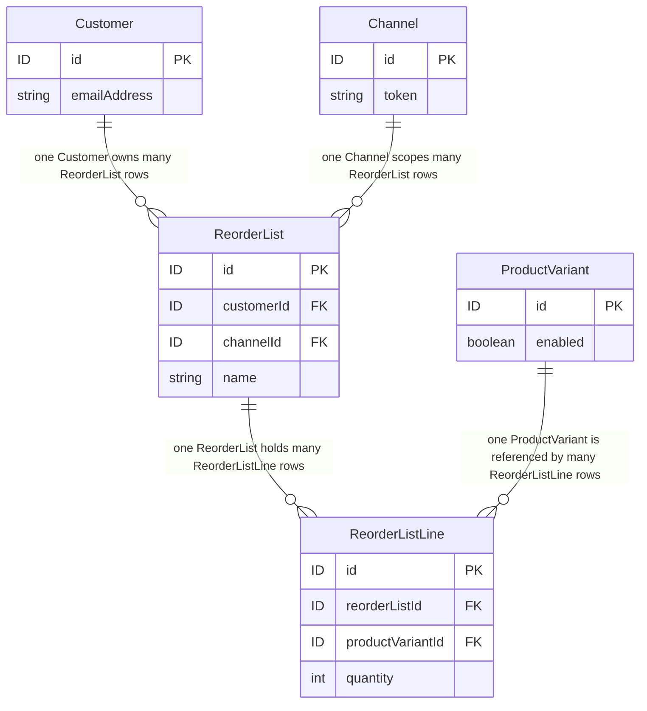

# FEATURE-001-01: Add named, multiple reorder lists carrying a per-line quantity, so that a returning buyer curates a reusable purchase list instead of rebuilding one from search results

Parent epic: `tickets/EPIC-001-reorder-and-replenishment.md`. The parent epic and the sibling features are written as paths rather than as links, following the epic's own convention of keeping the link count in a file equal to the number of children that file indexes [tickets/EPIC-001-reorder-and-replenishment.md:§3. How To Read This Epic]. The only links in this file are the four story links in section 3.

---

## 1. Feature Title

**Add named, multiple reorder lists carrying a per-line quantity, so that a returning buyer curates a reusable purchase list instead of rebuilding one from search results.**

Short name, used verbatim wherever this feature is referred to in one phrase, and identical to the label the epic's features index gives it: **Named Reorder Lists with Line Quantities** [tickets/EPIC-001-reorder-and-replenishment.md:§4. Features Index]. The long form above is the action-object-outcome title this tier requires; the short form is the name to cite. The epic classifies this feature's deviation from its originally suggested area as **narrowed**, and section 2.3 gives the evidence for that classification rather than asserting it.

Delivery is part of the single self-contained plugin package the epic describes — `packages/reorder-plugin/`, exporting `ReorderPlugin` — named consistently with the plugin packages this workspace already publishes under its `packages/*` workspace glob [package.json:L87-L89]. No file under `packages/core` or `packages/admin-ui` is edited to deliver it.

---

## 2. Feature Summary

### 2.1 The Capability

A returning buyer creates multiple named reorder lists, up to a configured maximum, and each line of a list holds a reference to one `ProductVariant` together with a positive integer quantity. This feature ships the two plugin-owned tables that hold them, the `Permission.Owner` gate that admits an authenticated buyer, the service-layer ownership and channel predicate that is the actual control, and the eight Shop API operations that read and write them.

**"Up to a configured maximum" is deliberate wording and replaces an earlier "any number".** An unbounded per-customer collection is a resource-exhaustion surface, and this feature declares the two bounds as plugin options — `maxListsPerCustomer` and `maxLinesPerList` on `ReorderPluginOptions` — so that `ReorderListLimitError` has a trigger. Section 2.11 fixes the option names, the canonicalization rules and the pagination bounds; the *values* remain the open product decision the epic records, and no value is invented here.

### 2.2 Contribution To The Epic

This is the epic's foundation batch B1, and it depends on nothing [tickets/EPIC-001-reorder-and-replenishment.md:§9.4 Run Batches]. It owns the "Curate a named list with per-line quantity" step of the returning-buyer journey [tickets/EPIC-001-reorder-and-replenishment.md:L62], and it produces the list-shaped source data that FEATURE-001-02 materialises into an active order and that FEATURE-001-06 shares across the seats of a buying account. The epic also nominates this feature's first story as the harness-proving run, on the grounds that it is the first story in dependency order needing a new plugin-owned table and therefore the first additive migration in the set [tickets/EPIC-001-reorder-and-replenishment.md:§9.5 Nomination].

Read the contribution narrowly. This feature adds no path from a list into a cart: the materialisation step, the per-line outcome report and the bulk-add contract all belong to FEATURE-001-02, which consumes `OrderService.addItemsToOrder` and the already-published `addItemsToOrder` mutation [packages/core/src/api/schema/shop-api/shop.api.graphql:L74]. This feature stops at a durable, owned, channel-scoped list.

### 2.3 What Already Exists, And What Is New — The Precedent Stated Plainly

**A complete saved-list plugin already ships in this repository.** `packages/dev-server/example-plugins/wishlist-plugin/` is not a sketch or a fragment; its own README states that it is the complete plugin described in the platform's "Writing your first plugin" tutorial [packages/dev-server/example-plugins/wishlist-plugin/README.md:L3]. Its anatomy is, line for line, the anatomy this feature would otherwise be credited with inventing:

- One entity extending `VendureEntity`, carrying a `@ManyToOne` relation to `ProductVariant` and a `productVariantId` column [packages/dev-server/example-plugins/wishlist-plugin/entities/wishlist-item.entity.ts:L4-L15].
- Plugin metadata declaring `entities`, `providers` and `shopApiExtensions` [packages/dev-server/example-plugins/wishlist-plugin/wishlist.plugin.ts:L9-L16].
- Shop API schema additions made through `extend type Query` and `extend type Mutation` [packages/dev-server/example-plugins/wishlist-plugin/api/api-extensions.ts:L12-L19].
- A service that deduplicates by variant, raises `UserInputError` when the variant does not resolve, and persists through `TransactionalConnection` [packages/dev-server/example-plugins/wishlist-plugin/service/wishlist.service.ts:L34-L51].
- A session guard that refuses a request carrying no active user [packages/dev-server/example-plugins/wishlist-plugin/service/wishlist.service.ts:L74-L76].
- The module-augmentation idiom for typing a custom field [packages/dev-server/example-plugins/wishlist-plugin/types.ts:L5-L9].

Its entire public surface is three operations: `activeCustomerWishlist` [packages/dev-server/example-plugins/wishlist-plugin/api/api-extensions.ts:L13], `addToWishlist(productVariantId: ID!)` [packages/dev-server/example-plugins/wishlist-plugin/api/api-extensions.ts:L17] and `removeFromWishlist(itemId: ID!)` [packages/dev-server/example-plugins/wishlist-plugin/api/api-extensions.ts:L18].

**The precedent is heavier than "an example exists", and the count is exact — but the six files do not all do the same thing, so the claim is stated at the strength the evidence actually supports rather than at the strength that would flatter the point.** Searching every Markdown and MDX file under the documentation tree for the plugin's name returns six files, and all six **reference or illustrate** it. Two use it as a worked code illustration: the API-layer guide builds its resolver example on a wishlist resolver [docs/docs/guides/developer-guide/the-api-layer/index.mdx:L260], and the generated permission reference uses a wishlist name to demonstrate CRUD permission derivation [docs/docs/reference/typescript-api/auth/permission-definition.mdx:L65]. Four reference it as an example domain rather than working through it: the plugins guide lists it among the things plugins are for [docs/docs/guides/developer-guide/plugins/index.mdx:L25], the database-entity guide names it in its page metadata [docs/docs/guides/developer-guide/database-entity/index.mdx:L4], the customer-accounts storefront guide cites it as registered-customer functionality [docs/docs/guides/storefront/customer-accounts/index.mdx:L12], and the cart core-concepts guide names "named wishlists or saved carts" as a scenario the existing active-order strategy can already be customised for [docs/docs/guides/core-concepts/cart/index.mdx:L16] — so even the *named* part of this feature's title is a scenario the documentation has already contemplated, which is the single most consequential of the six mentions for this feature.

**One correction to the precedent's own claim, recorded because propagating it would be a stale claim.** The plugin's README states that it is the plugin described in a "Writing your first plugin" tutorial [packages/dev-server/example-plugins/wishlist-plugin/README.md:L3], but **no page under the documentation tree in this checkout carries that title** — a search of every Markdown and MDX file under that tree for the phrase returns nothing. So none of the six files above is that tutorial, and this feature does not claim otherwise: what the six establish is that the wishlist shape is the platform's habitual example, not that a step-by-step build of it ships here. The permission helper this feature depends on carries a wishlist definition as its own worked example in source as well [packages/core/src/common/permission-definition.ts:L119], which is the strongest single piece of evidence for the verdict, because it sits in the code rather than in the documentation.

**This feature is therefore narrowed, and the narrowing is stated rather than glossed.** Exactly two things are new:

- **Lists are named, and a buyer may hold more than one.** The shipped precedent exposes one unnamed collection per customer and offers no way to distinguish a weekly grocery list from a quarterly consumables list.
- **Each line carries an integer quantity.** The shipped precedent stores a variant reference and nothing else, so it cannot express "six of this and one of that", which is the whole of what makes a list reusable as a reorder source.

Everything else in this feature — the entity shape, the schema-extension mechanism, the deduplication rule, the session guard, the persistence idiom — is a re-application of shipped work, and a reviewer should price it that way. The epic reaches the same conclusion from the other direction when it declines to nominate a saved-list story as the demonstration slice, on the explicit ground that a bare saved list is the most heavily precedented thing the epic could build [tickets/EPIC-001-reorder-and-replenishment.md:§9.6 Nomination]. Novelty in this epic lives in FEATURE-001-02 and FEATURE-001-03; it does not live here.

### 2.4 Named Entities Touched

Two entities are new and plugin-owned; two already exist and are read, never altered.

- **`ReorderList` — new, plugin-owned.** One row per named list, owned by one customer and scoped to one channel, holding the owning customer id, the channel id and the buyer-supplied name. **The name is unique per owning customer and channel, and that constraint is what gives `ReorderListNameConflictError` a trigger.** Its complete mapping is below.
- **`ReorderListLine` — new, plugin-owned.** One row per line, unique per list-and-variant, which is what makes the deduplication rule enforceable in the database rather than only in the service. Its complete mapping is below.
**The two mappings, stated completely enough to author a deterministic migration from.** A table name and a diagram are not a schema, so every column, type, length, nullability, index, constraint and on-delete action is declared here. The epic's persistence contract carries the rules these two obey [tickets/EPIC-001-reorder-and-replenishment.md:§7.8 The Seven Plugin-Owned Tables]; this section is where they are made concrete for these two tables.
```ts
// Both entities extend VendureEntity, so id, createdAt AND updatedAt are inherited
// and are NOT re-declared. All three are part of the contract.
@Entity()                                     // table reorder_list (TypeORM snake_case)
export class ReorderList extends VendureEntity {
  @ManyToOne(() => Customer, { onDelete: 'CASCADE', nullable: false })
  customer: Customer;
  @EntityId({ nullable: false }) customerId: ID;      // id type set by EntityIdStrategy
  @ManyToOne(() => Channel, { onDelete: 'CASCADE', nullable: false })
  channel: Channel;
  @EntityId({ nullable: false }) channelId: ID;
  @Column({ type: 'varchar', length: 191, nullable: false })
  name: string;                                       // as the buyer typed it, trimmed
  @Column({ type: 'varchar', length: 191, nullable: false })
  nameKey: string;                                    // canonical form; see section 2.11
  @Column({ type: 'int', nullable: false, default: 0 })
  lineCount: number;                                  // denormalised counter; CHECK lineCount >= 0
                                                      // written in the same transaction as every
                                                      // line insert and delete, and the atomic
                                                      // enforcement point for maxLinesPerList
  @OneToMany(() => ReorderListLine, line => line.reorderList)
  lines: ReorderListLine[];
}
@Entity()                                     // table reorder_list_line
export class ReorderListLine extends VendureEntity {
  @ManyToOne(() => ReorderList, list => list.lines, { onDelete: 'CASCADE', nullable: false })
  reorderList: ReorderList;
  @EntityId({ nullable: false }) reorderListId: ID;
  @ManyToOne(() => ProductVariant, { onDelete: 'CASCADE', nullable: false })
  productVariant: ProductVariant;                     // published NULLABLE; column NOT NULL
  @EntityId({ nullable: false }) productVariantId: ID;
  @Column({ type: 'int', nullable: false })
  quantity: number;                                   // CHECK quantity > 0
  // --- The replay store for addItemToReorderList. Two columns, no new table, no partial
  // index: the existing UQ_reorder_list_line_list_variant is the row the claim is anchored
  // on, so the claim is a conditional UPDATE against a row that is already unique.
  @Column({ type: 'varchar', length: 64, nullable: true })
  lastAddIdempotencyKey: string | null;               // the caller's key, as supplied
  @Column({ type: 'varchar', length: 64, nullable: true })
  lastAddRequestFingerprint: string | null;           // digest of the canonical add payload
}
```
- **Indexes and constraints, each with the name the migration must use**, because the constraint-specific error mapping in section 2.12 matches on a name and not on a driver message:
  - `UQ_reorder_list_customer_channel_name_key` — unique over `(customerId, channelId, nameKey)` on `reorder_list`. This is what gives `ReorderListNameConflictError` a trigger that survives a concurrent insert.
  - `IDX_reorder_list_customer_channel` — non-unique over `(customerId, channelId)` on `reorder_list`, which is the predicate every list read filters on.
  - `UQ_reorder_list_line_list_variant` — unique over `(reorderListId, productVariantId)` on `reorder_list_line`. This is the deduplication rule as a database constraint.
  - `CHK_reorder_list_line_quantity_positive` — check constraint `quantity > 0` on `reorder_list_line`. A non-positive quantity is refused by the database as well as by the service, so a second code path cannot bypass it.
  - `CHK_reorder_list_line_add_claim_paired` — check constraint on `reorder_list_line` requiring `lastAddIdempotencyKey` and `lastAddRequestFingerprint` to be **both null or both non-null**. It is a same-row invariant, so the epic's persistence contract makes it a named check constraint rather than a service convention [tickets/EPIC-001-reorder-and-replenishment.md:§7.8 The Seven Plugin-Owned Tables — Persistence Contract]: a recorded key with no fingerprint could not tell a replay from a conflicting reuse of the same key, which is the whole purpose of the pair.
  - `CHK_reorder_list_line_count_non_negative` — check constraint `lineCount >= 0` on `reorder_list`. The counter is what section 2.11's line bound is enforced against atomically, so a defect that decremented it past zero would silently raise the effective bound; the database refuses instead.
- **Why every string column is 191 characters.** Both `name` and `nameKey` participate in the composite unique index, and 191 is the length that keeps a four-byte UTF-8 index inside the key-size limit on the MySQL and MariaDB engines the existing engine jobs exercise [.github/workflows/build_and_test.yml:jobs]. The number is an engine constraint, not a product choice about how long a list name should be.
- **Why the on-delete actions are what they are.** `ReorderList.customerId` and `ReorderList.channelId` cascade because a list has no meaning without its owner or its channel and carries no audit purpose — unlike the attempt tables in FEATURE-001-07, which retain their rows. `ReorderListLine.reorderListId` cascades so that `deleteReorderList` removes the lines in one statement rather than in a loop. `ReorderListLine.productVariantId` cascades because a line pointing at a hard-deleted variant is unusable — **and that is the one path that can drift `lineCount`, so section 2.6.2.1 states the exposure and the compare-and-set repair rather than leaving the counter to disagree with its rows**; note that the platform's ordinary variant deletion is a *soft* delete setting `deletedAt` [packages/core/src/entity/product-variant/product-variant.entity.ts:L48], which leaves the line in place — which is exactly the disabled-or-deleted-variant case FEATURE-001-04 resolves and story 01-04 reports. **The database column and the published field are deliberately not the same nullability, and the pair is what makes the retained line readable.** The column stays `NOT NULL`, because a retained line always references a variant row that still exists, soft-deleted or disabled; the published `productVariant` field is **nullable**, because the read filters a variant that is no longer resolvable in the active channel and a non-null field could then only expose a withdrawn catalogue object or null-bubble the whole line out of its page. `productVariantId` stays non-null on both sides, so the buyer can always see and remove the stale line [tickets/EPIC-001/FEATURE-001-01-named-reorder-lists.md:§2.6 Named API Surfaces — Eight Shop API Operations, Zero Existing Signatures Changed].
- **Migration ownership and ordering, stated as a set with one owner per member, because two stories previously claimed the same content.** This feature produces **exactly one** migration. It creates `reorder_list` first and `reorder_list_line` second, together with every index, constraint and check named above and the `lineCount` column, and **`STORY-001-01-01` owns it in full**. `STORY-001-01-02`, `STORY-001-01-03` and `STORY-001-01-04` own **no** migration and add no column: an earlier draft let 01-02 claim the line table's migration content and additionally permitted it to generate a later migration of its own, which would have produced two migrations for one table and no single owner for either. The rule that replaces it is checkable rather than aspirational: after 01-01 is merged, `generateMigration` [packages/core/src/migrate.ts:L118] run against the schema of any later story in this feature **emits nothing**, and each of the three later stories asserts that empty generation as its migration sub-task. Nothing in this feature alters a core table.
- **`Customer` — existing, read only.** Declared as implementing `ChannelAware`, `HasCustomFields` and `SoftDeletable` [packages/core/src/entity/customer/customer.entity.ts:L23]. This feature reads its identity through the authenticated session and stores that identity as a foreign key on `ReorderList`. It adds no column and no custom field to it; `emailAddress` [packages/core/src/entity/customer/customer.entity.ts:L42], `groups` [packages/core/src/entity/customer/customer.entity.ts:L46] and `user` [packages/core/src/entity/customer/customer.entity.ts:L56] are read as they stand. That `Customer` is soft-deletable [packages/core/src/entity/customer/customer.entity.ts:L28-L29] matters to the list tables: a soft-deleted customer's rows are still present, so an ownership check resolves against the session rather than against row existence. **What then happens to those rows is settled at epic level rather than chosen here, and only its timing is open.** The epic's persistence contract fixes the mechanism for these two tables: on a customer deletion the data-lifecycle job of ruling R19 **deletes** their rows outright rather than anonymising them, because a saved list has no purpose without its owner, and the job is triggered by the platform's shipped customer event rather than by any scheduled task [tickets/EPIC-001-reorder-and-replenishment.md:§7.8 The Seven Plugin-Owned Tables — Persistence Contract]. What remains open is the keep period alone, which is product decision 3 and which no ticket may supply [tickets/EPIC-001-reorder-and-replenishment.md:§8.1 Product Decisions]. Until it is set, these two tables **minimise rather than guess**: the owning customer id, the channel id, the buyer-supplied list name, a variant id and an integer quantity, and nothing else — no contact detail, no free-text note and no request context.
- **`ProductVariant` — existing, read only.** A list line references it. Its `enabled` flag [packages/core/src/entity/product-variant/product-variant.entity.ts:L53] is the one variant state this feature reads, because a line may point at a variant that has since been disabled. Note that this feature does not *act* on that flag beyond reporting it; deciding what a disabled variant does to a reorder is FEATURE-001-04's work.

### 2.5 Named Services

- **`ReorderListService` — new, plugin-owned.** Holds every read and write for the two tables, including the name-uniqueness check, the per-list-and-variant deduplication, the quantity validation and the ownership resolution. Each of the eight resolvers delegates to it, so the ownership rule has exactly one implementation to review.
- **`TransactionalConnection` — existing.** Every plugin-owned write goes through it, which is the idiom the shipped precedent already uses to obtain a repository bound to the request's transaction [packages/dev-server/example-plugins/wishlist-plugin/service/wishlist.service.ts:L46-L50]. The epic names it as the persistence dependency for all plugin-owned state [tickets/EPIC-001-reorder-and-replenishment.md:§7.4 Existing Entities And Services The Work Depends On].
- **`ProductVariantService` — existing.** Resolves a variant id to a variant so that a line cannot be created against an id that does not exist in the active channel. The precedent shows the same call and the `UserInputError` it raises on a miss [packages/dev-server/example-plugins/wishlist-plugin/service/wishlist.service.ts:L36-L39].

### 2.6 Named API Surfaces — Eight Shop API Operations, Zero Existing Signatures Changed

All eight arrive through the plugin's `shopApiExtensions`, using `extend type Query` and `extend type Mutation` — the mechanism the shipped precedent already demonstrates [packages/dev-server/example-plugins/wishlist-plugin/api/api-extensions.ts:L12-L19]. Because every operation is an addition to an existing root type rather than a change to an existing field, **no existing operation's arguments or return type changes.**

**Every one of the eight has a named owning story, and the owner is stated beside the operation rather than left to be inferred from a story title.** A declared operation with no owning story would be published surface that nothing in the decomposition delivers, so the mapping below is part of this feature's contract and section 3 repeats it from the story side.
Two queries, each owned by the read story:
- `activeCustomerReorderLists` — every list owned by the authenticated customer in the active channel. This is the behaviour of the optional visibility argument at its default, declared in the contract below. Owner: `STORY-001-01-04`.
- `activeCustomerReorderList` — one list, addressed by id, with its lines. Under the same default. Owner: `STORY-001-01-04`.
Six mutations, distributed across the other three stories:
- `createReorderList` — creates an empty named list. Owner: `STORY-001-01-01`.
- `addItemToReorderList` — adds a variant at an integer quantity, or resolves to the existing line for that variant. Owner: `STORY-001-01-02`.
- `adjustReorderListLine` — sets the integer quantity on an existing line. Owner: `STORY-001-01-03`.
- `removeReorderListLine` — removes one line. Owner: `STORY-001-01-03`.
- `updateReorderList` — renames an existing list, subject to the same per-customer name uniqueness rule that governs creation, and therefore returning `ReorderListNameConflictError` on a name the same customer already holds. Owner: `STORY-001-01-03`.
- `deleteReorderList` — removes a list together with its lines in one transaction. Owner: `STORY-001-01-03`.
Two queries. **Both are bounded, and the bound is the platform's own rather than a figure this feature chose** — the epic states the rule once for every surface in the set [tickets/EPIC-001-reorder-and-replenishment.md:§7.7 Bounded Collections].
- `activeCustomerReorderLists(includeShared: Boolean = false): ReorderListList!` — the lists owned by the authenticated customer in the active channel, **returned as a paginated list rather than as every row**. The return type implements `PaginatedList` [packages/core/src/api/schema/common/common-types.graphql:L9] and declares only `items` and `totalItems`; **the `options` argument is absent from the declaration on purpose** and is added by the generator, following the shipped plugin exemplar which declares its paginated query the same way [packages/dev-server/test-plugins/reviews/api/api-extensions.ts:L44-L45].
- `activeCustomerReorderList(id: ID!, includeShared: Boolean = false): ReorderList` — one list addressed by id, **carrying the same optional `includeShared` argument the collection read carries, declared here from the outset for the reason section 2.11 gives** — an earlier revision of this bullet omitted the argument while the SDL block below declared it, which is one operation with two published signatures and is the defect this correction closes; the SDL block is and remains the authority, and it declares the argument on both queries — **whose `lines` field is itself a paginated list and not an unbounded collection**. A paginated outer query whose entries carry an unbounded inner collection is not bounded, which is why the line collection is paginated in its own right — and it is paginated by the generator, which supplies an argument to every field returning a paginated type rather than only to root queries [packages/core/src/api/config/generate-list-options.ts:L41-L48], so no argument for it is declared here.
**How the bound is enforced, and why enforcement is the load-bearing half.** Declaring pagination arguments is not bounding: a resolver may accept `skip` and `take` and then ignore them. Both queries therefore resolve their items through `ListQueryBuilder` [packages/core/src/service/helpers/list-query-builder/list-query-builder.ts:L209] and its `build` member [packages/core/src/service/helpers/list-query-builder/list-query-builder.ts:L261], which clamps the requested page to the configured maximum, substitutes that maximum when no page size is supplied, and **rejects an over-limit request outright with the platform's own input error** [packages/core/src/service/helpers/list-query-builder/list-query-builder.ts:L638]. The maximum for a Shop API read is `apiOptions.shopListQueryLimit`, whose default the platform declares as one hundred [packages/core/src/config/vendure-config.ts:L151] — **a platform default cited, not a metric invented**. `ignoreQueryLimits` is left false on every query in this feature, because the option's own documentation records that an unlimited public list query can become a denial-of-service vector [packages/core/src/service/helpers/list-query-builder/list-query-builder.ts:L125-L131].
**Ordering is deterministic or the count assertion is meaningless, and a timestamp alone is not deterministic.** Each paginated read declares a default sort that is a **total order**: lists by their inherited creation timestamp [packages/core/src/entity/base/base.entity.ts:L31] descending **then by the inherited row identifier [packages/core/src/entity/base/base.entity.ts:L28-L29] descending**, lines by that timestamp ascending **then by that identifier ascending**. **The identifier is not decoration and an earlier revision of this paragraph omitted it, which is the defect this sentence closes.** Two rows created inside the same clock tick carry equal timestamps — which two inserts in one transaction, or one seeded fixture, produce routinely — and an order that is equal on every column it names leaves the engine free to return those rows in either order on either request. Across two offset pages that is not a cosmetic difference: a row can be returned on both pages or on neither, so "exactly N entries in this order" becomes a coincidence again. Appending a column that is unique per table makes the order total, and the identifier is the only column both tables have that always is. A caller may override the sort through the generated sort parameter; **the identifier tie-break is appended to whatever the caller asks for rather than replaced by it**, so no override can make the order partial. The tie-break is proved rather than described: a fixture writes more rows with a single equal creation timestamp than one page holds, reads every page, and asserts the union is exactly the fixture with no row repeated and none missing.
**What is still undecided, and it is a number so this feature may not supply it.** The maximum number of lists a customer may hold and the maximum number of lines a list may hold are an open product decision [tickets/EPIC-001-reorder-and-replenishment.md:§8.1 Product Decisions], and the per-surface default page size below the platform maximum is an open architectural decision [tickets/EPIC-001-reorder-and-replenishment.md:§8.2 Architectural Decisions]. Pagination does not wait on either: the platform maximum bounds both reads today, and the decisions determine only whether a smaller bound is layered on top.

**Why the last four share one owner.** All four are mutations over rows that already exist in the two plugin-owned tables, they add no table and no migration of their own, and each is the same shape: resolve the row, enforce ownership against the authenticated session, write, return the affected list or a named error result. Splitting a rename away from a delete, or a line adjustment away from a list adjustment, would produce stories whose acceptance criteria repeat each other verbatim while the epic's per-feature story count is fixed at four [tickets/EPIC-001-reorder-and-replenishment.md:§4. Features Index]. `STORY-001-01-03` is therefore the feature's mutate-and-remove story at both levels — the line level and the list level — and its epic row is estimated for all four operations rather than for two.

**The published contract, in full.** Every argument, input object, object type, result union and nullability below is fixed here rather than left to a story, so that two stories cannot implement two different shapes of the same operation. Every name in it was collision-checked against both checked-in introspection snapshots and none exists in either [schema-shop.json:data.__schema.types] and [schema-admin.json:data.__schema.types]; the epic carries the inventory-wide record [tickets/EPIC-001-reorder-and-replenishment.md:§6.4 The Settled Rulings].
**Both queries publish their final shape here, including the parts only FEATURE-001-06 gives behaviour to. That is deliberate, and this paragraph is the reason.** Once a list can be shared, these two reads face a question they did not face when they were written — whether a list the caller merely holds a grant on is returned — and answering it later by widening an already-shipped operation would redefine a surface this plugin published two batches earlier. Adding an optional argument is backward-compatible for a client, but the epic's promise is that no published surface is *redefined*, so the fields arrive now with the owner-only behaviour this feature implements:
- **An optional inclusion argument** whose default preserves owner-only behaviour exactly. **Both values are accepted under this feature**, and the non-default one returns the same page as the default because no grant row can exist until FEATURE-001-06 creates the table — so the set it asks for is empty by construction rather than withheld. An earlier draft refused the non-default value as unsupported; section 2.6 records why that reading is withdrawn, and story 01-04 asserts the equality of the two.

  **The principle that separates this from the two places in this epic where an argument value *is* refused is worth stating, because otherwise the three look inconsistent.** A value is refused where accepting it would create a guarantee the deployment does not have or would silently discard a meaningful instruction — a non-default line resolution before FEATURE-001-04 ships changes which lines get added, and an idempotency key before FEATURE-001-07's claim row exists would advertise replay protection that is not there [tickets/EPIC-001/FEATURE-001-02-reorder-from-order-history.md:§2.5.2 Replay Safety]. A value is **accepted** where the requested semantics are wholly satisfiable with an empty extension, which is this case. The test that distinguishes them is whether a caller could be worse off believing the answer.
- **An additive field on the plugin-owned list type distinguishing an owned list from a shared one, together with the capability granted.** Under this feature every returned list reports itself as owned and reports no capability, which are the truthful values while no share row exists. **The grant roster itself is deliberately not published here**: it is owner-only, and FEATURE-001-06 returns it on the success payload of its own two owner-gated mutations rather than on a type a grantee also reads [tickets/EPIC-001/FEATURE-001-06-buying-account-list-sharing.md:§2.5 Named API Surfaces], which is also how the epic's bounded-collection ledger records it [tickets/EPIC-001-reorder-and-replenishment.md:§7.7 Bounded Collections]. So this feature's list type gains no `grants` field, in this batch or in any later one.
**FEATURE-001-06 therefore contributes behaviour, not shape**, and it records the same division from its own side [tickets/EPIC-001/FEATURE-001-06-buying-account-list-sharing.md:§2.5 Named API Surfaces]. A client that never passes the argument observes no change at that point either, and no existing argument becomes required, no existing field changes type or nullability, and no operation is added.
Six mutations:

```graphql
# NOTHING below references a type this document does not declare, and NOTHING below
# declares an `options` argument. That is this document's CHOICE between the two routes
# ruling R10 permits, and not the only route that builds — an earlier revision of this
# comment said a declared options input could not build at all, which is wrong and would
# have made the shipped exemplar unbuildable [packages/dev-server/test-plugins/reviews/api/api-extensions.ts:L39-L45].
# The rule is narrower: the plugin's document is merged into the schema FIRST
# [packages/core/src/api/config/get-final-vendure-schema.ts:L99] and generateListOptions runs
# AFTER it [packages/core/src/api/config/get-final-vendure-schema.ts:L100], so a document may
# not NAME a `<Row>ListOptions` it does not itself declare — that is the unknown-type failure.
# A document MAY declare the input bare and name it as the argument, and the generator then
# merges its own fields into that declaration [packages/core/src/api/config/generate-list-options.ts:L83].
# This document needs no extra filter key, so it declares neither input and lets the generator
# add the argument to every field returning a PaginatedList implementor, root or nested
# [packages/core/src/api/config/generate-list-options.ts:L41-L48] and [packages/core/src/api/config/generate-list-options.ts:L87-L99].
extend type Query {
  "Lists the authenticated customer can see in the active channel. Owner-only by default."
  activeCustomerReorderLists(includeShared: Boolean = false): ReorderListList!

  "One list by id. NULL — never an error — when it is absent, another customer's, another channel's, or not shared with the caller."
  "No includeShared argument, deliberately: a read addressed by an explicit id considers an active grant by default, and viewerAccess reports which of the two applies. The argument exists only on the collection query, where adding shared rows to a page would change what an already-shipped client renders."
  activeCustomerReorderList(id: ID!): ReorderList
}

extend type Mutation {
  createReorderList(input: CreateReorderListInput!): CreateReorderListResult!
  updateReorderList(input: UpdateReorderListInput!): UpdateReorderListResult!
  deleteReorderList(id: ID!): DeleteReorderListResult!
  addItemToReorderList(input: AddItemToReorderListInput!): AddItemToReorderListResult!
  adjustReorderListLine(input: AdjustReorderListLineInput!): AdjustReorderListLineResult!
  removeReorderListLine(input: RemoveReorderListLineInput!): RemoveReorderListLineResult!
}

type ReorderList implements Node {
  id: ID!
  createdAt: DateTime!
  updatedAt: DateTime!
  name: String!
  "Denormalised counter column on reorder_list, not a derived value: total stored lines, NOT the size of the page below. See section 2.4."
  lineCount: Int!
  "Paginated. The generator supplies this field's `options` argument."
  lines: ReorderListLineList!

  "Per-requester, therefore nested: it is not a column and may not enter generated sort or filter inputs."
  viewerAccess: ReorderListViewerAccess!
}

type ReorderListViewerAccess {
  "OWNED when the caller owns the row; SHARED when the caller reaches it through a grant."
  access: ReorderListAccess!
  "Non-empty only when access is SHARED. Populated by FEATURE-001-06; always [] until then."
  grantedCapabilities: [ReorderListCapability!]!
}

type ReorderListLine implements Node {
  id: ID!
  createdAt: DateTime!
  updatedAt: DateTime!
  "NULLABLE, and that is a contract rather than an oversight: a line whose variant has been soft-deleted or disabled since it was saved is RETAINED, and a non-null field would have to expose a withdrawn catalogue object or null-bubble the whole line out of the page. Null means the variant is no longer resolvable in the active channel."
  productVariant: ProductVariant
  "NON-NULL always. The stored identifier survives the variant becoming unresolvable, which is what lets a buyer see and remove the stale line."
  productVariantId: ID!
  quantity: Int!
}

type ReorderListList implements PaginatedList {
  items: [ReorderList!]!
  totalItems: Int!
}

type ReorderListLineList implements PaginatedList {
  items: [ReorderListLine!]!
  totalItems: Int!
}

# NEITHER `ReorderListListOptions` NOR `ReorderListLineListOptions` is declared or even named
# above: both are generated at run time from their target types
# [packages/core/src/api/config/generate-list-options.ts:L31-L60]. What fails the build is naming
# one that this document does not declare, because the merge happens before the generator runs
# [packages/core/src/api/config/get-final-vendure-schema.ts:L99-L100] — declaring it bare and
# naming it is the other route ruling R10 permits, and is not taken here.

enum ReorderListAccess { OWNED, SHARED }
"""
Declared here because ReorderListViewerAccess references it in batch B1. FEATURE-001-06
gives its members meaning; it declares neither the enum nor the field.
"""
enum ReorderListCapability { READ, APPLY_TO_ORDER }

# The four error results this feature owns, declared field-by-field. A union member that is
# only named is an unknown-type build failure, and the ErrorCode enum grows from these
# declarations rather than from union membership [packages/core/src/api/config/generate-error-code-enum.ts:L11-L19].
"Returned when a reorder list addressed by id is absent, owned by another customer, in another channel, or not shared with the caller. One result for all four, deliberately."
type ReorderListNotFoundError implements ErrorResult {
  errorCode: ErrorCode!
  message: String!
}

"Returned when the canonical form of the supplied name is already held by this customer in this channel."
type ReorderListNameConflictError implements ErrorResult {
  errorCode: ErrorCode!
  message: String!
  "The canonical nameKey that collided. Echoes the caller's own input; discloses no other row."
  conflictingNameKey: String!
}

"""
Returned when a write would take a customer over maxListsPerCustomer, a list over maxLinesPerList, or a
list past the seats-per-list maximum FEATURE-001-06 enforces on the same conditional-counter pattern.
"""
type ReorderListLimitError implements ErrorResult {
  errorCode: ErrorCode!
  message: String!
  "The breached maximum, in the same shape OrderLimitError carries its own."
  maxItems: Int!
}

"Returned when a line addressed by id is absent from the addressed list."
type ReorderListLineNotFoundError implements ErrorResult {
  errorCode: ErrorCode!
  message: String!
}

input CreateReorderListInput      { name: String! }
input UpdateReorderListInput      { id: ID!, name: String! }
input AddItemToReorderListInput   {
  reorderListId: ID!
  productVariantId: ID!
  quantity: Int!
}
# An earlier revision of this input declared an optional `idempotencyKey: String` promising that a repeat
# under a recorded key returned the original result. NOTHING IN THIS FEATURE COULD KEEP THAT PROMISE: the
# seven-table inventory this epic fixes has no row in which a claim and its response could be recorded
# [tickets/EPIC-001-reorder-and-replenishment.md:§7.8 The Seven Plugin-Owned Tables], so the field is
# WITHDRAWN rather than left as an accepted argument with no storage behind it. Section 2.11 carries the
# decision, the alternative that was rejected and the deterministic remedy a client has instead.
input AdjustReorderListLineInput  { reorderListId: ID!, lineId: ID!, quantity: Int! }
input RemoveReorderListLineInput  { reorderListId: ID!, lineId: ID! }

union CreateReorderListResult      = ReorderList | ReorderListNameConflictError | ReorderListLimitError
union UpdateReorderListResult      = ReorderList | ReorderListNotFoundError | ReorderListNameConflictError
union DeleteReorderListResult      = DeletionResponse | ReorderListNotFoundError
union AddItemToReorderListResult   = ReorderList | ReorderListNotFoundError | ReorderListLimitError
union AdjustReorderListLineResult  = ReorderList | ReorderListNotFoundError | ReorderListLineNotFoundError
union RemoveReorderListLineResult  = ReorderList | ReorderListNotFoundError | ReorderListLineNotFoundError
```

Twelve readings of that contract are load-bearing, and each replaces something an earlier draft of this file left open. **The last three were added after a review found the read contract stating three things two ways each — nested lines as both a plain array and a paginated collection, an inaccessible list as both null and an error result, and the visibility argument as both accepted-with-equality and rejected-as-unsupported. Each is settled below in one direction only, and every other statement in this file, in its matrix, in its definition of done and in `STORY-001-01-04` now says the same thing.**

- **Per-operation error membership is exact, and no mutation may return "any of the four".** An earlier draft said each mutation returns the affected list or one of four error results, which is not a contract a client can code against — a client cannot know whether `removeReorderListLine` might return a name conflict. Each union above names only the errors its own operation can actually produce: `ReorderListNameConflictError` appears on exactly the two operations that write a name, `ReorderListLineNotFoundError` on exactly the two that address a line, and `ReorderListLimitError` on exactly the two that can breach a bound.
- **Every type the contract names is declared in the contract, and that is a build requirement rather than tidiness.** An earlier draft named `ReorderListListOptions`, `ReorderListLineListOptions`, `ReorderListCapability` and four error results without declaring any of them. A plugin's document is merged with `extendSchema` before any generator runs [packages/core/src/api/config/get-final-vendure-schema.ts:L99-L100], so each of those seven names would have failed the merge — **the whole of batch B1 would not have started a server**, which is a harder failure than any acceptance criterion in this feature. The two `…ListOptions` names are now absent because the generator owns them; the enum and the four error results are now declared here.
- **A non-positive quantity is refused, and it is not refused with `NegativeQuantityError`.** That type's own description is "attempting to set a negative OrderLine quantity" [packages/core/src/api/schema/common/common-error-results.graphql:L43-L47] and the platform returns it for `quantity < 0` only [packages/core/src/service/services/order.service.ts:L2267-L2271] — it says nothing about zero, and it is about an `OrderLine` rather than a list line. Returning it for a list-line quantity of zero would be reporting one condition with another condition's name. **Both mutations that accept a quantity therefore refuse a non-positive or over-maximum value by throwing `UserInputError`** [packages/core/src/common/error/errors.ts:L26-L30], which reaches the client as a top-level error carrying `extensions.code` of `USER_INPUT_ERROR` and the plugin's own message key — the same treatment section 2.11 already gives an unstorable name, and the epic's ruling R13 [tickets/EPIC-001-reorder-and-replenishment.md:§6.4 The Settled Rulings]. The keys are `error.reorder-list-line-quantity-must-be-positive` and `error.reorder-list-line-quantity-above-maximum`, registered through the platform's translation-file mechanism [packages/core/src/i18n/i18n.service.ts:L137-L144]; an unregistered key surfaces as the key itself, which is what a test asserts. **This is why the four error results this feature declares are four and not five**: a quantity that cannot be stored is a malformed request, not a business outcome, so it stays out of every union.
- **`lineCount` is a column, not a computed field, it is the *only* authority for that number, and the reason is the generated filter and sort inputs.** `ReorderList` is the row type of `ReorderListList`, and the generator places every scalar and enum field of a row type into `ReorderListSortParameter` and `ReorderListFilterParameter` [packages/core/src/api/config/generate-list-options.ts:L124-L130] and [packages/core/src/api/config/generate-list-options.ts:L176-L193]. A computed `lineCount` would therefore be offered to callers as a sort and filter key with no column behind it, and the builder would resolve it against nothing. Section 2.4 declares it as a denormalised integer column maintained in the same transaction as every line insert and delete, which makes the generated key valid **and** gives section 2.11's line bound an atomic enforcement point. `viewerAccess` takes the other route in ruling R10: it is per-requester and can never be a column, so it is nested under an object type, which the generator's filter and sort builders skip.
- **`DeletionResponse` is reused for the delete path**, carrying its existing `result` and `message` fields, and is present in the Shop API snapshot already [schema-shop.json:DeletionResponse]. No plugin-owned deletion payload is invented.
- **The single-list query returns null rather than an error, and that is a security decision rather than a style one.** With the default auto-increment id strategy [packages/core/src/config/default-config.ts:L101] a list id is guessable, so distinguishing "no such list" from "not yours" would confirm the existence of another customer's list to anyone who counts. Returning null for every inaccessible case discloses nothing. The platform makes the identical choice on its own single-order read, throwing the same result whether the order is absent or forbidden precisely to close an enumeration channel [packages/core/src/api/resolvers/shop/shop-order.resolver.ts:L141-L143]. Where a *mutation* must report a reason, `ReorderListNotFoundError` plays the same normalizing role: one result for absent, foreign-customer, foreign-channel and un-shared alike.
- **Neither options input is written by hand, and neither is *named* by hand either.** Returning a `PaginatedList` implementor is what makes the platform generate the options input with its sort and filter parameters [packages/core/src/api/config/generate-list-options.ts:L31-L60], and the epic's do-not-duplicate inventory forbids hand-writing one. The stricter half is narrower than an earlier revision of this reading claimed, and the correction matters because that claim would have condemned a shipped exemplar: what fails the build is naming a `<Row>ListOptions` **this document does not declare**, for the merge-order reason above — not declaring one. **Ruling R10 permits exactly two routes and this feature takes the first** [tickets/EPIC-001-reorder-and-replenishment.md:§6.4 The Settled Rulings]: declare nothing and let the generator add the argument, which is what a document needing no extra filter key does; or declare the input bare in the same document and name it as the field's argument, which is the shipped exemplar's route [packages/dev-server/test-plugins/reviews/api/api-extensions.ts:L39-L45] and the one a plugin takes when it genuinely needs an extra key, the generator then merging its own fields into that declaration rather than replacing it [packages/core/src/api/config/generate-list-options.ts:L83]. This feature needs no such key, so it declares neither input.
- **The accumulate path is atomic, and that is part of the published contract rather than an implementation note.** `addItemToReorderList` on a variant already in the list increments the existing line in one statement and never reads-then-saves, **and it carries no idempotency key**: the argument an earlier revision declared is withdrawn, because a replay guarantee needs a durable claim-and-response record and this epic's seven tables hold none, so two deliveries of one add accumulate and the deterministic remedy is `adjustReorderListLine`, which sets a quantity rather than adding to one. Section 2.11 states the rule, the three acceptable mechanisms, the withdrawal and the tests; it is named here because a client's expectation — that two concurrent two-unit adds leave four — is a property of the operation and not of the server's internals.

- **`includeShared`, `access`, `grantedCapabilities` and the two enums they name exist from the outset so FEATURE-001-06 changes nothing later.** Sharing is a batch-B5 feature, but its effect on this feature's read contract is declared here, defaulted to the owner-only behaviour, and left inert until F6 ships. That is deliberate: adding an argument to a published operation later would be exactly the silent redefinition the epic's fifth collision exists to prevent [tickets/EPIC-001-reorder-and-replenishment.md:§6.2 Research-Discovered Collisions]. A client that never passes `includeShared` observes owner-only behaviour before and after F6, and `viewerAccess.grantedCapabilities` is an empty list until F6 populates it.

- **SETTLED — the nested `lines` collection is a paginated field whose `options` argument the generator supplies, and it is the only nested-bound mechanism this feature declares.** An earlier draft declared `lines: [ReorderListLine!]!`, a plain unbounded array, while carrying a `lineOptions` argument on the single-list *query* for which no target paginated type existed — so the argument named a type the schema never declared, and the prose, the matrix and the definition of done all described a pagination the SDL could not express. A further draft went the other way and called it a bounded non-paginated collection in section 2.11, and that reading was **additionally unavailable**: the bound it relied on is `maxLinesPerList`, whose value is an open product decision [tickets/EPIC-001-reorder-and-replenishment.md:§8.1 Product Decisions], and the epic's bounding rule allows a nested collection to be capped rather than paginated only where the cap is *decided* [tickets/EPIC-001-reorder-and-replenishment.md:§7.7 Bounded Collections]. **The settled shape is `lines: ReorderListLineList!` on the object type, declared with no `options` argument of its own.** `ReorderListLineList implements PaginatedList` [packages/core/src/api/schema/common/common-types.graphql:L9] is what makes the field a page, and the generator walks every object type's fields rather than only the root query's [packages/core/src/api/config/generate-list-options.ts:L41-L48] and appends the argument to any such field that does not already declare one [packages/core/src/api/config/generate-list-options.ts:L87-L99] — so the field a client executes against carries the generated options argument while the plugin's own document stays silent about it, which is mandatory rather than stylistic, because naming the generated input at merge time is an unknown-type build failure [packages/core/src/api/config/get-final-vendure-schema.ts:L99-L100]. Pagination therefore costs this contract nothing. **The redundant `lineOptions` query argument is removed**, because a field-level argument is the mechanism the platform's own nested collections use and two mechanisms for one bound is how the two halves diverged in the first place. A **cap on lines per list is not a second mechanism**: `ReorderPluginOptions.maxLinesPerList` bounds what may be *written* to a list, which is a different guarantee from bounding what one read returns, and section 2.11 keeps them distinct.
- **SETTLED — an inaccessible list is `null` from the query and `ReorderListNotFoundError` from a mutation, and no surface does both.** The reading above fixes the query side; the point of stating it again here is that the *matrix* previously required `activeCustomerReorderList` to return `ReorderListNotFoundError` for a list the caller does not own and for an unknown id, which the SDL cannot do — the field's type is `ReorderList`, a nullable object type and not a result union, so no error member is reachable from it. The mutations return the error because a mutation must report a reason for having written nothing; the query returns null because a nullable read discloses nothing and needs no reason. **A story or matrix row asserting an error result from either query is asserting something the published schema makes unrepresentable.**
- **SETTLED — `includeShared: true` is ACCEPTED under this feature and returns the same set as omitting it; it is not rejected as an unsupported value.** The two readings of this that stood in this file were irreconcilable, and the reason for choosing acceptance is a client rather than a preference. **There is nothing to omit:** no grant row can exist until FEATURE-001-06 creates the table, so "lists shared with me" is the empty set by construction, and owned-plus-empty is the complete and correct answer to the request rather than a substitution for it. Rejection would mean that when FEATURE-001-06 ships, the same call changes from an error to a success — a change in *behaviour* for an unchanged signature, which is precisely the silent redefinition the argument was declared early to avoid. Acceptance keeps the promise the split is built on: **F6 contributes rows, not shape and not behaviour on an existing input value.** The interim behaviour is therefore testable rather than stubbed — with no grant row in existence the opted-in call returns exactly the owner's own lists, `STORY-001-01-04` asserts that set equality, and every returned list reports `viewerAccess.access` of `OWNED` with no granted capability — and nothing in this feature reads, writes or knows about a share row.

**Each of the six unions needs a `__resolveType` resolver.** A plugin-declared union is not resolvable without one, and the epic makes it ruling R8 [tickets/EPIC-001-reorder-and-replenishment.md:§6.4 The Settled Rulings]. One resolver class carrying the six field resolvers is registered in the plugin's resolvers array; no core union is extended, because a core union cannot be extended from a plugin.

No Admin API operation is added by this feature; the administrative read path over reorder data belongs to FEATURE-001-08.

**The two queries are declared forward-compatibly for sharing, and that declaration belongs here rather than to FEATURE-001-06.** A list becomes shareable later in the epic [tickets/EPIC-001/FEATURE-001-06-buying-account-list-sharing.md:§2.1 The Capability], and the two options for accommodating that are to widen these queries in a later batch or to declare the shape once, now, in their original contract. **The second is chosen, and the reason is a client rather than a preference:** these queries are published in batch B1 and sharing arrives in B5 [tickets/EPIC-001-reorder-and-replenishment.md:§9.4 Run Batches], so widening them later would change the published signature of an operation a storefront had already adopted — the precise failure mode the epic's fifth collision exists to prevent [tickets/EPIC-001-reorder-and-replenishment.md:§6.2 Research-Discovered Collisions]. Three parts, all owned by `STORY-001-01-04`:

- **One optional argument, on the collection query only, defaulted to the owner-only behaviour.** A caller that omits it receives exactly the lists the authenticated customer owns in the active channel, which is this feature's behaviour in full. A caller that passes the non-default value additionally receives lists the caller holds an unrevoked grant on, once such grants exist. **The single-list read deliberately carries no such argument**, because its nullable return already collapses absent, foreign and un-shared into one indistinguishable answer, and an argument that selected between them would reopen the enumeration channel that nullability closes.
- **Two fields, nested under one additive field on the plugin-owned list type, recording provenance and capability, and the enum the second names is declared here too** — whether the returned list is owned by the caller or reached through a grant, and which capability that grant conferred. They are nested under `viewerAccess` rather than sitting as bare scalars on the row type, because a per-requester value may not enter the generated sort and filter inputs. For an owned list they report ownership and an empty capability list, which is the only pair of values they can take while this feature is the whole of the delivery. Both fields are non-null, so both of their types — `ReorderListAccess` and `ReorderListCapability` — are declared in this feature's contract; a non-null field whose type arrives in a later batch is a schema that does not build.
- **A stated, testable behaviour for the interim, so the argument is not a stub.** Until FEATURE-001-06 ships there are no grant rows in existence, so passing the non-default value returns **the same set as omitting it**, and `STORY-001-01-04` asserts that equality rather than deferring the argument's acceptance. Nothing here reads, writes or knows about a share row: the argument selects a *visibility rule*, and the rows that rule can admit arrive with the other feature.

**The consequence for FEATURE-001-06 is that it changes no signature at all**, which is what lets both features claim additive-only delivery truthfully rather than one of them absorbing a widening quietly. That feature states the same division from its side [tickets/EPIC-001/FEATURE-001-06-buying-account-list-sharing.md:§2.5 Named API Surfaces — Two New Mutations, Zero Existing Signatures Changed].

**Every one of the eight operations is delivered by a named story, and the mapping above is exhaustive rather than indicative.** The two queries belong to `STORY-001-01-04`; the six mutations distribute one to `STORY-001-01-01`, one to `STORY-001-01-02` and **four** to `STORY-001-01-03`, which owns the whole of the post-creation mutation surface — two operations over a list's lines and two over the list itself. That is why `STORY-001-01-03` is titled for both scopes in the epic's delivery table and why its row sits above the three-point anchor rather than at the two-point one [tickets/EPIC-001-reorder-and-replenishment.md:§9.1 The Estimation Rubric]. Counting the operations against the stories therefore gives 2 + 1 + 1 + 4 = 8 with no remainder, and **no operation in this feature is published without an owning story** — a gap of that kind would be a defect in the decomposition rather than a note for a reader.

Renaming and deleting sit with the line operations rather than with creation for two reasons worth stating, because the alternative placement is the obvious one. First, `STORY-001-01-01` is the harness-proving run and is deliberately the narrowest possible slice through the toolchain; loading the rest of the lifecycle onto it would defeat the point of nominating it. Second, renaming reuses the uniqueness comparison that creation establishes — the same per-customer-and-channel rule and the same `ReorderListNameConflictError` — so the story that already owns mutation-time validation over an existing row is the cheapest place for it, while deletion is the cascade counterpart of removing a line.

The additive-only constraint is stated here as a countable surface rather than as an intention. The Shop API root `Query` type declared nineteen root queries **before this plugin** [packages/core/src/api/schema/shop-api/shop.api.graphql:L1-L52], and the order, cart and customer-account mutation sets live in the same file. Every one of those signatures is byte-identical after this feature ships. **What changes is the root total and only by addition:** this feature contributes two root queries and six root mutations, and the epic fixes the cumulative arithmetic for the whole plugin so no file computes it in isolation [tickets/EPIC-001-reorder-and-replenishment.md:§6.4 The Settled Rulings]. Where a platform mechanism would widen an existing signature as a side effect of an otherwise additive change, that is a reportable violation recorded in the epic's collision section and referenced here rather than re-argued [tickets/EPIC-001-reorder-and-replenishment.md:§6.1 Repository-Discovered Collisions]. It is never accepted silently.

### 2.6.1 Operation Ownership And Test Matrix — Every Published Surface, Its Owning Story, And Its Required Tests

**This matrix exists because an audit of this feature found published surfaces that no story owned — first two operations, and then, on a second pass, the four error-result types.** `updateReorderList` and `deleteReorderList` were declared in section 2.6 and claimed by none of the four stories, which meant this feature's definition of done could be satisfied with two of its eight operations absent; the four error results of section 2.10 were declared field-by-field and claimed by no story's schema sub-task, which meant the same definition of done could be satisfied by a merged document that does not build, because a union member that is only named is an unknown type. **Row 11 closes the second gap the way rows 5 and 6 closed the first: by naming an owner.** That is not a documentation slip: an unowned row is an operation nobody builds and nobody tests. The matrix is the fix, and the rule the epic derives from it is that **a feature whose matrix has an unowned row fails its definition of done** [tickets/EPIC-001-reorder-and-replenishment.md:§12. Definition of Done (Epic-Level)].

The two orphaned mutations are assigned to **STORY-001-01-03**, whose shape they match exactly — an update and a delete over an existing owned row, with a not-found error, an ownership check and a channel check. The epic's delivery-split row for that story was raised from two points to three when the assignment was made rather than the operations being absorbed silently at the old size [tickets/EPIC-001-reorder-and-replenishment.md:§9.1 The Estimation Rubric]. **The alternative — a ninth and tenth story — is not available**: the epic's decomposition is fixed at twenty-five stories and thirty-four files, and the reconciliation in its definition of done checks both counts against what is on disk. **Row 11's four error results are assigned on the same principle and cost no new story either:** they belong to **STORY-001-01-01**, which already extends the Shop schema first in dependency order, so the declarations land with the first `extend type` block instead of being split across three stories that each need types the others declare. That story's delivery-split row is unchanged, because declaring four two-field object types alongside a union it already declares is not a new unit of work — it is the same sub-task stated completely [tickets/EPIC-001-reorder-and-replenishment.md:§9.1 The Estimation Rubric].

| # | Published surface | Owning story | Required unit cases | Required end-to-end cases, all written against `@vendure/testing` [packages/testing/src/index.ts:L1-L14] | Named regression |
|---|---|---|---|---|---|
| 1 | `createReorderList` | 01-01 | name normalisation and blank rejection; uniqueness check over owner and channel; session-derived ownership | valid create; blank name; duplicate name returning the exact conflict error; a barrier-released concurrent duplicate on `e2e-mariadb`, `e2e-mysql` and `e2e-postgres` plus a direct duplicate write refused by `UQ_reorder_list_customer_channel_name_key` on all four engines with `e2e-sqljs` excluded as concurrency evidence [tickets/EPIC-001-reorder-and-replenishment.md:§7.8 The Seven Plugin-Owned Tables]; configured maximum returning the exact limit error; unauthenticated; caller cannot nominate an owner; same name under a second channel token | `activeCustomer` unchanged |
| 2 | `addItemToReorderList` | 01-02 | quantity validation at both bounds; resulting-quantity check applied after the existing line is resolved; per-list-and-variant deduplication; variant resolution failure; **the accumulation issued as one atomic statement rather than a read followed by a save** | valid add; quantity zero and quantity negative, each asserting `extensions.code` of `USER_INPUT_ERROR` and the positive-quantity message key; a resulting quantity above `maxQuantityPerLine` asserting the over-maximum key; duplicate variant resolving to the existing line and accumulating; unresolvable variant id asserting `USER_INPUT_ERROR`; unauthenticated asserting the propagated `FORBIDDEN` code; wrong owner; foreign channel token; a list one line below `maxLinesPerList` receiving two simultaneous adds and yielding one success, one `ReorderListLimitError` and a row count equal to the maximum | `addItemToOrder` unchanged |
| 3 | `adjustReorderListLine` | 01-03 | quantity validation at both bounds; line-belongs-to-owner check | valid adjust; quantity zero and quantity negative, each asserting `USER_INPUT_ERROR` with the positive-quantity key rather than `NegativeQuantityError`; a quantity above `maxQuantityPerLine`; line not held by the caller returning `ReorderListLineNotFoundError`; unauthenticated asserting `FORBIDDEN`; wrong owner; foreign channel token | `adjustOrderLine` unchanged |
| 4 | `removeReorderListLine` | 01-03 | line-belongs-to-owner check; idempotence of a second remove | valid remove; unknown line returning `ReorderListLineNotFoundError`; second remove of the same line; unauthenticated; wrong owner; foreign channel token | none required — no existing operation is read |
| 5 | `updateReorderList` — **the first of the two formerly unowned operations** | 01-03 | rename validation including a blank new name; uniqueness re-check over owner and channel | valid rename; blank new name; rename to a name the same customer already holds in that channel returning `ReorderListNameConflictError`; rename of a list the caller does not own returning `ReorderListNotFoundError`; unknown id returning the same error with the same non-disclosure; unauthenticated; foreign channel token | `activeCustomer` unchanged |
| 6 | `deleteReorderList` — **the second** | 01-03 | cascade behaviour over the line rows; owner check before delete | valid delete of a list holding lines, asserting the exact count of line rows remaining afterwards is zero; delete of a list the caller does not own returning `ReorderListNotFoundError`; unknown id returning the same error; second delete of the same id; unauthenticated; foreign channel token | `activeCustomer` unchanged, and no `Order` or `OrderLine` row is affected by deleting a list |
| 7 | `activeCustomerReorderLists` | 01-04 | page clamping delegated to the builder rather than reimplemented; default sort | valid read with an exact entry count in its declared order; a page size above the configured Shop maximum rejected with the platform's input error [packages/core/src/service/helpers/list-query-builder/list-query-builder.ts:L638]; page size omitted; unauthenticated; another customer's lists absent; foreign channel token returning zero entries | the nineteen **pre-existing** root Shop queries byte-identical in name, arguments and return type, the root type growing only by addition to a cumulative twenty-three across the whole plugin [tickets/EPIC-001-reorder-and-replenishment.md:§6.4 The Settled Rulings] |
| 8 | `activeCustomerReorderList` | 01-04 | nested line page clamping; the four inaccessible cases all resolving to `null` | valid read with an exact line count in its declared order; over-limit nested page rejected; **`null` — never an error result — for a list not owned by the caller, for an unknown id, for a list in another channel and for a list not shared with the caller, with the four responses asserted byte-identical to each other**; unauthenticated; foreign channel token | as row 7 |
| 9 | Tables `ReorderList` and `ReorderListLine` | 01-01 | none — schema, not logic | the one additive migration applied and reverted on MariaDB, MySQL, PostgreSQL and sql.js, with native SQLite named unverified; the composite uniqueness rule proven on all four engines by an insert issued through the repository rather than by a service-level check, and its race behaviour proven by a barrier on the three server engines only | no existing table altered, evidenced by an empty protected-package diff |
| 10 | The authorisation model for all eight operations: the `@Allow(Permission.Owner)` gate plus the mandatory service-layer owner-and-channel predicate. **This row tests the absence of a permission definition rather than the presence of one** — the `CrudPermissionDefinition` it once described was withdrawn under epic ruling R2 because a customer’s role cannot hold a custom permission [tickets/EPIC-001-reorder-and-replenishment.md:§6.4 The Settled Rulings] | 01-01 | the ownership-and-channel predicate as a unit: same customer and same channel admitted; a row whose owning customer differs from the session’s customer refused; a row whose channel differs from the active channel refused; an absent active user refused — each asserted directly on the service rather than through the gate | **zero** permission definitions registered by this feature, asserted by reading the published `Permission` enum and finding it unchanged at the ninety-seven members the snapshots carry [schema-shop.json:__schema]; every one of the eight operations **succeeding** for a caller holding nothing but `Authenticated`, which is the only permission a customer role can hold [packages/core/src/service/services/role.service.ts:L433-L444] and the case that proves the operations are reachable by a real storefront at all; every one of the eight refused for a session authenticated as a *different* customer, refused under a foreign channel token, and refused unauthenticated; **and no criterion anywhere asserting that a session holds `Permission.Owner`**, which is unassignable by declaration [packages/core/src/common/constants.ts:L27-L31] | the published `Permission` enum is byte-identical, its member count identical before and after registration [packages/core/src/api/config/generate-permissions.ts:L42], and `activeCustomer` is unchanged |
| 11 | **The four error-result types this feature declares — `ReorderListNotFoundError`, `ReorderListNameConflictError`, `ReorderListLimitError` and `ReorderListLineNotFoundError` — as declared symbols rather than as members of somebody's union.** This row exists because an audit found all four declared at feature level in section 2.10 and owned by no story, which is the same defect rows 5 and 6 recorded for two operations: a type every union names and no sub-task declares is a schema a merged document cannot build | **01-01, which is this feature's schema-foundation story.** It is the first story in dependency order to extend the Shop schema at all, so the four declarations land with the first `extend type` block rather than being distributed across four stories that each need three of them. **Stories 01-02, 01-03 and 01-04 consume these types and redeclare none**, a second declaration of any of them in the merged document being a build failure | each type's declared field set asserted against the object shape every shipped error result has — `errorCode: ErrorCode!` and `message: String!` at minimum [packages/core/src/api/schema/common/common-error-results.graphql:L2-L5] — plus `conflictingNameKey` on the conflict type and `maxItems` on the limit type; each owning union's `__resolveType` field resolver returning the exact type name for each; the mapping from each declaration to its generated `ErrorCode` member by upper-snake conversion [packages/core/src/api/config/generate-error-code-enum.ts:L11-L28] | the regenerated Shop `ErrorCode` enum carrying **exactly four more members than the baseline captured before this story**, each derived from a declaration rather than from union membership [packages/core/src/api/config/generate-error-code-enum.ts:L9], with every pre-existing member byte-identical in name; and one end-to-end case per type returning it as a union member inside `data` with its own fields populated, so that no type is declared without a path that returns it | the thirty-two pre-existing `ErrorCode` members unchanged in name and order-independent membership [schema-shop.json:ErrorCode], and the Admin enum unchanged at its own count [schema-admin.json:ErrorCode] |

**Four rules govern the matrix, so it cannot be satisfied on paper.** An authorisation negative is a real API call asserting both no read and no write, not a unit test of a guard function. A "foreign channel token" case sends a second real token rather than mutating a variable. Every case in the end-to-end column runs on the four engine jobs that already exist [.github/workflows/build_and_test.yml:jobs] wherever its behaviour depends on the database — which is every row in the table, because every row writes or reads a plugin-owned row. **And every "reads nothing" claim is instrumented, because the fourth rule exists to close a hole the first three left open.**

#### 2.6.1.1 How A "Reads Nothing" Claim Is Actually Evidenced

This feature, its matrix and its definition of done all say that a refused caller "reads nothing" and that the ownership predicate is applied "before any row is returned or written". **A review of this set found that both claims were tested only through a non-disclosing response and a no-write assertion, and neither can fail when the behaviour is absent**: an implementation that loads another customer's `reorder_list` row, inspects it, discards it and returns null passes every such test while having done exactly the thing the claim forbids. The distinction matters beyond tidiness — a row loaded is a row that reached process memory, a log line, an error message or a timing difference.

**Two contracts are available and this feature declares which one each claim uses. It does not leave the choice to a story.**

- **The instrumented contract, used for the ownership and channel predicate. It asserts a *scoped* statement returning nothing, and deliberately not the absence of a statement.** An earlier revision of this sub-section asserted zero statements against `reorder_list` and `reorder_list_line` for a caller who is neither the owner nor a grantee, which is not a passable test of a correct implementation: the server cannot discover that no such row exists without asking the database, so "zero statements" is satisfiable only by a resolver that answers without looking — and a correct implementation would fail it. **The contract is therefore: exactly one statement against the addressed table, its `WHERE` clause carrying the acting customer and the active channel as conjuncts alongside the row's own identifier, and exactly zero rows returned.** That is what distinguishes the shape this rule exists to reject — fetch by id, inspect the row, discard it — because that shape issues a statement whose predicate carries the id alone and whose result set is one row. **The mechanism is the epic's canonical query-capture harness and is not an implementer's choice, which is a correction rather than a clarification** [tickets/EPIC-001-reorder-and-replenishment.md:§11.6.2 The Canonical Query-Capture Harness]. An earlier revision of this paragraph offered two, and neither can count a statement: setting the boolean logging flag on `dbConnectionOptions` makes the platform *print* rather than return anything a test can read [packages/core/src/config/vendure-config.ts:L1360], and a spy on `TransactionalConnection.getRepository` [packages/core/src/connection/transactional-connection.ts:L136] counts repository handles rather than statements — one handle serves many statements, a query builder issues statements without taking a second handle, and that overload is deprecated in favour of the raw connection's own accessor [packages/core/src/connection/transactional-connection.ts:L97]. **What the specification uses instead is a TypeORM logger object supplied on `dbConnectionOptions`** — which is TypeORM's own options type [packages/core/src/config/vendure-config.ts:L1296] — whose statement hook appends each statement and its parameters to an array the test owns, reset in `beforeEach`, enabled immediately before the operation under test and disabled immediately after it returns, and filtered to `reorder_list` and `reorder_list_line` by name so an unrelated session or channel statement can neither inflate nor mask the number. **That the statement count is exactly one, that its predicate is scoped and that it returns no rows are the three assertions; the counted form runs on `e2e-sqljs` and the behavioural form on all four engine jobs** [.github/workflows/build_and_test.yml:jobs].
- **The narrowed contract, used everywhere instrumentation would be theatre.** A claim about what a *response* contains needs no query instrumentation, so wherever this feature's prose said "reads nothing" about the payload it now says **"returns no protected data"** and asserts the response: the exact null or the exact empty page, no name, no identifier, no line count and no timestamp belonging to another customer's row. This is the contract row 7's foreign-channel case uses, because a channel-scoped read legitimately queries the plugin tables — it queries them *with the channel predicate applied*, which is a different assertion from not querying them at all.

**The two are not interchangeable and a story may not substitute one for the other.** `STORY-001-01-04` owns the instrumented assertion for both read paths, because it owns both queries; `STORY-001-01-01`, `STORY-001-01-02` and `STORY-001-01-03` own it for the write paths they publish, where the assertion is that a refused write **read no protected row and wrote nothing at all** — every statement it issued **exactly one scoped `SELECT`** against the addressed plugin table, returning zero rows, **and no `INSERT`, `UPDATE` or `DELETE` at all** — the write half is genuinely zero, which is why the two halves are stated separately rather than as one count. **A "before any row is read" claim that no counted assertion backs is a claim this feature does not make.**

### 2.6.2 The Read Shape Of A Page Of Lists — `lineCount` Is The Stored Column, Read With The Row

`lineCount` is published on every entry of a paginated list of lists, and **an earlier revision of this sub-section left it with two authorities at once** — a stored counter column in section 2.4 that the line bound is enforced against, and a grouped or correlated count computed per request here. Two sources for one number is how a field starts disagreeing with itself, and a review of this set found the pair. **The contradiction is closed in favour of the column, and the column is now the single authority for every use of the number: the published field, the generated filter, the generated sort and the atomic line bound.**

- **The read shape follows from that and needs no options.** `reorder_list.lineCount` is a column on the row the page query already selects, so it arrives **with the row**: the outer read resolves its page through `ListQueryBuilder` [packages/core/src/service/helpers/list-query-builder/list-query-builder.ts:L209] and issues **no** further statement for the count. A page of one hundred lists costs the same one statement as a page of one.
- **Why not derive it.** A derived count would be a bare scalar on a row type with no column behind it, and every scalar on a row type is placed into the generated sort and filter inputs [packages/core/src/api/config/generate-list-options.ts:L130] and [packages/core/src/api/config/generate-list-options.ts:L176-L193] — so the builder would be handed a sort key and a filter key it cannot resolve, which is exactly what the epic's ruling R10 forbids [tickets/EPIC-001-reorder-and-replenishment.md:§6.4 The Settled Rulings]. Deriving it would also mean the bound was enforced against one number while the client read another.
- **What is not permitted, stated so it cannot be arrived at by default:** an entry-level field resolver that reads or counts line rows per entry, a grouped count issued alongside the page, and any resolution of `lineCount` from the length of a loaded `lines` relation. The first is the per-row query shape the epic's bounded-collections rule forbids [tickets/EPIC-001-reorder-and-replenishment.md:§7.7 Bounded Collections]; the third additionally breaks the field's meaning, since `lines` is a *page* of lines while `lineCount` is the stored total.

#### 2.6.2.1 The One Path That Can Drift The Counter, And How It Is Repaired Rather Than Left

**A stored counter is only as good as the paths that maintain it, and a review of this set found one path that no plugin code sees.** Every plugin write path maintains the column inside the same transaction as the row change — the conditional increment on add, the decrement on line removal and on list deletion, all named in section 2.11 — but `ReorderListLine.productVariantId` is declared `onDelete: 'CASCADE'` in section 2.4, so a **hard-deleted variant row removes line rows underneath the plugin** and the counter is never told. The exposure is stated at its true size rather than dramatised: **the platform's own variant deletion is a *soft* delete** setting `deletedAt` and leaving every line in place [packages/core/src/entity/product-variant/product-variant.entity.ts:L48], so this drift is unreachable through any shipped operation and is reachable only by a direct database deletion or by a future core change. It is not therefore ignored.

- **The repair is one conditional statement, and it runs where the disagreement is already visible for free.** The single-list read pages `lines` through the generator's own argument, so that request already knows `lines.totalItems` for that list. Where `lineCount` and that total disagree, the service issues exactly one `UPDATE reorder_list SET lineCount = :observed WHERE id = :id AND lineCount = :stale` and returns the observed value. It is idempotent, it is bounded to one statement, it costs nothing on the overwhelmingly common path where the two agree, and the compare-and-set predicate means two concurrent repairs cannot fight.
- **The collection read does not repair, and that is stated rather than hidden.** A page of lists does not page each list's lines, so it has no observed total to compare against and reports the stored column as it stands. A list whose variant row was hard-deleted outside the plugin therefore reports a stale count in the collection until it is read singly. Naming the window is the point: an unstated self-healing behaviour is worse than a stated one.
- **The repair is tested rather than asserted.** `STORY-001-01-04` deletes a `product_variant` row directly through the repository, bypassing the service, and then reads the affected list twice: the first single-list read reports the corrected count and issues exactly one repair statement, the second reports the same count and issues none. `CHK_reorder_list_line_count_non_negative` is what keeps a defective repair from writing a negative value.

**The assertion, and why its fixture size is part of it.** `STORY-001-01-04` asserts the exact number of SQL statements a page of lists issues, at a fixture of **at least three lists each holding at least two lines**, and the asserted number does not change when a fourth list is added — which is what distinguishes a count arriving with the row from a per-entry count. The same specification asserts that `lineCount` and the length of the returned `lines` page **differ** on a list whose stored line total exceeds the requested nested page size, which proves the summary number and the page are not the same number wearing two names.

### 2.6.3 Every Other Per-Entry Field On A Page Is Batched By The Page, Not Resolved Per Entry

Section 2.6.2 fixes the shape of one field. **It is not the only field on an entry whose resolution can turn a bounded page into an unbounded number of statements, and this subsection is the general rule the epic's bounded-collections requirement needs in order to be enforceable rather than aspirational** [tickets/EPIC-001-reorder-and-replenishment.md:§7.7 Bounded Collections — The Rule Every List, Read And Aggregate In This Epic Obeys]. Pagination bounds the number of **rows** a request returns. It says nothing about the number of **statements** those rows cost, and the difference between the two is exactly the defect this subsection exists to prevent: a page of one hundred lists whose `lines` field is resolved by one query per entry issues a hundred and one statements while satisfying every count criterion in this file.

**The rule, stated once and applying to every field on `ReorderList` that is not a column of `reorder_list`.** The field is resolved **once per page**, over the identifier set of the entries on that page, and never once per entry. Three fields are in scope today and each has its named shape:

- **`lines` — one statement per page, not one per entry.** The nested page for every entry on the outer page is read by a single statement whose predicate is the outer page's identifier set with the platform's own `IN`-style id operator [packages/core/src/api/schema/common/common-types.graphql:L93-L99], windowed per parent by the nested options argument the generator supplies [packages/core/src/api/config/generate-list-options.ts:L41-L48], with the total order of section 2.6 applied so each parent's window is the same window on every request. Where a per-parent window cannot be expressed in one statement on an engine, the permitted alternative is **one batched statement per page** that reads the union of the parents' windows and partitions the result in process — never a statement per parent. A request-scoped batching layer of the DataLoader shape satisfies this rule provided the batch key is the page and not the entry.
- **`lineCount` — the shape section 2.6.2 already fixes**, restated here only to place it under the same rule.
- **`viewerAccess` — computed from data already loaded, and where it needs a row it is one statement per page.** Until FEATURE-001-06 exists there is no grant row to read, so the field is derived from the entry's own `customerId` against the authenticated session and costs **zero** statements; a criterion asserting that is asserting zero. When FEATURE-001-06 lands, the grants relevant to the whole page are read in **one** statement keyed by the same page identifier set, and that feature carries the obligation in its own file [tickets/EPIC-001/FEATURE-001-06-buying-account-list-sharing.md:§2.6.1 The Authorisation Read Shape — One Customer's Memberships, Never One Account's Members]. **What is forbidden either way is a per-entry access check that issues a statement**, because the number of statements would then grow with the page size while every published bound stayed satisfied.

**The assertion, and why it is a non-growth assertion rather than a fixed total.** A fixed total is the wrong shape here: the platform's own machinery contributes statements this plugin does not control and their number is not this feature's to fix. So the assertion is comparative and is made twice against **the same** requested field set: a page of **three** lists and a page of **six** lists, each list holding at least two lines, issue **the same number of statements against the plugin's own tables** — `reorder_list` and `reorder_list_line` — counted by instrumenting the connection for that request. **Equality across the two page sizes is the whole assertion**; a per-entry shape fails it by construction, and no invented figure appears in it. `STORY-001-01-04` owns the specification.

---


---

### 2.7 The Existing Mechanism This Feature Consumes Rather Than Rebuilds

The epic's do-not-duplicate inventory assigns this feature the permission-definition family, with a prohibition attached: no hand-declaring of permission strings and no bespoke authorisation layer [tickets/EPIC-001-reorder-and-replenishment.md:§5. Existing Mechanisms That Must Not Be Duplicated]. **What this feature consumes from that family, however, is zero definitions — and the reason is a correction rather than a preference.**
**All eight operations are gated `@Allow(Permission.Owner)`. This feature registers no custom permission definition.** An earlier draft of this file gated them with a `CrudPermissionDefinition` constructed from the name `ReorderList`, yielding `CreateReorderList`, `ReadReorderList`, `UpdateReorderList` and `DeleteReorderList` [packages/core/src/common/permission-definition.ts:L114-L115]. **That design cannot work, and the reason is in this checkout rather than in an opinion.** A customer's `User` is created with exactly one role, the special customer role [packages/core/src/service/services/user.service.ts:L99-L107]; that role is created holding exactly one permission, `Permission.Authenticated` [packages/core/src/service/services/role.service.ts:L433-L444]; and the role cannot be edited to hold another, because the update path refuses any modification of it by code [packages/core/src/service/services/role.service.ts:L290]. A storefront request therefore arrives holding `Permission.Authenticated` and nothing else, so a `CreateReorderList` gate would have refused **every buyer, on every request, with no deployment-side remedy** — eight published operations, none of them reachable. **And the replacement gate is not a weaker version of the same thing, so the four terms are kept distinct here exactly as the epic keeps them:** the session holds `Authenticated`; the resolver *requires* `Permission.Owner`, which no session ever holds; the request is admitted through `authorizedAsOwnerOnly` [packages/core/src/service/helpers/request-context/request-context.service.ts:L109] and [packages/core/src/config/auth/default-entity-access-control-strategy.ts:L49-L57], the guard even minting an anonymous session when none is presented [packages/core/src/api/middleware/auth-guard.ts:L140]; and the service-layer owner-and-channel predicate is therefore the whole of the control. The epic records this as collision C7 and rules it R2 [tickets/EPIC-001-reorder-and-replenishment.md:§6.4 The Settled Rulings].
The gate this feature uses is exactly the one the shipped saved-list precedent uses on all three of its operations [packages/dev-server/example-plugins/wishlist-plugin/api/wishlist.resolver.ts:L12], and it is what the platform's own Shop resolvers use for customer-owned data [packages/core/src/api/resolvers/shop/shop-order.resolver.ts:L75]. **Consequently this feature contributes nothing to the published `Permission` enum**, and the three definitions the epic registers are all administrative and all belong to FEATURE-001-04 and FEATURE-001-08 [tickets/EPIC-001-reorder-and-replenishment.md:§6.4 The Settled Rulings]. The count is settled, not proposed: it is no longer an open decision, because the option that made it open was the unbuildable one.
**With `Permission.Owner` the service-layer predicate is not the load-bearing half of the control — it is the whole of it.** The platform states as much in its own source: a resolver using `Permission.Owner` **must** include logic enforcing that only the owner of the resource has access, and without that logic the effect is the same as `Permission.Public` [packages/core/src/api/config/generate-permissions.ts:L32-L34]. The predicate is one method on `ReorderListService`, applied by all eight operations, and it is a conjunction of three conditions rather than one:
- the row's `customerId` equals the customer resolved from the authenticated session — **or** an active grant admits the caller once FEATURE-001-06 ships, which is the only reason `includeShared` exists in section 2.6;
- the row's `channelId` equals the active channel resolved from the `vendure-token` header [packages/core/src/entity/channel/channel.entity.ts:L62];
- the session carries an active user at all — the minimal guard the shipped precedent already demonstrates [packages/dev-server/example-plugins/wishlist-plugin/service/wishlist.service.ts:L74-L76].
The predicate is applied **before** any row is returned or written on the caller's behalf, and a failure produces the same normalized result as an absent row, per section 2.6. "A request authenticated as a different customer is refused" and "a request carrying a foreign channel token reads nothing" are mandatory acceptance criteria in each of the four stories, not an edge case in one of them. **And one further criterion is mandatory because of C7 specifically: a request whose session holds no custom permission must SUCCEED** — an operation that only works for a superadmin has the bug this section exists to prevent.
**How this feature discharges that prohibition is not by registering a definition, and the reason is a platform constraint rather than a preference. This feature registers none.** All eight of its operations are buyer-facing, and a custom permission cannot be granted to a customer at all:
- **The Customer Role ships holding exactly one permission**, created with `permissions: [Permission.Authenticated]` [packages/core/src/service/services/role.service.ts:L443], and it is the role every customer user is given [packages/core/src/service/services/user.service.ts:L106-L107].
- **It cannot be amended.** `RoleService.update` throws when the target is the Customer Role [packages/core/src/service/services/role.service.ts:L290-L291], so no Admin API call, no seeding step and no configuration adds a permission to it. It is assigned to each newly created channel [packages/core/src/api/resolvers/admin/channel.resolver.ts:L65-L67], so this holds on every channel and not merely on the default one.
**Read the consequence exactly, because it inverts the naive design: an operation gated on a registered `CrudPermissionDefinition` permission is refused for every customer in every channel.** A story that gated `createReorderList` that way would ship a mutation no buyer could ever call, and the failure would be a blanket forbidden response rather than a subtle one. So the gate this feature uses is `Permission.Owner`, and the reason it is usable is the guard's own arithmetic: the request context is marked as authorised-as-owner-only when the session lacks the listed permission and `Permission.Owner` was among those listed [packages/core/src/service/helpers/request-context/request-context.service.ts:L109], and the access-control strategy admits the request on that basis [packages/core/src/config/auth/default-entity-access-control-strategy.ts:L56].
**Which is precisely why the gate is not a control, and this is the load-bearing half of the mechanism.** The platform states it in its own source: a resolver using `Permission.Owner` **must** include logic enforcing that only the owner of the resource has access, and without that logic the effect is the same as public access [packages/core/src/api/config/generate-permissions.ts:L32-L34] — and `Permission.Owner` is declared `assignable: false` and `internal: true` [packages/core/src/common/constants.ts:L28-L31], so there is no configuration a deployment could apply that would make ownership hold on its behalf. All eight operations read or write rows belonging to one customer, so each resolver derives the owning customer from the authenticated session and refuses both an unauthenticated request and a request authenticated as a different customer.
**The shipped precedent is the whole pattern, not merely part of it.** The wishlist example plugin's three customer-facing operations are each declared `@Allow(Permission.Owner)` [packages/dev-server/example-plugins/wishlist-plugin/api/wishlist.resolver.ts:L11-L12], and its service resolves the acting customer from the session's active user id [packages/dev-server/example-plugins/wishlist-plugin/service/wishlist.service.ts:L74-L76]. Comparing that session-derived identity against the row's stored `customerId` is the one step this feature adds on top of it. **"An unauthenticated request is refused" and "a request authenticated as a different customer is refused" are both mandatory acceptance criteria in each of the four stories**, not edge cases in one of them, because the resolver logic is the only thing enforcing either.
**Where the helper genuinely is used, so the prohibition is still discharged rather than side-stepped.** `CrudPermissionDefinition` [packages/core/src/common/permission-definition.ts:L146] and its narrower read-and-write form [packages/core/src/common/permission-definition.ts:L245] gate this epic's *administrative* operations, where a role other than the two special ones can be granted a permission through the role service. Those definitions are registered by FEATURE-001-04 and FEATURE-001-08 rather than here [tickets/EPIC-001-reorder-and-replenishment.md:§6.1 Repository-Discovered Collisions]. **This feature therefore contributes zero members to the published `Permission` enum**, which is a narrower footprint than the one an earlier reading of the epic implied and is stated so a reviewer counts it correctly.

### 2.8 Figure F1-ER — Reorder List Tables And Their Foreign-Key Direction

This is the only diagram in this feature. Story files in this feature carry none and reference this figure by the name **Figure F1-ER** instead.



Three readings of the figure are load-bearing and are stated so they are not inferred:

- **Ownership is a column on the plugin side.** `ReorderList.customerId` is what makes the ownership check possible without touching `Customer`, and it is the alternative to the custom-field route discussed in section 2.11.
- **Channel scoping is a column, not a convention.** `ReorderList.channelId` is why a list created under one channel token is not readable under another.
- **The line-level uniqueness lives on `ReorderListLine`.** One row per list-and-variant pair is what turns the deduplication rule into a database constraint rather than a service-only rule that a second code path could bypass.

### 2.9 Channel Scoping, Language Scoping And Monetary Values

Every one of the eight operations is channel-scoped and language-scoped. This is a property of the request rather than an argument a caller may omit, so it holds for all eight without being restated per operation.

- **Channel.** The active channel is identified by a unique token read from the `vendure-token` request header [packages/core/src/entity/channel/channel.entity.ts:L58-L59], carried as a unique column on `Channel` [packages/core/src/entity/channel/channel.entity.ts:L62]. `ReorderList` stores the id of the channel it was created under and every read filters on the active channel, so **a list created under one channel token is not readable under another**. The observable form of that refusal differs by operation kind, and the difference is the non-disclosure decision of section 2.6 rather than an inconsistency: **`activeCustomerReorderList` carrying a foreign channel token resolves to exactly `null`**, indistinguishable from an unknown id and from another customer's list, because its declared return type is a nullable object that cannot carry a result union and because a distinguishable refusal would confirm the existence of a row under a channel the caller cannot read. The four list-addressing mutations, whose union return types can carry it, resolve the same condition to `ReorderListNotFoundError`, since a caller who asked to write needs a reason. An earlier draft of this paragraph gave the read the mutations' answer, which contradicted this feature's own published contract, its operation matrix and its definition of done in one sentence; the null result governs. The epic states the same request prerequisite once for the whole set [tickets/EPIC-001-reorder-and-replenishment.md:§7.5 Request Prerequisites].
- **Language.** Translated output resolves against the request's `languageCode`, which defaults to the channel's `defaultLanguageCode` [packages/core/src/entity/channel/channel.entity.ts:L74]. This feature stores exactly one string of its own — the buyer-supplied list name — and that string is not translated: it is returned as the buyer entered it, in every language code. Every variant-derived field a list line exposes is translated by the existing catalogue read path, whose `ProductVariant` type already carries `languageCode` [packages/core/src/api/schema/common/product.type.graphql:L48]. A story that expects a translated list name has misread this paragraph.
- **Money.** This feature's own payloads carry no monetary column: a line stores a variant reference and an integer quantity, and price is read through the existing catalogue fields, where `price: Money!` is already paired with `currencyCode: CurrencyCode!` on `ProductVariant` [packages/core/src/api/schema/common/product.type.graphql:L53-L54]. Wherever a monetary value does appear in this epic's payloads it is an integer in the smallest currency unit, stated alongside a currency code that defaults to `Channel.defaultCurrencyCode` [packages/core/src/entity/channel/channel.entity.ts:L88]. A decimal monetary value is a defect, not a formatting preference. Storing no price on a list line is deliberate: a copied price would be stale the moment the catalogue changed, and reporting that change before commit is FEATURE-001-03's work, not a column here.
- **Availability is outside this feature.** `StockLevel` is not a Shop API type at all, and availability is publicly observable only as `stockLevel: String!` on `ProductVariant` [packages/core/src/api/schema/common/product.type.graphql:L56]. A reorder list therefore records no stock state and asserts none: the pre-commit availability read belongs to FEATURE-001-03 and the resolution of a line that can no longer be added belongs to FEATURE-001-04.

### 2.10 The Error Vocabulary This Feature Introduces

Four of the six error results the whole ticket set declares belong to this feature: `ReorderListNotFoundError`, `ReorderListNameConflictError`, `ReorderListLimitError` and `ReorderListLineNotFoundError`. The remaining two, `ReorderPermissionDeniedError` and `NoReorderableLinesError`, belong to FEATURE-001-06 and FEATURE-001-02.

**All four are declared by one story, and it is named here rather than left to be inferred: `STORY-001-01-01`.** It is the schema-foundation story — the first in dependency order to add an `extend type` block — so its schema sub-task declares the four object types, the `ErrorCode` growth they cause and the `__resolveType` field resolver of the union it owns, and its tests return each type at least once. **Stories 01-02, 01-03 and 01-04 consume these types and redeclare none of them**, because a plugin-owned type declared twice in one merged document is a build failure. Row 11 of the matrix in section 2.6.1 carries the obligation and its required cases, and no story's definition of done is satisfied while that row is unowned.

No text in this feature or in its four stories names an error outside those six and the thirty-one types that already implement the `ErrorResult` interface in this checkout — fifteen declared between [packages/core/src/api/schema/common/common-error-results.graphql:L2] and [packages/core/src/api/schema/common/common-error-results.graphql:L103], alongside `union UpdateOrderItemErrorResult` [packages/core/src/api/schema/common/common-error-results.graphql:L112-L117], and sixteen more declared between [packages/core/src/api/schema/shop-api/shop-error-results.graphql:L2] and [packages/core/src/api/schema/shop-api/shop-error-results.graphql:L130].

**Declaring any of the four grows the published `ErrorCode` enum, and the growth is automatic rather than opt-in.** The enum's members are derived from every type implementing the `ErrorResult` interface [packages/core/src/api/config/generate-error-code-enum.ts:L9], matched against the interface-name constant declared in the same file [packages/core/src/api/config/generate-error-code-enum.ts:L3] by the filter over each type's declared interfaces [packages/core/src/api/config/generate-error-code-enum.ts:L17]. That is the epic's second collision and is referenced here rather than re-derived [tickets/EPIC-001-reorder-and-replenishment.md:§6.1 Repository-Discovered Collisions]. One design rule follows into this feature's stories: any consuming example that switches on `ErrorCode` carries a default branch.

**`ReorderListLimitError` reports three maxima rather than two, and the third belongs to a later feature.** The two this feature owns are `maxListsPerCustomer` and `maxLinesPerList`; the third is the seats-per-list bound FEATURE-001-06 enforces when a grant would carry a list past its maximum, reported through **this** type rather than through a seventh error result, because `maxItems: Int!` already carries exactly what a refused write has to report [tickets/EPIC-001/FEATURE-001-06-buying-account-list-sharing.md:§2.3.1 The Seats-Per-List Bound Is Enforced By A Conditional Counter Update, Not By A Count-Then-Insert]. That is a use of a type this feature declares, not a change to it: the fields, the docstring's meaning and the `ErrorCode` member are unaffected, and the sibling feature adds the type to its own two unions rather than redeclaring it. **A story here that enumerates the triggers of this error names all three.**

**`ReorderListLimitError` has a declared trigger *shape* and an undecided *value*, and the two are separated deliberately.** Section 2.11 names the two options that carry the bounds and fixes the comparison they drive, so the error's trigger condition is fully specified as behaviour. What remains open is the number each option defaults to, which the epic records as a product decision blocking all four of this feature's stories [tickets/EPIC-001-reorder-and-replenishment.md:§8.1 Product Decisions]. **The consequence for a story is precise rather than paralysing:** an acceptance criterion is written against a *configured* value — "given `maxListsPerCustomer` configured to 2" is a testable precondition and invents no product default — while the shipped default cannot be signed off until a maintainer sets it. That is the difference between a criterion that cannot be written and one that cannot be released, and only the second applies. A limit is idiomatic here — the platform already ships an order-level limit error carrying its own maximum in its payload [packages/core/src/api/schema/common/common-error-results.graphql:L37] and [packages/core/src/api/schema/common/common-error-results.graphql:L40] — so what is missing is the value, not the pattern, and `ReorderListLimitError` carries its breached maximum in the same way.

### 2.10.1 The Buyer-Supplied List Name Is Hostile Input, And Its Contract Is Named Rather Than Assumed

The list name is the only free text this feature persists, it is written by an unauthenticated-until-login public caller, and it is later displayed to other people — an account administrator seeing a shared list [tickets/EPIC-001/FEATURE-001-06-buying-account-list-sharing.md:§1. Feature Title] and a support agent looking a buyer up [tickets/EPIC-001/FEATURE-001-08-recurring-demand-visibility.md:§1. Feature Title]. Four properties of its handling are therefore part of this feature's contract, and the epic records the undecided half as a pre-build decision blocking three of this feature's four stories [tickets/EPIC-001-reorder-and-replenishment.md:§8.1 Product Decisions].

- **The length bound is 191 characters, it is not configurable, and the column definition is the same number.** An earlier revision of this bullet called it "a value a maintainer sets" and invented none, which left three stories asserting a bound that no number and no schema rule supported. It is settled instead as a fixed constant: the validated bound, the additive migration's column width and the figure a story asserts against are one number, because a name longer than the column is a database error rather than a rejection a buyer can act on, and 191 is the width the composite unique index forces on two of the four engines under test rather than a product choice about how long a list name should be [tickets/EPIC-001-reorder-and-replenishment.md:§7.10 The Plugin Option Ledger — One Authority For Every Configured Key].
- **Normalisation before the uniqueness comparison is stated, not left to the database's collation.** Whether the comparison that raises `ReorderListNameConflictError` is exact, whitespace-trimmed, case-insensitive or Unicode-normalised is the decision; what is fixed is that whichever is chosen is applied in one place — the single service that owns every read and write for these tables, per section 2.5 — so a second code path cannot disagree with it. The platform's own precedent is to choose deliberately and record the choice, having moved coupon-code comparison to case-insensitive in this very release [CHANGELOG.md:L32].
- **Control characters and zero-width characters do not reach storage.** Whether they are rejected outright or stripped is the decision; that they are not persisted unexamined is not.
- **The stored name is data, and every consumer renders it as text.** This one is **not** open and is fixed here: no consumer interpolates a list name into markup, and no payload wraps it in anything but a string field. The platform has already had to fix a cross-site scripting defect in its own administrative surface [CHANGELOG.md:L43], and a buyer-controlled string later shown to an administrator or a support agent is exactly that class of input. A story that treats the name as trusted because the buyer typed it has misread this paragraph.

**Which of the four is testable today.** The last is, and `STORY-001-01-01` asserts it. The first three cannot have a numeric or comparison-exact criterion until the decision is taken, so each story asserts the *shape* — that a name failing the configured bound is refused and writes no row, that the configured normalisation is applied before the uniqueness comparison, and that a name carrying a control character does not reach storage — against whatever the configuration holds, and invents no value. That is the same discipline `ReorderListLimitError` gets in the paragraph above.

**And the fourth is tested where rendering happens, not where storage does — which is a correction rather than an elaboration.** An earlier reading of this section was discharged by a single API round-trip: store a name containing markup-significant characters, read it back, assert the string returned is the string submitted. **That assertion proves the API is not corrupting the value. It proves nothing whatever about how a consumer renders it**, and rendering is where the defect this paragraph exists to prevent actually occurs. A stored `` round-trips identically through an API that is behaving perfectly and through one feeding a surface that will execute it. So the obligation is split in two and both halves are named:

- **The transport half, owned by `STORY-001-01-01`.** One end-to-end case submits a name carrying markup-significant characters and an event-handler attribute — an angle-bracketed element with an `on`-prefixed attribute, a quote character, an ampersand and a backslash — and asserts the value read back is byte-identical to the value submitted, **neither escaped nor stripped nor entity-encoded at rest**. Encoding at rest would be the wrong fix: it double-encodes for a consumer that escapes on output and it silently alters what the buyer typed.
- **The rendering half, owned by one named story rather than by "the consumer that displays the name" — and that reassignment is a correction, because the previous wording named two surfaces of which only one can carry a rendering test at all.** The test is: **render hostile input and assert three things about the rendered output** — the hostile string appears as literal text content, **no element was created from it**, asserted by querying the rendered tree for the tag name the value names and expecting nothing, and **no handler executed**, asserted by a spy the value's `on`-prefixed attribute would have called being observed at zero calls. **The owner is `STORY-001-08-03`**, whose dashboard surface is the one place in this epic where a list name is rendered to a human other than its owner, and it runs the test through the plugin-local dashboard harness rather than through a suite that cannot load this plugin [tickets/EPIC-001-reorder-and-replenishment.md:§11.6.4 The Plugin-Local Dashboard Harness] and [tickets/EPIC-001/FEATURE-001-08-recurring-demand-visibility.md:§2.5 Named API Surfaces], on the precedent of the shipped dashboard extension this epic already cites for its React surfaces [packages/dev-server/test-plugins/reviews/reviews-plugin.ts:L14-L21].
- **The second surface named in the earlier wording is withdrawn as a test owner, with the reason stated rather than the surface quietly dropped.** The shared-list read a granted seat performs is a Shop API payload [tickets/EPIC-001/FEATURE-001-06-buying-account-list-sharing.md:§2.5 Named API Surfaces]: it publishes Shop API operations and **this epic builds no storefront**, so there is no in-scope surface that renders it and no story that could run a rendering assertion against it. What FEATURE-001-06 carries instead is the API-level half stated as a consumer obligation in its own documentation sub-task: the payload delivers the name unaltered and a storefront must escape on output. **Assigning a rendering test to a surface this epic does not build would be an obligation nobody could discharge**, which is worse than recording the gap. **The rendering half is not this feature's to discharge and this feature does not claim it** — the owning story arrives in batch B5 [tickets/EPIC-001-reorder-and-replenishment.md:§9.4 Run Batches] — but it is stated here because this is the feature that admits the input, and an obligation recorded only in the feature that displays it would be an obligation nobody traced back to its source. **Until both halves pass, the claim this section makes is that the value is stored and transported unaltered, not that it is safe to display.**

### 2.11 Names, Bounds And Concurrency — The Rules That Make The Contract Deterministic

An earlier draft of this file left seven things open that a story cannot be written without: what a list name is normalised to, how long it may be, how uniqueness behaves across database engines, how large a page of lists may be, what happens when two concurrent requests create the same name, **what happens when two concurrent requests add the same variant to one list, and what happens when one request adjusts a line while another removes it.** Each is fixed here. **The last two are separated deliberately: they are different hazards decided by different mechanisms**, and a rule that covered only the first left the second to be discovered as a lost update.

- **Canonicalization, as an ordered pipeline over the buyer's input.** The stored `name` is the input with leading and trailing whitespace removed and internal whitespace runs collapsed to one space; the stored `nameKey` is that value normalised to Unicode NFC and then lower-cased. Both are written in the same transaction as the row. The buyer sees `name`; uniqueness is evaluated on `nameKey` only. The order matters and is therefore stated as an order: trim, collapse, NFC, lower-case.
- **Uniqueness is case-insensitive and accent-preserving, and the `nameKey` column is why it behaves identically on every engine.** Relying on a column collation would make "Weekly" and "weekly" collide on MySQL's default collation and not collide on PostgreSQL's, so the same buyer would get different behaviour on two of the four engine jobs that already exist [.github/workflows/build_and_test.yml:jobs]. An explicit canonical column removes the engine from the question. NFC normalisation is applied so that two visually identical names composed differently in Unicode collide rather than producing two lists a buyer cannot tell apart; accents are *not* stripped, so "Café" and "Cafe" remain two distinct lists.
- **Length bounds — one constant, not an option.** A name is rejected when its canonical form is empty — which is what makes a blank or whitespace-only name a rejection rather than a stored empty string — and when it exceeds **191 characters**, which is the `varchar` length fixed in section 2.4 and **the same number in both places by rule rather than by coincidence**: the validation bound, the column length and the figure a story asserts against are one constant, and changing it means changing the column [tickets/EPIC-001-reorder-and-replenishment.md:§7.10 The Plugin Option Ledger — One Authority For Every Configured Key]. There is deliberately **no `maxListNameLength` plugin option**: a value above the column length is a database error rather than a validated rejection and a value below it restricts what no engine restricts, so the option would carry exactly one legal value. Both rejections are request-level input failures raised as `UserInputError`, not members of any result union, because a name that cannot be stored is a malformed request rather than a business outcome. Section 2.6's unions are unchanged by this: they carry business outcomes only.
- **The two bounds and their option names.** `ReorderPluginOptions.maxListsPerCustomer` bounds the number of non-deleted `ReorderList` rows one customer may hold in one channel, and it is evaluated by `createReorderList`. `ReorderPluginOptions.maxLinesPerList` bounds the number of `ReorderListLine` rows one list may hold, and it is evaluated by `addItemToReorderList` — and **not** by `adjustReorderListLine`, which changes a quantity on a line that already exists and therefore cannot breach a line-count bound. Breaching either returns `ReorderListLimitError` carrying the breached maximum as `maxItems`. Both options are integers; neither has a value declared in this ticket set. **Both are additionally validated at startup** — a non-integer, a value below one, or a non-finite value fails plugin initialisation rather than producing a bound that admits everything or nothing at request time.
- **Neither bound is a count-before-insert check, because that loses the race, and each has a named atomic enforcement point.** An earlier draft evaluated both by counting rows and then inserting. Two concurrent requests both read a count of one under a maximum of two and both insert, so a bound of two admits three; the failure needs no unusual timing and no unusual deployment, and a criterion written against the bound would pass single-threaded and be false in production. The two enforcement points are:
  - **Lines: a conditional counter update, and the row that is not updated is the one refused.** `addItemToReorderList` performs `UPDATE reorder_list SET lineCount = lineCount + 1 WHERE id = :id AND lineCount < :maxLinesPerList` **as the first write of its transaction**, inserts the line only when that statement reports one affected row, and returns `ReorderListLimitError` when it reports none. A single statement decides, so no interleaving admits an extra line. The idiom is the platform's own: the shipped scheduler strategy claims a task with a conditional update and branches on `result.affected` for exactly the engines that cannot take a row lock [packages/core/src/plugin/default-scheduler-plugin/default-scheduler-strategy.ts:L317-L336], and takes a pessimistic row lock inside a transaction where the engine supports one [packages/core/src/plugin/default-scheduler-plugin/default-scheduler-strategy.ts:L284-L316]. **`removeReorderListLine` and `deleteReorderList` decrement in the same transaction as the delete**, which is what keeps the counter and the rows in agreement and what `CHK_reorder_list_line_count_non_negative` guards.
  - **Lists: a row lock on the owning customer for the duration of the create, and on sql.js the single connection itself.** `createReorderList` counts and inserts inside **one** transaction. On `e2e-mariadb`, `e2e-mysql` and `e2e-postgres` that transaction first takes a pessimistic write lock on the owning `Customer` row, so a second creator for the same customer waits and then counts the first one's row. **On `e2e-sqljs` the count-and-insert inside one transaction is sufficient on its own, and the reason is a property of the driver rather than an optimism:** it is the in-process WebAssembly initializer `@vendure/testing` ships [packages/testing/src/index.ts:L12], it serves one connection, and two transactions cannot interleave — which is the same property that excludes it from every forced-interleaving proof in section 2.11. **An earlier revision named the platform's conditional-update idiom as the sql.js fallback, and that was unrealizable**: a conditional update needs a plugin-owned counter row to update, this feature owns no per-customer row — `maxListsPerCustomer` counts `reorder_list` rows rather than reading a stored total — and `Customer` is a core table this epic may not add a column to [tickets/EPIC-001-reorder-and-replenishment.md:§6.4 The Settled Rulings]. **No such counter is invented here.** `UQ_reorder_list_customer_channel_name_key` remains the backstop for the *name* race, which is a different race and is handled in the bullet below.
  - **Both are tested at the boundary rather than described.** `STORY-001-01-01` and `STORY-001-01-02` each carry a concurrent-boundary case that fires two simultaneous requests at a list one below its maximum and asserts one success, one `ReorderListLimitError`, and an exact row count equal to the maximum — run on the engine jobs that already exist [.github/workflows/build_and_test.yml:jobs] rather than against a mocked repository, because the property under test is the database's.
- **A quantity has an upper bound as well as a lower one, and both are refused before any arithmetic.** `addItemToReorderList` on a variant already present adds to the existing line's quantity, so the stored value is an accumulation and an accumulation can overflow: the column is a 32-bit `int` and the GraphQL `Int` is a signed 32-bit integer, so an unchecked accumulation can exceed both. `ReorderPluginOptions.maxQuantityPerLine` bounds it, is validated at startup on the same terms as the two bounds above, and **the check is applied to the resulting quantity rather than to the increment** — an add of one to a line already at the maximum is refused, and the refusal is `UserInputError` with the over-maximum key from section 2.6 rather than a limit error, because the line count has not been breached. **Ordering matters and is fixed:** the existing line is resolved first, then the resulting quantity is validated, and only then is the line bound consulted — so an add of a duplicate variant to a list already at `maxLinesPerList` succeeds by accumulating onto the existing line rather than being refused for a bound it does not breach.
- **Pagination is bounded by the platform, not by a figure invented here.** `activeCustomerReorderLists` returns a `PaginatedList` implementor, so `skip` and `take` arrive through the generated options input [packages/core/src/api/config/generate-list-options.ts:L31-L60] and `take` is capped by the platform's own Shop-side list-query limit, which the default configuration sets to one hundred [packages/core/src/config/default-config.ts:L89]. A caller omitting `options` therefore gets the platform's default page rather than every row, and a caller asking for more than the configured limit is refused by the platform rather than by plugin code. **Lines are separately paginated too, through the same mechanism**: `ReorderList.lines` returns `ReorderListLineList!`, so the generator supplies that field its own options argument [packages/core/src/api/config/generate-list-options.ts:L87-L99] and the builder clamps it against the same Shop limit. **The single rule governing that collection is stated once in this feature's definition of done and is not restated differently here: pagination bounds every read of it, `maxLinesPerList` bounds every write into it.** An earlier draft of this bullet declared the line collection bounded-but-unpaginated on the strength of `maxLinesPerList` alone, which is not available as a *read* bound because its value is undecided [tickets/EPIC-001-reorder-and-replenishment.md:§8.1 Product Decisions]; that reading is withdrawn, and the write cap is retained as the write bound it always was. `lineCount` remains on the type so a client can render a summary without fetching a page of lines, and it is a column for the reason section 2.6 gives.
- **A concurrent name conflict is resolved by the database, and only one exception is translated.** Two simultaneous `createReorderList` calls with the same canonical name cannot both be rejected by a service-layer pre-check, because both may read before either writes; the composite unique index `UQ_reorder_list_customer_channel_name_key` from section 2.4 is what makes exactly one of them fail. The service therefore performs the pre-check *and* catches the insert failure. **The translation is constraint-specific and narrow:** the caught error is inspected for that one constraint name, and only that name maps to `ReorderListNameConflictError`. Every other database error is re-raised as an internal error whose API-visible message contains no driver text, no SQL fragment and no constraint name — because a driver message can carry the schema, the column list and sometimes the conflicting values, and a buyer-facing error result is not a place to put them. A story that maps "any unique-violation error code" to a name conflict has widened the mapping and would misreport a line-level duplicate as a name conflict; the two constraints are separate and are named separately.
- **The equivalent rule for the line-level constraint.** `addItemToReorderList` on a variant already present in the list is **not** an error at all: it resolves to the existing line and adds to its quantity, which is the deduplication rule this feature inherits from the shipped precedent [packages/dev-server/example-plugins/wishlist-plugin/service/wishlist.service.ts:L34-L51]. **The accumulation is where the shipped precedent stops being sufficient, and the gap is a lost update rather than a constraint violation.** The precedent reads the row, computes a new quantity in TypeScript and saves it, which is safe for a boolean membership set and unsafe for a counter: two concurrent adds of two units each can both read a quantity of one, both compute three, and both store three, so the buyer asked for four units and holds three. **The unique index cannot catch it because no insert occurs** — both requests take the update path — which is why this bullet exists separately from the one above. `UQ_reorder_list_line_list_variant` therefore exists to make that rule unbypassable rather than to produce an error, and a violation of it reaching the service is an internal defect rather than a buyer outcome.
  - **The accumulation is performed as a single atomic statement, not as a read followed by a write.** The quantity is incremented in the database — one `UPDATE` whose SET clause reads `quantity = quantity + :delta`, addressed by the line's own id and returning the affected row count — so the read and the write are one operation and the second writer increments the first writer's result rather than overwriting it. Where the plugin's implementation cannot express that, the equivalent is a row lock taken on the line before the read, or a version column compared on write with the update retried on a mismatch; **all three are acceptable and a read-then-save is not**. The choice is stated in the owning story rather than left implicit.
  - **SETTLED — this operation accepts no idempotency key, and two adds are two adds. The promise an earlier revision made here is withdrawn rather than weakened.** An atomic increment makes concurrent adds correct, but it also makes a duplicated request correct-and-wrong: a client whose request timed out and retried adds twice, and no amount of atomicity distinguishes that from a buyer who genuinely pressed add twice. An earlier revision answered that by declaring an optional opaque key on `AddItemToReorderListInput` and promising that a repeat under a recorded key "returns the original result and increments nothing" — **a promise with no storage behind it.** A replay guarantee requires a durable record of the claim *and* of the response it returned; this epic's table inventory is seven tables and none of them is such a record [tickets/EPIC-001-reorder-and-replenishment.md:§7.8 The Seven Plugin-Owned Tables], and the attempt table that does record a response belongs to the reorder mutation rather than to this one [tickets/EPIC-001/FEATURE-001-02-reorder-from-order-history.md:§2.5.2 Replay Safety]. **So the field is removed from the published input**, and the reading is stated plainly: two adds carrying the same variant are two intents and accumulate, whichever caused them.
    - **The alternative was considered and rejected, and the reason is stated so it is not reintroduced.** The claim could have been stored on the line row itself — a `lastIdempotencyKey` column beside `quantity` — but that guarantee holds only for the *most recent* add on that line: any third add overwrites the key, so a replay arriving after it would accumulate silently while the contract said it would not. **A guarantee that holds inside an unstated window is not idempotency**, and publishing one would be worse than publishing none, because a client would stop guarding against duplicates on the strength of it.
    - **What a client has instead is deterministic and already in this feature.** `adjustReorderListLine` **sets** an absolute quantity rather than adding to one, so it is idempotent by construction: a client that cannot tell whether its add committed reads the list back and sets the quantity it intends, and repeating that call any number of times leaves the same value. The owning story asserts exactly that remedy, so the duplicate-delivery hazard is answered by a tested path rather than by an accepted-and-ignored argument.
  - **The claim has a named store on this feature's own table, and that is a correction rather than a detail.** An earlier revision of this bullet published the guarantee with nowhere to keep it: the seven-table model held no column for a key, so "already recorded" recorded nothing and the guarantee was unimplementable. The store is the pair of columns section 2.4 declares on `reorder_list_line`, `lastAddIdempotencyKey` and `lastAddRequestFingerprint`, and the claim is **one conditional statement against a row that is already unique** — `UPDATE … SET quantity = quantity + :delta, lastAddIdempotencyKey = :key, lastAddRequestFingerprint = :digest WHERE reorderListId = :list AND productVariantId = :variant AND (lastAddIdempotencyKey IS NULL OR lastAddIdempotencyKey <> :key)`, whose affected-row count is the verdict. **One affected row is a first application; zero affected rows means the key is already recorded on that line**, and the service then reads the same row in the same transaction and compares fingerprints: equal is a **replay**, so the recorded line is returned and nothing is incremented; different is a **conflicting reuse of one key**, refused with the platform's own `UserInputError` [packages/core/src/common/error/errors.ts:L26-L30] under the plugin message key `error.reorder-idempotency-key-payload-mismatch` — the identical rule FEATURE-001-02 states for its own claim, so one contract governs both surfaces rather than two [tickets/EPIC-001/FEATURE-001-02-reorder-from-order-history.md:§2.5.2 Replay Safety]. **Nothing here needs a partial index, an extra table or a driver-specific predicate**, which is why it is deployable on all four existing engine jobs [.github/workflows/build_and_test.yml:jobs] and is asserted on all four.
  - **The store's limit is stated rather than left to be discovered: one line remembers exactly one claim, its most recent.** A retry of an *older* request, arriving after a different keyed add has landed on the same line, is therefore applied rather than recognised as a replay. That is a bounded and deliberate cost — the alternative is an unbounded key ledger, which would be an eighth table the epic's inventory does not admit — and the window it leaves open is exactly one intervening keyed add on the same line. The owning story asserts the behaviour at that boundary rather than implying the window does not exist.
  - **The lost-update hazard is tested by forcing the interleaving rather than by hoping for it, and the engine set is the same one every concurrency proof in this feature uses.** The owning story asserts a final quantity of four after two concurrent two-unit adds against a line that already exists, a single reconciled line after two concurrent adds against an empty list is reused under a different payload — **on `e2e-mariadb`, `e2e-mysql` and `e2e-postgres` only** [.github/workflows/build_and_test.yml:L202], [.github/workflows/build_and_test.yml:L240] and [.github/workflows/build_and_test.yml:L276], because a lost update that appears only under one engine's isolation default is the failure this rule exists to prevent. **`e2e-sqljs` is excluded from every forced interleaving in this feature and the exclusion is stated rather than implied** [.github/workflows/build_and_test.yml:L174]: it is the in-process WebAssembly initializer `@vendure/testing` ships [packages/testing/src/index.ts:L12], two transactions there cannot be held past a barrier and released together, and a test written as though they could would pass by serialising — proving sequencing and not atomicity. **What sql.js does carry, on the same footing as the other three, is the functional half**: the atomic increment's affected-row count, the accumulation arithmetic on a sequential duplicate add, the named index present in the generated migration, and a duplicate written straight through the repository refused by the database.

  **And the evidence for that race is a barrier and three named engines, not two calls issued at once.** This is the epic's rule and it applies to every uniqueness constraint in the set, not only to this one [tickets/EPIC-001-reorder-and-replenishment.md:§7.8 The Seven Plugin-Owned Tables]. Two `createReorderList` calls fired together from one test process are ordinarily serialised by the client, the connection pool or the transaction, so a test written that way passes having proved sequencing — and would keep passing if the unique index were dropped, which is the one outcome it exists to detect. The race assertion therefore holds both calls past their pre-check on separate connections and releases them together, and it runs on `e2e-mariadb` [.github/workflows/build_and_test.yml:L202], `e2e-mysql` [.github/workflows/build_and_test.yml:L240] and `e2e-postgres` [.github/workflows/build_and_test.yml:L276] only. **`e2e-sqljs` is excluded from concurrency evidence and the exclusion is stated rather than implied** [.github/workflows/build_and_test.yml:L174]: it is the in-process WebAssembly SQLite initializer `@vendure/testing` ships [packages/testing/src/index.ts:L12], and two transactions there cannot interleave. What sql.js does carry, on the same footing as the other three, is the constraint-shape assertion — the named index present in the generated migration, and a duplicate written through the repository directly, bypassing the service, refused by the database.
- **The mutate-and-remove operations need a guard of their own, and it is a different guard from the accumulate path's.** `adjustReorderListLine`, `removeReorderListLine`, `updateReorderList` and `deleteReorderList` each address a row that must still exist and must still belong to the caller at the moment of the write. A service that reads the row, checks ownership and then writes leaves a window in which the row is removed by a concurrent request, and a write issued into that window either resurrects state the caller was told had gone or silently affects nothing while reporting success.
  - **Each of the four is a single conditional statement whose predicate carries the ownership and channel scope, and whose affected-row count is the authority on what happened.** The `UPDATE` or `DELETE` names the row id together with the owning customer and the active channel in its own `WHERE` clause rather than relying on a prior `SELECT`, and the statement's affected-row count is read: exactly one means the operation applied, and **zero means the row was not there to operate on** — which the resolver reports as `ReorderListNotFoundError` or `ReorderListLineNotFoundError` as the operation's union allows. A row lock taken before the read, or a compared version column, are equally acceptable; **a read-then-write with no affected-row check is not**, because it cannot tell "applied" from "matched nothing".
  - **The loser is reported here rather than reconciled, and that asymmetry against the accumulate path is deliberate.** A duplicate add has a defined accumulation to fall back on, so its loser is retried against the now-existing row; an adjustment of a row that has just been removed has no state to reconcile with, so its loser is told the row is gone. Reporting is the truthful outcome, not a lesser one.
  - **Both forced interleavings are tested on `e2e-mariadb`, `e2e-mysql` and `e2e-postgres`** [.github/workflows/build_and_test.yml:L202], [.github/workflows/build_and_test.yml:L240] and [.github/workflows/build_and_test.yml:L276] — adjust-then-remove and remove-then-adjust — and the assertion in each case is on the final row count **and** on which result the losing caller received, because an implementation that returns success for a write that affected nothing passes a count-only assertion. **`e2e-sqljs` is excluded from the forced interleaving and carries the functional half instead** [.github/workflows/build_and_test.yml:L174] — the affected-row count of each conditional statement, the loser's result on a sequential remove-then-adjust, and the named constraints present in the generated migration — because it is the in-process WebAssembly initializer [packages/testing/src/index.ts:L12], two transactions there cannot be held past a barrier and released together, and a test written as though they could would prove serialisation rather than the guard [tickets/EPIC-001/FEATURE-001-01-named-reorder-lists.md:§2.11 Names, Bounds And Concurrency — The Rules That Make The Contract Deterministic].

### 2.12 Constraints This Feature Is Built Under

These are boundaries on the work this feature describes, not preamble. Each one is carried into the definition of done in section 5.

- **Zero custom fields on a core entity — and this is where the feature departs from its own precedent.** The shipped wishlist plugin pushes a `relation` custom field onto `Customer` and hides it with `internal: true` [packages/dev-server/example-plugins/wishlist-plugin/wishlist.plugin.ts:L18-L24]. **This feature does not follow it.** Ownership is a `customerId` column on the plugin-owned `ReorderList` table instead, for two reasons both already established in the epic and referenced rather than re-argued: a custom field is exposed through the GraphQL APIs by default and the generators that widen the schema run on every boot, which is the epic's first collision [tickets/EPIC-001-reorder-and-replenishment.md:§6.1 Repository-Discovered Collisions]; and a struct custom field cannot be hidden at all, which is the sixth and last of its six [tickets/EPIC-001-reorder-and-replenishment.md:§6.2 Research-Discovered Collisions]. The dev-server configuration currently declares an empty custom-fields object [packages/dev-server/dev-config.ts:L116], and a reviewer should expect it to still be empty once this feature ships.
- **Zero edits to `packages/core` and `packages/admin-ui`.** Delivery is self-contained in the plugin package. The only two files a future implementation may touch outside its own package are the dev-server plugin registration array [packages/dev-server/dev-config.ts:L121-L155], where `ReorderPlugin` would be added, and the dashboard bundling configuration [packages/dev-server/vite.config.mts:L1]. This feature needs the first of the two and not the second, because it ships no dashboard surface. Naming those files is a documentation act and does not license a documentation run to edit them [tickets/EPIC-001-reorder-and-replenishment.md:§11.7 The Two Permitted Configuration Exceptions].
- **Additive TypeORM migrations only.** Two new tables, no destructive statement, and no column type change on any existing table. The migration is produced by `generateMigration` [packages/core/src/migrate.ts:L118], applied by `runMigrations` [packages/core/src/migrate.ts:L40] and rolled back by `revertLastMigration` [packages/core/src/migrate.ts:L89], the lifecycle already exposed as a command-line surface [skills/vendure-cli/commands/migrate.md:L1]. Engine evidence is MariaDB, MySQL, PostgreSQL and sql.js; **native SQLite is named as an unverified engine and is not claimed**, per the epic's first documentation discrepancy [tickets/EPIC-001-reorder-and-replenishment.md:§6.3 Repository Documentation Discrepancies].
- **No external-service dependency.** Nothing in this feature calls out of process. Both tables, the permission set and all eight operations are satisfied by the database and the plugin's own service.
- **No invented metric.** This feature states no service-level commitment, no timing figure and no business figure, because this repository declares none and the epic reports that absence as a finding [tickets/EPIC-001-reorder-and-replenishment.md:§2.2 Business Value]. Where a story here needs precision it asserts a verifiable state instead — an exact item count with its ordering, an exact error type name, an integer quantity, or an exact permission name.
- **Version tagging.** Doc blocks on the new public API carry `@since 3.8.0`. That value is *derived* from the next-minor rule in the contribution guide [CONTRIBUTING.md:L340] applied to a 3.7.0 checkout [packages/core/package.json:L2-L3], and the epic flags the same derivation [tickets/EPIC-001-reorder-and-replenishment.md:§11.2 Version Tagging]. It is never presented as a quotation, because the guide's literal example names a different version.
- **No hand-written reference page.** The plugin's reference documentation is generated from JSDoc in the TypeScript sources, so this feature's documentation sub-tasks mean writing JSDoc, not authoring a page under the documentation tree [tickets/EPIC-001-reorder-and-replenishment.md:§11.5 Public API Documentation Is Generated, Not Hand-Written].

---

## 3. User Stories Index

Four stories, sized and ordered so that each one is buildable on its own. Titles are transcribed from the epic's story table and are not restated with different wording [tickets/EPIC-001-reorder-and-replenishment.md:§9.2 Story Table].

- [STORY-001-01-01 — Create a named reorder list](./FEATURE-001-01/STORY-001-01-01-create-named-reorder-list.md) — the new tables, the first additive migration, `createReorderList`, the permission gate and the ownership check. This is the epic's harness-proving run.
- [STORY-001-01-02 — Add a variant with a quantity to a list](./FEATURE-001-01/STORY-001-01-02-add-variant-with-quantity-to-list.md) — `addItemToReorderList`, the per-list-and-variant deduplication rule and the rejection of a non-positive quantity.
- [STORY-001-01-03 — Change a line quantity, remove a line, and rename or delete a list](./FEATURE-001-01/STORY-001-01-03-change-line-quantity-and-remove-line.md) — the feature's mutate-and-remove story at both levels: `adjustReorderListLine` and `removeReorderListLine`, with `ReorderListLineNotFoundError` on a line the owner does not hold; plus `updateReorderList` and `deleteReorderList`, with `ReorderListNameConflictError` on a rename to a name the same customer already holds and `ReorderListNotFoundError` on a list the caller does not own. **The filename slug names only the line-level half because the epic fixes it; the story's own title and scope cover all four operations.** An earlier draft of this file published the two list-level mutations in section 2.6 while no story delivered them, which would have left two operations in the contract with no owner. They are assigned here because both are thin writes over the table story 01-01 creates, guarded by the same predicate and returning the same normalized not-found result as the two line-level mutations; the epic records the assignment, the reason a twenty-sixth story was not created, and the estimate that moved with the scope [tickets/EPIC-001-reorder-and-replenishment.md:§9.2.1 Every Published Operation Has Exactly One Owning Story].
- [STORY-001-01-04 — Read reorder lists via the Shop API](./FEATURE-001-01/STORY-001-01-04-read-reorder-lists-via-shop-api.md) — `activeCustomerReorderLists` and `activeCustomerReorderList`, including the forward-compatible visibility argument and the provenance-and-capability field section 2.6 declares, with the interim equality asserted rather than deferred, plus the assertion that no existing operation changed and the note that the `ErrorCode` enum grew.

Estimates are deliberately absent from this file. Points, lines of code, generation hours and review hours live only in the epic's delivery-split table, which is the single source of truth for them, and each story transcribes its own four values from its row there [tickets/EPIC-001-reorder-and-replenishment.md:§9.2 Story Table].

---

## 4. Dependencies

Direction is stated for every entry, because a dependency without a direction cannot be sequenced.

### 4.1 Upstream — Nothing

**This feature has no upstream feature dependency.** It is the epic's batch B1, whose "depends on" column reads "Nothing" [tickets/EPIC-001-reorder-and-replenishment.md:§9.4 Run Batches]. Every prerequisite it has is an existing part of the platform, listed in section 4.4, or an open decision, listed in section 4.5. No story in this feature waits on a story in another feature.

### 4.2 Downstream — Two Features Depend On This One

Direction: both arrows point **out of this feature** into the features that consume it — this feature is the tail of each edge, and each of the two below is the head. Neither creates a reciprocal obligation here, and neither is a prerequisite of anything in this file.

- **FEATURE-001-02 depends on this feature, for the list-to-cart path only.** Its other path reads a past order through the existing `Customer.orders` field and needs nothing from here. The epic's batch table records the same qualification — B2 depends on B1 "for the list-to-cart path only" [tickets/EPIC-001-reorder-and-replenishment.md:§9.4 Run Batches] — so the two features can be built in parallel up to the point where `applyReorderToActiveOrder` accepts a list identifier.
- **FEATURE-001-06 depends on this feature, for the shared-list surface.** Sharing grants a second customer access to a `ReorderList` row, so the table, its ownership column and its permission set must exist before a share row has anything to point at.

### 4.3 Intra-Feature Story Order

- `STORY-001-01-01` → `STORY-001-01-02`: a line cannot be added until a list exists. Direction: 01-02 depends on 01-01. Classification: a shared code path — the entity, the migration and the service — plus a data dependency on one created list.
- `STORY-001-01-02` → `STORY-001-01-03`: a quantity cannot be adjusted and a line cannot be removed until a line exists. Direction: 01-03 depends on 01-02. Classification: a data dependency on one list line. **The dependency is partial, and the distinction matters for sequencing:** of the four mutations 01-03 now owns, only `adjustReorderListLine` and `removeReorderListLine` need a line to exist; `updateReorderList` and `deleteReorderList` need only a list, so they depend on 01-01 alone. The delete case that asserts the line rows disappear with the list does need 01-02, which is why the edge is stated as a dependency rather than dissolved.
- `STORY-001-01-01` and `STORY-001-01-02` → `STORY-001-01-04`: the read operations have nothing to return until both a list and a line exist. Direction: 01-04 depends on both. Classification: a data dependency only; 01-04 shares no write path with either.

Every edge above is a prerequisite, not a co-requisite: each of the four stories still delivers value on its own terms once the story before it is merged, which is the condition a split story has to meet to stay independently valuable. Where true independence is impossible — 01-03 genuinely cannot be demonstrated without a line to adjust — the prerequisite is named and classified here rather than left implicit in the story.

### 4.4 Existing Entities, Services And Configuration Required

Stated in the epic's dependency form — the required thing, then why it is required and where it belongs.

- **Entity `Customer`:** supplies the ownership identity stored on `ReorderList`; read through the authenticated session in all four stories [packages/core/src/entity/customer/customer.entity.ts:L23].
- **Entity `ProductVariant`:** the target of every list line, and the source of the `enabled` flag a line may find false [packages/core/src/entity/product-variant/product-variant.entity.ts:L53]; required by 01-02, 01-03 and 01-04.
- **Entity `Channel`:** supplies the token that scopes every operation [packages/core/src/entity/channel/channel.entity.ts:L62] together with the default language code [packages/core/src/entity/channel/channel.entity.ts:L74] and default currency code [packages/core/src/entity/channel/channel.entity.ts:L88] that any payload resolves against; required by all four stories.
- **Service `TransactionalConnection`:** the persistence path for both plugin-owned tables; required by 01-01, 01-02 and 01-03 [tickets/EPIC-001-reorder-and-replenishment.md:§7.4 Existing Entities And Services The Work Depends On].
- **Service `ProductVariantService`:** resolves a variant id before a line is written, so an unresolvable id fails at the service rather than at the database; required by 01-02.
- **Permission `Permission.Owner`:** the gate every one of the eight operations declares through `@Allow` [packages/core/src/common/permission-definition.ts:L134], paired with in-resolver ownership enforcement because the gate alone is equivalent to public access [packages/core/src/api/config/generate-permissions.ts:L32-L34]; required by all four stories. **`authOptions.customPermissions` is deliberately not a dependency of this feature** — it registers nothing there, for the reason section 2.7 gives [packages/core/src/service/services/role.service.ts:L290-L291].
- **Configuration — the dev-server plugin registration array:** where `ReorderPlugin` is registered so that any of the eight operations is reachable at all; required by all four stories and named as one of the two permitted configuration exceptions [packages/dev-server/dev-config.ts:L121-L155].
- **Test harness `@vendure/testing`:** the end-to-end sub-task of each story is written against it, and no alternative harness is introduced [tickets/EPIC-001-reorder-and-replenishment.md:§7.3 Runtime Dependencies].

### 4.5 Open Decisions This Feature Waits On

These are dependencies on a decision rather than on code, and they are listed because a story cannot finalise its acceptance criteria without them. None is resolved here; each belongs to a maintainer.

- **The maximum number of lists per customer and lines per list.** Blocks the acceptance criterion for `ReorderListLimitError` in all four stories [tickets/EPIC-001-reorder-and-replenishment.md:§8.1 Product Decisions].
- **The list-name input contract — the normalisation applied before the uniqueness comparison, whether leading and trailing whitespace is trimmed, and whether control characters are rejected or stripped. Its length bound is **not** among them and is no longer open.** The length is **fixed at 191 characters**, equal to the `varchar` length in section 2.4 and forced by the composite unique index's key-size limit on two of the four engines already under test rather than chosen as a product value, so there is no plugin option for it and a story asserts 190, 191 and 192 characters against a constant [tickets/EPIC-001-reorder-and-replenishment.md:§7.10 The Plugin Option Ledger — One Authority For Every Configured Key]. What remains open blocks the comparison-exact halves of the name criteria in `STORY-001-01-01`, `STORY-001-01-03` and `STORY-001-01-04`, which is why each of those asserts the comparison's shape rather than choosing a normalisation of its own; section 2.10.1 states the whole contract, and the fourth of its four properties — that the name is stored as data and rendered as text — is fixed rather than waiting on anyone [tickets/EPIC-001-reorder-and-replenishment.md:§8.1 Product Decisions].
- **The erasure window for this feature's two tables.** Section 2.12 fixes the mechanism — a soft-deleted `Customer` [packages/core/src/entity/customer/customer.entity.ts:L23] leaves both tables' rows in place, and the saved-list tables are deleted outright rather than anonymised, by the event-triggered data-lifecycle job of ruling R19 [tickets/EPIC-001-reorder-and-replenishment.md:§6.4 The Settled Rulings], because a saved list has no purpose without its owner. What is undecided is how long after the soft delete that runs, which the epic records as blocking this feature's first story [tickets/EPIC-001-reorder-and-replenishment.md:§8.1 Product Decisions]. No duration is invented here.
- **Two decisions that stood here are closed, and are listed as closed rather than removed.** *Zero custom fields versus accepting the widening* is settled as ruling R1: the architectural constraints refuse the widening outright, so sections 2.4 and 2.12 state a ruling rather than an assumption and the ownership column in Figure F1-ER is fixed. *Which ownership-enforcement mechanism, and therefore how many permission definitions* is settled as rulings R2 and R3, and it was not merely open but **wrong**: section 2.7 shows the custom-permission option would have made all eight of this feature's operations unreachable, so this feature registers zero definitions and contributes zero members to the published `Permission` enum [tickets/EPIC-001-reorder-and-replenishment.md:§6.4 The Settled Rulings].
- **The ownership-enforcement mechanism is *not* on this list, and its removal is deliberate.** It was an open decision until the Customer Role's immutability was read out of the source [packages/core/src/service/services/role.service.ts:L290-L291]; that constraint settles it, so section 2.7 states a determination rather than a proposal and this feature registers no permission definition. The epic records the same narrowing, and **the count of administrative definitions is closed rather than open** — four definitions yielding five published `Permission` members across the epic's ledger row rather than restated here, with only the *form* of each still to be settled [tickets/EPIC-001-reorder-and-replenishment.md:§6.4 The Settled Rulings].
- **The customer-data lifecycle for `ReorderList` and `ReorderListLine`.** The epic records this as a product decision that blocks story 01-01 and gates the merge of every story here that persists a customer-linked row, because both tables name a customer directly and `Customer` is soft-deletable [packages/core/src/entity/customer/customer.entity.ts:L28-L29], so a deleted buyer's lists persist by default [tickets/EPIC-001-reorder-and-replenishment.md:§8.1 Product Decisions]. **One of its six sub-questions lands in this feature, and it is the timing rather than the behaviour**: how long after a customer deletion these two tables' rows are removed. **Which of the three treatments applies is no longer open for them** — the epic's persistence contract deletes the saved-list tables outright rather than anonymising them, and does so through the event-triggered data-lifecycle job of ruling R19 rather than through any scheduled task [tickets/EPIC-001-reorder-and-replenishment.md:§7.8 The Seven Plugin-Owned Tables — Persistence Contract]; an earlier revision of this bullet still offered "kept, anonymised or removed" as three live options and would have had a story choose one. What the stories do while the timing is open is bounded rather than blocked — story 01-01 carries one acceptance criterion asserting the *observable* behaviour of the two read operations for a deleted customer, and **no story here ships a keep-period value or a purge trigger of its own before the decision is taken**, because the **mechanism** that will remove them is already settled by the epic and needs no reshaping of either table: it is the event-triggered, bounded, idempotent queue job of ruling R19 [tickets/EPIC-001-reorder-and-replenishment.md:§6.4 The Settled Rulings], enqueued when the platform's shipped customer event reports a soft delete and observed through the job's own terminal state, which deletes these two tables' rows for that customer outright rather than anonymising them [tickets/EPIC-001-reorder-and-replenishment.md:§7.8 The Seven Plugin-Owned Tables]. **This feature registers no `ScheduledTask` and no story here describes a periodic purge** — the epic admits exactly one scheduled task and it is FEATURE-001-05's cadence recompute — so what the open decision supplies is the keep period and nothing structural. An earlier revision of this bullet pointed at the platform's shipped session-cleanup task as the pattern to copy afterwards, which would have made this feature the second task in a one-task epic.
- **The branch target.** It blocks no story's design and gates every story's merge, and it is a three-way conflict in this repository's own documentation rather than an oversight [tickets/EPIC-001-reorder-and-replenishment.md:§11.1 The Branch Target Is A Three-Way Conflict, Not A Choice Already Made].

### 4.6 Cycle Check

**No dependency cycle exists here, and the check is stated rather than assumed.** Reading the epic's feature graph, the edges *touching this feature* are exactly two — `F1 → F2` and `F1 → F6` — and both are outbound; no edge terminates on `F1` [tickets/EPIC-001-reorder-and-replenishment.md:§4.1 Feature Dependency Graph]. The graph's `F2 → F6` edge does not touch this feature at all and is named here only because it completes the diamond discussed at the end of this section. A node with in-degree zero cannot sit on a cycle, so the feature-level graph is acyclic at this node by construction. Inside the feature, section 4.3 gives a strict order over four stories with no back edge. The one relationship that could be mistaken for a cycle is FEATURE-001-06 sharing a list that this feature owns: that is a single outbound edge, and it is resolved by a division of labour rather than by pretending the two features are unaware of each other. **Every share row, every grant state and every share check lives in FEATURE-001-06's own table and resolvers** — no table here gains a column, no operation here gains a behaviour that reads a grant, and no error result here is added for sharing. What this feature does carry is the *shape* the later feature needs: the two queries' optional visibility argument and the list type's provenance field, declared in their original contract in section 2.6 and asserted at their owner-only default by `STORY-001-01-04`. That is a forward declaration, not a dependency: it is satisfiable, testable and complete with no share row in existence, and it exists precisely so the later feature adds rows rather than changing a published signature. The edge therefore stays outbound and single.

---

## 5. Definition of Done (Feature-Level)

Eighteen items, each verifiable by a named command, a named specification or a named count. **Two of them were added after an audit found that this block could be satisfied while two published operations were absent and while two published reads returned unbounded collections** — both failures were invisible precisely because the block delegated to child stories rather than naming the surfaces itself. **A later review then found three pairs of items saying the same thing twice** — the gate and its enforcement, the payload documentation, and the nested-collection bound — with the members of each pair disagreeing on a detail, which is worse than a repetition because a reviewer can satisfy the weaker member and stop; each pair is now one item, with nothing dropped. **A further review added the two items this block ends with**: statement-count non-growth across page sizes, which nothing here previously required, and the lock-ordering seam this feature shares with FEATURE-001-06 on the same row. Numeric coverage targets are deliberately absent from this block: the story-level definition of done owns the coverage figure, and this tier states none.
- [ ] **All four stories in section 3 are accepted against their own story-level definitions of done**, with none waived, deferred or partially accepted, and each story's estimate block matching its row in the epic's delivery-split table [tickets/EPIC-001-reorder-and-replenishment.md:§9.2 Story Table].
- [ ] **The additive migration creating `ReorderList` and `ReorderListLine` applies and reverts cleanly**, generated with `generateMigration` [packages/core/src/migrate.ts:L118], applied with `runMigrations` [packages/core/src/migrate.ts:L40] and rolled back with `revertLastMigration` [packages/core/src/migrate.ts:L89] on MariaDB, MySQL, PostgreSQL and sql.js, with native SQLite recorded as an unverified engine and not claimed. The migration contains no destructive statement and no column type change on an existing table, and the cached end-to-end seed data is deleted before the run [tickets/EPIC-001-reorder-and-replenishment.md:§11.3 Operational Reset Steps After A Schema Change]. **The `name` column's declared width is 191 and equals the validated length bound the service enforces**, so an over-long name is refused by validation rather than by the database [tickets/EPIC-001/FEATURE-001-01-named-reorder-lists.md:§2.10.1 The Buyer-Supplied List Name].
- [ ] **Each of the eight operations is gated `@Allow(Permission.Owner)`, is ownership-enforced in the service, and this feature registers no custom permission definition.** **This item was two items in an earlier draft of this file** — one asserting the gate and one asserting the enforcement — which let a reviewer tick the gate and leave the control untested; they are one item because they are one control. The gate is applied with `@Allow` [packages/core/src/common/permission-definition.ts:L134] following the shipped customer-facing precedent [packages/dev-server/example-plugins/wishlist-plugin/api/wishlist.resolver.ts:L11-L12]. **`Permission.Owner` is not a permission any session holds**: it is declared unassignable and internal [packages/core/src/common/constants.ts:L27-L31], so what the gate produces is `authorizedAsOwnerOnly` on the request context [packages/core/src/service/helpers/request-context/request-context.service.ts:L104-L110] and the service predicate is the whole of the control, because a resolver relying on ownership without enforcing it is equivalent to public access [packages/core/src/api/config/generate-permissions.ts:L32-L34]. Evidenced five ways rather than one: a request whose session holds only `Permission.Authenticated` — the only permission a customer role can hold [packages/core/src/service/services/role.service.ts:L433-L444], and unchangeable because the role refuses modification [packages/core/src/service/services/role.service.ts:L290] — **succeeds** on all eight, which is the test that would have caught the design collision C7 describes; an **unauthenticated** request is refused on all eight; a request authenticated as a *different* customer is refused on all eight; a request carrying a foreign channel token reads nothing; and the published `Permission` enum is unchanged at ninety-seven members [schema-shop.json:__schema], because `authOptions.customPermissions` is untouched by this feature — a custom permission could not be granted to the Customer Role in any case [packages/core/src/service/services/role.service.ts:L290-L291]. **No criterion in this feature or its four stories asserts that a session holds `Permission.Owner`**, per the epic's ruling R2 [tickets/EPIC-001-reorder-and-replenishment.md:§6.4 The Settled Rulings].
- [ ] **The two tables match section 2.4 column for column, and every named constraint exists in the generated migration** — `UQ_reorder_list_customer_channel_name_key`, `IDX_reorder_list_customer_channel`, `UQ_reorder_list_line_list_variant`, `CHK_reorder_list_line_quantity_positive`, `CHK_reorder_list_line_add_claim_paired` and `CHK_reorder_list_line_count_non_negative` — with the denormalised `lineCount` column present on `reorder_list`, the two nullable claim columns `lastAddIdempotencyKey` and `lastAddRequestFingerprint` present on `reorder_list_line`, and `lineCount` proven to equal the actual line count after an insert, an accumulating duplicate add, a line removal and a list delete, with `updatedAt` present on both tables through inheritance [packages/core/src/entity/base/base.entity.ts:L33] and every foreign-key id column declared with `@EntityId()` rather than `@Column()` [packages/core/src/entity/entity-id.decorator.ts:L41-L51].
- [ ] **The name and bound rules in section 2.11 are evidenced by test rather than by inspection**: a whitespace-only name is refused, two names differing only in case collide, two Unicode-different but canonically identical names collide, an accented and an unaccented name do **not** collide, a name at the 191-character boundary is accepted and one past it is refused, and two **barrier-released** creates of the same canonical name yield exactly one `ReorderListNameConflictError` while the other succeeds on `e2e-mariadb`, `e2e-mysql` and `e2e-postgres`, with `e2e-sqljs` carrying the constraint-shape half only — the epic's race-evidence rule, which excludes an in-process WebAssembly engine from concurrency evidence and requires an explicit barrier rather than two simultaneously issued calls [tickets/EPIC-001-reorder-and-replenishment.md:§7.8 The Seven Plugin-Owned Tables]. **The concurrent case additionally asserts that the API-visible message carries no driver text, no SQL fragment and no constraint name**, and that a line-level constraint violation is never reported as a name conflict.
- [ ] **The eight operations match the section 2.6 contract exactly** — every argument, input object, union member and nullability — with each of the six unions resolvable through its `__resolveType` field resolver, `activeCustomerReorderList` declared as `(id: ID!): ReorderList` with **no** `includeShared` argument and returning null rather than an error for every inaccessible case, `ReorderListLine.productVariant` published **nullable** beside a non-null `productVariantId` so a retained line whose variant is no longer resolvable still appears in its page, **neither `ReorderListListOptions` nor `ReorderListLineListOptions` appearing anywhere in the plugin's own document** — both are generated [packages/core/src/api/config/generate-list-options.ts:L31-L60] and naming an options input this document does not itself declare is an unknown-type build failure, which is the route ruling R10 forbids rather than a prohibition on declaring one at all [tickets/EPIC-001-reorder-and-replenishment.md:§6.4 The Settled Rulings, And The Complete Published-Symbol Inventory] — and `ReorderList.lines` published as `ReorderListLineList!` with its `options` argument supplied by the generator [packages/core/src/api/config/generate-list-options.ts:L87-L99], and `take` bounded by the platform's configured Shop list-query limit [packages/core/src/config/default-config.ts:L89].
- [ ] **The epic's protected-path boundary gate E1 exits zero** [tickets/EPIC-001-reorder-and-replenishment.md:§11.10 The Local Validator Suite]: against the commit this branch diverged from, `git diff --quiet "$BASELINE" -- packages/core packages/admin-ui` exits zero **and** `git status --porcelain=v1 --untracked-files=all -- packages/core packages/admin-ui` prints nothing. Both halves are required and neither is optional: a summary diff carries no baseline, its exit status is zero whether or not it printed, and it never lists an untracked path — so a change already committed on this branch and a whole new file added under a protected package would each pass it unnoticed. The same gate additionally requires the dashboard bundling configuration to be unchanged, which holds here because this feature ships no dashboard surface. The dev-server custom-fields object is still empty [packages/dev-server/dev-config.ts:L116], and the only file changed outside the plugin package is the dev-server plugin registration array [packages/dev-server/dev-config.ts:L121-L155].
- [ ] **All eight operations are documented with their payload shapes**, as JSDoc on the new public API carrying the derived `@since 3.8.0` tag [CONTRIBUTING.md:L340], naming for each mutation the **exact** members of its own result union from section 2.6 rather than the four error results collectively, and naming for each quantity-accepting mutation the thrown `UserInputError` with its `extensions.code` of `USER_INPUT_ERROR` and its message key, because that failure is not a union member. **This item was two items in an earlier draft**, and the second stated the interim read behaviour as "rejecting any other value as unsupported", which contradicted both this file's section 2.6 and story 01-04; the two are merged here and the surviving behaviour is acceptance. **The enum arithmetic is stated at both scopes, because one number without its scope is what made the earlier pair ambiguous:** *feature-local*, this feature declares four error results and the published Shop `ErrorCode` enum therefore grows from thirty-two members to **thirty-six**; *epic-wide*, the set declares six and the same enum reaches **thirty-eight** once FEATURE-001-02 and FEATURE-001-06 ship [tickets/EPIC-001-reorder-and-replenishment.md:§6.1 Repository-Discovered Collisions]. The Admin enum is unchanged at forty-seven in both scopes [schema-admin.json:ErrorCode]. **Each of the eight names the story that delivers it** — two to 01-04, one to 01-01, one to 01-02 and four to 01-03 — so no operation ships without an owning story. **The two queries additionally document their optional visibility argument and the list type's provenance-and-capability field**, each with its default and with the interim behaviour stated — that while no grant row exists, passing the argument returns the same set as omitting it — so a storefront reading the reference knows the shape is stable before FEATURE-001-06 ships and unchanged after it. **The list-name contract is documented alongside them**: the enforced length bound as the fixed number it is rather than as a configurable option, the normalisation applied before the uniqueness comparison, the disposition of control characters, and the rule that the stored name is returned as a string field and rendered as text by a consumer [tickets/EPIC-001/FEATURE-001-01-named-reorder-lists.md:§2.10.1 The Buyer-Supplied List Name].
**The two queries additionally document their final published shape**: the optional `includeShared` argument, accepted at both values with the non-default one returning the same page while no grant row can exist, and `viewerAccess` reporting `OWNED` with an empty capability list until FEATURE-001-06 populates it [tickets/EPIC-001/FEATURE-001-01-named-reorder-lists.md:§2.6 Named API Surfaces].
- [ ] **Every row of the operation ownership and test matrix in section 2.6.1 is discharged in full, and no row is unowned.** All eleven rows — the eight operations, the two tables, the authorization control of gate plus service-layer predicate with **zero** registered permission definitions, and the four error-result declarations owned by 01-01 — name an owning story, and for each one the required unit cases pass, the required end-to-end cases pass on the four engine jobs that already exist [.github/workflows/build_and_test.yml:jobs] written against `@vendure/testing` [packages/testing/src/index.ts:L1-L14], and the named regression passes unmodified. **This item is not satisfied by the four story-level definitions of done passing**: it exists because two operations and then four error-result declarations previously belonged to no story at all, so it is checked against the matrix rather than against the stories. Each authorisation negative is a real API call asserting both no read and no write, and each foreign-channel case sends a second real token.
- [ ] **Both queries are bounded, and the bound is enforced rather than declared.** `activeCustomerReorderLists` and `activeCustomerReorderList` each return a type implementing `PaginatedList` [packages/core/src/api/schema/common/common-types.graphql:L9] whose items are resolved through `ListQueryBuilder` [packages/core/src/service/helpers/list-query-builder/list-query-builder.ts:L209]; **this item is about the two root queries only, and the nested `lines` collection is the subject of its own item below rather than of this one** — an earlier revision asserted the nested bound here as well as there, which left two clauses competing over one mechanism; a page size above the configured Shop maximum [packages/core/src/config/vendure-config.ts:L151] is rejected with the platform's own input error and a test proves it [packages/core/src/service/helpers/list-query-builder/list-query-builder.ts:L638]; an omitted page size resolves to that maximum rather than to every row; `ignoreQueryLimits` is false on both [packages/core/src/service/helpers/list-query-builder/list-query-builder.ts:L125-L131]; and each read declares a deterministic default sort so that an exact-count criterion is assertable. No `skip`, `take`, `sort`, `filter` or filter-combination field is hand-written [tickets/EPIC-001-reorder-and-replenishment.md:§7.7 Bounded Collections].

- [ ] **The nineteen pre-existing root Shop API queries [packages/core/src/api/schema/shop-api/shop.api.graphql:L1-L52] and the existing order and cart mutations are unchanged in name, arguments and return type — the root types growing only by this feature's two queries and six mutations, against the epic's cumulative figures rather than against a fixed total** [tickets/EPIC-001-reorder-and-replenishment.md:§6.4 The Settled Rulings], evidenced by re-running the existing shop-order end-to-end specification unmodified and by confirming that no `customFields` argument appeared on `addItemToOrder` [packages/core/src/api/schema/shop-api/shop.api.graphql:L72] or on `adjustOrderLine` [packages/core/src/api/schema/shop-api/shop.api.graphql:L80].
- [ ] **The nested line collection is bounded by one rule with two halves, and this item is the single authority for it.** **The rule: pagination bounds every READ of the collection, and `maxLinesPerList` bounds every WRITE into it.** They are two bounds on two different things and neither substitutes for the other — pagination cannot stop a list from growing, and a write cap cannot stop a reader asking for every row of a list that is already large. **An earlier revision of this file carried three competing descriptions of the nested bound** — a generator-supplied field-level argument, a `lineOptions` argument on the query, and a "bounded non-paginated collection" — and this item replaces all three. **The read half:** `ReorderList.lines` returns `ReorderListLineList` [packages/core/src/api/schema/common/common-types.graphql:L9] resolved through `ListQueryBuilder` [packages/core/src/service/helpers/list-query-builder/list-query-builder.ts:L209], paged **only** through the options argument the generator supplies to every field returning a paginated type [packages/core/src/api/config/generate-list-options.ts:L41-L48]; a test proves enforcement behaviourally rather than by reading the schema — a nested page above the configured Shop maximum is rejected with the platform's input error [packages/core/src/service/helpers/list-query-builder/list-query-builder.ts:L638], a nested page omitted returns the platform's default page rather than every line, and there is exactly **one** way to page it, asserted by introspecting the field's argument list and finding no `lineOptions` anywhere on either query. **The write half:** `addItemToReorderList` refuses a line beyond `maxLinesPerList` in the conditional counter update section 2.11 fixes, so the collection cannot grow without bound in the first place. **Which bound the epic's nested-collection rule is discharged by is therefore both, and the file says so rather than choosing one** [tickets/EPIC-001-reorder-and-replenishment.md:§7.7 Bounded Collections — The Rule Every List, Read And Aggregate In This Epic Obeys]; the *value* of the write cap remains the epic's first product decision and no figure for it is invented here.
- [ ] **The accumulate path cannot lose an update, and each hazard is evidenced on the engines that can carry the form it takes.** `addItemToReorderList` on a variant already in the list increments in one statement, or under a row lock, or under a compared version column — never read-then-save — and the story names which [tickets/EPIC-001/FEATURE-001-01-named-reorder-lists.md:§2.11 Names, Bounds And Concurrency — The Rules That Make The Contract Deterministic]. Five assertions are required, and **the engine list is per assertion rather than one list for all five, which is a correction: an earlier revision of this item ran every one of them on all four jobs, including the two forced interleavings, which the sql.js job cannot carry** [tickets/EPIC-001-reorder-and-replenishment.md:§11.6.3 Which Engines Evidence A Race]. sql.js is an in-process driver rather than a server the suite opens two connections to, and the platform says so in its own source when it branches its scheduled-task claim on the engine: pessimistic locking is available on PostgreSQL, MySQL and MariaDB [packages/core/src/plugin/default-scheduler-plugin/default-scheduler-strategy.ts:L262-L263] and unavailable on SQLite and SQL.js [packages/core/src/plugin/default-scheduler-plugin/default-scheduler-strategy.ts:L267], which is why it tests the engine by name before choosing a mechanism [packages/core/src/plugin/default-scheduler-plugin/default-scheduler-strategy.ts:L279]. A “concurrent” pair of requests on that job therefore runs one after the other however the test is written, so a green result there is evidence of sequential correctness and of nothing else — and counting it as interleaving evidence is how a lost update ships green. **The two forced interleavings run on `e2e-mariadb`, `e2e-mysql` and `e2e-postgres` only** [.github/workflows/build_and_test.yml:jobs] — two concurrent two-unit adds released together at an explicit barrier leave four, and two keyless concurrent adds leave four — while **the remaining three run on all four jobs including `e2e-sqljs`**, being sequential rather than concurrent, and `e2e-sqljs` additionally carries the sequential form of the two interleavings: the same two adds issued one after the other leave four. The five, stated in full: two concurrent two-unit adds against an existing line leave four, and two concurrent adds against an empty list reconcile to one line — with `e2e-sqljs` excluded from both and carrying the functional half on all four engines instead [.github/workflows/build_and_test.yml:L174], for the reason section 2.11 gives. The third runs everywhere and is sequential: **two identical adds accumulate**, because this operation accepts no idempotency key and the schema assertion that `AddItemToReorderListInput` declares none is part of the same item — an earlier revision of this item required a replay under a key to leave the original result; two keyless adds leave four; **a second request reusing that key with a different quantity is refused with `USER_INPUT_ERROR` and leaves the quantity untouched**; and **a retry of the first key arriving after an intervening keyed add is applied rather than replayed**, which is the stated limit of a one-claim-per-line store. The last two are what make the claim's store testable rather than notional [tickets/EPIC-001/FEATURE-001-01-named-reorder-lists.md:§2.11 Names, Bounds And Concurrency — The Rules That Make The Contract Deterministic]. **The unique index is evidenced as irrelevant to this hazard** — a test confirms both concurrent requests took the update path and no insert was attempted — because a reader who assumes the constraint covers it will not add the atomic statement.
- [ ] **Every inaccessible single-list read is indistinguishable from every other, and the four cases are asserted equal rather than merely each returning null.** `activeCustomerReorderList` returns `null` for an unknown id, another customer's list, another channel's list and a list not shared with the caller, and a test asserts the four responses are byte-identical, which is what closes the enumeration channel the auto-increment id strategy opens [packages/core/src/config/default-config.ts:L101]. **No error result appears on that read path at all**, asserted against the published schema, while `ReorderListNotFoundError` remains on every write path — the asymmetry is deliberate and is stated in section 2.6: a read discloses nothing by returning nothing, a write discloses nothing by returning one normalized member.
- [ ] **`lineCount` has exactly one authority — the stored column — and the page costs one statement rather than one per entry.** `STORY-001-01-04`'s end-to-end specification asserts the **exact** number of SQL statements a page of lists issued, at a fixture of at least three lists each holding at least two lines, and asserts that the number does not change when a fourth list is added. **A single-entry fixture does not satisfy this item**, because with one entry a per-entry count and a count arriving with the row are indistinguishable. No entry-level resolver reads or counts line rows per entry, no grouped count is issued alongside the page, and `lineCount` is never derived from the length of a loaded relation [tickets/EPIC-001-reorder-and-replenishment.md:§7.7 Bounded Collections]. The same specification asserts that `lineCount` and the length of the returned `lines` page differ on a list whose stored total exceeds the requested nested page size. **The counter's one drift path is tested rather than reasoned about:** a `product_variant` row deleted straight through the repository cascades line rows away, and the next single-list read reports the corrected count and issues exactly one compare-and-set repair statement while a second read issues none, per section 2.6.2.1.
- [ ] **Every "reads nothing" claim in this feature is either instrumented as one scoped statement returning no rows or a "returns no protected data" assertion, and section 2.6.1.1 fixes which applies where.** For the ownership and channel predicate, the end-to-end specification inspects the statements issued against `reorder_list` and `reorder_list_line` on behalf of a caller who is neither owner nor grantee and **asserts exactly one statement against the addressed table, its predicate carrying the acting customer and the active channel as conjuncts beside the row's identifier, and zero rows returned** — through the epic's canonical query-capture harness and through no other mechanism, that being a TypeORM logger object on `dbConnectionOptions` [packages/core/src/config/vendure-config.ts:L1296] captured into an array the test owns, reset in `beforeEach`, bounded to the operation under test and filtered to those two table names [tickets/EPIC-001-reorder-and-replenishment.md:§11.6.2 The Canonical Query-Capture Harness]. **Neither of the two mechanisms an earlier revision of this item offered is accepted**: the boolean logging flag prints instead of returning [packages/core/src/config/vendure-config.ts:L1360] and a spy on the deprecated repository accessor counts handles rather than statements [packages/core/src/connection/transactional-connection.ts:L97]. **An earlier revision of this item asserted zero statements**, which no implementation can satisfy while still discovering that the row is inaccessible. For every claim about what a *response* contains, the assertion is the response — the exact null or the exact empty page, with no name, identifier, line count or timestamp of another customer's row anywhere in it. This item exists because a response-only assertion passes when a protected row has been loaded, inspected and discarded, and a returned-row count of zero is what makes that impossible.
- [ ] **The statement count of a page does not grow with the page size, and the proof is a comparison rather than a figure.** Section 2.6.3 fixes the rule: every field on `ReorderList` that is not a column of `reorder_list` is resolved once per page over the page's identifier set, never once per entry. The evidence is a paired end-to-end measurement with the connection instrumented for the request: a page of **three** lists and a page of **six** lists, each list holding at least two lines, requested with the **same** field set including `lines`, `lineCount` and `viewerAccess`, issue **the same number of statements against `reorder_list` and `reorder_list_line`**. **Equality across the two page sizes is the assertion in full** — no target number is stated, because the platform contributes statements this feature does not control and inventing a total would be inventing a metric. A per-entry resolver for any of the three fields fails this item while satisfying every row-count criterion in this block, which is why the item is a comparison and not a description. `viewerAccess` additionally asserts **zero** statements against `reorder_list_share` while FEATURE-001-06 is unbuilt, because until a grant row can exist the field is derived from data the page already loaded.
- [ ] **The one row this feature and FEATURE-001-06 both update under a lock is named, the order in which they take it is fixed, and the seam is reviewed rather than assumed benign.** This feature bounds lines with a conditional update on the `reorder_list` row as the first write of `addItemToReorderList`'s transaction, and FEATURE-001-06 maintains its active-grant counter with a conditional update on **that same row** [tickets/EPIC-001/FEATURE-001-06-buying-account-list-sharing.md:§2.3.1 The Seats-Per-List Bound Is Enforced By A Conditional Counter Update, Not By A Count-Then-Insert]. Two writers touching one row is the definition of a contention seam, and two writers touching the same rows in **different orders** is the definition of a deadlock. **No runtime regression is asserted here and none is measured — this item requires that the seam be handled explicitly rather than discovered.** Three obligations discharge it. **First, one lock order, stated as a rule:** any transaction in this plugin that writes both the parent `reorder_list` row and a child row of `reorder_list_line` or `reorder_list_share` takes the parent row **first**, which is already what both features' conditional counter updates do, so the rule is a ratification of the existing design rather than a change to it. **Second, no transaction holds the parent row across a call it does not control** — no core service call, no event publication and no job enqueue happens between the counter statement and the commit — because the window a lock is held for is the whole of its contention cost. **Third, the seam appears in the comparative query-plan and benchmark review the epic requires** [tickets/EPIC-001-reorder-and-replenishment.md:§7.6 Data-Volume Assumptions And The Benchmark Workflow], as a named case: a fixture adding lines to one list while granting and revoking shares on the same list, run before and after, reported as two measurements and their difference with no threshold asserted. A deadlock or a rollback observed in that case is a defect to fix; an unchanged difference is the expected result and is reported as such.
