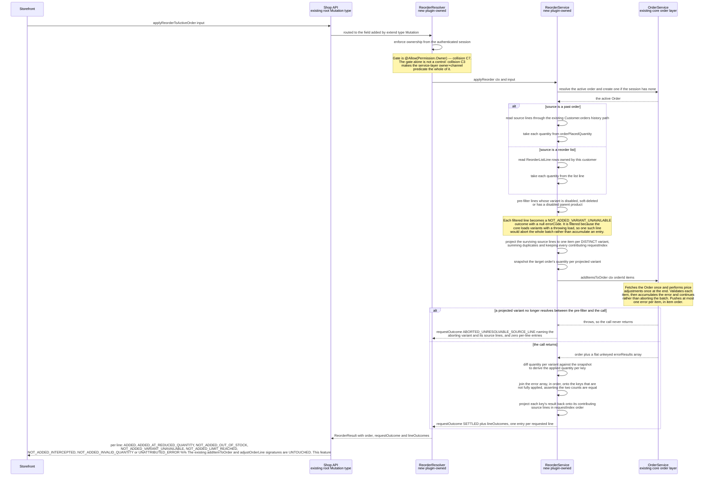

# FEATURE-001-02: Resolve a past order or a saved reorder list into active-cart lines through one permission-gated mutation that reports a per-line outcome, so that a returning buyer stops rebuilding a repeat purchase variant by variant

Parent epic: `tickets/EPIC-001-reorder-and-replenishment.md`. The parent epic and the sibling features are written as paths rather than as links, following the epic's own convention of keeping the link count in a file equal to the number of children that file indexes [tickets/EPIC-001-reorder-and-replenishment.md:§3. How To Read This Epic]. The only links in this file are the four story links in section 3.

This file is one of the four on the epic's curated read path, and the question it exists to answer is a narrow one: **how does a reorder actually reach the cart, and which existing service does the work** [tickets/EPIC-001-reorder-and-replenishment.md:§3. How To Read This Epic]. Sections 2.6 and 2.7 answer it directly. A reader who opens only this file should stop at the end of section 2.8 with that answer complete.

---

## 1. Feature Title

**Resolve a past order or a saved reorder list into active-cart lines through one permission-gated mutation that reports a per-line outcome, so that a returning buyer stops rebuilding a repeat purchase variant by variant.**

Short name, used verbatim wherever this feature is referred to in one phrase, and identical to the label the epic's features index gives it: **Reorder from Order History and Saved Lists** [tickets/EPIC-001-reorder-and-replenishment.md:§4. Features Index]. The long form above is the action-object-outcome title this tier requires; the short form is the name to cite.

The epic classifies this feature's deviation from its originally suggested area as **expanded**, and the rationale is mechanical rather than editorial: the suggested area covered reorder from order history only, and this feature absorbs list-to-cart materialisation as well **because both paths converge on the same core call, `OrderService.addItemsToOrder` [packages/core/src/service/services/order.service.ts:L654], so splitting them across two features would duplicate the per-line partial-failure contract in both** [tickets/EPIC-001-reorder-and-replenishment.md:§4. Features Index]. One contract, described once, consumed by both source paths, is the whole of the reason the boundary was drawn here.

Delivery is part of the single self-contained plugin package the epic describes — `packages/reorder-plugin/`, exporting `ReorderPlugin`. No file under `packages/core` or `packages/admin-ui` is edited to deliver it.

---

## 2. Feature Summary

### 2.1 The Capability

A returning buyer takes one past order, a chosen subset of that order's lines, or one saved reorder list, and turns it into lines on their active cart through a single Shop API mutation. **For a request that settles, that mutation returns an outcome for every requested line** — applied at the requested quantity, partially applied at a reduced quantity, or not applied with a named error type — rather than succeeding or failing as a whole. Section 2.6a specifies how each outcome is keyed back to the source lines that produced it; section 2.6b specifies the single request-level outcome a request that does **not** settle returns instead, because one class of unavailability ends the platform call outright and cannot be reported per line.

### 2.2 Contribution To The Epic

This feature is the epic's batch B2, "Reorder execution" [tickets/EPIC-001-reorder-and-replenishment.md:§9.4 Run Batches]. It owns three steps of the returning-buyer journey: opening a past order through the existing history read path, applying a reorder to the active order, and producing the per-line outcome report [tickets/EPIC-001-reorder-and-replenishment.md:§2.5 The Returning-Buyer Journey This Epic Builds]. It is the feature that discharges the objective's central promise — that a repeat purchase costs materially less effort than rebuilding an order from scratch — and the epic nominates this feature's first story as the one demonstrable slice a non-coder can be shown, on the ground that its traceability label is a quoted objective clause rather than an inference [tickets/EPIC-001-reorder-and-replenishment.md:§9.6 Nomination].

Read the contribution precisely, because this feature is a *write* path and nothing more:

- **It does not decide what a buyer should be warned about before committing.** The pre-commit price and availability delta read belongs to FEATURE-001-03, which consumes the commit path this feature builds.
- **It does not decide what happens to a line that cannot be added.** Skip, reduce, substitute and abort belong to FEATURE-001-04. This feature reports the outcome; it does not offer the buyer a resolution choice.
- **It does not own the list tables.** `ReorderList` and `ReorderListLine` are FEATURE-001-01's, and this feature only reads them [tickets/EPIC-001/FEATURE-001-01-named-reorder-lists.md:§2.4 Named Entities Touched].
- **It does not record the attempt or publish the event.** The audit rows and the typed events belong to FEATURE-001-07, which depends on this feature for the outcome it records.

### 2.3 Named Entities Touched

**This feature introduces no new table.** That is a deliberate design outcome and not an omission: every row it needs already exists, either in the platform's own order tables or in FEATURE-001-01's list tables, so the feature reads and never owns. The consequence is stated plainly in section 5 — there is no additive migration in this feature, and the only migration evidence it carries is that it added none.

Existing platform entities, read and never altered:

- **`Order`** [packages/core/src/entity/order/order.entity.ts:L44], declared as implementing `ChannelAware` and `HasCustomFields`. Seven of its columns are load-bearing here. `code` is the uniquely indexed buyer-facing reference [packages/core/src/entity/order/order.entity.ts:L70], and its own JSDoc states it is the reference to show a customer rather than the id — which is why a reorder input may address a source order by either. `state` [packages/core/src/entity/order/order.entity.ts:L72] and `active` [packages/core/src/entity/order/order.entity.ts:L82], the latter defaulting to true, are what separate a *past* order from the cart being written to. `orderPlacedAt` [packages/core/src/entity/order/order.entity.ts:L92] is the indexed timestamp that makes "the order I placed last" orderable, and `currencyCode` [packages/core/src/entity/order/order.entity.ts:L142] is what makes a currency mismatch between source and target detectable rather than silent. Ownership is read from `customerId` [packages/core/src/entity/order/order.entity.ts:L99], and the target cart's lines from `lines` [packages/core/src/entity/order/order.entity.ts:L102].
- **`OrderLine`**. Two columns define what a reorder actually copies. `quantity` is the live quantity [packages/core/src/entity/order-line/order-line.entity.ts:L97]; `orderPlacedQuantity` is the quantity as at placement [packages/core/src/entity/order-line/order-line.entity.ts:L104]. **The distinction is not cosmetic and a story that picks the wrong one is wrong:** a source line's reorder quantity is taken from `orderPlacedQuantity`, because that is what the buyer actually bought, whereas `quantity` on a historical order can have been altered by an administrative modification after placement. The line's price columns — `initialListPrice` [packages/core/src/entity/order-line/order-line.entity.ts:L113], `listPrice` [packages/core/src/entity/order-line/order-line.entity.ts:L121] and `listPriceIncludesTax` [packages/core/src/entity/order-line/order-line.entity.ts:L128] — are read by FEATURE-001-03 and are named here only so that no story in *this* feature copies a historical price onto a new line.
- **`ProductVariant`**. The target of every projected line. This feature reads the variant identifier and nothing else; the variant's `enabled` state is asserted by the core call described in section 2.6, not by plugin code.
- **`Channel`**. Supplies the request scope described in section 2.9.

Existing plugin-owned entities from FEATURE-001-01, read and never altered:

- **`ReorderList`** and **`ReorderListLine`**, the latter carrying the parent list id, a `ProductVariant` id and an integer quantity [tickets/EPIC-001/FEATURE-001-01-named-reorder-lists.md:§2.4 Named Entities Touched]. The list path projects one requested line per `ReorderListLine` row, taking the quantity from the row rather than from history. This is the only part of this feature that depends on FEATURE-001-01 at all, which is what section 4.1's qualifier means.

### 2.4 Named Services

- **`OrderService` — existing, in `packages/core`, consumed and never modified.** Four members are named, and the distinction between the one this feature calls and the ones it must leave alone is the point of naming them:
  - `addItemsToOrder` [packages/core/src/service/services/order.service.ts:L654] — **the single call this feature is built around.** Section 2.6 sets out its contract in full.
  - `getActiveOrderForUser` [packages/core/src/service/services/order.service.ts:L429] — resolves an existing cart for the authenticated user, returning `Order | undefined`. Its own description is that it returns any Order for that User's Customer account still in the `active` state.
  - `addItemToOrder` [packages/core/src/service/services/order.service.ts:L622] and `adjustOrderLine` [packages/core/src/service/services/order.service.ts:L774] — **named here as signatures that must remain untouched**, not as call targets. Both are also the two operations the epic's first collision would widen as a side effect if this epic declared a custom field on `OrderLine`, which is why they are the specific pair section 5 requires evidence for [tickets/EPIC-001-reorder-and-replenishment.md:§6.1 Repository-Discovered Collisions].
  - `applyPriceAdjustments` [packages/core/src/service/services/order.service.ts:L2311] — named so that no plugin code calls it directly. The bulk add already performs the adjustment pass, as section 2.6 records.
- **`ActiveOrderService` — existing, consumed.** Its `getActiveOrder` overload taking `createIfNotExists` as `true` returns a non-optional `Order` [packages/core/src/service/helpers/active-order/active-order.service.ts:L84-L88], creating one through `OrderService.create` [packages/core/src/service/services/order.service.ts:L455] when the session has none [packages/core/src/service/helpers/active-order/active-order.service.ts:L63-L64]. This is the mechanism section 2.8's ruling rests on, and it resolves the cart through the deployment's configured active-order strategy rather than through a plugin assumption.
- **`ReorderService` — new, plugin-owned.** Holds the whole of this feature's logic: resolving the source, enforcing ownership, projecting source lines into the shape the core bulk add accepts, calling it once, and mapping its returned errors back onto the requested lines. Both source paths and all four stories go through this one service, so the outcome contract has exactly one implementation to review.
- **`ReorderListService` — existing after FEATURE-001-01, plugin-owned, read only.** The list path resolves its source rows through it rather than querying the list tables directly, so the ownership rule that feature already implements is not reimplemented here [tickets/EPIC-001/FEATURE-001-01-named-reorder-lists.md:§2.5 Named Services].
- **`TransactionalConnection` — existing, consumed.** This feature writes no plugin-owned row, so its use here is confined to reading within the request's transaction [tickets/EPIC-001-reorder-and-replenishment.md:§7.4 Existing Entities And Services The Work Depends On].

### 2.5 Named API Surfaces — One New Mutation, Zero Existing Signatures Changed

**Existing read paths this feature consumes and does not extend:**

- `Customer.orders(options: OrderListOptions): OrderList!` [packages/core/src/api/schema/common/customer.type.graphql:L11] — the order-history read path, reachable through the `activeCustomer` root query [packages/core/src/api/schema/shop-api/shop.api.graphql:L5] and already paginated, sortable and filterable. Section 2.6 records the prohibition attached to it.
- `activeOrder: Order` [packages/core/src/api/schema/shop-api/shop.api.graphql:L11] — the cart read. Its own docstring is directly relevant to section 2.8: it states that the value is null until an Order is created via `addItemToOrder`.
- `order(id: ID!): Order` [packages/core/src/api/schema/shop-api/shop.api.graphql:L34] — a single order by id, whose docstring records that in the Shop API only orders belonging to the currently-authenticated User may be queried. A storefront reads a candidate source order through this or through `orderByCode` [packages/core/src/api/schema/shop-api/shop.api.graphql:L41]; neither is altered.

**The one new operation**, added through the plugin's `shopApiExtensions` using `extend type Mutation` — the mechanism the shipped wishlist example already demonstrates [packages/dev-server/example-plugins/wishlist-plugin/api/api-extensions.ts:L16-L19]:

- `applyReorderToActiveOrder` — accepts **either** a source order reference **or** a reorder-list reference, optionally narrowed to a subset of source lines, optionally carrying the resolution policy declared below, and returns a per-line outcome report. One mutation rather than two is a direct consequence of the expanded scope in section 1: two mutations would need two copies of the outcome contract.

**The whole input shape is fixed here, including the fields only a later feature gives behaviour to. This is deliberate and it is the point of this paragraph.** A published GraphQL input is a contract; adding a field to it later is additive for a client but it *does* reshape an operation this feature already shipped, and a reader tracking the epic's promise that no published surface is redefined would be entitled to call that a breach. So the fields FEATURE-001-04 needs are declared in the initial version of the input, with the default behaviour this feature implements, rather than appearing in a second batch:

- **A per-line resolution choice**, optional, naming for a given source line one of `skip`, `reduce quantity`, `substitute` or `abort` — the four labels FEATURE-001-04 fixes and this feature does not rename [tickets/EPIC-001/FEATURE-001-04-unavailable-line-resolution.md:§2.3 The Four Resolution Outcomes]. **Under this feature, supplying any value other than the default is rejected as an unsupported argument value rather than silently ignored**, because a silently ignored resolution choice is worse than an absent field: a buyer would believe they had chosen.
- **A request-level default policy**, optional, with exactly one value published by this feature — the abort-on-unresolvable-line behaviour section 2.6b rules. FEATURE-001-04 adds the further values and the behaviour behind them.
- **A substitution acceptance reference**, optional, unused by this feature and reserved for the candidate a buyer accepts. It is declared nullable and is documented as reserved, so that adding its behaviour later changes no signature.

**What FEATURE-001-04 therefore contributes is behaviour, not shape**, and that feature records the same division from its own side [tickets/EPIC-001/FEATURE-001-04-unavailable-line-resolution.md:§2.7 Named API Surfaces]. The epic's operation count is unaffected: this remains one new mutation, and the resolution work adds none.

**The published contract, in full and final form.** Every argument, input field, payload field, enum member, union member and nullability is fixed here rather than left to a story, and it is fixed **including the fields later features need** — `lineResolutions` is declared now even though FEATURE-001-04 is the feature that gives its values meaning. That is deliberate and is explained under the third reading below. Every name was collision-checked against both checked-in introspection snapshots and none exists in either [schema-shop.json:data.__schema.types] and [schema-admin.json:data.__schema.types].
```graphql
extend type Mutation {
  applyReorderToActiveOrder(input: ApplyReorderInput!): ApplyReorderResult!
}
"Exactly one of the two fields is set. Both set, or neither set, is a request-level input failure."
input ReorderSourceInput {
  sourceOrderId: ID
  reorderListId: ID
}
input ApplyReorderInput {
  source: ReorderSourceInput!
  "Omitted or null means every line of the source. An empty list is NOT the same as omitted."
  lineSelections: [ReorderLineSelectionInput!]
  "Per-line resolution choices, keyed by requestIndex. Owned by FEATURE-001-04; [] until then."
  lineResolutions: [ReorderLineResolutionInput!]
}
"Identifies one source line. Exactly one of the two id fields is set, matching the source form."
input ReorderLineSelectionInput {
  sourceOrderLineId: ID
  reorderListLineId: ID
  "Omitted means the source line's own quantity. Must be a positive integer when given."
  quantity: Int
}
input ReorderLineResolutionInput {
  requestIndex: Int!
  action: ReorderLineResolutionAction!
  "Required when action is REDUCE. Must not exceed the addable quantity FEATURE-001-03 reported."
  quantity: Int
  "Required when action is SUBSTITUTE."
  substituteProductVariantId: ID
}
enum ReorderLineResolutionAction { SKIP, REDUCE, SUBSTITUTE, ABORT_IF_UNAVAILABLE }
type ReorderResult {
  "The target cart after the write. Mirrors UpdateMultipleOrderItemsResult.order."
  order: Order!
  "Exactly one entry per requested line, in requestIndex order. Never sparse."
  lineOutcomes: [ReorderLineOutcome!]!
  "Core error results that could not be attributed to exactly one requested line. Usually empty."
  unattributedErrorCodes: [ErrorCode!]!
  "The source order's currencyCode, or the channel default for the list path."
  sourceCurrencyCode: CurrencyCode!
  "The target cart's currencyCode. Differs from sourceCurrencyCode only on a mismatch."
  targetCurrencyCode: CurrencyCode!
  "SETTLED where the core call returned; ABORTED_UNRESOLVABLE_SOURCE_LINE where it threw. See 2.6b."
  requestOutcome: ReorderRequestOutcome!
  "Non-null only when requestOutcome is ABORTED_UNRESOLVABLE_SOURCE_LINE: the variant that ended the request."
  abortingProductVariantId: ID
  "Empty unless aborted: the source lines that projected into the aborting variant."
  abortingSourceLineIds: [ID!]!
}

enum ReorderRequestOutcome {
  SETTLED
  ABORTED_UNRESOLVABLE_SOURCE_LINE
}
type ReorderLineOutcome {
  "Zero-based position of this line in the request. Assigned by the plugin, not by core."
  requestIndex: Int!
  sourceOrderLineId: ID
  reorderListLineId: ID
  productVariantId: ID!
  requestedQuantity: Int!
  "Derived from the target cart's per-variant line quantity delta. 0 when nothing was added."
  addedQuantity: Int!
  orderLineId: ID
  outcome: ReorderLineOutcomeCode!
  "The exact core error type's code where one applies to this line alone. Null otherwise."
  errorCode: ErrorCode
}
enum ReorderLineOutcomeCode {
  ADDED
  ADDED_AT_REDUCED_QUANTITY
  NOT_ADDED_OUT_OF_STOCK
  NOT_ADDED_VARIANT_UNAVAILABLE
  NOT_ADDED_LIMIT_REACHED
  NOT_ADDED_INTERCEPTED
  NOT_ADDED_INVALID_QUANTITY
  SKIPPED_BY_RESOLUTION
  SUBSTITUTED
  "Only where the section 2.6a count assertion fails. The error array is then reported at request level."
  UNATTRIBUTED_ERROR
}
union ApplyReorderResult =
    ReorderResult
  | NoReorderableLinesError
  | ReorderListNotFoundError
  | NoActiveOrderError
  | OrderModificationError
```
Five readings of that contract are load-bearing:
- **A plugin-owned union is mandatory, because the core union cannot be extended.** `union UpdateOrderItemErrorResult` is declared in core [packages/core/src/api/schema/common/common-error-results.graphql:L112-L117] and a plugin cannot add a member to it without editing `packages/core`, which the epic's zero-edit boundary forbids. `ApplyReorderResult` is therefore plugin-owned, and it needs its own `__resolveType` field resolver registered in the plugin's resolvers array — ruling R8 [tickets/EPIC-001-reorder-and-replenishment.md:§6.4 The Settled Rulings]. Mirroring the published payload, which mechanism two requires, means matching its *shape*, not reusing its union.
- **Per-line failures are not top-level union members, and the two levels are separated deliberately.** `ApplyReorderResult`'s error members are the four request-level conditions only. A line that could not be added is reported inside `lineOutcomes` with its own `outcome` code and `errorCode`, because a reorder in which one line of eight failed is a **success carrying a report**, not a failure. `InsufficientStockError`, `OrderLimitError`, `NegativeQuantityError` and `OrderInterceptorError` therefore never appear as top-level results of this mutation; their codes appear on individual outcomes.
- **`lineResolutions` is declared now so that FEATURE-001-04 changes nothing later.** F4 adds the resolution behaviour; if it also had to add the input field, it would be modifying an input this feature had already published — which is the silent redefinition the epic's fifth collision exists to prevent [tickets/EPIC-001-reorder-and-replenishment.md:§6.2 Research-Discovered Collisions]. Until F4 ships, a non-empty `lineResolutions` is a request-level input failure rather than a silently ignored field, and that too is a declared behaviour rather than an accident. The same applies to `SKIPPED_BY_RESOLUTION` and `SUBSTITUTED`: both members exist in the enum from the outset and are unreachable until F4, because adding an enum member later is a published-schema change while an unreachable member is not.
- **`errorCode` is typed as the platform's own `ErrorCode` enum**, whose members are generated from every type implementing the error interface [packages/core/src/api/config/generate-error-code-enum.ts:L9], so the outcome report names exact existing error types rather than a parallel vocabulary. Every consuming example that switches on it carries a default branch, per ruling R9.
- **Both currency codes are on the payload, which is what makes a mismatch a reported outcome rather than a hidden one.** Section 2.9 fixes the behaviour; these two fields are how a client observes it.
**The single-vocabulary rule, which every story in this feature is held to.** The schema above is the only normative statement of the payload, and every story uses these type and field names verbatim rather than paraphrasing them. Three consequences are stated so no story re-derives them differently. **There is no separate "errors" or "failures" collection, and no story may describe one** — a reorder that fully succeeds returns `lineOutcomes` in which every entry carries an `ADDED` outcome and a null error, and the phrase "an empty failure list" is not the contract. **One vocabulary correlates the report across both source paths**: an entry names its source line through the same pair of nullable identifier fields the selection input uses, `sourceOrderLineId` and `reorderListLineId`, exactly one of which is set and which one being fixed by the source form, so a consumer reads the report and the input it sent in the same terms rather than in two vocabularies. **Quantities are integers and no monetary value appears in the outcome at all** — `requestedQuantity` and `addedQuantity` are counts, and prices live on the returned `order`, where the platform already expresses money as an integer in the smallest currency unit.
**The source-size bound.** The number of source lines one call accepts is bounded, and the bound is not a figure this feature invents: it is the lines-per-list maximum for a list source and the same configured maximum for an order source, which the epic carries as an open product decision [tickets/EPIC-001-reorder-and-replenishment.md:§8.1 Product Decisions] under the rule that binds every collection and every collection-scale workload in this epic [tickets/EPIC-001-reorder-and-replenishment.md:§7.7 Bounded Collections]. Two consequences are stated rather than implied: a request whose source resolves to more lines than the bound is refused with `OrderLimitError` [packages/core/src/api/schema/common/common-error-results.graphql:L37] rather than truncated silently, and **the outcome and error collections are bounded by construction** because both are one-per-requested-line and the requested lines are bounded. The bound is what makes the maximum-source benchmark scenario in the epic a defined measurement rather than an open-ended one [tickets/EPIC-001-reorder-and-replenishment.md:§7.6 Data-Volume Assumptions And The Benchmark Workflow].

No Admin API operation is added by this feature. No query is added by this feature at all — the history read path already exists, and adding a reorder-specific one is explicitly prohibited in section 2.6.

**The additive-only constraint stated as a countable surface rather than as an intention.** The Shop API root `Query` type declares nineteen root queries [packages/core/src/api/schema/shop-api/shop.api.graphql:L1-L52], and the order, cart and customer-account mutation sets live in the same file under `type Mutation` [packages/core/src/api/schema/shop-api/shop.api.graphql:L70]. Every one of those signatures is byte-identical after this feature ships. Five of them are named individually in section 5 because this feature reads or writes the same order rows they do: `addItemToOrder` [packages/core/src/api/schema/shop-api/shop.api.graphql:L72], `addItemsToOrder` [packages/core/src/api/schema/shop-api/shop.api.graphql:L74], `removeOrderLine` [packages/core/src/api/schema/shop-api/shop.api.graphql:L76], `removeAllOrderLines` [packages/core/src/api/schema/shop-api/shop.api.graphql:L78] and `adjustOrderLine` [packages/core/src/api/schema/shop-api/shop.api.graphql:L80].

Where a platform mechanism would widen an existing signature as a side effect of an otherwise additive change, that is a reportable violation recorded in the epic's collision section and referenced here rather than re-argued or quietly absorbed [tickets/EPIC-001-reorder-and-replenishment.md:§6.1 Repository-Discovered Collisions]. Two of this file's citations are the schema's own admissions of exactly that: the docstring above `addItemToOrder` states that a third `customFields` argument becomes available if custom fields are defined on the `OrderLine` entity [packages/core/src/api/schema/shop-api/shop.api.graphql:L71], and the docstring above `adjustOrderLine` says the same for an argument of type `OrderLineCustomFieldsInput` [packages/core/src/api/schema/shop-api/shop.api.graphql:L79]. This feature therefore declares no custom field on any core entity.

### 2.5.1 Operation Ownership And Test Matrix — Every Published Surface, Its Owning Story, And Its Required Tests

Every surface this feature publishes, the story that owns it, and the tests that have to pass for it. The matrix exists because a definition of done that delegates to child stories cannot show that a published surface has an owner at all [tickets/EPIC-001-reorder-and-replenishment.md:§12. Definition of Done (Epic-Level)]. **A row with no owning story fails this feature's definition of done**, and so does a row whose end-to-end column is discharged by a unit test.

| # | Published surface or contract element | Owning story | Required unit cases | Required end-to-end cases, written against `@vendure/testing` [packages/testing/src/index.ts:L1-L14] | Named regression |
|---|---|---|---|---|---|
| 1 | `applyReorderToActiveOrder` with an order source | 02-01 | source-line projection from `orderPlacedQuantity`; ownership check; error-to-line correlation | whole past order at its placed quantities; source reference matching no row; source order owned by another customer, asserting a response identical to the previous case; unauthenticated; a line short of stock landing reduced with the exact error; every line clamping to zero; a source exceeding the configured maximum refused with `OrderLimitError` [packages/core/src/api/schema/common/common-error-results.graphql:L37] | `addItemToOrder` and `activeOrder` unchanged, evidenced by the existing `shop-order` specification re-run unmodified |
| 2 | `applyReorderToActiveOrder` narrowed to selected lines | 02-02 | selection filtering; empty selection | exact selected count in the requested order; a selection naming a line of another order; an empty selection; unauthenticated; foreign channel token | as row 1 |
| 3 | `applyReorderToActiveOrder` with a list source | 02-03 | list-line projection; list ownership check | list materialised at its per-line quantities; list not owned by the caller; list resolving to zero lines returning `NoReorderableLinesError`; unauthenticated; foreign channel token; list at the configured maximum | `addItemsToOrder` unchanged |
| 4 | The `lineOutcomes` correlation and the `errorResults` collection | 02-04 | correlation when several lines fail; correlation when the same variant appears twice in the source | a partial reorder in which some lines land and others fail, asserting an exact entry count in `lineOutcomes`, an exact entry count in `errorResults`, and that every failed line is named in both; `InsufficientStockError` carrying `quantityAvailable` [packages/core/src/api/schema/common/common-error-results.graphql:L53]; `OrderLimitError` on a source at the order-level limit | the published `UpdateMultipleOrderItemsResult` shape unchanged [packages/core/src/api/schema/shop-api/shop.api.graphql:L298-L300] |
| 5 | The permission gating the mutation, plus in-resolver ownership | 02-01, and inherited by 02-02, 02-03 and 02-04 | session-derived ownership resolution | the mutation refused for a caller holding no such permission, and refused for a caller authenticated as a different customer while holding it, asserting in both cases that no line was written | the published `Permission` enum grows only by the members this definition adds |
| 6 | The configured maximum source size | 02-01 for the order path, 02-03 for the list path | bound check before the core call | a source one line under the bound succeeding; a source one line over it refused with `OrderLimitError` and no line written; the maximum-source commit-path benchmark scenario run and its two measurements reported [tickets/EPIC-001-reorder-and-replenishment.md:§7.6 Data-Volume Assumptions And The Benchmark Workflow] | none — the bound is new surface |

**This feature owns no table and no migration**, so the matrix has no table row and the engine coverage it needs is behavioural rather than schema-level. Every end-to-end case above runs on the four engine jobs that already exist [.github/workflows/build_and_test.yml:jobs], because every one of them writes an order row.

### 2.6 The Existing Mechanisms This Feature Consumes Rather Than Rebuilds

The epic's do-not-duplicate inventory assigns this feature three mechanisms, each with a prohibition attached [tickets/EPIC-001-reorder-and-replenishment.md:§5. Existing Mechanisms That Must Not Be Duplicated]. **This is the section that answers the question this file exists to answer, and the most consequential finding in the whole feature is in it: a per-item error-accumulating bulk add already exists at both the service layer and the API layer.** A ticket that re-specified it would be duplicating shipped work. A ticket that ignored it would ship a second, incompatible partial-success contract alongside a published one. Neither is acceptable, so the new mutation is positioned as a *caller* of the first and a *mirror* of the second.

#### Mechanism one — `OrderService.addItemsToOrder`, the service-layer bulk add

`addItemsToOrder` [packages/core/src/service/services/order.service.ts:L654] was added to the public service surface as `@since 3.1.0` [packages/core/src/service/services/order.service.ts:L652]. Its own JSDoc is the specification this feature builds against, and it makes two mechanical claims [packages/core/src/service/services/order.service.ts:L643-L650]: the method **fetches the entire Order once** and **performs price adjustments once at the end**, and because it can return more than one error result, a caller is directed to inspect the `errorResults` array to determine whether any errors occurred. Its declared return type states the same thing in the type system — a resolved object carrying both an `order` and an `errorResults` array [packages/core/src/service/services/order.service.ts:L663].

Its per-item behaviour is what makes it the right call for a reorder, and it was read rather than assumed:

- **Each item is validated through a four-step chain** — `assertQuantityIsPositive`, `assertAddingItemsState`, `assertNotOverOrderItemsLimit` and `assertNotOverOrderLineItemsLimit` [packages/core/src/service/services/order.service.ts:L675-L679]. The second of those is why the target must be an order still accepting items, and the third and fourth are why a large reorder can partially fail on limits rather than on stock.
- **On a validation failure it accumulates the error and continues to the next item** rather than aborting the batch [packages/core/src/service/services/order.service.ts:L680-L683]. Partial success is therefore the core method's existing semantics for *this class of failure*, not something the plugin adds on top.
- **But the accumulation is partial in three specific ways, and every one of them constrains this feature.** They are read from the method body rather than from its docstring, and the epic records them as collision C8 [tickets/EPIC-001-reorder-and-replenishment.md:§6.1 Repository-Discovered Collisions]:
  - **The accumulator carries no key.** `errorResults` is a flat array of error results with no index and no variant identifier [packages/core/src/service/services/order.service.ts:L665]. Two lines failing with the same error type are indistinguishable in the return value.
  - **A successful item pushes nothing onto it.** The array's length and ordering therefore carry no positional relationship to the requested items, so the *n*-th error result is not the *n*-th requested line.
  - **An unresolvable variant throws instead of accumulating.** The variant is loaded with a throwing accessor requiring `enabled: true` and a null `deletedAt` [packages/core/src/service/services/order.service.ts:L684-L689], and a disabled parent product raises an explicit throw [packages/core/src/service/services/order.service.ts:L692-L693]. There is no `try` and no `catch` in the method, so either case abandons the loop — and under the `@Transaction()` decorator the surrounding transaction is rolled back [packages/core/src/connection/transaction-wrapper.ts:L67-L70], discarding **every line already written**. One item disabled since the last purchase would abort the whole reorder.
- **The pre-filter is not a duplication of the core's check, and it is not a second partial-success contract.** It is the price of the core's check being a throw. The prohibition attached to this mechanism forbids a per-variant *add loop* and an invented partial-success *payload* [tickets/EPIC-001-reorder-and-replenishment.md:§5. Existing Mechanisms That Must Not Be Duplicated]; reading each source line's variant once to decide whether it is addable is neither. The single bulk call remains exactly one call.
- **Reordering a past order is the case that makes this unavoidable.** A source order is historical data, so its lines routinely point at variants that have since been disabled or deleted — that is the second of the three edge-case categories every story in this set must cover. A contract in which one such line discards the entire reorder would make the feature fail for exactly the buyers it is built for, and it would contradict the resolution decision tree FEATURE-001-04 draws, whose disabled-or-deleted branch is a per-line outcome offered a choice of `skip`, `substitute` or `abort` rather than a request-level failure [tickets/EPIC-001/FEATURE-001-04-unavailable-line-resolution.md:§2.9 Figure F4-FLOW — The Unavailable-Line Resolution Decision Tree]. That feature reaches the same conclusion from the same evidence and names the division of labour between the two files explicitly [tickets/EPIC-001/FEATURE-001-04-unavailable-line-resolution.md:§2.4 What The Commit Path Already Does Today — The Question This File Exists To Answer].
- **What remains a request-level failure is a source that cannot be resolved at all** — an unresolvable order or list reference, a reference belonging to another customer, or a source in a foreign channel — and a source resolving to zero requested lines, which is `NoReorderableLinesError`. Those are properties of the *source*, not of one line within it.
**One deliberate ordering consequence.** Because the pre-filter reads each source line's variant, the availability state it records is read *before* the core call rather than during it, so it is a point-in-time read in the sense section 2.10 describes: a variant disabled in the moment between the filter and the write produces a thrown error from the core rather than a skip. That residual race is stated rather than designed away, and the correct behaviour is to surface it as a request-level failure and let the caller retry — the alternative, wrapping the core call to translate a throw into an outcome, would mean guessing which line threw, because the exception identifies a variant and not a source line. **Section 2.6b turns that residual race into an explicit request-level outcome rather than leaving it as a warning**, and it is the reason the per-line guarantee in this feature is always stated with "for a settled request" attached.

**This reverses an instruction an earlier version of this section gave.** It said plugin code does not pre-filter disabled or deleted variants "because the core call already does". The core call does not filter them — it throws on them, which is not the same thing and is precisely why the epic's ruling R4 puts prevalidation in the plugin. Section 2.13 sets out the five-step contract that replaces the earlier instruction.

*The prohibition, quoted in substance from the epic:* do not write a per-variant add loop, and do not invent a second partial-success mechanism inside the platform's write path [tickets/EPIC-001-reorder-and-replenishment.md:§5. Existing Mechanisms That Must Not Be Duplicated]. **The prohibition is narrower than "map the errorResults into the report", and the difference matters:** the plugin calls the service exactly once per reorder, and it derives each line's applied quantity from the target order's own per-variant line quantities rather than from the unkeyed error array.

**What "one call" does and does not buy, stated precisely, because the honest version is weaker than the flattering one.** A single call avoids what a per-variant loop would repeat *outside* the item work: one active-order resolution, one order fetch, and one price-adjustment pass over the finished order [packages/core/src/service/services/order.service.ts:L751]. **It does not make the work constant.** The method's own body iterates the input array and, per item, runs the four-step validation chain [packages/core/src/service/services/order.service.ts:L675-L679], resolves the variant with its `enabled` and `deletedAt` predicate [packages/core/src/service/services/order.service.ts:L684-L689], and performs the line write. The cost therefore scales with the number of source lines whichever way it is called, and three obligations follow:

- **No ticket in this feature or its stories may present the single call as evidence of a constant query count.** What it is evidence of is a constant number of *order-level* operations. A story that wants to claim a query count claims it as a measurement, not as an inference from the call site.
- **The source size is bounded** as section 2.5 states, so the per-item work has a stated ceiling rather than an open one.
- **The comparison is measured, not asserted.** The epic's commit-path benchmark scenario runs this mutation at the maximum source size against the same line count added one at a time through the existing single-item mutation, and reports both measurements and their difference [tickets/EPIC-001-reorder-and-replenishment.md:§7.6 Data-Volume Assumptions And The Benchmark Workflow]. If the bulk path does not win, the number says so.

#### Mechanism two — the already-published API-layer bulk contract

This is the half that is easiest to miss and most expensive to get wrong, so it is stated in as many words: **the partial-success contract is already public. This feature and story 02-04 must consume or mirror that contract, and must not invent a competing one.**

The published mutation is `addItemsToOrder(inputs: [AddItemInput!]!): UpdateMultipleOrderItemsResult!` [packages/core/src/api/schema/shop-api/shop.api.graphql:L74], and its own SDL docstring states that it returns a list of errors for each item that failed to add and will still add the successful items [packages/core/src/api/schema/shop-api/shop.api.graphql:L73]. The payload it returns is defined in the same file and is not abstract — it is two fields:

```graphql
"""
Returned when multiple items are added to an Order.
The errorResults array contains the errors that occurred for each item, if any.
"""
type UpdateMultipleOrderItemsResult  {
    order: Order!
    errorResults: [UpdateOrderItemErrorResult!]!
}
```

That type is declared at [packages/core/src/api/schema/shop-api/shop.api.graphql:L298], with `order: Order!` at [packages/core/src/api/schema/shop-api/shop.api.graphql:L299] and `errorResults: [UpdateOrderItemErrorResult!]!` at [packages/core/src/api/schema/shop-api/shop.api.graphql:L300], above its own docstring [packages/core/src/api/schema/shop-api/shop.api.graphql:L294-L297]. Its input type is equally concrete — `input AddItemInput` carrying `productVariantId: ID!` and `quantity: Int!` [packages/core/src/api/schema/shop-api/shop.api.graphql:L303-L305] — which is exactly the shape a reorder's projected source line reduces to, and is why section 2.7 shows the projection step explicitly.

The error union in that payload is closed and its membership was read rather than inferred: `union UpdateOrderItemErrorResult` names exactly `OrderModificationError`, `OrderLimitError`, `NegativeQuantityError`, `InsufficientStockError` and `OrderInterceptorError` [packages/core/src/api/schema/common/common-error-results.graphql:L112-L117]. Three design rules follow directly from that membership:

- **The reorder outcome report's error position reuses those five types rather than restating them.** Each already exists: `OrderModificationError` [packages/core/src/api/schema/common/common-error-results.graphql:L80], `OrderLimitError` with its `maxItems` field [packages/core/src/api/schema/common/common-error-results.graphql:L37], `NegativeQuantityError` [packages/core/src/api/schema/common/common-error-results.graphql:L44], `InsufficientStockError` [packages/core/src/api/schema/common/common-error-results.graphql:L50] and `OrderInterceptorError` [packages/core/src/api/schema/common/common-error-results.graphql:L103].
- **`InsufficientStockError` is how a shortfall is named, and its `quantityAvailable` field is a precedent rather than an input.** It carries `quantityAvailable: Int!` [packages/core/src/api/schema/common/common-error-results.graphql:L53] alongside `order: Order!` [packages/core/src/api/schema/common/common-error-results.graphql:L54], and this feature consumes its *presence* to set a line's outcome code while taking the applied quantity from the target cart's own line delta, per section 2.13. **Two precise limits on that field, because an earlier draft of this bullet overstated it.** First, it arrives only after the platform has already written the shortened line [packages/core/src/service/services/order.service.ts:L736-L749], so it cannot be the input to a decision taken beforehand — which is why FEATURE-001-04 sources the figure a `reduce quantity` resolution is submitted at from the pre-commit preview instead, and uses this error only to reconcile what the commit then did [tickets/EPIC-001/FEATURE-001-04-unavailable-line-resolution.md:§2.8 The Existing Mechanisms This Feature Consumes Rather Than Rebuilds]. Second, the error is not per-line addressable, so it is the correlation contract and not this payload that says which requested line was short. What the field does establish is that an obtainable-quantity integer is **already public** on this platform's Shop API, which is what makes the preview's request-bounded figure a smaller disclosure rather than a new one [tickets/EPIC-001-reorder-and-replenishment.md:§6.4 The Settled Rulings].
- **The outcome report adds a per-line *position*, not a per-line *error vocabulary* — and the plugin, not core, is what supplies the position.** The core `errorResults` array is flat and unkeyed, so the correlation cannot be read out of it: it has to be *constructed*. What the reorder report contributes is that construction, so a buyer sees which of their lines failed rather than that some line did. Section 2.13 is the contract for how it is constructed, and it is the single most consequential design decision in this feature. The array carries no key of any kind: **not one of the five member types carries a variant id, a source-line id or an input index**, as their declarations show — `OrderModificationError` [packages/core/src/api/schema/common/common-error-results.graphql:L80], `OrderLimitError` with only `maxItems` [packages/core/src/api/schema/common/common-error-results.graphql:L37], `NegativeQuantityError` [packages/core/src/api/schema/common/common-error-results.graphql:L44], `InsufficientStockError` with only `quantityAvailable` and `order` [packages/core/src/api/schema/common/common-error-results.graphql:L53-L54] and `OrderInterceptorError` with only `interceptorError` [packages/core/src/api/schema/common/common-error-results.graphql:L103]. The array is also **shorter than the item list**, because a clean add pushes nothing. Section 2.6a specifies the construction and section 2.13 states the five steps it is implemented as.

*The prohibition:* the epic records that partial-success semantics exist at *both* layers and that a story must therefore state which layer it consumes [tickets/EPIC-001-reorder-and-replenishment.md:§5. Existing Mechanisms That Must Not Be Duplicated]. This feature states it once, here, for all four stories: **the plugin service consumes the service layer, and the plugin's published payload mirrors the API layer.** No story in this feature calls the `addItemsToOrder` mutation from inside the server, and no story invents a payload shape that diverges from the two-field form above.

### 2.6a The Keyed Line-Result Contract — How Identity Is Constructed, Not Assumed

**This section exists because the obvious reading of mechanism two is wrong in a way that would ship a report attributing failures to the wrong lines.** The core returns an order and a flat error array; a plugin that zipped that array against its own item list index-for-index would be inferring identity from error order, and the array is not index-aligned — a clean item contributes no entry, so every entry after the first success is off by one. The contract below never performs that zip. It is built from three steps, each of which is independently checkable, plus one assertion that fails loudly rather than guessing.

**Step 1 — the projection makes the variant id a key.** Source lines are projected into the item array the core call accepts, `productVariantId` and `quantity` [packages/core/src/api/schema/shop-api/shop.api.graphql:L303-L305], with **one item per distinct variant**: where two source lines reference the same variant, their quantities are summed into a single item and the report entry for that item carries the identifiers of **every** contributing source line. This is not a convenience. The core resolves an existing line per variant [packages/core/src/service/services/order.service.ts:L669-L674] and additionally sums the quantity already present on other lines of the same variant [packages/core/src/service/services/order.service.ts:L695-L702], so two items naming one variant do not behave independently and could not be reported on independently. **Aggregating first is what makes the variant id a genuine key rather than a label that repeats.** No plugin code sends the same variant twice.

**Step 2 — a before-and-after quantity diff yields the applied quantity per key, with no reference to the error array at all.** The plugin records, for each projected variant, the total quantity that variant already holds on the target order before the call — the sum over `quantity` [packages/core/src/entity/order-line/order-line.entity.ts:L97] of every line of the returned order's `lines` collection [packages/core/src/entity/order/order.entity.ts:L102] naming that variant. The same sum is taken from the order the call returns [packages/core/src/service/services/order.service.ts:L663]. **The difference is the applied quantity for that key**, and it is derived from order state rather than from a diagnostic array, which is what makes it authoritative. Each key then classifies into exactly one of three positions:

- applied equals requested — **fully applied**;
- applied is greater than zero and less than requested — **partially applied**;
- applied is zero — **not applied**.

**Step 3 — the error type is attributed by a join over an independently-computed key set, and the join is proven rather than assumed.** The core's per-item loop pushes **at most one** error for an item and then continues to the next: a validation failure pushes and continues [packages/core/src/service/services/order.service.ts:L680-L683], a clamp to zero pushes and continues [packages/core/src/service/services/order.service.ts:L710-L715], an interceptor rejection pushes and continues to the labelled outer statement [packages/core/src/service/services/order.service.ts:L724-L727], and a downward-adjusted quantity pushes after the line is written [packages/core/src/service/services/order.service.ts:L743-L749]. A clean item pushes nothing. The post-loop pass that re-wraps stock errors with the final order preserves their positions [packages/core/src/service/services/order.service.ts:L754-L761]. **Two properties follow, and together they make the join sound:** the entries appear in item order, and the set of items that produced one is exactly the set of keys step 2 did **not** classify as fully applied. So the plugin orders its own non-fully-applied keys by their position in the item array and pairs them with the error entries in order. **The pairing is over a key set derived from order state, not over the array's own contents — which is the difference between a join and a guess.**

**The assertion that keeps step 3 honest.** Before the pairing is used, the plugin asserts that the count of non-fully-applied keys equals the length of the returned error array. **If it does not, the plugin does not guess.** Every entry projected from a non-fully-applied key is reported with its applied and requested quantities and the outcome `UNATTRIBUTED_ERROR`, the whole error array is reported once at request level in `unattributedErrorCodes` rather than per line, and the condition is logged as a contract violation against the core version in use. This branch exists because the properties above are properties of a version of a method this feature does not own; if a future release makes them false, the report degrades to something visibly incomplete instead of quietly wrong. **A story must include a unit test that forces the mismatch and asserts the degraded shape**, because a defensive branch nothing exercises is a comment.

**Step 4 — the key-level result is projected back onto one entry per requested source line, which is the shape section 2.5 publishes.** Steps 1 to 3 compute a result per *key*; the payload reports per *requested line*, one `ReorderLineOutcome` entry per line in `requestIndex` order and never sparse. The projection is deterministic and is specified here rather than left to a story, because a key carrying two contributing lines has one applied quantity to divide between them. **The key's applied quantity is allocated across its contributing entries in ascending `requestIndex` order, each entry receiving up to its own `requestedQuantity` until the allocation is exhausted**, so the sum of the entries' `addedQuantity` equals the key's applied quantity exactly and no entry ever reports more than it asked for. Where a key carries exactly one contributing line — the ordinary case, since a source order holds one line per variant — the projection is the identity.

**What the report therefore carries per entry**, in the published field names of section 2.5, and every value derivable from steps 1 to 4 without reading the error array for identity:

- `requestIndex`, and the source line it names through `sourceOrderLineId` or `reorderListLineId`, exactly one of which is set;
- `productVariantId`, the key this line projected into, and `requestedQuantity` as an integer;
- `addedQuantity` as an integer, from step 2 by way of step 4's allocation;
- `outcome`, one member of `ReorderLineOutcomeCode`: `ADDED` where the key is fully applied, `ADDED_AT_REDUCED_QUANTITY` where it is partially applied, the matching `NOT_ADDED_*` member where it is not applied and step 3 attributed the reason, and `UNATTRIBUTED_ERROR` where the assertion below fails;
- `errorCode`, where step 3 attributed one: the exact `ErrorCode` member of the error type from the five members of the closed union [packages/core/src/api/schema/common/common-error-results.graphql:L112-L117]. Where that type is `InsufficientStockError`, the `quantityAvailable` integer it carried [packages/core/src/api/schema/common/common-error-results.graphql:L53] is what the reduced `addedQuantity` is reconciled against.

**The guarantee, stated at the strength it actually holds.** Where the request settles — that is, where the core call returns rather than throwing — **every requested line receives exactly one outcome entry, the count of entries equals the count of requested lines, and the sum of their `addedQuantity` equals the sum of the applied quantities over the distinct projected keys**. Section 2.6b states what happens when the request does not settle, and it is deliberately a different guarantee rather than the same one restated. Story 02-04 formalises this contract in the published payload; every other story in this feature consumes it as specified here.

### 2.6b The Request-Level Outcome — What Happens When The Core Call Throws

**Mechanism one records that a disabled or deleted variant, or a disabled parent product, raises a thrown error rather than an accumulated one. This section states the consequence as a contract instead of leaving it as a warning, because the per-line guarantee in section 2.6a cannot cover a call that never returns.**

The mechanics are not in doubt. The bulk add resolves each variant through a call requiring `enabled: true` and a null `deletedAt` [packages/core/src/service/services/order.service.ts:L684-L689], and throws when the parent product is disabled [packages/core/src/service/services/order.service.ts:L692-L693]. There is no `try` and no `catch` anywhere in the method. So one such line ends the whole call, and the lines already written before it are **not** rolled back by the method itself — the plugin's own transaction boundary is what determines whether they survive.

**The ruling, in three parts.**

- **A reorder request has exactly one request-level outcome, always, and it is a field of the response rather than an inference from what is missing.** Its value is `SETTLED` where the core call returned, or `ABORTED_UNRESOLVABLE_SOURCE_LINE` where it threw because a projected variant no longer resolves. A response carrying the second value carries **zero** per-line outcome entries, and that is the specified shape rather than a degenerate one.
- **The per-line guarantee is stated with its precondition attached, everywhere it appears.** "One outcome per requested line" holds **for a settled request**. Neither this feature nor any story in it may state the unconditional form, because the unconditional form is false against this platform. Naming the precondition is what makes the guarantee testable: a story asserts the entry count for a settled request and asserts the request-level value plus an empty entry collection for an aborted one.
- **The aborting line is named, and naming it is what makes the outcome actionable rather than opaque.** Before the core call, the plugin already holds the projected key set from section 2.6a's step 1; the thrown error identifies the variant that failed to resolve. The request-level outcome therefore carries that variant id and the source-line identifiers that projected into it, so a buyer is told *which* item ended the request. That is a report about the request, not a per-line outcome entry, and it is deliberately kept in a different position in the payload so the two are never conflated.

**Why the abort is not smoothed away here, and where the remedy lives.** Pre-filtering unresolvable variants out of the item array would convert this into a per-line outcome — and that is exactly what FEATURE-001-04's `skip` resolution does, deliberately, as its own fourth finding records [tickets/EPIC-001/FEATURE-001-04-unavailable-line-resolution.md:§2.4 What The Commit Path Already Does Today]. **This feature does not silently drop a line**, for one reason stated plainly: dropping a line the buyer asked for is a decision about their order, and the resolution-policy input this feature publishes in section 2.5 is where a buyer takes that decision explicitly. **What this feature does do is prevalidate**, so that a line already known to be unresolvable is reported as a per-line outcome rather than ending the request — which is why the ordinary unavailable-line case is a per-line outcome and not an abort. The abort branch is therefore the residual race: a variant that passes prevalidation and is disabled, deleted or has its parent product disabled between that read and the core call. It is narrow, it is not eliminable without a lock the platform does not offer, and it has a specified shape rather than an undefined one. **The consequence is recorded rather than minimised: on the default policy, one line whose variant was disabled since the last purchase prevents the whole reorder**, and that is the sharpest limitation of this feature.

**The obligation this places on the audit trail, stated here because the contract is this feature's.** An aborted request is still an attempt. FEATURE-001-07 records one attempt row per request with the request-level outcome above, whichever value it takes, which means its recording path cannot sit only on the settled branch [tickets/EPIC-001/FEATURE-001-07-reorder-instrumentation.md:§2.10 Asynchronous Delivery]. This feature states the requirement; that feature owns the mechanism.

#### Mechanism three — the `Customer.orders` order-history read path

The history read already exists as `Customer.orders(options: OrderListOptions): OrderList!` [packages/core/src/api/schema/common/customer.type.graphql:L11] and is already paginated, sortable and filterable through the generated list options.

*The prohibition:* do not add a reorder-specific order-history query [tickets/EPIC-001-reorder-and-replenishment.md:§5. Existing Mechanisms That Must Not Be Duplicated]. This feature reads history through that field and adds only the reorder write path. Concretely, that means a storefront selects the source order itself — sorting on `orderPlacedAt` [packages/core/src/entity/order/order.entity.ts:L92] through the existing list options — and passes an identifier to the new mutation. The mutation does not accept "my most recent order" as a concept, because resolving that would require the query this prohibition forbids.

**A correction that changes what the plugin's own source query must do: `Customer.orders` is not a placed-order-only field.** It resolves through `findByCustomerId`, whose predicate excludes exactly one state — `order.state != 'Draft'` — alongside the customer and channel filters [packages/core/src/service/services/order.service.ts:L336-L357] and specifically [packages/core/src/service/services/order.service.ts:L348]. An in-progress cart is in the `AddingItems` state, not `Draft`, so **the buyer's own active cart is among the rows that field returns.** An earlier reading of this section treated the field as a history read and left the source query to inherit its predicate, which would have let a buyer reorder their current cart into itself — every line doubling, with no error to show for it.

*The rule that follows, and it applies to the plugin's service query rather than to the storefront's read:* the source order is resolved by a predicate of **four** conjuncts — `customerId` equals the session's customer, `channelId` is the active channel, **`orderPlacedAt` is not null**, and `active` is false [packages/core/src/entity/order/order.entity.ts:L82] and [packages/core/src/entity/order/order.entity.ts:L92]. The last two are what make it a *placed* order; the first two are the ownership and scoping predicate ruling R3 requires. A source reference that fails any of the four does not resolve, and the mutation reports it identically to one that matches no row at all — the non-disclosure rule ruling R3 carries. The storefront remains free to read history through `Customer.orders`; what it may not do is rely on that field having filtered the cart out.

### 2.7 Figure F2-SEQ — How A Reorder Reaches The Cart

This is the only diagram in this feature. Story files in this feature carry none and reference this figure by the name **Figure F2-SEQ** instead.



**One reading convention, so the figure is not over-read.** The `OrderService` participant stands for the existing core order layer as a whole, because the active-order resolution step and the bulk add do not live on the same class: the bulk add is `OrderService.addItemsToOrder` [packages/core/src/service/services/order.service.ts:L654], whereas resolving-or-creating the cart runs through `ActiveOrderService.getActiveOrder` [packages/core/src/service/helpers/active-order/active-order.service.ts:L84-L88]. The figure therefore names a method only where the method genuinely belongs to the participant it is drawn against, and describes the active-order step in words instead. Sections 2.4 and 2.8 carry the precise attribution.

Four further readings of the figure are load-bearing and are stated so they are not inferred:

- **The core call happens exactly once per reorder, not once per line.** The single `addItemsToOrder` arrow is the design, and the loop that would replace it is the thing mechanism one prohibits. **The arrow is not a claim about query count**, and the figure deliberately draws the per-item work as a self-loop inside the core participant for that reason: the method iterates its input internally, so one arrow at this boundary sits above N validations, N variant resolutions and N line writes beneath it. Mechanism one states the consequence and the epic's commit-path benchmark measures it rather than assuming it.
- **The two source paths differ only in where the requested lines come from.** Everything after the projection step is shared, which is the concrete form of the "one contract, two sources" argument in section 1.
- **Ownership is enforced before the source is read, not after.** A request authenticated as a different customer is refused at the resolver, so no history row and no list row is read on its behalf.
- **The three steps between the projection and the report are drawn separately because they are separate sources of truth.** The snapshot and the diff establish *what happened* from order state; the join establishes *what the platform called it* from the error array. Collapsing them into one "correlate the errors" arrow is precisely the design section 2.6a rejects, because the error array cannot identify a line.
- **The `alt` branch is a contract, not an error path.** The upper branch is section 2.6b's request-level outcome; it returns a shape, it is asserted by a story, and it is recorded by the audit trail exactly as the lower branch is.
- **The constructed identity is this feature's actual contribution.** The core returns an order and a flat `errorResults` array; deriving one keyed outcome per requested line from those two things is what section 2.6a specifies and what story 02-04 formalises in the published payload.

### 2.8 The No-Active-Order Ruling — Stated, Not Left Implicit

A reorder writes into an active order. What happens when the session has none is a decision, not a detail, so it is taken here rather than left to a story to guess.

**The ruling, in two halves: `applyReorderToActiveOrder` creates the active order through the existing mechanism on a default-strategy deployment — and where the deployment's configured strategy cannot resolve or create a cart, the mutation returns the existing `NoActiveOrderError` rather than letting a thrown error escape. `NoActiveOrderError` is therefore a member of its result union.**

**The second half of that ruling reverses an earlier version of this section, which excluded `NoActiveOrderError` outright. The exclusion was unsafe, and the reason is in this checkout.** The mechanism is `ActiveOrderService.getActiveOrder` invoked with `createIfNotExists` set to `true`, whose overload returns a non-optional `Order` [packages/core/src/service/helpers/active-order/active-order.service.ts:L84-L88]. But *how* it returns one is delegated: it iterates the configured `ActiveOrderStrategy` set, calling `determineActiveOrder` on each with the input for that strategy's name and then `createActiveOrder` where the strategy defines one [packages/core/src/service/helpers/active-order/active-order.service.ts:L96-L112]. When no strategy resolves an order and none defines a create method, **it throws** `UserInputError('error.order-could-not-be-determined-or-created')` [packages/core/src/service/helpers/active-order/active-order.service.ts:L114-L120]. A published mutation whose result union omits that outcome does not thereby prevent it; it merely leaves it undeclared, surfacing as a raw GraphQL error a client has no typed handling for.

**And a plugin mutation cannot be given the strategy's input, which is the constraint that makes the mapping necessary rather than optional.** The generator that injects the `ActiveOrderInput` argument into operations does so for a **fixed list of nineteen core operations named in its source** [packages/core/src/api/config/generate-active-order-types.ts:L58-L78], adding the argument to each [packages/core/src/api/config/generate-active-order-types.ts:L97-L106]. `applyReorderToActiveOrder` is not and cannot be on that list, so no `activeOrderInput` argument is generated for it and it has no way to carry a custom strategy's input. Declaring a plugin-owned imitation of that argument was considered and rejected: the input type is built from the strategies' own `defineInputType` output at boot [packages/core/src/api/config/generate-active-order-types.ts:L41-L47], so a hand-written copy would drift from the deployment's actual configuration the moment a strategy changed.

*The resulting contract, stated as behaviour a test can assert:* the plugin calls `getActiveOrder(ctx, undefined, true)` — an **empty** strategy input — and catches the failure. **Supported without qualification** is any deployment whose configured strategy set can determine or create a cart from an empty input, which includes the default strategy and therefore every unmodified deployment. **Declared and typed** is the other case: the throw is caught and returned as `NoActiveOrderError` [packages/core/src/api/schema/common/common-error-results.graphql:L95], so a storefront on a custom-strategy deployment receives a typed result naming exactly what happened instead of an untyped server error. What the plugin does *not* do is guess at a strategy input.

Three pieces of evidence make creation-on-add the platform-consistent behaviour for the ordinary case:

- **The platform already treats "add an item" as the operation that creates the cart.** The `activeOrder` query's own docstring states the value is null until an Order is created via `addItemToOrder` [packages/core/src/api/schema/shop-api/shop.api.graphql:L7-L11]. A reorder is an add, so it creates. The creation itself runs through `OrderService.create` [packages/core/src/service/services/order.service.ts:L455] when the session has no order [packages/core/src/service/helpers/active-order/active-order.service.ts:L63-L64].
- **The result union of the existing add operations excludes `NoActiveOrderError`.** `union UpdateOrderItemsResult` names `Order` and five error types and does not include it [packages/core/src/api/schema/common/common-types.graphql:L273-L279]. Those operations can afford the omission because the generator gives *them* the strategy input; this mutation cannot, which is exactly why mirroring the published shape stops short of mirroring that omission.
- **The platform has a separate union for operations that genuinely require a pre-existing order.** `union ActiveOrderResult = Order | NoActiveOrderError` [packages/core/src/api/schema/shop-api/shop.api.graphql:L292] is what `NoActiveOrderError` primarily serves. This mutation does not *require* a pre-existing order — it creates one where it can — so it borrows the member without borrowing that union.

**What covers the empty case, which is a different condition and must not be conflated with it.** "There was nothing here to reorder" — an empty source order, a list with no lines, or a selected subset that resolved to nothing — is `NoReorderableLinesError`, which section 2.11 introduces. `NoActiveOrderError` means "the cart could not be determined or created"; `NoReorderableLinesError` means "the source held nothing". A story that returns the first for an empty list, or the second for a strategy failure, has swapped them, and both mistakes are testable rather than matters of interpretation.

### 2.9 Channel Scoping, Language Scoping And Monetary Values

The one new mutation is channel-scoped and language-scoped. This is a property of the request rather than an argument a caller may omit, so it holds without being restated per story [tickets/EPIC-001-reorder-and-replenishment.md:§7.5 Request Prerequisites].

- **Channel.** The active channel is identified by a unique token read from the `vendure-token` request header [packages/core/src/entity/channel/channel.entity.ts:L58], carried as a unique column on `Channel` [packages/core/src/entity/channel/channel.entity.ts:L62]. **A past order placed under one channel token cannot be reordered into a cart on another.** The source order is resolved within the active channel, so an order belonging to a different channel does not resolve at all and the mutation reports it as an unresolvable source rather than reading across the boundary. The same holds for the list path: `ReorderList` stores the id of the channel it was created under, so a list created under one token is not readable under another [tickets/EPIC-001/FEATURE-001-01-named-reorder-lists.md:§2.9 Channel Scoping]. This is a hard boundary, not a filter a caller may widen.
- **Language.** Translated output resolves against the request's `languageCode`, which defaults to the channel's `defaultLanguageCode` [packages/core/src/entity/channel/channel.entity.ts:L74]. This feature stores no string of its own and translates nothing: the outcome report's own fields are identifiers, integer quantities and error type names, none of which is language-varying, while every variant-derived field a report exposes is translated by the existing catalogue read path. A skipped-line *reason* is a machine-readable code, not a localised sentence, precisely so that the report does not become a translation surface this feature would then have to own.
- **Money.** Every monetary value in this feature's payloads is an **integer in the smallest unit of its currency, stated alongside its currency code**, which defaults to `Channel.defaultCurrencyCode` [packages/core/src/entity/channel/channel.entity.ts:L88]. A decimal monetary value is a defect, not a formatting preference. Whether a quoted price is gross or net is governed by `Channel.pricesIncludeTax` [packages/core/src/entity/channel/channel.entity.ts:L113] and by the line's own `listPriceIncludesTax` [packages/core/src/entity/order-line/order-line.entity.ts:L128], so a payload that reports a price without saying which it is has reported nothing. By way of illustration rather than specification: a source line placed at a `listPrice` of 129900 whose variant now prices at 134900, both integers in the smallest unit of the currency named by the accompanying currency code, is a reportable delta — and reporting it is FEATURE-001-03's work, not this feature's.
- **A currency mismatch is a reported outcome, never a silent conversion — and section 2.13 fixes it to exactly one behaviour rather than leaving it to a story.** The source order carries its own `currencyCode` [packages/core/src/entity/order/order.entity.ts:L142]. Where that differs from the currency the reorder context resolves to, **the reorder proceeds, both codes are reported on the payload through `sourceCurrencyCode` and `targetCurrencyCode`, every line is priced in the target's currency by the core call's own adjustment pass, and no conversion is attempted.** No line is skipped for currency alone and no error is returned for it. This feature performs no arithmetic on money at all: it projects variant identifiers and integer quantities, and the target order prices those lines itself through the core call's own adjustment pass. There is consequently no place in this feature where a rate could be applied, which is the strongest form the constraint can take.

### 2.10 A Point-In-Time Read Is Not A Reservation

Availability checked while a reorder is being assembled can change before the reorder is committed, and **nothing in this feature reserves stock**. It is stated at feature level because three of this feature's four stories inherit it and because the mistake it prevents is a natural one.

The sequence is unavoidable: a storefront reads a source order, the buyer decides, and the mutation runs. Between the read and the write, another order can allocate the stock. `addItemsToOrder` performs its own validation at write time [packages/core/src/service/services/order.service.ts:L675-L679], so the authoritative availability decision is the one the core call makes, not the one a preview reported earlier. Two consequences are carried into the stories:

- **A preview that showed a line as addable does not entitle it to be added.** The outcome report is the record of what actually happened; a preview is advisory. A story that asserts a preview and a commit always agree is asserting something this platform does not guarantee.
- **A stale point-in-time read is a required edge case, not a defect to design away.** The correct behaviour is a per-line outcome naming `InsufficientStockError` with its `quantityAvailable` [packages/core/src/api/schema/common/common-error-results.graphql:L53], not a request-level failure and not a retry loop.

FEATURE-001-03 owns the pre-commit read and repeats the same staleness note in its own figure; this feature owns the commit and is the place the staleness actually resolves.

### 2.11 The Error Vocabulary This Feature Introduces

**One** of the six error results the whole ticket set declares belongs to this feature: `NoReorderableLinesError`. The other five belong to FEATURE-001-01 and FEATURE-001-06, and this feature's sibling records the same split from its side [tickets/EPIC-001/FEATURE-001-01-named-reorder-lists.md:§2.10 The Error Vocabulary This Feature Introduces].

`NoReorderableLinesError` is returned when a reorder resolves to zero requested lines — an empty source order, a list holding no lines, or a selected subset that matched nothing. Section 2.8 explains why this rather than `NoActiveOrderError` covers the empty case.

Every other error this feature can report already exists. No text in this feature or in its four stories names an error outside the six declared by this ticket set and the **thirty-one** types that already implement the `ErrorResult` interface in this checkout — fifteen in [packages/core/src/api/schema/common/common-error-results.graphql:L2] through [packages/core/src/api/schema/common/common-error-results.graphql:L103], and sixteen more in [packages/core/src/api/schema/shop-api/shop-error-results.graphql:L2] through [packages/core/src/api/schema/shop-api/shop-error-results.graphql:L130].

**Declaring the one new error result grows the published `ErrorCode` enum, and the growth is automatic rather than opt-in.** The enum's members are derived from every type implementing the `ErrorResult` interface [packages/core/src/api/config/generate-error-code-enum.ts:L9], matched against the interface-name constant declared in the same file [packages/core/src/api/config/generate-error-code-enum.ts:L3] by a filter over each type's declared interfaces [packages/core/src/api/config/generate-error-code-enum.ts:L17]. That is the epic's second collision, and the argument is deferred to it rather than re-derived here [tickets/EPIC-001-reorder-and-replenishment.md:§6.1 Repository-Discovered Collisions]. One design rule follows into this feature's stories: any consuming example that switches on `ErrorCode` carries a default branch.

### 2.12 Precedent In This Repository — None, At Feature Level

The precedent disclosure for this feature is **none**, and the searched set is named so the claim is checkable: the whole of `packages/dev-server/example-plugins/`, the whole of `packages/dev-server/test-plugins/`, and `packages/dashboard/test-plans/` [tickets/EPIC-001-reorder-and-replenishment.md:§9.6 Nomination].

The closest shipped analogue is the wishlist plugin, and it is not close. Its entire Shop API surface is three operations — `activeCustomerWishlist`, `addToWishlist(productVariantId: ID!)` and `removeFromWishlist(itemId: ID!)` [packages/dev-server/example-plugins/wishlist-plugin/api/api-extensions.ts:L12-L19]. **It has no order-history-to-cart path of any kind, no bulk projection, no partial-success payload and no per-line outcome.** What this feature borrows from it is one mechanism and nothing else: the `extend type Mutation` idiom for adding an operation without touching an existing one.

This is the evidence the epic's demonstration-slice nomination rests on, and it is restated here so that STORY-001-02-01 can cite its parent rather than re-running the search. The epic's reasoning is worth carrying intact: a bare saved-list story is the single most heavily precedented thing this epic could build — referenced or illustrated by six separate documentation pages, two of which build worked code examples on it, with the strength of each of the six enumerated by the sibling feature [tickets/EPIC-001/FEATURE-001-01-named-reorder-lists.md:§2.3 What Already Exists] — which is precisely why the demonstration slice is a reorder-to-cart story and not a saved-list story [tickets/EPIC-001-reorder-and-replenishment.md:§9.6 Nomination]. Where FEATURE-001-01 is honest about re-applying shipped work [tickets/EPIC-001/FEATURE-001-01-named-reorder-lists.md:§2.3 What Already Exists, And What Is New], this feature is the one that is genuinely new — and the reason it is new is the correlation step in section 2.7, not the bulk add, which is emphatically not.

### 2.13 The Outcome Correlation Contract, The Prevalidation Pass And The Transaction Boundary

This section exists because section 2.6 establishes that the core call **cannot** tell the plugin which requested line an error belongs to, and cannot be handed a stale line without aborting. Everything the feature promises about per-line outcomes rests on what follows, so it is specified as an ordered algorithm rather than described. The epic settles the same contract as ruling R4 [tickets/EPIC-001-reorder-and-replenishment.md:§6.4 The Settled Rulings]; this is its feature-level statement, and all four stories implement exactly this.

**Step 1 — Resolve and index.** The source is resolved by the four-conjunct predicate in section 2.6 for the order path, or through `ReorderListService` for the list path. Each source line becomes one *requested line* carrying a zero-based `requestIndex` assigned in a deterministic order: ascending `OrderLine.id` for the order path, ascending `ReorderListLine.id` for the list path. The quantity is `orderPlacedQuantity` for the order path [packages/core/src/entity/order-line/order-line.entity.ts:L104] and the list line's own quantity for the list path, unless `lineSelections` overrode it. `requestIndex` is the key every outcome is reported against and the key `lineResolutions` addresses; **it is the plugin's own invention, because core supplies no key.**

**Step 2 — Prevalidate every requested line, before any write.** This is the step that keeps a stale line off the core call rather than discovering it there. For each requested line the plugin evaluates, in order:

- **Does the variant resolve under the same predicate the core call uses** — `enabled: true` and a null `deletedAt`, with the parent product enabled [packages/core/src/service/services/order.service.ts:L684-L689] and [packages/core/src/service/services/order.service.ts:L692-L693]? A failure yields `NOT_ADDED_VARIANT_UNAVAILABLE` and the line is **not passed to the core call**. This is the difference between a reorder that reports one lost line and a reorder that fails entirely.
- **Is the requested quantity a positive integer?** A failure yields `NOT_ADDED_INVALID_QUANTITY`.
- **What is the addable quantity?** It is read through `ProductVariantService.getSaleableStockLevel` — the same method the core write path reaches when it clamps a quantity [packages/core/src/service/helpers/order-modifier/order-modifier.ts:L125] — and clamped into `[0, requestedQuantity]`. Zero yields `NOT_ADDED_OUT_OF_STOCK`; a value below the request yields a line that will land reduced. **Using the same method as the commit path is what makes prevalidation and commit agree by construction**, and it is why ruling R6 forbids reimplementing the calculation.

**Step 3 — Deduplicate by variant, then call once.** The admitted lines are collapsed to one entry per `productVariantId` with quantities summed, and `OrderService.addItemsToOrder` is called **exactly once** with that collapsed list. Deduplication is not an optimisation: it is what makes step 4 unambiguous, because the target order holds at most one line per variant and a per-variant reading would otherwise be shared between two requested lines. Where two requested lines share a variant, both carry the same `orderLineId` in their outcomes and the added quantity is apportioned to them in `requestIndex` order, filling the earlier line first.

**Step 4 — Reconcile by quantity delta, not by error position.** The target order's line quantity per variant is captured before the call and after it. Each admitted line's `addedQuantity` is that delta, apportioned as step 3 describes. The outcome code follows from the delta and the request: equal yields `ADDED`, a positive value below the request yields `ADDED_AT_REDUCED_QUANTITY`, and zero yields the code prevalidation predicted or `NOT_ADDED_LIMIT_REACHED` where the core call reported a limit. **The delta is authoritative and needs no key, which is the whole reason this design works.**

**Step 5 — Attribute error codes honestly, or not at all.** A returned error result is attached to a line's `errorCode` only where it can be attributed to exactly one variant — an `InsufficientStockError` whose `quantityAvailable` [packages/core/src/api/schema/common/common-error-results.graphql:L53] matches a single reduced line, or a case in which exactly one line failed. Anything else goes to `unattributedErrorCodes` on the payload. **No error result is ever attached to a line on a guess**, because a report that names the wrong line is worse than one that names none: a buyer would go and change the wrong item.

**The transaction boundary, stated rather than implied.** The resolver is decorated `@Transaction()`, so the source read, the core call and — once FEATURE-001-07 ships — the audit write are one unit of work that commits or rolls back together [packages/core/src/connection/transaction-wrapper.ts:L64] and [packages/core/src/connection/transaction-wrapper.ts:L67-L70]. Two consequences are load-bearing and are what the stories assert:

- **A request-level failure is all-or-nothing.** An unresolvable source, a strategy failure, a source resolving to zero lines: nothing is written, the cart's line count is exactly what it was, and one of the four request-level union members is returned.
- **A per-line rejection is not a failure and does not roll anything back.** The transaction commits, the successful lines are in the cart, and the rejected lines are reported in `lineOutcomes`. This is the case the feature exists to serve, and it is only reachable because step 2 keeps the throwing cases out of the core call.

**The target cart's prior state is part of the contract, because `addItemsToOrder` is additive rather than idempotent.** A reorder into a cart that already holds a variant *adds to* that line: the core method sums the existing quantity with the new one before clamping [packages/core/src/service/helpers/order-modifier/order-modifier.ts:L124] and counts quantities in other lines for the same variant [packages/core/src/service/services/order.service.ts:L695-L703]. Two rules follow. **A story asserting an exact resulting quantity states the target cart's prior quantity for that variant as a precondition** — an empty cart being the simplest such statement, and the one the acceptance criteria use. And **the addable quantity computed in step 2 shifts with the cart's existing contents**, which is a second reason it is recomputed at commit time by the core call rather than trusted from a preview.

**Currency: one fixed result rather than a family of behaviours.** Where the source order's `currencyCode` [packages/core/src/entity/order/order.entity.ts:L142] differs from the target cart's, the reorder **proceeds**, every line is priced from the current catalogue in the target's currency by the core call's own adjustment pass, and the payload reports both codes through `sourceCurrencyCode` and `targetCurrencyCode`. No conversion is attempted, no line is skipped for currency alone, and no error is returned. That is the single defined behaviour; a story may not choose a different one. It is safe precisely because this feature copies no monetary value at all — it projects a variant identifier and an integer quantity.

### 2.14 Constraints This Feature Is Built Under

These are boundaries on the work this feature describes, not preamble. Each is carried into the definition of done in section 5. They derive from the epic's stated architectural constraints and from cited repository conventions; **no user-specified rules were provided for this project**, so nothing below is attributed to one [tickets/EPIC-001-reorder-and-replenishment.md:§11.9 User-Specified Rules].

- **Additive only.** One field added to the root `Mutation` type, one new error result, zero changes to any existing operation's arguments, return type or nullability. A side-effect widening is a reportable violation, referenced from the epic and never absorbed silently [tickets/EPIC-001-reorder-and-replenishment.md:§6.1 Repository-Discovered Collisions].
- **Zero custom fields on a core entity.** This feature declares none, which is what keeps the two `customFields` argument admissions in the Shop API schema from becoming true of this deployment [packages/core/src/api/schema/shop-api/shop.api.graphql:L71] and [packages/core/src/api/schema/shop-api/shop.api.graphql:L79]. The dev-server configuration currently declares an empty custom-fields object [packages/dev-server/dev-config.ts:L116], and a reviewer should expect it still to be empty once this feature ships.
- **Zero edits to `packages/core` and `packages/admin-ui`.** Delivery is self-contained in the plugin package. The only two files a future implementation may touch outside its own package are the dev-server plugin registration array [packages/dev-server/dev-config.ts:L121-L155], where `ReorderPlugin` is registered, and the dashboard bundling configuration [packages/dev-server/vite.config.mts:L1]. **This feature needs the first and not the second, because it ships no dashboard surface.** Naming those files is a documentation act and does not license a documentation run to edit them [tickets/EPIC-001-reorder-and-replenishment.md:§11.7 The Two Permitted Configuration Exceptions].
- **Additive migrations only — and this feature has no migration.** It introduces no table and no column, as section 2.3 records, so the additive-migration constraint is satisfied vacuously. Section 5 requires that stated as evidence rather than assumed, because "no migration" is a claim a reviewer should be able to check.
- **No external-service dependency.** Nothing in this feature calls out of process. Both source paths, the projection, the core call and the outcome report are satisfied by the database and the plugin's own service.
- **No invented metric.** This feature states no service-level commitment, no timing figure and no business figure, because this repository declares none and the epic reports that absence as a finding [tickets/EPIC-001-reorder-and-replenishment.md:§2.2 Business Value]. In particular, **the bulk path is not described as faster by any figure.** What is claimed of it is only what its own JSDoc claims mechanically — that it fetches the Order once and performs price adjustments once at the end [packages/core/src/service/services/order.service.ts:L643-L650]. Where a story here needs precision it asserts a verifiable state instead: an exact line count with its ordering, an integer quantity, an integer money value with its currency code, or an exact error type name.
- **Version tagging.** Doc blocks on the new public API carry `@since 3.8.0`. That value is *derived* from the next-minor rule in the contribution guide [CONTRIBUTING.md:§New features] applied to a 3.7.0 checkout [packages/core/package.json:L2-L3], and the epic flags the same derivation and warns against presenting it as a quotation [tickets/EPIC-001-reorder-and-replenishment.md:§11.2 Version Tagging].
- **No hand-written reference page.** The plugin's reference documentation is generated from JSDoc in the TypeScript sources, so this feature's documentation sub-tasks mean writing JSDoc, not authoring a page under the documentation tree [tickets/EPIC-001-reorder-and-replenishment.md:§11.5 Public API Documentation Is Generated, Not Hand-Written].

---

## 3. User Stories Index

Four stories, sized and ordered so that each one is buildable on its own. Titles are transcribed from the epic's story table and are not restated with different wording [tickets/EPIC-001-reorder-and-replenishment.md:§9.2 Story Table].

- [STORY-001-02-01 — Reorder a complete past order](./FEATURE-001-02/STORY-001-02-01-reorder-complete-past-order.md) — the new mutation, the source-order path, the ownership check, and the first call into `OrderService.addItemsToOrder`. This is the epic's demonstration slice.
- [STORY-001-02-02 — Reorder selected lines from a past order](./FEATURE-001-02/STORY-001-02-02-reorder-selected-lines-from-past-order.md) — narrowing the source to a chosen subset of lines, with an exact resulting line count and its ordering, and an empty selection resolving to `NoReorderableLinesError`.
- [STORY-001-02-03 — Add a reorder list to the active cart](./FEATURE-001-02/STORY-001-02-03-add-reorder-list-to-active-cart.md) — the list path over `ReorderListLine` rows, taking each quantity from the list line. This is the only story in the feature that depends on FEATURE-001-01.
- [STORY-001-02-04 — Report per-line reorder outcomes](./FEATURE-001-02/STORY-001-02-04-per-line-reorder-outcome-report.md) — formalises the outcome contract the earlier three produce, mirroring `UpdateMultipleOrderItemsResult` rather than competing with it, and naming `InsufficientStockError` with its `quantityAvailable` and `OrderLimitError` with its `maxItems`.

Estimates are deliberately absent from this file. Points, lines of code, generation hours and review hours live only in the epic's delivery-split table, which is the single source of truth for them, and each story transcribes its own four values from its row there [tickets/EPIC-001-reorder-and-replenishment.md:§9.2 Story Table].

Every story in this feature references **Figure F2-SEQ** in section 2.7 where it needs a visual, and embeds no diagram of its own.

---

## 4. Dependencies

Direction is stated for every entry, because a dependency without a direction cannot be sequenced.

### 4.1 Upstream — FEATURE-001-01, For The List Path Only

**This feature has exactly one upstream feature dependency, and it is partial. FEATURE-001-01 is required for the list path only.**

The qualifier is the substance of this entry, not a hedge on it. The two source paths have different prerequisites:

- **The order-history path depends on FEATURE-001-01 for nothing at all.** It reads a past order through `Customer.orders` [packages/core/src/api/schema/common/customer.type.graphql:L11], which already exists, and writes through `OrderService.addItemsToOrder` [packages/core/src/service/services/order.service.ts:L654], which already exists. Neither touches a reorder list. STORY-001-02-01 and STORY-001-02-02 are therefore buildable while FEATURE-001-01 is still in flight.
- **The list path depends on FEATURE-001-01's two tables and its list service**, because `ReorderListLine` rows must exist before there is anything to project. That is STORY-001-02-03 alone.

The epic's batch table records the same qualification from the other side — B2 depends on B1 "for the list-to-cart path only" [tickets/EPIC-001-reorder-and-replenishment.md:§9.4 Run Batches] — and so does FEATURE-001-01's own downstream section [tickets/EPIC-001/FEATURE-001-01-named-reorder-lists.md:§4.2 Downstream]. All three statements agree, which is deliberate: the practical consequence is that the two features can be built in parallel up to the point where `applyReorderToActiveOrder` accepts a list identifier.

Every other prerequisite this feature has is an existing part of the platform, listed in section 4.4, or an open decision, listed in section 4.5.

### 4.2 Downstream — Three Features Depend On This One

Direction: all three arrows point **out of this feature** into the features that consume it — this feature is the tail of each edge and each of the three below is the head. None creates a reciprocal obligation here, and none is a prerequisite of anything in this file.

- **FEATURE-001-03 depends on this feature, for the commit path.** A pre-commit delta preview has nothing to preview until there is a reorder to commit, which is why the epic's runner-up demonstration slice was ruled out for depending on this feature being complete [tickets/EPIC-001-reorder-and-replenishment.md:§9.6 Nomination]. The preview reads; this feature writes.
- **FEATURE-001-06 depends on this feature, at story granularity — STORY-001-06-03 only.** Reordering from a *shared* list is this feature's list path invoked by a customer who is not the list's owner, so it needs both the materialisation path here and the share-and-authorisation model there. The other two stories in that feature depend on FEATURE-001-01 rather than on this one.
- **FEATURE-001-07 depends on this feature, for the thing it records.** The reorder-attempt audit rows and the typed events describe the outcome this feature produces, so the outcome contract must exist and be stable before there is a defined payload to record or publish.

### 4.3 Intra-Feature Story Order

- `STORY-001-02-01` → `STORY-001-02-02`: a subset cannot be selected until the whole-order path resolves and projects source lines. Direction: 02-02 depends on 02-01. Classification: a shared code path — the mutation, the resolver, the service and the projection step — plus a data dependency on one placed order.
- `FEATURE-001-01` and `STORY-001-02-01` → `STORY-001-02-03`: the list path needs FEATURE-001-01's tables for its source and 02-01's service for its target. Direction: 02-03 depends on both. Classification: a data dependency on one populated reorder list, plus the same shared code path.
- `STORY-001-02-01`, `STORY-001-02-02` and `STORY-001-02-03` → `STORY-001-02-04`: the outcome contract is formalised over the outcomes the earlier three produce, so all three paths must exist before the contract can be closed against them. Direction: 02-04 depends on all three. Classification: a shared code path only — 02-04 adds no new source path and no new data.

Every edge above is a prerequisite, not a co-requisite: each story still delivers value on its own terms once the story before it is merged. Where true independence is impossible — 02-04 genuinely cannot close a contract over outcomes that do not yet exist — the prerequisite is named and classified here rather than left implicit in the story.

### 4.4 Existing Entities, Services And Configuration Required

Stated in the epic's dependency form — the required thing, then why it is required and where it belongs.

- **Entity `Order`:** supplies the source lines for the history path and the target for every write; read in all four stories [packages/core/src/entity/order/order.entity.ts:L44].
- **Entity `OrderLine`:** supplies each source line's variant reference and its `orderPlacedQuantity` [packages/core/src/entity/order-line/order-line.entity.ts:L104]; required by 02-01, 02-02 and 02-04.
- **Entity `Channel`:** supplies the token that scopes every operation [packages/core/src/entity/channel/channel.entity.ts:L62] together with the default language code [packages/core/src/entity/channel/channel.entity.ts:L74] and default currency code [packages/core/src/entity/channel/channel.entity.ts:L88] that any payload resolves against; required by all four stories.
- **Entities `ReorderList` and `ReorderListLine`:** supply the list path's source rows; required by 02-03 only, and delivered by FEATURE-001-01 [tickets/EPIC-001/FEATURE-001-01-named-reorder-lists.md:§2.4 Named Entities Touched].
- **Service `OrderService`:** the bulk add this feature is built around [packages/core/src/service/services/order.service.ts:L654] and the active-cart read [packages/core/src/service/services/order.service.ts:L429]; required by all four stories.
- **Service `ActiveOrderService`:** resolves or creates the target cart through the configured strategy [packages/core/src/service/helpers/active-order/active-order.service.ts:L84-L88]; required by all four stories and load-bearing for the ruling in section 2.8.
- **Service `ReorderListService`:** resolves list source rows without reimplementing FEATURE-001-01's ownership rule; required by 02-03 only [tickets/EPIC-001/FEATURE-001-01-named-reorder-lists.md:§2.5 Named Services].
- **Service `TransactionalConnection`:** the read path for plugin-owned rows inside the request's transaction; required by 02-03 [tickets/EPIC-001-reorder-and-replenishment.md:§7.4 Existing Entities And Services The Work Depends On].
- **Gate and predicate, not a configuration dependency.** The mutation is gated `@Allow(Permission.Owner)` and **this feature registers no custom permission definition**, because a customer session can hold none [tickets/EPIC-001-reorder-and-replenishment.md:§6.4 The Settled Rulings]. `authOptions.customPermissions` is therefore **not** a dependency of this feature, and it is listed so the absence reads as deliberate. What is required by all four stories is the service-layer ownership and channel predicate — over the source order, over the source list, and over the target cart — because a resolver relying on ownership without enforcing it is equivalent to public access [packages/core/src/api/config/generate-permissions.ts:L32-L34] and that gate is admitted for a session that does not hold it [packages/core/src/service/helpers/request-context/request-context.service.ts:L109]. The gate is declared with `@Allow` [packages/core/src/common/permission-definition.ts:L134] following the shipped customer-facing precedent [packages/dev-server/example-plugins/wishlist-plugin/api/wishlist.resolver.ts:L11-L12], and it is the only gate a customer can pass, the Customer Role shipping with one permission [packages/core/src/service/services/role.service.ts:L443] and being unamendable [packages/core/src/service/services/role.service.ts:L290-L291].
- **Configuration — the dev-server plugin registration array:** where `ReorderPlugin` is registered so the mutation is reachable at all; required by all four stories and named as one of the two permitted configuration exceptions [packages/dev-server/dev-config.ts:L121-L155].
- **Data prerequisite — at least one placed order for the authenticated customer:** the history path has no source without it, and a customer with no placed order is a required edge case rather than an untested state [tickets/EPIC-001-reorder-and-replenishment.md:§7.5 Request Prerequisites].
- **Test harness `@vendure/testing`:** the end-to-end sub-task of each story is written against it, and no alternative harness is introduced [tickets/EPIC-001-reorder-and-replenishment.md:§7.3 Runtime Dependencies].
- **Demonstration environment:** the dev server, started from `packages/dev-server` with `bun run dev` [packages/dev-server/package.json:L13] and seeded with `bun run populate` [packages/dev-server/package.json:L8]. The contribution guide shows both commands with that working directory [CONTRIBUTING.md:L147-L150] and [CONTRIBUTING.md:L178-L181], and **each story states the working directory rather than the bare command**, because neither script exists at the repository root. Where an Admin API surface is involved the documented default credentials are superadmin and superadmin [CONTRIBUTING.md:L189-L192]; no story in this feature needs them, because all four are Shop API stories.

### 4.5 Open Decisions This Feature Waits On

These are dependencies on a decision rather than on code, and they are listed because a story cannot finalise its acceptance criteria without them. None is resolved here; each belongs to a maintainer.

- **Three decisions that stood here are closed, and are recorded as closed rather than removed.** *Zero custom fields versus accepting the widening* is settled as ruling R1, so section 2.14 states a ruling rather than an assumption. *The ownership mechanism and the number of permission definitions* is settled as rulings R2 and R3, and this feature registers none. *What the mutation does when the active order cannot be determined* is settled in section 2.8 as a typed `NoActiveOrderError` rather than left open, because a published operation may not have an undeclared failure mode [tickets/EPIC-001-reorder-and-replenishment.md:§6.4 The Settled Rulings]. Their removal from the open list is deliberate rather than an omission: a custom permission cannot be granted to the Customer Role [packages/core/src/service/services/role.service.ts:L290-L291], so this feature contributes no member to the published `Permission` enum, and in-resolver logic was never optional under any of the options that were once open. **Only the administrative definition count remains open, and it belongs to the two administrative features** [tickets/EPIC-001-reorder-and-replenishment.md:§8.2 Architectural Decisions].
- **The maximum number of lines per list.** It bounds how large a list-path reorder can be, and therefore whether `OrderLimitError` [packages/core/src/api/schema/common/common-error-results.graphql:L37] is reachable from 02-03 in practice. The value is an open product decision and this feature may not invent one [tickets/EPIC-001-reorder-and-replenishment.md:§8.1 Product Decisions].
- **The maximum number of source lines a single `applyReorderToActiveOrder` call accepts, and what happens to a source that exceeds it.** This is the decision that bounds the *request* rather than the resulting order, and it blocks all four of this feature's stories. What already exists is a bound on the **result**: the bulk add runs its order-items and order-line-items assertions against every item [packages/core/src/service/services/order.service.ts:L678-L679], each returning `OrderLimitError` carrying the configured maximum as `maxItems` [packages/core/src/service/services/order.service.ts:L2286-L2290] and [packages/core/src/service/services/order.service.ts:L2298-L2302], so a reorder cannot overfill a cart. What does not exist is a bound on the **work a single call performs**: the pre-filter reads one variant per source line, the projection walks every survivor, and the core then performs an existing-line lookup, a variant load and a saleable-stock computation per projected item [packages/core/src/service/services/order.service.ts:L703-L709] — all of it in proportion to the largest order or list the caller can name. The decision has two halves, and neither is taken here: whether the plugin declares its own maximum on projected source lines, and whether an over-bound source is refused before projection or truncated to the maximum with the remainder reported as unprocessed entries in `lineOutcomes`. Until it is taken, a story asserts the platform's own limit behaviour, which is testable today, and names no plugin-level figure [tickets/EPIC-001-reorder-and-replenishment.md:§8.1 Product Decisions].
- **The branch target.** It blocks no story's design and gates every story's merge, and it is a three-way conflict in this repository's own documentation rather than an oversight [tickets/EPIC-001-reorder-and-replenishment.md:§11.1 The Branch Target Is A Three-Way Conflict]. Note that this feature adds no table, so the schema-change classification that routes work to `major` [CONTRIBUTING.md:§Breaking Changes] does not bite on this feature's own changes — but it does bite on FEATURE-001-01, which this feature depends on for its list path, so the decision still gates 02-03's merge.

### 4.6 Cycle Check

**No dependency cycle exists here, and the check is stated rather than assumed.**

Reading the epic's feature graph, the edges touching this feature are one inbound — `F1 → F2` — and three outbound — `F2 → F3`, `F2 → F6` and `F2 → F7` [tickets/EPIC-001-reorder-and-replenishment.md:§4. Features Index]. A cycle through this node would need a path back from one of `F3`, `F6` or `F7` to `F1` or to `F2`; the graph has none, since `F1` has in-degree zero and the remaining edges run forward into `F4` and `F8`. Inside the feature, section 4.3 gives a strict order over four stories with no back edge.

Two relationships could be mistaken for cycles and are resolved explicitly:

- **This feature depends on FEATURE-001-01 while FEATURE-001-06 depends on both.** That is a diamond, not a cycle: all three edges point forward, and no edge returns to this feature from FEATURE-001-06.
- **FEATURE-001-03 previews what this feature commits, which reads as mutual.** It is not. The preview is a read that calls nothing here, and this feature's commit path is deliberately specified without reference to whether a preview happened — section 2.10 states that a preview confers no entitlement. Keeping the commit path ignorant of the preview is what makes the edge one-way.

---

## 5. Definition of Done (Feature-Level)

Sixteen items, each verifiable by a named command, a named specification or a named count. Numeric coverage targets are deliberately absent from this block: the story-level definition of done owns the coverage figure, and this tier states none. Three of the sixteen cover the keyed line-result contract, the request-level outcome and the frozen input shape, which are the three things a reviewer cannot check by reading the schema alone.
- [ ] **All four stories in section 3 are accepted against their own story-level definitions of done**, with none waived, deferred or partially accepted, and each story's estimate block matching its row in the epic's delivery-split table [tickets/EPIC-001-reorder-and-replenishment.md:§9.2 Story Table].
- [ ] **The per-line outcome report matches the response schema this feature declares field for field, and is aligned with the published bulk contract rather than competing with it.** The plugin payload mirrors the two-field shape of `UpdateMultipleOrderItemsResult` — an order plus a per-item collection [packages/core/src/api/schema/shop-api/shop.api.graphql:L298-L300] — adds the `requestIndex` correlation back to each requested source line, and draws its error codes from the five members of `union UpdateOrderItemErrorResult` [packages/core/src/api/schema/common/common-error-results.graphql:L112-L117] plus the single new `NoReorderableLinesError`. `ReorderService` calls `OrderService.addItemsToOrder` [packages/core/src/service/services/order.service.ts:L654] exactly once per reorder, and no per-variant add loop appears anywhere in the plugin.
- [ ] **The five-step correlation contract in section 2.13 is implemented as written, and each step has its own evidence.** `lineOutcomes` holds exactly one entry per requested line in `requestIndex` order and is never sparse; requested items are deduplicated by `productVariantId` before the single core call; **`addedQuantity` is derived from the target order's per-variant line-quantity delta and not from the position of an entry in the core `errorResults` array**, which carries no key [packages/core/src/service/services/order.service.ts:L665]; and any error result that cannot be attributed to exactly one variant appears in `unattributedErrorCodes` rather than being attached to a line. A test in which **two lines fail with the same error type** proves the last of these, because that is the case a positional mapping silently gets wrong.
- [ ] **The prevalidation pass keeps every throwing case off the core call, evidenced by the case that would otherwise abort the batch.** A reorder of eight lines in which one variant is disabled, soft-deleted, or has a disabled parent product [packages/core/src/service/services/order.service.ts:L684-L689] and [packages/core/src/service/services/order.service.ts:L692-L693] **adds the other seven** and reports the eighth as `NOT_ADDED_VARIANT_UNAVAILABLE`. Without the pass the transaction would roll back and none of the eight would be added [packages/core/src/connection/transaction-wrapper.ts:L67-L70], so this test is the difference between the feature working and appearing to work.
- [ ] **The transaction boundary behaves as section 2.13 states.** A request-level failure leaves the cart's line count exactly as it was and writes no plugin-owned row; a per-line rejection commits the successful lines. Both are asserted, because the two outcomes look similar from a client's perspective and differ completely in what was persisted.
- [ ] **The source query filters on placed state rather than trusting `Customer.orders`.** A test in which the buyer's own in-progress cart is passed as `sourceOrderId` returns the same non-disclosing result as an unknown id and **adds nothing**, because `findByCustomerId` excludes only the `Draft` state [packages/core/src/service/services/order.service.ts:L348] and would otherwise let a cart reorder into itself. The predicate asserted is all four conjuncts: owner, channel, `orderPlacedAt` not null, and `active` false.
- [ ] **The active-order contract is evidenced on both branches.** On a default-strategy deployment a buyer with no cart receives one created for them; on a deployment whose configured strategy cannot resolve or create from an empty input, the mutation returns `NoActiveOrderError` [packages/core/src/api/schema/common/common-error-results.graphql:L95] rather than surfacing the thrown `UserInputError` [packages/core/src/service/helpers/active-order/active-order.service.ts:L114-L120] as an untyped error. The second branch is what makes the first safe to publish.
Two properties of that report are evidenced by named end-to-end cases rather than by inspection. **A source line whose variant is unavailable is reported per line and does not abort the reorder:** a multi-line source in which one line references a disabled variant, a soft-deleted variant, or a variant whose parent product is disabled produces `NOT_ADDED_VARIANT_UNAVAILABLE` for that line while **every other line is written to the cart** — achievable only because `ReorderService` filters those lines before the core call rather than letting the core's throwing variant load [packages/core/src/service/services/order.service.ts:L684-L691] and [packages/core/src/service/services/order.service.ts:L692-L693] end the batch [tickets/EPIC-001/FEATURE-001-02-reorder-from-order-history.md:§2.6 The Existing Mechanisms This Feature Consumes Rather Than Rebuilds]. **And a fully successful reorder returns no error position at all:** every entry carries `outcome: ADDED` with a null `errorResult`.
- [ ] **Every row of the operation ownership and test matrix in section 2.5.1 is discharged in full, and no row is unowned.** All six rows name an owning story; for each one the required unit cases pass, the required end-to-end cases pass on the four engine jobs that already exist [.github/workflows/build_and_test.yml:jobs] written against `@vendure/testing` [packages/testing/src/index.ts:L1-L14], and the named regression passes unmodified. **The four story-level definitions of done passing is not evidence for this item**, which is checked against the matrix; and an authorisation negative is a real API call asserting both no read and no write rather than a unit test of a guard.
- [ ] **The source size is bounded, the bound is enforced before the core call, and the commit path is measured rather than assumed.** A source resolving to more lines than the configured maximum is refused with `OrderLimitError` [packages/core/src/api/schema/common/common-error-results.graphql:L37] and writes nothing, a source at the bound succeeds, and both cases are tested [tickets/EPIC-001-reorder-and-replenishment.md:§7.7 Bounded Collections]. The epic's commit-path benchmark scenario is run at that maximum against the same line count added one at a time through the existing single-item mutation, and reports both measurements and their difference with no threshold asserted [tickets/EPIC-001-reorder-and-replenishment.md:§7.6 Data-Volume Assumptions And The Benchmark Workflow]. **Calling `OrderService.addItemsToOrder` once is not accepted as evidence of a constant query count**: the method iterates its input internally [packages/core/src/service/services/order.service.ts:L675-L679], so what one call buys is a constant number of order-level operations and nothing more, as section 2.6 records.
- [ ] **The keyed line-result contract of section 2.6a is implemented as specified and its soundness is evidenced, not assumed.** Three separate pieces of evidence are required. **Projection:** a unit test proves the item array holds one entry per distinct variant, that two source lines naming one variant are summed into a single entry whose report entry lists both source-line identifiers, and that no variant appears twice — which matters because the core resolves an existing line per variant [packages/core/src/service/services/order.service.ts:L669-L674] and sums same-variant quantities across lines [packages/core/src/service/services/order.service.ts:L695-L702]. **Applied quantity:** an end-to-end case in which the first requested line is fully applied and the second is clamped proves the applied quantity for each key comes from the before-and-after order-state diff rather than from the error array's position, and passes even though the array's only entry is at index zero while the clamped item is the second. **Degradation:** a unit test forces the count of non-fully-applied keys to differ from the error-array length and asserts the specified degraded shape — every such key reported with the `UNATTRIBUTED_ERROR` outcome, the array reported once at request level, and a contract-violation log entry — so the defensive branch is exercised rather than merely written.
- [ ] **The request-level outcome of section 2.6b is present on every response and asserted on both branches.** A settled request reports `SETTLED` with exactly one entry per projected key; a request whose projected variant no longer resolves — failing the `enabled: true` and null `deletedAt` predicate [packages/core/src/service/services/order.service.ts:L684-L689] or carrying a disabled parent product [packages/core/src/service/services/order.service.ts:L692-L693] — reports `ABORTED_UNRESOLVABLE_SOURCE_LINE`, names the aborting variant and the source-line identifiers that projected into it, and carries zero per-line entries. **No text in this feature or its stories states the per-line guarantee without its "for a settled request" precondition**, and an attempt row is recorded on both branches [tickets/EPIC-001/FEATURE-001-07-reorder-instrumentation.md:§2.10 Asynchronous Delivery].
- [ ] **The mutation's input publishes its final shape in this feature's first version, so no later feature widens it.** The optional per-line resolution choice, the request-level default policy and the reserved substitution acceptance reference are all declared here [tickets/EPIC-001/FEATURE-001-04-unavailable-line-resolution.md:§2.7 Named API Surfaces], with only the default values implemented and any other value rejected as unsupported rather than ignored — evidenced by a case asserting the rejection, and by a schema comparison across FEATURE-001-04's merge showing the input type byte-identical.
- [ ] **The four existing operations this feature reads or writes alongside are evidenced as behaviourally unchanged**, by re-running the existing `shop-order` end-to-end specification unmodified together with the changed-price-handling and order-interceptor specifications [CONTRIBUTING.md:§End-to-end Tests], and by confirming that no `customFields` argument appeared on `addItemToOrder` [packages/core/src/api/schema/shop-api/shop.api.graphql:L72] or on `adjustOrderLine` [packages/core/src/api/schema/shop-api/shop.api.graphql:L80], that `activeOrder` [packages/core/src/api/schema/shop-api/shop.api.graphql:L11] returns what it returned before, and that `Customer.orders` [packages/core/src/api/schema/common/customer.type.graphql:L11] gained no reorder-specific argument. The nineteen existing root Shop API queries [packages/core/src/api/schema/shop-api/shop.api.graphql:L1-L52] are unchanged in number and in signature.
- [ ] **The epic's protected-path boundary gate E1 exits zero** [tickets/EPIC-001-reorder-and-replenishment.md:§11.10 The Local Validator Suite]: against the commit this branch diverged from, `git diff --quiet "$BASELINE" -- packages/core packages/admin-ui` exits zero **and** `git status --porcelain=v1 --untracked-files=all -- packages/core packages/admin-ui` prints nothing. Both halves are required and neither is optional: a summary diff carries no baseline, its exit status is zero whether or not it printed, and it never lists an untracked path — so a change already committed on this branch and a whole new file added under a protected package would each pass it unnoticed. The dev-server custom-fields object is still empty [packages/dev-server/dev-config.ts:L116], and the only file changed outside the plugin package is the dev-server plugin registration array [packages/dev-server/dev-config.ts:L121-L155]. The same gate also requires the dashboard bundling configuration [packages/dev-server/vite.config.mts:L1] to be unchanged, which holds here because this feature ships no dashboard surface.
- [ ] **`applyReorderToActiveOrder` and its payload schema are documented**, as JSDoc on the new public API carrying the derived `@since 3.8.0` tag [CONTRIBUTING.md:§New features], recording that it accepts exactly one of a source order reference or a reorder-list reference, that it creates the active order through the existing mechanism on a default-strategy deployment and returns `NoActiveOrderError` [packages/core/src/api/schema/common/common-error-results.graphql:L95] where the configured strategy cannot resolve or create one, which of the nine `ReorderLineOutcomeCode` members each path can produce, that `NoReorderableLinesError` covers a source resolving to zero lines while `NoActiveOrderError` covers a cart that could not be determined, that `lineResolutions` is declared but inert until FEATURE-001-04, and that the published Shop `ErrorCode` enum grew by that one error result [packages/core/src/api/config/generate-error-code-enum.ts:L9] while the Admin enum is unchanged.
- [ ] **An end-to-end specification covering both source paths and a partial-failure reorder passes on the four engine jobs that already exist** — `e2e-sqljs` [.github/workflows/build_and_test.yml:L174], `e2e-mariadb` [.github/workflows/build_and_test.yml:L202], `e2e-mysql` [.github/workflows/build_and_test.yml:L240] and `e2e-postgres` [.github/workflows/build_and_test.yml:L276] — written against `@vendure/testing`, with **native SQLite named as an unverified engine and not claimed**, because that harness exports initializers for MySQL, PostgreSQL and sql.js only [packages/testing/src/index.ts:L10-L12]. This feature adds no migration of its own, as section 2.3 records, so the engine evidence here is behavioural rather than schema-level; the cached end-to-end seed data is nonetheless deleted first, because FEATURE-001-01's migration precedes the list path [tickets/EPIC-001-reorder-and-replenishment.md:§11.3 Operational Reset Steps After A Schema Change].
