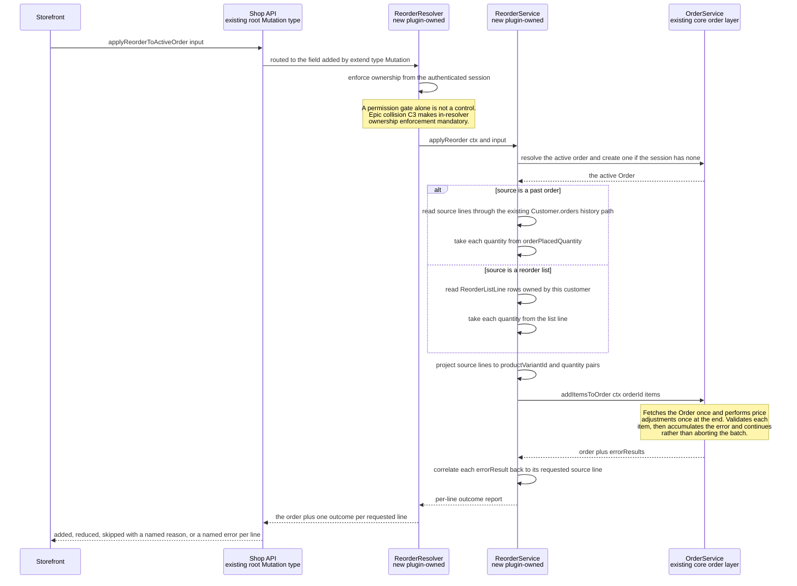

# FEATURE-001-02: Resolve a past order or a saved reorder list into active-cart lines through one permission-gated mutation that reports a per-line outcome, so that a returning buyer stops rebuilding a repeat purchase variant by variant

Parent epic: `tickets/EPIC-001-reorder-and-replenishment.md`. The parent epic and the sibling features are written as paths rather than as links, following the epic's own convention of keeping the link count in a file equal to the number of children that file indexes [tickets/EPIC-001-reorder-and-replenishment.md:§3. How To Read This Epic]. The only links in this file are the four story links in section 3.

This file is one of the four on the epic's curated read path, and the question it exists to answer is a narrow one: **how does a reorder actually reach the cart, and which existing service does the work** [tickets/EPIC-001-reorder-and-replenishment.md:§3. How To Read This Epic]. Sections 2.6 and 2.7 answer it directly. A reader who opens only this file should stop at the end of section 2.8 with that answer complete.

---

## 1. Feature Title

**Resolve a past order or a saved reorder list into active-cart lines through one permission-gated mutation that reports a per-line outcome, so that a returning buyer stops rebuilding a repeat purchase variant by variant.**

Short name, used verbatim wherever this feature is referred to in one phrase, and identical to the label the epic's features index gives it: **Reorder from Order History and Saved Lists** [tickets/EPIC-001-reorder-and-replenishment.md:§4. Features Index]. The long form above is the action-object-outcome title this tier requires; the short form is the name to cite.

The epic classifies this feature's deviation from its originally suggested area as **expanded**, and the rationale is mechanical rather than editorial: the suggested area covered reorder from order history only, and this feature absorbs list-to-cart materialisation as well **because both paths converge on the same core call, `OrderService.addItemsToOrder` [packages/core/src/service/services/order.service.ts:L654], so splitting them across two features would duplicate the per-line partial-failure contract in both** [tickets/EPIC-001-reorder-and-replenishment.md:§4. Features Index]. One contract, described once, consumed by both source paths, is the whole of the reason the boundary was drawn here.

Delivery is part of the single self-contained plugin package the epic describes — `packages/reorder-plugin/`, exporting `ReorderPlugin`. No file under `packages/core` or `packages/admin-ui` is edited to deliver it.

---

## 2. Feature Summary

### 2.1 The Capability

A returning buyer takes one past order, a chosen subset of that order's lines, or one saved reorder list, and turns it into lines on their active cart through a single Shop API mutation. That mutation returns an outcome for **every** requested line — added at the requested quantity, added at a reduced quantity, skipped with a named reason, or failed with a named error type — rather than succeeding or failing as a whole.

### 2.2 Contribution To The Epic

This feature is the epic's batch B2, "Reorder execution" [tickets/EPIC-001-reorder-and-replenishment.md:§9.4 Run Batches]. It owns three steps of the returning-buyer journey: opening a past order through the existing history read path, applying a reorder to the active order, and producing the per-line outcome report [tickets/EPIC-001-reorder-and-replenishment.md:§2.5 The Returning-Buyer Journey This Epic Builds]. It is the feature that discharges the objective's central promise — that a repeat purchase costs materially less effort than rebuilding an order from scratch — and the epic nominates this feature's first story as the one demonstrable slice a non-coder can be shown, on the ground that its traceability label is a quoted objective clause rather than an inference [tickets/EPIC-001-reorder-and-replenishment.md:§9.6 Nomination].

Read the contribution precisely, because this feature is a *write* path and nothing more:

- **It does not decide what a buyer should be warned about before committing.** The pre-commit price and availability delta read belongs to FEATURE-001-03, which consumes the commit path this feature builds.
- **It does not decide what happens to a line that cannot be added.** Skip, reduce, substitute and abort belong to FEATURE-001-04. This feature reports the outcome; it does not offer the buyer a resolution choice.
- **It does not own the list tables.** `ReorderList` and `ReorderListLine` are FEATURE-001-01's, and this feature only reads them [tickets/EPIC-001/FEATURE-001-01-named-reorder-lists.md:§2.4 Named Entities Touched].
- **It does not record the attempt or publish the event.** The audit rows and the typed events belong to FEATURE-001-07, which depends on this feature for the outcome it records.

### 2.3 Named Entities Touched

**This feature introduces no new table.** That is a deliberate design outcome and not an omission: every row it needs already exists, either in the platform's own order tables or in FEATURE-001-01's list tables, so the feature reads and never owns. The consequence is stated plainly in section 5 — there is no additive migration in this feature, and the only migration evidence it carries is that it added none.

Existing platform entities, read and never altered:

- **`Order`** [packages/core/src/entity/order/order.entity.ts:L44], declared as implementing `ChannelAware` and `HasCustomFields`. Seven of its columns are load-bearing here. `code` is the uniquely indexed buyer-facing reference [packages/core/src/entity/order/order.entity.ts:L70], and its own JSDoc states it is the reference to show a customer rather than the id — which is why a reorder input may address a source order by either. `state` [packages/core/src/entity/order/order.entity.ts:L72] and `active` [packages/core/src/entity/order/order.entity.ts:L82], the latter defaulting to true, are what separate a *past* order from the cart being written to. `orderPlacedAt` [packages/core/src/entity/order/order.entity.ts:L92] is the indexed timestamp that makes "the order I placed last" orderable, and `currencyCode` [packages/core/src/entity/order/order.entity.ts:L142] is what makes a currency mismatch between source and target detectable rather than silent. Ownership is read from `customerId` [packages/core/src/entity/order/order.entity.ts:L99], and the target cart's lines from `lines` [packages/core/src/entity/order/order.entity.ts:L102].
- **`OrderLine`**. Two columns define what a reorder actually copies. `quantity` is the live quantity [packages/core/src/entity/order-line/order-line.entity.ts:L97]; `orderPlacedQuantity` is the quantity as at placement [packages/core/src/entity/order-line/order-line.entity.ts:L104]. **The distinction is not cosmetic and a story that picks the wrong one is wrong:** a source line's reorder quantity is taken from `orderPlacedQuantity`, because that is what the buyer actually bought, whereas `quantity` on a historical order can have been altered by an administrative modification after placement. The line's price columns — `initialListPrice` [packages/core/src/entity/order-line/order-line.entity.ts:L113], `listPrice` [packages/core/src/entity/order-line/order-line.entity.ts:L121] and `listPriceIncludesTax` [packages/core/src/entity/order-line/order-line.entity.ts:L128] — are read by FEATURE-001-03 and are named here only so that no story in *this* feature copies a historical price onto a new line.
- **`ProductVariant`**. The target of every projected line. This feature reads the variant identifier and nothing else; the variant's `enabled` state is asserted by the core call described in section 2.6, not by plugin code.
- **`Channel`**. Supplies the request scope described in section 2.9.

Existing plugin-owned entities from FEATURE-001-01, read and never altered:

- **`ReorderList`** and **`ReorderListLine`**, the latter carrying the parent list id, a `ProductVariant` id and an integer quantity [tickets/EPIC-001/FEATURE-001-01-named-reorder-lists.md:§2.4 Named Entities Touched]. The list path projects one requested line per `ReorderListLine` row, taking the quantity from the row rather than from history. This is the only part of this feature that depends on FEATURE-001-01 at all, which is what section 4.1's qualifier means.

### 2.4 Named Services

- **`OrderService` — existing, in `packages/core`, consumed and never modified.** Four members are named, and the distinction between the one this feature calls and the ones it must leave alone is the point of naming them:
  - `addItemsToOrder` [packages/core/src/service/services/order.service.ts:L654] — **the single call this feature is built around.** Section 2.6 sets out its contract in full.
  - `getActiveOrderForUser` [packages/core/src/service/services/order.service.ts:L429] — resolves an existing cart for the authenticated user, returning `Order | undefined`. Its own description is that it returns any Order for that User's Customer account still in the `active` state.
  - `addItemToOrder` [packages/core/src/service/services/order.service.ts:L622] and `adjustOrderLine` [packages/core/src/service/services/order.service.ts:L774] — **named here as signatures that must remain untouched**, not as call targets. Both are also the two operations the epic's first collision would widen as a side effect if this epic declared a custom field on `OrderLine`, which is why they are the specific pair section 5 requires evidence for [tickets/EPIC-001-reorder-and-replenishment.md:§6.1 Repository-Discovered Collisions].
  - `applyPriceAdjustments` [packages/core/src/service/services/order.service.ts:L2311] — named so that no plugin code calls it directly. The bulk add already performs the adjustment pass, as section 2.6 records.
- **`ActiveOrderService` — existing, consumed.** Its `getActiveOrder` overload taking `createIfNotExists` as `true` returns a non-optional `Order` [packages/core/src/service/helpers/active-order/active-order.service.ts:L84-L88], creating one through `OrderService.create` [packages/core/src/service/services/order.service.ts:L455] when the session has none [packages/core/src/service/helpers/active-order/active-order.service.ts:L63-L64]. This is the mechanism section 2.8's ruling rests on, and it resolves the cart through the deployment's configured active-order strategy rather than through a plugin assumption.
- **`ReorderService` — new, plugin-owned.** Holds the whole of this feature's logic: resolving the source, enforcing ownership, projecting source lines into the shape the core bulk add accepts, calling it once, and mapping its returned errors back onto the requested lines. Both source paths and all four stories go through this one service, so the outcome contract has exactly one implementation to review.
- **`ReorderListService` — existing after FEATURE-001-01, plugin-owned, read only.** The list path resolves its source rows through it rather than querying the list tables directly, so the ownership rule that feature already implements is not reimplemented here [tickets/EPIC-001/FEATURE-001-01-named-reorder-lists.md:§2.5 Named Services].
- **`TransactionalConnection` — existing, consumed.** This feature writes no plugin-owned row, so its use here is confined to reading within the request's transaction [tickets/EPIC-001-reorder-and-replenishment.md:§7.4 Existing Entities And Services The Work Depends On].

### 2.5 Named API Surfaces — One New Mutation, Zero Existing Signatures Changed

**Existing read paths this feature consumes and does not extend:**

- `Customer.orders(options: OrderListOptions): OrderList!` [packages/core/src/api/schema/common/customer.type.graphql:L11] — the order-history read path, reachable through the `activeCustomer` root query [packages/core/src/api/schema/shop-api/shop.api.graphql:L5] and already paginated, sortable and filterable. Section 2.6 records the prohibition attached to it.
- `activeOrder: Order` [packages/core/src/api/schema/shop-api/shop.api.graphql:L11] — the cart read. Its own docstring is directly relevant to section 2.8: it states that the value is null until an Order is created via `addItemToOrder`.
- `order(id: ID!): Order` [packages/core/src/api/schema/shop-api/shop.api.graphql:L34] — a single order by id, whose docstring records that in the Shop API only orders belonging to the currently-authenticated User may be queried. A storefront reads a candidate source order through this or through `orderByCode` [packages/core/src/api/schema/shop-api/shop.api.graphql:L41]; neither is altered.

**The one new operation**, added through the plugin's `shopApiExtensions` using `extend type Mutation` — the mechanism the shipped wishlist example already demonstrates [packages/dev-server/example-plugins/wishlist-plugin/api/api-extensions.ts:L16-L19]:

- `applyReorderToActiveOrder` — accepts **either** a source order reference **or** a reorder-list reference, optionally narrowed to a subset of source lines, and returns a per-line outcome report. One mutation rather than two is a direct consequence of the expanded scope in section 1: two mutations would need two copies of the outcome contract.

No Admin API operation is added by this feature. No query is added by this feature at all — the history read path already exists, and adding a reorder-specific one is explicitly prohibited in section 2.6.

**The additive-only constraint stated as a countable surface rather than as an intention.** The Shop API root `Query` type declares nineteen root queries [packages/core/src/api/schema/shop-api/shop.api.graphql:L1-L52], and the order, cart and customer-account mutation sets live in the same file under `type Mutation` [packages/core/src/api/schema/shop-api/shop.api.graphql:L70]. Every one of those signatures is byte-identical after this feature ships. Five of them are named individually in section 5 because this feature reads or writes the same order rows they do: `addItemToOrder` [packages/core/src/api/schema/shop-api/shop.api.graphql:L72], `addItemsToOrder` [packages/core/src/api/schema/shop-api/shop.api.graphql:L74], `removeOrderLine` [packages/core/src/api/schema/shop-api/shop.api.graphql:L76], `removeAllOrderLines` [packages/core/src/api/schema/shop-api/shop.api.graphql:L78] and `adjustOrderLine` [packages/core/src/api/schema/shop-api/shop.api.graphql:L80].

Where a platform mechanism would widen an existing signature as a side effect of an otherwise additive change, that is a reportable violation recorded in the epic's collision section and referenced here rather than re-argued or quietly absorbed [tickets/EPIC-001-reorder-and-replenishment.md:§6.1 Repository-Discovered Collisions]. Two of this file's citations are the schema's own admissions of exactly that: the docstring above `addItemToOrder` states that a third `customFields` argument becomes available if custom fields are defined on the `OrderLine` entity [packages/core/src/api/schema/shop-api/shop.api.graphql:L71], and the docstring above `adjustOrderLine` says the same for an argument of type `OrderLineCustomFieldsInput` [packages/core/src/api/schema/shop-api/shop.api.graphql:L79]. This feature therefore declares no custom field on any core entity.

### 2.6 The Existing Mechanisms This Feature Consumes Rather Than Rebuilds

The epic's do-not-duplicate inventory assigns this feature three mechanisms, each with a prohibition attached [tickets/EPIC-001-reorder-and-replenishment.md:§5. Existing Mechanisms That Must Not Be Duplicated]. **This is the section that answers the question this file exists to answer, and the most consequential finding in the whole feature is in it: a per-item error-accumulating bulk add already exists at both the service layer and the API layer.** A ticket that re-specified it would be duplicating shipped work. A ticket that ignored it would ship a second, incompatible partial-success contract alongside a published one. Neither is acceptable, so the new mutation is positioned as a *caller* of the first and a *mirror* of the second.

#### Mechanism one — `OrderService.addItemsToOrder`, the service-layer bulk add

`addItemsToOrder` [packages/core/src/service/services/order.service.ts:L654] was added to the public service surface as `@since 3.1.0` [packages/core/src/service/services/order.service.ts:L652]. Its own JSDoc is the specification this feature builds against, and it makes two mechanical claims [packages/core/src/service/services/order.service.ts:L643-L650]: the method **fetches the entire Order once** and **performs price adjustments once at the end**, and because it can return more than one error result, a caller is directed to inspect the `errorResults` array to determine whether any errors occurred. Its declared return type states the same thing in the type system — a resolved object carrying both an `order` and an `errorResults` array [packages/core/src/service/services/order.service.ts:L663].

Its per-item behaviour is what makes it the right call for a reorder, and it was read rather than assumed:

- **Each item is validated through a four-step chain** — `assertQuantityIsPositive`, `assertAddingItemsState`, `assertNotOverOrderItemsLimit` and `assertNotOverOrderLineItemsLimit` [packages/core/src/service/services/order.service.ts:L675-L679]. The second of those is why the target must be an order still accepting items, and the third and fourth are why a large reorder can partially fail on limits rather than on stock.
- **On a validation failure it accumulates the error and continues to the next item** rather than aborting the batch [packages/core/src/service/services/order.service.ts:L680-L683]. This single behaviour is the entire basis of the per-line outcome report: partial success is the core method's existing semantics, not something the plugin adds on top.
- **It resolves each variant itself, requiring `enabled: true` and a null `deletedAt`** [packages/core/src/service/services/order.service.ts:L684-L689], and it throws when the variant's parent product is disabled [packages/core/src/service/services/order.service.ts:L692-L693]. Two consequences follow, and both are design constraints on this feature rather than notes: plugin code does not pre-filter disabled or deleted variants, because the core call already does; and a disabled *parent product* raises a thrown error rather than an accumulated one, so it is not expressible as a per-line outcome and must be handled as a request-level failure. A story that assumes every unavailable variant degrades gracefully into a per-line entry has misread this paragraph.

*The prohibition, quoted in substance from the epic:* do not write a per-variant add loop, and do not invent a partial-success payload shape [tickets/EPIC-001-reorder-and-replenishment.md:§5. Existing Mechanisms That Must Not Be Duplicated]. The plugin calls the service once per reorder and maps its `errorResults` into the outcome report.

#### Mechanism two — the already-published API-layer bulk contract

This is the half that is easiest to miss and most expensive to get wrong, so it is stated in as many words: **the partial-success contract is already public. This feature and story 02-04 must consume or mirror that contract, and must not invent a competing one.**

The published mutation is `addItemsToOrder(inputs: [AddItemInput!]!): UpdateMultipleOrderItemsResult!` [packages/core/src/api/schema/shop-api/shop.api.graphql:L74], and its own SDL docstring states that it returns a list of errors for each item that failed to add and will still add the successful items [packages/core/src/api/schema/shop-api/shop.api.graphql:L73]. The payload it returns is defined in the same file and is not abstract — it is two fields:

```graphql
"""
Returned when multiple items are added to an Order.
The errorResults array contains the errors that occurred for each item, if any.
"""
type UpdateMultipleOrderItemsResult  {
    order: Order!
    errorResults: [UpdateOrderItemErrorResult!]!
}
```

That type is declared at [packages/core/src/api/schema/shop-api/shop.api.graphql:L298], with `order: Order!` at [packages/core/src/api/schema/shop-api/shop.api.graphql:L299] and `errorResults: [UpdateOrderItemErrorResult!]!` at [packages/core/src/api/schema/shop-api/shop.api.graphql:L300], above its own docstring [packages/core/src/api/schema/shop-api/shop.api.graphql:L294-L297]. Its input type is equally concrete — `input AddItemInput` carrying `productVariantId: ID!` and `quantity: Int!` [packages/core/src/api/schema/shop-api/shop.api.graphql:L303-L305] — which is exactly the shape a reorder's projected source line reduces to, and is why section 2.7 shows the projection step explicitly.

The error union in that payload is closed and its membership was read rather than inferred: `union UpdateOrderItemErrorResult` names exactly `OrderModificationError`, `OrderLimitError`, `NegativeQuantityError`, `InsufficientStockError` and `OrderInterceptorError` [packages/core/src/api/schema/common/common-error-results.graphql:L112-L117]. Three design rules follow directly from that membership:

- **The reorder outcome report's error position reuses those five types rather than restating them.** Each already exists: `OrderModificationError` [packages/core/src/api/schema/common/common-error-results.graphql:L80], `OrderLimitError` with its `maxItems` field [packages/core/src/api/schema/common/common-error-results.graphql:L37], `NegativeQuantityError` [packages/core/src/api/schema/common/common-error-results.graphql:L44], `InsufficientStockError` [packages/core/src/api/schema/common/common-error-results.graphql:L50] and `OrderInterceptorError` [packages/core/src/api/schema/common/common-error-results.graphql:L103].
- **`InsufficientStockError` is the reason "reduce the line to what is available" is specifiable without inventing a number.** It carries `quantityAvailable: Int!` [packages/core/src/api/schema/common/common-error-results.graphql:L53] alongside `order: Order!` [packages/core/src/api/schema/common/common-error-results.graphql:L54], so the reduced quantity is a value the platform returns rather than a threshold this ticket set would otherwise have to make up. FEATURE-001-04 builds its reduce option on that field.
- **The outcome report adds a per-line *position*, not a per-line *error vocabulary*.** The core `errorResults` array is flat and unkeyed; what the reorder report contributes is the correlation back to the requested source line, so a buyer sees which of their lines failed rather than that some line did.

*The prohibition:* the epic records that partial-success semantics exist at *both* layers and that a story must therefore state which layer it consumes [tickets/EPIC-001-reorder-and-replenishment.md:§5. Existing Mechanisms That Must Not Be Duplicated]. This feature states it once, here, for all four stories: **the plugin service consumes the service layer, and the plugin's published payload mirrors the API layer.** No story in this feature calls the `addItemsToOrder` mutation from inside the server, and no story invents a payload shape that diverges from the two-field form above.

#### Mechanism three — the `Customer.orders` order-history read path

The history read already exists as `Customer.orders(options: OrderListOptions): OrderList!` [packages/core/src/api/schema/common/customer.type.graphql:L11] and is already paginated, sortable and filterable through the generated list options.

*The prohibition:* do not add a reorder-specific order-history query [tickets/EPIC-001-reorder-and-replenishment.md:§5. Existing Mechanisms That Must Not Be Duplicated]. This feature reads history through that field and adds only the reorder write path. Concretely, that means a storefront selects the source order itself — sorting on `orderPlacedAt` [packages/core/src/entity/order/order.entity.ts:L92] through the existing list options — and passes an identifier to the new mutation. The mutation does not accept "my most recent order" as a concept, because resolving that would require the query this prohibition forbids.

### 2.7 Figure F2-SEQ — How A Reorder Reaches The Cart

This is the only diagram in this feature. Story files in this feature carry none and reference this figure by the name **Figure F2-SEQ** instead.



**One reading convention, so the figure is not over-read.** The `OrderService` participant stands for the existing core order layer as a whole, because the active-order resolution step and the bulk add do not live on the same class: the bulk add is `OrderService.addItemsToOrder` [packages/core/src/service/services/order.service.ts:L654], whereas resolving-or-creating the cart runs through `ActiveOrderService.getActiveOrder` [packages/core/src/service/helpers/active-order/active-order.service.ts:L84-L88]. The figure therefore names a method only where the method genuinely belongs to the participant it is drawn against, and describes the active-order step in words instead. Sections 2.4 and 2.8 carry the precise attribution.

Four further readings of the figure are load-bearing and are stated so they are not inferred:

- **The core call happens exactly once per reorder, not once per line.** The single `addItemsToOrder` arrow is the design, and the loop that would replace it is the thing mechanism one prohibits.
- **The two source paths differ only in where the requested lines come from.** Everything after the projection step is shared, which is the concrete form of the "one contract, two sources" argument in section 1.
- **Ownership is enforced before the source is read, not after.** A request authenticated as a different customer is refused at the resolver, so no history row and no list row is read on its behalf.
- **The correlation step is this feature's actual contribution.** The core returns a flat `errorResults` array; mapping each entry back to the line the buyer asked for is what story 02-04 formalises.

### 2.8 The No-Active-Order Ruling — Stated, Not Left Implicit

A reorder writes into an active order. What happens when the session has none is a decision, not a detail, so it is taken here rather than left to a story to guess.

**The ruling: `applyReorderToActiveOrder` creates the active order through the existing mechanism, and `NoActiveOrderError` is therefore not a member of its result union.**

The mechanism is `ActiveOrderService.getActiveOrder` invoked with `createIfNotExists` set to `true`, whose overload returns a non-optional `Order` [packages/core/src/service/helpers/active-order/active-order.service.ts:L84-L88] and which creates one through `OrderService.create` [packages/core/src/service/services/order.service.ts:L455] when the session has no order [packages/core/src/service/helpers/active-order/active-order.service.ts:L63-L64]. Resolution runs through the deployment's configured active-order strategy, so a deployment that has customised how a cart is identified keeps that behaviour and the plugin inherits it.

Three pieces of evidence make this the platform-consistent choice rather than a preference:

- **The platform already treats "add an item" as the operation that creates the cart.** The `activeOrder` query's own docstring states the value is null until an Order is created via `addItemToOrder` [packages/core/src/api/schema/shop-api/shop.api.graphql:L7-L11]. A reorder is an add, so it creates.
- **The result union of the existing add operations excludes `NoActiveOrderError`.** `union UpdateOrderItemsResult` names `Order` and five error types and does not include it [packages/core/src/api/schema/common/common-types.graphql:L273-L279]. Mirroring the published contract, as mechanism two requires, means excluding it here too.
- **The platform has a separate union for operations that genuinely require a pre-existing order.** `union ActiveOrderResult = Order | NoActiveOrderError` [packages/core/src/api/schema/shop-api/shop.api.graphql:L292] is what `NoActiveOrderError` [packages/core/src/api/schema/common/common-error-results.graphql:L95] exists to serve. A reorder is not such an operation, so borrowing that union would misdescribe it.

**What covers the empty case instead.** The condition a reorder genuinely has to report is not "you have no cart" but "there was nothing here to reorder" — an empty source order, a list with no lines, or a selected subset that resolved to nothing. That is `NoReorderableLinesError`, which section 2.11 introduces. Distinguishing the two is the reason this ruling is written down: without it, a story could reasonably return `NoActiveOrderError` for an empty list, which would be both wrong and untestable against the platform's own semantics.

### 2.9 Channel Scoping, Language Scoping And Monetary Values

The one new mutation is channel-scoped and language-scoped. This is a property of the request rather than an argument a caller may omit, so it holds without being restated per story [tickets/EPIC-001-reorder-and-replenishment.md:§7.5 Request Prerequisites].

- **Channel.** The active channel is identified by a unique token read from the `vendure-token` request header [packages/core/src/entity/channel/channel.entity.ts:L58], carried as a unique column on `Channel` [packages/core/src/entity/channel/channel.entity.ts:L62]. **A past order placed under one channel token cannot be reordered into a cart on another.** The source order is resolved within the active channel, so an order belonging to a different channel does not resolve at all and the mutation reports it as an unresolvable source rather than reading across the boundary. The same holds for the list path: `ReorderList` stores the id of the channel it was created under, so a list created under one token is not readable under another [tickets/EPIC-001/FEATURE-001-01-named-reorder-lists.md:§2.9 Channel Scoping]. This is a hard boundary, not a filter a caller may widen.
- **Language.** Translated output resolves against the request's `languageCode`, which defaults to the channel's `defaultLanguageCode` [packages/core/src/entity/channel/channel.entity.ts:L74]. This feature stores no string of its own and translates nothing: the outcome report's own fields are identifiers, integer quantities and error type names, none of which is language-varying, while every variant-derived field a report exposes is translated by the existing catalogue read path. A skipped-line *reason* is a machine-readable code, not a localised sentence, precisely so that the report does not become a translation surface this feature would then have to own.
- **Money.** Every monetary value in this feature's payloads is an **integer in the smallest unit of its currency, stated alongside its currency code**, which defaults to `Channel.defaultCurrencyCode` [packages/core/src/entity/channel/channel.entity.ts:L88]. A decimal monetary value is a defect, not a formatting preference. Whether a quoted price is gross or net is governed by `Channel.pricesIncludeTax` [packages/core/src/entity/channel/channel.entity.ts:L113] and by the line's own `listPriceIncludesTax` [packages/core/src/entity/order-line/order-line.entity.ts:L128], so a payload that reports a price without saying which it is has reported nothing. By way of illustration rather than specification: a source line placed at a `listPrice` of 129900 whose variant now prices at 134900, both integers in the smallest unit of the currency named by the accompanying currency code, is a reportable delta — and reporting it is FEATURE-001-03's work, not this feature's.
- **A currency mismatch is a reported outcome, never a silent conversion.** The source order carries its own `currencyCode` [packages/core/src/entity/order/order.entity.ts:L142]. Where that differs from the currency the reorder context resolves to, **the mismatch is surfaced in the outcome report and no conversion is attempted.** This feature performs no arithmetic on money at all: it projects variant identifiers and integer quantities, and the target order prices those lines itself through the core call's own adjustment pass. There is consequently no place in this feature where a rate could be applied, which is the strongest form the constraint can take.

### 2.10 A Point-In-Time Read Is Not A Reservation

Availability checked while a reorder is being assembled can change before the reorder is committed, and **nothing in this feature reserves stock**. It is stated at feature level because three of this feature's four stories inherit it and because the mistake it prevents is a natural one.

The sequence is unavoidable: a storefront reads a source order, the buyer decides, and the mutation runs. Between the read and the write, another order can allocate the stock. `addItemsToOrder` performs its own validation at write time [packages/core/src/service/services/order.service.ts:L675-L679], so the authoritative availability decision is the one the core call makes, not the one a preview reported earlier. Two consequences are carried into the stories:

- **A preview that showed a line as addable does not entitle it to be added.** The outcome report is the record of what actually happened; a preview is advisory. A story that asserts a preview and a commit always agree is asserting something this platform does not guarantee.
- **A stale point-in-time read is a required edge case, not a defect to design away.** The correct behaviour is a per-line outcome naming `InsufficientStockError` with its `quantityAvailable` [packages/core/src/api/schema/common/common-error-results.graphql:L53], not a request-level failure and not a retry loop.

FEATURE-001-03 owns the pre-commit read and repeats the same staleness note in its own figure; this feature owns the commit and is the place the staleness actually resolves.

### 2.11 The Error Vocabulary This Feature Introduces

**One** of the six error results the whole ticket set declares belongs to this feature: `NoReorderableLinesError`. The other five belong to FEATURE-001-01 and FEATURE-001-06, and this feature's sibling records the same split from its side [tickets/EPIC-001/FEATURE-001-01-named-reorder-lists.md:§2.10 The Error Vocabulary This Feature Introduces].

`NoReorderableLinesError` is returned when a reorder resolves to zero requested lines — an empty source order, a list holding no lines, or a selected subset that matched nothing. Section 2.8 explains why this rather than `NoActiveOrderError` covers the empty case.

Every other error this feature can report already exists. No text in this feature or in its four stories names an error outside the six declared by this ticket set and the **thirty-one** types that already implement the `ErrorResult` interface in this checkout — fifteen in [packages/core/src/api/schema/common/common-error-results.graphql:L2] through [packages/core/src/api/schema/common/common-error-results.graphql:L103], and sixteen more in [packages/core/src/api/schema/shop-api/shop-error-results.graphql:L2] through [packages/core/src/api/schema/shop-api/shop-error-results.graphql:L130].

**Declaring the one new error result grows the published `ErrorCode` enum, and the growth is automatic rather than opt-in.** The enum's members are derived from every type implementing the `ErrorResult` interface [packages/core/src/api/config/generate-error-code-enum.ts:L9], matched against the interface-name constant declared in the same file [packages/core/src/api/config/generate-error-code-enum.ts:L3] by a filter over each type's declared interfaces [packages/core/src/api/config/generate-error-code-enum.ts:L17]. That is the epic's second collision, and the argument is deferred to it rather than re-derived here [tickets/EPIC-001-reorder-and-replenishment.md:§6.1 Repository-Discovered Collisions]. One design rule follows into this feature's stories: any consuming example that switches on `ErrorCode` carries a default branch.

### 2.12 Precedent In This Repository — None, At Feature Level

The precedent disclosure for this feature is **none**, and the searched set is named so the claim is checkable: the whole of `packages/dev-server/example-plugins/`, the whole of `packages/dev-server/test-plugins/`, and `packages/dashboard/test-plans/` [tickets/EPIC-001-reorder-and-replenishment.md:§9.6 Nomination].

The closest shipped analogue is the wishlist plugin, and it is not close. Its entire Shop API surface is three operations — `activeCustomerWishlist`, `addToWishlist(productVariantId: ID!)` and `removeFromWishlist(itemId: ID!)` [packages/dev-server/example-plugins/wishlist-plugin/api/api-extensions.ts:L12-L19]. **It has no order-history-to-cart path of any kind, no bulk projection, no partial-success payload and no per-line outcome.** What this feature borrows from it is one mechanism and nothing else: the `extend type Mutation` idiom for adding an operation without touching an existing one.

This is the evidence the epic's demonstration-slice nomination rests on, and it is restated here so that STORY-001-02-01 can cite its parent rather than re-running the search. The epic's reasoning is worth carrying intact: a bare saved-list story is the single most heavily precedented thing this epic could build, taught by six separate documentation pages, which is precisely why the demonstration slice is a reorder-to-cart story and not a saved-list story [tickets/EPIC-001-reorder-and-replenishment.md:§9.6 Nomination]. Where FEATURE-001-01 is honest about re-applying shipped work [tickets/EPIC-001/FEATURE-001-01-named-reorder-lists.md:§2.3 What Already Exists, And What Is New], this feature is the one that is genuinely new — and the reason it is new is the correlation step in section 2.7, not the bulk add, which is emphatically not.

### 2.13 Constraints This Feature Is Built Under

These are boundaries on the work this feature describes, not preamble. Each is carried into the definition of done in section 5. They derive from the epic's stated architectural constraints and from cited repository conventions; **no user-specified rules were provided for this project**, so nothing below is attributed to one [tickets/EPIC-001-reorder-and-replenishment.md:§11.9 User-Specified Rules].

- **Additive only.** One field added to the root `Mutation` type, one new error result, zero changes to any existing operation's arguments, return type or nullability. A side-effect widening is a reportable violation, referenced from the epic and never absorbed silently [tickets/EPIC-001-reorder-and-replenishment.md:§6.1 Repository-Discovered Collisions].
- **Zero custom fields on a core entity.** This feature declares none, which is what keeps the two `customFields` argument admissions in the Shop API schema from becoming true of this deployment [packages/core/src/api/schema/shop-api/shop.api.graphql:L71] and [packages/core/src/api/schema/shop-api/shop.api.graphql:L79]. The dev-server configuration currently declares an empty custom-fields object [packages/dev-server/dev-config.ts:L116], and a reviewer should expect it still to be empty once this feature ships.
- **Zero edits to `packages/core` and `packages/admin-ui`.** Delivery is self-contained in the plugin package. The only two files a future implementation may touch outside its own package are the dev-server plugin registration array [packages/dev-server/dev-config.ts:L121-L155], where `ReorderPlugin` is registered, and the dashboard bundling configuration [packages/dev-server/vite.config.mts:L1]. **This feature needs the first and not the second, because it ships no dashboard surface.** Naming those files is a documentation act and does not license a documentation run to edit them [tickets/EPIC-001-reorder-and-replenishment.md:§11.7 The Two Permitted Configuration Exceptions].
- **Additive migrations only — and this feature has no migration.** It introduces no table and no column, as section 2.3 records, so the additive-migration constraint is satisfied vacuously. Section 5 requires that stated as evidence rather than assumed, because "no migration" is a claim a reviewer should be able to check.
- **No external-service dependency.** Nothing in this feature calls out of process. Both source paths, the projection, the core call and the outcome report are satisfied by the database and the plugin's own service.
- **No invented metric.** This feature states no service-level commitment, no timing figure and no business figure, because this repository declares none and the epic reports that absence as a finding [tickets/EPIC-001-reorder-and-replenishment.md:§2.2 Business Value]. In particular, **the bulk path is not described as faster by any figure.** What is claimed of it is only what its own JSDoc claims mechanically — that it fetches the Order once and performs price adjustments once at the end [packages/core/src/service/services/order.service.ts:L643-L650]. Where a story here needs precision it asserts a verifiable state instead: an exact line count with its ordering, an integer quantity, an integer money value with its currency code, or an exact error type name.
- **Version tagging.** Doc blocks on the new public API carry `@since 3.8.0`. That value is *derived* from the next-minor rule in the contribution guide [CONTRIBUTING.md:§New features] applied to a 3.7.0 checkout [packages/core/package.json:L2-L3], and the epic flags the same derivation and warns against presenting it as a quotation [tickets/EPIC-001-reorder-and-replenishment.md:§11.2 Version Tagging].
- **No hand-written reference page.** The plugin's reference documentation is generated from JSDoc in the TypeScript sources, so this feature's documentation sub-tasks mean writing JSDoc, not authoring a page under the documentation tree [tickets/EPIC-001-reorder-and-replenishment.md:§11.5 Public API Documentation Is Generated, Not Hand-Written].

---

## 3. User Stories Index

Four stories, sized and ordered so that each one is buildable on its own. Titles are transcribed from the epic's story table and are not restated with different wording [tickets/EPIC-001-reorder-and-replenishment.md:§9.2 Story Table].

- [STORY-001-02-01 — Reorder a complete past order](./FEATURE-001-02/STORY-001-02-01-reorder-complete-past-order.md) — the new mutation, the source-order path, the ownership check, and the first call into `OrderService.addItemsToOrder`. This is the epic's demonstration slice.
- [STORY-001-02-02 — Reorder selected lines from a past order](./FEATURE-001-02/STORY-001-02-02-reorder-selected-lines-from-past-order.md) — narrowing the source to a chosen subset of lines, with an exact resulting line count and its ordering, and an empty selection resolving to `NoReorderableLinesError`.
- [STORY-001-02-03 — Add a reorder list to the active cart](./FEATURE-001-02/STORY-001-02-03-add-reorder-list-to-active-cart.md) — the list path over `ReorderListLine` rows, taking each quantity from the list line. This is the only story in the feature that depends on FEATURE-001-01.
- [STORY-001-02-04 — Report per-line reorder outcomes](./FEATURE-001-02/STORY-001-02-04-per-line-reorder-outcome-report.md) — formalises the outcome contract the earlier three produce, mirroring `UpdateMultipleOrderItemsResult` rather than competing with it, and naming `InsufficientStockError` with its `quantityAvailable` and `OrderLimitError` with its `maxItems`.

Estimates are deliberately absent from this file. Points, lines of code, generation hours and review hours live only in the epic's delivery-split table, which is the single source of truth for them, and each story transcribes its own four values from its row there [tickets/EPIC-001-reorder-and-replenishment.md:§9.2 Story Table].

Every story in this feature references **Figure F2-SEQ** in section 2.7 where it needs a visual, and embeds no diagram of its own.

---

## 4. Dependencies

Direction is stated for every entry, because a dependency without a direction cannot be sequenced.

### 4.1 Upstream — FEATURE-001-01, For The List Path Only

**This feature has exactly one upstream feature dependency, and it is partial. FEATURE-001-01 is required for the list path only.**

The qualifier is the substance of this entry, not a hedge on it. The two source paths have different prerequisites:

- **The order-history path depends on FEATURE-001-01 for nothing at all.** It reads a past order through `Customer.orders` [packages/core/src/api/schema/common/customer.type.graphql:L11], which already exists, and writes through `OrderService.addItemsToOrder` [packages/core/src/service/services/order.service.ts:L654], which already exists. Neither touches a reorder list. STORY-001-02-01 and STORY-001-02-02 are therefore buildable while FEATURE-001-01 is still in flight.
- **The list path depends on FEATURE-001-01's two tables and its list service**, because `ReorderListLine` rows must exist before there is anything to project. That is STORY-001-02-03 alone.

The epic's batch table records the same qualification from the other side — B2 depends on B1 "for the list-to-cart path only" [tickets/EPIC-001-reorder-and-replenishment.md:§9.4 Run Batches] — and so does FEATURE-001-01's own downstream section [tickets/EPIC-001/FEATURE-001-01-named-reorder-lists.md:§4.2 Downstream]. All three statements agree, which is deliberate: the practical consequence is that the two features can be built in parallel up to the point where `applyReorderToActiveOrder` accepts a list identifier.

Every other prerequisite this feature has is an existing part of the platform, listed in section 4.4, or an open decision, listed in section 4.5.

### 4.2 Downstream — Three Features Depend On This One

Direction: the arrow points *into* this feature from all three. None creates a reciprocal obligation here.

- **FEATURE-001-03 depends on this feature, for the commit path.** A pre-commit delta preview has nothing to preview until there is a reorder to commit, which is why the epic's runner-up demonstration slice was ruled out for depending on this feature being complete [tickets/EPIC-001-reorder-and-replenishment.md:§9.6 Nomination]. The preview reads; this feature writes.
- **FEATURE-001-06 depends on this feature, at story granularity — STORY-001-06-03 only.** Reordering from a *shared* list is this feature's list path invoked by a customer who is not the list's owner, so it needs both the materialisation path here and the share-and-authorisation model there. The other two stories in that feature depend on FEATURE-001-01 rather than on this one.
- **FEATURE-001-07 depends on this feature, for the thing it records.** The reorder-attempt audit rows and the typed events describe the outcome this feature produces, so the outcome contract must exist and be stable before there is a defined payload to record or publish.

### 4.3 Intra-Feature Story Order

- `STORY-001-02-01` → `STORY-001-02-02`: a subset cannot be selected until the whole-order path resolves and projects source lines. Direction: 02-02 depends on 02-01. Classification: a shared code path — the mutation, the resolver, the service and the projection step — plus a data dependency on one placed order.
- `FEATURE-001-01` and `STORY-001-02-01` → `STORY-001-02-03`: the list path needs FEATURE-001-01's tables for its source and 02-01's service for its target. Direction: 02-03 depends on both. Classification: a data dependency on one populated reorder list, plus the same shared code path.
- `STORY-001-02-01`, `STORY-001-02-02` and `STORY-001-02-03` → `STORY-001-02-04`: the outcome contract is formalised over the outcomes the earlier three produce, so all three paths must exist before the contract can be closed against them. Direction: 02-04 depends on all three. Classification: a shared code path only — 02-04 adds no new source path and no new data.

Every edge above is a prerequisite, not a co-requisite: each story still delivers value on its own terms once the story before it is merged. Where true independence is impossible — 02-04 genuinely cannot close a contract over outcomes that do not yet exist — the prerequisite is named and classified here rather than left implicit in the story.

### 4.4 Existing Entities, Services And Configuration Required

Stated in the epic's dependency form — the required thing, then why it is required and where it belongs.

- **Entity `Order`:** supplies the source lines for the history path and the target for every write; read in all four stories [packages/core/src/entity/order/order.entity.ts:L44].
- **Entity `OrderLine`:** supplies each source line's variant reference and its `orderPlacedQuantity` [packages/core/src/entity/order-line/order-line.entity.ts:L104]; required by 02-01, 02-02 and 02-04.
- **Entity `Channel`:** supplies the token that scopes every operation [packages/core/src/entity/channel/channel.entity.ts:L62] together with the default language code [packages/core/src/entity/channel/channel.entity.ts:L74] and default currency code [packages/core/src/entity/channel/channel.entity.ts:L88] that any payload resolves against; required by all four stories.
- **Entities `ReorderList` and `ReorderListLine`:** supply the list path's source rows; required by 02-03 only, and delivered by FEATURE-001-01 [tickets/EPIC-001/FEATURE-001-01-named-reorder-lists.md:§2.4 Named Entities Touched].
- **Service `OrderService`:** the bulk add this feature is built around [packages/core/src/service/services/order.service.ts:L654] and the active-cart read [packages/core/src/service/services/order.service.ts:L429]; required by all four stories.
- **Service `ActiveOrderService`:** resolves or creates the target cart through the configured strategy [packages/core/src/service/helpers/active-order/active-order.service.ts:L84-L88]; required by all four stories and load-bearing for the ruling in section 2.8.
- **Service `ReorderListService`:** resolves list source rows without reimplementing FEATURE-001-01's ownership rule; required by 02-03 only [tickets/EPIC-001/FEATURE-001-01-named-reorder-lists.md:§2.5 Named Services].
- **Service `TransactionalConnection`:** the read path for plugin-owned rows inside the request's transaction; required by 02-03 [tickets/EPIC-001-reorder-and-replenishment.md:§7.4 Existing Entities And Services The Work Depends On].
- **Configuration `authOptions.customPermissions`:** the registration point for the permission that gates the new mutation, paired with in-resolver ownership enforcement because a permission alone is equivalent to public access [packages/core/src/api/config/generate-permissions.ts:L32-L34]; required by all four stories.
- **Configuration — the dev-server plugin registration array:** where `ReorderPlugin` is registered so the mutation is reachable at all; required by all four stories and named as one of the two permitted configuration exceptions [packages/dev-server/dev-config.ts:L121-L155].
- **Data prerequisite — at least one placed order for the authenticated customer:** the history path has no source without it, and a customer with no placed order is a required edge case rather than an untested state [tickets/EPIC-001-reorder-and-replenishment.md:§7.5 Request Prerequisites].
- **Test harness `@vendure/testing`:** the end-to-end sub-task of each story is written against it, and no alternative harness is introduced [tickets/EPIC-001-reorder-and-replenishment.md:§7.3 Runtime Dependencies].
- **Demonstration environment:** the dev server, started from `packages/dev-server` with `bun run dev` [packages/dev-server/package.json:L13] and seeded with `bun run populate` [packages/dev-server/package.json:L8]. The contribution guide shows both commands with that working directory [CONTRIBUTING.md:L147-L150] and [CONTRIBUTING.md:L178-L181], and **each story states the working directory rather than the bare command**, because neither script exists at the repository root. Where an Admin API surface is involved the documented default credentials are superadmin and superadmin [CONTRIBUTING.md:L189-L192]; no story in this feature needs them, because all four are Shop API stories.

### 4.5 Open Decisions This Feature Waits On

These are dependencies on a decision rather than on code, and they are listed because a story cannot finalise its acceptance criteria without them. None is resolved here; each belongs to a maintainer.

- **Zero custom fields, or accept the widening.** Section 2.13 assumes the zero-custom-fields resolution the epic recommends. If the decision goes the other way, the two `customFields` argument admissions in the Shop API schema become true of this deployment and this feature's unchanged-signature evidence in section 5 cannot be produced [tickets/EPIC-001-reorder-and-replenishment.md:§8.2 Architectural Decisions].
- **The ownership-enforcement mechanism, and therefore how many permission definitions are registered.** In-resolver logic is not optional under any option, because the platform states a permission alone is equivalent to public access [packages/core/src/api/config/generate-permissions.ts:L32-L34]. What is undecided is the number of definitions and therefore how many members the published `Permission` enum gains [tickets/EPIC-001-reorder-and-replenishment.md:§8.2 Architectural Decisions].
- **The maximum number of lines per list.** It bounds how large a list-path reorder can be, and therefore whether `OrderLimitError` [packages/core/src/api/schema/common/common-error-results.graphql:L37] is reachable from 02-03 in practice. The value is an open product decision and this feature may not invent one [tickets/EPIC-001-reorder-and-replenishment.md:§8.1 Product Decisions].
- **The branch target.** It blocks no story's design and gates every story's merge, and it is a three-way conflict in this repository's own documentation rather than an oversight [tickets/EPIC-001-reorder-and-replenishment.md:§11.1 The Branch Target Is A Three-Way Conflict]. Note that this feature adds no table, so the schema-change classification that routes work to `major` [CONTRIBUTING.md:§Breaking Changes] does not bite on this feature's own changes — but it does bite on FEATURE-001-01, which this feature depends on for its list path, so the decision still gates 02-03's merge.

### 4.6 Cycle Check

**No dependency cycle exists here, and the check is stated rather than assumed.**

Reading the epic's feature graph, the edges touching this feature are one inbound — `F1 → F2` — and three outbound — `F2 → F3`, `F2 → F6` and `F2 → F7` [tickets/EPIC-001-reorder-and-replenishment.md:§4. Features Index]. A cycle through this node would need a path back from one of `F3`, `F6` or `F7` to `F1` or to `F2`; the graph has none, since `F1` has in-degree zero and the remaining edges run forward into `F4` and `F8`. Inside the feature, section 4.3 gives a strict order over four stories with no back edge.

Two relationships could be mistaken for cycles and are resolved explicitly:

- **This feature depends on FEATURE-001-01 while FEATURE-001-06 depends on both.** That is a diamond, not a cycle: all three edges point forward, and no edge returns to this feature from FEATURE-001-06.
- **FEATURE-001-03 previews what this feature commits, which reads as mutual.** It is not. The preview is a read that calls nothing here, and this feature's commit path is deliberately specified without reference to whether a preview happened — section 2.10 states that a preview confers no entitlement. Keeping the commit path ignorant of the preview is what makes the edge one-way.

---

## 5. Definition of Done (Feature-Level)

Six items, each verifiable by a named command, a named specification or a named count. Numeric coverage targets are deliberately absent from this block: the story-level definition of done owns the coverage figure, and this tier states none.

- [ ] **All four stories in section 3 are accepted against their own story-level definitions of done**, with none waived, deferred or partially accepted, and each story's estimate block matching its row in the epic's delivery-split table [tickets/EPIC-001-reorder-and-replenishment.md:§9.2 Story Table].
- [ ] **The per-line outcome report is aligned with the published bulk contract rather than competing with it.** The plugin payload mirrors the two-field shape of `UpdateMultipleOrderItemsResult` — an order plus an `errorResults` collection [packages/core/src/api/schema/shop-api/shop.api.graphql:L298-L300] — adds only the correlation back to each requested source line, and draws its error position from the five members of `union UpdateOrderItemErrorResult` [packages/core/src/api/schema/common/common-error-results.graphql:L112-L117] plus the single new `NoReorderableLinesError`. `ReorderService` calls `OrderService.addItemsToOrder` [packages/core/src/service/services/order.service.ts:L654] exactly once per reorder, and no per-variant add loop appears anywhere in the plugin.
- [ ] **The four existing operations this feature reads or writes alongside are evidenced as behaviourally unchanged**, by re-running the existing `shop-order` end-to-end specification unmodified together with the changed-price-handling and order-interceptor specifications [CONTRIBUTING.md:§End-to-end Tests], and by confirming that no `customFields` argument appeared on `addItemToOrder` [packages/core/src/api/schema/shop-api/shop.api.graphql:L72] or on `adjustOrderLine` [packages/core/src/api/schema/shop-api/shop.api.graphql:L80], that `activeOrder` [packages/core/src/api/schema/shop-api/shop.api.graphql:L11] returns what it returned before, and that `Customer.orders` [packages/core/src/api/schema/common/customer.type.graphql:L11] gained no reorder-specific argument. The nineteen existing root Shop API queries [packages/core/src/api/schema/shop-api/shop.api.graphql:L1-L52] are unchanged in number and in signature.
- [ ] **`git diff --stat -- packages/core packages/admin-ui` prints nothing**, the dev-server custom-fields object is still empty [packages/dev-server/dev-config.ts:L116], and the only file changed outside the plugin package is the dev-server plugin registration array [packages/dev-server/dev-config.ts:L121-L155]. The dashboard bundling configuration [packages/dev-server/vite.config.mts:L1] is **not** touched by this feature, which ships no dashboard surface.
- [ ] **`applyReorderToActiveOrder` and its payload schema are documented**, as JSDoc on the new public API carrying the derived `@since 3.8.0` tag [CONTRIBUTING.md:§New features], recording that it accepts either a source order reference or a reorder-list reference, that it creates the active order through the existing mechanism rather than returning `NoActiveOrderError` [packages/core/src/api/schema/common/common-error-results.graphql:L95] as section 2.8 rules, which per-line outcomes it can return, that `NoReorderableLinesError` covers a source resolving to zero lines, and that the published `ErrorCode` enum grew by that one error result [packages/core/src/api/config/generate-error-code-enum.ts:L9].
- [ ] **An end-to-end specification covering both source paths and a partial-failure reorder passes on the four engine jobs that already exist** — `e2e-sqljs` [.github/workflows/build_and_test.yml:L174], `e2e-mariadb` [.github/workflows/build_and_test.yml:L202], `e2e-mysql` [.github/workflows/build_and_test.yml:L240] and `e2e-postgres` [.github/workflows/build_and_test.yml:L276] — written against `@vendure/testing`, with **native SQLite named as an unverified engine and not claimed**, because that harness exports initializers for MySQL, PostgreSQL and sql.js only [packages/testing/src/index.ts:L10-L12]. This feature adds no migration of its own, as section 2.3 records, so the engine evidence here is behavioural rather than schema-level; the cached end-to-end seed data is nonetheless deleted first, because FEATURE-001-01's migration precedes the list path [tickets/EPIC-001-reorder-and-replenishment.md:§11.3 Operational Reset Steps After A Schema Change].
