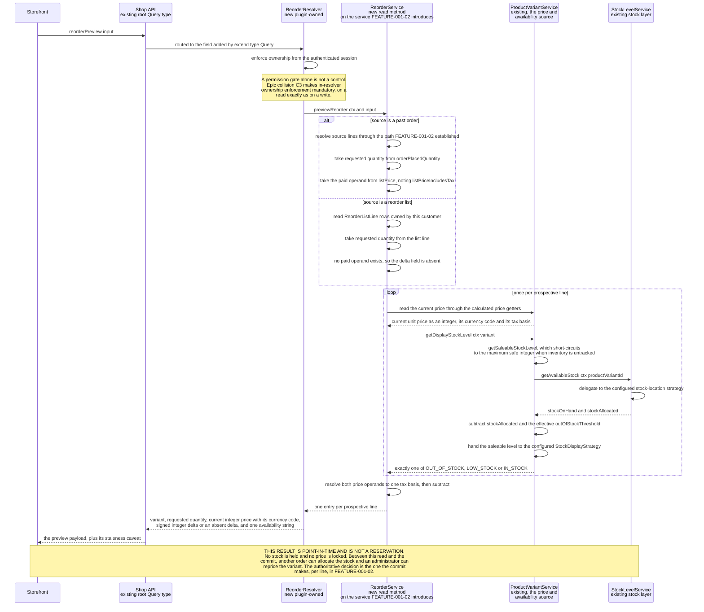

# FEATURE-001-03: Report the price and availability change on every prospective reorder line through one read-only Shop API query, so that a returning buyer learns what changed since the last purchase before any line is written to a cart

Parent epic: `tickets/EPIC-001-reorder-and-replenishment.md`. Sibling features are written as paths rather than as links, following the epic's own convention of keeping the link count in a file equal to the number of children that file indexes [tickets/EPIC-001-reorder-and-replenishment.md:§3. How To Read This Epic]. The only links in this file are the three story links in section 3.

This file is one of the four on the epic's curated read path, and the question it exists to answer has two halves: **how are buyers warned before they commit, and why is that not already solved** [tickets/EPIC-001-reorder-and-replenishment.md:§3. How To Read This Epic]. The second half is the harder one and it is answered first, in section 2.3, with evidence from a specification that already ships in this repository rather than with an assertion. A reader who opens only this file should stop at the end of section 2.11 with both halves answered.

---

## 1. Feature Title

**Report the price and availability change on every prospective reorder line through one read-only Shop API query, so that a returning buyer learns what changed since the last purchase before any line is written to a cart.**

Short name, used verbatim wherever this feature is referred to in one phrase, and identical to the label the epic's features index gives it: **Pre-Commit Price and Availability Delta Preview** [tickets/EPIC-001-reorder-and-replenishment.md:§4. Features Index]. The long form above is the action-object-outcome title this tier requires; the short form is the name to cite.

The epic classifies this feature's deviation from its originally suggested area as **narrowed to pre-commit**, and the narrowing is the substance of the feature rather than a reduction of it. The suggested area was price and availability change awareness at reorder, unqualified. Two mechanisms already discharge the in-cart, post-add half of that: the calculated getters `unitPriceChangeSinceAdded` and `unitPriceWithTaxChangeSinceAdded` [packages/core/src/entity/order-line/order-line.entity.ts:L163-L187], and the deployment-configurable `ChangedPriceHandlingStrategy` [packages/core/src/config/order/changed-price-handling-strategy.ts:L7-L38]. The epic's do-not-duplicate inventory forbids rebuilding either [tickets/EPIC-001-reorder-and-replenishment.md:§5. Existing Mechanisms That Must Not Be Duplicated]. **What is left after the narrowing is the before-commit read, and that is genuinely new.** Section 2.3 proves the claim rather than repeating it.

Delivery is part of the single self-contained plugin package the epic describes — `packages/reorder-plugin/`, exporting `ReorderPlugin`. No file under `packages/core` or `packages/admin-ui` is edited to deliver it.

---

## 2. Feature Summary

### 2.1 The Capability

A returning buyer names a reorder source — one past order, a chosen subset of that order's lines, or one saved reorder list — and receives, for **every** prospective line, the current unit price as an integer in the smallest unit of the resolved currency, the signed integer delta against what that line was priced at when it was last purchased, and the current availability expressed as exactly one of the three publicly observable stock strings. Nothing is written. No cart is created, no line is added, no stock is held.

The distinction that makes this feature coherent is the one in its own first sentence: **these are lines that are not yet in an order.** Every price-change mechanism this platform already ships describes a line that *is* already in an order.

### 2.2 Contribution To The Epic

This feature is the leading part of the epic's batch B3, "Pre-commit awareness" [tickets/EPIC-001-reorder-and-replenishment.md:§9.4 Run Batches]. It owns one step of the returning-buyer journey — requesting a reorder preview and reading the price and availability deltas it returns — sitting between opening a source and applying the reorder [tickets/EPIC-001-reorder-and-replenishment.md:§2.5 The Returning-Buyer Journey This Epic Builds].

It is the feature that discharges the part of the objective statement that most differentiates this epic from a plain bulk-add: that buyers "are made aware of price and availability changes before they commit to a reorder". The epic splits that span into **two separately labelled clauses** rather than one, and this feature is the only one that carries a story against each of them — clause C3, on buyers being made aware of price and availability changes, onto STORY-001-03-01, and clause C4, on doing so before the buyer commits, onto STORY-001-03-02 [tickets/EPIC-001-reorder-and-replenishment.md:§10.2 Objective-Clause Map]. That is why two of this feature's three stories carry a quoted traceability label rather than an inference, and it is the sharpest available statement of the feature's claim on the objective.

The epic also names this feature's first story as the **runner-up** for the demonstration slice, and its reason for the runner-up placing is worth carrying here intact rather than paraphrased: story 03-01 would arguably be the more persuasive demonstration, because it demonstrates the differentiating awareness clause, but it depends on FEATURE-001-02 being complete before there is anything to preview [tickets/EPIC-001-reorder-and-replenishment.md:§9.6 Nomination]. That dependency is stated as a fact of sequencing in section 4.1, not as a weakness of the feature.

Read the contribution precisely, because this feature is a **read** path and nothing else:

- **It does not write.** No cart is created, no line is added, no plugin-owned row is inserted. The write path is FEATURE-001-02's, and this feature calls none of it [tickets/EPIC-001/FEATURE-001-02-reorder-from-order-history.md:§2.1 The Capability].
- **It does not decide what to do about a line that cannot be added.** Skip, reduce, substitute and abort belong to FEATURE-001-04, which consumes this feature's availability outcome as its input.
- **It does not decide which price wins once a line is added.** That decision is already configurable per deployment, as section 2.7 records, and this feature neither participates in it nor overrides it.
- **It does not own the reorder-list tables.** `ReorderList` and `ReorderListLine` are FEATURE-001-01's, and the list-sourced preview only reads them [tickets/EPIC-001/FEATURE-001-01-named-reorder-lists.md:§2.4 Named Entities Touched].
- **It does not reserve stock.** Section 2.10 is devoted to this, because it is the single easiest thing to assume wrongly about a preview.

### 2.3 Why This Is Not Already Solved — The Question This File Exists To Answer

The most likely wrong reading of this feature is that it duplicates `unitPriceChangeSinceAdded`. That reading is wrong on the mechanics, and the mechanics are checkable in this checkout, so this section checks them instead of arguing.

**Claim one: the existing getter is already public, so a storefront can already read a price change.** True, and stated first because omitting it would overstate the gap. `OrderLine.unitPriceChangeSinceAdded: Money!` and `OrderLine.unitPriceWithTaxChangeSinceAdded: Money!` are published fields on the Shop API's `OrderLine` type [packages/core/src/api/schema/common/order.type.graphql:L133] and [packages/core/src/api/schema/common/order.type.graphql:L137], each carrying the schema's own description that the value is non-zero if the price has changed since it was initially added to the Order.

**Claim two: those fields are computed against the line's own history, not against today's catalogue price.** The getters derive the delta from `initialListPrice` [packages/core/src/entity/order-line/order-line.entity.ts:L113] compared against the line's current unit price [packages/core/src/entity/order-line/order-line.entity.ts:L163-L187], with `listPriceIncludesTax` [packages/core/src/entity/order-line/order-line.entity.ts:L128] deciding whether the comparison is made gross or net. `initialListPrice` is documented as the price calculated when the line was **first added to that Order** [packages/core/src/entity/order-line/order-line.entity.ts:L108-L111]. On a placed historical order, both operands therefore belong to that order. Neither is the price the variant carries today.

**Claim three — the decisive one: on a line that was added and never re-priced, the getter is zero, and this repository already asserts it.** A shipped specification, `describe('ChangedPriceHandlingStrategy')` [packages/core/e2e/order-changed-price-handling.e2e-spec.ts:L44], opens with the case `it('unitPriceChangeSinceAdded starts as 0')` [packages/core/e2e/order-changed-price-handling.e2e-spec.ts:L66]. It adds one item, then asserts the change field is exactly 0 [packages/core/e2e/order-changed-price-handling.e2e-spec.ts:L76] while the unit price is a non-zero integer [packages/core/e2e/order-changed-price-handling.e2e-spec.ts:L77], and asserts that the changed-price strategy was **not called at all** [packages/core/e2e/order-changed-price-handling.e2e-spec.ts:L78].

**Claim four: the field only becomes non-zero after a second write.** The next case in the same specification [packages/core/e2e/order-changed-price-handling.e2e-spec.ts:L88] updates the variant's price through the Admin API, adds the **same variant a second time**, and only then asserts a non-zero change value alongside the new unit price and a single strategy invocation [packages/core/e2e/order-changed-price-handling.e2e-spec.ts:L106-L108]. The sibling case for the adjust path asserts a **negative** value on the same field [packages/core/e2e/order-changed-price-handling.e2e-spec.ts:L131], which is how this repository already establishes that the delta is a signed integer rather than a magnitude.

Put those four together and the gap is exact rather than rhetorical:

- The existing mechanism requires a **write** into an order that already holds the variant. Its own trigger condition is adding to or adjusting a line whose latest price differs from the price at the time the line was created [packages/core/src/config/order/changed-price-handling-strategy.ts:L25-L30].
- A reorder buyer has made no such write. The line does not exist. There is nothing to compute a delta on.
- The comparison the buyer actually wants is between **what they paid** on a past order line and **what the variant costs now** — two operands the existing getter never brings together, because one of them is not in the order at all.
- And the operands the buyer's half of that comparison would need are not published anyway: the Shop API's `OrderLine` type exposes `unitPrice` and `unitPriceWithTax` [packages/core/src/api/schema/common/order.type.graphql:L127-L129] but exposes **no** `listPrice`, `initialListPrice` or `listPriceIncludesTax` field anywhere across its declared fields, which run from the type declaration [packages/core/src/api/schema/common/order.type.graphql:L120] to the closing brace [packages/core/src/api/schema/common/order.type.graphql:L188]. A storefront reading a past order therefore sees what the line was priced at, and can see a change *within that order's own lifetime*, and cannot see today's catalogue price on the same field set at all.

**The same argument holds on the availability side, and there it is stronger.** A raw stock figure is not publicly readable at all. `StockLevel` is absent from the checked-in Shop API introspection snapshot [schema-shop.json], and the Shop API's `ProductVariant` type carries exactly one stock field, `stockLevel: String!` [packages/core/src/api/schema/common/product.type.graphql:L56]. That field is deliberately a string: the strategy behind it exists because directly exposing stock levels over a public API is treated as a leak of sensitive information [packages/core/src/config/catalog/stock-display-strategy.ts:L7-L10]. So a storefront can already ask "is this variant in stock now", per variant, one variant at a time — but it cannot ask "which of the lines in this past order are no longer obtainable at the quantity I bought", because nothing correlates a historical line's quantity with a current saleable level.

**Conclusion, stated plainly because the epic requires the prohibition and the residue to be distinguishable: the only new thing in this feature is the pre-commit read.** Everything that happens once a line is in a cart is already solved, already configurable and already tested, and section 2.7 restates the prohibition attached to each piece of it. What is new is a correlated, per-line, read-only comparison across a source the buyer has chosen and the catalogue as it stands now — and one operation that returns it in a single response instead of leaving a storefront to assemble it from per-variant reads it cannot fully assemble.

### 2.4 Named Entities Touched

**This feature introduces no new table.** That is a deliberate design outcome, not an omission, and section 2.11 states the consequence for migrations. Every row the preview needs already exists, in the platform's own order, catalogue and stock tables or in FEATURE-001-01's list tables. The feature reads and owns nothing.

Existing platform entities, read and never altered:

- **`OrderLine`** — the source of the "what I paid" operand. Five columns are load-bearing. `quantity` is the live quantity [packages/core/src/entity/order-line/order-line.entity.ts:L97] and `orderPlacedQuantity` is the quantity as at placement [packages/core/src/entity/order-line/order-line.entity.ts:L104]; the preview projects the requested quantity from `orderPlacedQuantity`, matching the rule the commit path already fixed, so that a preview and the commit it previews agree on the number of units [tickets/EPIC-001/FEATURE-001-02-reorder-from-order-history.md:§2.3 Named Entities Touched]. `listPrice` is the price as listed by the variant at the time [packages/core/src/entity/order-line/order-line.entity.ts:L121], `initialListPrice` is the price calculated when the line was first added to that order [packages/core/src/entity/order-line/order-line.entity.ts:L113], and `listPriceIncludesTax` records whether either figure is gross [packages/core/src/entity/order-line/order-line.entity.ts:L128]. **The third of those is not an optional detail:** comparing a gross historical figure against a net current figure yields a delta that is arithmetically real and semantically meaningless, so the preview resolves both operands to the same tax basis before subtracting, and the payload states which basis it used. `customFields` [packages/core/src/entity/order-line/order-line.entity.ts:L143] is named only to record that this feature declares none, per section 2.13.
- **`Order`** — the container that makes a source addressable and its historical prices attributable to a point in time. This feature reads it through the paths FEATURE-001-02 already established and adds no order-reading operation of its own [tickets/EPIC-001/FEATURE-001-02-reorder-from-order-history.md:§2.5 Named API Surfaces].
- **`ProductVariant`** — the source of every "what it costs now" and "what is obtainable now" operand. `enabled` [packages/core/src/entity/product-variant/product-variant.entity.ts:L53] is the variant state that makes a line unobtainable regardless of stock. The current price is not a stored column at all: `listPrice`, `listPriceIncludesTax` and `currencyCode` are annotated as calculated at run time [packages/core/src/entity/product-variant/product-variant.entity.ts:L61], [packages/core/src/entity/product-variant/product-variant.entity.ts:L66] and [packages/core/src/entity/product-variant/product-variant.entity.ts:L71], and the readable figures are the calculated getters `price` [packages/core/src/entity/product-variant/product-variant.entity.ts:L76] and `priceWithTax` [packages/core/src/entity/product-variant/product-variant.entity.ts:L92], each of which resolves the tax basis from `listPriceIncludesTax` before rounding. **This is why the preview reads the variant rather than a price table: the price a buyer would pay today is a per-request computation, not a row.** Three further columns are the availability preconditions: `outOfStockThreshold` [packages/core/src/entity/product-variant/product-variant.entity.ts:L144], `useGlobalOutOfStockThreshold` [packages/core/src/entity/product-variant/product-variant.entity.ts:L152] and `trackInventory` [packages/core/src/entity/product-variant/product-variant.entity.ts:L155], the last being a three-valued inherit flag rather than a boolean.
- **`StockLevel`** — the row behind the availability operand, and **never read directly by plugin code**, for the reason section 2.7 gives. It carries `stockOnHand` [packages/core/src/entity/stock-level/stock-level.entity.ts:L40] and `stockAllocated` [packages/core/src/entity/stock-level/stock-level.entity.ts:L43] under a unique index on the variant-and-location pair [packages/core/src/entity/stock-level/stock-level.entity.ts:L19], with the variant reference at [packages/core/src/entity/stock-level/stock-level.entity.ts:L30] and the location reference at [packages/core/src/entity/stock-level/stock-level.entity.ts:L37]. **Read the index precisely, because it is the reason plugin code may not sum these rows.** It is unique on the *pair*, not on the variant, so it forbids two rows for one variant at one location while permitting one row per location for the same variant — that is, a variant holds as many stock rows as there are locations stocking it, and how those rows combine into a single answer is the configured location strategy's decision rather than an addition anyone may perform. Hence the prohibition in section 2.7 and the mandated service call.
- **`Channel`** — supplies the request scope described in section 2.9.

Existing plugin-owned entities from FEATURE-001-01, read and never altered:

- **`ReorderList`** and **`ReorderListLine`**, the latter carrying the parent list id, a `ProductVariant` id and an integer quantity [tickets/EPIC-001/FEATURE-001-01-named-reorder-lists.md:§2.4 Named Entities Touched]. When the preview's source is a list, the requested quantity comes from the list line and the "what I paid" operand is **absent**, because a list line records no historical price. Section 2.6 states what the payload does about that, and it does not invent one.

### 2.5 Named Services And Configurable Strategies

- **`ProductVariantService` — existing, in `packages/core`, consumed and never modified.** Two members carry this feature's availability answer end to end, and reading them is what removes the need for the plugin to compute anything:
  - `getSaleableStockLevel` [packages/core/src/service/services/product-variant.service.ts:L323] — resolves the number of units actually available for purchase. Its arithmetic is `stockOnHand - stockAllocated - effectiveOutOfStockThreshold` [packages/core/src/service/services/product-variant.service.ts:L340], where the effective threshold is the variant's own value or the global one according to `useGlobalOutOfStockThreshold` [packages/core/src/service/services/product-variant.service.ts:L336-L338]. **Where inventory is not tracked it short-circuits to the maximum safe integer** [packages/core/src/service/services/product-variant.service.ts:L326-L331] rather than to zero, which is the behaviour a story must expect for an untracked variant instead of assuming a numeric level.
  - `getDisplayStockLevel` [packages/core/src/service/services/product-variant.service.ts:L361] — takes that saleable level and hands it to the configured display strategy [packages/core/src/service/services/product-variant.service.ts:L364]. This is the single call that turns a database precondition into the publicly observable string, and it is the call the preview consumes.
- **`StockLevelService` — existing, consumed.** `getAvailableStock` [packages/core/src/service/services/stock-level.service.ts:L72] resolves available stock through the configured stock-location strategy [packages/core/src/service/services/stock-level.service.ts:L79], returning the on-hand and allocated pair the saleable computation subtracts from [packages/core/src/config/catalog/stock-location-strategy.ts:L18-L20]. `getStockLevelsForVariant` [packages/core/src/service/services/stock-level.service.ts:L56] is named for a different reason: it is the member that filters stock rows by the request's channel [packages/core/src/service/services/stock-level.service.ts:L63], whereas `getAvailableStock` delegates the multi-location question to the strategy instead. **A story that needs to state how a multi-location deployment resolves availability must name the strategy, not a sum.**
- **`ReorderService` — new, plugin-owned, and extended rather than duplicated.** FEATURE-001-02 introduces this service and gives it the source-resolution and ownership-enforcement logic for both the order source and the list source [tickets/EPIC-001/FEATURE-001-02-reorder-from-order-history.md:§2.4 Named Services]. This feature adds a read method to the same service rather than creating a parallel one, so source resolution and the ownership rule have exactly one implementation across the preview and the commit. **If the preview resolved sources through its own code path, a preview and a commit could disagree about which lines are even in scope — which is the one disagreement between them that would be a defect rather than staleness.**
- **`ReorderListService` — existing after FEATURE-001-01, plugin-owned, read only.** The list-sourced preview resolves its rows through it, so FEATURE-001-01's ownership rule is not reimplemented [tickets/EPIC-001/FEATURE-001-01-named-reorder-lists.md:§2.5 Named Services].
- **`TransactionalConnection` — existing, consumed for reads only.** This feature writes no row, so its use is confined to reading inside the request's transaction [tickets/EPIC-001-reorder-and-replenishment.md:§7.4 Existing Entities And Services The Work Depends On].
- **`StockDisplayStrategy` — existing configurable strategy, consumed and never bypassed.** Its contract is one method, `getStockLevel` [packages/core/src/config/catalog/stock-display-strategy.ts:L27], declared on the interface [packages/core/src/config/catalog/stock-display-strategy.ts:L21], taking a saleable stock level [packages/core/src/config/catalog/stock-display-strategy.ts:L30] and returning the string used directly in the GraphQL `ProductVariant.stockLevel` field [packages/core/src/config/catalog/stock-display-strategy.ts:L24-L25]. It is deployment-configurable through `catalogOptions.stockDisplayStrategy` [packages/core/src/config/catalog/stock-display-strategy.ts:L14].
- **`DefaultStockDisplayStrategy` — the shipped implementation, and the source of the three exact strings.** The class [packages/core/src/config/catalog/default-stock-display-strategy.ts:L14] returns `OUT_OF_STOCK` when the saleable level is below one, `LOW_STOCK` when it is at or below the constructor's `lowStockLevel`, and `IN_STOCK` otherwise [packages/core/src/config/catalog/default-stock-display-strategy.ts:L17-L21]. **`lowStockLevel` defaults to 2** [packages/core/src/config/catalog/default-stock-display-strategy.ts:L15], which is a shipped default cited from source rather than a threshold this ticket set chose; the strategy's own documentation states the same default [packages/core/src/config/catalog/default-stock-display-strategy.ts:L9-L10]. A story that needs a low-stock precondition uses that default and says it is the default, and a deployment that has replaced the strategy changes the observable string without changing anything this feature owns.
- **`ChangedPriceHandlingStrategy` — existing configurable strategy, deliberately NOT consumed.** It is named here so the exclusion is explicit rather than accidental. No plugin code in this feature calls it, configures it or reimplements it; section 2.7 gives the reason.

### 2.6 Named API Surfaces — One New Query, Zero Existing Signatures Changed

**Existing read paths this feature consumes and does not extend:**

- `ProductVariant.stockLevel: String!` [packages/core/src/api/schema/common/product.type.graphql:L56] — the only publicly observable availability surface on the Shop API's `ProductVariant` type [packages/core/src/api/schema/common/product.type.graphql:L42]. The preview's availability field reports the same vocabulary this field reports, resolved through the same strategy, so a buyer never sees two different answers to "is this in stock" from one deployment.
- `ProductVariant.price: Money!`, `ProductVariant.currencyCode: CurrencyCode!` and `ProductVariant.priceWithTax: Money!` [packages/core/src/api/schema/common/product.type.graphql:L53-L55] — the current-price operands, already public and already per-request.
- `OrderLine.unitPrice: Money!` and `OrderLine.unitPriceWithTax: Money!` [packages/core/src/api/schema/common/order.type.graphql:L127-L129] — the historical operands as the API already exposes them.
- The source-order and source-list read paths, which belong to FEATURE-001-02 and FEATURE-001-01 respectively and are not re-declared here [tickets/EPIC-001/FEATURE-001-02-reorder-from-order-history.md:§2.5 Named API Surfaces].

**The one new operation**, added through the plugin's `shopApiExtensions` using `extend type Query` — the mechanism the shipped wishlist example already demonstrates for a query [packages/dev-server/example-plugins/wishlist-plugin/api/api-extensions.ts:L12-L14]:

- `reorderPreview` — accepts **either** a source order reference **or** a reorder-list reference, optionally narrowed to a subset of source lines, and returns one entry per prospective line carrying the variant reference, the requested quantity as an integer, the current unit price as an integer in the smallest unit of the resolved currency together with that currency code and the tax basis it was resolved on, the signed integer delta against the last purchased price, and the availability as exactly one of the three strings from section 2.5. **The input shape deliberately mirrors the commit mutation's**, so that a preview and the commit it previews describe the same set of lines and a storefront passes the same arguments to both.
- **Where a source line has no historical price, the delta field is absent rather than zero.** A list-sourced line records no price, as section 2.4 notes, and reporting an absent comparison as a zero delta would assert that nothing changed — a false statement dressed as a number. Absence is the honest encoding, and story 03-03 fixes it in the published payload.

No mutation is added by this feature. No Admin API operation is added by this feature. **No new error result and no new table is added by this feature**, for the reasons in section 2.11.

**The additive-only constraint stated as a countable surface rather than as an intention.** The Shop API root `Query` type declares nineteen root queries [packages/core/src/api/schema/shop-api/shop.api.graphql:L1-L52], and the order, cart and customer-account mutation sets live in the same file. Every one of those signatures is byte-identical after this feature ships, and `reorderPreview` makes the root query type twenty fields wide by addition rather than by modification. Four of the nineteen are named individually in section 5 because this feature reads the same rows they do: `activeCustomer` [packages/core/src/api/schema/shop-api/shop.api.graphql:L5], `order` [packages/core/src/api/schema/shop-api/shop.api.graphql:L34], `orderByCode` [packages/core/src/api/schema/shop-api/shop.api.graphql:L41] and `search` [packages/core/src/api/schema/shop-api/shop.api.graphql:L47] — the last because it is the query through which a storefront most commonly observes `ProductVariant.stockLevel`, so an unchanged `search` response is the practical evidence that the display strategy was consumed and not replaced.

Where a platform mechanism would widen an existing signature as a side effect of an otherwise additive change, that is a reportable violation recorded in the epic's collision section and referenced here rather than re-argued or quietly absorbed [tickets/EPIC-001-reorder-and-replenishment.md:§6.1 Repository-Discovered Collisions]. This feature declares no custom field on any core entity, which is what keeps the widening the epic's first collision describes from becoming true of this deployment.

### 2.7 The Existing Mechanisms This Feature Consumes Rather Than Rebuilds

The epic's do-not-duplicate inventory assigns this feature **four** mechanisms [tickets/EPIC-001-reorder-and-replenishment.md:§5. Existing Mechanisms That Must Not Be Duplicated]. Three carry a prohibition against rebuilding them; the fourth carries a positive obligation to call it. They are separated below on exactly that line, because a reviewer checking this feature needs to know which mechanisms are walls and which is a required doorway.

#### Mechanism one — the two in-cart change getters. Prohibited to duplicate.

`unitPriceChangeSinceAdded` and `unitPriceWithTaxChangeSinceAdded` are calculated getters that report a non-zero delta when a line's unit price changed since it was added, derived from `initialListPrice`, `listPrice` and `listPriceIncludesTax` [packages/core/src/entity/order-line/order-line.entity.ts:L163-L187]. Both are already published on the Shop API [packages/core/src/api/schema/common/order.type.graphql:L133] and [packages/core/src/api/schema/common/order.type.graphql:L137].

*The prohibition, in the epic's own terms:* do not add a plugin-owned column, field or getter that recomputes an in-cart price delta; the pre-commit preview reads variant price directly and is a separate concern from these getters, which govern lines already in an order [tickets/EPIC-001-reorder-and-replenishment.md:§5. Existing Mechanisms That Must Not Be Duplicated].

*What is left over as new.* The comparison across a **historical** line and the **current** variant price, for a line that is not in any order. Section 2.3 establishes with a shipped specification that the getters do not perform it and structurally cannot.

#### Mechanism two — `ChangedPriceHandlingStrategy`. Prohibited to duplicate, and prohibited to participate in.

The strategy governs the outcome when a variant's price changed while an item is already in an order. Its interface [packages/core/src/config/order/changed-price-handling-strategy.ts:L24] declares one method, `handlePriceChange` [packages/core/src/config/order/changed-price-handling-strategy.ts:L32], called when adding to or adjusting order lines if the latest price differs from the initial price at the time the line was created [packages/core/src/config/order/changed-price-handling-strategy.ts:L25-L30]. Two facts from its own documentation decide this feature's posture toward it:

- **By default the latest price is used, and the resulting change is reflected in the GraphQL `OrderLine.unitPrice[WithTax]ChangeSinceAdded` field** [packages/core/src/config/order/changed-price-handling-strategy.ts:L12-L13]. The two mechanisms are one mechanism seen from two ends, which is why duplicating either duplicates both.
- **It is configured through the `orderOptions.changedPriceHandlingStrategy` property of the deployment's configuration** [packages/core/src/config/order/changed-price-handling-strategy.ts:L17-L18]. The decision is therefore *deployment-owned*, and a plugin that made the same decision would be overriding an operator's choice.

*The prohibition, in the epic's own terms:* do not implement plugin logic that decides which price wins after an add; that decision is already configurable and deployment-owned, and the reorder preview only *reports* before the add [tickets/EPIC-001-reorder-and-replenishment.md:§5. Existing Mechanisms That Must Not Be Duplicated].

*What is left over as new.* Nothing, at commit time — and that is the point. This feature reports and stops. A consequence follows that every story must carry: **a deployment configured to keep the original price will commit a line at the historical price even though the preview reported the current one.** The preview is not wrong in that case and must not be "fixed" to guess the strategy's outcome; it reports the catalogue price, and the payload documentation says so, because inferring a configurable decision is exactly the duplication this prohibition forbids.

#### Mechanism three — `StockDisplayStrategy` and its default. Prohibited to bypass.

The strategy converts a saleable stock level into exactly one of `OUT_OF_STOCK`, `LOW_STOCK` or `IN_STOCK` [packages/core/src/config/catalog/default-stock-display-strategy.ts:L14-L23], and it exists **because** directly exposing stock levels over a public API is treated as a leak of sensitive information while a storefront still wants some indication of whether a variant is in stock [packages/core/src/config/catalog/stock-display-strategy.ts:L7-L10].

*The prohibition, in the epic's own terms:* do not expose a numeric stock figure on any Shop API field; `StockLevel` is not a Shop API type at all, so availability is publicly observable only as one of those three strings [tickets/EPIC-001-reorder-and-replenishment.md:§5. Existing Mechanisms That Must Not Be Duplicated]. The repository bears this out: `StockLevel` is absent from the checked-in Shop API introspection snapshot [schema-shop.json].

*What is left over as new.* The **correlation**, not the vocabulary. The preview says which *lines of a chosen source* now resolve to which string at the quantity the buyer wants, which is a per-line statement about a set. `ProductVariant.stockLevel` says one thing about one variant and knows nothing about a quantity or a source. A story must not smuggle a number back in by reporting a shortfall as a count either: where a quantity cannot be met, the honest pre-commit encoding is the string plus the requested quantity, and the exact available figure arrives at commit time on `InsufficientStockError.quantityAvailable` [packages/core/src/api/schema/common/common-error-results.graphql:L53], which is a value the platform returns rather than one this feature discloses.

#### Mechanism four — `StockLevelService.getAvailableStock`. Mandated, not prohibited.

This is the doorway rather than a wall. The service resolves available stock for a variant through the configured stock-location strategy, so multi-location deployments are handled without plugin awareness [packages/core/src/service/services/stock-level.service.ts:L72] and [packages/core/src/service/services/stock-level.service.ts:L79].

*The obligation, in the epic's own terms:* do not query `StockLevel` rows directly and do not sum `stockOnHand` in plugin code; call the service so the configured location strategy stays authoritative [tickets/EPIC-001-reorder-and-replenishment.md:§5. Existing Mechanisms That Must Not Be Duplicated].

*How this feature discharges it.* It calls higher still. `getDisplayStockLevel` [packages/core/src/service/services/product-variant.service.ts:L361] already composes the saleable computation and the display strategy, and the saleable computation already calls `getAvailableStock` [packages/core/src/service/services/product-variant.service.ts:L332]. Consuming the composed call rather than the parts means the plugin never holds a raw stock number at all, which turns mechanism three's prohibition from a rule someone must remember into a property of the call graph.

### 2.8 Figure F3-SEQ — The Delta Read, And Why Its Result Is Point-In-Time

This is the only diagram in this feature. Story files in this feature carry none and reference this figure by the name **Figure F3-SEQ** instead.

Five readings of the figure are load-bearing and are stated so they are not inferred:

- **The plugin never touches a `StockLevel` row.** Every arrow into the stock layer goes through a service, and the value that comes back out to the plugin is a string. That is mechanism three's prohibition and mechanism four's obligation expressed as a shape rather than as a rule.
- **The loop is per line, and its cost is a design constraint rather than a target.** A preview over a large source performs the read once per prospective line. The epic's data-volume assumptions are the only anchor for what "large" means, and they are the harness's documented dataset shape rather than a figure invented here [tickets/EPIC-001-reorder-and-replenishment.md:§7.6 Data-Volume Assumptions]. **No timing figure appears anywhere in this feature**, because this repository declares none, as section 2.13 records.
- **Ownership is enforced before any source row is read.** A request authenticated as a different customer is refused at the resolver, so no order line and no list line is read on its behalf. A read path is not exempt from this: the whole content of a preview is one customer's purchase history.
- **The tax-basis reconciliation is a distinct step, drawn after the loop.** It is not folded into the price read, because the historical operand's basis is recorded per line on `listPriceIncludesTax` while the current operand's basis follows the channel, and the two can differ.
- **The staleness note is addressed to the whole span, not to one participant.** Nothing in the sequence establishes a claim on stock or on price, and section 2.10 states the consequence for every story.

### 2.9 Channel Scoping, Language Scoping And Monetary Values

The one new query is channel-scoped and language-scoped. This is a property of the request rather than an argument a caller may omit, so it holds without being restated per story [tickets/EPIC-001-reorder-and-replenishment.md:§7.5 Request Prerequisites].

- **Channel.** The active channel is identified by a unique token read from the `vendure-token` request header [packages/core/src/entity/channel/channel.entity.ts:L58], carried as a unique column on `Channel` [packages/core/src/entity/channel/channel.entity.ts:L62]. A source order or reorder list that belongs to a different channel token does not resolve, and the preview reports an unresolvable source rather than reading across the boundary — the same hard boundary the commit path already fixed [tickets/EPIC-001/FEATURE-001-02-reorder-from-order-history.md:§2.9 Channel Scoping]. **The boundary matters more to a preview than to a write**, because the current price and the current availability are both channel-resolved, so a cross-channel read would return two figures that are each accurate within their own channel and that mean nothing when subtracted from one another.
- **Language.** Translated output resolves against the request's `languageCode`, which defaults to the channel's `defaultLanguageCode` [packages/core/src/entity/channel/channel.entity.ts:L74]. This feature stores no string of its own and translates nothing. Every field it adds is an identifier, an integer, a currency code, a tax-basis flag or one of the three fixed availability strings — **none of which is language-varying, and the availability strings deliberately are not**, because they are machine-readable tokens that a storefront localises for display rather than sentences this feature would then have to own in every catalogue.
- **Money.** Every monetary value in this feature's payload is an **integer in the smallest unit of its currency, stated alongside its currency code**, which defaults to `Channel.defaultCurrencyCode` [packages/core/src/entity/channel/channel.entity.ts:L88]. A decimal monetary value is a defect, not a formatting preference. The repository's default money handling backs the integer form directly: the shipped money strategy stores monetary values as an integer column [packages/core/src/config/entity/default-money-strategy.ts:L8] and [packages/core/src/config/entity/default-money-strategy.ts:L16]. **Note the honest qualification, because a payload contract has to be written against the scalar and not against the strategy:** the published `Money` scalar is based on the native float scalar [packages/core/src/api/config/money-scalar.ts:L29] and its own description admits signed fractional values [packages/core/src/api/config/money-scalar.ts:L33-L35], precisely so that a deployment may configure a different money strategy. The scalar therefore does not enforce the integer form; this feature's payload documentation states it, and story 03-03 owns saying so.
- **Tax basis is part of the value, not a presentation concern.** Whether a quoted price is gross or net is governed by `Channel.pricesIncludeTax` [packages/core/src/entity/channel/channel.entity.ts:L113] for the current operand and by the source line's own `listPriceIncludesTax` [packages/core/src/entity/order-line/order-line.entity.ts:L128] for the historical one. **A delta computed across two different bases is a defect even though it is arithmetically well-formed**, so the payload names the basis both operands were resolved to. By way of illustration rather than specification: a source line last purchased at a `listPrice` of 129900 whose variant now prices at 134900, both integers in the smallest unit of the currency named by the accompanying currency code and both resolved to the same basis, yields a reported delta of 5000. A source line whose variant now prices at 124900 on the same terms yields a reported delta of -5000, and the sign is meaningful rather than cosmetic — the platform's own change field is already signed, as section 2.3's citation of a negative assertion shows.
- **The live inventory thresholds are the Channel-level pair, not the deprecated global pair.** `Channel.trackInventory` [packages/core/src/entity/channel/channel.entity.ts:L100] and `Channel.outOfStockThreshold` [packages/core/src/entity/channel/channel.entity.ts:L108] are the non-deprecated declarations; the `GlobalSettings` equivalents are annotated deprecated in favour of them [packages/core/src/entity/global-settings/global-settings.entity.ts:L32-L45]. **The `ProductVariant` JSDoc still directs a reader to the global settings for the out-of-stock threshold** [packages/core/src/entity/product-variant/product-variant.entity.ts:L146-L152]; that is one of the three documentation discrepancies the epic reports, and it is referenced here rather than repeated or corrected [tickets/EPIC-001-reorder-and-replenishment.md:§6.3 Repository Documentation Discrepancies].
- **A reading note that is not the same discrepancy, and that a story author will otherwise trip over.** In this checkout the saleable-stock computation reads its threshold and its tracking flag from the global settings service [packages/core/src/service/services/product-variant.service.ts:L324], and that service returns the single global row rather than a channel-scoped value [packages/core/src/service/services/global-settings.service.ts:L63]; the per-variant threshold helper reads the same source [packages/core/src/service/services/product-variant.service.ts:L344]. **The consequence is practical: a specification that sets only the Channel-level threshold and expects the availability string to change is asserting something this code path does not do today.** Stock preconditions in this feature's stories are therefore stated as the variant-level columns plus the tracking flag, which is exactly how the existing stock specification sets them up [packages/core/e2e/stock-control.e2e-spec.ts:L595-L611]. This is recorded as an observation about the current call path, and classifying it is the epic's business rather than this feature's.

### 2.10 A Point-In-Time Read Is Not A Reservation

This section exists because the mistake it prevents is the natural one to make about a feature whose whole purpose is to tell a buyer what is available.

**Nothing in this feature holds stock and nothing in it locks a price.** The preview is a read. It creates no allocation, no hold, no expiry and no claim of any kind, and no field in its payload may be named or documented in a way that suggests otherwise.

The sequence is unavoidable and is drawn as such in Figure F3-SEQ: the buyer requests a preview, the buyer decides, and then the commit runs. Between the read and the write, another order can allocate the same stock and an administrator can reprice the variant. Three consequences are carried into every story in this feature:

- **The commit is authoritative, not the preview.** The commit path validates each item at write time and accumulates a per-item outcome rather than aborting, and its authoritative availability decision is the one made then [tickets/EPIC-001/FEATURE-001-02-reorder-from-order-history.md:§2.10 A Point-In-Time Read Is Not A Reservation]. A preview that showed a line as obtainable does not entitle it to be added.
- **A preview and a commit disagreeing is expected behaviour, not a defect.** A story that asserts the two always agree is asserting something this platform does not guarantee. What *is* a defect is the two disagreeing about which lines are in scope, which is why section 2.5 puts source resolution in one service for both.
- **The staleness caveat is part of the published contract, not a footnote in a wiki.** It appears in the payload documentation story 03-03 produces, so a storefront developer reading the schema learns it without reading this file. **No freshness window is stated**, in any unit, because this repository declares no such figure and inventing one would be worse than saying nothing: a stated window would imply a guarantee the read does not make.

The honest framing to carry: a preview reduces surprise, and it does not eliminate it. Eliminating it would require a reservation, a reservation would require holding stock against an uncommitted intention, and that is a write — which this feature does not perform and the additive-only constraint would make a different feature entirely.

### 2.11 No New Table, No New Error Result, No New Permission Enum Growth Beyond The Reads It Gates

Four negative statements, each a deliberate design outcome that a reviewer should be able to check rather than take on trust.

- **No new table.** Every operand already exists in a platform table or in FEATURE-001-01's tables, as section 2.4 sets out. **Therefore this feature carries no migration**, additive or otherwise, and the additive-migrations-only constraint is satisfied vacuously. Section 5 requires that stated as evidence rather than assumed, because "no migration" is a claim a reviewer can verify in a diff.
- **No new error result.** None of the six error results this ticket set declares belongs to this feature; they belong to FEATURE-001-01, FEATURE-001-02 and FEATURE-001-06, and those two of the three that are already written record the split from their own side [tickets/EPIC-001/FEATURE-001-01-named-reorder-lists.md:§2.10 The Error Vocabulary This Feature Introduces] and [tickets/EPIC-001/FEATURE-001-02-reorder-from-order-history.md:§2.11 The Error Vocabulary This Feature Introduces]. A preview over an unresolvable source, or over a source that resolves to zero lines, reports the condition through the vocabulary those features already establish rather than adding a parallel one.
- **Therefore this feature does not grow the published `ErrorCode` enum.** The enum's members are derived automatically from every type implementing the `ErrorResult` interface [packages/core/src/api/config/generate-error-code-enum.ts:L9], matched against the interface-name constant declared in the same file [packages/core/src/api/config/generate-error-code-enum.ts:L3] by a filter over each type's declared interfaces [packages/core/src/api/config/generate-error-code-enum.ts:L17]. Because this feature declares no implementor, it contributes no member. **Story 03-03 still carries the enum-growth guidance**, because the payload it stabilises is consumed alongside operations from sibling features that *do* grow the enum, and a client switching exhaustively on `ErrorCode` without a default branch breaks on their growth even though it does not break on this feature's. The argument for why the growth is unavoidable belongs to the epic and is not re-derived [tickets/EPIC-001-reorder-and-replenishment.md:§6.1 Repository-Discovered Collisions].
- **No error type is named outside the verified vocabulary.** This feature and its three stories name only the **thirty-one** types that already implement the `ErrorResult` interface in this checkout — fifteen in [packages/core/src/api/schema/common/common-error-results.graphql:L2] through [packages/core/src/api/schema/common/common-error-results.graphql:L103], and sixteen more in [packages/core/src/api/schema/shop-api/shop-error-results.graphql:L2] through [packages/core/src/api/schema/shop-api/shop-error-results.graphql:L130] — plus the six declared by this ticket set. Where this feature refers forward to a commit-time error it names `InsufficientStockError` and its `quantityAvailable` field [packages/core/src/api/schema/common/common-error-results.graphql:L50] and [packages/core/src/api/schema/common/common-error-results.graphql:L53], both of which exist today.

One further negative, recorded because its absence would look like an oversight: **the preview needs no new configurable strategy.** It consumes two that already exist and adds none. The one new strategy this epic introduces is FEATURE-001-04's substitution-candidate strategy, and it is that feature's to define.

### 2.12 Precedent In This Repository — None For The Capability, Partial For Each Mechanism

The searched set is the whole of `packages/dev-server/example-plugins/`, the whole of `packages/dev-server/test-plugins/` and `packages/dashboard/test-plans/` — the same set the epic's nomination searched [tickets/EPIC-001-reorder-and-replenishment.md:§9.6 Nomination]. **No shipped example performs a pre-commit comparison of any kind.** The wishlist plugin, the closest analogue for the shape of a customer-scoped Shop API addition, exposes three operations and none of them reads a price or a stock level [packages/dev-server/example-plugins/wishlist-plugin/api/api-extensions.ts:L12-L19].

The disclosure is more useful split by mechanism than given as a single verdict, because each half of this feature has a different amount of precedent behind it:

- **Adding a query through `extend type Query`: partial precedent, and it is exact.** The wishlist plugin demonstrates the idiom for a query on the authenticated customer's own data [packages/dev-server/example-plugins/wishlist-plugin/api/api-extensions.ts:L12-L14]. Nothing about the idiom is novel here, which is why no story in this feature is a candidate for a harness-proving nomination.
- **Reading availability as a display string: partial precedent, in a specification rather than a plugin.** The existing stock specification sets the four stock columns as database preconditions and then asserts the exact strings a variant reports [packages/core/e2e/stock-control.e2e-spec.ts:L595-L611] and [packages/core/e2e/stock-control.e2e-spec.ts:L618-L627]. This feature's availability stories are written against that pattern, and section 5 makes it the regression evidence.
- **Reading a price change: partial precedent, and it is the precedent that proves the gap rather than closing it.** The changed-price specification exercises the in-cart mechanism thoroughly [packages/core/e2e/order-changed-price-handling.e2e-spec.ts:L44], and section 2.3 uses its own assertions to show why the mechanism does not answer the pre-commit question.
- **The capability itself — a correlated per-line pre-commit delta over a chosen source: none.** There is nothing in the searched set to model it on and nothing to disclose as near-identical.

The epic's honesty requirement bites in the opposite direction from FEATURE-001-01, and it is worth stating plainly. Where that feature must disclose that it re-applies heavily precedented work [tickets/EPIC-001/FEATURE-001-01-named-reorder-lists.md:§2.3 What Already Exists, And What Is New], this feature's risk is the reverse: it looks novel while sitting one step away from a shipped mechanism, so the discipline it needs is not modesty about originality but precision about scope. Section 2.3 supplies the precision, and section 2.7 supplies the boundary.

### 2.13 Constraints This Feature Is Built Under

These are boundaries on the work this feature describes, not preamble. Each is carried into the definition of done in section 5. They derive from the epic's stated architectural constraints and from cited repository conventions; **no user-specified rules were provided for this project**, so nothing below is attributed to one [tickets/EPIC-001-reorder-and-replenishment.md:§11.9 User-Specified Rules].

- **Additive only.** One field added to the root `Query` type, zero new error results, zero changes to any existing operation's arguments, return type or nullability. A side-effect widening is a reportable violation, referenced from the epic and never absorbed silently [tickets/EPIC-001-reorder-and-replenishment.md:§6.1 Repository-Discovered Collisions].
- **Zero custom fields on a core entity.** This feature declares none. It has no reason to want one: it stores nothing, so there is no state to attach to `OrderLine` [packages/core/src/entity/order-line/order-line.entity.ts:L143] or to any other core entity. The dev-server configuration currently declares an empty custom-fields object [packages/dev-server/dev-config.ts:L116], and a reviewer should expect it still to be empty once this feature ships.
- **Zero edits to `packages/core` and `packages/admin-ui`.** Delivery is self-contained in the plugin package. The only two files a future implementation may touch outside its own package are the dev-server plugin registration array [packages/dev-server/dev-config.ts:L121-L155], where `ReorderPlugin` is registered, and the dashboard bundling configuration [packages/dev-server/vite.config.mts:L1]. **This feature needs the first and not the second, because it ships no dashboard surface.** Naming those files is a documentation act and does not license a documentation run to edit them [tickets/EPIC-001-reorder-and-replenishment.md:§11.7 The Two Permitted Configuration Exceptions].
- **Additive migrations only — and this feature has no migration**, as section 2.11 records. Section 5 requires that evidenced rather than assumed.
- **Integer money with its currency code, on one stated tax basis.** Section 2.9 sets out the form and the qualification about the scalar. A decimal monetary value anywhere in this feature or its stories is a defect.
- **Availability as a database precondition and a string outcome.** Stock scenarios name `stockOnHand`, `stockAllocated`, `trackInventory` and `outOfStockThreshold` as the preconditions a specification sets, and state the observable result as exactly one of the three strings the configured display strategy returns [packages/core/src/config/catalog/default-stock-display-strategy.ts:L17-L21]. Where a low-stock precondition is needed, the shipped default of 2 is cited as a default [packages/core/src/config/catalog/default-stock-display-strategy.ts:L15] rather than presented as a threshold this ticket set chose.
- **No external-service dependency.** Nothing in this feature calls out of process. Both operands, the correlation and the payload are satisfied by the database and the plugin's own service, which is why no interface-plus-default-implementation shim is needed here at all.
- **No invented metric.** This feature states no service-level commitment, no timing figure, no freshness window in any unit and no business figure, because this repository declares none and the epic reports that absence as a finding [tickets/EPIC-001-reorder-and-replenishment.md:§2.2 Business Value]. In particular **the preview is not described as fast, fresh or real-time**, and section 2.10 explains why a freshness claim would be actively misleading rather than merely unsupported. Where a story here needs precision it asserts a verifiable state instead: an exact line count with its ordering, an integer money value with its currency code and tax basis, an exact availability string, or an exact error type name.
- **Version tagging.** Doc blocks on the new public API carry `@since 3.8.0`. That value is *derived* from the next-minor rule in the contribution guide [CONTRIBUTING.md:§New features] applied to a 3.7.0 checkout [packages/core/package.json:L2-L3], and the epic flags the same derivation and warns against presenting it as a quotation [tickets/EPIC-001-reorder-and-replenishment.md:§11.2 Version Tagging].
- **No hand-written reference page.** The plugin's reference documentation is generated from JSDoc in the TypeScript sources, so this feature's documentation sub-tasks mean writing JSDoc, not authoring a page under the documentation tree [tickets/EPIC-001-reorder-and-replenishment.md:§11.5 Public API Documentation Is Generated, Not Hand-Written].

---

## 3. User Stories Index

Three stories. Titles are transcribed from the epic's story table and are not restated with different wording [tickets/EPIC-001-reorder-and-replenishment.md:§9.2 Story Table].

- [STORY-001-03-01 — Preview price changes before commit](./FEATURE-001-03/STORY-001-03-01-preview-price-changes-before-commit.md) — the new query, the order source, the historical-against-current comparison on one reconciled tax basis, and the signed integer delta with its currency code. Traceability is the quoted objective clause about buyers being made aware of price and availability changes, and this is the story the epic records as the **runner-up demonstration slice** [tickets/EPIC-001-reorder-and-replenishment.md:§9.6 Nomination].
- [STORY-001-03-02 — Preview availability changes before commit](./FEATURE-001-03/STORY-001-03-02-preview-availability-changes-before-commit.md) — the availability half, with the four stock columns as database preconditions and exactly one of `OUT_OF_STOCK`, `LOW_STOCK` or `IN_STOCK` as the observable outcome, plus the untracked-inventory case that short-circuits rather than reporting a level. Traceability is the quoted clause about acting before the buyer commits.
- [STORY-001-03-03 — Serve a stable delta preview payload](./FEATURE-001-03/STORY-001-03-03-stable-delta-preview-payload.md) — closes the payload contract the first two produce: the absent-rather-than-zero rule for a missing historical operand, the stated tax basis, the integer-money statement the `Money` scalar does not itself enforce, the published staleness caveat, the assertion that no existing operation changed, and the default-branch guidance for the `ErrorCode` enum that sibling features grow. Traceability is `Inferred` from the Primary Users block, the persona being the Storefront Developer consuming the Shop API [tickets/EPIC-001-reorder-and-replenishment.md:§10.3 Inferred Breakdown].

Estimates are deliberately absent from this file. Points, lines of code, generation hours and review hours live only in the epic's delivery-split table, which is the single source of truth for them, and each story transcribes its own four values from its row there [tickets/EPIC-001-reorder-and-replenishment.md:§9.2 Story Table].

Every story in this feature references **Figure F3-SEQ** in section 2.8 where it needs a visual, and embeds no diagram of its own.

---

## 4. Dependencies

Direction is stated for every entry, because a dependency without a direction cannot be sequenced.

### 4.1 Upstream — FEATURE-001-02 Fully, FEATURE-001-01 Transitively

**This feature depends on FEATURE-001-02 for the whole of itself, not for part of it.** The dependency is not a shared library call; it is conceptual and therefore total. A preview describes what a commit *would* do, so the commit it describes must exist first, or the preview has no defined subject and its payload has nothing to be consistent with. Two concrete consequences, each checkable:

- **Source resolution and ownership enforcement are FEATURE-001-02's, and are extended rather than rewritten.** The preview adds a read method to `ReorderService` [tickets/EPIC-001/FEATURE-001-02-reorder-from-order-history.md:§2.4 Named Services], which is why section 2.5 insists on one implementation for both paths.
- **The requested-quantity rule is FEATURE-001-02's.** The preview projects from `orderPlacedQuantity` [packages/core/src/entity/order-line/order-line.entity.ts:L104] because that is the rule the commit path already fixed [tickets/EPIC-001/FEATURE-001-02-reorder-from-order-history.md:§2.3 Named Entities Touched]. Choosing differently here would make the preview describe a commit that would not happen.

The epic's batch table records the same ordering from the other side — batch B3 depends on B2 [tickets/EPIC-001-reorder-and-replenishment.md:§9.4 Run Batches] — and the epic's own reason for demoting story 03-01 to runner-up demonstration slice is precisely this dependency [tickets/EPIC-001-reorder-and-replenishment.md:§9.6 Nomination]. All three statements agree, which is deliberate.

**FEATURE-001-01 is a transitive dependency, and only for the list source.** A list-sourced preview needs `ReorderListLine` rows to have somewhere to come from [tickets/EPIC-001/FEATURE-001-01-named-reorder-lists.md:§2.4 Named Entities Touched]. The order-sourced preview depends on it for nothing at all, and because FEATURE-001-02 already carries that same partial qualification on its own list path [tickets/EPIC-001/FEATURE-001-02-reorder-from-order-history.md:§4.1 Upstream], this feature inherits the qualification rather than adding a second one. **Practical consequence:** the order-source stories are buildable as soon as FEATURE-001-02's order path is merged, whether or not the list path is.

Every other prerequisite this feature has is an existing part of the platform, listed in section 4.4, or an open decision, listed in section 4.5.

### 4.2 Downstream — One Feature Depends On This One

Direction: the arrow points *into* this feature. It creates no reciprocal obligation here.

- **FEATURE-001-04 depends on this feature, for the signal it acts on.** Unavailable-line resolution — skip, reduce, substitute or abort — is a decision about a line the preview has already reported as unobtainable at the requested quantity, so the availability outcome in this feature's payload is that feature's input. The epic's feature graph carries the edge in that direction [tickets/EPIC-001-reorder-and-replenishment.md:§4. Features Index], and the epic's batch table places story 04-01 in batch B3 alongside this feature's three stories for exactly that reason [tickets/EPIC-001-reorder-and-replenishment.md:§9.4 Run Batches].

**No other feature depends on this one**, and that is worth stating rather than leaving to be inferred from an absence. The instrumentation feature records what a *commit* produced, not what a preview reported, and the recurring-demand aggregate reads recorded reorder activity rather than advisory reads — so neither has an edge from here. If a later change made a preview an auditable event, that would be a new dependency to declare, not one already implied.

### 4.3 Intra-Feature Story Order

- `STORY-001-03-01` and `STORY-001-03-02` are **independent of each other.** Neither is a prerequisite of the other: one reads the price operands and one reads the availability operands, over the same already-resolved source lines, and they touch no shared new state because this feature has none. They can be built in either order or concurrently. Classification: each has a data dependency on one placed order for the authenticated customer, and both share the code path FEATURE-001-02 supplies.
- `STORY-001-03-01` and `STORY-001-03-02` → `STORY-001-03-03`: the payload contract is closed over the fields the first two produce, so both must exist before there is a shape to stabilise. Direction: 03-03 depends on both. Classification: a shared code path only — 03-03 adds no new operand, no new source and no new data. **This is a case where true independence is impossible and is therefore named rather than hidden:** a contract cannot be fixed over fields that do not yet exist. 03-03 still delivers value on its own terms, because a published, documented, regression-asserted payload is what makes the two earlier stories consumable by a storefront rather than merely present.

Every edge above is a prerequisite, not a co-requisite: each story delivers value once the stories before it are merged.

### 4.4 Existing Entities, Services And Configuration Required

Stated in the epic's dependency form — the required thing, then why it is required and where it belongs.

- **Entity `OrderLine`:** supplies the historical price operand and the requested quantity for the order source, through `listPrice` [packages/core/src/entity/order-line/order-line.entity.ts:L121], `listPriceIncludesTax` [packages/core/src/entity/order-line/order-line.entity.ts:L128] and `orderPlacedQuantity` [packages/core/src/entity/order-line/order-line.entity.ts:L104]; required by 03-01 and 03-03.
- **Entity `ProductVariant`:** supplies the current price through its calculated getters [packages/core/src/entity/product-variant/product-variant.entity.ts:L76] and [packages/core/src/entity/product-variant/product-variant.entity.ts:L92], and the availability preconditions through `enabled` [packages/core/src/entity/product-variant/product-variant.entity.ts:L53], `outOfStockThreshold` [packages/core/src/entity/product-variant/product-variant.entity.ts:L144], `useGlobalOutOfStockThreshold` [packages/core/src/entity/product-variant/product-variant.entity.ts:L152] and `trackInventory` [packages/core/src/entity/product-variant/product-variant.entity.ts:L155]; required by all three stories.
- **Entity `StockLevel`:** supplies `stockOnHand` [packages/core/src/entity/stock-level/stock-level.entity.ts:L40] and `stockAllocated` [packages/core/src/entity/stock-level/stock-level.entity.ts:L43] as the database preconditions a specification sets, **read only through a service and never queried by plugin code**; required by 03-02 and 03-03.
- **Entity `Channel`:** supplies the token that scopes every read [packages/core/src/entity/channel/channel.entity.ts:L62], the default language code [packages/core/src/entity/channel/channel.entity.ts:L74], the default currency code [packages/core/src/entity/channel/channel.entity.ts:L88] and the tax basis for the current operand [packages/core/src/entity/channel/channel.entity.ts:L113]; required by all three stories.
- **Entities `ReorderList` and `ReorderListLine`:** supply the list-sourced preview's requested quantities; required by 03-03 for the absent-delta case, and delivered by FEATURE-001-01 [tickets/EPIC-001/FEATURE-001-01-named-reorder-lists.md:§2.4 Named Entities Touched].
- **Service `ProductVariantService`:** supplies the composed availability answer through `getDisplayStockLevel` [packages/core/src/service/services/product-variant.service.ts:L361] over `getSaleableStockLevel` [packages/core/src/service/services/product-variant.service.ts:L323]; required by 03-02 and 03-03.
- **Service `StockLevelService`:** resolves available stock through the configured location strategy [packages/core/src/service/services/stock-level.service.ts:L72]; required transitively by 03-02, and named so that no story reaches past it to the rows.
- **Service `ReorderService`:** supplies source resolution and ownership enforcement, extended here with one read method; required by all three stories and delivered by FEATURE-001-02 [tickets/EPIC-001/FEATURE-001-02-reorder-from-order-history.md:§2.4 Named Services].
- **Service `ReorderListService`:** resolves list source rows without reimplementing FEATURE-001-01's ownership rule; required by 03-03 [tickets/EPIC-001/FEATURE-001-01-named-reorder-lists.md:§2.5 Named Services].
- **Configuration `catalogOptions.stockDisplayStrategy`:** decides which strings a deployment reports, so a story states the shipped default rather than asserting the strings unconditionally [packages/core/src/config/catalog/stock-display-strategy.ts:L14]; required by 03-02 and 03-03.
- **Configuration `orderOptions.changedPriceHandlingStrategy`:** required as a **stated precondition rather than as a call**, because it decides whether a commit will honour the price the preview reported [packages/core/src/config/order/changed-price-handling-strategy.ts:L17-L18]; relevant to 03-01 and 03-03.
- **Configuration `authOptions.customPermissions`:** the registration point for the permission gating the new query, paired with in-resolver ownership enforcement because a permission alone is equivalent to public access [packages/core/src/api/config/generate-permissions.ts:L32-L34]; required by all three stories.
- **Configuration — the dev-server plugin registration array:** where `ReorderPlugin` is registered so the query is reachable at all [packages/dev-server/dev-config.ts:L121-L155]; required by all three stories and named as one of the two permitted configuration exceptions.
- **Data prerequisite — at least one placed order for the authenticated customer**, and for the delta to be non-zero, at least one variant repriced since that order was placed. The reprice is performed through the existing Admin API, exactly as the shipped changed-price specification performs it [packages/core/e2e/order-changed-price-handling.e2e-spec.ts:L91-L98]; required by 03-01 and 03-03.
- **Data prerequisite — a variant whose stock columns place it below its effective threshold**, set as the existing stock specification sets them [packages/core/e2e/stock-control.e2e-spec.ts:L595-L611]; required by 03-02 and 03-03.
- **Test harness `@vendure/testing`:** the end-to-end sub-task of each story is written against it, and no alternative harness is introduced [tickets/EPIC-001-reorder-and-replenishment.md:§7.3 Runtime Dependencies].
- **Demonstration environment:** the dev server, started from `packages/dev-server` with `bun run dev` [packages/dev-server/package.json:L13] and seeded with `bun run populate` [packages/dev-server/package.json:L8]. **Each story states that working directory rather than the bare command**, because neither script exists at the repository root. Where a precondition must be established through the Admin API — a reprice or a stock change — the documented default credentials are used, and no story in this feature exposes an Admin API surface of its own.

### 4.5 Open Decisions This Feature Waits On

These are dependencies on a decision rather than on code. None is resolved here; each belongs to a maintainer.

- **Zero custom fields, or accept the widening.** Section 2.13 assumes the zero-custom-fields resolution the epic recommends. This feature stores nothing, so it has no independent stake in the outcome — but if the decision goes the other way, the unchanged-signature evidence in section 5 cannot be produced for the operations this feature reads alongside [tickets/EPIC-001-reorder-and-replenishment.md:§8.2 Architectural Decisions].
- **The ownership-enforcement mechanism, and therefore how many permission definitions are registered.** In-resolver logic is not optional under any option, because the platform states a permission alone is equivalent to public access [packages/core/src/api/config/generate-permissions.ts:L32-L34]. **This bites on a read exactly as on a write**, since a preview's entire content is one customer's purchase history [tickets/EPIC-001-reorder-and-replenishment.md:§8.2 Architectural Decisions].
- **The maximum number of lines per list.** It bounds how large a list-sourced preview can be and therefore how many times the per-line loop in Figure F3-SEQ runs. The value is an open product decision and this feature may not invent one [tickets/EPIC-001-reorder-and-replenishment.md:§8.1 Product Decisions].
- **The branch target.** It blocks no story's design and gates every story's merge, and it is a three-way conflict in this repository's own documentation rather than an oversight [tickets/EPIC-001-reorder-and-replenishment.md:§11.1 The Branch Target Is A Three-Way Conflict]. **This feature adds no table**, so the classification that routes a schema change to `major` [CONTRIBUTING.md:§Breaking Changes] does not bite on this feature's own changes — but it bites on FEATURE-001-01, which the list source depends on transitively, so the decision still gates the list-sourced story.

### 4.6 Cycle Check

**No dependency cycle exists here, and the check is stated rather than assumed.**

Reading the epic's feature graph, the edges touching this feature are two inbound — from the objective node and from `F2` — and one outbound, to `F4` [tickets/EPIC-001-reorder-and-replenishment.md:§4. Features Index]. A cycle through this node would need a path back from `F4` to `F2` or to this feature; the graph has none, since `F4`'s only outbound edge runs forward to `F8`, whose out-degree is zero. Inside the feature, section 4.3 gives a partial order over three stories with no back edge: two independent stories and one that depends on both.

Two relationships could be mistaken for cycles and are resolved explicitly:

- **This feature previews what FEATURE-001-02 commits, which reads as mutual.** It is not, and the sibling feature resolves it from its own side in the same terms: the preview is a read that calls nothing in the commit path, and the commit path is deliberately specified without reference to whether a preview happened [tickets/EPIC-001/FEATURE-001-02-reorder-from-order-history.md:§4.2 Downstream]. **Section 2.10 is what keeps the edge one-way** — because a preview confers no entitlement, the commit has no reason to consult it, and a commit that did consult it would create the cycle.
- **FEATURE-001-04 resolves lines that this feature reports, and its resolution feeds a commit that this feature previewed.** That is a path forward through three nodes, not a loop back: this feature reports, FEATURE-001-04 decides, FEATURE-001-02 writes. No arrow returns to this feature from either, because neither reads the preview payload at write time — they read the live state, which is the same reason the commit is authoritative.

---

## 5. Definition of Done (Feature-Level)

Six items, each verifiable by a named command, a named specification or a named count. Numeric coverage targets are deliberately absent from this block: the story-level definition of done owns the coverage figure, and this tier states none.

- [ ] **All three stories in section 3 are accepted against their own story-level definitions of done**, with none waived, deferred or partially accepted, and each story's estimate block matching its row in the epic's delivery-split table [tickets/EPIC-001-reorder-and-replenishment.md:§9.2 Story Table].
- [ ] **Neither existing price mechanism is duplicated, and the evidence is structural rather than a reviewer's impression.** The plugin contains no column, field or getter that recomputes an in-cart price delta; `reorderPreview` obtains its current-price operand from the variant's own calculated getters [packages/core/src/entity/product-variant/product-variant.entity.ts:L76] and [packages/core/src/entity/product-variant/product-variant.entity.ts:L92] rather than re-implementing `unitPriceChangeSinceAdded` or `unitPriceWithTaxChangeSinceAdded` [packages/core/src/entity/order-line/order-line.entity.ts:L163-L187]; no plugin code calls, configures or reimplements `handlePriceChange` [packages/core/src/config/order/changed-price-handling-strategy.ts:L32]; and the existing changed-price specification passes unmodified [packages/core/e2e/order-changed-price-handling.e2e-spec.ts:L44], proving the in-cart mechanism still behaves as it did.
- [ ] **Availability is reported only as one of the three exact strings, and the plugin never holds a raw stock figure.** The preview's availability field is obtained through `getDisplayStockLevel` [packages/core/src/service/services/product-variant.service.ts:L361], so the configured display strategy remains authoritative [packages/core/src/config/catalog/stock-display-strategy.ts:L27] and the shipped default's three return values are the whole vocabulary [packages/core/src/config/catalog/default-stock-display-strategy.ts:L17-L21]. No plugin query reads `StockLevel` rows [packages/core/src/entity/stock-level/stock-level.entity.ts:L19] and no plugin code sums `stockOnHand` [packages/core/src/entity/stock-level/stock-level.entity.ts:L40]; no numeric stock figure appears on any field this feature adds, consistent with `StockLevel` being absent from the Shop API [schema-shop.json].
- [ ] **The staleness caveat is present in the published payload documentation, and no freshness figure is stated anywhere.** JSDoc on the new public API, carrying the derived `@since 3.8.0` tag [CONTRIBUTING.md:§New features], records that the result is a point-in-time read and not a reservation, that no stock is held and no price is locked, that the commit re-evaluates per line [tickets/EPIC-001/FEATURE-001-02-reorder-from-order-history.md:§2.10 A Point-In-Time Read Is Not A Reservation], that a missing historical operand yields an absent delta rather than a zero, that money is an integer in the smallest unit of the stated currency on the stated tax basis even though the `Money` scalar does not itself enforce it [packages/core/src/api/config/money-scalar.ts:L29], and that a deployment configured to keep the original price may commit at a price other than the one previewed [packages/core/src/config/order/changed-price-handling-strategy.ts:L12-L13]. No field, description or story text states a latency figure, a freshness window in any unit, or any other numeric target, because this repository declares none [tickets/EPIC-001-reorder-and-replenishment.md:§2.2 Business Value].
- [ ] **`git diff --stat -- packages/core packages/admin-ui` prints nothing**, the dev-server custom-fields object is still empty [packages/dev-server/dev-config.ts:L116], and the only file changed outside the plugin package is the dev-server plugin registration array [packages/dev-server/dev-config.ts:L121-L155]. The dashboard bundling configuration [packages/dev-server/vite.config.mts:L1] is **not** touched, because this feature ships no dashboard surface. **This feature adds no migration and no table**, which is evidenced by the same diff showing no migration file and by the end-to-end suite passing without the cached seed data being reset [tickets/EPIC-001-reorder-and-replenishment.md:§11.3 Operational Reset Steps After A Schema Change].
- [ ] **`ProductVariant.stockLevel`, `activeOrder` and `search` are evidenced as behaviourally unchanged**, by re-running the existing stock-control specification unmodified — including the case that asserts the exact display strings against database preconditions [packages/core/e2e/stock-control.e2e-spec.ts:L618-L627] — together with the shop-order specification [CONTRIBUTING.md:§End-to-end Tests], and by confirming that `ProductVariant.stockLevel` still resolves to `String!` [packages/core/src/api/schema/common/product.type.graphql:L56], that `activeOrder` [packages/core/src/api/schema/shop-api/shop.api.graphql:L11] and `search` [packages/core/src/api/schema/shop-api/shop.api.graphql:L47] return what they returned before, and that the root `Query` type still declares its nineteen existing queries unchanged in signature with `reorderPreview` added beside them and nothing else altered [packages/core/src/api/schema/shop-api/shop.api.graphql:L1-L52]. The specification runs on the four engine jobs that already exist — `e2e-sqljs` [.github/workflows/build_and_test.yml:L174], `e2e-mariadb` [.github/workflows/build_and_test.yml:L202], `e2e-mysql` [.github/workflows/build_and_test.yml:L240] and `e2e-postgres` [.github/workflows/build_and_test.yml:L276] — with **native SQLite named as an unverified engine and not claimed**, because the harness exports initializers for MySQL, PostgreSQL and sql.js only [packages/testing/src/index.ts:L10-L12].
