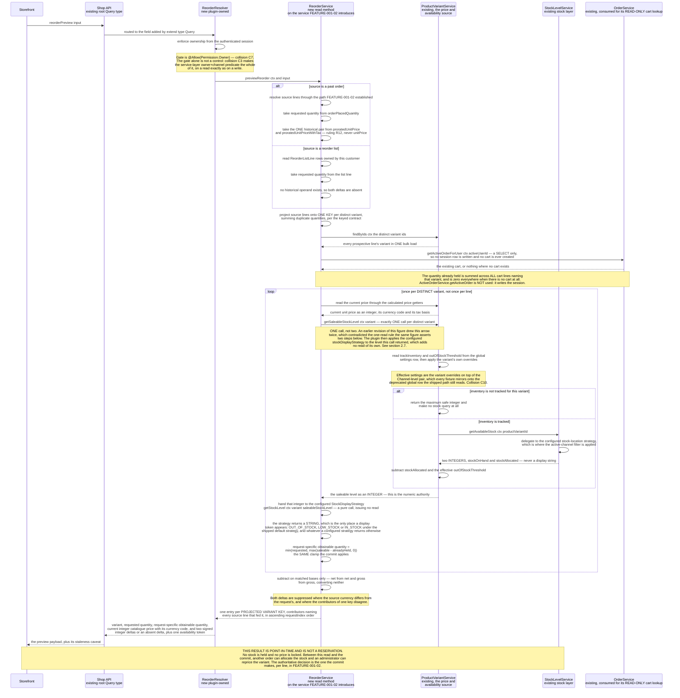

# FEATURE-001-03: Report the price and availability change on every prospective reorder line through one read-only Shop API query, so that a returning buyer learns what changed since the last purchase before any line is written to a cart

Parent epic: `tickets/EPIC-001-reorder-and-replenishment.md`. Sibling features are written as paths rather than as links, following the epic's own convention of keeping the link count in a file equal to the number of children that file indexes [tickets/EPIC-001-reorder-and-replenishment.md:§3. How To Read This Epic]. The only links in this file are the three story links in section 3.

This file is one of the four on the epic's curated read path, and the question it exists to answer has two halves: **how are buyers warned before they commit, and why is that not already solved** [tickets/EPIC-001-reorder-and-replenishment.md:§3. How To Read This Epic]. The second half is the harder one and it is answered first, in section 2.3, with evidence from a specification that already ships in this repository rather than with an assertion. A reader who opens only this file should stop at the end of section 2.11 with both halves answered.

---

## 1. Feature Title

**Report the price and availability change on every prospective reorder line through one read-only Shop API query, so that a returning buyer learns what changed since the last purchase before any line is written to a cart.**

Short name, used verbatim wherever this feature is referred to in one phrase, and identical to the label the epic's features index gives it: **Pre-Commit Price and Availability Delta Preview** [tickets/EPIC-001-reorder-and-replenishment.md:§4. Features Index]. The long form above is the action-object-outcome title this tier requires; the short form is the name to cite.

The epic classifies this feature's deviation from its originally suggested area as **narrowed to pre-commit**, and the narrowing is the substance of the feature rather than a reduction of it. The suggested area was price and availability change awareness at reorder, unqualified. Two mechanisms already discharge the in-cart, post-add half of that: the calculated getters `unitPriceChangeSinceAdded` and `unitPriceWithTaxChangeSinceAdded` [packages/core/src/entity/order-line/order-line.entity.ts:L163-L187], and the deployment-configurable `ChangedPriceHandlingStrategy` [packages/core/src/config/order/changed-price-handling-strategy.ts:L7-L38]. The epic's do-not-duplicate inventory forbids rebuilding either [tickets/EPIC-001-reorder-and-replenishment.md:§5. Existing Mechanisms That Must Not Be Duplicated]. **What is left after the narrowing is the before-commit read, and that is genuinely new.** Section 2.3 proves the claim rather than repeating it.

Delivery is part of the single self-contained plugin package the epic describes — `packages/reorder-plugin/`, exporting `ReorderPlugin`. No file under `packages/core` or `packages/admin-ui` is edited to deliver it.

---

## 2. Feature Summary

### 2.1 The Capability

A returning buyer names a reorder source — one past order, a chosen subset of that order's lines, or one saved reorder list — and receives, for **every projected prospective line**, the **current catalogue** unit price as an integer in the smallest unit of the resolved currency, the signed integer delta against what that line was priced at when it was last purchased, the current availability expressed as exactly one of the three publicly observable stock strings, **and whether the requested quantity is obtainable in the buyer's own cart as it stands.** Two of those are stated precisely rather than loosely, and each has its own section because each is a way the feature could mislead a buyer if it were stated loosely: the price is the catalogue's and not a quote for what the commit will charge (section 2.9a), and the obtainability is computed against the target active order rather than against the catalogue alone (section 2.7a).

The distinction that makes this feature coherent is the one in its own first sentence: **these are lines that are not yet in an order.** Every price-change mechanism this platform already ships describes a line that *is* already in an order.

### 2.2 Contribution To The Epic

This feature is the leading part of the epic's batch B3, "Pre-commit awareness" [tickets/EPIC-001-reorder-and-replenishment.md:§9.4 Run Batches]. It owns one step of the returning-buyer journey — requesting a reorder preview and reading the price and availability deltas it returns — sitting between opening a source and applying the reorder [tickets/EPIC-001-reorder-and-replenishment.md:§2.5 The Returning-Buyer Journey This Epic Builds].

It is the feature that discharges the part of the objective statement that most differentiates this epic from a plain bulk-add: that buyers "are made aware of price and availability changes before they commit to a reorder". The epic splits that span into **two separately labelled clauses** rather than one, and this feature is the only one that carries a story against each of them — clause C3, on buyers being made aware of price and availability changes, onto STORY-001-03-01, and clause C4, on doing so before the buyer commits, onto STORY-001-03-02 [tickets/EPIC-001-reorder-and-replenishment.md:§10.2 Objective-Clause Map]. That is why two of this feature's three stories carry a quoted traceability label rather than an inference, and it is the sharpest available statement of the feature's claim on the objective.

The epic also names this feature's first story as the **runner-up** for the demonstration slice, and its reason for the runner-up placing is worth carrying here intact rather than paraphrased: story 03-01 would arguably be the more persuasive demonstration, because it demonstrates the differentiating awareness clause, but it depends on FEATURE-001-02 being complete before there is anything to preview [tickets/EPIC-001-reorder-and-replenishment.md:§9.6 Nomination]. That dependency is stated as a fact of sequencing in section 4.1, not as a weakness of the feature.

Read the contribution precisely, because this feature is a **read** path and nothing else:

- **It does not write.** No cart is created, no line is added, no plugin-owned row is inserted. The write path is FEATURE-001-02's, and this feature calls none of it [tickets/EPIC-001/FEATURE-001-02-reorder-from-order-history.md:§2.1 The Capability].
- **It does not decide what to do about a line that cannot be added.** Skip, reduce, substitute and abort belong to FEATURE-001-04, which consumes this feature's availability outcome as its input.
- **It does not decide which price wins once a line is added.** That decision is already configurable per deployment, as section 2.7 records, and this feature neither participates in it nor overrides it.
- **It does not own the reorder-list tables.** `ReorderList` and `ReorderListLine` are FEATURE-001-01's, and the list-sourced preview only reads them [tickets/EPIC-001/FEATURE-001-01-named-reorder-lists.md:§2.4 Named Entities Touched].
- **It does not reserve stock.** Section 2.10 is devoted to this, because it is the single easiest thing to assume wrongly about a preview.

### 2.3 Why This Is Not Already Solved — The Question This File Exists To Answer

The most likely wrong reading of this feature is that it duplicates `unitPriceChangeSinceAdded`. That reading is wrong on the mechanics, and the mechanics are checkable in this checkout, so this section checks them instead of arguing.

**Claim one: the existing getter is already public, so a storefront can already read a price change.** True, and stated first because omitting it would overstate the gap. `OrderLine.unitPriceChangeSinceAdded: Money!` and `OrderLine.unitPriceWithTaxChangeSinceAdded: Money!` are published fields on the Shop API's `OrderLine` type [packages/core/src/api/schema/common/order.type.graphql:L133] and [packages/core/src/api/schema/common/order.type.graphql:L137], each carrying the schema's own description that the value is non-zero if the price has changed since it was initially added to the Order.

**Claim two: those fields are computed against the line's own history, not against today's catalogue price.** The getters derive the delta from `initialListPrice` [packages/core/src/entity/order-line/order-line.entity.ts:L113] compared against the line's current unit price [packages/core/src/entity/order-line/order-line.entity.ts:L163-L187], with `listPriceIncludesTax` [packages/core/src/entity/order-line/order-line.entity.ts:L128] deciding whether the comparison is made gross or net. `initialListPrice` is documented as the price calculated when the line was **first added to that Order** [packages/core/src/entity/order-line/order-line.entity.ts:L108-L111]. On a placed historical order, both operands therefore belong to that order. Neither is the price the variant carries today.

**Claim three — the decisive one: on a line that was added and never re-priced, the getter is zero, and this repository already asserts it.** A shipped specification, `describe('ChangedPriceHandlingStrategy')` [packages/core/e2e/order-changed-price-handling.e2e-spec.ts:L44], opens with the case `it('unitPriceChangeSinceAdded starts as 0')` [packages/core/e2e/order-changed-price-handling.e2e-spec.ts:L66]. It adds one item, then asserts the change field is exactly 0 [packages/core/e2e/order-changed-price-handling.e2e-spec.ts:L76] while the unit price is a non-zero integer [packages/core/e2e/order-changed-price-handling.e2e-spec.ts:L77], and asserts that the changed-price strategy was **not called at all** [packages/core/e2e/order-changed-price-handling.e2e-spec.ts:L78].

**Claim four: the field only becomes non-zero after a second write.** The next case in the same specification [packages/core/e2e/order-changed-price-handling.e2e-spec.ts:L88] updates the variant's price through the Admin API, adds the **same variant a second time**, and only then asserts a non-zero change value alongside the new unit price and a single strategy invocation [packages/core/e2e/order-changed-price-handling.e2e-spec.ts:L106-L108]. The sibling case for the adjust path asserts a **negative** value on the same field [packages/core/e2e/order-changed-price-handling.e2e-spec.ts:L131], which is how this repository already establishes that the delta is a signed integer rather than a magnitude.

Put those four together and the gap is exact rather than rhetorical:

- The existing mechanism requires a **write** into an order that already holds the variant. Its own trigger condition is adding to or adjusting a line whose latest price differs from the price at the time the line was created [packages/core/src/config/order/changed-price-handling-strategy.ts:L25-L30].
- A reorder buyer has made no such write. The line does not exist. There is nothing to compute a delta on.
- The comparison the buyer actually wants is between **what they paid** on a past order line and **what the variant costs now** — two operands the existing getter never brings together, because one of them is not in the order at all.
- And the operands the buyer's half of that comparison would need are not published anyway: the Shop API's `OrderLine` type exposes `unitPrice` and `unitPriceWithTax` [packages/core/src/api/schema/common/order.type.graphql:L127-L129] and the prorated pair this feature actually differences [packages/core/src/api/schema/common/order.type.graphql:L154-L156], but exposes **no** `listPrice`, `initialListPrice` or `listPriceIncludesTax` field anywhere across its declared fields, which run from the type declaration [packages/core/src/api/schema/common/order.type.graphql:L120] through its final declared fields to the closing brace [packages/core/src/api/schema/common/order.type.graphql:L184-L188]. A storefront reading a past order therefore sees what the line was priced at, and can see a change *within that order's own lifetime*, and cannot see today's catalogue price on the same field set at all.

**The same argument holds on the availability side, and there it is stronger.** A raw stock figure is not publicly readable at all. `StockLevel` is absent from the type list of the checked-in Shop API introspection snapshot [schema-shop.json:data.__schema.types] — **an absence, which is the one class of claim a citation locator cannot express, so it is asserted executably instead**: stage three of validator V6 loads that snapshot, requires `StockLevel` to be absent from it and requires the anchor types it does publish to be present, and fails the gate if either changes [tickets/EPIC-001-reorder-and-replenishment.md:§11.10 The Local Validator Suite]. The Shop API's `ProductVariant` type carries exactly one stock field, `stockLevel: String!` [packages/core/src/api/schema/common/product.type.graphql:L56]. That field is deliberately a string: the strategy behind it exists because directly exposing stock levels over a public API is treated as a leak of sensitive information [packages/core/src/config/catalog/stock-display-strategy.ts:L7-L10]. So a storefront can already ask "is this variant in stock now", per variant, one variant at a time — but it cannot ask "which of the lines in this past order are no longer obtainable at the quantity I bought", because nothing correlates a historical line's quantity with a current saleable level. The check is reproducible rather than asserted: a search of the checked-in Shop API introspection snapshot for a `"StockLevel"` type name returns no match [schema-shop.json:data.__schema.types].

**Conclusion, stated plainly because the epic requires the prohibition and the residue to be distinguishable: the only new thing in this feature is the pre-commit read.** Everything that happens once a line is in a cart is already solved, already configurable and already tested, and section 2.7 restates the prohibition attached to each piece of it. What is new is a correlated, per-line, read-only comparison across a source the buyer has chosen and the catalogue as it stands now — and one operation that returns it in a single response instead of leaving a storefront to assemble it from per-variant reads it cannot fully assemble.

### 2.4 Named Entities Touched

**This feature introduces no new table.** That is a deliberate design outcome, not an omission, and section 2.11 states the consequence for migrations. Every row the preview needs already exists, in the platform's own order, catalogue and stock tables or in FEATURE-001-01's list tables. The feature reads and owns nothing.

Existing platform entities, read and never altered:

- **`OrderLine`** — the source of the "what I paid" operand. **Two columns are the operands, one supplies the quantity, and three more are named only so that a reader does not expect them to be read.** The operands are `proratedUnitPrice` [packages/core/src/entity/order-line/order-line.entity.ts:L219] and its gross partner `proratedUnitPriceWithTax` [packages/core/src/entity/order-line/order-line.entity.ts:L228], the platform's own true economic value of a single unit once order-level discounts are prorated across lines [packages/core/src/entity/order-line/order-line.entity.ts:L213-L229], which is epic ruling R12 and is settled for every file in this feature [tickets/EPIC-001-reorder-and-replenishment.md:§6.4 The Settled Rulings]. The quantity is projected from `orderPlacedQuantity`, the quantity as at placement [packages/core/src/entity/order-line/order-line.entity.ts:L104], rather than from the live `quantity` [packages/core/src/entity/order-line/order-line.entity.ts:L97], matching the rule the commit path already fixed so that a preview and the commit it previews agree on the number of units [tickets/EPIC-001/FEATURE-001-02-reorder-from-order-history.md:§2.3 Named Entities Touched]. **The three named and not read are `listPrice` [packages/core/src/entity/order-line/order-line.entity.ts:L121], `initialListPrice` [packages/core/src/entity/order-line/order-line.entity.ts:L113] and `listPriceIncludesTax` [packages/core/src/entity/order-line/order-line.entity.ts:L128], and their absence from the formula is a consequence of the operand choice rather than an oversight.** Comparing a gross historical figure against a net current figure yields a delta that is arithmetically real and semantically meaningless, and the way this feature makes that unrepresentable is to take **matched net-and-gross pairs on both sides** — the prorated pair against the variant's own `price` and `priceWithTax` — so net is subtracted from net, gross from gross, and no basis is ever resolved, converted or reported as "the basis used". A single-column operand such as `listPrice` would have required exactly that conversion, which is why it is not the operand, and the flag that records which basis such a figure carries then has nothing to decide. `customFields` [packages/core/src/entity/order-line/order-line.entity.ts:L143] is named only to record that this feature declares none, per section 2.13.
- **`Order`** — the container that makes a source addressable and its historical prices attributable to a point in time. This feature reads it through the paths FEATURE-001-02 already established and adds no order-reading operation of its own [tickets/EPIC-001/FEATURE-001-02-reorder-from-order-history.md:§2.5 Named API Surfaces].
- **`ProductVariant`** — the source of every "what it costs now" and "what is obtainable now" operand. `enabled` [packages/core/src/entity/product-variant/product-variant.entity.ts:L53] is the variant state that makes a line unobtainable regardless of stock. The current price is not a stored column at all: `listPrice`, `listPriceIncludesTax` and `currencyCode` are annotated as calculated at run time [packages/core/src/entity/product-variant/product-variant.entity.ts:L61], [packages/core/src/entity/product-variant/product-variant.entity.ts:L66] and [packages/core/src/entity/product-variant/product-variant.entity.ts:L71], and the readable figures are the calculated getters `price` [packages/core/src/entity/product-variant/product-variant.entity.ts:L76] and `priceWithTax` [packages/core/src/entity/product-variant/product-variant.entity.ts:L92], each of which resolves the tax basis from `listPriceIncludesTax` before rounding. **This is why the preview reads the variant rather than a price table: the price a buyer would pay today is a per-request computation, not a row.** Three further columns are the availability preconditions: `outOfStockThreshold` [packages/core/src/entity/product-variant/product-variant.entity.ts:L144], `useGlobalOutOfStockThreshold` [packages/core/src/entity/product-variant/product-variant.entity.ts:L152] and `trackInventory` [packages/core/src/entity/product-variant/product-variant.entity.ts:L155], the last being a three-valued inherit flag rather than a boolean.
- **`StockLevel`** — the row behind the availability operand, and **never read directly by plugin code**, for the reason section 2.7 gives. It carries `stockOnHand` [packages/core/src/entity/stock-level/stock-level.entity.ts:L40] and `stockAllocated` [packages/core/src/entity/stock-level/stock-level.entity.ts:L43] under a unique index on the variant-and-location pair [packages/core/src/entity/stock-level/stock-level.entity.ts:L19], with the variant reference at [packages/core/src/entity/stock-level/stock-level.entity.ts:L30] and the location reference at [packages/core/src/entity/stock-level/stock-level.entity.ts:L37]. **Read the index precisely, because it is the reason plugin code may not sum these rows.** It is unique on the *pair*, not on the variant, so it forbids two rows for one variant at one location while permitting one row per location for the same variant — that is, a variant holds as many stock rows as there are locations stocking it, and how those rows combine into a single answer is the configured location strategy's decision rather than an addition anyone may perform. Hence the prohibition in section 2.7 and the mandated service call.
- **`Channel`** — supplies the request scope described in section 2.9.

Existing plugin-owned entities from FEATURE-001-01, read and never altered:

- **`ReorderList`** and **`ReorderListLine`**, the latter carrying the parent list id, a `ProductVariant` id and an integer quantity [tickets/EPIC-001/FEATURE-001-01-named-reorder-lists.md:§2.4 Named Entities Touched]. When the preview's source is a list, the requested quantity comes from the list line and the "what I paid" operand is **absent**, because a list line records no historical price. Section 2.6 states what the payload does about that, and it does not invent one.

### 2.5 Named Services And Configurable Strategies

- **`ProductVariantService` — existing, in `packages/core`, consumed and never modified.** Two members carry this feature's availability answer end to end, and reading them is what removes the need for the plugin to compute anything:
  - `getSaleableStockLevel` [packages/core/src/service/services/product-variant.service.ts:L323] — resolves the number of units actually available for purchase. Its arithmetic is `stockOnHand - stockAllocated - effectiveOutOfStockThreshold` [packages/core/src/service/services/product-variant.service.ts:L340], where the effective threshold is the variant's own value or the global one according to `useGlobalOutOfStockThreshold` [packages/core/src/service/services/product-variant.service.ts:L336-L338]. **Where inventory is not tracked it short-circuits to the maximum safe integer** [packages/core/src/service/services/product-variant.service.ts:L326-L331] rather than to zero, which is the behaviour a story must expect for an untracked variant instead of assuming a numeric level.
  - `getDisplayStockLevel` [packages/core/src/service/services/product-variant.service.ts:L361] — takes that saleable level and hands it to the configured display strategy [packages/core/src/service/services/product-variant.service.ts:L364]. It is the call that turns a database precondition into the publicly observable string, and it is the shape `ProductVariant.stockLevel` resolves through — **but it is deliberately not the call this preview makes**, because it returns the string alone and this feature needs the number too. The preview calls `getSaleableStockLevel` once per distinct variant and hands the number it receives to the configured strategy itself, which is the same composition with one read instead of two; section 2.5.2 states the consequence for the query count and mechanism three states why the strategy is still authoritative.
- **`StockLevelService` — existing, consumed.** `getAvailableStock` [packages/core/src/service/services/stock-level.service.ts:L72] resolves available stock through the configured stock-location strategy [packages/core/src/service/services/stock-level.service.ts:L79], returning the on-hand and allocated pair the saleable computation subtracts from [packages/core/src/config/catalog/stock-location-strategy.ts:L18-L20]. `getStockLevelsForVariant` [packages/core/src/service/services/stock-level.service.ts:L56] is named for a different reason: it is the member that filters stock rows by the request's channel [packages/core/src/service/services/stock-level.service.ts:L63], whereas `getAvailableStock` delegates the multi-location question to the strategy instead. **A story that needs to state how a multi-location deployment resolves availability must name the strategy, not a sum.**
- **`ReorderService` — new, plugin-owned, and extended rather than duplicated.** FEATURE-001-02 introduces this service and gives it the source-resolution and ownership-enforcement logic for both the order source and the list source [tickets/EPIC-001/FEATURE-001-02-reorder-from-order-history.md:§2.4 Named Services]. This feature adds a read method to the same service rather than creating a parallel one, so source resolution and the ownership rule have exactly one implementation across the preview and the commit. **If the preview resolved sources through its own code path, a preview and a commit could disagree about which lines are even in scope — which is the one disagreement between them that would be a defect rather than staleness.**
- **`ReorderListService` — existing after FEATURE-001-01, plugin-owned, read only.** The list-sourced preview resolves its rows through it, so FEATURE-001-01's ownership rule is not reimplemented [tickets/EPIC-001/FEATURE-001-01-named-reorder-lists.md:§2.5 Named Services].
- **`TransactionalConnection` — existing, consumed for reads only.** This feature writes no row, so its use is confined to reading inside the request's transaction [tickets/EPIC-001-reorder-and-replenishment.md:§7.4 Existing Entities And Services The Work Depends On].
- **`StockDisplayStrategy` — existing configurable strategy, consumed and never bypassed.** Its contract is one method, `getStockLevel` [packages/core/src/config/catalog/stock-display-strategy.ts:L27], declared on the interface [packages/core/src/config/catalog/stock-display-strategy.ts:L21], taking a saleable stock level [packages/core/src/config/catalog/stock-display-strategy.ts:L30] and returning the string used directly in the GraphQL `ProductVariant.stockLevel` field [packages/core/src/config/catalog/stock-display-strategy.ts:L24-L25]. It is deployment-configurable through `catalogOptions.stockDisplayStrategy` [packages/core/src/config/catalog/stock-display-strategy.ts:L14].
- **`DefaultStockDisplayStrategy` — the shipped implementation, and the source of the three exact strings.** The class [packages/core/src/config/catalog/default-stock-display-strategy.ts:L14] returns `OUT_OF_STOCK` when the saleable level is below one, `LOW_STOCK` when it is at or below the constructor's `lowStockLevel`, and `IN_STOCK` otherwise [packages/core/src/config/catalog/default-stock-display-strategy.ts:L17-L21]. **`lowStockLevel` defaults to 2** [packages/core/src/config/catalog/default-stock-display-strategy.ts:L15], which is a shipped default cited from source rather than a threshold this ticket set chose; the strategy's own documentation states the same default [packages/core/src/config/catalog/default-stock-display-strategy.ts:L9-L10]. A story that needs a low-stock precondition uses that default and says it is the default, and a deployment that has replaced the strategy changes the observable string without changing anything this feature owns.
- **`ChangedPriceHandlingStrategy` — existing configurable strategy, deliberately NOT consumed.** It is named here so the exclusion is explicit rather than accidental. No plugin code in this feature calls it, configures it or reimplements it; section 2.7 gives the reason.

#### 2.5.1 The Three Stock Tokens Belong To The Default Strategy, Not To The Platform
**Every assertion in this feature and its three stories that names `OUT_OF_STOCK`, `LOW_STOCK` or `IN_STOCK` is an assertion about a deployment running the shipped default display strategy, and each such assertion states that precondition.** The distinction is not pedantry: the field's type is `String!` [packages/core/src/api/schema/common/product.type.graphql:L56], the strategy behind it is deployment-configurable through `catalogOptions.stockDisplayStrategy` [packages/core/src/config/catalog/stock-display-strategy.ts:L14], and the three tokens are the return values of one implementation of it [packages/core/src/config/catalog/default-stock-display-strategy.ts:L17-L21] rather than an enumeration the schema constrains. A deployment that has supplied its own strategy returns its own vocabulary, and nothing in the platform stops it.
Three rules follow, and they apply to this feature, to its stories and to any sibling that reports availability:
- **A criterion that asserts one of the three tokens names the default strategy in its Given.** The form is "the deployment runs the shipped `DefaultStockDisplayStrategy` with its default `lowStockLevel` of 2 [packages/core/src/config/catalog/default-stock-display-strategy.ts:L15]", after which asserting the exact token is sound. Without that precondition the criterion asserts a value the deployment is free to change, which is untestable in the general case and misleading in the particular one.
- **A criterion that must hold on any deployment asserts the *token identity* rather than the token text.** The usable general assertion is that the preview's availability field for a variant equals what `ProductVariant.stockLevel` [packages/core/src/api/schema/common/product.type.graphql:L56] returns for that same variant in the same request, because both resolve through the one configured strategy. That assertion survives a replaced strategy and is the one the payload contract in story 03-03 relies on.
- **Nothing in this feature enumerates the vocabulary as though it were closed.** The preview publishes the availability as a string, documents it as the configured strategy's output, and neither declares an enum of its own nor promises three values — declaring an enum would be the one way this feature could genuinely break a deployment that had replaced the strategy.
#### 2.5.2 The Read Shape — Bulk Where Bulk Exists, Counted Where It Does Not
A preview resolves a price and an availability for every prospective line, so its read shape is a design decision rather than an implementation detail, and leaving it unstated is how a per-line query loop gets built by default. **This sub-section fixes the shape in three parts and refuses to describe any of them in prose alone.**
- **Variants are hydrated in one call, not one per line — and "one call" is the claim, not "one query".** `ProductVariantService.findByIds` [packages/core/src/service/services/product-variant.service.ts:L150] takes the whole identifier array and returns the translated variants, so the price operand for every prospective line comes from a single bulk load. That load is one **call**, not one statement: that method loads six relation paths [packages/core/src/service/services/product-variant.service.ts:L152-L161] and then applies channel pricing and translation to what it loaded [packages/core/src/service/services/product-variant.service.ts:L162], so its statement count is the platform's rather than this plugin's [tickets/EPIC-001-reorder-and-replenishment.md:§7.7.1a Three Observation Boundaries, Because "One Query" Is Three Different Claims]. **A per-line variant lookup is prohibited**, and the prohibition is testable rather than stylistic: the assertion below is a service-call count of exactly one with zero per-line calls, plus a whole-request non-growth comparison at two source sizes.
- **The availability read has no bulk equivalent, and that is stated rather than wished away — but it is taken exactly once per distinct variant, and the method that takes it is named here because the obvious choice would take it twice.** The plugin calls `ProductVariantService.getSaleableStockLevel` [packages/core/src/service/services/product-variant.service.ts:L323], which returns the **number** [packages/core/src/service/services/product-variant.service.ts:L336-L340] and beneath which `getAvailableStock` [packages/core/src/service/services/stock-level.service.ts:L72] issues one query per variant before delegating to the location strategy [packages/core/src/service/services/stock-level.service.ts:L79]. **It does not call `getDisplayStockLevel`** [packages/core/src/service/services/product-variant.service.ts:L361], and the reason is arithmetic rather than taste: that method returns only the display *string* [packages/core/src/service/services/product-variant.service.ts:L364] while this feature needs the *number* as well — for `addableQuantity` and for the cart-aware clamp of section 2.7a — so a plugin that called it would have to resolve the saleable level a second time and would issue **two** availability reads per distinct variant while claiming one. **The configured strategy is still authoritative and is still not bypassed:** its interface takes the saleable level as its third argument [packages/core/src/config/catalog/stock-display-strategy.ts:L27-L31], so the plugin passes the number it already holds to `catalogOptions.stockDisplayStrategy.getStockLevel` and publishes the string it returns — which is the identical value `ProductVariant.stockLevel` carries for the same variant in the same request, because that field resolves through the same strategy with the same input [packages/core/src/service/services/product-variant.service.ts:L363-L364]. The epic forbids reading `StockLevel` rows directly or summing them in plugin code, precisely so the configured location strategy stays authoritative [tickets/EPIC-001-reorder-and-replenishment.md:§5. Existing Mechanisms That Must Not Be Duplicated] — **so the per-variant read is not a choice this feature can design away, it is the price of consuming the mechanism it is required to consume.** What this feature does about it is bound it and measure it, in that order.
  - **Duplicates are collapsed before the loop runs.** A source may name the same variant more than once; the distinct variant identifiers are resolved once each, so the read count is the number of *distinct* variants rather than the number of lines. Within one request the platform's own per-request cache is the seam for that memoisation [packages/core/src/cache/request-context-cache.service.ts:L15], which is the same mechanism the global settings read already uses [packages/core/src/service/services/global-settings.service.ts:L64].
  - **The count is asserted, not described, and the boundary it is asserted at is named — which an earlier version of this bullet did not do, and could not have been satisfied without.** Story 03-01 and story 03-02 each assert, at a stated source size, the **exact number of reads the plugin itself performs**: one source read — the placed order with its lines, or the reorder list with its lines; one read of the buyer's active order, which section 2.7a requires and which an earlier count omitted; one request-cached global-settings read [packages/core/src/service/services/global-settings.service.ts:L63-L64]; **one call** to the bulk variant load; and exactly one availability read per **distinct** variant — with no other read issued by plugin code, and in particular no second availability read per variant and no per-line variant lookup. **That is a plugin-read and service-call count, not a whole-request SQL total, and the difference is load-bearing** [tickets/EPIC-001-reorder-and-replenishment.md:§7.7.1a Three Observation Boundaries, Because "One Query" Is Three Different Claims]: the bulk variant load alone expands into relation loading, pricing and translation inside the platform [packages/core/src/service/services/product-variant.service.ts:L152-L162], so a whole-request total would be asserting a number this feature does not control and would break on a platform upgrade rather than on a regression. **What the two stories additionally assert at the whole-request boundary is non-growth**: the same preview run at two source sizes over the same number of distinct variants issues the same total, and run at two source sizes over *more* distinct variants grows only in the availability term this bullet already admits. **An assertion of this shape is the only thing that keeps the design honest**, because a refactor that reintroduces a per-line variant lookup changes a number a test is watching rather than a sentence nobody re-reads.
- **The source size is bounded, the bound is the commit path's, and it is asserted at three sizes rather than described.** The preview accepts the same configured maximum projected source lines the commit accepts and refuses an over-bound source the same way — at request level, with the platform's own `UserInputError` [packages/core/src/common/error/errors.ts:L27] carrying `USER_INPUT_ERROR` in `extensions.code` [packages/core/src/common/error/errors.ts:L29], **before the source lines are projected and before any variant or availability read is issued** [tickets/EPIC-001/FEATURE-001-02-reorder-from-order-history.md:§2.5 Named API Surfaces — One New Mutation, Zero Existing Signatures Changed]. A story configures that maximum for its own test deployment and asserts one line under it, exactly at it and one line over it, the over-bound case additionally asserting **zero** statements against `product_variant` and `stock_level`; only the production value of the maximum remains an open product decision [tickets/EPIC-001-reorder-and-replenishment.md:§8.1 Product Decisions], under the rule that binds every collection-scale workload in this epic [tickets/EPIC-001-reorder-and-replenishment.md:§7.7 Bounded Collections]. Sharing the bound with the commit is deliberate: **a preview that could accept more lines than the commit would report on lines the buyer could never commit in one call.** A request whose source exceeds the bound is refused rather than truncated, because a silently truncated preview reports "nothing changed" about lines it never looked at.
- **And the whole path is benchmarked.** The epic's preview scenario runs this query at that maximum source size and reports the measurement together with the observed query count, against no threshold, because this repository declares none [tickets/EPIC-001-reorder-and-replenishment.md:§7.6 Data-Volume Assumptions And The Benchmark Workflow].

### 2.6 Named API Surfaces — One New Query, Zero Existing Signatures Changed

**Existing read paths this feature consumes and does not extend:**

- `ProductVariant.stockLevel: String!` [packages/core/src/api/schema/common/product.type.graphql:L56] — the only publicly observable availability surface on the Shop API's `ProductVariant` type [packages/core/src/api/schema/common/product.type.graphql:L42]. The preview's availability field reports the same vocabulary this field reports, resolved through the same strategy, so a buyer never sees two different answers to "is this in stock" from one deployment.
- `ProductVariant.price: Money!`, `ProductVariant.currencyCode: CurrencyCode!` and `ProductVariant.priceWithTax: Money!` [packages/core/src/api/schema/common/product.type.graphql:L53-L55] — the current-price operands, already public and already per-request.
- `OrderLine.proratedUnitPrice: Money!` [packages/core/src/api/schema/common/order.type.graphql:L127] and [packages/core/src/api/schema/common/order.type.graphql:L129], together with `OrderLine.proratedUnitPriceWithTax: Money!` [packages/core/src/api/schema/common/order.type.graphql:L154-L156] — **the single historical operand pair, settled by the epic rather than by this feature.** Four candidate columns exist and the choice among them is not open here: `unitPrice` is documented as the price of a single unit **excluding tax and discounts** [packages/core/src/entity/order-line/order-line.entity.ts:L146-L152]; `discountedUnitPrice` sits between the candidates and excludes prorated order-level discounts [packages/core/src/entity/order-line/order-line.entity.ts:L189-L201]; `listPrice` [packages/core/src/entity/order-line/order-line.entity.ts:L121] and `initialListPrice` [packages/core/src/entity/order-line/order-line.entity.ts:L113] are each a single column whose basis depends on `listPriceIncludesTax` [packages/core/src/entity/order-line/order-line.entity.ts:L127] and so cannot be compared without a basis test; and `proratedUnitPrice` is the field the platform itself documents as "the true economic value of a single unit", after order-level discounts have been prorated across lines and the one used in tax and refund calculations [packages/core/src/entity/order-line/order-line.entity.ts:L213-L229]. **Epic ruling R12 selects that last pair and forbids `unitPrice` explicitly** [tickets/EPIC-001-reorder-and-replenishment.md:§6.4 The Settled Rulings], so this feature publishes **one** historical pair and differences it. **An earlier revision of this bullet published two pairs** — differencing the `unitPrice` pair and labelling the prorated pair informational — **and is withdrawn**, because it contradicted R12 and left three files in this feature computing a delta the epic forbids. The consequence the two-pair design was trying to avoid is instead **stated**: a lapsed order-level promotion shows as a rise, because the buyer did pay the lower figure and the variant does list at the higher one, and this read evaluates no promotion. Section 2.4's readings carry that statement in full.
- The source-order and source-list read paths, which belong to FEATURE-001-02 and FEATURE-001-01 respectively and are not re-declared here [tickets/EPIC-001/FEATURE-001-02-reorder-from-order-history.md:§2.5 Named API Surfaces].

**The one new operation**, added through the plugin's `shopApiExtensions` using `extend type Query` — the mechanism the shipped wishlist example already demonstrates for a query [packages/dev-server/example-plugins/wishlist-plugin/api/api-extensions.ts:L12-L14]:

- `reorderPreview` — accepts **either** a source order reference **or** a reorder-list reference, optionally narrowed to a subset of source lines, and returns one entry per projected variant key, with every contributing source line named inside that entry.
**The published contract, in full.** Every field, nullability and enum member this feature publishes is fixed here. **No later feature adds a field to this type, and the one field a later feature populates is declared here rather than left to be discovered:** `ReorderPreviewLine.substitutionCandidates` and its `ReorderSubstitutionCandidateOffer` type are declared below, in this type's first published version, and STORY-001-04-02 supplies the behaviour that fills the collection while adding no field, no type and no argument of its own [tickets/EPIC-001/FEATURE-001-04/STORY-001-04-02-substitution-candidate-strategy.md:§4. User Story]. The declaration-versus-behaviour split is stated in full by the reading below that names both symbols. A reader comparing a generated schema from a fully-merged deployment against the block below will therefore find the block below and nothing extra, and the epic's ledger is where the fully-merged widths live [tickets/EPIC-001-reorder-and-replenishment.md:§6.5 The Cumulative Published-Surface Ledger]. **The two input types are FEATURE-001-02's, reused rather than mirrored**, which is the difference between the two features describing the same set of lines by construction and describing it by coincidence: `ReorderSourceInput` and `ReorderLineSelectionInput` are declared once, by the feature that publishes the commit mutation [tickets/EPIC-001/FEATURE-001-02-reorder-from-order-history.md:§2.5 Named API Surfaces], and this feature imports them. An earlier draft of this section said the preview input "mirrors" the commit input; a mirror can drift, and it would have drifted the moment FEATURE-001-04 added its resolution field. Reuse cannot.
```graphql
# No union, and no error member. Every failure this read can experience is either an
# input-contract violation, which throws before the resolver produces a payload, or a
# non-disclosing empty preview. See the first reading below.
extend type Query {
  reorderPreview(input: ReorderPreviewInput!): ReorderPreview!
}
input ReorderPreviewInput {
  "Reused from FEATURE-001-02. Exactly one of its three fields is set."
  source: ReorderSourceInput!
  "Reused from FEATURE-001-02. Omitted means every line of the source."
  lineSelections: [ReorderLineSelectionInput!]
}
type ReorderPreview {
  "Echoes the addressing form the caller sent. Never null, even for an unresolved source."
  source: ReorderPreviewSource!
  """
  RESOLVED where the source IS a placed order or a reorder list of this buyer in this channel
  — **including one that holds no line at all**, where `lines` is simply empty.
  NOT_RESOLVED for every other case, identically: absent, another customer's, another
  channel's, or a session carrying no customer. `lines` is then empty too.
  The anti-enumeration property is that the four NOT_RESOLVED cases are indistinguishable from
  ONE ANOTHER. An owned-but-empty source is deliberately DISTINGUISHABLE from them, because a
  caller already knows which sources are their own, so telling them their own list is empty
  discloses nothing about anybody else. See the readings below.
  """
  sourceState: ReorderPreviewSourceState!
  "The instant the read was taken. A client showing a preview should show this."
  readAt: DateTime!
  "The currency the source order recorded. Equals targetCurrencyCode for a list source."
  sourceCurrencyCode: CurrencyCode!
  "The currency this request resolved to. Every current price below is in this currency."
  targetCurrencyCode: CurrencyCode!
  lines: [ReorderPreviewLine!]!
}
enum ReorderPreviewSourceState {
  RESOLVED
  NOT_RESOLVED
}
type ReorderPreviewSource {
  sourceOrderId: ID
  sourceOrderCode: String
  reorderListId: ID
}
"""
One prospective line, keyed by variant. Exactly one entry per projected variant key, never one per requested
source line: duplicate source lines are projected onto one key and every contributing line is named in
`contributors`, identically to the commit mutation’s report.
Nullability comes in TWO discriminated groups, not one, and `availability` is the discriminator:
  VARIANT-NULLABLE  = productVariant, stockLevel. Null EXACTLY when availability is
                      NOT_ADDABLE_VARIANT_UNAVAILABLE; non-null in every other state.
  PRICE-NULLABLE    = currentCataloguePrice, currentCataloguePriceWithTax. Null when availability
                      is NOT_ADDABLE_VARIANT_UNAVAILABLE **or** NOT_ADDABLE_UNPRICED_IN_CHANNEL;
                      non-null in the three other states — both addable ones and
                      NOT_ADDABLE_OUT_OF_STOCK, where the variant resolves and is priced.
The two deltas are null on the union of those conditions, plus a null historical operand, plus a
currency mismatch. See the first reading below, which is the authority for all of it.
"""
# EVERY field of this type is declared HERE, in its first published version, including
# substitutionCandidates. FEATURE-001-04 populates that collection and adds no field, no type
# and no argument; no other feature extends this type. See the reading that names both symbols.
type ReorderPreviewLine {
  """
  This projected key's position in the request: the LOWEST index its own contributing source lines
  hold in the zero-based source numbering, so the published values ascend and skip a value wherever
  two source lines collapsed onto one key. Identical to the requestIndex the commit mutation assigns
  the same key for the same input, which is what lets a client join a preview entry to an outcome.
  """
  requestIndex: Int!
  "Every source line that projected into this key, in source order. Never empty."
  contributors: [ReorderPreviewContributor!]!
  "Always present, even when the variant cannot be resolved. This is what makes the line reportable."
  productVariantId: ID!
  """
  VARIANT-NULLABLE. Null exactly where availability is NOT_ADDABLE_VARIANT_UNAVAILABLE, so the
  variant can no longer be resolved for this channel and language; the id above still identifies it.
  """
  productVariant: ProductVariant
  "Sum over contributors."
  requestedQuantity: Int!
  """
  min(requestedQuantity, obtainable), never exceeding what the caller asked for, and 0 when
  unavailable:
  min(requestedQuantity, max(saleable - quantityAlreadyOnTargetCart, 0)), computed exactly
  as section 2.7a specifies. Bounded above by requestedQuantity, and 0 where nothing is
  obtainable, so it is representable for every availability state.
  """
  addableQuantity: Int!
  "The discriminator for every nullable field on this type."
  availability: ReorderLineAvailability!
  """
  Resolved through the configured StockDisplayStrategy. Typed String, not an enum.
  VARIANT-NULLABLE: null exactly where availability is NOT_ADDABLE_VARIANT_UNAVAILABLE, since the
  strategy has no variant to read. Present — and reporting the deployment's own vocabulary — on
  an unpriced-in-channel line, because such a variant resolves and has a stock level to display.
  """
  stockLevel: String
  """
  This key's net historical unit price, from OrderLine.proratedUnitPrice - the platform's
  own "true economic value of a single unit" after order-level discounts are prorated
  across lines. This is the ONLY historical operand, per epic ruling R12; OrderLine.unitPrice
  is never read, because its own documentation says it excludes discounts.
  Null for a list-sourced line, and null where contributors disagree - see the reading
  on contributors below.
  """
  historicalProratedUnitPrice: Money
  "The gross partner of the field above, from OrderLine.proratedUnitPriceWithTax."
  historicalProratedUnitPriceWithTax: Money
  "True where this key's contributors recorded different historical prices. Both key-level historical fields are then null."
  historicalPriceVaries: Boolean!
  """
  PRICE-NULLABLE. Null where availability is NOT_ADDABLE_VARIANT_UNAVAILABLE (no variant to price)
  or NOT_ADDABLE_UNPRICED_IN_CHANNEL (the variant resolves; no price row for this channel and
  currency). Non-null in both addable states.
  """
  currentCataloguePrice: Money
  "PRICE-NULLABLE. Paired with currentCataloguePrice, on the same condition and the same tax basis."
  currentCataloguePriceWithTax: Money
  """
  currentCataloguePrice - historicalProratedUnitPrice, net minus net. Null when either operand is
  null — which includes both PRICE-NULLABLE conditions and every historical-operand absence —
  and null when sourceCurrencyCode differs from targetCurrencyCode, where both operands are
  present and reported but not comparable.
  """
  unitPriceDelta: Money
  "currentCataloguePriceWithTax - historicalProratedUnitPriceWithTax, gross minus gross. Same null rules."
  unitPriceWithTaxDelta: Money
  """
  Alternatives offered in place of this key's variant, in offer order. Non-null and never null:
  an empty list is the real answer for "nothing to offer", so a consumer needs no null branch.
  DECLARED HERE, IN THIS TYPE'S FIRST PUBLISHED VERSION, AND EMPTY UNTIL FEATURE-001-04 SHIPS.
  This feature computes nothing into it and owns none of its behaviour; FEATURE-001-04 owns the
  strategy that populates it, the bound on its length and every rule about what may appear in it.
  It is declared now for the same reason FEATURE-001-02 declares its resolution input fields now:
  a published type that grows a field in a later batch has been redefined for the clients that
  already read it, and this epic's promise is that no surface it publishes is later widened.
  Bounded by ReorderPluginOptions.maxSubstitutionCandidatesPerVariant once that feature ships.
  """
  substitutionCandidates: [ReorderSubstitutionCandidateOffer!]!
}
"""
One alternative offered in place of one unavailable line. DECLARED HERE so that
ReorderPreviewLine is complete in its first version; every field's VALUE, and the rules that
decide which offers appear at all, belong to FEATURE-001-04. Carries no score, no rank figure
and no match figure, because this repository declares no such target.
"""
type ReorderSubstitutionCandidateOffer {
  "Zero-based, ascending, and the order the configured strategy returned. Curated position order under the shipped default."
  offerIndex: Int!
  productVariantId: ID!
  productVariant: ProductVariant!
  "Resolved through the configured StockDisplayStrategy. Typed String, never an enum."
  stockLevel: String!
  "Integer in the smallest unit of the response's targetCurrencyCode. Never a decimal."
  currentCataloguePrice: Money!
  "Gross partner of the field above, on the basis Channel.pricesIncludeTax fixes."
  currentCataloguePriceWithTax: Money!
  "min(the origin key's requestedQuantity, what is obtainable for this candidate). Bounded by the request."
  addableQuantity: Int!
}
"""
One source line that fed a projected key, carrying its own recorded history. Distinct from
FEATURE-001-02's ReorderSourceLineRef, which carries no monetary value by design.
"""
type ReorderPreviewContributor {
  sourceOrderLineId: ID
  reorderListLineId: ID
  requestedQuantity: Int!
  historicalProratedUnitPrice: Money
  historicalProratedUnitPriceWithTax: Money
  "NULL when the variant resolves no current catalogue price in the active channel — the withdrawn case."
  currentCataloguePrice: Money
  "NULL under the same condition as currentCataloguePrice, and null together with it."
  currentCataloguePriceWithTax: Money
  "currentCataloguePrice - historicalProratedUnitPrice. Null when the historical operand is null."
  unitPriceDelta: Money
  "currentCataloguePriceWithTax - historicalProratedUnitPriceWithTax. Null when its operand is null."
  unitPriceWithTaxDelta: Money
}
enum ReorderLineAvailability {
  ADDABLE_IN_FULL
  ADDABLE_AT_REDUCED_QUANTITY
  NOT_ADDABLE_OUT_OF_STOCK
  NOT_ADDABLE_VARIANT_UNAVAILABLE
  NOT_ADDABLE_UNPRICED_IN_CHANNEL
}
```
Eighteen readings of that contract are load-bearing, and the count is stated so an addition to the list below is visible as an addition rather than absorbed. **It read fifteen while eighteen bullets stood here**, because three later corrections were appended without the figure moving; this list does not self-number, so the drift was invisible on the face of the document and is reconciled here rather than left to a reader who counts:
- **SETTLED — the nullable fields fall into TWO groups with different conditions, and an earlier revision of this contract declared them one group and became unsatisfiable.** That revision said four fields — `productVariant`, `stockLevel`, `currentCataloguePrice` and `currentCataloguePriceWithTax` — are "null together, and null on exactly one condition: `availability` is `NOT_ADDABLE_VARIANT_UNAVAILABLE`", while the same file also required a variant that resolves but carries no price in the active channel to be reported with `NOT_ADDABLE_UNPRICED_IN_CHANNEL`, a present variant, a present display token and **null prices**. **Those two statements cannot both hold**, and the one-group form is withdrawn. The settled rule is two groups, each discriminated by `availability`, which is itself non-null and is the only field a client branches on:
  - **The VARIANT group — `productVariant` and `stockLevel`.** Both are null **exactly when** `availability` is `NOT_ADDABLE_VARIANT_UNAVAILABLE`, and both are non-null in every other state. That state means the variant fails the `enabled: true` and null `deletedAt` predicate the commit path loads every variant with [packages/core/src/service/services/order.service.ts:L684-L689], so there is no object to return and no strategy input to read — and **publishing the disabled or soft-deleted variant object over the Shop API would disclose a product the catalogue deliberately hides**.
  - **The PRICE group — `currentCataloguePrice` and `currentCataloguePriceWithTax`.** Both are null when `availability` is `NOT_ADDABLE_VARIANT_UNAVAILABLE` **or** `NOT_ADDABLE_UNPRICED_IN_CHANNEL`, and both are non-null in the two addable states. The second condition is a real and separate case: the default price-selection strategy matches on the resolved channel and currency [packages/core/src/config/catalog/default-product-variant-price-selection-strategy.ts:L18-L21] and finds nothing, while the platform's price applicator raises `error.no-price-found-for-channel` only when its caller asks it to [packages/core/src/service/helpers/product-price-applicator/product-price-applicator.ts:L70-L73] — and this feature does not ask, because dropping the line is the failure this nullability exists to prevent.
  - **The two DELTAS are null on the union of both groups' conditions plus one of their own**: a delta is null when its current operand is null, when its historical operand is null — a list-sourced line records no price, and contributors that disagree null the key-level pair — and when `sourceCurrencyCode` differs from `targetCurrencyCode`. Reporting an absent comparison as a zero delta would assert that nothing changed, which is a false statement dressed as a number. **A non-null current price beside a null delta is legitimate** — it is exactly the currency-mismatch case — whereas a null current price beside a non-null delta is not, and a conforming implementation cannot produce it.
  - **What stays non-null in every state, so the withdrawn line remains reportable at all**: `requestIndex`, `contributors` with their per-contributor figures, `productVariantId` — read off the buyer's own source line rather than off the catalogue, which is why it survives the variant's withdrawal — `requestedQuantity`, `availability`, `historicalPriceVaries`, and `addableQuantity`, which is **0** rather than null in both not-addable states because zero is the true obtainable quantity and not an absence. Keeping the scalar identifier is what lets a client key the line, a support agent search for it, and FEATURE-001-04 offer a substitute for it [tickets/EPIC-001/FEATURE-001-04-unavailable-line-resolution.md:§2.7 Named API Surfaces]. A withdrawn line therefore still shows the buyer *what* they bought, *what they paid* and that it is gone, which is the entire warning this feature exists to deliver.
  - **A union member for the unavailable case was considered and rejected**: it would fork every client's line-rendering code and force a `__typename` check on a collection whose members are otherwise identical, to express one boolean the `availability` enum already expresses.
- **`addableQuantity` is the field this feature adds after a cross-feature contradiction was found, and its bound is what makes it safe.** FEATURE-001-04 lets a buyer reduce an unavailable line to the quantity that *is* available, and it needs that number **before** the write. An earlier draft of this file refused to publish any number and told the reader the exact figure "arrives at commit time" on `InsufficientStockError.quantityAvailable` — which is after the write, and therefore too late for a pre-commit choice. The two features could not both be right. The resolution is a number bounded by the caller's own request: `addableQuantity` is this line's share of `min(summed requested for the variant, saleable minus already held in the cart)` clamped to zero at the bottom and never above the line's own `requestedQuantity`, **so a caller learns nothing about stock beyond whether their own quantity can be met.** Asking for two and being told two discloses that at least two exist; it does not disclose that two hundred do. The disclosure level is therefore no greater than the platform's own, since `InsufficientStockError.quantityAvailable: Int!` is already a public Shop API field on a public mutation [packages/core/src/api/schema/common/common-error-results.graphql:L53] — the change is only that the buyer learns it in time to act. **Two further bounds on that oracle are requirements rather than observations.** `requestedQuantity` is itself capped by the configured `maxQuantityPerLine` [tickets/EPIC-001-reorder-and-replenishment.md:§7.10 The Plugin Option Ledger — One Authority For Every Configured Key], so the ceiling a caller can probe is that configured maximum rather than the saleable level. And the platform's own field already carries the same clamped, request-bounded value its write path computes — the reduced quantity where the request was cut down [packages/core/src/service/services/order.service.ts:L743-L748] and zero where nothing could be added at all [packages/core/src/service/services/order.service.ts:L710-L715] — so this field discloses no figure of a kind the platform does not already return.
- **The unbounded saleable figure is still never published.** `getSaleableStockLevel` short-circuits to the maximum safe integer for an untracked variant [packages/core/src/service/services/product-variant.service.ts:L326-L331], which is exactly the kind of number the clamp exists to keep off the wire: an untracked variant reports `addableQuantity` equal to `requestedQuantity` and `availability` of `ADDABLE_IN_FULL`, never a nine-quintillion figure. The prohibition mechanism three carries is therefore intact: no field returns `stockOnHand`, `stockAllocated`, or a saleable level.
- **`substitutionCandidates` and `ReorderSubstitutionCandidateOffer` are declared by this feature and populated by another, and that split is deliberate rather than untidy.** This feature is the **SDL authority** for `ReorderPreviewLine`: every field a client will ever read on that type is declared in its first published version, including one this feature never writes a value into. FEATURE-001-04 is the **behaviour authority**: it owns the configurable strategy, the central re-resolution of every candidate, the length bound and every rule about which offers appear [tickets/EPIC-001/FEATURE-001-04-unavailable-line-resolution.md:§2.6 Named Services And Configurable Strategies]. **An earlier arrangement had that feature add the field and the type when it shipped in a later batch**, which would have redefined a published type for clients already reading it — the same defect FEATURE-001-02 avoided by declaring its resolution input fields before the feature that implements them exists [tickets/EPIC-001/FEATURE-001-02-reorder-from-order-history.md:§2.5 Named API Surfaces]. **Until that feature ships the list is empty on every entry, and empty is a real answer rather than a placeholder**: the collection is non-null, so no consumer writes a null branch that later becomes dead code, and a story here asserts the empty list rather than the field's absence. **Stated as the obligation it places on that feature: FEATURE-001-04's Shop API delta is zero fields and zero types**, so a Shop schema comparison taken before and after that feature merges is byte-identical, and a Shop-side addition that feature appears to need is a defect in its own file rather than a second declaration of either symbol here. **This feature's own zero-widening claim is unaffected and is stated as a count rather than as a word**: the two declarations add one field and one object type to *plugin-owned* symbols, no field to any core type, no operation, no error result, no permission and no enum member — so the core subset stays byte-identical and the epic's ledger row for this batch is unchanged [tickets/EPIC-001-reorder-and-replenishment.md:§6.5 The Cumulative Published-Surface Ledger].
- **The three nullability axes are independent, which is why a consumer needs all three stated rather than one.** The *variant* axis is about whether the catalogue still resolves the variant; the *price* axis is about whether a price exists for the resolved channel and currency, which can fail while the variant resolves perfectly; and the *historical* axis is about the source, since a list-sourced line records no price at all and a key whose contributors disagree nulls its key-level pair. All the combinations they admit are reachable — a list-sourced line with no historical operand may be obtainable in full, and a withdrawn variant may have a recorded historical price — so **a story asserting one of them names which fields it expects absent rather than saying “the unavailable case”**.

- **There is no result union and no error member, which is how one representable contract replaced two incompatible ones.** An earlier revision published `union ReorderPreviewResult = ReorderPreview | NoReorderableLinesError | ReorderListNotFoundError` while also requiring that an absent source, another customer's source and another channel's source be indistinguishable from one another. Those two requirements cannot both hold: returning `ReorderListNotFoundError` for an id that is not the caller's *is* the enumeration channel, and the epic's ruling R14 puts that error type in the unions of the *mutations* that address a list by id and nowhere else [tickets/EPIC-001-reorder-and-replenishment.md:§6.4 The Settled Rulings]. **The settled contract is one always-representable payload:** `sourceState` is `RESOLVED` where the source is this buyer's own placed order or reorder list in this channel — **including one holding zero lines, which is `RESOLVED` with an empty `lines`** — and `NOT_RESOLVED`, with `lines` empty, `source` echoing what the caller sent, and both currency codes resolved from the channel, for every case in which the source is not the caller's own: absent, another customer's, another channel's, or a session with no customer, **all four identically**. A read therefore discloses only whether the identifier is the caller's own, which is the same information a nullable single-entity read discloses and is the shipped convention this platform already follows on `order(id: ID!)` [packages/core/src/api/schema/shop-api/shop.api.graphql:L31-L34].
- **A malformed request still fails, and it fails before a payload exists rather than as a member of one.** Every rule of FEATURE-001-02's shared selection contract applies to this query unchanged, because this query reuses that feature's two input types rather than mirroring them: exactly one source field set, one id form per selection entry matching the source form, no duplicate id, no more entries than the configured maximum, a `quantity` override of at least one and no greater than the configured per-line maximum including the per-key sum, and every id naming a line of the resolved source [tickets/EPIC-001/FEATURE-001-02-reorder-from-order-history.md:§2.5 Named API Surfaces]. Each violation throws the platform's own `UserInputError` [packages/core/src/common/error/errors.ts:L26-L30] carrying that rule's plugin-owned message key, before any projection, variant load or stock read, which is ruling R13 [tickets/EPIC-001-reorder-and-replenishment.md:§6.4 The Settled Rulings]. **In particular a zero or negative `quantity` override is refused that way and is not reported as `NegativeQuantityError`**: that type's own description covers "attempting to set a negative OrderLine quantity" [packages/core/src/api/schema/common/common-error-results.graphql:L43-L47] and the platform returns it for `quantity < 0` only [packages/core/src/service/services/order.service.ts:L2267-L2271], so reusing it for a preview input would be naming an error for a condition it does not describe.
- **`addableQuantity` has exactly one formula, and it is section 2.7a's.** It is `min(requestedQuantity, max(saleable − quantityAlreadyOnTargetCart, 0))` and never `min(requestedQuantity, saleable)`: the second form ignores the quantity the buyer's own cart already holds for the variant, which is a term the commit's clamp includes [packages/core/src/service/helpers/order-modifier/order-modifier.ts:L117-L133], so publishing it would make the preview disagree with the commit deterministically rather than only under a race. **The formula is stated once, in section 2.7a, and every story and schema description points at it rather than restating it.**
- **A non-positive per-line quantity is refused before a payload exists, and no error type is reachable through this read at all.** The shared selection contract is validated first, so a `lineSelections` entry carrying a non-positive `quantity` is refused by throwing the platform’s own `UserInputError` with a plugin-owned message key, which is epic ruling R13 rather than a local choice [tickets/EPIC-001-reorder-and-replenishment.md:§6.4 The Settled Rulings]. **An earlier revision instead published a result union carrying `NegativeQuantityError` [packages/core/src/api/schema/common/common-error-results.graphql:L44-L47], and a revision before it listed `NoReorderableLinesError` and `ReorderListNotFoundError` as members** — the first because an error a resolver *returns* must be declared in a union, the other two on the reading the bullet above withdraws. All three are now unreachable on this read path. A source that matches no row, a source owned by another customer and a source under a foreign channel token return `NOT_RESOLVED` with zero entries and no error type at all, indistinguishably from one another, following the platform’s own nullable single-order read whose description restricts it to the authenticated user’s orders [packages/core/src/api/schema/shop-api/shop.api.graphql:L31-L34]. **A source that resolves and simply projects to no entry is a different case and is reported differently**: `sourceState` is `RESOLVED` with zero entries, because the source was the caller's own and only its content was empty — a distinction that discloses nothing, since the caller already knows which sources are theirs. Publishing an unreachable member would oblige every consumer to write a branch that can never be taken, and would hand a caller an existence oracle the moment somebody made it reachable. **This read adds nothing to the published `ErrorCode` enum either**, because the generator derives members from interface implementors rather than from union membership [packages/core/src/api/config/generate-error-code-enum.ts:L11-L19].
- **`stockLevel` is typed `String` and not an enum, and `availability` is the enum instead.** The nullability is the settlement below rather than a second decision — an unavailable variant has no strategy output to report — while the *type* is what this bullet is about. The strategy interface returns `string` [packages/core/src/config/catalog/stock-display-strategy.ts:L27-L31], and only the shipped default returns the three familiar values [packages/core/src/config/catalog/default-stock-display-strategy.ts:L17-L21]; a deployment that has configured its own strategy returns whatever that strategy returns. Publishing `stockLevel` as an enum would therefore break such a deployment at schema-serialisation time. The plugin passes the strategy's string through unchanged — the same value `ProductVariant.stockLevel` carries [packages/core/src/api/schema/common/product.type.graphql:L56] — and reports its *own* four-member `ReorderLineAvailability` enum alongside it, computed from the numeric comparison rather than from the string. **A client that needs a stable machine-readable answer reads `availability`; a client that wants to render the deployment's own vocabulary reads `stockLevel`.**

- **The disclosure that figure creates is accepted explicitly, with its bound and its two controls named, rather than left as an omission.** A caller can vary `requestedQuantity` and read `addableQuantity` back, so the field is an inventory oracle bounded by the request. Three facts make that acceptable and are recorded as the acceptance rather than as a defence: the value never exceeds `requestedQuantity`, so a caller learns only whether their own quantity can be met; the same figure is **already public on this platform** as `InsufficientStockError.quantityAvailable: Int!`, returned by the existing `addItemToOrder` mutation to the same audience [packages/core/src/api/schema/common/common-error-results.graphql:L50-L55] and carrying the clamped, request-bounded value the write path computed — non-zero when the requested quantity was reduced [packages/core/src/service/services/order.service.ts:L743-L748] and zero when nothing could be added at all [packages/core/src/service/services/order.service.ts:L710-L715]; and a preview entry exists only for a variant the caller already bought or already saved, so the oracle cannot be aimed at an arbitrary variant. **Two controls bound it further and are requirements rather than observations:** `requestedQuantity` is itself capped by the configured per-line maximum, so the oracle's ceiling is that maximum and not the saleable level, and the unbounded saleable figure is never published — `getSaleableStockLevel` short-circuits to the maximum safe integer for an untracked variant [packages/core/src/service/services/product-variant.service.ts:L326-L331], and such a variant reports `addableQuantity` equal to `requestedQuantity` with `ADDABLE_IN_FULL` rather than a nine-quintillion figure. No field returns `stockOnHand`, `stockAllocated` or a saleable level.
- **SETTLED — four fields on an entry are nullable as a discriminated group, because a `NOT_ADDABLE_VARIANT_UNAVAILABLE` entry has nothing to put in them, and the two deltas are then absent as a consequence rather than as a fifth and sixth member of that group.** An earlier version of this contract declared `productVariant`, `stockLevel`, `currentCataloguePrice` and `currentCataloguePriceWithTax` non-null while also declaring an availability member meaning *the variant no longer resolves* — a shape no implementation can satisfy: the entry exists because the buyer's source line names that variant, but the variant fails the `enabled: true` and null `deletedAt` predicate [packages/core/src/service/services/order.service.ts:L684-L689], so there is no catalogue price to report and **publishing the disabled or deleted variant object over the Shop API would disclose a product the catalogue deliberately hides**. The four fields are therefore nullable and are null together, exactly when `availability` is `NOT_ADDABLE_VARIANT_UNAVAILABLE`; `productVariantId` stays non-null because it is the identifier the buyer's own line carries; `addableQuantity` stays non-null and is exactly 0, which is the truthful number rather than an absence; and both deltas are null because their current operand is. **A non-null current price and a null delta on the same entry is the shape of the earlier defect** and a conforming implementation cannot produce it.
- **Both deltas are nullable and they are null together, and the conditions under which they are absent are the three the field-level rule above states rather than a shorter list restated here**: a null current operand on the unavailable branch, a null prior operand — a list-sourced line records no price, as section 2.4 notes, and contributors that disagree null the key-level pair — and a `sourceCurrencyCode` that differs from `targetCurrencyCode`. Any one of the three produces an absent delta, because in each case there is nothing to subtract. **An earlier revision of this bullet said each delta had exactly two independent reasons to be absent and omitted the currency mismatch**, which disagreed with the rule it was summarising; the rule above is the authority and this bullet now points at it instead of paraphrasing it. And there are **two** deltas rather than one because the operands come in a matched net-and-gross pair: net is subtracted from net and gross from gross, so a mixed-basis subtraction is not merely discouraged but unrepresentable.

- **Identity survives the projection through `contributors`, and the historical price is only reported where it is unambiguous.** Entries are keyed by distinct projected variant, exactly as the commit path keys its outcomes [tickets/EPIC-001/FEATURE-001-02-reorder-from-order-history.md:§2.6a The Keyed Line-Result Contract — How Identity Is Constructed, Not Assumed], so a per-source-line entry would contradict the `requestIndex` this payload promises to share with the commit. **Collapsing without carrying the contributors would lose two things rather than one:** which source lines the buyer is looking at, and the fact that two lines of the same variant can record *different* historical prices — bought at different times, or discounted differently. So each entry carries every contributing source line with that line's own recorded prices, and the key-level `historicalProratedUnitPrice` pair is populated only where every contributor recorded the same integer; where they differ both key-level fields are null, `historicalPriceVaries` is true, and the per-contributor figures are where a client reads the detail. **Averaging them is prohibited**: a mean of two prices is a number the buyer never paid.

- **There is exactly ONE historical operand, and it is the prorated pair, because the epic settles it and this feature does not get a second vote.** `historicalProratedUnitPrice` and `historicalProratedUnitPriceWithTax` come from `OrderLine.proratedUnitPrice`, documented as "the true economic value of a single unit" after order-level discounts are prorated across lines [packages/core/src/entity/order-line/order-line.entity.ts:L213-L229]. **`OrderLine.unitPrice` is never read as the historical operand**, because its own documentation states it is the price of a single unit *excluding discounts* [packages/core/src/entity/order-line/order-line.entity.ts:L146-L152], and a figure the buyer never actually paid cannot answer the question this feature exists to answer. That is epic ruling R12, which binds every file in this feature [tickets/EPIC-001-reorder-and-replenishment.md:§6.4 The Settled Rulings]. **An earlier revision of this section published two historical pairs** — one from `unitPrice` that was differenced and one from `proratedUnitPrice` that was labelled informational and "never an operand" — **which contradicted R12 outright and is withdrawn.** Publishing two candidate operands is itself the defect: it left a client choosing which history to believe and left three files in this feature computing a delta the epic forbids. **One operand, one pair of fields, one formula.**
- **The consequence of that operand is stated rather than hidden, because it changes what a buyer is told.** The current operand is a catalogue price, which order-level promotions have not been applied to; the historical operand is what the buyer actually paid after they were. So **a lapsed order-level promotion appears in this payload as a rise**, and that is the truthful report rather than an artefact: the buyer paid the lower figure once and the variant lists at the higher figure now, and this read evaluates no promotion and predicts none. What a delta asserts is therefore bounded and stated in exactly these terms — *what you paid per unit last time* against *what this variant lists at now, in this channel and currency, at this instant* — and never *what this reorder will cost you*, which only the cart can say once promotions have been applied to it. A story asserting a delta asserts that comparison and no stronger one, and the payload carries both operands so a client can say so in its own words rather than inferring it.
- **The subtraction is net minus net and gross minus gross**, so no basis conversion is performed anywhere and a mixed-basis subtraction is unrepresentable rather than merely discouraged; `listPriceIncludesTax` [packages/core/src/entity/order-line/order-line.entity.ts:L127-L128] is the flag that would make a single-column comparison ambiguous, which is precisely why a matched column pair rather than `listPrice` is the operand.

- **Two currency codes are published and a mismatched delta is suppressed rather than computed.** A channel may make several currencies available [packages/core/src/entity/channel/channel.entity.ts:L89-L91] and a request resolves to one of them, defaulting to the channel default [packages/core/src/service/helpers/request-context/request-context.service.ts:L147-L156], while an order permanently records the currency it was placed in [packages/core/src/entity/order/order.entity.ts:L142]. So the historical operand and the current operand can be integers in **different** currencies inside one channel, and one `currencyCode` field could not say so. `sourceCurrencyCode` and `targetCurrencyCode` are therefore both carried, every current price is in the target currency, and **both deltas are null whenever the two differ** — no conversion is attempted, because a conversion would need a rate this repository does not declare. A client that wants to show the change across a currency change has both operands and both codes and can say so in its own words.

No mutation is added by this feature. No Admin API operation is added by this feature. **No new error result and no new table is added by this feature**, for the reasons in section 2.11.

**The additive-only constraint stated as a countable surface rather than as an intention, and stated as a baseline rather than as a running total.** The Shop API root `Query` type declares nineteen root queries **before any plugin is registered** [packages/core/src/api/schema/shop-api/shop.api.graphql:L1-L52], and the order, cart and customer-account mutation sets live in the same file. **What this feature asserts is that baseline plus its own addition, and never a post-plugin total:** each of the nineteen baseline root queries is still present and byte-identical in name, argument list, argument types, return type and nullability, and **this feature adds exactly one root query, `reorderPreview`, and zero mutations.** A post-plugin total is deliberately not asserted, because "the root query type is twenty fields wide" stops being true the moment another query-adding feature merges, and the epic states the fully-merged figure once so that no feature or story restates it [tickets/EPIC-001-reorder-and-replenishment.md:§2. Epic Summary]. Four of the nineteen baseline queries are named individually in section 5 because this feature reads the same rows they do:
`activeCustomer` [packages/core/src/api/schema/shop-api/shop.api.graphql:L5], `order` [packages/core/src/api/schema/shop-api/shop.api.graphql:L34], `orderByCode` [packages/core/src/api/schema/shop-api/shop.api.graphql:L41] and `search` [packages/core/src/api/schema/shop-api/shop.api.graphql:L47] — the last because it is the query through which a storefront most commonly observes `ProductVariant.stockLevel`, so an unchanged `search` response is the practical evidence that the display strategy was consumed and not replaced.

Where a platform mechanism would widen an existing signature as a side effect of an otherwise additive change, that is a reportable violation recorded in the epic's collision section and referenced here rather than re-argued or quietly absorbed [tickets/EPIC-001-reorder-and-replenishment.md:§6.1 Repository-Discovered Collisions]. This feature declares no custom field on any core entity, which is what keeps the widening the epic's first collision describes from becoming true of this deployment.

### 2.6.1 Operation Ownership And Test Matrix — One Query, And Every Test It Has To Pass

One published operation, three stories, and the tests each owns. The matrix exists because this feature's definition of done previously named **existing** specifications as its regression evidence and named no test of the new query at all — so every stock and order specification in the repository could pass while `reorderPreview` returned one customer's purchase history to another [tickets/EPIC-001-reorder-and-replenishment.md:§12. Definition of Done (Epic-Level)]. **A read path is not exempt from authorisation testing: the entire content of a preview is one customer's buying history.**

| # | Surface or contract element | Owning story | Required unit cases | Required end-to-end cases against `@vendure/testing` [packages/testing/src/index.ts:L1-L14] | Named regression |
|---|---|---|---|---|---|
| 1 | `reorderPreview` — the price delta | 03-01 | net differenced against net and gross against gross with no conversion between the two and no basis flag read; absent delta where no historical operand exists; sign of a decrease | valid preview over an order source reporting an exact integer delta with its currency code; a list source reporting an **absent** delta rather than zero; a variant repriced between the source purchase and the read; **unauthenticated, asserting `sourceState` of `NOT_RESOLVED` with zero entries and no disclosure of whether the source exists**; **a source order owned by another customer, asserting a response field-for-field identical to a source that matches no row, with no line of that order anywhere in it**; **a source in another channel, asserting the same `NOT_RESOLVED` shape**; **a key whose two contributors recorded different historical prices, asserting null key-level historical fields, `historicalPriceVaries` true, and each contributor's own recorded prices present**; **a source order recorded in a currency other than the one the request resolves to, asserting both currency codes and null deltas**; the exact plugin-read and service-call counts of section 2.5.2 at a stated source size, plus the whole-request non-growth comparison | the existing changed-price specification re-run unmodified [packages/core/e2e/order-changed-price-handling.e2e-spec.ts:L44] |
| 2 | `reorderPreview` — the availability delta | 03-02 | mapping a saleable level to each of the three strings; the untracked short-circuit | each of `OUT_OF_STOCK`, `LOW_STOCK` and `IN_STOCK` produced from **per-variant** preconditions — `stockOnHand`, `stockAllocated`, `trackInventory` and a per-variant `outOfStockThreshold` with `useGlobalOutOfStockThreshold` false — **with the Channel pair and the deployment's single global settings row seeded consistently with each other**, so that no required case depends on which of the two surfaces the platform reads, per section 2.9's fixture-determinism rule; an untracked variant; **no case is required in which the two surfaces are seeded divergently**, because such a case would encode as an expectation the behaviour architectural decision 5 exists to settle [tickets/EPIC-001-reorder-and-replenishment.md:§8.2 Architectural Decisions]; **the same three authorisation negatives as row 1**; a stale read, in which availability changes between the preview and a subsequent commit and the commit's answer differs — asserted as expected behaviour rather than as a defect; the exact plugin-read and service-call counts of section 2.5.2, plus the whole-request non-growth comparison | the existing stock-control specification re-run unmodified, including the display-string cases [packages/core/e2e/stock-control.e2e-spec.ts:L618-L627] |
| 3 | The published payload shape | 03-03 | absent-versus-zero encoding; the two nullable groups asserted per availability state, VARIANT and PRICE separately | a payload whose every monetary field is an integer with the currency code it belongs to, `targetCurrencyCode` for a current figure and `sourceCurrencyCode` for a historical one; a source carrying both a net and a gross recorded figure, asserting the net delta comes from the two net operands and the gross delta from the two gross operands with no conversion performed; **a line whose variant was disabled after purchase, asserting the entry is still present with a null `productVariant`, a null `stockLevel`, null current prices and `NOT_ADDABLE_VARIANT_UNAVAILABLE`**; **a variant with no price row for the resolved channel and currency, asserting `NOT_ADDABLE_UNPRICED_IN_CHANNEL` with null current prices** [packages/core/src/config/catalog/default-product-variant-price-selection-strategy.ts:L18-L21]; **a schema check asserting the operation returns `ReorderPreview!` with no result union and no error member**; **the three authorisation negatives once more, because they are properties of the operation rather than of a story**; the staleness caveat present in the published documentation | the nineteen root Shop queries unchanged in number and signature, the root `Query` type declaring twenty-two fields once this feature merges on top of FEATURE-001-01 [packages/core/src/api/schema/shop-api/shop.api.graphql:L1-L52] |
| 4 | The source-size bound and the read shape | 03-01 and 03-02 jointly | duplicate-variant collapsing into one key with two contributors; bound check on the selection array before any resolution; one case per rule of the shared selection contract | a source at the bound succeeding; a source over it refused **at request level by a thrown `UserInputError` carrying `error.reorder-selection-above-maximum`** rather than truncated, with no variant loaded [packages/core/src/common/error/errors.ts:L26-L30]; a duplicate selection entry refused with `error.reorder-selection-duplicate`; a zero `quantity` override refused with `error.reorder-selection-quantity-out-of-range` and **not** with `NegativeQuantityError`; the preview benchmark scenario run at the bound with both its measurement and its query count reported [tickets/EPIC-001-reorder-and-replenishment.md:§7.6 Data-Volume Assumptions And The Benchmark Workflow] | none — new surface |
| 4a | The transport, credential and channel-token contract `reorderPreview` is reached under | 03-03 | The middleware refuses a `GET` and refuses a `POST` whose content type a browser may send without a preflight, both ahead of the resolver; the channel resolver is exercised with the token in the query string, in the header, and in both disagreeing | **Four real requests per the epic's contract [tickets/EPIC-001-reorder-and-replenishment.md:§7.5.1 The Transport And Credential Contract], and this feature is the one where the `GET` case is more than forgery hygiene**: a `GET` naming `reorderPreview` refused with the platform's own input error [packages/core/src/common/error/errors.ts:L27] under its `USER_INPUT_ERROR` code [packages/core/src/common/error/errors.ts:L29] — because a `GET` is cacheable, proxy-loggable and expressible as an image, and this query returns one buyer's price and availability deltas — and the same query answered as `POST` carrying `content-type: application/json`; a cookie-authenticated cross-origin `POST` with a browser-simple content type refused, **with the session row and the session cache asserted untouched** so the refusal is proved not to have entered the read path; the owner and non-owner clients each holding their own cookie jar and asserting their principal through the existing `me` query [packages/core/src/api/schema/admin-api/auth.api.graphql:L2] immediately before the call, because the cookie outranks the bearer token [packages/core/src/api/common/extract-session-token.ts:L14-L19]; and the `vendure-token` carried only as a query parameter, plus a disagreeing query-and-header pair answered on the **query parameter's** channel [packages/core/src/service/helpers/request-context/request-context.service.ts:L124-L134] — which this feature must assert rather than assume, since the catalogue price and the saleable level it differences against are both channel-resolved | The existing `activeOrder` read and the `search` query answer identically under all three request shapes, and neither the `session` row nor the session cache is written by any of them |

**Why the three authorisation negatives are repeated on every row rather than stated once.** They are the cases most likely to be written for one story and assumed for the others, and the assumption is invisible: a preview that leaks is a read that returns data, so it looks like success. Each row's tests are separate tests, each is a real API call, and each asserts that nothing was returned as well as that nothing was written.

### 2.7 The Existing Mechanisms This Feature Consumes Rather Than Rebuilds

The epic's do-not-duplicate inventory assigns this feature **four** mechanisms [tickets/EPIC-001-reorder-and-replenishment.md:§5. Existing Mechanisms That Must Not Be Duplicated]. Three carry a prohibition against rebuilding them; the fourth carries a positive obligation to call it. They are separated below on exactly that line, because a reviewer checking this feature needs to know which mechanisms are walls and which is a required doorway.

#### Mechanism one — the two in-cart change getters. Prohibited to duplicate.

`unitPriceChangeSinceAdded` and `unitPriceWithTaxChangeSinceAdded` are calculated getters that report a non-zero delta when a line's unit price changed since it was added, derived from `initialListPrice`, `listPrice` and `listPriceIncludesTax` [packages/core/src/entity/order-line/order-line.entity.ts:L163-L187]. Both are already published on the Shop API [packages/core/src/api/schema/common/order.type.graphql:L133] and [packages/core/src/api/schema/common/order.type.graphql:L137].

*The prohibition, in the epic's own terms:* do not add a plugin-owned column, field or getter that recomputes an in-cart price delta; the pre-commit preview reads variant price directly and is a separate concern from these getters, which govern lines already in an order [tickets/EPIC-001-reorder-and-replenishment.md:§5. Existing Mechanisms That Must Not Be Duplicated].

*What is left over as new.* The comparison across a **historical** line and the **current** variant price, for a line that is not in any order. Section 2.3 establishes with a shipped specification that the getters do not perform it and structurally cannot.

#### Mechanism two — `ChangedPriceHandlingStrategy`. Prohibited to duplicate, and prohibited to participate in.

The strategy governs the outcome when a variant's price changed while an item is already in an order. Its interface [packages/core/src/config/order/changed-price-handling-strategy.ts:L24] declares one method, `handlePriceChange` [packages/core/src/config/order/changed-price-handling-strategy.ts:L32], called when adding to or adjusting order lines if the latest price differs from the initial price at the time the line was created [packages/core/src/config/order/changed-price-handling-strategy.ts:L25-L30]. Two facts from its own documentation decide this feature's posture toward it:

- **By default the latest price is used, and the resulting change is reflected in the GraphQL `OrderLine.unitPrice[WithTax]ChangeSinceAdded` field** [packages/core/src/config/order/changed-price-handling-strategy.ts:L12-L13]. The two mechanisms are one mechanism seen from two ends, which is why duplicating either duplicates both.
- **It is configured through the `orderOptions.changedPriceHandlingStrategy` property of the deployment's configuration** [packages/core/src/config/order/changed-price-handling-strategy.ts:L17-L18]. The decision is therefore *deployment-owned*, and a plugin that made the same decision would be overriding an operator's choice.

*The prohibition, in the epic's own terms:* do not implement plugin logic that decides which price wins after an add; that decision is already configurable and deployment-owned, and the reorder preview only *reports* before the add [tickets/EPIC-001-reorder-and-replenishment.md:§5. Existing Mechanisms That Must Not Be Duplicated].

*What is left over as new.* Nothing, at commit time — and that is the point. This feature reports and stops. A consequence follows that every story must carry: **a deployment configured to keep the original price will commit a line at the historical price even though the preview reported the current one.** The preview is not wrong in that case and must not be "fixed" to guess the strategy's outcome; it reports the catalogue price, and the payload documentation says so, because inferring a configurable decision is exactly the duplication this prohibition forbids.

#### Mechanism three — `StockDisplayStrategy` and its default. Prohibited to bypass.

The strategy converts a saleable stock level into a display string, and the shipped default converts it into exactly one of `OUT_OF_STOCK`, `LOW_STOCK` or `IN_STOCK` [packages/core/src/config/catalog/default-stock-display-strategy.ts:L14-L23]. It exists **because** directly exposing stock levels over a public API is treated as a leak of sensitive information while a storefront still wants some indication of whether a variant is in stock [packages/core/src/config/catalog/stock-display-strategy.ts:L7-L10]. Which tokens a given deployment returns is the deployment's choice, and section 2.5.1 states how this feature's assertions handle that.

*The prohibition, in the epic's own terms:* do not expose a numeric stock figure on any Shop API field; `StockLevel` is not a Shop API type at all, so availability is publicly observable only as whatever string the configured strategy returns [tickets/EPIC-001-reorder-and-replenishment.md:§5. Existing Mechanisms That Must Not Be Duplicated]. The repository bears this out, and the check is reproducible rather than asserted: searching the checked-in Shop API introspection snapshot for a `"StockLevel"` type name returns no match, in a file whose single top-level key is the introspection root [schema-shop.json:__schema].

*What is left over as new.* The **correlation**, not the vocabulary. The preview says which *lines of a chosen source* now resolve to which string at the quantity the buyer wants, which is a per-line statement about a set. `ProductVariant.stockLevel` says one thing about one variant and knows nothing about a quantity or a source.

*And one numeric field, whose bound is the whole of its justification.* An earlier draft of this section forbade any number and directed a reader to the commit-time `InsufficientStockError.quantityAvailable` [packages/core/src/api/schema/common/common-error-results.graphql:L53] for the exact figure. **That was incompatible with FEATURE-001-04**, which offers the buyer a reduce-to-available choice *before* the write and therefore needs the figure before the write. `addableQuantity` resolves it: it is clamped to the caller's own `requestedQuantity`, so it answers "can my quantity be met, and if not how much of it" and nothing else. The unbounded saleable level is still never published, and no field returns `stockOnHand` or `stockAllocated`. Section 2.6 sets out why that disclosure level is no greater than the one the platform already accepts on a public mutation.

*A precision about the three strings, because "exactly one of three" is true of the default and not of the interface.* The strategy contract returns `string` [packages/core/src/config/catalog/stock-display-strategy.ts:L27-L31]; it is `DefaultStockDisplayStrategy` that returns those three values [packages/core/src/config/catalog/default-stock-display-strategy.ts:L17-L21]. Wherever this feature or a story in it asserts one of the three, the assertion is **conditioned on the default strategy being the configured one**, and that condition is stated in the criterion rather than assumed. This feature's own machine-readable answer is the `ReorderLineAvailability` enum, which is exhaustive because the plugin owns it.

#### Mechanism four — `StockLevelService.getAvailableStock`. Mandated, not prohibited.

This is the doorway rather than a wall. The service resolves available stock for a variant through the configured stock-location strategy, so multi-location deployments are handled without plugin awareness [packages/core/src/service/services/stock-level.service.ts:L72] and [packages/core/src/service/services/stock-level.service.ts:L79].

*The obligation, in the epic's own terms:* do not query `StockLevel` rows directly and do not sum `stockOnHand` in plugin code; call the service so the configured location strategy stays authoritative [tickets/EPIC-001-reorder-and-replenishment.md:§5. Existing Mechanisms That Must Not Be Duplicated].

*How this feature discharges it, and the earlier version of this paragraph was wrong about how.* That version said the plugin consumes `getDisplayStockLevel` [packages/core/src/service/services/product-variant.service.ts:L361] and therefore "never holds a raw stock number at all". **Both halves cannot be true at once**, because `addableQuantity` is a clamp against the saleable integer and `getDisplayStockLevel` returns a string — so a plugin consuming only the composed call would have to call `getSaleableStockLevel` as well, performing the whole saleable computation, and its stock reads, **twice per variant**. The one-read promise and the display-plus-integer requirement were in direct conflict.

1. **One numeric read: `ProductVariantService.getSaleableStockLevel(ctx, variant)`** [packages/core/src/service/services/product-variant.service.ts:L323], which is public, which short-circuits to the maximum safe integer where inventory is not tracked [packages/core/src/service/services/product-variant.service.ts:L326-L331], and which reaches the stock layer through `getAvailableStock` [packages/core/src/service/services/product-variant.service.ts:L332] so the configured location strategy stays authoritative. This is the only stock call the plugin makes per distinct variant.
2. **One transformation, not a second read: the configured `StockDisplayStrategy` applied to that same integer** [packages/core/src/config/catalog/stock-display-strategy.ts:L27]. This is precisely what `getDisplayStockLevel` does internally — it resolves the configured strategy, computes the saleable level, and hands the one to the other [packages/core/src/service/services/product-variant.service.ts:L362-L364] — so applying the strategy to the number the plugin already holds is consuming the composed behaviour rather than reimplementing it, and it guarantees that the published token and the published `addableQuantity` describe the same instant. Calling `getDisplayStockLevel` *as well* would recompute the saleable level and issue a second stock query per variant, which is the per-line cost section 2.5.1 forbids.

*What the prohibition in mechanism three actually forbids, stated precisely.* It forbids **publishing** a raw saleable level, not holding one in service code: the plugin holds the integer for the length of one computation and publishes only `addableQuantity`, which is clamped to the caller's own requested quantity. No Shop API field of this feature returns `stockOnHand`, `stockAllocated` or the unbounded saleable level.

*And the channel filter is in the strategy, not in the service method whose name suggests it.* `getAvailableStock` loads **every** `StockLevel` row for the variant with no channel predicate and delegates to the configured strategy [packages/core/src/service/services/stock-level.service.ts:L72-L79]; the channel restriction is applied inside `MultiChannelStockLocationStrategy`, which resolves each stock location's channels and keeps only locations in the active channel [packages/core/src/config/catalog/multi-channel-stock-location-strategy.ts:L138-L161], and which is the shipped default [packages/core/src/config/default-config.ts:L140]. `StockLevelService.getStockLevelsForVariant` [packages/core/src/service/services/stock-level.service.ts:L56-L65] *does* carry a channel predicate, and citing it for this behaviour is wrong because it is not on the `getAvailableStock` path at all — an earlier version of this file made exactly that attribution.

### 2.7a The Preview Is Computed Against The Target Cart, Not Against The Catalogue Alone

**This section corrects a defect in an earlier version of this feature, and the defect was systematic rather than a race.** That version computed availability per prospective line from the catalogue and the stock layer only, with no reference to the active order the lines are destined for. **The commit does not work that way, and the divergence is deterministic:** the clamp the commit applies takes the requested quantity, adds the quantity already on the buyer's existing line for that variant, and additionally subtracts the quantity held in *other* lines naming the same variant [packages/core/src/service/helpers/order-modifier/order-modifier.ts:L117-L133], with the sibling-line term existing because order-line custom fields let one variant occupy more than one line [packages/core/src/service/helpers/order-modifier/order-modifier.ts:L110-L115]. A preview that ignores those two terms tells a buyer holding eight units of a ten-unit variant that a further five are obtainable, **every time, on every deployment** — and then the commit clamps to two. That is not staleness; it is arithmetic the preview simply did not do.

**The rule, stated as the computation rather than as an intention.** For each projected variant key the preview computes:

- the **saleable level**, obtained by the one numeric call mechanism four fixes — `getSaleableStockLevel` [packages/core/src/service/services/product-variant.service.ts:L323] — which is `stockOnHand` minus `stockAllocated` minus the effective out-of-stock threshold [packages/core/src/service/services/product-variant.service.ts:L336-L340], short-circuiting to the maximum safe integer where inventory is not tracked [packages/core/src/service/services/product-variant.service.ts:L326-L331];
- minus the **quantity the buyer's own active order already holds for that variant**, summed across **every** line naming it rather than the first one found, for the sibling-line reason above;
- giving the **request-specific obtainable quantity**, which is `min(requested, max(saleable − alreadyHeld, 0))` — the same value the commit's clamp produces for the same inputs [packages/core/src/service/helpers/order-modifier/order-modifier.ts:L124-L130].

**Three consequences, each a rule a story asserts:**

- **The reported availability is the availability *of the requested quantity in this cart*, not of the variant in the abstract.** Each entry reports exactly one member of `ReorderLineAvailability` — obtainable at the requested quantity, obtainable at a lower quantity, or one of the three not-obtainable members that each name their reason: out of stock, variant no longer available, or unpriced in this channel and currency — alongside the public stock string from mechanism three. **A variant reporting `IN_STOCK` while the entry reports "not obtainable" is a correct and expected combination**, because the string describes the variant and the state describes the request.
- **Duplicate source lines are projected onto one key before any of this happens, and the key is what the payload reports**, using the same variant-keyed projection the commit path’s contract defines [tickets/EPIC-001/FEATURE-001-02-reorder-from-order-history.md:§2.6a The Keyed Line-Result Contract — How Identity Is Constructed, Not Assumed]. Without the projection, two source lines each asking for three units of a five-unit variant would each independently report as obtainable and the buyer would be told six units were available; with it, the single entry reports `requestedQuantity` 6 and `addableQuantity` 5, and each contributor is named with its own requested three. **The computation and the report are both per key** — never one entry per requested line, because dividing one key-level obtainable quantity between two entries would require an apportionment rule the commit contract explicitly refuses to invent, and index parity holds at key level because both payloads assign the same `requestIndex` to the same key.
- **The preview reads the buyer's own cart through a side-effect-free lookup, and the method is named because the obvious one writes.** It calls `OrderService.getActiveOrderForUser(ctx, ctx.activeUserId)` [packages/core/src/service/services/order.service.ts:L429-L448], which resolves the customer's `active` order in the active channel with a select and returns it through a second read — no session assignment, no cache write and no order creation anywhere on the path. It is also the same method the platform's own default strategy falls back to when the session names no order [packages/core/src/config/order/default-active-order-strategy.ts:L59], so it resolves the cart a buyer would see rather than a different one. **`ActiveOrderService.getActiveOrder` is withdrawn from this feature outright, including its two-argument read overload, and the reason is a write rather than a preference:** where that method resolves an order the session does not already name, it calls `SessionService.setActiveOrder` [packages/core/src/service/helpers/active-order/active-order.service.ts:L122-L126], which saves the `session` row [packages/core/src/service/services/session.service.ts:L261] and replaces the cached session [packages/core/src/service/services/session.service.ts:L263]; and on the same path the shipped default strategy clears the session's active order where it finds an inactive one [packages/core/src/config/order/default-active-order-strategy.ts:L54]. **A read that mutates the caller's session is a write dressed as a query**, and because this platform's baseline disables Apollo's CSRF prevention [packages/core/src/api/config/configure-graphql-module.ts:L111] it is a write a cross-site request could trigger, which is why this feature takes the read-only path **and** carries the epic's transport contract for this query [tickets/EPIC-001-reorder-and-replenishment.md:§7.5.1 The Transport And Credential Contract]. **Where the lookup returns nothing the already-held term is zero**, the preview succeeds, `activeOrder` answers identically before and after the call, and no `NoActiveOrderError` is reachable from this operation at all — which is one of the reasons the payload needs no error member. **This is deliberately *not* the call FEATURE-001-02's commit path makes**, which passes `createIfNotExists` true because a commit has to have a cart to write into [tickets/EPIC-001/FEATURE-001-02-reorder-from-order-history.md:§2.8 The No-Active-Order Ruling]; a commit needs somewhere to write and a preview does not.

**On publishing an integer at all, since the epic restricts public availability to three strings.** The request-specific obtainable quantity is published on the preview entry, and that is defensible for one reason rather than by preference: **the platform already publishes an obtainable quantity to the same audience**, as a non-null integer on the insufficient-stock error [packages/core/src/api/schema/common/common-error-results.graphql:L53]. So the number is not a new class of disclosure. The acceptance of the residual oracle, with its ceiling and its two controls, is stated in full under the fourth reading in section 2.6 rather than twice. It is also the **narrower** disclosure of the two available — it is bounded above by the requested quantity, so it reveals less than the raw saleable level would, and a buyer requesting one unit learns only whether one unit is obtainable.

**What this does not change.** The result is still point-in-time and still not a reservation, exactly as section 2.10 states. **What this section removes is a deterministic error, not the race**: after this correction a preview and a commit can still disagree because another order allocated stock in between, and that remains expected behaviour rather than a defect.

**The alternative that was considered and rejected: a server-side resolution token.** The preview could persist its computed decision under a token and have the commit revalidate against it. It was rejected because it would require plugin-owned state, and this feature deliberately introduces no table and no migration, as section 2.11 records — and because a token would still have to be revalidated at commit, so it would add storage without removing the race. **The re-clamping form used here achieves the same safety with no state**, and the mechanism is in FEATURE-001-04: a `REDUCE` resolution does carry an integer, but that integer is a **ceiling revalidated at commit time** rather than a captured figure the commit trusts — a value above the previewed `addableQuantity` is refused before any write, and a value at or below it may still be applied short, because the commit re-applies the same clamp [tickets/EPIC-001/FEATURE-001-04-unavailable-line-resolution.md:§2.8 The Existing Mechanisms This Feature Consumes Rather Than Rebuilds]. **Stating it as a bare "policy rather than a number" — as an earlier revision of this paragraph did — reads as though no integer crosses the wire, which is not the contract that feature publishes.**

### 2.8 Figure F3-SEQ — The Delta Read, And Why Its Result Is Point-In-Time

This is the only diagram in this feature. Story files in this feature carry none and reference this figure by the name **Figure F3-SEQ** instead.



Five readings of the figure are load-bearing and are stated so they are not inferred:

- **The plugin never touches a `StockLevel` row.** Every arrow into the stock layer goes through a service, and the value that comes back out to the plugin is a string. That is mechanism three's prohibition and mechanism four's obligation expressed as a shape rather than as a rule.
- **The loop is per distinct variant, it is bounded, and its cost is counted rather than described.** Variants are hydrated in one bulk call before the loop [packages/core/src/service/services/product-variant.service.ts:L150]; the loop that remains is the availability read, which has no bulk equivalent because the location strategy resolves one variant at a time [packages/core/src/service/services/stock-level.service.ts:L72-L79]. Section 2.5.2 fixes all three consequences: the availability read is taken once per distinct variant through `getSaleableStockLevel` and its number is handed to the configured display strategy rather than resolved a second time through `getDisplayStockLevel`, the source size is bounded by the commit path's own configured maximum with an over-bound request refused before any read, and **stories 03-01 and 03-02 assert the exact statement count for the whole request at a stated source size** — the source read, the active-order read, the request-cached settings read, the one bulk variant load and one availability read per distinct variant — so that a reintroduced per-line variant lookup, or a second availability read per variant, fails a test rather than escaping review. The epic's preview benchmark scenario measures the path at that maximum [tickets/EPIC-001-reorder-and-replenishment.md:§7.6 Data-Volume Assumptions And The Benchmark Workflow]. **No timing figure appears anywhere in this feature**, because this repository declares none, as section 2.13 records.
- **Ownership is enforced before any source row is read.** A request authenticated as a different customer is refused at the resolver, so no order line and no list line is read on its behalf. A read path is not exempt from this: the whole content of a preview is one customer's purchase history.
- **The tax-basis reconciliation is a distinct step, drawn after the loop.** It is not folded into the price read, because the historical operands are the `proratedUnitPrice` and `proratedUnitPriceWithTax` pair the source line published [packages/core/src/api/schema/common/order.type.graphql:L154-L156] — epic ruling R12's pair, an earlier revision of this bullet having named the `unitPrice` pair and additionally mislabelled it "paid", which it is not, being documented as excluding discounts [packages/core/src/entity/order-line/order-line.entity.ts:L146-L152] — while the current operand's basis follows the channel [packages/core/src/entity/channel/channel.entity.ts:L113], and the two can differ. Reconciling means selecting the matching member of each pair — net against net, gross against gross — rather than converting one basis into the other, which the plugin never does.
- **The staleness note is addressed to the whole span, not to one participant.** Nothing in the sequence establishes a claim on stock or on price, and section 2.10 states the consequence for every story.

### 2.9 Channel Scoping, Language Scoping And Monetary Values

The one new query is channel-scoped and language-scoped. This is a property of the request rather than an argument a caller may omit, so it holds without being restated per story [tickets/EPIC-001-reorder-and-replenishment.md:§7.5 Request Prerequisites].

- **Channel.** The active channel is identified by a unique token read from the `vendure-token` request header [packages/core/src/entity/channel/channel.entity.ts:L58], carried as a unique column on `Channel` [packages/core/src/entity/channel/channel.entity.ts:L62]. A source order or reorder list that belongs to a different channel token does not resolve, and the preview reports an unresolvable source rather than reading across the boundary — the same hard boundary the commit path already fixed [tickets/EPIC-001/FEATURE-001-02-reorder-from-order-history.md:§2.9 Channel Scoping]. **The boundary matters more to a preview than to a write**, because the current price and the current availability are both channel-resolved, so a cross-channel read would return two figures that are each accurate within their own channel and that mean nothing when subtracted from one another.
- **Language.** Translated output resolves against the request's `languageCode`, which defaults to the channel's `defaultLanguageCode` [packages/core/src/entity/channel/channel.entity.ts:L74]. This feature stores no string of its own and translates nothing. Every field it adds is an identifier, an integer, a currency code, a tax-basis flag or one availability token from the configured strategy's vocabulary — **none of which is language-varying, and the availability token deliberately is not**, because it is a machine-readable value that a storefront localises for display rather than a sentence this feature would then have to own in every catalogue.
- **Money.** Every monetary value in this feature's payload is an **integer in the smallest unit of its currency, stated alongside its currency code**, which defaults to `Channel.defaultCurrencyCode` [packages/core/src/entity/channel/channel.entity.ts:L88]. A decimal monetary value is a defect, not a formatting preference. The repository's default money handling backs the integer form directly: the shipped money strategy stores monetary values as an integer column [packages/core/src/config/entity/default-money-strategy.ts:L8] and [packages/core/src/config/entity/default-money-strategy.ts:L16]. **Note the honest qualification, because a payload contract has to be written against the scalar and not against the strategy:** the published `Money` scalar is based on the native float scalar [packages/core/src/api/config/money-scalar.ts:L29] and its own description admits signed fractional values [packages/core/src/api/config/money-scalar.ts:L33-L35], precisely so that a deployment may configure a different money strategy. The scalar therefore does not enforce the integer form; this feature's payload documentation states it, and story 03-03 owns saying so.
- **Tax basis is part of the value, not a presentation concern.** Whether a quoted price is gross or net is governed by `Channel.pricesIncludeTax` [packages/core/src/entity/channel/channel.entity.ts:L113] for the current operand, while the historical side needs no basis flag at all because **both** of its members are published as a matched pair — `OrderLine.proratedUnitPrice` is the net figure and `proratedUnitPriceWithTax` the gross one [packages/core/src/api/schema/common/order.type.graphql:L154-L156]. That is a second reason the prorated pair is the settled operand and `listPrice` is not: a single stored amount qualified by a `listPriceIncludesTax` boolean [packages/core/src/entity/order-line/order-line.entity.ts:L128] can be read on the wrong basis, whereas a net-and-gross pair cannot. **A delta computed across two different bases is a defect even though it is arithmetically well-formed**, so the payload names the basis both operands were resolved to. By way of illustration rather than specification: a source line whose `proratedUnitPrice` was 129900 at purchase and whose variant now prices at 134900, both integers in the smallest unit of the currency named by the accompanying currency code and both resolved to the same basis, yields a reported delta of 5000. A source line whose variant now prices at 124900 on the same terms yields a reported delta of -5000, and the sign is meaningful rather than cosmetic — the platform's own change field is already signed, as section 2.3's citation of a negative assertion shows.
- **The normative inventory settings are the Channel-level pair, and the shipped read path's divergence from them is disclosed rather than substituted for them.** The requirement this feature is written against is `Channel.trackInventory` [packages/core/src/entity/channel/channel.entity.ts:L100] and `Channel.outOfStockThreshold` [packages/core/src/entity/channel/channel.entity.ts:L108] — the two fields the `GlobalSettings` deprecation annotations name as their successors [packages/core/src/entity/global-settings/global-settings.entity.ts:L32-L45]. **An earlier version of this file did something this file may not do: it declared the Channel-level rule wrong and made `GlobalSettings` the normative surface.** That was a requirement change dressed as a finding, and it is withdrawn here. The epic ranks the divergence as collision C10 and rules the consequence as R6 [tickets/EPIC-001-reorder-and-replenishment.md:§6.4 The Settled Rulings].
- **The authority is the Channel pair.** `Channel.trackInventory` [packages/core/src/entity/channel/channel.entity.ts:L100] and `Channel.outOfStockThreshold` [packages/core/src/entity/channel/channel.entity.ts:L108] are the values the specification this ticket set is built to names as live, and they are the annotated successors the `GlobalSettings` deprecation points at. Every availability statement in this feature and in its three stories names that pair, per the epic's ruling R6 [tickets/EPIC-001-reorder-and-replenishment.md:§6.4 The Settled Rulings].
- **The divergence itself, at full strength, because a test author has to know it.** `getSaleableStockLevel` resolves the tracking flag and the effective threshold from the global settings service [packages/core/src/service/services/product-variant.service.ts:L323-L324], that service returns the single global row with no channel predicate [packages/core/src/service/services/global-settings.service.ts:L63-L75], the per-variant threshold helper reads the same source [packages/core/src/service/services/product-variant.service.ts:L344], the order write path reaches the same method when it clamps a quantity [packages/core/src/service/helpers/order-modifier/order-modifier.ts:L125], and the component whose name most suggests channel scoping resolves a variant's effective settings the same way [packages/core/src/config/catalog/multi-channel-stock-location-strategy.ts:L181-L195]. **No read path in this checkout consults the Channel pair for stock**, so the deprecation runs ahead of the implementation.
- **The practical rule for a story in this feature — both halves, neither optional.** An availability precondition **states the intended values on `Channel.trackInventory` and `Channel.outOfStockThreshold`**, and **mirrors the same two values onto `GlobalSettings.trackInventory` and `GlobalSettings.outOfStockThreshold`** for as long as the shipped path reads that row, together with the variant-level `trackInventory` [packages/core/src/entity/product-variant/product-variant.entity.ts:L155], `useGlobalOutOfStockThreshold` [packages/core/src/entity/product-variant/product-variant.entity.ts:L152] and `outOfStockThreshold` [packages/core/src/entity/product-variant/product-variant.entity.ts:L144] overrides, which is how the existing stock specification sets its own preconditions up [packages/core/e2e/stock-control.e2e-spec.ts:L595-L611]. **Dropping the Channel half demotes the requirement; dropping the mirror makes the criterion vacuous**, because it would seed a value this code path does not consult. **And because the preview and the commit both go through `getSaleableStockLevel`, the two agree by construction** — which is the deeper reason the plugin is forbidden from reimplementing the calculation.
- **What the running code reads is the global row plus the per-variant overrides, and that is stated as a fact rather than as an authority.** `getSaleableStockLevel` destructures its tracking flag and its threshold from the global settings service [packages/core/src/service/services/product-variant.service.ts:L323-L324], that service returns a single row with no channel predicate [packages/core/src/service/services/global-settings.service.ts:L63-L70], the per-variant threshold helper reads the same source [packages/core/src/service/services/product-variant.service.ts:L344], and the order write path reaches that same method when it clamps a quantity [packages/core/src/service/helpers/order-modifier/order-modifier.ts:L125]. The variant's own three members are what override it: `trackInventory` as a tri-state flag [packages/core/src/entity/product-variant/product-variant.entity.ts:L155], `useGlobalOutOfStockThreshold` [packages/core/src/entity/product-variant/product-variant.entity.ts:L152] and `outOfStockThreshold` [packages/core/src/entity/product-variant/product-variant.entity.ts:L144]. **The effective computation is `stockOnHand − stockAllocated − effectiveOutOfStockThreshold`**, the effective threshold being the global value where the variant defers and the variant's own otherwise [packages/core/src/service/services/product-variant.service.ts:L336-L340], short-circuiting to the maximum safe integer where inventory is not tracked [packages/core/src/service/services/product-variant.service.ts:L326-L331]. A search of `packages/core/src` finds no read of either Channel member outside the entity declaration itself, so **the deprecation runs ahead of the implementation** — which is the discrepancy, stated once.
- **What the mirror is not, and when it goes away.** It is not a claim that the global pair is where a deployment ought to configure stock, and it is not permanent: when a release moves the read path onto the Channel columns the mirror is deleted and nothing else in any criterion changes. That is the closure condition for collision C10. The `ProductVariant` JSDoc pointing at the global settings [packages/core/src/entity/product-variant/product-variant.entity.ts:L146-L152] is on this reading **stale against the requirement and descriptive of the current path**, and the epic's discrepancy entry records both halves without editing either surface [tickets/EPIC-001-reorder-and-replenishment.md:§6.3 Repository Documentation Discrepancies].
- **The divergence is escalated, not resolved here.** Reconciling the two surfaces is architectural decision 5 in the epic: either the platform's effective-settings resolution is reconciled with the Channel columns upstream, which is a core change outside this epic's boundary, or the specification is amended by whoever owns it. **This epic picks neither, and this feature may not pick either**; the decision gates the *sign-off* of every availability criterion in this feature rather than its design [tickets/EPIC-001-reorder-and-replenishment.md:§8.2 Architectural Decisions].
- **The practical rule for a story in this feature, which is the part that decides whether a criterion passes.** An availability precondition states **both** surfaces and says which is which: `Channel.trackInventory` and `Channel.outOfStockThreshold` on the request's channel as the authority, **and** the deployment's single global settings row seeded consistently with them [packages/core/src/entity/global-settings/global-settings.entity.ts:L35] and [packages/core/src/entity/global-settings/global-settings.entity.ts:L45] as a stated fixture-determinism requirement, alongside the three variant-level columns — which is how the shipped stock specification sets its own preconditions up [packages/core/e2e/stock-control.e2e-spec.ts:L595-L611]. **A fixture that seeds only one of the two can fail against a faithful implementation or pass for the wrong reason**, and while decision 5 is open a green criterion proves only that both were seeded consistently. On a seeded checkout the consistency is free, because both pairs carry the same column defaults of true and zero [packages/core/src/entity/channel/channel.entity.ts:L99] and [packages/core/src/entity/channel/channel.entity.ts:L107].
- **Three things no story in this feature may do.** It may not describe both surfaces as authoritative. It may not assert that **writing a Channel column causes** the platform to clamp differently, because no code path in this checkout reads it. And it may not reimplement the saleable calculation — the preview and the commit agree by construction precisely because both go through `getSaleableStockLevel`, which is the deeper reason mechanism four is mandated rather than optional.
- **One further consequence for the preview specifically.** Because the threshold the running code reads is not channel-scoped while the price is, a multi-channel deployment can return a channel-correct price beside an availability answer derived from a deployment-wide row. That is the platform's current behaviour rather than something this feature introduces, it is exactly what decision 5 exists to settle, and the preview reports it as it is rather than compensating for it — compensating would mean this feature disagreeing with `ProductVariant.stockLevel` on the same variant in the same request, which section 2.5.1 forbids. **Where this feature needs availability to differ by channel, the difference is computed by the plugin from the resolved request channel on top of the platform's answer, and the story says so.** The plugin itself reads neither settings source directly: it makes the one numeric call mechanism four fixes and applies the configured display strategy to the result, so which settings row won is never the plugin's concern.
### 2.9a The Reported Price Is The Current Catalogue Price, And Is Not The Price The Commit Will Charge
**The field is named `currentCataloguePrice` for a reason, and an earlier version of this file did not name it at all — it said "the current unit price", which a storefront developer would reasonably render as "you will pay".** That reading is wrong, and it is wrong on mechanics this repository can be cited for rather than on a general caution.
**What the reported number is.** The variant's current price in the resolved currency, on the resolved tax basis, read through the calculated price getters at the moment of the preview. Nothing more.
**Four documented mechanisms can make the committed price differ from it, and none of them is a race:**
- **The changed-price strategy decides the committed price, not the catalogue.** `ChangedPriceHandlingStrategy.handlePriceChange` is the configured decision point for what happens when a variant's price has changed since a line was created [packages/core/src/config/order/changed-price-handling-strategy.ts:L7-L38], and mechanism two in section 2.7 states that this feature may neither duplicate it nor participate in it. **A deployment can configure it to hold the earlier price** — in which case the buyer pays something the preview never showed.
- **Order-level adjustments apply at commit, not at preview.** Promotions and surcharges are applied by the order pipeline after lines exist, and the preview creates no line, so nothing has been applied to the number it reports.
- **The tax basis can differ between the two operands and between the preview and the commit.** The historical operand's basis is recorded per line [packages/core/src/entity/order-line/order-line.entity.ts:L128] while the current operand's follows the channel [packages/core/src/entity/channel/channel.entity.ts:L113], which is why section 2.8's figure draws the reconciliation as a distinct step.
- **A `reduce quantity` resolution changes the quantity, so the line total is not the previewed quantity times the previewed price.** The applied quantity is decided at commit [tickets/EPIC-001/FEATURE-001-04-unavailable-line-resolution.md:§2.3 The Four Resolution Outcomes — The Vocabulary This Feature Fixes].
**Three rules follow, and each is checkable:**
- **No field in this payload is named, described or documented as a quote, a total, an expected charge, a locked price or a price guarantee.** `currentCataloguePrice` and the signed delta are the only price-shaped fields, and both describe the catalogue rather than the transaction.
- **The published documentation says so explicitly**, in the schema documentation story 03-03 produces, so a storefront developer meets the caveat in the schema rather than in this file.
- **A story asserting a price asserts the catalogue price**, and no story in this feature asserts that a previewed price equals a committed price. **Where a story wants to demonstrate that the two can differ, it configures the changed-price strategy to hold the earlier price and asserts the difference** — which turns the caveat into a covered case rather than a disclaimer.
**The honest summary: this feature tells a buyer what a variant costs now and how that compares with what they paid. It does not tell them what they will be charged**, and the difference between those two statements is the entire content of this section.

### 2.10 A Point-In-Time Read Is Not A Reservation

This section exists because the mistake it prevents is the natural one to make about a feature whose whole purpose is to tell a buyer what is available.

**Nothing in this feature holds stock and nothing in it locks a price.** The preview is a read. It creates no allocation, no hold, no expiry and no claim of any kind, and no field in its payload may be named or documented in a way that suggests otherwise.

The sequence is unavoidable and is drawn as such in Figure F3-SEQ: the buyer requests a preview, the buyer decides, and then the commit runs. Between the read and the write, another order can allocate the same stock and an administrator can reprice the variant. Three consequences are carried into every story in this feature:

- **The commit is authoritative, not the preview.** The commit path validates each item at write time and accumulates a per-item outcome rather than aborting, and its authoritative availability decision is the one made then [tickets/EPIC-001/FEATURE-001-02-reorder-from-order-history.md:§2.10 A Point-In-Time Read Is Not A Reservation]. A preview that showed a line as obtainable does not entitle it to be added.
- **A preview and a commit disagreeing is expected behaviour, not a defect.** A story that asserts the two always agree is asserting something this platform does not guarantee. What *is* a defect is the two disagreeing about which lines are in scope, which is why section 2.5 puts source resolution in one service for both.
- **The staleness caveat is part of the published contract, not a footnote in a wiki.** It appears in the payload documentation story 03-03 produces, so a storefront developer reading the schema learns it without reading this file. **No freshness window is stated**, in any unit, because this repository declares no such figure and inventing one would be worse than saying nothing: a stated window would imply a guarantee the read does not make.

The honest framing to carry: a preview reduces surprise, and it does not eliminate it. Eliminating it would require a reservation, a reservation would require holding stock against an uncommitted intention, and that is a write — which this feature does not perform and the additive-only constraint would make a different feature entirely.

### 2.11 No New Table, No New Error Result, No New Permission Definition, No New Strategy

Four negative statements, each a deliberate design outcome that a reviewer should be able to check rather than take on trust.

- **No new table.** Every operand already exists in a platform table or in FEATURE-001-01's tables, as section 2.4 sets out. **Therefore this feature carries no migration**, additive or otherwise, and the additive-migrations-only constraint is satisfied vacuously. Section 5 requires that stated as evidence rather than assumed, because "no migration" is a claim a reviewer can verify in a diff.
- **No new error result.** None of the six error results this ticket set declares belongs to this feature; they belong to FEATURE-001-01, FEATURE-001-02 and FEATURE-001-06, and those two of the three that are already written record the split from their own side [tickets/EPIC-001/FEATURE-001-01-named-reorder-lists.md:§2.10 The Error Vocabulary This Feature Introduces] and [tickets/EPIC-001/FEATURE-001-02-reorder-from-order-history.md:§2.11 The Error Vocabulary This Feature Introduces]. A preview over an unresolvable source, or over a source that resolves to zero lines, reports the condition through **its own `sourceState` enum and an empty `lines` collection** rather than through an error type at all, which is what section 2.6's first reading settles and what makes the two cases indistinguishable from one another to a caller [tickets/EPIC-001-reorder-and-replenishment.md:§6.4 The Settled Rulings]. **An enum member is not an error result**: `ReorderPreviewSourceState` implements no interface, so it contributes nothing to the generated `ErrorCode` enum, which is the next bullet's claim and the reason this negative statement survives the addition.
- **Therefore this feature does not grow the published `ErrorCode` enum.** The enum's members are derived automatically from every type implementing the `ErrorResult` interface [packages/core/src/api/config/generate-error-code-enum.ts:L9], matched against the interface-name constant declared in the same file [packages/core/src/api/config/generate-error-code-enum.ts:L3] by a filter over each type's declared interfaces [packages/core/src/api/config/generate-error-code-enum.ts:L17]. Because this feature declares no implementor, it contributes no member. **Story 03-03 still carries the enum-growth guidance**, because the payload it stabilises is consumed alongside operations from sibling features that *do* grow the enum, and a client switching exhaustively on `ErrorCode` without a default branch breaks on their growth even though it does not break on this feature's. The argument for why the growth is unavoidable belongs to the epic and is not re-derived [tickets/EPIC-001-reorder-and-replenishment.md:§6.1 Repository-Discovered Collisions].
- **No error type is named outside the verified vocabulary.** This feature and its three stories name only the **thirty-one** types that already implement the `ErrorResult` interface in this checkout — fifteen in [packages/core/src/api/schema/common/common-error-results.graphql:L2] through [packages/core/src/api/schema/common/common-error-results.graphql:L103], and sixteen more in [packages/core/src/api/schema/shop-api/shop-error-results.graphql:L2] through [packages/core/src/api/schema/shop-api/shop-error-results.graphql:L130] — plus the six declared by this ticket set. Where this feature refers forward to a commit-time error it names `InsufficientStockError` and its `quantityAvailable` field [packages/core/src/api/schema/common/common-error-results.graphql:L53], both of which exist today.

One further negative, recorded because its absence would look like an oversight: **the preview needs no new configurable strategy.** It consumes two that already exist and adds none. The one new strategy this epic introduces is FEATURE-001-04's substitution-candidate strategy, and it is that feature's to define.

### 2.12 Precedent In This Repository — None For The Capability, Partial For Each Mechanism

The searched set is the whole of `packages/dev-server/example-plugins/`, the whole of `packages/dev-server/test-plugins/` and `packages/dashboard/test-plans/` — the same set the epic's nomination searched [tickets/EPIC-001-reorder-and-replenishment.md:§9.6 Nomination]. **No shipped example performs a pre-commit comparison of any kind.** The wishlist plugin, the closest analogue for the shape of a customer-scoped Shop API addition, exposes three operations and none of them reads a price or a stock level [packages/dev-server/example-plugins/wishlist-plugin/api/api-extensions.ts:L12-L19].

The disclosure is more useful split by mechanism than given as a single verdict, because each half of this feature has a different amount of precedent behind it:

- **Adding a query through `extend type Query`: partial precedent, and it is exact.** The wishlist plugin demonstrates the idiom for a query on the authenticated customer's own data [packages/dev-server/example-plugins/wishlist-plugin/api/api-extensions.ts:L12-L14]. Nothing about the idiom is novel here, which is why no story in this feature is a candidate for a harness-proving nomination.
- **Reading availability as a display string: partial precedent, in a specification rather than a plugin.** The existing stock specification sets the four stock columns as database preconditions and then asserts the exact strings a variant reports [packages/core/e2e/stock-control.e2e-spec.ts:L595-L611] and [packages/core/e2e/stock-control.e2e-spec.ts:L618-L627]. This feature's availability stories are written against that pattern, and section 5 makes it the regression evidence.
- **Reading a price change: partial precedent, and it is the precedent that proves the gap rather than closing it.** The changed-price specification exercises the in-cart mechanism thoroughly [packages/core/e2e/order-changed-price-handling.e2e-spec.ts:L44], and section 2.3 uses its own assertions to show why the mechanism does not answer the pre-commit question.
- **The capability itself — a correlated per-line pre-commit delta over a chosen source: none.** There is nothing in the searched set to model it on and nothing to disclose as near-identical.

The epic's honesty requirement bites in the opposite direction from FEATURE-001-01, and it is worth stating plainly. Where that feature must disclose that it re-applies heavily precedented work [tickets/EPIC-001/FEATURE-001-01-named-reorder-lists.md:§2.3 What Already Exists, And What Is New], this feature's risk is the reverse: it looks novel while sitting one step away from a shipped mechanism, so the discipline it needs is not modesty about originality but precision about scope. Section 2.3 supplies the precision, and section 2.7 supplies the boundary.

### 2.13 Constraints This Feature Is Built Under

These are boundaries on the work this feature describes, not preamble. Each is carried into the definition of done in section 5. They derive from the epic's stated architectural constraints and from cited repository conventions; **no user-specified rules were provided for this project**, so nothing below is attributed to one [tickets/EPIC-001-reorder-and-replenishment.md:§11.9 User-Specified Rules].

- **Additive only.** One field added to the root `Query` type, zero new error results, zero changes to any existing operation's arguments, return type or nullability. A side-effect widening is a reportable violation, referenced from the epic and never absorbed silently [tickets/EPIC-001-reorder-and-replenishment.md:§6.1 Repository-Discovered Collisions].
- **Zero custom fields on a core entity.** This feature declares none. It has no reason to want one: it stores nothing, so there is no state to attach to `OrderLine` [packages/core/src/entity/order-line/order-line.entity.ts:L143] or to any other core entity. The dev-server configuration currently declares an empty custom-fields object [packages/dev-server/dev-config.ts:L116], and a reviewer should expect it still to be empty once this feature ships.
- **Zero edits to `packages/core` and `packages/admin-ui`.** Delivery is self-contained in the plugin package. The only two files a future implementation may touch outside its own package are the dev-server plugin registration array [packages/dev-server/dev-config.ts:L121-L155], where `ReorderPlugin` is registered, and the dashboard bundling configuration [packages/dev-server/vite.config.mts:L1]. **This feature needs the first and not the second, because it ships no dashboard surface.** Naming those files is a documentation act and does not license a documentation run to edit them [tickets/EPIC-001-reorder-and-replenishment.md:§11.7 The Two Permitted Configuration Exceptions].
- **Additive migrations only — and this feature has no migration**, as section 2.11 records. Section 5 requires that evidenced rather than assumed.
- **Integer money with its currency code, on one stated tax basis.** Section 2.9 sets out the form and the qualification about the scalar. A decimal monetary value anywhere in this feature or its stories is a defect.
- **Availability as a database precondition and a string outcome.** Stock scenarios name `stockOnHand` and `stockAllocated` on the stock level together with `trackInventory` and `outOfStockThreshold` **on the Channel as the authority, on the single global settings row as a consistently-seeded fixture requirement, and on the variant as the override**, which is ruling R6 in full and the subject of the open architectural decision section 2.9 sets out [tickets/EPIC-001-reorder-and-replenishment.md:§6.4 The Settled Rulings], and state the observable result as one token of the configured display strategy's vocabulary [packages/core/src/config/catalog/default-stock-display-strategy.ts:L17-L21]. A criterion asserting the token text `OUT_OF_STOCK`, `LOW_STOCK` or `IN_STOCK` names the shipped default strategy in its Given, per section 2.5.1. Where a low-stock precondition is needed, the shipped default of 2 is cited as a default [packages/core/src/config/catalog/default-stock-display-strategy.ts:L15] rather than presented as a threshold this ticket set chose.
- **No external-service dependency.** Nothing in this feature calls out of process. Both operands, the correlation and the payload are satisfied by the database and the plugin's own service, which is why no interface-plus-default-implementation shim is needed here at all.
- **No invented metric.** This feature states no service-level commitment, no timing figure, no freshness window in any unit and no business figure, because this repository declares none and the epic reports that absence as a finding [tickets/EPIC-001-reorder-and-replenishment.md:§2.2 Business Value]. In particular **the preview is not described as fast, fresh or real-time**, and section 2.10 explains why a freshness claim would be actively misleading rather than merely unsupported. Where a story here needs precision it asserts a verifiable state instead: an exact line count with its ordering, an integer money value with its currency code and tax basis, an exact availability string, or an exact error type name.
- **Version tagging.** Doc blocks on the new public API carry `@since 3.8.0`. That value is *derived* from the next-minor rule in the contribution guide [CONTRIBUTING.md:§New features] applied to a 3.7.0 checkout [packages/core/package.json:L2-L3], and the epic flags the same derivation and warns against presenting it as a quotation [tickets/EPIC-001-reorder-and-replenishment.md:§11.2 Version Tagging].
- **No hand-written reference page.** The plugin's reference documentation is generated from JSDoc in the TypeScript sources, so this feature's documentation sub-tasks mean writing JSDoc, not authoring a page under the documentation tree [tickets/EPIC-001-reorder-and-replenishment.md:§11.5 Public API Documentation Is Generated, Not Hand-Written].

---

## 3. User Stories Index

Three stories. Titles are transcribed from the epic's story table and are not restated with different wording [tickets/EPIC-001-reorder-and-replenishment.md:§9.2 Story Table].

- [STORY-001-03-01 — Preview price changes before commit](./FEATURE-001-03/STORY-001-03-01-preview-price-changes-before-commit.md) — the new query, the order source, the historical-against-current comparison on one reconciled tax basis, and the signed integer delta with its currency code. Traceability is the quoted objective clause about buyers being made aware of price and availability changes, and this is the story the epic records as the **runner-up demonstration slice** [tickets/EPIC-001-reorder-and-replenishment.md:§9.6 Nomination].
- [STORY-001-03-02 — Preview availability changes before commit](./FEATURE-001-03/STORY-001-03-02-preview-availability-changes-before-commit.md) — the availability half, with the stock columns as database preconditions set on the Channel and mirrored onto the global settings row and the variant, both halves being mandatory [tickets/EPIC-001/FEATURE-001-03-price-and-availability-delta-preview.md:§2.9 Channel Scoping] and one configured-strategy token as the observable outcome, being `OUT_OF_STOCK`, `LOW_STOCK` or `IN_STOCK` where the story names the shipped default strategy in its Given [tickets/EPIC-001/FEATURE-001-03-price-and-availability-delta-preview.md:§2.5.1 The Three Stock Tokens], plus the untracked-inventory case that short-circuits before any stock query rather than reporting a level. Traceability is the quoted clause about acting before the buyer commits.
- [STORY-001-03-03 — Serve a stable delta preview payload](./FEATURE-001-03/STORY-001-03-03-stable-delta-preview-payload.md) — closes the payload contract the first two produce: the absent-rather-than-zero rule for a missing historical operand, the stated tax basis, the integer-money statement the `Money` scalar does not itself enforce, the published staleness caveat, the assertion that no existing operation changed, and the default-branch guidance for the `ErrorCode` enum that sibling features grow. Traceability is `Inferred` from the Primary Users block, the persona being the Storefront Developer consuming the Shop API [tickets/EPIC-001-reorder-and-replenishment.md:§10.3 Inferred Breakdown].

Estimates are deliberately absent from this file. Points, lines of code, generation hours and review hours live only in the epic's delivery-split table, which is the single source of truth for them, and each story transcribes its own four values from its row there [tickets/EPIC-001-reorder-and-replenishment.md:§9.2 Story Table].

Every story in this feature references **Figure F3-SEQ** in section 2.8 where it needs a visual, and embeds no diagram of its own.

---

## 4. Dependencies

Direction is stated for every entry, because a dependency without a direction cannot be sequenced.

### 4.1 Upstream — FEATURE-001-02 Fully, FEATURE-001-01 Transitively

**This feature depends on FEATURE-001-02 for the whole of itself, not for part of it.** The dependency is not a shared library call; it is conceptual and therefore total. A preview describes what a commit *would* do, so the commit it describes must exist first, or the preview has no defined subject and its payload has nothing to be consistent with. Two concrete consequences, each checkable:

- **Source resolution and ownership enforcement are FEATURE-001-02's, and are extended rather than rewritten.** The preview adds a read method to `ReorderService` [tickets/EPIC-001/FEATURE-001-02-reorder-from-order-history.md:§2.4 Named Services], which is why section 2.5 insists on one implementation for both paths.
- **The requested-quantity rule is FEATURE-001-02's.** The preview projects from `orderPlacedQuantity` [packages/core/src/entity/order-line/order-line.entity.ts:L104] because that is the rule the commit path already fixed [tickets/EPIC-001/FEATURE-001-02-reorder-from-order-history.md:§2.3 Named Entities Touched]. Choosing differently here would make the preview describe a commit that would not happen.

The epic's batch table records the same ordering from the other side — batch B3 depends on B2 [tickets/EPIC-001-reorder-and-replenishment.md:§9.4 Run Batches] — and the epic's own reason for demoting story 03-01 to runner-up demonstration slice is precisely this dependency [tickets/EPIC-001-reorder-and-replenishment.md:§9.6 Nomination]. All three statements agree, which is deliberate.

**FEATURE-001-01 is a transitive dependency, and only for the list source.** A list-sourced preview needs `ReorderListLine` rows to have somewhere to come from [tickets/EPIC-001/FEATURE-001-01-named-reorder-lists.md:§2.4 Named Entities Touched]. The order-sourced preview depends on it for nothing at all, and because FEATURE-001-02 already carries that same partial qualification on its own list path [tickets/EPIC-001/FEATURE-001-02-reorder-from-order-history.md:§4.1 Upstream], this feature inherits the qualification rather than adding a second one. **Practical consequence:** the order-source stories are buildable as soon as FEATURE-001-02's order path is merged, whether or not the list path is.

Every other prerequisite this feature has is an existing part of the platform, listed in section 4.4, or an open decision, listed in section 4.5.

### 4.2 Downstream — One Feature Depends On This One

Direction: the arrow points **out of this feature** into the feature that consumes it — this feature is the tail of the edge and FEATURE-001-04 is the head. It creates **one** reciprocal obligation and no more, and it is stated rather than denied: STORY-001-04-02 supplies the behaviour that fills `ReorderPreviewLine.substitutionCandidates`, the field and offer type **this feature declares** in their first published version [tickets/EPIC-001/FEATURE-001-04/STORY-001-04-02-substitution-candidate-strategy.md:§4. User Story], so that story adds no field, no type and no argument to the published schema and this feature's schema-continuity assertions cover every field a client will ever read on that type. No behaviour of this feature changes, no field it declares is altered, and no test of this feature is invalidated when that behaviour arrives — the tests that assert an empty collection before it ships assert a populated one afterwards on a fixture that configures candidates.

- **FEATURE-001-04 depends on this feature, for the signal it acts on.** Unavailable-line resolution — skip, reduce, substitute or abort — is a decision about a line the preview has already reported as unobtainable at the requested quantity, so the availability outcome in this feature's payload is that feature's input. The epic's feature graph carries the edge in that direction [tickets/EPIC-001-reorder-and-replenishment.md:§4. Features Index], and the epic's batch table places story 04-01 in batch B3 alongside this feature's three stories for exactly that reason [tickets/EPIC-001-reorder-and-replenishment.md:§9.4 Run Batches].

**No other feature depends on this one**, and that is worth stating rather than leaving to be inferred from an absence. The instrumentation feature records what a *commit* produced, not what a preview reported, and the recurring-demand aggregate reads recorded reorder activity rather than advisory reads — so neither has an edge from here. If a later change made a preview an auditable event, that would be a new dependency to declare, not one already implied.

### 4.3 Intra-Feature Story Order

- `STORY-001-03-01` and `STORY-001-03-02` are **independent of each other.** Neither is a prerequisite of the other: one reads the price operands and one reads the availability operands, over the same already-resolved source lines, and they touch no shared new state because this feature has none. They can be built in either order or concurrently. Classification: each has a data dependency on one placed order for the authenticated customer, and both share the code path FEATURE-001-02 supplies.
- `STORY-001-03-01` and `STORY-001-03-02` → `STORY-001-03-03`: the payload contract is closed over the fields the first two produce, so both must exist before there is a shape to stabilise. Direction: 03-03 depends on both. Classification: a shared code path only — 03-03 adds no new operand, no new source and no new data. **This is a case where true independence is impossible and is therefore named rather than hidden:** a contract cannot be fixed over fields that do not yet exist. 03-03 still delivers value on its own terms, because a published, documented, regression-asserted payload is what makes the two earlier stories consumable by a storefront rather than merely present.

Every edge above is a prerequisite, not a co-requisite: each story delivers value once the stories before it are merged.

### 4.4 Existing Entities, Services And Configuration Required

Stated in the epic's dependency form — the required thing, then why it is required and where it belongs.

- **Entity `OrderLine`:** supplies the one historical price pair and the requested quantity for the order source. **Fields read:** `proratedUnitPrice` [packages/core/src/entity/order-line/order-line.entity.ts:L219] and `proratedUnitPriceWithTax` [packages/core/src/entity/order-line/order-line.entity.ts:L228], which are the two historical operands under epic ruling R12 [tickets/EPIC-001-reorder-and-replenishment.md:§6.4 The Settled Rulings], and `orderPlacedQuantity` [packages/core/src/entity/order-line/order-line.entity.ts:L104], which is the requested quantity. **Fields named and explicitly not read:** `unitPrice` [packages/core/src/entity/order-line/order-line.entity.ts:L150] and `unitPriceWithTax` [packages/core/src/entity/order-line/order-line.entity.ts:L159], because both exclude discounts, so an implementation reaching for that pair is reaching for the defect R12 closes; `listPrice` [packages/core/src/entity/order-line/order-line.entity.ts:L121], because a single-column figure would require the basis conversion that matched net-and-gross pairs on both sides make unnecessary; and `listPriceIncludesTax` [packages/core/src/entity/order-line/order-line.entity.ts:L128], which records the basis of exactly that single-column figure and therefore has nothing to decide here — it is neither an operand nor a dependency of this feature at all. Required by 03-01 and 03-03.

- **Entity `ProductVariant`:** supplies the current price through its calculated getters [packages/core/src/entity/product-variant/product-variant.entity.ts:L76] and [packages/core/src/entity/product-variant/product-variant.entity.ts:L92], and the availability preconditions through `enabled` [packages/core/src/entity/product-variant/product-variant.entity.ts:L53], `outOfStockThreshold` [packages/core/src/entity/product-variant/product-variant.entity.ts:L144], `useGlobalOutOfStockThreshold` [packages/core/src/entity/product-variant/product-variant.entity.ts:L152] and `trackInventory` [packages/core/src/entity/product-variant/product-variant.entity.ts:L155]; required by all three stories.
- **Entity `StockLevel`:** supplies `stockOnHand` [packages/core/src/entity/stock-level/stock-level.entity.ts:L40] and `stockAllocated` [packages/core/src/entity/stock-level/stock-level.entity.ts:L43] as the database preconditions a specification sets, **read only through a service and never queried by plugin code**; required by 03-02 and 03-03.
- **Entity `Channel`:** supplies the token that scopes every read [packages/core/src/entity/channel/channel.entity.ts:L62], the default language code [packages/core/src/entity/channel/channel.entity.ts:L74], the default currency code [packages/core/src/entity/channel/channel.entity.ts:L88] and the tax basis for the current operand [packages/core/src/entity/channel/channel.entity.ts:L113]; required by all three stories.
- **Entities `ReorderList` and `ReorderListLine`:** supply the list-sourced preview's requested quantities; required by 03-03 for the absent-delta case, and delivered by FEATURE-001-01 [tickets/EPIC-001/FEATURE-001-01-named-reorder-lists.md:§2.4 Named Entities Touched].
- **Service `ProductVariantService`:** supplies the saleable level through `getSaleableStockLevel` [packages/core/src/service/services/product-variant.service.ts:L323], called once per distinct variant, and `getDisplayStockLevel` [packages/core/src/service/services/product-variant.service.ts:L361] as the reference composition this feature reproduces so that one level serves both the integer clamp and the display string; required by 03-02 and 03-03.
- **Service `StockLevelService`:** resolves available stock through the configured location strategy [packages/core/src/service/services/stock-level.service.ts:L72]; required transitively by 03-02, and named so that no story reaches past it to the rows.
- **Service `ReorderService`:** supplies source resolution and ownership enforcement, extended here with one read method; required by all three stories and delivered by FEATURE-001-02 [tickets/EPIC-001/FEATURE-001-02-reorder-from-order-history.md:§2.4 Named Services].
- **Service `ReorderListService`:** resolves list source rows without reimplementing FEATURE-001-01's ownership rule; required by 03-03 [tickets/EPIC-001/FEATURE-001-01-named-reorder-lists.md:§2.5 Named Services].
- **Configuration `catalogOptions.stockDisplayStrategy`:** decides which strings a deployment reports, so a story states the shipped default rather than asserting the strings unconditionally [packages/core/src/config/catalog/stock-display-strategy.ts:L14]; required by 03-02 and 03-03.
- **Configuration `orderOptions.changedPriceHandlingStrategy`:** required as a **stated precondition rather than as a call**, because it decides whether a commit will honour the price the preview reported [packages/core/src/config/order/changed-price-handling-strategy.ts:L17-L18]; relevant to 03-01 and 03-03.
- **Gate and predicate — and `authOptions.customPermissions` is NOT a dependency of this feature.** The query is gated `@Allow(Permission.Owner)` and this feature registers no custom permission definition, because a customer session can hold only `Permission.Authenticated` [packages/core/src/service/services/role.service.ts:L443] — **and never `Permission.Owner`, which is the resolver's declared requirement rather than a session's possession, being `assignable: false` and `internal: true` [packages/core/src/common/constants.ts:L27-L31]; the gate's effect is to make the guard set `ctx.authorizedAsOwnerOnly` [packages/core/src/service/helpers/request-context/request-context.service.ts:L109], and the service's owner-and-channel predicate is the control**, which the epic settles as ruling R2 [tickets/EPIC-001-reorder-and-replenishment.md:§6.4 The Settled Rulings]. **An earlier revision of this sentence put `Permission.Owner` among the permissions the session holds**, which is a state no session can be in: it is declared `assignable: false` and `internal: true` [packages/core/src/common/constants.ts:L27-L31], so it is what the resolver requires and never what a session carries. What every story needs is the service-layer owner-and-channel predicate over the source order or source list — the same predicate FEATURE-001-02 applies on the write path, applied by the same service — because a gate on its own is the equivalent of public access [packages/core/src/api/config/generate-permissions.ts:L32-L34]. **A read is not exempt: a preview over another customer's order would disclose that customer's purchase history.**
- **Permission `Permission.Owner`:** the gate the new query declares, declared with `@Allow` [packages/core/src/common/permission-definition.ts:L134] following the shipped customer-facing precedent [packages/dev-server/example-plugins/wishlist-plugin/api/wishlist.resolver.ts:L11-L12] and paired with in-resolver ownership enforcement, because that gate alone is equivalent to public access [packages/core/src/api/config/generate-permissions.ts:L32-L34] and is admitted for a session that does not hold it [packages/core/src/service/helpers/request-context/request-context.service.ts:L109]; it is the only gate a customer can pass, the Customer Role shipping with one permission [packages/core/src/service/services/role.service.ts:L443] and being unamendable [packages/core/src/service/services/role.service.ts:L290-L291]; required by all three stories. **`authOptions.customPermissions` is deliberately not a dependency of this feature**, which registers nothing there.
- **Configuration — the dev-server plugin registration array:** where `ReorderPlugin` is registered so the query is reachable at all [packages/dev-server/dev-config.ts:L121-L155]; required by all three stories and named as one of the two permitted configuration exceptions.
- **Data prerequisite — at least one placed order for the authenticated customer**, and for the delta to be non-zero, at least one variant repriced since that order was placed. The reprice is performed through the existing Admin API, exactly as the shipped changed-price specification performs it [packages/core/e2e/order-changed-price-handling.e2e-spec.ts:L91-L98]; required by 03-01 and 03-03.
- **Data prerequisite — a variant whose stock columns place it below its effective threshold**, set as the existing stock specification sets them [packages/core/e2e/stock-control.e2e-spec.ts:L595-L611]; required by 03-02 and 03-03.
- **Test harness `@vendure/testing`:** the end-to-end sub-task of each story is written against it, and no alternative harness is introduced [tickets/EPIC-001-reorder-and-replenishment.md:§7.3 Runtime Dependencies].
- **Demonstration environment:** the dev server, started from `packages/dev-server` with `bun run dev` [packages/dev-server/package.json:L13] and seeded with `bun run populate` [packages/dev-server/package.json:L8]. **Each story states that working directory rather than the bare command**, because neither script exists at the repository root. Where a precondition must be established through the Admin API — a reprice or a stock change — the documented default credentials are used, and no story in this feature exposes an Admin API surface of its own.

### 4.5 Open Decisions This Feature Waits On

These are dependencies on a decision rather than on code. None is resolved here; each belongs to a maintainer.

- **Closed: zero custom fields, or accept the widening.** The epic settles it as ruling R1 rather than costing it as an option — zero custom fields on any core entity, with reorder state on plugin-owned tables keyed by entity id [tickets/EPIC-001-reorder-and-replenishment.md:§6.4 The Settled Rulings]. It is recorded here as closed rather than deleted, because an earlier revision of this list carried it as a decision this feature waits on, and a reader who saw that revision is entitled to know which way it went.
- **Two decisions that stood here are closed.** *The ownership mechanism and the number of permission definitions* is settled as rulings R2 and R3: the gate is `Permission.Owner`, this feature registers no definition, and the service-layer predicate is the control [tickets/EPIC-001-reorder-and-replenishment.md:§6.4 The Settled Rulings]. *Whether the preview may publish a numeric availability figure* is settled in section 2.6: it publishes `addableQuantity` clamped to the caller's own requested quantity and nothing wider, which is what makes FEATURE-001-04's reduce option buildable.
- **The ownership-enforcement mechanism is no longer open, and its removal from this list is deliberate.** The Customer Role cannot be granted a custom permission [packages/core/src/service/services/role.service.ts:L290-L291], so the new query gates on `Permission.Owner` and this feature registers no definition. In-resolver logic was never optional under any option, because the platform states that gate alone is equivalent to public access [packages/core/src/api/config/generate-permissions.ts:L32-L34], and **it bites on a read exactly as on a write**, since a preview's entire content is one customer's purchase history [tickets/EPIC-001-reorder-and-replenishment.md:§8.2 Architectural Decisions].
- **The maximum number of lines per list.** It bounds how large a list-sourced preview can be and therefore how many times the per-line loop in Figure F3-SEQ runs. The value is an open product decision and this feature may not invent one [tickets/EPIC-001-reorder-and-replenishment.md:§8.1 Product Decisions].
- **The branch target.** It blocks no story's design and gates every story's merge, and it is a three-way conflict in this repository's own documentation rather than an oversight [tickets/EPIC-001-reorder-and-replenishment.md:§11.1 The Branch Target Is A Three-Way Conflict]. **This feature adds no table**, so the classification that routes a schema change to `major` [CONTRIBUTING.md:§Breaking Changes] does not bite on this feature's own changes — but it bites on FEATURE-001-01, which the list source depends on transitively, so the decision still gates the list-sourced story.

### 4.6 Cycle Check

**No dependency cycle exists here, and the check is stated rather than assumed.**

Reading the epic's feature graph, the edges touching this feature are two inbound — from the objective node and from `F2` — and one outbound, to `F4` [tickets/EPIC-001-reorder-and-replenishment.md:§4. Features Index]. A cycle through this node would need a path back from `F4` to `F2` or to this feature; the graph has none, since `F4`'s only outbound edge runs forward to `F8`, whose out-degree is zero. Inside the feature, section 4.3 gives a partial order over three stories with no back edge: two independent stories and one that depends on both.

Two relationships could be mistaken for cycles and are resolved explicitly:

- **This feature previews what FEATURE-001-02 commits, which reads as mutual.** It is not, and the sibling feature resolves it from its own side in the same terms: the preview is a read that calls nothing in the commit path, and the commit path is deliberately specified without reference to whether a preview happened [tickets/EPIC-001/FEATURE-001-02-reorder-from-order-history.md:§4.2 Downstream]. **Section 2.10 is what keeps the edge one-way** — because a preview confers no entitlement, the commit has no reason to consult it, and a commit that did consult it would create the cycle.
- **FEATURE-001-04 resolves lines that this feature reports, and its resolution feeds a commit that this feature previewed.** That is a path forward through three nodes, not a loop back: this feature reports, FEATURE-001-04 decides, FEATURE-001-02 writes. No arrow returns to this feature from either, because neither reads the preview payload at write time — they read the live state, which is the same reason the commit is authoritative.

---

## 5. Definition of Done (Feature-Level)

Nineteen items, each verifiable by a named command, a named specification or a named count. Numeric coverage targets are deliberately absent from this block: the story-level definition of done owns the coverage figure, and this tier states none. **Two revisions to this block are recorded rather than made silently.** One item was *added* rather than inherited: it asserts that there is **no result union at all** and that the four discriminated fields are null together on an entry whose variant no longer resolves, neither of which any other item here could fail against. **An earlier revision of this sentence described a two-member result union three items above the item that denies one exists, and the union is withdrawn rather than reconciled**: a union whose error members named a missing or inaccessible source would have been an enumeration oracle over another customer's order codes [tickets/EPIC-001-reorder-and-replenishment.md:§6.4 The Settled Rulings]. The earlier contract also declared those six fields non-null while declaring the availability member that makes them unfillable, which is the second half of what this item now closes. And three items that each separately asserted the absence of a result union were *consolidated into that one item*, because three overlapping statements of one contract are three places for it to drift; an earlier revision of this preamble additionally described the operation as returning a **two-member result union**, which contradicted every one of them and is withdrawn.
- [ ] **Every row of the operation ownership and test matrix in section 2.6.1 is discharged in full.** All **five** rows name an owning story, row 4a being the transport, credential and channel-token contract added after a review found it asserted nowhere, and for each one the unit cases pass and the end-to-end cases pass on the four engine jobs that already exist [.github/workflows/build_and_test.yml:jobs] written against `@vendure/testing` [packages/testing/src/index.ts:L1-L14]. **The three authorisation negatives are real Shop API calls on every row** — unauthenticated, a source owned by another customer, and a source in another channel — each asserting the **settled non-disclosing payload rather than the absence of one**: a non-null `data.reorderPreview` whose `sourceState` is `NOT_RESOLVED`, whose entry list is empty rather than null, whose four remaining declared fields are all present, and whose top-level `errors` array is empty — with the foreign-customer response asserted identical to the response for a source that matches no row on every declared field except `readAt` and the `source` echo. **An earlier revision of this item required that no payload was returned at all, which contradicts the same block's own removal evidence and is withdrawn**; the top-level error channel is reserved for an input-contract violation, which is refused before a payload exists. Re-running an existing stock or order specification is **not** evidence for this item: those specifications do not call `reorderPreview`.
- [ ] **Both unavailable branches are representable, are exercised separately, and each is null as its own group rather than field by field.** An end-to-end case previews a source whose second line names a variant disabled since purchase, and asserts that the response still carries an entry for it at its own `requestIndex` with its `contributors` collection naming that source line, its `productVariantId`, its `requestedQuantity` and both historical prices present; that `availability` is `NOT_ADDABLE_VARIANT_UNAVAILABLE`; that `addableQuantity` is exactly 0 and **not** null; and that the `VARIANT-NULLABLE` pair `productVariant` and `stockLevel` **and** the `PRICE-NULLABLE` pair `currentCataloguePrice` and `currentCataloguePriceWithTax` are all null together, this being the one state in which both groups are null at once. Two further cases repeat it for a soft-deleted variant and for a variant whose parent product is disabled. **A fourth case exercises the other branch and is the one a single-group contract could not express**: a variant that resolves but has no price row for the resolved channel and currency reports `NOT_ADDABLE_UNPRICED_IN_CHANNEL` with the `PRICE-NULLABLE` pair null and the `VARIANT-NULLABLE` pair **present**. A unit case asserts the converse invariant per group over the whole enum, so every one of the five states is asserted rather than three of them: on `ADDABLE_IN_FULL`, `ADDABLE_AT_REDUCED_QUANTITY` and `NOT_ADDABLE_OUT_OF_STOCK` all four fields are non-null; on `NOT_ADDABLE_UNPRICED_IN_CHANNEL` exactly the price pair is null; and on `NOT_ADDABLE_VARIANT_UNAVAILABLE` both pairs are null — so no client has to probe for a null it cannot get, and none is told a variant is missing when only its price is.
- [ ] **The operation publishes no result union at all, the absence is asserted rather than assumed, and the entry nullability is asserted on the entry that needs it.** A schema comparison confirms that the generated Shop schema declares `reorderPreview(input: ReorderPreviewInput!): ReorderPreview!` returning the payload directly, that **no `ReorderPreviewResult` type of any kind exists**, and that no error type is a member of anything this read returns — in particular no `NoReorderableLinesError` member, no `ReorderListNotFoundError` member and no `NegativeQuantityError` member, each of whose presence would be the enumeration oracle this contract closed. **No `__resolveType` resolver is registered for this read**, there being no union to resolve, so ruling R8 binds nothing here [tickets/EPIC-001-reorder-and-replenishment.md:§6.4 The Settled Rulings]. **The removals are evidenced as behavioural rather than cosmetic:** an unknown source id, a source order owned by another customer and a source under a foreign channel token each return `sourceState` of `NOT_RESOLVED` with **zero** entries and an empty top-level `errors` array, and those **three** responses are asserted equal in every declared field except `readAt` and the `source` echo, both excluded from the comparison. **A source the caller owns that projects to no line is deliberately not in that equality set and is not `NOT_RESOLVED`:** it returns `sourceState` of `RESOLVED` with zero entries, because the enum's own published contract resolves a source by ownership and channel rather than by whether it holds anything, and because a buyer's own empty saved list must not read as unreadable — an earlier revision of this item placed it in the four-way set and that is withdrawn [tickets/EPIC-001/FEATURE-001-03/STORY-001-03-01-preview-price-changes-before-commit.md:§5. Acceptance Criteria] — so `sourceState` is the only channel through which an unresolved source is reported. **An input-contract violation is refused before a payload exists:** a `lineSelections` entry carrying a non-positive or over-maximum `quantity` override is refused by a thrown `UserInputError` with `error.reorder-selection-quantity-out-of-range` [packages/core/src/common/error/errors.ts:L26-L30] observed as `USER_INPUT_ERROR` in `extensions.code` [packages/core/src/common/error/errors.ts:L27-L31] with a null `data.reorderPreview`, and **never** as `NegativeQuantityError`, whose own description covers a negative `OrderLine` quantity only [packages/core/src/api/schema/common/common-error-results.graphql:L43-L47] and which is not a member of anything here. **And the nullable-field matrix holds per availability state:** on an entry whose variant has been disabled or soft-deleted since the purchase the four discriminated fields `productVariant`, `stockLevel`, `currentCataloguePrice` and `currentCataloguePriceWithTax` are null **together** with `availability` of `NOT_ADDABLE_VARIANT_UNAVAILABLE`, both deltas are null as a consequence of their current operand being absent, `productVariantId` is set, `requestedQuantity` is the source line's quantity and `addableQuantity` is exactly 0; a variant with no price row for the resolved channel and currency [packages/core/src/config/catalog/default-product-variant-price-selection-strategy.ts:L18-L21] yields `NOT_ADDABLE_UNPRICED_IN_CHANNEL` with null current prices and null deltas. **Both cases assert the entry is present rather than dropped**, because a line missing from a preview tells a buyer nothing, and this is the combination an earlier non-null contract could not express at all — the disabled variant object is withheld because the catalogue deliberately hides it.
- [ ] **The read shape is bulk where bulk exists, bounded, counted and measured.** Variants are hydrated through **exactly one call** to `findByIds` [packages/core/src/service/services/product-variant.service.ts:L150] with no per-line variant lookup anywhere — a service-call count, asserted by spying the method rather than by counting SQL, because that one call is one **call**, not one statement: that method loads six relation paths [packages/core/src/service/services/product-variant.service.ts:L152-L161] and then applies channel pricing and translation to what it loaded [packages/core/src/service/services/product-variant.service.ts:L162], so its statement count is the platform's rather than this plugin's [tickets/EPIC-001-reorder-and-replenishment.md:§7.7.1a Three Observation Boundaries, Because "One Query" Is Three Different Claims]; the availability read is issued **once** per distinct variant through `getSaleableStockLevel` [packages/core/src/service/services/product-variant.service.ts:L323] with its number handed to `catalogOptions.stockDisplayStrategy.getStockLevel` [packages/core/src/config/catalog/stock-display-strategy.ts:L27-L31] rather than resolved a second time through `getDisplayStockLevel` [packages/core/src/service/services/product-variant.service.ts:L361]; the source size is bounded by the commit path's own configured maximum, asserted at one line under it, exactly at it and one line over it, the over-bound request refused at request level with the platform's `UserInputError` [packages/core/src/common/error/errors.ts:L27] rather than truncated and issuing **zero** statements against `product_variant` and `stock_level` [tickets/EPIC-001-reorder-and-replenishment.md:§7.7 Bounded Collections]; **stories 03-01 and 03-02 each assert the exact whole-request statement count at a stated source size** — covering the source read, the active-order read, the request-cached settings read, the bulk variant load and the per-distinct-variant availability read — so a reintroduced per-line lookup or a duplicated availability read fails a test; and the epic's preview benchmark scenario is run at that maximum, reporting its measurement and its query count against no threshold [tickets/EPIC-001-reorder-and-replenishment.md:§7.6 Data-Volume Assumptions And The Benchmark Workflow]. No plugin query reads `StockLevel` rows directly, so the per-variant read is the documented cost of consuming the location strategy rather than a design this feature chose.

- [ ] **All three stories in section 3 are accepted against their own story-level definitions of done**, with none waived, deferred or partially accepted, and each story's estimate block matching its row in the epic's delivery-split table [tickets/EPIC-001-reorder-and-replenishment.md:§9.2 Story Table].
- [ ] **Neither existing price mechanism is duplicated, and the evidence is structural rather than a reviewer's impression.** The plugin contains no column, field or getter that recomputes an in-cart price delta; `reorderPreview` obtains its current-price operand from the variant's own calculated getters [packages/core/src/entity/product-variant/product-variant.entity.ts:L76] and [packages/core/src/entity/product-variant/product-variant.entity.ts:L92] rather than re-implementing `unitPriceChangeSinceAdded` or `unitPriceWithTaxChangeSinceAdded` [packages/core/src/entity/order-line/order-line.entity.ts:L163-L187]; no plugin code calls, configures or reimplements `handlePriceChange` [packages/core/src/config/order/changed-price-handling-strategy.ts:L32]; and the existing changed-price specification passes unmodified [packages/core/e2e/order-changed-price-handling.e2e-spec.ts:L44], proving the in-cart mechanism still behaves as it did.
- [ ] **Availability is reported through the strategy and never as a raw stock figure, with `addableQuantity` bounded by the caller's own request.** The `stockLevel` field is obtained by applying the configured `stockDisplayStrategy` to the saleable level already computed for the clamp [packages/core/src/config/catalog/stock-display-strategy.ts:L27] — the same composition `getDisplayStockLevel` performs [packages/core/src/service/services/product-variant.service.ts:L362-L364] — and passed through as a nullable `String`, not narrowed to an enum, because the strategy contract returns `string` [packages/core/src/config/catalog/stock-display-strategy.ts:L27-L31] and a deployment with its own strategy would otherwise fail schema serialisation. The three familiar values are asserted only in criteria that **name `DefaultStockDisplayStrategy` as the configured strategy** [packages/core/src/config/catalog/default-stock-display-strategy.ts:L17-L21]. The machine-readable answer is the plugin's own `ReorderLineAvailability` enum. **`addableQuantity` never exceeds `requestedQuantity`, and no field returns `stockOnHand`, `stockAllocated` or an unbounded saleable level** — evidenced by a test on an untracked variant, whose saleable level is the maximum safe integer [packages/core/src/service/services/product-variant.service.ts:L326-L331] and whose `addableQuantity` is nonetheless exactly the requested quantity. No plugin query reads `StockLevel` rows [packages/core/src/entity/stock-level/stock-level.entity.ts:L19] and no plugin code sums `stockOnHand` [packages/core/src/entity/stock-level/stock-level.entity.ts:L40], consistent with `StockLevel` being absent from the type list of the Shop API snapshot [schema-shop.json:data.__schema.types] — an absence that validator V6 asserts executably, so this item fails if a later change publishes the type [tickets/EPIC-001-reorder-and-replenishment.md:§11.10 The Local Validator Suite].
- [ ] **The delta contract is evidenced on all five of its cases, and the fifth is the one a non-null field would have made impossible.** Both historical operands are `OrderLine.proratedUnitPrice` and `proratedUnitPriceWithTax` [packages/core/src/api/schema/common/order.type.graphql:L154-L156] under epic ruling R12 [tickets/EPIC-001-reorder-and-replenishment.md:§6.4 The Settled Rulings], and never `unitPrice` [packages/core/src/entity/order-line/order-line.entity.ts:L146-L152], `listPrice` or `initialListPrice` — a test asserts that no historical figure in the payload equals a `unitPrice` that differs from its line's `proratedUnitPrice`, so the operand is evidenced rather than described, and the dependency section names the same single pair; net is subtracted from net and gross from gross, so the two deltas are reported separately and no mixed-basis subtraction exists; a list-sourced line reports null historical operands **and** null deltas rather than zero; a price that has not moved reports a delta of exactly 0, which is distinguishable from null in the response; and **a withdrawn variant's entry is retained with null `currentCataloguePrice`, null `currentCataloguePriceWithTax`, both deltas null and `availability` of `NOT_ADDABLE_VARIANT_UNAVAILABLE`**, the two catalogue price fields being nullable precisely so that this entry is representable rather than failing the whole read.
- [ ] **The preview makes no prediction about what the commit will charge, and a test proves it.** With `orderOptions.changedPriceHandlingStrategy` configured to keep the original price [packages/core/src/config/order/changed-price-handling-strategy.ts:L17-L18], the preview still reports the **current** catalogue price and the commit still writes the original one; the two differ and **that is the specified behaviour, not a defect**. Predicting the strategy's outcome would duplicate a deployment-owned decision, which the epic's do-not-duplicate inventory forbids [tickets/EPIC-001-reorder-and-replenishment.md:§5. Existing Mechanisms That Must Not Be Duplicated].
- [ ] **Authorization is evidenced four ways, on a read exactly as on a write.** An ordinary customer session holding only `Permission.Authenticated` [packages/core/src/service/services/role.service.ts:L443] **succeeds** — with the resolver gated `@Allow(Permission.Owner)`, a permission no session holds because it is declared unassignable and internal [packages/core/src/common/constants.ts:L27-L31], whose effect is that the guard sets `ctx.authorizedAsOwnerOnly` [packages/core/src/service/helpers/request-context/request-context.service.ts:L104-L110] and the service predicate is the control; a preview requested over another customer's order returns `sourceState` of `NOT_RESOLVED` with zero entries, equal to the response for an unknown source id in every declared field with `readAt` the single exclusion, byte-identity deliberately not asserted because two reads taken at two instants differ in that field by design; a source under a foreign channel token returns the same shape; and an unauthenticated request returns that same shape rather than an error, because this is a **read** and the shipped read convention normalises rather than refuses [tickets/EPIC-001-reorder-and-replenishment.md:§6.4 The Settled Rulings]. **No test asserts that a session holds `Permission.Owner`.** This feature registers no custom permission definition and the published `Permission` enum gains zero members from it.
- [ ] **The cart lookup writes nothing, and the zero-write claim is asserted against the two rows a write would touch rather than against the payload.** The preview calls `OrderService.getActiveOrderForUser` [packages/core/src/service/services/order.service.ts:L429-L448] and never `ActiveOrderService.getActiveOrder`. Three cases evidence it. **(a) No cart exists:** a buyer with no active order receives a preview whose already-held term is zero, and `activeOrder` [packages/core/src/api/schema/shop-api/shop.api.graphql:L11] still returns null **after** the preview call, so no cart was created. **(b) A cart exists but the session does not name it:** the `session` row's `activeOrderId` is read before the preview and asserted **unchanged** after it, and the session cache entry is asserted unchanged as well — the two things `SessionService.setActiveOrder` would have written [packages/core/src/service/services/session.service.ts:L261] and [packages/core/src/service/services/session.service.ts:L263], which is the write the withdrawn call performs on exactly this branch [packages/core/src/service/helpers/active-order/active-order.service.ts:L122-L126]. **(c) The session names an order that is no longer active:** the row is asserted unchanged here too, because the shipped default strategy clears it on that branch [packages/core/src/config/order/default-active-order-strategy.ts:L54] and the read-only path does not run that strategy at all. **Zero `INSERT`, `UPDATE` and `DELETE` are captured against `order`, `order_line` and `session` for the whole request**, through the epic's canonical query-capture harness [tickets/EPIC-001-reorder-and-replenishment.md:§11.6.2 The Canonical Query-Capture Harness], and the transport contract for this query is evidenced alongside it [tickets/EPIC-001-reorder-and-replenishment.md:§7.5.1 The Transport And Credential Contract]. **No `NoActiveOrderError` is reachable from this operation.**
- [ ] **The inventory-authority ruling is honoured in every availability fixture, and the open decision is recorded as a sign-off gate rather than closed.** Every availability precondition names `Channel.trackInventory` and `Channel.outOfStockThreshold` as the authority and seeds the single global settings row consistently with them, per ruling R6 [tickets/EPIC-001-reorder-and-replenishment.md:§6.4 The Settled Rulings]; no criterion asserts that writing a Channel column causes the platform to clamp; and **no story's definition of done is signed off on the strength of an availability criterion while architectural decision 5 is open** [tickets/EPIC-001-reorder-and-replenishment.md:§8.2 Architectural Decisions].
- [ ] **The staleness caveat is present in the published payload documentation, and no freshness figure is stated anywhere.** JSDoc on the new public API, carrying the derived `@since 3.8.0` tag [CONTRIBUTING.md:§New features], records that the result is a point-in-time read and not a reservation, that no stock is held and no price is locked, that the commit re-evaluates per line [tickets/EPIC-001/FEATURE-001-02-reorder-from-order-history.md:§2.10 A Point-In-Time Read Is Not A Reservation], that a missing historical operand yields an absent delta rather than a zero, that money is an integer in the smallest unit of the stated currency on the stated tax basis even though the `Money` scalar does not itself enforce it [packages/core/src/api/config/money-scalar.ts:L29], and that a deployment configured to keep the original price may commit at a price other than the one previewed [packages/core/src/config/order/changed-price-handling-strategy.ts:L12-L13]. No field, description or story text states a latency figure, a freshness window in any unit, or any other numeric target, because this repository declares none [tickets/EPIC-001-reorder-and-replenishment.md:§2.2 Business Value].
- [ ] **The epic's protected-path boundary gate E1 exits zero** [tickets/EPIC-001-reorder-and-replenishment.md:§11.10 The Local Validator Suite]: against the commit this branch diverged from, `git diff --quiet "$BASELINE" -- packages/core packages/admin-ui` exits zero **and** `git status --porcelain=v1 --untracked-files=all -- packages/core packages/admin-ui` prints nothing. Both halves are required and neither is optional: a summary diff carries no baseline, its exit status is zero whether or not it printed, and it never lists an untracked path — so a change already committed on this branch and a whole new file added under a protected package would each pass it unnoticed. The dev-server custom-fields object is still empty [packages/dev-server/dev-config.ts:L116], and the only file changed outside the plugin package is the dev-server plugin registration array [packages/dev-server/dev-config.ts:L121-L155]. The same gate also requires the dashboard bundling configuration [packages/dev-server/vite.config.mts:L1] to be unchanged, which holds here because this feature ships no dashboard surface. **This feature adds no migration and no table**, evidenced by the plugin's own migration set carrying no new file and by the end-to-end suite passing without the cached seed data being reset [tickets/EPIC-001-reorder-and-replenishment.md:§11.3 Operational Reset Steps After A Schema Change].
- [ ] **`ProductVariant.stockLevel`, `activeOrder` and `search` are evidenced as behaviourally unchanged**, by re-running the existing stock-control specification unmodified — including the case that asserts the exact display strings against database preconditions [packages/core/e2e/stock-control.e2e-spec.ts:L618-L627] — together with the shop-order specification [CONTRIBUTING.md:§End-to-end Tests], and by confirming that `ProductVariant.stockLevel` still resolves to `String!` [packages/core/src/api/schema/common/product.type.graphql:L56], that `activeOrder` [packages/core/src/api/schema/shop-api/shop.api.graphql:L11] and `search` [packages/core/src/api/schema/shop-api/shop.api.graphql:L47] return what they returned before, and that the root `Query` type still declares its nineteen **core** queries unchanged in signature with nothing else altered [packages/core/src/api/schema/shop-api/shop.api.graphql:L1-L52] — the **integrated** field count moving from twenty-one to twenty-two as `reorderPreview` is added beside FEATURE-001-01's two, which is the transition the epic's ledger fixes for batch B3 and is what a regenerated schema is compared against [tickets/EPIC-001-reorder-and-replenishment.md:§6.5 The Cumulative Published-Surface Ledger]. The specification runs on the four engine jobs that already exist — `e2e-sqljs` [.github/workflows/build_and_test.yml:L174], `e2e-mariadb` [.github/workflows/build_and_test.yml:L202], `e2e-mysql` [.github/workflows/build_and_test.yml:L240] and `e2e-postgres` [.github/workflows/build_and_test.yml:L276] — with **native SQLite named as an unverified engine and not claimed**, because the harness exports initializers for MySQL, PostgreSQL and sql.js only [packages/testing/src/index.ts:L10-L12].
- [ ] **The preview is computed against the target cart and a positive test proves the arithmetic matches the commit's clamp.** With the buyer's active order already holding eight units of a variant whose saleable level is ten, a preview requesting five reports the request-specific obtainable quantity as two and the obtainability state as obtainable-at-a-lower-quantity — **and a commit of the same request then applies exactly two**, which is the assertion that ties the preview's arithmetic to the platform's own clamp [packages/core/src/service/helpers/order-modifier/order-modifier.ts:L117-L133]. **The sibling-line term is covered too:** with the same variant occupying two lines through differing order-line custom fields [packages/core/src/service/helpers/order-modifier/order-modifier.ts:L110-L115], the already-held quantity is the sum across both lines and not the first line's alone. **And the empty-cart case is covered:** with no active order the already-held term is zero, the preview succeeds and no order is created — evidenced by `activeOrder` still returning null after the preview.
- [ ] **Duplicate source lines are computed as one key and reported as one entry, and a test proves the preview neither double-counts nor loses a source line.** A source order with two lines naming one variant at three units each, against a saleable level of five, produces **one** entry at `requestIndex` 0 whose `requestedQuantity` is exactly 6 and whose `addableQuantity` is exactly 5, with `contributors` holding exactly two references, each naming its own `sourceOrderLineId` and its own `requestedQuantity` of 3. **Three shapes fail this item:** an entry reporting six obtainable, which double-counts; two entries at 3 and 2, which invents the apportionment rule the commit contract refuses and breaks key parity with the commit’s own report [tickets/EPIC-001/FEATURE-001-02-reorder-from-order-history.md:§2.13 The Outcome Correlation Contract, The Prevalidation Pass And The Transaction Boundary]; and one entry produced by two separate availability reads rather than one key-level computation, which the statement-count item catches. The projection is the commit path’s own [tickets/EPIC-001/FEATURE-001-02-reorder-from-order-history.md:§2.6a The Keyed Line-Result Contract — How Identity Is Constructed, Not Assumed], and **a commit of the same request reports `addedQuantity` 5 against the same `requestIndex`**, so the preview and the commit are comparable entry for entry.
- [ ] **The price field is named and documented as the catalogue price, and a test proves it is not a quote.** The published field is `currentCataloguePrice`, no field in the payload is named or described as a quote, total, expected charge or locked price, and the schema documentation carries the caveat explicitly. **The covered case is the decisive one:** with `ChangedPriceHandlingStrategy` configured to hold the earlier price [packages/core/src/config/order/changed-price-handling-strategy.ts:L7-L38], a preview reports the new catalogue price while the subsequent commit charges the held one, and the specification asserts the difference rather than asserting the two agree.
- [ ] **Every statement-count claim in this feature and its stories is captured through the epic’s canonical query-capture harness, and no count is asserted through any other mechanism.** [tickets/EPIC-001-reorder-and-replenishment.md:§11.6.2 The Canonical Query-Capture Harness] The instrument is a TypeORM logger object supplied on `dbConnectionOptions` [packages/core/src/config/vendure-config.ts:L1296], whose statement hook appends each statement and its parameters to an array the specification owns. Four boundaries make it an assertion rather than an anecdote and all four are stated here rather than left to an implementer: the array is **reset in `beforeEach`**, capture is **enabled immediately before the operation under test and disabled immediately after it returns** so no fixture write is counted, the captured set is **filtered to `order`, `order_line`, `reorder_list`, `reorder_list_line`, `product_variant`, `stock_level` and `global_settings` by name**, and each number is asserted as an **equality** rather than as a floor or a ceiling. The claim is the exact whole-request statement count at a stated source size, covering the source read, the active-order read, the request-cached settings read, the one bulk variant load and one availability read per distinct variant — and the refused over-bound request issuing exactly zero statements against `product_variant` and `stock_level`. The counted assertions belong to STORY-001-03-01 and STORY-001-03-02, with STORY-001-03-03 asserting no count of its own, and each of them names this instrument, this reset and this filter in its own definition of done rather than inheriting them from this file. **The two mechanisms an earlier revision of this set offered are withdrawn:** the boolean logging flag prints rather than returning anything a test can read [packages/core/src/config/vendure-config.ts:L1360], and a spy on the deprecated repository accessor counts repository handles rather than statements, one handle serving many [packages/core/src/connection/transactional-connection.ts:L97]. **The counted form of each claim runs on `e2e-sqljs`, where statement text is deterministic, and the behavioural form of the same claim runs on all four engine jobs** [.github/workflows/build_and_test.yml:jobs].
