# FEATURE-001-04: Resolve every unavailable reorder line by an explicit buyer choice of skip, reduce quantity, substitute or abort taken before the commit, so that a reorder never silently writes a cart that differs from what the buyer asked for

Parent epic: `tickets/EPIC-001-reorder-and-replenishment.md`. Sibling features are written as paths rather than as links, following the epic's own convention of keeping the link count in a file equal to the number of children that file indexes [tickets/EPIC-001-reorder-and-replenishment.md:§3. How To Read This Epic]. The only links in this file are the three story links in section 3.

This file is not on the epic's curated read path, and it says so rather than implying otherwise [tickets/EPIC-001-reorder-and-replenishment.md:§3. How To Read This Epic]. The question it answers is narrower than the four on that path and sits underneath them: **once the preview has reported that a line cannot be added at the quantity the buyer asked for, who decides what happens to that line, and on what evidence.** Section 2.4 answers it by reading what this platform already does today, which turns out to be the whole reason the feature exists.

---

## 1. Feature Title

**Resolve every unavailable reorder line by an explicit buyer choice of skip, reduce quantity, substitute or abort taken before the commit, so that a reorder never silently writes a cart that differs from what the buyer asked for.**

Short name, used verbatim wherever this feature is referred to in one phrase, and identical to the label the epic's features index gives it: **Unavailable-Line Resolution and Substitution Candidates** [tickets/EPIC-001-reorder-and-replenishment.md:§4. Features Index]. The long form above is the action-object-outcome title this tier requires; the short form is the name to cite.

The epic classifies this feature's deviation from its originally suggested area as **kept, mechanism fixed** [tickets/EPIC-001-reorder-and-replenishment.md:§4. Features Index]. The suggested area — unavailable-item handling and substitution within the reorder flow — survives intact in scope. What the epic fixed is *how* substitution is obtained: it sits behind a `SubstitutionCandidateStrategy` interface with a database-backed default, following the `StockDisplayStrategy` precedent [packages/core/src/config/catalog/stock-display-strategy.ts:L21]. **Fixing the mechanism that way is what discharges the no-external-service constraint, and it is the reason this feature is shaped as it is rather than as a recommendation integration.** Section 2.10 states the discharge as a design ruling instead of leaving it as an implication.

Delivery is part of the single self-contained plugin package the epic describes — `packages/reorder-plugin/`, exporting `ReorderPlugin`. No file under `packages/core` or `packages/admin-ui` is edited to deliver it.

---

## 2. Feature Summary

### 2.1 The Capability

When a prospective reorder line cannot be added at the requested quantity, the buyer resolves it **deliberately** — choosing one of four named outcomes for that specific line — rather than discovering afterwards that the cart they were handed differs from the one they asked for. The resolution is taken before anything is written, and the resolved set of lines is what the commit path is then given.

The word doing the work in that sentence is *deliberately*. Every element of the mechanical capability — detecting that a line is short, working out how many units are obtainable, writing a smaller line — already exists in this platform and is already exercised by shipped specifications. What does not exist is a buyer being asked. Section 2.4 sets out exactly what happens today, with citations, because the gap this feature fills is a gap in *authority over the decision*, not a gap in arithmetic.

### 2.2 Contribution To The Epic

This feature owns one step of the returning-buyer journey: the branch taken when not every line is addable at the requested quantity, where the buyer chooses between the four outcomes before the reorder is applied [tickets/EPIC-001-reorder-and-replenishment.md:§2.5 The Returning-Buyer Journey This Epic Builds]. It is the only feature on that branch, and the journey rejoins the main path immediately afterwards at the commit.

Its stories straddle two of the epic's run batches, which is unusual and deliberate. Story 04-01 sits in batch B3 alongside the whole of FEATURE-001-03, while stories 04-02 and 04-03 sit in batch B4 [tickets/EPIC-001-reorder-and-replenishment.md:§9.4 Run Batches]. The epic gives the reason from its own side: the pre-commit resolution choice is only meaningful once the delta preview exists, and the strategy work in B4 then hooks into a resolution path that is already merged [tickets/EPIC-001-reorder-and-replenishment.md:§9.4 Run Batches]. The epic also records that this split is the entire difference between its per-batch and per-feature rollups, so the split is visible in its arithmetic rather than hidden by it [tickets/EPIC-001-reorder-and-replenishment.md:§9.3 Rollup].

The feature's claim on the objective statement is partly quoted and partly inferred, and the balance is reported honestly rather than flattered:

- **Story 04-01 carries the quoted clause C4**, on buyers being made aware of changes *before they commit to a reorder* [tickets/EPIC-001-reorder-and-replenishment.md:§10.2 Objective-Clause Map]. Awareness that arrives with no available response is not awareness a buyer can act on, which is what makes resolution part of that clause rather than an addition to it.
- **Story 04-02 is labelled `Inferred` from the Architectural Constraints block**, and the epic is explicit that the story *exists because of* a constraint rather than despite one: "no external-service dependency" is what forces substitution behind an interface with a database-backed default [tickets/EPIC-001-reorder-and-replenishment.md:§10.3 Inferred Breakdown].
- **Story 04-03 is labelled `Inferred` from the Business Targets block** [tickets/EPIC-001-reorder-and-replenishment.md:§10.3 Inferred Breakdown]. It is also the one story in this feature that is not owned by the automated run, for the reason section 4.7 gives.

Read the contribution precisely, because three things that look like this feature's work are not:

- **It does not detect unavailability.** The availability read belongs to FEATURE-001-03, and this feature consumes its outcome as an input [tickets/EPIC-001/FEATURE-001-03-price-and-availability-delta-preview.md:§4.2 Downstream].
- **It does not write to the order.** The commit path belongs to FEATURE-001-02, and a resolved line set is handed to it [tickets/EPIC-001/FEATURE-001-02-reorder-from-order-history.md:§2.5 Named API Surfaces].
- **It does not add a buyer-facing operation.** Section 2.7 is emphatic about this, because it is the single easiest thing to get wrong about this feature.

### 2.3 The Four Resolution Outcomes — The Vocabulary This Feature Fixes

Exactly four outcomes exist. They are named here once, and every story in this feature, every acceptance criterion in those stories, every field in the published outcome vocabulary and Figure F4-FLOW in section 2.9 use these four labels and no synonym:

- **`skip`** — the line is excluded from the reorder. Nothing is written for it, and the remaining lines proceed. Published as `SKIP`.
- **`reduce quantity`** — the line is added at the number of units that are obtainable rather than the number requested. That number is read *before* the write, from the preview, and section 2.8 shows why it can be neither invented nor recovered from the commit's own error. Published as `REDUCE`.
- **`substitute`** — a different variant is added in place of the requested one, drawn from the candidates the configured strategy returns. Published as `SUBSTITUTE`.
- **`abort`** — the whole reorder is abandoned. Nothing is written for any line, including lines that were addable. Published as `ABORT_IF_UNAVAILABLE`, whose longer name is deliberate: the abandonment is conditional on a line actually being unavailable, so submitting it for a reorder in which every line is addable is not a request to abandon a healthy reorder.

The four published names are the four members of `ReorderLineResolutionAction`, declared in FEATURE-001-02's contract [tickets/EPIC-001/FEATURE-001-02-reorder-from-order-history.md:§2.5 Named API Surfaces]. **The prose label and the enum member are the same outcome under two spellings, and neither list may grow a fifth entry without the other.**

Two notes on the vocabulary, both stated so that a later reader does not "tidy" them:

- **The epic's features index and journey diagram shorten `reduce quantity` to "reduce" for the space a diagram node allows** [tickets/EPIC-001-reorder-and-replenishment.md:§4. Features Index]. That is a rendering abbreviation of the same outcome, not a fifth option and not a different one. `reduce quantity` is the canonical label this file fixes, and it is the label the stories use.
- **`abort` is the only one of the four that is not a per-line outcome.** The other three describe what happens to one line while its siblings proceed; `abort` describes abandoning the request. It is grouped with them because it is one of the four choices a buyer is offered at the same moment, and because section 2.4 shows it is the one outcome the platform cannot provide after the fact.

### 2.4 What The Commit Path Already Does Today — The Question This File Exists To Answer

The most likely wrong reading of this feature is that the platform has no unavailability handling and this feature adds it. That reading is wrong, and it is wrong in a way that would produce a duplicated implementation, so this section reads the existing behaviour rather than asserting a gap.

**Finding one: `reduce quantity` already happens, unilaterally, on every add.** `OrderService.addItemsToOrder` clamps each requested quantity before writing it, by calling `constrainQuantityToSaleable` [packages/core/src/service/services/order.service.ts:L703]. That helper resolves the saleable level through `ProductVariantService.getSaleableStockLevel` [packages/core/src/service/helpers/order-modifier/order-modifier.ts:L125] and returns the requested quantity reduced to what is obtainable, floored at zero [packages/core/src/service/helpers/order-modifier/order-modifier.ts:L126-L131]. Where the clamp bit, the line is then written **at the reduced quantity** [packages/core/src/service/services/order.service.ts:L736-L741], and only afterwards is an `InsufficientStockError` appended to the returned error array [packages/core/src/service/services/order.service.ts:L743-L749].

That ordering is the whole problem in one sentence: **the write happens first and the notification second.** It is not an inference from the source, either — a shipped specification asserts it directly. Requesting five units of a variant with three obtainable returns `INSUFFICIENT_STOCK_ERROR` carrying `quantityAvailable` of three, and the specification's own inline comment records that the platform "Still adds as many as available to the Order" [packages/core/e2e/stock-control.e2e-spec.ts:L645-L660]. The same behaviour is asserted again for a variant made short by a positive `outOfStockThreshold`, where a request for two units yields an obtainable quantity of one and a line written at quantity one [packages/core/e2e/stock-control.e2e-spec.ts:L692-L709].

**Finding two: the `skip`-shaped case already happens too, when the clamp reaches zero.** Where the corrected quantity is zero, no line is written and an `InsufficientStockError` is accumulated instead [packages/core/src/service/services/order.service.ts:L710-L715]. The shipped specification asserts exactly that shape: a variant with no saleable stock produces the error, an obtainable quantity of zero, and an order carrying no lines at all [packages/core/e2e/stock-control.e2e-spec.ts:L630-L643]. **So `skip` is not a new behaviour either. What is new is a buyer having asked for it.**

**Finding three: `abort` does not exist and cannot be retrofitted after the fact.** There is no rollback in the bulk add. Once the per-item loop ends, price adjustments are applied to whatever was written [packages/core/src/service/services/order.service.ts:L751], and the method returns the updated order together with its accumulated errors [packages/core/src/service/services/order.service.ts:L762-L765]. Nothing removes the lines that succeeded. **`abort` is therefore only expressible as a decision not to call the commit at all**, which is the sharpest available argument that resolution has to happen before the write rather than being layered on after it.

**Finding four — the decisive one: a disabled or deleted variant is not expressible as a per-line outcome at all, because it aborts the entire batch.** The bulk add resolves each variant with a where-clause requiring `enabled: true` and a null `deletedAt` [packages/core/src/service/services/order.service.ts:L684-L689], through `getEntityOrThrow` [packages/core/src/connection/transactional-connection.ts:L278], which raises `EntityNotFoundError` whenever the clause matches nothing [packages/core/src/connection/transactional-connection.ts:L334-L341]. It throws again when the variant's parent product is disabled [packages/core/src/service/services/order.service.ts:L692-L694]. **There is no `try`/`catch` anywhere in the method** — the whole of it runs from its declaration [packages/core/src/service/services/order.service.ts:L654] to its return [packages/core/src/service/services/order.service.ts:L762-L765] without one. So a single line whose variant has been disabled since the last purchase does not degrade into one failed entry beside nine successes; it fails the request and none of the nine healthy lines is added.

**FEATURE-001-02 draws the same conclusion from the same evidence, and the two files now say one thing.** It records that the variant load throws and that a throw leaves the loop, and it rules that `ReorderService` pre-filters such lines before the core call and reports each as a **`NOT_ADDED_VARIANT_UNAVAILABLE`** per-line outcome [tickets/EPIC-001/FEATURE-001-02-reorder-from-order-history.md:§2.6 The Existing Mechanisms This Feature Consumes Rather Than Rebuilds]. **That member name is the published one and an earlier revision of this sentence named `SKIPPED_VARIANT_UNAVAILABLE`, which is not a member of anything**: the sibling's `ReorderLineOutcomeCode` declares ten members and that is not among them [tickets/EPIC-001/FEATURE-001-02-reorder-from-order-history.md:§2.5 Named API Surfaces]. The distinction the two spellings blur is the one this feature exists to draw. **`NOT_ADDED_VARIANT_UNAVAILABLE` is what the platform's own state forced** — the variant could not be added because the catalogue withdrew it — while **`SKIPPED_BY_RESOLUTION` is reserved for a line the buyer chose to skip**, and is reachable only through a `SKIP` resolution. Reporting a withdrawn variant as a buyer's skip would credit the buyer with a decision they were never offered, which is exactly the misreporting section 2.4's division of labour prevents. This section supplies the deeper mechanism for that ruling — the throwing loader and the absent `try`/`catch` — and the division of labour between the two features is exact: **FEATURE-001-02 keeps such a line from destroying the reorder, and this feature gives the buyer a say in what happens to it.** Without the pre-filter there is nothing for a resolution choice to act on, because the request would already have failed; without this feature the line is skipped without being offered a substitute or an abort.

**Finding five: unavailability cannot be read off `stockOnHand`, because a negative threshold permits a backorder.** A shipped specification titled for exactly this case adds eight units of a variant whose `stockOnHand` is three and asserts success, with the line written at the full quantity of eight [packages/core/e2e/stock-control.e2e-spec.ts:L719-L738]. The effective threshold, not the on-hand figure, decides obtainability. Any resolution logic that subtracted columns itself would classify that line as unavailable and would be wrong — which is the practical reason section 2.8 mandates the service call rather than merely preferring it.

**Conclusion, stated plainly so the residue and the prohibition are distinguishable.** The mechanics of shortening and dropping a line are shipped, tested and must not be rebuilt. What this feature adds is four things, and only these four:

1. **The decision moves in front of the write.** The buyer's choice is expressed in the commit request rather than discovered in the commit response.
2. **`abort` becomes available**, because a pre-commit decision can decline to call the commit and a post-commit report cannot undo it.
3. **A disabled or deleted line becomes survivable**, because it is resolved out of the item array before the call that would otherwise throw on it.
4. **`substitute` exists at all**, together with the strategy and the curated table behind it.

---

### 2.5 Named Entities Touched

**This feature introduces exactly one new table, `SubstitutionCandidate`, and it is plugin-owned.** No column is added to any existing table, no column type is changed, and no destructive statement appears in its migration. Section 2.14 records the constraint that makes that a requirement rather than a preference.

New, plugin-owned:

- **`SubstitutionCandidate`** — a channel-scoped mapping from one original variant to one candidate variant, carrying a curator-set ordering so that a category manager controls which candidate is offered first. It is the table the shipped default strategy reads, and it is the only persistence this feature adds. Its complete mapping is below.

**The persistence unit is a variant pair, and that is settled here rather than left open.** An earlier draft of this file declined to fix the columns at all, on the grounds that the epic carries an open product decision about whether curation is per variant or per collection. That refusal was wrong in a way worth naming, because it made the one table this feature adds unbuildable and left story 04-02 with no migration to author. **The strategy signature decides it.** `SubstitutionCandidateStrategy` answers a question about *one variant* and returns *variants* — section 2.6 fixes that shape against two shipped exemplars — so the row the default implementation reads has to be keyed on a variant. A row keyed on a collection could not serve that signature without a runtime expansion, and collection membership is a many-to-many association on the variant [packages/core/src/entity/product-variant/product-variant.entity.ts:L174] that carries no ordering a curator set, so the expansion would return candidates in an order the database chose. **What genuinely remains open is the authoring surface, not the schema:** whether a category manager sets candidates one origin variant at a time or applies a set across a collection in one action, which expands to the same variant-pair rows at write time and changes no column. Section 4.5 records the decision in that narrowed form, and the epic records the same narrowing [tickets/EPIC-001-reorder-and-replenishment.md:§8.1 Product Decisions].

**The mapping, stated completely enough to author a deterministic migration from.** Every column, type, nullability, index, constraint and on-delete action is declared. The epic's persistence contract carries the rules this table obeys [tickets/EPIC-001-reorder-and-replenishment.md:§7.8 The Seven Plugin-Owned Tables]; this is where they are made concrete for it.

```ts
// Extends VendureEntity, so id, createdAt and updatedAt are inherited and NOT re-declared.
@Entity()                                   // table substitution_candidate (TypeORM snake_case)
export class SubstitutionCandidate extends VendureEntity {
  @ManyToOne(() => Channel, { onDelete: 'CASCADE', nullable: false })
  channel: Channel;
  @EntityId({ nullable: false }) channelId: ID;     // id type set by EntityIdStrategy

  @ManyToOne(() => ProductVariant, { onDelete: 'CASCADE', nullable: false })
  originProductVariant: ProductVariant;
  @EntityId({ nullable: false }) originProductVariantId: ID;

  @ManyToOne(() => ProductVariant, { onDelete: 'CASCADE', nullable: false })
  candidateProductVariant: ProductVariant;
  @EntityId({ nullable: false }) candidateProductVariantId: ID;

  @Column({ type: 'int', nullable: false })
  position: number;                                 // zero-based; the curator's order
}
```

- **Indexes and constraints, each with the name the migration must use**, because the write path in section 2.7 maps one constraint violation by name rather than by matching a driver message:
  - `UQ_substitution_candidate_channel_origin_candidate` — unique over `(channelId, originProductVariantId, candidateProductVariantId)`. One origin cannot carry the same candidate twice in one channel, and the rule survives a concurrent insert because it is a database constraint rather than a service check.
  - `UQ_substitution_candidate_channel_origin_position` — unique over `(channelId, originProductVariantId, position)`. **This is what makes "ordered as the curator ordered them" a property of the data rather than of a query's luck**: two candidates cannot share a position, so the ordering is total and the read is reproducible.
  - `IDX_substitution_candidate_channel_origin` — non-unique over `(channelId, originProductVariantId)`, which is the exact predicate the shipped default strategy reads on.
  - `CHK_substitution_candidate_position_non_negative` — check constraint `position >= 0`.
  - `CHK_substitution_candidate_origin_not_candidate` — check constraint `originProductVariantId <> candidateProductVariantId`, so a variant cannot be its own substitute. **The service validation in section 2.7 is the primary control for this one and the constraint is defence in depth**, because a two-column check is the one constraint form whose enforcement is not uniform across every engine the four existing jobs exercise [.github/workflows/build_and_test.yml:jobs], whereas a single-column check and a unique index are.
- **Why every relation cascades.** All three are relations to core rows the plugin does not own, and the epic's contract permits `onDelete: 'CASCADE'` for those only where the plugin row is meaningless without the parent and carries no audit purpose [tickets/EPIC-001-reorder-and-replenishment.md:§7.8 The Seven Plugin-Owned Tables]. Both conditions hold here: a curation row naming a hard-deleted variant can never be offered, and curation is not an audit record — unlike the attempt tables in FEATURE-001-07, which retain their rows precisely because they are. Note that the platform's ordinary variant deletion is a *soft* delete setting `deletedAt` [packages/core/src/entity/product-variant/product-variant.entity.ts:L48], which leaves the row in place, which is why the read-time filter in section 2.7 exists alongside these cascades rather than instead of them.
- **No string column, no money column, and therefore no length or currency declaration.** The table stores three identifiers and one integer. A curator's rationale, a relevance score and a match figure are all absent by design — section 2.10 rules out the third, and the first two would be columns no read path consults.
- **Migration ordering.** `substitution_candidate` references only core tables, so it has no ordering dependency on any of the other six plugin-owned tables and is created in the single additive migration story 04-02 generates. Nothing in this feature alters a core table.
- **`customerId` is deliberately absent.** Curation is a channel-level catalogue concern rather than a per-buyer one, so this is the one plugin-owned table the epic's data-lifecycle rule for customer-linked rows does not reach [tickets/EPIC-001-reorder-and-replenishment.md:§7.8 The Seven Plugin-Owned Tables]. A candidate row survives a customer erasure untouched because it never named a customer.

Existing platform entities, read and never altered:

- **`ProductVariant`** — the source of every availability precondition in Figure F4-FLOW. Four columns are load-bearing and each is a *database* precondition rather than an observable value: `enabled` [packages/core/src/entity/product-variant/product-variant.entity.ts:L53], which section 2.4 shows is the one that makes a line unresolvable by the commit path rather than merely short; `outOfStockThreshold`, defaulting to zero [packages/core/src/entity/product-variant/product-variant.entity.ts:L144]; `useGlobalOutOfStockThreshold`, defaulting to true [packages/core/src/entity/product-variant/product-variant.entity.ts:L152], which decides whether the variant's own threshold or the **inherited** one applies; and `trackInventory` [packages/core/src/entity/product-variant/product-variant.entity.ts:L155], **which is a three-valued inherit flag rather than a boolean** and therefore has an inherit state that a specification must set deliberately. **Which surface the inherited value is named from is settled in section 2.11 and is not restated here:** a criterion names the `Channel` pair as the authority and seeds the deployment's single global settings row consistently with it, and the divergence between those two surfaces is the epic's collision C10 and its ruling R6 [tickets/EPIC-001-reorder-and-replenishment.md:§6.4 The Settled Rulings]. `deletedAt` [packages/core/src/entity/product-variant/product-variant.entity.ts:L48] is named because it is the second half of the where-clause that throws.
- **`StockLevel`** — the row behind the availability answer, and **never read directly by plugin code**, for the reason section 2.8 gives. It carries `stockOnHand` [packages/core/src/entity/stock-level/stock-level.entity.ts:L40] and `stockAllocated` [packages/core/src/entity/stock-level/stock-level.entity.ts:L43] under a unique index on the variant-and-location pair [packages/core/src/entity/stock-level/stock-level.entity.ts:L19], with the cascade-deleting variant relation at [packages/core/src/entity/stock-level/stock-level.entity.ts:L26] and the location relation at [packages/core/src/entity/stock-level/stock-level.entity.ts:L33]. The index is unique on the *pair*, so one variant holds one row per stocking location — which is why combining them is a configured strategy's decision and not an addition this feature may perform.
- **`Order` and `OrderLine`** — the source of a prospective line and its requested quantity, read through the paths FEATURE-001-02 already established, with no order-reading operation added here [tickets/EPIC-001/FEATURE-001-02-reorder-from-order-history.md:§2.3 Named Entities Touched].
- **`Channel`** — supplies the request scope described in section 2.11: the token every read and write filters on [packages/core/src/entity/channel/channel.entity.ts:L62], the default language code [packages/core/src/entity/channel/channel.entity.ts:L74] and the default currency code [packages/core/src/entity/channel/channel.entity.ts:L88]. **It also supplies the inventory pair this file names as the authority for every stock precondition** — `Channel.trackInventory` [packages/core/src/entity/channel/channel.entity.ts:L100] and `Channel.outOfStockThreshold` [packages/core/src/entity/channel/channel.entity.ts:L108] — which is the epic's ruling R6 and not a choice made here [tickets/EPIC-001-reorder-and-replenishment.md:§6.4 The Settled Rulings]. **What must be read alongside that is the divergence, because no core read path in this checkout consults those two columns for stock:** the saleable computation every branch of Figure F4-FLOW depends on resolves the same pair from the global settings instead [packages/core/src/service/services/product-variant.service.ts:L323-L324]. **The divergence is reported, not resolved by re-nominating the authority** — an earlier draft of this bullet did re-nominate it, asserting that this entity does *not* supply the settings at all, which contradicted the epic's ruling and pointed every story at the wrong surface. Section 2.11 carries the whole finding, the seeding obligation it implies, and the epic decision it is escalated as.
- **`GlobalSettings`** — read, never written by this feature, and named here because it is where the shipped read path *resolves* two of the four availability preconditions: `trackInventory` and `outOfStockThreshold` are the values `getSaleableStockLevel` consults [packages/core/src/service/services/product-variant.service.ts:L323-L324], returned as the single global row rather than a channel-scoped one [packages/core/src/service/services/global-settings.service.ts:L63]. **That makes it the mirror, not the authority.** The normative surface is the Channel pair — `Channel.trackInventory` [packages/core/src/entity/channel/channel.entity.ts:L100] and `Channel.outOfStockThreshold` [packages/core/src/entity/channel/channel.entity.ts:L108] — and a story in this feature seeds **both**: the Channel values because they are what the requirement names, and the same values on this row because they are what the code reads. Seeding either half alone fails, and dropping the mirror is what closes the epic's collision once the read path moves [tickets/EPIC-001-reorder-and-replenishment.md:§6.1 Repository-Discovered Collisions]. The component whose name most invites the opposite assumption resolves a variant's effective settings the same way [packages/core/src/config/catalog/multi-channel-stock-location-strategy.ts:L181-L195]. It is a read-only precondition source and is written by no story in this feature.
- **`ReorderList` and `ReorderListLine`** — FEATURE-001-01's tables, read when the reorder source is a list [tickets/EPIC-001/FEATURE-001-01-named-reorder-lists.md:§2.4 Named Entities Touched].

### 2.6 Named Services And Configurable Strategies

- **`StockLevelService` — existing, in `packages/core`, consumed and never modified.** `getAvailableStock` [packages/core/src/service/services/stock-level.service.ts:L72] resolves available stock through the configured stock-location strategy [packages/core/src/service/services/stock-level.service.ts:L79], returning the on-hand and allocated pair that the saleable computation subtracts from [packages/core/src/config/catalog/stock-location-strategy.ts:L18-L20]. Its own documentation states that the answer is determined by that strategy [packages/core/src/service/services/stock-level.service.ts:L67-L70]. `getStockLevelsForVariant` [packages/core/src/service/services/stock-level.service.ts:L56] is named for a different purpose: it is the member that filters stock rows by the request's channel [packages/core/src/service/services/stock-level.service.ts:L63], which is how a reader can see that channel scoping is a property of the platform's own stock reads rather than something this feature bolts on.
- **`OrderService` — existing, consumed as the write path and nothing else.** `addItemsToOrder` [packages/core/src/service/services/order.service.ts:L654] receives the **resolved** line set. This feature calls it once per reorder, exactly as FEATURE-001-02 specifies, and adds no second call site and no per-variant loop [tickets/EPIC-001/FEATURE-001-02-reorder-from-order-history.md:§2.6 The Existing Mechanisms This Feature Consumes Rather Than Rebuilds]. `adjustOrderLine` [packages/core/src/service/services/order.service.ts:L774] is named **only** to record that this feature neither calls it nor changes it: a reduced quantity is expressed by the quantity submitted to the bulk add, not by adding at the requested quantity and adjusting downwards afterwards, because the second form is a second write that could fail on its own.
- **`ProductVariantService` — existing, consumed transitively.** The saleable computation the clamp depends on lives there and is reached through the bulk add rather than called directly by this feature [packages/core/src/service/helpers/order-modifier/order-modifier.ts:L125].
- **`ReorderService` — new, plugin-owned, extended rather than duplicated.** FEATURE-001-02 introduces it with the source-resolution and ownership-enforcement logic, and FEATURE-001-03 adds its read method to the same service [tickets/EPIC-001/FEATURE-001-03-price-and-availability-delta-preview.md:§2.5 Named Services And Configurable Strategies]. This feature adds the resolution step to that same service. **One service, one ownership rule, one source-resolution implementation** — a resolution path that resolved sources for itself could disagree with the preview about which lines are even in scope.
- **`StockDisplayStrategy` — existing configurable strategy, consumed and never bypassed.** Its contract is a single method, `getStockLevel` [packages/core/src/config/catalog/stock-display-strategy.ts:L27], declared on an interface that extends the injectable-strategy shape [packages/core/src/config/catalog/stock-display-strategy.ts:L21], taking a saleable stock level [packages/core/src/config/catalog/stock-display-strategy.ts:L30] and returning the string used directly in the GraphQL `ProductVariant.stockLevel` field [packages/core/src/config/catalog/stock-display-strategy.ts:L24-L25]. It is deployment-configurable through `catalogOptions.stockDisplayStrategy` [packages/core/src/config/catalog/stock-display-strategy.ts:L14].
- **`DefaultStockDisplayStrategy` — the shipped implementation, and the source of the three exact strings.** The class [packages/core/src/config/catalog/default-stock-display-strategy.ts:L14] returns `OUT_OF_STOCK` below one saleable unit, `LOW_STOCK` at or below its `lowStockLevel`, and `IN_STOCK` otherwise [packages/core/src/config/catalog/default-stock-display-strategy.ts:L17-L21]. **`lowStockLevel` defaults to 2** [packages/core/src/config/catalog/default-stock-display-strategy.ts:L15], a shipped default cited from source rather than a threshold this ticket set chose, and documented as that default in the class's own description [packages/core/src/config/catalog/default-stock-display-strategy.ts:L9-L10].
- **`ChangedPriceHandlingStrategy` — existing configurable strategy, named as a *pattern reference* and deliberately not consumed.** No code in this feature calls, configures or reimplements `handlePriceChange` [packages/core/src/config/order/changed-price-handling-strategy.ts:L32]. It appears in this file for one reason only: it is the second exemplar of the strategy shape section 2.8 mandates, and its deployment-configuration property is the model for the new one [packages/core/src/config/order/changed-price-handling-strategy.ts:L17-L18]. Price behaviour remains FEATURE-001-03's subject and the deployment's decision [tickets/EPIC-001/FEATURE-001-03-price-and-availability-delta-preview.md:§2.7 The Existing Mechanisms This Feature Consumes Rather Than Rebuilds].
- **`SubstitutionCandidateStrategy` — new, plugin-owned, configurable, and named exactly here.** Section 2.8 fixes the shape against the two exemplars above and section 2.10 states why it is an interface at all; this bullet fixes the identifiers, because a strategy referred to only by its concept cannot be collision-checked or implemented:

```ts
// Named symbols, all new. None collides with an existing export or schema type;
// section 2.7 records the check and the epic's inventory carries the same names.
// ID and InjectableStrategy are existing exports; ID is the platform's own union of
// string and number [packages/common/src/shared-types.ts:L79], which is why every
// keyed result is carried in a Map rather than an object literal.
export interface SubstitutionCandidateStrategy extends InjectableStrategy {
  /**
   * Returns the candidate variant IDS to offer in place of each origin, keyed by the
   * origin's id, for the WHOLE set the resolution round is asking about — one call
   * per round rather than one call per unavailable line.
   *
   * The contract on the returned map is exact, and every clause is REFUSED rather
   * than repaired when an implementation breaks it (section 2.6.3):
   *  - exactly one entry per element of `request.origins`. An origin with nothing to
   *    offer maps to an EMPTY array and is NEVER absent, so "asked and answered
   *    none" is distinguishable from "not asked"; a MISSING key is a contract
   *    violation, not a synonym for the empty array;
   *  - no key that is not in `request.origins`;
   *  - the order within each array is meaningful and is the order candidates are
   *    offered in;
   *  - no array contains its own origin;
   *  - no array is longer than ReorderPluginOptions.maxSubstitutionCandidatesPerVariant;
   *  - no id appears twice within one array.
   *
   * The plugin re-resolves and re-validates every returned id centrally before any
   * of it reaches a buyer (section 2.6.2). An id returned here is a NOMINATION, not
   * an assertion that the variant exists, is enabled, is in this channel, is priced
   * or is in stock.
   */
  getCandidates(
    request: SubstitutionCandidateRequest,
  ): SubstitutionCandidateResult | Promise<SubstitutionCandidateResult>;
}

/**
 * The whole input a strategy receives. Deeply frozen before the call, and it is the
 * ONLY thing passed: no RequestContext, no session, no user, no Order, no entity
 * instance, no repository, no connection and no request header travels across this
 * boundary. Section 2.6.2 states why.
 */
export interface SubstitutionCandidateRequest {
  readonly channelId: ID;                 // scoping, as an id rather than a token
  readonly languageCode: LanguageCode;     // for a strategy that reads its own labels
  readonly currencyCode: CurrencyCode;     // the request's resolved currency
  readonly origins: ReadonlyArray<SubstitutionOrigin>;
}

/** One origin, described by value. No entity, no relation, no lazy loader. */
export interface SubstitutionOrigin {
  readonly productVariantId: ID;
  readonly sku: string;
  // NO collection or facet ids: see 2.6.2. A nomination needs neither, and a
  // collection id can be a private fact about the catalogue.
}

/**
 * Keyed by the id of the origin the candidates are offered in place of, valued by
 * candidate variant IDS in offer order. A Map keeps the key type exact; an object
 * would stringify every ID.
 */
export type SubstitutionCandidateResult = Map<ID, ReadonlyArray<ID>>;

/**
 * The shipped default. Declaration only: its read — one indexed query over
 * substitution_candidate for the whole origin set, one bulk variant hydration, and one
 * availability call per DISTINCT candidate — is specified in section 2.6.1 and is not
 * restated as code here.
 */
export declare class DefaultSubstitutionCandidateStrategy implements SubstitutionCandidateStrategy {
  getCandidates(request: SubstitutionCandidateRequest): Promise<SubstitutionCandidateResult>;
}

export interface ReorderPluginOptions {
  substitutionCandidateStrategy?: SubstitutionCandidateStrategy;   // defaults to the class above
  maxSubstitutionCandidatesPerVariant: number;                     // required; section 2.7's single bound
                                                                   // finite integer >= 1, validated at startup
}
```


  **Five properties of that signature are decisions rather than syntax, and three of them are corrections this block records rather than absorbs. Each property is stated exactly once here; an earlier revision stated the batch correction three times in three mutually inconsistent forms, which is how the missing-key question came to have two opposite answers in one file.**

- **It is a BATCH signature keyed by origin.** An earlier revision declared `getCandidates(ctx, original: ProductVariant): ProductVariant[]` — a one-origin call — while section 2.6.1's first rule required the strategy to be asked once per resolution round for the whole set. Those cannot both hold: a single-origin method can only answer a set by being called once per unavailable line, which is precisely the per-line query shape the epic's bounding rule forbids where the count is not asserted [tickets/EPIC-001-reorder-and-replenishment.md:§7.7 Bounded Collections], and it gives an implementation no way to answer the set in one query. **The key is the origin's id rather than array position**, because a positional answer would silently mis-attribute every candidate after the first omission — the same reason FEATURE-001-02 refuses to zip an unkeyed error array against its own item list [tickets/EPIC-001/FEATURE-001-02-reorder-from-order-history.md:§2.6a The Keyed Line-Result Contract — How Identity Is Constructed, Not Assumed]. The key type is `ID` carried in a `Map` rather than an object literal, because an object would stringify a numeric identifier and a plugin comparing keys would then have to guess which form it held.
- **A missing key is a violation and NOT a synonym for an empty array. This is the second correction, and the two readings it replaces contradicted each other outright.** One said "exactly one entry per element of `originals`, so an origin that has no candidate maps to an EMPTY array rather than being absent"; the other said "an original absent from the result and an original present with an empty array mean the same thing, so a strategy need not pad its answer". **The first is the settled rule.** Exactly one key per origin, always: an origin with nothing to offer maps to an empty array, and a key that is simply absent is refused under section 2.6.3 rather than read as an empty answer. The reason is that the empty array is *load-bearing evidence*: Figure F4-FLOW's no-candidate path is reached by it, and a story asserts that the strategy **was asked** about a particular line — which is unassertable if silence and "none" are the same value. Padding an answer with empty arrays costs an implementation one line; conflating the two costs every consumer the ability to tell a considered "none" from a dropped origin.
- **It takes a minimal immutable request DTO, not a `RequestContext` and not entities. This is the third correction.** An earlier revision passed `ctx: RequestContext` and `originals: ProductVariant[]` and argued for entities on the grounds that an implementation then "cannot avoid resolving the variant it is recommending" and the caller can read `enabled` without a second round trip. **Both halves are withdrawn**, and section 2.6.2 gives the reasons in full: a `RequestContext` carries the session and the authenticated user, a `ProductVariant` carries lazy relations reaching the whole catalogue graph, and this interface is explicitly permitted to be implemented by an adapter that forwards its input somewhere else — so passing either is handing a deployment-supplied adapter material it has no need of. **What replaces the entity argument is not less information but a stated subset**: the origin's id and its `sku`, which is what a substitution rule keys on. **An earlier revision of this DTO also carried the origin's `collectionIds`, and that member is withdrawn** — it was sourced from nothing this file specifies, bounded by nothing, and a collection a catalogue keeps private is a private fact, so a replaceable adapter would have been handed private and foreign identifiers it has no use for. And what replaces "the caller can read `enabled` off the returned entity" is stronger rather than weaker: the plugin re-resolves every returned id itself, so nothing a strategy asserts about a candidate is trusted at all.
- **It returns arrays whose order is meaningful**, which is the whole reason the table in section 2.5 carries a uniquely indexed `position`. Offer order is the strategy's only ranking channel.
- **It returns no score and no relevance figure**, per section 2.10 — a strategy that wanted to rank differently expresses that in the order it returns, not in a number this epic would then have to define.
- **`TransactionalConnection` — existing, consumed for all plugin-owned persistence**, which here is the candidate table alone [tickets/EPIC-001-reorder-and-replenishment.md:§7.4 Existing Entities And Services The Work Depends On].

#### 2.6.2 What Crosses The Strategy Boundary, And What The Wrapper Around It Guarantees

**This sub-section exists because the interface above is deployment-replaceable, and section 2.10 permits an implementation that consults something outside this process.** A boundary that a deployment may re-implement is an untrusted boundary in both directions: what it receives can leak, and what it returns can be wrong. Both directions are specified here rather than left to an implementer's judgement, and every clause is asserted by story 04-02.

**Outbound — the request is a minimal, deeply frozen, value-only DTO, and the prohibition is a list rather than a principle.** The strategy receives `SubstitutionCandidateRequest` and nothing else. **The following must not cross the boundary, and a test asserts the absence of each by shape rather than by review:** the `RequestContext` and therefore the cached session it holds [packages/core/src/api/common/request-context.ts:L368], the active user id it exposes [packages/core/src/api/common/request-context.ts:L372] and the raw HTTP request itself [packages/core/src/api/common/request-context.ts:L336]; any `Order`, `Customer`, `ProductVariant` or other entity instance, because a TypeORM entity carries lazy relations that reach the catalogue graph and, through `ProductVariant.channels` [packages/core/src/entity/product-variant/product-variant.entity.ts:L177-L179], other channels' assignments; any repository, `TransactionalConnection` or connection handle; any HTTP header, cookie or `vendure-token` value; **any collection or facet identifier**, a withdrawn `collectionIds` member of the origin DTO having previously carried them across unbounded and unfiltered; any price, cost or margin figure; and the identity of the buyer whose reorder triggered the round — **the request names variants, not people**, so a hosted adapter cannot build a purchase profile from what it is told. The DTO is frozen before the call so an adapter cannot mutate the plugin's own working set through a shared reference.

**Inbound — the call is wrapped, and the wrapper's five obligations are the whole contract.** The plugin never awaits a strategy promise bare.

- **A deadline.** Every call is bounded by `ReorderPluginOptions.substitutionCandidateTimeoutMs` — integer milliseconds, finite, at least 1, required with no value in this set, declared and startup-validated by STORY-001-04-02 as the epic's option ledger records [tickets/EPIC-001-reorder-and-replenishment.md:§7.10 The Plugin Option Ledger — One Authority For Every Configured Key]. Its absence refuses plugin start, exactly as the candidate maximum's mechanism is settled while its value stays open. On expiry the wrapper stops waiting and proceeds; it does not wait twice.
- **Cancellation, so a timeout frees the request rather than only unblocking it.** The DTO carries no cancellation channel of its own, so the wrapper's obligation is that a late answer is **discarded** — it is never merged into a response already assembled, never written to the candidate table and never logged with buyer-linked material.
- **No retry.** The call is a read whose failure degrades to "no candidates offered", so a retry buys nothing and costs a second traversal of an unaudited boundary while a buyer waits. **A story asserts exactly one invocation per resolution round**, which is also what makes section 2.6.1's query-count assertion meaningful.
- **Fail-closed, with the failure mode named.** A throw, a rejection, a timeout, a non-`Map` return, or a result refused by section 2.6.3 all yield **the empty candidate map for the whole round** — every origin present with an empty array, which is the shape the flow already handles through Figure F4-FLOW's no-candidate path. **It never falls back to the shipped default strategy**, because silently substituting a different source of recommendations for a configured one is a behaviour change a deployment never asked for; **it never aborts the reorder**, because a recommendation source failing is not a reason to refuse a buyer their own reorder; and **it never proceeds with a partially validated map**, because a half-trusted answer is the one outcome worse than none.
- **Error normalisation and a log allow-list.** Nothing an adapter raises reaches the API: no message, no stack frame, no URL, no host name, no status code and no adapter-supplied string appears in any GraphQL response, in `extensions`, or in any field of the outcome report. One plugin-owned diagnostic is emitted per failed round and it carries **only** these four elements — a stable plugin-owned failure code, the `correlationId`, the channel id, and the count of origins the round asked about. **No customer identifier, no email address, no order code, no variant id, no adapter message and no adapter payload is logged**, which is the same allow-list FEATURE-001-07 imposes on its own diagnostics and is asserted the same way, by a grep over this feature's logging call sites [tickets/EPIC-001/FEATURE-001-07-reorder-instrumentation.md:§2.11 Observational Neutrality — And The Shipped Mechanism That Would Break It].

**Why the seam is kept at all rather than removed.** Section 2.10's discharge of the no-external-service constraint is that substitution sits behind an interface whose **shipped default is database-backed** and needs none of the machinery above; the wrapper exists so that a deployment choosing to implement the interface differently cannot, by doing so, widen this plugin's blast radius. Removing the seam would remove the extension point the epic's architecture requires; leaving it unwrapped would make every guarantee in this file conditional on code this ticket set does not own.

#### 2.6.3 Nothing A Strategy Returns Is Trusted — The Central Re-Resolution Rule

**Every id the strategy returns is re-resolved and re-validated by the plugin before it reaches a buyer, and the shipped default is held to the same rule as a replacement.** The reason is exact rather than defensive: the platform's own generic lookup is **not channel-bound**, so resolving a candidate id through it would happily return a variant belonging to another channel — the bulk add's own variant resolution applies an `enabled` and `deletedAt` predicate but no channel predicate [packages/core/src/service/services/order.service.ts:L684-L689], and the plugin cannot delegate a scoping check the platform does not perform. Six checks run centrally, over the whole round's candidate set in one bulk load [packages/core/src/service/services/product-variant.service.ts:L150], and each is a **drop of that candidate** rather than a failure of the round:

- **Existence.** An id resolving to no row is dropped.
- **Channel.** A candidate not assigned to the channel the request resolved is dropped, `ProductVariant` being channel-aware [packages/core/src/entity/product-variant/product-variant.entity.ts:L41] through its channels relation [packages/core/src/entity/product-variant/product-variant.entity.ts:L177-L179].
- **Catalogue state.** A candidate whose `enabled` is false [packages/core/src/entity/product-variant/product-variant.entity.ts:L53], whose `deletedAt` is set [packages/core/src/entity/product-variant/product-variant.entity.ts:L48], or whose parent product is disabled is dropped — the same three states the commit path itself refuses [packages/core/src/service/services/order.service.ts:L692-L694].
- **Price.** A candidate with no price row for the channel and currency the request resolved is dropped, the default selection strategy matching on both [packages/core/src/config/catalog/default-product-variant-price-selection-strategy.ts:L18-L21]. Offering a variant that cannot be priced would produce a substitution that fails at the write.
- **Availability.** A candidate whose saleable level is not above its effective threshold is dropped, read through the mandated service [packages/core/src/service/services/stock-level.service.ts:L72] and never by subtracting columns.
- **Self-reference and bounds.** A candidate equal to its own origin is dropped; a duplicate within one origin's array is dropped after its first occurrence; and an array longer than `ReorderPluginOptions.maxSubstitutionCandidatesPerVariant` is **refused rather than truncated** — the whole round fails closed to the empty candidate map under section 2.6.2 and the wrapper's four-element diagnostic names the breach code. **The bound is checked against the array as returned, before the drops above and again after them**, so a strategy cannot pass the check by returning invalid padding. **An earlier revision of this bullet truncated the array to the bound in offer order**, which is withdrawn: it disagreed with the two other bound points in this feature and with the epic's own statement of the rule [tickets/EPIC-001-reorder-and-replenishment.md:§7.7 Bounded Collections], and silently trimming a configured strategy's answer publishes a set the deployment did not choose.

**Two structural violations are refused rather than repaired, because repairing them would mean inventing the strategy's answer:** a key absent for an origin the round asked about, and a key present that the round did not ask about. Either yields the fail-closed empty map of section 2.6.2 for the whole round, with the wrapper's four-element diagnostic naming the breach code. **A drop is silent to the buyer and visible to a curator**: the buyer simply sees the offers that survived, while the Admin read publishes `candidateState` so a curator can see why a curated row stopped being offerable, which is the asymmetry reading eight of section 2.7 fixes.

#### 2.6.1 The Read Shape Of A Resolution Round — Bulk, Bounded, Indexed And Counted

A resolution round asks a question per unavailable line, so its read shape decides whether the feature scales with the number of unavailable lines or with the number of queries a naive implementation issues per line. **Four rules, each with a test that fails when it is broken.**

- **The strategy is asked once per resolution round, not once per unavailable line, and section 2.6's published signature is now the batch form that makes that possible.** The interface takes **one frozen request object** describing the round — the channel id, the `languageCode`, the `currencyCode` and every origin **by value**, never as an entity — and returns a map **keyed by origin id** whose values are candidate ids, so one call answers the whole round and no answer can be mis-attributed by position [tickets/EPIC-001/FEATURE-001-04-unavailable-line-resolution.md:§2.6.2 What Crosses The Strategy Boundary, And What The Wrapper Around It Guarantees]. A single-variant signature would license a query for each unavailable line, which is exactly the shape the epic's bounding rule forbids where the count is not asserted [tickets/EPIC-001-reorder-and-replenishment.md:§7.7 Bounded Collections]. Story 04-02 owns the signature and therefore owns this property.
- **The shipped default reads the candidate table in one query for the whole set**, using an identifier-set predicate scoped to the active channel, and the variants it returns are hydrated in one bulk call through `ProductVariantService.findByIds` [packages/core/src/service/services/product-variant.service.ts:L150] rather than one lookup per candidate. Availability for a candidate goes through the mandated service [packages/core/src/service/services/stock-level.service.ts:L72], which has no bulk form — so it is issued once per **distinct** candidate variant, with duplicates collapsed first and the platform's per-request cache as the memoisation seam [packages/core/src/cache/request-context-cache.service.ts:L15]. Where a per-variant read is unavoidable, it is counted rather than described, which is the same rule the preview feature follows [tickets/EPIC-001/FEATURE-001-03-price-and-availability-delta-preview.md:§2.5.2 The Read Shape].
- **The table carries a composite index on the columns every read predicates on**, which is the active channel and the original variant, and it is declared on the entity in the shape core already uses for its own composite index [packages/core/src/entity/stock-level/stock-level.entity.ts:L19]. The uniqueness rule over channel, original variant and candidate variant is a database constraint on the same triple, so a duplicate candidate cannot be inserted by a second code path and a replace does not need to delete an unbounded set of rows to be effective.
- **The counts are asserted at named boundaries and the round is benchmarked.** Story 04-01 asserts the exact plugin-read and service-call counts of a resolution round at a stated number of unavailable lines — exact numbers being available at those two boundaries and not at the whole-request one, because the bulk variant load expands into relation loading, pricing and translation inside the platform [packages/core/src/service/services/product-variant.service.ts:L152-L162] [tickets/EPIC-001-reorder-and-replenishment.md:§7.7.1a Three Observation Boundaries, Because "One Query" Is Three Different Claims] — namely one candidate-set query, **one call** to the bulk variant load, one availability read per distinct candidate, and nothing else from plugin code, with the whole-request total asserted as **not growing** with the number of unavailable lines rather than as a figure — and the epic's benchmark scenarios cover the commit path this round sits inside, at the maximum source size [tickets/EPIC-001-reorder-and-replenishment.md:§7.6 Data-Volume Assumptions And The Benchmark Workflow]. **No timing figure is stated anywhere**, because this repository declares none.

### 2.7 Named API Surfaces — Zero New Buyer-Facing Operations, Two New Admin Operations

**This feature adds no buyer-facing operation, no buyer-facing field, no input and no type: its buyer-facing schema delta is empty, and what it supplies is behaviour behind declarations two sibling features already publish.** The resolution decision itself is carried in fields of `applyReorderToActiveOrder` that **FEATURE-001-02 already publishes in full**, and its result is reported in that mutation's per-line outcome report [tickets/EPIC-001/FEATURE-001-02-reorder-from-order-history.md:§2.5 Named API Surfaces] — so **zero operations and zero input fields** are added, and no core type widens. **The one buyer-facing surface this feature fills is `ReorderPreviewLine.substitutionCandidates`, populated by STORY-001-04-02** [tickets/EPIC-001/FEATURE-001-04/STORY-001-04-02-substitution-candidate-strategy.md:§4. User Story] on the entry type FEATURE-001-03 declares [tickets/EPIC-001/FEATURE-001-03-price-and-availability-delta-preview.md:§2.6 Named API Surfaces]. **That field and the offer type it carries are declarations this feature consumes rather than makes**: `ReorderPreviewLine.substitutionCandidates` and the `ReorderSubstitutionCandidateOffer` type it carries are declared by FEATURE-001-03 in that type's first published version, empty until this feature ships [tickets/EPIC-001/FEATURE-001-03-price-and-availability-delta-preview.md:§2.6 Named API Surfaces]. **An earlier revision of this section had story 04-02 declaring that field and this feature adding it through `extend type`, while FEATURE-001-03 declared it in the entry type's first published version — two declaring authorities for one field, which a single merged schema document cannot build. That arrangement is withdrawn and this paragraph is the settled one.** The split is stated once and holds for both surfaces: FEATURE-001-02 and FEATURE-001-03 are the **SDL authorities** for the shapes, and this feature is the **behaviour authority** — it owns the strategy, the central re-resolution, the bound and every rule about what may appear. So a reviewer diffing the published Shop schema before and after this feature finds it **empty**, and that is a property of where the declarations live rather than of a promise.

**Read the second clause precisely, because it is a correction to an earlier and looser reading of this feature.** Carrying a decision "in the input of an existing mutation" would still reshape a published input if the fields arrived with this feature, and that mutation ships two batches earlier — so a client would have been handed one input shape in batch B2 and a wider one in batch B3. That is not acceptable under the additive-only constraint even though adding an optional input field is technically backward-compatible, because the epic's promise is that no surface this plugin publishes is later redefined. **The resolution is that FEATURE-001-02 declares the final input shape in its own initial version** — the optional per-line resolution choice, the request-level default policy and the reserved substitution acceptance reference — with only the default value implemented, and rejecting any other value as unsupported rather than ignoring it [tickets/EPIC-001/FEATURE-001-02-reorder-from-order-history.md:§2.5 Named API Surfaces — One New Mutation, Zero Existing Signatures Changed]. **This feature supplies the behaviour behind the values that were already published and adds no field, no argument and no type of its own to the buyer-facing surface.** A story here that proposed a new input field would be reopening a settled contract.

Both statements are load-bearing in three directions:

- **It keeps the operation count honest.** The epic fixes the new Shop API surface at fourteen operations, and **this feature contributes none of them.** A reader tallying the epic's surface against its features must be able to see that this feature's contribution to that tally is zero rather than assume an omission.
- **It is the only design that keeps `abort` coherent.** A separate buyer-facing resolution mutation would either write something — making it a second write path competing with FEATURE-001-02's — or write nothing, in which case it would be a preview, which FEATURE-001-03 already owns. Resolution is neither: it is an *argument* to the write, so it belongs in the write's input.
- **It changes no published signature at any point, and that is now a property of the schema rather than of a promise.** An earlier draft of this file described the resolution fields as something this feature *adds* to a mutation another feature owns, which would have meant a published input growing a field after clients had begun using it. **The fields exist from the moment `applyReorderToActiveOrder` is first published.** `ApplyReorderInput.lineResolutions`, the `ReorderLineResolutionInput` shape it carries, the four members of `ReorderLineResolutionAction`, and the two outcome codes this feature causes — `SKIPPED_BY_RESOLUTION` and `SUBSTITUTED` — are all declared in FEATURE-001-02's published contract before this feature exists, documented there as inert until it does [tickets/EPIC-001/FEATURE-001-02-reorder-from-order-history.md:§2.5 Named API Surfaces]. This feature therefore *implements* those fields; it does not introduce them. **A reviewer checking this should find zero *changed* Shop API declarations attributable to this feature, and exactly one *addition*** — the field named above with its offer type — **rather than an empty Shop diff.** An earlier revision of this bullet claimed the diff was empty while story 04-02 published that field, which made this section wrong rather than merely terse; the addition is now owned here, counted at one, and reconciled with the epic's published-symbol inventory [tickets/EPIC-001-reorder-and-replenishment.md:§6.4 The Settled Rulings, And The Complete Published-Symbol Inventory].

So there is no `resolveReorderLine` mutation, and there is no per-line resolution endpoint. **Any future proposal to add one is a change to this feature's shape and to the epic's operation count, not a detail.**

**What this feature owes the buyer-facing contract, stated as obligations on behaviour rather than on shape**, since the shape is fixed elsewhere:

- **`REDUCE` carries a quantity, and its ceiling is the preview's `addableQuantity` for the same `requestIndex`** [tickets/EPIC-001/FEATURE-001-03-price-and-availability-delta-preview.md:§2.6 Named API Surfaces]. A `REDUCE` whose quantity exceeds it is a request-level input failure refused before any write, not a value silently clamped — the buyer asked for a specific number and is entitled to be told the number is no longer obtainable rather than to receive a different one.
- **`SUBSTITUTE` carries `substituteProductVariantId`, and it must be one of the variants the strategy returned for that line.** An arbitrary variant id in that field is a request-level input failure, because accepting one would turn a resolution field into an unvalidated add-anything path around the source-ownership rule.
- **`ABORT_IF_UNAVAILABLE` carries no quantity and no variant**, and its effect is that the commit is not called at all — section 2.4's third finding is why it cannot be anything else.
- **`SKIP` carries neither**, and its effect is that the line is absent from the item array the plugin builds.
- **A resolution naming a `requestIndex` that is not in the request, or two resolutions naming the same `requestIndex`, is a request-level input failure.** The index space is the plugin's own, assigned by the correlation contract [tickets/EPIC-001/FEATURE-001-02-reorder-from-order-history.md:§2.13 The Outcome Correlation Contract], so a duplicate or out-of-range index is unambiguously the caller's error and is refused before the write rather than resolved by precedence.

**The one Shop surface this feature fills, reproduced here with its exact shape so a reader need not hold two files open.** It is a field on a plugin-owned output type, not on a core type, and this feature neither declares it nor adds it: the read that carries it is FEATURE-001-03's `reorderPreview`, whose signature and whose entry type are both unchanged by this feature [tickets/EPIC-001/FEATURE-001-03-price-and-availability-delta-preview.md:§2.6 Named API Surfaces].

```graphql
# NOT A DECLARATION. Reproduced from FEATURE-001-03, which declares this field inside
# type ReorderPreviewLine in that type's FIRST published version. This feature writes the
# values; it emits no SDL of its own for either symbol, and no "extend type" either.
type ReorderPreviewLine {
  """Empty is the no-candidate answer. Never null, so nothing-to-offer and not-asked are one shape."""
  substitutionCandidates: [ReorderSubstitutionCandidateOffer!]!
  # ... every other field of the entry type is FEATURE-001-03's and is elided here
}
```

- **Where the two symbols are declared, and why not here.** `ReorderPreviewLine.substitutionCandidates` and the `ReorderSubstitutionCandidateOffer` type it carries are declared by FEATURE-001-03, in that entry type's **first published version**, non-null and empty until this feature supplies values [tickets/EPIC-001/FEATURE-001-03-price-and-availability-delta-preview.md:§2.6 Named API Surfaces]. The reason is not tidiness. `ReorderPlugin` publishes **one** `shopApiExtensions` document for the whole plugin rather than one per feature, alongside a separate `adminApiExtensions` one [packages/dev-server/test-plugins/reviews/reviews-plugin.ts:L14-L21], and a type that gains a field in a later batch has been redefined for every client already reading it — so the feature that owns a type declares every field of it up front, and this feature lands after that type is published. **An earlier revision of this section declared the field here with an `extend type ReorderPreviewLine` block and called it “the one Shop API addition this feature owns”**, which made two files the declaration authority for one field and is withdrawn.
- **What this feature owns instead, which is every value in that collection.** It owns the strategy, its request DTO, the invocation wrapper, the central re-resolution of everything the strategy returns, the bound, and every rule that decides which offers appear at all. That is a **behaviour** authority rather than a declaration authority, and the two are kept apart deliberately [tickets/EPIC-001/FEATURE-001-03-price-and-availability-delta-preview.md:§2.6 Named API Surfaces].
- **Who fills it and where the count is asserted.** STORY-001-04-02 supplies the values and carries the schema assertion [tickets/EPIC-001/FEATURE-001-04/STORY-001-04-02-substitution-candidate-strategy.md:§4.3 The Strategy Seam, The Table Behind It, And The Four Rulings That Fix Them]; this feature's definition of done asserts the Shop diff attributable to it is **zero added fields and zero added types**, which is the same number that story asserts rather than one field more. The epic's symbol inventory records `ReorderSubstitutionCandidateOffer` as declared by FEATURE-001-03 and populated by this one.
- **Collision check, run rather than assumed, and run by the declaring feature.** `ReorderSubstitutionCandidateOffer` is absent from both checked-in introspection snapshots [schema-shop.json:data.__schema.types] and [schema-admin.json:data.__schema.types], so the name is free; the check belongs to FEATURE-001-03 as the declaring feature and is repeated here only because a reader of this file will look for it.

**Existing surfaces this feature reads and does not extend:**

- `ProductVariant.stockLevel: String!` — the only publicly observable availability value, resolved through the display strategy [packages/core/src/config/catalog/stock-display-strategy.ts:L24-L25]. Candidate availability is described to a buyer in that vocabulary and never as a number.
- `addItemsToOrder(inputs: [AddItemInput!]!)` and `addItemToOrder`, whose published signatures are unchanged by this feature and whose partial-success contract it mirrors rather than competes with [tickets/EPIC-001/FEATURE-001-02-reorder-from-order-history.md:§2.6 The Existing Mechanisms This Feature Consumes Rather Than Rebuilds].

**The two new Admin API operations**, added through the plugin's `adminApiExtensions` — the mechanism the shipped reviews plugin already demonstrates alongside its shop extensions [packages/dev-server/test-plugins/reviews/reviews-plugin.ts:L14-L21]:

- **`substitutionCandidates`** — a permission-gated read of the curated candidates in the active channel, filtered to one original variant and ordered as the curator ordered them.
- **`setSubstitutionCandidates`** — a permission-gated write that replaces the curated candidate set for one original variant in the active channel, atomically.
**The exact Admin SDL, published here so no story has to invent an argument, a payload or an error.** Nothing in this block reaches the Shop API; every symbol is new and section 2.7's collision note records the check.
```graphql
extend type Query {
  "Required origin scope. See reading one: the curated order is only meaningful within one origin."
  substitutionCandidates(originProductVariantId: ID!, options: SubstitutionCandidateListOptions): SubstitutionCandidateList!
}
extend type Mutation {
  setSubstitutionCandidates(input: SetSubstitutionCandidatesInput!): SubstitutionCandidateSet!
}
type SubstitutionCandidate implements Node {
  id: ID!
  createdAt: DateTime!
  updatedAt: DateTime!
  channelId: ID!
  "Scalar, so the generated filter carries IDOperators. This is the origin scope's key."
  originProductVariantId: ID!
  "Scalar, so the generated filter carries IDOperators."
  candidateProductVariantId: ID!
  "Zero-based. Unique per channel-and-origin pair. The lowest is offered first."
  position: Int!
  """
  Plugin-owned, minimal, display-only. The candidate's label as this plugin resolves it
  for the requesting channel and language, and NOTHING ELSE from the catalogue row. There
  is deliberately no ProductVariant relation on this type: see reading nine.
  """
  candidateDisplay: SubstitutionCandidateDisplay!
  """
  Plugin-owned. Why this curated row is or is not offerable, resolved by the plugin from
  its own read of the candidate variant. It exists because the Admin API ProductVariant
  type publishes enabled but does NOT publish deletedAt, so a curator cannot read the
  soft-delete state through the platform's own type. An object type rather than a bare
  scalar, so that a row type carries no undeclared scalar of the plugin's invention.
  """
  candidateState: SubstitutionCandidateState!
}
"""
The display-only projection of one candidate variant. Two fields, both of which a curator
needs to identify a row and neither of which is inventory, price or channel data. Hydrated
after pagination, so nothing here is sortable or filterable. Both are null once the
candidate variant is hard-deleted: there is nothing left to resolve a name or a code from.
"""
type SubstitutionCandidateDisplay {
  "The platform's translated name under the language the request resolved."
  productVariantName: String
  sku: String
}
"""
Why a curator's row has become unofferable. Every field is computed at read time from the
candidate variant's own state in the requesting channel; none is a column and none is stored.
"""
type SubstitutionCandidateState {
  "True only when enabled is true, softDeleted is false and inActiveChannel is true."
  offerable: Boolean!
  "The candidate variant's own enabled column."
  enabled: Boolean!
  "True when the candidate variant carries a non-null deletedAt. Not derivable from the Admin ProductVariant type, which declares no such field."
  softDeleted: Boolean!
  "True when the candidate variant is still assigned to the channel the request resolved."
  inActiveChannel: Boolean!
}
type SubstitutionCandidateList implements PaginatedList {
  items: [SubstitutionCandidate!]!
  totalItems: Int!
}
"Auto-generated at run time. Declared empty, never hand-written."
input SubstitutionCandidateListOptions
"""
The whole curated set for one origin variant, in curator order. Empty when the set was
cleared. Carries no ProductVariant relation, for the reason reading nine gives: the origin
is identified by its id and its own minimal display projection.
"""
type SubstitutionCandidateSet {
  originProductVariantId: ID!
  originDisplay: SubstitutionCandidateDisplay!
  channelId: ID!
  candidates: [SubstitutionCandidate!]!
}
input SetSubstitutionCandidatesInput {
  originProductVariantId: ID!
  "Replaces the entire set for this origin in the active channel. An empty list clears it."
  candidates: [SubstitutionCandidateInput!]!
}
input SubstitutionCandidateInput {
  candidateProductVariantId: ID!
}
"""
Structured validation failure for setSubstitutionCandidates. Returned in the top-level
error entry's extensions under the key reorderSubstitutionValidation, so the offending ids
reach a curator's surface as DATA rather than as prose to be parsed out of a message. The
thrown error itself remains the platform's own UserInputError: this feature declares no new
ErrorCode member and no result union. See reading ten.
"""
type SubstitutionCandidateValidationDetail {
  "One member of the closed reason vocabulary below. Never free text."
  reason: SubstitutionCandidateRejectionReason!
  """
  EVERY offending candidate variant id for this reason, not only the first, so a curator
  fixes a submitted set in one pass. Empty exactly when the reason concerns the origin
  rather than a candidate.
  """
  candidateProductVariantIds: [ID!]!
  """
  The configured maximum, populated only when reason is EXCEEDS_MAX_CANDIDATES and null
  otherwise. It is the value of ReorderPluginOptions.maxSubstitutionCandidatesPerVariant.
  """
  maxCandidates: Int
}
"""
Closed vocabulary. Exactly these EIGHT, one per rule in the validation set below, so a
surface can map each to its own catalogue-supplied explanation without parsing a message.
"""
enum SubstitutionCandidateRejectionReason {
  ORIGIN_NOT_FOUND
  ORIGIN_NOT_IN_ACTIVE_CHANNEL
  CANDIDATE_NOT_FOUND
  CANDIDATE_NOT_IN_ACTIVE_CHANNEL
  CANDIDATE_NOT_OFFERABLE
  CANDIDATE_EQUALS_ORIGIN
  DUPLICATE_CANDIDATE
  EXCEEDS_MAX_CANDIDATES
}
```
Ten readings of that block are load-bearing, and each replaces something a story would otherwise have had to guess.
- **The origin is a required scoping *argument*; the filter, sort and pagination inputs are generated and are never hand-written. The two are different things, and an earlier version of this reading conflated them.** That version declared the query as `substitutionCandidates(options: …)` only and argued that the origin arrives as a generated filter — which is buildable but makes the scope *optional*, contradicting this section's own statement that the read is filtered to one original variant, and leaving a page that interleaves several origins. **That page would be meaningless**: `position` is unique per channel-and-origin pair and the lowest is offered first, so a page ordered by `position` across origins interleaves independent orderings — the precise kind of accidental ordering this file refuses to let a story assert on. The required argument is what makes the curated order a readable order. **The generator composes with it rather than against it**: it appends its `options` argument to a field's *existing* arguments [packages/core/src/api/config/generate-list-options.ts:L88-L99] and skips the append entirely where the field already declares an argument of the generated options type [packages/core/src/api/config/generate-list-options.ts:L87], so declaring both is one signature and not two. **What remains hand-written is nothing**: `generateListOptions` still injects the options input for any query field whose type implements `PaginatedList` [packages/core/src/api/config/generate-list-options.ts:L31-L60], deriving the filter parameter from the target type's own scalar fields — an `ID` field yields the id operators [packages/core/src/api/config/generate-list-options.ts:L189-L190] and an `Int` field the numeric operators — and deriving the sort parameter from the same field set [packages/core/src/api/config/generate-list-options.ts:L130]. So `sort: { position: ASC }` and every pagination and filter parameter are generated rather than declared — `filter: { originProductVariantId: { eq: "…" } }` remains *expressible* through the generated input and is simply redundant with the required argument, which is the authority — and **hand-writing the options input is forbidden by the epic's inventory** [tickets/EPIC-001-reorder-and-replenishment.md:§6.4 The Settled Rulings]. The empty stub declaration above is exactly how the shipped reviews plugin declares its own generated options input, comment and all [packages/dev-server/test-plugins/reviews/api/api-extensions.ts:L44-L45], and that plugin's own paginated query takes the same generated shape [packages/dev-server/test-plugins/reviews/api/api-extensions.ts:L69-L70].
- **The two type names are not free-form.** The generator derives the target type by stripping a trailing `List` from the returned type's name [packages/core/src/api/config/generate-list-options.ts:L52], so the pair *must* be `SubstitutionCandidate` and `SubstitutionCandidateList` for `SubstitutionCandidateListOptions` to be generated at all. A reader who renames one of them silently disables the filter.
- **The scalar id fields on the object type are the ONLY way this row is addressable, because no relation field is published and an object-typed field cannot be filtered anyway.** The generator returns no filter type for a field whose type is an object [packages/core/src/api/config/generate-list-options.ts:L191], so a `ProductVariant` relation would have left the query unfilterable by origin even if it were published. `originProductVariantId: ID!` and `candidateProductVariantId: ID!` are therefore the row's addressing keys, and they are sufficient: the required origin argument scopes the read and the two ids carry identity, while the two nested projections carry display and state. **An earlier revision published `originProductVariant: ProductVariant!` and `candidateProductVariant: ProductVariant!` beside them and justified the ids as the filterable companions to those relations; both relations are withdrawn under reading nine and the ids stand on their own.**
- **`position` is deliberately absent from the input.** It is the zero-based index of each candidate in the submitted array, assigned by the service. A submitted position could disagree with the array order and there is no non-arbitrary way to resolve that disagreement, so the array *is* the ordering — which also makes the uniqueness and contiguity of `position` true by construction rather than by validation.
- **The mutation returns the object type rather than a result union, and declares no new error result.** That is the Admin-side pattern the shipped reviews plugin already follows for its own write [packages/dev-server/test-plugins/reviews/api/api-extensions.ts:L74-L75]. Invalid input is refused by throwing `UserInputError` [packages/core/src/common/error/errors.ts:L27-L31], which is why this feature contributes nothing to the epic's six new error results and nothing to the published `ErrorCode` enum. **What that thrown error carries is not left to the message**: the offending ids travel as structured data in the error entry's `extensions` under the single key `reorderSubstitutionValidation`, whose shape reading ten declares.
- **`SubstitutionCandidateSet` exists so the write's answer is the whole set rather than a row count.** A curator who has just replaced an ordering needs to see the resulting order, and returning the set means the dashboard needs no follow-up read to render what it just saved.
- **Pagination is the platform's, and the maximum is the platform's default rather than a figure chosen here.** The return type implements `PaginatedList` [packages/core/src/api/schema/common/common-types.graphql:L9] with an empty generated options input, following the shipped plugin exemplar [packages/dev-server/test-plugins/reviews/api/api-extensions.ts:L44-L45], and its items are resolved through `ListQueryBuilder` [packages/core/src/service/helpers/list-query-builder/list-query-builder.ts:L209] so the configured Admin maximum is applied and an over-limit page is rejected with the platform's own input error [packages/core/src/service/helpers/list-query-builder/list-query-builder.ts:L638]. That maximum is `apiOptions.adminListQueryLimit`, declared as one thousand [packages/core/src/config/default-config.ts:L84]. **The curator's ordering is the default sort**, so within one origin the paginated order is the curated order rather than an accident of insertion. **This is page-size bounding and is not the candidate-count bound** — the two were previously stated in one breath, which is how this file came to claim it had no candidate ceiling; the bound itself is settled below.
- **A curator can see why a row has stopped being offerable, and that needed a projection of this feature's own because the platform publishes no such field. This is the eighth reading and it is a correction.** An earlier revision of story 04-03 asserted that the read exposes "each item's candidate variant's own `enabled` value and its `deletedAt` value". The first half is reachable — the Admin `ProductVariant` type publishes `enabled` — but **the second half is not: that type declares no `deletedAt` field at all**, which is checkable against the checked-in Admin introspection snapshot [schema-admin.json:data.__schema.types]. A criterion asserting a field no published type carries is a criterion no implementation can satisfy, so `candidateState` is declared here and the criterion is written against it. Four readings of the projection matter. **It is nested rather than flat**, because every scalar and enum field on a row type is placed in the generated sort and filter inputs [packages/core/src/api/config/generate-list-options.ts:L130] and would then be handed to the builder with no column to resolve, whereas an object-typed field is skipped [packages/core/src/api/config/generate-list-options.ts:L191] — which is the epic's own ruling for a derived value on a row type [tickets/EPIC-001-reorder-and-replenishment.md:§6.4 The Settled Rulings]; it is the same device FEATURE-001-01 uses for its per-requester access value [tickets/EPIC-001/FEATURE-001-01-named-reorder-lists.md:§2.6 Named API Surfaces]. **It is computed and never stored**, so it adds no column, no index and no migration, and it cannot go stale against the variant it describes. **It answers the curator and not the buyer**: the read reports a withdrawn row so a curator can repair it, while `DefaultSubstitutionCandidateStrategy` excludes the same row from a buyer's offer at read time — the asymmetry is deliberate, because a curator cannot repair a row they cannot see. **And it carries no score**: four booleans and their conjunction, with no relevance, rank or match value anywhere, because this repository declares no such target.
- **Reading nine — NO `ProductVariant` relation is published on any type this feature declares, and that is a data-minimisation requirement rather than a shape preference. This reading is a correction.** An earlier revision declared `originProductVariant: ProductVariant!` and `candidateProductVariant: ProductVariant!` on `SubstitutionCandidate` and `originProductVariant: ProductVariant!` on `SubstitutionCandidateSet`. **Publishing that relation under `ReadReorderSubstitution` would have handed every holder of a curation permission the whole Admin catalogue row**, and the fields it carries are checkable rather than arguable: the published Admin `ProductVariant` type declares `stockOnHand`, `stockAllocated`, `outOfStockThreshold`, `useGlobalOutOfStockThreshold` and `trackInventory` — raw inventory — together with `prices`, `stockLevels`, `stockMovements` and `channels`, which are per-currency price rows, per-location stock rows, the movement history and the variant's cross-channel assignments [schema-admin.json:data.__schema.types]. A curator needs none of them, and a permission whose name says "may order substitution candidates" must not be a back door to any of them. **Two consequences follow and both are in the SDL above.** First, each row carries `candidateDisplay: SubstitutionCandidateDisplay!` — a name and a SKU, hydrated after pagination, both nullable so a hard-deleted candidate degrades to nulls rather than to an unresolvable relation — and `SubstitutionCandidateSet` carries `originDisplay` on the same footing. Second, **the alternative was to require a baseline catalogue permission alongside the curation one, and it is rejected here rather than left unconsidered**: gating on `Permission.ReadCatalog` as well would make the leak lawful instead of removing it, and would force every curator role to hold catalogue-read rights the surface does not otherwise need. The minimal projection removes the exposure instead of authorising it. **What a curator's own surface still needs from the platform's `productVariants` query is a separate matter** and is stated as such in story 04-03's prerequisites: choosing a candidate to add means searching the catalogue, and that search is the platform's existing operation under the platform's existing permission.
- **Reading ten — a rejected submission names EVERY offending id as structured data, and the mechanism is an error extension rather than a new result union. This reading is a correction.** The rule set below already required that "a failure names every offending id rather than only the first"; **an earlier revision then left the only defined failure mode as a bare thrown `UserInputError`, whose published shape carries a message and a code and no id at all** [packages/core/src/common/error/errors.ts:L27-L31], so a curator's surface could satisfy the requirement only by parsing prose out of a message — which is not a contract. **What is declared instead:** the thrown error stays the platform's own `UserInputError`, so this feature still declares no new `ErrorCode` member and no result union, and the offending ids travel in the top-level error entry's `extensions` under the single key **`reorderSubstitutionValidation`**, whose value is a list of `SubstitutionCandidateValidationDetail`. Each entry pairs one member of the closed `SubstitutionCandidateRejectionReason` vocabulary with **every** candidate id that failed for that reason, and carries `maxCandidates` populated only on `EXCEEDS_MAX_CANDIDATES`. **Three properties are deliberate.** It is **safe**: the extension carries ids the caller itself submitted plus one configured bound, and no driver text, no SQL fragment, no constraint name and no row the caller may not already read. It is **closed**: the reason vocabulary is an enum rather than free text, so a surface maps each reason to its own catalogue-supplied explanation and a new reason is a declared schema change. And it is **complete in one pass**: every rule below is evaluated against the whole submitted set before anything is written, so a submission failing three rules returns three entries rather than one. The key name is fixed here and story 04-03 reads it rather than choosing one, because an extension key that each consumer names for itself is not a published contract.

**Validation, ordering and atomicity of the write — the complete rule set, because a partial one would leave the table's constraints as the only control.** Every check below runs against the *entire* submitted set before anything is written, and a failure names every offending id rather than only the first, because a curator submits a set and fixing one id at a time is not a workflow this feature will impose. **Each rule below carries exactly one member of `SubstitutionCandidateRejectionReason`, and the ids it rejects arrive in that reason's `candidateProductVariantIds` inside the `reorderSubstitutionValidation` extension of reading ten** — so "names every offending id" is a field a test reads rather than a promise about a message:
- **The origin variant must exist, must not be soft-deleted [packages/core/src/entity/product-variant/product-variant.entity.ts:L48], and must be assigned to the active channel** — `ProductVariant` is channel-aware [packages/core/src/entity/product-variant/product-variant.entity.ts:L41] through its channels relation [packages/core/src/entity/product-variant/product-variant.entity.ts:L177-L179], so a variant belonging to another channel is out of scope for this request and is refused rather than curated.
- **Every candidate variant must exist, must not be soft-deleted, must be `enabled` [packages/core/src/entity/product-variant/product-variant.entity.ts:L53], and must be assigned to the active channel.** Curating a disabled variant would create a row that can never be offered, because Figure F4-FLOW's first branch excludes it.
- **No candidate may equal the origin**, enforced by the service and additionally by `CHK_substitution_candidate_origin_not_candidate` in section 2.5.
- **No candidate may appear twice in the submitted array**, enforced by the service and additionally by `UQ_substitution_candidate_channel_origin_candidate`.
- **The submitted array is bounded by ONE configured maximum, `ReorderPluginOptions.maxSubstitutionCandidatesPerVariant`, and an array exceeding it is refused with the platform's input error naming the maximum rather than truncated** — a truncating replace would delete curation the caller believed it had saved. **An earlier revision of this bullet said no maximum is stated, which contradicted the bound this same section imposes further down and left the write input unbounded**; refusing to *invent a number* is not the same as having no bound, so the mechanism and the option name are fixed here and only the value is open. The value is the epic's tenth product decision [tickets/EPIC-001-reorder-and-replenishment.md:§8.1 Product Decisions], and until a maintainer takes it a story asserts the boundary behaviour against whatever value its fixture configures. The same maximum bounds the strategy result, so the bound cannot be circumvented by replacing the implementation.
- **The replacement is a delete-then-insert inside one transaction, not an in-place update.** The resolver carries `@Transaction()`, which wraps the whole method so that an unhandled throw rolls back everything it wrote [packages/core/src/api/decorators/transaction.decorator.ts:L58-L60] and [packages/core/src/api/decorators/transaction.decorator.ts:L81] — the same decorator the shipped reviews plugin puts on its own Admin write [packages/dev-server/test-plugins/reviews/api/product-review-admin.resolver.ts:L68-L70]. Delete-then-insert rather than update is not a preference: because `position` is uniquely indexed per channel-and-origin, reordering an existing set in place would transiently collide on the index, whereas clearing the set first cannot.
- **A failed write leaves the previous set exactly as it was.** That is what the transaction buys, and it is the property a story asserts — not "the write failed", which is trivially observable, but "the previously curated ordering is still readable through `substitutionCandidates` afterwards".
- **Atomicity is not isolation, and the transaction alone does not make two concurrent replacements safe. This bullet is a correction: an earlier revision of this section stopped at `@Transaction()` and called the set replaceable.** A delete-then-insert wrapped in a transaction at the engine's *default* isolation level interleaves as follows on two curators replacing the same origin's set at once: A deletes the old rows, B deletes the same rows (or finds them already gone), A inserts its three, B inserts its four, and both commit. **The stored set is then A's three plus B's four, or B's four alone, and neither caller is told** — the first is a set no curator submitted and the second is a lost update. The unique index does not help: it forbids a duplicate *candidate* per origin, and two disjoint candidate sets violate nothing. **So the replacement declares its isolation explicitly, and the mechanism is the platform's own rather than a new one:** `@Transaction` takes an isolation level as its second argument [packages/core/src/api/decorators/transaction.decorator.ts:L59-L62] from a declared set that includes `SERIALIZABLE` [packages/core/src/api/decorators/transaction.decorator.ts:L45-L50], and the interceptor passes it to the query runner that starts the transaction [packages/core/src/connection/transactional-connection.ts:L239-L242]. **The write is `@Transaction('auto', 'SERIALIZABLE')`.**
- **What a serialisation failure does to the caller is part of the contract rather than an implementation detail.** Under that level one of two truly concurrent replacements is aborted by the engine. The service catches that abort and **retries the whole replacement at most once**; if the retry also aborts, the caller receives the platform's own input error [packages/core/src/common/error/errors.ts:L27] identifying a concurrent modification of that origin's candidate set and naming no driver text, no SQL fragment and no constraint name. **What the caller never receives is success over a mixed set**, and what the stored set never is, is a union of two submissions. The permitted end states are exactly two and are named so a test can enumerate them: the set is A's submission entire, or it is B's submission entire.
- **The guarantee is evidenced by a forced interleaving rather than by the isolation keyword appearing in the source.** Two replacements of the same origin are driven against a deterministic barrier on independent connections — each opened, each past its delete, then both released to insert and commit — on the three engine jobs that run a database server the suite can hold two connections against, `e2e-mariadb`, `e2e-mysql` and `e2e-postgres` [.github/workflows/build_and_test.yml:jobs]. The assertion is on the **stored set**: it equals one submission entire, its `position` values are contiguous from zero with no gap, and its row count equals that submission's length — never the union, never a partial. `e2e-sqljs` runs the same pair **sequentially**, and what it evidences is stated as what it evidences: last-writer-wins over a whole set, not an interleaving, because that driver runs in process and the platform's own source records the engine as one without pessimistic locking [packages/core/src/plugin/default-scheduler-plugin/default-scheduler-strategy.ts:L267]. **A test that only asserts the two callers' return values passes on a mixed stored set**, which is why the assertion is on the rows.
- **The read filters at read time as well.** A variant curated while enabled can be disabled or soft-deleted afterwards, and no cascade fires for a soft delete [packages/core/src/entity/product-variant/product-variant.entity.ts:L48]. The shipped default strategy therefore excludes disabled and soft-deleted candidates when it reads, so a stale row is invisible to a buyer without needing to be purged.
**The permission gate, named exactly, and least-privilege by construction.** One definition, two members, registered through `authOptions.customPermissions`:
```ts
export const reorderSubstitutionPermission = new RwPermissionDefinition('ReorderSubstitution');
// → published Permission members: ReadReorderSubstitution, WriteReorderSubstitution
// substitutionCandidates      is gated @Allow(Permission.ReadReorderSubstitution)
// setSubstitutionCandidates   is gated @Allow(Permission.WriteReorderSubstitution)
```
`RwPermissionDefinition` [packages/core/src/common/permission-definition.ts:L245] generates exactly the two members from the single name [packages/core/src/common/permission-definition.ts:L253-L264], both assignable to a role, and exposes them for the `@Allow` decorator through its `Read` [packages/core/src/common/permission-definition.ts:L270-L272] and `Write` [packages/core/src/common/permission-definition.ts:L278-L280] accessors. Three properties of that choice are deliberate:
- **Two members, not four.** A `CrudPermissionDefinition` would publish four [packages/core/src/common/permission-definition.ts:L146-L199], and this feature has exactly two verbs — so two of the four would gate nothing while still appearing in the published `Permission` enum for every deployment.
- **Not `UpdateCatalog`, which is what the nearest shipped precedent uses** [packages/dev-server/test-plugins/reviews/api/product-review-admin.resolver.ts:L68-L70]. Reusing it would mean every administrator who can edit a product can rewrite substitution curation, and every curator must be given product-editing rights. A dedicated definition is what keeps the two capabilities separable.
- **The count reconciles with the epic, and the totals are stated once, in the ledger row.** This is the first of the epic's **three** permission definitions and contributes **two of its four** published members; FEATURE-001-08 owns the other **two** definitions and the other **two** members [tickets/EPIC-001-reorder-and-replenishment.md:§6.4 The Settled Rulings]. **An earlier version of this bullet said four definitions and five members, crediting FEATURE-001-08 with three of each, one of them gating a scope rather than an operation; that third definition is withdrawn** — the scope it would have gated is expressed instead by requiring FEATURE-001-08's own read permission together with the platform's existing `Permission.ReadSeller` [packages/core/src/common/constants.ts:L71], so no definition and no enum member is spent on it. No buyer-facing operation in this epic carries a custom permission, for the reason collision C7 gives.
**Collision check for every symbol this feature publishes.** `SubstitutionCandidate`, `SubstitutionCandidateDisplay`, `SubstitutionCandidateState`, `SubstitutionCandidateValidationDetail`, `SubstitutionCandidateRejectionReason`, `SubstitutionCandidateList`, `SubstitutionCandidateListOptions`, `SubstitutionCandidateSet`, `SetSubstitutionCandidatesInput`, `SubstitutionCandidateInput`, `substitutionCandidates`, `setSubstitutionCandidates`, `ReorderSubstitutionCandidateOffer`, `SubstitutionCandidateStrategy`, `DefaultSubstitutionCandidateStrategy`, the two `ReorderPluginOptions` members this feature adds — `substitutionCandidateStrategy` and `maxSubstitutionCandidatesPerVariant` — and the two permission members `ReadReorderSubstitution` and `WriteReorderSubstitution` were each checked against the checked-in Admin and Shop introspection snapshots [schema-admin.json:data.__schema.types] and [schema-shop.json:data.__schema.types]. **None is present in either.** `SubstitutionCandidateDisplay`, `SubstitutionCandidateValidationDetail` and `SubstitutionCandidateRejectionReason` joined this list with readings nine and ten and were checked on the same terms; the last of the three is an **enum** rather than an object type, and it is named here so the epic's published-symbol inventory carries it on its enum row rather than among its object types. The epic carries the same check for the whole set and reaches the same result [tickets/EPIC-001-reorder-and-replenishment.md:§6.4 The Settled Rulings].
- **`substitutionCandidates(originProductVariantId: ID!, options: SubstitutionCandidateListOptions): SubstitutionCandidateList!`** — a permission-gated read of the curated candidates for **one** origin variant in the active channel, **returned as a paginated list**. **The origin is a required hand-written argument and the options input is generated; both appear on one signature and this bullet restates the SDL block above rather than competing with it.** That is epic ruling R21: a subject scope is a required argument applied server-side, and a presence check on a caller-supplied generated filter is not a scope [tickets/EPIC-001-reorder-and-replenishment.md:§6.4 The Settled Rulings]. **The generator composes with the required argument rather than replacing it**, which is why declaring both is one signature and not two: it preserves a field's existing arguments and appends its own `options` argument [packages/core/src/api/config/generate-list-options.ts:L86-L100], and it skips that append entirely where the field already declares an argument of the generated options type [packages/core/src/api/config/generate-list-options.ts:L87]. So nothing is hand-written but the origin: `generateListOptions` injects the options input for any query field whose type implements `PaginatedList` [packages/core/src/api/config/generate-list-options.ts:L31-L60], and `filter: { originProductVariantId: { eq: "…" } }` remains *expressible* through that generated input while being redundant with the required argument, which is the authority. **An earlier revisions of this bullet declared `substitutionCandidates(options: …)` alone with "no hand-written origin argument", spelled the field `originalProductVariantId`, and asserted that the two-argument form was the revision being corrected. All three of those were wrong** and are withdrawn: the SDL block above declares two arguments, the canonical column and field name is `originProductVariantId`, and an options-only signature makes the scope **optional** — leaving a page that interleaves several origins, which is meaningless here because `position` is unique per channel-and-origin pair, so ordering by it across origins interleaves independent orderings. The required argument is what makes the curated order a readable order, and section 2.6's reading states the same conclusion. The return type implements `PaginatedList` [packages/core/src/api/schema/common/common-types.graphql:L9] with an empty generated options input declared bare, following the shipped plugin exemplar [packages/dev-server/test-plugins/reviews/api/api-extensions.ts:L44-L45], and its items are resolved through `ListQueryBuilder` [packages/core/src/service/helpers/list-query-builder/list-query-builder.ts:L209] so the configured Admin maximum is applied and an over-limit page is rejected with the platform's own input error [packages/core/src/service/helpers/list-query-builder/list-query-builder.ts:L638]. That maximum is `apiOptions.adminListQueryLimit`, whose default the platform declares as one thousand [packages/core/src/config/vendure-config.ts:L159] — a platform default cited rather than a figure chosen here. The curator's ordering is the default sort, so the paginated order is the curated order rather than an accident of insertion.
**The candidate-count bound — settled here, with only its value open.** A bound and a value are different things, and refusing to invent the second is not a reason to have none of the first. An unbounded candidate set would be an unbounded write input, an unbounded strategy result and an unbounded per-line offer, all three of which the epic's bounded-collections contract refuses [tickets/EPIC-001-reorder-and-replenishment.md:§7.8 The Seven Plugin-Owned Tables]. The bound applies at three points and to the same configured value at each:

- **The mutation input**, per the validation rule above — an over-limit submission is refused with the platform's input error and never truncated.
- **The strategy result**, so a replaced implementation cannot return an unbounded set into the resolution path even though it is not the curation write.
- **The per-line offer**, so the resolution round in section 2.6.1 stays bounded whatever a strategy returns. **The value is the epic's tenth product decision** — the maximum number of curated substitution candidates per original variant, blocking stories 04-02 and 04-03 [tickets/EPIC-001-reorder-and-replenishment.md:§8.1 Product Decisions] — and until a maintainer takes it, stories assert the boundary behaviour against whatever value is configured, exactly as the list-maximum criterion already does.

  **The bound is validated against the TIGHTER of the configured maximum and the curating surface's own reachable page, and that second figure is the dashboard's rather than the platform's. This paragraph is a correction: an earlier revision reconciled the candidate ceiling only against `apiOptions.adminListQueryLimit` and its default of one thousand [packages/core/src/config/default-config.ts:L84], which is not the limit a curator actually meets.** The dashboard's paginated table always sends a `take`, and it sends `Math.min(itemsPerPage, 100)` [packages/dashboard/src/lib/components/shared/paginated-list-data-table.tsx:L481] with `skip` derived from the page [packages/dashboard/src/lib/components/shared/paginated-list-data-table.tsx:L482] — so **one request from that primitive can never see more than one hundred rows**, whatever the Admin limit permits. Two obligations follow and both are contracts rather than notes. **First, `maxSubstitutionCandidatesPerVariant` is validated at plugin initialisation against one hundred as well as against the finite-integer rule above**, and a configured value above one hundred fails initialisation with both figures named, because a set a curator cannot fetch whole is a set a curator cannot safely replace. **Second, a whole-set replacement is submitted only from a COMPLETE canonical read of the existing set** — every page fetched, or one request whose `take` covers `totalItems`, ordered `position ASC` — and the surface **disables its save control** until that read has completed and while any sort other than `position ASC` is applied. The reason is the write's own semantics: `setSubstitutionCandidates` replaces the entire set and the submitted array *is* the ordering, so a save composed from a partial page would silently delete the rows the curator never fetched, and a save composed from an alternate generated sort would persist that sort as the curated order. **Neither failure is detectable from the response**, which returns the set that was actually stored, so the guard belongs on the surface and is asserted there by story 04-03.
- **The value itself is a decision, not an invention, and it has one name and one home.** The option is `ReorderPluginOptions.maxSubstitutionCandidatesPerVariant` and the value is the epic's **tenth** product decision [tickets/EPIC-001-reorder-and-replenishment.md:§8.1 Product Decisions]; until a maintainer takes it, stories assert the boundary behaviour against whatever value is configured, exactly as the list-maximum criterion already does. **One option bounds three things** — the mutation input, the strategy result and the number of candidates a resolution round may offer per unavailable line — so there is no second ceiling anywhere in this feature to keep in step. **What is no longer open is whether a bound exists.**

  **The option is required and is validated at plugin initialisation, which an earlier revision of this bullet left unsaid and which decides whether the bound exists at run time at all.** It is typed `number` and admits **only a finite integer of at least 1**; an absent key, a zero, a negative, a fractional or a non-finite value causes the plugin to fail initialisation with the option named [tickets/EPIC-001-reorder-and-replenishment.md:§7.10 The Plugin Option Ledger — One Authority For Every Configured Key]. Each rejected form is rejected for a reason worth stating, because each fails differently rather than identically. **Absent** is the form a deployment reaches by omission, and it would leave all three of the surfaces above unbounded while every test that configured a value still passed. **Zero** would refuse every curation write and offer no candidate against any line, turning the whole feature off through a bound rather than through the switch a deployment would look for. **A fractional value** compares unpredictably against an array length and would make the boundary case depend on whether the comparison rounds. And **a non-finite value** is a bound that admits everything, which is the unbounded state wearing a number. So a story asserts the invalid configurations as startup failures, not as request-time refusals, and the three bounded surfaces are only meaningfully bounded once it does.

**No new error result is declared by this feature.** The epic's set introduces six new error results in total and none of them belongs here [tickets/EPIC-001-reorder-and-replenishment.md:§6.1 Repository-Discovered Collisions]. A line that cannot be added is reported as a per-line *outcome*, not as a request-level error, and the error position in that report reuses the five members of the existing closed union [packages/core/src/api/schema/common/common-error-results.graphql:L112-L117] — principally `InsufficientStockError` [packages/core/src/api/schema/common/common-error-results.graphql:L50], with `OrderLimitError` [packages/core/src/api/schema/common/common-error-results.graphql:L37], `NegativeQuantityError` [packages/core/src/api/schema/common/common-error-results.graphql:L44] and `OrderModificationError` [packages/core/src/api/schema/common/common-error-results.graphql:L80] reachable on the same call. Thirty-one error result types exist in this checkout — fifteen in the common schema file together with the union above, and sixteen more in the shop-specific file, running from its first declaration [packages/core/src/api/schema/shop-api/shop-error-results.graphql:L2] to its last [packages/core/src/api/schema/shop-api/shop-error-results.graphql:L130] — and **no story in this feature names an error outside those thirty-one or the six the epic's set declares.**

**The additive-only constraint, and the widening rule.** Where a platform mechanism would widen an existing signature as a side effect of an otherwise additive change, that is a reportable violation recorded in the epic's collision section and referenced here rather than re-argued or quietly absorbed [tickets/EPIC-001-reorder-and-replenishment.md:§6.1 Repository-Discovered Collisions]. This feature declares **no custom field on any core entity**, which is what keeps the first of those collisions from becoming true of this deployment — and it is worth noting that the reviews plugin cited above for its dashboard precedent *does* push a custom field onto an existing type [packages/dev-server/test-plugins/reviews/reviews-plugin.ts:L22-L30], so the precedent is adopted for its bundling and internationalisation anatomy and explicitly not for that.

### 2.7.1 Operation Ownership And Test Matrix — Every Surface, Its Owning Story, And Its Required Tests

The two Admin operations, the one Shop field this feature fills, the strategy, the table and the four outcomes, with the tests each has to pass. The matrix exists because this feature's definition of done previously proved only that the default strategy was reachable and that the **existing** stock specification still passed — which leaves an Admin mutation with no authorisation test and three of the four resolution outcomes with no test at all [tickets/EPIC-001-reorder-and-replenishment.md:§12. Definition of Done (Epic-Level)].

| # | Surface or contract element | Owning story | Required unit cases | Required end-to-end cases against `@vendure/testing` [packages/testing/src/index.ts:L1-L14] | Named regression |
|---|---|---|---|---|---|
| 1 | The four outcomes `skip`, `reduce quantity`, `substitute` and `abort` carried in the commit input | 04-01 | outcome selection per line; `abort` writing nothing; `reduce quantity` taking its figure from the **pre-commit** preview rather than from a commit-time error | **each of the four outcomes exercised end to end and asserted separately** — a skipped line absent from the cart with its outcome reported, a reduced line at the **`addableQuantity`** the preview reported for that line [tickets/EPIC-001/FEATURE-001-03-price-and-availability-delta-preview.md:§2.6 Named API Surfaces] — **and the earlier form of this row, which read the figure from the commit-time `InsufficientStockError.quantityAvailable` [packages/core/src/api/schema/common/common-error-results.graphql:L53], is superseded rather than kept beside it**, because a buyer choosing to reduce needs the number *before* the write and that is exactly why `addableQuantity` was published; the commit-time field remains the authoritative figure at the moment of the write, so a required case asserts that a reduced line lands at the preview figure when the two agree **and** that the commit's own clamp governs when stock moved in between, a substituted line carrying the candidate variant, and an abort writing no line at all; a mixed request combining all four in one call; a concurrent modification between the resolution choice and the commit; the exact query count of one resolution round at a stated number of unavailable lines | the existing stock-control specification re-run unmodified, including the display strings [packages/core/e2e/stock-control.e2e-spec.ts:L618-L627], the obtainable quantity on a short add [packages/core/e2e/stock-control.e2e-spec.ts:L645-L660] and the negative-threshold backorder [packages/core/e2e/stock-control.e2e-spec.ts:L719-L738] |
| 2 | `SubstitutionCandidateStrategy` and its shipped default | 04-02 | one method, **exactly one call per resolution round asserted as a call count** for a round covering several unavailable lines; the returned map carrying **one entry per origin asked about, with an empty array where there is nothing to offer and a missing key refused rather than read as empty**; no key outside the asked set; no array containing its own origin; the per-origin bound; channel scoping in the predicate; **the request object asserted by shape to carry no RequestContext, no session, no entity and no header**; **the wrapper failing closed to the empty map on a throw, a rejection, a timeout, a non-map return and a structurally invalid map, with no retry**; **the central re-resolution dropping a nonexistent, foreign-channel, disabled, soft-deleted, unpriced, out-of-stock, self-referencing or duplicated candidate** | the default returning curated rows on an untouched configuration, so `substitute` is reachable without replacing anything; a replaced implementation being called instead; **a round covering three unavailable origins answered by one call whose map has three keys, one of them mapping to an empty array**; a returned array at the configured maximum; a returned array over it refused rather than truncated; candidates curated in another channel absent | none — new surface |
| 3 | `substitutionCandidates` (Admin read) | 04-03 | page clamping delegated to the builder; curator ordering as the default sort; **the required `originProductVariantId` argument asserted present in the introspected schema** | valid read returning the curated order exactly; **the origin argument omitted, rejected as a validation error rather than answered with a channel-wide page**; a page above the configured Admin maximum rejected with the platform's input error [packages/core/src/service/helpers/list-query-builder/list-query-builder.ts:L638]; page omitted; **unauthenticated; authenticated with no such permission; a request in another channel returning zero rows** | the published Admin schema otherwise unchanged |
| 4 | `setSubstitutionCandidates` (Admin write) | 04-03 | replace semantics; input bound; ordering preserved | a replace that removes rows the caller omitted and keeps the order it supplied; **the same replace issued twice, asserting the same final row set and no duplicate — idempotence**; an input at the configured maximum; an input over it refused with nothing written; **unauthenticated; no permission; another channel's rows untouched by a write in this channel**; a candidate identifier that resolves to no variant | as row 3 |
| 5 | Table `SubstitutionCandidate` and its indexes | 04-02 | none — schema, not logic | the one additive migration applied and reverted on MariaDB, MySQL, PostgreSQL and sql.js with native SQLite named unverified; the composite uniqueness over channel, original variant and candidate variant proven by a **concurrent** duplicate insert rather than by a service check; the composite index present on the columns the reads predicate on | no existing table altered, evidenced by an empty protected-package diff |
| 6 | The permission gating both Admin operations | 04-03 | none | both operations refused for a caller holding no such permission and for an unauthenticated caller, asserting no read and no write in each case | the published `Permission` enum grows by **exactly the two** members this definition declares and by no more, `authOptions.customPermissions` being compared before and after registration [packages/dev-server/dev-config.ts:L91] |
| 7 | The **values** in `ReorderPreviewLine.substitutionCandidates`, whose field and `ReorderSubstitutionCandidateOffer` type FEATURE-001-03 declares | 04-02 | offer projection from a strategy answer, including the empty answer; `addableQuantity` bounded by the origin line's requested quantity | a preview over an unobtainable line returning the offers in the strategy's order with `offerIndex` dense and zero-based; the same preview over an obtainable line returning an **empty collection and never a null**; every monetary field returned as an integer in the smallest unit of the response's `targetCurrencyCode` | `reorderPreview` unchanged in signature, and the Shop diff asserted as **zero added fields and zero added types** |
| 7a | The transport, credential and channel-token contract both Admin operations are reached under | STORY-001-04-03 | The middleware refuses a `GET` and a browser-simple `POST` ahead of the resolver; the channel resolver is exercised with the token in the query string, in the header, and in both disagreeing | **Four real requests per the epic's contract [tickets/EPIC-001-reorder-and-replenishment.md:§7.5.1 The Transport And Credential Contract]**: a `GET` naming `setSubstitutionCandidates` refused with the platform's input error [packages/core/src/common/error/errors.ts:L27] under `USER_INPUT_ERROR` [packages/core/src/common/error/errors.ts:L29] and the same mutation answered as `POST application/json`; a cookie-authenticated cross-origin `POST` with a browser-simple content type refused **and no candidate row written**; the permitted and refused administrators of row 6 each in their own cookie jar with the principal asserted through `me` [packages/core/src/api/schema/admin-api/auth.api.graphql:L2] immediately beforehand, because the cookie outranks the bearer token [packages/core/src/api/common/extract-session-token.ts:L14-L19] and a stale one turns a permission refusal into a statement about a superadmin; and the token as a query parameter only, plus a disagreeing pair answered on the **query parameter's** channel [packages/core/src/service/helpers/request-context/request-context.service.ts:L124-L134], which matters here because curation is channel-scoped | The existing administrative `collections` and `productVariants` reads answer identically under all three request shapes |

**Two rules on this matrix.** "Every outcome exercised" means four separate assertions, because a resolution vocabulary in which one option is untested is a vocabulary with an untested branch in the write path. And every Admin negative is a real API call: a unit test of a guard function does not establish that the resolver is gated.

### 2.8 The Existing Mechanisms This Feature Consumes Rather Than Rebuilds

The epic's do-not-duplicate inventory names this feature in three rows — the bulk add [packages/core/src/service/services/order.service.ts:L654], the stock read [packages/core/src/service/services/stock-level.service.ts:L72] and the permission-definition family [packages/core/src/common/permission-definition.ts:L112-L199] — and this file adds a fourth obligation that is a *pattern* rather than a call [tickets/EPIC-001-reorder-and-replenishment.md:§5. Existing Mechanisms That Must Not Be Duplicated]. Two of those four are discharged elsewhere in this file and are not repeated here: the bulk add in section 2.6, which fixes that this feature calls it once and never loops, and the permission family in section 2.7, which names the single definition and its two members. The three below are the ones that need their own argument. All are mandates rather than prohibitions, which is unusual for this tier and is why they are separated: a reviewer checking this feature is checking that existing things were *used*, not that they were left alone.

#### Mechanism one — `StockLevelService.getAvailableStock`. Mandated; direct row access prohibited.

`getAvailableStock` resolves availability through the configured stock-location strategy [packages/core/src/service/services/stock-level.service.ts:L72], delegating the multi-location question to that strategy rather than answering it itself [packages/core/src/service/services/stock-level.service.ts:L79].

*The prohibition, in the epic's own terms:* do not query `StockLevel` rows directly and do not sum `stockOnHand` in plugin code; call the service so the configured location strategy stays authoritative [tickets/EPIC-001-reorder-and-replenishment.md:§5. Existing Mechanisms That Must Not Be Duplicated].

*Why it bites harder here than anywhere else in this epic.* Every branch of Figure F4-FLOW turns on an availability answer, so this feature has more opportunities to compute one wrongly than any other. Finding five in section 2.4 is the concrete demonstration: a variant with a negative threshold is obtainable well beyond its on-hand figure [packages/core/e2e/stock-control.e2e-spec.ts:L719-L738], so plugin arithmetic over `stockOnHand` [packages/core/src/entity/stock-level/stock-level.entity.ts:L40] and `stockAllocated` [packages/core/src/entity/stock-level/stock-level.entity.ts:L43] would offer a substitute for a line that needed none.

#### Mechanism two — the obtainable quantity. One pre-commit source for the choice, one commit-time source for the write.

**This is the sub-section a review of this file corrected, and the correction matters more than anything else in it.** An earlier draft made `InsufficientStockError.quantityAvailable` [packages/core/src/api/schema/common/common-error-results.graphql:L53] the source of the number a `reduce quantity` outcome is submitted at. That is unbuildable, and the reason is a matter of ordering rather than of taste: **that field only exists on an error the platform returns *after* it has already written the line** [packages/core/src/service/services/order.service.ts:L736-L749], and section 2.4's first finding establishes exactly that sequence. A resolution that needed it would have to call the commit to learn the number, then call the commit again to use it — two writes where the design permits one, with the first of them having already put a line the buyer did not authorise into the cart. The whole point of this feature is that the decision precedes the write, so its number must precede the write too.

**Where the number comes from.** `ReorderPreviewLine.addableQuantity` on FEATURE-001-03's `reorderPreview` read, which is defined as the requested quantity clamped to what is obtainable and is published before anything is written [tickets/EPIC-001/FEATURE-001-03-price-and-availability-delta-preview.md:§2.6 Named API Surfaces]. The buyer sees it, chooses `reduce quantity`, and the resolution submits that figure in `ReorderLineResolutionInput.quantity` for the matching `requestIndex`. **So the number is still one the platform computed rather than one a ticket chose** — which was the sound half of the earlier draft's reasoning — but it is computed by a read rather than salvaged from a failed write.

**Why publishing it is not a new disclosure, and this is where the error type earns its place in this sub-section.** The obvious objection to a pre-commit obtainable figure is that it exposes stock. It does not expose anything the platform does not already publish: `quantityAvailable: Int!` is a non-nullable public field on a Shop API error result today [packages/core/src/api/schema/common/common-error-results.graphql:L53], sitting beside `order: Order!` [packages/core/src/api/schema/common/common-error-results.graphql:L54] on a type whose own description says it is returned when more items are added than are available [packages/core/src/api/schema/common/common-error-results.graphql:L49-L50]. Any anonymous caller can obtain it by adding an over-large quantity. **The preview's figure is strictly less disclosing**, because it is clamped to the quantity the caller themselves requested and therefore never reveals a saleable level above it — the epic states that as ruling R7 [tickets/EPIC-001-reorder-and-replenishment.md:§6.4 The Settled Rulings], and FEATURE-001-03 carries the same bound in its own published contract.

**What the error type is still mandated for: reconciling the commit.** Section 2.12 establishes that no read reserves anything, so the commit re-clamps every line independently [packages/core/src/service/services/order.service.ts:L703] and can obtain fewer units than the preview reported. Where it does, `InsufficientStockError` is the core error whose presence the plugin maps onto that line's outcome code, and the applied quantity a story asserts comes from the target cart's own per-variant line quantity — the correlation contract, not the error's payload [tickets/EPIC-001/FEATURE-001-02-reorder-from-order-history.md:§2.13 The Outcome Correlation Contract]. **The error tells the plugin that a shortfall happened; the cart tells it by how much.**

**What a story in this feature therefore asserts, in order.** The shipped specifications supply three worked examples of the *shape* of a stock assertion — an obtainable quantity of zero [packages/core/e2e/stock-control.e2e-spec.ts:L641], of three [packages/core/e2e/stock-control.e2e-spec.ts:L658] and of one [packages/core/e2e/stock-control.e2e-spec.ts:L705] under stated database preconditions — and a story in this feature asserts the same integers in two places rather than one: first as `addableQuantity` on the preview under those preconditions, then as `addedQuantity` on the outcome report after submitting `REDUCE` at that figure. Asserting it in both places is what proves the two agree, which is the property this feature exists to deliver and the one an implementation is most likely to get subtly wrong. **The equality is asserted under a stated quiescent precondition and never as a general guarantee**, because no read reserves anything: a story asserts `addableQuantity` equals `addedQuantity` only where nothing else allocated that variant between the two calls, and it carries a second case in which a competing allocation in between makes them differ, asserting the *applied* figure there. **A story that asserted the two are always equal would be asserting something this platform does not guarantee.**

**Why not a server-side resolution token.** The alternative design would have the preview persist its computed decision under a token the commit then revalidates, so the two numbers could not diverge. It is rejected on the same grounds FEATURE-001-03 rejects it: it needs plugin-owned state neither feature introduces, and it would convert a point-in-time read into something a buyer could mistake for a reservation [tickets/EPIC-001/FEATURE-001-03-price-and-availability-delta-preview.md:§2.10 A Point-In-Time Read Is Not A Reservation]. The divergence is therefore reported rather than prevented.
**This is the single most important paragraph in the file for anyone writing an acceptance criterion.** `reduce quantity` would otherwise require a story to name a number the repository does not declare, and the epic forbids inventing one [tickets/EPIC-001-reorder-and-replenishment.md:§2.2 Business Value]. Because the platform computes the obtainable quantity itself before the write and returns it as an integer after it, a criterion can assert an exact value that the platform produced rather than one a ticket chose. The shipped specifications show that value being asserted concretely at zero [packages/core/e2e/stock-control.e2e-spec.ts:L641], at three [packages/core/e2e/stock-control.e2e-spec.ts:L658] and at one [packages/core/e2e/stock-control.e2e-spec.ts:L705] under stated database preconditions — three worked examples of exactly the assertion a story in this feature must make.

*The prohibition that follows:* no story in this feature states a candidate-relevance figure, a match-quality figure or a declared response-time target for a resolution round trip. **The one number a story does name is the configured candidates-per-variant maximum, and it names it as configured rather than as a value** — an epic decision [tickets/EPIC-001-reorder-and-replenishment.md:§8.1 Product Decisions] taken because the alternative is an unbounded curation input and an unbounded strategy result [tickets/EPIC-001-reorder-and-replenishment.md:§7.7 Bounded Collections]. **This repository declares no numeric target of any kind, and this feature invents none** [tickets/EPIC-001-reorder-and-replenishment.md:§2.2 Business Value]. Where a number appears in a criterion it is either a quantity the platform returned or a database precondition the specification set.

#### Mechanism three — the configurable-strategy pattern itself. Mandated as the shape.

This is not a call site; it is a template, and the epic's mechanism-fixing deviation is what makes conforming to it mandatory [tickets/EPIC-001-reorder-and-replenishment.md:§4. Features Index]. Two shipped exemplars define the shape and they agree with each other in every particular:

- **`StockDisplayStrategy`** — an interface extending the injectable-strategy shape [packages/core/src/config/catalog/stock-display-strategy.ts:L21], carrying exactly one method [packages/core/src/config/catalog/stock-display-strategy.ts:L27], with a shipped default implementation [packages/core/src/config/catalog/default-stock-display-strategy.ts:L14] and a named configuration property [packages/core/src/config/catalog/stock-display-strategy.ts:L14].
- **`ChangedPriceHandlingStrategy`** — an interface extending the injectable-strategy shape [packages/core/src/config/order/changed-price-handling-strategy.ts:L24], carrying exactly one method [packages/core/src/config/order/changed-price-handling-strategy.ts:L32], with a named configuration property [packages/core/src/config/order/changed-price-handling-strategy.ts:L17-L18].

`SubstitutionCandidateStrategy` follows that shape exactly: **an interface, one method, a shipped default, and a configuration property.** Story 04-02 owns it. A design that departed from the shape — two methods, no default, or a hard-coded implementation — would be a departure from a repository convention with two shipped exemplars, and would need to be argued rather than assumed.

*One further borrowing from the first exemplar, and it is a justification rather than a mechanism.* `StockDisplayStrategy` exists because directly exposing stock levels over a public API is treated as a leak of sensitive information [packages/core/src/config/catalog/stock-display-strategy.ts:L7-L10]. That published judgement is the reason a substitution candidate is described to a buyer qualitatively — as the configured display token, which under the shipped default is one of the three strings section 2.6 lists — rather than with the number of units behind it. **The candidate surface inherits the platform's own confidentiality posture rather than choosing its own.**

### 2.9 Figure F4-FLOW — The Unavailable-Line Resolution Decision Tree

This is the only diagram in this file, and it is the diagram every story in this feature references where it needs a visual; story files embed none of their own. The four terminal outcome nodes carry the four labels fixed in section 2.3, unabbreviated, and the **five** availability labels are FEATURE-001-03’s enum in full.

```mermaid
flowchart TD
    A["Prospective line from a source order or a reorder list,<br/>with its requested quantity and its requestIndex"] --> PV["reorderPreview reports this line:<br/>availability + addableQuantity"]
    PV --> P0{"Priced in the active channel?"}
    P0 -- "No" --> U4["NOT_ADDABLE_UNPRICED_IN_CHANNEL:<br/>no price, so no obtainable quantity"]
    P0 -- "Yes" --> B{"ProductVariant.enabled true<br/>and deletedAt null?"}
    B -- "No" --> U1["NOT_ADDABLE_VARIANT_UNAVAILABLE.<br/>Not expressible per line by the commit path"]
    B -- "Yes" --> C{"Inventory tracked?<br/>Channel.trackInventory is the AUTHORITY per R6;<br/>the platform read path resolves the variant flag<br/>against the single global row — decision 5"}
    C -- "No" --> OK["ADDABLE_IN_FULL at the requested<br/>quantity: no resolution needed"]
    C -- "Yes" --> D0["addableQuantity =<br/>min(requested, max(saleable - alreadyHeldInThisCart, 0)),<br/>saleable measured against the effective threshold —<br/>variant outOfStockThreshold, or the global one when<br/>useGlobalOutOfStockThreshold. The SAME clamp the commit applies"]
    D0 --> D{"Does addableQuantity cover<br/>the whole requested quantity?"}
    D -- "Yes, in full" --> OK
    D -- "In part only" --> U2["ADDABLE_AT_REDUCED_QUANTITY:<br/>addableQuantity units, fewer than requested"]
    D -- "No, none of it" --> U3["NOT_ADDABLE_OUT_OF_STOCK<br/>at this threshold"]
    U1 --> STRAT["SubstitutionCandidateStrategy.getCandidates consulted<br/>ONE batched call per round, keyed by origin variant id"]
    U3 --> STRAT
    U4 --> STRAT
    STRAT --> DEF["Shipped default implementation reads"]
    DEF --> TBL[("substitution_candidate rows<br/>channel-scoped, ordered by position")]
    TBL --> E{"Any candidate returned?"}
    E -- "Yes" --> CH0{"Buyer chooses exactly one outcome for this line:<br/>skip, substitute or abort. NOT reduce quantity —<br/>0 units are obtainable, so a REDUCE ceiling of 0<br/>would add nothing"}
    E -- "No" --> NC["No candidate to offer:<br/>skip or abort only"]
    U2 --> CH{"Buyer chooses exactly one outcome for this<br/>PARTIALLY obtainable line: skip, reduce quantity,<br/>substitute or abort"}
    CH --> O1["skip"]
    CH --> O2["reduce quantity"]
    CH --> O3["substitute"]
    CH --> O4["abort"]
    CH0 --> O1
    CH0 --> O3
    CH0 --> O4
    NC --> O1
    NC --> O4
    OK --> Z["Resolved line set handed once to<br/>OrderService.addItemsToOrder"]
    O1 -- "SKIP: line omitted from the item array" --> Z
    O2 -- "REDUCE: submitted at addableQuantity,<br/>re-clamped by the commit at write time" --> Z
    O3 -- "SUBSTITUTE: candidate variant submitted in its place" --> Z
    O4 --> X["ABORT_IF_UNAVAILABLE:<br/>commit is not called at all"]
    %% The obtainable figure a REDUCE is submitted at comes from the PRE-COMMIT preview
    %% (ReorderPreviewLine.addableQuantity), never from InsufficientStockError.quantityAvailable,
    %% which the platform only returns AFTER it has already written a shortened line.
    %% addableQuantity is clamped to the caller's own requested quantity, so it discloses no
    %% saleable level above what the caller already asked for.
    %% A REDUCE quantity is a ceiling, not a promise: the commit re-applies the same clamp, so an
    %% applied quantity below the previewed one is a specified outcome rather than a defect.
    %% Availability here is a point-in-time read and is NOT a reservation. A line judged
    %% addable or reducible at this moment can be short or gone by the time the commit runs;
    %% the commit re-clamps every line and reports the difference per line. Nothing on
    %% this diagram holds stock on the buyer's behalf.
    %% The pre-commit number is COMPUTED and the post-commit number is RETURNED. A REDUCE
    %% does carry an integer, and what makes a stale pre-commit number harmless is that the
    %% integer is a CEILING the commit re-clamps rather than a figure the commit trusts:
    %% see mechanism two in section 2.8. An integer above the previewed addableQuantity is
    %% refused before any write; one at or below it may still be applied short.
    %% alreadyHeldInThisCart is summed across EVERY line of the buyer's active order naming
    %% the variant, and is zero when the buyer has no active order.
    %% The disabled-or-deleted branch is resolved out of the item array before the commit
    %% call, because that call throws rather than accumulating an outcome for such a line.
    %% Availability is resolved through ProductVariantService.getSaleableStockLevel, which
    %% reads StockLevelService.getAvailableStock and the configured location strategy, and
    %% resolves the inherited inventory pair from the single global settings row — never by
    %% arithmetic over stock_level rows in plugin code. Channel.trackInventory and
    %% Channel.outOfStockThreshold are the authority a criterion NAMES (ruling R6); the two
    %% surfaces are seeded consistently, and the divergence is decision 5.
```



Six properties of the diagram are worth naming, because each is a decision rather than a drawing choice:

- **The first node is the preview, and every branch below it is that preview's report rather than a computation this feature performs.** The availability labels on the diagram are **all five** members of `ReorderLineAvailability`, published by FEATURE-001-03 [tickets/EPIC-001/FEATURE-001-03-price-and-availability-delta-preview.md:§2.6 Named API Surfaces] — **an earlier revision of this reading said four and the diagram drew four**, omitting `NOT_ADDABLE_UNPRICED_IN_CHANNEL`, which is an unavailable line this feature must resolve like any other. It is drawn now, and it behaves as the disabled branch does: `skip`, `substitute` or `abort`, never `reduce quantity`, because a line with no price in the active channel has no obtainable quantity to reduce to. The branch conditions are drawn so a reader can see *why* the preview reached each one — not so that a resolution implementation re-derives them. **A resolution path that evaluated the branches itself would be the duplication section 2.8's first mechanism forbids**, and it could disagree with the preview the buyer was shown.
- **`reduce quantity` takes its number from the preview node, not from the commit node.** The `REDUCE` edge is labelled with `addableQuantity` for that reason, and section 2.8's second mechanism is the argument in full: the platform's own obtainable figure on `InsufficientStockError` arrives only after a line has been written, so it cannot be the input to a decision taken beforehand.
- **The `abort` outcome is the only one that does not reach the commit node.** That is section 2.4's third finding rendered as topology: the platform offers no rollback, so abandoning a reorder can only mean not calling the commit.
- **The obtainable quantity is computed before the branch, not after it, and it accounts for the buyer's own cart.** The decision node compares a *request-specific* number against the requested quantity rather than comparing raw stock against it, which is what keeps the diagram consistent with the clamp the commit performs [packages/core/src/service/helpers/order-modifier/order-modifier.ts:L117-L133] and with the preview that shows the buyer the same figure [tickets/EPIC-001/FEATURE-001-03-price-and-availability-delta-preview.md:§2.7a The Preview Is Computed Against The Target Cart].
- **Two choice nodes rather than one, because a zero-obtainable line and a partially obtainable line do not offer the same options.** `CH0` is reached by the three zero-obtainable states and offers `skip`, `substitute` and `abort`; `CH` is reached only by `ADDABLE_AT_REDUCED_QUANTITY` and is the one node from which `reduce quantity` is reachable, its ceiling being that line's `addableQuantity`. An earlier revision drew one shared node, which offered `reduce quantity` on a line with an `addableQuantity` of exactly 0 — a resolution that adds no unit — and contradicted this file's own reading below.
- **The disabled-or-deleted branch and the unpriced branch both reach the strategy and neither reaches `reduce quantity`.** Neither a disabled variant nor a variant with no price in the active channel has an obtainable quantity to reduce to, so only `skip`, `substitute` and `abort` are offered for either. A story that offered a reduction there would be offering an outcome with no defined value.
- **The untracked-inventory branch short-circuits to addable, and which surface its flag is named from is section 2.11's settled ruling rather than this diagram's choice.** It does not fall through to a stock comparison, because where inventory is not tracked there is no threshold to compare against — the saleable computation returns the maximum safe integer and stops [packages/core/src/service/services/product-variant.service.ts:L326-L330]. `trackInventory` is a three-valued inherit flag on the variant [packages/core/src/entity/product-variant/product-variant.entity.ts:L155], so an inherit state is resolved against an inherited value rather than being self-describing. **`Channel.trackInventory` [packages/core/src/entity/channel/channel.entity.ts:L100] is the authority this file states, per ruling R6** [tickets/EPIC-001-reorder-and-replenishment.md:§6.4 The Settled Rulings, And The Complete Published-Symbol Inventory], while the platform's own read path resolves that inherit state against the single global settings row instead [packages/core/src/service/services/product-variant.service.ts:L323-L324], applying the variant's overrides on top of it [packages/core/src/service/services/product-variant.service.ts:L336-L340] — as the shipped stock-location strategy also does [packages/core/src/config/catalog/multi-channel-stock-location-strategy.ts:L181-L195]. That divergence is collision C10, is escalated as the epic's **fifth architectural decision**, and is what makes the seeding obligation load-bearing rather than tidy: **a specification sets the channel pair, sets the global row to agree with it, and sets the variant's own flag deliberately rather than relying on an unstated inherited state.** **An earlier revision of this reading ended by asserting that setting a Channel inventory column "would have no effect at all"** — a statement about the current read path dressed up as a rule about ticket text, and one that contradicted the binding rule in section 2.11 by telling a story to write against the surface the epic's ruling declines to name. The observable outcome a criterion asserts comes from the two surfaces seeded consistently, and no criterion in this feature claims that a Channel write is what *causes* the clamp.

### 2.10 The No-External-Service Discharge, Stated As A Design Ruling

Substitution is the one capability in this epic that invites an external dependency. "Suggest something else the buyer might want instead" is the canonical shape of a hosted recommendation service, and reaching for one would be the path of least resistance. **The constraints forbid it: any apparent external need is modelled behind an interface with a database-backed default implementation** [tickets/EPIC-001-reorder-and-replenishment.md:§4. Features Index]. This section states the discharge as a ruling rather than leaving it to be inferred from the strategy's presence.

**The ruling.** Candidate selection is obtained through `SubstitutionCandidateStrategy`. The implementation this epic ships is a database-backed default that reads curated rows from `SubstitutionCandidate` in the active channel and returns them in the curator's order. **The shipped path depends on nothing outside this repository** — no hosted service, no outbound network call, no vendor credential, no data export. A deployment that wants a hosted recommender replaces the strategy through its named configuration property, and that substitution is a deployment's own decision taken outside this epic's boundary.

Three consequences follow, and each is a design constraint rather than a note:

- **The default must be genuinely useful, not a stub.** A default that returned an empty list would discharge the constraint on paper while making `substitute` unreachable in the shipped configuration. Section 5 makes a *working* default part of the definition of done for exactly that reason, and Figure F4-FLOW gives the empty-candidate case its own path so the story that implements it has a defined behaviour to build rather than an unstated one.
- **Curation is human, not inferred.** Because there is no external service to derive candidates from, and because inferring them from purchase history would be a forecasting capability the epic rules out of scope [tickets/EPIC-001-reorder-and-replenishment.md:§2.4 Scope Boundaries], candidates are curated by a person. That is what makes story 04-03 necessary rather than optional, and it is why the Marketplace Category Manager is the persona there.
- **No relevance figure is stated anywhere.** With no external scorer and no declared target in this repository, there is nothing to express a match quality against, and the epic forbids inventing one [tickets/EPIC-001-reorder-and-replenishment.md:§2.2 Business Value]. Ordering is the curator's, expressed as a position rather than as a score.

### 2.11 Channel Scoping, Language Scoping And Monetary Values

Every operation and every read in this feature is channel-scoped and language-scoped, on the epic's standing preconditions rather than on ones invented here [tickets/EPIC-001-reorder-and-replenishment.md:§7.5 Request Prerequisites].

- **Channel.** The active channel is identified by a unique token read from the `vendure-token` request header [packages/core/src/entity/channel/channel.entity.ts:L62], as that column's own description states [packages/core/src/entity/channel/channel.entity.ts:L56-L59]. A story that varies behaviour by channel names the token it sends.
- **Language.** Translated output resolves against the language code of the request, defaulting to the channel's `defaultLanguageCode` [packages/core/src/entity/channel/channel.entity.ts:L74]. A candidate variant's name is a translated value, so a story that asserts a candidate's name states the language code it asserted under.
- **The inventory settings are declared at channel level, that is the normative surface, and the shipped read path has not moved onto it yet — the divergence is disclosed rather than used to overturn the requirement, and this bullet used to do the latter.** The requirement is `Channel.trackInventory` [packages/core/src/entity/channel/channel.entity.ts:L100] and `Channel.outOfStockThreshold` [packages/core/src/entity/channel/channel.entity.ts:L108], stated in their own descriptions [packages/core/src/entity/channel/channel.entity.ts:L93-L98] and [packages/core/src/entity/channel/channel.entity.ts:L102-L106] and named as the successors by the deprecation annotations on the global pair [packages/core/src/entity/global-settings/global-settings.entity.ts:L32-L45]. **What the code does today differs, and every branch of Figure F4-FLOW depends on it:** `getSaleableStockLevel` reads `trackInventory` and `outOfStockThreshold` from the global settings service [packages/core/src/service/services/product-variant.service.ts:L323-L324], which returns the single global row rather than a channel-scoped value [packages/core/src/service/services/global-settings.service.ts:L63]; the per-variant threshold helper reads the same source [packages/core/src/service/services/product-variant.service.ts:L344]; the variant's own `trackInventory`, `useGlobalOutOfStockThreshold` and `outOfStockThreshold` are applied as overrides on top of it [packages/core/src/service/services/product-variant.service.ts:L336-L340]; and the shipped stock-location strategy resolves the same pair the same way [packages/core/src/config/catalog/multi-channel-stock-location-strategy.ts:L181-L195]. **An earlier version of this bullet concluded from that evidence that the Channel-level rule was wrong. The conclusion does not follow — a divergence between a requirement and an implementation is a collision to report, not a licence to rewrite the requirement** — and the epic carries it as collision C10 with ruling R6 [tickets/EPIC-001-reorder-and-replenishment.md:§6.4 The Settled Rulings].
- **The practical consequence for every story in this feature, stated in the settled form rather than the reversed one.** **Every stock criterion names `Channel.trackInventory` [packages/core/src/entity/channel/channel.entity.ts:L100] and `Channel.outOfStockThreshold` [packages/core/src/entity/channel/channel.entity.ts:L108] as the authority**, because that is what the epic's ruling R6 fixes for the whole set [tickets/EPIC-001-reorder-and-replenishment.md:§6.4 The Settled Rulings, And The Complete Published-Symbol Inventory] — and **additionally requires the deployment's single global settings row to be seeded consistently with those channel values**, which is a fixture-determinism requirement rather than a second authority. An availability precondition therefore sets the channel pair, sets `GlobalSettings.trackInventory` and `GlobalSettings.outOfStockThreshold` to agree with it, and sets the variant's own `trackInventory` [packages/core/src/entity/product-variant/product-variant.entity.ts:L155], `useGlobalOutOfStockThreshold` [packages/core/src/entity/product-variant/product-variant.entity.ts:L152] and `outOfStockThreshold` [packages/core/src/entity/product-variant/product-variant.entity.ts:L144], which is how the existing stock specification sets its own up [packages/core/e2e/stock-control.e2e-spec.ts:L595-L611]. A precondition that set only the channel pair would leave inventory tracked or untracked according to the global row it did not touch, and the criterion would then pass or fail for a reason unrelated to what it was testing — which is why the consistent seeding is required and why **no criterion in this feature is written against a divergently seeded fixture**. **Nor does any criterion assert that writing a Channel column *causes* the platform to clamp**, because on the current read path it does not; what a criterion asserts is the outcome under a consistently seeded deployment. **And because the preview, the resolution and the commit all reach the same method, the three agree by construction** — which is the deeper reason plugin code may not reimplement the calculation. **Binding rule for all three stories: a story names the channel pair as the authority, seeds the global row consistently with it, and asserts a resolution outcome from the pair of them together — never from either surface alone, and never from two surfaces set to disagree.** The divergence itself is the epic's **fifth architectural decision**, open, maintainer-owned, and a **sign-off gate on this feature rather than a blocker on building it** [tickets/EPIC-001-reorder-and-replenishment.md:§8.2 Architectural Decisions]: and the shipped stock-location strategy resolves the same global pair the same way [packages/core/src/config/catalog/multi-channel-stock-location-strategy.ts:L181-L195].
- **Candidate curation, by contrast, genuinely is channel-scoped, and the two must not be conflated.** Curation is a plugin-owned table this feature defines, so its channel scoping is this feature's own rule and is enforced by its own predicate — unlike the inventory settings above, which are the platform's and are global. The next bullet states that rule.
- **Candidates are curated per channel, and a candidate curated in one channel does not surface in another.** This is stated rather than implied, because it is the one scoping rule in this feature that a naive implementation would omit: a mapping table keyed only on the pair of variants would leak a marketplace channel's curation into every other channel on the deployment. A cross-channel read returning another channel's candidates is a defect, not a convenience.
- **Money.** Where a candidate's price is compared with the original's, both figures are integers in the smallest unit of the resolved currency, stated with the currency code that resolved from `Channel.defaultCurrencyCode` [packages/core/src/entity/channel/channel.entity.ts:L88] or from the request's currency. **A decimal monetary value anywhere in this feature or its stories is a defect.** Whether a figure is gross or net follows from `Channel.pricesIncludeTax` [packages/core/src/entity/channel/channel.entity.ts:L113], and a comparison that mixed the two bases would be arithmetically real and semantically meaningless, so the basis is stated wherever a comparison is made.
- **Availability is qualitative on a public surface, and the one numeric exception is bounded by the caller's own request.** Stock is stated as database preconditions — `stockOnHand` [packages/core/src/entity/stock-level/stock-level.entity.ts:L40], `stockAllocated` [packages/core/src/entity/stock-level/stock-level.entity.ts:L43], the variant's `trackInventory` [packages/core/src/entity/product-variant/product-variant.entity.ts:L155] and `outOfStockThreshold` [packages/core/src/entity/product-variant/product-variant.entity.ts:L144] together with the global-threshold flag [packages/core/src/entity/product-variant/product-variant.entity.ts:L152] and the two global settings the previous bullet names — while the value a buyer observes for a variant is exactly one of `OUT_OF_STOCK`, `LOW_STOCK` or `IN_STOCK` under the shipped display strategy [packages/core/src/config/catalog/default-stock-display-strategy.ts:L17-L21]. **The exception is `addableQuantity`, and it is a bound rather than a disclosure**: it is the requested quantity clamped downwards, so it can never reveal a saleable level above what the caller already asked for, and the platform already publishes an unbounded-by-request obtainable figure on `InsufficientStockError.quantityAvailable` to any caller who over-orders [packages/core/src/api/schema/common/common-error-results.graphql:L53]. Section 2.8's second mechanism carries the full argument, and the epic states it as ruling R7 [tickets/EPIC-001-reorder-and-replenishment.md:§6.4 The Settled Rulings]. **No field in this feature returns `stockOnHand`, `stockAllocated`, or a saleable figure unbounded by the request.**
- **A criterion asserting the three familiar stock strings names the default display strategy in its Given**, on the rule the preview feature states once for the whole set [tickets/EPIC-001/FEATURE-001-03-price-and-availability-delta-preview.md:§2.5.1 The Three Stock Tokens]. The one numeric exception is deliberate and is not a leak: the obtainable quantity a `reduce quantity` outcome uses is bounded by the caller's own request.

### 2.12 A Point-In-Time Read Is Not A Reservation

Resolution consumes an availability read, and an availability read confers nothing. This section exists because a buyer choosing `reduce quantity` for a specific number of units looks exactly like a buyer being promised those units, and it is the assumption most likely to be made silently.

**The evidence is shipped, not argued.** A specification titled for this exact situation has two different customers each add one unit of a variant whose `stockOnHand` is one, and **both adds succeed** [packages/core/e2e/stock-control.e2e-spec.ts:L1301-L1316]. The first customer then completes payment, at which point the allocation is recorded [packages/core/e2e/stock-control.e2e-spec.ts:L1324-L1327], and the specification's own comment records that the second customer cannot check out [packages/core/e2e/stock-control.e2e-spec.ts:L1329-L1330]. Adding to a cart therefore reserves nothing in this platform, and neither does resolving a line before adding it.

Four consequences, each of which a story in this feature must carry rather than assume:

- **A resolution can be overtaken.** A line resolved as `reduce quantity` to an obtainable figure can be short of even that figure when the commit runs, because the commit re-clamps every line independently [packages/core/src/service/services/order.service.ts:L703]. The outcome report is what tells the buyer, and the epic's staleness ruling for the commit path applies unchanged [tickets/EPIC-001/FEATURE-001-02-reorder-from-order-history.md:§2.10 A Point-In-Time Read Is Not A Reservation].
- **A line resolved as `substitute` can find its candidate gone.** Candidate availability is read at the same moment and with the same absence of any hold, so the substituted line is subject to the identical re-evaluation.
- **The commit remains authoritative.** Where the commit's answer differs from the resolution's, the commit is right and the report says so. A resolution is a request, not an entitlement.
- **No freshness window is stated.** There is no interval within which a resolution is claimed to remain valid, in any unit, because this repository declares no such figure and this feature will not invent one [tickets/EPIC-001-reorder-and-replenishment.md:§2.2 Business Value]. The honest statement is that the read is point-in-time and the commit re-evaluates; a number here would be a fabrication dressed as a guarantee.

### 2.13 Precedent In This Repository — Partial

Disclosed as **`partial`**, and the parts are separated so the disclosure is checkable rather than a single adjective. The searched set was the whole of the example-plugin and test-plugin trees under `packages/dev-server`, together with the configurable-strategy directories under `packages/core/src/config`.

**Where precedent is strong — the strategy shape.** The interface-plus-shipped-default-plus-configuration-property pattern is not merely permitted here, it is the house pattern, with the two exemplars named in section 2.8 agreeing in every particular [packages/core/src/config/catalog/stock-display-strategy.ts:L21] and [packages/core/src/config/order/changed-price-handling-strategy.ts:L24]. Story 04-02 is therefore a story about conforming to an established convention, and its risk is correspondingly low. **Saying otherwise would overstate its novelty.**

**Where precedent is strong — the dashboard curation surface.** A plugin shipping a React dashboard extension is shipped work in this repository. The reviews test plugin declares `dashboard: './dashboard/index.tsx'` in its plugin metadata [packages/dev-server/test-plugins/reviews/reviews-plugin.ts:L34], alongside both `adminApiExtensions` and `shopApiExtensions` in the same decorator [packages/dev-server/test-plugins/reviews/reviews-plugin.ts:L14-L21], and it ships internationalisation catalogues at `packages/dev-server/test-plugins/reviews/dashboard/i18n/en.po` and `packages/dev-server/test-plugins/reviews/dashboard/i18n/de.po` with translated strings marked up through the `Trans` component imported from `@lingui/react/macro` [packages/dev-server/test-plugins/reviews/dashboard/review-list.tsx:L2]. Story 04-03 follows that anatomy and invents no new bundling approach. **One thing it does not adopt from that precedent:** the reviews plugin pushes a relation custom field onto an existing core type [packages/dev-server/test-plugins/reviews/reviews-plugin.ts:L22-L30], and section 2.7 records why this feature declares none.

**Where precedent is absent — and these three are what is genuinely new:**

- **The `SubstitutionCandidate` table.** No entity in this repository maps one variant to alternative variants for any purpose. The nearest structural relative is the product-bundles example plugin's multi-entity shape, which is a template for how to lay out a plugin with more than one table rather than a precedent for this table's meaning.
- **`SubstitutionCandidateStrategy` as a subject.** The *shape* is precedented, as above; the *concept* of a pluggable substitution source is not. No configurable strategy in `packages/core/src/config` answers a question about alternatives to a variant.
- **The four-outcome resolution decision itself.** Nothing in this repository asks a buyer what to do about a short line. Section 2.4 establishes that the platform decides unilaterally today, which is the precise sense in which this decision tree has no precedent: the behaviour exists, and the consultation does not.

**Stated against the feature as a whole, the honest summary is that this feature's mechanisms are borrowed and its subject is new.** That is a weaker novelty claim than "no precedent" and a stronger one than "already shipped", and it is the accurate one.

### 2.14 Constraints This Feature Is Built Under

Every item is a constraint from the epic, carried here so that the stories inherit it rather than restating it, and each is evidenced in section 5.

- **Additive only.** No existing Shop API or Admin API operation signature changes. This feature adds two Admin operations and zero buyer-facing ones. Where a platform mechanism would widen an existing signature as a side effect, that is a reportable violation belonging in the epic's collision section, never a side effect to absorb quietly [tickets/EPIC-001-reorder-and-replenishment.md:§6.1 Repository-Discovered Collisions].
- **Zero edits to the two protected packages.** Nothing under `packages/core` or `packages/admin-ui` is edited, evidenced by an empty diff. **This feature needs exactly one of the two permitted configuration exceptions, not both** — the dev-server plugin registration array [packages/dev-server/dev-config.ts:L121-L155], which every story in the epic needs. **An earlier revision of this bullet claimed story 04-03 also needs the dashboard bundling configuration [packages/dev-server/vite.config.mts:L1] because it bundles a dashboard extension, and that claim was wrong** — wrong in a way worth recording, because it authorised a diff in a file the rest of this feature file requires to stay unchanged. The bundling configuration is a single call to the dashboard Vite plugin taking the whole Vendure configuration [packages/dev-server/vite.config.mts:L12-L19], not a list of per-plugin entries, and the dashboard build discovers extensions by scanning the configured plugins and generating an import for each declared entry [packages/dashboard/vite/vite-plugin-dashboard-metadata.ts:L12-L16]. Story 04-03 declares its entry in one line of the plugin's own metadata, exactly as the shipped precedent does [packages/dev-server/test-plugins/reviews/reviews-plugin.ts:L34], and therefore expects **no diff** in the bundling configuration — which is what section 4.4 and section 5 already required, so this correction removes a contradiction inside this file rather than changing what the feature must do. The epic keeps that second exception as a conditional permission whose default expectation is that no story changes it, granted because the constraints grant it and not because the work needs it [tickets/EPIC-001-reorder-and-replenishment.md:§11.7 The Two Permitted Configuration Exceptions — Named, Not Touched]. The same auto-discovery serves FEATURE-001-08's three dashboard stories, so **no feature in this set requires the second exception**, and a claim of exclusivity over it would be false from either side [tickets/EPIC-001/FEATURE-001-08-recurring-demand-visibility.md:§1. Feature Title]. **Naming these files is a documentation act, and this feature file does not edit them.**
- **Additive migrations only.** One new plugin-owned table, `SubstitutionCandidate`. No column is added to an existing table, no column type is changed, and no destructive statement is issued. The epic records that this repository's own breaking-change classification is in unresolved tension with that framing, and the tension is referenced rather than resolved here [tickets/EPIC-001-reorder-and-replenishment.md:§6.1 Repository-Discovered Collisions].
- **Zero custom fields.** Curated candidates live on the plugin-owned table, keyed by entity id, not on a custom field of `ProductVariant`.
- **Integer money with its currency code.** As section 2.11 states, with a decimal value treated as a defect.
- **Channel-scoped and language-scoped throughout**, including the candidate table itself.
- **No invented metric — with one distinction that matters.** No relevance figure, no match-quality figure and no declared timing target appears here. **A candidate-count bound is different in kind and does exist:** it is a configured maximum whose value is an epic decision rather than a figure this feature supplies [tickets/EPIC-001-reorder-and-replenishment.md:§8.1 Product Decisions], and having none would leave the curation input and the strategy result unbounded, which the epic's bounding rule forbids [tickets/EPIC-001-reorder-and-replenishment.md:§7.7 Bounded Collections]. Where this repository declares no number, the tickets say so [tickets/EPIC-001-reorder-and-replenishment.md:§2.2 Business Value].
- **No external-service dependency**, discharged as section 2.10 rules.
- **A point-in-time read is never described as a reservation**, per section 2.12.
- **Permission-gated with in-service scoping, and the permission is named.** Both Admin operations sit behind `RwPermissionDefinition('ReorderSubstitution')`, the read on `ReadReorderSubstitution` and the write on `WriteReorderSubstitution`, as section 2.7 fixes. **A permission alone is not an access control in this platform** — the epic's third collision records that a resolver relying on scope without enforcing it is equivalent to publishing the data [tickets/EPIC-001-reorder-and-replenishment.md:§6.1 Repository-Discovered Collisions] — so the channel predicate in the service is the control, and the gate only decides who may ask. **No buyer-facing operation in this feature carries a custom permission**, because a customer session can never hold one [tickets/EPIC-001-reorder-and-replenishment.md:§6.4 The Settled Rulings].
- **Availability preconditions name the Channel pair as the authority and seed the single global settings row consistently with it**, per section 2.11 and ruling R6 [tickets/EPIC-001-reorder-and-replenishment.md:§6.4 The Settled Rulings]; the divergence between the two surfaces is the epic's fifth architectural decision and gates sign-off rather than construction. The plugin never reimplements the saleable computation.
- **The obtainable quantity is read before the write, never salvaged from it**, per section 2.8's second mechanism. A design that called the commit to learn a number and then called it again to use it is refused by this constraint, not merely discouraged.
- **This feature adds no field to any Shop API type at all — not to a core type, not to an input and not to a plugin-owned output type.** The resolution fields it implements are published by FEATURE-001-02 from the outset [tickets/EPIC-001/FEATURE-001-02-reorder-from-order-history.md:§2.5 Named API Surfaces], and `ReorderPreviewLine.substitutionCandidates` with its offer type is declared by FEATURE-001-03 in that entry type's first published version [tickets/EPIC-001/FEATURE-001-03-price-and-availability-delta-preview.md:§2.6 Named API Surfaces], which this feature fills through story 04-02 [tickets/EPIC-001/FEATURE-001-04/STORY-001-04-02-substitution-candidate-strategy.md:§4. User Story]. **The Shop diff attributable to this feature is therefore EMPTY**, and section 2.7 states the same, reproducing the declared shape rather than declaring it — **an earlier revision of both said the diff was one added field and one added type, which double-counted a declaration FEATURE-001-03 owns and would have put two declaring authorities in one merged schema document.** The remaining schema growth this feature owns is the Admin block in section 2.7 and nothing on the Shop side.

---

## 3. User Stories Index

Three stories. Titles are transcribed from the epic's story table and are not restated with different wording [tickets/EPIC-001-reorder-and-replenishment.md:§9.2 Story Table].

- [STORY-001-04-01 — Resolve unavailable lines before commit](./FEATURE-001-04/STORY-001-04-01-resolve-unavailable-lines-before-commit.md) — the four outcomes as a per-line decision carried in the commit request, with `reduce quantity` bound to the pre-commit `addableQuantity` figure the preview reported for that `requestIndex` and `skip` resolving a disabled or deleted variant out of the item array before the call that would otherwise throw. It implements resolution fields FEATURE-001-02 already published and adds no Shop API symbol of its own. Traceability is the quoted objective clause about acting before the buyer commits [tickets/EPIC-001-reorder-and-replenishment.md:§10.2 Objective-Clause Map]. Owner: the automated run.
- [STORY-001-04-02 — Add a substitution candidate strategy](./FEATURE-001-04/STORY-001-04-02-substitution-candidate-strategy.md) — the `SubstitutionCandidateStrategy` interface with its single batched `getCandidates` method keyed by origin id, `DefaultSubstitutionCandidateStrategy` reading `substitution_candidate`, the additive migration carrying the five named constraints of section 2.5, and the `substitutionCandidateStrategy` plugin option a deployment replaces it through. Traceability is `Inferred` from the Architectural Constraints block, and the epic is explicit that the story exists *because of* the no-external-service constraint rather than despite it [tickets/EPIC-001-reorder-and-replenishment.md:§10.3 Inferred Breakdown]. Owner: the automated run.
- [STORY-001-04-03 — Curate substitution candidates for a category](./FEATURE-001-04/STORY-001-04-03-curate-substitution-candidates-for-category.md) — the two Admin operations `substitutionCandidates` and `setSubstitutionCandidates` gated on `ReadReorderSubstitution` and `WriteReorderSubstitution`, with the full-set validation and the transactional replacement section 2.7 fixes, plus the dashboard surface through which a Marketplace Category Manager sets and orders candidates. Traceability is `Inferred` from the Business Targets block [tickets/EPIC-001-reorder-and-replenishment.md:§10.3 Inferred Breakdown]. **Owner: a developer working in parallel**, for the reason section 4.7 gives.

Estimates are deliberately absent from this file. Points, lines of code, generation hours and review hours live only in the epic's delivery-split table, which is the single source of truth for them, and each story transcribes its own four values from its row there [tickets/EPIC-001-reorder-and-replenishment.md:§9.2 Story Table].

Every story in this feature references **Figure F4-FLOW** in section 2.9 where it needs a visual, and embeds no diagram of its own.

---

## 4. Dependencies

Direction is stated for every entry, because a dependency without a direction cannot be sequenced.

### 4.1 Upstream — FEATURE-001-03 For The Signal, FEATURE-001-02 For The Commit Path

Two upstream features, and the two dependencies are of different kinds. Conflating them would make this feature look more entangled than it is.

- **FEATURE-001-03 supplies the signal this feature acts on, and the dependency is total — and it supplies the `reduce quantity` figure as well, which is the half that a review of this file found missing.** Resolution is a decision about a line already reported as unobtainable at the requested quantity, so without the availability outcome there is nothing to resolve and the decision tree has no entry condition. **Beyond the classification, the preview's `addableQuantity` for a line is the exact integer a `REDUCE` resolution is submitted at** [tickets/EPIC-001/FEATURE-001-03-price-and-availability-delta-preview.md:§2.6 Named API Surfaces], so this dependency is load-bearing for a value and not only for a branch — section 2.8's second mechanism is why no other source for that value exists. The sibling feature states the same edge from its own side, in the same direction [tickets/EPIC-001/FEATURE-001-03-price-and-availability-delta-preview.md:§4.2 Downstream], and the epic's batch table agrees by placing story 04-01 in batch B3 alongside that feature's three stories rather than with the rest of its own [tickets/EPIC-001-reorder-and-replenishment.md:§9.4 Run Batches]. Three statements, one direction, deliberately.
- **FEATURE-001-02 supplies the commit path that consumes a resolved line set, and the dependency is structural rather than conceptual.** The resolution decision travels in fields of that feature's mutation input and its result is reported in that feature's per-line outcome report [tickets/EPIC-001/FEATURE-001-02-reorder-from-order-history.md:§2.5 Named API Surfaces], so both shapes must exist before a resolution has anywhere to live. **The dependency is on those shapes being final in that feature's first version rather than merely present, and it is on implementation order rather than on a schema change**, which is the distinction section 2.7 turns on: the fields are published by that feature from the outset and sit inert until this one implements them, so nothing in the published contract changes when this feature lands. It also supplies `ReorderService`, which this feature extends rather than parallels [tickets/EPIC-001/FEATURE-001-02-reorder-from-order-history.md:§2.4 Named Services], and the correlation contract that assigns the `requestIndex` a resolution addresses a line by [tickets/EPIC-001/FEATURE-001-02-reorder-from-order-history.md:§2.13 The Outcome Correlation Contract], which is the keyed line-result contract this feature's outcomes are reported through [tickets/EPIC-001/FEATURE-001-02-reorder-from-order-history.md:§2.6a The Keyed Line-Result Contract].
- **FEATURE-001-01 is a transitive dependency, and only for the list source.** A list-sourced reorder needs `ReorderListLine` rows to exist [tickets/EPIC-001/FEATURE-001-01-named-reorder-lists.md:§2.4 Named Entities Touched]. The order-sourced path depends on it for nothing, and this feature inherits that qualification from the two features above rather than adding a third copy of it.
- **FEATURE-001-07 is an *optional* upstream edge, and it is a READ rather than a subscription. That is a correction, and it removes something this file previously described without defining.** A rejected line names a variant a buyer wanted and could not have, which is useful evidence for deciding what to curate. The sibling feature declares the edge from its own side in the same terms and adds the instruction this file honours: the strategy interface and the curation surface are complete without it, so the edge is an enhancement and **nobody should sequence this feature behind that one** [tickets/EPIC-001/FEATURE-001-07-reorder-instrumentation.md:§4.2 Downstream]. Accordingly, no story in section 3 lists it among its prerequisites and none of this feature's acceptance depends on it.

  **What is withdrawn, and why, because the withdrawal is the substance of this bullet.** An earlier revision had this feature *optionally register an event subscriber* on the sibling's rejected-line event, and then specified four obligations for that subscriber's error boundary — a catch, a diagnostic vocabulary, a no-unsubscribe rule and a recovery read. **Every one of those obligations governed a side effect the file never defined.** It said a "curation signal" would arrive, would be idempotent on the attempt id, and could "quietly stop arriving", while naming no row it wrote, no column it touched, no operation through which anyone could read it back, and no acceptance criterion that would fail if it did nothing at all. **A durable effect nobody can read back is not a feature, and an error boundary around an undefined effect is ceremony.** The two available fixes were to define and own a bounded idempotent record, or to remove the subscriber; **the record is refused** because this feature owns exactly one table and the epic's persistence contract fixes the set at seven [tickets/EPIC-001-reorder-and-replenishment.md:§7.8 The Seven Plugin-Owned Tables], so a curation-signal table would be an eighth that no story builds and no operation reads.

  **What replaces it costs nothing and is already durable.** The evidence a curator wants is **already persisted** by the sibling feature, in `ReorderAttempt` and `ReorderAttemptLine`, readable by the indexed variant-and-attempt predicate that feature publishes for exactly this kind of consumer [tickets/EPIC-001/FEATURE-001-07-reorder-instrumentation.md:§2.4.1 The Index Contract — Named Here Because Every Consumer Of These Tables Reads Them By Predicate]. So a deployment that wants rejection evidence in front of a curator **queries those rows**; it subscribes to nothing, writes nothing and needs no error boundary, no diagnostic vocabulary and no idempotency key. **This feature registers no event subscriber at all**, which is also what keeps it inside the epic's ruling that no story in this set registers a blocking handler [tickets/EPIC-001-reorder-and-replenishment.md:§6.4 The Settled Rulings]. Presenting that read is a dashboard concern outside this epic and is named as outside rather than implied: neither story 04-03 nor any other story here builds it, and section 4.6 resolves the apparent two-way relationship the edge suggests.

Every other prerequisite is an existing part of the platform, listed in section 4.4, or an open decision, listed in section 4.5. **The epic's feature graph records only one inbound edge to this feature, from FEATURE-001-03** [tickets/EPIC-001-reorder-and-replenishment.md:§4. Features Index] — the structural edge to FEATURE-001-02 travels through that same path, and the optional edge above is deliberately absent from the graph because an enhancement is not a sequencing constraint.

### 4.2 Downstream — One Feature Depends On This One

Direction: the arrow points **out of this feature** into the feature that consumes it — this feature is the tail of the edge and FEATURE-001-08 is the head. It creates no reciprocal obligation here.

- **FEATURE-001-08 depends on this feature for the curated candidates its administrative view reads — and it reads them through `substitutionCandidates`, the operation declared in section 2.7, rather than through a field of its own.** Its category view shows curated substitution data alongside recorded reorder activity, so both the `SubstitutionCandidate` rows **and** that operation must exist before the view has anything to show. **The second half is a correction rather than a detail**: no field on either type FEATURE-001-08 publishes carries a curated candidate, and adding one would be a second read of these rows behind a type this feature does not own [tickets/EPIC-001/FEATURE-001-08-recurring-demand-visibility.md:§2.3 Named Entities Touched — This Feature Owns No Table]. The consumer calls the operation for **one** origin variant a reader has selected, never once per row of a page, which is what makes the required single-origin argument of section 2.7 a feature of this design rather than an obstacle to it. The epic's feature graph carries the edge in that direction and gives `F8` an out-degree of zero [tickets/EPIC-001-reorder-and-replenishment.md:§4. Features Index].

**No other feature depends on this one**, and that is worth stating rather than leaving to be inferred from an absence. FEATURE-001-05's replenishment signals are advisory and read cadence rather than resolution outcomes, so it has no edge from here. FEATURE-001-07 records what a commit produced rather than what a resolution proposed, so it has no edge from here either — **the only relationship between this feature and that one runs in the opposite direction and is the optional enhancement declared in section 4.1**, which is a distinction worth keeping because reversing it would invent a sequencing constraint that neither file intends. If a later change made a resolution choice an auditable event in its own right, that would be a new dependency to declare, not one already implied.

### 4.3 Intra-Feature Story Order

- `STORY-001-04-01` first, because it defines the four outcomes. Until `skip`, `reduce quantity`, `substitute` and `abort` exist as a vocabulary in the commit input and the outcome report, there is nothing for a strategy to feed. Classification: a shared code path — the plugin module, `ReorderService` and FEATURE-001-02's mutation — plus a data dependency on one placed order for the authenticated customer and one variant whose stock columns make a line short.
- `STORY-001-04-01` → `STORY-001-04-02`. The strategy exists to serve the `substitute` outcome, so the outcome must exist first. Direction: 04-02 depends on 04-01. Classification: a shared code path only; 04-02 adds the interface, the default and the table behind an outcome that is already defined. **This is a case where true independence is impossible and is therefore named rather than hidden:** a pluggable source of candidates has no meaning until something consumes candidates. 04-02 still delivers value on its own terms, because a configurable strategy with a working shipped default is what makes the `substitute` outcome reachable in the shipped configuration rather than only in a bespoke one.
- `STORY-001-04-02` → `STORY-001-04-03`. Curation writes the rows the shipped default reads, so the table and the strategy must exist before a curation surface has a subject. Direction: 04-03 depends on 04-02. Classification: a shared code path — the `SubstitutionCandidate` table and the strategy's default implementation — with no new data dependency of its own beyond an authenticated administrative session.

Every edge above is a prerequisite, not a co-requisite: each story delivers value once the stories before it are merged. The chain is strictly linear, which is also why this feature's stories straddle two batches without either batch waiting on work in the other beyond the single ordering already recorded [tickets/EPIC-001-reorder-and-replenishment.md:§9.4 Run Batches].

### 4.4 Existing Entities, Services And Configuration Required

Stated in the epic's dependency form — the required thing, then why it is required and where it belongs.

- **Entity `ProductVariant`:** supplies every availability precondition, through `enabled` [packages/core/src/entity/product-variant/product-variant.entity.ts:L53], `deletedAt` [packages/core/src/entity/product-variant/product-variant.entity.ts:L48], `outOfStockThreshold` [packages/core/src/entity/product-variant/product-variant.entity.ts:L144], `useGlobalOutOfStockThreshold` [packages/core/src/entity/product-variant/product-variant.entity.ts:L152] and `trackInventory` [packages/core/src/entity/product-variant/product-variant.entity.ts:L155]; required by all three stories, and by 04-03 additionally as the subject a candidate set is keyed on.
- **Entity `StockLevel`:** supplies `stockOnHand` [packages/core/src/entity/stock-level/stock-level.entity.ts:L40] and `stockAllocated` [packages/core/src/entity/stock-level/stock-level.entity.ts:L43] as the database preconditions a specification sets, **read only through a service and never queried by plugin code**; required by 04-01 and 04-02.
- **Entity `Channel`:** supplies the token that scopes every read and write [packages/core/src/entity/channel/channel.entity.ts:L62], the default language code [packages/core/src/entity/channel/channel.entity.ts:L74] and the default currency code [packages/core/src/entity/channel/channel.entity.ts:L88]; required by all three stories, and load-bearing for 04-03 because curation is per channel. **It also supplies the inventory pair every stock precondition names as its authority** — `trackInventory` [packages/core/src/entity/channel/channel.entity.ts:L100] and `outOfStockThreshold` [packages/core/src/entity/channel/channel.entity.ts:L108] — under ruling R6 [tickets/EPIC-001-reorder-and-replenishment.md:§6.4 The Settled Rulings], with the qualification that no core read path in this checkout consults either member for stock, which is the divergence section 2.11 reports and the epic escalates as its fifth architectural decision.
- **Entity `GlobalSettings` and `GlobalSettingsService`:** supplies the inventory-tracking flag and the out-of-stock threshold that the platform actually resolves against, read by the saleable computation [packages/core/src/service/services/product-variant.service.ts:L323-L324] through the settings service as one row [packages/core/src/service/services/global-settings.service.ts:L63-L70] and combined with the variant's own fields by the shipped strategy [packages/core/src/config/catalog/multi-channel-stock-location-strategy.ts:L181-L195]; required by all three stories as the **mirror** half of every stock precondition — the normative half being the Channel pair [packages/core/src/entity/channel/channel.entity.ts:L100] and [packages/core/src/entity/channel/channel.entity.ts:L108] — and by 04-01 and 04-02 in particular, written by no story in this feature. Every stock criterion in this feature seeds both halves, which is the form the epic's collision requires rather than a preference [tickets/EPIC-001-reorder-and-replenishment.md:§6.1 Repository-Discovered Collisions].
- **Entities `Order` and `OrderLine`:** supply the prospective line and its requested quantity for the order source [tickets/EPIC-001/FEATURE-001-02-reorder-from-order-history.md:§2.3 Named Entities Touched]; required by 04-01.
- **Service `StockLevelService`:** resolves available stock through the configured location strategy [packages/core/src/service/services/stock-level.service.ts:L72]; required by 04-01 and 04-02, and named so that no story reaches past it to the rows.
- **Service `OrderService`:** receives the resolved line set through `addItemsToOrder` [packages/core/src/service/services/order.service.ts:L654], whose clamp [packages/core/src/service/services/order.service.ts:L703] and throwing variant load [packages/core/src/service/services/order.service.ts:L684-L689] are the two behaviours section 2.4 builds on; required by 04-01.
- **Service `ReorderService`:** supplies source resolution and ownership enforcement, extended here with the resolution step [tickets/EPIC-001/FEATURE-001-02-reorder-from-order-history.md:§2.4 Named Services]; required by 04-01 and 04-02.
- **Service `TransactionalConnection`:** the persistence path for the one plugin-owned table [tickets/EPIC-001-reorder-and-replenishment.md:§7.4 Existing Entities And Services The Work Depends On]; required by 04-02 and 04-03.
- **Configuration `catalogOptions.stockDisplayStrategy`:** decides which strings a deployment reports for a candidate's availability, so a story states the shipped default rather than asserting the strings unconditionally [packages/core/src/config/catalog/stock-display-strategy.ts:L14]; required by 04-01 and 04-02.
- **Configuration `ReorderPluginOptions.substitutionCandidateStrategy`:** the named replacement point that discharges the no-external-service constraint, defaulting to `DefaultSubstitutionCandidateStrategy` and modelled on the two shipped exemplars [packages/core/src/config/catalog/stock-display-strategy.ts:L14] and [packages/core/src/config/order/changed-price-handling-strategy.ts:L17-L18]; required by 04-02, and by 04-03 only in that its curated rows are what the default reads.
- **Configuration `authOptions.customPermissions`:** the registration point for `RwPermissionDefinition('ReorderSubstitution')` and therefore for the two members `ReadReorderSubstitution` and `WriteReorderSubstitution` [packages/core/src/common/permission-definition.ts:L245], paired with the in-service channel predicate because a permission alone is not a scoping control [tickets/EPIC-001-reorder-and-replenishment.md:§6.1 Repository-Discovered Collisions]; required by 04-03. **This is one of only four registrations in the epic and all four are administrative**, an administrative role being grantable through the role service while the Customer Role is not [packages/core/src/service/services/role.service.ts:L290-L291] — which is why this feature registers one and the buyer-facing features register none.
- **Configuration `apiOptions.adminListQueryLimit`:** bounds the paginated candidate read at its shipped default of 1000 [packages/core/src/config/default-config.ts:L84], enforced by the list-query builder [packages/core/src/service/helpers/list-query-builder/list-query-builder.ts:L631-L639], which is why no story states a **page-size** ceiling of its own; required by 04-03. The **candidate-count** bound is a different thing entirely and is the next entry — a page limit bounds what one response returns, not how many candidates one origin may carry.
- **Configuration `ReorderPluginOptions.maxSubstitutionCandidatesPerVariant`:** the single bound on the curation mutation's input, on what a configured strategy may return, and on how many candidates are offered against one unavailable line, with an over-bound input or an over-bound strategy answer **refused rather than truncated**, as section 2.7 fixes; required by 04-02 for the strategy half and by 04-03 for the input half. **Its value is the epic's tenth product decision and no story names a figure for it** [tickets/EPIC-001-reorder-and-replenishment.md:§8.1 Product Decisions]; each story asserts the boundary behaviour against whatever value its fixture configures.
- **The sibling published contract `ReorderPreviewLine.addableQuantity`:** the pre-commit obtainable figure a `REDUCE` resolution is submitted at, owned by FEATURE-001-03 [tickets/EPIC-001/FEATURE-001-03-price-and-availability-delta-preview.md:§2.6 Named API Surfaces]; required by 04-01, and the single most load-bearing prerequisite in this list because section 2.8 shows the outcome is unspecifiable without it.
- **The sibling published contract `ApplyReorderInput.lineResolutions` and `ReorderLineResolutionAction`:** the fields this feature implements rather than adds, owned by FEATURE-001-02 [tickets/EPIC-001/FEATURE-001-02-reorder-from-order-history.md:§2.5 Named API Surfaces]; required by 04-01.
- **Configuration — the dev-server plugin registration array:** where `ReorderPlugin` is registered so any of these surfaces is reachable [packages/dev-server/dev-config.ts:L121-L155], with the adjacent empty custom-fields object [packages/dev-server/dev-config.ts:L116] being the state a reviewer should expect to remain unchanged; required by all three stories, and named as one of the two permitted configuration exceptions.
- **Configuration — the dashboard extension's entry point in the plugin's own metadata:** how 04-03's surface becomes reachable, following the shipped precedent, which declares its entry in one line of plugin metadata [packages/dev-server/test-plugins/reviews/reviews-plugin.ts:L34] and needs nothing else beyond presence in the registration array above [packages/dev-server/dev-config.ts:L127]. **The dashboard bundling configuration is deliberately absent from this list.** It is a single call to the dashboard Vite plugin over the whole Vendure configuration rather than a list of per-plugin entries [packages/dev-server/vite.config.mts:L12-L19], and the dashboard build discovers extensions by scanning the configured plugins and generating an import for each declared entry [packages/dashboard/vite/vite-plugin-dashboard-metadata.ts:L1-L20]. Story 04-03 therefore expects **no diff** in that file; the epic keeps it as a conditional exception requiring a stated nonstandard bundling need, and the E1 gate fails on any unacknowledged change to it [tickets/EPIC-001-reorder-and-replenishment.md:§11.7 The Two Permitted Configuration Exceptions — Named, Not Touched]. The same auto-discovery mechanism serves FEATURE-001-08's three dashboard stories, so no feature in this set claims exclusivity over the dashboard surface and none of them requires an edit to the bundling configuration.
- **Data prerequisite — a variant whose stock columns place it below its effective threshold**, set as the existing stock specification sets such preconditions [packages/core/e2e/stock-control.e2e-spec.ts:L1287-L1298]; required by 04-01. A variant disabled since the last purchase is a second, separate precondition for the same story, because section 2.4 shows the two travel different paths through the commit.
- **Data prerequisite — at least one curated candidate row in the active channel**, created through `setSubstitutionCandidates` once 04-03 exists and seeded directly before then; required by 04-02 for its default implementation and by 04-03 for its read.
- **Test harness `@vendure/testing`:** every story's end-to-end sub-task is written against it and no alternative is introduced [tickets/EPIC-001-reorder-and-replenishment.md:§7.3 Runtime Dependencies].
- **Demonstration environment:** the dev server, started from `packages/dev-server` with `bun run dev` [packages/dev-server/package.json:L13] and seeded with `bun run populate` [packages/dev-server/package.json:L8]. **Each story states that working directory rather than the bare command**, because neither script exists at the repository root. Story 04-03 additionally needs the dashboard, whose own script lives in the same file [packages/dev-server/package.json:L15], and uses the documented default administrative credentials for its Admin API preconditions.

### 4.5 Open Decisions This Feature Waits On

These are dependencies on a decision rather than on code. None is resolved here; each belongs to a maintainer.

**Three entries that stood in this list have been closed, and they are recorded as closed rather than deleted**, because a reader who saw an earlier draft is entitled to know which way each went and on what authority.

- **Closed: the schema half of the variant-versus-collection question.** This entry once claimed the `SubstitutionCandidate` table's key could not be fixed until a maintainer chose between per-variant and per-collection curation, and section 2.5 declined to declare columns on that basis. It is settled by the strategy signature, which answers about one variant and returns variants [see section 2.6], so the row has to be keyed on a variant; collection membership is a many-to-many association carrying no curator ordering [packages/core/src/entity/product-variant/product-variant.entity.ts:L174], so a collection-keyed row could not serve that signature deterministically. Section 2.5 now carries the complete mapping.
- **Closed: how many permission definitions the two Admin operations sit behind.** One, `RwPermissionDefinition('ReorderSubstitution')`, yielding exactly two members [packages/core/src/common/permission-definition.ts:L245] — section 2.7 gives the least-privilege reasoning and refers the totals to the epic's ledger row rather than restating them. What is *not* optional under any reading is the in-service channel predicate, because a gate alone is equivalent to publishing the rows [tickets/EPIC-001-reorder-and-replenishment.md:§6.1 Repository-Discovered Collisions]. The registration is admissible here and nowhere buyer-facing for one reason: an administrative role is grantable through the role service while the Customer Role is not [packages/core/src/service/services/role.service.ts:L290-L291].
- **Closed: zero custom fields, or accept the widening.** The epic settles it as ruling R1 rather than costing it as an option, on the grounds that the architectural constraints classify a side-effect signature widening as a reportable violation [tickets/EPIC-001-reorder-and-replenishment.md:§6.4 The Settled Rulings]. This feature declares none, as section 2.14 states, and it stores its state on its own table so it has no independent stake in the outcome — what it would lose if the ruling were reversed is the unchanged-signature evidence in section 5 for the operations its commit path shares.

**What genuinely remains open, and no entry in it blocks the table or the SDL:**

- **The value of the candidate maximum, which is the entry this list previously omitted while three other places in this file called it blocking.** `ReorderPluginOptions.maxSubstitutionCandidatesPerVariant` is the epic's **tenth** product decision and it blocks **two** stories, 04-02 and 04-03 [tickets/EPIC-001-reorder-and-replenishment.md:§8.1 Product Decisions]. **What is settled and what is open are different things, and conflating them is what left this entry out**: the bound's *existence*, its single option name and its three application points are fixed by section 2.7 and are not open at all, so the table, the SDL and every story's design stand without the decision. What waits on a maintainer is the *number*, and until it is taken every boundary assertion in this feature runs against whatever value its fixture configures — which is why the omission mattered enough to correct rather than being a bookkeeping slip: a reader consulting only this list would have concluded the feature had no open numeric decision while its own definition of done says two stories are gated on one.
- **The curation authoring surface: one origin variant at a time, or a bulk action applied across a collection.** This is what survives of the variant-versus-collection question, and it is a real product decision about a category manager's workflow rather than a schema question — a collection-scoped action expands to the same variant-pair rows at write time and changes no column, no index and no operation signature. It therefore blocks **story 04-03's acceptance criteria only**, and the epic records it in that narrowed form with that reduced blocked count [tickets/EPIC-001-reorder-and-replenishment.md:§8.1 Product Decisions]. Story 04-02 is unblocked by the narrowing.
- **The branch target.** It blocks no story's design and gates every story's merge, and it is a conflict in this repository's own documentation rather than an oversight [tickets/EPIC-001-reorder-and-replenishment.md:§11.1 The Branch Target Is A Three-Way Conflict]. **It bites on this feature directly**, because this feature adds a table and the classification routing any schema change to a major release therefore applies to it on a literal reading [tickets/EPIC-001-reorder-and-replenishment.md:§6.1 Repository-Discovered Collisions].
- **Whether native SQLite is claimed as a supported engine.** The honest answer today is unverified, and this feature's migration evidence is asserted for MariaDB, MySQL, PostgreSQL and sql.js only [tickets/EPIC-001-reorder-and-replenishment.md:§7.2 Per-Engine Implications].

### 4.6 Cycle Check

**No dependency cycle exists here, and the check is stated rather than assumed.**

Reading the epic's feature graph, the edges touching this feature are one inbound, from `F3`, and one outbound, to `F8` [tickets/EPIC-001-reorder-and-replenishment.md:§4. Features Index]. A cycle through this node would need a path back from `F8`; `F8` has an out-degree of zero, so none exists. Inside the feature, section 4.3 gives a strictly linear order over three stories with no back edge.

Three relationships could be mistaken for cycles and are resolved explicitly:

- **This feature consumes FEATURE-001-02's mutation input while FEATURE-001-02's commit consumes this feature's resolved line set, which reads as mutual.** It is not. The resolution runs entirely before the commit call and the commit is specified without reference to whether a resolution happened — it re-clamps every line regardless [packages/core/src/service/services/order.service.ts:L703]. The arrow runs one way, from resolution into commit, and **section 2.12 is what keeps it that way**: because a resolution confers no entitlement, the commit has no reason to consult it, and a commit that did consult it would create the loop.
- **FEATURE-001-08 reads candidates this feature curates while this feature's decision tree is fed by a preview that FEATURE-001-08 does not touch.** That is a path forward through separate nodes, not a loop: FEATURE-001-03 reports, this feature resolves and curates, FEATURE-001-02 writes, and FEATURE-001-08 reads what was recorded. No arrow returns to this feature from any of them.
- **This feature hands a resolution outcome into a reorder while a deployment may optionally read rejection rows recorded by that same reorder, which reads as a loop most convincingly of the three.** It is not one, and the sibling feature resolves it from its own side in the same terms: the two touch different objects at different times — a resolution choice is made *before* the core call, a rejection row is written *after* it — and the edge is both optional and a **read of committed rows rather than a subscription**, so removing it changes nothing about this feature's completeness [tickets/EPIC-001/FEATURE-001-07-reorder-instrumentation.md:§4.6 Cycle Check]. **Evidence derived from a past reorder is not an input to the current one**, and section 4.1 records that this feature subscribes to nothing at all, which removes the only channel through which the apparent loop could ever have closed. Were a future change to consult a live event stream inside the resolution path, that would create the cycle, and it would be a new dependency to declare rather than an implementation detail.

### 4.7 Owner Assignment — Story 04-03 Is Owned By A Developer Working In Parallel

Stories 04-01 and 04-02 are owned by the automated run. **Story 04-03 is owned by a developer working in parallel**, and the reason is the same single rationale the epic applies identically to all four of its parallel-owned stories rather than a judgement made specially here [tickets/EPIC-001-reorder-and-replenishment.md:§9.2 Story Table].

It ships a React dashboard extension, so its acceptance requires two things no automated documentation or generation run can discharge: **visual verification in the running dashboard**, and **an internationalisation catalogue that stays in step with its own source**. What gates each of them is stated exactly, because the obvious reading of the workflow is wrong on the second.

- **The visual check** is run against the four-shard dashboard end-to-end suite's runner, which already exists [.github/workflows/build_and_test.yml:L120]. A change confined to a plugin package does not trip the flag that suite depends on [.github/workflows/build_and_test.yml:L66-L70], so it is run by manual dispatch [.github/workflows/build_and_test.yml:L47-L50] or locally as the handbook documents [AGENTS.md:§Dashboard E2E Tests]. **And running it is not enough, which the epic states in full and this bullet does not restate: neither of that suite's two configurations can load `ReorderPlugin`** — the Vite side boots a server whose plugin array is exactly `[FormInputsTestPlugin, AlertTestPlugin]` [packages/dashboard/e2e/fixtures/e2e-vendure-config.ts:L33] and the backend side one whose array is exactly `[CustomHistoryEntryPlugin]` [packages/dashboard/e2e/global-setup.ts:L107], so this feature's dashboard route is absent from the bundle and its Admin operations are absent from the schema. **So that suite is regression evidence only, and the acceptance gate is a plugin-owned Playwright configuration, test directory and script that boot a server registering `ReorderPlugin`** [tickets/EPIC-001-reorder-and-replenishment.md:§11.4.1 The Dashboard End-To-End Suite Cannot Load This Epic's Plugin, So The Gate Is Named Explicitly]. An earlier revision of this bullet said the visual check "needs no new infrastructure", which was true of the runner and false of the fixtures.
- **The catalogue check does not cover a plugin catalogue, and this story does not claim it does.** The job [.github/workflows/build_and_test.yml:L107] runs a script whose scope is a single directory — the dashboard package's own locales directory [packages/dashboard/scripts/check-i18n-sync.sh:L9], which is the path the dashboard's own Lingui configuration declares [packages/dashboard/lingui.config.js:L37-L38]. A plugin's catalogues are produced by a separate configuration over a separate path, and **no configuration reaching this plugin's dashboard directory exists yet** — the only plugin-scoped one present is a literal include glob naming one unrelated example plugin [packages/dev-server/lingui.config.js:L6-L9], so this plugin ships its own [tickets/EPIC-001-reorder-and-replenishment.md:§11.13 The Plugin-Local Localisation Contract — Because The Two Existing Configurations Reach Somebody Else's Files]. Running that job therefore proves nothing about this story's catalogues, and a green result on it is **not** acceptance evidence here.
- **So story 04-03 owns a plugin-local extraction-and-diff command as an acceptance obligation, and that command is now written out in full rather than described.** A review found this bullet naming an obligation whose command, configuration and catalogue path did not exist anywhere — so the story required evidence nothing could produce. All four are named once in the epic, together with the prospective configuration file, the prospective catalogue directory and the two plugin package scripts, and are referenced here rather than restated [tickets/EPIC-001-reorder-and-replenishment.md:§11.12 The Plugin-Local Catalogue-Synchronisation Command, Named Because No Job Supplies It]. It re-extracts the plugin's own catalogues against a configuration in the shape of the shipped plugin one [packages/dev-server/lingui.config.js:L8-L9] and then requires that catalogue directory to be unchanged, failing non-zero when it is not. The shipped dashboard script is the model and is cited rather than reused: extract, then require a clean diff of the scoped directory [packages/dashboard/scripts/check-i18n-sync.sh:L11] and [packages/dashboard/scripts/check-i18n-sync.sh:L13], treating only the source-reference and obsolete-marker comment lines as cosmetic [packages/dashboard/scripts/check-i18n-sync.sh:L20] and exiting non-zero on a meaningful difference [packages/dashboard/scripts/check-i18n-sync.sh:L33]. **No existing continuous-integration job supplies this command**, and the epic records the same obligation for all four of its parallel-owned stories [tickets/EPIC-001-reorder-and-replenishment.md:§11.13 The Plugin-Local Localisation Contract — Because The Two Existing Configurations Reach Somebody Else's Files]. **The plugin ships its own localisation tooling, because neither existing configuration reaches its files.** The dev-server configuration cited above as a shape precedent is a literal include glob over one unrelated example plugin, and the package holding it declares no Lingui dependency and no localisation script at all; the dashboard's check script is hard-coded to the dashboard's own locales directory. The four parts the plugin therefore owns — its own configuration, direct `@lingui/*` development dependencies at the versions the dashboard package already resolves [packages/dashboard/package.json:L75-L79], its own extraction and check scripts, and the workspace lockfile change those dependencies cause [bun.lock:workspaces] — are fixed in section 11.12 [tickets/EPIC-001-reorder-and-replenishment.md:§11.13 The Plugin-Local Localisation Contract — Because The Two Existing Configurations Reach Somebody Else's Files], which is the authority this obligation runs against.

The precedent for the extension's anatomy, including the two catalogues it must keep in step, is the reviews test plugin named in section 2.13 [packages/dev-server/test-plugins/reviews/reviews-plugin.ts:L34].

The consequence for sequencing is worth stating plainly: because 04-03 depends on 04-02 and is owned by a different actor, **the handover point is the merge of 04-02**, and the curated rows the shipped default reads are seeded directly until 04-03 lands. Section 4.4 records that seeding as a data prerequisite rather than leaving it as an assumption.

---

## 5. Definition of Done (Feature-Level)

Twenty-five items, each verifiable by a named command, a named specification or a named count. Numeric coverage targets are deliberately absent from this block: the story-level definition of done owns the coverage figure, and this tier states none. **Two consolidations are recorded rather than made silently, and neither is stated as arithmetic.** An earlier revision carried the bounded-collections obligation **twice**, each copy truncated mid-sentence in a different place and each citing the Admin page maximum from a different file; they are one item now, whose three sub-items separate page bounding, candidate-count bounding and call-count bounding so that no clause of either copy is lost. And an earlier revision carried no item requiring the candidate-set replacement to be **isolated** rather than merely atomic, nor any item requiring an authorization test on the Admin mutation; both are items below. **The count is twenty-five rather than the twenty-one an earlier revision stated, and the four additions are named rather than absorbed:** the Admin schema publishing `SubstitutionCandidateState` exactly once with four boolean fields and no field of its own type; no published Admin type carrying a `ProductVariant` field, with the two nested display projections carrying a name and a SKU instead; a refused `setSubstitutionCandidates` naming every offending identifier as structured data under one fixed extension key; and one published signature for `substitutionCandidates`, asserted against the generated schema rather than against this file.
- [ ] **All three stories in section 3 are accepted against their own story-level definitions of done**, with none waived, deferred or partially accepted, and each story's estimate block matching its row in the epic's delivery-split table [tickets/EPIC-001-reorder-and-replenishment.md:§9.2 Story Table].
- [ ] **`SubstitutionCandidateStrategy` ships as an interface with exactly one method — `getCandidates(request: SubstitutionCandidateRequest): SubstitutionCandidateResult | Promise<SubstitutionCandidateResult>`, taking one frozen value-only request object and returning candidate **ids** keyed by origin id — a working database-backed default implementation, and a named plugin-options property through which a deployment replaces it.** **The signature is asserted as published rather than described:** it takes no `RequestContext`, no session and no entity instance [tickets/EPIC-001/FEATURE-001-04-unavailable-line-resolution.md:§2.6.2 What Crosses The Strategy Boundary, And What The Wrapper Around It Guarantees], and an earlier revision of this item restored the withdrawn `getCandidates(ctx, originals: ProductVariant[])` form, which is the one-origin entity-bearing shape this feature refuses on both counts. **The batch shape is part of this item rather than a stylistic note:** a single-variant signature makes a per-line loop the only possible implementation and so contradicts the once-per-round contract this feature also states [tickets/EPIC-001/FEATURE-001-04-unavailable-line-resolution.md:§2.6.1 The Read Shape Of A Resolution Round], and an earlier version of this file published exactly that contradiction. It is otherwise the same shape as the two exemplars it is modelled on [packages/core/src/config/catalog/stock-display-strategy.ts:L21] with its default [packages/core/src/config/catalog/default-stock-display-strategy.ts:L14] and its configuration property [packages/core/src/config/catalog/stock-display-strategy.ts:L14], and [packages/core/src/config/order/changed-price-handling-strategy.ts:L24] with its configuration property [packages/core/src/config/order/changed-price-handling-strategy.ts:L17-L18]. **The default returns curated rows rather than an empty list**, evidenced by an end-to-end case in which the shipped configuration is untouched and the `substitute` outcome is reachable; a default that could only return nothing would discharge the no-external-service ruling on paper and defeat it in practice [tickets/EPIC-001-reorder-and-replenishment.md:§4. Features Index].
- [ ] **The four outcome labels `skip`, `reduce quantity`, `substitute` and `abort` appear identically in the published vocabulary, in all three story files and in Figure F4-FLOW, with no synonym and no fifth option**, mapping one-to-one onto the four members of `ReorderLineResolutionAction` that FEATURE-001-02 publishes [tickets/EPIC-001/FEATURE-001-02-reorder-from-order-history.md:§2.5 Named API Surfaces], and the `reduce quantity` outcome is submitted at the **pre-commit** `addableQuantity` figure rather than at any figure a ticket chose and rather than at one recovered from a post-write error [packages/core/src/api/schema/common/common-error-results.graphql:L53]. No relevance figure, match-quality figure or timing target appears anywhere in the feature or its stories, because this repository declares none [tickets/EPIC-001-reorder-and-replenishment.md:§2.2 Business Value]. **A candidate ceiling is the one bound that is exempt from that sentence and it is exempt by kind rather than by exception**: it exists, it is named `ReorderPluginOptions.maxSubstitutionCandidatesPerVariant`, and its *value* is an epic decision no story states a figure for — an earlier revision of this item listed it among the things that must not appear, which contradicted the bound the next item requires [tickets/EPIC-001-reorder-and-replenishment.md:§7.7 Bounded Collections]. Availability is reported only as one of `OUT_OF_STOCK`, `LOW_STOCK` or `IN_STOCK` [packages/core/src/config/catalog/default-stock-display-strategy.ts:L17-L21], no plugin query reads `StockLevel` rows [packages/core/src/entity/stock-level/stock-level.entity.ts:L19] and no plugin code sums `stockOnHand` [packages/core/src/entity/stock-level/stock-level.entity.ts:L40], and every monetary value in a candidate comparison is an integer in the smallest currency unit stated with its currency code.
- [ ] **Every row of the operation ownership and test matrix in section 2.7.1 is discharged in full.** All **eight** rows name an owning story — the count having been misstated as six while seven stood, and row 7a being the transport, credential and channel-token contract added after a review found it asserted nowhere; the unit cases pass; the end-to-end cases pass on the four engine jobs that already exist [.github/workflows/build_and_test.yml:jobs] written against `@vendure/testing` [packages/testing/src/index.ts:L1-L14]. **All four resolution outcomes are asserted separately** — skip, reduce quantity, substitute and abort — together with a mixed request combining them. **Both Admin operations carry real unauthenticated, no-permission and cross-channel negatives**, the replace is proven idempotent by issuing the same replace twice and asserting one final row set, an oversized input is refused with nothing written, and the composite uniqueness is proven by a concurrent duplicate insert rather than by a service-level check. Re-running the existing stock specification is a regression, not evidence for this item.
- [ ] **Every collection in this feature is bounded, and the reads are bulk, indexed and counted.** **Two versions of this item stood here, each truncated mid-sentence in a different place and each citing the page maximum from a different file; they are merged into this one and every clause either carried is kept.**
  - **Page bounding.** `substitutionCandidates` returns a `PaginatedList` [packages/core/src/api/schema/common/common-types.graphql:L9] resolved through `ListQueryBuilder` [packages/core/src/service/helpers/list-query-builder/list-query-builder.ts:L209], with the configured Admin maximum applied — the option declared at [packages/core/src/config/vendure-config.ts:L159] and its shipped value of one thousand at [packages/core/src/config/default-config.ts:L84] — and an over-limit page rejected with the platform's own input error [packages/core/src/service/helpers/list-query-builder/list-query-builder.ts:L638]. **An earlier draft carried this obligation as two items, each naming a different default for the same Admin page maximum; they are one sub-item now and both citations are kept, because they are two different facts — the first is where the option is declared, the second is the value the shipped configuration sets.**
  - **Candidate-count bounding, at all three of section 2.7's points from one option.** `ReorderPluginOptions.maxSubstitutionCandidatesPerVariant` bounds the curation input, the strategy result and the per-line offer. An over-limit submission is asserted **refused with the platform's input error naming the maximum, never truncated**; a replaced strategy returning more than the maximum for one origin has that answer **refused as a contract breach** and the round fails closed to an empty map, per section 2.6.3. The **value** is the epic's tenth product decision rather than a figure chosen here [tickets/EPIC-001-reorder-and-replenishment.md:§8.1 Product Decisions], and every assertion runs against whatever value the fixture configures.
  - **Call-count bounding, stated as three counts and one non-growth comparison.** The strategy is called **exactly once per resolution round**, with the batched, origin-keyed signature of section 2.6 — asserted as a call count of one for a round covering several unavailable lines, which is the assertion a single-origin signature could not pass, and never once per unavailable line. Candidate variants are hydrated by **exactly one call** to the bulk variant load [packages/core/src/service/services/product-variant.service.ts:L150] for the whole page or round; that is a **service-call** count rather than a statement total, because the one call expands into relation loading, pricing and translation inside the platform [packages/core/src/service/services/product-variant.service.ts:L152-L162], and the epic fixes which of the three observation boundaries each number belongs to [tickets/EPIC-001-reorder-and-replenishment.md:§7.7.1a Three Observation Boundaries, Because "One Query" Is Three Different Claims]. **Hydration is batched by the page rather than by the row, evidenced as non-growth**: a page of three candidates and a page of six, requested with the same field set, issue the same number of statements against `substitution_candidate` and the same number of calls into the variant service, so a per-row hydration fails this item while returning identical rows. The table carries the composite index those reads predicate on, in the shape core already uses [packages/core/src/entity/stock-level/stock-level.entity.ts:L19]. **The counted assertions are owned by STORY-001-04-01 at a stated number of unavailable lines**, which is the boundary at which an exact number exists; the candidates-per-variant maximum is the previous sub-item's subject and is not restated here.
- [ ] **A previewed obtainable quantity is a ceiling and never a promise, and a staleness test proves the difference matters.** The resolution input carries the `REDUCE` label with the previewed `addableQuantity` as its ceiling [tickets/EPIC-001/FEATURE-001-02-reorder-from-order-history.md:§2.5 Named API Surfaces — One New Mutation, Zero Existing Signatures Changed], and the commit re-applies the same clamp at write time. **The staleness case is the evidence:** a preview reports three units obtainable, a competing order then allocates two, and the reduce-resolved commit applies one — with the per-line outcome reporting an applied quantity of one and the platform's own `quantityAvailable` [packages/core/src/api/schema/common/common-error-results.graphql:L53] as the authority for what the commit did. **No assertion anywhere states that a previewed obtainable quantity equals an applied quantity.**
- [ ] **The pre-commit obtainable quantity accounts for the buyer's own cart, and matches the commit's clamp for the same inputs.** With the active order already holding eight units of a variant whose saleable level is ten, the resolution offered for a five-unit request is a reduction to two, and a commit of that resolution applies exactly two [packages/core/src/service/helpers/order-modifier/order-modifier.ts:L117-L133]. **The disabled-variant branch is covered as the counter-case:** a disabled variant is offered `skip`, `substitute` and `abort` and **never** `reduce quantity`, because it has no obtainable quantity to reduce to.
- [ ] **The one additive migration for `SubstitutionCandidate` is applied and reverted cleanly**, through the existing migration lifecycle rather than a bespoke runner [tickets/EPIC-001-reorder-and-replenishment.md:§5. Existing Mechanisms That Must Not Be Duplicated], and evidenced on MariaDB, MySQL, PostgreSQL and sql.js using the four engine jobs that already exist, with **native SQLite recorded as an unverified engine and not claimed** [tickets/EPIC-001-reorder-and-replenishment.md:§7.2 Per-Engine Implications]. No column is added to an existing table, no column type is changed, no destructive statement appears, and the cached end-to-end seed data is reset after the schema change as the repository requires [tickets/EPIC-001-reorder-and-replenishment.md:§11.3 Operational Reset Steps After A Schema Change].
- [ ] **The epic's protected-path boundary gate E1 exits zero** [tickets/EPIC-001-reorder-and-replenishment.md:§11.10 The Local Validator Suite]: against the commit this branch diverged from, `git diff --quiet "$BASELINE" -- packages/core packages/admin-ui` exits zero **and** `git status --porcelain=v1 --untracked-files=all -- packages/core packages/admin-ui` prints nothing. Both halves are required and neither is optional: a summary diff carries no baseline, its exit status is zero whether or not it printed, and it never lists an untracked path — so a change already committed on this branch and a whole new file added under a protected package would each pass it unnoticed. The dev-server custom-fields object is still empty [packages/dev-server/dev-config.ts:L116], and **the only file changed outside the plugin package is the plugin registration array** [packages/dev-server/dev-config.ts:L121-L155] — including for story 04-03, whose dashboard surface is discovered from its own plugin metadata rather than declared in the bundling configuration [packages/dashboard/vite/vite-plugin-dashboard-metadata.ts:L1-L20], so the same gate's requirement that the bundling configuration be unchanged holds for every story in this feature [tickets/EPIC-001-reorder-and-replenishment.md:§11.7 The Two Permitted Configuration Exceptions — Named, Not Touched].
- [ ] **The obtainable quantity a `REDUCE` resolution carries is sourced before the write and is bounded by the request.** An end-to-end case sets the stock preconditions of section 2.11, reads `reorderPreview`, asserts an exact integer `addableQuantity` for the short line, submits `REDUCE` at that integer, and asserts the same integer as `addedQuantity` on the outcome report [tickets/EPIC-001/FEATURE-001-02-reorder-from-order-history.md:§2.13 The Outcome Correlation Contract]. **A second case proves the refusal**: `REDUCE` submitted above the reported `addableQuantity` is refused before any write and the target cart is unchanged, rather than being silently clamped. **No implementation path calls the commit twice**, and no field this feature reads or publishes returns `stockOnHand`, `stockAllocated` or a saleable figure unbounded by the request [packages/core/src/api/schema/common/common-error-results.graphql:L53].
- [ ] **The `substitution_candidate` table matches section 2.5 column for column, with all five named indexes and constraints present in the migration**, verified by inspecting the generated migration rather than the entity source: `UQ_substitution_candidate_channel_origin_candidate`, `UQ_substitution_candidate_channel_origin_position`, `IDX_substitution_candidate_channel_origin`, `CHK_substitution_candidate_position_non_negative` and `CHK_substitution_candidate_origin_not_candidate`. Every foreign-key id column is declared with `@EntityId()` rather than a hand-typed column [packages/core/src/entity/entity-id.decorator.ts:L41-L51], and `id`, `createdAt` and `updatedAt` are inherited rather than re-declared [packages/core/src/entity/base/base.entity.ts:L27-L33].
- [ ] **The write validates the whole submitted set before it writes anything, and a rejected write leaves the previous ordering intact.** End-to-end cases cover each refusal class in section 2.7 — an origin outside the active channel, a candidate outside it, a soft-deleted candidate, a disabled candidate, a candidate equal to the origin, and a duplicate candidate — each throwing `UserInputError` [packages/core/src/common/error/errors.ts:L27-L31] and each followed by a read through `substitutionCandidates` proving the previously curated set is still present in its original order. The resolver carries `@Transaction()` [packages/core/src/api/decorators/transaction.decorator.ts:L81] and the replacement is a delete-then-insert within it, so no intermediate state is observable and the uniquely indexed `position` never transiently collides.
- [ ] **Availability preconditions in every story name the Channel pair as the authority, seed the single global settings row consistently with it, and no plugin code reimplements the saleable computation.** Each stock criterion names `Channel.trackInventory` [packages/core/src/entity/channel/channel.entity.ts:L100] and `Channel.outOfStockThreshold` [packages/core/src/entity/channel/channel.entity.ts:L108] together with `GlobalSettings.trackInventory` and `GlobalSettings.outOfStockThreshold` seeded to agree with them and the three variant columns, matching how the existing specification sets its own preconditions [packages/core/e2e/stock-control.e2e-spec.ts:L595-L611] — **no criterion is written against a divergently seeded fixture, and none asserts that a Channel write causes the clamp**, the divergence being the epic's fifth architectural decision and a sign-off gate [tickets/EPIC-001-reorder-and-replenishment.md:§8.2 Architectural Decisions] — and the evidence that the computation is not reimplemented is that the preview, the resolution and the commit all reach `getSaleableStockLevel` [packages/core/src/service/services/product-variant.service.ts:L323-L324] — including the untracked-inventory short circuit [packages/core/src/service/services/product-variant.service.ts:L326-L330], which one case exercises so that the maximum-safe-integer path is proved never to reach a published field.
- [ ] **The Shop API schema diff attributable to this feature is zero — zero added fields and zero added types — and it is asserted at that number rather than described as additive.** An introspection of the rebuilt Shop schema against one captured immediately before this feature's surface is added is **byte-identical**: `ReorderPreviewLine.substitutionCandidates` and `ReorderSubstitutionCandidateOffer` are already present, having been declared by FEATURE-001-03 in that type's first published version [tickets/EPIC-001/FEATURE-001-03-price-and-availability-delta-preview.md:§2.6 Named API Surfaces], so this feature changes the collection's **values** and not the schema; **no existing declaration changes** — the resolution fields this feature implements were published by FEATURE-001-02 before it existed [tickets/EPIC-001/FEATURE-001-02-reorder-from-order-history.md:§2.5 Named API Surfaces], no Shop input, enum or union gains a member, no field is removed or retyped, and no operation gains an argument; the published `ErrorCode` enum is unchanged by this feature [packages/core/src/api/config/generate-error-code-enum.ts:L5-L33]; and the remaining schema growth is the Admin block in section 2.7. **Every symbol in that block is confirmed absent from both checked-in introspection snapshots** [schema-admin.json:data.__schema.types] and [schema-shop.json:data.__schema.types].
- [ ] **Both Admin operations are permission-gated with in-service scoping, documented, and evidenced not to alter any existing operation.** `substitutionCandidates` is gated on `ReadReorderSubstitution` and `setSubstitutionCandidates` on `WriteReorderSubstitution`, both generated from the single `RwPermissionDefinition('ReorderSubstitution')` registered through `authOptions.customPermissions` [packages/core/src/common/permission-definition.ts:L245], contributing exactly two of the epic's **four** published members — the epic's whole ledger is three definitions yielding four members [tickets/EPIC-001-reorder-and-replenishment.md:§6.4 The Settled Rulings], this feature's `RwPermissionDefinition` supplying two of them and FEATURE-001-08's two base definitions supplying one each; **an earlier revision of this sentence said five, which double-counted the platform's pre-existing `Permission.ReadSeller` [packages/core/src/common/constants.ts:L71] as a new member when it is baseline and no definition in this epic publishes it**; the channel predicate is enforced in the service as well, because a permission alone is equivalent to publishing the rows [tickets/EPIC-001-reorder-and-replenishment.md:§6.1 Repository-Discovered Collisions]; the paginated read declares its options input as a generated stub and hand-writes no filter or sort input [packages/core/src/api/config/generate-list-options.ts:L31-L60]; a request in one channel does not read or write another channel's curated rows [packages/core/src/entity/channel/channel.entity.ts:L62]; both carry JSDoc with the derived `@since 3.8.0` tag so the generated reference follows [CONTRIBUTING.md:§New features]; **no buyer-facing operation is added by this feature at all**, its single Shop addition being one field on a plugin-owned output type rather than an operation; and the unchanged behaviour of the shared commit path is evidenced by re-running the existing stock-control specification unmodified, including the cases that assert the exact display strings [packages/core/e2e/stock-control.e2e-spec.ts:L618-L627], the obtainable quantity on a short add [packages/core/e2e/stock-control.e2e-spec.ts:L645-L660] and the backorder permitted by a negative threshold [packages/core/e2e/stock-control.e2e-spec.ts:L719-L738].
- [ ] **The Admin schema publishes `SubstitutionCandidateState` EXACTLY ONCE, with exactly four boolean fields and no field of its own type, and this item exists because an earlier revision of this file failed all three halves of it.** That revision declared the type twice in one SDL block with two different field vocabularies — the first carrying `enabled`, `deleted`, `offerable` **and a `candidateState: SubstitutionCandidateState!` field of its own type** — which is a duplicate type definition and a recursive non-null field in one document, so **the plugin's Admin schema could not have been built at all**. The evidence is a read of the regenerated schema rather than of this file: the introspection result carries one type of that name, its field set is exactly `offerable`, `enabled`, `softDeleted` and `inActiveChannel`, all four `Boolean!`, **there is no `deleted` field and no fifth field of any kind**, and no field on it has an object type. A second assertion pairs with it, because a duplicate in the SDL is what the failure looked like from outside: the server starts and the Admin schema builds, which a duplicate type definition prevents outright.
- [ ] **No type this feature publishes on the ADMIN API carries a `ProductVariant` field, and the two nested display projections carry a name and a SKU and nothing else.** Every one of `SubstitutionCandidate`, `SubstitutionCandidateSet`, `SubstitutionCandidateDisplay`, `SubstitutionCandidateState` and `SubstitutionCandidateValidationDetail` is introspected and the relation is asserted **absent** from each. **The boundary is the Admin API specifically, and saying so is the correction this item carries:** an earlier revision of it said "no type this feature publishes", which collided with the buyer-facing `ReorderSubstitutionCandidateOffer.productVariant: ProductVariant!` that STORY-001-04-02 declares on the **Shop** API [tickets/EPIC-001/FEATURE-001-04/STORY-001-04-02-substitution-candidate-strategy.md:§5. Acceptance Criteria]. That field is not the same exposure and is not withdrawn: the Shop `ProductVariant` is the public catalogue type any buyer already reads through the existing `product` and `search` operations, and it publishes availability only as the string the configured display strategy returns [packages/core/src/config/catalog/default-stock-display-strategy.ts:L14-L23] rather than as a raw stock column. The Admin type is the one that must not travel, for the reason below. This is a security boundary rather than a shape preference and the exposure it closes is checkable: the published Admin `ProductVariant` type declares `stockOnHand`, `stockAllocated`, `outOfStockThreshold`, `useGlobalOutOfStockThreshold` and `trackInventory` together with `prices`, `stockLevels`, `stockMovements` and `channels` [schema-admin.json:data.__schema.types], so an earlier revision's `originProductVariant: ProductVariant!` and `candidateProductVariant: ProductVariant!` handed raw inventory, per-currency price rows, the stock-movement history and the variant's cross-channel assignments to every holder of `ReadReorderSubstitution`. **The paired positive assertion is that `SubstitutionCandidateDisplay` carries exactly `productVariantName` and `sku`, both nullable**, and that a row whose candidate variant has been hard-deleted returns both as null rather than failing to resolve.
- [ ] **A refused `setSubstitutionCandidates` names every offending identifier as structured data under one fixed extension key, asserted as a field rather than as a message.** The thrown error remains the platform's own `UserInputError` [packages/core/src/common/error/errors.ts:L27-L31], so the published `ErrorCode` enum still gains zero members and no result union is declared; the evidence is that the failed request's top-level error entry carries `extensions.reorderSubstitutionValidation` holding one `SubstitutionCandidateValidationDetail` per violated rule, each with a `reason` from the eight-member closed enum and **every** offending candidate identifier for that reason rather than only the first, and with `maxCandidates` populated on `EXCEEDS_MAX_CANDIDATES` alone. **Two negative assertions pair with it:** the extension carries no driver text, no SQL fragment, no constraint name and no identifier the caller did not itself submit; and a submission violating three distinct rules returns three detail entries in one response, which is what proves the whole set was validated before anything was written. **An earlier revision of this file required a failure to name every offending id while defining no field to carry one**, leaving the only satisfying implementation a message a consumer would have had to parse.
- [ ] **`maxSubstitutionCandidatesPerVariant` is validated at plugin initialisation against ONE HUNDRED as well as against its finite-integer rule, and the curating surface's save is guarded on a complete canonical read.** The bound exists because the curating surface's own table primitive always sends a `take` and sends `Math.min(itemsPerPage, 100)` [packages/dashboard/src/lib/components/shared/paginated-list-data-table.tsx:L481] with `skip` derived from the page [packages/dashboard/src/lib/components/shared/paginated-list-data-table.tsx:L482], so a configured maximum above one hundred describes a set no curator can fetch whole and therefore cannot safely replace. A configured value above one hundred **fails initialisation** with both figures named, asserted by test. **And the surface half is asserted too**, because the write replaces the entire set and the submitted array *is* the ordering: the save control is inoperable until the loaded item count equals the response's own `totalItems`, and inoperable while any sort other than ascending `position` is applied — both asserted in story 04-03, because neither failure is detectable from the write's response, which returns whatever was actually stored [tickets/EPIC-001/FEATURE-001-04/STORY-001-04-03-curate-substitution-candidates-for-category.md:§4.4.2 The Save Is Whole-Set, So The Page Must Hold The Whole Set — Otherwise It Deletes What It Never Loaded]. **An earlier revision reconciled the ceiling only against `apiOptions.adminListQueryLimit` and its default of one thousand** [packages/core/src/config/default-config.ts:L84], which is not the limit a curator meets.
- [ ] **One published signature for `substitutionCandidates`, asserted against the generated schema rather than against this file.** The Admin schema is introspected and the field's argument list is asserted to be exactly `originProductVariantId: ID!` plus the generated `options: SubstitutionCandidateListOptions` — **an earlier version of this file published three different signatures for one field**, two of them without the origin argument and one spelling it `originalProductVariantId`, so the assertion is on the schema and the spelling is part of it. A test proves the argument is required by omitting it and receiving a validation error rather than a channel-wide page, proves the generated options still arrive alongside it, the generator appending its argument to the ones the field already declares [packages/core/src/api/config/generate-list-options.ts:L88-L99] and skipping the append only where an argument of that generated type is already present [packages/core/src/api/config/generate-list-options.ts:L87], and proves the default sort within one origin is the curated `position` order. Every caller and every test in story 04-03 uses that one signature.
- [ ] **The strategy, its shipped default and the three plugin options are importable from the package root, and the import is proved rather than assumed.** A deployment that must implement `SubstitutionCandidateStrategy` has to name the type, and a type reachable only through a deep source path is not a published interface — so the plugin's root barrel re-exports `SubstitutionCandidateStrategy`, `DefaultSubstitutionCandidateStrategy`, `ReorderPluginOptions.substitutionCandidateStrategy`'s declaring type, `substitutionCandidateTimeoutMs`'s and `maxSubstitutionCandidatesPerVariant`'s, in the form the shipped plugin packages use [packages/harden-plugin/index.ts:L1-L3] under a build whose only entry file is that barrel [packages/harden-plugin/tsconfig.build.json:L1-L9]. **The evidence is a static import test at the package root** asserting each symbol is defined, and a second test registering the plugin with a hand-written implementation of the interface imported that way, which is ruling R22's obligation [tickets/EPIC-001-reorder-and-replenishment.md:§6.4 The Settled Rulings]. The barrel file itself is STORY-001-01-01's deliverable [tickets/EPIC-001-reorder-and-replenishment.md:§7.9 Project Bootstrap — Owned By STORY-001-01-01, And Priced There]; the lines this feature adds to it are STORY-001-04-02's.
- [ ] **This feature registers no event subscriber, and the absence is evidence rather than an omission.** A search over the plugin's own source for a subscription to the sibling feature's event bus returns nothing — no `.ofType(` call [packages/core/src/event-bus/event-bus.ts:L130] and no handler registered against `ReorderLineRejectedEvent` — and no story in section 3 lists an event among its prerequisites. **An earlier version of this item required a subscriber error boundary to be built and evidenced by a throwing subscriber**, which is withdrawn with the subscriber itself: section 4.1 records that the "curation signal" it protected was never defined as a row, a column or a readable operation, so the boundary guarded nothing. **The optional FEATURE-001-07 edge is discharged instead as a read**: the rejection evidence is already durable in that feature's two tables and is reachable through its published indexed predicate [tickets/EPIC-001/FEATURE-001-07-reorder-instrumentation.md:§2.4.1 The Index Contract — Named Here Because Every Consumer Of These Tables Reads Them By Predicate], so a deployment that wants it queries rows and this feature builds, writes and subscribes to nothing for it.
- [ ] **Every statement-count claim in this feature and its stories is captured through the epic’s canonical query-capture harness, and no count is asserted through any other mechanism.** [tickets/EPIC-001-reorder-and-replenishment.md:§11.6.2 The Canonical Query-Capture Harness] The instrument is a TypeORM logger object supplied on `dbConnectionOptions` [packages/core/src/config/vendure-config.ts:L1296], whose statement hook appends each statement and its parameters to an array the specification owns. Four boundaries make it an assertion rather than an anecdote and all four are stated here rather than left to an implementer: the array is **reset in `beforeEach`**, capture is **enabled immediately before the operation under test and disabled immediately after it returns** so no fixture write is counted, the captured set is **filtered to `substitution_candidate`, `product_variant`, `stock_level` and `order_line` by name**, and each number is asserted as an **equality** rather than as a floor or a ceiling. The claim is the exact query count of one resolution round at a stated number of unavailable lines — one candidate-set query, one bulk variant load, one availability read per distinct candidate and nothing else from plugin code — together with the refused write issuing exactly zero statements against `order_line`. The counted assertions belong to STORY-001-04-01 for the resolution round and STORY-001-04-02 for the pre-write refusal, and each of them names this instrument, this reset and this filter in its own definition of done rather than inheriting them from this file. **The two mechanisms an earlier revision of this set offered are withdrawn:** the boolean logging flag prints rather than returning anything a test can read [packages/core/src/config/vendure-config.ts:L1360], and a spy on the deprecated repository accessor counts repository handles rather than statements, one handle serving many [packages/core/src/connection/transactional-connection.ts:L97]. **The counted form of each claim runs on `e2e-sqljs`, where statement text is deterministic, and the behavioural form of the same claim runs on all four engine jobs** [.github/workflows/build_and_test.yml:jobs].
- [ ] **Every authentication and authorization negative in this feature's matrix is owned by exactly one story and made as a real API call there, and this item names the assignment rather than leaving it to inheritance.** A feature-level matrix row that names a case discharges nothing by itself, which is the gap this item closes: `STORY-001-04-01` owns the four negatives for `applyReorderToActiveOrder` carrying `lineResolutions`, `STORY-001-04-02` owns the four for the buyer-facing read and the substitution acceptance, and `STORY-001-04-03` owns the five for the two Admin operations. **Each negative names its caller fixture, its response location and its code** — an unauthenticated client, a second customer, a second real channel token, and where the operation is Admin-side a session holding neither published member — and **each asserts the absence of an effect as well as the refusal**: no `order_line` row written, no `substitution_candidate` row created, updated or deleted, and no change to `stockOnHand` [packages/core/src/entity/stock-level/stock-level.entity.ts:L40] or `stockAllocated` [packages/core/src/entity/stock-level/stock-level.entity.ts:L43]. **A unit test of a guard or a predicate satisfies none of them**, because what is under test is whether the published resolver is gated at all [tickets/EPIC-001-reorder-and-replenishment.md:§6.1 Repository-Discovered Collisions].
- [ ] **The candidate-set replacement is isolated as well as atomic, and the isolation is evidenced by a forced interleaving rather than by the keyword appearing in the source.** The write is declared `@Transaction('auto', 'SERIALIZABLE')` — the level passed as the decorator's second argument [packages/core/src/api/decorators/transaction.decorator.ts:L59-L62] from the declared set that includes it [packages/core/src/api/decorators/transaction.decorator.ts:L45-L50], reaching the query runner that starts the transaction [packages/core/src/connection/transactional-connection.ts:L239-L242]. Two replacements of the same origin are barrier-forced on independent connections — both past their delete, then both released to insert and commit — on `e2e-mariadb`, `e2e-mysql` and `e2e-postgres` [.github/workflows/build_and_test.yml:jobs], and **the assertion is on the stored rows rather than on the two responses**: the set equals one submission entire, its `position` values are contiguous from zero, and its row count equals that submission's length. A union of the two submissions, a partial set, or a success reported over either, fails this item. **The retry policy is one policy and the plugin adds nothing to it.** The platform's transaction wrapper retries a failed unit of work up to five times [packages/core/src/connection/transaction-wrapper.ts:L48] and only for the two deadlock codes its own predicate recognises [packages/core/src/connection/transaction-wrapper.ts:L130-L134], so a serialisation abort is **not** retried by the platform and is **not** retried by this plugin either: it surfaces as the platform's input error [packages/core/src/common/error/errors.ts:L27] naming a concurrent modification of that origin's set and carrying no driver text, and the caller resubmits. A test forces one abort and asserts that error, that the stored set is one whole submission, and that no second attempt was made. `e2e-sqljs` runs the pair sequentially and is reported as evidencing last-writer-wins over a whole set rather than an interleaving [packages/core/src/plugin/default-scheduler-plugin/default-scheduler-strategy.ts:L267].
