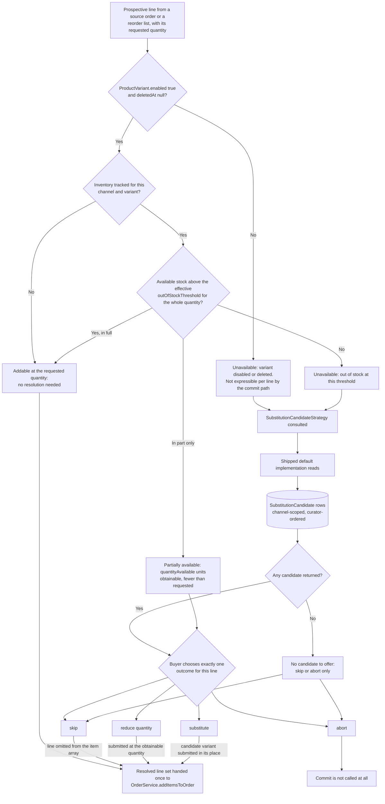

# FEATURE-001-04: Resolve every unavailable reorder line by an explicit buyer choice of skip, reduce quantity, substitute or abort taken before the commit, so that a reorder never silently writes a cart that differs from what the buyer asked for

Parent epic: `tickets/EPIC-001-reorder-and-replenishment.md`. Sibling features are written as paths rather than as links, following the epic's own convention of keeping the link count in a file equal to the number of children that file indexes [tickets/EPIC-001-reorder-and-replenishment.md:§3. How To Read This Epic]. The only links in this file are the three story links in section 3.

This file is not on the epic's curated read path, and it says so rather than implying otherwise [tickets/EPIC-001-reorder-and-replenishment.md:§3. How To Read This Epic]. The question it answers is narrower than the four on that path and sits underneath them: **once the preview has reported that a line cannot be added at the quantity the buyer asked for, who decides what happens to that line, and on what evidence.** Section 2.4 answers it by reading what this platform already does today, which turns out to be the whole reason the feature exists.

---

## 1. Feature Title

**Resolve every unavailable reorder line by an explicit buyer choice of skip, reduce quantity, substitute or abort taken before the commit, so that a reorder never silently writes a cart that differs from what the buyer asked for.**

Short name, used verbatim wherever this feature is referred to in one phrase, and identical to the label the epic's features index gives it: **Unavailable-Line Resolution and Substitution Candidates** [tickets/EPIC-001-reorder-and-replenishment.md:§4. Features Index]. The long form above is the action-object-outcome title this tier requires; the short form is the name to cite.

The epic classifies this feature's deviation from its originally suggested area as **kept, mechanism fixed** [tickets/EPIC-001-reorder-and-replenishment.md:§4. Features Index]. The suggested area — unavailable-item handling and substitution within the reorder flow — survives intact in scope. What the epic fixed is *how* substitution is obtained: it sits behind a `SubstitutionCandidateStrategy` interface with a database-backed default, following the `StockDisplayStrategy` precedent [packages/core/src/config/catalog/stock-display-strategy.ts:L21]. **Fixing the mechanism that way is what discharges the no-external-service constraint, and it is the reason this feature is shaped as it is rather than as a recommendation integration.** Section 2.10 states the discharge as a design ruling instead of leaving it as an implication.

Delivery is part of the single self-contained plugin package the epic describes — `packages/reorder-plugin/`, exporting `ReorderPlugin`. No file under `packages/core` or `packages/admin-ui` is edited to deliver it.

---

## 2. Feature Summary

### 2.1 The Capability

When a prospective reorder line cannot be added at the requested quantity, the buyer resolves it **deliberately** — choosing one of four named outcomes for that specific line — rather than discovering afterwards that the cart they were handed differs from the one they asked for. The resolution is taken before anything is written, and the resolved set of lines is what the commit path is then given.

The word doing the work in that sentence is *deliberately*. Every element of the mechanical capability — detecting that a line is short, working out how many units are obtainable, writing a smaller line — already exists in this platform and is already exercised by shipped specifications. What does not exist is a buyer being asked. Section 2.4 sets out exactly what happens today, with citations, because the gap this feature fills is a gap in *authority over the decision*, not a gap in arithmetic.

### 2.2 Contribution To The Epic

This feature owns one step of the returning-buyer journey: the branch taken when not every line is addable at the requested quantity, where the buyer chooses between the four outcomes before the reorder is applied [tickets/EPIC-001-reorder-and-replenishment.md:§2.5 The Returning-Buyer Journey This Epic Builds]. It is the only feature on that branch, and the journey rejoins the main path immediately afterwards at the commit.

Its stories straddle two of the epic's run batches, which is unusual and deliberate. Story 04-01 sits in batch B3 alongside the whole of FEATURE-001-03, while stories 04-02 and 04-03 sit in batch B4 [tickets/EPIC-001-reorder-and-replenishment.md:§9.4 Run Batches]. The epic gives the reason from its own side: the pre-commit resolution choice is only meaningful once the delta preview exists, and the strategy work in B4 then hooks into a resolution path that is already merged [tickets/EPIC-001-reorder-and-replenishment.md:§9.4 Run Batches]. The epic also records that this split is the entire difference between its per-batch and per-feature rollups, so the split is visible in its arithmetic rather than hidden by it [tickets/EPIC-001-reorder-and-replenishment.md:§9.3 Rollup].

The feature's claim on the objective statement is partly quoted and partly inferred, and the balance is reported honestly rather than flattered:

- **Story 04-01 carries the quoted clause C4**, on buyers being made aware of changes *before they commit to a reorder* [tickets/EPIC-001-reorder-and-replenishment.md:§10.2 Objective-Clause Map]. Awareness that arrives with no available response is not awareness a buyer can act on, which is what makes resolution part of that clause rather than an addition to it.
- **Story 04-02 is labelled `Inferred` from the Architectural Constraints block**, and the epic is explicit that the story *exists because of* a constraint rather than despite one: "no external-service dependency" is what forces substitution behind an interface with a database-backed default [tickets/EPIC-001-reorder-and-replenishment.md:§10.3 Inferred Breakdown].
- **Story 04-03 is labelled `Inferred` from the Business Targets block** [tickets/EPIC-001-reorder-and-replenishment.md:§10.3 Inferred Breakdown]. It is also the one story in this feature that is not owned by the automated run, for the reason section 4.7 gives.

Read the contribution precisely, because three things that look like this feature's work are not:

- **It does not detect unavailability.** The availability read belongs to FEATURE-001-03, and this feature consumes its outcome as an input [tickets/EPIC-001/FEATURE-001-03-price-and-availability-delta-preview.md:§4.2 Downstream].
- **It does not write to the order.** The commit path belongs to FEATURE-001-02, and a resolved line set is handed to it [tickets/EPIC-001/FEATURE-001-02-reorder-from-order-history.md:§2.5 Named API Surfaces].
- **It does not add a buyer-facing operation.** Section 2.7 is emphatic about this, because it is the single easiest thing to get wrong about this feature.

### 2.3 The Four Resolution Outcomes — The Vocabulary This Feature Fixes

Exactly four outcomes exist. They are named here once, and every story in this feature, every acceptance criterion in those stories, every field in the published outcome vocabulary and Figure F4-FLOW in section 2.9 use these four labels and no synonym:

- **`skip`** — the line is excluded from the reorder. Nothing is written for it, and the remaining lines proceed.
- **`reduce quantity`** — the line is added at the number of units that are obtainable rather than the number requested. Section 2.8 shows why that number never has to be invented.
- **`substitute`** — a different variant is added in place of the requested one, drawn from the candidates the configured strategy returns.
- **`abort`** — the whole reorder is abandoned. Nothing is written for any line, including lines that were addable.

Two notes on the vocabulary, both stated so that a later reader does not "tidy" them:

- **The epic's features index and journey diagram shorten `reduce quantity` to "reduce" for the space a diagram node allows** [tickets/EPIC-001-reorder-and-replenishment.md:§4. Features Index]. That is a rendering abbreviation of the same outcome, not a fifth option and not a different one. `reduce quantity` is the canonical label this file fixes, and it is the label the stories use.
- **`abort` is the only one of the four that is not a per-line outcome.** The other three describe what happens to one line while its siblings proceed; `abort` describes abandoning the request. It is grouped with them because it is one of the four choices a buyer is offered at the same moment, and because section 2.4 shows it is the one outcome the platform cannot provide after the fact.

### 2.4 What The Commit Path Already Does Today — The Question This File Exists To Answer

The most likely wrong reading of this feature is that the platform has no unavailability handling and this feature adds it. That reading is wrong, and it is wrong in a way that would produce a duplicated implementation, so this section reads the existing behaviour rather than asserting a gap.

**Finding one: `reduce quantity` already happens, unilaterally, on every add.** `OrderService.addItemsToOrder` clamps each requested quantity before writing it, by calling `constrainQuantityToSaleable` [packages/core/src/service/services/order.service.ts:L703]. That helper resolves the saleable level through `ProductVariantService.getSaleableStockLevel` [packages/core/src/service/helpers/order-modifier/order-modifier.ts:L125] and returns the requested quantity reduced to what is obtainable, floored at zero [packages/core/src/service/helpers/order-modifier/order-modifier.ts:L126-L131]. Where the clamp bit, the line is then written **at the reduced quantity** [packages/core/src/service/services/order.service.ts:L736-L741], and only afterwards is an `InsufficientStockError` appended to the returned error array [packages/core/src/service/services/order.service.ts:L743-L749].

That ordering is the whole problem in one sentence: **the write happens first and the notification second.** It is not an inference from the source, either — a shipped specification asserts it directly. Requesting five units of a variant with three obtainable returns `INSUFFICIENT_STOCK_ERROR` carrying `quantityAvailable` of three, and the specification's own inline comment records that the platform "Still adds as many as available to the Order" [packages/core/e2e/stock-control.e2e-spec.ts:L645-L660]. The same behaviour is asserted again for a variant made short by a positive `outOfStockThreshold`, where a request for two units yields an obtainable quantity of one and a line written at quantity one [packages/core/e2e/stock-control.e2e-spec.ts:L692-L709].

**Finding two: the `skip`-shaped case already happens too, when the clamp reaches zero.** Where the corrected quantity is zero, no line is written and an `InsufficientStockError` is accumulated instead [packages/core/src/service/services/order.service.ts:L710-L715]. The shipped specification asserts exactly that shape: a variant with no saleable stock produces the error, an obtainable quantity of zero, and an order carrying no lines at all [packages/core/e2e/stock-control.e2e-spec.ts:L630-L643]. **So `skip` is not a new behaviour either. What is new is a buyer having asked for it.**

**Finding three: `abort` does not exist and cannot be retrofitted after the fact.** There is no rollback in the bulk add. Once the per-item loop ends, price adjustments are applied to whatever was written [packages/core/src/service/services/order.service.ts:L751], and the method returns the updated order together with its accumulated errors [packages/core/src/service/services/order.service.ts:L762-L765]. Nothing removes the lines that succeeded. **`abort` is therefore only expressible as a decision not to call the commit at all**, which is the sharpest available argument that resolution has to happen before the write rather than being layered on after it.

**Finding four — the decisive one: a disabled or deleted variant is not expressible as a per-line outcome at all, because it aborts the entire batch.** The bulk add resolves each variant with a where-clause requiring `enabled: true` and a null `deletedAt` [packages/core/src/service/services/order.service.ts:L684-L689], through `getEntityOrThrow` [packages/core/src/connection/transactional-connection.ts:L278], which raises `EntityNotFoundError` whenever the clause matches nothing [packages/core/src/connection/transactional-connection.ts:L334-L341]. It throws again when the variant's parent product is disabled [packages/core/src/service/services/order.service.ts:L692-L694]. **There is no `try`/`catch` anywhere in the method** — the whole of it runs from its declaration [packages/core/src/service/services/order.service.ts:L654] to its return [packages/core/src/service/services/order.service.ts:L766] without one. So a single line whose variant has been disabled since the last purchase does not degrade into one failed entry beside nine successes; it fails the request and none of the nine healthy lines is added.

FEATURE-001-02 records the parent-product half of this from its own side and warns that a story assuming graceful degradation "has misread this paragraph" [tickets/EPIC-001/FEATURE-001-02-reorder-from-order-history.md:§2.6 The Existing Mechanisms This Feature Consumes Rather Than Rebuilds]. This section extends the same finding to the variant-level case with the throwing mechanism named, and the extension is consistent with that warning rather than a contradiction of it: the core call does reject a disabled variant, and the manner of the rejection is a throw.

**Finding five: unavailability cannot be read off `stockOnHand`, because a negative threshold permits a backorder.** A shipped specification titled for exactly this case adds eight units of a variant whose `stockOnHand` is three and asserts success, with the line written at the full quantity of eight [packages/core/e2e/stock-control.e2e-spec.ts:L719-L738]. The effective threshold, not the on-hand figure, decides obtainability. Any resolution logic that subtracted columns itself would classify that line as unavailable and would be wrong — which is the practical reason section 2.8 mandates the service call rather than merely preferring it.

**Conclusion, stated plainly so the residue and the prohibition are distinguishable.** The mechanics of shortening and dropping a line are shipped, tested and must not be rebuilt. What this feature adds is four things, and only these four:

1. **The decision moves in front of the write.** The buyer's choice is expressed in the commit request rather than discovered in the commit response.
2. **`abort` becomes available**, because a pre-commit decision can decline to call the commit and a post-commit report cannot undo it.
3. **A disabled or deleted line becomes survivable**, because it is resolved out of the item array before the call that would otherwise throw on it.
4. **`substitute` exists at all**, together with the strategy and the curated table behind it.

---

### 2.5 Named Entities Touched

**This feature introduces exactly one new table, `SubstitutionCandidate`, and it is plugin-owned.** No column is added to any existing table, no column type is changed, and no destructive statement appears in its migration. Section 2.14 records the constraint that makes that a requirement rather than a preference.

New, plugin-owned:

- **`SubstitutionCandidate`** — a channel-scoped mapping from an original variant to a candidate variant, carrying a curator-set ordering so that a category manager controls which candidate is offered first. It is the table the shipped default strategy reads, and it is the only persistence this feature adds. **Its exact shape is not fixed here**, because the epic records an open product decision — whether candidates are curated per variant or per collection — that changes it, and inventing a shape would pre-empt a decision that is a maintainer's to take [tickets/EPIC-001-reorder-and-replenishment.md:§8.1 Product Decisions]. Section 4.5 carries the dependency; story 04-02 carries the consequence.

Existing platform entities, read and never altered:

- **`ProductVariant`** — the source of every availability precondition in Figure F4-FLOW. Four columns are load-bearing and each is a *database* precondition rather than an observable value: `enabled` [packages/core/src/entity/product-variant/product-variant.entity.ts:L53], which section 2.4 shows is the one that makes a line unresolvable by the commit path rather than merely short; `outOfStockThreshold`, defaulting to zero [packages/core/src/entity/product-variant/product-variant.entity.ts:L144]; `useGlobalOutOfStockThreshold`, defaulting to true [packages/core/src/entity/product-variant/product-variant.entity.ts:L152], which decides whether the variant's own threshold or the channel-level one applies; and `trackInventory` [packages/core/src/entity/product-variant/product-variant.entity.ts:L155], **which is a three-valued inherit flag rather than a boolean** and therefore has an inherit state that a specification must set deliberately. `deletedAt` [packages/core/src/entity/product-variant/product-variant.entity.ts:L48] is named because it is the second half of the where-clause that throws.
- **`StockLevel`** — the row behind the availability answer, and **never read directly by plugin code**, for the reason section 2.8 gives. It carries `stockOnHand` [packages/core/src/entity/stock-level/stock-level.entity.ts:L40] and `stockAllocated` [packages/core/src/entity/stock-level/stock-level.entity.ts:L43] under a unique index on the variant-and-location pair [packages/core/src/entity/stock-level/stock-level.entity.ts:L19], with the cascade-deleting variant relation at [packages/core/src/entity/stock-level/stock-level.entity.ts:L26] and the location relation at [packages/core/src/entity/stock-level/stock-level.entity.ts:L33]. The index is unique on the *pair*, so one variant holds one row per stocking location — which is why combining them is a configured strategy's decision and not an addition this feature may perform.
- **`Order` and `OrderLine`** — the source of a prospective line and its requested quantity, read through the paths FEATURE-001-02 already established, with no order-reading operation added here [tickets/EPIC-001/FEATURE-001-02-reorder-from-order-history.md:§2.3 Named Entities Touched].
- **`Channel`** — supplies the request scope described in section 2.11, and the two **live** inventory settings a threshold resolves against.
- **`ReorderList` and `ReorderListLine`** — FEATURE-001-01's tables, read when the reorder source is a list [tickets/EPIC-001/FEATURE-001-01-named-reorder-lists.md:§2.4 Named Entities Touched].

### 2.6 Named Services And Configurable Strategies

- **`StockLevelService` — existing, in `packages/core`, consumed and never modified.** `getAvailableStock` [packages/core/src/service/services/stock-level.service.ts:L72] resolves available stock through the configured stock-location strategy [packages/core/src/service/services/stock-level.service.ts:L79], returning the on-hand and allocated pair that the saleable computation subtracts from [packages/core/src/config/catalog/stock-location-strategy.ts:L18-L20]. Its own documentation states that the answer is determined by that strategy [packages/core/src/service/services/stock-level.service.ts:L67-L70]. `getStockLevelsForVariant` [packages/core/src/service/services/stock-level.service.ts:L56] is named for a different purpose: it is the member that filters stock rows by the request's channel [packages/core/src/service/services/stock-level.service.ts:L63], which is how a reader can see that channel scoping is a property of the platform's own stock reads rather than something this feature bolts on.
- **`OrderService` — existing, consumed as the write path and nothing else.** `addItemsToOrder` [packages/core/src/service/services/order.service.ts:L654] receives the **resolved** line set. This feature calls it once per reorder, exactly as FEATURE-001-02 specifies, and adds no second call site and no per-variant loop [tickets/EPIC-001/FEATURE-001-02-reorder-from-order-history.md:§2.6 The Existing Mechanisms This Feature Consumes Rather Than Rebuilds]. `adjustOrderLine` [packages/core/src/service/services/order.service.ts:L774] is named **only** to record that this feature neither calls it nor changes it: a reduced quantity is expressed by the quantity submitted to the bulk add, not by adding at the requested quantity and adjusting downwards afterwards, because the second form is a second write that could fail on its own.
- **`ProductVariantService` — existing, consumed transitively.** The saleable computation the clamp depends on lives there and is reached through the bulk add rather than called directly by this feature [packages/core/src/service/helpers/order-modifier/order-modifier.ts:L125].
- **`ReorderService` — new, plugin-owned, extended rather than duplicated.** FEATURE-001-02 introduces it with the source-resolution and ownership-enforcement logic, and FEATURE-001-03 adds its read method to the same service [tickets/EPIC-001/FEATURE-001-03-price-and-availability-delta-preview.md:§2.5 Named Services And Configurable Strategies]. This feature adds the resolution step to that same service. **One service, one ownership rule, one source-resolution implementation** — a resolution path that resolved sources for itself could disagree with the preview about which lines are even in scope.
- **`StockDisplayStrategy` — existing configurable strategy, consumed and never bypassed.** Its contract is a single method, `getStockLevel` [packages/core/src/config/catalog/stock-display-strategy.ts:L27], declared on an interface that extends the injectable-strategy shape [packages/core/src/config/catalog/stock-display-strategy.ts:L21], taking a saleable stock level [packages/core/src/config/catalog/stock-display-strategy.ts:L30] and returning the string used directly in the GraphQL `ProductVariant.stockLevel` field [packages/core/src/config/catalog/stock-display-strategy.ts:L24-L25]. It is deployment-configurable through `catalogOptions.stockDisplayStrategy` [packages/core/src/config/catalog/stock-display-strategy.ts:L14].
- **`DefaultStockDisplayStrategy` — the shipped implementation, and the source of the three exact strings.** The class [packages/core/src/config/catalog/default-stock-display-strategy.ts:L14] returns `OUT_OF_STOCK` below one saleable unit, `LOW_STOCK` at or below its `lowStockLevel`, and `IN_STOCK` otherwise [packages/core/src/config/catalog/default-stock-display-strategy.ts:L17-L21]. **`lowStockLevel` defaults to 2** [packages/core/src/config/catalog/default-stock-display-strategy.ts:L15], a shipped default cited from source rather than a threshold this ticket set chose, and documented as that default in the class's own description [packages/core/src/config/catalog/default-stock-display-strategy.ts:L9-L10].
- **`ChangedPriceHandlingStrategy` — existing configurable strategy, named as a *pattern reference* and deliberately not consumed.** No code in this feature calls, configures or reimplements `handlePriceChange` [packages/core/src/config/order/changed-price-handling-strategy.ts:L32]. It appears in this file for one reason only: it is the second exemplar of the strategy shape section 2.8 mandates, and its deployment-configuration property is the model for the new one [packages/core/src/config/order/changed-price-handling-strategy.ts:L17-L18]. Price behaviour remains FEATURE-001-03's subject and the deployment's decision [tickets/EPIC-001/FEATURE-001-03-price-and-availability-delta-preview.md:§2.7 The Existing Mechanisms This Feature Consumes Rather Than Rebuilds].
- **`SubstitutionCandidateStrategy` — new, plugin-owned, configurable.** One interface extending the injectable-strategy shape, one method returning the candidate variants for an original variant in a request context, one shipped default implementation reading `SubstitutionCandidate`, and one named plugin-options property through which a deployment replaces it. Section 2.8 fixes that shape against the two exemplars above; section 2.10 states why it is an interface at all.
- **`TransactionalConnection` — existing, consumed for all plugin-owned persistence**, which here is the candidate table alone [tickets/EPIC-001-reorder-and-replenishment.md:§7.4 Existing Entities And Services The Work Depends On].

### 2.7 Named API Surfaces — Zero New Buyer-Facing Operations, Two New Admin Operations

**This feature adds no buyer-facing operation. None.** The resolution decision is carried in the input of FEATURE-001-02's existing mutation, `applyReorderToActiveOrder`, and its result is reported in that mutation's per-line outcome report [tickets/EPIC-001/FEATURE-001-02-reorder-from-order-history.md:§2.5 Named API Surfaces]. This is stated first and stated bluntly because it is load-bearing in two directions:

- **It keeps the operation count honest.** The epic fixes the new Shop API surface at fourteen operations, and **this feature contributes none of them.** A reader tallying the epic's surface against its features must be able to see that this feature's contribution to that tally is zero rather than assume an omission.
- **It is the only design that keeps `abort` coherent.** A separate buyer-facing resolution mutation would either write something — making it a second write path competing with FEATURE-001-02's — or write nothing, in which case it would be a preview, which FEATURE-001-03 already owns. Resolution is neither: it is an *argument* to the write, so it belongs in the write's input.

So there is no `resolveReorderLine` mutation, and there is no per-line resolution endpoint. **Any future proposal to add one is a change to this feature's shape and to the epic's operation count, not a detail.**

**Existing surfaces this feature reads and does not extend:**

- `ProductVariant.stockLevel: String!` — the only publicly observable availability value, resolved through the display strategy [packages/core/src/config/catalog/stock-display-strategy.ts:L24-L25]. Candidate availability is described to a buyer in that vocabulary and never as a number.
- `addItemsToOrder(inputs: [AddItemInput!]!)` and `addItemToOrder`, whose published signatures are unchanged by this feature and whose partial-success contract it mirrors rather than competes with [tickets/EPIC-001/FEATURE-001-02-reorder-from-order-history.md:§2.6 The Existing Mechanisms This Feature Consumes Rather Than Rebuilds].

**The two new Admin API operations**, added through the plugin's `adminApiExtensions` — the mechanism the shipped reviews plugin already demonstrates alongside its shop extensions [packages/dev-server/test-plugins/reviews/reviews-plugin.ts:L14-L21]:

- **`substitutionCandidates`** — a permission-gated read of the curated candidates for a given original variant in the active channel, ordered as the curator ordered them.
- **`setSubstitutionCandidates`** — a permission-gated write that replaces the curated candidate set for a given original variant in the active channel.

**No new error result is declared by this feature.** The epic's set introduces six new error results in total and none of them belongs here [tickets/EPIC-001-reorder-and-replenishment.md:§6.1 Repository-Discovered Collisions]. A line that cannot be added is reported as a per-line *outcome*, not as a request-level error, and the error position in that report reuses the five members of the existing closed union [packages/core/src/api/schema/common/common-error-results.graphql:L112-L117] — principally `InsufficientStockError` [packages/core/src/api/schema/common/common-error-results.graphql:L50], with `OrderLimitError` [packages/core/src/api/schema/common/common-error-results.graphql:L37], `NegativeQuantityError` [packages/core/src/api/schema/common/common-error-results.graphql:L44] and `OrderModificationError` [packages/core/src/api/schema/common/common-error-results.graphql:L80] reachable on the same call. Thirty-one error result types exist in this checkout — fifteen in the common schema file together with the union above, and sixteen more in the shop-specific file, running from its first declaration [packages/core/src/api/schema/shop-api/shop-error-results.graphql:L2] to its last [packages/core/src/api/schema/shop-api/shop-error-results.graphql:L130] — and **no story in this feature names an error outside those thirty-one or the six the epic's set declares.**

**The additive-only constraint, and the widening rule.** Where a platform mechanism would widen an existing signature as a side effect of an otherwise additive change, that is a reportable violation recorded in the epic's collision section and referenced here rather than re-argued or quietly absorbed [tickets/EPIC-001-reorder-and-replenishment.md:§6.1 Repository-Discovered Collisions]. This feature declares **no custom field on any core entity**, which is what keeps the first of those collisions from becoming true of this deployment — and it is worth noting that the reviews plugin cited above for its dashboard precedent *does* push a custom field onto an existing type [packages/dev-server/test-plugins/reviews/reviews-plugin.ts:L22-L30], so the precedent is adopted for its bundling and internationalisation anatomy and explicitly not for that.

### 2.8 The Existing Mechanisms This Feature Consumes Rather Than Rebuilds

The epic's do-not-duplicate inventory assigns this feature two rows directly, and this file adds a third obligation that is a *pattern* rather than a call [tickets/EPIC-001-reorder-and-replenishment.md:§5. Existing Mechanisms That Must Not Be Duplicated]. All three are mandates rather than prohibitions, which is unusual for this tier and is the reason they are separated below: a reviewer checking this feature is checking that three existing things were *used*, not that three existing things were left alone.

#### Mechanism one — `StockLevelService.getAvailableStock`. Mandated; direct row access prohibited.

`getAvailableStock` resolves availability through the configured stock-location strategy [packages/core/src/service/services/stock-level.service.ts:L72], delegating the multi-location question to that strategy rather than answering it itself [packages/core/src/service/services/stock-level.service.ts:L79].

*The prohibition, in the epic's own terms:* do not query `StockLevel` rows directly and do not sum `stockOnHand` in plugin code; call the service so the configured location strategy stays authoritative [tickets/EPIC-001-reorder-and-replenishment.md:§5. Existing Mechanisms That Must Not Be Duplicated].

*Why it bites harder here than anywhere else in this epic.* Every branch of Figure F4-FLOW turns on an availability answer, so this feature has more opportunities to compute one wrongly than any other. Finding five in section 2.4 is the concrete demonstration: a variant with a negative threshold is obtainable well beyond its on-hand figure [packages/core/e2e/stock-control.e2e-spec.ts:L719-L738], so plugin arithmetic over `stockOnHand` [packages/core/src/entity/stock-level/stock-level.entity.ts:L40] and `stockAllocated` [packages/core/src/entity/stock-level/stock-level.entity.ts:L43] would offer a substitute for a line that needed none.

#### Mechanism two — `InsufficientStockError.quantityAvailable`. Mandated as the source of the number.

The error type carries `quantityAvailable: Int!` [packages/core/src/api/schema/common/common-error-results.graphql:L53] beside `order: Order!` [packages/core/src/api/schema/common/common-error-results.graphql:L54], on a type whose own schema description is that it is returned when more items are added than are available [packages/core/src/api/schema/common/common-error-results.graphql:L49-L50]. FEATURE-001-02 already states the consequence and assigns it here: that field is why "reduce the line to what is available" is specifiable without inventing a number, and this feature builds its reduce option on it [tickets/EPIC-001/FEATURE-001-02-reorder-from-order-history.md:§2.6 The Existing Mechanisms This Feature Consumes Rather Than Rebuilds].

**This is the single most important sentence in the file for anyone writing an acceptance criterion.** `reduce quantity` would otherwise require a story to name a number the repository does not declare, and the epic forbids inventing one [tickets/EPIC-001-reorder-and-replenishment.md:§2.2 Business Value]. Because the platform returns the obtainable quantity as an integer, a criterion can assert an exact value that the platform itself produced. The shipped specifications show that value being asserted concretely at zero [packages/core/e2e/stock-control.e2e-spec.ts:L641], at three [packages/core/e2e/stock-control.e2e-spec.ts:L658] and at one [packages/core/e2e/stock-control.e2e-spec.ts:L705] under stated database preconditions — three worked examples of exactly the assertion a story in this feature must make.

*The prohibition that follows:* no story in this feature states a candidate-relevance figure, a match-quality figure, a maximum candidate count, or a declared response-time target for a resolution round trip. **This repository declares no numeric target of any kind, and this feature invents none** [tickets/EPIC-001-reorder-and-replenishment.md:§2.2 Business Value]. Where a number appears in a criterion it is either a quantity the platform returned or a database precondition the specification set.

#### Mechanism three — the configurable-strategy pattern itself. Mandated as the shape.

This is not a call site; it is a template, and the epic's mechanism-fixing deviation is what makes conforming to it mandatory [tickets/EPIC-001-reorder-and-replenishment.md:§4. Features Index]. Two shipped exemplars define the shape and they agree with each other in every particular:

- **`StockDisplayStrategy`** — an interface extending the injectable-strategy shape [packages/core/src/config/catalog/stock-display-strategy.ts:L21], carrying exactly one method [packages/core/src/config/catalog/stock-display-strategy.ts:L27], with a shipped default implementation [packages/core/src/config/catalog/default-stock-display-strategy.ts:L14] and a named configuration property [packages/core/src/config/catalog/stock-display-strategy.ts:L14].
- **`ChangedPriceHandlingStrategy`** — an interface extending the injectable-strategy shape [packages/core/src/config/order/changed-price-handling-strategy.ts:L24], carrying exactly one method [packages/core/src/config/order/changed-price-handling-strategy.ts:L32], with a named configuration property [packages/core/src/config/order/changed-price-handling-strategy.ts:L17-L18].

`SubstitutionCandidateStrategy` follows that shape exactly: **an interface, one method, a shipped default, and a configuration property.** Story 04-02 owns it. A design that departed from the shape — two methods, no default, or a hard-coded implementation — would be a departure from a repository convention with two shipped exemplars, and would need to be argued rather than assumed.

*One further borrowing from the first exemplar, and it is a justification rather than a mechanism.* `StockDisplayStrategy` exists because directly exposing stock levels over a public API is treated as a leak of sensitive information [packages/core/src/config/catalog/stock-display-strategy.ts:L7-L10]. That published judgement is the reason a substitution candidate is described to a buyer qualitatively — as one of the three display strings — rather than with the number of units behind it. **The candidate surface inherits the platform's own confidentiality posture rather than choosing its own.**

### 2.9 Figure F4-FLOW — The Unavailable-Line Resolution Decision Tree

This is the only diagram in this file, and it is the diagram every story in this feature references where it needs a visual; story files embed none of their own. The four terminal outcome nodes carry the four labels fixed in section 2.3, unabbreviated.

Three properties of the diagram are worth naming, because each is a decision rather than a drawing choice:

- **The `abort` outcome is the only one that does not reach the commit node.** That is section 2.4's third finding rendered as topology: the platform offers no rollback, so abandoning a reorder can only mean not calling the commit.
- **The disabled-or-deleted branch reaches the strategy but never reaches `reduce quantity`.** A disabled variant has no obtainable quantity to reduce to, so only `skip`, `substitute` and `abort` are offered for it. A story that offered a reduction there would be offering an outcome with no defined value.
- **The untracked-inventory branch short-circuits to addable.** It does not fall through to a stock comparison, because where inventory is not tracked there is no threshold to compare against; `trackInventory` is a three-valued inherit flag [packages/core/src/entity/product-variant/product-variant.entity.ts:L155] resolving against the channel default [packages/core/src/entity/channel/channel.entity.ts:L100], so a specification must set it deliberately rather than rely on the inherited state.

### 2.10 The No-External-Service Discharge, Stated As A Design Ruling

Substitution is the one capability in this epic that invites an external dependency. "Suggest something else the buyer might want instead" is the canonical shape of a hosted recommendation service, and reaching for one would be the path of least resistance. **The constraints forbid it: any apparent external need is modelled behind an interface with a database-backed default implementation** [tickets/EPIC-001-reorder-and-replenishment.md:§4. Features Index]. This section states the discharge as a ruling rather than leaving it to be inferred from the strategy's presence.

**The ruling.** Candidate selection is obtained through `SubstitutionCandidateStrategy`. The implementation this epic ships is a database-backed default that reads curated rows from `SubstitutionCandidate` in the active channel and returns them in the curator's order. **The shipped path depends on nothing outside this repository** — no hosted service, no outbound network call, no vendor credential, no data export. A deployment that wants a hosted recommender replaces the strategy through its named configuration property, and that substitution is a deployment's own decision taken outside this epic's boundary.

Three consequences follow, and each is a design constraint rather than a note:

- **The default must be genuinely useful, not a stub.** A default that returned an empty list would discharge the constraint on paper while making `substitute` unreachable in the shipped configuration. Section 5 makes a *working* default part of the definition of done for exactly that reason, and Figure F4-FLOW gives the empty-candidate case its own path so the story that implements it has a defined behaviour to build rather than an unstated one.
- **Curation is human, not inferred.** Because there is no external service to derive candidates from, and because inferring them from purchase history would be a forecasting capability the epic rules out of scope [tickets/EPIC-001-reorder-and-replenishment.md:§2.4 Scope Boundaries], candidates are curated by a person. That is what makes story 04-03 necessary rather than optional, and it is why the Marketplace Category Manager is the persona there.
- **No relevance figure is stated anywhere.** With no external scorer and no declared target in this repository, there is nothing to express a match quality against, and the epic forbids inventing one [tickets/EPIC-001-reorder-and-replenishment.md:§2.2 Business Value]. Ordering is the curator's, expressed as a position rather than as a score.

### 2.11 Channel Scoping, Language Scoping And Monetary Values

Every operation and every read in this feature is channel-scoped and language-scoped, on the epic's standing preconditions rather than on ones invented here [tickets/EPIC-001-reorder-and-replenishment.md:§7.5 Request Prerequisites].

- **Channel.** The active channel is identified by a unique token read from the `vendure-token` request header [packages/core/src/entity/channel/channel.entity.ts:L62], as that column's own description states [packages/core/src/entity/channel/channel.entity.ts:L56-L59]. A story that varies behaviour by channel names the token it sends.
- **Language.** Translated output resolves against the language code of the request, defaulting to the channel's `defaultLanguageCode` [packages/core/src/entity/channel/channel.entity.ts:L74]. A candidate variant's name is a translated value, so a story that asserts a candidate's name states the language code it asserted under.
- **The live inventory settings are the channel's, never the deprecated global pair.** `Channel.trackInventory` [packages/core/src/entity/channel/channel.entity.ts:L100] and `Channel.outOfStockThreshold` [packages/core/src/entity/channel/channel.entity.ts:L108] are the values a variant inherits, and each carries its own description saying so [packages/core/src/entity/channel/channel.entity.ts:L93-L98] and [packages/core/src/entity/channel/channel.entity.ts:L102-L106]. The epic records a documentation discrepancy here — the `ProductVariant` description points a reader at the deprecated global settings instead [tickets/EPIC-001-reorder-and-replenishment.md:§6.3 Repository Documentation Discrepancies] — and **no ticket in this feature repeats that stale claim.**
- **Candidates are curated per channel, and a candidate curated in one channel does not surface in another.** This is stated rather than implied, because it is the one scoping rule in this feature that a naive implementation would omit: a mapping table keyed only on the pair of variants would leak a marketplace channel's curation into every other channel on the deployment. A cross-channel read returning another channel's candidates is a defect, not a convenience.
- **Money.** Where a candidate's price is compared with the original's, both figures are integers in the smallest unit of the resolved currency, stated with the currency code that resolved from `Channel.defaultCurrencyCode` [packages/core/src/entity/channel/channel.entity.ts:L88] or from the request's currency. **A decimal monetary value anywhere in this feature or its stories is a defect.** Whether a figure is gross or net follows from `Channel.pricesIncludeTax` [packages/core/src/entity/channel/channel.entity.ts:L113], and a comparison that mixed the two bases would be arithmetically real and semantically meaningless, so the basis is stated wherever a comparison is made.
- **Availability is never a number on a public surface.** Stock is stated as database preconditions — `stockOnHand` [packages/core/src/entity/stock-level/stock-level.entity.ts:L40], `stockAllocated` [packages/core/src/entity/stock-level/stock-level.entity.ts:L43], `trackInventory` [packages/core/src/entity/product-variant/product-variant.entity.ts:L155] and `outOfStockThreshold` [packages/core/src/entity/product-variant/product-variant.entity.ts:L144] together with the global-threshold flag [packages/core/src/entity/product-variant/product-variant.entity.ts:L152] — while the publicly observable value is exactly one of `OUT_OF_STOCK`, `LOW_STOCK` or `IN_STOCK` [packages/core/src/config/catalog/default-stock-display-strategy.ts:L17-L21]. The one exception is deliberate and is not a leak: the obtainable quantity a `reduce quantity` outcome uses is `quantityAvailable` on an error result the platform itself publishes [packages/core/src/api/schema/common/common-error-results.graphql:L53].

### 2.12 A Point-In-Time Read Is Not A Reservation

Resolution consumes an availability read, and an availability read confers nothing. This section exists because a buyer choosing `reduce quantity` for a specific number of units looks exactly like a buyer being promised those units, and it is the assumption most likely to be made silently.

**The evidence is shipped, not argued.** A specification titled for this exact situation has two different customers each add one unit of a variant whose `stockOnHand` is one, and **both adds succeed** [packages/core/e2e/stock-control.e2e-spec.ts:L1301-L1316]. The first customer then completes payment, at which point the allocation is recorded [packages/core/e2e/stock-control.e2e-spec.ts:L1324-L1327], and the specification's own comment records that the second customer cannot check out [packages/core/e2e/stock-control.e2e-spec.ts:L1329-L1330]. Adding to a cart therefore reserves nothing in this platform, and neither does resolving a line before adding it.

Four consequences, each of which a story in this feature must carry rather than assume:

- **A resolution can be overtaken.** A line resolved as `reduce quantity` to an obtainable figure can be short of even that figure when the commit runs, because the commit re-clamps every line independently [packages/core/src/service/services/order.service.ts:L703]. The outcome report is what tells the buyer, and the epic's staleness ruling for the commit path applies unchanged [tickets/EPIC-001/FEATURE-001-02-reorder-from-order-history.md:§2.10 A Point-In-Time Read Is Not A Reservation].
- **A line resolved as `substitute` can find its candidate gone.** Candidate availability is read at the same moment and with the same absence of any hold, so the substituted line is subject to the identical re-evaluation.
- **The commit remains authoritative.** Where the commit's answer differs from the resolution's, the commit is right and the report says so. A resolution is a request, not an entitlement.
- **No freshness window is stated.** There is no interval within which a resolution is claimed to remain valid, in any unit, because this repository declares no such figure and this feature will not invent one [tickets/EPIC-001-reorder-and-replenishment.md:§2.2 Business Value]. The honest statement is that the read is point-in-time and the commit re-evaluates; a number here would be a fabrication dressed as a guarantee.

### 2.13 Precedent In This Repository — Partial

Disclosed as **`partial`**, and the parts are separated so the disclosure is checkable rather than a single adjective. The searched set was the whole of the example-plugin and test-plugin trees under `packages/dev-server`, together with the configurable-strategy directories under `packages/core/src/config`.

**Where precedent is strong — the strategy shape.** The interface-plus-shipped-default-plus-configuration-property pattern is not merely permitted here, it is the house pattern, with the two exemplars named in section 2.8 agreeing in every particular [packages/core/src/config/catalog/stock-display-strategy.ts:L21] and [packages/core/src/config/order/changed-price-handling-strategy.ts:L24]. Story 04-02 is therefore a story about conforming to an established convention, and its risk is correspondingly low. **Saying otherwise would overstate its novelty.**

**Where precedent is strong — the dashboard curation surface.** A plugin shipping a React dashboard extension is shipped work in this repository. The reviews test plugin declares `dashboard: './dashboard/index.tsx'` in its plugin metadata [packages/dev-server/test-plugins/reviews/reviews-plugin.ts:L34], alongside both `adminApiExtensions` and `shopApiExtensions` in the same decorator [packages/dev-server/test-plugins/reviews/reviews-plugin.ts:L14-L21], and it ships internationalisation catalogues at `packages/dev-server/test-plugins/reviews/dashboard/i18n/en.po` and `packages/dev-server/test-plugins/reviews/dashboard/i18n/de.po` with translated strings marked up through the `Trans` component imported from `@lingui/react/macro` [packages/dev-server/test-plugins/reviews/dashboard/review-list.tsx:L2]. Story 04-03 follows that anatomy and invents no new bundling approach. **One thing it does not adopt from that precedent:** the reviews plugin pushes a relation custom field onto an existing core type [packages/dev-server/test-plugins/reviews/reviews-plugin.ts:L22-L30], and section 2.7 records why this feature declares none.

**Where precedent is absent — and these three are what is genuinely new:**

- **The `SubstitutionCandidate` table.** No entity in this repository maps one variant to alternative variants for any purpose. The nearest structural relative is the product-bundles example plugin's multi-entity shape, which is a template for how to lay out a plugin with more than one table rather than a precedent for this table's meaning.
- **`SubstitutionCandidateStrategy` as a subject.** The *shape* is precedented, as above; the *concept* of a pluggable substitution source is not. No configurable strategy in `packages/core/src/config` answers a question about alternatives to a variant.
- **The four-outcome resolution decision itself.** Nothing in this repository asks a buyer what to do about a short line. Section 2.4 establishes that the platform decides unilaterally today, which is the precise sense in which this decision tree has no precedent: the behaviour exists, and the consultation does not.

**Stated against the feature as a whole, the honest summary is that this feature's mechanisms are borrowed and its subject is new.** That is a weaker novelty claim than "no precedent" and a stronger one than "already shipped", and it is the accurate one.

### 2.14 Constraints This Feature Is Built Under

Every item is a constraint from the epic, carried here so that the stories inherit it rather than restating it, and each is evidenced in section 5.

- **Additive only.** No existing Shop API or Admin API operation signature changes. This feature adds two Admin operations and zero buyer-facing ones. Where a platform mechanism would widen an existing signature as a side effect, that is a reportable violation belonging in the epic's collision section, never a side effect to absorb quietly [tickets/EPIC-001-reorder-and-replenishment.md:§6.1 Repository-Discovered Collisions].
- **Zero edits to the two protected packages.** Nothing under `packages/core` or `packages/admin-ui` is edited, evidenced by an empty diff. The only two files a future implementation may touch outside its own package are the dev-server plugin registration array [packages/dev-server/dev-config.ts:L121-L155] and the dashboard bundling configuration [packages/dev-server/vite.config.mts:L1]; the second is relevant here because story 04-03 bundles a dashboard extension. **Naming them is a documentation act, and this feature file does not edit them** [tickets/EPIC-001-reorder-and-replenishment.md:§11.7 The Two Permitted Configuration Exceptions].
- **Additive migrations only.** One new plugin-owned table, `SubstitutionCandidate`. No column is added to an existing table, no column type is changed, and no destructive statement is issued. The epic records that this repository's own breaking-change classification is in unresolved tension with that framing, and the tension is referenced rather than resolved here [tickets/EPIC-001-reorder-and-replenishment.md:§6.1 Repository-Discovered Collisions].
- **Zero custom fields.** Curated candidates live on the plugin-owned table, keyed by entity id, not on a custom field of `ProductVariant`.
- **Integer money with its currency code.** As section 2.11 states, with a decimal value treated as a defect.
- **Channel-scoped and language-scoped throughout**, including the candidate table itself.
- **No invented metric.** No relevance figure, no match-quality figure, no candidate-count ceiling, no declared timing target. Where this repository declares no number, the tickets say so [tickets/EPIC-001-reorder-and-replenishment.md:§2.2 Business Value].
- **No external-service dependency**, discharged as section 2.10 rules.
- **A point-in-time read is never described as a reservation**, per section 2.12.
- **Permission-gated with in-resolver enforcement.** Both Admin operations are gated by a registered permission, and a permission alone is not an access control in this platform — the epic's third collision records that a resolver relying on ownership without enforcing it is equivalent to public access [tickets/EPIC-001-reorder-and-replenishment.md:§6.1 Repository-Discovered Collisions].

---

## 3. User Stories Index

Three stories. Titles are transcribed from the epic's story table and are not restated with different wording [tickets/EPIC-001-reorder-and-replenishment.md:§9.2 Story Table].

- [STORY-001-04-01 — Resolve unavailable lines before commit](./FEATURE-001-04/STORY-001-04-01-resolve-unavailable-lines-before-commit.md) — the four outcomes as a per-line decision carried in the commit request, with `reduce quantity` bound to the obtainable figure the platform returns and `skip` resolving a disabled or deleted variant out of the item array before the call that would otherwise throw. Traceability is the quoted objective clause about acting before the buyer commits [tickets/EPIC-001-reorder-and-replenishment.md:§10.2 Objective-Clause Map]. Owner: the automated run.
- [STORY-001-04-02 — Add a substitution candidate strategy](./FEATURE-001-04/STORY-001-04-02-substitution-candidate-strategy.md) — the `SubstitutionCandidateStrategy` interface, its shipped database-backed default over `SubstitutionCandidate`, the additive migration for that table, and the named plugin-options property a deployment replaces it through. Traceability is `Inferred` from the Architectural Constraints block, and the epic is explicit that the story exists *because of* the no-external-service constraint rather than despite it [tickets/EPIC-001-reorder-and-replenishment.md:§10.3 Inferred Breakdown]. Owner: the automated run.
- [STORY-001-04-03 — Curate substitution candidates for a category](./FEATURE-001-04/STORY-001-04-03-curate-substitution-candidates-for-category.md) — the two Admin operations `substitutionCandidates` and `setSubstitutionCandidates`, permission-gated, plus the dashboard surface through which a Marketplace Category Manager sets and orders candidates. Traceability is `Inferred` from the Business Targets block [tickets/EPIC-001-reorder-and-replenishment.md:§10.3 Inferred Breakdown]. **Owner: a developer working in parallel**, for the reason section 4.7 gives.

Estimates are deliberately absent from this file. Points, lines of code, generation hours and review hours live only in the epic's delivery-split table, which is the single source of truth for them, and each story transcribes its own four values from its row there [tickets/EPIC-001-reorder-and-replenishment.md:§9.2 Story Table].

Every story in this feature references **Figure F4-FLOW** in section 2.9 where it needs a visual, and embeds no diagram of its own.

---

## 4. Dependencies

Direction is stated for every entry, because a dependency without a direction cannot be sequenced.

### 4.1 Upstream — FEATURE-001-03 For The Signal, FEATURE-001-02 For The Commit Path

Two upstream features, and the two dependencies are of different kinds. Conflating them would make this feature look more entangled than it is.

- **FEATURE-001-03 supplies the signal this feature acts on, and the dependency is total.** Resolution is a decision about a line already reported as unobtainable at the requested quantity, so without the availability outcome there is nothing to resolve and the decision tree has no entry condition. The sibling feature states the same edge from its own side, in the same direction [tickets/EPIC-001/FEATURE-001-03-price-and-availability-delta-preview.md:§4.2 Downstream], and the epic's batch table agrees by placing story 04-01 in batch B3 alongside that feature's three stories rather than with the rest of its own [tickets/EPIC-001-reorder-and-replenishment.md:§9.4 Run Batches]. Three statements, one direction, deliberately.
- **FEATURE-001-02 supplies the commit path that consumes a resolved line set, and the dependency is structural rather than conceptual.** The resolution decision travels in that feature's mutation input and its result is reported in that feature's per-line outcome report [tickets/EPIC-001/FEATURE-001-02-reorder-from-order-history.md:§2.5 Named API Surfaces], so the input shape and the report shape must exist before a resolution has anywhere to live. It also supplies `ReorderService`, which this feature extends rather than parallels [tickets/EPIC-001/FEATURE-001-02-reorder-from-order-history.md:§2.4 Named Services].
- **FEATURE-001-01 is a transitive dependency, and only for the list source.** A list-sourced reorder needs `ReorderListLine` rows to exist [tickets/EPIC-001/FEATURE-001-01-named-reorder-lists.md:§2.4 Named Entities Touched]. The order-sourced path depends on it for nothing, and this feature inherits that qualification from the two features above rather than adding a third copy of it.
- **FEATURE-001-07 is an *optional* upstream edge, and the qualifier is load-bearing rather than polite.** A rejected-line event names a variant a buyer wanted and could not have, which is a useful signal for deciding what to curate. The sibling feature declares the edge from its own side in exactly those terms and adds the instruction this file honours: the strategy interface and the curation surface are complete without it, so the edge is an enhancement and **nobody should sequence this feature behind that one** [tickets/EPIC-001/FEATURE-001-07-reorder-instrumentation.md:§4.2 Downstream]. Accordingly, no story in section 3 lists an event subscription among its prerequisites, and none of this feature's acceptance depends on an event existing. Section 4.6 resolves the apparent two-way relationship this creates.

Every other prerequisite is an existing part of the platform, listed in section 4.4, or an open decision, listed in section 4.5. **The epic's feature graph records only one inbound edge to this feature, from FEATURE-001-03** [tickets/EPIC-001-reorder-and-replenishment.md:§4. Features Index] — the structural edge to FEATURE-001-02 travels through that same path, and the optional edge above is deliberately absent from the graph because an enhancement is not a sequencing constraint.

### 4.2 Downstream — One Feature Depends On This One

Direction: the arrow points *out of* this feature. It creates no reciprocal obligation here.

- **FEATURE-001-08 depends on this feature for the curated candidates its administrative view reads.** The recurring-demand aggregate surfaces curated substitution data alongside recorded reorder activity, so `SubstitutionCandidate` must exist and be populated before that view has anything to show. The epic's feature graph carries the edge in that direction and gives `F8` an out-degree of zero [tickets/EPIC-001-reorder-and-replenishment.md:§4. Features Index].

**No other feature depends on this one**, and that is worth stating rather than leaving to be inferred from an absence. FEATURE-001-05's replenishment signals are advisory and read cadence rather than resolution outcomes, so it has no edge from here. FEATURE-001-07 records what a commit produced rather than what a resolution proposed, so it has no edge from here either — **the only relationship between this feature and that one runs in the opposite direction and is the optional enhancement declared in section 4.1**, which is a distinction worth keeping because reversing it would invent a sequencing constraint that neither file intends. If a later change made a resolution choice an auditable event in its own right, that would be a new dependency to declare, not one already implied.

### 4.3 Intra-Feature Story Order

- `STORY-001-04-01` first, because it defines the four outcomes. Until `skip`, `reduce quantity`, `substitute` and `abort` exist as a vocabulary in the commit input and the outcome report, there is nothing for a strategy to feed. Classification: a shared code path — the plugin module, `ReorderService` and FEATURE-001-02's mutation — plus a data dependency on one placed order for the authenticated customer and one variant whose stock columns make a line short.
- `STORY-001-04-01` → `STORY-001-04-02`. The strategy exists to serve the `substitute` outcome, so the outcome must exist first. Direction: 04-02 depends on 04-01. Classification: a shared code path only; 04-02 adds the interface, the default and the table behind an outcome that is already defined. **This is a case where true independence is impossible and is therefore named rather than hidden:** a pluggable source of candidates has no meaning until something consumes candidates. 04-02 still delivers value on its own terms, because a configurable strategy with a working shipped default is what makes the `substitute` outcome reachable in the shipped configuration rather than only in a bespoke one.
- `STORY-001-04-02` → `STORY-001-04-03`. Curation writes the rows the shipped default reads, so the table and the strategy must exist before a curation surface has a subject. Direction: 04-03 depends on 04-02. Classification: a shared code path — the `SubstitutionCandidate` table and the strategy's default implementation — with no new data dependency of its own beyond an authenticated administrative session.

Every edge above is a prerequisite, not a co-requisite: each story delivers value once the stories before it are merged. The chain is strictly linear, which is also why this feature's stories straddle two batches without either batch waiting on work in the other beyond the single ordering already recorded [tickets/EPIC-001-reorder-and-replenishment.md:§9.4 Run Batches].

### 4.4 Existing Entities, Services And Configuration Required

Stated in the epic's dependency form — the required thing, then why it is required and where it belongs.

- **Entity `ProductVariant`:** supplies every availability precondition, through `enabled` [packages/core/src/entity/product-variant/product-variant.entity.ts:L53], `deletedAt` [packages/core/src/entity/product-variant/product-variant.entity.ts:L48], `outOfStockThreshold` [packages/core/src/entity/product-variant/product-variant.entity.ts:L144], `useGlobalOutOfStockThreshold` [packages/core/src/entity/product-variant/product-variant.entity.ts:L152] and `trackInventory` [packages/core/src/entity/product-variant/product-variant.entity.ts:L155]; required by all three stories, and by 04-03 additionally as the subject a candidate set is keyed on.
- **Entity `StockLevel`:** supplies `stockOnHand` [packages/core/src/entity/stock-level/stock-level.entity.ts:L40] and `stockAllocated` [packages/core/src/entity/stock-level/stock-level.entity.ts:L43] as the database preconditions a specification sets, **read only through a service and never queried by plugin code**; required by 04-01 and 04-02.
- **Entity `Channel`:** supplies the token that scopes every read and write [packages/core/src/entity/channel/channel.entity.ts:L62], the default language code [packages/core/src/entity/channel/channel.entity.ts:L74], the default currency code [packages/core/src/entity/channel/channel.entity.ts:L88] and the two live inventory settings [packages/core/src/entity/channel/channel.entity.ts:L100] and [packages/core/src/entity/channel/channel.entity.ts:L108]; required by all three stories, and load-bearing for 04-03 because curation is per channel.
- **Entities `Order` and `OrderLine`:** supply the prospective line and its requested quantity for the order source [tickets/EPIC-001/FEATURE-001-02-reorder-from-order-history.md:§2.3 Named Entities Touched]; required by 04-01.
- **Service `StockLevelService`:** resolves available stock through the configured location strategy [packages/core/src/service/services/stock-level.service.ts:L72]; required by 04-01 and 04-02, and named so that no story reaches past it to the rows.
- **Service `OrderService`:** receives the resolved line set through `addItemsToOrder` [packages/core/src/service/services/order.service.ts:L654], whose clamp [packages/core/src/service/services/order.service.ts:L703] and throwing variant load [packages/core/src/service/services/order.service.ts:L684-L689] are the two behaviours section 2.4 builds on; required by 04-01.
- **Service `ReorderService`:** supplies source resolution and ownership enforcement, extended here with the resolution step [tickets/EPIC-001/FEATURE-001-02-reorder-from-order-history.md:§2.4 Named Services]; required by 04-01 and 04-02.
- **Service `TransactionalConnection`:** the persistence path for the one plugin-owned table [tickets/EPIC-001-reorder-and-replenishment.md:§7.4 Existing Entities And Services The Work Depends On]; required by 04-02 and 04-03.
- **Configuration `catalogOptions.stockDisplayStrategy`:** decides which strings a deployment reports for a candidate's availability, so a story states the shipped default rather than asserting the strings unconditionally [packages/core/src/config/catalog/stock-display-strategy.ts:L14]; required by 04-01 and 04-02.
- **Configuration — the new plugin-options property for `SubstitutionCandidateStrategy`:** the replacement point that discharges the no-external-service constraint, modelled on the two shipped exemplars [packages/core/src/config/catalog/stock-display-strategy.ts:L14] and [packages/core/src/config/order/changed-price-handling-strategy.ts:L17-L18]; required by 04-02 and 04-03.
- **Configuration `authOptions.customPermissions`:** the registration point for the permission gating both Admin operations, paired with in-resolver enforcement because a permission alone is not an ownership control [tickets/EPIC-001-reorder-and-replenishment.md:§6.1 Repository-Discovered Collisions]; required by 04-03.
- **Configuration — the dev-server plugin registration array:** where `ReorderPlugin` is registered so any of these surfaces is reachable [packages/dev-server/dev-config.ts:L121-L155], with the adjacent empty custom-fields object [packages/dev-server/dev-config.ts:L116] being the state a reviewer should expect to remain unchanged; required by all three stories, and named as one of the two permitted configuration exceptions.
- **Configuration — the dashboard bundling configuration:** required by 04-03 alone, and by no other story in this feature [packages/dev-server/vite.config.mts:L1].
- **Data prerequisite — a variant whose stock columns place it below its effective threshold**, set as the existing stock specification sets such preconditions [packages/core/e2e/stock-control.e2e-spec.ts:L1287-L1298]; required by 04-01. A variant disabled since the last purchase is a second, separate precondition for the same story, because section 2.4 shows the two travel different paths through the commit.
- **Data prerequisite — at least one curated candidate row in the active channel**, created through `setSubstitutionCandidates` once 04-03 exists and seeded directly before then; required by 04-02 for its default implementation and by 04-03 for its read.
- **Test harness `@vendure/testing`:** every story's end-to-end sub-task is written against it and no alternative is introduced [tickets/EPIC-001-reorder-and-replenishment.md:§7.3 Runtime Dependencies].
- **Demonstration environment:** the dev server, started from `packages/dev-server` with `bun run dev` [packages/dev-server/package.json:L13] and seeded with `bun run populate` [packages/dev-server/package.json:L8]. **Each story states that working directory rather than the bare command**, because neither script exists at the repository root. Story 04-03 additionally needs the dashboard, whose own script lives in the same file [packages/dev-server/package.json:L15], and uses the documented default administrative credentials for its Admin API preconditions.

### 4.5 Open Decisions This Feature Waits On

These are dependencies on a decision rather than on code. None is resolved here; each belongs to a maintainer.

- **Whether substitution candidates are curated per variant or per collection.** This is the decision that bites hardest on this feature, and the epic assigns it to exactly this feature's stories 04-02 and 04-03 [tickets/EPIC-001-reorder-and-replenishment.md:§8.1 Product Decisions]. The strategy interface absorbs either choice without changing shape, which is a genuine benefit of the mechanism the epic fixed — but the `SubstitutionCandidate` table's key and the curation surface's unit of work differ between the two, so neither story's acceptance criteria can be finalised until it is taken. **This feature does not pick one**, and section 2.5 deliberately declines to fix the table's columns for that reason.
- **The ownership-enforcement mechanism, and therefore how many permission definitions are registered.** In-resolver logic is not optional under any option, because a permission alone is equivalent to public access in this platform [tickets/EPIC-001-reorder-and-replenishment.md:§6.1 Repository-Discovered Collisions]. What is undecided is how many definitions the two Admin operations sit behind, and therefore how many members the published permission enum gains [tickets/EPIC-001-reorder-and-replenishment.md:§8.2 Architectural Decisions].
- **Zero custom fields, or accept the widening.** Section 2.14 assumes the zero-custom-fields resolution the epic recommends. This feature stores its state on its own table and so has no independent stake in the outcome, but if the decision goes the other way the unchanged-signature evidence in section 5 cannot be produced for the operations this feature's commit path shares [tickets/EPIC-001-reorder-and-replenishment.md:§8.2 Architectural Decisions].
- **The branch target.** It blocks no story's design and gates every story's merge, and it is a conflict in this repository's own documentation rather than an oversight [tickets/EPIC-001-reorder-and-replenishment.md:§11.1 The Branch Target Is A Three-Way Conflict]. **It bites on this feature directly**, because this feature adds a table and the classification routing any schema change to a major release therefore applies to it on a literal reading [tickets/EPIC-001-reorder-and-replenishment.md:§6.1 Repository-Discovered Collisions].
- **Whether native SQLite is claimed as a supported engine.** The honest answer today is unverified, and this feature's migration evidence is asserted for MariaDB, MySQL, PostgreSQL and sql.js only [tickets/EPIC-001-reorder-and-replenishment.md:§7.2 Per-Engine Implications].

### 4.6 Cycle Check

**No dependency cycle exists here, and the check is stated rather than assumed.**

Reading the epic's feature graph, the edges touching this feature are one inbound, from `F3`, and one outbound, to `F8` [tickets/EPIC-001-reorder-and-replenishment.md:§4. Features Index]. A cycle through this node would need a path back from `F8`; `F8` has an out-degree of zero, so none exists. Inside the feature, section 4.3 gives a strictly linear order over three stories with no back edge.

Two relationships could be mistaken for cycles and are resolved explicitly:

- **This feature consumes FEATURE-001-02's mutation input while FEATURE-001-02's commit consumes this feature's resolved line set, which reads as mutual.** It is not. The resolution runs entirely before the commit call and the commit is specified without reference to whether a resolution happened — it re-clamps every line regardless [packages/core/src/service/services/order.service.ts:L703]. The arrow runs one way, from resolution into commit, and **section 2.12 is what keeps it that way**: because a resolution confers no entitlement, the commit has no reason to consult it, and a commit that did consult it would create the loop.
- **FEATURE-001-08 reads candidates this feature curates while this feature's decision tree is fed by a preview that FEATURE-001-08 does not touch.** That is a path forward through separate nodes, not a loop: FEATURE-001-03 reports, this feature resolves and curates, FEATURE-001-02 writes, and FEATURE-001-08 reads what was recorded. No arrow returns to this feature from any of them.
- **This feature hands a resolution outcome into a reorder while optionally consuming rejected-line events published after that same reorder, which reads as a loop most convincingly of the three.** It is not one, and the sibling feature resolves it from its own side in the same terms: the two touch different objects at different times — a resolution choice is made *before* the core call, a rejected-line event is published *after* it — and the event edge is optional, so removing it changes nothing about this feature's completeness [tickets/EPIC-001/FEATURE-001-07-reorder-instrumentation.md:§4.6 Cycle Check]. **A curation signal derived from a past reorder is not an input to the current one.** Were a future change to consult a live event stream inside the resolution path, that would create the cycle, and it would be a new dependency to declare rather than an implementation detail.

### 4.7 Owner Assignment — Story 04-03 Is Owned By A Developer Working In Parallel

Stories 04-01 and 04-02 are owned by the automated run. **Story 04-03 is owned by a developer working in parallel**, and the reason is the same single rationale the epic applies identically to all four of its parallel-owned stories rather than a judgement made specially here [tickets/EPIC-001-reorder-and-replenishment.md:§9.2 Story Table].

It ships a React dashboard extension, so its acceptance requires two things no automated documentation or generation run can discharge: **visual verification in the running dashboard**, and **synchronisation of the internationalisation catalogues**. Both are gated by jobs that already exist in this repository and neither needs new infrastructure — the catalogue-synchronisation check, which runs a dedicated script inside the dashboard package [.github/workflows/build_and_test.yml:L107], and the four-shard dashboard end-to-end suite [.github/workflows/build_and_test.yml:L120]. The precedent for the extension's anatomy, including the two catalogues it must keep in step, is the reviews test plugin named in section 2.13 [packages/dev-server/test-plugins/reviews/reviews-plugin.ts:L34].

The consequence for sequencing is worth stating plainly: because 04-03 depends on 04-02 and is owned by a different actor, **the handover point is the merge of 04-02**, and the curated rows the shipped default reads are seeded directly until 04-03 lands. Section 4.4 records that seeding as a data prerequisite rather than leaving it as an assumption.

---

## 5. Definition of Done (Feature-Level)

Six items, each verifiable by a named command, a named specification or a named count. Numeric coverage targets are deliberately absent from this block: the story-level definition of done owns the coverage figure, and this tier states none.

- [ ] **All three stories in section 3 are accepted against their own story-level definitions of done**, with none waived, deferred or partially accepted, and each story's estimate block matching its row in the epic's delivery-split table [tickets/EPIC-001-reorder-and-replenishment.md:§9.2 Story Table].
- [ ] **`SubstitutionCandidateStrategy` ships as an interface with exactly one method, a working database-backed default implementation, and a named plugin-options property through which a deployment replaces it** — the same shape as the two exemplars it is modelled on [packages/core/src/config/catalog/stock-display-strategy.ts:L21] with its default [packages/core/src/config/catalog/default-stock-display-strategy.ts:L14] and its configuration property [packages/core/src/config/catalog/stock-display-strategy.ts:L14], and [packages/core/src/config/order/changed-price-handling-strategy.ts:L24] with its configuration property [packages/core/src/config/order/changed-price-handling-strategy.ts:L17-L18]. **The default returns curated rows rather than an empty list**, evidenced by an end-to-end case in which the shipped configuration is untouched and the `substitute` outcome is reachable; a default that could only return nothing would discharge the no-external-service ruling on paper and defeat it in practice [tickets/EPIC-001-reorder-and-replenishment.md:§4. Features Index].
- [ ] **The four outcome labels `skip`, `reduce quantity`, `substitute` and `abort` appear identically in the published vocabulary, in all three story files and in Figure F4-FLOW, with no synonym and no fifth option**, and the `reduce quantity` outcome asserts the obtainable figure the platform itself returns on `quantityAvailable` [packages/core/src/api/schema/common/common-error-results.graphql:L53] rather than any figure a ticket chose. No relevance figure, match-quality figure, candidate ceiling or timing target appears anywhere in the feature or its stories, because this repository declares none [tickets/EPIC-001-reorder-and-replenishment.md:§2.2 Business Value]. Availability is reported only as one of `OUT_OF_STOCK`, `LOW_STOCK` or `IN_STOCK` [packages/core/src/config/catalog/default-stock-display-strategy.ts:L17-L21], no plugin query reads `StockLevel` rows [packages/core/src/entity/stock-level/stock-level.entity.ts:L19] and no plugin code sums `stockOnHand` [packages/core/src/entity/stock-level/stock-level.entity.ts:L40], and every monetary value in a candidate comparison is an integer in the smallest currency unit stated with its currency code.
- [ ] **The one additive migration for `SubstitutionCandidate` is applied and reverted cleanly**, through the existing migration lifecycle rather than a bespoke runner [tickets/EPIC-001-reorder-and-replenishment.md:§5. Existing Mechanisms That Must Not Be Duplicated], and evidenced on MariaDB, MySQL, PostgreSQL and sql.js using the four engine jobs that already exist, with **native SQLite recorded as an unverified engine and not claimed** [tickets/EPIC-001-reorder-and-replenishment.md:§7.2 Per-Engine Implications]. No column is added to an existing table, no column type is changed, no destructive statement appears, and the cached end-to-end seed data is reset after the schema change as the repository requires [tickets/EPIC-001-reorder-and-replenishment.md:§11.3 Operational Reset Steps After A Schema Change].
- [ ] **`git diff --stat -- packages/core packages/admin-ui` prints nothing**, the dev-server custom-fields object is still empty [packages/dev-server/dev-config.ts:L116], and the only files changed outside the plugin package are the two permitted configuration exceptions — the plugin registration array [packages/dev-server/dev-config.ts:L121-L155] and, for story 04-03 alone, the dashboard bundling configuration [packages/dev-server/vite.config.mts:L1] [tickets/EPIC-001-reorder-and-replenishment.md:§11.7 The Two Permitted Configuration Exceptions].
- [ ] **Both Admin operations are permission-gated with in-resolver enforcement, documented, and evidenced not to alter any existing operation.** `substitutionCandidates` and `setSubstitutionCandidates` are registered through `authOptions.customPermissions` and additionally enforce authorisation in resolver logic, because a permission alone is equivalent to public access in this platform [tickets/EPIC-001-reorder-and-replenishment.md:§6.1 Repository-Discovered Collisions]; a request in one channel does not read or write another channel's curated rows [packages/core/src/entity/channel/channel.entity.ts:L62]; both carry JSDoc with the derived `@since 3.8.0` tag so the generated reference follows [CONTRIBUTING.md:§New features]; **no buyer-facing operation is added by this feature at all**; and the unchanged behaviour of the shared commit path is evidenced by re-running the existing stock-control specification unmodified, including the cases that assert the exact display strings [packages/core/e2e/stock-control.e2e-spec.ts:L618-L627], the obtainable quantity on a short add [packages/core/e2e/stock-control.e2e-spec.ts:L645-L660] and the backorder permitted by a negative threshold [packages/core/e2e/stock-control.e2e-spec.ts:L719-L738].

