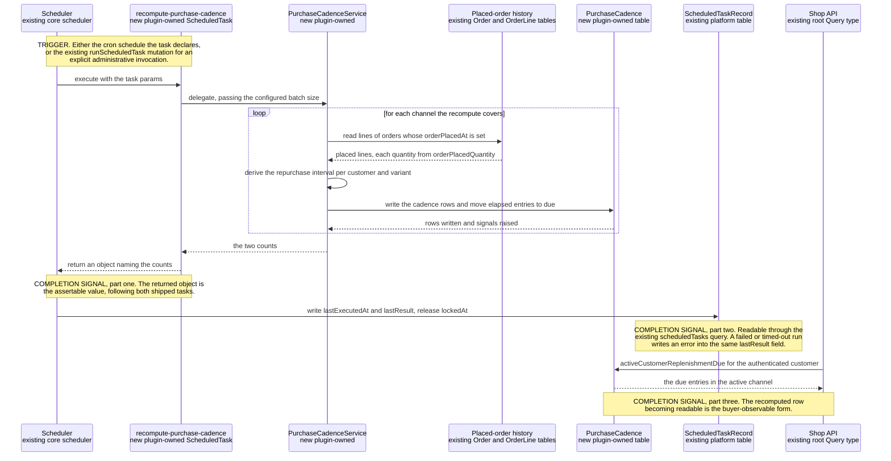
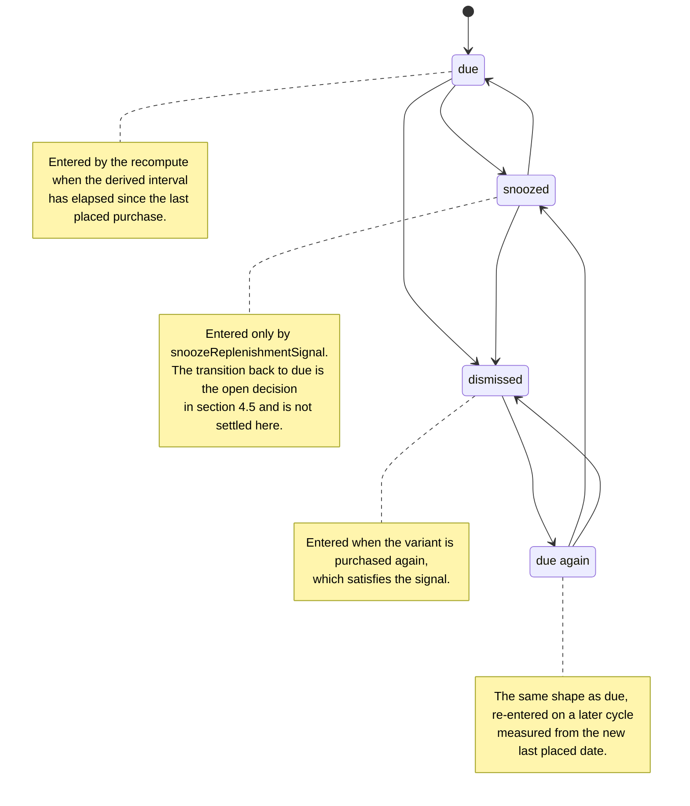

# FEATURE-001-05: Derive the interval at which a buyer repurchases a variant and surface an advisory replenishment due signal they can act on or snooze, so that a regular repeat purchase is prompted by the platform instead of remembered by the buyer

Parent epic: `tickets/EPIC-001-reorder-and-replenishment.md`. The parent epic and the sibling features are written as paths rather than as links, following the epic's own convention of keeping the link count in a file equal to the number of children that file indexes [tickets/EPIC-001-reorder-and-replenishment.md:§3. How To Read This Epic]. The only links in this file are the three story links in section 3; every other reference to a file is a citation of the form `[<path>:<locator>]`, not a hyperlink.

**Read section 1 before anything else.** This feature was *renamed* between the suggested feature area and this decomposition, and the rename is the single most consequential fact about its scope. A reader who finishes this file believing that a message, an email or a template is in scope has misread it, and section 1 exists to make that misreading impossible.

---

## 1. Feature Title

**Derive the interval at which a buyer repurchases a variant and surface an advisory replenishment due signal they can act on or snooze, so that a regular repeat purchase is prompted by the platform instead of remembered by the buyer.**

Short name, used verbatim wherever this feature is referred to in one phrase, and identical to the label the epic's features index gives it: **Purchase Cadence Detection and Replenishment Due Signals** [tickets/EPIC-001-reorder-and-replenishment.md:§4. Features Index]. The long form above is the action-object-outcome title this tier requires; the short form is the name to cite.

### 1.1 The Rename, And Why It Is Not Cosmetic

The originally suggested area was *Purchase Cadence Detection and Replenishment **Reminders***. The epic classifies this feature's deviation as **renamed**, and the rationale is a scope ruling rather than a preference in wording: **"Reminders" presumes a delivery channel, and message transport is environment-specific and would have to sit behind an interface regardless. The buildable core is a due-signal read plus a `ScheduledTask` recompute, with any notification adapter optional** [tickets/EPIC-001-reorder-and-replenishment.md:§4. Features Index].

Three consequences follow, and all three are boundaries on the work rather than commentary on it.

- **The deliverable is a read and a recompute, not a message.** What this feature ships is a plugin-owned table, a scheduled recompute that maintains it, one Shop API query that reads it and one Shop API mutation that snoozes an entry. Nothing in it sends anything to anyone.
- **Notification transport, if a deployment wants it, is an adapter behind an interface with a database-backed default** — the same discharge the epic applies to substitution candidates, and the reason no external service appears anywhere in this feature.
- **Email template design is ruled out of scope by the epic in as many words**, on exactly this ground: "The replenishment feature deliberately delivers a due-signal *read* rather than a message; notification transport sits behind an interface, and template authoring belongs to the email plugin's own surface" [tickets/EPIC-001-reorder-and-replenishment.md:§2.4 Scope Boundaries — Explicit In-Or-Out Rulings]. That the email surface belongs to another package is observable rather than asserted: the dev server configures templates through `EmailPlugin.init` with its own handler set and file-based template loader [packages/dev-server/dev-config.ts:L141-L146], which is a different package's configuration and not this plugin's.

Two adjacent domains are ruled out on the same page and are worth restating here, because a "replenishment" feature is where a reader most expects to find them: **recurring billing is out**, because it needs a payment-schedule and dunning model no entity in this repository provides, and **subscription contracts are out**, because a contract implies committed future obligations and cancellation terms the order model does not represent — "replenishment signals in this epic are advisory prompts, not commitments" [tickets/EPIC-001-reorder-and-replenishment.md:§2.4 Scope Boundaries — Explicit In-Or-Out Rulings]. Section 2.11 carries that ruling into the payload contract so it is enforceable and not merely stated.

Delivery is part of the single self-contained plugin package the epic describes — `packages/reorder-plugin/`, exporting `ReorderPlugin`. No file under `packages/core` or `packages/admin-ui` is edited to deliver it, and section 2.14 records the mechanism that makes that possible for a scheduled task specifically.

---

## 2. Feature Summary

### 2.1 The Capability

The platform derives, per customer and per variant, the interval between that buyer's repeat purchases of that variant, and records the derived interval with the date the variant was last purchased. When the interval has elapsed, the buyer reads a **replenishment due signal** for that variant through one Shop API query, and either acts on it through the reorder path this epic already builds or snoozes it through one Shop API mutation.

The signal is advisory in the strict sense: it reports that an interval derived from past purchases has elapsed. It reserves nothing, commits to nothing and renews nothing.

### 2.2 Contribution To The Epic

This feature sits in the epic's batch B4, "Extensibility and cadence" [tickets/EPIC-001-reorder-and-replenishment.md:§9.4 Run Batches]. It owns two steps of the returning-buyer journey — "Cadence recomputed, due signal raised" and "Buyer prompted, or snoozes" — and both are labelled with this feature in the journey diagram [tickets/EPIC-001-reorder-and-replenishment.md:§2.5 The Returning-Buyer Journey This Epic Builds].

Against the objective, this feature discharges the clause about the items a buyer "purchase[s] regularly". Everything else in the epic waits for the buyer to arrive with an intention; this is the only feature that produces the intention. That is its whole contribution, and reading it precisely matters:

- **It does not reorder anything.** The buyer acts on a due signal through FEATURE-001-02's mutation. This feature adds no write path onto an order and calls no order service.
- **It does not report what changed since the last purchase.** Price and availability deltas belong to FEATURE-001-03. A due signal says an interval elapsed; it does not say the price moved.
- **It does not decide what happens to a line that cannot be added.** That is FEATURE-001-04.
- **It does not aggregate demand for administrative personas.** FEATURE-001-08 reads the rows this feature maintains and is the only feature downstream of it.
- **It does not notify.** Section 1.1 is the ruling; this is the restatement.

### 2.3 Named Entities Touched

#### One new plugin-owned table

- **`PurchaseCadence`** — new, plugin-owned, and the only table this feature introduces. One row identifies a customer, a product variant and the channel the purchases occurred under, and carries the derived repurchase interval, the date that variant was last purchased by that customer, and the signal's lifecycle state as section 2.8 defines it. It is named consistently with the seven plugin-owned tables the epic's decomposition allocates across its eight features, and the ownership link lives on this table rather than on a custom field for the reason section 2.14 records.

#### Existing platform entities, read and never altered

- **`Order`** [packages/core/src/entity/order/order.entity.ts:L44], declared as implementing `ChannelAware` and `HasCustomFields`. Four of its columns are the input to the computation. `orderPlacedAt` is the timestamp every derived interval is measured between [packages/core/src/entity/order/order.entity.ts:L92]; `state` [packages/core/src/entity/order/order.entity.ts:L72] and `active` [packages/core/src/entity/order/order.entity.ts:L82] are what separate a placed order from a cart; and `code` [packages/core/src/entity/order/order.entity.ts:L70] is the buyer-facing reference a support agent or a test uses to identify the source purchase, its own JSDoc stating it should be used as the reference for Customers rather than the Order's id [packages/core/src/entity/order/order.entity.ts:L62-L67]. Ownership is read from `customerId` [packages/core/src/entity/order/order.entity.ts:L99] and the lines from `lines` [packages/core/src/entity/order/order.entity.ts:L102].
- **`OrderLine`**. `orderPlacedQuantity` is the quantity as at placement [packages/core/src/entity/order-line/order-line.entity.ts:L104], and `quantity` is the live quantity [packages/core/src/entity/order-line/order-line.entity.ts:L97]. The distinction decides which number a cadence computation may read, and section 2.3.1 states the rule.
- **`Customer`** [packages/core/src/entity/customer/customer.entity.ts:L23], which owns the history through its `orders` relation [packages/core/src/entity/customer/customer.entity.ts:L51-L52] and is the subject of every row in `PurchaseCadence`. Its `emailAddress` [packages/core/src/entity/customer/customer.entity.ts:L42] and its optional `user` [packages/core/src/entity/customer/customer.entity.ts:L56] are named because the buyer-facing operations require an authenticated session resolved through that user, not because this feature writes either.
- **`ProductVariant`**. The subject of a derived interval. This feature reads the variant identifier; it asserts nothing about the variant's price, stock or enabled state, all of which belong to FEATURE-001-03 and FEATURE-001-04.
- **`Channel`**. Supplies the request scope described in section 2.10 and the grouping key described there.
- **`ScheduledTaskRecord`** [packages/core/src/plugin/default-scheduler-plugin/scheduled-task-record.entity.ts:L7] — read, never written by plugin code. It is the platform's own record of a scheduled task's last run, and section 2.6 explains why it is what makes this feature's asynchronous work observable at all.

#### 2.3.1 Cadence Is Computed From Placed Orders — Which Columns, And Why It Is Not A Detail

**The input to every derived interval is orders that have been placed. Active orders are excluded.** This is stated as a rule with its mechanism because getting it wrong does not fail loudly — it silently produces wrong intervals.

- `Order.active` **defaults to true** [packages/core/src/entity/order/order.entity.ts:L81-L82], and its own JSDoc defines an active order as one where "the Customer can still make changes to it and has not yet completed the checkout process", governed by the order-placed strategy [packages/core/src/entity/order/order.entity.ts:L74-L80]. An active order is a cart. A cart is not evidence of a purchase, and a cart abandoned twice is not a cadence.
- `Order.orderPlacedAt` is **nullable** [packages/core/src/entity/order/order.entity.ts:L90] and its JSDoc defines it as the date and time the order was placed, "i.e. the Customer completed the checkout and the Order is no longer 'active'" [packages/core/src/entity/order/order.entity.ts:L84-L89]. A null value is therefore the marker of an order that was never placed, which makes the filter expressible against a column rather than against an inference. The column is additionally indexed [packages/core/src/entity/order/order.entity.ts:L91], so ordering history by it consumes an index the platform already declares rather than one this feature would have to add.
- `OrderLine.orderPlacedQuantity` **defaults to zero** [packages/core/src/entity/order-line/order-line.entity.ts:L103-L104] and is defined as the quantity at the time the order was placed [packages/core/src/entity/order-line/order-line.entity.ts:L99-L102]. Two things follow. A line on an unplaced order carries zero there, so a computation that mistakenly walked carts would read zeroes rather than fail — the exact silent-corruption case this rule prevents. And on a placed order it is the quantity the buyer actually bought, whereas `quantity` [packages/core/src/entity/order-line/order-line.entity.ts:L97] can have been altered by an administrative modification after placement.

**The rule, stated once for all three stories: a cadence computation reads lines of orders whose `orderPlacedAt` is set, and takes each quantity from `orderPlacedQuantity`.** The sibling feature states the same preference for the same reason from the reorder side [tickets/EPIC-001/FEATURE-001-02-reorder-from-order-history.md:§2.3 Named Entities Touched], so the two features agree on which number describes a past purchase.

### 2.4 Named Services And Platform Mechanisms

- **`ScheduledTask` — existing, in `packages/core`, consumed and never modified** [packages/core/src/scheduler/scheduled-task.ts:L120]. The class this feature's recompute is an instance of, configured by the interface described in section 2.6.
- **`JobQueueService` — existing, consumed.** `createQueue` is the queue factory [packages/core/src/job-queue/job-queue.service.ts:L82], and the queue it returns inherits the deployment's configured job-queue strategy rather than a plugin choice, because the service reads that strategy from configuration [packages/core/src/job-queue/job-queue.service.ts:L63-L65].
- **`TransactionalConnection` — existing, consumed.** Every `PurchaseCadence` read and write goes through it, which is also how the shipped `cleanJobsTask` reaches its own table from inside a scheduled task [packages/core/src/plugin/default-job-queue-plugin/clean-jobs-task.ts:L25-L32]. That is the citable precedent for a task doing database work rather than a pattern this feature invents.
- **`ChannelService` — existing, consumed, and required rather than optional here.** A scheduled task's own request context is created against the **default channel** [packages/core/src/scheduler/scheduled-task.ts:L134] with an admin API type [packages/core/src/scheduler/scheduled-task.ts:L136-L139], so a recompute that must produce per-channel rows has to enumerate channels itself. Section 2.10 states the consequence; it is named here so the dependency is not discovered late.
- **`PurchaseCadenceService` — new, plugin-owned.** Holds the derivation: reading placed-order history for a customer, grouping by variant and channel, deriving the interval, and writing the `PurchaseCadence` row. The scheduled task's `execute` delegates to it and holds no logic of its own, mirroring the two shipped tasks, both of which resolve a service from the injector and delegate [packages/core/src/scheduler/tasks/clean-sessions-task.ts:L45-L46] and [packages/core/src/plugin/default-job-queue-plugin/clean-jobs-task.ts:L23-L25].
- **`ReplenishmentService` — new, plugin-owned.** Serves the two buyer-facing operations: reading the due rows for the authenticated customer in the active channel, and applying a snooze. It performs no derivation, so the read path cannot drift from the recompute path.
- **`ReplenishmentNotificationStrategy` — new, plugin-owned, and deliberately inert by default.** The interface behind which any future notification transport sits, with a database-backed default implementation that records that a signal became due and sends nothing. It exists so that a deployment wanting a message has a declared seam, and so that this feature can satisfy the no-external-service constraint by construction rather than by promise. Its shape follows the configurable-strategy pattern the epic already applies to substitution candidates [tickets/EPIC-001-reorder-and-replenishment.md:§4. Features Index].

**Named for the avoidance of doubt, as services this feature does not call:** `OrderService`, `StockLevelService` and `EventBus`. The first two belong to FEATURE-001-02, FEATURE-001-03 and FEATURE-001-04, and the third to FEATURE-001-07. A cadence recompute that started publishing events or reading stock would be doing another feature's work.

### 2.5 Named API Surfaces — Two New Shop API Operations, Zero Existing Signatures Changed

#### Existing read paths this feature consumes and does not extend

- **`Customer.orders(options: OrderListOptions): OrderList!`** [packages/core/src/api/schema/common/customer.type.graphql:L11] — **the input to the computation.** The order-history read path already exists, is already paginated, sortable and filterable through the generated list options, and is already reachable through the `activeCustomer` root query [packages/core/src/api/schema/shop-api/shop.api.graphql:L5]. The epic's prohibition on it applies to this feature exactly as it does to FEATURE-001-02: do not add a reorder-specific or cadence-specific order-history query [tickets/EPIC-001-reorder-and-replenishment.md:§5. Existing Mechanisms That Must Not Be Duplicated]. A storefront that wants to show a buyer *why* a variant is due reads the underlying orders through this field; the due-signal query returns the derived row, not a reimplementation of history.
- **`scheduledTasks: [ScheduledTask!]!`** [packages/core/src/api/schema/admin-api/scheduled-task.api.graphql:L2] and **`runScheduledTask(id: String!): Success!`** [packages/core/src/api/schema/admin-api/scheduled-task.api.graphql:L12] — existing Admin API operations, consumed unchanged. They are this feature's observability and manual-trigger surface, and section 2.6 sets out why that removes the need to add either.

#### The two new operations

Both are added through the plugin's `shopApiExtensions` using `extend type Query` and `extend type Mutation` — the mechanism the shipped wishlist example already demonstrates [packages/dev-server/example-plugins/wishlist-plugin/api/api-extensions.ts:L16-L19].

- **`activeCustomerReplenishmentDue`** — a query returning the due entries for the authenticated customer in the active channel, each naming the variant, the derived interval, the date that variant was last purchased and the signal's state. It reads `PurchaseCadence` and nothing else.
- **`snoozeReplenishmentSignal`** — a mutation moving one entry from `due` to `snoozed`, as section 2.8 defines those states.

**No Admin API operation is added by this feature.** The administrative read over cadence data belongs to FEATURE-001-08, and the scheduled task's own administrative surface already exists.

#### The additive-only constraint, stated as a countable surface

The Shop API root `Query` type declares **nineteen** root queries [packages/core/src/api/schema/shop-api/shop.api.graphql:L1-L52], with the order, cart and customer-account mutation sets in the same file under `type Mutation` [packages/core/src/api/schema/shop-api/shop.api.graphql:L70]. Every one of those signatures is byte-identical after this feature ships; the two new operations arrive as additional fields and change no argument, no return type and no nullability on any existing one. The epic makes that count part of its own definition of done for precisely this reason — "do not change the existing API" is not a testable boundary until a reviewer can count what existed before [tickets/EPIC-001-reorder-and-replenishment.md:§2.4 Scope Boundaries — Explicit In-Or-Out Rulings].

Where a platform mechanism would widen an existing signature as a side effect of an otherwise additive change, **that is a reportable violation recorded in the epic's collision section, never quietly absorbed** [tickets/EPIC-001-reorder-and-replenishment.md:§6.1 Repository-Discovered Collisions]. This feature's exposure to that is narrower than its siblings' because it declares no custom field on any core entity and no new error result, but it is not zero: any new type this feature publishes reaches the same schema generators the collision section describes, so the constraint is carried into section 5 as evidence rather than assumed.

### 2.6 The Existing Mechanisms This Feature Consumes Rather Than Rebuilds

The epic's do-not-duplicate inventory assigns this feature two rows, each with a prohibition attached [tickets/EPIC-001-reorder-and-replenishment.md:§5. Existing Mechanisms That Must Not Be Duplicated]. Reading the scheduler subtree to write this file surfaced two further mechanisms that the same prohibition plainly covers, so four are stated. **The fourth is the most consequential finding in this file: the observable completion signal that this feature's asynchronous work is obliged to name already exists, is already persisted and is already published on the Admin API.** A ticket that specified a bespoke "recompute finished" flag would be rebuilding shipped platform behaviour.

#### Mechanism one — the `ScheduledTask` configuration shape

A scheduled task is an instance of `ScheduledTask` [packages/core/src/scheduler/scheduled-task.ts:L120] configured by `ScheduledTaskConfig` [packages/core/src/scheduler/scheduled-task.ts:L42-L96], and the whole surface is `@since 3.3.0` [packages/core/src/scheduler/scheduled-task.ts:L38]. Six members define what this feature's recompute must declare:

- **`id`** [packages/core/src/scheduler/scheduled-task.ts:L47] — the unique identifier. It is the value the Admin API operations in section 2.5 address the task by, and it is uniquely constrained where the platform records the task [packages/core/src/plugin/default-scheduler-plugin/scheduled-task-record.entity.ts:L6], so it is a contract rather than a label.
- **`description`** [packages/core/src/scheduler/scheduled-task.ts:L52] — surfaced to an administrator as a non-null field [packages/core/src/api/schema/admin-api/scheduled-task.api.graphql:L17].
- **`params`** [packages/core/src/scheduler/scheduled-task.ts:L57] — optional parameters passed to `execute`.
- **`schedule`** [packages/core/src/scheduler/scheduled-task.ts:L60-L75], which accepts **either** a standard cron expression **or** a function returning a cron-time-generator expression, both forms shown in its own examples [packages/core/src/scheduler/scheduled-task.ts:L66-L72]. Both forms are in use in this repository, so neither is theoretical: the two shipped tasks use the generator function and a dev-server test plugin uses a raw cron string [packages/dev-server/test-plugins/scheduler-race-test/scheduler-race-test-task.ts:L27].
- **`timeout`** [packages/core/src/scheduler/scheduled-task.ts:L76-L83], whose default is **declared in that source and is deliberately not restated here**, because this ticket set may not introduce a timing figure of its own and quoting the platform's would read as one. What the tickets state is the *behaviour*: a task exceeding its timeout is treated as having failed with a timeout error, and section 2.9 makes that failure observable rather than silent.
- **`execute`** [packages/core/src/scheduler/scheduled-task.ts:L95] — the function run on the schedule, returning a promise. Mechanism two is about what it should return.

`preventOverlap` [packages/core/src/scheduler/scheduled-task.ts:L84-L90] deserves separate mention because it answers an edge case that would otherwise have to be invented. It **defaults to true** [packages/core/src/scheduler/scheduled-task.ts:L88], and the scheduler honours it by wrapping the task in a protection callback only when it is set [packages/core/src/scheduler/scheduler.service.ts:L172]. Section 2.9 records what that means for a concurrent-recompute scenario.

*The prohibition, quoted in substance from the epic:* do not write a cron implementation, and do not hard-code a schedule in plugin source [tickets/EPIC-001-reorder-and-replenishment.md:§5. Existing Mechanisms That Must Not Be Duplicated]. The schedule is deployment-configurable, and `configure` is how — but note its exact reach: it accepts only `schedule`, `timeout` and `params` [packages/core/src/scheduler/scheduled-task.ts:L169]. A deployment cannot override the task's identifier or its `execute`, so anything a deployment must be able to change has to be a parameter rather than a constant.

#### Mechanism two — the two shipped tasks, and the returned-result idiom

Two scheduled tasks ship in this checkout, and **both return a result object from `execute`**. This is the pattern to copy, and mechanism four explains why it is load-bearing rather than stylistic.

- **`cleanSessionsTask`** [packages/core/src/scheduler/tasks/clean-sessions-task.ts:L37] declares `id: 'clean-sessions'` [packages/core/src/scheduler/tasks/clean-sessions-task.ts:L38], a description [packages/core/src/scheduler/tasks/clean-sessions-task.ts:L39], `params: { batchSize: 1000 }` [packages/core/src/scheduler/tasks/clean-sessions-task.ts:L40-L42] and a generator schedule [packages/core/src/scheduler/tasks/clean-sessions-task.ts:L43]. Its `execute` **triggers a job and returns a named result string** [packages/core/src/scheduler/tasks/clean-sessions-task.ts:L46-L47]. Its own JSDoc shows the registration through `schedulerOptions.tasks` and the per-deployment override through `configure`, including a changed schedule and a changed batch size [packages/core/src/scheduler/tasks/clean-sessions-task.ts:L14-L28].
- **`cleanJobsTask`** [packages/core/src/plugin/default-job-queue-plugin/clean-jobs-task.ts:L18] declares `id: 'clean-jobs'` [packages/core/src/plugin/default-job-queue-plugin/clean-jobs-task.ts:L19] and a generator schedule [packages/core/src/plugin/default-job-queue-plugin/clean-jobs-task.ts:L21], does its database work inline through `TransactionalConnection`, and **returns a count of what the run actually did** [packages/core/src/plugin/default-job-queue-plugin/clean-jobs-task.ts:L48-L50].

**The new task follows `cleanJobsTask`'s form for its return value and `cleanSessionsTask`'s form for its parameters.** It returns an object naming the counts of what the run did — the number of `PurchaseCadence` rows written and the number of signals moved into the `due` state — because a count of work performed is a returned value the platform persists, not a service-level claim. It declares a `params` object carrying a batch size, mirroring the precedent's shape; **the value that batch size ships with is a deployment decision this ticket set does not settle**, since the only volume the repository declares is the benchmark harness's own dataset shape [tickets/EPIC-001-reorder-and-replenishment.md:§7.6 Data-Volume Assumptions, Anchored To The Existing Harness].

A third example exists and is worth naming because it is a *plugin* rather than core: the dev-server scheduler race-test task also returns an object from `execute` [packages/dev-server/test-plugins/scheduler-race-test/scheduler-race-test-task.ts:L63], and its own JSDoc explains that it exists to probe multi-worker race conditions in the default scheduler strategy [packages/dev-server/test-plugins/scheduler-race-test/scheduler-race-test-task.ts:L9-L21]. Three of three tasks in this repository return a result. There is no shipped counter-example.

**The new task's declaration, named in full so no story has to invent any part of it.** Every value below is a *target* introduced by this ticket set, not a citation, and each of the five members maps onto the configuration member cited above:

- **`id`: `recompute-purchase-cadence`** — kebab-case, matching the three task identifiers already in this checkout, `clean-sessions` [packages/core/src/scheduler/tasks/clean-sessions-task.ts:L38], `clean-jobs` [packages/core/src/plugin/default-job-queue-plugin/clean-jobs-task.ts:L19] and `scheduler-race-test` [packages/dev-server/test-plugins/scheduler-race-test/scheduler-race-test-task.ts:L24]. This is the string an operator passes to `runScheduledTask` and the string a story asserts against, so it is fixed here rather than left to implementation.
- **`description`** — a one-sentence statement that the task derives per-customer, per-variant repurchase intervals from placed orders and raises due signals. It is surfaced to an administrator as a non-null field, so it cannot be omitted.
- **`params`** — an object carrying the batch size the derivation walks history in, mirroring the precedent's shape rather than its value.
- **`schedule`** — declared in the generator form both shipped core tasks use, and overridable per deployment, which is what discharges the epic's prohibition on hard-coding one.
- **The returned result** — an object naming the count of `PurchaseCadence` rows written and the count of signals moved into the `due` state.

#### Mechanism three — `JobQueueService.createQueue` for background work

`createQueue` [packages/core/src/job-queue/job-queue.service.ts:L82] is the factory, and its JSDoc example shows the whole shape: a queue created on module initialisation with a `name` and a `process` function, and work added to it later [packages/core/src/job-queue/job-queue.service.ts:L28-L37]. A dev-server test plugin demonstrates the same from outside core, creating named queues in `onModuleInit` [packages/dev-server/test-plugins/job-queue-test/job-queue-test-plugin.ts:L24-L30] and reporting progress from inside the process function [packages/dev-server/test-plugins/job-queue-test/job-queue-test-plugin.ts:L38].

*The prohibition, quoted in substance from the epic:* do not spawn a timer, an interval or a worker thread in plugin code [tickets/EPIC-001-reorder-and-replenishment.md:§5. Existing Mechanisms That Must Not Be Duplicated]. Background work is enqueued here.

Whether this feature enqueues at all is **an open decision, not a design this file settles.** The epic records it as an architectural decision blocking two of this feature's three stories: whether the recompute is a `ScheduledTask`, a queued job, or a task that enqueues a job [tickets/EPIC-001-reorder-and-replenishment.md:§8.2 Architectural Decisions]. Section 4.5 carries it forward. One observation belongs here, because it is evidence rather than preference: **the third option is the shipped one.** `cleanSessionsTask` is a scheduled task whose `execute` triggers a job [packages/core/src/scheduler/tasks/clean-sessions-task.ts:L46], so "a task that enqueues a job" is a pattern this repository already demonstrates rather than a hybrid this epic would be inventing.

#### Mechanism four — the scheduled-task observability surface, already persisted and already published

This is the mechanism that makes this feature's asynchronous work assertable, and it exists end to end without any plugin contribution.

- **The platform captures the value `execute` returns.** The default scheduler strategy races the task against its timeout and keeps the result [packages/core/src/plugin/default-scheduler-plugin/default-scheduler-strategy.ts:L113].
- **It persists that value.** On success it writes `lastExecutedAt`, releases the lock and stores the returned value in `lastResult` [packages/core/src/plugin/default-scheduler-plugin/default-scheduler-strategy.ts:L115-L122]. On failure it writes `lastExecutedAt`, releases the lock and stores the error message in the same column [packages/core/src/plugin/default-scheduler-plugin/default-scheduler-strategy.ts:L130-L136], so **a failed run is observable through the same field as a successful one** rather than being indistinguishable from a run that never happened.
- **The columns are declared on a platform entity.** `ScheduledTaskRecord` carries `taskId` [packages/core/src/plugin/default-scheduler-plugin/scheduled-task-record.entity.ts:L13], `enabled` [packages/core/src/plugin/default-scheduler-plugin/scheduled-task-record.entity.ts:L16], `lockedAt` [packages/core/src/plugin/default-scheduler-plugin/scheduled-task-record.entity.ts:L19], `lastExecutedAt` [packages/core/src/plugin/default-scheduler-plugin/scheduled-task-record.entity.ts:L22], `manuallyTriggeredAt` [packages/core/src/plugin/default-scheduler-plugin/scheduled-task-record.entity.ts:L25] and `lastResult` [packages/core/src/plugin/default-scheduler-plugin/scheduled-task-record.entity.ts:L28].
- **It is already published on the Admin API.** `type ScheduledTask` exposes `lastExecutedAt` [packages/core/src/api/schema/admin-api/scheduled-task.api.graphql:L20], `nextExecutionAt` [packages/core/src/api/schema/admin-api/scheduled-task.api.graphql:L21], `isRunning` [packages/core/src/api/schema/admin-api/scheduled-task.api.graphql:L22] and `lastResult` [packages/core/src/api/schema/admin-api/scheduled-task.api.graphql:L23], read through the existing `scheduledTasks` query [packages/core/src/api/schema/admin-api/scheduled-task.api.graphql:L2].
- **An explicit administrative trigger already exists too.** `runScheduledTask(id: String!): Success!` [packages/core/src/api/schema/admin-api/scheduled-task.api.graphql:L12] runs a task on demand, and the strategy records that it was invoked that way [packages/core/src/plugin/default-scheduler-plugin/scheduled-task-record.entity.ts:L25]. A task can also be disabled and re-enabled through `updateScheduledTask` [packages/core/src/api/schema/admin-api/scheduled-task.api.graphql:L11].

*The prohibition this feature imposes on itself, by direct extension of the epic's row:* **do not add a plugin-owned "last recompute" table, timestamp, status flag or completion event, and do not add an Admin API operation to read or trigger the recompute.** All five already exist. What the plugin contributes is the *content* of `lastResult` — the counts named in mechanism two — and nothing else.

One prerequisite follows, and it is a real dependency rather than a caveat: this surface is supplied by the default scheduler plugin, which declares its own entity [packages/core/src/plugin/default-scheduler-plugin/default-scheduler.plugin.ts:L42] and sets the strategy that does the persisting [packages/core/src/plugin/default-scheduler-plugin/default-scheduler.plugin.ts:L44]. **A deployment with no scheduler strategy configured has no `lastResult` to read**, and enabling the plugin is itself a schema change because of that entity. The dev server already registers it [packages/dev-server/dev-config.ts:L140], so the demonstration environment needs no change; section 4.4 records it as a required configuration dependency all the same.

### 2.7 Figure F5-SEQ — The Scheduled Recompute Path

This is the first of exactly two diagrams in this feature. Story files carry none and reference this figure by the name **Figure F5-SEQ** instead; **STORY-001-05-02 is the story that references it.**

Four readings of the figure are load-bearing and are stated so they are not inferred:

- **The plugin writes exactly one table.** `PurchaseCadence` is the only write arrow leaving plugin code. The arrow into `ScheduledTaskRecord` originates at the scheduler, which is the platform, and is drawn so that no reader mistakes the completion record for something the plugin maintains.
- **The channel loop is in the diagram because the platform forces it.** A scheduled task's context is created against the default channel [packages/core/src/scheduler/scheduled-task.ts:L134], so per-channel rows require the task to enumerate channels rather than inherit one.
- **The completion signal has three observable forms, and they are not interchangeable.** The returned object is what a unit test asserts, `lastResult` is what an operator reads, and the query result is what a buyer sees. Section 2.9 states which of the three a story's acceptance criteria must name.
- **Nothing here reserves anything.** The recompute reads history and writes derived rows. It touches no stock, no cart and no order.

### 2.8 Figure F5-STATE — The Replenishment Signal Lifecycle

The second and last diagram in this feature. Story files carry none and reference it by the name **Figure F5-STATE**; **STORY-001-05-03 is the story that references it.** The four state names below — `due`, `snoozed`, `dismissed` and `due again` — are used identically in this file's prose, in the diagram, and in the three story files. The epic fixes this shape: the lifecycle "has a due, snoozed, dismissed and due-again shape either way" regardless of how the open decision in section 4.5 is resolved [tickets/EPIC-001-reorder-and-replenishment.md:§8.1 Product Decisions].

Each transition, with the thing that causes it, stated in prose so the diagram is not the only record:

- **`due`** is entered by the scheduled recompute when the derived interval has elapsed since the variant's last placed purchase. Nothing a buyer does enters this state.
- **`due` to `snoozed`** is caused by the buyer calling `snoozeReplenishmentSignal`. This is the only transition a buyer-facing operation causes, and it is the only write path this feature exposes.
- **`snoozed` to `due`** is caused by the snooze ending while the interval is still elapsed. **How the snooze ends is an open product decision** — a fixed interval, or the next purchase of that variant — and the epic records that only one of the two options requires storing an expiry at all [tickets/EPIC-001-reorder-and-replenishment.md:§8.1 Product Decisions]. This file does not choose, and STORY-001-05-03 cannot finalise its criteria until it is chosen.
- **`due` to `dismissed`** and **`snoozed` to `dismissed`** are both caused by the buyer purchasing the variant again, which satisfies the signal. The recompute observes the new placed order and moves the entry; no buyer action targets `dismissed` directly.
- **`dismissed` to `due again`** is caused by a later recompute finding the interval elapsed from the new last placed date. `due again` is the same shape as `due`, re-entered on a subsequent cycle, and it is named as a distinct state because the lifecycle is a cycle rather than a line — from `due again` the buyer may snooze or purchase exactly as before.

### 2.9 Every Asynchronous Behaviour Names Its Trigger And Its Observable Completion Signal

**This is a feature-level obligation, not advice, and it is carried into section 5.** "The recompute happens eventually" is not an acceptable statement anywhere in this feature or its three stories. Every asynchronous behaviour names two things.

**The trigger.** Exactly two exist, and a story must name which one it exercises:

- **The cron schedule the task declares** [packages/core/src/scheduler/scheduled-task.ts:L60-L75], overridable per deployment through `configure` [packages/core/src/scheduler/scheduled-task.ts:L169] and registered through `schedulerOptions.tasks` [packages/core/src/config/vendure-config.ts:L1088].
- **An explicit administrative invocation** through the existing `runScheduledTask(id: String!): Success!` mutation [packages/core/src/api/schema/admin-api/scheduled-task.api.graphql:L12], which is what an end-to-end specification uses so that a test never waits on wall-clock time.

**The observable completion signal.** Three forms, each named with what observes it:

- **The object `execute` returns**, naming the count of `PurchaseCadence` rows written and the count of signals moved to `due`. A unit test asserts this directly. Both shipped tasks establish the idiom [packages/core/src/scheduler/tasks/clean-sessions-task.ts:L47] and [packages/core/src/plugin/default-job-queue-plugin/clean-jobs-task.ts:L48-L50].
- **`lastResult` alongside `lastExecutedAt`** on the platform's own record [packages/core/src/plugin/default-scheduler-plugin/scheduled-task-record.entity.ts:L28], written by the strategy on success and on failure alike [packages/core/src/plugin/default-scheduler-plugin/default-scheduler-strategy.ts:L115-L122] and [packages/core/src/plugin/default-scheduler-plugin/default-scheduler-strategy.ts:L130-L136], and readable through the existing `scheduledTasks` query [packages/core/src/api/schema/admin-api/scheduled-task.api.graphql:L2]. An operator or an end-to-end specification observes this.
- **The recomputed row becoming readable** through `activeCustomerReplenishmentDue`. A buyer observes this, and it is the only one of the three that is buyer-visible.

**No duration is stated, and none may be invented.** This repository declares no service-level objective, no latency target and no throughput target, and the epic reports that absence as a finding rather than filling it [tickets/EPIC-001-reorder-and-replenishment.md:§2.2 Business Value, Stated Without Invented Numbers]. So a criterion in this feature never says how long a recompute takes; it says that a named trigger was fired and that a named signal was then observed. Where precision is needed it comes from a verifiable state assertion — an exact row count with its ordering, an exact signal state from the four in section 2.8, an exact task identifier, or the presence of a named field in `lastResult`.

**Two failure modes are observable and neither is silent.** A run that exceeds the declared timeout is treated as a failed run [packages/core/src/scheduler/scheduled-task.ts:L76-L83] and the error is written into `lastResult` [packages/core/src/plugin/default-scheduler-plugin/default-scheduler-strategy.ts:L130-L136]. A task that has been disabled through `updateScheduledTask` [packages/core/src/api/schema/admin-api/scheduled-task.api.graphql:L11] reports `enabled` as false [packages/core/src/api/schema/admin-api/scheduled-task.api.graphql:L24], which is the distinction between "the recompute failed" and "the recompute was switched off" — a distinction a story must not conflate.

**Concurrency is answered by the platform, not by invention.** `preventOverlap` defaults to true [packages/core/src/scheduler/scheduled-task.ts:L84-L90] and is honoured by a protection wrapper [packages/core/src/scheduler/scheduler.service.ts:L172]; across processes the default strategy additionally takes a database lock before running and clears stale locks first [packages/core/src/plugin/default-scheduler-plugin/default-scheduler-strategy.ts:L90-L95], releasing it on both the success and the failure path [packages/core/src/plugin/default-scheduler-plugin/default-scheduler-strategy.ts:L119] and [packages/core/src/plugin/default-scheduler-plugin/default-scheduler-strategy.ts:L134]. A concurrent-recompute edge case is therefore answerable against cited platform behaviour, which is exactly why the epic's data-volume section can require the recompute to be written for a realistic order count without any story inventing a concurrency figure.

One operational consequence, because it changes how the feature is demonstrated at all: scheduled tasks run in the worker process by default [packages/core/src/config/vendure-config.ts:L1090-L1100], so a demonstration must have the worker running. The dev server's `dev` script starts both the server and the worker [packages/dev-server/package.json:L13], so the documented command already satisfies this; a session started with the server-only script [packages/dev-server/package.json:L9] would not.

### 2.10 Channel Scoping, Language Scoping And Monetary Values

Both new operations are channel-scoped and language-scoped. This is a property of the request rather than an argument a caller may omit [tickets/EPIC-001-reorder-and-replenishment.md:§7.5 Request Prerequisites].

- **Channel.** The active channel is identified by a unique token read from the `vendure-token` request header [packages/core/src/entity/channel/channel.entity.ts:L56-L59], carried as a unique column on `Channel` [packages/core/src/entity/channel/channel.entity.ts:L62]. **Cadence is derived per channel, and the channel is part of the `PurchaseCadence` row's identity.** A buyer's purchase history under one channel token therefore produces due signals readable only under that token, and `activeCustomerReplenishmentDue` returns nothing for a channel in which the buyer has no placed history. This is a hard boundary rather than a filter a caller may widen.
- **The recompute cannot inherit the channel — it must enumerate it.** A scheduled task's own request context is created against the default channel [packages/core/src/scheduler/scheduled-task.ts:L134] with an admin API type [packages/core/src/scheduler/scheduled-task.ts:L136-L139]. So unlike every buyer-facing operation in this epic, which receives its channel from the request, the recompute has no request. It resolves channels through `ChannelService` and iterates, which is why section 2.7's diagram draws a loop and why section 2.4 names that service as required.
- **Whether the due list is channel-scoped only or aggregated across channels is an open decision, and it blocks all three of this feature's stories.** The epic records it as the second product decision, blocking five stories in total, with the tension stated plainly: a buyer purchasing the same variant in two channels has one real-world cadence but two channel-scoped histories [tickets/EPIC-001-reorder-and-replenishment.md:§8.1 Product Decisions]. **This file assumes the channel-scoped reading**, because channel scoping is the platform default for every read and aggregation is the deviation that would need justifying — and it flags the assumption here rather than burying it, because if the decision goes the other way the row identity above changes and all three stories change shape.
- **Language.** Translated output resolves against the request's `languageCode`, which defaults to the channel's `defaultLanguageCode` [packages/core/src/entity/channel/channel.entity.ts:L74]. **This feature stores no string of its own and translates nothing.** A due entry's own fields are an identifier, a derived interval, a date and one of the four state names in section 2.8 — none of which is language-varying. The four state names are machine-readable values, not localised sentences, deliberately so that the payload does not become a translation surface this feature would then own. Variant-derived fields a storefront renders alongside a due entry are translated by the existing catalogue read path, not by this feature.
- **Money.** **The due-signal payload carries no monetary field at all**, and that is a design decision rather than an omission: what changed about a price since the last purchase is FEATURE-001-03's work, and duplicating it here would put two answers to the same question in two features. The constraint is nonetheless stated so it binds if a deployment extends the payload: **any monetary value is an integer in the smallest unit of its currency, stated alongside its currency code**, which defaults to `Channel.defaultCurrencyCode` [packages/core/src/entity/channel/channel.entity.ts:L88], with whether the figure is gross or net governed by `Channel.pricesIncludeTax` [packages/core/src/entity/channel/channel.entity.ts:L113]. A decimal monetary value is a defect, not a formatting preference. Illustratively rather than as specification: a value of 129900 with its accompanying currency code is the permitted form, and there is no permitted form carrying a decimal point.
- **A currency or channel mismatch is never reconciled here.** Because the channel is part of the row's identity and no money is carried, there is no place in this feature where a conversion could occur. That is the strongest form the constraint can take, and it is stated because "no currency conversion" is otherwise a promise rather than a property.

### 2.11 A Due Signal Is A Point-In-Time Computation, Not A Reservation, A Commitment Or A Subscription

Stated at feature level because all three stories inherit it and because the mistake it prevents is the natural one for a feature with "replenishment" in its name.

**A due signal reports that an interval derived from past placed orders has elapsed. It is derived at recompute time and read later, so it is point-in-time in both directions.** Three consequences are carried into the stories:

- **It reserves no stock and confers no entitlement.** The signal names a variant; it does not hold one. Between the recompute and the moment the buyer acts, the variant can go out of stock, be disabled or be deleted. The authoritative availability decision is the one made at the moment of the add by the core call FEATURE-001-02 consumes, and the sibling feature states the same staleness rule from the commit side [tickets/EPIC-001/FEATURE-001-02-reorder-from-order-history.md:§2.10 A Point-In-Time Read Is Not A Reservation].
- **It commits to nothing and renews nothing.** No future obligation is created, no schedule of payments exists, and nothing cancels. This is the property that keeps recurring billing and subscription contracts out of scope rather than adjacent to it: the epic rules both out on the ground that "replenishment signals in this epic are advisory prompts, not commitments" [tickets/EPIC-001-reorder-and-replenishment.md:§2.4 Scope Boundaries — Explicit In-Or-Out Rulings], and that ruling is only true if the payload never implies otherwise. **A story that describes a due signal as an upcoming order, a scheduled delivery, a renewal or a plan has broken the scope boundary, not merely chosen loose words.**
- **A stale entry is a required edge case, not a defect to design away.** An entry can name a variant that has since been disabled or deleted, and the specified behaviour is to report the entry's staleness on read or to omit it on the next recompute — never to fail the query and never to repair it by writing to an order.

**The derived interval is a description of the past, not a prediction of the future.** This matters for the scope boundary next door: seller-side inventory forecasting is ruled out because "predicting future stock requirements has no basis in this repository and no declared numeric target to validate a forecast against" [tickets/EPIC-001-reorder-and-replenishment.md:§2.4 Scope Boundaries — Explicit In-Or-Out Rulings]. A derived repurchase interval sits on the legal side of that line only for as long as it is presented as an observation about placed orders. No confidence level, no probability and no accuracy figure attaches to it, because the repository declares no target against which such a figure could be validated.

### 2.12 The Error Vocabulary — This Feature Declares None

**None of the six error results this ticket set declares belongs to this feature.** All six belong to FEATURE-001-01, FEATURE-001-02 and FEATURE-001-06, and the two sibling features already published record their own shares of the split [tickets/EPIC-001/FEATURE-001-02-reorder-from-order-history.md:§2.11 The Error Vocabulary This Feature Introduces] and [tickets/EPIC-001/FEATURE-001-01-named-reorder-lists.md:§2.10 The Error Vocabulary This Feature Introduces].

That is a deliberate outcome, and the reasoning is worth stating because "declares no error" invites the suspicion that error paths were not considered:

- **The query has no error path to declare.** A customer with no placed order, a channel with no history, and a buyer for whom nothing is due are all the **empty list**, not an error. Returning an empty collection rather than an error is the behaviour section 5 requires evidence for, and the epic already classifies a customer with no placed order as "a required edge case, not an untested state" [tickets/EPIC-001-reorder-and-replenishment.md:§7.5 Request Prerequisites].
- **The mutation's failure modes are covered by existing vocabulary.** An unauthenticated caller, a caller authenticated as a different customer, and a reference to an entry that does not exist are all expressible with types that already exist in this checkout.
- **A repeated snooze is idempotent, not an error.** Snoozing an entry already in `snoozed` leaves it in `snoozed` and reports success. Inventing a conflict error for it would add a member to a published enum for no behavioural gain.

Every error name used in this feature or in its three stories is therefore drawn from the **thirty-one** types that already implement the `ErrorResult` interface in this checkout — fifteen in [packages/core/src/api/schema/common/common-error-results.graphql:L2] through [packages/core/src/api/schema/common/common-error-results.graphql:L103], and sixteen more in [packages/core/src/api/schema/shop-api/shop-error-results.graphql:L2] through [packages/core/src/api/schema/shop-api/shop-error-results.graphql:L130]. **No story in this feature may name an error type outside that set.**

The direct benefit is a constraint discharged rather than merely honoured: because this feature declares no new type implementing that interface, **it grows the published `ErrorCode` enum by nothing**, and the automatic-enum-growth collision the epic ranks second does not bite on this feature at all [tickets/EPIC-001-reorder-and-replenishment.md:§6.1 Repository-Discovered Collisions]. Of the eight features, this is one that adds no member to that enum, and section 5 asks for that to be evidenced rather than assumed.

### 2.13 Precedent In This Repository — Partial

The precedent disclosure for this feature is **partial**, and both halves are stated because reporting only the flattering half would be dishonest and reporting only the unflattering half would be wrong.

**The mechanism half has shipped precedent, and it is strong.** Scheduled-task usage is demonstrated by two tasks in core — `cleanSessionsTask` [packages/core/src/scheduler/tasks/clean-sessions-task.ts:L37] and `cleanJobsTask` [packages/core/src/plugin/default-job-queue-plugin/clean-jobs-task.ts:L18] — and by a dev-server test plugin whose whole purpose is exercising the scheduler [packages/dev-server/test-plugins/scheduler-race-test/scheduler-race-test-task.ts:L23]. Job-queue usage is demonstrated from outside core by another test plugin [packages/dev-server/test-plugins/job-queue-test/job-queue-test-plugin.ts:L24-L30]. Registering a task **from a plugin** rather than from a deployment's configuration file is demonstrated by the default job-queue plugin, which pushes a configured task onto `schedulerOptions.tasks` inside its own configuration function [packages/core/src/plugin/default-job-queue-plugin/default-job-queue-plugin.ts:L146-L150]. **On the mechanism, this feature is re-applying a shipped pattern and should claim no novelty for it.**

**The domain half has no precedent at all.** Nothing in this repository derives a purchase cadence, stores a repurchase interval, or raises a replenishment signal. The searched set is named so the claim is checkable: the whole of `packages/dev-server/example-plugins/`, the whole of `packages/dev-server/test-plugins/`, `packages/core/src/scheduler/`, and `packages/core/src/plugin/default-job-queue-plugin/`. The epic reports the same absence from the documentation side, recording that searches for "replenish" and "cadence" across the documentation site returned nothing [tickets/EPIC-001-reorder-and-replenishment.md:§11.8 Tooling Findings, Including The Absences]. The closest shipped task, `cleanJobsTask`, deletes rows on a timer; it shares this feature's *shape* and none of its subject.

**The consequence for the epic's nominations, stated so nobody re-derives it.** This feature holds neither nomination. The harness-proving run is STORY-001-01-01 and the demonstration slice is STORY-001-02-01 [tickets/EPIC-001-reorder-and-replenishment.md:§9.5 Nomination §9a — Harness Proving Run: STORY-001-01-01] and [tickets/EPIC-001-reorder-and-replenishment.md:§9.6 Nomination §9b — Demonstration Slice: STORY-001-02-01]. This feature's stories are not candidates: two of the three are asynchronous, which makes them poor demonstrations to a non-coder, and the epic records that STORY-001-05-02 exists because of a codebase finding rather than a requirement — "the scheduler and its shipped worked example make a scheduled recompute the idiomatic mechanism here, and that is the sole reason the story exists as a separate unit" [tickets/EPIC-001-reorder-and-replenishment.md:§10.3 Inferred Breakdown, Grouped By Originating Block]. A story that exists because the codebase suggested it is exactly the wrong thing to nominate as a demonstration of the objective.

### 2.14 Constraints This Feature Is Built Under

These are boundaries on the work this feature describes, not preamble, and each is carried into section 5. They derive from the epic's stated architectural constraints and from cited repository conventions; **no user-specified rules were provided for this project**, so nothing below is attributed to one [tickets/EPIC-001-reorder-and-replenishment.md:§11.9 User-Specified Rules].

- **Additive only.** One field added to the root `Query` type, one to the root `Mutation` type, one new table, zero new error results, zero changes to any existing operation's arguments, return type or nullability. A side-effect widening is a reportable violation referenced from the epic's collision section and never absorbed silently [tickets/EPIC-001-reorder-and-replenishment.md:§6.1 Repository-Discovered Collisions].
- **Zero custom fields on a core entity.** This feature declares none. Every ownership link — customer, variant and channel — lives as a column on `PurchaseCadence`, which is what keeps the `customFields` argument admissions in the Shop API schema from becoming true of this deployment. The dev-server configuration currently declares an empty custom-fields object [packages/dev-server/dev-config.ts:L116], and a reviewer should expect it still to be empty once this feature ships.
- **Zero edits to `packages/core` and `packages/admin-ui`, and for a scheduled task that is achievable rather than aspirational.** A plugin contributes its task by pushing it onto `schedulerOptions.tasks` [packages/core/src/config/vendure-config.ts:L1088] from inside its own configuration function [packages/core/src/plugin/vendure-plugin.ts:L28], which is a function permitted to modify the configuration object before the server bootstraps [packages/core/src/plugin/vendure-plugin.ts:L24-L27] — exactly as the default job-queue plugin already does [packages/core/src/plugin/default-job-queue-plugin/default-job-queue-plugin.ts:L146-L150]. **No core file is touched to register a task.** The only two files a future implementation may touch outside its own package are the dev-server plugin registration array [packages/dev-server/dev-config.ts:L121-L155], where `ReorderPlugin` is registered, and the dashboard bundling configuration [packages/dev-server/vite.config.mts:L1]. **This feature needs the first and not the second, because it ships no dashboard surface.** Naming those files is a documentation act and licenses no documentation run to edit them [tickets/EPIC-001-reorder-and-replenishment.md:§11.7 The Two Permitted Configuration Exceptions — Named, Not Touched].
- **Additive migrations only — one new table and nothing else.** `PurchaseCadence` is created by an additive migration generated through the existing lifecycle: `generateMigration` [packages/core/src/migrate.ts:L118], `runMigrations` [packages/core/src/migrate.ts:L40] and `revertLastMigration` [packages/core/src/migrate.ts:L89], surfaced as `vendure migrate` [skills/vendure-cli/commands/migrate.md:L1]. No destructive statement, no column added to a core table and no column type change on an existing table. Section 5 requires that the migration be evidenced both applied and reverted, because an additive migration that cannot be reverted is not additive in the sense the constraint means.
- **No external-service dependency.** Nothing in this feature calls out of process. The derivation is a database read and a database write; the notification seam in section 2.4 is an interface whose default implementation records and sends nothing, so a deployment can add a transport without this feature ever having depended on one.
- **No invented metric.** This feature states no service-level commitment, no recompute duration, no cadence-accuracy figure and no engagement figure, because this repository declares none and the epic reports that absence as a finding [tickets/EPIC-001-reorder-and-replenishment.md:§2.2 Business Value, Stated Without Invented Numbers]. **This constraint bites harder here than anywhere else in the epic, because scheduling invites time budgets.** Three specific prohibitions follow: the recompute is not described as completing within any period; the derived interval carries no confidence, probability or accuracy figure; and the platform's own declared task timeout is cited by location and deliberately not restated as a number [packages/core/src/scheduler/scheduled-task.ts:L76-L83]. Where a story needs precision it asserts a verifiable state instead, per section 2.9.
- **Version tagging.** Doc blocks on the new public API carry `@since 3.8.0`. That value is *derived* from the next-minor rule in the contribution guide [CONTRIBUTING.md:§New features] applied to a 3.7.0 checkout [packages/core/package.json:L2-L3], and the epic flags the same derivation and warns against presenting it as a quotation [tickets/EPIC-001-reorder-and-replenishment.md:§11.2 Version Tagging]. Note that the platform's own scheduler surface is tagged `@since 3.3.0` [packages/core/src/scheduler/scheduled-task.ts:L38], so the mechanism this feature consumes is comfortably older than the release it would ship in.
- **No hand-written reference page.** The plugin's reference documentation is generated from JSDoc in the TypeScript sources, so this feature's documentation sub-tasks mean writing JSDoc, not authoring a page under the documentation tree [tickets/EPIC-001-reorder-and-replenishment.md:§11.5 Public API Documentation Is Generated, Not Hand-Written].

---

## 3. User Stories Index

Three stories, sized and ordered so that each one is buildable on its own. Titles are transcribed from the epic's story table and are not restated with different wording [tickets/EPIC-001-reorder-and-replenishment.md:§9.2 Story Table].

- [STORY-001-05-01 — Read the replenishment due list](./FEATURE-001-05/STORY-001-05-01-replenishment-due-list.md) — the `PurchaseCadence` table with its additive migration, the `activeCustomerReplenishmentDue` query, ownership enforced on the read, an exact entry count with its ordering, and an empty list for a buyer with no placed history.
- [STORY-001-05-02 — Recompute purchase cadence on a schedule](./FEATURE-001-05/STORY-001-05-02-scheduled-cadence-recompute.md) — the `recompute-purchase-cadence` scheduled task, derived from placed orders only, naming its trigger and all three forms of its observable completion signal. This is the story that references **Figure F5-SEQ**.
- [STORY-001-05-03 — Snooze a replenishment signal](./FEATURE-001-05/STORY-001-05-03-snooze-replenishment-signal.md) — the `snoozeReplenishmentSignal` mutation, the `due` to `snoozed` transition, and an idempotent repeat snooze. This is the story that references **Figure F5-STATE**.

Estimates are deliberately absent from this file. Points, lines of code, generation hours and review hours live only in the epic's delivery-split table, which is the single source of truth for them, and each story transcribes its own four values from its row there [tickets/EPIC-001-reorder-and-replenishment.md:§9.2 Story Table]. All three stories are owned by the automated run per that table, none is assigned to a developer in parallel, and the reason is that none of the three ships a dashboard surface requiring visual verification.

Every story in this feature references **Figure F5-SEQ** in section 2.7 or **Figure F5-STATE** in section 2.8 where it needs a visual, and embeds no diagram of its own.

---

## 4. Dependencies

Direction is stated for every entry, because a dependency without a direction cannot be sequenced.

### 4.1 Upstream — No Feature Edge, And That Is A Finding Rather Than An Oversight

**At the level of the epic's feature graph, this feature has no upstream feature dependency.** Its only inbound edge is from the objective itself, and its only outbound edge runs to FEATURE-001-08 [tickets/EPIC-001-reorder-and-replenishment.md:§4.1 Feature Dependency Graph With Batch Sequencing]. Together with FEATURE-001-01, it is therefore one of only two features in this epic that can begin without waiting on another feature's merge.

That is worth stating precisely because the epic schedules this feature in batch B4, whose stated dependency is "B3, for the resolution hook" [tickets/EPIC-001-reorder-and-replenishment.md:§9.4 Run Batches]. **That qualifier belongs to the remaining FEATURE-001-04 stories in the same batch, not to this feature.** This feature's B4 placement is a sequencing choice about where the work best fits, not a code prerequisite, and a reader planning the run should know it can be pulled earlier without breaking anything.

Three real prerequisites exist, and each is classified rather than merely listed:

- **FEATURE-001-02, as a user-journey adjacency and not a code dependency.** A due signal is worth surfacing because the buyer can act on it, and the acting is FEATURE-001-02's mutation. **Direction: the buyer moves from this feature's read to that feature's write. Neither feature calls the other, and neither shares code with the other.** This feature's own acceptance does not require that mutation to exist — the query and the recompute are complete and testable without it — so nothing here blocks on it. What the adjacency does affect is the *value* of a merged due list, which is why the epic's journey places the two next to each other [tickets/EPIC-001-reorder-and-replenishment.md:§2.5 The Returning-Buyer Journey This Epic Builds].
- **Placed-order history for the authenticated customer — a data dependency on existing platform data.** The derivation reads it through the path named in section 2.5, and the epic classifies a customer with no placed order as a required edge case rather than an untested state [tickets/EPIC-001-reorder-and-replenishment.md:§7.5 Request Prerequisites]. Deriving a repurchase *interval* additionally needs more than one placed order for the same variant, and a single-purchase variant is therefore an edge case with a defined outcome — no interval, no due signal, no error.
- **A configured scheduler strategy — a configuration dependency on an existing platform plugin.** Section 2.6 sets out why: without it there is no `lastResult` to observe and no lock to prevent overlap. The dev server already registers the default scheduler plugin [packages/dev-server/dev-config.ts:L140], so the demonstration environment needs no change.

### 4.2 Downstream — One Feature Depends On This One

Direction: the arrow points *into* this feature from FEATURE-001-08, and creates no reciprocal obligation here.

**FEATURE-001-08 depends on this feature for the rows it aggregates.** The recurring-demand views for sellers, category managers and support read the cadence data this feature maintains, which is the `F5 --> F8` edge in the epic's graph [tickets/EPIC-001-reorder-and-replenishment.md:§4.1 Feature Dependency Graph With Batch Sequencing]. Two consequences follow and both are obligations on *this* feature rather than on that one: the `PurchaseCadence` column set must be stable before that feature's aggregate is written against it, and the channel-scoping decision in section 4.5 must be settled here first, because the epic records that same decision as blocking two of that feature's stories as well [tickets/EPIC-001-reorder-and-replenishment.md:§8.1 Product Decisions].

No other feature reads or writes this feature's table. In particular FEATURE-001-07 does not: reorder attempts and typed events are its own rows, and this feature publishes no event.

### 4.3 Intra-Feature Story Order

- **`STORY-001-05-01` → `STORY-001-05-02`.** Direction: 05-02 depends on 05-01. Classification: a shared code path — the `PurchaseCadence` table, its additive migration and the plugin service that reads it — with no data dependency, because the recompute writes the rows it needs. **05-01 owns the table and the migration** precisely so that the largest story in the feature is not also the one introducing the schema.
- **`STORY-001-05-01` → `STORY-001-05-03`.** Direction: 05-03 depends on 05-01. Classification: a shared code path — the same table and service — plus a data dependency on one readable entry, since there is nothing to snooze until an entry exists. The entry may be written by a test fixture; it does not have to come from the recompute.
- **`STORY-001-05-02` and `STORY-001-05-03` are independent of each other.** One writes derived rows on a schedule and the other transitions one row on demand. Neither is a prerequisite for the other, so after 05-01 merges the remaining two can proceed in parallel.

**05-01 delivers value on its own, and the empty case is why.** Its acceptance criteria are satisfiable against whatever rows exist, including none: a buyer with no placed history reads an empty list, which section 2.12 establishes as a specified outcome rather than an error. So 05-01 is acceptable before the recompute exists, and the apparent circularity that would otherwise arise is resolved in section 4.6 rather than left for a reader to notice.

Every edge above is a prerequisite, not a co-requisite. Where true independence is impossible — 05-03 genuinely cannot transition an entry that no table holds — the prerequisite is named and classified here rather than left implicit in the story.

### 4.4 Existing Entities, Services And Configuration Required

Stated in the epic's dependency form — the required thing, then why it is required and where it belongs.

- **Entity `Order`:** supplies every timestamp the derivation measures between, filtered to placed orders by `orderPlacedAt` [packages/core/src/entity/order/order.entity.ts:L92]; required by 05-02, and by 05-01 and 05-03 only through the rows 05-02 writes.
- **Entity `OrderLine`:** supplies each purchased variant and its `orderPlacedQuantity` [packages/core/src/entity/order-line/order-line.entity.ts:L104]; required by 05-02.
- **Entity `Customer`:** the subject of every cadence row and the owner of the history read [packages/core/src/entity/customer/customer.entity.ts:L23]; required by all three stories.
- **Entity `Channel`:** supplies the token that scopes both new operations [packages/core/src/entity/channel/channel.entity.ts:L62] and the default language code [packages/core/src/entity/channel/channel.entity.ts:L74] and default currency code [packages/core/src/entity/channel/channel.entity.ts:L88] any payload resolves against, and is part of the cadence row's identity per section 2.10; required by all three stories.
- **Entity `ScheduledTaskRecord`:** carries the completion signal an operator and an end-to-end specification observe [packages/core/src/plugin/default-scheduler-plugin/scheduled-task-record.entity.ts:L28]; required by 05-02, read and never written by plugin code.
- **Class `ScheduledTask`:** the recompute is an instance of it [packages/core/src/scheduler/scheduled-task.ts:L120]; required by 05-02.
- **Service `JobQueueService`:** creates the queue if the open decision in section 4.5 selects a queued mechanism [packages/core/src/job-queue/job-queue.service.ts:L82]; required by 05-02 conditionally, and by nothing else.
- **Service `ChannelService`:** enumerates channels for the recompute, which cannot inherit one because a task's context is the default channel [packages/core/src/scheduler/scheduled-task.ts:L134]; required by 05-02.
- **Service `TransactionalConnection`:** every `PurchaseCadence` read and write inside the request or task transaction; required by all three stories [tickets/EPIC-001-reorder-and-replenishment.md:§7.4 Existing Entities And Services The Work Depends On].
- **Configuration `schedulerOptions.tasks`:** the registration point for the task [packages/core/src/config/vendure-config.ts:L1088], reached from the plugin's own configuration function [packages/core/src/plugin/vendure-plugin.ts:L28] rather than by editing core; required by 05-02.
- **Configuration — a configured scheduler strategy:** supplied by the default scheduler plugin, which declares its own entity [packages/core/src/plugin/default-scheduler-plugin/default-scheduler.plugin.ts:L42] and sets the strategy [packages/core/src/plugin/default-scheduler-plugin/default-scheduler.plugin.ts:L44], and is already registered in the dev server [packages/dev-server/dev-config.ts:L140]; required by 05-02.
- **Configuration `runTasksInWorkerOnly`:** governs which process runs the task and defaults to true [packages/core/src/config/vendure-config.ts:L1090-L1100]; required by 05-02 as a precondition of its demonstration rather than as a value to change.
- **Configuration `authOptions.customPermissions`:** the registration point for the permission gating both new operations, paired with in-resolver ownership enforcement because a permission alone is equivalent to public access [packages/core/src/api/config/generate-permissions.ts:L32-L34]; required by 05-01 and 05-03.
- **Configuration — the dev-server plugin registration array:** where `ReorderPlugin` is registered so the two operations are reachable at all [packages/dev-server/dev-config.ts:L121-L155]; required by all three stories and named as one of the two permitted configuration exceptions.
- **Data prerequisite — at least two placed orders for the same variant and customer:** an interval cannot be derived from one purchase, so 05-02's non-empty case needs two, and the single-purchase case is a defined edge case rather than a gap [tickets/EPIC-001-reorder-and-replenishment.md:§7.5 Request Prerequisites].
- **Test harness `@vendure/testing`:** every story's end-to-end sub-task is written against it and no alternative harness is introduced [tickets/EPIC-001-reorder-and-replenishment.md:§7.3 Runtime Dependencies]. The existing scheduler and job-queue specifications in `packages/core/e2e/` are the regression evidence section 5 names.
- **Demonstration environment:** the dev server, started from `packages/dev-server` with `bun run dev` [packages/dev-server/package.json:L13] and seeded with `bun run populate` [packages/dev-server/package.json:L8]. **Each story states the working directory rather than the bare command**, because neither script exists at the repository root, and 05-02 additionally states that the `dev` script is required rather than the server-only script [packages/dev-server/package.json:L9] because the task runs in the worker.

### 4.5 Open Decisions This Feature Waits On

These are dependencies on a decision rather than on code, and they are listed because a story cannot finalise its acceptance criteria without them. None is resolved here; each belongs to a maintainer.

- **Channel-scoped or cross-channel due list. Blocks all three stories.** The epic records it as blocking five stories in total, this feature's three among them [tickets/EPIC-001-reorder-and-replenishment.md:§8.1 Product Decisions]. Section 2.10 states the channel-scoped assumption this file works from and flags it as an assumption; if the decision goes the other way, the row identity changes and all three stories change shape.
- **How a snooze ends — a fixed interval, or the next purchase of that variant. Blocks 05-03 and 05-01.** The epic notes that only one of the two options requires storing an expiry at all [tickets/EPIC-001-reorder-and-replenishment.md:§8.1 Product Decisions]. Section 2.8's `snoozed` to `due` transition is the one that cannot be given a testable criterion until this is taken; the other seven transitions are unaffected.
- **`ScheduledTask`, a queued job, or a task that enqueues a job. Blocks 05-02 and 05-01.** The epic records that the choice "determines what the story's observable completion signal actually is, which is a mandatory element of its acceptance criteria" [tickets/EPIC-001-reorder-and-replenishment.md:§8.2 Architectural Decisions]. Section 2.6 supplies the evidence that the third option is the shipped pattern but does not take the decision.
- **Zero custom fields, or accept the widening.** Section 2.14 assumes the zero-custom-fields resolution the epic recommends, which is why every ownership link is a column on the plugin-owned table. If it goes the other way, this feature's unchanged-signature evidence in section 5 cannot be produced [tickets/EPIC-001-reorder-and-replenishment.md:§8.2 Architectural Decisions].
- **The branch target.** It blocks no story's design and gates every story's merge, and it is a three-way conflict in this repository's own documentation rather than an oversight [tickets/EPIC-001-reorder-and-replenishment.md:§11.1 The Branch Target Is A Three-Way Conflict, Not A Choice Already Made]. **It bites on this feature specifically**, because 05-01 adds a table and the breaking-change classification routes any database-schema change to `major` [CONTRIBUTING.md:§Breaking Changes] while the new-feature convention routes it to `minor` [CONTRIBUTING.md:§New features].

### 4.6 Cycle Check

**No dependency cycle exists here, and the check is stated rather than assumed.**

At feature level the reasoning is short because the graph is sparse: the only edges touching this feature are one inbound from the objective and one outbound to FEATURE-001-08 [tickets/EPIC-001-reorder-and-replenishment.md:§4.1 Feature Dependency Graph With Batch Sequencing]. A cycle would need a path from FEATURE-001-08 back to this feature, and FEATURE-001-08 has out-degree zero — it is a terminal node fed by FEATURE-001-04, FEATURE-001-05 and FEATURE-001-07.

Two relationships could be mistaken for cycles and are resolved explicitly rather than left to a reader.

- **05-01 depends on nothing, yet its non-empty result comes from 05-02, which depends on 05-01.** This is the one apparent circularity inside the feature, and the resolution is that the two dependencies are of different kinds. **05-02's dependency on 05-01 is a code prerequisite** — the table, the migration and the service must exist. **05-01's relationship to 05-02 is a data convenience, not a prerequisite**, because 05-01's criteria are stated over rows that exist and over the empty case, and a test fixture can write a row without the recompute. Directionally, therefore, only one edge exists: 05-01 → 05-02. Had 05-01's acceptance instead required a recompute to have run, the cycle would be real and the resolution would be to move the table and migration into 05-02.
- **This feature and FEATURE-001-02 read as mutual, because a due signal leads to a reorder and a reorder feeds the next cadence.** It is not a cycle, and the reason is that neither direction is a code edge. This feature calls no order service and publishes no event; FEATURE-001-02 reads no cadence row and is specified without reference to whether a signal was due. The loop closes through the buyer and through placed-order data, both of which are outside either feature's code. The epic's graph agrees, giving no edge in either direction between them.

---

## 5. Definition of Done (Feature-Level)

Six items, each verifiable by a named command, a named specification or a named count. Numeric coverage targets are deliberately absent from this block: the story-level definition of done owns the coverage figure, and this tier states none. **No cadence-accuracy figure and no recompute-duration budget appears here or anywhere in this feature**, because this repository declares no such target and section 2.14 forbids supplying a plausible one.

- [ ] **All three stories in section 3 are accepted against their own story-level definitions of done**, with none waived, deferred or partially accepted, and each story's four estimate values matching its row in the epic's delivery-split table exactly [tickets/EPIC-001-reorder-and-replenishment.md:§9.2 Story Table].
- [ ] **The recompute is registered as a `ScheduledTask` through `schedulerOptions.tasks` from the plugin's own configuration function, and every asynchronous behaviour names its trigger and its observable completion signal.** The registration is a push onto that array [packages/core/src/config/vendure-config.ts:L1088] from inside the plugin's configuration function [packages/core/src/plugin/vendure-plugin.ts:L28], following the shipped precedent [packages/core/src/plugin/default-job-queue-plugin/default-job-queue-plugin.ts:L146-L150], so no core file is edited. The task declares a named `id` [packages/core/src/scheduler/scheduled-task.ts:L47], a `description` [packages/core/src/scheduler/scheduled-task.ts:L52], a `schedule` [packages/core/src/scheduler/scheduled-task.ts:L75], a `timeout` [packages/core/src/scheduler/scheduled-task.ts:L83] and an `execute` [packages/core/src/scheduler/scheduled-task.ts:L95] returning an object naming the count of cadence rows written and the count of signals raised, following both shipped tasks [packages/core/src/scheduler/tasks/clean-sessions-task.ts:L47] and [packages/core/src/plugin/default-job-queue-plugin/clean-jobs-task.ts:L48-L50]. Evidence is a run triggered through the existing `runScheduledTask` mutation [packages/core/src/api/schema/admin-api/scheduled-task.api.graphql:L12] followed by a read of `lastResult` and `lastExecutedAt` through the existing `scheduledTasks` query [packages/core/src/api/schema/admin-api/scheduled-task.api.graphql:L2], with **no plugin-owned completion table, flag or event added** and no new Admin API operation added to observe or trigger it.
- [ ] **The additive migration creating `PurchaseCadence` is evidenced both applied and reverted**, generated through the existing lifecycle [packages/core/src/migrate.ts:L118] and exercised with [packages/core/src/migrate.ts:L40] and [packages/core/src/migrate.ts:L89], on the four engine jobs that already exist — `e2e-sqljs` [.github/workflows/build_and_test.yml:L174], `e2e-mariadb` [.github/workflows/build_and_test.yml:L202], `e2e-mysql` [.github/workflows/build_and_test.yml:L240] and `e2e-postgres` [.github/workflows/build_and_test.yml:L276] — with **native SQLite named as an unverified engine and not claimed**, because `@vendure/testing` exports initializers for MySQL, PostgreSQL and sql.js only [packages/testing/src/index.ts:L10-L12]. The migration adds one table, adds no column to any core table and changes no existing column's type. The cached end-to-end seed data is deleted first, as the epic's reset step requires after a schema change [tickets/EPIC-001-reorder-and-replenishment.md:§11.3 Operational Reset Steps After A Schema Change].
- [ ] **The empty cases return an empty collection rather than an error, and the published `ErrorCode` enum gains nothing.** A customer with no placed order, a channel in which that customer has no placed history, a variant purchased exactly once, and a buyer for whom nothing is due all resolve to an empty list from `activeCustomerReplenishmentDue`; a repeated snooze of an entry already in `snoozed` reports success rather than a conflict. Evidence that the enum is unchanged is that this feature declares no type implementing the `ErrorResult` interface, so every error it can report is one of the thirty-one that already exist [packages/core/src/api/schema/common/common-error-results.graphql:L2] and [packages/core/src/api/schema/shop-api/shop-error-results.graphql:L2].
- [ ] **`git diff --stat -- packages/core packages/admin-ui` prints nothing.** The dev-server custom-fields object is still empty [packages/dev-server/dev-config.ts:L116], the only file changed outside the plugin package is the dev-server plugin registration array [packages/dev-server/dev-config.ts:L121-L155], and the dashboard bundling configuration [packages/dev-server/vite.config.mts:L1] is **not** touched, because this feature ships no dashboard surface. The nineteen existing root Shop API queries [packages/core/src/api/schema/shop-api/shop.api.graphql:L1-L52] are unchanged in number and in signature, and the existing scheduler and job-queue end-to-end specifications in `packages/core/e2e/` pass unmodified as the regression evidence that consuming those mechanisms altered neither.
- [ ] **`activeCustomerReplenishmentDue` and `snoozeReplenishmentSignal` are documented with their payload schemas**, as JSDoc on the new public API carrying the derived `@since 3.8.0` tag [CONTRIBUTING.md:§New features], recording each field of a due entry, the four signal states named identically to section 2.8, that both operations are channel-scoped by the token they resolve against [packages/core/src/entity/channel/channel.entity.ts:L62], that a due signal is a point-in-time computation and neither a reservation, a commitment nor a subscription, that the payload carries no monetary field and that any future one would be an integer in the smallest currency unit with its currency code, and that notification transport is an interface with a database-backed default that sends nothing.
