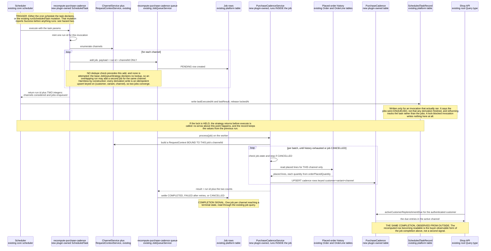
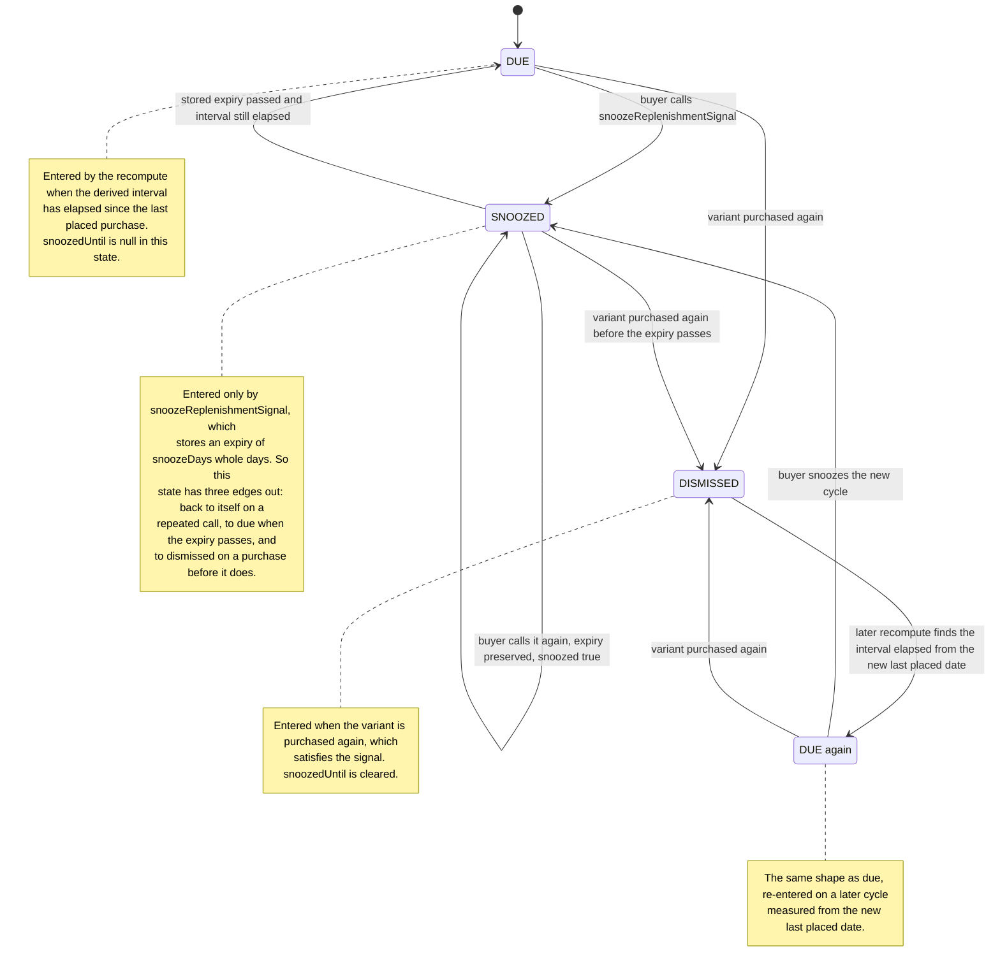

# FEATURE-001-05: Derive the interval at which a buyer repurchases a variant and surface an advisory replenishment due signal they can act on or snooze, so that a regular repeat purchase is prompted by the platform instead of remembered by the buyer

Parent epic: `tickets/EPIC-001-reorder-and-replenishment.md`. The parent epic and the sibling features are written as paths rather than as links, following the epic's own convention of keeping the link count in a file equal to the number of children that file indexes [tickets/EPIC-001-reorder-and-replenishment.md:§3. How To Read This Epic]. The only links in this file are the three story links in section 3; every other reference to a file is a citation of the form `[<path>:<locator>]`, not a hyperlink.

**Read section 1 before anything else.** This feature was *renamed* between the suggested feature area and this decomposition, and the rename is the single most consequential fact about its scope. A reader who finishes this file believing that a message, an email or a template is in scope has misread it, and section 1 exists to make that misreading impossible.

---

## 1. Feature Title

**Derive the interval at which a buyer repurchases a variant and surface an advisory replenishment due signal they can act on or snooze, so that a regular repeat purchase is prompted by the platform instead of remembered by the buyer.**

Short name, used verbatim wherever this feature is referred to in one phrase, and identical to the label the epic's features index gives it: **Purchase Cadence Detection and Replenishment Due Signals** [tickets/EPIC-001-reorder-and-replenishment.md:§4. Features Index]. The long form above is the action-object-outcome title this tier requires; the short form is the name to cite.

### 1.1 The Rename, And Why It Is Not Cosmetic

The originally suggested area was *Purchase Cadence Detection and Replenishment **Reminders***. The epic classifies this feature's deviation as **renamed**, and the rationale is a scope ruling rather than a preference in wording: **"Reminders" presumes a delivery channel, and message transport is environment-specific and would have to sit behind an interface regardless. The buildable core is a due-signal read plus a `ScheduledTask` recompute, and no notification adapter is shipped** [tickets/EPIC-001-reorder-and-replenishment.md:§4. Features Index]. The epic's own entry records that an adapter was proposed and removed for having no owning story, and section 2.4 of this file carries that removal in full.

Three consequences follow, and all three are boundaries on the work rather than commentary on it.

- **The deliverable is a read and a recompute, not a message.** What this feature ships is a plugin-owned table, a scheduled recompute that maintains it, one Shop API query that reads it and one Shop API mutation that snoozes an entry. Nothing in it sends anything to anyone.
- **Notification transport is not part of this feature's deliverable, not even as an interface.** The epic's ruling is that the buildable core is a due-signal read plus a `ScheduledTask` recompute "with any notification adapter **optional**" [tickets/EPIC-001-reorder-and-replenishment.md:§4. Features Index], and optional means later and separately scoped, not shipped inert. **No story in section 3 builds a notification interface, a default implementation, a message record or a delivery seam**, and section 2.4 names that exclusion in the same list as the services this feature does not call, so a reader cannot infer one from the feature's title. Were a deployment to want a message, the epic's discharge for an apparent external need would apply at that point — an interface with a database-backed default, as applied to substitution candidates [tickets/EPIC-001-reorder-and-replenishment.md:§4. Features Index] — and that work would be a new story against a new decision, not a residue of this one. **A seam whose only purpose is to anticipate out-of-scope work is still out-of-scope work**, and the no-external-service constraint is already satisfied by the fact that nothing in this feature leaves the process.
- **Email template design is ruled out of scope by the epic in as many words**, on exactly this ground: "The replenishment feature deliberately delivers a due-signal *read* rather than a message; notification transport sits behind an interface, and template authoring belongs to the email plugin's own surface" [tickets/EPIC-001-reorder-and-replenishment.md:§2.4 Scope Boundaries — Explicit In-Or-Out Rulings]. **The interface that ruling contemplates belongs to the later adapter, not to this feature**, on the preceding bullet. That the email surface belongs to another package is observable rather than asserted: the dev server configures templates through `EmailPlugin.init` with its own handler set and file-based template loader [packages/dev-server/dev-config.ts:L141-L146], which is a different package's configuration and not this plugin's.

Two adjacent domains are ruled out on the same page and are worth restating here, because a "replenishment" feature is where a reader most expects to find them: **recurring billing is out**, because it needs a payment-schedule and dunning model no entity in this repository provides, and **subscription contracts are out**, because a contract implies committed future obligations and cancellation terms the order model does not represent — "replenishment signals in this epic are advisory prompts, not commitments" [tickets/EPIC-001-reorder-and-replenishment.md:§2.4 Scope Boundaries — Explicit In-Or-Out Rulings]. Section 2.11 carries that ruling into the payload contract so it is enforceable and not merely stated.

Delivery is part of the single self-contained plugin package the epic describes — `packages/reorder-plugin/`, exporting `ReorderPlugin`. No file under `packages/core` or `packages/admin-ui` is edited to deliver it, and section 2.14 records the mechanism that makes that possible for a scheduled task specifically.

---

## 2. Feature Summary

### 2.1 The Capability

The platform derives, per customer and per variant, the interval between that buyer's repeat purchases of that variant, and records the derived interval with the date the variant was last purchased. When the interval has elapsed, the buyer reads a **replenishment due signal** for that variant through one Shop API query, and either acts on it through the reorder path this epic already builds or snoozes it through one Shop API mutation.

The signal is advisory in the strict sense: it reports that an interval derived from past purchases has elapsed. It reserves nothing, commits to nothing and renews nothing.

### 2.2 Contribution To The Epic

This feature sits in the epic's batch B4, "Extensibility and cadence" [tickets/EPIC-001-reorder-and-replenishment.md:§9.4 Run Batches]. It owns three nodes of the returning-buyer journey — the scheduled recompute over placed-order history, "Cadence recomputed, due signal raised" and "Buyer prompted, or snoozes" — and all three are labelled with this feature in the journey diagram [tickets/EPIC-001-reorder-and-replenishment.md:§2.5 The Returning-Buyer Journey This Epic Builds]. **Note what that diagram deliberately does not draw: no edge runs into the recompute from the reorder-attempt step.** The recompute is entered from its own schedule, not from a reorder, and section 2.4 gives the reason. The one edge that does close the loop — from the buyer being prompted back to curating a list — closes it through the buyer rather than through code, so no feature reads another's output across it.

Against the objective, this feature discharges the clause about the items a buyer "purchase[s] regularly". Everything else in the epic waits for the buyer to arrive with an intention; this is the only feature that produces the intention. That is its whole contribution, and reading it precisely matters:

- **It does not reorder anything.** The buyer acts on a due signal through FEATURE-001-02's mutation. This feature adds no write path onto an order and calls no order service.
- **It does not report what changed since the last purchase.** Price and availability deltas belong to FEATURE-001-03. A due signal says an interval elapsed; it does not say the price moved.
- **It does not decide what happens to a line that cannot be added.** That is FEATURE-001-04.
- **It does not aggregate demand for administrative personas.** FEATURE-001-08 reads the rows this feature maintains and is the only feature downstream of it.
- **It does not notify.** Section 1.1 is the ruling; this is the restatement.

### 2.3 Named Entities Touched

#### One new plugin-owned table

- **`PurchaseCadence`** — new, plugin-owned, and the only table this feature introduces. One row identifies a customer, a product variant and the channel the purchases occurred under, and carries the derived repurchase interval, the date that variant was last purchased by that customer, and the signal's lifecycle state as section 2.8 defines it. It is named consistently with the seven plugin-owned tables the epic's decomposition allocates across its eight features, and the ownership link lives on this table rather than on a custom field for the reason section 2.14 records.
  - **Its identity is a composite unique key over the customer, the variant and the channel, declared as a database constraint rather than as a service-level convention** — the same form core already uses for its own composite unique index [packages/core/src/entity/stock-level/stock-level.entity.ts:L19]. This is not tidiness. A recompute that runs more than once, or twice concurrently across two workers, has to converge on one row per triple; without the constraint the second run inserts duplicates and the due list then reports the same variant twice. **The constraint is what makes the write an upsert rather than a blind insert**, and it is what the bulk-write rule in section 2.6.1 depends on.
  - **It carries an index on the columns the read path predicates on** — the customer, the channel and the lifecycle state — because the buyer-facing query filters on exactly those and orders by the date a variant is next due. A table read on a page view and written by a recompute is indexed for the read.

**The mapping, stated completely enough to author a deterministic migration from.** A prose column list is not a schema. The epic's persistence contract carries the rules this table obeys [tickets/EPIC-001-reorder-and-replenishment.md:§7.8 The Seven Plugin-Owned Tables]; this is where they are made concrete for it.

```ts
// Extends VendureEntity, so id, createdAt AND updatedAt are inherited and NOT re-declared.
// updatedAt is load-bearing here, unlike on an append-only table: a recompute rewrites a
// row in place, so updatedAt is when the derivation last touched it.
@Entity()                                  // table purchase_cadence (TypeORM snake_case)
export class PurchaseCadence extends VendureEntity {
  @ManyToOne(() => Customer, { onDelete: 'CASCADE', nullable: false })
  customer: Customer;
  @EntityId({ nullable: false }) customerId: ID;

  @ManyToOne(() => Channel, { onDelete: 'CASCADE', nullable: false })
  channel: Channel;
  @EntityId({ nullable: false }) channelId: ID;

  @ManyToOne(() => ProductVariant, { onDelete: 'CASCADE', nullable: false })
  productVariant: ProductVariant;
  @EntityId({ nullable: false }) productVariantId: ID;

  @Column({ type: 'int', nullable: false })
  intervalDays: number;                    // whole days; CHECK > 0

  @Column({ type: 'int', nullable: false })
  observationCount: number;                // placed orders the interval came from; CHECK >= 2

  @Column({ type: Date, nullable: false })
  lastPurchasedAt: Date;                   // from Order.orderPlacedAt of the latest purchase

  @Column({ type: Date, nullable: false })
  dueAt: Date;                             // lastPurchasedAt + intervalDays, stored not derived

  @Column({ type: 'varchar', length: 16, nullable: false })
  state: ReplenishmentSignalState;         // stored as the exact literals DUE | SNOOZED | DISMISSED
                                           // DISPOSITION, not due-ness: DUE means the buyer has
                                           // neither snoozed nor dismissed this signal. Due-ness is
                                           // the separate predicate dueAt <= now, so a row derived
                                           // today for a variant whose next due date has not arrived
                                           // is DUE with a future dueAt. See the state-versus-due-ness
                                           // rule below.

  @Column({ type: Date, nullable: true })
  snoozedUntil: Date | null;               // the snooze expiry, and non-null EXACTLY while state is
                                           // SNOOZED: CHK_purchase_cadence_snooze_expiry_paired makes
                                           // the pairing a database fact. The snooze mutation stores
                                           // snoozeDays whole days here; a later recompute observes
                                           // that the stored expiry has passed and returns the row to
                                           // DUE with this column back to null, which is transition 2
                                           // of 2.8.1. Every other transition out of SNOOZED clears it
                                           // for the same reason. Published nullable: see 2.8.

  @Column({ type: Date, nullable: false })
  computedAt: Date;                        // which recompute run produced this row's figures
}
```

- **Indexes and constraints, each with the name the migration must use:**
  - `UQ_purchase_cadence_customer_channel_variant` — unique over `(customerId, channelId, productVariantId)`. **This is the row's identity, and making it a database constraint is what makes the recompute's write an upsert rather than a race**: two concurrent recomputes cannot produce two rows for one triple, so the second either updates or fails rather than duplicating.
  - `IDX_purchase_cadence_customer_channel_state_due` — non-unique over `(customerId, channelId, state, dueAt)`, which is exactly the predicate the due query reads on, in that order.
  - `CHK_purchase_cadence_interval_positive` — check constraint `intervalDays > 0`.
  - `CHK_purchase_cadence_observations_min_two` — check constraint `observationCount >= 2`. A single purchase produces no row at all, so this constraint makes the rule in section 4.1 unbypassable rather than merely intended.
  - `CHK_purchase_cadence_state_enumerated` — check constraint `state IN ('DUE','SNOOZED','DISMISSED')`. The column is a `varchar` rather than a database enum type because a database enum is not portable across the four engine jobs, which is the epic's own persistence rule for a closed value set [tickets/EPIC-001-reorder-and-replenishment.md:§7.8 The Seven Plugin-Owned Tables — Persistence Contract], so **the closed set has to be enforced by a check or it is not enforced at all** — an unconstrained `varchar(16)` accepts any sixteen characters, and the published GraphQL enum constrains only what arrives through the API, not what a migration, a fixture or a later service method writes.
  - `CHK_purchase_cadence_snooze_expiry_paired` — check constraint `(state = 'SNOOZED' AND snoozedUntil IS NOT NULL) OR (state <> 'SNOOZED' AND snoozedUntil IS NULL)`. **An expiry and the snoozed state are paired in both directions**: a non-snoozed row publishing an expiry that governs nothing is unrepresentable, and — the half that carries the behaviour — a snoozed row with no expiry is unrepresentable too, which is what makes section 2.8.1's guarantee that a snoozed row cannot be hidden forever a database property rather than a convention. **One name and one predicate:** an earlier revision of this file spelled the constraint `CHK_purchase_cadence_snooze_expiry_scoped` here while three consumers named it `_paired` and asserted the two-directional reading, and the one-directional predicate could not have supported them; the paired name and the paired predicate are the settled pair.
- **`state` is a disposition and `dueAt` is the due-ness test, and they are two different questions asked of the same row. This is the reading that makes the NOT NULL state column satisfiable, and an earlier version of this file left it unstated.** With three members and no nullable state, a row the recompute has just derived for a variant that is **not yet due** had no admissible value: it is not snoozed, it is not dismissed, and calling it `DUE` looked like a lie about a future date. **The settled reading is that the column never claimed to answer "is it due now"**: `DUE` means the buyer has neither snoozed nor dismissed this signal, `SNOOZED` and `DISMISSED` mean they have, and **due-ness is `dueAt <= now`, evaluated at read time and stored nowhere**. So a freshly derived row is `DUE` with a future `dueAt`, which is the ordinary and majority case rather than an edge one, and the buyer-facing read applies **both** predicates — `state = 'DUE' AND dueAt <= :now` — which is exactly the order the index `IDX_purchase_cadence_customer_channel_state_due` is built for. **Two consequences are stated so no story assumes otherwise:** the table holds far more rows than any due list returns, and a fourth `PENDING` state is deliberately *not* added, because a state meaning "not yet due" would have to be flipped to `DUE` by something watching the clock, and this epic registers exactly one scheduled task [tickets/EPIC-001-reorder-and-replenishment.md:§6.4 The Settled Rulings] — a row becoming due must therefore be a **read-time comparison** rather than a write nobody is scheduled to perform.
- **`dueAt` is stored rather than computed on read**, and the reason is the index above: a due query filtering on a computed expression cannot use one. The cost is that a row is stale between recomputes, which section 2.11 already states is the nature of the signal.
- **`computedAt` has exactly one role: it records which recompute run last produced a row's figures, and it is a DIAGNOSTIC rather than a fence.** A test and an operator can both tell which run wrote a row, and that is the whole of the column's purpose. **An earlier version of this section carried a second, contradictory bullet** justifying the column as the operand of a conditional update comparing it against a run's own start instant, and **that use is withdrawn**: it compares two processes' clocks, so it reverses under skew and would silently discard the newer of two writes. The column therefore **never appears in a `WHERE` clause that decides whether to write**, which section 2.6d states as a rule no story may reintroduce. **What actually serialises two runs is the configured scheduler strategy's database lock, and it is not available on every engine this migration is evidenced on:** the platform's own DB-issued task lock, which takes a pessimistic lock only where the driver supports one — PostgreSQL, MySQL and MariaDB [packages/core/src/plugin/default-scheduler-plugin/default-scheduler-strategy.ts:L279] — and falls back to a non-locking atomic-update path elsewhere, whose own in-file comment records that it may race across multiple connections [packages/core/src/plugin/default-scheduler-plugin/default-scheduler-strategy.ts:L315-L320]. **That is why the guarantee this feature offers is convergence rather than monotonicity or exclusion**, stated at that strength in section 2.6d rather than promised and then qualified: the unique constraint on the row's identity triple makes each write an upsert, so two runs converge on one row per triple whichever of them lands last, and no run's figures are silently preferred on the strength of a clock.

- **The withdrawn-variant rule — why a non-null relation and a `ProductVariant!` field stay satisfiable for a variant that has been withdrawn, and what the cascade does and does not cover. An earlier version of this file declared the relation `nullable: false` with `onDelete: 'CASCADE'`, published the field as `ProductVariant!`, and said in the same breath that this feature "asserts nothing about the variant's enabled state" — leaving a reader to conclude that a withdrawn variant either stranded a non-null relation or silently removed the row, neither of which is what happens.** What actually happens is stated here once, and the two stories' edge-case rulings are written against it rather than against a different reading:
  - **A withdrawal does not remove the variant row, so the entity relation always loads — and the published FIELD is nullable all the same, for a different reason.** `ProductVariant` is soft-deleted: a withdrawal sets the nullable `deletedAt` timestamp [packages/core/src/entity/product-variant/product-variant.entity.ts:L48] and leaves the row, its translations and therefore its `LocaleString` name [packages/core/src/entity/product-variant/product-variant.entity.ts:L50] in place. **So the entity's `@ManyToOne` stays `nullable: false` with `onDelete: 'CASCADE'`, no snapshot column is needed, and the cadence row survives the withdrawal and is still listed.** What the *published* relation must express is a different question, and **section 2.5 settles it — the sub-section whose SDL declares the field** rather than section 2.9, which governs asynchronous triggers and was named here in error: `ReplenishmentSignal.productVariant` is published **nullable** and is null exactly where the variant no longer resolves — soft-deleted, disabled, or its parent product disabled — while `productVariantId` stays non-null because it is read from the cadence row rather than resolved from the catalogue. **An earlier revision of this bullet concluded from the surviving row that the published field could be non-null; that inference is withdrawn**, because a non-null field with nothing to put in it would fail the whole read and one withdrawn variant would cost the buyer their entire due list.
  - **`onDelete: 'CASCADE'` therefore covers a case that the platform's own service does not produce for this entity, and it is retained for correctness rather than for effect.** It is the database's guarantee against an orphan if a row is ever removed by other means; the ordinary withdrawal path never reaches it. **Stating that plainly is the point** — a reader who assumed the cascade was the withdrawal story would have expected rows to disappear, and they do not.
  - **The recompute neither skips nor deletes a withdrawn variant's triple, and the read neither filters nor fails on it.** Placed orders naming that variant still exist, the derivation is a function of them, and the row keeps being refreshed. `activeCustomerReplenishmentDue` returns the entry, its `productVariantId` naming the withdrawn variant and its published `productVariant` field null, which is the nullability section 2.9 fixes. **This is the deterministic ruling both stories assert** — STORY-001-05-01 lists such an entry rather than omitting it and STORY-001-05-03 snoozes it rather than refusing — and section 2.11 states the reason: this operation reports derived purchasing history, not current availability, and availability at the moment of acting on it belongs to FEATURE-001-03 and FEATURE-001-04, which read stock and enablement at reorder time for exactly this purpose.
  - **What the entry therefore does not claim, so the ruling is not mistaken for an assertion of buyability.** It does not claim the variant can be added to an order; section 2.11 states it reserves nothing and confers no entitlement. A storefront that wants to present availability alongside a due entry reads it through FEATURE-001-03's preview rather than inferring it from the entry's presence.
  - **What a story asserts, so this is evidenced rather than described.** A fixture whose variant is soft-deleted after its row exists: the read returns the entry, its `productVariantId` still names that variant, the selected `productVariant` is **null** rather than an object or an error, and the query does not error. The same fixture with the variant disabled rather than deleted: the same outcome. **An earlier revision of this bullet asserted a resolved variant carrying a non-empty `name`**, which contradicted the nullable field section 2.9 publishes and is withdrawn. And after the next recompute, **the row still exists** — asserted positively, because an implementation that quietly filtered the triple out of the derivation would pass a test that only checked the read.
- **Every relation cascades, and this is the one plugin-owned table where that is the whole erasure story.** A cadence row is a derived convenience, not an audit record: it holds no evidence about what a buyer did that the orders themselves do not hold, so deleting it costs nothing. **On a hard delete of the customer, the channel or the variant, the row goes with it.** The contrast with FEATURE-001-07's attempt tables is deliberate — those retain their rows and null their customer link, because they *are* the evidence [tickets/EPIC-001/FEATURE-001-07-reorder-instrumentation.md:§2.4 Named Entities Touched].
- **Soft deletion is the case a cascade does not cover, and it is why this table is named in the epic's erasure decision.** `Customer` is soft-deletable [packages/core/src/entity/customer/customer.entity.ts:L23] with a nullable deletion timestamp [packages/core/src/entity/customer/customer.entity.ts:L29], so a soft delete leaves every cadence row in place holding a named customer's purchasing pattern. **The mechanism is settled: cadence rows are deleted outright rather than anonymised**, because an anonymised cadence row has no purpose — it is per-customer by definition, and a row with no customer is unreadable by the only query that reads it. The epic's persistence contract rules that way for the derived tables and **drives that deletion from the event-triggered, bounded, idempotent data-lifecycle job of ruling R19 owned by FEATURE-001-07 — not from this feature's scheduled task, and not from any second scheduled task** [tickets/EPIC-001-reorder-and-replenishment.md:§7.8 The Seven Plugin-Owned Tables] and [tickets/EPIC-001-reorder-and-replenishment.md:§6.4 The Settled Rulings]: the job is triggered by the shipped customer-deletion event and deletes this table's rows for that customer outright, so the erasure does not wait for a cadence run and is not suspended when one is disabled. An earlier version of this bullet said the scheduled task drove it, which would have made the erasure pass depend on a task whose purpose is derivation and would have put two owners on one deletion; **the R19 job is the single owner, and section 4.5's dependency entry states the same thing rather than a second version of it.** **Two deletions exist in this feature and they are not the same deletion:** this one, on customer erasure, owned by the R19 job in FEATURE-001-07; and the offerability deletion in the rule above, on a variant ceasing to be offerable, performed inside the recompute's own batch because it is part of deriving the row set rather than part of erasing a subject. **What is open is the window**, which the epic carries as its third product decision, blocking five stories — 01-01, 05-02, 06-01, 07-01 and 08-03 [tickets/EPIC-001-reorder-and-replenishment.md:§8.1 Product Decisions]; section 4.5 records it as this feature's own blocking dependency. No period is invented here.
- **Migration ordering.** `purchase_cadence` references only core tables, so it has no ordering dependency on any other plugin-owned table and is created in the single additive migration **story 05-01** generates — that story owns the table and the schema, for the reason section 4.3 gives. Nothing in this feature alters a core table.
- **No string column beyond the two short enumerated values, and no money column at all.** Section 2.10 states why the payload carries no monetary field; the table carries none for the same reason.

#### Existing platform entities, read and never altered

- **`Order`** [packages/core/src/entity/order/order.entity.ts:L44], declared as implementing `ChannelAware` and `HasCustomFields`. Four of its columns are the input to the computation. `orderPlacedAt` is the timestamp every derived interval is measured between [packages/core/src/entity/order/order.entity.ts:L92]; `state` [packages/core/src/entity/order/order.entity.ts:L72] and `active` [packages/core/src/entity/order/order.entity.ts:L82] are what separate a placed order from a cart; and `code` [packages/core/src/entity/order/order.entity.ts:L70] is the buyer-facing reference a support agent or a test uses to identify the source purchase, its own JSDoc stating it should be used as the reference for Customers rather than the Order's id [packages/core/src/entity/order/order.entity.ts:L62-L67]. Ownership is read from `customerId` [packages/core/src/entity/order/order.entity.ts:L99] and the lines from `lines` [packages/core/src/entity/order/order.entity.ts:L102].
- **`OrderLine`**. `orderPlacedQuantity` is the quantity as at placement [packages/core/src/entity/order-line/order-line.entity.ts:L104], and `quantity` is the live quantity [packages/core/src/entity/order-line/order-line.entity.ts:L97]. The distinction decides which number a cadence computation may read, and section 2.3.1 states the rule.
- **`Customer`** [packages/core/src/entity/customer/customer.entity.ts:L23], which owns the history through its `orders` relation [packages/core/src/entity/customer/customer.entity.ts:L51-L52] and is the subject of every row in `PurchaseCadence`. Its `emailAddress` [packages/core/src/entity/customer/customer.entity.ts:L42] and its optional `user` [packages/core/src/entity/customer/customer.entity.ts:L56] are named because the buyer-facing operations require an authenticated session resolved through that user, not because this feature writes either.
- **`ProductVariant`**. The subject of a derived interval. This feature reads the variant identifier and its offerability, defined in the offerability rule below; it asserts nothing about the variant's price or stock, both of which belong to FEATURE-001-03 and FEATURE-001-04.
- **`Channel`**. Supplies the request scope described in section 2.10 and the grouping key described there.
- **`ScheduledTaskRecord`** [packages/core/src/plugin/default-scheduler-plugin/scheduled-task-record.entity.ts:L7] — read, never written by plugin code. It is the platform's own record of a scheduled task's last run, and section 2.6 explains why it is what makes this feature's asynchronous work observable at all.

#### 2.3.1 Cadence Is Computed From Placed Orders — Which Columns, And Why It Is Not A Detail

**The input to every derived interval is orders that have been placed. Active orders are excluded.** This is stated as a rule with its mechanism because getting it wrong does not fail loudly — it silently produces wrong intervals.

- `Order.active` **defaults to true** [packages/core/src/entity/order/order.entity.ts:L81-L82], and its own JSDoc defines an active order as one where "the Customer can still make changes to it and has not yet completed the checkout process", governed by the order-placed strategy [packages/core/src/entity/order/order.entity.ts:L74-L80]. An active order is a cart. A cart is not evidence of a purchase, and a cart abandoned twice is not a cadence.
- `Order.orderPlacedAt` is **nullable** [packages/core/src/entity/order/order.entity.ts:L90] and its JSDoc defines it as the date and time the order was placed, "i.e. the Customer completed the checkout and the Order is no longer 'active'" [packages/core/src/entity/order/order.entity.ts:L84-L89]. A null value is therefore the marker of an order that was never placed, which makes the filter expressible against a column rather than against an inference. The column is additionally indexed [packages/core/src/entity/order/order.entity.ts:L91], so ordering history by it consumes an index the platform already declares rather than one this feature would have to add.
- `OrderLine.orderPlacedQuantity` **defaults to zero** [packages/core/src/entity/order-line/order-line.entity.ts:L103-L104] and is defined as the quantity at the time the order was placed [packages/core/src/entity/order-line/order-line.entity.ts:L99-L102]. Two things follow. A line on an unplaced order carries zero there, so a computation that mistakenly walked carts would read zeroes rather than fail — the exact silent-corruption case this rule prevents. And on a placed order it is the quantity the buyer actually bought, whereas `quantity` [packages/core/src/entity/order-line/order-line.entity.ts:L97] can have been altered by an administrative modification after placement.

**The rule, stated once for all three stories: a cadence computation reads lines of orders whose `orderPlacedAt` is set, and takes each quantity from `orderPlacedQuantity`.** The sibling feature states the same preference for the same reason from the reorder side [tickets/EPIC-001/FEATURE-001-02-reorder-from-order-history.md:§2.3 Named Entities Touched], so the two features agree on which number describes a past purchase.

#### 2.3.2 The Derivation, Stated As An Algorithm Rather Than As An Intention

**An earlier version of this file specified which columns the derivation reads and left everything else to the story, and that is not enough to accept an exact value against.** Section 2.3.1 fixes the input. This sub-section fixes the computation, because five sub-decisions sit inside the phrase "the derived repurchase interval" and every one of them changes the integer a criterion asserts: what counts as one observation, what happens to two lines of the same variant in one order, how more than two observations reduce to a single interval, how a partial day rounds, and what the batch grain is. **None of these is negotiable inside a story.** Where a rule below is a choice rather than a consequence, it says so and gives the reason the choice was taken.

**The five rules.**

- **One observation is one placed order that contains at least one line naming the variant, and the order is the unit.** Its identity is the order's own id and its instant is `Order.orderPlacedAt` [packages/core/src/entity/order/order.entity.ts:L90-L92], which section 2.3.1 already requires to be non-null. `observationCount` is the number of such orders, which is why its check constraint is `>= 2`: one order is a purchase, not a cadence.
- **Two lines of the same variant in one order are one observation, and their quantities are summed.** This is the rule an implementation is most likely to get wrong, because the natural query shape returns lines rather than orders: counting lines would let a single order that split a variant across two lines — which the platform produces whenever the lines carry differing custom field values [packages/core/src/service/helpers/order-modifier/order-modifier.ts:L110-L114] — report two observations one millisecond apart and derive a zero-day cadence. The quantity is summed from `orderPlacedQuantity` across those lines, per section 2.3.1.
- **The interval set is the differences between consecutive observation instants, and it is reduced by the median.** Order the observations ascending by instant; N observations yield exactly N−1 intervals. **The reduction is the median rather than the mean, and that is a choice with a reason:** a mean is moved by one unusual gap — a holiday, one bulk purchase — so it would need an outlier rule, and an outlier rule is a second undeclared decision. A median needs none. **The tie-break for an even number of intervals is the lower of the two middle values**, stated because "the median of two values" is otherwise an averaging step reintroduced by the back door, and because a criterion asserting an exact integer has to be reproducible on all four engine jobs.
- **A day is a whole day in UTC, and a same-day repeat is excluded rather than rounded to zero.** Each interval is the floor of the difference between two instants in whole days, so a gap of six days and twenty-three hours is six days and no rounding decision remains at the end. **An interval of zero days is excluded from the interval set**, because two placements on one day are a split order or a correction rather than a repurchase cycle. Two consequences follow and both are asserted: a variant whose every interval is zero produces **no row at all**, which is what makes the `intervalDays > 0` check constraint satisfiable by construction rather than by hope; and `observationCount` counts observations, not surviving intervals, so it can exceed the number of intervals the median was taken over.
- **The grain is the row's own identity and the batch key is its prefix.** The aggregate groups by customer, variant and channel — exactly the composite unique key section 2.3 declares — and an order is attributed to the channel it is assigned to through the many-to-many relation `Order.channels` [packages/core/src/entity/order/order.entity.ts:L150-L152], so an order visible in two channels contributes one observation to each. Because the job is per channel, the channel is fixed for a run and the batch key is the ordered pair of customer and variant, which section 2.6c states in full.

**`lastPurchasedAt` and `dueAt` follow from the rules above rather than being separate decisions.** `lastPurchasedAt` is the latest observation instant. `dueAt` is that instant advanced by `intervalDays` whole days in UTC, stored rather than derived for the index reason section 2.3 gives. **A row whose `dueAt` is in the past is due; a row whose `dueAt` is in the future is not**, and the comparison instant is the run's own, which is the one place a wall clock legitimately appears in this feature — it decides what is due, and section 2.6d states why it decides nothing else.

### 2.4 Named Services And Platform Mechanisms

- **`ScheduledTask` — existing, in `packages/core`, consumed and never modified** [packages/core/src/scheduler/scheduled-task.ts:L120]. The class this feature's recompute is an instance of, configured by the interface described in section 2.6.
  - **This feature declares the epic's ONLY scheduled task, and the count is a ceiling other features ride on rather than a quota they may add to** [tickets/EPIC-001-reorder-and-replenishment.md:§6.4 The Settled Rulings]. One consequence belongs here rather than in a sibling file, because this feature owns the task: **this task performs the cadence recompute and nothing else. Row-lifecycle work is NOT a step inside its `execute`.** An earlier version of this bullet made the audit-row disposal of FEATURE-001-07 an additional step inside this task, reporting a third count in the object this task returns, and accepted that **the disposal would then be suspended whenever a deployment disabled the recompute** — a coupling between an optional convenience and a privacy obligation, which is exactly the hazard that framing conceded and then priced. **That design is withdrawn.** Under the epic's settled ruling R19 [tickets/EPIC-001-reorder-and-replenishment.md:§6.4 The Settled Rulings] the row lifecycle is a **job** owned by FEATURE-001-07 with two triggers of its own — the shipped customer-deletion event for the erasure scope, and that feature's own post-commit bounded probe for the expiry scope [tickets/EPIC-001/FEATURE-001-07-reorder-instrumentation.md:§2.13 Privacy And How Long An Audit Row Is Kept — No Policy Is Declared Anywhere] — so it runs on its own terms, reports its counts on its own job, and is unaffected by whether this task is enabled, scheduled or ever registered. **So the one-task ceiling costs this epic nothing:** it holds because no second *task* is declared anywhere, not because periodic work was folded into the one that exists. **One task and one job, owned by two features.** This task returns the recompute's counts only, and a reader looking for a lifecycle count reads that job rather than this task's result.
- **`JobQueueService` — existing, consumed.** `createQueue` is the queue factory [packages/core/src/job-queue/job-queue.service.ts:L82], and the queue it returns inherits the deployment's configured job-queue strategy rather than a plugin choice, because the service reads that strategy from configuration [packages/core/src/job-queue/job-queue.service.ts:L63-L65].
- **`TransactionalConnection` — existing, consumed.** Every `PurchaseCadence` read and write goes through it, which is also how the shipped `cleanJobsTask` reaches its own table from inside a scheduled task [packages/core/src/plugin/default-job-queue-plugin/clean-jobs-task.ts:L25-L32]. That is the citable precedent for a task doing database work rather than a pattern this feature invents.
- **`ChannelService` — existing, consumed, and required rather than optional here.** A scheduled task's own request context is created against the **default channel** [packages/core/src/scheduler/scheduled-task.ts:L134] with an admin API type [packages/core/src/scheduler/scheduled-task.ts:L136-L139], so a recompute that must produce per-channel rows has to enumerate channels itself. Section 2.10 states the consequence; it is named here so the dependency is not discovered late.
- **`PurchaseCadenceService` — new, plugin-owned.** Holds the derivation: reading placed-order history for a customer, grouping by variant and channel, deriving the interval, and writing the `PurchaseCadence` row. The scheduled task's `execute` delegates to it and holds no logic of its own, mirroring all three shipped tasks on the core side, each of which resolves what it needs from the injector and delegates rather than holding logic inline [packages/core/src/scheduler/tasks/clean-sessions-task.ts:L45-L46], [packages/core/src/config/settings-store/clean-orphaned-settings-store-task.ts:L54] and [packages/core/src/plugin/default-job-queue-plugin/clean-jobs-task.ts:L23-L25]. Section 2.5 draws the distinction between the two that the core defaults register and the third that a plugin contributes.
- **`ReplenishmentService` — new, plugin-owned.** Serves the two buyer-facing operations: reading the due rows for the authenticated customer in the active channel, and applying a snooze. It performs no derivation, so the read path cannot drift from the recompute path.
- **`RequestContextService` — existing, consumed, and required rather than convenient.** It is how the recompute obtains a channel-bound context for each channel it processes, instead of reusing the default-channel context the platform hands a scheduled task [packages/core/src/scheduler/scheduled-task.ts:L134]. Section 2.10 states the isolation rule this exists to satisfy; it is named here so the dependency is declared rather than assumed.
- **`ReplenishmentNotificationStrategy` — proposed by an earlier draft of this file and WITHDRAWN.** It was to be an interface behind which a future notification transport could sit, with a default implementation that recorded a due signal and sent nothing. **It is removed, and the removal is recorded rather than performed silently**, because the epic's inventory fixes this ticket set's configurable-strategy count at **one** — `SubstitutionCandidateStrategy`, owned by FEATURE-001-04 — and states in terms that the notification strategy is withdrawn because "a due-signal read needs no transport interface, and adding one would have made the count two while delivering nothing this epic ships" [tickets/EPIC-001-reorder-and-replenishment.md:§6.4 The Settled Rulings]. Two further reasons make the withdrawal right rather than merely consistent. **A default implementation that sends nothing is a stub**, and the epic's own reasoning for the one strategy it does keep is that a default which cannot do the thing "would discharge the no-external-service ruling on paper and defeat it in practice" [tickets/EPIC-001/FEATURE-001-04-unavailable-line-resolution.md:§2.10 The No-External-Service Discharge]. **And the no-external-service constraint needs no discharging here**, because this feature makes no outbound call and needs no seam to avoid one: it computes rows and publishes a query. A deployment that later wants a message has the platform's own email plugin and the event bus to build it on, and adding that transport is a change to *this* feature's scope to be argued then, not an interface to pre-declare now. **The rename in section 1.1 is what makes this coherent:** a feature delivering due *signals* rather than *reminders* has no transport in scope, so it needs no transport interface.
  - **What ships instead: the due-signal read, and nothing that sends.** A deployment that wants a message reads `activeCustomerReplenishmentDue` and decides for itself, which keeps the no-external-service constraint satisfied by construction because nothing in this feature leaves the process. The epic already rules message design out of scope in its own words [tickets/EPIC-001-reorder-and-replenishment.md:§2.4 Scope Boundaries — Explicit In-Or-Out Rulings], and section 1.1 explains why the feature was renamed from reminders to due signals in the first place — **so declaring a transport seam here was reaching back for the thing the rename removed.**
  - **Adding one later is an epic-level change, not a detail.** It would add a second configurable strategy to the set, need an owning story with its own tests, and either introduce an external dependency or ship an inert default whose only tested behaviour is that it does nothing.

**Three platform services this feature deliberately does not call, and one strategy it deliberately does not build, named so that nothing is inferred from the feature's subject:**

- **No notification strategy, interface, default implementation or delivery seam.** Section 1.1 is the ruling and this is its restatement in the services list: the epic makes any notification adapter **optional** [tickets/EPIC-001-reorder-and-replenishment.md:§4. Features Index] and rules message and template work out of the epic entirely [tickets/EPIC-001-reorder-and-replenishment.md:§2.4 Scope Boundaries — Explicit In-Or-Out Rulings]. **This feature therefore ships exactly two plugin-owned services and no configurable strategy.** The epic's whole decomposition allocates one configurable strategy, `SubstitutionCandidateStrategy`, and names it against FEATURE-001-04 rather than this feature [tickets/EPIC-001-reorder-and-replenishment.md:§4. Features Index], which is where its interface and database-backed default are specified [tickets/EPIC-001/FEATURE-001-04-unavailable-line-resolution.md:§2.6 Named Services And Configurable Strategies]; a second strategy declared here would be scope this feature was not given, and would put a class in the delivery that no story in section 3 is sized to build.
- **`OrderService` and `StockLevelService` are not called.** They belong to FEATURE-001-02, FEATURE-001-03 and FEATURE-001-04. A cadence recompute that read stock would be doing another feature's work.
- **`EventBus` is not called, in either direction — this feature publishes no event and subscribes to none.** The derivation's input is placed-order history read through the existing customer-orders path, and its trigger is a cron schedule or an administrative invocation, as section 2.9 states. The epic rules on this explicitly so that no file re-derives it differently: FEATURE-001-05 requires no event-bus subscriber, and a story in FEATURE-001-07 may not list this feature as a consumer of its events [tickets/EPIC-001-reorder-and-replenishment.md:§9.4.2 FEATURE-001-05 Sits In B4 Because It Consumes No Reorder Event]. Section 4.2 records the batch consequence.

**`EventBus` deserves the emphasis, because a sibling feature once claimed this feature subscribes to it.** FEATURE-001-07 previously listed cadence recompute among its event consumers; that claim is withdrawn there and the withdrawal is recorded, with the two files now agreeing in one direction [tickets/EPIC-001/FEATURE-001-07-reorder-instrumentation.md:§4.2 Downstream — Two Consumers, All One-Way]. **This feature subscribes to nothing.** Two reasons, and the second is the stronger. The batch order makes the claimed edge unbuildable: this feature sits in batch B4 and that one in B5 [tickets/EPIC-001-reorder-and-replenishment.md:§9.4 Run Batches], so a subscriber here would be written against events that do not yet exist. And **placed-order history is the complete input while reorder events are a subset of it** — an order placed through the ordinary checkout produces no reorder event, so a cadence derived from events would silently ignore every purchase a buyer made without reordering, which is most of them. Section 2.3.1 fixes history as the input for exactly that reason. **A third reason is a property of the bus itself:** it is process-local with no persistence, no replay and no acknowledgement [tickets/EPIC-001/FEATURE-001-07-reorder-instrumentation.md:§2.8a Delivery Semantics], and cadence arithmetic is only correct over a complete history. **And a cart-time reorder attempt would be the wrong event even if delivery were perfect**, because a cadence interval is measured between orders that were *placed* and an attempt that never reaches checkout must not move one.

### 2.5 Named API Surfaces — Two New Shop API Operations, Zero Existing Signatures Changed

#### Existing read paths this feature consumes and does not extend

- **`Customer.orders(options: OrderListOptions): OrderList!`** [packages/core/src/api/schema/common/customer.type.graphql:L11] — **the input to the computation.** The order-history read path already exists, is already paginated, sortable and filterable through the generated list options, and is already reachable through the `activeCustomer` root query [packages/core/src/api/schema/shop-api/shop.api.graphql:L5]. The epic's prohibition on it applies to this feature exactly as it does to FEATURE-001-02: do not add a reorder-specific or cadence-specific order-history query [tickets/EPIC-001-reorder-and-replenishment.md:§5. Existing Mechanisms That Must Not Be Duplicated]. A storefront that wants to show a buyer *why* a variant is due reads the underlying orders through this field; the due-signal query returns the derived row, not a reimplementation of history.
- **`scheduledTasks: [ScheduledTask!]!`** [packages/core/src/api/schema/admin-api/scheduled-task.api.graphql:L2] and **`runScheduledTask(id: String!): Success!`** [packages/core/src/api/schema/admin-api/scheduled-task.api.graphql:L12] — existing Admin API operations, consumed unchanged. They are this feature's observability and manual-trigger surface, and section 2.6 sets out why that removes the need to add either.

#### The two new operations

Both are added through the plugin's `shopApiExtensions` using `extend type Query` and `extend type Mutation` — the mechanism the shipped wishlist example already demonstrates [packages/dev-server/example-plugins/wishlist-plugin/api/api-extensions.ts:L16-L19].

- **`activeCustomerReplenishmentDue(options: ReplenishmentSignalListOptions): ReplenishmentSignalList!`** — the names being the SDL's own, an earlier revision of this bullet having carried the withdrawn `ReplenishmentDueList` pair that the published block below never declared — a query returning the due entries for the authenticated customer in the active channel, each naming the variant, the derived interval, the date that variant was last purchased and the signal's state. It reads `PurchaseCadence` and nothing else. **It returns a paginated list rather than every due entry**, for the reason the epic states once for every collection in this set [tickets/EPIC-001-reorder-and-replenishment.md:§7.7 Bounded Collections]: the number of variants a buyer has ever purchased regularly is unbounded, and a buyer with a long history is exactly the buyer this feature is for. The return type implements `PaginatedList` [packages/core/src/api/schema/common/common-types.graphql:L9] with an empty generated options input following the shipped plugin exemplar [packages/dev-server/test-plugins/reviews/api/api-extensions.ts:L44-L45]; its items resolve through `ListQueryBuilder` [packages/core/src/service/helpers/list-query-builder/list-query-builder.ts:L209], so the configured Shop maximum is applied — the option being `apiOptions.shopListQueryLimit` [packages/core/src/config/vendure-config.ts:L151] and its shipped value one hundred [packages/core/src/config/default-config.ts:L89], the value being cited where the value actually is rather than at the declaration, which carries none, an omitted page size resolves to that maximum rather than to every row, and an over-limit page is rejected with the platform's own input error [packages/core/src/service/helpers/list-query-builder/list-query-builder.ts:L638]. `ignoreQueryLimits` stays false [packages/core/src/service/helpers/list-query-builder/list-query-builder.ts:L125-L131].
  - **The default order is deterministic and is part of the contract**: due entries ascending by the date each variant became due, then by variant identifier as the tie-break. Without a declared tie-break, "the first ten due items" is not reproducible across engines, and an acceptance criterion asserting an exact ordered entry count would be asserting an accident.
- **`snoozeReplenishmentSignal`** — a mutation moving one entry from `DUE` to `SNOOZED`, as section 2.8 defines those states.

**One type-name family, and the earlier second one is withdrawn.** Every published type in this feature is named `ReplenishmentSignal*` — `ReplenishmentSignalList`, `ReplenishmentSignalListOptions`, `ReplenishmentSignalState`, `SnoozeReplenishmentSignalInput` and `ReplenishmentSnoozeResult`. An earlier version of this section named the query's argument and return types `ReplenishmentDueListOptions` and `ReplenishmentDueList!` in prose while the published SDL below named the signal family, which is two contracts for one operation. **The signal family governs**, for two reasons rather than by preference: the generated list-options input must be named for the type it wraps [packages/core/src/api/config/generate-list-options.ts:L52], and the entity a due entry describes is a *signal* with a state — `DUE`, `SNOOZED`, `DISMISSED` — rather than a due date, so `ReplenishmentSignalState` and `ReplenishmentSignalList` name the same thing consistently. **Only the operation keeps the word “due”**: `activeCustomerReplenishmentDue` is the *filter* the read applies, and the operation name is unchanged from its first publication.

**The exact SDL, published here rather than left to a story.** Every argument, field, enum member and nullability is fixed, because a story cannot write an acceptance criterion against a payload whose shape is still open.

```graphql
extend type Query {
  activeCustomerReplenishmentDue(options: ReplenishmentSignalListOptions): ReplenishmentSignalList!
}

extend type Mutation {
  snoozeReplenishmentSignal(input: SnoozeReplenishmentSignalInput!): ReplenishmentSnoozeResult!
}

type ReplenishmentSignal implements Node {
  id: ID!
  createdAt: DateTime!
  updatedAt: DateTime!
  """
  NULLABLE. Null where the variant no longer resolves in the catalogue - disabled since the
  recompute, soft-deleted, or its parent product disabled. The row is still returned, per
  section 4.1's ruling, and productVariantId below still identifies it. See the reading on
  the two nullabilities.
  """
  productVariant: ProductVariant
  productVariantId: ID!
  "Whole days between the buyer's successive placed purchases of this variant."
  intervalDays: Int!
  "How many placed orders the interval was derived from. Always 2 or more."
  observationCount: Int!
  lastPurchasedAt: DateTime!
  "lastPurchasedAt + intervalDays. The instant the signal became or becomes due."
  dueAt: DateTime!
  state: ReplenishmentSignalState!
  "Always published. Non-null exactly while state is SNOOZED, carrying the snooze expiry. The field is never absent."
  snoozedUntil: DateTime
}

type ReplenishmentSignalList implements PaginatedList {
  items: [ReplenishmentSignal!]!
  totalItems: Int!
}

"Auto-generated at run time. Declared empty, never hand-written."
input ReplenishmentSignalListOptions

enum ReplenishmentSignalState { DUE, SNOOZED, DISMISSED }

"Addresses the signal by the variant it concerns. No signal id is accepted."
input SnoozeReplenishmentSignalInput {
  productVariantId: ID!
}

"A normalized non-disclosing payload rather than a union. See the four readings below."
type ReplenishmentSnoozeResult {
  snoozed: Boolean!
  signal: ReplenishmentSignal
}
```

Eight readings of that block are load-bearing, and five of them exist to close a specific hole a review of this file found. **The count read seven while eight bullets stood here**, so it is reconciled here rather than left to a reader who counts.

- **The snooze mutation addresses a signal by `productVariantId`, never by a signal id, and that is a security decision rather than an ergonomic one.** The default id strategy is auto-increment [packages/core/src/config/default-config.ts:L101], so accepting a `ReplenishmentSignal` id would hand every authenticated buyer a guessable handle onto other buyers' rows — the exact enumeration surface the platform's own order resolver avoids by refusing to distinguish an absent order from a forbidden one [packages/core/src/api/resolvers/shop/shop-order.resolver.ts:L141-L143]. **A variant id is not a secret** — it is public catalogue data — and the pair `(authenticated customer, channel, variant)` already identifies at most one row, so the natural key is both sufficient and unguessable-in-the-wrong-direction.
- **The result is a normalized payload, so four cases are indistinguishable from outside: absent, not-owned, wrong-channel and not-due.** `snoozed: false` with a null `signal` is returned for a variant the buyer never bought, for a variant whose row belongs to another customer, for a row in another channel, and for a row that is not currently due. `snoozed: true` with the updated signal is returned only where a row the caller owns in the active channel moved to `SNOOZED` or was already there. **No error result is declared**, which is how this feature keeps the epic's count at six and adds nothing to the published `ErrorCode` enum [tickets/EPIC-001-reorder-and-replenishment.md:§6.4 The Settled Rulings].
- **Snoozing is idempotent, and the idempotence is one statement rather than a branch taken after a read.** An earlier version of this reading asserted the behaviour — a second snooze returns `snoozed: true` and leaves the row in `SNOOZED` — without saying how it is achieved, and the obvious implementation reads the row, sees `SNOOZED` and returns, which is a read-then-write with a race between the two halves. **The mutation is exactly one conditional update followed by one read for the payload**, and the update is what carries the branch:
- **The transition is one atomic conditional statement, and the normalized payload is what makes that necessary rather than merely tidy.** Because the four non-transition cases above all return the identical response, the *mechanism* has to be what guarantees the row lands in `SNOOZED` — the response cannot be read to find out which of them held. **An already-snoozed row is deliberately not one of those four**: it reports `snoozed: true`, which is what makes the repeat expressible as idempotence rather than as silence. The write is therefore a single `UPDATE` setting `state` to `SNOOZED` and `snoozedUntil` to the computed expiry, whose `WHERE` clause carries the authenticated customer id, the active channel id, the submitted `productVariantId` **and `state = 'DUE'`**, and **its authority is a single owner-and-channel-scoped reread inside the same transaction, not the driver's affected-row count**:
  - **The reread is the only authority, and this is the one place an earlier version of this sub-section contradicted itself** — it enumerated an affected-row count of exactly 1 and of 0 as the decision procedure, and then stated four bullets later that the payload is built from a same-transaction read and not from that count. **The count is not used at all.** The response has to carry the row's state and expiry anyway, so the reread is not an extra query, and deriving the answer from it keeps the behaviour identical on all four engine jobs instead of depending on how each driver counts a write that changed nothing.
  - **The reread decides among the cases the update cannot distinguish, and it is scoped exactly as the update was** — the authenticated customer id, the active channel id and the submitted `productVariantId` — so it cannot become the disclosure channel the normalized payload exists to close: a row for this customer, channel and variant already in `SNOOZED` reports `snoozed: true` with the row, which is the idempotent repeat above; anything else — no row, another customer's row, another channel's row, or a row in `DISMISSED` — reports `snoozed: false` with a null `signal`. **The read is scoped by owner and channel exactly as the update was**, so it cannot become the disclosure channel the normalized payload exists to close.
  - **A read-then-write is not acceptable here**, for the same reason the sibling feature refuses one on its own list mutations [tickets/EPIC-001/FEATURE-001-01-named-reorder-lists.md:§2.11 Names, Bounds And Concurrency — The Rules That Make The Contract Deterministic]: it cannot tell "transitioned" from "matched nothing", and here it has a second failure mode as well — a recompute running concurrently writes the same rows, so a snooze that read `DUE`, waited, and then wrote unconditionally could overwrite a state the recompute had just moved. The `state = 'DUE'` predicate is what makes that impossible rather than unlikely.
  - **Two concurrent snoozes of the same variant are correct by construction**: exactly one statement affects a row and reports the transition, the other affects none, falls to the scoped read, finds the row in `SNOOZED` and reports the idempotent repeat. Both callers receive `snoozed: true`, which is truthful for both, and the row is snoozed once. A story forces this interleaving rather than awaiting it, on every engine job that already exists [.github/workflows/build_and_test.yml:jobs].
  - `UPDATE purchase_cadence SET state = 'SNOOZED', snoozedUntil = :expiry WHERE customerId = :c AND channelId = :ch AND productVariantId = :v AND state = 'DUE'`.
  - **The predicate is `state = 'DUE'` and nothing wider.** An earlier version of this statement wrote `state IN ('DUE', 'SNOOZED')` and leaned on `COALESCE` to avoid extending an existing expiry, which contradicted this bullet's own prose in the same sub-section and made the statement's effect depend on how each driver counts a no-change write. **A due-only predicate is what makes a repeat harmless without a `COALESCE` at all**: an already-snoozed row matches nothing, so it is not rewritten, and its expiry is therefore unchanged by construction rather than by a function. **A repeated call cannot lengthen a snooze**, which a story asserts by reading the expiry back unchanged.
  - **`:expiry` is the one value the epic's ninth product decision governs, and the statement is written so that neither option changes its shape**: under the fixed-interval option it binds the snooze instant advanced by the configured window, and under the next-purchase option it binds null, which the scoped check constraint admits. The mutation writes `state` and `snoozedUntil` in the same statement either way, so a snoozed row's expiry is never set by a second write [tickets/EPIC-001-reorder-and-replenishment.md:§8.1 Product Decisions].
  - **A dismissed row is not re-snoozed**: `DISMISSED` is outside the predicate, so the statement matches nothing and the scoped reread reports the non-disclosing outcome, which is section 2.8's lifecycle rather than a silent transition.
  - **A dismissed row, a row belonging to another customer, a row in another channel and an absent row all match nothing**, which is the same non-disclosing outcome the second reading describes.
  - **`snoozed` is true when the reread shows the snoozed state and false when there is no row for it to read**, which is the whole of the decision procedure.
  - Section 2.12 already ruled that a repeated snooze is not an error, and this is the mechanism that makes the ruling implementable without one.
- **The relation column is non-null and the published relation FIELD is nullable, and the two are not in tension.** The entity's `@ManyToOne` to `ProductVariant` is declared `nullable: false` with `onDelete: 'CASCADE'`, so a **hard** delete of the variant takes the cadence row with it and no row ever holds a dangling identifier. But `ProductVariant` is **soft**-deletable [packages/core/src/entity/product-variant/product-variant.entity.ts:L48] and can be disabled [packages/core/src/entity/product-variant/product-variant.entity.ts:L53], and neither of those removes the row — section 4.1 rules that such an entry is **still listed** rather than omitted, precisely so a buyer is told the item they reorder regularly has been withdrawn. **A non-null published relation cannot express that outcome:** either the resolver serves a variant the catalogue deliberately hides, or a non-null field with nothing to put in it fails the whole read and one withdrawn variant costs the buyer their entire due list. So `productVariant` is published **nullable** and is null exactly where the variant no longer resolves, while **`productVariantId` stays non-null** because it is the plugin's own record read from the cadence row rather than a live catalogue resolution — the same split FEATURE-001-01 applies to a soft-deleted list line [tickets/EPIC-001/FEATURE-001-01-named-reorder-lists.md:§2.4 Named Entities Touched] and FEATURE-001-03 to a withdrawn preview entry [tickets/EPIC-001/FEATURE-001-03-price-and-availability-delta-preview.md:§2.6 Named API Surfaces]. An earlier version of this block published the relation non-null while section 4.1 already required the row to be returned; the two could not both hold, and the field is the half that changes. **No other field of this type becomes nullable**, because every one of them is read from the cadence row itself and survives the variant's withdrawal.
- **The state enum has three members, not four.** `DUE again` in section 2.8's lifecycle is `DUE` re-entered on a later cycle rather than a fourth state, so it is a transition rather than a value — publishing it as an enum member would put a name on the wire that no row ever holds.
- **The list options input is generated, never hand-written** [packages/core/src/api/config/generate-list-options.ts:L31-L60], which requires the returned type to be named `ReplenishmentSignalList` for the type it wraps [packages/core/src/api/config/generate-list-options.ts:L52]. Pagination is bounded by the platform's own Shop limit, whose shipped default is 100 [packages/core/src/config/default-config.ts:L89]; this feature states no page ceiling of its own. **The line cited is the Shop one and not the Admin one**, which matters because the two sit five lines apart in the same object and carry different values — `adminListQueryLimit` is 1000 at [packages/core/src/config/default-config.ts:L84] — so a citation to the wrong line would have attached a figure ten times too large to a buyer-facing read. **The scalar `productVariantId` field is published beside the relation** because the generator produces no filter for an object-typed field [packages/core/src/api/config/generate-list-options.ts:L191] and the id operators for an `ID` one [packages/core/src/api/config/generate-list-options.ts:L189-L190], so filtering a due list by variant is only possible if that scalar exists.
- **`intervalDays` is a whole number of days and `observationCount` is never below two.** Both are stated because a derived interval with one observation is not an interval, and section 4.1 already classifies a single-purchase variant as an edge case with no signal at all. Neither figure is a target this ticket set invented: both are counts the derivation itself produced from placed orders.

**Both operations are gated `@Allow(Permission.Owner)` and neither carries a custom permission**, for the reason the epic states as collision C7 and rulings R2 and R3: a customer session holds `Permission.Authenticated` [packages/core/src/service/services/role.service.ts:L443] and nothing else — `Permission.Owner` is a requirement the resolver declares rather than a permission any session carries, admission coming from `ctx.authorizedAsOwnerOnly` [packages/core/src/service/helpers/request-context/request-context.service.ts:L109] and [packages/core/src/config/auth/default-entity-access-control-strategy.ts:L49-L57] — so a custom permission on a buyer operation makes it unreachable, and the service-layer owner-and-channel predicate is the whole of the control [tickets/EPIC-001-reorder-and-replenishment.md:§6.4 The Settled Rulings]. **The gate is not the control.** Both the query and the mutation resolve the customer from the session and filter on `(customerId, channelId)` in the service before any row is read or written, and the mutation's update additionally names the variant. A `PurchaseCadence` row is never addressed by id from a buyer-facing path.

**No Admin API operation is added by this feature.** The administrative read over cadence data belongs to FEATURE-001-08, and the scheduled task's own administrative surface already exists.

#### The additive-only constraint, stated as a countable surface

**Two counts are involved and only one of them is nineteen.** The **core subset** is the nineteen root queries the platform publishes with no reorder plugin registered [packages/core/src/api/schema/shop-api/shop.api.graphql:L1-L52], with the order, cart and customer-account mutation sets in the same file under `type Mutation` [packages/core/src/api/schema/shop-api/shop.api.graphql:L70]; every one of those signatures is byte-identical after this feature ships, and the two new operations arrive as additional fields and change no argument, no return type and no nullability on any existing one. The **integrated total** is what a regenerated schema declares at batch B4, after FEATURE-001-01's two queries and FEATURE-001-03's one: the root `Query` type moves from **twenty-two to twenty-three** with `activeCustomerReplenishmentDue`, and the root `Mutation` type from **thirty-nine to forty** with `snoozeReplenishmentSignal` [tickets/EPIC-001-reorder-and-replenishment.md:§6.5 The Cumulative Published-Surface Ledger]. **An earlier formulation compared this feature's result against nineteen**, which describes a deployment none of its stories ships into. The epic makes that count part of its own definition of done for precisely this reason — "do not change the existing API" is not a testable boundary until a reviewer can count what existed before [tickets/EPIC-001-reorder-and-replenishment.md:§2.4 Scope Boundaries — Explicit In-Or-Out Rulings].

Where a platform mechanism would widen an existing signature as a side effect of an otherwise additive change, **that is a reportable violation recorded in the epic's collision section, never quietly absorbed** [tickets/EPIC-001-reorder-and-replenishment.md:§6.1 Repository-Discovered Collisions]. This feature's exposure to that is narrower than its siblings' because it declares no custom field on any core entity and no new error result, but it is not zero: any new type this feature publishes reaches the same schema generators the collision section describes, so the constraint is carried into section 5 as evidence rather than assumed.

#### 2.5.1 Surface Ownership And Test Matrix

Every surface this feature adds is listed below with the one story that owns it and the tests that story is accepted against. **A row with no owning story is a defect in this file, not a smaller feature** — that is not a hypothetical standard, because a transport interface was struck from section 2.4 for exactly that reason. The matrix is gated in section 5, and the epic requires one per feature [tickets/EPIC-001-reorder-and-replenishment.md:§12. Definition of Done (Epic-Level)].

| # | Surface added | Owning story | Unit cases | End-to-end cases through `@vendure/testing` | Named regression evidence |
|---|---------------|--------------|-----------|--------------------------------------------|--------------------------|
| 1 | `PurchaseCadence` table, its composite unique key over customer, variant and channel, its read-path index, and the additive migration | STORY-001-05-01 | The unique constraint rejects a second row for the same triple; the generated migration contains the index and the constraint and adds no column to any core table | Migration applied and reverted on `e2e-sqljs`, `e2e-mariadb`, `e2e-mysql` and `e2e-postgres`; **two barrier-released inserts of the same triple leave exactly one row, on `e2e-mariadb`, `e2e-mysql` and `e2e-postgres` only, with the constraint-shape half — a sequential duplicate insert refused by the composite unique key — carried on all four including `e2e-sqljs`** [tickets/EPIC-001-reorder-and-replenishment.md:§11.6.3 Which Engines Evidence A Race] — barrier-forced on independent connections on `e2e-mariadb`, `e2e-mysql` and `e2e-postgres`, and sequential on `e2e-sqljs`, which evidences the constraint rather than an interleaving [packages/core/src/plugin/default-scheduler-plugin/default-scheduler-strategy.ts:L267] | Cached end-to-end seed data deleted first, then the existing `packages/core/e2e/` specs pass unmodified |
| 2 | `activeCustomerReplenishmentDue` | STORY-001-05-01 | Option mapping onto `ListQueryBuilder`; the default sort carries its tie-break; a `take` above the configured shop limit is refused rather than clamped silently | Positive read asserting an exact entry count with its ordering; omitted `options` resolving to the configured maximum; `take` above `shopListQueryLimit` rejected with the platform's own error; **an unauthenticated request returning no entry and no other buyer's data**; **a second customer's entries never appearing in the first customer's result**; **a token for a second channel yielding that channel's rows only, never the first channel's**; a buyer with no placed history yielding an empty list | `activeCustomer` and `activeOrder` return what they returned before this feature existed |
| 3 | `snoozeReplenishmentSignal` | STORY-001-05-03 | The `DUE` to `SNOOZED` transition; a repeat snooze of an already-snoozed entry reports success rather than a conflict | Positive snooze; **an entry identifier that exists in no row**; **another customer's entry, whose response is identical field by field to the unknown-identifier response so that neither discloses which case occurred**; **an unauthenticated request**; **a token for a channel the entry does not belong to**; a repeat snooze; and a read afterwards proving the remaining entries are untouched | `activeCustomer` unchanged, and `activeCustomerReplenishmentDue` still returns every entry that was not snoozed |
| 4 | The `recompute-purchase-cadence` task registration and its `params` | STORY-001-05-02 | The task declares all seven configuration members mechanism one names — `id`, `description`, `params`, `schedule`, `timeout`, `preventOverlap` and `execute` — with `preventOverlap` written out as a literal true rather than inherited, and `params` carrying the batch size, the page size and the retry count | The task appears in the existing `scheduledTasks` query without a new operation being added; a run driven through the existing `runScheduledTask` mutation; **a task disabled through `updateScheduledTask` reports `enabled` as false and writes no cadence row, which is asserted separately from a failed run** | The existing scheduler end-to-end specifications in `packages/core/e2e/` pass unmodified |
| 5 | The derivation itself — set-based or keyset-batched, bulk-upserted | STORY-001-05-02 | The exact query count for one batch: one aggregate read and one bulk upsert, and nothing else issued from plugin code | **A source size forcing at least two batches completes inside one run and reports the total across every batch**, which a single-batch fixture cannot distinguish; **two derivations driven concurrently leave one row per triple**, which is what the composite unique key buys; **a run given more work than its bound allows is reported as a failure through the settled model's failure surface — the job settling `FAILED` with its code in `error` — rather than finishing silently or hanging**; **a run whose effective `batchSize` or `retries` does not validate enqueues nothing and returns `SKIPPED_INVALID_PARAMS`**, per section 2.6b | The epic's cadence benchmark scenario captured before and after, reported per batch [tickets/EPIC-001-reorder-and-replenishment.md:§7.6 Data-Volume Assumptions And The Benchmark Workflow] |
| 6 | The observable completion signal of the settled enqueue model (ruling R18) | STORY-001-05-02 | `execute` returns exactly three scalars — the **run id**, the **number of channels considered** and the **number of jobs enqueued** — with no per-channel entry list, and **only where the run enqueued nothing** one of the two task-enqueue codes of section 2.6a; the derivation counts and the job-level outcome arrive in the **job's** `data` and `result`, never in the task's, and the per-channel picture is read from the existing `jobs` query filtered on this queue name | The story asserts the enqueue model's signals and **only** those, per section 2.9.1 — a newer correlated run identifier in `lastResult`, then that run's jobs found by the bounded scan of section 2.6a and each read to a terminal state; asserting an inline derivation's counts on the task result is a defect rather than an alternative. The buyer-visible read is asserted alongside a job signal and never alone, because an empty due list cannot be told apart from an unfinished derivation | `git diff` shows no plugin-owned status table, no status flag, no completion event and no new Admin API operation for observing or triggering the run |
| 6a | The transport, credential and channel-token contract the two buyer-facing operations are reached under | STORY-001-05-01 for the read, STORY-001-05-03 for the mutation | The middleware refuses a `GET` and refuses a `POST` whose content type a browser may send without a preflight, both before any resolver runs; the channel resolver is exercised with the token in the query string, in the header, and in both disagreeing | **Four real requests per the epic's contract [tickets/EPIC-001-reorder-and-replenishment.md:§7.5.1 The Transport And Credential Contract], none of them an assertion about configuration**: a `GET` naming `snoozeReplenishmentSignal` refused with the platform's own input error [packages/core/src/common/error/errors.ts:L27] under its `USER_INPUT_ERROR` code [packages/core/src/common/error/errors.ts:L29] and the same mutation answered as `POST` carrying `content-type: application/json`; a cookie-authenticated cross-origin `POST` with a browser-simple content type refused **and no `snoozedUntil` written and no state moved**; the owner and non-owner clients of the ownership cases each holding their own cookie jar and asserting their principal through the existing `me` query [packages/core/src/api/schema/admin-api/auth.api.graphql:L2] immediately before the call, because the cookie outranks the bearer token [packages/core/src/api/common/extract-session-token.ts:L14-L19]; and the `vendure-token` carried only as a query parameter, plus a disagreeing query-and-header pair answered on the **query parameter's** channel [packages/core/src/service/helpers/request-context/request-context.service.ts:L124-L134] — which matters here because a cadence row is keyed on the channel | The existing `activeCustomer` and `activeOrder` reads answer identically under all three request shapes, which is the evidence that the middleware bounds this plugin's own operations rather than the Shop API as a whole |

Three rules keep this matrix from becoming paperwork.

- **A named test is a test that fails when the behaviour is absent.** Re-running an existing scheduler or job-queue specification is not evidence for any row here, because none of those specifications calls either of this feature's two operations or registers its task.
- **The bracketed emphases above are the branches, not decoration.** Each one is a separate case with its own assertion; a single test that happens to traverse two of them satisfies neither, because a failure would not say which branch broke.
- **An unowned row blocks the feature.** If a surface is added during implementation that no row lists, the matrix is extended and a story is named before the surface merges — not after.

### 2.6 The Existing Mechanisms This Feature Consumes Rather Than Rebuilds

The epic's do-not-duplicate inventory assigns this feature two rows, each with a prohibition attached [tickets/EPIC-001-reorder-and-replenishment.md:§5. Existing Mechanisms That Must Not Be Duplicated]. Reading the scheduler subtree to write this file surfaced two further mechanisms that the same prohibition plainly covers, so four are stated. **The fourth is the most consequential finding in this file: the observable completion signal that this feature's asynchronous work is obliged to name already exists, is already persisted and is already published on the Admin API.** A ticket that specified a bespoke "recompute finished" flag would be rebuilding shipped platform behaviour.

#### Mechanism one — the `ScheduledTask` configuration shape

A scheduled task is an instance of `ScheduledTask` [packages/core/src/scheduler/scheduled-task.ts:L120] configured by `ScheduledTaskConfig` [packages/core/src/scheduler/scheduled-task.ts:L42-L96], and the whole surface is `@since 3.3.0` [packages/core/src/scheduler/scheduled-task.ts:L38]. Seven members define what this feature's recompute must declare — six that were listed here before plus `preventOverlap` [packages/core/src/scheduler/scheduled-task.ts:L90], whose omission mattered because its documented default is never applied, as the epic's discrepancy (iv) records [tickets/EPIC-001-reorder-and-replenishment.md:§6.3 Repository Documentation Discrepancies]:

- **`id`** [packages/core/src/scheduler/scheduled-task.ts:L47] — the unique identifier. It is the value the Admin API operations in section 2.5 address the task by, and it is uniquely constrained where the platform records the task [packages/core/src/plugin/default-scheduler-plugin/scheduled-task-record.entity.ts:L6], so it is a contract rather than a label.
- **`description`** [packages/core/src/scheduler/scheduled-task.ts:L52] — **optional at construction and non-null on the wire, which is a real distinction rather than a wording slip.** The configuration member is declared optional, so a task compiles without one; the Admin API field is declared non-null [packages/core/src/api/schema/admin-api/scheduled-task.api.graphql:L17]. The two are reconciled by the scheduler service, which substitutes an **empty string** when the member is absent [packages/core/src/scheduler/scheduler.service.ts:L141] while its own returned shape types the field as a plain string [packages/core/src/scheduler/scheduler.service.ts:L17]. **So omitting it does not break the API; it publishes an empty description to every administrator**, which is the outcome this feature declines. The new task declares one explicitly, and mechanism two states what it says.
- **`params`** [packages/core/src/scheduler/scheduled-task.ts:L57] — optional parameters passed to `execute`.
- **`schedule`** [packages/core/src/scheduler/scheduled-task.ts:L60-L75], which accepts **either** a standard cron expression **or** a function returning a cron-time-generator expression, both forms shown in its own examples [packages/core/src/scheduler/scheduled-task.ts:L66-L72]. Both forms are in use in this repository, so neither is theoretical: all three shipped tasks on the core side use the generator function [packages/core/src/scheduler/tasks/clean-sessions-task.ts:L43], [packages/core/src/config/settings-store/clean-orphaned-settings-store-task.ts:L42] and [packages/core/src/plugin/default-job-queue-plugin/clean-jobs-task.ts:L21], while a dev-server test plugin uses a raw cron string [packages/dev-server/test-plugins/scheduler-race-test/scheduler-race-test-task.ts:L27].
- **`timeout`** [packages/core/src/scheduler/scheduled-task.ts:L76-L83], whose default is **declared in that source and is deliberately not restated here**, because this ticket set may not introduce a timing figure of its own and quoting the platform's would read as one. What the tickets state is the *behaviour*: a task exceeding its timeout is treated as having failed with a timeout error, and section 2.9 makes that failure observable rather than silent.
- **`preventOverlap`** [packages/core/src/scheduler/scheduled-task.ts:L84-L90] — the seventh member, whose documented default is not the effective one; the paragraph below is why it is declared as a literal rather than relied on.
- **`execute`** [packages/core/src/scheduler/scheduled-task.ts:L95] — the function run on the schedule, returning a promise. Mechanism two is about what it should return.

`preventOverlap` deserves the paragraph below, and what it deserves is a correction rather than a reassurance. **Its JSDoc declares `@default true` [packages/core/src/scheduler/scheduled-task.ts:L88], but nothing in this checkout ever applies that default.** The task class stores the configuration object as given [packages/core/src/scheduler/scheduled-task.ts:L121] and exposes it unmodified [packages/core/src/scheduler/scheduled-task.ts:L127-L129], and the scheduler then reads it as a plain truthiness test — `protect: task.options.preventOverlap ? protectCallback : undefined` [packages/core/src/scheduler/scheduler.service.ts:L172]. **A task that omits the member therefore passes `undefined`, which is falsy, and gets no overlap protection at all.**

**Two consequences, and both are rules rather than notes:**

- **This feature's task declares `preventOverlap: true` explicitly.** Relying on the documented default would leave the behaviour on the wrong side of a truthiness test, and a reviewer comparing the ticket against the source would find the ticket's claim unsupported. The declaration is required in section 5 as a literal member of the task configuration.
- **The declaration is not sufficient, and this feature does not treat it as sufficient.** Cron-level protection stops a second *invocation* while the first is still inside `execute`; it does nothing about the two hazards section 2.6a sets out, both of which occur after `execute` has returned or after the platform has stopped waiting for it. Domain-level idempotency is therefore required in addition, not instead.

This is also a documentation discrepancy in a repository source, which this ticket set is obliged to report rather than propagate [tickets/EPIC-001-reorder-and-replenishment.md:§6.3 Repository Documentation Discrepancies — Noted, Not Propagated]. It is reported here, at the point of use, and no story repeats the `@default true` claim as though it took effect. Section 2.9 sets out what the option does and does not cover once it is set.

*The prohibition, quoted in substance from the epic:* do not write a cron implementation, and do not hard-code a schedule in plugin source [tickets/EPIC-001-reorder-and-replenishment.md:§5. Existing Mechanisms That Must Not Be Duplicated]. The schedule is deployment-configurable, and `configure` is how — but note its exact reach: it accepts only `schedule`, `timeout` and `params` [packages/core/src/scheduler/scheduled-task.ts:L169]. A deployment cannot override the task's identifier or its `execute`, so anything a deployment must be able to change has to be a parameter rather than a constant.

#### Mechanism two — the shipped tasks, and the returned-result idiom

**Two scheduled tasks are registered by the core default configuration, and more than two exist in this workspace.** The distinction is worth drawing precisely, because "what ships registered" and "what exists as an example" are different questions and a story looking for a precedent wants the second. The default configuration registers exactly two [packages/core/src/config/default-config.ts:L217]: `cleanSessionsTask` and `cleanOrphanedSettingsStoreTask`. Beyond those, `cleanJobsTask` is contributed by the default job-queue plugin rather than by the core defaults, the BullMQ job-queue package contributes one of its own, and a dev-server test plugin contributes a fifth. **Every one of them returns a value from `execute`**, which is the pattern to copy, and mechanism four explains why it is load-bearing rather than stylistic.

- **`cleanSessionsTask`**, default-registered [packages/core/src/scheduler/tasks/clean-sessions-task.ts:L37], declares `id: 'clean-sessions'` [packages/core/src/scheduler/tasks/clean-sessions-task.ts:L38], a description [packages/core/src/scheduler/tasks/clean-sessions-task.ts:L39], `params: { batchSize: 1000 }` [packages/core/src/scheduler/tasks/clean-sessions-task.ts:L40-L42] and a generator schedule [packages/core/src/scheduler/tasks/clean-sessions-task.ts:L43]. Its `execute` **triggers a job and returns a named result string** [packages/core/src/scheduler/tasks/clean-sessions-task.ts:L46-L47]. Its own JSDoc shows the registration through `schedulerOptions.tasks` and the per-deployment override through `configure`, including a changed schedule and a changed batch size [packages/core/src/scheduler/tasks/clean-sessions-task.ts:L14-L28].
- **`cleanOrphanedSettingsStoreTask`**, the second default-registered task and the one most like the work this feature describes [packages/core/src/config/settings-store/clean-orphaned-settings-store-task.ts:L39]. It declares its own identifier [packages/core/src/config/settings-store/clean-orphaned-settings-store-task.ts:L40], a description [packages/core/src/config/settings-store/clean-orphaned-settings-store-task.ts:L41], a generator schedule in days [packages/core/src/config/settings-store/clean-orphaned-settings-store-task.ts:L42] and a `params` object carrying an age bound rather than a batch size [packages/core/src/config/settings-store/clean-orphaned-settings-store-task.ts:L43-L45]. It **returns an object of counts describing what the run did** rather than a string [packages/core/src/config/settings-store/clean-orphaned-settings-store-task.ts:L70-L74], which is exactly the shape mechanism four requires and is the closest shipped analogue to this feature's own return value.
- **`cleanJobsTask`**, contributed by the default job-queue plugin rather than by the core defaults [packages/core/src/plugin/default-job-queue-plugin/clean-jobs-task.ts:L18], declares `id: 'clean-jobs'` [packages/core/src/plugin/default-job-queue-plugin/clean-jobs-task.ts:L19] and a generator schedule [packages/core/src/plugin/default-job-queue-plugin/clean-jobs-task.ts:L21], does its database work inline through `TransactionalConnection`, and **returns a count of what the run actually did** [packages/core/src/plugin/default-job-queue-plugin/clean-jobs-task.ts:L48-L50]. It is the precedent for a *plugin* contributing a task, which is what this feature does.

**SETTLED — the execution model is the enqueue model, so the form of the task's parameters and of its returned value follows from it rather than from a choice left open.** An earlier version of this sub-section stated a recommendation and then described what would change under an inline alternative, and the two readings then diverged: this file's definition of done went on to require `execute` to return the derivation counts, which the enqueue model's `execute` cannot produce because it performs no derivation. **One model is stated here and every dependent statement in this file follows it.** It declares a `params` object carrying a batch size, mirroring the precedent's shape; **the value that batch size ships with is a deployment decision this ticket set does not settle**, since the only volume the repository declares is the benchmark harness's own dataset shape [tickets/EPIC-001-reorder-and-replenishment.md:§7.6 Data-Volume Assumptions And The Benchmark Workflow].

- **Under the settled enqueue model, the task follows `cleanSessionsTask`'s form in both respects, and the distinction from `cleanJobsTask` matters.** `cleanJobsTask` does its work inline and so can return a count of what it did; `cleanSessionsTask` triggers a job and returns a description of what it *started* [packages/core/src/scheduler/tasks/clean-sessions-task.ts:L46-L47]. **The task's returned object then describes what it enqueued, not what was derived**: `execute` returns exactly three scalars — the **run id**, the **number of channels considered** and the **number of jobs enqueued** — with no per-channel entry list, and **only where the run enqueued nothing** one of the two task-enqueue codes of section 2.6a, and no per-channel code of any kind, because a per-channel fact is the job's. `params` additionally carries the retry count each enqueued job is added with. **The counts of rows written and signals raised are the *job's* result, not the task's**, and conflating the two is exactly how a reader would come to believe a completed task means a completed recompute.
- **Recorded for the record rather than as an option: under the rejected inline model the return value would have been `cleanJobsTask`'s form instead** — an object naming the counts of what the run did, the number of `PurchaseCadence` rows written and the number of signals moved into the `DUE` state — because with the derivation inside `execute` a count of work performed is a returned value the platform persists rather than a service-level claim.

Two further examples exist and both are worth naming because they sit outside core. The dev-server scheduler race-test task returns an object from `execute` [packages/dev-server/test-plugins/scheduler-race-test/scheduler-race-test-task.ts:L63], and its own JSDoc explains that it exists to probe multi-worker race conditions in the default scheduler strategy [packages/dev-server/test-plugins/scheduler-race-test/scheduler-race-test-task.ts:L9-L21] — which is directly relevant to section 2.9's cross-process argument. The BullMQ job-queue package contributes a fifth definition of its own [packages/job-queue-plugin/src/bullmq/clean-indexed-sets-task.ts:L1]. **Every scheduled-task definition in this workspace returns a value from `execute`, and there is no shipped counter-example** — a count stated as "every one of them" rather than as a figure, because an exact figure here would be a claim about the workspace that a later addition silently falsifies.

**The new task's declaration, named in full so no story has to invent any part of it.** Every value below is a *target* introduced by this ticket set, not a citation, and each of the **seven** values below maps onto a configuration member cited in mechanism one:

- **`id`: `recompute-purchase-cadence`** — kebab-case, matching the three task identifiers already in this checkout, `clean-sessions` [packages/core/src/scheduler/tasks/clean-sessions-task.ts:L38], `clean-jobs` [packages/core/src/plugin/default-job-queue-plugin/clean-jobs-task.ts:L19] and `scheduler-race-test` [packages/dev-server/test-plugins/scheduler-race-test/scheduler-race-test-task.ts:L24]. This is the string an operator passes to `runScheduledTask` and the string a story asserts against, so it is fixed here rather than left to implementation.
- **`description`** — a one-sentence statement that the task derives per-customer, per-variant repurchase intervals from placed orders and raises due signals. **It is declared rather than omitted**, and the reason is the reconciliation above rather than a type obligation: the configuration member is optional, so omission compiles and then serialises an empty string to every administrator reading `scheduledTasks` [packages/core/src/scheduler/scheduler.service.ts:L141]. A story asserts the exact string, which is possible only because it is declared here.
- **`params`** — an object carrying three members and exactly three: `batchSize`, the batch size the derivation walks history in, supplied by `ReorderPluginOptions.cadenceBatchSize`; `retries`, the retry count each enqueued job is added with, supplied by `ReorderPluginOptions.cadenceJobRetries`; and the page size, the maximum number of channels one page of the enqueue walk considers, supplied by `ReorderPluginOptions.cadenceChannelPageSize`. The shape mirrors the precedent's rather than its values, and each member's bound is stated in section 2.6b.
- **`schedule`, sourced from the exact plugin option `ReorderPluginOptions.cadenceRecomputeSchedule`** — declared in the generator form the shipped core tasks use, and overridable per deployment, which is what discharges the epic's prohibition on hard-coding one. **An earlier revision of this bullet said “overridable per deployment” and named no key, which is not an override mechanism but a hope.** The accepted forms are exactly the platform's: a standard cron expression string, or a function taking the cron-time generator and returning one [packages/core/src/scheduler/scheduled-task.ts:L75]. The option is **required and has no default in this ticket set**, because a recompute cadence is a deployment decision and inventing a figure here is forbidden; a `ReorderPlugin` initialised without it fails plugin initialisation with a named configuration error rather than silently acquiring a schedule nobody chose. Section 2.6b carries the startup check alongside the other option validations.
- **`timeout`, sourced from the exact plugin option `ReorderPluginOptions.cadenceRecomputeTimeout`** — declared explicitly rather than left to the source default, with the value itself a deployment decision this ticket set does not fix, because restating the shipped default would put it in a second place and this file may not introduce a figure of its own [packages/core/src/scheduler/scheduled-task.ts:L76-L83]. The accepted forms are the platform's: a number of milliseconds, or a duration string [packages/core/src/scheduler/scheduled-task.ts:L83]. **The option is required for the same reason the schedule is**, and is validated at startup in section 2.6b. Under the resolved enqueue model it bounds the enqueue rather than the derivation, which is the distinction section 2.9.1 draws and a story must not carry across. **And one platform detail decides where the validation has to live:** `ScheduledTask.configure` accepts only `schedule`, `timeout` and `params` and **replaces** `params` wholesale [packages/core/src/scheduler/scheduled-task.ts:L166-L177], so a deployment override reaches these two members directly while a partial `params` override silently drops the members it omits — which is why the effective values are re-checked inside `execute` as well as at initialisation.
- **`preventOverlap`: `true`, written out rather than omitted** — for the reason stated above: the annotated default is not materialised, and an omitted option leaves the scheduler with nothing to apply [packages/core/src/scheduler/scheduler.service.ts:L172]. This member exists in the declaration precisely so that no story can leave it out and still claim the guarantee.
- **The returned result — constant in size, and it is the run id plus TWO integers, with an optional code and nothing else.** `execute` returns exactly three scalars — the **run id**, the **number of channels considered** and the **number of jobs enqueued** — with no per-channel entry list, and **only where the run enqueued nothing** one of the two task-enqueue codes of section 2.6a. That is the whole shape, and its size does not vary with the channel count — which matters because `lastResult` is a JSON column on the platform's own record [packages/core/src/plugin/default-scheduler-plugin/scheduled-task-record.entity.ts:L28] published on the Admin API [packages/core/src/api/schema/admin-api/scheduled-task.api.graphql:L20-L23], so a value that grows one entry per channel is an unbounded write into a published field. **The two integers are a checkable identity rather than a redundancy:** because no dedupe check precedes an enqueue and none is attempted, a run that enumerated successfully enqueued exactly as many jobs as it considered channels, so `enqueued == channelsConsidered` is an assertion a test can make and a divergence is a defect. **Two earlier revisions of this bullet described outcome classes derived from a duplicate check** — “skipped because a job for that channel was already non-terminal” and “enqueued without a duplicate check because the strategy could not be inspected”. Both are withdrawn, because section 2.6.1a settles that **no duplicate check runs at all**: the base `JobQueueStrategy` declares only `add`, `start` and `stop` [packages/core/src/config/job-queue/job-queue-strategy.ts:L24-L44] and any lookup lives on the optional `InspectableJobQueueStrategy` [packages/core/src/config/job-queue/inspectable-job-queue-strategy.ts:L14-L25], so an outcome class describing the result of a check that never happens cannot be produced by this task and cannot be asserted by any story. **A failing or skipped run returns a code beside whatever counts it reached, and only two of the five codes are the task's**: `SKIPPED_INVALID_PARAMS`, returned before a run id is even minted, and `CHANNEL_ENUMERATION_FAILED`, returned after it with the counts reached so far. The other three belong to the job, per the split section 2.6a fixes. The counts of `PurchaseCadence` rows written and of signals raised belong to **each job's own result**, not to this one, because the task performs no derivation — the same division `cleanSessionsTask` demonstrates when it returns a description of what it started [packages/core/src/scheduler/tasks/clean-sessions-task.ts:L46-L47].

#### Mechanism three — `JobQueueService.createQueue` for background work

`createQueue` [packages/core/src/job-queue/job-queue.service.ts:L82] is the factory, and its JSDoc example shows the whole shape: a queue created on module initialisation with a `name` and a `process` function, and work added to it later [packages/core/src/job-queue/job-queue.service.ts:L28-L37]. A dev-server test plugin demonstrates the same from outside core, creating named queues in `onModuleInit` [packages/dev-server/test-plugins/job-queue-test/job-queue-test-plugin.ts:L24-L30] and reporting progress from inside the process function [packages/dev-server/test-plugins/job-queue-test/job-queue-test-plugin.ts:L38].

*The prohibition, quoted in substance from the epic:* do not spawn a timer, an interval or a worker thread in plugin code [tickets/EPIC-001-reorder-and-replenishment.md:§5. Existing Mechanisms That Must Not Be Duplicated]. Background work is enqueued here.

**The execution model is settled, and it is settled as epic ruling R18 rather than left to a maintainer** [tickets/EPIC-001-reorder-and-replenishment.md:§6.4 The Settled Rulings]. The history of that is worth stating, because two earlier revisions of this section were each wrong in a different direction. The first left three options open — a `ScheduledTask` doing the work inline, a queued job, or a task that enqueues a job — while specifying completion and overlap as though the whole recompute ran inline. The second acknowledged that and made the completion signals conditional, one set per model, while this feature's own child story was already written against the enqueue model as decided. **Neither position is tenable, and the reason is the same in both cases: a conditional completion criterion is not a criterion a test can be written from.** "The task's result names the job identifiers, unless the inline model was chosen, in which case it names the derivation counts" describes two different tests and commits to neither, so a story carrying it cannot be accepted or refused. **The epic therefore closed the decision** on two pieces of cited evidence rather than on preference — the enqueue shape is the shipped one [packages/core/src/scheduler/tasks/clean-sessions-task.ts:L37], and the inline model runs a long derivation inside the scheduler's timeout race [packages/core/src/plugin/default-scheduler-plugin/default-scheduler-strategy.ts:L113], where a timeout firing mid-derivation leaves partially recomputed cadence with no record of how far it reached. Section 8.2's first entry records the closure in place, keeping its ordinal so that every reference in this file to the epic's first architectural decision still resolves to this subject. **What a maintainer still decides is the schedule and the batch size**, both plugin options; the model is no longer among them, and section 2.9.1 now states one set of completion signals rather than one per model.

**The settled model, per ruling R18: the scheduled task enqueues one idempotent job per channel and returns. It performs no derivation itself.**

**One ruling governs how the rest of this file reads, and it exists because an earlier draft threaded three models through every contract and left each of them half-specified.** **The model is CLOSED, and an earlier revision of this paragraph said the opposite three lines after the paragraph above said it was settled** — it described the choice of mechanism as still resting with a maintainer and stated that "this file does not close it", which contradicted ruling R18 and left every contract below reading as provisional. The epic closed it on cited evidence [tickets/EPIC-001-reorder-and-replenishment.md:§6.4 The Settled Rulings], section 8.2's first entry records the closure in place, and **what a maintainer still decides is the schedule and the batch size, not the model.** Every contract below this point is therefore written for the enqueue model, single-valued, with **no alternative branch anywhere** — the task's return shape, the queue contract, the figure, the completion signal, the failure surface and the three stories' assertions all describe that one model, and no section of this file enumerates an inline variant to fall back to. **The result split settles with the model rather than separately**: because the task derives nothing, it carries no derivation count at all — it returns the run identifier, the number of channels considered and the number of jobs enqueued — three scalars and no per-channel entry list — and the two derivation counts live on each **job's** result, readable per channel through the channel id that job carries. Section 2.11's reporting rule is the same statement from the reading side.

- **The third option is the shipped one, which is why it wins on evidence rather than on taste.** `cleanSessionsTask` is a scheduled task whose `execute` triggers a job and returns a named result string [packages/core/src/scheduler/tasks/clean-sessions-task.ts:L46-L47], so "a task that enqueues a job" is a pattern this repository already demonstrates rather than a hybrid this epic would be inventing.
- **It also removes the platform's worst hazard by construction.** The default scheduler races `execute` against a timeout [packages/core/src/plugin/default-scheduler-plugin/default-scheduler-strategy.ts:L113] and, when the timeout wins, records a failure and releases the lock while the underlying work keeps running — section 2.6a sets this out in full. **An `execute` that only enqueues finishes in the time it takes to write a few job rows**, so the race is decided by the enqueue rather than by a multi-minute derivation, and the long work lives in a job whose lifecycle the queue owns.
- **One job per channel is the isolation boundary, not a performance choice.** Section 2.10 requires every history read and every write to be bound to one channel; making the channel the unit of enqueue means the binding is structural, and it makes a per-channel omission observable as a missing job rather than as a missing row.

**The queue contract, stated in full so that no story invents any part of it.** Each item is either a citation to a shipped mechanism or an explicit target of this ticket set.

- **Queue name: `recompute-purchase-cadence`** — created once in the plugin's `onModuleInit` through the factory, whose options are exactly a `name` and a `process` function [packages/core/src/job-queue/types.ts:L15-L27], following the shipped plugin precedent that creates named queues in that hook [packages/dev-server/test-plugins/job-queue-test/job-queue-test-plugin.ts:L24-L30]. Note the platform may prefix the name from configuration [packages/core/src/job-queue/job-queue.service.ts:L86], so a story asserts against the configured queue rather than against a bare literal. **And the prefix is not a cosmetic detail, because a second option compares against the prefixed name.** `jobQueueOptions.activeQueues` [packages/core/src/config/vendure-config.ts:L1054] decides which queues *run in this process* and nothing else: jobs are published to a queue whether or not it is listed, and only processing is filtered [packages/core/src/job-queue/job-queue.service.ts:L206-L211]. The name it is matched against is the one `createQueue` produced after prepending `jobQueueOptions.prefix` [packages/core/src/config/vendure-config.ts:L1065] and [packages/core/src/job-queue/job-queue.service.ts:L85-L87]. **So a deployment that restricts its worker to a named subset must list `${prefix}recompute-purchase-cadence`, and one that does not will see the task run, the jobs appear, and every one of them sit `PENDING` with no error anywhere** — the recompute silently deriving nothing while the scheduled-task record reports a successful enqueue. That is the failure mode section 2.6e catalogues for the other three shipped defaults, and it belongs beside them; story 05-02 asserts both halves of it rather than describing them.
- **Payload: identifiers only, and the minimisation is a security requirement rather than tidiness.** `Job.data` is persisted by the queue strategy and **published on the Admin API as a JSON field** [packages/core/src/api/schema/admin-api/job.api.graphql:L51], so anything placed in it is readable by any operator holding the job-read capability. The payload carries the **run id** and the **channel id**, and nothing else — **no cursor of any kind**. An earlier version of this bullet added "a non-sensitive cursor — the batch offset the run has reached", which contradicted section 2.6.1's keyset rule in the same file and, more decisively, described something the platform cannot store: `Job.data` is exposed through a getter over a private field with no setter [packages/core/src/job-queue/job.ts:L58-L60], so a running job cannot write a per-batch cursor back into its own payload, and the only mutable progress surface it has is a percentage [packages/core/src/job-queue/job.ts:L144-L147]. **Resumption therefore does not depend on a persisted cursor at all**, and section 2.6.1 states what it depends on instead. It carries no customer identifier, no email address, no order code, no request context and no credential. Note that the add API permits a context to be attached [packages/core/src/job-queue/types.ts:L61-L63]; **this feature does not attach one**, because a serialised context carries a session token [tickets/EPIC-001/FEATURE-001-07-reorder-instrumentation.md:§2.11a The Request Context On A Payload], and the process function builds its own channel-bound context instead.
- **Run id, and where idempotency actually lives.** Every invocation of the task mints one **run id** and stamps it on every job it enqueues, which is what makes the correlation in section 2.6a possible. **No lookup precedes an enqueue**, and an earlier version of this bullet specified one — a check for an existing job for the queue and channel in a non-terminal state [packages/core/src/api/schema/admin-api/job.api.graphql:L28-L35] — which was withdrawn because the configured strategy need not be able to answer it: the base `JobQueueStrategy` declares only `add`, `start` and `stop` [packages/core/src/config/job-queue/job-queue-strategy.ts:L24-L44] and lookup lives on the optional `InspectableJobQueueStrategy` [packages/core/src/config/job-queue/inspectable-job-queue-strategy.ts:L14-L25]. **Idempotency is therefore a property of the write rather than of the enqueue:** every derivation write is an upsert keyed on customer, variant and channel, so a second job for one channel produces the same rows as the first and a duplicate is harmless rather than reported. **The returned result carries nothing per channel at all** — an earlier revision of this bullet ended by saying it carried "the enqueued job id or a failure member" for each one, which is a value that grows with the channel count and which the bullet on the returned result forbids. Per-channel detail is not lost, it is relocated: every enqueued job carries the run id and its `channelId` in `Job.data`, so the existing `jobs` query [packages/core/src/api/schema/admin-api/job.api.graphql:L3] filtered on this queue name returns the per-channel picture on demand, paginated by the platform rather than by this feature.
- **Retries: declared explicitly, because the default is zero.** The add API sets `retries: options?.retries ?? 0` [packages/core/src/job-queue/job-queue.ts:L90-L95], so a job added without the option never retries. This feature declares a retry count as a task parameter so a deployment can change it, mirroring the batch-size parameter. **No backoff figure is stated, and none is invented: the options type exposes only `retries`** [packages/core/src/job-queue/types.ts:L61-L63], so backoff is the strategy's business and this ticket set makes no claim about it.
- **Idempotent writes, which is what makes a retry or a duplicate safe.** The derivation is a pure function of placed-order history, so a re-run over the same history produces the same rows. Every write is an upsert keyed on the row's identity — customer, variant and channel — never an insert that could duplicate, and never a delete-then-insert that could leave a gap if it were interrupted.
- **Result schema: two counts and the run id**, and nothing else. The count of `PurchaseCadence` rows written and the count of signals moved into `DUE`, matching the returned-result idiom of mechanism two, plus the run id so a reader can tie the job back to the task invocation. `Job.result` is a JSON field on the published type [packages/core/src/api/schema/admin-api/job.api.graphql:L52], so the same minimisation rule applies to it as to the payload.
- **Failure state: a stable code, never a raw message.** A failing job settles in `FAILED` after its declared retries are exhausted [packages/core/src/api/schema/admin-api/job.api.graphql:L28-L35], and what it records is one member of a closed set of failure codes fixed in section 2.6a — not an exception message. `Job.error` is likewise a published JSON field [packages/core/src/api/schema/admin-api/job.api.graphql:L53].
- **Inspectability: already published, and no plugin surface is added for it.** A run is observed through the existing `job(jobId: ID!)` and `jobs(options: JobListOptions)` queries [packages/core/src/api/schema/admin-api/job.api.graphql:L2-L3], with `state`, `progress`, `startedAt`, `settledAt`, `isSettled`, `retries` and `attempts` all exposed on the published type [packages/core/src/api/schema/admin-api/job.api.graphql:L43-L58]. A job can be stopped through the existing `cancelJob(jobId: ID!)` mutation [packages/core/src/api/schema/admin-api/job.api.graphql:L12].
- **How long a job row is kept: the platform's own mechanism, not a new one.** Settled jobs are removed by the existing `removeSettledJobs(queueNames, olderThan)` mutation [packages/core/src/api/schema/admin-api/job.api.graphql:L11], which the shipped `clean-jobs` scheduled task already invokes on a schedule for completed, failed and cancelled jobs [packages/core/src/plugin/default-job-queue-plugin/clean-jobs-task.ts:L28-L32]. **This feature adds no cleanup mechanism of its own and declares no period for which a job row survives** — that period is a deployment setting on a shipped task, and inventing one here would be inventing a number. What it does state is the obligation: because job rows are subject to that cleanup, **no story may treat a job row as the durable record of a recompute.** The durable record is the `PurchaseCadence` row.

#### 2.6.1 The Derivation Shape — Set-Based Or Keyset-Batched, Never A Query Per Customer

The recompute walks purchase history, so its shape is the difference between a task that finishes and a task that is still running when the next cron tick arrives. **A `params` object carrying a batch size is a label, not a batching design**, and this sub-section supplies the design the label implies. Nothing here invents a volume: the only volume this repository declares is the harness's own dataset, corrected in the epic [tickets/EPIC-001-reorder-and-replenishment.md:§7.6 Data-Volume Assumptions And The Benchmark Workflow].

- **Derivation is expressed as set-based database work, not as an in-process reduction over loaded entities.** The interval for a customer-and-variant pair is derived from placed-order line rows grouped by customer, variant and channel, and the grouping is a database aggregate issued through `TransactionalConnection`. **The prohibited shape is explicit: no query inside a loop over customers, and no query inside a loop over variants.** A per-customer loop over the corrected dataset issues one query per customer per run, which is the failure mode this rule exists to name.
- **Where the work is batched, it is keyset-batched on an indexed ordered column, and it checkpoints.** The batch boundary is the last identifier processed rather than a growing row offset, because an offset re-walks everything it has already skipped on every batch — the shipped indexer batches with an offset [packages/core/src/plugin/default-search-plugin/indexer/indexer.controller.ts:L92] and [packages/core/src/plugin/default-search-plugin/indexer/indexer.controller.ts:L104-L105] and is cited here as the precedent for **batching at all**, not as the precedent for offsetting. The `params` batch size is the size of one keyset page, mirroring the shipped task's parameter shape [packages/core/src/scheduler/tasks/clean-sessions-task.ts:L40-L42] and not its value, which is a deployment decision. **The keyset position is held in memory for the life of the job and is deliberately not persisted**, because there is nowhere to persist it that a plugin may rely on: `Job.data` has a getter and no setter [packages/core/src/job-queue/job.ts:L58-L60] and the only mutable progress surface is a percentage [packages/core/src/job-queue/job.ts:L144-L147].
- **Resumption after an interruption is a full re-walk made safe by the write, not a filter over what was already written.** An earlier version of this bullet had each batch's aggregate read exclude triples the run had already committed by joining the cadence table and admitting only rows whose stored `computedAt` was null or older than the run's own start instant. **That predicate is withdrawn, and it is withdrawn for the reason section 2.3 gives for the column itself: `computedAt` is a diagnostic and not a fence**, and section 2.6d states what actually serialises two runs. Leaving the join in place would have put three disagreeing claims about one column in one file, and it would have made every batch's read depend on rows the same run had just written — a read-your-own-writes ordering this feature has no need to specify. **What replaces it:** a job that dies mid-run and is retried **re-walks its channel its channel's window from the first page of the keyset in section 2.6c and re-derives every triple**, including the ones it already committed. That is safe because the derivation is a pure function of placed-order history and the upsert is keyed. **The cost is stated rather than hidden:** a retry after a late failure repeats work it had already done, which is `UQ_purchase_cadence_customer_channel_variant`, so a re-derived triple resolves to the same figures and updates the row it already wrote instead of adding a second one. No triple is missed, because none is skipped; none is duplicated, because none is inserted twice. Rewriting a page is the cost, and it is a bounded cost because the window itself is bounded. The assertion is a run interrupted after at least one committed batch and then retried, asserting exactly one row per triple afterwards with no duplicate and no omission, and asserting that the re-walk read at least one triple it had already written — which is the observable difference between this model and the withdrawn one. The cost is stated rather than hidden: a retry repeats work already done, and this feature accepts that in exchange for needing no persisted cursor and no read-time fence, since a persisted cursor is itself state that can go stale.
- **Writes are bulk upserts on the composite unique key, not a read-then-write per row.** One statement per batch inserts new rows and updates existing ones against the constraint section 2.3 declares, so a re-run converges instead of duplicating and two workers racing on the same triple leave one row. **A per-row read-modify-write is prohibited**, both because it multiplies the query count by the batch size and because it reintroduces the race the constraint exists to close.
- **Multi-batch completion is a defined state, not an assumption.** A **job** whose input exceeds one batch performs more than one batch **within the same job** and reports the total across all of them in the two counts on its own result — the counts live there and not on the task's returned object, which carries the run identifier, the number of channels considered and the number of jobs enqueued — three scalars and no per-channel entry list and no derivation count; a run that processed only its first batch and returned has not completed, and the returned counts are what make the difference observable. Story 05-02 asserts this at a source size that forces at least two batches — **a single-batch test cannot distinguish a task that batches from one that silently processes the first page and stops.**
- **The counts are asserted and the run is measured.** Story 05-02 asserts the exact query count per batch — one aggregate read, one bulk upsert, and nothing else from plugin code — and the epic's cadence benchmark scenario reports the run per batch [tickets/EPIC-001-reorder-and-replenishment.md:§7.6 Data-Volume Assumptions And The Benchmark Workflow]. **No duration target appears anywhere**, because this repository declares none.

#### 2.6.1b The Input Is Bounded By A Window And Served By Named Indexes — Because Bounded Pages Over Unbounded History Is Still Unbounded

**Section 2.6.1 bounds each *batch*. It does not bound the *input*, and an earlier version of this file left that gap open while reading as though it had closed it.** Keyset pages guarantee that no single statement is unbounded; they guarantee nothing about the total work of a tick, which under that reading was every placed order the deployment has ever taken, re-walked from the beginning on every schedule. That grows without limit while every page stays small, and it is the shape the epic's own rule forbids: a workload bounds its **input**, not merely its output [tickets/EPIC-001-reorder-and-replenishment.md:§7.7 Bounded Collections — The Rule Every List, Read And Aggregate In This Epic Obeys]. **Three rules close it, and the third is the one this file previously depended on without stating.**

- **The input is a window over `Order.orderPlacedAt`, applied in the aggregate's own `WHERE` clause, sourced from a plugin option — `ReorderPluginOptions.cadenceHistoryWindowDays`, typed `number` in integer whole days, finite, at least 1, required with no value supplied in this set, declared and startup-validated by STORY-001-05-02 as the epic's option ledger records [tickets/EPIC-001-reorder-and-replenishment.md:§7.10 The Plugin Option Ledger — One Authority For Every Configured Key].** Every derivation statement carries a lower bound on that column [packages/core/src/entity/order/order.entity.ts:L90] in addition to the non-null predicate section 2.3.1 requires, so a tick reads the orders placed inside the window and no others. **The mechanism is fixed here; the value is not invented here.** It joins the epic's product decisions as the window's own entry, alongside the aggregate window FEATURE-001-08 already parameterises [tickets/EPIC-001-reorder-and-replenishment.md:§8.1 Product Decisions], and until a maintainer takes it every test configures its own value and asserts behaviour against that value rather than against a production figure.
- **What the window costs is stated rather than hidden, because it is the reason the value is a decision and not a detail.** A pair whose two observations straddle the lower bound loses the older one, so the pair either drops below the two-observation minimum and produces no row, or produces a row from a shorter observation set than its full history would give. **The consequence, stated plainly: the window must exceed the longest repurchase interval the signal is meant to detect, or the signal cannot detect it.** That is a property of the value, so it belongs to the same decision as the value; a story asserts it by configuring a window narrower than a fixture's interval and asserting the pair is **absent** from the due list, which is the behaviour rather than a number.
- **The window predicate is served by the platform's own indexes, and this feature creates no index on a core table.** `Order` carries single-column indexes on `orderPlacedAt` [packages/core/src/entity/order/order.entity.ts:L91] and on the customer relation [packages/core/src/entity/order/order.entity.ts:L94]; `OrderLine` carries single-column indexes on its order relation [packages/core/src/entity/order-line/order-line.entity.ts:L86] and on its variant relation [packages/core/src/entity/order-line/order-line.entity.ts:L68]. The derivation predicates on `orderPlacedAt` and groups by customer, variant and channel, so **no existing index leads with the pair the aggregate would prefer**, and the window predicate resolves through the single-column `orderPlacedAt` index with the grouping done above it. **That is the shape this feature builds against.**
- **Two composite indexes on the existing `order` and `order_line` tables were proposed here and are withdrawn, and the reason is scope rather than performance.** They were named `IDX_reorder_order_placed_customer` over `(orderPlacedAt, customerId)` and `IDX_reorder_order_line_order_variant` over `(orderId, productVariantId)`. **The epic's persistence contract makes the seven plugin-owned tables the exhaustive set this work may create schema in** [tickets/EPIC-001-reorder-and-replenishment.md:§7.8 The Seven Plugin-Owned Tables — Persistence Contract], and an index is schema on the table it sits on — `order` and `order_line` are core tables, so an index of this plugin's on either is outside that set even though it adds no column. It would also exist in the database while being absent from TypeORM's entity metadata, since this plugin does not own those entities, so a deployment that schema-synchronises could drop it silently.
- **What replaces them is measurement rather than an assumption, and an escalation path rather than a workaround.** The derivation statement's plan is captured on each engine that already has a job — `e2e-mariadb`, `e2e-mysql` and `e2e-postgres` [.github/workflows/build_and_test.yml:jobs] — and the run is measured through the epic's existing benchmark workflow at its declared dataset sizes [tickets/EPIC-001-reorder-and-replenishment.md:§7.6 Data-Volume Assumptions And The Benchmark Workflow], with **both measurements reported and no threshold asserted**, because this repository declares none. **If a captured plan shows the window predicate resolving as a full scan at a size a maintainer judges unacceptable, that is a maintainer decision to record in the epic and not an index this ticket set creates** — the options being an index on a core table, which needs the explicit approval the persistence contract withholds, or a narrower window, which is the option ledger's own value decision.
- **The plan is captured rather than asserted, on each engine that already has a job.** For `e2e-mariadb`, `e2e-mysql` and `e2e-postgres` [.github/workflows/build_and_test.yml:jobs] the derivation statement's plan is captured once and shows the window predicate resolved through an index range scan over the index named above rather than a full scan of `order`. **This is a one-off artefact and not a per-run assertion**, because a plan is not stable enough to assert on every build — the same treatment FEATURE-001-08 gives its aggregate [tickets/EPIC-001/FEATURE-001-08-recurring-demand-visibility.md:§2.6.2 Output Pagination Bounds The Response. The Window Bounds The Scan.]. No timing figure appears in it, because this repository declares none.


#### 2.6b Parameter Validation — Declaring A Parameter Is Not Knowing It Is Usable

**An earlier version of this file declared a batch size and a retry count as task parameters and validated neither, which left a run whose batch size is zero, negative, fractional or `NaN` as undefined behaviour rather than as a named outcome.** A zero batch size is the worst of them: a keyset page of zero rows advances no cursor, so the run neither completes nor fails.

**Where the validation runs, and why the obvious place is insufficient.** Validating the plugin's options once at initialisation does not cover the parameters the task actually executes with, because `ScheduledTask.configure` **replaces the whole `params` object rather than merging into it** [packages/core/src/scheduler/scheduled-task.ts:L176-L178] and a deployment may call it after the plugin is registered [packages/core/src/scheduler/scheduled-task.ts:L169]. Two consequences, both requirements:

- **The effective parameters are validated at the top of `execute`, before a run id is minted and before any channel is enumerated.** This is the only point at which the values the run will use are known.
- **A deployment that overrides one parameter and omits the other has removed the omitted one**, since the replacement is wholesale. That case is therefore a validation case rather than a documentation footnote: a missing parameter fails the same check as an invalid one.

**Which names are option keys and which are task parameters, because they are not the same names and an earlier version of this list mixed them without saying so.** This feature reads **seven** configured values, all seven declared once in the epic's option ledger and none of them redeclared here [tickets/EPIC-001-reorder-and-replenishment.md:§7.10 The Plugin Option Ledger — One Authority For Every Configured Key]. Three are consumed as members of the task's declaration — `cadenceRecomputeSchedule` supplies `schedule` and `cadenceRecomputeTimeout` supplies `timeout`, both directly. Three are consumed as members of `params`, and there the option key and the parameter name differ by design: **`cadenceBatchSize` supplies `params.batchSize`, `cadenceJobRetries` supplies `params.retries`, and `cadenceChannelPageSize` supplies the page size of the channel walk in section 2.6c**. The prefix is not decoration — an option object shared by eight features cannot carry a bare `batchSize`, while a task's own `params` reads better without a prefix it does not need. The sixth, `snoozeDays`, is neither: it is read by the snooze mutation and reaches the task not at all. **The seventh is `cadenceHistoryWindowDays`**, which section 2.5a applies as the lower bound on `Order.orderPlacedAt` inside the derivation's own `WHERE` clause; it is read by the job the task enqueues rather than by the task's declaration, and STORY-001-05-02 owns it in the ledger. **An earlier revision of this paragraph said six and omitted it while section 2.5a already required it**, which is the count this sentence corrects. **Where the two differ, the option key is what a deployment sets and the parameter name is what `configure` overrides**, which is why the effective value is re-validated at the top of `execute` and not only at startup.

**What is accepted, stated as bounds rather than as types**, because `Number.isInteger` alone admits negative and fractional-free but unusable values:

- **`params.batchSize`, supplied by `ReorderPluginOptions.cadenceBatchSize`** — an integer, finite, at least 1, and no greater than `Number.MAX_SAFE_INTEGER`. **No upper figure is invented here**: the ceiling that matters operationally is the one a deployment measures with the epic's benchmark scenario [tickets/EPIC-001-reorder-and-replenishment.md:§7.6 Data-Volume Assumptions And The Benchmark Workflow].
- **`params.retries`, supplied by `ReorderPluginOptions.cadenceJobRetries`** — an integer, finite, at least 0. Zero is valid and is the platform's own default when the option is omitted from `add` [packages/core/src/job-queue/job-queue.ts:L90-L95], so zero must be accepted rather than treated as unset.
- **`params` page size, supplied by `ReorderPluginOptions.cadenceChannelPageSize`** — an integer, finite, at least 1, and no greater than the platform's configured Admin list maximum, since the channel walk resolves through the platform's own list-query builder and a `take` above that ceiling is refused there rather than here. **No figure is supplied**, and an earlier version of this list omitted this bound entirely while section 2.6c relied on it, which left the one page size the enqueue walk depends on unvalidated [tickets/EPIC-001-reorder-and-replenishment.md:§7.10 The Plugin Option Ledger — One Authority For Every Configured Key].
- **`cadenceRecomputeSchedule`**, a plugin option rather than a task parameter — either a non-empty cron expression string or a function of the cron-time generator [packages/core/src/scheduler/scheduled-task.ts:L75]. **Required, with no default supplied here**, and checked at plugin initialisation rather than only inside `execute`, because a missing schedule means the task never fires at all and there is no run in which to report the failure. An absent, empty or non-string, non-function value fails initialisation with a named configuration error.
- **`cadenceRecomputeTimeout`**, likewise a plugin option — either a positive finite number of milliseconds or a non-empty duration string [packages/core/src/scheduler/scheduled-task.ts:L83]. **Required, with no figure supplied here**, and checked at initialisation for the same reason; zero, a negative value, a fractional millisecond count and a non-finite value each fail it. **The value is deliberately not compared against the shipped default**, because restating that default would put a figure in a second place.
- **`snoozeDays`**, which is a plugin option rather than a task parameter — an integer, finite, at least 1. **This ticket set supplies no default for it**, because a snooze length is a deployment decision and section 2.8 records the product decision it belongs to; a deployment that registers the plugin without it is a misconfiguration rather than a default case.

**What happens when a check fails, and it is not a throw.** The task **enqueues nothing, mints no run id, and returns the failure code `SKIPPED_INVALID_PARAMS`** from the closed set in section 2.6a, naming the offending parameter and nothing else. A throw would be worse than useless here: the default strategy catches it and stores the raw message into `lastResult` [packages/core/src/plugin/default-scheduler-plugin/default-scheduler-strategy.ts:L124-L135], which is both the raw-text path section 2.9 forbids and indistinguishable to an operator from a derivation failure. **The plugin option is the one exception**: `snoozeDays` is validated when the plugin is registered and an invalid value prevents the server from starting, because a mutation cannot return a sanitised code for a value that was wrong before any request arrived.

#### 2.6c The Batch Cursor Is A Typed Keyset, Stated As A Shape And A Predicate

**Section 2.6.1 requires keyset batching and an earlier version of this file left "the last identifier processed" as the whole specification, while the job payload described a cursor without saying what one is.** Both are fixed here.

- **The shape.** A cursor is either **absent**, meaning the first page, or the ordered pair `{ lastCustomerId, lastProductVariantId }`. The channel is not part of it, because a job runs for exactly one channel per section 2.6's mechanism three.
- **The order it is a keyset over.** The aggregate is ordered ascending by customer identifier, then by product variant identifier. **That order is a total order over the grain**, which is what makes the cursor unambiguous; ordering by a non-unique column would let a page boundary fall inside a group of equal values and silently skip rows.
- **The predicate, written portably rather than as a row-value comparison.** The next page reads `(customerId > :lastCustomerId) OR (customerId = :lastCustomerId AND productVariantId > :lastProductVariantId)`. The row-value form `(a, b) > (:a, :b)` is not used, because this feature is accepted on four engine jobs [.github/workflows/build_and_test.yml:jobs] and the two-clause form is the one every engine plans the same way against the aggregate's ordering.
- **What the comparison is over, and the one assumption it must not make.** The default identifier strategy is auto-increment [packages/core/src/config/default-config.ts:L101], but a deployment may configure another, so the comparison is over the column's own ordering rather than over numeric magnitude. **A cursor is never parsed, arithmetic is never performed on it, and it is never rendered into a client-visible token.**
- **How it advances, and where it lives.** After each batch the cursor becomes the pair from the last row of that batch. It lives in memory for the duration of one job execution and is **not persisted**: no checkpoint row, no status table and no progress column, which is what keeps this feature at one plugin-owned table.
- **What that means for a failure, stated rather than implied.** A job that fails mid-run **restarts its channel from the first page** on retry. That is safe and not merely tolerable, because every write is an upsert on the composite key and the derivation is a pure function of placed-order history, so re-deriving a page that was already written produces the same row. **No partial-progress resumption is claimed anywhere**, and a story may not assert one.

#### 2.6d What Actually Serialises Two Runs — The Guarantee, Weakened To What The Primitives Deliver

**An earlier version of this file fenced the recompute's write on a comparison of `computedAt` against the run's own start instant, and called it a guarantee. It is withdrawn.** Two processes' clocks are not comparable, this repository declares no clock-synchronisation requirement anywhere, and a fence built on a wall clock therefore reverses under skew — the failure it was written to prevent. What replaces it is a smaller, true statement about three mechanisms that do exist.

- **The primitive that actually serialises two runs is the platform's own task lock, and it is DB-issued rather than clock-based.** On an engine supporting pessimistic locking the default strategy selects the task record `FOR UPDATE` inside a transaction, confirms it is unlocked and enabled, and stamps the lock inside that same transaction [packages/core/src/plugin/default-scheduler-plugin/default-scheduler-strategy.ts:L287-L316]; a run that cannot acquire it returns without executing [packages/core/src/plugin/default-scheduler-plugin/default-scheduler-strategy.ts:L92-L97]. **The engine split is part of the guarantee and is stated rather than glossed:** on SQLite and sql.js the strategy falls back to a single atomic `UPDATE ... WHERE lockedAt IS NULL` whose own source comment records that it "may have race conditions with multiple connections" [packages/core/src/plugin/default-scheduler-plugin/default-scheduler-strategy.ts:L317-L336]. Since `e2e-sqljs` is one of the four engine jobs, **this feature's exclusion guarantee is engine-dependent, and no criterion may assert cross-process exclusion on the sql.js job.**
- **There is no duplicate-job lookup, and the choice is convergence rather than a best-effort check.** An earlier version of this bullet kept a lookup and labelled it "best-effort": look for a non-terminal job for the channel, then enqueue. **It is removed rather than relabelled, for a reason section 2.6.1a evidences and this bullet must not contradict** — asking the queue whether a non-terminal job exists is possible only through the *optional* `InspectableJobQueueStrategy` [packages/core/src/config/job-queue/inspectable-job-queue-strategy.ts:L14-L25], since the base strategy declares only `add`, `start` and `stop` [packages/core/src/config/job-queue/job-queue-strategy.ts:L24-L44], so a deployment running a non-inspectable strategy could not perform it at all; and even where it can, a check followed by an enqueue is two statements and excludes nothing. Keeping it would have bought no guarantee and cost a prerequisite. **The claim this feature makes is therefore not "at most one *task invocation* per channel" at any layer: it is that any number of jobs for one channel converge.** Both derive the same figures from the same placed-order history and both write the same upsert against the same composite key, so a second job resolves to the first's result instead of duplicating or corrupting it. **A duplicate job is harmless rather than merely unlikely**, and that is the load-bearing half — it holds on the sql.js fallback, under a scheduler strategy that provides no lock at all, and under a strategy that cannot be inspected, which is exactly the set of deployments a lookup would have failed to cover.
- **`computedAt` and `updatedAt` are diagnostics, not fences, and the distinction is a rule.** `computedAt` records which run last touched a row and `updatedAt` is the inherited column every rewrite advances [packages/core/src/entity/base/base.entity.ts:L33]. A test may read either to prove a row was rewritten. **Neither appears in a `WHERE` clause that decides whether to write**, and no story may reintroduce one.
- **The one write condition that remains is a value condition rather than a time condition**, and it is the state column: the recompute writes `state` only for a row it is moving into the due state and only where the current state is not the snoozed one, in a single conditional statement. Section 2.9's three rules state it in full, and it is atomic for the same reason the platform's lock is — one statement, one row, one engine-evaluated predicate.
- **The guarantee, stated in one sentence so it can be checked rather than assumed: the derivation converges eventually, and it is not monotonic.** Two runs that read different history may commit in either order and the later commit wins, which can be the run that read the older history; the next run corrects it, and the divergence window is one recompute interval. **A story asserting monotonic progress would be asserting something this feature does not deliver.**

#### 2.6e Platform Prerequisites, And Every Degraded Path Named Rather Than Assumed

**Every mechanism this feature consumes has a shipped default, and FOUR of those defaults make the feature silently do nothing.** **The fourth was absent from an earlier revision of this list and is the one an operator is least likely to look for**, because it is not a default at all but a deliberate deployment choice whose consequence is invisible: a worker restricted with `jobQueueOptions.activeQueues` processes only the queues it lists, and the cadence queue is not one of them unless it is named. They are prerequisites rather than recommendations, and each is stated with what is observed when it is unmet — because "the recompute did not run" and "the recompute is not configured" look identical from a due list.

- **A scheduler strategy must be configured, and the platform's default is a no-op.** `schedulerOptions.schedulerStrategy` defaults to `NoopSchedulerStrategy` [packages/core/src/config/default-config.ts:L216], whose `executeTask` logs a warning and runs nothing [packages/core/src/scheduler/noop-scheduler-strategy.ts:L17-L20], whose `getTasks` returns an empty array [packages/core/src/scheduler/noop-scheduler-strategy.ts:L9-L11], and whose `updateTask` and `triggerTask` **throw** [packages/core/src/scheduler/noop-scheduler-strategy.ts:L22-L28]. So on a default configuration the cron never fires, the administrative `scheduledTasks` read returns nothing to correlate against, and the manual trigger every story uses **throws rather than returning `Success`**. The dev server registers the default scheduler plugin [packages/dev-server/dev-config.ts:L140], so the demonstration environment already satisfies this; an end-to-end specification must register it explicitly rather than inherit it.
- **The job-queue strategy must be inspectable if a story observes a job in process.** The shipped default is inspectable [packages/core/src/job-queue/in-memory-job-queue-strategy.ts:L42], but `SubscribableJob.updates` **throws an `InternalServerError` naming the configured strategy** when it is not [packages/core/src/job-queue/subscribable-job.ts:L85-L88], and the Admin API `job` and `jobs` reads exist for the same reason. A story that observes completion through the returned handle states the prerequisite; a story that observes it through the Admin API does not need to.
- **Tasks run in the worker process by default, and so do the jobs they enqueue.** `schedulerOptions.runTasksInWorkerOnly` defaults to true [packages/core/src/config/default-config.ts:L218], so a server started without its worker will neither run the task nor process the job — the demonstration therefore starts both, which the dev server's own script already does.
- **A restricted worker must list this queue by its prefixed name, and the omission is the quietest failure in this list.** `jobQueueOptions.activeQueues` [packages/core/src/config/vendure-config.ts:L1054] filters which queues *run in this process*; jobs are published to a queue whether or not it is listed and only processing is filtered [packages/core/src/job-queue/job-queue.service.ts:L206-L211], and the name compared is the one produced after `jobQueueOptions.prefix` [packages/core/src/config/vendure-config.ts:L1065] has been prepended [packages/core/src/job-queue/job-queue.service.ts:L85-L87]. **What is observed when it is unmet:** the scheduled-task record reports a completed invocation with its enqueue counts, the existing `jobs` query [packages/core/src/api/schema/admin-api/job.api.graphql:L3] lists one `PENDING` row per channel, `settledAt` stays null on every one of them, no cadence row is written and **nothing anywhere reports an error** — which reads as "the recompute ran and there was nothing to derive" and is the reason this belongs in a prerequisite list rather than in a troubleshooting note. The same applies to the plugin's other queue, the customer-data-lifecycle job ruling R19 assigns to FEATURE-001-07 [tickets/EPIC-001-reorder-and-replenishment.md:§6.4 The Settled Rulings], so a restricted worker lists **both** prefixed queue names or it silently stops erasing as well as silently stops deriving.
- **The skip outcomes are two, they sit at two different levels, and the one an operator is most likely to misread as a failure is reported by the job rather than by the task.** **`SKIPPED_NO_CANDIDATES`** is a channel in which no customer has two placed orders of any one variant — the ordinary state of a freshly seeded deployment; it is a **job-level** outcome, written into that channel's own `Job.result` with the job settled `COMPLETED` — and it is a **job** outcome read from that channel's own `Job.result`, because only the job runs the aggregate that could discover it. **An earlier revision of this bullet reported it "per channel in the task's returned object", which the task cannot do**: the task derives nothing, so it has no basis on which to know whether a channel has candidates, and a result carrying one entry per channel is additionally the unbounded shape section 2.6.1a forbids. `SKIPPED_INVALID_PARAMS` from section 2.6b is the second skip and is a **task** outcome, whole-run rather than per-channel, returned before a run id is minted. **Neither lock contention nor an already-queued job is a code in either set**, and section 2.6a withdraws both with their reasons: a run that never acquired the lock writes no result to carry a code, and no queued-job check runs at all. Their observable forms are given there instead. **Neither of the two skips is an error.**
#### 2.6.1a The Enqueue Walk — Channels Are Paged, No Duplicate Check Runs At All, And The Result Is Bounded

Section 2.6.1 bounds the *derivation*. **This sub-section bounds the *enqueue*, which an earlier version of this file left unbounded in three separate ways** while describing it as "short": it said the task "enumerates channels" with no page, it placed a queued-job check inside the per-channel loop, and it returned one result entry per channel. On a deployment with many channels those three make the enqueue window — the one window the scheduler's timeout race can still fire in [packages/core/src/plugin/default-scheduler-plugin/default-scheduler-strategy.ts:L113] — grow linearly with the channel count, and they persist an unbounded value into a published field. **Three rules, each with an assertion that fails when it is broken.**

- **Channels are walked in keyset pages, the walk is a direct id-only query rather than `ChannelService.findAll`. This bullet is a correction, and the correction matters because the shape it replaces is not expressible against the method it named.** An earlier revision walked the channels through `ChannelService.findAll` and claimed both an id keyset and a statement count of pages plus one. **Neither is available from that method.** It builds through the platform's list-query helper and resolves with `getManyAndCount()` [packages/core/src/service/services/channel.service.ts:L303-L317], so every page costs a row query **and** a count query — which makes the count pages times two, not pages plus one — and its paging is `skip`-and-`take` offset paging, not a keyset. Worse, the generated filter cannot express the keyset predicate at all: the id operator set the shared schema declares is `eq`, `notEq`, `in`, `notIn` and `isNull` [packages/core/src/api/schema/common/common-types.graphql:L93-L99], with **no greater-than operator**, so "advance by the last id processed" has no filter to be written as. **What the walk does instead is a direct query the plugin issues itself**, over `Channel` through `TransactionalConnection`, selecting the `id` column alone with `WHERE id > :lastId ORDER BY id ASC LIMIT :batch` and **no count query** — the first page passing the lowest possible bound. Selecting only the identifier is deliberate: the enqueue needs a channel's id and nothing else, so no relation is loaded and no entity is hydrated. The reason it is a keyset and not an offset is unchanged: a channel created while the walk is in flight shifts every offset after it, silently omitting or repeating a channel, and an omitted channel is an omitted recompute nobody observes. The batch size is the declared task parameter of mechanism two supplied by `ReorderPluginOptions.cadenceChannelPageSize`, not a literal [tickets/EPIC-001-reorder-and-replenishment.md:§7.10 The Plugin Option Ledger — One Authority For Every Configured Key]. **The assertions are a fixture of more channels than one batch holds, asserting that every channel received exactly one job, that the number of statements the walk issues equals the number of batches plus one — the plus-one being the final short batch that returns nothing and ends the walk — and that no `COUNT` statement is issued against `channel` at all.**
- **No duplicate check runs at all, and that is a decision with its own evidence rather than an omission.** Asking the queue whether a non-terminal job already exists for a channel is possible only through the *optional* `InspectableJobQueueStrategy` [packages/core/src/config/job-queue/inspectable-job-queue-strategy.ts:L14-L25], since the base strategy declares only `add`, `start` and `stop` [packages/core/src/config/job-queue/job-queue-strategy.ts:L24-L44]; requiring it would exclude deployments this feature has no reason to exclude. **The enqueue therefore adds without looking, which is safe for a stated reason rather than by hope**: every derivation write is an idempotent upsert on the composite key, so a second job for the same channel converges on the same rows instead of duplicating them, and STORY-001-05-02 asserts exactly that by driving two jobs for one channel in one run. It is also why `SKIPPED_JOB_ALREADY_QUEUED` is not a member of the outcome set section 2.6a closes.
- **The task's returned result is bounded by a constant, not by the channel count.** It carries the run id, the number of channels considered and the number of jobs enqueued — three scalars and nothing that grows, plus one of the two task-enqueue codes of section 2.6a only where the run enqueued nothing. **It carries no per-channel entry list, and it carries no duplicate-check counts**, because the bullet above settles that no duplicate check runs at all: an earlier version of this bullet enumerated a count of channels "skipped because a non-terminal job already existed" and a count "enqueued without a duplicate check because the strategy could not be inspected", both of which presuppose the very lookup this feature declines to require, and both are withdrawn along with the `SKIPPED_JOB_ALREADY_QUEUED` identifier that fed them. Where the run enqueued nothing at all, the result additionally carries one of the two task-enqueue codes of section 2.6a. `lastResult` is a JSON column on the platform's own record [packages/core/src/plugin/default-scheduler-plugin/scheduled-task-record.entity.ts:L28] and is published on the Admin API [packages/core/src/api/schema/admin-api/scheduled-task.api.graphql:L20-L23], so a value that grows one entry per channel is an unbounded write into a published field — exactly what the epic's bounding rule forbids [tickets/EPIC-001-reorder-and-replenishment.md:§7.7 Bounded Collections]. **The per-channel detail is not lost, it is relocated:** every enqueued job carries the run id and its `channelId` in `Job.data`, so the existing `jobs` query [packages/core/src/api/schema/admin-api/job.api.graphql:L3] filtered on this queue name returns the per-channel picture on demand, paginated by the platform rather than by this feature. **The assertion is that the size of `lastResult` does not change between a two-channel fixture and a fixture with more channels than one page holds**, while the counts inside it do.

#### Mechanism four — the scheduled-task observability surface, already persisted and already published

This is the mechanism that makes this feature's asynchronous work assertable, and it exists end to end without any plugin contribution.

- **The platform captures the value `execute` returns.** The default scheduler strategy races the task against its timeout and keeps the result [packages/core/src/plugin/default-scheduler-plugin/default-scheduler-strategy.ts:L113].
- **It persists that value.** On success it writes `lastExecutedAt`, releases the lock and stores the returned value in `lastResult` [packages/core/src/plugin/default-scheduler-plugin/default-scheduler-strategy.ts:L115-L122]. On failure it writes `lastExecutedAt`, releases the lock and stores the error message in the same column [packages/core/src/plugin/default-scheduler-plugin/default-scheduler-strategy.ts:L130-L136], so **a failed run is observable through the same field as a successful one** rather than being indistinguishable from a run that never happened.
- **The columns are declared on a platform entity.** `ScheduledTaskRecord` carries `taskId` [packages/core/src/plugin/default-scheduler-plugin/scheduled-task-record.entity.ts:L13], `enabled` [packages/core/src/plugin/default-scheduler-plugin/scheduled-task-record.entity.ts:L16], `lockedAt` [packages/core/src/plugin/default-scheduler-plugin/scheduled-task-record.entity.ts:L19], `lastExecutedAt` [packages/core/src/plugin/default-scheduler-plugin/scheduled-task-record.entity.ts:L22], `manuallyTriggeredAt` [packages/core/src/plugin/default-scheduler-plugin/scheduled-task-record.entity.ts:L25] and `lastResult` [packages/core/src/plugin/default-scheduler-plugin/scheduled-task-record.entity.ts:L28].
- **It is already published on the Admin API.** `type ScheduledTask` exposes `lastExecutedAt` [packages/core/src/api/schema/admin-api/scheduled-task.api.graphql:L20], `nextExecutionAt` [packages/core/src/api/schema/admin-api/scheduled-task.api.graphql:L21], `isRunning` [packages/core/src/api/schema/admin-api/scheduled-task.api.graphql:L22] and `lastResult` [packages/core/src/api/schema/admin-api/scheduled-task.api.graphql:L23], read through the existing `scheduledTasks` query [packages/core/src/api/schema/admin-api/scheduled-task.api.graphql:L2].
- **An explicit administrative trigger already exists too.** `runScheduledTask(id: String!): Success!` [packages/core/src/api/schema/admin-api/scheduled-task.api.graphql:L12] runs a task on demand, and the strategy records that it was invoked that way [packages/core/src/plugin/default-scheduler-plugin/scheduled-task-record.entity.ts:L25]. A task can also be disabled and re-enabled through `updateScheduledTask` [packages/core/src/api/schema/admin-api/scheduled-task.api.graphql:L11].

*The prohibition this feature imposes on itself, by direct extension of the epic's row:* **do not add a plugin-owned "last recompute" table, timestamp, status flag or completion event, and do not add an Admin API operation to read or trigger the recompute.** All five already exist, and mechanism five supplies the rest. What the plugin contributes is the *content* of `lastResult` — the run id and the per-channel enqueue outcomes named in mechanism two — and nothing else.

**One correction to how this surface should be read, and it is the difference between an observable recompute and an illusion of one.** Under the enqueue model specified in mechanism three, `lastResult` records that the task **started** work, not that any derivation finished. A `lastExecutedAt` timestamp with a successful `lastResult` therefore means "the jobs were enqueued", and `isRunning` — which the strategy derives purely from whether the lock column is non-null [packages/core/src/plugin/default-scheduler-plugin/default-scheduler-strategy.ts:L229] — reports the *task's* liveness and not the jobs'. **No story may assert that a recompute completed by reading this surface alone**; completion belongs to mechanism five.

#### Mechanism five — the `Job` record, which is where a recompute's completion actually lives

Also shipped end to end, also persisted, also already published, and named separately from mechanism four precisely because the two answer different questions.

- **State is a closed platform enum**: `PENDING`, `RUNNING`, `COMPLETED`, `RETRYING`, `FAILED`, `CANCELLED` [packages/core/src/api/schema/admin-api/job.api.graphql:L28-L35]. A recompute for one channel is complete when its job reaches `COMPLETED`, and definitively not complete when it is in any other member.
- **The published type carries everything an assertion needs**: `id`, `createdAt`, `startedAt`, `settledAt`, `queueName`, `state`, `progress`, `data`, `result`, `error`, `isSettled`, `duration`, `retries` and `attempts` [packages/core/src/api/schema/admin-api/job.api.graphql:L43-L58]. `isSettled` is true only for the three terminal members [packages/core/src/job-queue/job.ts:L78-L85], which is what lets a specification poll for a terminal state rather than for a duration.
- **It is read through existing queries** — `job(jobId: ID!)`, `jobs(options: JobListOptions)` and `jobsById(jobIds: [ID!]!)` [packages/core/src/api/schema/admin-api/job.api.graphql:L2-L4] — so this feature adds no read operation, exactly as mechanism four's prohibition requires.
- **Cancellation is a shipped mechanism rather than a wish.** `cancelJob(jobId: ID!)` [packages/core/src/api/schema/admin-api/job.api.graphql:L12] marks the job cancelled, and the polling strategy watches for that state on an interval and cancels the in-flight instance [packages/core/src/job-queue/polling-job-queue-strategy.ts:L127-L136], treating a process function that returns a cancelled job as cancelled rather than complete [packages/core/src/job-queue/polling-job-queue-strategy.ts:L145-L146]. The instance method that flips the state is on the job itself [packages/core/src/job-queue/job.ts:L187-L190], and the state is readable from inside the process function [packages/core/src/job-queue/job.ts:L62-L64]. **This is what makes the cooperative-cancellation rule in section 2.6a implementable with no new machinery.**

*The prohibition this mechanism carries:* do not poll a plugin table to discover that a recompute finished, and do not add a plugin-owned job-status mirror. The queue already records state, result, error, attempts and settlement, and a mirror would be a second answer that can disagree with the first.

Two prerequisites follow, and both are real dependencies rather than caveats. **First, the scheduled-task surface is supplied by the default scheduler plugin**, which declares its own entity [packages/core/src/plugin/default-scheduler-plugin/default-scheduler.plugin.ts:L42] and sets the strategy that does the persisting [packages/core/src/plugin/default-scheduler-plugin/default-scheduler.plugin.ts:L44]. **A deployment with no scheduler strategy configured has no `lastResult` to read**, and enabling the plugin is itself a schema change because of that entity. **Second, the job surface is supplied by whichever job-queue strategy the deployment configures**, which the queue factory reads from configuration rather than choosing [packages/core/src/job-queue/job-queue.service.ts:L63-L65] — so `Job` state, `Job` result and how long a settled job row survives are all properties of that configured strategy and not of this feature. The dev server registers both plugins [packages/dev-server/dev-config.ts:L137-L138] and [packages/dev-server/dev-config.ts:L140], so the demonstration environment needs no change; section 4.4 records both as required configuration dependencies all the same.

### 2.6a Two Platform Hazards This Feature Designs Around, Both Verified In Source

Neither hazard is hypothetical, both are properties of shipped code in this checkout, and neither is fixed by declaring `preventOverlap: true`. They are stated here at feature level because all three stories inherit the mitigations, and because a story written in ignorance of them would specify behaviour the platform does not deliver.

#### Hazard one — a scheduler timeout is not a cancellation, and it releases the lock

**What the source does.** The default strategy races the task against a timer [packages/core/src/plugin/default-scheduler-plugin/default-scheduler-strategy.ts:L106-L113]. When the timer wins, the race rejects, the catch block runs, and it writes `lastExecutedAt`, **sets `lockedAt` to null** and stores an error into `lastResult` [packages/core/src/plugin/default-scheduler-plugin/default-scheduler-strategy.ts:L130-L137]. **Nothing stops the promise that lost the race.** `Promise.race` reports the first settlement; it does not abort the other operand, and there is no abort signal passed into `execute` [packages/core/src/scheduler/scheduled-task.ts:L95] for one to be honoured through even if a task wanted to.

**What that means, stated plainly.** After a timeout the platform believes the task is not running — `isRunning` is derived from the lock column alone [packages/core/src/plugin/default-scheduler-plugin/default-scheduler-strategy.ts:L229] — while the original work may still be executing and still writing. **A subsequent invocation can therefore acquire the lock and overlap with writes that are still in flight**, and `preventOverlap` does not help: the cron protection wrapper [packages/core/src/scheduler/scheduler.service.ts:L172] guards against a second *invocation* while the first is still inside `execute`, and by this point the platform has stopped waiting for `execute`.

**The three mitigations, and none of them is optional:**

- **Keep `execute` short.** Under the specified model in mechanism three it only mints a run id, enumerates channels and enqueues one job per channel, with no queue lookup between the two. **The window in which a timeout could fire at all is the enqueue window**, which is the smallest this feature can make it without leaving the platform's mechanisms.
- **Make the work idempotent rather than mutually exclusive.** Every write is an upsert keyed on customer, variant and channel, so a duplicated or overlapping run converges on the same rows instead of corrupting them. **This is the mitigation that actually holds**, because it does not depend on any lock being correct.
- **Make the long work cooperatively cancellable, using the shipped mechanism.** The job's process function reads its own state at every batch boundary [packages/core/src/job-queue/job.ts:L62-L64] and stops when it is `CANCELLED`, which the strategy sets from an operator's `cancelJob` within one of its polling intervals [packages/core/src/job-queue/polling-job-queue-strategy.ts:L127-L136]. **A story asserts the stop by observing the job settled as `CANCELLED` and the row count unchanged from the last completed batch** — not by asserting that a promise was aborted, which is not a thing this platform offers.

**And one thing this feature does not claim.** It does not claim a lock is held until work stops, because the platform releases the scheduler lock on the timeout path and this feature may not change platform code. What it claims instead is that overlap is *harmless*, which is a weaker guarantee honestly stated rather than a stronger one asserted without support.

#### Hazard two — a manual trigger reports success before anything runs, and can then be silently skipped

**What the source does, step by step.** `runScheduledTask` looks the task up, calls `triggerTask` and returns `{ success: true }` [packages/core/src/scheduler/scheduler.service.ts:L111-L122]. `triggerTask` does one thing: it stamps `manuallyTriggeredAt` on the record and returns [packages/core/src/plugin/default-scheduler-plugin/default-scheduler-strategy.ts:L178-L188]. A poller later finds such records, **clears `manuallyTriggeredAt` first** and then fires the run without awaiting it [packages/core/src/plugin/default-scheduler-plugin/default-scheduler-strategy.ts:L212-L222]. That run tries to acquire the lock and, if it cannot, **returns with no record of having been asked** [packages/core/src/plugin/default-scheduler-plugin/default-scheduler-strategy.ts:L92-L97].

**What that means, stated plainly.** The mutation's `Success` is an acknowledgement that a flag was written, not evidence that a run happened. Because the flag is cleared before the attempt, **a trigger that arrives while a run is in progress is consumed and lost.** And because `lastResult` may still hold the previous run's value, a specification that reads it immediately after triggering can assert against an *earlier* run and pass for the wrong reason — the most dangerous failure of the three, because it is a green test.

**The correlation procedure every story uses, stated as a procedure so no story improvises one:**

- **Capture pre-trigger state** before calling the mutation: the current `lastExecutedAt`, the run id inside the current `lastResult`, and `isRunning` [packages/core/src/api/schema/admin-api/scheduled-task.api.graphql:L20-L23].
- **Trigger, then poll for a *newer correlated* run**, meaning a `lastResult` whose run id differs from the captured one. A changed `lastExecutedAt` alone is not sufficient evidence, because a scheduled run may have landed in the meantime and would satisfy it.
- **Then follow the run id into the jobs by a bounded scan of the existing `jobs` query, correlating on the run id client-side, and poll each correlated job for a terminal state** [packages/core/src/api/schema/admin-api/job.api.graphql:L28-L35]. **This is a search rather than a lookup, because the task's result carries no job-id collection at all — its published size is bounded by a constant rather than by the channel count — so the correlation is a filtered read rather than a lookup by identifier**: the run id is stamped on every job this invocation enqueues, inside that job's own `data` [packages/core/src/api/schema/admin-api/job.api.graphql:L52], and the jobs are read through the existing `jobs(options: JobListOptions)` query filtered on this queue's prefixed name [packages/core/src/api/schema/admin-api/job.api.graphql:L2-L4], keeping the ones whose `data` carries that run id. **An earlier revision of this bullet said the task's result names the job ids — which the bounding rule of section 2.6.1a forbids**, a job-id list growing one entry per channel being exactly the unbounded published value that rule exists to prevent. The procedure is therefore: wait through the shipped helper rather than a sleep [packages/core/e2e/utils/await-running-jobs.ts:L10], whose own filter on `isSettled` is the evidence that this query is filterable at all [packages/core/e2e/utils/await-running-jobs.ts:L25-L31]; read `jobs(options: JobListOptions)` [packages/core/src/api/schema/admin-api/job.api.graphql:L3] filtered on `queueName` equal to this feature's queue name and on `createdAt` at or after the timestamp captured before the trigger, sorted on `createdAt`, paginated by the platform; then **select client-side those whose `data` carries the correlated run id**, and read each selected job to a terminal state through `job(jobId: ID!)` [packages/core/src/api/schema/admin-api/job.api.graphql:L2] or in one call through `jobsById(jobIds: [ID!]!)` [packages/core/src/api/schema/admin-api/job.api.graphql:L4]. **The client-side step is forced by the platform rather than chosen:** `JobListOptions` is a run-time-generated stub [packages/core/src/api/schema/admin-api/job.api.graphql:L36] whose filter parameter receives an operator only for a String, Boolean, Int, Float, Money, DateTime, ID or enum field [packages/core/src/api/config/generate-list-options.ts:L176-L192] and whose sort parameter admits the same scalar set [packages/core/src/api/config/generate-list-options.ts:L130], while `data` is the `JSON` scalar [packages/core/src/api/schema/admin-api/job.api.graphql:L51] — so **no filter on `data.runId` can be expressed**, and a story that writes one is asserting against an input field the generator never produces. `queueName`, `createdAt`, `state` and `isSettled` are all filterable, which is what makes the scan bounded to one run's worth of rows rather than the whole queue history.
- **Define the skipped case explicitly instead of timing out into ambiguity — and define it as an *inference from an unchanged record*, because nothing is written on that path.** An invocation that fails to acquire the lock **returns before `execute` is called** [packages/core/src/plugin/default-scheduler-plugin/default-scheduler-strategy.ts:L92-L97], and `lastExecutedAt` and `lastResult` are written only by the success branch [packages/core/src/plugin/default-scheduler-plugin/default-scheduler-strategy.ts:L115-L122] or the failure branch [packages/core/src/plugin/default-scheduler-plugin/default-scheduler-strategy.ts:L130-L137]. **So `SKIPPED_LOCK_HELD` cannot be a value in `lastResult`, and no story may assert it there.** It is the **harness-level classification** of the observation `lock held`, and its evidence is exactly three facts: `lastExecutedAt` is unchanged from the captured value, the run id inside `lastResult` is unchanged from the captured one, and `isRunning` was true when the trigger was issued [packages/core/src/api/schema/admin-api/scheduled-task.api.graphql:L20-L23]. The platform's own visible signal for the cron-level case is a warning log line rather than a record change. A story that exercises the manual trigger must state which of the two outcomes it asserts, and a story asserting the recompute outcome must ensure no run is in progress first.

**Two closed vocabularies, not one, because the task and the job are two surfaces and a code written to the wrong one is unproducible.** The settled execution model has the task enqueue one idempotent job per channel and perform no derivation itself, so a code describing a *derivation* can only ever be written by a job and a code describing an *enqueue* can only ever be written by the task. **An earlier revision of this section declared all five identifiers as one set and said they were written to a scheduled task's result and to a job's result alike**, which made two of them unproducible on the surface they were attributed to. At the task layer `SKIPPED_INVALID_PARAMS` is the only skip and it is per-run rather than per-channel, while `CHANNEL_ENUMERATION_FAILED` is the only failure the task can have that is not the platform's own timeout.
- **The job-level set — exactly THREE members, written into `Job.result` for a completing job and `Job.error` for a failing one** [packages/core/src/api/schema/admin-api/job.api.graphql:L52-L53]. `SKIPPED_NO_CANDIDATES`, meaning the channel held no customer with two placed orders of any one variant, which is the ordinary state of a freshly seeded deployment and **the outcome most easily misread as a failure** — the job settles `COMPLETED` with zero rows written, not `FAILED`; `DERIVATION_FAILED`, carried in `Job.error` with the job settled `FAILED` after its declared retries; and `CANCELLED_BY_OPERATOR`, with the job settled `CANCELLED` at a batch boundary and the row count unchanged from the last completed batch. **A channel that derived normally carries no code at all**, only its two counts — the same rule the task layer follows, so a code's presence is the signal at both layers. **An earlier revision of this bullet added a fourth member, `DERIVED`, for exactly that case**, which contradicted the no-code-on-success rule the same section states twice and made the set's total six rather than five; it is withdrawn.
- **How the two layers are read together, since neither is sufficient alone.** The task's result names the run id, the channel count and the enqueue count, and **no job identifier of any kind**; the jobs of that run are then found by the bounded scan of the existing `jobs` query correlating client-side on that run id, and each correlated job is read for its own outcome. **A no-candidates channel is therefore visible as a job that completed carrying `SKIPPED_NO_CANDIDATES`, never as an entry in the task's result.** The five identifiers are unchanged and are now partitioned two to the task and three to the job, so the total across the two layers is still five and no sixth may be added by a story.

- **The task-enqueue vocabulary — exactly TWO members, written into the platform's own `lastResult` on the task record** [packages/core/src/plugin/default-scheduler-plugin/scheduled-task-record.entity.ts:L28]: **`SKIPPED_INVALID_PARAMS`**, where the run's effective parameters do not validate so nothing is enqueued, which section 2.6b makes an outcome rather than a throw; and **`CHANNEL_ENUMERATION_FAILED`**, where the paged channel walk itself fails. A run that enqueues normally carries **no** code at all and is read from its counts, so absence of a code is the ordinary success and is not a third member.
- **The job-result vocabulary — exactly THREE members, written into the per-channel job's own result or error**: **`SKIPPED_NO_CANDIDATES`**, where that channel holds no customer with two placed orders of any one variant — the ordinary state of a freshly seeded deployment and the outcome most easily misread as a failure; **`DERIVATION_FAILED`**, after the job's declared retries are exhausted; and **`CANCELLED_BY_OPERATOR`**, following an operator's `cancelJob` [packages/core/src/api/schema/admin-api/job.api.graphql:L12]. **`SKIPPED_NO_CANDIDATES` is the job's and never the task's**, because knowing a channel has no candidate requires reading order history and the task reads none.
- **How the two surfaces are read together, since neither is sufficient alone.** The task's `lastResult` carries the run identifier and its two counts and **no job identifiers**; a reader follows the run identifier into the existing `jobs` query as a bounded scan, correlating client-side on the identifier the task wrote into each job's own `data` [packages/core/src/api/schema/admin-api/job.api.graphql:L28-L35], and reads each correlated job for its own outcome. **A no-candidates channel is therefore visible as a job that completed carrying `SKIPPED_NO_CANDIDATES`, never as an entry in the task's result** — which is what made two of the five identifiers unproducible on the surface an earlier revision attributed them to. **Five identifiers in total, partitioned two to the task and three to the job, and a successful run at either level carries none of them**, so a code's presence is itself the signal and no story may add a sixth. **An earlier revision of this section additionally published a four-member job set whose fourth member, `DERIVED`, meant "the derivation completed"; it is withdrawn, because a completing job already reports completion through its own state and its two counts, and a success code beside them would be a second way to say the same thing — the same reason the task publishes no success code.**

**The level split is part of the closed set rather than a separate question, because an earlier revision left all five at one level and made one of them unproducible.** The task derives nothing, so it cannot report a derivation outcome; the job runs one channel, so it cannot report a whole-run one. **Two are the TASK's:** `SKIPPED_INVALID_PARAMS`, returned before a run id is minted [tickets/EPIC-001/FEATURE-001-05-purchase-cadence-and-replenishment.md:§2.6b Parameter Validation — Declaring A Parameter Is Not Knowing It Is Usable], and `CHANNEL_ENUMERATION_FAILED`, returned after it with the counts reached so far. **Three are the JOB's, carried on that channel's own `Job.result`** [packages/core/src/api/schema/admin-api/job.api.graphql:L52]: `SKIPPED_NO_CANDIDATES`, `DERIVATION_FAILED` and `CANCELLED_BY_OPERATOR`. `SKIPPED_NO_CANDIDATES` is the one the earlier revision misplaced onto the task — a channel in which no customer has two placed orders of any one variant is a fact only the aggregate discovers, and the aggregate runs in the job. **A successful invocation at either level returns no code at all**, only its counts, so a code's presence is itself the signal. **Two identifiers an earlier revision listed are withdrawn from both sets rather than renamed, and the two bullets below give the platform evidence for each.** Each surviving identifier is a stable value an operator can search on, and none carries a message, an identifier or a fragment of a database error.


**Two members an earlier draft of this section listed have been removed, and both were removed because the platform cannot produce them — not to shorten the list.** This is the kind of claim that reads as a specification and behaves as a fiction, so the reasoning is recorded rather than the correction alone.

- **`SKIPPED_LOCK_HELD` was impossible by construction.** A returned result exists only if the task's `execute` ran, and when the lock is refused the strategy returns before calling it and **writes nothing at all** — no `lastExecutedAt`, no `lockedAt` release and no `lastResult` [packages/core/src/plugin/default-scheduler-plugin/default-scheduler-strategy.ts:L92-L97]. So a task result naming a held lock could never be written, and a story asserting on it would have hung until it timed out. **Lock refusal is observable, but only by absence**, which is exactly what the correlation procedure above already specifies: no newer run id appears within a bounded number of polls while `isRunning` was true at trigger time, `isRunning` itself being derived from the record's `lockedAt` rather than from any plugin-owned flag [packages/core/src/plugin/default-scheduler-plugin/default-scheduler-strategy.ts:L229]. That outcome keeps its name in the procedure as a **named observation**, and it is not a value in this set.
- **`SKIPPED_JOB_ALREADY_QUEUED` required a lookup the configured strategy need not have.** Reporting it means asking the queue whether a non-terminal job already exists for a channel, and the base `JobQueueStrategy` declares only `add`, `start` and `stop` — no find of any kind [packages/core/src/config/job-queue/job-queue-strategy.ts:L24-L44]. Lookup lives on the *optional* `InspectableJobQueueStrategy` [packages/core/src/config/job-queue/inspectable-job-queue-strategy.ts:L14-L25], so a deployment running a non-inspectable strategy could not compute the value, and this feature may not require an inspectable strategy for a deduplication that is not needed. **The replacement is convergence rather than detection**: every derivation write is an idempotent upsert keyed on customer, variant and channel, so a channel enqueued twice for one run converges on the same rows and a duplicate job is harmless rather than reported. Section 2.6.1 states the write shape; this bullet states why no dedupe check precedes it.
**`SKIPPED_LOCK_HELD` is deliberately not a member of this set, and it is removed rather than renamed.** Every member of the set is a value the task writes into its own result, and lock contention is the one case in which the task body never runs: a run that never executed writes no result at all, so a code for it could only ever be written by an invocation that *did* acquire the lock — the opposite of what it would mean. Its observable form is the harness classification defined in hazard two, evidenced by three unchanged platform fields rather than by any value read out of `lastResult`, and it appears in no `lastResult` value anywhere in this feature. The distinction is worth keeping sharp: the five members above describe a run that happened and reported an outcome; lock contention describes a run that did not happen.

### 2.7 Figure F5-SEQ — The Scheduled Recompute Path

This is the first of exactly two diagrams in this feature. Story files carry none and reference this figure by the name **Figure F5-SEQ** instead; **STORY-001-05-02 is the story that references it.**



Six readings of the figure are load-bearing and are stated so they are not inferred:

- **The task and the derivation are in different processes at different times, and the figure separates them for that reason.** Everything above the enqueue is the task; everything below `process(job)` is the job. A reader who collapses the two arrives at the wrong answer for what a timeout does, what overlap means and when a recompute is finished.
- **The plugin writes exactly one table.** `PurchaseCadence` is the only write arrow leaving plugin code. The arrows into `ScheduledTaskRecord` and into the job rows originate at the platform, and are drawn that way so that no reader mistakes either record for something the plugin maintains.
- **The channel loop appears twice, and the second one is the important one.** The task loops to *enqueue* per channel; the job loops over *batches* for its one channel. A scheduled task's own context is created against the default channel [packages/core/src/scheduler/scheduled-task.ts:L134], so a read issued with it would silently be the wrong channel — which is why the figure shows the context being rebuilt inside the job rather than inherited.
- **There is one completion signal, not three, and the note says which.** A job reaching a terminal state is the completion of a recompute for one channel. The task's returned object records only what it enqueued, and the buyer's query result is the same completion observed from the outside. Section 2.9 states which one a story's acceptance criteria must name.
- **The absence of a dedupe check is drawn rather than left to prose.** An earlier version of this figure carried an `alt` block on a queue lookup, which showed a check the configured strategy need not be able to perform — the base `JobQueueStrategy` declares only `add`, `start` and `stop` [packages/core/src/config/job-queue/job-queue-strategy.ts:L24-L44]. The enqueue is therefore unconditional and the note says why that is harmless: two jobs for one channel converge because every write is an idempotent upsert on the row's key.
- **Nothing here reserves anything.** The recompute reads history and writes derived rows. It touches no stock, no cart and no order.

### 2.8 Figure F5-STATE — The Replenishment Signal Lifecycle

The second and last diagram in this feature. Story files carry none and reference it by the name **Figure F5-STATE**; **STORY-001-05-03 is the story that references it.** The four state names below — `DUE`, `SNOOZED`, `DISMISSED` and `DUE again` — are used identically in this file's prose, in the diagram, and in the three stories.

**One lifecycle is drawn, and an earlier version of this section drew two.** That version modelled a fixed-interval option and a next-purchase option side by side, marked every edge with the option it belonged to, and left the choice to a product decision — which left `PurchaseCadence.snoozedUntil` and the published `ReplenishmentSignal.snoozedUntil` in the position of a column and a field that one of the two options never writes at all, and left STORY-001-05-03 unable to say what a second snooze returns. **The lifecycle built is the fixed-interval one**, for the reason the epic records alongside the decision it belongs to: it is the only one under which a buyer who says "not now" is reminded again without having to purchase, and the alternative would publish an unreachable column and an unreachable field [tickets/EPIC-001-reorder-and-replenishment.md:§8.1 Product Decisions]. The product decision remains a maintainer's to confirm and the delta if it is reversed is bounded and named there; **it is not open here, and no story in this feature writes a criterion conditional on it.**
**Read that qualifier before the diagram, because it is what an earlier draft of this sub-section got wrong.** That draft drew **two** lifecycles side by side — an “option A — fixed interval” and an “option B — next purchase” — and labelled every edge with the option it belonged to, leaving a reader to assemble whichever lifecycle the undecided product decision would eventually select. **One diagram showing the same event ending a snooze *and* satisfying the signal describes two different destinations for one trigger, which is not a lifecycle a story can be tested against.** The epic has since closed the decision on cited grounds [tickets/EPIC-001-reorder-and-replenishment.md:§8.1 Product Decisions], so **one lifecycle is drawn, every edge is unconditional, and no edge below carries an option label.** What is still open is the snooze **length** and nothing about the shape.



Each transition, with the thing that causes it and what observes it, stated in prose so the diagram is not the only record:

- **`DUE`** is entered by the scheduled recompute when the derived interval has elapsed since the variant's last placed purchase. Nothing a buyer does enters this state. **Settled.**
- **`DUE` to `SNOOZED`** is caused by the buyer calling `snoozeReplenishmentSignal`, addressed by variant rather than by row id and applied as a single conditional update rather than a read-then-write. This is the only transition a buyer-facing operation causes, and it is the only write path this feature exposes. The expiry stored is the run instant advanced by the configured `snoozeDays`, which section 2.6b requires to be validated at registration and which this ticket set gives no default.
- **`SNOOZED` to `DUE` exists, unconditionally, and it is the transition the specified lifecycle turns on.** The mutation stores an expiry of `snoozeDays` whole days, a later recompute observes that the stored expiry has passed while the derived interval is still elapsed, and the entry returns to `DUE` with `snoozedUntil` cleared to null. This is transition two of section 2.8.1 and it carries that section's predicate rather than a looser description of it. **Under the reading recorded at the end of this sub-section and not built, this edge would not exist at all** — no expiry would be stored, nothing would bring the entry back, and the buyer's next purchase would be the only exit — which is precisely why that reading is a behavioural delta rather than a variant edge, and why building it would leave `snoozedUntil` a column no code writes. **A buyer who has just bought the variant is not due for it, so returning the entry to `DUE` on a purchase would be wrong either way**, and no transition in this feature does so.
- **`DUE` to `DISMISSED`** is caused by the buyer purchasing the variant again, which satisfies the signal. The recompute observes the new placed order and moves the entry; no buyer action targets `DISMISSED` directly. **Settled.**
- **`SNOOZED` to `DISMISSED`** is caused by that same purchase arriving while the row is still snoozed — that is, before the stored expiry has passed. It is transition four of section 2.8.1, it fires on the derived `lastPurchasedAt` advancing rather than on any buyer call, and it clears `snoozedUntil` with it. Ordering between this edge and the expiry edge above is not left to chance: section 2.8.1 makes the two predicates disjoint, so one recompute can satisfy at most one of them.
- **`DISMISSED` to `DUE again`** is caused by a later recompute finding the interval elapsed from the new last placed date. `DUE again` is the same shape as `DUE`, re-entered on a subsequent cycle, and it is named as a distinct state because the lifecycle is a cycle rather than a line — from `DUE again` the buyer may snooze or purchase exactly as before. It is transition three of section 2.8.1, and it is the reason a satisfied signal is not a terminal state.
- **`DUE again` to `SNOOZED`** and **`DUE again` to `DISMISSED`** behave exactly as the corresponding edges out of `DUE`, which is what "the same shape" means and why no further rule is stated for them.

**The published shape is closed and so is the behaviour; only a maintainer's confirmation of the product decision is outstanding. That split is the whole of what this sub-section settles, and an earlier draft did not make it.** `snoozedUntil` is declared on the entity and published on the API **unconditionally and nullable**, and its nullability is a lifecycle fact rather than an option-dependent one: **it is non-null exactly while the row is in `SNOOZED`, and null in `DUE`, in `DISMISSED` and on every newly derived row**, which is the pairing `CHK_purchase_cadence_snooze_expiry_paired` enforces in section 2.3 rather than a convention prose asserts. **The alternative — declaring the column and the field only once the product decision is confirmed — would make a published schema depend on an unconfirmed decision**, so a storefront written against the ninth batch could find the field absent, and adding it later would be the silent redefinition this epic's fifth collision exists to prevent. This is the same forward-compatibility rule FEATURE-001-01 applies to its own visibility argument [tickets/EPIC-001/FEATURE-001-01-named-reorder-lists.md:§2.6 Named API Surfaces — Eight Shop API Operations, Zero Existing Signatures Changed], and applying it here means **05-01's column set does not depend on the decision** and neither does the migration: one column, one migration, either way. A story asserts the field is present and null on a row that is not snoozed rather than asserting its absence.

**The one reading not built, recorded once here so that nothing above has to carry it, and so STORY-001-05-03 knows exactly what a reversal would cost.** The open product decision is whether a snooze ends after a stored interval or on the buyer's next purchase of the variant [tickets/EPIC-001-reorder-and-replenishment.md:§8.1 Product Decisions]. **The stored-interval reading is the one specified, drawn and built**, and every contract in this file — the diagram, the four transitions of section 2.8.1, the pairing constraint, and the two criteria in 05-03 — is written against it without a conditional. **Nothing waits on the decision**: no schema, no column, no migration, no field and no criterion. If a maintainer later takes the next-purchase reading, the delta is bounded and is named rather than discovered: transition two of section 2.8.1 is deleted, the snooze stops writing an expiry so `snoozedUntil` becomes null on every row, `CHK_purchase_cadence_snooze_expiry_paired` is relaxed to permit a null expiry on a snoozed row, and 05-03's `SNOOZED`-to-`DUE` criterion is replaced by a `SNOOZED`-to-`DISMISSED` one. That is a behavioural change to a published operation's effect and would be tracked as such. **Every other transition is unaffected**, so 05-03's remaining criteria — the `DUE` to `SNOOZED` write, its idempotent repeat, and the ownership enforcement on it — are final now, and **no story in this feature writes a criterion conditional on the decision.**
#### 2.8.1 The Recompute's Transition Contract — Four Transitions, Each With Its Predicate

**This sub-section exists because the diagram above names the transitions and an earlier version of this file named the *predicate* for only one of them, then stated a rule in section 2.9 that made two of the four unreachable.** A lifecycle diagram is not a write contract: it says a snooze can return to `DUE` without saying what statement performs that write, under what condition, and what happens when two conditions are true of the same row in the same run. All four are fixed here, and no story may add a fifth transition or restate one of these four differently.

**What is written unconditionally, for every triple the derivation resolves.** `intervalDays`, `observationCount`, `lastPurchasedAt`, `dueAt` and `computedAt`. These are derived figures and they carry no predicate over the row's stored disposition, so a snoozed row's figures stay current while it is snoozed. **What is written only through a transition below.** `state` and `snoozedUntil`, and nothing else.

**The four transitions.** Each row names the stored state the transition matches, the additional predicate, and what it writes. `:now` is the run's own start instant, applied consistently across the whole run so two rows in one run cannot disagree about the current time. `derived.lastPurchasedAt` is the value this run computed; `stored.lastPurchasedAt` is the value already on the row.

| # | Name | Matches stored `state` | Additional predicate | Writes |
|---|------|------------------------|----------------------|--------|
| 1 | Derive | no row exists for the triple | none — this is the insert half of the upsert | `state = 'DUE'`, `snoozedUntil = NULL` |
| 2 | Snooze expiry | `SNOOZED` | `stored.snoozedUntil <= :now` **and** `derived.lastPurchasedAt = stored.lastPurchasedAt` | `state = 'DUE'`, `snoozedUntil = NULL` |
| 3 | Re-arm | `DISMISSED` | `derived.dueAt <= :now` **and** `derived.lastPurchasedAt = stored.lastPurchasedAt` | `state = 'DUE'`, `snoozedUntil = NULL` |
| 4 | Satisfy | `DUE` or `SNOOZED` | `derived.lastPurchasedAt > stored.lastPurchasedAt` | `state = 'DISMISSED'`, `snoozedUntil = NULL` |

**Why the four are mutually exclusive, which is the property that makes the order they are evaluated in irrelevant.** Transitions 2 and 3 match different stored states, so neither can collide with the other. Transition 4 requires the derived last-purchase date to have advanced and transitions 2 and 3 both require it not to have, so 4 is disjoint from both by construction rather than by evaluation order — **which is why this contract needs no "evaluate 4 first" rule, and why a story may assert the outcome without asserting a statement order.** Transition 1 applies only where no row exists. A run in which no transition matches leaves `state` and `snoozedUntil` exactly as it found them, which is the ordinary case for a snoozed row whose expiry has not passed and whose buyer has not purchased again.

**Three consequences worth stating, because each closes a hole an earlier draft left open:**

- **A snoozed row cannot be hidden forever.** `CHK_purchase_cadence_snooze_expiry_paired` makes a `SNOOZED` row's expiry non-null, and transition 2 matches on that expiry having passed, so every snoozed row has a stored instant after which the next recompute returns it to `DUE`. There is no combination of stored values that a snooze can reach and no transition can leave.
- **A dismissed row cannot be stranded either.** Transition 3 returns it to `DUE` once the newly derived due date has passed, which is the `DISMISSED` to `DUE again` edge of the diagram. The lag is at most one recompute interval and section 2.11 already states that staleness rather than restating it here.
- **A row whose variant has been withdrawn transitions exactly like any other row, and that is deliberate rather than an oversight.** Section 2.3's withdrawn-variant rule keeps the triple in the derivation and keeps the row readable, so a withdrawn variant's entry can become due, be snoozed, expire and be satisfied through the same four transitions. No transition inspects the variant's `deletedAt` or `enabled` column, and none needs to: this operation reports derived purchasing history, and buyability is read at reorder time by FEATURE-001-03 and FEATURE-001-04.


**What this leaves open, stated precisely so STORY-001-05-03 knows what it is waiting for — and it is LESS than an earlier revision of this paragraph said.** That revision said the open decision was “which of the two options is taken” and then handed 05-03 two mutually exclusive criteria to choose between: option A a `SNOOZED` to `DUE` transition, option B a `SNOOZED` to `DISMISSED` one. **That is not a story a test can be written from**, and it also contradicted the paragraph above it, which had already settled the fixed-interval lifecycle as the one built. **The transition is settled with the lifecycle: `SNOOZED` returns to `DUE` when `snoozedUntil` has passed, and nothing in this feature transitions a signal to `DISMISSED` on the expiry of a snooze.** 05-03 therefore writes the `SNOOZED` to `DUE` criterion unconditionally, and no story in this feature carries a conditional or an alternative form of it. **What remains genuinely open is one number and nothing else: the snooze length**, carried as the plugin option `snoozeDays` with no default supplied here [tickets/EPIC-001-reorder-and-replenishment.md:§8.1 Product Decisions]. A story configures a value for its fixture, asserts the boundary behaviour against that configured value, and names no figure as a product default — which is exactly how every other undecided value in this set is handled. **The reversal delta is recorded in the epic rather than kept alive here as a branch**, so a maintainer who prefers the next-purchase model has one list of consequences to work through and this file has one behaviour to test. **Every transition other than `SNOOZED` to `DUE` was unaffected by the withdrawn decision anyway**, so 05-03's remaining criteria — the `DUE` to `SNOOZED` write, its idempotent repeat, and the ownership enforcement on it — were and remain finalisable.

### 2.9 Every Asynchronous Behaviour Names Its Trigger And Its Observable Completion Signal

**This is a feature-level obligation, not advice, and it is carried into section 5.** "The recompute happens eventually" is not an acceptable statement anywhere in this feature or its three stories. Every asynchronous behaviour names two things.

**The trigger.** Exactly two exist, and a story must name which one it exercises:

- **The cron schedule the task declares** [packages/core/src/scheduler/scheduled-task.ts:L60-L75], overridable per deployment through `configure` [packages/core/src/scheduler/scheduled-task.ts:L169] and registered through `schedulerOptions.tasks` [packages/core/src/config/vendure-config.ts:L1088].
- **An explicit administrative invocation** through the existing `runScheduledTask(id: String!): Success!` mutation [packages/core/src/api/schema/admin-api/scheduled-task.api.graphql:L12], which is what an end-to-end specification uses so that a test never waits on wall-clock time. **Its `Success` is not evidence that a run happened**, for the reasons hazard two sets out, so every story that uses it follows the correlation procedure in section 2.6a rather than treating the response as a completion.

#### 2.9.1 The Observable Completion Signal, Under The One Settled Execution Model

**This sub-section exists because `lastResult` is the signal a reader reaches for first and it is the wrong one under the model this feature settles.** The enqueue model is settled in section 2.6’s mechanism three and closed as the epic’s first architectural entry [tickets/EPIC-001-reorder-and-replenishment.md:§8.2 Architectural Decisions]: the task mints a run id, walks channels in pages, enqueues one idempotent job per channel and returns. So the task’s own work is the enqueue, `lastResult` reports **that jobs were created**, and a story asserting completion against it would assert that the recompute was *scheduled* rather than that it *ran*. **The signal set below is fixed, not conditional**, and the rejected inline reading is retained after it as the record of what a story must *not* assert. An earlier version of this sub-section published three parallel signal sets, one per candidate execution model, and left a story to state which it assumed — which is how this file came to require the inline model’s return value in its definition of done while specifying the enqueue model everywhere else, and how a story could have satisfied a conditional rule by asserting the signals of a model the deployment does not run.

**The signals, in the order a specification observes them. All four are required; none is sufficient alone.** The rejected model is named after them only so that its signals are recognisable as the wrong ones.

- **The task's own returned object, which describes what was *enqueued* and never what was derived.** It carries the run id, the number of channels considered, the count of channels enqueued and the two whole-run codes of section 2.6a — and **no per-channel entry list**, which section 2.6.1a settles as a rule. The per-channel outcome is read from the job that carries the channel: `Job.data` names the **run id** and that job's **channel id** and nothing else, as section 2.6.1a's payload rule fixes, and the channel's own outcome is read from that job's `result` or `error`. **The task's object names no per-channel skip**, because the only skip a channel can report is `SKIPPED_NO_CANDIDATES` and that is written by that channel's own job rather than by the task. A unit test asserts it directly, including the identity that the two integers are equal on a successfully enumerated run, following the returned-result idiom both shipped tasks establish [packages/core/src/scheduler/tasks/clean-sessions-task.ts:L47] and [packages/core/src/plugin/default-job-queue-plugin/clean-jobs-task.ts:L48-L50].
- **`lastResult` alongside `lastExecutedAt` on the platform's own record, read for correlation rather than for completion.** The record is written by the strategy on success and on failure alike [packages/core/src/plugin/default-scheduler-plugin/scheduled-task-record.entity.ts:L28] and [packages/core/src/plugin/default-scheduler-plugin/default-scheduler-strategy.ts:L115-L122], and under the settled model what it reports is **that jobs were created** — carrying the run id that section 2.6a's correlation procedure follows into the jobs. **Naming `lastResult` as the derivation's completion signal is the specific error this sub-section exists to forbid**, and it remains forbidden now that the model is settled rather than because the model is open. The shipped precedent is exactly this shape: `cleanSessionsTask` triggers a job and returns a string naming the trigger rather than a count of anything cleaned [packages/core/src/scheduler/tasks/clean-sessions-task.ts:L46-L47].
- **The job reaching a terminal state, with its result payload. This is the derivation's completion signal.** `Job` publishes `state` [packages/core/src/api/schema/admin-api/job.api.graphql:L49], `result` [packages/core/src/api/schema/admin-api/job.api.graphql:L52], `error` [packages/core/src/api/schema/admin-api/job.api.graphql:L53] and `isSettled` [packages/core/src/api/schema/admin-api/job.api.graphql:L54], with `COMPLETED`, `FAILED` and `CANCELLED` among the closed enumeration's members [packages/core/src/api/schema/admin-api/job.api.graphql:L27-L34]. The two derivation counts and the run id are carried in `result`.
- **The wait is the shipped helper, never a sleep.** `awaitRunningJobs` [packages/core/e2e/utils/await-running-jobs.ts:L10] polls the existing `jobs` query filtered on `isSettled` being false [packages/core/e2e/utils/await-running-jobs.ts:L25-L31] and returns once none is outstanding. A story that instead sleeps for a fixed period has not named an observable signal; it has guessed at one. In process and without an Admin API to query, the equivalent is the handle `add` resolves to [packages/core/src/job-queue/job-queue.ts:L90] and its observable stream [packages/core/src/job-queue/subscribable-job.ts:L81], whose inspectability prerequisite section 2.6e states.

**The buyer-visible signal, which is not a completion signal.** The recomputed row becoming readable through `activeCustomerReplenishmentDue` is what a buyer observes, and it is the only buyer-visible one. It cannot stand alone as a completion assertion, because **an empty due list is indistinguishable from a derivation that has not finished** — which is why every completion criterion in this feature pairs the buyer-visible read with the job's terminal state and its result. **It is also the one signal that would have held under any execution model**, which is precisely why one of the model-specific signals above is required alongside it.

**What was withdrawn, recorded rather than deleted.** The withdrawn inline reading made `execute` itself return the count of `PurchaseCadence` rows written and the count of signals moved to `DUE`, made `lastResult` the derivation's completion signal, and made the task's own `timeout` and `preventOverlap` bound the derivation. **None of those three holds under the settled model**, and each is named here so that a reader who remembers the earlier shape does not reintroduce it: the counts belong to each job's result, `lastResult` reports the enqueue, and the task's bounds bound the enqueue window.

**Concurrency and the two bounds, stated for the settled model only.** Section 2.6d states what actually serialises two runs, what the guarantee is, and why the withdrawn `computedAt` fence is not it. Two bounds follow from the model and a story must not carry an inline model's answers across:

- **The task `timeout` bounds the enqueue, not the derivation** [packages/core/src/scheduler/scheduled-task.ts:L76-L83]. A job that runs longer than the task's declared timeout is not a timed-out task, because the task already returned. A criterion asserting that a long derivation is reported as a failure asserts it against what bounds the *job* — its retry count and its settlement — or states plainly that the derivation is not time-bounded at all. This feature states no duration either way, and section 2.14 forbids inventing one.
- **`preventOverlap` bounds two task runs, not two job runs**, and it must be declared as a literal because the documented default is never materialised [packages/core/src/scheduler/scheduler.service.ts:L172]. Two enqueued derivations for different channels can be processed at once, because job-queue concurrency is its own configured concern; that is safe for the reason section 2.6d gives — one job per channel and an upsert per row — and is not safe by virtue of the task option. For an inline derivation that would have been the whole answer; **under the settled enqueue model it is not**, because the job queue’s concurrency is itself a configured value [packages/core/src/plugin/default-job-queue-plugin/default-job-queue-plugin.ts:L60] destructured into the strategy [packages/core/src/plugin/default-job-queue-plugin/default-job-queue-plugin.ts:L134]. What makes an overlap safe rather than duplicating is section 2.6.1’s composite unique key and bulk upsert — which is why that constraint is load-bearing rather than tidy — and STORY-001-05-02 asserts it by driving two derivations concurrently and asserting one row per customer, variant and channel triple.

**Concurrency is answered by the platform rather than by invention — but by two distinct mechanisms at two different scopes, and a story that conflates them has asserted the wrong guarantee.**
- **In-process overlap protection, and only once the option is set.** `preventOverlap` [packages/core/src/scheduler/scheduled-task.ts:L84-L90] causes the scheduler to wrap the task in a protection callback, and it does so **only when the option is truthy** [packages/core/src/scheduler/scheduler.service.ts:L172]. The annotated default is not materialised anywhere between the configuration object [packages/core/src/scheduler/scheduled-task.ts:L121] and the getter that returns it [packages/core/src/scheduler/scheduled-task.ts:L127-L129], so section 2.6 requires the task to declare `preventOverlap: true` outright. **What this protects is one scheduler instance against overlapping itself.** It is not a cross-process guarantee, because each process constructs its own cron job.
- **Cross-process exclusion, and it comes from the configured strategy instead.** The default scheduler strategy clears stale locks for the task and then attempts to acquire a database lock, returning without running when it cannot [packages/core/src/plugin/default-scheduler-plugin/default-scheduler-strategy.ts:L90-L97], and it releases that lock on both the success path [packages/core/src/plugin/default-scheduler-plugin/default-scheduler-strategy.ts:L119] and the failure path [packages/core/src/plugin/default-scheduler-plugin/default-scheduler-strategy.ts:L134]. **This is the mechanism that makes two worker processes safe, and it belongs to the strategy a deployment configures rather than to the task declaration.** A deployment running the no-op strategy the core default installs [packages/core/src/config/default-config.ts:L216] gets neither lock nor execution, which is a further reason a story states the configured strategy rather than assuming one.
*Consequence for the stories.* A concurrent-recompute edge case names which of the two mechanisms it exercises: an in-process overlap case asserts against the declared option, and a multi-process case asserts against the lock and therefore against a deployment configured with the default scheduler plugin. Neither case invents a concurrency figure, which is what lets the epic's data-volume section require the recompute to be written for a realistic order count without any story supplying a number of its own.
**Snooze-versus-recompute concurrency is NOT answered by that lock, and this paragraph exists because an earlier draft of this file implied it was.** The overlap protection and the database lock both serialise *task runs against each other*. They say nothing about a buyer calling `snoozeReplenishmentSignal` in the middle of a run, which is a request in a different process holding no such lock. The race is real and has a worst case worth naming: the recompute reads a row in state `DUE`, the buyer snoozes it, and the recompute then writes its derived figures back over the row — **silently un-snoozing a signal the buyer just dismissed**, which the buyer experiences as the feature ignoring them.
**The resolution is a conditional write rather than a lock, stated as three rules a story asserts against. Each rule names the columns it may write and the predicate it writes under, because "conditional" without a predicate is not a contract:**
- **The recompute writes the derived figures unconditionally and the disposition columns only through the transitions section 2.8.1 enumerates.** `intervalDays`, `observationCount`, `lastPurchasedAt`, `dueAt` and `computedAt` are written for every triple the derivation resolves, with no predicate on the row's current disposition at all. `state` and `snoozedUntil` are written **only** in one of the four transitions of section 2.8.1, each of which carries its own predicate over the stored `state`, the stored `snoozedUntil` and the newly derived `lastPurchasedAt`. An earlier version of this bullet restricted the `state` write to "a row becoming due, and only where the row's current state is not `SNOOZED`" — **withdrawn, because that predicate blocks the two transitions the lifecycle depends on**: a snooze whose expiry has passed could never return to `DUE`, and a signal the buyer satisfied by purchasing again could never be recorded. The narrower rule that survives is not a predicate on the disposition but a prohibition on inventing one: no transition outside the four exists.
- **No write in this feature is conditional on `computedAt`, and an earlier version of this bullet said the opposite.** It claimed the update ran "only where the row's stored `computedAt` is not newer than the run's own start instant" and called that the reason the column exists. **Withdrawn on both counts.** Section 2.3 records `computedAt` as a diagnostic rather than a fence, and section 2.6d states what actually serialises two runs — the platform's own database-issued task lock where the strategy provides one, and convergence where it does not. Convergence is what makes a stale run harmless without a fence: a slower run derives from placed-order history that a faster later run also derived from, so re-writing the older figures yields the same row content for every triple whose history has not changed, and where it has changed the next scheduled run re-derives it. **What a story asserts is therefore the absence of the fence** — that no `WHERE` clause in the recompute path reads `computedAt` or `updatedAt` to decide whether to write — together with the one-row-per-triple outcome the composite unique key guarantees.
- **The snooze's write is conditional on the state it expects.** It moves a row to `SNOOZED` only from `DUE`, in a single conditional update rather than a read-then-write, so a recompute that changed the row in between causes the update to match nothing and the mutation to return `snoozed: false` with a null signal — the same normalized payload section 2.5 returns for every other non-transition, which is why this race needs no error type and discloses nothing. **The worst case named above is closed by this rule rather than by the withdrawn fence**: the recompute cannot un-snooze the row because un-snoozing is not one of its four transitions unless the stored `snoozedUntil` has already passed, and the buyer's snooze cannot resurrect a satisfied signal because it matches only a row still in `DUE`.
**The per-channel context is a rule about the recompute, not an assumption it can inherit.** A scheduled task's own request context is created against the default channel [packages/core/src/scheduler/scheduled-task.ts:L134] with an admin API type [packages/core/src/scheduler/scheduled-task.ts:L136-L139]. **So the run must construct one context per channel and pass it into every read and write, rather than doing its work under the context it was handed.** Three consequences a story asserts against: a deployment with two channels produces rows carrying each channel's own id and never the default channel's; the task's returned object carries the run identifier, the number of channels considered and the number of jobs enqueued — three scalars and no per-channel entry list and no derivation count, each job's own result carrying that channel's two counts and its own outcome code where it has one, **so a channel that produced nothing is visible as that channel's job result rather than as an entry in the task's object** — which is where an earlier revision of this bullet placed it, in the per-channel entry list section 2.6.1a forbids; and a channel in which a customer has no placed history yields no row for that customer rather than a row derived from another channel's history. **A recompute that used the task's inherited context would write every row against the default channel id**, which the due query — filtering on the request's channel — would then never return for any other channel. That failure is silent, which is why it is stated here as a rule.
**No duration is stated, and none may be invented.** This repository declares no service-level objective, no latency target and no throughput target, and the epic reports that absence as a finding rather than filling it [tickets/EPIC-001-reorder-and-replenishment.md:§2.2 Business Value, Stated Without Invented Numbers]. So a criterion in this feature never says how long a recompute takes; it says that a named trigger was fired and that a named signal was then observed. Where precision is needed it comes from a verifiable state assertion — an exact row count with its ordering, an exact signal state from the four in section 2.8, an exact task identifier, or the presence of a named field in the result payload the settled model produces — the job's own `result`, not the task's `lastResult`, as section 2.9.1 sets out.
**Two failure modes are observable and neither is silent, and one of them relocates with the execution model.** A *task* run that exceeds the declared timeout is treated as a failed run [packages/core/src/scheduler/scheduled-task.ts:L76-L83] and the error is written into `lastResult` [packages/core/src/plugin/default-scheduler-plugin/default-scheduler-strategy.ts:L130-L136] — which hazard one explains neither stops nor invalidates a job already enqueued in that run, and which would be the whole failure surface for an inline derivation, but under the settled enqueue model is only the *enqueue's* failure surface, a failed derivation instead surfacing as the job's `state` becoming `FAILED` with its `error` populated [packages/core/src/api/schema/admin-api/job.api.graphql:L27-L34] and [packages/core/src/api/schema/admin-api/job.api.graphql:L53]. The second failure mode does not move: a task disabled through `updateScheduledTask` [packages/core/src/api/schema/admin-api/scheduled-task.api.graphql:L11] reports `enabled` as false [packages/core/src/api/schema/admin-api/scheduled-task.api.graphql:L24], which is the distinction between "the recompute failed" and "the recompute was switched off" — a distinction a story must not conflate, and under the settled enqueue model a third state joins them, "the task ran, enqueued, and the job has not settled yet".

**Under the settled enqueue model the same failure surface has four distinct observation points, and a story must name which one it exercises, because conflating them is how a failing recompute is mistaken for a disabled one.**

- **A derivation failure.** The job settles `FAILED` after its declared retries are exhausted [packages/core/src/api/schema/admin-api/job.api.graphql:L28-L35], carrying the code `DERIVATION_FAILED` from the closed set in section 2.6a.
- **A cancellation.** The job settles `CANCELLED` following an operator's `cancelJob` [packages/core/src/api/schema/admin-api/job.api.graphql:L12], carrying `CANCELLED_BY_OPERATOR`, with the row count unchanged from the last completed batch.
- **A skipped trigger or a skipped channel — two different things with two different observable forms, at two different layers.** A skipped *channel* is reported by **that channel's own job**, which settles carrying `SKIPPED_NO_CANDIDATES` — the task-level set has no member for a channel and no skip in the job-result vocabulary, and **not** a value the task writes, because the task reads no order history and so cannot know a channel has no candidate and one of the three members the *job* level owns [see sub-section 2.6a]. **An earlier revision of this bullet put that code on the task's own result and had the skipped channel leave no job at all**; both readings are withdrawn, because under the settled enqueue model the task enumerates channels and enqueues one job each without deriving anything, so a no-candidates channel is a fact only the aggregate inside the job discovers. A skipped *trigger* — lock contention — produces **no run at all**: `lastResult` and `lastExecutedAt` are unchanged and `isRunning` is true, and the task writes nothing because the platform returns before entering it, which is why lock contention is an observation rather than a code. **This is the mode most likely to be misread as a success**, which is why section 2.6a gives each form its own observable rather than leaving either as a timeout.

- **A task-level timeout during the enqueue.** Treated by the platform as a failed run [packages/core/src/scheduler/scheduled-task.ts:L76-L83] with an error written into `lastResult` [packages/core/src/plugin/default-scheduler-plugin/default-scheduler-strategy.ts:L130-L136]. Hazard one explains why it neither stops nor invalidates any job already enqueued in that run.

Separately, a task **disabled** through `updateScheduledTask` [packages/core/src/api/schema/admin-api/scheduled-task.api.graphql:L11] reports `enabled` as false [packages/core/src/api/schema/admin-api/scheduled-task.api.graphql:L24] — the distinction between "the recompute failed" and "the recompute was switched off", which a story must not conflate with any of the four.

**No raw error text is persisted or exposed by anything this feature writes, and the reason is that the platform's own default is the opposite.** The strategy takes the caught error's `message` [packages/core/src/plugin/default-scheduler-plugin/default-scheduler-strategy.ts:L124-L135] and stores it into `lastResult` [packages/core/src/plugin/default-scheduler-plugin/default-scheduler-strategy.ts:L130-L136], which the strategy then reports [packages/core/src/plugin/default-scheduler-plugin/default-scheduler-strategy.ts:L229-L230] and the Admin API publishes as a field on the task type [packages/core/src/api/schema/admin-api/scheduled-task.api.graphql:L23]. **An unhandled database error would therefore reach an operator's screen with whatever a driver put in it — a statement fragment, a constraint name, a column value.** Three rules follow:

- **The task catches its own failures and returns a sanitised result rather than throwing**, so the platform's raw-message path is not reached for anything this feature can anticipate. What reaches `lastResult` is one member of the closed code set in section 2.6a and a generic operator-safe sentence.
- **The job's `error` and `result` are subject to the same rule**, and both are published JSON fields [packages/core/src/api/schema/admin-api/job.api.graphql:L52-L53]. Neither carries an exception message, a customer identifier, an email address or a query fragment.
- **Diagnostic detail lives only in the structured log, keyed by the run id**, written through the platform's logger [packages/core/src/config/logger/vendure-logger.ts:L185]. That keeps the detail where access is already controlled, and the run id is what ties a sanitised code an operator can see to a log line an engineer can find.
- **The log's own contents are an allow-list rather than "enough context to act on", and this bullet is the correction of that phrase.** Saying detail is "relocated to the log" and then leaving the log unspecified moves the disclosure instead of removing it: a log line is durable, is copied into aggregation tooling, and sits outside every lifecycle the epic's customer-data decision governs, so an identifier written there survives an erasure that clears the row it described. **Exactly six fields are permitted in a diagnostic this feature emits, and no seventh may be added by a story:** the run identifier; the channel identifier; the stable outcome-code member from whichever closed set of section 2.6a applies; the batch ordinal within the run; the count of rows the batch wrote; and the exception's **class name** alone. **What is prohibited, enumerated so the prohibition is testable rather than a sentiment:** the exception message, any query text or fragment, any bound parameter value, any constraint or index name, any driver or connection detail including host, port, database name and credential, any stack frame, the cursor pair or either of its identifiers, any customer identifier, email address, name or address, any order code or identifier, any product variant identifier or SKU, and any session token or authorization header. **The class name is admitted and the message is not, deliberately:** a class name is a bounded, non-personal discriminator that tells an engineer which failure occurred, while a message on these engines routinely embeds the failing statement and its parameters. **What a story asserts** is the positive form on a real failed job — the emitted line parses to a field set that is a subset of the six — and the negative form as a search over the emitted lines for each prohibited class of value, both against the injected failure rather than against a successful run.
- **Two paths exist that this feature cannot sanitise, and the claim above is scoped to what the feature writes rather than to the whole field.** `lastResult` is **platform-controlled**: whatever the strategy chooses to put there is what an operator sees, and on two paths that is not the plugin's value. A **task-level timeout** is rejected by the platform's own timer with its own message rather than by anything inside `execute` [packages/core/src/plugin/default-scheduler-plugin/default-scheduler-strategy.ts:L104-L111], so the plugin's own try/catch never sees it and the platform's catch persists that message [packages/core/src/plugin/default-scheduler-plugin/default-scheduler-strategy.ts:L124-L137]. A **process-level fault** — a killed worker, an out-of-memory abort — never reaches any catch at all, and the record simply keeps its previous value with `lockedAt` set until the stale-lock sweep clears it. **So `lastResult` may legitimately hold text this feature did not author and cannot vet**, and a story asserting that the field matches the closed code set must scope that assertion to runs the task itself completed. **What the feature guarantees is narrower and is worth stating exactly: no value this feature writes carries raw error text**; it does not guarantee that no value in the field ever does. A specification that asserted the wider claim would fail on a genuine timeout and be read as a defect in the plugin.

**Concurrency is answered partly by the platform and partly by this feature, and the split is stated because assuming the platform covers all of it is wrong.** The cron protection wrapper applies only when `preventOverlap` is truthy [packages/core/src/scheduler/scheduler.service.ts:L172], which is why mechanism one requires it to be declared as a literal rather than inherited from a JSDoc default. **The cross-process protection is engine-dependent, and that is the half most likely to be assumed away.** The default strategy takes a database lock before running and clears stale locks first [packages/core/src/plugin/default-scheduler-plugin/default-scheduler-strategy.ts:L90-L95], but it acquires that lock **with pessimistic row locking only on PostgreSQL, MySQL and MariaDB** [packages/core/src/plugin/default-scheduler-plugin/default-scheduler-strategy.ts:L279]; on SQLite and sql.js it falls back to a non-locking path [packages/core/src/plugin/default-scheduler-plugin/default-scheduler-strategy.ts:L318]. **So the guarantee this feature may state is narrow: on the three locking engines a concurrent second run is refused, and on the other two it is unlikely rather than impossible.** Two consequences follow and both are already built rather than newly required. First, **no story asserts that a recompute executes exactly once** — that assertion would be false on `e2e-sqljs`, which is one of the four engine jobs that already exist [.github/workflows/build_and_test.yml:jobs]. What a story asserts instead is the *outcome*: after one or more overlapping runs, the cadence rows for a customer, variant and channel are the rows one run would have produced. Second, **that outcome only holds because every derivation write is an idempotent upsert on that key**, which is why the convergence rule in section 2.6.1 is a correctness requirement here and not a performance note — remove it and the weaker engines produce duplicate or interleaved rows. The strategy releases the lock on both the success and the failure path [packages/core/src/plugin/default-scheduler-plugin/default-scheduler-strategy.ts:L119] and [packages/core/src/plugin/default-scheduler-plugin/default-scheduler-strategy.ts:L134]. **What neither mechanism covers is a derivation still running after the platform stopped waiting for it**, which hazard one sets out. This feature's answer is idempotent upserts keyed on customer, variant and channel — not a queue-level idempotency key, which an earlier version of this paragraph claimed and which the configured strategy need not be able to support [packages/core/src/config/job-queue/job-queue-strategy.ts:L24-L44] — so a concurrent-recompute edge case has a *defined and harmless* outcome rather than a prevented one — and that is what a story asserts, because it is what the platform can actually deliver.

Two operational consequences, because they change how the feature is demonstrated at all. **Scheduled tasks run in the worker process by default** [packages/core/src/config/vendure-config.ts:L1090-L1100] and **the jobs they enqueue are processed on the worker too**, so a demonstration must have the worker running. The dev server's `dev` script starts both the server and the worker [packages/dev-server/package.json:L13], so the documented command already satisfies this; a session started with the server-only script [packages/dev-server/package.json:L9] would enqueue jobs that never get processed — **which presents exactly as a recompute that "did not work", so a story states the requirement rather than assuming it.**

### 2.10 Channel Scoping, Language Scoping And Monetary Values

Both new operations are channel-scoped and language-scoped. This is a property of the request rather than an argument a caller may omit [tickets/EPIC-001-reorder-and-replenishment.md:§7.5 Request Prerequisites].

- **Channel.** The active channel is identified by a unique token read from the `vendure-token` request header [packages/core/src/entity/channel/channel.entity.ts:L56-L59], carried as a unique column on `Channel` [packages/core/src/entity/channel/channel.entity.ts:L62]. **Cadence is derived per channel, and the channel is part of the `PurchaseCadence` row's identity.** A buyer's purchase history under one channel token therefore produces due signals readable only under that token, and `activeCustomerReplenishmentDue` returns nothing for a channel in which the buyer has no placed history. This is a hard boundary rather than a filter a caller may widen.
- **The recompute cannot inherit the channel — it must enumerate it, and then it must *rebind* to it.** A scheduled task's own request context is created against the **default channel** [packages/core/src/scheduler/scheduled-task.ts:L134] with an admin API type [packages/core/src/scheduler/scheduled-task.ts:L136-L139]. So unlike every buyer-facing operation in this epic, which receives its channel from the request, the recompute has no request — **and the context it is handed names the wrong channel for every channel but one.** "It iterates channels" is not sufficient as a specification, because a loop whose body still uses the inherited context reads and writes the default channel's data on every iteration while appearing to be per-channel. Four rules make the isolation structural rather than incidental, and section 5 requires evidence for each:
  - **One job per channel is the unit of work**, as mechanism three in section 2.6 specifies, so the channel is fixed before any query runs and a channel cannot be mixed into another channel's batch by a loop-variable mistake.
  - **The job's process function builds a fresh `RequestContext` bound to its own `channelId`** through `RequestContextService`, and the task's default-channel context is never used to issue a query or a write. Channels are enumerated through `ChannelService`, which is why section 2.4 names both services as required.
  - **Every history read and every cadence write additionally carries an explicit channel predicate**, so isolation does not rest on the context alone. `Order` implements `ChannelAware` [packages/core/src/entity/order/order.entity.ts:L44], so the constraint is expressible directly on the query, and **every join in the derivation must be constrained on the same channel** — a join to order lines or to variants that omits it re-widens the read that the outer predicate narrowed.
  - **Results are readable per channel, not only in aggregate.** The task result carries bounded counts and each job carries its own channel id and its own two counts, so **a channel that was skipped or that failed is visible as a missing or failed job rather than as a smaller total.** An aggregate-only figure would make an omission unobservable, which is the specific failure this rule prevents.
- **Whether the due list is channel-scoped is not an open question, and this file asserts the closure rather than assuming it.** The epic settles it as ruling R16: every Shop API read and write in this epic is scoped to the one channel the request names, no Shop surface aggregates across channels, and a cross-channel view is an Admin API aggregate behind its own permission and outside this epic [tickets/EPIC-001-reorder-and-replenishment.md:§6.4 The Settled Rulings]. An earlier version of this bullet recorded the question as the epic's second product decision and declared a working assumption in its place. **That framing was wrong in a way worth naming, because it made a settled boundary look negotiable:** channel scoping is a hard constraint on this epic rather than a platform default that a deviation could argue against, so a cross-channel Shop aggregate was never one of two candidates. The epic keeps the entry at position 2 marked closed so that no later ordinal moves and no sibling file's reference to a numbered decision is invalidated [tickets/EPIC-001-reorder-and-replenishment.md:§8.1 Product Decisions]. Two consequences bind this file: the row identity above is settled rather than provisional, and each of the three stories asserts the active-channel row set **and** asserts that a row written under a second token is absent from the read under this one — an assertion each story owes, not a hedge any story may keep.
- **Language.** Translated output resolves against the request's `languageCode`, which defaults to the channel's `defaultLanguageCode` [packages/core/src/entity/channel/channel.entity.ts:L74]. **This feature stores no string of its own and translates nothing.** A due entry's own fields are an identifier, a derived interval, a date and one of the **three** members of the `ReplenishmentSignalState` enum in section 2.8 — the lifecycle's fourth named state, `DUE again`, is a return to `DUE` rather than a fourth stored value, and a story asserting a fourth member would assert one the schema does not publish — none of which is language-varying. The three member names are machine-readable values, not localised sentences, deliberately so that the payload does not become a translation surface this feature would then own. Variant-derived fields a storefront renders alongside a due entry are translated by the existing catalogue read path, not by this feature.
- **Money.** **The due-signal payload carries no monetary field at all**, and that is a design decision rather than an omission: what changed about a price since the last purchase is FEATURE-001-03's work, and duplicating it here would put two answers to the same question in two features. The constraint is nonetheless stated so it binds if a deployment extends the payload: **any monetary value is an integer in the smallest unit of its currency, stated alongside its currency code**, which defaults to `Channel.defaultCurrencyCode` [packages/core/src/entity/channel/channel.entity.ts:L88], with whether the figure is gross or net governed by `Channel.pricesIncludeTax` [packages/core/src/entity/channel/channel.entity.ts:L113]. A decimal monetary value is a defect, not a formatting preference. Illustratively rather than as specification: a value of 129900 with its accompanying currency code is the permitted form, and there is no permitted form carrying a decimal point.
- **A currency or channel mismatch is never reconciled here.** Because the channel is part of the row's identity and no money is carried, there is no place in this feature where a conversion could occur. That is the strongest form the constraint can take, and it is stated because "no currency conversion" is otherwise a promise rather than a property.

### 2.11 A Due Signal Is A Point-In-Time Computation, Not A Reservation, A Commitment Or A Subscription

Stated at feature level because all three stories inherit it and because the mistake it prevents is the natural one for a feature with "replenishment" in its name.

**A due signal reports that an interval derived from past placed orders has elapsed. It is derived at recompute time and read later, so it is point-in-time in both directions.** Three consequences are carried into the stories:

- **It reserves no stock and confers no entitlement.** The signal names a variant; it does not hold one. Between the recompute and the moment the buyer acts, the variant can go out of stock, be disabled or be deleted. The authoritative availability decision is the one made at the moment of the add by the core call FEATURE-001-02 consumes, and the sibling feature states the same staleness rule from the commit side [tickets/EPIC-001/FEATURE-001-02-reorder-from-order-history.md:§2.10 A Point-In-Time Read Is Not A Reservation].
- **It commits to nothing and renews nothing.** No future obligation is created, no schedule of payments exists, and nothing cancels. This is the property that keeps recurring billing and subscription contracts out of scope rather than adjacent to it: the epic rules both out on the ground that "replenishment signals in this epic are advisory prompts, not commitments" [tickets/EPIC-001-reorder-and-replenishment.md:§2.4 Scope Boundaries — Explicit In-Or-Out Rulings], and that ruling is only true if the payload never implies otherwise. **A story that describes a due signal as an upcoming order, a scheduled delivery, a renewal or a plan has broken the scope boundary, not merely chosen loose words.**
- **A stale entry is a required edge case, not a defect to design away — and the specified behaviour is one behaviour rather than a choice of two.** An entry can name a variant that has since been disabled or soft-deleted. **The entry is returned, with its `productVariantId` present and its published `productVariant` null**, and it is neither omitted on the read nor removed on the next recompute; section 2.3's withdrawn-variant rule states why the row survives and section 2.9 why the published field is nullable, and both stories assert that ruling. An earlier version of this bullet offered reporting-on-read **or** omitting-on-recompute as alternatives, which left the two stories' edge cases resting on whichever an implementer picked. What remains prohibited is unchanged: the query never fails on such an entry, and nothing in this feature repairs the situation by writing to an order.

**The derived interval is a description of the past, not a prediction of the future.** This matters for the scope boundary next door: seller-side inventory forecasting is ruled out because "predicting future stock requirements has no basis in this repository and no declared numeric target to validate a forecast against" [tickets/EPIC-001-reorder-and-replenishment.md:§2.4 Scope Boundaries — Explicit In-Or-Out Rulings]. A derived repurchase interval sits on the legal side of that line only for as long as it is presented as an observation about placed orders. No confidence level, no probability and no accuracy figure attaches to it, because the repository declares no target against which such a figure could be validated.

### 2.12 The Error Vocabulary — This Feature Declares None

**None of the six error results this ticket set declares belongs to this feature.** All six belong to FEATURE-001-01, FEATURE-001-02 and FEATURE-001-06, and the two sibling features already published record their own shares of the split [tickets/EPIC-001/FEATURE-001-02-reorder-from-order-history.md:§2.11 The Error Vocabulary This Feature Introduces] and [tickets/EPIC-001/FEATURE-001-01-named-reorder-lists.md:§2.10 The Error Vocabulary This Feature Introduces].

That is a deliberate outcome, and the reasoning is worth stating because "declares no error" invites the suspicion that error paths were not considered:

- **The query has no error path to declare.** A customer with no placed order, a channel with no history, and a buyer for whom nothing is due are all the **empty list**, not an error. Returning an empty collection rather than an error is the behaviour section 5 requires evidence for, and the epic already classifies a customer with no placed order as "a required edge case, not an untested state" [tickets/EPIC-001-reorder-and-replenishment.md:§7.5 Request Prerequisites].
- **The mutation's failure modes are covered by existing vocabulary.** An unauthenticated caller, a caller authenticated as a different customer, and a reference to an entry that does not exist are all expressible with types that already exist in this checkout.
- **A repeated snooze is idempotent, not an error.** Snoozing an entry already in `SNOOZED` leaves it in `SNOOZED` and reports success. Inventing a conflict error for it would add a member to a published enum for no behavioural gain.

Every error name used in this feature or in its three stories is therefore drawn from the **thirty-one** types that already implement the `ErrorResult` interface in this checkout — fifteen in [packages/core/src/api/schema/common/common-error-results.graphql:L2] through [packages/core/src/api/schema/common/common-error-results.graphql:L103], and sixteen more in [packages/core/src/api/schema/shop-api/shop-error-results.graphql:L2] through [packages/core/src/api/schema/shop-api/shop-error-results.graphql:L130]. **No story in this feature may name an error type outside that set.**

The direct benefit is a constraint discharged rather than merely honoured: because this feature declares no new type implementing that interface, **it grows the published `ErrorCode` enum by nothing**, and the automatic-enum-growth collision the epic ranks second does not bite on this feature at all [tickets/EPIC-001-reorder-and-replenishment.md:§6.1 Repository-Discovered Collisions]. Of the eight features, this is one that adds no member to that enum, and section 5 asks for that to be evidenced rather than assumed.

**One clarification, because these operator-facing codes could otherwise be confused with GraphQL error results.** Section 2.6a fixes **two** closed vocabularies over five identifiers: the task-enqueue pair `SKIPPED_INVALID_PARAMS` and `CHANNEL_ENUMERATION_FAILED`, written into the task's `lastResult`; and the job-result trio `SKIPPED_NO_CANDIDATES`, `DERIVATION_FAILED` and `CANCELLED_BY_OPERATOR`, written into a per-channel job's own result or error. Each identifier is written to exactly one of the two surfaces and never to both.
**None of them is a GraphQL error result and none appears in any Shop API response.** They are operator-facing identifiers, each recorded on its own one surface as the partition above fixes, which exist so that an operator reads a stable code instead of a raw exception message. They therefore add nothing to the published `ErrorCode` enum, and the paragraph above stands unqualified.

### 2.13 Precedent In This Repository — Partial

The precedent disclosure for this feature is **partial**, and both halves are stated because reporting only the flattering half would be dishonest and reporting only the unflattering half would be wrong.

**The mechanism half has shipped precedent, and it is strong.** Scheduled-task usage is demonstrated by two tasks in core — `cleanSessionsTask` [packages/core/src/scheduler/tasks/clean-sessions-task.ts:L37] and `cleanJobsTask` [packages/core/src/plugin/default-job-queue-plugin/clean-jobs-task.ts:L18] — and by a dev-server test plugin whose whole purpose is exercising the scheduler [packages/dev-server/test-plugins/scheduler-race-test/scheduler-race-test-task.ts:L23]. Job-queue usage is demonstrated from outside core by another test plugin [packages/dev-server/test-plugins/job-queue-test/job-queue-test-plugin.ts:L24-L30]. Registering a task **from a plugin** rather than from a deployment's configuration file is demonstrated by the default job-queue plugin, which pushes a configured task onto `schedulerOptions.tasks` inside its own configuration function [packages/core/src/plugin/default-job-queue-plugin/default-job-queue-plugin.ts:L146-L150]. **On the mechanism, this feature is re-applying a shipped pattern and should claim no novelty for it.**

**The domain half has no precedent at all.** Nothing in this repository derives a purchase cadence, stores a repurchase interval, or raises a replenishment signal. The searched set is named so the claim is checkable: the whole of `packages/dev-server/example-plugins/`, the whole of `packages/dev-server/test-plugins/`, `packages/core/src/scheduler/`, and `packages/core/src/plugin/default-job-queue-plugin/`. The epic reports the same absence from the documentation side, recording that searches for "replenish" and "cadence" across the documentation site returned nothing [tickets/EPIC-001-reorder-and-replenishment.md:§11.8 Tooling Findings, Including The Absences]. The closest shipped task, `cleanJobsTask`, deletes rows on a timer; it shares this feature's *shape* and none of its subject.

**The consequence for the epic's nominations, stated so nobody re-derives it.** This feature holds neither nomination. The harness-proving run is STORY-001-01-01 and the demonstration slice is STORY-001-02-01 [tickets/EPIC-001-reorder-and-replenishment.md:§9.5 Nomination §9a — Harness Proving Run: STORY-001-01-01] and [tickets/EPIC-001-reorder-and-replenishment.md:§9.6 Nomination §9b — Demonstration Slice: STORY-001-02-01]. This feature's stories are not candidates: two of the three are asynchronous, which makes them poor demonstrations to a non-coder, and the epic records that STORY-001-05-02 exists because of a codebase finding rather than a requirement — "the scheduler and its shipped worked example make a scheduled recompute the idiomatic mechanism here, and that is the sole reason the story exists as a separate unit" [tickets/EPIC-001-reorder-and-replenishment.md:§10.3 Inferred Breakdown, Grouped By Originating Block]. A story that exists because the codebase suggested it is exactly the wrong thing to nominate as a demonstration of the objective.

### 2.14 Constraints This Feature Is Built Under

These are boundaries on the work this feature describes, not preamble, and each is carried into section 5. They derive from the epic's stated architectural constraints and from cited repository conventions; **no user-specified rules were provided for this project**, so nothing below is attributed to one [tickets/EPIC-001-reorder-and-replenishment.md:§11.9 User-Specified Rules].

- **Additive only.** One field added to the root `Query` type, one to the root `Mutation` type, one new table, zero new error results, zero changes to any existing operation's arguments, return type or nullability. A side-effect widening is a reportable violation referenced from the epic's collision section and never absorbed silently [tickets/EPIC-001-reorder-and-replenishment.md:§6.1 Repository-Discovered Collisions].
- **Zero custom fields on a core entity.** This feature declares none. Every ownership link — customer, variant and channel — lives as a column on `PurchaseCadence`, which is what keeps the `customFields` argument admissions in the Shop API schema from becoming true of this deployment. The dev-server configuration currently declares an empty custom-fields object [packages/dev-server/dev-config.ts:L116], and a reviewer should expect it still to be empty once this feature ships.
- **Zero edits to `packages/core` and `packages/admin-ui`, and for a scheduled task that is achievable rather than aspirational.** A plugin contributes its task by pushing it onto `schedulerOptions.tasks` [packages/core/src/config/vendure-config.ts:L1088] from inside its own configuration function [packages/core/src/plugin/vendure-plugin.ts:L28], which is a function permitted to modify the configuration object before the server bootstraps [packages/core/src/plugin/vendure-plugin.ts:L24-L27] — exactly as the default job-queue plugin already does [packages/core/src/plugin/default-job-queue-plugin/default-job-queue-plugin.ts:L146-L150]. **No core file is touched to register a task.** The only two files a future implementation may touch outside its own package are the dev-server plugin registration array [packages/dev-server/dev-config.ts:L121-L155], where `ReorderPlugin` is registered, and the dashboard bundling configuration [packages/dev-server/vite.config.mts:L1]. **This feature needs the first and not the second, because it ships no dashboard surface.** Naming those files is a documentation act and licenses no documentation run to edit them [tickets/EPIC-001-reorder-and-replenishment.md:§11.7 The Two Permitted Configuration Exceptions — Named, Not Touched].
- **Additive migrations only — one new table and nothing else.** `PurchaseCadence` is created by an additive migration generated through the existing lifecycle: `generateMigration` [packages/core/src/migrate.ts:L118], `runMigrations` [packages/core/src/migrate.ts:L40] and `revertLastMigration` [packages/core/src/migrate.ts:L89], surfaced as `vendure migrate` [skills/vendure-cli/commands/migrate.md:L1]. No destructive statement, no column added to a core table and no column type change on an existing table. Section 5 requires that the migration be evidenced both applied and reverted, because an additive migration that cannot be reverted is not additive in the sense the constraint means.
- **No external-service dependency, and no seam anticipating one.** Nothing in this feature calls out of process: the derivation is a database read and a database write, and the two operations are a read and a state transition. **The constraint is discharged by the absence of an outbound call rather than by an interface wrapping one**, which is why section 2.4 withdraws the notification strategy an earlier draft declared — the epic's inventory carries exactly one configurable strategy for this ticket set and it belongs to another feature [tickets/EPIC-001-reorder-and-replenishment.md:§6.4 The Settled Rulings]. **The constraint is satisfied by a property of the code rather than by a promise about a future adapter**, which is the stronger form.
- **Persisted and published payloads are minimised, and this constraint is specific to this feature because it is the only one in the epic that writes into a platform-published record.** `Job.data`, `Job.result` and `Job.error` are all JSON fields on the published job type [packages/core/src/api/schema/admin-api/job.api.graphql:L51-L53], and `lastResult` is a published field on the scheduled-task type [packages/core/src/api/schema/admin-api/scheduled-task.api.graphql:L23]. What this feature puts in them is identifiers, integer counts, a run id and one member of the closed failure-code set in section 2.6a — **never a customer identifier, an email address, an order code, a request context or an exception message.** Section 2.9 states the rule and section 5 requires evidence for it.
- **No invented metric.** This feature states no service-level commitment, no recompute duration, no cadence-accuracy figure and no engagement figure, because this repository declares none and the epic reports that absence as a finding [tickets/EPIC-001-reorder-and-replenishment.md:§2.2 Business Value, Stated Without Invented Numbers]. **This constraint bites harder here than anywhere else in the epic, because scheduling invites time budgets.** Three specific prohibitions follow: the recompute is not described as completing within any period; the derived interval carries no confidence, probability or accuracy figure; and the platform's own declared task timeout is cited by location and deliberately not restated as a number [packages/core/src/scheduler/scheduled-task.ts:L76-L83]. Where a story needs precision it asserts a verifiable state instead, per section 2.9.
- **Version tagging.** Doc blocks on the new public API carry `@since 3.8.0`. That value is *derived* from the next-minor rule in the contribution guide [CONTRIBUTING.md:§New features] applied to a 3.7.0 checkout [packages/core/package.json:L2-L3], and the epic flags the same derivation and warns against presenting it as a quotation [tickets/EPIC-001-reorder-and-replenishment.md:§11.2 Version Tagging]. Note that the platform's own scheduler surface is tagged `@since 3.3.0` [packages/core/src/scheduler/scheduled-task.ts:L38], so the mechanism this feature consumes is comfortably older than the release it would ship in.
- **No hand-written reference page.** The plugin's reference documentation is generated from JSDoc in the TypeScript sources, so this feature's documentation sub-tasks mean writing JSDoc, not authoring a page under the documentation tree [tickets/EPIC-001-reorder-and-replenishment.md:§11.5 Public API Documentation Is Generated, Not Hand-Written].

---

## 3. User Stories Index

Three stories, sized and ordered so that each one is buildable on its own. Titles are transcribed from the epic's story table and are not restated with different wording [tickets/EPIC-001-reorder-and-replenishment.md:§9.2 Story Table].

- [STORY-001-05-01 — Read the replenishment due list](./FEATURE-001-05/STORY-001-05-01-replenishment-due-list.md) — the `PurchaseCadence` table with its additive migration, the `activeCustomerReplenishmentDue` query, ownership enforced on the read, an exact entry count with its ordering, and an empty list for a buyer with no placed history.
- [STORY-001-05-02 — Recompute purchase cadence on a schedule](./FEATURE-001-05/STORY-001-05-02-scheduled-cadence-recompute.md) — the `recompute-purchase-cadence` scheduled task, derived from placed orders only, naming its trigger and the completion signals of the settled enqueue model, per section 2.9.1 — one idempotent job per channel, enqueued over a paged channel walk, with the completion signal belonging to each job rather than to the task. This is the story that references **Figure F5-SEQ**.
- [STORY-001-05-03 — Snooze a replenishment signal](./FEATURE-001-05/STORY-001-05-03-snooze-replenishment-signal.md) — the `snoozeReplenishmentSignal` mutation, the `DUE` to `SNOOZED` transition, and an idempotent repeat snooze. This is the story that references **Figure F5-STATE**.

Estimates are deliberately absent from this file. Points, lines of code, generation hours and review hours live only in the epic's delivery-split table, which is the single source of truth for them, and each story transcribes its own four values from its row there [tickets/EPIC-001-reorder-and-replenishment.md:§9.2 Story Table]. All three stories are owned by the automated run per that table, none is assigned to a developer in parallel, and the reason is that none of the three ships a dashboard surface requiring visual verification.

Every story in this feature references **Figure F5-SEQ** in section 2.7 or **Figure F5-STATE** in section 2.8 where it needs a visual, and embeds no diagram of its own.

---

## 4. Dependencies

Direction is stated for every entry, because a dependency without a direction cannot be sequenced.

### 4.1 Upstream — No Feature Edge, And That Is A Finding Rather Than An Oversight

**At the level of the epic's feature graph, this feature has no upstream feature dependency.** Its only inbound edge is from the objective itself, and its only outbound edge runs to FEATURE-001-08 [tickets/EPIC-001-reorder-and-replenishment.md:§4.1 Feature Dependency Graph With Batch Sequencing]. Together with FEATURE-001-01, it is therefore one of only two features in this epic that can begin without waiting on another feature's merge. **This statement was contradicted by FEATURE-001-07, which claimed an edge into this feature; that claim is withdrawn and both files now read the same way** [tickets/EPIC-001/FEATURE-001-07-reorder-instrumentation.md:§4.2 Downstream — Two Consumers, All One-Way]. Section 2.4 gives the two reasons the withdrawal is right rather than merely convenient.

That is worth stating precisely because the epic schedules this feature in batch B4, whose stated dependency is "B3, for the resolution hook" [tickets/EPIC-001-reorder-and-replenishment.md:§9.4 Run Batches]. **That qualifier belongs to the remaining FEATURE-001-04 stories in the same batch, not to this feature.** This feature's B4 placement is a sequencing choice about where the work best fits, not a code prerequisite, and a reader planning the run should know it can be pulled earlier without breaking anything.

Three real prerequisites exist, and each is classified rather than merely listed:

- **FEATURE-001-02, as a user-journey adjacency and not a code dependency.** A due signal is worth surfacing because the buyer can act on it, and the acting is FEATURE-001-02's mutation. **Direction: the buyer moves from this feature's read to that feature's write. Neither feature calls the other, and neither shares code with the other.** This feature's own acceptance does not require that mutation to exist — the query and the recompute are complete and testable without it — so nothing here blocks on it. What the adjacency does affect is the *value* of a merged due list, which is why the epic's journey places the two next to each other [tickets/EPIC-001-reorder-and-replenishment.md:§2.5 The Returning-Buyer Journey This Epic Builds].
- **Placed-order history for the authenticated customer — a data dependency on existing platform data.** The derivation reads it through the path named in section 2.5, and the epic classifies a customer with no placed order as a required edge case rather than an untested state [tickets/EPIC-001-reorder-and-replenishment.md:§7.5 Request Prerequisites]. Deriving a repurchase *interval* additionally needs more than one placed order for the same variant, and a single-purchase variant is therefore an edge case with a defined outcome — no interval, no due signal, no error.
- **A configured scheduler strategy — a configuration dependency on an existing platform plugin.** Section 2.6 sets out why: without it there is no `lastResult` to observe and no lock to prevent overlap. The dev server already registers the default scheduler plugin [packages/dev-server/dev-config.ts:L140], so the demonstration environment needs no change.

### 4.2 Downstream — One Feature Depends On This One

Direction: the arrow points **out of this feature** into the feature that consumes it — this feature is the tail of the edge and FEATURE-001-08 is the head. It creates no reciprocal obligation here.

**FEATURE-001-08 depends on this feature for the rows it aggregates.** The recurring-demand views for sellers, category managers and support read the cadence data this feature maintains, which is the `F5 --> F8` edge in the epic's graph [tickets/EPIC-001-reorder-and-replenishment.md:§4.1 Feature Dependency Graph With Batch Sequencing]. Two consequences follow and both are obligations on *this* feature rather than on that one: the `PurchaseCadence` column set must be stable before that feature's aggregate is written against it, and the channel-scoping decision in section 4.5 must be settled here first, because the epic records that same decision as blocking two of that feature's stories as well [tickets/EPIC-001-reorder-and-replenishment.md:§8.1 Product Decisions].

No other feature reads or writes this feature's table. **In particular there is no edge of any kind between this feature and FEATURE-001-07, in either direction, and the epic rules on that rather than leaving it to be inferred.** Reorder attempts and typed events are FEATURE-001-07's own rows; this feature publishes no event and subscribes to none, because cadence is derived on a schedule from placed-order history rather than from anything a reorder emits [tickets/EPIC-001-reorder-and-replenishment.md:§9.4.2 FEATURE-001-05 Sits In B4 Because It Consumes No Reorder Event].

That ruling is what keeps the batch order coherent, and the arithmetic is worth stating because a reader is entitled to check it: **this feature is scheduled in B4 and FEATURE-001-07 in B5** [tickets/EPIC-001-reorder-and-replenishment.md:§9.4 Run Batches], so a subscription here would mean depending on a feature that merges afterwards. The epic draws the consequence in both directions — this feature requires no event-bus subscriber, **and no story in FEATURE-001-07 may list this feature as a consumer of its events** — so a claim to the contrary in either file is a defect in that file rather than a second, competing design. That sibling file previously described this feature as a subscriber to its reorder events in both its flow diagram and its dependency list; both are corrected there and it now records this feature as not a consumer at all [tickets/EPIC-001/FEATURE-001-07-reorder-instrumentation.md:§4.2 Downstream] [tickets/EPIC-001-reorder-and-replenishment.md:§9.4.2 FEATURE-001-05 Sits In B4 Because It Consumes No Reorder Event].

### 4.3 Intra-Feature Story Order

- **`STORY-001-05-01` → `STORY-001-05-02`.** Direction: 05-02 depends on 05-01. Classification: a shared code path — the `PurchaseCadence` table, its additive migration and the plugin service that reads it — with no data dependency, because the recompute writes the rows it needs. **05-01 owns the table and the migration** precisely so that the largest story in the feature is not also the one introducing the schema.
- **`STORY-001-05-01` → `STORY-001-05-03`.** Direction: 05-03 depends on 05-01. Classification: a shared code path — the same table and service — plus a data dependency on one readable entry, since there is nothing to snooze until an entry exists. The entry may be written by a test fixture; it does not have to come from the recompute.
- **`STORY-001-05-02` → `STORY-001-05-03`, for one criterion of eight and no more.** Direction: 05-03 depends on 05-02; 05-02 depends on 05-03 not at all. Classification: **a shared code path, required by one criterion of eight.** One writes derived rows on a schedule and the other transitions one row on demand, so AC-1 through AC-7 of 05-03 — the write path it owns — are exercisable against fixture rows with no recompute in existence. **AC-8 is the exception and it is a real edge rather than a formality:** only a recompute moves a row out of the snoozed state, so the criterion asserting the return to the due state cannot be exercised without the task 05-02 delivers [tickets/EPIC-001/FEATURE-001-05/STORY-001-05-03-snooze-replenishment-signal.md:§8. Dependencies]. **An earlier revision of this bullet called the two stories independent of each other**, which contradicted 05-03's own dependency section and would have let AC-8 be signed off with nothing able to satisfy it; that reading is withdrawn. The practical consequence is scoped rather than global: after 05-01 merges the two can still proceed in parallel, and it is 05-03's final criterion rather than its delivery that waits.

**05-01 delivers value on its own, and the empty case is why.** Its acceptance criteria are satisfiable against whatever rows exist, including none: a buyer with no placed history reads an empty list, which section 2.12 establishes as a specified outcome rather than an error. So 05-01 is acceptable before the recompute exists, and the apparent circularity that would otherwise arise is resolved in section 4.6 rather than left for a reader to notice.

Every edge above is a prerequisite, not a co-requisite. Where true independence is impossible — 05-03 genuinely cannot transition an entry that no table holds — the prerequisite is named and classified here rather than left implicit in the story.

### 4.4 Existing Entities, Services And Configuration Required

Stated in the epic's dependency form — the required thing, then why it is required and where it belongs.

- **Entity `Order`:** supplies every timestamp the derivation measures between, filtered to placed orders by `orderPlacedAt` [packages/core/src/entity/order/order.entity.ts:L92]; required by 05-02, and by 05-01 and 05-03 only through the rows 05-02 writes.
- **Entity `OrderLine`:** supplies each purchased variant and its `orderPlacedQuantity` [packages/core/src/entity/order-line/order-line.entity.ts:L104]; required by 05-02.
- **Entity `Customer`:** the subject of every cadence row and the owner of the history read [packages/core/src/entity/customer/customer.entity.ts:L23]; required by all three stories.
- **Entity `Channel`:** supplies the token that scopes both new operations [packages/core/src/entity/channel/channel.entity.ts:L62] and the default language code [packages/core/src/entity/channel/channel.entity.ts:L74] and default currency code [packages/core/src/entity/channel/channel.entity.ts:L88] any payload resolves against, and is part of the cadence row's identity per section 2.10; required by all three stories.
- **Entity `ScheduledTaskRecord`:** carries the completion signal an operator and an end-to-end specification observe [packages/core/src/plugin/default-scheduler-plugin/scheduled-task-record.entity.ts:L28]; required by 05-02, read and never written by plugin code.
- **Class `ScheduledTask`:** the recompute is an instance of it [packages/core/src/scheduler/scheduled-task.ts:L120]; required by 05-02.
- **Service `JobQueueService`:** creates the `recompute-purchase-cadence` queue the task enqueues into [packages/core/src/job-queue/job-queue.service.ts:L82]; **required by 05-02 unconditionally**, the settled model being the enqueue model that section 2.6 specifies and the epic closed [tickets/EPIC-001-reorder-and-replenishment.md:§8.2 Architectural Decisions]. **The configured strategy must additionally be inspectable if a story observes a job through the handle `add` returns**, per section 2.6e.
- **Entity `Job` and its published type:** carry the completion signal for each per-channel recompute, with state, result, error and settlement all exposed [packages/core/src/api/schema/admin-api/job.api.graphql:L43-L58]; required by 05-02 for its completion assertion, and by 05-01 only as the precondition that a recompute has settled.
- **Configuration — a configured job-queue strategy:** the queue factory reads the strategy from configuration rather than choosing one [packages/core/src/job-queue/job-queue.service.ts:L63-L65], so `Job` state, `Job` result and how long a settled job row survives are properties of the deployment's strategy. The dev server registers the default job-queue plugin [packages/dev-server/dev-config.ts:L137-L138]; a deployment with no strategy configured has no job surface to observe, which makes this a precondition of 05-02's completion assertion rather than a detail.
- **Service `ChannelService` and service `RequestContextService`:** the first enumerates channels for the recompute, which cannot inherit one because a task's context is the default channel [packages/core/src/scheduler/scheduled-task.ts:L134]; the second builds the per-channel context each job binds its reads and writes to, which section 2.10 requires rather than recommends. Both required by 05-02.
- **Admin API `cancelJob` and `removeSettledJobs`:** the first is how a running recompute is stopped [packages/core/src/api/schema/admin-api/job.api.graphql:L12], honoured cooperatively at a batch boundary per section 2.6a; the second is the cleanup mechanism this feature relies on instead of declaring one of its own [packages/core/src/api/schema/admin-api/job.api.graphql:L11], already invoked on a schedule by the shipped `clean-jobs` task [packages/core/src/plugin/default-job-queue-plugin/clean-jobs-task.ts:L28-L32]. Required by 05-02.
- **Service `TransactionalConnection`:** every `PurchaseCadence` read and write inside the request or task transaction; required by all three stories [tickets/EPIC-001-reorder-and-replenishment.md:§7.4 Existing Entities And Services The Work Depends On].
- **Configuration `schedulerOptions.tasks`:** the registration point for the task [packages/core/src/config/vendure-config.ts:L1088], reached from the plugin's own configuration function [packages/core/src/plugin/vendure-plugin.ts:L28] rather than by editing core; required by 05-02.
- **Configuration — a configured scheduler strategy:** supplied by the default scheduler plugin, which declares its own entity [packages/core/src/plugin/default-scheduler-plugin/default-scheduler.plugin.ts:L42] and sets the strategy [packages/core/src/plugin/default-scheduler-plugin/default-scheduler.plugin.ts:L44], and is already registered in the dev server [packages/dev-server/dev-config.ts:L140]; required by 05-02.
- **Configuration `runTasksInWorkerOnly`:** governs which process runs the task and defaults to true [packages/core/src/config/vendure-config.ts:L1090-L1100]; required by 05-02 as a precondition of its demonstration rather than as a value to change.
- **Configuration `authOptions.customPermissions` — an explicit NON-dependency of this feature, recorded because an earlier draft listed it as a requirement.** It was named as the registration point for a permission gating the two buyer-facing operations. **This feature registers no permission definition at all.** A customer session holds `Permission.Authenticated` [packages/core/src/service/services/role.service.ts:L443] and nothing else — `Permission.Owner` is never held by a session; it is the resolver's declared requirement, satisfied through `ctx.authorizedAsOwnerOnly` [packages/core/src/service/helpers/request-context/request-context.service.ts:L109], and the guard will even mint an anonymous session to admit the request [packages/core/src/api/middleware/auth-guard.ts:L140], which is why the service predicate is the control — the customer role being created with exactly that one permission [packages/core/src/service/services/role.service.ts:L433-L444] and is assigned to every customer user at creation [packages/core/src/service/services/user.service.ts:L99-L107] — so a custom permission on either operation would have published two operations no buyer could call. Both are gated `@Allow(Permission.Owner)` [packages/core/src/common/permission-definition.ts:L134] following the shipped customer-facing precedent [packages/dev-server/example-plugins/wishlist-plugin/api/wishlist.resolver.ts:L11-L12], per section 2.5 and the epic's rulings R2 and R3 [tickets/EPIC-001-reorder-and-replenishment.md:§6.4 The Settled Rulings]; the Customer Role is unamendable [packages/core/src/service/services/role.service.ts:L290-L291], which is what forecloses the alternative. **What IS required is the service-layer predicate**, because the platform's own permission machinery notes that ownership cannot be evaluated by the guard alone [packages/core/src/api/config/generate-permissions.ts:L32-L34] and the gate is admitted for a session that does not hold it [packages/core/src/service/helpers/request-context/request-context.service.ts:L109]: every read and write filters on `(customerId, channelId)` resolved from the session. Required by 05-01 and 05-03 in that form.
- **Configuration — the dev-server plugin registration array:** where `ReorderPlugin` is registered so the two operations are reachable at all [packages/dev-server/dev-config.ts:L121-L155]; required by all three stories and named as one of the two permitted configuration exceptions.
- **Data prerequisite — at least two placed orders for the same variant and customer:** an interval cannot be derived from one purchase, so 05-02's non-empty case needs two, and the single-purchase case is a defined edge case rather than a gap [tickets/EPIC-001-reorder-and-replenishment.md:§7.5 Request Prerequisites].
- **Test harness `@vendure/testing`:** every story's end-to-end sub-task is written against it and no alternative harness is introduced [tickets/EPIC-001-reorder-and-replenishment.md:§7.3 Runtime Dependencies]. The existing scheduler and job-queue specifications in `packages/core/e2e/` are the regression evidence section 5 names.
- **Demonstration environment:** the dev server, started from `packages/dev-server` with `bun run dev` [packages/dev-server/package.json:L13] and seeded with `bun run populate` [packages/dev-server/package.json:L8]. **Each story states the working directory rather than the bare command**, because neither script exists at the repository root, and 05-02 additionally states that the `dev` script is required rather than the server-only script [packages/dev-server/package.json:L9] because the task runs in the worker.

### 4.5 Open Decisions This Feature Waits On

These are dependencies on a decision rather than on code, and they are listed because a story cannot finalise its acceptance criteria without them. **Two of the six entries are closed and are retained in place rather than deleted**, marked as such, because an earlier revision of this list carried each as open and a reader who saw that revision is entitled to know which way it went. Of the four that remain open, each belongs to a maintainer and none is resolved here.

- **Closed: channel-scoped or cross-channel due list. Blocks no story.** Settled by the epic as ruling R16 and stated in full in section 2.10 rather than restated here; the epic keeps its own entry at position 2 marked closed so that no later ordinal moves [tickets/EPIC-001-reorder-and-replenishment.md:§8.1 Product Decisions]. It is retained on this list because an earlier revision carried it as a decision this feature waits on, and a reader who saw that revision is entitled to know which way it went.
- **The snooze LENGTH, and nothing else about the snooze. Blocks 05-03's sign-off and no story's design.** **An earlier revision of this bullet made the *mechanism* the open question** — “how a snooze ends: a fixed interval, or the next purchase of that variant” — and consequently made one of 05-03's exit criteria unwritable until a maintainer answered. The epic has closed that on two cited grounds [tickets/EPIC-001-reorder-and-replenishment.md:§8.1 Product Decisions]: the fixed interval is taken, `SNOOZED` returns to `DUE` once the stored expiry has passed, and section 2.8 draws exactly one lifecycle with no conditional edge. So **05-03's transition set no longer moves**, and neither does 05-01's column set or its migration — `snoozedUntil` is declared and published unconditionally and nullable either way. **What remains open is the number of days a snooze lasts**, carried as the plugin option `snoozeDays` with no value supplied anywhere in this set; 05-03 configures one for its own fixture, asserts the boundary against that configured value, and names no figure as a product default.

- **CLOSED — `ScheduledTask`, a queued job, or a task that enqueues a job. Blocks nothing.** The epic closed this as architectural entry 1 and this feature states the settled model in section 2.6's mechanism three: the task enqueues one idempotent job per channel and derives nothing [tickets/EPIC-001-reorder-and-replenishment.md:§8.2 Architectural Decisions]. Section 2.9.1 publishes one signal set accordingly, and the two rejected models are recorded as rejected rather than deleted. The entry is kept here as closed because a reader arriving at this section from a story needs to know it was decided rather than dropped. *Superseded text, retained for the record:* the epic recorded that the choice "determines what the story's observable completion signal actually is, which is a mandatory element of its acceptance criteria" [tickets/EPIC-001-reorder-and-replenishment.md:§8.2 Architectural Decisions]. Section 2.6 supplies the evidence that the third option is the shipped pattern but does not take the decision, and the epic states that third option as its **recommended resolution** on two pieces of evidence rather than on preference: it is the pattern a shipped core task already uses [packages/core/src/scheduler/tasks/clean-sessions-task.ts:L46-L47], and it is the only one of the three that keeps a long derivation out of the scheduler's timeout race [packages/core/src/plugin/default-scheduler-plugin/default-scheduler-strategy.ts:L113]. A maintainer taking one of the other two therefore argues against a stated recommendation with stated evidence, which is the point of recording it. **This is the one open decision on this list that a story may not proceed past by assuming a default.** Section 2.9.1 sets out three different signal sets, one per model, and they are not interchangeable: under the two enqueueing models `lastResult` reports that a job was created and carries nothing about whether a cadence row was written, so a criterion written against it would pass while the derivation had not begun. **What the ruling in section 2.6 changes about this dependency is its shape rather than its existence.** Every contract in this file below that ruling is written single-valued for the enqueue model, so 05-02 is not waiting to find out what to write — it states the enqueue model in as many words and asserts that model's signals. What it waits on is confirmation, and the cost of the decision going the other way is bounded to one list: the signal set in section 2.9.1, the task timeout resuming its role as the bound on the derivation, and `preventOverlap` becoming the overlap answer. A story may still not proceed past this decision by silently assuming a default, which is why naming the model is an assertion rather than a preamble.
- **The erasure window for customer-linked cadence rows. Blocks 05-02.** A `PurchaseCadence` row names a customer and a variant and states how often that person buys that thing, which is personal data by any reading, and **an earlier draft of this file declared no lifecycle for it at all**. The mechanism is now settled and is not what is open: cadence rows are **deleted outright** on erasure rather than anonymised, because a cadence row with no customer is unreadable by the only query that reads it, and the epic's persistence contract drives that deletion from the event-triggered data-lifecycle job of ruling R19 rather than from a scheduled task [tickets/EPIC-001-reorder-and-replenishment.md:§7.8 The Seven Plugin-Owned Tables]. Section 2.3's cascading relations cover a hard delete; the soft-delete case is what needs that pass. **What is undecided is how long after a customer's soft delete the deletion runs**, which the epic carries as **product decision 3, blocking five stories** — 01-01, this feature's 05-02, 06-01, 07-01 and 08-03 [tickets/EPIC-001-reorder-and-replenishment.md:§8.1 Product Decisions]. **An earlier revision of this bullet said four; the epic's own entry is the authority for the count and it says five** [tickets/EPIC-001-reorder-and-replenishment.md:§8.1 Product Decisions]. No period is invented here, and 05-02 can be built against a configured value while its sign-off waits on the decision.
- **Closed: zero custom fields, or accept the widening.** The epic settles it as ruling R1 rather than costing it as an option — zero custom fields on any core entity, with reorder state on plugin-owned tables keyed by entity id [tickets/EPIC-001-reorder-and-replenishment.md:§6.4 The Settled Rulings]. It is recorded here as closed rather than deleted, because an earlier revision of this list carried it as a decision this feature waits on, and a reader who saw that revision is entitled to know which way it went.
- **The branch target.** It blocks no story's design and gates every story's merge, and it is a three-way conflict in this repository's own documentation rather than an oversight [tickets/EPIC-001-reorder-and-replenishment.md:§11.1 The Branch Target Is A Three-Way Conflict, Not A Choice Already Made]. **It bites on this feature specifically**, because 05-01 adds a table — section 4.3 records that it owns the schema — and the breaking-change classification routes any database-schema change to `major` [CONTRIBUTING.md:§Breaking Changes] while the new-feature convention routes it to `minor` [CONTRIBUTING.md:§New features].

### 4.6 Cycle Check

**No dependency cycle exists here, and the check is stated rather than assumed.**

At feature level the reasoning is short because the graph is sparse: the only edges touching this feature are one inbound from the objective and one outbound to FEATURE-001-08 [tickets/EPIC-001-reorder-and-replenishment.md:§4.1 Feature Dependency Graph With Batch Sequencing]. A cycle would need a path from FEATURE-001-08 back to this feature, and FEATURE-001-08 has out-degree zero — it is a terminal node fed by FEATURE-001-04, FEATURE-001-05 and FEATURE-001-07.

Two relationships could be mistaken for cycles and are resolved explicitly rather than left to a reader.

- **05-01 depends on nothing, yet its non-empty result comes from 05-02, which depends on 05-01.** This is the one apparent circularity inside the feature, and the resolution is that the two dependencies are of different kinds. **05-02's dependency on 05-01 is a code prerequisite** — the table, the migration and the service must exist. **05-01's relationship to 05-02 is a data convenience, not a prerequisite**, because 05-01's criteria are stated over rows that exist and over the empty case, and a test fixture can write a row without the recompute. Directionally, therefore, only one edge exists: 05-01 → 05-02. Had 05-01's acceptance instead required a recompute to have run, the cycle would be real and the resolution would be to move the table and migration into 05-02. **The partial edge 05-02 → 05-03 that section 4.3 declares introduces no cycle either**: the three intra-feature edges are 05-01 → 05-02, 05-01 → 05-03 and 05-02 → 05-03, which is a total order with 05-03 last and no path back from 05-03 to either of the other two — 05-03 writes one state transition and nothing reads it except the query 05-01 owns.
- **This feature and FEATURE-001-02 read as mutual, because a due signal leads to a reorder and a reorder feeds the next cadence.** It is not a cycle, and the reason is that neither direction is a code edge. This feature calls no order service and publishes no event; FEATURE-001-02 reads no cadence row and is specified without reference to whether a signal was due. The loop closes through the buyer and through placed-order data, both of which are outside either feature's code. The epic's graph agrees, giving no edge in either direction between them.

---

## 5. Definition of Done (Feature-Level)

Thirty-one items, each verifiable by a named command, a named specification or a named count. Numeric coverage targets are deliberately absent from this block: the story-level definition of done owns the coverage figure, and this tier states none. **No cadence-accuracy figure and no recompute-duration budget appears here or anywhere in this feature**, because this repository declares no such target and section 2.14 forbids supplying a plausible one.

- [ ] **All three stories in section 3 are accepted against their own story-level definitions of done**, with none waived, deferred or partially accepted, and each story's four estimate values matching its row in the epic's delivery-split table exactly [tickets/EPIC-001-reorder-and-replenishment.md:§9.2 Story Table].
- [ ] **The recompute is registered as a `ScheduledTask` through `schedulerOptions.tasks` from the plugin's own configuration function, and every asynchronous behaviour names its trigger and its observable completion signal.** The registration is a push onto that array [packages/core/src/config/vendure-config.ts:L1088] from inside the plugin's configuration function [packages/core/src/plugin/vendure-plugin.ts:L28], following the shipped precedent [packages/core/src/plugin/default-job-queue-plugin/default-job-queue-plugin.ts:L146-L150], so no core file is edited. The task declares a named `id` [packages/core/src/scheduler/scheduled-task.ts:L47], a `description` [packages/core/src/scheduler/scheduled-task.ts:L52], a `schedule` [packages/core/src/scheduler/scheduled-task.ts:L75], a `timeout` [packages/core/src/scheduler/scheduled-task.ts:L83] and an `execute` [packages/core/src/scheduler/scheduled-task.ts:L95] returning the bounded object section 2.6.1a fixes — the run identifier, the number of channels considered and the number of jobs enqueued — three scalars and no per-channel entry list — **the count of cadence rows written and the count of signals raised belonging to the job's own result rather than to the task's, per the settled model** — following the shipped triggering task [packages/core/src/scheduler/tasks/clean-sessions-task.ts:L47] and [packages/core/src/plugin/default-job-queue-plugin/clean-jobs-task.ts:L48-L50]. Evidence is a run triggered through the existing `runScheduledTask` mutation [packages/core/src/api/schema/admin-api/scheduled-task.api.graphql:L12], followed by **the signals the settled model produces**: a wait through the shipped `awaitRunningJobs` helper [packages/core/e2e/utils/await-running-jobs.ts:L10] and then a read of each job's `state` and `result` through the existing `job` query [packages/core/src/api/schema/admin-api/job.api.graphql:L2], with `lastResult` and `lastExecutedAt` read through the existing `scheduledTasks` query [packages/core/src/api/schema/admin-api/scheduled-task.api.graphql:L2] **for correlation only** — under the settled model `lastResult` reports the enqueue and says nothing about whether a cadence row was written, which is why it is never the completion assertion, per section 2.9.1.
The four branches that are otherwise skipped are each asserted separately: a run bounded below the work it is given is reported as a failure rather than finishing silently; a task disabled through `updateScheduledTask` [packages/core/src/api/schema/admin-api/scheduled-task.api.graphql:L11] reports `enabled` as false [packages/core/src/api/schema/admin-api/scheduled-task.api.graphql:L24] and writes nothing, distinguishably from a failure; two derivations driven concurrently leave one row per triple; and a source size forcing at least two batches completes inside one run and reports the total. Throughout, **no plugin-owned completion table, flag or event is added** and no new Admin API operation is added to observe or trigger the run, because every surface needed already exists.
- [ ] **The additive migration creating `PurchaseCadence` is evidenced both applied and reverted**, generated through the existing lifecycle [packages/core/src/migrate.ts:L118] and exercised with [packages/core/src/migrate.ts:L40] and [packages/core/src/migrate.ts:L89], on the four engine jobs that already exist — `e2e-sqljs` [.github/workflows/build_and_test.yml:L174], `e2e-mariadb` [.github/workflows/build_and_test.yml:L202], `e2e-mysql` [.github/workflows/build_and_test.yml:L240] and `e2e-postgres` [.github/workflows/build_and_test.yml:L276] — with **native SQLite named as an unverified engine and not claimed**, because `@vendure/testing` exports initializers for MySQL, PostgreSQL and sql.js only [packages/testing/src/index.ts:L10-L12]. The migration adds one table, adds no column to any core table and changes no existing column's type. The cached end-to-end seed data is deleted first, as the epic's reset step requires after a schema change [tickets/EPIC-001-reorder-and-replenishment.md:§11.3 Operational Reset Steps After A Schema Change].
- [ ] **The empty cases return an empty collection rather than an error, and the published `ErrorCode` enum gains nothing.** A customer with no placed order, a channel in which that customer has no placed history, a variant purchased exactly once, and a buyer for whom nothing is due all resolve to an empty list from `activeCustomerReplenishmentDue`; a repeated snooze of an entry already in `SNOOZED` reports success rather than a conflict. Evidence that the enum is unchanged is that this feature declares no type implementing the `ErrorResult` interface, so every error it can report is one of the thirty-one that already exist [packages/core/src/api/schema/common/common-error-results.graphql:L2] and [packages/core/src/api/schema/shop-api/shop-error-results.graphql:L2].
- [ ] **The epic's protected-path boundary gate E1 exits zero** [tickets/EPIC-001-reorder-and-replenishment.md:§11.10 The Local Validator Suite]: against the commit this branch diverged from, `git diff --quiet "$BASELINE" -- packages/core packages/admin-ui` exits zero **and** `git status --porcelain=v1 --untracked-files=all -- packages/core packages/admin-ui` prints nothing. Both halves are required and neither is optional: a summary diff carries no baseline, its exit status is zero whether or not it printed, and it never lists an untracked path — so a change already committed on this branch and a whole new file added under a protected package would each pass it unnoticed. The dev-server custom-fields object is still empty [packages/dev-server/dev-config.ts:L116], the only file changed outside the plugin package is the dev-server plugin registration array [packages/dev-server/dev-config.ts:L121-L155], and the same gate's requirement that the dashboard bundling configuration [packages/dev-server/vite.config.mts:L1] be unchanged holds here because this feature ships no dashboard surface. The nineteen **core** root Shop API queries [packages/core/src/api/schema/shop-api/shop.api.graphql:L1-L52] are unchanged in number and in signature, and the **integrated** root `Query` type is asserted at twenty-two before this feature and twenty-three after, with the root `Mutation` type at thirty-nine before and forty after and the `ErrorCode` enum at thirty-eight before and thirty-eight after because this feature declares no error result — thirty-eight being the width the ledger fixes from batch B2 onward, and an earlier revision of this item said thirty-seven, which counted FEATURE-001-02's two declarations as one [tickets/EPIC-001-reorder-and-replenishment.md:§6.5 The Cumulative Published-Surface Ledger]. The existing scheduler and job-queue end-to-end specifications in `packages/core/e2e/` pass unmodified as the regression evidence that consuming those mechanisms altered neither.
- [ ] **Both operations are reachable by an ordinary customer session and scoped in the service.** An end-to-end case proves that a session holding **only** `Permission.Authenticated` [packages/core/src/service/services/role.service.ts:L443] — the whole of what a customer session carries — **succeeds** on the query and on the mutation, which is the assertion that would have failed under the earlier custom-permission design; a second customer's session reads none of the first customer's signals and cannot snooze one; a request under a second channel token reads none of the first channel's rows [packages/core/src/entity/channel/channel.entity.ts:L62]; and **the published `Permission` enum gains no member from this feature** [packages/core/src/api/config/generate-permissions.ts:L39-L68].
- [ ] **The snooze is addressed by variant, normalized, and idempotent.** No published field or argument accepts a `PurchaseCadence` id from a buyer-facing path. Four cases return the identical `snoozed: false` with a null signal — a variant never purchased, a variant whose row belongs to another customer, a row in another channel, and a row not currently in `DUE` — and a repeated snooze of a row already in `SNOOZED` returns `snoozed: true` leaving the row unchanged, per section 2.5. **Three further assertions make the mechanism the thing under test rather than the outcome:** the mutation issues **one** conditional update and one read — asserted by query count, so a read-then-write implementation fails — the second call's `snoozedUntil` is read back **identical** to the first's, proving the expiry was preserved rather than extended, and a row in the dismissed state matches nothing rather than being revived. **The two lifecycle invariants are asserted at the database rather than in the service**: an attempt to write the snoozed state with a null expiry, and an attempt to write a state outside the three enumerated values, are each refused by the check constraints section 2.3 names.
- [ ] **`purchase_cadence` matches section 2.3 column for column, with all six named indexes and constraints present in the generated migration** — `UQ_purchase_cadence_customer_channel_variant`, `IDX_purchase_cadence_customer_channel_state_due`, `CHK_purchase_cadence_interval_positive`, `CHK_purchase_cadence_observations_min_two`, `CHK_purchase_cadence_state_enumerated` and `CHK_purchase_cadence_snooze_expiry_paired`, **the last two of which are asserted by attempting the write each forbids and observing the database refuse it** — every foreign-key id column declared with `@EntityId()` [packages/core/src/entity/entity-id.decorator.ts:L41-L51], and `id`, `createdAt` **and `updatedAt`** inherited rather than re-declared [packages/core/src/entity/base/base.entity.ts:L27-L33]. A single-purchase variant produces **no row**, evidenced rather than assumed.
- [ ] **The recompute is per-channel and cannot un-snooze a signal, both evidenced by test.** A deployment with two channels produces rows carrying each channel's own id and none carrying the default channel's id where the purchase was made elsewhere — the failure mode section 2.9 names as silent. A row in `SNOOZED` survives a full recompute with its state and `snoozedUntil` intact, and a snooze issued mid-run either applies or reports `snoozed: false`, never leaving the row in `DUE` with the buyer believing otherwise. **And the un-snooze protection is a state predicate rather than a clock comparison:** the conditional write refuses a row whose current state is `SNOOZED`, which is a value the database holds rather than an instant two processes would have to agree on. An earlier revision of this item asserted instead that "a run whose `computedAt` is older than the row's does not overwrite it", which section 2.6d withdraws.
- [ ] **No existing Shop API signature changed, and the surface is counted cumulatively rather than for this feature alone.** The nineteen root queries the Shop API publishes today are byte-identical in name, arguments, argument types, return type and nullability afterwards [packages/core/src/api/schema/shop-api/shop.api.graphql:L1-L52], and the width after registration is **twenty-three** on a deployment that also carries FEATURE-001-01's two queries and FEATURE-001-03's one — the figure ruling R15 fixes, and the correction to an earlier revision that gave twenty [tickets/EPIC-001-reorder-and-replenishment.md:§6.4 The Settled Rulings]. The mutation set grows by exactly one. **A per-feature figure asserted in isolation fails this item even when it is arithmetically true of a deployment nobody runs.**
- [ ] **`activeCustomerReplenishmentDue` and `snoozeReplenishmentSignal` are documented with their payload schemas**, as JSDoc on the new public API carrying the derived `@since 3.8.0` tag [CONTRIBUTING.md:§New features], recording each field of a due entry, the four signal states named identically to section 2.8, that both operations are channel-scoped by the token they resolve against [packages/core/src/entity/channel/channel.entity.ts:L62], that a due signal is a point-in-time computation and neither a reservation, a commitment nor a subscription, that the payload carries no monetary field and that any future one would be an integer in the smallest currency unit with its currency code, and that this feature delivers a read rather than a message, so no notification transport and no strategy interface for one forms part of it.
- [ ] **Every collection this feature returns is bounded by a configured platform limit rather than by hope.** `activeCustomerReplenishmentDue` returns a `PaginatedList` [packages/core/src/api/schema/common/common-types.graphql:L9] built through `ListQueryBuilder` [packages/core/src/service/helpers/list-query-builder/list-query-builder.ts:L209], with `shopListQueryLimit` applied [packages/core/src/config/vendure-config.ts:L151], an omitted page resolving to that maximum, a `take` above it refused by the platform's own guard [packages/core/src/service/helpers/list-query-builder/list-query-builder.ts:L638] and `ignoreQueryLimits` never set [packages/core/src/service/helpers/list-query-builder/list-query-builder.ts:L125-L131]. The default ordering carries a tie-break, so an exact ordered count asserts a contract rather than an accident. **The derivation's *input* is bounded by a window and not merely by its batch size, and that is a correction to an earlier version of this item which cited the batch size as the input bound.** A batch size bounds one statement; the input bound is `ReorderPluginOptions.cadenceHistoryWindowDays` applied as a lower bound on `Order.orderPlacedAt` in every derivation statement [tickets/EPIC-001/FEATURE-001-05-purchase-cadence-and-replenishment.md:§2.6.1b The Input Is Bounded By A Window And Served By Named Indexes — Because Bounded Pages Over Unbounded History Is Still Unbounded]. Three assertions discharge it: a fixture holding placed orders on both sides of the configured lower bound is asserted to produce rows only from the orders inside it; a pair whose two purchases straddle that bound is asserted **absent** from the due list, which is the behavioural cost of the window stated as a test rather than as a caveat; and **the migration is asserted to create no index on `order` or `order_line`**, the two composite indexes an earlier revision proposed there being withdrawn as schema outside the seven plugin-owned tables [tickets/EPIC-001-reorder-and-replenishment.md:§7.8 The Seven Plugin-Owned Tables — Persistence Contract]; instead the derivation statement's plan is captured on `e2e-mariadb`, `e2e-mysql` and `e2e-postgres` [.github/workflows/build_and_test.yml:jobs] and the run is measured through the epic's benchmark workflow [tickets/EPIC-001-reorder-and-replenishment.md:§7.6 Data-Volume Assumptions And The Benchmark Workflow], **both reported with no threshold asserted**. **And the due list's own display hydration is batched by the page rather than by the row:** the variants for a page of due signals are resolved by **exactly one call** to the bulk variant load [packages/core/src/service/services/product-variant.service.ts:L150] — a service-call count rather than a statement total, because that call expands into relation loading, pricing and translation inside the platform [packages/core/src/service/services/product-variant.service.ts:L152-L162] [tickets/EPIC-001-reorder-and-replenishment.md:§7.7.1a Three Observation Boundaries, Because "One Query" Is Three Different Claims] — evidenced as non-growth: a page of three due signals and a page of six, requested with the same field set, issue the same number of statements against `purchase_cadence` and the same number of calls into the variant service. This is the epic's global rule and this feature's rows in its table [tickets/EPIC-001-reorder-and-replenishment.md:§7.7 Bounded Collections].
- [ ] **The surface ownership and test matrix in section 2.5.1 has an owning story on every row, and every bracketed branch in it is covered by a test that fails when the behaviour is absent.** No surface added during implementation is absent from the matrix, and no row is satisfied by re-running a specification that never calls this feature's operations or registers its task. The transport interface struck in section 2.4 is the worked example of what this item exists to catch: it was documented, unowned and untested, and the matrix is how that does not recur.
- [ ] **The task’s own contract is asserted rather than described: `execute` enqueues and derives nothing, and its result is bounded by a constant.** Its returned object names the run id, the number of channels considered, the number of jobs enqueued, one member of the three-member task-level outcome set and the number of jobs enqueued — **three values, and no fourth**, following the shipped triggering task's idiom of reporting what was started [packages/core/src/scheduler/tasks/clean-sessions-task.ts:L46-L47]. **An earlier revision of this item required one count per outcome class and named two classes derived from a duplicate check** — “skipped because a non-terminal job already existed” and “enqueued without a duplicate check because the configured strategy is not inspectable”. Both are withdrawn, because no duplicate check runs at all [tickets/EPIC-001/FEATURE-001-05-purchase-cadence-and-replenishment.md:§2.6.1a The Enqueue Walk], and an item requiring a test of a check that never happens is an item nothing can satisfy honestly. **What replaces them is a checkable identity:** on a successfully enumerated run the two integers are equal, and a divergence is a defect. **It carries no per-channel entry list**, and the assertion is that the size of `lastResult` is unchanged between a two-channel fixture and one with more channels than a single enqueue page holds while the counts inside it differ. **The enqueue walk itself is counted:** against that multi-page fixture, every channel receives exactly one job, none is omitted or repeated, and the number of statements the walk issues equals the number of pages plus one — never one per channel, and never one lookup per channel either. **A test proves no cadence row is written by `execute` itself** — the row count is unchanged between the task returning and the jobs being processed — which is the assertion that keeps the derivation out of the scheduler's timeout race [packages/core/src/plugin/default-scheduler-plugin/default-scheduler-strategy.ts:L113]. **And a second test proves convergence rather than exclusion:** with a non-terminal job already present for a channel, a further invocation **enqueues a second job for that channel** — there being no lookup to prevent it — and the cadence rows afterwards are exactly the rows one job would have produced, one per customer-variant-channel triple, because every write is an upsert on that key.
- [ ] **Completion is asserted on the signal the settled model produces, per section 2.9.1 — that is the job, and the correlation procedure of section 2.6a is followed rather than shortcut.** The end-to-end specification captures the pre-trigger `lastExecutedAt` and the run id inside `lastResult` [packages/core/src/api/schema/admin-api/scheduled-task.api.graphql:L20-L23], triggers the task through the existing mutation [packages/core/src/api/schema/admin-api/scheduled-task.api.graphql:L12], polls until a **newer** run id appears, then **finds that run's jobs by the bounded scan section 2.6a specifies — `jobs(options: JobListOptions)` [packages/core/src/api/schema/admin-api/job.api.graphql:L3] filtered on `queueName` and on `createdAt` at or after the captured timestamp, with the run id matched client-side because `data` is the `JSON` scalar and receives no filter operator** [packages/core/src/api/schema/admin-api/job.api.graphql:L51] and [packages/core/src/api/config/generate-list-options.ts:L176-L192] — and reads each correlated job through `job(jobId: ID!)` [packages/core/src/api/schema/admin-api/job.api.graphql:L2] until `isSettled` is true [packages/core/src/api/schema/admin-api/job.api.graphql:L54], asserting `COMPLETED` with the two counts in its result. **An earlier revision of this item polled “each named job” as though the task result carried the ids, which it does not and may not.** **No assertion anywhere treats the mutation's `Success` or a changed `lastExecutedAt` as evidence that a derivation ran**, because the mutation returns before execution [packages/core/src/scheduler/scheduler.service.ts:L111-L122]. **The lock-contention outcome is covered too, and it is covered as an observation rather than as a code:** a trigger issued while a run holds the lock asserts the **lock-held observation**, which is a harness-level classification and never a value read from any field — unchanged `lastExecutedAt`, no newer run id and `isRunning` true at trigger time — as an expected outcome rather than failing, since the platform clears the trigger flag before attempting the run [packages/core/src/plugin/default-scheduler-plugin/default-scheduler-strategy.ts:L212-L222] and returns silently when the lock is held [packages/core/src/plugin/default-scheduler-plugin/default-scheduler-strategy.ts:L92-L97].
- [ ] **Overlap and interruption are proven harmless rather than prevented, which is the guarantee this platform can actually support.** Three tests. **Duplicate run:** the same recompute is run twice over unchanged history and the resulting `PurchaseCadence` rows are identical, proving every write is an upsert keyed on customer, variant and channel rather than an insert. **Cancellation:** a running job is cancelled through the existing mutation [packages/core/src/api/schema/admin-api/job.api.graphql:L12] and settles as `CANCELLED` at a batch boundary with the row count unchanged from the last completed batch, exercising the state read the platform supports from inside the process function [packages/core/src/job-queue/job.ts:L62-L64] and the strategy's cancellation watch [packages/core/src/job-queue/polling-job-queue-strategy.ts:L127-L136]. **Timeout is not cancellation:** a test documents — and no test contradicts — that a task-level timeout writes a failure and releases the lock without stopping work [packages/core/src/plugin/default-scheduler-plugin/default-scheduler-strategy.ts:L130-L137], and no acceptance criterion in this feature claims the lock is held until work stops.
- [ ] **Channel isolation is structural and a negative test proves it.** The dataset carries placed orders for the same customer and the same variant in two channels with different intervals. Each channel's recompute runs as its own job bound to a context built for that channel's id, every history read and every write carries an explicit channel predicate, and **every join in the derivation is constrained on the same channel**. Evidence: the cadence row for channel one is derived only from channel one's orders; `activeCustomerReplenishmentDue` under one token returns nothing derived under the other [packages/core/src/entity/channel/channel.entity.ts:L62]; and **results are reported per channel** so that a channel skipped or failed appears as a missing or failed job rather than as a smaller total. A test additionally asserts that the task's own default-channel context [packages/core/src/scheduler/scheduled-task.ts:L134] is not used to issue any query or write.
- [ ] **Nothing persisted or published by this feature carries raw error text or personal data, and a test reads the published fields to prove it.** After a deliberately failed derivation, `Job.error` and `Job.result` [packages/core/src/api/schema/admin-api/job.api.graphql:L52-L53] and the task's `lastResult` [packages/core/src/api/schema/admin-api/scheduled-task.api.graphql:L23] each carry only values drawn from **the closed vocabulary belonging to that surface**, per the two-vocabulary partition section 2.6a settles: the task's `lastResult` carries either no code at all or exactly one of the **task-enqueue pair** `SKIPPED_INVALID_PARAMS` and `CHANNEL_ENUMERATION_FAILED`, and a per-channel job's `result` or `error` carries exactly one of the **job-result trio** `SKIPPED_NO_CANDIDATES`, `DERIVATION_FAILED` or `CANCELLED_BY_OPERATOR` — **five members in total across two surfaces, and no sixth**. **Two earlier revisions of this item are withdrawn:** one required a single closed set of five written to both surfaces alike, which made two members unproducible on the surface they were attributed to; the other listed a four-code set containing `SKIPPED_JOB_ALREADY_QUEUED` while omitting `SKIPPED_INVALID_PARAMS` and `SKIPPED_NO_CANDIDATES`. Neither withdrawn identifier appears anywhere: a run refused the lock never reaches the task body and writes no result at all [packages/core/src/plugin/default-scheduler-plugin/default-scheduler-strategy.ts:L95-L97] and [packages/core/src/plugin/default-scheduler-plugin/default-scheduler-strategy.ts:L115-L122], its observable form being three unchanged platform fields rather than a code; and an already-queued check would need a lookup the base strategy does not declare [packages/core/src/config/job-queue/job-queue-strategy.ts:L24-L44]. Each surface's value is accompanied by a generic operator-safe sentence and contains no exception message, no query fragment, no constraint name, no customer identifier, no email address and no order code. `Job.data` [packages/core/src/api/schema/admin-api/job.api.graphql:L51] contains only the run id and the channel id — and no cursor, section 2.6 having settled that none is carried — and **no request context is attached to any job** [packages/core/src/job-queue/types.ts:L61-L63]. Diagnostic detail appears only in the structured log keyed by the run id [packages/core/src/config/logger/vendure-logger.ts:L185], **and the log's own field set is asserted against the six-field allow-list of section 2.10 rather than left as "enough context to act on"** — the emitted line parsing to a subset of those six, and a search over the emitted lines returning none of the prohibited classes of value enumerated there. Cleanup of settled job rows is the platform's existing `removeSettledJobs` [packages/core/src/api/schema/admin-api/job.api.graphql:L11] already scheduled by the shipped `clean-jobs` task [packages/core/src/plugin/default-job-queue-plugin/clean-jobs-task.ts:L28-L32]; **this feature declares no period for which a job row survives, and no story treats a job row as the durable record of a recompute.**
- [ ] **No notification transport, interface or seam exists anywhere in the delivered feature.** A grep over the plugin package returns no notification strategy, no mailer, no template and no outbound client, and the `ReplenishmentNotificationStrategy` an earlier version of this file declared is absent rather than stubbed — notification transport being out of scope for this epic [tickets/EPIC-001-reorder-and-replenishment.md:§2.4 Scope Boundaries — Explicit In-Or-Out Rulings]. Nothing in the feature leaves the process, which is what discharges the no-external-service constraint by construction.
- [ ] **The derivation is asserted against the algorithm in section 2.3.2, not against a plausible number.** Five unit cases, one per rule: one placed order containing the same variant on two lines yields **one** observation with the quantities summed rather than two observations a millisecond apart; three placements yield two intervals reduced by the median; an even number of intervals takes the lower of the two middle values; a gap of six days and twenty-three hours counts as six whole days in UTC; and a variant whose every interval is zero days produces **no row at all**, which is what makes the `intervalDays > 0` constraint satisfiable by construction. An end-to-end case asserts the exact `intervalDays`, `observationCount`, `lastPurchasedAt` and `dueAt` of one seeded triple.
- [ ] **Effective task parameters are validated before any work and the invalid path is a named outcome rather than a throw**, per section 2.6b. Four cases: a `batchSize` of zero, a negative `batchSize`, a fractional `batchSize` and an omitted `retries` left undefined by a `configure` call that replaced the whole `params` object [packages/core/src/scheduler/scheduled-task.ts:L176-L178] each cause the task to enqueue nothing, mint no run id and return `SKIPPED_INVALID_PARAMS`, with nothing raw reaching `lastResult` [packages/core/src/plugin/default-scheduler-plugin/default-scheduler-strategy.ts:L124-L135]. A registration carrying an invalid `snoozeDays` **prevents the server from starting**, asserted as a failed bootstrap rather than as a rejected request.
- [ ] **The batch cursor is the typed keyset of section 2.6c, and a multi-batch run is what proves it.** A source size forcing at least three batches completes inside one run, the total across batches is reported, and the exact query count per batch is one aggregate read and one bulk upsert and nothing else from plugin code. The predicate is the two-clause form rather than a row-value comparison, so the same test passes on all four engine jobs [.github/workflows/build_and_test.yml:jobs]; a job failed mid-run and retried **re-derives its channel from the first page and converges on the same rows**, and no test asserts partial-progress resumption because none is claimed.
- [ ] **The serialisation guarantee asserted is the one section 2.6d states and no stronger.** No `WHERE` clause anywhere in the delivered feature references `computedAt` or `updatedAt` — a grep of the plugin package for either name inside a query builder is empty — and no criterion asserts monotonic progress or cross-process exclusion on the sql.js job, whose fallback lock the platform's own source records as raceable [packages/core/src/plugin/default-scheduler-plugin/default-scheduler-strategy.ts:L317-L336]. A duplicate job for one channel is exercised and shown to converge rather than to duplicate a row.
- [ ] **Every degraded platform path of section 2.6e is exercised rather than assumed.** With the platform's default `NoopSchedulerStrategy` [packages/core/src/config/default-config.ts:L216] the cron does not fire, `scheduledTasks` returns nothing [packages/core/src/scheduler/noop-scheduler-strategy.ts:L9-L11] and the manual trigger **throws** [packages/core/src/scheduler/noop-scheduler-strategy.ts:L26-L28] — asserted as the stated prerequisite failure rather than discovered as a flake; a story observing a job through the returned handle states the inspectability prerequisite and the non-inspectable case is shown to raise the platform's own error naming the strategy [packages/core/src/job-queue/subscribable-job.ts:L85-L88]; and both skip outcomes are produced deliberately at the level each belongs to — `SKIPPED_INVALID_PARAMS` returned by the **task** and `SKIPPED_NO_CANDIDATES` carried on a **job's** result for a freshly seeded channel [tickets/EPIC-001/FEATURE-001-05-purchase-cadence-and-replenishment.md:§2.6a Two Platform Hazards This Feature Designs Around, Both Verified In Source].
- [ ] **This feature neither publishes nor subscribes to any event, and the sibling feature agrees.** A grep over the plugin's cadence surface returns no call to publish [packages/core/src/event-bus/event-bus.ts:L116] and no call to the typed subscribe [packages/core/src/event-bus/event-bus.ts:L130]. The derivation reads placed orders only, filtered on `orderPlacedAt` [packages/core/src/entity/order/order.entity.ts:L92] — **never a reorder attempt, because a cart-time attempt is not a placed purchase** — and the instrumentation feature records this feature as not a consumer of its events [tickets/EPIC-001/FEATURE-001-07-reorder-instrumentation.md:§4.2 Downstream — Two Consumers, All One-Way, And One Feature That Is Not A Consumer].
- [ ] **The two closed vocabularies of section 2.6a are respected exactly, each on its own surface, and the two withdrawn identifiers are evidenced as absent.** **Two members are the task's** — `SKIPPED_INVALID_PARAMS`, returned before a run id is minted, and `CHANNEL_ENUMERATION_FAILED`, returned after it — and a successful task invocation returns **no code at all**, only the run id and its two integers. **Three members are the job's**, carried on that channel's own `Job.result` or `Job.error` — `SKIPPED_NO_CANDIDATES`, `DERIVATION_FAILED` and `CANCELLED_BY_OPERATOR` — and a job that derived normally likewise carries no code, only its two counts. **One test reads the task record and asserts its `lastResult` carries either no outcome code at all, the ordinary enqueueing run read from its three scalars, or exactly one member of the task-enqueue pair, and **never** a job-result identifier** [packages/core/src/api/schema/admin-api/scheduled-task.api.graphql:L23]. **A second test reads a per-channel job and asserts its result or error carries exactly one member of the job-result trio, and **never** a task-enqueue identifier** [packages/core/src/api/schema/admin-api/job.api.graphql:L52-L53] — in particular that `SKIPPED_NO_CANDIDATES` is written by the job and not by the task, which is the partition that makes it producible at all. **Both tests assert the member count of the set they read — two at the task layer and three at the job layer — so a sixth member added later to either set fails rather than passing silently.** **And a grep over the plugin source finds neither `SKIPPED_LOCK_HELD` nor `SKIPPED_JOB_ALREADY_QUEUED`**, both withdrawn because the platform cannot produce them: a run refused the lock writes no result at all [packages/core/src/plugin/default-scheduler-plugin/default-scheduler-strategy.ts:L92-L97], and a queued-job lookup exists only on the optional `InspectableJobQueueStrategy` [packages/core/src/config/job-queue/inspectable-job-queue-strategy.ts:L14-L25] which this feature does not require. The task's result is additionally asserted to carry **no per-channel entry list, no list of enqueued job identifiers and no duplicate-check count**, so its size is constant in the channel count.
- [ ] **No dedupe check precedes an enqueue, and convergence is proved instead of exclusion.** A test enqueues two jobs for one channel in one run and asserts the cadence rows afterwards are exactly the rows one job would have produced — one per customer, variant and channel triple — because every write is an idempotent upsert on that key. **The feature requires no `InspectableJobQueueStrategy`**, asserted by the absence of any queue lookup in its code: the base strategy declares only `add`, `start` and `stop` [packages/core/src/config/job-queue/job-queue-strategy.ts:L24-L44] and lookup is optional [packages/core/src/config/job-queue/inspectable-job-queue-strategy.ts:L14-L25], so requiring it would exclude deployments this feature has no reason to exclude.
- [ ] **The single-execution claim is scoped to the engines that can support it, and the outcome is asserted on every engine.** No test asserts that a recompute executed exactly once; each asserts that after one or more overlapping runs the rows for a triple are the rows one run would have produced. The reason is cited rather than assumed: the strategy locks pessimistically only on PostgreSQL, MySQL and MariaDB [packages/core/src/plugin/default-scheduler-plugin/default-scheduler-strategy.ts:L279] and falls back to a non-locking path on SQLite and sql.js [packages/core/src/plugin/default-scheduler-plugin/default-scheduler-strategy.ts:L318], so an exactly-once assertion would be false on `e2e-sqljs` [.github/workflows/build_and_test.yml:jobs].
- [ ] **The sanitisation claim is scoped to what this feature writes, and the two platform-authored paths are named rather than denied.** A test injects a handled derivation failure and asserts `lastResult` carries one member of the three-member set with no exception text, no customer identifier and no query fragment. A second test injects a **task-level timeout** and asserts the plugin does not claim to have sanitised it: the platform's own timer rejects with its own message [packages/core/src/plugin/default-scheduler-plugin/default-scheduler-strategy.ts:L104-L111] and the platform's catch persists it [packages/core/src/plugin/default-scheduler-plugin/default-scheduler-strategy.ts:L124-L137], so the assertion is that the plugin wrote nothing on that path rather than that the field is clean.
- [ ] **`snoozedUntil` is published unconditionally and non-null exactly while the state is `SNOOZED`, and the snooze transition is atomic.** The column and the field are declared and published nullable rather than conditionally, so a storefront written against any batch finds the field present — a schema that appears or disappears with a product decision being the redefinition this epic forbids. **An earlier revision of this item required a test asserting the field “present and null under the next-purchase option”**; that option is withdrawn [tickets/EPIC-001-reorder-and-replenishment.md:§8.1 Product Decisions], so the assertion is now the unconditional pairing: non-null with a stored expiry while `SNOOZED`, null in every other state, with a database check constraint pairing the two rather than a service-layer rule. The transition is one conditional update predicated on `state = 'DUE'` with its affected-row count read, a zero count falling through to an owner-and-channel-scoped read, and **two concurrent snoozes forced on every engine job** leaving the row snoozed exactly once with both callers told `snoozed` true.
- [ ] **Every statement-count claim in this feature and its stories is captured through the epic’s canonical query-capture harness, and no count is asserted through any other mechanism.** [tickets/EPIC-001-reorder-and-replenishment.md:§11.6.2 The Canonical Query-Capture Harness] The instrument is a TypeORM logger object supplied on `dbConnectionOptions` [packages/core/src/config/vendure-config.ts:L1296], whose statement hook appends each statement and its parameters to an array the specification owns. Four boundaries make it an assertion rather than an anecdote and all four are stated here rather than left to an implementer: the array is **reset in `beforeEach`**, capture is **enabled immediately before the operation under test and disabled immediately after it returns** so no fixture write is counted, the captured set is **filtered to `purchase_cadence`, `channel` and `order` by name**, and each number is asserted as an **equality** rather than as a floor or a ceiling. The claims are three: the enqueue walk issuing a number of statements equal to the number of pages plus one and never one per channel; one batch of the derivation issuing one aggregate read and one bulk upsert and nothing else from plugin code; and the snooze issuing one conditional update and one scoped read, so a read-then-write implementation fails. The negative claim is the fourth and is a shape rather than a floor: a snooze naming another customer’s entry issues exactly one statement against `purchase_cadence` whose predicate carries the acting customer and the active channel as conjuncts, affecting zero rows. The counted assertions belong to STORY-001-05-02 for the walk and the batch, and STORY-001-05-03 for the snooze and its negative, and each of them names this instrument, this reset and this filter in its own definition of done rather than inheriting them from this file. **The two mechanisms an earlier revision of this set offered are withdrawn:** the boolean logging flag prints rather than returning anything a test can read [packages/core/src/config/vendure-config.ts:L1360], and a spy on the deprecated repository accessor counts repository handles rather than statements, one handle serving many [packages/core/src/connection/transactional-connection.ts:L97]. **The counted form of each claim runs on `e2e-sqljs`, where statement text is deterministic, and the behavioural form of the same claim runs on all four engine jobs** [.github/workflows/build_and_test.yml:jobs].
