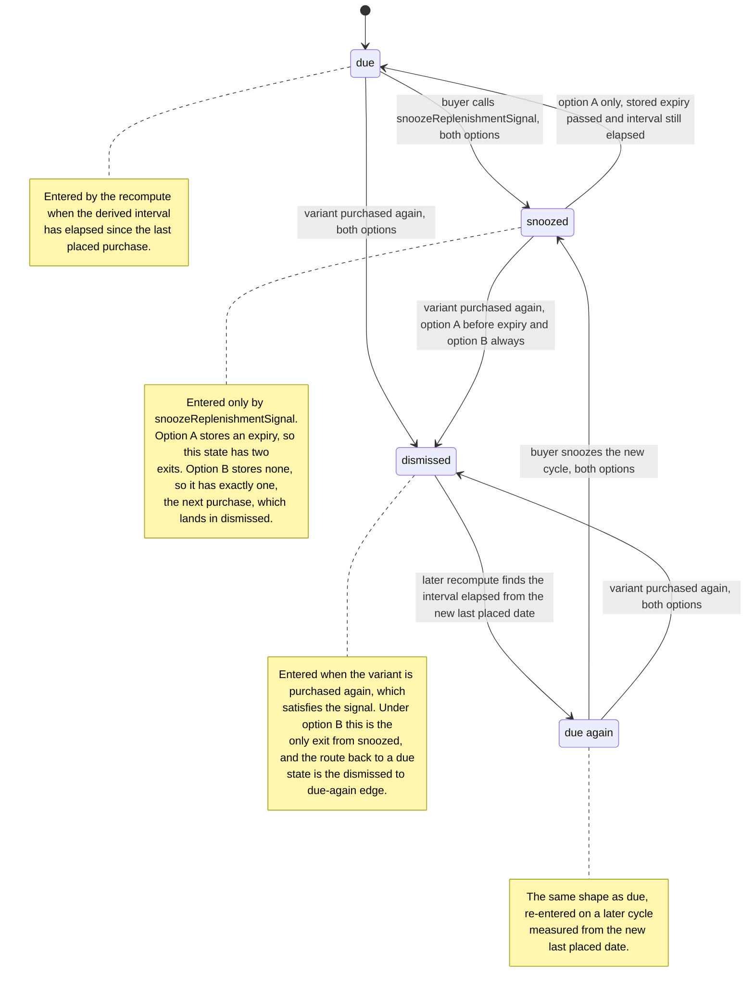

# FEATURE-001-05: Derive the interval at which a buyer repurchases a variant and surface an advisory replenishment due signal they can act on or snooze, so that a regular repeat purchase is prompted by the platform instead of remembered by the buyer

Parent epic: `tickets/EPIC-001-reorder-and-replenishment.md`. The parent epic and the sibling features are written as paths rather than as links, following the epic's own convention of keeping the link count in a file equal to the number of children that file indexes [tickets/EPIC-001-reorder-and-replenishment.md:§3. How To Read This Epic]. The only links in this file are the three story links in section 3; every other reference to a file is a citation of the form `[<path>:<locator>]`, not a hyperlink.

**Read section 1 before anything else.** This feature was *renamed* between the suggested feature area and this decomposition, and the rename is the single most consequential fact about its scope. A reader who finishes this file believing that a message, an email or a template is in scope has misread it, and section 1 exists to make that misreading impossible.

---

## 1. Feature Title

**Derive the interval at which a buyer repurchases a variant and surface an advisory replenishment due signal they can act on or snooze, so that a regular repeat purchase is prompted by the platform instead of remembered by the buyer.**

Short name, used verbatim wherever this feature is referred to in one phrase, and identical to the label the epic's features index gives it: **Purchase Cadence Detection and Replenishment Due Signals** [tickets/EPIC-001-reorder-and-replenishment.md:§4. Features Index]. The long form above is the action-object-outcome title this tier requires; the short form is the name to cite.

### 1.1 The Rename, And Why It Is Not Cosmetic

The originally suggested area was *Purchase Cadence Detection and Replenishment **Reminders***. The epic classifies this feature's deviation as **renamed**, and the rationale is a scope ruling rather than a preference in wording: **"Reminders" presumes a delivery channel, and message transport is environment-specific and would have to sit behind an interface regardless. The buildable core is a due-signal read plus a `ScheduledTask` recompute, and no notification adapter is shipped** [tickets/EPIC-001-reorder-and-replenishment.md:§4. Features Index]. The epic's own entry records that an adapter was proposed and removed for having no owning story, and section 2.4 of this file carries that removal in full.

Three consequences follow, and all three are boundaries on the work rather than commentary on it.

- **The deliverable is a read and a recompute, not a message.** What this feature ships is a plugin-owned table, a scheduled recompute that maintains it, one Shop API query that reads it and one Shop API mutation that snoozes an entry. Nothing in it sends anything to anyone.
- **Notification transport is not part of this feature's deliverable, not even as an interface.** The epic's ruling is that the buildable core is a due-signal read plus a `ScheduledTask` recompute "with any notification adapter **optional**" [tickets/EPIC-001-reorder-and-replenishment.md:§4. Features Index], and optional means later and separately scoped, not shipped inert. **No story in section 3 builds a notification interface, a default implementation, a message record or a delivery seam**, and section 2.4 names that exclusion in the same list as the services this feature does not call, so a reader cannot infer one from the feature's title. Were a deployment to want a message, the epic's discharge for an apparent external need would apply at that point — an interface with a database-backed default, as applied to substitution candidates [tickets/EPIC-001-reorder-and-replenishment.md:§4. Features Index] — and that work would be a new story against a new decision, not a residue of this one. **A seam whose only purpose is to anticipate out-of-scope work is still out-of-scope work**, and the no-external-service constraint is already satisfied by the fact that nothing in this feature leaves the process.
- **Email template design is ruled out of scope by the epic in as many words**, on exactly this ground: "The replenishment feature deliberately delivers a due-signal *read* rather than a message; notification transport sits behind an interface, and template authoring belongs to the email plugin's own surface" [tickets/EPIC-001-reorder-and-replenishment.md:§2.4 Scope Boundaries — Explicit In-Or-Out Rulings]. **The interface that ruling contemplates belongs to the later adapter, not to this feature**, on the preceding bullet. That the email surface belongs to another package is observable rather than asserted: the dev server configures templates through `EmailPlugin.init` with its own handler set and file-based template loader [packages/dev-server/dev-config.ts:L141-L146], which is a different package's configuration and not this plugin's.

Two adjacent domains are ruled out on the same page and are worth restating here, because a "replenishment" feature is where a reader most expects to find them: **recurring billing is out**, because it needs a payment-schedule and dunning model no entity in this repository provides, and **subscription contracts are out**, because a contract implies committed future obligations and cancellation terms the order model does not represent — "replenishment signals in this epic are advisory prompts, not commitments" [tickets/EPIC-001-reorder-and-replenishment.md:§2.4 Scope Boundaries — Explicit In-Or-Out Rulings]. Section 2.11 carries that ruling into the payload contract so it is enforceable and not merely stated.

Delivery is part of the single self-contained plugin package the epic describes — `packages/reorder-plugin/`, exporting `ReorderPlugin`. No file under `packages/core` or `packages/admin-ui` is edited to deliver it, and section 2.14 records the mechanism that makes that possible for a scheduled task specifically.

---

## 2. Feature Summary

### 2.1 The Capability

The platform derives, per customer and per variant, the interval between that buyer's repeat purchases of that variant, and records the derived interval with the date the variant was last purchased. When the interval has elapsed, the buyer reads a **replenishment due signal** for that variant through one Shop API query, and either acts on it through the reorder path this epic already builds or snoozes it through one Shop API mutation.

The signal is advisory in the strict sense: it reports that an interval derived from past purchases has elapsed. It reserves nothing, commits to nothing and renews nothing.

### 2.2 Contribution To The Epic

This feature sits in the epic's batch B4, "Extensibility and cadence" [tickets/EPIC-001-reorder-and-replenishment.md:§9.4 Run Batches]. It owns three nodes of the returning-buyer journey — the scheduled recompute over placed-order history, "Cadence recomputed, due signal raised" and "Buyer prompted, or snoozes" — and all three are labelled with this feature in the journey diagram [tickets/EPIC-001-reorder-and-replenishment.md:§2.5 The Returning-Buyer Journey This Epic Builds]. **Note what that diagram deliberately does not draw: no edge runs into the recompute from the reorder-attempt step.** The recompute is entered from its own schedule, not from a reorder, and section 2.4 gives the reason. The one edge that does close the loop — from the buyer being prompted back to curating a list — closes it through the buyer rather than through code, so no feature reads another's output across it.

Against the objective, this feature discharges the clause about the items a buyer "purchase[s] regularly". Everything else in the epic waits for the buyer to arrive with an intention; this is the only feature that produces the intention. That is its whole contribution, and reading it precisely matters:

- **It does not reorder anything.** The buyer acts on a due signal through FEATURE-001-02's mutation. This feature adds no write path onto an order and calls no order service.
- **It does not report what changed since the last purchase.** Price and availability deltas belong to FEATURE-001-03. A due signal says an interval elapsed; it does not say the price moved.
- **It does not decide what happens to a line that cannot be added.** That is FEATURE-001-04.
- **It does not aggregate demand for administrative personas.** FEATURE-001-08 reads the rows this feature maintains and is the only feature downstream of it.
- **It does not notify.** Section 1.1 is the ruling; this is the restatement.

### 2.3 Named Entities Touched

#### One new plugin-owned table

- **`PurchaseCadence`** — new, plugin-owned, and the only table this feature introduces. One row identifies a customer, a product variant and the channel the purchases occurred under, and carries the derived repurchase interval, the date that variant was last purchased by that customer, and the signal's lifecycle state as section 2.8 defines it. It is named consistently with the seven plugin-owned tables the epic's decomposition allocates across its eight features, and the ownership link lives on this table rather than on a custom field for the reason section 2.14 records.
  - **Its identity is a composite unique key over the customer, the variant and the channel, declared as a database constraint rather than as a service-level convention** — the same form core already uses for its own composite unique index [packages/core/src/entity/stock-level/stock-level.entity.ts:L19]. This is not tidiness. A recompute that runs more than once, or twice concurrently across two workers, has to converge on one row per triple; without the constraint the second run inserts duplicates and the due list then reports the same variant twice. **The constraint is what makes the write an upsert rather than a blind insert**, and it is what the bulk-write rule in section 2.6.1 depends on.
  - **It carries an index on the columns the read path predicates on** — the customer, the channel and the lifecycle state — because the buyer-facing query filters on exactly those and orders by the date a variant is next due. A table read on a page view and written by a recompute is indexed for the read.

**The mapping, stated completely enough to author a deterministic migration from.** A prose column list is not a schema. The epic's persistence contract carries the rules this table obeys [tickets/EPIC-001-reorder-and-replenishment.md:§7.8 The Seven Plugin-Owned Tables]; this is where they are made concrete for it.

```ts
// Extends VendureEntity, so id, createdAt AND updatedAt are inherited and NOT re-declared.
// updatedAt is load-bearing here, unlike on an append-only table: a recompute rewrites a
// row in place, so updatedAt is when the derivation last touched it.
@Entity()                                  // table purchase_cadence (TypeORM snake_case)
export class PurchaseCadence extends VendureEntity {
  @ManyToOne(() => Customer, { onDelete: 'CASCADE', nullable: false })
  customer: Customer;
  @EntityId({ nullable: false }) customerId: ID;

  @ManyToOne(() => Channel, { onDelete: 'CASCADE', nullable: false })
  channel: Channel;
  @EntityId({ nullable: false }) channelId: ID;

  @ManyToOne(() => ProductVariant, { onDelete: 'CASCADE', nullable: false })
  productVariant: ProductVariant;
  @EntityId({ nullable: false }) productVariantId: ID;

  @Column({ type: 'int', nullable: false })
  intervalDays: number;                    // whole days; CHECK > 0

  @Column({ type: 'int', nullable: false })
  observationCount: number;                // placed orders the interval came from; CHECK >= 2

  @Column({ type: Date, nullable: false })
  lastPurchasedAt: Date;                   // from Order.orderPlacedAt of the latest purchase

  @Column({ type: Date, nullable: false })
  dueAt: Date;                             // lastPurchasedAt + intervalDays, stored not derived

  @Column({ type: 'varchar', length: 16, nullable: false })
  state: ReplenishmentSignalState;         // DUE | SNOOZED | DISMISSED

  @Column({ type: Date, nullable: true })
  snoozedUntil: Date | null;               // null unless the deployment stores an expiry

  @Column({ type: Date, nullable: false })
  computedAt: Date;                        // which recompute run produced this row's figures
}
```

- **Indexes and constraints, each with the name the migration must use:**
  - `UQ_purchase_cadence_customer_channel_variant` — unique over `(customerId, channelId, productVariantId)`. **This is the row's identity, and making it a database constraint is what makes the recompute's write an upsert rather than a race**: two concurrent recomputes cannot produce two rows for one triple, so the second either updates or fails rather than duplicating.
  - `IDX_purchase_cadence_customer_channel_state_due` — non-unique over `(customerId, channelId, state, dueAt)`, which is exactly the predicate the due query reads on, in that order.
  - `CHK_purchase_cadence_interval_positive` — check constraint `intervalDays > 0`.
  - `CHK_purchase_cadence_observations_min_two` — check constraint `observationCount >= 2`. A single purchase produces no row at all, so this constraint makes the rule in section 4.1 unbypassable rather than merely intended.
- **`dueAt` is stored rather than computed on read**, and the reason is the index above: a due query filtering on a computed expression cannot use one. The cost is that a row is stale between recomputes, which section 2.11 already states is the nature of the signal.
- **`computedAt` exists so a recompute can be idempotent and a race resolvable.** Section 2.9's concurrency answer is the platform's lock, but a lock does not tell a *later* recompute whether the row it is looking at is newer than the history it just read. Comparing `computedAt` does, which is what makes the conditional update in section 2.9 expressible.
- **Every relation cascades, and this is the one plugin-owned table where that is the whole erasure story.** A cadence row is a derived convenience, not an audit record: it holds no evidence about what a buyer did that the orders themselves do not hold, so deleting it costs nothing. **On a hard delete of the customer, the channel or the variant, the row goes with it.** The contrast with FEATURE-001-07's attempt tables is deliberate — those retain their rows and null their customer link, because they *are* the evidence [tickets/EPIC-001/FEATURE-001-07-reorder-instrumentation.md:§2.4 Named Entities Touched].
- **Soft deletion is the case a cascade does not cover, and it is why this table is named in the epic's erasure decision.** `Customer` is soft-deletable [packages/core/src/entity/customer/customer.entity.ts:L23] with a nullable deletion timestamp [packages/core/src/entity/customer/customer.entity.ts:L29], so a soft delete leaves every cadence row in place holding a named customer's purchasing pattern. **The mechanism is settled: cadence rows are deleted outright rather than anonymised**, because an anonymised cadence row has no purpose — it is per-customer by definition, and a row with no customer is unreadable by the only query that reads it. The epic's persistence contract rules that way for the derived tables and drives it from the scheduled task [tickets/EPIC-001-reorder-and-replenishment.md:§7.8 The Seven Plugin-Owned Tables]. **What is open is the window**, which the epic carries as a product decision blocking four stories including 05-02 [tickets/EPIC-001-reorder-and-replenishment.md:§8.1 Product Decisions]; section 4.5 records it as this feature's own blocking dependency. No period is invented here.
- **Migration ordering.** `purchase_cadence` references only core tables, so it has no ordering dependency on any other plugin-owned table and is created in the single additive migration **story 05-01** generates — that story owns the table and the schema, for the reason section 4.3 gives. Nothing in this feature alters a core table.
- **No string column beyond the two short enumerated values, and no money column at all.** Section 2.10 states why the payload carries no monetary field; the table carries none for the same reason.

#### Existing platform entities, read and never altered

- **`Order`** [packages/core/src/entity/order/order.entity.ts:L44], declared as implementing `ChannelAware` and `HasCustomFields`. Four of its columns are the input to the computation. `orderPlacedAt` is the timestamp every derived interval is measured between [packages/core/src/entity/order/order.entity.ts:L92]; `state` [packages/core/src/entity/order/order.entity.ts:L72] and `active` [packages/core/src/entity/order/order.entity.ts:L82] are what separate a placed order from a cart; and `code` [packages/core/src/entity/order/order.entity.ts:L70] is the buyer-facing reference a support agent or a test uses to identify the source purchase, its own JSDoc stating it should be used as the reference for Customers rather than the Order's id [packages/core/src/entity/order/order.entity.ts:L62-L67]. Ownership is read from `customerId` [packages/core/src/entity/order/order.entity.ts:L99] and the lines from `lines` [packages/core/src/entity/order/order.entity.ts:L102].
- **`OrderLine`**. `orderPlacedQuantity` is the quantity as at placement [packages/core/src/entity/order-line/order-line.entity.ts:L104], and `quantity` is the live quantity [packages/core/src/entity/order-line/order-line.entity.ts:L97]. The distinction decides which number a cadence computation may read, and section 2.3.1 states the rule.
- **`Customer`** [packages/core/src/entity/customer/customer.entity.ts:L23], which owns the history through its `orders` relation [packages/core/src/entity/customer/customer.entity.ts:L51-L52] and is the subject of every row in `PurchaseCadence`. Its `emailAddress` [packages/core/src/entity/customer/customer.entity.ts:L42] and its optional `user` [packages/core/src/entity/customer/customer.entity.ts:L56] are named because the buyer-facing operations require an authenticated session resolved through that user, not because this feature writes either.
- **`ProductVariant`**. The subject of a derived interval. This feature reads the variant identifier; it asserts nothing about the variant's price, stock or enabled state, all of which belong to FEATURE-001-03 and FEATURE-001-04.
- **`Channel`**. Supplies the request scope described in section 2.10 and the grouping key described there.
- **`ScheduledTaskRecord`** [packages/core/src/plugin/default-scheduler-plugin/scheduled-task-record.entity.ts:L7] — read, never written by plugin code. It is the platform's own record of a scheduled task's last run, and section 2.6 explains why it is what makes this feature's asynchronous work observable at all.

#### 2.3.1 Cadence Is Computed From Placed Orders — Which Columns, And Why It Is Not A Detail

**The input to every derived interval is orders that have been placed. Active orders are excluded.** This is stated as a rule with its mechanism because getting it wrong does not fail loudly — it silently produces wrong intervals.

- `Order.active` **defaults to true** [packages/core/src/entity/order/order.entity.ts:L81-L82], and its own JSDoc defines an active order as one where "the Customer can still make changes to it and has not yet completed the checkout process", governed by the order-placed strategy [packages/core/src/entity/order/order.entity.ts:L74-L80]. An active order is a cart. A cart is not evidence of a purchase, and a cart abandoned twice is not a cadence.
- `Order.orderPlacedAt` is **nullable** [packages/core/src/entity/order/order.entity.ts:L90] and its JSDoc defines it as the date and time the order was placed, "i.e. the Customer completed the checkout and the Order is no longer 'active'" [packages/core/src/entity/order/order.entity.ts:L84-L89]. A null value is therefore the marker of an order that was never placed, which makes the filter expressible against a column rather than against an inference. The column is additionally indexed [packages/core/src/entity/order/order.entity.ts:L91], so ordering history by it consumes an index the platform already declares rather than one this feature would have to add.
- `OrderLine.orderPlacedQuantity` **defaults to zero** [packages/core/src/entity/order-line/order-line.entity.ts:L103-L104] and is defined as the quantity at the time the order was placed [packages/core/src/entity/order-line/order-line.entity.ts:L99-L102]. Two things follow. A line on an unplaced order carries zero there, so a computation that mistakenly walked carts would read zeroes rather than fail — the exact silent-corruption case this rule prevents. And on a placed order it is the quantity the buyer actually bought, whereas `quantity` [packages/core/src/entity/order-line/order-line.entity.ts:L97] can have been altered by an administrative modification after placement.

**The rule, stated once for all three stories: a cadence computation reads lines of orders whose `orderPlacedAt` is set, and takes each quantity from `orderPlacedQuantity`.** The sibling feature states the same preference for the same reason from the reorder side [tickets/EPIC-001/FEATURE-001-02-reorder-from-order-history.md:§2.3 Named Entities Touched], so the two features agree on which number describes a past purchase.

### 2.4 Named Services And Platform Mechanisms

- **`ScheduledTask` — existing, in `packages/core`, consumed and never modified** [packages/core/src/scheduler/scheduled-task.ts:L120]. The class this feature's recompute is an instance of, configured by the interface described in section 2.6.
- **`JobQueueService` — existing, consumed.** `createQueue` is the queue factory [packages/core/src/job-queue/job-queue.service.ts:L82], and the queue it returns inherits the deployment's configured job-queue strategy rather than a plugin choice, because the service reads that strategy from configuration [packages/core/src/job-queue/job-queue.service.ts:L63-L65].
- **`TransactionalConnection` — existing, consumed.** Every `PurchaseCadence` read and write goes through it, which is also how the shipped `cleanJobsTask` reaches its own table from inside a scheduled task [packages/core/src/plugin/default-job-queue-plugin/clean-jobs-task.ts:L25-L32]. That is the citable precedent for a task doing database work rather than a pattern this feature invents.
- **`ChannelService` — existing, consumed, and required rather than optional here.** A scheduled task's own request context is created against the **default channel** [packages/core/src/scheduler/scheduled-task.ts:L134] with an admin API type [packages/core/src/scheduler/scheduled-task.ts:L136-L139], so a recompute that must produce per-channel rows has to enumerate channels itself. Section 2.10 states the consequence; it is named here so the dependency is not discovered late.
- **`PurchaseCadenceService` — new, plugin-owned.** Holds the derivation: reading placed-order history for a customer, grouping by variant and channel, deriving the interval, and writing the `PurchaseCadence` row. The scheduled task's `execute` delegates to it and holds no logic of its own, mirroring all three shipped tasks on the core side, each of which resolves what it needs from the injector and delegates rather than holding logic inline [packages/core/src/scheduler/tasks/clean-sessions-task.ts:L45-L46], [packages/core/src/config/settings-store/clean-orphaned-settings-store-task.ts:L54] and [packages/core/src/plugin/default-job-queue-plugin/clean-jobs-task.ts:L23-L25]. Section 2.5 draws the distinction between the two that the core defaults register and the third that a plugin contributes.
- **`ReplenishmentService` — new, plugin-owned.** Serves the two buyer-facing operations: reading the due rows for the authenticated customer in the active channel, and applying a snooze. It performs no derivation, so the read path cannot drift from the recompute path.
- **`RequestContextService` — existing, consumed, and required rather than convenient.** It is how the recompute obtains a channel-bound context for each channel it processes, instead of reusing the default-channel context the platform hands a scheduled task [packages/core/src/scheduler/scheduled-task.ts:L134]. Section 2.10 states the isolation rule this exists to satisfy; it is named here so the dependency is declared rather than assumed.
- **`ReplenishmentNotificationStrategy` — proposed by an earlier draft of this file and WITHDRAWN.** It was to be an interface behind which a future notification transport could sit, with a default implementation that recorded a due signal and sent nothing. **It is removed, and the removal is recorded rather than performed silently**, because the epic's inventory fixes this ticket set's configurable-strategy count at **one** — `SubstitutionCandidateStrategy`, owned by FEATURE-001-04 — and states in terms that the notification strategy is withdrawn because "a due-signal read needs no transport interface, and adding one would have made the count two while delivering nothing this epic ships" [tickets/EPIC-001-reorder-and-replenishment.md:§6.4 The Settled Rulings]. Two further reasons make the withdrawal right rather than merely consistent. **A default implementation that sends nothing is a stub**, and the epic's own reasoning for the one strategy it does keep is that a default which cannot do the thing "would discharge the no-external-service ruling on paper and defeat it in practice" [tickets/EPIC-001/FEATURE-001-04-unavailable-line-resolution.md:§2.10 The No-External-Service Discharge]. **And the no-external-service constraint needs no discharging here**, because this feature makes no outbound call and needs no seam to avoid one: it computes rows and publishes a query. A deployment that later wants a message has the platform's own email plugin and the event bus to build it on, and adding that transport is a change to *this* feature's scope to be argued then, not an interface to pre-declare now. **The rename in section 1.1 is what makes this coherent:** a feature delivering due *signals* rather than *reminders* has no transport in scope, so it needs no transport interface.
  - **What ships instead: the due-signal read, and nothing that sends.** A deployment that wants a message reads `activeCustomerReplenishmentDue` and decides for itself, which keeps the no-external-service constraint satisfied by construction because nothing in this feature leaves the process. The epic already rules message design out of scope in its own words [tickets/EPIC-001-reorder-and-replenishment.md:§2.4 Scope Boundaries — Explicit In-Or-Out Rulings], and section 1.1 explains why the feature was renamed from reminders to due signals in the first place — **so declaring a transport seam here was reaching back for the thing the rename removed.**
  - **Adding one later is an epic-level change, not a detail.** It would add a second configurable strategy to the set, need an owning story with its own tests, and either introduce an external dependency or ship an inert default whose only tested behaviour is that it does nothing.

**Three platform services this feature deliberately does not call, and one strategy it deliberately does not build, named so that nothing is inferred from the feature's subject:**

- **No notification strategy, interface, default implementation or delivery seam.** Section 1.1 is the ruling and this is its restatement in the services list: the epic makes any notification adapter **optional** [tickets/EPIC-001-reorder-and-replenishment.md:§4. Features Index] and rules message and template work out of the epic entirely [tickets/EPIC-001-reorder-and-replenishment.md:§2.4 Scope Boundaries — Explicit In-Or-Out Rulings]. **This feature therefore ships exactly two plugin-owned services and no configurable strategy.** The epic's whole decomposition allocates one configurable strategy, `SubstitutionCandidateStrategy`, and names it against FEATURE-001-04 rather than this feature [tickets/EPIC-001-reorder-and-replenishment.md:§4. Features Index], which is where its interface and database-backed default are specified [tickets/EPIC-001/FEATURE-001-04-unavailable-line-resolution.md:§2.6 Named Services And Configurable Strategies]; a second strategy declared here would be scope this feature was not given, and would put a class in the delivery that no story in section 3 is sized to build.
- **`OrderService` and `StockLevelService` are not called.** They belong to FEATURE-001-02, FEATURE-001-03 and FEATURE-001-04. A cadence recompute that read stock would be doing another feature's work.
- **`EventBus` is not called, in either direction — this feature publishes no event and subscribes to none.** The derivation's input is placed-order history read through the existing customer-orders path, and its trigger is a cron schedule or an administrative invocation, as section 2.9 states. The epic rules on this explicitly so that no file re-derives it differently: FEATURE-001-05 requires no event-bus subscriber, and a story in FEATURE-001-07 may not list this feature as a consumer of its events [tickets/EPIC-001-reorder-and-replenishment.md:§9.4.2 FEATURE-001-05 Sits In B4 Because It Consumes No Reorder Event]. Section 4.2 records the batch consequence.

**`EventBus` deserves the emphasis, because a sibling feature once claimed this feature subscribes to it.** FEATURE-001-07 previously listed cadence recompute among its event consumers; that claim is withdrawn there and the withdrawal is recorded, with the two files now agreeing in one direction [tickets/EPIC-001/FEATURE-001-07-reorder-instrumentation.md:§4.2 Downstream — Two Consumers, All One-Way]. **This feature subscribes to nothing.** Two reasons, and the second is the stronger. The batch order makes the claimed edge unbuildable: this feature sits in batch B4 and that one in B5 [tickets/EPIC-001-reorder-and-replenishment.md:§9.4 Run Batches], so a subscriber here would be written against events that do not yet exist. And **placed-order history is the complete input while reorder events are a subset of it** — an order placed through the ordinary checkout produces no reorder event, so a cadence derived from events would silently ignore every purchase a buyer made without reordering, which is most of them. Section 2.3.1 fixes history as the input for exactly that reason. **A third reason is a property of the bus itself:** it is process-local with no persistence, no replay and no acknowledgement [tickets/EPIC-001/FEATURE-001-07-reorder-instrumentation.md:§2.8a Delivery Semantics], and cadence arithmetic is only correct over a complete history. **And a cart-time reorder attempt would be the wrong event even if delivery were perfect**, because a cadence interval is measured between orders that were *placed* and an attempt that never reaches checkout must not move one.

### 2.5 Named API Surfaces — Two New Shop API Operations, Zero Existing Signatures Changed

#### Existing read paths this feature consumes and does not extend

- **`Customer.orders(options: OrderListOptions): OrderList!`** [packages/core/src/api/schema/common/customer.type.graphql:L11] — **the input to the computation.** The order-history read path already exists, is already paginated, sortable and filterable through the generated list options, and is already reachable through the `activeCustomer` root query [packages/core/src/api/schema/shop-api/shop.api.graphql:L5]. The epic's prohibition on it applies to this feature exactly as it does to FEATURE-001-02: do not add a reorder-specific or cadence-specific order-history query [tickets/EPIC-001-reorder-and-replenishment.md:§5. Existing Mechanisms That Must Not Be Duplicated]. A storefront that wants to show a buyer *why* a variant is due reads the underlying orders through this field; the due-signal query returns the derived row, not a reimplementation of history.
- **`scheduledTasks: [ScheduledTask!]!`** [packages/core/src/api/schema/admin-api/scheduled-task.api.graphql:L2] and **`runScheduledTask(id: String!): Success!`** [packages/core/src/api/schema/admin-api/scheduled-task.api.graphql:L12] — existing Admin API operations, consumed unchanged. They are this feature's observability and manual-trigger surface, and section 2.6 sets out why that removes the need to add either.

#### The two new operations

Both are added through the plugin's `shopApiExtensions` using `extend type Query` and `extend type Mutation` — the mechanism the shipped wishlist example already demonstrates [packages/dev-server/example-plugins/wishlist-plugin/api/api-extensions.ts:L16-L19].

- **`activeCustomerReplenishmentDue(options: ReplenishmentDueListOptions): ReplenishmentDueList!`** — a query returning the due entries for the authenticated customer in the active channel, each naming the variant, the derived interval, the date that variant was last purchased and the signal's state. It reads `PurchaseCadence` and nothing else. **It returns a paginated list rather than every due entry**, for the reason the epic states once for every collection in this set [tickets/EPIC-001-reorder-and-replenishment.md:§7.7 Bounded Collections]: the number of variants a buyer has ever purchased regularly is unbounded, and a buyer with a long history is exactly the buyer this feature is for. The return type implements `PaginatedList` [packages/core/src/api/schema/common/common-types.graphql:L9] with an empty generated options input following the shipped plugin exemplar [packages/dev-server/test-plugins/reviews/api/api-extensions.ts:L44-L45]; its items resolve through `ListQueryBuilder` [packages/core/src/service/helpers/list-query-builder/list-query-builder.ts:L209], so the configured Shop maximum — default one hundred [packages/core/src/config/vendure-config.ts:L151] — is applied, an omitted page size resolves to that maximum rather than to every row, and an over-limit page is rejected with the platform's own input error [packages/core/src/service/helpers/list-query-builder/list-query-builder.ts:L638]. `ignoreQueryLimits` stays false [packages/core/src/service/helpers/list-query-builder/list-query-builder.ts:L125-L131].
  - **The default order is deterministic and is part of the contract**: due entries ascending by the date each variant became due, then by variant identifier as the tie-break. Without a declared tie-break, "the first ten due items" is not reproducible across engines, and an acceptance criterion asserting an exact ordered entry count would be asserting an accident.
- **`snoozeReplenishmentSignal`** — a mutation moving one entry from `due` to `snoozed`, as section 2.8 defines those states.

**The exact SDL, published here rather than left to a story.** Every argument, field, enum member and nullability is fixed, because a story cannot write an acceptance criterion against a payload whose shape is still open.

```graphql
extend type Query {
  activeCustomerReplenishmentDue(options: ReplenishmentSignalListOptions): ReplenishmentSignalList!
}

extend type Mutation {
  snoozeReplenishmentSignal(input: SnoozeReplenishmentSignalInput!): ReplenishmentSnoozeResult!
}

type ReplenishmentSignal implements Node {
  id: ID!
  createdAt: DateTime!
  updatedAt: DateTime!
  productVariant: ProductVariant!
  productVariantId: ID!
  "Whole days between the buyer's successive placed purchases of this variant."
  intervalDays: Int!
  "How many placed orders the interval was derived from. Always 2 or more."
  observationCount: Int!
  lastPurchasedAt: DateTime!
  "lastPurchasedAt + intervalDays. The instant the signal became or becomes due."
  dueAt: DateTime!
  state: ReplenishmentSignalState!
  "Set only while state is SNOOZED, and only if the deployment stores an expiry at all."
  snoozedUntil: DateTime
}

type ReplenishmentSignalList implements PaginatedList {
  items: [ReplenishmentSignal!]!
  totalItems: Int!
}

"Auto-generated at run time. Declared empty, never hand-written."
input ReplenishmentSignalListOptions

enum ReplenishmentSignalState { DUE, SNOOZED, DISMISSED }

"Addresses the signal by the variant it concerns. No signal id is accepted."
input SnoozeReplenishmentSignalInput {
  productVariantId: ID!
}

"A normalized non-disclosing payload rather than a union. See the four readings below."
type ReplenishmentSnoozeResult {
  snoozed: Boolean!
  signal: ReplenishmentSignal
}
```

Six readings of that block are load-bearing, and four of them exist to close a specific hole a review of this file found.

- **The snooze mutation addresses a signal by `productVariantId`, never by a signal id, and that is a security decision rather than an ergonomic one.** The default id strategy is auto-increment [packages/core/src/config/default-config.ts:L101], so accepting a `ReplenishmentSignal` id would hand every authenticated buyer a guessable handle onto other buyers' rows — the exact enumeration surface the platform's own order resolver avoids by refusing to distinguish an absent order from a forbidden one [packages/core/src/api/resolvers/shop/shop-order.resolver.ts:L141-L143]. **A variant id is not a secret** — it is public catalogue data — and the pair `(authenticated customer, channel, variant)` already identifies at most one row, so the natural key is both sufficient and unguessable-in-the-wrong-direction.
- **The result is a normalized payload, so absent, not-owned, not-due and already-dismissed are indistinguishable from outside.** `snoozed: false` with a null `signal` is returned for a variant the buyer never bought, for a variant whose row belongs to another customer, for a row in another channel, and for a row that is not currently due. `snoozed: true` with the updated signal is returned only where a row the caller owns in the active channel moved to `SNOOZED` or was already there. **No error result is declared**, which is how this feature keeps the epic's count at six and adds nothing to the published `ErrorCode` enum [tickets/EPIC-001-reorder-and-replenishment.md:§6.4 The Settled Rulings].
- **Snoozing is idempotent and its idempotence is expressible.** A second snooze of a row already in `SNOOZED` returns `snoozed: true` and leaves the row in `SNOOZED`. Section 2.12 already ruled that a repeated snooze is not an error; this payload is what lets a story assert it without an error type.
- **The state enum has three members, not four.** `due again` in section 2.8's lifecycle is `DUE` re-entered on a later cycle rather than a fourth state, so it is a transition rather than a value — publishing it as an enum member would put a name on the wire that no row ever holds.
- **The list options input is generated, never hand-written** [packages/core/src/api/config/generate-list-options.ts:L31-L60], which requires the returned type to be named `ReplenishmentSignalList` for the type it wraps [packages/core/src/api/config/generate-list-options.ts:L52]. Pagination is bounded by the platform's own Shop limit, whose shipped default is 100 [packages/core/src/config/default-config.ts:L84]; this feature states no page ceiling of its own. **The scalar `productVariantId` field is published beside the relation** because the generator produces no filter for an object-typed field [packages/core/src/api/config/generate-list-options.ts:L191] and the id operators for an `ID` one [packages/core/src/api/config/generate-list-options.ts:L189-L190], so filtering a due list by variant is only possible if that scalar exists.
- **`intervalDays` is a whole number of days and `observationCount` is never below two.** Both are stated because a derived interval with one observation is not an interval, and section 4.1 already classifies a single-purchase variant as an edge case with no signal at all. Neither figure is a target this ticket set invented: both are counts the derivation itself produced from placed orders.

**Both operations are gated `@Allow(Permission.Owner)` and neither carries a custom permission**, for the reason the epic states as collision C7 and rulings R2 and R3: a customer session holds `Permission.Authenticated` and the specially-evaluated `Permission.Owner` only, so a custom permission on a buyer operation makes it unreachable [tickets/EPIC-001-reorder-and-replenishment.md:§6.4 The Settled Rulings]. **The gate is not the control.** Both the query and the mutation resolve the customer from the session and filter on `(customerId, channelId)` in the service before any row is read or written, and the mutation's update additionally names the variant. A `PurchaseCadence` row is never addressed by id from a buyer-facing path.

**No Admin API operation is added by this feature.** The administrative read over cadence data belongs to FEATURE-001-08, and the scheduled task's own administrative surface already exists.

#### The additive-only constraint, stated as a countable surface

The Shop API root `Query` type declares **nineteen** root queries [packages/core/src/api/schema/shop-api/shop.api.graphql:L1-L52], with the order, cart and customer-account mutation sets in the same file under `type Mutation` [packages/core/src/api/schema/shop-api/shop.api.graphql:L70]. Every one of those signatures is byte-identical after this feature ships; the two new operations arrive as additional fields and change no argument, no return type and no nullability on any existing one. The epic makes that count part of its own definition of done for precisely this reason — "do not change the existing API" is not a testable boundary until a reviewer can count what existed before [tickets/EPIC-001-reorder-and-replenishment.md:§2.4 Scope Boundaries — Explicit In-Or-Out Rulings].

Where a platform mechanism would widen an existing signature as a side effect of an otherwise additive change, **that is a reportable violation recorded in the epic's collision section, never quietly absorbed** [tickets/EPIC-001-reorder-and-replenishment.md:§6.1 Repository-Discovered Collisions]. This feature's exposure to that is narrower than its siblings' because it declares no custom field on any core entity and no new error result, but it is not zero: any new type this feature publishes reaches the same schema generators the collision section describes, so the constraint is carried into section 5 as evidence rather than assumed.

#### 2.5.1 Surface Ownership And Test Matrix

Every surface this feature adds is listed below with the one story that owns it and the tests that story is accepted against. **A row with no owning story is a defect in this file, not a smaller feature** — that is not a hypothetical standard, because a transport interface was struck from section 2.4 for exactly that reason. The matrix is gated in section 5, and the epic requires one per feature [tickets/EPIC-001-reorder-and-replenishment.md:§12. Definition of Done (Epic-Level)].

| # | Surface added | Owning story | Unit cases | End-to-end cases through `@vendure/testing` | Named regression evidence |
|---|---------------|--------------|-----------|--------------------------------------------|--------------------------|
| 1 | `PurchaseCadence` table, its composite unique key over customer, variant and channel, its read-path index, and the additive migration | STORY-001-05-01 | The unique constraint rejects a second row for the same triple; the generated migration contains the index and the constraint and adds no column to any core table | Migration applied and reverted on `e2e-sqljs`, `e2e-mariadb`, `e2e-mysql` and `e2e-postgres`; two concurrent inserts of the same triple leave exactly one row | Cached end-to-end seed data deleted first, then the existing `packages/core/e2e/` specs pass unmodified |
| 2 | `activeCustomerReplenishmentDue` | STORY-001-05-01 | Option mapping onto `ListQueryBuilder`; the default sort carries its tie-break; a `take` above the configured shop limit is refused rather than clamped silently | Positive read asserting an exact entry count with its ordering; omitted `options` resolving to the configured maximum; `take` above `shopListQueryLimit` rejected with the platform's own error; **an unauthenticated request returning no entry and no other buyer's data**; **a second customer's entries never appearing in the first customer's result**; **a token for a second channel yielding that channel's rows only, never the first channel's**; a buyer with no placed history yielding an empty list | `activeCustomer` and `activeOrder` return what they returned before this feature existed |
| 3 | `snoozeReplenishmentSignal` | STORY-001-05-03 | The `due` to `snoozed` transition; a repeat snooze of an already-snoozed entry reports success rather than a conflict | Positive snooze; **an entry identifier that exists in no row**; **another customer's entry, whose response is identical field by field to the unknown-identifier response so that neither discloses which case occurred**; **an unauthenticated request**; **a token for a channel the entry does not belong to**; a repeat snooze; and a read afterwards proving the remaining entries are untouched | `activeCustomer` unchanged, and `activeCustomerReplenishmentDue` still returns every entry that was not snoozed |
| 4 | The `recompute-purchase-cadence` task registration and its `params` | STORY-001-05-02 | The task declares `id`, `description`, `schedule`, `timeout` and `execute`, and `params` carries the batch size | The task appears in the existing `scheduledTasks` query without a new operation being added; a run driven through the existing `runScheduledTask` mutation; **a task disabled through `updateScheduledTask` reports `enabled` as false and writes no cadence row, which is asserted separately from a failed run** | The existing scheduler end-to-end specifications in `packages/core/e2e/` pass unmodified |
| 5 | The derivation itself — set-based or keyset-batched, bulk-upserted | STORY-001-05-02 | The exact query count for one batch: one aggregate read and one bulk upsert, and nothing else issued from plugin code | **A source size forcing at least two batches completes inside one run and reports the total across every batch**, which a single-batch fixture cannot distinguish; **two derivations driven concurrently leave one row per triple**, which is what the composite unique key buys; **a run given more work than its bound allows is reported as a failure through the resolved model's failure surface rather than finishing silently or hanging** | The epic's cadence benchmark scenario captured before and after, reported per batch [tickets/EPIC-001-reorder-and-replenishment.md:§7.6 Data-Volume Assumptions And The Benchmark Workflow] |
| 6 | The observable completion signal, whichever the resolved execution model produces | STORY-001-05-02 | Under model A, `execute` returns the two counts; under models B and C, the job's `result` carries them | The story names the resolved model in as many words and asserts **only** the signals that model produces, per section 2.9.1; the buyer-visible read is asserted alongside a model-specific signal and never alone, because an empty due list cannot be told apart from an unfinished derivation | `git diff` shows no plugin-owned status table, no status flag, no completion event and no new Admin API operation for observing or triggering the run |

Three rules keep this matrix from becoming paperwork.

- **A named test is a test that fails when the behaviour is absent.** Re-running an existing scheduler or job-queue specification is not evidence for any row here, because none of those specifications calls either of this feature's two operations or registers its task.
- **The bracketed emphases above are the branches, not decoration.** Each one is a separate case with its own assertion; a single test that happens to traverse two of them satisfies neither, because a failure would not say which branch broke.
- **An unowned row blocks the feature.** If a surface is added during implementation that no row lists, the matrix is extended and a story is named before the surface merges — not after.

### 2.6 The Existing Mechanisms This Feature Consumes Rather Than Rebuilds

The epic's do-not-duplicate inventory assigns this feature two rows, each with a prohibition attached [tickets/EPIC-001-reorder-and-replenishment.md:§5. Existing Mechanisms That Must Not Be Duplicated]. Reading the scheduler subtree to write this file surfaced two further mechanisms that the same prohibition plainly covers, so four are stated. **The fourth is the most consequential finding in this file: the observable completion signal that this feature's asynchronous work is obliged to name already exists, is already persisted and is already published on the Admin API.** A ticket that specified a bespoke "recompute finished" flag would be rebuilding shipped platform behaviour.

#### Mechanism one — the `ScheduledTask` configuration shape

A scheduled task is an instance of `ScheduledTask` [packages/core/src/scheduler/scheduled-task.ts:L120] configured by `ScheduledTaskConfig` [packages/core/src/scheduler/scheduled-task.ts:L42-L96], and the whole surface is `@since 3.3.0` [packages/core/src/scheduler/scheduled-task.ts:L38]. Six members define what this feature's recompute must declare:

- **`id`** [packages/core/src/scheduler/scheduled-task.ts:L47] — the unique identifier. It is the value the Admin API operations in section 2.5 address the task by, and it is uniquely constrained where the platform records the task [packages/core/src/plugin/default-scheduler-plugin/scheduled-task-record.entity.ts:L6], so it is a contract rather than a label.
- **`description`** [packages/core/src/scheduler/scheduled-task.ts:L52] — **optional at construction and non-null on the wire, which is a real distinction rather than a wording slip.** The configuration member is declared optional, so a task compiles without one; the Admin API field is declared non-null [packages/core/src/api/schema/admin-api/scheduled-task.api.graphql:L17]. The two are reconciled by the scheduler service, which substitutes an **empty string** when the member is absent [packages/core/src/scheduler/scheduler.service.ts:L141] while its own returned shape types the field as a plain string [packages/core/src/scheduler/scheduler.service.ts:L17]. **So omitting it does not break the API; it publishes an empty description to every administrator**, which is the outcome this feature declines. The new task declares one explicitly, and mechanism two states what it says.
- **`params`** [packages/core/src/scheduler/scheduled-task.ts:L57] — optional parameters passed to `execute`.
- **`schedule`** [packages/core/src/scheduler/scheduled-task.ts:L60-L75], which accepts **either** a standard cron expression **or** a function returning a cron-time-generator expression, both forms shown in its own examples [packages/core/src/scheduler/scheduled-task.ts:L66-L72]. Both forms are in use in this repository, so neither is theoretical: all three shipped tasks on the core side use the generator function [packages/core/src/scheduler/tasks/clean-sessions-task.ts:L43], [packages/core/src/config/settings-store/clean-orphaned-settings-store-task.ts:L42] and [packages/core/src/plugin/default-job-queue-plugin/clean-jobs-task.ts:L21], while a dev-server test plugin uses a raw cron string [packages/dev-server/test-plugins/scheduler-race-test/scheduler-race-test-task.ts:L27].
- **`timeout`** [packages/core/src/scheduler/scheduled-task.ts:L76-L83], whose default is **declared in that source and is deliberately not restated here**, because this ticket set may not introduce a timing figure of its own and quoting the platform's would read as one. What the tickets state is the *behaviour*: a task exceeding its timeout is treated as having failed with a timeout error, and section 2.9 makes that failure observable rather than silent.
- **`execute`** [packages/core/src/scheduler/scheduled-task.ts:L95] — the function run on the schedule, returning a promise. Mechanism two is about what it should return.

`preventOverlap` [packages/core/src/scheduler/scheduled-task.ts:L84-L90] deserves separate mention, and what it deserves is a correction rather than a reassurance. **Its JSDoc declares `@default true` [packages/core/src/scheduler/scheduled-task.ts:L88], but nothing in this checkout ever applies that default.** The task class stores the configuration object as given [packages/core/src/scheduler/scheduled-task.ts:L121] and exposes it unmodified [packages/core/src/scheduler/scheduled-task.ts:L127-L129], and the scheduler then reads it as a plain truthiness test — `protect: task.options.preventOverlap ? protectCallback : undefined` [packages/core/src/scheduler/scheduler.service.ts:L172]. **A task that omits the member therefore passes `undefined`, which is falsy, and gets no overlap protection at all.**

**Two consequences, and both are rules rather than notes:**

- **This feature's task declares `preventOverlap: true` explicitly.** Relying on the documented default would leave the behaviour on the wrong side of a truthiness test, and a reviewer comparing the ticket against the source would find the ticket's claim unsupported. The declaration is required in section 5 as a literal member of the task configuration.
- **The declaration is not sufficient, and this feature does not treat it as sufficient.** Cron-level protection stops a second *invocation* while the first is still inside `execute`; it does nothing about the two hazards section 2.6a sets out, both of which occur after `execute` has returned or after the platform has stopped waiting for it. Domain-level idempotency is therefore required in addition, not instead.

This is also a documentation discrepancy in a repository source, which this ticket set is obliged to report rather than propagate [tickets/EPIC-001-reorder-and-replenishment.md:§6.3 Repository Documentation Discrepancies — Noted, Not Propagated]. It is reported here, at the point of use, and no story repeats the `@default true` claim as though it took effect. Section 2.9 sets out what the option does and does not cover once it is set.

*The prohibition, quoted in substance from the epic:* do not write a cron implementation, and do not hard-code a schedule in plugin source [tickets/EPIC-001-reorder-and-replenishment.md:§5. Existing Mechanisms That Must Not Be Duplicated]. The schedule is deployment-configurable, and `configure` is how — but note its exact reach: it accepts only `schedule`, `timeout` and `params` [packages/core/src/scheduler/scheduled-task.ts:L169]. A deployment cannot override the task's identifier or its `execute`, so anything a deployment must be able to change has to be a parameter rather than a constant.

#### Mechanism two — the shipped tasks, and the returned-result idiom

**Two scheduled tasks are registered by the core default configuration, and more than two exist in this workspace.** The distinction is worth drawing precisely, because "what ships registered" and "what exists as an example" are different questions and a story looking for a precedent wants the second. The default configuration registers exactly two [packages/core/src/config/default-config.ts:L217]: `cleanSessionsTask` and `cleanOrphanedSettingsStoreTask`. Beyond those, `cleanJobsTask` is contributed by the default job-queue plugin rather than by the core defaults, the BullMQ job-queue package contributes one of its own, and a dev-server test plugin contributes a fifth. **Every one of them returns a value from `execute`**, which is the pattern to copy, and mechanism four explains why it is load-bearing rather than stylistic.

- **`cleanSessionsTask`**, default-registered [packages/core/src/scheduler/tasks/clean-sessions-task.ts:L37], declares `id: 'clean-sessions'` [packages/core/src/scheduler/tasks/clean-sessions-task.ts:L38], a description [packages/core/src/scheduler/tasks/clean-sessions-task.ts:L39], `params: { batchSize: 1000 }` [packages/core/src/scheduler/tasks/clean-sessions-task.ts:L40-L42] and a generator schedule [packages/core/src/scheduler/tasks/clean-sessions-task.ts:L43]. Its `execute` **triggers a job and returns a named result string** [packages/core/src/scheduler/tasks/clean-sessions-task.ts:L46-L47]. Its own JSDoc shows the registration through `schedulerOptions.tasks` and the per-deployment override through `configure`, including a changed schedule and a changed batch size [packages/core/src/scheduler/tasks/clean-sessions-task.ts:L14-L28].
- **`cleanOrphanedSettingsStoreTask`**, the second default-registered task and the one most like the work this feature describes [packages/core/src/config/settings-store/clean-orphaned-settings-store-task.ts:L39]. It declares its own identifier [packages/core/src/config/settings-store/clean-orphaned-settings-store-task.ts:L40], a description [packages/core/src/config/settings-store/clean-orphaned-settings-store-task.ts:L41], a generator schedule in days [packages/core/src/config/settings-store/clean-orphaned-settings-store-task.ts:L42] and a `params` object carrying an age bound rather than a batch size [packages/core/src/config/settings-store/clean-orphaned-settings-store-task.ts:L43-L45]. It **returns an object of counts describing what the run did** rather than a string [packages/core/src/config/settings-store/clean-orphaned-settings-store-task.ts:L70-L74], which is exactly the shape mechanism four requires and is the closest shipped analogue to this feature's own return value.
- **`cleanJobsTask`**, contributed by the default job-queue plugin rather than by the core defaults [packages/core/src/plugin/default-job-queue-plugin/clean-jobs-task.ts:L18], declares `id: 'clean-jobs'` [packages/core/src/plugin/default-job-queue-plugin/clean-jobs-task.ts:L19] and a generator schedule [packages/core/src/plugin/default-job-queue-plugin/clean-jobs-task.ts:L21], does its database work inline through `TransactionalConnection`, and **returns a count of what the run actually did** [packages/core/src/plugin/default-job-queue-plugin/clean-jobs-task.ts:L48-L50]. It is the precedent for a *plugin* contributing a task, which is what this feature does.

**The form of the task's parameters and of its returned value both follow the execution model, which is an open architectural decision — so this sub-section states the recommended resolution and what changes under the alternative rather than assuming either.** It declares a `params` object carrying a batch size, mirroring the precedent's shape; **the value that batch size ships with is a deployment decision this ticket set does not settle**, since the only volume the repository declares is the benchmark harness's own dataset shape [tickets/EPIC-001-reorder-and-replenishment.md:§7.6 Data-Volume Assumptions And The Benchmark Workflow].

- **Under the epic's recommended enqueue resolution, the task follows `cleanSessionsTask`'s form in both respects, and the distinction from `cleanJobsTask` matters.** `cleanJobsTask` does its work inline and so can return a count of what it did; `cleanSessionsTask` triggers a job and returns a description of what it *started* [packages/core/src/scheduler/tasks/clean-sessions-task.ts:L46-L47]. **The task's returned object then describes what it enqueued, not what was derived** — the run id, and one entry per channel naming either the enqueued job id or the reason nothing was enqueued — and `params` additionally carries the retry count each enqueued job is added with. **The counts of rows written and signals raised are the *job's* result, not the task's**, and conflating the two is exactly how a reader would come to believe a completed task means a completed recompute.
- **Under the inline resolution the return value is `cleanJobsTask`'s form instead** — an object naming the counts of what the run did, the number of `PurchaseCadence` rows written and the number of signals moved into the `due` state — because with the derivation inside `execute` a count of work performed is a returned value the platform persists rather than a service-level claim.

Two further examples exist and both are worth naming because they sit outside core. The dev-server scheduler race-test task returns an object from `execute` [packages/dev-server/test-plugins/scheduler-race-test/scheduler-race-test-task.ts:L63], and its own JSDoc explains that it exists to probe multi-worker race conditions in the default scheduler strategy [packages/dev-server/test-plugins/scheduler-race-test/scheduler-race-test-task.ts:L9-L21] — which is directly relevant to section 2.9's cross-process argument. The BullMQ job-queue package contributes a fifth definition of its own [packages/job-queue-plugin/src/bullmq/clean-indexed-sets-task.ts:L1]. **Every scheduled-task definition in this workspace returns a value from `execute`, and there is no shipped counter-example** — a count stated as "every one of them" rather than as a figure, because an exact figure here would be a claim about the workspace that a later addition silently falsifies.

**The new task's declaration, named in full so no story has to invent any part of it.** Every value below is a *target* introduced by this ticket set, not a citation, and each of the six members maps onto the configuration member cited above:

- **`id`: `recompute-purchase-cadence`** — kebab-case, matching the three task identifiers already in this checkout, `clean-sessions` [packages/core/src/scheduler/tasks/clean-sessions-task.ts:L38], `clean-jobs` [packages/core/src/plugin/default-job-queue-plugin/clean-jobs-task.ts:L19] and `scheduler-race-test` [packages/dev-server/test-plugins/scheduler-race-test/scheduler-race-test-task.ts:L24]. This is the string an operator passes to `runScheduledTask` and the string a story asserts against, so it is fixed here rather than left to implementation.
- **`description`** — a one-sentence statement that the task derives per-customer, per-variant repurchase intervals from placed orders and raises due signals. **It is declared rather than omitted**, and the reason is the reconciliation above rather than a type obligation: the configuration member is optional, so omission compiles and then serialises an empty string to every administrator reading `scheduledTasks` [packages/core/src/scheduler/scheduler.service.ts:L141]. A story asserts the exact string, which is possible only because it is declared here.
- **`params`** — an object carrying the batch size the derivation walks history in, and under the recommended enqueue resolution the retry count each enqueued job is added with, mirroring the precedent's shape rather than its values.
- **`schedule`** — declared in the generator form the shipped core tasks use, and overridable per deployment, which is what discharges the epic's prohibition on hard-coding one.
- **`preventOverlap`: `true`, written out rather than omitted** — for the reason stated above: the annotated default is not materialised, and an omitted option leaves the scheduler with nothing to apply [packages/core/src/scheduler/scheduler.service.ts:L172]. This member exists in the declaration precisely so that no story can leave it out and still claim the guarantee.
- **The returned result** — whichever form the resolved execution model requires, per section 2.6's mechanism three: under the recommended enqueue resolution the run id plus one entry per channel naming either the enqueued job id or the reason nothing was enqueued, the derivation counts then belonging to the job's own result; under the inline resolution the count of `PurchaseCadence` rows written and the count of signals moved into the `due` state.

#### Mechanism three — `JobQueueService.createQueue` for background work

`createQueue` [packages/core/src/job-queue/job-queue.service.ts:L82] is the factory, and its JSDoc example shows the whole shape: a queue created on module initialisation with a `name` and a `process` function, and work added to it later [packages/core/src/job-queue/job-queue.service.ts:L28-L37]. A dev-server test plugin demonstrates the same from outside core, creating named queues in `onModuleInit` [packages/dev-server/test-plugins/job-queue-test/job-queue-test-plugin.ts:L24-L30] and reporting progress from inside the process function [packages/dev-server/test-plugins/job-queue-test/job-queue-test-plugin.ts:L38].

*The prohibition, quoted in substance from the epic:* do not spawn a timer, an interval or a worker thread in plugin code [tickets/EPIC-001-reorder-and-replenishment.md:§5. Existing Mechanisms That Must Not Be Duplicated]. Background work is enqueued here.

**The execution model this feature specifies is the epic's recommended resolution, and the decision itself remains a maintainer's to take.** An earlier version of this section left three options open — a `ScheduledTask` doing the work inline, a queued job, or a task that enqueues a job — while specifying completion and overlap as though the whole recompute ran inline. Those two positions cannot both stand: what counts as completion, what counts as overlap and what a timeout does are all different under each option, so a story written against an undecided model would be written against nothing. **The resolution is therefore two-part rather than one.** This section specifies one model in full, so that every downstream statement has a referent; and the epic keeps the choice open as its first architectural decision with this model as its stated recommendation [tickets/EPIC-001-reorder-and-replenishment.md:§8.2 Architectural Decisions], which is why section 2.9.1 sets out the completion signals **conditionally, one set per model** and section 4.5 records the decision as gating rather than taken. A maintainer taking the inline model changes the signal set and the two bounds named below; it does not invalidate anything else in this file.

**The specified model, under the recommended resolution: the scheduled task enqueues one idempotent job per channel and returns. It performs no derivation itself.**

- **The third option is the shipped one, which is why it wins on evidence rather than on taste.** `cleanSessionsTask` is a scheduled task whose `execute` triggers a job and returns a named result string [packages/core/src/scheduler/tasks/clean-sessions-task.ts:L46-L47], so "a task that enqueues a job" is a pattern this repository already demonstrates rather than a hybrid this epic would be inventing.
- **It also removes the platform's worst hazard by construction.** The default scheduler races `execute` against a timeout [packages/core/src/plugin/default-scheduler-plugin/default-scheduler-strategy.ts:L113] and, when the timeout wins, records a failure and releases the lock while the underlying work keeps running — section 2.6a sets this out in full. **An `execute` that only enqueues finishes in the time it takes to write a few job rows**, so the race is decided by the enqueue rather than by a multi-minute derivation, and the long work lives in a job whose lifecycle the queue owns.
- **One job per channel is the isolation boundary, not a performance choice.** Section 2.10 requires every history read and every write to be bound to one channel; making the channel the unit of enqueue means the binding is structural, and it makes a per-channel omission observable as a missing job rather than as a missing row.

**The queue contract, stated in full so that no story invents any part of it.** Each item is either a citation to a shipped mechanism or an explicit target of this ticket set.

- **Queue name: `recompute-purchase-cadence`** — created once in the plugin's `onModuleInit` through the factory, whose options are exactly a `name` and a `process` function [packages/core/src/job-queue/types.ts:L15-L27], following the shipped plugin precedent that creates named queues in that hook [packages/dev-server/test-plugins/job-queue-test/job-queue-test-plugin.ts:L24-L30]. Note the platform may prefix the name from configuration [packages/core/src/job-queue/job-queue.service.ts:L86], so a story asserts against the configured queue rather than against a bare literal.
- **Payload: identifiers only, and the minimisation is a security requirement rather than tidiness.** `Job.data` is persisted by the queue strategy and **published on the Admin API as a JSON field** [packages/core/src/api/schema/admin-api/job.api.graphql:L51], so anything placed in it is readable by any operator holding the job-read capability. The payload carries the **run id**, the **channel id**, and a **non-sensitive cursor** — the batch offset the run has reached. It carries no customer identifier, no email address, no order code, no request context and no credential. Note that the add API permits a context to be attached [packages/core/src/job-queue/types.ts:L61-L63]; **this feature does not attach one**, because a serialised context carries a session token [tickets/EPIC-001/FEATURE-001-07-reorder-instrumentation.md:§2.11a The Request Context On A Payload], and the process function builds its own channel-bound context instead.
- **Run id and idempotency key.** Every invocation of the task mints one **run id** and stamps it on every job it enqueues, which is what makes the correlation in section 2.6a possible. The **idempotency key is the pair of task identifier and channel id**: before enqueuing for a channel, the task looks for an existing job for that queue and channel in a non-terminal state — `PENDING`, `RUNNING` or `RETRYING` [packages/core/src/api/schema/admin-api/job.api.graphql:L28-L35] — and where one exists it enqueues nothing and reports that channel as skipped in its returned result. **A second job for the same channel is therefore not created, and the returned result says so instead of the omission being invisible.**
- **Retries: declared explicitly, because the default is zero.** The add API sets `retries: options?.retries ?? 0` [packages/core/src/job-queue/job-queue.ts:L90-L95], so a job added without the option never retries. This feature declares a retry count as a task parameter so a deployment can change it, mirroring the batch-size parameter. **No backoff figure is stated, and none is invented: the options type exposes only `retries`** [packages/core/src/job-queue/types.ts:L61-L63], so backoff is the strategy's business and this ticket set makes no claim about it.
- **Idempotent writes, which is what makes a retry or a duplicate safe.** The derivation is a pure function of placed-order history, so a re-run over the same history produces the same rows. Every write is an upsert keyed on the row's identity — customer, variant and channel — never an insert that could duplicate, and never a delete-then-insert that could leave a gap if it were interrupted.
- **Result schema: two counts and the run id**, and nothing else. The count of `PurchaseCadence` rows written and the count of signals moved into `due`, matching the returned-result idiom of mechanism two, plus the run id so a reader can tie the job back to the task invocation. `Job.result` is a JSON field on the published type [packages/core/src/api/schema/admin-api/job.api.graphql:L52], so the same minimisation rule applies to it as to the payload.
- **Failure state: a stable code, never a raw message.** A failing job settles in `FAILED` after its declared retries are exhausted [packages/core/src/api/schema/admin-api/job.api.graphql:L28-L35], and what it records is one member of a closed set of failure codes fixed in section 2.6a — not an exception message. `Job.error` is likewise a published JSON field [packages/core/src/api/schema/admin-api/job.api.graphql:L53].
- **Inspectability: already published, and no plugin surface is added for it.** A run is observed through the existing `job(jobId: ID!)` and `jobs(options: JobListOptions)` queries [packages/core/src/api/schema/admin-api/job.api.graphql:L2-L3], with `state`, `progress`, `startedAt`, `settledAt`, `isSettled`, `retries` and `attempts` all exposed on the published type [packages/core/src/api/schema/admin-api/job.api.graphql:L43-L58]. A job can be stopped through the existing `cancelJob(jobId: ID!)` mutation [packages/core/src/api/schema/admin-api/job.api.graphql:L12].
- **How long a job row is kept: the platform's own mechanism, not a new one.** Settled jobs are removed by the existing `removeSettledJobs(queueNames, olderThan)` mutation [packages/core/src/api/schema/admin-api/job.api.graphql:L11], which the shipped `clean-jobs` scheduled task already invokes on a schedule for completed, failed and cancelled jobs [packages/core/src/plugin/default-job-queue-plugin/clean-jobs-task.ts:L28-L32]. **This feature adds no cleanup mechanism of its own and declares no period for which a job row survives** — that period is a deployment setting on a shipped task, and inventing one here would be inventing a number. What it does state is the obligation: because job rows are subject to that cleanup, **no story may treat a job row as the durable record of a recompute.** The durable record is the `PurchaseCadence` row.

#### 2.6.1 The Derivation Shape — Set-Based Or Keyset-Batched, Never A Query Per Customer

The recompute walks purchase history, so its shape is the difference between a task that finishes and a task that is still running when the next cron tick arrives. **A `params` object carrying a batch size is a label, not a batching design**, and this sub-section supplies the design the label implies. Nothing here invents a volume: the only volume this repository declares is the harness's own dataset, corrected in the epic [tickets/EPIC-001-reorder-and-replenishment.md:§7.6 Data-Volume Assumptions And The Benchmark Workflow].

- **Derivation is expressed as set-based database work, not as an in-process reduction over loaded entities.** The interval for a customer-and-variant pair is derived from placed-order line rows grouped by customer, variant and channel, and the grouping is a database aggregate issued through `TransactionalConnection`. **The prohibited shape is explicit: no query inside a loop over customers, and no query inside a loop over variants.** A per-customer loop over the corrected dataset issues one query per customer per run, which is the failure mode this rule exists to name.
- **Where the work is batched, it is keyset-batched on an indexed ordered column, and it checkpoints.** The batch boundary is the last identifier processed rather than a growing row offset, because an offset re-walks everything it has already skipped on every batch — the shipped indexer batches with an offset [packages/core/src/plugin/default-search-plugin/indexer/indexer.controller.ts:L92] and [packages/core/src/plugin/default-search-plugin/indexer/indexer.controller.ts:L104-L105] and is cited here as the precedent for **batching at all**, not as the precedent for offsetting. The `params` batch size is the size of one keyset page, mirroring the shipped task's parameter shape [packages/core/src/scheduler/tasks/clean-sessions-task.ts:L40-L42] and not its value, which is a deployment decision.
- **Writes are bulk upserts on the composite unique key, not a read-then-write per row.** One statement per batch inserts new rows and updates existing ones against the constraint section 2.3 declares, so a re-run converges instead of duplicating and two workers racing on the same triple leave one row. **A per-row read-modify-write is prohibited**, both because it multiplies the query count by the batch size and because it reintroduces the race the constraint exists to close.
- **Multi-batch completion is a defined state, not an assumption.** A run whose input exceeds one batch performs more than one batch **within the same run** and reports the total across all of them in its returned counts; a run that processed only its first batch and returned has not completed, and the returned counts are what make the difference observable. Story 05-02 asserts this at a source size that forces at least two batches — **a single-batch test cannot distinguish a task that batches from one that silently processes the first page and stops.**
- **The counts are asserted and the run is measured.** Story 05-02 asserts the exact query count per batch — one aggregate read, one bulk upsert, and nothing else from plugin code — and the epic's cadence benchmark scenario reports the run per batch [tickets/EPIC-001-reorder-and-replenishment.md:§7.6 Data-Volume Assumptions And The Benchmark Workflow]. **No duration target appears anywhere**, because this repository declares none.

#### Mechanism four — the scheduled-task observability surface, already persisted and already published

This is the mechanism that makes this feature's asynchronous work assertable, and it exists end to end without any plugin contribution.

- **The platform captures the value `execute` returns.** The default scheduler strategy races the task against its timeout and keeps the result [packages/core/src/plugin/default-scheduler-plugin/default-scheduler-strategy.ts:L113].
- **It persists that value.** On success it writes `lastExecutedAt`, releases the lock and stores the returned value in `lastResult` [packages/core/src/plugin/default-scheduler-plugin/default-scheduler-strategy.ts:L115-L122]. On failure it writes `lastExecutedAt`, releases the lock and stores the error message in the same column [packages/core/src/plugin/default-scheduler-plugin/default-scheduler-strategy.ts:L130-L136], so **a failed run is observable through the same field as a successful one** rather than being indistinguishable from a run that never happened.
- **The columns are declared on a platform entity.** `ScheduledTaskRecord` carries `taskId` [packages/core/src/plugin/default-scheduler-plugin/scheduled-task-record.entity.ts:L13], `enabled` [packages/core/src/plugin/default-scheduler-plugin/scheduled-task-record.entity.ts:L16], `lockedAt` [packages/core/src/plugin/default-scheduler-plugin/scheduled-task-record.entity.ts:L19], `lastExecutedAt` [packages/core/src/plugin/default-scheduler-plugin/scheduled-task-record.entity.ts:L22], `manuallyTriggeredAt` [packages/core/src/plugin/default-scheduler-plugin/scheduled-task-record.entity.ts:L25] and `lastResult` [packages/core/src/plugin/default-scheduler-plugin/scheduled-task-record.entity.ts:L28].
- **It is already published on the Admin API.** `type ScheduledTask` exposes `lastExecutedAt` [packages/core/src/api/schema/admin-api/scheduled-task.api.graphql:L20], `nextExecutionAt` [packages/core/src/api/schema/admin-api/scheduled-task.api.graphql:L21], `isRunning` [packages/core/src/api/schema/admin-api/scheduled-task.api.graphql:L22] and `lastResult` [packages/core/src/api/schema/admin-api/scheduled-task.api.graphql:L23], read through the existing `scheduledTasks` query [packages/core/src/api/schema/admin-api/scheduled-task.api.graphql:L2].
- **An explicit administrative trigger already exists too.** `runScheduledTask(id: String!): Success!` [packages/core/src/api/schema/admin-api/scheduled-task.api.graphql:L12] runs a task on demand, and the strategy records that it was invoked that way [packages/core/src/plugin/default-scheduler-plugin/scheduled-task-record.entity.ts:L25]. A task can also be disabled and re-enabled through `updateScheduledTask` [packages/core/src/api/schema/admin-api/scheduled-task.api.graphql:L11].

*The prohibition this feature imposes on itself, by direct extension of the epic's row:* **do not add a plugin-owned "last recompute" table, timestamp, status flag or completion event, and do not add an Admin API operation to read or trigger the recompute.** All five already exist, and mechanism five supplies the rest. What the plugin contributes is the *content* of `lastResult` — the run id and the per-channel enqueue outcomes named in mechanism two — and nothing else.

**One correction to how this surface should be read, and it is the difference between an observable recompute and an illusion of one.** Under the enqueue model specified in mechanism three, `lastResult` records that the task **started** work, not that any derivation finished. A `lastExecutedAt` timestamp with a successful `lastResult` therefore means "the jobs were enqueued", and `isRunning` — which the strategy derives purely from whether the lock column is non-null [packages/core/src/plugin/default-scheduler-plugin/default-scheduler-strategy.ts:L229] — reports the *task's* liveness and not the jobs'. **No story may assert that a recompute completed by reading this surface alone**; completion belongs to mechanism five.

#### Mechanism five — the `Job` record, which is where a recompute's completion actually lives

Also shipped end to end, also persisted, also already published, and named separately from mechanism four precisely because the two answer different questions.

- **State is a closed platform enum**: `PENDING`, `RUNNING`, `COMPLETED`, `RETRYING`, `FAILED`, `CANCELLED` [packages/core/src/api/schema/admin-api/job.api.graphql:L28-L35]. A recompute for one channel is complete when its job reaches `COMPLETED`, and definitively not complete when it is in any other member.
- **The published type carries everything an assertion needs**: `id`, `createdAt`, `startedAt`, `settledAt`, `queueName`, `state`, `progress`, `data`, `result`, `error`, `isSettled`, `duration`, `retries` and `attempts` [packages/core/src/api/schema/admin-api/job.api.graphql:L43-L58]. `isSettled` is true only for the three terminal members [packages/core/src/job-queue/job.ts:L78-L85], which is what lets a specification poll for a terminal state rather than for a duration.
- **It is read through existing queries** — `job(jobId: ID!)`, `jobs(options: JobListOptions)` and `jobsById(jobIds: [ID!]!)` [packages/core/src/api/schema/admin-api/job.api.graphql:L2-L4] — so this feature adds no read operation, exactly as mechanism four's prohibition requires.
- **Cancellation is a shipped mechanism rather than a wish.** `cancelJob(jobId: ID!)` [packages/core/src/api/schema/admin-api/job.api.graphql:L12] marks the job cancelled, and the polling strategy watches for that state on an interval and cancels the in-flight instance [packages/core/src/job-queue/polling-job-queue-strategy.ts:L127-L136], treating a process function that returns a cancelled job as cancelled rather than complete [packages/core/src/job-queue/polling-job-queue-strategy.ts:L145-L146]. The instance method that flips the state is on the job itself [packages/core/src/job-queue/job.ts:L187-L190], and the state is readable from inside the process function [packages/core/src/job-queue/job.ts:L62-L64]. **This is what makes the cooperative-cancellation rule in section 2.6a implementable with no new machinery.**

*The prohibition this mechanism carries:* do not poll a plugin table to discover that a recompute finished, and do not add a plugin-owned job-status mirror. The queue already records state, result, error, attempts and settlement, and a mirror would be a second answer that can disagree with the first.

Two prerequisites follow, and both are real dependencies rather than caveats. **First, the scheduled-task surface is supplied by the default scheduler plugin**, which declares its own entity [packages/core/src/plugin/default-scheduler-plugin/default-scheduler.plugin.ts:L42] and sets the strategy that does the persisting [packages/core/src/plugin/default-scheduler-plugin/default-scheduler.plugin.ts:L44]. **A deployment with no scheduler strategy configured has no `lastResult` to read**, and enabling the plugin is itself a schema change because of that entity. **Second, the job surface is supplied by whichever job-queue strategy the deployment configures**, which the queue factory reads from configuration rather than choosing [packages/core/src/job-queue/job-queue.service.ts:L63-L65] — so `Job` state, `Job` result and how long a settled job row survives are all properties of that configured strategy and not of this feature. The dev server registers both plugins [packages/dev-server/dev-config.ts:L137-L138] and [packages/dev-server/dev-config.ts:L140], so the demonstration environment needs no change; section 4.4 records both as required configuration dependencies all the same.

### 2.6a Two Platform Hazards This Feature Designs Around, Both Verified In Source

Neither hazard is hypothetical, both are properties of shipped code in this checkout, and neither is fixed by declaring `preventOverlap: true`. They are stated here at feature level because all three stories inherit the mitigations, and because a story written in ignorance of them would specify behaviour the platform does not deliver.

#### Hazard one — a scheduler timeout is not a cancellation, and it releases the lock

**What the source does.** The default strategy races the task against a timer [packages/core/src/plugin/default-scheduler-plugin/default-scheduler-strategy.ts:L106-L113]. When the timer wins, the race rejects, the catch block runs, and it writes `lastExecutedAt`, **sets `lockedAt` to null** and stores an error into `lastResult` [packages/core/src/plugin/default-scheduler-plugin/default-scheduler-strategy.ts:L130-L137]. **Nothing stops the promise that lost the race.** `Promise.race` reports the first settlement; it does not abort the other operand, and there is no abort signal passed into `execute` [packages/core/src/scheduler/scheduled-task.ts:L95] for one to be honoured through even if a task wanted to.

**What that means, stated plainly.** After a timeout the platform believes the task is not running — `isRunning` is derived from the lock column alone [packages/core/src/plugin/default-scheduler-plugin/default-scheduler-strategy.ts:L229] — while the original work may still be executing and still writing. **A subsequent invocation can therefore acquire the lock and overlap with writes that are still in flight**, and `preventOverlap` does not help: the cron protection wrapper [packages/core/src/scheduler/scheduler.service.ts:L172] guards against a second *invocation* while the first is still inside `execute`, and by this point the platform has stopped waiting for `execute`.

**The three mitigations, and none of them is optional:**

- **Keep `execute` short.** Under the specified model in mechanism three it only mints a run id, enumerates channels, checks for a non-terminal job per channel and enqueues. **The window in which a timeout could fire at all is the enqueue window**, which is the smallest this feature can make it without leaving the platform's mechanisms.
- **Make the work idempotent rather than mutually exclusive.** Every write is an upsert keyed on customer, variant and channel, so a duplicated or overlapping run converges on the same rows instead of corrupting them. **This is the mitigation that actually holds**, because it does not depend on any lock being correct.
- **Make the long work cooperatively cancellable, using the shipped mechanism.** The job's process function reads its own state at every batch boundary [packages/core/src/job-queue/job.ts:L62-L64] and stops when it is `CANCELLED`, which the strategy sets from an operator's `cancelJob` within one of its polling intervals [packages/core/src/job-queue/polling-job-queue-strategy.ts:L127-L136]. **A story asserts the stop by observing the job settled as `CANCELLED` and the row count unchanged from the last completed batch** — not by asserting that a promise was aborted, which is not a thing this platform offers.

**And one thing this feature does not claim.** It does not claim a lock is held until work stops, because the platform releases the scheduler lock on the timeout path and this feature may not change platform code. What it claims instead is that overlap is *harmless*, which is a weaker guarantee honestly stated rather than a stronger one asserted without support.

#### Hazard two — a manual trigger reports success before anything runs, and can then be silently skipped

**What the source does, step by step.** `runScheduledTask` looks the task up, calls `triggerTask` and returns `{ success: true }` [packages/core/src/scheduler/scheduler.service.ts:L111-L122]. `triggerTask` does one thing: it stamps `manuallyTriggeredAt` on the record and returns [packages/core/src/plugin/default-scheduler-plugin/default-scheduler-strategy.ts:L178-L188]. A poller later finds such records, **clears `manuallyTriggeredAt` first** and then fires the run without awaiting it [packages/core/src/plugin/default-scheduler-plugin/default-scheduler-strategy.ts:L212-L222]. That run tries to acquire the lock and, if it cannot, **returns with no record of having been asked** [packages/core/src/plugin/default-scheduler-plugin/default-scheduler-strategy.ts:L92-L97].

**What that means, stated plainly.** The mutation's `Success` is an acknowledgement that a flag was written, not evidence that a run happened. Because the flag is cleared before the attempt, **a trigger that arrives while a run is in progress is consumed and lost.** And because `lastResult` may still hold the previous run's value, a specification that reads it immediately after triggering can assert against an *earlier* run and pass for the wrong reason — the most dangerous failure of the three, because it is a green test.

**The correlation procedure every story uses, stated as a procedure so no story improvises one:**

- **Capture pre-trigger state** before calling the mutation: the current `lastExecutedAt`, the run id inside the current `lastResult`, and `isRunning` [packages/core/src/api/schema/admin-api/scheduled-task.api.graphql:L20-L23].
- **Trigger, then poll for a *newer correlated* run**, meaning a `lastResult` whose run id differs from the captured one. A changed `lastExecutedAt` alone is not sufficient evidence, because a scheduled run may have landed in the meantime and would satisfy it.
- **Then follow the run id into the jobs** and poll each enqueued job for a terminal state [packages/core/src/api/schema/admin-api/job.api.graphql:L28-L35]. The task's own result names the job ids, so this is a lookup rather than a search.
- **Define the skipped case explicitly instead of timing out into ambiguity.** Where no newer run id appears within a bounded number of polls and `isRunning` was true when the trigger was issued, the outcome is **`SKIPPED_LOCK_HELD`** — a named, expected outcome of a trigger, not a test failure. A story that exercises the manual trigger must state which of the two outcomes it asserts, and a story asserting the recompute outcome must ensure no run is in progress first.

**The closed set of failure codes**, which is what mechanism three's failure state and section 2.9's error rule both refer to. Five members, and no sixth may be added by a story: `SKIPPED_LOCK_HELD`, `SKIPPED_JOB_ALREADY_QUEUED`, `CHANNEL_ENUMERATION_FAILED`, `DERIVATION_FAILED` and `CANCELLED_BY_OPERATOR`. Each is a stable identifier an operator can search on, and none carries a message, an identifier or a fragment of a database error.

### 2.7 Figure F5-SEQ — The Scheduled Recompute Path

This is the first of exactly two diagrams in this feature. Story files carry none and reference this figure by the name **Figure F5-SEQ** instead; **STORY-001-05-02 is the story that references it.**

```mermaid
sequenceDiagram
    participant SCH as Scheduler<br/>existing core scheduler
    participant TSK as recompute-purchase-cadence<br/>new plugin-owned ScheduledTask
    participant CS as ChannelService plus<br/>RequestContextService, existing
    participant Q as recompute-purchase-cadence queue<br/>existing JobQueueService
    participant JOB as Job rows<br/>existing platform table
    participant PCS as PurchaseCadenceService<br/>new plugin-owned, runs INSIDE the job
    participant HIST as Placed-order history<br/>existing Order and OrderLine tables
    participant PC as PurchaseCadence<br/>new plugin-owned table
    participant REC as ScheduledTaskRecord<br/>existing platform table
    participant API as Shop API<br/>existing root Query type
    Note over SCH,TSK: TRIGGER. Either the cron schedule the task declares,<br/>or the existing runScheduledTask mutation. That mutation<br/>reports Success before anything runs: see hazard two.
    SCH->>TSK: execute with the task params
    TSK->>TSK: mint one run id for this invocation
    TSK->>CS: enumerate channels
    loop for each channel
        TSK->>Q: is there a non-terminal job for this channel?
        alt none queued
            TSK->>Q: add job, payload = run id + channelId + cursor only
            Q->>JOB: PENDING row created
        else already queued
            Note over TSK,Q: channel reported as SKIPPED_JOB_ALREADY_QUEUED<br/>in the task result. Idempotency key = task id + channelId.
        end
    end
    TSK-->>SCH: return run id plus per-channel enqueue outcomes
    SCH->>REC: write lastExecutedAt and lastResult, release lockedAt
    Note over REC: This says the jobs were ENQUEUED. It does not say any<br/>derivation finished, and isRunning tracks the task, not the jobs.
    Q->>PCS: process(job) on the worker
    PCS->>CS: build a RequestContext BOUND TO THIS job's channelId
    loop per batch, until history exhausted or job CANCELLED
        PCS->>PCS: check job.state; stop if CANCELLED
        PCS->>HIST: read placed lines for THIS channel only
        HIST-->>PCS: placed lines, each quantity from orderPlacedQuantity
        PCS->>PC: UPSERT cadence rows keyed customer+variant+channel
    end
    PCS-->>Q: result = run id plus the two counts
    Q->>JOB: settle COMPLETED, FAILED after retries, or CANCELLED
    Note over JOB: COMPLETION SIGNAL. One job per channel reaching a<br/>terminal state, read through the existing job query.
    API->>PC: activeCustomerReplenishmentDue for the authenticated customer
    PC-->>API: the due entries in the active channel
    Note over API,PC: COMPLETION SIGNAL, part three. The recomputed row<br/>becoming readable is the buyer-observable form.
    %% The trigger is the cron schedule declared on the task and overridable per
    %% deployment through configure, which reaches schedule, timeout and params only.
    %% Nothing in this diagram touches an existing operation signature, and nothing
    %% in it writes to ScheduledTaskRecord from plugin code: the platform does that.
    %% Overlap is prevented by the platform once preventOverlap is set to true on the
    %% task declaration, which this feature does explicitly rather than relying on the
    %% annotated default. Not by plugin logic either way. See section 2.9.
    %% The task never derives anything. Keeping execute short is hazard one's
    %% first mitigation: a scheduler timeout cannot interrupt a derivation that
    %% is not running inside execute.
    %% Every history read and every write happens under a context bound to the
    %% job's own channelId. The task's default-channel context is never used
    %% for a query or a write.
    %% Writes are upserts, so a duplicated or overlapping run converges rather
    %% than corrupts. That is what makes overlap harmless: see section 2.6a.
```

Six readings of the figure are load-bearing and are stated so they are not inferred:

- **The task and the derivation are in different processes at different times, and the figure separates them for that reason.** Everything above the enqueue is the task; everything below `process(job)` is the job. A reader who collapses the two arrives at the wrong answer for what a timeout does, what overlap means and when a recompute is finished.
- **The plugin writes exactly one table.** `PurchaseCadence` is the only write arrow leaving plugin code. The arrows into `ScheduledTaskRecord` and into the job rows originate at the platform, and are drawn that way so that no reader mistakes either record for something the plugin maintains.
- **The channel loop appears twice, and the second one is the important one.** The task loops to *enqueue* per channel; the job loops over *batches* for its one channel. A scheduled task's own context is created against the default channel [packages/core/src/scheduler/scheduled-task.ts:L134], so a read issued with it would silently be the wrong channel — which is why the figure shows the context being rebuilt inside the job rather than inherited.
- **There is one completion signal, not three, and the note says which.** A job reaching a terminal state is the completion of a recompute for one channel. The task's returned object records only what it enqueued, and the buyer's query result is the same completion observed from the outside. Section 2.9 states which one a story's acceptance criteria must name.
- **The skipped branch is drawn rather than described.** An `alt` block makes the idempotency check part of the picture, so a reader sees that a channel can legitimately produce no job and that the task result says so.
- **Nothing here reserves anything.** The recompute reads history and writes derived rows. It touches no stock, no cart and no order.

### 2.8 Figure F5-STATE — The Replenishment Signal Lifecycle

The second and last diagram in this feature. Story files carry none and reference it by the name **Figure F5-STATE**; **STORY-001-05-03 is the story that references it.** The four state names below — `due`, `snoozed`, `dismissed` and `due again` — are used identically in this file's prose, in the diagram, and in the three story files. The epic fixes the *states*: the lifecycle "has a due, snoozed, dismissed and due-again shape either way, but **the transition out of snoozed differs**, and only one of the two options requires storing an expiry at all" [tickets/EPIC-001-reorder-and-replenishment.md:§8.1 Product Decisions].

**Read that qualifier before the diagram, because it is the one thing about this lifecycle that is easy to get wrong.** The unresolved decision is not a detail of *when* a snooze ends; it changes **which edges leave `snoozed` at all**. The two options are drawn and named below as **option A — fixed interval** and **option B — next purchase**, and every edge carries the option it belongs to. A single diagram that showed the same event ending a snooze *and* satisfying the signal would be describing two different destinations for one trigger, which is not a lifecycle a story could be tested against.



Each transition, with the thing that causes it and the option it belongs to, stated in prose so the diagram is not the only record:

- **`due`** is entered by the scheduled recompute when the derived interval has elapsed since the variant's last placed purchase. Nothing a buyer does enters this state. **Both options.**
- **`due` to `snoozed`** is caused by the buyer calling `snoozeReplenishmentSignal`, addressed by variant rather than by row id and applied as a single conditional update rather than a read-then-write. This is the only transition a buyer-facing operation causes, and it is the only write path this feature exposes. **Both options**, and what differs between them is only whether the mutation additionally persists an expiry.
- **`snoozed` to `due` exists under option A and does not exist under option B.** Under **option A — fixed interval**, the mutation stores an expiry, a later recompute observes that the expiry has passed while the derived interval is still elapsed, and the entry returns to `due`. Under **option B — next purchase**, no expiry is stored and nothing brings the entry back to `due`: the event that would end the snooze is the buyer's next purchase of that variant, and that same purchase satisfies the signal, so the entry lands in `dismissed` instead. **A buyer who has just bought the variant is not due for it, so returning the entry to `due` on that event would be wrong under either option.**
- **`due` to `dismissed`** is caused by the buyer purchasing the variant again, which satisfies the signal. The recompute observes the new placed order and moves the entry; no buyer action targets `dismissed` directly. **Both options.**
- **`snoozed` to `dismissed`** is caused by the same purchase, and it is the edge the two options disagree about the *significance* of rather than the existence of. Under option A it fires when the purchase happens before the stored expiry passes; under option B it is the **only** exit from `snoozed`. **Both options.**
- **`dismissed` to `due again`** is caused by a later recompute finding the interval elapsed from the new last placed date. `due again` is the same shape as `due`, re-entered on a subsequent cycle, and it is named as a distinct state because the lifecycle is a cycle rather than a line — from `due again` the buyer may snooze or purchase exactly as before. **Both options**, and under option B it is the only path by which a snoozed entry ever becomes actionable again.

**What this leaves open, stated precisely so STORY-001-05-03 knows what it is waiting for.** The decision is which of the two options is taken [tickets/EPIC-001-reorder-and-replenishment.md:§8.1 Product Decisions]; it is **not** open how either option behaves once chosen, because both are modelled above. Three concrete consequences follow: option A requires an expiry column on `PurchaseCadence` and option B requires none, so 05-01's column set depends on it; option A gives 05-03 a testable `snoozed` to `due` criterion and option B gives it a testable `snoozed` to `dismissed` criterion instead; and no story may write a criterion that asserts both. **Every transition above other than `snoozed` to `due` is unaffected either way**, so 05-03's remaining criteria — the `due` to `snoozed` write, its idempotent repeat, and the ownership enforcement on it — are finalisable now.

### 2.9 Every Asynchronous Behaviour Names Its Trigger And Its Observable Completion Signal

**This is a feature-level obligation, not advice, and it is carried into section 5.** "The recompute happens eventually" is not an acceptable statement anywhere in this feature or its three stories. Every asynchronous behaviour names two things.

**The trigger.** Exactly two exist, and a story must name which one it exercises:

- **The cron schedule the task declares** [packages/core/src/scheduler/scheduled-task.ts:L60-L75], overridable per deployment through `configure` [packages/core/src/scheduler/scheduled-task.ts:L169] and registered through `schedulerOptions.tasks` [packages/core/src/config/vendure-config.ts:L1088].
- **An explicit administrative invocation** through the existing `runScheduledTask(id: String!): Success!` mutation [packages/core/src/api/schema/admin-api/scheduled-task.api.graphql:L12], which is what an end-to-end specification uses so that a test never waits on wall-clock time. **Its `Success` is not evidence that a run happened**, for the reasons hazard two sets out, so every story that uses it follows the correlation procedure in section 2.6a rather than treating the response as a completion.

#### 2.9.1 The Observable Completion Signal Depends On The Execution Model, And Is Not A Fixed List

**This sub-section exists because an earlier draft named `lastResult` as the completion signal outright, and that is only true under one of the three execution models this feature has not yet chosen between.** The model is an open architectural decision recorded in the epic — a `ScheduledTask` that derives inline, a queued job, or a task that enqueues a job [tickets/EPIC-001-reorder-and-replenishment.md:§8.2 Architectural Decisions] — and section 4.5 carries it forward as a blocker. Naming a signal the resolved model does not produce is a stronger failure than naming none, because a criterion built on it passes against a task that enqueued work and then reported success while the derivation had not begun.

So the rule is conditional, and a story states which model it assumed.

**Under model A — the derivation runs inline inside `execute`.** Three signals, each named with what observes it:

- **The object `execute` returns**, naming the count of `PurchaseCadence` rows written and the count of signals moved to `due`. A unit test asserts this directly. Both shipped tasks establish the idiom [packages/core/src/scheduler/tasks/clean-sessions-task.ts:L47] and [packages/core/src/plugin/default-job-queue-plugin/clean-jobs-task.ts:L48-L50].
- **`lastResult` alongside `lastExecutedAt`** on the platform's own record [packages/core/src/plugin/default-scheduler-plugin/scheduled-task-record.entity.ts:L28], written by the strategy on success and on failure alike [packages/core/src/plugin/default-scheduler-plugin/default-scheduler-strategy.ts:L115-L122] and [packages/core/src/plugin/default-scheduler-plugin/default-scheduler-strategy.ts:L130-L136], and readable through the existing `scheduledTasks` query [packages/core/src/api/schema/admin-api/scheduled-task.api.graphql:L2]. An operator or an end-to-end specification observes this.
- **The declared `timeout` and `preventOverlap` bound the derivation itself**, because the derivation is what the task is doing. A run exceeding the timeout is a failed run [packages/core/src/scheduler/scheduled-task.ts:L76-L83], and a second cron tick arriving mid-run is suppressed [packages/core/src/scheduler/scheduled-task.ts:L84-L90].

**Under model B — a queued job — and model C — a task that enqueues a job — `lastResult` is not the derivation's completion signal, and naming it as one is the specific error this sub-section forbids.** Under model C the task's own work is the enqueue, which finishes in the time it takes to add a job; `lastResult` therefore reports *that a job was created* and carries no information about whether any cadence row was written. The shipped precedent is exactly this shape: `cleanSessionsTask` triggers a job and returns a string naming the trigger rather than a count of anything cleaned [packages/core/src/scheduler/tasks/clean-sessions-task.ts:L46-L47]. Under models B and C the signals are:

- **The job reaching a terminal state, with its result payload.** `Job` publishes `state` [packages/core/src/api/schema/admin-api/job.api.graphql:L49], `result` [packages/core/src/api/schema/admin-api/job.api.graphql:L52], `error` [packages/core/src/api/schema/admin-api/job.api.graphql:L53] and `isSettled` [packages/core/src/api/schema/admin-api/job.api.graphql:L55], and `JobState` declares `COMPLETED` and `FAILED` among its members [packages/core/src/api/schema/admin-api/job.api.graphql:L27-L34]. The counts that model A returns from `execute` are carried in `result` instead, alongside the run id that correlates the job back to the task run that enqueued it — `lastResult` being the **correlation handle** rather than evidence a derivation ran, and `isRunning` reporting the task's own lock rather than the jobs' progress [packages/core/src/plugin/default-scheduler-plugin/default-scheduler-strategy.ts:L229]. Both are read through operations that already exist — `job(jobId: ID!): Job` [packages/core/src/api/schema/admin-api/job.api.graphql:L2] and `jobs(options: JobListOptions): JobList!` [packages/core/src/api/schema/admin-api/job.api.graphql:L3] — so **no plugin-owned job-status surface is added**, which is the same prohibition mechanism four states for the task surface.
- **An end-to-end specification observes it through the shipped helper rather than by waiting on wall-clock time.** `awaitRunningJobs` [packages/core/e2e/utils/await-running-jobs.ts:L10] polls the existing `jobs` query filtered on `isSettled` being false [packages/core/e2e/utils/await-running-jobs.ts:L25-L31] and returns once none is outstanding. A story under model B or C names this helper as the wait, and a story that instead sleeps for a fixed period has not named an observable signal.
- **In process, `add` returns a subscribable handle.** `JobQueue.add` resolves to a `SubscribableJob` [packages/core/src/job-queue/job-queue.ts:L90] whose `updates` method returns an observable stream [packages/core/src/job-queue/subscribable-job.ts:L81], which is what a unit test asserts against when it does not have an Admin API to query.

**Concurrency is answered by the platform rather than by invention — but by two distinct mechanisms at two different scopes, and a story that conflates them has asserted the wrong guarantee.**
- **In-process overlap protection, and only once the option is set.** `preventOverlap` [packages/core/src/scheduler/scheduled-task.ts:L84-L90] causes the scheduler to wrap the task in a protection callback, and it does so **only when the option is truthy** [packages/core/src/scheduler/scheduler.service.ts:L172]. The annotated default is not materialised anywhere between the configuration object [packages/core/src/scheduler/scheduled-task.ts:L121] and the getter that returns it [packages/core/src/scheduler/scheduled-task.ts:L127-L129], so section 2.6 requires the task to declare `preventOverlap: true` outright. **What this protects is one scheduler instance against overlapping itself.** It is not a cross-process guarantee, because each process constructs its own cron job.
- **Cross-process exclusion, and it comes from the configured strategy instead.** The default scheduler strategy clears stale locks for the task and then attempts to acquire a database lock, returning without running when it cannot [packages/core/src/plugin/default-scheduler-plugin/default-scheduler-strategy.ts:L90-L97], and it releases that lock on both the success path [packages/core/src/plugin/default-scheduler-plugin/default-scheduler-strategy.ts:L119] and the failure path [packages/core/src/plugin/default-scheduler-plugin/default-scheduler-strategy.ts:L134]. **This is the mechanism that makes two worker processes safe, and it belongs to the strategy a deployment configures rather than to the task declaration.** A deployment running the no-op strategy the core default installs [packages/core/src/config/default-config.ts:L216] gets neither lock nor execution, which is a further reason a story states the configured strategy rather than assuming one.
*Consequence for the stories.* A concurrent-recompute edge case names which of the two mechanisms it exercises: an in-process overlap case asserts against the declared option, and a multi-process case asserts against the lock and therefore against a deployment configured with the default scheduler plugin. Neither case invents a concurrency figure, which is what lets the epic's data-volume section require the recompute to be written for a realistic order count without any story supplying a number of its own.
**Snooze-versus-recompute concurrency is NOT answered by that lock, and this paragraph exists because an earlier draft of this file implied it was.** The overlap protection and the database lock both serialise *task runs against each other*. They say nothing about a buyer calling `snoozeReplenishmentSignal` in the middle of a run, which is a request in a different process holding no such lock. The race is real and has a worst case worth naming: the recompute reads a row in state `DUE`, the buyer snoozes it, and the recompute then writes its derived figures back over the row — **silently un-snoozing a signal the buyer just dismissed**, which the buyer experiences as the feature ignoring them.
**The resolution is a conditional write rather than a lock, stated as three rules a story asserts against:**
- **The recompute never writes the `state` column of a row it did not itself move.** It updates `intervalDays`, `observationCount`, `lastPurchasedAt`, `dueAt` and `computedAt` unconditionally, and it writes `state` only in the transition it owns — a row becoming due — and only where the row's current state is not `SNOOZED`. A `SNOOZED` row keeps its state and its `snoozedUntil` through any number of recomputes.
- **The recompute's write is conditional on `computedAt`.** It updates only where the row's stored `computedAt` is not newer than the run's own start instant, so a slower run that read older history cannot overwrite a faster later one. This is the whole reason `computedAt` is a column in section 2.3 rather than a derived value.
- **The snooze's write is conditional on the state it expects.** It moves a row to `SNOOZED` only from `DUE`, in a single conditional update rather than a read-then-write, so a recompute that changed the row in between causes the update to match nothing and the mutation to return `snoozed: false` with a null signal — the same normalized payload section 2.5 returns for every other non-transition, which is why this race needs no error type and discloses nothing.
**The per-channel context is a rule about the recompute, not an assumption it can inherit.** A scheduled task's own request context is created against the default channel [packages/core/src/scheduler/scheduled-task.ts:L134] with an admin API type [packages/core/src/scheduler/scheduled-task.ts:L136-L139]. **So the run must construct one context per channel and pass it into every read and write, rather than doing its work under the context it was handed.** Three consequences a story asserts against: a deployment with two channels produces rows carrying each channel's own id and never the default channel's; the returned result object counts rows per run across all channels rather than per channel, because there is one run; and a channel in which a customer has no placed history yields no row for that customer rather than a row derived from another channel's history. **A recompute that used the task's inherited context would write every row against the default channel id**, which the due query — filtering on the request's channel — would then never return for any other channel. That failure is silent, which is why it is stated here as a rule.
**Two bounds change hands under models B and C, and a story must not carry model A's answers across.**
- **The task `timeout` bounds the enqueue, not the derivation.** A job that runs longer than the task's declared timeout is not a timed-out task, because the task already returned. So a criterion asserting that a long derivation is reported as a failure must assert it against whatever bounds the *job* — its retry and settlement behaviour — or state plainly that the derivation carries no time bound. This feature states no duration either way, and section 2.14 forbids inventing one.
- **`preventOverlap` bounds two task runs, not two job runs.** It must be declared explicitly, because the documented default is never materialised [packages/core/src/scheduler/scheduler.service.ts:L172], and under model A that is the whole answer. Under models B and C two enqueued derivations can be processed at once, because the job queue's concurrency is itself a configured value [packages/core/src/plugin/default-job-queue-plugin/default-job-queue-plugin.ts:L60] destructured into the strategy [packages/core/src/plugin/default-job-queue-plugin/default-job-queue-plugin.ts:L134]. What makes an overlap safe rather than duplicating is section 2.6.1's composite unique key and bulk upsert — which is why that constraint is load-bearing rather than tidy — and STORY-001-05-02 asserts it by driving two derivations concurrently and asserting one row per customer, variant and channel triple.
**One signal holds under all three models, and it is not sufficient on its own.** The recomputed row becoming readable through `activeCustomerReplenishmentDue` is what a buyer observes, and it is the only buyer-visible signal. It cannot stand alone as the completion assertion, because **an empty due list is indistinguishable from a derivation that has not finished** — which is precisely why one of the model-specific signals above is required alongside it.
**No duration is stated, and none may be invented.** This repository declares no service-level objective, no latency target and no throughput target, and the epic reports that absence as a finding rather than filling it [tickets/EPIC-001-reorder-and-replenishment.md:§2.2 Business Value, Stated Without Invented Numbers]. So a criterion in this feature never says how long a recompute takes; it says that a named trigger was fired and that a named signal was then observed. Where precision is needed it comes from a verifiable state assertion — an exact row count with its ordering, an exact signal state from the four in section 2.8, an exact task identifier, or the presence of a named field in whichever result payload the resolved model produces: `lastResult` under model A, the job's `result` under models B and C, as section 2.9.1 sets out.
**Two failure modes are observable and neither is silent, and one of them relocates with the execution model.** A *task* run that exceeds the declared timeout is treated as a failed run [packages/core/src/scheduler/scheduled-task.ts:L76-L83] and the error is written into `lastResult` [packages/core/src/plugin/default-scheduler-plugin/default-scheduler-strategy.ts:L130-L136] — which is the whole failure surface under model A, and only the *enqueue's* failure surface under models B and C, where a failed derivation surfaces as the job's `state` becoming `FAILED` with its `error` populated [packages/core/src/api/schema/admin-api/job.api.graphql:L27-L34] and [packages/core/src/api/schema/admin-api/job.api.graphql:L53]. The second failure mode does not move: a task disabled through `updateScheduledTask` [packages/core/src/api/schema/admin-api/scheduled-task.api.graphql:L11] reports `enabled` as false [packages/core/src/api/schema/admin-api/scheduled-task.api.graphql:L24], which is the distinction between "the recompute failed" and "the recompute was switched off" — a distinction a story must not conflate, and under models B and C a third state joins them, "the task ran, enqueued, and the job has not settled yet".

**Under the recommended enqueue resolution the same failure surface has four distinct observation points, and a story must name which one it exercises, because conflating them is how a failing recompute is mistaken for a disabled one.**

- **A derivation failure.** The job settles `FAILED` after its declared retries are exhausted [packages/core/src/api/schema/admin-api/job.api.graphql:L28-L35], carrying the code `DERIVATION_FAILED` from the closed set in section 2.6a.
- **A cancellation.** The job settles `CANCELLED` following an operator's `cancelJob` [packages/core/src/api/schema/admin-api/job.api.graphql:L12], carrying `CANCELLED_BY_OPERATOR`, with the row count unchanged from the last completed batch.
- **A skipped trigger or a skipped channel.** No job exists for that channel and this run, and the task's own result names `SKIPPED_LOCK_HELD` or `SKIPPED_JOB_ALREADY_QUEUED`. **This is the mode most likely to be misread as a success**, which is why section 2.6a defines it as an outcome rather than leaving it as a timeout.
- **A task-level timeout during the enqueue.** Treated by the platform as a failed run [packages/core/src/scheduler/scheduled-task.ts:L76-L83] with an error written into `lastResult` [packages/core/src/plugin/default-scheduler-plugin/default-scheduler-strategy.ts:L130-L136]. Hazard one explains why it neither stops nor invalidates any job already enqueued in that run.

Separately, a task **disabled** through `updateScheduledTask` [packages/core/src/api/schema/admin-api/scheduled-task.api.graphql:L11] reports `enabled` as false [packages/core/src/api/schema/admin-api/scheduled-task.api.graphql:L24] — the distinction between "the recompute failed" and "the recompute was switched off", which a story must not conflate with any of the four.

**No raw error text is persisted or exposed by anything this feature writes, and the reason is that the platform's own default is the opposite.** The strategy takes the caught error's `message` [packages/core/src/plugin/default-scheduler-plugin/default-scheduler-strategy.ts:L124-L128] and stores it into `lastResult` [packages/core/src/plugin/default-scheduler-plugin/default-scheduler-strategy.ts:L130-L136], which the strategy then reports [packages/core/src/plugin/default-scheduler-plugin/default-scheduler-strategy.ts:L229-L230] and the Admin API publishes as a field on the task type [packages/core/src/api/schema/admin-api/scheduled-task.api.graphql:L23]. **An unhandled database error would therefore reach an operator's screen with whatever a driver put in it — a statement fragment, a constraint name, a column value.** Three rules follow:

- **The task catches its own failures and returns a sanitised result rather than throwing**, so the platform's raw-message path is not reached for anything this feature can anticipate. What reaches `lastResult` is one member of the closed code set in section 2.6a and a generic operator-safe sentence.
- **The job's `error` and `result` are subject to the same rule**, and both are published JSON fields [packages/core/src/api/schema/admin-api/job.api.graphql:L52-L53]. Neither carries an exception message, a customer identifier, an email address or a query fragment.
- **Diagnostic detail lives only in the structured log, keyed by the run id**, written through the platform's logger [packages/core/src/config/logger/vendure-logger.ts:L185]. That keeps the detail where access is already controlled, and the run id is what ties a sanitised code an operator can see to a log line an engineer can find.

**Concurrency is answered partly by the platform and partly by this feature, and the split is stated because assuming the platform covers all of it is wrong.** The cron protection wrapper applies only when `preventOverlap` is truthy [packages/core/src/scheduler/scheduler.service.ts:L172], which is why mechanism one requires it to be declared as a literal rather than inherited from a JSDoc default. Across processes the default strategy additionally takes a database lock before running and clears stale locks first [packages/core/src/plugin/default-scheduler-plugin/default-scheduler-strategy.ts:L90-L95], releasing it on both the success and the failure path [packages/core/src/plugin/default-scheduler-plugin/default-scheduler-strategy.ts:L119] and [packages/core/src/plugin/default-scheduler-plugin/default-scheduler-strategy.ts:L134]. **What neither mechanism covers is a derivation still running after the platform stopped waiting for it**, which hazard one sets out. This feature's answer is idempotent upserts plus a per-channel job-level idempotency key, so a concurrent-recompute edge case has a *defined and harmless* outcome rather than a prevented one — and that is what a story asserts, because it is what the platform can actually deliver.

Two operational consequences, because they change how the feature is demonstrated at all. **Scheduled tasks run in the worker process by default** [packages/core/src/config/vendure-config.ts:L1090-L1100] and **the jobs they enqueue are processed on the worker too**, so a demonstration must have the worker running. The dev server's `dev` script starts both the server and the worker [packages/dev-server/package.json:L13], so the documented command already satisfies this; a session started with the server-only script [packages/dev-server/package.json:L9] would enqueue jobs that never get processed — **which presents exactly as a recompute that "did not work", so a story states the requirement rather than assuming it.**

### 2.10 Channel Scoping, Language Scoping And Monetary Values

Both new operations are channel-scoped and language-scoped. This is a property of the request rather than an argument a caller may omit [tickets/EPIC-001-reorder-and-replenishment.md:§7.5 Request Prerequisites].

- **Channel.** The active channel is identified by a unique token read from the `vendure-token` request header [packages/core/src/entity/channel/channel.entity.ts:L56-L59], carried as a unique column on `Channel` [packages/core/src/entity/channel/channel.entity.ts:L62]. **Cadence is derived per channel, and the channel is part of the `PurchaseCadence` row's identity.** A buyer's purchase history under one channel token therefore produces due signals readable only under that token, and `activeCustomerReplenishmentDue` returns nothing for a channel in which the buyer has no placed history. This is a hard boundary rather than a filter a caller may widen.
- **The recompute cannot inherit the channel — it must enumerate it, and then it must *rebind* to it.** A scheduled task's own request context is created against the **default channel** [packages/core/src/scheduler/scheduled-task.ts:L134] with an admin API type [packages/core/src/scheduler/scheduled-task.ts:L136-L139]. So unlike every buyer-facing operation in this epic, which receives its channel from the request, the recompute has no request — **and the context it is handed names the wrong channel for every channel but one.** "It iterates channels" is not sufficient as a specification, because a loop whose body still uses the inherited context reads and writes the default channel's data on every iteration while appearing to be per-channel. Four rules make the isolation structural rather than incidental, and section 5 requires evidence for each:
  - **One job per channel is the unit of work**, as mechanism three in section 2.6 specifies, so the channel is fixed before any query runs and a channel cannot be mixed into another channel's batch by a loop-variable mistake.
  - **The job's process function builds a fresh `RequestContext` bound to its own `channelId`** through `RequestContextService`, and the task's default-channel context is never used to issue a query or a write. Channels are enumerated through `ChannelService`, which is why section 2.4 names both services as required.
  - **Every history read and every cadence write additionally carries an explicit channel predicate**, so isolation does not rest on the context alone. `Order` implements `ChannelAware` [packages/core/src/entity/order/order.entity.ts:L44], so the constraint is expressible directly on the query, and **every join in the derivation must be constrained on the same channel** — a join to order lines or to variants that omits it re-widens the read that the outer predicate narrowed.
  - **Results are reported per channel, not in aggregate.** The task result names an outcome per channel and each job's result carries its own two counts, so **a channel that was skipped or that failed is visible as a missing or failed job rather than as a smaller total.** An aggregate-only figure would make an omission unobservable, which is the specific failure this rule prevents.
- **Whether the due list is channel-scoped only or aggregated across channels is an open decision, and it blocks all three of this feature's stories.** The epic records it as the second product decision, blocking five stories in total, with the tension stated plainly: a buyer purchasing the same variant in two channels has one real-world cadence but two channel-scoped histories [tickets/EPIC-001-reorder-and-replenishment.md:§8.1 Product Decisions]. **This file assumes the channel-scoped reading**, because channel scoping is the platform default for every read and aggregation is the deviation that would need justifying — and it flags the assumption here rather than burying it, because if the decision goes the other way the row identity above changes and all three stories change shape.
- **Language.** Translated output resolves against the request's `languageCode`, which defaults to the channel's `defaultLanguageCode` [packages/core/src/entity/channel/channel.entity.ts:L74]. **This feature stores no string of its own and translates nothing.** A due entry's own fields are an identifier, a derived interval, a date and one of the four state names in section 2.8 — none of which is language-varying. The four state names are machine-readable values, not localised sentences, deliberately so that the payload does not become a translation surface this feature would then own. Variant-derived fields a storefront renders alongside a due entry are translated by the existing catalogue read path, not by this feature.
- **Money.** **The due-signal payload carries no monetary field at all**, and that is a design decision rather than an omission: what changed about a price since the last purchase is FEATURE-001-03's work, and duplicating it here would put two answers to the same question in two features. The constraint is nonetheless stated so it binds if a deployment extends the payload: **any monetary value is an integer in the smallest unit of its currency, stated alongside its currency code**, which defaults to `Channel.defaultCurrencyCode` [packages/core/src/entity/channel/channel.entity.ts:L88], with whether the figure is gross or net governed by `Channel.pricesIncludeTax` [packages/core/src/entity/channel/channel.entity.ts:L113]. A decimal monetary value is a defect, not a formatting preference. Illustratively rather than as specification: a value of 129900 with its accompanying currency code is the permitted form, and there is no permitted form carrying a decimal point.
- **A currency or channel mismatch is never reconciled here.** Because the channel is part of the row's identity and no money is carried, there is no place in this feature where a conversion could occur. That is the strongest form the constraint can take, and it is stated because "no currency conversion" is otherwise a promise rather than a property.

### 2.11 A Due Signal Is A Point-In-Time Computation, Not A Reservation, A Commitment Or A Subscription

Stated at feature level because all three stories inherit it and because the mistake it prevents is the natural one for a feature with "replenishment" in its name.

**A due signal reports that an interval derived from past placed orders has elapsed. It is derived at recompute time and read later, so it is point-in-time in both directions.** Three consequences are carried into the stories:

- **It reserves no stock and confers no entitlement.** The signal names a variant; it does not hold one. Between the recompute and the moment the buyer acts, the variant can go out of stock, be disabled or be deleted. The authoritative availability decision is the one made at the moment of the add by the core call FEATURE-001-02 consumes, and the sibling feature states the same staleness rule from the commit side [tickets/EPIC-001/FEATURE-001-02-reorder-from-order-history.md:§2.10 A Point-In-Time Read Is Not A Reservation].
- **It commits to nothing and renews nothing.** No future obligation is created, no schedule of payments exists, and nothing cancels. This is the property that keeps recurring billing and subscription contracts out of scope rather than adjacent to it: the epic rules both out on the ground that "replenishment signals in this epic are advisory prompts, not commitments" [tickets/EPIC-001-reorder-and-replenishment.md:§2.4 Scope Boundaries — Explicit In-Or-Out Rulings], and that ruling is only true if the payload never implies otherwise. **A story that describes a due signal as an upcoming order, a scheduled delivery, a renewal or a plan has broken the scope boundary, not merely chosen loose words.**
- **A stale entry is a required edge case, not a defect to design away.** An entry can name a variant that has since been disabled or deleted, and the specified behaviour is to report the entry's staleness on read or to omit it on the next recompute — never to fail the query and never to repair it by writing to an order.

**The derived interval is a description of the past, not a prediction of the future.** This matters for the scope boundary next door: seller-side inventory forecasting is ruled out because "predicting future stock requirements has no basis in this repository and no declared numeric target to validate a forecast against" [tickets/EPIC-001-reorder-and-replenishment.md:§2.4 Scope Boundaries — Explicit In-Or-Out Rulings]. A derived repurchase interval sits on the legal side of that line only for as long as it is presented as an observation about placed orders. No confidence level, no probability and no accuracy figure attaches to it, because the repository declares no target against which such a figure could be validated.

### 2.12 The Error Vocabulary — This Feature Declares None

**None of the six error results this ticket set declares belongs to this feature.** All six belong to FEATURE-001-01, FEATURE-001-02 and FEATURE-001-06, and the two sibling features already published record their own shares of the split [tickets/EPIC-001/FEATURE-001-02-reorder-from-order-history.md:§2.11 The Error Vocabulary This Feature Introduces] and [tickets/EPIC-001/FEATURE-001-01-named-reorder-lists.md:§2.10 The Error Vocabulary This Feature Introduces].

That is a deliberate outcome, and the reasoning is worth stating because "declares no error" invites the suspicion that error paths were not considered:

- **The query has no error path to declare.** A customer with no placed order, a channel with no history, and a buyer for whom nothing is due are all the **empty list**, not an error. Returning an empty collection rather than an error is the behaviour section 5 requires evidence for, and the epic already classifies a customer with no placed order as "a required edge case, not an untested state" [tickets/EPIC-001-reorder-and-replenishment.md:§7.5 Request Prerequisites].
- **The mutation's failure modes are covered by existing vocabulary.** An unauthenticated caller, a caller authenticated as a different customer, and a reference to an entry that does not exist are all expressible with types that already exist in this checkout.
- **A repeated snooze is idempotent, not an error.** Snoozing an entry already in `snoozed` leaves it in `snoozed` and reports success. Inventing a conflict error for it would add a member to a published enum for no behavioural gain.

Every error name used in this feature or in its three stories is therefore drawn from the **thirty-one** types that already implement the `ErrorResult` interface in this checkout — fifteen in [packages/core/src/api/schema/common/common-error-results.graphql:L2] through [packages/core/src/api/schema/common/common-error-results.graphql:L103], and sixteen more in [packages/core/src/api/schema/shop-api/shop-error-results.graphql:L2] through [packages/core/src/api/schema/shop-api/shop-error-results.graphql:L130]. **No story in this feature may name an error type outside that set.**

The direct benefit is a constraint discharged rather than merely honoured: because this feature declares no new type implementing that interface, **it grows the published `ErrorCode` enum by nothing**, and the automatic-enum-growth collision the epic ranks second does not bite on this feature at all [tickets/EPIC-001-reorder-and-replenishment.md:§6.1 Repository-Discovered Collisions]. Of the eight features, this is one that adds no member to that enum, and section 5 asks for that to be evidenced rather than assumed.

**One clarification, because two vocabularies could otherwise be confused.** Section 2.6a fixes a closed set of five **failure codes** — `SKIPPED_LOCK_HELD`, `SKIPPED_JOB_ALREADY_QUEUED`, `CHANNEL_ENUMERATION_FAILED`, `DERIVATION_FAILED` and `CANCELLED_BY_OPERATOR`. **None of them is a GraphQL error result and none appears in any Shop API response.** They are operator-facing identifiers recorded in a scheduled task's `lastResult` and in a job's result or error, which exist so that an operator reads a stable code instead of a raw exception message. They therefore add nothing to the published `ErrorCode` enum, and the paragraph above stands unqualified.

### 2.13 Precedent In This Repository — Partial

The precedent disclosure for this feature is **partial**, and both halves are stated because reporting only the flattering half would be dishonest and reporting only the unflattering half would be wrong.

**The mechanism half has shipped precedent, and it is strong.** Scheduled-task usage is demonstrated by two tasks in core — `cleanSessionsTask` [packages/core/src/scheduler/tasks/clean-sessions-task.ts:L37] and `cleanJobsTask` [packages/core/src/plugin/default-job-queue-plugin/clean-jobs-task.ts:L18] — and by a dev-server test plugin whose whole purpose is exercising the scheduler [packages/dev-server/test-plugins/scheduler-race-test/scheduler-race-test-task.ts:L23]. Job-queue usage is demonstrated from outside core by another test plugin [packages/dev-server/test-plugins/job-queue-test/job-queue-test-plugin.ts:L24-L30]. Registering a task **from a plugin** rather than from a deployment's configuration file is demonstrated by the default job-queue plugin, which pushes a configured task onto `schedulerOptions.tasks` inside its own configuration function [packages/core/src/plugin/default-job-queue-plugin/default-job-queue-plugin.ts:L146-L150]. **On the mechanism, this feature is re-applying a shipped pattern and should claim no novelty for it.**

**The domain half has no precedent at all.** Nothing in this repository derives a purchase cadence, stores a repurchase interval, or raises a replenishment signal. The searched set is named so the claim is checkable: the whole of `packages/dev-server/example-plugins/`, the whole of `packages/dev-server/test-plugins/`, `packages/core/src/scheduler/`, and `packages/core/src/plugin/default-job-queue-plugin/`. The epic reports the same absence from the documentation side, recording that searches for "replenish" and "cadence" across the documentation site returned nothing [tickets/EPIC-001-reorder-and-replenishment.md:§11.8 Tooling Findings, Including The Absences]. The closest shipped task, `cleanJobsTask`, deletes rows on a timer; it shares this feature's *shape* and none of its subject.

**The consequence for the epic's nominations, stated so nobody re-derives it.** This feature holds neither nomination. The harness-proving run is STORY-001-01-01 and the demonstration slice is STORY-001-02-01 [tickets/EPIC-001-reorder-and-replenishment.md:§9.5 Nomination §9a — Harness Proving Run: STORY-001-01-01] and [tickets/EPIC-001-reorder-and-replenishment.md:§9.6 Nomination §9b — Demonstration Slice: STORY-001-02-01]. This feature's stories are not candidates: two of the three are asynchronous, which makes them poor demonstrations to a non-coder, and the epic records that STORY-001-05-02 exists because of a codebase finding rather than a requirement — "the scheduler and its shipped worked example make a scheduled recompute the idiomatic mechanism here, and that is the sole reason the story exists as a separate unit" [tickets/EPIC-001-reorder-and-replenishment.md:§10.3 Inferred Breakdown, Grouped By Originating Block]. A story that exists because the codebase suggested it is exactly the wrong thing to nominate as a demonstration of the objective.

### 2.14 Constraints This Feature Is Built Under

These are boundaries on the work this feature describes, not preamble, and each is carried into section 5. They derive from the epic's stated architectural constraints and from cited repository conventions; **no user-specified rules were provided for this project**, so nothing below is attributed to one [tickets/EPIC-001-reorder-and-replenishment.md:§11.9 User-Specified Rules].

- **Additive only.** One field added to the root `Query` type, one to the root `Mutation` type, one new table, zero new error results, zero changes to any existing operation's arguments, return type or nullability. A side-effect widening is a reportable violation referenced from the epic's collision section and never absorbed silently [tickets/EPIC-001-reorder-and-replenishment.md:§6.1 Repository-Discovered Collisions].
- **Zero custom fields on a core entity.** This feature declares none. Every ownership link — customer, variant and channel — lives as a column on `PurchaseCadence`, which is what keeps the `customFields` argument admissions in the Shop API schema from becoming true of this deployment. The dev-server configuration currently declares an empty custom-fields object [packages/dev-server/dev-config.ts:L116], and a reviewer should expect it still to be empty once this feature ships.
- **Zero edits to `packages/core` and `packages/admin-ui`, and for a scheduled task that is achievable rather than aspirational.** A plugin contributes its task by pushing it onto `schedulerOptions.tasks` [packages/core/src/config/vendure-config.ts:L1088] from inside its own configuration function [packages/core/src/plugin/vendure-plugin.ts:L28], which is a function permitted to modify the configuration object before the server bootstraps [packages/core/src/plugin/vendure-plugin.ts:L24-L27] — exactly as the default job-queue plugin already does [packages/core/src/plugin/default-job-queue-plugin/default-job-queue-plugin.ts:L146-L150]. **No core file is touched to register a task.** The only two files a future implementation may touch outside its own package are the dev-server plugin registration array [packages/dev-server/dev-config.ts:L121-L155], where `ReorderPlugin` is registered, and the dashboard bundling configuration [packages/dev-server/vite.config.mts:L1]. **This feature needs the first and not the second, because it ships no dashboard surface.** Naming those files is a documentation act and licenses no documentation run to edit them [tickets/EPIC-001-reorder-and-replenishment.md:§11.7 The Two Permitted Configuration Exceptions — Named, Not Touched].
- **Additive migrations only — one new table and nothing else.** `PurchaseCadence` is created by an additive migration generated through the existing lifecycle: `generateMigration` [packages/core/src/migrate.ts:L118], `runMigrations` [packages/core/src/migrate.ts:L40] and `revertLastMigration` [packages/core/src/migrate.ts:L89], surfaced as `vendure migrate` [skills/vendure-cli/commands/migrate.md:L1]. No destructive statement, no column added to a core table and no column type change on an existing table. Section 5 requires that the migration be evidenced both applied and reverted, because an additive migration that cannot be reverted is not additive in the sense the constraint means.
- **No external-service dependency, and no seam anticipating one.** Nothing in this feature calls out of process: the derivation is a database read and a database write, and the two operations are a read and a state transition. **The constraint is discharged by the absence of an outbound call rather than by an interface wrapping one**, which is why section 2.4 withdraws the notification strategy an earlier draft declared — the epic's inventory carries exactly one configurable strategy for this ticket set and it belongs to another feature [tickets/EPIC-001-reorder-and-replenishment.md:§6.4 The Settled Rulings]. **The constraint is satisfied by a property of the code rather than by a promise about a future adapter**, which is the stronger form.
- **Persisted and published payloads are minimised, and this constraint is specific to this feature because it is the only one in the epic that writes into a platform-published record.** `Job.data`, `Job.result` and `Job.error` are all JSON fields on the published job type [packages/core/src/api/schema/admin-api/job.api.graphql:L51-L53], and `lastResult` is a published field on the scheduled-task type [packages/core/src/api/schema/admin-api/scheduled-task.api.graphql:L23]. What this feature puts in them is identifiers, integer counts, a run id and one member of the closed failure-code set in section 2.6a — **never a customer identifier, an email address, an order code, a request context or an exception message.** Section 2.9 states the rule and section 5 requires evidence for it.
- **No invented metric.** This feature states no service-level commitment, no recompute duration, no cadence-accuracy figure and no engagement figure, because this repository declares none and the epic reports that absence as a finding [tickets/EPIC-001-reorder-and-replenishment.md:§2.2 Business Value, Stated Without Invented Numbers]. **This constraint bites harder here than anywhere else in the epic, because scheduling invites time budgets.** Three specific prohibitions follow: the recompute is not described as completing within any period; the derived interval carries no confidence, probability or accuracy figure; and the platform's own declared task timeout is cited by location and deliberately not restated as a number [packages/core/src/scheduler/scheduled-task.ts:L76-L83]. Where a story needs precision it asserts a verifiable state instead, per section 2.9.
- **Version tagging.** Doc blocks on the new public API carry `@since 3.8.0`. That value is *derived* from the next-minor rule in the contribution guide [CONTRIBUTING.md:§New features] applied to a 3.7.0 checkout [packages/core/package.json:L2-L3], and the epic flags the same derivation and warns against presenting it as a quotation [tickets/EPIC-001-reorder-and-replenishment.md:§11.2 Version Tagging]. Note that the platform's own scheduler surface is tagged `@since 3.3.0` [packages/core/src/scheduler/scheduled-task.ts:L38], so the mechanism this feature consumes is comfortably older than the release it would ship in.
- **No hand-written reference page.** The plugin's reference documentation is generated from JSDoc in the TypeScript sources, so this feature's documentation sub-tasks mean writing JSDoc, not authoring a page under the documentation tree [tickets/EPIC-001-reorder-and-replenishment.md:§11.5 Public API Documentation Is Generated, Not Hand-Written].

---

## 3. User Stories Index

Three stories, sized and ordered so that each one is buildable on its own. Titles are transcribed from the epic's story table and are not restated with different wording [tickets/EPIC-001-reorder-and-replenishment.md:§9.2 Story Table].

- [STORY-001-05-01 — Read the replenishment due list](./FEATURE-001-05/STORY-001-05-01-replenishment-due-list.md) — the `PurchaseCadence` table with its additive migration, the `activeCustomerReplenishmentDue` query, ownership enforced on the read, an exact entry count with its ordering, and an empty list for a buyer with no placed history.
- [STORY-001-05-02 — Recompute purchase cadence on a schedule](./FEATURE-001-05/STORY-001-05-02-scheduled-cadence-recompute.md) — the `recompute-purchase-cadence` scheduled task, derived from placed orders only, naming its trigger and the completion signals the resolved execution model actually produces rather than a fixed list of them, per section 2.9.1 — under the epic's recommended resolution that is one idempotent job per channel, and the completion signal belongs to each job rather than to the task. This is the story that references **Figure F5-SEQ**.
- [STORY-001-05-03 — Snooze a replenishment signal](./FEATURE-001-05/STORY-001-05-03-snooze-replenishment-signal.md) — the `snoozeReplenishmentSignal` mutation, the `due` to `snoozed` transition, and an idempotent repeat snooze. This is the story that references **Figure F5-STATE**.

Estimates are deliberately absent from this file. Points, lines of code, generation hours and review hours live only in the epic's delivery-split table, which is the single source of truth for them, and each story transcribes its own four values from its row there [tickets/EPIC-001-reorder-and-replenishment.md:§9.2 Story Table]. All three stories are owned by the automated run per that table, none is assigned to a developer in parallel, and the reason is that none of the three ships a dashboard surface requiring visual verification.

Every story in this feature references **Figure F5-SEQ** in section 2.7 or **Figure F5-STATE** in section 2.8 where it needs a visual, and embeds no diagram of its own.

---

## 4. Dependencies

Direction is stated for every entry, because a dependency without a direction cannot be sequenced.

### 4.1 Upstream — No Feature Edge, And That Is A Finding Rather Than An Oversight

**At the level of the epic's feature graph, this feature has no upstream feature dependency.** Its only inbound edge is from the objective itself, and its only outbound edge runs to FEATURE-001-08 [tickets/EPIC-001-reorder-and-replenishment.md:§4.1 Feature Dependency Graph With Batch Sequencing]. Together with FEATURE-001-01, it is therefore one of only two features in this epic that can begin without waiting on another feature's merge. **This statement was contradicted by FEATURE-001-07, which claimed an edge into this feature; that claim is withdrawn and both files now read the same way** [tickets/EPIC-001/FEATURE-001-07-reorder-instrumentation.md:§4.2 Downstream — Two Consumers, All One-Way]. Section 2.4 gives the two reasons the withdrawal is right rather than merely convenient.

That is worth stating precisely because the epic schedules this feature in batch B4, whose stated dependency is "B3, for the resolution hook" [tickets/EPIC-001-reorder-and-replenishment.md:§9.4 Run Batches]. **That qualifier belongs to the remaining FEATURE-001-04 stories in the same batch, not to this feature.** This feature's B4 placement is a sequencing choice about where the work best fits, not a code prerequisite, and a reader planning the run should know it can be pulled earlier without breaking anything.

Three real prerequisites exist, and each is classified rather than merely listed:

- **FEATURE-001-02, as a user-journey adjacency and not a code dependency.** A due signal is worth surfacing because the buyer can act on it, and the acting is FEATURE-001-02's mutation. **Direction: the buyer moves from this feature's read to that feature's write. Neither feature calls the other, and neither shares code with the other.** This feature's own acceptance does not require that mutation to exist — the query and the recompute are complete and testable without it — so nothing here blocks on it. What the adjacency does affect is the *value* of a merged due list, which is why the epic's journey places the two next to each other [tickets/EPIC-001-reorder-and-replenishment.md:§2.5 The Returning-Buyer Journey This Epic Builds].
- **Placed-order history for the authenticated customer — a data dependency on existing platform data.** The derivation reads it through the path named in section 2.5, and the epic classifies a customer with no placed order as a required edge case rather than an untested state [tickets/EPIC-001-reorder-and-replenishment.md:§7.5 Request Prerequisites]. Deriving a repurchase *interval* additionally needs more than one placed order for the same variant, and a single-purchase variant is therefore an edge case with a defined outcome — no interval, no due signal, no error.
- **A configured scheduler strategy — a configuration dependency on an existing platform plugin.** Section 2.6 sets out why: without it there is no `lastResult` to observe and no lock to prevent overlap. The dev server already registers the default scheduler plugin [packages/dev-server/dev-config.ts:L140], so the demonstration environment needs no change.

### 4.2 Downstream — One Feature Depends On This One

Direction: the arrow points **out of this feature** into the feature that consumes it — this feature is the tail of the edge and FEATURE-001-08 is the head. It creates no reciprocal obligation here.

**FEATURE-001-08 depends on this feature for the rows it aggregates.** The recurring-demand views for sellers, category managers and support read the cadence data this feature maintains, which is the `F5 --> F8` edge in the epic's graph [tickets/EPIC-001-reorder-and-replenishment.md:§4.1 Feature Dependency Graph With Batch Sequencing]. Two consequences follow and both are obligations on *this* feature rather than on that one: the `PurchaseCadence` column set must be stable before that feature's aggregate is written against it, and the channel-scoping decision in section 4.5 must be settled here first, because the epic records that same decision as blocking two of that feature's stories as well [tickets/EPIC-001-reorder-and-replenishment.md:§8.1 Product Decisions].

No other feature reads or writes this feature's table. **In particular there is no edge of any kind between this feature and FEATURE-001-07, in either direction, and the epic rules on that rather than leaving it to be inferred.** Reorder attempts and typed events are FEATURE-001-07's own rows; this feature publishes no event and subscribes to none, because cadence is derived on a schedule from placed-order history rather than from anything a reorder emits [tickets/EPIC-001-reorder-and-replenishment.md:§9.4.2 FEATURE-001-05 Sits In B4 Because It Consumes No Reorder Event].

That ruling is what keeps the batch order coherent, and the arithmetic is worth stating because a reader is entitled to check it: **this feature is scheduled in B4 and FEATURE-001-07 in B5** [tickets/EPIC-001-reorder-and-replenishment.md:§9.4 Run Batches], so a subscription here would mean depending on a feature that merges afterwards. The epic draws the consequence in both directions — this feature requires no event-bus subscriber, **and no story in FEATURE-001-07 may list this feature as a consumer of its events** — so a claim to the contrary in either file is a defect in that file rather than a second, competing design. That sibling file previously described this feature as a subscriber to its reorder events in both its flow diagram and its dependency list; both are corrected there and it now records this feature as not a consumer at all [tickets/EPIC-001/FEATURE-001-07-reorder-instrumentation.md:§4.2 Downstream] [tickets/EPIC-001-reorder-and-replenishment.md:§9.4.2 FEATURE-001-05 Sits In B4 Because It Consumes No Reorder Event].

### 4.3 Intra-Feature Story Order

- **`STORY-001-05-01` → `STORY-001-05-02`.** Direction: 05-02 depends on 05-01. Classification: a shared code path — the `PurchaseCadence` table, its additive migration and the plugin service that reads it — with no data dependency, because the recompute writes the rows it needs. **05-01 owns the table and the migration** precisely so that the largest story in the feature is not also the one introducing the schema.
- **`STORY-001-05-01` → `STORY-001-05-03`.** Direction: 05-03 depends on 05-01. Classification: a shared code path — the same table and service — plus a data dependency on one readable entry, since there is nothing to snooze until an entry exists. The entry may be written by a test fixture; it does not have to come from the recompute.
- **`STORY-001-05-02` and `STORY-001-05-03` are independent of each other.** One writes derived rows on a schedule and the other transitions one row on demand. Neither is a prerequisite for the other, so after 05-01 merges the remaining two can proceed in parallel.

**05-01 delivers value on its own, and the empty case is why.** Its acceptance criteria are satisfiable against whatever rows exist, including none: a buyer with no placed history reads an empty list, which section 2.12 establishes as a specified outcome rather than an error. So 05-01 is acceptable before the recompute exists, and the apparent circularity that would otherwise arise is resolved in section 4.6 rather than left for a reader to notice.

Every edge above is a prerequisite, not a co-requisite. Where true independence is impossible — 05-03 genuinely cannot transition an entry that no table holds — the prerequisite is named and classified here rather than left implicit in the story.

### 4.4 Existing Entities, Services And Configuration Required

Stated in the epic's dependency form — the required thing, then why it is required and where it belongs.

- **Entity `Order`:** supplies every timestamp the derivation measures between, filtered to placed orders by `orderPlacedAt` [packages/core/src/entity/order/order.entity.ts:L92]; required by 05-02, and by 05-01 and 05-03 only through the rows 05-02 writes.
- **Entity `OrderLine`:** supplies each purchased variant and its `orderPlacedQuantity` [packages/core/src/entity/order-line/order-line.entity.ts:L104]; required by 05-02.
- **Entity `Customer`:** the subject of every cadence row and the owner of the history read [packages/core/src/entity/customer/customer.entity.ts:L23]; required by all three stories.
- **Entity `Channel`:** supplies the token that scopes both new operations [packages/core/src/entity/channel/channel.entity.ts:L62] and the default language code [packages/core/src/entity/channel/channel.entity.ts:L74] and default currency code [packages/core/src/entity/channel/channel.entity.ts:L88] any payload resolves against, and is part of the cadence row's identity per section 2.10; required by all three stories.
- **Entity `ScheduledTaskRecord`:** carries the completion signal an operator and an end-to-end specification observe [packages/core/src/plugin/default-scheduler-plugin/scheduled-task-record.entity.ts:L28]; required by 05-02, read and never written by plugin code.
- **Class `ScheduledTask`:** the recompute is an instance of it [packages/core/src/scheduler/scheduled-task.ts:L120]; required by 05-02.
- **Service `JobQueueService`:** creates the `recompute-purchase-cadence` queue the task enqueues into [packages/core/src/job-queue/job-queue.service.ts:L82]; **required by 05-02 under the recommended enqueue resolution**, which is the model section 2.6 specifies — and not required at all if a maintainer takes the inline resolution, which is the one respect in which this dependency list moves with the epic's first architectural decision [tickets/EPIC-001-reorder-and-replenishment.md:§8.2 Architectural Decisions].
- **Entity `Job` and its published type:** carry the completion signal for each per-channel recompute, with state, result, error and settlement all exposed [packages/core/src/api/schema/admin-api/job.api.graphql:L43-L58]; required by 05-02 for its completion assertion, and by 05-01 only as the precondition that a recompute has settled.
- **Configuration — a configured job-queue strategy:** the queue factory reads the strategy from configuration rather than choosing one [packages/core/src/job-queue/job-queue.service.ts:L63-L65], so `Job` state, `Job` result and how long a settled job row survives are properties of the deployment's strategy. The dev server registers the default job-queue plugin [packages/dev-server/dev-config.ts:L137-L138]; a deployment with no strategy configured has no job surface to observe, which makes this a precondition of 05-02's completion assertion rather than a detail.
- **Service `ChannelService` and service `RequestContextService`:** the first enumerates channels for the recompute, which cannot inherit one because a task's context is the default channel [packages/core/src/scheduler/scheduled-task.ts:L134]; the second builds the per-channel context each job binds its reads and writes to, which section 2.10 requires rather than recommends. Both required by 05-02.
- **Admin API `cancelJob` and `removeSettledJobs`:** the first is how a running recompute is stopped [packages/core/src/api/schema/admin-api/job.api.graphql:L12], honoured cooperatively at a batch boundary per section 2.6a; the second is the cleanup mechanism this feature relies on instead of declaring one of its own [packages/core/src/api/schema/admin-api/job.api.graphql:L11], already invoked on a schedule by the shipped `clean-jobs` task [packages/core/src/plugin/default-job-queue-plugin/clean-jobs-task.ts:L28-L32]. Required by 05-02.
- **Service `TransactionalConnection`:** every `PurchaseCadence` read and write inside the request or task transaction; required by all three stories [tickets/EPIC-001-reorder-and-replenishment.md:§7.4 Existing Entities And Services The Work Depends On].
- **Configuration `schedulerOptions.tasks`:** the registration point for the task [packages/core/src/config/vendure-config.ts:L1088], reached from the plugin's own configuration function [packages/core/src/plugin/vendure-plugin.ts:L28] rather than by editing core; required by 05-02.
- **Configuration — a configured scheduler strategy:** supplied by the default scheduler plugin, which declares its own entity [packages/core/src/plugin/default-scheduler-plugin/default-scheduler.plugin.ts:L42] and sets the strategy [packages/core/src/plugin/default-scheduler-plugin/default-scheduler.plugin.ts:L44], and is already registered in the dev server [packages/dev-server/dev-config.ts:L140]; required by 05-02.
- **Configuration `runTasksInWorkerOnly`:** governs which process runs the task and defaults to true [packages/core/src/config/vendure-config.ts:L1090-L1100]; required by 05-02 as a precondition of its demonstration rather than as a value to change.
- **Configuration `authOptions.customPermissions` — an explicit NON-dependency of this feature, recorded because an earlier draft listed it as a requirement.** It was named as the registration point for a permission gating the two buyer-facing operations. **This feature registers no permission definition at all.** A customer session holds `Permission.Authenticated` [packages/core/src/service/services/role.service.ts:L443] and the specially-evaluated `Permission.Owner`, and nothing else — the customer role is created with exactly that one permission [packages/core/src/service/services/role.service.ts:L433-L444] and is assigned to every customer user at creation [packages/core/src/service/services/user.service.ts:L99-L107] — so a custom permission on either operation would have published two operations no buyer could call. Both are gated `@Allow(Permission.Owner)` [packages/core/src/common/permission-definition.ts:L134] following the shipped customer-facing precedent [packages/dev-server/example-plugins/wishlist-plugin/api/wishlist.resolver.ts:L11-L12], per section 2.5 and the epic's rulings R2 and R3 [tickets/EPIC-001-reorder-and-replenishment.md:§6.4 The Settled Rulings]; the Customer Role is unamendable [packages/core/src/service/services/role.service.ts:L290-L291], which is what forecloses the alternative. **What IS required is the service-layer predicate**, because the platform's own permission machinery notes that ownership cannot be evaluated by the guard alone [packages/core/src/api/config/generate-permissions.ts:L32-L34] and the gate is admitted for a session that does not hold it [packages/core/src/service/helpers/request-context/request-context.service.ts:L109]: every read and write filters on `(customerId, channelId)` resolved from the session. Required by 05-01 and 05-03 in that form.
- **Configuration — the dev-server plugin registration array:** where `ReorderPlugin` is registered so the two operations are reachable at all [packages/dev-server/dev-config.ts:L121-L155]; required by all three stories and named as one of the two permitted configuration exceptions.
- **Data prerequisite — at least two placed orders for the same variant and customer:** an interval cannot be derived from one purchase, so 05-02's non-empty case needs two, and the single-purchase case is a defined edge case rather than a gap [tickets/EPIC-001-reorder-and-replenishment.md:§7.5 Request Prerequisites].
- **Test harness `@vendure/testing`:** every story's end-to-end sub-task is written against it and no alternative harness is introduced [tickets/EPIC-001-reorder-and-replenishment.md:§7.3 Runtime Dependencies]. The existing scheduler and job-queue specifications in `packages/core/e2e/` are the regression evidence section 5 names.
- **Demonstration environment:** the dev server, started from `packages/dev-server` with `bun run dev` [packages/dev-server/package.json:L13] and seeded with `bun run populate` [packages/dev-server/package.json:L8]. **Each story states the working directory rather than the bare command**, because neither script exists at the repository root, and 05-02 additionally states that the `dev` script is required rather than the server-only script [packages/dev-server/package.json:L9] because the task runs in the worker.

### 4.5 Open Decisions This Feature Waits On

These are dependencies on a decision rather than on code, and they are listed because a story cannot finalise its acceptance criteria without them. None is resolved here; each belongs to a maintainer.

- **Channel-scoped or cross-channel due list. Blocks all three stories.** The epic records it as blocking five stories in total, this feature's three among them [tickets/EPIC-001-reorder-and-replenishment.md:§8.1 Product Decisions]. Section 2.10 states the channel-scoped assumption this file works from and flags it as an assumption; if the decision goes the other way, the row identity changes and all three stories change shape.
- **How a snooze ends — a fixed interval, or the next purchase of that variant. Blocks 05-03 and 05-01.** The epic notes that only one of the two options requires storing an expiry at all [tickets/EPIC-001-reorder-and-replenishment.md:§8.1 Product Decisions]. **Section 2.8 models both options fully, so what is open is which one is chosen and not how either behaves.** The dependency is concrete rather than atmospheric: option A adds an expiry column to `PurchaseCadence` and option B adds none, which is why this blocks 05-01's column set as well as 05-03's criteria; and the `snoozed` to `due` transition exists under option A and does not exist under option B, so exactly one of 05-03's exit criteria is finalisable once the decision is taken. Every other transition in section 2.8 is unaffected.
- **`ScheduledTask`, a queued job, or a task that enqueues a job. Blocks 05-02 and 05-01.** The epic records that the choice "determines what the story's observable completion signal actually is, which is a mandatory element of its acceptance criteria" [tickets/EPIC-001-reorder-and-replenishment.md:§8.2 Architectural Decisions]. Section 2.6 supplies the evidence that the third option is the shipped pattern but does not take the decision, and the epic states that third option as its **recommended resolution** on two pieces of evidence rather than on preference: it is the pattern a shipped core task already uses [packages/core/src/scheduler/tasks/clean-sessions-task.ts:L46-L47], and it is the only one of the three that keeps a long derivation out of the scheduler's timeout race [packages/core/src/plugin/default-scheduler-plugin/default-scheduler-strategy.ts:L113]. A maintainer taking one of the other two therefore argues against a stated recommendation with stated evidence, which is the point of recording it. **This is the one open decision on this list that a story may not proceed past by assuming a default.** Section 2.9.1 sets out three different signal sets, one per model, and they are not interchangeable: under the two enqueueing models `lastResult` reports that a job was created and carries nothing about whether a cadence row was written, so a criterion written against it would pass while the derivation had not begun. So 05-02 is blocked on this decision rather than free to assume the inline model, and the first thing its acceptance criteria state is which model was resolved. If a maintainer takes the decision as one of the enqueueing models, the story's own bounds move with it — the task timeout stops bounding the derivation and `preventOverlap` stops being the overlap answer, as section 2.9.1 records.
- **The erasure window for customer-linked cadence rows. Blocks 05-02.** A `PurchaseCadence` row names a customer and a variant and states how often that person buys that thing, which is personal data by any reading, and **an earlier draft of this file declared no lifecycle for it at all**. The mechanism is now settled and is not what is open: cadence rows are **deleted outright** on erasure rather than anonymised, because a cadence row with no customer is unreadable by the only query that reads it, and the epic's persistence contract drives that deletion from the scheduled task [tickets/EPIC-001-reorder-and-replenishment.md:§7.8 The Seven Plugin-Owned Tables]. Section 2.3's cascading relations cover a hard delete; the soft-delete case is what needs the task. **What is undecided is how long after a customer's soft delete the deletion runs**, which the epic carries as a product decision blocking four stories including this feature's 05-02 [tickets/EPIC-001-reorder-and-replenishment.md:§8.1 Product Decisions]. No period is invented here, and 05-02 can be built against a configured value while its sign-off waits on the decision.
- **Closed: zero custom fields, or accept the widening.** The epic settles it as ruling R1 rather than costing it as an option — zero custom fields on any core entity, with reorder state on plugin-owned tables keyed by entity id [tickets/EPIC-001-reorder-and-replenishment.md:§6.4 The Settled Rulings]. It is recorded here as closed rather than deleted, because an earlier revision of this list carried it as a decision this feature waits on, and a reader who saw that revision is entitled to know which way it went.
- **The branch target.** It blocks no story's design and gates every story's merge, and it is a three-way conflict in this repository's own documentation rather than an oversight [tickets/EPIC-001-reorder-and-replenishment.md:§11.1 The Branch Target Is A Three-Way Conflict, Not A Choice Already Made]. **It bites on this feature specifically**, because 05-01 adds a table — section 4.3 records that it owns the schema — and the breaking-change classification routes any database-schema change to `major` [CONTRIBUTING.md:§Breaking Changes] while the new-feature convention routes it to `minor` [CONTRIBUTING.md:§New features].

### 4.6 Cycle Check

**No dependency cycle exists here, and the check is stated rather than assumed.**

At feature level the reasoning is short because the graph is sparse: the only edges touching this feature are one inbound from the objective and one outbound to FEATURE-001-08 [tickets/EPIC-001-reorder-and-replenishment.md:§4.1 Feature Dependency Graph With Batch Sequencing]. A cycle would need a path from FEATURE-001-08 back to this feature, and FEATURE-001-08 has out-degree zero — it is a terminal node fed by FEATURE-001-04, FEATURE-001-05 and FEATURE-001-07.

Two relationships could be mistaken for cycles and are resolved explicitly rather than left to a reader.

- **05-01 depends on nothing, yet its non-empty result comes from 05-02, which depends on 05-01.** This is the one apparent circularity inside the feature, and the resolution is that the two dependencies are of different kinds. **05-02's dependency on 05-01 is a code prerequisite** — the table, the migration and the service must exist. **05-01's relationship to 05-02 is a data convenience, not a prerequisite**, because 05-01's criteria are stated over rows that exist and over the empty case, and a test fixture can write a row without the recompute. Directionally, therefore, only one edge exists: 05-01 → 05-02. Had 05-01's acceptance instead required a recompute to have run, the cycle would be real and the resolution would be to move the table and migration into 05-02.
- **This feature and FEATURE-001-02 read as mutual, because a due signal leads to a reorder and a reorder feeds the next cadence.** It is not a cycle, and the reason is that neither direction is a code edge. This feature calls no order service and publishes no event; FEATURE-001-02 reads no cadence row and is specified without reference to whether a signal was due. The loop closes through the buyer and through placed-order data, both of which are outside either feature's code. The epic's graph agrees, giving no edge in either direction between them.

---

## 5. Definition of Done (Feature-Level)

Nineteen items, each verifiable by a named command, a named specification or a named count. Numeric coverage targets are deliberately absent from this block: the story-level definition of done owns the coverage figure, and this tier states none. **No cadence-accuracy figure and no recompute-duration budget appears here or anywhere in this feature**, because this repository declares no such target and section 2.14 forbids supplying a plausible one.

- [ ] **All three stories in section 3 are accepted against their own story-level definitions of done**, with none waived, deferred or partially accepted, and each story's four estimate values matching its row in the epic's delivery-split table exactly [tickets/EPIC-001-reorder-and-replenishment.md:§9.2 Story Table].
- [ ] **The recompute is registered as a `ScheduledTask` through `schedulerOptions.tasks` from the plugin's own configuration function, and every asynchronous behaviour names its trigger and its observable completion signal.** The registration is a push onto that array [packages/core/src/config/vendure-config.ts:L1088] from inside the plugin's configuration function [packages/core/src/plugin/vendure-plugin.ts:L28], following the shipped precedent [packages/core/src/plugin/default-job-queue-plugin/default-job-queue-plugin.ts:L146-L150], so no core file is edited. The task declares a named `id` [packages/core/src/scheduler/scheduled-task.ts:L47], a `description` [packages/core/src/scheduler/scheduled-task.ts:L52], a `schedule` [packages/core/src/scheduler/scheduled-task.ts:L75], a `timeout` [packages/core/src/scheduler/scheduled-task.ts:L83] and an `execute` [packages/core/src/scheduler/scheduled-task.ts:L95] returning an object naming the count of cadence rows written and the count of signals raised, following both shipped tasks [packages/core/src/scheduler/tasks/clean-sessions-task.ts:L47] and [packages/core/src/plugin/default-job-queue-plugin/clean-jobs-task.ts:L48-L50]. Evidence is a run triggered through the existing `runScheduledTask` mutation [packages/core/src/api/schema/admin-api/scheduled-task.api.graphql:L12], followed by **the signal the resolved execution model actually produces, not a fixed one**: under model A a read of `lastResult` and `lastExecutedAt` through the existing `scheduledTasks` query [packages/core/src/api/schema/admin-api/scheduled-task.api.graphql:L2]; under models B and C a wait through the shipped `awaitRunningJobs` helper [packages/core/e2e/utils/await-running-jobs.ts:L10] and then a read of the job's `state` and `result` through the existing `job` query [packages/core/src/api/schema/admin-api/job.api.graphql:L2], because under those models `lastResult` reports the enqueue and says nothing about whether a cadence row was written. **Which model was resolved is stated in as many words**, and the story asserts only that model's signals, per section 2.9.1. The four branches that are otherwise skipped are each asserted separately: a run bounded below the work it is given is reported as a failure rather than finishing silently; a task disabled through `updateScheduledTask` [packages/core/src/api/schema/admin-api/scheduled-task.api.graphql:L11] reports `enabled` as false [packages/core/src/api/schema/admin-api/scheduled-task.api.graphql:L24] and writes nothing, distinguishably from a failure; two derivations driven concurrently leave one row per triple; and a source size forcing at least two batches completes inside one run and reports the total. Throughout, **no plugin-owned completion table, flag or event is added** and no new Admin API operation is added to observe or trigger the run, because every surface needed already exists.
- [ ] **The additive migration creating `PurchaseCadence` is evidenced both applied and reverted**, generated through the existing lifecycle [packages/core/src/migrate.ts:L118] and exercised with [packages/core/src/migrate.ts:L40] and [packages/core/src/migrate.ts:L89], on the four engine jobs that already exist — `e2e-sqljs` [.github/workflows/build_and_test.yml:L174], `e2e-mariadb` [.github/workflows/build_and_test.yml:L202], `e2e-mysql` [.github/workflows/build_and_test.yml:L240] and `e2e-postgres` [.github/workflows/build_and_test.yml:L276] — with **native SQLite named as an unverified engine and not claimed**, because `@vendure/testing` exports initializers for MySQL, PostgreSQL and sql.js only [packages/testing/src/index.ts:L10-L12]. The migration adds one table, adds no column to any core table and changes no existing column's type. The cached end-to-end seed data is deleted first, as the epic's reset step requires after a schema change [tickets/EPIC-001-reorder-and-replenishment.md:§11.3 Operational Reset Steps After A Schema Change].
- [ ] **The empty cases return an empty collection rather than an error, and the published `ErrorCode` enum gains nothing.** A customer with no placed order, a channel in which that customer has no placed history, a variant purchased exactly once, and a buyer for whom nothing is due all resolve to an empty list from `activeCustomerReplenishmentDue`; a repeated snooze of an entry already in `snoozed` reports success rather than a conflict. Evidence that the enum is unchanged is that this feature declares no type implementing the `ErrorResult` interface, so every error it can report is one of the thirty-one that already exist [packages/core/src/api/schema/common/common-error-results.graphql:L2] and [packages/core/src/api/schema/shop-api/shop-error-results.graphql:L2].
- [ ] **The epic's protected-path boundary gate E1 exits zero** [tickets/EPIC-001-reorder-and-replenishment.md:§11.10 The Local Validator Suite]: against the commit this branch diverged from, `git diff --quiet "$BASELINE" -- packages/core packages/admin-ui` exits zero **and** `git status --porcelain=v1 --untracked-files=all -- packages/core packages/admin-ui` prints nothing. Both halves are required and neither is optional: a summary diff carries no baseline, its exit status is zero whether or not it printed, and it never lists an untracked path — so a change already committed on this branch and a whole new file added under a protected package would each pass it unnoticed. The dev-server custom-fields object is still empty [packages/dev-server/dev-config.ts:L116], the only file changed outside the plugin package is the dev-server plugin registration array [packages/dev-server/dev-config.ts:L121-L155], and the same gate's requirement that the dashboard bundling configuration [packages/dev-server/vite.config.mts:L1] be unchanged holds here because this feature ships no dashboard surface. The nineteen existing root Shop API queries [packages/core/src/api/schema/shop-api/shop.api.graphql:L1-L52] are unchanged in number and in signature, and the existing scheduler and job-queue end-to-end specifications in `packages/core/e2e/` pass unmodified as the regression evidence that consuming those mechanisms altered neither.
- [ ] **Both operations are reachable by an ordinary customer session and scoped in the service.** An end-to-end case proves that a session holding only `Permission.Authenticated` [packages/core/src/service/services/role.service.ts:L443] and `Permission.Owner` **succeeds** on the query and on the mutation, which is the assertion that would have failed under the earlier custom-permission design; a second customer's session reads none of the first customer's signals and cannot snooze one; a request under a second channel token reads none of the first channel's rows [packages/core/src/entity/channel/channel.entity.ts:L62]; and **the published `Permission` enum gains no member from this feature** [packages/core/src/api/config/generate-permissions.ts:L39-L68].
- [ ] **The snooze is addressed by variant, normalized, and idempotent.** No published field or argument accepts a `PurchaseCadence` id from a buyer-facing path. Four cases return the identical `snoozed: false` with a null signal — a variant never purchased, a variant whose row belongs to another customer, a row in another channel, and a row not currently in `DUE` — and a repeated snooze of a row already in `SNOOZED` returns `snoozed: true` leaving the row unchanged, per section 2.5.
- [ ] **`purchase_cadence` matches section 2.3 column for column, with all four named indexes and constraints present in the generated migration** — `UQ_purchase_cadence_customer_channel_variant`, `IDX_purchase_cadence_customer_channel_state_due`, `CHK_purchase_cadence_interval_positive` and `CHK_purchase_cadence_observations_min_two` — every foreign-key id column declared with `@EntityId()` [packages/core/src/entity/entity-id.decorator.ts:L41-L51], and `id`, `createdAt` **and `updatedAt`** inherited rather than re-declared [packages/core/src/entity/base/base.entity.ts:L27-L33]. A single-purchase variant produces **no row**, evidenced rather than assumed.
- [ ] **The recompute is per-channel and cannot un-snooze a signal, both evidenced by test.** A deployment with two channels produces rows carrying each channel's own id and none carrying the default channel's id where the purchase was made elsewhere — the failure mode section 2.9 names as silent. A row in `SNOOZED` survives a full recompute with its state and `snoozedUntil` intact, and a snooze issued mid-run either applies or reports `snoozed: false`, never leaving the row in `DUE` with the buyer believing otherwise. A run whose `computedAt` is older than the row's does not overwrite it.
- [ ] **`activeCustomerReplenishmentDue` and `snoozeReplenishmentSignal` are documented with their payload schemas**, as JSDoc on the new public API carrying the derived `@since 3.8.0` tag [CONTRIBUTING.md:§New features], recording each field of a due entry, the four signal states named identically to section 2.8, that both operations are channel-scoped by the token they resolve against [packages/core/src/entity/channel/channel.entity.ts:L62], that a due signal is a point-in-time computation and neither a reservation, a commitment nor a subscription, that the payload carries no monetary field and that any future one would be an integer in the smallest currency unit with its currency code, and that this feature delivers a read rather than a message, so no notification transport and no strategy interface for one forms part of it.
- [ ] **Every collection this feature returns is bounded by a configured platform limit rather than by hope.** `activeCustomerReplenishmentDue` returns a `PaginatedList` [packages/core/src/api/schema/common/common-types.graphql:L9] built through `ListQueryBuilder` [packages/core/src/service/helpers/list-query-builder/list-query-builder.ts:L209], with `shopListQueryLimit` applied [packages/core/src/config/vendure-config.ts:L151], an omitted page resolving to that maximum, a `take` above it refused by the platform's own guard [packages/core/src/service/helpers/list-query-builder/list-query-builder.ts:L638] and `ignoreQueryLimits` never set [packages/core/src/service/helpers/list-query-builder/list-query-builder.ts:L125-L131]. The default ordering carries a tie-break, so an exact ordered count asserts a contract rather than an accident. The derivation's *input* is bounded too, by the keyset batch size of section 2.6.1 rather than by loading history in one query. This is the epic's global rule and this feature's rows in its table [tickets/EPIC-001-reorder-and-replenishment.md:§7.7 Bounded Collections].
- [ ] **The surface ownership and test matrix in section 2.5.1 has an owning story on every row, and every bracketed branch in it is covered by a test that fails when the behaviour is absent.** No surface added during implementation is absent from the matrix, and no row is satisfied by re-running a specification that never calls this feature's operations or registers its task. The transport interface struck in section 2.4 is the worked example of what this item exists to catch: it was documented, unowned and untested, and the matrix is how that does not recur.
- [ ] **Under the resolved execution model the task’s own contract is asserted rather than described — and under the epic’s recommended enqueue resolution that means `execute` enqueues and derives nothing.** Its returned object names the run id and one entry per channel giving either the enqueued job id or one of `SKIPPED_JOB_ALREADY_QUEUED` or `SKIPPED_LOCK_HELD`, following the shipped triggering task's idiom of reporting what was started [packages/core/src/scheduler/tasks/clean-sessions-task.ts:L46-L47]. **A test proves no cadence row is written by `execute` itself** — the row count is unchanged between the task returning and the jobs being processed — which is the assertion that keeps the derivation out of the scheduler's timeout race [packages/core/src/plugin/default-scheduler-plugin/default-scheduler-strategy.ts:L113]. **A second test proves the idempotency key holds:** with a non-terminal job already present for a channel, a further invocation enqueues nothing for it and reports the skip.
- [ ] **Completion is asserted on the signal the resolved model actually produces, per section 2.9.1 — under the recommended enqueue resolution that is the job, and the correlation procedure of section 2.6a is followed rather than shortcut.** The end-to-end specification captures the pre-trigger `lastExecutedAt` and the run id inside `lastResult` [packages/core/src/api/schema/admin-api/scheduled-task.api.graphql:L20-L23], triggers the task through the existing mutation [packages/core/src/api/schema/admin-api/scheduled-task.api.graphql:L12], polls until a **newer** run id appears, then polls each named job through the existing `job(jobId: ID!)` query [packages/core/src/api/schema/admin-api/job.api.graphql:L2] until `isSettled` is true [packages/core/src/api/schema/admin-api/job.api.graphql:L54] and asserts `COMPLETED` with the two counts in its result. **No assertion anywhere treats the mutation's `Success` or a changed `lastExecutedAt` as evidence that a derivation ran**, because the mutation returns before execution [packages/core/src/scheduler/scheduler.service.ts:L111-L122]. **The skipped outcome is covered too:** a trigger issued while a run holds the lock asserts `SKIPPED_LOCK_HELD` as an expected outcome rather than failing, since the platform clears the trigger flag before attempting the run [packages/core/src/plugin/default-scheduler-plugin/default-scheduler-strategy.ts:L212-L222] and returns silently when the lock is held [packages/core/src/plugin/default-scheduler-plugin/default-scheduler-strategy.ts:L92-L97].
- [ ] **Overlap and interruption are proven harmless rather than prevented, which is the guarantee this platform can actually support.** Three tests. **Duplicate run:** the same recompute is run twice over unchanged history and the resulting `PurchaseCadence` rows are identical, proving every write is an upsert keyed on customer, variant and channel rather than an insert. **Cancellation:** a running job is cancelled through the existing mutation [packages/core/src/api/schema/admin-api/job.api.graphql:L12] and settles as `CANCELLED` at a batch boundary with the row count unchanged from the last completed batch, exercising the state read the platform supports from inside the process function [packages/core/src/job-queue/job.ts:L62-L64] and the strategy's cancellation watch [packages/core/src/job-queue/polling-job-queue-strategy.ts:L127-L136]. **Timeout is not cancellation:** a test documents — and no test contradicts — that a task-level timeout writes a failure and releases the lock without stopping work [packages/core/src/plugin/default-scheduler-plugin/default-scheduler-strategy.ts:L130-L137], and no acceptance criterion in this feature claims the lock is held until work stops.
- [ ] **Channel isolation is structural and a negative test proves it.** The dataset carries placed orders for the same customer and the same variant in two channels with different intervals. Each channel's recompute runs as its own job bound to a context built for that channel's id, every history read and every write carries an explicit channel predicate, and **every join in the derivation is constrained on the same channel**. Evidence: the cadence row for channel one is derived only from channel one's orders; `activeCustomerReplenishmentDue` under one token returns nothing derived under the other [packages/core/src/entity/channel/channel.entity.ts:L62]; and **results are reported per channel** so that a channel skipped or failed appears as a missing or failed job rather than as a smaller total. A test additionally asserts that the task's own default-channel context [packages/core/src/scheduler/scheduled-task.ts:L134] is not used to issue any query or write.
- [ ] **Nothing persisted or published by this feature carries raw error text or personal data, and a test reads the published fields to prove it.** After a deliberately failed derivation, `Job.error` and `Job.result` [packages/core/src/api/schema/admin-api/job.api.graphql:L52-L53] and the task's `lastResult` [packages/core/src/api/schema/admin-api/scheduled-task.api.graphql:L23] each contain one member of the closed five-code set in section 2.6a and a generic operator-safe sentence — and contain no exception message, no query fragment, no constraint name, no customer identifier, no email address and no order code. `Job.data` [packages/core/src/api/schema/admin-api/job.api.graphql:L51] contains only the run id, the channel id and the batch cursor, and **no request context is attached to any job** [packages/core/src/job-queue/types.ts:L61-L63]. Diagnostic detail appears only in the structured log keyed by the run id [packages/core/src/config/logger/vendure-logger.ts:L185]. Cleanup of settled job rows is the platform's existing `removeSettledJobs` [packages/core/src/api/schema/admin-api/job.api.graphql:L11] already scheduled by the shipped `clean-jobs` task [packages/core/src/plugin/default-job-queue-plugin/clean-jobs-task.ts:L28-L32]; **this feature declares no period for which a job row survives, and no story treats a job row as the durable record of a recompute.**
- [ ] **No notification transport, interface or seam exists anywhere in the delivered feature.** A grep over the plugin package returns no notification strategy, no mailer, no template and no outbound client, and the `ReplenishmentNotificationStrategy` an earlier version of this file declared is absent rather than stubbed — notification transport being out of scope for this epic [tickets/EPIC-001-reorder-and-replenishment.md:§2.4 Scope Boundaries — Explicit In-Or-Out Rulings]. Nothing in the feature leaves the process, which is what discharges the no-external-service constraint by construction.
- [ ] **This feature neither publishes nor subscribes to any event, and the sibling feature agrees.** A grep over the plugin's cadence surface returns no call to publish [packages/core/src/event-bus/event-bus.ts:L116] and no call to the typed subscribe [packages/core/src/event-bus/event-bus.ts:L130]. The derivation reads placed orders only, filtered on `orderPlacedAt` [packages/core/src/entity/order/order.entity.ts:L92] — **never a reorder attempt, because a cart-time attempt is not a placed purchase** — and the instrumentation feature records this feature as not a consumer of its events [tickets/EPIC-001/FEATURE-001-07-reorder-instrumentation.md:§4.2 Downstream — Two Consumers, All One-Way, And One Feature That Is Not A Consumer].
