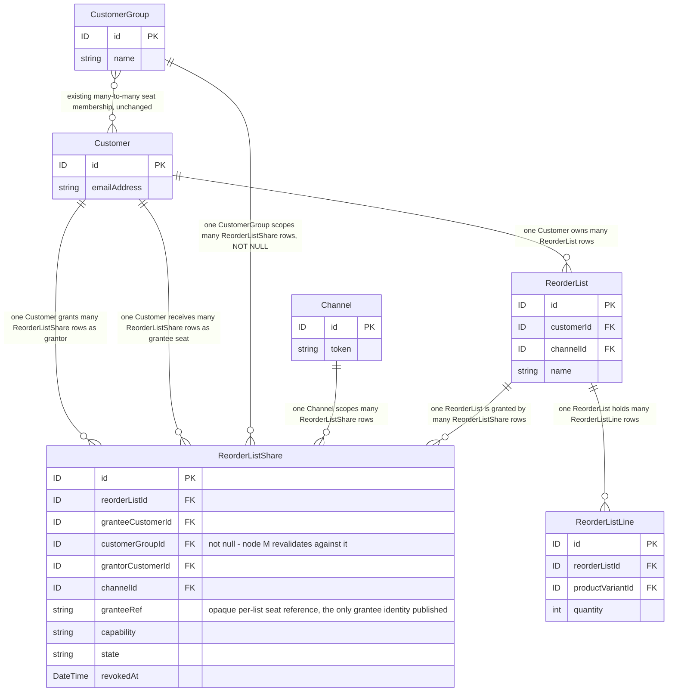

# FEATURE-001-06: Share a reorder list across the seats of a buying account behind an ownership-and-share check enforced inside the resolver, so that a colleague reorders from a list they do not own and gains access to nothing else

Parent epic: `tickets/EPIC-001-reorder-and-replenishment.md`. The parent epic and the sibling features are written as paths rather than as links, following the epic's own convention of keeping the link count in a file equal to the number of children that file indexes [tickets/EPIC-001-reorder-and-replenishment.md:§3. How To Read This Epic]. The only links in this file are the three story links in section 3.

---

## 1. Feature Title

**Share a reorder list across the seats of a buying account behind an ownership-and-share check enforced inside the resolver, so that a colleague reorders from a list they do not own and gains access to nothing else.**

Short name, used verbatim wherever this feature is referred to in one phrase, and identical to the label the epic's features index gives it: **Multi-Seat Buying Account List Sharing and Permissions** [tickets/EPIC-001-reorder-and-replenishment.md:§4. Features Index]. The long form above is the action-object-outcome title this tier requires; the short form is the name to cite.

The epic classifies this feature's deviation from its originally suggested area as **kept, mechanism fixed**, and it fixes the mechanism in one sentence: authorisation uses the platform's existing permission machinery plus explicit in-resolver ownership enforcement, and **not** a new authentication strategy [tickets/EPIC-001-reorder-and-replenishment.md:§4. Features Index]. **Which part of that machinery was itself corrected after this file was first written**: a buyer-facing operation is gated `@Allow(Permission.Owner)` rather than by a `CrudPermissionDefinition` [packages/core/src/common/permission-definition.ts:L146], because a customer session can hold no custom permission — section 2.6 carries the authority chain and the epic states it as rulings R2 and R3 [tickets/EPIC-001-reorder-and-replenishment.md:§6.4 The Settled Rulings]. Section 2.6 gives the reason that ruling exists rather than restating it as an assertion, and section 2.11 states what the ruling costs — the capabilities this feature deliberately does not build.

Delivery is part of the single self-contained plugin package the epic describes — `packages/reorder-plugin/`, exporting `ReorderPlugin` — and no file under `packages/core` or `packages/admin-ui` is edited to deliver it.

---

## 2. Feature Summary

### 2.1 The Capability

A buying account's administrator shares one of their named reorder lists with the other seats of that account, and controls which of those seats may reorder from it. This feature ships one plugin-owned share table, two Shop API mutations, one new error result, and the ownership-or-valid-share check that every operation touching a list must run inside its own resolver.

### 2.2 Contribution To The Epic

This feature sits wholly inside batch **B5**, whose dependencies are batches B2 and B4, and it is **sequenced internally rather than opened all at once**: stories 06-01 and 06-02 create and revoke the share rows that story 06-03 reorders from, so the epic's own intra-batch gates carry that order [tickets/EPIC-001-reorder-and-replenishment.md:§9.4.1 Batch B5 Is Sequenced Internally, And The Gates Are Named]. **The ordering runs through this feature rather than around it, and that is deliberate: 06-03 reorders from a share that 06-01 creates**, so the two are ordered within the batch rather than merely scheduled together. It owns the "Share list with account seats" step of the returning-buyer journey, which the epic's journey diagram routes from list curation into the cart write [tickets/EPIC-001-reorder-and-replenishment.md:L77-L78]. Two of the epic's six personas meet the system here for the first time: the **Buying Account Administrator** is the WHO of stories 06-01 and 06-02, and the **Returning Buyer** is the WHO of story 06-03 [tickets/EPIC-001-reorder-and-replenishment.md:§10.4 Persona Map].

Read the contribution narrowly, because two adjacent surfaces belong to other features and this one adds neither:

- **It adds no list-authoring surface.** Creating a list, naming it, and adding, adjusting or removing its lines are all FEATURE-001-01's eight operations [tickets/EPIC-001/FEATURE-001-01-named-reorder-lists.md:§2.6 Named API Surfaces]. This feature grants a capability over a list that already exists; it never writes a list line.
- **It adds no cart-write surface.** Materialising a list into an active order is FEATURE-001-02's single mutation `applyReorderToActiveOrder` [tickets/EPIC-001/FEATURE-001-02-reorder-from-order-history.md:§2.5 Named API Surfaces], and story 06-03 invokes exactly that mutation as a customer who is not the list's owner. That feature records the same dependency from its side, at story granularity rather than feature granularity [tickets/EPIC-001/FEATURE-001-02-reorder-from-order-history.md:§4.2 Downstream].

What this feature contributes that neither of those can is the authorisation model. FEATURE-001-01 enforces that a list belongs to exactly one customer; this feature is the only place in the epic where a second customer may legitimately read or act on a row they do not own, which is why the epic's third collision lands hardest here.

### 2.3 Named Entities Touched

One entity is new and plugin-owned. Five already exist and are read, never altered. **No core entity gains a column, a relation or a custom field.**

- **`ReorderListShare` — new, plugin-owned.** One row per grant, unique per list-and-seat, so re-granting the same capability to the same seat updates one row rather than accumulating duplicates that would each have to be revoked separately. Revocation is a state on the row rather than a hard delete, because story 06-02's revoked-mid-session behaviour cannot be asserted against a row that no longer exists. Its complete mapping is below.
**The mapping, stated completely enough to author a deterministic migration from, and to settle two things a prose column list left open.** The epic's persistence contract carries the rules this table obeys [tickets/EPIC-001-reorder-and-replenishment.md:§7.8 The Seven Plugin-Owned Tables]; this is where they are made concrete.
```ts
// Extends VendureEntity, so id, createdAt AND updatedAt are inherited and NOT re-declared.
// updatedAt is load-bearing: a revocation and a re-grant both rewrite the row in place.
@Entity()                                  // table reorder_list_share (TypeORM snake_case)
export class ReorderListShare extends VendureEntity {
  @ManyToOne(() => ReorderList, { onDelete: 'CASCADE', nullable: false })
  reorderList: ReorderList;
  @EntityId({ nullable: false }) reorderListId: ID;
  @ManyToOne(() => Customer, { onDelete: 'CASCADE', nullable: false })
  granteeCustomer: Customer;
  @EntityId({ nullable: false }) granteeCustomerId: ID;
  @ManyToOne(() => Customer, { onDelete: 'CASCADE', nullable: false })
  grantorCustomer: Customer;
  @EntityId({ nullable: false }) grantorCustomerId: ID;
  // NOT NULL, and section 2.3's membership rule is why. See the nullability note below.
  @ManyToOne(() => CustomerGroup, { onDelete: 'CASCADE', nullable: false })
  customerGroup: CustomerGroup;
  @EntityId({ nullable: false }) customerGroupId: ID;
  @ManyToOne(() => Channel, { onDelete: 'CASCADE', nullable: false })
  channel: Channel;
  @EntityId({ nullable: false }) channelId: ID;
  // Opaque per-list reference to this seat, and ONE encoding: THIRTY-TWO characters from the
  // sixteen-character lowercase hexadecimal alphabet, rendered from SIXTEEN CSPRNG bytes at
  // insert, which is the platform's own idiom for a value that must not be guessable
  // [packages/core/src/service/services/session.service.ts:L428]. Sixteen bytes render as
  // thirty-two hex characters, so the value fills this varchar(32) exactly and the declared
  // length is a consequence of the encoding rather than a separate choice.
  // Derived from nothing -- not the customer id, not the address, not the list id, not a
  // counter -- and never rewritten by a revoke or a re-grant.
  // Unique within the list by constraint, UQ_reorder_list_share_list_grantee_ref, with at
  // most three regeneration retries on collision. See the generation rule below.
  // Published unchanged as ReorderListGrant.granteeRef, to the list's owner only.
  // An earlier comment here described a 22-character unpadded URL-safe rendering; that form is
  // withdrawn: this column carries one encoding and it is the hexadecimal one above.
  @Column({ type: 'varchar', length: 32, nullable: false })
  granteeRef: string;
  @Column({ type: 'varchar', length: 16, nullable: false })
  capability: ReorderListCapability;       // FEATURE-001-01's enum, referenced not re-declared
  @Column({ type: 'varchar', length: 16, nullable: false })
  state: ReorderListShareState;            // ACTIVE | REVOKED — not a boolean
  @Column({ type: Date, nullable: true })
  revokedAt: Date | null;                  // set iff state is REVOKED
}
```
- **Indexes and constraints, each with the name the migration must use:**
  - `UQ_reorder_list_share_list_grantee` — unique over `(reorderListId, granteeCustomerId)`. **This is the idempotence rule of section 2.8 expressed as a constraint**: one row per list-and-seat, so a re-grant updates and a revocation has exactly one row to act on. Without it a revocation would have to clear an unbounded set of rows to be effective, which is a correctness hazard and not a tidiness concern.
  - `UQ_reorder_list_share_list_grantee_ref` — unique over `(reorderListId, granteeRef)`. **This is what makes the published seat reference an identity rather than a probably-distinct string, and the per-list uniqueness of `granteeRef` is therefore a constraint and not a hope**; the generation rule below states what produces the value and how a collision is recovered from. An earlier version of this section asserted in prose that the value is "unique within the list" while declaring no constraint over it, which left the one property the payload's tie-break depends on unenforced: two grants sharing a reference would make the default order non-deterministic and would leave an owner unable to tell which seat a revoke had affected — the exact failure the column was introduced to fix. The constraint also turns a generation collision into a refused insert rather than a silent duplicate. **A later revision declared a second constraint over this same tuple under the spelling `UQ_reorder_list_share_list_granteeref`; that second declaration is withdrawn, because two unique constraints over one tuple are one constraint and one migration defect.**
  - `IDX_reorder_list_share_grantee_channel_state` — non-unique over `(granteeCustomerId, channelId, state)`, which is the predicate the authorisation check in Figure F6-AUTH reads on and the one the shared-list read filters by.
  - `IDX_reorder_list_share_list_state` — non-unique over `(reorderListId, state)`, which is what the owner's own view of a list's grants reads on.
- **`customerGroupId` is NOT NULL, and this settles a contradiction rather than expressing a preference.** An earlier draft described it as optional in prose while Figure F6-ER drew it as a plain foreign key, and separately declared that it "is not the subject of the check" — three statements that cannot all stand. **The column is required and it IS part of the check.** Section 2.3's membership rule and Figure F6-AUTH both depend on knowing which account a grant was made in the context of, because a grant whose group is unknown cannot be re-validated against current membership, and a grant that is never re-validated is the defect this feature exists to avoid. A caller wanting to share outside any account is not a case this feature serves; there is no ungrouped grant.
- **`granteeRef` is a stored opaque reference rather than a derived one, and it exists because the owner needs to tell two grants apart.** An earlier draft published a grant with no identity beyond its own row id and told the owner to distinguish grants "by the order they appear in and by the capability" — which is not an identity at all: two seats granted `READ` on one list were then indistinguishable in the payload, so an owner could not tell which row a revoke would affect. The alternatives were the grantee's email address, which section 2.11 declines to put inside a collection, and the grantee's customer id, which is guessable because the default id strategy is auto-increment [packages/core/src/config/default-config.ts:L101]. So the column carries a value generated once at insert, unique within the list, meaningless outside it and never rewritten — a revoke and a later re-grant of the same seat keep the same reference, which is what makes it usable as the default order's tie-break in section 2.5. **It is a reference, not a credential**: possessing it grants nothing, and it is returned only to the owner.
- **Both of the properties that reading depends on are now mechanised rather than asserted, because an earlier version of it stated them and enforced neither.** **Opacity is a generation rule:** the value is thirty-two hex characters produced from **sixteen cryptographically secure random bytes** at insert, using the same `crypto.randomBytes` primitive this platform already relies on for values that must not be guessable — its API-key strategy [packages/core/src/config/api-key-strategy/random-bytes-api-key-strategy.ts:L104] and its session tokens [packages/core/src/service/services/session.service.ts:L428]. **It is not derived from the customer id, the email address, the list id or a counter**, so it cannot be correlated back to a seat by anyone who has not been given it, and two lists shared with the same colleague carry two unrelated references — which is the property that stops an owner of one list confirming a colleague's presence on another. **Stability across a revoke and a re-grant is a consequence of the row's own lifecycle rather than of a second rule:** `UQ_reorder_list_share_list_grantee` makes one row per list-and-seat, a revoke sets `state` rather than deleting, and a re-grant updates that same row — so the reference persists because the row does, and no code path regenerates it. **Uniqueness within the list is the constraint added above**, `UQ_reorder_list_share_list_grantee_ref`, so a collision is a refused insert rather than a duplicated reference; at sixteen random bytes a collision within one list is not an expected event, and the constraint is what makes the payload's tie-break sound even so.
- **How that value is generated, made unique and recovered from a collision — because an earlier version of the bullet above called it "unique within the list" and "opaque" without saying what produces it, what enforces the uniqueness or what happens when two generations agree.** All three are fixed here, and none of them is left to implementation taste:
  - **Generation.** **Thirty-two lower-case hexadecimal characters rendered from sixteen cryptographically secure random bytes**, produced by the plugin's own service at insert time using the same `crypto.randomBytes` primitive this platform already relies on for values that must not be guessable — its API-key strategy [packages/core/src/config/api-key-strategy/random-bytes-api-key-strategy.ts:L104] and its session tokens [packages/core/src/service/services/session.service.ts:L428]. **It is not derived from anything**: not from the grantee's id, not from their address, not from the list id, and not from a counter — a derived reference would either be guessable or would leak the input it was derived from, which is the whole reason the two alternatives above were declined. The column is `varchar(32)`, which the rendered value fills exactly, so the length is a property of the encoding rather than a fact about the input. **An earlier revision generated twenty-two characters in an unpadded URL-safe alphabet instead, and that form is withdrawn on a technical ground rather than a preference:** a URL-safe base64 alphabet is case-sensitive while the default `varchar` collations on the MySQL and MariaDB engine jobs are case-insensitive [.github/workflows/build_and_test.yml:L240] and [.github/workflows/build_and_test.yml:L202], so two references differing only in case would compare equal inside the unique constraint and one insert would be refused as a collision that is not one. Hexadecimal is collation-safe on all four engines.
  - **Uniqueness, enforced by the database rather than by the generator's improbability.** `UQ_reorder_list_share_list_grantee_ref` — unique over `(reorderListId, granteeRef)` — is the second unique constraint on this table, alongside `UQ_reorder_list_share_list_grantee` above, and is added by the same migration. **Uniqueness is scoped to the list rather than to the table**, matching what the value means: two different lists may carry the same reference without ambiguity, because the reference is only ever read in the context of the list that published it.
  - **Collision handling, bounded and specified.** A generation that violates that constraint is retried with a freshly generated value, **at most three times in total**, after which the insert fails with the platform's own error rather than looping — a fourth collision at this width is evidence of a broken random source rather than of bad luck, and looping would turn that into a hung request instead of a visible failure. The retry is on the insert only: a re-grant of a previously revoked pair **reuses the stored reference and generates nothing**, so it can never collide.
  - **What a story asserts.** That two grants on one list carry different references; that the reference is unchanged across a revoke and a later re-grant of the same pair, which AC-1 of story 06-02 already asserts byte-identically; that two lists may carry the same reference without either write failing, which is what proves the constraint is list-scoped rather than table-scoped; and that a forced duplicate generation on one list resolves to a second distinct value rather than to a failure or a duplicate row.
- **`state` is an enumerated column rather than a boolean `revoked` flag.** Section 2.8 describes three observable conditions and the third — a row that once worked and now does not — needs a value a support agent can read, alongside `revokedAt` for when it happened. A boolean would have carried the same information less legibly and would have left no room for a future condition without a schema change.
- **Every relation cascades, and the grant is deliberately not an audit record.** A grant is a live capability: once the list, either customer, the group or the channel is hard-deleted, the capability it expresses cannot be exercised and keeping the row would leave a grant pointing at nothing. **The contrast with FEATURE-001-07's attempt tables is deliberate** — those retain their rows and null their customer link because they are evidence [tickets/EPIC-001/FEATURE-001-07-reorder-instrumentation.md:§2.4 Named Entities Touched]. If a deployment later needs a durable record of who was granted what and when, that belongs in the audit tables rather than in this one, and it is a change to declare rather than a property to assume.
- **The share row's lifecycle beyond a hard delete, stated because a cascade does not cover the cases that actually happen.** Three of them, each with a defined behaviour rather than an implication:
  - **A soft-deleted grantee.** `Customer` is soft-deletable [packages/core/src/entity/customer/customer.entity.ts:L23] with a nullable deletion timestamp [packages/core/src/entity/customer/customer.entity.ts:L29], so no cascade fires and the row survives. **The grant is inert from that moment**, because the authorisation check requires a live grantee — Figure F6-AUTH's membership node fails for a soft-deleted customer — and the row is purged by the plugin's **event-triggered** data-lifecycle job rather than by a scheduled task — the shipped customer event observed through the typed subscribe [packages/core/src/event-bus/event-bus.ts:L130] enqueues one bounded, idempotent, resumable job on the plugin's own queue [packages/core/src/job-queue/job-queue.service.ts:L51-L82], and there is no periodic sweep [tickets/EPIC-001-reorder-and-replenishment.md:§7.8 The Seven Plugin-Owned Tables]. **A share row is purged rather than anonymised**, for the same reason a cadence row is: a grant with no grantee grants nothing to nobody and has no residual purpose.
  - **A grantee removed from the group. SETTLED: the row is retained exactly as it is, and nothing purges it.** No cascade fires here, because the row references the group rather than the membership, and **no plugin code deletes or revokes it either**. Section 2.3's rule is the whole of the handling: membership is re-read on every request, so the grant stops conferring access on the next request and **re-adding the seat restores access with no write to the grant row at all** — which is exactly what story 06-02's own criterion asserts, together with `state` still `ACTIVE` and `revokedAt` still null [tickets/EPIC-001/FEATURE-001-06/STORY-001-06-02-grant-and-revoke-seat-reorder-permission.md:§5. Acceptance Criteria].
    **An earlier revision of this bullet added a clause naming the platform's own membership event, and that clause is withdrawn on three independent grounds.** The event exists and the alternative it described was available rather than overlooked: `CustomerGroupChangeEvent` carries the affected customers, the group and a `type` discriminator of `'assigned'` or `'removed'` [packages/core/src/event-bus/events/customer-group-change-event.ts:L15-L21], so a subscriber *could* clear or revoke a grant when a seat is removed. What the withdrawn clause said is that the row was cleared on removal by the same task, and it fails three ways. It contradicted 06-02's criterion, since a cleared row cannot be restored by re-adding a membership. It named a task that would not fire: the plugin's one customer-data-lifecycle job is triggered by `CustomerEvent` with `type` `'deleted'` [packages/core/src/event-bus/events/customer-event.ts:L25], and a group removal deletes no customer [tickets/EPIC-001-reorder-and-replenishment.md:§6.4 The Settled Rulings, And The Complete Published-Symbol Inventory]. And it made the outcome depend on *when* a background pass ran, so the same removal would deny access immediately and erase the audit of who was once granted what at some later, unspecified moment. **This feature therefore subscribes to that event nowhere**, because subscribing would make a removal a destructive write on a row an operator may not have meant to revoke, would lose the distinction between “lost access” and “was revoked” that 06-02 exists to preserve, and would put a second writer on a table whose lifecycle one mutation already owns. **Membership is a check, not a stored fact, and nothing is derived from it by writing.**
  - **The erasure window is the epic's decision and is not invented here — and it applies to one trigger, not two.** The mechanism above is settled; what remains open is how long after a **customer soft delete** the plugin's customer-data-lifecycle pass removes a share row, which is the product decision the epic carries [tickets/EPIC-001-reorder-and-replenishment.md:§8.1 Product Decisions], blocking story 06-01's sign-off rather than its construction. **A membership removal is not a trigger and has no window**, which an earlier revision of this bullet implied by naming it alongside the soft delete: no pass runs on a group change, the row is retained, and access is decided live — so there is nothing whose timing a decision could set. Section 4.5 records the open half.
- **Migration ordering, and the one column this feature adds to a table it does not own.** `reorder_list_share` references `reorder_list`, so FEATURE-001-01's migration precedes this one. That ordering is a real prerequisite rather than a preference, and section 4.1 records the matching feature-level edge. **This feature's migration also adds one column to the plugin-owned `reorder_list` table — `activeGrantCount`, `NOT NULL DEFAULT 0` — for the reason section 2.3.1 gives**, and it does so in its own migration rather than by editing FEATURE-001-01's. That is additive in both directions and reversible, and it is a *plugin-owned* table: **nothing in this feature alters a core table**, adds a column to one, or declares a custom field on one.
  - **The uniqueness is a database constraint, not a service-level convention.** A composite unique key over the list and the grantee seat, declared in the same form core already uses for its own composite unique index [packages/core/src/entity/stock-level/stock-level.entity.ts:L19]. That is what makes the re-grant in section 2.8 an upsert rather than a second row, and it is what makes two concurrent grants of the same pair converge instead of racing — a guarantee a service-level check cannot give, because two requests can both pass the check before either writes. **The evidence for that convergence is a deterministic barrier on a server engine, not two calls issued at once**, and `e2e-sqljs` is excluded from concurrency evidence while still carrying the constraint-shape assertion, per the epic's race-evidence rule [tickets/EPIC-001-reorder-and-replenishment.md:§7.8 The Seven Plugin-Owned Tables].
  - **The read path has an index over the columns it filters on**, being the grantee seat, the list and the channel the grant was made under. Every authorisation decision in this feature filters on exactly those, so an index over them is the difference between a lookup and a scan of every grant in the deployment.
  - **The number of rows one list may carry is bounded by a decided maximum, and the write is where the bound is enforced.** The epic raised it to a product decision after this feature reported the silence [tickets/EPIC-001-reorder-and-replenishment.md:§8.1 Product Decisions], and section 2.5 states what the mutation does when the bound would be exceeded. No figure appears in this file, because supplying one is not this file's to do.
- **`ReorderList` and `ReorderListLine` — existing after FEATURE-001-01, plugin-owned, read only here.** A share row points at a `ReorderList`; the lines are read only when story 06-03 resolves the list into cart lines, and they are read through FEATURE-001-01's own service rather than by querying its tables [tickets/EPIC-001/FEATURE-001-01-named-reorder-lists.md:§2.5 Named Services].
- **`Customer` — existing, read only.** Declared as implementing `ChannelAware`, `HasCustomFields` and `SoftDeletable` [packages/core/src/entity/customer/customer.entity.ts:L23]. Three of its members carry this feature: `emailAddress` [packages/core/src/entity/customer/customer.entity.ts:L42] is how a human names a seat, `groups` [packages/core/src/entity/customer/customer.entity.ts:L46] is the existing many-to-many that already expresses which account a customer is a seat of, and `user` [packages/core/src/entity/customer/customer.entity.ts:L56] is the eager one-to-one that ties the row to the authenticated session the ownership check reads. That `Customer` is soft-deletable is load-bearing for a share table: a soft-deleted grantee's share row still exists, so a share check must resolve against the session and the grant's state rather than against row existence.
- **`CustomerGroup` — existing, read only.** Declared with `name` [packages/core/src/entity/customer-group/customer-group.entity.ts:L23] and the inverse many-to-many `customers` [packages/core/src/entity/customer-group/customer-group.entity.ts:L26] on the class at [packages/core/src/entity/customer-group/customer-group.entity.ts:L18]. **The seat model is expressed over this existing relation rather than by adding a new account entity**, and the two paragraphs below this list record the reason for that and the honest limits of doing it.
- **`Channel` — existing, read only.** Supplies the token every grant is scoped by [packages/core/src/entity/channel/channel.entity.ts:L62]. Section 2.10 states the scoping rule this produces.

**Why no new account entity, stated as a decision rather than as a preference.** A `BuyingAccount` entity would duplicate a relation this platform already ships: `Customer.groups` [packages/core/src/entity/customer/customer.entity.ts:L46] and `CustomerGroup.customers` [packages/core/src/entity/customer-group/customer-group.entity.ts:L26] are already a many-to-many between customers and a named grouping, and a second parallel membership graph would immediately raise the question of which one authorisation trusts. So membership is read from the existing relation and the new table stores only **capability** — who may do what with which list. That division is the whole of the entity design: `CustomerGroup` answers "is this person *currently* a seat of that account", `ReorderListShare` answers "was this seat granted a capability over that list", and neither answers the other's question.

**Both questions are asked on every request, and that is a security requirement rather than a design flourish.** A grant row is a record of a decision taken in the past; membership is a fact about the present. Trusting the row alone would mean a seat removed from the buying account — or moved into a different one — kept its access until somebody remembered to revoke each grant individually, which is exactly the failure an account administrator would assume removal had already prevented. **So the authorisation predicate accepts a capability only when the grantee is a current member of the grant's customer group, read through the platform's own membership query at request time**, and section 2.6's fourth consequence and Figure F6-AUTH both carry that step explicitly.

**The membership rule — re-checked on every use, never trusted as a stored fact. This is the correction a review of this file forced, and it is the most consequential one in the file.** An earlier draft recorded `customerGroupId` on the grant and then said in terms that it "is not the subject of the check". **That combination is a defect with a concrete, exploitable consequence: a seat removed from the buying account keeps every capability it was ever granted, indefinitely.** Removal from a group is the ordinary way a person leaving a company loses access, and nothing in this platform revokes a plugin's grant when it happens — `CustomerGroup.customers` is a plain many-to-many [packages/core/src/entity/customer-group/customer-group.entity.ts:L26] with no event this feature subscribes to and no cascade onto a table that merely names the group.

**The rule, stated as an obligation on every authorisation decision rather than as a property of the row:**

- **A grant confers access only while the grantee is *currently* a member of the group named on the grant.** The check reads the live membership through `CustomerGroupService` rather than a cached copy [packages/core/src/service/services/customer-group.service.ts:L40], on every request, as one conjunct of the predicate in Figure F6-AUTH. A grant whose grantee is no longer a member confers nothing, and the row's own `state` need not have changed for that to be true.
- **The grantee must also be live.** A soft-deleted customer [packages/core/src/entity/customer/customer.entity.ts:L29] is not a member for this purpose even if the join row survives, because the session that would exercise the grant cannot exist.
- **The group must be live.** `CustomerGroup` is hard-deletable, and the `CASCADE` in the mapping above covers that — but the check does not rely on the cascade having run, because a check that depends on a background state converging is a check that is wrong in the window before it does.
- **At grant time BOTH parties must hold live membership of the named group, and the grantor half of that was missing.** An earlier statement of this rule required only the *grantee* to be a member, which permits a caller who is no longer a seat of the account — or who never was one — to keep issuing grants over their own list into somebody else's account, and to do so for as long as the list exists. **So `shareReorderList` admits a grant only when the group named in the input is one the caller is *currently* a live member of in the active channel, and the grantee is a live member of that same group.** The check is the set intersection of two single-customer membership reads, per section 2.6.1, and node P of Figure F6-AUTH draws it. The refusal is `ReorderPermissionDeniedError`, identical whichever conjunct failed. At *use* time only the grantee conjunct is revalidated, and that asymmetry is deliberate rather than an omission: the list belongs to its owner whatever their group membership, so an owner who leaves the account keeps their own list and the standing grants they made over it, while a grantee who leaves loses access on their next request. A story asserting that an owner's departure withdraws an existing grant is asserting something this feature does not do.
- **Why re-checking rather than revoking on removal.** Revoking every affected grant inside the transaction that removes a customer from a group would be the alternative, and it is rejected for a citable reason: the removal happens through an **Admin API** operation this feature does not own and must not modify [packages/core/src/api/schema/admin-api/customer-group.api.graphql:L16], so intercepting it would mean either editing core — forbidden — or subscribing to an event and revoking asynchronously, which leaves exactly the window a re-check does not have. **A stale grant that is inert is safe; a stale grant awaiting an asynchronous sweep is not.** **And nothing clears the row afterwards, which is the settled behaviour the mapping above states**: a group removal is not a trigger for the plugin's customer-data-lifecycle job, so the row is retained with `state` still `ACTIVE`, access stops at the very next request rather than at a sweep, and re-adding the seat restores it with no write to the grant row at all. An earlier version of this sentence said the row was cleared eventually by that job, which is the withdrawn design in which a group change fired a pass.
- **The cost, stated rather than hidden.** Every authorisation decision now performs one additional membership read. That is a real cost and it is accepted deliberately: the alternative is an access-control decision made from data that may be arbitrarily out of date, which is not a trade this feature is willing to make. No latency figure is attached to the cost, because this repository declares none [tickets/EPIC-001-reorder-and-replenishment.md:§2.2 Business Value].

**The honest limit of reusing `CustomerGroup`, stated because a reader will otherwise assume more than the platform provides.** The entity's own documentation describes it as a grouping that enables features such as group-based promotions or tax rules [packages/core/src/entity/customer-group/customer-group.entity.ts:L12-L13]. It is not an account construct and carries no notion of an administrator, a role or an invitation. Three consequences follow and all three are carried into section 2.11 rather than glossed:

- **The GraphQL `Customer` type exposes no `groups` field at all.** It declares `emailAddress` [packages/core/src/api/schema/common/customer.type.graphql:L9], `orders` [packages/core/src/api/schema/common/customer.type.graphql:L11] and `user` [packages/core/src/api/schema/common/customer.type.graphql:L12] and stops there [packages/core/src/api/schema/common/customer.type.graphql:L1-L13]. Group membership is therefore readable from plugin TypeScript through the entity relation, and **not** readable by a storefront client.
- **Adding that field is the epic's fifth collision, and this feature declines it.** Putting `groups` on the Shop API `Customer` type would alter the published schema of a core type the plugin does not own [tickets/EPIC-001-reorder-and-replenishment.md:§6.2 Research-Discovered Collisions], and it would expose a path to `CustomerGroup.customers` [packages/core/src/api/schema/common/customer-group.type.graphql:L6], each of whose `Customer` rows carries an `emailAddress` [packages/core/src/api/schema/common/customer.type.graphql:L9]. Enumerating every colleague's email address to any authenticated seat is not a side effect this feature accepts, so the field is not added and the seat set is never returned to a storefront.
- **Seat membership is administered on the Admin API, not by the account administrator.** `customerGroups` [packages/core/src/api/schema/admin-api/customer-group.api.graphql:L2], `createCustomerGroup` [packages/core/src/api/schema/admin-api/customer-group.api.graphql:L8] and `addCustomersToGroup` [packages/core/src/api/schema/admin-api/customer-group.api.graphql:L16] are Admin API operations, and a search of the Shop API schema tree for any customer-group surface returns nothing. So the Buying Account Administrator persona of stories 06-01 and 06-02 grants a capability **over a seat set someone else administers**. That is a real limitation of this design, not an oversight, and section 4.5 records the decision it leaves open.

#### 2.3.1 The Seats-Per-List Bound Is Enforced By A Conditional Counter Update, Not By A Count-Then-Insert

The composite unique key above makes two concurrent grants **of the same pair** converge on one row. It does nothing about the bound, because two concurrent grants to **two different seats** violate no unique key and can therefore both pass a count-then-insert check and both write — carrying the list one row past its maximum. That is a real race rather than a theoretical one, and it is closed here rather than left to a story.

- **The primitive is a conditional counter update on the parent row, and it is the primitive FEATURE-001-01 already proved.** That feature bounds lines per list with `UPDATE reorder_list SET lineCount = lineCount + 1 WHERE id = :id AND lineCount < :maxLinesPerList` as the first write of its transaction, inserting only when one row was affected [tickets/EPIC-001/FEATURE-001-01-named-reorder-lists.md:§2.11 Names, Bounds And Concurrency — The Rules That Make The Contract Deterministic]. This feature applies the identical shape to seats, and it carries the bound in **one new plugin option, `ReorderPluginOptions.maxSeatsPerReorderList`**, alongside that feature's `maxListsPerCustomer` and `maxLinesPerList` — an option field rather than a new symbol, so the epic's published-symbol inventory is unchanged [tickets/EPIC-001-reorder-and-replenishment.md:§6.4 The Settled Rulings, And The Complete Published-Symbol Inventory]. `UPDATE reorder_list SET activeGrantCount = activeGrantCount + 1 WHERE id = :id AND activeGrantCount < :maxSeatsPerReorderList` is the **first** write of `shareReorderList`'s transaction, and the grant row is inserted — or returned from `REVOKED` to `ACTIVE` — only when that statement reported exactly one affected row. **Zero affected rows is the refusal**, reported as `ReorderListLimitError` carrying the breached maximum in `maxItems`, with the transaction rolled back so no grant row and no counter increment survives.

  **The unlimited case selects a different statement rather than a different parameter, and an earlier revision of this bullet had no answer for it at all.** The epic permits an explicit "no cap" as a product outcome, and the predicate above cannot express one: every value substitutable for `:maxSeatsPerReorderList` is itself a cap, so "unbounded" has no representation in a comparison. The option's type therefore carries it — `number | null`, with **`null` meaning no cap** — and the two states take two statements [tickets/EPIC-001-reorder-and-replenishment.md:§7.10 The Plugin Option Ledger — One Authority For Every Configured Key]. With a finite value the write is exactly the statement above and a zero affected-row count is the refusal. With `null` the write is `UPDATE reorder_list SET activeGrantCount = activeGrantCount + 1 WHERE id = :id` — **the counter still maintained, the comparison simply absent** — so one row is always affected and the share cannot be refused for exceeding a bound that does not exist, while a deployment that later sets a finite value has a correct count to compare against instead of a column it must backfill. **Three further properties are stated because each is a way this could silently go wrong.** `undefined` is not `null`: an absent key fails plugin initialisation, because "no decision taken" and "decided there is no cap" are different states and only the second is a configuration. A finite value that is zero, negative, fractional or non-finite likewise fails initialisation rather than producing a bound that refuses every share or admits every one. And **`ReorderListLimitError` is unreachable under `null`**, which a story asserts positively rather than leaving as an untested branch: with the cap unset, a share beyond any number of seats succeeds and returns the payload rather than the error.
- **`activeGrantCount` is an additive column on the plugin-owned `reorder_list` table, added by THIS feature's migration, and it is not published.** FEATURE-001-01's migration is not edited; this feature's migration adds the column with a `NOT NULL DEFAULT 0`, which is the additive form the epic requires of every migration in the set [tickets/EPIC-001-reorder-and-replenishment.md:§7.8 The Seven Plugin-Owned Tables]. The column is **absent from the published `ReorderList` type**, so it enters neither `ReorderListSortParameter` nor `ReorderListFilterParameter` [packages/core/src/api/config/generate-list-options.ts:L31-L60] and FEATURE-001-01's read contract stays byte-identical — which is the same reason section 2.5 declines to widen that type with a `grants` field.
- **Why a counter rather than a row lock.** A pessimistic `SELECT … FOR UPDATE` on the parent list would also serialise the two writers, and the platform uses exactly that shape for its own scheduled-task claim [packages/core/src/plugin/default-scheduler-plugin/default-scheduler-strategy.ts:L287-L316] — but it carries a portability caveat the platform states in its own source: the SQLite path takes a different branch whose comment records that it may have race conditions with multiple connections [packages/core/src/plugin/default-scheduler-plugin/default-scheduler-strategy.ts:L317-L336]. A conditional `UPDATE … WHERE counter < bound` needs no lock hint, behaves identically on all four engine jobs, and is already in this plugin. **So the guarantee here is not weakened the way FEATURE-001-05's is** [tickets/EPIC-001/FEATURE-001-05-purchase-cadence-and-replenishment.md:§2.6d What Actually Serialises Two Runs — The Guarantee, Weakened To What The Primitives Deliver]: the bound holds on every engine.
- **Three write paths, three counter behaviours, stated so none is inferred.** A grant for a pair with no row: increment, then insert. A grant for a pair whose row is already `ACTIVE`: **no counter statement at all**, because the seat is already counted and section 2.8 requires the call to be idempotent. A grant for a pair whose row is `REVOKED`: increment, then transition the row to `ACTIVE` — a revoked grant does not hold a seat. `revokeReorderListShare` decrements by the same conditional shape, `SET activeGrantCount = activeGrantCount - 1 WHERE id = :id AND activeGrantCount > 0`, and issues no decrement when the row was already `REVOKED` or absent, which is what keeps that mutation idempotent too.
- **Three write paths are not all the paths, and an earlier version of this sub-section stopped at three. Two further paths remove an `ACTIVE` row without passing through either mutation, and neither can decrement the counter from inside this feature's own transaction.** They are named because the consequence of leaving them unstated is severe and silent: a counter that drifts high makes the conditional increment refuse forever, so a list would become permanently unable to accept a new seat while holding fewer `ACTIVE` grants than its maximum, and every test above would still pass.
  - **The database cascade.** A hard delete of the grantee `Customer`, of the `CustomerGroup` or of the `Channel` removes the grant row through the `ON DELETE CASCADE` in the mapping above, at the database, with no plugin code in the call path and no opportunity to decrement. A hard delete of the `ReorderList` itself is the one cascade that is safe, because it removes the parent row carrying the counter along with its grants.
  - **The customer-data-lifecycle job.** The bounded event-triggered job of the epic's ruling R19, owned by FEATURE-001-07, removes grant rows for a soft-deleted grantee — including `ACTIVE` ones, since a soft delete never reached either mutation.
- **So the counter is specified as an upper bound that is maintained exactly where this feature owns the write and reconciled where it does not. Three obligations, each testable:**
  - **Exact maintenance on the two mutations**, as the three write paths above state.
  - **Exact maintenance in the lifecycle job**, which this feature can require because that job is plugin-owned: for each list it touches, it decrements `activeGrantCount` by the number of `ACTIVE` grant rows it removed for that list, in the same transaction as the removal. FEATURE-001-07's job specification carries this as an obligation it accepts from this feature rather than as a detail it infers.
  - **Bounded self-healing on the grant path, for the cascade this feature cannot intercept.** When the conditional increment affects zero rows, the service does not refuse immediately: it recounts `ACTIVE` grant rows for that list, and **if the true count is lower than the stored counter it corrects the counter to the true count and retries the conditional increment exactly once.** If the recount confirms the stored value, the refusal stands and `ReorderListLimitError` is returned. **The retry is capped at one** — a second failure is a genuine refusal, not a reason to loop — so the worst case adds one count and one update to a request that was going to be refused anyway, and the ordinary case adds nothing at all because the increment succeeds on its first attempt. This converts a permanent lockout into a recoverable one without introducing a periodic sweep, which ruling R19 would forbid.
  - **What a story asserts for this, so the reconciliation is evidenced rather than described.** A fixture that hard-deletes the grantee `Customer` of an `ACTIVE` grant on a list at its maximum: the counter is observably too high immediately afterwards, the next `shareReorderList` for a different seat **succeeds** rather than being refused, and the counter afterwards equals the number of `ACTIVE` rows. A second fixture at the maximum with no drift: the same call is refused with `ReorderListLimitError` and the counter is unchanged, which is what proves the self-healing path did not simply raise the bound.
- **The invariant is asserted by a test, and it cannot be a check constraint — which is stated rather than glossed.** The epic's persistence rule requires closed value sets and cross-field invariants to be portable named check constraints [tickets/EPIC-001-reorder-and-replenishment.md:§7.8 The Seven Plugin-Owned Tables], and this counter is neither: it is a cross-**row**, cross-**table** count, which no check constraint in any of the four engines can express. The obligation is therefore discharged by assertion instead: after every concurrency case in section 5, `reorder_list.activeGrantCount` is asserted equal to the number of `ReorderListShare` rows for that list whose `state` is `ACTIVE`. The two check constraints this table **does** carry are `CHK_reorder_list_share_state_enumerated`, admitting only `ACTIVE` and `REVOKED`, and `CHK_reorder_list_share_revocation_paired`, requiring `revokedAt` to be non-null exactly when `state` is `REVOKED` — both named in the migration, and each asserted by attempting the write it forbids.
- **The bound's value is the epic's seventh product decision and no figure appears here** [tickets/EPIC-001-reorder-and-replenishment.md:§8.1 Product Decisions]. What is settled is the mechanism, both comparisons, the refusal and the type the two states are expressed in; what is open is **which of the two valid values ships** — a finite integer, or `null` — and what that integer is if finite. Section 4.5 records it, and story 06-01 asserts the boundary behaviour against whatever value the fixture configures, and asserts the `null` state and the invalid states as well, rather than against a constant written into this file.

### 2.4 Named Services

- **`ReorderListShareService` — new, plugin-owned.** Holds every read and write of the share table, and — more importantly — holds the single implementation of the ownership-or-valid-share predicate that section 2.6 makes mandatory. Both new mutations and every read path that may now return a shared list call the same predicate, so there is exactly one function to review rather than one per resolver.
- **`ReorderListService` — existing after FEATURE-001-01, plugin-owned.** Resolves a list and its lines, and already owns the owner-only rule this feature relaxes in exactly one direction [tickets/EPIC-001/FEATURE-001-01-named-reorder-lists.md:§2.5 Named Services]. The relaxation is a parameter to that service, not a second copy of it.
- **`ReorderService` — existing after FEATURE-001-02, plugin-owned.** Story 06-03 reaches the cart through it and adds no materialisation logic of its own [tickets/EPIC-001/FEATURE-001-02-reorder-from-order-history.md:§2.5 Named API Surfaces].
- **`OrderService` — existing, in `packages/core`, consumed and never modified.** Four members are named, and the distinction between the two this feature's path reaches and the two it must leave alone is the reason for naming them:
  - `getActiveOrderForUser` [packages/core/src/service/services/order.service.ts:L429] — resolves an existing cart for the authenticated user and returns `Order | undefined`. It is the member that makes the cart-ownership question in section 4.5 answerable at all, because it resolves a cart from the *session*, not from the list.
  - `addItemsToOrder` [packages/core/src/service/services/order.service.ts:L654] — the bulk add that FEATURE-001-02 is built around and that story 06-03 reaches through `ReorderService`. No plugin code in this feature calls it directly.
  - `addItemToOrder` [packages/core/src/service/services/order.service.ts:L622] and `adjustOrderLine` [packages/core/src/service/services/order.service.ts:L774] — **named here as signatures that must remain untouched**, not as call targets. They are the specific pair the epic's first collision would widen as a side effect if this epic declared a custom field on `OrderLine` [tickets/EPIC-001-reorder-and-replenishment.md:§6.1 Repository-Discovered Collisions], which is why section 5 requires evidence for them by name.
- **`CustomerService` — existing, consumed.** `findOneByUserId` [packages/core/src/service/services/customer.service.ts:L141] resolves the authenticated session's user id to the `Customer` row that both the ownership check and the grantee lookup are expressed against, on the class at [packages/core/src/service/services/customer.service.ts:L82]. Its `filterOnChannel` parameter defaults to `true` [packages/core/src/service/services/customer.service.ts:L141], so the customer lookup is itself channel-filtered unless a caller opts out — which is a platform behaviour this feature relies on rather than reimplements. This service is required beyond the list the epic states for the whole set [tickets/EPIC-001-reorder-and-replenishment.md:§7.4 Existing Entities And Services The Work Depends On], and it is named here for that reason.
- **`CustomerGroupService` — existing, and named here for what this feature does NOT call.** An earlier version of this bullet made **`getGroupCustomers`** [packages/core/src/service/services/customer-group.service.ts:L75-L88] the seat read, on the reasoning that its own query supplies the group, not-soft-deleted and request-channel constraints in one call. **That was the wrong end of the relation and section 2.6.1 prohibits it**: the member returns a paginated list of *every* customer in the group [packages/core/src/service/services/customer-group.service.ts:L73], so validating one seat would read the whole account, and its cardinality grows with the account rather than with the question. Every membership check in this feature therefore uses the single-customer read in the next bullet, and **no plugin code in this feature calls `getGroupCustomers`, `addCustomersToGroup` [packages/core/src/service/services/customer-group.service.ts:L147] or `removeCustomersFromGroup` [packages/core/src/service/services/customer-group.service.ts:L173]** — seat membership is administered elsewhere, per section 2.3.
- **`UserService` — existing, consumed, and it is the first step of the grantee resolution rather than an alternative to it.** `getUserByEmailAddress` [packages/core/src/service/services/user.service.ts:L66] resolves a submitted address to a `User`, and on a Shop API request its own default narrows the lookup to customer users rather than administrators [packages/core/src/service/services/user.service.ts:L71]. **The full chain the grantee lookup runs, in this order, with the normalisation stated at each step:** the address resolves to a `User` through that member, or the lookup ends; the user resolves to a `Customer` through `CustomerService.findOneByUserId` [packages/core/src/service/services/customer.service.ts:L141], **which is where the soft-delete and channel constraints come from rather than from plugin code** — it excludes a customer whose deletion timestamp is set [packages/core/src/service/services/customer.service.ts:L148] and, with its channel filter left at its default, admits only a customer assigned to the request's channel [packages/core/src/service/services/customer.service.ts:L149-L151] — or the lookup ends; and that customer's memberships resolve through `CustomerService.getCustomerGroups` [packages/core/src/service/services/customer.service.ts:L179], or the lookup ends. **Every one of those endings produces the identical result**, per section 2.5's grantee reading, so the chain is an implementation of one refusal rather than four distinguishable ones.
- **`CustomerService.getCustomerGroups` — existing, and this is the member the seat check actually uses.** It resolves **one customer's** group memberships by loading that single customer row with its `groups` relation [packages/core/src/service/services/customer.service.ts:L179], scoped to the request's channel [packages/core/src/service/services/customer.service.ts:L184] and excluding soft-deleted customers [packages/core/src/service/services/customer.service.ts:L188]. Section 2.6.1 states why the check is expressed in this direction and what the prohibited direction is. The shipped precedent is the platform's own customer-group promotion condition, which resolves membership this way and then tests the identifier against the resolved set [packages/core/src/config/promotion/conditions/customer-group-condition.ts:L54-L59].
- **`TransactionalConnection` — existing, consumed.** Every write to the share table goes through it, which is the persistence idiom the epic names for all plugin-owned state [tickets/EPIC-001-reorder-and-replenishment.md:§7.4 Existing Entities And Services The Work Depends On].

### 2.5 Named API Surfaces — Two New Mutations, Zero Existing Signatures Changed

**The two new operations**, added through the plugin's `shopApiExtensions` using `extend type Mutation` — the mechanism the shipped wishlist example already demonstrates through its plugin metadata [packages/dev-server/example-plugins/wishlist-plugin/wishlist.plugin.ts:L9-L16]:

- `shareReorderList` — grants a named capability over one list the caller owns, to one seat of the caller's account, in the active channel.
- `revokeReorderListShare` — marks an existing grant revoked.
**The exact SDL, published here rather than left to a story.** Every argument, input field, payload field, enum member and union member is fixed. Each name was collision-checked against both checked-in introspection snapshots and none exists in either [schema-shop.json:data.__schema.types] and [schema-admin.json:data.__schema.types]; the epic carries the inventory-wide record [tickets/EPIC-001-reorder-and-replenishment.md:§6.4 The Settled Rulings].
```graphql
# NOTHING below re-declares a type FEATURE-001-01 already declares, and NOTHING below
# declares an `options` argument. Both rules follow from the schema build order: the
# plugin's document is merged FIRST [packages/core/src/api/config/get-final-vendure-schema.ts:L99]
# and generateListOptions runs AFTER it [packages/core/src/api/config/get-final-vendure-schema.ts:L100],
# so naming ReorderListGrantListOptions here would be an unknown-type build failure, and
# the generator adds the argument to every field returning a PaginatedList implementor
# whether it sits on a root query or on a payload type
# [packages/core/src/api/config/generate-list-options.ts:L41-L48] and
# [packages/core/src/api/config/generate-list-options.ts:L114-L117].
extend type Mutation {
  shareReorderList(input: ShareReorderListInput!): ShareReorderListResult!
  revokeReorderListShare(input: RevokeReorderListShareInput!): RevokeReorderListShareResult!
}
input ShareReorderListInput {
  reorderListId: ID!
  "The account the grant is made in the context of. Required — see section 2.3."
  customerGroupId: ID!
  "How a human names a seat. Resolved ONLY within that group and the active channel."
  granteeEmailAddress: String!
  capability: ReorderListCapability!
}
"""
Carries BOTH the list and the grant, and the list is not redundant. The grant is addressed
by its OWN identifier rather than by the grantee's email address, because an email cannot
address a grant whose grantee has left the group or changed address and a grant id always
can. The list identifier is what the resolver authorizes on BEFORE it reads the grant at
all: with a grant id alone the resolver has to load the grant to discover which list it
belongs to, which makes "this grant does not exist" and "this grant belongs to a list you
do not own" two distinguishable answers and turns the mutation into an enumeration oracle
over other customers' grants. Authorizing the list first collapses both into one answer.
An earlier revision of this input declared grantId alone; that form is withdrawn. See
reading four.

reorderListId is REQUIRED beside it and is not redundant: it is what this mutation
authorizes on and what the success payload is built from. A grant id alone cannot do
either job when it matches no row - there is then no list to check ownership against and
no list to return - which is why an earlier grant-id-only input could not express this
section's own idempotent-success outcome. See reading five.
"""
input RevokeReorderListShareInput {
  reorderListId: ID!
  grantId: ID!
}
enum ReorderListShareState { ACTIVE, REVOKED }
"""
The minimal projection of one grant. Deliberately carries no Customer object and no
emailAddress: an owner already knows the address they typed, and a grantee reading a
shared list must not be handed a directory of the other seats. `capability` is
FEATURE-001-01's enum, referenced and not re-declared — see reading three.
"""
type ReorderListGrant implements Node {
  id: ID!
  createdAt: DateTime!
  updatedAt: DateTime!
  """
  Opaque, stable, per-list reference to the seat this grant was made to. NOT the
  grantee email address and NOT the grantee customer id: it identifies a grant's
  subject to the list owner without publishing anything usable elsewhere.
  """
  granteeRef: String!
  capability: ReorderListCapability!
  state: ReorderListShareState!
  revokedAt: DateTime
}
# DECLARED BY FEATURE-001-01 IN BATCH B1 and consumed here, NOT redeclared:
#   enum ReorderListCapability { READ, APPLY_TO_ORDER }   — closed set; neither member confers granting.
#   That feature publishes ReorderListViewerAccess.grantedCapabilities as a non-null list of it, and a
#   non-null field of an undeclared type fails the schema build four batches before this feature ships
#   [tickets/EPIC-001/FEATURE-001-01-named-reorder-lists.md:§2.6 Named API Surfaces]. A second declaration
#   of it in this document would be a duplicate type in one merged schema.
# DECLARED ABOVE BY THIS FEATURE, and by no other: ReorderListShareState, because
#   ReorderListGrant.state publishes it and an unpublished type could not be selected; ReorderListGrant;
#   ReorderListGrantList; ReorderListSharePayload; and the two inputs. ReorderPermissionDeniedError is
#   NOT in this list: FEATURE-001-02 declares it, for the reason its docstring above records.
#   The share entity's own column of section 2.3 carries the same two-member vocabulary.
# WHERE THE GRANT COLLECTION LIVES: on this feature's own success payload, and on no other type.
#   It is NOT a field on FEATURE-001-01's list type, because that would widen a type published four
#   batches earlier and would put an owner-only value on a type a grantee also reads
#   [tickets/EPIC-001-reorder-and-replenishment.md:§7.7 Bounded Collections].
type ReorderListGrantList implements PaginatedList {
  items: [ReorderListGrant!]!
  totalItems: Int!
}
"""
The success member of both mutations. It exists so that ReorderListGrant is reachable at
all: a payload of bare ReorderList could not carry the grants, and no owner-only field
could be added to ReorderList by this feature without redefining a type FEATURE-001-01
publishes. Reachable only through these two mutations, both of which only an owner can
call, so the collection is owner-only by construction rather than by a resolver check.
"""
type ReorderListSharePayload {
  "The list the grant was made over, exactly as FEATURE-001-01 publishes it."
  reorderList: ReorderList!
  """
  Every grant recorded over that list, revoked ones included, so a revocation is
  observable as a state rather than as an absence. Paginated: the generator supplies
  this field's `options` argument.
  """
  grants: ReorderListGrantList!
}
"""
The one error result this feature declares, field-by-field, because a union member that is
only named is an unknown-type build failure and because the ErrorCode enum grows from the
declaration rather than from union membership
[packages/core/src/api/config/generate-error-code-enum.ts:L11-L19]. Returned at exactly three
nodes of Figure F6-AUTH — J, OWNONLY and P — every one of which requires the caller to have
already proven a live relationship to the list: the capability does not cover the operation,
the operation is owner-only, or the grant-time pairing check failed. Section 2.12 enumerates
the three. It carries no field naming the list, the owner, another seat or which case occurred.
NOT DECLARED HERE. ReorderPermissionDeniedError is declared field-by-field by FEATURE-001-02, whose
ApplyReorderResult union names it from that union's FIRST published version — a union member's type
must exist for the schema to build, so the declaration cannot wait for this feature
[tickets/EPIC-001/FEATURE-001-02-reorder-from-order-history.md:§2.5 Named API Surfaces]. This feature
is the only one that ever RETURNS it, and it references the type in the two unions below with exactly
the two fields declared there.
"""
# ReorderListNotFoundError and ReorderListLimitError are FEATURE-001-01's, declared
# field-by-field there [tickets/EPIC-001/FEATURE-001-01-named-reorder-lists.md:§2.6 Named API Surfaces];
# ReorderPermissionDeniedError is FEATURE-001-02's. All three are referenced here and NOT
# re-declared: one plugin, one merged document, one declaration per type.
union ShareReorderListResult       = ReorderListSharePayload | ReorderPermissionDeniedError | ReorderListNotFoundError | ReorderListLimitError
union RevokeReorderListShareResult = ReorderListSharePayload | ReorderPermissionDeniedError | ReorderListNotFoundError
```
Eleven readings of that block are load-bearing, and each replaces something an earlier draft of this file left open or stated two ways.
- **The grant collection is published on the mutation payload, and that is where an earlier draft left a hole.** That draft had both mutations return `ReorderList` while three other paragraphs asserted a paginated grant collection with a deterministic order — a collection no type in the file declared, so no story could write a criterion against it and story 06-01 reported the gap rather than inventing a field. **Both mutations now return `ReorderListSharePayload`**, carrying `reorderList` and the owner-only `grants: ReorderListGrantList!`, whose `options` argument the generator supplies rather than this document declaring one. **The list type FEATURE-001-01 published is reached through that payload and is not modified**: no field is added to `ReorderList`, so this feature's claim that no published surface is redefined still holds, and `grantedCapabilities` on the returned list continues to state what the *calling* customer may do [tickets/EPIC-001/FEATURE-001-01-named-reorder-lists.md:§2.6 Named API Surfaces]. **The collection is the owner's view and is reachable only through the two owner-only mutations**, so a grantee never receives a grant object for anybody else — which is the difference between a payload and a directory.
- **A grant carries no `emailAddress` and no `Customer`, and it carries `granteeRef` instead of carrying nothing.** Returning the address the owner typed discloses nothing they did not type, but returning it *inside a collection* would mean one request surfaces every other seat's address, which is the exposure section 2.11 declines. An earlier draft drew the consequence too far and gave the grant no identity at all, telling an owner to distinguish grants "by the order they appear in and by the capability" — under which two seats holding `READ` on one list are indistinguishable and an owner cannot tell which row a revoke will affect. **`granteeRef` is the resolution**: an opaque, per-list, owner-visible reference to the seat, defined as a column in section 2.3, which identifies a grant without publishing an address or a guessable id and which serves as the default order's tie-break. **The collection exists so an owner can observe presence, absence, capability and state**, and `granteeRef` is the whole of the seat-to-row mapping it supports.
- **The grant collection is owner-only by construction rather than by a check, which is the stronger of the two.** Both mutations are owner-only at node OWNONLY of Figure F6-AUTH, so the only caller who ever receives a `ReorderListSharePayload` is the list's owner. A grantee never reaches the collection at all, which is what keeps one seat from enumerating the others — and it holds without a second authorisation read that could be forgotten.

- **`ReorderListCapability` is FEATURE-001-01's enum, and this block no longer re-declares it.** An earlier revision of this file declared `enum ReorderListCapability { VIEW, REORDER }` while FEATURE-001-01 declares the same type name with the members `READ` and `APPLY_TO_ORDER` [tickets/EPIC-001/FEATURE-001-01-named-reorder-lists.md:§2.6 Named API Surfaces]. **Two declarations of one type name in one merged document is a build failure**, and the two member sets were a second, quieter defect: a story asserting `REORDER` and a sibling story asserting `APPLY_TO_ORDER` would both believe they were asserting the published contract. **FEATURE-001-01 owns the enum** because its `ReorderListViewerAccess.grantedCapabilities` field references it in batch B1, long before this feature ships, and **this feature adopts its members unchanged**: `READ` admits reading the list and its lines, `APPLY_TO_ORDER` admits `READ` plus materialising the list into the grantee's cart. **Neither member confers granting or revoking**, because ownership is the only route to these two mutations, which is what keeps the privilege graph one level deep and makes Figure F6-AUTH's owner branch total. An earlier draft left the capability set unstated altogether, which would have let two stories implement two vocabularies for one column.
- **Revocation is keyed on the grant's own id, and that reverses an earlier revision's email key.** That revision took `{ reorderListId, granteeEmailAddress }`, which cannot address the two cases revocation exists for: a grantee who has left the buying account, and a grantee whose email address has changed since the grant was made. Both leave a live row that the owner can see and could not name. **The grant id is the key**, it is obtainable only from the owner-only collection above, and a caller who guesses one receives `ReorderListNotFoundError` — the same answer as for a grant that does not exist, per section 2.9's normalisation. The grantee's email address remains the *grant* input's key, because at grant time the owner is naming a human rather than an existing row.
- **The seats-per-list bound is reported with FEATURE-001-01's `ReorderListLimitError` rather than with a seventh error type.** The epic fixes the error inventory at six [tickets/EPIC-001-reorder-and-replenishment.md:§6.4 The Settled Rulings, And The Complete Published-Symbol Inventory], and that type already carries the breached maximum as `maxItems: Int!`, which is exactly what a refused grant has to report. The sibling feature's docstring names the third maximum alongside its own two.
- **The address argument is canonicalised and bounded before it reaches the database, and every rejection is the same rejection.** `granteeEmailAddress` is free text on both inputs, so its contract is stated here rather than left to two stories to invent separately. Three rules, each mechanical and each citable:
  - **Canonicalise with the platform's own normaliser before comparing.** `normalizeEmailAddress` lowercases and trims an input that looks like an address and trims one that does not [packages/core/src/common/utils.ts:L67-L69], and it is the function the platform itself applies to a customer's stored address when the customer is created [packages/core/src/service/services/customer.service.ts:L215], when it is updated [packages/core/src/service/services/customer.service.ts:L316] and when the address is changed [packages/core/src/service/services/customer.service.ts:L577]. **The stored value is therefore already canonical, and a lookup that skips the same normalisation fails to match an address a human typed with different capitalisation** — a grant that silently never resolves. The plugin normalises the argument and compares the normalised value, and it normalises nothing else.
  - **Bound the length before calling the platform's format check, because that check throws rather than returning false.** `isEmailAddressLike` refuses an input longer than one thousand characters by throwing a bare `Error` [packages/core/src/common/utils.ts:L79-L82] — a limit the platform added deliberately against a polynomial-time regular-expression attack — and applies its format test only below that limit [packages/core/src/common/utils.ts:L84]. So the resolver rejects an over-length argument **itself**, before either helper is called: an unbounded argument passed straight through would surface as a top-level GraphQL error entry carrying an internal message, which is neither a result union member nor a non-disclosing answer. A malformed value that is not address-like is refused on the same path and for the same reason.
  - **Every rejection is byte-identical, so validation is not an oracle either — and this is the one place the invalid-grantee inventory is published. Eight cases, one answer, and no story, matrix row or definition-of-done item states a different count.** Each of the following returns the same `ReorderPermissionDeniedError` field for field, so none discloses which case occurred: **(1)** a `granteeEmailAddress` longer than the platform's one-thousand-character bound [packages/core/src/common/utils.ts:L79-L82]; **(2)** an address the platform's format test does not accept [packages/core/src/common/utils.ts:L84]; **(3)** a normalised address matching no `Customer` at all; **(4)** a matching `Customer` whose deletion timestamp is set [packages/core/src/service/services/customer.service.ts:L148]; **(5)** a matching `Customer` not assigned to the active channel [packages/core/src/service/services/customer.service.ts:L149-L151]; **(6)** a matching `Customer` who is a member of no customer group; **(7)** a matching `Customer` who is a member of a group other than the one named in the input; and **(8)** a grantor who is not himself a current live member of the group he named. A distinct "malformed address" refusal would tell a caller which of their guesses were even well-formed, and a distinct "too long" refusal would confirm that the shorter ones reached the lookup, which is why the answer is uniform across all eight. **Two earlier revisions published partial lists — one of six cases here and one of five in the grantee-resolution reading below — and both are superseded rather than reconciled case by case: the eight above are their union, and the count is stated once so a reviewer counting refusals in a story finds the same figure the feature states.** **These eight rules govern `shareReorderList` alone, because it is the only operation of the two that takes an address at all**: `revokeReorderListShare` names a grant by its `grantId` [see the schema in this section], so normalisation, the length bound and the format test have nothing to apply to on that path, and its own idempotent outcomes are stated over grant-id states in section 2.8 — an id naming no grant and an id naming an already-revoked grant are both successes that write nothing. **An earlier revision of this bullet imposed the address rules on the revoke path as well**, which contradicted that operation's own input shape, and it is withdrawn. `ReorderPermissionDeniedError` therefore remains the share path's answer, where a row has to attach to a live seat, and it stays reserved for the situations section 2.12 names.
- **Both unions carry `ReorderListNotFoundError`, and section 2.12 explains why that is the *non-disclosing* member rather than the informative one.** A caller who does not own the list receives it — identically to a caller naming a list that does not exist at all.
- **SETTLED — `ShareReorderListResult` additionally carries `ReorderListLimitError`, which this feature consumes and does not declare.** It is FEATURE-001-01's type [tickets/EPIC-001/FEATURE-001-01-named-reorder-lists.md:§2.10 The Error Vocabulary This Feature Introduces], reused here on exactly the same footing as `ReorderListNotFoundError` — which both of these unions already consume from that feature — so no seventh error result is admitted to the epic's inventory of six. It is the member that reports a grant which would carry the list past the seats-per-list maximum, and the paragraph below fixes what it is compared against. **An earlier draft reported that case as `ReorderPermissionDeniedError`**, which contradicted section 2.12's rule that the error is returned in exactly two situations, both of them about what a caller *holds* rather than about how full the list is; a bound breach is a limit, the platform's own limit error carries its breached maximum in the same shape [packages/core/src/api/schema/common/common-error-results.graphql:L37-L40], and reusing the limit type keeps the two meanings apart. `RevokeReorderListShareResult` does **not** carry it, because a withdrawal reduces the number of active grants and can never breach a cap.
- **Each union needs a `__resolveType` field resolver**, per the epic's ruling R8 [tickets/EPIC-001-reorder-and-replenishment.md:§6.4 The Settled Rulings]; no core union is extended, because a plugin cannot extend one.
- **The grantee is resolved by email within the named group only, the grantor must be a member of that same group, and every failure of either conjunct returns one identical result.** A grantee lookup that searched all customers would be an account-existence oracle, so the lookup is scoped to the group named in the input and the active channel. **Every failure of either conjunct collapses to one response, and the cases are the eight this section publishes above rather than a second list**: the five that concern the resolved customer and his memberships — cases 3 through 7 — together with the grantor case 8, and the two argument-shape cases 1 and 2 that are refused before the lookup runs. All eight return `ReorderPermissionDeniedError` with identical fields, so none discloses which conjunct failed or whether the address belongs to any customer. **An earlier revision of this bullet published its own five-case list here**, which disagreed with the six-case list stated above it; both are superseded by the single eight-case inventory. **The error is `ReorderPermissionDeniedError` and not `ReorderListNotFoundError`, which corrects an earlier revision of this reading**: the caller owns the list and can see it, so answering "no such list" would be false, and section 2.12 and the section 5 matrix both already named the permission error for these cases.
**Both mutations are gated `@Allow(Permission.Owner)` and this feature registers no permission definition.** Section 2.6 gives the authority chain and records that an earlier draft's `CrudPermissionDefinition` would have published two operations no buyer could call.
**Why a collection reached through a mutation payload is paginated at all, since that reads oddly at first.** A collection returned from a mutation is the same unbounded read as a collection returned from a query; the only difference is that nobody thinks to bound it. **The collection here is `ReorderListSharePayload.grants`, reached through the payload both mutations return**, and it is bounded exactly as a root list read is: the field returns `ReorderListGrantList`, which implements `PaginatedList` [packages/core/src/api/schema/common/common-types.graphql:L9], its `ReorderListGrantListOptions` input is generated and is neither declared nor named in this document — the shipped exemplar takes the other permitted route, declaring such an input bare and naming it as the field's argument [packages/dev-server/test-plugins/reviews/api/api-extensions.ts:L39-L45], which builds because the generator merges its own fields into a plugin-declared input [packages/core/src/api/config/generate-list-options.ts:L83], while this feature declares nothing and lets the generator append the argument instead [packages/core/src/api/config/generate-list-options.ts:L87-L99] — the generator reaching a field on a payload type because it collects every field of every object type returning a paginated list rather than only the fields of `Query` [packages/core/src/api/config/generate-list-options.ts:L41-L47] — and its items resolve through `ListQueryBuilder` [packages/core/src/service/helpers/list-query-builder/list-query-builder.ts:L209] so the configured Shop maximum, default one hundred [packages/core/src/config/vendure-config.ts:L151], applies: an omitted page size resolves to that maximum rather than to every grant, and an over-limit page is refused by the platform's own guard [packages/core/src/service/helpers/list-query-builder/list-query-builder.ts:L638]. `ignoreQueryLimits` stays false [packages/core/src/service/helpers/list-query-builder/list-query-builder.ts:L125-L131].
The default order is deterministic — grants ascending by the inherited creation timestamp [packages/core/src/entity/base/base.entity.ts:L31], then by `granteeRef` as the tie-break — because without a tie-break an assertion on "the first grants returned" asserts an accident, and because `granteeRef` is the only grantee identity the payload publishes.

**Two mechanical properties of that field are requirements rather than preferences, and both are the platform's.** First, **`ReorderListGrantListOptions` is generated and never hand-written**: the generator walks the fields of *every* object type in the schema and not only the root query's [packages/core/src/api/config/generate-list-options.ts:L41-L44], so a paginated field on a payload type gets its options input on exactly the same terms a root query does — which is the identical mechanism FEATURE-001-01 relies on for its nested `lines` field, declared there with no `options` argument for the same merge-order reason [tickets/EPIC-001/FEATURE-001-01-named-reorder-lists.md:§2.6 Named API Surfaces], and the epic's do-not-duplicate inventory forbids hand-writing one [tickets/EPIC-001-reorder-and-replenishment.md:§5. Existing Mechanisms That Must Not Be Duplicated]. Second, **the list type's name is `ReorderListGrantList` and it cannot be anything else**: the generator strips a trailing `List` and looks the remainder up in the schema [packages/core/src/api/config/generate-list-options.ts:L52-L53], generating nothing at all when that lookup fails [packages/core/src/api/config/generate-list-options.ts:L54]. A name whose stem is not a declared type would ship an options input with no `skip`, no `take`, no `sort` and no `filter`, in a schema that still builds — the failure the epic records against an earlier Admin type name [tickets/EPIC-001-reorder-and-replenishment.md:§6.4 The Settled Rulings]. `ReorderListGrantList` strips to `ReorderListGrant`, which the block above declares.
**And the write is bounded too, which is the half pagination cannot do.** Paginating the response makes the payload safe; it does nothing about a list accumulating grants without limit. So `shareReorderList` refuses a grant that would carry the list past the decided seats-per-list maximum, reporting **`ReorderListLimitError` with the breached maximum in `maxItems`** rather than accepting the row and letting the collection grow — the same refuse-rather-than-truncate rule FEATURE-001-02 applies to its source size [tickets/EPIC-001/FEATURE-001-02-reorder-from-order-history.md:§2.5 Named API Surfaces]. **The refusal is atomic against two concurrent grants to two different seats, and section 2.3.1 fixes the primitive that makes it so** — a count-then-insert check is not that primitive, because two requests can both pass it before either writes and neither violates the same-pair unique key. The maximum's value is the epic's **seventh** product decision [tickets/EPIC-001-reorder-and-replenishment.md:§8.1 Product Decisions] and no figure is supplied here. An earlier revision of this paragraph reported the refusal as `ReorderPermissionDeniedError` and named the wrong decision number; both are corrected, and `ReorderListLimitError` is the member the union in the block above carries for exactly this case.

**The seats bound in full — its behaviour is settled here and its production value is not, and separating them is what makes a boundary criterion writable at all.** An earlier version of this section named only "the decided seats-per-list maximum" and left everything else to the decision, with the consequence that no story could assert the bound and the only unbounded write in this feature had no test of its own limit. Five properties are therefore fixed here, and one figure is not.

- **The option, with its exact type and the state that means "no cap".** `ReorderPluginOptions.maxSeatsPerReorderList` is typed `number | null` — a finite integer of at least 1, or **`null` meaning no cap** — and it is **required**, so an absent key fails plugin initialisation rather than defaulting to either state [tickets/EPIC-001-reorder-and-replenishment.md:§7.10 The Plugin Option Ledger — One Authority For Every Configured Key]. It is named in the same family as FEATURE-001-01's `maxListsPerCustomer` and `maxLinesPerList` [tickets/EPIC-001/FEATURE-001-01-named-reorder-lists.md:§2.11 Names, Bounds And Concurrency], and **this ticket set declares no value for it**, exactly as that feature declares none for its two. An earlier version of this bullet said only "is an integer plugin option", which left the epic's permitted "no cap" outcome with no representation in the option's own type and therefore none in the write that enforces it; the two states and the two statements they select are fixed in section 2.3.1 rather than left to whoever implements the service.
- **What is counted, stated precisely because "seats on a list" has two readings.** The quantity bounded is the number of `ReorderListShare` rows for that list whose `state` is `ACTIVE`, in the list's own channel — **not** the number of rows of any state, and **not** the size of the customer group. Counting revoked rows would mean a revocation failed to free a seat, which would make the bound a permanent ceiling on grants ever issued rather than on access currently held; counting group members would bound something this feature does not write. **What the write actually compares against is `reorder_list.activeGrantCount`**, the unpublished counter section 2.3.1 fixes, and the two are the same number by the reconciliation invariant that section states and section 5 evidences — so "the count of `ACTIVE` rows" names the quantity and the counter names the column, and neither licenses a count-then-insert.
- **When it is evaluated.** As the **first write** of `shareReorderList`'s transaction, in the same service method that performs the upsert, after the ownership and grantee checks have passed and therefore after the refusals in section 2.12 have had their chance to fire. A caller who may not share the list learns that first, so the bound never becomes an oracle for how many seats somebody else's list has. An earlier version of this bullet said "before the insert", which is true but reads as a permission to select a count and then decide — the ordering that section 2.3.1's primitive exists to forbid and that section 5's definition of done fails an implementation for.
- **What happens at the bound, in both directions, because a re-grant is not a new seat.** At the bound, a repeat `shareReorderList` for a pair that already holds an `ACTIVE` row **succeeds**, because the upsert changes a capability and leaves the active count where it was. At the bound, a `shareReorderList` for a pair whose row is `REVOKED` is **refused**, because returning that row to active would increase the active count past the maximum. Both are testable without knowing the production figure, and neither is inferable from the other.
- **How a story asserts it while the figure is open.** The same three-size pattern FEATURE-001-02 uses for its source bound [tickets/EPIC-001/FEATURE-001-02-reorder-from-order-history.md:§2.5 Named API Surfaces]: with the option configured to a stated test value, one grant below the bound succeeds, the grant that lands exactly on the bound succeeds and is not truncated, and the next grant is refused with `ReorderListLimitError` reporting that configured maximum, with the count of `ACTIVE` rows for the list unchanged at the maximum. "Given `maxSeatsPerReorderList` configured to 3" is a testable precondition and invents no product default — the distinction FEATURE-001-01 draws for its own bounds [tickets/EPIC-001/FEATURE-001-01-named-reorder-lists.md:§2.10 The Error Vocabulary This Feature Introduces].

**What remains open, and it is the epic's seventh product decision** [tickets/EPIC-001-reorder-and-replenishment.md:§8.1 Product Decisions]: **the shipped value of the option, or an explicit ruling that there is no cap**, and **whether an existing grant survives a later reduction of the value** — which decides whether a reduction is retroactive, and if it is, which grants lapse and whether that lapse is expressed as the revoked state story 06-02 owns or as a separate condition. **No figure is supplied here, and a story that supplies one as a product default rather than as a test configuration has invented it.** An explicit "no cap" is a valid outcome of the first part; what it would cost is stated rather than glossed, since with no cap the fan-out of one list is bounded only by the size of the customer group, which declares no member limit [packages/core/src/entity/customer-group/customer-group.entity.ts:L12-L13].

**What is open is the value and only the value, and that is a narrowing.** Both outcomes of the first part are now buildable and testable before the figure lands, because the option's type carries "no cap" as `null` and section 2.3.1 fixes the statement each state selects, the counter being maintained under both. A story therefore builds one code path, not two, and asserts both configurations — a finite value refusing at the bound with `ReorderListLimitError`, and `null` admitting a grant past any number of seats and rendering that error unreachable. **What the value still gates is sign-off rather than construction**, which is a different and smaller claim than the one an earlier revision of this section made when it treated the whole bound as blocked.

**Two is the whole of this feature's contribution to the epic's operation budget, and the budget is why.** The epic's plugin adds fourteen Shop API operations in total; FEATURE-001-01 contributes eight [tickets/EPIC-001/FEATURE-001-01-named-reorder-lists.md:§2.6 Named API Surfaces] and FEATURE-001-02 contributes one [tickets/EPIC-001/FEATURE-001-02-reorder-from-order-history.md:§2.5 Named API Surfaces]. This feature adds no query, and it adds no Admin API operation: the administrative read over share rows belongs to FEATURE-001-08's story 08-03.

**Existing platform surfaces consumed and not extended:** `activeCustomer` [packages/core/src/api/schema/shop-api/shop.api.graphql:L5] identifies the caller, and nothing else in the platform's own schema is read by this feature.

**The read-path ruling — and this feature CHANGES NOTHING, because FEATURE-001-01 already published the whole of it.** Once a list can be shared, that feature's two read operations have a question to answer that they did not have when they were conceived: does `activeCustomerReorderLists` return a list the caller merely has a grant on? **An earlier draft of this section said the two operations "gain an optional argument" and the list type "gains a field" — that is, that this feature would modify a published contract after clients had begun using it**, which is exactly the silent redefinition the epic's fifth collision exists to prevent [tickets/EPIC-001-reorder-and-replenishment.md:§6.2 Research-Discovered Collisions]. It is no longer true, and the correction is recorded rather than quietly applied.

**All three surfaces — the argument, and the two fields nested under `viewerAccess` — exist from FEATURE-001-01's first publication, defaulted to owner-only and inert until this feature ships** [tickets/EPIC-001/FEATURE-001-01-named-reorder-lists.md:§2.6 Named API Surfaces]:

- **`activeCustomerReorderLists(includeShared: Boolean = false): ReorderListList!`** — the argument is already declared with the default that reproduces the prior behaviour exactly, and the signature carries **no hand-written `options` argument**, because the generator supplies one to every operation returning a `PaginatedList` implementor [packages/core/src/api/config/generate-list-options.ts:L31-L60]. An earlier revision of this bullet wrote `options: ReorderListListOptions` into the signature, which would have been a second declaration of a generated argument. This feature implements what `includeShared: true` does; it adds neither argument.
- **`ReorderList.viewerAccess: ReorderListViewerAccess!`, carrying `access: ReorderListAccess!` and `grantedCapabilities: [ReorderListCapability!]!`** — all three already declared, each already non-null, `ReorderListAccess` returning `OWNED` for every row until a grant can exist, and **nested on a per-requester object rather than flat on `ReorderList`**, because neither is a column and a flat field would enter the generated sort and filter inputs for a value that has no row [tickets/EPIC-001/FEATURE-001-01-named-reorder-lists.md:§2.6 Named API Surfaces]. `grantedCapabilities` is documented there as "Populated by FEATURE-001-06; always `[]` until then". **This feature supplies neither the wrapper, nor the field, nor the enum** — an earlier revision of this bullet claimed it supplied the enum, which was the other half of the duplicate declaration reading three withdraws. What this feature supplies is the *behaviour*: after it ships, `access` reads `SHARED` and `grantedCapabilities` is non-empty for a list reached through a live grant.

**So the checkable claim is stronger than "the extension is additive": the Shop API schema diff attributable to this feature is the two mutations, their two inputs, their two unions, `ReorderListSharePayload`, `ReorderListGrant`, `ReorderListGrantList` and `ReorderListShareState` — and nothing else. Two names an earlier revision of this list carried are not on it. `ReorderListCapability` is not, because FEATURE-001-01 declares it; and **`ReorderPermissionDeniedError` is not either, because FEATURE-001-02 declares it** — that feature's `ApplyReorderResult` union names the type from its first published version, so the declaration cannot arrive in a later batch, and this feature consumes it in its own two unions and re-declares nothing [tickets/EPIC-001/FEATURE-001-02-reorder-from-order-history.md:§2.11 The Error Vocabulary This Feature Introduces].** No argument becomes required, no field changes type or nullability, and no operation is redefined. **FEATURE-001-01's single-list read keeps the one signature that feature published** — `activeCustomerReorderList(id: ID!, includeShared: Boolean = false): ReorderList` — returning a nullable list for every inaccessible case rather than acquiring an error member, and this feature changes neither its argument list nor its return type [tickets/EPIC-001/FEATURE-001-01-named-reorder-lists.md:§2.6 Named API Surfaces]. **An earlier revision of this sentence wrote that signature as `activeCustomerReorderList(id: ID!)`, omitting the argument the sibling publishes; the one-argument form does not exist and the text is withdrawn.** Story 06-01 implements the `includeShared: true` behaviour and the two `viewerAccess` field values on **both** reads, the collection and the single-list read alike; section 5 requires the evidence in that form.

**Why the split matters rather than being a formality.** Had the argument and the field arrived with this feature, batch B1 would have shipped one shape and batch B5 a wider one, and the epic's claim that no published surface is redefined would have been false in spirit even though an optional argument is technically backward-compatible. Declaring them up front and implementing them here is the only arrangement in which both statements hold. **A story in this feature that proposed a new argument or a new field on either read operation would be reopening a settled contract**, and silently redefining what an already-shipped operation returns would break a client that assumed every returned list was owned by the caller.

**The additive-only constraint stated as a countable surface rather than as an intention, and it involves two counts that are not the same.** The **core subset** is the nineteen root queries the platform publishes with no reorder plugin registered [packages/core/src/api/schema/shop-api/shop.api.graphql:L1-L52] together with the order, cart and customer-account mutation sets in the same file under `type Mutation` [packages/core/src/api/schema/shop-api/shop.api.graphql:L70]; every one of those signatures is byte-identical after this feature ships. The **integrated total** is what a regenerated schema declares at batch B5, after F1, F2, F3 and F5 have each added their own fields: the root `Query` type is **twenty-three before this feature and twenty-three after**, this feature's query delta being zero because it adds two mutations and no query, and the root `Mutation` type moves from **forty to forty-two** [tickets/EPIC-001-reorder-and-replenishment.md:§6.5 The Cumulative Published-Surface Ledger]. **An earlier formulation used nineteen as the B5 integrated total**, which is four features out of date and would fail a correct integration. Where a platform mechanism would widen an existing signature as a side effect of an otherwise additive change, that is a reportable violation recorded in the epic's collision section and referenced here rather than re-argued or quietly absorbed [tickets/EPIC-001-reorder-and-replenishment.md:§6.1 Repository-Discovered Collisions]. This feature therefore declares no custom field on any core entity.

#### 2.5.1 Surface Ownership And Test Matrix

Every surface this feature adds or changes the behaviour of, with the one story that owns it and the tests it is accepted against. **A row with no owning story is a defect in this file**, and the epic requires one matrix per feature [tickets/EPIC-001-reorder-and-replenishment.md:§12. Definition of Done (Epic-Level)]. Section 5 gates it.

| # | Surface added or behaviour changed | Owning story | Unit cases | End-to-end cases through `@vendure/testing` | Named regression evidence |
|---|-----------------------------------|--------------|-----------|--------------------------------------------|--------------------------|
| 1 | `ReorderListShare` table, its two composite unique keys — one over list and grantee, one over list and grantee reference — its two read-path indexes, its two named check constraints, the additive `reorder_list.activeGrantCount` column, and the migration | STORY-001-06-01 | The unique key rejects a second row for the same pair; the generated migration carries both unique keys, both indexes, both check constraints and the new counter column, declares `channelId` and `customerGroupId` `NOT NULL`, and **adds no column to any core table** | Migration applied and reverted on `e2e-sqljs`, `e2e-mariadb`, `e2e-mysql` and `e2e-postgres`; **two barrier-released `shareReorderList` calls for the same list-and-seat pair leave exactly one row, on `e2e-mariadb`, `e2e-mysql` and `e2e-postgres` only, run against a real database engine rather than a mocked repository because the guarantee under test is the constraint and a mock has none; `e2e-sqljs` carries the sequential form, a second call for the same pair refused by the composite unique key** [tickets/EPIC-001-reorder-and-replenishment.md:§11.6.3 Which Engines Evidence A Race]; **a direct write attempting `state = 'PENDING'` refused by `CHK_reorder_list_share_state_enumerated`, and a direct write setting `state = 'REVOKED'` with a null `revokedAt` refused by `CHK_reorder_list_share_revocation_paired`, each attempted on all four engines because a check constraint that exists on one engine and not another is not a constraint** [tickets/EPIC-001-reorder-and-replenishment.md:§7.8 The Seven Plugin-Owned Tables] | Cached end-to-end seed data deleted first, then the existing `packages/core/e2e/` specs pass unmodified |
| 2 | `shareReorderList` | STORY-001-06-01 | Ownership predicate rejects a non-owner; **the seats bound counts only `ACTIVE` rows for the list, refuses rather than truncates, admits a repeat grant of an already-active pair at the bound and refuses a re-grant of a revoked pair at the bound, with `ReorderListLimitError` reporting the configured maximum — the revoked starting state arranged by a fixture write rather than by story 06-02's mutation, so this row imposes no story-level prerequisite on 06-01**; the option-to-`ListQueryBuilder` mapping for the payload's grant field | Positive grant with a **multi-seat fixture of at least three seats in one group** so that a payload asserting one grant is distinguishable from one returning all of them; **the seats bound asserted in all three sizes against `maxSeatsPerReorderList` configured to a stated test value — one grant below it succeeding, the grant landing exactly on it succeeding and not being truncated, and the next grant refused with `ReorderListLimitError` reporting that value while the count of `ACTIVE` rows stays at the maximum** [see section 2.5]; **the authorisation cost asserted as a statement count — two single-customer group reads plus one indexed grant lookup and nothing per seat, the count identical against a three-seat and a six-seat fixture so that a bounded check is distinguishable from an unbounded one**; **re-granting the same pair twice reports success and leaves one row (idempotent)**; **granting again after a revocation returns the same row to active rather than creating a second**; **an identifier that is a customer of no group**, **a customer of a different group than the caller's**, **a soft-deleted customer**, and **an identifier matching no customer at all**, each refused with `ReorderPermissionDeniedError` and each response identical field by field so none discloses which case occurred; a caller who does not own the list; an unauthenticated caller; a token for a channel the list does not belong to | `activeCustomer` unchanged |
| 3 | `revokeReorderListShare` | STORY-001-06-02 | The active-to-revoked transition; **revoking an absent grant is idempotent success that writes no row and returns no error result**, which is the outcome section 2.8 settles and which an earlier version of this row required to be an error; **the input carries `reorderListId` beside `grantId`**, ownership being evaluated on the list before the grant id is matched within it, so the payload is formable and the branch is authorizable | Positive revoke; **revoking an already-revoked grant reports success, leaves one row in the revoked state and does not rewrite the earlier `revokedAt` (idempotent)**; **two barrier-released revocations of the same grant leave one row revoked and neither reports a conflict, on the three server engines only**; **a barrier-released revoke and re-grant settle on one row in one of the two states, and never on two rows, on the same three engines, with the constraint-shape half carried on all four** [tickets/EPIC-001-reorder-and-replenishment.md:§7.8 The Seven Plugin-Owned Tables]; **revoking a grant that never existed returns `ReorderListSharePayload` in which that grant is visibly absent, creates no row and leaves the deployment-wide row count at its exact prior value**; **a grant id that exists on another list of the same owner behaves identically to a fictional one, the named list's grants being unchanged and the other list's grant still `ACTIVE`, because the grant is read only inside the authorized list's scope**; **three submissions against a list the caller does not own — a valid grant of that list, a grant of a third list and a fictional id — return responses equal field for field**; a caller who does not own the list; an unauthenticated caller; a foreign channel token; and a read afterwards proving the seat's access is gone within the next request rather than at the next sign-in | `activeCustomer` unchanged |
| 4 | The optional argument on FEATURE-001-01's two read operations, and the two fields of the nested `viewerAccess` object on the list type | STORY-001-06-01 | The argument's default resolves to owner-only; `viewerAccess.access` reads `SHARED` with a non-empty `viewerAccess.grantedCapabilities` for a shared list, and reads `OWNED` with an empty capability collection for an owned one | **The regression that matters most in this feature: a client that never passes the new argument gets byte-identical results to the pre-share behaviour — same lists, same count, same order, no shared list appearing** — asserted by running FEATURE-001-01's own read specifications unmodified after this feature ships; then the opt-in call returning the shared list with its capability; then a seat with no grant seeing nothing new either way. **Both reads are exercised at both values of the argument rather than the collection alone**, which an earlier revision of this row left implicit: `activeCustomerReorderList(id: ID!, includeShared: Boolean = false)` addressed at a list the caller holds an ACTIVE grant on returns **null** at the default value and returns that list with `viewerAccess.access` of SHARED and its granted capabilities at `true`; and at `true` the same read still returns the **identical null** for a revoked grant, for a grantee removed from the group, for a list in another channel, for a list nobody granted and for an anonymous caller, so the opt-in widens visibility only where all four conjuncts of the sibling's matrix hold [tickets/EPIC-001/FEATURE-001-01-named-reorder-lists.md:§2.6.1 Operation Ownership And Test Matrix] | FEATURE-001-01's `activeCustomerReorderLists` and `activeCustomerReorderList` specifications pass unmodified [tickets/EPIC-001/FEATURE-001-01-named-reorder-lists.md:§2.6.1 Operation Ownership And Test Matrix] |
| 5 | Reorder from a shared list, reaching the cart through FEATURE-001-02's service | STORY-001-06-03 | The ownership-or-share predicate admits a granted seat and rejects a revoked one | Positive reorder by a granted seat; **the resulting cart's ownership asserted explicitly against whichever party the epic's **sixth** product decision names, and the story states which** [tickets/EPIC-001-reorder-and-replenishment.md:§8.1 Product Decisions]; a revoked seat refused; an unauthenticated caller; a foreign channel token | **`activeOrder` returns a cart owned by the session that asks for it and by no other, and `addItemToOrder` and `adjustOrderLine` behave as they did before this feature existed** — the cart-ownership regression, asserted rather than assumed, because a share feature is exactly the kind of change that could leak one buyer's cart to another |
| 6 | The `@Allow(Permission.Owner)` gate on both mutations, paired with the one service-layer ownership-or-valid-share predicate, and **zero permission definitions registered** | STORY-001-06-02 | The predicate is one function called by every path and its four conjuncts are exercised one at a time; no `CrudPermissionDefinition` is constructed and nothing is registered in `authOptions.customPermissions` [packages/core/src/common/permission-definition.ts:L123-L128] | **An AUTHENTICATED ordinary customer session holding exactly `Permission.Authenticated` [packages/core/src/service/services/role.service.ts:L443] and no plugin-registered permission of any name SUCCEEDS on a list it owns, with the request context asserted to carry `authorizedAsOwnerOnly` true on that call** — an earlier revision of this row required the session to hold `Permission.Authenticated` "together with `Permission.Owner`", which is a fixture no deployment can build, because `Owner` is declared `assignable: false` and is therefore grantable to no role [packages/core/src/common/constants.ts:L27-L31]; what the gate actually produces is a context flag, set when the caller lacks the listed permission and the listed permission is `Owner` [packages/core/src/service/helpers/request-context/request-context.service.ts:L109] and carried on the context [packages/core/src/service/helpers/request-context/request-context.service.ts:L119], which the shipped shop-order resolver reads and pairs with its own owner comparison [packages/core/src/api/resolvers/shop/shop-order.resolver.ts:L88-L95]. **So the assertion is three-part rather than one-part: the flag is true, the service predicate resolves the owner from the session, and the call succeeds** — no session holds `Permission.Owner`, which is unassignable and internal [packages/core/src/common/constants.ts:L27-L31]; passing the gate sets `ctx.authorizedAsOwnerOnly` [packages/core/src/service/helpers/request-context/request-context.service.ts:L104-L110] and the service predicate is the control. This is the positive case whose absence let the withdrawn custom-permission design look correct; **the same session refused on a list it neither owns nor holds a grant on**, which is the case the `Permission.Owner` caveat makes mandatory [packages/core/src/api/config/generate-permissions.ts:L32-L34]; **an unauthenticated caller refused**; **a token for a channel the list does not belong to refused**; and the published `Permission` member set compared before and after and found unchanged [packages/core/src/api/config/generate-permissions.ts:L42] | The existing `packages/core/e2e/` permission specifications pass unmodified, with `packages/core/e2e/custom-permissions.e2e-spec.ts:L106` named as the coverage shape mirrored rather than as evidence, because it calls neither of this feature's mutations |
| 7 | The success payload `ReorderListSharePayload` and its paginated `grants` field, with `ReorderListGrantList`, `ReorderListGrant` and the generated `ReorderListGrantListOptions` input | STORY-001-06-01 | `ReorderListGrantList` declares exactly the two fields the `PaginatedList` interface requires [packages/core/src/api/schema/common/common-types.graphql:L9]; the options input is **generated and not hand-written**, so the built schema carries its `skip`, `take`, `sort` and `filter` fields [packages/core/src/api/config/generate-list-options.ts:L60-L72] for a field on an object type and not only for a root query [packages/core/src/api/config/generate-list-options.ts:L41-L44]; the default order is grants ascending by the date made with the grantee identifier as the tie-break | **A fixture holding more grants on one list than one page returns: `totalItems` reports the stored total while `items` reports the page**, so a client cannot mistake a page for the whole set; **an omitted `options` argument resolves to the configured Shop maximum rather than to every grant** [packages/core/src/config/vendure-config.ts:L151]; **an over-limit `take` is refused by the platform's own guard** [packages/core/src/service/helpers/list-query-builder/list-query-builder.ts:L638]; **two grants made at the same instant come back in the tie-break order rather than in an arbitrary one**; and **the payload returned by `revokeReorderListShare` carries the same field under the same bounds**, so the two mutations are not two contracts | **FEATURE-001-01's `ReorderList` type is byte-identical and gains no `grants` field**, evidenced by that feature's own read specifications passing unmodified [tickets/EPIC-001/FEATURE-001-01-named-reorder-lists.md:§2.6.1 Operation Ownership And Test Matrix] |
| 7a | The transport, credential and channel-token contract both mutations and the opt-in read are reached under | STORY-001-06-01 | The middleware refuses a `GET` and a browser-simple `POST` before any resolver; the channel resolver is exercised with the token in the query string, in the header, and in both disagreeing | **Four real requests per the epic's contract [tickets/EPIC-001-reorder-and-replenishment.md:§7.5.1 The Transport And Credential Contract]**: a `GET` naming `shareReorderList` refused with the platform's input error [packages/core/src/common/error/errors.ts:L27] under `USER_INPUT_ERROR` [packages/core/src/common/error/errors.ts:L29] and the same mutation answered as `POST application/json`; a cookie-authenticated cross-origin `POST` with a browser-simple content type refused **and no grant row written and no counter moved**; **every grantor, grantee and non-member client in this feature's authorization cases holding its own cookie jar and asserting its principal through `me` [packages/core/src/api/schema/admin-api/auth.api.graphql:L2] immediately before the call**, because the cookie outranks the bearer token [packages/core/src/api/common/extract-session-token.ts:L14-L19] and this feature's whole matrix is claims about which buyer was refused; and the token as a query parameter only, plus a disagreeing pair answered on the **query parameter's** channel [packages/core/src/service/helpers/request-context/request-context.service.ts:L124-L134], which matters because a grant is channel-bound | `activeCustomer` and the FEATURE-001-01 list reads answer identically under all three request shapes |

Three rules keep this matrix honest.

- **A named test fails when the behaviour is absent.** Re-running an existing customer, order or permission specification is not evidence for any row here, because none of them calls either of this feature's mutations.
- **Every bracketed emphasis is a separate case with its own assertion.** A single test that happens to traverse two of them satisfies neither, because a failure would not say which branch broke.
- **The concurrency rows run against a database, and the barrier form runs on three of the four jobs rather than on all four.** A repository test double cannot exhibit a unique-constraint race, so a passing mocked test on rows 1 and 3 is not evidence. **The barrier-released cases in those two rows run on `e2e-mariadb`, `e2e-mysql` and `e2e-postgres`**, those being the three whose driver gives a test two genuinely concurrent transactions, **and `e2e-sqljs` carries the sequential and constraint-shape half of the same contract** — a second write for an existing pair refused by the composite unique key, and each named check constraint refused by the write it forbids [tickets/EPIC-001-reorder-and-replenishment.md:§11.6.3 Which Engines Evidence A Race]. An earlier revision of this note named all four jobs for the races themselves, which sql.js cannot carry.

### 2.6 The Existing Mechanisms This Feature Consumes Rather Than Rebuilds

The epic's do-not-duplicate inventory assigns this feature one mechanism with a prohibition attached — the permission-definition family, with no hand-declaring of permission strings and no bespoke authorisation layer, **and scoped in that inventory to administrative operations only** [tickets/EPIC-001-reorder-and-replenishment.md:§5. Existing Mechanisms That Must Not Be Duplicated] — and the same inventory row points forward to the collision that makes the mechanism insufficient on its own. Both halves are set out below, in that order, because the second is what makes this feature difficult. **The first half is mostly a record of a design this feature no longer uses**, and it is retained rather than deleted because a reader needs to see why the obvious approach fails before the replacement looks like anything other than a shortcut.

#### Mechanism one — `CrudPermissionDefinition`, and no hand-written permission strings

One definition constructed with a name yields exactly four permissions. The derivation is the class's own: a `name` of 'Wishlist' will create the four permissions `CreateWishlist`, `ReadWishlist`, `UpdateWishlist` and `DeleteWishlist` [packages/core/src/common/permission-definition.ts:L114-L115], built by mapping those four operations over the configured name [packages/core/src/common/permission-definition.ts:L156] and surfaced as the `Create` [packages/core/src/common/permission-definition.ts:L172], `Read` [packages/core/src/common/permission-definition.ts:L181], `Update` [packages/core/src/common/permission-definition.ts:L190] and `Delete` [packages/core/src/common/permission-definition.ts:L199] getters over the `PermissionDefinition` base [packages/core/src/common/permission-definition.ts:L86], whose own `Permission` getter is what the decorator consumes [packages/core/src/common/permission-definition.ts:L107]. Registration is through `authOptions.customPermissions` [packages/core/src/common/permission-definition.ts:L123-L128] and each resolver is gated with the `@Allow` decorator [packages/core/src/common/permission-definition.ts:L134]. Where only a read and a write permission are wanted, `RwPermissionDefinition` [packages/core/src/common/permission-definition.ts:L245] is the narrower alternative and is available without any additional wiring.

**Registration is a plugin act, not a core edit.** The definition is registered from the plugin's own `configuration` function, which receives the config and returns it — exactly the shape the shipped wishlist plugin uses to mutate configuration from inside a plugin [packages/dev-server/example-plugins/wishlist-plugin/wishlist.plugin.ts:L17-L26]. Nothing under `packages/core` is touched to add a permission.

**This feature registers ZERO permission definitions, and that reverses what an earlier draft of this section proposed.** It proposed one definition named `ReorderListShare`, gating both mutations. **That design cannot work, and the authority is this repository's own source.** The Customer role is created with exactly one permission, `Permission.Authenticated` [packages/core/src/service/services/role.service.ts:L433-L444], with `Authenticated` the sole member [packages/core/src/service/services/role.service.ts:L443]; every customer user is assigned exactly that role at creation [packages/core/src/service/services/user.service.ts:L99-L107]; and no code path adds a custom permission to it. **A customer session can therefore never hold `CreateReorderListShare` or any sibling**, so gating a buyer-facing mutation on one publishes an operation no buyer can call — two of them, in this feature's case. The epic records the finding as collision C7 and the rule as rulings R2 and R3 [tickets/EPIC-001-reorder-and-replenishment.md:§6.4 The Settled Rulings], and the shipped wishlist plugin already demonstrates the correct gate for a buyer-owned resource: `@Allow(Permission.Owner)` [packages/dev-server/example-plugins/wishlist-plugin/api/wishlist.resolver.ts:L12].

**What replaces it.** Both mutations are gated `@Allow(Permission.Owner)`, and the control is the service-layer predicate in section 2.9 — ownership of the list for the two mutations, and ownership-or-active-grant-with-live-membership for a read or cart write reached through a grant. Mechanism two below is why the gate alone was never the control in either design.

**The reconciled inventory is the epic's, and this file states no total of its own.** The epic's settled-rulings row and its cumulative published-surface ledger are the single authority for how many permission definitions the whole ticket set registers and how many `Permission` members those definitions publish [tickets/EPIC-001-reorder-and-replenishment.md:§6.4 The Settled Rulings] and [tickets/EPIC-001-reorder-and-replenishment.md:§6.5 The Cumulative Published-Surface Ledger]. **A restated total is how a corrected count came to disagree with itself across files**, so what this file records is only its own contribution, which is **zero definitions and zero published members**, together with the qualitative fact that every definition the ledger names is administrative and none is buyer-facing. **An earlier revision of this paragraph restated the ledger's arithmetic here and then contradicted it mid-sentence; the restatement is withdrawn, and no figure for either enum appears anywhere in this file. That earlier revision also listed a third FEATURE-001-08 definition named `ReadReorderDemandAllSellers`, and that definition is withdrawn too** — the wide, seller-unscoped demand read is authorised as `ReadReorderDemand` **AND** the platform's own existing `Permission.ReadSeller` [packages/core/src/common/constants.ts:L71], tested together through `ctx.userHasAllPermissions`, so the scope is expressed by requiring an existing permission rather than by publishing a further definition and a further member. **FEATURE-001-01 registers none, this feature registers none, and no buyer-facing operation anywhere in this epic carries a custom permission** [tickets/EPIC-001/FEATURE-001-01-named-reorder-lists.md:§2.7 The Existing Mechanism This Feature Consumes Rather Than Rebuilds]. That is a settled count rather than a proposal: the architectural decision that once asked how many definitions to register is closed in the epic, because the option it favoured was not merely open but unbuildable [tickets/EPIC-001-reorder-and-replenishment.md:§8.2 Architectural Decisions].

**One consequence worth stating, because it is a benefit rather than a concession:** with no definition registered, this feature grows the published `Permission` enum by nothing. Mechanism three below described that growth as a managed side effect; for this feature it does not arise at all.

#### Mechanism two — the `Permission.Owner` caveat, and why a permission gate alone is not a control

This is the load-bearing finding of this feature, and it is citable rather than editorial. The platform documents `Permission.Owner` as a special permission indicating that a resolver should only be accessible to the owner of that resource [packages/core/src/api/config/generate-permissions.ts:L14-L15], and then states the consequence in its own words: ownership must be enforced by custom logic inside the resolver, and because ownership cannot be defined generally nor statically encoded at build time, any resolver using `Permission.Owner` **must** include logic to enforce that only the owner of the resource has access — and if it does not, the effect is the equivalent of using `Permission.Public` [packages/core/src/api/config/generate-permissions.ts:L32-L34]. The whole caveat is written down in one block in that file [packages/core/src/api/config/generate-permissions.ts:L12-L33].

**A permission gate alone is not a control.** A resolver that declares `@Allow(...)` and nothing else has built no access control at all; it has published the operation. **The chain that makes that literal rather than rhetorical is four steps of shipped code, and it is worth walking once here so no story re-derives it.** The guard reads the annotation and notes that owner access was requested [packages/core/src/api/middleware/auth-guard.ts:L57]; where the request carries no valid session it **creates an anonymous one** rather than refusing [packages/core/src/api/middleware/auth-guard.ts:L140-L141]; the request context then records `authorizedAsOwnerOnly` precisely because the session does *not* hold the permission [packages/core/src/service/helpers/request-context/request-context.service.ts:L109]; and the default access-control strategy admits the request on that flag alone [packages/core/src/config/auth/default-entity-access-control-strategy.ts:L56]. **So `@Allow(Permission.Owner)` admits an unauthenticated request**, and the refusal of one is this feature's resolver work rather than the platform's — which is why every story asserts the unauthenticated case explicitly instead of treating it as covered by the annotation.

A second, independent confirmation sits in the permission's own declaration. `Owner` is defined with the description that the user owns this entity, for example a Customer's own Order [packages/core/src/common/constants.ts:L29], and it is declared `assignable: false` [packages/core/src/common/constants.ts:L30] and `internal: true` [packages/core/src/common/constants.ts:L31] on the definition at [packages/core/src/common/constants.ts:L28]. Because it cannot be assigned to a role, there is no configuration a deployment could apply that would make ownership hold without the resolver's own logic. The gate and the control are simply different things.

Four consequences bind every operation in this feature, and section 5 turns each into evidence rather than leaving it as prose:

- **Every operation performs an explicit ownership-or-valid-share check inside the resolver or the service it delegates to.** For the two new mutations the check is ownership of the list; for a read or a cart write reached through a grant it is ownership **or** an unrevoked grant to the caller's seat in the active channel. Figure F6-AUTH in section 2.9 is that predicate drawn out.
- **A request authenticated as a different customer with no grant is refused, and that is a mandatory acceptance criterion in all three stories** rather than an edge case in one of them. **The refusal is `ReorderListNotFoundError`** — byte-identical to the answer for a list that never existed — because a caller with no relationship to the list may not learn that it exists; an earlier version of this bullet named `ReorderPermissionDeniedError` here, which Figure F6-AUTH and section 2.12 both reverse, and which would have turned every refusal into an existence oracle. It is a result union member returned inside `data` rather than a thrown error, so a storefront reads it from the payload it already selects.
- **Revocation must be checked per request, not per session.** Story 06-02's revoked-mid-session behaviour exists precisely because the platform gives no session-level ownership guarantee to lean on: a grant revoked after a client authenticated must stop working on the next request that relies on it.
- **Current customer-group membership must be revalidated per request, not inherited from the grant row.** A grant records that a seat *was* a member of the account when the capability was given; it is not evidence that the seat still is. **So an unrevoked grant is accepted only when the grantee is, at that moment, a member of the grant's customer group in the active channel**, read through **`CustomerService.getCustomerGroups`** [packages/core/src/service/services/customer.service.ts:L179], which takes the one customer and returns that customer's groups — the **single-customer direction**, so the check asks whether this grantee is in the grant's group rather than listing an account's entire membership to search it. Its own query supplies the two constraints plugin code must therefore not re-implement: it resolves the customer **in the request's channel** [packages/core/src/service/services/customer.service.ts:L180-L184] and **excludes a soft-deleted customer** [packages/core/src/service/services/customer.service.ts:L186-L188], and the plugin then tests the grant's `customerGroupId` for presence in the returned set. **An earlier version of this bullet read membership through `getGroupCustomers` [packages/core/src/service/services/customer-group.service.ts:L75-L88], and that is withdrawn** — section 2.6.1 is where that prohibition is stated, and section 2.4 records that no plugin code in this feature calls it. The single-customer read is also what makes this check fail closed rather than throw: where the grantee does not resolve in the request's channel or is soft-deleted, the member returns an empty group set [packages/core/src/service/services/customer.service.ts:L195], so the grant's `customerGroupId` is absent from that set and the request is refused — an unrevoked grant is accepted only where both of the read's own constraints hold. It is also the wrong direction for this question: it enumerates a group's customers, which is an unbounded read of every colleague's row in order to answer a question about one, and it would put a seat directory in reach of a request that is entitled only to a yes or a no. Two failure modes are closed by this and by nothing else in the design, and each is a mandatory criterion rather than an edge case: **a seat removed from the account** — the case an administrator reasonably believes removal already handled — and **a seat moved into a different account**, whose grant row is untouched by the move and would otherwise keep conferring access across an account boundary. A third follows for free from the same query: a **soft-deleted grantee** stops passing the check without the plugin implementing anything, which matters because `Customer` is soft-deletable [packages/core/src/entity/customer/customer.entity.ts:L23] and the row therefore survives the delete. Story 06-02 owns the removed-seat and moved-seat criteria; story 06-03 asserts the same refusal on the cart write, since a grantee who is no longer a seat must not be able to reorder either.

#### Mechanism three — the automatic `Permission` enum growth, referenced and not re-argued, and why this feature contributes nothing to it

The `Permission` enum is declared with no members in source and annotated as populated at run time [packages/core/src/api/schema/common/common-enums.graphql:L20-L21], and it is filled by `generatePermissionEnum` from the default and custom definitions [packages/core/src/api/config/generate-permissions.ts:L42]. Registering a definition therefore grows a published enum automatically, with no opt-in at request time.

**This mechanism is retained in this section for one reason only: to record that it does not bite on this feature.** Because mechanism one settles this feature at zero definitions, nothing here grows that enum — the growth the epic's third collision describes is contributed entirely by the administrative definitions FEATURE-001-04 and FEATURE-001-08 register, in the quantities the epic's ledger row fixes rather than any this file restates [tickets/EPIC-001-reorder-and-replenishment.md:§6.1 Repository-Discovered Collisions] and [tickets/EPIC-001-reorder-and-replenishment.md:§6.4 The Settled Rulings]. The epic's verdict on that growth is unchanged and is referenced rather than re-derived: it is a declared, manageable side effect because no existing member is removed or renamed, and every consuming example switching on the enum carries a default branch. **What story 06-01 declares is therefore the *absence* of growth**, evidenced by an unchanged `Permission` member set — not a growth to be managed.

**The published `ErrorCode` enum does not grow here either**, because this feature declares no error result: the member that type contributes arrives with FEATURE-001-02's batch, B2, where that feature declares the type [tickets/EPIC-001/FEATURE-001-02-reorder-from-order-history.md:§2.11 The Error Vocabulary This Feature Introduces]. Section 2.12 carries the full statement, and this feature adds a member to no published enum.

#### 2.6.1 The Authorisation Read Shape — One Customer's Memberships, Never One Account's Members

An authorisation check runs on every read and every cart write this feature touches, so its shape is not an implementation detail. The rule below exists because the obvious reading of "check the grantee is a seat of the caller's account" loads the wrong end of the relation.

- **The prohibited direction, named so it is unmistakable: do not read `CustomerGroup.customers`** [packages/core/src/entity/customer-group/customer-group.entity.ts:L26]. Its cardinality is every customer in the account, so validating one grantee would load the whole seat set — and it would do so on a path that runs per request. For a buying account of any size that is the entire membership hydrated to answer a yes-or-no question. `CustomerGroupService.findOne` [packages/core/src/service/services/customer-group.service.ts:L60] is prohibited for the same reason wherever it would be asked for that relation.
- **The required direction: read the memberships of the one customer in question.** `CustomerService.getCustomerGroups` [packages/core/src/service/services/customer.service.ts:L179] loads a single customer row with its `groups` relation, and the cardinality is therefore the number of groups that one customer belongs to rather than the number of customers in a group. The platform's own customer-group promotion condition resolves membership exactly this way and then tests the identifier against the resolved set [packages/core/src/config/promotion/conditions/customer-group-condition.ts:L54-L59], so this is the shipped shape and not a local invention.
- **Two properties come free with that member and are relied on rather than reimplemented.** The read is scoped to the request's channel [packages/core/src/service/services/customer.service.ts:L184], which is half of section 2.10's scoping rule already satisfied; and it excludes soft-deleted customers [packages/core/src/service/services/customer.service.ts:L188], which is what makes the soft-deleted-grantee case in section 2.5.1 resolve to a refusal rather than to a stale grant. `Customer` being soft-deletable is declared on the entity [packages/core/src/entity/customer/customer.entity.ts:L23], so this is a case that will occur.
- **The membership test is a set intersection over two such reads, and the query count is asserted rather than reasoned about.** One read for the caller and one for the grantee, then an intersection in memory over two small collections. **The count story 06-01 asserts is two single-customer group reads plus one indexed lookup of the grant row, and nothing per seat** — counted as statements issued against `customer`, `customer_customer_group` and `reorder_list_share` for one `shareReorderList` request, **through the epic's canonical query-capture harness and through no other instrument**: a TypeORM logger object supplied on `dbConnectionOptions` [packages/core/src/config/vendure-config.ts:L1296], captured into an array the test owns, reset in `beforeEach`, enabled immediately before the mutation under test and disabled immediately after it returns, and filtered to those three table names [tickets/EPIC-001-reorder-and-replenishment.md:§11.6.2 The Canonical Query-Capture Harness]. **The instrument is not the implementer's choice, which is a correction:** an earlier revision of this bullet also offered the boolean logging flag, which prints rather than returning anything a test can read [packages/core/src/config/vendure-config.ts:L1360], and a spy on the repository accessor, which counts handles rather than statements and is deprecated besides [packages/core/src/connection/transactional-connection.ts:L97]. The counted form runs on `e2e-sqljs`, where statement text is deterministic, and the behavioural form of the same claim runs on all four engine jobs [.github/workflows/build_and_test.yml:jobs]. **The fixture carries at least three seats and the same count is asserted again against six**, because a count taken once cannot distinguish a bounded check from an unbounded one that happened to run on a small account. A count that scales with the size of the account is the failure this rule exists to catch, and the assertion is what detects it — the direction alone is not self-enforcing, because a later refactor can quietly reintroduce the inverse relation.
- **Where the same membership is needed twice inside one request it is memoised, not re-read.** `RequestContextCacheService` [packages/core/src/cache/request-context-cache.service.ts:L15] is the seam, which is the same seam FEATURE-001-03 uses for its repeated variant reads [tickets/EPIC-001/FEATURE-001-03-price-and-availability-delta-preview.md:§2.5.2 The Read Shape — Bulk Where Bulk Exists, Counted Where It Does Not]. The promotion condition caches for the same reason.
- **The grant row itself is fetched by its indexed predicate**, being the grantee, the list and the channel, per the index section 2.3 declares. The check never loads a list's whole grant set to find one row in it — and since no field publishes that set, the only way it could is by a deliberate query nothing here asks for.
- **The bound on the collection, the bound on the rows and the bound on the check are three different bounds, and all three are stated.** Pagination on the payload's `grants` field bounds what one response returns; `ReorderPluginOptions.maxSeatsPerReorderList` bounds how many `ACTIVE` rows a list may hold; and this sub-section bounds what a single authorisation costs. They are routinely conflated, and none of the three implies either of the others: a paginated response over an unbounded table still lets the table grow without limit, and a bounded table still permits an authorisation check that reads all of it. The epic's global rule requires all three [tickets/EPIC-001-reorder-and-replenishment.md:§7.7 Bounded Collections].

### 2.7 Figure F6-ER — The Share And Seat Rows, And Their Foreign-Key Direction

This is the first of the two diagrams in this feature. Story files carry none: story 06-01 references this figure by the name **Figure F6-ER**, and stories 06-02 and 06-03 reference **Figure F6-AUTH** in section 2.9.



Five readings of the figure are load-bearing and are stated so they are not inferred, and the first and last were both corrected by a review of this file:

- **The grantee is a `Customer`, and the group is a second, mandatory conjunct — not a label.** `ReorderListShare.granteeCustomerId` is what makes the *identity* half of an authorisation decision resolvable from a single authenticated session. `customerGroupId` is `NOT NULL` and names the account the grant was made in the context of, and **it is checked on every use**: the grantee must still be a live member of that group. An earlier reading of this figure said it "is not the subject of the check", which left a removed seat holding its access indefinitely; section 2.3 records the correction and Figure F6-AUTH draws the node.
- **The grantor is recorded, and it is not the same column as the list owner.** `ReorderListShare.grantorCustomerId` exists so that story 06-02's revocation can be attributed, and so that FEATURE-001-08's administrative read has something to show a support agent. Storing it separately from `ReorderList.customerId` is deliberate: the two are equal today because only an owner may grant, and conflating them would silently encode that rule in the schema where a later change could not see it.
- **Channel scoping is a column, not a convention.** `ReorderListShare.channelId` is why a grant made under one channel token confers nothing under another, which section 2.10 states as a rule.
- **Revocation is a state column, not a missing row and not a boolean.** `state` is what lets story 06-02 assert that a previously working request now fails, `revokedAt` records when, and together they are what lets a support agent see that a grant once existed. Section 2.3 states why an enumerated column rather than a `revoked` flag.
- **`customerGroupId` is mandatory, and the diagram says so in three places at once.** The cardinality drawn is exactly-one on the `CustomerGroup` side, the column is annotated not-null, and the relationship label states that every grant carries one. That is deliberate rather than incidental: **a grant with no group would have nothing for node M of Figure F6-AUTH to revalidate against**, so it would be a grant that survives its holder's removal from the account — the one outcome this feature exists to prevent. A story that models an account-less grant, or that treats the column as optional, has reopened that hole. The consequence for `shareReorderList` is concrete: a grant is admissible only where the grantor and the grantee share a current customer group in the active channel, so an account-less pair of customers cannot be joined by a share at all.

### 2.8 The Grant Lifecycle, And Why Revocation Is A State Rather Than A Delete

A grant has three observable conditions and exactly two transitions, and both transitions are the two mutations in section 2.5. Setting this out here rather than in a story keeps all three stories consistent with one another:

- **Absent.** No row exists for this list-and-seat pair. A read or cart write by that seat resolves to `ReorderListNotFoundError` — the same answer as for a list that does not exist, per section 2.9.
- **Active.** A row exists, its `state` is `ACTIVE`, **and the grantee is currently a live member of the group named on the row**. The seat may perform the granted capability, subject to the channel check. All three conjuncts are required: section 2.3 records why membership is re-read rather than assumed.
- **Revoked.** A row exists and its `state` is `REVOKED`, with `revokedAt` recording when. The seat may not, and the row remains as the record that it once could — visible to the list's owner and to a support agent, and indistinguishable from absent to the former grantee.

**A fourth condition exists that is not a state of the row at all, and conflating it with the three above is the mistake this paragraph prevents.** A row can be **active and yet confer nothing**, because the grantee is no longer a current member of the grant's customer group in the active channel — removed from the account, moved to another one, or soft-deleted. Three properties distinguish it from revocation and each matters to a story:

- **It is not reachable by either mutation.** Nothing in this feature writes it, because it is caused by an administrative change to seat membership through the Admin API [packages/core/src/api/schema/admin-api/customer-group.api.graphql:L16] rather than by anything a buyer or an account administrator does here.
- **It is not recorded on the row, and must not be.** Copying membership onto the grant would create a second source of truth that goes stale exactly when it matters. The row keeps `state` and `revokedAt` as its only record of itself, and membership is read at request time through `CustomerService.getCustomerGroups` [packages/core/src/service/services/customer.service.ts:L179], in the single-customer direction section 2.6 settles.
- **It is reversible without touching the grant.** Re-adding the seat to the account restores access, because the row was never altered. Revocation is not reversible in that sense: it takes a second `shareReorderList` call to return the row to active. **A story asserting that a removed seat's access "was revoked" is asserting the wrong thing**, and the refusal it should assert is `ReorderListNotFoundError`, reached at node M of Figure F6-AUTH — the same error every no-visibility case returns, because a seat who has left the account has no proven relationship to the list any more and the non-disclosure rule admits no exception for a relationship that has lapsed. **An earlier revision of this bullet named `ReorderPermissionDeniedError` here**, which contradicted the normalisation this feature settled and would have made the pair of errors an enumeration oracle.

Three properties follow, and each becomes an acceptance criterion in the story that owns it:

- **Re-granting is idempotent.** Because a grant is unique per list-and-seat, `shareReorderList` called twice for the same pair leaves one row rather than two, and a grant that was revoked and is granted again returns to active on the same row. Without the uniqueness rule, a revocation would have to delete an unbounded set of rows to be effective, which is a correctness hazard rather than a tidiness concern.
- **SETTLED — revoking is idempotent in both of its no-op forms, and both report success.** Revoking an already-revoked grant returns success, leaves exactly one row in the `REVOKED` state and **does not rewrite the earlier `revokedAt`**, because that column records when a capability was withdrawn and a second call withdrew nothing. Revoking a grant that never existed likewise returns success and **writes no row at all**. **Two earlier readings of this stood in this file and both are withdrawn.** One returned `ReorderPermissionDeniedError` for the never-existed case, on the reasoning that a client should not mistake "nothing to revoke" for "revoked"; the other — the section 2.5.1 matrix row — required it to be "an error and not a silent success". The reasoning behind both was sound and the mechanism was wrong on two counts: **only the list's owner can reach this mutation at all**, so the owner is entitled to see the actual grant set rather than an error; and the success is **not silent**, because the returned `ReorderListSharePayload` carries the list's grants and the absence of that grant from the collection is exactly the observable distinction an error was being used to signal [see section 2.5]. A separate error member would have published a second way to say the same thing. A caller who is *not* the owner receives `ReorderListNotFoundError` at node G of Figure F6-AUTH, whatever the grant's state, which is the normalization section 2.9 requires.
- **SETTLED — the input carries `reorderListId` beside `grantId`, and that is what makes every sentence above implementable.** **An earlier version of this input accepted a grant id alone**, and the two outcomes this sub-section settles were then unreachable: for a grant id matching no row the server has no list, so it can neither evaluate "only the list's owner can reach this mutation" nor build the `ReorderListSharePayload` that the success is observed through — the very payload whose grant collection is said to carry the distinction an error was being used to signal. A mutation cannot return a list it has no way to name. **With the list id required, the order of checks is fixed and every branch is expressible:** the list is resolved and ownership is evaluated **first**, so a caller who does not own it receives `ReorderListNotFoundError` whether the grant exists, is already revoked or never existed; and only then is the grant id matched **within that list**, so a match transitions it, an already-revoked match is the idempotent no-op above, and a grant id matching nothing in that list is the idempotent success whose payload the list makes formable. **A grant id belonging to a different list is not a special case and gets no special error**: it matches nothing within the addressed list, so it takes the same idempotent-success branch as an unknown id, which is what stops the pair of arguments becoming a probe for whether a grant id exists elsewhere. The list id is not a second credential either — it is already known to the owner, who obtained both ids from their own payload — so requiring it discloses nothing and closes the two gaps above. **The ORDER in which the two checks run is what makes both of those properties safe rather than merely stated, and it is a rule rather than an implementation detail.** The resolver authorizes the **list** first — `reorderListId` from the input, matched against the authenticated customer and the active channel — and only then reads the grant, scoped to that list. **This is why the input carries the list identifier as well as the grant identifier** [see section 2.5]: with a grant identifier alone the resolver must load the grant before it can discover which list to authorize, and the two outcomes then differ observably — an unknown grant id has no list to authorize against and would return the no-op success, while a grant id belonging to another customer's list resolves and is refused. A caller submitting arbitrary identifiers could therefore tell an existing foreign grant from a non-existent one, which is an enumeration oracle over other customers' grants. **With the list authorized first there is nothing to enumerate:** on a list the caller does not own, every grant identifier — valid, foreign or fictional — returns the same `ReorderListNotFoundError`; on a list the caller does own, a grant identifier that names no row of **that list** — whether it exists on another list or nowhere at all — returns the same no-op success carrying that list's grants. **A grant identifier is never looked up outside the scope of an authorized list**, and no story may reintroduce a lookup that is.
- **An authorisation decision is point-in-time.** It is evaluated per request against the row's current state, which is exactly why section 2.6's third consequence holds: nothing about a session survives a revocation. The epic makes the same point for a different read in FEATURE-001-02 [tickets/EPIC-001/FEATURE-001-02-reorder-from-order-history.md:§2.10 A Point-In-Time Read Is Not A Reservation], and the shape of the argument is identical here — a check that passed a moment ago is not a promise about the next request.

### 2.9 Figure F6-AUTH — The Ownership-Plus-Share Authorisation Check

This is the second of the two diagrams in this feature, and it is the predicate section 2.6 makes mandatory, drawn out. Stories 06-02 and 06-03 reference it by the name **Figure F6-AUTH** and embed no diagram of their own.

```mermaid
flowchart TD
    A["Request arrives on the Shop API<br/>carrying a channel token"] --> C{"@Allow(Permission.Owner) gate.<br/>Passes for ANY session, and the guard<br/>mints an anonymous one if none exists"}
    C -- "Never taken" --> D0["Refuse: unreachable. The gate cannot<br/>fail here, which is the whole caveat"]
    C -- "Passes" --> B{"Does the session resolve<br/>to a Customer row?"}
    B -- "No" --> D1["Refuse: ReorderListNotFoundError,<br/>issued by THIS resolver. An anonymous<br/>session reaches here, so the platform<br/>did not refuse it"]
    B -- "Yes" --> D["In-resolver check begins here<br/>the gate alone is not a control<br/>and admits everyone by construction"]
    D --> E{"Is the requester the<br/>ReorderList owner?"}
    E -- "Yes" --> F{"Was the list created under<br/>the active channel token?"}
    F -- "No" --> NF["Refuse: ReorderListNotFoundError<br/>the ONE non-disclosing answer"]
    F -- "Yes" --> P{"Is this shareReorderList? If so, do the<br/>GRANTOR and the named GRANTEE BOTH hold<br/>live membership of the named CustomerGroup<br/>in the active channel?"}
    P -- "No: one or both are not live members" --> D2
    P -- "Yes, or the operation is not a grant" --> ALLOW["Allow the requested capability"]
    E -- "No" --> G{"Does a ReorderListShare row exist<br/>for this list and this grantee seat,<br/>in the active channel?"}
    G -- "No" --> NF
    G -- "Yes" --> H{"Is that row's state ACTIVE?"}
    H -- "No" --> NF
    H -- "Yes" --> M{"Is the grantee CURRENTLY a live<br/>member of the grant's CustomerGroup?"}
    M -- "No" --> NF
    M -- "Yes" --> J{"Does the granted capability<br/>cover the requested operation?"}
    J -- "No" --> D2["Refuse: ReorderPermissionDeniedError<br/>only reachable by a caller who<br/>can ALREADY see this list"]
    J -- "Yes" --> OWNONLY{"Is the requested operation<br/>owner-only, that is share or revoke?"}
    OWNONLY -- "Yes" --> D2
    OWNONLY -- "No" --> ALLOW
    %% The gate at C and the checks from D onward are different things, and that is the
    %% whole point of the figure: Permission.Owner cannot be resolved generically nor
    %% encoded at build time. No customer session carries it; declaring it instead sets an
    %% owner-only request context that admits EVERY request, an unauthenticated one included,
    %% so a resolver that stops at C has published the operation rather than protected it.
    %% Every branch is evaluated per request against CURRENT state — the row's state at H
    %% and the live group membership at M — so a grant revoked, or a seat removed from the
    %% account, after a client authenticated fails on the next request that relies on it.
    %% Node M is the membership re-check. A grant is never trusted as a standing fact.
    %% Node P is the grant-time PAIRING check and applies to shareReorderList only: both the
    %% grantor and the grantee must be live members of the named group in the active channel.
    %% It sits AFTER the channel check so no membership read is spent on a request a cheaper
    %% check already refuses, and its refusal is ReorderPermissionDeniedError because the
    %% caller owns the list and answering "no such list" would be false. At USE time only the
    %% grantee conjunct is revalidated, at node M: an owner keeps their own list, and the
    %% grants they made over it, whatever happens to their own group membership.
    %% Refusals are normalized: every "you cannot see this list" case reaches the SAME
    %% ReorderListNotFoundError, so no answer distinguishes an absent id from a real one.
    %% ReorderPermissionDeniedError is reserved for J, OWNONLY and P - the three refusals
    %% reachable only by a caller who already has visibility or owns the list, so none of
    %% them discloses anything new. See the three-node inventory in section 2.12.
    %% For shareReorderList and revokeReorderListShare only the owner branch can allow. A caller
    %% with NO grant reaches NF at G, indistinguishably from naming a list that never existed; a
    %% caller WITH a live grant reaches OWNONLY and is refused with ReorderPermissionDeniedError,
    %% which discloses nothing they could not already see.
    %% A seat removed from the account, moved to another account, or soft-deleted still
    %% holds an unrevoked row, so only a current-membership read refuses it. That read is
    %% the single-customer direction of section 2.6.1 — CustomerService.getCustomerGroups —
    %% which supplies the channel and not-deleted constraints itself; the grant's group is
    %% then tested against the resolved set. The inverse read of a whole group's customers
    %% is prohibited, so node M never hydrates the account's seat set.
```



Seven readings of the figure matter more than the rest:

- **Node M is the only node that reads something outside this feature's own tables, and removing it is the failure this figure is drawn to prevent.** Every other check is answerable from the grant row and the request; membership is not, and cannot be, because it changes without anything in this feature being called. Its position is deliberate: **after** the channel check, so a membership read is never performed for a request that a cheaper check already refuses, and **before** the capability check, so a seat who has left the account is refused without regard to what they were once permitted to do. Its refusal is `ReorderListNotFoundError` and not `ReorderPermissionDeniedError`, because a seat who has left the account has no proven relationship to the list any more and the non-disclosure rule below admits no exception for a relationship that has lapsed.
- **The gate and the check are separate nodes on purpose, and the gate refuses nobody at all.** Node C is the `@Allow` decorator [packages/core/src/common/permission-definition.ts:L134]; **every node from B onward is resolver logic**, node B included, and that placement is the correction this figure carries. A design that collapses gate and check has reproduced the failure the platform warns about [packages/core/src/api/config/generate-permissions.ts:L32-L34] — and the situation is stronger than "the gate is weak": `Permission.Owner` is internal and non-assignable [packages/core/src/common/constants.ts:L29-L31], so no customer session holds it, which sets `authorizedAsOwnerOnly` [packages/core/src/service/helpers/request-context/request-context.service.ts:L109] and the access strategy then admits the request on that alone [packages/core/src/config/auth/default-entity-access-control-strategy.ts:L56]. **The guard even manufactures a session when the request carries none** [packages/core/src/api/middleware/auth-guard.ts:L140-L141], so an unauthenticated request arrives at node B rather than being turned away earlier — which is why node B is a resolver refusal and not a platform one.
- **Node M is the correction a review of this file forced.** An earlier version of this figure went straight from an unrevoked grant to the capability question, which meant a seat removed from the buying account kept its access indefinitely. Membership is now a conjunct of the predicate, read live on every request, for the reasons section 2.3 sets out in full.
- **The refusals are normalized, and that reverses this figure's earlier design.** It previously routed a foreign channel token to `ReorderListNotFoundError` and a missing, revoked or wrong-channel grant to `ReorderPermissionDeniedError` — which made the pair of errors an **oracle**: with auto-increment ids [packages/core/src/config/default-config.ts:L101], a caller iterating ids could tell a real list belonging to somebody else from an id that names nothing, because only the former answered "denied". **Every case in which the caller cannot see the list now returns the same `ReorderListNotFoundError`**: absent, another customer's, another channel's, revoked, or no longer a member. Section 2.12 states the rule and its one exception.
- **`ReorderPermissionDeniedError` survives at exactly three nodes — J, OWNONLY and P — and every one of them is reachable only by a caller who has already proven a live relationship to the list, which is what makes it safe.** An earlier version of this reading said "exactly one node" and was already contradicted by the node below it. Node J is reachable only by a caller who holds an active grant with live membership — someone who can already see the list and is being told that this particular operation exceeds their capability. It discloses nothing they did not already know, and it is genuinely useful there: a grantee holding only `READ` attempting a reorder is entitled to learn that the answer is "not permitted" rather than "no such list".
- **Node P is the grant-time pairing check, and it is a different question from node M.** Node M asks whether the *grantee* is still a seat, on every use of an existing grant. Node P asks, once, at the moment a grant is created, whether the *grantor and the grantee are seats of the same account* — the conjunct an earlier version of this predicate omitted, which let a caller who had left the account keep issuing grants into it. Both conjuncts are read through the single-customer direction of section 2.6.1, so the pair costs two membership reads and nothing per seat. Its refusal is `ReorderPermissionDeniedError` rather than `ReorderListNotFoundError` because the caller demonstrably owns the list; the non-disclosure it does provide is that **all eight failing cases of the published invalid-grantee inventory return one identical response** [see section 2.5], the seven that concern the address and the customer it resolves to together with the grantor case.
- **Node OWNONLY exists so that `shareReorderList` and `revokeReorderListShare` are owner-only in the figure rather than only in the prose.** A grantee holding an active grant passes every earlier node, so without this node the figure would appear to let a grantee grant. Its refusal is `ReorderPermissionDeniedError` rather than `ReorderListNotFoundError` for the same reason node J's is: the caller has already proven a live relationship, so telling them the operation is reserved to the owner discloses nothing further.

### 2.10 Channel Scoping, Language Scoping And Monetary Values

Every operation in this feature is channel-scoped and language-scoped. This is a property of the request rather than an argument a caller may omit, so it holds for both mutations and for every read reached through a grant, without being restated per operation. The epic states the same prerequisite once for the whole set [tickets/EPIC-001-reorder-and-replenishment.md:§7.5 Request Prerequisites].

- **Channel — stated as a rule, not as an aspiration.** The active channel is identified by a unique token read from the `vendure-token` request header [packages/core/src/entity/channel/channel.entity.ts:L58-L59], carried as a unique column on `Channel` [packages/core/src/entity/channel/channel.entity.ts:L62]. `ReorderListShare` stores the id of the channel the grant was made under, and every authorisation decision filters on the active channel. **A share granted under one channel token confers no access under another.** A grantee presenting a different token and a list whose own channel does not match the active token are both refused with **`ReorderListNotFoundError`**, and Figure F6-AUTH routes them to the same node for the same reason: neither caller has a proven relationship to the list under the token they presented, so answering anything more specific would let the two responses be differenced. **An earlier revision of this rule refused the first case with `ReorderPermissionDeniedError` and distinguished the two**; that reading is withdrawn under the normalisation of section 2.12. Two platform reads reinforce rather than contradict this: `findOneByUserId` filters on channel by default [packages/core/src/service/services/customer.service.ts:L141], and the membership read the authorisation predicate actually uses — the single-customer read of section 2.6.1, not the withdrawn group-wide one — resolves its customer in the channel of the request context [packages/core/src/service/services/customer.service.ts:L180-L184]. **So a seat who is a member of the account in one channel and not in another is authorised in the first and refused in the second**, and that follows from the platform's own query rather than from a rule this feature invented.
- **Language.** Translated output resolves against the request's `languageCode`, which defaults to the channel's `defaultLanguageCode` [packages/core/src/entity/channel/channel.entity.ts:L74]. This feature stores no translatable string of its own: a capability is an enumerated value and not prose, and the list name it grants access to is the buyer-supplied string FEATURE-001-01 returns unchanged in every language code [tickets/EPIC-001/FEATURE-001-01-named-reorder-lists.md:§2.4 Named Entities Touched]. A story that expects a translated capability label or a translated list name has misread this paragraph.
- **Money.** This feature's own payloads carry no monetary column: a grant records a list, a seat, a capability, a channel and a grantor, and nothing priced. Wherever a shared list surfaces a price — a grantee reading list lines, or story 06-03 receiving the cart the reorder produced — that value is an integer in the smallest currency unit stated alongside its currency code, which defaults to `Channel.defaultCurrencyCode` [packages/core/src/entity/channel/channel.entity.ts:L88]. A decimal monetary value anywhere in this feature or its stories is a defect, not a formatting preference. Storing no price on a grant is deliberate for the same reason FEATURE-001-01 stores none on a list line: a copied price is stale the moment the catalogue moves, and reporting that movement before commit is FEATURE-001-03's work.
- **Tax presentation follows the channel too.** Whether the prices a grantee sees include tax is `Channel.pricesIncludeTax` [packages/core/src/entity/channel/channel.entity.ts:L113], so two seats of one account reading the same list under two channel tokens may legitimately see two different figures. That is a consequence of channel scoping rather than an inconsistency, and a story asserting a monetary value names the channel token it asserted under.

#### 2.10.1 Fail Closed — An Unestablished Scope Is A Refusal, Never A Wildcard

Every rule above says what happens when a scope **is** established. This sub-section says what happens when it is not, and it exists because the failure mode it closes is the one that does not look like a failure: a null tenancy value read as "applies everywhere" rather than as "unknown". The same shape recurs on the administrative side of this epic, where a null seller on an aggregate row would widen a seller's own view into every seller's, so the rule is stated here in the form both features can carry [tickets/EPIC-001/FEATURE-001-08-recurring-demand-visibility.md:§2.7 The Seller-Scoping Rule, Stated As A Hard Contract].

- **An absent channel token does not mean "every channel"; it means the default channel, and the platform decides that before this feature runs.** `getChannelFromToken` [packages/core/src/service/services/channel.service.ts:L271] returns the default channel when the token is empty or only one channel exists [packages/core/src/service/services/channel.service.ts:L278-L280] and **throws `ChannelNotFoundError` for a token that resolves to nothing** [packages/core/src/service/services/channel.service.ts:L283-L284]. So a request either carries a resolved channel or never reaches a resolver. **A grant written with no token is a grant in the default channel** and confers nothing under any other, exactly as section 2.10 requires — and story 06-01 asserts that rather than leaving it as an inference.
- **`channelId` is never nullable on this feature's table, and a null is not interpreted.** Figure F6-ER declares `ReorderListShare.channelId` `NOT NULL`, so there is no row whose channel is unknown and therefore no row a query could be tempted to treat as global. The same holds for `customerGroupId`, for the reason section 2.3 gives. **A migration that admits a null in either column has reopened this hole**, which is why both are asserted `NOT NULL` in the section 5 migration row rather than only drawn in the diagram.
- **A membership read that cannot answer is a refusal, not a pass.** If the group named on a grant no longer resolves in the active channel, or the grantee row cannot be resolved to a live customer, node M refuses with `ReorderListNotFoundError`. **Neither case is treated as "membership unknown, allow"**, and neither is retried: the predicate has one answer for every state that is not a proven live membership, and that answer is the refusal.
- **An error thrown inside the authorisation path propagates; it is not caught and downgraded to an allow.** A connection failure or a timeout during either membership read surfaces as a platform error and the operation performs no write. **The one place this feature deliberately swallows an error is the opposite direction** — FEATURE-001-01's shared-list *read* normalises an inaccessible list to an empty page or a null, which is a refusal expressed as absence rather than an allow [tickets/EPIC-001/FEATURE-001-01-named-reorder-lists.md:§2.6 Named API Surfaces].
- **Seat intent is explicit input, never inferred.** `shareReorderList` requires `customerGroupId`, so the account a grant is made in the context of is named by the caller rather than derived from whichever group the pair happens to share. Where the caller belongs to more than one group and omits the field, the operation is refused by the platform's own non-null argument validation rather than resolved to a guess — and where the named group is one the caller is not a live member of, node P refuses. **There is no "the obvious group" branch anywhere in this feature.**
- **No capability defaults.** `capability` is a non-null argument with no default, so a grant never confers `APPLY_TO_ORDER` because a caller omitted the field. A future member added to `ReorderListCapability` therefore cannot be granted accidentally by an old client.

### 2.11 What This Feature Does Not Build — The Security Boundary Stated Honestly

The mechanism-fixing ruling in section 1 buys simplicity by declining scope, and the declined scope is enumerated here so that nobody reads "sharing and permissions" as more than it is.

- **No new authentication strategy.** Callers authenticate through the platform's existing mechanism, unchanged. This feature adds no credential type, no token format and no login operation.
- **No new session mechanism.** There is no share session, no impersonation and no acting-as. A grantee acts as themselves throughout, which is precisely why the authorisation check is per request rather than per session, and why revocation takes effect on the next request.
- **No role hierarchy, and no Admin API role surface.** "Buying Account Administrator" is a persona, not a stored role: the capability to grant is ownership of the list, nothing more. This feature adds no administrator flag to `Customer`, no role table of its own, and no Admin API operation. A marketplace-side role model already exists in the platform and is deliberately untouched.
- **No seat-membership management.** As section 2.3 records, seat membership is administered through the existing Admin API customer-group operations [packages/core/src/api/schema/admin-api/customer-group.api.graphql:L16] and no Shop API surface for it exists or is added. A buying-account administrator grants a capability over a seat set an operator maintains.
- **No seat directory on the Shop API, and the grant collection is not one either.** The seat set is never returned to a storefront, because doing so would expose every colleague's `emailAddress` [packages/core/src/api/schema/common/customer.type.graphql:L9] through `CustomerGroup.customers` [packages/core/src/api/schema/common/customer-group.type.graphql:L6]. A grantee is named by the granting caller, not discovered by browsing. **The owner-only grant collection section 2.5 publishes is bounded by that same rule**: it returns `granteeRef`, an opaque per-list reference, and never an address, a customer id or a `Customer` object — so an owner can tell their own grants apart without any request yielding a roster of the account.
- **No external identity provider, and no external service of any kind.** Nothing in this feature calls out of process. One table, two mutations and one predicate are satisfied entirely by the database and the plugin's own service, and no permission definition is registered at all.
- **No invented figure of any kind.** This feature states no service-level commitment, no timing target for a permission check and no numeric cap on the number of seats a list may be shared with, because this repository declares none and the epic reports that absence as a finding rather than filling it [tickets/EPIC-001-reorder-and-replenishment.md:§2.2 Business Value]. **A cap on seats per list is a product decision required before build, not a number this feature may supply** — and it is a decision the epic already carries as its **seventh** product decision, raised there after this feature reported the silence [tickets/EPIC-001-reorder-and-replenishment.md:§8.1 Product Decisions]. An earlier revision of this bullet said the epic was "silent on seats per share", which was true when it was written and is not true now; what remains open is the value, not whether anyone owns the question. Section 2.3.1 settles the mechanism that enforces whatever value is chosen, section 4.5 records the decision, and no figure appears anywhere in this feature or its stories.
**Why the fan-out is unbounded unless someone bounds it, stated from the platform rather than asserted.** Seat membership is the existing customer-group relation [packages/core/src/entity/customer/customer.entity.ts:L46] and [packages/core/src/entity/customer-group/customer-group.entity.ts:L26], and nothing in that relation limits how many customers a group may hold — the entity's own documentation describes it as a grouping for features such as promotions and tax rules [packages/core/src/entity/customer-group/customer-group.entity.ts:L12-L13] and declares no member limit. So the number of grants a single list can accumulate is bounded only by the size of the account, and a share operation that never refuses is the default outcome of building nothing. **This feature does build the refusal, and what it does not build is the figure**: section 2.5 fixes the option, what it counts, when it is evaluated and which result reports a breach, so the only thing standing between this paragraph and a bounded write is a value a maintainer sets — and if that value turns out to be "no cap", the exposure this paragraph describes is then an accepted risk rather than an oversight.

**One inherited precondition, labelled as a research finding rather than a repository citation.** The epic records that platform 3.7.0 links external authentication to a pre-existing account only when the external email address is verified, and that this additionally requires a custom authentication strategy to mark provider-verified emails as verified; the epic itself flags the finding as material to this feature, because a seat may arrive through an external identity provider [tickets/EPIC-001-reorder-and-replenishment.md:§2.3 Confirmed Platform Version]. It is a **precondition on the environment, established by research into the published release rather than by reading a file in this checkout**, and it is stated as such. **Its effect is narrower than an earlier version of this paragraph claimed, and the over-reach is corrected here rather than carried into three stories.** That version made a *verified* customer a condition of grantee resolution — "a grant made against an email address that does not resolve to a verified customer … is refused" — which would have this feature re-enforcing an external-provider rule on an ordinary account lookup. **The release change governs external-login linking only:** when a deployment authenticates a seat through an external identity provider, that provider's identity is linked to a pre-existing account only where the external email address is verified, and marking a provider-verified address as verified takes a custom authentication strategy. **What follows for this feature is a precondition, not a check.** A grant needs a grantee who has a usable account in the named group and the active channel; how that account came to exist — by ordinary registration or by an external identity being linked to it — is the deployment's affair and is invisible to the grantee lookup. **So neither mutation reads any verification state, and no criterion in any of the three stories asserts one.** Where an external identity was never linked because its address was unverified, the seat simply is not a current member of the group, which is already one of the six indistinguishable refusals section 2.5 enumerates — reached by a different route and needing no extra rule. This feature therefore declares no invitation surface, no pending-grant state and no email transport of its own.

### 2.12 The Error Vocabulary This Feature Introduces

**None** of the six error results the whole ticket set declares is declared by this feature, and that is a correction rather than an omission. This feature is the **only** one that ever returns `ReorderPermissionDeniedError`, but the type is **declared by FEATURE-001-02**, because that feature's `ApplyReorderResult` union names it from its first published version and a union member's type must exist for the schema to build — so the declaration cannot arrive in a later batch [tickets/EPIC-001/FEATURE-001-02-reorder-from-order-history.md:§2.5 Named API Surfaces]. This feature **consumes** that declaration in its own two unions and re-declares nothing: one plugin, one merged document, one declaration per type. Four of the six belong to FEATURE-001-01 and two to FEATURE-001-02, and both siblings record the same split from their own side [tickets/EPIC-001/FEATURE-001-01-named-reorder-lists.md:§2.10 The Error Vocabulary This Feature Introduces] and [tickets/EPIC-001/FEATURE-001-02-reorder-from-order-history.md:§2.11 The Error Vocabulary This Feature Introduces].

**This feature is the sole CONSUMER of that type and declares nothing, which is recorded here so the obligation is visible from both ends.** `ReorderPermissionDeniedError` is declared field-complete by FEATURE-001-02 — `errorCode: ErrorCode!` and `message: String!`, implementing `ErrorResult` — which is what the epic's ruling R8 requires of every plugin-declared error result [tickets/EPIC-001-reorder-and-replenishment.md:§6.4 The Settled Rulings], and it is a member of that feature's `ApplyReorderResult` union from its first published version, reachable there only on the shared-list source path this feature introduces [tickets/EPIC-001/FEATURE-001-02-reorder-from-order-history.md:§2.11 The Error Vocabulary This Feature Introduces]. **An earlier revision of this paragraph claimed this feature was the declaring authority, two paragraphs after the one above states it declares none of the six; that claim is withdrawn**, and the two consequences that follow from the settled split may not be quietly dropped: **the type is declared exactly once in the merged schema document** — a second declaration inside this feature's own extensions would be a build failure rather than a merge — and **a change to its field set is a change to this feature's two unions**, so the sibling may not add, remove or retype a field on it without this feature's criteria being revisited. **This feature contributes zero members to the published `ErrorCode` enum**; the member that type adds is counted in the epic's ledger against FEATURE-001-02's batch, B2 [tickets/EPIC-001-reorder-and-replenishment.md:§6.5 The Cumulative Published-Surface Ledger].

**`ReorderPermissionDeniedError` is returned at exactly three nodes of Figure F6-AUTH — J, OWNONLY and P — and every one of them requires the caller to have already **proven a live relationship to the list**. That narrowing is the security correction this feature carries.** The three, each named with its node:


- **Node J — the capability does not cover the operation.** A grantee holding only `READ` attempts a reorder. The caller can already see the list, so being told the operation exceeds what they hold discloses nothing new and is genuinely useful.
- **Node OWNONLY — the operation is reserved to the owner.** A grantee holding a live grant attempts `shareReorderList` or `revokeReorderListShare`. Same reasoning: the caller has visibility already.
- **Node P — the grant-time pairing check fails.** An owner names a grantee that does not resolve to a live current member of the named group in the active channel, **or is not himself a live member of the group he named** [see section 2.5]. The caller owns the list, so answering `ReorderListNotFoundError` would be false rather than merely unhelpful; and all eight failing cases of the published inventory return one identical response [see section 2.5], so the error discloses neither which conjunct failed nor whether the address belongs to any customer.

**One refusal in this feature is neither of these two errors:** a grant that would carry a list past its seats-per-list maximum is refused with FEATURE-001-01's `ReorderListLimitError` carrying the breached maximum in `maxItems`, per section 2.3.1, because that is a bound rather than a permission. **An earlier revision of this paragraph said "exactly two situations" and listed a third concretely**, which is the inconsistency corrected here.

**Every other refusal is `ReorderListNotFoundError`, which FEATURE-001-01 owns**, and the list is exhaustive: an id that names nothing, a list owned by another customer with no grant to the caller, a list belonging to another channel, a grant whose state is `REVOKED`, and a grant whose grantee is no longer a member. **An earlier draft split these two errors along a different line** — `ReorderListNotFoundError` for a foreign channel and `ReorderPermissionDeniedError` for every grant failure — which made the pair an enumeration oracle, because a caller iterating auto-increment ids [packages/core/src/config/default-config.ts:L101] could distinguish a real list they may not see from an id that names nothing. The platform's own single-order read makes the opposite choice explicitly, refusing identically whether the order is absent or forbidden, and its inline comment names enumeration as the reason [packages/core/src/api/resolvers/shop/shop-order.resolver.ts:L141-L143]. **This feature now follows that precedent rather than contradicting it.** The rule is uniform: **no proven relationship yields `ReorderListNotFoundError`, always**, with no distinction drawn between "no such list", "somebody else's list", "a list in another channel", "a revoked grant" and "no grant" — so the two responses can never be differenced to learn whether a list exists.

**A bound breach is a third class and belongs to neither of the two above, which is why it reports `ReorderListLimitError`.** A grant refused because the list already holds the configured maximum of `ACTIVE` grants is not a statement about what the caller holds and not a statement about whether the list is visible — the caller owns it, and the refusal names the maximum it breached. So `shareReorderList` returns `ReorderListLimitError` for that case, **consumed from FEATURE-001-01 rather than declared here** [tickets/EPIC-001/FEATURE-001-01-named-reorder-lists.md:§2.10 The Error Vocabulary This Feature Introduces], which admits no seventh error result to the epic's inventory of six and adds no member to the published `ErrorCode` enum beyond the one this feature already contributes. Disclosure is not a concern in this direction either: only an owner reaches the comparison at all, because it is evaluated after the ownership check has passed [see section 2.5].

**No text in this feature or in its three stories names an error outside those six and the thirty-one types that already implement the `ErrorResult` interface in this checkout** — fifteen declared between [packages/core/src/api/schema/common/common-error-results.graphql:L2] and [packages/core/src/api/schema/common/common-error-results.graphql:L103], alongside `union UpdateOrderItemErrorResult` [packages/core/src/api/schema/common/common-error-results.graphql:L112-L117], and sixteen more declared between [packages/core/src/api/schema/shop-api/shop-error-results.graphql:L2] and [packages/core/src/api/schema/shop-api/shop-error-results.graphql:L130].

Two consequences of that boundary are worth stating because they are easy to get wrong:

- **`NoActiveOrderError` [packages/core/src/api/schema/common/common-error-results.graphql:L95] IS a member of the union story 06-03 consumes, and an earlier draft of this bullet said the opposite.** It claimed FEATURE-001-02's cart write always creates the active order rather than returning that error. **That ruling was reversed in the sibling feature**, on the evidence that the cart is resolved through the configured `ActiveOrderStrategy` set, that a deployment whose strategies cannot determine or create one produces a thrown error, and that the mutation therefore needs a defined result for it [tickets/EPIC-001/FEATURE-001-02-reorder-from-order-history.md:§2.8 The No-Active-Order Ruling]. Story 06-03 invokes that same mutation and **inherits the corrected ruling**: it declares no error of its own for the case and re-opens nothing, but it may not assert that the error is unreachable.
- **This feature grows the published `ErrorCode` enum by zero**, because it declares no error result. The enum ships with a single literal member in source [packages/core/src/api/schema/common/common-enums.graphql:L28-L29] and is populated at build time from every type implementing the error interface, so `ReorderPermissionDeniedError` grew it in **FEATURE-001-02's batch** rather than in this one and this feature's assertion over that row is unchanged-to-unchanged [tickets/EPIC-001-reorder-and-replenishment.md:§6.5 The Cumulative Published-Surface Ledger]. That growth is the epic's second collision, referenced rather than re-derived [tickets/EPIC-001-reorder-and-replenishment.md:§6.1 Repository-Discovered Collisions], and the design rule it leaves behind still binds here: any consuming example switching on `ErrorCode` carries a default branch.

### 2.13 Precedent In This Repository — Partial

The disclosure has two halves and both are stated, because reporting only the first would overstate the novelty and reporting only the second would overstate the work.

**Half one — the authorisation mechanism is precedented, and the precedent that matters most is not the one this file first cited.** `CrudPermissionDefinition` is shipped platform code whose own documentation block teaches it with a wishlist: the definition [packages/core/src/common/permission-definition.ts:L119], its registration under `authOptions.customPermissions` [packages/core/src/common/permission-definition.ts:L123-L128] and a `WishlistResolver` gated with `@Allow` [packages/core/src/common/permission-definition.ts:L132-L134]. **That documentation example is administrative in effect, and the shipped wishlist *plugin* — a buyer-facing surface over a buyer-owned resource, which is exactly this feature's shape — gates every one of its operations on `Permission.Owner` instead** [packages/dev-server/example-plugins/wishlist-plugin/api/wishlist.resolver.ts:L12]. The running code is the stronger precedent and it is the one this feature follows; section 2.6 records why the documentation example cannot be followed for a customer session. Separately, the shipped wishlist plugin demonstrates the structural half of this feature — plugin-owned data hanging off a customer, declared in plugin metadata and configured from the plugin's own configuration function [packages/dev-server/example-plugins/wishlist-plugin/wishlist.plugin.ts:L17-L26]. A reviewer should price the permission wiring, the entity, the migration and the schema extension as a re-application of shipped work.

**Half two — nothing in this repository shares customer-owned data between customers, and that is the new part.** The search behind that claim is stated so the finding is checkable rather than asserted: a word-boundary search for share, shared and sharing across every TypeScript file under the example-plugin and test-plugin trees, discounting shared-type imports and stream operators, returns no plugin that grants one customer access to another customer's rows; the Shop API schema tree contains no sharing surface at all; and no core entity carries a grant, share or delegation column. The closest shipped analogue, the wishlist plugin, is single-owner by construction — its data hangs off one `Customer` through a custom field [packages/dev-server/example-plugins/wishlist-plugin/wishlist.plugin.ts:L18-L24] and it has no concept of a second reader.

So the precedent value is **partial**: the mechanism is precedented, the *use* of it is not. Concretely new here are the share row itself, the ownership-**or**-grant predicate in Figure F6-AUTH, the revoked-grant state and its per-request evaluation, the channel-scoped grant, and the read-path semantics in section 2.5 — a previously owner-only plugin query beginning to return rows the caller does not own, admitted only through an argument and a field that operation already published, so that its meaning becomes *fuller* without its contract changing. None of those five has an analogue to copy, which is also why this feature carries the epic's heaviest authorisation obligation.

### 2.14 Constraints This Feature Is Built Under

These are boundaries on the work this feature describes, not preamble. Each is carried into the definition of done in section 5.

- **Additive only, and two mutations is the whole of it.** No existing Shop API or Admin API operation signature changes, **including FEATURE-001-01's two read operations, which are byte-identical** because that feature published `includeShared` and the nested `viewerAccess` object carrying `access` and `grantedCapabilities` from the outset — section 2.5 records the correction to an earlier claim that this feature would add them. **The `ErrorCode` enum grows by nothing here**, because this feature declares no error result: `ReorderPermissionDeniedError` is FEATURE-001-02's declaration and grew the enum in that feature's batch, and the automatic growth of a published enum as a side effect of a plugin declaration is a **reported collision, not a licence** wherever it does occur [tickets/EPIC-001-reorder-and-replenishment.md:§6.1 Repository-Discovered Collisions]. **An earlier revision of this bullet attributed that one member's growth to this feature; it is withdrawn.** The `Permission` enum likewise grows by nothing, because this feature registers no definition.
- **Authorisation is a service-layer predicate, not a gate — and the predicate has four conjuncts.** Ownership or an `ACTIVE` grant, the active channel, **live group membership**, and a capability covering the operation. Section 2.3 records why membership is re-read rather than trusted, and Figure F6-AUTH draws all four.
- **Refusals are normalized.** Every case in which a caller cannot see a list returns one `ReorderListNotFoundError`, and `ReorderPermissionDeniedError` is reachable only by a caller with visibility already established. Section 2.12 gives the exhaustive lists; a story that distinguishes an absent list from a forbidden one has reopened the enumeration oracle this constraint closes.
- **Zero custom fields on a core entity.** Ownership and capability both live on plugin-owned columns, so the widening the epic's first collision describes never arises. The dev-server configuration currently declares an empty custom-fields object [packages/dev-server/dev-config.ts:L116] and a reviewer should expect it still empty once this feature ships. This is the same departure from the shipped wishlist pattern that FEATURE-001-01 records [tickets/EPIC-001/FEATURE-001-01-named-reorder-lists.md:§2.4 Named Entities Touched].
- **Zero edits to `packages/core` and `packages/admin-ui`.** Delivery is self-contained in the plugin package. The only two files a future implementation may touch outside its own package are the dev-server plugin registration array [packages/dev-server/dev-config.ts:L121-L155], where `ReorderPlugin` would be added, and the dashboard bundling configuration [packages/dev-server/vite.config.mts:L1]. **This feature needs the first and not the second, because it ships no dashboard surface.** The question of whether registering a permission would breach this rule does not arise, because this feature registers none; where a sibling feature does register one, it is set from the plugin's own configuration function [packages/dev-server/example-plugins/wishlist-plugin/wishlist.plugin.ts:L17-L26] rather than by editing core. Naming those two files is a documentation act and does not license a documentation run to edit them [tickets/EPIC-001-reorder-and-replenishment.md:§11.7 The Two Permitted Configuration Exceptions].
- **Additive TypeORM migrations only — one new table.** No destructive statement and no column type change on any existing table. The migration is produced by `generateMigration` [packages/core/src/migrate.ts:L118], applied by `runMigrations` [packages/core/src/migrate.ts:L40] and rolled back by `revertLastMigration` [packages/core/src/migrate.ts:L89], the lifecycle already exposed as a command-line surface [skills/vendure-cli/commands/migrate.md:L1]. Engine evidence is MariaDB, MySQL, PostgreSQL and sql.js; **native SQLite is named as an unverified engine and is not claimed**, per the epic's first documentation discrepancy [tickets/EPIC-001-reorder-and-replenishment.md:§6.3 Repository Documentation Discrepancies]. The cached end-to-end seed data is deleted before the run [tickets/EPIC-001-reorder-and-replenishment.md:§11.3 Operational Reset Steps After A Schema Change].
- **Channel-scoped and language-scoped**, exactly as section 2.10 rules, with integer monetary values and their currency code wherever a price appears.
- **No external-service dependency**, as section 2.11 enumerates.
- **No invented figure.** Where a story here needs precision it asserts a verifiable state instead — an exact grant count, an exact error type name, an exact capability value, an exact channel token, or the authenticated identity a request was refused under.
- **Version tagging.** Doc blocks on the new public API carry `@since 3.8.0`. That value is *derived* from the next-minor rule in the contribution guide [CONTRIBUTING.md:L340] applied to a 3.7.0 checkout [packages/core/package.json:L2-L3], and the epic flags the same derivation [tickets/EPIC-001-reorder-and-replenishment.md:§11.2 Version Tagging]. It is never presented as a quotation, because the guide's literal example names a different version.
- **No hand-written reference page.** The plugin's reference documentation is generated from JSDoc in the TypeScript sources, so this feature's documentation obligations mean writing JSDoc rather than authoring a page under the documentation tree [tickets/EPIC-001-reorder-and-replenishment.md:§11.5 Public API Documentation Is Generated, Not Hand-Written].

---

## 3. User Stories Index

Three stories, sized and ordered so that each one is buildable on its own. Titles are transcribed from the epic's story table and are not restated with different wording [tickets/EPIC-001-reorder-and-replenishment.md:§9.2 Story Table].

- [STORY-001-06-01 — Share a reorder list with account seats](./FEATURE-001-06/STORY-001-06-01-share-reorder-list-with-account-seats.md) — the new share table, the additive migration, the `Permission.Owner` gate paired with the in-resolver share predicate and no permission definition of its own, the `shareReorderList` mutation, the `ReorderListSharePayload` with its paginated `grants` field and generated options input, the seats bound asserted in all three sizes against a configured test value, and the read-path semantics ruled in section 2.5 — the grant becoming visible through the argument and field FEATURE-001-01 already published, with no signature changed here. References **Figure F6-ER**.
- [STORY-001-06-02 — Grant and revoke seat reorder permission](./FEATURE-001-06/STORY-001-06-02-grant-and-revoke-seat-reorder-permission.md) — `revokeReorderListShare`, the grant lifecycle in section 2.8, the revoked-mid-session case that exists because an authorisation decision is per request rather than per session, and the removed-seat and moved-seat cases in which an untouched, unrevoked grant stops conferring access because current membership is revalidated on every request. References **Figure F6-AUTH**.
- [STORY-001-06-03 — Reorder from a shared list](./FEATURE-001-06/STORY-001-06-03-reorder-from-shared-list.md) — a grantee invoking FEATURE-001-02's `applyReorderToActiveOrder` against a list they do not own, with the authorisation criteria — including the refusal for a grantee who is no longer a current seat of the account — and the assertion about which customer the resulting cart belongs to. References **Figure F6-AUTH**.

The WHO differs across the three and the epic's persona map is the authority for it: stories 06-01 and 06-02 belong to the **Buying Account Administrator**, and story 06-03 belongs to the **Returning Buyer** [tickets/EPIC-001-reorder-and-replenishment.md:§10.4 Persona Map]. Their source-traceability labels differ for the same reason: the epic labels 06-01 and 06-02 as inferred from the Primary Users block, while 06-03 carries a quoted objective clause [tickets/EPIC-001-reorder-and-replenishment.md:§10.3 Inferred Breakdown].

Estimates are deliberately absent from this file. Points, lines of code, generation hours and review hours live only in the epic's delivery-split table, which is the single source of truth for them, and each story transcribes its own four values from its row there [tickets/EPIC-001-reorder-and-replenishment.md:§9.2 Story Table].

---

## 4. Dependencies

Direction is stated for every entry, because a dependency without a direction cannot be sequenced.

### 4.1 Upstream — Two Features, For Two Different Reasons

Direction: both arrows point *into* this feature. Neither creates a reciprocal obligation in the other.

- **FEATURE-001-01, for the tables being shared.** A share row has nothing to point at until `ReorderList` exists with its ownership column and its permission set, so the whole of this feature waits on that feature. FEATURE-001-01 records the same edge from its side, describing this feature's need as the shared-list surface [tickets/EPIC-001/FEATURE-001-01-named-reorder-lists.md:§4.2 Downstream].
- **FEATURE-001-02, for the cart write, and at story granularity only.** Only story 06-03 needs it, because only story 06-03 reaches a cart; stories 06-01 and 06-02 write a grant and never touch an order. FEATURE-001-02 records the identical qualification from its side, naming STORY-001-06-03 specifically [tickets/EPIC-001/FEATURE-001-02-reorder-from-order-history.md:§4.2 Downstream]. Both statements agree, which is deliberate: 06-01 and 06-02 can be built while FEATURE-001-02 is still in flight, and only 06-03 has to wait for it to merge.

**Batch placement is consistent with both, and it now expresses the intra-feature order rather than hiding it.** The epic places all three stories in B5 and sequences them inside it, 06-01 and 06-02 ahead of 06-03 [tickets/EPIC-001-reorder-and-replenishment.md:§9.4.1 Batch B5 Is Sequenced Internally, And The Gates Are Named] — which is the same forward edge section 4.3 records between the stories, stated at batch granularity so a scheduler cannot reorder them. B2 is FEATURE-001-02 and B1 — which carries FEATURE-001-01 — is upstream of B2, so both upstream features are merged before B5 opens. The B4 half of B5's dependency is not this feature's: it belongs to the sibling features that share the batch.

### 4.2 Downstream — One Feature Depends On This One

Direction: the arrow points **out of this feature** into the story that consumes it — this feature is the tail of the edge and STORY-001-08-03 is the head. It creates no reciprocal obligation here.

- **FEATURE-001-08 depends on this feature, at story granularity — STORY-001-08-03 only.** A support agent looking up a buyer's lists reads the share rows to answer why a list the buyer does not own appears in their account, so that story needs this feature's table and its grant states to exist. Nothing flows back: this feature adds no Admin API operation and knows nothing about the administrative read.
- **What that consumer must NOT do with a share row, stated here because this feature owns the meaning of the row and the consumer does not.** A row whose `state` is `ACTIVE` **does not mean the grantee currently has access.** Section 2.6.1's membership rule is what makes access true, and it is evaluated per request against live state: a grantee removed from the group, moved into a different account, or soft-deleted keeps an `ACTIVE` row with a null `revokedAt` and has no access at all. **So an administrative read that reports an unrevoked row as live access reports something false**, and it would do so precisely in the cases an agent is most likely to be investigating. Two dispositions are acceptable and a third is not:
  - **Reuse the predicate.** `ReorderListShareService` holds the single implementation of the ownership-or-valid-share check, including the live membership read, and it is callable from an Admin API resolver exactly as it is from a Shop API one — the check takes the grant and the grantee rather than a session, so nothing about it is Shop-specific. A consumer that wants to report access reuses it and reports the answer it returns.
  - **Or label the row for what it is.** A consumer that does not want the extra read per row reports the row's **recorded state** — granted, revoked, and when — and says so in the field's own name and description, without claiming anything about present access.
  - **What is not acceptable is the third option**: projecting `state = 'ACTIVE'` into a field a reader will understand as current access. FEATURE-001-08 carries this as an obligation on its own support read rather than as advice [tickets/EPIC-001/FEATURE-001-08-recurring-demand-visibility.md:§2.3 Named Entities Touched — This Feature Owns No Table].

**Sharing a batch is not the same as being startable together, and the ordering is a declared gate rather than something a builder discovers on the day.** The epic places 06-01, 06-02, 06-03 and 08-03 all in B5 [tickets/EPIC-001-reorder-and-replenishment.md:§9.4 Run Batches], and a batch is a unit of scheduling rather than a licence to open every story in it at once. **The epic therefore names this ordering as one of B5's two internal gates: the FEATURE-001-06 share stories precede STORY-001-08-03** [tickets/EPIC-001-reorder-and-replenishment.md:§9.4.1 Batch B5 Is Sequenced Internally, And The Gates Are Named]. Read at the granularity this feature can speak to, the gate has two halves and both are load-bearing:

- **06-01 must be merged**, because without the share table and at least one grant row the support lookup has nothing to surface and its criteria have no fixture to assert against.
- **06-02 must be merged too**, because a support agent's view distinguishes an active grant from a revoked one, and the revoked condition only exists once the revocation path does. A gate that named only 06-01 would let 08-03 be accepted against a table with one reachable state.

**06-03 is not a gate on 08-03.** It writes no share row and no grant state — its only write is the cart write belonging to FEATURE-001-02 — so it may proceed in parallel with the administrative read.

**A note on the epic's feature graph, so the reading is not mistaken for a contradiction.** The graph draws `F1 → F6`, `F2 → F6` **and `F6 → F8`** [tickets/EPIC-001-reorder-and-replenishment.md:§4. Features Index], the last of those carrying exactly the dependency recorded above: this feature produces the share rows story 08-03 reads. **An earlier version of this note said the graph drew no edge leaving `F6`**, which was true of an earlier revision of the epic and is no longer, so the note is corrected rather than left to read as a contradiction. What the graph cannot express is the *story* granularity — that the head of the edge is 08-03 alone and not all three of FEATURE-001-08's stories — which is why the gate sub-section states it and why this entry states it here rather than leaving it to surface during 08-03.

### 4.3 Intra-Feature Story Order

- `STORY-001-06-01` → `STORY-001-06-02`: a grant cannot be revoked until a grant exists. Direction: 06-02 depends on 06-01. Classification: a shared code path — the share table, the migration and the authorisation predicate — plus a data dependency on one active grant.
- `STORY-001-06-02` → `STORY-001-06-03`: reordering from a shared list is only meaningfully testable once both the granted and the revoked conditions can be set up, because the story's mandatory refusal criterion asserts the revoked case. Direction: 06-03 depends on 06-02, and transitively on 06-01. Classification: a data dependency on one active grant and one revoked grant; 06-03 shares no write path with either, since its only write is the cart write that belongs to FEATURE-001-02.

Every edge above is a prerequisite, not a co-requisite: each of the three stories still delivers value on its own terms once the story before it is merged, which is the condition a split story has to meet to remain independently valuable. Where true independence is impossible — 06-02 genuinely cannot be demonstrated without a grant to revoke — the prerequisite is named and classified here rather than left implicit in the story.

**Every edge above points one way, and one back edge that existed has been removed rather than tolerated.** Story 06-01 must be acceptable with 06-02 unmerged, or the two stories are one story split on paper. An earlier arrangement broke that: 06-01's sixth criterion asserted, as its third call, that a grant issued *after a revocation* returns the same row to active — a state only `revokeReorderListShare` can produce — while 06-02 depends on 06-01 for the table and the predicate. **That is a cycle at criterion granularity, and it is closed by moving the clause rather than by qualifying it**: the regrant-after-revocation behaviour is asserted by 06-02's own seventh criterion, which already owned it, and 06-01's sixth criterion now asserts only what one mutation can reach on its own — that granting the same pair twice leaves one row. **The re-granting rule of section 2.8 is unchanged**; only the story that proves the revoked half of it moved. Row 3 of the matrix in section 2.5.1 records the same reassignment.

### 4.4 Existing Entities, Services And Configuration Required

Stated in the epic's dependency form — the required thing, then why it is required and which story or feature it belongs to.

- **Entity `Customer`:** supplies the grantor identity, the grantee identity and the session the ownership check resolves against [packages/core/src/entity/customer/customer.entity.ts:L23]; required by all three stories.
- **Entity `CustomerGroup`:** supplies the existing seat membership the grant is made in the context of [packages/core/src/entity/customer-group/customer-group.entity.ts:L18], read through its `customers` relation [packages/core/src/entity/customer-group/customer-group.entity.ts:L26]; required by 06-01 and 06-02.
- **Entity `Channel`:** supplies the token that scopes every grant [packages/core/src/entity/channel/channel.entity.ts:L62] together with the default language code [packages/core/src/entity/channel/channel.entity.ts:L74] and default currency code [packages/core/src/entity/channel/channel.entity.ts:L88] that any payload resolves against; required by all three stories.
- **Entity `ReorderList` and entity `ReorderListLine`:** the subject of every grant, delivered by FEATURE-001-01; required by all three stories.
- **Service `CustomerService`:** resolves the authenticated user id to a `Customer` [packages/core/src/service/services/customer.service.ts:L141], which is the first step of every authorisation decision; required by all three stories.
- **Service `CustomerService`, and specifically `getCustomerGroups` and `findOneByUserId`:** the single-customer membership read [packages/core/src/service/services/customer.service.ts:L179] and the session-and-grantee resolution [packages/core/src/service/services/customer.service.ts:L141], which between them supply the channel and soft-delete constraints this feature would otherwise write itself; **required by all three stories**, because the per-request membership revalidation in section 2.6 applies to the two mutations and to the shared-list cart write alike. **`CustomerGroupService.getGroupCustomers` is explicitly NOT a dependency** [packages/core/src/service/services/customer-group.service.ts:L75-L88]: an earlier revision of this list required it, and section 2.6.1 prohibits reading the account's whole seat set to answer a question about one seat.
- **Service `UserService`, and specifically `getUserByEmailAddress`** [packages/core/src/service/services/user.service.ts:L66]: the first step of the grantee chain in section 2.4; **required by story 06-01 alone**, because `shareReorderList` is the only operation of the two that accepts an address. **An earlier revision of this entry required it for story 06-02 as well**; that is withdrawn, because `RevokeReorderListShareInput` names a grant by `grantId` [see the schema in section 2.5] and never resolves an address, so no story of this feature reaches the user lookup on the revoke path.
- **Service `OrderService`:** `getActiveOrderForUser` [packages/core/src/service/services/order.service.ts:L429] resolves whose cart a shared reorder lands in, and `addItemsToOrder` [packages/core/src/service/services/order.service.ts:L654] performs the add through FEATURE-001-02; required by 06-03 only.
- **Service `TransactionalConnection`:** the persistence path for the share table [tickets/EPIC-001-reorder-and-replenishment.md:§7.4 Existing Entities And Services The Work Depends On]; required by 06-01 and 06-02.
- **Permission `Permission.Owner`:** the gate both mutations and every share-reached read declare through `@Allow` [packages/core/src/common/permission-definition.ts:L134], paired with the in-resolver predicate because the gate alone is equivalent to public access [packages/core/src/api/config/generate-permissions.ts:L32-L34]; required by all three stories. **`authOptions.customPermissions` is deliberately not a dependency of this feature**, which registers nothing there for the reason section 2.6 gives [packages/core/src/service/services/role.service.ts:L290-L291].
- **Configuration `authOptions.customPermissions` — an explicit NON-dependency, recorded because an earlier draft listed it as required by all three stories.** This feature registers no permission definition [packages/core/src/common/permission-definition.ts:L123-L128] and gates both mutations `@Allow(Permission.Owner)`, because a customer session can hold no custom permission — section 2.6 carries the authority chain. **What IS required is the service-layer predicate** and the live membership read, which are code rather than configuration. Required by no story in this feature.
- **Configuration — the dev-server plugin registration array:** where `ReorderPlugin` is registered so that either mutation is reachable at all [packages/dev-server/dev-config.ts:L121-L155]; required by all three stories and named as one of the two permitted configuration exceptions.
- **Test harness `@vendure/testing`:** the end-to-end obligation of each story is written against it and no alternative harness is introduced [tickets/EPIC-001-reorder-and-replenishment.md:§7.3 Runtime Dependencies].
- **Seat membership as operational data:** at least two customers in one customer group in the active channel. This is a data prerequisite rather than a code one, and because no Shop API surface creates it, it is set up through the existing Admin API operation [packages/core/src/api/schema/admin-api/customer-group.api.graphql:L16]; required by all three stories.

### 4.5 Open Decisions This Feature Waits On

These are dependencies on a decision rather than on code, and they are listed because a story cannot finalise its acceptance criteria without them. None is resolved here; each belongs to a maintainer.

- **Closed: a shared reorder materialises into the ACTING session's own active order, never the sharer's.** This entry stood open and was described here as "the sharpest open question"; it is settled by the epic as ruling **R20**, the cart-ownership ruling, and the epic's corresponding product decision is recorded closed in place rather than deleted [tickets/EPIC-001-reorder-and-replenishment.md:§6.4 The Settled Rulings]. **The target order is derived from the authenticated session and from nothing the caller supplies**, so `getActiveOrderForUser` [packages/core/src/service/services/order.service.ts:L429] is called for the acting customer and no argument, header or grant can redirect the write. The reasoning is not a preference between two equally good options: writing into the sharer's cart is a **cross-customer write**, which the ownership predicate this feature exists to enforce forbids everywhere else, and it would let any grantee mutate the cart of the colleague who shared with them — a grant conveys permission to *read a list and reorder from it*, not permission to alter another customer's order. **Story 06-03's central criterion is therefore finalisable rather than blocked**: the resulting cart belongs to the grantee who called, asserted in both customer directions — the grantee's cart holds the lines and the sharer's cart is byte-identical before and after, including its line count and its own `OrderLine` ids.
- **Closed: the ownership-enforcement mechanism and the number of permission definitions.** An earlier draft listed this as open and proposed one definition named `ReorderListShare`. It is settled as rulings R2 and R3 — `Permission.Owner` plus a service-layer predicate, with custom definitions reserved for administrative operations — and the epic records that the option this file once favoured was not merely open but unbuildable [tickets/EPIC-001-reorder-and-replenishment.md:§6.4 The Settled Rulings]. **This feature registers zero definitions and the published `Permission` enum gains nothing from it.** What was never open, under any option, is whether in-resolver logic is required: the platform settles that [packages/core/src/api/config/generate-permissions.ts:L32-L34].
- **The maximum number of lists per customer and lines per list.** The epic records this as blocking 06-01 and 06-03, because a grant over a list is bounded by whatever bounds the list [tickets/EPIC-001-reorder-and-replenishment.md:§8.1 Product Decisions].
- **The seats-per-list cap. One of its three parts is now settled here, two remain open, and the split is what unblocks this feature's acceptance criteria.** The epic carries it as the **seventh** product decision in three parts [tickets/EPIC-001-reorder-and-replenishment.md:§8.1 Product Decisions], and this entry began as a reported silence rather than as a question the objective asked. **Settled by section 2.5, and recorded there rather than here:** which result reports a share that would exceed the cap — `ReorderListLimitError`, consumed from FEATURE-001-01 so that no seventh error result is admitted — together with the whole of the bound's behaviour, being the option name, that the comparison counts only `ACTIVE` rows for the list, that it is evaluated after the ownership and grantee checks and before the insert, and that a repeat grant of an already-active pair is admitted at the bound while a re-grant of a revoked pair is not. **Still open, and no figure is supplied for either:** the shipped value of `ReorderPluginOptions.maxSeatsPerReorderList`, or the explicit ruling that there is no cap; and whether an existing grant survives a later reduction of the value, which decides whether a reduction is retroactive or only forward-looking and, if retroactive, whether a lapsed grant is expressed as story 06-02's revoked state or as a separate condition. **Settled since an earlier revision of this entry, and it moves "no cap" out of the open part and into the built part:** how an explicit no-cap ruling would be *expressed* and *enforced*, being `null` in an option typed `number | null` with the unconditional form of the same counter update and no comparison, against a finite value's conditional form whose zero affected-row count is the refusal — both stated in section 2.3.1 and both required of the one implementation, with an absent key failing initialisation so that "no decision taken" can never masquerade as "decided there is no cap" [tickets/EPIC-001-reorder-and-replenishment.md:§7.10 The Plugin Option Ledger — One Authority For Every Configured Key]. What the ruling still decides is which of the two states ships, which is a value and not a mechanism. Section 2.11 records why the fan-out is otherwise unbounded. **What a story may finalise before the figure lands is everything except the figure itself:** the pagination of both grant payloads, the deterministic order, the over-limit refusal, the counter's reconciliation invariant and every authorisation branch in section 2.5.1 are all independent of it — and so is **the refusal at the bound**, which a story writes against a value its own fixture configures, asserting one grant below the bound, the grant landing exactly on it and the one past it, the same three-size pattern FEATURE-001-02 uses for its source bound and FEATURE-001-01 for its list and line maxima. **A configured test value is not a product default**, no figure is supplied here, and a story that presents one as the shipped figure has invented it. **Two earlier revisions of this entry are withdrawn rather than annotated:** one stated the decision number twice and differently each time — it is the seventh — and one held that the refusal at the bound was the one criterion that could not be written, which left the only unbounded write in this feature with no test of its own limit.

- **The erasure window for share rows. Blocks 06-01's sign-off.** A share row names two customers and a group, so it is customer-linked personal data. **The mechanism is settled by the epic's ruling R19: one bounded idempotent job on the plugin's own queue, owned by STORY-001-07-01, and not a scheduled task of any kind** [tickets/EPIC-001-reorder-and-replenishment.md:§6.4 The Settled Rulings] — an earlier version of this bullet attributed it to the cadence scheduled task, which would have suspended a privacy obligation whenever a deployment disabled the recompute, and that attribution is withdrawn. Under that ruling a `ReorderListShare` row is **deleted outright rather than anonymised**, because a share row keeps no meaning without the two people it names. **The job has exactly the two triggers ruling R19 names, and a membership removal is neither of them.** Trigger one is the platform's shipped customer-deletion event [packages/core/src/event-bus/events/customer-event.ts:L22-L30]; trigger two is the recording path's own post-commit bounded indexed probe. On a run the job finds its own work by a bounded scan over rows whose customer is soft-deleted and deletes the share rows for that customer in both directions — rows where the customer is the grantee, and rows where the customer is the list owner, those following the list itself through the declared cascade [tickets/EPIC-001-reorder-and-replenishment.md:§7.8 The Seven Plugin-Owned Tables]. **An earlier revision of this bullet added `CustomerGroupChangeEvent` filtered on its `removed` discriminator as a second publisher and had a share row purged when its grantee was removed from the group. Both halves are withdrawn, on four grounds already stated in section 2.3 and one more from the epic**: a cleared row cannot be restored by re-adding a membership, which is exactly what story 06-02's criterion asserts; the removal deletes no customer, so nothing on the erasure path applies to it; a background purge would make the outcome depend on when a pass ran, so the same removal would deny access at once and erase the record of who was once granted what at some later unspecified moment; it would put a second writer on a table whose lifecycle one mutation owns and would destroy the distinction between lost access and revocation that story 06-02 exists to preserve; and ruling R19 admits exactly two triggers and names neither a group event nor any third publisher, so a third one is not this feature's to add. **What a membership removal does instead is settled in section 2.3 and costs no write at all:** the row is retained, access stops on the next request because membership is re-read per request, `reorder_list.activeGrantCount` is unchanged because no `ACTIVE` row was removed, and re-adding the seat restores access with no write to the grant row. **The one obligation this feature does place on the R19 job is a counter decrement on the erasure path**, and STORY-001-07-01 owns it: where the pass deletes `ReorderListShare` rows whose `state` is `ACTIVE` because their grantee is soft-deleted, it decrements `reorder_list.activeGrantCount` for each affected list by the number of `ACTIVE` rows it removed for that list, in the same transaction, a `REVOKED` row issuing no decrement — which matters because a soft-deleted grantee may hold grants on lists owned by other customers, and those lists survive the pass while their share rows do not [tickets/EPIC-001/FEATURE-001-07-reorder-instrumentation.md:§5. Definition of Done (Feature-Level)]
- **NOT open: zero custom fields.** An earlier revision of this bullet listed "zero custom fields, or accept the widening" here as a decision this feature waits on, and warned that Figure F6-ER's columns would move if it went the other way. **It is not a decision and it cannot go the other way.** The epic settles it as ruling R1 — zero custom fields on any core entity, and no story in this set may declare one — and records that the apparent choice was never genuine because the alternative is refused by the additive-only architectural constraint rather than weighed against it [tickets/EPIC-001-reorder-and-replenishment.md:§6.4 The Settled Rulings, And The Complete Published-Symbol Inventory]. Sections 2.3 and 2.14 therefore **rely on** a closed ruling rather than assuming a recommendation, and Figure F6-ER's columns are final.
- **The branch target.** It blocks no story's design and gates every story's merge, and it is a three-way conflict in this repository's own documentation rather than an oversight [tickets/EPIC-001-reorder-and-replenishment.md:§11.1 The Branch Target Is A Three-Way Conflict].

### 4.6 Cycle Check

**No dependency cycle exists here, and the check is stated rather than assumed — but it is not the out-degree-zero argument an earlier version of this sub-section made.** That version said the only edges touching this feature were the inbound `F1 → F6` and `F2 → F6`, "with no edge leaving this node", and concluded that a node of out-degree zero cannot sit on a cycle. **The premise is false: the epic's graph draws `F6 → F8`** [tickets/EPIC-001-reorder-and-replenishment.md:§4. Features Index], which is the edge section 4.2 records, so this feature is not a leaf and the argument has to be made from the head of that edge instead.

**The correct proof, made from `F8` rather than from here.** `F8`'s inbound edges are `F4 → F8`, `F5 → F8`, `F6 → F8` and `F7 → F8`, and **`F8` has no outbound edge at all** [tickets/EPIC-001-reorder-and-replenishment.md:§4. Features Index]. It is the graph's sink, so no path leaves it, so no path returns from it to this node, so `F6 → F8` cannot close a cycle. The story-level refinement narrows rather than widens it: the head is `08-03` alone, and that story writes nothing this feature reads. **One further outbound relationship exists and is not on the epic's feature graph, so it is named here rather than left implicit:** FEATURE-001-07's ruling-R19 lifecycle pass removes this feature's share rows and maintains the `activeGrantCount` column, which makes that pass a *consumer* of this feature's table [tickets/EPIC-001/FEATURE-001-07-reorder-instrumentation.md:§2.13 Privacy And How Long An Audit Row Is Kept — No Policy Is Declared Anywhere]. **It creates no return edge**, because this feature's own acceptance never waits on that pass: access stops at the first request after a removal through the membership re-check, and the purge affects only how long an inert row survives — which is the epic's product decision rather than this feature's gate.

Inside the feature, section 4.3 gives a strict order over three stories with no back edge. Two relationships could be mistaken for cycles and neither is:

- **This feature reads FEATURE-001-01's tables while FEATURE-001-01 knows nothing about sharing.** That is one outbound edge from that feature, and it stays one because every share row, every grant state and every share check lives in this feature's own table and resolvers. **The one write this feature makes outside its own table is the `activeGrantCount` column section 2.3.1 adds to `reorder_list`, and it does not create a back edge**: the column is added by this feature's own migration, maintained only by this feature's two mutations, and absent from FEATURE-001-01's published contract, so that feature's acceptance neither reads it nor waits on it. FEATURE-001-01 records the same resolution from its side [tickets/EPIC-001/FEATURE-001-01-named-reorder-lists.md:§4.2 Downstream].
- **The read-path semantics in section 2.5 concern operations FEATURE-001-01 delivered.** That looks like a back edge and is not one, and under the ruling in section 2.5 it is not even a change to those operations: the argument and the field exist in their published contract from batch B1, asserted there at their owner-only default, and this feature adds only the grant rows that the argument can admit. So FEATURE-001-01 acquires no dependency on this feature — its own acceptance is complete without a single share row — and what remains is a review obligation on this feature, to show the two queries byte-identical while their result set legitimately grows.

---

## 5. Definition of Done (Feature-Level)

Twenty-one items, each verifiable by a named command, a named specification or a named count. **The count is stated after a consolidation rather than before one, because an earlier revision of this block carried twenty-four items while claiming twenty.** Two obligations were each written more than once and are now written once: the transport-versus-rendering split for a hostile list name stood as three separate items with three different citations, and the write ordering on the `reorder_list` row this feature shares with FEATURE-001-01 stood both inside the seats-per-list item and again as an item of its own. Three further obligations that were stated twice — the eight-case invalid-grantee inventory, the statement-count bound on the authorisation check, and the no-op success of revoking a grant that is not there — are each now asserted in exactly one item, with the others referring to it rather than restating it, which is what stopped one of them from carrying two different counts of the same inventory. **Three of the items here exist because a review found three gaps this block could be satisfied with open**: a page of lists carrying `viewerAccess` had no batched hydration contract, the hostile-name obligation FEATURE-001-01 delegates here had no owner in a feature that ships no interface, and the `reorder_list` row this feature shares with FEATURE-001-01 had no stated lock order — the third of those now sits inside the seats-per-list item rather than beside it. Numeric coverage targets are deliberately absent from this block: the story-level definition of done owns the coverage figure, and this tier states none.
- [ ] **A hostile list name crosses this feature's read path byte-identically, and the rendering half of that obligation is placed where it can actually be discharged rather than on a surface this epic does not build.** FEATURE-001-01 admits buyer-supplied list names and splits the hostile-input obligation into a transport half and a rendering half [tickets/EPIC-001/FEATURE-001-01-named-reorder-lists.md:§2.11 Names, Bounds And Concurrency — The Rules That Make The Contract Deterministic]. **This feature owns the transport half, and it owns it for its own read:** a list whose `name` is stored as the hostile literal `` is shared with a seat, the seat reads it back through the opt-in read, and the response is asserted to carry that `name` **byte-identical to the stored value** — not HTML-escaped by the server, not stripped, not truncated and not entity-encoded at rest, because encoding at rest double-encodes for a consumer that escapes on output — with the assertion made on the raw response body rather than on a parsed view of it. **This feature does not own the rendering half and does not claim it, because it ships no user interface:** it publishes two Shop API mutations and two read arguments, so there is no tree to query for a created element and no handler to spy on, and the one surface in this epic that renders a buyer-supplied name to another human is the dashboard read owned by `STORY-001-08-03` [tickets/EPIC-001/FEATURE-001-08-recurring-demand-visibility.md:§5. Definition of Done (Feature-Level)]. What this feature does instead is **document the obligation on the operation**: the payload documentation for `ReorderListSharePayload` states in as many words that `reorderList.name` is buyer-supplied text delivered unaltered which a consumer must escape on output. **An earlier revision of this block carried this one obligation three times over — once as a transport assertion, once as a placement argument and once as a documentation requirement, each with its own citation, and one of the three assigned the rendering test to this feature, which renders nothing. The three are one item, and that assignment is withdrawn rather than left to fail quietly.**
- [ ] **All three stories in section 3 are accepted against their own story-level definitions of done**, with none waived, deferred or partially accepted, and each story's estimate block matching its row in the epic's delivery-split table [tickets/EPIC-001-reorder-and-replenishment.md:§9.2 Story Table].
- [ ] **Both mutations are reachable by an ordinary customer session, gated `@Allow(Permission.Owner)` [packages/core/src/common/permission-definition.ts:L134] following the shipped customer-facing precedent [packages/dev-server/example-plugins/wishlist-plugin/api/wishlist.resolver.ts:L11-L12], and additionally ownership-or-share-enforced inside the resolver — with the positive test present, not only the negative ones, and every negative proving both the refusal and its non-disclosure.** A session holding **exactly** `Permission.Authenticated` — the single permission the Customer Role is created with [packages/core/src/service/services/role.service.ts:L443], and the whole of what a customer session carries — **succeeds** on `shareReorderList` for a list it owns, with no plugin-registered permission of any name and with `Permission.Owner` held by the resolver as a requirement rather than by the session as a grant. That is the assertion that would have failed under the earlier custom-permission design, and its absence is what let that design look sound. **A second case proves the other half:** an unauthenticated request reaches the same resolver, because declaring the owner-only requirement makes the guard mint a session where none was presented [packages/core/src/api/middleware/auth-guard.ts:L140] and admit the request on the owner-only context [packages/core/src/service/helpers/request-context/request-context.service.ts:L109] and [packages/core/src/config/auth/default-entity-access-control-strategy.ts:L49-L57], and it is refused by the service predicate rather than by the gate. **This feature registers no permission definition and the published `Permission` member set is unchanged** [packages/core/src/api/config/generate-permissions.ts:L42]. The enforcement is service logic, because a permission alone is the equivalent of public access [packages/core/src/api/config/generate-permissions.ts:L32-L34] — **a gate on its own is not a control** — and the negative evidence covers every terminal branch of Figure F6-AUTH: a non-owner, a revoked grant, a foreign channel token, a grantee no longer in the group, and a capability that does not cover the operation.
- [ ] **Every refusal a caller without visibility can provoke is byte-identical, and the enumeration oracle is evidenced closed.** One end-to-end case issues the same operation for an id that names nothing, an id naming another customer's list, an id naming a list in another channel, a list whose grant to the caller is `REVOKED`, and a list whose grant is active but whose grantee has been removed from the group — and asserts that all five responses are `ReorderListNotFoundError` and indistinguishable. A sixth case proves the one exception is genuinely narrow: a grantee holding only `READ` who attempts a reorder receives `ReorderPermissionDeniedError`, which is reachable only with visibility already established. The precedent this follows is the platform's own [packages/core/src/api/resolvers/shop/shop-order.resolver.ts:L141-L143].
- [ ] **Membership is re-read on every use; the removed-seat case is a test rather than a note; and the removal is proved to cost no write at all.** A grantee with an `ACTIVE` grant is removed from the group through the existing Admin API operation [packages/core/src/api/schema/admin-api/customer-group.api.graphql:L16] and the **next** request relying on that grant is refused, with no revocation having been issued, the row's `state` still `ACTIVE`, `revokedAt` still null, **the row still present rather than purged, and `reorder_list.activeGrantCount` on that list unchanged from its value before the removal** — the four together being what distinguishes lost access from revocation and from cleanup, and the last two being the assertions that fail if any implementation subscribes to a membership event. **Re-adding the seat is asserted to restore access on both published reads with no write to the grant row and no change to the counter.** A second case soft-deletes the grantee and asserts the same immediate refusal. **No test waits for a scheduled purge and none is triggered by either event**, which is the property section 2.3 chose re-checking in order to get; **the one pass that ever deletes a row of this table is the erasure trigger of ruling R19, owned by `STORY-001-07-01`, whose observable completion signal is the job's own terminal state** [tickets/EPIC-001-reorder-and-replenishment.md:§6.4 The Settled Rulings], and a membership removal is not one of that job's two triggers.
- [ ] **The additive migration creating `ReorderListShare` applies and reverts cleanly**, generated with `generateMigration` [packages/core/src/migrate.ts:L118], applied with `runMigrations` [packages/core/src/migrate.ts:L40] and rolled back with `revertLastMigration` [packages/core/src/migrate.ts:L89] on MariaDB, MySQL, PostgreSQL and sql.js, with native SQLite recorded as an unverified engine and not claimed. The migration adds one table and **one column to the plugin-owned `reorder_list` table — `activeGrantCount`, `NOT NULL DEFAULT 0`, unpublished** — contains no destructive statement and no column type change on an existing table, matches section 2.3 column for column with all four named indexes present — `UQ_reorder_list_share_list_grantee`, `UQ_reorder_list_share_list_grantee_ref`, `IDX_reorder_list_share_grantee_channel_state` and `IDX_reorder_list_share_list_state` — **and both named check constraints present, `CHK_reorder_list_share_state_enumerated` and `CHK_reorder_list_share_revocation_paired`, each asserted by attempting the write it forbids on every engine** [tickets/EPIC-001-reorder-and-replenishment.md:§7.8 The Seven Plugin-Owned Tables], every foreign-key id column declared with `@EntityId()` [packages/core/src/entity/entity-id.decorator.ts:L41-L51], `customerGroupId` and `channelId` both **NOT NULL**, `state` an enumerated column rather than a boolean, `id`/`createdAt`/`updatedAt` inherited rather than re-declared [packages/core/src/entity/base/base.entity.ts:L27-L33], and is run after the cached end-to-end seed data is deleted [tickets/EPIC-001-reorder-and-replenishment.md:§11.3 Operational Reset Steps After A Schema Change].
- [ ] **`ReorderPermissionDeniedError` is consumed rather than declared here, and neither enum grows in this feature's batch.** The type is declared by FEATURE-001-02 and is already a member of that feature's published union before this feature merges, so the `ErrorCode` enum member exists beforehand and this feature adds none — evidenced by comparing the enum's member set before and after this feature's merge and finding it unchanged, and by confirming this feature's own schema extension declares no type implementing the error interface. Every consuming example switching on that enum still carries a default branch. **The run-time-populated `Permission` enum [packages/core/src/api/schema/common/common-enums.graphql:L20-L21] gains nothing from this feature**, because it registers no definition — evidenced by comparing the member set before and after [packages/core/src/api/config/generate-permissions.ts:L42]. Both statements are referenced to the epic's collision entries rather than re-argued [tickets/EPIC-001-reorder-and-replenishment.md:§6.1 Repository-Discovered Collisions].
- [ ] **The two mutations match the section 2.5 contract exactly, and the capability vocabulary is closed.** Every argument, input field, union member and nullability matches, each union resolvable through its `__resolveType` field resolver; `ReorderListCapability` is FEATURE-001-01's enum with exactly the two members `READ` and `APPLY_TO_ORDER`, this feature declaring no enum of that name and no member conferring the power to grant; `ReorderListGrant` exposes no `emailAddress` and no `Customer` and identifies its subject only through the opaque `granteeRef`, so no response hands one seat another seat's address while an owner can still tell two grants apart; `ReorderListSharePayload` is returned by both mutations and by nothing else, so the grant collection is unreachable except through an operation that already required ownership; and a grantee email that does not resolve to a live current member of the named group in the active channel returns `ReorderPermissionDeniedError` identically in all four of the cases section 2.5 enumerates.
- [ ] **The epic's protected-path boundary gate E1 exits zero** [tickets/EPIC-001-reorder-and-replenishment.md:§11.10 The Local Validator Suite]: against the commit this branch diverged from, `git diff --quiet "$BASELINE" -- packages/core packages/admin-ui` exits zero **and** `git status --porcelain=v1 --untracked-files=all -- packages/core packages/admin-ui` prints nothing. Both halves are required and neither is optional: a summary diff carries no baseline, its exit status is zero whether or not it printed, and it never lists an untracked path — so a change already committed on this branch and a whole new file added under a protected package would each pass it unnoticed. The dev-server custom-fields object is still empty [packages/dev-server/dev-config.ts:L116], and the only file changed outside the plugin package is the dev-server plugin registration array [packages/dev-server/dev-config.ts:L121-L155]. The same gate also requires the dashboard bundling configuration [packages/dev-server/vite.config.mts:L1] to be unchanged, which holds here because this feature ships no dashboard surface.
- [ ] **Both mutations are documented with their payload schemas, and no existing Shop API operation signature changed.** The documentation is JSDoc on the new public API carrying the derived `@since 3.8.0` tag [CONTRIBUTING.md:L340], recording for each mutation its arguments, its success payload, that it can return `ReorderPermissionDeniedError`, and that a grant is channel-scoped so it confers nothing under another token. The no-change evidence is that the nineteen existing root Shop API queries [packages/core/src/api/schema/shop-api/shop.api.graphql:L1-L52] and the existing order and cart mutations under `type Mutation` [packages/core/src/api/schema/shop-api/shop.api.graphql:L70] are byte-identical, that no `customFields` argument appeared on `addItemToOrder` [packages/core/src/service/services/order.service.ts:L622] or `adjustOrderLine` [packages/core/src/service/services/order.service.ts:L774], that the GraphQL `Customer` type gained no `groups` field [packages/core/src/api/schema/common/customer.type.graphql:L1-L13], and — the strongest form of the claim, per section 2.5 — that **FEATURE-001-01's two read operations are byte-identical**, because `includeShared` and the nested `viewerAccess` object carrying `access` and `grantedCapabilities` were all published by that feature from the outset and this feature only implements their non-default behaviour [tickets/EPIC-001/FEATURE-001-01-named-reorder-lists.md:§2.6 Named API Surfaces]. The whole Shop API diff attributable to this feature is the two mutations, their two inputs, their two unions, `ReorderListSharePayload`, `ReorderListGrant`, `ReorderListGrantList`, `ReorderPermissionDeniedError` and the one new enum `ReorderListShareState`.

- [ ] **The grant lifecycle is proved idempotent and race-safe against a real database engine, not against a repository double.** Four cases, each asserted separately because a failure in one must not be masked by another: two **barrier-released** `shareReorderList` calls for the same list-and-seat pair — each held past its pre-check on its own connection, then released together — leave exactly one row; a second grant of an already-active pair reports success and leaves one row; a grant issued after a revocation returns the same row to active rather than inserting a second; and two barrier-released revocations of one grant leave one row revoked with neither reporting a conflict. A fifth case settles the interleaving that has no natural winner: a barrier-released revoke and re-grant converge on one row in one of the two states and never on two rows. **The three interleaving cases run on the three engine jobs that can hold two concurrent transactions — `e2e-mariadb` [.github/workflows/build_and_test.yml:L202], `e2e-mysql` [.github/workflows/build_and_test.yml:L240] and `e2e-postgres` [.github/workflows/build_and_test.yml:L276] — and `e2e-sqljs` [.github/workflows/build_and_test.yml:L174] is named as excluded from them rather than counted among them**, because it is the in-process WebAssembly initializer [packages/testing/src/index.ts:L12] in which two transactions cannot interleave; what it carries instead, on the same footing as the other three, is the constraint-shape assertion — the composite unique key present in the generated migration and a duplicate written through the repository directly, bypassing the service, refused by the database [tickets/EPIC-001-reorder-and-replenishment.md:§7.8 The Seven Plugin-Owned Tables]. **The two idempotence cases, which are sequential rather than interleaved, run on all four** — `e2e-sqljs` [.github/workflows/build_and_test.yml:L174], `e2e-mariadb` [.github/workflows/build_and_test.yml:L202], `e2e-mysql` [.github/workflows/build_and_test.yml:L240] and `e2e-postgres` [.github/workflows/build_and_test.yml:L276] — because the guarantee under test is the composite unique key section 2.3 declares, and a mocked repository has no constraint to violate. The invalid-grantee cases are proved in the same suite, and their inventory is the published one rather than a shorter list restated here: **all eight are enumerated and asserted individually by the grant-time pairing item below, which is the single place in this block that lists them** [see section 2.5]. **An earlier revision of this item carried a rival enumeration of six, omitting the customer outside the active channel and the grantor who is not himself a live member; that enumeration is withdrawn, because two counts of one inventory inside one block is how an implementation comes to satisfy the shorter of them.** What this item adds to that inventory is its engine footing and one non-disclosure property the pairing item cannot supply: every one of the eight is exercised here against a real engine, and the two address-shaped refusals are not a separate, more informative class — an address longer than the bound the platform's own format helper enforces [packages/core/src/common/utils.ts:L79-L82] and an address that is not address-like at all return the response every other refusal returns.
- [ ] **Two behavioural regressions are proved, and neither is inferable from the mutations passing.** First, **the read default**: a client that never passes the new optional argument on FEATURE-001-01's two read operations receives the same lists, the same count and the same order it received before this feature shipped, with no shared list appearing — evidenced by FEATURE-001-01's own read specifications passing unmodified [tickets/EPIC-001/FEATURE-001-01-named-reorder-lists.md:§2.6.1 Operation Ownership And Test Matrix], not by inspection of the resolver. Second, **cart ownership**: `activeOrder` [packages/core/src/api/schema/shop-api/shop.api.graphql:L11] returns a cart belonging to the session that asked for it and to no other session, and `addItemToOrder` [packages/core/src/service/services/order.service.ts:L622] and `adjustOrderLine` [packages/core/src/service/services/order.service.ts:L774] behave as they did before, evidenced by the existing `packages/core/e2e/` order and customer specifications passing unmodified. A feature that lets one buyer act on another buyer's list is precisely the change that could leak one buyer's cart to another, so this is asserted rather than assumed, and story 06-03 states which party the resulting cart belongs to per the epic's sixth product decision [tickets/EPIC-001-reorder-and-replenishment.md:§8.1 Product Decisions].
- [ ] **All three of this feature's bounds are evidenced, and none of the three implies either of the others.** *The response bound:* both mutations return `ReorderListSharePayload`, whose `grants` field returns `ReorderListGrantList`, a `PaginatedList` implementor [packages/core/src/api/schema/common/common-types.graphql:L9] resolved through `ListQueryBuilder` [packages/core/src/service/helpers/list-query-builder/list-query-builder.ts:L209] with `shopListQueryLimit` applied [packages/core/src/config/vendure-config.ts:L151], an omitted `options` argument resolving to that maximum, an over-limit `take` refused [packages/core/src/service/helpers/list-query-builder/list-query-builder.ts:L638], `ignoreQueryLimits` never set [packages/core/src/service/helpers/list-query-builder/list-query-builder.ts:L125-L131], a deterministic order carrying its tie-break, and `ReorderListGrantListOptions` **generated rather than hand-written** [packages/core/src/api/config/generate-list-options.ts:L41-L44] — evidenced against a fixture holding more grants on one list than one page returns, so that `totalItems` reporting the stored total while `items` reports the page is observed rather than assumed. *The row bound:* with `ReorderPluginOptions.maxSeatsPerReorderList` configured to a stated finite test value, a grant below it succeeds, the grant landing exactly on it succeeds and is not truncated, and the next grant is refused with `ReorderListLimitError` reporting that value while the count of `ACTIVE` rows for the list stays at the maximum; a repeat grant of an already-active pair succeeds at the bound and a re-grant of a revoked pair is refused at it. **Both configured states of the option are evidenced, not just the finite one:** with the option configured to `null`, a grant past the number of seats the finite fixture refused at instead succeeds, the payload is returned rather than `ReorderListLimitError`, and `reorder_list.activeGrantCount` still equals the count of `ACTIVE` rows — so the counter is proved maintained under the unconditional statement and the error is proved unreachable rather than merely untested; and a deployment that omits the key altogether fails plugin initialisation with the option named, which is asserted as a startup failure and not as a request-time refusal. **No shipped value for that option is claimed, and its absence gates sign-off rather than construction** [see section 2.5]. *The check bound:* the authorisation check costs two single-customer group reads plus one indexed grant lookup per request with **nothing per seat**, asserted as a statement count against a fixture of at least three seats and asserted again unchanged against six — a single count on a small account cannot tell a bounded check from an unbounded one. This is the epic's global rule and this feature's row in its table [tickets/EPIC-001-reorder-and-replenishment.md:§7.7 Bounded Collections].
- [ ] **The seats-per-list bound holds against two concurrent grants to two different seats, the counter reconciles, and the one row this feature and FEATURE-001-01 both update under a conditional statement is written in the same order by both.** The bound is enforced by the conditional counter update section 2.3.1 fixes, issued as the first write of the transaction, with zero affected rows producing `ReorderListLimitError` whose `maxItems` equals the configured maximum and a rolled-back transaction that leaves no grant row and no increment. Evidenced on a real engine rather than a repository double: two simultaneous `shareReorderList` calls naming **two different grantees** at a list one below its maximum leave exactly one success and one refusal, `reorder_list.activeGrantCount` equals the number of `ACTIVE` grant rows for that list, and that equality is re-asserted after a revocation and after a re-grant of a revoked pair. A re-grant of a pair already `ACTIVE` is asserted to leave the counter unchanged. **A count-then-insert implementation fails this item even when every test above happens to pass**, so the review checks the statement order as well as the outcome. **And the two paths that remove an `ACTIVE` row without passing through either mutation are covered rather than assumed away**, per section 2.3.1: a fixture that hard-deletes an `ACTIVE` grant's grantee `Customer` at a list already on its maximum asserts that the next grant to a different seat **succeeds** — the bounded one-shot recount having corrected the drift — and that the counter afterwards equals the `ACTIVE` row count; a control fixture with no drift asserts the same call is still refused with `ReorderListLimitError` and the counter unchanged, which is what distinguishes self-healing from silently raising the bound; and the lifecycle job's decrement obligation is asserted in FEATURE-001-07 where that job is specified. **The shared row is named rather than discovered, because both features maintain a counter on it:** this feature maintains `activeGrantCount` on the `reorder_list` row [tickets/EPIC-001/FEATURE-001-06-buying-account-list-sharing.md:§2.3.1 The Seats-Per-List Bound Is Enforced By A Conditional Counter Update, Not By A Count-Then-Insert] and FEATURE-001-01 maintains `lineCount` on **that same row** [tickets/EPIC-001/FEATURE-001-01-named-reorder-lists.md:§2.11 Names, Bounds And Concurrency — The Rules That Make The Contract Deterministic]. **No runtime regression is asserted about that seam and none is measured; what is required is that it be handled explicitly rather than discovered.** Three parts, and the first is a ratification rather than a second rule: the ordering fixed above — the conditional update on the parent `reorder_list` row as the first write of the transaction — is the order FEATURE-001-01 already takes, and it holds for every transaction of this plugin that writes both that row and a child `reorder_list_share` row; no transaction holds that row across a core service call, an event publication or a job enqueue; and the seam appears as a named case in the epic's comparative query-plan and benchmark review [tickets/EPIC-001-reorder-and-replenishment.md:§7.6 Data-Volume Assumptions And The Benchmark Workflow] — a fixture granting and revoking shares on one list while lines are added to the same list, reported as two measurements and their difference with no threshold asserted. A deadlock or a rollback observed in that case is a defect to fix; an unchanged difference is the expected result and is reported as such. **An earlier revision of this block stated that write ordering twice, once inside this item and once as an item of its own; the two are one obligation and this is the single statement of it.**
- [ ] **Both conjuncts of the grant-time pairing check are asserted, and the grantor conjunct is asserted separately.** `shareReorderList` admits a grant only when the caller and the named grantee are both live members, in the active channel, of the customer group named in the input — node P of Figure F6-AUTH. **All eight refusals of the published invalid-grantee inventory are asserted individually and asserted identical field by field** [see section 2.5]: an over-length address, an address the format test refuses, an address matching no customer, a soft-deleted customer, a customer outside the active channel, a customer in no group, a customer in a group other than the one named, and **an owner who is not himself a live member of the group he named**. Each returns `ReorderPermissionDeniedError`, and the count asserted here is the count the feature publishes rather than a shorter list an earlier revision of this item carried. The two membership reads are the single-customer direction of section 2.6.1, and the statement-count bound over them is asserted once in this block rather than twice — by the bounds item above, whose check bound fixes the count and the two fixture sizes it is compared across. An implementation that hydrates `CustomerGroup.customers` [packages/core/src/entity/customer-group/customer-group.entity.ts:L26] fails there on the count even when it returns the right answer.
- [ ] **Every unestablished scope fails closed, and each of section 2.10.1's rules is evidenced rather than described:** `channelId` and `customerGroupId` are `NOT NULL` in the applied schema; a grant written with no channel token is asserted to be a grant in the default channel [packages/core/src/service/services/channel.service.ts:L278-L280] that confers nothing under a second token; a grant whose named group no longer resolves in the active channel is refused at node M; `capability` and `customerGroupId` have no default, so an omitted argument is refused by the platform's own non-null validation rather than resolved to a guess. **The absent-revoke behaviour belongs to the revocation item below rather than to this one**, which carries all four of its cases; section 2.8, the section 2.5.1 matrix and story 06-02 state that same single behaviour [tickets/EPIC-001/FEATURE-001-06-buying-account-list-sharing.md:§2.8 The Grant Lifecycle, And Why Revocation Is A State Rather Than A Delete].
- [ ] **The surface ownership and test matrix in section 2.5.1 has an owning story on every row and every bracketed branch in it is covered by a test that fails when the behaviour is absent.** No surface added during implementation is absent from the matrix, and no row is satisfied by re-running a specification that never calls this feature's mutations.
- [ ] **The unauthenticated case is refused by this feature's own code and is evidenced as such.** An end-to-end case issues each mutation with no session token and asserts `ReorderListNotFoundError` inside `data` — not a top-level authentication error — because `@Allow(Permission.Owner)` makes the guard mint an anonymous session rather than refuse [packages/core/src/api/middleware/auth-guard.ts:L140-L141] and the access strategy then admits it [packages/core/src/config/auth/default-entity-access-control-strategy.ts:L56]. The test therefore proves the resolver refuses, which is the only thing that does.
- [ ] **The grantee-resolution chain is the platform's own, and its three endings are one result.** A unit test asserts the order — `UserService.getUserByEmailAddress` [packages/core/src/service/services/user.service.ts:L66], then `CustomerService.findOneByUserId` [packages/core/src/service/services/customer.service.ts:L141], then `CustomerService.getCustomerGroups` [packages/core/src/service/services/customer.service.ts:L179] — and **a grep over the plugin finds no call to `CustomerGroupService.getGroupCustomers`** [packages/core/src/service/services/customer-group.service.ts:L75-L88] and no hand-written join over the group tables, because reading an account's whole seat set to validate one seat is what section 2.6.1 prohibits. The soft-delete and channel exclusions are asserted to come from the platform member rather than from plugin predicates.
- [ ] **Revoking what is not there is a normalized success rather than an error, the list is authorized before the grant is read, and the pair together is what makes the mutation non-enumerable.** `RevokeReorderListShareInput` carries `reorderListId` **and** `grantId`, and a test asserts the input's field set against the generated schema, because the ordering below is not expressible without the list identifier [tickets/EPIC-001/FEATURE-001-06-buying-account-list-sharing.md:§2.8 The Grant Lifecycle, And Why Revocation Is A State Rather Than A Delete]. **Four end-to-end cases, and the last two are the ones an earlier revision could not have written.** By the list's owner: revoking a grant that never existed returns `ReorderListSharePayload` whose `grants` collection does not contain it; revoking an already-revoked grant returns the same payload with that grant present, `state` reading `REVOKED` and `revokedAt` unchanged from the first revocation. **Then, by a caller who does not own the named list: a valid grant id belonging to that list, a grant id belonging to a third list, and a fictional grant id are asserted to return responses equal field for field — `ReorderListNotFoundError` in every case** — so no pair of submissions distinguishes an existing foreign grant from a non-existent one. **And by the owner: a grant id that exists on a *different* list of their own is asserted to return the same no-op success as a fictional id, with the named list's grants unchanged and the other list's grant still `ACTIVE`** — which is the assertion that fails if the service looks a grant up before, or outside, the authorized list's scope. Neither no-op returns `ReorderPermissionDeniedError`, which an earlier revision of the matrix required and which section 2.8 reverses.
- [ ] **A page of lists carrying `viewerAccess` costs a fixed number of reads whichever page size it is, and the grant hydration is batched by the page rather than by the entry.** FEATURE-001-01 publishes `viewerAccess` on every entry of `activeCustomerReorderLists` and resolves it at zero cost while no grant row can exist; **this feature is what makes it cost a read, so this feature owns the bound** [tickets/EPIC-001/FEATURE-001-01-named-reorder-lists.md:§2.6.3 Every Other Per-Entry Field On A Page Is Batched By The Page, Not Resolved Per Entry]. The rule: the grants relevant to a whole page are read in **one** statement whose predicate is the page's list-identifier set with the platform's own `IN`-style id operator [packages/core/src/api/schema/common/common-types.graphql:L93-L99], together with the **one** single-customer membership read section 2.6.1 already fixes — never one grant read or one membership read per entry. A request-scoped batching layer of the DataLoader shape satisfies it provided the batch key is the page. The evidence is a paired end-to-end measurement with the connection instrumented: a page of **three** lists and a page of **six**, each carrying a mixture of owned and granted entries and requested with the same field set including `viewerAccess`, issue **the same number of statements against `reorder_list_share` and the same number against `customer_group`**. **Equality across the two page sizes is the whole assertion** — no target figure is stated, because the platform contributes statements this feature does not control. A per-entry access check fails this item while returning byte-identical rows, which is exactly why the item is a comparison and not a description.
