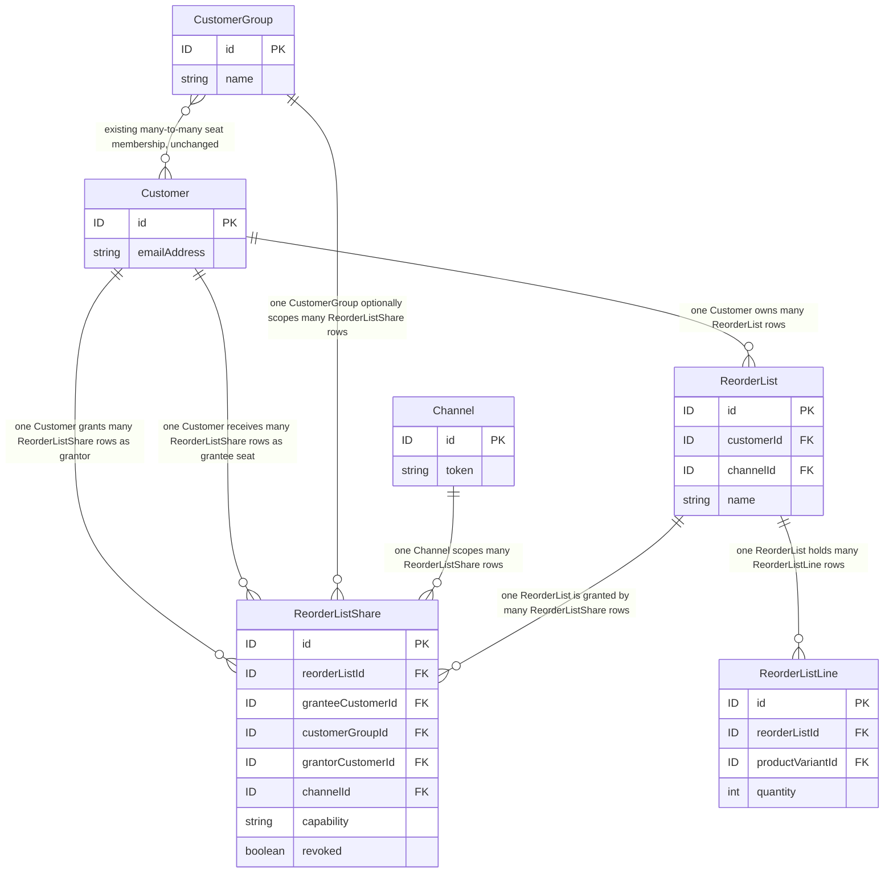
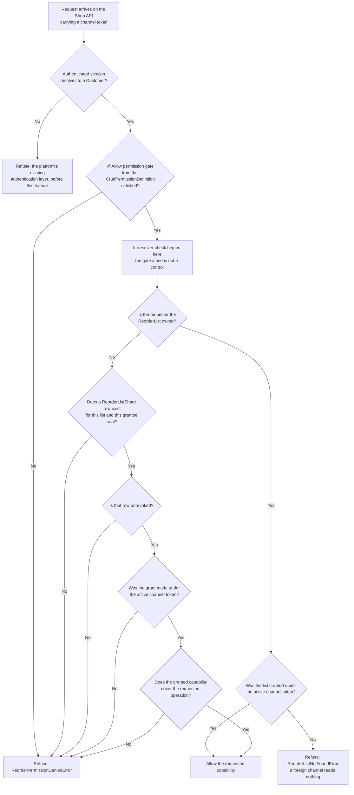

# FEATURE-001-06: Share a reorder list across the seats of a buying account behind an ownership-and-share check enforced inside the resolver, so that a colleague reorders from a list they do not own and gains access to nothing else

Parent epic: `tickets/EPIC-001-reorder-and-replenishment.md`. The parent epic and the sibling features are written as paths rather than as links, following the epic's own convention of keeping the link count in a file equal to the number of children that file indexes [tickets/EPIC-001-reorder-and-replenishment.md:§3. How To Read This Epic]. The only links in this file are the three story links in section 3.

---

## 1. Feature Title

**Share a reorder list across the seats of a buying account behind an ownership-and-share check enforced inside the resolver, so that a colleague reorders from a list they do not own and gains access to nothing else.**

Short name, used verbatim wherever this feature is referred to in one phrase, and identical to the label the epic's features index gives it: **Multi-Seat Buying Account List Sharing and Permissions** [tickets/EPIC-001-reorder-and-replenishment.md:§4. Features Index]. The long form above is the action-object-outcome title this tier requires; the short form is the name to cite.

The epic classifies this feature's deviation from its originally suggested area as **kept, mechanism fixed**, and it fixes the mechanism in one sentence: authorisation uses `CrudPermissionDefinition` [packages/core/src/common/permission-definition.ts:L146] plus explicit in-resolver ownership enforcement, and **not** a new authentication strategy [tickets/EPIC-001-reorder-and-replenishment.md:§4. Features Index]. Section 2.6 gives the reason that ruling exists rather than restating it as an assertion, and section 2.11 states what the ruling costs — the capabilities this feature deliberately does not build.

Delivery is part of the single self-contained plugin package the epic describes — `packages/reorder-plugin/`, exporting `ReorderPlugin` — and no file under `packages/core` or `packages/admin-ui` is edited to deliver it.

---

## 2. Feature Summary

### 2.1 The Capability

A buying account's administrator shares one of their named reorder lists with the other seats of that account, and controls which of those seats may reorder from it. This feature ships one plugin-owned share table, two Shop API mutations, one new error result, and the ownership-or-valid-share check that every operation touching a list must run inside its own resolver.

### 2.2 Contribution To The Epic

This feature is part of the epic's batch B5, whose dependencies are batches B2 and B4 [tickets/EPIC-001-reorder-and-replenishment.md:§9.4 Run Batches]. It owns the "Share list with account seats" step of the returning-buyer journey, which the epic's journey diagram routes from list curation into the cart write [tickets/EPIC-001-reorder-and-replenishment.md:L65]. Two of the epic's six personas meet the system here for the first time: the **Buying Account Administrator** is the WHO of stories 06-01 and 06-02, and the **Returning Buyer** is the WHO of story 06-03 [tickets/EPIC-001-reorder-and-replenishment.md:§10.4 Persona Map].

Read the contribution narrowly, because two adjacent surfaces belong to other features and this one adds neither:

- **It adds no list-authoring surface.** Creating a list, naming it, and adding, adjusting or removing its lines are all FEATURE-001-01's eight operations [tickets/EPIC-001/FEATURE-001-01-named-reorder-lists.md:§2.6 Named API Surfaces]. This feature grants a capability over a list that already exists; it never writes a list line.
- **It adds no cart-write surface.** Materialising a list into an active order is FEATURE-001-02's single mutation `applyReorderToActiveOrder` [tickets/EPIC-001/FEATURE-001-02-reorder-from-order-history.md:§2.5 Named API Surfaces], and story 06-03 invokes exactly that mutation as a customer who is not the list's owner. That feature records the same dependency from its side, at story granularity rather than feature granularity [tickets/EPIC-001/FEATURE-001-02-reorder-from-order-history.md:§4.2 Downstream].

What this feature contributes that neither of those can is the authorisation model. FEATURE-001-01 enforces that a list belongs to exactly one customer; this feature is the only place in the epic where a second customer may legitimately read or act on a row they do not own, which is why the epic's third collision lands hardest here.

### 2.3 Named Entities Touched

One entity is new and plugin-owned. Five already exist and are read, never altered. **No core entity gains a column, a relation or a custom field.**

- **`ReorderListShare` — new, plugin-owned.** One row per grant. Holds the shared list id, the grantee seat, the granted capability, the id of the channel the grant was made under, and the granting customer id. A grant is unique per list-and-seat, so re-granting the same capability to the same seat updates one row rather than accumulating duplicates that would each have to be revoked separately. Revocation is a state on the row rather than a hard delete, because story 06-02's revoked-mid-session behaviour cannot be asserted against a row that no longer exists.
- **`ReorderList` and `ReorderListLine` — existing after FEATURE-001-01, plugin-owned, read only here.** A share row points at a `ReorderList`; the lines are read only when story 06-03 resolves the list into cart lines, and they are read through FEATURE-001-01's own service rather than by querying its tables [tickets/EPIC-001/FEATURE-001-01-named-reorder-lists.md:§2.5 Named Services].
- **`Customer` — existing, read only.** Declared as implementing `ChannelAware`, `HasCustomFields` and `SoftDeletable` [packages/core/src/entity/customer/customer.entity.ts:L23]. Three of its members carry this feature: `emailAddress` [packages/core/src/entity/customer/customer.entity.ts:L42] is how a human names a seat, `groups` [packages/core/src/entity/customer/customer.entity.ts:L46] is the existing many-to-many that already expresses which account a customer is a seat of, and `user` [packages/core/src/entity/customer/customer.entity.ts:L56] is the eager one-to-one that ties the row to the authenticated session the ownership check reads. That `Customer` is soft-deletable is load-bearing for a share table: a soft-deleted grantee's share row still exists, so a share check must resolve against the session and the grant's state rather than against row existence.
- **`CustomerGroup` — existing, read only.** Declared with `name` [packages/core/src/entity/customer-group/customer-group.entity.ts:L23] and the inverse many-to-many `customers` [packages/core/src/entity/customer-group/customer-group.entity.ts:L26] on the class at [packages/core/src/entity/customer-group/customer-group.entity.ts:L18]. **The seat model is expressed over this existing relation rather than by adding a new account entity**, and the two paragraphs below this list record the reason for that and the honest limits of doing it.
- **`Channel` — existing, read only.** Supplies the token every grant is scoped by [packages/core/src/entity/channel/channel.entity.ts:L62]. Section 2.10 states the scoping rule this produces.

**Why no new account entity, stated as a decision rather than as a preference.** A `BuyingAccount` entity would duplicate a relation this platform already ships: `Customer.groups` [packages/core/src/entity/customer/customer.entity.ts:L46] and `CustomerGroup.customers` [packages/core/src/entity/customer-group/customer-group.entity.ts:L26] are already a many-to-many between customers and a named grouping, and a second parallel membership graph would immediately raise the question of which one authorisation trusts. So membership is read from the existing relation and the new table stores only **capability** — who may do what with which list. That division is the whole of the entity design: `CustomerGroup` answers "is this person a seat of that account", `ReorderListShare` answers "may this seat reorder from that list", and neither answers the other's question.

**The honest limit of reusing `CustomerGroup`, stated because a reader will otherwise assume more than the platform provides.** The entity's own documentation describes it as a grouping that enables features such as group-based promotions or tax rules [packages/core/src/entity/customer-group/customer-group.entity.ts:L12-L13]. It is not an account construct and carries no notion of an administrator, a role or an invitation. Three consequences follow and all three are carried into section 2.11 rather than glossed:

- **The GraphQL `Customer` type exposes no `groups` field at all.** It declares `emailAddress` [packages/core/src/api/schema/common/customer.type.graphql:L9], `orders` [packages/core/src/api/schema/common/customer.type.graphql:L11] and `user` [packages/core/src/api/schema/common/customer.type.graphql:L12] and stops there [packages/core/src/api/schema/common/customer.type.graphql:L1-L13]. Group membership is therefore readable from plugin TypeScript through the entity relation, and **not** readable by a storefront client.
- **Adding that field is the epic's fifth collision, and this feature declines it.** Putting `groups` on the Shop API `Customer` type would alter the published schema of a core type the plugin does not own [tickets/EPIC-001-reorder-and-replenishment.md:§6.2 Research-Discovered Collisions], and it would expose a path to `CustomerGroup.customers` [packages/core/src/api/schema/common/customer-group.type.graphql:L6], each of whose `Customer` rows carries an `emailAddress` [packages/core/src/api/schema/common/customer.type.graphql:L9]. Enumerating every colleague's email address to any authenticated seat is not a side effect this feature accepts, so the field is not added and the seat set is never returned to a storefront.
- **Seat membership is administered on the Admin API, not by the account administrator.** `customerGroups` [packages/core/src/api/schema/admin-api/customer-group.api.graphql:L2], `createCustomerGroup` [packages/core/src/api/schema/admin-api/customer-group.api.graphql:L8] and `addCustomersToGroup` [packages/core/src/api/schema/admin-api/customer-group.api.graphql:L16] are Admin API operations, and a search of the Shop API schema tree for any customer-group surface returns nothing. So the Buying Account Administrator persona of stories 06-01 and 06-02 grants a capability **over a seat set someone else administers**. That is a real limitation of this design, not an oversight, and section 4.5 records the decision it leaves open.

### 2.4 Named Services

- **`ReorderListShareService` — new, plugin-owned.** Holds every read and write of the share table, and — more importantly — holds the single implementation of the ownership-or-valid-share predicate that section 2.6 makes mandatory. Both new mutations and every read path that may now return a shared list call the same predicate, so there is exactly one function to review rather than one per resolver.
- **`ReorderListService` — existing after FEATURE-001-01, plugin-owned.** Resolves a list and its lines, and already owns the owner-only rule this feature relaxes in exactly one direction [tickets/EPIC-001/FEATURE-001-01-named-reorder-lists.md:§2.5 Named Services]. The relaxation is a parameter to that service, not a second copy of it.
- **`ReorderService` — existing after FEATURE-001-02, plugin-owned.** Story 06-03 reaches the cart through it and adds no materialisation logic of its own [tickets/EPIC-001/FEATURE-001-02-reorder-from-order-history.md:§2.5 Named API Surfaces].
- **`OrderService` — existing, in `packages/core`, consumed and never modified.** Four members are named, and the distinction between the two this feature's path reaches and the two it must leave alone is the reason for naming them:
  - `getActiveOrderForUser` [packages/core/src/service/services/order.service.ts:L429] — resolves an existing cart for the authenticated user and returns `Order | undefined`. It is the member that makes the cart-ownership question in section 4.5 answerable at all, because it resolves a cart from the *session*, not from the list.
  - `addItemsToOrder` [packages/core/src/service/services/order.service.ts:L654] — the bulk add that FEATURE-001-02 is built around and that story 06-03 reaches through `ReorderService`. No plugin code in this feature calls it directly.
  - `addItemToOrder` [packages/core/src/service/services/order.service.ts:L622] and `adjustOrderLine` [packages/core/src/service/services/order.service.ts:L774] — **named here as signatures that must remain untouched**, not as call targets. They are the specific pair the epic's first collision would widen as a side effect if this epic declared a custom field on `OrderLine` [tickets/EPIC-001-reorder-and-replenishment.md:§6.1 Repository-Discovered Collisions], which is why section 5 requires evidence for them by name.
- **`CustomerService` — existing, consumed.** `findOneByUserId` [packages/core/src/service/services/customer.service.ts:L141] resolves the authenticated session's user id to the `Customer` row that both the ownership check and the grantee lookup are expressed against, on the class at [packages/core/src/service/services/customer.service.ts:L82]. Its `filterOnChannel` parameter defaults to `true` [packages/core/src/service/services/customer.service.ts:L141], so the customer lookup is itself channel-filtered unless a caller opts out — which is a platform behaviour this feature relies on rather than reimplements. This service is required beyond the list the epic states for the whole set [tickets/EPIC-001-reorder-and-replenishment.md:§7.4 Existing Entities And Services The Work Depends On], and it is named here for that reason.
- **`CustomerGroupService` — existing, read only.** The seat set is read through it [packages/core/src/service/services/customer-group.service.ts:L40] rather than by joining the group tables in plugin code. Its `addCustomersToGroup` [packages/core/src/service/services/customer-group.service.ts:L147] and `removeCustomersFromGroup` [packages/core/src/service/services/customer-group.service.ts:L173] members are named as **operations this feature does not call and does not expose**: seat membership is administered elsewhere, per section 2.3.
- **`TransactionalConnection` — existing, consumed.** Every write to the share table goes through it, which is the persistence idiom the epic names for all plugin-owned state [tickets/EPIC-001-reorder-and-replenishment.md:§7.4 Existing Entities And Services The Work Depends On].

### 2.5 Named API Surfaces — Two New Mutations, Zero Existing Signatures Changed

**The two new operations**, added through the plugin's `shopApiExtensions` using `extend type Mutation` — the mechanism the shipped wishlist example already demonstrates through its plugin metadata [packages/dev-server/example-plugins/wishlist-plugin/wishlist.plugin.ts:L9-L16]:

- `shareReorderList` — grants a named capability over one list the caller owns, to one seat of the caller's account, in the active channel. Returns the affected list together with its grants, or `ReorderPermissionDeniedError`.
- `revokeReorderListShare` — marks an existing grant revoked. Returns the affected list together with its remaining grants, or `ReorderPermissionDeniedError`.

**Two is the whole of this feature's contribution to the epic's operation budget, and the budget is why.** The epic's plugin adds fourteen Shop API operations in total; FEATURE-001-01 contributes eight [tickets/EPIC-001/FEATURE-001-01-named-reorder-lists.md:§2.6 Named API Surfaces] and FEATURE-001-02 contributes one [tickets/EPIC-001/FEATURE-001-02-reorder-from-order-history.md:§2.5 Named API Surfaces]. This feature adds no query, and it adds no Admin API operation: the administrative read over share rows belongs to FEATURE-001-08's story 08-03.

**Existing platform surfaces consumed and not extended:** `activeCustomer` [packages/core/src/api/schema/shop-api/shop.api.graphql:L5] identifies the caller, and nothing else in the platform's own schema is read by this feature.

**The read-path ruling — stated, not left implicit.** Once a list can be shared, FEATURE-001-01's two read operations have a question to answer that they did not have when they were written: does `activeCustomerReorderLists` return a list the caller merely has a grant on? Silently redefining what an already-shipped operation returns would break a client that assumed every returned list was owned by the caller, and that is the failure mode the epic's fifth collision exists to prevent [tickets/EPIC-001-reorder-and-replenishment.md:§6.2 Research-Discovered Collisions]. **The ruling is that the extension is additive and explicit:** the two read operations gain an optional argument whose default preserves the existing owner-only behaviour exactly, and the plugin-owned list type gains a field distinguishing an owned list from a shared one together with the capability granted. No operation is added, no existing argument becomes required, no existing field changes type or nullability, and a client that never passes the new argument observes no change at all. Story 06-01 owns that declaration, and section 5 requires the evidence.

**The additive-only constraint stated as a countable surface rather than as an intention.** The Shop API root `Query` type declares nineteen root queries [packages/core/src/api/schema/shop-api/shop.api.graphql:L1-L52], and the order, cart and customer-account mutation sets live in the same file under `type Mutation` [packages/core/src/api/schema/shop-api/shop.api.graphql:L70]. Every one of those signatures is byte-identical after this feature ships. Where a platform mechanism would widen an existing signature as a side effect of an otherwise additive change, that is a reportable violation recorded in the epic's collision section and referenced here rather than re-argued or quietly absorbed [tickets/EPIC-001-reorder-and-replenishment.md:§6.1 Repository-Discovered Collisions]. This feature therefore declares no custom field on any core entity.

### 2.6 The Existing Mechanisms This Feature Consumes Rather Than Rebuilds

The epic's do-not-duplicate inventory assigns this feature one mechanism with a prohibition attached — `CrudPermissionDefinition`, with no hand-declaring of permission strings and no bespoke authorisation layer [tickets/EPIC-001-reorder-and-replenishment.md:§5. Existing Mechanisms That Must Not Be Duplicated] — and the same inventory row points forward to the collision that makes the mechanism insufficient on its own. Both halves are set out below, in that order, because the second is what makes this feature difficult.

#### Mechanism one — `CrudPermissionDefinition`, and no hand-written permission strings

One definition constructed with a name yields exactly four permissions. The derivation is the class's own: a `name` of 'Wishlist' will create the four permissions `CreateWishlist`, `ReadWishlist`, `UpdateWishlist` and `DeleteWishlist` [packages/core/src/common/permission-definition.ts:L114-L115], built by mapping those four operations over the configured name [packages/core/src/common/permission-definition.ts:L156] and surfaced as the `Create` [packages/core/src/common/permission-definition.ts:L172], `Read` [packages/core/src/common/permission-definition.ts:L181], `Update` [packages/core/src/common/permission-definition.ts:L190] and `Delete` [packages/core/src/common/permission-definition.ts:L199] getters over the `PermissionDefinition` base [packages/core/src/common/permission-definition.ts:L86], whose own `Permission` getter is what the decorator consumes [packages/core/src/common/permission-definition.ts:L107]. Registration is through `authOptions.customPermissions` [packages/core/src/common/permission-definition.ts:L123-L128] and each resolver is gated with the `@Allow` decorator [packages/core/src/common/permission-definition.ts:L134]. Where only a read and a write permission are wanted, `RwPermissionDefinition` [packages/core/src/common/permission-definition.ts:L245] is the narrower alternative and is available without any additional wiring.

**Registration is a plugin act, not a core edit.** The definition is registered from the plugin's own `configuration` function, which receives the config and returns it — exactly the shape the shipped wishlist plugin uses to mutate configuration from inside a plugin [packages/dev-server/example-plugins/wishlist-plugin/wishlist.plugin.ts:L17-L26]. Nothing under `packages/core` is touched to add a permission.

This feature proposes **one** definition, named `ReorderListShare`, and consumes the `ReorderList` definition FEATURE-001-01 proposes [tickets/EPIC-001/FEATURE-001-01-named-reorder-lists.md:§2.7 The Existing Mechanism This Feature Consumes Rather Than Rebuilds]. Together with the administrative definition FEATURE-001-08 introduces, that is the three new definitions the epic counts when it measures the enum growth [tickets/EPIC-001-reorder-and-replenishment.md:§6.1 Repository-Discovered Collisions]. **All three counts are proposals and are labelled as such**: how many definitions are registered is an open architectural decision belonging to a maintainer, and it is recorded as one [tickets/EPIC-001-reorder-and-replenishment.md:§8.2 Architectural Decisions].

#### Mechanism two — the `Permission.Owner` caveat, and why a permission gate alone is not a control

This is the load-bearing finding of this feature, and it is citable rather than editorial. The platform documents `Permission.Owner` as a special permission indicating that a resolver should only be accessible to the owner of that resource [packages/core/src/api/config/generate-permissions.ts:L14-L15], and then states the consequence in its own words: ownership must be enforced by custom logic inside the resolver, and because ownership cannot be defined generally nor statically encoded at build time, any resolver using `Permission.Owner` **must** include logic to enforce that only the owner of the resource has access — and if it does not, the effect is the equivalent of using `Permission.Public` [packages/core/src/api/config/generate-permissions.ts:L32-L34]. The whole caveat is written down in one block in that file [packages/core/src/api/config/generate-permissions.ts:L12-L33].

**A permission gate alone is not a control.** A resolver that declares `@Allow(...)` and nothing else has built no access control at all; it has published the operation.

A second, independent confirmation sits in the permission's own declaration. `Owner` is defined with the description that the user owns this entity, for example a Customer's own Order [packages/core/src/common/constants.ts:L29], and it is declared `assignable: false` [packages/core/src/common/constants.ts:L30] and `internal: true` [packages/core/src/common/constants.ts:L31] on the definition at [packages/core/src/common/constants.ts:L28]. Because it cannot be assigned to a role, there is no configuration a deployment could apply that would make ownership hold without the resolver's own logic. The gate and the control are simply different things.

Three consequences bind every operation in this feature, and section 5 turns each into evidence rather than leaving it as prose:

- **Every operation performs an explicit ownership-or-valid-share check inside the resolver or the service it delegates to.** For the two new mutations the check is ownership of the list; for a read or a cart write reached through a grant it is ownership **or** an unrevoked grant to the caller's seat in the active channel. Figure F6-AUTH in section 2.9 is that predicate drawn out.
- **A request authenticated as a different customer with no grant is refused, and that is a mandatory acceptance criterion in all three stories** rather than an edge case in one of them. The refusal is `ReorderPermissionDeniedError`, not an empty result, so a storefront can tell "you may not" from "there is nothing".
- **Revocation must be checked per request, not per session.** Story 06-02's revoked-mid-session behaviour exists precisely because the platform gives no session-level ownership guarantee to lean on: a grant revoked after a client authenticated must stop working on the next request that relies on it.

#### Mechanism three — the automatic `Permission` enum growth, referenced and not re-argued

The `Permission` enum is declared with no members in source and annotated as populated at run time [packages/core/src/api/schema/common/common-enums.graphql:L20-L21], and it is filled by `generatePermissionEnum` from the default and custom definitions [packages/core/src/api/config/generate-permissions.ts:L42]. Registering the `ReorderListShare` definition therefore grows a published enum automatically, with no opt-in at request time.

That growth is the epic's third collision and is **referenced here rather than re-derived, and it is not accepted silently** [tickets/EPIC-001-reorder-and-replenishment.md:§6.1 Repository-Discovered Collisions]. The epic's verdict is that the growth is a declared, manageable side effect because no existing member is removed or renamed; the obligation it leaves on this feature is to declare the growth in the story that registers the definition and to require a default branch in every consuming example that switches on the enum. Story 06-01 carries that declaration.

### 2.7 Figure F6-ER — The Share And Seat Rows, And Their Foreign-Key Direction

This is the first of the two diagrams in this feature. Story files carry none: story 06-01 references this figure by the name **Figure F6-ER**, and stories 06-02 and 06-03 reference **Figure F6-AUTH** in section 2.9.

Four readings of the figure are load-bearing and are stated so they are not inferred:

- **The grantee is a `Customer`, not a group.** `ReorderListShare.granteeCustomerId` is what makes an authorisation decision resolvable from a single authenticated session without walking a membership graph on every request. `customerGroupId` is recorded alongside it as the account the grant was made in the context of, so a revocation can be reasoned about at account level; it is not the subject of the check.
- **The grantor is recorded, and it is not the same column as the list owner.** `ReorderListShare.grantorCustomerId` exists so that story 06-02's revocation can be attributed, and so that FEATURE-001-08's administrative read has something to show a support agent. Storing it separately from `ReorderList.customerId` is deliberate: the two are equal today because only an owner may grant, and conflating them would silently encode that rule in the schema where a later change could not see it.
- **Channel scoping is a column, not a convention.** `ReorderListShare.channelId` is why a grant made under one channel token confers nothing under another, which section 2.10 states as a rule.
- **Revocation is a column, not a missing row.** `revoked` is what lets story 06-02 assert that a previously working request now fails, and it is what lets a support agent see that a grant once existed.

### 2.8 The Grant Lifecycle, And Why Revocation Is A State Rather Than A Delete

A grant has three observable conditions and exactly two transitions, and both transitions are the two mutations in section 2.5. Setting this out here rather than in a story keeps all three stories consistent with one another:

- **Absent.** No row exists for this list-and-seat pair. A read or cart write by that seat resolves to `ReorderPermissionDeniedError`.
- **Active.** A row exists and `revoked` is false. The seat may perform the granted capability, subject to the channel check.
- **Revoked.** A row exists and `revoked` is true. The seat may not, and the row remains as the record that it once could.

Three properties follow, and each becomes an acceptance criterion in the story that owns it:

- **Re-granting is idempotent.** Because a grant is unique per list-and-seat, `shareReorderList` called twice for the same pair leaves one row rather than two, and a grant that was revoked and is granted again returns to active on the same row. Without the uniqueness rule, a revocation would have to delete an unbounded set of rows to be effective, which is a correctness hazard rather than a tidiness concern.
- **Revoking an already-revoked grant is idempotent**, and revoking a grant that never existed is `ReorderPermissionDeniedError` rather than a silent success, so a client cannot mistake "nothing to revoke" for "revoked".
- **An authorisation decision is point-in-time.** It is evaluated per request against the row's current state, which is exactly why section 2.6's third consequence holds: nothing about a session survives a revocation. The epic makes the same point for a different read in FEATURE-001-02 [tickets/EPIC-001/FEATURE-001-02-reorder-from-order-history.md:§2.10 A Point-In-Time Read Is Not A Reservation], and the shape of the argument is identical here — a check that passed a moment ago is not a promise about the next request.

### 2.9 Figure F6-AUTH — The Ownership-Plus-Share Authorisation Check

This is the second of the two diagrams in this feature, and it is the predicate section 2.6 makes mandatory, drawn out. Stories 06-02 and 06-03 reference it by the name **Figure F6-AUTH** and embed no diagram of their own.

Two readings of the figure matter more than the rest:

- **The gate and the check are separate nodes on purpose.** Node C is the `@Allow` decorator [packages/core/src/common/permission-definition.ts:L134]; everything from node D onward is resolver logic. A design that collapses them has reproduced the failure the platform warns about [packages/core/src/api/config/generate-permissions.ts:L32-L34].
- **The two refusal shapes are deliberately different.** A foreign channel token yields `ReorderListNotFoundError`, because from that channel the list genuinely does not exist and saying otherwise would confirm the existence of a row the caller may not see. A missing, revoked, wrong-channel or insufficient grant yields `ReorderPermissionDeniedError`, because the caller is entitled to know the request was refused rather than empty.

### 2.10 Channel Scoping, Language Scoping And Monetary Values

Every operation in this feature is channel-scoped and language-scoped. This is a property of the request rather than an argument a caller may omit, so it holds for both mutations and for every read reached through a grant, without being restated per operation. The epic states the same prerequisite once for the whole set [tickets/EPIC-001-reorder-and-replenishment.md:§7.5 Request Prerequisites].

- **Channel — stated as a rule, not as an aspiration.** The active channel is identified by a unique token read from the `vendure-token` request header [packages/core/src/entity/channel/channel.entity.ts:L58-L59], carried as a unique column on `Channel` [packages/core/src/entity/channel/channel.entity.ts:L62]. `ReorderListShare` stores the id of the channel the grant was made under, and every authorisation decision filters on the active channel. **A share granted under one channel token confers no access under another.** A grantee presenting a different token is refused with `ReorderPermissionDeniedError`, and a list whose own channel does not match the active token resolves to `ReorderListNotFoundError` — the two cases are distinguished in Figure F6-AUTH. The platform's own customer lookup reinforces rather than contradicts this: `findOneByUserId` filters on channel by default [packages/core/src/service/services/customer.service.ts:L141].
- **Language.** Translated output resolves against the request's `languageCode`, which defaults to the channel's `defaultLanguageCode` [packages/core/src/entity/channel/channel.entity.ts:L74]. This feature stores no translatable string of its own: a capability is an enumerated value and not prose, and the list name it grants access to is the buyer-supplied string FEATURE-001-01 returns unchanged in every language code [tickets/EPIC-001/FEATURE-001-01-named-reorder-lists.md:§2.4 Named Entities Touched]. A story that expects a translated capability label or a translated list name has misread this paragraph.
- **Money.** This feature's own payloads carry no monetary column: a grant records a list, a seat, a capability, a channel and a grantor, and nothing priced. Wherever a shared list surfaces a price — a grantee reading list lines, or story 06-03 receiving the cart the reorder produced — that value is an integer in the smallest currency unit stated alongside its currency code, which defaults to `Channel.defaultCurrencyCode` [packages/core/src/entity/channel/channel.entity.ts:L88]. A decimal monetary value anywhere in this feature or its stories is a defect, not a formatting preference. Storing no price on a grant is deliberate for the same reason FEATURE-001-01 stores none on a list line: a copied price is stale the moment the catalogue moves, and reporting that movement before commit is FEATURE-001-03's work.
- **Tax presentation follows the channel too.** Whether the prices a grantee sees include tax is `Channel.pricesIncludeTax` [packages/core/src/entity/channel/channel.entity.ts:L113], so two seats of one account reading the same list under two channel tokens may legitimately see two different figures. That is a consequence of channel scoping rather than an inconsistency, and a story asserting a monetary value names the channel token it asserted under.

### 2.11 What This Feature Does Not Build — The Security Boundary Stated Honestly

The mechanism-fixing ruling in section 1 buys simplicity by declining scope, and the declined scope is enumerated here so that nobody reads "sharing and permissions" as more than it is.

- **No new authentication strategy.** Callers authenticate through the platform's existing mechanism, unchanged. This feature adds no credential type, no token format and no login operation.
- **No new session mechanism.** There is no share session, no impersonation and no acting-as. A grantee acts as themselves throughout, which is precisely why the authorisation check is per request rather than per session, and why revocation takes effect on the next request.
- **No role hierarchy, and no Admin API role surface.** "Buying Account Administrator" is a persona, not a stored role: the capability to grant is ownership of the list, nothing more. This feature adds no administrator flag to `Customer`, no role table of its own, and no Admin API operation. A marketplace-side role model already exists in the platform and is deliberately untouched.
- **No seat-membership management.** As section 2.3 records, seat membership is administered through the existing Admin API customer-group operations [packages/core/src/api/schema/admin-api/customer-group.api.graphql:L16] and no Shop API surface for it exists or is added. A buying-account administrator grants a capability over a seat set an operator maintains.
- **No seat directory on the Shop API.** The seat set is never returned to a storefront, because doing so would expose every colleague's `emailAddress` [packages/core/src/api/schema/common/customer.type.graphql:L9] through `CustomerGroup.customers` [packages/core/src/api/schema/common/customer-group.type.graphql:L6]. A grantee is named by the granting caller, not discovered by browsing.
- **No external identity provider, and no external service of any kind.** Nothing in this feature calls out of process. One table, one permission definition, two mutations and one predicate are satisfied entirely by the database and the plugin's own service.
- **No invented figure of any kind.** This feature states no service-level commitment, no timing target for a permission check and no cap on the number of seats a list may be shared with, because this repository declares none and the epic reports that absence as a finding rather than filling it [tickets/EPIC-001-reorder-and-replenishment.md:§2.2 Business Value]. **A cap on seats per list is a product decision required before build, not a number this feature may supply.** The epic's product-decision list settles a maximum for lists per customer and lines per list and is silent on seats per share [tickets/EPIC-001-reorder-and-replenishment.md:§8.1 Product Decisions]; that silence is reported here as a gap for a maintainer to close, and section 4.5 records it as an open decision rather than resolving it with a plausible figure.

**One inherited precondition, labelled as a research finding rather than a repository citation.** The epic records that platform 3.7.0 links external authentication to a pre-existing account only when the external email address is verified, and that this additionally requires a custom authentication strategy to mark provider-verified emails as verified; the epic itself flags the finding as material to this feature, because a seat may arrive through an external identity provider [tickets/EPIC-001-reorder-and-replenishment.md:§2.3 Confirmed Platform Version]. It is a **precondition on the environment, established by research into the published release rather than by reading a file in this checkout**, and it is stated as such. Its practical effect on this feature is narrow and worth naming: a seat invited by email address cannot be silently linked to an unverified external account, so a grant made against an email address that does not resolve to a verified customer in the active channel has no grantee to attach to and is refused rather than held pending.

### 2.12 The Error Vocabulary This Feature Introduces

**One** of the six error results the whole ticket set declares belongs to this feature: `ReorderPermissionDeniedError`. Four belong to FEATURE-001-01 and one to FEATURE-001-02, and both siblings record the same split from their own side [tickets/EPIC-001/FEATURE-001-01-named-reorder-lists.md:§2.10 The Error Vocabulary This Feature Introduces] and [tickets/EPIC-001/FEATURE-001-02-reorder-from-order-history.md:§2.11 The Error Vocabulary This Feature Introduces].

`ReorderPermissionDeniedError` is returned when an authenticated caller is refused an operation on a list for an authorisation reason — no grant, a revoked grant, a grant made under a different channel token, a granted capability that does not cover the requested operation, or an attempt to grant or revoke on a list the caller does not own. Every one of those is a terminal branch in Figure F6-AUTH. It is deliberately **not** returned when the list is invisible from the active channel: that case is `ReorderListNotFoundError`, which FEATURE-001-01 owns.

**No text in this feature or in its three stories names an error outside those six and the thirty-one types that already implement the `ErrorResult` interface in this checkout** — fifteen declared between [packages/core/src/api/schema/common/common-error-results.graphql:L2] and [packages/core/src/api/schema/common/common-error-results.graphql:L103], alongside `union UpdateOrderItemErrorResult` [packages/core/src/api/schema/common/common-error-results.graphql:L112-L117], and sixteen more declared between [packages/core/src/api/schema/shop-api/shop-error-results.graphql:L2] and [packages/core/src/api/schema/shop-api/shop-error-results.graphql:L130].

Two consequences of that boundary are worth stating because they are easy to get wrong:

- **`NoActiveOrderError` [packages/core/src/api/schema/common/common-error-results.graphql:L95] is not a member of story 06-03's result union.** FEATURE-001-02 already ruled that its cart write creates the active order through the existing mechanism rather than returning that error [tickets/EPIC-001/FEATURE-001-02-reorder-from-order-history.md:§2.8 The No-Active-Order Ruling], and story 06-03 invokes that same mutation. Reordering from a shared list therefore inherits the ruling and does not re-open it.
- **Declaring `ReorderPermissionDeniedError` grows the published `ErrorCode` enum**, which ships with a single literal member in source [packages/core/src/api/schema/common/common-enums.graphql:L28-L29] and is populated at build time from every type implementing the error interface. That is the epic's second collision, referenced rather than re-derived [tickets/EPIC-001-reorder-and-replenishment.md:§6.1 Repository-Discovered Collisions], and the design rule it leaves behind is that any consuming example switching on `ErrorCode` carries a default branch.

### 2.13 Precedent In This Repository — Partial

The disclosure has two halves and both are stated, because reporting only the first would overstate the novelty and reporting only the second would overstate the work.

**Half one — the authorisation mechanism is precedented, and one of its worked examples is a wishlist.** `CrudPermissionDefinition` is shipped platform code, and its own documentation block teaches it with a wishlist: the definition [packages/core/src/common/permission-definition.ts:L119], its registration under `authOptions.customPermissions` [packages/core/src/common/permission-definition.ts:L123-L128] and a `WishlistResolver` gated with `@Allow` [packages/core/src/common/permission-definition.ts:L132-L134]. Separately, the shipped wishlist plugin demonstrates the structural half of this feature — plugin-owned data hanging off a customer, declared in plugin metadata and configured from the plugin's own configuration function [packages/dev-server/example-plugins/wishlist-plugin/wishlist.plugin.ts:L17-L26]. A reviewer should price the permission wiring, the entity, the migration and the schema extension as a re-application of shipped work.

**Half two — nothing in this repository shares customer-owned data between customers, and that is the new part.** The search behind that claim is stated so the finding is checkable rather than asserted: a word-boundary search for share, shared and sharing across every TypeScript file under the example-plugin and test-plugin trees, discounting shared-type imports and stream operators, returns no plugin that grants one customer access to another customer's rows; the Shop API schema tree contains no sharing surface at all; and no core entity carries a grant, share or delegation column. The closest shipped analogue, the wishlist plugin, is single-owner by construction — its data hangs off one `Customer` through a custom field [packages/dev-server/example-plugins/wishlist-plugin/wishlist.plugin.ts:L18-L24] and it has no concept of a second reader.

So the precedent value is **partial**: the mechanism is precedented, the *use* of it is not. Concretely new here are the share row itself, the ownership-**or**-grant predicate in Figure F6-AUTH, the revoked-grant state and its per-request evaluation, the channel-scoped grant, and the read-path ruling in section 2.5 that stops an already-shipped plugin operation from silently changing meaning. None of those five has an analogue to copy, which is also why this feature carries the epic's heaviest authorisation obligation.

### 2.14 Constraints This Feature Is Built Under

These are boundaries on the work this feature describes, not preamble. Each is carried into the definition of done in section 5.

- **Additive only, and two mutations is the whole of it.** No existing Shop API or Admin API operation signature changes. The automatic `Permission` and `ErrorCode` enum growth is a **reported collision, not a licence** [tickets/EPIC-001-reorder-and-replenishment.md:§6.1 Repository-Discovered Collisions]; and the extension of FEATURE-001-01's two read operations is the declared, optional-argument change ruled in section 2.5, never a silent redefinition.
- **Zero custom fields on a core entity.** Ownership and capability both live on plugin-owned columns, so the widening the epic's first collision describes never arises. The dev-server configuration currently declares an empty custom-fields object [packages/dev-server/dev-config.ts:L116] and a reviewer should expect it still empty once this feature ships. This is the same departure from the shipped wishlist pattern that FEATURE-001-01 records [tickets/EPIC-001/FEATURE-001-01-named-reorder-lists.md:§2.4 Named Entities Touched].
- **Zero edits to `packages/core` and `packages/admin-ui`.** Delivery is self-contained in the plugin package. The only two files a future implementation may touch outside its own package are the dev-server plugin registration array [packages/dev-server/dev-config.ts:L121-L155], where `ReorderPlugin` would be added, and the dashboard bundling configuration [packages/dev-server/vite.config.mts:L1]. **This feature needs the first and not the second, because it ships no dashboard surface.** Registering the permission definition is not an exception to this rule at all: `authOptions.customPermissions` is set from the plugin's own configuration function [packages/dev-server/example-plugins/wishlist-plugin/wishlist.plugin.ts:L17-L26], not by editing core. Naming those two files is a documentation act and does not license a documentation run to edit them [tickets/EPIC-001-reorder-and-replenishment.md:§11.7 The Two Permitted Configuration Exceptions].
- **Additive TypeORM migrations only — one new table.** No destructive statement and no column type change on any existing table. The migration is produced by `generateMigration` [packages/core/src/migrate.ts:L118], applied by `runMigrations` [packages/core/src/migrate.ts:L40] and rolled back by `revertLastMigration` [packages/core/src/migrate.ts:L89], the lifecycle already exposed as a command-line surface [skills/vendure-cli/commands/migrate.md:L1]. Engine evidence is MariaDB, MySQL, PostgreSQL and sql.js; **native SQLite is named as an unverified engine and is not claimed**, per the epic's first documentation discrepancy [tickets/EPIC-001-reorder-and-replenishment.md:§6.3 Repository Documentation Discrepancies]. The cached end-to-end seed data is deleted before the run [tickets/EPIC-001-reorder-and-replenishment.md:§11.3 Operational Reset Steps After A Schema Change].
- **Channel-scoped and language-scoped**, exactly as section 2.10 rules, with integer monetary values and their currency code wherever a price appears.
- **No external-service dependency**, as section 2.11 enumerates.
- **No invented figure.** Where a story here needs precision it asserts a verifiable state instead — an exact grant count, an exact error type name, an exact capability value, an exact channel token, or the authenticated identity a request was refused under.
- **Version tagging.** Doc blocks on the new public API carry `@since 3.8.0`. That value is *derived* from the next-minor rule in the contribution guide [CONTRIBUTING.md:L340] applied to a 3.7.0 checkout [packages/core/package.json:L2-L3], and the epic flags the same derivation [tickets/EPIC-001-reorder-and-replenishment.md:§11.2 Version Tagging]. It is never presented as a quotation, because the guide's literal example names a different version.
- **No hand-written reference page.** The plugin's reference documentation is generated from JSDoc in the TypeScript sources, so this feature's documentation obligations mean writing JSDoc rather than authoring a page under the documentation tree [tickets/EPIC-001-reorder-and-replenishment.md:§11.5 Public API Documentation Is Generated, Not Hand-Written].

---

## 3. User Stories Index

Three stories, sized and ordered so that each one is buildable on its own. Titles are transcribed from the epic's story table and are not restated with different wording [tickets/EPIC-001-reorder-and-replenishment.md:§9.2 Story Table].

- [STORY-001-06-01 — Share a reorder list with account seats](./FEATURE-001-06/STORY-001-06-01-share-reorder-list-with-account-seats.md) — the new share table, the additive migration, the `ReorderListShare` permission definition, the `shareReorderList` mutation, and the read-path declaration ruled in section 2.5. References **Figure F6-ER**.
- [STORY-001-06-02 — Grant and revoke seat reorder permission](./FEATURE-001-06/STORY-001-06-02-grant-and-revoke-seat-reorder-permission.md) — `revokeReorderListShare`, the grant lifecycle in section 2.8, and the revoked-mid-session case that exists because an authorisation decision is per request rather than per session. References **Figure F6-AUTH**.
- [STORY-001-06-03 — Reorder from a shared list](./FEATURE-001-06/STORY-001-06-03-reorder-from-shared-list.md) — a grantee invoking FEATURE-001-02's `applyReorderToActiveOrder` against a list they do not own, with the authorisation criteria and the assertion about which customer the resulting cart belongs to. References **Figure F6-AUTH**.

The WHO differs across the three and the epic's persona map is the authority for it: stories 06-01 and 06-02 belong to the **Buying Account Administrator**, and story 06-03 belongs to the **Returning Buyer** [tickets/EPIC-001-reorder-and-replenishment.md:§10.4 Persona Map]. Their source-traceability labels differ for the same reason: the epic labels 06-01 and 06-02 as inferred from the Primary Users block, while 06-03 carries a quoted objective clause [tickets/EPIC-001-reorder-and-replenishment.md:§10.3 Inferred Breakdown].

Estimates are deliberately absent from this file. Points, lines of code, generation hours and review hours live only in the epic's delivery-split table, which is the single source of truth for them, and each story transcribes its own four values from its row there [tickets/EPIC-001-reorder-and-replenishment.md:§9.2 Story Table].

---

## 4. Dependencies

Direction is stated for every entry, because a dependency without a direction cannot be sequenced.

### 4.1 Upstream — Two Features, For Two Different Reasons

Direction: both arrows point *into* this feature. Neither creates a reciprocal obligation in the other.

- **FEATURE-001-01, for the tables being shared.** A share row has nothing to point at until `ReorderList` exists with its ownership column and its permission set, so the whole of this feature waits on that feature. FEATURE-001-01 records the same edge from its side, describing this feature's need as the shared-list surface [tickets/EPIC-001/FEATURE-001-01-named-reorder-lists.md:§4.2 Downstream].
- **FEATURE-001-02, for the cart write, and at story granularity only.** Only story 06-03 needs it, because only story 06-03 reaches a cart; stories 06-01 and 06-02 write a grant and never touch an order. FEATURE-001-02 records the identical qualification from its side, naming STORY-001-06-03 specifically [tickets/EPIC-001/FEATURE-001-02-reorder-from-order-history.md:§4.2 Downstream]. Both statements agree, which is deliberate: 06-01 and 06-02 can be built while FEATURE-001-02 is still in flight, and only 06-03 has to wait for it to merge.

**Batch placement is consistent with both.** The epic puts all three stories in batch B5, whose dependencies are batches B2 and B4 [tickets/EPIC-001-reorder-and-replenishment.md:§9.4 Run Batches]. B2 is FEATURE-001-02 and B1 — which carries FEATURE-001-01 — is upstream of B2, so both upstream features are merged before B5 opens. The B4 half of B5's dependency is not this feature's: it belongs to the sibling features that share the batch.

### 4.2 Downstream — One Feature Depends On This One

- **FEATURE-001-08 depends on this feature, at story granularity — STORY-001-08-03 only.** A support agent looking up a buyer's lists reads the share rows to answer why a list the buyer does not own appears in their account, so that story needs this feature's table and its grant states to exist. Nothing flows back: this feature adds no Admin API operation and knows nothing about the administrative read.

**A note on the epic's feature graph, so the reading is not mistaken for a contradiction.** The graph draws `F1 → F6` and `F2 → F6` and no edge leaving `F6` [tickets/EPIC-001-reorder-and-replenishment.md:§4. Features Index], because at feature granularity FEATURE-001-08's dependencies are the features that produce the aggregate it reads. The edge recorded above is a *story-level* dependency inside a single batch, which the epic's batch table already accommodates by placing 06-01, 06-02, 06-03 and 08-03 all in B5 [tickets/EPIC-001-reorder-and-replenishment.md:§9.4 Run Batches]. Stating it here rather than leaving it to surface during 08-03 is the point of the entry.

### 4.3 Intra-Feature Story Order

- `STORY-001-06-01` → `STORY-001-06-02`: a grant cannot be revoked until a grant exists. Direction: 06-02 depends on 06-01. Classification: a shared code path — the share table, the migration, the permission definition and the authorisation predicate — plus a data dependency on one active grant.
- `STORY-001-06-02` → `STORY-001-06-03`: reordering from a shared list is only meaningfully testable once both the granted and the revoked conditions can be set up, because the story's mandatory refusal criterion asserts the revoked case. Direction: 06-03 depends on 06-02, and transitively on 06-01. Classification: a data dependency on one active grant and one revoked grant; 06-03 shares no write path with either, since its only write is the cart write that belongs to FEATURE-001-02.

Every edge above is a prerequisite, not a co-requisite: each of the three stories still delivers value on its own terms once the story before it is merged, which is the condition a split story has to meet to remain independently valuable. Where true independence is impossible — 06-02 genuinely cannot be demonstrated without a grant to revoke — the prerequisite is named and classified here rather than left implicit in the story.

### 4.4 Existing Entities, Services And Configuration Required

Stated in the epic's dependency form — the required thing, then why it is required and which story or feature it belongs to.

- **Entity `Customer`:** supplies the grantor identity, the grantee identity and the session the ownership check resolves against [packages/core/src/entity/customer/customer.entity.ts:L23]; required by all three stories.
- **Entity `CustomerGroup`:** supplies the existing seat membership the grant is made in the context of [packages/core/src/entity/customer-group/customer-group.entity.ts:L18], read through its `customers` relation [packages/core/src/entity/customer-group/customer-group.entity.ts:L26]; required by 06-01 and 06-02.
- **Entity `Channel`:** supplies the token that scopes every grant [packages/core/src/entity/channel/channel.entity.ts:L62] together with the default language code [packages/core/src/entity/channel/channel.entity.ts:L74] and default currency code [packages/core/src/entity/channel/channel.entity.ts:L88] that any payload resolves against; required by all three stories.
- **Entity `ReorderList` and entity `ReorderListLine`:** the subject of every grant, delivered by FEATURE-001-01; required by all three stories.
- **Service `CustomerService`:** resolves the authenticated user id to a `Customer` [packages/core/src/service/services/customer.service.ts:L141], which is the first step of every authorisation decision; required by all three stories.
- **Service `CustomerGroupService`:** reads the seat set without joining group tables in plugin code [packages/core/src/service/services/customer-group.service.ts:L40]; required by 06-01 and 06-02.
- **Service `OrderService`:** `getActiveOrderForUser` [packages/core/src/service/services/order.service.ts:L429] resolves whose cart a shared reorder lands in, and `addItemsToOrder` [packages/core/src/service/services/order.service.ts:L654] performs the add through FEATURE-001-02; required by 06-03 only.
- **Service `TransactionalConnection`:** the persistence path for the share table [tickets/EPIC-001-reorder-and-replenishment.md:§7.4 Existing Entities And Services The Work Depends On]; required by 06-01 and 06-02.
- **Configuration `authOptions.customPermissions`:** the registration point for the `ReorderListShare` permission definition [packages/core/src/common/permission-definition.ts:L123-L128], set from the plugin's own configuration function [packages/dev-server/example-plugins/wishlist-plugin/wishlist.plugin.ts:L17-L26]; required by all three stories.
- **Configuration — the dev-server plugin registration array:** where `ReorderPlugin` is registered so that either mutation is reachable at all [packages/dev-server/dev-config.ts:L121-L155]; required by all three stories and named as one of the two permitted configuration exceptions.
- **Test harness `@vendure/testing`:** the end-to-end obligation of each story is written against it and no alternative harness is introduced [tickets/EPIC-001-reorder-and-replenishment.md:§7.3 Runtime Dependencies].
- **Seat membership as operational data:** at least two customers in one customer group in the active channel. This is a data prerequisite rather than a code one, and because no Shop API surface creates it, it is set up through the existing Admin API operation [packages/core/src/api/schema/admin-api/customer-group.api.graphql:L16]; required by all three stories.

### 4.5 Open Decisions This Feature Waits On

These are dependencies on a decision rather than on code, and they are listed because a story cannot finalise its acceptance criteria without them. None is resolved here; each belongs to a maintainer.

- **Whether a shared list materialises into the sharer's or the recipient's active order.** The epic records this as a product decision blocking all three of this feature's stories, on the ground that the two options produce different ownership assertions on the resulting cart [tickets/EPIC-001-reorder-and-replenishment.md:§8.1 Product Decisions]. It is the sharpest open question here: story 06-03's central acceptance criterion is "the cart belongs to X", and X is undecided. `getActiveOrderForUser` resolves a cart from the session [packages/core/src/service/services/order.service.ts:L429], so the recipient's cart is the lower-friction reading — but that is an observation about the mechanism, not a decision, and this feature does not take it.
- **The ownership-enforcement mechanism, and therefore how many permission definitions are registered.** Section 2.6 proposes one definition named `ReorderListShare`; the count belongs to the epic, and it determines how many members the published `Permission` enum gains [tickets/EPIC-001-reorder-and-replenishment.md:§8.2 Architectural Decisions]. What is *not* open, under any option, is whether in-resolver logic is required: the platform settles that [packages/core/src/api/config/generate-permissions.ts:L32-L34].
- **The maximum number of lists per customer and lines per list.** The epic records this as blocking 06-01 and 06-03, because a grant over a list is bounded by whatever bounds the list [tickets/EPIC-001-reorder-and-replenishment.md:§8.1 Product Decisions].
- **Whether a cap exists on seats per shared list.** The epic's product-decision list does not contain one, and this feature reports that silence rather than inventing a figure, per section 2.11. If a cap is wanted it belongs in the epic's product decisions alongside the list and line maxima.
- **Zero custom fields, or accept the widening.** Sections 2.3 and 2.14 assume the zero-custom-fields resolution the epic recommends; if the decision goes the other way, the columns in Figure F6-ER move and all three stories change shape [tickets/EPIC-001-reorder-and-replenishment.md:§8.2 Architectural Decisions].
- **The branch target.** It blocks no story's design and gates every story's merge, and it is a three-way conflict in this repository's own documentation rather than an oversight [tickets/EPIC-001-reorder-and-replenishment.md:§11.1 The Branch Target Is A Three-Way Conflict].

### 4.6 Cycle Check

**No dependency cycle exists here, and the check is stated rather than assumed.** At feature granularity the edges touching this feature in the epic's graph are `F1 → F6` and `F2 → F6`, both inbound, with no edge leaving this node [tickets/EPIC-001-reorder-and-replenishment.md:§4. Features Index]. A node with out-degree zero cannot sit on a cycle, so the feature-level graph is acyclic at this node by construction. Adding the story-level edge from section 4.2 does not change that: `06-01 → 08-03` points forward into a story that depends on nothing here in return, so the combined graph gains a leaf rather than a loop.

Inside the feature, section 4.3 gives a strict order over three stories with no back edge. Two relationships could be mistaken for cycles and neither is:

- **This feature reads FEATURE-001-01's tables while FEATURE-001-01 knows nothing about sharing.** That is one outbound edge from that feature, and it stays one because every share row, every grant state and every share check lives in this feature's own table and resolvers. FEATURE-001-01 records the same resolution from its side [tickets/EPIC-001/FEATURE-001-01-named-reorder-lists.md:§4.2 Downstream].
- **The read-path extension in section 2.5 touches operations FEATURE-001-01 delivered.** That looks like a back edge and is not one: the change is an optional argument and an additive field on a plugin-owned type, made by this feature in its own batch, after that feature has merged. It creates a sequencing obligation — the declaration must be reviewed against FEATURE-001-01's contract — not a dependency of that feature on this one.

---

## 5. Definition of Done (Feature-Level)

Six items, each verifiable by a named command, a named specification or a named count. Numeric coverage targets are deliberately absent from this block: the story-level definition of done owns the coverage figure, and this tier states none.

- [ ] **All three stories in section 3 are accepted against their own story-level definitions of done**, with none waived, deferred or partially accepted, and each story's estimate block matching its row in the epic's delivery-split table [tickets/EPIC-001-reorder-and-replenishment.md:§9.2 Story Table].
- [ ] **Every operation in this feature is permission-gated *and* additionally ownership-or-share-enforced inside the resolver, and a negative test proves it.** The gate is the `ReorderListShare` permission definition registered through `authOptions.customPermissions` [packages/core/src/common/permission-definition.ts:L123-L128] and applied with `@Allow` [packages/core/src/common/permission-definition.ts:L134]; the enforcement is in-resolver logic, because a permission alone is the equivalent of public access [packages/core/src/api/config/generate-permissions.ts:L32-L34] — **a permission gate on its own is not a control.** The required evidence is an end-to-end specification in which a request authenticated as a customer who is neither the list owner nor the holder of an unrevoked grant is refused with `ReorderPermissionDeniedError` on `shareReorderList`, on `revokeReorderListShare` and on the shared-list cart write, together with the same refusal for a grant that is revoked, for a grant presented under a foreign channel token, and for a granted capability that does not cover the requested operation — every terminal branch of Figure F6-AUTH in section 2.9.
- [ ] **The additive migration creating `ReorderListShare` applies and reverts cleanly**, generated with `generateMigration` [packages/core/src/migrate.ts:L118], applied with `runMigrations` [packages/core/src/migrate.ts:L40] and rolled back with `revertLastMigration` [packages/core/src/migrate.ts:L89] on MariaDB, MySQL, PostgreSQL and sql.js, with native SQLite recorded as an unverified engine and not claimed. The migration adds one table, contains no destructive statement and no column type change on an existing table, carries the uniqueness rule per list-and-seat that section 2.8 depends on, and is run after the cached end-to-end seed data is deleted [tickets/EPIC-001-reorder-and-replenishment.md:§11.3 Operational Reset Steps After A Schema Change].
- [ ] **`ReorderPermissionDeniedError` is declared as a type implementing the error interface, and both automatic enum growths are recorded rather than absorbed silently.** Declaring it grows the published `ErrorCode` enum, which ships with one literal member in source [packages/core/src/api/schema/common/common-enums.graphql:L28-L29]; registering the permission definition grows the run-time-populated `Permission` enum [packages/core/src/api/schema/common/common-enums.graphql:L20-L21] through `generatePermissionEnum` [packages/core/src/api/config/generate-permissions.ts:L42]. Both are referenced to the epic's collision entries rather than re-argued [tickets/EPIC-001-reorder-and-replenishment.md:§6.1 Repository-Discovered Collisions], and every consuming example that switches on `ErrorCode` carries a default branch.
- [ ] **`git diff --stat -- packages/core packages/admin-ui` prints nothing**, the dev-server custom-fields object is still empty [packages/dev-server/dev-config.ts:L116], and the only file changed outside the plugin package is the dev-server plugin registration array [packages/dev-server/dev-config.ts:L121-L155]. The dashboard bundling configuration [packages/dev-server/vite.config.mts:L1] is **not** changed, because this feature ships no dashboard surface.
- [ ] **Both mutations are documented with their payload schemas, and no existing Shop API operation signature changed.** The documentation is JSDoc on the new public API carrying the derived `@since 3.8.0` tag [CONTRIBUTING.md:L340], recording for each mutation its arguments, its success payload, that it can return `ReorderPermissionDeniedError`, and that a grant is channel-scoped so it confers nothing under another token. The no-change evidence is that the nineteen existing root Shop API queries [packages/core/src/api/schema/shop-api/shop.api.graphql:L1-L52] and the existing order and cart mutations under `type Mutation` [packages/core/src/api/schema/shop-api/shop.api.graphql:L70] are byte-identical, that no `customFields` argument appeared on `addItemToOrder` [packages/core/src/service/services/order.service.ts:L622] or `adjustOrderLine` [packages/core/src/service/services/order.service.ts:L774], that the GraphQL `Customer` type gained no `groups` field [packages/core/src/api/schema/common/customer.type.graphql:L1-L13], and that FEATURE-001-01's two read operations changed only by an optional argument and an additive field whose default preserves the prior owner-only behaviour, as section 2.5 rules.
