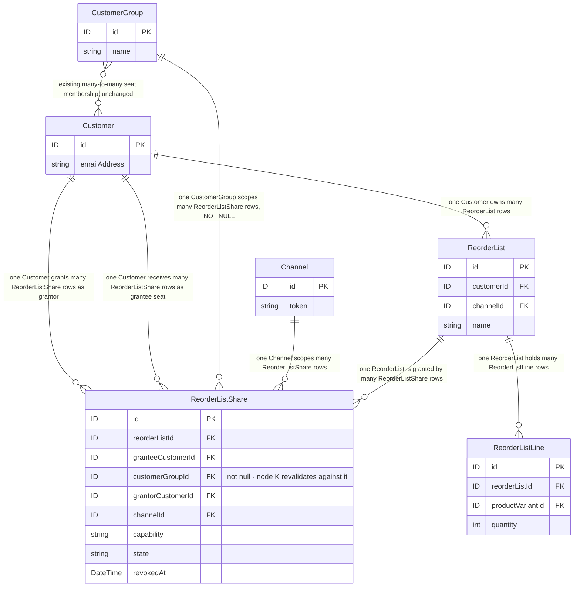
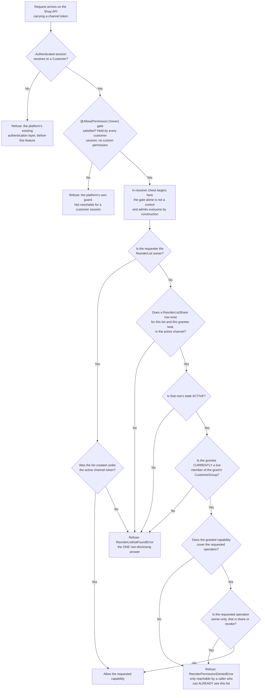

# FEATURE-001-06: Share a reorder list across the seats of a buying account behind an ownership-and-share check enforced inside the resolver, so that a colleague reorders from a list they do not own and gains access to nothing else

Parent epic: `tickets/EPIC-001-reorder-and-replenishment.md`. The parent epic and the sibling features are written as paths rather than as links, following the epic's own convention of keeping the link count in a file equal to the number of children that file indexes [tickets/EPIC-001-reorder-and-replenishment.md:§3. How To Read This Epic]. The only links in this file are the three story links in section 3.

---

## 1. Feature Title

**Share a reorder list across the seats of a buying account behind an ownership-and-share check enforced inside the resolver, so that a colleague reorders from a list they do not own and gains access to nothing else.**

Short name, used verbatim wherever this feature is referred to in one phrase, and identical to the label the epic's features index gives it: **Multi-Seat Buying Account List Sharing and Permissions** [tickets/EPIC-001-reorder-and-replenishment.md:§4. Features Index]. The long form above is the action-object-outcome title this tier requires; the short form is the name to cite.

The epic classifies this feature's deviation from its originally suggested area as **kept, mechanism fixed**, and it fixes the mechanism in one sentence: authorisation uses the platform's existing permission machinery plus explicit in-resolver ownership enforcement, and **not** a new authentication strategy [tickets/EPIC-001-reorder-and-replenishment.md:§4. Features Index]. **Which part of that machinery was itself corrected after this file was first written**: a buyer-facing operation is gated `@Allow(Permission.Owner)` rather than by a `CrudPermissionDefinition` [packages/core/src/common/permission-definition.ts:L146], because a customer session can hold no custom permission — section 2.6 carries the authority chain and the epic states it as rulings R2 and R3 [tickets/EPIC-001-reorder-and-replenishment.md:§6.4 The Settled Rulings]. Section 2.6 gives the reason that ruling exists rather than restating it as an assertion, and section 2.11 states what the ruling costs — the capabilities this feature deliberately does not build.

Delivery is part of the single self-contained plugin package the epic describes — `packages/reorder-plugin/`, exporting `ReorderPlugin` — and no file under `packages/core` or `packages/admin-ui` is edited to deliver it.

---

## 2. Feature Summary

### 2.1 The Capability

A buying account's administrator shares one of their named reorder lists with the other seats of that account, and controls which of those seats may reorder from it. This feature ships one plugin-owned share table, two Shop API mutations, one new error result, and the ownership-or-valid-share check that every operation touching a list must run inside its own resolver.

### 2.2 Contribution To The Epic

This feature sits wholly inside batch **B5**, whose dependencies are batches B2 and B4, and it is **sequenced internally rather than opened all at once**: stories 06-01 and 06-02 create and revoke the share rows that story 06-03 reorders from, so the epic's own intra-batch gates carry that order [tickets/EPIC-001-reorder-and-replenishment.md:§9.4.1 Batch B5 Is Sequenced Internally, And The Gates Are Named]. **The ordering runs through this feature rather than around it, and that is deliberate: 06-03 reorders from a share that 06-01 creates**, so the two are ordered within the batch rather than merely scheduled together. It owns the "Share list with account seats" step of the returning-buyer journey, which the epic's journey diagram routes from list curation into the cart write [tickets/EPIC-001-reorder-and-replenishment.md:L65]. Two of the epic's six personas meet the system here for the first time: the **Buying Account Administrator** is the WHO of stories 06-01 and 06-02, and the **Returning Buyer** is the WHO of story 06-03 [tickets/EPIC-001-reorder-and-replenishment.md:§10.4 Persona Map].

Read the contribution narrowly, because two adjacent surfaces belong to other features and this one adds neither:

- **It adds no list-authoring surface.** Creating a list, naming it, and adding, adjusting or removing its lines are all FEATURE-001-01's eight operations [tickets/EPIC-001/FEATURE-001-01-named-reorder-lists.md:§2.6 Named API Surfaces]. This feature grants a capability over a list that already exists; it never writes a list line.
- **It adds no cart-write surface.** Materialising a list into an active order is FEATURE-001-02's single mutation `applyReorderToActiveOrder` [tickets/EPIC-001/FEATURE-001-02-reorder-from-order-history.md:§2.5 Named API Surfaces], and story 06-03 invokes exactly that mutation as a customer who is not the list's owner. That feature records the same dependency from its side, at story granularity rather than feature granularity [tickets/EPIC-001/FEATURE-001-02-reorder-from-order-history.md:§4.2 Downstream].

What this feature contributes that neither of those can is the authorisation model. FEATURE-001-01 enforces that a list belongs to exactly one customer; this feature is the only place in the epic where a second customer may legitimately read or act on a row they do not own, which is why the epic's third collision lands hardest here.

### 2.3 Named Entities Touched

One entity is new and plugin-owned. Five already exist and are read, never altered. **No core entity gains a column, a relation or a custom field.**

- **`ReorderListShare` — new, plugin-owned.** One row per grant, unique per list-and-seat, so re-granting the same capability to the same seat updates one row rather than accumulating duplicates that would each have to be revoked separately. Revocation is a state on the row rather than a hard delete, because story 06-02's revoked-mid-session behaviour cannot be asserted against a row that no longer exists. Its complete mapping is below.
**The mapping, stated completely enough to author a deterministic migration from, and to settle two things a prose column list left open.** The epic's persistence contract carries the rules this table obeys [tickets/EPIC-001-reorder-and-replenishment.md:§7.8 The Seven Plugin-Owned Tables]; this is where they are made concrete.
```ts
// Extends VendureEntity, so id, createdAt AND updatedAt are inherited and NOT re-declared.
// updatedAt is load-bearing: a revocation and a re-grant both rewrite the row in place.
@Entity()                                  // table reorder_list_share (TypeORM snake_case)
export class ReorderListShare extends VendureEntity {
  @ManyToOne(() => ReorderList, { onDelete: 'CASCADE', nullable: false })
  reorderList: ReorderList;
  @EntityId({ nullable: false }) reorderListId: ID;
  @ManyToOne(() => Customer, { onDelete: 'CASCADE', nullable: false })
  granteeCustomer: Customer;
  @EntityId({ nullable: false }) granteeCustomerId: ID;
  @ManyToOne(() => Customer, { onDelete: 'CASCADE', nullable: false })
  grantorCustomer: Customer;
  @EntityId({ nullable: false }) grantorCustomerId: ID;
  // NOT NULL, and section 2.3's membership rule is why. See the nullability note below.
  @ManyToOne(() => CustomerGroup, { onDelete: 'CASCADE', nullable: false })
  customerGroup: CustomerGroup;
  @EntityId({ nullable: false }) customerGroupId: ID;
  @ManyToOne(() => Channel, { onDelete: 'CASCADE', nullable: false })
  channel: Channel;
  @EntityId({ nullable: false }) channelId: ID;
  @Column({ type: 'varchar', length: 16, nullable: false })
  capability: ReorderListCapability;       // closed enum, section 2.5
  @Column({ type: 'varchar', length: 16, nullable: false })
  state: ReorderListShareState;            // ACTIVE | REVOKED — not a boolean
  @Column({ type: Date, nullable: true })
  revokedAt: Date | null;                  // set iff state is REVOKED
}
```
- **Indexes and constraints, each with the name the migration must use:**
  - `UQ_reorder_list_share_list_grantee` — unique over `(reorderListId, granteeCustomerId)`. **This is the idempotence rule of section 2.8 expressed as a constraint**: one row per list-and-seat, so a re-grant updates and a revocation has exactly one row to act on. Without it a revocation would have to clear an unbounded set of rows to be effective, which is a correctness hazard and not a tidiness concern.
  - `IDX_reorder_list_share_grantee_channel_state` — non-unique over `(granteeCustomerId, channelId, state)`, which is the predicate the authorisation check in Figure F6-AUTH reads on and the one the shared-list read filters by.
  - `IDX_reorder_list_share_list_state` — non-unique over `(reorderListId, state)`, which is what the owner's own view of a list's grants reads on.
- **`customerGroupId` is NOT NULL, and this settles a contradiction rather than expressing a preference.** An earlier draft described it as optional in prose while Figure F6-ER drew it as a plain foreign key, and separately declared that it "is not the subject of the check" — three statements that cannot all stand. **The column is required and it IS part of the check.** Section 2.3's membership rule and Figure F6-AUTH both depend on knowing which account a grant was made in the context of, because a grant whose group is unknown cannot be re-validated against current membership, and a grant that is never re-validated is the defect this feature exists to avoid. A caller wanting to share outside any account is not a case this feature serves; there is no ungrouped grant.
- **`state` is an enumerated column rather than a boolean `revoked` flag.** Section 2.8 describes three observable conditions and the third — a row that once worked and now does not — needs a value a support agent can read, alongside `revokedAt` for when it happened. A boolean would have carried the same information less legibly and would have left no room for a future condition without a schema change.
- **Every relation cascades, and the grant is deliberately not an audit record.** A grant is a live capability: once the list, either customer, the group or the channel is hard-deleted, the capability it expresses cannot be exercised and keeping the row would leave a grant pointing at nothing. **The contrast with FEATURE-001-07's attempt tables is deliberate** — those retain their rows and null their customer link because they are evidence [tickets/EPIC-001/FEATURE-001-07-reorder-instrumentation.md:§2.4 Named Entities Touched]. If a deployment later needs a durable record of who was granted what and when, that belongs in the audit tables rather than in this one, and it is a change to declare rather than a property to assume.
- **The share row's lifecycle beyond a hard delete, stated because a cascade does not cover the cases that actually happen.** Three of them, each with a defined behaviour rather than an implication:
  - **A soft-deleted grantee.** `Customer` is soft-deletable [packages/core/src/entity/customer/customer.entity.ts:L23] with a nullable deletion timestamp [packages/core/src/entity/customer/customer.entity.ts:L29], so no cascade fires and the row survives. **The grant is inert from that moment**, because the authorisation check requires a live grantee — Figure F6-AUTH's membership node fails for a soft-deleted customer — and the row is purged by the same scheduled task that carries out the rest of the plugin's data-lifecycle work [tickets/EPIC-001-reorder-and-replenishment.md:§7.8 The Seven Plugin-Owned Tables]. **A share row is purged rather than anonymised**, for the same reason a cadence row is: a grant with no grantee grants nothing to nobody and has no residual purpose.
  - **A grantee removed from the group.** No cascade fires here either, because the row references the group rather than the membership. Section 2.3's rule is what handles it: membership is re-checked per request, so the grant stops working immediately, and the row is cleared by the same task. **This is the case CR-shaped reviews look for, and it is why membership is a check and not a stored fact.**
  - **The erasure window is the epic's decision and is not invented here.** The mechanism above is settled; how long after a soft delete or a membership removal the purge runs is the product decision the epic carries [tickets/EPIC-001-reorder-and-replenishment.md:§8.1 Product Decisions], blocking story 06-01's sign-off rather than its construction. Section 4.5 records it.
- **Migration ordering.** `reorder_list_share` references `reorder_list`, so FEATURE-001-01's migration precedes this one. That ordering is a real prerequisite rather than a preference, and section 4.1 records the matching feature-level edge. Nothing in this feature alters a core table.
  - **The uniqueness is a database constraint, not a service-level convention.** A composite unique key over the list and the grantee seat, declared in the same form core already uses for its own composite unique index [packages/core/src/entity/stock-level/stock-level.entity.ts:L19]. That is what makes the re-grant in section 2.8 an upsert rather than a second row, and it is what makes two concurrent grants of the same pair converge instead of racing — a guarantee a service-level check cannot give, because two requests can both pass the check before either writes.
  - **The read path has an index over the columns it filters on**, being the grantee seat, the list and the channel the grant was made under. Every authorisation decision in this feature filters on exactly those, so an index over them is the difference between a lookup and a scan of every grant in the deployment.
  - **The number of rows one list may carry is bounded by a decided maximum, and the write is where the bound is enforced.** The epic raised it to a product decision after this feature reported the silence [tickets/EPIC-001-reorder-and-replenishment.md:§8.1 Product Decisions], and section 2.5 states what the mutation does when the bound would be exceeded. No figure appears in this file, because supplying one is not this file's to do.
- **`ReorderList` and `ReorderListLine` — existing after FEATURE-001-01, plugin-owned, read only here.** A share row points at a `ReorderList`; the lines are read only when story 06-03 resolves the list into cart lines, and they are read through FEATURE-001-01's own service rather than by querying its tables [tickets/EPIC-001/FEATURE-001-01-named-reorder-lists.md:§2.5 Named Services].
- **`Customer` — existing, read only.** Declared as implementing `ChannelAware`, `HasCustomFields` and `SoftDeletable` [packages/core/src/entity/customer/customer.entity.ts:L23]. Three of its members carry this feature: `emailAddress` [packages/core/src/entity/customer/customer.entity.ts:L42] is how a human names a seat, `groups` [packages/core/src/entity/customer/customer.entity.ts:L46] is the existing many-to-many that already expresses which account a customer is a seat of, and `user` [packages/core/src/entity/customer/customer.entity.ts:L56] is the eager one-to-one that ties the row to the authenticated session the ownership check reads. That `Customer` is soft-deletable is load-bearing for a share table: a soft-deleted grantee's share row still exists, so a share check must resolve against the session and the grant's state rather than against row existence.
- **`CustomerGroup` — existing, read only.** Declared with `name` [packages/core/src/entity/customer-group/customer-group.entity.ts:L23] and the inverse many-to-many `customers` [packages/core/src/entity/customer-group/customer-group.entity.ts:L26] on the class at [packages/core/src/entity/customer-group/customer-group.entity.ts:L18]. **The seat model is expressed over this existing relation rather than by adding a new account entity**, and the two paragraphs below this list record the reason for that and the honest limits of doing it.
- **`Channel` — existing, read only.** Supplies the token every grant is scoped by [packages/core/src/entity/channel/channel.entity.ts:L62]. Section 2.10 states the scoping rule this produces.

**Why no new account entity, stated as a decision rather than as a preference.** A `BuyingAccount` entity would duplicate a relation this platform already ships: `Customer.groups` [packages/core/src/entity/customer/customer.entity.ts:L46] and `CustomerGroup.customers` [packages/core/src/entity/customer-group/customer-group.entity.ts:L26] are already a many-to-many between customers and a named grouping, and a second parallel membership graph would immediately raise the question of which one authorisation trusts. So membership is read from the existing relation and the new table stores only **capability** — who may do what with which list. That division is the whole of the entity design: `CustomerGroup` answers "is this person *currently* a seat of that account", `ReorderListShare` answers "was this seat granted a capability over that list", and neither answers the other's question.

**Both questions are asked on every request, and that is a security requirement rather than a design flourish.** A grant row is a record of a decision taken in the past; membership is a fact about the present. Trusting the row alone would mean a seat removed from the buying account — or moved into a different one — kept its access until somebody remembered to revoke each grant individually, which is exactly the failure an account administrator would assume removal had already prevented. **So the authorisation predicate accepts a capability only when the grantee is a current member of the grant's customer group, read through the platform's own membership query at request time**, and section 2.6's fourth consequence and Figure F6-AUTH both carry that step explicitly.

**The membership rule — re-checked on every use, never trusted as a stored fact. This is the correction a review of this file forced, and it is the most consequential one in the file.** An earlier draft recorded `customerGroupId` on the grant and then said in terms that it "is not the subject of the check". **That combination is a defect with a concrete, exploitable consequence: a seat removed from the buying account keeps every capability it was ever granted, indefinitely.** Removal from a group is the ordinary way a person leaving a company loses access, and nothing in this platform revokes a plugin's grant when it happens — `CustomerGroup.customers` is a plain many-to-many [packages/core/src/entity/customer-group/customer-group.entity.ts:L26] with no event this feature subscribes to and no cascade onto a table that merely names the group.

**The rule, stated as an obligation on every authorisation decision rather than as a property of the row:**

- **A grant confers access only while the grantee is *currently* a member of the group named on the grant.** The check reads the live membership through `CustomerGroupService` rather than a cached copy [packages/core/src/service/services/customer-group.service.ts:L40], on every request, as one conjunct of the predicate in Figure F6-AUTH. A grant whose grantee is no longer a member confers nothing, and the row's own `state` need not have changed for that to be true.
- **The grantee must also be live.** A soft-deleted customer [packages/core/src/entity/customer/customer.entity.ts:L29] is not a member for this purpose even if the join row survives, because the session that would exercise the grant cannot exist.
- **The group must be live.** `CustomerGroup` is hard-deletable, and the `CASCADE` in the mapping above covers that — but the check does not rely on the cascade having run, because a check that depends on a background state converging is a check that is wrong in the window before it does.
- **Why re-checking rather than revoking on removal.** Revoking every affected grant inside the transaction that removes a customer from a group would be the alternative, and it is rejected for a citable reason: the removal happens through an **Admin API** operation this feature does not own and must not modify [packages/core/src/api/schema/admin-api/customer-group.api.graphql:L16], so intercepting it would mean either editing core — forbidden — or subscribing to an event and revoking asynchronously, which leaves exactly the window a re-check does not have. **A stale grant that is inert is safe; a stale grant awaiting an asynchronous sweep is not.** The row is still cleared eventually, by the lifecycle rule in the mapping above, but access stops at the first request rather than at the sweep.
- **The cost, stated rather than hidden.** Every authorisation decision now performs one additional membership read. That is a real cost and it is accepted deliberately: the alternative is an access-control decision made from data that may be arbitrarily out of date, which is not a trade this feature is willing to make. No latency figure is attached to the cost, because this repository declares none [tickets/EPIC-001-reorder-and-replenishment.md:§2.2 Business Value].

**The honest limit of reusing `CustomerGroup`, stated because a reader will otherwise assume more than the platform provides.** The entity's own documentation describes it as a grouping that enables features such as group-based promotions or tax rules [packages/core/src/entity/customer-group/customer-group.entity.ts:L12-L13]. It is not an account construct and carries no notion of an administrator, a role or an invitation. Three consequences follow and all three are carried into section 2.11 rather than glossed:

- **The GraphQL `Customer` type exposes no `groups` field at all.** It declares `emailAddress` [packages/core/src/api/schema/common/customer.type.graphql:L9], `orders` [packages/core/src/api/schema/common/customer.type.graphql:L11] and `user` [packages/core/src/api/schema/common/customer.type.graphql:L12] and stops there [packages/core/src/api/schema/common/customer.type.graphql:L1-L13]. Group membership is therefore readable from plugin TypeScript through the entity relation, and **not** readable by a storefront client.
- **Adding that field is the epic's fifth collision, and this feature declines it.** Putting `groups` on the Shop API `Customer` type would alter the published schema of a core type the plugin does not own [tickets/EPIC-001-reorder-and-replenishment.md:§6.2 Research-Discovered Collisions], and it would expose a path to `CustomerGroup.customers` [packages/core/src/api/schema/common/customer-group.type.graphql:L6], each of whose `Customer` rows carries an `emailAddress` [packages/core/src/api/schema/common/customer.type.graphql:L9]. Enumerating every colleague's email address to any authenticated seat is not a side effect this feature accepts, so the field is not added and the seat set is never returned to a storefront.
- **Seat membership is administered on the Admin API, not by the account administrator.** `customerGroups` [packages/core/src/api/schema/admin-api/customer-group.api.graphql:L2], `createCustomerGroup` [packages/core/src/api/schema/admin-api/customer-group.api.graphql:L8] and `addCustomersToGroup` [packages/core/src/api/schema/admin-api/customer-group.api.graphql:L16] are Admin API operations, and a search of the Shop API schema tree for any customer-group surface returns nothing. So the Buying Account Administrator persona of stories 06-01 and 06-02 grants a capability **over a seat set someone else administers**. That is a real limitation of this design, not an oversight, and section 4.5 records the decision it leaves open.

### 2.4 Named Services

- **`ReorderListShareService` — new, plugin-owned.** Holds every read and write of the share table, and — more importantly — holds the single implementation of the ownership-or-valid-share predicate that section 2.6 makes mandatory. Both new mutations and every read path that may now return a shared list call the same predicate, so there is exactly one function to review rather than one per resolver.
- **`ReorderListService` — existing after FEATURE-001-01, plugin-owned.** Resolves a list and its lines, and already owns the owner-only rule this feature relaxes in exactly one direction [tickets/EPIC-001/FEATURE-001-01-named-reorder-lists.md:§2.5 Named Services]. The relaxation is a parameter to that service, not a second copy of it.
- **`ReorderService` — existing after FEATURE-001-02, plugin-owned.** Story 06-03 reaches the cart through it and adds no materialisation logic of its own [tickets/EPIC-001/FEATURE-001-02-reorder-from-order-history.md:§2.5 Named API Surfaces].
- **`OrderService` — existing, in `packages/core`, consumed and never modified.** Four members are named, and the distinction between the two this feature's path reaches and the two it must leave alone is the reason for naming them:
  - `getActiveOrderForUser` [packages/core/src/service/services/order.service.ts:L429] — resolves an existing cart for the authenticated user and returns `Order | undefined`. It is the member that makes the cart-ownership question in section 4.5 answerable at all, because it resolves a cart from the *session*, not from the list.
  - `addItemsToOrder` [packages/core/src/service/services/order.service.ts:L654] — the bulk add that FEATURE-001-02 is built around and that story 06-03 reaches through `ReorderService`. No plugin code in this feature calls it directly.
  - `addItemToOrder` [packages/core/src/service/services/order.service.ts:L622] and `adjustOrderLine` [packages/core/src/service/services/order.service.ts:L774] — **named here as signatures that must remain untouched**, not as call targets. They are the specific pair the epic's first collision would widen as a side effect if this epic declared a custom field on `OrderLine` [tickets/EPIC-001-reorder-and-replenishment.md:§6.1 Repository-Discovered Collisions], which is why section 5 requires evidence for them by name.
- **`CustomerService` — existing, consumed.** `findOneByUserId` [packages/core/src/service/services/customer.service.ts:L141] resolves the authenticated session's user id to the `Customer` row that both the ownership check and the grantee lookup are expressed against, on the class at [packages/core/src/service/services/customer.service.ts:L82]. Its `filterOnChannel` parameter defaults to `true` [packages/core/src/service/services/customer.service.ts:L141], so the customer lookup is itself channel-filtered unless a caller opts out — which is a platform behaviour this feature relies on rather than reimplements. This service is required beyond the list the epic states for the whole set [tickets/EPIC-001-reorder-and-replenishment.md:§7.4 Existing Entities And Services The Work Depends On], and it is named here for that reason.
- **`CustomerGroupService` — existing, read only, and the member matters rather than the class.** The seat set is read through **`getGroupCustomers`** [packages/core/src/service/services/customer-group.service.ts:L75-L88] rather than by joining the group tables in plugin code, and that member is named precisely because of what its own query already guarantees. Three of its clauses do work this feature would otherwise have to do itself, and each is what makes the membership revalidation in section 2.6 correct rather than merely present: it constrains the read to the group in question [packages/core/src/service/services/customer-group.service.ts:L84], it excludes soft-deleted customers [packages/core/src/service/services/customer-group.service.ts:L85], and it constrains the read to the channel of the request context [packages/core/src/service/services/customer-group.service.ts:L86]. Its own documentation describes it as returning a paginated list of the customers in the group [packages/core/src/service/services/customer-group.service.ts:L73]. **A plugin-side join over the group tables would have reproduced the first clause and silently omitted the other two**, which is the concrete reason the prohibition on hand-joining is stated rather than assumed. Its `addCustomersToGroup` [packages/core/src/service/services/customer-group.service.ts:L147] and `removeCustomersFromGroup` [packages/core/src/service/services/customer-group.service.ts:L173] members are named as **operations this feature does not call and does not expose**: seat membership is administered elsewhere, per section 2.3.
- **`CustomerService.getCustomerGroups` — existing, and this is the member the seat check actually uses.** It resolves **one customer's** group memberships by loading that single customer row with its `groups` relation [packages/core/src/service/services/customer.service.ts:L179], scoped to the request's channel [packages/core/src/service/services/customer.service.ts:L184] and excluding soft-deleted customers [packages/core/src/service/services/customer.service.ts:L188]. Section 2.6.1 states why the check is expressed in this direction and what the prohibited direction is. The shipped precedent is the platform's own customer-group promotion condition, which resolves membership this way and then tests the identifier against the resolved set [packages/core/src/config/promotion/conditions/customer-group-condition.ts:L54-L59].
- **`TransactionalConnection` — existing, consumed.** Every write to the share table goes through it, which is the persistence idiom the epic names for all plugin-owned state [tickets/EPIC-001-reorder-and-replenishment.md:§7.4 Existing Entities And Services The Work Depends On].

### 2.5 Named API Surfaces — Two New Mutations, Zero Existing Signatures Changed

**The two new operations**, added through the plugin's `shopApiExtensions` using `extend type Mutation` — the mechanism the shipped wishlist example already demonstrates through its plugin metadata [packages/dev-server/example-plugins/wishlist-plugin/wishlist.plugin.ts:L9-L16]:

- `shareReorderList` — grants a named capability over one list the caller owns, to one seat of the caller's account, in the active channel.
- `revokeReorderListShare` — marks an existing grant revoked.
**The exact SDL, published here rather than left to a story.** Every argument, input field, payload field, enum member and union member is fixed. Each name was collision-checked against both checked-in introspection snapshots and none exists in either [schema-shop.json:data.__schema.types] and [schema-admin.json:data.__schema.types]; the epic carries the inventory-wide record [tickets/EPIC-001-reorder-and-replenishment.md:§6.4 The Settled Rulings].
```graphql
extend type Mutation {
  shareReorderList(input: ShareReorderListInput!): ShareReorderListResult!
  revokeReorderListShare(input: RevokeReorderListShareInput!): RevokeReorderListShareResult!
}
input ShareReorderListInput {
  reorderListId: ID!
  "The account the grant is made in the context of. Required — see section 2.3."
  customerGroupId: ID!
  "How a human names a seat. Resolved ONLY within that group and the active channel."
  granteeEmailAddress: String!
  capability: ReorderListCapability!
}
input RevokeReorderListShareInput {
  reorderListId: ID!
  granteeEmailAddress: String!
}
"Closed set. Two members, and neither confers the power to grant."
enum ReorderListCapability { VIEW, REORDER }
enum ReorderListShareState { ACTIVE, REVOKED }
"""
The minimal projection of one grant. Deliberately carries no Customer object and no
emailAddress: an owner already knows the address they typed, and a grantee reading a
shared list must not be handed a directory of the other seats.
"""
type ReorderListGrant implements Node {
  id: ID!
  createdAt: DateTime!
  updatedAt: DateTime!
  capability: ReorderListCapability!
  state: ReorderListShareState!
  revokedAt: DateTime
}
union ShareReorderListResult       = ReorderList | ReorderPermissionDeniedError | ReorderListNotFoundError
union RevokeReorderListShareResult = ReorderList | ReorderPermissionDeniedError | ReorderListNotFoundError
```
Six readings of that block are load-bearing, and four of them close a hole a review of this file found.
- **The grants of a list are read through the list, not returned as a second collection.** Both mutations succeed by returning `ReorderList` — the type FEATURE-001-01 already published — whose `grantedCapabilities` field states what the *calling* customer may do [tickets/EPIC-001/FEATURE-001-01-named-reorder-lists.md:§2.6 Named API Surfaces]. **`ReorderListGrant` is the owner's view of one grant** and is reachable only on a list the caller owns; a grantee never receives a grant object for anybody else. This is what an earlier draft's phrase "the affected list together with its grants" left unspecified, and specifying it is the difference between a payload and a directory.
- **A grant carries no `emailAddress` and no `Customer`.** The owner supplied the address, so returning it discloses nothing they did not type — but returning it *inside a collection* would mean one seat's request could surface another seat's address, which is precisely the exposure section 2.11 declines. **`ReorderListGrant` therefore has no identity field beyond its own id**, and an owner distinguishes grants by the order they appear in and by the capability, not by being handed the roster back.
- **The capability enum is closed at two members and neither is `MANAGE`.** `VIEW` admits reading the list and its lines; `REORDER` admits `VIEW` plus materialising the list into the grantee's cart. **No capability confers granting or revoking**, because ownership is the only route to those two mutations, which is what keeps the privilege graph one level deep and makes Figure F6-AUTH's owner branch total. An earlier draft left the capability set unstated, which would have let two stories implement two different vocabularies for the same column.
- **The grantee is resolved by email within the named group only, and every failure to resolve returns one identical result.** A grantee lookup that searched all customers would be an account-existence oracle: the default id strategy is auto-increment [packages/core/src/config/default-config.ts:L101] and an address is guessable, so a response that distinguished "no such customer" from "not a member" would confirm registration to anyone who asked. **Four cases are therefore indistinguishable** — no customer with that address, a customer who exists but is not a current member of the named group, a soft-deleted customer [packages/core/src/entity/customer/customer.entity.ts:L29], and a customer outside the active channel — and all four return `ReorderPermissionDeniedError`. That error is safe here precisely because the caller already owns the list: it discloses nothing about the list, and nothing about whether the address belongs to anyone. The platform makes the same choice on its own single-order read, refusing identically whether the order is absent or forbidden [packages/core/src/api/resolvers/shop/shop-order.resolver.ts:L141-L143].
- **Both unions carry `ReorderListNotFoundError`, and section 2.12 explains why that is the *non-disclosing* member rather than the informative one.** A caller who does not own the list receives it — identically to a caller naming a list that does not exist at all.
- **Each union needs a `__resolveType` field resolver**, per the epic's ruling R8 [tickets/EPIC-001-reorder-and-replenishment.md:§6.4 The Settled Rulings]; no core union is extended, because a plugin cannot extend one.
**Both mutations are gated `@Allow(Permission.Owner)` and this feature registers no permission definition.** Section 2.6 gives the authority chain and records that an earlier draft's `CrudPermissionDefinition` would have published two operations no buyer could call.
**Why a mutation payload is paginated at all, since that reads oddly at first.** A collection returned from a mutation is the same unbounded read as a collection returned from a query; the only difference is that nobody thinks to bound it. So the grant collection on both payloads implements `PaginatedList` [packages/core/src/api/schema/common/common-types.graphql:L9] with an empty generated options input following the shipped plugin exemplar [packages/dev-server/test-plugins/reviews/api/api-extensions.ts:L44-L45], and its items resolve through `ListQueryBuilder` [packages/core/src/service/helpers/list-query-builder/list-query-builder.ts:L209] so the configured Shop maximum — default one hundred [packages/core/src/config/vendure-config.ts:L151] — applies, an omitted page size resolves to that maximum rather than to every grant, and an over-limit page is refused by the platform's own guard [packages/core/src/service/helpers/list-query-builder/list-query-builder.ts:L638]. `ignoreQueryLimits` stays false [packages/core/src/service/helpers/list-query-builder/list-query-builder.ts:L125-L131]. The default order is deterministic — grants ascending by the date they were made, then by grantee identifier as the tie-break — because without a tie-break an assertion on "the first grants returned" asserts an accident.
**And the write is bounded too, which is the half pagination cannot do.** Paginating the response makes the payload safe; it does nothing about a list accumulating grants without limit. So `shareReorderList` refuses a grant that would carry the list past the decided seats-per-list maximum, reporting `ReorderPermissionDeniedError` rather than accepting the row and letting the collection grow — the same refuse-rather-than-truncate rule FEATURE-001-02 applies to its source size [tickets/EPIC-001/FEATURE-001-02-reorder-from-order-history.md:§2.5 Named API Surfaces]. The maximum is the epic's eighth product decision [tickets/EPIC-001-reorder-and-replenishment.md:§8.1 Product Decisions] and no figure is supplied here.

**Two is the whole of this feature's contribution to the epic's operation budget, and the budget is why.** The epic's plugin adds fourteen Shop API operations in total; FEATURE-001-01 contributes eight [tickets/EPIC-001/FEATURE-001-01-named-reorder-lists.md:§2.6 Named API Surfaces] and FEATURE-001-02 contributes one [tickets/EPIC-001/FEATURE-001-02-reorder-from-order-history.md:§2.5 Named API Surfaces]. This feature adds no query, and it adds no Admin API operation: the administrative read over share rows belongs to FEATURE-001-08's story 08-03.

**Existing platform surfaces consumed and not extended:** `activeCustomer` [packages/core/src/api/schema/shop-api/shop.api.graphql:L5] identifies the caller, and nothing else in the platform's own schema is read by this feature.

**The read-path ruling — and this feature CHANGES NOTHING, because FEATURE-001-01 already published the whole of it.** Once a list can be shared, that feature's two read operations have a question to answer that they did not have when they were conceived: does `activeCustomerReorderLists` return a list the caller merely has a grant on? **An earlier draft of this section said the two operations "gain an optional argument" and the list type "gains a field" — that is, that this feature would modify a published contract after clients had begun using it**, which is exactly the silent redefinition the epic's fifth collision exists to prevent [tickets/EPIC-001-reorder-and-replenishment.md:§6.2 Research-Discovered Collisions]. It is no longer true, and the correction is recorded rather than quietly applied.

**All three surfaces exist from FEATURE-001-01's first publication, defaulted to owner-only and inert until this feature ships** [tickets/EPIC-001/FEATURE-001-01-named-reorder-lists.md:§2.6 Named API Surfaces]:

- **`activeCustomerReorderLists(options: ReorderListListOptions, includeShared: Boolean = false)`** — the argument is already declared with the default that reproduces the prior behaviour exactly. This feature implements what `true` does; it does not add the argument.
- **`ReorderList.access: ReorderListAccess!`** with `enum ReorderListAccess { OWNED, SHARED }` — already declared and already non-null, returning `OWNED` for every row until a grant can exist.
- **`ReorderList.grantedCapabilities: [ReorderListCapability!]!`** — already declared, documented there as "Populated by FEATURE-001-06; always `[]` until then". **This feature supplies the enum that field references**, which section 2.5 declares — the one symbol of the three that is genuinely new here, and it is a new type rather than a change to an existing one.

**So the checkable claim is stronger than "the extension is additive": the Shop API schema diff attributable to this feature is the two mutations, their inputs, their unions, `ReorderListGrant`, and the two enums — and nothing else.** No argument becomes required, no field changes type or nullability, no operation is redefined, and `activeCustomerReorderList(id: ID!)` keeps returning a nullable list for every inaccessible case rather than acquiring an error member [tickets/EPIC-001/FEATURE-001-01-named-reorder-lists.md:§2.6 Named API Surfaces]. Story 06-01 implements the `includeShared: true` behaviour and the two field values; section 5 requires the evidence in that form.

**Why the split matters rather than being a formality.** Had the argument and the field arrived with this feature, batch B1 would have shipped one shape and batch B5 a wider one, and the epic's claim that no published surface is redefined would have been false in spirit even though an optional argument is technically backward-compatible. Declaring them up front and implementing them here is the only arrangement in which both statements hold. **A story in this feature that proposed a new argument or a new field on either read operation would be reopening a settled contract**, and silently redefining what an already-shipped operation returns would break a client that assumed every returned list was owned by the caller.

**The additive-only constraint stated as a countable surface rather than as an intention.** The Shop API root `Query` type declares nineteen root queries [packages/core/src/api/schema/shop-api/shop.api.graphql:L1-L52], and the order, cart and customer-account mutation sets live in the same file under `type Mutation` [packages/core/src/api/schema/shop-api/shop.api.graphql:L70]. Every one of those signatures is byte-identical after this feature ships. Where a platform mechanism would widen an existing signature as a side effect of an otherwise additive change, that is a reportable violation recorded in the epic's collision section and referenced here rather than re-argued or quietly absorbed [tickets/EPIC-001-reorder-and-replenishment.md:§6.1 Repository-Discovered Collisions]. This feature therefore declares no custom field on any core entity.

#### 2.5.1 Surface Ownership And Test Matrix

Every surface this feature adds or changes the behaviour of, with the one story that owns it and the tests it is accepted against. **A row with no owning story is a defect in this file**, and the epic requires one matrix per feature [tickets/EPIC-001-reorder-and-replenishment.md:§12. Definition of Done (Epic-Level)]. Section 5 gates it.

| # | Surface added or behaviour changed | Owning story | Unit cases | End-to-end cases through `@vendure/testing` | Named regression evidence |
|---|-----------------------------------|--------------|-----------|--------------------------------------------|--------------------------|
| 1 | `ReorderListShare` table, its composite unique key over list and grantee, its read-path index, and the additive migration | STORY-001-06-01 | The unique key rejects a second row for the same pair; the generated migration carries the key and the index and adds no column to any core table | Migration applied and reverted on `e2e-sqljs`, `e2e-mariadb`, `e2e-mysql` and `e2e-postgres`; **two concurrent `shareReorderList` calls for the same list-and-seat pair leave exactly one row, run against a real database engine rather than a mocked repository, because the guarantee under test is the constraint and a mock has none** | Cached end-to-end seed data deleted first, then the existing `packages/core/e2e/` specs pass unmodified |
| 2 | `shareReorderList` | STORY-001-06-01 | Ownership predicate rejects a non-owner; the seats-per-list bound refuses rather than truncates; grant collection option mapping onto `ListQueryBuilder` | Positive grant with a **multi-seat fixture of at least three seats in one group** so that a payload asserting one grant is distinguishable from one returning all of them; the returned grant collection paginated with an omitted page resolving to the configured maximum and an over-limit page refused; **re-granting the same pair twice reports success and leaves one row (idempotent)**; **granting again after a revocation returns the same row to active rather than creating a second**; **an identifier that is a customer of no group**, **a customer of a different group than the caller's**, **a soft-deleted customer**, and **an identifier matching no customer at all**, each refused with `ReorderPermissionDeniedError` and each response identical field by field so none discloses which case occurred; a caller who does not own the list; an unauthenticated caller; a token for a channel the list does not belong to | `activeCustomer` unchanged |
| 3 | `revokeReorderListShare` | STORY-001-06-02 | The active-to-revoked transition; revoking an absent grant is an error and not a silent success | Positive revoke; **revoking an already-revoked grant reports success and leaves one row in the revoked state (idempotent)**; **two concurrent revocations of the same grant leave one row revoked and neither reports a conflict, run against a real engine**; **a revoke and a re-grant issued concurrently settle on one row in one of the two states, and never on two rows**; revoking a grant that never existed; a caller who does not own the list; an unauthenticated caller; a foreign channel token; and a read afterwards proving the seat's access is gone within the next request rather than at the next sign-in | `activeCustomer` unchanged |
| 4 | The optional argument on FEATURE-001-01's two read operations, and the owned-or-shared field on the list type | STORY-001-06-01 | The argument's default resolves to owner-only; the field reports the granted capability for a shared list and reports owned for an owned one | **The regression that matters most in this feature: a client that never passes the new argument gets byte-identical results to the pre-share behaviour — same lists, same count, same order, no shared list appearing** — asserted by running FEATURE-001-01's own read specifications unmodified after this feature ships; then the opt-in call returning the shared list with its capability; then a seat with no grant seeing nothing new either way | FEATURE-001-01's `activeCustomerReorderLists` and `activeCustomerReorderList` specifications pass unmodified [tickets/EPIC-001/FEATURE-001-01-named-reorder-lists.md:§2.6.1 Operation Ownership And Test Matrix] |
| 5 | Reorder from a shared list, reaching the cart through FEATURE-001-02's service | STORY-001-06-03 | The ownership-or-share predicate admits a granted seat and rejects a revoked one | Positive reorder by a granted seat; **the resulting cart's ownership asserted explicitly against whichever party the epic's third product decision names, and the story states which** [tickets/EPIC-001-reorder-and-replenishment.md:§8.1 Product Decisions]; a revoked seat refused; an unauthenticated caller; a foreign channel token | **`activeOrder` returns a cart owned by the session that asks for it and by no other, and `addItemToOrder` and `adjustOrderLine` behave as they did before this feature existed** — the cart-ownership regression, asserted rather than assumed, because a share feature is exactly the kind of change that could leak one buyer's cart to another |
| 6 | The `ReorderListShare` permission definition and the in-resolver predicate | STORY-001-06-02 | The definition generates its members from one name; the predicate is one function called by every path | Every operation refused without the permission; **and refused with the permission but without ownership or a valid share**, which is the case the `Permission.Owner` caveat makes mandatory [packages/core/src/api/config/generate-permissions.ts:L32-L34] | The existing `packages/core/e2e/` permission specifications pass unmodified |

Three rules keep this matrix honest.

- **A named test fails when the behaviour is absent.** Re-running an existing customer, order or permission specification is not evidence for any row here, because none of them calls either of this feature's mutations.
- **Every bracketed emphasis is a separate case with its own assertion.** A single test that happens to traverse two of them satisfies neither, because a failure would not say which branch broke.
- **The concurrency rows run against a database.** A repository test double cannot exhibit a unique-constraint race, so a passing mocked test on rows 1 and 3 is not evidence; those cases run on the four engine jobs that already exist.

### 2.6 The Existing Mechanisms This Feature Consumes Rather Than Rebuilds

The epic's do-not-duplicate inventory assigns this feature one mechanism with a prohibition attached — the permission-definition family, with no hand-declaring of permission strings and no bespoke authorisation layer, **and scoped in that inventory to administrative operations only** [tickets/EPIC-001-reorder-and-replenishment.md:§5. Existing Mechanisms That Must Not Be Duplicated] — and the same inventory row points forward to the collision that makes the mechanism insufficient on its own. Both halves are set out below, in that order, because the second is what makes this feature difficult. **The first half is mostly a record of a design this feature no longer uses**, and it is retained rather than deleted because a reader needs to see why the obvious approach fails before the replacement looks like anything other than a shortcut.

#### Mechanism one — `CrudPermissionDefinition`, and no hand-written permission strings

One definition constructed with a name yields exactly four permissions. The derivation is the class's own: a `name` of 'Wishlist' will create the four permissions `CreateWishlist`, `ReadWishlist`, `UpdateWishlist` and `DeleteWishlist` [packages/core/src/common/permission-definition.ts:L114-L115], built by mapping those four operations over the configured name [packages/core/src/common/permission-definition.ts:L156] and surfaced as the `Create` [packages/core/src/common/permission-definition.ts:L172], `Read` [packages/core/src/common/permission-definition.ts:L181], `Update` [packages/core/src/common/permission-definition.ts:L190] and `Delete` [packages/core/src/common/permission-definition.ts:L199] getters over the `PermissionDefinition` base [packages/core/src/common/permission-definition.ts:L86], whose own `Permission` getter is what the decorator consumes [packages/core/src/common/permission-definition.ts:L107]. Registration is through `authOptions.customPermissions` [packages/core/src/common/permission-definition.ts:L123-L128] and each resolver is gated with the `@Allow` decorator [packages/core/src/common/permission-definition.ts:L134]. Where only a read and a write permission are wanted, `RwPermissionDefinition` [packages/core/src/common/permission-definition.ts:L245] is the narrower alternative and is available without any additional wiring.

**Registration is a plugin act, not a core edit.** The definition is registered from the plugin's own `configuration` function, which receives the config and returns it — exactly the shape the shipped wishlist plugin uses to mutate configuration from inside a plugin [packages/dev-server/example-plugins/wishlist-plugin/wishlist.plugin.ts:L17-L26]. Nothing under `packages/core` is touched to add a permission.

**This feature registers ZERO permission definitions, and that reverses what an earlier draft of this section proposed.** It proposed one definition named `ReorderListShare`, gating both mutations. **That design cannot work, and the authority is this repository's own source.** The Customer role is created with exactly one permission, `Permission.Authenticated` [packages/core/src/service/services/role.service.ts:L433-L444], with `Authenticated` the sole member [packages/core/src/service/services/role.service.ts:L443]; every customer user is assigned exactly that role at creation [packages/core/src/service/services/user.service.ts:L99-L107]; and no code path adds a custom permission to it. **A customer session can therefore never hold `CreateReorderListShare` or any sibling**, so gating a buyer-facing mutation on one publishes an operation no buyer can call — two of them, in this feature's case. The epic records the finding as collision C7 and the rule as rulings R2 and R3 [tickets/EPIC-001-reorder-and-replenishment.md:§6.4 The Settled Rulings], and the shipped wishlist plugin already demonstrates the correct gate for a buyer-owned resource: `@Allow(Permission.Owner)` [packages/dev-server/example-plugins/wishlist-plugin/api/wishlist.resolver.ts:L12].

**What replaces it.** Both mutations are gated `@Allow(Permission.Owner)`, and the control is the service-layer predicate in section 2.9 — ownership of the list for the two mutations, and ownership-or-active-grant-with-live-membership for a read or cart write reached through a grant. Mechanism two below is why the gate alone was never the control in either design.

**The reconciled inventory, so no reader has to add up three files.** The epic fixes the whole ticket set at **three permission definitions yielding four published `Permission` members, all administrative** [tickets/EPIC-001-reorder-and-replenishment.md:§6.4 The Settled Rulings]: `RwPermissionDefinition('ReorderSubstitution')` owned by FEATURE-001-04, and the two single-member definitions `ReadReorderDemand` and `ReadReorderCustomerActivity` owned by FEATURE-001-08. **FEATURE-001-01 registers none, this feature registers none, and no buyer-facing operation anywhere in this epic carries a custom permission** [tickets/EPIC-001/FEATURE-001-01-named-reorder-lists.md:§2.7 The Existing Mechanism This Feature Consumes Rather Than Rebuilds]. That is a settled count rather than a proposal: the architectural decision that once asked how many definitions to register is closed in the epic, because the option it favoured was not merely open but unbuildable [tickets/EPIC-001-reorder-and-replenishment.md:§8.2 Architectural Decisions].

**One consequence worth stating, because it is a benefit rather than a concession:** with no definition registered, this feature grows the published `Permission` enum by nothing. Mechanism three below described that growth as a managed side effect; for this feature it does not arise at all.

#### Mechanism two — the `Permission.Owner` caveat, and why a permission gate alone is not a control

This is the load-bearing finding of this feature, and it is citable rather than editorial. The platform documents `Permission.Owner` as a special permission indicating that a resolver should only be accessible to the owner of that resource [packages/core/src/api/config/generate-permissions.ts:L14-L15], and then states the consequence in its own words: ownership must be enforced by custom logic inside the resolver, and because ownership cannot be defined generally nor statically encoded at build time, any resolver using `Permission.Owner` **must** include logic to enforce that only the owner of the resource has access — and if it does not, the effect is the equivalent of using `Permission.Public` [packages/core/src/api/config/generate-permissions.ts:L32-L34]. The whole caveat is written down in one block in that file [packages/core/src/api/config/generate-permissions.ts:L12-L33].

**A permission gate alone is not a control.** A resolver that declares `@Allow(...)` and nothing else has built no access control at all; it has published the operation.

A second, independent confirmation sits in the permission's own declaration. `Owner` is defined with the description that the user owns this entity, for example a Customer's own Order [packages/core/src/common/constants.ts:L29], and it is declared `assignable: false` [packages/core/src/common/constants.ts:L30] and `internal: true` [packages/core/src/common/constants.ts:L31] on the definition at [packages/core/src/common/constants.ts:L28]. Because it cannot be assigned to a role, there is no configuration a deployment could apply that would make ownership hold without the resolver's own logic. The gate and the control are simply different things.

Four consequences bind every operation in this feature, and section 5 turns each into evidence rather than leaving it as prose:

- **Every operation performs an explicit ownership-or-valid-share check inside the resolver or the service it delegates to.** For the two new mutations the check is ownership of the list; for a read or a cart write reached through a grant it is ownership **or** an unrevoked grant to the caller's seat in the active channel. Figure F6-AUTH in section 2.9 is that predicate drawn out.
- **A request authenticated as a different customer with no grant is refused, and that is a mandatory acceptance criterion in all three stories** rather than an edge case in one of them. The refusal is `ReorderPermissionDeniedError`, not an empty result, so a storefront can tell "you may not" from "there is nothing".
- **Revocation must be checked per request, not per session.** Story 06-02's revoked-mid-session behaviour exists precisely because the platform gives no session-level ownership guarantee to lean on: a grant revoked after a client authenticated must stop working on the next request that relies on it.
- **Current customer-group membership must be revalidated per request, not inherited from the grant row.** A grant records that a seat *was* a member of the account when the capability was given; it is not evidence that the seat still is. **So an unrevoked grant is accepted only when the grantee is, at that moment, a member of the grant's customer group in the active channel**, read through `getGroupCustomers` [packages/core/src/service/services/customer-group.service.ts:L75-L88] whose query already constrains the group [packages/core/src/service/services/customer-group.service.ts:L84], excludes soft-deleted customers [packages/core/src/service/services/customer-group.service.ts:L85] and constrains the channel [packages/core/src/service/services/customer-group.service.ts:L86]. Two failure modes are closed by this and by nothing else in the design, and each is a mandatory criterion rather than an edge case: **a seat removed from the account** — the case an administrator reasonably believes removal already handled — and **a seat moved into a different account**, whose grant row is untouched by the move and would otherwise keep conferring access across an account boundary. A third follows for free from the same query: a **soft-deleted grantee** stops passing the check without the plugin implementing anything, which matters because `Customer` is soft-deletable [packages/core/src/entity/customer/customer.entity.ts:L23] and the row therefore survives the delete. Story 06-02 owns the removed-seat and moved-seat criteria; story 06-03 asserts the same refusal on the cart write, since a grantee who is no longer a seat must not be able to reorder either.

#### Mechanism three — the automatic `Permission` enum growth, referenced and not re-argued, and why this feature contributes nothing to it

The `Permission` enum is declared with no members in source and annotated as populated at run time [packages/core/src/api/schema/common/common-enums.graphql:L20-L21], and it is filled by `generatePermissionEnum` from the default and custom definitions [packages/core/src/api/config/generate-permissions.ts:L42]. Registering a definition therefore grows a published enum automatically, with no opt-in at request time.

**This mechanism is retained in this section for one reason only: to record that it does not bite on this feature.** Because mechanism one settles this feature at zero definitions, nothing here grows that enum — the growth the epic's third collision describes is contributed entirely by FEATURE-001-04's one definition and FEATURE-001-08's two [tickets/EPIC-001-reorder-and-replenishment.md:§6.1 Repository-Discovered Collisions]. The epic's verdict on that growth is unchanged and is referenced rather than re-derived: it is a declared, manageable side effect because no existing member is removed or renamed, and every consuming example switching on the enum carries a default branch. **What story 06-01 declares is therefore the *absence* of growth**, evidenced by an unchanged `Permission` member set — not a growth to be managed.

**The published `ErrorCode` enum is a different matter and does grow here**, because this feature declares `ReorderPermissionDeniedError`. Section 2.12 carries that, and it is the only enum this feature adds a member to.

#### 2.6.1 The Authorisation Read Shape — One Customer's Memberships, Never One Account's Members

An authorisation check runs on every read and every cart write this feature touches, so its shape is not an implementation detail. The rule below exists because the obvious reading of "check the grantee is a seat of the caller's account" loads the wrong end of the relation.

- **The prohibited direction, named so it is unmistakable: do not read `CustomerGroup.customers`** [packages/core/src/entity/customer-group/customer-group.entity.ts:L26]. Its cardinality is every customer in the account, so validating one grantee would load the whole seat set — and it would do so on a path that runs per request. For a buying account of any size that is the entire membership hydrated to answer a yes-or-no question. `CustomerGroupService.findOne` [packages/core/src/service/services/customer-group.service.ts:L60] is prohibited for the same reason wherever it would be asked for that relation.
- **The required direction: read the memberships of the one customer in question.** `CustomerService.getCustomerGroups` [packages/core/src/service/services/customer.service.ts:L179] loads a single customer row with its `groups` relation, and the cardinality is therefore the number of groups that one customer belongs to rather than the number of customers in a group. The platform's own customer-group promotion condition resolves membership exactly this way and then tests the identifier against the resolved set [packages/core/src/config/promotion/conditions/customer-group-condition.ts:L54-L59], so this is the shipped shape and not a local invention.
- **Two properties come free with that member and are relied on rather than reimplemented.** The read is scoped to the request's channel [packages/core/src/service/services/customer.service.ts:L184], which is half of section 2.10's scoping rule already satisfied; and it excludes soft-deleted customers [packages/core/src/service/services/customer.service.ts:L188], which is what makes the soft-deleted-grantee case in section 2.5.1 resolve to a refusal rather than to a stale grant. `Customer` being soft-deletable is declared on the entity [packages/core/src/entity/customer/customer.entity.ts:L23], so this is a case that will occur.
- **The membership test is a set intersection over two such reads, and the query count is asserted.** One read for the caller and one for the grantee, then an intersection in memory over two small collections. **The count asserted by story 06-01 is two group reads per grant, plus one indexed lookup of the grant row, and nothing per seat.** A count that scales with the size of the account is the failure this rule exists to catch, and the assertion is what detects it — the direction alone is not self-enforcing, because a later refactor can quietly reintroduce the inverse relation.
- **Where the same membership is needed twice inside one request it is memoised, not re-read.** `RequestContextCacheService` [packages/core/src/cache/request-context-cache.service.ts:L15] is the seam, which is the same seam FEATURE-001-03 uses for its repeated variant reads [tickets/EPIC-001/FEATURE-001-03-price-and-availability-delta-preview.md:§2.5.2 The Read Shape — Bulk Where Bulk Exists, Counted Where It Does Not]. The promotion condition caches for the same reason.
- **The grant row itself is fetched by its indexed predicate**, being the grantee, the list and the channel, per the index section 2.3 declares. The check never reads the grant collection to find one grant in it.
- **The bound on the collection and the bound on the check are different bounds, and both are stated.** Pagination bounds what a payload returns; the seats-per-list maximum bounds how many rows can exist; and this sub-section bounds what a single authorisation costs. The epic's global rule requires all three [tickets/EPIC-001-reorder-and-replenishment.md:§7.7 Bounded Collections].

### 2.7 Figure F6-ER — The Share And Seat Rows, And Their Foreign-Key Direction

This is the first of the two diagrams in this feature. Story files carry none: story 06-01 references this figure by the name **Figure F6-ER**, and stories 06-02 and 06-03 reference **Figure F6-AUTH** in section 2.9.



Five readings of the figure are load-bearing and are stated so they are not inferred, and the first and last were both corrected by a review of this file:

- **The grantee is a `Customer`, and the group is a second, mandatory conjunct — not a label.** `ReorderListShare.granteeCustomerId` is what makes the *identity* half of an authorisation decision resolvable from a single authenticated session. `customerGroupId` is `NOT NULL` and names the account the grant was made in the context of, and **it is checked on every use**: the grantee must still be a live member of that group. An earlier reading of this figure said it "is not the subject of the check", which left a removed seat holding its access indefinitely; section 2.3 records the correction and Figure F6-AUTH draws the node.
- **The grantor is recorded, and it is not the same column as the list owner.** `ReorderListShare.grantorCustomerId` exists so that story 06-02's revocation can be attributed, and so that FEATURE-001-08's administrative read has something to show a support agent. Storing it separately from `ReorderList.customerId` is deliberate: the two are equal today because only an owner may grant, and conflating them would silently encode that rule in the schema where a later change could not see it.
- **Channel scoping is a column, not a convention.** `ReorderListShare.channelId` is why a grant made under one channel token confers nothing under another, which section 2.10 states as a rule.
- **Revocation is a state column, not a missing row and not a boolean.** `state` is what lets story 06-02 assert that a previously working request now fails, `revokedAt` records when, and together they are what lets a support agent see that a grant once existed. Section 2.3 states why an enumerated column rather than a `revoked` flag.
- **`customerGroupId` is mandatory, and the diagram says so in three places at once.** The cardinality drawn is exactly-one on the `CustomerGroup` side, the column is annotated not-null, and the relationship label states that every grant carries one. That is deliberate rather than incidental: **a grant with no group would have nothing for node K of Figure F6-AUTH to revalidate against**, so it would be a grant that survives its holder's removal from the account — the one outcome this feature exists to prevent. A story that models an account-less grant, or that treats the column as optional, has reopened that hole. The consequence for `shareReorderList` is concrete: a grant is admissible only where the grantor and the grantee share a current customer group in the active channel, so an account-less pair of customers cannot be joined by a share at all.

### 2.8 The Grant Lifecycle, And Why Revocation Is A State Rather Than A Delete

A grant has three observable conditions and exactly two transitions, and both transitions are the two mutations in section 2.5. Setting this out here rather than in a story keeps all three stories consistent with one another:

- **Absent.** No row exists for this list-and-seat pair. A read or cart write by that seat resolves to `ReorderListNotFoundError` — the same answer as for a list that does not exist, per section 2.9.
- **Active.** A row exists, its `state` is `ACTIVE`, **and the grantee is currently a live member of the group named on the row**. The seat may perform the granted capability, subject to the channel check. All three conjuncts are required: section 2.3 records why membership is re-read rather than assumed.
- **Revoked.** A row exists and its `state` is `REVOKED`, with `revokedAt` recording when. The seat may not, and the row remains as the record that it once could — visible to the list's owner and to a support agent, and indistinguishable from absent to the former grantee.

**A fourth condition exists that is not a state of the row at all, and conflating it with the three above is the mistake this paragraph prevents.** A row can be **active and yet confer nothing**, because the grantee is no longer a current member of the grant's customer group in the active channel — removed from the account, moved to another one, or soft-deleted. Three properties distinguish it from revocation and each matters to a story:

- **It is not reachable by either mutation.** Nothing in this feature writes it, because it is caused by an administrative change to seat membership through the Admin API [packages/core/src/api/schema/admin-api/customer-group.api.graphql:L16] rather than by anything a buyer or an account administrator does here.
- **It is not recorded on the row, and must not be.** Copying membership onto the grant would create a second source of truth that goes stale exactly when it matters. The row keeps `revoked` as its only state, and membership is read at request time through `getGroupCustomers` [packages/core/src/service/services/customer-group.service.ts:L75-L88].
- **It is reversible without touching the grant.** Re-adding the seat to the account restores access, because the row was never altered. Revocation is not reversible in that sense: it takes a second `shareReorderList` call to return the row to active. **A story asserting that a removed seat's access "was revoked" is asserting the wrong thing**, and the refusal it should assert is the same `ReorderPermissionDeniedError` reached by a different branch of Figure F6-AUTH.

Three properties follow, and each becomes an acceptance criterion in the story that owns it:

- **Re-granting is idempotent.** Because a grant is unique per list-and-seat, `shareReorderList` called twice for the same pair leaves one row rather than two, and a grant that was revoked and is granted again returns to active on the same row. Without the uniqueness rule, a revocation would have to delete an unbounded set of rows to be effective, which is a correctness hazard rather than a tidiness concern.
- **Revoking an already-revoked grant is idempotent, and revoking a grant that never existed is neither an error nor a silent success — it returns the list with its grants, in which the grant is visibly absent.** An earlier draft returned `ReorderPermissionDeniedError` for the second case, on the reasoning that a client should not mistake "nothing to revoke" for "revoked". The reasoning was sound and the mechanism was wrong: **only the list's owner can reach this mutation at all**, so the owner is entitled to see the actual grant set rather than an error, and the returned `ReorderListGrant` collection [see section 2.5] makes the distinction observable without a second result type. A caller who is *not* the owner receives `ReorderListNotFoundError` at node G of Figure F6-AUTH, whatever the grant's state, which is the normalization section 2.9 requires.
- **An authorisation decision is point-in-time.** It is evaluated per request against the row's current state, which is exactly why section 2.6's third consequence holds: nothing about a session survives a revocation. The epic makes the same point for a different read in FEATURE-001-02 [tickets/EPIC-001/FEATURE-001-02-reorder-from-order-history.md:§2.10 A Point-In-Time Read Is Not A Reservation], and the shape of the argument is identical here — a check that passed a moment ago is not a promise about the next request.

### 2.9 Figure F6-AUTH — The Ownership-Plus-Share Authorisation Check

This is the second of the two diagrams in this feature, and it is the predicate section 2.6 makes mandatory, drawn out. Stories 06-02 and 06-03 reference it by the name **Figure F6-AUTH** and embed no diagram of their own.



Six readings of the figure matter more than the rest:

- **Node M is the only node that reads something outside this feature's own tables, and removing it is the failure this figure is drawn to prevent.** Every other check is answerable from the grant row and the request; membership is not, and cannot be, because it changes without anything in this feature being called. Its position is deliberate: **after** the channel check, so a membership read is never performed for a request that a cheaper check already refuses, and **before** the capability check, so a seat who has left the account is refused without regard to what they were once permitted to do. Its refusal is `ReorderListNotFoundError` and not `ReorderPermissionDeniedError`, because a seat who has left the account has no proven relationship to the list any more and the non-disclosure rule below admits no exception for a relationship that has lapsed.
- **The gate and the check are separate nodes on purpose.** Node C is the `@Allow` decorator [packages/core/src/common/permission-definition.ts:L134]; everything from node D onward is resolver logic. A design that collapses them has reproduced the failure the platform warns about [packages/core/src/api/config/generate-permissions.ts:L32-L34] — and it is worse than it sounds here, because `Permission.Owner` is admitted for a session that does not hold it [packages/core/src/service/helpers/request-context/request-context.service.ts:L109] and [packages/core/src/config/auth/default-entity-access-control-strategy.ts:L56], so node C refuses essentially nobody.
- **Node M is the correction a review of this file forced.** An earlier version of this figure went straight from an unrevoked grant to the capability question, which meant a seat removed from the buying account kept its access indefinitely. Membership is now a conjunct of the predicate, read live on every request, for the reasons section 2.3 sets out in full.
- **The refusals are normalized, and that reverses this figure's earlier design.** It previously routed a foreign channel token to `ReorderListNotFoundError` and a missing, revoked or wrong-channel grant to `ReorderPermissionDeniedError` — which made the pair of errors an **oracle**: with auto-increment ids [packages/core/src/config/default-config.ts:L101], a caller iterating ids could tell a real list belonging to somebody else from an id that names nothing, because only the former answered "denied". **Every case in which the caller cannot see the list now returns the same `ReorderListNotFoundError`**: absent, another customer's, another channel's, revoked, or no longer a member. Section 2.12 states the rule and its one exception.
- **`ReorderPermissionDeniedError` survives at exactly one node, and that is what makes it safe.** Node J is reachable only by a caller who holds an active grant with live membership — someone who can already see the list and is being told that this particular operation exceeds their capability. It discloses nothing they did not already know, and it is genuinely useful there: a grantee with `VIEW` attempting a reorder is entitled to learn that the answer is "not permitted" rather than "no such list".
- **Node OWNONLY exists so that `shareReorderList` and `revokeReorderListShare` are owner-only in the figure rather than only in the prose.** A grantee holding an active grant passes every earlier node, so without this node the figure would appear to let a grantee grant. Its refusal is `ReorderPermissionDeniedError` rather than `ReorderListNotFoundError` for the same reason node J's is: the caller has already proven a live relationship, so telling them the operation is reserved to the owner discloses nothing further.

### 2.10 Channel Scoping, Language Scoping And Monetary Values

Every operation in this feature is channel-scoped and language-scoped. This is a property of the request rather than an argument a caller may omit, so it holds for both mutations and for every read reached through a grant, without being restated per operation. The epic states the same prerequisite once for the whole set [tickets/EPIC-001-reorder-and-replenishment.md:§7.5 Request Prerequisites].

- **Channel — stated as a rule, not as an aspiration.** The active channel is identified by a unique token read from the `vendure-token` request header [packages/core/src/entity/channel/channel.entity.ts:L58-L59], carried as a unique column on `Channel` [packages/core/src/entity/channel/channel.entity.ts:L62]. `ReorderListShare` stores the id of the channel the grant was made under, and every authorisation decision filters on the active channel. **A share granted under one channel token confers no access under another.** A grantee presenting a different token is refused with `ReorderPermissionDeniedError`, and a list whose own channel does not match the active token resolves to `ReorderListNotFoundError` — the two cases are distinguished in Figure F6-AUTH. Two platform reads reinforce rather than contradict this: `findOneByUserId` filters on channel by default [packages/core/src/service/services/customer.service.ts:L141], and the membership read the authorisation predicate uses constrains itself to the channel of the request context [packages/core/src/service/services/customer-group.service.ts:L86]. **So a seat who is a member of the account in one channel and not in another is authorised in the first and refused in the second**, and that follows from the platform's own query rather than from a rule this feature invented.
- **Language.** Translated output resolves against the request's `languageCode`, which defaults to the channel's `defaultLanguageCode` [packages/core/src/entity/channel/channel.entity.ts:L74]. This feature stores no translatable string of its own: a capability is an enumerated value and not prose, and the list name it grants access to is the buyer-supplied string FEATURE-001-01 returns unchanged in every language code [tickets/EPIC-001/FEATURE-001-01-named-reorder-lists.md:§2.4 Named Entities Touched]. A story that expects a translated capability label or a translated list name has misread this paragraph.
- **Money.** This feature's own payloads carry no monetary column: a grant records a list, a seat, a capability, a channel and a grantor, and nothing priced. Wherever a shared list surfaces a price — a grantee reading list lines, or story 06-03 receiving the cart the reorder produced — that value is an integer in the smallest currency unit stated alongside its currency code, which defaults to `Channel.defaultCurrencyCode` [packages/core/src/entity/channel/channel.entity.ts:L88]. A decimal monetary value anywhere in this feature or its stories is a defect, not a formatting preference. Storing no price on a grant is deliberate for the same reason FEATURE-001-01 stores none on a list line: a copied price is stale the moment the catalogue moves, and reporting that movement before commit is FEATURE-001-03's work.
- **Tax presentation follows the channel too.** Whether the prices a grantee sees include tax is `Channel.pricesIncludeTax` [packages/core/src/entity/channel/channel.entity.ts:L113], so two seats of one account reading the same list under two channel tokens may legitimately see two different figures. That is a consequence of channel scoping rather than an inconsistency, and a story asserting a monetary value names the channel token it asserted under.

### 2.11 What This Feature Does Not Build — The Security Boundary Stated Honestly

The mechanism-fixing ruling in section 1 buys simplicity by declining scope, and the declined scope is enumerated here so that nobody reads "sharing and permissions" as more than it is.

- **No new authentication strategy.** Callers authenticate through the platform's existing mechanism, unchanged. This feature adds no credential type, no token format and no login operation.
- **No new session mechanism.** There is no share session, no impersonation and no acting-as. A grantee acts as themselves throughout, which is precisely why the authorisation check is per request rather than per session, and why revocation takes effect on the next request.
- **No role hierarchy, and no Admin API role surface.** "Buying Account Administrator" is a persona, not a stored role: the capability to grant is ownership of the list, nothing more. This feature adds no administrator flag to `Customer`, no role table of its own, and no Admin API operation. A marketplace-side role model already exists in the platform and is deliberately untouched.
- **No seat-membership management.** As section 2.3 records, seat membership is administered through the existing Admin API customer-group operations [packages/core/src/api/schema/admin-api/customer-group.api.graphql:L16] and no Shop API surface for it exists or is added. A buying-account administrator grants a capability over a seat set an operator maintains.
- **No seat directory on the Shop API.** The seat set is never returned to a storefront, because doing so would expose every colleague's `emailAddress` [packages/core/src/api/schema/common/customer.type.graphql:L9] through `CustomerGroup.customers` [packages/core/src/api/schema/common/customer-group.type.graphql:L6]. A grantee is named by the granting caller, not discovered by browsing.
- **No external identity provider, and no external service of any kind.** Nothing in this feature calls out of process. One table, two mutations and one predicate are satisfied entirely by the database and the plugin's own service, and no permission definition is registered at all.
- **No invented figure of any kind.** This feature states no service-level commitment, no timing target for a permission check and no cap on the number of seats a list may be shared with, because this repository declares none and the epic reports that absence as a finding rather than filling it [tickets/EPIC-001-reorder-and-replenishment.md:§2.2 Business Value]. **A cap on seats per list is a product decision required before build, not a number this feature may supply.** The epic's product-decision list settles a maximum for lists per customer and lines per list and is silent on seats per share [tickets/EPIC-001-reorder-and-replenishment.md:§8.1 Product Decisions]; that silence is reported here as a gap for a maintainer to close, and section 4.5 records it as an open decision rather than resolving it with a plausible figure.
**Why the fan-out is unbounded unless someone bounds it, stated from the platform rather than asserted.** Seat membership is the existing customer-group relation [packages/core/src/entity/customer/customer.entity.ts:L46] and [packages/core/src/entity/customer-group/customer-group.entity.ts:L26], and nothing in that relation limits how many customers a group may hold — the entity's own documentation describes it as a grouping for features such as promotions and tax rules [packages/core/src/entity/customer-group/customer-group.entity.ts:L12-L13] and declares no member limit. So the number of grants a single list can accumulate is bounded only by the size of the account, and a share operation that never refuses is the default outcome of building nothing.

**One inherited precondition, labelled as a research finding rather than a repository citation.** The epic records that platform 3.7.0 links external authentication to a pre-existing account only when the external email address is verified, and that this additionally requires a custom authentication strategy to mark provider-verified emails as verified; the epic itself flags the finding as material to this feature, because a seat may arrive through an external identity provider [tickets/EPIC-001-reorder-and-replenishment.md:§2.3 Confirmed Platform Version]. It is a **precondition on the environment, established by research into the published release rather than by reading a file in this checkout**, and it is stated as such. Its practical effect on this feature is narrow and worth naming: a seat invited by email address cannot be silently linked to an unverified external account, so a grant made against an email address that does not resolve to a verified customer in the active channel has no grantee to attach to and is refused rather than held pending.

### 2.12 The Error Vocabulary This Feature Introduces

**One** of the six error results the whole ticket set declares belongs to this feature: `ReorderPermissionDeniedError`. Four belong to FEATURE-001-01 and one to FEATURE-001-02, and both siblings record the same split from their own side [tickets/EPIC-001/FEATURE-001-01-named-reorder-lists.md:§2.10 The Error Vocabulary This Feature Introduces] and [tickets/EPIC-001/FEATURE-001-02-reorder-from-order-history.md:§2.11 The Error Vocabulary This Feature Introduces].

**`ReorderPermissionDeniedError` is returned in exactly two situations, both of which require the caller to have already **proven a live relationship to the list**, and the narrowing of those situations is the security correction this feature carries.** It is returned when a caller who **can already see the list** — the owner, or the holder of an active grant with live membership — is refused because the requested operation exceeds what they hold, or because the operation is reserved to the list's owner and the caller is a grantee. Concretely: a grantee with `VIEW` attempting a reorder, and an owner naming a grantee email that does not resolve to a live current member of the named group in the active channel [see section 2.5].

**Every other refusal is `ReorderListNotFoundError`, which FEATURE-001-01 owns**, and the list is exhaustive: an id that names nothing, a list owned by another customer with no grant to the caller, a list belonging to another channel, a grant whose state is `REVOKED`, and a grant whose grantee is no longer a member. **An earlier draft split these two errors along a different line** — `ReorderListNotFoundError` for a foreign channel and `ReorderPermissionDeniedError` for every grant failure — which made the pair an enumeration oracle, because a caller iterating auto-increment ids [packages/core/src/config/default-config.ts:L101] could distinguish a real list they may not see from an id that names nothing. The platform's own single-order read makes the opposite choice explicitly, refusing identically whether the order is absent or forbidden, and its inline comment names enumeration as the reason [packages/core/src/api/resolvers/shop/shop-order.resolver.ts:L141-L143]. **This feature now follows that precedent rather than contradicting it.** The rule is uniform: **no proven relationship yields `ReorderListNotFoundError`, always**, with no distinction drawn between "no such list", "somebody else's list", "a list in another channel", "a revoked grant" and "no grant" — so the two responses can never be differenced to learn whether a list exists.

**No text in this feature or in its three stories names an error outside those six and the thirty-one types that already implement the `ErrorResult` interface in this checkout** — fifteen declared between [packages/core/src/api/schema/common/common-error-results.graphql:L2] and [packages/core/src/api/schema/common/common-error-results.graphql:L103], alongside `union UpdateOrderItemErrorResult` [packages/core/src/api/schema/common/common-error-results.graphql:L112-L117], and sixteen more declared between [packages/core/src/api/schema/shop-api/shop-error-results.graphql:L2] and [packages/core/src/api/schema/shop-api/shop-error-results.graphql:L130].

Two consequences of that boundary are worth stating because they are easy to get wrong:

- **`NoActiveOrderError` [packages/core/src/api/schema/common/common-error-results.graphql:L95] IS a member of the union story 06-03 consumes, and an earlier draft of this bullet said the opposite.** It claimed FEATURE-001-02's cart write always creates the active order rather than returning that error. **That ruling was reversed in the sibling feature**, on the evidence that the cart is resolved through the configured `ActiveOrderStrategy` set, that a deployment whose strategies cannot determine or create one produces a thrown error, and that the mutation therefore needs a defined result for it [tickets/EPIC-001/FEATURE-001-02-reorder-from-order-history.md:§2.8 The No-Active-Order Ruling]. Story 06-03 invokes that same mutation and **inherits the corrected ruling**: it declares no error of its own for the case and re-opens nothing, but it may not assert that the error is unreachable.
- **Declaring `ReorderPermissionDeniedError` grows the published `ErrorCode` enum**, which ships with a single literal member in source [packages/core/src/api/schema/common/common-enums.graphql:L28-L29] and is populated at build time from every type implementing the error interface. That is the epic's second collision, referenced rather than re-derived [tickets/EPIC-001-reorder-and-replenishment.md:§6.1 Repository-Discovered Collisions], and the design rule it leaves behind is that any consuming example switching on `ErrorCode` carries a default branch.

### 2.13 Precedent In This Repository — Partial

The disclosure has two halves and both are stated, because reporting only the first would overstate the novelty and reporting only the second would overstate the work.

**Half one — the authorisation mechanism is precedented, and the precedent that matters most is not the one this file first cited.** `CrudPermissionDefinition` is shipped platform code whose own documentation block teaches it with a wishlist: the definition [packages/core/src/common/permission-definition.ts:L119], its registration under `authOptions.customPermissions` [packages/core/src/common/permission-definition.ts:L123-L128] and a `WishlistResolver` gated with `@Allow` [packages/core/src/common/permission-definition.ts:L132-L134]. **That documentation example is administrative in effect, and the shipped wishlist *plugin* — a buyer-facing surface over a buyer-owned resource, which is exactly this feature's shape — gates every one of its operations on `Permission.Owner` instead** [packages/dev-server/example-plugins/wishlist-plugin/api/wishlist.resolver.ts:L12]. The running code is the stronger precedent and it is the one this feature follows; section 2.6 records why the documentation example cannot be followed for a customer session. Separately, the shipped wishlist plugin demonstrates the structural half of this feature — plugin-owned data hanging off a customer, declared in plugin metadata and configured from the plugin's own configuration function [packages/dev-server/example-plugins/wishlist-plugin/wishlist.plugin.ts:L17-L26]. A reviewer should price the permission wiring, the entity, the migration and the schema extension as a re-application of shipped work.

**Half two — nothing in this repository shares customer-owned data between customers, and that is the new part.** The search behind that claim is stated so the finding is checkable rather than asserted: a word-boundary search for share, shared and sharing across every TypeScript file under the example-plugin and test-plugin trees, discounting shared-type imports and stream operators, returns no plugin that grants one customer access to another customer's rows; the Shop API schema tree contains no sharing surface at all; and no core entity carries a grant, share or delegation column. The closest shipped analogue, the wishlist plugin, is single-owner by construction — its data hangs off one `Customer` through a custom field [packages/dev-server/example-plugins/wishlist-plugin/wishlist.plugin.ts:L18-L24] and it has no concept of a second reader.

So the precedent value is **partial**: the mechanism is precedented, the *use* of it is not. Concretely new here are the share row itself, the ownership-**or**-grant predicate in Figure F6-AUTH, the revoked-grant state and its per-request evaluation, the channel-scoped grant, and the read-path semantics in section 2.5 — a previously owner-only plugin query beginning to return rows the caller does not own, admitted only through an argument and a field that operation already published, so that its meaning becomes *fuller* without its contract changing. None of those five has an analogue to copy, which is also why this feature carries the epic's heaviest authorisation obligation.

### 2.14 Constraints This Feature Is Built Under

These are boundaries on the work this feature describes, not preamble. Each is carried into the definition of done in section 5.

- **Additive only, and two mutations is the whole of it.** No existing Shop API or Admin API operation signature changes, **including FEATURE-001-01's two read operations, which are byte-identical** because that feature published `includeShared`, `access` and `grantedCapabilities` from the outset — section 2.5 records the correction to an earlier claim that this feature would add them. The `ErrorCode` enum grows by one member, `ReorderPermissionDeniedError`, which is a **reported collision, not a licence** [tickets/EPIC-001-reorder-and-replenishment.md:§6.1 Repository-Discovered Collisions]; the `Permission` enum grows by nothing, because this feature registers no definition.
- **Authorisation is a service-layer predicate, not a gate — and the predicate has four conjuncts.** Ownership or an `ACTIVE` grant, the active channel, **live group membership**, and a capability covering the operation. Section 2.3 records why membership is re-read rather than trusted, and Figure F6-AUTH draws all four.
- **Refusals are normalized.** Every case in which a caller cannot see a list returns one `ReorderListNotFoundError`, and `ReorderPermissionDeniedError` is reachable only by a caller with visibility already established. Section 2.12 gives the exhaustive lists; a story that distinguishes an absent list from a forbidden one has reopened the enumeration oracle this constraint closes.
- **Zero custom fields on a core entity.** Ownership and capability both live on plugin-owned columns, so the widening the epic's first collision describes never arises. The dev-server configuration currently declares an empty custom-fields object [packages/dev-server/dev-config.ts:L116] and a reviewer should expect it still empty once this feature ships. This is the same departure from the shipped wishlist pattern that FEATURE-001-01 records [tickets/EPIC-001/FEATURE-001-01-named-reorder-lists.md:§2.4 Named Entities Touched].
- **Zero edits to `packages/core` and `packages/admin-ui`.** Delivery is self-contained in the plugin package. The only two files a future implementation may touch outside its own package are the dev-server plugin registration array [packages/dev-server/dev-config.ts:L121-L155], where `ReorderPlugin` would be added, and the dashboard bundling configuration [packages/dev-server/vite.config.mts:L1]. **This feature needs the first and not the second, because it ships no dashboard surface.** The question of whether registering a permission would breach this rule does not arise, because this feature registers none; where a sibling feature does register one, it is set from the plugin's own configuration function [packages/dev-server/example-plugins/wishlist-plugin/wishlist.plugin.ts:L17-L26] rather than by editing core. Naming those two files is a documentation act and does not license a documentation run to edit them [tickets/EPIC-001-reorder-and-replenishment.md:§11.7 The Two Permitted Configuration Exceptions].
- **Additive TypeORM migrations only — one new table.** No destructive statement and no column type change on any existing table. The migration is produced by `generateMigration` [packages/core/src/migrate.ts:L118], applied by `runMigrations` [packages/core/src/migrate.ts:L40] and rolled back by `revertLastMigration` [packages/core/src/migrate.ts:L89], the lifecycle already exposed as a command-line surface [skills/vendure-cli/commands/migrate.md:L1]. Engine evidence is MariaDB, MySQL, PostgreSQL and sql.js; **native SQLite is named as an unverified engine and is not claimed**, per the epic's first documentation discrepancy [tickets/EPIC-001-reorder-and-replenishment.md:§6.3 Repository Documentation Discrepancies]. The cached end-to-end seed data is deleted before the run [tickets/EPIC-001-reorder-and-replenishment.md:§11.3 Operational Reset Steps After A Schema Change].
- **Channel-scoped and language-scoped**, exactly as section 2.10 rules, with integer monetary values and their currency code wherever a price appears.
- **No external-service dependency**, as section 2.11 enumerates.
- **No invented figure.** Where a story here needs precision it asserts a verifiable state instead — an exact grant count, an exact error type name, an exact capability value, an exact channel token, or the authenticated identity a request was refused under.
- **Version tagging.** Doc blocks on the new public API carry `@since 3.8.0`. That value is *derived* from the next-minor rule in the contribution guide [CONTRIBUTING.md:L340] applied to a 3.7.0 checkout [packages/core/package.json:L2-L3], and the epic flags the same derivation [tickets/EPIC-001-reorder-and-replenishment.md:§11.2 Version Tagging]. It is never presented as a quotation, because the guide's literal example names a different version.
- **No hand-written reference page.** The plugin's reference documentation is generated from JSDoc in the TypeScript sources, so this feature's documentation obligations mean writing JSDoc rather than authoring a page under the documentation tree [tickets/EPIC-001-reorder-and-replenishment.md:§11.5 Public API Documentation Is Generated, Not Hand-Written].

---

## 3. User Stories Index

Three stories, sized and ordered so that each one is buildable on its own. Titles are transcribed from the epic's story table and are not restated with different wording [tickets/EPIC-001-reorder-and-replenishment.md:§9.2 Story Table].

- [STORY-001-06-01 — Share a reorder list with account seats](./FEATURE-001-06/STORY-001-06-01-share-reorder-list-with-account-seats.md) — the new share table, the additive migration, the `Permission.Owner` gate paired with the in-resolver share predicate and no permission definition of its own, the `shareReorderList` mutation, and the read-path semantics ruled in section 2.5 — the grant becoming visible through the argument and field FEATURE-001-01 already published, with no signature changed here. References **Figure F6-ER**.
- [STORY-001-06-02 — Grant and revoke seat reorder permission](./FEATURE-001-06/STORY-001-06-02-grant-and-revoke-seat-reorder-permission.md) — `revokeReorderListShare`, the grant lifecycle in section 2.8, the revoked-mid-session case that exists because an authorisation decision is per request rather than per session, and the removed-seat and moved-seat cases in which an untouched, unrevoked grant stops conferring access because current membership is revalidated on every request. References **Figure F6-AUTH**.
- [STORY-001-06-03 — Reorder from a shared list](./FEATURE-001-06/STORY-001-06-03-reorder-from-shared-list.md) — a grantee invoking FEATURE-001-02's `applyReorderToActiveOrder` against a list they do not own, with the authorisation criteria — including the refusal for a grantee who is no longer a current seat of the account — and the assertion about which customer the resulting cart belongs to. References **Figure F6-AUTH**.

The WHO differs across the three and the epic's persona map is the authority for it: stories 06-01 and 06-02 belong to the **Buying Account Administrator**, and story 06-03 belongs to the **Returning Buyer** [tickets/EPIC-001-reorder-and-replenishment.md:§10.4 Persona Map]. Their source-traceability labels differ for the same reason: the epic labels 06-01 and 06-02 as inferred from the Primary Users block, while 06-03 carries a quoted objective clause [tickets/EPIC-001-reorder-and-replenishment.md:§10.3 Inferred Breakdown].

Estimates are deliberately absent from this file. Points, lines of code, generation hours and review hours live only in the epic's delivery-split table, which is the single source of truth for them, and each story transcribes its own four values from its row there [tickets/EPIC-001-reorder-and-replenishment.md:§9.2 Story Table].

---

## 4. Dependencies

Direction is stated for every entry, because a dependency without a direction cannot be sequenced.

### 4.1 Upstream — Two Features, For Two Different Reasons

Direction: both arrows point *into* this feature. Neither creates a reciprocal obligation in the other.

- **FEATURE-001-01, for the tables being shared.** A share row has nothing to point at until `ReorderList` exists with its ownership column and its permission set, so the whole of this feature waits on that feature. FEATURE-001-01 records the same edge from its side, describing this feature's need as the shared-list surface [tickets/EPIC-001/FEATURE-001-01-named-reorder-lists.md:§4.2 Downstream].
- **FEATURE-001-02, for the cart write, and at story granularity only.** Only story 06-03 needs it, because only story 06-03 reaches a cart; stories 06-01 and 06-02 write a grant and never touch an order. FEATURE-001-02 records the identical qualification from its side, naming STORY-001-06-03 specifically [tickets/EPIC-001/FEATURE-001-02-reorder-from-order-history.md:§4.2 Downstream]. Both statements agree, which is deliberate: 06-01 and 06-02 can be built while FEATURE-001-02 is still in flight, and only 06-03 has to wait for it to merge.

**Batch placement is consistent with both, and it now expresses the intra-feature order rather than hiding it.** The epic places all three stories in B5 and sequences them inside it, 06-01 and 06-02 ahead of 06-03 [tickets/EPIC-001-reorder-and-replenishment.md:§9.4.1 Batch B5 Is Sequenced Internally, And The Gates Are Named] — which is the same forward edge section 4.3 records between the stories, stated at batch granularity so a scheduler cannot reorder them. B2 is FEATURE-001-02 and B1 — which carries FEATURE-001-01 — is upstream of B2, so both upstream features are merged before B5 opens. The B4 half of B5's dependency is not this feature's: it belongs to the sibling features that share the batch.

### 4.2 Downstream — One Feature Depends On This One

Direction: the arrow points **out of this feature** into the story that consumes it — this feature is the tail of the edge and STORY-001-08-03 is the head. It creates no reciprocal obligation here.

- **FEATURE-001-08 depends on this feature, at story granularity — STORY-001-08-03 only.** A support agent looking up a buyer's lists reads the share rows to answer why a list the buyer does not own appears in their account, so that story needs this feature's table and its grant states to exist. Nothing flows back: this feature adds no Admin API operation and knows nothing about the administrative read.

**Sharing a batch is not the same as being startable together, and the ordering is a declared gate rather than something a builder discovers on the day.** The epic places 06-01, 06-02, 06-03 and 08-03 all in B5 [tickets/EPIC-001-reorder-and-replenishment.md:§9.4 Run Batches], and a batch is a unit of scheduling rather than a licence to open every story in it at once. **The epic therefore names this ordering as one of B5's two internal gates: the FEATURE-001-06 share stories precede STORY-001-08-03** [tickets/EPIC-001-reorder-and-replenishment.md:§9.4.1 Batch B5 Is Sequenced Internally, And The Gates Are Named]. Read at the granularity this feature can speak to, the gate has two halves and both are load-bearing:

- **06-01 must be merged**, because without the share table and at least one grant row the support lookup has nothing to surface and its criteria have no fixture to assert against.
- **06-02 must be merged too**, because a support agent's view distinguishes an active grant from a revoked one, and the revoked condition only exists once the revocation path does. A gate that named only 06-01 would let 08-03 be accepted against a table with one reachable state.

**06-03 is not a gate on 08-03.** It writes no share row and no grant state — its only write is the cart write belonging to FEATURE-001-02 — so it may proceed in parallel with the administrative read.

**A note on the epic's feature graph, so the reading is not mistaken for a contradiction.** The graph draws `F1 → F6` and `F2 → F6` and no edge leaving `F6` [tickets/EPIC-001-reorder-and-replenishment.md:§4. Features Index], because at feature granularity FEATURE-001-08's dependencies are the features that produce the aggregate it reads. The edge recorded above is a *story-level* dependency inside a single batch, which the batch table alone cannot express and which the epic's gate sub-section states for exactly that reason. Stating it here rather than leaving it to surface during 08-03 is the point of the entry.

### 4.3 Intra-Feature Story Order

- `STORY-001-06-01` → `STORY-001-06-02`: a grant cannot be revoked until a grant exists. Direction: 06-02 depends on 06-01. Classification: a shared code path — the share table, the migration and the authorisation predicate — plus a data dependency on one active grant.
- `STORY-001-06-02` → `STORY-001-06-03`: reordering from a shared list is only meaningfully testable once both the granted and the revoked conditions can be set up, because the story's mandatory refusal criterion asserts the revoked case. Direction: 06-03 depends on 06-02, and transitively on 06-01. Classification: a data dependency on one active grant and one revoked grant; 06-03 shares no write path with either, since its only write is the cart write that belongs to FEATURE-001-02.

Every edge above is a prerequisite, not a co-requisite: each of the three stories still delivers value on its own terms once the story before it is merged, which is the condition a split story has to meet to remain independently valuable. Where true independence is impossible — 06-02 genuinely cannot be demonstrated without a grant to revoke — the prerequisite is named and classified here rather than left implicit in the story.

### 4.4 Existing Entities, Services And Configuration Required

Stated in the epic's dependency form — the required thing, then why it is required and which story or feature it belongs to.

- **Entity `Customer`:** supplies the grantor identity, the grantee identity and the session the ownership check resolves against [packages/core/src/entity/customer/customer.entity.ts:L23]; required by all three stories.
- **Entity `CustomerGroup`:** supplies the existing seat membership the grant is made in the context of [packages/core/src/entity/customer-group/customer-group.entity.ts:L18], read through its `customers` relation [packages/core/src/entity/customer-group/customer-group.entity.ts:L26]; required by 06-01 and 06-02.
- **Entity `Channel`:** supplies the token that scopes every grant [packages/core/src/entity/channel/channel.entity.ts:L62] together with the default language code [packages/core/src/entity/channel/channel.entity.ts:L74] and default currency code [packages/core/src/entity/channel/channel.entity.ts:L88] that any payload resolves against; required by all three stories.
- **Entity `ReorderList` and entity `ReorderListLine`:** the subject of every grant, delivered by FEATURE-001-01; required by all three stories.
- **Service `CustomerService`:** resolves the authenticated user id to a `Customer` [packages/core/src/service/services/customer.service.ts:L141], which is the first step of every authorisation decision; required by all three stories.
- **Service `CustomerGroupService`, and specifically `getGroupCustomers`:** reads the seat set without joining group tables in plugin code, supplying the group, not-soft-deleted and request-channel constraints in one call [packages/core/src/service/services/customer-group.service.ts:L75-L88]; **required by all three stories**, because the per-request membership revalidation in section 2.6 applies to the two mutations and to the shared-list cart write alike.
- **Service `OrderService`:** `getActiveOrderForUser` [packages/core/src/service/services/order.service.ts:L429] resolves whose cart a shared reorder lands in, and `addItemsToOrder` [packages/core/src/service/services/order.service.ts:L654] performs the add through FEATURE-001-02; required by 06-03 only.
- **Service `TransactionalConnection`:** the persistence path for the share table [tickets/EPIC-001-reorder-and-replenishment.md:§7.4 Existing Entities And Services The Work Depends On]; required by 06-01 and 06-02.
- **Permission `Permission.Owner`:** the gate both mutations and every share-reached read declare through `@Allow` [packages/core/src/common/permission-definition.ts:L134], paired with the in-resolver predicate because the gate alone is equivalent to public access [packages/core/src/api/config/generate-permissions.ts:L32-L34]; required by all three stories. **`authOptions.customPermissions` is deliberately not a dependency of this feature**, which registers nothing there for the reason section 2.6 gives [packages/core/src/service/services/role.service.ts:L290-L291].
- **Configuration `authOptions.customPermissions` — an explicit NON-dependency, recorded because an earlier draft listed it as required by all three stories.** This feature registers no permission definition [packages/core/src/common/permission-definition.ts:L123-L128] and gates both mutations `@Allow(Permission.Owner)`, because a customer session can hold no custom permission — section 2.6 carries the authority chain. **What IS required is the service-layer predicate** and the live membership read, which are code rather than configuration. Required by no story in this feature.
- **Configuration — the dev-server plugin registration array:** where `ReorderPlugin` is registered so that either mutation is reachable at all [packages/dev-server/dev-config.ts:L121-L155]; required by all three stories and named as one of the two permitted configuration exceptions.
- **Test harness `@vendure/testing`:** the end-to-end obligation of each story is written against it and no alternative harness is introduced [tickets/EPIC-001-reorder-and-replenishment.md:§7.3 Runtime Dependencies].
- **Seat membership as operational data:** at least two customers in one customer group in the active channel. This is a data prerequisite rather than a code one, and because no Shop API surface creates it, it is set up through the existing Admin API operation [packages/core/src/api/schema/admin-api/customer-group.api.graphql:L16]; required by all three stories.

### 4.5 Open Decisions This Feature Waits On

These are dependencies on a decision rather than on code, and they are listed because a story cannot finalise its acceptance criteria without them. None is resolved here; each belongs to a maintainer.

- **Whether a shared list materialises into the sharer's or the recipient's active order.** The epic records this as a product decision blocking all three of this feature's stories, on the ground that the two options produce different ownership assertions on the resulting cart [tickets/EPIC-001-reorder-and-replenishment.md:§8.1 Product Decisions]. It is the sharpest open question here: story 06-03's central acceptance criterion is "the cart belongs to X", and X is undecided. `getActiveOrderForUser` resolves a cart from the session [packages/core/src/service/services/order.service.ts:L429], so the recipient's cart is the lower-friction reading — but that is an observation about the mechanism, not a decision, and this feature does not take it.
- **Closed: the ownership-enforcement mechanism and the number of permission definitions.** An earlier draft listed this as open and proposed one definition named `ReorderListShare`. It is settled as rulings R2 and R3 — `Permission.Owner` plus a service-layer predicate, with custom definitions reserved for administrative operations — and the epic records that the option this file once favoured was not merely open but unbuildable [tickets/EPIC-001-reorder-and-replenishment.md:§6.4 The Settled Rulings]. **This feature registers zero definitions and the published `Permission` enum gains nothing from it.** What was never open, under any option, is whether in-resolver logic is required: the platform settles that [packages/core/src/api/config/generate-permissions.ts:L32-L34].
- **The maximum number of lists per customer and lines per list.** The epic records this as blocking 06-01 and 06-03, because a grant over a list is bounded by whatever bounds the list [tickets/EPIC-001-reorder-and-replenishment.md:§8.1 Product Decisions].
- **Whether a cap exists on seats per shared list, or an explicit ruling that there is none. Blocks all three stories.** The epic carries it as a ranked product decision with three parts, and this feature waits on all three rather than supplying a figure [tickets/EPIC-001-reorder-and-replenishment.md:§8.1 Product Decisions]: **the cap or the explicit no-cap ruling**; **which error result reports a share that would exceed a cap**, given that one of the six this ticket set declares must be chosen or a seventh admitted; and **whether an existing grant survives a later reduction of the cap**, which decides whether a reduction is retroactive or only forward-looking. Section 2.11 records why the fan-out is otherwise unbounded. It began as a reported silence and is now the epic’s seventh product decision, sitting alongside the list and line maxima where it belongs. This entry began as a reported silence and is now the epic's eighth product decision, sitting alongside the list and line maxima where it belongs [tickets/EPIC-001-reorder-and-replenishment.md:§8.1 Product Decisions]. What a story may finalise before it lands, and what it may not, is worth separating: the pagination of both grant payloads, the deterministic order, the over-limit refusal and every authorisation branch in section 2.5.1 are all independent of the figure and can be built and accepted now. **The one criterion that cannot be written is the refusal at the bound**, because "the grant that would exceed the maximum is refused" needs the maximum to be a number before it is a test. No figure is supplied here, and a story that supplies one has invented it.
- **The erasure window for share rows. Blocks 06-01's sign-off.** A share row names two customers and a group, so it is customer-linked personal data. **The mechanism is settled in section 2.3** — the row is purged rather than anonymised when its grantee is soft-deleted or removed from the group, driven by the same scheduled task as the rest of the plugin's data-lifecycle work [tickets/EPIC-001-reorder-and-replenishment.md:§7.8 The Seven Plugin-Owned Tables] — and access stops at the first request after either event rather than at the purge, because membership is re-checked. **What is undecided is how long after those events the purge runs**, which the epic carries as a product decision [tickets/EPIC-001-reorder-and-replenishment.md:§8.1 Product Decisions]. No period is invented here. **The share table is the one that records who may buy on another buyer’s behalf**, so it names two customers rather than one, and the epic names story 06-01 among the five its erasure-window decision blocks [tickets/EPIC-001-reorder-and-replenishment.md:§8.1 Product Decisions], and the epic's own table inventory fixes the per-table mechanism it waits on [tickets/EPIC-001-reorder-and-replenishment.md:§7.8 The Seven Plugin-Owned Tables].
- **NOT open: zero custom fields.** An earlier revision of this bullet listed "zero custom fields, or accept the widening" here as a decision this feature waits on, and warned that Figure F6-ER's columns would move if it went the other way. **It is not a decision and it cannot go the other way.** The epic settles it as ruling R1 — zero custom fields on any core entity, and no story in this set may declare one — and records that the apparent choice was never genuine because the alternative is refused by the additive-only architectural constraint rather than weighed against it [tickets/EPIC-001-reorder-and-replenishment.md:§6.4 The Settled Rulings, And The Complete Published-Symbol Inventory]. Sections 2.3 and 2.14 therefore **rely on** a closed ruling rather than assuming a recommendation, and Figure F6-ER's columns are final.
- **The branch target.** It blocks no story's design and gates every story's merge, and it is a three-way conflict in this repository's own documentation rather than an oversight [tickets/EPIC-001-reorder-and-replenishment.md:§11.1 The Branch Target Is A Three-Way Conflict].

### 4.6 Cycle Check

**No dependency cycle exists here, and the check is stated rather than assumed.** At feature granularity the edges touching this feature in the epic's graph are `F1 → F6` and `F2 → F6`, both inbound, with no edge leaving this node [tickets/EPIC-001-reorder-and-replenishment.md:§4. Features Index]. A node with out-degree zero cannot sit on a cycle, so the feature-level graph is acyclic at this node by construction. Adding the story-level edge from section 4.2 does not change that: `06-01 → 08-03` points forward into a story that depends on nothing here in return, so the combined graph gains a leaf rather than a loop.

Inside the feature, section 4.3 gives a strict order over three stories with no back edge. Two relationships could be mistaken for cycles and neither is:

- **This feature reads FEATURE-001-01's tables while FEATURE-001-01 knows nothing about sharing.** That is one outbound edge from that feature, and it stays one because every share row, every grant state and every share check lives in this feature's own table and resolvers. FEATURE-001-01 records the same resolution from its side [tickets/EPIC-001/FEATURE-001-01-named-reorder-lists.md:§4.2 Downstream].
- **The read-path semantics in section 2.5 concern operations FEATURE-001-01 delivered.** That looks like a back edge and is not one, and under the ruling in section 2.5 it is not even a change to those operations: the argument and the field exist in their published contract from batch B1, asserted there at their owner-only default, and this feature adds only the grant rows that the argument can admit. So FEATURE-001-01 acquires no dependency on this feature — its own acceptance is complete without a single share row — and what remains is a review obligation on this feature, to show the two queries byte-identical while their result set legitimately grows.

---

## 5. Definition of Done (Feature-Level)

Thirteen items, each verifiable by a named command, a named specification or a named count. Numeric coverage targets are deliberately absent from this block: the story-level definition of done owns the coverage figure, and this tier states none.
- [ ] **All three stories in section 3 are accepted against their own story-level definitions of done**, with none waived, deferred or partially accepted, and each story's estimate block matching its row in the epic's delivery-split table [tickets/EPIC-001-reorder-and-replenishment.md:§9.2 Story Table].
- [ ] **Both mutations are reachable by an ordinary customer session, gated `@Allow(Permission.Owner)` [packages/core/src/common/permission-definition.ts:L134] following the shipped customer-facing precedent [packages/dev-server/example-plugins/wishlist-plugin/api/wishlist.resolver.ts:L11-L12], and additionally ownership-or-share-enforced inside the resolver — with the positive test present, not only the negative ones, and every negative proving both the refusal and its non-disclosure.** A session holding only `Permission.Authenticated` [packages/core/src/service/services/role.service.ts:L443] and `Permission.Owner` **succeeds** on `shareReorderList` for a list it owns: that is the assertion that would have failed under the earlier custom-permission design, and its absence is what let that design look correct. **This feature registers no permission definition and the published `Permission` member set is unchanged** [packages/core/src/api/config/generate-permissions.ts:L42]. The enforcement is service logic, because a permission alone is the equivalent of public access [packages/core/src/api/config/generate-permissions.ts:L32-L34] — **a gate on its own is not a control** — and the negative evidence covers every terminal branch of Figure F6-AUTH: a non-owner, a revoked grant, a foreign channel token, a grantee no longer in the group, and a capability that does not cover the operation.
- [ ] **Every refusal a caller without visibility can provoke is byte-identical, and the enumeration oracle is evidenced closed.** One end-to-end case issues the same operation for an id that names nothing, an id naming another customer's list, an id naming a list in another channel, a list whose grant to the caller is `REVOKED`, and a list whose grant is active but whose grantee has been removed from the group — and asserts that all five responses are `ReorderListNotFoundError` and indistinguishable. A sixth case proves the one exception is genuinely narrow: a grantee holding `VIEW` who attempts a reorder receives `ReorderPermissionDeniedError`, which is reachable only with visibility already established. The precedent this follows is the platform's own [packages/core/src/api/resolvers/shop/shop-order.resolver.ts:L141-L143].
- [ ] **Membership is re-read on every use, and the removed-seat case is a test rather than a note.** A grantee with an `ACTIVE` grant is removed from the group through the existing Admin API operation [packages/core/src/api/schema/admin-api/customer-group.api.graphql:L16] and the **next** request relying on that grant is refused, with no revocation having been issued and the row's `state` still `ACTIVE`. A second case soft-deletes the grantee and asserts the same. Neither test waits for a scheduled purge, which is the property section 2.3 chose re-checking in order to get.
- [ ] **The additive migration creating `ReorderListShare` applies and reverts cleanly**, generated with `generateMigration` [packages/core/src/migrate.ts:L118], applied with `runMigrations` [packages/core/src/migrate.ts:L40] and rolled back with `revertLastMigration` [packages/core/src/migrate.ts:L89] on MariaDB, MySQL, PostgreSQL and sql.js, with native SQLite recorded as an unverified engine and not claimed. The migration adds one table, contains no destructive statement and no column type change on an existing table, matches section 2.3 column for column with all three named indexes present — `UQ_reorder_list_share_list_grantee`, `IDX_reorder_list_share_grantee_channel_state` and `IDX_reorder_list_share_list_state` — every foreign-key id column declared with `@EntityId()` [packages/core/src/entity/entity-id.decorator.ts:L41-L51], `customerGroupId` **NOT NULL**, `state` an enumerated column rather than a boolean, `id`/`createdAt`/`updatedAt` inherited rather than re-declared [packages/core/src/entity/base/base.entity.ts:L27-L33], and is run after the cached end-to-end seed data is deleted [tickets/EPIC-001-reorder-and-replenishment.md:§11.3 Operational Reset Steps After A Schema Change].
- [ ] **`ReorderPermissionDeniedError` is declared as a type implementing the error interface, and exactly one enum grows.** Declaring it grows the published `ErrorCode` enum, which ships with one literal member in source [packages/core/src/api/schema/common/common-enums.graphql:L28-L29], and every consuming example switching on that enum carries a default branch. **The run-time-populated `Permission` enum [packages/core/src/api/schema/common/common-enums.graphql:L20-L21] gains nothing from this feature**, because it registers no definition — evidenced by comparing the member set before and after [packages/core/src/api/config/generate-permissions.ts:L42]. Both statements are referenced to the epic's collision entries rather than re-argued [tickets/EPIC-001-reorder-and-replenishment.md:§6.1 Repository-Discovered Collisions].
- [ ] **The two mutations match the section 2.5 contract exactly, and the capability vocabulary is closed.** Every argument, input field, union member and nullability matches, each union resolvable through its `__resolveType` field resolver; `ReorderListCapability` has exactly the two members `VIEW` and `REORDER` with no member conferring the power to grant; `ReorderListGrant` exposes no `emailAddress` and no `Customer`, so no response hands one seat another seat's address; and a grantee email that does not resolve to a live current member of the named group in the active channel returns `ReorderPermissionDeniedError` identically in all four of the cases section 2.5 enumerates.
- [ ] **The epic's protected-path boundary gate E1 exits zero** [tickets/EPIC-001-reorder-and-replenishment.md:§11.10 The Local Validator Suite]: against the commit this branch diverged from, `git diff --quiet "$BASELINE" -- packages/core packages/admin-ui` exits zero **and** `git status --porcelain=v1 --untracked-files=all -- packages/core packages/admin-ui` prints nothing. Both halves are required and neither is optional: a summary diff carries no baseline, its exit status is zero whether or not it printed, and it never lists an untracked path — so a change already committed on this branch and a whole new file added under a protected package would each pass it unnoticed. The dev-server custom-fields object is still empty [packages/dev-server/dev-config.ts:L116], and the only file changed outside the plugin package is the dev-server plugin registration array [packages/dev-server/dev-config.ts:L121-L155]. The same gate also requires the dashboard bundling configuration [packages/dev-server/vite.config.mts:L1] to be unchanged, which holds here because this feature ships no dashboard surface.
- [ ] **Both mutations are documented with their payload schemas, and no existing Shop API operation signature changed.** The documentation is JSDoc on the new public API carrying the derived `@since 3.8.0` tag [CONTRIBUTING.md:L340], recording for each mutation its arguments, its success payload, that it can return `ReorderPermissionDeniedError`, and that a grant is channel-scoped so it confers nothing under another token. The no-change evidence is that the nineteen existing root Shop API queries [packages/core/src/api/schema/shop-api/shop.api.graphql:L1-L52] and the existing order and cart mutations under `type Mutation` [packages/core/src/api/schema/shop-api/shop.api.graphql:L70] are byte-identical, that no `customFields` argument appeared on `addItemToOrder` [packages/core/src/service/services/order.service.ts:L622] or `adjustOrderLine` [packages/core/src/service/services/order.service.ts:L774], that the GraphQL `Customer` type gained no `groups` field [packages/core/src/api/schema/common/customer.type.graphql:L1-L13], and — the strongest form of the claim, per section 2.5 — that **FEATURE-001-01's two read operations are byte-identical**, because `includeShared`, `access` and `grantedCapabilities` were all published by that feature from the outset and this feature only implements their non-default behaviour [tickets/EPIC-001/FEATURE-001-01-named-reorder-lists.md:§2.6 Named API Surfaces]. The whole Shop API diff attributable to this feature is the two mutations, their two inputs, their two unions, `ReorderListGrant` and the two enums.
- [ ] **The grant lifecycle is proved idempotent and race-safe against a real database engine, not against a repository double.** Four cases, each asserted separately because a failure in one must not be masked by another: two concurrent `shareReorderList` calls for the same list-and-seat pair leave exactly one row; a second grant of an already-active pair reports success and leaves one row; a grant issued after a revocation returns the same row to active rather than inserting a second; and two concurrent revocations of one grant leave one row revoked with neither reporting a conflict. A fifth case settles the interleaving that has no natural winner: a revoke and a re-grant issued concurrently converge on one row in one of the two states and never on two rows. **These run on the four engine jobs that already exist** — `e2e-sqljs` [.github/workflows/build_and_test.yml:L174], `e2e-mariadb` [.github/workflows/build_and_test.yml:L202], `e2e-mysql` [.github/workflows/build_and_test.yml:L240] and `e2e-postgres` [.github/workflows/build_and_test.yml:L276] — because the guarantee under test is the composite unique key section 2.3 declares, and a mocked repository has no constraint to violate. The invalid-grantee cases are proved in the same suite: a customer of no group, a customer of a group the caller is not in, a soft-deleted customer, and an identifier matching no customer, each refused with `ReorderPermissionDeniedError` and each response identical field by field so that none of the four discloses which one occurred.
- [ ] **Two behavioural regressions are proved, and neither is inferable from the mutations passing.** First, **the read default**: a client that never passes the new optional argument on FEATURE-001-01's two read operations receives the same lists, the same count and the same order it received before this feature shipped, with no shared list appearing — evidenced by FEATURE-001-01's own read specifications passing unmodified [tickets/EPIC-001/FEATURE-001-01-named-reorder-lists.md:§2.6.1 Operation Ownership And Test Matrix], not by inspection of the resolver. Second, **cart ownership**: `activeOrder` [packages/core/src/api/schema/shop-api/shop.api.graphql:L5] returns a cart belonging to the session that asked for it and to no other session, and `addItemToOrder` [packages/core/src/service/services/order.service.ts:L622] and `adjustOrderLine` [packages/core/src/service/services/order.service.ts:L774] behave as they did before, evidenced by the existing `packages/core/e2e/` order and customer specifications passing unmodified. A feature that lets one buyer act on another buyer's list is precisely the change that could leak one buyer's cart to another, so this is asserted rather than assumed, and story 06-03 states which party the resulting cart belongs to per the epic's third product decision [tickets/EPIC-001-reorder-and-replenishment.md:§8.1 Product Decisions].
- [ ] **Every collection is bounded and every authorisation read is counted.** Both mutation payloads return their grants as a `PaginatedList` [packages/core/src/api/schema/common/common-types.graphql:L9] through `ListQueryBuilder` [packages/core/src/service/helpers/list-query-builder/list-query-builder.ts:L209] with `shopListQueryLimit` applied [packages/core/src/config/vendure-config.ts:L151], an omitted page resolving to that maximum, an over-limit page refused [packages/core/src/service/helpers/list-query-builder/list-query-builder.ts:L638], `ignoreQueryLimits` never set [packages/core/src/service/helpers/list-query-builder/list-query-builder.ts:L125-L131] and a deterministic order carrying its tie-break. The write refuses a grant past the decided seats maximum rather than truncating. And the authorisation check costs two group reads plus one indexed grant lookup per request with **nothing per seat**, asserted as a query count against a fixture of at least three seats — a single-seat fixture cannot tell a bounded check from an unbounded one. This is the epic's global rule and this feature's row in its table [tickets/EPIC-001-reorder-and-replenishment.md:§7.7 Bounded Collections].
- [ ] **The surface ownership and test matrix in section 2.5.1 has an owning story on every row and every bracketed branch in it is covered by a test that fails when the behaviour is absent.** No surface added during implementation is absent from the matrix, and no row is satisfied by re-running a specification that never calls this feature's mutations.
