# FEATURE-001-07: Record every reorder attempt as an auditable row and publish three typed events on the existing event bus, so that support, demand and curation consumers read what happened without polling and without altering what a reorder returns

Parent epic: `tickets/EPIC-001-reorder-and-replenishment.md`. The parent epic and the sibling features are written as backticked paths rather than as links, following the epic's own convention of keeping the link count in a file equal to the number of children that file indexes [tickets/EPIC-001-reorder-and-replenishment.md:§3. How To Read This Epic]. The only links in this file are the two story links in section 3.

This file is not on the epic's curated read path [tickets/EPIC-001-reorder-and-replenishment.md:§3. How To Read This Epic], and it is deliberately the narrowest feature in the set. It answers one question: **what is written down when a reorder happens, and who is told about it.** Everything about *how* a reorder reaches the cart belongs to `tickets/EPIC-001/FEATURE-001-02-reorder-from-order-history.md` and is not restated here.

---

## 1. Feature Title

**Record every reorder attempt as an auditable row and publish three typed events on the existing event bus, so that support, demand and curation consumers read what happened without polling and without altering what a reorder returns.**

**An earlier revision of both the heading and this restatement named "support, cadence and demand consumers", and the cadence term is withdrawn rather than reinterpreted.** No cadence consumer exists: FEATURE-001-05 derives its intervals on a schedule from placed-order history, registers no subscriber here and reads no row written here, and the epic forbids this file from listing it as a consumer [tickets/EPIC-001-reorder-and-replenishment.md:§9.4.2 FEATURE-001-05 Sits In B4 Because It Consumes No Reorder Event]. The three consumer classes the title now names are the three section 4.2 declares — the support-agent lookup and the recurring-demand aggregate, both of which read the rows, and the substitution-candidate curation surface, which is the only subscriber to any of the three events. Leaving the cadence term in place would have made the heading of this file contradict its own dependency section, which is the one place a reader checks before writing a subscriber.

Short name, used verbatim wherever this feature is referred to in one phrase, and identical to the label the epic's features index gives it: **Reorder Event Instrumentation and Audit Trail** [tickets/EPIC-001-reorder-and-replenishment.md:§4. Features Index]. The long form above is the action-object-outcome title this tier requires; the short form is the name to cite.

Note the file slug is `reorder-instrumentation`, which is shorter than both forms of the title. That is fixed by the epic's own features index, which links to this exact filename [tickets/EPIC-001-reorder-and-replenishment.md:§4. Features Index], and the sibling story directory `FEATURE-001-07/` carries no slug at all. Neither is renamed.

Delivery is part of the single self-contained plugin package the epic describes — `packages/reorder-plugin/`, exporting `ReorderPlugin`. No file under `packages/core` or `packages/admin-ui` is edited to deliver it.

---

## 2. Feature Summary

### 2.1 The Capability

Every reorder attempt — whether all of its lines reached the cart, some of them did, none did, the request was refused before any line was evaluated, or the core call aborted — leaves one durable, readable audit row per attempt, and one row per **projected variant key** wherever the request got far enough for a projection to exist. Each line row carries the full lineage of every source line that fed that key, as section 2.4 specifies. **The two qualifications are stated in the claim rather than discovered in a story, because an unqualified "one row per projected key" is false on two branches:** a request refused for violating the input contract has no projected lines to record, so it leaves an attempt row with zero line rows and five zero counts; and a request that aborted or was refused after projection leaves one line row per projected key, every one of them carrying `NOT_EVALUATED` [see section 2.4a]. **A third qualification is a residual gap rather than a design choice, and section 2.5a names it**: on the two branches whose row is written after a rollback, a failure of that second write leaves no row at all. Alongside those rows, three typed events are published on the platform's existing event bus so that a subscriber reacts to a reorder in process, in TypeScript, without polling a table and without a second messaging mechanism being introduced.

**Two tiers, and they are not interchangeable.** This is stated first because every other claim in this file depends on the distinction:

- **The audit rows are the system of record.** They are durable, complete for every committed reorder, and the only thing any consumer needing completeness or recovery may read. Section 2.5a states the durability model that makes "complete" true rather than aspirational, and it is one explicit model rather than a set of properties that cannot all hold at once.
- **The events are transient announcements.** They are process-local, best-effort and unacknowledged: no persistence, no replay, no retry, no cross-process delivery and no deduplication. Section 2.8a states that in full, with the platform citations that establish each absence. An event is a prompt to look at the rows, never a substitute for them.

**Where the two tiers disagree, the rows win.** No text in this feature or in its two stories may describe an event as a record, a guarantee or a delivery, and a consumer that would be wrong if an event were missed is specified against the rows instead.

### 2.2 Contribution To The Epic

This feature is part of the epic's batch B5, "Accounts, instrumentation, administration", which depends on batches B2 and B4 [tickets/EPIC-001-reorder-and-replenishment.md:§9.4 Run Batches]. It owns exactly one step of the returning-buyer journey — the step where the attempt is recorded and the event is published — and that step sits immediately after the per-line outcome report produced by FEATURE-001-02 and immediately before the cadence recompute in FEATURE-001-05 and the recurring-demand read in FEATURE-001-08 [tickets/EPIC-001-reorder-and-replenishment.md:§2.5 The Returning-Buyer Journey This Epic Builds]. **That is journey order and not a data edge in both cases:** the recurring-demand read does consume this feature's rows, while the cadence recompute consumes nothing published or written here — a distinction section 4.2 states as a rule because the journey diagram alone would suggest otherwise.

**This feature is the one that discharges the epic's definition-of-done item on documented instrumentation.** That item requires instrumentation to be documented as event names with their payload schemas, published on the existing event bus and consumable with the existing typed subscribe, with no webhook dispatcher, polling table or second message bus introduced [tickets/EPIC-001-reorder-and-replenishment.md:§12. Definition of Done (Epic-Level)]. Section 2.7 is where that documentation lives, and it is the reason story 07-02's source-traceability label is `Inferred` rather than a quoted objective clause: the story derives from that definition-of-done item and not from a sentence in the objective. Naming the originating block is the whole point of the label, so it is named here as well as in the story.

Read the contribution precisely, because this feature only records and announces:

- **It does not decide what a reorder does.** Which lines are added, at what quantity, and with what per-line outcome is settled by FEATURE-001-02 before this feature sees anything [tickets/EPIC-001/FEATURE-001-02-reorder-from-order-history.md:§2.6 The Existing Mechanisms This Feature Consumes Rather Than Rebuilds].
- **It does not present anything to a buyer.** No Shop API surface is added, as section 2.6 records.
- **It does not aggregate.** Counting recurring demand across attempts is FEATURE-001-08's work over these rows; this feature writes the rows and adds no aggregate query.
- **It does not compute a cadence, and — stated plainly because the opposite is the intuitive guess — FEATURE-001-05 is not a consumer of these events.** **This bullet is the merge of two near-duplicate bullets that stood here and stated one boundary twice.** That feature derives a repurchase interval on a schedule from placed-order history, so a reorder event is neither its trigger nor its input, and it registers no subscriber for anything published here. The epic rules on it in both directions, and the rule includes a prohibition addressed to this file: **a story in FEATURE-001-07 may not list FEATURE-001-05 as a consumer of its events** [tickets/EPIC-001-reorder-and-replenishment.md:§9.4.2 FEATURE-001-05 Sits In B4 Because It Consumes No Reorder Event]. That feature states the same from its own side [tickets/EPIC-001/FEATURE-001-05-purchase-cadence-and-replenishment.md:§2.4 Named Services And Platform Mechanisms]. Section 4.2 records the consequence for the dependency graph. Cadence arithmetic needs a complete history, and a transient process-local announcement cannot supply one, for the reasons enumerated in section 2.8a. That feature's input is placed-order history [tickets/EPIC-001/FEATURE-001-05-purchase-cadence-and-replenishment.md:§2.4 Named Services], so no arrow runs from an event published here into it. **This is written as a correction because the earlier reading of this file described that feature as a subscriber**, and a consumer whose correctness depends on seeing every attempt may not be specified against this bus.
- **It does not own the list tables.** `ReorderList` and `ReorderListLine` are FEATURE-001-01's, and this feature only stores a reference to a list as the source of an attempt [tickets/EPIC-001/FEATURE-001-01-named-reorder-lists.md:§2.4 Named Entities Touched].

### 2.3 What Was Dropped, And The Two Independent Grounds For Dropping It

The epic classifies this feature's deviation from its originally suggested area as **partially dropped**: the suggested area was "Reorder Instrumentation and Experiment Readiness", and experiment readiness is gone while instrumentation is retained in full [tickets/EPIC-001-reorder-and-replenishment.md:§4. Features Index].

**Two independent grounds carry that decision, and both are stated because either one alone would carry it less well.**

- **Ground one — there is no declared numeric target to experiment against.** An experiment needs a measure it is trying to move. This repository declares none: the epic reports that a search of the tree found no declared service-level commitment, no latency figure, no repeat-purchase-rate claim and no monetary business estimate, and that the absence is reported as a finding rather than filled with a plausible figure [tickets/EPIC-001-reorder-and-replenishment.md:§2.2 Business Value, Stated Without Invented Numbers]. An experiment-readiness feature would therefore have had to invent its own success measure, which the epic's constraints forbid outright.
- **Ground two — an experimentation platform is an external-service dependency.** Assignment of buyers to variants, and the accumulation of results across sessions, is what an experimentation product does, and reaching for one would breach the constraint that no capability in this epic may depend on a third-party service. The only outward-facing integration this repository ships is opt-in telemetry, and section 2.15 records that this feature does not depend on it.

The two grounds are independent in the strict sense: each one carries the decision on its own, so removing one leaves the decision standing on the other. Ground one would still hold if an in-process experimentation mechanism existed, and ground two would still hold if a numeric target were declared tomorrow.

**What is retained is everything an experiment would have needed as its input, and nothing it would have needed as its apparatus.** The attempt rows record what was requested and what happened, line by line, which is the raw material any later analysis works from. Deciding what to conclude from them is not this feature's work and is not in this epic.

### 2.4 Named Entities Touched

Two entities are new and plugin-owned; four already exist and are read, never altered; two belong to a sibling feature and are referenced by identifier only.

**The two mappings, stated completely enough to author a deterministic migration from — and this block is the *only* mapping.** A prose column list is not a schema, so every column, type, nullability, index, constraint and on-delete action is declared here. **An earlier version of this section published the declaration below *and* a prose column list beneath it, and the two disagreed** — the prose named a target-order code snapshot, an aborting variant id, four line counts, a resolution choice, a tax basis and a *list* of contributing source-line ids, none of which the declaration carried, while the declaration named three counts and a line-outcome column typed against a different enum than the prose described. Both could not be authored from. The prose list has been **deleted rather than annotated**, and everything it named that belongs in the schema is now declared below — **with two corrections to what it named**, so the reader does not reconcile this history against the declaration and find a third disagreement. The counts are **five, not four**: separating a line applied in full from one applied at a reduced quantity is what lets the identity in section 2.4a be exhaustive, and the withdrawn prose's four could not express a partially applied line at all. And the source-line reference is **a list of contributing identifiers, never a single id**: the projected-variant-key grain is the one the epic settles for every place an outcome travels, and under that grain one row can be fed by several source lines, so a singular reference could not name them [tickets/EPIC-001-reorder-and-replenishment.md:§6.4 The Settled Rulings, And The Complete Published-Symbol Inventory]. An earlier revision of this file withdrew that grain in section 2.4b and narrowed this column to one id to match; **both are corrected below**, because an outcome recorded at a different grain from the response the buyer saw is not an audit of that response. The epic's persistence contract carries the rules these two obey [tickets/EPIC-001-reorder-and-replenishment.md:§7.8 The Seven Plugin-Owned Tables]; this is where they are made concrete.

**Every column is written from the two-level internal mapped-outcome DTO FEATURE-001-02 produces — `MappedReorderAttempt` for the attempt row and `MappedReorderOutcome` per line row — and this feature reads nothing back from the catalogue, the price surface or the stock surface to fill one** [tickets/EPIC-001/FEATURE-001-02-reorder-from-order-history.md:§2.5.3 The Internal Mapped-Outcome DTO]. **"Derives nothing" would be the stronger claim and it is not the true one, so it is not made here:** four columns are *computed from a named DTO field* rather than copied from one — the keyed `idempotencyKeyDigest`, the serialised `contributors`, the line's denormalised `channelId`, and this row's own eleven-member `outcome`, which section 2.4a derives from the request-level result and the five counts by a total function. That enumeration is closed and it is the same four the producing feature names, so the two files agree on which columns are copied and which are computed rather than one of them claiming a purity the other contradicts. That is the whole point of the DTO existing: the audit records what the buyer was shown and what the write actually did, at the moment it did it, rather than re-reading a catalogue that may already have moved. A column here with no corresponding DTO field is a column this feature cannot fill honestly, and the mapping is checked at compile time rather than by review — the recording method accepts the DTO type and assigns every column from a named field of it, so a column added here without a source fails to compile.

```ts
// THIS BLOCK IS THE ONLY AUTHORITY FOR THESE TWO TABLES. Prose elsewhere in this file
// describes it and never adds to it: a column named in prose and absent here is a defect
// in the prose, not a column. An earlier revision of this file carried a shorter mapping
// here AND a longer column list in the bullets below it, and the two disagreed on seven
// columns — the target order code, the aborting variant, one of the counts, the source-line
// lineage, the applied variant, the requested resolution and the tax basis. Every one of
// those is now declared here.
//
// Both extend VendureEntity, so id, createdAt AND updatedAt are inherited and NOT
// re-declared. All three are part of the contract: createdAt is the attempt's timestamp,
// and updatedAt exists on such a row too. It equals createdAt until the erasure write of
// section 2.4c touches the row, which is the ONLY thing that makes the two diverge.
@Entity()                                  // table reorder_attempt (TypeORM snake_case)
export class ReorderAttempt extends VendureEntity {
  @Column({ type: 'varchar', length: 36, nullable: false })
  correlationId: string;                   // minted BEFORE the write is attempted, section 2.5a
  @ManyToOne(() => Customer, { onDelete: 'SET NULL', nullable: true })
  actingCustomer: Customer | null;
  @EntityId({ nullable: true }) actingCustomerId: ID | null;  // nullable: an audit row outlives erasure
  // --- WHOSE: the owner of the source list, null for an order source or a self-owned list ---
  @EntityId({ nullable: true }) sourceListOwnerCustomerId: ID | null;
  // --- ON WHAT AUTHORITY: durable provenance, so a later revoke cannot rewrite history ---
  @Column({ type: 'varchar', length: 24, nullable: false })
  authorizationBasis: ReorderAuthorizationBasis;   // OWNED | SHARED_GRANT
  @EntityId({ nullable: true }) shareId: ID | null;              // set iff SHARED_GRANT; NO FK
  @Column({ type: 'varchar', length: 16, nullable: true })
  shareCapability: string | null;                  // the capability as at the attempt
  @ManyToOne(() => Channel, { onDelete: 'CASCADE', nullable: false })
  channel: Channel;
  @EntityId({ nullable: false }) channelId: ID;
  @Column({ type: 'varchar', length: 16, nullable: false })
  languageCode: LanguageCode;              // the request's code, recorded not translated
  @Column({ type: 'varchar', length: 16, nullable: false })
  sourceType: ReorderSourceType;           // discriminator: ORDER | REORDER_LIST | UNRESOLVED.
                                           // UNRESOLVED is the REFUSED_INVALID_INPUT shape: the
                                           // input named no source or named two, so neither
                                           // reference column can be populated. Both are null.
  @EntityId({ nullable: true }) sourceOrderId: ID | null;        // set iff sourceType = ORDER
  @Column({ type: 'varchar', length: 255, nullable: true })
  sourceOrderCode: string | null;          // 255 to match core's own Order.code capacity
  @EntityId({ nullable: true }) sourceReorderListId: ID | null;  // set iff REORDER_LIST; NO FK
  @EntityId({ nullable: true }) targetOrderId: ID | null;        // NULL where no cart existed
  @Column({ type: 'varchar', length: 255, nullable: true })
  targetOrderCode: string | null;          // NULL exactly when targetOrderId is NULL
  @EntityId({ nullable: true }) abortingProductVariantId: ID | null;  // aborted attempts only
  @Column({ type: 'varchar', length: 48, nullable: false })
  outcome: ReorderAttemptOutcome;          // the ELEVEN members of enum three, section 2.4a
  @Column({ type: 'int', nullable: false }) requestedLineCount: number;
  @Column({ type: 'int', nullable: false }) fullyAppliedLineCount: number;
  @Column({ type: 'int', nullable: false }) partiallyAppliedLineCount: number;
  @Column({ type: 'int', nullable: false }) rejectedLineCount: number;
  @Column({ type: 'int', nullable: false }) notEvaluatedLineCount: number;
  // --- THE RECORDED RESPONSE: the three request-level values a replay cannot re-derive ---
  // FEATURE-001-02 rebuilds a replayed ReorderResult from these rows, so a field its payload
  // carries and these rows do not hold would have to be invented at replay time. These three
  // are exactly the request-level ones it names, and none is derivable from a line row.
  @Column({ type: 'varchar', length: 3, nullable: true })
  sourceCurrencyCode: string | null;       // populated once the source resolves; NULL before
  @Column({ type: 'varchar', length: 3, nullable: true })
  targetCurrencyCode: string | null;       // populated once a cart is resolved; NULL before.
  // Both are recorded by the service from the values the response reported. Whether the
  // pairing of this column with targetOrderId is additionally enforced as a named check
  // constraint is settled by the constraint inventory below, not by this comment.
  @Column({ type: 'varchar', length: 512, nullable: true })
  unattributedErrorCodes: string | null;   // canonical comma-separated closed ErrorCode names,
  // in the order the core returned them, NULL where the collection was empty. Bounded twice
  // over: the names come from the closed five-member set in 2.6 and the count is bounded by
  // FEATURE-001-02's source-size maximum. Lineage and replay only — never a predicate.
  @Column({ type: 'varchar', length: 64, nullable: false })
  idempotencyKeyDigest: string | null;     // NOT the caller's key. A keyed digest of it.
  // WHY A DIGEST AND NOT THE KEY. The key is caller-minted, opaque to this plugin and
  // never parsed [tickets/EPIC-001/FEATURE-001-02-reorder-from-order-history.md:§2.5.2 Replay Safety], so its content is arbitrary text a client chose: it can carry an
  // email address, an internal order reference or anything else, and this table is
  // customer-linked and read by a support surface. An earlier version of this column
  // stored the raw value and event one broadcast it. Storing a digest keeps every
  // property the replay contract needs -- equality, stability and uniqueness -- and
  // drops the one property nobody needs, which is readability.
  // HOW. A keyed hash of the caller's key, rendered hex, using a secret from plugin
  // configuration so the digest cannot be reversed by dictionary attack over short
  // keys; the same input under the same secret always yields the same digest, which
  // is what equality comparison requires. The plugin never logs, projects or
  // publishes the caller's key, and no column, payload or Admin field exposes it.
  // THIS COLUMN IS THE REPLAY IDENTITY, and it is a fixed-width digest rather than the
  // key itself so that its unique index can be PLAIN. A unique index qualified by a
  // "where the key is not null" row predicate is not available on every engine this
  // set is evidenced against [.github/workflows/build_and_test.yml:jobs], so the
  // nullable-key-plus-partial-index form was withdrawn. It digests the claim tuple
  // (actingCustomerId, channelId, operation, idempotencyKeyDigest) where FEATURE-001-02's
  // caller supplied a key, and the row's own correlationId where it did not — unique
  // per attempt by construction, so keyless rows fill the column, never collide, and
  // need no predicate. UQ_reorder_attempt_replay_claim in 2.4.1 is what makes that
  // feature's claim atomic rather than a read-then-write.
  @Column({ type: 'varchar', length: 64, nullable: false })
  requestFingerprint: string;              // digest of the canonical request, NOT NULL
  // Read only AFTER a claim collision: equal is a replay and the recorded result is
  // returned, unequal is a conflicting reuse of one key and is refused. THE RAW
  // IDEMPOTENCY KEY IS NEVER A COLUMN HERE — it is client-chosen and may encode
  // whatever the client encodes, so persisting it would place unbounded caller-supplied
  // content in the one table carrying a retention obligation. correlationId, not the
  // key, is the handle a support conversation quotes.
  @Column({ type: 'timestamp', nullable: true })
  anonymisedAt: Date | null;               // null on a live row; set by the erasure pass
  // THE ERASURE STATE, and it is a column rather than an inference for three reasons the
  // lifecycle depends on. It makes the pass IDEMPOTENT, which ruling R19 requires of the
  // job: "already erased" is one indexed predicate rather than a nine-column inspection.
  // It makes the erased shape CHECKABLE, which is why
  // CHK_reorder_attempt_source_reference_exclusive is conditional on it — an erased row
  // has BOTH source references nulled, which the live-row form of that supplied no key, and null on
  // every refused and aborted attempt because only a settled attempt is replayable
  // [tickets/EPIC-001/FEATURE-001-02-reorder-from-order-history.md:§2.5.2a].
  @OneToMany(() => ReorderAttemptLine, line => line.attempt)
  lines: ReorderAttemptLine[];
}
@Entity()                                  // table reorder_attempt_line
export class ReorderAttemptLine extends VendureEntity {
  @ManyToOne(() => ReorderAttempt, a => a.lines, { onDelete: 'CASCADE', nullable: false })
  attempt: ReorderAttempt;
  @EntityId({ nullable: false }) attemptId: ID;
  @EntityId({ nullable: false }) channelId: ID;  // denormalised from the parent; see 2.4.1
  @Column({ type: 'int', nullable: false })
  requestIndex: number;                    // the plugin-assigned PROJECTED-KEY index, not a
  // core value and not a source-line position
  // [tickets/EPIC-001/FEATURE-001-02-reorder-from-order-history.md:§2.6a The Keyed Line-Result Contract]
  @Column({ type: 'text', nullable: true })
  contributors: string | null;             // canonical ordered lineage of the source lines that
  // projected into this key: one "<sourceLineId>:<requestedQuantity>" pair per contributor,
  // comma-separated, in source order. The id's FORM is not repeated per pair because the parent
  // row's sourceType fixes it. Lineage and replay only — never a predicate, never a group-by.
  // NO @ManyToOne and NO foreign key on either variant id: both are IMMUTABLE SNAPSHOTS.
  // An earlier version declared the requested one as @ManyToOne with onDelete SET NULL and
  // nullable: true, which erased the grouping key of FEATURE-001-08's aggregate the moment a
  // variant was hard-deleted -- see the withdrawal record below this block.
  @EntityId({ nullable: false }) requestedProductVariantId: ID;
  @EntityId({ nullable: true }) appliedProductVariantId: ID | null;  // differs iff SUBSTITUTED
  @EntityId({ nullable: true }) appliedOrderLineId: ID | null;  // the cart line the units landed
  // on, which is what ReorderLineOutcome.orderLineId reports. NO FK: a buyer may remove the line
  // and the audit row must outlive it. NULL exactly when appliedQuantity is 0.
  @Column({ type: 'varchar', length: 255, nullable: false })
  requestedProductVariantName: string;     // label snapshot; written once, never re-resolved
  @Column({ type: 'varchar', length: 255, nullable: false })
  requestedProductVariantSku: string;      // label snapshot; survives an erased catalogue row
  @Column({ type: 'varchar', length: 255, nullable: true })
  appliedProductVariantName: string | null;  // snapshot; null exactly when nothing was applied
  @Column({ type: 'int', nullable: false }) requestedQuantity: number;  // the SUM over contributors
  @Column({ type: 'int', nullable: false }) appliedQuantity: number;   // 0 when nothing added.
  // The KEY's own before-and-after order-state delta, copied from the DTO. Never a share of that
  // delta apportioned to a source line: no such per-source-line quantity exists in order state
  // [tickets/EPIC-001/FEATURE-001-02-reorder-from-order-history.md:§2.6a The Keyed Line-Result Contract].
  @Column({ type: 'varchar', length: 24, nullable: true })
  requestedResolution: ReorderLineResolutionAction | null;   // enum one — what was ASKED for
  // NULLABLE, and the null is load-bearing: "the caller supplied no resolution for this key"
  // is the ordinary case and is recorded as an absent value, never as a fifth enum member.
  @Column({ type: 'varchar', length: 48, nullable: false })
  outcome: ReorderLineOutcomeCode;         // enum two — what HAPPENED; F2's ten members + one
  @Column({ type: 'varchar', length: 64, nullable: true })
  errorCode: string | null;                // one of the FIVE closed names in 2.6, or null
  @Column({ type: 'int', nullable: true })
  quantityAvailable: number | null;        // only where errorCode is InsufficientStockError
  @Column({ type: 'varchar', length: 32, nullable: true })
  availabilityAtRead: string | null;       // FEATURE-001-03's ReorderLineAvailability member
  @Money({ nullable: true }) unitPrice: number | null;               // integer, smallest unit
  @Column({ type: 'varchar', length: 3, nullable: true })
  currencyCode: string | null;             // non-null exactly when unitPrice is non-null
  @Column({ type: 'boolean', nullable: true })
  listPriceIncludesTax: boolean | null;    // the tax basis; non-null exactly when unitPrice is
}
```
- **Indexes and constraints, each with the name the migration must use.** Every index named in section 2.4.1 appears here; the reverse does not hold and is not meant to, because section 2.4.1 names the reader of each index that has one and three of the nine below are uniqueness guarantees with no read predicate at all. The correspondence rule that does hold in both directions is stated once, in section 2.4.1, and a name accounted for in neither place is the defect this pairing exists to catch. The declaration form is core's own composite index [packages/core/src/entity/stock-level/stock-level.entity.ts:L19]. **Every closed value set and every same-row invariant below is a portable named check constraint rather than a database enum type or a service-layer convention, which is the epic's persistence obligation and not a local preference** [tickets/EPIC-001-reorder-and-replenishment.md:§7.8 The Seven Plugin-Owned Tables]: a database enum type is not portable across the four engine jobs, and a value that only the service checks is a value a direct write can violate.
  - `UQ_reorder_attempt_correlation_id` — unique over `(correlationId)` on `reorder_attempt`. **This is what makes the sanitised failure log of section 2.5a correlatable with a row**: the id is minted before the write is attempted, so a log entry and the row it belongs to carry the same handle, and uniqueness is what lets a support agent search on it.
  - `IDX_reorder_attempt_customer_channel_created` — non-unique over `(actingCustomerId, channelId, createdAt)`, which is the predicate **the support lookup** reads on: one named buyer, one channel, most recent first.
  - `IDX_reorder_attempt_channel_created_id` — non-unique over `(channelId, createdAt, id)`, which is the predicate **the demand aggregate and the retention pass** read on. **This index is an addition, and the reason it exists is a defect worth naming rather than a refinement worth noting:** an earlier revision of this list declared only the customer-led index above and told both readers to use it. They cannot. The aggregate's window predicate is a channel and a creation-timestamp range with **no customer term at all** [tickets/EPIC-001/FEATURE-001-08-recurring-demand-visibility.md:§2.6.2 Output Pagination Bounds The Response. The Window Bounds The Scan.], and an index whose leading column is `actingCustomerId` cannot serve a predicate that does not constrain that column — so the plan is a full scan of `reorder_attempt` however narrow the window is, which is precisely the shape the epic's bounded-workload rule forbids [tickets/EPIC-001-reorder-and-replenishment.md:§7.7 Bounded Collections — The Rule Every List, Read And Aggregate In This Epic Obeys]. The two indexes are kept side by side rather than merged because their leading columns differ by which reader they serve, and neither reader can use the other's. **The trailing `id` is not decoration**: it makes the index cover the batch keyset the retention pass advances by and gives the aggregate a total order inside one timestamp. **This index is delivered in the same change as the reader that needs it** — the migration that creates these tables carries it, so the aggregate never ships against a table that lacks it. **It is also the index ruling R19's expiry trigger probes on:** a probe scoped to a channel and bounded by age supplies no customer, so on the customer-led index it would skip the leading column and could not use `createdAt` as a range — the bounded probe would degrade to a scan of the largest plugin-owned table on the commit path of every reorder [tickets/EPIC-001-reorder-and-replenishment.md:§6.4 The Settled Rulings, And The Complete Published-Symbol Inventory].
  - `IDX_reorder_attempt_source_order_code` — non-unique over `(channelId, sourceOrderCode)`, because story 08-03 searches by the buyer-facing code [packages/core/src/entity/order/order.entity.ts:L70] and a search without an index is a table scan on the largest plugin-owned table.
**A 255-wide indexed varchar is deployable on every engine here, and the proof is core's own schema**: `Order.code` is declared with a bare `@Column()` [packages/core/src/entity/order/order.entity.ts:L68] — so the platform's own default width, 255 — and carries a unique index in the same declaration [packages/core/src/entity/order/order.entity.ts:L69]. An earlier revision of this mapping narrowed the snapshot to 191, which would silently truncate a code core considers valid; matching the source capacity is the fix and core's own index is the evidence that the width is indexable.
  - `IDX_reorder_attempt_target_order` — non-unique over `(targetOrderId)`, which answers "what happened to this cart", reached from the buyer-facing order code that the platform already indexes uniquely.
  - `UQ_reorder_attempt_line_attempt_request_index` — unique over `(attemptId, requestIndex)` on `reorder_attempt_line`.
**This is what makes `requestIndex` a stable per-attempt handle** rather than a service-layer count, so a double-write cannot produce two rows carrying the same lowest contributing index and the count assertion in section 2.10 cannot be satisfied by accident. **It does not on its own enforce the grain, and an earlier revision of this bullet claimed that it did**: two rows for one variant carrying two different contributing indices satisfy it, which is the write the projected-variant-key grain forbids, so that grain is given a constraint of its own immediately below. **It is also the index the child fetch uses**, because `attemptId` is its leading column — so no separate single-column index on `attemptId` is declared, and declaring one would be a second index over a prefix of this one.
  - `UQ_reorder_attempt_line_attempt_variant` — unique over `(attemptId, requestedProductVariantId)` on `reorder_attempt_line`, **the constraint that makes the projected-variant-key grain a constraint rather than a convention** [tickets/EPIC-001/FEATURE-001-07-reorder-instrumentation.md:§2.4b The Migration Plan, Its Owner, And The Grain That Every Consumer Reads]. One attempt holds at most one row per variant, which is that grain stated as a uniqueness rule instead of as a count the recording code is trusted to arrive at. **Its one degradation is deliberate and is stated here rather than left to be discovered.** `requestedProductVariantId` is nullable and clears to null when its variant is deleted, and each of these four engines treats nulls in a unique index as distinct [.github/workflows/build_and_test.yml:jobs], so an attempt whose rows have outlived two variants holds two null rows and this constraint permits them. That is the behaviour to want rather than a hole to close: the constraint binds at the only moment a row of this table is ever written — inside the recording transaction, where the projection has just resolved every variant and none is null — and it never rejects a row that a later variant deletion or the erasure pass of section 2.13 produced. Closing the gap instead, by making the column non-null, would mean either retaining a foreign key to a deleted variant or deleting audit rows that section 2.13 retains on purpose.

  - `IDX_reorder_attempt_line_variant_channel_outcome` — non-unique over `(requestedProductVariantId, channelId, outcome)` on `reorder_attempt_line`, which is FEATURE-001-04's read: which variants buyers wanted in this channel and could not have, the signal that feature names as the input to its curation decision and declares as an **optional** edge from this one [tickets/EPIC-001/FEATURE-001-04-unavailable-line-resolution.md:§4.1 Upstream — FEATURE-001-03 For The Signal, FEATURE-001-02 For The Commit Path]. **`channelId` is a denormalised column on the line, copied from the parent attempt inside the same insert, and an earlier revision of this file declared this index over a column the line table did not have.** The alternative — joining to the parent to reach its channel — was rejected because the predicate is then a join over the largest plugin-owned table on a path a curation screen calls interactively; the cost is one redundant integer per line and a cross-table equality this feature asserts by test, since a cross-table invariant is not expressible as a check constraint on any of these engines.
  - `UQ_reorder_attempt_replay_claim` — unique over `(replayClaimDigest)` on `reorder_attempt`, **a plain unique index over a NOT NULL column, with no row predicate of any kind**. This is the constraint that makes FEATURE-001-02's replay claim atomic rather than a read-then-write [tickets/EPIC-001/FEATURE-001-02-reorder-from-order-history.md:§2.5.2 Replay Safety]. **An earlier revision declared it as `UQ_reorder_attempt_idempotency`, unique over `(actingCustomerId, channelId, idempotencyKey)` and partial on a non-null key, and that form is withdrawn as not deployable** — a unique index qualified by a row predicate is available on PostgreSQL but is not part of the index grammar the MySQL and MariaDB jobs run [.github/workflows/build_and_test.yml:jobs], so the constraint would have existed on one engine of four and the claim would have been atomic only there. Three properties replace it and each is a consequence of the column rather than a separate choice. **The whole claim tuple is inside the digest** — `(actingCustomerId, channelId, operation, idempotencyKey)`, with `operation` constant for this mutation — so scoping needs no further columns and one buyer's key cannot collide with another's. **Every row fills the column**, a keyless request digesting its own `correlationId`, which `UQ_reorder_attempt_correlation_id` already makes unique, so keyless rows cannot collide with each other or with a claimed one and no predicate is needed to keep them apart. **A fixed 64-character digest is indexable on all four engines at that width**, which the platform's own 255-wide unique index on `Order.code` is the upper-bound evidence for [packages/core/src/entity/order/order.entity.ts:L69]. The index is asserted by attempting the colliding insert on all four engine jobs, because a uniqueness guarantee present on one engine and absent on another is not a guarantee.

  - `CHK_reorder_attempt_source_type_enumerated` — `sourceType IN ('ORDER', 'REORDER_LIST', 'UNRESOLVED')`. **Three members, not two, and the third exists because the two-member version made one branch of this feature's own contract unwritable** — see the exclusivity constraint below.
  - `CHK_reorder_attempt_outcome_enumerated` — `outcome` restricted to the eleven members of enum three in section 2.4a.
  - `CHK_reorder_attempt_source_reference_exclusive` — **the discriminator agrees with which reference is populated, across three branches**: `anonymisedAt IS NULL` and (`sourceType = 'ORDER'` with `sourceOrderId` non-null and `sourceReorderListId` null; `sourceType = 'REORDER_LIST'` with those two reversed; or `sourceType = 'UNRESOLVED'` with **both** null. An earlier revision left this as a service-enforced shape rule; it is a same-row invariant, so it is a constraint. **That revision also declared only the first two branches, which made the `REFUSED_INVALID_INPUT` attempt row unwritable and therefore contradicted section 2.1's claim that every attempt leaves a row.** The reason is that a request refused for violating the input contract is exactly the request whose source cannot be resolved: it may have named neither a source order nor a source list, or it may have named both, so there is no value of a two-member discriminator that is true of it. **`UNRESOLVED` is that shape given a name rather than a row quietly not being written**, and `sourceOrderCode` is null with it. A support agent reading such a row learns that an attempt was made and refused for invalid input, which is the whole of what there is to know about it.
  - `CHK_reorder_attempt_target_order_paired` — `targetOrderCode` is non-null exactly when `targetOrderId` is non-null. Both are null on an attempt refused before a cart was resolved, which is the branch section 2.4a's refused family covers.
  - `CHK_reorder_attempt_counts_non_negative` — all five count columns are at or above zero.
  - `CHK_reorder_attempt_counts_identity` — `requestedLineCount = fullyAppliedLineCount + partiallyAppliedLineCount + rejectedLineCount + notEvaluatedLineCount`. **This is the counting identity of section 2.4a enforced by the database rather than by a test**, and it is expressible because all five columns are on one row. The *cross-table* half — that `requestedLineCount` equals the number of child rows — is not expressible as a check constraint on any of the four engines and is therefore asserted by test, which is the division of labour this bullet exists to make explicit rather than leave to a reader.
  - `CHK_reorder_attempt_line_outcome_enumerated` — `outcome` restricted to the eleven members of enum two in section 2.4a.
  - `CHK_reorder_attempt_line_resolution_enumerated` — `requestedResolution` is **null, or one of the four members** of enum one in section 2.4a. The null branch is part of the constraint rather than an omission from it: "the buyer supplied no choice for this key" is the absence of a value and never a fifth stored member, which is the epic's ruling and not this file's preference [tickets/EPIC-001-reorder-and-replenishment.md:§6.4 The Settled Rulings, And The Complete Published-Symbol Inventory].
  - `CHK_reorder_attempt_line_quantities_non_negative` — `requestedQuantity >= 0 AND appliedQuantity >= 0`. **An earlier revision carried a third conjunct, `appliedQuantity <= requestedQuantity`, and it is withdrawn because the settled grain makes it false by construction rather than merely strict.** `requestedQuantity` is **this line's own** while `appliedQuantity` is **its projected key's**, recorded identically against every line of that key with no allocation step [tickets/EPIC-001/FEATURE-001-02-reorder-from-order-history.md:§2.5.3 The Internal Mapped-Outcome DTO — What This Feature Produces For FEATURE-001-07 To Consume], so two lines requesting 2 and 3 of one variant with 5 applied store an applied value of 5 against a requested value of 2 — a legitimate row the withdrawn conjunct would have refused to insert. The surviving invariant is that a key's applied quantity never exceeds the **sum** of its contributors' requested quantities, which spans rows and is therefore a test rather than a constraint, on the same reasoning section 5 gives for the two other cross-row invariants.
  - `CHK_reorder_attempt_line_error_code_enumerated` — `errorCode` is null or one of the five names section 2.6 closes the set at, so a name outside the platform's own `union UpdateOrderItemErrorResult` [packages/core/src/api/schema/common/common-error-results.graphql:L112-L117] cannot be stored even by a direct write.
  - `CHK_reorder_attempt_line_price_basis_paired` — `unitPrice`, `currencyCode` and `listPriceIncludesTax` are all null or all non-null. **A recorded amount without its currency and its tax basis is not interpretable** [packages/core/src/entity/order-line/order-line.entity.ts:L125-L128], so the pairing is a constraint rather than a convention.
  - `CHK_reorder_attempt_line_applied_name_paired` — `appliedProductVariantName` is non-null exactly when `appliedQuantity` is above zero. **This is the label half of the same reasoning as the money triple**: a line that put units into a cart must say which item, by a name that survives the catalogue, and a line that put nothing in must not carry an applied label that implies it did. It is a same-row invariant over two columns, so it is a named check constraint rather than a service-layer convention, and it is asserted by attempting the write it forbids.
  - **Each constraint is asserted by attempting the write it forbids, on all four engine jobs**, because a constraint present on one engine and absent on another is not a constraint.
  - **Two constraints an earlier revision of this list declared twice are declared once, above, and the second declaration of each is deleted rather than reworded** — `CHK_reorder_attempt_line_quantities_non_negative` and `CHK_reorder_attempt_counts_non_negative`. Their duplicates carried a third claim that is corrected here rather than repeated: they said the counting identity "is a tested service-layer invariant rather than a constraint, because it spans two tables". **Half of that is wrong and the half that is right is a different invariant.** The identity `requestedLineCount = fullyAppliedLineCount + partiallyAppliedLineCount + rejectedLineCount + notEvaluatedLineCount` is a **same-row** predicate over five columns of one table, so it is expressible as a portable check on every engine in the supported set and it **is** one: `CHK_reorder_attempt_counts_identity` above. What genuinely spans two tables — and is therefore the tested service-layer invariant — is the *correspondence* between `requestedLineCount` and the number of `reorder_attempt_line` child rows. **One invariant, one enforcement layer, stated once:** the arithmetic is enforced by the database, the parent-to-child correspondence by an assertion in story 07-01's specification, and neither is claimed in both places.

- **`updatedAt` is part of the contract even though no request ever revises a business fact** [packages/core/src/entity/base/base.entity.ts:L33]. It is inherited, it is not omitted, and it exists on every row. **What it means is fixed by the lifecycle sub-section below rather than here, and the short form given in an earlier version of this bullet — that it "simply never diverges from `createdAt`" — is too strong**: it never diverges through a request, and it diverges exactly on a row the erasure update has touched, which is what makes an erasure observable without a flag column [tickets/EPIC-001/FEATURE-001-07-reorder-instrumentation.md:§2.4c The Row Lifecycle — Append-Only In Its Business Facts, With Exactly Two Lifecycle Writes].
- **The acting customer is separated from the list owner, and that separation is the whole of the provenance fix.** A single `customerId` column cannot answer "who did this" and "whose list was it" at once, and on a shared list those are different people — so a support agent reading a single-column row could not tell a seat acting on a colleague's list from the colleague acting on their own. `actingCustomerId` is always the authenticated caller; `sourceListOwnerCustomerId` is populated only where the source was a list the caller does not own.
- **The authorization basis, the share id and the capability are recorded because authorization is evaluated per request and a later revoke must not rewrite history.** FEATURE-001-06 re-checks membership and grants on every request, so a grant valid at the moment of the attempt can be revoked minutes later [tickets/EPIC-001/FEATURE-001-06-buying-account-list-sharing.md:§2.11 What This Feature Does Not Build]. An audit that stored only a reference to the live grant row would then report that the attempt was never authorized. Storing the basis, the grant's id and **the capability as it stood** makes the row answer the question it was written to answer. The share id carries **no** foreign key, for the same reason the list reference does not: a purged grant must not cascade an audit row away.
- **Every column the erasure pass writes is nullable *because* it writes it, and that is why the mapping's nullability is not an accident.** `Customer` is soft-deletable [packages/core/src/entity/customer/customer.entity.ts:L23], so neither a soft delete nor a hard one removes these rows or their identifiers by itself — the pass has to write. The epic fixes the rule the map must satisfy, that after the pass no column on a retained row resolves to a customer directly or through another row, and names this file as the authority for the map itself [tickets/EPIC-001-reorder-and-replenishment.md:§7.8 The Seven Plugin-Owned Tables]; section 2.13 publishes it column by column. **Nulling `actingCustomerId` alone is not the anonymisation and an earlier revision of this bullet implied it was**: these tables carry two customer roles and six further references that each resolve to a person through one join, so a row with only the acting id nulled still names its subject through its source order. The keep period remains an open product decision and no duration is invented here [tickets/EPIC-001-reorder-and-replenishment.md:§8.1 Product Decisions]; the mechanism and its two triggers are settled and are not deferred with it.
- **Migration count and ordering, settled to ONE migration.** `reorder_attempt` is created before `reorder_attempt_line`, **both inside a single additive migration** that story 07-01 generates. Neither depends on any other plugin-owned table, precisely because of the no-foreign-key ruling above, and nothing in this feature alters a core table. **An earlier revision of this file required one migration here and two — an A for the parent and a B for the child, revertible independently — in its definition of done; the two cannot both be satisfied and one migration is the settled answer.** Three reasons, in order of weight. First, the child carries a `NOT NULL` foreign key to the parent, so there is no deployment state in which the child is wanted without the parent and no revert order other than child-then-parent; independent revertibility buys nothing a single migration's own down-path does not already give. Second, the generator emits one migration per run [packages/core/src/migrate.ts:L118], so "two migrations" would mean generating, applying, generating again and hand-ordering them — machinery for a property nobody needs. Third, a single migration is what the section 2.7.1 matrix and story 07-01 both already assert, so one migration makes three places agree instead of two. The down-path drops the child first and then the parent, and it is exercised rather than assumed. **The one migration carries the whole of the mapping above**: both tables, all nine named indexes — including the plain unique replay-claim index, which replaces the partial index an earlier revision put here — and all twelve named check constraints.
- **Both variant ids are immutable snapshot columns with no foreign key, and the requested one is `NOT NULL`. An earlier version of this mapping declared it as a `SET NULL` relation, and that is withdrawn rather than adjusted.** The intent behind the earlier form was right — an attempt that recorded a variant later hard-deleted must keep its record, because losing it would delete evidence about exactly the thing a support agent is asked about — but `SET NULL` achieves the opposite of that intent: it keeps the row while **erasing the one column that says which item the row is about**. **Three specific consequences made it unworkable, and each is closed by the snapshot form.** First, FEATURE-001-08's aggregate **groups by this column** and publishes it non-null [tickets/EPIC-001/FEATURE-001-08-recurring-demand-visibility.md:§2.5 Named API Surfaces — Three New Admin API Operations, Zero Shop API Change], so a nulled key either collapses every erased variant into one meaningless group or drops those rows entirely — and dropping them contradicts that feature's own requirement that such a row still be returned. Second, the composite index over this column and the channel and outcome [tickets/EPIC-001/FEATURE-001-07-reorder-instrumentation.md:§2.4.1 The Index Contract — Named Here Because Every Consumer Of These Tables Reads Them By Predicate] cannot serve FEATURE-001-04's curation read for a variant whose key has been nulled, which is the read most likely to be asked about a withdrawn item. Third, the label snapshots beside it are `NOT NULL` precisely so the item stays identifiable, so nulling the id left the row half-identified by design. **The snapshot form costs nothing this feature had:** there was never a cascade to rely on, the applied id was already a bare `@EntityId` for the same reason, and the same no-foreign-key rule already governs `appliedOrderLineId`, `sourceReorderListId` and `shareId`. **What it does mean is stated rather than hidden: a variant id on a line row may name a variant that no longer exists**, so every consumer resolves it defensively and publishes the resolved relation as nullable while the id itself stays present. **Soft delete is a different case and needs no snapshot at all**, because the platform's soft delete sets a nullable `deletedAt` and leaves the row, its translations and its name in place [packages/core/src/entity/product-variant/product-variant.entity.ts:L48] and [packages/core/src/entity/product-variant/product-variant.entity.ts:L50] — so a soft-deleted variant still resolves, and only a hard delete reaches the case this bullet is about.
- **The saved-list reference is an id column with no foreign key, and the choice is deliberate.** `sourceReorderListId` on the attempt row is declared with `@EntityId()` and **no** `@ManyToOne` relation, so there is no constraint between these tables and FEATURE-001-01's. **There is no `sourceReorderListLineId` column on the attempt row, and an earlier version of this bullet named one**: a source is a whole order or a whole list, never a single list line, so the request-level row records the list and the per-line lineage records the lines. Source-line identity lives only inside a line row's `contributors`, whose entries carry `reorderListLineId` — the field name FEATURE-001-02 publishes on `ReorderSourceLineRef` [tickets/EPIC-001/FEATURE-001-02-reorder-from-order-history.md:§2.5 Named API Surfaces — One New Mutation, Zero Existing Signatures Changed] — and the same no-foreign-key rule covers it for the same reason. A buyer deleting a list must not cascade away the record of what they reordered from it, and this feature's migration must not depend on that feature's tables existing.
- **The money triple is null together or set together, never partially.** An integer amount without its currency and its tax basis is not a smaller record of a price, it is an ambiguous one — and the platform keeps the basis beside the amount on its own order lines for exactly this reason [packages/core/src/entity/order-line/order-line.entity.ts:L128]. **It is the named check constraint `CHK_reorder_attempt_line_price_basis_paired` above and not a service convention.** An earlier revision of this bullet called it a tested service-layer invariant on the grounds that a three-column conditional is expressed differently on each engine, which is a statement about SQL *dialect* rather than about expressibility: all three columns sit on one row, every engine here supports a row-local check, and the epic's persistence obligation requires exactly this class of invariant to be a portable named constraint [tickets/EPIC-001-reorder-and-replenishment.md:§7.8 The Seven Plugin-Owned Tables]. The suite still asserts it, now by attempting the write the constraint forbids.
- **`correlationId` is non-null on every row and is what a diagnostic names.** It is minted by FEATURE-001-02 and returned on that mutation's payload, so a buyer can quote it and an agent can find this row without either of them handling a customer identifier. Section 2.5a states the logging rule that depends on it — four elements and no customer identifier — and section 2.8b states the separate, narrower rule for a subscriber's own diagnostic.
- **The replay claim's two digest columns are non-null on every row, and neither is a customer-supplied value.** `replayClaimDigest` and `requestFingerprint` are fixed-width digests, so the erasure step below has nothing to null in them and the retention rule has no caller-supplied content to bound: the raw idempotency key is never persisted, and `correlationId` rather than the key is the handle a support conversation quotes.


- **On every row the populated source references and the `sourceType` discriminator agree, across the three branches the constraint declares** — one reference for `ORDER`, the other for `REORDER_LIST`, and **neither for `UNRESOLVED`**, which is the shape a request refused for violating the input contract has. An earlier version of this bullet said "exactly one of the two is populated on any row", which was true of two branches out of three and made the third unwritable. **This is a database constraint rather than a service-enforced shape rule** — `CHK_reorder_attempt_source_reference_exclusive` above — because it is an invariant over columns of a single row and the epic's persistence obligation requires exactly those to be portable named check constraints [tickets/EPIC-001-reorder-and-replenishment.md:§7.8 The Seven Plugin-Owned Tables]. An earlier revision of this bullet left it to the service on the grounds that it was cross-column, which conflated *cross-column* with *cross-table*: only the second is inexpressible. The stories still assert it, now by attempting the write the constraint forbids.


#### 2.4b The Migration Plan, Its Owner, And The Grain That Every Consumer Reads

**Two rulings that were previously stated in more than one place and not identically. They are stated once here, and every other mention in this file either defers to this sub-section or states it identically to the ruling here.**

- **ONE migration, owned by STORY-001-07-01, creating `reorder_attempt` then `reorder_attempt_line` and dropping them in the reverse order.** An earlier revision of this file ruled **two** here — an A for the parent and a B for the child, separately reversible — while section 2.4, this feature's definition of done and the whole of story 07-01 ruled **one**. **One is the ruling and two is withdrawn**, and the deciding argument is the foreign key rather than which count reads more tidily. The child carries a `NOT NULL` cascading key to the parent, so there is no deployment state in which the child is wanted without the parent and no revert order other than child-then-parent: the independent revertibility the two-migration form was chosen for is unreachable, because reverting A alone would leave a child table whose every row violates its own key. What the split promised — per-engine failure isolated to one table — a single migration's own ordered statements already give, since the statement that fails is named in the failure. And the generator emits one migration per run [packages/core/src/migrate.ts:L118], so two would mean generating, applying, generating again and hand-ordering the pair for a property nobody can use. The one migration is generated through the existing lifecycle — generated [packages/core/src/migrate.ts:L118], applied [packages/core/src/migrate.ts:L40] and reverted [packages/core/src/migrate.ts:L89], the revert entry point reverting one migration per invocation — so a single revert invocation returns the schema to the state before either table existed rather than to a half-applied one. It carries both tables, all nine named indexes and all twelve named check constraints from section 2.4, and its down-path is exercised rather than assumed. Section 2.4's own migration bullet states this same count beside the column list it governs and reaches it by the same reasoning, so the two agree and no third statement of it exists in this file. **Story 07-02 generates no migration at all**: it publishes events over rows story 07-01 has already created.

- **The grain is one row per projected variant key.** `ReorderAttemptLine` holds exactly one row per key the request projected onto, carrying `requestIndex` — that key's own index, which is the **lowest** index among the source lines that fed it — and `contributingSourceLineIds`, naming **every** one of those source lines, in the order the response reported them. **It is not one row per requested source line**, and an earlier version of this file said both: it ruled the per-requested-line grain here while giving the row a *list* of contributing ids in section 2.4 and defining neither, and the counts in section 2.4a are taken over distinct projected keys, so two of its three accounts already contradicted its own ruling — and a row described as one-per-requested-line while carrying a list of contributing source lines is only coherent under the projected-key grain in the first place. **The projected-key grain is the ruling, and the per-requested-line grain is withdrawn.** The deciding argument is not tidiness but what an audit is *for*: the epic fixes one grain wherever an outcome travels — the published response, the internal mapped-outcome DTO and the audit row are one grain and not three — because an outcome recorded at a grain the buyer's response never used cannot be lined up with what the buyer saw, and an audit that cannot be lined up with the response is not an audit of it [tickets/EPIC-001-reorder-and-replenishment.md:§6.4 The Settled Rulings, And The Complete Published-Symbol Inventory]. It is also the grain FEATURE-001-02 both publishes and produces: its report carries exactly one entry per projected variant key, in `requestIndex` order, never sparse, with the source lines carried inside the entry rather than collapsed [tickets/EPIC-001/FEATURE-001-02-reorder-from-order-history.md:§2.6a The Keyed Line-Result Contract — How Identity Is Constructed, Not Assumed], and the internal mapped outcome this feature copies its columns from exists in that same grain [tickets/EPIC-001/FEATURE-001-02-reorder-from-order-history.md:§2.5.3 The Internal Mapped-Outcome DTO — What This Feature Produces For FEATURE-001-07 To Consume] — so storing anything else would mean re-projecting after the write the very thing that was projected before it, which is the deriving this feature's copy-rather-than-derive rule forbids. It is equally the grain FEATURE-001-08's projections read [tickets/EPIC-001/FEATURE-001-08-recurring-demand-visibility.md:§2.5 Named API Surfaces], so it is the one stored. **The consequence worth stating: two requested lines naming one variant produce ONE row**, with one requested quantity and one applied quantity as that contract's step 4 allocated them to the key, and with both source-line ids in its lineage collection — so collapsing the duplicate never destroys source identity. **The unique key over `(attemptId, requestIndex)` remains the grain's constraint and needs no change**, and it is what makes the grain a constraint rather than a convention, because `requestIndex` is assigned to the key and not to the source line: each source index belongs to exactly one projected key, so the lowest index of one key cannot be the lowest index of another, and the tuple is single-valued and injective over the rows of an attempt. What the key no longer means is "one row per line the buyer submitted"; the number of submitted source lines is recoverable from the lineage collections rather than from the row count.

**The four existing entities this feature reads and never alters, and the two it references by identifier only.**

- **`Order` — existing, read only.** Declared as implementing `ChannelAware` and `HasCustomFields` [packages/core/src/entity/order/order.entity.ts:L44]. Two of its columns matter here and a third is named to be excluded. `code` is the uniquely indexed buyer-facing reference [packages/core/src/entity/order/order.entity.ts:L70], and its own JSDoc states it should be used as the order reference for customers rather than the order's id [packages/core/src/entity/order/order.entity.ts:L62-L67] — **which is exactly why it is the handle a support agent searches on**, and why the audit read in story 08-03 is specified against it rather than against an internal identifier. `state` [packages/core/src/entity/order/order.entity.ts:L72] and `orderPlacedAt` [packages/core/src/entity/order/order.entity.ts:L92] distinguish a source order from the target cart. `currencyCode` [packages/core/src/entity/order/order.entity.ts:L142] is read only to record the code alongside any integer price, never to convert one.
- **`Customer` — existing, read only, and the one relation on these tables that must survive its own subject.** Declared as soft-deletable [packages/core/src/entity/customer/customer.entity.ts:L23] with a nullable deletion timestamp [packages/core/src/entity/customer/customer.entity.ts:L29]. An attempt row stores the **acting** customer id, and separately the source list's owner id where those differ, so an administrative read can find a buyer's attempts and can tell a seat acting on a colleague's list from the colleague acting on their own; both columns are nullable precisely so the erasure step in section 2.13 can null them without deleting the aggregate. Nothing here writes to `Customer`.
- **`ReorderAttempt` — why its columns are what they are.** The mapping above is the column list; this bullet is the reasoning, and it adds no column. **An earlier revision of this file put a second, longer column list here and the two disagreed**, which is why this bullet now names only columns the mapping declares and defers to it wherever the two could differ. Four groups carry the weight. **The identity group** — the correlation id, the customer, the channel and the language code — is what lets a support agent find an attempt and what lets a failed write still be traceable. **The source group** — the discriminator, the two mutually exclusive reference ids and the source order code snapshot — records where the buyer reordered *from*, with `CHK_reorder_attempt_source_reference_exclusive` making the exclusivity a database fact rather than a service habit. **The target group** — the target order id and its code snapshot, both nullable and paired — records where the lines were going, and is null on an attempt refused before a cart was resolved. **The outcome group** — the derived overall outcome, the aborting variant id and the **five** integer line counts governed by the exhaustive rule in section 2.4a — is what makes an attempt readable without its lines. An earlier revision named four counts while the identity in that section needed five; the fifth, `notEvaluatedLineCount`, is what lets `CHK_reorder_attempt_counts_identity` be a constraint at all.
  **Why the two code snapshots are columns rather than a join.** A support agent searches on the buyer-facing code, whose own JSDoc directs that it be used as the customer-facing order reference rather than the order's id [packages/core/src/entity/order/order.entity.ts:L62-L67], and the administrative read that performs that search is in a different feature [tickets/EPIC-001/FEATURE-001-08-recurring-demand-visibility.md:§2.5 Named API Surfaces — Three New Admin API Operations, Zero Shop API Change]. A join would make that search depend on the referenced order still existing. **It may not: `Order` is a real row that a deployment can remove, and an attempt whose source order has been deleted is still an attempt a support agent needs to see.** Storing the code makes the lookup a predicate on this feature's own table, and makes the deleted-order behaviour statable rather than accidental — the attempt is returned with its recorded code and its source reference resolving to nothing, and the administrative read reports the referenced order as unavailable rather than omitting the attempt or failing. The snapshot is never used to re-resolve an order; it is an identifier a human recognises, and it is stored at the same width core stores it at so that no valid code is truncated.
- **`ReorderAttemptLine` — why its columns are what they are.** One row per projected variant key, so the count of these rows for an attempt equals that attempt's `requestedLineCount` exactly — that column counting distinct projected keys rather than submitted source lines, which is what makes the cross-table half of the counting identity assertable at all. **Its columns are the full lineage of that line, because a row that records only which variant failed cannot explain to a support agent what the buyer asked for or what the system did instead.** They are written from the single canonical mapped result FEATURE-001-02 produces — the keyed line-result contract [tickets/EPIC-001/FEATURE-001-02-reorder-from-order-history.md:§2.6a The Keyed Line-Result Contract — How Identity Is Constructed, Not Assumed] — and not re-derived here. Five groups, each named against the mapping's own column names:
  - **`attemptId` and `channelId`** — the parent, and the denormalised channel that makes FEATURE-001-04's read an indexed lookup rather than a join.
  - **`contributors`** — the source-line lineage, holding one `<sourceLineId>:<requestedQuantity>` pair per contributing source line, comma-separated, in the order the response reported them. Because that contract projects several source lines naming the same variant into one keyed item, this is a list rather than a single id, stored as one text column; and it carries each contributor's own requested quantity because FEATURE-001-02's replay rebuilds the `contributors` collection of the response from this column [tickets/EPIC-001/FEATURE-001-02-reorder-from-order-history.md:§2.5.2a What A Replay Actually Returns]. The pair's identifier form is not repeated per pair because the parent row's `sourceType` fixes it. **It is lineage and replay only** — no predicate filters on it, no aggregate groups by it, and the recurring-demand aggregate never reads it [tickets/EPIC-001/FEATURE-001-08-recurring-demand-visibility.md:§2.4 Named Services] — which is why a third table was not added for it and why storing it as text does not reintroduce the scan section 2.14 rejects.
  - **`requestedProductVariantId` and `appliedProductVariantId`, and beside them the three label snapshots `requestedProductVariantName`, `requestedProductVariantSku` and `appliedProductVariantName`** — the two identifiers are stored separately, equal on an ordinary line and different on a line resolved by substitution, which is the only way a substituted line can be explained after the fact [tickets/EPIC-001/FEATURE-001-04-unavailable-line-resolution.md:§2.7 Named API Surfaces]. **The three snapshots are a correction rather than a convenience, and the defect they close is stated plainly.** The variant relation is `SET NULL`, so a hard delete of a variant nulls `requestedProductVariantId` on every line that named it; with no stored label, a row that survives its own subject then identifies **nothing** — and this feature's stated reason for keeping the row is that "losing the row would delete evidence about a variant that is exactly the thing a support agent is asked about", which a row identifying nothing does not deliver. **So the label is snapshotted at insert time exactly as the order code already is**, for the same reason and by the same idiom: `sourceOrderCode` and `targetOrderCode` are snapshot columns rather than joins so the record outlives the order it names, and a 255-wide varchar is deployable on every engine here, which core's own `Order.code` declaration evidences [packages/core/src/entity/order/order.entity.ts:L68]. **Where the three values come from is named rather than assumed, because a `NOT NULL` column with no source is a column this feature cannot fill.** All three are fields of `MappedReorderOutcome`, produced by FEATURE-001-02 from the variants its prevalidation pass already loaded in one bulk load before the core call, and its request-level envelope carries the `languageCode` those names were resolved in — which is the same code this feature stores on the attempt row, so a stored name always has a stated language beside it [tickets/EPIC-001/FEATURE-001-02-reorder-from-order-history.md:§2.5.3 The Internal Mapped-Outcome DTO]. `sku` carries no language at all, being a plain column on the variant [packages/core/src/entity/product-variant/product-variant.entity.ts:L56], while `name` is a `LocaleString` resolved from translation rows [packages/core/src/entity/product-variant/product-variant.entity.ts:L50] and [packages/core/src/entity/product-variant/product-variant.entity.ts:L129] — which is precisely why the language is recorded and why the snapshot is taken at write time rather than at read time. Five consequences, each asserted rather than assumed: the two requested snapshots are **NOT NULL**, because a line row is only ever written for a key whose variant that bulk load had already resolved — including on the aborted branch, where the load precedes the abort — so there is no branch on which the label is unknown; `appliedProductVariantName` is nullable and is populated **exactly when** `appliedQuantity` is above zero, which is the same-row pairing `CHK_reorder_attempt_line_applied_name_paired` enforces; none of the three is ever re-resolved, re-read or repaired, so a later rename of the variant does not rewrite history and the row keeps the label the buyer was shown; none of the three is a predicate, a sort key or a group-by for any read in this epic, so they add no index; and a snapshot is **not** a copy of the catalogue — no price, no stock figure, no description and no asset is snapshotted, which is what keeps this a label of record rather than a shadow product table.
  - **`requestedQuantity` and `appliedQuantity`, `requestedResolution` and `outcome`** — the second of each pair answers a different question from the first, and conflating either pair is the specific defect section 2.4a exists to prevent. The applied quantity is taken from the before-and-after order-state diff that contract computes rather than from any error position, and the constraint `appliedQuantity <= requestedQuantity` is what makes the four count buckets total.
  - **`errorCode`, `quantityAvailable`, `unitPrice`, `currencyCode` and `listPriceIncludesTax`** — the attributed error type name drawn only from the closed set section 2.6 enumerates and null where no error was attributed; the available quantity the platform itself reported, populated only where the attributed error is the stock error that carries it as a non-null integer [packages/core/src/api/schema/common/common-error-results.graphql:L53]; and the recorded amount as an integer in the smallest currency unit with **both** of its qualifiers. The tax basis is a boolean copied from the platform's own per-line declaration of whether a list price includes tax [packages/core/src/entity/order-line/order-line.entity.ts:L127-L128], whose own JSDoc states that this depends on the settings of the current channel [packages/core/src/entity/order-line/order-line.entity.ts:L125]. **A recorded amount without that boolean is not interpretable**, because the same integer means two different things depending on it — which is why the three are constrained to be all-null or all-non-null rather than merely documented as related.
- **`Channel` — existing, read only.** Supplies the request scope described in section 2.12 [packages/core/src/entity/channel/channel.entity.ts:L62].
- **`ProductVariant` — existing, read only.** Each attempt line references one. This feature reads the identifier and records it; it asserts nothing about the variant's state, because the core call already did that before this feature was reached [packages/core/src/service/services/order.service.ts:L684-L689].
- **`ReorderList` and `ReorderListLine` — existing after FEATURE-001-01, referenced by identifier only.** Where an attempt's source was a saved list rather than a past order, the attempt stores that list's id [tickets/EPIC-001/FEATURE-001-01-named-reorder-lists.md:§2.4 Named Entities Touched]. **The reference is stored, not resolved into a copy:** an attempt records which list it came from, not a snapshot of the list's contents, because the per-line record already carries every variant and quantity that was actually requested.

An attempt row with both source-reference columns populated, or with neither, is a defect the stories must assert against — the mapping above states the rule and names the column that discriminates.

#### 2.4c The Row Lifecycle — Append-Only In Its Business Facts, With Exactly Two Lifecycle Writes

**This file calls these rows append-only in several places and also requires that they be anonymised and purged. Those two claims are compatible only once "append-only" is given an exact scope, and an earlier version of this file set them side by side without reconciling them** — which is a contradiction rather than an emphasis, because a row that is never updated cannot have a column cleared and a row that is never deleted cannot be purged. **This sub-section is the authority for the lifecycle. Every other mention of append-only, of anonymisation and of purging in this file and in its two stories defers to it rather than restating it.**

**Three rules fix the scope.**

- **Rule one — no business fact is ever updated, and no request path writes anything but an insert.** Every column recording what was requested, what the platform did, what it cost and which enum member describes it is written once, at insert, and never revised: there is no status column, no pending state, no transition and no correction path. Recording is one insert for the attempt plus one bulk insert for its lines, which is the whole of section 2.5.1's write shape, and **no resolver, service method or event handler in this plugin issues an `UPDATE` or a `DELETE` against either table.**
- **Rule two — exactly two lifecycle writes exist, both outside every request path.** They are the **erasure update** and the **keep-period delete** specified below. Both are steps of the single event-triggered, bounded, idempotent job of ruling R19 [tickets/EPIC-001-reorder-and-replenishment.md:§6.4 The Settled Rulings], both are re-runnable without changing their own result, and **there is no third.** A write against either table from anywhere else is a defect.
- **Rule three — `updatedAt` therefore has a defined meaning rather than an accidental one.** It equals `createdAt` on every row no lifecycle write has touched, and diverges from it exactly on a row the erasure update has reached — so the erasure is observable without a second column and without a flag. **This corrects the claim made earlier in this section that `updatedAt` "never diverges from `createdAt`"**: it never diverges *through a request*, which is the accurate form of the same point.

**Lifecycle write one — erasure. Exactly three columns are cleared, on one table, and each only when it names the customer being erased.**

| Column | Disposition | Why |
|---|---|---|
| `actingCustomerId` | **cleared** | The direct link from the row to the person who made the attempt. |
| `sourceListOwnerCustomerId` | **cleared** | A second, independent link to a person — the owner of the list the attempt read from. |
| `idempotencyKeyDigest` | **cleared, with `actingCustomerId`** | It is keyed to that customer's request, a replay claim has no purpose once the customer is gone, and it is the one column on either table derived from caller-supplied text. |

**The two customer columns are cleared independently, and that independence is the whole of the provenance fix.** An attempt made by buyer Y against a list owned by X carries both. Erasing X clears `sourceListOwnerCustomerId` and **leaves `actingCustomerId` alone**; erasing Y does the reverse. **A blanket "null the customer" would erase the wrong person's link half the time**, which is exactly what an earlier reading of the lifecycle invited by naming a single `customerId` column — a column that does not exist on this table and never did, section 2.4 having separated the acting customer from the list owner precisely so that provenance survives.

**What is kept, and why each is defensible rather than merely convenient.**

- **`languageCode` is kept.** It is `NOT NULL` on the row and non-null on the Admin field that projects it, so clearing it is not available without making both nullable. It is also not personal data: it is one member of the platform's closed language enum, shared by every buyer in the channel, and it is what makes the retained label snapshots interpretable, since a stored name without its language is a string of unknown provenance. **An earlier version of section 2.13's Option B instructed that it be cleared alongside the customer reference; that instruction is withdrawn on both grounds** — it was unwritable against the column as declared, and it was unnecessary against the data as classified.
- **Both order references and both code snapshots are kept**, and the reasoning is what keeps this from being a loophole. **The platform's own customer soft delete does not delete orders** [packages/core/src/entity/customer/customer.entity.ts:L23], so the order these columns point at is retained by core independently of this plugin. Clearing them would remove the support trail while the order itself still names the customer: it costs usefulness and buys no severance. **The consequence is stated rather than hidden — while those orders exist, an operator holding order-read permission can re-identify an erased attempt row through them.** That is a property of what core itself keeps rather than of this table, and where a deployment's obligation requires otherwise the operation that discharges it is the erasure of the order, which is core's and not this feature's.
- **`shareId` and `shareCapability` are kept** as the durable provenance section 2.4 declares them to be. The share row itself may have been removed by the same job, so the id may dangle by design — which is why there is no foreign key on it.
- **`correlationId`, `channelId`, `sourceType`, `authorizationBasis`, `outcome`, the five counts, both currency codes and `unattributedErrorCodes` are kept.** None names a person: the correlation id is server-minted and opaque, and the rest are enum members, integers and codes.
- **Every column of `ReorderAttemptLine` is kept, and the erasure does not write to that table at all.** Variant ids, quantities, the requested resolution, the outcome, the recorded error name, the availability reading and the money triple describe a catalogue item and an event rather than a person. **The checkable consequence: the erasure update touches one table and three columns, and a test asserts every line row is unchanged across it** — which is a stronger statement than "the line rows are not personal", because it is falsifiable.

**The human-readable strings on these two tables number five, not two.** An earlier version of section 2.13 counted the two order codes and stopped there, omitting the line-level snapshots it had itself declared. The five are `sourceOrderCode` and `targetOrderCode` on the attempt, and `requestedProductVariantName`, `requestedProductVariantSku` and `appliedProductVariantName` on the line. **All five survive erasure**, each naming an order or a catalogue item under the reasoning above. **Nothing else on either table is free text, and this is the property that bounds the whole privacy question:** the correlation id is opaque, `contributors` is identifiers and integers, `unattributedErrorCodes` and `errorCode` are closed enum names, `availabilityAtRead` is a closed member, and **there is no buyer-supplied string anywhere on either table — no note, no reason, no comment — and no story may add one.**

**What the erasure write is honestly called, because "anonymised" overstates it and this file has used that word.** After the three columns are cleared the row still carries `sourceOrderId`, `sourceOrderCode`, `targetOrderId`, `targetOrderCode`, `sourceReorderListId` and `shareId` — and **every one of those is an indirect path back to a person** for as long as the row it references survives: an order names its customer, a reorder list names its owner, a share row names its grantee. **So the write de-links the direct reference and leaves the indirect ones. That is pseudonymisation, not anonymisation, and the two are not interchangeable.** The distinction is recorded here rather than left to a reader because a maintainer taking the epic's third product decision needs to know which one this feature actually delivers [tickets/EPIC-001-reorder-and-replenishment.md:§8.1 Product Decisions].

**Three consequences follow, and the third is what keeps the weaker guarantee acceptable.**

- **Clearing the indirect references was considered and is not what this feature does.** It would cost the entire support trail — an attempt with no order reference cannot answer "which past order did this buyer try to repeat" — while buying no severance at all, because the orders, lists and shares those columns point at are retained by the platform and by the sibling features independently of this table. **Severing a reference to a row that still exists and still names the person hides the path without removing it.**
- **The two consumers of these rows are already separated, and that separation is the real control rather than a wording choice.** FEATURE-001-08's demand aggregate publishes **counts and a variant identity and nothing else** — no customer id, no order id, no order code — so it is de-identified by the shape of its own payload and is unaffected by any of these columns [tickets/EPIC-001/FEATURE-001-08-recurring-demand-visibility.md:§2.5 Named API Surfaces — Three New Admin API Operations, Zero Shop API Change]. The support lookups are the only surface that projects the indirect references at all, and they are gated on a capability held by a support role plus the platform's own customer-read permission, with the conjunction enforced before any row is read [tickets/EPIC-001/FEATURE-001-08-recurring-demand-visibility.md:§2.8 Permission Gating, And The Enum Growth Referenced Rather Than Re-Argued]. **A de-identified aggregate and a permission-gated audit trail over the same rows, which is the split a reviewer would otherwise have to ask for.**
- **The residual path closes when the referenced row goes, not when this row is written.** An erased customer's orders are core's to dispose of, and the sibling features dispose of their own list and share rows in the same lifecycle pass — so the indirect paths shorten as those passes run rather than persisting by design. **What this feature will not do is claim they are already closed.**


**What erasure costs FEATURE-001-08's aggregate, stated as a metric change rather than left to be discovered.** `distinctCustomerCount` is computed at query time from `actingCustomerId` [tickets/EPIC-001/FEATURE-001-08-recurring-demand-visibility.md:§2.5 Named API Surfaces — Three New Admin API Operations, Zero Shop API Change], so a row whose column has been cleared cannot contribute to it. Three consequences, all of them observable:

- **The distinct figure is defined over rows that still carry an acting customer id**, and erased rows are excluded from it.
- **The volume figures are unaffected**, because `reorderAttemptCount` counts rows and `reorderedUnitCount` sums recorded quantities, and the erasure changes neither.
- **The distinct figure is therefore a lower bound that can decrease between two runs of the same query** as erasures land, while the volume figures cannot. **A consumer is told this in the field's own docstring rather than discovering it from a support ticket.**

**The alternative was considered and is recorded rather than passed over in silence.** A retained keyed subject digest — written at insert from the customer id and kept through erasure — would preserve the count exactly. It would also leave a value that anyone holding the configured secret can re-link to a customer id across a small identifier space, which is pseudonymisation rather than erasure. **That is a trade between a stable metric and the strength of the erasure, and it belongs to the maintainer taking the epic's product decision 3 rather than to this file** [tickets/EPIC-001-reorder-and-replenishment.md:§8.1 Product Decisions]. This feature therefore takes the weaker metric and the stronger erasure, and says which it took.

**Lifecycle write two — the keep-period delete.** It deletes whole attempt rows whose inherited creation timestamp is older than the configured period [packages/core/src/entity/base/base.entity.ts:L31], with the line rows following their parent through the cascade the child relation declares, in bounded batches, reporting the number of rows removed in the job's own result [packages/core/src/api/schema/admin-api/job.api.graphql:L52]. **It removes rows and never clears a column**, so it is the only path by which either table shrinks and the erasure update is the only path by which a row changes. **It applies its predicate table-wide on every run, not only to the customer whose event triggered the run** — which is what makes it an age policy at all, and which also means it runs only as often as those events occur; section 2.13 states exactly what that does and does not guarantee.

**Neither lifecycle write governs a diagnostic log, and claiming otherwise would be a promise this feature cannot keep.** A log destination is commonly shipped off-host and kept for a period the operator sets rather than this plugin, and no write specified here reaches it. **So the guarantee this feature makes about logs is about content and not about lifetime**, which is the only form of it that is enforceable: both log entries carry a closed element list — four elements for an audit-write failure and three for a subscriber failure, as section 2.5a specifies — with **no customer identifier, no request context, no session token, no request header, no buyer-supplied string and no raw driver error message**. **The entries therefore contain no personal data to retain**, and a non-personal entry needs no erasure. The allow-list is stated exactly so that a deployment which widens these entries through its own logger configuration is visibly deviating rather than accidentally leaking, and the consequence of such a widening is that deployment's to carry.


#### 2.4.1 The Index Contract — Named Here Because Every Consumer Of These Tables Reads Them By Predicate

Two append-only tables that three different consumers query are two tables whose indexes are part of their contract, not an optimisation to be added when something gets slow. **The names, the column tuples and the constraint list live in section 2.4's mapping and are not repeated here; this sub-section names the reader of each one**, so that an index without a reader is as visible as a reader without an index. **Nine** index entries exist there and six of them are read by something below — the seventh, the unique key on the correlation id, is read by an operator following a sanitised log entry to its row rather than by a feature; the eighth, the plain unique key on the replay-claim digest, exists to make a repeated submission collide on write rather than to serve any read; and the ninth, the unique key over the attempt and its requested variant, exists to hold the projected-variant-key grain rather than to serve any read. An earlier revision counted seven, before the lifecycle's expiry probe was given the channel-leading index it needs, and then eight, before that grain was given a constraint of its own instead of being left to the recording code.

- **`ReorderAttempt` over the acting customer, the channel and the inherited creation timestamp — `IDX_reorder_attempt_customer_channel_created`.** This is the support read in story 08-03: every attempt for one buyer in one channel, most recent first. **It is NOT the index the aggregate or the retention pass reads on, and an earlier revision of this bullet said it was.** Those two predicate on a channel and a timestamp range with no customer term, so they read `IDX_reorder_attempt_channel_created_id` — named in the bullet below and declared in section 2.4's list.
- **`ReorderAttempt` over the channel, the inherited creation timestamp and the row identifier — `IDX_reorder_attempt_channel_created_id`.** Two readers, and the reason they share one index is that they share one predicate. FEATURE-001-08's demand aggregate windows on `(channelId, createdAt)` and needs a total order inside one timestamp [tickets/EPIC-001/FEATURE-001-08-recurring-demand-visibility.md:§2.6.2 Output Pagination Bounds The Response. The Window Bounds The Scan.]; the retention pass in section 2.13 walks the same window in identifier-keyset batches. **The captured query plan required of the aggregate is the evidence that this index is the one its window resolves through**, and it is also the range the aggregate in FEATURE-001-08 scans. Without it a support lookup for one buyer reads every attempt ever recorded in the deployment. **The lifecycle passes of section 2.13 read the channel-leading index below rather than this one**, because they are scoped to a channel and supply no customer.
- **`IDX_reorder_attempt_channel_created_id`.** Two readers, both belonging to the customer-data lifecycle rather than to a feature's query. The **expiry trigger's bounded probe**, which the recording path runs after its own transaction commits, scoped to the channel it just wrote in and bounded by the configured keep period; and the **erasure and retention pass itself**, which walks the same range. It is separate from the index above because that one leads on the acting customer and neither reader supplies one [tickets/EPIC-001-reorder-and-replenishment.md:§6.4 The Settled Rulings, And The Complete Published-Symbol Inventory].
- **`IDX_reorder_attempt_source_order_code`.** The search by buyer-facing order code, which is the handle a support agent actually has [packages/core/src/entity/order/order.entity.ts:L62-L67].

- **`IDX_reorder_attempt_target_order`.** The read that answers "what happened to this cart", reached from the buyer-facing order `code` [packages/core/src/entity/order/order.entity.ts:L70] which the platform already indexes uniquely.

- **`UQ_reorder_attempt_line_attempt_request_index`.** Two readers, which is why no separate single-column index on `attemptId` exists: it makes `requestIndex` unique within the attempt — the grain itself is enforced by `UQ_reorder_attempt_line_attempt_variant`, which has no read predicate and so is declared in section 2.4 alone — **and** its leading column makes the child fetch a lookup. That is also what makes the line-count assertion in section 2.10 cheap enough to make on every attempt rather than only in a benchmark.

- **`IDX_reorder_attempt_line_variant_channel_outcome`.** FEATURE-001-04's read: which variants buyers wanted in this channel and could not have, which is the input its curation decision consumes — and that feature declares the edge as **optional** from its own side, so this index serves an enhancement rather than a prerequisite [tickets/EPIC-001/FEATURE-001-04-unavailable-line-resolution.md:§4.1 Upstream — FEATURE-001-03 For The Signal, FEATURE-001-02 For The Commit Path]. **Its third column is the outcome, and its second is the line's own denormalised `channelId`** — an earlier revision of this sub-section named a channel column the line table did not have, which is a read no index could serve.

**Three rules attach, and all three are testable rather than advisory.** First, **every index above is present in the generated migration and is asserted to be**, because an index declared on an entity and absent from the migration is an index that does not exist. Second, **the two lists correspond exactly and by name**: each of the six read predicates named above appears in section 2.4's index-and-constraint list, and each of the nine index names there is accounted for here — the six above with their readers, and `UQ_reorder_attempt_correlation_id`, `UQ_reorder_attempt_replay_claim` and `UQ_reorder_attempt_line_attempt_variant` as uniqueness guarantees whose purpose is a write invariant rather than a read predicate. **The count moved from five and seven to six and eight when a review found the aggregate and the retention pass pointed at an index whose leading column their predicate does not constrain**; `IDX_reorder_attempt_channel_created_id` is the addition and it is named in both lists — a name in one list and not the other is the defect this pairing exists to catch, and an earlier version of this file carried one such mismatch, where the parent-fetch index was described here without a migration name while `UQ_reorder_attempt_line_attempt_request_index` was named there without a reader. They are the same index, and it is now named once in both places. Section 2.4 additionally names the twelve check constraints, which are constraints rather than indexes and therefore have no reader to name here. Third, **no read in this feature or in its three consumers filters on a column pair that has no index above** — if a consumer needs a new predicate, the index is added here with its reader named, in the same change.

### 2.4a Three Closed Outcome Enums, And The Counting Rule That Makes Them Add Up

An audit trail whose outcome vocabulary is open, or in which one column answers two questions, is not auditable — two readers reach two different totals from the same rows and neither is wrong. **This section fixes three separate closed enums and one arithmetic identity.** Each enum is closed, each member is spelled here and nowhere else, each is enforced by a named check constraint from section 2.4 rather than by a service convention, and no code path may record a value outside them.

**One rule governs all three, and it is what a consuming feature depends on: the values below are the values that are *stored*, and a consumer reuses them rather than mapping them.** FEATURE-001-08 publishes two of these enums on its Admin API and declares them with **exactly these member names**, so a stored value serialises without translation [tickets/EPIC-001/FEATURE-001-08-recurring-demand-visibility.md:§2.5 Named API Surfaces]. **An earlier version of this file and that one disagreed** — this file's attempt-level vocabulary carried five members while that one published a three-member enum under the same type name, so two of the five stored values could not be serialised at all and a support read would have failed on the rows it most needed to show. There is no mapping table and no translation layer, because either would be a second place for the vocabulary to drift.

```graphql
# These three are the STORED column vocabularies of this feature's two tables, written in SDL
# notation because a consumer reuses the members verbatim. This feature publishes no API of its
# own [tickets/EPIC-001-reorder-and-replenishment.md:§6.4 The Settled Rulings], so none of the
# three is declared as a schema type here: enum one is FEATURE-001-02's published Shop input
# unchanged, enum two is that feature's ten-member Shop enum plus NOT_EVALUATED, and
# FEATURE-001-08 is the SDL authority for the wider enum two and for enum three on the Admin side.
"Enum one, per line: what the buyer asked for. Column requestedResolution, NULLABLE. Four members, exactly FEATURE-001-02's published four. No choice supplied is a NULL column and never a member."
enum ReorderLineResolutionAction { SKIP, REDUCE, SUBSTITUTE, ABORT_IF_UNAVAILABLE }

"Enum two, per line: what happened to the line. Column outcome on reorder_attempt_line. Eleven members."
enum ReorderLineOutcomeCode {
  ADDED
  ADDED_AT_REDUCED_QUANTITY
  NOT_ADDED_OUT_OF_STOCK
  NOT_ADDED_VARIANT_UNAVAILABLE
  NOT_ADDED_LIMIT_REACHED
  NOT_ADDED_INTERCEPTED
  NOT_ADDED_INVALID_QUANTITY
  SKIPPED_BY_RESOLUTION
  SUBSTITUTED
  UNATTRIBUTED_ERROR
  NOT_EVALUATED
}

"""
Enum three, per attempt: what happened overall. Column outcome on reorder_attempt.
ELEVEN members. Exactly one per request-level result the reorder mutation can produce,
plus the four derived from the line buckets. REFUSED_PERMISSION_DENIED is the eleventh
and was absent from an earlier ten-member version of this enum, which left the
ReorderPermissionDeniedError member of FEATURE-001-02's result union with no audit
outcome at all -- so a permission refusal, the case a support agent is most likely to
be investigating, would have been recorded as something it was not or not at all.
"""
enum ReorderAttemptOutcome {
  REFUSED_INVALID_INPUT
  REFUSED_SOURCE_NOT_FOUND
  REFUSED_NO_REORDERABLE_LINES
  REFUSED_PERMISSION_DENIED
  REFUSED_NO_ACTIVE_ORDER
  REFUSED_ORDER_NOT_MODIFIABLE
  ABORTED_UNRESOLVABLE_SOURCE_LINE
  DEGRADED_UNATTRIBUTED
  FULLY_APPLIED
  PARTIALLY_APPLIED
  NONE_APPLIED
}
```

**Enum one — `ReorderLineResolutionAction`, the requested resolution choice, recorded per projected key.** What the buyer asked for, which is not the same question as what happened. **Four members, and "the buyer supplied no choice" is the absence of a value rather than a fifth one:**

- `SKIP`, `REDUCE`, `SUBSTITUTE`, `ABORT_IF_UNAVAILABLE` — the four labels FEATURE-001-04 fixes and FEATURE-001-02 publishes, transcribed rather than renamed [tickets/EPIC-001/FEATURE-001-04-unavailable-line-resolution.md:§2.3 The Four Resolution Outcomes].
- **No fifth member, and `requestedResolution` is nullable so that it needs none.** An earlier revision of this section declared a fifth, `DEFAULT`, described as one "which only the column carries" — and that is withdrawn. The epic rules the vocabulary to be one four-member enum everywhere and "no choice supplied" to be an omitted input field and a null column, in the published response, in the internal DTO and in this stored row alike [tickets/EPIC-001-reorder-and-replenishment.md:§6.4 The Settled Rulings, And The Complete Published-Symbol Inventory]. A stored fifth member would have made this column's vocabulary wider than the one FEATURE-001-02 publishes and FEATURE-001-08 re-declares, so a stored value would not have serialised — which is the same class of defect the paragraph above this block records for enum three, and it is avoided by nulling rather than by adding a member to the other two files.

**Until FEATURE-001-04 ships, every row carries null in this column**, because the reorder mutation publishes the input field in its first version while refusing any populated entry as unsupported [tickets/EPIC-001/FEATURE-001-02-reorder-from-order-history.md:§2.5 Named API Surfaces — One New Mutation, Zero Existing Signatures Changed]. All four members exist in the stored vocabulary from the outset because widening a stored enum later is a migration, whereas an unreachable member is not.

**Enum two — `ReorderLineOutcomeCode`, the final line outcome, recorded per line.** What actually happened to the line. **It is FEATURE-001-02's enum transcribed member for member, plus exactly one addition, and that is a correction rather than a restatement**: an earlier revision of this section listed five paraphrased members — `APPLIED`, `PARTIALLY_APPLIED`, `NOT_APPLIED`, `UNATTRIBUTED_ERROR`, `NOT_EVALUATED` — while claiming they were the response contract's own members "transcribed exactly". They were not that contract's members at all, so a reader comparing the audit column against the reorder response would have found two vocabularies with two different shapes and no mapping between them. The ten transcribed members are `ADDED`, `ADDED_AT_REDUCED_QUANTITY`, `NOT_ADDED_OUT_OF_STOCK`, `NOT_ADDED_VARIANT_UNAVAILABLE`, `NOT_ADDED_LIMIT_REACHED`, `NOT_ADDED_INTERCEPTED`, `NOT_ADDED_INVALID_QUANTITY`, `SKIPPED_BY_RESOLUTION`, `SUBSTITUTED` and `UNATTRIBUTED_ERROR` [tickets/EPIC-001/FEATURE-001-02-reorder-from-order-history.md:§2.6a The Keyed Line-Result Contract — How Identity Is Constructed, Not Assumed].


- **`NOT_EVALUATED` is this feature's one addition, and it exists for exactly two branches.** Where the core call threw and the attempt outcome was the aborted one, no line was evaluated at all, yet the buyer did request lines and a support agent needs to see what they were; the same holds for an attempt refused at request level after its source was projected. Every attempt line on such an attempt carries this member. It is declared as an addition rather than slipped in, **because FEATURE-001-08 duplicates this exact member set into the Admin schema** [tickets/EPIC-001/FEATURE-001-08-recurring-demand-visibility.md:§2.5 Named API Surfaces — Three New Admin API Operations, Zero Shop API Change] and a reader comparing the two vocabularies must be told which one is wider: this one, by one member.


**Enum three — `ReorderAttemptOutcome`, the overall attempt outcome, recorded once per attempt.** It is *derived* from the request-level result and the line counts by the ordered rule below, never chosen by a caller, so two attempts with identical lines cannot carry different overall outcomes. **Eleven members, and six of them are the refused family an earlier revision of this section did not have in full** — without which a reorder refused before any line was evaluated had no value to record, while the claim in section 2.1 that every attempt leaves a row said it must have one. Each refused member maps one-to-one onto a member of FEATURE-001-02's request-level result, so the vocabulary is derived rather than invented [tickets/EPIC-001/FEATURE-001-02-reorder-from-order-history.md:§2.6b The Request-Level Outcome — What Happens When The Core Call Throws].

**The eleven members, once each and in the order the SDL block declares them.** An earlier revision of this list ran to thirteen entries because three members appeared twice with two different definitions each — the aborted member, the fully-applied member and the none-applied member — one of each pair defined loosely against "every line" and the other precisely against the buckets below. **The precise form is kept and the loose form is deleted in all three cases**, because a bucket-based definition and a line-based one diverge on exactly the rows an audit is read for: a line the buyer asked to skip was not "applied at its full requested quantity" and yet must not make an otherwise complete attempt read as partial.

- `REFUSED_INVALID_INPUT` — the request violated the shared selection contract and the mutation threw the platform's own input error with a plugin-owned message key [tickets/EPIC-001/FEATURE-001-02-reorder-from-order-history.md:§2.5 Named API Surfaces — One New Mutation, Zero Existing Signatures Changed]. **This is the one member on which no line row exists**, because the input never yielded a selection set to project, which is why all five counts are zero on it.
- `REFUSED_SOURCE_NOT_FOUND` — the response was `ReorderListNotFoundError`.
- `REFUSED_NO_REORDERABLE_LINES` — the response was `NoReorderableLinesError`.
- `REFUSED_PERMISSION_DENIED` — the response was `ReorderPermissionDeniedError`. **This member was absent from an earlier ten-member version of this enum, and its absence was the defect rather than its presence being an addition**: that error is a member of the reorder mutation's result union from that union's first published version, reachable once FEATURE-001-06 ships a shared list a caller may not apply, so without this member a permission refusal had no outcome to be recorded as at all [tickets/EPIC-001/FEATURE-001-06-buying-account-list-sharing.md:§2.12 The Error Vocabulary This Feature Introduces].
- `REFUSED_NO_ACTIVE_ORDER` — the response was `NoActiveOrderError`. **`targetOrderId` and `targetOrderCode` are null on this member by construction**, which is why the mapping declares them nullable.
- `REFUSED_ORDER_NOT_MODIFIABLE` — the response was `OrderModificationError`.
- `ABORTED_UNRESOLVABLE_SOURCE_LINE` — the core call threw and the request-level outcome was the aborted one. Evaluated ahead of every applied member, so an aborted attempt can never be recorded as merely unsuccessful.
- `DEGRADED_UNATTRIBUTED` — at least one line row carries `UNATTRIBUTED_ERROR`, so a degraded attempt is never presented as an ordinary partial success.
- `FULLY_APPLIED` — every line row is in the fully-applied bucket.
- `PARTIALLY_APPLIED` — otherwise, once the five clauses above have been tried.
- `NONE_APPLIED` — no line row is in the fully-applied bucket and none is in the partially-applied bucket.

**Every request-level result maps to exactly one member and no member maps to two results, which is what makes the mapping total rather than merely plausible.** The reorder mutation's result union carries one success member and five error members, and the mutation additionally throws for an input-contract violation: the five errors take five of the `REFUSED_*` members one for one, the throw takes `REFUSED_INVALID_INPUT`, the aborted branch takes `ABORTED_UNRESOLVABLE_SOURCE_LINE`, and the success member resolves to one of the four derived members. **`OrderLimitError` is deliberately not in this list and its absence is not a gap**: core returns it per item into the accumulated error results rather than at request level [packages/core/src/service/services/order.service.ts:L654-L676], so it is recorded on the line row as `NOT_ADDED_LIMIT_REACHED` in enum two and the attempt it belongs to takes one of the derived members like any other partial or none-applied attempt.
**The derivation is one ordered rule, and the order is the whole of its correctness.** First: if the request was refused at request level, the matching `REFUSED_*` member, because a refusal is decided before any line outcome exists. Second: if the core call threw, `ABORTED_UNRESOLVABLE_SOURCE_LINE`. Third: `DEGRADED_UNATTRIBUTED`. Fourth: `FULLY_APPLIED`. Fifth: `NONE_APPLIED`. Sixth: `PARTIALLY_APPLIED`. Every attempt matches exactly one clause, and no clause can be reached by two different attempt shapes.

**Where a refused attempt is written, since it is neither the settled branch nor the aborted one.** A request-level error is **returned** as a union member rather than thrown, and the platform's transaction wrapper commits whenever the wrapped work completed without throwing [packages/core/src/connection/transaction-wrapper.ts:L63-L64], the interceptor having wrapped the handler in that transaction [packages/core/src/api/middleware/transaction-interceptor.ts:L42-L53]. **So a refused attempt's row is written inside the request's own transaction and commits with it, exactly like the settled branch** — there is no cart change in that transaction, but the audit row is still part of the same unit of work. `REFUSED_INVALID_INPUT` is the exception in the other direction: the mutation *throws*, so the transaction rolls back, and its attempt row is written in a second transaction after the rollback, by the same path section 2.5a specifies for the aborted branch.


**The counting rule, stated as one identity the database enforces.** There are **five** count columns, not four, and the fifth is what makes the identity checkable on a single row. Each line row falls in exactly one bucket, and the bucket is decided by the **quantity relation** rather than by the outcome member, which is what makes the classification total over an eleven-member enum without enumerating eleven cases. **Four buckets, defined once.** An earlier revision of this section defined them twice — a bare list here and a fuller one with its reachable outcome members below — and stated the identity twice with it, once without naming the constraint that holds it; **the bare pair is deleted and the fuller pair kept**, so the invariant table a migration is authored from has one entry per bucket rather than two **The relation is evaluated at the projected KEY and not within the single row, and that is a correction rather than a refinement:** the applied quantity a row carries is its key's, recorded identically against every line of that key with no allocation [tickets/EPIC-001/FEATURE-001-02-reorder-from-order-history.md:§2.5.3 The Internal Mapped-Outcome DTO — What This Feature Produces For FEATURE-001-07 To Consume], so comparing it against one contributor's own requested quantity would classify a fully applied two-contributor key as *partially* applied on the larger contributor and as *over*-applied on the smaller. Write **R** for the sum of the requested quantities of the lines sharing a row's projected key, and **A** for that key's applied quantity, which every one of those rows carries. **On a key with exactly one contributor — which is every key of every request that names no variant twice — `R` is that row's own `requestedQuantity` and the four definitions read exactly as they did before**, so the correction changes no expected value in any fixture of this set that names distinct variants and changes the classification only on the duplicate-variant case.:

- **fully applied** — the key's `A` equals its `R` and is above zero. Reachable with `ADDED` and with `SUBSTITUTED`.
- **partially applied** — the key's `A` is above zero and below its `R`. Reachable with `ADDED_AT_REDUCED_QUANTITY`, with `SUBSTITUTED` at a reduced quantity, and with `UNATTRIBUTED_ERROR` where some quantity did reach the cart.
- **rejected** — the key's `A` is zero and the outcome is not `NOT_EVALUATED`. Reachable with the five `NOT_ADDED_*` members, with `SKIPPED_BY_RESOLUTION` and with `UNATTRIBUTED_ERROR` at zero. **"Rejected" here means "no quantity reached the cart", and it therefore includes a line the buyer deliberately asked to skip** — which is stated because the word otherwise reads as "failed", and a reader counting failures would over-count by the number of skips. A story reporting failures reads the outcome member, not this count.
- **not evaluated** — the outcome is `NOT_EVALUATED`. Zero applied quantity by construction.
- **requested** — the number of line rows for the attempt, which equals the number of **requested source lines** and is greater than the number of distinct projected keys and therefore is **not** the number of source lines the buyer submitted whenever two of those lines named one variant. That is the definition the cross-table assertion below uses.

**Defining the buckets by quantity rather than by which enum member a row carries is deliberate, and it is what makes the identity survive the vocabulary.** A rule phrased as "rejected = rows carrying `NOT_APPLIED` or `UNATTRIBUTED_ERROR`" has to be rewritten every time a member is added, and it has to answer awkward questions — is a `SKIPPED_BY_RESOLUTION` line rejected, when the buyer asked for it to be skipped? A quantity-based rule answers all of them the same way and cannot be made incomplete by an eleventh member: every row has exactly one applied quantity and exactly one requested quantity, so every row falls in exactly one bucket. `SUBSTITUTED` lands in fully or partially applied according to the quantity actually added, which is the truthful answer, and `SKIPPED_BY_RESOLUTION` lands in rejected with an applied quantity of zero, which is also truthful — the buyer got none of it, and the `requestedResolution` column beside it records that they asked for that.

**The identity is `requestedLineCount = fullyAppliedLineCount + partiallyAppliedLineCount + rejectedLineCount + notEvaluatedLineCount`, it holds on every attempt without exception, and it is a database constraint rather than a test assertion** — `CHK_reorder_attempt_counts_identity` in section 2.4, expressible because all five columns sit on one row [tickets/EPIC-001-reorder-and-replenishment.md:§7.8 The Seven Plugin-Owned Tables]. On a settled attempt the last term is zero; on an aborted or refused-after-projection attempt it equals `requestedLineCount` and the other three are zero; on a `REFUSED_INVALID_INPUT` attempt all five are zero. **The one half that remains a test rather than a constraint is the cross-table half** — that `requestedLineCount` equals the number of child rows — because no check constraint on any of the four engines can count another table's rows. Stating which half the database holds and which the suite holds is the point of this paragraph.

### 2.5 Named Services

- **`ReorderAttemptService` — new, plugin-owned.** Holds every write to the two tables and every publication of the three events. Both stories go through it, so there is exactly one place where an attempt is recorded and exactly one place where an event is published. Its recording method is called once per reorder, after the core call has returned and its per-line outcomes have been correlated, so it observes a settled result rather than participating in producing one.
- **`OrderService` — existing, in `packages/core`, read from and never modified.** One member is named, and it is named as the *origin of the data this feature records* rather than as something this feature calls: `addItemsToOrder` [packages/core/src/service/services/order.service.ts:L654]. Its declared return type carries both an order and an `errorResults` collection [packages/core/src/service/services/order.service.ts:L663]. **What this feature records is NOT that collection, and an earlier draft of this bullet said it was.** The correction matters because it decides where a whole class of defect lands. That collection cannot be mapped onto requested lines: it carries no per-item key [packages/core/src/service/services/order.service.ts:L665], a successful item contributes nothing to it, and an unresolvable variant throws instead of contributing [packages/core/src/service/services/order.service.ts:L684] and [packages/core/src/service/services/order.service.ts:L693]. A recording path that walked it and paired entries with lines positionally would mis-attribute a failure to the wrong variant — and an audit trail that names the wrong variant is worse than one that names none. **The prerequisite is therefore the plugin-owned outcome contract, not the core collection:** every column on `ReorderAttemptLine` is copied from one `MappedReorderOutcome` — the plugin-internal DTO, not the narrower published `ReorderLineOutcome` payload, which carries no money, no tax basis, no availability reading and no requested-versus-applied variant split [tickets/EPIC-001/FEATURE-001-02-reorder-from-order-history.md:§2.5.3 The Internal Mapped-Outcome DTO] — addressed by the `requestIndex` that contract assigns, with the applied quantity taken from the target cart's per-variant line delta and the recorded error type name taken from that outcome's own error field [tickets/EPIC-001/FEATURE-001-02-reorder-from-order-history.md:§2.13 The Outcome Correlation Contract]. The core call itself is made by FEATURE-001-02's service [tickets/EPIC-001/FEATURE-001-02-reorder-from-order-history.md:§2.4 Named Services]; this feature receives the correlated outcome that service produced, and **records nothing it had to correlate itself.**
- **`EventBus` — existing, consumed.** The injectable publish-and-subscribe surface [packages/core/src/event-bus/event-bus.ts:L100]. Section 2.8 sets out the two members this feature uses and the prohibition attached to them.
- **`TransactionalConnection` — existing, consumed, and the write shares the reorder's transaction rather than opening its own.** Every plugin-owned write goes through it, using the request context the reorder is already running under, so both attempt tables are written inside the transaction that carries the cart change. The epic names it as the persistence dependency for all plugin-owned state [tickets/EPIC-001-reorder-and-replenishment.md:§7.4 Existing Entities And Services The Work Depends On]. **That the write is inside that transaction rather than beside it is the whole of the guarantee section 2.11 fixes** — it is what makes an attempt row exist exactly when the cart change it describes exists, and it is also what makes an audit-write failure a reorder failure. A recording path that opened a second, independent transaction would decouple the two and produce a trail that can disagree with the orders it records, which is the design section 2.11 rules out.
- **`HistoryService` — existing, considered and deliberately not used.** The platform ships a history-entry service whose order-scoped write method a plugin can call [packages/core/src/service/services/history.service.ts:L285], and a shipped test plugin does exactly that with a plugin-declared entry type [packages/dev-server/test-plugins/custom-history-entry/custom-history-entry-plugin.ts:L28-L33]. It is named here so that the choice not to use it is visible rather than looking like an oversight; section 2.14 gives the reason.

#### 2.5.1 The Write Shape And Its Transaction Boundary — The Part Most Likely To Be Got Wrong

Section 2.11 promises that recording cannot change what a reorder returns and cannot make it fail. **That promise is not deliverable by a try-catch around the write**, and this sub-section exists because an earlier draft implied it was. Three separate things have to be settled: how many statements the write costs, which transaction it runs in, and what happens when the database refuses it.

**How many statements. Two per attempt, and the count is asserted.**

- **One insert for the `ReorderAttempt` row, and one bulk insert for all of its `ReorderAttemptLine` rows — so two, and exactly one on the single branch that has no line rows.** A `REFUSED_INVALID_INPUT` attempt carries zero line rows [see section 2.4a], so its write is one statement and asserting two there would be asserting an empty insert. A statement per line is prohibited. The shipped precedent is the search indexer, which writes its index rows in chunks through a single repository call per chunk [packages/core/src/plugin/default-search-plugin/indexer/indexer.controller.ts:L570-L577] — and the in-file comment there is worth reading rather than paraphrasing, because it explains the one reason a bulk write is chunked at all: a row binds a fixed number of bound parameters, and the chunk size is set so that a statement stays within the lowest bound-parameter limit among the supported drivers [packages/core/src/plugin/default-search-plugin/indexer/indexer.controller.ts:L571-L573]. This feature's line rows bind fewer parameters each than a search index row, so one chunk covers any attempt whose size is within the source bound below; the chunking rule is stated anyway so that a later widening of the row does not silently produce a statement no driver will accept.
- **The write count is a story assertion, not a review comment.** STORY-001-07-01 asserts exactly two statements issued from plugin code for an attempt of any size within the bound. A count that scales with the line count is the failure this rule exists to catch, and only a count assertion detects it.

**The input is bounded, and it is bounded by a decision that already exists rather than a new one.** The number of line rows written and the number of events published both equal the requested-line count, which is bounded by FEATURE-001-02's decided source-size maximum [tickets/EPIC-001/FEATURE-001-02-reorder-from-order-history.md:§2.5 Named API Surfaces]. So this feature adds no bound of its own and inherits one: **the write count is two, and the event count is at most two plus the source maximum**, which is the arithmetic that makes the fan-out in section 2.7 bounded rather than merely described. Both are asserted at the bound, not only at a small fixture, because a three-line fixture cannot distinguish a bounded fan-out from an unbounded one.

**Which transaction. The reorder's own, and the reasoning matters more than the conclusion.** Section 2.5a states the model and the alternative it beat; this block states the platform mechanics it rests on.

- **Why a try-catch is not the safety net it looks like.** The platform's own transaction wrapper documents that an error thrown at any point inside a transaction rolls the entire transaction back [packages/core/src/connection/transactional-connection.ts:L176-L177]. Worse than the rollback is what a *failed statement* does on some engines: the enclosing transaction enters a state in which every subsequent statement fails too, so catching the audit failure and continuing does not leave the reorder intact — it leaves a transaction that cannot commit. **A neutrality guarantee built on catching the error is therefore not a guarantee**, and that is the specific defect this sub-section replaces.
- **The chosen design — the attempt and its lines are written inside the transaction that already carries the reorder's writes**, so either the cart lines and the audit rows both commit or neither does, which is the epic's ruling R5 [tickets/EPIC-001-reorder-and-replenishment.md:§6.4 The Settled Rulings]. `withTransaction` is called **with** the request context, which is the platform's mechanism for joining an existing transaction: its JSDoc states that when there is already a context you pass it in to create the transactional context as a copy, and that when you omit it an empty context is created instead [packages/core/src/connection/transactional-connection.ts:L189-L193]. Omitting it — the separate-transaction design an earlier draft of this sub-section chose — constructs that empty context [packages/core/src/connection/transactional-connection.ts:L228] and would leave an audit row behind for a cart write that rolled back, which is the outcome section 2.5a rejects.
- **Savepoints are rejected, with a reason rather than a preference.** The connection exposes `startTransaction` [packages/core/src/connection/transactional-connection.ts:L239], `commitOpenTransaction` [packages/core/src/connection/transactional-connection.ts:L253] and `rollBackTransaction` [packages/core/src/connection/transactional-connection.ts:L266] and **no savepoint surface at all**, so a savepoint design would mean building transaction machinery the platform does not offer — which the epic's do-not-duplicate rule forbids [tickets/EPIC-001-reorder-and-replenishment.md:§5. Existing Mechanisms That Must Not Be Duplicated].
- **The events need no equivalent ruling, because the platform already gives them one — and this is the citation that makes the whole design hold together.** Publishing awaits any active transaction on the context carried by the payload [packages/core/src/event-bus/event-bus.ts:L311] by awaiting that query runner's commit [packages/core/src/connection/transaction-subscriber.ts:L73]. **And if a rollback happens instead of a commit, the publish path catches it and returns nothing — the event is not published at all**, with the platform's own comment stating that this is reliable behaviour because the event should not be exposed from that transaction [packages/core/src/event-bus/event-bus.ts:L336-L342]. So an event never announces a cart change that was rolled back, and this feature gets after-commit semantics for its events without writing a line of code for them.
- **The consequence of combining those two, stated rather than buried.** The rows share the reorder's transaction and the events are suppressed on rollback, so a request that rolls back on the settled branch leaves **neither a row nor an event**, while an aborted request records its attempt in the second transaction section 2.5a specifies and publishes from there. That is the correct outcome for an *attempt* log and the wrong thing to leave unstated, so it is an assertion rather than an assumption: STORY-001-07-01 asserts both cases explicitly, and **no consumer may treat the presence of an attempt row as evidence that lines reached a cart** — the applied-line count on the row and the applied event are what carry that, which is exactly why section 2.7 makes event two conditional.

**What happens when the database refuses the write.** On the settled branch the failure is not swallowed and cannot be: it is inside the reorder's transaction, so the transaction rolls back, **the reorder mutation fails**, and no event is published for that attempt. On the aborted branch — where there is no longer a transaction to fail — the failure is caught at the recording service's boundary, reported through the platform's logger [packages/core/src/config/logger/vendure-logger.ts:L185] on the class the platform exposes for it [packages/core/src/config/logger/vendure-logger.ts:L136], and the buyer still receives the abort. Both branches are ones a test has to prove with a real database error rather than a mocked one, and section 5 states how.

### 2.5a The Durability Model — Atomic Mandatory Audit, Chosen Explicitly

**Four properties were previously asserted in this file at once, and no ordering satisfies all four.** They were: the attempt rows are written inside the request's transaction; a failure to write them may not affect the reorder; the rows exist before any event is published; and publication is non-blocking and effectively after the response. **The first two are the incompatible pair.** A failed statement inside a transaction poisons that transaction, so "log the failure and let the cart commit anyway" is not a state this platform can reach — either the audit write joins the unit of work and can fail it, or it does not join the unit of work and the rows are not part of what commits with the cart. Asserting both is the defect, and it is corrected here by choosing rather than by softening the wording.

**The model chosen is atomic mandatory audit. It is chosen, not defaulted into, and the alternative it beat is named below.**

**On the settled branch — the audit rows are part of the same unit of work as the cart write.**

- The attempt row and its line rows are inserted through the connection service inside the transaction that already contains the reorder's writes to the active order. **Either the cart lines and the audit rows both commit, or neither does.**
- If the audit write fails, the transaction rolls back and **the reorder mutation fails**. The buyer's cart is exactly as it was before the request; no line was added, and no attempt is half-recorded. The failure is surfaced to the caller as a failure of the mutation, and the underlying cause is logged as described below rather than returned.
- **The consequence is stated rather than buried: instrumentation can fail a reorder.** That is the price of the guarantee in section 2.1 that the rows are complete for every committed reorder, and it is the right price for an audit trail a support agent and a demand aggregate both treat as the record. A committed cart line with no audit row is a silent hole in the system of record; a failed mutation is a visible, retryable event.
- **What this does *not* license is a subscriber affecting the outcome.** The atomic scope is this feature's own two inserts and nothing else. No event handler, no downstream consumer and no third feature joins that scope — section 2.11 states that boundary and section 2.9 draws it.

**On a refused branch — the row commits with the request transaction, because a returned error is not a rollback.** A request-level refusal is returned as a union member rather than thrown, so the wrapper commits [packages/core/src/connection/transaction-wrapper.ts:L63-L64] and the attempt row written inside that transaction survives with its `REFUSED_*` outcome and its `NOT_EVALUATED` line rows [see section 2.4a]. There is no cart change to be atomic with, but the row is still part of one unit of work, so the same all-or-nothing property holds: either the refusal is recorded or the whole request failed. **The single exception is `REFUSED_INVALID_INPUT`**, where the mutation throws the platform's input error — that rolls the transaction back, so its row is written by the post-rollback path below, and it is subject to the same residual gap.

**On the aborted branch — a second, separate transaction, because the first one no longer exists.**

- Where the core bulk add threw rather than returning, the request's transaction is rolled back, and **anything this feature wrote inside it is gone with it** [tickets/EPIC-001/FEATURE-001-02-reorder-from-order-history.md:§2.6b The Request-Level Outcome — What Happens When The Core Call Throws]. An attempt row for an aborted reorder therefore cannot be written in the request's transaction; it is written in a **new transaction opened after the rollback**, carrying the `ABORTED_UNRESOLVABLE_SOURCE_LINE` overall outcome, the aborting variant id, and **one line row per projected variant key** with the `NOT_EVALUATED` final outcome — the same grain as every other branch, because an abort is a different outcome and not a different unit of record, and because the projection happens before the core call and so survives the call that threw [tickets/EPIC-001/FEATURE-001-07-reorder-instrumentation.md:§2.4b The Migration Plan, Its Owner, And The Grain That Every Consumer Reads].
- **Its event is published from that new transaction and not from the rolled-back one.** This is not stylistic: the subscriber stream awaits the commit of any transaction the event's context belongs to [packages/core/src/event-bus/event-bus.ts:L326], and where that transaction rolled back instead of committing it returns nothing so the event is never exposed to a subscriber [packages/core/src/event-bus/event-bus.ts:L337-L343], with the source's own comment stating that the event should not be exposed from that transaction [packages/core/src/event-bus/event-bus.ts:L341]. **An event published from the rolled-back transaction would therefore be silently dropped** — the failure mode being avoided is not an error but a silence, which is why the rule is written down.
- **This branch is the one place where the audit cannot be atomic, and that is stated rather than concealed.** There is nothing left to be atomic with: the reorder has already failed. If the post-rollback write itself fails, the buyer still receives the abort, and the attempt row is absent. That residual gap is named here, is bounded to this one branch, and is evidenced by a failure-injection case in section 5 rather than assumed not to happen.

**How publication composes with both branches, using the platform's own mechanism rather than a new one.**

- Publication is a call inside the transaction that wrote the rows. The subscriber stream then defers delivery until that transaction commits [packages/core/src/event-bus/event-bus.ts:L134-L135], which is what makes "the rows exist before a subscriber sees the event" a property of the platform rather than an ordering an implementer must maintain by hand.
- **A rollback suppresses the event entirely** [packages/core/src/event-bus/event-bus.ts:L337-L343]. So the previously incompatible "rows first" and "publication after" claims are both satisfied without a second mechanism, and a subscriber can never observe an attempt that did not commit.
- Publication remains non-blocking **only because this feature registers no blocking handler.** The publish method pushes onto the stream and then awaits any registered blocking handlers inline [packages/core/src/event-bus/event-bus.ts:L116-L119], and a blocking handler runs in the same database transaction as the publishing code [packages/core/src/event-bus/event-bus.ts:L165-L173] — which, under the atomic model above, means such a handler could fail the reorder. Section 2.11 makes registering one a prohibition, and section 5 requires evidence that none is registered.

**The alternative that was rejected, and why.** A best-effort post-commit outbox — write the rows in a separate transaction after the cart commits, or enqueue a job to write them — would keep a failed audit from ever failing a reorder. It was rejected on two grounds. First, it converts the completeness claim into an eventual one, so the demand aggregate and the support lookup would both have to state that a recent attempt may be missing, and neither reads well with that caveat [tickets/EPIC-001/FEATURE-001-08-recurring-demand-visibility.md:§2.4 Named Services]. Second, it needs a durable queue whose configuration this epic does not fix, and adding a pending-row table polled for undelivered work is the precise rebuild the epic prohibits [tickets/EPIC-001-reorder-and-replenishment.md:§5. Existing Mechanisms That Must Not Be Duplicated]. **The rejection is recorded so that an implementer who prefers it argues with a stated decision rather than discovering an unstated one.**

**Logging is secondary evidence, and it is constrained — and the customer id is NOT in it.** Every audit-write failure on any branch is logged through the platform's logger [packages/core/src/config/logger/vendure-logger.ts:L185] as a **sanitised** entry carrying exactly four fields: a stable failure code, the attempt's correlation id, the channel id and the source discriminator. **An earlier revision of this paragraph included the customer id, and it is removed rather than justified.** A log destination is not the audit table: it is commonly shipped off-host, retained on a schedule nobody in this repository sets, and readable by operators who hold no permission over customer data — whereas the attempt row itself is permission-gated behind an administrative read [tickets/EPIC-001/FEATURE-001-08-recurring-demand-visibility.md:§2.8 Permission Gating, And The Enum Growth Referenced Rather Than Re-Argued] and governed by the erasure decision section 2.13 carries. Putting a customer identifier in both places means the erasure decision cannot be honoured, because nulling the column leaves the log entry naming the person. **The correlation id is what replaces it, and it is sufficient for the two things an operator actually does.** Where the row exists, the id resolves to it through `UQ_reorder_attempt_correlation_id` and the customer is reachable there under permission. Where the row does not exist — the branch this log entry is written for — the customer is deliberately not recoverable from the log, and **that limit is accepted rather than worked around**: the alternative is a durable, ungoverned record of who attempted what, which is the outcome the erasure decision exists to prevent. An operator diagnosing a systemic failure has the failure code, the channel and the source type, which is what distinguishes "this deployment's writes are failing" from "one buyer hit an edge case" without naming the buyer. **The correlation id is generated before the audit write is attempted**, so a failure that leaves no row still leaves a handle a support agent can search on. **No log entry contains a request context, a session token, a request header, a buyer-supplied string or a raw driver error message** — the reason for the context prohibition is in section 2.7, and it applies to logs with the same force.
A log line is never the record; the row is.

**Two different log entries are specified in this file and they are not the same entry, so their element lists differ deliberately.** This one is written by *this feature* when its own audit write fails, and it carries four elements — the stable failure code, the `correlationId`, the channel id and the source discriminator — because on that path there may be **no attempt id to name**: the row is precisely what failed to be written. The other is written by a *subscriber* when its handler fails, and it carries three — a stable code, the attempt id and the `correlationId` — because by then the row exists and its id is the most direct handle there is [tickets/EPIC-001/FEATURE-001-07-reorder-instrumentation.md:§2.8b The Subscriber Error Boundary — What An Ordinary Subscriber Must Do When It Fails]. **Both exclude every customer identifier and both carry the `correlationId`**, which is the property that matters and the reason one opaque value is minted before any write rather than derived from a row that may not exist.

### 2.6 Named API Surfaces — Three Absences, Stated Plainly

**This feature adds no Shop API operation. It adds no Admin API operation. It declares no new error result.** All three absences are stated positively rather than left to be inferred from silence, and together they make this the strongest form the additive-only constraint takes anywhere in this epic: a feature that adds no operation cannot possibly widen one.

- **No Shop API operation.** A buyer neither reads nor writes an audit row. There is no query for "my reorder attempts" and no mutation that records one, because recording happens as a consequence of the reorder mutation FEATURE-001-02 already owns [tickets/EPIC-001/FEATURE-001-02-reorder-from-order-history.md:§2.5 Named API Surfaces — One New Mutation, Zero Existing Signatures Changed]. Every existing Shop API signature is byte-identical after this feature ships, and so is the count of operations.
- **No Admin API operation.** The audit rows are read through **FEATURE-001-08's** Admin API surface, specifically the support-agent lookup in story 08-03. That is a deliberate boundary and not a gap: all three administrative personas read the same plugin-owned rows, so putting a resolver here as well would duplicate that feature's query and permission wiring, which is precisely the reason the epic expanded FEATURE-001-08 to absorb the support read path [tickets/EPIC-001-reorder-and-replenishment.md:§4. Features Index].
- **No new error result.** Six new error results are declared across the whole ticket set and **none of them belongs to this feature** — they belong to FEATURE-001-01 and FEATURE-001-06 [tickets/EPIC-001/FEATURE-001-01-named-reorder-lists.md:§2.10 The Error Vocabulary This Feature Introduces], with the sixth belonging to FEATURE-001-02 [tickets/EPIC-001/FEATURE-001-02-reorder-from-order-history.md:§2.11 The Error Vocabulary This Feature Introduces]. This feature therefore leaves the published error-code enum untouched, which is a second consequence worth stating: the automatic enum growth the epic reports as a collision does not apply to this feature at all [tickets/EPIC-001-reorder-and-replenishment.md:§6.1 Repository-Discovered Collisions].

**What this feature does with the error vocabulary is record from it, never add to it.** A recorded error type name on `ReorderAttemptLine` is the name of an existing type, and the set it is drawn from is closed and was read rather than assumed: `union UpdateOrderItemErrorResult` names exactly `OrderModificationError`, `OrderLimitError`, `NegativeQuantityError`, `InsufficientStockError` and `OrderInterceptorError` [packages/core/src/api/schema/common/common-error-results.graphql:L112-L117]. Each already exists in this checkout — `OrderLimitError` with its `maxItems` field [packages/core/src/api/schema/common/common-error-results.graphql:L40], `NegativeQuantityError` [packages/core/src/api/schema/common/common-error-results.graphql:L44], `InsufficientStockError` [packages/core/src/api/schema/common/common-error-results.graphql:L50], `OrderModificationError` [packages/core/src/api/schema/common/common-error-results.graphql:L80] and `OrderInterceptorError` [packages/core/src/api/schema/common/common-error-results.graphql:L103].

`InsufficientStockError` earns a sentence of its own because it is why an attempt line can record an availability figure without this ticket set inventing one: it carries `quantityAvailable` as a non-null integer [packages/core/src/api/schema/common/common-error-results.graphql:L53]. **The recorded value is the one the platform returned at the moment of the attempt, not a threshold chosen here.**

No text in this feature or in its two stories names an error outside those five, the six declared by this ticket set, or the **thirty-one** types that already implement the error-result interface in this checkout — fifteen in [packages/core/src/api/schema/common/common-error-results.graphql:L2] through [packages/core/src/api/schema/common/common-error-results.graphql:L103] and sixteen more in [packages/core/src/api/schema/shop-api/shop-error-results.graphql:L2] through [packages/core/src/api/schema/shop-api/shop-error-results.graphql:L130].

**The events are consumed in TypeScript, not over an API.** A subscriber is server-side code inside the same process, reached through the typed subscribe described in section 2.8. There is consequently no third surface here: two tables, three events, zero operations.

### 2.7 The Three Events And Their Payload Schemas — This File Is Their Authority

**The epic commits this feature to three typed events with documented payload schemas but does not name them** [tickets/EPIC-001-reorder-and-replenishment.md:§4. Features Index]. That is stated openly rather than papered over: **this section is the authority for their names and payloads.** Story 07-02 documents these three and no others, FEATURE-001-08 reads them as defined here, and any divergence between a story and this section is a defect in the story.

The names and shapes are not invented freely — they follow the two shapes this repository already ships, out of a catalogue of sixty-one events under `packages/core/src/event-bus/events/`:

- **Shape A, the entity event.** A subclass of the abstract entity-event base [packages/core/src/event-bus/vendure-entity-event.ts:L12], which declares four public readonly members — `entity`, `type`, `ctx` and `input` [packages/core/src/event-bus/vendure-entity-event.ts:L13-L16] — with `type` constrained to the union `'created' | 'updated' | 'deleted'` [packages/core/src/event-bus/vendure-entity-event.ts:L14]. The shipped exemplar is `OrderEvent`, declared over an order and its input types [packages/core/src/event-bus/events/order-event.ts:L17], passing exactly that type union through its constructor [packages/core/src/event-bus/events/order-event.ts:L21]. Naming convention: `<Entity>Event`.
- **Shape B, the discrete-occurrence event.** A direct subclass of the abstract event base [packages/core/src/event-bus/vendure-event.ts:L7] with explicit public constructor parameters. The shipped exemplars are `OrderPlacedEvent`, carrying a from-state, a to-state, a context and an order [packages/core/src/event-bus/events/order-placed-event.ts:L17-L25], and `OrderLineEvent`, carrying a context, an order, a single order line and a type discriminator [packages/core/src/event-bus/events/order-line-event.ts:L14-L19]. Naming convention: `<Subject><PastParticiple>Event`.

**Both shapes inherit a creation timestamp from the common base** [packages/core/src/event-bus/vendure-event.ts:L8], so every payload below carries one without declaring it. **Both shapes carry a request context, and that is a requirement rather than a convention.** The delivery mechanism finds the context by scanning the event's own properties for one [packages/core/src/event-bus/event-bus.ts:L311-L318] and does nothing further if it finds none [packages/core/src/event-bus/event-bus.ts:L314-L316] — so an event without a context is delivered with no transaction awareness at all, and the guarantee section 2.8 relies on simply would not apply to it.

#### The payload rule — one canonical snapshot, then ids and routing metadata only

**Applied to all three events below, and the reason it exists is divergence.** A payload that carries the same fact twice — once as a persisted column and once as a lifted copy — has two versions of that fact, and a reader has no rule for choosing between them. Three rules remove the possibility:

- **The persisted row is the one canonical snapshot, and it stays in the database.** No payload carries it. Shape A does declare `entity` as a member of its base [packages/core/src/event-bus/vendure-entity-event.ts:L13], so event one must populate that member — but it populates it with `ReorderAttemptEventSummary`, a minimal immutable projection defined with event one below, not with the `ReorderAttempt` row. The base's member is declared over a type parameter [packages/core/src/event-bus/vendure-entity-event.ts:L12], so a projection satisfies the shape exactly as a row would. **An earlier version of this section carried the row itself on that member**, on the reasoning that the shipped shape required it; that reasoning was wrong on the second half — the shape requires *a* value, not *the row* — and the cost of the row was that every column in section 2.4 reached every subscriber in the process, including the acting customer id, the source order code and the three catalogue label snapshots. No payload carries a row, an entity, or a collection of either.
- **Every other payload member is an id, or a routing field.** A routing field is a value a subscriber needs in order to decide whether the event concerns it *without* issuing a database read. Each one below is named, and each is a verbatim copy of a column on an append-only row — which, because section 2.4 forbids updating or deleting an attempt row, **cannot diverge from its source by construction** rather than by discipline. A subscriber that needs anything beyond routing reads the row by the id it was given.
- **No payload carries an input object, a full `Order`, or a collection of line rows.** Each of those either duplicates persisted columns or exposes data a subscriber has no need of, and section 2.11a states what the second of those costs.

**The context is the one member that is neither an id nor a routing field, and it carries a strict use policy** stated in section 2.11a. It is present because the platform's transaction awareness requires it, not because a subscriber is invited to read from it.

#### Event one — `ReorderAttemptEvent`

Shape A, an entity event over the new attempt row.

```ts
// Payload, field by field. Three members are inherited from the entity-event base and one
// from the event base; the optional fourth base member is deliberately omitted. Written as a
// type alias so the block is valid standalone TypeScript rather than a bare property list.
type ReorderAttemptEventPayload = {
    entity: ReorderAttemptEventSummary; // NOT the ReorderAttempt row. A minimal, immutable
    // projection of it, defined below. An earlier version of this
    // payload carried the persisted row itself, with every column
    // from section 2.4 -- which broadcast the acting customer id,
    // the source order code and the three catalogue label snapshots
    // to every subscriber in the process, including ones outside
    // this epic. Section 2.7's payload rule is what that violated.
    type: 'created'; // see the note below: only ever this member
    ctx: RequestContext; // required for transaction-aware delivery; strict use policy in 2.11a
    createdAt: Date; // inherited from the event base
    // input: OMITTED. The base declares it optional, so omitting it is within the shape
    // [packages/core/src/event-bus/vendure-entity-event.ts:L16]. It is omitted because every
    // field it would carry — source discriminator, source reference, requested lines — is
    // already a column on the row above or on that row's line rows, and a second copy could
    // disagree with the first.
};

// The minimal projection the payload carries. Immutable, non-personal, and it is the WHOLE
// of what a subscriber gets without a read. Ten members and no eleventh.
//
// ON THE NAME. It is deliberately NOT `ReorderAttemptSummary`: FEATURE-001-08 publishes an
// Admin GraphQL type under exactly that name, so both would resolve into the same plugin
// TypeScript namespace -- one hand-written, one generated -- and a consumer importing
// either would be one auto-import away from the wrong shape. The two are also genuinely
// different: that one is a permission-gated administrative projection carrying the
// customer id, the order codes and the line rows, and this one is a non-personal broadcast
// payload carrying none of them. Distinct purposes get distinct names
// [tickets/EPIC-001/FEATURE-001-08-recurring-demand-visibility.md:§2.5 Named API Surfaces — Three New Admin API Operations, Zero Shop API Change].
type ReorderAttemptEventSummary = {
    readonly attemptId: ID;          // the durable row, so a subscriber can read the rest
    readonly correlationId: string;  // the diagnostic handle, server-minted
    readonly channelId: ID;          // routing: a subscriber scoped to one channel filters here
    readonly sourceType: ReorderSourceType;      // routing, three members per section 2.4
    readonly outcome: ReorderAttemptOutcome;     // routing, eleven members per section 2.4a
    readonly requestedLineCount: number;         // the five counts, so the commonest subscriber
    readonly fullyAppliedLineCount: number;      // -- one that reacts to how an attempt went --
    readonly partiallyAppliedLineCount: number;  // needs no read at all
    readonly rejectedLineCount: number;
    readonly notEvaluatedLineCount: number;
};

// WHAT IS DELIBERATELY ABSENT, enumerated so the omission is a contract and not an oversight:
//   actingCustomerId, and every other identifier that names a person;
//   sourceOrderId, sourceOrderCode, sourceReorderListId;
//   languageCode; idempotencyKeyDigest; targetOrderId; targetOrderCode;
//   and every catalogue label snapshot, which live only on the line rows.
// A subscriber needing any of them reads the durable row by attemptId, inside its own
// request context, subject to its own authorisation -- which is strictly better than being
// handed them, because a broadcast reaches every subscriber in the process whether or not
// it should see them.
```

**Published:** once per attempt, after the attempt row and all of its line rows are written, whatever the outcome — including an attempt where no line was applied at all, and including an aborted attempt, which publishes from the second transaction described in section 2.5a. An attempt that recorded nothing successful is still an attempt worth announcing, because "the buyer tried and got nothing" is the single most useful signal a support agent or a demand consumer can receive.

**"Once per attempt" is a publication count, not a delivery guarantee.** It states how many times this feature calls the publish method, and nothing about how many times a subscriber is invoked, in how many processes, or whether it is invoked at all. Section 2.8a states the delivery semantics in full, and every "once per" in this section is to be read in that narrow sense.

**On the `type` member, stated exactly rather than loosely.** The base type constrains it to three members [packages/core/src/event-bus/vendure-entity-event.ts:L14], and this event **only ever carries `'created'`**. Attempt rows are append-only, as section 2.4 records, so no `'updated'` and no `'deleted'` publication exists. A subscriber may therefore switch on the member, but a subscriber that waits for `'updated'` waits forever — which is worth writing down precisely because the base type would otherwise imply that all three are reachable.

#### Event two — `ReorderAppliedEvent`

Shape B, a discrete occurrence.

```ts
// Payload, field by field, as a type alias so the block is valid standalone TypeScript.
// Ids and routing metadata only; no row and no collection of rows.
type ReorderAppliedEventPayload = {
    ctx: RequestContext; // required for transaction-aware delivery; strict use policy in 2.11a
    attemptId: ID; // the id of the canonical attempt row event one carried
    targetOrderId: ID; // the active order the lines reached
    targetOrderCode: string; // routing field: the code snapshot from the attempt row, so a
    // subscriber can name the order without loading it
    appliedLineCount: number; // routing field: the SUM of the attempt's fullyAppliedLineCount and
    // partiallyAppliedLineCount, per section 2.4a; always above zero
    // on this event, which is the publication condition below
    createdAt: Date; // inherited from the event base
    // The applied line rows are NOT carried. A subscriber that needs them reads
    // ReorderAttemptLine by attemptId, and the transaction-aware delivery in section 2.8
    // is what makes that read safe.
};
```

**Published:** once per attempt, and **only where at least one line reached the target order.** An attempt in which every line was rejected publishes event one and does not publish this one, and an aborted attempt never publishes it because no line was evaluated. That conditionality is the event's entire value: a subscriber interested in what a buyer actually bought again does not have to filter an unconditional stream, and a subscriber that wants every attempt regardless subscribes to event one instead. The condition is expressed as a state assertion a test can make — the applied-line count on the payload is above zero, and it equals the sum of the attempt row's fully-applied and partially-applied counts — rather than as a description of intent.

#### Event three — `ReorderLineRejectedEvent`

Shape B, modelled on the per-line shipped exemplar [packages/core/src/event-bus/events/order-line-event.ts:L14-L19].

```ts
// Payload, field by field, as a type alias so the block is valid standalone TypeScript.
// Ids and two routing fields; no row.
type ReorderLineRejectedEventPayload = {
    ctx: RequestContext; // required for transaction-aware delivery; strict use policy in 2.11a
    attemptId: ID; // the parent attempt row, so a subscriber can correlate
    attemptLineId: ID; // the single rejected line row
    requestedVariantId: ID; // routing field: the variant the buyer asked for, so a subscriber
    // scoped to a set of variants can filter without a read
    finalLineOutcome: ReorderLineOutcomeCode;   // routing field: one member of enum two in
    // section 2.4a, and only ever a member on which the line's applied
    // quantity is zero and which is not NOT_EVALUATED — that is, one of
    // the five NOT_ADDED_* members, SKIPPED_BY_RESOLUTION or
    // UNATTRIBUTED_ERROR — so a subscriber distinguishes an attributed
    // rejection from a degraded one without a read
    createdAt: Date; // inherited from the event base
    // The error type name, the available quantity, the applied quantity, the resolution choice
    // and the recorded unit price are NOT carried. All five are columns on the line row, and a
    // subscriber that needs any of them reads the row by attemptLineId.
};
```

**Published:** **once per line row in the rejected bucket of section 2.4a — an applied quantity of zero with an outcome other than `NOT_EVALUATED`** — so one attempt with three such lines publishes this event three times. An earlier revision named two paraphrased enum members that the settled eleven-member vocabulary does not contain; the bucket is the durable way to state it, and the members it admits are the five `NOT_ADDED_*` codes, `SKIPPED_BY_RESOLUTION` and `UNATTRIBUTED_ERROR` at zero. Three boundaries are stated exactly rather than left to a reader, because the event's name is narrower than "anything that went wrong" and the count must match the name:

- **A reduced line does not publish it.** A line carrying `ADDED_AT_REDUCED_QUANTITY` — the line-level member; `PARTIALLY_APPLIED` is the *attempt*-level outcome and never appears on a line row — was not rejected — the buyer received some of what they asked for — so announcing it as a rejection would inflate any consumer's rejection count. It is recorded on its line row and counted in the attempt's partially-applied count, and a consumer that cares about reductions reads the rows.
- **A line on an aborted attempt does not publish it.** Those lines carry `NOT_EVALUATED`: nothing was attempted for them, so there is no rejection to announce. The abort is announced once, by event one, carrying an attempt row whose overall outcome is the aborted member.
- **A degraded line does publish it**, carrying `UNATTRIBUTED_ERROR` in the routing field, because a consumer is better served knowing that a line failed in a way the plugin could not attribute than being told nothing at all.

The fan-out is the one place in this feature where the publication count is not one-per-attempt, which is why the diagram in section 2.9 draws it as a distinct arrow. This matches the per-line granularity of the shipped exemplar, which likewise fires per order line rather than per order [packages/core/src/event-bus/events/order-line-event.ts:L13].

The reason the fan-out is worth the cost is a concrete reader rather than a hypothetical one: a rejected line names a variant a buyer wanted and could not have, which is exactly the input the substitution-candidate curation surface in FEATURE-001-04 needs, and exactly what a support agent is looking at when a buyer reports that a reorder "did not work". **That feature reads the durable line rows rather than subscribing to this event** — it withdrew its subscriber deliberately [tickets/EPIC-001/FEATURE-001-04-unavailable-line-resolution.md:§2.7 Named API Surfaces] — so the stream's value here is to out-of-epic subscribers and to the audit rows it is published alongside.

#### Why three, and not two or four

Stated so the count is a decision rather than a coincidence. Each event answers a question no other one answers, and each maps to a shipped shape rather than to a new idea: event one is *every* attempt and is the only one published unconditionally; event two is the *applied* subset and is conditional; event three is *per-line* and is the only one that fans out. Collapsing two into one would force every subscriber to filter, and adding a fourth would mean publishing something already derivable from the rows these three announce.

#### One canonical stream per consumer — because three overlapping streams describe the same attempt

**The three events are not independent facts. They are three views of one attempt**, and a consumer attached to two of them sees that attempt twice. A cadence recompute subscribed to both event one and event two would recompute twice for every applied reorder; a demand counter attached to both would double-count it. Nothing in the platform deduplicates for a subscriber, so the rule has to be stated here:

- **A consumer subscribes to exactly one of the three streams, chosen by what it needs.** Needs every attempt including the ones that applied nothing — event one. Needs only attempts that reached the cart — event two. Needs individual rejected lines — event three. **These are the only three questions the three events answer, and every consumer's need reduces to one of them.**
- **A consumer that genuinely needs two must deduplicate on the attempt id, and must say why it needs two.** Both event one and event two carry the attempt's identity — event one as the canonical row's `id`, event two as `attemptId` — so the deduplication key exists and is stable. **The obligation is on the consumer, not on this feature**, because this feature publishes what happened and cannot know which subset a subscriber has already seen.
- **A missed event is recovered by reading the rows, never by republishing.** This feature has no replay and no redelivery, per section 2.8a. The recovery path for any consumer is a query over `ReorderAttempt` and `ReorderAttemptLine` filtered by the inherited creation timestamp [packages/core/src/entity/base/base.entity.ts:L31] and the channel id, which works precisely because the rows are the system of record.

**Applied to this ticket set, the consumer picture is deliberately small, and section 4.2 states it in full:** exactly one sibling feature subscribes at all, its subscription is optional, and every other in-set reader of this data reads rows. Any wider claim about who consumes these events belongs to a deployment, not to this epic.

#### 2.7.1 Surface Ownership And Test Matrix — Including The Exact Event Counts

Every surface this feature adds, with the one story that owns it and the tests it is accepted against. **The event rows are the reason this table exists in this form**: a test that asserts "an event of type X was received" passes whether one was published or five were, and passes for event two whether it fired or not. So the cases below assert **counts**, and the counts are exact. The epic requires one matrix per feature [tickets/EPIC-001-reorder-and-replenishment.md:§12. Definition of Done (Epic-Level)] and section 5 gates it.

Throughout, let **R** be the attempt's `requestedLineCount`, **A** the number of line rows in which some quantity reached the cart — the fully-applied and partially-applied buckets together — and **J** its `rejectedLineCount`. **R does not equal A plus J in general**, and an earlier revision of this paragraph said it did: the identity has five terms, `R = fullyApplied + partiallyApplied + rejected + notEvaluated`, and it is a database constraint [see section 2.4a]. R equals A plus J only on a settled attempt with no `NOT_EVALUATED` line, which is the ordinary case and not the whole of the vocabulary.


| # | Surface added | Owning story | Unit cases | End-to-end cases through `@vendure/testing` | Named regression evidence |
|---|---------------|--------------|-----------|--------------------------------------------|--------------------------|
| 1 | `ReorderAttempt` and `ReorderAttemptLine`, the nine indexes and twelve check constraints of section 2.4, and the **one** additive migration | STORY-001-07-01 | Exactly one of the two source-reference columns is populated and the discriminator agrees with which; the line-row count equals R; the five counts satisfy the identity | **One** migration applied and reverted on `e2e-sqljs`, `e2e-mariadb`, `e2e-mysql` and `e2e-postgres`, its down-path dropping the child before the parent; **every index present in the generated migration**, asserted rather than assumed; **and every check constraint asserted by attempting the write it forbids on each engine** — a value outside each of the three enums, a row with both source references, a row with a target code and no target id, a count set breaking the identity, an applied quantity above the requested quantity, an error name outside the closed five, and a price without its currency or its tax basis; **and the partial unique index over the acting customer, the channel and the idempotency key exercised as the replay guarantee itself** — one key retried sequentially and as a barrier-released pair leaving exactly one attempt row with the losing call reporting `replayed` true, and the same key under a second channel token writing its own row as new work, which is the criterion FEATURE-001-02's stories delegate to this one [tickets/EPIC-001/FEATURE-001-02-reorder-from-order-history.md:§2.5.2 Replay Safety] | Cached end-to-end seed data deleted first, then the existing `packages/core/e2e/` specs pass unmodified |
| 2 | The write path and its transaction boundary from section 2.5.1, under the atomic mandatory audit model of section 2.5a | STORY-001-07-01 | **Exactly two statements issued from plugin code per attempt** — one attempt insert, one bulk line insert — for an attempt of any size within the source bound; and the recorder is called inside the request's transaction rather than after it | **A real database failure injected at the line insert** — a genuine constraint violation, not a mocked rejection — on each of the four engines, asserting the settled branch's chosen behaviour and not the rejected one: **the request transaction rolls back and the reorder mutation fails**, returning no reorder payload; the buyer's cart is byte-identical to its pre-request state, holding the same line identifiers and the same quantities with no line added; **no attempt row and no line row exists**; and **no event of any of the three types is published**, asserted as a length of zero against a collected stream rather than as the absence of a single expected one. **This cell previously required the opposite** — that the request still commits, the cart holds the added lines and the failure is only logged — which is the best-effort model section 2.5a names and rejects, so a row asserting it would have driven a test that fails the chosen design. **And the aborted branch, which is a different assertion rather than the same one inverted**: a reorder whose core call throws leaves the request transaction rolled back, then writes its attempt row in a **second** transaction carrying `ABORTED_UNRESOLVABLE_SOURCE_LINE` with one `NOT_EVALUATED` line row per projected key, and **exactly one `ReorderAttemptEvent` is delivered** while zero `ReorderAppliedEvent` and zero `ReorderLineRejectedEvent` are — which is what proves the event came from the new transaction rather than from the rolled-back one [packages/core/src/event-bus/event-bus.ts:L337-L343]. **Plus the residual gap section 2.5a names**: a failure injected on that post-rollback write leaves no attempt row, the buyer still receives the abort, and exactly one sanitised log entry carries the correlation id generated before the write was attempted | The existing shop-order end-to-end specification passes unmodified |
| 3 | `ReorderAttemptEvent` | STORY-001-07-02 | Payload carries ctx, the attempt row and all five of its line counts, and only ever the `'created'` member of its type union | **Exactly one received per attempt, for all three outcome shapes** — every line applied, some applied, none applied — asserted as a length of one and not as "at least one"; and from inside the subscriber, the attempt row and all R line rows readable through the connection using the event's own context | — |
| 4 | `ReorderAppliedEvent` | STORY-001-07-02 | `appliedLineCount` equals the number of line rows whose applied quantity exceeds zero, which is `fullyAppliedLineCount` plus `partiallyAppliedLineCount` and the payload carries ids and routing fields only, no line rows | **Exactly one received when A is above zero and exactly zero received when A is zero**, both asserted as lengths against the same collected stream, because the zero case is the one a singular assertion cannot see; the payload's applied-line count equals A; the target order readable from inside the subscriber | — |
| 5 | `ReorderLineRejectedEvent` | STORY-001-07-02 | Each payload lifts the variant id and the outcome code off its line row, **and carries no error type name at all** — an earlier revision of this cell described an `errorType` member, which section 2.7 has never declared; the recorded name lives on the line row and the payload-member item in the definition of done, and a subscriber reading a name that a subscriber reads it there by the `attemptLineId` the payload carries enumerates | **Exactly J received, asserted as a length**, with the set of variant identifiers across them equal to the set of rejected variants and no duplicate; **zero received when J is zero**; and at the source bound the count equals J there too, so the fan-out is proved bounded rather than assumed | — |
| 6 | `ReorderPluginOptions.recordReorderAttempts`, the instrumentation switch from section 2.11.3 | STORY-001-07-01 | The option is `boolean`, defaults to `true`, and the false path calls neither the recorder nor the publisher | The reorder payload byte-identical between the enabled and disabled runs for all three outcome shapes **with the plugin registered and the mutation present in both**; and in the disabled run, zero attempt rows, zero line rows and zero events of all three types — without which the payload comparison passes vacuously | The existing shop-order end-to-end specification passes unmodified in both runs |
| 7 | The customer-data-lifecycle job this feature owns, and the settled erasure map of section 2.13 | STORY-001-07-01 | **No `ScheduledTask` is registered by this feature and no step runs inside anyone else's task** — the pass is one bounded idempotent job on the plugin's own queue [packages/core/src/job-queue/job-queue.service.ts:L51-L82] with ruling R19's two triggers, the plugin's own `reorder-customer-data-lifecycle` queue, created through the shipped factory [packages/core/src/job-queue/job-queue.service.ts:L82-L84], triggered by `CustomerEvent` with `type` `'deleted'` [packages/core/src/event-bus/events/customer-event.ts:L25] through the typed subscribe [packages/core/src/event-bus/event-bus.ts:L130], carrying the customer identifier and nothing else in its payload, and reporting customer-delete event and table on its result. A finite keep period is required configuration, so the recording path's post-commit probe [tickets/EPIC-001-reorder-and-replenishment.md:§6.4 The Settled Rulings, And The Complete Published-Symbol Inventory] — and recording refuses to start without a finite keep period, so there is no configuration in which it disposes of nothing | **Before the erasure job reaches a terminal state** an attempt row is unchanged, still names that customer and is resolvable by the permission-gated support read; **after it** the acting-customer column is null, every aggregate column is unchanged, the row is still resolvable through the recorded order code, is still counted once and only once in FEATURE-001-08's attempt and line counts, and is excluded from its distinct-customer count; both jobs complete across more than one batch against a configured batch size and report their counts in the job's terminal state for each of the six tables; **and the restricted-worker case is asserted** — with the prefixed queue name absent from `jobQueueOptions.activeQueues` [packages/core/src/config/vendure-config.ts:L1054] the job is created and stays `PENDING` with no error, and with it present the job settles | The existing scheduler end-to-end specifications pass unmodified, and the published task list gains no entry from this feature |

Four rules keep this matrix from becoming paperwork.

- **A named test fails when the behaviour is absent.** Re-running an existing order, event-bus or scheduler specification is not evidence for any row here, because none of them writes an attempt row or publishes one of these three events.
- **Every event assertion is a length, never an existence check.** This is the single most important rule in the table: `expect(received).toHaveLength(n)` and `expect(received).toHaveLength(0)` are the forms, and a passing test that used an existence check has proved nothing about events two and three.
- **The failure-injection row runs against real database engines.** A mocked repository rejection cannot exhibit the transaction poisoning section 2.5.1 rejects a design over, so a passing mocked test on row 2 is not evidence; that case runs on the four engine jobs that already exist.
- **The counts are asserted at the source bound, not only on a small fixture.** A three-line fixture cannot distinguish two statements from three, nor a bounded fan-out from an unbounded one.

### 2.8 The Existing Mechanisms This Feature Consumes Rather Than Rebuilds

The epic's do-not-duplicate inventory assigns this feature one row covering two members of one service, with a single prohibition attached: **do not add a webhook dispatcher, a polling table or a second message bus; reorder events are published on this bus and consumed with the typed subscribe** [tickets/EPIC-001-reorder-and-replenishment.md:§5. Existing Mechanisms That Must Not Be Duplicated]. Both members were read rather than assumed.

#### Mechanism one — publishing

`publish` is an async method on the injectable event bus taking any event instance and resolving to void [packages/core/src/event-bus/event-bus.ts:L116], declared on the event-bus class itself [packages/core/src/event-bus/event-bus.ts:L100]. Its own JSDoc gives the calling form as a single awaited call on the bus [packages/core/src/event-bus/event-bus.ts:L113] and describes its purpose as publishing an event which any subscribers can react to [packages/core/src/event-bus/event-bus.ts:L107-L115]. Internally it pushes onto one event stream [packages/core/src/event-bus/event-bus.ts:L117] and then awaits any blocking handlers [packages/core/src/event-bus/event-bus.ts:L118] — **which is why this feature never describes publication as unconditionally non-blocking**, a point sub-section 2.11.1 states in full.

*The prohibition, applied:* the plugin publishes its three events through this method and builds no dispatcher of its own. There is no outbound HTTP call, no queue of pending notifications, no table polled for undelivered rows and no second bus. **Fan-out is the bus's job, and this feature does not reimplement it.**

#### Mechanism two — subscribing, and the guarantee that makes this feature's claims defensible

`ofType` takes an event class and returns an observable stream filtered to that class [packages/core/src/event-bus/event-bus.ts:L130]. **Its JSDoc carries the single most load-bearing citation in this file:** it states that if the event contains a request-context object, the subscriber will only get called after any active database transactions are complete, and that this means the subscriber function can safely access all updated data related to the event [packages/core/src/event-bus/event-bus.ts:L122-L128]. A predicate-based variant of the same stream carries the identical guarantee [packages/core/src/event-bus/event-bus.ts:L139-L147].

**Why that citation is what it is.** Without it, "a subscriber can read the audit row it was just told about" would be a hope — an ordinary in-process event fired mid-transaction would let a subscriber query for a row that its own transaction cannot yet see, and the resulting behaviour would be intermittent and environment-dependent. With it, the claim is a documented property of the platform, and it is available precisely because all three payloads in section 2.7 carry a request context.

**Which transaction the guarantee defers to, stated exactly, because this feature's ordering makes it a fair question.** On the settled branch recording joins the reorder's own transaction — section 2.5a rules it and sub-section 2.11.2 sets out the mechanics — so the transaction the subscriber waits on is **the reorder's**, holding the cart writes and both new tables together. On the aborted branch it is the second transaction that records the attempt after the rollback. Either way publication happens inside the transaction that wrote the rows, so the guarantee stays engaged and a subscriber still reads committed rows. Had the events instead been published on a context with no active transaction, the platform would deliver them immediately [packages/core/src/event-bus/event-bus.ts:L320-L323] — harmless for already-committed rows, but it would forfeit the rollback protection that makes a phantom event impossible. **Two obligations follow and both are carried into section 5:** every one of the three events must carry its context, and the subscriber test must assert readability of the persisted row from inside the subscriber rather than merely asserting that the subscriber ran.

*The prohibition, applied:* consumers subscribe with this method. **No consumer polls the attempt tables on a timer to discover new rows**, which is the specific rebuild the epic's prohibition names. Reading the rows on demand — an administrative query, or a recovery read after a missed event — is not polling and is not prohibited; what is prohibited is a timer whose job is to notice new rows, because that is a second delivery mechanism wearing a database as a queue.

#### The shipped subscriber idiom, verified

The repository ships a plugin whose entire purpose is to explore how event delivery interacts with transactions, with its own comment naming the upstream issue it was written for [packages/dev-server/test-plugins/event-bus-transactions-plugin.ts:L37]. Its plugin class implements the Nest module-initialisation hook [packages/dev-server/test-plugins/event-bus-transactions-plugin.ts:L49] and subscribes inside it [packages/dev-server/test-plugins/event-bus-transactions-plugin.ts:L55-L56], then reads the entity through the transactional connection using the context carried on the event [packages/dev-server/test-plugins/event-bus-transactions-plugin.ts:L58]. **That is the idiom a consumer of these three events follows: subscribe at module initialisation, read through the connection with the event's own context.** It is named here so that neither story invents an alternative wiring.

### 2.8a Delivery Semantics — Stated As Absences, Because The Absences Are What Consumers Get Wrong

Section 2.1 declares the events transient. **This section is where that word is cashed out**, because "transient" is the kind of adjective a reader fills in optimistically. Every absence below was read in the source rather than assumed, and each one is a property a consumer would otherwise design against.

- **Process-local.** The stream is a plain RxJS subject held as a field on the injectable bus instance [packages/core/src/event-bus/event-bus.ts:L101], and `ofType` hands out an observable over that same field [packages/core/src/event-bus/event-bus.ts:L131]. **A subscriber running in a different process or a different instance of the server never sees an event published in this one.** A deployment running more than one instance therefore has subscribers that each see only their own instance's attempts.
- **No persistence.** Nothing writes an event anywhere. There is no event table, no log of published events and no dead-letter store. **The only durable trace of an attempt is its rows.**
- **No replay.** The subject is not a replay subject: a subscriber registered after an event was published receives nothing for it, and there is no mechanism to ask for events since a point in time.
- **No retry and no acknowledgement.** The publish method pushes onto the stream and awaits registered blocking handlers, then resolves [packages/core/src/event-bus/event-bus.ts:L116-L119]. **Its resolution says nothing about non-blocking subscribers**: a subscriber that throws is not retried, and its failure does not reach the publisher. There is no acknowledgement to wait for and none to record.
- **No deduplication.** Nothing is keyed, so nothing is suppressed as a duplicate. This is why the consumer rule in section 2.7 puts the deduplication obligation on the consumer.
- **One deliberate non-delivery.** Where the publishing transaction rolls back rather than committing, the subscriber stream drops the event rather than delivering it [packages/core/src/event-bus/event-bus.ts:L337-L343]. That is correct behaviour and section 2.5a relies on it, but it is a case where an event is published and never delivered, and a consumer counting publications would be wrong.

**What *is* guaranteed, stated so the absences above are not read as "nothing works".** Two things, both cited and both narrow: a subscriber to an event carrying a request context is invoked only after that transaction has committed [packages/core/src/event-bus/event-bus.ts:L326], and the stream is filtered to the exact event class [packages/core/src/event-bus/event-bus.ts:L133]. **Ordering and typing are guaranteed. Arrival is not.**

**Three consequences, each carried into section 5:**

- **No text in this feature or its stories uses "at least once", "exactly once", "delivered", "guaranteed to fire" or "acknowledged" as a claim about what happens to an event.** The permitted vocabulary is "published", with the publication count stated in section 2.7. **The prohibition is on the sense, not on the letter, and the difference is what makes it checkable rather than pedantic.** Three uses are therefore permitted and are the only ones: stating an absence — "unreplayable and unacknowledged" is this section's own vocabulary for what these events are not; counting something that is not an event, as in a row counted exactly once by an aggregate; and quoting this prohibition itself. A grep for the five phrases across this feature and its two stories is expected to match, and every match is read against those three permitted senses — a match that asserts an event *will* arrive is the defect, and there are none.
- **A consumer whose correctness depends on seeing every attempt is specified against the rows, not the events.** This is the rule that decides which sibling features subscribe and which read, and section 4.2 applies it case by case rather than leaving it to preference.
- **A subscriber's side effect must be idempotent**, because a multi-instance deployment gives each instance its own stream and a re-run of a consumer's recovery read will encounter attempts it may already have processed. The attempt id is the key that makes idempotency achievable.

### 2.8b The Subscriber Error Boundary — What An Ordinary Subscriber Must Do When It Fails

**Section 2.8a establishes that a non-blocking subscriber which throws is invisible: the publish call has already resolved, nothing retries it, nothing records it and no consumer is told.** That is a property of the platform's bus and it is not this feature's to change. What *is* this feature's to specify is the obligation it places on every subscriber it invites — because an unspecified subscriber failure is not merely undiagnosable, it is **silently undiagnosable**, which is worse: a consumer that stops processing reorder events looks exactly like a system in which no reorder happened.

**Every subscriber registered over these three events obeys the four rules below, and a story that registers one states them.** They are obligations on the *subscriber*, not requests to the platform.

**Who this section is for, stated plainly, because an earlier version of it implied an in-epic caller that no longer exists.** **No story in this epic registers a subscriber over these events**: FEATURE-001-04's curation subscriber — the only one there ever was — is withdrawn at the consuming end in favour of reading the durable audit rows [tickets/EPIC-001/FEATURE-001-04-unavailable-line-resolution.md:§2.7 Named API Surfaces]. So this section's audience is the **out-of-epic subscriber a deployment writes**, which is the whole reason the three events are published at all, and it is retained rather than deleted for that reason. It is also the contract a future in-epic subscriber would have to satisfy, which is what makes it a boundary rather than a note. Its last rule and that withdrawal now agree by construction: **recovery is a read of the rows**, which is exactly what FEATURE-001-04 does unconditionally rather than only after a failure.

- **A boundary, not a bare handler.** The subscriber's entire body runs inside a catch. An escaping error is the failure mode section 2.8a describes, so the boundary is what converts an invisible failure into a recorded one. There is nothing to hand the error back to — `ofType` returns an observable whose consumer is the subscriber itself — so the boundary is the only place it can be handled at all.
- **What it logs, and what it must not.** One log entry at error level through the platform's logger [packages/core/src/config/logger/vendure-logger.ts:L185], carrying exactly three things: a **stable code** from the subscriber's own closed vocabulary, the **attempt id**, and the **`correlationId`** copied from the event. **It does not log the customer id, the acting customer id, the source order code, the target order code or any part of the request context** — the first two are customer-linked personal data governed by the epic's lifecycle decision and therefore must not leak into a log file that decision does not reach, and the last is prohibited outright because a serialised context carries a session token, which is section 2.11a's rule rather than a new one. **The `correlationId` exists precisely so that a diagnostic can be searched without any of them**: it is opaque, it carries no customer identity, and it is the value the buyer was given on the reorder response, so an agent can join a buyer's complaint to a log line and to an attempt row without handling an identifier at all.
- **Continuation, stated as a decision rather than left to the framework.** A caught error **does not unsubscribe the stream**: the subscriber logs, abandons that one event, and remains subscribed for the next. This has to be said because the alternative is the RxJS default — an error propagated out of a subscriber terminates the subscription, so one malformed event would silently stop a consumer forever, which is the same failure as never subscribing but harder to notice.
- **Recovery is a read of the rows, never a replay of the event.** There is no replay and no dead-letter store, as section 2.8a establishes, so the recovery path for a dropped event is a query over `ReorderAttempt` and `ReorderAttemptLine` — bounded by the indexed `(actingCustomerId, channelId, createdAt)` predicate, filtered to attempts the consumer has not yet processed by attempt id. **That is why the rows are the durable record and the events are a notification**, and it is why a consumer whose correctness depends on completeness is specified against the rows in the first place. Because the recovery read can re-encounter an attempt already processed, the subscriber's side effect is idempotent on the attempt id, which is the same rule section 2.8a states from the delivery side.

**What this feature does not do, said plainly.** It does not add a retry, a dead-letter table, an outbox or an acknowledgement, and it does not register a blocking handler to gain failure visibility. A blocking handler *would* surface a subscriber error to the publisher — and would thereby let a subscriber's failure roll back a buyer's cart, since it runs inside the publishing transaction [packages/core/src/event-bus/event-bus.ts:L165-L173]. That trade is refused: observational neutrality is the stronger requirement, and the boundary above is what makes the refusal safe rather than merely convenient.

### 2.9 Figure F7-FLOW — From One Reorder Attempt To Its Audit Rows, Its Events And Its Subscribers

This is the only diagram in this feature. **Both story files carry zero diagrams and reference this figure by the name Figure F7-FLOW instead**, which is the mechanism the epic prescribes for a story that needs a visual.

```mermaid
flowchart LR
    A{"Request reached the core bulk add?<br/>And did it return or throw?"}
    A -- "returned<br/>request-level outcome SETTLED" --> T1["Request transaction<br/>still open, holds the cart writes"]
    A -- "never reached it: request-level error<br/>RETURNED as a union member<br/>one of the five REFUSED_ members" --> T1R["Request transaction<br/>still open, holds NO cart write<br/>commits on return"]
    A -- "never reached it: input contract<br/>violated, mutation THREW<br/>REFUSED_INVALID_INPUT" --> RB
    A -- "threw<br/>ABORTED_UNRESOLVABLE_SOURCE_LINE" --> RB["Request transaction<br/>ROLLED BACK by the platform"]
    RB --> T2["NEW transaction<br/>opened after the rollback"]
    T1 --> B["ReorderAttemptService.record<br/>inside the SAME transaction as the cart write"]
    T1R --> B3["ReorderAttemptService.record<br/>a REFUSED_ outcome,<br/>every projected line NOT_EVALUATED"]
    T2 --> B2["ReorderAttemptService.record<br/>ABORTED, every line NOT_EVALUATED;<br/>or REFUSED_INVALID_INPUT with ZERO line rows"]
    B --> C[("ReorderAttempt row<br/>one per attempt, append-only<br/>outcome enum + 5 line counts + code snapshots")]
    B --> D[("ReorderAttemptLine rows<br/>ONE PER PROJECTED VARIANT KEY,<br/>not per requested source line<br/>full lineage, per section 2.4b")]
    B2 --> C
    B2 --> D
    B3 --> C
    B3 --> D
    C --> E["publish ReorderAttemptEvent<br/>unconditional, type created"]
    D --> E
    C --> F{"any line applied?<br/>fullyApplied + partiallyApplied<br/>above zero"}
    F -- "Yes" --> G["publish ReorderAppliedEvent<br/>ids and routing fields only"]
    F -- "No" --> H["not published"]
    D --> I{"line in the REJECTED bucket?<br/>applied 0, outcome not NOT_EVALUATED"}
    I -- "Yes" --> J["publish ReorderLineRejectedEvent<br/>once per such line"]
    I -- "No" --> K["not published"]
    E --> CM{"Transaction committed?"}
    G --> CM
    J --> CM
    CM -- "No, rolled back" --> DROP["Event dropped before any<br/>subscriber is invoked"]
    CM -- "Yes" --> X1["Any out-of-epic subscriber<br/>via the typed subscribe"]
    CM -- "Yes" --> S3["NO subscriber inside this epic. FEATURE-001-04's<br/>curation subscriber was withdrawn: it reads these<br/>durable audit rows instead of subscribing"]
    C --> R1["Admin API read of the ROWS, not the events:<br/>FEATURE-001-08 demand aggregate and story 08-03 support lookup"]
    D --> R1
    %% ORDERING. Publication happens inside the transaction that wrote the rows; the typed
    %% subscribe defers invocation until that transaction commits, because every payload
    %% carries a request context. A subscriber therefore always reads committed rows.
    %% A rolled-back transaction suppresses its event entirely: published, never delivered.
    %% NEUTRALITY. No arrow returns. No subscriber writes back into the reorder result.
    %% The atomic scope is this feature's two inserts and nothing else. No blocking
    %% handler is registered, which is why publication does not join that scope.
    %% NOT SUBSCRIBERS. FEATURE-001-08 reads rows on demand and subscribes to nothing.
    %% FEATURE-001-05 appears nowhere here: its cadence input is placed-order history,
    %% not this bus, so no arrow from an event reaches it.
    %% There is deliberately NO cadence-recompute subscriber node. FEATURE-001-05 derives
    %% every interval from placed-order history and subscribes to nothing here; an earlier
    %% draft drew that edge and section 4.2 records its withdrawal.
    %% This plugin registers no blocking handler, so its own publications are not awaited
    %% by anything of its own. Publication is NOT unconditionally non-blocking: publish
    %% awaits every registered blocking handler and a handler's error propagates, and any
    %% plugin may register one for these events. See section 2.11.
```



Nine readings of the figure are load-bearing and are stated so they are not inferred:

- **The rows are written before any event is published, both are inside the reorder's transaction on the settled branch, and the commit gate is drawn explicitly.** **Two bullets in this list made this point; they are merged into this one and the twin is deleted rather than left standing beside it, which is what makes the count of readings below match the number of bullets.** Both event-producing paths start at a persisted row rather than at an intention to write one, and every published event passes through the commit decision before any subscriber node — the graphical form of section 2.5a, in which the ordering is enforced by the platform rather than maintained by hand and section 2.8's delivery guarantee is what makes that ordering observable to a subscriber rather than merely true of the writer. Section 2.11 fixes the condition attached to it: **if the transaction rolls back, the settled branch produces nothing at all** — no row, no event, no subscriber effect — while the aborted branch writes its row in the second transaction and publishes from there, which is why the figure begins with a decision rather than with a success.
- **The two row types are distinct nodes because they have distinct cardinality.** One attempt row; **one line row per distinct projected variant key**, which is the grain section 2.4b settles and not one row per distinct projected variant key — a request whose *n* source lines collapse to *k* keys writes *k* line rows, each naming its contributors. A subscriber counting rejected lines counts line rows, never attempt rows.
- **Only one of the three events is unconditional.** The two decision nodes are the whole reason section 2.7 specifies publication conditions as state assertions rather than as prose.
- **Every arrow runs left to right and none returns.** No subscriber feeds anything back into the reorder, which is the graphical form of section 2.11.
- **FEATURE-001-05 appears nowhere on the figure, and its absence is the drawing being correct rather than incomplete.** Cadence is derived on a schedule from placed-order history, so no arrow from any of the three events reaches it [tickets/EPIC-001-reorder-and-replenishment.md:§9.4.2 FEATURE-001-05 Sits In B4 Because It Consumes No Reorder Event]. A reader adding that arrow back would be creating a dependency on a feature that merges one batch earlier.
- **The row arrows and the event arrows go to different places, and the figure now says so rather than blurring them.** FEATURE-001-08 reads the two tables — both its aggregate and its support lookup are row reads — so its arrows leave the row nodes, not the event nodes. **Within this epic, only the rejected-line event has a named consumer, and that consumer is optional**; the other two events are drawn reaching an out-of-epic subscriber because that is what they are: a published extension surface, which is precisely what the epic's definition-of-done item on documented instrumentation asks for [tickets/EPIC-001-reorder-and-replenishment.md:§12. Definition of Done (Epic-Level)]. **Stating that plainly is a finding rather than an admission** — an event needs a documented payload and a delivery guarantee to be useful to a consumer that does not exist yet, and inventing an in-epic subscriber to make the diagram look busier would be the dishonest alternative. **And the direction of each arrow is the two-tier split of section 2.1 drawn:** reading the rows is how completeness is obtained, subscribing is how notification is obtained, and the two administrative reads therefore leave the row nodes and touch no event node.
- **The figure has four entry branches, and three of them are failure shapes.** A settled call, a refused call whose error was *returned* (its row commits with the request transaction, because a returned union member is not a rollback), a refused call whose input error was *thrown*, and an aborted call. **An earlier revision of this figure drew two branches only**, which left the five refused outcomes of section 2.4a with no path to a row at all — the same gap section 2.1 had to qualify. Every branch reaches the same two row types and the same publication rules.
- **The figure begins with a decision, not with a success.** The aborted branch is drawn because it exists: a thrown core call rolls the request transaction back, so its attempt row is written in a second transaction and its lines carry the not-evaluated outcome. A figure that drew only the settled path would make the aborted path look like an omission rather than a specified case.
- **Exactly one subscriber node appears, it is labelled optional, and it is attached to exactly one stream.** That is the canonical-stream rule of section 2.7 drawn rather than described: no consumer in this epic is attached to two streams, so no consumer needs to deduplicate across them.

### 2.10 Asynchronous Delivery — The Trigger And The Observable Completion Signal

Event delivery is asynchronous, so **"it happens eventually" is not an acceptable statement of behaviour anywhere in this feature.** Both halves are named, and both stories inherit the pair.

**An earlier revision of this section stated the trigger and the signal twice over, in a weaker form and then in this one; the weaker pair is deleted rather than left to be reconciled by a reader.**

- **The trigger is one reorder attempt reaching a terminal state, and there are FOUR such states rather than two.** On the settled branch, the reorder path in FEATURE-001-02 has produced a keyed line result for every projected key and the request-level outcome is `SETTLED`. On a refused branch, a request-level result was returned or the input error was thrown before the core call was reached, and the terminal state is that refusal [see section 2.4a]. On the aborted branch, the core bulk add threw and the request transaction has been rolled back, giving the request-level outcome `ABORTED_UNRESOLVABLE_SOURCE_LINE` [tickets/EPIC-001/FEATURE-001-02-reorder-from-order-history.md:§2.6b The Request-Level Outcome — What Happens When The Core Call Throws]. **Both trigger a recording; neither is triggered by a timer, a queue drain or an administrator action.**
- **The observable completion signal is two things, they are of different strengths, and the difference is stated because conflating them is what makes an event look like a guarantee:**
  - **The persisted rows become readable — this is the strong signal, and it is the one every story asserts on.** After the reorder mutation returns, a read finds the `ReorderAttempt` row together with exactly one `ReorderAttemptLine` row per **projected** key — which is `requestedLineCount`, and which is zero on a `REFUSED_INVALID_INPUT` attempt — and the five-term count identity of section 2.4a holds on it. On the settled branch this is guaranteed by the atomic model in section 2.5a: the rows commit with the cart or the mutation fails, so a returned success and a missing row cannot coexist. On the aborted branch it is guaranteed only for the second transaction succeeding, which is the one named residual gap in that section. **The commit qualifier is part of the signal rather than a footnote to it**, so a story asserts the signal after a successful reorder and asserts its *absence* — no attempt row and no line row — after a rolled-back one.
  - **A registered subscriber's own observable effect occurs — this is the weak signal, and its preconditions are named.** It holds only for a subscriber registered in the same process, only where the publishing transaction committed, and only for the one stream that subscriber is attached to. For a subscriber under test, the assertion is on the effect it was written to produce — a row it writes, a value it sets — and **not** on the fact that it was invoked, because the point of the ordering guarantee in section 2.8 is that the subscriber can *read committed data*, and only an effect derived from that read demonstrates it. **A story may not assert this signal for a subscriber it did not register**, and no story asserts it as evidence that the attempt was recorded, because the rows already carry that.

**No completion time is stated, because none is declared.** This repository publishes no timing figure to hold delivery against [tickets/EPIC-001-reorder-and-replenishment.md:§2.2 Business Value, Stated Without Invented Numbers], so the completion signal is a state to observe rather than a deadline to meet. That is the honest form of the requirement, and inventing a deadline to look more rigorous would be the dishonest one.

### 2.11 Observational Neutrality — And The Shipped Mechanism That Would Break It

**Neutrality is stated precisely here, because the loose version of it is false under the model section 2.5a chooses.** What holds is this: **for a reorder that succeeds, instrumentation changes nothing a caller can observe.** The mutation's response is byte-identical with instrumentation enabled and disabled — no field added, no field reordered, no outcome altered, no error substituted — and no subscriber, consumer or downstream feature can influence it.

**What does not hold, and is therefore not claimed:** that instrumentation can never affect whether a reorder succeeds. It can. Under the atomic model, a failure to write the audit rows rolls the request back and fails the mutation, which is the deliberate price of the completeness guarantee and is stated in section 2.5a rather than hidden behind the word "neutral". **The distinction is between changing an outcome and being part of a unit of work**: instrumentation is part of the unit of work and can therefore fail it, and it is not part of the decision-making and can therefore never change what the decision was.

- **The transaction is all-or-nothing.** The wrapper commits only if the wrapped work completed [packages/core/src/connection/transaction-wrapper.ts:L63-L64] and rolls the whole transaction back on any error that escapes it [packages/core/src/connection/transaction-wrapper.ts:L67-L70], having first retried a retriable error up to five times [packages/core/src/connection/transaction-wrapper.ts:L48-L58]. So an audit write that throws inside the reorder's transaction does not fail alone: it takes the cart write with it.
- **The bus does not deliver from a rolled-back transaction, by design.** `ofType` passes every event through the active-transaction wait [packages/core/src/event-bus/event-bus.ts:L134] and then filters out anything that came back empty [packages/core/src/event-bus/event-bus.ts:L135]; the wait returns nothing at all when the transaction rolled back rather than committed [packages/core/src/event-bus/event-bus.ts:L311] and [packages/core/src/event-bus/event-bus.ts:L332-L340], with its own comment recording that this is reliable behaviour because the event should not escape a transaction that did not commit. The predicate-based stream carries the identical treatment [packages/core/src/event-bus/event-bus.ts:L152-L153].

**The ruling, and it is the epic's ruling R5 rather than a local one** [tickets/EPIC-001-reorder-and-replenishment.md:§6.4 The Settled Rulings]: **the attempt rows are written inside the same transaction as the cart write, and the three events are delivered to ordinary subscribers if and only if that transaction commits.** One guarantee, chosen because it is the only one of the three that the platform actually provides, and because it is the one that makes the audit trail trustworthy — an attempt row exists exactly when the cart change it describes exists, so the trail can never disagree with the orders it purports to record.

**Two claims are therefore withdrawn, and they are recorded as withdrawn rather than quietly deleted.**

- **Withdrawn: "recording is not permitted to fail the reorder."** Under the ruling above it *can*, and pretending otherwise would produce one of two defects. Swallowing the audit error inside the transaction leaves the cart written and the attempt row missing with nobody informed — **an audit trail with silent holes, which is worse than no audit trail because it is trusted** — and on several engines it also leaves the transaction in a state where the subsequent commit fails anyway. Letting the error escape rolls everything back [packages/core/src/connection/transaction-wrapper.ts:L67-L70], which is the honest outcome and the one specified here.
- **Withdrawn: any implication that a subscriber sees an event from a failed reorder.** It does not, and the platform is explicit about it [packages/core/src/event-bus/event-bus.ts:L332-L340]. A story asserting that a rejected-line event is delivered for a reorder that rolled back would be asserting against documented behaviour.

**What the buyer sees when the audit write itself fails, stated so the failure semantics are explicit rather than implied:** the reorder mutation fails, no cart change persists, no attempt row exists, no event is delivered, and the buyer may retry. The retry that precedes it is the platform's own [packages/core/src/connection/transaction-wrapper.ts:L48-L58], not one this feature adds. **The cost of the ruling is stated plainly: a defect in the audit write becomes a defect in the reorder.** What keeps that risk small is a design property rather than a hope — the recording call runs after the outcome is settled and writes already-computed values, performs no validation, calls nothing outside the database and aggregates nothing, so its failure surface is the database itself, which is the same surface the cart write already depends on.

**Why not an outbox or a post-commit dispatcher**, which is the standard alternative and was considered: it needs a table of pending rows and something to drain it, and the epic's do-not-duplicate row forbids exactly that — no webhook dispatcher, no polling table, no second bus [tickets/EPIC-001-reorder-and-replenishment.md:§5. Existing Mechanisms That Must Not Be Duplicated]. The platform's post-commit surface *is* the event bus, whose subscribers already run after commit [packages/core/src/event-bus/event-bus.ts:L122-L128]. Building a second one would be rebuilding it.

**One property is impossible by construction and is worth naming, because it removes an edge case a story would otherwise have to cover:** a partially written audit — an attempt row without its lines, or lines without their attempt — cannot occur, because both tables are written in the one transaction that also carries the cart change.

**With the guarantee fixed, neutrality is a claim about the result's shape and content rather than about the possibility of failure — and in that form it is both true and checkable.** Recording an attempt and publishing its events may not change *what* the reorder mutation returns on the success path, and may not change *which* lines succeeded or failed. This is the property most likely to be broken by an implementer, so it is stated at feature level, drawn as a rule in section 2.9, and carried into section 5 as a checkable item rather than left as an aspiration.

The risk is not hypothetical, and the mechanism that creates it is shipped and documented. The event bus offers a way to register a handler that **blocks execution of the code which published the event until the handler has completed** [packages/core/src/event-bus/event-bus.ts:L188], and its JSDoc is explicit that this exists for the case where you want the triggering code to fail if the handler fails [packages/core/src/event-bus/event-bus.ts:L162-L163]. The same JSDoc carries a warning that errors in such a handler can cause the associated operation to fail entirely, that any non-trivial work should be offloaded to the job queue instead, and that the handler runs in the *same database transaction* as the code which published the event [packages/core/src/event-bus/event-bus.ts:L165-L173].

#### 2.11.1 What `publish` Actually Does — Because "Publication Is Non-Blocking" Is Not True As Written

This sub-section exists because the convenient claim is the wrong one, and a ticket set that leant on it would be specifying behaviour the platform does not provide.

**`publish` is two steps, and only the first is fire-and-forget.** It pushes the event onto one stream [packages/core/src/event-bus/event-bus.ts:L117] and then **awaits every registered blocking handler** [packages/core/src/event-bus/event-bus.ts:L118], sequentially. The handler contract says the rest out loud: if a handler returns a promise the publishing code waits for it to resolve before continuing, and **any error the handler throws causes the publishing code to fail** [packages/core/src/event-bus/event-bus.ts:L32-L34]. There is no `try`/`catch` around that loop, so the error is not contained by the bus.

**Three truthful statements replace the false one, and every story in this feature uses these rather than "non-blocking":**

- **Publication is non-blocking only in the absence of a registered blocking handler for that event type.** With one registered it is synchronous with respect to the publisher and can fail the publisher.
- **This plugin registers none**, so nothing of this plugin's own is awaited by anything of this plugin's own — that is a fact about this plugin, not a property of the bus.
- **Any other plugin may register one for these three events**, and neither this feature nor the platform can prevent it. What this feature controls is not whether a blocking handler exists but **what it can reach**, which is what sub-section 2.11.2 is about.

*The distinction from the typed subscribe is worth keeping straight, because the two behave oppositely.* A `ofType` subscriber is deferred until the active transaction commits and is not awaited by the publisher [packages/core/src/event-bus/event-bus.ts:L122-L128]; a blocking handler is awaited by the publisher and runs before it, inside the publisher's transaction [packages/core/src/event-bus/event-bus.ts:L165-L173]. A story that treats them interchangeably has specified the wrong guarantee.

#### 2.11.2 The Transaction Boundary — Why A Log-Only Recording Failure Is Not Available On The Settled Branch

**A log-only failure mode is not available to a write that shares the failing transaction, and this sub-section exists because an earlier draft of this file reached for one.** If the attempt rows are written inside the reorder’s transaction — which section 2.5a rules they are, on the settled branch — then a failed write is inside that transaction when it fails: catching the error and logging it does not undo it, and on a strict engine the surrounding transaction is unusable from that point until it is rolled back. So "we log it and the reorder proceeds unchanged" is a statement no implementation of the atomic model can keep. **The claim is therefore withdrawn rather than the write being moved**, and section 2.11’s neutrality is stated in the narrower form that is actually true.

**The full ordering, in four steps, because every claim in this feature depends on which step a thing happens in.** One: FEATURE-001-02 settles the per-line outcome inside the request transaction that already holds the cart writes. Two: recording writes the attempt row and its line rows **into that same transaction**, through the connection service and the request context. Three: the three events are published from inside it. Four: the transaction commits, and only then does the typed subscribe deliver — the platform defers every subscriber until the active transaction on the payload’s context completes [packages/core/src/event-bus/event-bus.ts:L134-L135], and a rollback suppresses the events entirely [packages/core/src/event-bus/event-bus.ts:L337-L344]. **Publishing after the commit instead would look tidier and would be worse**, because it would put the announcement outside the transaction that produced the thing announced and forfeit exactly that rollback protection.

**The platform mechanism this borrows, named so it is not read as invented.** The bus’s subscriber path awaits the commit of the active transaction [packages/core/src/event-bus/event-bus.ts:L326] and then copies the request context with the transaction manager removed, so a subscriber’s later queries do not run against a released query runner [packages/core/src/event-bus/event-bus.ts:L328-L331]. Recording needs none of that machinery of its own: it publishes on the context it already holds and lets the bus do the deferring.

**Three consequences follow, and each is accepted openly rather than being discovered later:**

- **A recording failure on the settled branch fails the reorder, and that is the model rather than a defect.** The write shares the transaction, so its failure rolls the cart write back with it and the mutation returns a failure. The buyer’s cart is exactly as it was, no attempt row exists, no event is delivered, and the buyer may retry — after the platform’s own retry of a retriable error has been exhausted [packages/core/src/connection/transaction-wrapper.ts:L67-L70]. **This is the claim section 2.11 declines to make in its loose form.**
- **A reorder whose transaction rolls back produces no attempt row on that branch at all.** The audit trail therefore records attempts that reached the database rather than attempts abandoned by a failed transaction, and the platform’s own delivery has the identical property. The *aborted* branch is different and is specified separately in section 2.5a: there the request transaction is already gone, so the attempt is recorded in a second transaction and its event published from there — which is the one place in this feature where the audit is not atomic with a cart write, because there is no cart write left to be atomic with.
- **There is no window in which the reorder has committed and the attempt row does not yet exist.** On the settled branch the two commit together, which is what lets section 2.10 state the completion signal as the row becoming readable and lets a specification assert the row immediately after the mutation returns rather than polling for it. The window that does exist is on the aborted branch, between the rollback and the second transaction, and a specification asserts that case by waiting on the row rather than on the clock.

**One further consequence for the blocking-handler risk, and it is the reason the boundary has to be stated at all.** Because publication happens inside the reorder’s transaction on the settled branch, a blocking handler registered by a third party is awaited by the publisher [packages/core/src/event-bus/event-bus.ts:L118] **inside that transaction** — so a hostile or merely slow handler can delay or fail the reorder itself, not merely an audit write. That is a sharper bound than an earlier draft of this file claimed, and it is stated rather than softened: what this feature controls is that **it** registers no blocking handler and that its own two inserts are the whole of the atomic scope; what it cannot control is whether another plugin registers one. Section 2.11.3 is how a deployment turns this feature off if it needs to.

#### 2.11.3 How "Disabled" Is Achieved — Because Unregistering The Plugin Is Not It
**An earlier draft specified the neutrality comparison as "instrumentation enabled versus the `ReorderPlugin` unregistered", and that comparison cannot be run.** The reorder mutation this feature is supposed to leave untouched is declared by the same plugin that does the recording, so unregistering it removes `applyReorderToActiveOrder` from the schema. The two runs would then have no operation in common: one returns a payload and the other returns a schema validation error naming an unknown field, and comparing those two proves nothing about neutrality. This is recorded rather than quietly corrected, because the failure mode is instructive — a test can be impossible while reading as rigorous.
**What replaces it is a plugin option, and the platform's own plugins are the pattern.** A plugin exposes a static options object and a static `init` that populates it and returns the plugin type, which is how the shipped job-queue plugin is configured [packages/core/src/plugin/default-job-queue-plugin/default-job-queue-plugin.ts:L163] and [packages/core/src/plugin/default-job-queue-plugin/default-job-queue-plugin.ts:L165], how the shipped search plugin is configured [packages/core/src/plugin/default-search-plugin/default-search-plugin.ts:L97] and [packages/core/src/plugin/default-search-plugin/default-search-plugin.ts:L107], and how a dev-server example plugin does the same from outside core [packages/dev-server/example-plugins/multivendor-plugin/multivendor.plugin.ts:L164] and [packages/dev-server/example-plugins/multivendor-plugin/multivendor.plugin.ts:L173]. Both shipped plugins are registered in the dev server through exactly that call [packages/dev-server/dev-config.ts:L138].
So the option is on `ReorderPlugin` itself, **it is `ReorderPluginOptions.recordReorderAttempts`, it is typed `boolean`, and it is the one option in this epic that carries a default — `true`** [tickets/EPIC-001-reorder-and-replenishment.md:§7.10 The Plugin Option Ledger — One Authority For Every Configured Key]. An earlier revision of this sub-section said "a plugin option" with "its default stated" and named neither, which left three files describing the same switch in three vocabularies. It is defaulted rather than required because the two states are not symmetric: a deployment that says nothing wants the audit trail its buyers' support cases depend on, so the safe state is the one you get by omission — the opposite of every other key in the ledger, where omission is a decision not taken and fails startup. Three properties of the option are what make the comparison runnable:
- **The plugin stays registered and the mutation stays in the schema in both runs.** Only recording and publication are suppressed, which is why the two payloads are comparable at all. Equivalently, an injected no-op recording implementation satisfies the same requirement; what is prohibited is any mechanism that changes the schema between the two runs.
- **Suppression is total and is itself asserted, so the comparison cannot pass vacuously.** In the disabled run, no `ReorderAttempt` row exists, no `ReorderAttemptLine` row exists, and none of the three events is published. Without that assertion, a comparison of two identical payloads would also pass against an option that does nothing.
- **The option is a deployment switch, not a test hook.** It is documented as a plugin option with its default stated, because an operator who wants the reorder path without the audit trail is a legitimate configuration and a switch that exists only for tests is a switch nobody maintains.
**One thing this option deliberately does not do: it does not gate the migration.** The two tables and their indexes are created whether or not recording is enabled, because a deployment that enables recording later must not need a schema change to do it, and because a disabled run that also lacked the tables could not assert their emptiness.

**A second thing it does not do, and this one is a correctness boundary rather than a convenience: it does not silently withdraw the replay guarantee.** FEATURE-001-02's replay claim is enforced by the partial unique index over `(actingCustomerId, channelId, idempotencyKeyDigest)` on the attempt row **and by nothing else** — that feature considered a dedicated claim table and rejected it, because an eighth plugin-owned table would breach the epic's seven-table inventory and would store the same customer, channel and outcome the attempt row already stores [tickets/EPIC-001/FEATURE-001-02-reorder-from-order-history.md:§2.5.2 Replay Safety]. **So a disabled run has nowhere to write a claim, and the behaviour is stated rather than left to be discovered: a request carrying a non-null `idempotencyKey` is refused as an unsupported input, in exactly the form that feature already specifies for the interval before this feature ships.** Three reasons, and the first is why this is not a hardening nicety:

- **Silently ignoring the key would hand a client a guarantee it does not have.** The client retries after a dropped connection, believing the second call is a replay; without a claim store it is a second application, and one call can double an entire cart rather than one line. **An observability switch that changes what a write does is a defect, and suppressing the claim while accepting the key is exactly that.**
- **The refusal shape already exists, so this adds a condition and not a behaviour.** That feature refuses a non-null key before batch B5, in the same way it refuses a non-empty `lineResolutions` before FEATURE-001-04 ships. The disabled option is the same absence arriving by configuration rather than by sequencing, so it takes the same answer — which keeps one refusal path rather than inventing a second.
- **The condition is checkable in the same run that asserts suppression.** The disabled run asserts the three emptiness facts above and, for a keyed request, asserts the refusal, asserts the cart's line count unchanged and asserts that no attempt row was written. **A keyless request is unaffected and proceeds normally**, which is what keeps the switch usable for the deployments that want the reorder path without the audit trail — the legitimate configuration this option exists for.
- **Recording either commits with the cart or fails the request — it never leaves the two disagreeing.** A failed audit write rolls the transaction back, so the buyer's cart is exactly as it was and no attempt is half-recorded. The failure is logged as sanitised evidence keyed by the correlation id described in section 2.5a, and the log is never the record. **This rule replaces an earlier and unachievable one** — that a failure to write may be logged and swallowed while the cart still commits — which no ordering of statements inside a single transaction can deliver.
**The honest limit of this claim.** Neutrality is a property of *this feature's* code, not a property the platform enforces on third parties: any plugin may register a blocking handler for any event, including these three, and such a handler runs inside the request transaction and can fail the operation. What is verifiable here is that this feature registers none, and that a successful reorder's response is byte-identical with instrumentation enabled and disabled — **compared inside the registered plugin rather than by unregistering it**, for the reason section 5 gives.
### 2.11a The Request Context On A Payload — Required, And Strictly Constrained
Every payload in section 2.7 carries a request context, and section 2.7 explains why: without one the platform's transaction awareness does not engage at all [packages/core/src/event-bus/event-bus.ts:L314-L316]. **That necessity is also this feature's largest data-exposure surface, so the use policy is stated as a rule rather than left to a subscriber's judgement.**
**What a context actually reaches.** It exposes the raw Express request object, as its own JSDoc states [packages/core/src/api/common/request-context.ts:L332-L338], and the cached session [packages/core/src/api/common/request-context.ts:L368] — whose type declares a `token` [packages/core/src/config/session-cache/session-cache-strategy.ts:L38]. It also exposes the active user identifier [packages/core/src/api/common/request-context.ts:L372] and the authorisation outcome of the request [packages/core/src/api/common/request-context.ts:L382]. **So a subscriber holding a context holds request headers, a session token and an authenticated identity** — none of which it needs in order to react to a reorder.
**Three rules, and the third is the one with a citation that makes it concrete:**
- **A subscriber may read exactly three things from the context**: the channel id [packages/core/src/api/common/request-context.ts:L356], the language code [packages/core/src/api/common/request-context.ts:L360] and the active user identifier where it needs to scope by buyer [packages/core/src/api/common/request-context.ts:L372]. Everything else it needs is on the rows, reachable by the ids the payload carries.
- **A subscriber must pass the context onward only to the connection service, and only to read.** That is precisely the shipped idiom in section 2.8 — read the entity through the transactional connection using the event's own context — and no other use of it is sanctioned here. Note that the delivered context is a *copy* with its transaction manager removed [packages/core/src/event-bus/event-bus.ts:L328-L334], so a subscriber cannot join the publishing transaction even if it tries.
- **A subscriber must not log, serialise, persist or forward the context, and the prohibition is specific rather than precautionary.** The platform ships a serialisation method for exactly the purpose of sending a context to another process [packages/core/src/api/common/request-context.ts:L308-L314], and its output type declares the **entire required session** together with a clone of the raw request [packages/core/src/api/common/request-context.ts:L20-L28]. **Serialising a context therefore writes a session token into whatever received it** — a job payload, a log line, an audit column, an outbound request body. A subscriber that needs to persist scope persists the channel id and the customer id, which are integers and identifiers rather than credentials.
**This feature's own compliance is not a matter of policy but of shape:** neither of its two tables has a column that could hold a context, no column on either is written from one, and section 2.5a already forbids a context in a log entry. The policy above therefore binds consumers, and section 5 requires the prohibition to be stated in the JSDoc of all three event classes so that a consumer reading the generated reference meets it before writing a subscriber.

**The prohibited member classes are enumerated and the prohibition is enforced by a test rather than by this paragraph.** A rule that lives only in prose is a rule a later member addition does not have to pass, so the three event classes carry a compile-time assertion over their own payload types and one runtime assertion in the publishing path. **Five classes of member are prohibited on every payload:** a session or a session token in any form [packages/core/src/config/session-cache/session-cache-strategy.ts:L38]; the raw Express request or any clone of it [packages/core/src/api/common/request-context.ts:L332-L338]; the output of the context's serialisation method, which declares the entire required session together with that clone [packages/core/src/api/common/request-context.ts:L20-L28]; an input object of any kind, which is why event one omits the optional `input` member its base offers [packages/core/src/event-bus/vendure-entity-event.ts:L16]; and **any caller-supplied opaque value, of which the idempotency key is the only one this epic has.**

**The raw replay key cannot reach a payload, and that is now a property of the schema rather than a rule about payloads.** An earlier revision of this feature stored the caller's key as a column on the attempt row, so the entity member of event one carried it to every subscriber — a client-chosen value that may encode whatever the client encodes, delivered to arbitrary in-process code. **Section 2.4 no longer has that column**: the row holds `replayClaimDigest` and `requestFingerprint`, both fixed-width digests, and the key itself is never persisted. **Neither digest travels on a payload either**, because neither is an id a subscriber correlates on nor a routing field it can decide with — a subscriber that wants to know whether two attempts were the same request compares `correlationId` values, which is what that column is for.

**What event one's `entity` member does and does not expose, stated exactly, because it is the one payload member that carries a whole row.** It is retained rather than reduced to an id, and the reason is the shipped shape rather than convenience: the entity-event base declares `entity` as a non-optional member [packages/core/src/event-bus/vendure-entity-event.ts:L13], so an entity event cannot carry less and still be one. **The platform's own convention is materially more permissive than this** — the shipped customer event is an entity event over `Customer` [packages/core/src/event-bus/events/customer-event.ts:L22], which carries an email address [packages/core/src/entity/customer/customer.entity.ts:L42] and an eager user relation [packages/core/src/entity/customer/customer.entity.ts:L56] — whereas an attempt row carries identifiers, enum members, integer counts and two order-code snapshots, and after the change above it carries no credential, no free text, no payment data and no caller-supplied value at all. **The four members a subscriber must treat as re-identifying are named so the rule is applicable rather than general:** `actingCustomerId`, `sourceListOwnerCustomerId`, `sourceOrderCode` and `targetOrderCode`. The three-rule policy above extends to them unchanged — a subscriber may scope on them and read by them, and may not log, serialise, persist or forward them. A subscriber that needs to persist scope persists the channel id and the customer id, which are identifiers rather than credentials, and section 2.13's erasure map is what eventually removes both from the row itself.

### 2.12 Channel Scoping, Language Scoping And Monetary Values

Recording is channel-scoped and language-scoped, inherited from the reorder request rather than chosen by this feature. The epic states the three request preconditions once for every story in the set [tickets/EPIC-001-reorder-and-replenishment.md:§7.5 Request Prerequisites]; what follows is what they mean specifically for an audit row.

- **Channel.** The active channel is identified by a unique token read from the `vendure-token` request header [packages/core/src/entity/channel/channel.entity.ts:L56-L59], carried as a unique column on the channel entity [packages/core/src/entity/channel/channel.entity.ts:L62]. **Every `ReorderAttempt` row stores the id of the channel it was recorded under, and an attempt recorded under one token is not readable under another.** That is a hard boundary rather than a filter a caller may widen, and it holds for the administrative read in story 08-03 as much as for the write here. **Each of the three event payloads carries the request context, and the channel is resolved from it**, so a subscriber can scope its own reaction to the channel the attempt belongs to instead of reacting globally — which matters because a deployment with per-channel sellers has per-channel consumers.
- **Language.** Translated output resolves against the request's language code, which defaults to the channel's default language code [packages/core/src/entity/channel/channel.entity.ts:L74]. The attempt row stores that code so a later read reproduces the language the attempt was made in. **This feature stores no translatable string of its own and translates nothing:** an outcome code and a recorded error type name are machine-readable identifiers, not localised sentences, and they are deliberately identifiers precisely so that the audit trail never becomes a translation surface this feature would then have to own.
- **Money — three values, not one.** Where an attempt line records a unit price it records **an integer in the smallest unit of its currency, the currency code**, which defaults to the channel's default currency code [packages/core/src/entity/channel/channel.entity.ts:L88], **and the tax basis** — the boolean stating whether that amount includes tax, copied from the platform's own per-line declaration [packages/core/src/entity/order-line/order-line.entity.ts:L127-L128] whose JSDoc ties it to the settings of the current channel [packages/core/src/entity/order-line/order-line.entity.ts:L125]. **All three are required together, and a row carrying the integer without the tax basis is a defect rather than an incomplete record**, because the same integer denotes two different amounts depending on it and a support agent comparing a quote to a charge would be comparing unlike numbers. A decimal monetary value in an audit row is likewise a defect, not a formatting preference. By way of illustration rather than specification: a line recorded at a unit price of 134900, with its currency code, and with the tax-basis boolean stating whether tax is included, is a well-formed record; the same amount written with a decimal separator is not, and neither is the same amount recorded without the boolean.
- **No currency arithmetic happens here at all.** The attempt line copies the price the platform resolved and the code it was denominated in [packages/core/src/entity/order/order.entity.ts:L142]. It performs no currency conversion, no summation across currencies and no re-pricing, so there is no place in this feature where an exchange rate could be applied — which is the strongest form that constraint can take.

### 2.13 Privacy And How Long An Audit Row Is Kept — No Policy Is Declared Anywhere

An audit trail keyed to a named customer's purchasing behaviour is personal data, and the obvious question is how long a row survives. **This repository declares no answer, and no period is invented here.** That is a required finding, reported with the search that established it rather than left as an omission.

- **The search.** A case-insensitive search across `packages/core/src`, the contribution guide, the agent handbook and the security policy for data-protection regulation references, data-lifetime declarations and erasure language returned **nothing**. There is no declared period for which any plugin-owned row is kept, and consequently none for these two tables.
- **The mechanism exists even though the policy does not, and the distinction matters.** Two shipped mechanisms cover it between them: a scheduled task that periodically removes aged rows — the session-cleaning task, declared with an identifier, a description, configurable parameters and a deployment-overridable schedule [packages/core/src/scheduler/tasks/clean-sessions-task.ts:L37-L49] — and a background queue created from a plugin with a named process function [packages/core/src/job-queue/job-queue.service.ts:L51-L82]. **This feature uses the second and not the first**, for the reason ruling R19 gives, so a decision to remove aged attempt rows has a shipped pattern to follow and needs no new machinery. **What is missing is the policy, not the tooling.**
- **The decision is enumerated in the epic as blocking, and it is a PRODUCT decision blocking FIVE stories.** This file reported the gap; the epic carries the decision. Its product decisions section holds the erasure window as decision 3, blocking 01-01, 05-02, 06-01, this feature's 07-01 and 08-03, and it splits the question exactly as this section does — how long a customer-linked row survives, and whether an anonymised aggregate is kept without expiry [tickets/EPIC-001-reorder-and-replenishment.md:§8.1 Product Decisions]. **Two earlier bullets in this file classified it differently — one as an architectural decision, one as blocking four stories — and both are superseded: it is product decision 3 and it blocks five.** **The mechanism is settled and is not what is open**: the epic's persistence contract rules that the two audit tables are anonymised in place while their aggregate columns are retained, that the saved-list and cadence tables are deleted outright, and that both are driven by the single event-triggered data-lifecycle job of ruling R19 rather than by a scheduled task [tickets/EPIC-001-reorder-and-replenishment.md:§7.8 The Seven Plugin-Owned Tables]. **An earlier version of this bullet described the anonymisation as "nulling `customerId`", which named a column neither table has and understated the work by nine columns** — these tables carry two customer roles and six further references that each resolve to a person through one join. The epic names this section as the authority for the map itself, so the map is published below column by column rather than described. Section 2.4's nullable columns and its `SET NULL` relations are that map expressed as a schema, which is why this feature can be built against a configured value.
- **What blocking means for this feature's two stories, stated precisely rather than as a caveat.** Both can be *built* — the recording path and the events do not depend on the window — but **story 07-01's definition of done cannot be signed off until a maintainer sets it**, because a table of customer-linked personal data with no declared erasure behaviour is not a shippable audit trail. That is a change from an earlier draft of this file, which called both stories acceptable indefinitely with the question open. **Calling them acceptable was wrong**, and the correction is recorded rather than quietly applied: the honest position is that the code is complete without the window and the sign-off is not.
- **No period is invented here, and none is inferred from the platform's own tasks.** The session-cleaning task's parameters are its own [packages/core/src/scheduler/tasks/clean-sessions-task.ts:L40-L42] and borrowing a figure from an unrelated task would be inventing one with a citation attached, which is worse than stating the absence.
- **What is not blocked, so the dependency is not overstated — and the line has moved.** Recording, publication and the subscriber guarantee are all acceptable without the decision: none of them turns on how long a row survives. **The purge mechanism is no longer on the waiting side of that line either**, which is a correction rather than an expansion of scope: an earlier version of this bullet said the shipped session-cleaning task was "the pattern such a mechanism would follow rather than something this feature builds pre-emptively", and building nothing left unbounded accumulation as the default outcome of an unmade decision. The pass, its batching and its required-period guard are built and tested here against a configured value — as a job on the plugin's own queue, never as a task. **What waits is the period alone** — the customer-deletion behaviour is settled by ruling R19 and is asserted rather than awaited [tickets/EPIC-001-reorder-and-replenishment.md:§6.4 The Settled Rulings] — and that period is what gates story 07-01's sign-off.
- **What is undecided is the period alone. The deletion rule is NOT undecided, and this bullet is narrower than an earlier version of it** — which said the period *and the deletion rule* were open and then described the customer rule as "one of two named behaviours", leaving a reader to choose. Ruling R19 chose: the erasure behaviour is one rule, not a menu [tickets/EPIC-001-reorder-and-replenishment.md:§6.4 The Settled Rulings]. So what a story builds against is fully specified — the data-lifecycle pass is a bounded job of the plugin's own queue with two triggers and one configured period — and what it waits on is a number.
- **The pass is ONE job on the plugin's own queue, owned by this feature, and it is neither a task nor a step inside anyone else's task.** Ruling R19 fixes that shape, and the sub-bullets below record what each earlier version of this passage claimed instead so the correction is auditable rather than silent [tickets/EPIC-001-reorder-and-replenishment.md:§6.4 The Settled Rulings, And The Complete Published-Symbol Inventory].
  - **The pass is one bounded, idempotent, resumable job on this plugin's own queue, and it is neither a `ScheduledTask` of this feature's nor a step inside another feature's task. Two earlier versions of this bullet said each of those things and both are withdrawn, with the reason recorded rather than the correction alone.** The first made it a plugin-owned `ScheduledTask` following the shipped session-cleaning shape [packages/core/src/scheduler/tasks/clean-sessions-task.ts:L37-L49], which the epic's one-task inventory refuses. The second folded it into the `execute` of FEATURE-001-05's cadence recompute, which is worse than a style violation: **that feature lands in batch B4 and this one in B5** [tickets/EPIC-001-reorder-and-replenishment.md:§9.4 Run Batches], so a B4 task carrying a B5 feature's step is a backwards batch dependency that cannot be built in the order the epic schedules. **What the epic settles instead, as ruling R19, is what this feature builds** [tickets/EPIC-001-reorder-and-replenishment.md:§6.4 The Settled Rulings]: one job created through `JobQueueService.createQueue` [packages/core/src/job-queue/job-queue.service.ts:L51-L82], **enqueued from a shipped platform event rather than run on a clock**, observed through the typed subscribe [packages/core/src/event-bus/event-bus.ts:L130]. Its behaviour is unchanged from what the withdrawn versions described, only its trigger and its owner are: it anonymises attempt rows for the named customer, it disposes of rows whose inherited creation timestamp [packages/core/src/entity/base/base.entity.ts:L31] is older than the configured period, it runs **in bounded batches rather than one statement over the whole table**, the line rows follow their parent through the cascade the child relation declares, and **its counts are reported in the job's own `result` with its terminal state as the completion signal** [packages/core/src/api/schema/admin-api/job.api.graphql:L28-L35] rather than in any task's returned object. **This feature registers no `ScheduledTask` and pushes nothing onto `schedulerOptions.tasks`** [packages/core/src/config/vendure-config.ts:L1088], which is asserted by grep rather than asserted in prose.
  - **The job has two enqueue publishers rather than one, and both are named in the obligations bullet below rather than twice over.** **An earlier version of this list described them here AND there, which reads as two mechanisms rather than one**, so this bullet keeps only what is not an obligation of another feature's: whichever publisher enqueues it, it is the SAME job — one queue, one process function, one idempotent pass — and **no second job, no `ScheduledTask` and no periodic sweep exists anywhere in this feature.** **The tail of this bullet previously carried three sentences of task-shaped text spliced onto it, and all three are withdrawn rather than reworded**, because each was only true of the design this ruling replaced: that the period "ships and disposes of nothing until configured", which section 5 now reverses by making a finite period a required option without which sounds cautious and recording cannot be enabled; that "the published scheduled-task list gains exactly one entry across the whole plugin", which is a statement about a task this feature does not register; and that "a deployment that disables the cadence task suspends nothing here, and the purge", which coupled this feature's data lifecycle to FEATURE-001-05's schedule and is exactly the backwards batch dependency the ruling above refuses. **What replaces them is one sentence: the keep period is a required plugin option, and the pass runs when one of its two publishers enqueues it.**
- **There ARE two triggers, and two earlier versions of this bullet were wrong about them in opposite directions. Both are withdrawn.** The first said there was one trigger and drew the consequence that an attempt row whose customer is never deleted is retained past the configured period indefinitely. The second replaced that with a periodic trigger, claiming the pass is enqueued per channel at each tick of the one declared `ScheduledTask`; ruling R19 refuses that outright — there is no periodic sweep and the cadence task carries no retention work [tickets/EPIC-001-reorder-and-replenishment.md:§6.4 The Settled Rulings]. **What holds:** the two triggers are the shipped customer soft-delete event and the recording path's own post-commit bounded indexed probe, and every run of the pass applies the age predicate **table-wide** rather than only to the customer or channel whose event triggered it, so **any** soft delete, seat removal or recorded attempt collects **every** row past the period — age-based removal is therefore real but **opportunistic at the rate those triggers occur**. **What does not hold, said plainly because the first version implied a run would eventually come:** in a deployment where no customer is ever soft-deleted, no seat is ever removed and no further reorder is ever recorded, the job is never enqueued and **nothing is removed by age at all**; a row is not “retained until the pass is run against it” in that case, because there is no pass. **The supported route to a guaranteed periodic pass is named rather than left as a gap:** a deployment enqueues this same job from its own trigger in its own plugin, which costs this epic no second `ScheduledTask` and no new operation, and is why the job is built as an idempotent, resumable, externally-enqueueable unit. **So what a finite keep period guarantees is narrower than “rows older than the period are removed”, and the difference is stated rather than rounded.**
  - **The ruling-R19 lifecycle pass carries two obligations placed on it by FEATURE-001-06, and they are recorded here because that feature cannot discharge them itself.** They are stated as obligations this feature accepts rather than as details an implementer might infer from the other file.
    - **A second enqueue publisher.** Besides the customer soft-delete trigger, the pass is enqueued from `CustomerGroupChangeEvent` filtered on its `removed` discriminator [packages/core/src/event-bus/events/customer-group-change-event.ts:L15-L22], which the platform publishes from the same service operation an administrator calls to remove a seat [packages/core/src/service/services/customer-group.service.ts:L194]. **This adds a publisher, not a job and not a task**: one bounded idempotent pass with two triggers, which is what lets FEATURE-001-06's share rows be removed when a grantee leaves the buying account rather than only when a customer is deleted [tickets/EPIC-001/FEATURE-001-06-buying-account-list-sharing.md:§2.3 Named Entities Touched].
    - **A counter decrement in the same transaction as the removal.** Where the pass removes `ReorderListShare` rows whose `state` is `ACTIVE`, it decrements `reorder_list.activeGrantCount` for each affected list by the number of `ACTIVE` rows it removed for that list, inside the same transaction. **Without this the counter drifts high and a list becomes permanently unable to accept a new seat**, which is the failure FEATURE-001-06's bound is built to avoid [tickets/EPIC-001/FEATURE-001-06-buying-account-list-sharing.md:§2.3.1 The Seats-Per-List Bound Is Enforced By A Conditional Counter Update, Not By A Count-Then-Insert]. The removal of a `REVOKED` row issues no decrement, because a revoked grant holds no seat.
  - **Customer deletion resolves to one of exactly two named behaviours, and this feature states which one it recommends and why, rather than leaving a maintainer to guess.** Option A, *delete the rows with the customer*, is the simpler reading and has a consequence worth naming: FEATURE-001-08's recurring-demand aggregate reads these rows, so deleting them would silently change a historical aggregate a seller may already have acted on. Option B, *anonymise in place* — clear the three columns section 2.4c enumerates and keep everything else, including the language code — removes the link to a person leaves that aggregate stable while removing the whole of what makes the row personal data, while leaving the volume figures of that aggregate intact. **Two corrections to an earlier version of this bullet are recorded rather than quietly applied.** It said Option B clears "the customer reference and the language code": the language code is `NOT NULL` and is not personal data, and section 2.4c withdraws that instruction on both grounds. It also said Option B "leaves the aggregate stable", which is true of the volume figures and **false of `distinctCustomerCount`**, a query-time count over the very column Option B clears — section 2.4c states that cost as a metric change, names the pseudonymous alternative that would avoid it, and says why this feature declines to take that trade on a maintainer's behalf. **This feature recommends Option B on the option was described: the language code is RETAINED, not cleared.** The withdrawn text had anonymisation “clear the customer reference above and the language code”, but a language code identifies no one and the epic. Whichever is taken, the behaviour is a named, tested path rather than an absence, and the field-level dispositions are section 2.4c's rather than this bullet's.
  - **This feature's tables are also an *input* to an aggregate, so an unbounded trail is not only a privacy question.** The epic's aggregation-window decision is what bounds how far back FEATURE-001-08 reads [tickets/EPIC-001-reorder-and-replenishment.md:§8.1 Product Decisions], and section 2.4.1's indexes are what make a bounded read of these tables an indexed range scan rather than a walk of every attempt ever recorded. The two decisions are separate and both are needed: a keep period bounds the table, a window bounds the query.
- **The question is now enumerated as an epic-level decision, and this feature is one of the five that raised it. Three bullets in this list said so and are merged into this one**, because a decision restated three times reads as three decisions; the epic carries it once, as ranked **product** decision 3, blocking five stories with 07-01 among them [tickets/EPIC-001-reorder-and-replenishment.md:§8.1 Product Decisions]. An earlier version of this bullet also claimed it as the epic's third *architectural* decision blocking four stories across two features; that is withdrawn, because the third architectural decision is the unrelated question of whether native SQLite is claimed as a supported engine [tickets/EPIC-001-reorder-and-replenishment.md:§8.2 Architectural Decisions]. The product entry is itself marked as a decision the codebase forces with a product component, which is where the architectural half of it lives. The epic's product decisions carry a customer-data-lifecycle entry covering purpose, how long a row is kept, what happens on customer deletion, anonymisation, the purge mechanism and who may read a deleted customer's rows [tickets/EPIC-001-reorder-and-replenishment.md:§8.1 Product Decisions]. **An earlier version of this bullet reported the decision as absent from that section; it is no longer absent, and the report is replaced by the reference.** Two of its six sub-questions bear directly on these two tables — how long an attempt row is kept, and what happens when the named customer is deleted. Note that the customer entity is soft-deletable [tickets/EPIC-001/FEATURE-001-01-named-reorder-lists.md:§2.4 Named Entities Touched], so a deleted customer's rows persist by default, which makes the second a real choice rather than a formality.
- **THE ERASURE MAP, COLUMN BY COLUMN. The epic names this section as its authority, so it is enumerated here and nowhere else, and every column of both tables appears in exactly one of the four groups below.** The rule it satisfies is the epic's: after the pass, no column on a retained row resolves to a customer, directly or through another row [tickets/EPIC-001-reorder-and-replenishment.md:§7.8 The Seven Plugin-Owned Tables]. **Ten columns are nulled, two are re-digested, one is set, and everything else is retained.**
  - **Nulled on `reorder_attempt` — nine columns, not one.** Two name a customer directly: `actingCustomerId`, which the nullable `SET NULL` relation already permits, and `sourceListOwnerCustomerId`, the second customer role. Six resolve to one through exactly one join: `sourceOrderId` and `targetOrderId`, each resolving to an `Order` carrying its own `customerId` [packages/core/src/entity/order/order.entity.ts:L99]; `sourceOrderCode` and `targetOrderCode`, the buyer-facing snapshots that resolve to the same orders [packages/core/src/entity/order/order.entity.ts:L70]; `sourceReorderListId`, resolving to a saved list that names its owner; and `shareId`, resolving to a grant row that names both its grantee and its grantor. The ninth is `shareCapability`, which is not itself re-identifying but describes a power one person held over another person's list, and is orphaned once `shareId` is gone.
  - **Re-digested on `reorder_attempt`, not nulled — two columns, because both are `NOT NULL` and one carries a unique index.** `replayClaimDigest` digests a tuple that includes `actingCustomerId`, so although it cannot be inverted it is testable against a candidate customer given a known key, which is a re-identification vector however narrow. The pass therefore **overwrites** both it and `requestFingerprint` with digests over the row's own `correlationId`, which is retained and already unique. That preserves the `NOT NULL` declaration and the uniqueness of `UQ_reorder_attempt_replay_claim` while removing the customer from the preimage, and it costs nothing that is still in use: a replay claim is meaningful only inside a retry window, long closed by the time a customer is deleted.
  - **Set on `reorder_attempt` — one column.** `anonymisedAt` records that the pass ran. It is what makes the job idempotent, what `CHK_reorder_attempt_source_reference_exclusive` switches on so that the both-null source shape is legal on an erased row and illegal on a live one, and what lets an operator tell an erased row from one that never had a source.
  - **Nulled on `reorder_attempt_line` — one column.** `contributingSourceLineIds` holds order-line or list-line identifiers, each resolving to its parent order or list and thence to a customer. Nulling it costs the lineage and keeps the outcome; it is already nullable and no constraint pairs it with anything.
  - **Retained, and each classified against the epic's enumerated retained set so that \"and nothing else\" is satisfied rather than contradicted.** The channel and the language code; `sourceType` **and `authorizationBasis`**, both source discriminators, the second saying that an attempt was made on a shared list without saying whose or by whom; the outcome codes, being the attempt `outcome`, the line `outcome`, `requestedResolution`, `errorCode`, `quantityAvailable` and `availabilityAtRead`; the five counts; the variant identifiers, being `abortingProductVariantId`, `requestedProductVariantId` and `appliedProductVariantId`; the quantities; the money triple; `correlationId`; and `requestIndex` with `attemptId` and the line's denormalised `channelId`, which are structural. `createdAt` and `updatedAt` are retained because an aggregate over a time range is the reason the row is kept at all.
  - **Two properties of the map are asserted rather than assumed.** First, **exhaustiveness**: the four groups above partition every column section 2.4 declares, so a column added to that mapping without a group here is a defect in this section rather than a column the pass may skip. Second, **the no-resolution property**: after the pass, an attempt for a deleted customer is reachable by channel, by variant and by outcome, and by no path that reaches a person — which is the property FEATURE-001-08's aggregate depends on and the property story 08-03's support lookup must respect.

- **What this feature does in the absence of a decision is minimise rather than guess.** An attempt line records identifiers, integer quantities, closed enum members, a recorded price with its currency code and tax basis, and — where the platform returned one — an error type name. **It records no free-text buyer input, no contact detail, no payment data and no request context**, none of which it has any use for; the last of those is a prohibition with its own rule and its own citation in section 2.11a, because a serialised context carries a session token. **There are five human-readable strings across the two tables and not two, and section 2.4c enumerates them** — the two order-code snapshots on the attempt and the three catalogue label snapshots on the line. **An earlier version of this bullet counted only the order codes**, which understated the inventory by omitting the very snapshots section 2.4 declares two bullets earlier; each of the five names an order or a catalogue item rather than a person, and each is a reference a support agent must be able to search on or read. That is the defensible position while the policy question is open, and it is stated as the design rather than as a mitigation.

### 2.14 Precedent In This Repository — Partial

The precedent disclosure for this feature is **partial**, and both halves of that judgement are stated because reporting only the favourable half would overstate the novelty.

**What is precedented, with the search that found it.** The publish-and-subscribe idiom is entirely shipped: sixty-one events exist in the core catalogue under `packages/core/src/event-bus/events/`, the two payload shapes this feature follows are both taken from that catalogue [packages/core/src/event-bus/events/order-event.ts:L17] and [packages/core/src/event-bus/events/order-placed-event.ts:L17], and a shipped test plugin demonstrates the consumer half end to end — subscribing at module initialisation and reading through the transactional connection with the event's own context [packages/dev-server/test-plugins/event-bus-transactions-plugin.ts:L55-L58]. **Publishing a typed event from a plugin is re-application of a well-worn pattern, and this feature claims no originality for it.**

The nearest precedent for the *recording* half is also shipped, and it needs describing exactly rather than loosely, because the loose description is wrong in a way that matters. A shipped test plugin records history-style entries against an order [packages/dev-server/test-plugins/custom-history-entry/custom-history-entry-plugin.ts:L28-L33] — but it does **not** own a table. It calls the platform's history service [packages/core/src/service/services/history.service.ts:L285] and writes into the *core* history entry table, declaring its own entry type by augmenting the platform's history-data interface [packages/dev-server/test-plugins/custom-history-entry/types.ts:L5-L12]. So the precedent is "a plugin can add its own kind of auditable entry to a core table", not "a plugin owns audit tables".

**Why that shipped route was not taken, stated as the reason it is named in section 2.5.** Two grounds, both structural. First, cardinality: a history entry is one row against one order, whereas an attempt needs a parent row and one child row per distinct projected variant key, and flattening the line grain into an entry payload would make the recurring-demand aggregate in FEATURE-001-08 a scan over serialised data rather than a database aggregate — which the epic's data-volume assumptions rule out [tickets/EPIC-001-reorder-and-replenishment.md:§7.6 Data-Volume Assumptions And The Benchmark Workflow]. Second, boundary: writing into a core table and augmenting a core interface is a larger commitment than owning two plugin tables, and the epic's recommended resolution is for reorder state to live on plugin-owned tables keyed by entity id [tickets/EPIC-001-reorder-and-replenishment.md:§6.1 Repository-Discovered Collisions].

**What is not precedented at all.** Nothing in this repository records a reorder attempt, because nothing in this repository performs a reorder. The searched set was the whole of `packages/dev-server/example-plugins/`, the whole of `packages/dev-server/test-plugins/` and `packages/dashboard/test-plans/` — the same set the epic names for its demonstration-slice reasoning [tickets/EPIC-001-reorder-and-replenishment.md:§9.6 Nomination]. There is no reorder-attempt table, no reorder event and no per-line audit shape anywhere in it.

**The consequence for the stories.** Both of this feature's stories disclose `partial` rather than `none`: story 07-01 because the recording pattern has a shipped analogue with different mechanics, and story 07-02 because the publishing pattern is shipped outright and only the three event names and payloads are new. Neither story may claim `none`, and neither may claim the pattern as novel.

### 2.15 Constraints This Feature Is Built Under

These are boundaries on the work this feature describes, not preamble. Each is carried into the definition of done in section 5. They derive from the epic's stated architectural constraints and from cited repository conventions; **no user-specified rules were provided for this project**, so nothing below is attributed to one [tickets/EPIC-001-reorder-and-replenishment.md:§11.9 User-Specified Rules].

- **Additive only — and this feature is the strongest case of it in the epic.** It adds **no operation at all**: no Shop API operation, no Admin API operation, no error result, as section 2.6 states three times over. A feature that adds no operation cannot widen one, so the side-effect-widening violation the epic requires be reported rather than absorbed [tickets/EPIC-001-reorder-and-replenishment.md:§6.1 Repository-Discovered Collisions] has no surface to arise on here. The published error-code enum and the published permission enum both gain nothing from this feature.
- **Zero custom fields on a core entity.** This feature declares none. Every column it needs is on its own two tables, so the two `customFields` argument admissions in the Shop API schema stay untrue of this deployment, and the dev-server configuration's empty custom-fields object [packages/dev-server/dev-config.ts:L116] is still empty once this feature ships.
- **Zero edits to `packages/core` and `packages/admin-ui`.** Delivery is self-contained in the plugin package. The only two files a future implementation may touch outside its own package are the dev-server plugin registration array [packages/dev-server/dev-config.ts:L121-L155], where `ReorderPlugin` is registered, and the dashboard bundling configuration [packages/dev-server/vite.config.mts:L1]. **This feature needs the first and not the second, because it ships no dashboard surface.** Naming those two files is a documentation act and licenses no run that reads this file to edit them [tickets/EPIC-001-reorder-and-replenishment.md:§11.7 The Two Permitted Configuration Exceptions — Named, Not Touched].
- **Additive migrations only — two new tables delivered by ONE additive migration, and nothing else.** An earlier version of this bullet required two separately identified, separately reversible migrations, an A for the parent and a B for the child; **that is withdrawn and section 2.4b carries the single ruling** [tickets/EPIC-001/FEATURE-001-07-reorder-instrumentation.md:§2.4b The Migration Plan, Its Owner, And The Grain That Every Consumer Reads]. The child's non-nullable cascading foreign key to the parent is `NOT NULL` and cascading, so reverting a parent-only migration would leave a child table whose every row violates its own key — the independent revertibility the split existed for was never reachable, and the ordering it described is satisfied inside one migration's own ordered statements. It creates `reorder_attempt` then `reorder_attempt_line`, and its down-path drops the child then the parent. It is generated through the existing lifecycle [packages/core/src/migrate.ts:L118], applied with the runner [packages/core/src/migrate.ts:L40] and reverted with the revert entry point [packages/core/src/migrate.ts:L89], so one revert invocation, so **one invocation returns the schema to its pre-feature state**. **An earlier revision of this bullet required two separately identified, separately reversible migrations**, on the argument that a migration is the unit applied — so one revert returns the schema to its pre-feature state rather than to a half-applied one. No column is added to an existing table, no column type is changed and no destructive statement appears. Note the epic's standing conflict: this repository classifies any database-schema change as breaking-change work targeting a different branch [CONTRIBUTING.md:§Breaking Changes], which is a decision for a maintainer and not for this file [tickets/EPIC-001-reorder-and-replenishment.md:§11.1 The Branch Target Is A Three-Way Conflict, Not A Choice Already Made].
- **Integer money with its currency code.** Any recorded price is an integer in the smallest currency unit accompanied by the code, per section 2.12. A decimal amount anywhere in this feature or its two stories is a defect.
- **No invented metric — and this is the file in the set where the temptation is greatest.** Instrumentation invites a target: a share of reorders that succeed, a permitted delivery delay, a period for which rows are kept, a figure for demand. **This feature states none of them, because this repository declares none** [tickets/EPIC-001-reorder-and-replenishment.md:§2.2 Business Value, Stated Without Invented Numbers]. Where a reader would expect a target, the absence is stated instead: section 2.10 declares that no completion time is declared, section 2.13 declares that no period for keeping a row is declared, and nothing here describes recording as cheap, fast or low-impact by any figure. What is asserted instead is verifiable state — an exact row count matching a recorded line count, an exact event count per attempt, an exact outcome code, an exact error type name, and an integer amount with its currency code.
- **No external-service dependency.** Nothing in this feature leaves the process. There is no analytics vendor, no experimentation platform and no telemetry sink beyond the in-process event bus. Worth naming explicitly because the repository *does* ship an outward-facing option: the dev-server configuration registers a telemetry plugin only when an environment flag is set [packages/dev-server/dev-config.ts:L153], with that flag read from the environment [packages/dev-server/dev-config.ts:L31]. **This feature neither requires that flag nor depends on that plugin**, and its two stories are acceptable with the flag unset.
- **Version tagging.** Doc blocks on the new public API — the two entities, the service and the three event classes — carry `@since 3.8.0`. That value is *derived* from the next-minor rule in the contribution guide [CONTRIBUTING.md:§New features] applied to a 3.7.0 checkout [packages/core/package.json:L2-L3], and the epic flags the same derivation and warns against presenting it as a quotation [tickets/EPIC-001-reorder-and-replenishment.md:§11.2 Version Tagging].
- **One transaction guarantee, and it is not negotiable per story.** The attempt rows are written inside the reorder's transaction and the three events reach ordinary subscribers if and only if that transaction commits, per section 2.11 and the epic's ruling R5 [tickets/EPIC-001-reorder-and-replenishment.md:§6.4 The Settled Rulings]. **No story may claim failure-neutral recording, an outbox, a retry queue of its own, or delivery from a rolled-back transaction.** The retry that exists is the platform's [packages/core/src/connection/transaction-wrapper.ts:L48-L58].
- **Every recorded field is copied from the plugin-owned outcome contract**, never derived from the core `errorResults` collection, which carries no per-item key [packages/core/src/service/services/order.service.ts:L665]. Section 2.5 gives the reasoning; the consequence for this list is that a story may not specify a positional or heuristic mapping.
- **No hand-written reference page.** The plugin's reference documentation is generated from JSDoc in the TypeScript sources, so this feature's documentation obligation — including the field-by-field payload schemas in section 2.7 — means writing JSDoc on the event classes, not authoring a page under the documentation tree [tickets/EPIC-001-reorder-and-replenishment.md:§11.5 Public API Documentation Is Generated, Not Hand-Written].

---

## 3. User Stories Index

Two stories — the smallest story count of any feature in this epic, and deliberately so: recording and announcing are separable, the first is a prerequisite of the second, and splitting further would produce a story with no independent value. Titles are transcribed from the epic's story table and are not restated with different wording [tickets/EPIC-001-reorder-and-replenishment.md:§9.2 Story Table].

- [STORY-001-07-01 — Record a reorder attempt audit trail](./FEATURE-001-07/STORY-001-07-01-reorder-attempt-audit-trail.md) — the two plugin-owned tables with the full per-line lineage of section 2.4 and the **one** additive migration that creates both, `reorder_attempt` before `reorder_attempt_line` and dropping them in the reverse order, the three closed enums and the five-term counting identity of section 2.4a, the recording service on both of its branches under the atomic durability model of section 2.5a, the per-line outcome codes mapped from the core call's accumulated error results, and the order-code snapshots as the handle a support agent searches on. This story owns the migration; no migration in this feature belongs to 07-02.
- [STORY-001-07-02 — Publish reorder events](./FEATURE-001-07/STORY-001-07-02-publish-reorder-events.md) — the three event classes with the payload schemas fixed in section 2.7, published through the existing bus, each carrying its request context, with a subscriber proving it reads committed audit rows.

Estimates are deliberately absent from this file. Points, lines of code, generation hours and review hours live only in the epic's delivery-split table, which is the single source of truth for them, and each story transcribes its own four values from its row there [tickets/EPIC-001-reorder-and-replenishment.md:§9.2 Story Table].

Both stories in this feature reference **Figure F7-FLOW** in section 2.9 where they need a visual, and embed no diagram of their own.

---

## 4. Dependencies

Direction is stated for every entry, because a dependency without a direction cannot be sequenced.

### 4.1 Upstream — FEATURE-001-02, For The Thing There Is To Record

**This feature has exactly one upstream feature dependency, and it is total rather than partial: FEATURE-001-02 in its entirety.**

The reason is definitional rather than technical. **An attempt cannot be recorded until there is an attempt** — until a reorder execution path exists that resolves a source into requested lines, calls the core bulk add and produces a settled per-line outcome. Every column on `ReorderAttemptLine` is a field of that outcome: the requested quantity, the applied quantity, the outcome code and the recorded error type name all originate in the contract FEATURE-001-02 defines [tickets/EPIC-001/FEATURE-001-02-reorder-from-order-history.md:§2.6 The Existing Mechanisms This Feature Consumes Rather Than Rebuilds]. Recording against a contract still in flux would mean re-shaping both tables when it settled.

That upstream feature records the same edge from its own side, describing this feature as depending on it "for the thing it records" and stating that the outcome contract must exist and be stable before there is a defined payload to record or publish [tickets/EPIC-001/FEATURE-001-02-reorder-from-order-history.md:§4.2 Downstream — Three Features Depend On This One]. Both statements agree, which is deliberate.

**The dependency has one named artefact, and naming it is what makes "in its entirety" actionable.** The thing consumed is `MappedReorderOutcome`, that feature's internal mapped-outcome DTO — **one instance per distinct projected variant key, not per **projected variant key**, an earlier version of this sentence having said the latter** — carrying the contributors collection with one contributor entry per ordered contributor line that projected into that key, the requested and applied variant identifiers, the requested resolution, the availability read, the applied quantity and the money triple [tickets/EPIC-001/FEATURE-001-02-reorder-from-order-history.md:§2.5.3 The Internal Mapped-Outcome DTO]. **It is a plugin-internal TypeScript type and not a published API surface**, which is exactly why it can carry more than the public payload does and why this feature can record a tax basis and an availability reading that no client ever sees. Three consequences follow and each is a build instruction rather than an observation. The recording method takes that type as its parameter, so a column added to section 2.4 without a source field **fails to compile** rather than silently persisting a default. The DTO's own grain — one instance per projected variant key, carrying the lowest contributing `requestIndex` and the full contributors collection — is where this feature's row grain comes from, so the two cannot drift without a type error. An earlier version of this paragraph called that grain per requested source line, which the DTO's own declaring section has since corrected in the same direction [tickets/EPIC-001/FEATURE-001-07-reorder-instrumentation.md:§2.4b The Migration Plan, Its Owner, And The Grain That Every Consumer Reads]. And because the DTO is produced inside the same request as the write, **nothing here re-reads a catalogue, a stock level or a price** — a re-read would record what was true at audit time rather than at decision time, which is the one thing an audit trail must not do.

The epic places this feature in batch **B5**, which depends on batches B2 and B4 [tickets/EPIC-001-reorder-and-replenishment.md:§9.4 Run Batches]. **B4 is a batch-level dependency and not a dependency of this feature specifically:** B5 also contains FEATURE-001-06's share stories and FEATURE-001-08's three administrative reads, and it is the latter that needs B4's work. This feature's own prerequisite is B2 alone, so it is buildable as soon as the reorder execution path is merged. Naming that distinction matters, because reading the batch dependency as a feature dependency would delay this feature behind cadence and substitution work it does not use. **The batch's own internal sequencing additionally guarantees what this feature's downstream consumer needs:** the epic names STORY-001-07-01 as a gate ahead of all three FEATURE-001-08 stories, so those reads cannot begin until these two tables exist and are being written, which is the scheduling form of the rows-tier classification in section 4.2 [tickets/EPIC-001-reorder-and-replenishment.md:§9.4.1 Batch B5 Is Sequenced Internally, And The Gates Are Named].

`FEATURE-001-01` is **not** an upstream dependency of this feature, and section 2.4 makes that a property of the schema rather than a claim about intent. An attempt sourced from a saved list stores that list's id, but the recording path does not read the list tables and does not depend on their contents [tickets/EPIC-001/FEATURE-001-01-named-reorder-lists.md:§2.4 Named Entities Touched]. An attempt sourced from a past order involves them not at all. **The load-bearing detail is that `sourceReorderListId` carries no foreign key**: were it a constrained relation, this feature's migration could not be applied before that feature's table existed, and the independence asserted in this paragraph would be false in the only place it matters — the migration. Section 2.4 records the choice, the two other reasons for it, and the cost it accepts.

### 4.2 Downstream — Two Consumers, All One-Way, And One Feature That Is Not A Consumer
Direction: both arrows point **out of this feature** into the features that consume it — this feature is the tail of each edge and each of the two below is the head. Neither creates a reciprocal obligation here, and neither is permitted to, per section 2.11.
**Each consumer is classified by tier before it is described, applying the rule from section 2.8a that a consumer whose correctness depends on seeing every attempt reads rows rather than events.** The classification is the point of this section, not a preamble to it: getting it wrong is how an aggregate silently loses attempts.
- **FEATURE-001-08 depends on this feature for the rows it reads, and subscribes to nothing.** Tier: **rows**, and necessarily so — an aggregate that missed an attempt would under-report demand with no way to detect that it had, which is exactly the failure section 2.8a's absences make unavoidable for an event-fed aggregate. **It registers no subscriber for any of the three events, and section 2.9 draws its arrow from the row nodes rather than from an event node.** The recurring-demand aggregate and the support-agent lookup both read `ReorderAttempt` and `ReorderAttemptLine`; the epic's feature graph carries that edge directly [tickets/EPIC-001-reorder-and-replenishment.md:§4. Features Index]. **This is the strongest downstream edge in the set for this feature, because that feature has nothing to aggregate until these tables exist and are populated.** Story 08-03 in particular searches on the **order code snapshot column** this feature records on the attempt row, rather than joining to `Order` — which is what keeps the lookup working when the referenced order has been deleted, per section 2.4 [packages/core/src/entity/order/order.entity.ts:L70] — and the read permission it gates on is registered there rather than here, generated from a single name through the platform's permission-definition helpers [packages/core/src/common/permission-definition.ts:L146] or their read-and-write variant [packages/core/src/common/permission-definition.ts:L245]. **That permission is deliberately a different, narrower definition from the one gating the recurring-demand aggregate**, because these tables carry a named buyer's behaviour and a seller or category role must not reach them through a demand capability [tickets/EPIC-001/FEATURE-001-08-recurring-demand-visibility.md:§2.8 Permission Gating].
- **FEATURE-001-04 depends on this feature only optionally, and — this is a change from an earlier version of this entry — it is NOT an event subscriber.** That version made it the only subscriber in the epic, subscribing to `ReorderLineRejectedEvent` with an idempotent side effect. **That subscriber is withdrawn at the consuming end**, because the signal it was to emit had no defined row, column or failing criterion, and the same information is already durable in this feature's line rows [tickets/EPIC-001/FEATURE-001-04-unavailable-line-resolution.md:§2.7 Named API Surfaces]. Tier: **rows**, not events. What that feature now does is **read** `reorder_attempt_line` by the variant-channel-outcome index of section 2.4.1, which is why that index names it as its reader. **The edge remains an enhancement rather than a prerequisite** — that feature's strategy interface and curation surface are complete with no audit row at all — so nobody sequences it behind this one, and **this epic contains no event subscriber of its own**, which is asserted rather than described.
- **FEATURE-001-05 is not a consumer of this feature at all, and this is a correction rather than an omission.** An earlier reading of this file described the cadence recompute as subscribing to the attempt and applied events. **It does not, and it must not**: cadence arithmetic is only correct over a complete history, and section 2.8a establishes that these events are process-local, unreplayable and unacknowledged, so a recompute built on them would silently under-count in any deployment running more than one instance. That feature derives its intervals from placed-order history and names `EventBus` among the services it does not call [tickets/EPIC-001/FEATURE-001-05-purchase-cadence-and-replenishment.md:§2.4 Named Services]. **Both files now agree, and this file was the one that was wrong.** The epic's prohibition on a polling table is discharged by that feature's scheduled task rather than by a subscription here [tickets/EPIC-001-reorder-and-replenishment.md:§5. Existing Mechanisms That Must Not Be Duplicated], and section 2.9 draws no arrow from any event into it. **The batch order is the second, independent ground:** the epic places that feature in batch B4 and this one in B5 [tickets/EPIC-001-reorder-and-replenishment.md:§9.4 Run Batches], so a B4 consumer of a B5 publisher would have to be built against events that do not yet exist.

**FEATURE-001-05 is not a third consumer, and no edge runs between it and this feature in either direction.** It derives cadence on a schedule from placed-order history and registers no subscriber here; the epic rules on it explicitly and forbids this file from listing that feature as a consumer [tickets/EPIC-001-reorder-and-replenishment.md:§9.4.2 FEATURE-001-05 Sits In B4 Because It Consumes No Reorder Event], and that feature states the same from its own side [tickets/EPIC-001/FEATURE-001-05-purchase-cadence-and-replenishment.md:§4.2 Downstream — One Feature Depends On This One]. **The batch order is the check that makes this more than a stylistic point:** that feature is scheduled in B4 and this one in B5 [tickets/EPIC-001-reorder-and-replenishment.md:§9.4 Run Batches], so a subscription there would be a dependency on a feature that merges afterwards. Nothing in this feature discharges a polling prohibition on that feature's behalf either — its own trigger is a scheduled task, not a poll of these tables.

**Sharing batch B5 with FEATURE-001-08 is not a licence to open both at once, and the ordering is a declared gate.** The epic names it as the first of B5's two internal gates: **STORY-001-07-01 precedes all three FEATURE-001-08 stories** [tickets/EPIC-001-reorder-and-replenishment.md:§9.4.1 Batch B5 Is Sequenced Internally, And The Gates Are Named]. Read from this side, the gate has three parts and each is load-bearing:

- **07-01 is the gate, because it creates and populates the two tables.** Until they exist and are being written, all three administrative reads have nothing to aggregate and no fixture their criteria can assert against.
- **07-02 is not a gate on FEATURE-001-08 at all.** The aggregate reads rows, not events, so no administrative read waits on event publication. That is why the gate names one story rather than the whole feature, and it is what lets 07-02 and the FEATURE-001-08 stories proceed in parallel once 07-01 has merged.
- **The gate is one-way and adds no obligation here.** This feature is complete without any administrative read existing — story 07-01's own demonstration says so, reaching the rows through a direct database read where the Admin API surface has not yet landed.

### 4.3 Intra-Feature Story Order

- `STORY-001-07-01` → `STORY-001-07-02`: **07-02 depends on 07-01.** The reason is in the payloads: every one of the three events in section 2.7 references the attempt row, and two of them reference an attempt line row, so both entities must exist — created by the **one** additive migration section 2.4b settles, applied and the one migration that creates them must be applied before an event has anything to carry — **one** migration and not one per entity [tickets/EPIC-001/FEATURE-001-07-reorder-instrumentation.md:§2.4b The Migration Plan, Its Owner, And The Grain That Every Consumer Reads], a phrasing an earlier revision of this line contradicted within its own sentence by requiring “both of their migrations” and then naming “their one migration” three clauses later. Classification: a **shared code path** — the two entities, their one migration, and the recording service — plus a **data dependency** on at least one persisted attempt row for any subscriber assertion to be made against.

There is one edge and no back edge. **07-01 delivers value on its own** — a readable audit trail is useful to a support agent through FEATURE-001-08 whether or not any event is ever published — which is what keeps the split honest rather than producing a first story that is merely scaffolding for a second.

### 4.4 Existing Entities, Services And Configuration Required

Stated in the epic's dependency form — the required thing, then why it is required and where it belongs.

- **Entity `Order`:** supplies the target order reference recorded on every attempt and the buyer-facing code a support agent searches on [packages/core/src/entity/order/order.entity.ts:L70]; required by both stories.
- **Entity `Channel`:** supplies the token that scopes every recorded row [packages/core/src/entity/channel/channel.entity.ts:L62], together with the default language code [packages/core/src/entity/channel/channel.entity.ts:L74] and default currency code [packages/core/src/entity/channel/channel.entity.ts:L88] any recorded value resolves against; required by both stories.
- **Entity `ProductVariant`:** referenced by every attempt line; required by both stories.
- **Base entity class:** supplies the inherited identifier and creation timestamp both new tables rely on rather than declaring their own [packages/core/src/entity/base/base.entity.ts:L29] and [packages/core/src/entity/base/base.entity.ts:L31]; required by 07-01.
- **Service `OrderService`:** the origin of the accumulated per-item error results that become the recorded outcome codes [packages/core/src/service/services/order.service.ts:L663] and [packages/core/src/service/services/order.service.ts:L680-L683]; required by 07-01. **Consumed indirectly — FEATURE-001-02's service makes the call.**
- **Service `EventBus`:** the publish surface [packages/core/src/event-bus/event-bus.ts:L116] and the typed subscribe with its post-transaction delivery guarantee [packages/core/src/event-bus/event-bus.ts:L122-L128]; required by 07-02.
- **Base event classes:** the abstract event base supplying the inherited creation timestamp [packages/core/src/event-bus/vendure-event.ts:L8] and the abstract entity-event base supplying the four-member payload shape [packages/core/src/event-bus/vendure-entity-event.ts:L13-L16]; required by 07-02.
- **Service `TransactionalConnection`:** the write path for both tables inside the request's transaction, and the read path a subscriber uses with the event's own context [packages/dev-server/test-plugins/event-bus-transactions-plugin.ts:L58]; required by both stories [tickets/EPIC-001-reorder-and-replenishment.md:§7.4 Existing Entities And Services The Work Depends On].
- **Migration lifecycle:** generation [packages/core/src/migrate.ts:L118], application [packages/core/src/migrate.ts:L40] and revert [packages/core/src/migrate.ts:L89], invoked **once** for the **one** additive migration this feature owns — creating `reorder_attempt` and then `reorder_attempt_line` in its up-path and dropping them in the reverse order in its down-path [tickets/EPIC-001/FEATURE-001-07-reorder-instrumentation.md:§2.4b The Migration Plan, Its Owner, And The Grain That Every Consumer Reads]; required by 07-01, which owns it. **An earlier revision of this entry named two migrations, an A for `ReorderAttempt` then a B for `ReorderAttemptLine`, invoked once each; that is withdrawn**, the child's `NOT NULL` cascading key to the parent making the independent revertibility the split existed for unreachable — reverting A alone would leave a child table whose every row violates its own key.
- **Configuration — the dev-server plugin registration array:** where `ReorderPlugin` is registered so that recording and publication happen at all; required by both stories and named as one of the two permitted configuration exceptions [packages/dev-server/dev-config.ts:L121-L155].
- **Data prerequisite — at least one completed reorder for an authenticated customer**, itself requiring at least one placed order or one populated saved list as its source [tickets/EPIC-001-reorder-and-replenishment.md:§7.5 Request Prerequisites]. **A reorder in which every line was rejected is a required case and not an untested state**, because it is the case that distinguishes the unconditional event from the conditional one.
- **Test harness `@vendure/testing`:** the end-to-end obligation of each story is written against it, and no alternative harness is introduced [tickets/EPIC-001-reorder-and-replenishment.md:§7.3 Runtime Dependencies]. Note that the harness exports initializers for MySQL, PostgreSQL and sql.js only [packages/testing/src/index.ts:L10-L12], which is why section 5 names native SQLite as unverified rather than claiming it.
- **Demonstration environment:** the dev server, started from `packages/dev-server` with `bun run dev` [packages/dev-server/package.json:L13] and seeded with `bun run populate` [packages/dev-server/package.json:L8]. **Each story states that working directory rather than the bare command**, because neither script exists at the repository root. Story 07-01's demonstration additionally needs the Admin API read from story 08-03 or a direct database read, since this feature exposes no buyer-facing surface of its own.

### 4.5 Open Decisions This Feature Waits On

These are dependencies on a decision rather than on code, and a story cannot finalise its acceptance criteria without them. None is resolved here; each belongs to a maintainer. **Exactly TWO decisions are open, and the list is that short deliberately.** An earlier revision carried six bullets, of which three were not open decisions at all: a second retention bullet that duplicated the first and contradicted it — asserting that the plugin “acquires no deletion, anonymisation or purge behaviour until the period is configured”, which the first bullet's own sub-bullet records as a corrected conflation of mechanism with policy, and that both stories are “acceptable without it” where the first bullet holds 07-01 back from production sign-off — and two bullets calling the administrative read permission open, one of which then answered itself. **A settled question restated as an open one invites a second answer, so the settled entries are recorded below the list rather than inside it.**

- **The retention value for the two attempt tables — how long a row is kept, what happens when the customer it names is soft-deleted, and what an erasure request does to it. Blocks story 07-01's sign-off, and story 08-03 in the administrative feature.** **Three near-duplicate bullets stood here and are merged into this one**, because a decision restated three times in one list reads as three decisions and invites three different answers. Section 2.13 reports that no period is declared anywhere in this repository, and **this is the one open decision this feature contributed to the set rather than inherited from it**; the epic carries it in full, and in exactly one place: as a ranked **product** decision with its six sub-questions [tickets/EPIC-001-reorder-and-replenishment.md:§8.1 Product Decisions]. **An earlier version of this bullet also called it the epic's third architectural decision, and that half is withdrawn**: the third entry of the architectural list is whether native SQLite is claimed as a supported engine, and no entry of that list carries the retention question at all [tickets/EPIC-001-reorder-and-replenishment.md:§8.2 Architectural Decisions]. Naming one question on both lists would have invited two answers to it, which is the failure the merge of the three near-duplicate bullets above was made to avoid.
  - **What is settled, and it has changed since an earlier version of this list.** The mechanism is settled by ruling R19 — the two audit tables are anonymised in place while their aggregate columns are retained, the saved-list and cadence tables are deleted outright, and both are and the four non-audit customer-linked tables are deleted outright, all in **one bounded job on the plugin's own `reorder-customer-data-lifecycle` queue triggered by `CustomerEvent` with `type` `'deleted'`, which is not a scheduled task** [tickets/EPIC-001-reorder-and-replenishment.md:§6.4 The Settled Rulings]; an earlier version of this bullet attributed it to "the scheduled task", which is ruling R19's single data-lifecycle **job** rather than by a event-triggered data-lifecycle job of section 2.13 rather than by a task of this feature's own [tickets/EPIC-001-reorder-and-replenishment.md:§7.8 The Seven Plugin-Owned Tables]. An earlier version of this bullet described the anonymisation as "nulling `customerId`" and attributed it to the scheduled task; both are corrected, and section 2.13 publishes the map column by column. And **finite retention is now settled as mandatory rather than optional**: the plugin refuses to start without a finite period, so unbounded accumulation is no longer reachable by inaction. **Disabling recording is not a second route to the same place**, and an earlier version of this bullet offered it as one: that switch suppresses new attempt rows and reaches neither the four non-audit tables nor any row already written, so it manages no retention at all. Section 2.13 and section 5 carry that obligation. **An earlier version of this bullet said the plugin "acquires no deletion behaviour until the decision is taken", which conflated the mechanism with the policy** — the mechanism ships and is tested; the *value* is the decision.
  - **What is still open is the value**: the shipped period, or an explicit ruling that every deployment must set its own; and which of section 2.13's two named customer-deletion behaviours is chosen. **No duration is invented here or anywhere in this feature**, and a configured test value is never presented as a product default.
  - **What it blocks is precise. 07-02 is unaffected entirely.** Story 07-01 is buildable and testable in full — the two tables, their indexes, the recording path, the transaction boundary, the lifecycle job's retention and erasure **jobs**, their batching and both sides of the soft-delete boundary all stand against a configured value — and what it cannot do is be signed off for production, because a table of customer-linked personal data whose keep period no maintainer has set is not a shippable audit trail.
- **The branch target.** It blocks no story's design and gates every story's merge, and it is a three-way conflict in this repository's own documentation rather than an oversight [tickets/EPIC-001-reorder-and-replenishment.md:§11.1 The Branch Target Is A Three-Way Conflict, Not A Choice Already Made]. **This feature adds two tables, so the schema-change classification that routes work to a different branch bites here directly** [CONTRIBUTING.md:§Breaking Changes] — unlike FEATURE-001-02, which adds none.

**Settled, and recorded here so that none of the three is mistaken for an open decision above.**

- **NOT open: zero custom fields.** An earlier revision of this bullet listed "zero custom fields, or accept the widening" here as a decision this feature waits on. **It is settled, not pending**: the epic closes it as ruling R1 — zero custom fields on any core entity, and no story in this set may declare one — and records that the alternative was never a genuine option because the additive-only constraint refuses it outright [tickets/EPIC-001-reorder-and-replenishment.md:§6.4 The Settled Rulings, And The Complete Published-Symbol Inventory]. The observation that survives the correction is the one worth keeping: **this feature declares no custom field either way, so the epic-wide unchanged-signature evidence in section 5 is producible for it unconditionally** rather than contingently.
- **NOT open — the administrative read permission that governs these tables.** It is listed as closed rather than removed, because two earlier bullets in this list called it open while the feature that registers it had already settled it. What is settled: these tables are protected by their **own** permission, separate from the recurring-demand capability, and that permission is a single-member `PermissionDefinition` — one of the two FEATURE-001-08 registers, with the epic-wide total fixed at three definitions yielding four published members [tickets/EPIC-001/FEATURE-001-08-recurring-demand-visibility.md:§2.8 Permission Gating] and [tickets/EPIC-001-reorder-and-replenishment.md:§6.4 The Settled Rulings]. What is also settled is that **in-resolver logic is not optional under any of it**, because the platform states that a permission alone is equivalent to public access [tickets/EPIC-001-reorder-and-replenishment.md:§6.1 Repository-Discovered Collisions] — and that the support read additionally requires `ReadCustomer`, enforced as a conjunction in code because the gate decorator is disjunctive. The permission is registered in FEATURE-001-08, but **the rows it protects are this feature's**, which is why the settlement is recorded here rather than only there. What remains a maintainer's is which roles receive which of the four published members, which is a deployment act.
- **NOT open — the *form* of the administrative read permission.** An earlier revision of this list gave the form its own bullet as still open, directly beside the bullet that settled it. It is a single-member `PermissionDefinition`, one of the two FEATURE-001-08 registers [tickets/EPIC-001/FEATURE-001-08-recurring-demand-visibility.md:§2.8 Permission Gating], and in-resolver logic is not optional under it, because the platform states that a permission alone is equivalent to public access [tickets/EPIC-001-reorder-and-replenishment.md:§6.1 Repository-Discovered Collisions]. What remains a maintainer's is which roles receive which published member, which is a deployment act rather than a decision this feature waits on.

### 4.6 Cycle Check

**No dependency cycle exists here, and the check is stated rather than assumed.**

Reading the epic's feature graph, the edges touching this feature are one inbound — from FEATURE-001-02 — and one outbound — to FEATURE-001-08 [tickets/EPIC-001-reorder-and-replenishment.md:§4. Features Index]. A cycle through this node would need a path from FEATURE-001-08 back to FEATURE-001-02; that node has out-degree zero in the graph, so no such path exists. Inside the feature, section 4.3 gives a single forward edge over two stories with no back edge.

Three relationships could be mistaken for cycles and are resolved explicitly:

- **This feature consumes an outcome produced by FEATURE-001-02, and FEATURE-001-02's reorder triggers this feature's recording — which reads as mutual.** It is not, and the reason has to be stated carefully now that section 2.5a admits a failed audit write can fail the mutation. **This list read five bullets long against its own count of three, because this point and the FEATURE-001-05 point were each made twice; both pairs are merged and the stale halves are gone rather than left to be reconciled by a reader** — one of them still claimed that recording "can neither change nor veto" a reorder, which ruling R5 withdrew. **Failing a unit of work is not a feedback edge.** A cycle would require the reorder path to *read something this feature produced in order to decide what to do* — which line to add, at what quantity, with what outcome — and it never does: it computes its keyed result from the core call alone and hands it over already settled [tickets/EPIC-001/FEATURE-001-02-reorder-from-order-history.md:§2.6a The Keyed Line-Result Contract — How Identity Is Constructed, Not Assumed]. Recording can therefore abort the request but can never change what the request decided, and the data still flows one way. **What *would* create the cycle is a blocking handler**, because a handler's outcome would feed back into the publishing code's control flow [packages/core/src/event-bus/event-bus.ts:L165-L173]; section 2.11 excludes that design by rule, which is what keeps the edge one-way.
- **FEATURE-001-05 sits in an earlier batch than this feature while this feature sits in a batch that depends on it, and it could additionally be read as both feeding and consuming this feature, since a reorder changes the purchase history a cadence is derived from.** Neither reading is a cycle and neither is even an edge: that feature reads placed orders on a schedule and subscribes to nothing published here [tickets/EPIC-001-reorder-and-replenishment.md:§9.4.2 FEATURE-001-05 Sits In B4 Because It Consumes No Reorder Event], and section 4.2 records that it is not a consumer at all — no arrow runs between the two features. **The loop such a reading imagines closes through placed-order data and the buyer, both outside either feature's code.** What remains is a batch adjacency, and section 4.1 separates that from a dependency explicitly: B4 is a prerequisite of the batch, not of this feature.
- **FEATURE-001-04 both feeds a resolution outcome into a reorder and reads this feature's audit rows.** The two touch different objects at different times — a resolution choice happens before the core call, an audit row is written after it — and section 4.2 records the row-read edge as optional, so removing it changes nothing about that feature's completeness. **The apparent event cycle an earlier version of this bullet had to explain away no longer exists**, because that feature subscribes to nothing.

---

## 5. Definition of Done (Feature-Level)

Twenty-five items, each verifiable by a named command, a named specification or a named count. **An earlier revision of this preamble said twenty-six**, and the count is stated so a reader who finds twenty-three knows none is missing: two correlation-identifier items are merged into one, and a **third** observational-neutrality item is **deleted rather than merged** — it was not a near-duplicate but a contradiction, requiring that an injected recording failure "is reported through the logger and leaves that payload unchanged" while ruling R5 makes such a failure **fail the mutation**, so there was no unchanged payload to assert and the two items could not both be signed off. The surviving neutrality item records that withdrawal in its own text. **Three pairs of items in this block were near-duplicates and are merged rather than left to be reconciled by a reader, and one member of the second pair had survived the merge and is now removed** — the two event-publication items, of which the surviving one is a strict superset carrying the exact-length counts; the two observational-neutrality items, whose merge is recorded in the item itself together with the one clause of the pair that ruling R5 withdraws; and the two log-sanitisation items, which gated the same prohibition against two different field lists and now defer to section 2.5a's single list. **An earlier revision of this preamble claimed the neutrality merge while both items were still present, the duplicate still carrying the withdrawn clause that an injected recording failure leaves the payload unchanged; that duplicate is now actually removed, and the count falls from twenty-seven accordingly.** Numeric coverage targets are deliberately absent from this block: the story-level definition of done owns the coverage figure, and this tier states none. No item states a timing figure, a success share or an erasure period, because this repository declares none [tickets/EPIC-001-reorder-and-replenishment.md:§2.2 Business Value, Stated Without Invented Numbers].
- [ ] **All three event classes are importable from the package root, and no subscriber reaches for core's barrel.** `ReorderAttemptEvent`, `ReorderAppliedEvent` and `ReorderLineRejectedEvent` are re-exported from the plugin's root `index.ts` in the form the shipped plugin packages use [packages/harden-plugin/index.ts:L1-L3] under a build whose only entry file is that barrel [packages/harden-plugin/tsconfig.build.json:L1-L9]. **The negative half is asserted too:** core's event-bus barrel exports core's events and not a plugin's [packages/core/src/event-bus/index.ts:L1-L4], so a subscriber test imports each class from this package root, passes it to `EventBus.ofType` [packages/core/src/event-bus/event-bus.ts:L130] and receives the published instance — which is ruling R20's obligation [tickets/EPIC-001-reorder-and-replenishment.md:§6.4 The Settled Rulings]. A grep over this feature's own specifications returns no import of a plugin event from a core path.
- [ ] **Both stories in section 3 are accepted against their own story-level definitions of done**, with none waived, deferred or partially accepted, and each story's estimate block matching its row in the epic's delivery-split table [tickets/EPIC-001-reorder-and-replenishment.md:§9.2 Story Table].
- [ ] **The ONE additive migration applies and reverts cleanly on every engine that already has a job.** It creates `reorder_attempt` and then `reorder_attempt_line` with the nine indexes and twelve check constraints of section 2.4, is generated through the existing lifecycle [packages/core/src/migrate.ts:L118], applied with the runner [packages/core/src/migrate.ts:L40] and reverted with the revert entry point [packages/core/src/migrate.ts:L89], its down-path dropping the child before the parent and leaving neither table behind. **A single migration is required and two separate migrations do not satisfy this item — which reverses what an earlier revision of this item demanded.** That revision required a migration A for the parent and a migration B for the child, independently revertible, while section 2.4 and the section 2.7.1 matrix both specified one; section 2.4 now records the three reasons one is correct, the load-bearing one being that the child's foreign key to the parent is `NOT NULL`, so no deployment state exists in which the child is wanted alone. Evidenced on `e2e-sqljs` [.github/workflows/build_and_test.yml:L174], `e2e-mariadb` [.github/workflows/build_and_test.yml:L202], `e2e-mysql` [.github/workflows/build_and_test.yml:L240] and `e2e-postgres` [.github/workflows/build_and_test.yml:L276], with **native SQLite named as an unverified engine and not claimed** because the harness exports no initializer for it [packages/testing/src/index.ts:L1-L14], and run after the cached end-to-end seed data is deleted [tickets/EPIC-001-reorder-and-replenishment.md:§11.3 Operational Reset Steps After A Schema Change].
- [ ] **A subscriber test proves delivery after transaction commit rather than merely proving invocation**, written against the typed subscribe [packages/core/src/event-bus/event-bus.ts:L130] whose guarantee is that a subscriber of an event carrying a request context is called only once active database transactions are complete and can therefore read all updated data [packages/core/src/event-bus/event-bus.ts:L122-L128]. The subscriber reads the persisted attempt row and its line rows through the transactional connection using the event's own context, following the shipped idiom [packages/dev-server/test-plugins/event-bus-transactions-plugin.ts:L55-L58], and asserts that the line-row count equals the attempt's recorded requested-line count.
- [ ] **The epic's protected-path boundary gate E1 exits zero** [tickets/EPIC-001-reorder-and-replenishment.md:§11.10 The Local Validator Suite]: against the commit this branch diverged from, `git diff --quiet "$BASELINE" -- packages/core packages/admin-ui` exits zero **and** `git status --porcelain=v1 --untracked-files=all -- packages/core packages/admin-ui` prints nothing. Both halves are required and neither is optional: a summary diff carries no baseline, its exit status is zero whether or not it printed, and it never lists an untracked path — so a change already committed on this branch and a whole new file added under a protected package would each pass it unnoticed. The dev-server custom-fields object is still empty [packages/dev-server/dev-config.ts:L116], and the only file changed outside the plugin package is the dev-server plugin registration array [packages/dev-server/dev-config.ts:L121-L155]. The same gate also requires the dashboard bundling configuration [packages/dev-server/vite.config.mts:L1] to be unchanged, which holds here because this feature ships no dashboard surface. No Shop API operation, no Admin API operation and no error result was added, so the published error-code enum and permission enum are unchanged.
- [ ] **The one transaction guarantee is evidenced in both directions, and the two withdrawn claims are evidenced as absent.** On the committing path: a reorder that succeeds leaves exactly one `ReorderAttempt` row and one `ReorderAttemptLine` row per projected variant key, and each subscriber's own observable effect occurs. On the rolling-back path: a reorder whose transaction is made to roll back leaves **no** attempt row, **no** line row and **no** delivered event — the last of the three asserted directly, because the typed stream discards an event whose transaction did not commit [packages/core/src/event-bus/event-bus.ts:L134-L135] and [packages/core/src/event-bus/event-bus.ts:L332-L340]. On the audit-failure path: a write failure injected into the recording step **fails the reorder** and leaves no cart change, because the wrapper rolls the whole transaction back [packages/core/src/connection/transaction-wrapper.ts:L67-L70] after its own retriable-error retries [packages/core/src/connection/transaction-wrapper.ts:L48-L58]. **A partially written audit is unreachable by construction** and the test that would cover it is therefore absent by design rather than by omission.
- [ ] **Both attempt tables match section 2.4's mapping column for column — it is the only authority — with all nine indexes and all twelve check constraints present in the generated migration.** The nine indexes are `UQ_reorder_attempt_correlation_id`, `IDX_reorder_attempt_customer_channel_created`, `IDX_reorder_attempt_channel_created_id`, `IDX_reorder_attempt_source_order_code`, `IDX_reorder_attempt_target_order`, `UQ_reorder_attempt_line_attempt_request_index`, `UQ_reorder_attempt_line_attempt_variant`, `IDX_reorder_attempt_line_variant_channel_outcome` and `UQ_reorder_attempt_replay_claim` — the last being a **plain** unique index over a NOT NULL digest column, asserted to carry no row predicate, since the partial form an earlier revision named exists on one of these four engines only. The twelve checks are `CHK_reorder_attempt_source_type_enumerated`, `CHK_reorder_attempt_outcome_enumerated`, `CHK_reorder_attempt_source_reference_exclusive` in **both** of its disjuncts including the erased one, `CHK_reorder_attempt_target_order_paired`, `CHK_reorder_attempt_counts_non_negative`, `CHK_reorder_attempt_counts_identity`, `CHK_reorder_attempt_line_outcome_enumerated`, `CHK_reorder_attempt_line_resolution_enumerated` in both its null and its four-member branches, `CHK_reorder_attempt_line_quantities_non_negative`, `CHK_reorder_attempt_line_error_code_enumerated` and `CHK_reorder_attempt_line_price_basis_paired` — each asserted by attempting the write it forbids rather than by reading the migration file. An earlier revision of this item described them as "the three enum constraints … and the line-quantity ordering", which named four of the eleven twice and two of them not at all, so the list is enumerated by name here rather than by description. Every foreign-key id column is declared with `@EntityId()` [packages/core/src/entity/entity-id.decorator.ts:L41-L51]; `id`, `createdAt` **and `updatedAt`** are inherited rather than re-declared [packages/core/src/entity/base/base.entity.ts:L27-L33]; the customer and variant relations are nullable with `SET NULL`; `targetOrderId` and `targetOrderCode` are **nullable**, because a refusal before a cart was resolved has neither; and **`sourceReorderListId` carries no foreign key at all**, so the migration applies with or without FEATURE-001-01's tables present. **Two invariants are database constraints and one is a test, and the split is asserted deliberately:** the five-term count identity and every closed value set are constraints [tickets/EPIC-001-reorder-and-replenishment.md:§7.8 The Seven Plugin-Owned Tables]; the cross-table half — `requestedLineCount` equals the number of child rows — and the cross-table equality of the line's denormalised `channelId` with its parent's are tests, because neither is expressible as a check constraint on any of these engines. An earlier revision of this item stated the identity with three terms and named four constraints.

- [ ] **Every recorded value is copied from the plugin-owned outcome contract rather than derived from the core error collection.** Each `ReorderAttemptLine` is written from one `MappedReorderOutcome` — the internal DTO rather than the published `ReorderLineOutcome` projection, which is a strict subset of it and could not fill this table [tickets/EPIC-001/FEATURE-001-02-reorder-from-order-history.md:§2.5.3 The Internal Mapped-Outcome DTO] — matched by `requestIndex` [tickets/EPIC-001/FEATURE-001-02-reorder-from-order-history.md:§2.13 The Outcome Correlation Contract], **with the mapping total and asserted at compile time so a column added here without a DTO field fails the build**, and a case in which two requested lines fail identically is asserted to produce two line rows naming the correct variant each — the case a positional read of the core `errorResults` collection [packages/core/src/service/services/order.service.ts:L665] gets wrong. **No recording code reads that collection.**
- [ ] **All three events in section 2.7 are published through the existing publish method** [packages/core/src/event-bus/event-bus.ts:L116] **with their payload schemas documented field by field as JSDoc carrying the derived `@since 3.8.0` tag** [CONTRIBUTING.md:§New features] — and **with the published count of each asserted as an exact length rather than as an existence check** — exactly one `ReorderAttemptEvent` per attempt whatever the outcome and only ever with the `'created'` member of its inherited type union [packages/core/src/event-bus/vendure-entity-event.ts:L14], exactly one `ReorderAppliedEvent` where the applied-line count exceeds zero **and exactly zero where it does not**, and exactly one `ReorderLineRejectedEvent` per rejected line with the variant identifiers across them forming the rejected set without duplication **and exactly zero where no line was rejected**. The two zero cases are what a singular existence assertion cannot see, which is why they are named separately here [tickets/EPIC-001/FEATURE-001-07-reorder-instrumentation.md:§2.7.1 Surface Ownership And Test Matrix — Including The Exact Event Counts]. **Every payload carries its request context**, and there is no webhook dispatcher, no polling table and no second message bus anywhere in the plugin [tickets/EPIC-001-reorder-and-replenishment.md:§12. Definition of Done (Epic-Level)].
- [ ] **Instrumentation is evidenced as observationally neutral in the narrow form section 2.11 states, through `ReorderPluginOptions.recordReorderAttempts` and never by unregistering the plugin.** **This item is the merge of two near-duplicate items that stood in this block, and one clause of the pair is withdrawn rather than carried over.** The evidence is that a successful reorder's returned payload is **byte-identical** between a run with `recordReorderAttempts` at its `true` default and a run with it set to `false`, **with `ReorderPlugin` registered and `applyReorderToActiveOrder` present in the schema in both runs**, the option exposed through the shipped static-initialiser pattern [packages/dev-server/example-plugins/multivendor-plugin/multivendor.plugin.ts:L173] and [packages/dev-server/test-plugins/dynamic-entities-plugin.ts:L33]. **Comparing against the plugin *unregistered* is named here as a rejected method rather than left unmentioned:** unregistering `ReorderPlugin` removes `applyReorderToActiveOrder` itself [tickets/EPIC-001/FEATURE-001-02-reorder-from-order-history.md:§2.5 Named API Surfaces — One New Mutation, Zero Existing Signatures Changed], so the control side would have no payload and the test would pass vacuously. The comparison covers a fully applied reorder, a partially applied reorder and a reorder in which every line was rejected, and **the disabled run additionally asserts zero attempt rows, zero line rows and zero events of all three types**, without which two identical payloads would also compare equal against an option that does nothing. The existing shop-order end-to-end specification passes unmodified in both runs [CONTRIBUTING.md:§End-to-end Tests], and **the plugin registers no blocking event handler** [packages/core/src/event-bus/event-bus.ts:L188], whose own JSDoc warns that a handler's errors can cause the associated operation to fail entirely and that it runs in the same database transaction as the publishing code [packages/core/src/event-bus/event-bus.ts:L165-L173]. **Withdrawn from the merged pair: the clause that an injected recording failure "is reported through the logger and leaves that payload unchanged".** Under ruling R5 an injected recording failure on the settled branch **fails the mutation**, so there is no unchanged payload to assert; what that failure is asserted against is the transaction-boundary item above and the durability item below, and neutrality here is a claim about the shape and content of a *successful* reorder's result rather than about the possibility of failure [see section 2.11].
- [ ] **The write costs two statements, the fan-out is bounded, both are asserted at the bound, and the overhead is measured.** One insert for the attempt row and one bulk insert for all of its line rows, with a statement per line prohibited and the shipped chunked-bulk-write precedent followed [packages/core/src/plugin/default-search-plugin/indexer/indexer.controller.ts:L570-L577] including the reason it is chunked at all [packages/core/src/plugin/default-search-plugin/indexer/indexer.controller.ts:L571-L573]. The line-row count and the rejected-event count are each bounded by FEATURE-001-02's decided source-size maximum [tickets/EPIC-001/FEATURE-001-02-reorder-from-order-history.md:§2.5 Named API Surfaces], so the total event count is at most two plus that maximum. **Both counts are asserted at the bound and not only on a small fixture**, because a three-line fixture cannot tell two statements from three. The overhead is reported through the epic's instrumentation scenario, captured with recording enabled and disabled on the same fixture [tickets/EPIC-001-reorder-and-replenishment.md:§7.6 Data-Volume Assumptions And The Benchmark Workflow], and **no duration target is stated** because this repository declares none.
- [ ] **Every index in section 2.4.1 exists in the generated migration, and each is mapped either to a named reader or to the guarantee it exists for.** All **nine** are asserted present in the migration rather than only declared on the entities, and the mapping is exhaustive rather than partial, because an index with neither a reader nor a stated guarantee is an index nobody can justify keeping. **Six are mapped to a reader:** `IDX_reorder_attempt_customer_channel_created` to story 08-03's support lookup for one buyer in one channel, most recent first, which is also the range FEATURE-001-08's aggregate scans; `IDX_reorder_attempt_channel_created_id` to the two customer-data-lifecycle readers, the expiry trigger's bounded probe and the erasure and retention pass; `IDX_reorder_attempt_source_order_code` to the search by buyer-facing order code [packages/core/src/entity/order/order.entity.ts:L62-L67]; `IDX_reorder_attempt_target_order` to the cart lookup; `UQ_reorder_attempt_line_attempt_request_index` to the child fetch that rides its leading column; and `IDX_reorder_attempt_line_variant_channel_outcome` to FEATURE-001-04's rejected-variant read. **Three are mapped to a guarantee rather than a reader, and each guarantee is asserted by attempting the write it forbids:** `UQ_reorder_attempt_correlation_id`, which serves an operator following a sanitised log entry to its row rather than any feature query and whose uniqueness makes that resolution single-valued; `UQ_reorder_attempt_replay_claim`, a **plain** unique index over a NOT NULL digest column carrying no row predicate, which exists so that a repeated submission collides on write; and `UQ_reorder_attempt_line_attempt_variant`, which holds the projected-variant-key grain rather than serving a read. **Two earlier revisions of this item are withdrawn:** one said four, which predated the correlation id and the source-order-code search; the other said seven while naming six readers, which both undercounted against section 2.4's nine and left the three guarantee-only indexes unaccounted for [tickets/EPIC-001/FEATURE-001-07-reorder-instrumentation.md:§2.4.1 The Index Contract — Named Here Because Every Consumer Of These Tables Reads Them By Predicate]. **No read in this feature or in its three consumers filters on a column tuple that has no index**, and a consumer needing a new predicate gets its index added here with its reader named in the same change.
- [ ] **The transaction boundary is the one section 2.5.1 specifies — the epic's ruling R5, with two branches and not one — and a real database failure proves each branch on every engine that already has a job.** **SETTLED, and an earlier version of this item asserted the opposite:** it required the attempt and its lines to be written "in their own transaction, obtained by calling the platform's wrapper without a context … never by joining the reorder's request transaction", which is the design section 2.5.1 examines and rejects and which contradicts ruling R5, sections 2.5a, 2.11 and 2.11.2 and this file's own figure. It is withdrawn here rather than deleted silently, because an implementer who reads only a definition of done would otherwise build the rejected design and pass this gate.
- [ ] **This feature registers ZERO `ScheduledTask`s, and customer-deletion behaviours are built as behaviours even though their values are undecided, and a soft-deleted customer is tested.** The lifecycle pass is **one bounded, idempotent, resumable job on this plugin's own queue** [packages/core/src/job-queue/job-queue.service.ts:L51-L82] with the two triggers ruling R19 names — the shipped customer-delete event [packages/core/src/event-bus/events/customer-event.ts:L22-L30] and the recording path's post-commit bounded probe — and it is **neither a task of this feature's own nor a step inside FEATURE-001-05's task** [tickets/EPIC-001-reorder-and-replenishment.md:§6.4 The Settled Rulings, And The Complete Published-Symbol Inventory]. An earlier version of this item made it a step invoked from that feature's `execute`, which would have made the disposal of personal data conditional on an unrelated recompute staying enabled and would have pointed a B4 artefact at a B5 one. It is batched rather than one statement over the table, keyed on the inherited creation timestamp [packages/core/src/entity/base/base.entity.ts:L31], and reports its count in the job's terminal state [packages/core/src/api/schema/admin-api/job.api.graphql:L28-L35]. **It cannot ship disposing of nothing, because the period is a required option and recording does not start without a finite value for it** — the obligation stated in full further down this block. **The evidence is a read of the published task list rather than a reading of the source.** The existing `scheduledTasks` query [packages/core/src/api/schema/admin-api/scheduled-task.api.graphql:L2] returns **exactly one** entry attributable to this plugin — FEATURE-001-05's cadence recompute — and a grep of the plugin package finds no push onto `schedulerOptions.tasks` from this feature's own module [packages/core/src/config/vendure-config.ts:L1088]. **An earlier version of this item made the purge a step inside that one task, invoked from its `execute`; that version is withdrawn**, because it would have made a batch-B5 feature a contributor to a batch-B4 task [tickets/EPIC-001-reorder-and-replenishment.md:§9.4 Run Batches]. The retention pass reaches that task only as an **enqueue** added to its `execute` [tickets/EPIC-001/FEATURE-001-05-purchase-cadence-and-replenishment.md:§2.4 Named Services And Platform Mechanisms], which the count of one permits and a second task would not [tickets/EPIC-001-reorder-and-replenishment.md:§6.4 The Settled Rulings]. **This item is deliberately narrower than an earlier version of it, which also asserted the batching, the required period and the soft-delete **behaviour** and therefore said the same things as the retention item below in different words** — two live items describing one mechanism is settled — anonymisation in place, applying section 2.13's column-by-column map, with the saved-list and cadence tables deleted outright by the same job — and what the epic's **third product decision** still owes is the **window**, not the mechanism [tickets/EPIC-001-reorder-and-replenishment.md:§8.1 Product Decisions]. An earlier version of this item deferred the behaviour itself to that decision, which left the erasure untestable until a maintainer answered. **Three soft-deleted-customer assertions are required** because `Customer` is soft-deletable [packages/core/src/entity/customer/customer.entity.ts:L23] and doing nothing else.
- [ ] **The row lifecycle of section 2.4c is enforced in both directions — append-only through every request path, and exactly two lifecycle writes outside them — with the field-level dispositions asserted rather than described.** Seven assertions, each falsifiable, because "append-only" and "anonymised" were previously asserted together with nothing reconciling them. **No request path mutates either table:** a test exercising every published path this feature participates in — a settled reorder, each of the five refused branches, an aborted reorder and a replayed reorder — asserts that the count of `UPDATE` and `DELETE` statements issued against `reorder_attempt` and `reorder_attempt_line` is **zero** for all of them, which is the statement-level form of rule one and is stronger than asserting that a row's values are unchanged. **The erasure write touches exactly three columns on one table:** for a customer erased through the lifecycle pass, `actingCustomerId`, `sourceListOwnerCustomerId` where it names that same customer, and `idempotencyKeyDigest` are null afterwards, and **every other column of the attempt row is byte-identical across the write, as is every column of every one of its line rows** — the line assertion being the one that proves the second table is not written at all. **The two customer columns are cleared independently:** a fixture in which buyer Y reorders from a list owned by X asserts that erasing X clears `sourceListOwnerCustomerId` and leaves `actingCustomerId` intact, and that erasing Y does the reverse, which is the assertion a single-column design would pass while erasing the wrong person. **`languageCode` is non-null after the erasure**, asserted directly, because the column is `NOT NULL` and FEATURE-001-08 projects it non-null [tickets/EPIC-001/FEATURE-001-08-recurring-demand-visibility.md:§2.5 Named API Surfaces — Three New Admin API Operations, Zero Shop API Change]. **`updatedAt` is the erasure's observable signal:** it equals `createdAt` on an untouched row and is strictly greater on an erased one, asserted on both. **The metric consequence is asserted rather than left to a consumer to discover:** with two buyers recorded against one variant and one of them erased, that variant's `distinctCustomerCount` falls by exactly one while its `reorderAttemptCount` and `reorderedUnitCount` are unchanged. **And the log allow-list is asserted negatively:** for a forced audit-write failure and a forced subscriber failure, the captured entries carry exactly the four and three elements section 2.5a names and **no customer identifier, no request context, no session token, no request header, no buyer-supplied string and no raw driver error message** — which is the only enforceable half of the logging guarantee, the sink's own lifetime being the operator's rather than this plugin's.

  - **On the settled branch the rows join the reorder's request transaction**, `withTransaction` being called **with** the request context — the platform's own mechanism for joining an existing transaction, its JSDoc stating that an existing context is passed in so the transactional context is created as a copy and that omitting it creates an empty context instead [packages/core/src/connection/transactional-connection.ts:L189-L193] and [packages/core/src/connection/transactional-connection.ts:L228]. So either the cart lines and the audit rows both commit or neither does [tickets/EPIC-001-reorder-and-replenishment.md:§6.4 The Settled Rulings].
- [ ] **Every request-level refusal leaves a recorded attempt, and each of the five refused members is reached by its own case.** One end-to-end case per member: a selection violating the input contract (`REFUSED_INVALID_INPUT`, asserted to leave an attempt row with **zero** line rows and five zero counts, written after the rollback the thrown input error causes); an unreadable saved-list source (`REFUSED_SOURCE_NOT_FOUND`); a source with nothing reorderable (`REFUSED_NO_REORDERABLE_LINES`); a session with no active order (`REFUSED_NO_ACTIVE_ORDER`, asserted to carry **null** `targetOrderId` and **null** `targetOrderCode`); and a cart that is no longer modifiable (`REFUSED_ORDER_NOT_MODIFIABLE`). Each maps one-to-one onto a member of FEATURE-001-02's request-level result [tickets/EPIC-001/FEATURE-001-02-reorder-from-order-history.md:§2.6b The Request-Level Outcome — What Happens When The Core Call Throws], and the four returned-error members are asserted to commit with the request transaction rather than being written after a rollback [packages/core/src/connection/transaction-wrapper.ts:L63-L64].

  - **On the aborted branch the attempt is written in a second transaction opened after the rollback**, because the request's transaction no longer exists to be joined, and its event is published from that new transaction — the one place in this feature where the audit is not atomic with a cart write, there being no cart write left to be atomic with [see section 2.5a].
  - **The proof is a genuine constraint violation at the line insert, not a mocked rejection**, run on `e2e-sqljs` [.github/workflows/build_and_test.yml:L174], `e2e-mariadb` [.github/workflows/build_and_test.yml:L202], `e2e-mysql` [.github/workflows/build_and_test.yml:L240] and `e2e-postgres` [.github/workflows/build_and_test.yml:L276]. On the settled branch it asserts that **the reorder mutation fails**, that the request transaction rolled back so the buyer's cart holds exactly the lines it held before the request, that no attempt row and no line row survives, that no event is published, and that the failure reaches the logger as one sanitised entry [packages/core/src/config/logger/vendure-logger.ts:L185] — because an error thrown inside a transaction rolls the whole transaction back [packages/core/src/connection/transactional-connection.ts:L176-L177] and a failed statement can leave one that cannot commit at all, which is why a try-catch was never the neutrality guarantee it looked like.
  - **The two converse cases are asserted too, and they differ from each other.** A reorder whose request transaction rolls back for any other reason leaves **no** attempt row and publishes nothing, the suppression being the platform's own rather than anything this plugin arranges [packages/core/src/event-bus/event-bus.ts:L336-L342]. A reorder **aborted** by an unresolvable source line leaves an attempt row written in the second transaction and **does** deliver its event, which is the assertion that distinguishes the two branches. **So no consumer may read the presence of an attempt row as evidence that lines reached a cart** — the applied-line count on the row and the applied event are what carry that.
- [ ] **Finite retention is a required configuration rather than an optional one, the retention and erasure passes are jobs of the plugin's own queue rather than tasks of this feature's own, both are proved across more than one batch, and the soft-delete lifecycle is tested on both sides of the erasure boundary. This item is the single authority in this block for all of it** — the task-count item above deliberately asserts the count and nothing else, so that one mechanism is not described twice in two places. **SETTLED, and it reverses this item's earlier position.** An earlier version said the task "ships removing nothing until a period is configured", which sounds cautious and is not: it makes unbounded growth the default state of two customer-linked tables that FEATURE-001-08's aggregate also reads, so a deployment that never took the decision would accumulate personal data indefinitely and nothing in this block would have failed. Five obligations replace it, and **not one of them supplies a duration**.
  - **The retention period is a required plugin option, it is `ReorderPluginOptions.attemptRetentionPeriod` expressed in whole days, and recording cannot be enabled without a finite value for it.** A `ReorderPlugin` initialised with `recordReorderAttempts` true and `attemptRetentionPeriod` absent, null, zero, fractional or non-finite **fails to start**, with a named configuration error identifying the missing option — asserted by test, because a guard nobody exercises is a guard that regresses. **It is the one conditionally required key in the epic's ledger** [tickets/EPIC-001-reorder-and-replenishment.md:§7.10 The Plugin Option Ledger — One Authority For Every Configured Key]: required whenever recording is on, and vacuous when recording is off, which is the only combination under which no row is ever written and therefore none needs a keep-period. A deployment that does not want retention management has exactly one supported route: disable recording through the option in section 2.11.3, which is a stated configuration rather than a silent accumulation.
- **The pass is a JOB of the plugin's own queue [packages/core/src/job-queue/job-queue.service.ts:L51-L82], enqueued by the two triggers ruling R19 names, and this feature registers no `ScheduledTask`** — an earlier version of this sub-item declared it a step inside the one event-triggered queue job of ruling R19, and not a task, which the epic's task count of one does not admit and which ruling R19 replaces [tickets/EPIC-001-reorder-and-replenishment.md:§6.4 The Settled Rulings], and a later one had it enqueued from FEATURE-001-05's task at each tick, which the same ruling withdraws because a channel that records nothing runs no pass. It is a bounded job on the plugin's own queue, **batched rather than one statement over the table**, keyed on the inherited creation timestamp [packages/core/src/entity/base/base.entity.ts:L31] with the row identifier as the final tie-breaker, with the line rows going with their parent through the cascade the child relation declares, and it reports its removed-and-anonymised counts **in the job's terminal state** [packages/core/src/api/schema/admin-api/job.api.graphql:L28-L35] rather than in any task's returned object. The shipped session-cleaning task [packages/core/src/scheduler/tasks/clean-sessions-task.ts:L37-L49] is cited for its batching shape and not as a task this feature declares. **The evidence that the task count is untouched is the published task list**: the existing `scheduledTasks` query [packages/core/src/api/schema/admin-api/scheduled-task.api.graphql:L2] returns no entry attributable to this feature, and a grep of the plugin package finds no push onto `schedulerOptions.tasks` [packages/core/src/config/vendure-config.ts:L1088] from it.
  - **The batching is proved across more than one batch, expressed in row counts and never in durations, and the job's result is read through a named contract rather than assumed.** With `ReorderPluginOptions.customerDataLifecycleBatchSize` — the third and last option this feature owns, a required finite integer of at least 1 counted in rows [tickets/EPIC-001-reorder-and-replenishment.md:§7.10 The Plugin Option Ledger — One Authority For Every Configured Key] — configured to a stated test value, a fixture holding more attempt rows past the configured period than one batch holds is purged **completely**, the run spans more than one batch, and every row **inside** the period is still present afterwards. **The job — not a task; the sibling sub-item above settles that — returns a result naming three scalars and nothing that grows: the run identifier, the number of rows anonymised and the number of batches the run took.** That result is observed by the one contract this feature declares for it: in process, through the handle `add` resolves to [packages/core/src/job-queue/job-queue.ts:L90] and its observable stream [packages/core/src/job-queue/subscribable-job.ts:L81]; and from a specification holding an administrative session, by waiting through the shipped helper rather than a sleep [packages/core/e2e/utils/await-running-jobs.ts:L10] and then reading `jobs(options: JobListOptions)` [packages/core/src/api/schema/admin-api/job.api.graphql:L3] filtered on this plugin's own queue name and on `createdAt` at or after the timestamp captured before the trigger, **matching the run identifier in the test's own code** because `Job.data` is the `JSON` scalar [packages/core/src/api/schema/admin-api/job.api.graphql:L51] and the generated filter parameter gives a `JSON` field no operator at all [packages/core/src/api/config/generate-list-options.ts:L176-L192], then reading each matched job through `job(jobId: ID!)` [packages/core/src/api/schema/admin-api/job.api.graphql:L2] until `isSettled` is true [packages/core/src/api/schema/admin-api/job.api.graphql:L54]. **No assertion treats the enqueue itself as evidence that the pass ran**, and no assertion polls `scheduledTasks` for it, there being no task. A single-batch fixture cannot distinguish a batched purge from one statement over the whole table, which is the failure this obligation exists to catch. A single-batch fixture cannot distinguish a batched purge from one statement over the whole table, which is the failure this obligation exists to catch.
  - **The soft-delete lifecycle is tested in BOTH of its states, because the behaviour is settled rather than pending, and an earlier version of this sub-item tested only the first state and referred the second to a decision that has since been taken.** `Customer` is soft-deletable [packages/core/src/entity/customer/customer.entity.ts:L23], and ruling R19 fixes what follows [tickets/EPIC-001-reorder-and-replenishment.md:§6.4 The Settled Rulings], so **two states are asserted and the boundary between them is the erasure job's terminal state**. In the window **before** that terminal state: the attempt row and its line rows are unchanged, `actingCustomerId` still names the soft-deleted customer, the row is resolvable by the permission-gated support read and by its `correlationId`, and no cascade has removed anything. **After** it: `actingCustomerId` is **null**, every aggregate column is unchanged — channel, variant identifiers, quantities, outcome codes, all five counts, recorded prices and both order-code snapshots — the row is **still** resolvable by the support read addressed through the recorded source order code and **still** counted in FEATURE-001-08's attempt and line counts, and it is **excluded** from that feature's `distinctCustomerCount`. A third assertion covers the addressing consequence, because it is the one a support agent meets: **the support read filtered by that customer identifier returns an empty page after erasure**, since the column it filters on is null. What remains open is the *period*, not any of the above [tickets/EPIC-001-reorder-and-replenishment.md:§8.1 Product Decisions].
  - **Production acceptance of this item is blocked until the epic supplies the value**, and that is a gate rather than a caveat: the code above is complete and testable against a configured value, but this item is not signed off until the epic's decision either sets a shipped default period or rules explicitly that every deployment must configure one [tickets/EPIC-001-reorder-and-replenishment.md:§8.1 Product Decisions]. **A configured test value is not a product default and no item, sub-task or criterion in this feature presents one as such.**
- [ ] **The surface ownership and test matrix in section 2.7.1 has an owning story on every row, every event assertion in it is a length rather than an existence check, and every bracketed branch is covered by a test that fails when the behaviour is absent.** No surface added during implementation is absent from the matrix, and no row is satisfied by re-running a specification that never writes an attempt row or publishes one of these three events.
- [ ] **The payload rule of section 2.7 is evidenced, not merely stated, and the delivery vocabulary is enforced.** A test asserts each payload's member set exactly: the attempt event carries the row, the type member and the context and **omits the optional `input` member** [packages/core/src/event-bus/vendure-entity-event.ts:L16]; the applied event carries no `Order` and no collection of line rows; the rejected event carries no error type name, no available quantity and no recorded price. **No payload other than the attempt event carries an entity.** The JSDoc on all three classes states the context-use policy of section 2.11a — three readable members, connection-service use only, and no logging, serialisation, persistence or forwarding — because a consumer meets that policy through the generated reference before it writes a subscriber [tickets/EPIC-001-reorder-and-replenishment.md:§11.5 Public API Documentation Is Generated, Not Hand-Written]. **A grep over this feature and its two stories for "at least once", "exactly once", "delivered", "guaranteed to fire" and "acknowledged" is run and every match is read**, and no match asserts that an event will arrive. Matches are expected rather than absent, and each one falls in one of the three senses section 2.8a permits — a stated absence, a count of something that is not an event, or a quotation of the prohibition. **The check is the reading, not the empty result**, because a rule stated as "this grep is silent" would have been false on the day it was written and would then have been relaxed instead of applied [tickets/EPIC-001/FEATURE-001-07-reorder-instrumentation.md:§2.8a Delivery Semantics — Stated As Absences, Because The Absences Are What Consumers Get Wrong].
- [ ] **The customer-data-lifecycle job is owned by tests as explicitly as the recording path is, across six named obligations rather than left to “every acceptance criterion”.** **This item exists because no acceptance criterion in story 07-01 exercises the job at all** — its criteria cover recording, neutrality and the soft-delete shape — so an earlier revision left the job, both of its triggers, its batching, its resumption and its erasure map with no owning test named anywhere. All six are unit-and-end-to-end owned by story 07-01 and run on the four engine jobs [.github/workflows/build_and_test.yml:jobs]. **One, configuration:** `ReorderPlugin` initialised with recording enabled and the keep period absent, null, zero or infinite fails to start with a named configuration error, and the same plugin with recording disabled starts with no period at all. **Two, the customer-delete trigger:** publishing the shipped customer-delete event [packages/core/src/event-bus/events/customer-event.ts:L22-L30] enqueues exactly one job scoped to that customer, observed through the typed subscribe [packages/core/src/event-bus/event-bus.ts:L130], and a non-delete customer event enqueues none. **Three, the expiry-probe trigger:** a recording whose channel holds a row past the configured period enqueues exactly one job scoped to that channel after the recording transaction commits, and a recording whose channel holds no such row enqueues none — the probe asserted to read `IDX_reorder_attempt_channel_created_id` and to issue exactly one bounded statement. **Four, batching and completion:** the multi-batch fixture of the retention item above, asserted through the result-and-polling contract stated there rather than through the enqueue. **Five, resumption and idempotency:** a job cancelled at a batch boundary [packages/core/src/api/schema/admin-api/job.api.graphql:L12] leaves the batches it completed anonymised and the rest untouched, and re-enqueuing it completes the remainder and **anonymises no row twice**, `anonymisedAt` being what makes the second run a no-op; a job re-run over an already-anonymised range reports zero rows anonymised rather than failing. **Six, the erasure map:** after the job, every column section 2.13 names as nulled is null and every aggregate column it names as retained is unchanged, asserted column by column on both tables rather than as a summary [tickets/EPIC-001/FEATURE-001-07-reorder-instrumentation.md:§2.13 Privacy And How Long An Audit Row Is Kept — No Policy Is Declared Anywhere]. **No obligation here supplies a duration**, each stating a row count, a batch count or a column state.
- [ ] **The durability model of section 2.5a is implemented as chosen, and both of its branches are evidenced by failure injection rather than by inspection.** On the settled branch, an injected audit-write failure **rolls the request back and fails the mutation**, and a follow-up read proves the buyer's cart is unchanged and that no attempt row and no line row exists — the two never disagree, and the previously asserted "logged and swallowed while the cart commits" behaviour is proven absent rather than merely removed from the text. On the aborted branch, a reorder whose projected variant no longer resolves produces an attempt row in a **second** transaction carrying the `ABORTED_UNRESOLVABLE_SOURCE_LINE` overall outcome, the aborting variant id and one `NOT_EVALUATED` line row per **distinct projected variant key**, **and its event is delivered** — which is the assertion that proves the event was published from the new transaction rather than from the rolled-back one [packages/core/src/event-bus/event-bus.ts:L337-L343]. Every injected failure produces exactly one sanitised log entry [packages/core/src/config/logger/vendure-logger.ts:L185] carrying the correlation id generated before the write was attempted, and **a test asserts that no log entry contains a session token, a request header, a request context, a raw driver message or a customer identifier** — the identifier being resolvable through the attempt row, which the epic's lifecycle decision governs, rather than through an ungoverned log sink [tickets/EPIC-001-reorder-and-replenishment.md:§8.1 Product Decisions].
- [ ] **The attempt-line lineage of section 2.4 is complete enough to explain an outcome without the reorder response, and a test proves it.** For one attempt covering a fully applied line, a reduced line, a stock-rejected line and a substituted line, **four rows — one per projected variant key and not one per requested source line** — together carry: the **full lineage collection** `contributingSourceLineIds`, holding every source-line identifier that fed that key in the order the response reported them, which is **a list and not a single id** and is lineage only, never a predicate and never a group-by [tickets/EPIC-001/FEATURE-001-07-reorder-instrumentation.md:§2.4b The Migration Plan, Its Owner, And The Grain That Every Consumer Reads]; **a fifth row is additionally asserted for an attempt whose request named one variant on two source lines**, proving the collapse writes one row carrying two identifiers in its lineage rather than two rows; which is the withdrawn per-source-line grain and is unwritable for a key two source lines fed. The four rows further carry the requested and applied variant ids differing only on the substituted line, the requested and applied quantities, the requested resolution choice, the final line outcome, the error type name drawn only from the closed set in section 2.6, the available quantity on the stock-rejected line taken from what the platform reported [packages/core/src/api/schema/common/common-error-results.graphql:L53], and the unit price as an integer with its currency code and its tax basis [packages/core/src/entity/order-line/order-line.entity.ts:L127-L128]. **An earlier revision of this item required “one source-line id each — `sourceOrderLineId` or `sourceReorderListLineId`, exactly one set, never a list”, and it is withdrawn on two counts:** it asserted the per-requested-source-line grain this file rules against, and it named two columns that appear nowhere in section 2.4's mapping — the line row declares `contributingSourceLineIds` and no per-line source-reference pair at all, the order-versus-list discriminator living on the parent attempt row. **The rows are written from the internal mapped-outcome DTO and no column is re-derived here** [tickets/EPIC-001/FEATURE-001-02-reorder-from-order-history.md:§2.5.3 The Internal Mapped-Outcome DTO], evidenced two ways: a test asserting that every recorded value equals the DTO field it came from for the same `requestIndex`, and a **compile-time** assertion that the recording method's parameter is that DTO type with every column assigned from a named field of it — so a column with no DTO source fails the build rather than being filled from a post-write catalogue read. A further test asserts the grain **and the absence of an allocation step, which is the half an earlier version of this item got wrong**: **two requested lines naming one variant produce exactly ONE row** at a single `requestIndex`, whose `contributors` lineage holds **two** entries in source order, whose `requestedQuantity` equals the sum of those two contributors' quantities, and whose `appliedQuantity` is the key's own before-and-after order-state delta reported whole with its own source-line id, each with **its own** requested quantity in order state to take a share from. The same test asserts that **both carrying the identical key-level applied quantity rather than a share of it** [tickets/EPIC-001/FEATURE-001-02-reorder-from-order-history.md:§2.5.3 The Internal Mapped-Outcome DTO — What This Feature Produces For FEATURE-001-07 To Consume]; the same test asserts that the key's applied quantity does not exceed the **sum** of the two requested quantities, that being the cross-row invariant the withdrawn third conjunct of `CHK_reorder_attempt_line_quantities_non_negative` cannot express; that both rows land in the **same** bucket, since the bucket is a property of the key; and that the unique key over `(attemptId, requestIndex)` rejects a second row for that one key. **An earlier version of this sentence required two rows with an "allocated" applied quantity each**, which both contradicted the grain above and mandated the apportionment section 2.4b refuses.
- [ ] **The three closed enums of section 2.4a are enforced and the counting identity holds on every attempt.** A test asserts that no row carries a value outside its enum; that a reduced line lands in the partially-applied bucket and in no other bucket; that the overall attempt outcome is produced by the ordered derivation rule rather than supplied by a caller, with one case per member including `DEGRADED_UNATTRIBUTED` and `ABORTED_UNRESOLVABLE_SOURCE_LINE`; and that **`requested = fullyApplied + partiallyApplied + rejected + notEvaluated` holds for every attempt row the suite creates**, which is a single assertion covering the whole vocabulary because the enums are closed.
- [ ] **The two order-code snapshots survive deletion of the order they name.** A test places an order, performs a reorder from it, deletes the source order, and then reads the attempt through the administrative lookup: the attempt is returned, its recorded source order code is unchanged, and the referenced order is reported as unavailable rather than the attempt being omitted or the read failing [tickets/EPIC-001/FEATURE-001-08-recurring-demand-visibility.md:§2.5 Named API Surfaces — Three New Admin API Operations, Zero Shop API Change]. **This is the item that makes the snapshot columns worth their storage**, and a join-based lookup would fail it.
- [ ] **The subscriber error boundary of section 2.8b is built as a boundary and evidenced by a throwing subscriber, not by a passing one.** A test registers two subscribers on `ReorderAttemptEvent`, makes the first throw, and asserts three separate things: the second subscriber still runs, the first is **still subscribed and still invoked on the next attempt** rather than silently detached, and the reorder mutation that triggered the publication **still returns its success payload**, because a subscriber is a consumer of a committed fact and not a participant in the request [packages/core/src/event-bus/event-bus.ts:L122-L128]. A second test asserts the diagnostic the boundary writes carries exactly the stable failure code, the attempt id and the `correlationId` and **nothing else** — no customer identifier, no order code, no variant identifier and no payload dump — and a third proves recovery is a read of the rows rather than a replay of the event, by clearing the subscriber's own state and rebuilding it from the attempt and line rows through the indexed predicate of section 2.4.1. **No blocking handler is introduced to gain visibility**, and a grep over this feature and its two stories returns no `await` on a subscriber inside a publication path [tickets/EPIC-001/FEATURE-001-07-reorder-instrumentation.md:§2.8b The Subscriber Error Boundary — What An Ordinary Subscriber Must Do When It Fails].
- [ ] **The correlation identifier is the diagnostic handle, and every diagnostic this feature writes is sanitised against ONE authoritative field list.** **This item is the merge of two near-duplicate items that stood in this block with two different field lists**, one prohibiting a customer id, a request context, a session token, a request header, a buyer-supplied string and a raw driver message, the other prohibiting a customer identifier, an email address and an order code; **neither list is authoritative and both are withdrawn in favour of section 2.5a's, which is the only one.** That list is exact in both directions. **Permitted, and exactly these four:** a stable failure code, the attempt's correlation identifier, the channel id and the source discriminator [tickets/EPIC-001/FEATURE-001-07-reorder-instrumentation.md:§2.5a The Durability Model — Atomic Mandatory Audit, Chosen Explicitly]. **Prohibited, and a grep over this feature's own logging call sites returns none of them:** a customer identifier, an email address, an order code, a request context, a session token, a request header, a buyer-supplied string and a raw driver error message. `correlationId` is minted **before** the audit write is attempted, is non-null on every attempt row, is the value FEATURE-001-02 returns on its mutation payload so a buyer can quote it [tickets/EPIC-001/FEATURE-001-02-reorder-from-order-history.md:§2.5.2 Replay Safety], and is the value a support agent resolves an attempt by; one test resolves a logged correlation identifier to its attempt row through `UQ_reorder_attempt_correlation_id`. **On the branches where no row survives, the customer is deliberately not recoverable from the log**, which is the privacy position section 2.5a states rather than a gap. The reason the prohibition binds logs as hard as rows is stated rather than implied: a log file lies outside every lifecycle the epic's customer-data decision governs [tickets/EPIC-001-reorder-and-replenishment.md:§8.1 Product Decisions], so nulling `actingCustomerId` on an audit row while a log line preserves it is not erasure. **Diagnostic retention is therefore bound to the same lifecycle as the rows**, and a diagnostic outliving the row it describes fails this item.
- [ ] **A replayed reorder produces one attempt row and one event set, not two, and the constraint is what proves it.** Where FEATURE-001-02's mutation is retried under the same idempotency key, both calls digest the same claim tuple into `replayClaimDigest`, so the **plain** unique index `UQ_reorder_attempt_replay_claim` refuses the second insert and the mutation returns the recorded result with `replayed: true` [tickets/EPIC-001/FEATURE-001-02-reorder-from-order-history.md:§2.5.2 Replay Safety]. A test drives the retry **both sequentially and simultaneously, and the two forms carry different engine lists rather than one list for both** [tickets/EPIC-001-reorder-and-replenishment.md:§11.6.3 Which Engines Evidence A Race]: the **sequential** retry runs on all four engine jobs including `e2e-sqljs`, and the **simultaneous** retry — two requests held at a barrier past their own claim digest and released together — runs on `e2e-mariadb`, `e2e-mysql` and `e2e-postgres` only, because sql.js gives a test no second concurrent transaction to interleave and a barrier asserted there passes whether or not the index is what refused the second insert. Both forms assert that exactly one attempt row exists for that digest, that its line-row count is unchanged, and that **the event counts of section 2.7.1 are unchanged** — one `ReorderAttemptEvent` in total and not one per call — because a replay records nothing new and therefore announces nothing new. A second test asserts the interim behaviour honestly: while this feature's tables are unbuilt, a non-null key is **refused as unsupported** rather than accepted and ignored, so no deployment can believe it has replay protection it does not have. **A third asserts the two properties the plain-index form depends on**, since neither is self-evident: two requests carrying **no** key both commit, because each digests its own already-unique `correlationId` rather than leaving the column null; and a retry reusing one key with a **changed** payload is refused with the platform's input error under `error.reorder-idempotency-key-payload-mismatch` rather than replayed, which is what `requestFingerprint` is compared for after the collision. **Both of those two are sequential and are therefore asserted on all four engine jobs** [.github/workflows/build_and_test.yml:jobs], because a uniqueness guarantee present on one engine and absent on another is not a guarantee, and because a sequential duplicate write is exactly the constraint-shape form sql.js does carry.
- [ ] **Every statement-count claim in this feature and its stories is captured through the epic’s canonical query-capture harness, and no count is asserted through any other mechanism.** [tickets/EPIC-001-reorder-and-replenishment.md:§11.6.2 The Canonical Query-Capture Harness] The instrument is a TypeORM logger object supplied on `dbConnectionOptions` [packages/core/src/config/vendure-config.ts:L1296], whose statement hook appends each statement and its parameters to an array the specification owns. Four boundaries make it an assertion rather than an anecdote and all four are stated here rather than left to an implementer: the array is **reset in `beforeEach`**, capture is **enabled immediately before the operation under test and disabled immediately after it returns** so no fixture write is counted, the captured set is **filtered to `reorder_attempt` and `reorder_attempt_line` by name**, and each number is asserted as an **equality** rather than as a floor or a ceiling. The claim is exactly two statements issued from plugin code per attempt — one attempt insert and one bulk line insert — for an attempt of any size within the source bound, which is the assertion a recorder that writes one statement per line fails while returning identical rows. The counted assertions belong to STORY-001-07-01, and each of them names this instrument, this reset and this filter in its own definition of done rather than inheriting them from this file. **The two mechanisms an earlier revision of this set offered are withdrawn:** the boolean logging flag prints rather than returning anything a test can read [packages/core/src/config/vendure-config.ts:L1360], and a spy on the deprecated repository accessor counts repository handles rather than statements, one handle serving many [packages/core/src/connection/transactional-connection.ts:L97]. **The counted form of each claim runs on `e2e-sqljs`, where statement text is deterministic, and the behavioural form of the same claim runs on all four engine jobs** [.github/workflows/build_and_test.yml:jobs].
