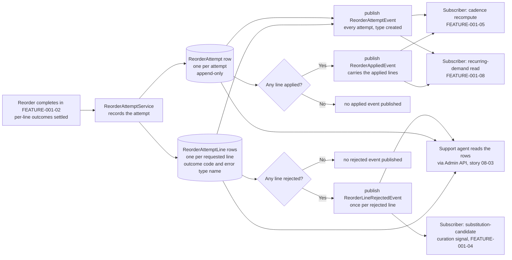

# FEATURE-001-07: Record every reorder attempt as an auditable row and publish three typed events on the existing event bus, so that support, cadence and demand consumers read what happened without polling and without altering what a reorder returns

Parent epic: `tickets/EPIC-001-reorder-and-replenishment.md`. The parent epic and the sibling features are written as backticked paths rather than as links, following the epic's own convention of keeping the link count in a file equal to the number of children that file indexes [tickets/EPIC-001-reorder-and-replenishment.md:§3. How To Read This Epic]. The only links in this file are the two story links in section 3.

This file is not on the epic's curated read path [tickets/EPIC-001-reorder-and-replenishment.md:§3. How To Read This Epic], and it is deliberately the narrowest feature in the set. It answers one question: **what is written down when a reorder happens, and who is told about it.** Everything about *how* a reorder reaches the cart belongs to `tickets/EPIC-001/FEATURE-001-02-reorder-from-order-history.md` and is not restated here.

---

## 1. Feature Title

**Record every reorder attempt as an auditable row and publish three typed events on the existing event bus, so that support, cadence and demand consumers read what happened without polling and without altering what a reorder returns.**

Short name, used verbatim wherever this feature is referred to in one phrase, and identical to the label the epic's features index gives it: **Reorder Event Instrumentation and Audit Trail** [tickets/EPIC-001-reorder-and-replenishment.md:§4. Features Index]. The long form above is the action-object-outcome title this tier requires; the short form is the name to cite.

Note the file slug is `reorder-instrumentation`, which is shorter than both forms of the title. That is fixed by the epic's own features index, which links to this exact filename [tickets/EPIC-001-reorder-and-replenishment.md:§4. Features Index], and the sibling story directory `FEATURE-001-07/` carries no slug at all. Neither is renamed.

Delivery is part of the single self-contained plugin package the epic describes — `packages/reorder-plugin/`, exporting `ReorderPlugin`. No file under `packages/core` or `packages/admin-ui` is edited to deliver it.

---

## 2. Feature Summary

### 2.1 The Capability

Every reorder attempt — whether all of its lines reached the cart, some of them did, or none did — leaves one durable, readable audit row per attempt and one per requested line. Alongside those rows, three typed events are published on the platform's existing event bus so that a subscriber reacts to a reorder in process, in TypeScript, without polling a table and without a second messaging mechanism being introduced.

### 2.2 Contribution To The Epic

This feature is part of the epic's batch B5, "Accounts, instrumentation, administration", which depends on batches B2 and B4 [tickets/EPIC-001-reorder-and-replenishment.md:§9.4 Run Batches]. It owns exactly one step of the returning-buyer journey — the step where the attempt is recorded and the event is published — and that step sits immediately after the per-line outcome report produced by FEATURE-001-02 and immediately before the cadence recompute in FEATURE-001-05 and the recurring-demand read in FEATURE-001-08 [tickets/EPIC-001-reorder-and-replenishment.md:§2.5 The Returning-Buyer Journey This Epic Builds].

**This feature is the one that discharges the epic's definition-of-done item on documented instrumentation.** That item requires instrumentation to be documented as event names with their payload schemas, published on the existing event bus and consumable with the existing typed subscribe, with no webhook dispatcher, polling table or second message bus introduced [tickets/EPIC-001-reorder-and-replenishment.md:§12. Definition of Done (Epic-Level)]. Section 2.7 is where that documentation lives, and it is the reason story 07-02's source-traceability label is `Inferred` rather than a quoted objective clause: the story derives from that definition-of-done item and not from a sentence in the objective. Naming the originating block is the whole point of the label, so it is named here as well as in the story.

Read the contribution precisely, because this feature only records and announces:

- **It does not decide what a reorder does.** Which lines are added, at what quantity, and with what per-line outcome is settled by FEATURE-001-02 before this feature sees anything [tickets/EPIC-001/FEATURE-001-02-reorder-from-order-history.md:§2.6 The Existing Mechanisms This Feature Consumes Rather Than Rebuilds].
- **It does not present anything to a buyer.** No Shop API surface is added, as section 2.6 records.
- **It does not aggregate.** Counting recurring demand across attempts is FEATURE-001-08's work over these rows; this feature writes the rows and adds no aggregate query.
- **It does not compute a cadence.** FEATURE-001-05 consumes the events; the interval arithmetic is that feature's.
- **It does not own the list tables.** `ReorderList` and `ReorderListLine` are FEATURE-001-01's, and this feature only stores a reference to a list as the source of an attempt [tickets/EPIC-001/FEATURE-001-01-named-reorder-lists.md:§2.4 Named Entities Touched].

### 2.3 What Was Dropped, And The Two Independent Grounds For Dropping It

The epic classifies this feature's deviation from its originally suggested area as **partially dropped**: the suggested area was "Reorder Instrumentation and Experiment Readiness", and experiment readiness is gone while instrumentation is retained in full [tickets/EPIC-001-reorder-and-replenishment.md:§4. Features Index].

**Two independent grounds carry that decision, and both are stated because either one alone would carry it less well.**

- **Ground one — there is no declared numeric target to experiment against.** An experiment needs a measure it is trying to move. This repository declares none: the epic reports that a search of the tree found no declared service-level commitment, no latency figure, no repeat-purchase-rate claim and no monetary business estimate, and that the absence is reported as a finding rather than filled with a plausible figure [tickets/EPIC-001-reorder-and-replenishment.md:§2.2 Business Value, Stated Without Invented Numbers]. An experiment-readiness feature would therefore have had to invent its own success measure, which the epic's constraints forbid outright.
- **Ground two — an experimentation platform is an external-service dependency.** Assignment of buyers to variants, and the accumulation of results across sessions, is what an experimentation product does, and reaching for one would breach the constraint that no capability in this epic may depend on a third-party service. The only outward-facing integration this repository ships is opt-in telemetry, and section 2.15 records that this feature does not depend on it.

The two grounds are independent in the strict sense: each one carries the decision on its own, so removing one leaves the decision standing on the other. Ground one would still hold if an in-process experimentation mechanism existed, and ground two would still hold if a numeric target were declared tomorrow.

**What is retained is everything an experiment would have needed as its input, and nothing it would have needed as its apparatus.** The attempt rows record what was requested and what happened, line by line, which is the raw material any later analysis works from. Deciding what to conclude from them is not this feature's work and is not in this epic.

### 2.4 Named Entities Touched

Two entities are new and plugin-owned; three already exist and are read, never altered; two belong to a sibling feature and are referenced by identifier only.

- **`ReorderAttempt` — new, plugin-owned.** One row per attempt, written whatever the outcome. It extends the platform's base entity class [packages/core/src/entity/base/base.entity.ts:L13], so its `id` [packages/core/src/entity/base/base.entity.ts:L29] and its timestamp [packages/core/src/entity/base/base.entity.ts:L31] are inherited rather than declared — **the attempt's timestamp is that inherited creation column, and no bespoke timestamp column is added.** Its own columns are the owning customer id, the id of the channel the attempt was made under, the request's language code, the source discriminator, the source reference, the target order id, the overall outcome code, and three integer line counts: requested, applied and rejected. Rows are append-only: nothing in this feature updates or deletes one, which is what makes the event in section 2.7 able to state that it only ever carries one member of its type union.
- **`ReorderAttemptLine` — new, plugin-owned.** One row per requested line, so the count of these rows for an attempt equals that attempt's requested-line count exactly. It holds the parent attempt id, the `ProductVariant` id, the requested quantity, the applied quantity, the per-line outcome code, and — where the core call returned one — the exact name of the error type that line failed with. Where the failure was a stock failure it also records the available quantity the platform itself reported, and where a unit price is recorded it is recorded as an integer alongside its currency code, as section 2.12 requires.
- **`Order` — existing, read only.** Declared as implementing `ChannelAware` and `HasCustomFields` [packages/core/src/entity/order/order.entity.ts:L44]. Two of its columns matter here and a third is named to be excluded. `code` is the uniquely indexed buyer-facing reference [packages/core/src/entity/order/order.entity.ts:L70], and its own JSDoc states it should be used as the order reference for customers rather than the order's id [packages/core/src/entity/order/order.entity.ts:L62-L67] — **which is exactly why it is the handle a support agent searches on**, and why the audit read in story 08-03 is specified against it rather than against an internal identifier. `state` [packages/core/src/entity/order/order.entity.ts:L72] and `orderPlacedAt` [packages/core/src/entity/order/order.entity.ts:L92] distinguish a source order from the target cart. `currencyCode` [packages/core/src/entity/order/order.entity.ts:L142] is read only to record the code alongside any integer price, never to convert one.
- **`Channel` — existing, read only.** Supplies the request scope described in section 2.12 [packages/core/src/entity/channel/channel.entity.ts:L62].
- **`ProductVariant` — existing, read only.** Each attempt line references one. This feature reads the identifier and records it; it asserts nothing about the variant's state, because the core call already did that before this feature was reached [packages/core/src/service/services/order.service.ts:L684-L689].
- **`ReorderList` and `ReorderListLine` — existing after FEATURE-001-01, referenced by identifier only.** Where an attempt's source was a saved list rather than a past order, the attempt stores that list's id [tickets/EPIC-001/FEATURE-001-01-named-reorder-lists.md:§2.4 Named Entities Touched]. **The reference is stored, not resolved into a copy:** an attempt records which list it came from, not a snapshot of the list's contents, because the per-line record already carries every variant and quantity that was actually requested.

**Exactly one of the two source-reference columns is populated on any row**, and the source discriminator says which. That is stated as a shape rule rather than left to a reader, because an attempt with both populated or neither populated is a defect the stories must assert against.

### 2.5 Named Services

- **`ReorderAttemptService` — new, plugin-owned.** Holds every write to the two tables and every publication of the three events. Both stories go through it, so there is exactly one place where an attempt is recorded and exactly one place where an event is published. Its recording method is called once per reorder, after the core call has returned and its per-line outcomes have been correlated, so it observes a settled result rather than participating in producing one.
- **`OrderService` — existing, in `packages/core`, read from and never modified.** One member is named, and it is named as the *source of the data this feature records* rather than as something this feature calls: `addItemsToOrder` [packages/core/src/service/services/order.service.ts:L654]. Its declared return type carries both an order and an `errorResults` collection [packages/core/src/service/services/order.service.ts:L663], and its per-item behaviour is to push a validation failure onto that collection and continue to the next item rather than aborting the batch [packages/core/src/service/services/order.service.ts:L680-L683]. **Those accumulated error results are what become the per-line outcome codes and recorded error type names on `ReorderAttemptLine`.** The call itself is made by FEATURE-001-02's service, not by this feature [tickets/EPIC-001/FEATURE-001-02-reorder-from-order-history.md:§2.4 Named Services]; this feature receives the outcome that call produced.
- **`EventBus` — existing, consumed.** The injectable publish-and-subscribe surface [packages/core/src/event-bus/event-bus.ts:L100]. Section 2.8 sets out the two members this feature uses and the prohibition attached to them.
- **`TransactionalConnection` — existing, consumed.** Every plugin-owned write goes through it, so the attempt rows are written inside the request's transaction. The epic names it as the persistence dependency for all plugin-owned state [tickets/EPIC-001-reorder-and-replenishment.md:§7.4 Existing Entities And Services The Work Depends On]. That the write is transactional is not incidental — it is the precondition that makes the delivery guarantee in section 2.8 meaningful.
- **`HistoryService` — existing, considered and deliberately not used.** The platform ships a history-entry service whose order-scoped write method a plugin can call [packages/core/src/service/services/history.service.ts:L285], and a shipped test plugin does exactly that with a plugin-declared entry type [packages/dev-server/test-plugins/custom-history-entry/custom-history-entry-plugin.ts:L28-L33]. It is named here so that the choice not to use it is visible rather than looking like an oversight; section 2.14 gives the reason.

### 2.6 Named API Surfaces — Three Absences, Stated Plainly

**This feature adds no Shop API operation. It adds no Admin API operation. It declares no new error result.** All three absences are stated positively rather than left to be inferred from silence, and together they make this the strongest form the additive-only constraint takes anywhere in this epic: a feature that adds no operation cannot possibly widen one.

- **No Shop API operation.** A buyer neither reads nor writes an audit row. There is no query for "my reorder attempts" and no mutation that records one, because recording happens as a consequence of the reorder mutation FEATURE-001-02 already owns [tickets/EPIC-001/FEATURE-001-02-reorder-from-order-history.md:§2.5 Named API Surfaces — One New Mutation, Zero Existing Signatures Changed]. Every existing Shop API signature is byte-identical after this feature ships, and so is the count of operations.
- **No Admin API operation.** The audit rows are read through **FEATURE-001-08's** Admin API surface, specifically the support-agent lookup in story 08-03. That is a deliberate boundary and not a gap: all three administrative personas read the same plugin-owned rows, so putting a resolver here as well would duplicate that feature's query and permission wiring, which is precisely the reason the epic expanded FEATURE-001-08 to absorb the support read path [tickets/EPIC-001-reorder-and-replenishment.md:§4. Features Index].
- **No new error result.** Six new error results are declared across the whole ticket set and **none of them belongs to this feature** — they belong to FEATURE-001-01 and FEATURE-001-06 [tickets/EPIC-001/FEATURE-001-01-named-reorder-lists.md:§2.10 The Error Vocabulary This Feature Introduces], with the sixth belonging to FEATURE-001-02 [tickets/EPIC-001/FEATURE-001-02-reorder-from-order-history.md:§2.11 The Error Vocabulary This Feature Introduces]. This feature therefore leaves the published error-code enum untouched, which is a second consequence worth stating: the automatic enum growth the epic reports as a collision does not apply to this feature at all [tickets/EPIC-001-reorder-and-replenishment.md:§6.1 Repository-Discovered Collisions].

**What this feature does with the error vocabulary is record from it, never add to it.** A recorded error type name on `ReorderAttemptLine` is the name of an existing type, and the set it is drawn from is closed and was read rather than assumed: `union UpdateOrderItemErrorResult` names exactly `OrderModificationError`, `OrderLimitError`, `NegativeQuantityError`, `InsufficientStockError` and `OrderInterceptorError` [packages/core/src/api/schema/common/common-error-results.graphql:L112-L117]. Each already exists in this checkout — `OrderLimitError` with its `maxItems` field [packages/core/src/api/schema/common/common-error-results.graphql:L37], `NegativeQuantityError` [packages/core/src/api/schema/common/common-error-results.graphql:L44], `InsufficientStockError` [packages/core/src/api/schema/common/common-error-results.graphql:L50], `OrderModificationError` [packages/core/src/api/schema/common/common-error-results.graphql:L80] and `OrderInterceptorError` [packages/core/src/api/schema/common/common-error-results.graphql:L103].

`InsufficientStockError` earns a sentence of its own because it is why an attempt line can record an availability figure without this ticket set inventing one: it carries `quantityAvailable` as a non-null integer [packages/core/src/api/schema/common/common-error-results.graphql:L53]. **The recorded value is the one the platform returned at the moment of the attempt, not a threshold chosen here.**

No text in this feature or in its two stories names an error outside those five, the six declared by this ticket set, or the **thirty-one** types that already implement the error-result interface in this checkout — fifteen in [packages/core/src/api/schema/common/common-error-results.graphql:L2] through [packages/core/src/api/schema/common/common-error-results.graphql:L103] and sixteen more in [packages/core/src/api/schema/shop-api/shop-error-results.graphql:L2] through [packages/core/src/api/schema/shop-api/shop-error-results.graphql:L130].

**The events are consumed in TypeScript, not over an API.** A subscriber is server-side code inside the same process, reached through the typed subscribe described in section 2.8. There is consequently no third surface here: two tables, three events, zero operations.

### 2.7 The Three Events And Their Payload Schemas — This File Is Their Authority

**The epic commits this feature to three typed events with documented payload schemas but does not name them** [tickets/EPIC-001-reorder-and-replenishment.md:§4. Features Index]. That is stated openly rather than papered over: **this section is the authority for their names and payloads.** Story 07-02 documents these three and no others, FEATURE-001-08 reads them as defined here, and any divergence between a story and this section is a defect in the story.

The names and shapes are not invented freely — they follow the two shapes this repository already ships, out of a catalogue of sixty-one events under `packages/core/src/event-bus/events/`:

- **Shape A, the entity event.** A subclass of the abstract entity-event base [packages/core/src/event-bus/vendure-entity-event.ts:L12], which declares four public readonly members — `entity`, `type`, `ctx` and `input` [packages/core/src/event-bus/vendure-entity-event.ts:L13-L16] — with `type` constrained to the union `'created' | 'updated' | 'deleted'` [packages/core/src/event-bus/vendure-entity-event.ts:L14]. The shipped exemplar is `OrderEvent`, declared over an order and its input types [packages/core/src/event-bus/events/order-event.ts:L17], passing exactly that type union through its constructor [packages/core/src/event-bus/events/order-event.ts:L21]. Naming convention: `<Entity>Event`.
- **Shape B, the discrete-occurrence event.** A direct subclass of the abstract event base [packages/core/src/event-bus/vendure-event.ts:L7] with explicit public constructor parameters. The shipped exemplars are `OrderPlacedEvent`, carrying a from-state, a to-state, a context and an order [packages/core/src/event-bus/events/order-placed-event.ts:L17-L25], and `OrderLineEvent`, carrying a context, an order, a single order line and a type discriminator [packages/core/src/event-bus/events/order-line-event.ts:L14-L19]. Naming convention: `<Subject><PastParticiple>Event`.

**Both shapes inherit a creation timestamp from the common base** [packages/core/src/event-bus/vendure-event.ts:L8], so every payload below carries one without declaring it. **Both shapes carry a request context**, and that single fact is what engages the delivery guarantee in section 2.8 — an event without one would not get it.

#### Event one — `ReorderAttemptEvent`

Shape A, an entity event over the new attempt row.

```ts
// Payload, field by field. Four members are inherited from the entity-event base
// and one from the event base; nothing else is added.
entity: ReorderAttempt   // the persisted attempt row, with all columns from section 2.4
type: 'created'          // see the note below: only ever this member
ctx: RequestContext      // the reorder request's context; scopes channel and language
input?: ReorderAttemptInput // the reorder input that produced the attempt:
                            // source discriminator, source reference, requested lines
createdAt: Date          // inherited from the event base
```

**Published:** once per attempt, after the attempt row and all of its line rows are persisted, whatever the outcome — including an attempt where no line was applied at all. An attempt that recorded nothing successful is still an attempt worth announcing, because "the buyer tried and got nothing" is the single most useful signal a support agent or a demand consumer can receive.

**On the `type` member, stated exactly rather than loosely.** The base type constrains it to three members [packages/core/src/event-bus/vendure-entity-event.ts:L14], and this event **only ever carries `'created'`**. Attempt rows are append-only, as section 2.4 records, so no `'updated'` and no `'deleted'` publication exists. A subscriber may therefore switch on the member, but a subscriber that waits for `'updated'` waits forever — which is worth writing down precisely because the base type would otherwise imply that all three are reachable.

#### Event two — `ReorderAppliedEvent`

Shape B, a discrete occurrence.

```ts
// Payload, field by field.
ctx: RequestContext                // the reorder request's context
attempt: ReorderAttempt            // the same row event one announced
order: Order                       // the target active order the lines reached
appliedLines: ReorderAttemptLine[] // only the lines with an applied quantity above zero,
                                   // each carrying its variant id, requested quantity,
                                   // applied quantity and outcome code
createdAt: Date                    // inherited from the event base
```

**Published:** once per attempt, and **only where at least one line reached the target order.** An attempt in which every line was rejected publishes event one and does not publish this one. That conditionality is the event's entire value: a subscriber interested in what a buyer actually bought again does not have to filter an unconditional stream, and a subscriber that wants every attempt regardless subscribes to event one instead. The condition is expressed as a state assertion a test can make — the applied-line collection is non-empty — rather than as a description of intent.

#### Event three — `ReorderLineRejectedEvent`

Shape B, modelled on the per-line shipped exemplar [packages/core/src/event-bus/events/order-line-event.ts:L14-L19].

```ts
// Payload, field by field.
ctx: RequestContext            // the reorder request's context
attempt: ReorderAttempt        // the parent attempt row, so a subscriber can correlate
attemptLine: ReorderAttemptLine // the single rejected line row
productVariantId: ID           // lifted onto the payload so a subscriber need not load the line
outcomeCode: string            // the per-line rejection code recorded on the row
errorType?: string             // the exact name of the error type the core call returned,
                               // drawn only from the five members of the closed union
                               // in section 2.6; absent where the line was rejected
                               // without the core call returning an error result
createdAt: Date                // inherited from the event base
```

**Published:** **once per rejected line**, so one attempt with three rejected lines publishes this event three times. The fan-out is stated rather than glossed, because it is the one place in this feature where the event count is not one-per-attempt, and because it is what makes the diagram in section 2.9 draw a distinct arrow. This matches the per-line granularity of the shipped exemplar, which likewise fires per order line rather than per order [packages/core/src/event-bus/events/order-line-event.ts:L13].

The reason the fan-out is worth the cost is a concrete consumer: a rejected line names a variant a buyer wanted and could not have, which is exactly the input the substitution-candidate curation surface in FEATURE-001-04 needs, and exactly what a support agent is looking at when a buyer reports that a reorder "did not work".

#### Why three, and not two or four

Stated so the count is a decision rather than a coincidence. Each event answers a question no other one answers, and each maps to a shipped shape rather than to a new idea: event one is *every* attempt and is the only event guaranteed to fire; event two is the *successful* subset and is conditional; event three is *per-line* and is the only one that fans out. Collapsing two into one would force every subscriber to filter, and adding a fourth would mean publishing something already derivable from the rows these three announce.

### 2.8 The Existing Mechanisms This Feature Consumes Rather Than Rebuilds

The epic's do-not-duplicate inventory assigns this feature one row covering two members of one service, with a single prohibition attached: **do not add a webhook dispatcher, a polling table or a second message bus; reorder events are published on this bus and consumed with the typed subscribe** [tickets/EPIC-001-reorder-and-replenishment.md:§5. Existing Mechanisms That Must Not Be Duplicated]. Both members were read rather than assumed.

#### Mechanism one — publishing

`publish` is an async method on the injectable event bus taking any event instance and resolving to void [packages/core/src/event-bus/event-bus.ts:L116], declared on the event-bus class itself [packages/core/src/event-bus/event-bus.ts:L100]. Its own JSDoc gives the calling form as a single awaited call on the bus [packages/core/src/event-bus/event-bus.ts:L113] and describes its purpose as publishing an event which any subscribers can react to [packages/core/src/event-bus/event-bus.ts:L107-L115]. Internally it pushes onto one event stream [packages/core/src/event-bus/event-bus.ts:L117] and then awaits any blocking handlers [packages/core/src/event-bus/event-bus.ts:L118] — a detail that matters to section 2.11 and to nothing else.

*The prohibition, applied:* the plugin publishes its three events through this method and builds no dispatcher of its own. There is no outbound HTTP call, no queue of pending notifications, no table polled for undelivered rows and no second bus. **Fan-out is the bus's job, and this feature does not reimplement it.**

#### Mechanism two — subscribing, and the guarantee that makes this feature's claims defensible

`ofType` takes an event class and returns an observable stream filtered to that class [packages/core/src/event-bus/event-bus.ts:L130]. **Its JSDoc carries the single most load-bearing citation in this file:** it states that if the event contains a request-context object, the subscriber will only get called after any active database transactions are complete, and that this means the subscriber function can safely access all updated data related to the event [packages/core/src/event-bus/event-bus.ts:L122-L128]. A predicate-based variant of the same stream carries the identical guarantee [packages/core/src/event-bus/event-bus.ts:L139-L147].

**Why that citation is what it is.** Without it, "a subscriber can read the audit row it was just told about" would be a hope — an ordinary in-process event fired mid-transaction would let a subscriber query for a row that its own transaction cannot yet see, and the resulting behaviour would be intermittent and environment-dependent. With it, the claim is a documented property of the platform, and it is available precisely because all three payloads in section 2.7 carry a request context. **Two obligations follow and both are carried into section 5:** every one of the three events must carry its context, and the subscriber test must assert readability of the persisted row from inside the subscriber rather than merely asserting that the subscriber ran.

*The prohibition, applied:* consumers subscribe with this method. No consumer polls the attempt tables on a timer to discover new rows, which is the specific rebuild the epic's prohibition names.

#### The shipped subscriber idiom, verified

The repository ships a plugin whose entire purpose is to explore how event delivery interacts with transactions, with its own comment naming the upstream issue it was written for [packages/dev-server/test-plugins/event-bus-transactions-plugin.ts:L37]. Its plugin class implements the Nest module-initialisation hook [packages/dev-server/test-plugins/event-bus-transactions-plugin.ts:L49] and subscribes inside it [packages/dev-server/test-plugins/event-bus-transactions-plugin.ts:L55-L56], then reads the entity through the transactional connection using the context carried on the event [packages/dev-server/test-plugins/event-bus-transactions-plugin.ts:L58]. **That is the idiom a consumer of these three events follows: subscribe at module initialisation, read through the connection with the event's own context.** It is named here so that neither story invents an alternative wiring.

### 2.9 Figure F7-FLOW — From One Reorder Attempt To Its Audit Rows, Its Events And Its Subscribers

This is the only diagram in this feature. **Both story files carry zero diagrams and reference this figure by the name Figure F7-FLOW instead**, which is the mechanism the epic prescribes for a story that needs a visual.



Four readings of the figure are load-bearing and are stated so they are not inferred:

- **The rows are written before any event is published.** Both event-producing paths start at a persisted row, not at an intention to write one. That ordering is what the delivery guarantee in section 2.8 makes observable.
- **The two row types are distinct nodes because they have distinct cardinality.** One attempt row; one line row per requested line. A subscriber counting rejected lines counts line rows, never attempt rows.
- **Only one of the three events is unconditional.** The two decision nodes are the whole reason section 2.7 specifies publication conditions as state assertions rather than as prose.
- **Every arrow runs left to right and none returns.** No subscriber feeds anything back into the reorder, which is the graphical form of section 2.11.

### 2.10 Asynchronous Delivery — The Trigger And The Observable Completion Signal

Event delivery is asynchronous, so **"it happens eventually" is not an acceptable statement of behaviour anywhere in this feature.** Both halves are named, and both stories inherit the pair.

- **The trigger** is one reorder attempt completing — that is, the reorder path in FEATURE-001-02 having produced a settled per-line outcome for every requested line and returned its payload. Recording is not triggered by a timer, a queue drain or an administrator action.
- **The observable completion signal is two things, and both are assertable:**
  - **The persisted `ReorderAttempt` row becomes readable**, together with exactly one `ReorderAttemptLine` row per requested line. This is the signal a test asserts on directly: a read after the reorder returns finds the attempt, and the count of its line rows equals the attempt's recorded requested-line count.
  - **Each subscriber's own observable effect occurs.** For a subscriber under test, that means the effect it was written to produce — a row it writes, a value it sets — is present. Asserting that the subscriber *was invoked* is deliberately not enough, because the point of the guarantee in section 2.8 is that the subscriber can *read committed data*, and only an effect derived from that read demonstrates it.

**No completion time is stated, because none is declared.** This repository publishes no timing figure to hold delivery against [tickets/EPIC-001-reorder-and-replenishment.md:§2.2 Business Value, Stated Without Invented Numbers], so the completion signal is a state to observe rather than a deadline to meet. That is the honest form of the requirement, and inventing a deadline to look more rigorous would be the dishonest one.

### 2.11 Observational Neutrality — And The Shipped Mechanism That Would Break It

**Instrumentation must be observationally neutral: recording an attempt and publishing its events may not change what the reorder mutation returns, and may not change whether it succeeds.** This is the property most likely to be broken by an implementer, so it is stated at feature level, drawn as a rule in section 2.9, and carried into section 5 as a checkable item rather than left as an aspiration.

The risk is not hypothetical, and the mechanism that creates it is shipped and documented. The event bus offers a way to register a handler that **blocks execution of the code which published the event until the handler has completed** [packages/core/src/event-bus/event-bus.ts:L188], and its JSDoc is explicit that this exists for the case where you want the triggering code to fail if the handler fails [packages/core/src/event-bus/event-bus.ts:L162-L163]. The same JSDoc carries a warning that errors in such a handler can cause the associated operation to fail entirely, that any non-trivial work should be offloaded to the job queue instead, and that the handler runs in the *same database transaction* as the code which published the event [packages/core/src/event-bus/event-bus.ts:L165-L173]. Publication awaits those handlers inline [packages/core/src/event-bus/event-bus.ts:L118].

**Three design rules follow directly, and each is a rule rather than a preference:**

- **This feature registers no blocking handler for any of its three events.** Registration is what converts a neutral announcement into a participant in the outcome, so it is excluded by design and its absence is evidenced in section 5.
- **Recording is not permitted to fail the reorder.** A failure to write an attempt row is reported through the platform's logger and leaves the reorder's own returned payload unchanged. The buyer's cart is authoritative; the audit trail is a record of it, and a record that can veto the thing it records is not a record.
- **No consumer of these events may be relied upon by the reorder path.** Section 2.9 draws every arrow one-way for this reason. If a future capability genuinely needs a reorder to fail when a downstream step fails, that is a change to FEATURE-001-02's contract and an epic-level decision, not something a subscriber may arrange quietly.

**The honest limit of this claim.** Neutrality is a property of *this feature's* code, not a property the platform enforces on third parties: any plugin may register a blocking handler for any event, including these three. What is verifiable here is that this feature registers none and that the reorder result is byte-identical with recording enabled and with it disabled, which is exactly what section 5 asks for.

### 2.12 Channel Scoping, Language Scoping And Monetary Values

Recording is channel-scoped and language-scoped, inherited from the reorder request rather than chosen by this feature. The epic states the three request preconditions once for every story in the set [tickets/EPIC-001-reorder-and-replenishment.md:§7.5 Request Prerequisites]; what follows is what they mean specifically for an audit row.

- **Channel.** The active channel is identified by a unique token read from the `vendure-token` request header [packages/core/src/entity/channel/channel.entity.ts:L56-L59], carried as a unique column on the channel entity [packages/core/src/entity/channel/channel.entity.ts:L62]. **Every `ReorderAttempt` row stores the id of the channel it was recorded under, and an attempt recorded under one token is not readable under another.** That is a hard boundary rather than a filter a caller may widen, and it holds for the administrative read in story 08-03 as much as for the write here. **Each of the three event payloads carries the request context, and the channel is resolved from it**, so a subscriber can scope its own reaction to the channel the attempt belongs to instead of reacting globally — which matters because a deployment with per-channel sellers has per-channel consumers.
- **Language.** Translated output resolves against the request's language code, which defaults to the channel's default language code [packages/core/src/entity/channel/channel.entity.ts:L74]. The attempt row stores that code so a later read reproduces the language the attempt was made in. **This feature stores no translatable string of its own and translates nothing:** an outcome code and a recorded error type name are machine-readable identifiers, not localised sentences, and they are deliberately identifiers precisely so that the audit trail never becomes a translation surface this feature would then have to own.
- **Money.** Where an attempt line records a unit price, it records it as an **integer in the smallest unit of its currency, alongside the currency code**, which defaults to the channel's default currency code [packages/core/src/entity/channel/channel.entity.ts:L88]. A decimal monetary value in an audit row is a defect, not a formatting preference. By way of illustration rather than specification: a line recorded at a unit price of 134900 together with the currency code it is denominated in is a well-formed record, and the same amount written with a decimal separator is not.
- **No currency arithmetic happens here at all.** The attempt line copies the price the platform resolved and the code it was denominated in [packages/core/src/entity/order/order.entity.ts:L142]. It performs no currency conversion, no summation across currencies and no re-pricing, so there is no place in this feature where an exchange rate could be applied — which is the strongest form that constraint can take.

### 2.13 Privacy And How Long An Audit Row Is Kept — No Policy Is Declared Anywhere

An audit trail keyed to a named customer's purchasing behaviour is personal data, and the obvious question is how long a row survives. **This repository declares no answer, and no period is invented here.** That is a required finding, reported with the search that established it rather than left as an omission.

- **The search.** A case-insensitive search across `packages/core/src`, the contribution guide, the agent handbook and the security policy for data-protection regulation references, data-lifetime declarations and erasure language returned **nothing**. There is no declared period for which any plugin-owned row is kept, and consequently none for these two tables.
- **The mechanism exists even though the policy does not, and the distinction matters.** The platform ships a scheduled task that periodically removes aged rows — the session-cleaning task, declared with an identifier, a description, configurable parameters and a deployment-overridable schedule [packages/core/src/scheduler/tasks/clean-sessions-task.ts:L37-L49]. So a future decision to purge aged attempt rows has a shipped pattern to follow and would need no new machinery. **What is missing is the policy, not the tooling.**
- **Consequently this feature raises the question as a decision required before build and refers it upward** to the epic's decisions section [tickets/EPIC-001-reorder-and-replenishment.md:§8. Decisions Required Before Build]. To be accurate about the current state of that section: **it does not yet enumerate this decision**, and this file is where the gap is being reported so that it can be added and taken by a maintainer. Two sub-questions belong to it — for how long an attempt row is kept, and what happens to attempt rows when the customer they name is deleted. Note that the customer entity is soft-deletable [tickets/EPIC-001/FEATURE-001-01-named-reorder-lists.md:§2.4 Named Entities Touched], so a deleted customer's rows would otherwise persist by default, which makes the second sub-question a real choice rather than a formality.
- **What this feature does in the absence of a decision is minimise rather than guess.** An attempt line records identifiers, integer quantities, an outcome code and, where the platform returned one, an error type name. It records no free-text buyer input, no contact detail and no payment data — none of which it has any use for. That is the defensible position while the policy question is open, and it is stated as the design rather than as a mitigation.

### 2.14 Precedent In This Repository — Partial

The precedent disclosure for this feature is **partial**, and both halves of that judgement are stated because reporting only the favourable half would overstate the novelty.

**What is precedented, with the search that found it.** The publish-and-subscribe idiom is entirely shipped: sixty-one events exist in the core catalogue under `packages/core/src/event-bus/events/`, the two payload shapes this feature follows are both taken from that catalogue [packages/core/src/event-bus/events/order-event.ts:L17] and [packages/core/src/event-bus/events/order-placed-event.ts:L17], and a shipped test plugin demonstrates the consumer half end to end — subscribing at module initialisation and reading through the transactional connection with the event's own context [packages/dev-server/test-plugins/event-bus-transactions-plugin.ts:L55-L58]. **Publishing a typed event from a plugin is re-application of a well-worn pattern, and this feature claims no originality for it.**

The nearest precedent for the *recording* half is also shipped, and it needs describing exactly rather than loosely, because the loose description is wrong in a way that matters. A shipped test plugin records history-style entries against an order [packages/dev-server/test-plugins/custom-history-entry/custom-history-entry-plugin.ts:L28-L33] — but it does **not** own a table. It calls the platform's history service [packages/core/src/service/services/history.service.ts:L285] and writes into the *core* history entry table, declaring its own entry type by augmenting the platform's history-data interface [packages/dev-server/test-plugins/custom-history-entry/types.ts:L5-L12]. So the precedent is "a plugin can add its own kind of auditable entry to a core table", not "a plugin owns audit tables".

**Why that shipped route was not taken, stated as the reason it is named in section 2.5.** Two grounds, both structural. First, cardinality: a history entry is one row against one order, whereas an attempt needs a parent row and one child row per requested line, and flattening the line grain into an entry payload would make the recurring-demand aggregate in FEATURE-001-08 a scan over serialised data rather than a database aggregate — which the epic's data-volume assumptions rule out [tickets/EPIC-001-reorder-and-replenishment.md:§7.6 Data-Volume Assumptions, Anchored To The Existing Harness]. Second, boundary: writing into a core table and augmenting a core interface is a larger commitment than owning two plugin tables, and the epic's recommended resolution is for reorder state to live on plugin-owned tables keyed by entity id [tickets/EPIC-001-reorder-and-replenishment.md:§6.1 Repository-Discovered Collisions].

**What is not precedented at all.** Nothing in this repository records a reorder attempt, because nothing in this repository performs a reorder. The searched set was the whole of `packages/dev-server/example-plugins/`, the whole of `packages/dev-server/test-plugins/` and `packages/dashboard/test-plans/` — the same set the epic names for its demonstration-slice reasoning [tickets/EPIC-001-reorder-and-replenishment.md:§9.6 Nomination]. There is no reorder-attempt table, no reorder event and no per-line audit shape anywhere in it.

**The consequence for the stories.** Both of this feature's stories disclose `partial` rather than `none`: story 07-01 because the recording pattern has a shipped analogue with different mechanics, and story 07-02 because the publishing pattern is shipped outright and only the three event names and payloads are new. Neither story may claim `none`, and neither may claim the pattern as novel.

### 2.15 Constraints This Feature Is Built Under

These are boundaries on the work this feature describes, not preamble. Each is carried into the definition of done in section 5. They derive from the epic's stated architectural constraints and from cited repository conventions; **no user-specified rules were provided for this project**, so nothing below is attributed to one [tickets/EPIC-001-reorder-and-replenishment.md:§11.9 User-Specified Rules].

- **Additive only — and this feature is the strongest case of it in the epic.** It adds **no operation at all**: no Shop API operation, no Admin API operation, no error result, as section 2.6 states three times over. A feature that adds no operation cannot widen one, so the side-effect-widening violation the epic requires be reported rather than absorbed [tickets/EPIC-001-reorder-and-replenishment.md:§6.1 Repository-Discovered Collisions] has no surface to arise on here. The published error-code enum and the published permission enum both gain nothing from this feature.
- **Zero custom fields on a core entity.** This feature declares none. Every column it needs is on its own two tables, so the two `customFields` argument admissions in the Shop API schema stay untrue of this deployment, and the dev-server configuration's empty custom-fields object [packages/dev-server/dev-config.ts:L116] is still empty once this feature ships.
- **Zero edits to `packages/core` and `packages/admin-ui`.** Delivery is self-contained in the plugin package. The only two files a future implementation may touch outside its own package are the dev-server plugin registration array [packages/dev-server/dev-config.ts:L121-L155], where `ReorderPlugin` is registered, and the dashboard bundling configuration [packages/dev-server/vite.config.mts:L1]. **This feature needs the first and not the second, because it ships no dashboard surface.** Naming those two files is a documentation act and licenses no run that reads this file to edit them [tickets/EPIC-001-reorder-and-replenishment.md:§11.7 The Two Permitted Configuration Exceptions — Named, Not Touched].
- **Additive migrations only — two new tables, and nothing else.** No column is added to an existing table, no column type is changed and no destructive statement appears. The migrations are generated and exercised through the existing lifecycle [packages/core/src/migrate.ts:L118], applied with the runner [packages/core/src/migrate.ts:L40] and reverted with the revert entry point [packages/core/src/migrate.ts:L89]. Note the epic's standing conflict: this repository classifies any database-schema change as breaking-change work targeting a different branch [CONTRIBUTING.md:§Breaking Changes], which is a decision for a maintainer and not for this file [tickets/EPIC-001-reorder-and-replenishment.md:§11.1 The Branch Target Is A Three-Way Conflict, Not A Choice Already Made].
- **Integer money with its currency code.** Any recorded price is an integer in the smallest currency unit accompanied by the code, per section 2.12. A decimal amount anywhere in this feature or its two stories is a defect.
- **No invented metric — and this is the file in the set where the temptation is greatest.** Instrumentation invites a target: a share of reorders that succeed, a permitted delivery delay, a period for which rows are kept, a figure for demand. **This feature states none of them, because this repository declares none** [tickets/EPIC-001-reorder-and-replenishment.md:§2.2 Business Value, Stated Without Invented Numbers]. Where a reader would expect a target, the absence is stated instead: section 2.10 declares that no completion time is declared, section 2.13 declares that no period for keeping a row is declared, and nothing here describes recording as cheap, fast or low-impact by any figure. What is asserted instead is verifiable state — an exact row count matching a recorded line count, an exact event count per attempt, an exact outcome code, an exact error type name, and an integer amount with its currency code.
- **No external-service dependency.** Nothing in this feature leaves the process. There is no analytics vendor, no experimentation platform and no telemetry sink beyond the in-process event bus. Worth naming explicitly because the repository *does* ship an outward-facing option: the dev-server configuration registers a telemetry plugin only when an environment flag is set [packages/dev-server/dev-config.ts:L153], with that flag read from the environment [packages/dev-server/dev-config.ts:L31]. **This feature neither requires that flag nor depends on that plugin**, and its two stories are acceptable with the flag unset.
- **Version tagging.** Doc blocks on the new public API — the two entities, the service and the three event classes — carry `@since 3.8.0`. That value is *derived* from the next-minor rule in the contribution guide [CONTRIBUTING.md:§New features] applied to a 3.7.0 checkout [packages/core/package.json:L2-L3], and the epic flags the same derivation and warns against presenting it as a quotation [tickets/EPIC-001-reorder-and-replenishment.md:§11.2 Version Tagging].
- **No hand-written reference page.** The plugin's reference documentation is generated from JSDoc in the TypeScript sources, so this feature's documentation obligation — including the field-by-field payload schemas in section 2.7 — means writing JSDoc on the event classes, not authoring a page under the documentation tree [tickets/EPIC-001-reorder-and-replenishment.md:§11.5 Public API Documentation Is Generated, Not Hand-Written].

---

## 3. User Stories Index

Two stories — the smallest story count of any feature in this epic, and deliberately so: recording and announcing are separable, the first is a prerequisite of the second, and splitting further would produce a story with no independent value. Titles are transcribed from the epic's story table and are not restated with different wording [tickets/EPIC-001-reorder-and-replenishment.md:§9.2 Story Table].

- [STORY-001-07-01 — Record a reorder attempt audit trail](./FEATURE-001-07/STORY-001-07-01-reorder-attempt-audit-trail.md) — the two plugin-owned tables, their additive migration, the recording service, the per-line outcome codes mapped from the core call's accumulated error results, and the order code as the handle a support agent searches on.
- [STORY-001-07-02 — Publish reorder events](./FEATURE-001-07/STORY-001-07-02-publish-reorder-events.md) — the three event classes with the payload schemas fixed in section 2.7, published through the existing bus, each carrying its request context, with a subscriber proving it reads committed audit rows.

Estimates are deliberately absent from this file. Points, lines of code, generation hours and review hours live only in the epic's delivery-split table, which is the single source of truth for them, and each story transcribes its own four values from its row there [tickets/EPIC-001-reorder-and-replenishment.md:§9.2 Story Table].

Both stories in this feature reference **Figure F7-FLOW** in section 2.9 where they need a visual, and embed no diagram of their own.

---

## 4. Dependencies

Direction is stated for every entry, because a dependency without a direction cannot be sequenced.

### 4.1 Upstream — FEATURE-001-02, For The Thing There Is To Record

**This feature has exactly one upstream feature dependency, and it is total rather than partial: FEATURE-001-02 in its entirety.**

The reason is definitional rather than technical. **An attempt cannot be recorded until there is an attempt** — until a reorder execution path exists that resolves a source into requested lines, calls the core bulk add and produces a settled per-line outcome. Every column on `ReorderAttemptLine` is a field of that outcome: the requested quantity, the applied quantity, the outcome code and the recorded error type name all originate in the contract FEATURE-001-02 defines [tickets/EPIC-001/FEATURE-001-02-reorder-from-order-history.md:§2.6 The Existing Mechanisms This Feature Consumes Rather Than Rebuilds]. Recording against a contract still in flux would mean re-shaping both tables when it settled.

That upstream feature records the same edge from its own side, describing this feature as depending on it "for the thing it records" and stating that the outcome contract must exist and be stable before there is a defined payload to record or publish [tickets/EPIC-001/FEATURE-001-02-reorder-from-order-history.md:§4.2 Downstream — Three Features Depend On This One]. Both statements agree, which is deliberate.

The epic places this feature in batch B5, which depends on batches B2 and B4 [tickets/EPIC-001-reorder-and-replenishment.md:§9.4 Run Batches]. **B4 is a batch-level dependency and not a dependency of this feature specifically:** B5 also contains FEATURE-001-06 and FEATURE-001-08, and it is those that need B4's work. This feature's own prerequisite within B5 is B2 alone, so it is buildable as soon as the reorder execution path is merged. Naming that distinction matters, because reading the batch dependency as a feature dependency would delay this feature behind cadence and substitution work it does not use.

`FEATURE-001-01` is **not** an upstream dependency of this feature. An attempt sourced from a saved list stores that list's id, but the recording path does not read the list tables and does not depend on their contents [tickets/EPIC-001/FEATURE-001-01-named-reorder-lists.md:§2.4 Named Entities Touched]. An attempt sourced from a past order involves them not at all.

### 4.2 Downstream — Three Consumers, All One-Way

Direction: the arrow points *into* this feature from all three. None creates a reciprocal obligation here, and none is permitted to, per section 2.11.

- **FEATURE-001-08 depends on this feature, for the rows it reads.** The recurring-demand aggregate and the support-agent lookup both read `ReorderAttempt` and `ReorderAttemptLine`; the epic's feature graph carries that edge directly [tickets/EPIC-001-reorder-and-replenishment.md:§4. Features Index]. **This is the strongest downstream edge in the set for this feature, because that feature has nothing to aggregate until these tables exist and are populated.** Story 08-03 in particular reads an attempt by the order code recorded on it [packages/core/src/entity/order/order.entity.ts:L70], and the read permission it gates on is registered there rather than here, generated from a single name through the platform's permission-definition helpers [packages/core/src/common/permission-definition.ts:L146] or their read-and-write variant [packages/core/src/common/permission-definition.ts:L245].
- **FEATURE-001-05 depends on this feature, at consumer granularity.** Cadence recompute subscribes to the attempt and applied events rather than polling, which is what discharges the epic's prohibition on a polling table [tickets/EPIC-001-reorder-and-replenishment.md:§5. Existing Mechanisms That Must Not Be Duplicated]. The dependency is on the event payloads in section 2.7 and on nothing else in this feature.
- **FEATURE-001-04 depends on this feature only optionally, and the qualifier is real.** A rejected-line event is a useful signal for curating substitution candidates, but that feature's strategy interface and its curation surface are complete without it. The edge is therefore an enhancement rather than a prerequisite, and it is recorded as such so that nobody sequences that feature behind this one.

### 4.3 Intra-Feature Story Order

- `STORY-001-07-01` → `STORY-001-07-02`: **07-02 depends on 07-01.** The reason is in the payloads: every one of the three events in section 2.7 references the attempt row, and two of them reference an attempt line row, so the entities and their migration must exist before an event has anything to carry. Classification: a **shared code path** — the two entities, their migration and the recording service — plus a **data dependency** on at least one persisted attempt row for any subscriber assertion to be made against.

There is one edge and no back edge. **07-01 delivers value on its own** — a readable audit trail is useful to a support agent through FEATURE-001-08 whether or not any event is ever published — which is what keeps the split honest rather than producing a first story that is merely scaffolding for a second.

### 4.4 Existing Entities, Services And Configuration Required

Stated in the epic's dependency form — the required thing, then why it is required and where it belongs.

- **Entity `Order`:** supplies the target order reference recorded on every attempt and the buyer-facing code a support agent searches on [packages/core/src/entity/order/order.entity.ts:L70]; required by both stories.
- **Entity `Channel`:** supplies the token that scopes every recorded row [packages/core/src/entity/channel/channel.entity.ts:L62], together with the default language code [packages/core/src/entity/channel/channel.entity.ts:L74] and default currency code [packages/core/src/entity/channel/channel.entity.ts:L88] any recorded value resolves against; required by both stories.
- **Entity `ProductVariant`:** referenced by every attempt line; required by both stories.
- **Base entity class:** supplies the inherited identifier and creation timestamp both new tables rely on rather than declaring their own [packages/core/src/entity/base/base.entity.ts:L29] and [packages/core/src/entity/base/base.entity.ts:L31]; required by 07-01.
- **Service `OrderService`:** the origin of the accumulated per-item error results that become the recorded outcome codes [packages/core/src/service/services/order.service.ts:L663] and [packages/core/src/service/services/order.service.ts:L680-L683]; required by 07-01. **Consumed indirectly — FEATURE-001-02's service makes the call.**
- **Service `EventBus`:** the publish surface [packages/core/src/event-bus/event-bus.ts:L116] and the typed subscribe with its post-transaction delivery guarantee [packages/core/src/event-bus/event-bus.ts:L122-L128]; required by 07-02.
- **Base event classes:** the abstract event base supplying the inherited creation timestamp [packages/core/src/event-bus/vendure-event.ts:L8] and the abstract entity-event base supplying the four-member payload shape [packages/core/src/event-bus/vendure-entity-event.ts:L13-L16]; required by 07-02.
- **Service `TransactionalConnection`:** the write path for both tables inside the request's transaction, and the read path a subscriber uses with the event's own context [packages/dev-server/test-plugins/event-bus-transactions-plugin.ts:L58]; required by both stories [tickets/EPIC-001-reorder-and-replenishment.md:§7.4 Existing Entities And Services The Work Depends On].
- **Migration lifecycle:** generation [packages/core/src/migrate.ts:L118], application [packages/core/src/migrate.ts:L40] and revert [packages/core/src/migrate.ts:L89] for the one additive migration that creates both tables; required by 07-01.
- **Configuration — the dev-server plugin registration array:** where `ReorderPlugin` is registered so that recording and publication happen at all; required by both stories and named as one of the two permitted configuration exceptions [packages/dev-server/dev-config.ts:L121-L155].
- **Data prerequisite — at least one completed reorder for an authenticated customer**, itself requiring at least one placed order or one populated saved list as its source [tickets/EPIC-001-reorder-and-replenishment.md:§7.5 Request Prerequisites]. **A reorder in which every line was rejected is a required case and not an untested state**, because it is the case that distinguishes the unconditional event from the conditional one.
- **Test harness `@vendure/testing`:** the end-to-end obligation of each story is written against it, and no alternative harness is introduced [tickets/EPIC-001-reorder-and-replenishment.md:§7.3 Runtime Dependencies]. Note that the harness exports initializers for MySQL, PostgreSQL and sql.js only [packages/testing/src/index.ts:L10-L12], which is why section 5 names native SQLite as unverified rather than claiming it.
- **Demonstration environment:** the dev server, started from `packages/dev-server` with `bun run dev` [packages/dev-server/package.json:L13] and seeded with `bun run populate` [packages/dev-server/package.json:L8]. **Each story states that working directory rather than the bare command**, because neither script exists at the repository root. Story 07-01's demonstration additionally needs the Admin API read from story 08-03 or a direct database read, since this feature exposes no buyer-facing surface of its own.

### 4.5 Open Decisions This Feature Waits On

These are dependencies on a decision rather than on code, and a story cannot finalise its acceptance criteria without them. None is resolved here; each belongs to a maintainer.

- **For how long an attempt row is kept, and what happens to attempt rows when the customer they name is deleted.** Section 2.13 reports that no policy and no period is declared anywhere in this repository, and that the epic's decisions section does not yet enumerate this one [tickets/EPIC-001-reorder-and-replenishment.md:§8. Decisions Required Before Build]. **This is the one open decision this feature contributes to the set rather than inherits from it**, and it blocks a purge obligation rather than the recording itself, so both stories are acceptable without it while the plugin acquires no deletion behaviour until it is taken.
- **Zero custom fields, or accept the widening.** Section 2.15 assumes the zero-custom-fields resolution the epic recommends. This feature would be affected less than most — it declares none either way — but the decision determines whether the epic-wide unchanged-signature evidence in section 5 can be produced at all [tickets/EPIC-001-reorder-and-replenishment.md:§8.2 Architectural Decisions].
- **The permission model, and therefore who may read an audit row.** In-resolver logic is not optional under any option, because the platform states that a permission alone is equivalent to public access [tickets/EPIC-001-reorder-and-replenishment.md:§8.2 Architectural Decisions]. The read permission is registered in FEATURE-001-08, but **the decision governs this feature's tables**, because they are the rows that permission protects.
- **The branch target.** It blocks no story's design and gates every story's merge, and it is a three-way conflict in this repository's own documentation rather than an oversight [tickets/EPIC-001-reorder-and-replenishment.md:§11.1 The Branch Target Is A Three-Way Conflict, Not A Choice Already Made]. **This feature adds two tables, so the schema-change classification that routes work to a different branch bites here directly** [CONTRIBUTING.md:§Breaking Changes] — unlike FEATURE-001-02, which adds none.

### 4.6 Cycle Check

**No dependency cycle exists here, and the check is stated rather than assumed.**

Reading the epic's feature graph, the edges touching this feature are one inbound — from FEATURE-001-02 — and one outbound — to FEATURE-001-08 [tickets/EPIC-001-reorder-and-replenishment.md:§4. Features Index]. A cycle through this node would need a path from FEATURE-001-08 back to FEATURE-001-02; that node has out-degree zero in the graph, so no such path exists. Inside the feature, section 4.3 gives a single forward edge over two stories with no back edge.

Three relationships could be mistaken for cycles and are resolved explicitly:

- **This feature consumes an outcome produced by FEATURE-001-02, and FEATURE-001-02's reorder triggers this feature's recording — which reads as mutual.** It is not, and section 2.11 is what makes it not: recording observes a settled result and can neither change nor veto it, so the data flows one way. A design in which recording could fail the reorder would create the cycle; excluding that design by rule is what keeps the edge one-way.
- **FEATURE-001-05 consumes these events while this feature sits in the same batch as work that depends on FEATURE-001-05.** That is a batch adjacency, not a dependency. Section 4.1 separates the two explicitly: B4 is a prerequisite of the batch, not of this feature.
- **FEATURE-001-04 both feeds a resolution outcome into a reorder and consumes rejected-line events from it.** The two touch different objects at different times — a resolution choice happens before the core call, a rejected-line event after it — and section 4.2 records the event edge as optional, so removing it changes nothing about that feature's completeness.

---

## 5. Definition of Done (Feature-Level)

Six items, each verifiable by a named command, a named specification or a named count. Numeric coverage targets are deliberately absent from this block: the story-level definition of done owns the coverage figure, and this tier states none. No item states a timing figure, a success share or a period for keeping a row, because this repository declares none [tickets/EPIC-001-reorder-and-replenishment.md:§2.2 Business Value, Stated Without Invented Numbers].

- [ ] **Both stories in section 3 are accepted against their own story-level definitions of done**, with none waived, deferred or partially accepted, and each story's estimate block matching its row in the epic's delivery-split table [tickets/EPIC-001-reorder-and-replenishment.md:§9.2 Story Table].
- [ ] **The additive migration creating `ReorderAttempt` and `ReorderAttemptLine` applies and reverts cleanly on every engine that already has a job**, generated through the existing lifecycle [packages/core/src/migrate.ts:L118], applied with the runner [packages/core/src/migrate.ts:L40] and reverted with the revert entry point [packages/core/src/migrate.ts:L89], evidenced on `e2e-sqljs` [.github/workflows/build_and_test.yml:L174], `e2e-mariadb` [.github/workflows/build_and_test.yml:L202], `e2e-mysql` [.github/workflows/build_and_test.yml:L240] and `e2e-postgres` [.github/workflows/build_and_test.yml:L276], with **native SQLite named as an unverified engine and not claimed** because the harness exports initializers for MySQL, PostgreSQL and sql.js only [packages/testing/src/index.ts:L10-L12]. No column is added to an existing table and no column type is changed. The cached end-to-end seed data is deleted first [tickets/EPIC-001-reorder-and-replenishment.md:§11.3 Operational Reset Steps After A Schema Change].
- [ ] **All three events in section 2.7 are published through the existing publish method** [packages/core/src/event-bus/event-bus.ts:L116] **with their payload schemas documented field by field as JSDoc carrying the derived `@since 3.8.0` tag** [CONTRIBUTING.md:§New features] — `ReorderAttemptEvent` on every attempt and only ever with the `'created'` member of its inherited type union [packages/core/src/event-bus/vendure-entity-event.ts:L14], `ReorderAppliedEvent` only where the applied-line collection is non-empty, and `ReorderLineRejectedEvent` once per rejected line — with **every payload carrying its request context**, no webhook dispatcher, no polling table and no second message bus anywhere in the plugin [tickets/EPIC-001-reorder-and-replenishment.md:§12. Definition of Done (Epic-Level)].
- [ ] **A subscriber test proves delivery after transaction commit rather than merely proving invocation**, written against the typed subscribe [packages/core/src/event-bus/event-bus.ts:L130] whose guarantee is that a subscriber of an event carrying a request context is called only once active database transactions are complete and can therefore read all updated data [packages/core/src/event-bus/event-bus.ts:L122-L128]. The subscriber reads the persisted attempt row and its line rows through the transactional connection using the event's own context, following the shipped idiom [packages/dev-server/test-plugins/event-bus-transactions-plugin.ts:L55-L58], and asserts that the line-row count equals the attempt's recorded requested-line count.
- [ ] **`git diff --stat -- packages/core packages/admin-ui` prints nothing**, the dev-server custom-fields object is still empty [packages/dev-server/dev-config.ts:L116], and the only file changed outside the plugin package is the dev-server plugin registration array [packages/dev-server/dev-config.ts:L121-L155]. The dashboard bundling configuration [packages/dev-server/vite.config.mts:L1] is **not** touched by this feature, which ships no dashboard surface. No Shop API operation, no Admin API operation and no error result was added, so the published error-code enum and permission enum are unchanged.
- [ ] **Instrumentation is evidenced as observationally neutral.** The reorder mutation's returned payload is identical with recording and publication enabled and with the plugin unregistered, for a fully applied reorder, a partially applied reorder and a reorder in which every line was rejected; the existing shop-order end-to-end specification passes unmodified [CONTRIBUTING.md:§End-to-end Tests]; a recording failure injected deliberately is reported through the logger and leaves that payload unchanged; and **the plugin registers no blocking event handler** [packages/core/src/event-bus/event-bus.ts:L188], whose own JSDoc warns that a handler's errors can cause the associated operation to fail entirely and that it runs in the same database transaction as the publishing code [packages/core/src/event-bus/event-bus.ts:L165-L173].
