# FEATURE-001-07: Record every reorder attempt as an auditable row and publish three typed events on the existing event bus, so that support, cadence and demand consumers read what happened without polling and without altering what a reorder returns

Parent epic: `tickets/EPIC-001-reorder-and-replenishment.md`. The parent epic and the sibling features are written as backticked paths rather than as links, following the epic's own convention of keeping the link count in a file equal to the number of children that file indexes [tickets/EPIC-001-reorder-and-replenishment.md:§3. How To Read This Epic]. The only links in this file are the two story links in section 3.

This file is not on the epic's curated read path [tickets/EPIC-001-reorder-and-replenishment.md:§3. How To Read This Epic], and it is deliberately the narrowest feature in the set. It answers one question: **what is written down when a reorder happens, and who is told about it.** Everything about *how* a reorder reaches the cart belongs to `tickets/EPIC-001/FEATURE-001-02-reorder-from-order-history.md` and is not restated here.

---

## 1. Feature Title

**Record every reorder attempt as an auditable row and publish three typed events on the existing event bus, so that support, cadence and demand consumers read what happened without polling and without altering what a reorder returns.**

Short name, used verbatim wherever this feature is referred to in one phrase, and identical to the label the epic's features index gives it: **Reorder Event Instrumentation and Audit Trail** [tickets/EPIC-001-reorder-and-replenishment.md:§4. Features Index]. The long form above is the action-object-outcome title this tier requires; the short form is the name to cite.

Note the file slug is `reorder-instrumentation`, which is shorter than both forms of the title. That is fixed by the epic's own features index, which links to this exact filename [tickets/EPIC-001-reorder-and-replenishment.md:§4. Features Index], and the sibling story directory `FEATURE-001-07/` carries no slug at all. Neither is renamed.

Delivery is part of the single self-contained plugin package the epic describes — `packages/reorder-plugin/`, exporting `ReorderPlugin`. No file under `packages/core` or `packages/admin-ui` is edited to deliver it.

---

## 2. Feature Summary

### 2.1 The Capability

Every reorder attempt — whether all of its lines reached the cart, some of them did, or none did — leaves one durable, readable audit row per attempt and one per requested line, each carrying the full lineage of that line as section 2.4 specifies. Alongside those rows, three typed events are published on the platform's existing event bus so that a subscriber reacts to a reorder in process, in TypeScript, without polling a table and without a second messaging mechanism being introduced.

**Two tiers, and they are not interchangeable.** This is stated first because every other claim in this file depends on the distinction:

- **The audit rows are the system of record.** They are durable, complete for every committed reorder, and the only thing any consumer needing completeness or recovery may read. Section 2.5a states the durability model that makes "complete" true rather than aspirational, and it is one explicit model rather than a set of properties that cannot all hold at once.
- **The events are transient announcements.** They are process-local, best-effort and unacknowledged: no persistence, no replay, no retry, no cross-process delivery and no deduplication. Section 2.8a states that in full, with the platform citations that establish each absence. An event is a prompt to look at the rows, never a substitute for them.

**Where the two tiers disagree, the rows win.** No text in this feature or in its two stories may describe an event as a record, a guarantee or a delivery, and a consumer that would be wrong if an event were missed is specified against the rows instead.

### 2.2 Contribution To The Epic

This feature is part of the epic's batch B5, "Accounts, instrumentation, administration", which depends on batches B2 and B4 [tickets/EPIC-001-reorder-and-replenishment.md:§9.4 Run Batches]. It owns exactly one step of the returning-buyer journey — the step where the attempt is recorded and the event is published — and that step sits immediately after the per-line outcome report produced by FEATURE-001-02 and immediately before the cadence recompute in FEATURE-001-05 and the recurring-demand read in FEATURE-001-08 [tickets/EPIC-001-reorder-and-replenishment.md:§2.5 The Returning-Buyer Journey This Epic Builds]. **That is journey order and not a data edge in both cases:** the recurring-demand read does consume this feature's rows, while the cadence recompute consumes nothing published or written here — a distinction section 4.2 states as a rule because the journey diagram alone would suggest otherwise.

**This feature is the one that discharges the epic's definition-of-done item on documented instrumentation.** That item requires instrumentation to be documented as event names with their payload schemas, published on the existing event bus and consumable with the existing typed subscribe, with no webhook dispatcher, polling table or second message bus introduced [tickets/EPIC-001-reorder-and-replenishment.md:§12. Definition of Done (Epic-Level)]. Section 2.7 is where that documentation lives, and it is the reason story 07-02's source-traceability label is `Inferred` rather than a quoted objective clause: the story derives from that definition-of-done item and not from a sentence in the objective. Naming the originating block is the whole point of the label, so it is named here as well as in the story.

Read the contribution precisely, because this feature only records and announces:

- **It does not decide what a reorder does.** Which lines are added, at what quantity, and with what per-line outcome is settled by FEATURE-001-02 before this feature sees anything [tickets/EPIC-001/FEATURE-001-02-reorder-from-order-history.md:§2.6 The Existing Mechanisms This Feature Consumes Rather Than Rebuilds].
- **It does not present anything to a buyer.** No Shop API surface is added, as section 2.6 records.
- **It does not aggregate.** Counting recurring demand across attempts is FEATURE-001-08's work over these rows; this feature writes the rows and adds no aggregate query.
- **It does not compute a cadence, and — stated plainly because the opposite is the intuitive guess — FEATURE-001-05 is not a consumer of these events.** That feature derives a repurchase interval on a schedule from placed-order history, so a reorder event is neither its trigger nor its input, and it registers no subscriber for anything published here. The epic rules on it in both directions, and the rule includes a prohibition addressed to this file: **a story in FEATURE-001-07 may not list FEATURE-001-05 as a consumer of its events** [tickets/EPIC-001-reorder-and-replenishment.md:§9.4.2 FEATURE-001-05 Sits In B4 Because It Consumes No Reorder Event]. That feature states the same from its own side [tickets/EPIC-001/FEATURE-001-05-purchase-cadence-and-replenishment.md:§2.4 Named Services And Platform Mechanisms]. Section 4.2 records the consequence for the dependency graph.
- **It does not compute a cadence, and — stated as a correction rather than as a boundary — FEATURE-001-05 does not consume this feature at all.** Cadence arithmetic needs a complete history, and a transient process-local announcement cannot supply one, for the reasons enumerated in section 2.8a. That feature's input is placed-order history [tickets/EPIC-001/FEATURE-001-05-purchase-cadence-and-replenishment.md:§2.4 Named Services], so no arrow runs from an event published here into it. **This is written as a correction because the earlier reading of this file described that feature as a subscriber**, and a consumer whose correctness depends on seeing every attempt may not be specified against this bus.
- **It does not own the list tables.** `ReorderList` and `ReorderListLine` are FEATURE-001-01's, and this feature only stores a reference to a list as the source of an attempt [tickets/EPIC-001/FEATURE-001-01-named-reorder-lists.md:§2.4 Named Entities Touched].

### 2.3 What Was Dropped, And The Two Independent Grounds For Dropping It

The epic classifies this feature's deviation from its originally suggested area as **partially dropped**: the suggested area was "Reorder Instrumentation and Experiment Readiness", and experiment readiness is gone while instrumentation is retained in full [tickets/EPIC-001-reorder-and-replenishment.md:§4. Features Index].

**Two independent grounds carry that decision, and both are stated because either one alone would carry it less well.**

- **Ground one — there is no declared numeric target to experiment against.** An experiment needs a measure it is trying to move. This repository declares none: the epic reports that a search of the tree found no declared service-level commitment, no latency figure, no repeat-purchase-rate claim and no monetary business estimate, and that the absence is reported as a finding rather than filled with a plausible figure [tickets/EPIC-001-reorder-and-replenishment.md:§2.2 Business Value, Stated Without Invented Numbers]. An experiment-readiness feature would therefore have had to invent its own success measure, which the epic's constraints forbid outright.
- **Ground two — an experimentation platform is an external-service dependency.** Assignment of buyers to variants, and the accumulation of results across sessions, is what an experimentation product does, and reaching for one would breach the constraint that no capability in this epic may depend on a third-party service. The only outward-facing integration this repository ships is opt-in telemetry, and section 2.15 records that this feature does not depend on it.

The two grounds are independent in the strict sense: each one carries the decision on its own, so removing one leaves the decision standing on the other. Ground one would still hold if an in-process experimentation mechanism existed, and ground two would still hold if a numeric target were declared tomorrow.

**What is retained is everything an experiment would have needed as its input, and nothing it would have needed as its apparatus.** The attempt rows record what was requested and what happened, line by line, which is the raw material any later analysis works from. Deciding what to conclude from them is not this feature's work and is not in this epic.

### 2.4 Named Entities Touched

Two entities are new and plugin-owned; four already exist and are read, never altered; two belong to a sibling feature and are referenced by identifier only.

- **`ReorderAttempt` — new, plugin-owned.** One row per attempt, written whatever the outcome. Rows are append-only: nothing in this feature updates or deletes one, which is what makes the event in section 2.7 able to state that it only ever carries one member of its type union.
- **`ReorderAttemptLine` — new, plugin-owned.** One row per requested line, so the count of these rows for an attempt equals that attempt's requested-line count exactly.
**The two mappings, stated completely enough to author a deterministic migration from.** A prose column list is not a schema, so every column, type, nullability, index, constraint and on-delete action is declared here. The epic's persistence contract carries the rules these two obey [tickets/EPIC-001-reorder-and-replenishment.md:§7.8 The Seven Plugin-Owned Tables]; this is where they are made concrete.
```ts
// Both extend VendureEntity, so id, createdAt AND updatedAt are inherited and NOT
// re-declared. All three are part of the contract: createdAt is the attempt's timestamp,
// and updatedAt exists on an append-only row too — it simply never diverges from createdAt.
@Entity()                                  // table reorder_attempt (TypeORM snake_case)
export class ReorderAttempt extends VendureEntity {
  @ManyToOne(() => Customer, { onDelete: 'SET NULL', nullable: true })
  customer: Customer | null;
  @EntityId({ nullable: true }) customerId: ID | null;   // nullable: an audit row outlives erasure
  @ManyToOne(() => Channel, { onDelete: 'CASCADE', nullable: false })
  channel: Channel;
  @EntityId({ nullable: false }) channelId: ID;
  @Column({ type: 'varchar', length: 16, nullable: false })
  languageCode: LanguageCode;              // the request's code, recorded not translated
  @Column({ type: 'varchar', length: 16, nullable: false })
  sourceType: ReorderSourceType;           // discriminator: ORDER | REORDER_LIST
  @EntityId({ nullable: true }) sourceOrderId: ID | null;        // set iff sourceType = ORDER
  @Column({ type: 'varchar', length: 191, nullable: true })
  sourceOrderCode: string | null;          // the buyer-facing handle story 08-03 searches on
  @EntityId({ nullable: true }) sourceReorderListId: ID | null;  // set iff REORDER_LIST; NO FK
  @EntityId({ nullable: false }) targetOrderId: ID;              // the cart written to
  @Column({ type: 'varchar', length: 32, nullable: false })
  outcome: ReorderAttemptOutcome;
  @Column({ type: 'int', nullable: false }) requestedLineCount: number;
  @Column({ type: 'int', nullable: false }) appliedLineCount: number;
  @Column({ type: 'int', nullable: false }) rejectedLineCount: number;
  @OneToMany(() => ReorderAttemptLine, line => line.attempt)
  lines: ReorderAttemptLine[];
}
@Entity()                                  // table reorder_attempt_line
export class ReorderAttemptLine extends VendureEntity {
  @ManyToOne(() => ReorderAttempt, a => a.lines, { onDelete: 'CASCADE', nullable: false })
  attempt: ReorderAttempt;
  @EntityId({ nullable: false }) attemptId: ID;
  @Column({ type: 'int', nullable: false })
  requestIndex: number;                    // the plugin-assigned index, not a core value
  @ManyToOne(() => ProductVariant, { onDelete: 'SET NULL', nullable: true })
  productVariant: ProductVariant | null;
  @EntityId({ nullable: true }) productVariantId: ID | null;
  @Column({ type: 'int', nullable: false }) requestedQuantity: number;
  @Column({ type: 'int', nullable: false }) appliedQuantity: number;   // 0 when nothing added
  @Column({ type: 'varchar', length: 48, nullable: false })
  outcome: ReorderLineOutcomeCode;         // reused from FEATURE-001-02, not redeclared
  @Column({ type: 'varchar', length: 64, nullable: true })
  errorCode: string | null;                // the exact ErrorCode member name, or null
  @Column({ type: 'int', nullable: true })
  quantityAvailable: number | null;        // only where the failure was a stock failure
  @Money({ nullable: true }) unitPrice: number | null;               // integer, smallest unit
  @Column({ type: 'varchar', length: 3, nullable: true })
  currencyCode: string | null;             // never null when unitPrice is set
}
```
- **Indexes and constraints, each with the name the migration must use:**
  - `IDX_reorder_attempt_customer_channel_created` — non-unique over `(customerId, channelId, createdAt)` on `reorder_attempt`, which is the predicate the support lookup and the demand aggregate both read on.
  - `IDX_reorder_attempt_source_order_code` — non-unique over `(channelId, sourceOrderCode)`, because story 08-03 searches by the buyer-facing code [packages/core/src/entity/order/order.entity.ts:L70] and a search without an index is a table scan on the largest plugin-owned table.
  - `UQ_reorder_attempt_line_attempt_request_index` — unique over `(attemptId, requestIndex)` on `reorder_attempt_line`. **This is the one-row-per-requested-line rule expressed as a constraint** rather than as a service-layer count, so a double-write cannot produce a duplicate line and the count assertion in section 2.10 cannot be satisfied by accident.
  - `CHK_reorder_attempt_line_quantities_non_negative` — check constraint `requestedQuantity >= 0 AND appliedQuantity >= 0`.
  - `CHK_reorder_attempt_counts_non_negative` — check constraint over the three count columns on `reorder_attempt`. **The stronger invariant — that `requestedLineCount` equals the number of child rows and equals `appliedLineCount + rejectedLineCount` — is asserted in tests and by the service, not by a constraint**, because a cross-table count is not expressible as a check constraint on any of the four engines the existing jobs exercise. Stating which invariants the database holds and which the service holds is the point of this bullet.
- **`updatedAt` is part of the contract even though rows are append-only** [packages/core/src/entity/base/base.entity.ts:L33]. It is inherited, it is not omitted, and it exists on every row; on an append-only table it simply never diverges from `createdAt`. Naming it matters because an earlier draft of this section listed only `id` and the creation timestamp as inherited, which would have led a reader to expect a two-column base class and a migration missing a column the base entity declares.
- **The customer relation is `SET NULL` and nullable, and that is the erasure mechanism rather than an accident.** `Customer` is soft-deletable [packages/core/src/entity/customer/customer.entity.ts:L23], so a soft delete leaves these rows in place with their `customerId` intact — which is precisely why section 2.13 exists. Making the column nullable is what allows the epic's anonymisation step to null it while retaining the aggregate columns, and `SET NULL` covers the harder case of a hard delete upstream. **The audit rows are the one place in this epic where a row deliberately outlives its subject**, so they are also the only place where a cascade would be wrong.
- **The variant relation is `SET NULL` and nullable for the same reason.** An attempt that recorded a variant which was later hard-deleted keeps its record; losing the row would delete evidence about a variant that is exactly the thing a support agent is asking about.
- **The saved-list reference is an id column with no foreign key, and the choice is deliberate.** `sourceReorderListId` is declared with `@EntityId()` and **no** `@ManyToOne` relation to `ReorderList`, so there is no constraint between `reorder_attempt` and `reorder_list`. Three reasons, in order of weight. First, the epic's persistence contract already rules this way for a nullable cross-feature reference, so the two migrations can be applied in either order [tickets/EPIC-001-reorder-and-replenishment.md:§7.8 The Seven Plugin-Owned Tables]. Second, section 4.1 states that FEATURE-001-01 is **not** an upstream dependency of this feature — a foreign key would silently make it one, and would make this feature's migration undeployable without that feature's table. Third, the audit purpose demands it: `ReorderList` rows cascade away with their customer [tickets/EPIC-001/FEATURE-001-01-named-reorder-lists.md:§2.4 Named Entities Touched], and an attempt row must survive that deletion, which a foreign key with any on-delete action other than `SET NULL` would prevent. **The cost is stated rather than hidden:** the reference can dangle, so a reader resolving it must tolerate a missing list, and no story asserts that the list is still readable from an attempt row.
- **Migration ordering.** `reorder_attempt` is created before `reorder_attempt_line`, both in the single additive migration story 07-01 generates. Neither depends on any other plugin-owned table, precisely because of the no-foreign-key ruling above. Nothing in this feature alters a core table.
- **Exactly one of the two source-reference columns is populated on any row**, and `sourceType` says which. That is a service-enforced shape rule rather than a database constraint, for the same cross-column reason given above, and it is one the stories assert against.
- **`Order` — existing, read only.** Declared as implementing `ChannelAware` and `HasCustomFields` [packages/core/src/entity/order/order.entity.ts:L44]. Two of its columns matter here and a third is named to be excluded. `code` is the uniquely indexed buyer-facing reference [packages/core/src/entity/order/order.entity.ts:L70], and its own JSDoc states it should be used as the order reference for customers rather than the order's id [packages/core/src/entity/order/order.entity.ts:L62-L67] — **which is exactly why it is the handle a support agent searches on**, and why the audit read in story 08-03 is specified against it rather than against an internal identifier. `state` [packages/core/src/entity/order/order.entity.ts:L72] and `orderPlacedAt` [packages/core/src/entity/order/order.entity.ts:L92] distinguish a source order from the target cart. `currencyCode` [packages/core/src/entity/order/order.entity.ts:L142] is read only to record the code alongside any integer price, never to convert one.
- **`Customer` — existing, read only, and the one relation on these tables that must survive its own subject.** Declared as soft-deletable [packages/core/src/entity/customer/customer.entity.ts:L23] with a nullable deletion timestamp [packages/core/src/entity/customer/customer.entity.ts:L29]. An attempt row stores the owning customer id so an administrative read can find a buyer's attempts, and the column is nullable precisely so the erasure step in section 2.13 can null it without deleting the aggregate. Nothing here writes to `Customer`.
- **`ReorderAttempt` — new, plugin-owned.** One row per attempt, written whatever the outcome. It extends the platform's base entity class [packages/core/src/entity/base/base.entity.ts:L13], so its `id` [packages/core/src/entity/base/base.entity.ts:L29] and its timestamp [packages/core/src/entity/base/base.entity.ts:L31] are inherited rather than declared — **the attempt's timestamp is that inherited creation column, and no bespoke timestamp column is added.** Its own columns are:
  - the owning customer id, the id of the channel the attempt was made under, and the request's language code;
  - the **source discriminator** (past order, or saved list) and the **source reference** id — exactly one of the two reference columns is populated, per the shape rule below;
  - the **source order code snapshot**, a string column copied verbatim from `Order.code` [packages/core/src/entity/order/order.entity.ts:L70] at the moment of recording where the source was a past order, and null where it was a saved list;
  - the **target order id** and the **target order code snapshot**, the latter likewise a verbatim copy of the target order's code at the moment of recording;
  - the **overall attempt outcome**, one member of the closed enum in section 2.4a, which is where the aborted and source-invalid attempts acquire a defined value instead of falling outside the vocabulary;
  - the **aborting variant id**, populated only on an aborted attempt and null otherwise, so an abort names the line that caused it rather than merely reporting that one existed;
  - and **four** integer line counts — requested, fully applied, partially applied and rejected — governed by the exhaustive counting rule in section 2.4a.
  **Why the two code snapshots are columns rather than a join.** A support agent searches on the buyer-facing code, whose own JSDoc directs that it be used as the customer-facing order reference rather than the order's id [packages/core/src/entity/order/order.entity.ts:L62-L67], and the administrative read that performs that search is in a different feature [tickets/EPIC-001/FEATURE-001-08-recurring-demand-visibility.md:§2.5 Named API Surfaces — Three New Admin API Operations, Zero Shop API Change]. A join would make that search depend on the referenced order still existing. **It may not: `Order` is a real row that a deployment can remove, and an attempt whose source order has been deleted is still an attempt a support agent needs to see.** Storing the code makes the lookup a predicate on this feature's own table, and makes the deleted-order behaviour statable rather than accidental — the attempt is returned with its recorded code and its source reference resolving to nothing, and the administrative read reports the referenced order as unavailable rather than omitting the attempt or failing. The snapshot is never used to re-resolve an order; it is an identifier a human recognises.
- **`ReorderAttemptLine` — new, plugin-owned.** One row per requested line, so the count of these rows for an attempt equals that attempt's requested-line count exactly. **Its columns are the full lineage of that line, because a row that records only which variant failed cannot explain to a support agent what the buyer asked for or what the system did instead.** They are written from the single canonical mapped result FEATURE-001-02 produces — the keyed line-result contract [tickets/EPIC-001/FEATURE-001-02-reorder-from-order-history.md:§2.6a The Keyed Line-Result Contract — How Identity Is Constructed, Not Assumed] — and not re-derived here:
  - the parent attempt id;
  - the **source line identity**: the contributing source-line ids, in the order the response reported them. Because that contract projects several source lines naming the same variant into one keyed item, this is a list rather than a single id, and it is stored as one text column holding those ids. **It is lineage only** — no predicate filters on it, no aggregate groups by it, and the recurring-demand aggregate never reads it [tickets/EPIC-001/FEATURE-001-08-recurring-demand-visibility.md:§2.4 Named Services] — which is why a third table was not added for it and why storing it as text does not reintroduce the scan section 2.14 rejects;
  - the **requested variant id** and the **applied variant id**, stored separately. They are equal on an ordinary line and differ on a line resolved by substitution, which is the only way a substituted line can be explained after the fact [tickets/EPIC-001/FEATURE-001-04-unavailable-line-resolution.md:§2.7 Named API Surfaces];
  - the **requested quantity** and the **applied quantity**, both integers, the second taken from the before-and-after order-state diff that contract computes rather than from any error position;
  - the **requested resolution choice**, one member of the closed enum in section 2.4a, recording what the buyer asked for on this line — including the default where the buyer asked for nothing;
  - the **final line outcome**, one member of a different closed enum in section 2.4a, recording what actually happened. **The two are separate columns because they answer separate questions**, and conflating them is the specific defect section 2.4a exists to prevent;
  - the **error type name**, the exact name of the error type the core call returned for this line, drawn only from the closed set section 2.6 enumerates, and null where the line was not attributed an error;
  - the **available quantity** the platform itself reported, populated only where the attributed error was the stock error that carries it as a non-null integer [packages/core/src/api/schema/common/common-error-results.graphql:L53];
  - and the **unit price with its two qualifiers**: an integer in the smallest currency unit, the currency code it is denominated in [packages/core/src/entity/order/order.entity.ts:L142], and the **tax basis** — a boolean copied from the platform's own per-line declaration of whether a list price includes tax [packages/core/src/entity/order-line/order-line.entity.ts:L127-L128], whose own JSDoc states that this depends on the settings of the current channel [packages/core/src/entity/order-line/order-line.entity.ts:L125]. **A recorded amount without that boolean is not interpretable**, because the same integer means two different things depending on it, and a support agent comparing what a buyer was quoted against what a buyer paid would be comparing two unlike numbers.
- **`Channel` — existing, read only.** Supplies the request scope described in section 2.12 [packages/core/src/entity/channel/channel.entity.ts:L62].
- **`ProductVariant` — existing, read only.** Each attempt line references one. This feature reads the identifier and records it; it asserts nothing about the variant's state, because the core call already did that before this feature was reached [packages/core/src/service/services/order.service.ts:L684-L689].
- **`ReorderList` and `ReorderListLine` — existing after FEATURE-001-01, referenced by identifier only.** Where an attempt's source was a saved list rather than a past order, the attempt stores that list's id [tickets/EPIC-001/FEATURE-001-01-named-reorder-lists.md:§2.4 Named Entities Touched]. **The reference is stored, not resolved into a copy:** an attempt records which list it came from, not a snapshot of the list's contents, because the per-line record already carries every variant and quantity that was actually requested.

An attempt row with both source-reference columns populated, or with neither, is a defect the stories must assert against — the mapping above states the rule and names the column that discriminates.

#### 2.4.1 The Index Contract — Named Here Because Every Consumer Of These Tables Reads Them By Predicate

Two append-only tables that three different consumers query are two tables whose indexes are part of their contract, not an optimisation to be added when something gets slow. Each index below exists for a named read, and the reads are named so that an index without a reader is as visible as a reader without an index. The declaration form is core's own composite index [packages/core/src/entity/stock-level/stock-level.entity.ts:L19].

- **`ReorderAttempt` over the customer, the channel and the inherited creation timestamp.** This is the support read in story 08-03 — every attempt for one buyer in one channel, most recent first — and it is also the range the purge in section 2.13 and the aggregate in FEATURE-001-08 scan. Without it a support lookup for one buyer reads every attempt ever recorded in the deployment.
- **`ReorderAttempt` over the target order id.** This is the read that answers "what happened to this cart", reached from the buyer-facing order `code` [packages/core/src/entity/order/order.entity.ts:L70] which is itself already uniquely indexed by the platform.
- **`ReorderAttemptLine` over the parent attempt id.** Every read of an attempt fetches its lines, and this is the index that makes fetching them a lookup. It is also what makes the line-count assertion in section 2.10 cheap enough to make on every attempt rather than only in a benchmark.
- **`ReorderAttemptLine` over the variant id and the channel.** This is FEATURE-001-04's read: which variants buyers wanted and could not have, which is the input its curation surface consumes [tickets/EPIC-001/FEATURE-001-04-unavailable-line-resolution.md:§2.6.1 The Read Shape Of A Resolution Round — Bulk, Bounded, Indexed And Counted]. Without it that read is a full scan of every line row ever written.

**Two rules attach, and both are testable rather than advisory.** First, **every index above is present in the generated migration and is asserted to be**, because an index declared on an entity and absent from the migration is an index that does not exist. Second, **no read in this feature or in its three consumers filters on a column pair that has no index above** — if a consumer needs a new predicate, the index is added here with its reader named, in the same change.

### 2.4a Three Closed Outcome Enums, And The Counting Rule That Makes Them Add Up

An audit trail whose outcome vocabulary is open, or in which one column answers two questions, is not auditable — two readers reach two different totals from the same rows and neither is wrong. **This section fixes three separate closed enums and one arithmetic identity.** Each enum is closed, each member is spelled here and nowhere else, and no code path may record a value outside them.

**Enum one — the requested resolution choice, recorded per line.** What the buyer asked for, which is not the same question as what happened.

- `DEFAULT` — the buyer supplied no choice for this line.
- `SKIP`, `REDUCE_QUANTITY`, `SUBSTITUTE`, `ABORT` — the four labels FEATURE-001-04 fixes, transcribed rather than renamed [tickets/EPIC-001/FEATURE-001-04-unavailable-line-resolution.md:§2.3 The Four Resolution Outcomes].

**Only `DEFAULT` is reachable until FEATURE-001-04 ships**, because the reorder mutation publishes the input field in its first version while rejecting any non-default value as unsupported [tickets/EPIC-001/FEATURE-001-02-reorder-from-order-history.md:§2.5 Named API Surfaces — One New Mutation, Zero Existing Signatures Changed]. The other four members are declared here anyway, and the column is written from the request rather than defaulted in the database, so that no migration is needed when they become reachable. **An enum member that is declared but unreachable is stated as such rather than presented as working.**

**Enum two — the final line outcome, recorded per line.** What actually happened to the line. Its first four members are the response contract's own per-key outcomes, transcribed exactly and not paraphrased [tickets/EPIC-001/FEATURE-001-02-reorder-from-order-history.md:§2.6a The Keyed Line-Result Contract — How Identity Is Constructed, Not Assumed]:

- `APPLIED` — the applied quantity equals the requested quantity.
- `PARTIALLY_APPLIED` — the applied quantity is above zero and below the requested quantity. **This is the member a reduced line is recorded under, and it is the only one**, which is the specific ambiguity this section removes: a reduced line is neither wholly successful nor rejected, and counting it in both or in neither is what makes two readers disagree.
- `NOT_APPLIED` — the applied quantity is zero and an error type was attributed to the line.
- `UNATTRIBUTED_ERROR` — the applied quantity is below the requested quantity and the attribution assertion failed, so no error type is recorded for the line. This member exists because that contract degrades visibly rather than guessing, and the audit records the degradation rather than smoothing it.
- `NOT_EVALUATED` — **this feature's one addition to that vocabulary, and it exists for exactly one branch.** Where the core call threw and the request-level outcome was the aborted one, no line was evaluated at all, yet the buyer did request lines and a support agent needs to see what they were. Every attempt line on an aborted attempt therefore carries this member. It is declared as an addition rather than slipped in, because the response contract has no equivalent and a reader comparing the two vocabularies must be told which one is wider.

**Enum three — the overall attempt outcome, recorded once per attempt.** It is *derived* from the request-level outcome and the line counts by the ordered rule below, never chosen by a caller, so two attempts with identical lines cannot carry different overall outcomes.

- `ABORTED_UNRESOLVABLE_SOURCE_LINE` — the request-level outcome was the aborted one [tickets/EPIC-001/FEATURE-001-02-reorder-from-order-history.md:§2.6b The Request-Level Outcome — What Happens When The Core Call Throws]. Evaluated first, so an aborted attempt can never be recorded as merely unsuccessful.
- `DEGRADED_UNATTRIBUTED` — otherwise, at least one line carries `UNATTRIBUTED_ERROR`. Evaluated second, so a degraded attempt is never presented as an ordinary partial success.
- `FULLY_APPLIED` — otherwise, every line carries `APPLIED`.
- `NONE_APPLIED` — otherwise, no line carries `APPLIED` or `PARTIALLY_APPLIED`.
- `PARTIALLY_APPLIED` — otherwise.

The rule is ordered, total and mutually exclusive: every attempt matches exactly one clause, and the first two clauses are ordered ahead of the counting clauses deliberately.

**The counting rule, stated as one identity a test asserts on every attempt row.** The four line counts on the attempt are defined by the line rows and by nothing else:

- requested = the number of attempt-line rows for the attempt, which equals the number of distinct projected keys;
- fully applied = rows carrying `APPLIED`;
- partially applied = rows carrying `PARTIALLY_APPLIED`;
- rejected = rows carrying `NOT_APPLIED` **or** `UNATTRIBUTED_ERROR`;
- and the rows carrying `NOT_EVALUATED` are counted in none of those three.

**The identity is `requested = fullyApplied + partiallyApplied + rejected + notEvaluated`, and it holds on every attempt without exception.** On a settled attempt the last term is zero; on an aborted attempt it equals requested and the other three are zero. Because the identity is exhaustive over a closed enum, a row that fails it can only mean a member was recorded outside the enum or a count was written from something other than the rows — which is why a story asserts the identity directly rather than asserting the individual counts.

### 2.5 Named Services

- **`ReorderAttemptService` — new, plugin-owned.** Holds every write to the two tables and every publication of the three events. Both stories go through it, so there is exactly one place where an attempt is recorded and exactly one place where an event is published. Its recording method is called once per reorder, after the core call has returned and its per-line outcomes have been correlated, so it observes a settled result rather than participating in producing one.
- **`OrderService` — existing, in `packages/core`, read from and never modified.** One member is named, and it is named as the *origin of the data this feature records* rather than as something this feature calls: `addItemsToOrder` [packages/core/src/service/services/order.service.ts:L654]. Its declared return type carries both an order and an `errorResults` collection [packages/core/src/service/services/order.service.ts:L663]. **What this feature records is NOT that collection, and an earlier draft of this bullet said it was.** The correction matters because it decides where a whole class of defect lands. That collection cannot be mapped onto requested lines: it carries no per-item key [packages/core/src/service/services/order.service.ts:L665], a successful item contributes nothing to it, and an unresolvable variant throws instead of contributing [packages/core/src/service/services/order.service.ts:L684] and [packages/core/src/service/services/order.service.ts:L693]. A recording path that walked it and paired entries with lines positionally would mis-attribute a failure to the wrong variant — and an audit trail that names the wrong variant is worse than one that names none. **The prerequisite is therefore the plugin-owned outcome contract, not the core collection:** every column on `ReorderAttemptLine` is copied from one `ReorderLineOutcome`, addressed by the `requestIndex` that contract assigns, with the applied quantity taken from the target cart's per-variant line delta and the recorded error type name taken from that outcome's own error field [tickets/EPIC-001/FEATURE-001-02-reorder-from-order-history.md:§2.13 The Outcome Correlation Contract]. The core call itself is made by FEATURE-001-02's service [tickets/EPIC-001/FEATURE-001-02-reorder-from-order-history.md:§2.4 Named Services]; this feature receives the correlated outcome that service produced, and **records nothing it had to correlate itself.**
- **`EventBus` — existing, consumed.** The injectable publish-and-subscribe surface [packages/core/src/event-bus/event-bus.ts:L100]. Section 2.8 sets out the two members this feature uses and the prohibition attached to them.
- **`TransactionalConnection` — existing, consumed, and the write shares the reorder's transaction rather than opening its own.** Every plugin-owned write goes through it, using the request context the reorder is already running under, so both attempt tables are written inside the transaction that carries the cart change. The epic names it as the persistence dependency for all plugin-owned state [tickets/EPIC-001-reorder-and-replenishment.md:§7.4 Existing Entities And Services The Work Depends On]. **That the write is inside that transaction rather than beside it is the whole of the guarantee section 2.11 fixes** — it is what makes an attempt row exist exactly when the cart change it describes exists, and it is also what makes an audit-write failure a reorder failure. A recording path that opened a second, independent transaction would decouple the two and produce a trail that can disagree with the orders it records, which is the design section 2.11 rules out.
- **`HistoryService` — existing, considered and deliberately not used.** The platform ships a history-entry service whose order-scoped write method a plugin can call [packages/core/src/service/services/history.service.ts:L285], and a shipped test plugin does exactly that with a plugin-declared entry type [packages/dev-server/test-plugins/custom-history-entry/custom-history-entry-plugin.ts:L28-L33]. It is named here so that the choice not to use it is visible rather than looking like an oversight; section 2.14 gives the reason.

#### 2.5.1 The Write Shape And Its Transaction Boundary — The Part Most Likely To Be Got Wrong

Section 2.11 promises that recording cannot change what a reorder returns and cannot make it fail. **That promise is not deliverable by a try-catch around the write**, and this sub-section exists because an earlier draft implied it was. Three separate things have to be settled: how many statements the write costs, which transaction it runs in, and what happens when the database refuses it.

**How many statements. Two per attempt, and the count is asserted.**

- **One insert for the `ReorderAttempt` row, and one bulk insert for all of its `ReorderAttemptLine` rows.** A statement per line is prohibited. The shipped precedent is the search indexer, which writes its index rows in chunks through a single repository call per chunk [packages/core/src/plugin/default-search-plugin/indexer/indexer.controller.ts:L570-L577] — and the in-file comment there is worth reading rather than paraphrasing, because it explains the one reason a bulk write is chunked at all: a row binds a fixed number of bound parameters, and the chunk size is set so that a statement stays within the lowest bound-parameter limit among the supported drivers [packages/core/src/plugin/default-search-plugin/indexer/indexer.controller.ts:L571-L573]. This feature's line rows bind fewer parameters each than a search index row, so one chunk covers any attempt whose size is within the source bound below; the chunking rule is stated anyway so that a later widening of the row does not silently produce a statement no driver will accept.
- **The write count is a story assertion, not a review comment.** STORY-001-07-01 asserts exactly two statements issued from plugin code for an attempt of any size within the bound. A count that scales with the line count is the failure this rule exists to catch, and only a count assertion detects it.

**The input is bounded, and it is bounded by a decision that already exists rather than a new one.** The number of line rows written and the number of events published both equal the requested-line count, which is bounded by FEATURE-001-02's decided source-size maximum [tickets/EPIC-001/FEATURE-001-02-reorder-from-order-history.md:§2.5 Named API Surfaces]. So this feature adds no bound of its own and inherits one: **the write count is two, and the event count is at most two plus the source maximum**, which is the arithmetic that makes the fan-out in section 2.7 bounded rather than merely described. Both are asserted at the bound, not only at a small fixture, because a three-line fixture cannot distinguish a bounded fan-out from an unbounded one.

**Which transaction. The reorder's own, and the reasoning matters more than the conclusion.** Section 2.5a states the model and the alternative it beat; this block states the platform mechanics it rests on.

- **Why a try-catch is not the safety net it looks like.** The platform's own transaction wrapper documents that an error thrown at any point inside a transaction rolls the entire transaction back [packages/core/src/connection/transactional-connection.ts:L176-L177]. Worse than the rollback is what a *failed statement* does on some engines: the enclosing transaction enters a state in which every subsequent statement fails too, so catching the audit failure and continuing does not leave the reorder intact — it leaves a transaction that cannot commit. **A neutrality guarantee built on catching the error is therefore not a guarantee**, and that is the specific defect this sub-section replaces.
- **The chosen design — the attempt and its lines are written inside the transaction that already carries the reorder's writes**, so either the cart lines and the audit rows both commit or neither does, which is the epic's ruling R5 [tickets/EPIC-001-reorder-and-replenishment.md:§6.4 The Settled Rulings]. `withTransaction` is called **with** the request context, which is the platform's mechanism for joining an existing transaction: its JSDoc states that when there is already a context you pass it in to create the transactional context as a copy, and that when you omit it an empty context is created instead [packages/core/src/connection/transactional-connection.ts:L189-L193]. Omitting it — the separate-transaction design an earlier draft of this sub-section chose — constructs that empty context [packages/core/src/connection/transactional-connection.ts:L228] and would leave an audit row behind for a cart write that rolled back, which is the outcome section 2.5a rejects.
- **Savepoints are rejected, with a reason rather than a preference.** The connection exposes `startTransaction` [packages/core/src/connection/transactional-connection.ts:L239], `commitOpenTransaction` [packages/core/src/connection/transactional-connection.ts:L253] and `rollBackTransaction` [packages/core/src/connection/transactional-connection.ts:L266] and **no savepoint surface at all**, so a savepoint design would mean building transaction machinery the platform does not offer — which the epic's do-not-duplicate rule forbids [tickets/EPIC-001-reorder-and-replenishment.md:§5. Existing Mechanisms That Must Not Be Duplicated].
- **The events need no equivalent ruling, because the platform already gives them one — and this is the citation that makes the whole design hold together.** Publishing awaits any active transaction on the context carried by the payload [packages/core/src/event-bus/event-bus.ts:L311] by awaiting that query runner's commit [packages/core/src/connection/transaction-subscriber.ts:L73]. **And if a rollback happens instead of a commit, the publish path catches it and returns nothing — the event is not published at all**, with the platform's own comment stating that this is reliable behaviour because the event should not be exposed from that transaction [packages/core/src/event-bus/event-bus.ts:L336-L342]. So an event never announces a cart change that was rolled back, and this feature gets after-commit semantics for its events without writing a line of code for them.
- **The consequence of combining those two, stated rather than buried.** The rows share the reorder's transaction and the events are suppressed on rollback, so a request that rolls back on the settled branch leaves **neither a row nor an event**, while an aborted request records its attempt in the second transaction section 2.5a specifies and publishes from there. That is the correct outcome for an *attempt* log and the wrong thing to leave unstated, so it is an assertion rather than an assumption: STORY-001-07-01 asserts both cases explicitly, and **no consumer may treat the presence of an attempt row as evidence that lines reached a cart** — the applied-line count on the row and the applied event are what carry that, which is exactly why section 2.7 makes event two conditional.

**What happens when the database refuses the write.** On the settled branch the failure is not swallowed and cannot be: it is inside the reorder's transaction, so the transaction rolls back, **the reorder mutation fails**, and no event is published for that attempt. On the aborted branch — where there is no longer a transaction to fail — the failure is caught at the recording service's boundary, reported through the platform's logger [packages/core/src/config/logger/vendure-logger.ts:L185] on the class the platform exposes for it [packages/core/src/config/logger/vendure-logger.ts:L136], and the buyer still receives the abort. Both branches are ones a test has to prove with a real database error rather than a mocked one, and section 5 states how.

### 2.5a The Durability Model — Atomic Mandatory Audit, Chosen Explicitly

**Four properties were previously asserted in this file at once, and no ordering satisfies all four.** They were: the attempt rows are written inside the request's transaction; a failure to write them may not affect the reorder; the rows exist before any event is published; and publication is non-blocking and effectively after the response. **The first two are the incompatible pair.** A failed statement inside a transaction poisons that transaction, so "log the failure and let the cart commit anyway" is not a state this platform can reach — either the audit write joins the unit of work and can fail it, or it does not join the unit of work and the rows are not part of what commits with the cart. Asserting both is the defect, and it is corrected here by choosing rather than by softening the wording.

**The model chosen is atomic mandatory audit. It is chosen, not defaulted into, and the alternative it beat is named below.**

**On the settled branch — the audit rows are part of the same unit of work as the cart write.**

- The attempt row and its line rows are inserted through the connection service inside the transaction that already contains the reorder's writes to the active order. **Either the cart lines and the audit rows both commit, or neither does.**
- If the audit write fails, the transaction rolls back and **the reorder mutation fails**. The buyer's cart is exactly as it was before the request; no line was added, and no attempt is half-recorded. The failure is surfaced to the caller as a failure of the mutation, and the underlying cause is logged as described below rather than returned.
- **The consequence is stated rather than buried: instrumentation can fail a reorder.** That is the price of the guarantee in section 2.1 that the rows are complete for every committed reorder, and it is the right price for an audit trail a support agent and a demand aggregate both treat as the record. A committed cart line with no audit row is a silent hole in the system of record; a failed mutation is a visible, retryable event.
- **What this does *not* license is a subscriber affecting the outcome.** The atomic scope is this feature's own two inserts and nothing else. No event handler, no downstream consumer and no third feature joins that scope — section 2.11 states that boundary and section 2.9 draws it.

**On the aborted branch — a second, separate transaction, because the first one no longer exists.**

- Where the core bulk add threw rather than returning, the request's transaction is rolled back, and **anything this feature wrote inside it is gone with it** [tickets/EPIC-001/FEATURE-001-02-reorder-from-order-history.md:§2.6b The Request-Level Outcome — What Happens When The Core Call Throws]. An attempt row for an aborted reorder therefore cannot be written in the request's transaction; it is written in a **new transaction opened after the rollback**, carrying the `ABORTED_UNRESOLVABLE_SOURCE_LINE` overall outcome, the aborting variant id, and one line row per projected key with the `NOT_EVALUATED` final outcome.
- **Its event is published from that new transaction and not from the rolled-back one.** This is not stylistic: the subscriber stream awaits the commit of any transaction the event's context belongs to [packages/core/src/event-bus/event-bus.ts:L326], and where that transaction rolled back instead of committing it returns nothing so the event is never exposed to a subscriber [packages/core/src/event-bus/event-bus.ts:L337-L343], with the source's own comment stating that the event should not be exposed from that transaction [packages/core/src/event-bus/event-bus.ts:L341]. **An event published from the rolled-back transaction would therefore be silently dropped** — the failure mode being avoided is not an error but a silence, which is why the rule is written down.
- **This branch is the one place where the audit cannot be atomic, and that is stated rather than concealed.** There is nothing left to be atomic with: the reorder has already failed. If the post-rollback write itself fails, the buyer still receives the abort, and the attempt row is absent. That residual gap is named here, is bounded to this one branch, and is evidenced by a failure-injection case in section 5 rather than assumed not to happen.

**How publication composes with both branches, using the platform's own mechanism rather than a new one.**

- Publication is a call inside the transaction that wrote the rows. The subscriber stream then defers delivery until that transaction commits [packages/core/src/event-bus/event-bus.ts:L134-L135], which is what makes "the rows exist before a subscriber sees the event" a property of the platform rather than an ordering an implementer must maintain by hand.
- **A rollback suppresses the event entirely** [packages/core/src/event-bus/event-bus.ts:L337-L343]. So the previously incompatible "rows first" and "publication after" claims are both satisfied without a second mechanism, and a subscriber can never observe an attempt that did not commit.
- Publication remains non-blocking **only because this feature registers no blocking handler.** The publish method pushes onto the stream and then awaits any registered blocking handlers inline [packages/core/src/event-bus/event-bus.ts:L116-L119], and a blocking handler runs in the same database transaction as the publishing code [packages/core/src/event-bus/event-bus.ts:L165-L173] — which, under the atomic model above, means such a handler could fail the reorder. Section 2.11 makes registering one a prohibition, and section 5 requires evidence that none is registered.

**The alternative that was rejected, and why.** A best-effort post-commit outbox — write the rows in a separate transaction after the cart commits, or enqueue a job to write them — would keep a failed audit from ever failing a reorder. It was rejected on two grounds. First, it converts the completeness claim into an eventual one, so the demand aggregate and the support lookup would both have to state that a recent attempt may be missing, and neither reads well with that caveat [tickets/EPIC-001/FEATURE-001-08-recurring-demand-visibility.md:§2.4 Named Services]. Second, it needs a durable queue whose configuration this epic does not fix, and adding a pending-row table polled for undelivered work is the precise rebuild the epic prohibits [tickets/EPIC-001-reorder-and-replenishment.md:§5. Existing Mechanisms That Must Not Be Duplicated]. **The rejection is recorded so that an implementer who prefers it argues with a stated decision rather than discovering an unstated one.**

**Logging is secondary evidence, and it is constrained.** Every audit-write failure on either branch is logged through the platform's logger [packages/core/src/config/logger/vendure-logger.ts:L185] as a **sanitised** entry: a stable failure code, the attempt's correlation id, the customer id, the channel id and the source discriminator. **The correlation id is generated before the audit write is attempted**, so a failure that leaves no row still leaves a handle a support agent can search on. **No log entry contains a request context, a session token, a request header, a buyer-supplied string or a raw driver error message** — the reason for the context prohibition is in section 2.7, and it applies to logs with the same force. A log line is never the record; the row is.

### 2.6 Named API Surfaces — Three Absences, Stated Plainly

**This feature adds no Shop API operation. It adds no Admin API operation. It declares no new error result.** All three absences are stated positively rather than left to be inferred from silence, and together they make this the strongest form the additive-only constraint takes anywhere in this epic: a feature that adds no operation cannot possibly widen one.

- **No Shop API operation.** A buyer neither reads nor writes an audit row. There is no query for "my reorder attempts" and no mutation that records one, because recording happens as a consequence of the reorder mutation FEATURE-001-02 already owns [tickets/EPIC-001/FEATURE-001-02-reorder-from-order-history.md:§2.5 Named API Surfaces — One New Mutation, Zero Existing Signatures Changed]. Every existing Shop API signature is byte-identical after this feature ships, and so is the count of operations.
- **No Admin API operation.** The audit rows are read through **FEATURE-001-08's** Admin API surface, specifically the support-agent lookup in story 08-03. That is a deliberate boundary and not a gap: all three administrative personas read the same plugin-owned rows, so putting a resolver here as well would duplicate that feature's query and permission wiring, which is precisely the reason the epic expanded FEATURE-001-08 to absorb the support read path [tickets/EPIC-001-reorder-and-replenishment.md:§4. Features Index].
- **No new error result.** Six new error results are declared across the whole ticket set and **none of them belongs to this feature** — they belong to FEATURE-001-01 and FEATURE-001-06 [tickets/EPIC-001/FEATURE-001-01-named-reorder-lists.md:§2.10 The Error Vocabulary This Feature Introduces], with the sixth belonging to FEATURE-001-02 [tickets/EPIC-001/FEATURE-001-02-reorder-from-order-history.md:§2.11 The Error Vocabulary This Feature Introduces]. This feature therefore leaves the published error-code enum untouched, which is a second consequence worth stating: the automatic enum growth the epic reports as a collision does not apply to this feature at all [tickets/EPIC-001-reorder-and-replenishment.md:§6.1 Repository-Discovered Collisions].

**What this feature does with the error vocabulary is record from it, never add to it.** A recorded error type name on `ReorderAttemptLine` is the name of an existing type, and the set it is drawn from is closed and was read rather than assumed: `union UpdateOrderItemErrorResult` names exactly `OrderModificationError`, `OrderLimitError`, `NegativeQuantityError`, `InsufficientStockError` and `OrderInterceptorError` [packages/core/src/api/schema/common/common-error-results.graphql:L112-L117]. Each already exists in this checkout — `OrderLimitError` with its `maxItems` field [packages/core/src/api/schema/common/common-error-results.graphql:L37], `NegativeQuantityError` [packages/core/src/api/schema/common/common-error-results.graphql:L44], `InsufficientStockError` [packages/core/src/api/schema/common/common-error-results.graphql:L50], `OrderModificationError` [packages/core/src/api/schema/common/common-error-results.graphql:L80] and `OrderInterceptorError` [packages/core/src/api/schema/common/common-error-results.graphql:L103].

`InsufficientStockError` earns a sentence of its own because it is why an attempt line can record an availability figure without this ticket set inventing one: it carries `quantityAvailable` as a non-null integer [packages/core/src/api/schema/common/common-error-results.graphql:L53]. **The recorded value is the one the platform returned at the moment of the attempt, not a threshold chosen here.**

No text in this feature or in its two stories names an error outside those five, the six declared by this ticket set, or the **thirty-one** types that already implement the error-result interface in this checkout — fifteen in [packages/core/src/api/schema/common/common-error-results.graphql:L2] through [packages/core/src/api/schema/common/common-error-results.graphql:L103] and sixteen more in [packages/core/src/api/schema/shop-api/shop-error-results.graphql:L2] through [packages/core/src/api/schema/shop-api/shop-error-results.graphql:L130].

**The events are consumed in TypeScript, not over an API.** A subscriber is server-side code inside the same process, reached through the typed subscribe described in section 2.8. There is consequently no third surface here: two tables, three events, zero operations.

### 2.7 The Three Events And Their Payload Schemas — This File Is Their Authority

**The epic commits this feature to three typed events with documented payload schemas but does not name them** [tickets/EPIC-001-reorder-and-replenishment.md:§4. Features Index]. That is stated openly rather than papered over: **this section is the authority for their names and payloads.** Story 07-02 documents these three and no others, FEATURE-001-08 reads them as defined here, and any divergence between a story and this section is a defect in the story.

The names and shapes are not invented freely — they follow the two shapes this repository already ships, out of a catalogue of sixty-one events under `packages/core/src/event-bus/events/`:

- **Shape A, the entity event.** A subclass of the abstract entity-event base [packages/core/src/event-bus/vendure-entity-event.ts:L12], which declares four public readonly members — `entity`, `type`, `ctx` and `input` [packages/core/src/event-bus/vendure-entity-event.ts:L13-L16] — with `type` constrained to the union `'created' | 'updated' | 'deleted'` [packages/core/src/event-bus/vendure-entity-event.ts:L14]. The shipped exemplar is `OrderEvent`, declared over an order and its input types [packages/core/src/event-bus/events/order-event.ts:L17], passing exactly that type union through its constructor [packages/core/src/event-bus/events/order-event.ts:L21]. Naming convention: `<Entity>Event`.
- **Shape B, the discrete-occurrence event.** A direct subclass of the abstract event base [packages/core/src/event-bus/vendure-event.ts:L7] with explicit public constructor parameters. The shipped exemplars are `OrderPlacedEvent`, carrying a from-state, a to-state, a context and an order [packages/core/src/event-bus/events/order-placed-event.ts:L17-L25], and `OrderLineEvent`, carrying a context, an order, a single order line and a type discriminator [packages/core/src/event-bus/events/order-line-event.ts:L14-L19]. Naming convention: `<Subject><PastParticiple>Event`.

**Both shapes inherit a creation timestamp from the common base** [packages/core/src/event-bus/vendure-event.ts:L8], so every payload below carries one without declaring it. **Both shapes carry a request context, and that is a requirement rather than a convention.** The delivery mechanism finds the context by scanning the event's own properties for one [packages/core/src/event-bus/event-bus.ts:L311-L318] and does nothing further if it finds none [packages/core/src/event-bus/event-bus.ts:L314-L316] — so an event without a context is delivered with no transaction awareness at all, and the guarantee section 2.8 relies on simply would not apply to it.

#### The payload rule — one canonical snapshot, then ids and routing metadata only

**Applied to all three events below, and the reason it exists is divergence.** A payload that carries the same fact twice — once as a persisted column and once as a lifted copy — has two versions of that fact, and a reader has no rule for choosing between them. Three rules remove the possibility:

- **The persisted row is the one canonical snapshot.** It travels on a payload only where the shipped shape requires it, and that is true of one of the three events and no others: Shape A declares `entity` as a member of its base [packages/core/src/event-bus/vendure-entity-event.ts:L13]. No other payload carries a row, an entity or a collection of either.
- **Every other payload member is an id, or a routing field.** A routing field is a value a subscriber needs in order to decide whether the event concerns it *without* issuing a database read. Each one below is named, and each is a verbatim copy of a column on an append-only row — which, because section 2.4 forbids updating or deleting an attempt row, **cannot diverge from its source by construction** rather than by discipline. A subscriber that needs anything beyond routing reads the row by the id it was given.
- **No payload carries an input object, a full `Order`, or a collection of line rows.** Each of those either duplicates persisted columns or exposes data a subscriber has no need of, and section 2.11a states what the second of those costs.

**The context is the one member that is neither an id nor a routing field, and it carries a strict use policy** stated in section 2.11a. It is present because the platform's transaction awareness requires it, not because a subscriber is invited to read from it.

#### Event one — `ReorderAttemptEvent`

Shape A, an entity event over the new attempt row.

```ts
// Payload, field by field. Three members are inherited from the entity-event base and one
// from the event base; the optional fourth base member is deliberately omitted. Written as a
// type alias so the block is valid standalone TypeScript rather than a bare property list.
type ReorderAttemptEventPayload = {
    entity: ReorderAttempt; // the persisted, committed attempt row: the canonical snapshot,
    // with every column from section 2.4 including both code
    // snapshots, the overall outcome and the four line counts
    type: 'created'; // see the note below: only ever this member
    ctx: RequestContext; // required for transaction-aware delivery; strict use policy in 2.11a
    createdAt: Date; // inherited from the event base
    // input: OMITTED. The base declares it optional, so omitting it is within the shape
    // [packages/core/src/event-bus/vendure-entity-event.ts:L16]. It is omitted because every
    // field it would carry — source discriminator, source reference, requested lines — is
    // already a column on the row above or on that row's line rows, and a second copy could
    // disagree with the first.
};
```

**Published:** once per attempt, after the attempt row and all of its line rows are written, whatever the outcome — including an attempt where no line was applied at all, and including an aborted attempt, which publishes from the second transaction described in section 2.5a. An attempt that recorded nothing successful is still an attempt worth announcing, because "the buyer tried and got nothing" is the single most useful signal a support agent or a demand consumer can receive.

**"Once per attempt" is a publication count, not a delivery guarantee.** It states how many times this feature calls the publish method, and nothing about how many times a subscriber is invoked, in how many processes, or whether it is invoked at all. Section 2.8a states the delivery semantics in full, and every "once per" in this section is to be read in that narrow sense.

**On the `type` member, stated exactly rather than loosely.** The base type constrains it to three members [packages/core/src/event-bus/vendure-entity-event.ts:L14], and this event **only ever carries `'created'`**. Attempt rows are append-only, as section 2.4 records, so no `'updated'` and no `'deleted'` publication exists. A subscriber may therefore switch on the member, but a subscriber that waits for `'updated'` waits forever — which is worth writing down precisely because the base type would otherwise imply that all three are reachable.

#### Event two — `ReorderAppliedEvent`

Shape B, a discrete occurrence.

```ts
// Payload, field by field, as a type alias so the block is valid standalone TypeScript.
// Ids and routing metadata only; no row and no collection of rows.
type ReorderAppliedEventPayload = {
    ctx: RequestContext; // required for transaction-aware delivery; strict use policy in 2.11a
    attemptId: ID; // the id of the canonical attempt row event one carried
    targetOrderId: ID; // the active order the lines reached
    targetOrderCode: string; // routing field: the code snapshot from the attempt row, so a
    // subscriber can name the order without loading it
    appliedLineCount: number; // routing field: the attempt's fully-applied plus partially-applied
    // counts, per the counting rule in section 2.4a; always above zero
    // on this event, which is the publication condition below
    createdAt: Date; // inherited from the event base
    // The applied line rows are NOT carried. A subscriber that needs them reads
    // ReorderAttemptLine by attemptId, and the transaction-aware delivery in section 2.8
    // is what makes that read safe.
};
```

**Published:** once per attempt, and **only where at least one line reached the target order.** An attempt in which every line was rejected publishes event one and does not publish this one, and an aborted attempt never publishes it because no line was evaluated. That conditionality is the event's entire value: a subscriber interested in what a buyer actually bought again does not have to filter an unconditional stream, and a subscriber that wants every attempt regardless subscribes to event one instead. The condition is expressed as a state assertion a test can make — the applied-line count on the payload is above zero, and it equals the sum of the attempt row's fully-applied and partially-applied counts — rather than as a description of intent.

#### Event three — `ReorderLineRejectedEvent`

Shape B, modelled on the per-line shipped exemplar [packages/core/src/event-bus/events/order-line-event.ts:L14-L19].

```ts
// Payload, field by field, as a type alias so the block is valid standalone TypeScript.
// Ids and two routing fields; no row.
type ReorderLineRejectedEventPayload = {
    ctx: RequestContext; // required for transaction-aware delivery; strict use policy in 2.11a
    attemptId: ID; // the parent attempt row, so a subscriber can correlate
    attemptLineId: ID; // the single rejected line row
    requestedVariantId: ID; // routing field: the variant the buyer asked for, so a subscriber
    // scoped to a set of variants can filter without a read
    finalLineOutcome: ReorderLineOutcome; // routing field: one member of enum two in section 2.4a,
    // and only ever NOT_APPLIED or UNATTRIBUTED_ERROR, so a
    // subscriber distinguishes an attributed rejection from a
    // degraded one without a read
    createdAt: Date; // inherited from the event base
    // The error type name, the available quantity, the applied quantity, the resolution choice
    // and the recorded unit price are NOT carried. All five are columns on the line row, and a
    // subscriber that needs any of them reads the row by attemptLineId.
};
```

**Published:** **once per line whose final outcome is `NOT_APPLIED` or `UNATTRIBUTED_ERROR`**, so one attempt with three such lines publishes this event three times. Three boundaries are stated exactly rather than left to a reader, because the event's name is narrower than "anything that went wrong" and the count must match the name:

- **A reduced line does not publish it.** A line carrying `PARTIALLY_APPLIED` was not rejected — the buyer received some of what they asked for — so announcing it as a rejection would inflate any consumer's rejection count. It is recorded on its line row and counted in the attempt's partially-applied count, and a consumer that cares about reductions reads the rows.
- **A line on an aborted attempt does not publish it.** Those lines carry `NOT_EVALUATED`: nothing was attempted for them, so there is no rejection to announce. The abort is announced once, by event one, carrying an attempt row whose overall outcome is the aborted member.
- **A degraded line does publish it**, carrying `UNATTRIBUTED_ERROR` in the routing field, because a consumer is better served knowing that a line failed in a way the plugin could not attribute than being told nothing at all.

The fan-out is the one place in this feature where the publication count is not one-per-attempt, which is why the diagram in section 2.9 draws it as a distinct arrow. This matches the per-line granularity of the shipped exemplar, which likewise fires per order line rather than per order [packages/core/src/event-bus/events/order-line-event.ts:L13].

The reason the fan-out is worth the cost is a concrete consumer: a rejected line names a variant a buyer wanted and could not have, which is exactly the input the substitution-candidate curation surface in FEATURE-001-04 needs, and exactly what a support agent is looking at when a buyer reports that a reorder "did not work".

#### Why three, and not two or four

Stated so the count is a decision rather than a coincidence. Each event answers a question no other one answers, and each maps to a shipped shape rather than to a new idea: event one is *every* attempt and is the only one published unconditionally; event two is the *applied* subset and is conditional; event three is *per-line* and is the only one that fans out. Collapsing two into one would force every subscriber to filter, and adding a fourth would mean publishing something already derivable from the rows these three announce.

#### One canonical stream per consumer — because three overlapping streams describe the same attempt

**The three events are not independent facts. They are three views of one attempt**, and a consumer attached to two of them sees that attempt twice. A cadence recompute subscribed to both event one and event two would recompute twice for every applied reorder; a demand counter attached to both would double-count it. Nothing in the platform deduplicates for a subscriber, so the rule has to be stated here:

- **A consumer subscribes to exactly one of the three streams, chosen by what it needs.** Needs every attempt including the ones that applied nothing — event one. Needs only attempts that reached the cart — event two. Needs individual rejected lines — event three. **These are the only three questions the three events answer, and every consumer's need reduces to one of them.**
- **A consumer that genuinely needs two must deduplicate on the attempt id, and must say why it needs two.** Both event one and event two carry the attempt's identity — event one as the canonical row's `id`, event two as `attemptId` — so the deduplication key exists and is stable. **The obligation is on the consumer, not on this feature**, because this feature publishes what happened and cannot know which subset a subscriber has already seen.
- **A missed event is recovered by reading the rows, never by republishing.** This feature has no replay and no redelivery, per section 2.8a. The recovery path for any consumer is a query over `ReorderAttempt` and `ReorderAttemptLine` filtered by the inherited creation timestamp [packages/core/src/entity/base/base.entity.ts:L31] and the channel id, which works precisely because the rows are the system of record.

**Applied to this ticket set, the consumer picture is deliberately small, and section 4.2 states it in full:** exactly one sibling feature subscribes at all, its subscription is optional, and every other in-set reader of this data reads rows. Any wider claim about who consumes these events belongs to a deployment, not to this epic.

#### 2.7.1 Surface Ownership And Test Matrix — Including The Exact Event Counts

Every surface this feature adds, with the one story that owns it and the tests it is accepted against. **The event rows are the reason this table exists in this form**: a test that asserts "an event of type X was received" passes whether one was published or five were, and passes for event two whether it fired or not. So the cases below assert **counts**, and the counts are exact. The epic requires one matrix per feature [tickets/EPIC-001-reorder-and-replenishment.md:§12. Definition of Done (Epic-Level)] and section 5 gates it.

Throughout, let **R** be the attempt's requested-line count, **A** its applied-line count and **J** its rejected-line count, with R equal to A plus J by construction.

| # | Surface added | Owning story | Unit cases | End-to-end cases through `@vendure/testing` | Named regression evidence |
|---|---------------|--------------|-----------|--------------------------------------------|--------------------------|
| 1 | `ReorderAttempt` and `ReorderAttemptLine`, their indexes from section 2.4.1, and the additive migration | STORY-001-07-01 | Exactly one of the two source-reference columns is populated and the discriminator agrees with which; the line-row count equals R | Migration applied and reverted on `e2e-sqljs`, `e2e-mariadb`, `e2e-mysql` and `e2e-postgres`; **every index in section 2.4.1 present in the generated migration**, asserted rather than assumed | Cached end-to-end seed data deleted first, then the existing `packages/core/e2e/` specs pass unmodified |
| 2 | The write path and its transaction boundary from section 2.5.1 | STORY-001-07-01 | **Exactly two statements issued from plugin code per attempt** — one attempt insert, one bulk line insert — for an attempt of any size within the source bound | **A real database failure injected at the line insert** — a genuine constraint violation, not a mocked rejection — on each of the four engines, asserting that the reorder payload is unchanged, that the request transaction still commits and the cart holds the expected lines afterwards, that the failure is on the logger, that no attempt row survives and that **no event is published**; and **the rollback case**: a reorder whose request transaction rolls back leaves an attempt row and publishes nothing | The existing shop-order end-to-end specification passes unmodified |
| 3 | `ReorderAttemptEvent` | STORY-001-07-02 | Payload carries ctx, the attempt row and the three counts, and only ever the `'created'` member of its type union | **Exactly one received per attempt, for all three outcome shapes** — every line applied, some applied, none applied — asserted as a length of one and not as "at least one"; and from inside the subscriber, the attempt row and all R line rows readable through the connection using the event's own context | — |
| 4 | `ReorderAppliedEvent` | STORY-001-07-02 | `appliedLineCount` equals the number of lines whose applied quantity exceeds zero and the payload carries ids and routing fields only, no line rows | **Exactly one received when A is above zero and exactly zero received when A is zero**, both asserted as lengths against the same collected stream, because the zero case is the one a singular assertion cannot see; the payload's applied-line count equals A; the target order readable from inside the subscriber | — |
| 5 | `ReorderLineRejectedEvent` | STORY-001-07-02 | Each payload lifts the variant id and the outcome code off its line row; `errorType` is present only where the core call returned one and is drawn only from the closed union in section 2.6 | **Exactly J received, asserted as a length**, with the set of variant identifiers across them equal to the set of rejected variants and no duplicate; **zero received when J is zero**; and at the source bound the count equals J there too, so the fan-out is proved bounded rather than assumed | — |
| 6 | The instrumentation-disable plugin option from section 2.11.1 | STORY-001-07-01 | The option defaults to enabled and the disabled path calls neither the recorder nor the publisher | The reorder payload byte-identical between the enabled and disabled runs for all three outcome shapes **with the plugin registered and the mutation present in both**; and in the disabled run, zero attempt rows, zero line rows and zero events of all three types — without which the payload comparison passes vacuously | The existing shop-order end-to-end specification passes unmodified in both runs |
| 7 | The purge scheduled task and the customer-deletion behaviour from section 2.13 | STORY-001-07-01 | The task is declared with an id, a description, params and a schedule, and removes nothing while its period is unconfigured | **An attempt row whose customer is soft-deleted after the attempt** is still resolvable by the permission-gated support read, is still counted once and only once by FEATURE-001-08's aggregate, and is unchanged until the purge or the chosen deletion behaviour runs; the batched purge completes across more than one batch and reports its count | The existing scheduler end-to-end specifications pass unmodified |

Four rules keep this matrix from becoming paperwork.

- **A named test fails when the behaviour is absent.** Re-running an existing order, event-bus or scheduler specification is not evidence for any row here, because none of them writes an attempt row or publishes one of these three events.
- **Every event assertion is a length, never an existence check.** This is the single most important rule in the table: `expect(received).toHaveLength(n)` and `expect(received).toHaveLength(0)` are the forms, and a passing test that used an existence check has proved nothing about events two and three.
- **The failure-injection row runs against real database engines.** A mocked repository rejection cannot exhibit the transaction poisoning section 2.5.1 rejects a design over, so a passing mocked test on row 2 is not evidence; that case runs on the four engine jobs that already exist.
- **The counts are asserted at the source bound, not only on a small fixture.** A three-line fixture cannot distinguish two statements from three, nor a bounded fan-out from an unbounded one.

### 2.8 The Existing Mechanisms This Feature Consumes Rather Than Rebuilds

The epic's do-not-duplicate inventory assigns this feature one row covering two members of one service, with a single prohibition attached: **do not add a webhook dispatcher, a polling table or a second message bus; reorder events are published on this bus and consumed with the typed subscribe** [tickets/EPIC-001-reorder-and-replenishment.md:§5. Existing Mechanisms That Must Not Be Duplicated]. Both members were read rather than assumed.

#### Mechanism one — publishing

`publish` is an async method on the injectable event bus taking any event instance and resolving to void [packages/core/src/event-bus/event-bus.ts:L116], declared on the event-bus class itself [packages/core/src/event-bus/event-bus.ts:L100]. Its own JSDoc gives the calling form as a single awaited call on the bus [packages/core/src/event-bus/event-bus.ts:L113] and describes its purpose as publishing an event which any subscribers can react to [packages/core/src/event-bus/event-bus.ts:L107-L115]. Internally it pushes onto one event stream [packages/core/src/event-bus/event-bus.ts:L117] and then awaits any blocking handlers [packages/core/src/event-bus/event-bus.ts:L118] — **which is why this feature never describes publication as unconditionally non-blocking**, a point sub-section 2.11.1 states in full.

*The prohibition, applied:* the plugin publishes its three events through this method and builds no dispatcher of its own. There is no outbound HTTP call, no queue of pending notifications, no table polled for undelivered rows and no second bus. **Fan-out is the bus's job, and this feature does not reimplement it.**

#### Mechanism two — subscribing, and the guarantee that makes this feature's claims defensible

`ofType` takes an event class and returns an observable stream filtered to that class [packages/core/src/event-bus/event-bus.ts:L130]. **Its JSDoc carries the single most load-bearing citation in this file:** it states that if the event contains a request-context object, the subscriber will only get called after any active database transactions are complete, and that this means the subscriber function can safely access all updated data related to the event [packages/core/src/event-bus/event-bus.ts:L122-L128]. A predicate-based variant of the same stream carries the identical guarantee [packages/core/src/event-bus/event-bus.ts:L139-L147].

**Why that citation is what it is.** Without it, "a subscriber can read the audit row it was just told about" would be a hope — an ordinary in-process event fired mid-transaction would let a subscriber query for a row that its own transaction cannot yet see, and the resulting behaviour would be intermittent and environment-dependent. With it, the claim is a documented property of the platform, and it is available precisely because all three payloads in section 2.7 carry a request context.

**Which transaction the guarantee defers to, stated exactly, because this feature's ordering makes it a fair question.** On the settled branch recording joins the reorder's own transaction — section 2.5a rules it and sub-section 2.11.2 sets out the mechanics — so the transaction the subscriber waits on is **the reorder's**, holding the cart writes and both new tables together. On the aborted branch it is the second transaction that records the attempt after the rollback. Either way publication happens inside the transaction that wrote the rows, so the guarantee stays engaged and a subscriber still reads committed rows. Had the events instead been published on a context with no active transaction, the platform would deliver them immediately [packages/core/src/event-bus/event-bus.ts:L320-L323] — harmless for already-committed rows, but it would forfeit the rollback protection that makes a phantom event impossible. **Two obligations follow and both are carried into section 5:** every one of the three events must carry its context, and the subscriber test must assert readability of the persisted row from inside the subscriber rather than merely asserting that the subscriber ran.

*The prohibition, applied:* consumers subscribe with this method. **No consumer polls the attempt tables on a timer to discover new rows**, which is the specific rebuild the epic's prohibition names. Reading the rows on demand — an administrative query, or a recovery read after a missed event — is not polling and is not prohibited; what is prohibited is a timer whose job is to notice new rows, because that is a second delivery mechanism wearing a database as a queue.

#### The shipped subscriber idiom, verified

The repository ships a plugin whose entire purpose is to explore how event delivery interacts with transactions, with its own comment naming the upstream issue it was written for [packages/dev-server/test-plugins/event-bus-transactions-plugin.ts:L37]. Its plugin class implements the Nest module-initialisation hook [packages/dev-server/test-plugins/event-bus-transactions-plugin.ts:L49] and subscribes inside it [packages/dev-server/test-plugins/event-bus-transactions-plugin.ts:L55-L56], then reads the entity through the transactional connection using the context carried on the event [packages/dev-server/test-plugins/event-bus-transactions-plugin.ts:L58]. **That is the idiom a consumer of these three events follows: subscribe at module initialisation, read through the connection with the event's own context.** It is named here so that neither story invents an alternative wiring.

### 2.8a Delivery Semantics — Stated As Absences, Because The Absences Are What Consumers Get Wrong

Section 2.1 declares the events transient. **This section is where that word is cashed out**, because "transient" is the kind of adjective a reader fills in optimistically. Every absence below was read in the source rather than assumed, and each one is a property a consumer would otherwise design against.

- **Process-local.** The stream is a plain RxJS subject held as a field on the injectable bus instance [packages/core/src/event-bus/event-bus.ts:L101], and `ofType` hands out an observable over that same field [packages/core/src/event-bus/event-bus.ts:L131]. **A subscriber running in a different process or a different instance of the server never sees an event published in this one.** A deployment running more than one instance therefore has subscribers that each see only their own instance's attempts.
- **No persistence.** Nothing writes an event anywhere. There is no event table, no log of published events and no dead-letter store. **The only durable trace of an attempt is its rows.**
- **No replay.** The subject is not a replay subject: a subscriber registered after an event was published receives nothing for it, and there is no mechanism to ask for events since a point in time.
- **No retry and no acknowledgement.** The publish method pushes onto the stream and awaits registered blocking handlers, then resolves [packages/core/src/event-bus/event-bus.ts:L116-L119]. **Its resolution says nothing about non-blocking subscribers**: a subscriber that throws is not retried, and its failure does not reach the publisher. There is no acknowledgement to wait for and none to record.
- **No deduplication.** Nothing is keyed, so nothing is suppressed as a duplicate. This is why the consumer rule in section 2.7 puts the deduplication obligation on the consumer.
- **One deliberate non-delivery.** Where the publishing transaction rolls back rather than committing, the subscriber stream drops the event rather than delivering it [packages/core/src/event-bus/event-bus.ts:L337-L343]. That is correct behaviour and section 2.5a relies on it, but it is a case where an event is published and never delivered, and a consumer counting publications would be wrong.

**What *is* guaranteed, stated so the absences above are not read as "nothing works".** Two things, both cited and both narrow: a subscriber to an event carrying a request context is invoked only after that transaction has committed [packages/core/src/event-bus/event-bus.ts:L326], and the stream is filtered to the exact event class [packages/core/src/event-bus/event-bus.ts:L133]. **Ordering and typing are guaranteed. Arrival is not.**

**Three consequences, each carried into section 5:**

- **No text in this feature or its stories uses "at least once", "exactly once", "delivered", "guaranteed to fire" or "acknowledged" of an event.** The permitted vocabulary is "published", with the publication count stated in section 2.7.
- **A consumer whose correctness depends on seeing every attempt is specified against the rows, not the events.** This is the rule that decides which sibling features subscribe and which read, and section 4.2 applies it case by case rather than leaving it to preference.
- **A subscriber's side effect must be idempotent**, because a multi-instance deployment gives each instance its own stream and a re-run of a consumer's recovery read will encounter attempts it may already have processed. The attempt id is the key that makes idempotency achievable.

### 2.9 Figure F7-FLOW — From One Reorder Attempt To Its Audit Rows, Its Events And Its Subscribers

This is the only diagram in this feature. **Both story files carry zero diagrams and reference this figure by the name Figure F7-FLOW instead**, which is the mechanism the epic prescribes for a story that needs a visual.

```mermaid
flowchart LR
    A{"Core bulk add:<br/>returned or threw?"}
    A -- "returned<br/>request-level outcome SETTLED" --> T1["Request transaction<br/>still open, holds the cart writes"]
    A -- "threw<br/>ABORTED_UNRESOLVABLE_SOURCE_LINE" --> RB["Request transaction<br/>ROLLED BACK by the platform"]
    RB --> T2["NEW transaction<br/>opened after the rollback"]
    T1 --> B["ReorderAttemptService.record<br/>inside the SAME transaction as the cart write"]
    T2 --> B2["ReorderAttemptService.record<br/>overall outcome ABORTED,<br/>every line NOT_EVALUATED"]
    B --> C[("ReorderAttempt row<br/>one per attempt, append-only<br/>outcome enum + 4 counts + code snapshots")]
    B --> D[("ReorderAttemptLine rows<br/>one per requested line<br/>full lineage, per section 2.4")]
    B2 --> C
    B2 --> D
    C --> E["publish ReorderAttemptEvent<br/>unconditional, type created"]
    D --> E
    C --> F{"appliedLineCount above zero?"}
    F -- "Yes" --> G["publish ReorderAppliedEvent<br/>ids and routing fields only"]
    F -- "No" --> H["not published"]
    D --> I{"line outcome NOT_APPLIED<br/>or UNATTRIBUTED_ERROR?"}
    I -- "Yes" --> J["publish ReorderLineRejectedEvent<br/>once per such line"]
    I -- "No" --> K["not published"]
    E --> CM{"Transaction committed?"}
    G --> CM
    J --> CM
    CM -- "No, rolled back" --> DROP["Event dropped before any<br/>subscriber is invoked"]
    CM -- "Yes" --> X1["Any out-of-epic subscriber<br/>via the typed subscribe"]
    CM -- "Yes" --> S3["OPTIONAL subscriber, the only one in this epic:<br/>substitution-candidate curation signal, FEATURE-001-04<br/>one canonical stream, idempotent on attempt id"]
    C --> R1["Admin API read of the ROWS, not the events:<br/>FEATURE-001-08 demand aggregate and story 08-03 support lookup"]
    D --> R1
    %% ORDERING. Publication happens inside the transaction that wrote the rows; the typed
    %% subscribe defers invocation until that transaction commits, because every payload
    %% carries a request context. A subscriber therefore always reads committed rows.
    %% A rolled-back transaction suppresses its event entirely: published, never delivered.
    %% NEUTRALITY. No arrow returns. No subscriber writes back into the reorder result.
    %% The atomic scope is this feature's two inserts and nothing else. No blocking
    %% handler is registered, which is why publication does not join that scope.
    %% NOT SUBSCRIBERS. FEATURE-001-08 reads rows on demand and subscribes to nothing.
    %% FEATURE-001-05 appears nowhere here: its cadence input is placed-order history,
    %% not this bus, so no arrow from an event reaches it.
    %% There is deliberately NO cadence-recompute subscriber node. FEATURE-001-05 derives
    %% every interval from placed-order history and subscribes to nothing here; an earlier
    %% draft drew that edge and section 4.2 records its withdrawal.
    %% This plugin registers no blocking handler, so its own publications are not awaited
    %% by anything of its own. Publication is NOT unconditionally non-blocking: publish
    %% awaits every registered blocking handler and a handler's error propagates, and any
    %% plugin may register one for these events. See section 2.11.
```



Six readings of the figure are load-bearing and are stated so they are not inferred:

- **The rows are written before any event is published, and both are inside the reorder's transaction.** Both event-producing paths start at a persisted row, not at an intention to write one. That ordering is what the delivery guarantee in section 2.8 makes observable, and section 2.11 fixes the condition attached to it: **if the transaction rolls back, the figure produces nothing at all** — no row, no event, no subscriber effect.
- **The two row types are distinct nodes because they have distinct cardinality.** One attempt row; one line row per requested line. A subscriber counting rejected lines counts line rows, never attempt rows.
- **Only one of the three events is unconditional.** The two decision nodes are the whole reason section 2.7 specifies publication conditions as state assertions rather than as prose.
- **Every arrow runs left to right and none returns.** No subscriber feeds anything back into the reorder, which is the graphical form of section 2.11.
- **FEATURE-001-05 appears nowhere on the figure, and its absence is the drawing being correct rather than incomplete.** Cadence is derived on a schedule from placed-order history, so no arrow from any of the three events reaches it [tickets/EPIC-001-reorder-and-replenishment.md:§9.4.2 FEATURE-001-05 Sits In B4 Because It Consumes No Reorder Event]. A reader adding that arrow back would be creating a dependency on a feature that merges one batch earlier.
- **The row arrows and the event arrows go to different places, and the figure now says so rather than blurring them.** FEATURE-001-08 reads the two tables — both its aggregate and its support lookup are row reads — so its arrows leave the row nodes, not the event nodes. **Within this epic, only the rejected-line event has a named consumer, and that consumer is optional**; the other two events are drawn reaching an out-of-epic subscriber because that is what they are: a published extension surface, which is precisely what the epic's definition-of-done item on documented instrumentation asks for [tickets/EPIC-001-reorder-and-replenishment.md:§12. Definition of Done (Epic-Level)]. **Stating that plainly is a finding rather than an admission** — an event needs a documented payload and a delivery guarantee to be useful to a consumer that does not exist yet, and inventing an in-epic subscriber to make the diagram look busier would be the dishonest alternative.
- **The figure begins with a decision, not with a success.** The aborted branch is drawn because it exists: a thrown core call rolls the request transaction back, so its attempt row is written in a second transaction and its lines carry the not-evaluated outcome. A figure that drew only the settled path would make the aborted path look like an omission rather than a specified case.
- **The rows are written before any event is published, and the commit gate is drawn explicitly.** Both event-producing paths start at a persisted row, and every published event passes through the commit decision before any subscriber node. That is the graphical form of section 2.5a: the ordering is enforced by the platform, not maintained by hand.
- **Exactly one subscriber node appears, it is labelled optional, and it is attached to exactly one stream.** That is the canonical-stream rule of section 2.7 drawn rather than described: no consumer in this epic is attached to two streams, so no consumer needs to deduplicate across them.
- **The two administrative reads are on a separate arrow from the rows and touch no event.** Reading the rows is how completeness is obtained; subscribing is how notification is obtained. Drawing them as different arrows from different sources is the whole point of the two-tier split in section 2.1.

### 2.10 Asynchronous Delivery — The Trigger And The Observable Completion Signal

Event delivery is asynchronous, so **"it happens eventually" is not an acceptable statement of behaviour anywhere in this feature.** Both halves are named, and both stories inherit the pair.

- **The trigger** is one reorder attempt completing — that is, the reorder path in FEATURE-001-02 having produced a settled per-line outcome for every requested line and returned its payload. Recording is not triggered by a timer, a queue drain or an administrator action.
- **The observable completion signal is two things, and both are assertable:**
  - **The persisted `ReorderAttempt` row becomes readable once the reorder's transaction commits**, together with exactly one `ReorderAttemptLine` row per requested line. This is the signal a test asserts on directly: a read after the reorder returns finds the attempt, and the count of its line rows equals the attempt's recorded requested-line count. **The commit qualifier is part of the signal rather than a footnote to it** — a rolled-back reorder produces no readable row, per section 2.11 — so a story asserts the signal after a *successful* reorder and asserts its absence after a rolled-back one.
  - **Each subscriber's own observable effect occurs.** For a subscriber under test, that means the effect it was written to produce — a row it writes, a value it sets — is present. Asserting that the subscriber *was invoked* is deliberately not enough, because the point of the guarantee in section 2.8 is that the subscriber can *read committed data*, and only an effect derived from that read demonstrates it.
- **The trigger is one reorder attempt reaching a terminal state, and there are two such states rather than one.** On the settled branch, the reorder path in FEATURE-001-02 has produced a keyed line result for every projected key and the request-level outcome is `SETTLED`. On the aborted branch, the core bulk add threw and the request transaction has been rolled back, giving the request-level outcome `ABORTED_UNRESOLVABLE_SOURCE_LINE` [tickets/EPIC-001/FEATURE-001-02-reorder-from-order-history.md:§2.6b The Request-Level Outcome — What Happens When The Core Call Throws]. **Both trigger a recording; neither is triggered by a timer, a queue drain or an administrator action.**
- **The observable completion signal is two things, they are of different strengths, and the difference is stated because conflating them is what makes an event look like a guarantee:**
  - **The persisted rows become readable — this is the strong signal, and it is the one every story asserts on.** After the reorder mutation returns, a read finds the `ReorderAttempt` row together with exactly one `ReorderAttemptLine` row per requested line, and the count identity of section 2.4a holds on it. On the settled branch this is guaranteed by the atomic model in section 2.5a: the rows commit with the cart or the mutation fails, so a returned success and a missing row cannot coexist. On the aborted branch it is guaranteed only for the second transaction succeeding, which is the one named residual gap in that section.
  - **A registered subscriber's own observable effect occurs — this is the weak signal, and its preconditions are named.** It holds only for a subscriber registered in the same process, only where the publishing transaction committed, and only for the one stream that subscriber is attached to. For a subscriber under test, the assertion is on the effect it was written to produce — a row it writes, a value it sets — and **not** on the fact that it was invoked, because the point of the ordering guarantee in section 2.8 is that the subscriber can *read committed data*, and only an effect derived from that read demonstrates it. **A story may not assert this signal for a subscriber it did not register**, and no story asserts it as evidence that the attempt was recorded, because the rows already carry that.

**No completion time is stated, because none is declared.** This repository publishes no timing figure to hold delivery against [tickets/EPIC-001-reorder-and-replenishment.md:§2.2 Business Value, Stated Without Invented Numbers], so the completion signal is a state to observe rather than a deadline to meet. That is the honest form of the requirement, and inventing a deadline to look more rigorous would be the dishonest one.

### 2.11 Observational Neutrality — And The Shipped Mechanism That Would Break It

**Neutrality is stated precisely here, because the loose version of it is false under the model section 2.5a chooses.** What holds is this: **for a reorder that succeeds, instrumentation changes nothing a caller can observe.** The mutation's response is byte-identical with instrumentation enabled and disabled — no field added, no field reordered, no outcome altered, no error substituted — and no subscriber, consumer or downstream feature can influence it.

**What does not hold, and is therefore not claimed:** that instrumentation can never affect whether a reorder succeeds. It can. Under the atomic model, a failure to write the audit rows rolls the request back and fails the mutation, which is the deliberate price of the completeness guarantee and is stated in section 2.5a rather than hidden behind the word "neutral". **The distinction is between changing an outcome and being part of a unit of work**: instrumentation is part of the unit of work and can therefore fail it, and it is not part of the decision-making and can therefore never change what the decision was.

This is the property most likely to be broken by an implementer, so it is stated at feature level, drawn as a rule in section 2.9, and carried into section 5 as a checkable item rather than left as an aspiration.

- **The transaction is all-or-nothing.** The wrapper commits only if the wrapped work completed [packages/core/src/connection/transaction-wrapper.ts:L63-L64] and rolls the whole transaction back on any error that escapes it [packages/core/src/connection/transaction-wrapper.ts:L67-L70], having first retried a retriable error up to five times [packages/core/src/connection/transaction-wrapper.ts:L48-L58]. So an audit write that throws inside the reorder's transaction does not fail alone: it takes the cart write with it.
- **The bus does not deliver from a rolled-back transaction, by design.** `ofType` passes every event through the active-transaction wait [packages/core/src/event-bus/event-bus.ts:L134] and then filters out anything that came back empty [packages/core/src/event-bus/event-bus.ts:L135]; the wait returns nothing at all when the transaction rolled back rather than committed [packages/core/src/event-bus/event-bus.ts:L311] and [packages/core/src/event-bus/event-bus.ts:L332-L340], with its own comment recording that this is reliable behaviour because the event should not escape a transaction that did not commit. The predicate-based stream carries the identical treatment [packages/core/src/event-bus/event-bus.ts:L152-L153].

**The ruling, and it is the epic's ruling R5 rather than a local one** [tickets/EPIC-001-reorder-and-replenishment.md:§6.4 The Settled Rulings]: **the attempt rows are written inside the same transaction as the cart write, and the three events are delivered to ordinary subscribers if and only if that transaction commits.** One guarantee, chosen because it is the only one of the three that the platform actually provides, and because it is the one that makes the audit trail trustworthy — an attempt row exists exactly when the cart change it describes exists, so the trail can never disagree with the orders it purports to record.

**Two claims are therefore withdrawn, and they are recorded as withdrawn rather than quietly deleted.**

- **Withdrawn: "recording is not permitted to fail the reorder."** Under the ruling above it *can*, and pretending otherwise would produce one of two defects. Swallowing the audit error inside the transaction leaves the cart written and the attempt row missing with nobody informed — **an audit trail with silent holes, which is worse than no audit trail because it is trusted** — and on several engines it also leaves the transaction in a state where the subsequent commit fails anyway. Letting the error escape rolls everything back [packages/core/src/connection/transaction-wrapper.ts:L67-L70], which is the honest outcome and the one specified here.
- **Withdrawn: any implication that a subscriber sees an event from a failed reorder.** It does not, and the platform is explicit about it [packages/core/src/event-bus/event-bus.ts:L332-L340]. A story asserting that a rejected-line event is delivered for a reorder that rolled back would be asserting against documented behaviour.

**What the buyer sees when the audit write itself fails, stated so the failure semantics are explicit rather than implied:** the reorder mutation fails, no cart change persists, no attempt row exists, no event is delivered, and the buyer may retry. The retry that precedes it is the platform's own [packages/core/src/connection/transaction-wrapper.ts:L48-L58], not one this feature adds. **The cost of the ruling is stated plainly: a defect in the audit write becomes a defect in the reorder.** What keeps that risk small is a design property rather than a hope — the recording call runs after the outcome is settled and writes already-computed values, performs no validation, calls nothing outside the database and aggregates nothing, so its failure surface is the database itself, which is the same surface the cart write already depends on.

**Why not an outbox or a post-commit dispatcher**, which is the standard alternative and was considered: it needs a table of pending rows and something to drain it, and the epic's do-not-duplicate row forbids exactly that — no webhook dispatcher, no polling table, no second bus [tickets/EPIC-001-reorder-and-replenishment.md:§5. Existing Mechanisms That Must Not Be Duplicated]. The platform's post-commit surface *is* the event bus, whose subscribers already run after commit [packages/core/src/event-bus/event-bus.ts:L122-L128]. Building a second one would be rebuilding it.

**One property is impossible by construction and is worth naming, because it removes an edge case a story would otherwise have to cover:** a partially written audit — an attempt row without its lines, or lines without their attempt — cannot occur, because both tables are written in the one transaction that also carries the cart change.

**With the guarantee fixed, neutrality is a claim about the result's shape and content rather than about the possibility of failure — and in that form it is both true and checkable.** Recording an attempt and publishing its events may not change *what* the reorder mutation returns on the success path, and may not change *which* lines succeeded or failed. This is the property most likely to be broken by an implementer, so it is stated at feature level, drawn as a rule in section 2.9, and carried into section 5 as a checkable item rather than left as an aspiration.

The risk is not hypothetical, and the mechanism that creates it is shipped and documented. The event bus offers a way to register a handler that **blocks execution of the code which published the event until the handler has completed** [packages/core/src/event-bus/event-bus.ts:L188], and its JSDoc is explicit that this exists for the case where you want the triggering code to fail if the handler fails [packages/core/src/event-bus/event-bus.ts:L162-L163]. The same JSDoc carries a warning that errors in such a handler can cause the associated operation to fail entirely, that any non-trivial work should be offloaded to the job queue instead, and that the handler runs in the *same database transaction* as the code which published the event [packages/core/src/event-bus/event-bus.ts:L165-L173].

#### 2.11.1 What `publish` Actually Does — Because "Publication Is Non-Blocking" Is Not True As Written

This sub-section exists because the convenient claim is the wrong one, and a ticket set that leant on it would be specifying behaviour the platform does not provide.

**`publish` is two steps, and only the first is fire-and-forget.** It pushes the event onto one stream [packages/core/src/event-bus/event-bus.ts:L117] and then **awaits every registered blocking handler** [packages/core/src/event-bus/event-bus.ts:L118], sequentially. The handler contract says the rest out loud: if a handler returns a promise the publishing code waits for it to resolve before continuing, and **any error the handler throws causes the publishing code to fail** [packages/core/src/event-bus/event-bus.ts:L32-L34]. There is no `try`/`catch` around that loop, so the error is not contained by the bus.

**Three truthful statements replace the false one, and every story in this feature uses these rather than "non-blocking":**

- **Publication is non-blocking only in the absence of a registered blocking handler for that event type.** With one registered it is synchronous with respect to the publisher and can fail the publisher.
- **This plugin registers none**, so nothing of this plugin's own is awaited by anything of this plugin's own — that is a fact about this plugin, not a property of the bus.
- **Any other plugin may register one for these three events**, and neither this feature nor the platform can prevent it. What this feature controls is not whether a blocking handler exists but **what it can reach**, which is what sub-section 2.11.2 is about.

*The distinction from the typed subscribe is worth keeping straight, because the two behave oppositely.* A `ofType` subscriber is deferred until the active transaction commits and is not awaited by the publisher [packages/core/src/event-bus/event-bus.ts:L122-L128]; a blocking handler is awaited by the publisher and runs before it, inside the publisher's transaction [packages/core/src/event-bus/event-bus.ts:L165-L173]. A story that treats them interchangeably has specified the wrong guarantee.

#### 2.11.2 The Transaction Boundary — Why A Log-Only Recording Failure Is Not Available On The Settled Branch

**A log-only failure mode is not available to a write that shares the failing transaction, and this sub-section exists because an earlier draft of this file reached for one.** If the attempt rows are written inside the reorder’s transaction — which section 2.5a rules they are, on the settled branch — then a failed write is inside that transaction when it fails: catching the error and logging it does not undo it, and on a strict engine the surrounding transaction is unusable from that point until it is rolled back. So "we log it and the reorder proceeds unchanged" is a statement no implementation of the atomic model can keep. **The claim is therefore withdrawn rather than the write being moved**, and section 2.11’s neutrality is stated in the narrower form that is actually true.

**The full ordering, in four steps, because every claim in this feature depends on which step a thing happens in.** One: FEATURE-001-02 settles the per-line outcome inside the request transaction that already holds the cart writes. Two: recording writes the attempt row and its line rows **into that same transaction**, through the connection service and the request context. Three: the three events are published from inside it. Four: the transaction commits, and only then does the typed subscribe deliver — the platform defers every subscriber until the active transaction on the payload’s context completes [packages/core/src/event-bus/event-bus.ts:L134-L135], and a rollback suppresses the events entirely [packages/core/src/event-bus/event-bus.ts:L337-L344]. **Publishing after the commit instead would look tidier and would be worse**, because it would put the announcement outside the transaction that produced the thing announced and forfeit exactly that rollback protection.

**The platform mechanism this borrows, named so it is not read as invented.** The bus’s subscriber path awaits the commit of the active transaction [packages/core/src/event-bus/event-bus.ts:L326] and then copies the request context with the transaction manager removed, so a subscriber’s later queries do not run against a released query runner [packages/core/src/event-bus/event-bus.ts:L328-L331]. Recording needs none of that machinery of its own: it publishes on the context it already holds and lets the bus do the deferring.

**Three consequences follow, and each is accepted openly rather than being discovered later:**

- **A recording failure on the settled branch fails the reorder, and that is the model rather than a defect.** The write shares the transaction, so its failure rolls the cart write back with it and the mutation returns a failure. The buyer’s cart is exactly as it was, no attempt row exists, no event is delivered, and the buyer may retry — after the platform’s own retry of a retriable error has been exhausted [packages/core/src/connection/transaction-wrapper.ts:L67-L70]. **This is the claim section 2.11 declines to make in its loose form.**
- **A reorder whose transaction rolls back produces no attempt row on that branch at all.** The audit trail therefore records attempts that reached the database rather than attempts abandoned by a failed transaction, and the platform’s own delivery has the identical property. The *aborted* branch is different and is specified separately in section 2.5a: there the request transaction is already gone, so the attempt is recorded in a second transaction and its event published from there — which is the one place in this feature where the audit is not atomic with a cart write, because there is no cart write left to be atomic with.
- **There is no window in which the reorder has committed and the attempt row does not yet exist.** On the settled branch the two commit together, which is what lets section 2.10 state the completion signal as the row becoming readable and lets a specification assert the row immediately after the mutation returns rather than polling for it. The window that does exist is on the aborted branch, between the rollback and the second transaction, and a specification asserts that case by waiting on the row rather than on the clock.

**One further consequence for the blocking-handler risk, and it is the reason the boundary has to be stated at all.** Because publication happens inside the reorder’s transaction on the settled branch, a blocking handler registered by a third party is awaited by the publisher [packages/core/src/event-bus/event-bus.ts:L118] **inside that transaction** — so a hostile or merely slow handler can delay or fail the reorder itself, not merely an audit write. That is a sharper bound than an earlier draft of this file claimed, and it is stated rather than softened: what this feature controls is that **it** registers no blocking handler and that its own two inserts are the whole of the atomic scope; what it cannot control is whether another plugin registers one. Section 2.11.3 is how a deployment turns this feature off if it needs to.

#### 2.11.3 How "Disabled" Is Achieved — Because Unregistering The Plugin Is Not It
**An earlier draft specified the neutrality comparison as "instrumentation enabled versus the `ReorderPlugin` unregistered", and that comparison cannot be run.** The reorder mutation this feature is supposed to leave untouched is declared by the same plugin that does the recording, so unregistering it removes `applyReorderToActiveOrder` from the schema. The two runs would then have no operation in common: one returns a payload and the other returns a schema validation error naming an unknown field, and comparing those two proves nothing about neutrality. This is recorded rather than quietly corrected, because the failure mode is instructive — a test can be impossible while reading as rigorous.
**What replaces it is a plugin option, and the platform's own plugins are the pattern.** A plugin exposes a static options object and a static `init` that populates it and returns the plugin type, which is how the shipped job-queue plugin is configured [packages/core/src/plugin/default-job-queue-plugin/default-job-queue-plugin.ts:L163] and [packages/core/src/plugin/default-job-queue-plugin/default-job-queue-plugin.ts:L165], how the shipped search plugin is configured [packages/core/src/plugin/default-search-plugin/default-search-plugin.ts:L97] and [packages/core/src/plugin/default-search-plugin/default-search-plugin.ts:L107], and how a dev-server example plugin does the same from outside core [packages/dev-server/example-plugins/multivendor-plugin/multivendor.plugin.ts:L164] and [packages/dev-server/example-plugins/multivendor-plugin/multivendor.plugin.ts:L173]. Both shipped plugins are registered in the dev server through exactly that call [packages/dev-server/dev-config.ts:L138].
So the option is on `ReorderPlugin` itself, and three properties of it are what make the comparison runnable:
- **The plugin stays registered and the mutation stays in the schema in both runs.** Only recording and publication are suppressed, which is why the two payloads are comparable at all. Equivalently, an injected no-op recording implementation satisfies the same requirement; what is prohibited is any mechanism that changes the schema between the two runs.
- **Suppression is total and is itself asserted, so the comparison cannot pass vacuously.** In the disabled run, no `ReorderAttempt` row exists, no `ReorderAttemptLine` row exists, and none of the three events is published. Without that assertion, a comparison of two identical payloads would also pass against an option that does nothing.
- **The option is a deployment switch, not a test hook.** It is documented as a plugin option with its default stated, because an operator who wants the reorder path without the audit trail is a legitimate configuration and a switch that exists only for tests is a switch nobody maintains.
**One thing this option deliberately does not do: it does not gate the migration.** The two tables and their indexes are created whether or not recording is enabled, because a deployment that enables recording later must not need a schema change to do it, and because a disabled run that also lacked the tables could not assert their emptiness.
- **Recording either commits with the cart or fails the request — it never leaves the two disagreeing.** A failed audit write rolls the transaction back, so the buyer's cart is exactly as it was and no attempt is half-recorded. The failure is logged as sanitised evidence keyed by the correlation id described in section 2.5a, and the log is never the record. **This rule replaces an earlier and unachievable one** — that a failure to write may be logged and swallowed while the cart still commits — which no ordering of statements inside a single transaction can deliver.
**The honest limit of this claim.** Neutrality is a property of *this feature's* code, not a property the platform enforces on third parties: any plugin may register a blocking handler for any event, including these three, and such a handler runs inside the request transaction and can fail the operation. What is verifiable here is that this feature registers none, and that a successful reorder's response is byte-identical with instrumentation enabled and disabled — **compared inside the registered plugin rather than by unregistering it**, for the reason section 5 gives.
### 2.11a The Request Context On A Payload — Required, And Strictly Constrained
Every payload in section 2.7 carries a request context, and section 2.7 explains why: without one the platform's transaction awareness does not engage at all [packages/core/src/event-bus/event-bus.ts:L314-L316]. **That necessity is also this feature's largest data-exposure surface, so the use policy is stated as a rule rather than left to a subscriber's judgement.**
**What a context actually reaches.** It exposes the raw Express request object, as its own JSDoc states [packages/core/src/api/common/request-context.ts:L332-L338], and the cached session [packages/core/src/api/common/request-context.ts:L368] — whose type declares a `token` [packages/core/src/config/session-cache/session-cache-strategy.ts:L38]. It also exposes the active user identifier [packages/core/src/api/common/request-context.ts:L372] and the authorisation outcome of the request [packages/core/src/api/common/request-context.ts:L382]. **So a subscriber holding a context holds request headers, a session token and an authenticated identity** — none of which it needs in order to react to a reorder.
**Three rules, and the third is the one with a citation that makes it concrete:**
- **A subscriber may read exactly three things from the context**: the channel id [packages/core/src/api/common/request-context.ts:L356], the language code [packages/core/src/api/common/request-context.ts:L360] and the active user identifier where it needs to scope by buyer [packages/core/src/api/common/request-context.ts:L372]. Everything else it needs is on the rows, reachable by the ids the payload carries.
- **A subscriber must pass the context onward only to the connection service, and only to read.** That is precisely the shipped idiom in section 2.8 — read the entity through the transactional connection using the event's own context — and no other use of it is sanctioned here. Note that the delivered context is a *copy* with its transaction manager removed [packages/core/src/event-bus/event-bus.ts:L328-L334], so a subscriber cannot join the publishing transaction even if it tries.
- **A subscriber must not log, serialise, persist or forward the context, and the prohibition is specific rather than precautionary.** The platform ships a serialisation method for exactly the purpose of sending a context to another process [packages/core/src/api/common/request-context.ts:L308-L314], and its output type declares the **entire required session** together with a clone of the raw request [packages/core/src/api/common/request-context.ts:L20-L28]. **Serialising a context therefore writes a session token into whatever received it** — a job payload, a log line, an audit column, an outbound request body. A subscriber that needs to persist scope persists the channel id and the customer id, which are integers and identifiers rather than credentials.
**This feature's own compliance is not a matter of policy but of shape:** neither of its two tables has a column that could hold a context, no column on either is written from one, and section 2.5a already forbids a context in a log entry. The policy above therefore binds consumers, and section 5 requires the prohibition to be stated in the JSDoc of all three event classes so that a consumer reading the generated reference meets it before writing a subscriber.

### 2.12 Channel Scoping, Language Scoping And Monetary Values

Recording is channel-scoped and language-scoped, inherited from the reorder request rather than chosen by this feature. The epic states the three request preconditions once for every story in the set [tickets/EPIC-001-reorder-and-replenishment.md:§7.5 Request Prerequisites]; what follows is what they mean specifically for an audit row.

- **Channel.** The active channel is identified by a unique token read from the `vendure-token` request header [packages/core/src/entity/channel/channel.entity.ts:L56-L59], carried as a unique column on the channel entity [packages/core/src/entity/channel/channel.entity.ts:L62]. **Every `ReorderAttempt` row stores the id of the channel it was recorded under, and an attempt recorded under one token is not readable under another.** That is a hard boundary rather than a filter a caller may widen, and it holds for the administrative read in story 08-03 as much as for the write here. **Each of the three event payloads carries the request context, and the channel is resolved from it**, so a subscriber can scope its own reaction to the channel the attempt belongs to instead of reacting globally — which matters because a deployment with per-channel sellers has per-channel consumers.
- **Language.** Translated output resolves against the request's language code, which defaults to the channel's default language code [packages/core/src/entity/channel/channel.entity.ts:L74]. The attempt row stores that code so a later read reproduces the language the attempt was made in. **This feature stores no translatable string of its own and translates nothing:** an outcome code and a recorded error type name are machine-readable identifiers, not localised sentences, and they are deliberately identifiers precisely so that the audit trail never becomes a translation surface this feature would then have to own.
- **Money — three values, not one.** Where an attempt line records a unit price it records **an integer in the smallest unit of its currency, the currency code**, which defaults to the channel's default currency code [packages/core/src/entity/channel/channel.entity.ts:L88], **and the tax basis** — the boolean stating whether that amount includes tax, copied from the platform's own per-line declaration [packages/core/src/entity/order-line/order-line.entity.ts:L127-L128] whose JSDoc ties it to the settings of the current channel [packages/core/src/entity/order-line/order-line.entity.ts:L125]. **All three are required together, and a row carrying the integer without the tax basis is a defect rather than an incomplete record**, because the same integer denotes two different amounts depending on it and a support agent comparing a quote to a charge would be comparing unlike numbers. A decimal monetary value in an audit row is likewise a defect, not a formatting preference. By way of illustration rather than specification: a line recorded at a unit price of 134900, with its currency code, and with the tax-basis boolean stating whether tax is included, is a well-formed record; the same amount written with a decimal separator is not, and neither is the same amount recorded without the boolean.
- **No currency arithmetic happens here at all.** The attempt line copies the price the platform resolved and the code it was denominated in [packages/core/src/entity/order/order.entity.ts:L142]. It performs no currency conversion, no summation across currencies and no re-pricing, so there is no place in this feature where an exchange rate could be applied — which is the strongest form that constraint can take.

### 2.13 Privacy And How Long An Audit Row Is Kept — No Policy Is Declared Anywhere

An audit trail keyed to a named customer's purchasing behaviour is personal data, and the obvious question is how long a row survives. **This repository declares no answer, and no period is invented here.** That is a required finding, reported with the search that established it rather than left as an omission.

- **The search.** A case-insensitive search across `packages/core/src`, the contribution guide, the agent handbook and the security policy for data-protection regulation references, data-lifetime declarations and erasure language returned **nothing**. There is no declared period for which any plugin-owned row is kept, and consequently none for these two tables.
- **The mechanism exists even though the policy does not, and the distinction matters.** The platform ships a scheduled task that periodically removes aged rows — the session-cleaning task, declared with an identifier, a description, configurable parameters and a deployment-overridable schedule [packages/core/src/scheduler/tasks/clean-sessions-task.ts:L37-L49]. So a future decision to purge aged attempt rows has a shipped pattern to follow and would need no new machinery. **What is missing is the policy, not the tooling.**
- **The decision is now enumerated in the epic, and it is enumerated as blocking rather than as a note.** This file reported the gap; the epic closed it. Its decisions section carries the erasure window as a product decision blocking four stories, story 07-01 among them, and it splits the question exactly as this section did — how long a customer-linked row survives, and whether an anonymised aggregate is kept without expiry [tickets/EPIC-001-reorder-and-replenishment.md:§8.1 Product Decisions]. **The mechanism is settled and is not what is open**: the epic's persistence contract rules that the audit tables are anonymised by nulling `customerId` while their aggregate columns are retained, and that the curation tables are deleted outright, both driven by the scheduled task [tickets/EPIC-001-reorder-and-replenishment.md:§7.8 The Seven Plugin-Owned Tables]. Section 2.4's `SET NULL`, nullable customer relation is that mechanism expressed as a column, which is why this feature can be built against a configured value.
- **What blocking means for this feature's two stories, stated precisely rather than as a caveat.** Both can be *built* — the recording path and the events do not depend on the window — but **story 07-01's definition of done cannot be signed off until a maintainer sets it**, because a table of customer-linked personal data with no declared erasure behaviour is not a shippable audit trail. That is a change from an earlier draft of this file, which called both stories acceptable indefinitely with the question open. **Calling them acceptable was wrong**, and the correction is recorded rather than quietly applied: the honest position is that the code is complete without the window and the sign-off is not.
- **No period is invented here, and none is inferred from the platform's own tasks.** The session-cleaning task's parameters are its own [packages/core/src/scheduler/tasks/clean-sessions-task.ts:L40-L42] and borrowing a figure from an unrelated task would be inventing one with a citation attached, which is worse than stating the absence.
- **What is not blocked, so the dependency is not overstated.** Recording, publication and the subscriber guarantee are all acceptable without the decision: none of them turns on how long a row survives. What waits is the disposition criterion and any purge mechanism, and the shipped session-cleaning task above is the pattern such a mechanism would follow rather than something this feature builds pre-emptively.
- **This feature raised the question, and the epic now carries it as a decision required before build.** It is the epic's third architectural decision, blocking four stories — this feature's 07-01 and all three of FEATURE-001-08's — and it names both sub-questions: how long a customer-linked record is kept, and what happens to it when the customer is deleted [tickets/EPIC-001-reorder-and-replenishment.md:§8.2 Architectural Decisions]. The soft-deletable customer entity is why the second sub-question is a real choice rather than a formality: `Customer` is declared soft-deletable [packages/core/src/entity/customer/customer.entity.ts:L23], so a deleted customer's attempt rows survive by default and doing nothing is itself a decision with a consequence.
- **What is undecided is the period and the deletion rule. What is *not* undecided is the behaviour those two settings drive, and this file defines it** — because "a policy is needed" is not something a story can build against, whereas "the purge is a scheduled task with a configured period, and the customer rule is one of two named behaviours" is.
  - **Purge is a plugin-owned `ScheduledTask`, following the shipped session-cleaning task rather than inventing machinery.** That task is declared with an identifier, a description, configurable parameters and a deployment-overridable schedule [packages/core/src/scheduler/tasks/clean-sessions-task.ts:L37-L49], and the purge follows the same shape. It removes attempt rows whose inherited creation timestamp [packages/core/src/entity/base/base.entity.ts:L31] is older than the configured period, **in bounded batches rather than one statement over the whole table**, and the line rows go with their parent through the cascade the child relation declares. The period is a plugin option whose value is the epic decision; **the task ships and does nothing until a period is configured**, which is materially different from the task not existing.
  - **Customer deletion resolves to one of exactly two named behaviours, and this feature states which one it recommends and why, rather than leaving a maintainer to guess.** Option A, *delete the rows with the customer*, is the simpler reading and has a consequence worth naming: FEATURE-001-08's recurring-demand aggregate reads these rows, so deleting them silently changes a historical aggregate a seller may already have acted on. Option B, *anonymise in place* — clear the customer reference and the language code, keep the variant identifiers, quantities, outcome codes and channel — leaves the aggregate stable while removing the link to a person, which is the whole of what makes the row personal data. **This feature recommends Option B on that evidence and does not take the decision**, which belongs to the epic. Whichever is taken, the behaviour is a named, tested path rather than an absence.
  - **This feature's tables are also an *input* to an aggregate, so an unbounded trail is not only a privacy question.** The epic's aggregation-window decision is what bounds how far back FEATURE-001-08 reads [tickets/EPIC-001-reorder-and-replenishment.md:§8.1 Product Decisions], and section 2.4.1's indexes are what make a bounded read of these tables an indexed range scan rather than a walk of every attempt ever recorded. The two decisions are separate and both are needed: a keep period bounds the table, a window bounds the query.
- **What this feature does in the absence of a decision is minimise rather than guess.** An attempt line records identifiers, integer quantities, an outcome code and, where the platform returned one, an error type name. It records no free-text buyer input, no contact detail and no payment data — none of which it has any use for. That is the defensible position while the policy question is open, and it is stated as the design rather than as a mitigation.
- **The question is now enumerated as an epic-level decision, and this feature is one of the five that raised it.** The epic's product decisions carry a customer-data-lifecycle entry covering purpose, how long a row is kept, what happens on customer deletion, anonymisation, the purge mechanism and who may read a deleted customer's rows [tickets/EPIC-001-reorder-and-replenishment.md:§8.1 Product Decisions]. **An earlier version of this bullet reported the decision as absent from that section; it is no longer absent, and the report is replaced by the reference.** Two of its six sub-questions bear directly on these two tables — how long an attempt row is kept, and what happens when the named customer is deleted. Note that the customer entity is soft-deletable [tickets/EPIC-001/FEATURE-001-01-named-reorder-lists.md:§2.4 Named Entities Touched], so a deleted customer's rows persist by default, which makes the second a real choice rather than a formality.
- **What this feature does in the absence of a decision is minimise rather than guess.** An attempt line records identifiers, integer quantities, closed enum members, a recorded price with its currency code and tax basis, and — where the platform returned one — an error type name. **It records no free-text buyer input, no contact detail, no payment data and no request context**, none of which it has any use for; the last of those is a prohibition with its own rule and its own citation in section 2.11a, because a serialised context carries a session token. Two order-code snapshots are the only human-readable strings on either table, and both are references a support agent must be able to search on. That is the defensible position while the policy question is open, and it is stated as the design rather than as a mitigation.

### 2.14 Precedent In This Repository — Partial

The precedent disclosure for this feature is **partial**, and both halves of that judgement are stated because reporting only the favourable half would overstate the novelty.

**What is precedented, with the search that found it.** The publish-and-subscribe idiom is entirely shipped: sixty-one events exist in the core catalogue under `packages/core/src/event-bus/events/`, the two payload shapes this feature follows are both taken from that catalogue [packages/core/src/event-bus/events/order-event.ts:L17] and [packages/core/src/event-bus/events/order-placed-event.ts:L17], and a shipped test plugin demonstrates the consumer half end to end — subscribing at module initialisation and reading through the transactional connection with the event's own context [packages/dev-server/test-plugins/event-bus-transactions-plugin.ts:L55-L58]. **Publishing a typed event from a plugin is re-application of a well-worn pattern, and this feature claims no originality for it.**

The nearest precedent for the *recording* half is also shipped, and it needs describing exactly rather than loosely, because the loose description is wrong in a way that matters. A shipped test plugin records history-style entries against an order [packages/dev-server/test-plugins/custom-history-entry/custom-history-entry-plugin.ts:L28-L33] — but it does **not** own a table. It calls the platform's history service [packages/core/src/service/services/history.service.ts:L285] and writes into the *core* history entry table, declaring its own entry type by augmenting the platform's history-data interface [packages/dev-server/test-plugins/custom-history-entry/types.ts:L5-L12]. So the precedent is "a plugin can add its own kind of auditable entry to a core table", not "a plugin owns audit tables".

**Why that shipped route was not taken, stated as the reason it is named in section 2.5.** Two grounds, both structural. First, cardinality: a history entry is one row against one order, whereas an attempt needs a parent row and one child row per requested line, and flattening the line grain into an entry payload would make the recurring-demand aggregate in FEATURE-001-08 a scan over serialised data rather than a database aggregate — which the epic's data-volume assumptions rule out [tickets/EPIC-001-reorder-and-replenishment.md:§7.6 Data-Volume Assumptions And The Benchmark Workflow]. Second, boundary: writing into a core table and augmenting a core interface is a larger commitment than owning two plugin tables, and the epic's recommended resolution is for reorder state to live on plugin-owned tables keyed by entity id [tickets/EPIC-001-reorder-and-replenishment.md:§6.1 Repository-Discovered Collisions].

**What is not precedented at all.** Nothing in this repository records a reorder attempt, because nothing in this repository performs a reorder. The searched set was the whole of `packages/dev-server/example-plugins/`, the whole of `packages/dev-server/test-plugins/` and `packages/dashboard/test-plans/` — the same set the epic names for its demonstration-slice reasoning [tickets/EPIC-001-reorder-and-replenishment.md:§9.6 Nomination]. There is no reorder-attempt table, no reorder event and no per-line audit shape anywhere in it.

**The consequence for the stories.** Both of this feature's stories disclose `partial` rather than `none`: story 07-01 because the recording pattern has a shipped analogue with different mechanics, and story 07-02 because the publishing pattern is shipped outright and only the three event names and payloads are new. Neither story may claim `none`, and neither may claim the pattern as novel.

### 2.15 Constraints This Feature Is Built Under

These are boundaries on the work this feature describes, not preamble. Each is carried into the definition of done in section 5. They derive from the epic's stated architectural constraints and from cited repository conventions; **no user-specified rules were provided for this project**, so nothing below is attributed to one [tickets/EPIC-001-reorder-and-replenishment.md:§11.9 User-Specified Rules].

- **Additive only — and this feature is the strongest case of it in the epic.** It adds **no operation at all**: no Shop API operation, no Admin API operation, no error result, as section 2.6 states three times over. A feature that adds no operation cannot widen one, so the side-effect-widening violation the epic requires be reported rather than absorbed [tickets/EPIC-001-reorder-and-replenishment.md:§6.1 Repository-Discovered Collisions] has no surface to arise on here. The published error-code enum and the published permission enum both gain nothing from this feature.
- **Zero custom fields on a core entity.** This feature declares none. Every column it needs is on its own two tables, so the two `customFields` argument admissions in the Shop API schema stay untrue of this deployment, and the dev-server configuration's empty custom-fields object [packages/dev-server/dev-config.ts:L116] is still empty once this feature ships.
- **Zero edits to `packages/core` and `packages/admin-ui`.** Delivery is self-contained in the plugin package. The only two files a future implementation may touch outside its own package are the dev-server plugin registration array [packages/dev-server/dev-config.ts:L121-L155], where `ReorderPlugin` is registered, and the dashboard bundling configuration [packages/dev-server/vite.config.mts:L1]. **This feature needs the first and not the second, because it ships no dashboard surface.** Naming those two files is a documentation act and licenses no run that reads this file to edit them [tickets/EPIC-001-reorder-and-replenishment.md:§11.7 The Two Permitted Configuration Exceptions — Named, Not Touched].
- **Additive migrations only — two new tables delivered by two separately identified additive migrations, and nothing else.** They are named here because a migration is the unit that is applied and reverted, so two tables behind one migration cannot be reverted independently and a per-engine failure cannot be isolated to a table. **Migration A creates `ReorderAttempt`.** **Migration B creates `ReorderAttemptLine`**, whose foreign key points at the attempt row, so B is generated and applied after A and reverted before it — the order is a consequence of the key direction rather than a preference. Each is generated, applied and reverted on its own through the existing lifecycle [packages/core/src/migrate.ts:L118], applied with the runner [packages/core/src/migrate.ts:L40] and reverted with the revert entry point [packages/core/src/migrate.ts:L89], which reverts one migration per invocation and is what makes the two-migration split observable rather than notional. No column is added to an existing table, no column type is changed and no destructive statement appears. Note the epic's standing conflict: this repository classifies any database-schema change as breaking-change work targeting a different branch [CONTRIBUTING.md:§Breaking Changes], which is a decision for a maintainer and not for this file [tickets/EPIC-001-reorder-and-replenishment.md:§11.1 The Branch Target Is A Three-Way Conflict, Not A Choice Already Made].
- **Integer money with its currency code.** Any recorded price is an integer in the smallest currency unit accompanied by the code, per section 2.12. A decimal amount anywhere in this feature or its two stories is a defect.
- **No invented metric — and this is the file in the set where the temptation is greatest.** Instrumentation invites a target: a share of reorders that succeed, a permitted delivery delay, a period for which rows are kept, a figure for demand. **This feature states none of them, because this repository declares none** [tickets/EPIC-001-reorder-and-replenishment.md:§2.2 Business Value, Stated Without Invented Numbers]. Where a reader would expect a target, the absence is stated instead: section 2.10 declares that no completion time is declared, section 2.13 declares that no period for keeping a row is declared, and nothing here describes recording as cheap, fast or low-impact by any figure. What is asserted instead is verifiable state — an exact row count matching a recorded line count, an exact event count per attempt, an exact outcome code, an exact error type name, and an integer amount with its currency code.
- **No external-service dependency.** Nothing in this feature leaves the process. There is no analytics vendor, no experimentation platform and no telemetry sink beyond the in-process event bus. Worth naming explicitly because the repository *does* ship an outward-facing option: the dev-server configuration registers a telemetry plugin only when an environment flag is set [packages/dev-server/dev-config.ts:L153], with that flag read from the environment [packages/dev-server/dev-config.ts:L31]. **This feature neither requires that flag nor depends on that plugin**, and its two stories are acceptable with the flag unset.
- **Version tagging.** Doc blocks on the new public API — the two entities, the service and the three event classes — carry `@since 3.8.0`. That value is *derived* from the next-minor rule in the contribution guide [CONTRIBUTING.md:§New features] applied to a 3.7.0 checkout [packages/core/package.json:L2-L3], and the epic flags the same derivation and warns against presenting it as a quotation [tickets/EPIC-001-reorder-and-replenishment.md:§11.2 Version Tagging].
- **One transaction guarantee, and it is not negotiable per story.** The attempt rows are written inside the reorder's transaction and the three events reach ordinary subscribers if and only if that transaction commits, per section 2.11 and the epic's ruling R5 [tickets/EPIC-001-reorder-and-replenishment.md:§6.4 The Settled Rulings]. **No story may claim failure-neutral recording, an outbox, a retry queue of its own, or delivery from a rolled-back transaction.** The retry that exists is the platform's [packages/core/src/connection/transaction-wrapper.ts:L48-L58].
- **Every recorded field is copied from the plugin-owned outcome contract**, never derived from the core `errorResults` collection, which carries no per-item key [packages/core/src/service/services/order.service.ts:L665]. Section 2.5 gives the reasoning; the consequence for this list is that a story may not specify a positional or heuristic mapping.
- **No hand-written reference page.** The plugin's reference documentation is generated from JSDoc in the TypeScript sources, so this feature's documentation obligation — including the field-by-field payload schemas in section 2.7 — means writing JSDoc on the event classes, not authoring a page under the documentation tree [tickets/EPIC-001-reorder-and-replenishment.md:§11.5 Public API Documentation Is Generated, Not Hand-Written].

---

## 3. User Stories Index

Two stories — the smallest story count of any feature in this epic, and deliberately so: recording and announcing are separable, the first is a prerequisite of the second, and splitting further would produce a story with no independent value. Titles are transcribed from the epic's story table and are not restated with different wording [tickets/EPIC-001-reorder-and-replenishment.md:§9.2 Story Table].

- [STORY-001-07-01 — Record a reorder attempt audit trail](./FEATURE-001-07/STORY-001-07-01-reorder-attempt-audit-trail.md) — the two plugin-owned tables with the full per-line lineage of section 2.4 and the two additive migrations that create them, migration A for `ReorderAttempt` and migration B for `ReorderAttemptLine` in that order, the three closed enums and the counting identity of section 2.4a, the recording service on both of its branches under the atomic durability model of section 2.5a, the per-line outcome codes mapped from the core call's accumulated error results, and the order-code snapshots as the handle a support agent searches on. This story owns both migrations; no migration in this feature belongs to 07-02.
- [STORY-001-07-02 — Publish reorder events](./FEATURE-001-07/STORY-001-07-02-publish-reorder-events.md) — the three event classes with the payload schemas fixed in section 2.7, published through the existing bus, each carrying its request context, with a subscriber proving it reads committed audit rows.

Estimates are deliberately absent from this file. Points, lines of code, generation hours and review hours live only in the epic's delivery-split table, which is the single source of truth for them, and each story transcribes its own four values from its row there [tickets/EPIC-001-reorder-and-replenishment.md:§9.2 Story Table].

Both stories in this feature reference **Figure F7-FLOW** in section 2.9 where they need a visual, and embed no diagram of their own.

---

## 4. Dependencies

Direction is stated for every entry, because a dependency without a direction cannot be sequenced.

### 4.1 Upstream — FEATURE-001-02, For The Thing There Is To Record

**This feature has exactly one upstream feature dependency, and it is total rather than partial: FEATURE-001-02 in its entirety.**

The reason is definitional rather than technical. **An attempt cannot be recorded until there is an attempt** — until a reorder execution path exists that resolves a source into requested lines, calls the core bulk add and produces a settled per-line outcome. Every column on `ReorderAttemptLine` is a field of that outcome: the requested quantity, the applied quantity, the outcome code and the recorded error type name all originate in the contract FEATURE-001-02 defines [tickets/EPIC-001/FEATURE-001-02-reorder-from-order-history.md:§2.6 The Existing Mechanisms This Feature Consumes Rather Than Rebuilds]. Recording against a contract still in flux would mean re-shaping both tables when it settled.

That upstream feature records the same edge from its own side, describing this feature as depending on it "for the thing it records" and stating that the outcome contract must exist and be stable before there is a defined payload to record or publish [tickets/EPIC-001/FEATURE-001-02-reorder-from-order-history.md:§4.2 Downstream — Three Features Depend On This One]. Both statements agree, which is deliberate.

The epic places this feature in batch **B5**, which depends on batches B2 and B4 [tickets/EPIC-001-reorder-and-replenishment.md:§9.4 Run Batches]. **B4 is a batch-level dependency and not a dependency of this feature specifically:** B5 also contains FEATURE-001-06's share stories and FEATURE-001-08's three administrative reads, and it is the latter that needs B4's work. This feature's own prerequisite is B2 alone, so it is buildable as soon as the reorder execution path is merged. Naming that distinction matters, because reading the batch dependency as a feature dependency would delay this feature behind cadence and substitution work it does not use. **The batch's own internal sequencing additionally guarantees what this feature's downstream consumer needs:** the epic names STORY-001-07-01 as a gate ahead of all three FEATURE-001-08 stories, so those reads cannot begin until these two tables exist and are being written, which is the scheduling form of the rows-tier classification in section 4.2 [tickets/EPIC-001-reorder-and-replenishment.md:§9.4.1 Batch B5 Is Sequenced Internally, And The Gates Are Named].

`FEATURE-001-01` is **not** an upstream dependency of this feature, and section 2.4 makes that a property of the schema rather than a claim about intent. An attempt sourced from a saved list stores that list's id, but the recording path does not read the list tables and does not depend on their contents [tickets/EPIC-001/FEATURE-001-01-named-reorder-lists.md:§2.4 Named Entities Touched]. An attempt sourced from a past order involves them not at all. **The load-bearing detail is that `sourceReorderListId` carries no foreign key**: were it a constrained relation, this feature's migration could not be applied before that feature's table existed, and the independence asserted in this paragraph would be false in the only place it matters — the migration. Section 2.4 records the choice, the two other reasons for it, and the cost it accepts.

### 4.2 Downstream — Two Consumers, All One-Way, And One Feature That Is Not A Consumer
Direction: both arrows point **out of this feature** into the features that consume it — this feature is the tail of each edge and each of the two below is the head. Neither creates a reciprocal obligation here, and neither is permitted to, per section 2.11.
**Each consumer is classified by tier before it is described, applying the rule from section 2.8a that a consumer whose correctness depends on seeing every attempt reads rows rather than events.** The classification is the point of this section, not a preamble to it: getting it wrong is how an aggregate silently loses attempts.
- **FEATURE-001-08 depends on this feature for the rows it reads, and subscribes to nothing.** Tier: **rows**, and necessarily so — an aggregate that missed an attempt would under-report demand with no way to detect that it had, which is exactly the failure section 2.8a's absences make unavoidable for an event-fed aggregate. **It registers no subscriber for any of the three events, and section 2.9 draws its arrow from the row nodes rather than from an event node.** The recurring-demand aggregate and the support-agent lookup both read `ReorderAttempt` and `ReorderAttemptLine`; the epic's feature graph carries that edge directly [tickets/EPIC-001-reorder-and-replenishment.md:§4. Features Index]. **This is the strongest downstream edge in the set for this feature, because that feature has nothing to aggregate until these tables exist and are populated.** Story 08-03 in particular searches on the **order code snapshot column** this feature records on the attempt row, rather than joining to `Order` — which is what keeps the lookup working when the referenced order has been deleted, per section 2.4 [packages/core/src/entity/order/order.entity.ts:L70] — and the read permission it gates on is registered there rather than here, generated from a single name through the platform's permission-definition helpers [packages/core/src/common/permission-definition.ts:L146] or their read-and-write variant [packages/core/src/common/permission-definition.ts:L245]. **That permission is deliberately a different, narrower definition from the one gating the recurring-demand aggregate**, because these tables carry a named buyer's behaviour and a seller or category role must not reach them through a demand capability [tickets/EPIC-001/FEATURE-001-08-recurring-demand-visibility.md:§2.8 Permission Gating].
- **FEATURE-001-04 depends on this feature only optionally, and it is the *only* event subscriber in this epic.** Tier: **events**, and legitimately so, because a rejected-line event feeds the curation of substitution candidates and a curation prompt that occasionally goes unseen costs nothing — the strategy interface and the curation surface are complete without any event at all [tickets/EPIC-001/FEATURE-001-04-unavailable-line-resolution.md:§2.7 Named API Surfaces]. Per section 2.7 it subscribes to **one** stream — `ReorderLineRejectedEvent` and no other — so it never sees an attempt twice, and its side effect is idempotent on the attempt id so a later recovery read cannot double-count. The edge is an enhancement rather than a prerequisite, recorded as such so that nobody sequences that feature behind this one.
- **FEATURE-001-05 is not a consumer of this feature at all, and this is a correction rather than an omission.** An earlier reading of this file described the cadence recompute as subscribing to the attempt and applied events. **It does not, and it must not**: cadence arithmetic is only correct over a complete history, and section 2.8a establishes that these events are process-local, unreplayable and unacknowledged, so a recompute built on them would silently under-count in any deployment running more than one instance. That feature derives its intervals from placed-order history and names `EventBus` among the services it does not call [tickets/EPIC-001/FEATURE-001-05-purchase-cadence-and-replenishment.md:§2.4 Named Services]. **Both files now agree, and this file was the one that was wrong.** The epic's prohibition on a polling table is discharged by that feature's scheduled task rather than by a subscription here [tickets/EPIC-001-reorder-and-replenishment.md:§5. Existing Mechanisms That Must Not Be Duplicated], and section 2.9 draws no arrow from any event into it. **The batch order is the second, independent ground:** the epic places that feature in batch B4 and this one in B5 [tickets/EPIC-001-reorder-and-replenishment.md:§9.4 Run Batches], so a B4 consumer of a B5 publisher would have to be built against events that do not yet exist.

**FEATURE-001-05 is not a third consumer, and no edge runs between it and this feature in either direction.** It derives cadence on a schedule from placed-order history and registers no subscriber here; the epic rules on it explicitly and forbids this file from listing that feature as a consumer [tickets/EPIC-001-reorder-and-replenishment.md:§9.4.2 FEATURE-001-05 Sits In B4 Because It Consumes No Reorder Event], and that feature states the same from its own side [tickets/EPIC-001/FEATURE-001-05-purchase-cadence-and-replenishment.md:§4.2 Downstream — One Feature Depends On This One]. **The batch order is the check that makes this more than a stylistic point:** that feature is scheduled in B4 and this one in B5 [tickets/EPIC-001-reorder-and-replenishment.md:§9.4 Run Batches], so a subscription there would be a dependency on a feature that merges afterwards. Nothing in this feature discharges a polling prohibition on that feature's behalf either — its own trigger is a scheduled task, not a poll of these tables.

**Sharing batch B5 with FEATURE-001-08 is not a licence to open both at once, and the ordering is a declared gate.** The epic names it as the first of B5's two internal gates: **STORY-001-07-01 precedes all three FEATURE-001-08 stories** [tickets/EPIC-001-reorder-and-replenishment.md:§9.4.1 Batch B5 Is Sequenced Internally, And The Gates Are Named]. Read from this side, the gate has three parts and each is load-bearing:

- **07-01 is the gate, because it creates and populates the two tables.** Until they exist and are being written, all three administrative reads have nothing to aggregate and no fixture their criteria can assert against.
- **07-02 is not a gate on FEATURE-001-08 at all.** The aggregate reads rows, not events, so no administrative read waits on event publication. That is why the gate names one story rather than the whole feature, and it is what lets 07-02 and the FEATURE-001-08 stories proceed in parallel once 07-01 has merged.
- **The gate is one-way and adds no obligation here.** This feature is complete without any administrative read existing — story 07-01's own demonstration says so, reaching the rows through a direct database read where the Admin API surface has not yet landed.

### 4.3 Intra-Feature Story Order

- `STORY-001-07-01` → `STORY-001-07-02`: **07-02 depends on 07-01.** The reason is in the payloads: every one of the three events in section 2.7 references the attempt row, and two of them reference an attempt line row, so both entities and both of their migrations must be applied before an event has anything to carry. Classification: a **shared code path** — the two entities, migration A and migration B, and the recording service — plus a **data dependency** on at least one persisted attempt row for any subscriber assertion to be made against.

There is one edge and no back edge. **07-01 delivers value on its own** — a readable audit trail is useful to a support agent through FEATURE-001-08 whether or not any event is ever published — which is what keeps the split honest rather than producing a first story that is merely scaffolding for a second.

### 4.4 Existing Entities, Services And Configuration Required

Stated in the epic's dependency form — the required thing, then why it is required and where it belongs.

- **Entity `Order`:** supplies the target order reference recorded on every attempt and the buyer-facing code a support agent searches on [packages/core/src/entity/order/order.entity.ts:L70]; required by both stories.
- **Entity `Channel`:** supplies the token that scopes every recorded row [packages/core/src/entity/channel/channel.entity.ts:L62], together with the default language code [packages/core/src/entity/channel/channel.entity.ts:L74] and default currency code [packages/core/src/entity/channel/channel.entity.ts:L88] any recorded value resolves against; required by both stories.
- **Entity `ProductVariant`:** referenced by every attempt line; required by both stories.
- **Base entity class:** supplies the inherited identifier and creation timestamp both new tables rely on rather than declaring their own [packages/core/src/entity/base/base.entity.ts:L29] and [packages/core/src/entity/base/base.entity.ts:L31]; required by 07-01.
- **Service `OrderService`:** the origin of the accumulated per-item error results that become the recorded outcome codes [packages/core/src/service/services/order.service.ts:L663] and [packages/core/src/service/services/order.service.ts:L680-L683]; required by 07-01. **Consumed indirectly — FEATURE-001-02's service makes the call.**
- **Service `EventBus`:** the publish surface [packages/core/src/event-bus/event-bus.ts:L116] and the typed subscribe with its post-transaction delivery guarantee [packages/core/src/event-bus/event-bus.ts:L122-L128]; required by 07-02.
- **Base event classes:** the abstract event base supplying the inherited creation timestamp [packages/core/src/event-bus/vendure-event.ts:L8] and the abstract entity-event base supplying the four-member payload shape [packages/core/src/event-bus/vendure-entity-event.ts:L13-L16]; required by 07-02.
- **Service `TransactionalConnection`:** the write path for both tables inside the request's transaction, and the read path a subscriber uses with the event's own context [packages/dev-server/test-plugins/event-bus-transactions-plugin.ts:L58]; required by both stories [tickets/EPIC-001-reorder-and-replenishment.md:§7.4 Existing Entities And Services The Work Depends On].
- **Migration lifecycle:** generation [packages/core/src/migrate.ts:L118], application [packages/core/src/migrate.ts:L40] and revert [packages/core/src/migrate.ts:L89], invoked once per migration for each of the two additive migrations named in section 2.15 — A for `ReorderAttempt`, then B for `ReorderAttemptLine`; required by 07-01, which owns both.
- **Configuration — the dev-server plugin registration array:** where `ReorderPlugin` is registered so that recording and publication happen at all; required by both stories and named as one of the two permitted configuration exceptions [packages/dev-server/dev-config.ts:L121-L155].
- **Data prerequisite — at least one completed reorder for an authenticated customer**, itself requiring at least one placed order or one populated saved list as its source [tickets/EPIC-001-reorder-and-replenishment.md:§7.5 Request Prerequisites]. **A reorder in which every line was rejected is a required case and not an untested state**, because it is the case that distinguishes the unconditional event from the conditional one.
- **Test harness `@vendure/testing`:** the end-to-end obligation of each story is written against it, and no alternative harness is introduced [tickets/EPIC-001-reorder-and-replenishment.md:§7.3 Runtime Dependencies]. Note that the harness exports initializers for MySQL, PostgreSQL and sql.js only [packages/testing/src/index.ts:L10-L12], which is why section 5 names native SQLite as unverified rather than claiming it.
- **Demonstration environment:** the dev server, started from `packages/dev-server` with `bun run dev` [packages/dev-server/package.json:L13] and seeded with `bun run populate` [packages/dev-server/package.json:L8]. **Each story states that working directory rather than the bare command**, because neither script exists at the repository root. Story 07-01's demonstration additionally needs the Admin API read from story 08-03 or a direct database read, since this feature exposes no buyer-facing surface of its own.

### 4.5 Open Decisions This Feature Waits On

These are dependencies on a decision rather than on code, and a story cannot finalise its acceptance criteria without them. None is resolved here; each belongs to a maintainer.

- **For how long an attempt row is kept, what happens to it when the customer it names is soft-deleted, and what an erasure request does to it. Blocks story 07-01, and story 08-03 in the administrative feature.** Section 2.13 reports that no period is declared anywhere in this repository; the epic carries the decision itself, ranked, with all three parts and with the explicit statement that an unmade decision is not a licence to keep the rows indefinitely [tickets/EPIC-001-reorder-and-replenishment.md:§8.1 Product Decisions]. **This is the one open decision this feature contributed to the set rather than inherited from it.** What it blocks is precise: story 07-01's disposition criterion and any purge mechanism, not the recording, the publication or the subscriber guarantee — so **07-02 is unaffected entirely, and 07-01 is acceptable on every other criterion** while the plugin acquires no deletion behaviour until the decision is taken.
- **NOT open: zero custom fields.** An earlier revision of this bullet listed "zero custom fields, or accept the widening" here as a decision this feature waits on. **It is settled, not pending**: the epic closes it as ruling R1 — zero custom fields on any core entity, and no story in this set may declare one — and records that the alternative was never a genuine option because the additive-only constraint refuses it outright [tickets/EPIC-001-reorder-and-replenishment.md:§6.4 The Settled Rulings, And The Complete Published-Symbol Inventory]. The observation that survives the correction is the one worth keeping: **this feature declares no custom field either way, so the epic-wide unchanged-signature evidence in section 5 is producible for it unconditionally** rather than contingently.
- **For how long an attempt row is kept, and what happens to attempt rows when the customer they name is deleted. Blocks the purge and deletion paths of 07-01.** Section 2.13 reports that no period is declared anywhere in this repository; the question began here and the epic now carries it as its third architectural decision, blocking four stories across two features [tickets/EPIC-001-reorder-and-replenishment.md:§8.2 Architectural Decisions]. **This is the one open decision this feature contributed to the set rather than inherited from it.** What a story may finalise before it lands, and what it may not, is worth separating rather than blurring: the two tables, their indexes, the recording path, the transaction boundary in section 2.5.1 and every event assertion are all independent of the decision and can be built and accepted now; the scheduled purge task ships with its period unconfigured and therefore removing nothing; and the **one criterion that cannot be written is the purge boundary itself**, because "a row older than the period is removed and a row younger than it is not" needs the period to be a number first. The customer-deletion behaviour is likewise buildable only once Option A or Option B is chosen, and section 2.13 records this feature's recommendation and the evidence for it.
- **The permission model, and therefore who may read an audit row.** In-resolver logic is not optional under any option, because the platform states that a permission alone is equivalent to public access [tickets/EPIC-001-reorder-and-replenishment.md:§8.2 Architectural Decisions]. The read permission is registered in FEATURE-001-08, but **the decision governs this feature's tables**, because they are the rows that permission protects.
- **The customer-data lifecycle for the two attempt tables — now an enumerated epic decision rather than a gap this file reports.** No policy and no period is declared anywhere in this repository, as section 2.13 records, and the epic's product decisions now carry the question in full with six sub-questions [tickets/EPIC-001-reorder-and-replenishment.md:§8.1 Product Decisions]. **This feature contributed the question to that section rather than inheriting it**, and it blocks a purge obligation rather than the recording itself — so both stories are acceptable without it, each carries one acceptance criterion asserting the observable behaviour for a soft-deleted customer, and **the plugin acquires no deletion, anonymisation or purge behaviour until the decision is taken.**
- **The *form* of the administrative read permission, and therefore who may read an audit row.** In-resolver logic is not optional under any option, because the platform states that a permission alone is equivalent to public access [tickets/EPIC-001-reorder-and-replenishment.md:§8.2 Architectural Decisions]. **What is settled is that these tables are protected by their own permission, separate from the recurring-demand capability** [tickets/EPIC-001/FEATURE-001-08-recurring-demand-visibility.md:§2.8 Permission Gating]; what remains open is the definition's form. The permission is registered in FEATURE-001-08, but **the decision governs this feature's tables**, because they are the rows it protects.
- **The branch target.** It blocks no story's design and gates every story's merge, and it is a three-way conflict in this repository's own documentation rather than an oversight [tickets/EPIC-001-reorder-and-replenishment.md:§11.1 The Branch Target Is A Three-Way Conflict, Not A Choice Already Made]. **This feature adds two tables, so the schema-change classification that routes work to a different branch bites here directly** [CONTRIBUTING.md:§Breaking Changes] — unlike FEATURE-001-02, which adds none.

### 4.6 Cycle Check

**No dependency cycle exists here, and the check is stated rather than assumed.**

Reading the epic's feature graph, the edges touching this feature are one inbound — from FEATURE-001-02 — and one outbound — to FEATURE-001-08 [tickets/EPIC-001-reorder-and-replenishment.md:§4. Features Index]. A cycle through this node would need a path from FEATURE-001-08 back to FEATURE-001-02; that node has out-degree zero in the graph, so no such path exists. Inside the feature, section 4.3 gives a single forward edge over two stories with no back edge.

Three relationships could be mistaken for cycles and are resolved explicitly:

- **This feature consumes an outcome produced by FEATURE-001-02, and FEATURE-001-02's reorder triggers this feature's recording — which reads as mutual.** It is not, and section 2.11 is what makes it not: recording observes a settled result and can neither change nor veto it, so the data flows one way. A design in which recording could fail the reorder would create the cycle; excluding that design by rule is what keeps the edge one-way.
- **FEATURE-001-05 could be read as both feeding and consuming this feature, since a reorder changes the purchase history a cadence is derived from.** It is not a cycle and it is not even an edge: that feature reads placed orders on a schedule and subscribes to nothing published here [tickets/EPIC-001-reorder-and-replenishment.md:§9.4.2 FEATURE-001-05 Sits In B4 Because It Consumes No Reorder Event]. The loop such a reading imagines closes through placed-order data and the buyer, both outside either feature's code. What remains is a batch adjacency, and section 4.1 separates that from a dependency explicitly: B4 is a prerequisite of the batch, not of this feature.
- **This feature consumes an outcome produced by FEATURE-001-02, and FEATURE-001-02's reorder triggers this feature's recording — which reads as mutual.** It is not, and the reason has to be stated carefully now that section 2.5a admits a failed audit write can fail the mutation. **Failing a unit of work is not a feedback edge.** A cycle would require the reorder path to *read something this feature produced in order to decide what to do* — which line to add, at what quantity, with what outcome — and it never does: it computes its keyed result from the core call alone and hands it over already settled [tickets/EPIC-001/FEATURE-001-02-reorder-from-order-history.md:§2.6a The Keyed Line-Result Contract — How Identity Is Constructed, Not Assumed]. Recording can therefore abort the request but can never change what the request decided, and the data still flows one way. **What *would* create the cycle is a blocking handler**, because a handler's outcome would feed back into the publishing code's control flow [packages/core/src/event-bus/event-bus.ts:L165-L173]; section 2.11 excludes that design by rule, which is what keeps the edge one-way.
- **FEATURE-001-05 sits in an earlier batch than this feature while this feature sits in a batch that depends on it.** That is a batch adjacency and not a dependency in either direction, and section 4.2 now records that it is not even a consumer: no arrow runs between the two features at all. Section 4.1 separates batch from feature dependency explicitly — B4 is a prerequisite of the batch, not of this feature.
- **FEATURE-001-04 both feeds a resolution outcome into a reorder and consumes rejected-line events from it.** The two touch different objects at different times — a resolution choice happens before the core call, a rejected-line event after it — and section 4.2 records the event edge as optional, so removing it changes nothing about that feature's completeness.

---

## 5. Definition of Done (Feature-Level)

Twenty-one items, each verifiable by a named command, a named specification or a named count. Numeric coverage targets are deliberately absent from this block: the story-level definition of done owns the coverage figure, and this tier states none. No item states a timing figure, a success share or an erasure period, because this repository declares none [tickets/EPIC-001-reorder-and-replenishment.md:§2.2 Business Value, Stated Without Invented Numbers].
- [ ] **Both stories in section 3 are accepted against their own story-level definitions of done**, with none waived, deferred or partially accepted, and each story's estimate block matching its row in the epic's delivery-split table [tickets/EPIC-001-reorder-and-replenishment.md:§9.2 Story Table].
- [ ] **Both additive migrations apply and revert cleanly, individually, on every engine that already has a job** — migration A creating `ReorderAttempt` and migration B creating `ReorderAttemptLine`, generated through the existing lifecycle [packages/core/src/migrate.ts:L118], applied with the runner [packages/core/src/migrate.ts:L40] and reverted one at a time with the revert entry point [packages/core/src/migrate.ts:L89], so that reverting B alone leaves `ReorderAttempt` intact and reverting both leaves neither table behind. Two separate migrations are required and a single combined migration does not satisfy this item. Evidenced on `e2e-sqljs` [.github/workflows/build_and_test.yml:L174], `e2e-mariadb` [.github/workflows/build_and_test.yml:L202], `e2e-mysql` [.github/workflows/build_and_test.yml:L240] and `e2e-postgres` [.github/workflows/build_and_test.yml:L276], with **native SQLite named as an unverified engine and not claimed** because the harness exports initializers for MySQL, PostgreSQL and sql.js only [packages/testing/src/index.ts:L10-L12]. No column is added to an existing table and no column type is changed. The cached end-to-end seed data is deleted first [tickets/EPIC-001-reorder-and-replenishment.md:§11.3 Operational Reset Steps After A Schema Change].
- [ ] **All three events in section 2.7 are published through the existing publish method** [packages/core/src/event-bus/event-bus.ts:L116] **with their payload schemas documented field by field as JSDoc carrying the derived `@since 3.8.0` tag** [CONTRIBUTING.md:§New features] — `ReorderAttemptEvent` on every attempt and only ever with the `'created'` member of its inherited type union [packages/core/src/event-bus/vendure-entity-event.ts:L14], `ReorderAppliedEvent` only where the applied-line collection is non-empty, and `ReorderLineRejectedEvent` once per rejected line — with **every payload carrying its request context**, no webhook dispatcher, no polling table and no second message bus anywhere in the plugin [tickets/EPIC-001-reorder-and-replenishment.md:§12. Definition of Done (Epic-Level)].
- [ ] **A subscriber test proves delivery after transaction commit rather than merely proving invocation**, written against the typed subscribe [packages/core/src/event-bus/event-bus.ts:L130] whose guarantee is that a subscriber of an event carrying a request context is called only once active database transactions are complete and can therefore read all updated data [packages/core/src/event-bus/event-bus.ts:L122-L128]. The subscriber reads the persisted attempt row and its line rows through the transactional connection using the event's own context, following the shipped idiom [packages/dev-server/test-plugins/event-bus-transactions-plugin.ts:L55-L58], and asserts that the line-row count equals the attempt's recorded requested-line count.
- [ ] **The epic's protected-path boundary gate E1 exits zero** [tickets/EPIC-001-reorder-and-replenishment.md:§11.10 The Local Validator Suite]: against the commit this branch diverged from, `git diff --quiet "$BASELINE" -- packages/core packages/admin-ui` exits zero **and** `git status --porcelain=v1 --untracked-files=all -- packages/core packages/admin-ui` prints nothing. Both halves are required and neither is optional: a summary diff carries no baseline, its exit status is zero whether or not it printed, and it never lists an untracked path — so a change already committed on this branch and a whole new file added under a protected package would each pass it unnoticed. The dev-server custom-fields object is still empty [packages/dev-server/dev-config.ts:L116], and the only file changed outside the plugin package is the dev-server plugin registration array [packages/dev-server/dev-config.ts:L121-L155]. The same gate also requires the dashboard bundling configuration [packages/dev-server/vite.config.mts:L1] to be unchanged, which holds here because this feature ships no dashboard surface. No Shop API operation, no Admin API operation and no error result was added, so the published error-code enum and permission enum are unchanged.
- [ ] **The one transaction guarantee is evidenced in both directions, and the two withdrawn claims are evidenced as absent.** On the committing path: a reorder that succeeds leaves exactly one `ReorderAttempt` row and one `ReorderAttemptLine` row per requested line, and each subscriber's own observable effect occurs. On the rolling-back path: a reorder whose transaction is made to roll back leaves **no** attempt row, **no** line row and **no** delivered event — the last of the three asserted directly, because the typed stream discards an event whose transaction did not commit [packages/core/src/event-bus/event-bus.ts:L134-L135] and [packages/core/src/event-bus/event-bus.ts:L332-L340]. On the audit-failure path: a write failure injected into the recording step **fails the reorder** and leaves no cart change, because the wrapper rolls the whole transaction back [packages/core/src/connection/transaction-wrapper.ts:L67-L70] after its own retriable-error retries [packages/core/src/connection/transaction-wrapper.ts:L48-L58]. **A partially written audit is unreachable by construction** and the test that would cover it is therefore absent by design rather than by omission.
- [ ] **Both attempt tables match section 2.4 column for column, with the four named indexes and constraints present in the generated migration** — `IDX_reorder_attempt_customer_channel_created`, `IDX_reorder_attempt_source_order_code`, `UQ_reorder_attempt_line_attempt_request_index` and the two non-negativity checks — every foreign-key id column declared with `@EntityId()` [packages/core/src/entity/entity-id.decorator.ts:L41-L51], `id`, `createdAt` **and `updatedAt`** inherited rather than re-declared [packages/core/src/entity/base/base.entity.ts:L27-L33], the customer and variant relations nullable with `SET NULL`, and **`sourceReorderListId` carrying no foreign key at all**, so the migration applies with or without FEATURE-001-01's tables present. The cross-table count invariant — child-row count equals `requestedLineCount` equals `appliedLineCount + rejectedLineCount` — is evidenced by test rather than by constraint, as section 2.4 states.
- [ ] **Every recorded value is copied from the plugin-owned outcome contract rather than derived from the core error collection.** Each `ReorderAttemptLine` is written from one `ReorderLineOutcome`, matched by `requestIndex` [tickets/EPIC-001/FEATURE-001-02-reorder-from-order-history.md:§2.13 The Outcome Correlation Contract], and a case in which two requested lines fail identically is asserted to produce two line rows naming the correct variant each — the case a positional read of the core `errorResults` collection [packages/core/src/service/services/order.service.ts:L665] gets wrong. **No recording code reads that collection.**
- [ ] **All three events in section 2.7 are published through the existing publish method** [packages/core/src/event-bus/event-bus.ts:L116] **with their payload schemas documented field by field as JSDoc carrying the derived `@since 3.8.0` tag** [CONTRIBUTING.md:§New features] — and **with the published count of each asserted as an exact length rather than as an existence check** — exactly one `ReorderAttemptEvent` per attempt whatever the outcome and only ever with the `'created'` member of its inherited type union [packages/core/src/event-bus/vendure-entity-event.ts:L14], exactly one `ReorderAppliedEvent` where the applied-line count exceeds zero **and exactly zero where it does not**, and exactly one `ReorderLineRejectedEvent` per rejected line with the variant identifiers across them forming the rejected set without duplication **and exactly zero where no line was rejected**. The two zero cases are what a singular existence assertion cannot see, which is why they are named separately here [tickets/EPIC-001/FEATURE-001-07-reorder-instrumentation.md:§2.7.1 Surface Ownership And Test Matrix — Including The Exact Event Counts]. **Every payload carries its request context**, and there is no webhook dispatcher, no polling table and no second message bus anywhere in the plugin [tickets/EPIC-001-reorder-and-replenishment.md:§12. Definition of Done (Epic-Level)].
- [ ] **Instrumentation is evidenced as observationally neutral, through the plugin option and not by unregistering the plugin.** The reorder mutation's returned payload is identical between a run with recording and publication enabled and a run with them disabled through the option in section 2.11.1, **with `ReorderPlugin` registered and `applyReorderToActiveOrder` present in the schema in both runs** — the earlier formulation compared an enabled run against the plugin being unregistered, which removes the very mutation under comparison and cannot be run at all. The comparison covers a fully applied reorder, a partially applied reorder and a reorder in which every line was rejected, and **the disabled run additionally asserts zero attempt rows, zero line rows and zero events of all three types**, without which two identical payloads would also compare equal against an option that does nothing; the existing shop-order end-to-end specification passes unmodified [CONTRIBUTING.md:§End-to-end Tests]; a recording failure injected deliberately is reported through the logger and leaves that payload unchanged; and **the plugin registers no blocking event handler** [packages/core/src/event-bus/event-bus.ts:L188], whose own JSDoc warns that a handler's errors can cause the associated operation to fail entirely and that it runs in the same database transaction as the publishing code [packages/core/src/event-bus/event-bus.ts:L165-L173].
- [ ] **The write costs two statements, the fan-out is bounded, both are asserted at the bound, and the overhead is measured.** One insert for the attempt row and one bulk insert for all of its line rows, with a statement per line prohibited and the shipped chunked-bulk-write precedent followed [packages/core/src/plugin/default-search-plugin/indexer/indexer.controller.ts:L570-L577] including the reason it is chunked at all [packages/core/src/plugin/default-search-plugin/indexer/indexer.controller.ts:L571-L573]. The line-row count and the rejected-event count are each bounded by FEATURE-001-02's decided source-size maximum [tickets/EPIC-001/FEATURE-001-02-reorder-from-order-history.md:§2.5 Named API Surfaces], so the total event count is at most two plus that maximum. **Both counts are asserted at the bound and not only on a small fixture**, because a three-line fixture cannot tell two statements from three. The overhead is reported through the epic's instrumentation scenario, captured with recording enabled and disabled on the same fixture [tickets/EPIC-001-reorder-and-replenishment.md:§7.6 Data-Volume Assumptions And The Benchmark Workflow], and **no duration target is stated** because this repository declares none.
- [ ] **Every index in section 2.4.1 exists in the generated migration and has a named reader.** The four indexes are asserted present in the migration rather than only declared on the entities, and each one's consuming read is named — the support lookup, the cart lookup, the child fetch and FEATURE-001-04's rejected-variant read. **No read in this feature or in its three consumers filters on a column pair that has no index**, and a consumer needing a new predicate gets its index added here with its reader named in the same change.
- [ ] **The transaction boundary is the one section 2.5.1 specifies, and a real database failure proves it on every engine that already has a job.** The attempt and its lines are written in their own transaction, obtained by calling the platform's wrapper without a context so that an empty one is created [packages/core/src/connection/transactional-connection.ts:L189-L193] and [packages/core/src/connection/transactional-connection.ts:L228], never by joining the reorder's request transaction — because an error thrown inside a transaction rolls the whole transaction back [packages/core/src/connection/transactional-connection.ts:L176-L177] and a failed statement can leave one that cannot commit at all, which is why a try-catch is not a neutrality guarantee. **The proof is a genuine constraint violation at the line insert, not a mocked rejection**, run on `e2e-sqljs` [.github/workflows/build_and_test.yml:L174], `e2e-mariadb` [.github/workflows/build_and_test.yml:L202], `e2e-mysql` [.github/workflows/build_and_test.yml:L240] and `e2e-postgres` [.github/workflows/build_and_test.yml:L276], asserting in each case that the reorder payload is unchanged, that the request transaction commits and the cart holds its expected lines afterwards, that the failure reaches the logger [packages/core/src/config/logger/vendure-logger.ts:L185], that no attempt row survives and that no event is published. **And the converse case is asserted too**: a reorder whose request transaction rolls back leaves an attempt row and publishes nothing, which is the platform's own suppress-on-rollback behaviour [packages/core/src/event-bus/event-bus.ts:L336-L342] rather than anything this plugin arranges — so no consumer may read the presence of an attempt row as evidence that lines reached a cart.
- [ ] **The keep-period and customer-deletion behaviours are built as behaviours even though their values are undecided, and a soft-deleted customer is tested.** The purge is a plugin-owned scheduled task following the shipped session-cleaning shape [packages/core/src/scheduler/tasks/clean-sessions-task.ts:L37-L49], batched rather than one statement over the table, keyed on the inherited creation timestamp [packages/core/src/entity/base/base.entity.ts:L31], and **it ships removing nothing until a period is configured** — which is not the same as the task not existing. The customer-deletion behaviour is whichever of section 2.13's two named options the epic's third architectural decision takes [tickets/EPIC-001-reorder-and-replenishment.md:§8.2 Architectural Decisions], with this feature's recommendation and its evidence recorded there rather than assumed. **Three soft-deleted-customer assertions are required** because `Customer` is soft-deletable [packages/core/src/entity/customer/customer.entity.ts:L23] and doing nothing about it is itself a behaviour: an attempt row whose customer is soft-deleted afterwards remains resolvable by the permission-gated support read, is counted exactly once by FEATURE-001-08's aggregate, and is otherwise unchanged until the purge or the chosen deletion behaviour runs.
- [ ] **The surface ownership and test matrix in section 2.7.1 has an owning story on every row, every event assertion in it is a length rather than an existence check, and every bracketed branch is covered by a test that fails when the behaviour is absent.** No surface added during implementation is absent from the matrix, and no row is satisfied by re-running a specification that never writes an attempt row or publishes one of these three events.
- [ ] **The payload rule of section 2.7 is evidenced, not merely stated, and the delivery vocabulary is enforced.** A test asserts each payload's member set exactly: the attempt event carries the row, the type member and the context and **omits the optional `input` member** [packages/core/src/event-bus/vendure-entity-event.ts:L16]; the applied event carries no `Order` and no collection of line rows; the rejected event carries no error type name, no available quantity and no recorded price. **No payload other than the attempt event carries an entity.** The JSDoc on all three classes states the context-use policy of section 2.11a — three readable members, connection-service use only, and no logging, serialisation, persistence or forwarding — because a consumer meets that policy through the generated reference before it writes a subscriber [tickets/EPIC-001-reorder-and-replenishment.md:§11.5 Public API Documentation Is Generated, Not Hand-Written]. **A grep over this feature and its two stories returns no occurrence of "at least once", "exactly once", "delivered", "guaranteed to fire" or "acknowledged" applied to an event** — the only permitted matches being the prohibition itself in section 2.8a and this item — per section 2.8a.
- [ ] **Instrumentation is evidenced as observationally neutral, and the comparison is made with the plugin registered.** The plugin exposes an instrumentation switch through the shipped static-initialiser pattern [packages/dev-server/example-plugins/multivendor-plugin/multivendor.plugin.ts:L173] and [packages/dev-server/test-plugins/dynamic-entities-plugin.ts:L33], and the evidence is that **a successful reorder's returned payload is byte-identical with recording and publication enabled and with them disabled** — for a fully applied reorder, a partially applied reorder, and a reorder in which every line was rejected. **Comparing against the plugin *unregistered* is explicitly not acceptable and is named here as a rejected method:** unregistering `ReorderPlugin` removes `applyReorderToActiveOrder` itself [tickets/EPIC-001/FEATURE-001-02-reorder-from-order-history.md:§2.5 Named API Surfaces — One New Mutation, Zero Existing Signatures Changed], so there would be no payload on the control side to compare and the test would pass vacuously. In addition, the existing shop-order end-to-end specification passes unmodified [CONTRIBUTING.md:§End-to-end Tests], and **the plugin registers no blocking event handler** [packages/core/src/event-bus/event-bus.ts:L188], whose own JSDoc warns that a handler's errors can cause the associated operation to fail entirely and that it runs in the same database transaction as the publishing code [packages/core/src/event-bus/event-bus.ts:L165-L173].
- [ ] **The durability model of section 2.5a is implemented as chosen, and both of its branches are evidenced by failure injection rather than by inspection.** On the settled branch, an injected audit-write failure **rolls the request back and fails the mutation**, and a follow-up read proves the buyer's cart is unchanged and that no attempt row and no line row exists — the two never disagree, and the previously asserted "logged and swallowed while the cart commits" behaviour is proven absent rather than merely removed from the text. On the aborted branch, a reorder whose projected variant no longer resolves produces an attempt row in a **second** transaction carrying the `ABORTED_UNRESOLVABLE_SOURCE_LINE` overall outcome, the aborting variant id and one `NOT_EVALUATED` line row per projected key, **and its event is delivered** — which is the assertion that proves the event was published from the new transaction rather than from the rolled-back one [packages/core/src/event-bus/event-bus.ts:L337-L343]. Every injected failure produces exactly one sanitised log entry [packages/core/src/config/logger/vendure-logger.ts:L185] carrying the correlation id generated before the write was attempted, and **a test asserts that no log entry contains a session token, a request header, a request context or a raw driver message**.
- [ ] **The attempt-line lineage of section 2.4 is complete enough to explain an outcome without the reorder response, and a test proves it.** For one attempt covering a fully applied line, a reduced line, a stock-rejected line and a substituted line, the four rows together carry: the contributing source-line ids in the reported order, the requested and applied variant ids differing only on the substituted line, the requested and applied quantities, the requested resolution choice, the final line outcome, the error type name drawn only from the closed set in section 2.6, the available quantity on the stock-rejected line taken from what the platform reported [packages/core/src/api/schema/common/common-error-results.graphql:L53], and the unit price as an integer with its currency code and its tax basis [packages/core/src/entity/order-line/order-line.entity.ts:L127-L128]. **The rows are written from the single canonical mapped result** [tickets/EPIC-001/FEATURE-001-02-reorder-from-order-history.md:§2.6a The Keyed Line-Result Contract — How Identity Is Constructed, Not Assumed] **and no column is re-derived here**, evidenced by a test asserting that every recorded applied quantity equals the value that contract reported for the same key.
- [ ] **The three closed enums of section 2.4a are enforced and the counting identity holds on every attempt.** A test asserts that no row carries a value outside its enum; that a reduced line is recorded as `PARTIALLY_APPLIED` and appears in the partially-applied count and in no other count; that the overall attempt outcome is produced by the ordered derivation rule rather than supplied by a caller, with one case per member including `DEGRADED_UNATTRIBUTED` and `ABORTED_UNRESOLVABLE_SOURCE_LINE`; and that **`requested = fullyApplied + partiallyApplied + rejected + notEvaluated` holds for every attempt row the suite creates**, which is a single assertion covering the whole vocabulary because the enums are closed.
- [ ] **The two order-code snapshots survive deletion of the order they name.** A test places an order, performs a reorder from it, deletes the source order, and then reads the attempt through the administrative lookup: the attempt is returned, its recorded source order code is unchanged, and the referenced order is reported as unavailable rather than the attempt being omitted or the read failing [tickets/EPIC-001/FEATURE-001-08-recurring-demand-visibility.md:§2.5 Named API Surfaces — Three New Admin API Operations, Zero Shop API Change]. **This is the item that makes the snapshot columns worth their storage**, and a join-based lookup would fail it.
