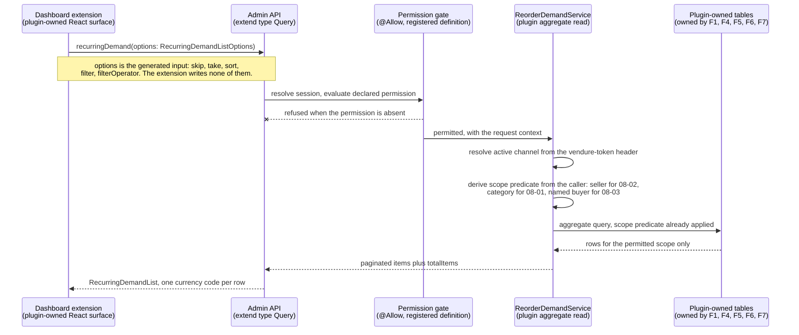

# FEATURE-001-08: Expose recurring reorder demand to sellers, category managers and support agents through three seller-scoped, permission-gated Admin API reads over rows owned elsewhere, so that each administrative persona answers its own question without a new table

Parent epic: `tickets/EPIC-001-reorder-and-replenishment.md`. The parent epic and the sibling features are written as backticked paths rather than as links, following the epic's own convention of keeping the link count in a file equal to the number of children that file indexes [tickets/EPIC-001-reorder-and-replenishment.md:§3. How To Read This Epic]. The only links in this file are the three story links in section 3.

This file is not on the epic's curated read path [tickets/EPIC-001-reorder-and-replenishment.md:§3. How To Read This Epic]. It is the last feature in dependency order and the only one that **owns no storage at all**, which is why it answers exactly one question: **who may look at recurring reorder demand, what they are allowed to see, and which already-existing rows they are looking at.** How those rows come to exist belongs to FEATURE-001-01, FEATURE-001-04, FEATURE-001-05, FEATURE-001-06 and FEATURE-001-07, and is not restated here.

---

## 1. Feature Title

**Expose recurring reorder demand to sellers, category managers and support agents through three seller-scoped, permission-gated Admin API reads over rows owned elsewhere, so that each administrative persona answers its own question without a new table.**

Short name, used verbatim wherever this feature is referred to in one phrase, and identical to the label the epic's features index gives it: **Recurring-Demand Visibility for Sellers, Category Managers and Support** [tickets/EPIC-001-reorder-and-replenishment.md:§4. Features Index]. The long form above is the action-object-outcome title this tier requires; the short form is the name to cite.

The file slug is `recurring-demand-visibility`, shorter than both forms of the title. That is fixed by the epic's own features index, which links to this exact filename [tickets/EPIC-001-reorder-and-replenishment.md:§4. Features Index], and the sibling story directory `FEATURE-001-08/` carries no slug at all. Neither is renamed.

Delivery is part of the single self-contained plugin package the epic describes — `packages/reorder-plugin/`, exporting `ReorderPlugin`. No file under `packages/core` or `packages/admin-ui` is edited to deliver it, and section 2.15 states why a dashboard extension is not a change to `packages/admin-ui`.

---

## 2. Feature Summary

### 2.1 The Capability

Three administrative reads over reorder activity that has already been recorded: **demand across a category**, **demand restricted to a seller's own variants**, and **a per-buyer lookup a support agent uses to answer "what happened when this buyer tried to reorder"**. Each read is a permission-gated Admin API query, each is scoped server-side before a row is returned, and each is surfaced in the dashboard through the extension mechanism this repository already ships.

### 2.2 Contribution To The Epic, And The Expanded Rationale

This feature is part of the epic's batch B5, "Accounts, instrumentation, administration", which depends on batches B2 and B4 [tickets/EPIC-001-reorder-and-replenishment.md:§9.4 Run Batches]. It owns the final step of the returning-buyer journey — the step at which recorded reorder activity becomes visible to sellers, category managers and support [tickets/EPIC-001-reorder-and-replenishment.md:§2.5 The Returning-Buyer Journey This Epic Builds] — and it is the only feature in the epic with no outbound edge at all.

The epic classifies this feature's deviation from its originally suggested area as **expanded**, and the rationale is not a preference but a de-duplication argument: the suggested area was seller and category-manager visibility, and the Customer Support Agent read path was absorbed into it because **all three administrative personas read the same aggregate over the same plugin-owned tables, so a separate support feature would duplicate the resolver and the permission wiring** [tickets/EPIC-001-reorder-and-replenishment.md:§4. Features Index]. Two consequences follow and both are load-bearing rather than decorative:

- **The permission model is designed once.** One administrative permission definition covers all three reads, so there is a single registration point and a single place a reviewer inspects the gate. Section 2.8 states the shape.
- **The scoping predicate is implemented once.** A category manager, a seller operations manager and a support agent differ in *what they may see*, not in *where the filter is applied*. Section 2.7 fixes that as a contract.

Read the contribution precisely, because this feature only reads:

- **It writes nothing.** No mutation is added by this feature, and no row in any table is created, updated or deleted by any of its three operations.
- **It computes no cadence.** Interval arithmetic belongs to FEATURE-001-05 [tickets/EPIC-001/FEATURE-001-05-purchase-cadence-and-replenishment.md:§2.1 The Capability].
- **It records no attempt.** The audit rows are written by FEATURE-001-07, which states from its own side that they are read through this feature's Admin API surface [tickets/EPIC-001/FEATURE-001-07-reorder-instrumentation.md:§2.6 Named API Surfaces].
- **It curates nothing.** Substitution candidates are curated by FEATURE-001-04 through that feature's own two Admin operations [tickets/EPIC-001/FEATURE-001-04-unavailable-line-resolution.md:§2.7 Named API Surfaces]; this feature only reads what a curator left behind.
- **It changes nothing a buyer can observe.** Section 2.5 records that no Shop API operation is added, and section 2.14 states the four absences together.

### 2.3 Named Entities Touched — This Feature Owns No Table

**This feature introduces no entity and owns no table.** That is stated first because it is the single most consequential fact about it: every row this feature displays belongs to another feature, which is exactly why the epic places it last in dependency order and why its three stories are independent of one another (section 4.3).

**Plugin-owned tables read, never written, and owned elsewhere:**

- **`ReorderList` and `ReorderListLine` — owned by FEATURE-001-01.** The named list and its per-line quantity [tickets/EPIC-001/FEATURE-001-01-named-reorder-lists.md:§2.4 Named Entities Touched]. Read by story 08-03, which answers what lists a buyer holds.
- **`ReorderListShare` — owned by FEATURE-001-06.** The grant rows and their state. Read by story 08-03 so that a support agent can explain why a list the buyer does not own appears in their account; that feature records the same story-level edge from its own side [tickets/EPIC-001/FEATURE-001-06-buying-account-list-sharing.md:§4.2 Downstream — One Feature Depends On This One].
- **`PurchaseCadence` — owned by FEATURE-001-05.** The derived repurchase interval per customer, variant and channel [tickets/EPIC-001/FEATURE-001-05-purchase-cadence-and-replenishment.md:§2.3 Named Entities Touched]. Read by stories 08-01 and 08-02 as the recurrence half of the aggregate.
- **`ReorderAttempt` and `ReorderAttemptLine` — owned by FEATURE-001-07.** One attempt row and one row per requested line, carrying the per-line outcome code and, where the platform returned one, the exact error type name [tickets/EPIC-001/FEATURE-001-07-reorder-instrumentation.md:§2.4 Named Entities Touched]. Read by all three stories: as the activity half of the aggregate in 08-01 and 08-02, and as the "what happened" answer in 08-03.
- **`SubstitutionCandidate` — owned by FEATURE-001-04.** Read by story 08-01 where the category view surfaces which curated alternative was available for a variant a buyer could not have.

**Existing platform entities, read and never altered:**

- **`Seller`** [packages/core/src/entity/seller/seller.entity.ts:L18], whose own JSDoc defines it as the person or organisation selling the goods on a given `Channel` [packages/core/src/entity/seller/seller.entity.ts:L12]. Its `name` [packages/core/src/entity/seller/seller.entity.ts:L26] is the label an administrative row carries, and its `channels` relation [packages/core/src/entity/seller/seller.entity.ts:L31-L32] is the join this feature scopes through. It is soft-deletable [packages/core/src/entity/seller/seller.entity.ts:L24], so a deleted seller's rows are still present in the database and an aggregate must not silently attribute them to nobody.
- **`Channel`**, which supplies both the request scope and the seller link. `token` is the unique value read from the `vendure-token` request header [packages/core/src/entity/channel/channel.entity.ts:L62] as its own JSDoc states [packages/core/src/entity/channel/channel.entity.ts:L56-L60], `sellerId` [packages/core/src/entity/channel/channel.entity.ts:L71-L72] is the nullable identifier behind the channel's `seller` relation [packages/core/src/entity/channel/channel.entity.ts:L68-L69], and `productVariants` is a many-to-many relation [packages/core/src/entity/channel/channel.entity.ts:L118-L119] — which is why the seller predicate in section 2.7 resolves a variant to a seller *through a channel* rather than reading a seller column off the variant, because no such column exists.
- **`Customer`** [packages/core/src/entity/customer/customer.entity.ts:L23], the subject of story 08-03's lookup. Its `emailAddress` [packages/core/src/entity/customer/customer.entity.ts:L42] is the handle a support agent searches on, and its `groups` relation [packages/core/src/entity/customer/customer.entity.ts:L44-L46] is what a buying account is modelled through. It is soft-deletable [packages/core/src/entity/customer/customer.entity.ts:L28-L29], so a support lookup can legitimately resolve a customer whose rows remain while the customer is marked deleted, and that is a state story 08-03 must state rather than discover.
- **`ProductVariant`**, the subject of every aggregate row. This feature reads the identifier and the variant's channel membership; it asserts nothing about price, stock or enabled state, all of which belong to FEATURE-001-03 and FEATURE-001-04.
- **`Order`**, read only for the buyer-facing reference recorded on an attempt. `code` is uniquely indexed and its own JSDoc directs that it be used as the order reference for customers rather than the order's id [packages/core/src/entity/order/order.entity.ts:L62-L67], which is precisely why story 08-03 searches on it [tickets/EPIC-001/FEATURE-001-07-reorder-instrumentation.md:§4.2 Downstream — Three Consumers, All One-Way].

**No column is added to any table, plugin-owned or core, and no custom field is declared on any core entity.** The dev-server configuration's empty custom-fields object [packages/dev-server/dev-config.ts:L116] is still empty once this feature ships.

### 2.4 Named Services

- **`ReorderDemandService` — new, plugin-owned, and the only new class this feature contributes to the persistence layer.** It holds all three reads, expresses each as a **database aggregate** rather than an in-process reduction over every line — which the epic's data-volume assumptions require, because the harness's own documented dataset is ten thousand orders each carrying ten lines [tickets/EPIC-001-reorder-and-replenishment.md:§7.6 Data-Volume Assumptions, Anchored To The Existing Harness] — and applies the scope predicate in section 2.7 before any row leaves it. Because all three stories delegate to it, there is exactly one place where the scope filter is implemented and exactly one place a reviewer inspects.
- **`TransactionalConnection` — existing, consumed, never modified.** Every read is issued through it, which is how the aggregate is expressed as a query builder against plugin-owned tables rather than as entity loading followed by array work. The epic names it as the persistence dependency for all plugin-owned state [tickets/EPIC-001-reorder-and-replenishment.md:§7.4 Existing Entities And Services The Work Depends On].
- **`ChannelService` and `ProductVariantService` — existing, consumed, never modified.** The first resolves the active channel from the request so the scope predicate has a channel to bind to; the second resolves a variant identifier for display without this feature reaching into the catalogue tables itself.
- **No core service is modified, and none is extended.** This feature calls no write method on any core service, because it performs no write. In particular it does not touch `OrderService`, which FEATURE-001-02 and FEATURE-001-07 consume [tickets/EPIC-001/FEATURE-001-07-reorder-instrumentation.md:§2.5 Named Services].

### 2.5 Named API Surfaces — Three New Admin API Operations, Zero Shop API Change

All three arrive through the plugin's `adminApiExtensions`, using `extend type Query` — the mechanism the shipped reviews plugin already demonstrates alongside its shop extensions [packages/dev-server/test-plugins/reviews/reviews-plugin.ts:L14-L21]. Because each operation is an addition to an existing root type rather than a change to an existing field, **no existing operation's arguments or return type changes.**

The three queries, and the story that owns each:

- **`recurringDemand`** — the aggregate over recorded reorder activity, paginated, sorted and filtered through the generated list options described in section 2.6. Read by a Marketplace Category Manager in story 08-01 and by a Seller Operations Manager in story 08-02; **the two stories differ in the scope predicate applied, not in the operation called.** That is a deliberate design choice and section 2.7 explains what makes it safe.
- **`customerReorderLists`** — the support lookup that returns the lists a named buyer holds, including lists reached through an unrevoked grant. Read by a Customer Support Agent in story 08-03.
- **`reorderAttempts`** — the support lookup that returns recorded attempts and their per-line outcomes, addressable by the buyer's identity or by the order code recorded on the attempt. Read by a Customer Support Agent in story 08-03.

**No Shop API operation is added by this feature. None.** No buyer reads an aggregate, and no storefront surface changes. The additive-only constraint therefore takes its strongest available form here on the buyer-facing side: the Shop API root `Query` type declares nineteen root queries [packages/core/src/api/schema/shop-api/shop.api.graphql:L1-L52], and every one of those signatures, together with the order, cart and customer-account mutation sets in the same file, is byte-identical after this feature ships — because this feature adds nothing to that file's surface at all.

**These three are exactly three of the epic's five new Admin API operations.** The other two, `substitutionCandidates` and `setSubstitutionCandidates`, belong to FEATURE-001-04 [tickets/EPIC-001/FEATURE-001-04-unavailable-line-resolution.md:§2.7 Named API Surfaces]. The two features between them account for the whole administrative surface the epic proposes, and neither adds an operation the other also claims. Stating the split here means a reader tallying the epic's operation count against its features finds five and not six.

Every proposed name is free in this checkout, and the check was run rather than assumed: `recurringDemand`, `customerReorderLists` and `reorderAttempts` are all absent from the checked-in Admin API introspection snapshot, as is the type name `RecurringDemand` [schema-admin.json:Seller]. Nothing here collides with a published name.

### 2.6 The Existing Mechanism This Feature Consumes Rather Than Rebuilds

The epic's do-not-duplicate inventory assigns this feature one mechanism, with a prohibition attached: `generateListOptions` [packages/core/src/api/config/generate-list-options.ts:L31-L60], and **no hand-writing of filter or sort input types for the recurring-demand aggregate — return a `PaginatedList` type and let the generator produce the options input** [tickets/EPIC-001-reorder-and-replenishment.md:§5. Existing Mechanisms That Must Not Be Duplicated].

#### The mechanism, read rather than assumed

The generator's own JSDoc states its trigger condition in one sentence: it generates `ListOptions` inputs for queries which return `PaginatedList` types [packages/core/src/api/config/generate-list-options.ts:L31-L33], and it is exported as a single function over a schema [packages/core/src/api/config/generate-list-options.ts:L34]. What it produces is not a stub. For each qualifying field it derives the target type name, builds a sort parameter and a filter parameter, and assembles an input named `${targetTypeName}ListOptions` [packages/core/src/api/config/generate-list-options.ts:L58-L61] carrying `skip` [packages/core/src/api/config/generate-list-options.ts:L63], `take` [packages/core/src/api/config/generate-list-options.ts:L67], `sort` [packages/core/src/api/config/generate-list-options.ts:L68], `filter` [packages/core/src/api/config/generate-list-options.ts:L72] and a filter-combination operator [packages/core/src/api/config/generate-list-options.ts:L75] resolved against the existing `LogicalOperator` enum [packages/core/src/api/config/generate-list-options.ts:L40], whose two members are declared in the shared enum file [packages/core/src/api/schema/common/common-enums.graphql:L32-L35]. Sort direction comes from the existing `SortOrder` enum [packages/core/src/api/schema/common/common-enums.graphql:L23-L26]. It even adds the options argument to the query if the query does not already declare one [packages/core/src/api/config/generate-list-options.ts:L87].

**The obligation on this feature, stated as a rule.** Any paginated query it declares — `recurringDemand` certainly, and either support lookup if it is paginated — declares a return type implementing `PaginatedList` and an **empty** `${TargetType}ListOptions` input, and hand-writes no sort parameter, no filter parameter, no `skip`, no `take` and no filter-combination operator. A hand-written sort or filter input for one of these three operations is a defect at review, not a stylistic choice.

#### The generator ordering — the citation that makes the rule a platform fact rather than a preference

Without the ordering, "consume the generated input" is advice. With it, it is a property of every boot. `buildSchemaFromVendureConfig` [packages/core/src/api/config/get-final-vendure-schema.ts:L87] merges plugin API extensions into the schema **first** [packages/core/src/api/config/get-final-vendure-schema.ts:L99] and only **then** runs `generateListOptions` [packages/core/src/api/config/get-final-vendure-schema.ts:L100], later `generateErrorCodeEnum` [packages/core/src/api/config/get-final-vendure-schema.ts:L107], and last of all `generatePermissionEnum` [packages/core/src/api/config/get-final-vendure-schema.ts:L116], all inside one function [packages/core/src/api/config/get-final-vendure-schema.ts:L87-L118].

Three consequences follow from that single ordering, and each is used elsewhere in this file:

- **A plugin-declared paginated type reaches the list-options generator.** This is what makes the rule above enforceable rather than aspirational: the plugin's types are already in the schema when the generator walks it.
- **A plugin-declared error result would reach the error-code generator.** This feature declares none, so it is named only to establish that the ordering is general (section 2.14).
- **A plugin-registered permission definition reaches the permission generator.** This is the mechanism behind the enum growth referenced in section 2.8.

#### Two shipped exemplars, one in core and one in a plugin

The idiom is not inferred from the generator; it is demonstrated twice in this checkout, and both demonstrations were read.

**In core, on the Seller type itself** — which is the closest possible analogue to this feature's own subject. The Admin API declares `sellers(options: SellerListOptions): SellerList!` [packages/core/src/api/schema/admin-api/seller.api.graphql:L2], declares `type SellerList implements PaginatedList` with just `items` and `totalItems` [packages/core/src/api/schema/admin-api/seller.api.graphql:L17-L20], and then declares the options input **with no fields at all** [packages/core/src/api/schema/admin-api/seller.api.graphql:L22]. The proof that the generator fills it is two-sided and empirical: `SellerSortParameter` and `SellerFilterParameter` appear nowhere in `packages/core/src/api/schema/`, yet both are present in the checked-in introspection snapshot [schema-admin.json:SellerSortParameter] and [schema-admin.json:SellerFilterParameter]. Something produced them between the source and the published schema, and the ordering above names it.

**In a plugin, with the intent written in a comment.** The reviews test plugin declares `type ProductReviewList implements PaginatedList` [packages/dev-server/test-plugins/reviews/api/api-extensions.ts:L29-L32] and then declares `input ProductReviewListOptions` under the comment `# Auto-generated at runtime` [packages/dev-server/test-plugins/reviews/api/api-extensions.ts:L44-L45]. Its Admin query consumes that input [packages/dev-server/test-plugins/reviews/api/api-extensions.ts:L70], and so does its dashboard list page, which types its query variable against the generated input rather than against anything the plugin wrote [packages/dev-server/test-plugins/reviews/dashboard/review-list.tsx:L12].

**That second exemplar is the one to copy**, because it is a plugin doing precisely what this feature must do: three lines of schema, an empty input, and a dashboard page consuming the generated result. The pagination, sorting and filtering a category manager or a seller expects therefore arrive without this feature designing any of it.

### 2.7 The Seller-Scoping Rule, Stated As A Hard Contract

**A Seller Operations Manager sees aggregate rows only for variants belonging to its own seller. A row for another seller's variant reaching that caller is a defect, not a configuration issue.** Story 08-02 carries that as an acceptance criterion in its own right rather than leaving it to a review comment, because it is the one failure in this feature that leaks one tenant's trading data to another.

**Where the filter is applied is the whole of the contract: server-side, inside the resolver or the service it delegates to, never in an argument the caller supplies.** A scope expressed as a filter argument is a scope the caller can widen, and a caller who can widen it is unscoped. The predicate resolves a variant to a seller through the channel relation — `Channel.sellerId` [packages/core/src/entity/channel/channel.entity.ts:L71-L72] behind the channel's `seller` relation [packages/core/src/entity/channel/channel.entity.ts:L68-L69], joined to the variant through the channel's many-to-many `productVariants` relation [packages/core/src/entity/channel/channel.entity.ts:L118-L119] — because `ProductVariant` carries no seller column and inventing one would breach the additive constraint in section 2.15.

**The platform states the reason server-side enforcement is mandatory, and it states it about itself.** `Permission.Owner` is documented as a special permission indicating that a resolver should only be accessible to the owner of that resource [packages/core/src/api/config/generate-permissions.ts:L14-L15], and the same block then draws the consequence in the platform's own words: ownership must be enforced by custom logic inside the resolver, and because ownership cannot be defined generally nor statically encoded at build time, any resolver using `Permission.Owner` **must** include logic to enforce that only the owner of the resource has access — and if it does not, the effect is the equivalent of using `Permission.Public` [packages/core/src/api/config/generate-permissions.ts:L32-L34]. The whole caveat sits in one block in that file [packages/core/src/api/config/generate-permissions.ts:L12-L33].

**A permission gate alone is not a control.** A resolver that declares the gate and nothing else has published the operation, not protected it. The epic records the same finding as its third feasibility collision and this feature references it rather than re-deriving it [tickets/EPIC-001-reorder-and-replenishment.md:§6.1 Repository-Discovered Collisions]; the sibling feature that shares the caveat states it from the buyer-ownership side [tickets/EPIC-001/FEATURE-001-06-buying-account-list-sharing.md:§2.6 The Existing Mechanisms This Feature Consumes Rather Than Rebuilds].

Four scoping rules follow, and section 5 turns each into evidence:

- **Seller scope, for story 08-02.** The predicate is derived from the caller's own seller, resolved server-side. A caller with no resolvable seller receives no rows rather than every row, because the failure mode of an unresolved scope must be closed rather than open.
- **Channel scope, for all three stories.** Every read is bounded by the active channel's token (section 2.10), and this bound is applied in addition to the seller predicate rather than instead of it. A single-channel seller and a channel-per-seller deployment therefore behave the same way.
- **Customer scope, for story 08-03.** A support agent reads one named buyer at a time. The lookup takes an explicit buyer identity and returns rows for that buyer only; it is not a facility for exporting every buyer's activity, and the absence of such an export is deliberate.
- **The same operation, two scopes, one implementation.** `recurringDemand` serves both 08-01 and 08-02 because the difference between a category manager and a seller operations manager is which predicate the service composes, not which resolver they reach. That is safe only while the predicate is composed server-side from the caller's own identity, which is why this section is a contract and not guidance.

**One negative test is worth more here than any positive one.** A positive test proves a seller sees its own rows, which a broken filter also passes. The evidence this feature requires is the negative case: a second seller's rows exist, are populated, and do not appear. Section 5 asks for exactly that.

### 2.8 Permission Gating, And The Enum Growth Referenced Rather Than Re-Argued

All three operations are gated. The mechanism is the platform's permission-definition helper rather than hand-written permission strings, which is the prohibition the epic attaches to it for this feature as well as for FEATURE-001-01 and FEATURE-001-06 [tickets/EPIC-001-reorder-and-replenishment.md:§5. Existing Mechanisms That Must Not Be Duplicated].

**This feature proposes exactly one new definition, and it is a proposal rather than a decided fact.** The sibling that registers the sharing permission records the same count from its own side — one definition there, one in FEATURE-001-01, and the one administrative definition introduced here, making the three the epic counts when it measures the enum growth [tickets/EPIC-001/FEATURE-001-06-buying-account-list-sharing.md:§2.6 The Existing Mechanisms This Feature Consumes Rather Than Rebuilds]. How many definitions are registered in total is an open architectural decision belonging to a maintainer and is recorded as one [tickets/EPIC-001-reorder-and-replenishment.md:§8.2 Architectural Decisions].

**Which helper, and why the read-write form is the better fit here.** `CrudPermissionDefinition` derives four permissions from one name — a `name` of 'Wishlist' producing `CreateWishlist`, `ReadWishlist`, `UpdateWishlist` and `DeleteWishlist` [packages/core/src/common/permission-definition.ts:L114-L115] — built by mapping the four operations over the configured name [packages/core/src/common/permission-definition.ts:L156] and surfaced as the `Create` [packages/core/src/common/permission-definition.ts:L172], `Read` [packages/core/src/common/permission-definition.ts:L181], `Update` [packages/core/src/common/permission-definition.ts:L190] and `Delete` [packages/core/src/common/permission-definition.ts:L199] getters over the `PermissionDefinition` base [packages/core/src/common/permission-definition.ts:L86], whose own `Permission` getter is what the decorator consumes [packages/core/src/common/permission-definition.ts:L107]. Registration is through `authOptions.customPermissions` [packages/core/src/common/permission-definition.ts:L123-L128] and each resolver is gated with the `@Allow` decorator [packages/core/src/common/permission-definition.ts:L134].

**Because this feature writes nothing, two of those four permissions would be unused from the day they are published.** `RwPermissionDefinition` [packages/core/src/common/permission-definition.ts:L245] derives two permissions from one name instead [packages/core/src/common/permission-definition.ts:L206-L207], exposed as `Read` [packages/core/src/common/permission-definition.ts:L271] and `Write` [packages/core/src/common/permission-definition.ts:L280] getters, registered identically [packages/core/src/common/permission-definition.ts:L215-L219] and gated identically [packages/core/src/common/permission-definition.ts:L226]. Its own worked example is a dashboard read surface [packages/core/src/common/permission-definition.ts:L211], which is exactly the shape of this feature, and it carries a version tag showing it is available in this line [packages/core/src/common/permission-definition.ts:L243]. **The narrower form is therefore this feature's proposal, and the reason is stated so a reviewer can disagree with it on the record**: publishing a create and a delete permission for a read-only surface would grow the published enum by two members that gate nothing.

**The enum growth itself is referenced, not re-argued.** The `Permission` enum is declared with no members in source and annotated as populated at run time [packages/core/src/api/schema/common/common-enums.graphql:L20-L21], and it is filled by `generatePermissionEnum` [packages/core/src/api/config/generate-permissions.ts:L42] from the default and custom definitions together [packages/core/src/api/config/generate-permissions.ts:L46], which the ordering in section 2.6 places after plugin extensions are merged [packages/core/src/api/config/get-final-vendure-schema.ts:L116]. Registering a definition therefore grows a published enum with no opt-in at request time. The epic's verdict — a declared, manageable side effect, because no existing member is removed or renamed — stands as written [tickets/EPIC-001-reorder-and-replenishment.md:§6.1 Repository-Discovered Collisions], and **it is not accepted silently**: the obligation it leaves here is that the story registering the definition declares the growth, and that any consuming example switching on the enum carries a default branch. Story 08-01 carries that declaration, since it is the first of the three to reach the aggregate.

### 2.9 Figure F8-SEQ — An Admin API Query Reaching The Aggregate Read, With The Scope Filter Shown

This is the only diagram in this feature. **All three story files carry zero diagrams and reference this figure by the name Figure F8-SEQ instead**, which is the mechanism the epic prescribes for a story that needs a visual.

Four readings of the figure are load-bearing and are stated so they are not inferred:

- **The gate and the scope are two separate steps, drawn separately.** The refusal arrow leaves the gate; the narrowing happens later, inside the service. Collapsing them into one step is the mistake section 2.7 exists to prevent.
- **The scope predicate is derived before the query is issued, not applied to its results.** Filtering after the fact would mean the database returned another seller's rows and the process discarded them, which is a leak with a tidy ending rather than no leak.
- **The generated options input crosses the boundary unchanged.** The dashboard extension names it and the generator produced it; nothing between them redefines it.
- **Nothing in the figure writes.** There is no mutation participant and no write arrow, which is the graphical form of the four absences in section 2.14.

### 2.10 Channel Scoping, Language Scoping And Monetary Values

Every read is channel-scoped and language-scoped, inherited from the request rather than chosen by this feature. The epic states the three request preconditions once for every story in the set [tickets/EPIC-001-reorder-and-replenishment.md:§7.5 Request Prerequisites]; what follows is what they mean for an aggregate specifically, which is where they bite hardest.

- **Channel.** The active channel is identified by a unique token read from the `vendure-token` request header [packages/core/src/entity/channel/channel.entity.ts:L56-L60], carried as a unique column [packages/core/src/entity/channel/channel.entity.ts:L62]. **Every aggregate row is attributed to the channel its underlying activity was recorded under, and a row recorded under one token is not readable under another.** That is a bound the service applies, not a filter a caller may widen — the same rule section 2.7 states for the seller predicate, applied to the channel.
- **Language.** Translated output resolves against the request's language code, which defaults to the channel's default language code [packages/core/src/entity/channel/channel.entity.ts:L74]; a channel additionally declares a list of available codes [packages/core/src/entity/channel/channel.entity.ts:L76-L77]. **This feature stores no translatable string of its own.** Anything localised in one of these three views is a variant name, a seller name or a dashboard label: the first two resolve through the catalogue's existing translation path, and the third lives in the internationalisation catalogue described in section 2.12. An outcome code read from an attempt row is a machine-readable identifier and is deliberately not translated [tickets/EPIC-001/FEATURE-001-07-reorder-instrumentation.md:§2.12 Channel Scoping, Language Scoping And Monetary Values].
- **Money.** Where an aggregate row carries a monetary value, it is an **integer in the smallest unit of its currency, stated alongside the currency code**, which defaults to the channel's default currency code [packages/core/src/entity/channel/channel.entity.ts:L88]. A decimal amount in an aggregate is a defect, not a formatting preference. By way of illustration rather than specification: a row reporting an amount of 134900 together with the code it is denominated in is well-formed, and the same amount written with a decimal separator is not.
- **An aggregate must not sum across currencies, and the reason is in this repository rather than in general principle.** A channel declares a default currency code [packages/core/src/entity/channel/channel.entity.ts:L88] **and a list of available currency codes** [packages/core/src/entity/channel/channel.entity.ts:L90-L91], so more than one currency is reachable without leaving a single channel — which means "one channel, therefore one currency" is an assumption this platform does not support. **A total is therefore reported per channel and per currency code, and never as one number spanning two codes.** Where a category spans two channels using different codes, the view reports two rows rather than one summed row, and it applies no exchange rate anywhere. There is no place in this feature where a conversion could be performed, which is the strongest form that constraint can take.
- **Counts are the safer aggregate, and are preferred.** A count of attempts, a count of rejected lines, a count of distinct buyers and a derived interval are all currency-free and channel-attributable, so the three views lean on them and treat any monetary column as the exception that must carry its code.

### 2.11 Visibility Is Not Forecasting

Stated once, clearly, because the name of this feature invites the confusion.

**In scope: visibility over recorded activity.** What was reordered, how often it was reordered, which lines were rejected and why, which buyer holds which list, and what the last attempt did. Every one of those is a read of a row that already exists because a buyer did something.

**Out of scope: predicting future stock requirements.** The epic rules seller-side inventory forecasting out explicitly, on two grounds it states rather than asserts: a forecast has no basis in this repository, and there is no declared numeric target to validate one against [tickets/EPIC-001-reorder-and-replenishment.md:§2.4 Scope Boundaries — Explicit In-Or-Out Rulings]. Neither ground is rhetorical. This repository declares no service-level commitment, no latency figure and no monetary business estimate [tickets/EPIC-001-reorder-and-replenishment.md:§2.2 Business Value, Stated Without Invented Numbers], so a forecast produced here would be measured against nothing.

The boundary is therefore drawn at the tense of the verb. **A derived repurchase interval computed from placed orders is a description of the past** and is FEATURE-001-05's output, read here as a column [tickets/EPIC-001/FEATURE-001-05-purchase-cadence-and-replenishment.md:§2.3 Named Entities Touched]. **A projected quantity for a future period is a prediction** and belongs to no ticket in this set. No view in this feature extrapolates, no view projects, and no view labels a past figure as an expectation. If a later change wants a forecast, that is a new feature with a new decision about what it is validated against — not a column added to one of these three reads.

### 2.12 Dashboard Ownership, And The Continuous-Integration Gates Stated Precisely

**All three stories in this feature ship a React dashboard surface, so all three are owned by a developer working in parallel** rather than by the automated run [tickets/EPIC-001-reorder-and-replenishment.md:§9.2 Story Table]. This is the only feature in the epic where every story is parallel-owned, and section 4.7 records the sequencing consequence.

The rationale is a single one applied identically to all four of the epic's parallel-owned stories rather than a judgement made specially here: acceptance requires **visual verification in the running dashboard** and **synchronisation of the internationalisation catalogues**, and no automated documentation or generation run can discharge a visual check. Both concerns are gated by jobs that already exist and neither needs new infrastructure — the catalogue-synchronisation check [.github/workflows/build_and_test.yml:L107], which runs a dedicated script from inside the dashboard package [.github/workflows/build_and_test.yml:L117-L119], and the four-shard dashboard end-to-end suite [.github/workflows/build_and_test.yml:L120] whose matrix declares four shards [.github/workflows/build_and_test.yml:L130] and runs the suite one shard at a time [.github/workflows/build_and_test.yml:L157].

**Two findings qualify that claim, and both are reported because overstating the coverage would be the more comfortable and the less accurate thing to write.** Neither weakens the parallel-ownership decision, which rests on the visual check; both change what the definition of done can honestly require.

- **Neither gating job fires on a change confined to a plugin package.** Both are conditioned on a change-detection flag [.github/workflows/build_and_test.yml:L110] and [.github/workflows/build_and_test.yml:L123], and that flag is set only when a changed path matches the dashboard package itself [.github/workflows/build_and_test.yml:L66-L70]. A dashboard surface shipped from `packages/reorder-plugin/` does not trip it. Two routes remain and both are in the repository: a manual dispatch, which forces the flag true for both jobs [.github/workflows/build_and_test.yml:L47-L50], or the local run the agent handbook documents from inside the dashboard package [AGENTS.md:§Dashboard E2E Tests].
- **The catalogue check's scope is the dashboard package's own catalogue, not a plugin's.** The script it runs compares one directory after re-extracting messages, and that directory is the dashboard package's locales directory [packages/dashboard/lingui.config.js:L37-L38]. A plugin's catalogues come from a separate configuration whose catalogue entry names the plugin's own dashboard directory [packages/dev-server/lingui.config.js:L8-L9] over a source-locale-plus-German pair [packages/dev-server/lingui.config.js:L4-L5]. **A new plugin dashboard surface therefore needs its own catalogue entry**, and adding one is a sub-task of each of the three stories rather than something the existing job supplies.

The handbook's own conventions apply to whichever suite the surfaces are exercised in: check the existing suites before adding a file, and reference the issue number in a comment above a new test [AGENTS.md:§Dashboard E2E Tests]. And the stale-build reset applies to all three stories, because all three rebuild the dashboard bundle: the dev-server build output accumulates across branch switches and is removed before rebuilding [AGENTS.md:§Gotchas], which the epic lists alongside the seed-cache reset [tickets/EPIC-001-reorder-and-replenishment.md:§11.3 Operational Reset Steps After A Schema Change].

### 2.13 Precedent In This Repository — Partial

The precedent disclosure for this feature is **partial**, and both halves are stated because reporting only the favourable half would overstate the novelty.

**What is precedented, with the search that found it.** A plugin shipping a React dashboard extension is shipped, working precedent. The reviews test plugin declares its dashboard entry point in its own plugin metadata [packages/dev-server/test-plugins/reviews/reviews-plugin.ts:L34] alongside both administrative and shop API extensions [packages/dev-server/test-plugins/reviews/reviews-plugin.ts:L14-L21], and it is registered in the dev-server configuration so the surface is actually bundled and served [packages/dev-server/dev-config.ts:L127]. Its extension anatomy is the template: an entry module that calls the extension-definition function [packages/dev-server/test-plugins/reviews/dashboard/index.tsx:L19] and registers routes [packages/dev-server/test-plugins/reviews/dashboard/index.tsx:L31], a widget [packages/dev-server/test-plugins/reviews/dashboard/index.tsx:L32-L39] and custom form components [packages/dev-server/test-plugins/reviews/dashboard/index.tsx:L77]; a list page and a detail page as separate modules; and two internationalisation catalogues, `dashboard/i18n/en.po` and `dashboard/i18n/de.po`, populated from the translation macro its list page imports [packages/dev-server/test-plugins/reviews/dashboard/review-list.tsx:L2]. Bundling for the dev server is configured in the dashboard Vite configuration [packages/dev-server/vite.config.mts:L1]. **Building a permission-gated administrative list page in the dashboard is therefore re-application of a well-worn pattern, and this feature claims no originality for it.**

That precedent is adopted for its bundling and internationalisation anatomy and **explicitly not for one thing it also does**: it pushes a custom field onto an existing core type from its configuration function [packages/dev-server/test-plugins/reviews/reviews-plugin.ts:L23-L30], which is the mechanism the epic's first collision warns about and which this feature does not use. The sibling feature that also cites this plugin draws the same line for the same reason [tickets/EPIC-001/FEATURE-001-04-unavailable-line-resolution.md:§2.7 Named API Surfaces].

**What is not precedented at all.** Nothing in this repository aggregates reorder demand, because nothing in this repository performs a reorder. The searched set was the whole of `packages/dev-server/example-plugins/`, the whole of `packages/dev-server/test-plugins/` and `packages/dashboard/test-plans/` — the same set the epic names for its demonstration-slice reasoning [tickets/EPIC-001-reorder-and-replenishment.md:§9.6 Nomination §9b — Demonstration Slice: STORY-001-02-01]. There is no demand aggregate, no seller-scoped administrative read over buyer behaviour, and no support-facing lookup of a buyer's saved lists anywhere in it. The nearest structural analogue is the reviews plugin's own administrative list of a buyer-generated entity [packages/dev-server/test-plugins/reviews/api/api-extensions.ts:L70], and it is an analogue of the *plumbing* rather than of the subject: it lists rows, it does not aggregate them, and it applies no tenant-scoping predicate.

**The consequence for the stories.** All three disclose `partial` rather than `none` or `near-identical`. `none` would be false, because the dashboard-extension and paginated-list plumbing is shipped and is being copied. `near-identical` would also be false, because no shipped example aggregates anything or scopes by seller. Every story states which half it is leaning on.

### 2.14 The Four Absences, Stated Positively

Each of the following is stated as a fact rather than left to be inferred from silence, because a reader tallying this feature's footprint should not have to prove a negative.

- **No new table.** This feature introduces no entity, as section 2.3 states. Every row it reads is owned by FEATURE-001-01, FEATURE-001-04, FEATURE-001-05, FEATURE-001-06 or FEATURE-001-07.
- **No new migration.** Because there is no table and no column, there is nothing to migrate. This feature adds no file to the plugin's migration set, which also means the repository's classification of a database-schema change as breaking-change work [CONTRIBUTING.md:§Breaking Changes] does not bite here — unlike its four upstream features, every one of which adds a table.
- **No new error result.** The epic's set declares six across the whole ticket set and **none of them belongs to this feature**; they belong to FEATURE-001-01, FEATURE-001-02 and FEATURE-001-06 [tickets/EPIC-001/FEATURE-001-01-named-reorder-lists.md:§2.10 The Error Vocabulary This Feature Introduces]. A permission failure on one of these three reads is a refusal by the gate, and an empty scope produces an empty page rather than an error. Consequently the published error-code enum gains nothing from this feature, so the epic's second collision does not apply to it [tickets/EPIC-001-reorder-and-replenishment.md:§6.1 Repository-Discovered Collisions] — even though the ordering in section 2.6 shows a plugin-declared error result *would* reach that generator [packages/core/src/api/config/get-final-vendure-schema.ts:L107]. No text in this feature or its three stories names an error outside the six the epic's set declares or the **thirty-one** types that already implement the error-result interface in this checkout — fifteen in the common file, from its first declaration through to the union of order-item errors [packages/core/src/api/schema/common/common-error-results.graphql:L112-L117], and sixteen more in the shop-specific file, from its first declaration [packages/core/src/api/schema/shop-api/shop-error-results.graphql:L2] to its last [packages/core/src/api/schema/shop-api/shop-error-results.graphql:L130].
- **No Shop API change.** No query, no mutation, no field and no argument is added to the Shop API by this feature, as section 2.5 records. The buyer-facing surface is untouched.

### 2.15 Constraints This Feature Is Built Under

These are boundaries on the work this feature describes, not preamble. Each is carried into the definition of done in section 5. They derive from the epic's stated architectural constraints and from cited repository conventions; **no user-specified rules were provided for this project**, so nothing below is attributed to one [tickets/EPIC-001-reorder-and-replenishment.md:§11.9 User-Specified Rules].

- **Additive only — three new Admin API queries, zero changed signatures.** Each is an addition to an existing root type through `adminApiExtensions`, so no existing operation's arguments, return type or nullability changes. Where a platform mechanism would widen an existing signature as a side effect of an otherwise additive change, that is a reportable violation recorded in the epic's collision section and referenced rather than re-argued or quietly absorbed [tickets/EPIC-001-reorder-and-replenishment.md:§6.1 Repository-Discovered Collisions]. This feature declares no custom field on any core entity, which is what keeps the first of those collisions from becoming true of this deployment.
- **Zero edits to `packages/core` and `packages/admin-ui`, and the second of those needs saying explicitly here.** The only two files a future implementation may touch outside its own package are the dev-server plugin registration array [packages/dev-server/dev-config.ts:L121-L155], where `ReorderPlugin` is registered, and the dashboard bundling configuration [packages/dev-server/vite.config.mts:L1] — and **this is the one feature in the epic that needs both**, because it is the one that bundles dashboard surfaces. Naming those two files is a documentation act and licenses no run that reads this file to edit them [tickets/EPIC-001-reorder-and-replenishment.md:§11.7 The Two Permitted Configuration Exceptions — Named, Not Touched]. **`packages/admin-ui` in particular is untouched, and the distinction is not a technicality:** the surfaces here are *dashboard extensions*, contributed by the plugin through its own entry point in the manner the shipped precedent demonstrates [packages/dev-server/test-plugins/reviews/reviews-plugin.ts:L34] and bundled by the dashboard Vite plugin [packages/dev-server/vite.config.mts:L1]. They are not modifications of the Admin UI package, they add no file to it, and an empty diff for it is the evidence in section 5.
- **Additive migrations only — and this feature adds no table and no migration at all**, as section 2.14 states. There is no destructive statement to avoid because there is no statement.
- **Integer money with its currency code, never summed across codes.** Per section 2.10, a monetary value in an aggregate is an integer in the smallest currency unit accompanied by its code, and a total spans one code only. A decimal amount anywhere in this feature or its three stories is a defect.
- **No invented metric — and an aggregate view is the place in this epic where the temptation is greatest.** A demand view invites a target: a share of buyers who reorder, a growth figure, a query-time budget, a ranked list presented as a business objective. **This feature states none of them, because this repository declares none** [tickets/EPIC-001-reorder-and-replenishment.md:§2.2 Business Value, Stated Without Invented Numbers]. Where a threshold is genuinely needed — how many rows a default page shows, how far back the aggregate window reaches, what counts as recurring — it is raised as a **decision required before build** and referred to the epic (section 4.5) rather than chosen here. What is asserted instead is verifiable state: an exact row count with its ordering, an exact channel token, an exact seller identity, an exact outcome code, and an integer amount with its currency code.
- **No external-service dependency.** Nothing in this feature leaves the process. There is no business-intelligence tool, no external data warehouse, no reporting vendor and no scheduled export. The aggregate is a database query against plugin-owned tables through the existing connection service, which is also what the epic's data-volume assumptions require of it [tickets/EPIC-001-reorder-and-replenishment.md:§7.6 Data-Volume Assumptions, Anchored To The Existing Harness].
- **Channel-scoped and language-scoped**, per section 2.10, with the bound applied server-side rather than accepted from the caller.
- **Version tagging.** Doc blocks on the new public API — the service, the three resolvers and the permission definition — carry `@since 3.8.0`. That value is *derived* from the next-minor rule in the contribution guide [CONTRIBUTING.md:§New features] applied to a 3.7.0 checkout [packages/core/package.json:L2-L3], and the epic flags the same derivation and warns against presenting it as a quotation from the guide [tickets/EPIC-001-reorder-and-replenishment.md:§11.2 Version Tagging].
- **No hand-written reference page.** The plugin's reference documentation is generated from JSDoc in the TypeScript sources, so this feature's documentation obligation means writing JSDoc on the three operations and the permission definition, not authoring a page under the documentation tree [tickets/EPIC-001-reorder-and-replenishment.md:§11.5 Public API Documentation Is Generated, Not Hand-Written].

---

## 3. User Stories Index

Three stories, one per administrative persona, and each one a different read. Titles are transcribed from the epic's story table and are not restated with different wording [tickets/EPIC-001-reorder-and-replenishment.md:§9.2 Story Table].

- [STORY-001-08-01 — Review category recurring demand](./FEATURE-001-08/STORY-001-08-01-category-recurring-demand-view.md) — the `recurringDemand` aggregate scoped to a category for a Marketplace Category Manager, with the paginated return type and the generated list options of section 2.6, the permission definition and its declared enum growth, and the curated substitution rows FEATURE-001-04 leaves behind.
- [STORY-001-08-02 — Review seller recurring demand](./FEATURE-001-08/STORY-001-08-02-seller-recurring-demand-view.md) — the same operation scoped to the caller's own seller for a Seller Operations Manager, resolved through the channel-to-seller relation, and carrying the negative cross-seller assertion of section 2.7 as an acceptance criterion in its own right.
- [STORY-001-08-03 — Look up a buyer's lists and last attempt](./FEATURE-001-08/STORY-001-08-03-support-agent-reorder-lookup.md) — the `customerReorderLists` and `reorderAttempts` lookups for a Customer Support Agent, addressed by the buyer's identity or the order code recorded on an attempt, including lists reached through an unrevoked grant.

Estimates are deliberately absent from this file. Points, lines of code, generation hours and review hours live only in the epic's delivery-split table, which is the single source of truth for them, and each story transcribes its own four values from its row there [tickets/EPIC-001-reorder-and-replenishment.md:§9.2 Story Table].

All three stories reference **Figure F8-SEQ** in section 2.9 where they need a visual, and embed no diagram of their own.

---

## 4. Dependencies

Direction is stated for every entry, because a dependency without a direction cannot be sequenced. This feature has more inbound edges than any other in the epic and no outbound edge at all, which is the whole of its scheduling story.

### 4.1 Upstream — Four Features At Feature Granularity, One More At Story Granularity

**Every upstream edge exists for the same reason: this feature owns no rows, so it depends on whoever owns the rows it reads.** Each edge names the table rather than gesturing at the feature, so a reviewer can check the dependency is real.

- **FEATURE-001-07, for the attempt rows — the strongest edge.** `ReorderAttempt` and `ReorderAttemptLine` supply the activity half of the aggregate and the whole of story 08-03's "what happened" answer. That feature records the same edge from its own side, describing this one as depending on it for the rows it reads and noting that it has nothing to aggregate until those tables exist and are populated [tickets/EPIC-001/FEATURE-001-07-reorder-instrumentation.md:§4.2 Downstream — Three Consumers, All One-Way]. Both statements agree, which is deliberate. Required by all three stories.
- **FEATURE-001-05, for the cadence rows.** `PurchaseCadence` supplies the recurrence half of the aggregate. That feature records the edge and attaches two obligations to itself rather than to this one: its column set must be stable before an aggregate is written against it, and the channel-scoping decision must be settled there first [tickets/EPIC-001/FEATURE-001-05-purchase-cadence-and-replenishment.md:§4.2 Downstream — One Feature Depends On This One]. Required by stories 08-01 and 08-02.
- **FEATURE-001-04, for the curated candidate rows.** `SubstitutionCandidate` must exist and be populated before the category view has any curated alternative to show alongside a rejected line. That feature records the edge in the same direction [tickets/EPIC-001/FEATURE-001-04-unavailable-line-resolution.md:§4.2 Downstream — One Feature Depends On This One]. Required by story 08-01; **partial rather than total**, because the aggregate is complete without the candidate column and that column enriches one view.
- **FEATURE-001-01, for the list tables.** `ReorderList` and `ReorderListLine` are what story 08-03 reads when it answers what lists a buyer holds [tickets/EPIC-001/FEATURE-001-01-named-reorder-lists.md:§2.4 Named Entities Touched]. Required by story 08-03 only.
- **FEATURE-001-06, at story granularity — story 08-03 only.** `ReorderListShare` and its grant states are what let a support agent explain a list the buyer does not own. That feature records the same story-level edge, and it also explains why the epic's feature graph does not draw it: at feature granularity this feature's dependencies are the features producing the aggregate, and this one is a story-level edge inside a single batch [tickets/EPIC-001/FEATURE-001-06-buying-account-list-sharing.md:§4.2 Downstream — One Feature Depends On This One]. The batch table accommodates it by placing 06-01, 06-02, 06-03 and 08-03 all in B5 [tickets/EPIC-001-reorder-and-replenishment.md:§9.4 Run Batches].

The epic places this feature in batch B5, which depends on batches B2 and B4 [tickets/EPIC-001-reorder-and-replenishment.md:§9.4 Run Batches], and its feature graph draws three inbound edges into this node and none out of it [tickets/EPIC-001-reorder-and-replenishment.md:§4.1 Feature Dependency Graph With Batch Sequencing]. **Unlike its sibling in the same batch, this feature's batch dependency is not wider than its feature dependencies** — it genuinely needs B4's cadence and substitution work, so B5's stated prerequisites apply to it in full rather than only in part.

**FEATURE-001-02 and FEATURE-001-03 are not upstream dependencies of this feature.** Neither owns a row this feature reads: the reorder execution path produces the outcome that FEATURE-001-07 records, and this feature reads that record rather than the path, while the delta preview writes nothing at all. The dependency is on the recording, not on the reordering — a distinction worth stating because reading it the other way would make this feature look as though it needed the entire epic merged before it could begin.

### 4.2 Downstream — Nothing

**No feature depends on this one, and it is worth stating rather than leaving to be inferred from an absence.** This node has out-degree zero in the epic's feature graph [tickets/EPIC-001-reorder-and-replenishment.md:§4.1 Feature Dependency Graph With Batch Sequencing], and being a leaf is a scheduling fact with three consequences:

- **It can be built last without blocking anything.** No other feature is waiting on a column, an operation, a permission or an event from here, because this feature produces none of those for anyone else.
- **It can slip without cascading.** A delay here delays this feature alone. Every sibling's definition of done is reachable with these three reads unbuilt.
- **A cycle through this node is impossible.** Section 4.6 turns that into the argument rather than the assertion.

One reading to head off: FEATURE-001-07's diagram shows this feature as a subscriber of the reorder events it publishes [tickets/EPIC-001/FEATURE-001-07-reorder-instrumentation.md:§2.9 Figure F7-FLOW], which could be mistaken for an obligation running outward from here. It is not. **These three operations read persisted rows, not events**, and that feature states in its own terms that no consumer creates a reciprocal obligation and that no subscriber may be relied upon by the reorder path [tickets/EPIC-001/FEATURE-001-07-reorder-instrumentation.md:§2.11 Observational Neutrality — And The Shipped Mechanism That Would Break It]. If a later change wanted this feature to maintain a materialised aggregate updated by a subscriber, that would be a new dependency to declare, not one already implied.

### 4.3 Intra-Feature Story Order — There Is None, By Construction

**The three stories are independent of one another. There is no intra-feature edge, no prerequisite and no ordering, so all three can be worked in parallel.**

That is a direct consequence of section 2.3: because this feature owns no table, no story here creates something another story needs. Each story's prerequisites are upstream tables, and those are prerequisites of the *feature* rather than of a sibling story.

What the three do share is named precisely, so that "independent" is not read as "unrelated":

- **A shared code path — `ReorderDemandService` and the permission wiring.** All three delegate to the same service class and are gated by the same registered definition. Whichever story lands first contributes the class and the registration; the other two extend the class with their own read. Classification: a **shared code path**, and it is the only one.
- **No shared data.** 08-01 and 08-02 read the same aggregate through the same operation with different predicates, and 08-03 reads different tables entirely. No story needs a row another story produced.
- **A coordination cost, stated rather than hidden.** Three parallel developers touching one service class and one registration is a merge-coordination cost, not a dependency. The mitigation is that each read is a separate method and a separate resolver, so the shared surface is the class declaration and the definition registration rather than a shared method body.

**Each story delivers value on its own once the upstream tables exist.** A category view is useful without a support lookup, and a support lookup is useful without either demand view — which is the condition a split story has to meet to stay independently valuable, and it holds here without a qualifier.

### 4.4 Existing Entities, Services And Configuration Required

Stated in the epic's dependency form — the required thing, then why it is required and where it belongs.

- **Entity `Seller`:** supplies the scoping identity and the label on a seller-attributed row [packages/core/src/entity/seller/seller.entity.ts:L18], with its `name` [packages/core/src/entity/seller/seller.entity.ts:L26] and its `channels` relation [packages/core/src/entity/seller/seller.entity.ts:L31-L32]; required by story 08-02.
- **Entity `Channel`:** supplies the token that bounds every read [packages/core/src/entity/channel/channel.entity.ts:L62], the `sellerId` the scope predicate joins through [packages/core/src/entity/channel/channel.entity.ts:L71-L72], the variant membership relation [packages/core/src/entity/channel/channel.entity.ts:L118-L119], and the default language and currency codes any displayed value resolves against [packages/core/src/entity/channel/channel.entity.ts:L74] and [packages/core/src/entity/channel/channel.entity.ts:L88]; required by all three stories.
- **Entity `Customer`:** the subject of the support lookup, searched on `emailAddress` [packages/core/src/entity/customer/customer.entity.ts:L42], with `groups` [packages/core/src/entity/customer/customer.entity.ts:L44-L46] as the buying-account grouping and `deletedAt` [packages/core/src/entity/customer/customer.entity.ts:L28-L29] as the soft-deleted state a lookup must handle; required by story 08-03.
- **Entity `ProductVariant`:** the subject of every aggregate row; required by stories 08-01 and 08-02.
- **Entity `Order`:** supplies the buyer-facing `code` a support agent searches on, whose own JSDoc directs that it be preferred over the internal identifier [packages/core/src/entity/order/order.entity.ts:L62-L67]; required by story 08-03.
- **Mechanism `generateListOptions`:** supplies the sort and filter inputs this feature must not hand-write [packages/core/src/api/config/generate-list-options.ts:L34], reaching plugin-declared types because plugin extensions are merged before it runs [packages/core/src/api/config/get-final-vendure-schema.ts:L99-L100]; required by every paginated read.
- **Mechanism `PermissionDefinition` and its narrower read-write form:** supplies the gate without hand-written permission strings [packages/core/src/common/permission-definition.ts:L245], registered through `authOptions.customPermissions` [packages/core/src/common/permission-definition.ts:L123-L128] and applied with `@Allow` [packages/core/src/common/permission-definition.ts:L134]; required by all three stories.
- **Service `TransactionalConnection`:** the read path for every aggregate query, so the work is a database aggregate rather than an in-process reduction [tickets/EPIC-001-reorder-and-replenishment.md:§7.4 Existing Entities And Services The Work Depends On]; required by all three stories.
- **Configuration — the dev-server plugin registration array:** where `ReorderPlugin` is registered so the operations exist at all [packages/dev-server/dev-config.ts:L121-L155]; required by all three stories and named as the first of the two permitted configuration exceptions.
- **Configuration — the dashboard bundling configuration:** where the dashboard extension is bundled and served [packages/dev-server/vite.config.mts:L1]; required by all three stories and named as the second permitted exception. **This is the only feature in the epic that needs it.**
- **Configuration — a plugin-side internationalisation catalogue entry**, following the shape of the shipped one [packages/dev-server/lingui.config.js:L8-L9]; required by all three stories, per the finding in section 2.12.
- **Data prerequisite — populated upstream rows for at least two sellers and at least two buyers.** Two sellers because the cross-seller negative assertion in section 2.7 cannot be made against a single-seller dataset, and two buyers because a support lookup that returns the only buyer in the database proves nothing about scoping. **A dataset with one seller is not a lighter version of this test; it is a dataset on which the test silently passes.**
- **Data prerequisite — at least one attempt in which every line was rejected.** That is the case a support agent is most often looking at, and it is a required case rather than an untested state [tickets/EPIC-001/FEATURE-001-07-reorder-instrumentation.md:§4.4 Existing Entities, Services And Configuration Required].
- **Test harness `@vendure/testing`:** the end-to-end obligation of each story is written against it and no alternative harness is introduced [tickets/EPIC-001-reorder-and-replenishment.md:§7.3 Runtime Dependencies].
- **Demonstration environment:** the dev server, started from `packages/dev-server` with `bun run dev` [packages/dev-server/package.json:L13] and seeded with `bun run populate` [packages/dev-server/package.json:L8], with the dashboard reachable through its own dev command [packages/dev-server/package.json:L15]. **Each story states that working directory rather than the bare command**, because neither script exists at the repository root. All three demonstrations are administrative, so each additionally states the administrative credentials it authenticates with.

### 4.5 Open Decisions This Feature Waits On

These are dependencies on a decision rather than on code, and a story cannot finalise its acceptance criteria without them. None is resolved here; each belongs to a maintainer.

- **Whether the replenishment and cadence data is channel-scoped only or aggregated across channels.** The epic records this as a product decision blocking five stories, two of which are this feature's — 08-01 and 08-02 [tickets/EPIC-001-reorder-and-replenishment.md:§8.1 Product Decisions]. It bites harder on an aggregate than on a buyer-facing read: a cross-channel total collides directly with the per-channel-per-currency rule in section 2.10 wherever two channels declare different currency codes, so the decision determines whether a demand row can ever be a single row for a variant sold in two channels. The sibling that owns the cadence table records that the decision must be settled there first [tickets/EPIC-001/FEATURE-001-05-purchase-cadence-and-replenishment.md:§4.2 Downstream — One Feature Depends On This One].
- **The ownership and permission model, and therefore how many definitions are registered.** In-resolver logic is not optional under any option, because the platform states that a permission alone is equivalent to public access [tickets/EPIC-001-reorder-and-replenishment.md:§8.2 Architectural Decisions]. What is undecided is the number of definitions and therefore how many members the published enum gains — including whether the narrower read-write form proposed in section 2.8 is accepted over the four-permission form.
- **The maximum number of named lists per customer and lines per list.** The epic records this as a product decision blocking eight stories, one of which is 08-03 [tickets/EPIC-001-reorder-and-replenishment.md:§8.1 Product Decisions]. It reaches a support lookup because the shape of the response — and whether that response is itself paginated — depends on whether a buyer's list count is bounded.
- **What "recurring" means as a threshold, how far back the aggregate window reaches, and how many rows a default page returns.** **These are decisions this feature contributes to the set rather than inherits from it**, and the epic's decisions section does not yet enumerate them, which is reported here so they can be added and taken. Each is a number, and this feature may not invent one [tickets/EPIC-001-reorder-and-replenishment.md:§2.2 Business Value, Stated Without Invented Numbers]. Until they are taken, the three views are specified in terms of ordering and exact counts asserted against a fixture rather than against a threshold — which is testable, but is not the same as being decided.
- **The branch target.** It blocks no story's design and gates every story's merge, and it is a three-way conflict in this repository's own documentation rather than an oversight [tickets/EPIC-001-reorder-and-replenishment.md:§11.1 The Branch Target Is A Three-Way Conflict, Not A Choice Already Made]. **This feature adds no table, so the schema-change classification does not bite here directly** [CONTRIBUTING.md:§Breaking Changes] — but its four upstream features each add one, so the decision reaches this feature through them regardless.

### 4.6 Cycle Check

**No dependency cycle exists here, and the check is stated rather than assumed.**

The argument is short because the graph makes it short. In the epic's feature graph this node has **out-degree zero** — three edges enter it and none leaves [tickets/EPIC-001-reorder-and-replenishment.md:§4.1 Feature Dependency Graph With Batch Sequencing]. A cycle through any node requires that node to have at least one outbound edge, so no cycle can pass through this one. That holds for the two story-level edges in section 4.1 as well, since both also point inward. Inside the feature, section 4.3 records no edge at all between the three stories, so there is nothing to close a loop with.

Two relationships could be mistaken for cycles and are resolved explicitly:

- **FEATURE-001-04 both receives a rejected-line signal from FEATURE-001-07 and supplies curated rows that this feature displays.** That is a path through three distinct nodes in one direction, not a cycle: the signal edge into that feature is recorded as an optional enhancement rather than a prerequisite [tickets/EPIC-001/FEATURE-001-04-unavailable-line-resolution.md:§4.2 Downstream — One Feature Depends On This One], and nothing returns from here to either.
- **This feature appears as a subscriber in FEATURE-001-07's flow diagram while also depending on that feature's tables.** Both arrows point the same way. Section 4.2 records that these reads consume persisted rows rather than events, so the apparent second edge is a reading of a diagram rather than an obligation in either file.

### 4.7 Owner Assignment — All Three Stories Are Owned By A Developer Working In Parallel

**Every story in this feature is parallel-owned, which is true of no other feature in the epic** [tickets/EPIC-001-reorder-and-replenishment.md:§9.2 Story Table]. The rationale is the epic's single one applied identically rather than a judgement made here, and it is set out with its citations and its two qualifications in section 2.12: acceptance needs visual verification in the running dashboard and internationalisation-catalogue synchronisation, and no automated run can discharge a visual check.

Three sequencing consequences follow, and each is stated because a hand-off that is not written down is a hand-off that is discovered late:

- **The hand-off point is the merge of the four upstream features, not the merge of a sibling story.** Because section 4.3 records no intra-feature edge, there is no internal hand-off at all. The parallel developer needs `ReorderAttempt`, `ReorderAttemptLine`, `PurchaseCadence`, `ReorderList`, `ReorderListLine`, `ReorderListShare` and `SubstitutionCandidate` to exist; after that, all three stories are open at once.
- **Until those tables are populated, the rows are seeded directly.** Section 4.4 records the two-seller and two-buyer dataset as a data prerequisite rather than leaving it as an assumption, and seeding it directly is how a dashboard surface is worked on before the buyer-facing reorder paths are exercised end to end.
- **The shared service class and the single permission registration are a coordination point.** Section 4.3 classifies it as a shared code path rather than a dependency, and names the mitigation: one method and one resolver per read, so the shared surface stays the class declaration and the registration.

---

## 5. Definition of Done (Feature-Level)

Six items, each verifiable by a named command, a named specification or a named count. **Numeric coverage targets are deliberately absent from this block:** the story-level definition of done owns the coverage figure and this tier states none. No item states a share, a growth figure, a query-time budget or a threshold for what counts as recurring, because this repository declares none [tickets/EPIC-001-reorder-and-replenishment.md:§2.2 Business Value, Stated Without Invented Numbers].

- [ ] **All three stories in section 3 are accepted against their own story-level definitions of done**, with none waived, deferred or partially accepted, and each story's estimate block matching its row in the epic's delivery-split table [tickets/EPIC-001-reorder-and-replenishment.md:§9.2 Story Table].
- [ ] **Every paginated query in this feature consumes the generated list options and hand-writes no sort or filter input.** Each declares a return type implementing `PaginatedList` and an empty `${TargetType}ListOptions` input, following the shipped exemplars in core [packages/core/src/api/schema/admin-api/seller.api.graphql:L17-L22] and in a plugin [packages/dev-server/test-plugins/reviews/api/api-extensions.ts:L44-L45], and no `skip`, `take`, `sort`, `filter` or filter-combination field is declared by this feature's schema because the generator supplies all five [packages/core/src/api/config/generate-list-options.ts:L63-L75]. Evidenced by grepping the plugin's own schema for a sort or filter input declaration and finding none, and by asserting in an end-to-end case that a request supplying the generated arguments is honoured — which the ordering guarantees, since plugin extensions are merged before the generator runs [packages/core/src/api/config/get-final-vendure-schema.ts:L99-L100].
- [ ] **Seller scoping is enforced in the resolver or the service it delegates to, and a negative test proves no cross-seller row is returned.** The dataset carries populated rows for at least two sellers; a request authenticated as the first seller returns only rows for variants reachable through a channel whose `sellerId` is that seller [packages/core/src/entity/channel/channel.entity.ts:L71-L72] and returns **zero** rows belonging to the second; a caller with no resolvable seller receives no rows rather than every row; and a caller-supplied filter cannot widen the scope. The positive case alone does not discharge this item, because a broken predicate also passes it. The enforcement is in resolver or service logic and not in the gate, because the platform states that a resolver relying on the gate alone is equivalent to a public one [packages/core/src/api/config/generate-permissions.ts:L32-L34].
- [ ] **All three operations are permission-gated with named permissions, and channel-scoped.** `recurringDemand`, `customerReorderLists` and `reorderAttempts` are each declared with `@Allow` [packages/core/src/common/permission-definition.ts:L134] against a definition registered through `authOptions.customPermissions` [packages/core/src/common/permission-definition.ts:L123-L128]; an unauthenticated request and a request holding no such permission are both refused; the resulting growth of the run-time-populated `Permission` enum [packages/core/src/api/schema/common/common-enums.graphql:L20-L21] is declared in the story that registers the definition, with a default branch in every consuming example; a request under one channel token does not read rows recorded under another [packages/core/src/entity/channel/channel.entity.ts:L62]; every monetary value returned is an integer in the smallest currency unit stated with its code [packages/core/src/entity/channel/channel.entity.ts:L88] and **no total spans two currency codes**, which a channel declaring more than one available code makes a reachable case rather than a theoretical one [packages/core/src/entity/channel/channel.entity.ts:L90-L91]; and each operation carries JSDoc with the derived `@since 3.8.0` tag so the generated reference follows [CONTRIBUTING.md:§New features].
- [ ] **`git diff --stat -- packages/core packages/admin-ui` prints nothing**, the dev-server custom-fields object is still empty [packages/dev-server/dev-config.ts:L116], and the only files changed outside the plugin package are the two permitted configuration exceptions — the plugin registration array [packages/dev-server/dev-config.ts:L121-L155] and the dashboard bundling configuration [packages/dev-server/vite.config.mts:L1] [tickets/EPIC-001-reorder-and-replenishment.md:§11.7 The Two Permitted Configuration Exceptions — Named, Not Touched]. **The empty diff for `packages/admin-ui` is the evidence that a dashboard extension is not an Admin UI change**, per section 2.15. This feature added **no table, no migration, no error result and no Shop API operation**, so the plugin contributes no migration file, the published error-code enum is unchanged, and the nineteen Shop API root queries and the mutation sets in the same file are byte-identical [packages/core/src/api/schema/shop-api/shop.api.graphql:L1-L52].
- [ ] **The dashboard surfaces pass the internationalisation-synchronisation check and the four-shard dashboard end-to-end suite, and the two qualifications in section 2.12 are honoured rather than assumed away.** Each surface ships its own catalogue entry over a source locale and a second language, following the shipped configuration [packages/dev-server/lingui.config.js:L4-L9], with its strings marked up through the translation macro the shipped list page imports [packages/dev-server/test-plugins/reviews/dashboard/review-list.tsx:L2]; the synchronisation check [.github/workflows/build_and_test.yml:L107] and the four-shard suite [.github/workflows/build_and_test.yml:L120] are both **run and green**, obtained by manual dispatch, which forces the change-detection flag both jobs depend on [.github/workflows/build_and_test.yml:L47-L50], or locally as the handbook documents [AGENTS.md:§Dashboard E2E Tests] — because a change confined to the plugin package does not trip that flag by itself [.github/workflows/build_and_test.yml:L66-L70]. Stale dashboard build output is removed before rebuilding [AGENTS.md:§Gotchas], and each new test references its issue number in a comment as the handbook requires [AGENTS.md:§Dashboard E2E Tests].
