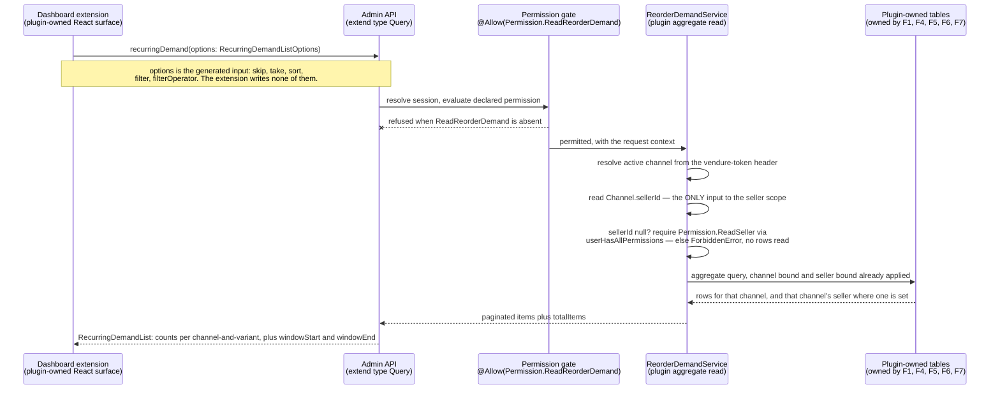

# FEATURE-001-08: Expose recurring reorder demand to sellers, category managers and support agents through three server-scoped, permission-gated Admin API reads over rows owned elsewhere, so that each administrative persona answers its own question without a new table

Parent epic: `tickets/EPIC-001-reorder-and-replenishment.md`. The parent epic and the sibling features are written as backticked paths rather than as links, following the epic's own convention of keeping the link count in a file equal to the number of children that file indexes [tickets/EPIC-001-reorder-and-replenishment.md:§3. How To Read This Epic]. The only links in this file are the three story links in section 3.

This file is not on the epic's curated read path [tickets/EPIC-001-reorder-and-replenishment.md:§3. How To Read This Epic]. It is the last feature in dependency order and the only one that **owns no storage at all**, which is why it answers exactly one question: **who may look at recurring reorder demand, what they are allowed to see, and which already-existing rows they are looking at.** How those rows come to exist belongs to FEATURE-001-01, FEATURE-001-04, FEATURE-001-05, FEATURE-001-06 and FEATURE-001-07, and is not restated here.

---

## 1. Feature Title

**Expose recurring reorder demand to sellers, category managers and support agents through three server-scoped, permission-gated Admin API reads over rows owned elsewhere, so that each administrative persona answers its own question without a new table.**

Short name, used verbatim wherever this feature is referred to in one phrase, and identical to the label the epic's features index gives it: **Recurring-Demand Visibility for Sellers, Category Managers and Support** [tickets/EPIC-001-reorder-and-replenishment.md:§4. Features Index]. The long form above is the action-object-outcome title this tier requires; the short form is the name to cite.

**On the word "server-scoped" in the title, because the obvious alternative would be wrong.** All three reads are scoped **server-side**, and that is what they have in common; they are not all *seller*-scoped. **Three different scopes are in play and section 2.7 fixes each one separately:** story 08-02 is scoped to the caller's own seller, story 08-01 is scoped to a category, and story 08-03 is scoped to one named buyer at a time. Calling the set "seller-scoped" would describe one story of the three and would quietly imply that a support agent's lookup is bounded by a seller, which it is not.

The file slug is `recurring-demand-visibility`, shorter than both forms of the title. That is fixed by the epic's own features index, which links to this exact filename [tickets/EPIC-001-reorder-and-replenishment.md:§4. Features Index], and the sibling story directory `FEATURE-001-08/` carries no slug at all. Neither is renamed.

Delivery is part of the single self-contained plugin package the epic describes — `packages/reorder-plugin/`, exporting `ReorderPlugin`. No file under `packages/core` or `packages/admin-ui` is edited to deliver it, and section 2.15 states why a dashboard extension is not a change to `packages/admin-ui`.

---

## 2. Feature Summary

### 2.1 The Capability

Three administrative reads over reorder activity that has already been recorded: **demand across a category**, **demand restricted to a seller's own variants**, and **a per-buyer lookup a support agent uses to answer "what happened when this buyer tried to reorder"**. Each read is a permission-gated Admin API query, each is scoped server-side before a row is returned, and each is surfaced in the dashboard through the extension mechanism this repository already ships.

### 2.2 Contribution To The Epic, And The Expanded Rationale

This feature is part of the epic's batch **B5**, which depends on batches B2 and B4 [tickets/EPIC-001-reorder-and-replenishment.md:§9.4 Run Batches], and **inside that batch it is gated behind the story that creates the tables it reads** [tickets/EPIC-001-reorder-and-replenishment.md:§9.4.1 Batch B5 Is Sequenced Internally, And The Gates Are Named]. **That gate is the reason the sequencing is stated at story granularity rather than left to the batch table.** All three of this feature's stories read `ReorderAttempt` and `ReorderAttemptLine`, which STORY-001-07-01 creates, and 08-03 additionally reads `ReorderListShare`, which the FEATURE-001-06 share stories create — the epic's two named B5 gates exactly. Without them the three stories assigned to a developer working in parallel would be compiling against tables that had not yet merged. It owns the final step of the returning-buyer journey — the step at which recorded reorder activity becomes visible to sellers, category managers and support [tickets/EPIC-001-reorder-and-replenishment.md:§2.5 The Returning-Buyer Journey This Epic Builds] — and it is the only feature in the epic with no outbound edge at all.

The epic classifies this feature's deviation from its originally suggested area as **expanded**: the suggested area was seller and category-manager visibility, and the Customer Support Agent read path was absorbed into it [tickets/EPIC-001-reorder-and-replenishment.md:§4. Features Index]. The rationale is a de-duplication argument, and it has to be stated accurately because the convenient short form is false.

**What is not shared, stated first.** The support lookup is **not** the same read as the two demand views. It calls **two different operations** — `customerReorderLists` and `reorderAttempts` rather than `recurringDemand` (section 2.5) — over a **partly different table set**: it reads `ReorderList`, `ReorderListLine` and `ReorderListShare`, which the demand views never touch, and it does not read `PurchaseCadence` or `SubstitutionCandidate`, which they do (section 2.3). It is also not an aggregate at all: it returns rows about one named buyer, where the demand views return grouped counts across many. **"All three personas read the same aggregate over the same tables" would therefore be wrong on the operation, on the table set and on the shape**, and this file does not lean on it.
**What is actually shared, which is what carries the decision — five pieces of wiring and one table pair.** A separate support feature would duplicate every one of them:
- **The plugin service class.** All three reads live on `ReorderDemandService` (section 2.4), so there is one place the database work is written and one place a reviewer inspects it.
- **The permission registration point.** Both definitions are registered from one plugin configuration function, and two of the three reads additionally require an existing platform permission alongside their own — the support pair `Permission.ReadCustomer`, and the seller-unscoped form of the aggregate `Permission.ReadSeller` (section 2.8). **What is shared is the registration point and the reasoning, not one permission** — an earlier revision of this bullet said "one administrative definition is registered once and gates all three reads", which contradicted the split two bullets below it. A second feature would register its own definitions and grow the published enum again from a second place.
- **The generated list-options consumption.** Every paginated read here consumes the same generated input rather than hand-writing sort and filter types (section 2.6), and the prohibition against hand-writing them would otherwise have to be restated and re-verified in two features.
- **The dashboard extension and everything under it.** One plugin dashboard entry point and one internationalisation catalogue entry serve all three surfaces (sections 2.12 and 2.15). This is the largest single duplication a split would cause, and it is the reason all three stories share one owner. **An earlier revision of this bullet counted "one bundling configuration entry" among the shared items, and that was wrong** — there is no per-plugin entry in the bundling configuration to share, because the dashboard build discovers extensions by scanning the configured plugins rather than reading per-plugin entries from that file [packages/dashboard/vite/vite-plugin-dashboard-metadata.ts:L12-L16], which is why section 2.15 requires **no diff** in it and section 4.4 declines to list it as a dependency at all. The correction removes one item from the shared list without weakening the argument: the single entry point and the single catalogue are duplication enough on their own, and overstating the list would have made the ownership case rest on something the build does not do.
- **The server-side scoping contract.** The rule that a scope is composed from the caller's own identity and never from an argument is one contract applied three ways (section 2.7). Split across two features it becomes two contracts that can drift.
- **One shared table pair.** `ReorderAttempt` and `ReorderAttemptLine` are read by all three stories — as the activity half of the aggregate in 08-01 and 08-02, and as the "what happened" answer in 08-03 (section 2.3). That is the extent of the shared data, and it is one pair rather than a table set.
**Three consequences follow, and each is narrower than the loose rationale would have implied:**
- **The permission model is reasoned about once, but it is not one permission for everything.** Three definitions are registered here, and the buyer-specific reads are additionally paired with an existing platform permission because they return personal data a demand view does not. Section 2.8 states the shape, the reason and the mechanism the pairing needs.
- **The scoping predicate is implemented in one place, and on the aggregate it is also one predicate — which is a correction to an earlier version of this bullet.** That version said it "is not one predicate" and that a category manager and a seller operations manager "differ in what they may see", which invited exactly the implementation section 2.9's figure records as unbuildable: a service that inspects the caller and chooses. **They differ in the channel they address, not in the predicate the server picks for them** — `recurringDemand` filters to the active channel and additionally to that channel's `sellerId` where it is non-null, and that is the whole of it [see sub-section 2.7.1]. What the three reads genuinely share is *where* the filter is applied, which is server-side and never in a caller-supplied argument; what differs between the aggregate and the two support lookups is the **customer** predicate the latter add, not a per-persona variant of the former. Section 2.7 fixes all of it as a contract.
- **The permission model, by contrast, is deliberately *not* designed once, and the asymmetry is the point.** Sharing one resolver and one filter location is a de-duplication win; sharing one permission would be a privilege-escalation defect. The three reads divide into two capabilities of different sensitivity — an aggregate over trading activity, and a named buyer's own lists and attempt history — and the first of those two capabilities has a narrow and a wide scope of which only the narrow one is reachable without an explicit grant, so section 2.8 registers **three** definitions and keeps them apart. A single definition would mean any role granted demand access could also invoke the buyer lookups, which is the one failure in this feature that hands a seller or category role a support agent's view of an individual customer; and a single *demand* definition would make the seller-unscoped aggregate reachable by anyone able to address a channel with no seller, which is the failure section 2.7 closes.

Read the contribution precisely, because this feature only reads:

- **It writes nothing.** No mutation is added by this feature, and no row in any table is created, updated or deleted by any of its three operations.
- **It computes no cadence.** Interval arithmetic belongs to FEATURE-001-05 [tickets/EPIC-001/FEATURE-001-05-purchase-cadence-and-replenishment.md:§2.1 The Capability].
- **It records no attempt.** The audit rows are written by FEATURE-001-07, which states from its own side that they are read through this feature's Admin API surface [tickets/EPIC-001/FEATURE-001-07-reorder-instrumentation.md:§2.6 Named API Surfaces].
- **It curates nothing.** Substitution candidates are curated by FEATURE-001-04 through that feature's own two Admin operations [tickets/EPIC-001/FEATURE-001-04-unavailable-line-resolution.md:§2.7 Named API Surfaces]; this feature only reads what a curator left behind.
- **It changes nothing a buyer can observe.** Section 2.5 records that no Shop API operation is added, and section 2.14 states the four absences together.

### 2.3 Named Entities Touched — This Feature Owns No Table

**This feature introduces no entity and owns no table.** That is stated first because it is the single most consequential fact about it: every row this feature displays belongs to another feature, which is exactly why the epic places it last in dependency order and why the only ordering between its three stories is the single shared-code-path edge from 08-01 to 08-02 (section 4.3).

**Plugin-owned tables read, never written, and owned elsewhere:**

- **`ReorderList` and `ReorderListLine` — owned by FEATURE-001-01, and read by all three stories rather than by one.** The named list and its per-line quantity [tickets/EPIC-001/FEATURE-001-01-named-reorder-lists.md:§2.4 Named Entities Touched]. Story 08-03 reads them to answer what lists a buyer holds. **Stories 08-01 and 08-02 read `ReorderListLine` as well, as the aggregate's standing-intention source**, which an earlier version of this bullet omitted while the published row carried a non-null `savedListOccurrenceCount` with no stated source: that field is a distinct count of the lists in this channel holding a line for the variant, outer-joined so a variant on no list is returned at zero rather than dropped [tickets/EPIC-001/FEATURE-001-08-recurring-demand-visibility.md:§2.5 Named API Surfaces — Three New Admin API Operations, Zero Shop API Change].
- **`ReorderListShare` — owned by FEATURE-001-06.** The grant rows and their state. Read by story 08-03 so that a support agent can explain why a list the buyer does not own appears in their account; that feature records the same story-level edge from its own side [tickets/EPIC-001/FEATURE-001-06-buying-account-list-sharing.md:§4.2 Downstream — One Feature Depends On This One].
  - **An `ACTIVE` row is not evidence of current access, and this read must not present it as though it were.** The owning feature's authorisation rule is evaluated per request against live state, so a grantee who has been removed from the customer group, moved into a different account, or soft-deleted **keeps an `ACTIVE` row with a null `revokedAt` and has no access at all** [tickets/EPIC-001/FEATURE-001-06-buying-account-list-sharing.md:§2.6.1 The Authorisation Read Shape — One Customer's Memberships, Never One Account's Members]. Those are exactly the situations a support agent is called about, so a field that projected `state = 'ACTIVE'` into something a reader understands as live access would be wrong precisely when it is being relied on.
  - **This feature takes the second of the two dispositions that feature permits, and states which one so no implementer has to choose.** Story 08-03's projection reports the grant's **recorded state** — that a grant was made, its capability, whether it has been revoked, and when — with the field named and described as a record rather than as an entitlement. It does **not** re-evaluate membership per row, because the support read is a bounded lookup and adding one live membership read per grant row would make its cost grow with the number of seats rather than with the question asked. **The consequence is stated rather than hidden:** an agent reading this projection learns what was granted, not what is currently exercisable, and a deployment that needs the latter calls `ReorderListShareService`'s ownership-or-valid-share predicate — which the owning feature makes callable from an Admin API resolver for this purpose — rather than inferring it here.
- **`PurchaseCadence` — owned by FEATURE-001-05.** The derived repurchase interval per customer, variant and channel [tickets/EPIC-001/FEATURE-001-05-purchase-cadence-and-replenishment.md:§2.3 Named Entities Touched]. Read by stories 08-01 and 08-02 through **exactly one published field**, `cadenceCustomerCount`, which counts the distinct customers holding a cadence row for this channel-and-variant pair. **"The recurrence half of the aggregate" is what an earlier version of this bullet claimed, and it was unfalsifiable**: no field and no predicate used the table, so the dependency could not have been observed to hold or to fail. One counted field with an exact predicate replaces the phrase, and **no threshold is applied to `intervalDays` or `observationCount`** — reading 18 states why that matters for section 2.11's boundary.
- **`ReorderAttempt` and `ReorderAttemptLine` — owned by FEATURE-001-07.** One attempt row and one row per distinct projected variant key, carrying the per-line outcome code and, where the platform returned one, the exact error type name [tickets/EPIC-001/FEATURE-001-07-reorder-instrumentation.md:§2.4 Named Entities Touched]. Read by all three stories: as the activity half of the aggregate in 08-01 and 08-02, and as the "what happened" answer in 08-03.
- **`SubstitutionCandidate` — owned by FEATURE-001-04, and read through that feature's own operation rather than projected onto a row of this one.** Story 08-01's category view surfaces which curated alternative was available for a variant a buyer could not have, and **it obtains that by calling `substitutionCandidates(originProductVariantId: ID!, options: SubstitutionCandidateListOptions)`** — the operation FEATURE-001-04 already publishes [tickets/EPIC-001/FEATURE-001-04-unavailable-line-resolution.md:§2.7 Named API Surfaces — Zero New Buyer-Facing Operations, Two New Admin Operations] — for **one** origin variant the reader has selected, never once per row of a page. **This is a correction to an earlier revision of this bullet**, which said the rows were read here without saying through what: no field on `RecurringDemand` carries a curated alternative, none is added, and adding one would duplicate an operation another feature publishes, which the epic's do-not-duplicate inventory forbids [tickets/EPIC-001-reorder-and-replenishment.md:§5. Existing Mechanisms That Must Not Be Duplicated]. The dependency is therefore real and unchanged in direction — the rows and the operation must both exist before that view has anything to show — and reading 16 states the boundedness that makes it safe.

**Existing platform entities, read and never altered:**

- **`Seller`** [packages/core/src/entity/seller/seller.entity.ts:L18], whose own JSDoc defines it as the person or organisation selling the goods on a given `Channel` [packages/core/src/entity/seller/seller.entity.ts:L12]. Its `name` [packages/core/src/entity/seller/seller.entity.ts:L26] is the label an administrative row carries, and its `channels` relation [packages/core/src/entity/seller/seller.entity.ts:L31-L32] is the join this feature scopes through. It is soft-deletable [packages/core/src/entity/seller/seller.entity.ts:L24], so a deleted seller's rows are still present in the database and an aggregate must not silently attribute them to nobody.
- **`Channel`**, which supplies both the request scope and the seller link. `token` is the unique value read from the `vendure-token` request header [packages/core/src/entity/channel/channel.entity.ts:L62] as its own JSDoc states [packages/core/src/entity/channel/channel.entity.ts:L56-L60], `sellerId` [packages/core/src/entity/channel/channel.entity.ts:L71-L72] is the nullable identifier behind the channel's `seller` relation [packages/core/src/entity/channel/channel.entity.ts:L68-L69], and `productVariants` is a many-to-many relation [packages/core/src/entity/channel/channel.entity.ts:L118-L119] — which is why the seller predicate in section 2.7 resolves a variant to a seller *through a channel* rather than reading a seller column off the variant, because no such column exists.
- **`Customer`** [packages/core/src/entity/customer/customer.entity.ts:L23], the subject of story 08-03's lookup. Its `emailAddress` [packages/core/src/entity/customer/customer.entity.ts:L42] is the handle a support agent searches on, and its `groups` relation [packages/core/src/entity/customer/customer.entity.ts:L44-L46] is what a buying account is modelled through. It is soft-deletable [packages/core/src/entity/customer/customer.entity.ts:L28-L29], so a support lookup can legitimately resolve a customer whose rows remain while the customer is marked deleted, and that is a state story 08-03 must state rather than discover.
- **`ProductVariant`**, the subject of every aggregate row. This feature reads the identifier and the variant's channel membership; it asserts nothing about price, stock or enabled state, all of which belong to FEATURE-001-03 and FEATURE-001-04.
- **`Order`**, and it is read **less** than a reader would expect, which is deliberate. `code` is uniquely indexed and its own JSDoc directs that it be used as the order reference for customers rather than the order's id [packages/core/src/entity/order/order.entity.ts:L62-L67], which is why it is the handle story 08-03 searches on. **The search is not a join to this table, though.** The upstream feature records the code as a snapshot column on the attempt row precisely so that the lookup remains a predicate on plugin-owned tables [tickets/EPIC-001/FEATURE-001-07-reorder-instrumentation.md:§2.4 Named Entities Touched], and story 08-03 therefore filters on that column. This entity is read only to resolve the referenced order for display where it still exists — **and where it does not, the attempt is still returned, with the referenced order reported as unavailable rather than the attempt being omitted or the query failing** [tickets/EPIC-001/FEATURE-001-07-reorder-instrumentation.md:§4.2 Downstream — Two Consumers, All One-Way, And One Feature That Is Not A Consumer]. An order a deployment has removed is a reachable state, not a hypothetical one, and a support lookup that hid an attempt because its source order was gone would hide exactly the attempt an agent is investigating.

**No column is added to any table, plugin-owned or core, and no custom field is declared on any core entity.** The dev-server configuration's empty custom-fields object [packages/dev-server/dev-config.ts:L116] is still empty once this feature ships.

### 2.4 Named Services

- **`ReorderDemandService` — new, plugin-owned, and the only new class this feature contributes to the persistence layer.** It holds all three reads and applies the scope predicate in section 2.7 before any row leaves it. **The three are not the same kind of read, and calling all three "aggregates" — as an earlier revision of this bullet did — hides the difference that decides how each is built.** `recurringDemand` **is** a database aggregate: it groups, it counts, it returns rows of no table, and it is the read the explicit-SQL exemption and the pre-aggregation contract of section 2.6.3 exist for. `customerReorderLists` and `reorderAttempts` are **entity-backed paginated projections**: they return rows about one named buyer, drawn from tables this plugin owns, resolved through the platform's list helper because they have an entity to build over. Both kinds express their work as database queries rather than as an in-process reduction over loaded rows — which is the property the withdrawn wording was reaching for — but only one of them aggregates. **A correction belongs here rather than in a footnote**: an earlier draft justified the aggregate by citing the load-testing harness's dataset as ten thousand orders each carrying ten lines. That figure is what the harness's own comment claims and is not what its code produces — the epic carries the correction and the evidence [tickets/EPIC-001-reorder-and-replenishment.md:§7.6 Data-Volume Assumptions And The Benchmark Workflow], and no volume figure is asserted here in its place. The reason for a database aggregate does not depend on a volume claim anyway, and stating it without one is the stronger form: an in-process reduction loads every line row it reduces, so its cost grows with the table while an aggregate's grows with the window in section 2.6.2 — that is a difference in shape, not in magnitude, and it holds at every size. Because all three stories delegate to it, there is exactly one place where the scope filter is implemented and exactly one place a reviewer inspects.
- **EACH SOURCE IS AGGREGATED SEPARATELY AND THE RESULTS ARE JOINED ON THE GROUPING PAIR. Joining the sources first and aggregating afterwards multiplies every count, and the multiplication is silent.** The four counts do not come from one table. `reorderAttemptCount`, `reorderedUnitCount`, `distinctCustomerCount`, `firstReorderedAt` and `lastReorderedAt` derive from `reorder_attempt_line` and its parent `reorder_attempt`; `savedListOccurrenceCount` derives from `reorder_list_line` and its parent `reorder_list`, a table with no relation to the first pair [tickets/EPIC-001/FEATURE-001-07-reorder-instrumentation.md:§2.4 Named Entities Touched]. **A single query joining both families on the channel-and-variant pair produces their cross product**, so a variant with three attempt lines and four saved-list occurrences yields twelve rows — and then reports an attempt count of twelve and a saved-list count of twelve, both wrong, both plausible, and neither detectable from the result. **So the shape is fixed here rather than left to an implementer:** one subquery or common table expression per source, each grouping by `(channelId, productVariantId)` and each emitting its own aggregates over its own rows only; then the per-source results joined to each other on that same pair, so every count arrives already reduced and no join can inflate one. **Two consequences follow and both are testable.** A variant present in one source and absent from the other must still produce a row, with the absent source's counts at zero rather than the row disappearing — which is why the join across the pre-aggregated sources is an outer one over the union of their keys and never an inner join. And within the attempt family, the attempt count is a **count of distinct attempt identifiers** rather than a count of line rows, because one attempt contributes several lines for the same variant only across projected keys but a variant may recur across many attempts; a story asserts a fixture where the two figures differ, since a fixture where they coincide cannot tell them apart.
- **`distinctCustomerCount` counts distinct NON-NULL acting customers, and an anonymised attempt therefore contributes to three of the four counts but not to that one.** This is stated rather than discovered, because it is where this feature meets the customer-data lifecycle: the erasure pass nulls `actingCustomerId` on a retained attempt row while keeping its channel, variant, quantities and outcome [tickets/EPIC-001/FEATURE-001-07-reorder-instrumentation.md:§2.13 Privacy And How Long An Audit Row Is Kept — No Policy Is Declared Anywhere], and a count of distinct values over a column skips nulls. **So after a customer is erased, that customer's attempts still raise `reorderAttemptCount` and `reorderedUnitCount` and still move the two timestamps, and no longer raise `distinctCustomerCount`.** The alternative — retaining a per-customer pseudonym so the distinct count stayed stable — is rejected outright: a stable pseudonym is exactly the re-identifying handle the erasure exists to remove, and preserving one to protect a statistic would undo the erasure to save an integer. **The trade is unavoidable rather than chosen carelessly: a link cannot be both erased and counted as a distinct person.** A story asserts the behaviour on a fixture containing one anonymised attempt, so the drop is a tested figure rather than an anomaly a seller reports later.
- **`TransactionalConnection` — existing, consumed, never modified.** Every read is issued through it, which is how the aggregate is expressed as a query builder against plugin-owned tables rather than as entity loading followed by array work. The epic names it as the persistence dependency for all plugin-owned state [tickets/EPIC-001-reorder-and-replenishment.md:§7.4 Existing Entities And Services The Work Depends On].
- **`ChannelService` and `ProductVariantService` — existing, consumed, never modified.** The first resolves the active channel from the request so the scope predicate has a channel to bind to; the second resolves variants for display without this feature reaching into the catalogue tables itself.
  - **Display hydration is one targeted projection per page, never one call per row — and it is deliberately not `findByIds`.** That method loads options, facet values, those values' facets, tax category, assets and featured asset [packages/core/src/service/services/product-variant.service.ts:L152-L161] and then applies channel pricing and translation to all of them [packages/core/src/service/services/product-variant.service.ts:L162], which is an object graph and a price calculation for the sake of a name and a code; an earlier revision of this bullet called it minimal hydration and counted it as a single query, and both readings are withdrawn [tickets/EPIC-001-reorder-and-replenishment.md:§7.7.1a Three Observation Boundaries, Because "One Query" Is Three Different Claims]. What runs instead is **one query per page** against the variant and its translation for the request's language, selecting the identifier, the SKU and the translated name and nothing else, plus the seller attribution section 2.7 requires — the values landing on the nested `display` projection of section 2.5. **`ProductVariantService` remains a consumed service** for resolving the variant object where a caller asks for it, which is why it is still named here. A lookup per row is prohibited, and the prohibition is testable rather than advisory: **the story asserts the variant-read count is one for a page of any size**, because a page of one row cannot tell a bulk hydration from a per-row one. Duplicate identifiers across rows are collapsed before the call, so the argument array carries distinct identifiers only.
- **No core service is modified, and none is extended.** This feature calls no write method on any core service, because it performs no write. In particular it does not touch `OrderService`, which FEATURE-001-02 and FEATURE-001-07 consume [tickets/EPIC-001/FEATURE-001-07-reorder-instrumentation.md:§2.5 Named Services].

### 2.5 Named API Surfaces — Three New Admin API Operations, Zero Shop API Change

All three arrive through the plugin's `adminApiExtensions`, using `extend type Query` — the mechanism the shipped reviews plugin already demonstrates alongside its shop extensions [packages/dev-server/test-plugins/reviews/reviews-plugin.ts:L14-L21]. Because each operation is an addition to an existing root type rather than a change to an existing field, **no existing operation's arguments or return type changes.**

The three queries, and the story that owns each:

- **`recurringDemand`** — the aggregate over recorded reorder activity, paginated, sorted and filtered through the generated list options described in section 2.6. Read by a Marketplace Category Manager in story 08-01 and by a Seller Operations Manager in story 08-02; **the two stories differ in the scope the server derives for them and in the capability that entitles them to it, not in the operation called.** That is a deliberate design choice and section 2.7 explains what makes it safe — including why the wider of the two scopes needs a permission of its own rather than being the branch taken whenever the narrower one cannot be derived.
- **`customerReorderLists`** — the support lookup that returns the lists a named buyer holds, including lists reached through an unrevoked grant, **paginated**. Read by a Customer Support Agent in story 08-03.
- **`reorderAttempts`** — the support lookup that returns recorded attempts and their per-line outcomes, addressable by the buyer's identity or by the order code recorded on the attempt, **paginated and bounded by the aggregate window**. Read by a Customer Support Agent in story 08-03.
**All three are paginated. Not "paginated if chosen" — an earlier draft made it conditional for the two support reads and that conditionality is withdrawn here**, because the epic's rule admits no exception and lists all three of this feature's surfaces by name [tickets/EPIC-001-reorder-and-replenishment.md:§7.7 Bounded Collections]. Each returns a type implementing `PaginatedList` [packages/core/src/api/schema/common/common-types.graphql:L9] with the configured Admin maximum — default one thousand [packages/core/src/config/vendure-config.ts:L159] — enforced, an omitted page resolving to that maximum rather than to every row, an over-limit page refused rather than silently clamped, and `ignoreQueryLimits` never set. Section 2.6.1 states *how* those options are applied, which is the part a schema declaration does not deliver on its own.
**And the nested collections are bounded too, which is the part pagination on the outer list does not reach.** A page of one thousand attempts each carrying its own per-line outcomes is bounded on attempts and unbounded on lines, so:
- **An attempt's per-line outcomes are bounded by FEATURE-001-02's source-size maximum, that bound is inherited rather than invented, and the *product* of the two bounds is stated here rather than left for a reader to multiply.** The write could not create more line rows for one attempt than that maximum permits [tickets/EPIC-001/FEATURE-001-07-reorder-instrumentation.md:§2.5.1 The Write Shape And Its Transaction Boundary — The Part Most Likely To Be Got Wrong], so the nested collection is returned whole rather than paginated. **What an earlier revision of this bullet stopped short of saying is that "each side is bounded" does not bound the response: a page of attempts each carrying up to the maximum number of lines returns the product of the two, and it is the product a reader needs.** So three rules attach. **First, the product is published as a bound rather than as an implication:** the maximum number of `ReorderAttemptLineSummary` objects one `reorderAttempts` response can contain is the requested page size multiplied by the configured source-size maximum, and that arithmetic is stated in the operation's own documentation so a client sizing a request can see it. **Second, the bound is enforced rather than described:** the resolver refuses a request whose page size multiplied by the configured source maximum exceeds the configured ceiling for that product — a plugin option in the same family as the others, whose value joins the epic's eighth product decision rather than being invented here — with the platform's own input error naming both operands [packages/core/src/common/error/errors.ts:L27]. **Third, it is tested at the bound rather than below it:** a fixture of attempts each carrying the configured maximum number of lines is requested at the largest page size the product permits and at one page size above it, the first returning exactly the product and the second refused. **The alternative — paginating or lazily loading the nested collection — is deliberately not taken**, because an attempt's lines are its meaning to a support agent and a half-loaded attempt answers nothing; the cost of that choice is this bound, and stating the bound is what makes the choice defensible rather than convenient.
- **A buyer's list lines are not a nested collection here at all, and that is the bound.** `AdminReorderListSummary` publishes `lineCount` and **no `lines` field** — a support agent needs to know how large a list is, not to page through its contents from this surface — so the only nested collection this feature returns is an attempt's `lines`, bounded above. The list *count* per buyer is bounded by the decided lists-per-customer maximum [tickets/EPIC-001-reorder-and-replenishment.md:§8.1 Product Decisions], and the outer read is paginated regardless of whether that value has been decided. **An earlier revision of this bullet bounded a nested line collection that the projection does not publish**, which is a bound protecting nothing.
- **`reorderAttempts` is not a lifetime read.** Without a window it walks every attempt ever recorded for that buyer, and the keep period that would otherwise bound the table is itself undecided — as the epic's **third product decision**, not an architectural one [tickets/EPIC-001-reorder-and-replenishment.md:§8.1 Product Decisions]. So the same window that bounds the aggregate bounds this read, **with the window stated in the response as two published fields — `windowStart` and `windowEnd` on the list type, per reading 10** — so a support agent knows what they are and are not looking at rather than inferring completeness from an absence. An earlier draft made that claim while declaring no field that could carry it.

**No Shop API operation is added by this feature. None.** No buyer reads an aggregate, and no storefront surface changes. The additive-only constraint therefore takes its strongest available form here on the buyer-facing side, and **it is stated as both counts because only one of them is nineteen**. The **core subset** is the nineteen root queries the platform publishes with no reorder plugin registered [packages/core/src/api/schema/shop-api/shop.api.graphql:L1-L52], and every one of those signatures, together with the order, cart and customer-account mutation sets in the same file, is byte-identical after this feature ships. The **integrated total** at batch B5 is **twenty-three before this feature and twenty-three after**, and the root `Mutation` type forty-two before and forty-two after, because this feature's Shop delta is zero — which is a stronger claim than an unchanged core subset and is the one worth asserting here [tickets/EPIC-001-reorder-and-replenishment.md:§6.5 The Cumulative Published-Surface Ledger]. **A zero delta is asserted with its numbers rather than left implicit**, because a file that simply stops mentioning the row reads as though it never checked it.

**These three are exactly three of the epic's five new Admin API operations.** The other two, `substitutionCandidates` and `setSubstitutionCandidates`, belong to FEATURE-001-04 [tickets/EPIC-001/FEATURE-001-04-unavailable-line-resolution.md:§2.7 Named API Surfaces]. The two features between them account for the whole administrative surface the epic proposes, and neither adds an operation the other also claims. Stating the split here means a reader tallying the epic's operation count against its features finds five and not six.

**Every proposed name is free in this checkout, and the evidence is a search anybody can repeat rather than a citation of a name that happens to be present.** The subject searched is the checked-in Admin API introspection snapshot — a single-document snapshot of the published schema [schema-admin.json:__schema] — and the search was for the quoted names `"recurringDemand"`, `"customerReorderLists"`, `"reorderAttempts"`, `"RecurringDemand"` and `"ReorderAttempt"`. **Each returns zero occurrences**, in that snapshot and in the Shop API snapshot alongside it. A pointer at an unrelated name that *is* present would prove the file was read and nothing about the names proposed, which is why a reproducible form is given instead — and why it is not a bare count. **`grep -c '"recurringDemand"' schema-admin.json` is the wrong form for this check, and a review found it stated as the right one.** With no match it prints `0` and exits 1, so the outcome this file *wants* is indistinguishable by exit status from a command that went wrong; with an unreadable or missing file it exits 2, which an `if` or a `&&` chain reads as absence; and in a pipeline its status is discarded altogether. The block below asserts absence per name instead, separates a match from a read error from a genuine absence, and returns a non-zero status if any one of the five is not free.

```bash
# Run from anywhere inside the checkout. One line per name per snapshot, then one status line.
reorder_names_are_free() {
    root=$(git rev-parse --show-toplevel) || {
        echo 'COLLISION CHECK FAILED: not inside a git checkout.'
        return 1
    }
    problems=0
    for snapshot in schema-admin.json schema-shop.json; do
        if [ ! -f "$root/$snapshot" ] || [ ! -r "$root/$snapshot" ]; then
            echo "COLLISION CHECK FAILED: $snapshot is not a readable regular file, so absence cannot be shown."
            problems=$((problems + 1))
            continue
        fi
        for name in '"recurringDemand"' '"customerReorderLists"' '"reorderAttempts"' \
                    '"RecurringDemand"' '"ReorderAttempt"'; do
            grep -qF -- "$name" "$root/$snapshot"
            status=$?
            if [ "$status" -eq 0 ]; then
                echo "COLLISION: $name occurs in $snapshot, so that name is not free."
                problems=$((problems + 1))
            elif [ "$status" -ne 1 ]; then
                echo "COLLISION CHECK FAILED: grep exited $status on $snapshot; absence is unproven."
                problems=$((problems + 1))
            else
                echo "free:  $name does not occur in $snapshot"
            fi
        done
    done
    if [ "$problems" -ne 0 ]; then
        echo "COLLISION CHECK FAILED: $problems problem(s). No name here may be treated as free."
        return 1
    fi
    echo 'COLLISION CHECK OK: every name above is free in both snapshots.'
}

reorder_names_are_free
```

**Expected:** ten lines beginning `free:` — five names against each of the two snapshots — and a closing `COLLISION CHECK OK`. Nothing here collides with a published name.

#### The exact SDL, published here so no story invents it

A review of this file found that naming three operations and describing their rows in prose is not a contract: three stories, one of them shipping a dashboard page that types its query variables against these names, cannot be built from a description. The whole of this feature's published surface therefore follows. **It is complete: nothing below is added by a story, and no story may add anything that is not below.**

Both schema documents are separate, which is the first thing this block depends on. A plugin declares `adminApiExtensions` and `shopApiExtensions` as two distinct schemas with two distinct resolver sets — the reviews plugin does exactly that [packages/dev-server/test-plugins/reviews/reviews-plugin.ts:L14-L21]. So the Admin-side row types below are **not** the Shop-side types FEATURE-001-01 and FEATURE-001-02 publish, even where a name is similar, and a type declared only in the Shop schema is absent from the Admin schema. That separation is not a nuisance here; it is the mechanism that lets the Admin projections carry strictly less than the buyer's own view, which is what section 2.10's data-minimisation rule requires.

```graphql
# adminApiExtensions — the complete published surface of FEATURE-001-08.
# Zero shopApiExtensions. Zero changes to any existing Admin operation.

extend type Query {
  """
  The aggregate. TWO scopes, both applied server-side before any caller option:
  a REQUIRED collectionId argument, and the seller scope derived from the active
  channel (section 2.7). Neither is expressible as a filter the caller can widen.
  collectionId narrows the aggregate to the variants of one collection and is resolved
  server-side before aggregation — it is NOT a client-supplied variant id list. An
  earlier revision published this query with no selector at all, which left the category
  use case to approximate its scope with an unbounded IDOperators.in array of variant
  ids; see reading 15.
  """
  recurringDemand(
    collectionId: ID!
    options: RecurringDemandListOptions
  ): RecurringDemandList!

  "Support lookup. Bound by a required customerId — there is no unaddressed form."
  customerReorderLists(
    customerId: ID!
    options: AdminReorderListSummaryListOptions
  ): AdminReorderListSummaryList!

  """
  Support lookup. Bound by a REQUIRED subject argument carrying exactly one of two
  exact addresses -- never by a filter entry. See reading 19 for why the earlier
  filter-based form was not a bound at all.
  """
  reorderAttempts(
    subject: ReorderAttemptSubjectInput!
    options: ReorderAttemptSummaryListOptions
  ): ReorderAttemptSummaryList!
}

"""
The only way to address the attempt lookup. Exactly one field is non-null; zero or
two is a UserInputError, which the resolver raises before any row is read. Both
fields are plain scalars and carry NO operator input, so there is no notEq, no
notIn, no isNull and no regex on either -- an exact address is the only form
expressible, which is a property of the type rather than a rule to police.
"""
input ReorderAttemptSubjectInput {
  "Matched for equality against reorder_attempt.actingCustomerId. See section 2.6.1a."
  customerId: ID
  "Matched for equality against reorder_attempt.sourceOrderCode."
  sourceOrderCode: String
}

"""
One variant's recurring demand in one channel over the aggregate window.
Node is MANDATORY rather than chosen: PaginatedList declares items as [Node!]!
[packages/core/src/api/schema/common/common-types.graphql:L9], and Node declares one
field, id: ID! [packages/core/src/api/schema/common/common-types.graphql:L14], so a type
appearing in a PaginatedList implementor's items must implement it — see reading 1.
"""
type RecurringDemand implements Node {
  """
  A synthetic composite of the grouping pair, the channel id and the variant id:
  deterministic for that pair and stable across the pages of one request, which is the
  whole of what Node's contract requires of it. It is NOT a row id of any table, because
  this feature owns none. It resolves through no global lookup — and that costs nothing,
  because this platform publishes no node(id:) root field on either API to resolve it with.
  """
  id: ID!
  "Scalar, so the generated filter carries IDOperators. This is why it is not only a relation."
  productVariantId: ID!
  "Object-typed, so the generator produces NO filter for it. Deliberate, not an oversight."
  productVariant: ProductVariant
  """
  The seller this row is attributed to. Derived server-side by ONE rule with two
  branches, stated in section 2.7 and never by inspecting the caller:

  - Where the ACTIVE channel carries a sellerId, every returned row carries that
    value. It comes from the channel rather than from the variant, so it is
    deterministic even for a variant whose catalogue row no longer exists, and it
    is identical on every row of the response because the channel bound IS the
    seller bound.
  - Where the active channel carries no sellerId -- the wide read, which needs its
    own grant -- the value is the seller of the variant's single seller-bearing
    channel where there is exactly one, and NULL where there are none or several.

  NULLABLE, and that reverses an earlier non-null "fail-closed" form under which a
  row whose seller could not be attributed was excluded from the aggregate. Three
  reasons: exclusion silently understated demand, which the earlier text conceded
  in its own documentation; the excluded set included every hard-deleted variant,
  whose channel assignments are gone, which contradicted this feature's own rule
  that such a row is still returned; and a variant assigned to two seller-bearing
  channels has no single answer, so a non-null type demanded a value that does not
  exist. Excluding rows is the more dangerous failure here, because a missing row
  is invisible while a null field is not. See reading 20.
  """
  display: RecurringDemandDisplay!
  """
  The seller of the CHANNEL this row is grouped by — Channel.sellerId on the channel
  the attempt rows were recorded under — and never a seller derived from the variant's
  own channel assignments. That distinction is the whole of why this field is single-valued:
  a variant may be assigned to many channels, each with its own nullable seller, so
  "the seller owning the variant" is a zero-or-many relation and could fill neither a
  single id nor an honest null.
  The grouping channel is exactly one channel per row, so its seller is exactly one value
  — and that value is absent exactly when the grouping channel carries no seller, which
  is why this field is NULLABLE. A null here is reachable only by a caller holding
  Permission.ReadSeller, every other caller being refused outright on such a channel, so
  the fail-closed posture of this operation lives in the entitlement check of section
  2.7.1 and not in this field's nullability.
  AN EARLIER REVISION DECLARED sellerId: ID! AND EXCLUDED EVERY ROW WHOSE GROUPING
  CHANNEL HAD NO SELLER. Both are withdrawn together: on a channel with no seller that
  rule empties the response entirely, and that channel is exactly the one story 08-01's
  Marketplace Category Manager addresses — so the widest-entitled caller in this feature
  would have been the only one guaranteed no rows at all. See section 2.9.
  """
  sellerId: ID
  reorderAttemptCount: Int!
  reorderedUnitCount: Int!
  """
  The number of distinct buyers recorded against this variant inside the window,
  counted over attempt rows that still carry an acting customer id. A row whose
  customer has been erased is excluded from THIS figure and remains in the two
  counts above, so this one is a lower bound that can decrease between two runs
  of the same query while those cannot. Stated in the schema rather than left to
  be discovered, because a consumer may have acted on an earlier value. See
  reading 17.
  """
  distinctCustomerCount: Int!
  """
  The number of distinct saved reorder lists in this channel that hold a line for
  this variant: COUNT(DISTINCT reorder_list_line.reorderListId) over the rows whose
  productVariantId is this row's and whose parent list belongs to this channel.
  It is NOT window-bounded, and that is deliberate rather than an oversight -- a
  saved list is a standing intention with no event date to bound, whereas the two
  counts above are activity inside windowStart..windowEnd. Zero where no list line
  matches, which is also its value before FEATURE-001-01's line table is populated,
  so this field degrades to zero rather than making the operation unsatisfiable.
  See reading 18.
  """
  savedListOccurrenceCount: Int!
  """
  The number of distinct customers for whom FEATURE-001-05 has derived a repurchase
  cadence for this variant in this channel: COUNT(DISTINCT purchase_cadence.customerId)
  over the rows matching this row's channelId and productVariantId. This is the ONLY
  field sourced from that table, and three things it deliberately does not do are
  stated because an earlier version of this file claimed the cadence supplied "the
  recurrence half of the aggregate" while no field or predicate used it at all:
  it applies NO threshold to intervalDays or observationCount, it compares NO
  interval, and it does not filter which variants are returned. It is a count of
  rows, on the same footing as the counts above. Zero where no cadence row exists,
  which is also its value before that feature's table is populated. See reading 18.
  """
  cadenceCustomerCount: Int!
  firstReorderedAt: DateTime
  lastReorderedAt: DateTime
}

type RecurringDemandList implements PaginatedList {
  items: [RecurringDemand!]!
  totalItems: Int!
  "Inclusive lower bound of the scanned window. See reading 10."
  windowStart: DateTime!
  "Exclusive upper bound of the scanned window — the moment the aggregate was computed."
  windowEnd: DateTime!
}

"""
The display-only projection of the variant a demand row is keyed on. Hydrated after
pagination, so nothing here is sortable or filterable — which is the point of nesting
it. Both fields are null once the variant is hard-deleted: there is nothing left to
resolve a name or a code from.
"""
type RecurringDemandDisplay {
  productVariantName: String
  sku: String
}

"One reorder list held by the looked-up buyer. A summary, not the buyer's own list type."
type AdminReorderListSummary implements Node {
  id: ID!
  name: String!
  """
  Nested, not flat, and reading 11 is why: both fields below are derived per
  looked-up buyer and neither is a column, so a flat field would enter the
  generated sort and filter inputs for a value no ORDER BY can address.
  """
  holderAccess: AdminReorderListAccessInfo!
  "A real counter column on reorder_list, so this one IS natively sortable and filterable."
  lineCount: Int!
  createdAt: DateTime!
  updatedAt: DateTime!
}

"""
How the looked-up buyer reaches this list, AS RECORDED. Derived per buyer from the
list's owner and from the grant rows; never a stored row of its own.

This type reports RECORDED STATE and deliberately not current exercisable access.
An unrevoked grant whose grantee has been removed from the customer group, moved to
another account, or soft-deleted still reads SHARED here while conferring no access
at all, because FEATURE-001-06 evaluates membership per request rather than storing
it. A deployment that needs live access calls that feature's ownership-or-valid-share
predicate; it is not inferable from these two fields. See section 2.3.
"""
type AdminReorderListAccessInfo {
  """
  OWNED, or SHARED meaning a grant row exists for this buyer and has not been
  revoked. SHARED is not an assertion that the grant is currently exercisable.
  """
  access: ReorderListAccess!
  """
  What the buyer may do with it IF the grant is currently valid. Every capability on
  an owned list; exactly the granted subset on a shared one. This is what explains a
  buyer who can see a list and cannot apply it to an order.
  """
  grantedCapabilities: [ReorderListCapability!]!
}

type AdminReorderListSummaryList implements PaginatedList {
  items: [AdminReorderListSummary!]!
  totalItems: Int!
}

"One recorded reorder attempt. Columns are the audit row's, projected."
type ReorderAttemptSummary implements Node {
  id: ID!
  createdAt: DateTime!
  """
  The handle a sanitised failure log carries. Projected because on the branches
  where no row survives it is the only handle there is.
  """
  correlationId: String!
  """
  Scalar and filterable — one of the two ways this lookup may be addressed.
  NULLABLE, and reading 17 is why: this is the audit row's actingCustomerId, which
  the plugin's own customer-data-lifecycle pass clears when the customer it names
  is erased. A null here therefore means "erased", never "absent".
  """
  customerId: ID
  channelId: ID!
  """
  The language the attempt was made in. NON-NULL, and it stays non-null through
  erasure: the producing column is NOT NULL and is retained, because a language
  code is one member of a closed platform enum shared by every buyer in the
  channel rather than personal data, and it is what makes the retained label
  snapshots below interpretable. See reading 17.
  """
  languageCode: LanguageCode!
  sourceType: ReorderSourceType!
  "Scalar and filterable — the other way this lookup may be addressed."
  sourceOrderCode: String
  "Nullable, and reading 12 is why: an attempt refused before a cart was resolved has neither."
  targetOrderId: ID
  targetOrderCode: String
  outcome: ReorderAttemptOutcome!
  "The five counts of the audit row, whose identity the database enforces."
  requestedLineCount: Int!
  fullyAppliedLineCount: Int!
  partiallyAppliedLineCount: Int!
  rejectedLineCount: Int!
  notEvaluatedLineCount: Int!
  lines: [ReorderAttemptLineSummary!]!
}

"One requested line of one attempt, keyed by the plugin-assigned index."
type ReorderAttemptLineSummary {
  requestIndex: Int!
  """
  What the buyer asked for. NON-NULL, and it stays non-null after that variant is
  hard-deleted, because the producing column is an immutable snapshot with no foreign
  key rather than a set-null relation. An earlier version of this field was nullable
  and documented as "null once that variant is hard-deleted" -- see reading 15, which
  records why that could not stand beside a non-null grouping key on the aggregate.
  The id may name a variant that no longer exists; the RELATION is what goes null.
  """
  requestedProductVariantId: ID!
  """
  The requested variant's label as recorded at the moment of the attempt. NON-NULL:
  it is a stored snapshot column rather than a resolved relation, so it survives an
  erased catalogue row and is what identifies the item once the id above is null.
  """
  requestedProductVariantName: String!
  "The requested variant's SKU, snapshotted for the same reason. NON-NULL."
  requestedProductVariantSku: String!
  """
  What actually went into the cart. Equal to the requested id on an ordinary
  line and different on a line resolved by substitution — which is the only way
  a substituted line can be explained after the fact.
  """
  appliedProductVariantId: ID
  "Snapshot too. Non-null exactly when appliedQuantity is above zero."
  appliedProductVariantName: String
  requestedQuantity: Int!
  appliedQuantity: Int!
  outcome: ReorderLineOutcomeCode!
  "The exact ErrorCode member name recorded on the row, or null."
  errorCode: String
  quantityAvailable: Int
  "Money travels as a triple. All three are null together or set together, never partially."
  unitPrice: Money
  currencyCode: CurrencyCode
  "The tax basis of unitPrice. Without it the amount is ambiguous, not merely unlabelled."
  listPriceIncludesTax: Boolean
}

type ReorderAttemptSummaryList implements PaginatedList {
  items: [ReorderAttemptSummary!]!
  totalItems: Int!
  "Inclusive lower bound of the scanned window. This read is window-bounded, not lifetime."
  windowStart: DateTime!
  "Exclusive upper bound of the scanned window."
  windowEnd: DateTime!
}

# Admin-side declarations of enums the Shop schema also declares. Two schemas, so both
# need them; this is not a redeclaration within one schema. Every member below is
# transcribed from the feature that owns it — see readings 8 and 9.
"""
Three members. UNRESOLVED is the shape of an attempt refused for violating the input
contract, whose source could not be resolved at all: both reference columns are null
on such a row. FEATURE-001-07 is the authority for the stored vocabulary.
"""
enum ReorderSourceType { ORDER, REORDER_LIST, UNRESOLVED }
enum ReorderListAccess { OWNED, SHARED }
enum ReorderListCapability { READ, APPLY_TO_ORDER }
enum ReorderAttemptOutcome {
  REFUSED_INVALID_INPUT
  REFUSED_SOURCE_NOT_FOUND
  REFUSED_NO_REORDERABLE_LINES
  REFUSED_PERMISSION_DENIED
  REFUSED_NO_ACTIVE_ORDER
  REFUSED_ORDER_NOT_MODIFIABLE
  ABORTED_UNRESOLVABLE_SOURCE_LINE
  DEGRADED_UNATTRIBUTED
  FULLY_APPLIED
  NONE_APPLIED
  PARTIALLY_APPLIED
}
enum ReorderLineOutcomeCode {
  ADDED
  ADDED_AT_REDUCED_QUANTITY
  NOT_ADDED_OUT_OF_STOCK
  NOT_ADDED_VARIANT_UNAVAILABLE
  NOT_ADDED_LIMIT_REACHED
  NOT_ADDED_INTERCEPTED
  NOT_ADDED_INVALID_QUANTITY
  SKIPPED_BY_RESOLUTION
  SUBSTITUTED
  UNATTRIBUTED_ERROR
  NOT_EVALUATED
}

# Auto-generated at runtime. Declared with no fields at all, exactly as core does for
# SellerListOptions and as the reviews plugin does for ProductReviewListOptions.
# Hand-writing a sort or filter parameter for any of these three is a defect at review.
input RecurringDemandListOptions
input AdminReorderListSummaryListOptions
input ReorderAttemptSummaryListOptions
```

**Sixteen readings of that SDL are load-bearing.** The first eight are consequences of the generator; readings 9 to 16 are corrections successive reviews of this file produced, and each of those replaces something that was either unbuildable or unrepresentable. **The stated count had drifted and is reconciled here rather than left to a reader who counts:** it read thirteen while fourteen bullets were numbered, and two further corrections have since been added — the server-resolved category selector of reading 15 and the nested display projection of reading 16.


- **Every list type is named `${RowType}List`, and that is a hard requirement, not a convention.** The generator derives the row type by stripping a trailing `List` from the query's return type and then looks that name up in the schema [packages/core/src/api/config/generate-list-options.ts:L52-L53]; if the lookup fails or the result is not an object type, it generates nothing at all [packages/core/src/api/config/generate-list-options.ts:L54]. **A review of the epic's own symbol inventory found it naming this feature's third list type `ReorderAttemptList` while naming its row type `ReorderAttemptSummary`** — a pair that strips to `ReorderAttempt`, a name no Admin SDL declares, so the generator would silently skip it and the operation would ship with an empty options input: no `skip`, no `take`, no `sort`, no `filter`. The schema still builds, which is what makes this worth catching in a ticket rather than in review — **it is a defect that compiles.** The name is corrected to `ReorderAttemptSummaryList` here and in the epic.
- **`productVariantId` is a scalar field beside the `productVariant` relation, and both are needed.** The filter generator returns `IDOperators` for an `ID` field [packages/core/src/api/config/generate-list-options.ts:L189-L190] but returns nothing for anything its switch does not recognise [packages/core/src/api/config/generate-list-options.ts:L191-L192], which is every object type. So a row carrying only the relation is unfilterable by variant. The scalar is what makes "show me demand for this variant" expressible.
- **List-typed fields get no filter either** [packages/core/src/api/config/generate-list-options.ts:L172-L173], which is why `lines` on the attempt summary is a projection to read and never a thing to filter on. A support agent filters attempts and then reads their lines.
- **Every field intended to be sortable is one of six types.** The sortable set is `ID`, `String`, `Int`, `Float`, `DateTime` and `Money` [packages/core/src/api/config/generate-list-options.ts:L130]. Every count above is `Int`, every timestamp is `DateTime`, `unitPrice` is `Money`, and that is why `lastReorderedAt` and `reorderedUnitCount` are sortable without this feature writing a sort parameter. **`listPriceIncludesTax` is a `Boolean` and is therefore deliberately outside that set** — a tax basis is a fact to read, not an axis to order by.
- **Enum fields become string-filterable automatically** [packages/core/src/api/config/generate-list-options.ts:L175-L176], so `outcome` on both row types is filterable without being declared as a `String`.
- **The empty input stubs are merged rather than replaced.** The generator folds any fields an existing options input declares into the generated one [packages/core/src/api/config/generate-list-options.ts:L83], so declaring the stub empty adds nothing and loses nothing — and declaring `skip` or `take` in it would duplicate what the generator already adds [packages/core/src/api/config/generate-list-options.ts:L63] and [packages/core/src/api/config/generate-list-options.ts:L67].
- **`customerReorderLists` keeps its `customerId` argument.** The generator appends the options argument to whatever arguments a query already declares and skips the append entirely if an argument of the options type is already present [packages/core/src/api/config/generate-list-options.ts:L87-L99], so a required sibling argument survives. This is what lets the buyer identity be **unomittable** rather than merely conventional.
- **`errorCode` is a `String`, not the `ErrorCode` enum, and the difference is deliberate.** FEATURE-001-02 types the equivalent Shop field as the platform enum [tickets/EPIC-001/FEATURE-001-02-reorder-from-order-history.md:§2.5 Named API Surfaces]. Here the value is read back from a `varchar` column recorded at attempt time [tickets/EPIC-001/FEATURE-001-07-reorder-instrumentation.md:§2.4 Named Entities Touched], and a historical row may name an error type a later deployment no longer declares. Typing it as the enum would make a stored value unrepresentable and fail the whole row; typing it as `String` reports the audit trail as recorded. **An audit read must not be able to fail on account of its own history.**
- **Reading 9 — every row type of a paginated list declares `implements Node`, and this one is a schema-validity requirement rather than a nicety.** `PaginatedList` declares `items: [Node!]!` [packages/core/src/api/schema/common/common-types.graphql:L9-L12], so a type implementing it may only narrow `items` to a list of a type that is itself a `Node`. **An earlier revision of this block declared all four row types with no `implements` clause at all while declaring three list types as `PaginatedList` implementors** — which is not a defect that compiles: the schema build fails. Every one of the twenty-eight `PaginatedList` implementors in this checkout has a row type declaring `implements Node`, and so does every paginated row type elsewhere in this epic [tickets/EPIC-001/FEATURE-001-01-named-reorder-lists.md:§2.6 Named API Surfaces — Eight Shop API Operations, Zero Existing Signatures Changed] — this feature was the only one that did not. `ReorderAttemptLineSummary` is correctly **not** a `Node`, because it is nested inside an attempt rather than paginated in its own right.
- **Every column projected above exists on the rows FEATURE-001-07 declares, and every enum published above is that feature's *stored* vocabulary reproduced member for member — there is no mapping layer and no translation step.** The pairing is checked name by name rather than assumed: `sourceOrderCode`, `outcome` and all **five** line counts — `requestedLineCount`, `fullyAppliedLineCount`, `partiallyAppliedLineCount`, `rejectedLineCount` and `notEvaluatedLineCount` — on the attempt [tickets/EPIC-001/FEATURE-001-07-reorder-instrumentation.md:§2.4 Named Entities Touched], and `requestIndex`, `requestedQuantity`, `appliedQuantity`, `outcome`, `errorCode`, `quantityAvailable`, the two immutable label snapshots `requestedProductVariantName` and `requestedProductVariantSku`, the third snapshot `appliedProductVariantName`, and the money triple `unitPrice`, `currencyCode` and `listPriceIncludesTax` on the line. **The tax-basis column is spelled `listPriceIncludesTax` here and in every other file of this set, and the spelling is a correction rather than a preference:** the producing feature declares the column with that name [tickets/EPIC-001/FEATURE-001-07-reorder-instrumentation.md:§2.4 Named Entities Touched], the platform's own per-line declaration it is copied from carries the same name [packages/core/src/entity/order-line/order-line.entity.ts:L128], and an earlier revision of this bullet and of the definition-of-done item in section 5 spelled it `unitPriceIncludesTax` — a name no column and no published field bears. A projection naming a column that does not exist is a defect that reads as a contract, which is why the drift is recorded here rather than silently repaired.

- **Reading 10 — the two window-bounded reads carry their window on the list type, and the window is metadata rather than a row value.** `windowStart` and `windowEnd` sit on `RecurringDemandList` and `ReorderAttemptSummaryList` because the window is a property of the request, identical for every row in the response. **Putting them there is also what keeps them out of the generated sort and filter inputs**: both are derived from the target *row* type, which the generator resolves by stripping the trailing `List` [packages/core/src/api/config/generate-list-options.ts:L52-L56], so a field on the list type is never an axis a caller can sort or filter by. Adding fields to the list type does not disturb the generator either, since it tests only for the interface [packages/core/src/api/config/generate-list-options.ts:L114-L116]. **An earlier revision claimed the window was "stated in the response" while declaring no field anywhere that could state it** — the claim was true of the intent and false of the schema, which is exactly the gap a published contract is supposed to close.
- **Reading 11 — a derived value is nested, and the reason is that the generator cannot be told to skip a field.** `holderAccess.access` and `holderAccess.grantedCapabilities` are computed per looked-up buyer from `reorder_list.customerId` and from FEATURE-001-06's unrevoked grant rows; neither is a column of anything. A flat enum field would have been picked up as string-filterable [packages/core/src/api/config/generate-list-options.ts:L175-L176] and a flat scalar as sortable [packages/core/src/api/config/generate-list-options.ts:L130], and **there is no safe mapping to supply for either**: `customPropertyMap` resolves a sort or filter key onto a column of a *relation* [packages/core/src/service/helpers/list-query-builder/list-query-builder.ts:L69-L82], and an entry it cannot resolve to a related table is logged and **silently deleted** [packages/core/src/service/helpers/list-query-builder/list-query-builder.ts:L737-L739] — so the surface would have accepted a sort it then ignored, which is worse than not offering it. Object-typed fields get no filter [packages/core/src/api/config/generate-list-options.ts:L191-L192] and are not in the sortable set, so nesting removes the axis rather than hiding it. This is the same device FEATURE-001-01 uses for the buyer's own view of the same two values [tickets/EPIC-001/FEATURE-001-01-named-reorder-lists.md:§2.6 Named API Surfaces — Eight Shop API Operations, Zero Existing Signatures Changed]. **`lineCount` stays flat because it was never derived** — it is a real counter column on `reorder_list`, maintained by the conditional update that enforces the lines-per-list bound [tickets/EPIC-001/FEATURE-001-01-named-reorder-lists.md:§2.11 Names, Bounds And Concurrency — The Rules That Make The Contract Deterministic] — so sorting and filtering on it resolve to a column and need no mapping at all.
- **Reading 12 — the attempt projection is FEATURE-001-07's mapping transcribed, and three of its fields were previously impossible or absent.** That mapping is the single authority for both audit tables [tickets/EPIC-001/FEATURE-001-07-reorder-instrumentation.md:§2.4 Named Entities Touched]. Against it: `targetOrderId` was declared **non-null** here while the row declares it nullable, with a paired `CHK_reorder_attempt_target_order_paired` constraint, precisely because an attempt refused before a cart was resolved has no target — so every `REFUSED_NO_ACTIVE_ORDER` row was unrepresentable through this surface and would have failed the whole read; `appliedLineCount` was projected as though it were a column, and **no such column exists** — the row carries five counts whose identity the database enforces, and the projection now carries all five; and the line projected a single `productVariantId`, which cannot express a substitution even though `SUBSTITUTED` is one of its own outcome members — the row stores a requested and an applied variant separately, and both are now published. `correlationId` and `targetOrderCode` are projected because a support agent's two real starting points are a code the buyer quotes and a handle from a sanitised log entry, the latter being the **only** handle on the branches where no row survives [tickets/EPIC-001/FEATURE-001-07-reorder-instrumentation.md:§2.5a The Durability Model — Atomic Mandatory Audit, Chosen Explicitly].
- **Reading 13 — two enums are transcribed member for member, and both were previously wrong.** `ReorderAttemptOutcome` declared three paraphrased members here — an applied-in-full, an applied-in-part and an applied-nothing — while the stored column carries **ten**, five of which are the refused family that exists precisely so a request refused before any line was evaluated still has a value to record [tickets/EPIC-001/FEATURE-001-07-reorder-instrumentation.md:§2.4a Three Closed Outcome Enums, And The Counting Rule That Makes Them Add Up]. `ReorderLineOutcomeCode` declared nine while the stored column carries **eleven** — FEATURE-001-02's ten [tickets/EPIC-001/FEATURE-001-02-reorder-from-order-history.md:§2.6a The Keyed Line-Result Contract — How Identity Is Constructed, Not Assumed] plus `NOT_EVALUATED`, which every line of an aborted or refused-after-projection attempt carries. **A GraphQL enum cannot return a value it does not declare**, so each missing member was a stored row this read would have failed on rather than a cosmetic omission — and the producing feature states that this feature duplicates its exact member set, naming which of the two vocabularies is wider. The closed value sets are enforced in the database by named check constraints, which is the epic's own obligation for a stored enumeration [tickets/EPIC-001-reorder-and-replenishment.md:§7.8 The Seven Plugin-Owned Tables], so a member absent here is detectable against the constraint rather than only against prose. `ReorderListCapability` is FEATURE-001-01's enum declared Admin-side for the same two-document reason as the other three, with the two members that feature fixes.
- **Reading 14 — the aggregate no longer splits by currency, and what replaced that is a stated identity.** An earlier revision keyed the grouping on the variant, the channel **and** the currency code while publishing no currency field, so the same variant could return two rows a client had no way to tell apart, and its "never one summed row" rule protected a total that does not exist: **every field on this row is a count or a timestamp, and not one of them is monetary.** A demand count is currency-free — how many times a variant was reordered in a channel does not change with the denomination — so the currency dimension was splitting rows for no representable purpose. The grouping key is now the channel and the variant, which is what `id` is derived from, and `productVariantId` is the total tie-break every sort ends on so a paged read neither repeats nor skips a row [tickets/EPIC-001/FEATURE-001-08-recurring-demand-visibility.md:§2.6.1 The Generator Produces Arguments. Something Still Has To Apply Them.]. **The epic's no-cross-currency rule is not weakened by this and is restated where it binds:** if a monetary aggregate is ever added here, it carries its currency code and its tax basis and re-enters the grouping key, because `unitPrice` on an attempt line is stored with both and summing across either would be arithmetic without meaning [tickets/EPIC-001/FEATURE-001-08-recurring-demand-visibility.md:§2.10 Channel Scoping, Language Scoping And Monetary Values].
- **Reading 15 — the category use case has a server-resolved selector, and it has one because the alternative is unbounded.** `recurringDemand` takes an optional `collectionId`. **This argument is an addition, and what it replaces is worth naming: an earlier revision published the query with no selector at all, so the only way STORY-001-08-01's category page could scope its aggregate was to enumerate the collection's variants client-side and pass them as a generated `IDOperators.in` array** — which is unbounded in three separate ways. The array itself has no cardinality cap: the id operator set the shared schema declares is `eq`, `notEq`, `in`, `notIn` and `isNull` [packages/core/src/api/schema/common/common-types.graphql:L93-L99], and none of them constrains array length, so a caller may submit an array of any size and the plugin would bind every element into one predicate. The client-side enumeration needed to build it is itself an unbounded read of the collection. And a collection that gains a variant between the enumeration and the aggregate silently changes the scope of the answer. **With `collectionId` the scope is resolved and applied server-side, inside the aggregate's own predicate, before any grouping happens** — joined through the platform's own collection-to-variant relation rather than materialised into a list — so the argument the client sends is one identifier whatever the collection's size, and the channel predicate of section 2.7 is applied alongside it rather than after it. **Omitting it is the channel-wide form the seller view uses**, which is why the argument is nullable rather than required, and a null value is the whole active channel rather than an empty scope. **Two rules attach.** A `collectionId` naming a collection outside the active channel is refused with the platform's own input error [packages/core/src/common/error/errors.ts:L27] rather than answered with an empty page, because an empty page and a refusal are different facts. And **wherever a generated `IDOperators.in` or `notIn` array does reach this feature's service, its cardinality is validated against a plugin option before it is bound into a predicate**, refusing an over-large array with that same input error — because the generator supplies no cap and a filter nobody bounds is an input nobody bounds; the option's value joins the epic's eighth product decision rather than being invented here.
- **Reading 16 — the variant's display values are nested and their hydration is a targeted projection, and both halves of that were previously wrong.** An earlier revision published `productVariantName` and `sku` as **flat** scalars on `RecurringDemand` while hydrating them **after** the aggregate had grouped, ordered and paginated. Those two facts cannot both stand: the generator publishes sort and filter inputs for every flat scalar it finds [packages/core/src/api/config/generate-list-options.ts:L130] and [packages/core/src/api/config/generate-list-options.ts:L191-L192], so the schema offered `sort: { productVariantName: ASC }` and a filter on `sku` for values that exist nowhere in the aggregate's own output — arguments a client may send and the server can only ignore. **Nesting them under `display` removes both inputs**, which is the same mechanism and the same reasoning reading 11 applies to `holderAccess`, and it is the resolution this file takes rather than the alternative of persisting the two values into the aggregate so they could be sorted on — which would mean copying catalogue data into an audit table and keeping it fresh, for the sake of an ordering nobody asked for. **A caller who needs the page ordered by name orders it client-side within the page**, which is a real limitation and is stated as one. **The second half is the hydration itself.** An earlier revision called `findByIds` "minimal display hydration", and it is not minimal: one call to it loads options, facet values, those values' facets, tax category, assets and featured asset [packages/core/src/service/services/product-variant.service.ts:L152-L161] and then applies channel pricing and translation to every variant [packages/core/src/service/services/product-variant.service.ts:L162] — an object graph and a price calculation, to render a name and a code. **So the hydration is a targeted projection rather than that call**: one query against the variant and its translation for the request's language, selecting the identifier, the SKU and the translated name and nothing else, plus the seller attribution section 2.7 requires. **The claim asserted about it is a service-call and statement count at the plugin boundary plus non-growth across page sizes** [tickets/EPIC-001-reorder-and-replenishment.md:§7.7.1a Three Observation Boundaries, Because "One Query" Is Three Different Claims] — one projection query per page whatever the page size, never one per row — and **no whole-request total is asserted**, because the older claim's "single query" was a whole-request statement about a call that is not one.
- **Reading 15 — the requested item is identified by a stored label rather than by a relation, and the earlier form could not identify it at all.** An earlier revision of this block published `requestedProductVariantName` as nullable with the comment that it is "null once that variant is hard-deleted", and published no SKU. Taken together with the producing row's `SET NULL` variant relation, that meant a line whose variant had been erased came back with **both** its identifier and its label null — so the one thing a support agent is asked about, which exact item did not arrive, was the one thing the surface could not say, while the row was being kept expressly to preserve that evidence [tickets/EPIC-001/FEATURE-001-07-reorder-instrumentation.md:§2.4 Named Entities Touched]. The producing feature now snapshots the label at insert time, by the same idiom and for the same reason it already snapshots the buyer-facing order code rather than joining to the order. Three consequences for this contract. **`requestedProductVariantName` and `requestedProductVariantSku` are non-null**, because the snapshot is written on every line and is never re-resolved; a client may render the item on every branch, including the erased one, without a null check and without a fallback string of its own invention. **`requestedProductVariantId` is now NON-NULL, which reverses this reading's own earlier conclusion.** That conclusion was that the field "stays nullable, because the identifier genuinely does go away and pretending otherwise would publish a dangling reference" — and its premise was false: the identifier went away only because the producing column was declared as a `SET NULL` relation, which was a choice rather than a fact, and the producing feature has withdrawn it in favour of an immutable snapshot with no foreign key [tickets/EPIC-001/FEATURE-001-07-reorder-instrumentation.md:§2.4 Named Entities Touched]. **Two things made the nullable form untenable rather than merely cautious.** The aggregate on this same surface **groups by that column and publishes it non-null**, so a nulled key had nowhere to go: it either collapsed every erased variant into one group or dropped rows this file requires to be returned. And the label snapshots beside it were already non-null for the express purpose of keeping the item identifiable, so nulling the id left the row identifiable to a person and not to a program. **The dangling-reference concern is real and is answered by disclosure rather than by nullability:** the id may name a variant that no longer exists, the field's own docstring says so, and it is the *relation* — `productVariant` on the aggregate row — that resolves to null, which is where a consumer's null check belongs. **`appliedProductVariantName` is nullable and paired with the applied quantity** by a named check constraint, so "nothing was applied" and "something was applied but we cannot say what" are not the same response. **No price, stock figure, description or asset is snapshotted**, so this is a label of record and not a shadow catalogue.
- **Reading 16 — the aggregate takes one optional scoping argument, and it takes it server-side; the curated-alternative read is a different operation and stays one.** Two corrections sit together here because a review found the same root cause behind both: a page promising a dimension the contract could not answer. **First, the category dimension.** Story 08-01 is a *category* view, and an earlier revision of this block gave `recurringDemand` no way to express a category at all — leaving the story to describe a filter that did not exist, or to fetch a collection's variant identifiers in the browser and pass them back in a generated `filter`, which is unbounded for any collection larger than a page. The operation therefore declares an **optional** `collectionId`, resolved **server-side** through the existing collection-to-variant association rather than from a client-supplied identifier list, so a narrowed read is one bounded request instead of a fan-out. It narrows and can never widen: it is intersected with the channel bound and the seller predicate of section 2.7 rather than replacing either, so a caller supplying it sees a subset of what they would otherwise see and never a row they were not already entitled to. Omitting it is the channel-wide read, which is the specified default rather than an error. **The generator composes with it rather than against it**, appending its own `options` argument to the arguments a field already declares and skipping the append only where an argument of the options type is already present [packages/core/src/api/config/generate-list-options.ts:L86-L100] — the same mechanism that lets `customerReorderLists` keep its required `customerId`. **And no existing published signature is widened by this**, because `recurringDemand` is introduced by this ticket set and has never been published: the additive-only constraint binds operations that already exist, and this argument is part of the operation's first published shape rather than an addition to a later one. **Second, the curated alternative.** An earlier revision had story 08-01's page "surface which curated alternative was available" while no field on `RecurringDemand` carried one and none is added here. Adding one would put a second read of FEATURE-001-04's rows behind a type this feature owns, duplicating an operation that feature already publishes — which the epic's do-not-duplicate inventory forbids [tickets/EPIC-001-reorder-and-replenishment.md:§5. Existing Mechanisms That Must Not Be Duplicated]. So the curated candidates are read through **that** feature's own `substitutionCandidates(originProductVariantId: ID!, options: SubstitutionCandidateListOptions)` operation [tickets/EPIC-001/FEATURE-001-04-unavailable-line-resolution.md:§2.7 Named API Surfaces — Zero New Buyer-Facing Operations, Two New Admin Operations], issued for **one** origin variant a reader has selected and never once per row of a page — which is what keeps the read bounded and is why the operation's required single-origin argument is a feature of this design rather than an obstacle to it.
- **Reading 17 — three fields of this SDL change meaning once a customer is erased, and the SDL says which and how rather than leaving a consumer to infer it.** FEATURE-001-07's rows are append-only in their business facts but carry exactly two lifecycle writes, one of which clears three customer-identifying columns on the attempt table [tickets/EPIC-001/FEATURE-001-07-reorder-instrumentation.md:§2.4c The Row Lifecycle — Append-Only In Its Business Facts, With Exactly Two Lifecycle Writes]. **This file projects two of the affected columns and computes an aggregate over a third, so it is a consumer of that lifecycle whether or not it says so, and an earlier version of this file said nothing.** Three consequences, each now written into the field's own docstring: **`ReorderAttemptSummary.customerId` is nullable and a null means erased rather than absent**, which is why the support lookup addresses a row by `sourceOrderCode` as well as by customer; **`languageCode` stays non-null across an erasure**, because the producing column is `NOT NULL` and is retained on the grounds that a closed-enum language shared by a whole channel is not personal data and is what makes the retained label snapshots readable — so no consumer needs a null branch for it; and **`RecurringDemand.distinctCustomerCount` is a lower bound that can decrease over time** while `reorderAttemptCount` and `reorderedUnitCount` cannot, because the first is a query-time count over the cleared column and the other two count rows and sum quantities. **That third one is a metric change and is named as such rather than presented as a stable figure**, because a category manager or seller may have acted on a higher value the same query returned a week earlier; the pseudonymous alternative that would have kept it exact is recorded, with the reason it was declined, in the owning feature rather than re-argued here. **The five human-readable strings these two projections can expose all survive erasure** — the two order codes and the three catalogue label snapshots — and none of them is buyer-supplied text, because neither audit table has a free-text column and no story may add one.
- **Reading 18 — the aggregate reads three plugin-owned tables and not one, and two of the three were previously named as sources with no field or predicate using them.** This is the correction with the widest reach in this list, because it changes what the read *is*. An earlier version of this file described `PurchaseCadence` as supplying "the recurrence half of the aggregate" and listed `ReorderListLine` among the tables read, while the published row carried **no cadence field, no cadence predicate and no stated source for `savedListOccurrenceCount`** — so two declared dependencies were unfalsifiable and one published non-null field had nowhere to come from. Three statements replace that. **The activity source is `ReorderAttemptLine` joined to its parent attempt**, supplying `reorderAttemptCount`, `reorderedUnitCount`, `distinctCustomerCount`, `firstReorderedAt` and `lastReorderedAt`, and it alone is bounded by `windowStart..windowEnd`. **The standing-intention source is `ReorderListLine`**, supplying `savedListOccurrenceCount` as a distinct count of holding lists, deliberately unbounded by the window because a saved list carries no event date to bound. **The recurrence source is `PurchaseCadence`**, supplying `cadenceCustomerCount` as a distinct count of customers with a derived cadence for the pair, applying no threshold to `intervalDays` or `observationCount` [tickets/EPIC-001/FEATURE-001-05-purchase-cadence-and-replenishment.md:§2.3 Named Entities Touched] — which is what keeps section 2.11's boundary intact, since counting rows another feature derived is not deriving one here. **All three sources are outer-joined to the activity source rather than inner-joined, and the reason is a behaviour a test must pin:** a variant with attempt rows but no list line and no cadence row is returned with those two counts at **zero**, not omitted, so neither of the two later tables can silently narrow the aggregate. That also makes both fields satisfiable before their owning tables are populated, which is what turns two feature-granularity prerequisites into partial data dependencies that degrade to zero.
- **Reading 19 — the attempt lookup is bound by a dedicated argument rather than by a filter entry, because the presence of a generated filter is not a bound.** An earlier version of this file declared `reorderAttempts(options:)` alone and required "the options filter to constrain `customerId` or `sourceOrderCode`". The operators the generator attaches are the platform's own and are broad by design: an ID field carries `notEq`, `notIn` and `isNull` [packages/core/src/api/schema/common/common-types.graphql:L93-L99], and a String field additionally carries `contains`, `notContains` and `regex` [packages/core/src/api/schema/common/common-types.graphql:L81-L90]. So `customerId: { isNull: false }` and `sourceOrderCode: { regex: ".*" }` each satisfy that rule and each selects the whole table — the rule passed exactly the sweep it existed to prevent. **`subject: ReorderAttemptSubjectInput!` replaces it**, carrying two plain scalars with no operator input of any kind, so a non-exact address is not expressible in the type rather than merely disallowed by a check; the resolver requires **exactly one** of the two and additionally refuses any `filter` entry naming either key, since the subject already addresses both and two routes to one predicate can disagree. **An operator allow-list was rejected** because it would need re-auditing whenever the platform adds an operator to either input, whereas a type with no operators cannot acquire one. Filtering on every other field of the row remains available and is intersected with the subject predicate.
- **Reading 20 — seller attribution is one rule with two branches and a nullable result, replacing a non-null field whose own documentation admitted it dropped rows.** The earlier form declared `sellerId: ID!` "derived from the variant's channel assignment" with the rule that an unattributable row is excluded. Three defects sat in that. **It named no rule:** `ProductVariant.channels` is many-to-many [packages/core/src/entity/product-variant/product-variant.entity.ts:L177-L179] while `Channel.sellerId` is single-valued and itself optional [packages/core/src/entity/channel/channel.entity.ts:L72], so a variant in two seller-bearing channels has two candidate answers and the text chose neither. **It contradicted this feature's own deletion ruling:** a hard-deleted variant has no channel assignments left, so it was unattributable and therefore excluded — while story 08-01's criterion required that very row to be returned with its counts intact. **And exclusion is the worse failure mode:** a null field is visible to a reader whereas a missing row is not, and the earlier text conceded in its own documentation that the aggregate "understates demand" as a result. **The settled rule derives the value from the CHANNEL wherever the channel can supply it** — every row of a seller-channel response carries that channel's `sellerId`, which is deterministic even for an erased variant because no variant is consulted, and which is why story 08-02's cross-seller assertions hold unchanged — **and falls back to the variant walk only in the wide read**, yielding the single seller-bearing channel's seller where there is exactly one and **null** where there are none or several, with the row returned either way.


- **One deliberate omission, named so it is not read as an oversight.** The line row also stores the buyer's requested resolution choice, and this projection does **not** carry it. The outcome member already distinguishes the resolution-caused cases — `SKIPPED_BY_RESOLUTION` and `SUBSTITUTED` are members of the enum above — so projecting the request as well would add a fifth re-declared enum to this schema for no diagnostic power a support agent does not already have. Adding it later is a change to this contract and belongs to a reviewed decision rather than to a story, exactly as with the omitted buyer fields in section 2.8.
- **Three corrections were made here, and each concerned a stored value that could not have been served at all.** First, this file published the attempt-outcome enum with three members — `APPLIED_IN_FULL`, `APPLIED_IN_PART`, `APPLIED_NOTHING` — against the ten that are stored, and not one of the three even matched a stored name, so **every attempt row would have failed to serialise**, not merely the unusual ones. It now carries the ten stored members verbatim [tickets/EPIC-001/FEATURE-001-07-reorder-instrumentation.md:§2.4a Three Closed Outcome Enums, And The Counting Rule That Makes Them Add Up]. Second, the line enum was published under FEATURE-001-02's *public payload* type name with nine members — that payload's own vocabulary, minus one of its ten — while the column this feature reads stores eleven; a line recorded `UNATTRIBUTED_ERROR` or `NOT_EVALUATED` was unserialisable, and those are precisely the rows a support agent is called about. It is now `ReorderLineOutcomeCode` with all eleven, **carrying the type name the Shop side already publishes and widened here by exactly one member, because this feature projects the stored column while that one publishes the payload** — which the epic records as the single deliberate asymmetry in its enum inventory [tickets/EPIC-001-reorder-and-replenishment.md:§6.4 The Settled Rulings, And The Complete Published-Symbol Inventory]. Third, the attempt carried three counts against the five that are stored, so the identity `requested = fullyApplied + partiallyApplied + rejected + notEvaluated` was not expressible and a partially applied line was invisible.
- **The rule that prevents this recurring is that the stored vocabulary *is* the published vocabulary.** A mapping table would be a second place for the member set to live and therefore a second place for it to drift, which is exactly how the three defects above arose; the sibling feature states the same rule from the producing side. A test asserts set equality between each enum declared here and the corresponding enum declared there, so a member added on one side and not the other fails rather than drifts.

**Collision check, run against both snapshots rather than assumed.** All **seventeen** new Admin names above — `RecurringDemand`, `RecurringDemandList`, `RecurringDemandListOptions`, `AdminReorderListSummary`, `AdminReorderListAccessInfo`, `AdminReorderListSummaryList`, `AdminReorderListSummaryListOptions`, `ReorderAttemptSummary`, `ReorderAttemptSummaryList`, `ReorderAttemptSummaryListOptions`, `ReorderAttemptSubjectInput`, `ReorderAttemptLineSummary`, `ReorderSourceType`, `ReorderAttemptOutcome`, `ReorderListAccess`, `ReorderListCapability` and `ReorderLineOutcomeCode` — are absent from the Admin snapshot's type list, and the three query names are absent from its root `Query` type [schema-admin.json:Seller]. **`ReorderAttemptSubjectInput` is the seventeenth and was absent from an earlier sixteen-name version of this list**, which was written before the attempt lookup's bound became an argument rather than a filter entry — reading 19 records that change, and a type introduced without reaching this list is precisely the collision this check exists to catch. **The argument names are checked too, and they are checked differently, because an argument collides only within its own operation:** `collectionId` and `options` on `recurringDemand`, `customerId` and `options` on `customerReorderLists`, and `subject` and `options` on `reorderAttempts` are all arguments of **new** operations, so **no existing operation gains, loses or renames an argument** — which is the additive-only claim in the form that is actually falsifiable, and it is asserted against the regenerated introspection output rather than against this paragraph. `Money`, `CurrencyCode`, `LanguageCode`, `DateTime`, `ProductVariant`, `Node`, `PaginatedList`, `SortOrder` and `LogicalOperator` are all existing published names this SDL consumes rather than declares [schema-admin.json:CurrencyCode].

#### 2.5.1 Surface Ownership And Test Matrix — And Why The Backend Suite Comes First

Every surface this feature adds, with the one story that owns it and the tests it is accepted against. The epic requires one matrix per feature [tickets/EPIC-001-reorder-and-replenishment.md:§12. Definition of Done (Epic-Level)] and section 5 gates it.

**Two rows were added to this matrix after a review, and they are numbered 3a and 3b so that no later ordinal moves and no sibling file's reference to a numbered row is invalidated.** Row 3a is the server-resolved category selector, which did not exist when the matrix was written and which a reader would otherwise find in the schema with no owning story and no test named. Row 3b is the default total order of the two support reads together with the offset-paging contract, which the matrix asserted nowhere at all. **This feature's matrix carries an ordering constraint the others do not, and section 2.12 is why.** All three stories ship a dashboard surface, and neither dashboard gating job fires on a change confined to a plugin package [.github/workflows/build_and_test.yml:L66-L70]. So a dashboard check is a human check here, and **the backend suite is the only automated evidence that exists for any of these three reads.** It therefore runs first and gates the dashboard work rather than accompanying it: a demand view that renders beautifully over a wrong aggregate is worse than one that does not render, because the first one gets believed.

| # | Surface added | Owning story | Unit cases | End-to-end cases through `@vendure/testing`, on all four engine jobs | Named regression evidence |
|---|---------------|--------------|-----------|--------------------------------------------------------------------|--------------------------|
| 1 | `recurringDemand` — the aggregate itself | STORY-001-08-01 | The grouping key is the channel and the variant, and `id` is derived from that pair; the recurring threshold is read from the option rather than hard-coded; no field on the row is monetary, so no total spans a currency code; **and the `collectionId` argument narrows the variant set through the existing collection-to-variant association and is intersected with the channel and seller bounds rather than replacing either** | **The `collectionId` narrowing asserted three ways — omitted returning the channel-wide set, naming a collection returning exactly that collection's subset, and naming a collection of another channel returning zero rows rather than that collection's variants**, which is the case that proves the argument narrows and cannot widen; **correctness against a fixture whose expected numbers are computed by hand, not by re-running the query** — a known set of attempts and lines for known variants yielding a known ranked result; **two-buyer isolation**, where two buyers' activity on the same variant aggregates to one row with the summed quantity and neither buyer's rows appear separately; **currency independence**, where the same variant purchased under two currency codes in one channel aggregates to a **single** row whose counts include both, because a count does not change with the denomination (reading 14); and **the window boundary**, where activity outside the window is absent, activity inside it is present, and `windowStart` and `windowEnd` state which was which | The existing `packages/core/e2e/` order specifications pass unmodified; this feature writes nothing |
| 2 | `recurringDemand` — its list-options application | STORY-001-08-01 | Each of `skip`, `take`, `sort`, `filter` and the filter-combination operator maps to its clause; `totalItems` is a separate count | **Six behavioural cases, none of which a schema assertion can cover**: a `skip` that moves the window; a `take` that changes the page size; a `sort` in each direction over more than one column, with the tie-break proving a paged read neither repeats nor skips a row; a `filter` that excludes rows; two filters combined under each member of the combination enum; and a `take` above the configured Admin maximum **refused with the platform's own error rather than clamped** | — |
| 3 | `recurringDemand` — its read shape | STORY-001-08-01 | Each grain pre-aggregated to `(channelId, productVariantId)` in its own subquery, then the compact results joined; display hydration is one targeted projection per page and not `findByIds` | **The variant-read count is one for a page of any size**, asserted at a page larger than one because a single-row page cannot distinguish a page-level projection from a per-row lookup; **the asymmetric fan-out fixture of section 2.6.3 returning exactly one row with counts of 2, 3, 2 and 2 rather than multiplied ones, and returning 0 rather than null for an absent grain**; and the query plan captured once per engine showing the window predicate resolved through an index range scan on `IDX_reorder_attempt_channel_created_id` | The epic's aggregate benchmark scenario captured with the window and with a deliberately wider window [tickets/EPIC-001-reorder-and-replenishment.md:§7.6 Data-Volume Assumptions And The Benchmark Workflow] |
| 3a | `recurringDemand` — its server-resolved `collectionId` selector | STORY-001-08-01 | The argument resolves to the collection's member variants server-side and is applied inside the grain subqueries; a collection the active channel does not carry is refused; the cardinality of any generated `in` or `notIn` array is validated against the configured maximum | **Three executions and one refusal**: `collectionId` naming an in-channel collection narrows to its member variants with `totalItems` reflecting the narrowed grouping and not the channel-wide one; the argument omitted covers the channel; an out-of-channel collection returns `UserInputError` [packages/core/src/common/error/errors.ts:L27] with no payload; and an `in` array one element above the configured maximum returns the same error | The existing administrative `collections` read is unchanged and no variant-identifier list is accepted as a category on any path |
| 3b | The default total order of the two support reads, and the offset-paging contract | STORY-001-08-03 | The tie-break is appended to a caller's sort and never substituted for it; the default pair applies only where the caller sends no sort | **A fixture that ties**: rows sharing one `createdAt` read as two pages return each row exactly once; a caller sorting `createdAt` ascending is honoured in that direction with the identifier appended last; and the paging contract is asserted in **both** halves — unpinned paging over a concurrent insert repeats a row, pinned paging with `createdAt` `before` the returned `windowEnd` does not | No lock, snapshot, cursor or reservation appears anywhere in the plugin's surface |
| 4 | The seller scope predicate, and the capability that authorises its wide form | STORY-001-08-02 | One predicate, one implementation, applied before any row leaves the service; the full-channel branch reached only through the conjunction check and never through a second `@Allow` argument | A fixture with populated rows for **at least two sellers**: the first seller's request returns only its own rows and **exactly zero** of the second's; **a request on a channel whose `sellerId` is null by a caller holding only `ReadReorderDemand` is refused with the platform's forbidden error and returns no rows at all**; the same request by a caller additionally holding `Permission.ReadSeller` returns rows spanning both sellers; and no argument in the generated options input changes either outcome | — |
| 5 | `customerReorderLists` | STORY-001-08-03 | Lists reached through an unrevoked grant are included and revoked grants are excluded; `holderAccess.access` and `holderAccess.grantedCapabilities` derived per looked-up buyer, with the granted subset on a shared list smaller than the owned set; `lineCount` returned without any nested line collection | Paginated with the Admin maximum enforced, an omitted page resolving to that maximum and an over-limit page refused; an unauthenticated request refused; **a caller holding `ReadReorderCustomerActivity` without `ReadCustomer` refused before any read, and a caller holding `ReadCustomer` without `ReadReorderCustomerActivity` refused likewise** — the conjunction asserted in both directions because a two-argument `@Allow` would pass a test written in only one; **a token for another channel returning that channel's rows only**; a buyer with no list yielding an empty page rather than an error | FEATURE-001-01's own read specifications pass unmodified — this feature reads its tables and changes neither |
| 6 | `reorderAttempts` | STORY-001-08-03 | Addressable **only** through `subject`, whose two exact-scalar fields are mutually exclusive and one of which is required, with a `filter` entry naming either key refused (reading 19); the per-line outcome collection is bounded by the source maximum; the five counts projected as the row stores them and satisfying the row's own identity | **All five addressing cases of story 08-03's third criterion — both subject fields null, both populated, a filter entry on either key, and a valid subject beside a filter on a non-addressing field which succeeds**; paginated and **window-bounded, with `windowStart` and `windowEnd` asserted in the response**; **every member of both stored enums round-tripped, and an attempt with a null `targetOrderId` and `targetOrderCode` read back without failing the response**; **the same conjunction negatives as row 5**; the same four authorisation and channel negatives as row 5; an attempt whose customer was soft-deleted afterwards still resolvable [tickets/EPIC-001/FEATURE-001-07-reorder-instrumentation.md:§2.13 Privacy And How Long An Audit Row Is Kept — No Policy Is Declared Anywhere]; and an attempt with zero applied lines distinguishable from one with none recorded | FEATURE-001-07's own specifications pass unmodified |
| 7 | The three dashboard surfaces | 08-01, 08-02, 08-03 | — | **Gated behind rows 1 to 6 passing, 3a and 3b among them**, then visual verification in the running dashboard and **the plugin-local catalogue extraction-and-diff command** — not the core catalogue job, whose scope is the dashboard package's own locales directory and never this plugin's [packages/dashboard/scripts/check-i18n-sync.sh:L9] — with the two qualifications in section 2.12 honoured rather than assumed away | The stale dashboard-bundle reset performed first, per section 2.12 |

Four rules keep this matrix honest.

- **The schema is never evidence.** `generateListOptions` produces arguments and applies none of them [tickets/EPIC-001/FEATURE-001-08-recurring-demand-visibility.md:§2.6.1 The Generator Produces Arguments. Something Still Has To Apply Them.], so a grep for `skip` and `take` in the schema passes against a resolver that ignores both. Every row above is a behavioural case.
- **Expected aggregate numbers are computed independently of the implementation.** A fixture whose expectations come from running the query proves the query is deterministic and nothing else.
- **Every case runs on all four engine jobs.** An aggregate is the part of this epic most likely to be written in one engine's dialect: grouping, ordering and any arithmetic in it must be expressed in a form `e2e-sqljs` [.github/workflows/build_and_test.yml:L174], `e2e-mariadb` [.github/workflows/build_and_test.yml:L202], `e2e-mysql` [.github/workflows/build_and_test.yml:L240] and `e2e-postgres` [.github/workflows/build_and_test.yml:L276] all accept, and **running it on all four is the only thing that establishes that** — no claim of portability is made here on any other basis, and native SQLite stays named as an unverified engine [packages/testing/src/index.ts:L10-L12].
- **A row with no owning story blocks the feature.** If a surface is added during implementation that no row lists, the matrix is extended and a story is named before it merges.

### 2.6 The Existing Mechanism This Feature Consumes Rather Than Rebuilds

The epic's do-not-duplicate inventory assigns this feature one mechanism, with a prohibition attached: `generateListOptions` [packages/core/src/api/config/generate-list-options.ts:L31-L60], and **no hand-writing of filter or sort input types for the recurring-demand aggregate — return a `PaginatedList` type and let the generator produce the options input** [tickets/EPIC-001-reorder-and-replenishment.md:§5. Existing Mechanisms That Must Not Be Duplicated].

#### The mechanism, read rather than assumed

The generator's own JSDoc states its trigger condition in one sentence: it generates `ListOptions` inputs for queries which return `PaginatedList` types [packages/core/src/api/config/generate-list-options.ts:L31-L33], and it is exported as a single function over a schema [packages/core/src/api/config/generate-list-options.ts:L34]. What it produces is not a stub. For each qualifying field it derives the target type name, builds a sort parameter and a filter parameter, and assembles an input named `${targetTypeName}ListOptions` [packages/core/src/api/config/generate-list-options.ts:L58-L61] carrying `skip` [packages/core/src/api/config/generate-list-options.ts:L63], `take` [packages/core/src/api/config/generate-list-options.ts:L67], `sort` [packages/core/src/api/config/generate-list-options.ts:L68], `filter` [packages/core/src/api/config/generate-list-options.ts:L72] and a filter-combination operator [packages/core/src/api/config/generate-list-options.ts:L75] resolved against the existing `LogicalOperator` enum [packages/core/src/api/config/generate-list-options.ts:L40], whose two members are declared in the shared enum file [packages/core/src/api/schema/common/common-enums.graphql:L32-L35]. Sort direction comes from the existing `SortOrder` enum [packages/core/src/api/schema/common/common-enums.graphql:L23-L26]. It even adds the options argument to the query if the query does not already declare one [packages/core/src/api/config/generate-list-options.ts:L87].

**The obligation on this feature, stated as a rule.** **All three of its queries are paginated** — `recurringDemand`, `customerReorderLists` and `reorderAttempts`, with no conditionality, per section 2.5 — and each declares a return type implementing `PaginatedList` and an **empty** `${TargetType}ListOptions` input, and hand-writes no sort parameter, no filter parameter, no `skip`, no `take` and no filter-combination operator. A hand-written sort or filter input for one of these three operations is a defect at review, not a stylistic choice.

#### The generator ordering — the citation that makes the rule a platform fact rather than a preference

Without the ordering, "consume the generated input" is advice. With it, it is a property of every boot. `buildSchemaFromVendureConfig` [packages/core/src/api/config/get-final-vendure-schema.ts:L87] merges plugin API extensions into the schema **first** [packages/core/src/api/config/get-final-vendure-schema.ts:L99] and only **then** runs `generateListOptions` [packages/core/src/api/config/get-final-vendure-schema.ts:L100], later `generateErrorCodeEnum` [packages/core/src/api/config/get-final-vendure-schema.ts:L107], and last of all `generatePermissionEnum` [packages/core/src/api/config/get-final-vendure-schema.ts:L116], all inside one function [packages/core/src/api/config/get-final-vendure-schema.ts:L87-L118].

Three consequences follow from that single ordering, and each is used elsewhere in this file:

- **A plugin-declared paginated type reaches the list-options generator.** This is what makes the rule above enforceable rather than aspirational: the plugin's types are already in the schema when the generator walks it.
- **A plugin-declared error result would reach the error-code generator.** This feature declares none, so it is named only to establish that the ordering is general (section 2.14).
- **A plugin-registered permission definition reaches the permission generator.** This is the mechanism behind the enum growth referenced in section 2.8.

#### Two shipped exemplars, one in core and one in a plugin

The idiom is not inferred from the generator; it is demonstrated twice in this checkout, and both demonstrations were read.

**In core, on the Seller type itself** — which is the closest possible analogue to this feature's own subject. The Admin API declares `sellers(options: SellerListOptions): SellerList!` [packages/core/src/api/schema/admin-api/seller.api.graphql:L2], declares `type SellerList implements PaginatedList` with just `items` and `totalItems` [packages/core/src/api/schema/admin-api/seller.api.graphql:L17-L20], and then declares the options input **with no fields at all** [packages/core/src/api/schema/admin-api/seller.api.graphql:L22]. The proof that the generator fills it is two-sided and empirical: `SellerSortParameter` and `SellerFilterParameter` appear nowhere in `packages/core/src/api/schema/`, yet both are present in the checked-in introspection snapshot [schema-admin.json:SellerSortParameter] and [schema-admin.json:SellerFilterParameter]. Something produced them between the source and the published schema, and the ordering above names it.

**In a plugin, with the intent written in a comment.** The reviews test plugin declares `type ProductReviewList implements PaginatedList` [packages/dev-server/test-plugins/reviews/api/api-extensions.ts:L29-L32] and then declares `input ProductReviewListOptions` under the comment `# Auto-generated at runtime` [packages/dev-server/test-plugins/reviews/api/api-extensions.ts:L44-L45]. Its Admin query consumes that input [packages/dev-server/test-plugins/reviews/api/api-extensions.ts:L70], and so does its dashboard list page, which types its query variable against the generated input rather than against anything the plugin wrote [packages/dev-server/test-plugins/reviews/dashboard/review-list.tsx:L12].

**That second exemplar is the one to copy**, because it is a plugin doing precisely what this feature must do: three lines of schema, an empty input, and a dashboard page consuming the generated result. **What it does not do is make the pagination work, and an earlier draft of this file claimed otherwise** — it said the pagination, sorting and filtering a category manager expects arrive without this feature designing any of it. That is false in a way worth being precise about, and section 2.6.1 is the correction.

#### 2.6.1 The Generator Produces Arguments. Something Still Has To Apply Them.

**The generator's own JSDoc says what it does, and it is narrower than it looks:** it generates `ListOptions` inputs for queries which return `PaginatedList` types [packages/core/src/api/config/generate-list-options.ts:L31-L33], and it adds the options argument to the query where one is not already declared [packages/core/src/api/config/generate-list-options.ts:L87]. That is a **schema** transformation. It produces the `skip`, `take`, `sort`, `filter` and filter-combination fields a client may send; it does not read them, does not translate them into SQL and does not enforce any limit. **A resolver can consume the generated input, ignore every field in it, and return every row — and the schema will look correct.** That is the failure this sub-section exists to make impossible to reach by accident, and it is also why a search of the schema files is not evidence for any of it.

Where the options are applied differs between the two support reads and the aggregate, and both paths are specified rather than one being left to follow the other.

- **The two support reads go through `ListQueryBuilder`, because they read entities.** The helper is the platform's own [packages/core/src/service/helpers/list-query-builder/list-query-builder.ts:L209] and its JSDoc gives the whole calling shape — build with the entity and the options, then resolve items and a total count together [packages/core/src/service/helpers/list-query-builder/list-query-builder.ts:L192-L198]. Consuming it brings the limit enforcement with it: the take limit is selected per API type from the configured values [packages/core/src/service/helpers/list-query-builder/list-query-builder.ts:L632-L636] and a request above it is **refused with the platform's own input error rather than quietly clamped** [packages/core/src/service/helpers/list-query-builder/list-query-builder.ts:L638]. `ignoreQueryLimits` stays false, and the reason is on the platform's own option [packages/core/src/service/helpers/list-query-builder/list-query-builder.ts:L125-L131].
- **The aggregate cannot go through it, and the reason is a type constraint rather than a preference.** `build` is declared over a type extending the platform's base entity class [packages/core/src/service/helpers/list-query-builder/list-query-builder.ts:L261], and a recurring-demand row is a grouped projection rather than a row of any table — there is no entity to build over. So `recurringDemand` maps the options explicitly, and **the mapping is specified here so that "explicitly" does not mean "however the implementer reads it"**:
  - `skip` becomes the query's row offset, clamped at zero from below, which is what the platform's own parser does [packages/core/src/service/helpers/list-query-builder/list-query-builder.ts:L640-L641].
  - `take` becomes the row limit, and a `take` above the configured Admin maximum [packages/core/src/config/vendure-config.ts:L159] is **refused with the same error the platform raises** [packages/core/src/service/helpers/list-query-builder/list-query-builder.ts:L638] rather than clamped, so a client learns its page was too large instead of silently receiving a smaller one. An omitted `take` resolves to that maximum.
  - `sort` becomes an ordering over an **allow-list of the aggregate's own output columns**, never an interpolated column name, and it always carries a final tie-break on a column that is unique within the grouped result — **`productVariantId`, which is unique per row because the grouping key is the channel and the variant and the channel is fixed for the request**. Without a total order, two rows with equal demand order arbitrarily and a paged read can return the same row twice or skip one entirely, which is a correctness bug and not an aesthetic one. `RecurringDemand.id` is derived from that same pair, which is what makes the tie-break and the row identity agree by construction rather than by convention.
  - `filter` becomes a parameterised predicate — never string concatenation — with the filter-combination operator honoured against the existing enum whose two members the shared schema declares [packages/core/src/api/schema/common/common-enums.graphql:L32-L35], and sort direction against the existing order enum [packages/core/src/api/schema/common/common-enums.graphql:L23-L26].
  - `totalItems` is a **separate count over the same predicate**, not the length of the returned page. A total equal to the page size is the signature of this mistake and a paginated response whose total is wrong is worse than one with no total at all.
- **Every one of those six behaviours is proved behaviourally, and the schema is not evidence for any of them.** Section 2.5.1 lists the cases: a `skip` that moves the window, a `take` that changes the page size, a `sort` in each direction over more than one column, a `filter` that excludes rows, two filters combined under each member of the combination enum, and a `take` above the Admin maximum refused. **A test that only asserts the arguments exist in the schema passes against a resolver that ignores all of them**, which is precisely the outcome this list rules out.

#### 2.6.1a The Two Support Reads Need A Third Argument And A Column Mapping, And Neither Is Optional

**The bullet above says the support reads "go through `ListQueryBuilder`", and that is true and insufficient: the builder applies the client's options and nothing else.** Handed only an entity and the client's options it produces a query with no channel bound, no customer bound and no window — a correct-looking paginated read of every attempt row in the deployment. Two mechanisms close that, both shipped, and they are named here so no story infers them.

- **The mandatory predicates are supplied through the builder's third argument, which is what makes them mandatory rather than requested.** `build` takes `extendedOptions` as a third parameter [packages/core/src/service/helpers/list-query-builder/list-query-builder.ts:L261-L265], typed `ExtendedListQueryOptions` [packages/core/src/service/helpers/list-query-builder/list-query-builder.ts:L48], which declares `channelId` [packages/core/src/service/helpers/list-query-builder/list-query-builder.ts:L50], `where` [packages/core/src/service/helpers/list-query-builder/list-query-builder.ts:L51] and `ctx` [packages/core/src/service/helpers/list-query-builder/list-query-builder.ts:L66]. **`ReorderDemandService` populates all three on every support read and never forwards a client-supplied value into any of them**: the channel comes from the request context, the subject comes from the resolver's own bound argument, and the window comes from the plugin option. **A predicate a client cannot reach is a predicate a client cannot widen**, which is the property the whole safety contract in section 2.8 rests on, and it is a different mechanism from a `filter` entry — a filter is the client's and is intersected with these, never the reverse.
- **The response bound comes with the builder and is not re-implemented here.** Its take limit is selected per API type from the configured values [packages/core/src/service/helpers/list-query-builder/list-query-builder.ts:L632-L636] and an over-limit request is refused rather than clamped [packages/core/src/service/helpers/list-query-builder/list-query-builder.ts:L638], with `ignoreQueryLimits` left false. **So the two support reads get their response bound from the platform and their scan bound from the third argument, and the aggregate — which cannot use the builder at all — gets both from the explicit mapping above.** Three reads, two mechanisms, and no read with only one of the two bounds.

**The column mapping, stated as a table because a generated filter key and a database column disagree on three fields and an earlier version of this file left all three unmapped.** The generator derives its filter and sort inputs from the **published type**, so the keys a client sends are this file's field names — while the rows are FEATURE-001-07's columns, and that feature deliberately does not name its customer column `customerId` [tickets/EPIC-001/FEATURE-001-07-reorder-instrumentation.md:§2.4 Named Entities Touched]. Mapping is therefore not a nicety: an implementer who passes `filter.customerId` to the query builder unmapped produces a query against a column that does not exist.

| Published field | Filter and sort key a client sends | Column the predicate is built over | Note |
|---|---|---|---|
| `ReorderAttemptSummary.customerId` | `customerId` | `reorder_attempt.actingCustomerId` | The acting customer, never the list owner — see the disambiguation below. |
| `ReorderAttemptSummary.sourceOrderCode` | `sourceOrderCode` | `reorder_attempt.sourceOrderCode` | Same name; listed so the table is complete rather than partial. |
| `AdminReorderListSummary.lineCount` | `lineCount` | `reorder_list.lineCount` | A real counter column, which is why it is natively sortable. |
| `RecurringDemand.productVariantId` | `productVariantId` | the grouping key, not a column of any table | The aggregate maps options explicitly per section 2.6.1. |

**Which customer `customerId` means, disambiguated once, because the row carries two and answering "this buyer's attempts" wrongly is a privacy defect rather than a bug.** FEATURE-001-07's attempt row stores `actingCustomerId` — who made the attempt — and `sourceListOwnerCustomerId` — whose list it read from — as independent columns [tickets/EPIC-001/FEATURE-001-07-reorder-instrumentation.md:§2.4c The Row Lifecycle — Append-Only In Its Business Facts, With Exactly Two Lifecycle Writes]. **This feature addresses the acting customer and only the acting customer.** Three consequences follow and each is asserted rather than assumed:

- **A lookup of buyer B returns the attempts B made**, including those B made against a list owned by someone else, because B performed them.
- **It does NOT return an attempt another buyer made against B's shared list**, even though that row names B in its second column. **`sourceListOwnerCustomerId` is not filterable, not sortable and not projected on either published type**, which is what makes the exclusion structural rather than a rule an implementer must remember: there is no key a client could send to reach it. A support agent who needs that question answered reaches it from the list side through `customerReorderLists` and the grant rows, under the same permission.
- **A null `customerId` on a returned row means the acting customer was erased**, not that the attempt had none, and it is never a value a client may filter *for*: an erased row is unaddressable by subject, which is the intended outcome of the erasure rather than a gap in the lookup.

#### 2.6.2 Output Pagination Bounds The Response. The Window Bounds The Scan.

These are two different bounds and only one of them was previously stated. A page size of fifty bounds what crosses the wire; it does nothing about an aggregate that grouped every attempt line ever recorded in order to rank the top fifty. **The scan is bounded by a window, and the window is a decision rather than a phrase.**

- **The window is part of the epic's *eighth* product decision, together with what makes demand "recurring" and with this read's default page size — one decision covering all three read parameters.** It records them as numbers that exist nowhere in this repository, and it names the reason the window matters more than it looks: output pagination bounds the response but not the scan [tickets/EPIC-001-reorder-and-replenishment.md:§8.1 Product Decisions]. **The page size is additionally the epic's fourth *architectural* decision**, which takes it once for every paginated surface in the set rather than per feature [tickets/EPIC-001-reorder-and-replenishment.md:§8.2 Architectural Decisions] — so this feature's page size is decided there and merely *named* in the product entry, which is why the same figure appears under two numbers without being two decisions. **An earlier version of this bullet numbered the window fourth and the page size seventh; neither ordinal existed.** **No figure for any of the three appears in this file.**
- **What is buildable before those numbers land is all three as named options, and this is where they are named.** The three read parameters this feature reads are **`ReorderPluginOptions.recurringDemandMinimumPurchases`**, a required finite integer of placements of **at least 2** — two rather than one, because a single placement is not a recurrence under any reading of the word and a bound of 1 would make the aggregate a list of everything ever bought; **`ReorderPluginOptions.demandWindowDays`**, a required finite integer of whole days of at least 1, applied as the inclusive lower time bound in the `WHERE` clause of both `recurringDemand` and `reorderAttempts` and published on each list type as `windowStart`; and **`ReorderPluginOptions.adminReadDefaultPageSize`**, a required finite integer of rows of at least 1 and no greater than the platform's own configured Admin list limit, applied as the `take` of every Admin read this feature declares. **All three are required with no value declared anywhere in this ticket set, all three fail plugin initialisation when absent, zero, negative, fractional or non-finite — and the page size additionally fails when it exceeds the platform's cap, which is the one validation of the three that compares against another setting rather than against a constant** [tickets/EPIC-001-reorder-and-replenishment.md:§7.10 The Plugin Option Ledger — One Authority For Every Configured Key]. An earlier revision of this bullet spoke of "a plugin option" for the window alone and named neither it nor the other two, which is how three files came to describe the same three settings as "one plugin option". The options are named here; their *values* are the decision. So the indexed range scan, the query plan, the fixture and every option-application test in section 2.6.1 can be built and accepted now, and the one criterion that cannot be written is the boundary itself — "activity older than the window is excluded and activity inside it is included" needs the window to be a number.
- **The indexes the scan depends on are owned upstream, and depending on them silently would be the mistake.** The window predicate is over the channel and the creation timestamp of the attempt rows, which is **`IDX_reorder_attempt_channel_created_id`** — the index led by `(channelId, createdAt, id)` that FEATURE-001-07 declares and requires present in its generated migration [tickets/EPIC-001/FEATURE-001-07-reorder-instrumentation.md:§2.4.1 The Index Contract — Named Here Because Every Consumer Of These Tables Reads Them By Predicate] — together with its child index for the per-line join and its variant index. **The index is named here rather than described, because an earlier revision of this bullet pointed at the customer-led `IDX_reorder_attempt_customer_channel_created` instead, and that index cannot serve this predicate:** this window constrains a channel and a timestamp range and names no customer at all, so an index whose leading column is the acting customer is unusable for it and the plan is a full scan however narrow the window is. The trailing `id` gives the aggregate a total order inside one timestamp. **This feature adds no table and therefore no index of its own, so it states its index dependency as a dependency** — section 4.4 carries it — and a new predicate here means a new index there, added with this reader named, in the same change.
- **The query plan is part of the contract, captured rather than assumed.** For each of the four engines that already has a job, the aggregate's plan is captured once and shows the window predicate resolved through an index range scan rather than a full table scan. This is a one-off artefact rather than a per-run assertion, because a plan is not stable enough to assert on every build — but capturing it is what turns "it uses the index" from a belief into an observation, and a plan that shows a full scan is a defect regardless of how fast the fixture happened to be.
- **The fixture has to be able to tell the two apart.** A fixture small enough that a full scan and a range scan cost the same proves nothing, so the benchmark fixture spans **more history than the window covers**, and the assertion is comparative rather than absolute: the same query run with the window and with a deliberately wider window differ measurably, which is what demonstrates the window is doing work. **No duration figure is stated**, because this repository declares none; the comparison is between two runs on one machine, which is exactly the form the epic's corrected benchmark workflow supports [tickets/EPIC-001-reorder-and-replenishment.md:§7.6 Data-Volume Assumptions And The Benchmark Workflow].
- **The keep period and the window are independent, and both are needed.** A keep period bounds how large the underlying table can grow and is undecided as the epic's third product decision [tickets/EPIC-001-reorder-and-replenishment.md:§8.1 Product Decisions]; the window bounds how much of it any one query reads. Neither substitutes for the other, and this feature depends on the second while being affected by the first.

#### 2.6.3 The Aggregate's Shape — Independent Grains Are Pre-Aggregated Before They Are Joined, Or The Counts Multiply

**The four counts on `RecurringDemand` do not come from one grain, and an earlier revision of this file described them as though they did. That is the single most consequential defect a reader of this file could inherit, because it produces numbers that are wrong rather than slow.** The three sources are independent one-to-many relations hanging off the same variant key: `ReorderAttemptLine` rows, their parent `ReorderAttempt` rows, and `ReorderListLine` rows. **Joining any two of them in one statement multiplies rather than adds.** A variant with three attempt lines in the window and two saved-list occurrences yields six rows from the join, so `reorderAttemptCount` reads six instead of three, `reorderedUnitCount` sums each quantity twice, `savedListOccurrenceCount` reads six instead of two, and `distinctCustomerCount` is the only one that survives — because `DISTINCT` happens to absorb the duplication, which is exactly what makes the defect hard to see: one column looks right while three are inflated by a factor nobody chose.

**The contract, in three rules.**

- **Each grain is pre-aggregated to `(channelId, productVariantId)` in its own subquery, and nothing is joined until every side is one row per key.** Three subqueries, each windowed and scoped independently and each grouping to that pair: the attempt-line grain, producing the attempt count, the unit sum and the first and last instants; the distinct-customer grain, producing `COUNT(DISTINCT actingCustomerId)` over the attempt rows those lines belong to; and the saved-list grain, producing the occurrence count from `ReorderListLine` joined to its parent list for the channel. **`COUNT(DISTINCT …)` is computed inside its own subquery and never over a joined result**, because a distinct count over a fanned-out join is right by accident and stops being right the moment a fourth grain is added.
- **The compact results are joined on the key, and the join type and the empty case are both stated rather than left to the implementation.** The attempt-line grain is the driving side, because a variant with no reorder activity in the window is not recurring demand and is not a row of this read at all. The other two are joined as left joins on `(channelId, productVariantId)`. **The zero-fill rule: a missing side yields zero, never null** — `savedListOccurrenceCount` and `distinctCustomerCount` are declared non-null in section 2.5, so a variant with attempts and no saved-list occurrences reports exactly 0 there. **The null rule, which is different and applies only to the two timestamps:** `firstReorderedAt` and `lastReorderedAt` are nullable and come from the driving side, so they are null only where that side has no row — which cannot happen for a returned row, making them non-null in practice and nullable in the schema for the reason section 2.5 already gives. A test asserts a variant present in the attempt grain and absent from both others returns 0 and 0 rather than null and null.
- **Fan-out is proved absent by a fixture built to produce it, not by inspection.** The required fixture is deliberately asymmetric: one variant in one channel inside the window with **three** attempt lines across **two** attempts by **two** distinct customers, and **two** saved-list occurrences on **two** lists. The asserted row is exactly one, with `reorderAttemptCount` of 2, an attempt-line count consistent with 3, `distinctCustomerCount` of 2 and `savedListOccurrenceCount` of 2. **A symmetric fixture — one of everything — passes under both the correct shape and the fanned-out one**, which is why the multiplicities are specified rather than left to the test author. The same fixture is asserted again with the saved-list occurrences removed, expecting 0 rather than null.

**Why this is expressed as explicit SQL rather than through the platform's list helper, restated here because this sub-section is where a reader is most likely to look for permission to use it:** `ListQueryBuilder.build` is declared over a type extending the platform's base entity [packages/core/src/service/helpers/list-query-builder/list-query-builder.ts:L261] and a pre-aggregated projection is a row of no table, which is the same reason section 2.6.1 gives and which the epic's boundedness item now carries as an explicit exemption with its own five obligations [tickets/EPIC-001-reorder-and-replenishment.md:§12. Definition of Done (Epic-Level)].

#### 2.6.4 The Default Order Of The Two Entity-Backed Reads — The Platform Supplies None, So This Feature Declares One

**An earlier revision of this file declared a default order for neither support read, and a reader could reasonably have assumed the platform supplies one. It does not, and the code path is short enough to quote rather than characterise.** The list helper merges the caller's `sort` with the service's own `orderBy` extended option [packages/core/src/service/helpers/list-query-builder/list-query-builder.ts:L52] into one object [packages/core/src/service/helpers/list-query-builder/list-query-builder.ts:L309] and hands it to the sort parser, **which returns an empty ordering when that object has no keys** [packages/core/src/service/helpers/list-query-builder/parse-sort-params.ts:L33-L34], and an empty ordering is applied as **no `ORDER BY` at all** [packages/core/src/service/helpers/list-query-builder/list-query-builder.ts:L350]. A paged read with no `ORDER BY` is not merely arbitrary once; it is arbitrary **per request**, so one row can arrive on two pages while another arrives on none, and nothing in the engine, the plan or this repository forbids that from differing between two consecutive calls over unchanged rows.

- **The declared default is `createdAt` descending, then the inherited row identifier ascending.** Both are inherited real columns — the primary generated identifier [packages/core/src/entity/base/base.entity.ts:L28-L29] and the creation timestamp [packages/core/src/entity/base/base.entity.ts:L31] — so the sort parser resolves each to a column of the entity rather than discarding it [packages/core/src/service/helpers/list-query-builder/parse-sort-params.ts:L40]. **Appending the identifier is what makes the order total**: it is the primary key, so no two rows of one table can tie on it, and a total order is the precondition for every paging claim below.
- **The tie-break is appended to a caller's sort, never substituted for it — and that is a rule because the merge is not symmetric.** `Object.assign({}, options.sort, extendedOptions.orderBy)` places the service's keys **last** [packages/core/src/service/helpers/list-query-builder/list-query-builder.ts:L309], so a key the caller did not name lands at the end of the ordering, which is exactly where a tie-break has to be; but a key the caller **did** name is **overwritten** by the service's value. So the service supplies the identifier key **only when the caller's sort does not already name it**, and supplies the full default pair only when the caller sends no sort at all. **Supplying `{ createdAt: 'DESC', id: 'ASC' }` unconditionally would silently reverse a caller who asked for `createdAt` ascending** — an argument accepted and left unhonoured, which is the precise failure section 2.6.1 exists to make unreachable, reached this time by the fix rather than by the omission.
- **Where the caller names the identifier itself, the order is already total and the service adds nothing.** This is stated so that the conditional above is not read as "add it unless it is first"; it is "add it unless it is present".
- **The proof is a fixture that ties, and a fixture that does not tie proves nothing.** Three rows sharing one `createdAt` value to the stored precision, read as two pages with a page size of 2 and the default sort, asserting the union of the two pages is exactly the three rows with **no row repeated and none missing** — the assertion that fails against an ordering with no unique final key and passes against one with it. The same case is run on all four engine jobs, because "rows happen to come back in insertion order" is an engine behaviour and not a contract.
- **The aggregate reaches the same property by a different key, and section 2.6.1 owns that half.** `recurringDemand` cannot use the identifier of any table because it is a row of none, so its final tie-break is `productVariantId`, unique per row because the grouping pair is the channel and the variant and the channel is fixed for the request. The property asserted is identical; only the column differs.

#### 2.6.5 What Offset Paging Does And Does Not Promise While Rows Are Being Written

**A total order makes one request's rows deterministic. It does not make two requests agree, and an earlier revision of story 08-03 promised that it did** — that across a page boundary no row already returned is repeated and no row that existed when the first page was read is skipped, while another feature keeps writing. **That promise is not deliverable by ordering, and the reason is arithmetic rather than a matter of degree.** `skip` and `take` resolve to a row offset and a row limit [packages/core/src/service/helpers/list-query-builder/list-query-builder.ts:L640-L641], so the second page is "the rows at offsets 50 to 99 of the ordering **as it stands now**". Insert one row that sorts *before* the offset between the two requests and every later row moves one place later: the row that was at 49 is now at 50 and is returned **twice**. Delete one and the row that was at 50 is now at 49 and is returned **never**. The declared default orders `createdAt` **descending**, so a newly recorded attempt sorts **first** — which is precisely the position that shifts every subsequent page. **The insertion case is therefore the ordinary case here, not a corner one.**

Two contracts are published rather than one being chosen silently, and each says exactly what it covers.

- **Within one request, the ordering is total.** That is section 2.6.4's guarantee and it is the only unconditional one in this file.
- **Across requests, stability is available and it requires the caller to pin the upper bound — and the fields to pin it with are already published rather than needing to be added.** The attempt list type carries `windowStart` and `windowEnd` per reading 10; `createdAt` is a `DateTime` on the row type, so the generator publishes `DateOperators` for it [packages/core/src/api/config/generate-list-options.ts:L188] and that input carries `before` [packages/core/src/api/schema/common/common-types.graphql:L131]. A caller that re-sends every page after the first with a filter constraining `createdAt` to `before` **the `windowEnd` the first page returned** excludes every row written after that first page, so no insertion can shift any page, and the total order plus that filter together give repeat-free and skip-free paging over the pinned set. **This is documented on the operation rather than left to be discovered**, and story 08-03 asserts it as behaviour rather than describing it.
- **What the pin does not cover is stated rather than glossed.** A **deletion** inside the pinned window still shifts offsets. Exactly one thing deletes rows from these tables — the data-lifecycle pass of ruling R19 [tickets/EPIC-001-reorder-and-replenishment.md:§6.4 The Settled Rulings] — and it disposes of the **oldest** rows, which under a descending order are the **last** pages, so it can cause a skip only in the region a reader reaches last and never in the pages already returned. A caller needing a settled view re-reads, which is a cheaper and more honest answer than a consistency guarantee this feature does not implement.
- **No lock, no snapshot, no cursor and no server-side reservation is introduced for this, and keyset pagination is declined for a stated reason rather than overlooked.** Keyset paging is the stronger answer in general, and adopting it here would mean hand-writing a compound comparison predicate over the timestamp and the identifier for two reads the epic requires to consume the generated list options and to hand-write no filter input [tickets/EPIC-001-reorder-and-replenishment.md:§5. Existing Mechanisms That Must Not Be Duplicated]. The generated input cannot express it either: the operators published for an identifier are `eq`, `notEq`, `in`, `notIn` and `isNull` and **not one of them is ordered** [packages/core/src/api/schema/common/common-types.graphql:L93-L99]. **So the pinned-window form is the strongest contract expressible in the published input**, and it is the one specified.

#### 2.6.6 Two Fields On The Support Reads Are Derived Per Row, So They Are Batched By The Page Rather Than Resolved Per Entry

**Pagination bounds the rows a response carries. It says nothing about how many statements the page costs, and two published fields are derived per row rather than selected alongside it.** `AdminReorderListSummary.holderAccess` is computed per looked-up buyer from grant rows and is not a column, which is reading 11's whole reason for nesting it; `ReorderAttemptSummary.lines` is a child collection. Resolved the obvious way — a field resolver reaching the database once per entry — a page of N lists costs N grant statements and a page of N attempts costs N child statements, **which is the growth pagination was introduced to prevent, reappearing one level down.** The rule is therefore per field and it is a rule, not a preference.

- **`holderAccess` for a whole page is resolved by ONE statement over the page's list-identifier set** — an `IN` predicate over the identifiers already in hand — or by a per-request loader that batches to that same one statement. Ownership is decided from the list row already selected; the granted subset comes from the grant rows that one statement returns. **No branch of it issues a statement per entry**, including the branch where a list has no grant at all.
- **`lines` for a whole page is resolved by ONE statement over the page's attempt-identifier set**, riding the leading column of the child uniqueness key FEATURE-001-07 declares [tickets/EPIC-001/FEATURE-001-07-reorder-instrumentation.md:§2.4.1 The Index Contract — Named Here Because Every Consumer Of These Tables Reads Them By Predicate] and ordered by the attempt identifier then the request index, so each parent's lines arrive already in the order section 2.5 publishes them in rather than being sorted per parent in memory.
- **The display values on `recurringDemand` are covered by section 2.4's targeted projection** — one projection per page, and explicitly not the variant service's multi-relation loader — and are not restated here.
- **The evidence is a comparison rather than an absolute number, and the boundary it is counted at is named.** The same request is issued over a page of **3** and a page of **6** and the **plugin-issued statement count is identical**, counted at the plugin-statement boundary the epic defines and not at the whole-request boundary, where this set asserts no exact number anywhere [tickets/EPIC-001-reorder-and-replenishment.md:§7.7.1a Three Observation Boundaries, Because "One Query" Is Three Different Claims]. **The fixture must make the per-entry shape observable**: every one of the six lists carries at least one grant row and every one of the six attempts carries at least one line row, because a resolver that short-circuits on an empty child set looks batched against a fixture whose children are absent.


### 2.7 The Seller-Scoping Rule, Stated As A Hard Contract

**A Seller Operations Manager sees aggregate rows only for variants belonging to its own seller. A row for another seller's variant reaching that caller is a defect, not a configuration issue.** Story 08-02 carries that as an acceptance criterion in its own right rather than leaving it to a review comment, because it is the one failure in this feature that leaks one tenant's trading data to another.

**Where a scope is applied is the whole of the contract, and the form it takes is the other half.** A scope expressed as an entry in the caller's own filter is a scope the caller can widen, and a caller who can widen it is unscoped — so every scope in this feature is either a **required argument** compared with equality or a value **derived server-side** from the request, and section 2.8's five rules state where each is applied. **The seller predicate is derived, never supplied**, inside the resolver or the service it delegates to.
**The predicate resolves the GROUPING CHANNEL to a seller, not the variant** — `Channel.sellerId` [packages/core/src/entity/channel/channel.entity.ts:L71-L72] behind the channel's `seller` relation [packages/core/src/entity/channel/channel.entity.ts:L68-L69] — and that direction is a correction rather than a restatement. **An earlier revision resolved a variant to a seller by joining through the channel's many-to-many `productVariants` relation [packages/core/src/entity/channel/channel.entity.ts:L118-L119], which cannot attribute a single seller at all:** one variant may be assigned to many channels, each channel's seller is independently nullable, so that join yields zero, one or several sellers per variant and the published `sellerId` could not have been filled single-valued from it — while a marketplace's default channel, to which every seller's variants are typically assigned, would have contributed a seller to every variant at once. Grouping by channel makes the attribution single-valued **by construction**: each row belongs to exactly one channel, so it has exactly one `sellerId` value, and a row whose grouping channel has none publishes that field **null** rather than being dropped from the result or attributed by a guess — the field being published nullable for exactly that reason, and the withdrawn alternative being an `ID!` declaration that excluded such a row, which would have emptied the response on the one channel story 08-01's own audience addresses. The variant-to-channel assignment is still what the seller *filter* narrows the row set by; what it is no longer allowed to do is decide which seller a row is attributed to. `ProductVariant` carries no seller column and inventing one would breach the additive constraint in section 2.15.

**The platform states the reason server-side enforcement is mandatory, and it states it about itself.** `Permission.Owner` is documented as a special permission indicating that a resolver should only be accessible to the owner of that resource [packages/core/src/api/config/generate-permissions.ts:L14-L15], and the same block then draws the consequence in the platform's own words: ownership must be enforced by custom logic inside the resolver, and because ownership cannot be defined generally nor statically encoded at build time, any resolver using `Permission.Owner` **must** include logic to enforce that only the owner of the resource has access — and if it does not, the effect is the equivalent of using `Permission.Public` [packages/core/src/api/config/generate-permissions.ts:L32-L34]. The whole caveat sits in one block in that file [packages/core/src/api/config/generate-permissions.ts:L12-L33].

**A permission gate alone is not a control.** A resolver that declares the gate and nothing else has published the operation, not protected it. The epic records the same finding as its third feasibility collision and this feature references it rather than re-deriving it [tickets/EPIC-001-reorder-and-replenishment.md:§6.1 Repository-Discovered Collisions]; the sibling feature that shares the caveat states it from the buyer-ownership side [tickets/EPIC-001/FEATURE-001-06-buying-account-list-sharing.md:§2.6 The Existing Mechanisms This Feature Consumes Rather Than Rebuilds].

**"The caller's own seller" needs a mechanism, and this platform does not provide the obvious one.** A review of this file found the gap and it is worth stating exactly, because the natural reading — that an administrator record names a seller — is false. `Administrator` carries a name, an email address, a soft-delete column, custom fields and a one-to-one `User` [packages/core/src/entity/administrator/administrator.entity.ts:L19-L39], and **no seller relation and no persona field**. `Role` carries a code, a description, a `permissions` array and a many-to-many to `Channel` [packages/core/src/entity/role/role.entity.ts:L22-L31], and **no seller relation either**. The only path from anything an administrator holds to a `Seller` runs through a channel: `Channel.seller` is a nullable many-to-one [packages/core/src/entity/channel/channel.entity.ts:L68-L69] with its `sellerId` likewise nullable [packages/core/src/entity/channel/channel.entity.ts:L71-L72], and `Seller.channels` is its inverse [packages/core/src/entity/seller/seller.entity.ts:L18-L32].

**So the tenant boundary is the channel, and the seller is derived from it. That is the ruling, and it needs no new column, no persona flag and no admin-to-seller mapping:**

- **The caller's channel set is the union of the channels on their roles** [packages/core/src/entity/role/role.entity.ts:L29-L31], which the platform already enforces on every request. The active channel must be one of them or the request never reaches this feature's resolver.
- **The seller scope is the active channel's `sellerId`.** If it is set, the aggregate is grouped by that channel and restricted to variants assigned to it, so every row's `sellerId` is that seller's by construction rather than by a per-variant lookup. **No caller identity is consulted for the filter beyond the channel they are already authorised for**, which is what makes the scope unwidenable: there is no argument to tamper with and no mapping to get wrong.
- **The scope predicate and the per-row `sellerId` field are two different things, and conflating them is what left the field without a rule.** The predicate above decides **which rows are read**; the field decides **what each returned row says about its seller**, and an earlier version of this file described the field as "derived from the variant's channel assignment" without saying which assignment wins — while `ProductVariant.channels` is many-to-many [packages/core/src/entity/product-variant/product-variant.entity.ts:L177-L179] and `Channel.sellerId` is single-valued and optional [packages/core/src/entity/channel/channel.entity.ts:L72]. **One rule with two branches settles it, and neither branch inspects the caller:**
  - **Where the active channel carries a `sellerId`, every returned row's field is that value.** It is read from the channel and not from the variant, which makes it deterministic, constant across the response, and **resolvable even for a variant whose catalogue row has been hard-deleted** — the case the earlier rule could not serve. This is the branch stories 08-02's cross-seller criteria run in, which is why they hold verbatim.
  - **Where the active channel carries none — the wide read, which requires the platform's existing `Permission.ReadSeller` [packages/core/src/common/constants.ts:L71] beside this feature's own `ReadReorderDemand` — the field is the seller of the variant's single seller-bearing channel where exactly one exists, and NULL where none or several do.** The row is returned in every one of those cases. **This reverses the earlier exclusion rule rather than narrowing it**, because excluding an unattributable row silently understated demand — a consequence the earlier text stated in its own documentation and which no reader of a response could detect, whereas a null field is visible. Reading 20 records the reversal and its three grounds.

- **If the active channel's `sellerId` is null, no seller filter can be derived — and that case is REFUSED rather than answered with the channel's whole row set unless the caller explicitly holds the full-channel capability.** This reverses an earlier revision of this bullet, which said that no filter applies and the caller "sees every row in that channel", treating the Marketplace Category Manager's view as a free consequence of the same rule. **On the deployment shape this epic is written for, that is fail-open.** The default channel in a marketplace typically has every seller's variants assigned to it, so a role granted on it by a deployment that intended a *seller* view yields an every-seller view — and nothing in the derivation notices, because "no seller to filter by" and "authorised to see all sellers" were the same branch. They are now two branches, and the second one requires its own grant: **the platform's own existing `Permission.ReadSeller` [packages/core/src/common/constants.ts:L71], required alongside the narrow read permission, is the explicit authorisation for a seller-unscoped read**, checked with the conjunction primitive rather than with a second `@Allow` argument, for the reason section 2.8 gives about OR semantics.
- **So the two personas differ by capability as well as by channel token, and neither difference is something the caller states in an argument.** A caller holding only `ReadReorderDemand` reads a channel whose `sellerId` is set and is refused on one whose `sellerId` is null. A Marketplace Category Manager holds `ReadReorderDemand` **and** `Permission.ReadSeller` and reads either. **The server still chooses no predicate by guessing at a persona** — which was the sound half of the earlier reading and is preserved — it derives the scope from the channel and then checks whether the caller is entitled to the scope that derivation produced.
- **A caller holding `ReadReorderDemand` on a seller channel therefore cannot see another seller's rows even by intent**, because the only channel they can address is one their roles grant, the filter is derived from that channel rather than from anything they supply, and the one branch that could have widened it — a channel with no seller — now refuses them.

#### 2.7.1 The Audience Is A Role Configuration, Not A Persona — And That Is What Makes It Checkable

- **Seller scope, for story 08-02.** Derived from `Channel.sellerId` on the active channel, server-side, as above. **The failure rule is closed rather than merely narrow, and the earlier formulation of it was neither:** it said that a read which cannot resolve a seller "returns the channel's rows and NOT another seller's", on the reasoning that there is no cross-channel path for a row to arrive by. True and insufficient — on a channel every seller's variants are assigned to, that channel's rows *are* every seller's rows. **An unresolvable seller scope is now a refusal**, and only a caller explicitly holding `Permission.ReadSeller` receives the seller-unscoped result. A deployment that wants a seller confined to seller channels still confines their roles — that remains the platform's own mechanism and this feature reimplements none of it — but the confinement is no longer the *only* thing standing between a misconfigured role and a cross-seller view. **This is the same fail-closed posture the sibling sharing feature states for an unestablished tenancy scope** [tickets/EPIC-001/FEATURE-001-06-buying-account-list-sharing.md:§2.10.1 Fail Closed — An Unestablished Scope Is A Refusal, Never A Wildcard], applied here to an unestablished seller rather than to an unestablished channel or seat.
**A review of this file found that a null `Channel.sellerId` was doing two contradictory jobs, and this sub-section settles it to one.** In one place a null `sellerId` produced the category manager's full-channel view; in another it produced "no rows" for a caller the deployment intended as a seller; and the definition of done required both against the same input. Both cannot be true, and the "no rows" branch is the one withdrawn. Four statements replace it, and none of them inspects a persona.

- **SETTLED — there is exactly one predicate, and the wide form of it needs its own grant.** The aggregate is filtered to the active channel, and additionally to `Channel.sellerId` when that column is non-null; the seller is never resolved from the caller, only ever read off the channel the caller is already authorised for. **Where that column is null no seller filter can be derived, and the channel's full row set is returned only to a caller who also holds `Permission.ReadSeller`; a caller holding only `ReadReorderDemand` is refused with the platform's forbidden error and receives no rows.** So the scope is derived from the channel and the *entitlement* to that scope is checked against a permission, which is exactly what the additional permission requirement in section 2.8 exists for. **Two withdrawn readings are recorded rather than deleted silently**, because a definition of done and an end-to-end item that demanded different outcomes for one input would otherwise leave an implementer to pick one: the first treated "no seller to filter by" and "authorised to see every seller" as one branch, which is fail-open on a default channel carrying every seller's variants; the second answered the null case with that channel's full row set for any caller, which is the same fail-open reached by a different route.
- **The audience is the set of channels a caller's roles grant, which is a configuration a test can read** — unlike "a caller the deployment intends as a seller", which is a sentence about somebody's intention and can be neither asserted nor enforced. The channel set is the union of the channels on the caller's roles [packages/core/src/entity/role/role.entity.ts:L29-L31], and nothing about it is caller-supplied.
- **So the precondition is enforceable, and it is enforced where it is expressible: in the role configuration, asserted by test.** A role intended for a Seller Operations Manager **grants only channels whose `sellerId` is non-null** [packages/core/src/entity/channel/channel.entity.ts:L71-L72]. Story 08-02's fixture asserts that property of its own seller role before it asserts anything about rows, so the test cannot drift into exercising a category manager and reporting a pass. Story 08-01's fixture asserts the complement: its role grants a channel whose `sellerId` is null. **Two fixtures, not one fixture read two ways** — a single fixture serving both audiences is how the contradiction survived this long.
- **The honest limit, stated because overstating it would be the more comfortable thing to write.** A caller whose roles grant a null-seller channel **and who holds `Permission.ReadSeller`** sees that channel's full rows **whatever the deployment intended them to be**, and this feature cannot prevent that in code: `Administrator` carries no seller relation and `Role` carries no seller relation, so there is no persona to test against and no admin-to-seller mapping to consult. Introducing one would mean either a new column — refused by the additive constraint in section 2.15 — or a resolver that guesses a persona, which is the design the figure in section 2.9 records as unimplementable. **What is genuinely prevented is the cross-channel case, and that is the one that matters**: no caller of any configuration can read rows recorded in a channel their roles do not grant, so a misconfigured seller role widens a view within one channel and never across two. Confining a seller to seller channels is a role-configuration act by an operator, it is the platform's own mechanism, and section 5 requires it to be asserted rather than assumed.

**Five** scoping rules follow, and section 5 turns each into evidence. Two corrections to this list are recorded rather than applied silently: an identical lead-in sentence stood orphaned immediately before the sub-section above with no list beneath it and is deleted, and the list itself carried only **four** bullets while claiming five — the collection scope below is the fifth, and its absence was the count error as well as the security gap.

- **Channel scope, for all three stories.** Every read is bounded by the active channel's token (section 2.10), and for the aggregate that bound *is* the seller bound. For the two support lookups it is applied in addition to the customer predicate. A single-channel seller and a channel-per-seller deployment therefore behave the same way.
- **Collection scope, for the aggregate — required, and it is a SECOND bound rather than a substitute for the seller one.** `recurringDemand` takes `collectionId: ID!`, so the aggregate is restricted to variants assigned to one named collection and there is no whole-channel form of the operation to reach. **This is a correction rather than an addition of convenience.** An earlier revision published the aggregate with no catalogue bound at all: a Marketplace Category Manager, whose whole role is one part of the catalogue, received every variant in the channel — which on a marketplace default channel is every seller's entire catalogue, returned to a caller entitled to a category. **The bound is a required argument and not a filter entry, for the same three reasons the support lookup's subject is** — the schema rejects the call without it, it is a plain `ID` with no operator object and therefore no negation, set membership or pattern, and it is bound server-side as an equality **before** the caller's `options` reach the list-query path, so a caller's filter can narrow within the collection and can never widen past it. The predicate follows the platform's own shape for exactly this read, which joins a variant to its collections and binds the identifier as a named parameter [packages/core/src/service/services/product-variant.service.ts:L223] and [packages/core/src/service/services/product-variant.service.ts:L227], over the variant's own `collections` relation [packages/core/src/entity/product-variant/product-variant.entity.ts:L175]. **The two bounds compose and neither replaces the other:** a seller reading collection C sees their own variants in C, a full-channel caller reading C sees every seller's variants in C, and nobody sees anything outside C. **The consequence for a seller is stated rather than glossed:** there is no single call that returns a seller's whole channel-wide demand, so a caller wanting that reads one collection at a time — which is the cost of the bound and is preferred to an unbounded aggregate, and which is also how the dashboard surface presents it, a collection at a time.
- **Customer scope, for story 08-03.** A support agent reads one named buyer at a time. The lookup takes an explicit buyer identity and returns rows for that buyer only; it is not a facility for exporting every buyer's activity, and the absence of such an export is deliberate. **The predicate is `(customerId resolved from the supplied identity, active channelId)`, and the identity is resolved before any row is read** — section 2.5 fixes how, and why the resolution failure and the empty result are indistinguishable.
- **The same operation, two scopes, one implementation — and one capability check that decides which scope a caller may receive.** `recurringDemand` serves both 08-01 and 08-02 because the difference between a category manager and a seller operations manager is the channel they address **together with whether they hold the full-channel capability**, not the resolver they reach and not a predicate the service picks by guessing at a persona. **That is what makes one operation safe for two audiences**, and it is why two earlier phrasings were both too loose: "which predicate the service composes" invited an implementation that inspected the caller and chose, which is the mapping this platform cannot supply; and "differ only in which channel token they send" left the seller-unscoped result reachable by anyone who could address a channel with no seller. The scope is derived from the channel; the *entitlement* to that scope is checked against a permission; neither is an argument.
- **The support lookups are NOT served by the aggregate's permission**, per section 2.8. A caller holding only `ReadReorderDemand` is refused on both, which is the scope separation this section exists to make enforceable.

**One negative test is worth more here than any positive one.** A positive test proves a seller sees its own rows, which a broken filter also passes. The evidence this feature requires is the negative case: a second seller's rows exist, are populated, and do not appear. Section 5 asks for exactly that.

### 2.8 Permission Gating, And The Enum Growth Referenced Rather Than Re-Argued

All three operations are gated. The mechanism is the platform's permission-definition helper rather than hand-written permission strings, which is the prohibition the epic attaches to it for this feature [tickets/EPIC-001-reorder-and-replenishment.md:§5. Existing Mechanisms That Must Not Be Duplicated] — and that inventory row is scoped to administrative operations, which is what makes this feature one of only two entitled to use it at all.

**This feature registers TWO definitions, not one, and separates three capabilities rather than two — each split being a security decision rather than an accounting one.** An earlier draft proposed a single definition gating all three operations. **That is wrong because the three operations read two different kinds of data with two different audiences, and because one of those two kinds has two different scopes — and the third capability the scopes need is one the platform already publishes, so separating it costs no definition.** `recurringDemand` returns aggregate trading activity for a channel or a seller; `customerReorderLists` and `reorderAttempts` return **one named buyer's** lists and purchasing behaviour. A single permission would mean that every category manager and every seller operations manager who can read the aggregate can also pull an individual buyer's reorder history by name — a grant nobody asked for and nobody would notice, because the operations look alike in a schema listing. **And leaving the seller-unscoped aggregate ungated would make it reachable by any caller who can address a channel with no seller**, which section 2.7 now refuses. **Least privilege here means three grants held in three combinations — but only two of them are grants this feature declares**, because the third is the platform's own `Permission.ReadSeller` [packages/core/src/common/constants.ts:L71], and section 2.7's predicates make each distinction enforceable rather than nominal.
**This feature proposes exactly two new definitions, and each is a least-privilege requirement rather than a stylistic choice.** Two of the epic's three permission definitions therefore live here; the third is FEATURE-001-04's `RwPermissionDefinition('ReorderSubstitution')`, which gates that feature's curation surface and yields two members, bringing the epic to three definitions and four published members [tickets/EPIC-001-reorder-and-replenishment.md:§6.4 The Settled Rulings, And The Complete Published-Symbol Inventory]. The sibling features that were once expected to register one each register none, because a custom permission cannot be granted to a customer and their operations are all buyer-facing [tickets/EPIC-001/FEATURE-001-06-buying-account-list-sharing.md:§2.6 The Existing Mechanisms This Feature Consumes Rather Than Rebuilds]. **The local contract is therefore closed: three definitions in this file, three of the epic's four across the set, and five published members in total** — fixed rather than open, for the reason the next paragraph gives. An earlier version of this sentence ended by calling the total is settled in the epic's inventory rather than open, and citing collapsing these two carries a stated security consequence [tickets/EPIC-001-reorder-and-replenishment.md:§6.4 The Settled Rulings, And The Complete Published-Symbol Inventory].
**How many definitions are registered is settled rather than open, and an earlier revision of this paragraph said the opposite** — it described the total as "an open architectural decision belonging to a maintainer" and cited the epic's architectural-decision list for it, which carries five decisions and has never carried this one. The count is fixed in the epic's inventory, and collapsing any two of the three capabilities below is a change with a stated security consequence rather than a tidying [tickets/EPIC-001-reorder-and-replenishment.md:§6.4 The Settled Rulings].
**The two capabilities, the two definitions that declare them, which operation each gates, and the one existing permission that gates a scope:**
- **A recurring-demand read permission**, gating `recurringDemand`. It is the capability a Marketplace Category Manager and a Seller Operations Manager both hold, and what it exposes is an aggregate over trading activity, scoped by section 2.7's predicate.
- **The platform's existing `Permission.ReadSeller`** [packages/core/src/common/constants.ts:L71], held *in addition* to the first by a caller entitled to a seller-unscoped view. It gates no operation of this feature: it is the explicit authorisation section 2.7 requires before the aggregate may be answered for a channel whose `sellerId` is null. **An earlier revision published a plugin definition of its own, `ReadReorderDemandAllSellers`, for this and that definition is withdrawn** — an unscoped demand read is a read across every seller in the channel, so "may read seller records" is the capability it actually needs, the platform already generates that member from its shipped `new CrudPermissionDefinition('Seller')` and core's own seller resolver already gates on it [packages/core/src/api/resolvers/admin/seller.resolver.ts:L26]. Requiring an existing permission rather than publishing a new one removes a member from the epic's enum growth and leaves the boundary exactly as strong. **An entitlement that conditions a scope rather than an operation is unusual and is therefore stated plainly** — it is checked in the resolver with the conjunction primitive, never as a second `@Allow` argument, because a second argument would widen the gate rather than narrow it. **An earlier revision of this bullet declared a third definition of its own, named `ReadReorderDemandAllSellers`, for it.** That is withdrawn rather than renamed: an existing published member already means "may read across sellers", so a new one grew the enum to restate what the platform had already said, and the epic's frozen inventory admits three definitions rather than four [tickets/EPIC-001-reorder-and-replenishment.md:§6.4 The Settled Rulings]. **The entitlement itself is unchanged — what changed is which member carries it.**
- **A customer-reorder-support read permission**, gating `customerReorderLists` and `reorderAttempts`. It is the capability a Customer Support Agent holds, and what it exposes is a *named individual buyer's* saved lists, share grants and per-line attempt outcomes. It is required **together with** the platform's existing `Permission.ReadCustomer`, by the conjunction the next block specifies.
**Why the capabilities cannot be fewer, stated as the failures each split prevents.** A permission gate is an operation-level capability check, not a row-level one, and section 2.7's server-side predicates narrow *which rows* an authorised caller sees rather than *which operations* they may reach. So a single definition granted to a seller role would let that role call `customerReorderLists` and `reorderAttempts` for any buyer identity it chose — and the seller predicate does not restrain those two operations, because they are keyed on a customer rather than on a variant. **Row scoping cannot substitute for capability separation, and the two must therefore be separated at the gate.** The second requirement answers a different failure: the demand aggregate has two legitimate scopes and only one of them is safe to reach by default, so the wider scope carries its own additional grant — an existing platform permission — instead of being the branch taken whenever the narrower one cannot be derived. Both consequences are carried into section 5 as negative tests rather than left as arguments.
**Least-privilege role assignment is part of the specification, not an operator's afterthought.** A seller role is granted the demand-read permission only; a category role that needs the seller-unscoped view is granted `Permission.ReadSeller` alongside it, explicitly; a support role is granted the support-read permission only; a role that legitimately needs more than one is granted each explicitly. No role receives the support permission as a side effect of receiving the demand permission, and stories 08-01, 08-02 and 08-03 each assert the negative direction that applies to them.

**The two support reads additionally require the platform's existing `Permission.ReadCustomer`, and the mechanism that enforces that conjunction is not the decorator.** The demand aggregate is gated on the demand read permission alone; the two buyer-specific reads require the customer-activity permission **and** `ReadCustomer` together — and the word "together" is where an earlier revision of this section was **wrong in a way that would have shipped a least-privilege defect**, so the correction is set out in full rather than quietly applied.

- **`@Allow` is disjunctive. It is an *any-of* gate, not an *all-of* gate.** The decorator records the listed permissions as handler metadata, and the guard hands that whole list to the configured access-control strategy [packages/core/src/api/middleware/auth-guard.ts:L81]. The default strategy's own documented behaviour is to check `ctx.userHasPermissions()` [packages/core/src/config/auth/default-entity-access-control-strategy.ts:L44-L47], and it returns that call's result [packages/core/src/config/auth/default-entity-access-control-strategy.ts:L56]. That method intersects the caller's channel permissions with the requested list and passes on any overlap — its own JSDoc states that it uses OR logic, checks for **any** of the given permissions rather than all of them, and directs a reader wanting AND logic elsewhere [packages/core/src/api/common/request-context.ts:L259-L260]. **So `@Allow(A, B)` admits a caller holding only A, and admits a caller holding only B.**
- **The conjunction is enforced in the resolver, before any read, with the platform's own AND primitive.** `ctx.userHasAllPermissions([...])` returns true only when the user holds **every** listed permission on the active channel [packages/core/src/api/common/request-context.ts:L296] — it tests each one rather than intersecting the sets [packages/core/src/api/common/request-context.ts:L303] — and its own documentation contrasts it with the OR-logic sibling for exactly this purpose [packages/core/src/api/common/request-context.ts:L282-L286]. It is available in this line, carrying a version tag one minor release below this checkout [packages/core/src/api/common/request-context.ts:L294]. **The construction is therefore two-part and both parts are required:** each support read is decorated `@Allow(Permission.ReadReorderCustomerActivity)` — the narrower, plugin-owned capability, so an unauthenticated caller and a caller with no plugin permission are refused by the guard before the resolver runs — and the resolver's first statement, ahead of every query, is the conjunction check, refusing with the platform's own forbidden error [packages/core/src/common/error/errors.ts:L67-L71] when it returns false. **A single-permission `@Allow` plus an in-resolver conjunction is the only construction that expresses AND here**, and the check runs before any read rather than as a filter on results, so no row is fetched for a caller who is not entitled to it.
- **What that would have cost, stated plainly.** The earlier revision declared these two operations gated on `@Allow(ReadReorderCustomerActivity, ReadCustomer)` and then asserted, as a required negative criterion, that a role holding the customer-activity permission **without** `ReadCustomer` is refused. Under the platform's actual semantics that request **succeeds**, so the criterion could never pass — and worse, the second grant would have been decorative: any role holding either permission alone would have reached a named buyer's saved lists and purchase-attempt history. That is precisely the privilege the split earlier in this section exists to prevent, reintroduced by the mechanism chosen to reinforce it.
- **The three platform examples that revision cited are disjunctive too, and re-reading them is the point.** The administrative customer resolver gates on `ReadCustomer` alone [packages/core/src/api/resolvers/admin/customer.resolver.ts:L44] and [packages/core/src/api/resolvers/admin/customer.resolver.ts:L54], which is a single-permission gate and says nothing about conjunction. The customer-group resolver [packages/core/src/api/resolvers/admin/customer-group.resolver.ts:L28] and [packages/core/src/api/resolvers/admin/customer-group.resolver.ts:L38] and the tax-rate entity resolver [packages/core/src/api/resolvers/entity/tax-rate-entity.resolver.ts:L17] each list two permissions, and each therefore admits a caller holding **either** — which is the correct design for a read that two roles may legitimately reach by different routes, and the wrong pattern to copy for a boundary that must require both. The claim that "the `@Allow` decorator takes the conjunction directly" was a misreading and is withdrawn.
- **The conjunction is enforced in code, and the platform ships the method for it.** Each of the two support resolvers is gated `@Allow(Permission.ReadReorderCustomerActivity)` — one permission, the narrow capability — and then, before any row is read, its resolver or the service it delegates to evaluates `ctx.userHasAllPermissions([Permission.ReadReorderCustomerActivity, Permission.ReadCustomer])` and refuses when that is false. That method exists for exactly this purpose: it checks that the caller holds **every** listed permission on the active channel, its JSDoc states it uses AND logic and directs a reader wanting OR logic to the disjunctive method [packages/core/src/api/common/request-context.ts:L285-L286], and it is available in this line [packages/core/src/api/common/request-context.ts:L294]. **This is the same shape as the epic's collision C3 requires of every operation in this set** — the gate narrows who may ask, the service-layer predicate is the control [tickets/EPIC-001-reorder-and-replenishment.md:§6.1 Repository-Discovered Collisions] — and it means the conjunction is a tested code path rather than a property of a decorator.
- **It grows the published enum by nothing.** `ReadCustomer` already exists, so the least-privilege boundary costs zero additional members — which matters because every added member is a published schema change this epic has to declare [tickets/EPIC-001-reorder-and-replenishment.md:§6.1 Repository-Discovered Collisions].

**The resulting boundary, stated as the criteria it becomes — three negatives, not two, because each single-permission role must be refused separately.** A role holding **only** `ReadReorderCustomerActivity` is refused on `customerReorderLists` and on `reorderAttempts`. A role holding **only** `ReadCustomer` is refused on both of them as well — the case a disjunctive gate would have admitted, and the one that proves the conjunction is enforced rather than declared. A role holding **only** the demand read permission reads `recurringDemand` and is refused on both support operations. Each refusal is asserted as a real API call returning the platform's forbidden result and reading no row, and each is a criterion in section 5 rather than a note here.

**Which helper, and why the single-permission base form is the fit here.** `CrudPermissionDefinition` derives four permissions from one name — a `name` of 'Wishlist' producing `CreateWishlist`, `ReadWishlist`, `UpdateWishlist` and `DeleteWishlist` [packages/core/src/common/permission-definition.ts:L114-L115] — built by mapping the four operations over the configured name [packages/core/src/common/permission-definition.ts:L156] and surfaced as the `Create` [packages/core/src/common/permission-definition.ts:L172], `Read` [packages/core/src/common/permission-definition.ts:L181], `Update` [packages/core/src/common/permission-definition.ts:L190] and `Delete` [packages/core/src/common/permission-definition.ts:L199] getters over the `PermissionDefinition` base [packages/core/src/common/permission-definition.ts:L86], whose own `Permission` getter is what the decorator consumes [packages/core/src/common/permission-definition.ts:L107]. Registration is through `authOptions.customPermissions` [packages/core/src/common/permission-definition.ts:L123-L128] and each resolver is gated with the `@Allow` decorator [packages/core/src/common/permission-definition.ts:L134].
**Because this feature writes nothing, three of those four permissions would be unused from the day they are published.** Two intermediate options exist and this feature takes neither of them, so the reasoning is set out in full rather than asserted.
`RwPermissionDefinition` [packages/core/src/common/permission-definition.ts:L245] derives two permissions from one name [packages/core/src/common/permission-definition.ts:L206-L207], exposed as `Read` [packages/core/src/common/permission-definition.ts:L271] and `Write` [packages/core/src/common/permission-definition.ts:L280] getters, registered identically [packages/core/src/common/permission-definition.ts:L215-L219] and gated identically [packages/core/src/common/permission-definition.ts:L226]. Its own worked example is a dashboard read surface [packages/core/src/common/permission-definition.ts:L211] and it carries a version tag showing it is available in this line [packages/core/src/common/permission-definition.ts:L243]. **It is still one permission too many.** This feature declares three queries and no mutation — section 2.5 records that, and section 2.14 records the four absences that follow from it — so a published `Write` member would gate nothing on the day it appeared and would remain unreferenced by any operation this feature or its three stories describe. Trading two dead members for one is an improvement, not a fit. **Neither helper is declined on style:** three of `CrudPermissionDefinition`'s four members and one of `RwPermissionDefinition`'s two would be published members of the `Permission` enum that no operation in this epic ever checks, which is the specific cost that decides the choice.
**So each definition proposed here is the base `PermissionDefinition`** [packages/core/src/common/permission-definition.ts:L86], and the fit is exact rather than approximate. It yields **one** permission: its metadata method returns a single entry built from the configured name [packages/core/src/common/permission-definition.ts:L90-L100], and its `Permission` getter returns that one value for the decorator to consume [packages/core/src/common/permission-definition.ts:L107]. Registration is unchanged from the other two forms, through `authOptions.customPermissions` [packages/core/src/common/permission-definition.ts:L66], and gating is unchanged, through `@Allow` against the definition's own permission [packages/core/src/common/permission-definition.ts:L75]. Its own worked example is a single administrative capability declared with a name and a description [packages/core/src/common/permission-definition.ts:L57-L60], which is the shape of this feature exactly: one capability, three reads gated by it, nothing written. The class documentation directs a reader to the four-permission helper specifically *for CRUD* [packages/core/src/common/permission-definition.ts:L53], and this feature has no CRUD to define.
**The reason is stated so a reviewer can disagree with it on the record.** The base form is chosen because this feature writes nothing, and **three** such definitions are declared rather than one because the operations divide across two data scopes — the demand aggregate over plugin-owned rows, and the buyer-specific support lookup — and because the first of those two scopes has a narrow and a wide form of which only the narrow one may be reached without an explicit grant. That is the least-privilege split the code block below implements and the epic's symbol inventory records [tickets/EPIC-001-reorder-and-replenishment.md:§6.4 The Settled Rulings]. The epic's collision C3 establishes that a gate alone is not an access control in any case: tenancy and scope are enforced in resolver or service logic regardless of which helper is chosen [tickets/EPIC-001-reorder-and-replenishment.md:§6.1 Repository-Discovered Collisions]. The choice therefore does not weaken enforcement; it decides only how many members a published enum gains, and **three is the number that matches the two data scopes this feature reads and the two scopes the aggregate can be answered at.**  If a later change introduces a genuine write — a saved view, a dismissal, an annotation on a demand row — the narrower form is replaced at that point by the form matching the new operation set, and that replacement is a declared enum change rather than a silent one.
```ts
// TWO single-member PermissionDefinition instances, registered through
// authOptions.customPermissions from the plugin's own configuration function.
export const readReorderDemandPermission =
  new PermissionDefinition({ name: 'ReadReorderDemand' });             // → Permission.ReadReorderDemand
export const readReorderCustomerActivityPermission =
  new PermissionDefinition({ name: 'ReadReorderCustomerActivity' });   // → Permission.ReadReorderCustomerActivity
// The seller-unscoped SCOPE entitlement declares nothing: it is the platform's own
// Permission.ReadSeller, registered by core for the Seller entity
// [packages/core/src/common/constants.ts:L71], read member Read + entity name
// [packages/core/src/common/permission-definition.ts:L181-L182].

// A THIRD definition named 'ReadReorderDemandAllSellers' was declared here and is
// WITHDRAWN. The seller-unscoped read is authorised by requiring the platform's own
// existing Permission.ReadSeller alongside the narrow one, so the wide scope costs no
// new definition and no new published enum member. ReadSeller is generated by the shipped
// new CrudPermissionDefinition('Seller') [packages/core/src/common/constants.ts:L71] and is
// already used by core's own seller resolver
// [packages/core/src/api/resolvers/admin/seller.resolver.ts:L26].

// recurringDemand        @Allow(Permission.ReadReorderDemand)            stories 08-01, 08-02
// customerReorderLists   @Allow(Permission.ReadReorderCustomerActivity)  story  08-03
// reorderAttempts        @Allow(Permission.ReadReorderCustomerActivity)  story  08-03

// Every @Allow above lists exactly ONE permission, because a multi-argument @Allow is an OR
// [packages/core/src/api/decorators/allow.decorator.ts:L11-L12] and would widen each gate.
// The two conjunctions this feature requires are checked INSIDE the resolver, before any read:
//
//   recurringDemand, when the active channel's sellerId is null:
//     ctx.userHasAllPermissions([ReadReorderDemand, ReadSeller])                 or ForbiddenError
//   customerReorderLists and reorderAttempts, always:
//     ctx.userHasAllPermissions([ReadReorderCustomerActivity, ReadCustomer]) or ForbiddenError
//
// ReadSeller is required here as a SCOPE condition rather than as an operation gate, so it
// appears in no @Allow at all — putting it in one would make it an ALTERNATIVE to
// ReadReorderDemand rather than an addition to it, which is the OR trap above.
```
**Why `PermissionDefinition` and not `RwPermissionDefinition`, which an earlier draft argued for.** That draft was right to reject `CrudPermissionDefinition` for a read-only surface and then stopped one step short: `RwPermissionDefinition` still derives **two** members from one name [packages/core/src/common/permission-definition.ts:L245] and [packages/core/src/common/permission-definition.ts:L206-L207], and this feature writes nothing, so its `Write` member would gate nothing on the day it was published — the identical objection the draft raised against the four-member form. The base `PermissionDefinition` yields exactly one member from one name [packages/core/src/common/permission-definition.ts:L86-L107], exposed through the `Permission` getter the decorator consumes [packages/core/src/common/permission-definition.ts:L107] and registered the same way [packages/core/src/common/permission-definition.ts:L123-L128]. **Two definitions of one member each publish two members that each mean something distinct**, which is strictly less enum growth than one definition of two members whose second half gates nothing — and the third capability costs no member at all, because the platform already publishes it.
**The reconciled inventory across the whole set is the epic's ledger row, and this paragraph cites it at **three permission definitions yielding four published `Permission` members, all administrative** [tickets/EPIC-001-reorder-and-replenishment.md:§6.4 The Settled Rulings]; what this feature contributes to it is the **two** single-member definitions above, alongside `RwPermissionDefinition('ReorderSubstitution')` in FEATURE-001-04, whose `Write` member *does* gate a write [tickets/EPIC-001/FEATURE-001-04-unavailable-line-resolution.md:§2.7 Named API Surfaces], plus the two single-member definitions above. **An earlier revision of this paragraph stated four definitions and five members**, counting a third definition of this feature's own for the seller-unscoped scope; that definition is withdrawn in favour of the platform's existing `Permission.ReadSeller` [packages/core/src/common/constants.ts:L71], and the count is corrected here and in the epic together rather than in one of the arithmetic and counted a third definition here for the seller-unscoped scope entitlement**, which is now the platform's existing `Permission.ReadSeller` [packages/core/src/common/constants.ts:L71] and therefore contributes nothing to that row. **FEATURE-001-01 and FEATURE-001-06 register none**, because a customer session can hold no custom permission [tickets/EPIC-001/FEATURE-001-06-buying-account-list-sharing.md:§2.6 The Existing Mechanisms This Feature Consumes Rather Than Rebuilds]. **Every one of the four new members this feature declares are collision-free** in both checked-in snapshots [schema-admin.json:data.__schema.types] and [schema-shop.json:data.__schema.types], the ninety-seven published members of this checkout containing neither of them — and `ReadSeller` is among those ninety-seven, which is precisely why requiring it adds nothing.
**The enum growth itself is referenced, not re-argued.** The `Permission` enum is declared with no members in source and annotated as populated at run time [packages/core/src/api/schema/common/common-enums.graphql:L20-L21], and it is filled by `generatePermissionEnum` [packages/core/src/api/config/generate-permissions.ts:L42] from the default and custom definitions together [packages/core/src/api/config/generate-permissions.ts:L46], which the ordering in section 2.6 places after plugin extensions are merged [packages/core/src/api/config/get-final-vendure-schema.ts:L116]. Registering a definition therefore grows a published enum with no opt-in at request time. The epic's verdict — a declared, manageable side effect, because no existing member is removed or renamed — stands as written [tickets/EPIC-001-reorder-and-replenishment.md:§6.1 Repository-Discovered Collisions], and **it is not accepted silently**: the obligation it leaves here is that the story registering each definition declares the growth **with a number**, and that any consuming example switching on the enum carries a default branch. **Story 08-01 declares the growth for `ReadReorderDemand`, and story 08-03 for `ReadReorderCustomerActivity`** — two in total from this feature, with the epic-wide figure stated once in the ledger row and four across the epic, per ruling R9 [tickets/EPIC-001-reorder-and-replenishment.md:§6.4 The Settled Rulings]. Neither story declares growth for `ReadSeller`, because requiring an existing member grows nothing.
#### The support-lookup safety contract — five rules, because a permission is not a boundary
A review of this file found the two support lookups described as permission-gated and left there. That is not enough for an operation whose whole purpose is to read one named buyer's activity: a gate decides **whether** a caller may ask, and these five rules decide **what they may ask for and what comes back**. All five are obligations on the resolver and service, and section 5 turns each into evidence.
- **Bound parameters — neither lookup has an unaddressed form, and neither is addressed through the caller's filter.** `customerReorderLists` takes `customerId: ID!`, a required argument the generated options input cannot displace [packages/core/src/api/config/generate-list-options.ts:L87-L99], so there is no way to call it without naming a buyer. `reorderAttempts` takes `subject: ReorderAttemptSubjectInput!` and must be addressed exactly one of them, through the **required argument** `subject: ReorderAttemptSubjectInput!`.
  **An earlier revision of this rule instead required "the options filter to constrain `customerId` or `sourceOrderCode`", and that was a presence check on a caller-controlled structure rather than a scope. It is withdrawn, and the reason is worth stating in full because the check looked sufficient.** A generated filter input is not a set of equalities: each field arrives as an operator object, so an ID field carries `IDOperators`, which declares `notEq`, `in` and `notIn` alongside `eq` [packages/core/src/api/schema/common/common-types.graphql:L93-L99], a string field carries `StringOperators`, which adds `contains`, `notContains` and `regex` to those [packages/core/src/api/schema/common/common-types.graphql:L81-L90], and the generator additionally attaches a `filterOperator` argument typed to `LogicalOperator` [packages/core/src/api/config/generate-list-options.ts:L75] whose members are `AND` and `OR` [packages/core/src/api/schema/common/common-enums.graphql:L32], defaulting to `AND` but selectable by the caller. **So every one of these calls satisfies "the filter constrains `customerId`" while addressing no buyer at all:** `customerId: { notEq: "1" }` returns every other buyer's attempts; `sourceOrderCode: { regex: ".*" }` returns all of them; and an `OR` of a real `customerId` with a permissive second term widens back to everything the first term narrowed. A support lookup that can be turned into a full export by an operator object is not bounded, and the presence check could not tell the two apart because it inspected which field was mentioned rather than what it constrained.
  **The required argument fixes it because of three properties it has and a filter does not.** It is **mandatory**, so the schema itself rejects the unaddressed call before a resolver runs. Its two fields are **plain scalars**, so there is no operator object and therefore no negation, no set membership, no pattern and no OR available on either. And it is applied **server-side as an equality, before any caller option is applied** — the resolver binds `customerId = :customerId` or `sourceOrderCode = :sourceOrderCode` as a named parameter and only then hands the caller's `options` to the list-query path, so a caller's filter can narrow the addressed subject's rows and can never widen past them. **Exactly one of the two fields must be set**: zero or both is a `UserInputError` [packages/core/src/common/error/errors.ts:L27-L31], the same class the platform itself throws for a rejected list-query input [packages/core/src/service/helpers/list-query-builder/list-query-builder.ts:L638], raised before any row is read. **An unaddressed call is a request-level failure and not an empty page**, because the two mean different things and conflating them would let a caller discover that the operation exists but declines to sweep, rather than that sweeping was never on offer.
  - **An earlier version of this rule required "the options filter to constrain `customerId` or `sourceOrderCode`", and a presence check on a generated filter is not a bound at all.** The operators the generator attaches are the platform's own and they are broad by design: an ID field carries `notEq`, `notIn` and `isNull` [packages/core/src/api/schema/common/common-types.graphql:L93-L99] and a String field additionally carries `contains`, `notContains` and **`regex`** [packages/core/src/api/schema/common/common-types.graphql:L81-L90]. So every one of `customerId: { isNull: false }`, `customerId: { notEq: "0" }`, `sourceOrderCode: { regex: ".*" }` and `sourceOrderCode: { notContains: "\u0000" }` **satisfies "the filter constrains that field" while selecting the entire table** — which is precisely the sweep the rule was written to prevent, passing the rule.
  - **The replacement closes the route rather than policing it.** The subject argument's two fields are plain scalars with **no operator input of any kind**, so a non-exact address is not expressible in the type; and **the resolver additionally refuses any `filter` entry naming `customerId` or `sourceOrderCode`** with the same `UserInputError`, because the subject already addresses both and a second route to the same predicate is a route that can disagree with the first. **An allow-list of permitted operators was considered and rejected**: it would have to be re-audited whenever the platform adds an operator to either input, whereas a type carrying no operators cannot acquire one. Filtering on every *other* field of the row — `outcome`, `sourceType`, `channelId`, `createdAt` and the five counts — stays available and is intersected with the subject predicate, never substituted for it.
- **Anti-enumeration — a buyer with no activity and a buyer who does not exist are indistinguishable.** Both return an empty page with `totalItems` of 0. No `ReorderListNotFoundError`, no not-found variant, no error naming an absent customer. This matters because `ReadReorderCustomerActivity` does **not** imply `ReadCustomer`: a caller holding only this permission must not be able to establish which customer ids are real by iterating them, and ids are sequential auto-increments by default [packages/core/src/config/default-config.ts:L101], so a distinguishing response would be a usable oracle. This is the same normalisation FEATURE-001-06 applies to a buyer-facing lookup for the same reason [tickets/EPIC-001/FEATURE-001-06-buying-account-list-sharing.md:§2.12 The Error Vocabulary This Feature Introduces], and the platform's own precedent for making an absent and a forbidden order indistinguishable is cited there.
- **Minimal projection — what the SDL omits is the contract, not an oversight.** Neither support row type carries an `emailAddress`, a `Customer` object, a name, an address, a phone number, a payment detail or any order total. `AdminReorderListSummary` carries a list's identity, its name, its nested `holderAccess` object — the buyer's access mode and the capabilities they hold on it, which is what explains a buyer who can see a list and cannot apply it — a line count and two timestamps; `ReorderAttemptSummary` and `ReorderAttemptLineSummary` carry the audit columns needed to answer "what did the buyer try and what came back". **A support agent arrives already knowing which buyer they are helping** — that is the premise of a lookup taking an explicit identity — so re-serving the buyer's identity through this surface adds no diagnostic power and widens the exposure. Adding any of the omitted fields to either projection is a change to this contract and belongs to a reviewed decision, not to a story.
- **Bounded pagination, by the platform's own cap rather than a figure invented here.** Every one of the three operations returns a `PaginatedList` implementor, so every one is capped by `apiOptions.adminListQueryLimit`, whose shipped default is 1000 [packages/core/src/config/default-config.ts:L84]. The cap is enforced rather than documentary: the list-query builder reads the limit for the calling API type [packages/core/src/service/helpers/list-query-builder/list-query-builder.ts:L631-L636], refuses an over-limit `take` [packages/core/src/service/helpers/list-query-builder/list-query-builder.ts:L637-L639], and clamps an omitted or out-of-range `take` down to it [packages/core/src/service/helpers/list-query-builder/list-query-builder.ts:L643]. **No story states a page-size ceiling of its own**, and one that did would either duplicate the platform's or contradict it.
- **Bound SQL parameters — every value reaching the query builder is a named placeholder, never concatenated.** This feature is the one in the set that necessarily hand-writes a query builder, because an aggregate with grouping is not expressible through the list-query helper alone, and a hand-written builder is where a value gets interpolated. **The rule is the platform's own, applied without exception:** every predicate binds through a named placeholder and a parameter object, as core does for a variant id and a channel id on the stock read [packages/core/src/service/services/stock-level.service.ts:L62-L63], for an enabled flag and a collection id on the variant read [packages/core/src/service/services/product-variant.service.ts:L227] and [packages/core/src/service/services/product-variant.service.ts:L230], and for a channel id on the price read [packages/core/src/service/services/product-variant.service.ts:L259]. **A caller-supplied value — a customer id, an order code, a variant id, a sort field, a filter operand — that is concatenated into a `where`, `andWhere`, `orderBy` or `groupBy` string is a defect at review**, and the sort and filter operands in particular never need it: they arrive through the generated options input and are applied by the platform's own list-query path rather than by this feature's string building. A specification asserting that an order code containing SQL syntax returns an empty page rather than an error or an unexpected row is the cheapest available proof that the binding holds.
**The one thing these five rules do not do is bound the aggregate's own scope**, which is section 2.7's job. The separation is deliberate: `recurringDemand` is scoped by channel and seller and needs no customer predicate, while the two support lookups are scoped by customer and channel and have no seller predicate to apply. **A reader looking for "how is this operation prevented from returning too much" therefore has exactly one place to look per operation**, which is why the two contracts are stated apart rather than merged into a single list that would be half wrong for each.

### 2.9 Figure F8-SEQ — An Admin API Query Reaching The Aggregate Read, With The Scope Filter Shown

This is the only diagram in this feature. **All three story files carry zero diagrams and reference this figure by the name Figure F8-SEQ instead**, which is the mechanism the epic prescribes for a story that needs a visual.



Six readings of the figure are load-bearing and are stated so they are not inferred:

- **The gate and the scope are two separate steps, drawn separately.** The refusal arrow leaves the gate; the narrowing happens later, inside the service. Collapsing them into one step is the mistake section 2.7 exists to prevent.
- **There are two refusals on this path, not one, and the second one is inside the service.** The gate refuses a caller who does not hold `ReadReorderDemand`. The service refuses a caller who holds it but is asking for a scope it cannot derive — a channel whose `sellerId` is null — unless that caller also holds `Permission.ReadSeller`, checked with the conjunction primitive because a second `@Allow` argument would be an OR [packages/core/src/api/decorators/allow.decorator.ts:L11-L12]. **An earlier revision of this figure had one refusal and answered the null-seller case with the channel's whole row set**, which on a channel carrying every seller's variants is a cross-seller view arrived at by derivation rather than by intent (section 2.7). The second refusal happens **before** the aggregate query is issued, so no row is read for a caller who is not entitled to it.
- **The scope predicate is derived before the query is issued, not applied to its results.** Filtering after the fact would mean the database returned another seller's rows and the process discarded them, which is a leak with a tidy ending rather than no leak.
- **`Channel.sellerId` is drawn as the sole input to the seller scope, and an earlier revision of this figure drew something else.** It showed the service deriving the predicate "from the caller: seller for 08-02, category for 08-01" — a step that cannot be implemented, because nothing an administrator holds names a seller [packages/core/src/entity/administrator/administrator.entity.ts:L19-L39]. The corrected arrow reads one nullable column on the active channel [packages/core/src/entity/channel/channel.entity.ts:L71-L72], which is why the figure now has one scope step rather than a branch on persona (section 2.7).
- **The generated options input crosses the boundary unchanged.** The dashboard extension names it and the generator produced it; nothing between them redefines it.
- **Nothing in the figure writes.** There is no mutation participant and no write arrow, which is the graphical form of the four absences in section 2.14.

### 2.10 Channel Scoping, Language Scoping And Monetary Values

Every read is channel-scoped and language-scoped, inherited from the request rather than chosen by this feature. The epic states the three request preconditions once for every story in the set [tickets/EPIC-001-reorder-and-replenishment.md:§7.5 Request Prerequisites]; what follows is what they mean for an aggregate specifically, which is where they bite hardest.

- **Channel.** The active channel is identified by a unique token read from the `vendure-token` request header [packages/core/src/entity/channel/channel.entity.ts:L56-L60], carried as a unique column [packages/core/src/entity/channel/channel.entity.ts:L62]. **Every aggregate row is attributed to the channel its underlying activity was recorded under, and a row recorded under one token is not readable under another.** That is a bound the service applies, not a filter a caller may widen — the same rule section 2.7 states for the seller predicate, applied to the channel.
- **Language.** Translated output resolves against the request's language code, which defaults to the channel's default language code [packages/core/src/entity/channel/channel.entity.ts:L74]; a channel additionally declares a list of available codes [packages/core/src/entity/channel/channel.entity.ts:L76-L77]. **This feature stores no translatable string of its own.** Anything localised in one of these three views is a variant name, a seller name or a dashboard label: the first two resolve through the catalogue's existing translation path, and the third lives in the internationalisation catalogue described in section 2.12. An outcome code read from an attempt row is a machine-readable identifier and is deliberately not translated [tickets/EPIC-001/FEATURE-001-07-reorder-instrumentation.md:§2.12 Channel Scoping, Language Scoping And Monetary Values].
- **Money.** Where an aggregate row carries a monetary value, it is an **integer in the smallest unit of its currency, stated alongside the currency code**, which defaults to the channel's default currency code [packages/core/src/entity/channel/channel.entity.ts:L88]. A decimal amount in an aggregate is a defect, not a formatting preference. By way of illustration rather than specification: a row reporting an amount of 134900 together with the code it is denominated in is well-formed, and the same amount written with a decimal separator is not. **As published, `RecurringDemand` carries no monetary field at all** — every one of its values is a count or a timestamp — so this rule binds nothing on that row today and stands as the condition any future monetary field must meet, per reading 14. The one monetary value this feature *does* publish sits on an attempt line, where it is projected with both its currency code and its tax basis rather than aggregated.
- **An aggregate must not sum across currencies, and the reason is in this repository rather than in general principle.** A channel declares a default currency code [packages/core/src/entity/channel/channel.entity.ts:L88] **and a list of available currency codes** [packages/core/src/entity/channel/channel.entity.ts:L90-L91], so more than one currency is reachable without leaving a single channel — which means "one channel, therefore one currency" is an assumption this platform does not support. **A monetary total would therefore have to be reported per channel and per currency code and never as one number spanning two codes — and this feature avoids the problem by publishing no monetary total.** The aggregate's rows are counts, which are currency-free, so the same variant bought under two codes in one channel is one row rather than two rows a client cannot tell apart; the earlier design split the rows by code while publishing no code, which is the defect reading 14 records. Where a category spans two channels the view reports one row per channel, because the channel is part of the grouping key. **It applies no exchange rate anywhere and there is no place in this feature where a conversion could be performed**, which is the strongest form that constraint can take.
- **Counts are the safer aggregate, and are preferred.** A count of attempts, a count of rejected lines, a count of distinct buyers and a derived interval are all currency-free and channel-attributable, so the three views lean on them and treat any monetary column as the exception that must carry its code.

### 2.11 Visibility Is Not Forecasting

Stated once, clearly, because the name of this feature invites the confusion.

**In scope: visibility over recorded activity.** What was reordered, how often it was reordered, which lines were rejected and why, which buyer holds which list, and what the last attempt did. Every one of those is a read of a row that already exists because a buyer did something.

**Out of scope: predicting future stock requirements.** The epic rules seller-side inventory forecasting out explicitly, on two grounds it states rather than asserts: a forecast has no basis in this repository, and there is no declared numeric target to validate one against [tickets/EPIC-001-reorder-and-replenishment.md:§2.4 Scope Boundaries — Explicit In-Or-Out Rulings]. Neither ground is rhetorical. This repository declares no service-level commitment, no latency figure and no monetary business estimate [tickets/EPIC-001-reorder-and-replenishment.md:§2.2 Business Value, Stated Without Invented Numbers], so a forecast produced here would be measured against nothing.

The boundary is therefore drawn at the tense of the verb. **A derived repurchase interval computed from placed orders is a description of the past** and is FEATURE-001-05's output, read here as a column [tickets/EPIC-001/FEATURE-001-05-purchase-cadence-and-replenishment.md:§2.3 Named Entities Touched]. **A projected quantity for a future period is a prediction** and belongs to no ticket in this set. No view in this feature extrapolates, no view projects, and no view labels a past figure as an expectation. If a later change wants a forecast, that is a new feature with a new decision about what it is validated against — not a column added to one of these three reads.

### 2.12 Dashboard Ownership, And The Continuous-Integration Gates Stated Precisely

**All three stories in this feature ship a React dashboard surface, so all three are owned by a developer working in parallel** rather than by the automated run [tickets/EPIC-001-reorder-and-replenishment.md:§9.2 Story Table]. This is the only feature in the epic where every story is parallel-owned, and section 4.7 records the sequencing consequence.

The rationale is a single one applied identically to all four of the epic's parallel-owned stories rather than a judgement made specially here: acceptance requires **visual verification in the running dashboard** and **an internationalisation catalogue that stays in step with its own source**, and no automated documentation or generation run can discharge a visual check. **That second concern is where the obvious reading of the workflow is wrong, so the two are treated separately rather than as a pair.**

- **The automated check is a Playwright project the plugin package owns, and the shipped four-shard suite is the exemplar it copies rather than the check itself.** **An earlier revision of this bullet said the visual check “uses a runner that already exists and needs no new infrastructure”; that is withdrawn on two grounds, and the second is the decisive one.** The shipped suite decides which plugins exist by compiling one fixture configuration that lives inside the dashboard package [packages/dashboard/e2e/fixtures/e2e-vendure-config.ts:L33], whose own comment states the dashboard's Vite plugin compiles it to discover plugin decorators carrying a dashboard entry point [packages/dashboard/e2e/fixtures/e2e-vendure-config.ts:L9-L11] — so registering `ReorderPlugin` there means editing `packages/dashboard`, which is not one of the two permitted configuration exceptions. And even were it permitted, the job would not run: it is conditioned on a change-detection flag [.github/workflows/build_and_test.yml:L123] set only when a changed path matches the dashboard package itself [.github/workflows/build_and_test.yml:L66-L70], so a surface shipped from `packages/reorder-plugin/` never trips it. **The harness the three surfaces are checked through is specified once for the whole epic, entirely from shipped code, and this feature adds no variant of its own** [tickets/EPIC-001-reorder-and-replenishment.md:§11.6.4 The Plugin-Local Dashboard Harness — Why The Shipped Four-Shard Suite Is An Exemplar And Not The Evidence] — a Playwright configuration in the plugin package modelled on the shipped one [packages/dashboard/e2e/playwright.config.ts:L10-L55], a fixture Vendure configuration whose `plugins` array names `ReorderPlugin`, a global setup booting a real server through the published harness [packages/dashboard/e2e/global-setup.ts:L3-L8], and page objects extending the shipped base classes [packages/dashboard/e2e/page-objects/list-page.base.ts:L21]. **It is run locally and by manual dispatch, which forces both flags true** [.github/workflows/build_and_test.yml:L47-L50], and **no story in this feature claims a shard of the shipped suite as coverage of its own page**. **And running it is not enough, which the epic states in full and this bullet does not restate: neither of that suite's two configurations can load `ReorderPlugin`** — the Vite side boots a server whose plugin array is exactly `[FormInputsTestPlugin, AlertTestPlugin]` [packages/dashboard/e2e/fixtures/e2e-vendure-config.ts:L33] and the backend side one whose array is exactly `[CustomHistoryEntryPlugin]` [packages/dashboard/e2e/global-setup.ts:L107], so this feature's three dashboard surfaces are absent from the bundle and its Admin operations are absent from the schema. **So that suite is regression evidence only, and the acceptance gate is a plugin-owned Playwright configuration, test directory and script that boot a server registering `ReorderPlugin`** [tickets/EPIC-001-reorder-and-replenishment.md:§11.4.1 The Dashboard End-To-End Suite Cannot Load This Epic's Plugin, So The Gate Is Named Explicitly]. An earlier revision of this bullet said the visual check "needs no new infrastructure", which was true of the runner and false of the fixtures.
- **The catalogue-synchronisation job does not check a plugin's catalogue at all, and this feature does not credit it with doing so.** The job [.github/workflows/build_and_test.yml:L107] runs a dedicated script from inside the dashboard package [.github/workflows/build_and_test.yml:L117-L119], and that script's scope is one directory: the dashboard package's own locales directory [packages/dashboard/scripts/check-i18n-sync.sh:L9], which is the path the dashboard's own Lingui configuration declares [packages/dashboard/lingui.config.js:L37-L38]. A plugin's catalogues are produced by a separate configuration over a separate path, and **no configuration reaching this feature's dashboard directory exists yet**: the only plugin-scoped one present is a literal include glob over one unrelated example plugin [packages/dev-server/lingui.config.js:L6-L9] across that example's own locale pair [packages/dev-server/lingui.config.js:L4-L5], so this plugin ships its own [tickets/EPIC-001-reorder-and-replenishment.md:§11.12 The Plugin-Local Localisation Contract — Because The Two Existing Configurations Reach Somebody Else's Files]. **The job is conditioned on the same dashboard flag** [.github/workflows/build_and_test.yml:L110], so it will not fire on a plugin change either — but that is the lesser problem. **The greater one is that forcing it to fire would still not check this feature's catalogues, because its scope is a directory this feature does not write.** A manual dispatch is therefore not substitute evidence here, and a green result on that job proves nothing about these three stories.
- **So each of the three stories owns a plugin-local extraction-and-diff command, and it is the acceptance evidence.** **A review found that this bullet named the command without naming it** — no invocation, no configuration file, no catalogue path — so three definitions of done required evidence that neither this repository nor this ticket set could produce. The command is now written out once in the epic, with the prospective configuration file, the prospective catalogue directory and the two plugin package scripts named by path, and is referenced here rather than restated [tickets/EPIC-001-reorder-and-replenishment.md:§11.12 The Plugin-Local Catalogue-Synchronisation Command, Named Because No Job Supplies It]. The command re-extracts the plugin's own catalogues against a configuration in the shape of the shipped plugin one [packages/dev-server/lingui.config.js:L8-L9] and then requires that catalogue directory to be unchanged, failing non-zero when it is not. The shipped dashboard script is the model and is cited rather than reused: extract, then require a clean diff of the scoped directory [packages/dashboard/scripts/check-i18n-sync.sh:L11] and [packages/dashboard/scripts/check-i18n-sync.sh:L13], treat only the source-reference and obsolete-marker comment lines as cosmetic [packages/dashboard/scripts/check-i18n-sync.sh:L20], and exit non-zero on a meaningful difference [packages/dashboard/scripts/check-i18n-sync.sh:L33]. **No existing continuous-integration job supplies this command**, which is stated as an absence rather than left to be discovered, and the epic records the same obligation for all four of its parallel-owned stories [tickets/EPIC-001-reorder-and-replenishment.md:§11.12 The Plugin-Local Localisation Contract — Because The Two Existing Configurations Reach Somebody Else's Files]. **The plugin ships its own localisation tooling, because neither existing configuration reaches its files.** The dev-server configuration cited above as a shape precedent is a literal include glob over one unrelated example plugin, and the package holding it declares no Lingui dependency and no localisation script at all; the dashboard's check script is hard-coded to the dashboard's own locales directory. The four parts the plugin therefore owns — its own configuration, direct `@lingui/*` development dependencies at the versions the dashboard package already resolves [packages/dashboard/package.json:L75-L79], its own extraction and check scripts, and the workspace lockfile change those dependencies cause [bun.lock:workspaces] — are fixed in section 11.12 [tickets/EPIC-001-reorder-and-replenishment.md:§11.12 The Plugin-Local Localisation Contract — Because The Two Existing Configurations Reach Somebody Else's Files], which is the authority this obligation runs against.

**Reporting this costs the feature something and is reported anyway.** Overstating the coverage would have been the more comfortable thing to write, and it would have left three stories claiming an automated guarantee that no job provides. Neither finding weakens the parallel-ownership decision, which rests on the visual check alone; both change what the definition of done can honestly require, and section 5 is written to the narrower truth.

The handbook's own conventions apply to whichever suite the surfaces are exercised in: check the existing suites before adding a file, and reference the issue number in a comment above a new test [AGENTS.md:§Dashboard E2E Tests]. And the stale-build reset applies to all three stories, because all three rebuild the dashboard bundle: the dev-server build output accumulates across branch switches and is removed before rebuilding [AGENTS.md:§Gotchas], which the epic lists alongside the seed-cache reset [tickets/EPIC-001-reorder-and-replenishment.md:§11.3 Operational Reset Steps After A Schema Change].

### 2.13 Precedent In This Repository — Partial

The precedent disclosure for this feature is **partial**, and both halves are stated because reporting only the favourable half would overstate the novelty.

**What is precedented, with the search that found it.** A plugin shipping a React dashboard extension is shipped, working precedent. The reviews test plugin declares its dashboard entry point in its own plugin metadata [packages/dev-server/test-plugins/reviews/reviews-plugin.ts:L34] alongside both administrative and shop API extensions [packages/dev-server/test-plugins/reviews/reviews-plugin.ts:L14-L21], and it is registered in the dev-server configuration so the surface is actually bundled and served [packages/dev-server/dev-config.ts:L127]. Its extension anatomy is the template: an entry module that calls the extension-definition function [packages/dev-server/test-plugins/reviews/dashboard/index.tsx:L19] and registers routes [packages/dev-server/test-plugins/reviews/dashboard/index.tsx:L31], a widget [packages/dev-server/test-plugins/reviews/dashboard/index.tsx:L32-L39] and custom form components [packages/dev-server/test-plugins/reviews/dashboard/index.tsx:L77]; a list page and a detail page as separate modules; and two internationalisation catalogues, `dashboard/i18n/en.po` and `dashboard/i18n/de.po`, populated from the translation macro its list page imports [packages/dev-server/test-plugins/reviews/dashboard/review-list.tsx:L2]. Bundling for the dev server is configured in the dashboard Vite configuration [packages/dev-server/vite.config.mts:L1]. **Building a permission-gated administrative list page in the dashboard is therefore re-application of a well-worn pattern, and this feature claims no originality for it.**

That precedent is adopted for its bundling and internationalisation anatomy and **explicitly not for one thing it also does**: it pushes a custom field onto an existing core type from its configuration function [packages/dev-server/test-plugins/reviews/reviews-plugin.ts:L23-L30], which is the mechanism the epic's first collision warns about and which this feature does not use. The sibling feature that also cites this plugin draws the same line for the same reason [tickets/EPIC-001/FEATURE-001-04-unavailable-line-resolution.md:§2.7 Named API Surfaces].

**What is not precedented at all.** Nothing in this repository aggregates reorder demand, because nothing in this repository performs a reorder. The searched set was the whole of `packages/dev-server/example-plugins/`, the whole of `packages/dev-server/test-plugins/` and `packages/dashboard/test-plans/` — the same set the epic names for its demonstration-slice reasoning [tickets/EPIC-001-reorder-and-replenishment.md:§9.6 Nomination §9b — Demonstration Slice: STORY-001-02-01]. There is no demand aggregate, no seller-scoped administrative read over buyer behaviour, and no support-facing lookup of a buyer's saved lists anywhere in it. The nearest structural analogue is the reviews plugin's own administrative list of a buyer-generated entity [packages/dev-server/test-plugins/reviews/api/api-extensions.ts:L70], and it is an analogue of the *plumbing* rather than of the subject: it lists rows, it does not aggregate them, and it applies no tenant-scoping predicate.

**The consequence for the stories.** All three disclose `partial` rather than `none` or `near-identical`. `none` would be false, because the dashboard-extension and paginated-list plumbing is shipped and is being copied. `near-identical` would also be false, because no shipped example aggregates anything or scopes by seller. Every story states which half it is leaning on.

### 2.14 The Four Absences, Stated Positively

Each of the following is stated as a fact rather than left to be inferred from silence, because a reader tallying this feature's footprint should not have to prove a negative.

- **No new table.** This feature introduces no entity, as section 2.3 states. Every row it reads is owned by FEATURE-001-01, FEATURE-001-04, FEATURE-001-05, FEATURE-001-06 or FEATURE-001-07.
- **No new migration.** Because there is no table and no column, there is nothing to migrate. This feature adds no file to the plugin's migration set, which also means the repository's classification of a database-schema change as breaking-change work [CONTRIBUTING.md:§Breaking Changes] does not bite here — unlike its four upstream features, every one of which adds a table.
- **No new error result.** The epic's set declares six across the whole ticket set and **none of them belongs to this feature**; they belong to FEATURE-001-01, FEATURE-001-02 and FEATURE-001-06 [tickets/EPIC-001/FEATURE-001-01-named-reorder-lists.md:§2.10 The Error Vocabulary This Feature Introduces]. A permission failure on one of these three reads is a refusal — by the gate where a declared permission is absent, and by the in-resolver conjunction check where a required pairing is absent — and neither refusal is an error *result*: both are thrown platform errors. An empty scope produces an empty page rather than an error. Consequently the published error-code enum gains nothing from this feature, so the epic's second collision does not apply to it [tickets/EPIC-001-reorder-and-replenishment.md:§6.1 Repository-Discovered Collisions] — even though the ordering in section 2.6 shows a plugin-declared error result *would* reach that generator [packages/core/src/api/config/get-final-vendure-schema.ts:L107]. **The error vocabulary these three reads may name, labelled by API because the two differ and this is the one feature in the set whose operations are Admin-side.** A review of this file found the figure stated as a single unqualified count, which is a real trap here: the thirty-one hand-declared types are the **Shop** vocabulary — fifteen in the common file, from its first declaration through to the union of order-item errors [packages/core/src/api/schema/common/common-error-results.graphql:L112-L117], and sixteen more in the shop-specific file, from its first declaration [packages/core/src/api/schema/shop-api/shop-error-results.graphql:L2] to its last [packages/core/src/api/schema/shop-api/shop-error-results.graphql:L130] — and the **published Shop `ErrorCode` enum therefore carries thirty-two members**, the thirty-one plus the single literal `UNKNOWN_ERROR` declared in source [packages/core/src/api/schema/common/common-enums.graphql:L28-L29]. **The Admin figures are larger and are the ones that bound this feature: forty-six hand-declared error-result types and a published Admin `ErrorCode` enum of forty-seven members**, because the Admin API declares its own error results in addition to the shared common file. The two counts are reconciled once in the epic and are referenced here rather than re-derived [tickets/EPIC-001-reorder-and-replenishment.md:§6.1 Repository-Discovered Collisions]. **No text in this feature or its three stories names an error outside the Admin vocabulary**, and in practice these three reads name exactly two thrown platform errors between them: the `UserInputError` an unaddressed `reorderAttempts` call receives [packages/core/src/common/error/errors.ts:L27-L31], and the `ForbiddenError` a caller receives when a conjunction the resolver requires is not satisfied [packages/core/src/common/error/errors.ts:L67-L71]. **Neither is an error result and neither adds an enum member**, which is why the count below is unchanged: an empty scope is still an empty page, and a refusal is still a throw. **Neither of the epic's six new error results is reachable from this feature**, since all six are declared in `shopApiExtensions` and the Admin schema is a separate document [packages/dev-server/test-plugins/reviews/reviews-plugin.ts:L14-L21]; the Admin enum's forty-seven members are unchanged by the whole epic.
- **No Shop API change.** No query, no mutation, no field and no argument is added to the Shop API by this feature, as section 2.5 records. The buyer-facing surface is untouched.

### 2.15 Constraints This Feature Is Built Under

These are boundaries on the work this feature describes, not preamble. Each is carried into the definition of done in section 5. They derive from the epic's stated architectural constraints and from cited repository conventions; **no user-specified rules were provided for this project**, so nothing below is attributed to one [tickets/EPIC-001-reorder-and-replenishment.md:§11.9 User-Specified Rules].

- **Additive only — three new Admin API queries, zero changed signatures.** Each is an addition to an existing root type through `adminApiExtensions`, so no existing operation's arguments, return type or nullability changes. Where a platform mechanism would widen an existing signature as a side effect of an otherwise additive change, that is a reportable violation recorded in the epic's collision section and referenced rather than re-argued or quietly absorbed [tickets/EPIC-001-reorder-and-replenishment.md:§6.1 Repository-Discovered Collisions]. This feature declares no custom field on any core entity, which is what keeps the first of those collisions from becoming true of this deployment.
- **Zero edits to `packages/core` and `packages/admin-ui`, and the second of those needs saying explicitly here.** The only two files a future implementation may touch outside its own package are the dev-server plugin registration array [packages/dev-server/dev-config.ts:L121-L155], where `ReorderPlugin` is registered, and the dashboard bundling configuration [packages/dev-server/vite.config.mts:L1]. **This feature needs the first and, on the evidence, does not need the second** — a correction worth stating plainly, because the intuitive reading is that the feature which bundles dashboard surfaces must be the one that edits the bundling configuration. That file is a single call to the dashboard Vite plugin over the whole Vendure configuration rather than a list of per-plugin entries [packages/dev-server/vite.config.mts:L12-L19], and the dashboard build discovers extensions by scanning the configured plugins and generating an import for each one that declares a dashboard entry [packages/dashboard/vite/vite-plugin-dashboard-metadata.ts:L1-L20]. The shipped precedent settles it: the reviews test plugin ships a complete dashboard extension while declaring nothing there, needing only its own metadata entry [packages/dev-server/test-plugins/reviews/reviews-plugin.ts:L34] and presence in the registration array [packages/dev-server/dev-config.ts:L127]. **So the expected footprint outside the plugin package, for all three of this feature's stories, is the registration array and nothing else**, and the epic keeps the bundling configuration as a conditional exception requiring a stated nonstandard bundling need [tickets/EPIC-001-reorder-and-replenishment.md:§11.7 The Two Permitted Configuration Exceptions — Named, Not Touched]. Naming either file is a documentation act and licenses no run that reads this file to edit them. **`packages/admin-ui` in particular is untouched, and the distinction is not a technicality:** the surfaces here are *dashboard extensions*, contributed by the plugin through its own entry point in the manner the shipped precedent demonstrates [packages/dev-server/test-plugins/reviews/reviews-plugin.ts:L34]. They are not modifications of the Admin UI package, they add no file to it, and an empty diff for it is part of the evidence in section 5.
- **Additive migrations only — and this feature adds no table and no migration at all**, as section 2.14 states. There is no destructive statement to avoid because there is no statement.
- **Integer money with its currency code, never summed across codes.** Per section 2.10, a monetary value is an integer in the smallest currency unit accompanied by its code and, where it is a price, by its tax basis. **The aggregate publishes no monetary field, so it sums nothing across codes by construction rather than by rule.** A decimal amount anywhere in this feature or its three stories is a defect.
- **No invented metric — and an aggregate view is the place in this epic where the temptation is greatest.** A demand view invites a target: a share of buyers who reorder, a growth figure, a query-time budget, a ranked list presented as a business objective. **This feature states none of them, because this repository declares none** [tickets/EPIC-001-reorder-and-replenishment.md:§2.2 Business Value, Stated Without Invented Numbers]. Where a threshold is genuinely needed — how many rows a default page shows, how far back the aggregate window reaches, what counts as recurring — it is raised as a **decision required before build** and referred to the epic (section 4.5) rather than chosen here. What is asserted instead is verifiable state: an exact row count with its ordering, an exact channel token, an exact seller identity, an exact outcome code, and an integer amount with its currency code.
- **No external-service dependency.** Nothing in this feature leaves the process. There is no business-intelligence tool, no external data warehouse, no reporting vendor and no scheduled export. The aggregate is a database query against plugin-owned tables through the existing connection service, which is also what the epic's data-volume assumptions require of it [tickets/EPIC-001-reorder-and-replenishment.md:§7.6 Data-Volume Assumptions And The Benchmark Workflow].
- **Channel-scoped and language-scoped**, per section 2.10, with the bound applied server-side rather than accepted from the caller.
- **Version tagging.** Doc blocks on the new public API — the service, the three resolvers and the three permission definitions — carry `@since 3.8.0`. That value is *derived* from the next-minor rule in the contribution guide [CONTRIBUTING.md:§New features] applied to a 3.7.0 checkout [packages/core/package.json:L2-L3], and the epic flags the same derivation and warns against presenting it as a quotation from the guide [tickets/EPIC-001-reorder-and-replenishment.md:§11.2 Version Tagging].
- **No hand-written reference page.** The plugin's reference documentation is generated from JSDoc in the TypeScript sources, so this feature's documentation obligation means writing JSDoc on the three operations and the three permission definitions, not authoring a page under the documentation tree [tickets/EPIC-001-reorder-and-replenishment.md:§11.5 Public API Documentation Is Generated, Not Hand-Written].

---

## 3. User Stories Index

Three stories, one per administrative persona, and each one a different read. Titles are transcribed from the epic's story table and are not restated with different wording [tickets/EPIC-001-reorder-and-replenishment.md:§9.2 Story Table].

- [STORY-001-08-01 — Review category recurring demand](./FEATURE-001-08/STORY-001-08-01-category-recurring-demand-view.md) — the `recurringDemand` aggregate scoped to a category for a Marketplace Category Manager, with the paginated return type and the generated list options of section 2.6, **the two demand permission definitions it registers — the aggregate read and the explicit entitlement to its seller-unscoped form — with the enum growth declared as two members**, and the curated substitution rows FEATURE-001-04 leaves behind.
- [STORY-001-08-02 — Review seller recurring demand](./FEATURE-001-08/STORY-001-08-02-seller-recurring-demand-view.md) — the same operation scoped to the caller's own seller for a Seller Operations Manager, resolved through the channel-to-seller relation, and carrying two negative assertions of section 2.7 as acceptance criteria in their own right: **no row of a second seller reaches the caller, and a request on a channel with no seller is refused rather than widened** unless the caller explicitly holds the full-channel capability.
- [STORY-001-08-03 — Look up a buyer's lists and last attempt](./FEATURE-001-08/STORY-001-08-03-support-agent-reorder-lookup.md) — the `customerReorderLists` and `reorderAttempts` lookups for a Customer Support Agent, addressed by the buyer's identity or the order code recorded on an attempt, including lists reached through an unrevoked grant, gated on the **separate** customer-reorder-support read definition of section 2.8 and carrying the negative cross-capability assertion that a demand-only role is refused both lookups.

Estimates are deliberately absent from this file. Points, lines of code, generation hours and review hours live only in the epic's delivery-split table, which is the single source of truth for them, and each story transcribes its own four values from its row there [tickets/EPIC-001-reorder-and-replenishment.md:§9.2 Story Table].

All three stories reference **Figure F8-SEQ** in section 2.9 where they need a visual, and embed no diagram of their own.

---

## 4. Dependencies

Direction is stated for every entry, because a dependency without a direction cannot be sequenced. This feature has more inbound edges than any other in the epic and no outbound edge at all, which is the whole of its scheduling story.

### 4.1 Upstream — Four Features At Feature Granularity, One More At Story Granularity

**Every upstream edge exists for the same reason: this feature owns no rows, so it depends on whoever owns the rows it reads.** Each edge names the table rather than gesturing at the feature, so a reviewer can check the dependency is real.

- **FEATURE-001-07, for the attempt rows — the strongest edge, and it is an edge to *rows* rather than to events.** `ReorderAttempt` and `ReorderAttemptLine` supply the activity half of the aggregate and the whole of story 08-03's "what happened" answer. That feature records the same edge from its own side, classifying this feature in the **rows** tier, stating that it subscribes to nothing, and noting that it has nothing to aggregate until those tables exist and are populated [tickets/EPIC-001/FEATURE-001-07-reorder-instrumentation.md:§4.2 Downstream — Two Consumers, All One-Way, And One Feature That Is Not A Consumer]. **The classification is load-bearing rather than descriptive:** that feature's events are process-local, unreplayable and unacknowledged [tickets/EPIC-001/FEATURE-001-07-reorder-instrumentation.md:§2.8a Delivery Semantics], so an aggregate fed by them would under-report demand with no way to detect that it had. Both statements agree, which is deliberate. Required by all three stories.
- **FEATURE-001-05, for the cadence rows — one field, and the edge is stated as that field so it can be checked.** `PurchaseCadence` supplies `cadenceCustomerCount`, a distinct count of the customers holding a cadence row for a channel-and-variant pair, and **nothing else on any published type here** [tickets/EPIC-001/FEATURE-001-08-recurring-demand-visibility.md:§2.5 Named API Surfaces — Three New Admin API Operations, Zero Shop API Change]. **An earlier version of this bullet described the table as "the recurrence half of the aggregate", which named no field and could therefore neither be satisfied nor be seen to fail.** The edge is **partial rather than total**, on the same footing as the FEATURE-001-04 edge below: the aggregate is complete without a single cadence row, that field reading zero, so the table gates one count rather than the operation. That feature records the edge and attaches two obligations to itself rather than to this one: its column set must be stable before an aggregate is written against it, and the channel-scoping decision must be settled there first [tickets/EPIC-001/FEATURE-001-05-purchase-cadence-and-replenishment.md:§4.2 Downstream — One Feature Depends On This One]. Required by stories 08-01 and 08-02.
- **FEATURE-001-04, for the curated candidate rows *and* for the operation that reads them.** `SubstitutionCandidate` must exist and be populated, and `substitutionCandidates` must be published, before the category view has any curated alternative to show alongside a rejected line. That feature records the edge in the same direction [tickets/EPIC-001/FEATURE-001-04-unavailable-line-resolution.md:§4.2 Downstream — One Feature Depends On This One]. Required by story 08-01; **partial rather than total**, because the aggregate is complete without a single curated row and the curation enriches one panel of one view. **The edge is to an operation rather than to a column, which is a correction:** an earlier revision described a "candidate column", and no such column exists on either published type here — reading 16 states why one is not added and section 2.3 names the operation the view calls instead.
- **FEATURE-001-01, for the list tables — required by all three stories, not by one.** `ReorderList` and `ReorderListLine` are what story 08-03 reads when it answers what lists a buyer holds [tickets/EPIC-001/FEATURE-001-01-named-reorder-lists.md:§2.4 Named Entities Touched], **and `ReorderListLine` is additionally the aggregate's standing-intention source for `savedListOccurrenceCount` in stories 08-01 and 08-02.** An earlier version of this bullet said "required by story 08-03 only" while those two stories published a non-null count over that very table, which is the inventory contradicting the schema. **For 08-01 and 08-02 the edge is partial** — that count reads zero with no matching line and the operation is otherwise complete — **and for 08-03 it is total**, because a list lookup with no list table has no answer at all. The line rows arrive with `STORY-001-01-02`, so the partial edge is a gate on that story rather than on the whole feature.
- **FEATURE-001-06, at story granularity — story 08-03 only.** `ReorderListShare` and its grant states are what let a support agent explain a list the buyer does not own. **The epic's feature graph DOES draw this edge, and an earlier version of this bullet said it did not** — explaining the supposed absence on the ground that feature-granularity dependencies are only the aggregate's producers. The arrow is there [tickets/EPIC-001-reorder-and-replenishment.md:§4.1 Feature Dependency Graph With Batch Sequencing], annotated as gate 2, so the explanation was defending a state of affairs that no longer holds. **Both statements are true at their own granularity and that is the whole reconciliation:** the edge exists between the two features, and what it binds is one story — 08-03 — rather than all three, so it gates that story's opening and never this feature's. That feature records the edge from its own side in the same terms [tickets/EPIC-001/FEATURE-001-06-buying-account-list-sharing.md:§4.2 Downstream — One Feature Depends On This One]. The batch table accommodates it by placing 06-01, 06-02, 06-03 and 08-03 all in B5 [tickets/EPIC-001-reorder-and-replenishment.md:§9.4 Run Batches].

The epic places this feature in batch **B5**, which depends on B2 and B4 [tickets/EPIC-001-reorder-and-replenishment.md:§9.4 Run Batches], and its feature graph draws **four** inbound edges into this node — from FEATURE-001-05, FEATURE-001-07, FEATURE-001-04 and FEATURE-001-06 — and none out of it [tickets/EPIC-001-reorder-and-replenishment.md:§4.1 Feature Dependency Graph With Batch Sequencing]. **The fourth is the one that was previously missing from that graph, and it is the producer edge story 08-03 reads on**: `ReorderListShare` is written by FEATURE-001-06 and read by that story to explain a list the buyer does not own, so the edge existed in this file's prerequisite list while the graph showed no arrow. It is now drawn and annotated there as gate 2. **The count here and the arrows there are the same four**, which is the property this sentence exists to let a reviewer check. The fifth prerequisite in the list above, FEATURE-001-01, is a table dependency at story granularity that the graph reaches transitively rather than a direct arrow — the graph draws FEATURE-001-01 into FEATURE-001-02 and FEATURE-001-06, both of which precede this node. **Unlike its batch siblings, this feature's batch dependency is not wider than its feature dependencies** — it genuinely needs B4's cadence and substitution work as well as the attempt and share tables written inside B5, so every stated prerequisite of B5 applies to it in full rather than only in part. **It is the feature the batch's internal gates were named for:** its three stories are the ones assigned to a developer working in parallel, and both gates exist so that developer starts against merged tables [tickets/EPIC-001-reorder-and-replenishment.md:§9.4.1 Batch B5 Is Sequenced Internally, And The Gates Are Named].

#### 4.1.1 Two Of This Feature's Upstream Edges Land Inside Its Own Batch, So They Are Gates Rather Than Prerequisites Already Met

**This is the one scheduling fact about this feature that a batch table cannot express, and getting it wrong means a story is opened against tables that do not exist yet.** Two of the five upstream edges above — FEATURE-001-07 and FEATURE-001-06 — are to features scheduled in **the same batch as this one**, not in an earlier one. Batch membership is a unit of scheduling and not a licence to open every story in the batch at once, and the epic names both consequences as B5's two internal gates [tickets/EPIC-001-reorder-and-replenishment.md:§9.4.1 Batch B5 Is Sequenced Internally, And The Gates Are Named]:

- **Gate 1 — `STORY-001-07-01` precedes all three of this feature's stories.** It is the story that creates and populates `ReorderAttempt` and `ReorderAttemptLine`, which every one of the three reads: the activity half of the aggregate in 08-01 and 08-02, and the whole of 08-03's answer. Until those tables exist and are being written, all three have nothing to aggregate and no fixture their criteria can assert against. **`STORY-001-07-02` is not a gate on anything here** — it publishes the three reorder events, and these operations read persisted rows rather than events, so 07-02 and this feature's stories may proceed in parallel. That feature states the same division from its own side [tickets/EPIC-001/FEATURE-001-07-reorder-instrumentation.md:§4.2 Downstream — Two Consumers, All One-Way].
- **Gate 2 — `STORY-001-06-01` and `STORY-001-06-02` precede `STORY-001-08-03`.** 06-01 creates the share table and the first grant rows; 06-02 supplies the revocation path, and therefore the second grant state. A support agent's view distinguishes an active grant from a revoked one, so a gate naming only 06-01 would let 08-03 be accepted against a table with one reachable state. **`STORY-001-06-03` is not a gate**, because it writes no share row. That feature states the same from its own side [tickets/EPIC-001/FEATURE-001-06-buying-account-list-sharing.md:§4.2 Downstream — One Feature Depends On This One].

- **Gate 3 — `STORY-001-08-01` precedes `STORY-001-08-02`, and this gate is internal to the feature rather than upstream of it.** 08-01 publishes `recurringDemand` together with its types, its options mapping and both permission definitions; 08-02 publishes no operation and composes a predicate and an entitlement branch into that one, so it has nothing to constrain until 08-01 has merged. **This gate was missing from an earlier revision of this sub-section, which said the two stories opened together while story 08-02 was already declaring the dependency from its own side** — section 4.3 carries the correction and the four consequences that follow from it, page ownership among them.

**What this means for opening the three stories, stated as the schedule rather than as advice.** After gate 1 clears, **08-01 opens; 08-02 follows it once gate 3 clears**; and **08-03 additionally waits on gate 2**, so it is the last of the three even though section 4.3 records no edge between it and its siblings — that wait is on another feature's stories rather than on a sibling here. **What is genuinely parallel inside this feature is 08-01 with 08-03 after gate 1, and 08-02 with 08-03 after gate 3** — never all three at once from the moment the batch opens, and section 4.7 states the parallel-ownership assignment with that qualification rather than without it.

**FEATURE-001-02 and FEATURE-001-03 are not upstream dependencies of this feature.** Neither owns a row this feature reads: the reorder execution path produces the outcome that FEATURE-001-07 records, and this feature reads that record rather than the path, while the delta preview writes nothing at all. The dependency is on the recording, not on the reordering — a distinction worth stating because reading it the other way would make this feature look as though it needed the entire epic merged before it could begin.

### 4.2 Downstream — Nothing

**No feature depends on this one, and it is worth stating rather than leaving to be inferred from an absence.** This node has out-degree zero in the epic's feature graph [tickets/EPIC-001-reorder-and-replenishment.md:§4.1 Feature Dependency Graph With Batch Sequencing], and being a leaf is a scheduling fact with three consequences:

- **It can be built last without blocking anything.** No other feature is waiting on a column, an operation, a permission or an event from here, because this feature produces none of those for anyone else.
- **It can slip without cascading.** A delay here delays this feature alone. Every sibling's definition of done is reachable with these three reads unbuilt.
- **A cycle through this node is impossible.** Section 4.6 turns that into the argument rather than the assertion.

**One reading has to be headed off, because it would look like an obligation running outward from here: this feature could be taken for a *subscriber* of the reorder events FEATURE-001-07 publishes. It is not** — and the sibling feature's own diagram draws the distinction, the arrows reaching this feature leaving the **row** nodes rather than the event nodes, which is also why the batch gate in sub-section 4.1.1 names the recording story and not the publishing one. That reading no longer arises from the diagram itself, and the correction is recorded rather than quietly absorbed. **An earlier version of FEATURE-001-07's flow diagram drew this feature as a subscriber of the reorder events it publishes, which contradicted this feature's own contract.** That arrow is gone: the diagram now draws the administrative reads from the row nodes and shows exactly one subscriber, which is a different feature and an optional one [tickets/EPIC-001/FEATURE-001-07-reorder-instrumentation.md:§2.9 Figure F7-FLOW]. **These three operations read persisted rows, not events**, and that feature states in its own terms that no consumer creates a reciprocal obligation and that no subscriber may be relied upon by the reorder path [tickets/EPIC-001/FEATURE-001-07-reorder-instrumentation.md:§2.11 Observational Neutrality — And The Shipped Mechanism That Would Break It]. If a later change wanted this feature to maintain a materialised aggregate updated by a subscriber, **that would require a subscriber, a materialised table and a revision of the no-storage contract in section 2.4 — three declared additions, not one implied edge.**

### 4.3 Intra-Feature Story Order — One Edge, And It Is Declared Rather Than Denied

**There is exactly one intra-feature edge: `STORY-001-08-01 → STORY-001-08-02`. Story 08-03 has no edge to either.** This sub-section previously asserted that there was no edge at all, "by construction", and that assertion was wrong in one of its three pairs. **There is exactly one intra-feature edge: `STORY-001-08-01` precedes `STORY-001-08-02`. `STORY-001-08-03` has no edge to either of them.** **An earlier version of this section declared that the three stories were independent of one another with no intra-feature edge, no prerequisite and no ordering between them, and that version is withdrawn** — story 08-02 states its dependence on 08-01 in its own INVEST section and files it in its prerequisite set [tickets/EPIC-001/FEATURE-001-08/STORY-001-08-02-seller-recurring-demand-view.md:§8. Dependencies], so leaving the claim of full independence here would have made the parent contradict its own child, and a parallel developer reading only this section would have opened 08-02 against an operation that did not exist.

**Why the edge is real and cannot be argued away.** Story 08-01 publishes `recurringDemand`, its two published types, its empty options input, its options mapping and the two permission definitions the operation is gated by. Story 08-02 publishes **no operation at all**: what it adds is the seller predicate and the entitlement branch composed *into* that operation, so there is no operation for it to constrain until 08-01 has shipped one. That is a compile-order dependency and not a scheduling preference, and it is classified as a **shared code path** — one service class, one resolver file, one set of registrations — rather than as a data dependency, because neither story reads a row the other writes.

**What the edge changes, stated as four consequences rather than left implied.** The schedule: after gate 1 clears, **08-01 opens and 08-02 follows it**, which sub-section 4.1.1 carries as gate 3. Independence: 08-02 does not claim to be independent, and its own INVEST block says so plainly while still stating the separately valuable outcome it delivers alone — the tenant boundary, without which 08-01 answers every seller's rows to any caller who can address a channel with no seller. The hand-off: the merge of 08-01 is the point at which 08-02 becomes buildable. **And page ownership, which is the part a reader is most likely to get wrong:** the dashboard route, its `pageId` and its navigation entry belong to **08-01 alone** [packages/dashboard/src/lib/framework/page/list-page.tsx:L48], and 08-02 extends that one page rather than registering a second route at the same path — two extensions registering the same path is a collision, not a merge, and each story states which side of that line it is on.

**Story 08-03 remains independent of both, and that is unchanged.** It shares no operation with either, registers a different capability, and neither reads nor is read by them. They can therefore be worked in parallel **once the gates in sub-section 4.1.1 have cleared** — which is a statement about this feature's internal structure, not a claim that all three are startable the moment the batch opens. Two of this feature's upstream edges land inside its own batch, so 08-01 and 08-02 open after gate 1 and 08-03 opens after gate 2 as well.

**The edge, in the supplied form:** `STORY-001-08-01` — required by `STORY-001-08-02` because 08-01 publishes the `recurringDemand` operation, its row type, its paginated list type, its options input and the permission definitions 08-02 is gated by, and there is no operation for 08-02 to scope to one seller until that has shipped. **Classification: a shared code path**, not a data dependency — 08-02 needs the declaration rather than any row 08-01 produced.

**What follows from one edge rather than none.** 08-01 and 08-03 may be worked in parallel with each other **once the gates in sub-section 4.1.1 have cleared**; 08-02 opens after gate 1 and after 08-01 has merged. Two of this feature's upstream edges land inside its own batch, which is why the gates exist at all: 08-01 opens after gate 1, 08-02 after gate 1 and 08-01, and 08-03 after gate 2 as well.

That the edge is a shared code path rather than a data dependency is a direct consequence of section 2.3: because this feature owns no table, no story here creates a **row** another story needs, and the one edge that exists is a dependency on a published declaration. Each story's prerequisites are upstream tables, and those are prerequisites of the *feature* rather than of a sibling story.

What the three share beyond that one edge is named precisely, so that "one edge" is not read as "otherwise unrelated":

- **A shared code path — `ReorderDemandService` and the permission wiring — and between 08-01 and 08-02 it is a dependency rather than only a cost**, for the reason section 4.3 states above. All three delegate to the same service class. **They are not gated by the same definition:** 08-01 and 08-02 share the recurring-demand read permission — with 08-02 additionally requiring the platform's existing `Permission.ReadSeller` for the seller-unscoped form its own criteria assert — while 08-03 is gated on the separate customer-reorder-support read permission, per section 2.8. **08-01 registers the recurring-demand definition and 08-03 registers the customer-activity definition**, and the others extend the class with their own read. Classification: a **shared code path**, and it is the only one.
- **No shared data.** 08-01 and 08-02 read the same aggregate through the same operation with different predicates, and 08-03 reads different tables entirely. No story needs a row another story produced.
- **A coordination cost, stated rather than hidden.** Three parallel developers touching one service class and one registration is a merge-coordination cost over and above the one declared edge, not a second dependency. The mitigation is that each read is a separate method and a separate resolver, so the shared surface is the class declaration and the definition registration rather than a shared method body.

**Each story delivers value on its own once the upstream tables exist, and the one edge above does not weaken that.** A category view is useful without a support lookup, a support lookup is useful without either demand view, and the seller-scoped view is the tenant boundary that 08-01 alone does not draw — which is the condition a split story has to meet to stay independently valuable. It holds for all three, with one qualifier stated rather than smoothed over: 08-02's value is deliverable only after the operation it scopes exists.

### 4.4 Existing Entities, Services And Configuration Required

Stated in the epic's dependency form — the required thing, then why it is required and where it belongs.

- **Index contract on FEATURE-001-07's two tables:** required because every read in this feature filters by predicate over rows it does not own, and an aggregate over an unindexed predicate is a full table scan however well it is paginated. The specific indexes are three of that feature's nine: **`IDX_reorder_attempt_channel_created_id`**, led by the channel and the creation timestamp, which the aggregate's window resolves through; `IDX_reorder_attempt_customer_channel_created`, led by the acting customer, which the **support** read resolves through; the child index over the parent attempt; and the variant-and-channel index — **three, and an earlier revision of this sentence called the same three “all four”** — each declared and required present in that feature's generated migration [tickets/EPIC-001/FEATURE-001-07-reorder-instrumentation.md:§2.4.1 The Index Contract — Named Here Because Every Consumer Of These Tables Reads Them By Predicate]. **The two attempt-level indexes are listed separately and by name because they serve different predicates and neither reader can use the other's**, which an earlier revision of this bullet did not distinguish. **This feature adds no table and therefore no index, so it declares the dependency rather than assuming it**, and a new predicate here means a new index there, added with this reader named, in the same change. Section 2.6.2 states what the dependency buys.
- **Entity `Seller`:** supplies the scoping identity and the label on a seller-attributed row [packages/core/src/entity/seller/seller.entity.ts:L18], with its `name` [packages/core/src/entity/seller/seller.entity.ts:L26] and its `channels` relation [packages/core/src/entity/seller/seller.entity.ts:L31-L32]; required by story 08-02.
- **Entity `Channel`:** supplies the token that bounds every read [packages/core/src/entity/channel/channel.entity.ts:L62], the `sellerId` the scope predicate joins through [packages/core/src/entity/channel/channel.entity.ts:L71-L72], the variant membership relation [packages/core/src/entity/channel/channel.entity.ts:L118-L119], and the default language and currency codes any displayed value resolves against [packages/core/src/entity/channel/channel.entity.ts:L74] and [packages/core/src/entity/channel/channel.entity.ts:L88]; required by all three stories.
- **Entity `Customer`:** the subject of the support lookup, searched on `emailAddress` [packages/core/src/entity/customer/customer.entity.ts:L42], with `groups` [packages/core/src/entity/customer/customer.entity.ts:L44-L46] as the buying-account grouping and `deletedAt` [packages/core/src/entity/customer/customer.entity.ts:L28-L29] as the soft-deleted state a lookup must handle; required by story 08-03.
- **Entity `ProductVariant`:** the subject of every aggregate row; required by stories 08-01 and 08-02.
- **Entity `Order`:** supplies the buyer-facing `code` a support agent searches on, whose own JSDoc directs that it be preferred over the internal identifier [packages/core/src/entity/order/order.entity.ts:L62-L67]; required by story 08-03.
- **Mechanism `generateListOptions`:** supplies the sort and filter inputs this feature must not hand-write [packages/core/src/api/config/generate-list-options.ts:L34], reaching plugin-declared types because plugin extensions are merged before it runs [packages/core/src/api/config/get-final-vendure-schema.ts:L99-L100]; required by every paginated read.
- **Mechanism `PermissionDefinition`, the single-permission base form:** supplies the gate without hand-written permission strings [packages/core/src/common/permission-definition.ts:L86], yielding one permission from its single-entry metadata [packages/core/src/common/permission-definition.ts:L90-L100] and exposing it for the decorator [packages/core/src/common/permission-definition.ts:L107], registered through `authOptions.customPermissions` [packages/core/src/common/permission-definition.ts:L66] and applied with `@Allow` [packages/core/src/common/permission-definition.ts:L75]; required by all three stories. Section 2.8 records why the four-permission and two-permission helpers are both wider than this feature's operation set, and why **two** instances of this base form are registered rather than one — the third capability being the platform's existing `Permission.ReadSeller` [packages/core/src/common/constants.ts:L71], which needs no instance at all.
- **Mechanism `RequestContext.userHasAllPermissions`:** supplies the AND check every conjunction in this feature depends on [packages/core/src/api/common/request-context.ts:L296], testing each permission rather than intersecting sets [packages/core/src/api/common/request-context.ts:L303] and available in this line by its own version tag [packages/core/src/api/common/request-context.ts:L294]; **required because `@Allow` cannot express a conjunction — a multi-argument `@Allow` is an OR** [packages/core/src/api/decorators/allow.decorator.ts:L11-L12]. Required by story 08-02 for the full-channel entitlement and by story 08-03 for the customer-data pairing.
- **The platform permission `Permission.ReadCustomer`:** the second half of the support reads' conjunction, required because a plugin read returning a named buyer's activity is the same class of read core gates on it for [packages/core/src/api/resolvers/admin/customer.resolver.ts:L44]; it already exists, so it adds no member to the published enum. Required by story 08-03.
- **Service `TransactionalConnection`:** the read path for the aggregate query and for the two entity-backed projections alike, so every read's work is done in the database rather than as an in-process reduction — the term *aggregate* applying to `recurringDemand` alone, per section 2.4 [tickets/EPIC-001-reorder-and-replenishment.md:§7.4 Existing Entities And Services The Work Depends On]; required by all three stories.
- **Configuration — the dev-server plugin registration array:** where `ReorderPlugin` is registered so the operations exist at all [packages/dev-server/dev-config.ts:L121-L155]; required by all three stories and named as the first of the two permitted configuration exceptions.
- **Configuration — the dashboard extension's entry point in the plugin's own metadata:** the one declaration that makes each surface reachable, following the shipped precedent's single metadata line [packages/dev-server/test-plugins/reviews/reviews-plugin.ts:L34]; required by all three stories. **The dashboard bundling configuration is deliberately not listed as a dependency**, because the dashboard build discovers extensions by scanning the configured plugins rather than reading per-plugin entries from that file [packages/dashboard/vite/vite-plugin-dashboard-metadata.ts:L1-L20], which is why the shipped precedent needs no entry there. All three stories therefore expect **no diff** in it, and section 2.15 states the correction in full.
- **Configuration — the plugin's own localisation tooling**: its own Lingui configuration, direct `@lingui/*` development dependencies at the versions the dashboard package already resolves [packages/dashboard/package.json:L75-L79], its own extraction and check scripts, and the workspace lockfile change those dependencies cause [bun.lock:workspaces]. The shipped example is the shape to follow [packages/dev-server/lingui.config.js:L6-L9] and not a configuration to run through, because its include glob names another package's files; the four parts and their ownership are fixed in section 11.12 [tickets/EPIC-001-reorder-and-replenishment.md:§11.12 The Plugin-Local Localisation Contract — Because The Two Existing Configurations Reach Somebody Else's Files]. Required by all three stories, per the finding in section 2.12.
- **Data prerequisite — populated upstream rows for at least two sellers and at least two buyers.** Two sellers because the cross-seller negative assertion in section 2.7 cannot be made against a single-seller dataset, and two buyers because a support lookup that returns the only buyer in the database proves nothing about scoping. **A dataset with one seller is not a lighter version of this test; it is a dataset on which the test silently passes.**
- **Data prerequisite — at least one attempt in which every line was rejected.** That is the case a support agent is most often looking at, and it is a required case rather than an untested state [tickets/EPIC-001/FEATURE-001-07-reorder-instrumentation.md:§4.4 Existing Entities, Services And Configuration Required].
- **Test harness `@vendure/testing`:** the end-to-end obligation of each story is written against it and no alternative harness is introduced [tickets/EPIC-001-reorder-and-replenishment.md:§7.3 Runtime Dependencies].
- **Demonstration environment:** the dev server, started from `packages/dev-server` with `bun run dev` [packages/dev-server/package.json:L13] and seeded with `bun run populate` [packages/dev-server/package.json:L8], with the dashboard reachable through its own dev command [packages/dev-server/package.json:L15]. **Each story states that working directory rather than the bare command**, because neither script exists at the repository root. All three demonstrations are administrative, so each additionally states the administrative credentials it authenticates with.

### 4.5 Open Decisions This Feature Waits On

These are dependencies on a decision rather than on code, and a story cannot finalise its acceptance criteria without them. None of the open ones is resolved here; each belongs to a maintainer. **One entry is recorded as CLOSED and kept in place rather than deleted**, so that no reference to a position in this list moves and so that a reader who remembers it as open finds the closure and its ruling rather than a silent deletion.

- **CLOSED — whether the replenishment and cadence data is channel-scoped or aggregated across channels. It is channel-scoped, it blocks no story, and this entry is retained rather than removed.** An earlier revision of this bullet listed it as an open product decision blocking five stories, two of them this feature's. **The epic has closed it** as its second product decision, on the ground that channel scoping is a hard constraint on this epic rather than a platform default a deviation could argue against, so a cross-channel aggregate was never one of two candidates [tickets/EPIC-001-reorder-and-replenishment.md:§8.1 Product Decisions]. The reasoning that made it look open is still worth keeping, because it is what the closure protects: a cross-channel Shop aggregate was never a candidate and offering it as one made a settled boundary look negotiable [tickets/EPIC-001-reorder-and-replenishment.md:§6.4 The Settled Rulings, And The Complete Published-Symbol Inventory]. **What this feature does with the closure, stated so nothing is left to infer:** the cadence and attempt rows it aggregates are each bound to one channel, a demand row's grouping key is the channel-and-variant pair rather than the variant alone, and a variant sold in two channels therefore yields **two** rows and never one — which is also what keeps section 2.10's per-channel-per-currency rule satisfiable where two channels declare different currency codes. **So a demand row is one row per channel-and-variant pair and never a single row for a variant sold in two channels** — which is also why the grouping channel is what attributes the seller in section 2.7. A cross-channel Admin view remains buildable behind its own permission and is outside this epic's scope, exactly as the epic's entry records it.
- **CLOSED — both the number of capabilities and the FORM each permission definition takes, retained in place for the same reason as the entry above.** An earlier revision of this bullet held the number settled and the form open, offering "whether the narrower single-permission shape proposed in section 2.8 is accepted over the read-and-write or four-permission shapes". **Section 2.8 does not propose that shape, it rules it**, and it rules out the two alternatives on a stated ground rather than a stylistic one: this feature writes nothing, so a `RwPermissionDefinition` would publish a `Write` member gating nothing on the day it shipped [packages/core/src/common/permission-definition.ts:L245], and a `CrudPermissionDefinition` would publish three such members [packages/core/src/common/permission-definition.ts:L146] — the identical objection in both cases. The base `PermissionDefinition` yields exactly one member from one name [packages/core/src/common/permission-definition.ts:L86-L107]. **So the settled answer is two base definitions yielding two members, with the third capability consumed from the platform rather than declared**, and the epic's published-symbol inventory is the only place the set's totals are stated [tickets/EPIC-001-reorder-and-replenishment.md:§6.4 The Settled Rulings, And The Complete Published-Symbol Inventory]. Leaving the form open would have left the published enum's growth open too, and a story cannot assert an enum member set it does not know. **What was never open under any form, and remains mandatory:** in-resolver logic, because the platform states that a permission alone is equivalent to public access [tickets/EPIC-001-reorder-and-replenishment.md:§8.2 Architectural Decisions]. And **what is genuinely still open is neither of these**: it is the seller-attribution source named separately in section 4.4, which no permission shape can settle.
- **The maximum number of named lists per customer and lines per list.** The epic records this as a product decision blocking eight stories, one of which is 08-03 [tickets/EPIC-001-reorder-and-replenishment.md:§8.1 Product Decisions]. It reaches a support lookup because the shape of the response — and whether that response is itself paginated — depends on whether a buyer's list count is bounded.
- **How long an attempt row is kept, what happens to it when the buyer it names is soft-deleted, and what an erasure request does to it. Blocks story 08-03.** The epic carries this as **product decision 3, blocking five stories** — 01-01, 05-02, 06-01, 07-01 where these rows are written and this feature's 08-03 where they are read [tickets/EPIC-001-reorder-and-replenishment.md:§8.1 Product Decisions]. **An earlier revision of this bullet counted two, naming only the write and the read; the epic's own entry is the authority and it names five**, and the feature that owns the rows states the same from its own side [tickets/EPIC-001/FEATURE-001-07-reorder-instrumentation.md:§4.5 Open Decisions This Feature Waits On]. **It reaches this feature through the read rather than through the write, and the sharpest part is the middle one:** `Customer` is soft-deletable [packages/core/src/entity/customer/customer.entity.ts:L28-L29], so a support lookup can resolve a buyer who is marked deleted and whose attempt rows are still present. **What that state returns is settled rather than open, and only the period is open**, the epic's own entry putting the erasure mechanism beyond question and leaving the window undecided [tickets/EPIC-001-reorder-and-replenishment.md:§8.1 Product Decisions]: while the rows exist both of 08-03's reads return them, matching on the customer identifier stored on the row rather than on a live `Customer` row, and once the lifecycle pass has run the list rows are gone and the attempt row carries no `actingCustomerId` to match, so neither of the two ways that read may be addressed reaches it. Section 4.4 records the soft-deleted buyer as a state story 08-03 must state rather than discover, and 08-03 states it in the criterion that already covers the erased buyer beside it. **An earlier revision of this bullet offered three candidate behaviours as the open decision and said 08-03 could not assert what a deleted buyer's lookup returns**; both are withdrawn, because that story's criterion asserts it and what the maintainer decision governs is when a row is removed. The two demand views are unaffected: an aggregate over counts does not turn on one buyer's disposition. **One half of this is settled and is worth stating here, because it decides whether this feature's aggregate reads a bounded table or an unbounded one.** The keep period's *value* is open, but a **finite** period is mandatory: FEATURE-001-07 makes it a required option and refuses to start recording without one [tickets/EPIC-001/FEATURE-001-07-reorder-instrumentation.md:§5. Definition of Done (Feature-Level)], so the attempt tables this feature aggregates over cannot grow without limit merely because the decision is unmade. That leaves two independent bounds on this feature's reads and both are needed: the keep period bounds the **table**, and the epic's aggregation-window decision bounds the **query** [tickets/EPIC-001-reorder-and-replenishment.md:§8.1 Product Decisions].
- **The three read parameters, and they are enumerated epic decisions rather than gaps this file reports.** What "recurring" means as a threshold, how far back the aggregate window reaches and what a default page returns are all carried together as one ranked product decision [tickets/EPIC-001-reorder-and-replenishment.md:§8.1 Product Decisions], and the page-size half additionally appears as an architectural decision covering every paginated surface in the set [tickets/EPIC-001-reorder-and-replenishment.md:§8.2 Architectural Decisions]. **What is not open is the ceiling**, which is not a decision at all: every operation this feature declares returns a `PaginatedList` implementor and is therefore capped by `apiOptions.adminListQueryLimit` at its shipped default of 1000 [packages/core/src/config/default-config.ts:L84], enforced by the list-query builder rather than merely documented [packages/core/src/service/helpers/list-query-builder/list-query-builder.ts:L631-L639]. **A story stating a ceiling of its own would either duplicate the platform's cap or contradict it**, which is why section 2.8 forbids it; what a story does name, once the decision is taken, is the default below that cap.
- **The branch target.** It blocks no story's design and gates every story's merge, and it is a three-way conflict in this repository's own documentation rather than an oversight [tickets/EPIC-001-reorder-and-replenishment.md:§11.1 The Branch Target Is A Three-Way Conflict, Not A Choice Already Made]. **This feature adds no table, so the schema-change classification does not bite here directly** [CONTRIBUTING.md:§Breaking Changes] — but its four upstream features each add one, so the decision reaches this feature through them regardless.

### 4.6 Cycle Check

**No dependency cycle exists here, and the check is stated rather than assumed.**

The argument is short because the graph makes it short. In the epic's feature graph this node has **out-degree zero** — **four** edges enter it, from FEATURE-001-04, FEATURE-001-05, FEATURE-001-06 and FEATURE-001-07, and **none leaves** [tickets/EPIC-001-reorder-and-replenishment.md:§4.1 Feature Dependency Graph With Batch Sequencing]. **An earlier version of this sentence said three**, which was the count before the sharing edge was drawn and which disagreed with section 4.1's own four in the same file. A cycle through any node requires that node to have at least one outbound edge, so no cycle can pass through this one — and because this node is the graph's only sink, that is also the proof FEATURE-001-06 relies on from its end rather than arguing separately [tickets/EPIC-001/FEATURE-001-06-buying-account-list-sharing.md:§4.6 Cycle Check]. The story-level edges in section 4.1 change nothing, since they too point inward. Inside the feature, section 4.3 records no edge at all between the three stories, so there is nothing to close a loop with.

**The one intra-feature edge sub-section 4.3 declares introduces no cycle:** the only edge among the three stories is 08-01 → 08-02, which is a single arc with no return path — 08-01's criteria are satisfiable against whatever rows exist and name no operation 08-02 publishes, and 08-03 touches neither. Three further relationships could be mistaken for cycles and are resolved explicitly:

- **FEATURE-001-04 both receives a rejected-line signal from FEATURE-001-07 and supplies curated rows that this feature displays.** That is a path through three distinct nodes in one direction, not a cycle: the signal edge into that feature is recorded as an optional enhancement rather than a prerequisite [tickets/EPIC-001/FEATURE-001-04-unavailable-line-resolution.md:§4.2 Downstream — One Feature Depends On This One], and nothing returns from here to either.
- **This feature both appears in FEATURE-001-07's flow diagram and depends on that feature's tables, which could read as two edges in opposite directions.** Both arrows point the same way, so there was never a cycle — only a reading of a diagram. **It used to be a reading the diagram invited**, because an earlier version of it drew this feature as a subscriber of the reorder events; that arrow was wrong on its own terms and has been removed, and the diagram now draws this feature's arrows out of the **row** nodes [tickets/EPIC-001/FEATURE-001-07-reorder-instrumentation.md:§2.9 Figure F7-FLOW] while that feature classifies this one in the rows tier explicitly [tickets/EPIC-001/FEATURE-001-07-reorder-instrumentation.md:§4.2 Downstream — Two Consumers, All One-Way, And One Feature That Is Not A Consumer]. There is exactly one edge between the two files, it runs from the rows into this feature's reads, and section 4.2 records it.

### 4.7 Owner Assignment — All Three Stories Are Owned By A Developer Working In Parallel

**Every story in this feature is parallel-owned, which is true of no other feature in the epic** [tickets/EPIC-001-reorder-and-replenishment.md:§9.2 Story Table]. The rationale is the epic's single one applied identically rather than a judgement made here, and it is set out with its citations and its two qualifications in section 2.12: acceptance needs visual verification in the running dashboard and internationalisation-catalogue synchronisation, and no automated run can discharge a visual check.

Three sequencing consequences follow, and each is stated because a hand-off that is not written down is a hand-off that is discovered late:

- **Most upstream hand-offs are upstream, and exactly one is internal.** The parallel developer needs `ReorderAttempt`, `ReorderAttemptLine`, `PurchaseCadence`, `ReorderList`, `ReorderListLine`, `ReorderListShare` and `SubstitutionCandidate` to exist, and needs the `substitutionCandidates` operation published. **Two of those tables arrive inside batch B5 rather than before it**, which is why sub-section 4.1.1 names gates 1 and 2 — and **the one internal hand-off is gate 3, the merge of 08-01, which 08-02 waits on** because that story publishes the operation this one constrains. So the schedule reads: after gate 1, 08-01 and 08-03's backend work may begin; 08-02 begins at gate 3; 08-03's own acceptance additionally waits on gate 2. **"All three stories are open at once" is false at every point before all three gates have cleared**, and an earlier revision of this bullet asserted it after two — which is what would send a parallel developer at 08-02 before there was an operation to scope, or at 08-03 while the share table did not yet exist.
- **Until those tables are populated, the rows are seeded directly.** Section 4.4 records the two-seller and two-buyer dataset as a data prerequisite rather than leaving it as an assumption, and seeding it directly is how a dashboard surface is worked on before the buyer-facing reorder paths are exercised end to end.
- **The shared service class and the three permission registrations are a coordination point.** Section 4.3 classifies it as a shared code path rather than a dependency, and names the mitigation: one method and one resolver per read, so the shared surface stays the class declaration and the registrations.

---

## 5. Definition of Done (Feature-Level)

Twenty-eight items, each verifiable by a named command, a named specification or a named count. **The count moved from twenty-seven when a review found four properties stated nowhere in this file: that neither support read declared a default order at all, that story 08-03 promised an offset-paging stability no ordering can deliver, that two published fields are derived per row with no batching rule attached, and that the generated filter's array operators carry no cardinality bound. The four items added are the last four below.** **Numeric coverage targets are deliberately absent from this block:** the story-level definition of done owns the coverage figure and this tier states none. No item states a share, a growth figure, a query-time budget or a threshold for what counts as recurring, because this repository declares none [tickets/EPIC-001-reorder-and-replenishment.md:§2.2 Business Value, Stated Without Invented Numbers].
- [ ] **A hostile list name renders as literal text in the support surface, and the assertion is on the rendered tree rather than on the payload.** `AdminReorderListSummary.name` carries whatever the buyer typed [tickets/EPIC-001/FEATURE-001-01-named-reorder-lists.md:§2.11 Names, Bounds And Concurrency — The Rules That Make The Contract Deterministic], and this feature is **the one surface in this epic that renders it to a human other than its owner**. A component test drives the lookup panel with a list whose `name` is the literal `` and asserts three things: the string appears as **text content** in the rendered row; **no element was created from it**, asserted by querying the rendered tree for an `img` tag and expecting nothing; and **no handler ran**, asserted by a spy standing in for the `onerror` attribute's target being observed at zero calls. The name is rendered through ordinary React children rather than through any raw-markup escape hatch, and a grep over this feature's dashboard sources returns no `dangerouslySetInnerHTML`. STORY-001-08-03 owns the test, and the same assertions apply to every buyer-supplied string this surface renders rather than to `name` alone.
- [ ] **All three stories in section 3 are accepted against their own story-level definitions of done**, with none waived, deferred or partially accepted, and each story's estimate block matching its row in the epic's delivery-split table [tickets/EPIC-001-reorder-and-replenishment.md:§9.2 Story Table].
- [ ] **All three queries in this feature are paginated, and each consumes the generated list options and hand-writes no sort or filter input.** Pagination is not optional for any of them and is not conditional on a decision, which is a change from an earlier draft that made it so for the two support reads. Each declares a return type implementing `PaginatedList` and an empty `${TargetType}ListOptions` input, following the shipped exemplars in core [packages/core/src/api/schema/admin-api/seller.api.graphql:L17-L22] and in a plugin [packages/dev-server/test-plugins/reviews/api/api-extensions.ts:L44-L45], and no `skip`, `take`, `sort`, `filter` or filter-combination field is declared by this feature's schema because the generator supplies all five [packages/core/src/api/config/generate-list-options.ts:L63-L75]. Evidenced by grepping the plugin's own schema for a sort or filter input declaration and finding none, and by asserting in an end-to-end case that a request supplying the generated arguments is honoured — which the ordering guarantees, since plugin extensions are merged before the generator runs [packages/core/src/api/config/get-final-vendure-schema.ts:L99-L100].
- [ ] **Seller scoping is enforced in the resolver or the service it delegates to, and a negative test proves no cross-seller row is returned.** The dataset carries populated rows for at least two sellers; a request authenticated as the first seller returns only rows for variants reachable through a channel whose `sellerId` is that seller [packages/core/src/entity/channel/channel.entity.ts:L71-L72] and returns **zero** rows belonging to the second; **the fixture asserts as a precondition that the seller role grants only channels whose `sellerId` is non-null** [packages/core/src/entity/role/role.entity.ts:L29-L31], so the case cannot silently become a category-manager read and report a pass; a row recorded in a channel the caller's roles do not grant is absent, which is the cross-channel guarantee this feature does enforce in code; and a caller-supplied filter cannot widen the scope. **No case asserts a "no resolvable seller yields no rows" outcome** — an earlier version of this item required it while the item below required that same input to return the channel's full row set, and sub-section 2.7.1 settles it to the second. The positive case alone does not discharge this item, because a broken predicate also passes it. The enforcement is in resolver or service logic and not in the gate, because the platform states that a resolver relying on the gate alone is equivalent to a public one [packages/core/src/api/config/generate-permissions.ts:L32-L34].
- [ ] **All three operations are permission-gated with a SINGLE-permission `@Allow`, every conjunction is enforced in the resolver with `userHasAllPermissions` before any read, and all three are channel-scoped.** `recurringDemand`, `customerReorderLists` and `reorderAttempts` are each declared with `@Allow` naming **exactly one** permission [packages/core/src/common/permission-definition.ts:L134] against a definition registered through `authOptions.customPermissions` [packages/core/src/common/permission-definition.ts:L123-L128]. **A two-argument `@Allow` does not satisfy this item and is the specific defect it exists to catch:** the decorator's own documentation states that with multiple permissions the user needs only one of them [packages/core/src/api/decorators/allow.decorator.ts:L11-L12], so `@Allow(A, B)` is wider than either permission alone. The two conjunctions are asserted as behaviour: a caller holding `ReadReorderCustomerActivity` **without** `ReadCustomer` is refused on both support reads, a caller holding `ReadCustomer` **without** `ReadReorderCustomerActivity` is refused on both, and each refusal is the platform's forbidden error [packages/core/src/common/error/errors.ts:L67-L71] raised **before any row is read** rather than an empty page — proved by asserting no query ran, not merely that nothing came back. The check is `ctx.userHasAllPermissions` [packages/core/src/api/common/request-context.ts:L296], whose AND semantics are its own documented contrast with the OR-logic sibling [packages/core/src/api/common/request-context.ts:L282-L286]. An unauthenticated request and a request holding no plugin permission are both refused by the guard; the resulting growth of the run-time-populated `Permission` enum [packages/core/src/api/schema/common/common-enums.graphql:L20-L21] is declared in the story that registers the definition, with a default branch in every consuming example; a request under one channel token does not read rows recorded under another [packages/core/src/entity/channel/channel.entity.ts:L62]; every monetary value returned is an integer in the smallest currency unit stated with its code [packages/core/src/entity/channel/channel.entity.ts:L88] and with its tax basis, and **the aggregate returns no monetary value at all**, so no total can span two currency codes — which matters because a channel declaring more than one available code makes that a reachable case rather than a theoretical one [packages/core/src/entity/channel/channel.entity.ts:L90-L91]; and each operation carries JSDoc with the derived `@since 3.8.0` tag so the generated reference follows [CONTRIBUTING.md:§New features].
- [ ] **The epic's protected-path boundary gate E1 exits zero** [tickets/EPIC-001-reorder-and-replenishment.md:§11.10 The Local Validator Suite]: against the commit this branch diverged from, `git diff --quiet "$BASELINE" -- packages/core packages/admin-ui` exits zero **and** `git status --porcelain=v1 --untracked-files=all -- packages/core packages/admin-ui` prints nothing. Both halves are required and neither is optional: a summary diff carries no baseline, its exit status is zero whether or not it printed, and it never lists an untracked path — so a change already committed on this branch and a whole new file added under a protected package would each pass it unnoticed. **The clean result for `packages/admin-ui` is the evidence that a dashboard extension is not an Admin UI change**, per section 2.15. The dev-server custom-fields object is still empty [packages/dev-server/dev-config.ts:L116], and **the only file changed outside the plugin package is the plugin registration array** [packages/dev-server/dev-config.ts:L121-L155]: the dashboard bundling configuration is unchanged, which the same gate requires, because each surface is discovered from its own plugin metadata rather than declared there [packages/dashboard/vite/vite-plugin-dashboard-metadata.ts:L1-L20] and [tickets/EPIC-001-reorder-and-replenishment.md:§11.7 The Two Permitted Configuration Exceptions — Named, Not Touched]. This feature added **no table, no migration, no error result and no Shop API operation**, so the plugin contributes no migration file and the nineteen core Shop API root queries and the mutation sets in the same file are byte-identical [packages/core/src/api/schema/shop-api/shop.api.graphql:L1-L52]. **The integrated counts are asserted at zero delta rather than omitted:** the root `Query` type is twenty-three before this feature and twenty-three after, the root `Mutation` type forty-two before and forty-two after, and the `ErrorCode` enum thirty-eight before and thirty-eight after — while the `Permission` enum does grow, from ninety-nine to **one hundred and one**, with the **two** single-member definitions section 2.8 registers, declared here with a number as ruling R9 requires — an earlier revision of this item said one hundred and two on the strength of a third definition that is withdrawn, and the epic's ledger row is the figure this one has to match [tickets/EPIC-001-reorder-and-replenishment.md:§6.5 The Cumulative Published-Surface Ledger].
- [ ] **The published Admin schema matches section 2.5's SDL field for field, and every list type is named `${RowType}List`.** Verified against the regenerated introspection output rather than against the source document: each of `RecurringDemandList`, `AdminReorderListSummaryList` and `ReorderAttemptSummaryList` strips to a row type the Admin schema declares [packages/core/src/api/config/generate-list-options.ts:L52-L53], and each of the three `…ListOptions` inputs is present in the published schema carrying `skip`, `take`, `sort`, `filter` and the filter-combination operator that the plugin did **not** declare. **An options input published with no fields is a failure of this item, not a cosmetic difference** — it is the observable symptom of a list type whose row type could not be resolved [packages/core/src/api/config/generate-list-options.ts:L54], and it is the specific defect the epic's corrected symbol inventory records [tickets/EPIC-001-reorder-and-replenishment.md:§6.4 The Settled Rulings, And The Complete Published-Symbol Inventory].
- [ ] **The Admin schema BUILDS, and the three paginated row types each declare `implements Node`.** This item is separate from the field-for-field match above because the failure it catches is not a mismatch: `PaginatedList` declares `items: [Node!]!` [packages/core/src/api/schema/common/common-types.graphql:L9-L12], so a list type implementing it may narrow `items` only to a list of a `Node`. **An earlier revision of section 2.5 declared three `PaginatedList` implementors whose row types declared no interface at all, which does not compile** — and this item is discharged by the server starting with the plugin registered and the introspection output regenerating, not by reading the SDL. `RecurringDemand`, `AdminReorderListSummary` and `ReorderAttemptSummary` each declare `implements Node` and each publishes `id: ID!`; `ReorderAttemptLineSummary` deliberately does not, being nested rather than paginated. **`RecurringDemand.id` is asserted to be deterministic for its channel-and-variant pair and stable across the pages of one request**, because it is what a paged read's final tie-break resolves on, and a test pages through a result set larger than one page asserting no row is repeated and none is skipped.
- [ ] **`recurringDemand` derives its seller scope from the active channel and from nothing the caller supplies, and the null-seller branch is asserted in both of its forms.** An end-to-end specification calls the operation with two channel tokens whose channels carry different `sellerId` values [packages/core/src/entity/channel/channel.entity.ts:L71-L72] and asserts two disjoint row sets, then calls it with a token for a channel whose `sellerId` is null — a state reachable only by creating a channel with the optional `sellerId` omitted [packages/core/src/api/schema/admin-api/channel.api.graphql:L41], the default channel being guaranteed one [packages/core/src/service/services/channel.service.ts:L541-L550] — **twice: once as a caller holding only `ReadReorderDemand`, asserting a refusal with the platform's forbidden error [packages/core/src/common/error/errors.ts:L67-L71] and no rows, and once as a caller additionally holding `Permission.ReadSeller`, asserting that channel's full row set.** The calls run against **separate fixtures with separately asserted role configurations**, the seller role granting only non-null-seller channels and the category role granting a null-seller channel together with the wide capability, because one fixture read two ways is how two outcomes came to be asserted for one input [see sub-section 2.7.1]. **A specification that sets a seller through an argument does not satisfy this item**, because no such argument exists — the absence is the control (section 2.7) — and **a specification that returns the full row set to a caller without the second permission fails it**, because that is the fail-open branch section 2.7 closed.
- [ ] **Both stored enums are transcribed member for member from the rows they read, and every member is reachable through the API.** `ReorderAttemptOutcome` publishes the **eleven** members the audit column carries, **six** of them the refused family — the sixth being `REFUSED_PERMISSION_DENIED`, added because FEATURE-001-02's result union carries a permission-denied member from its first published version and an attempt refused that way previously had no recorded outcome at all — and `ReorderLineOutcomeCode` publishes **eleven** too, FEATURE-001-02's ten plus `NOT_EVALUATED`. **The two elevens are coincidence and not a shared vocabulary**, and the line enum's difference from the Shop-side one is deliberate rather than a transcription error: the Admin and Shop schemas are separate documents, `NOT_EVALUATED` is a *recorded* disposition for a line the platform never reached, and a buyer's own payload has no use for it. Both sets are taken from the producing feature's own authority with both sets taken from the producing feature's own authority [tickets/EPIC-001/FEATURE-001-07-reorder-instrumentation.md:§2.4a Three Closed Outcome Enums, And The Counting Rule That Makes Them Add Up]. **The evidence is a round trip per member, not a schema comparison**: for each member, a row carrying it is written and then read back through `reorderAttempts`, because a GraphQL enum cannot return an undeclared value and the failure mode of a missing member is the whole read failing on a historical row. The count is also checked against the database side of the same contract — the closed value sets are named check constraints on the two tables [tickets/EPIC-001-reorder-and-replenishment.md:§7.8 The Seven Plugin-Owned Tables] — so a member present in one place and absent in the other is detectable from either end. **An earlier revision declared three paraphrased attempt outcomes and nine line outcomes**, and every row outside those was unreadable through this surface.
- [ ] **Nothing derived is exposed as a flat sortable or filterable field, and nothing nullable is published as non-null.** The two derived values on the list summary sit nested inside `holderAccess`, so neither enters the generated sort or filter inputs [packages/core/src/api/config/generate-list-options.ts:L130] and [packages/core/src/api/config/generate-list-options.ts:L191-L192]; `lineCount` stays flat because it is a real column [tickets/EPIC-001/FEATURE-001-01-named-reorder-lists.md:§2.11 Names, Bounds And Concurrency — The Rules That Make The Contract Deterministic]. **No `customPropertyMap` entry is declared for any derived value**, and the reason is asserted rather than assumed: an entry the builder cannot resolve to a related table is logged and silently dropped [packages/core/src/service/helpers/list-query-builder/list-query-builder.ts:L737-L739], so a mapping would publish a sort the resolver then ignores. On nullability, a specification hard-deletes a variant that has recorded reorder activity and asserts that `recurringDemand` still returns its row with a **null** name and sku and a null relation, and that `reorderAttempts` returns the affected line with a null requested variant id — and **a row whose grouping channel carries no seller is returned with a null `sellerId` rather than excluded, asserted on the same fixture**, that field being published nullable for exactly this reason [packages/core/src/entity/channel/channel.entity.ts:L71-L72]. **An earlier revision of this item excluded such rows and claimed the aggregate understates demand for them**, and both claims are withdrawn: the exclusion empties the response on a channel with no seller, which is the very channel story 08-01's audience reads, so no recorded activity is omitted on attribution grounds and there is no understatement left to document [see sub-section 2.7.1].
- [ ] **Neither support lookup has an unaddressed form, and a call without a bound parameter is refused rather than answered.** `customerReorderLists` cannot be called without `customerId`, and `reorderAttempts` cannot be called without `subject`; both arguments are non-null in the published SDL, so schema validation alone refuses the omitted form of either. `reorderAttempts` called with `subject` carrying neither field, or carrying both, returns a `UserInputError` [packages/core/src/common/error/errors.ts:L27-L31] and **not** an empty page. **And neither is addressed through the caller's `options` filter**, which is the half an earlier version of this item got wrong: it required the resolver to check that the filter constrained `customerId` or `sourceOrderCode`, a presence check that `customerId: { notEq: ... }`, `sourceOrderCode: { regex: ... }` and any `OR` combination all satisfy while addressing no buyer — so the assertion it demanded could have passed on an operation that exported every buyer's attempts. The subject is a required argument of plain scalars bound server-side as an equality before the caller's options are applied. All of these assertions are in the specification for story 08-03, whose AC-3 drives the five cases.
- [ ] **The aggregate has no whole-channel form, and the collection bound is proved to be unwidenable rather than declared.** `recurringDemand` cannot be called without `collectionId`, which is non-null in the published SDL, so schema validation refuses the unbounded call. The predicate is bound server-side as an equality over the variant's own `collections` relation [packages/core/src/entity/product-variant/product-variant.entity.ts:L175] following the platform's own shape for that read [packages/core/src/service/services/product-variant.service.ts:L227], applied **before** the caller's `options` reach the list-query path. **The evidence is a two-collection fixture**: a request naming the first returns no row belonging to the second, a request naming the second returns no row belonging to the first, and a request naming the first while its `options` filter names a variant of the second returns rows drawn only from the first. Story 08-01's AC-8 drives all three. **An earlier revision of this feature published the aggregate with no catalogue bound at all**, which handed a caller entitled to one category every variant in the channel.
- [ ] **A buyer with no recorded activity and a buyer id that names nothing are indistinguishable through both support lookups.** The specification asserts the same response shape for both — an empty `items` array and a `totalItems` of 0 — with no error, no not-found result and no field that differs between the two cases. **This is asserted by a caller holding both `ReadReorderCustomerActivity` and `ReadCustomer`, and the complementary negative is asserted too: a caller holding the first without the second is refused outright**, because the enumeration this item closes is only reachable by such a caller (section 2.8).
- [ ] **Every value reaching the hand-written aggregate builder is a bound named parameter, verified by reading the diff and by a specification.** A review of the implementation confirms no caller-supplied value is concatenated into a `where`, `andWhere`, `orderBy` or `groupBy` string, matching the binding style core uses throughout [packages/core/src/service/services/stock-level.service.ts:L62-L63]. The specification calls `reorderAttempts` with a `sourceOrderCode` operand containing SQL syntax and asserts an empty page — **not an error, and not an unexpected row** (section 2.8).
- [ ] **Neither support projection carries an omitted field, and the omission is asserted rather than assumed.** The specification asserts that the published `AdminReorderListSummary`, `ReorderAttemptSummary` and `ReorderAttemptLineSummary` types declare no `emailAddress` field, no field of type `Customer`, and no buyer name, address, phone or payment field. Asserting an absence in the introspected schema is what makes this item fail loudly if a later change adds one, rather than silently widening the surface (section 2.8).
- [ ] **The three dashboard surfaces have exactly one evidence gate, and it has two halves and an ordering.** **Two adjacent items in an earlier version of this list both claimed to be that gate** — one naming the two commands, the other re-declaring the ordering and recording a withdrawal — and two gates for one surface is one gate too many, because a reader satisfying either can believe the surface accepted. They are merged here, losing nothing. **The ordering comes first, because it is the substance:** none of the three surfaces is accepted while any backend item below it is unproven, for the reason section 2.5.1 gives — neither dashboard job fires on a plugin-only change, so a rendering check is a human one and the backend suite is the only automated evidence these three reads have. **Evidence half one, the visual half: the epic's plugin-local dashboard harness is run and green** [tickets/EPIC-001-reorder-and-replenishment.md:§11.6.4 The Plugin-Local Dashboard Harness — Why The Shipped Four-Shard Suite Is An Exemplar And Not The Evidence], obtained by manual dispatch, which forces both change-detection flags [.github/workflows/build_and_test.yml:L47-L50], or locally — because a change confined to the plugin package trips neither flag by itself [.github/workflows/build_and_test.yml:L66-L70]. **An earlier revision of this item named the shipped four-shard suite here [.github/workflows/build_and_test.yml:L120], and it is withdrawn**: that suite cannot load `ReorderPlugin` without editing the fixture configuration inside `packages/dashboard` [packages/dashboard/e2e/fixtures/e2e-vendure-config.ts:L33], which is not a permitted exception. **Each of the three surfaces is asserted through the harness in all four page states as separate tests — loading, error with no stale rows shown, populated with the exact row count and declared ordering, and empty — and through both access assertions: a direct navigation to the extension's own route by a signed-in user holding none of the gating permissions is refused with no row rendered, and the same navigation unauthenticated reaches the sign-in surface.** **No shard count belonging to the shipped suite is claimed as coverage of any surface here.** Second, **the epic's canonical plugin-local catalogue-synchronisation command is run and prints one closing `I18N CHECK OK` line with a zero status**: `( cd packages/reorder-plugin && bun run check-i18n-sync )`, whose body, prospective configuration file, prospective catalogue directory and two plugin package scripts are written out once in the epic rather than restated here [tickets/EPIC-001-reorder-and-replenishment.md:§11.12 The Plugin-Local Catalogue-Synchronisation Command, Named Because No Job Supplies It]. What it does is re-extract this plugin's own catalogues against a configuration in the shape of the shipped plugin one [packages/dev-server/lingui.config.js:L8-L9] over a source locale and a second language [packages/dev-server/lingui.config.js:L4-L5], then require that catalogue directory to be unchanged, treating only source-reference and obsolete-marker comment lines as cosmetic and failing non-zero on any other difference — the behaviour the shipped dashboard script demonstrates at [packages/dashboard/scripts/check-i18n-sync.sh:L11], [packages/dashboard/scripts/check-i18n-sync.sh:L13], [packages/dashboard/scripts/check-i18n-sync.sh:L20] and [packages/dashboard/scripts/check-i18n-sync.sh:L33]. **The core catalogue-synchronisation job is explicitly NOT accepted in place of that command, and an earlier revision of this list required it** [.github/workflows/build_and_test.yml:L107]: that job runs its script from inside the dashboard package [.github/workflows/build_and_test.yml:L117-L119] over that package's own locales directory [packages/dashboard/scripts/check-i18n-sync.sh:L9] and [packages/dashboard/lingui.config.js:L37-L38], never over the plugin dashboard directory this feature's catalogues live in. **Forcing it to fire would return green while checking somebody else's strings**, and a definition of done that accepted that would be accepting proof of the wrong thing. Each surface ships its own catalogue entry over a source locale and a second language, following the shipped configuration [packages/dev-server/lingui.config.js:L4-L9], with its strings marked up through the translation macro the shipped list page imports [packages/dev-server/test-plugins/reviews/dashboard/review-list.tsx:L2]. Stale dashboard build output is removed before rebuilding [AGENTS.md:§Gotchas], and each new test references its issue number in a comment as the handbook requires [AGENTS.md:§Dashboard E2E Tests].
- [ ] **The dashboard surfaces are accepted only after every backend item below has passed — and their evidence is the two commands named in the item immediately above, not a third route.** The ordering is the substance of this item: none of the three surfaces is accepted while any backend read underneath it is unproven, for the reason section 2.5.1 gives — neither shipped dashboard job fires on a plugin-only change, so the automated rendering evidence is the plugin-local harness the epic specifies [tickets/EPIC-001-reorder-and-replenishment.md:§11.6.4 The Plugin-Local Dashboard Harness — Why The Shipped Four-Shard Suite Is An Exemplar And Not The Evidence] run locally or by dispatch, alongside a human check, and the backend suite is the evidence for the reads underneath. Each surface's strings are extracted into the plugin's own catalogue directory by the plugin's own configuration, with every locale that configuration declares having a catalogue file [tickets/EPIC-001-reorder-and-replenishment.md:§11.12 The Plugin-Local Localisation Contract — Because The Two Existing Configurations Reach Somebody Else's Files] — the shipped example's configuration [packages/dev-server/lingui.config.js:L4-L9] being the shape followed and not the configuration used, since its include glob names another package's files. Strings are marked up through the translation macro the shipped list page imports [packages/dev-server/test-plugins/reviews/dashboard/review-list.tsx:L2]. **An earlier revision of this item additionally required the core catalogue-synchronisation job [.github/workflows/build_and_test.yml:L107] to be run and green by manual dispatch, and that requirement is withdrawn rather than softened**, because it contradicted the item immediately above and the finding in section 2.12 that produced it: the job runs its script from inside the dashboard package [.github/workflows/build_and_test.yml:L117-L119] over that package's own locales directory [packages/dashboard/scripts/check-i18n-sync.sh:L9] and [packages/dashboard/lingui.config.js:L37-L38], never over the plugin dashboard directory this feature's catalogues will live in — a directory no existing configuration names at all [tickets/EPIC-001-reorder-and-replenishment.md:§11.12 The Plugin-Local Localisation Contract — Because The Two Existing Configurations Reach Somebody Else's Files]. Forcing it to fire would return green while checking somebody else's strings, and a definition of done that accepted that would be accepting proof of the wrong thing. **So the catalogue evidence is the epic's canonical plugin-local catalogue-synchronisation command named above [tickets/EPIC-001-reorder-and-replenishment.md:§11.12 The Plugin-Local Catalogue-Synchronisation Command, Named Because No Job Supplies It], and the visual evidence is the plugin's own dashboard end-to-end run named above** — not the four-shard suite [.github/workflows/build_and_test.yml:L120], which is carried as regression evidence only because it cannot load this plugin [tickets/EPIC-001-reorder-and-replenishment.md:§11.4.1 The Dashboard End-To-End Suite Cannot Load This Epic's Plugin, So The Gate Is Named Explicitly]. Each is obtained as that item specifies.
- [ ] **A backend end-to-end suite through `@vendure/testing` passes on all four engine jobs, and it passes *before* any dashboard surface is accepted.** The suite covers, as separate cases: the category aggregate's correctness against a fixture **whose expected numbers were computed independently of the query rather than by running it**; the support lookups' correctness against the same fixture; **two-buyer isolation**, where two buyers' activity on one variant aggregates to a single row carrying the summed quantity with neither buyer's rows surfacing separately; **currency independence**, where one variant purchased under two currency codes in one channel yields a **single** row whose counts include both, the row carrying no monetary field for a currency to qualify; and the window boundary in both directions, with `windowStart` and `windowEnd` asserted in the response. It runs on `e2e-sqljs` [.github/workflows/build_and_test.yml:L174], `e2e-mariadb` [.github/workflows/build_and_test.yml:L202], `e2e-mysql` [.github/workflows/build_and_test.yml:L240] and `e2e-postgres` [.github/workflows/build_and_test.yml:L276], **and running it on all four is the only basis on which any portability claim is made** — the grouping, the ordering and any arithmetic in the aggregate must be expressed in a form every one of them accepts, with native SQLite named as an unverified engine and not claimed [packages/testing/src/index.ts:L10-L12]. The ordering is the point of this item as much as the coverage: a demand view that renders over a wrong aggregate is worse than one that does not render, because the first gets believed.
- [ ] **The list options are proved to be applied, behaviourally, and the schema is not accepted as evidence for any of it.** Six cases, each asserted separately: a `skip` that moves the window; a `take` that changes the page size; a `sort` in each direction over more than one column, with the tie-break demonstrated by a paged read that neither repeats a row nor skips one; a `filter` that excludes rows; two filters combined under each member of the existing combination enum [packages/core/src/api/schema/common/common-enums.graphql:L32-L35]; and a `take` above the configured Admin maximum [packages/core/src/config/vendure-config.ts:L159] **refused with the platform's own input error rather than silently clamped** [packages/core/src/service/helpers/list-query-builder/list-query-builder.ts:L638]. The two support reads obtain this by going through `ListQueryBuilder` [packages/core/src/service/helpers/list-query-builder/list-query-builder.ts:L209]; the aggregate cannot, because that helper builds over an entity type [packages/core/src/service/helpers/list-query-builder/list-query-builder.ts:L261] and an aggregate row is not one, so it maps the options explicitly to the specification in section 2.6.1. `totalItems` is a separate count over the same predicate and is asserted to differ from the page length.
- [ ] **Every collection is bounded, including the nested ones.** All three reads return a `PaginatedList` [packages/core/src/api/schema/common/common-types.graphql:L9] with the configured Admin maximum enforced, an omitted page resolving to that maximum and `ignoreQueryLimits` never set [packages/core/src/service/helpers/list-query-builder/list-query-builder.ts:L125-L131]. An attempt's per-line outcomes are bounded by FEATURE-001-02's decided source maximum, and **the list summary publishes `lineCount` with no nested line collection at all**, so the only nested collection returned anywhere in this feature is the attempt's lines. `reorderAttempts` is window-bounded rather than lifetime-unbounded, **and the window is stated in the response as `windowStart` and `windowEnd`, asserted as fields rather than as an intention** so completeness is never inferred from an absence. This is the epic's global rule and this feature's row in its table [tickets/EPIC-001-reorder-and-replenishment.md:§7.7 Bounded Collections].
- [ ] **The scan is bounded on its input and the bound is demonstrated, not asserted.** The window is applied in the aggregate's own predicate from `ReorderPluginOptions.demandWindowDays`, whose value is the epic's **eighth** product decision, the one covering all three of this read's parameters — an earlier revision of this item said fourth, which is the source-size bound and not this one [tickets/EPIC-001-reorder-and-replenishment.md:§8.1 Product Decisions] — an earlier revision of this item called it the fourth, which is the unrelated decision on the maximum source lines a single reorder call accepts; **the three options this feature reads are additionally asserted at startup rather than only at request time**, each of `recurringDemandMinimumPurchases`, `demandWindowDays` and `adminReadDefaultPageSize` failing initialisation when absent or invalid, and the recurrence threshold failing at 1 as well as at 0 because a threshold of one is not a recurrence [tickets/EPIC-001-reorder-and-replenishment.md:§7.10 The Plugin Option Ledger — One Authority For Every Configured Key]; the predicate resolves through **`IDX_reorder_attempt_channel_created_id`**, the channel-and-timestamp-led index FEATURE-001-07 owns and requires present in its migration [tickets/EPIC-001/FEATURE-001-07-reorder-instrumentation.md:§2.4.1 The Index Contract — Named Here Because Every Consumer Of These Tables Reads Them By Predicate], rather than through the customer-led index an earlier revision of this item named and which this predicate cannot use; the query plan is captured once per engine and shows an index range scan rather than a full table scan; and the benchmark fixture spans **more history than the window covers**, with the comparison being the same query under the window and under a deliberately wider one [tickets/EPIC-001-reorder-and-replenishment.md:§7.6 Data-Volume Assumptions And The Benchmark Workflow]. **No duration figure appears**, and the ten-lines-per-order dataset claim an earlier draft relied on is withdrawn rather than repeated, per section 2.4.
- [ ] **Display hydration is one targeted projection per page, it is not `findByIds`, and the count is asserted at the boundary where a count exists.** The two display values of section 2.5's nested `display` projection are resolved by **one query per page** against the variant and its translation for the request's language — identifier, SKU and translated name and nothing else, plus the seller attribution — with duplicate identifiers collapsed first. **`findByIds` is not used for it and a test asserts the method is not called on this path**, because it loads six relation paths and applies pricing and translation [packages/core/src/service/services/product-variant.service.ts:L152-L162] and an earlier version of this item both used it and called it a single query [tickets/EPIC-001-reorder-and-replenishment.md:§7.7.1a Three Observation Boundaries, Because "One Query" Is Three Different Claims]. **The assertion is that the projection count is one for a page of any size**, made at a page larger than one row because a single-row page cannot tell a bulk hydration from a per-row lookup.
- [ ] **The surface ownership and test matrix in section 2.5.1 has an owning story on every row and every bracketed branch in it is covered by a test that fails when the behaviour is absent.** No surface added during implementation is absent from the matrix, and no row is satisfied by a schema assertion or by re-running a specification that never calls one of these three operations.
- [ ] **All three reads consume persisted rows and register no event subscriber, and that is evidenced rather than asserted.** A grep over this feature's package surface returns no call to the typed subscribe [packages/core/src/event-bus/event-bus.ts:L130] and no subscription to any of the three reorder events, matching the rows-tier classification the producing feature records [tickets/EPIC-001/FEATURE-001-07-reorder-instrumentation.md:§4.2 Downstream — Two Consumers, All One-Way, And One Feature That Is Not A Consumer]. **The support lookup additionally survives deletion of a referenced order:** a test deletes the source order of a recorded attempt, then calls `reorderAttempts` filtered by the recorded order-code snapshot and asserts the attempt is returned with the referenced order reported as unavailable — not omitted, and not an error — which is the behaviour the snapshot columns exist to make possible [tickets/EPIC-001/FEATURE-001-07-reorder-instrumentation.md:§2.4 Named Entities Touched].
- [ ] **Every enum this feature publishes is set-equal to the stored enum it projects, asserted mechanically rather than by review.** A test reads the members of `ReorderAttemptOutcome` and `ReorderLineOutcomeCode` from the generated Admin schema and asserts each set equals the corresponding declaration in FEATURE-001-07 — ten members and eleven members respectively, in that feature's spelling [tickets/EPIC-001/FEATURE-001-07-reorder-instrumentation.md:§2.4a Three Closed Outcome Enums, And The Counting Rule That Makes Them Add Up]. **A round-trip case is required per member, not per enum**: for each of the twenty-one members, a row is written carrying it and read back through the owning query, and the served value equals the stored value. That is what catches the defect this file shipped with — a three-member enum published against ten stored values, where **no** attempt row could be served — because a schema-shape assertion alone would have passed while every read failed. **No mapping function, lookup table or switch translating a stored member to a served one exists anywhere in this feature**, asserted by grep.
- [ ] **Every money value served carries its currency code and its tax basis, and the three are null together.** `ReorderAttemptLineSummary` publishes `unitPrice`, `currencyCode` and `listPriceIncludesTax` — that third name being the platform's own for the flag [packages/core/src/entity/order-line/order-line.entity.ts:L127-L128] and the one the stored column carries, not the `unitPriceIncludesTax` an earlier revision of this item wrote — each projected from the stored column rather than defaulted, computed or inferred from the channel [tickets/EPIC-001/FEATURE-001-07-reorder-instrumentation.md:§2.4 Named Entities Touched]. A test asserts both states: a line with a recorded price serves all three non-null with the boolean equal to the stored one, and a line with no recorded price serves all three null. **A served amount without its basis is the defect this item exists to catch**, because a reader cannot tell an inclusive integer from an exclusive one and the two differ by the tax rate.
- [ ] **The five stored line counts are served as five, and the identity is asserted on every row the suite reads.** `requestedLineCount`, `fullyAppliedLineCount`, `partiallyAppliedLineCount`, `rejectedLineCount` and `notEvaluatedLineCount` are projected from the columns of the same names, and `requested = fullyApplied + partiallyApplied + rejected + notEvaluated` holds on every attempt served. **A partially applied line is asserted visible as its own count** — it was invisible while this file served three counts — and an aborted attempt is asserted to serve its requested count equal to its not-evaluated count with the other three zero.
- [ ] **Story 08-03's share read is gated on the FEATURE-001-06 producer edge, and the gate is evidenced rather than assumed.** `ReorderListShare` is written by that feature and read by this one, the epic's graph draws the arrow and annotates it as gate 2 [tickets/EPIC-001-reorder-and-replenishment.md:§4.1 Feature Dependency Graph With Batch Sequencing], and the four inbound edges named in section 4.1 equal the four arrows drawn there. **The gate is a scheduling fact with a test consequence**: story 08-03 is not opened before 06-01 has created the table, and until then the suite's share assertions cannot be written at all rather than being written against an absent table and skipped.
- [ ] **Every statement-count claim in this feature and its stories is captured through the epic’s canonical query-capture harness, and no count is asserted through any other mechanism.** [tickets/EPIC-001-reorder-and-replenishment.md:§11.6.2 The Canonical Query-Capture Harness] The instrument is a TypeORM logger object supplied on `dbConnectionOptions` [packages/core/src/config/vendure-config.ts:L1296], whose statement hook appends each statement and its parameters to an array the specification owns. Four boundaries make it an assertion rather than an anecdote and all four are stated here rather than left to an implementer: the array is **reset in `beforeEach`**, capture is **enabled immediately before the operation under test and disabled immediately after it returns** so no fixture write is counted, the captured set is **filtered to `reorder_attempt`, `reorder_attempt_line`, `purchase_cadence` and `product_variant` by name**, and each number is asserted as an **equality** rather than as a floor or a ceiling. The claim is that the aggregate is one statement per request and that display hydration is one bulk load per page rather than one per row, asserted by holding both numbers fixed while the page is filled with more rows — which a per-row hydration passes on a one-row page and fails here. The counted assertions belong to STORY-001-08-01, whose page-size fixture is part of the assertion, and each of them names this instrument, this reset and this filter in its own definition of done rather than inheriting them from this file. **The two mechanisms an earlier revision of this set offered are withdrawn:** the boolean logging flag prints rather than returning anything a test can read [packages/core/src/config/vendure-config.ts:L1360], and a spy on the deprecated repository accessor counts repository handles rather than statements, one handle serving many [packages/core/src/connection/transactional-connection.ts:L97]. **The counted form of each claim runs on `e2e-sqljs`, where statement text is deterministic, and the behavioural form of the same claim runs on all four engine jobs** [.github/workflows/build_and_test.yml:jobs].
- [ ] **Every buyer-supplied string this feature renders is proved to render as text, and the assertion is three-part rather than a claim that output is escaped.** The obligation is delegated here by FEATURE-001-01, which carries only the transport half [tickets/EPIC-001/FEATURE-001-01-named-reorder-lists.md:§2.11 Names, Bounds And Concurrency], and **`STORY-001-08-03` owns it** because its dashboard surface is the one place in this epic where a buyer's own reorder-list name is shown to a human who is not its owner. Through the plugin-local dashboard harness [tickets/EPIC-001-reorder-and-replenishment.md:§11.6.4 The Plugin-Local Dashboard Harness], a fixture whose list name carries an angle-bracketed element with an `on`-prefixed attribute, a quote character, an ampersand and a backslash is rendered, and three things are asserted: the string appears as **literal text content**, **no element was created from it** — the rendered tree queried for the tag name the value carries and expected to hold nothing — and **no handler executed**, a spy the attribute would have called observed at zero calls. **A test asserting only that the served string is unaltered does not satisfy this item**, because a value can survive transport perfectly and still be executed by the surface that displays it; and the same three assertions cover the variant names and SKUs the two demand pages render, which are administrator-supplied rather than buyer-supplied but reach the same rendering path.
- [ ] **Both entity-backed reads have a declared total default order, the tie-break is appended to a caller's sort rather than substituted for it, and the proof is a fixture whose rows tie.** The default is `createdAt` descending then the inherited row identifier ascending, both real inherited columns [packages/core/src/entity/base/base.entity.ts:L28-L29] and [packages/core/src/entity/base/base.entity.ts:L31]. **Three assertions, because the merge that installs it is not symmetric** [packages/core/src/service/helpers/list-query-builder/list-query-builder.ts:L309]: a call sending no sort returns rows in the declared default order; a call sending `createdAt` **ascending** is honoured in that direction with the identifier still appended last, which is the assertion that fails against a service supplying the pair unconditionally; and **three rows sharing one `createdAt` value read as two pages of 2 return the three rows exactly once between them, with none repeated and none missing**. A fixture with no tie cannot fail this item, so a tie is required in it. Run on all four engine jobs, because insertion-order coincidence is an engine behaviour and not a contract [tickets/EPIC-001/FEATURE-001-08-recurring-demand-visibility.md:§2.6.4 The Default Order Of The Two Entity-Backed Reads — The Platform Supplies None, So This Feature Declares One].
- [ ] **The offset-paging contract is published in the operation's documentation in the two halves section 2.6.5 states, and the pinned-window half is asserted as behaviour rather than described.** One specification reads page one, records the `windowEnd` the response carried, writes a further attempt for the same buyer, then reads page two **with a filter constraining `createdAt` to `before` that recorded value** [packages/core/src/api/schema/common/common-types.graphql:L131] and asserts the two pages together are exactly the rows that existed at the first read — none repeated, none missing, and the newly written row absent. A second specification runs the same sequence **without** the filter and asserts the honest converse: the newly written row sorts first and a row is consequently repeated across the boundary. **The second specification is what makes the first meaningful**, and its earlier absence is why this file could promise a stability it did not have. **No lock, snapshot, cursor or reservation is introduced**, and a grep over this feature's package surface returns none.
- [ ] **`holderAccess` and the nested attempt `lines` are batched by the page, and the evidence is a statement-count comparison at the plugin boundary rather than an absolute number.** The identical request over a page of **3** and a page of **6** issues the **same** number of plugin-issued statements, counted at the plugin-statement boundary the epic defines [tickets/EPIC-001-reorder-and-replenishment.md:§7.7.1a Three Observation Boundaries, Because "One Query" Is Three Different Claims], with every one of the six lists carrying at least one grant row and every one of the six attempts at least one line row — **a fixture whose child sets are empty passes against a per-entry resolver that short-circuits, which is why the fixture's shape is part of this item.** The nested lines arrive ordered by attempt identifier then request index from that one statement rather than being sorted per parent afterwards [tickets/EPIC-001/FEATURE-001-08-recurring-demand-visibility.md:§2.6.6 Two Fields On The Support Reads Are Derived Per Row, So They Are Batched By The Page Rather Than Resolved Per Entry].
- [ ] **Every caller-supplied array in the generated filter is bounded by a validated cardinality, and the bound is the plugin's because the platform publishes none.** The published identifier operators are `eq`, `notEq`, `in`, `notIn` and `isNull` with **no length limit on either array** [packages/core/src/api/schema/common/common-types.graphql:L93-L99], so a request may send an `in` array of arbitrary size against a paginated operation and be answered: `take` bounds the rows returned and bounds nothing about the predicate the database has to evaluate. **Each of the three operations therefore validates the length of every `in` and `notIn` array it receives against a configured maximum before it issues a statement, and refuses an over-bound array with the platform's own input error** [packages/core/src/common/error/errors.ts:L27] naming the field and the maximum. The assertion is made **at** the maximum and one element above it, on each of the three operations, and no value for the maximum is stated in this file because it is a configured plugin option. **For the category case the array is not the mechanism at all** — `recurringDemand` takes a server-resolved `collectionId` for exactly this reason, per reading 15 — so this item bounds the residual path rather than the intended one.
