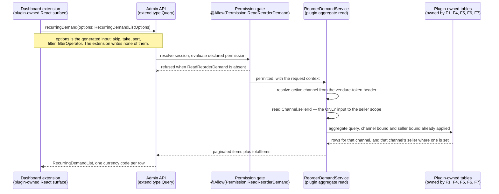

# FEATURE-001-08: Expose recurring reorder demand to sellers, category managers and support agents through three server-scoped, permission-gated Admin API reads over rows owned elsewhere, so that each administrative persona answers its own question without a new table

Parent epic: `tickets/EPIC-001-reorder-and-replenishment.md`. The parent epic and the sibling features are written as backticked paths rather than as links, following the epic's own convention of keeping the link count in a file equal to the number of children that file indexes [tickets/EPIC-001-reorder-and-replenishment.md:§3. How To Read This Epic]. The only links in this file are the three story links in section 3.

This file is not on the epic's curated read path [tickets/EPIC-001-reorder-and-replenishment.md:§3. How To Read This Epic]. It is the last feature in dependency order and the only one that **owns no storage at all**, which is why it answers exactly one question: **who may look at recurring reorder demand, what they are allowed to see, and which already-existing rows they are looking at.** How those rows come to exist belongs to FEATURE-001-01, FEATURE-001-04, FEATURE-001-05, FEATURE-001-06 and FEATURE-001-07, and is not restated here.

---

## 1. Feature Title

**Expose recurring reorder demand to sellers, category managers and support agents through three server-scoped, permission-gated Admin API reads over rows owned elsewhere, so that each administrative persona answers its own question without a new table.**

Short name, used verbatim wherever this feature is referred to in one phrase, and identical to the label the epic's features index gives it: **Recurring-Demand Visibility for Sellers, Category Managers and Support** [tickets/EPIC-001-reorder-and-replenishment.md:§4. Features Index]. The long form above is the action-object-outcome title this tier requires; the short form is the name to cite.

**On the word "server-scoped" in the title, because the obvious alternative would be wrong.** All three reads are scoped **server-side**, and that is what they have in common; they are not all *seller*-scoped. **Three different scopes are in play and section 2.7 fixes each one separately:** story 08-02 is scoped to the caller's own seller, story 08-01 is scoped to a category, and story 08-03 is scoped to one named buyer at a time. Calling the set "seller-scoped" would describe one story of the three and would quietly imply that a support agent's lookup is bounded by a seller, which it is not.

The file slug is `recurring-demand-visibility`, shorter than both forms of the title. That is fixed by the epic's own features index, which links to this exact filename [tickets/EPIC-001-reorder-and-replenishment.md:§4. Features Index], and the sibling story directory `FEATURE-001-08/` carries no slug at all. Neither is renamed.

Delivery is part of the single self-contained plugin package the epic describes — `packages/reorder-plugin/`, exporting `ReorderPlugin`. No file under `packages/core` or `packages/admin-ui` is edited to deliver it, and section 2.15 states why a dashboard extension is not a change to `packages/admin-ui`.

---

## 2. Feature Summary

### 2.1 The Capability

Three administrative reads over reorder activity that has already been recorded: **demand across a category**, **demand restricted to a seller's own variants**, and **a per-buyer lookup a support agent uses to answer "what happened when this buyer tried to reorder"**. Each read is a permission-gated Admin API query, each is scoped server-side before a row is returned, and each is surfaced in the dashboard through the extension mechanism this repository already ships.

### 2.2 Contribution To The Epic, And The Expanded Rationale

This feature is part of the epic's batch **B5**, which depends on batches B2 and B4 [tickets/EPIC-001-reorder-and-replenishment.md:§9.4 Run Batches], and **inside that batch it is gated behind the story that creates the tables it reads** [tickets/EPIC-001-reorder-and-replenishment.md:§9.4.1 Batch B5 Is Sequenced Internally, And The Gates Are Named]. **That gate is the reason the sequencing is stated at story granularity rather than left to the batch table.** All three of this feature's stories read `ReorderAttempt` and `ReorderAttemptLine`, which STORY-001-07-01 creates, and 08-03 additionally reads `ReorderListShare`, which the FEATURE-001-06 share stories create — the epic's two named B5 gates exactly. Without them the three stories assigned to a developer working in parallel would be compiling against tables that had not yet merged. It owns the final step of the returning-buyer journey — the step at which recorded reorder activity becomes visible to sellers, category managers and support [tickets/EPIC-001-reorder-and-replenishment.md:§2.5 The Returning-Buyer Journey This Epic Builds] — and it is the only feature in the epic with no outbound edge at all.

The epic classifies this feature's deviation from its originally suggested area as **expanded**: the suggested area was seller and category-manager visibility, and the Customer Support Agent read path was absorbed into it [tickets/EPIC-001-reorder-and-replenishment.md:§4. Features Index]. The rationale is a de-duplication argument, and it has to be stated accurately because the convenient short form is false.

**What is not shared, stated first.** The support lookup is **not** the same read as the two demand views. It calls **two different operations** — `customerReorderLists` and `reorderAttempts` rather than `recurringDemand` (section 2.5) — over a **partly different table set**: it reads `ReorderList`, `ReorderListLine` and `ReorderListShare`, which the demand views never touch, and it does not read `PurchaseCadence` or `SubstitutionCandidate`, which they do (section 2.3). It is also not an aggregate at all: it returns rows about one named buyer, where the demand views return grouped counts across many. **"All three personas read the same aggregate over the same tables" would therefore be wrong on the operation, on the table set and on the shape**, and this file does not lean on it.
**What is actually shared, which is what carries the decision — five pieces of wiring and one table pair.** A separate support feature would duplicate every one of them:
- **The plugin service class.** All three reads live on `ReorderDemandService` (section 2.4), so there is one place the database work is written and one place a reviewer inspects it.
- **The permission registration.** One administrative definition is registered once and gates all three reads, with the support pair additionally requiring an existing platform permission (section 2.8). A second feature would register a second definition and grow the published enum again.
- **The generated list-options consumption.** Every paginated read here consumes the same generated input rather than hand-writing sort and filter types (section 2.6), and the prohibition against hand-writing them would otherwise have to be restated and re-verified in two features.
- **The dashboard extension and everything under it.** One plugin dashboard entry point, one bundling configuration entry and one internationalisation catalogue entry serve all three surfaces (section 2.12). This is the largest single duplication a split would cause, and it is the reason all three stories share one owner.
- **The server-side scoping contract.** The rule that a scope is composed from the caller's own identity and never from an argument is one contract applied three ways (section 2.7). Split across two features it becomes two contracts that can drift.
- **One shared table pair.** `ReorderAttempt` and `ReorderAttemptLine` are read by all three stories — as the activity half of the aggregate in 08-01 and 08-02, and as the "what happened" answer in 08-03 (section 2.3). That is the extent of the shared data, and it is one pair rather than a table set.
**Two consequences follow, and both are narrower than the loose rationale would have implied:**
- **The permission model is designed once, but it is not one permission for everything.** A single definition is registered here; the buyer-facing support reads are additionally gated because they return personal data that a demand view does not. Section 2.8 states the shape and the reason.
- **The scoping predicate is implemented in one place, but it is not one predicate.** A category manager, a seller operations manager and a support agent differ in *what they may see*; what they share is *where the filter is applied*. Section 2.7 fixes that as a contract and enumerates the three scopes separately.
- **The permission model, by contrast, is deliberately *not* designed once, and the asymmetry is the point.** Sharing one resolver and one filter location is a de-duplication win; sharing one permission would be a privilege-escalation defect. The three reads divide into two capabilities of different sensitivity — an aggregate over trading activity, and a named buyer's own lists and attempt history — so section 2.8 registers **two** definitions and keeps them apart. A single definition would mean any role granted demand access could also invoke the buyer lookups, which is the one failure in this feature that hands a seller or category role a support agent's view of an individual customer.

Read the contribution precisely, because this feature only reads:

- **It writes nothing.** No mutation is added by this feature, and no row in any table is created, updated or deleted by any of its three operations.
- **It computes no cadence.** Interval arithmetic belongs to FEATURE-001-05 [tickets/EPIC-001/FEATURE-001-05-purchase-cadence-and-replenishment.md:§2.1 The Capability].
- **It records no attempt.** The audit rows are written by FEATURE-001-07, which states from its own side that they are read through this feature's Admin API surface [tickets/EPIC-001/FEATURE-001-07-reorder-instrumentation.md:§2.6 Named API Surfaces].
- **It curates nothing.** Substitution candidates are curated by FEATURE-001-04 through that feature's own two Admin operations [tickets/EPIC-001/FEATURE-001-04-unavailable-line-resolution.md:§2.7 Named API Surfaces]; this feature only reads what a curator left behind.
- **It changes nothing a buyer can observe.** Section 2.5 records that no Shop API operation is added, and section 2.14 states the four absences together.

### 2.3 Named Entities Touched — This Feature Owns No Table

**This feature introduces no entity and owns no table.** That is stated first because it is the single most consequential fact about it: every row this feature displays belongs to another feature, which is exactly why the epic places it last in dependency order and why its three stories are independent of one another (section 4.3).

**Plugin-owned tables read, never written, and owned elsewhere:**

- **`ReorderList` and `ReorderListLine` — owned by FEATURE-001-01.** The named list and its per-line quantity [tickets/EPIC-001/FEATURE-001-01-named-reorder-lists.md:§2.4 Named Entities Touched]. Read by story 08-03, which answers what lists a buyer holds.
- **`ReorderListShare` — owned by FEATURE-001-06.** The grant rows and their state. Read by story 08-03 so that a support agent can explain why a list the buyer does not own appears in their account; that feature records the same story-level edge from its own side [tickets/EPIC-001/FEATURE-001-06-buying-account-list-sharing.md:§4.2 Downstream — One Feature Depends On This One].
- **`PurchaseCadence` — owned by FEATURE-001-05.** The derived repurchase interval per customer, variant and channel [tickets/EPIC-001/FEATURE-001-05-purchase-cadence-and-replenishment.md:§2.3 Named Entities Touched]. Read by stories 08-01 and 08-02 as the recurrence half of the aggregate.
- **`ReorderAttempt` and `ReorderAttemptLine` — owned by FEATURE-001-07.** One attempt row and one row per requested line, carrying the per-line outcome code and, where the platform returned one, the exact error type name [tickets/EPIC-001/FEATURE-001-07-reorder-instrumentation.md:§2.4 Named Entities Touched]. Read by all three stories: as the activity half of the aggregate in 08-01 and 08-02, and as the "what happened" answer in 08-03.
- **`SubstitutionCandidate` — owned by FEATURE-001-04.** Read by story 08-01 where the category view surfaces which curated alternative was available for a variant a buyer could not have.

**Existing platform entities, read and never altered:**

- **`Seller`** [packages/core/src/entity/seller/seller.entity.ts:L18], whose own JSDoc defines it as the person or organisation selling the goods on a given `Channel` [packages/core/src/entity/seller/seller.entity.ts:L12]. Its `name` [packages/core/src/entity/seller/seller.entity.ts:L26] is the label an administrative row carries, and its `channels` relation [packages/core/src/entity/seller/seller.entity.ts:L31-L32] is the join this feature scopes through. It is soft-deletable [packages/core/src/entity/seller/seller.entity.ts:L24], so a deleted seller's rows are still present in the database and an aggregate must not silently attribute them to nobody.
- **`Channel`**, which supplies both the request scope and the seller link. `token` is the unique value read from the `vendure-token` request header [packages/core/src/entity/channel/channel.entity.ts:L62] as its own JSDoc states [packages/core/src/entity/channel/channel.entity.ts:L56-L60], `sellerId` [packages/core/src/entity/channel/channel.entity.ts:L71-L72] is the nullable identifier behind the channel's `seller` relation [packages/core/src/entity/channel/channel.entity.ts:L68-L69], and `productVariants` is a many-to-many relation [packages/core/src/entity/channel/channel.entity.ts:L118-L119] — which is why the seller predicate in section 2.7 resolves a variant to a seller *through a channel* rather than reading a seller column off the variant, because no such column exists.
- **`Customer`** [packages/core/src/entity/customer/customer.entity.ts:L23], the subject of story 08-03's lookup. Its `emailAddress` [packages/core/src/entity/customer/customer.entity.ts:L42] is the handle a support agent searches on, and its `groups` relation [packages/core/src/entity/customer/customer.entity.ts:L44-L46] is what a buying account is modelled through. It is soft-deletable [packages/core/src/entity/customer/customer.entity.ts:L28-L29], so a support lookup can legitimately resolve a customer whose rows remain while the customer is marked deleted, and that is a state story 08-03 must state rather than discover.
- **`ProductVariant`**, the subject of every aggregate row. This feature reads the identifier and the variant's channel membership; it asserts nothing about price, stock or enabled state, all of which belong to FEATURE-001-03 and FEATURE-001-04.
- **`Order`**, read only for the buyer-facing reference recorded on an attempt. `code` is uniquely indexed and its own JSDoc directs that it be used as the order reference for customers rather than the order's id [packages/core/src/entity/order/order.entity.ts:L62-L67], which is precisely why story 08-03 searches on it [tickets/EPIC-001/FEATURE-001-07-reorder-instrumentation.md:§4.2 Downstream — Two Consumers, All One-Way].
- **`Order`**, and it is read **less** than a reader would expect, which is deliberate. `code` is uniquely indexed and its own JSDoc directs that it be used as the order reference for customers rather than the order's id [packages/core/src/entity/order/order.entity.ts:L62-L67], which is why it is the handle story 08-03 searches on. **The search is not a join to this table, though.** The upstream feature records the code as a snapshot column on the attempt row precisely so that the lookup remains a predicate on plugin-owned tables [tickets/EPIC-001/FEATURE-001-07-reorder-instrumentation.md:§2.4 Named Entities Touched], and story 08-03 therefore filters on that column. This entity is read only to resolve the referenced order for display where it still exists — **and where it does not, the attempt is still returned, with the referenced order reported as unavailable rather than the attempt being omitted or the query failing** [tickets/EPIC-001/FEATURE-001-07-reorder-instrumentation.md:§4.2 Downstream — Two Consumers, All One-Way, And One Feature That Is Not A Consumer]. An order a deployment has removed is a reachable state, not a hypothetical one, and a support lookup that hid an attempt because its source order was gone would hide exactly the attempt an agent is investigating.

**No column is added to any table, plugin-owned or core, and no custom field is declared on any core entity.** The dev-server configuration's empty custom-fields object [packages/dev-server/dev-config.ts:L116] is still empty once this feature ships.

### 2.4 Named Services

- **`ReorderDemandService` — new, plugin-owned, and the only new class this feature contributes to the persistence layer.** It holds all three reads, expresses each as a **database aggregate** rather than an in-process reduction over every line, and applies the scope predicate in section 2.7 before any row leaves it. **A correction belongs here rather than in a footnote**: an earlier draft justified the aggregate by citing the load-testing harness's dataset as ten thousand orders each carrying ten lines. That figure is what the harness's own comment claims and is not what its code produces — the epic carries the correction and the evidence [tickets/EPIC-001-reorder-and-replenishment.md:§7.6 Data-Volume Assumptions And The Benchmark Workflow], and no volume figure is asserted here in its place. The reason for a database aggregate does not depend on a volume claim anyway, and stating it without one is the stronger form: an in-process reduction loads every line row it reduces, so its cost grows with the table while an aggregate's grows with the window in section 2.6.2 — that is a difference in shape, not in magnitude, and it holds at every size. Because all three stories delegate to it, there is exactly one place where the scope filter is implemented and exactly one place a reviewer inspects.
- **`TransactionalConnection` — existing, consumed, never modified.** Every read is issued through it, which is how the aggregate is expressed as a query builder against plugin-owned tables rather than as entity loading followed by array work. The epic names it as the persistence dependency for all plugin-owned state [tickets/EPIC-001-reorder-and-replenishment.md:§7.4 Existing Entities And Services The Work Depends On].
- **`ChannelService` and `ProductVariantService` — existing, consumed, never modified.** The first resolves the active channel from the request so the scope predicate has a channel to bind to; the second resolves variants for display without this feature reaching into the catalogue tables itself.
  - **Display hydration is one bulk call per page, never one call per row.** `findByIds` takes an array of identifiers [packages/core/src/service/services/product-variant.service.ts:L150] and resolves them in-channel in a single query [packages/core/src/service/services/product-variant.service.ts:L152], so **the entire page of aggregate rows is hydrated by one call** made after the aggregate has returned and paginated. A lookup per row is prohibited, and the prohibition is testable rather than advisory: **the story asserts the variant-read count is one for a page of any size**, because a page of one row cannot tell a bulk hydration from a per-row one. Duplicate identifiers across rows are collapsed before the call, so the argument array carries distinct identifiers only.
- **No core service is modified, and none is extended.** This feature calls no write method on any core service, because it performs no write. In particular it does not touch `OrderService`, which FEATURE-001-02 and FEATURE-001-07 consume [tickets/EPIC-001/FEATURE-001-07-reorder-instrumentation.md:§2.5 Named Services].

### 2.5 Named API Surfaces — Three New Admin API Operations, Zero Shop API Change

All three arrive through the plugin's `adminApiExtensions`, using `extend type Query` — the mechanism the shipped reviews plugin already demonstrates alongside its shop extensions [packages/dev-server/test-plugins/reviews/reviews-plugin.ts:L14-L21]. Because each operation is an addition to an existing root type rather than a change to an existing field, **no existing operation's arguments or return type changes.**

The three queries, and the story that owns each:

- **`recurringDemand`** — the aggregate over recorded reorder activity, paginated, sorted and filtered through the generated list options described in section 2.6. Read by a Marketplace Category Manager in story 08-01 and by a Seller Operations Manager in story 08-02; **the two stories differ in the scope predicate applied, not in the operation called.** That is a deliberate design choice and section 2.7 explains what makes it safe.
- **`customerReorderLists`** — the support lookup that returns the lists a named buyer holds, including lists reached through an unrevoked grant, **paginated**. Read by a Customer Support Agent in story 08-03.
- **`reorderAttempts`** — the support lookup that returns recorded attempts and their per-line outcomes, addressable by the buyer's identity or by the order code recorded on the attempt, **paginated and bounded by the aggregate window**. Read by a Customer Support Agent in story 08-03.
**All three are paginated. Not "paginated if chosen" — an earlier draft made it conditional for the two support reads and that conditionality is withdrawn here**, because the epic's rule admits no exception and lists all three of this feature's surfaces by name [tickets/EPIC-001-reorder-and-replenishment.md:§7.7 Bounded Collections]. Each returns a type implementing `PaginatedList` [packages/core/src/api/schema/common/common-types.graphql:L9] with the configured Admin maximum — default one thousand [packages/core/src/config/vendure-config.ts:L159] — enforced, an omitted page resolving to that maximum rather than to every row, an over-limit page refused rather than silently clamped, and `ignoreQueryLimits` never set. Section 2.6.1 states *how* those options are applied, which is the part a schema declaration does not deliver on its own.
**And the nested collections are bounded too, which is the part pagination on the outer list does not reach.** A page of one thousand attempts each carrying its own per-line outcomes is bounded on attempts and unbounded on lines, so:
- **An attempt's per-line outcomes are bounded by FEATURE-001-02's decided source-size maximum**, because that is what bounded the write in the first place [tickets/EPIC-001/FEATURE-001-07-reorder-instrumentation.md:§2.5.1 The Write Shape And Its Transaction Boundary — The Part Most Likely To Be Got Wrong]. The bound is inherited rather than newly invented, and it is the reason this nested collection can be returned whole rather than paginated.
- **A buyer's list lines are bounded by the decided lines-per-list maximum**, and the list count itself by the lists-per-customer maximum [tickets/EPIC-001-reorder-and-replenishment.md:§8.1 Product Decisions]. Where a maximum has not yet been decided, the nested collection is paginated instead — the two are alternatives and one of them must hold, which is what section 4.5 separates.
- **`reorderAttempts` is not a lifetime read.** Without a window it walks every attempt ever recorded for that buyer, and the keep period that would otherwise bound the table is itself undecided [tickets/EPIC-001-reorder-and-replenishment.md:§8.2 Architectural Decisions]. So the same window that bounds the aggregate bounds this read, with the window stated in the response so a support agent knows what they are and are not looking at rather than inferring completeness from an absence.

**No Shop API operation is added by this feature. None.** No buyer reads an aggregate, and no storefront surface changes. The additive-only constraint therefore takes its strongest available form here on the buyer-facing side: the Shop API root `Query` type declares nineteen root queries [packages/core/src/api/schema/shop-api/shop.api.graphql:L1-L52], and every one of those signatures, together with the order, cart and customer-account mutation sets in the same file, is byte-identical after this feature ships — because this feature adds nothing to that file's surface at all.

**These three are exactly three of the epic's five new Admin API operations.** The other two, `substitutionCandidates` and `setSubstitutionCandidates`, belong to FEATURE-001-04 [tickets/EPIC-001/FEATURE-001-04-unavailable-line-resolution.md:§2.7 Named API Surfaces]. The two features between them account for the whole administrative surface the epic proposes, and neither adds an operation the other also claims. Stating the split here means a reader tallying the epic's operation count against its features finds five and not six.

**Every proposed name is free in this checkout, and the evidence is a search anybody can repeat rather than a citation of a name that happens to be present.** The subject searched is the checked-in Admin API introspection snapshot — a single-document snapshot of the published schema [schema-admin.json:__schema] — and the search was for the quoted names `"recurringDemand"`, `"customerReorderLists"`, `"reorderAttempts"`, `"RecurringDemand"` and `"ReorderAttempt"`. **Each returns zero occurrences**, in that snapshot and in the Shop API snapshot alongside it. A pointer at an unrelated name that *is* present would prove the file was read and nothing about the names proposed, which is why the reproducible form is used instead: `grep -c '"recurringDemand"' schema-admin.json` and its four siblings, each expected to print `0`. Nothing here collides with a published name.

#### The exact SDL, published here so no story invents it

A review of this file found that naming three operations and describing their rows in prose is not a contract: three stories, one of them shipping a dashboard page that types its query variables against these names, cannot be built from a description. The whole of this feature's published surface therefore follows. **It is complete: nothing below is added by a story, and no story may add anything that is not below.**

Both schema documents are separate, which is the first thing this block depends on. A plugin declares `adminApiExtensions` and `shopApiExtensions` as two distinct schemas with two distinct resolver sets — the reviews plugin does exactly that [packages/dev-server/test-plugins/reviews/reviews-plugin.ts:L14-L21]. So the Admin-side row types below are **not** the Shop-side types FEATURE-001-01 and FEATURE-001-02 publish, even where a name is similar, and a type declared only in the Shop schema is absent from the Admin schema. That separation is not a nuisance here; it is the mechanism that lets the Admin projections carry strictly less than the buyer's own view, which is what section 2.10's data-minimisation rule requires.

```graphql
# adminApiExtensions — the complete published surface of FEATURE-001-08.
# Zero shopApiExtensions. Zero changes to any existing Admin operation.

extend type Query {
  "The aggregate. Scope is derived server-side from the active channel (section 2.7)."
  recurringDemand(options: RecurringDemandListOptions): RecurringDemandList!

  "Support lookup. Bound by a required customerId — there is no unaddressed form."
  customerReorderLists(
    customerId: ID!
    options: AdminReorderListSummaryListOptions
  ): AdminReorderListSummaryList!

  "Support lookup. Bound by a filter on customerId or sourceOrderCode (see below)."
  reorderAttempts(options: ReorderAttemptSummaryListOptions): ReorderAttemptSummaryList!
}

"One variant's recurring demand in one channel over the aggregate window."
type RecurringDemand {
  "Scalar, so the generated filter carries IDOperators. This is why it is not only a relation."
  productVariantId: ID!
  "Object-typed, so the generator produces NO filter for it. Deliberate, not an oversight."
  productVariant: ProductVariant
  productVariantName: String!
  sku: String!
  "The seller owning the variant's channel, or null on a channel with no seller."
  sellerId: ID
  reorderAttemptCount: Int!
  reorderedUnitCount: Int!
  distinctCustomerCount: Int!
  savedListOccurrenceCount: Int!
  firstReorderedAt: DateTime
  lastReorderedAt: DateTime
}

type RecurringDemandList implements PaginatedList {
  items: [RecurringDemand!]!
  totalItems: Int!
}

"One reorder list held by the looked-up buyer. A summary, not the buyer's own list type."
type AdminReorderListSummary {
  id: ID!
  name: String!
  "OWNED or SHARED. A shared list is reached through an unrevoked grant."
  access: ReorderListAccess!
  lineCount: Int!
  createdAt: DateTime!
  updatedAt: DateTime!
}

type AdminReorderListSummaryList implements PaginatedList {
  items: [AdminReorderListSummary!]!
  totalItems: Int!
}

"One recorded reorder attempt. Columns are the audit row's, projected."
type ReorderAttemptSummary {
  id: ID!
  createdAt: DateTime!
  "Scalar and filterable — one of the two ways this lookup may be addressed."
  customerId: ID
  channelId: ID!
  languageCode: LanguageCode!
  sourceType: ReorderSourceType!
  "Scalar and filterable — the other way this lookup may be addressed."
  sourceOrderCode: String
  targetOrderId: ID!
  outcome: ReorderAttemptOutcome!
  requestedLineCount: Int!
  appliedLineCount: Int!
  rejectedLineCount: Int!
  lines: [ReorderAttemptLineSummary!]!
}

"One requested line of one attempt, keyed by the plugin-assigned index."
type ReorderAttemptLineSummary {
  requestIndex: Int!
  productVariantId: ID
  productVariantName: String
  requestedQuantity: Int!
  appliedQuantity: Int!
  outcome: ReorderLineOutcomeCode!
  "The exact ErrorCode member name recorded on the row, or null."
  errorCode: String
  quantityAvailable: Int
  unitPrice: Money
  currencyCode: CurrencyCode
}

type ReorderAttemptSummaryList implements PaginatedList {
  items: [ReorderAttemptSummary!]!
  totalItems: Int!
}

# Admin-side declarations of enums the Shop schema also declares. Two schemas, so both
# need them; this is not a redeclaration within one schema.
enum ReorderSourceType { ORDER, REORDER_LIST }
enum ReorderAttemptOutcome { APPLIED_IN_FULL, APPLIED_IN_PART, APPLIED_NOTHING }
enum ReorderListAccess { OWNED, SHARED }
enum ReorderLineOutcomeCode {
  ADDED
  ADDED_AT_REDUCED_QUANTITY
  NOT_ADDED_OUT_OF_STOCK
  NOT_ADDED_VARIANT_UNAVAILABLE
  NOT_ADDED_LIMIT_REACHED
  NOT_ADDED_INTERCEPTED
  NOT_ADDED_INVALID_QUANTITY
  SKIPPED_BY_RESOLUTION
  SUBSTITUTED
}

# Auto-generated at runtime. Declared with no fields at all, exactly as core does for
# SellerListOptions and as the reviews plugin does for ProductReviewListOptions.
# Hand-writing a sort or filter parameter for any of these three is a defect at review.
input RecurringDemandListOptions
input AdminReorderListSummaryListOptions
input ReorderAttemptSummaryListOptions
```

**Nine readings of that SDL are load-bearing, and each is a consequence of the generator rather than a preference.**

- **Every list type is named `${RowType}List`, and that is a hard requirement, not a convention.** The generator derives the row type by stripping a trailing `List` from the query's return type and then looks that name up in the schema [packages/core/src/api/config/generate-list-options.ts:L52-L53]; if the lookup fails or the result is not an object type, it generates nothing at all [packages/core/src/api/config/generate-list-options.ts:L54]. **A review of the epic's own symbol inventory found it naming this feature's third list type `ReorderAttemptList` while naming its row type `ReorderAttemptSummary`** — a pair that strips to `ReorderAttempt`, a name no Admin SDL declares, so the generator would silently skip it and the operation would ship with an empty options input: no `skip`, no `take`, no `sort`, no `filter`. The schema still builds, which is what makes this worth catching in a ticket rather than in review — **it is a defect that compiles.** The name is corrected to `ReorderAttemptSummaryList` here and in the epic.
- **`productVariantId` is a scalar field beside the `productVariant` relation, and both are needed.** The filter generator returns `IDOperators` for an `ID` field [packages/core/src/api/config/generate-list-options.ts:L189-L190] but returns nothing for anything its switch does not recognise [packages/core/src/api/config/generate-list-options.ts:L191-L192], which is every object type. So a row carrying only the relation is unfilterable by variant. The scalar is what makes "show me demand for this variant" expressible.
- **List-typed fields get no filter either** [packages/core/src/api/config/generate-list-options.ts:L172-L173], which is why `lines` on the attempt summary is a projection to read and never a thing to filter on. A support agent filters attempts and then reads their lines.
- **Every field intended to be sortable is one of six types.** The sortable set is `ID`, `String`, `Int`, `Float`, `DateTime` and `Money` [packages/core/src/api/config/generate-list-options.ts:L130]. Every count above is `Int`, every timestamp is `DateTime`, `unitPrice` is `Money`, and that is why `lastReorderedAt` and `reorderedUnitCount` are sortable without this feature writing a sort parameter.
- **Enum fields become string-filterable automatically** [packages/core/src/api/config/generate-list-options.ts:L175-L176], so `outcome` on both row types is filterable without being declared as a `String`.
- **The empty input stubs are merged rather than replaced.** The generator folds any fields an existing options input declares into the generated one [packages/core/src/api/config/generate-list-options.ts:L83], so declaring the stub empty adds nothing and loses nothing — and declaring `skip` or `take` in it would duplicate what the generator already adds [packages/core/src/api/config/generate-list-options.ts:L63] and [packages/core/src/api/config/generate-list-options.ts:L67].
- **`customerReorderLists` keeps its `customerId` argument.** The generator appends the options argument to whatever arguments a query already declares and skips the append entirely if an argument of the options type is already present [packages/core/src/api/config/generate-list-options.ts:L87-L99], so a required sibling argument survives. This is what lets the buyer identity be **unomittable** rather than merely conventional.
- **`errorCode` is a `String`, not the `ErrorCode` enum, and the difference is deliberate.** FEATURE-001-02 types the equivalent Shop field as the platform enum [tickets/EPIC-001/FEATURE-001-02-reorder-from-order-history.md:§2.5 Named API Surfaces]. Here the value is read back from a `varchar` column recorded at attempt time [tickets/EPIC-001/FEATURE-001-07-reorder-instrumentation.md:§2.4 Named Entities Touched], and a historical row may name an error type a later deployment no longer declares. Typing it as the enum would make a stored value unrepresentable and fail the whole row; typing it as `String` reports the audit trail as recorded. **An audit read must not be able to fail on account of its own history.**
- **Every column projected above exists on the rows FEATURE-001-07 declares**, and the pairing was checked field by field rather than assumed: `sourceOrderCode`, `outcome`, `requestedLineCount`, `appliedLineCount` and `rejectedLineCount` on the attempt [tickets/EPIC-001/FEATURE-001-07-reorder-instrumentation.md:§2.4 Named Entities Touched], and `requestIndex`, `requestedQuantity`, `appliedQuantity`, `outcome`, `errorCode`, `quantityAvailable`, `unitPrice` and `currencyCode` on the line. `ReorderLineOutcomeCode`'s nine members are FEATURE-001-02's, reproduced and not extended [tickets/EPIC-001/FEATURE-001-02-reorder-from-order-history.md:§2.5 Named API Surfaces].

**Collision check, run against both snapshots rather than assumed.** All fourteen new Admin names above — `RecurringDemand`, `RecurringDemandList`, `RecurringDemandListOptions`, `AdminReorderListSummary`, `AdminReorderListSummaryList`, `AdminReorderListSummaryListOptions`, `ReorderAttemptSummary`, `ReorderAttemptSummaryList`, `ReorderAttemptSummaryListOptions`, `ReorderAttemptLineSummary`, `ReorderSourceType`, `ReorderAttemptOutcome`, `ReorderListAccess` and `ReorderLineOutcomeCode` — are absent from the Admin snapshot's type list, and the three query names are absent from its root `Query` type [schema-admin.json:Seller]. `Money`, `CurrencyCode`, `LanguageCode`, `DateTime`, `ProductVariant`, `PaginatedList`, `SortOrder` and `LogicalOperator` are all existing published names this SDL consumes rather than declares [schema-admin.json:CurrencyCode].

#### 2.5.1 Surface Ownership And Test Matrix — And Why The Backend Suite Comes First

Every surface this feature adds, with the one story that owns it and the tests it is accepted against. The epic requires one matrix per feature [tickets/EPIC-001-reorder-and-replenishment.md:§12. Definition of Done (Epic-Level)] and section 5 gates it.

**This feature's matrix carries an ordering constraint the others do not, and section 2.12 is why.** All three stories ship a dashboard surface, and neither dashboard gating job fires on a change confined to a plugin package [.github/workflows/build_and_test.yml:L66-L70]. So a dashboard check is a human check here, and **the backend suite is the only automated evidence that exists for any of these three reads.** It therefore runs first and gates the dashboard work rather than accompanying it: a demand view that renders beautifully over a wrong aggregate is worse than one that does not render, because the first one gets believed.

| # | Surface added | Owning story | Unit cases | End-to-end cases through `@vendure/testing`, on all four engine jobs | Named regression evidence |
|---|---------------|--------------|-----------|--------------------------------------------------------------------|--------------------------|
| 1 | `recurringDemand` — the aggregate itself | STORY-001-08-01 | The grouping key is the variant, the channel and the currency code; a total spans one currency code only; the recurring threshold is read from the option rather than hard-coded | **Correctness against a fixture whose expected numbers are computed by hand, not by re-running the query** — a known set of attempts and lines for known variants yielding a known ranked result; **two-buyer isolation**, where two buyers' activity on the same variant aggregates to one row with the summed quantity and neither buyer's rows appear separately; **cross-currency grouping**, where the same variant purchased under two currency codes yields two rows and never one summed row; and **the window boundary**, where activity outside the window is absent and activity inside it is present | The existing `packages/core/e2e/` order specifications pass unmodified; this feature writes nothing |
| 2 | `recurringDemand` — its list-options application | STORY-001-08-01 | Each of `skip`, `take`, `sort`, `filter` and the filter-combination operator maps to its clause; `totalItems` is a separate count | **Six behavioural cases, none of which a schema assertion can cover**: a `skip` that moves the window; a `take` that changes the page size; a `sort` in each direction over more than one column, with the tie-break proving a paged read neither repeats nor skips a row; a `filter` that excludes rows; two filters combined under each member of the combination enum; and a `take` above the configured Admin maximum **refused with the platform's own error rather than clamped** | — |
| 3 | `recurringDemand` — its read shape | STORY-001-08-01 | The aggregate is one query; display hydration is one `findByIds` call | **The variant-read count is one for a page of any size**, asserted at a page larger than one because a single-row page cannot distinguish bulk hydration from a per-row lookup; and the query plan captured once per engine showing the window predicate resolved through an index range scan | The epic's aggregate benchmark scenario captured with the window and with a deliberately wider window [tickets/EPIC-001-reorder-and-replenishment.md:§7.6 Data-Volume Assumptions And The Benchmark Workflow] |
| 4 | The seller scope predicate | STORY-001-08-02 | One predicate, one implementation, applied before any row leaves the service | A fixture with populated rows for **at least two sellers**: the first seller's request returns only its own rows and **exactly zero** of the second's; a caller with no resolvable seller receives no rows rather than all rows; and a category manager's unscoped request returns rows spanning both sellers, which is what proves the two stories differ in predicate and not in operation | — |
| 5 | `customerReorderLists` | STORY-001-08-03 | Lists reached through an unrevoked grant are included and revoked grants are excluded; the nested line collection is bounded or paginated | Paginated with the Admin maximum enforced, an omitted page resolving to that maximum and an over-limit page refused; an unauthenticated request refused; a request without the permission refused; **a token for another channel returning that channel's rows only**; a buyer with no list yielding an empty page rather than an error | FEATURE-001-01's own read specifications pass unmodified — this feature reads its tables and changes neither |
| 6 | `reorderAttempts` | STORY-001-08-03 | Addressable by buyer identity and by the order code recorded on the attempt; the per-line outcome collection is bounded by the source maximum | Paginated and **window-bounded, with the window stated in the response**; the same four authorisation and channel negatives as row 5; an attempt whose customer was soft-deleted afterwards still resolvable [tickets/EPIC-001/FEATURE-001-07-reorder-instrumentation.md:§2.13 Privacy And How Long An Audit Row Is Kept — No Policy Is Declared Anywhere]; and an attempt with zero applied lines distinguishable from one with none recorded | FEATURE-001-07's own specifications pass unmodified |
| 7 | The three dashboard surfaces | 08-01, 08-02, 08-03 | — | **Gated behind rows 1 to 6 passing**, then visual verification in the running dashboard and catalogue synchronisation, with the two qualifications in section 2.12 honoured rather than assumed away | The stale dashboard-bundle reset performed first, per section 2.12 |

Four rules keep this matrix honest.

- **The schema is never evidence.** `generateListOptions` produces arguments and applies none of them [tickets/EPIC-001/FEATURE-001-08-recurring-demand-visibility.md:§2.6.1 The Generator Produces Arguments. Something Still Has To Apply Them.], so a grep for `skip` and `take` in the schema passes against a resolver that ignores both. Every row above is a behavioural case.
- **Expected aggregate numbers are computed independently of the implementation.** A fixture whose expectations come from running the query proves the query is deterministic and nothing else.
- **Every case runs on all four engine jobs.** An aggregate is the part of this epic most likely to be written in one engine's dialect: grouping, ordering and any arithmetic in it must be expressed in a form `e2e-sqljs` [.github/workflows/build_and_test.yml:L174], `e2e-mariadb` [.github/workflows/build_and_test.yml:L202], `e2e-mysql` [.github/workflows/build_and_test.yml:L240] and `e2e-postgres` [.github/workflows/build_and_test.yml:L276] all accept, and **running it on all four is the only thing that establishes that** — no claim of portability is made here on any other basis, and native SQLite stays named as an unverified engine [packages/testing/src/index.ts:L10-L12].
- **A row with no owning story blocks the feature.** If a surface is added during implementation that no row lists, the matrix is extended and a story is named before it merges.

### 2.6 The Existing Mechanism This Feature Consumes Rather Than Rebuilds

The epic's do-not-duplicate inventory assigns this feature one mechanism, with a prohibition attached: `generateListOptions` [packages/core/src/api/config/generate-list-options.ts:L31-L60], and **no hand-writing of filter or sort input types for the recurring-demand aggregate — return a `PaginatedList` type and let the generator produce the options input** [tickets/EPIC-001-reorder-and-replenishment.md:§5. Existing Mechanisms That Must Not Be Duplicated].

#### The mechanism, read rather than assumed

The generator's own JSDoc states its trigger condition in one sentence: it generates `ListOptions` inputs for queries which return `PaginatedList` types [packages/core/src/api/config/generate-list-options.ts:L31-L33], and it is exported as a single function over a schema [packages/core/src/api/config/generate-list-options.ts:L34]. What it produces is not a stub. For each qualifying field it derives the target type name, builds a sort parameter and a filter parameter, and assembles an input named `${targetTypeName}ListOptions` [packages/core/src/api/config/generate-list-options.ts:L58-L61] carrying `skip` [packages/core/src/api/config/generate-list-options.ts:L63], `take` [packages/core/src/api/config/generate-list-options.ts:L67], `sort` [packages/core/src/api/config/generate-list-options.ts:L68], `filter` [packages/core/src/api/config/generate-list-options.ts:L72] and a filter-combination operator [packages/core/src/api/config/generate-list-options.ts:L75] resolved against the existing `LogicalOperator` enum [packages/core/src/api/config/generate-list-options.ts:L40], whose two members are declared in the shared enum file [packages/core/src/api/schema/common/common-enums.graphql:L32-L35]. Sort direction comes from the existing `SortOrder` enum [packages/core/src/api/schema/common/common-enums.graphql:L23-L26]. It even adds the options argument to the query if the query does not already declare one [packages/core/src/api/config/generate-list-options.ts:L87].

**The obligation on this feature, stated as a rule.** **All three of its queries are paginated** — `recurringDemand`, `customerReorderLists` and `reorderAttempts`, with no conditionality, per section 2.5 — and each declares a return type implementing `PaginatedList` and an **empty** `${TargetType}ListOptions` input, and hand-writes no sort parameter, no filter parameter, no `skip`, no `take` and no filter-combination operator. A hand-written sort or filter input for one of these three operations is a defect at review, not a stylistic choice.

#### The generator ordering — the citation that makes the rule a platform fact rather than a preference

Without the ordering, "consume the generated input" is advice. With it, it is a property of every boot. `buildSchemaFromVendureConfig` [packages/core/src/api/config/get-final-vendure-schema.ts:L87] merges plugin API extensions into the schema **first** [packages/core/src/api/config/get-final-vendure-schema.ts:L99] and only **then** runs `generateListOptions` [packages/core/src/api/config/get-final-vendure-schema.ts:L100], later `generateErrorCodeEnum` [packages/core/src/api/config/get-final-vendure-schema.ts:L107], and last of all `generatePermissionEnum` [packages/core/src/api/config/get-final-vendure-schema.ts:L116], all inside one function [packages/core/src/api/config/get-final-vendure-schema.ts:L87-L118].

Three consequences follow from that single ordering, and each is used elsewhere in this file:

- **A plugin-declared paginated type reaches the list-options generator.** This is what makes the rule above enforceable rather than aspirational: the plugin's types are already in the schema when the generator walks it.
- **A plugin-declared error result would reach the error-code generator.** This feature declares none, so it is named only to establish that the ordering is general (section 2.14).
- **A plugin-registered permission definition reaches the permission generator.** This is the mechanism behind the enum growth referenced in section 2.8.

#### Two shipped exemplars, one in core and one in a plugin

The idiom is not inferred from the generator; it is demonstrated twice in this checkout, and both demonstrations were read.

**In core, on the Seller type itself** — which is the closest possible analogue to this feature's own subject. The Admin API declares `sellers(options: SellerListOptions): SellerList!` [packages/core/src/api/schema/admin-api/seller.api.graphql:L2], declares `type SellerList implements PaginatedList` with just `items` and `totalItems` [packages/core/src/api/schema/admin-api/seller.api.graphql:L17-L20], and then declares the options input **with no fields at all** [packages/core/src/api/schema/admin-api/seller.api.graphql:L22]. The proof that the generator fills it is two-sided and empirical: `SellerSortParameter` and `SellerFilterParameter` appear nowhere in `packages/core/src/api/schema/`, yet both are present in the checked-in introspection snapshot [schema-admin.json:SellerSortParameter] and [schema-admin.json:SellerFilterParameter]. Something produced them between the source and the published schema, and the ordering above names it.

**In a plugin, with the intent written in a comment.** The reviews test plugin declares `type ProductReviewList implements PaginatedList` [packages/dev-server/test-plugins/reviews/api/api-extensions.ts:L29-L32] and then declares `input ProductReviewListOptions` under the comment `# Auto-generated at runtime` [packages/dev-server/test-plugins/reviews/api/api-extensions.ts:L44-L45]. Its Admin query consumes that input [packages/dev-server/test-plugins/reviews/api/api-extensions.ts:L70], and so does its dashboard list page, which types its query variable against the generated input rather than against anything the plugin wrote [packages/dev-server/test-plugins/reviews/dashboard/review-list.tsx:L12].

**That second exemplar is the one to copy**, because it is a plugin doing precisely what this feature must do: three lines of schema, an empty input, and a dashboard page consuming the generated result. **What it does not do is make the pagination work, and an earlier draft of this file claimed otherwise** — it said the pagination, sorting and filtering a category manager expects arrive without this feature designing any of it. That is false in a way worth being precise about, and section 2.6.1 is the correction.

#### 2.6.1 The Generator Produces Arguments. Something Still Has To Apply Them.

**The generator's own JSDoc says what it does, and it is narrower than it looks:** it generates `ListOptions` inputs for queries which return `PaginatedList` types [packages/core/src/api/config/generate-list-options.ts:L31-L33], and it adds the options argument to the query where one is not already declared [packages/core/src/api/config/generate-list-options.ts:L87]. That is a **schema** transformation. It produces the `skip`, `take`, `sort`, `filter` and filter-combination fields a client may send; it does not read them, does not translate them into SQL and does not enforce any limit. **A resolver can consume the generated input, ignore every field in it, and return every row — and the schema will look correct.** That is the failure this sub-section exists to make impossible to reach by accident, and it is also why a search of the schema files is not evidence for any of it.

Where the options are applied differs between the two support reads and the aggregate, and both paths are specified rather than one being left to follow the other.

- **The two support reads go through `ListQueryBuilder`, because they read entities.** The helper is the platform's own [packages/core/src/service/helpers/list-query-builder/list-query-builder.ts:L209] and its JSDoc gives the whole calling shape — build with the entity and the options, then resolve items and a total count together [packages/core/src/service/helpers/list-query-builder/list-query-builder.ts:L192-L198]. Consuming it brings the limit enforcement with it: the take limit is selected per API type from the configured values [packages/core/src/service/helpers/list-query-builder/list-query-builder.ts:L632-L636] and a request above it is **refused with the platform's own input error rather than quietly clamped** [packages/core/src/service/helpers/list-query-builder/list-query-builder.ts:L638]. `ignoreQueryLimits` stays false, and the reason is on the platform's own option [packages/core/src/service/helpers/list-query-builder/list-query-builder.ts:L125-L131].
- **The aggregate cannot go through it, and the reason is a type constraint rather than a preference.** `build` is declared over a type extending the platform's base entity class [packages/core/src/service/helpers/list-query-builder/list-query-builder.ts:L261], and a recurring-demand row is a grouped projection rather than a row of any table — there is no entity to build over. So `recurringDemand` maps the options explicitly, and **the mapping is specified here so that "explicitly" does not mean "however the implementer reads it"**:
  - `skip` becomes the query's row offset, clamped at zero from below, which is what the platform's own parser does [packages/core/src/service/helpers/list-query-builder/list-query-builder.ts:L640-L641].
  - `take` becomes the row limit, and a `take` above the configured Admin maximum [packages/core/src/config/vendure-config.ts:L159] is **refused with the same error the platform raises** [packages/core/src/service/helpers/list-query-builder/list-query-builder.ts:L638] rather than clamped, so a client learns its page was too large instead of silently receiving a smaller one. An omitted `take` resolves to that maximum.
  - `sort` becomes an ordering over an **allow-list of the aggregate's own output columns**, never an interpolated column name, and it always carries a final tie-break on a unique column — without one, two rows with equal demand order arbitrarily and a paged read can return the same row twice or skip one entirely, which is a correctness bug and not an aesthetic one.
  - `filter` becomes a parameterised predicate — never string concatenation — with the filter-combination operator honoured against the existing enum whose two members the shared schema declares [packages/core/src/api/schema/common/common-enums.graphql:L32-L35], and sort direction against the existing order enum [packages/core/src/api/schema/common/common-enums.graphql:L23-L26].
  - `totalItems` is a **separate count over the same predicate**, not the length of the returned page. A total equal to the page size is the signature of this mistake and a paginated response whose total is wrong is worse than one with no total at all.
- **Every one of those six behaviours is proved behaviourally, and the schema is not evidence for any of them.** Section 2.5.1 lists the cases: a `skip` that moves the window, a `take` that changes the page size, a `sort` in each direction over more than one column, a `filter` that excludes rows, two filters combined under each member of the combination enum, and a `take` above the Admin maximum refused. **A test that only asserts the arguments exist in the schema passes against a resolver that ignores all of them**, which is precisely the outcome this list rules out.

#### 2.6.2 Output Pagination Bounds The Response. The Window Bounds The Scan.

These are two different bounds and only one of them was previously stated. A page size of fifty bounds what crosses the wire; it does nothing about an aggregate that grouped every attempt line ever recorded in order to rank the top fifty. **The scan is bounded by a window, and the window is a decision rather than a phrase.**

- **The window is the epic's fourth product decision, together with what makes demand "recurring".** It records both as numbers that exist nowhere in this repository, and it names the reason the window matters more than it looks: output pagination bounds the response but not the scan [tickets/EPIC-001-reorder-and-replenishment.md:§8.1 Product Decisions]. The default page size is the epic's seventh architectural decision [tickets/EPIC-001-reorder-and-replenishment.md:§8.2 Architectural Decisions]. **No figure for any of the three appears in this file.**
- **What is buildable before those numbers land is the window as a parameter.** Every aggregate query takes a lower time bound and applies it in its `WHERE` clause, sourced from a plugin option; the option's *value* is the decision. So the indexed range scan, the query plan, the fixture and every option-application test in section 2.6.1 can be built and accepted now, and the one criterion that cannot be written is the boundary itself — "activity older than the window is excluded and activity inside it is included" needs the window to be a number.
- **The indexes the scan depends on are owned upstream, and depending on them silently would be the mistake.** The window predicate is over the channel and the creation timestamp of the attempt rows, which is exactly the composite index FEATURE-001-07 declares and requires to be present in its generated migration [tickets/EPIC-001/FEATURE-001-07-reorder-instrumentation.md:§2.4.1 The Index Contract — Named Here Because Every Consumer Of These Tables Reads Them By Predicate], together with its child index for the per-line join and its variant index. **This feature adds no table and therefore no index of its own, so it states its index dependency as a dependency** — section 4.4 carries it — and a new predicate here means a new index there, added with this reader named, in the same change.
- **The query plan is part of the contract, captured rather than assumed.** For each of the four engines that already has a job, the aggregate's plan is captured once and shows the window predicate resolved through an index range scan rather than a full table scan. This is a one-off artefact rather than a per-run assertion, because a plan is not stable enough to assert on every build — but capturing it is what turns "it uses the index" from a belief into an observation, and a plan that shows a full scan is a defect regardless of how fast the fixture happened to be.
- **The fixture has to be able to tell the two apart.** A fixture small enough that a full scan and a range scan cost the same proves nothing, so the benchmark fixture spans **more history than the window covers**, and the assertion is comparative rather than absolute: the same query run with the window and with a deliberately wider window differ measurably, which is what demonstrates the window is doing work. **No duration figure is stated**, because this repository declares none; the comparison is between two runs on one machine, which is exactly the form the epic's corrected benchmark workflow supports [tickets/EPIC-001-reorder-and-replenishment.md:§7.6 Data-Volume Assumptions And The Benchmark Workflow].
- **The keep period and the window are independent, and both are needed.** A keep period bounds how large the underlying table can grow and is undecided [tickets/EPIC-001-reorder-and-replenishment.md:§8.2 Architectural Decisions]; the window bounds how much of it any one query reads. Neither substitutes for the other, and this feature depends on the second while being affected by the first.

### 2.7 The Seller-Scoping Rule, Stated As A Hard Contract

**A Seller Operations Manager sees aggregate rows only for variants belonging to its own seller. A row for another seller's variant reaching that caller is a defect, not a configuration issue.** Story 08-02 carries that as an acceptance criterion in its own right rather than leaving it to a review comment, because it is the one failure in this feature that leaks one tenant's trading data to another.

**Where the filter is applied is the whole of the contract: server-side, inside the resolver or the service it delegates to, never in an argument the caller supplies.** A scope expressed as a filter argument is a scope the caller can widen, and a caller who can widen it is unscoped. The predicate resolves a variant to a seller through the channel relation — `Channel.sellerId` [packages/core/src/entity/channel/channel.entity.ts:L71-L72] behind the channel's `seller` relation [packages/core/src/entity/channel/channel.entity.ts:L68-L69], joined to the variant through the channel's many-to-many `productVariants` relation [packages/core/src/entity/channel/channel.entity.ts:L118-L119] — because `ProductVariant` carries no seller column and inventing one would breach the additive constraint in section 2.15.

**The platform states the reason server-side enforcement is mandatory, and it states it about itself.** `Permission.Owner` is documented as a special permission indicating that a resolver should only be accessible to the owner of that resource [packages/core/src/api/config/generate-permissions.ts:L14-L15], and the same block then draws the consequence in the platform's own words: ownership must be enforced by custom logic inside the resolver, and because ownership cannot be defined generally nor statically encoded at build time, any resolver using `Permission.Owner` **must** include logic to enforce that only the owner of the resource has access — and if it does not, the effect is the equivalent of using `Permission.Public` [packages/core/src/api/config/generate-permissions.ts:L32-L34]. The whole caveat sits in one block in that file [packages/core/src/api/config/generate-permissions.ts:L12-L33].

**A permission gate alone is not a control.** A resolver that declares the gate and nothing else has published the operation, not protected it. The epic records the same finding as its third feasibility collision and this feature references it rather than re-deriving it [tickets/EPIC-001-reorder-and-replenishment.md:§6.1 Repository-Discovered Collisions]; the sibling feature that shares the caveat states it from the buyer-ownership side [tickets/EPIC-001/FEATURE-001-06-buying-account-list-sharing.md:§2.6 The Existing Mechanisms This Feature Consumes Rather Than Rebuilds].

**"The caller's own seller" needs a mechanism, and this platform does not provide the obvious one.** A review of this file found the gap and it is worth stating exactly, because the natural reading — that an administrator record names a seller — is false. `Administrator` carries a name, an email address, a soft-delete column, custom fields and a one-to-one `User` [packages/core/src/entity/administrator/administrator.entity.ts:L19-L39], and **no seller relation and no persona field**. `Role` carries a code, a description, a `permissions` array and a many-to-many to `Channel` [packages/core/src/entity/role/role.entity.ts:L22-L31], and **no seller relation either**. The only path from anything an administrator holds to a `Seller` runs through a channel: `Channel.seller` is a nullable many-to-one [packages/core/src/entity/channel/channel.entity.ts:L68-L69] with its `sellerId` likewise nullable [packages/core/src/entity/channel/channel.entity.ts:L71-L72], and `Seller.channels` is its inverse [packages/core/src/entity/seller/seller.entity.ts:L18-L32].

**So the tenant boundary is the channel, and the seller is derived from it. That is the ruling, and it needs no new column, no persona flag and no admin-to-seller mapping:**

- **The caller's channel set is the union of the channels on their roles** [packages/core/src/entity/role/role.entity.ts:L29-L31], which the platform already enforces on every request. The active channel must be one of them or the request never reaches this feature's resolver.
- **The seller scope is the active channel's `sellerId`.** If it is set, the aggregate is filtered to variants assigned to that channel and the rows are that seller's by construction. **No caller identity is consulted for the filter beyond the channel they are already authorised for**, which is what makes the scope unwidenable: there is no argument to tamper with and no mapping to get wrong.
- **If the active channel's `sellerId` is null — the default channel, typically — no seller filter applies** and the caller sees every row in that channel. That is the Marketplace Category Manager's view, and it is a *deliberate* consequence of the same rule rather than a second code path: **the difference between the two personas is which channel token they send, not which predicate the server chooses for them.**
- **A caller holding `ReadReorderDemand` on a seller channel therefore cannot see another seller's rows even by intent**, because the only channel they can address is one their roles grant, and the filter is derived from that channel rather than from anything they supply.

Four scoping rules follow, and section 5 turns each into evidence:

- **Seller scope, for story 08-02.** Derived from `Channel.sellerId` on the active channel, server-side, as above. **The closed-failure rule still holds and is now precise: if a seller-scoped read cannot resolve the seller — a channel whose `sellerId` is null being addressed by a caller the deployment intends as a seller — the read returns the channel's rows and NOT another seller's, because there is no cross-channel path for a row to arrive by.** A deployment that wants a seller confined to seller channels confines their roles, which is the platform's own mechanism rather than one this feature reimplements.
- **Channel scope, for all three stories.** Every read is bounded by the active channel's token (section 2.10), and for the aggregate that bound *is* the seller bound. For the two support lookups it is applied in addition to the customer predicate. A single-channel seller and a channel-per-seller deployment therefore behave the same way.
- **Customer scope, for story 08-03.** A support agent reads one named buyer at a time. The lookup takes an explicit buyer identity and returns rows for that buyer only; it is not a facility for exporting every buyer's activity, and the absence of such an export is deliberate. **The predicate is `(customerId resolved from the supplied identity, active channelId)`, and the identity is resolved before any row is read** — section 2.5 fixes how, and why the resolution failure and the empty result are indistinguishable.
- **The same operation, two scopes, one implementation.** `recurringDemand` serves both 08-01 and 08-02 because the difference between a category manager and a seller operations manager is the channel they address, not the resolver they reach and not a predicate the service picks by guessing at a persona. **That is what makes one operation safe for two audiences**, and it is why the earlier phrasing — "which predicate the service composes" — was too loose: it invited an implementation that inspected the caller and chose, which is precisely the mapping this platform cannot supply.
- **The support lookups are NOT served by the aggregate's permission**, per section 2.8. A caller holding only `ReadReorderDemand` is refused on both, which is the scope separation this section exists to make enforceable.

**One negative test is worth more here than any positive one.** A positive test proves a seller sees its own rows, which a broken filter also passes. The evidence this feature requires is the negative case: a second seller's rows exist, are populated, and do not appear. Section 5 asks for exactly that.

### 2.8 Permission Gating, And The Enum Growth Referenced Rather Than Re-Argued

All three operations are gated. The mechanism is the platform's permission-definition helper rather than hand-written permission strings, which is the prohibition the epic attaches to it for this feature [tickets/EPIC-001-reorder-and-replenishment.md:§5. Existing Mechanisms That Must Not Be Duplicated] — and that inventory row is scoped to administrative operations, which is what makes this feature one of only two entitled to use it at all.

**This feature registers TWO definitions, not one, and the split is a security decision rather than an accounting one.** An earlier draft proposed a single definition gating all three operations. **That is wrong, because the three operations read two different kinds of data with two different audiences.** `recurringDemand` returns aggregate trading activity for a channel or a seller; `customerReorderLists` and `reorderAttempts` return **one named buyer's** lists and purchasing behaviour. A single permission would mean that every category manager and every seller operations manager who can read the aggregate can also pull an individual buyer's reorder history by name — a grant nobody asked for and nobody would notice, because the operations look alike in a schema listing. **Least privilege here means two grants, and section 2.7's four predicates make the distinction enforceable rather than nominal.**
**This feature proposes exactly two new definitions, and the split is a least-privilege requirement rather than a stylistic choice.** Two of the epic's three permission definitions therefore live here; the third gates FEATURE-001-04's curation surface. The sibling features that were once expected to register one each register none, because a custom permission cannot be granted to a customer and their operations are all buyer-facing [tickets/EPIC-001/FEATURE-001-06-buying-account-list-sharing.md:§2.6 The Existing Mechanisms This Feature Consumes Rather Than Rebuilds]. How many administrative definitions are registered in total remains an open architectural decision belonging to a maintainer, and the epic records it with the security consequence of collapsing these two attached [tickets/EPIC-001-reorder-and-replenishment.md:§8.2 Architectural Decisions].
**The two definitions, and which operation each gates:**
- **A recurring-demand read permission**, gating `recurringDemand` alone. It is the capability a Marketplace Category Manager and a Seller Operations Manager hold, and what it exposes is an aggregate over trading activity, scoped by section 2.7's predicate.
- **A customer-reorder-support read permission**, gating `customerReorderLists` and `reorderAttempts`. It is the capability a Customer Support Agent holds, and what it exposes is a *named individual buyer's* saved lists, share grants and per-line attempt outcomes.
**Why they cannot be one definition, stated as the failure it prevents.** A permission gate is an operation-level capability check, not a row-level one, and section 2.7's server-side predicates narrow *which rows* an authorised caller sees rather than *which operations* they may reach. So a single definition granted to a seller role would let that role call `customerReorderLists` and `reorderAttempts` for any buyer identity it chose — and the seller predicate does not restrain those two operations, because they are keyed on a customer rather than on a variant. **Row scoping cannot substitute for capability separation, and the two must therefore be separated at the gate.** The consequence is carried into section 5 as a negative cross-capability test rather than left as an argument.
**Least-privilege role assignment is part of the specification, not an operator's afterthought.** A seller or category role is granted the demand-read permission only; a support role is granted the support-read permission only; a role that legitimately needs both is granted both explicitly. No role receives the support permission as a side effect of receiving the demand permission, and stories 08-01, 08-02 and 08-03 each assert the negative direction that applies to them.

**The two support reads additionally require the platform's existing `Permission.ReadCustomer`, and that is a second boundary rather than a substitute for the split above.** The demand aggregate is gated on the demand read permission alone; the two buyer-specific reads are gated on the customer-activity permission **and** on `ReadCustomer` together.
- **The semantics already say what is needed.** `ReadCustomer` is the permission the platform itself requires to read customer data — its own administrative customer resolver gates on exactly it [packages/core/src/api/resolvers/admin/customer.resolver.ts:L44] and [packages/core/src/api/resolvers/admin/customer.resolver.ts:L54]. A plugin read that returns a customer's email address and purchase attempts is the same class of read.
- **Requiring two permissions at once is the platform's own idiom, not an invention.** The customer-group resolver gates a read that spans two subjects on both of the relevant permissions together [packages/core/src/api/resolvers/admin/customer-group.resolver.ts:L29] and [packages/core/src/api/resolvers/admin/customer-group.resolver.ts:L39], and an entity resolver does the same [packages/core/src/api/resolvers/entity/tax-rate-entity.resolver.ts:L17]. The `@Allow` decorator takes the conjunction directly [packages/core/src/common/permission-definition.ts:L134].
- **It grows the published enum by nothing.** `ReadCustomer` already exists, so the least-privilege boundary costs zero additional members — which matters because every added member is a published schema change this epic has to declare [tickets/EPIC-001-reorder-and-replenishment.md:§6.1 Repository-Discovered Collisions].
**The resulting boundary, stated as the criterion it becomes.** A role holding the customer-activity read permission **without** `ReadCustomer` is refused on `customerReorderLists` and on `reorderAttempts`, and a role holding only the demand read permission reads `recurringDemand` and is refused on both support operations. Both directions are negative criteria rather than notes.

**Which helper, and why the single-permission base form is the fit here.** `CrudPermissionDefinition` derives four permissions from one name — a `name` of 'Wishlist' producing `CreateWishlist`, `ReadWishlist`, `UpdateWishlist` and `DeleteWishlist` [packages/core/src/common/permission-definition.ts:L114-L115] — built by mapping the four operations over the configured name [packages/core/src/common/permission-definition.ts:L156] and surfaced as the `Create` [packages/core/src/common/permission-definition.ts:L172], `Read` [packages/core/src/common/permission-definition.ts:L181], `Update` [packages/core/src/common/permission-definition.ts:L190] and `Delete` [packages/core/src/common/permission-definition.ts:L199] getters over the `PermissionDefinition` base [packages/core/src/common/permission-definition.ts:L86], whose own `Permission` getter is what the decorator consumes [packages/core/src/common/permission-definition.ts:L107]. Registration is through `authOptions.customPermissions` [packages/core/src/common/permission-definition.ts:L123-L128] and each resolver is gated with the `@Allow` decorator [packages/core/src/common/permission-definition.ts:L134].
**Because this feature writes nothing, three of those four permissions would be unused from the day they are published.** Two intermediate options exist and this feature takes neither of them, so the reasoning is set out in full rather than asserted.
`RwPermissionDefinition` [packages/core/src/common/permission-definition.ts:L245] derives two permissions from one name [packages/core/src/common/permission-definition.ts:L206-L207], exposed as `Read` [packages/core/src/common/permission-definition.ts:L271] and `Write` [packages/core/src/common/permission-definition.ts:L280] getters, registered identically [packages/core/src/common/permission-definition.ts:L215-L219] and gated identically [packages/core/src/common/permission-definition.ts:L226]. Its own worked example is a dashboard read surface [packages/core/src/common/permission-definition.ts:L211] and it carries a version tag showing it is available in this line [packages/core/src/common/permission-definition.ts:L243]. **It is still one permission too many.** This feature declares three queries and no mutation — section 2.5 records that, and section 2.14 records the four absences that follow from it — so a published `Write` member would gate nothing on the day it appeared and would remain unreferenced by any operation this feature or its three stories describe. Trading two dead members for one is an improvement, not a fit. **Neither helper is declined on style:** three of `CrudPermissionDefinition`'s four members and one of `RwPermissionDefinition`'s two would be published members of the `Permission` enum that no operation in this epic ever checks, which is the specific cost that decides the choice.
**So each definition proposed here is the base `PermissionDefinition`** [packages/core/src/common/permission-definition.ts:L86], and the fit is exact rather than approximate. It yields **one** permission: its metadata method returns a single entry built from the configured name [packages/core/src/common/permission-definition.ts:L90-L100], and its `Permission` getter returns that one value for the decorator to consume [packages/core/src/common/permission-definition.ts:L107]. Registration is unchanged from the other two forms, through `authOptions.customPermissions` [packages/core/src/common/permission-definition.ts:L66], and gating is unchanged, through `@Allow` against the definition's own permission [packages/core/src/common/permission-definition.ts:L75]. Its own worked example is a single administrative capability declared with a name and a description [packages/core/src/common/permission-definition.ts:L57-L60], which is the shape of this feature exactly: one capability, three reads gated by it, nothing written. The class documentation directs a reader to the four-permission helper specifically *for CRUD* [packages/core/src/common/permission-definition.ts:L53], and this feature has no CRUD to define.
**The reason is stated so a reviewer can disagree with it on the record.** The base form is chosen because this feature writes nothing, and **two** such definitions are declared rather than one because the operations divide across two data scopes — the demand aggregate over plugin-owned rows, and the buyer-specific support lookup — which is the least-privilege split the code block below implements and the epic's symbol inventory records [tickets/EPIC-001-reorder-and-replenishment.md:§6.4 The Settled Rulings]. The epic's collision C3 establishes that a gate alone is not an access control in any case: tenancy and scope are enforced in resolver or service logic regardless of which helper is chosen [tickets/EPIC-001-reorder-and-replenishment.md:§6.1 Repository-Discovered Collisions]. The choice therefore does not weaken enforcement; it decides only how many members a published enum gains, and **two is the number that matches the two data scopes this feature actually reads.** If a later change introduces a genuine write — a saved view, a dismissal, an annotation on a demand row — the narrower form is replaced at that point by the form matching the new operation set, and that replacement is a declared enum change rather than a silent one.
```ts
// Both are single-member PermissionDefinition instances. Registered through
// authOptions.customPermissions from the plugin's own configuration function.
export const readReorderDemandPermission =
  new PermissionDefinition({ name: 'ReadReorderDemand' });          // → Permission.ReadReorderDemand
export const readReorderCustomerActivityPermission =
  new PermissionDefinition({ name: 'ReadReorderCustomerActivity' }); // → Permission.ReadReorderCustomerActivity
// recurringDemand        @Allow(Permission.ReadReorderDemand)             stories 08-01, 08-02
// customerReorderLists   @Allow(Permission.ReadReorderCustomerActivity)   story  08-03
// reorderAttempts        @Allow(Permission.ReadReorderCustomerActivity)   story  08-03
```
**Why `PermissionDefinition` and not `RwPermissionDefinition`, which an earlier draft argued for.** That draft was right to reject `CrudPermissionDefinition` for a read-only surface and then stopped one step short: `RwPermissionDefinition` still derives **two** members from one name [packages/core/src/common/permission-definition.ts:L245] and [packages/core/src/common/permission-definition.ts:L206-L207], and this feature writes nothing, so its `Write` member would gate nothing on the day it was published — the identical objection the draft raised against the four-member form. The base `PermissionDefinition` yields exactly one member from one name [packages/core/src/common/permission-definition.ts:L86-L107], exposed through the `Permission` getter the decorator consumes [packages/core/src/common/permission-definition.ts:L107] and registered the same way [packages/core/src/common/permission-definition.ts:L123-L128]. **Two definitions of one member each publish two members that both gate something**, which is strictly less enum growth than one definition of two members of which one gates nothing.
**The reconciled inventory across the whole set, so no reader has to add up four files.** The epic fixes it at **three permission definitions yielding four published `Permission` members, all administrative** [tickets/EPIC-001-reorder-and-replenishment.md:§6.4 The Settled Rulings]: `RwPermissionDefinition('ReorderSubstitution')` in FEATURE-001-04, whose `Write` member *does* gate a write [tickets/EPIC-001/FEATURE-001-04-unavailable-line-resolution.md:§2.7 Named API Surfaces], plus the two single-member definitions above. **FEATURE-001-01 and FEATURE-001-06 register none**, because a customer session can hold no custom permission [tickets/EPIC-001/FEATURE-001-06-buying-account-list-sharing.md:§2.6 The Existing Mechanisms This Feature Consumes Rather Than Rebuilds]. The count is settled rather than proposed: the architectural decision that once asked how many definitions to register is closed in the epic [tickets/EPIC-001-reorder-and-replenishment.md:§8.2 Architectural Decisions]. **Every one of the four new members is collision-free** in both checked-in snapshots [schema-admin.json:data.__schema.types] and [schema-shop.json:data.__schema.types].
**The enum growth itself is referenced, not re-argued.** The `Permission` enum is declared with no members in source and annotated as populated at run time [packages/core/src/api/schema/common/common-enums.graphql:L20-L21], and it is filled by `generatePermissionEnum` [packages/core/src/api/config/generate-permissions.ts:L42] from the default and custom definitions together [packages/core/src/api/config/generate-permissions.ts:L46], which the ordering in section 2.6 places after plugin extensions are merged [packages/core/src/api/config/get-final-vendure-schema.ts:L116]. Registering a definition therefore grows a published enum with no opt-in at request time. The epic's verdict — a declared, manageable side effect, because no existing member is removed or renamed — stands as written [tickets/EPIC-001-reorder-and-replenishment.md:§6.1 Repository-Discovered Collisions], and **it is not accepted silently**: the obligation it leaves here is that the story registering each definition declares the growth **with a number**, and that any consuming example switching on the enum carries a default branch. **Story 08-01 declares the growth for `ReadReorderDemand` and story 08-03 for `ReadReorderCustomerActivity`** — one member each, two in total from this feature and four across the epic, per ruling R9 [tickets/EPIC-001-reorder-and-replenishment.md:§6.4 The Settled Rulings].
#### The support-lookup safety contract — five rules, because a permission is not a boundary
A review of this file found the two support lookups described as permission-gated and left there. That is not enough for an operation whose whole purpose is to read one named buyer's activity: a gate decides **whether** a caller may ask, and these five rules decide **what they may ask for and what comes back**. All five are obligations on the resolver and service, and section 5 turns each into evidence.
- **Bound parameters — neither lookup has an unaddressed form.** `customerReorderLists` takes `customerId: ID!`, a required argument the generated options input cannot displace [packages/core/src/api/config/generate-list-options.ts:L87-L99], so there is no way to call it without naming a buyer. `reorderAttempts` is addressable two ways and must be addressed one of them: **the resolver requires the options filter to constrain `customerId` or `sourceOrderCode`, and refuses an absent or empty filter with a `UserInputError`** [packages/core/src/common/error/errors.ts:L27-L31], which is the same class the platform itself throws for a rejected list-query input [packages/core/src/service/helpers/list-query-builder/list-query-builder.ts:L638]. **An unaddressed call is a request-level failure and not an empty page**, because the two mean different things and conflating them would let a caller discover that the operation exists but declines to sweep, rather than that sweeping was never on offer.
- **Anti-enumeration — a buyer with no activity and a buyer who does not exist are indistinguishable.** Both return an empty page with `totalItems` of 0. No `ReorderListNotFoundError`, no not-found variant, no error naming an absent customer. This matters because `ReadReorderCustomerActivity` does **not** imply `ReadCustomer`: a caller holding only this permission must not be able to establish which customer ids are real by iterating them, and ids are sequential auto-increments by default [packages/core/src/config/default-config.ts:L101], so a distinguishing response would be a usable oracle. This is the same normalisation FEATURE-001-06 applies to a buyer-facing lookup for the same reason [tickets/EPIC-001/FEATURE-001-06-buying-account-list-sharing.md:§2.12 The Error Vocabulary This Feature Introduces], and the platform's own precedent for making an absent and a forbidden order indistinguishable is cited there.
- **Minimal projection — what the SDL omits is the contract, not an oversight.** Neither support row type carries an `emailAddress`, a `Customer` object, a name, an address, a phone number, a payment detail or any order total. `AdminReorderListSummary` carries a list's identity, its name, its access mode, a line count and two timestamps; `ReorderAttemptSummary` and `ReorderAttemptLineSummary` carry the audit columns needed to answer "what did the buyer try and what came back". **A support agent arrives already knowing which buyer they are helping** — that is the premise of a lookup taking an explicit identity — so re-serving the buyer's identity through this surface adds no diagnostic power and widens the exposure. Adding any of the omitted fields to either projection is a change to this contract and belongs to a reviewed decision, not to a story.
- **Bounded pagination, by the platform's own cap rather than a figure invented here.** Every one of the three operations returns a `PaginatedList` implementor, so every one is capped by `apiOptions.adminListQueryLimit`, whose shipped default is 1000 [packages/core/src/config/default-config.ts:L84]. The cap is enforced rather than documentary: the list-query builder reads the limit for the calling API type [packages/core/src/service/helpers/list-query-builder/list-query-builder.ts:L631-L636], refuses an over-limit `take` [packages/core/src/service/helpers/list-query-builder/list-query-builder.ts:L637-L639], and clamps an omitted or out-of-range `take` down to it [packages/core/src/service/helpers/list-query-builder/list-query-builder.ts:L643]. **No story states a page-size ceiling of its own**, and one that did would either duplicate the platform's or contradict it.
- **Bound SQL parameters — every value reaching the query builder is a named placeholder, never concatenated.** This feature is the one in the set that necessarily hand-writes a query builder, because an aggregate with grouping is not expressible through the list-query helper alone, and a hand-written builder is where a value gets interpolated. **The rule is the platform's own, applied without exception:** every predicate binds through a named placeholder and a parameter object, as core does for a variant id and a channel id on the stock read [packages/core/src/service/services/stock-level.service.ts:L62-L63], for an enabled flag and a collection id on the variant read [packages/core/src/service/services/product-variant.service.ts:L227] and [packages/core/src/service/services/product-variant.service.ts:L230], and for a channel id on the price read [packages/core/src/service/services/product-variant.service.ts:L259]. **A caller-supplied value — a customer id, an order code, a variant id, a sort field, a filter operand — that is concatenated into a `where`, `andWhere`, `orderBy` or `groupBy` string is a defect at review**, and the sort and filter operands in particular never need it: they arrive through the generated options input and are applied by the platform's own list-query path rather than by this feature's string building. A specification asserting that an order code containing SQL syntax returns an empty page rather than an error or an unexpected row is the cheapest available proof that the binding holds.
**The one thing these five rules do not do is bound the aggregate's own scope**, which is section 2.7's job. The separation is deliberate: `recurringDemand` is scoped by channel and seller and needs no customer predicate, while the two support lookups are scoped by customer and channel and have no seller predicate to apply. **A reader looking for "how is this operation prevented from returning too much" therefore has exactly one place to look per operation**, which is why the two contracts are stated apart rather than merged into a single list that would be half wrong for each.

### 2.9 Figure F8-SEQ — An Admin API Query Reaching The Aggregate Read, With The Scope Filter Shown

This is the only diagram in this feature. **All three story files carry zero diagrams and reference this figure by the name Figure F8-SEQ instead**, which is the mechanism the epic prescribes for a story that needs a visual.



Five readings of the figure are load-bearing and are stated so they are not inferred:

- **The gate and the scope are two separate steps, drawn separately.** The refusal arrow leaves the gate; the narrowing happens later, inside the service. Collapsing them into one step is the mistake section 2.7 exists to prevent.
- **The scope predicate is derived before the query is issued, not applied to its results.** Filtering after the fact would mean the database returned another seller's rows and the process discarded them, which is a leak with a tidy ending rather than no leak.
- **`Channel.sellerId` is drawn as the sole input to the seller scope, and an earlier revision of this figure drew something else.** It showed the service deriving the predicate "from the caller: seller for 08-02, category for 08-01" — a step that cannot be implemented, because nothing an administrator holds names a seller [packages/core/src/entity/administrator/administrator.entity.ts:L19-L39]. The corrected arrow reads one nullable column on the active channel [packages/core/src/entity/channel/channel.entity.ts:L71-L72], which is why the figure now has one scope step rather than a branch on persona (section 2.7).
- **The generated options input crosses the boundary unchanged.** The dashboard extension names it and the generator produced it; nothing between them redefines it.
- **Nothing in the figure writes.** There is no mutation participant and no write arrow, which is the graphical form of the four absences in section 2.14.

### 2.10 Channel Scoping, Language Scoping And Monetary Values

Every read is channel-scoped and language-scoped, inherited from the request rather than chosen by this feature. The epic states the three request preconditions once for every story in the set [tickets/EPIC-001-reorder-and-replenishment.md:§7.5 Request Prerequisites]; what follows is what they mean for an aggregate specifically, which is where they bite hardest.

- **Channel.** The active channel is identified by a unique token read from the `vendure-token` request header [packages/core/src/entity/channel/channel.entity.ts:L56-L60], carried as a unique column [packages/core/src/entity/channel/channel.entity.ts:L62]. **Every aggregate row is attributed to the channel its underlying activity was recorded under, and a row recorded under one token is not readable under another.** That is a bound the service applies, not a filter a caller may widen — the same rule section 2.7 states for the seller predicate, applied to the channel.
- **Language.** Translated output resolves against the request's language code, which defaults to the channel's default language code [packages/core/src/entity/channel/channel.entity.ts:L74]; a channel additionally declares a list of available codes [packages/core/src/entity/channel/channel.entity.ts:L76-L77]. **This feature stores no translatable string of its own.** Anything localised in one of these three views is a variant name, a seller name or a dashboard label: the first two resolve through the catalogue's existing translation path, and the third lives in the internationalisation catalogue described in section 2.12. An outcome code read from an attempt row is a machine-readable identifier and is deliberately not translated [tickets/EPIC-001/FEATURE-001-07-reorder-instrumentation.md:§2.12 Channel Scoping, Language Scoping And Monetary Values].
- **Money.** Where an aggregate row carries a monetary value, it is an **integer in the smallest unit of its currency, stated alongside the currency code**, which defaults to the channel's default currency code [packages/core/src/entity/channel/channel.entity.ts:L88]. A decimal amount in an aggregate is a defect, not a formatting preference. By way of illustration rather than specification: a row reporting an amount of 134900 together with the code it is denominated in is well-formed, and the same amount written with a decimal separator is not.
- **An aggregate must not sum across currencies, and the reason is in this repository rather than in general principle.** A channel declares a default currency code [packages/core/src/entity/channel/channel.entity.ts:L88] **and a list of available currency codes** [packages/core/src/entity/channel/channel.entity.ts:L90-L91], so more than one currency is reachable without leaving a single channel — which means "one channel, therefore one currency" is an assumption this platform does not support. **A total is therefore reported per channel and per currency code, and never as one number spanning two codes.** Where a category spans two channels using different codes, the view reports two rows rather than one summed row, and it applies no exchange rate anywhere. There is no place in this feature where a conversion could be performed, which is the strongest form that constraint can take.
- **Counts are the safer aggregate, and are preferred.** A count of attempts, a count of rejected lines, a count of distinct buyers and a derived interval are all currency-free and channel-attributable, so the three views lean on them and treat any monetary column as the exception that must carry its code.

### 2.11 Visibility Is Not Forecasting

Stated once, clearly, because the name of this feature invites the confusion.

**In scope: visibility over recorded activity.** What was reordered, how often it was reordered, which lines were rejected and why, which buyer holds which list, and what the last attempt did. Every one of those is a read of a row that already exists because a buyer did something.

**Out of scope: predicting future stock requirements.** The epic rules seller-side inventory forecasting out explicitly, on two grounds it states rather than asserts: a forecast has no basis in this repository, and there is no declared numeric target to validate one against [tickets/EPIC-001-reorder-and-replenishment.md:§2.4 Scope Boundaries — Explicit In-Or-Out Rulings]. Neither ground is rhetorical. This repository declares no service-level commitment, no latency figure and no monetary business estimate [tickets/EPIC-001-reorder-and-replenishment.md:§2.2 Business Value, Stated Without Invented Numbers], so a forecast produced here would be measured against nothing.

The boundary is therefore drawn at the tense of the verb. **A derived repurchase interval computed from placed orders is a description of the past** and is FEATURE-001-05's output, read here as a column [tickets/EPIC-001/FEATURE-001-05-purchase-cadence-and-replenishment.md:§2.3 Named Entities Touched]. **A projected quantity for a future period is a prediction** and belongs to no ticket in this set. No view in this feature extrapolates, no view projects, and no view labels a past figure as an expectation. If a later change wants a forecast, that is a new feature with a new decision about what it is validated against — not a column added to one of these three reads.

### 2.12 Dashboard Ownership, And The Continuous-Integration Gates Stated Precisely

**All three stories in this feature ship a React dashboard surface, so all three are owned by a developer working in parallel** rather than by the automated run [tickets/EPIC-001-reorder-and-replenishment.md:§9.2 Story Table]. This is the only feature in the epic where every story is parallel-owned, and section 4.7 records the sequencing consequence.

The rationale is a single one applied identically to all four of the epic's parallel-owned stories rather than a judgement made specially here: acceptance requires **visual verification in the running dashboard** and **an internationalisation catalogue that stays in step with its own source**, and no automated documentation or generation run can discharge a visual check. **That second concern is where the obvious reading of the workflow is wrong, so the two are treated separately rather than as a pair.**

- **The visual check uses a suite that already exists and needs no new infrastructure** — the four-shard dashboard end-to-end suite [.github/workflows/build_and_test.yml:L120], whose matrix declares four shards [.github/workflows/build_and_test.yml:L130] and which runs the suite one shard at a time [.github/workflows/build_and_test.yml:L157]. It does not fire on a change confined to a plugin package: it is conditioned on a change-detection flag [.github/workflows/build_and_test.yml:L123] that is set only when a changed path matches the dashboard package itself [.github/workflows/build_and_test.yml:L66-L70], so a dashboard surface shipped from `packages/reorder-plugin/` does not trip it. Two routes remain and both are in the repository: a manual dispatch, which forces the flag true [.github/workflows/build_and_test.yml:L47-L50], or the local run the agent handbook documents from inside the dashboard package [AGENTS.md:§Dashboard E2E Tests].
- **The catalogue-synchronisation job does not check a plugin's catalogue at all, and this feature does not credit it with doing so.** The job [.github/workflows/build_and_test.yml:L107] runs a dedicated script from inside the dashboard package [.github/workflows/build_and_test.yml:L117-L119], and that script's scope is one directory: the dashboard package's own locales directory [packages/dashboard/scripts/check-i18n-sync.sh:L9], which is the path the dashboard's own Lingui configuration declares [packages/dashboard/lingui.config.js:L37-L38]. A plugin's catalogues come from a separate configuration whose catalogue entry names the plugin's own dashboard directory [packages/dev-server/lingui.config.js:L8-L9] over a source-locale-plus-German pair [packages/dev-server/lingui.config.js:L4-L5]. **The job is conditioned on the same dashboard flag** [.github/workflows/build_and_test.yml:L110], so it will not fire on a plugin change either — but that is the lesser problem. **The greater one is that forcing it to fire would still not check this feature's catalogues, because its scope is a directory this feature does not write.** A manual dispatch is therefore not substitute evidence here, and a green result on that job proves nothing about these three stories.
- **So each of the three stories owns a plugin-local extraction-and-diff command, and it is the acceptance evidence.** The command re-extracts the plugin's own catalogues against the configuration that names them [packages/dev-server/lingui.config.js:L8-L9] and then requires that catalogue directory to be unchanged, failing non-zero when it is not. The shipped dashboard script is the model and is cited rather than reused: extract, then require a clean diff of the scoped directory [packages/dashboard/scripts/check-i18n-sync.sh:L11] and [packages/dashboard/scripts/check-i18n-sync.sh:L13], treat only the source-reference and obsolete-marker comment lines as cosmetic [packages/dashboard/scripts/check-i18n-sync.sh:L20], and exit non-zero on a meaningful difference [packages/dashboard/scripts/check-i18n-sync.sh:L33]. **No existing continuous-integration job supplies this command**, which is stated as an absence rather than left to be discovered, and the epic records the same obligation for all four of its parallel-owned stories [tickets/EPIC-001-reorder-and-replenishment.md:§9.2 Story Table].

**Reporting this costs the feature something and is reported anyway.** Overstating the coverage would have been the more comfortable thing to write, and it would have left three stories claiming an automated guarantee that no job provides. Neither finding weakens the parallel-ownership decision, which rests on the visual check alone; both change what the definition of done can honestly require, and section 5 is written to the narrower truth.

The handbook's own conventions apply to whichever suite the surfaces are exercised in: check the existing suites before adding a file, and reference the issue number in a comment above a new test [AGENTS.md:§Dashboard E2E Tests]. And the stale-build reset applies to all three stories, because all three rebuild the dashboard bundle: the dev-server build output accumulates across branch switches and is removed before rebuilding [AGENTS.md:§Gotchas], which the epic lists alongside the seed-cache reset [tickets/EPIC-001-reorder-and-replenishment.md:§11.3 Operational Reset Steps After A Schema Change].

### 2.13 Precedent In This Repository — Partial

The precedent disclosure for this feature is **partial**, and both halves are stated because reporting only the favourable half would overstate the novelty.

**What is precedented, with the search that found it.** A plugin shipping a React dashboard extension is shipped, working precedent. The reviews test plugin declares its dashboard entry point in its own plugin metadata [packages/dev-server/test-plugins/reviews/reviews-plugin.ts:L34] alongside both administrative and shop API extensions [packages/dev-server/test-plugins/reviews/reviews-plugin.ts:L14-L21], and it is registered in the dev-server configuration so the surface is actually bundled and served [packages/dev-server/dev-config.ts:L127]. Its extension anatomy is the template: an entry module that calls the extension-definition function [packages/dev-server/test-plugins/reviews/dashboard/index.tsx:L19] and registers routes [packages/dev-server/test-plugins/reviews/dashboard/index.tsx:L31], a widget [packages/dev-server/test-plugins/reviews/dashboard/index.tsx:L32-L39] and custom form components [packages/dev-server/test-plugins/reviews/dashboard/index.tsx:L77]; a list page and a detail page as separate modules; and two internationalisation catalogues, `dashboard/i18n/en.po` and `dashboard/i18n/de.po`, populated from the translation macro its list page imports [packages/dev-server/test-plugins/reviews/dashboard/review-list.tsx:L2]. Bundling for the dev server is configured in the dashboard Vite configuration [packages/dev-server/vite.config.mts:L1]. **Building a permission-gated administrative list page in the dashboard is therefore re-application of a well-worn pattern, and this feature claims no originality for it.**

That precedent is adopted for its bundling and internationalisation anatomy and **explicitly not for one thing it also does**: it pushes a custom field onto an existing core type from its configuration function [packages/dev-server/test-plugins/reviews/reviews-plugin.ts:L23-L30], which is the mechanism the epic's first collision warns about and which this feature does not use. The sibling feature that also cites this plugin draws the same line for the same reason [tickets/EPIC-001/FEATURE-001-04-unavailable-line-resolution.md:§2.7 Named API Surfaces].

**What is not precedented at all.** Nothing in this repository aggregates reorder demand, because nothing in this repository performs a reorder. The searched set was the whole of `packages/dev-server/example-plugins/`, the whole of `packages/dev-server/test-plugins/` and `packages/dashboard/test-plans/` — the same set the epic names for its demonstration-slice reasoning [tickets/EPIC-001-reorder-and-replenishment.md:§9.6 Nomination §9b — Demonstration Slice: STORY-001-02-01]. There is no demand aggregate, no seller-scoped administrative read over buyer behaviour, and no support-facing lookup of a buyer's saved lists anywhere in it. The nearest structural analogue is the reviews plugin's own administrative list of a buyer-generated entity [packages/dev-server/test-plugins/reviews/api/api-extensions.ts:L70], and it is an analogue of the *plumbing* rather than of the subject: it lists rows, it does not aggregate them, and it applies no tenant-scoping predicate.

**The consequence for the stories.** All three disclose `partial` rather than `none` or `near-identical`. `none` would be false, because the dashboard-extension and paginated-list plumbing is shipped and is being copied. `near-identical` would also be false, because no shipped example aggregates anything or scopes by seller. Every story states which half it is leaning on.

### 2.14 The Four Absences, Stated Positively

Each of the following is stated as a fact rather than left to be inferred from silence, because a reader tallying this feature's footprint should not have to prove a negative.

- **No new table.** This feature introduces no entity, as section 2.3 states. Every row it reads is owned by FEATURE-001-01, FEATURE-001-04, FEATURE-001-05, FEATURE-001-06 or FEATURE-001-07.
- **No new migration.** Because there is no table and no column, there is nothing to migrate. This feature adds no file to the plugin's migration set, which also means the repository's classification of a database-schema change as breaking-change work [CONTRIBUTING.md:§Breaking Changes] does not bite here — unlike its four upstream features, every one of which adds a table.
- **No new error result.** The epic's set declares six across the whole ticket set and **none of them belongs to this feature**; they belong to FEATURE-001-01, FEATURE-001-02 and FEATURE-001-06 [tickets/EPIC-001/FEATURE-001-01-named-reorder-lists.md:§2.10 The Error Vocabulary This Feature Introduces]. A permission failure on one of these three reads is a refusal by the gate, and an empty scope produces an empty page rather than an error. Consequently the published error-code enum gains nothing from this feature, so the epic's second collision does not apply to it [tickets/EPIC-001-reorder-and-replenishment.md:§6.1 Repository-Discovered Collisions] — even though the ordering in section 2.6 shows a plugin-declared error result *would* reach that generator [packages/core/src/api/config/get-final-vendure-schema.ts:L107]. **The error vocabulary these three reads may name, labelled by API because the two differ and this is the one feature in the set whose operations are Admin-side.** A review of this file found the figure stated as a single unqualified count, which is a real trap here: the thirty-one hand-declared types are the **Shop** vocabulary — fifteen in the common file, from its first declaration through to the union of order-item errors [packages/core/src/api/schema/common/common-error-results.graphql:L112-L117], and sixteen more in the shop-specific file, from its first declaration [packages/core/src/api/schema/shop-api/shop-error-results.graphql:L2] to its last [packages/core/src/api/schema/shop-api/shop-error-results.graphql:L130] — and the **published Shop `ErrorCode` enum therefore carries thirty-two members**, the thirty-one plus the single literal `UNKNOWN_ERROR` declared in source [packages/core/src/api/schema/common/common-enums.graphql:L28-L29]. **The Admin figures are larger and are the ones that bound this feature: forty-six hand-declared error-result types and a published Admin `ErrorCode` enum of forty-seven members**, because the Admin API declares its own error results in addition to the shared common file. The two counts are reconciled once in the epic and are referenced here rather than re-derived [tickets/EPIC-001-reorder-and-replenishment.md:§6.1 Repository-Discovered Collisions]. **No text in this feature or its three stories names an error outside the Admin vocabulary**, and in practice each of the three reads names exactly one — the `UserInputError` an unaddressed `reorderAttempts` call receives [packages/core/src/common/error/errors.ts:L27-L31] — because a permission failure is a refusal by the gate and an empty scope is an empty page. **Neither of the epic's six new error results is reachable from this feature**, since all six are declared in `shopApiExtensions` and the Admin schema is a separate document [packages/dev-server/test-plugins/reviews/reviews-plugin.ts:L14-L21]; the Admin enum's forty-seven members are unchanged by the whole epic.
- **No Shop API change.** No query, no mutation, no field and no argument is added to the Shop API by this feature, as section 2.5 records. The buyer-facing surface is untouched.

### 2.15 Constraints This Feature Is Built Under

These are boundaries on the work this feature describes, not preamble. Each is carried into the definition of done in section 5. They derive from the epic's stated architectural constraints and from cited repository conventions; **no user-specified rules were provided for this project**, so nothing below is attributed to one [tickets/EPIC-001-reorder-and-replenishment.md:§11.9 User-Specified Rules].

- **Additive only — three new Admin API queries, zero changed signatures.** Each is an addition to an existing root type through `adminApiExtensions`, so no existing operation's arguments, return type or nullability changes. Where a platform mechanism would widen an existing signature as a side effect of an otherwise additive change, that is a reportable violation recorded in the epic's collision section and referenced rather than re-argued or quietly absorbed [tickets/EPIC-001-reorder-and-replenishment.md:§6.1 Repository-Discovered Collisions]. This feature declares no custom field on any core entity, which is what keeps the first of those collisions from becoming true of this deployment.
- **Zero edits to `packages/core` and `packages/admin-ui`, and the second of those needs saying explicitly here.** The only two files a future implementation may touch outside its own package are the dev-server plugin registration array [packages/dev-server/dev-config.ts:L121-L155], where `ReorderPlugin` is registered, and the dashboard bundling configuration [packages/dev-server/vite.config.mts:L1]. **This feature needs the first and, on the evidence, does not need the second** — a correction worth stating plainly, because the intuitive reading is that the feature which bundles dashboard surfaces must be the one that edits the bundling configuration. That file is a single call to the dashboard Vite plugin over the whole Vendure configuration rather than a list of per-plugin entries [packages/dev-server/vite.config.mts:L11-L18], and the dashboard build discovers extensions by scanning the configured plugins and generating an import for each one that declares a dashboard entry [packages/dashboard/vite/vite-plugin-dashboard-metadata.ts:L1-L20]. The shipped precedent settles it: the reviews test plugin ships a complete dashboard extension while declaring nothing there, needing only its own metadata entry [packages/dev-server/test-plugins/reviews/reviews-plugin.ts:L34] and presence in the registration array [packages/dev-server/dev-config.ts:L127]. **So the expected footprint outside the plugin package, for all three of this feature's stories, is the registration array and nothing else**, and the epic keeps the bundling configuration as a conditional exception requiring a stated nonstandard bundling need [tickets/EPIC-001-reorder-and-replenishment.md:§11.7 The Two Permitted Configuration Exceptions — Named, Not Touched]. Naming either file is a documentation act and licenses no run that reads this file to edit them. **`packages/admin-ui` in particular is untouched, and the distinction is not a technicality:** the surfaces here are *dashboard extensions*, contributed by the plugin through its own entry point in the manner the shipped precedent demonstrates [packages/dev-server/test-plugins/reviews/reviews-plugin.ts:L34]. They are not modifications of the Admin UI package, they add no file to it, and an empty diff for it is part of the evidence in section 5.
- **Additive migrations only — and this feature adds no table and no migration at all**, as section 2.14 states. There is no destructive statement to avoid because there is no statement.
- **Integer money with its currency code, never summed across codes.** Per section 2.10, a monetary value in an aggregate is an integer in the smallest currency unit accompanied by its code, and a total spans one code only. A decimal amount anywhere in this feature or its three stories is a defect.
- **No invented metric — and an aggregate view is the place in this epic where the temptation is greatest.** A demand view invites a target: a share of buyers who reorder, a growth figure, a query-time budget, a ranked list presented as a business objective. **This feature states none of them, because this repository declares none** [tickets/EPIC-001-reorder-and-replenishment.md:§2.2 Business Value, Stated Without Invented Numbers]. Where a threshold is genuinely needed — how many rows a default page shows, how far back the aggregate window reaches, what counts as recurring — it is raised as a **decision required before build** and referred to the epic (section 4.5) rather than chosen here. What is asserted instead is verifiable state: an exact row count with its ordering, an exact channel token, an exact seller identity, an exact outcome code, and an integer amount with its currency code.
- **No external-service dependency.** Nothing in this feature leaves the process. There is no business-intelligence tool, no external data warehouse, no reporting vendor and no scheduled export. The aggregate is a database query against plugin-owned tables through the existing connection service, which is also what the epic's data-volume assumptions require of it [tickets/EPIC-001-reorder-and-replenishment.md:§7.6 Data-Volume Assumptions And The Benchmark Workflow].
- **Channel-scoped and language-scoped**, per section 2.10, with the bound applied server-side rather than accepted from the caller.
- **Version tagging.** Doc blocks on the new public API — the service, the three resolvers and the two permission definitions — carry `@since 3.8.0`. That value is *derived* from the next-minor rule in the contribution guide [CONTRIBUTING.md:§New features] applied to a 3.7.0 checkout [packages/core/package.json:L2-L3], and the epic flags the same derivation and warns against presenting it as a quotation from the guide [tickets/EPIC-001-reorder-and-replenishment.md:§11.2 Version Tagging].
- **No hand-written reference page.** The plugin's reference documentation is generated from JSDoc in the TypeScript sources, so this feature's documentation obligation means writing JSDoc on the three operations and the permission definition, not authoring a page under the documentation tree [tickets/EPIC-001-reorder-and-replenishment.md:§11.5 Public API Documentation Is Generated, Not Hand-Written].

---

## 3. User Stories Index

Three stories, one per administrative persona, and each one a different read. Titles are transcribed from the epic's story table and are not restated with different wording [tickets/EPIC-001-reorder-and-replenishment.md:§9.2 Story Table].

- [STORY-001-08-01 — Review category recurring demand](./FEATURE-001-08/STORY-001-08-01-category-recurring-demand-view.md) — the `recurringDemand` aggregate scoped to a category for a Marketplace Category Manager, with the paginated return type and the generated list options of section 2.6, the recurring-demand read permission definition and its declared enum growth, and the curated substitution rows FEATURE-001-04 leaves behind.
- [STORY-001-08-02 — Review seller recurring demand](./FEATURE-001-08/STORY-001-08-02-seller-recurring-demand-view.md) — the same operation scoped to the caller's own seller for a Seller Operations Manager, resolved through the channel-to-seller relation, and carrying the negative cross-seller assertion of section 2.7 as an acceptance criterion in its own right.
- [STORY-001-08-03 — Look up a buyer's lists and last attempt](./FEATURE-001-08/STORY-001-08-03-support-agent-reorder-lookup.md) — the `customerReorderLists` and `reorderAttempts` lookups for a Customer Support Agent, addressed by the buyer's identity or the order code recorded on an attempt, including lists reached through an unrevoked grant, gated on the **separate** customer-reorder-support read definition of section 2.8 and carrying the negative cross-capability assertion that a demand-only role is refused both lookups.

Estimates are deliberately absent from this file. Points, lines of code, generation hours and review hours live only in the epic's delivery-split table, which is the single source of truth for them, and each story transcribes its own four values from its row there [tickets/EPIC-001-reorder-and-replenishment.md:§9.2 Story Table].

All three stories reference **Figure F8-SEQ** in section 2.9 where they need a visual, and embed no diagram of their own.

---

## 4. Dependencies

Direction is stated for every entry, because a dependency without a direction cannot be sequenced. This feature has more inbound edges than any other in the epic and no outbound edge at all, which is the whole of its scheduling story.

### 4.1 Upstream — Four Features At Feature Granularity, One More At Story Granularity

**Every upstream edge exists for the same reason: this feature owns no rows, so it depends on whoever owns the rows it reads.** Each edge names the table rather than gesturing at the feature, so a reviewer can check the dependency is real.

- **FEATURE-001-07, for the attempt rows — the strongest edge, and it is an edge to *rows* rather than to events.** `ReorderAttempt` and `ReorderAttemptLine` supply the activity half of the aggregate and the whole of story 08-03's "what happened" answer. That feature records the same edge from its own side, classifying this feature in the **rows** tier, stating that it subscribes to nothing, and noting that it has nothing to aggregate until those tables exist and are populated [tickets/EPIC-001/FEATURE-001-07-reorder-instrumentation.md:§4.2 Downstream — Two Consumers, All One-Way, And One Feature That Is Not A Consumer]. **The classification is load-bearing rather than descriptive:** that feature's events are process-local, unreplayable and unacknowledged [tickets/EPIC-001/FEATURE-001-07-reorder-instrumentation.md:§2.8a Delivery Semantics], so an aggregate fed by them would under-report demand with no way to detect that it had. Both statements agree, which is deliberate. Required by all three stories.
- **FEATURE-001-05, for the cadence rows.** `PurchaseCadence` supplies the recurrence half of the aggregate. That feature records the edge and attaches two obligations to itself rather than to this one: its column set must be stable before an aggregate is written against it, and the channel-scoping decision must be settled there first [tickets/EPIC-001/FEATURE-001-05-purchase-cadence-and-replenishment.md:§4.2 Downstream — One Feature Depends On This One]. Required by stories 08-01 and 08-02.
- **FEATURE-001-04, for the curated candidate rows.** `SubstitutionCandidate` must exist and be populated before the category view has any curated alternative to show alongside a rejected line. That feature records the edge in the same direction [tickets/EPIC-001/FEATURE-001-04-unavailable-line-resolution.md:§4.2 Downstream — One Feature Depends On This One]. Required by story 08-01; **partial rather than total**, because the aggregate is complete without the candidate column and that column enriches one view.
- **FEATURE-001-01, for the list tables.** `ReorderList` and `ReorderListLine` are what story 08-03 reads when it answers what lists a buyer holds [tickets/EPIC-001/FEATURE-001-01-named-reorder-lists.md:§2.4 Named Entities Touched]. Required by story 08-03 only.
- **FEATURE-001-06, at story granularity — story 08-03 only.** `ReorderListShare` and its grant states are what let a support agent explain a list the buyer does not own. That feature records the same story-level edge, and it also explains why the epic's feature graph does not draw it: at feature granularity this feature's dependencies are the features producing the aggregate, and this one is a story-level edge inside a single batch [tickets/EPIC-001/FEATURE-001-06-buying-account-list-sharing.md:§4.2 Downstream — One Feature Depends On This One]. The batch table accommodates it by placing 06-01, 06-02, 06-03 and 08-03 all in B5 [tickets/EPIC-001-reorder-and-replenishment.md:§9.4 Run Batches].

The epic places this feature in batch **B5**, which depends on B2 and B4 [tickets/EPIC-001-reorder-and-replenishment.md:§9.4 Run Batches], and its feature graph draws three inbound edges into this node and none out of it [tickets/EPIC-001-reorder-and-replenishment.md:§4.1 Feature Dependency Graph With Batch Sequencing]. **Unlike its batch siblings, this feature's batch dependency is not wider than its feature dependencies** — it genuinely needs B4's cadence and substitution work as well as the attempt and share tables written inside B5, so every stated prerequisite of B5 applies to it in full rather than only in part. **It is the feature the batch's internal gates were named for:** its three stories are the ones assigned to a developer working in parallel, and both gates exist so that developer starts against merged tables [tickets/EPIC-001-reorder-and-replenishment.md:§9.4.1 Batch B5 Is Sequenced Internally, And The Gates Are Named].

#### 4.1.1 Two Of This Feature's Upstream Edges Land Inside Its Own Batch, So They Are Gates Rather Than Prerequisites Already Met

**This is the one scheduling fact about this feature that a batch table cannot express, and getting it wrong means a story is opened against tables that do not exist yet.** Two of the five upstream edges above — FEATURE-001-07 and FEATURE-001-06 — are to features scheduled in **the same batch as this one**, not in an earlier one. Batch membership is a unit of scheduling and not a licence to open every story in the batch at once, and the epic names both consequences as B5's two internal gates [tickets/EPIC-001-reorder-and-replenishment.md:§9.4.1 Batch B5 Is Sequenced Internally, And The Gates Are Named]:

- **Gate 1 — `STORY-001-07-01` precedes all three of this feature's stories.** It is the story that creates and populates `ReorderAttempt` and `ReorderAttemptLine`, which every one of the three reads: the activity half of the aggregate in 08-01 and 08-02, and the whole of 08-03's answer. Until those tables exist and are being written, all three have nothing to aggregate and no fixture their criteria can assert against. **`STORY-001-07-02` is not a gate on anything here** — it publishes the three reorder events, and these operations read persisted rows rather than events, so 07-02 and this feature's stories may proceed in parallel. That feature states the same division from its own side [tickets/EPIC-001/FEATURE-001-07-reorder-instrumentation.md:§4.2 Downstream — Two Consumers, All One-Way].
- **Gate 2 — `STORY-001-06-01` and `STORY-001-06-02` precede `STORY-001-08-03`.** 06-01 creates the share table and the first grant rows; 06-02 supplies the revocation path, and therefore the second grant state. A support agent's view distinguishes an active grant from a revoked one, so a gate naming only 06-01 would let 08-03 be accepted against a table with one reachable state. **`STORY-001-06-03` is not a gate**, because it writes no share row. That feature states the same from its own side [tickets/EPIC-001/FEATURE-001-06-buying-account-list-sharing.md:§4.2 Downstream — One Feature Depends On This One].

**What this means for opening the three stories, stated as the schedule rather than as advice.** After gate 1 clears, **08-01 and 08-02 may be opened together**. **08-03 additionally waits on gate 2**, so it is the last of the three to open even though section 4.3 records no edge between it and its siblings — the wait is on another feature's stories, not on a sibling story here. **The earlier claim that all three stories open at once holds only after both gates have cleared**, and section 4.7 states it with that qualification rather than without it.

**FEATURE-001-02 and FEATURE-001-03 are not upstream dependencies of this feature.** Neither owns a row this feature reads: the reorder execution path produces the outcome that FEATURE-001-07 records, and this feature reads that record rather than the path, while the delta preview writes nothing at all. The dependency is on the recording, not on the reordering — a distinction worth stating because reading it the other way would make this feature look as though it needed the entire epic merged before it could begin.

### 4.2 Downstream — Nothing

**No feature depends on this one, and it is worth stating rather than leaving to be inferred from an absence.** This node has out-degree zero in the epic's feature graph [tickets/EPIC-001-reorder-and-replenishment.md:§4.1 Feature Dependency Graph With Batch Sequencing], and being a leaf is a scheduling fact with three consequences:

- **It can be built last without blocking anything.** No other feature is waiting on a column, an operation, a permission or an event from here, because this feature produces none of those for anyone else.
- **It can slip without cascading.** A delay here delays this feature alone. Every sibling's definition of done is reachable with these three reads unbuilt.
- **A cycle through this node is impossible.** Section 4.6 turns that into the argument rather than the assertion.

One reading to head off, because it would look like an obligation running outward from here: this feature could be taken for a *subscriber* of the reorder events FEATURE-001-07 publishes. It is not, and that feature's own diagram draws the distinction explicitly — the arrows reaching this feature leave the **row** nodes rather than the event nodes [tickets/EPIC-001/FEATURE-001-07-reorder-instrumentation.md:§2.9 Figure F7-FLOW]. **These three operations read persisted rows, not events** — which is also why the batch gate in sub-section 4.1.1 names the recording story and not the publishing one — and that feature states in its own terms that no consumer creates a reciprocal obligation and that no subscriber may be relied upon by the reorder path [tickets/EPIC-001/FEATURE-001-07-reorder-instrumentation.md:§2.11 Observational Neutrality — And The Shipped Mechanism That Would Break It]. If a later change wanted this feature to maintain a materialised aggregate updated by a subscriber, that would be a new dependency to declare, not one already implied.
One reading that used to need heading off no longer arises, and the correction is recorded rather than quietly absorbed. **An earlier version of FEATURE-001-07's flow diagram drew this feature as a subscriber of the reorder events it publishes, which contradicted this feature's own contract.** That arrow is gone: the diagram now draws the administrative reads from the row nodes and shows exactly one subscriber, which is a different feature and an optional one [tickets/EPIC-001/FEATURE-001-07-reorder-instrumentation.md:§2.9 Figure F7-FLOW]. **These three operations read persisted rows, not events**, and that feature states in its own terms that no consumer creates a reciprocal obligation and that no subscriber may be relied upon by the reorder path [tickets/EPIC-001/FEATURE-001-07-reorder-instrumentation.md:§2.11 Observational Neutrality — And The Shipped Mechanism That Would Break It]. If a later change wanted this feature to maintain a materialised aggregate updated by a subscriber, **that would require a subscriber, a materialised table and a revision of the no-storage contract in section 2.4 — three declared additions, not one implied edge.**

### 4.3 Intra-Feature Story Order — There Is None, By Construction

**The three stories are independent of one another. There is no intra-feature edge, no prerequisite and no ordering between them.** They can therefore be worked in parallel **once the gates in sub-section 4.1.1 have cleared** — which is a statement about this feature's internal structure, not a claim that all three are startable the moment the batch opens. Two of this feature's upstream edges land inside its own batch, so 08-01 and 08-02 open after gate 1 and 08-03 opens after gate 2 as well.

That independence is a direct consequence of section 2.3: because this feature owns no table, no story here creates something another story needs. Each story's prerequisites are upstream tables, and those are prerequisites of the *feature* rather than of a sibling story.

What the three do share is named precisely, so that "independent" is not read as "unrelated":

- **A shared code path — `ReorderDemandService` and the permission wiring.** All three delegate to the same service class. **They are not gated by the same definition:** 08-01 and 08-02 share the recurring-demand read permission while 08-03 is gated on the separate customer-reorder-support read permission, per section 2.8. Whichever story lands first contributes the class and its own registration; the others extend the class with their own read and 08-03 additionally registers the second definition. Classification: a **shared code path**, and it is the only one.
- **No shared data.** 08-01 and 08-02 read the same aggregate through the same operation with different predicates, and 08-03 reads different tables entirely. No story needs a row another story produced.
- **A coordination cost, stated rather than hidden.** Three parallel developers touching one service class and one registration is a merge-coordination cost, not a dependency. The mitigation is that each read is a separate method and a separate resolver, so the shared surface is the class declaration and the definition registration rather than a shared method body.

**Each story delivers value on its own once the upstream tables exist.** A category view is useful without a support lookup, and a support lookup is useful without either demand view — which is the condition a split story has to meet to stay independently valuable, and it holds here without a qualifier.

### 4.4 Existing Entities, Services And Configuration Required

Stated in the epic's dependency form — the required thing, then why it is required and where it belongs.

- **Index contract on FEATURE-001-07's two tables:** required because every read in this feature filters by predicate over rows it does not own, and an aggregate over an unindexed predicate is a full table scan however well it is paginated. The specific indexes are the composite one over the customer, the channel and the creation timestamp, the child index over the parent attempt, and the variant-and-channel index — all four declared and required present in that feature's generated migration [tickets/EPIC-001/FEATURE-001-07-reorder-instrumentation.md:§2.4.1 The Index Contract — Named Here Because Every Consumer Of These Tables Reads Them By Predicate]. **This feature adds no table and therefore no index, so it declares the dependency rather than assuming it**, and a new predicate here means a new index there, added with this reader named, in the same change. Section 2.6.2 states what the dependency buys.
- **Entity `Seller`:** supplies the scoping identity and the label on a seller-attributed row [packages/core/src/entity/seller/seller.entity.ts:L18], with its `name` [packages/core/src/entity/seller/seller.entity.ts:L26] and its `channels` relation [packages/core/src/entity/seller/seller.entity.ts:L31-L32]; required by story 08-02.
- **Entity `Channel`:** supplies the token that bounds every read [packages/core/src/entity/channel/channel.entity.ts:L62], the `sellerId` the scope predicate joins through [packages/core/src/entity/channel/channel.entity.ts:L71-L72], the variant membership relation [packages/core/src/entity/channel/channel.entity.ts:L118-L119], and the default language and currency codes any displayed value resolves against [packages/core/src/entity/channel/channel.entity.ts:L74] and [packages/core/src/entity/channel/channel.entity.ts:L88]; required by all three stories.
- **Entity `Customer`:** the subject of the support lookup, searched on `emailAddress` [packages/core/src/entity/customer/customer.entity.ts:L42], with `groups` [packages/core/src/entity/customer/customer.entity.ts:L44-L46] as the buying-account grouping and `deletedAt` [packages/core/src/entity/customer/customer.entity.ts:L28-L29] as the soft-deleted state a lookup must handle; required by story 08-03.
- **Entity `ProductVariant`:** the subject of every aggregate row; required by stories 08-01 and 08-02.
- **Entity `Order`:** supplies the buyer-facing `code` a support agent searches on, whose own JSDoc directs that it be preferred over the internal identifier [packages/core/src/entity/order/order.entity.ts:L62-L67]; required by story 08-03.
- **Mechanism `generateListOptions`:** supplies the sort and filter inputs this feature must not hand-write [packages/core/src/api/config/generate-list-options.ts:L34], reaching plugin-declared types because plugin extensions are merged before it runs [packages/core/src/api/config/get-final-vendure-schema.ts:L99-L100]; required by every paginated read.
- **Mechanism `PermissionDefinition`, the single-permission base form:** supplies the gate without hand-written permission strings [packages/core/src/common/permission-definition.ts:L86], yielding one permission from its single-entry metadata [packages/core/src/common/permission-definition.ts:L90-L100] and exposing it for the decorator [packages/core/src/common/permission-definition.ts:L107], registered through `authOptions.customPermissions` [packages/core/src/common/permission-definition.ts:L66] and applied with `@Allow` [packages/core/src/common/permission-definition.ts:L75]; required by all three stories. Section 2.8 records why the four-permission and two-permission helpers are both wider than this feature's operation set.
- **Service `TransactionalConnection`:** the read path for every aggregate query, so the work is a database aggregate rather than an in-process reduction [tickets/EPIC-001-reorder-and-replenishment.md:§7.4 Existing Entities And Services The Work Depends On]; required by all three stories.
- **Configuration — the dev-server plugin registration array:** where `ReorderPlugin` is registered so the operations exist at all [packages/dev-server/dev-config.ts:L121-L155]; required by all three stories and named as the first of the two permitted configuration exceptions.
- **Configuration — the dashboard extension's entry point in the plugin's own metadata:** the one declaration that makes each surface reachable, following the shipped precedent's single metadata line [packages/dev-server/test-plugins/reviews/reviews-plugin.ts:L34]; required by all three stories. **The dashboard bundling configuration is deliberately not listed as a dependency**, because the dashboard build discovers extensions by scanning the configured plugins rather than reading per-plugin entries from that file [packages/dashboard/vite/vite-plugin-dashboard-metadata.ts:L1-L20], which is why the shipped precedent needs no entry there. All three stories therefore expect **no diff** in it, and section 2.15 states the correction in full.
- **Configuration — a plugin-side internationalisation catalogue entry**, following the shape of the shipped one [packages/dev-server/lingui.config.js:L8-L9]; required by all three stories, per the finding in section 2.12.
- **Data prerequisite — populated upstream rows for at least two sellers and at least two buyers.** Two sellers because the cross-seller negative assertion in section 2.7 cannot be made against a single-seller dataset, and two buyers because a support lookup that returns the only buyer in the database proves nothing about scoping. **A dataset with one seller is not a lighter version of this test; it is a dataset on which the test silently passes.**
- **Data prerequisite — at least one attempt in which every line was rejected.** That is the case a support agent is most often looking at, and it is a required case rather than an untested state [tickets/EPIC-001/FEATURE-001-07-reorder-instrumentation.md:§4.4 Existing Entities, Services And Configuration Required].
- **Test harness `@vendure/testing`:** the end-to-end obligation of each story is written against it and no alternative harness is introduced [tickets/EPIC-001-reorder-and-replenishment.md:§7.3 Runtime Dependencies].
- **Demonstration environment:** the dev server, started from `packages/dev-server` with `bun run dev` [packages/dev-server/package.json:L13] and seeded with `bun run populate` [packages/dev-server/package.json:L8], with the dashboard reachable through its own dev command [packages/dev-server/package.json:L15]. **Each story states that working directory rather than the bare command**, because neither script exists at the repository root. All three demonstrations are administrative, so each additionally states the administrative credentials it authenticates with.

### 4.5 Open Decisions This Feature Waits On

These are dependencies on a decision rather than on code, and a story cannot finalise its acceptance criteria without them. None is resolved here; each belongs to a maintainer.

- **Whether the replenishment and cadence data is channel-scoped only or aggregated across channels.** The epic records this as a product decision blocking five stories, two of which are this feature's — 08-01 and 08-02 [tickets/EPIC-001-reorder-and-replenishment.md:§8.1 Product Decisions]. It bites harder on an aggregate than on a buyer-facing read: a cross-channel total collides directly with the per-channel-per-currency rule in section 2.10 wherever two channels declare different currency codes, so the decision determines whether a demand row can ever be a single row for a variant sold in two channels. The sibling that owns the cadence table records that the decision must be settled there first [tickets/EPIC-001/FEATURE-001-05-purchase-cadence-and-replenishment.md:§4.2 Downstream — One Feature Depends On This One].
- **The ownership and permission model, and therefore how many definitions are registered.** In-resolver logic is not optional under any option, because the platform states that a permission alone is equivalent to public access [tickets/EPIC-001-reorder-and-replenishment.md:§8.2 Architectural Decisions]. What is undecided is the number of definitions and therefore how many members the published enum gains — including whether the single-permission base form proposed in section 2.8 is accepted over the two wider helpers. **What is no longer open is the number of capabilities: section 2.8 fixes it at two, and collapsing them is a privilege-escalation defect rather than a preference.** What remains open is the *form* each takes — whether the narrower single-permission shape proposed in section 2.8 is accepted over the read-and-write or four-permission shapes — which changes only how many members the published enum gains.
- **The maximum number of named lists per customer and lines per list.** The epic records this as a product decision blocking eight stories, one of which is 08-03 [tickets/EPIC-001-reorder-and-replenishment.md:§8.1 Product Decisions]. It reaches a support lookup because the shape of the response — and whether that response is itself paginated — depends on whether a buyer's list count is bounded.
- **How long an attempt row is kept, what happens to it when the buyer it names is soft-deleted, and what an erasure request does to it. Blocks story 08-03.** The epic carries this as a ranked product decision blocking two stories, 07-01 where the rows are written and 08-03 where they are read [tickets/EPIC-001-reorder-and-replenishment.md:§8.1 Product Decisions], and the feature that owns the rows states the same from its own side [tickets/EPIC-001/FEATURE-001-07-reorder-instrumentation.md:§4.5 Open Decisions This Feature Waits On]. **It reaches this feature through the read rather than through the write, and the sharpest part is the middle one:** `Customer` is soft-deletable [packages/core/src/entity/customer/customer.entity.ts:L28-L29], so a support lookup can resolve a buyer who is marked deleted and whose attempt rows are still present. Whether those rows are returned, returned with the identity suppressed, or not returned at all is the decision — and section 4.4 already records the soft-deleted buyer as a state story 08-03 must state rather than discover. Until it is taken, 08-03 can assert scoping, permission behaviour and ordering, but not what a deleted buyer's lookup returns. The two demand views are unaffected: an aggregate over counts does not turn on one buyer's disposition.
- **The three read parameters, and they are enumerated epic decisions rather than gaps this file reports.** What "recurring" means as a threshold, how far back the aggregate window reaches and what a default page returns are all carried together as one ranked product decision [tickets/EPIC-001-reorder-and-replenishment.md:§8.1 Product Decisions], and the page-size half additionally appears as an architectural decision covering every paginated surface in the set [tickets/EPIC-001-reorder-and-replenishment.md:§8.2 Architectural Decisions]. **What is not open is the ceiling**, which is not a decision at all: every operation this feature declares returns a `PaginatedList` implementor and is therefore capped by `apiOptions.adminListQueryLimit` at its shipped default of 1000 [packages/core/src/config/default-config.ts:L84], enforced by the list-query builder rather than merely documented [packages/core/src/service/helpers/list-query-builder/list-query-builder.ts:L631-L639]. **A story stating a ceiling of its own would either duplicate the platform's cap or contradict it**, which is why section 2.8 forbids it; what a story does name, once the decision is taken, is the default below that cap.
- **The branch target.** It blocks no story's design and gates every story's merge, and it is a three-way conflict in this repository's own documentation rather than an oversight [tickets/EPIC-001-reorder-and-replenishment.md:§11.1 The Branch Target Is A Three-Way Conflict, Not A Choice Already Made]. **This feature adds no table, so the schema-change classification does not bite here directly** [CONTRIBUTING.md:§Breaking Changes] — but its four upstream features each add one, so the decision reaches this feature through them regardless.

### 4.6 Cycle Check

**No dependency cycle exists here, and the check is stated rather than assumed.**

The argument is short because the graph makes it short. In the epic's feature graph this node has **out-degree zero** — three edges enter it and none leaves [tickets/EPIC-001-reorder-and-replenishment.md:§4.1 Feature Dependency Graph With Batch Sequencing]. A cycle through any node requires that node to have at least one outbound edge, so no cycle can pass through this one. That holds for the two story-level edges in section 4.1 as well, since both also point inward. Inside the feature, section 4.3 records no edge at all between the three stories, so there is nothing to close a loop with.

Two relationships could be mistaken for cycles and are resolved explicitly:

- **FEATURE-001-04 both receives a rejected-line signal from FEATURE-001-07 and supplies curated rows that this feature displays.** That is a path through three distinct nodes in one direction, not a cycle: the signal edge into that feature is recorded as an optional enhancement rather than a prerequisite [tickets/EPIC-001/FEATURE-001-04-unavailable-line-resolution.md:§4.2 Downstream — One Feature Depends On This One], and nothing returns from here to either.
- **This feature both appears in FEATURE-001-07's flow diagram and depends on that feature's tables, which could read as two edges in opposite directions.** Both arrows point the same way, and the diagram now makes that visible by drawing this feature's arrows out of the row nodes rather than the event nodes [tickets/EPIC-001/FEATURE-001-07-reorder-instrumentation.md:§2.9 Figure F7-FLOW]. Section 4.2 records that these reads consume persisted rows rather than events, so there was never a second edge — only a reading of a diagram.
- **This feature used to appear as a subscriber in FEATURE-001-07's flow diagram while also depending on that feature's tables.** Even then both arrows pointed the same way, so there was no cycle — but the subscriber arrow was wrong on its own terms and has been removed, and that feature now classifies this one in the rows tier explicitly [tickets/EPIC-001/FEATURE-001-07-reorder-instrumentation.md:§4.2 Downstream — Two Consumers, All One-Way, And One Feature That Is Not A Consumer]. There is now exactly one edge between the two files, it runs from the rows into this feature's reads, and section 4.2 records it.

### 4.7 Owner Assignment — All Three Stories Are Owned By A Developer Working In Parallel

**Every story in this feature is parallel-owned, which is true of no other feature in the epic** [tickets/EPIC-001-reorder-and-replenishment.md:§9.2 Story Table]. The rationale is the epic's single one applied identically rather than a judgement made here, and it is set out with its citations and its two qualifications in section 2.12: acceptance needs visual verification in the running dashboard and internationalisation-catalogue synchronisation, and no automated run can discharge a visual check.

Three sequencing consequences follow, and each is stated because a hand-off that is not written down is a hand-off that is discovered late:

- **The hand-off point is upstream, not internal — and two of the hand-offs are from stories inside this feature's own batch.** Because section 4.3 records no intra-feature edge, there is no internal hand-off at all. The parallel developer needs `ReorderAttempt`, `ReorderAttemptLine`, `PurchaseCadence`, `ReorderList`, `ReorderListLine`, `ReorderListShare` and `SubstitutionCandidate` to exist. **Two of those arrive inside batch B5 rather than before it**, which is why sub-section 4.1.1 names the two gates: after gate 1 clears, 08-01 and 08-02 are open together; 08-03 opens once gate 2 clears as well. **"All three stories are open at once" is true after both gates and false before them**, and stating it without that qualification is what would send a parallel developer at 08-03 while the share table did not yet exist.
- **Until those tables are populated, the rows are seeded directly.** Section 4.4 records the two-seller and two-buyer dataset as a data prerequisite rather than leaving it as an assumption, and seeding it directly is how a dashboard surface is worked on before the buyer-facing reorder paths are exercised end to end.
- **The shared service class and the two permission registrations are a coordination point.** Section 4.3 classifies it as a shared code path rather than a dependency, and names the mitigation: one method and one resolver per read, so the shared surface stays the class declaration and the registrations.

---

## 5. Definition of Done (Feature-Level)

Twenty items, each verifiable by a named command, a named specification or a named count. **Numeric coverage targets are deliberately absent from this block:** the story-level definition of done owns the coverage figure and this tier states none. No item states a share, a growth figure, a query-time budget or a threshold for what counts as recurring, because this repository declares none [tickets/EPIC-001-reorder-and-replenishment.md:§2.2 Business Value, Stated Without Invented Numbers].
- [ ] **All three stories in section 3 are accepted against their own story-level definitions of done**, with none waived, deferred or partially accepted, and each story's estimate block matching its row in the epic's delivery-split table [tickets/EPIC-001-reorder-and-replenishment.md:§9.2 Story Table].
- [ ] **All three queries in this feature are paginated, and each consumes the generated list options and hand-writes no sort or filter input.** Pagination is not optional for any of them and is not conditional on a decision, which is a change from an earlier draft that made it so for the two support reads. Each declares a return type implementing `PaginatedList` and an empty `${TargetType}ListOptions` input, following the shipped exemplars in core [packages/core/src/api/schema/admin-api/seller.api.graphql:L17-L22] and in a plugin [packages/dev-server/test-plugins/reviews/api/api-extensions.ts:L44-L45], and no `skip`, `take`, `sort`, `filter` or filter-combination field is declared by this feature's schema because the generator supplies all five [packages/core/src/api/config/generate-list-options.ts:L63-L75]. Evidenced by grepping the plugin's own schema for a sort or filter input declaration and finding none, and by asserting in an end-to-end case that a request supplying the generated arguments is honoured — which the ordering guarantees, since plugin extensions are merged before the generator runs [packages/core/src/api/config/get-final-vendure-schema.ts:L99-L100].
- [ ] **Seller scoping is enforced in the resolver or the service it delegates to, and a negative test proves no cross-seller row is returned.** The dataset carries populated rows for at least two sellers; a request authenticated as the first seller returns only rows for variants reachable through a channel whose `sellerId` is that seller [packages/core/src/entity/channel/channel.entity.ts:L71-L72] and returns **zero** rows belonging to the second; a caller with no resolvable seller receives no rows rather than every row; and a caller-supplied filter cannot widen the scope. The positive case alone does not discharge this item, because a broken predicate also passes it. The enforcement is in resolver or service logic and not in the gate, because the platform states that a resolver relying on the gate alone is equivalent to a public one [packages/core/src/api/config/generate-permissions.ts:L32-L34].
- [ ] **All three operations are permission-gated with named permissions, the two buyer-specific reads are gated more narrowly than the aggregate — on the customer-activity permission **and** the platform's existing `Permission.ReadCustomer` together — and all three are channel-scoped.** `recurringDemand`, `customerReorderLists` and `reorderAttempts` are each declared with `@Allow` [packages/core/src/common/permission-definition.ts:L134] against a definition registered through `authOptions.customPermissions` [packages/core/src/common/permission-definition.ts:L123-L128]; an unauthenticated request and a request holding no such permission are both refused; the resulting growth of the run-time-populated `Permission` enum [packages/core/src/api/schema/common/common-enums.graphql:L20-L21] is declared in the story that registers the definition, with a default branch in every consuming example; a request under one channel token does not read rows recorded under another [packages/core/src/entity/channel/channel.entity.ts:L62]; every monetary value returned is an integer in the smallest currency unit stated with its code [packages/core/src/entity/channel/channel.entity.ts:L88] and **no total spans two currency codes**, which a channel declaring more than one available code makes a reachable case rather than a theoretical one [packages/core/src/entity/channel/channel.entity.ts:L90-L91]; and each operation carries JSDoc with the derived `@since 3.8.0` tag so the generated reference follows [CONTRIBUTING.md:§New features].
- [ ] **The epic's protected-path boundary gate E1 exits zero** [tickets/EPIC-001-reorder-and-replenishment.md:§11.10 The Local Validator Suite]: against the commit this branch diverged from, `git diff --quiet "$BASELINE" -- packages/core packages/admin-ui` exits zero **and** `git status --porcelain=v1 --untracked-files=all -- packages/core packages/admin-ui` prints nothing. Both halves are required and neither is optional: a summary diff carries no baseline, its exit status is zero whether or not it printed, and it never lists an untracked path — so a change already committed on this branch and a whole new file added under a protected package would each pass it unnoticed. **The clean result for `packages/admin-ui` is the evidence that a dashboard extension is not an Admin UI change**, per section 2.15. The dev-server custom-fields object is still empty [packages/dev-server/dev-config.ts:L116], and **the only file changed outside the plugin package is the plugin registration array** [packages/dev-server/dev-config.ts:L121-L155]: the dashboard bundling configuration is unchanged, which the same gate requires, because each surface is discovered from its own plugin metadata rather than declared there [packages/dashboard/vite/vite-plugin-dashboard-metadata.ts:L1-L20] and [tickets/EPIC-001-reorder-and-replenishment.md:§11.7 The Two Permitted Configuration Exceptions — Named, Not Touched]. This feature added **no table, no migration, no error result and no Shop API operation**, so the plugin contributes no migration file, the published error-code enum is unchanged, and the nineteen Shop API root queries and the mutation sets in the same file are byte-identical [packages/core/src/api/schema/shop-api/shop.api.graphql:L1-L52].
- [ ] **The published Admin schema matches section 2.5's SDL field for field, and every list type is named `${RowType}List`.** Verified against the regenerated introspection output rather than against the source document: each of `RecurringDemandList`, `AdminReorderListSummaryList` and `ReorderAttemptSummaryList` strips to a row type the Admin schema declares [packages/core/src/api/config/generate-list-options.ts:L52-L53], and each of the three `…ListOptions` inputs is present in the published schema carrying `skip`, `take`, `sort`, `filter` and the filter-combination operator that the plugin did **not** declare. **An options input published with no fields is a failure of this item, not a cosmetic difference** — it is the observable symptom of a list type whose row type could not be resolved [packages/core/src/api/config/generate-list-options.ts:L54], and it is the specific defect the epic's corrected symbol inventory records [tickets/EPIC-001-reorder-and-replenishment.md:§6.4 The Settled Rulings, And The Complete Published-Symbol Inventory].
- [ ] **`recurringDemand` derives its seller scope from the active channel and from nothing the caller supplies.** An end-to-end specification calls the operation with two channel tokens whose channels carry different `sellerId` values [packages/core/src/entity/channel/channel.entity.ts:L71-L72] and asserts two disjoint row sets, then calls it with a token for a channel whose `sellerId` is null and asserts that channel's full row set. **A specification that sets a seller through an argument does not satisfy this item**, because no such argument exists — the absence is the control (section 2.7).
- [ ] **Neither support lookup has an unaddressed form, and a call without a bound parameter is refused rather than answered.** `customerReorderLists` cannot be called without `customerId`, which schema validation alone enforces; `reorderAttempts` called with no filter, or a filter constraining neither `customerId` nor `sourceOrderCode`, returns a `UserInputError` [packages/core/src/common/error/errors.ts:L27-L31] and **not** an empty page. Both assertions are in the specification for story 08-03.
- [ ] **A buyer with no recorded activity and a buyer id that names nothing are indistinguishable through both support lookups.** The specification asserts the same response shape for both — an empty `items` array and a `totalItems` of 0 — with no error, no not-found result and no field that differs between the two cases. **This is asserted by a caller holding both `ReadReorderCustomerActivity` and `ReadCustomer`, and the complementary negative is asserted too: a caller holding the first without the second is refused outright**, because the enumeration this item closes is only reachable by such a caller (section 2.8).
- [ ] **Every value reaching the hand-written aggregate builder is a bound named parameter, verified by reading the diff and by a specification.** A review of the implementation confirms no caller-supplied value is concatenated into a `where`, `andWhere`, `orderBy` or `groupBy` string, matching the binding style core uses throughout [packages/core/src/service/services/stock-level.service.ts:L62-L63]. The specification calls `reorderAttempts` with a `sourceOrderCode` operand containing SQL syntax and asserts an empty page — **not an error, and not an unexpected row** (section 2.8).
- [ ] **Neither support projection carries an omitted field, and the omission is asserted rather than assumed.** The specification asserts that the published `AdminReorderListSummary`, `ReorderAttemptSummary` and `ReorderAttemptLineSummary` types declare no `emailAddress` field, no field of type `Customer`, and no buyer name, address, phone or payment field. Asserting an absence in the introspected schema is what makes this item fail loudly if a later change adds one, rather than silently widening the surface (section 2.8).
- [ ] **The dashboard surfaces are evidenced by two separate things, and the catalogue half is a plugin-local command rather than a core job**, per the findings in section 2.12. First, **the four-shard dashboard end-to-end suite is run and green** [.github/workflows/build_and_test.yml:L120], obtained by manual dispatch, which forces the change-detection flag it depends on [.github/workflows/build_and_test.yml:L47-L50], or locally as the handbook documents [AGENTS.md:§Dashboard E2E Tests] — because a change confined to the plugin package does not trip that flag by itself [.github/workflows/build_and_test.yml:L66-L70]. Second, **a plugin-local extraction-and-diff command is run and exits zero**: it re-extracts this plugin's own catalogues against the configuration that names them [packages/dev-server/lingui.config.js:L8-L9] over a source locale and a second language [packages/dev-server/lingui.config.js:L4-L5], then requires that catalogue directory to be unchanged, treating only source-reference and obsolete-marker comment lines as cosmetic and failing non-zero on any other difference — the behaviour the shipped dashboard script demonstrates at [packages/dashboard/scripts/check-i18n-sync.sh:L11], [packages/dashboard/scripts/check-i18n-sync.sh:L13], [packages/dashboard/scripts/check-i18n-sync.sh:L20] and [packages/dashboard/scripts/check-i18n-sync.sh:L33]. **A green result on the core catalogue job is explicitly not accepted in place of that command**, whether obtained by dispatch or otherwise, because that job's scope is the dashboard package's own locales directory [packages/dashboard/scripts/check-i18n-sync.sh:L9] and [packages/dashboard/lingui.config.js:L37-L38] and never this plugin's. Strings are marked up through the translation macro the shipped list page imports [packages/dev-server/test-plugins/reviews/dashboard/review-list.tsx:L2]. Stale dashboard build output is removed before rebuilding [AGENTS.md:§Gotchas], and each new test references its issue number in a comment as the handbook requires [AGENTS.md:§Dashboard E2E Tests].
- [ ] **The dashboard surfaces are accepted only after every backend item below has passed, and they pass the internationalisation-synchronisation check and the four-shard dashboard end-to-end suite, with the two qualifications in section 2.12 honoured rather than assumed away.** The ordering is part of the item: none of the three surfaces is accepted while any backend read underneath it is unproven, for the reason section 2.5.1 gives — neither dashboard job fires on a plugin-only change, so a rendering check is a human one and the backend suite is the only automated evidence these three reads have. Each surface ships its own catalogue entry over a source locale and a second language, following the shipped configuration [packages/dev-server/lingui.config.js:L4-L9], with its strings marked up through the translation macro the shipped list page imports [packages/dev-server/test-plugins/reviews/dashboard/review-list.tsx:L2]; the synchronisation check [.github/workflows/build_and_test.yml:L107] and the four-shard suite [.github/workflows/build_and_test.yml:L120] are both **run and green**, obtained by manual dispatch, which forces the change-detection flag both jobs depend on [.github/workflows/build_and_test.yml:L47-L50], or locally as the handbook documents [AGENTS.md:§Dashboard E2E Tests] — because a change confined to the plugin package does not trip that flag by itself [.github/workflows/build_and_test.yml:L66-L70]. Stale dashboard build output is removed before rebuilding [AGENTS.md:§Gotchas], and each new test references its issue number in a comment as the handbook requires [AGENTS.md:§Dashboard E2E Tests].
- [ ] **A backend end-to-end suite through `@vendure/testing` passes on all four engine jobs, and it passes *before* any dashboard surface is accepted.** The suite covers, as separate cases: the category aggregate's correctness against a fixture **whose expected numbers were computed independently of the query rather than by running it**; the support lookups' correctness against the same fixture; **two-buyer isolation**, where two buyers' activity on one variant aggregates to a single row carrying the summed quantity with neither buyer's rows surfacing separately; **cross-currency grouping**, where one variant purchased under two currency codes yields two rows and never one summed row; and the window boundary in both directions. It runs on `e2e-sqljs` [.github/workflows/build_and_test.yml:L174], `e2e-mariadb` [.github/workflows/build_and_test.yml:L202], `e2e-mysql` [.github/workflows/build_and_test.yml:L240] and `e2e-postgres` [.github/workflows/build_and_test.yml:L276], **and running it on all four is the only basis on which any portability claim is made** — the grouping, the ordering and any arithmetic in the aggregate must be expressed in a form every one of them accepts, with native SQLite named as an unverified engine and not claimed [packages/testing/src/index.ts:L10-L12]. The ordering is the point of this item as much as the coverage: a demand view that renders over a wrong aggregate is worse than one that does not render, because the first gets believed.
- [ ] **The list options are proved to be applied, behaviourally, and the schema is not accepted as evidence for any of it.** Six cases, each asserted separately: a `skip` that moves the window; a `take` that changes the page size; a `sort` in each direction over more than one column, with the tie-break demonstrated by a paged read that neither repeats a row nor skips one; a `filter` that excludes rows; two filters combined under each member of the existing combination enum [packages/core/src/api/schema/common/common-enums.graphql:L32-L35]; and a `take` above the configured Admin maximum [packages/core/src/config/vendure-config.ts:L159] **refused with the platform's own input error rather than silently clamped** [packages/core/src/service/helpers/list-query-builder/list-query-builder.ts:L638]. The two support reads obtain this by going through `ListQueryBuilder` [packages/core/src/service/helpers/list-query-builder/list-query-builder.ts:L209]; the aggregate cannot, because that helper builds over an entity type [packages/core/src/service/helpers/list-query-builder/list-query-builder.ts:L261] and an aggregate row is not one, so it maps the options explicitly to the specification in section 2.6.1. `totalItems` is a separate count over the same predicate and is asserted to differ from the page length.
- [ ] **Every collection is bounded, including the nested ones.** All three reads return a `PaginatedList` [packages/core/src/api/schema/common/common-types.graphql:L9] with the configured Admin maximum enforced, an omitted page resolving to that maximum and `ignoreQueryLimits` never set [packages/core/src/service/helpers/list-query-builder/list-query-builder.ts:L125-L131]. An attempt's per-line outcomes are bounded by FEATURE-001-02's decided source maximum, a buyer's list lines by the decided lines-per-list maximum, and where a maximum is undecided the nested collection is paginated instead — one of the two holds in every case. `reorderAttempts` is window-bounded rather than lifetime-unbounded, **and the window is stated in the response** so completeness is never inferred from an absence. This is the epic's global rule and this feature's row in its table [tickets/EPIC-001-reorder-and-replenishment.md:§7.7 Bounded Collections].
- [ ] **The scan is bounded on its input and the bound is demonstrated, not asserted.** The window is applied in the aggregate's own predicate from a plugin option whose value is the epic's fourth product decision [tickets/EPIC-001-reorder-and-replenishment.md:§8.1 Product Decisions]; the predicate resolves through the composite index FEATURE-001-07 owns and requires present in its migration [tickets/EPIC-001/FEATURE-001-07-reorder-instrumentation.md:§2.4.1 The Index Contract — Named Here Because Every Consumer Of These Tables Reads Them By Predicate]; the query plan is captured once per engine and shows an index range scan rather than a full table scan; and the benchmark fixture spans **more history than the window covers**, with the comparison being the same query under the window and under a deliberately wider one [tickets/EPIC-001-reorder-and-replenishment.md:§7.6 Data-Volume Assumptions And The Benchmark Workflow]. **No duration figure appears**, and the ten-lines-per-order dataset claim an earlier draft relied on is withdrawn rather than repeated, per section 2.4.
- [ ] **Display hydration is one bulk call per page and the count is asserted.** Variants for a page of aggregate rows are resolved through `findByIds` [packages/core/src/service/services/product-variant.service.ts:L150] in a single in-channel query [packages/core/src/service/services/product-variant.service.ts:L152] with duplicate identifiers collapsed first, and **the assertion is that the variant-read count is one for a page of any size**, made at a page larger than one row because a single-row page cannot tell a bulk hydration from a per-row lookup.
- [ ] **The surface ownership and test matrix in section 2.5.1 has an owning story on every row and every bracketed branch in it is covered by a test that fails when the behaviour is absent.** No surface added during implementation is absent from the matrix, and no row is satisfied by a schema assertion or by re-running a specification that never calls one of these three operations.
- [ ] **All three reads consume persisted rows and register no event subscriber, and that is evidenced rather than asserted.** A grep over this feature's package surface returns no call to the typed subscribe [packages/core/src/event-bus/event-bus.ts:L130] and no subscription to any of the three reorder events, matching the rows-tier classification the producing feature records [tickets/EPIC-001/FEATURE-001-07-reorder-instrumentation.md:§4.2 Downstream — Two Consumers, All One-Way, And One Feature That Is Not A Consumer]. **The support lookup additionally survives deletion of a referenced order:** a test deletes the source order of a recorded attempt, then calls `reorderAttempts` filtered by the recorded order-code snapshot and asserts the attempt is returned with the referenced order reported as unavailable — not omitted, and not an error — which is the behaviour the snapshot columns exist to make possible [tickets/EPIC-001/FEATURE-001-07-reorder-instrumentation.md:§2.4 Named Entities Touched].
